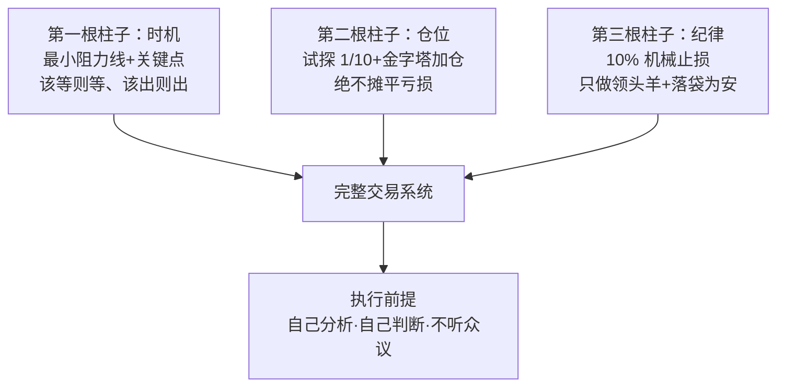

# 《股票大作手操盘术》深度解读（详细版）

> **书名**：股票大作手操盘术（How to Trade in Stocks）
> **作者**：杰西·利弗莫尔（Jesse Livermore）
> **译者**：丁圣元
> **定位**：利弗莫尔亲笔撰写的交易操作规程
> **类型**：#投资 #投机 #趋势交易 #关键点 #时间要素 #详细版

---

## 📌 一句话总结

投机是一门严肃的生意，核心不是预测，而是把时间要素与价格运动结合起来，只在关键点采取行动，让利润奔跑、及时止损，并靠亲手维护的行情记录建立自己的判断准则。

---

## 👤 作者与本书简介

杰西·利弗莫尔，华尔街传奇投机客，14岁进入金融市场，终生从事投资与交易，一生经历四次大起大落。与《股票作手回忆录》不同——那是埃德温·拉斐尔以利弗莫尔为原型写成的传记小说——《股票大作手操盘术》是利弗莫尔亲笔撰写的操作手册，主要不讲故事，而是介绍他的交易规则与真实操作案例。

**本书的三个独特价值**：
- 这是利弗莫尔对自己交易体系的直接总结，而非他人转述
- 规则围绕"趋势识别与界定"展开，具有典型性、简明性和完备性
- 丁圣元译本把利弗莫尔当年的数据流水还原成图表，并逐条注释，便于现代读者对照

**核心心法**：
> "我们只不过是借助现代化工具来表现古老的人性，虽然工具变了，但人性不变，市场也不变。"

---

## 📑 全书结构（十章）

| 编号 | 章节 | 主题 | 核心内容 | 重要程度 |
|------|------|------|----------|----------|
| 01 | 译者前言 | 操作规程的价值 | 行动第一、人性不变、市场不变 | ⭐⭐⭐ |
| 02 | 投机是一项挑战 | 投机是严肃的生意 | 时间要素、等待验证、止损 | ⭐⭐⭐⭐⭐ |
| 03 | 凭规则抉择交易时机 | 该等则等、该出则出 | 正常回撤、危险信号 | ⭐⭐⭐⭐⭐ |
| 04 | 追随领头羊 | 集中力量，不四处出击 | 领头羊、股票群体、市场潮流 | ⭐⭐⭐⭐ |
| 05 | 到手的钱财 | 资金管理的纪律 | 不摊低亏损、盈利提现 | ⭐⭐⭐⭐⭐ |
| 06 | 关键点 | 行情启动的心理时刻 | 关键点突破、快速运动 | ⭐⭐⭐⭐⭐ |
| 07 | 百万美元的大错 | 耐心、纪律与内幕消息 | 分批建仓、棉花教训 | ⭐⭐⭐⭐⭐ |
| 08 | 300万美元的盈利 | 一个完整的成功案例 | 小麦黑麦、联动验证 | ⭐⭐⭐⭐ |
| 09 | 利弗莫尔市场分析法 | 六栏记录法 | 6点转向、组合价格 | ⭐⭐⭐⭐⭐ |
| 10 | 利弗莫尔操盘规则 | 完整规则清单 | 墨水规则、3点突破、关键点信号 | ⭐⭐⭐⭐⭐ |

---

## 第一章：译者前言 — 操作规程的启示

### 为什么需要操作规程

**核心命题**：
> "一个人干蠢事，原因通常不在于智力不足，而是因为利益攸关。"

**解读**：
- 思想是自由的，行为却是路径依赖的；想归想、做归做，行为往往跟不上思想
- 金融市场纯粹逐"利"，理性常被"利"牵引和蒙蔽，因此必须依赖操作规程
- 技术分析本质上是千千万万交易前辈经验总结出来的"操作规程"

### 利弗莫尔规则的价值

**核心命题**：
> "万变不离其宗，核心问题依然围绕趋势展开，即如何根据当前行情判断其属于什么趋势，进而采取什么样的行动：做多、做空还是等待？"

**解读**：
- 利弗莫尔规则具有典型性、简明性、完备性，可操作性强
- 它把新到来的行情数据立即甄别到对应的趋势门类，同时忽略没有趋势信息的数据
- 操作规则中大部分内容有科学合理的依据，但更多是经验总结
- 投资交易最重要的是在合适时机采取合适行动——行动第一，原因和道理第二

**核心金句**：
> "我们只不过是借助现代化工具来表现古老的人性，虽然工具变了，但人性不变，市场也不变。"

---

## 第二章：投机是一项挑战 — 把投机当作严肃的生意

### 谁不适合投机

**核心命题**：
> "投机，是天下彻头彻尾最富魔力的行当。但是，这行当愚蠢的人不能干，懒得动脑子的人不能干，心理不健全的人不能干，企图一夜暴富的冒险家不能干。"

**解读**：
- 投机不是赌博，而是"预期即将到来的市场运动"
- 想既快又不费事地从市场挣钱，等于问律师或外科医生"怎么快快挣钱"
- 成功果实与亲自努力的诚心成正比，做行情记录不能假手他人

### 意见与市场

**核心命题**：
> "意见千错万错，市场永远不错。"

**解读**：
- 判断正确但入市过早，照样赔钱；市场不会立即验证你的看法
- 要等待市场变化本身验证观点后再"签字画押"

**25→30→50的例子**：
- 股价25元、你认为会涨到50元，不要立即买
- 等它创新高到30元，说明上涨行动已经开始，才是"签字画押"的时机
- 提前买入往往在行情发动前就被磨出局，反而错过后面的主升

**关键金句**：
> "真正从投机交易中得来的利润，都来自那些从头开始就一直盈利的头寸。"

### 希望与恐惧

**核心命题**：
> "利润总能自己照顾自己，而亏损永远不会自动了结。"

**解读**：
- 买在30元，涨到32元就害怕回吐而卖出，是把希望和恐惧用反了
- 买在30元，跌到28元不止损，幻想第二天回升，是亏损扩大的根源
- 该害怕时抱有希望，该希望时充满恐惧，是投机者的头号敌人

### 若干"不要"

- 绝不要因为价格"看起来太高"而卖出
- 绝不要因为从最高点大幅下跌而买进
- 绝不在市场向下回撤时买进做多，绝不在向上反扑时卖出做空
- 头笔交易亏损，绝不继续跟进，绝不摊低亏损头寸

### 投机与投资的区分

**铁路股的教训**：
- 1902年纽约、纽黑文和哈特福德铁路255美元，被看作比存款还安全
- 1940年只值0.50美元；大北方铁路从348美元跌到26.62美元
- 所谓"价值型股票"可能变成投机型股票甚至不复存在
- 投机者也会赔钱，但"撒手不管的投资者"才是大赌徒

---

## 第三章：凭规则抉择交易时机 — 该等则等、该出则出

### 正常回撤与危险信号

**核心命题**：
> "永远不要害怕这种正常动作；然而，一定要十分害怕不正常的动作。"

**正常动作的样子**：
- 行情启动初期：价格渐涨、成交量巨大
- 随后出现"正常回撤"：回落时成交量远小于上涨时
- 一两天后重新上涨、收复失地、创新高，途中仅含小规模日内回调
- 同一轮趋势中，正常回撤大致落在同一组直线上

**危险信号的样子**：
- 在创新高的交易日尾盘突然下探7-8点
- 第二天不能恢复上升势头
- 同一日内先创新高、再回落6点以上——这是从未出现过的"不正常动作"

**应对**：
> "当看到市场向我发出危险信号时，我从不和它执拗。我离开！……等它过去了，只要我愿意，什么时候再回到轨道上都行。"

### 一年只有几次机会

**核心命题**：
> "假如你不放过每一个交易日，天天投机，就不可能成功；每年仅有寥寥可数的几次机会，可能只有四五次。"

**解读**：
- 大行情需要时间酝酿，真正的行情不会一天走完
- 大多数投机者被日内小波动缠住，错过了主要规模的运动
- 你袖手旁观时，那些天天交易的人在为你的下一次机会铺路

### 山里的投机家

**故事**：一位住在加利福尼亚山区的投机家，行情延迟三天，每年只下山两三次，却持续赚大钱。

**启示**：
- 远离噪声，才能看清真正的行情
- 货真价实的行情需要时间完成，别在细枝末节里迷失
- 记录已经发生的事情，直到它不能验证先前的形态时再行动

---

## 第四章：追随领头羊 — 集中力量，不四处出击

### 不要和市场讨价还价

**核心命题**：
> "不要和市场讨价还价，最重要的是，绝不可斗胆与之对抗。"

### 不要摊子铺得太大

**错误案例**：
- 铜业、汽车股见顶后，利弗莫尔过早认定整个市场都可以做空
- 在公用事业股上抢顶，亏损超过前两组股票的盈利
- 教训：一个股票群的信号不能代替所有股票群的信号，要等后者自己发出信号

**核心命题**：
> "耐心，等待。迟早，你也会在其他股票群体上得到与第一个股票群体同样的提示信号的。"

### 集中研究领头羊

**核心命题**：
> "如果你不能从领头的活跃股票上赢得利润，也就不能在整个股票市场赢得利润。"

**解读**：
- 只分析少数几个股票群体，从其中选领头羊
- 领头羊会随时代更换：铁路、糖业、烟草→钢铁→汽车、航空、邮购
- 今天的领头羊未必是两年后的领头羊

---

## 第五章：到手的钱财 — 资金管理的纪律

### 绝不要摊低亏损

**核心命题**：
> "我还是要强烈地建议你不要采取摊低成本的做法。"

**数字推演**：
- 50美元买100股，跌到47美元再买100股摊低成本
- 如果一路跌到44、41、38美元继续加倍，最后是灾难
- 摊低成本本质是把"好钱"追加到"坏钱"里

**追加保证金通知**：
> "从经纪商那里，我从来只得到过一种铁定无疑的'内幕'消息，那便是追加保证金的通知。当这样的通知到达时，应立即平仓。"

### 资金要分散，盈利要提现

**核心命题**：
> "投机者唯一能从华尔街赚到的钱，就是当投机者了结了一笔成功的交易后从账户里提出来的现金。"

**棕榈海滩的故事**：
- 市场暴跌兑现卖空利润后，他发电报让经纪商往银行户头支付100万美元
- 干了20年的电报员第一次见到这种电报，因为绝大多数人只收到追加保证金通知

**习惯做法**：
- 每次了结成功交易后提取部分现金（惯常20-30万美元）
- 资本翻倍时，立即提出一半利润作为储备
- 钱只有真正拿在手里，才有意义，才能抑制随意下注的冲动

### 投机是门生意

**核心命题**：
> "投机本身就是一门生意，所有人都应当把它当生意看待，专心致志。"

**解读**：
- 商人不会指望头一年获利25%以上，投机者却想要100%
- 经纪商靠佣金生存，过度交易是被鼓励的陷阱
- 利弗莫尔在华尔街之外的投资（地产、油井、飞机）几乎全赔
- "永远别做任何交易，除非你确知这样做在财务上是安全的。"

---

## 第六章：关键点 — 等待行情启动的心理时刻

### 什么是关键点

**核心命题**：
> "不论何时，只要耐心等待市场到达我所说的'关键点'之后才动手，我的交易就总能获利。"

**解读**：
- 关键点是标志行情启动的关键心理时刻
- 在关键点建仓，头寸从头开始就盈利，之后的回调都靠利润储备扛过去
- "罗马不是一天建成的"；一轮行情的大部分运动发生在最后48小时，必须身在场内

### 关键点突破的威力

**森蚺公司案例**：
- 突破100美元买入4000股，当天续涨10点，最终超过150美元
- 突破200美元故伎重演
- 突破300美元后没有出现应有的快速上涨，反而供给充足——危险信号，卖出8000股
- 数天后股价跌到225美元

**伯利恒钢铁案例（1915年）**：
- 4月7日创纪录87¾美元，预计突破100美元
- 4月8日在99-99¾美元逐步买入，当天涨到117美元
- 5天后的4月13日到达155美元
- 此后200、300、400美元照此法操作

**可可案例（1936-1937年）**：
- 12月可可合约突破前两年高点6.88美元（关键点）
- 5个月内从6.88涨到12.86美元，上涨600点，中途几乎没有像样回调
- 原因：可可供给严重短缺

**核心规则**：
> "如果该股票在穿越关键点之后没有按照应有的模式运行，就是一个必须密切注意的危险信号。"

**其他要点**：
- 用"上升趋势/下降趋势"代替"牛市/熊市"，便于接受趋势逆转
- 新股上市两三年形成的历史高/低点，也是关键点
- 关键点必须亲手研究、亲手记录；独立判断带来的利润最有成就感
- 小道消息不可靠：晚会上给女士的股票建议一周涨15点，她却因为想验证消息真伪而没有买入

---

## 第七章：百万美元的大错 — 耐心、纪律与内幕消息

### 分批建仓原则

**核心命题**：
> "后续买进的每一笔必然处在比前一笔更高的价位上。"

**解读**：
- 买500股分5笔，每笔100股，市场上涨才加仓
- 卖空同理：除非在更低价卖出，否则不再卖出下一笔
- 这样做的结果是所有交易自始至终盈利，账面利润就是正确的证据
- 先估计行情潜力，再确定入市价位，再决定愿意承担的风险

### 棉花的百万美元教训

**故事**：
- 利弗莫尔对棉花强烈看涨，但市场时机未到
- 2万包×5次进场，每次亏2.5-3万美元，共亏约20万美元
- 他愤怒地撤掉棉花行情报价机；两天后市场启动，涨了500点
- 原计划在12½美分关键点后分批买10万包，可赚200点，约100万美元

**两大原因**：
1. 没有耐心等待价格行情的心理时刻
2. 判断失误后动怒，情绪和稳健的投机守则不相宜

**核心金句**：
> "犯了错误不要找借口。"

### 内心的秘密警告

**解读**：
- 有时市场看起来一切正常，收市后却心绪不宁、夜里辗转反侧
- 次日市场往往风云突变
- 这是长期研究市场形成的特殊敏感，是"交易准则的先遣部队"

### 提防内幕消息

**核心命题**：
> "提防内幕消息……一切内幕消息概不例外。"

**解读**：
- 公司内部的朋友只会告诉你何时买进，不会告诉你何时卖出
- 当他告诉你"生意不错"时，往往已经开始出货
- 内幕消息是让别人替你抬轿子的工具

---

## 第八章：300万美元的盈利 — 一个完整的成功案例

### 小麦的关键点建仓（1924年）

**操作步骤**：
1. 小麦到达关键点，第一笔买500万蒲式耳，市场牛皮数日但不破关键点
2. 突破下一个关键点，再买500万蒲式耳；比第一笔更难买，说明市场转强
3. 次日上涨3美分，符合预期，行情展开

**过早兑现的错误**：
- 每蒲式耳赚25美分就清仓，市场随后又涨20多美分
- 教训："为什么我要害怕失去那些自己从来没有真正拥有过的东西呢？"
- 再入市时只敢买回一半仓位

### 黑麦与小麦的联动验证

**背景**：有人用黑麦市场支撑小麦市场；整个牛市中黑麦总是领先小麦。

**异常信号**：
- 小麦回落28⅜美分后收复绝大部分跌幅，黑麦却只收复一部分，落后12美分
- 黑麦没能领导行情，说明支撑者要么离场、要么无力加码

**试探性卖单**：
- 连续三次卖出20万蒲式耳黑麦
- 前两次卖单完成后价格回升，第三次不再回升
- 判断支撑消失，立即卖出500万蒲式耳小麦
- 最终净盈利300万美元以上

**核心启示**：
- 市场会通过"不按应有模式运行"发出警告
- 观察联动品种可以验证主仓位的真伪
- 卖空机制让空头在恐慌时变成主动买入者，反而稳定市场
- "未来属于那些聪明、信息灵通、耐心的投机者。"

---

## 第九章：利弗莫尔市场分析法 — 用六栏记录行情

### 六栏记录法

**六个栏目**：

| 左二列 | 中间两列 | 右二列 |
|--------|----------|--------|
| 次级回升 | 上升趋势 | 自然回撤 |
| 自然回升 | 下降趋势 | 次级回撤 |

**墨水规则**：
- 上升趋势栏用黑墨水
- 下降趋势栏用红墨水
- 其余各栏用铅笔

**解读**：
- 颜色让趋势一目了然；铅笔代表"只是自然振荡"
- 记录的目的一开始不是捕捉日内小波动，而是预告重大运动
- 抹去微小波动，只看趋势、自然回撤/回升、次级波动

### 6点转向与组合价格

**核心规则**：
> "在某只股票价格达到30美元或更高的情况下，仅当市场从极端点开始回升或回落了大致6点的幅度之后，才能表明市场正在形成自然的回升过程或自然的回撤过程。"

**组合价格**：
- 用同一股票群中两只股票构成"组合价格"
- 单只股票可能有假信号；两只股票合计运动12点（平均6点）才可信
- 美国钢铁5⅛点 + 伯利恒钢铁7点 = 12点以上，仍可入栏

### 市场表现是唯一理由

**钢铁类股票案例（1939年）**：
- 欧战爆发后市场回撤，四个显要股票群全部收复失地并创新高，唯独钢铁类没有
- 当时没人知道原因；4个月后才公开：英国政府卖了10万股美国钢铁，加拿大政府卖了2万股
- 此时美国钢铁已比高点低26点
- 教训：等找到"好理由"再行动，机会早就没了

**核心金句**：
> "无论何时，只要市场的动作不对头，或者没有按照应有的方式动作——这就是充分的理由，足以让你改变自己的意见，而且要立即改变。"

---

## 第十章：利弗莫尔操盘规则 — 完整规则清单与解读

### 规则1-3：记录的颜色

- 规则1：上升趋势栏用黑墨水
- 规则2：下降趋势栏用红墨水
- 规则3：其余栏用铅笔

**解读**：目的是及时识别主要趋势；铅笔记录带有"临时处置"意味。

### 规则4：6点转向与关键点标记

- 规则4（a）：从上升趋势栏转入自然回撤栏时，第一天在上升趋势栏最后一个数据下标两条红线
- 规则4（b）：从自然回撤栏转入自然回升/上升趋势栏时，在自然回撤栏最后一个数据下标两条红线
- 规则4（c）：从下降趋势栏转入自然回升栏时，在下降趋势栏最后一个数据下标两条黑线
- 规则4（d）：从自然回升栏转入自然回撤/下降趋势栏时，在自然回升栏最后一个数字下标两条黑线

**解读**：
- 两条线标出的就是关键点：上升趋势前期最高点、自然回撤阶段最低点、下降趋势前期最低点、自然回升阶段最高点
- 两个关键点共同构成调整阶段的价格区间

### 规则5：3点突破

- 规则5（a）：自然回升栏中，价格比黑线标记的最后一个价格高3点或更多，用黑墨水记入上升趋势栏
- 规则5（b）：自然回撤栏中，价格比红线标记的最后一个价格低3点或更多，用红墨水记入下降趋势栏

**解读**：3点突破是"趋势真正逆转"的确认规则。

### 规则6：持续记录细则

- 6（a）：上升趋势中回撤约6点→转入自然回撤栏；持续创新低就继续记录
- 6（b）：自然回升中回落约6点→转入自然回撤栏
- 6（c）：下降趋势中回升约6点→转入自然回升栏
- 6（d）：自然回撤中回升约6点→转入自然回升栏
- 6（e）：自然回撤创新低跌破下降趋势栏最低点→记入下降趋势栏
- 6（f）：自然回升创新高突破上升趋势栏最高点→记入上升趋势栏
- 6（g）：自然回撤后回升6点但未突破自然回升高点→记入次级回升栏
- 6（h）：自然回升后回落6点但未跌破自然回撤低点→记入次级回撤栏

**解读**：次级回升/次级回撤处理的是横盘区间内的多次往返。

### 规则7-10：组合价格与关键点信号

- 规则7：组合价格以12点为基础，单只股票以6点为准
- 规则8：一旦开始记录自然回升/回撤，此前趋势栏最后价格立即成为关键点
- 规则9：关键点附近就是关注买进/卖出信号的时机（黑线、红线方向相反）
- 规则10（a）：趋势恢复时，应突破先前的关键点（单股3点、组合6点）
- 规则10（b）：上升趋势未能恢复，回落跌破关键点3点以上→上升趋势可能结束
- 规则10（c/d）：下降趋势的对应判断
- 规则10（e）：回升在关键点下方中止并回落3点以上→危险信号
- 规则10（f）：回落在关键点上方中止并回升3点以上→危险信号

**整体解读**：
> 整套规则本质上是一台"趋势状态机"：六栏代表六种市场状态，6点转向负责切换状态，3点突破负责确认趋势逆转，两条线标记关键点，规则10负责在关键点附近生成买卖信号。它不预测，只跟随；不捕捉微小波动，只捕捉重大运动。

---

## 💎 全书核心金句精选（详细版）

### 投机与纪律金句
1. > "投机，是天下彻头彻尾最富魔力的行当。但是，这行当愚蠢的人不能干，懒得动脑子的人不能干，心理不健全的人不能干，企图一夜暴富的冒险家不能干。"
2. > "意见千错万错，市场永远不错。"
3. > "真正从投机交易中得来的利润，都来自那些从头开始就一直盈利的头寸。"
4. > "永远别做任何交易，除非你确知这样做在财务上是安全的。"

### 时机与趋势金句
5. > "我的经验始终如一地表明，如果没有在行情开始后不久便入市，我就从来不会从这轮行情中获得太大的收益。"
6. > "在一轮行情中，大部分市场运动发生在整个过程的最后48小时之内。"
7. > "不要和市场讨价还价，最重要的是，绝不可斗胆与之对抗。"
8. > "如果你不能从领头的活跃股票上赢得利润，也就不能在整个股票市场赢得利润。"

### 风险与资金金句
9. > "利润总能自己照顾自己，而亏损永远不会自动了结。"
10. > "我还是要强烈地建议你不要采取摊低成本的做法。"
11. > "投机者唯一能从华尔街赚到的钱，就是当投机者了结了一笔成功的交易后从账户里提出来的现金。"
12. > "投机本身就是一门生意，所有人都应当把它当生意看待，专心致志。"

### 内幕与自我金句
13. > "提防内幕消息……一切内幕消息概不例外。"
14. > "犯了错误不要找借口。"
15. > "当看到市场向我发出危险信号时，我从不和它执拗。我离开！"
16. > "即使钱从天上掉下来，也不会有人愣要把它塞进你的口袋。"

---

## 📊 全书知识体系图（详细版）

```
┌─────────────────────────────────────────────────────────────┐
│                    股票大作手操盘术知识体系                    │
├─────────────────────────────────────────────────────────────┤
│                                                             │
│  ┌─────────────┐  ┌─────────────┐  ┌─────────────┐          │
│  │   市场认知   │  │   交易系统   │  │   资金管理   │          │
│  │             │  │             │  │             │          │
│  │ • 趋势识别  │  │ • 关键点    │  │ • 不摊亏损  │          │
│  │ • 时间要素  │  │ • 6点转向  │  │ • 盈利提现  │          │
│  │ • 领头羊   │  │ • 3点突破  │  │ • 分散风险  │          │
│  │ • 联动验证  │  │ • 危险信号  │  │ • 避免过度交易│          │
│  └─────────────┘  └─────────────┘  └─────────────┘          │
│                                                             │
│  ┌─────────────┐  ┌─────────────┐  ┌─────────────┐          │
│  │   心理纪律   │  │   记录方法   │  │   行动原则   │          │
│  │             │  │             │  │             │          │
│  │ • 耐心等待  │  │ • 六栏记录  │  │ • 市场验证  │          │
│  │ • 独立思考  │  │ • 黑红铅笔  │  │ • 分批建仓  │          │
│  │ • 不信内幕  │  │ • 组合价格  │  │ • 该出就出  │          │
│  │ • 情绪管理  │  │ • 亲手维护  │  │ • 顺势而为  │          │
│  └─────────────┘  └─────────────┘  └─────────────┘          │
│                                                             │
└─────────────────────────────────────────────────────────────┘
```

---

## 🎯 实战应用框架（详细版）

```
┌─────────────────────────────────────────────────────────────┐
│                    利弗莫尔操盘决策框架                        │
├─────────────────────────────────────────────────────────────┤
│                                                             │
│  第一层：识别状态                                             │
│  └─ 当前属于六栏中的哪种状态？                                │
│     • 上升/下降趋势、自然回升/回撤、次级回升/回撤             │
│                                                             │
│  第二层：标记关键点                                           │
│  └─ 前期极端价在哪里？                                       │
│     • 趋势栏最后数据下画两条线                                │
│     • 关键点附近必须高度警惕                                  │
│                                                             │
│  第三层：等待转向                                             │
│  └─ 6点转向规则是否触发？                                    │
│     • 未触发：原状态继续                                      │
│     • 触发：切换到对应栏目                                    │
│                                                             │
│  第四层：确认逆转                                             │
│  └─ 3点突破规则是否触发？                                    │
│     • 突破关键点3点以上：趋势逆转                             │
│     • 未突破并反向3点：危险信号                               │
│                                                             │
│  第五层：决定入市                                             │
│  └─ 是否到了关键心理时刻？                                   │
│     • 只在市场验证后行动                                      │
│     • 第一笔头寸应从头开始盈利                                │
│                                                             │
│  第六层：加仓与持有                                           │
│  └─ 如何扩大头寸？                                           │
│     • 做多只在更高价位加仓                                    │
│     • 让利润奔跑，持有到最后48小时                            │
│                                                             │
│  第七层：离场信号                                             │
│  └─ 危险信号出现了吗？                                       │
│     • 不正常动作立即离场                                      │
│     • 突破关键点后缺乏后续活力：了结                         │
│                                                             │
│  第八层：资金与心理                                           │
│  └─ 账户和心态安全吗？                                      │
│     • 绝不摊低亏损，盈利取现                                  │
│     • 不信内幕，不急于求成，一年只做四五次                    │
│                                                             │
└─────────────────────────────────────────────────────────────┘
```

---

## 📖 阅读建议（详细版）

### 第一遍：快速通读（1-2天）
- 目标：建立全书框架
- 方法：快速浏览，不纠结规则细节
- 重点：看章节表格、金句和两个案例（棉花大错、小麦盈利）

### 第二遍：逐章精读（1-2周）
- 目标：理解每一套规则
- 方法：对照第十章规则清单，重读第二、六、九章
- 重点：关键点、6点转向、3点突破、危险信号

### 第三遍：结合实战（持续）
- 目标：把规则变成自己的操作规程
- 方法：亲手维护行情记录，用真实行情验证规则
- 重点：分批建仓、止损纪律、盈利提现、情绪管理

### 重点章节详解
- **第二章 投机是一项挑战**：投机是门生意，耐心等待市场验证
- **第三章 凭规则抉择交易时机**：正常回撤与危险信号的区别
- **第五章 到手的钱财**：资金管理是生存底线
- **第六章 关键点**：关键点是行情启动的心理时刻
- **第七章 百万美元的大错**：没有耐心的代价
- **第九章 利弗莫尔市场分析法**：六栏记录法的原理
- **第十章 利弗莫尔操盘规则**：完整规则的可操作版本

---

## 🔗 关联笔记

- [[01《股票作手回忆录》读书笔记|《股票作手回忆录》读书笔记]] — 利弗莫尔的人生故事与交易哲学
- [[《龙头、价值与赛道》深度解读（详细版）]] — 价值、赛道与龙头交易框架
- [[《股市极客思考录》读书笔记]] — 龙头战法中的趋势与先手逻辑
- [[#🎯 实战应用框架（详细版）|投资框架总结]]
- [[#希望与恐惧|交易心理的现代诠释]]

### 延伸阅读

| 编号 | 书名 | 作者 | 关键词 |
|------|------|------|--------|
| 1 | 《股票作手回忆录》 | 埃德温·拉斐尔 | 交易心理、人生经历 |
| 2 | 《利弗莫尔的股票交易方法量价分析》 | 利弗莫尔研究 | 量价分析、趋势 |
| 3 | 《股市极客思考录》 | 彭道富 | 龙头股、交易体系 |
| 4 | 《十年一梦》 | 青泽 | 操盘手自白 |
| 5 | 《交易心理分析》 | 马克·道格拉斯 | 概率思维、心理纪律 |

---

## 📝 学习笔记

### 我的理解
（在这里记录你对利弗莫尔规则的理解和感悟）

### 实战案例
（在这里记录你应用关键点、6点转向、3点突破的实战案例）

### 问题与思考
（在这里记录你的问题和思考）

---

*笔记整理时间：2026-08-01*
*笔记版本：v1.0（对齐《龙头、价值与赛道》深度解读详细版格式）*

---

## 附录 赌徒的说明书：一个自杀者的交易系统为何 80 年后仍在被使用

### 写在前面：故事讲完了，该讲方法了

上一篇（01 号附录）我们拆了利弗莫尔的一生——对赌行少年、1907 年做空之王、1929 年赚 1 亿美元、1940 年自杀。

但有一个问题被故事掩盖了：**他到底是怎么做的？**他说的"关键点"到底是什么？"最小阻力线"怎么画？仓位怎么管理？止损怎么设？

答案全在这一本书里：《股票大作手操盘术》——利弗莫尔 1940 年出版的操作手册，**也是他自杀那年出版的遗作。**

这本书很薄，没有一句废话，像一份写给自己的作战条例。80 多年后的今天，它依然是趋势交易者的《圣经》——**因为书里的方法，是利弗莫尔用四次破产和 1 亿美元利润反复打磨出来的。**

如果说《回忆录》是利弗莫尔的自传，《操盘术》就是他的"源代码"。

### 第一幕：1940 年——一本注定成为遗作的书

先讲一个让人心酸的事实：这本书出版于 1940 年 3 月，而利弗莫尔在同年 11 月 28 日自杀。

也就是说，**他写完这本书，只活了八个月。**

写这本书时，利弗莫尔已经第四次破产，穷困潦倒，靠朋友的接济过日子。但他没有写回忆录式的忏悔——他写的是操作手册：冷静、精确、不带感情。

**这恰恰是这本书最珍贵的地方**：一个输光了一切的人，把自己 40 年投机生涯里最可靠的方法，一笔一笔写了下来。他知道自己可能再也用不上了，但他希望别人用得上。

这本书开篇第一句话就是：

> "投机是一项挑战。投机者必须自己分析、自己判断，不能听信别人的建议。"

——一个因为听信"棉花大王"而破产的人，把这句话写在遗作的第一页。

### 第二幕：投机不是赌博——第一性原理

利弗莫尔在书里反复强调一个区分：

| 维度 | 赌博 | 投机 |
|------|------|------|
| 依据 | 运气/消息/情绪 | 计划/规则/趋势 |
| 仓位 | 随意/摊平 | 试探/金字塔 |
| 止损 | 死扛/幻想 | 机械执行 |
| 心态 | 想赢怕输 | 错了就认 |
| 结局 | 必输 | 可以赢 |

> "投机是一项严肃的事业，而不是一场赌博。"

**为什么 90% 的股市参与者长期亏损？利弗莫尔的答案：他们把投机当成了赌博。**——凭消息买入，凭感觉持有，凭幻想止损。而真正的投机者，先有规则，后有交易。

**注意这个反直觉的结论**：利弗莫尔一生被骂作"大赌徒"，但他一生反对的恰恰是赌博。**他下注之前，先建立了规则。**

### 第三幕：入场时机——最小阻力线与关键点

利弗莫尔方法论的核心，是回答一个问题：**什么时候买入？**

他的答案：**等关键点。**

| 概念 | 定义 | 操作 |
|------|------|------|
| 最小阻力线 | 股价沿阻力最小的方向运动 | 只做顺势 |
| 关键点（Pivotal Point） | 趋势启动或转折的临界价位 | 突破买入/跌破卖出 |
| 横盘突破 | 长期整理后向上突破 | 最佳买点 |
| 新高突破 | 股价创出新高 | 强势确认 |

他的原话大意是：

> "股价就像流水，永远沿阻力最小的方向流动。你要做的不是预测方向，而是**等它突破关键点时，站到趋势那一侧。**"

**书里著名的"等"的哲学**：

> "多年的经验告诉我，**耐心等待关键点的出现，比任何分析都重要。**赚大钱的时机，不是每天都有——大部分时间你应该什么都不做。"

**（这和林奇"满仓等待"形成鲜明对照：林奇永远在场，利弗莫尔大部分时间空仓等待——但两人都把"等待"放在核心位置。）**

### 第四幕：仓位管理——试探与金字塔

关键点出现了，怎么买？利弗莫尔的答案：**先试探，再金字塔。**

| 步骤 | 操作 | 仓位 | 逻辑 |
|------|------|------|------|
| 1. 试探仓 | 突破关键点买入 | 计划仓位的 1/10 | 用小钱验证判断 |
| 2. 确认 | 股价继续上涨 | — | 市场验证了你的判断 |
| 3. 金字塔加仓 | 每次上涨后加仓 | 逐步增加 | 盈利的仓位上重注 |
| 4. 停止 | 股价滞涨/跌破关键点 | — | 停止加仓，准备离场 |

**金字塔加仓的铁律**：

> "只在盈利的仓位上加仓，绝不向亏损的仓位摊平。"

**为什么绝不摊平？**因为摊平=用真金白银证明自己错了还加码。利弗莫尔说：

> "向下摊平的结果，是让你在错误的方向上越陷越深。**真正的投机者，亏损的仓位要尽快了结，盈利的仓位要拿住。**"

**（这句话后来被无数人改写——"截断亏损，让利润奔跑"——源头就在这里。）**

### 第五幕：止损的悖论——10% 的铁律

这是《操盘术》里最具体、也最容易被误解的一条规则：

> "如果一只股票的股价从你的买入价下跌超过 10%，**立即卖出，不要犹豫，不要找理由。**"

10% 止损，机械执行，没有任何例外。

**请注意这个与 32 号林奇的正面冲突**：

| 大师 | 对止损的态度 | 理由 |
|------|-------------|------|
| 利弗莫尔（02） | **10% 机械止损** | 保护本金，错了就认 |
| 林奇（32） | **厌恶止损** | 止损=把账面亏损变现实亏损，会错过 10 倍股 |

谁对？

**都对——因为他们交易的东西不同。**林奇买的是"公司"（基本面研究透，下跌是机会）；利弗莫尔买的是"趋势"（关键点突破，跌破关键点=趋势判断错误）。**趋势交易者的止损，是判断错误的承认；价值投资者的持有，是基本面信念的坚持。**

**同一个市场，两种玩法，两种纪律。**这也是系列读到现在的核心收获：**先搞清楚自己在玩哪种游戏，再谈纪律。**

### 第六幕：只做领头羊——龙头战法的源头

《操盘术》里有一条规则，今天看起来格外有预见性：

> "只追随领头羊。**集中注意力研究当日行情中表现最突出的那些股票——如果你不能从领头的活跃股票上赚到钱，你也就不能从整个股票市场赚到钱。**"

利弗莫尔的原话大意是：

> "同时有三只汽车股，只买最强的那只。**市场的钱，只流向领头羊。**"

| 层级 | 股票 | 利弗莫尔的态度 |
|------|------|--------------|
| 领头羊 | 最强板块的最强股 | **只买这个** |
| 追随者 | 同板块的跟风股 | 不碰 |
| 落后者 | 补涨的弱势股 | 坚决不碰 |

**"买弱势股等补涨"是散户最大的错误之一**——利弗莫尔说，弱势股补涨的幅度，永远追不上领头羊，而且一旦下跌，弱势股跌得最惨。

**这条规则，就是今天 A 股"龙头战法"的祖师爷**——系列里《股市极客思考录》《龙头、价值与赛道》的全部思想，源头都可以追溯到这一章。

> "如果你不能从领头的活跃股票上赚到钱，你也就不能从整个股票市场赚到钱。"

### 第七幕：到手的钱财——利润管理的艺术

会买是徒弟，会卖是师傅。利弗莫尔对"卖"有三条规则：

| 规则 | 内容 |
|------|------|
| 落袋为安 | 账面利润不是真钱，兑现了才是 |
| 逐步减仓 | 上涨中分批卖出，而不是一次性清仓 |
| 跌破关键点卖出 | 上升趋势的关键点被跌破=离场信号 |

> "纸面上的利润，和口袋里的利润，完全是两回事。"

**这里又有一个深层智慧**：利弗莫尔不是"一把梭"的人——他的卖出是**渐进的**：股价上涨一段，卖掉一部分，锁定利润；剩下的仓位让利润奔跑，直到趋势结束。

**这与林奇的"稳定增长型涨 30—50% 轮换"、段永平的"卖飞了也不后悔"异曲同工——大师们卖出的共同点：不追求卖在最高点，只追求利润落袋。**

### 第八幕：利弗莫尔市场分析法——手工时代的量化

《操盘术》里最"技术"的一章，是利弗莫尔自创的**六栏行情记录法**：他每天手工记录六组数字（价格、成交量、时间、区间等），从中寻找趋势的蛛丝马迹。

| 记录内容 | 用途 |
|---------|------|
| 价格区间 | 判断波动幅度 |
| 成交量 | 判断突破的真假 |
| 时间跨度 | 判断整理的时长 |
| 突破方向 | 判断关键点是否有效 |

**用今天的眼光看，这就是手工版的技术分析系统**——利弗莫尔没有电脑，没有 K 线软件，他用自己的笔和纸，构建了最早的"量化趋势跟踪系统"。

**为什么这很重要？**因为它说明：**利弗莫尔的方法不是玄学，是系统。**他可以手写，你可以用软件——原理是一样的：记录、统计、识别模式、机械执行。

### 三根柱子：利弗莫尔操盘术的完整体系



| 柱子 | 核心规则 | 反面教训（利弗莫尔自己） |
|------|---------|------------------------|
| 时机 | 等关键点突破 | 1908 年提前做多棉花（未到关键点） |
| 仓位 | 试探+金字塔，不摊平 | 1908 年亏损加仓摊平 |
| 纪律 | 10% 止损+只做龙头 | 晚年违反一切纪律→第四次破产 |

### 尾声：为什么操盘术仍然有效，却没能救他

一个残酷的事实：**利弗莫尔写这本书时，已经用不上它了。**

他晚年的失败，不是方法失效，而是**不再执行自己的方法**——听内幕、重仓赌博、频繁交易、不设止损。他把《操盘术》里的每一条规则都违反了，然后破产，然后自杀。

所以这本书真正的价值，不在方法本身（方法已广为人知），而在**方法背后的自律精神**：

> **方法可以写在纸上，纪律只能长在心里。**

80 年后，这本书仍然是趋势交易者的教科书——因为市场会变，规则会变，但**人性的弱点不变**：贪婪、恐惧、侥幸、幻想。利弗莫尔在书里写的每一条规则，都是针对这些人性弱点的"疫苗"。

**读这本书的正确姿势**：不是学他买什么，而是学他**怎么约束自己**。他用自己的破产，给你标好了所有的坑。

> "投机是一项挑战。挑战的对象，不是市场，是你自己。"

---

*本篇为知乎文风深度拆解，与 01 号附录（一生战役）构成利弗莫尔"故事+方法"双子篇；与 31 号附录二十二（索罗斯）、32 号附录二十一（林奇）共同构成系列"大师三部曲"。*

