# 📈 利弗莫尔的股票交易方法量价分析 —— 逐章深度解读

> **作者**：理查德·D·威科夫（Richard D. Wyckoff）——量价分析创始人
> **译者**：肖凤娟（中央财经大学金融学院副教授）
> **来源**：威科夫对利弗莫尔的独家专访，原载于《华尔街杂志》，后归总整理成书
> **核心定位**：这不是一本理论教科书，而是一位量价分析创始人对华尔街最伟大操盘手的深度"解剖报告"

---

## 🎯 本书的独特价值

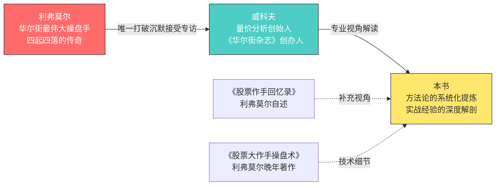

**为什么这本书不可替代？**
- 利弗莫尔一生保持缄默，从不公开自己的交易方法
- 威科夫是唯一让他打破沉默的人——因为威科夫的投资者教育工作打动了他
- 威科夫本身是技术分析大师，他用专业眼光"解剖"利弗莫尔的方法
- 这是第一手访谈记录，不是道听途说的二手资料

---

## 📖 全书结构与核心框架

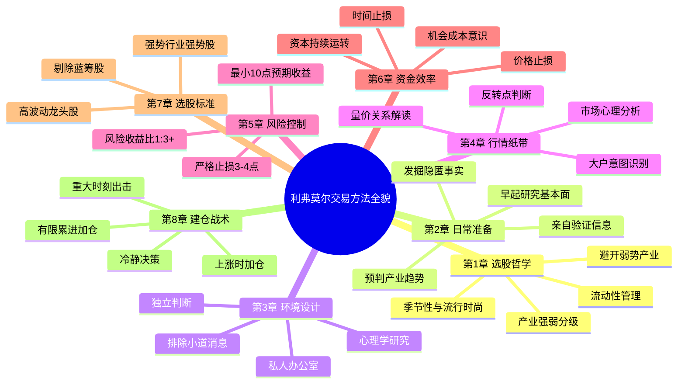

---

## 第1章 认识市场中最伟大的交易员

### 📌 核心故事：利弗莫尔为何打破沉默

利弗莫尔是华尔街最令人敬畏的人物——**摩根亲自恳求他放过股市，美国总统威尔逊召见他**。但他一生都保持着绝对的缄默，拒绝向任何人透露交易方法。

**打破沉默的原因：**
1. 威科夫长期从事投资者教育工作，揭示华尔街手段和方法
2. 利弗莫尔认为这有助于投资者"使用更加聪明的操盘方法"
3. 他不想误导"草率的、准备不足的投资者进入这个竞技场"
4. "在这里，只有优秀的学生才能幸存下来"

### 🔑 关键概念详解

#### 1. 产业强弱分级法

利弗莫尔的选股不是从个股开始，而是从**产业**开始。他将产业分为四个等级：

| 等级 | 产业状态 | 利弗莫尔的态度 |
|:---:|---------|--------------|
| 第一等 | 最强势产业 | **重仓出击**——挑选其中最好的公司 |
| 第二等 | 较强势产业 | 适度参与——条件是前景光明 |
| 第三等 | 相对弱势产业 | **完全避开**——不浪费时间和资金 |
| 第四等 | 十分疲软产业 | **坚决远离**——先行下跌，反弹困难 |

**关键洞察：**
> "在挑选股票的时候，对投资者而言，唯一必要的就是确定出哪些产业是最强势的，哪些产业较为强势，以及哪些产业相对弱势，哪些产业十分疲软，等等。"

#### 2. 低价股陷阱

这是利弗莫尔反复强调的警告：

| 低价股的表象 | 低价股的真相 |
|------------|------------|
| 价格便宜，看起来"便宜" | 价格并非便宜与否的指示器 |
| 可能从30涨到100 | 大多数会因破产而销声匿迹 |
| 似乎风险小 | 缺乏财务基础，下跌时先行崩溃 |
| 小资金也能买 | 反弹十分困难，容易被套 |

**利弗莫尔的原话：**
> "不分红的股票有投机价值，这造成它们的售价高出它们基于收益或者潜在分红所确定的价值。"

#### 3. 股票的季节性与流行时尚

这是一个被大多数投资者完全忽视的概念：

| 股票类别 | 旺季时间 | 利弗莫尔的建议 |
|---------|---------|--------------|
| 汽车股 | 春季、夏季 | 提前布局，不要在旺季过后还持有 |
| 轮胎股 | 春季、夏季 | 与汽车股联动 |
| 其他商品股 | 各有周期 | "任何东西都有自己的季节性" |

**关键原则：**
> "股票的旺季一般比与之相应商品的旺季稍微提前一点。"

**流行时尚的概念：**
- "一些股票的利好条件可能恰恰是其他股票的利空条件"
- 情况有变时，投资者不仅要跟上变化的脚步，还要能展望未来
- 预见之后六个月至一年的时间里，哪些改变将会发生

#### 4. 流动性管理——公众最大的失败原因

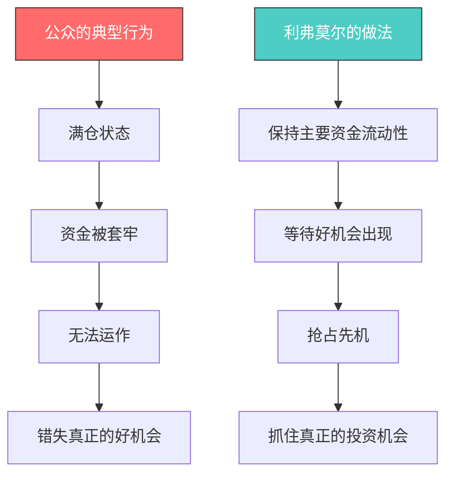

> "在股票市场中，也许下面的这个事实，是阻碍公众获得成功的最大原因——投资者无法使其投资与投机资金保持恰当的流动性。"

#### 5. 在股市中取得成功的唯一可靠方法

利弗莫尔给出了明确的答案：

> "任何人要想在投资上取得成功，唯一的方法就是在投资之前进行详细研究，在行动之前先调查，坚持基本原则，并忽略其他事情。"

**必备知识体系：**
- 经济学的基本知识
- 公司的财务状况
- 公司的历史
- 生产情况
- 所处行业的状况
- 经济的总体形势

### 💬 本章全部金句

> "股市中成功的关键在于知识和耐心。只有如此之少的人在股市中取得成功，是因为投资者们缺乏耐心，想快速变得富有。"

> "买进股票的唯一时机是你知道它们将会上涨。"

> "从行业前景的角度考虑投资，挑选最强势行业中的最强势公司，不要仅仅凭着希望去买进股票。"

> "好的股票迟早会大涨，等待是值得的，特别是在牛市中，就像现在这样的牛市。"

### 🎓 本章核心教训总结

| 教训 | 详细说明 |
|------|---------|
| **选股先选行业** | 不要从个股开始，先判断产业强弱，再从中挑选个股 |
| **低价≠便宜** | 缺乏财务基础的低价股在下跌中先行崩溃，反弹困难 |
| **股票有季节性** | 提前6个月预见行业变化，不要追涨已经过季的板块 |
| **资金流动性是生命线** | 满仓套牢是公众最大的失败原因 |
| **知识+耐心=成功** | 详细研究是唯一可靠的方法，耐心等待是必要的品质 |

---

## 第2章 利弗莫尔如何准备一天的工作

### 📌 核心故事：从5美元到100万再到破产再崛起

利弗莫尔从14岁开始交易，到1922年已有近30年经验。他的财富经历了惊人的起伏：

| 阶段 | 财富状态 | 关键转折 |
|:---:|---------|---------|
| 起点 | 5美元 | 14岁开始交易 |
| 第一次崛起 | 100万美元 | 积累巨额财富 |
| 第一次破产 | 负债100万+ | 方法只是"部分有效" |
| 再次崛起 | 重新积累财富 | 发现并克服弱点 |

**关键发现：** 问题不在于如何赚钱，而在于**如何保有财富**——这促使他从频繁交易转向相对不活跃的长期交易形式。

### 🔑 关键概念详解

#### 1. 清晨研究法——利弗莫尔的秘密武器

```mermaid
gantt
    title 利弗莫尔的清晨研究时间表
    dateFormat HH:mm
    axisFormat %H:%M
    section 休息
        晚10点就寝           :done, 22:00, 8h
    section 清晨研究
        早起（头脑如干净底片）  :active, 06:00, 2h
        阅读重要晨报          :crit, 06:00, 30min
        分析银行、对外贸易     :06:30, 30min
        研究货币、农作物收成   :07:00, 30min
        审阅公司报告和交易数据 :07:30, 30min
    section 开市准备
        形成当日市场观点       :08:00, 1h
        前往办公室            :09:00, 1h
    section 交易时间
        开市验证判断          :10:00, 5h
```

**为什么清晨研究如此重要？**

| 优势 | 详细说明 |
|------|---------|
| 头脑清醒 | "就像一张等待拍照的干净底片"，完全清除前一日的干扰 |
| 无干扰 | 办公室静悄悄，没有事情打断研究 |
| 固定间隔 | 每天研究时段间隔24小时，更易辨别变化趋势 |
| 视角新鲜 | 同样的消息以全新视角呈现 |

> "如果已经开市，股价不断地从行情收录器中蹦出，你再在阅读行情纸带的间歇中进行上述活动，结果就不会如此有效。"

#### 2. 发掘隐匿的事实

利弗莫尔的核心原则：**真正的新闻不在头版**

| 信息来源 | 利弗莫尔的关注点 |
|---------|----------------|
| 头版新闻 | 为公众准备的，往往不是最重要的 |
| 隐匿位置 | 重要的事实经常潜藏在各种隐匿的位置 |
| 行业文摘 | 钢铁、煤炭、纺织、铜冶炼、汽车、装备制造 |
| 商品市场 | 棉花、粮食、白糖等商品市场的消息 |
| 间接信息 | 这些消息会间接引导做出关于整体商业形势的正确判断 |

**利弗莫尔的工作习惯：**
> "如果不能在早晨或者日间发掘出这些内容，他会暂时打破早睡的惯例，一直工作到凌晨一两点。他一定要得到他想要的信息才肯罢休。"

#### 3. 亲自验证信息——不被人云亦云所干扰

> "利弗莫尔不会被这个人或者那个人关于某一行业当前形势的言论所干扰。他会观察并研究那些能够显示某一行业未来数月中可能出现情况的数据。"

**案例：钢铁产能数据**
- 新闻报道：钢铁公司利用了25%至30%的产能
- 利弗莫尔的实际数据：不到20%
- 信息来源：清晨从各种消息来源中提炼出来的

#### 4. 清晨研究的深层好处——变化趋势的识别

这是一个非常深刻的洞察：

> "每天的研究时段都恰好间隔24小时，这样更容易辨别向好或者向坏的变化趋势。"

**比喻：**
> "就像是观察一组照片，照片里是每隔一周拍摄的一座正在建设的大楼。人们能够观察到事情在朝一个方向还是另一个方向变化，变化发生得快还是慢。当朝向某个方向的运动开始放缓时，人们也能得到预警，知道变化即将发生。"

#### 5. 利弗莫尔对"公众"的批评

利弗莫尔对普通投资者的批评非常尖锐：

| 公众的行为 | 利弗莫尔的评价 |
|-----------|--------------|
| 晚上娱乐休闲 | "这些活动是有益的运动，即使减少睡眠时间也问题不大"——但能取得成功吗？ |
| 晚睡晚起 | "大多数人容易沉溺的两件事情" |
| 以随意散漫的方式 | "企图精通这个世上最盛大而最困难的游戏" |
| 不投入研究 | "这种游戏需要的思维方式和生活习惯与传统的截然相反" |

### 💬 本章全部金句

> "机敏的人能从任何事中获利，他们不会忽视任何能增加获利可能的事情；不够机敏的人有时候则会忽视某个机会，最终一事无成。"（拿破仑名言）

> "真正的消息不在大标题里。交易者必须从各处搜寻它。"

> "在华尔街，人们总是经常看不到显而易见的事情。"

> "一个人，要想在思维上跟上市场环境并取得成功，最聪明的方法就是深入地进行行业研究，以便能够区分哪些是好的行业，哪些是糟糕的行业。"

> "如果一个人没有用这些方法在工作中武装自己，那么他绝不应该将交易股票作为自己的职业。"

### 🎓 本章核心教训总结

| 教训 | 详细说明 |
|------|---------|
| **每天固定时段研究** | 清晨最清醒，没有干扰，24小时固定间隔更易发现趋势变化 |
| **深入发掘事实** | 不看表面新闻，要从各行业原始数据中提炼真相 |
| **亲自验证** | 利弗莫尔曾对来访者说"我四天前就已经知道了" |
| **预见趋势** | 要能区分好行业和坏行业，提前6个月到1年预判 |
| **思维方式的转变** | 成功需要与传统截然不同的思维方式和生活习惯 |

---

## 第3章 利弗莫尔办公室的特殊设计

### 📌 核心故事：一个为独立思考而设计的"堡垒"

利弗莫尔的办公室是专门为排除一切干扰、保持独立判断而设计的。这不是一个普通的交易办公室，而是一个**心理堡垒**。

**办公室的物理特征：**
- 位于市中心摩天大楼的高层
- 门上**没有姓名牌**——避免任何不必要的访客
- 包括接待室、助手办公室、他的私人办公室
- 双开式弹簧门与股票行情室隔开

### 🔑 关键概念详解

#### 1. "心理氛围"——华尔街的隐形杀手

威科夫对华尔街经纪人事务所的描述非常生动：

| 事务所类型 | 环境特征 | 对交易者的影响 |
|-----------|---------|--------------|
| 小型事务所 | 少量行情收报机、1-2个同事 | 看起来安静，实际不可能连续15分钟思考而不被打断 |
| 大型事务所 | 大型行情板、25-50个客户 | 心理氛围紧张十倍，更不利于交易 |
| 典型场景 | "坐在你旁边的人一直想要告诉你他的期望和恐惧" | 无法集中精力进行投资分析 |

> "在这样的环境下，除非拥有又聋又哑这项并非优势的'优势'，不然是不可能集中精力进行投资分析的。"

#### 2. 利弗莫尔的隔离策略

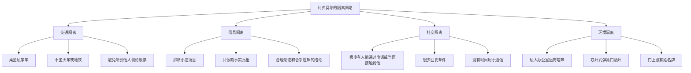

#### 3. 镇定——不可或缺的品质

> "作为一名交易者，一个不可或缺的品质就是镇定——冷静对待各种事物，观点不偏不倚，不受自己的期望或恐惧的影响。"

**利弗莫尔的镇定来源：**
- 天生具备这样的品质
- 在后天得到了很充分的培养
- 长期从事股票交易而形成的

#### 4. 利弗莫尔最讨厌什么——小道消息

> "利弗莫尔最讨厌小道消息。"

**为什么小道消息如此有害？**

| 小道消息的影响 | 利弗莫尔的应对 |
|--------------|--------------|
| "阴险狡诈的建议" | 早早认识到必须排除干扰因素 |
| 让人抛弃原有计划 | 只基于事实真相、合理论证做出判断 |
| 影响独立判断 | 进行了心理学研究，系统学习了心理学课程 |

#### 5. 办公设备的特殊设计

| 设备 | 利弗莫尔的设计 | 设计理由 |
|------|--------------|---------|
| 行情板 | 玻璃行情板，用粉笔记录变化 | 了解股价涨落、反弹和回跌的程度 |
| 行情收报机 | 放在高处，必须站着看 | 保持呼吸顺畅，血液循环畅通 |
| 电话 | 站着打电话 | 相当程度的锻炼 |
| 座位 | 几乎整天都站着 | 保持清醒和活力 |

#### 6. 与詹姆斯·R·基恩的惊人相似

威科夫发现利弗莫尔和已故的传奇操盘手基恩有惊人的相似之处：

| 相似之处 | 基恩 | 利弗莫尔 |
|---------|------|---------|
| 行情收报机位置 | 放在高处 | 放在高处 |
| 交易姿势 | 站着，来回踱步 | 站着，保持站姿 |
| 外貌特征 | 眼睑下垂、穿透力目光、高挺鼻梁 | 眼睑下垂、穿透力目光、高挺鼻梁 |
| 性格特质 | 深邃、睿智、机敏、足智多谋、高瞻远瞩 | 深邃、睿智、机敏、足智多谋、高瞻远瞩 |
| 交易方法 | 有相似之处 | 有相似之处 |

**基恩的阅读习惯：**
> "阅读行情纸带的时候，基恩的注意力是如此集中，其他所有事情都完全被他忽略了。"

### 💬 本章全部金句

> "只有排除干扰因素，基于事实真相、合理论证以及合乎逻辑的结论做出判断，他才能取得最好的投资结果。"

> "镇定——冷静对待各种事物，观点不偏而无倚，不受自己的期望或恐惧的影响。"

> "利弗莫尔早早地认识到，只有排除干扰因素，基于事实真相、合理论证以及合乎逻辑的结论做出判断，他才能取得最好的投资结果。"

### 🎓 本章核心教训总结

| 教训 | 详细说明 |
|------|---------|
| **环境决定判断质量** | 远离经纪人事务所和小道消息，创造安静独立的交易环境 |
| **心理学是必修课** | 市场由人的心理驱动，理解人性才能理解市场 |
| **身体状态影响思维** | 充足的睡眠和锻炼是保持头脑清晰的基础 |
| **新闻要反着读** | "字里行间观察这些人正在试图采取什么行动" |
| **排除一切非必要事项** | 极少社交，很少回信，所有时间都用于钻研市场 |

---

## 第4章 利弗莫尔如何解读行情纸带

### 📌 核心故事：从行情纸带中读出"数百万人的希望、恐惧和渴望"

这是全书**最核心、最重要**的章节。行情纸带是利弗莫尔交易方法的核心工具，是他判断市场方向、识别大户意图、把握买卖时机的关键。

**行情纸带的本质：**
> "那一条又小又窄的行情纸带上，记载着数百万人的希望、恐惧和渴望。行情纸带正是那些买卖股票、债券的交易者们思维的具象表达。"

**利弗莫尔的传奇战绩：**
- 1907年恐慌：以"小时的精确度"观察到心理买点，做空赚取100万美元
- 1921年萧条：在市场极低点做多

### 🔑 关键概念详解

#### 1. 行情纸带解读的基本原则

**原则一：验证而非预测**
> "股市一开盘，利弗莫尔就拿起行情纸带来验证行情是否吻合自己之前形成的观点。"

**原则二：根据表现判断未来**
> "利弗莫尔根据市场和个股的自身表现来判断它们未来可能的走势，因为对他而言，这比内幕人士说了什么、发表了什么、承诺了什么更有意义。"

**原则三：内幕人士也会犯错**
> "利弗莫尔知道，在很多情况下，这些内幕人士是最容易对自己公司股票判断失误的人。这些人太了解他们自己的公司了，他们处在公司内部，所以看不到公司的弱点。"

#### 2. 行情纸带解读清单——利弗莫尔的核心关注点

这是利弗莫尔在行情纸带上搜寻的完整清单，分类整理如下：

**A. 开盘信号分析**

| 观察要素 | 具体内容 |
|---------|---------|
| 开盘价 | 是否高于前一日的收盘价 |
| 强势股 | 哪些股票在开盘伊始就展现出强势 |
| 弱势股 | 哪些展现出弱势 |
| 被忽视的股票 | 哪些股票被忽视了 |

**B. 龙头股分析**

| 观察要素 | 具体内容 |
|---------|---------|
| 龙头股特征 | 当前龙头股的特征是什么 |
| 龙头更替 | 之前的龙头股是否开始露出犹豫之态 |
| 新龙头候选 | 其他哪些股票正在冲击龙头位置 |

**C. 板块强弱分析**

| 观察要素 | 具体内容 |
|---------|---------|
| 最强势板块 | 哪些板块表现得最为强势 |
| 最疲软板块 | 哪些表现得最为疲软 |
| 影响程度 | 强势板块刺激市场或者弱势板块拖累市场的程度如何 |

**D. 操纵行为识别**

| 观察要素 | 具体内容 |
|---------|---------|
| 操纵性质 | 操纵的性质是什么 |
| 资金池活跃度 | 哪些资金池最为活跃 |
| 消息反应 | 各股在大众消息或者特定消息面前如何反应 |

**E. 供需关系判断**

| 观察要素 | 具体内容 |
|---------|---------|
| 强弱含义 | 股票表现弱势或者表现强势的可能含义 |
| 整体成交量 | 整个市场的成交量 |
| 成交量趋势 | 相比昨天、上周、上月，成交量上升了还是下降了 |
| 龙头股反应 | 龙头股和次龙头股面对刺激或者压力如何反应 |
| 买盘卖盘性质 | 是否大部分都是庄家在操纵，是专业交易还是大众交易 |

**F. 市场行为细节**

| 观察要素 | 具体内容 |
|---------|---------|
| 涨跌速度 | 行情涨跌迅速还是迟缓 |
| 涨跌频率 | 涨跌发生的频率如何 |
| 持续时间 | 哪一种情况持续的时间最长 |
| 涨跌幅度 | 涨跌幅度如何 |
| 阻力位表现 | 市场和特定的个股在阻力位如何表现 |
| 吸收能力 | 它们吸收卖盘和供应筹码的能力如何 |

**G. 大户行为分析**

| 观察要素 | 具体内容 |
|---------|---------|
| 资金池意图 | 主力资金池是在吸筹、抬价还是派筹 |
| 内部操纵 | 是否有证据表明出现了过多的内部操纵 |
| 操纵程度 | 内部操纵的程度严重与否 |
| 场内交易商 | 场内交易商在做什么 |
| 专业人士立场 | 这些专业人士的普遍立场是什么——看多还是看空，短线还是长线 |

**H. 公众行为分析**

| 观察要素 | 具体内容 |
|---------|---------|
| 公众买入 | 公众买入的股票有哪些特征 |
| 公众卖出 | 公众卖出的股票有哪些特征 |
| 影响因素 | 这些股票受哪些因素的影响 |

**I. 市场自我维系能力**

| 观察要素 | 具体内容 |
|---------|---------|
| 自我维系 | 没有人为刺激或者施压的情况下，市场自我维系的能力如何 |
| 特定情况表现 | 这种情况下市场如何表现 |
| 策略变化 | 多头突然放弃原有策略时，市场形势会发生哪些变化 |

**J. 个股表现分析**

| 观察要素 | 具体内容 |
|---------|---------|
| 板块内个股 | 特定产业中，哪些个股表现最好或者最差 |
| 内幕人士行为 | 内幕人士是在观望等待还是在蓄势 |
| 上行压力 | 在较小压力下，特定的个股是轻松上行，还是缺乏买单支撑进而严重下挫 |
| 买进行为 | 内幕人士是公开买进还是秘密买进——他们是谨慎操作还是明目张胆 |
| 原因分析 | 这种情况的原因何在 |

**K. 涨落规律**

| 观察要素 | 具体内容 |
|---------|---------|
| 涨落时机 | 大幅或者小幅的涨落什么时候出现 |
| 相对位置 | 相较过去几天、几个月、几年，市场现在的相对位置如何 |
| 风险点 | 风险点在哪里 |
| 反向运行 | 哪些股票不再跟随趋势的走势而是开始反向运行 |
| **最重要** | **什么时候可以大举交易或者小规模交易** |

#### 3. 行情纸带解读的深层逻辑

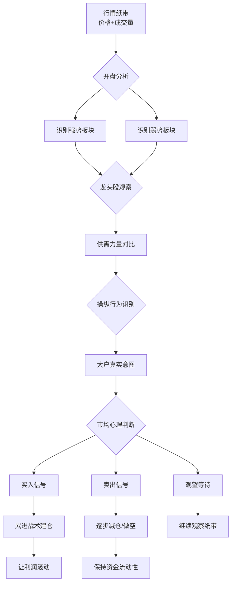

#### 4. 行情纸带的电影比喻

> "行情纸带就像是没有两帧相同影像的电影。画面每两秒变化一次。每一次变化都和先前有一定关系，又为即将发生的埋下伏笔。"

**解读要点：**
- 每两秒变化一次——市场是动态的、连续的
- 与先前有关系——历史会重复，但不是简单的重复
- 为即将发生的埋下伏笔——可以预测，但需要经验

#### 5. 市场心理因素的重要性

> "华尔街的心理状态，也就是公众对时刻发生的事态所产生的心理反应，对市场有着切实的影响。"

**案例分析：**
> "一些大炒家可能尝试购买50000股某只股票，引起公众或大量投资者清盘。如果公众或大量投资者卖出55000股这家公司的股票，则足以抵消大炒家购买股票的影响，市场最终会下跌而非上涨。"

**关键洞察：**
> "没有人能够预测各种事态对公众心理的影响。判断这些情况，预测各种事件对公众的影响，这是利弗莫尔的强项。"

#### 6. 利弗莫尔关注的各种波幅

利弗莫尔并不是只关注大波动：

| 波幅类型 | 时间跨度 | 利弗莫尔的态度 |
|---------|---------|--------------|
| 5-20个点 | 1周到60天 | 仔细观察 |
| 2-3-5个点 | 短期 | 专心研究 |
| 大势 | 长期 | 形成市场的大势 |

> "所有这些对于形成股市的大势都发挥着各自的作用。所谓大势，指的是虽然经常改变行进轨迹，股市还是沿着阻力最小的线路运动。"

#### 7. 反转点的判断

**做多信号：**
> "正如弥漫的恐慌告知他是时候做多一样，牛市的顶端同样会发出经验老道之人能辨别出来的信号。"

**持有策略：**
> "在他认为的股市巨幅下跌的反转点积攒够想要的筹码之后，他很可能持有这些股票达数月之久，有时候持有期达到一年多。"

**持有原因：**
> "整体商业环境的复苏、企业收益能力的恢复以及股息分红的增长，都需要相当长的一段时间来完成。"

#### 8. 恐慌中的观察重点

> "在这样的时段里，发生的每一件小事都意味颇多——空头的出击、公共清算以及毫无希望的交易报告，这一切都意味深长。"

**但最重要的是：**
> "利弗莫尔最感兴趣的是抛压被消化的方式——抛压在不同价格水平上遭遇的阻力；成交量，各种试图打压股价的大炒家所做的歇斯底里的努力；他们使用的伎俩以及说出的谎言。每个因素都有其分量，尤其是在游戏的这个特殊阶段。"

### 💬 本章全部金句

> "行情纸带就像是没有两帧相同影像的电影。画面每两秒变化一次。每一次变化都和先前有一定关系，又为即将发生的埋下伏笔。"

> "没有人能够忽略心理因素及其对供求的影响。"

> "如果用两个字总结利弗莫尔的方法，那应该就是：**预测**。"

> "当一个人发现某只股票的价值发生变化之后，他会做的第一件事不是在跑马灯上记录下消息，而是买进或卖出这只股票，然后向朋友告知这些事情。"

> "这是一个游戏，世界上最大的游戏，百万富翁们参与这个游戏，他们利用自己的知识、权势和资源，预测世界范围内的变化。"

### 🎓 本章核心教训总结

| 教训 | 详细说明 |
|------|---------|
| **行情纸带是真相的镜子** | 内幕人士说什么不重要，他们的交易行为才重要 |
| **供需决定一切** | 市场沿着阻力最小的轨迹运行 |
| **心理因素是核心** | 影响市场的是人们实际的买卖行为，而非他们的想法 |
| **赚大钱在长期波动中** | 在恐慌底部做多，持有数月甚至一年以上 |
| **观察抛压消化方式** | 在恐慌中，最重要的是看抛压如何被消化 |

---

## 第5章 利弗莫尔如何交易并控制风险——最小预期收益

### 📌 核心故事：公众最大的错误

公众最大的问题：**只因为有人说某股票要涨就买入，完全不考虑风险收益比**。

**案例：纽黑文股票**
- 价格：250美元一股
- 公众心态：认为股价会上涨，或者有人告诉他们会上涨
- 实际风险：冒着25000美元的风险去博取1000美元或2000美元的可能收益
- 如果知道真实风险：很少有人会买进

### 🔑 关键概念详解

#### 1. 最小预期收益——10个点规则

**利弗莫尔的规则：**
> "除非他预见到至少10个点的可能收益，否则他不会开展交易。"

**为什么是10个点？**

| 原因 | 详细说明 |
|------|---------|
| 预留亏损空间 | 每三笔交易中可能发生一笔或两笔亏损 |
| 覆盖操作成本 | 佣金、收入税和利息等 |
| 确保总体盈利 | 不至于全部抵消从第三笔交易中获得的收益 |

#### 2. 风险控制体系——止损的艺术

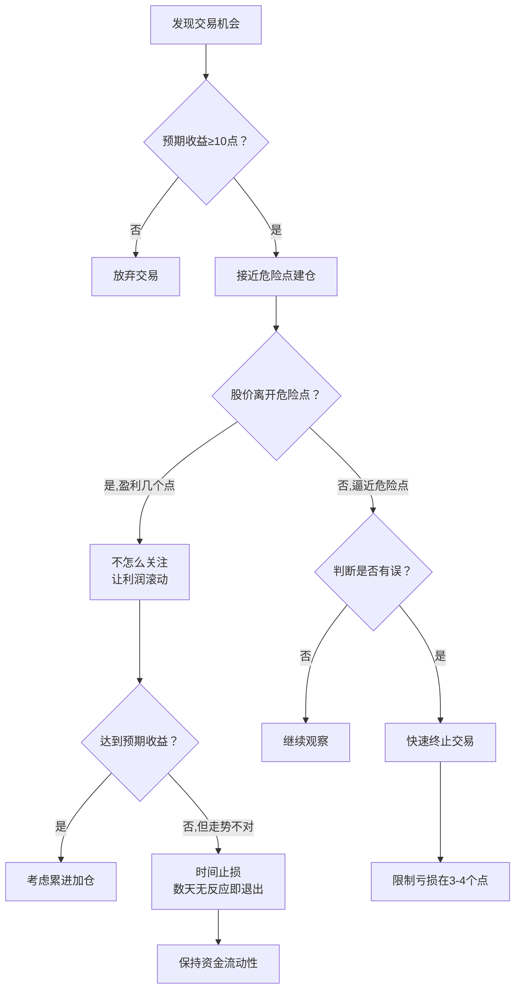

#### 3. 利弗莫尔 vs 公众投资者——风险收益比对比

| 维度 | 利弗莫尔 | 公众投资者 |
|------|---------|-----------|
| **止损幅度** | 3-4个点 | 10-30个点 |
| **最小预期收益** | 10个点 | 2-3个点 |
| **风险收益比** | 1:3甚至更高 | 5:1甚至更差 |
| **止损原则** | "及时止损，让利润滚动起来" | 违背此原则 |
| **建仓位置** | 尽量接近危险点 | 跟风追涨 |
| **对亏损的容忍** | 3-4个点就意味着危险 | 10-30个点还觉得是健康回调 |
| **对收益的期望** | 10个点是正确判断的确认 | 10个点太难，不想等 |

#### 4. 成功操盘手的共同格言

利弗莫尔引用了多位成功操盘手的格言：

| 操盘手 | 格言 |
|--------|------|
| 吉姆·基恩 | 及时止损，让利润滚动起来 |
| 柯马克 | 同上 |
| 迪克森·G·瓦茨 | 同上 |
| E·H·哈里曼 | "如果你想在交易中取得成功，及时止损；将损失控制在八分之三个点以内，永远不要超过1个点。" |

**哈里曼的补充：**
> "当然了，哈里曼是从场内交易员的角度说的，对于需要支付佣金和需要通过经纪人事务所开展交易的人来说，这种止损交易是不可能实现的。"

#### 5. 让利润滚动起来——加强版：累进加仓

> "这些伟大的操盘手也奉行'让利润滚动起来'的原则。他们之中的很多人还要'让利润节节攀升'（pyramid），这是'让利润滚动起来'的加强版。"

#### 6. 对赌行的教训——利弗莫尔的"学费"

> "杰西·利弗莫尔从对赌行那里学到了这两个原则，他早期正是在那里学会了怎样交易。在这些对赌行交易只需要两个点的保证金，当这些少量的保证金亏光时，利弗莫尔就得到了充足的证据表明他对这笔交易做出的判断是错误的。"

**关键教训：**
> "这一经历让利弗莫尔知道了止损的好处和必要性，并给他上了永远难忘的一课，尽管和其他所有人一样，利弗莫尔偶尔也会背离自己惯常的做法。"

#### 7. 接近危险点建仓的策略

> "我所致力的，是尽我所能做出接近危险点的挂单。之后，我会观察股价是否逼近危险点；或者如果我认为自己判断有误，我会很快终止这笔交易；但是一旦股价从我做多或者做空的价格上，离开危险点运行了几个点，我就不怎么关注它了，直到结束这笔交易。"

**为什么接近危险点建仓风险更小？**
> "利弗莫尔很少冒超过几个点的风险，这就意味着，越接近危险点进行交易，他所冒的风险就越小。"

#### 8. 利弗莫尔的实际交易案例

> "利弗莫尔在一次重仓的交易里获利将近50个点，相比之下，他在初始交易上承担的那几个点的风险确实微不足道。"

**风险收益比计算：**
- 初始风险：4个点
- 收益率：20%
- 风险/收益比：2:10

#### 9. 利弗莫尔也是普通人

> "像其他人一样，利弗莫尔有些时期也会判断失常，发生更频繁的亏损——若非如此，他就是史上最成功的操盘手——但是毕竟他也是普通人而已，他的判断虽然缜密，但也不是万无一失。"

**利弗莫尔的态度：**
> "利弗莫尔将这些亏损的交易也视为日间工作的一部分，他要做的就是努力减少失误，使交易账户最终处于盈利状态。"

#### 10. 最简单的规则也是最难的

> "一个最简单，同时又是最难习得的规则就是及时止损。如果每个股票交易者都能一天一次、一周一次、一月一次，或者当特定点数的亏损出现时系统化地止损，并且只要当股票按照他预期的走势变动时有耐心为了丰厚的收益坚定持仓，那么他的交易成功之路终将铺就。"

> "不仅仅对利弗莫尔先生来说是这样，对其他每一个取得辉煌交易成就的大作手来说，这两条规则可能都是取得成功的最关键所在。"

### 💬 本章全部金句

> "及时止损，让利润滚动起来。"——华尔街最重要的原则

> "如果你的股票上涨缓慢而泄气，好的股票迟早会大涨，等待是值得的。"

> "一个最简单，同时又是最难习得的规则就是及时止损。"

> "除非他预见到至少10个点的可能收益，否则他不会开展交易。"

> "当在一笔交易中只能依赖希望的时候，我会退出交易，因为它只会让我心烦意乱。我不依赖其他东西，我只依赖真实的事物。"

### 🎓 本章核心教训总结

| 教训 | 详细说明 |
|------|---------|
| **风险收益比是交易的基石** | 每笔交易都要先算清楚"冒多大风险，博多大收益" |
| **越接近危险点交易，风险越小** | 不是等涨了再追，而是等回调到支撑位附近才入场 |
| **10个点最小收益** | 为亏损交易预留空间，确保总体盈利 |
| **公众的根本错误** | 接受微小收益，却容忍巨大亏损 |
| **止损是最简单也最难的** | 系统化止损是成功的关键 |

---

## 第6章 利弗莫尔怎样保持资本持续运转

### 📌 核心故事：双重止损——利弗莫尔交易方法的"命脉"

这是利弗莫尔交易方法中最关键、但最容易被忽视的要素。他不仅有**价格止损**（股价跌到危险点就卖），还有**时间止损**（数天内没有预期反应就卖）。这双重止损机制让他的资金始终处于高效运转状态。

### 🔑 关键概念详解

#### 1. 双重止损体系

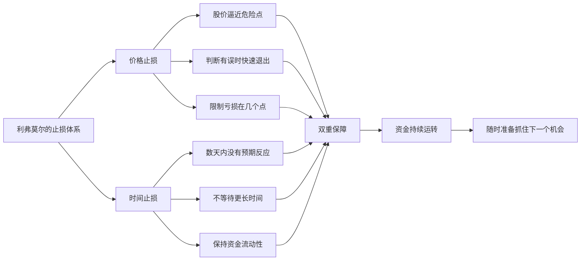

#### 2. 时间止损的详细解释

**场景：石油股的例子**

> "假如有一只石油股，利弗莫尔已经判断其股价达到了临界点，即将拉升。其他的石油股表现强劲，而他从众多的石油股中挑选的这一只，不仅没有对上述的上涨趋势做出反应，反而表现出滞后的势头。"

**利弗莫尔的推理：**
> "利弗莫尔的推断就是，尽管自己预期股价上涨，但是很显然发生了一些事情推迟了内部人士或者其他炒家交易这只股票。可能有一些造成股价短暂下跌的消息，使得这只股票不跟随其他石油股上涨，从而失去买盘支撑，转而被市场抛售。"

**利弗莫尔的决策：**
> "这只股票也许会在更低的价位上被吸筹，但是这对于利弗莫尔而言并没有意义。这只股票已经得到机会展现强势或者弱势了，当展现弱势时，利弗莫尔会迅速结束交易。因为在那种走势不符合其预期的股票身上，他实在耗不起。"

**关键点：**
> "他不一定非要在股票表现出浮亏的时候才结束交易。当弱势信号出现时，股票有可能还是浮盈1至2个点。利弗莫尔会在股票没有表现出预期的波动时结束交易，不在乎此时的股价是否与买进价持平，还是高一点抑或低一点。"

#### 3. "难以上涨的"股票——最具破坏性的

> "在所有占用操盘手交易资金的股票中，那些迟迟不能步入预期走势通道的股票可能是最具破坏性的。"

**为什么？**
> "当操盘手结束一笔亏损的交易，他能明确地知道自己的亏损是多少。但是当他继续持仓，寄希望于股票会在一两天之内展现出更明确的走势，表现出更多的收益前景时，那么这名操盘手仅仅是在希望形势好转。"

**利弗莫尔的态度：**
> "当在一笔交易中只能依赖希望的时候，我会退出交易，因为它只会让我心烦意乱。我不依赖其他东西，我只依赖真实的事物。"

#### 4. 商业类比——资金周转率的重要性

威科夫用了一个非常生动的商业类比：

> "假如第五大道的大型商店不能将低流动性的商品置于柜台并售出，不久他们就会发现自己的流动资金在减少，大部分资金都套在自己不想持有的商品上——这些商品就搁置在柜台和储存室里吃灰。这样下去生意就难以为继。"

**问题：**
> "但是如果让这里面的一名商人进入证券市场，他很可能就会放弃上述使得自己取得商业成功的原则。"

**公众的错误：**
> "这个商人会买进一只股票，并赚取小额的收益，但是他还会买进另一只股票并一直持有，特别是当该笔交易出现了亏损——他会一直持仓直到亏损达到10个点、20个点甚至30个点。"

**机会成本：**
> "这种做法不仅使得他的资金开始缩水，还有更重要的一点——很少人会意识到的一点，这就是由于进行这些没有收益的交易而错失的机会。"

**利弗莫尔的目标：**
> "利弗莫尔的目标是能够周而复始地获取各个投资机会带来的好处，在正确的时机买进正确的股票，在股价向着预期的方向变动时持有这些股票。因此，他会卖掉那些'难以上涨的'股票，就像一名老练的保龄球选手希望球童清理掉躺在竖立的瓶子之间的被击倒的瓶子。"

#### 5. 为什么他总是为机会做好了准备

> "每隔一两年，股市都存在巨大的机遇，可以在股价的恐慌性底部或者经历严重下挫后抄底，或者从泡沫的高位大幅做空。"

**双重止损的好处：**
> "股票下跌时及时止损，与预期相反时立刻卖出，这两个交易规则使得利弗莫尔既能限制风险的程度，又能限制在一项交易中运用资金的时间长度。这样，他既有了价格止损的方法，也有了时间止损的方法。"

### 💬 本章全部金句

> "当在一笔交易中只能依赖希望的时候，我会退出交易，因为它只会让我心烦意乱。我不依赖其他东西，我只依赖真实的事物。"

> "利弗莫尔的目标是能够周而复始地获取各个投资机会带来的好处。"

> "每一名商人都努力让资金在一年的时间里尽可能更多次地周转。如果部分资金被冻结的话，就只有用剩下的资金来周转了。"

> "对于股价的运行方向，如果自己的判断有误，利弗莫尔就会快速退出交易，而不会等待几个点再退出；如果股价在数天之内没有表现出应有的走势，他也不会在该笔交易中多做停留。"

> "这两个方法也许可以被称作利弗莫尔交易方法的命脉。因为这两个方法使得利弗莫尔的资金能够持续地周转，并确保他能够立即抽调资金投向当下最有前景的市场机会。"

### 🎓 本章核心教训总结

| 教训 | 详细说明 |
|------|---------|
| **双重止损** | 价格止损+时间止损，缺一不可 |
| **"希望"是最大的敌人** | 依赖希望 = 依赖虚假 |
| **机会成本比显性亏损更可怕** | 资金被套 = 错失下一个大机会 |
| **像经营企业一样经营交易** | 资金周转率决定总体收益 |
| **"难以上涨的"股票最具破坏性** | 不是明确亏损，而是消耗时间和资金 |

---

## 第7章 利弗莫尔交易的股票类别

### 📌 核心故事：为什么剔除蓝筹股

利弗莫尔的目标是10个点以上的收益，这就决定了他不能将注意力放在窄幅波动的股票上。他剔除蓝筹股（除非形势特别光明），专注交易**价格迅速变动、波幅巨大的龙头股**。

### 🔑 关键概念详解

#### 1. 股票类别的选择标准

| 股票类别 | 利弗莫尔的态度 | 原因 |
|---------|--------------|------|
| **蓝筹股** | 通常剔除 | 波动太小，要花几个月才能达到10个点 |
| **龙头股** | 最青睐 | 最活跃板块中最好的股票，波动快且幅度大 |
| **低价股** | 有可能做 | 10→20美元=100%收益，但追求的是点数而非百分比 |
| **高价股** | 灵活操作 | 200→400美元点数大，但信号失效要果断退出 |

#### 2. 低价股 vs 高价股的收益对比

| 对比维度 | 低价股（10美元） | 高价股（200美元） |
|---------|----------------|-----------------|
| 目标收益 | 10→20美元 | 200→400美元 |
| 百分比收益 | 100% | 100% |
| 点数收益 | 10个点 | 200个点 |
| 风险 | 相对较小 | 相对较大 |
| 利弗莫尔的偏好 | 点数太小 | 点数大，更符合目标 |

**关键洞察：**
> "股价从10美元涨到20美元所跨越的点数，与股价从200美元涨到400美元所跨越的点数相比，有着巨大的差异，而利弗莫尔追求的是更大的点数。"

#### 3. 高价股的风险管理

> "当买入高价股，而买进之后股价下跌了几美元时，他就不会再采用上面的策略了。因为比如以200美元买进，股价在买进之后下跌到193或190美元，这说明之前他得到的上涨指示信号已经失效。"

**关键原则：**
> "这些决策取决于当时市场的特征，以及这只股票和该板块中其他股票的表现。正如我们常说的，每只股票的市场情形是不一样的，必须通过它自身的特点来判断。"

#### 4. 利弗莫尔的选股金句

> **"坚决做多强势行业中的强势股票。"**

#### 5. 大资金交易的限制

> "进行大量的整手交易，同时还希望股价迅速反应并且波幅巨大，利弗莫尔的选择范围就比那些交易对行情几乎没有影响的普通人更窄。"

**与银行基金的区别：**
> "利弗莫尔与华尔街那些银行基金所持有的头寸也不一样。这些机构的交易量巨大，而且需要一定的交易时间，以至于如果想要吸筹足够的话，需要10个点的股价波动；如果需要派筹，又需要10个点的股价波动。"

**利弗莫尔的优势：**
> "因此，除非行情要求他迅速行动，大多数情况下，利弗莫尔能在少数几个点位的波动区间中获得大部分他想要的筹码。"

#### 6. 交易的灵活性

> "利弗莫尔的交易往往涉及一组股票，当他进行个人账户的交易时，利弗莫尔在任何一只股票的交易上都可以灵活运作，但是当他作为基金经理操作涉及几十万股的一组股票市场基金时，他在股票上的交易就不那么灵活了。"

### 💬 本章全部金句

> "坚决做多强势行业中的强势股票。"

> "利弗莫尔想要的是波动——快速波动，而且波幅巨大的股票。"

> "对于想要在股票交易中取得成功的人来说，有一个建议是：选择合适的股票十分重要。"

> "忘掉你知道的或者你以为你知道的关于股票交易的东西，采纳上面的这些规则。到最后，你的境况会比坚持自己有瑕疵的想法大大改善。"

### 🎓 本章核心教训总结

| 教训 | 详细说明 |
|------|---------|
| **选股要匹配策略** | 追求大收益就要选高波动股票 |
| **不是反对低价股** | 关键看风险收益比和流动性 |
| **强势行业中的强势股** | 这是选股的黄金法则 |
| **每只股票都有自己的特点** | 必须通过它自身的特点来判断 |
| **忘掉你以为知道的** | 采纳久经考验的规则，而非坚持自己的想法 |

---

## 第8章 利弗莫尔的累进战术

### 📌 核心故事：从基恩到利弗莫尔——累进战术的传承

累进战术不是利弗莫尔发明的，它的历史和华尔街一样悠久。利弗莫尔从詹姆斯·基恩和迪克森·沃茨那里学到了这种方法，并进行了自己的调整。

**基恩的案例：**
- 1893年大恐慌前，基恩操作美国绳业公司
- 做空后发现判断错误，反手做多
- 从3万美元初始资金增长到170万美元

**利弗莫尔的案例：**
- 1906年12月做空
- 1907年上半年恐慌爆发
- 赚取100万美元

### 🔑 关键概念详解

#### 1. 两种累进方式的根本区别

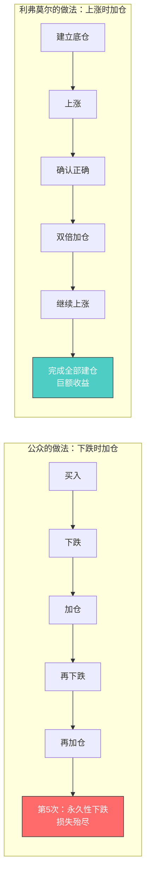

**沃茨的警告：**
> "最好在股价上涨而非下跌时运用累进战术。这个做法与大众通常认为并采用的做法正好相反，大众通常是先买进，然后在股价下跌时买进更多。这种做法不断拉低平均价。也许五次之中有四次，市场可能停止下跌。但是在第五次中，一旦碰上了永久性的市场下跌，操盘手将损失殆尽，被迫出局，这种巨额的亏损通常是毁灭性的，亏损程度之大足以让人完全一蹶不振。"

**上涨时累进的优势：**
> "在上涨行情中使用累进战术恰恰相反，那就是一开始建立起中等规模的仓位，当市场上行时，缓慢而谨慎地加仓。这是一种需要十分小心和谨慎的投机方式。"

#### 2. 卡麦克的名言

> "上帝站在强者一边。"——艾迪森·卡麦克

**卡麦克的做法：**
> "作为一名著名的空头，艾迪森·卡麦克曾用累进战术在股价下跌的过程中将股价打压得越来越低。"

#### 3. 利弗莫尔的"有限累进战术"

威科夫和利弗莫尔讨论后，利弗莫尔调整了自己的方法：

**之前的习惯：**
> "利弗莫尔当时比较倾向于一次性全部完成买进或者抛售"

**调整后的做法：**
> "在股价最开始波动几个点的时候，他会采取一种可以被称作'有限累进战术'的做法。"

**具体步骤：**
> "首先，建立一部分底仓；当市场行情确认了其观点的准确性时，双倍加仓；如果行情纸带上出现了进一步的利好情况时，就完成全部的建仓。"

**自然效应：**
> "当他这样操作大量股票时，他的买进行为自然而然地充当了价格推进器的角色，推动股价朝着心仪的方向运动。"

#### 4. 有限累进战术的流程

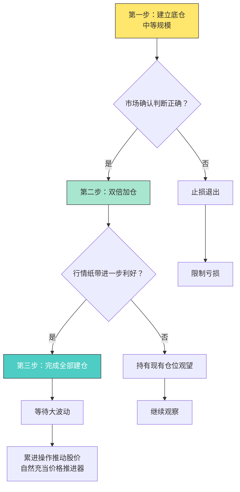

#### 5. 重大决策需要冷静的头脑

利弗莫尔采纳了沃茨的另一个重要规则：

> "所有投机活动的基础原则在于保持头脑清醒，这样判断才值得信赖。因此应当储备力量，等待重大时刻的到来，在这一时刻来临之际，就将全部力量聚焦于自己的重要决策。"

**重大时刻的特征：**
- 牛市的顶点
- 带来恐慌的多年熊市低点

**利弗莫尔的优势：**
> "正是在这些重大的时刻——牛市的顶点，以及带来恐慌的多年熊市低点——利弗莫尔完成了他卓有成效的工作。"

**为什么在这些时刻如此重要？**
> "因为他强烈地意识到，在恐慌状态的熊市中平掉空头仓位转手做多，以及在疯狂上涨的市场中退出多头仓位转手做空都有着巨大的优势。"

**利弗莫尔的准确率：**
> "我不是说利弗莫尔总能挑中合适的时机，但是在过去的许多年里，他在这方面的平均准确率毫无疑问要比任何其他成功的操盘手都高。"

#### 6. 盖楼打地基的比喻

> "这种建仓的手法就像是盖楼时打地基——根基打得越深，建筑就会越坚固牢靠。"

**做多时的策略：**
> "当利弗莫尔在熊市进行这种建仓时，他就对市场反转运动的可能性极其敏感，并留心守候着真正的买进机会。如果判断正确，那么从这里开始，他就开始进行累进操作，并且几乎稳操胜券。"

**累进距离的限制：**
> "利弗莫尔的经验表明，一般来讲，在远离初始建仓价位的地方进行累进操作是不明智的，因为这样一来，平均价格就会发生巨大变化，市场中任意一个不利反应都可能使交易陷入巨额的账面亏损。"

**这就是：**
> "利弗莫尔钟爱的'有限累进战术'的基石所在。"

### 💬 本章全部金句

> "最好在股价上涨而非下跌时运用累进战术。这个做法与大众通常认为并采用的做法正好相反。"

> "上帝站在强者一边。"——艾迪森·卡麦克

> "所有投机活动的基础原则在于保持头脑清醒，这样判断才值得信赖。"

> "这种建仓的手法就像是盖楼时打地基——根基打得越深，建筑就会越坚固牢靠。"

### 🎓 本章核心教训总结

| 教训 | 详细说明 |
|------|---------|
| **上涨加仓 vs 下跌加仓** | 这是区分专业与业余的关键分水岭 |
| **有限累进** | 不要在远离初始价位的地方累进，否则平均价变化太大 |
| **冷静的头脑** | 重大决策需要储备力量，等待重大时刻 |
| **像盖楼打地基** | 根基越深，建筑越坚固 |
| **累进战术是"让利润滚动"的加强版** | 不是简单的加仓，而是确认后的有序加仓 |

---

## 🏆 全书精华总结

### 利弗莫尔交易方法的完整体系

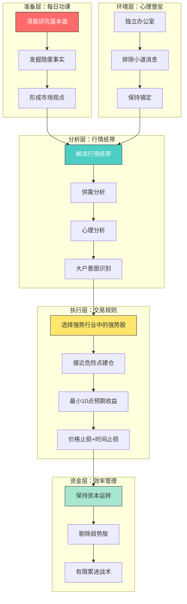

### 利弗莫尔 vs 公众投资者——完整对比

| 维度 | 利弗莫尔 | 公众投资者 |
|------|---------|-----------|
| **研究** | 每天清晨1-2小时深度研究 | 不研究，听消息 |
| **选股** | 强势行业中的强势股 | 因为便宜就买 |
| **止损** | 3-4个点，果断执行 | 10-30个点，心存侥幸 |
| **预期收益** | 最少10个点 | 只求2-3个点 |
| **持仓** | 让利润滚动，持有数月 | 赚小钱就跑 |
| **加仓** | 上涨时累进 | 下跌时摊低成本 |
| **资金** | 保持流动性，随时准备出击 | 满仓被套 |
| **心态** | 依赖事实，不依赖希望 | 依赖希望和小道消息 |
| **时间** | 长期波动中赚大钱 | 想挣快钱 |
| **环境** | 独立办公室，排除干扰 | 在经纪人事务所听传言 |
| **信息** | 亲自发掘隐匿事实 | 相信大标题和小道消息 |
| **品质** | 镇定、耐心、独立 | 恐惧、贪婪、从众 |

### 利弗莫尔的三大核心原则

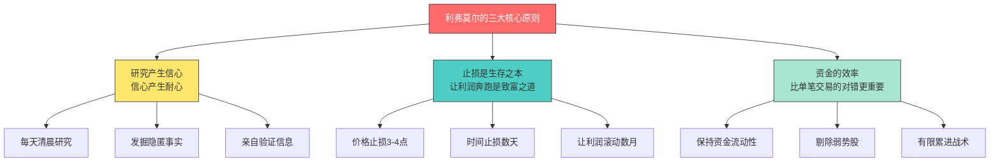

### 最后的忠告

> "股市中的成功并无神秘之处。任何人要想在投资上取得成功，唯一的方法就是在投资之前进行详细研究，在行动之前先调查，坚持基本原则，并忽略其他事情。"

> "股市中成功的关键在于知识和耐心。"

> "最佳的结果不是源自频繁的交易，而是来自对市场和商业环境的影响因素的仔细研究。"

> "这些经验的宝贵价值在于，它指出一个不以投资或投机型投资作为职业的普通交易者不必天赋异禀，照样能从股市中赚钱。"

---

## 💡 个人读书心得

### 这本书的独特价值

这本书的独特价值在于：**它不是利弗莫尔自己写的，而是由量价分析创始人威科夫通过深度访谈"解剖"出来的**。威科夫本身是技术分析大师，他用专业眼光解读利弗莫尔的方法，使得这本书既有第一手经验的真实感，又有系统化的方法论提炼。

### 利弗莫尔的核心智慧

利弗莫尔的核心智慧可以浓缩为三句话：
1. **研究产生信心，信心产生耐心**
2. **止损是生存之本，让利润奔跑是致富之道**
3. **资金的效率比单笔交易的对错更重要**

### 与其他利弗莫尔著作的关系

| 著作 | 角度 | 特点 |
|------|------|------|
| 《股票作手回忆录》 | 利弗莫尔自述 | 故事性强，但方法论不够系统 |
| 《股票大作手操盘术》 | 利弗莫尔晚年著作 | 技术细节多，但不够生动 |
| **本书** | 威科夫深度访谈 | 既有第一手经验，又有系统化提炼 |

### 实践应用建议

1. **建立清晨研究习惯**——每天固定1-2小时研究基本面
2. **学会解读行情纸带**——关注供需、心理、大户意图
3. **严格执行双重止损**——价格止损+时间止损
4. **保持资金流动性**——不要满仓被套
5. **在上涨时累进加仓**——不要在下跌时摊低成本

---

*笔记创建日期：2026年8月1日*
*来源：C:\Obsidian笔记\投资_md\(003) 利弗莫尔的股票交易方法量价分析*
*字数：约15,000字*

---

## 附录 走进利弗莫尔的操盘室：80 年前的采访记录为何仍是顶级教材（知乎文风）

### 写在前面：这本书的特殊之处

系列前三本里，01 号《回忆录》是利弗莫尔**自己讲自己的故事**，02 号《操盘术》是利弗莫尔**自己写自己的规则**。

而 03 号这本书完全不同——**它既不是自传，也不是手册，而是一份"采访记录"。**1930 年代末，已经功成名就（也已经开始陨落）的利弗莫尔接受了一位华尔街记者的系列访谈，谈他每天怎么工作、怎么看行情、怎么控制风险。访谈整理成文，就是这本书。

**所以这本书有一个其他书都没有的价值：它提供了"外人视角的利弗莫尔"**——不是他声称自己怎么做，而是别人观察他**实际怎么做**。

如果你想知道"量价分析"这个词的源头，想看看一个没有电脑、没有 K 线软件的人怎么靠一张纸带横扫市场——这本书就是答案。

### 第一幕：成功的唯一可靠方法——无聊但正确的答案

记者问利弗莫尔：股市成功的秘诀是什么？

利弗莫尔的回答，朴素得让所有想听"秘诀"的人失望：

> "股市中的成功并无神秘之处。任何人要想在投资上取得成功，唯一的方法就是在投资之前进行详细研究，在行动之前先调查，坚持基本原则，并忽略其他事情。"

**注意"忽略其他事情"五个字**——这是利弗莫尔一生的方法论核心：信息越杂，噪音越多；你要的不是更多信息，而是**更少但更关键的决策依据**。

他进一步展开：

> "没有人能够在市场中取得成功，除非他掌握了经济学的基本知识，并且完全熟悉各方面情况——公司的财务状况、它的历史、生产情况、它所处行业的状况，以及经济的总体形势。"

**一个被后人塑造成"技术派鼻祖"的人，开口第一句话讲的却是基本面研究。**

这颠覆了很多人对利弗莫尔的想象：**他不是只看图不看公司的赌徒，而是把公司研究透了之后，再用图表选择时机。**

### 第二幕：成功的关键——知识与耐心

采访中，利弗莫尔给出了一个可以刻在墙上的结论：

> "股市中成功的关键在于知识和耐心。只有如此之少的人在股市中取得成功，是因为投资者们缺乏耐心，想快速变得富有。"

**"想快速变得富有"——六个字，说尽了散户亏损的全部原因。**

| 散户行为 | 利弗莫尔的行为 |
|---------|--------------|
| 股票上涨、接近顶部时买入 | 股票下跌时买进，耐心等待 |
| 听消息追热点 | 详细研究后再行动 |
| 希望股票快涨 | "好的股票迟早会大涨，等待是值得的" |
| 凭希望买进 | "买进股票的唯一时机是你知道它们将会上涨" |

**"买进股票的唯一时机是你知道它们将会上涨"**——这句看似废话的话，是利弗莫尔交易哲学的浓缩：**你必须在买入前就知道它会涨（基于研究），而不是买入后祈祷它涨（基于希望）。**

还有一句值得所有 A 股投资者抄下来：

> "从行业前景的角度考虑投资，**挑选最强势行业中的最强势公司**，不要仅仅凭着希望去买进股票。"

——这就是后来 A 股"龙头战法"的原话出处。

### 第三幕：操盘室的堡垒——为了安静，他愿意做任何事

这本书最有趣的章节之一，是"利弗莫尔办公室的特殊设计"。

利弗莫尔对交易环境的偏执，达到了令人叹为观止的程度：

| 细节 | 目的 |
|------|------|
| 每天坐私家车上班，不坐火车地铁 | 避免在车上听到股民谈股票 |
| 在私人办公室独自交易 | 隔绝经纪人事务所的喧哗 |
| 不接触行情板周围的人群 | 躲开"心理氛围"的干扰 |
| 不参加饭局应酬 | 防止传言污染判断 |

记者写道：在普通经纪人事务所，"几乎不可能连续 15 分钟思考而不被打断。整个交易时间充斥着交易者谈论各种小道消息以及经纪人与顾客交换各种传言的声音"。

**利弗莫尔用近乎病态的隔离，保护一样东西：独立思考的能力。**

> "为了独自经营自己的证券，利弗莫尔要进行独立思考，并且希望自己的思考过程不受到任何干扰。"

**现代对应**：为什么顶级交易员不刷股吧、不混群、不跟单？因为信息环境就是决策环境——**你听到的每一个传言，都在悄悄改写你的判断。**

### 第四幕：行情纸带——40 个观察点背后的世界观

利弗莫尔每天的工作，就是解读行情纸带——那条不断吐出的、印着价格和成交量的纸条。

记者对纸带的描述，是全书最精彩的段落之一：

> "那一条又小又窄的行情纸带上，记载着数百万人的希望、恐惧和渴望。行情纸带正是那些买卖股票、债券的交易者们思维的具象表达。"

**利弗莫尔看纸带，看的不是价格，是人。**他的纸带解读清单长达 40 多项，其中包括：

| 观察维度 | 具体问题 |
|---------|---------|
| 开盘强弱 | 开盘价是否高于前日收盘？哪些股票开盘即强/弱？ |
| 龙头状态 | 龙头股是否露出犹豫？谁在冲击龙头位置？ |
| 板块力量 | 哪些板块最强/最弱？强板块拉动还是弱板块拖累？ |
| 成交量 | 相比昨天/上周/上月，量升还是降？ |
| 操纵痕迹 | 主力在吸筹、抬价还是派筹？买盘是庄家还是大众？ |
| 专业动向 | 场内交易商在看多还是看空？ |
| 阻力表现 | 在阻力位能否吸收卖盘？ |
| 背离信号 | 哪些股票不再跟随趋势反向运行？ |
| **行动决策** | **什么时候可以大举交易或者小规模交易？** |

**注意最后一条**——纸带解读的终点不是"预测"，而是"行动规模"：**该重仓还是该轻仓。**

还有两个深刻洞见：

> "利弗莫尔知道，在很多情况下，内幕人士是最容易对自己公司股票判断失误的人。这些人太了解他们自己的公司了，他们处在公司内部，所以看不到公司的弱点。"

**离公司最近的人，往往最看不清公司**——这和林奇（32 号）"内部人买入是信号"形成微妙张力：林奇看内部人**行动**，利弗莫尔警告内部人**判断**也常错。

> "行情纸带揭示了巧妙散播的消息背后真实的意图。"

**价格先于消息，行为先于语言**——当一个人发现股票价值变化，他做的第一件事不是发公告，而是先买入或卖出。**所以纸带比新闻更诚实。**

### 第五幕：风险控制——最小预期收益

第 5 章有个令人过目不忘的例子——纽黑文铁路股票：

> "对于那些愿意以 250 美元一股的价格买进纽黑文的人……如果当初有人告诉这些人，他们是在冒着 25000 美元的风险去博取 1000 美元或者 2000 美元的可能收益时，这些人中就只有很少一部分会去买进股票了。"

**250 美元买 1 股=冒 25,000 美元的风险（股价可能跌到 0 附近）去博 1,000—2,000 美元的上涨空间——风险收益比高达 1:15 甚至 1:25，而散户居然趋之若鹜。**

利弗莫尔用这个例子引出全书最重要的风控观念：

> "令人吃惊的是，公众可以接受低至 2 到 3 个点的收益，却能容忍高达 10 到 30 个点，有时 50 甚至 100 个点的亏损。这就意味着，公众违背了成功股票交易的一个首要原则，那就是：**及时止损，让利润滚动起来。**"

| 行为 | 散户常态 | 利弗莫尔规则 |
|------|---------|-------------|
| 盈利 2—3 点 | 落袋为安（跑得太快） | 让利润奔跑 |
| 亏损 10—30 点 | 死扛（"会涨回来的"） | **及时止损** |
| 风险收益比 | 1:15 也敢买 | **先算风险再谈收益** |

**"及时止损，让利润滚动起来"**——这句话后来成了全世界趋势交易者的第一铁律。

### 第六幕：资本持续运转——"我实在耗不起"

第 6 章揭示了利弗莫尔一个很少被提及的纪律：**时间止损。**

> "当数天之内或者更长的合理时段内股票没有按照预期的方向变动时，利弗莫尔就会结束交易。"

书里有个绝佳的案例：一只石油股，板块里其他石油股都涨了，唯独它滞后不动。利弗莫尔的分析：

> "这只股票已经得到机会展现强势或者弱势了，当展现弱势时，利弗莫尔会迅速结束交易。因为在那种走势不符合其预期的股票身上，他实在耗不起。"

**关键细节：他退出时，股票可能还在浮盈 1—2 个点。**

| 散户逻辑 | 利弗莫尔逻辑 |
|---------|-------------|
| 没亏钱=继续持有 | 没按预期走=浪费机会成本 |
| 等它启动 | **它已经用滞后证明了弱势** |
| 舍不得卖（浮盈） | 1—2 个点的浮盈也是资本 |

**时间止损的本质：市场没有在合理时间内验证你的判断，说明你的判断大概率错了——与其等亏损来通知你，不如让时间告诉你。**

### 第七幕：累进战术——基恩的 3 万美元传奇

第 8 章讲了一个利弗莫尔极其推崇的前辈——詹姆斯·基恩（James Keene）的故事，这也是"累进战术"（渐进加仓）的由来：

| 阶段 | 基恩的操作 |
|------|-----------|
| 1893 年 | 美国绳业基金崩溃，财富几乎损失殆尽，只剩 3 万美元 |
| 破产后 | 用 3 万美元重新开始 |
| 泽西中央之战 | 听信记者消息做空 70 美元的泽西中央→股价上涨→**认识到错误后反手做多** |
| 结果 | 从做空位置算起股价涨了近 100 点，基恩的 3 万美元变成 **170 万美元** |

**基恩故事的两个精髓**：

1. **错了就反手**——做空失败后立刻反手做多，不跟市场赌气（"他意识到自己犯了错，因此他转变立场"）
2. **盈利持续加仓（累进）**——"当股价持续上涨的时候，他继续加仓"，让盈利的仓位越滚越大

利弗莫尔自己也是这么干的：1906 年 12 月建中等规模空仓，1907 年上半年恐慌爆发时，"他赚取了 100 万美元"——**下跌的每一个点都给他更多操作余地，他就迅速抓住机会加仓。**

**累进战术=试探建仓+盈利加仓+错了反手**——与 02 号《操盘术》的"金字塔加仓"完全一致，两本书互相印证。

### 三根柱子：外人视角下的利弗莫尔系统

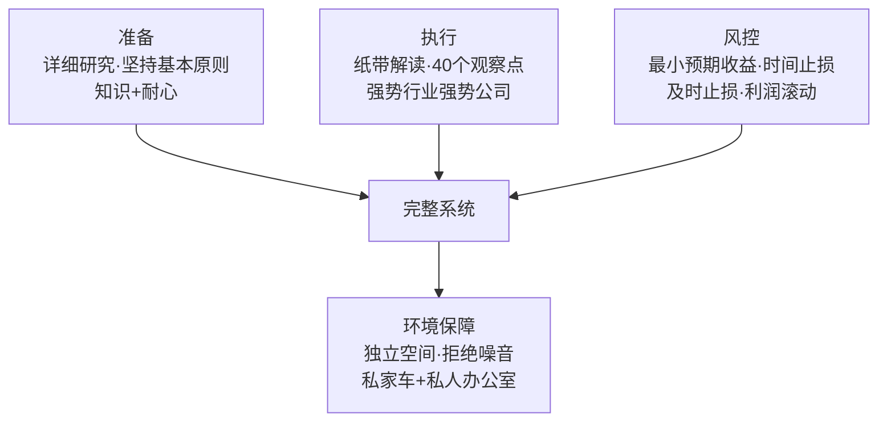

| 柱子 | 核心 | 反面教材 |
|------|------|---------|
| 准备 | 知识+耐心+详细研究 | 凭希望买进 |
| 执行 | 纸带验证+强势行业强势公司 | 听消息跟风 |
| 风控 | 风险收益比+时间止损+累进 | 2 点利润就跑，30 点亏损死扛 |

### 尾声：量价分析与现代 A 股

这本书在今天的意义，被严重低估了——**它是"量价分析"的源头，也是"龙头战法"和"强势股"思想的交汇点。**

| 本书思想 | 现代对应 | 系列呼应 |
|---------|---------|---------|
| 强势行业强势公司 | A 股"只做龙头" | 《股市极客思考录》《龙头、价值与赛道》 |
| 行情纸带解读 | 量价关系/盘口语言 | 03 号全书 |
| 时间止损 | 跌破关键位离场 | 02 号操盘术 |
| 累进战术 | 金字塔加仓 | 02 号+27 号超级强势股 |
| 最小预期收益 | 风险收益比思维 | 28 号安全边际的镜像 |

**利弗莫尔 80 年前写在纸带上的问题，今天的交易软件帮你自动画出来了——但多数人依然回答不了那个终极问题：**

> "什么时候可以大举交易或者小规模交易？"

**方法会过时，问题永不过时。**这也正是这本"采访记录"至今仍是顶级教材的原因：**它记录的不是一个公式，而是一种思考方式——把市场当作人的集合，把价格当作人的行为，把自己当作唯一可信的判断者。**

> "买进股票的唯一时机，是你知道它们将会上涨。"

