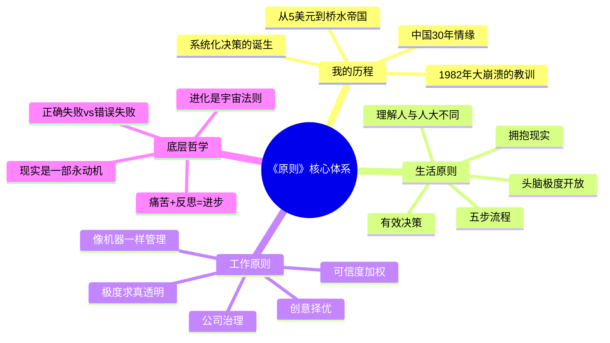
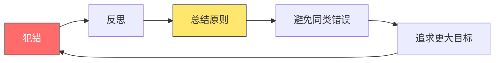
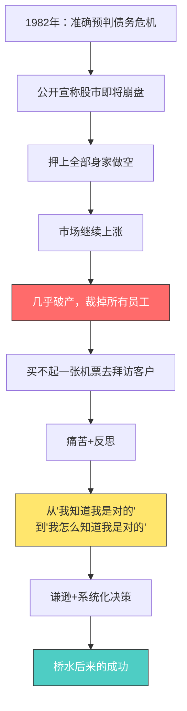
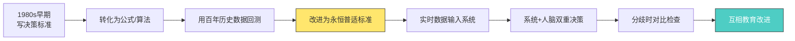
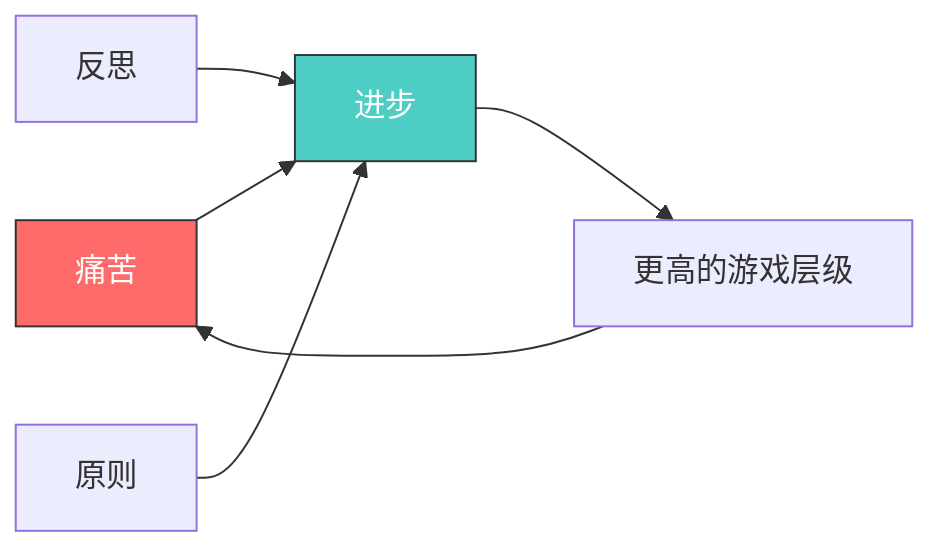
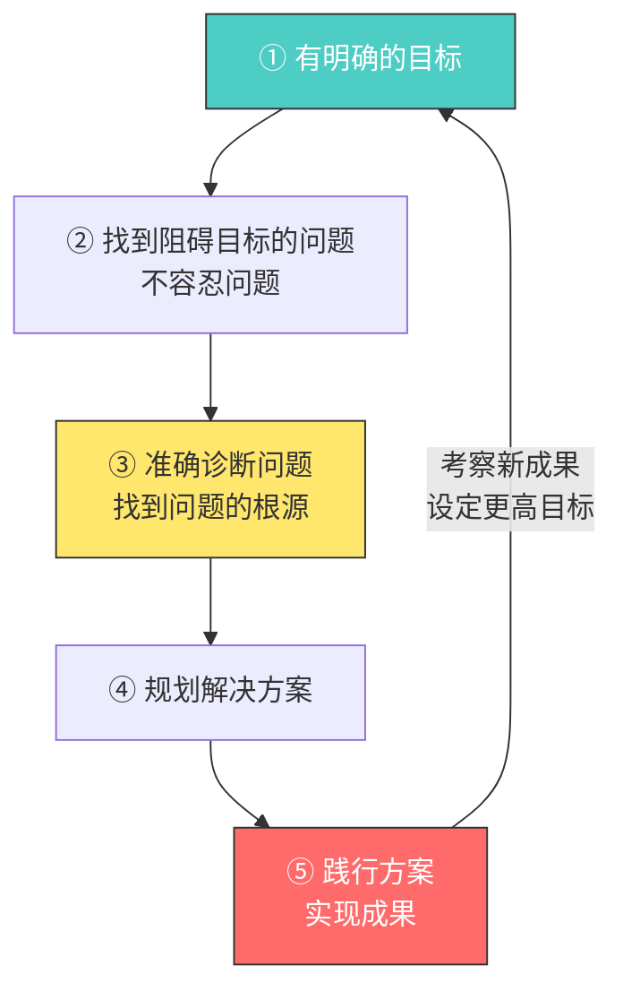
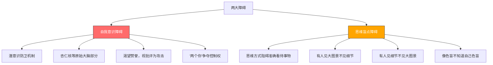
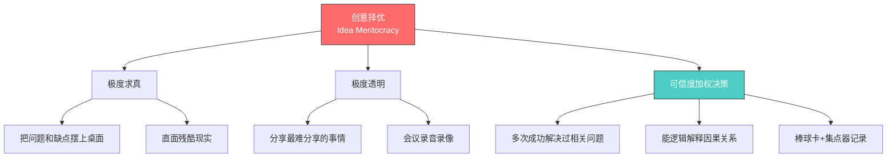
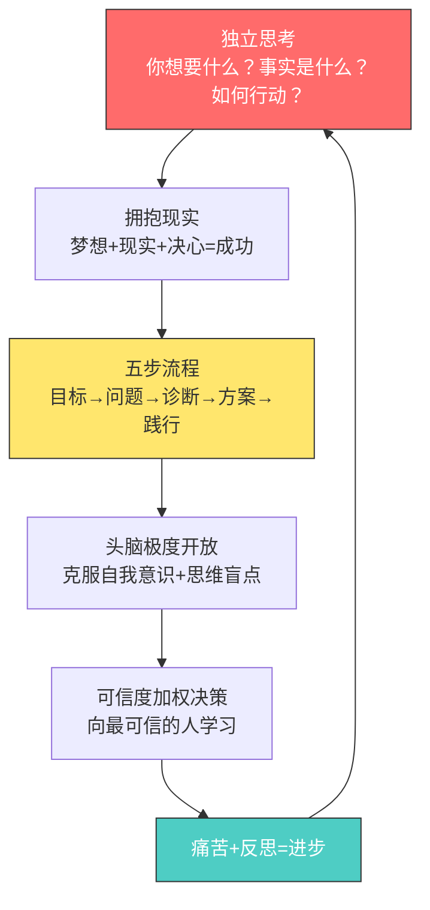
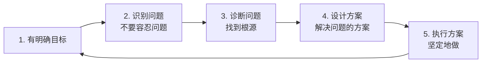

# 🌍 原则 —— 瑞·达利欧 逐章深度解读

> **作者**：瑞·达利欧（Ray Dalio）——桥水基金创始人，全球最大对冲基金掌舵人
> **核心成就**：从两居室公寓起家，将桥水做到美国最重要私营公司第5位（《财富》）；全球最富100人之一（《福布斯》）；100位最具影响力人物之一（《时代周刊》）
> **全书主题**：以原则为基础的生活方式——独立思考 + 极度求真 + 极度透明 + 可信度加权决策
> **结构**：第一部分「我的历程」（自传）+ 第二部分「生活原则」（5章）+ 第三部分「工作原则」（16章）

---

## 🎯 全书核心框架

---

## 📚 全书结构总览

| 部分 | 章节 | 主题 |
|:---:|------|------|
| 导言 | 我的第一条原则 | 独立思考 + 保持谦逊 |
| 第一部分 | 1-8章 | 我的历程（1949-2017自传） |
| 第二部分 | 5条生活原则 | 拥抱现实、五步流程、头脑开放、理解差异、有效决策 |
| 第三部分 | 16条工作原则 | 文化（1-6）+ 用人（7-9）+ 管理（10-14）+ 工具与治理（15-16） |
| 附录 | 工具集 | 集点器、棒球卡、问题日志、痛苦按钮等 |

---

## 第一部分 我的历程 —— 从平凡孩子到桥水帝国

### 📌 导言：最重要的事情

达利欧开篇就自称为"愚人"：

> "不管我一生中取得了多大的成功，其主要原因都不是我知道多少事情，而是我知道在无知的情况下自己应该怎么做。"

**第一条原则：**
> **独立思考并决定：（1）你想要什么；（2）事实是什么；（3）面对事实，你如何实现自己的愿望……而且要保持谦逊和心胸开阔。**

**关键概念：正确地失败**
- **正确地失败**：能够在经历痛苦的失败过程中吸取重要教训
- **错误地失败**：因为失败而被踢出局
- 成功的关键 = 既知道如何努力追求很多东西，也知道如何正确地失败

**核心洞察：**
- 共识性观点通常已反映在价格中，独立思考者要习惯打赌会发生与共识相反的情况
- 从"我知道我是对的"→"我怎么知道我是对的"的转变
- 以可信度加权的方式做决定
- 以系统化（算法化）的方式决策——"计算机能够比我做出更好的决策"

---

### 第1章 我的探险召唤（1949-1967年）

**核心故事：** 达利欧1949年出生于长岛中产阶级家庭，父亲是爵士乐手。他机械记忆力差、不喜欢听别人指示、好奇心强。8岁开始打零工，12岁做球童时用赚的钱买了第一只股票——**东北航空**（因为它是唯一低于5美元的股票），结果翻了3倍——其实是运气，因为该公司快破产被收购了。他当时不知道，只觉得"股市里赚钱很容易"，于是上瘾了。

**关键概念：**

| 概念 | 内容 |
|------|------|
| 早期性格 | 独立的思考者，为赢得奖赏甘愿冒险 |
| 对失败的态度 | "与失败比起来，我对乏味和平庸的恐惧要严重得多" |
| 打零工经验 | 8岁送报纸、铲雪、做球童、洗碗——学到上学学不到的经验 |
| 1966年顶点 | 高中毕业那年股市顶点——"几乎所有我曾经对股市的认识都被证明是错误的" |
| 梭罗名言 | "如果一个人和同伴的步调不一致，也许因为他听到的是不同的鼓点" |

---

### 第2章 跨越门槛（1967-1979年）

**核心故事：** 大学主修金融，学习超觉冥想。1971年8月15日，尼克松宣布美元与黄金脱钩，达利欧第一次意识到"政府承诺不可信"。他研究了历史上的货币贬值，得出关键教训：**"你最好弄明白其他时间、其他地点、其他人身上发生的事"**。哈佛商学院毕业后，因在老板脸上打了一拳被希尔森公司解雇，1975年在两居室公寓创办了桥水。

**关键概念：**

| 概念 | 内容 |
|------|------|
| 股价的本质 | 股价反映人们的预期——实际结果比预期好则涨，反之则跌 |
| 情景重现 | 几乎所有事情都以符合逻辑的因果关系不断发生过 |
| 猪腩期货教训 | 连续跌停的刻骨铭心经历——"交易就像跟电打交道，你可能被电击" |
| 防御与进攻 | "如果没有进攻心，你就赚不到钱；而如果没有防御心，你的钱就保不住" |
| 冥想的价值 | 拥有平静的开放思维，更清晰、更有创造性地思考 |
| 尼克松教训 | 决策者承诺不会贬值时，贬值越可能发生 |

**核心教训：** 当所有人想法都一样时（如"漂亮50股"包赚不赔），这一情况几乎必然反映在价格中，押注其上就可能犯错。所有行为（宽松货币）都会产生相称的后果（通胀），引起反向反应（紧缩）和市场反转。

---

### 第3章 我的低谷（1979-1982年）—— 一生中最重要的一课

**核心故事：** 这是达利欧人生最黑暗的时期。

**① 白银过山车（邦克·亨特）**
- 亨特是全球首富，从1.29美元/盎司开始买入白银对冲通胀
- 银价涨到10美元时达利欧建议退出（美联储准备加息、收益率曲线倒挂），亨特没听
- 银价最终冲到近50美元，1980年3月暴跌至11美元以下，亨特破产
- 教训：**"时机就是一切"**

**② 1982年大崩溃——达利欧的"跌入深渊"**
- 1982年达利欧准确预判债务危机，在电视上公开宣称"股市即将崩盘"，押上全部身家做空
- 结果：市场继续上涨，达利欧几乎破产，被迫裁掉所有员工，穷到买不起一张机票
- 这是他人生最大的失败，也是最重要的转折点

**关键概念：**

| 概念 | 内容 |
|------|------|
| 大萧条预警 | 1979-1981年美国经济比2008金融危机期间还差 |
| 沃尔克加息 | 美联储将货币增速限定5.5%，打破恶性通胀但也扼制经济 |
| 谦逊的诞生 | "我犯下的代价惨痛的错误使我改变了看问题的角度：从'我知道我是对的'变成了'我怎么知道我是对的'" |

**核心教训：**
1. **永远不要押注你可能是错的重大判断**——准确预测和正确行动是两回事
2. "靠水晶球谋生的人注定要吃碎在地上的玻璃"——最重要的事情不是预知未来，而是知道在每一个时间点上如何针对可获得的信息做出合理的回应
3. 谦逊是成功的基础——我需要用谦逊平衡我的勇敢

---

### 第4章 我的试炼之路（1983-1994年）

**核心故事：** 达利欧从废墟中重建桥水，并完成了最重要的转型——**把决策标准写成算法，用计算机系统化决策**。1985年与世界银行合作管理500万美元债券账户，成为桥水的转折点。1984年首次访华，开启30年与中国共同成长的历程。

**关键概念：**

| 概念 | 内容 |
|------|------|
| 决策系统化 | 把决策标准写成公式→用历史数据回测→改进规则→实时运行 |
| 人与计算机 | 计算机与我互相教育——"大多数时候是我忽略了某些东西，是计算机教育了我" |
| 预测vs反应 | "我们并不是预测经济环境中的变化，而是在变化发生时捕捉它们" |
| 阿尔法叠加 | 区分贝塔（市场回报）和阿尔法（主动押注回报）——只对高信心对象冒险押注并充分分散 |
| 风险中性基准 | 先确立"风险中性"仓位，再在慎重冒险时偏离 |
| 艾伦·邦德案例 | 混淆经营和投机、对冲时机太晚→破产——"选择对冲的时机又太晚" |

**桥水决策系统的发展：**

**中国情缘：** 1984年首次访华→帮助中信了解金融市场→支持"联办"建设中国资本市场→1994年成立桥水中国合作伙伴→坚信"中国注定会在21世纪成为全球最大的经济体"。

---

### 第5章 终极恩惠（1995-2010年）

**核心故事：** 桥水成长为全球最大对冲基金。2008年金融危机前准确预判危机。同时，达利欧的儿子保罗被诊断出**双相障碍**，经历了三年地狱般的挣扎——这段经历让他深刻理解了大脑的生理差异如何决定人的思维和行为。

**关键概念：**

| 概念 | 内容 |
|------|------|
| 2008年预判 | 准确预见金融危机，但决策者不听——"对于自己没有经历过的事情，人们并不感到害怕" |
| 保罗的故事 | 双相障碍=大脑化学物质分泌不稳定→控制化学物质就能改变状态 |
| 天才与疯子 | "富有创造性的天才和疯子可能只有一步之隔" |
| 思维差异 | 我们的思维方式在很大程度上由心理因素决定，是可以改变的 |
| 极度透明 | 保罗对自己患病极度透明并帮助他人，给达利欧启示 |

**核心教训：** 理解人与人大不相同不是抽象概念，而是基于大脑生理的客观现实。人们不是有意识地低效，而是"依据自己看到的情况来做事，而那是由他们大脑的运行方式决定的"。

---

### 第6章 回报恩惠（2011-2015年）

**核心故事：** 达利欧开始从第二阶段（工作）向第三阶段（自由体验生活）转型，2011年卸任CEO。他深入研究"塑造者"（shaper）——乔布斯、马斯克、贝佐斯、丘吉尔、李光耀、邓小平等人——发现他们的共性，并推动桥水的创意择优系统化。

**关键概念：**

| 概念 | 内容 |
|------|------|
| 人生三阶段 | 依赖他人学习→他人依赖我们工作→自由体验生活 |
| 塑造者定义 | 提出独特有价值的愿景并以美好方式实现的人 |
| 塑造者共性 | 独立思考、极为坚韧、视野宽广、创造性+系统性+现实性合一、坚决又开明、充满热情 |
| "顾及他人"低分 | 面对"实现目标vs取悦他人"时，塑造者都选择实现目标 |
| 管理算法化 | 像投资系统一样把管理原则变成算法——"算法本质上就是在连续性基础上运行的原则" |
| 集点器 | 实时收集个人信息的App，改变工作方式 |

**塑造者的类型：**

| 类型 | 代表 | 特点 |
|------|------|------|
| 发明型塑造者 | 爱因斯坦 | 通过发明塑造，不需要管理 |
| 管理型塑造者 | 杰克·韦尔奇 | 优秀管理者和领导者，不必善于创造 |
| 综合型塑造者（最罕见） | 乔布斯、马斯克、盖茨、贝佐斯 | 既能设想发明，也能管理大型机构 |

**欧洲债务危机预判：** 2010年起准确预判南欧债务危机，但"国际货币基金组织的总裁质疑我看上去离奇的结论，而且没有兴趣审读我的数据"——与2008年同样的遭遇。

---

### 第7章 最后的一年和最大的挑战（2016-2017年）

**核心故事：** 领导层转型失败——格雷格·詹森同时担任CEO和CIO不堪重负，2016年3月达利欧被迫重新担任联合CEO。这是他"经营桥水期间最后悔的一个失误"。他由此深刻理解了**治理**的重要性。

**关键概念：**

| 概念 | 内容 |
|------|------|
| 吉姆·科林斯建议 | "让胜任的人做CEO，同时拥有一套有效的治理机制，可以在CEO无法胜任的情况下替换他" |
| 治理的定义 | 一套制衡机制，确保组织不管谁在什么时候做领导人都无比坚强有力 |
| 创始人陷阱 | 创始人35年没有正式制衡规则经营公司 |
| 教训 | 不能错误地认为在一个职位上成功的人必定能在另一个职位上成功 |

**核心教训：** 转型失败不是终点，而是"跌入深渊"的体验——引导他们走向一场转型，带来很大改善。

---

### 第8章 从更高的层面回顾 —— 全书的哲学内核

**核心故事：** 达利欧回顾一生，提炼出最核心的人生哲学。

**关键概念：**

| 概念 | 内容 |
|------|------|
| 情景重现 | 把每次遭遇视为"类似情境的重现"，像生物学家遇到动物一样先确定种属再应对 |
| 现实是永动机 | 一些原因引起一些结果，这些结果又成为原因，循环往复 |
| 痛苦是信号 | 把痛苦视为大自然的提醒——"告诉我有一些重要的东西需要我去学习" |
| 喜爱自己的痛苦 | 学会了喜爱自己的痛苦——像学会喜爱锻炼身体一样 |
| 成功的满足感 | "成功的满足感并不来自实现目标，而是来自努力奋斗" |
| 边际收益递减 | 拥有很多东西的人，边际收益并不像多数人认为的那么大 |
| 传递知识 | "传递知识就像传递基因，其意义超过了单个的人" |

**核心公式：**

> "我逐渐认识到，成功的满足感并不来自实现目标，而是来自努力奋斗。"

> "坚强比软弱好，而拼搏让人坚强。发现自己的性格，过与性格相适应的生活，才是最幸福的。"

---

## 第二部分 生活原则

### 第1条 拥抱现实，应对现实

**核心故事：** 把生活想象为一场游戏，每个问题都是一个需要破解的谜。通过解谜获得宝石（原则），进入更高一级的游戏。

**关键概念：**

| 概念 | 内容 |
|------|------|
| 超级现实的人 | 理解现实、接受现实、处理现实问题 |
| 成功公式 | **梦想 + 现实 + 决心 = 成功的生活** |
| 真相原则 | 真相（对现实的准确理解）是任何良好结果的根本依据 |
| 极度透明 | 不要担心其他人的看法，使之成为你的障碍 |
| 自上而下vs自下而上 | 宏观普适法则 + 具体情境规律，两者都需要 |
| 进化视角 | 考察影响你的那些事物的规律，理解因果关系，学习应对原则 |
| 意境地图 | 理解每个"再现情境"背后的机理，形成应对地图 |

**自然规律的学习：**
- 观察自然，学习现实规律——"大自然向我们展示了所有的现实规律"
- 人类能飞行、能发送手机信号，来自理解和应用已有的现实规律
- 人脑的"动物部分"（杏仁核等）与高级部分（前额皮层）的冲突导致混淆事实和想要的事实

> "创造伟大事物的人不是空想者，而是彻底地扎根于现实。"

> "没有深深扎根于现实的理想主义者会制造问题，而不是推动进步。"

---

### 第2条 用五步流程实现你的人生愿望

**核心故事：** 个人进化通过5个不同步骤发生，做好这5件事，几乎肯定可以成功。

**五步流程：**

**每步的关键原则：**

| 步骤 | 关键原则 |
|------|---------|
| ① 明确目标 | 排列优先顺序；不要混淆目标和欲望；伟大的期望创造伟大的能力；灵活性和自我归责 |
| ② 找出问题 | 把痛苦问题视为进步机会；不要逃避问题；精准找到问题所在；区分大问题小问题；**不容忍问题** |
| ③ 诊断问题 | 先弄明白问题再决定怎么做；区分直接原因和根本原因；15-60分钟的良好诊断 |
| ④ 规划方案 | 前进之前先回顾；把问题看作机器产生的结果；方案像电影剧本；写下来让所有人看到 |
| ⑤ 践行方案 | 严守计划；建立清晰衡量标准；良好工作习惯；"别冲动，磨刀不误砍柴工" |

**核心教训：**
- 你必须以清醒、理性的方式推进过程，从更高的层面俯视自身，做到一丝不苟的诚实
- 每个步骤必须按顺序做——"设定目标的时候就设定目标，不要想如何实现目标或者出错了怎么办"
- 错误是不可避免的，是生活的一部分；你犯的每个错误都能教给你一些东西
- 各种各样的借口（"这太难""这看起来不公平"）都是没有价值的

---

### 第3条 做到头脑极度开放 —— 全书最重要的一条

**核心故事：** 这也许是全书最重要的一条，阐述如何克服影响大多数人实现人生愿望的两大障碍。

**两大障碍：**

**关键概念：**

| 概念 | 内容 |
|------|------|
| 自我意识障碍 | 潜意识防卫机制，使你难以接受自己的错误和弱点 |
| "两个你" | 较高层次的你（前额皮层/逻辑）vs 较低层次的你（杏仁核/情绪） |
| 思维盲点障碍 | 思维方式有时会阻碍你准确看待事物——"人们无法理解自己看不到的东西" |
| 头脑极度开放 | 有效探析各种不同的观点和可能性，而不是让自我意识或思维盲点阻碍你 |
| 可信的人 | （1）曾反复在相关领域成功找到答案（至少三次）；（2）在被问责情况下能对自己的观点做出很好解释 |
| 深思熟虑的意见分歧 | 目标不是让对方相信你是对的，而是弄明白谁是对的，并决定该怎么做 |

**头脑极度开放的要点：**
1. 诚恳地相信你也许并不知道最好的解决办法是什么
2. 认识到决策应当分两步：先分析所有相关信息，然后决定
3. 不要担心自己的形象，只关心如何实现目标
4. 认识到你不能"只产出不吸纳"
5. 必须暂时悬置判断，设身处地评估另一种观点
6. 你是在寻找最好的答案，而不是你自己能得出的最好答案
7. 搞清楚你是在争论还是在试图理解一个问题

**适应和进化的三种途径：**
1. 训练自己的头脑以反直觉的方式思考
2. 利用辅助机制（程序化的提醒器）
3. 在自己的短板上，依靠擅长者的帮助

> "亚里士多德把悲剧定义为人的致命缺陷导致的可怕结果。自我意识和思维盲点这两大障碍就是人的致命缺陷，导致聪颖勤奋的人无法发挥自身的全部潜力。"

> "头脑封闭的代价极为高昂：当其他人向你展示各种美妙的可能性和可怕的威胁时，你会视而不见。"

---

### 第4条 理解人与人大不相同

**核心故事：** 达利欧因儿子保罗的双相障碍和桥水早期管理失败，深入研究神经科学和心理测试（MBTI等），开发出"棒球卡"工具记录每个人的特征。

**关键概念：**

| 概念 | 内容 |
|------|------|
| 大脑构造差异 | 我们的很多心理差异都是生理性的——大脑存在固有差异 |
| 分歧的本质 | "我们的分歧不是沟通不良造成的，相反，我们不同的思维方式导致了沟通不良" |
| 双刃剑特征 | 大多数特征都是双刃剑——特征越极端，好处或害处越极端 |
| 棒球卡 | 记录每个人的强项弱点，大家彼此打分，特定领域有成就记录者权重更高 |
| 人脑结构 | 890亿个神经元，每个神经元与周围约1万个连接——1立方厘米脑组织的连接数如银河系恒星 |

**理解差异的实践价值：**
- 每个人都像由很多特征搭成的积木，每块积木反映大脑一个特定区域的运行方式
- 了解了人的特性，就可以很好地预期他们的行为
- 创造力型（发散思维）vs 线性思维者——互补才能成功
- "在任何复杂的计划中，缺少拥有互补性能力者的帮助，任何人都无法成功"

> "一旦我明白问题是生理因素，我看许多事情就更清晰了。他们并不是有意识地采取这种看起来低效率的做法，只不过是依据自己看到的情况来做事。"

---

### 第5条 学习如何有效决策

**核心故事：** 作为职业决策者，达利欧研究如何降低犯错概率、实现更好效果的决策规则与系统。

**关键概念：**

| 概念 | 内容 |
|------|------|
| 有害的情绪 | 影响好决策的最大威胁是有害的情绪 |
| 两步流程 | 先了解后决定——"了解必须先于决定" |
| 综合分析 | 把许多数据转化为一幅精准画面的过程——决定决策质量 |
| 眼前的形势 | 分清"点"的重要与不重要；决定问谁；不要听到什么信什么；不要过度分析细节 |
| 变化中的形势 | 按类型和质量分类事件；注意改善速度与水平的关系 |
| 多个层级 | 高效地综合考虑多个层级 |
| 决策vs结果 | 关注决策质量而非一时结果；权衡直接/后续/再后续结果 |

**有效决策的原则：**

| 原则 | 内容 |
|------|------|
| 决定问谁 | 你能做的最重要的决定之一是决定问谁——确保他们是可信的人 |
| 观点vs事实 | 观点很廉价，许多人会把观点表述为事实 |
| 眼前vs全局 | 所有东西都是放在眼前看更大——跳出去看到全局 |
| 新vs经典 | 不要夸大新东西的好处——选择最好而不是最新 |
| 细节焦虑症 | 一些人毕生收集各种零零碎碎的看法，担忧不重要的事情 |
| 潜意识的陷阱 | 先在潜意识驱使下做决策，然后挑选与决策相符的数据——这是不良决策的第一个陷阱 |

> "很多惨痛的糟糕决定，都是由于决定者未能权衡后续和再后续结果。"

> "在提出疑问和探寻事实真相之前，永远不要看到一个选择就定下来，不管它看起来多么好。"

---

## 第三部分 工作原则

### 概览：工作原则的精髓

| 原则 | 一句话核心 |
|:---:|-----------|
| 1. 极度求真和极度透明 | 了解真相是成功的关键，透明加强理解、不断改进 |
| 2. 有意义的工作和人际关系 | 忠于共同使命，而非三心二意之人 |
| 3. 允许犯错，不容忍一错再错 | 痛苦+反思=进步；错误是学习的机会 |
| 4. 求取共识并坚持 | 冲突是检验原则一致性的方式 |
| 5. 从观点的可信度出发 | 可信度加权是最公平有效的决策系统 |
| 6. 知道如何超越分歧 | 一旦做出决定，任何人都必须服从 |
| 7. 找对做事的人 | 最重要的决策是选好工作的责任人 |
| 8. 要用对人 | 用人不当的代价高昂——价值观>能力>技能 |
| 9. 持续培训测试评估 | 严厉的爱是最重要的爱 |
| 10. 像操作机器一样管理 | 管理者是机构的工程师 |
| 11. 发现问题不容忍问题 | 如果你不担心，你就要担心了 |
| 12. 诊断问题探究根源 | 先问：结果好坏？谁负责？能力还是设计？ |
| 13. 改进机器解决问题 | 好的计划应该像一部电影脚本 |
| 14. 按既定计划行事 | 使用检查清单；留出时间休整；鸣钟庆祝 |
| 15. 运用工具和行为准则 | 仅凭文字是不够的——需要内化学习和习惯 |
| 16. 千万别忽视公司治理 | 制衡机制确保原则和总体利益高于个人 |

**创意择优——工作原则的核心机制：**

---

### 工作原则1-3：打造文化的基石

#### 1. 相信极度求真和极度透明

**核心故事：** 桥水考虑把后台部门剥离给纽约梅隆银行时，艾琳·马瑞立即召开全员大会告知员工——即使方案尚未明确。"说明事实、公开透明是唯一负责任的做法"。

**关键概念：**

| 概念 | 内容 |
|------|------|
| 极度求真 | 以实事求是、公开透明的态度对待同事 |
| 极度透明 | 对任何事（包括错误和弱点）保持完全透明 |
| 适应期 | 多数人需要18个月适应——"较低层次的自己"倾向"要么战，要么逃" |
| 正直 | 拉丁文integritas意为"一"或"完整"——表里不一的人是不正直的 |
| 背后议论 | 恶劣程度仅次于撒谎，是桥水最忌讳的事情 |
| 丘吉尔名言 | "给公众以虚假的期望，而期望又很快破灭，这是最糟糕的领导方式" |

#### 2. 做有意义的工作，发展有意义的人际关系

**关键概念：**

| 概念 | 内容 |
|------|------|
| 忠于使命 | 忠于共同的使命，而非对此三心二意之人 |
| 公平vs慷慨 | 慷慨大方是好事，而有权受惠顾却很糟糕——二者必须分清 |
| 班车案例 | 员工要求报销油费被拒——"把对部分人的慷慨资助当作每个人的应得福利"是错误 |
| 站在公平的另一端 | 尽可能多为别人着想，少向别人索取 |
| 深情怀 | 每个员工都应得到深情怀——但同时要清楚界限 |

#### 3. 打造允许犯错，但不容忍罔顾教训、一错再错的文化

**核心故事：** 交易部负责人罗斯忘记为客户执行交易，造成巨大损失。达利欧没有开除他，而是和他一起设立**问题日志**——"我向他和其他员工表明了犯错误情有可原，但不吸取教训是不能接受的"。问题日志后来成为桥水最强大的工具之一。

**关键概念：**

| 概念 | 内容 |
|------|------|
| 核心公式 | **痛苦 + 反思 = 进步** |
| 爱迪生 | "我没有失败，我只是发现了一万种不成功的方法" |
| 乔丹 | 迈克尔·乔丹"沉醉在自己的错误中，把每次错误都当成改进的机会" |
| 错误日志 | 把错误和不良后果记录下来，追根溯源，系统化解决问题 |
| 贝佐斯 | "你必须愿意接受反复的失败。如果你没有接受失败的意愿，你就要注意，自己不要再去创造了" |
| 错误模式 | 观察错误模式，判断是否因缺点引起——通往成功的捷径始于了解自己的缺点 |
| 可容忍的错误 | "我可以容忍你把车蹭掉了漆或撞凹了一块，但我不会冒大风险让你把车子给全毁了" |

> "如果你回顾一年前的自己，而没有为自己所做的傻事感到震惊，就说明你还没有吸取足够多的教训。"

---

### 工作原则4-6：创意择优的运作

#### 4. 求取共识并坚持

**核心故事：** 员工吉姆·H在客户会议后给达利欧发邮件，给他打" D- "分："你一个人就讲了62分钟……你并没有提前做任何准备。"达利欧把这样的批评视为正常——下属批评高管在桥水是常态。

**关键概念：**

| 概念 | 内容 |
|------|------|
| 求取同步 | 以开放而自信的心态修正双方立场的过程 |
| 冲突的价值 | 人们正是用冲突来检验各自的原则是否一致 |
| 掩盖分歧 | "回避冲突也就回避了解决冲突的机会；躲过了小的矛盾，之后往往会有大的矛盾" |
| 开放+坚定 | 理性解决分歧需要同时保持开放心态和坚定果断 |
| 心态开放vs封闭 | 开放者通过问问题学习；封闭者总是告诉你他们所知甚多 |
| 两分钟法则 | 避免持续被别人打断 |
| 爵士乐 | 伟大的合作如同爵士乐演奏——1+1=3；3-5人的效率高于20人 |

#### 5. 做决策时要从观点的可信度出发

**核心故事：** 2012年春欧债危机升级，桥水研究团队对"欧洲央行是否印钞购买债券"产生分歧（一半一半）。通过集点器进行**可信度加权投票**——专业技能和综合能力得分高的人认为德拉吉将违背德国意愿印钞买债。几天后，欧洲央行公布了大规模无限量购买政府债券计划——判断正确。

**关键概念：**

| 概念 | 内容 |
|------|------|
| 可信度加权 | 对能力更强的决策者的观点赋予更大权重 |
| 可信的标准 | （1）多次成功解决相关问题；（2）能逻辑解释结论背后的因果关系 |
| 独裁vs民主 | 独断专行和民主协商都有缺陷——最佳是可信度加权 |
| 贝比·鲁斯比喻 | 向传奇棒球手学习时，从未打过棒球的人不该不断打断他 |
| 权威不等于正确 | 如果自己是新手，就不断挑战鲁斯直至了解事实 |
| 40年铁律 | 达利欧从未朝着可信度加权投票结论相反的方向做决策 |
| 关注推理 | 要更关注发言人的推理过程，而非其结论 |

#### 6. 知道如何超越分歧

**关键概念：**

| 概念 | 内容 |
|------|------|
| 原则如法律 | 不能因为你自己和他人同意打破原则就违反原则 |
| 发牢骚vs决策权 | 不要让大家把发牢骚、提建议、公开辩论的权利与决策权相混淆 |
| 超越分歧 | 要么提交上级裁定，要么投票表决——不要被分歧束缚住 |
| 服从决定 | 一旦做出决定，任何人都必须服从，即便个人可能有不同意见 |
| 小节自恋 | 大事达成共识后为小事争论不休——"感恩节上谁来切火鸡肉"案例 |
| 着眼大局 | 把自己当成俯瞰全局的客观旁观者 |

---

### 工作原则7-9：用对人

#### 7. 比做什么事更重要的是找对做事的人

**核心故事：** 达利欧年轻时不懂"要用比你强的人"，如今明白："我需要做员工的指挥，他们当中的许多人演奏乐器都比我强。"

**关键概念：**

| 概念 | 内容 |
|------|------|
| 最重要的决策 | 你最重要的决策是选好工作的责任人 |
| 最终责任 | 负最终责任的人应是对行为后果承担责任的人 |
| 事情背后是人的力量 | 多数情况下的成因就是具有特殊素质、以特殊方式工作的特殊人群 |
| 简单四步 | 记住目标→布置给能胜任的人→让他们尽职尽责→不胜任就辞掉 |

#### 8. 要用对人，因为用人不当的代价高昂

**关键概念：**

| 概念 | 内容 |
|------|------|
| 三个C | 品格（character）、常识（common sense）、创造力（creativity） |
| 价值观>能力>技能 | 价值观是驱动行为的深层信仰；技能可习得，价值观能力难改变 |
| 不要因人设职 | 长期来看几乎总是错的 |
| 找出色的人 | 要找出色的人，而不是"此类即可" |
| 人不会大变 | 最好假定人们不会改变，除非有足够强的证据 |
| 用人是赌博 | 招人是一项高风险的赌博，需要分外小心 |
| 体育队模式 | 没人能靠一己之力单独取胜，但每个人都必须战胜对手 |

#### 9. 持续培训、测试、评估和调配员工

**关键概念：**

| 概念 | 内容 |
|------|------|
| 严厉的爱 | 严厉的爱既是最难给的，也是最重要的爱——"你给人的最大礼物是获得成功的力量" |
| 授人以渔 | 授人以渔而不是授人以鱼，即便这意味着会使他们犯些错 |
| 内化学习 | 经验会形成内化的学习，这是书本学习无法替代的 |
| 准确vs善意 | "到最后，准确和善意是一回事"——看似善意而不够准确对人是有害的 |
| 300%现象 | 每个人对自己贡献占比的估计加起来是300%——必须确保具体功劳归具体人 |
| 真实评估 | 准确评价人，不做"好好先生" |
| 新员工周期 | 6-12个月了解新员工；18个月融入公司文化 |

---

### 工作原则10-14：像操作机器一样管理

#### 10. 像操作一部机器那样进行管理以实现目标

**关键概念：**

| 概念 | 内容 |
|------|------|
| 管理者是工程师 | 出色的管理者就是一家机构的工程师——把机构当作机器看待，兢兢业业维护和改进 |
| 高层面俯视 | 像从外太空看地球——看到大陆、国家和海洋之间的联系 |
| 量化工具 | 制定量化评价工具——"对于无法计量的事物，你肯定也管不好" |
| 机器vs事务 | 注意别把精力过多用于应付各种事务，而忽视你的机器 |
| 两个目的 | 应对每个问题的手段要服务于两种目的：接近目标+培训和测试机器（后者更重要） |
| 管理vs微观管理 | 管理=协调（乐队指挥）；微观管理=事无巨细替下属完成任务；不管理=放任 |
| 一起滑雪 | 管理你的下属就好比是在"一起滑雪"——在滑雪中指点 |

#### 11. 发现问题，不容忍问题

**核心故事：** 2011年客户服务部质量控制机制大面故障——备忘录错误未被发现。"这种未能反思问题、未能拒绝容忍问题的事例……他们变成了橡皮图章，而非能工巧匠。"

**关键概念：**

| 概念 | 内容 |
|------|------|
| 核心原则 | **如果你不担心，你就要担心了；如果你担心，你就不必担心** |
| 温水煮青蛙 | 人们都有慢慢习惯于不可接受事物的强烈倾向 |
| 从众心理 | 即便没有人担心，也不表明没有问题存在——"要明白无误地说'这顿饭馊了'" |
| 问题即机会 | 问题就像添入火车头发动机中的煤，通过燃烧推动我们前进 |
| 指定责任人 | 指定员工负责发现问题，有独立的报告路线，不必担心揭丑的后果 |

#### 12. 诊断问题，探究根源

**关键概念：**

| 概念 | 内容 |
|------|------|
| 三大常见错误 | 把问题当一时差错（不诊断机器）；诊断时不提姓名；未把教训与之前联系 |
| 三个问题 | 结果是好是坏？谁对结果负责？因为能力不够还是机器设计有问题？ |
| 直接原因vs根本原因 | 直接原因用动词描述（没查时刻表）；根本原因用形容词描述（健忘） |
| 避免事后诸葛亮 | 评价过去的决策，要根据决策时能合理了解的情况，而非现在新得知的情况 |
| 环境vs方法 | 不要把某人所处环境的优劣与其应对方法的优劣混为一谈 |

#### 13. 改进机器，解决问题

**核心故事：** 戴维·麦考密克根据诊断开除了导致标准下滑的人，发明了"质量日"方法——一年两次会议做模拟演示和相互评价。

**关键概念：**

| 概念 | 内容 |
|------|------|
| 建造机器 | 与完成手头任务相比，建造机器要花费约两倍时间，但一切终有回报 |
| 电影脚本 | 好的计划应该像一部电影脚本——谁在何时做什么能产生什么结果 |
| 二三轮后果 | 不仅要考虑第一轮的后果，更要考虑第二、第三轮的后果 |
| 瑞士钟表 | 定期召开会议，让公司像瑞士钟表一样精准运行 |
| 清洗风暴 | 困难时期能荡涤弱者——对森林的健康成长有好处 |
| 围绕目标 | 设计组织结构时要围绕目标而不是围绕任务（营销部vs客户服务部分开） |
| 自上而下建设 | 组织的基础位于顶端——先招聘管理者，再招聘管理者的下属 |

#### 14. 按既定计划行事

**关键概念：**

| 概念 | 内容 |
|------|------|
| 动力来源 | 想象回报、责任感、对团队的依恋、希望被承认——都可以接受 |
| 别冲动 | 磨刀不误砍柴工——花足够时间设计行动计划 |
| 三个办法 | 减少工作量（优先排序/拒绝）；授权；提高效率 |
| 检查清单 | 使用检查清单——但不要把检查清单和个人责任相混淆 |
| 留出休整 | 过度消耗会逐渐熄火——日程表里留出停工检修期 |
| 鸣钟庆祝 | 达成目标后庆祝吧！ |
| 丘吉尔 | "成功就是从失败到失败，也依然热情不改" |

---

### 工作原则15-16：工具与治理

#### 15. 运用工具和行为准则指导工作

**核心故事：** "仅凭文字是不够的。"达利欧发现希望按照原则行事和实际能够做到之间有很大区别——"假定人们能够做到他们想要做的事，就相当于假定认识到减肥有益于健康的人一下子就能把他的体重减下去了。"

**关键概念：**

| 概念 | 内容 |
|------|------|
| 内化学习 | 必须内化学习或养成习惯——经验学习比书本学习有更强大的力量 |
| 工具的价值 | 系统像GPS——掌握所有交通规则和路线，提供导航服务 |
| 数据驱动 | 利用工具搜集数据，经过处理形成结论和行动 |
| 公平透明 | 基于数据和规则的系统让辩解者哑口无言，展示系统的公平性 |

#### 16. 千万别忽视了公司治理

**核心故事：** 达利欧卸任CEO后才发现治理的重要性——"直至我卸任CEO之后，我才意识到此类治理的重要性。"桥水没有董事会、没有内部监管机制——"我肯定没有建立起适合公司的治理体系。"

**关键概念：**

| 概念 | 内容 |
|------|------|
| 治理的定义 | 一套制衡机制，确保公司的原则和总体的利益总是置于个人或少部分人的利益之上 |
| 制衡机制 | 即便是最仁慈的领导者，也存在独裁的倾向 |
| 恺撒的故事 | 王岐山讲给达利欧的古罗马故事——"要确保公司里没有任何人比体系更强大" |
| 诸侯割据 | 当心出现诸侯割据——个人对老板的忠诚不能与对整个公司的忠诚冲突 |
| 联合CEO | 对一个人过度依赖产生关键人物风险——2-3人合作领导 |
| 治理vs伙伴关系 | 治理体系不能取代出色的伙伴关系 |

---

## 🏆 全书精华总结

### 达利欧的人生算法

### 生活原则 vs 工作原则的对应关系

| 生活原则 | 工作原则对应 |
|---------|------------|
| 拥抱现实 | 极度求真和极度透明（工作1） |
| 五步流程 | 像操作机器一样管理（工作10-14） |
| 头脑极度开放 | 求取共识并坚持（工作4） |
| 理解人与人大不相同 | 找对做事的人+用对人（工作7-8） |
| 有效决策 | 从观点的可信度出发（工作5） |

### 桥水工具箱（附录）

| 工具 | 用途 |
|------|------|
| 教练 | 案例库与原则挂钩，提供应对建议 |
| 集点器 | 会议实时打分、可信度加权投票、节点问题报警 |
| 棒球卡 | 记录每个人强项弱点及其证据 |
| 问题日志 | 记录错误、追根溯源、系统化改进 |
| 痛苦按钮 | 记录痛苦感受，事后反思（痛苦+反思=进步） |
| 分歧解决器 | 为创意择优下的分歧解决提供路径 |
| 每日更新 | 每位下属每天10-15分钟汇报工作、问题和反思 |
| 契约工具 | 记录承诺并监督履行 |
| 流程图 | 把公司当作机器来设计 |
| 量化指标 | 度量机器运转状况 |

### 达利欧最核心的10句话

> 1. "我一生中学到的最重要的东西是一种以原则为基础的生活方式，是它帮助我发现真相是什么，并据此如何行动。"

> 2. "成功的关键在于，既知道如何努力追求很多东西，也知道如何正确地失败。"

> 3. "梦想 + 现实 + 决心 = 成功的生活。"

> 4. "痛苦 + 反思 = 进步。"

> 5. "要有效行事，你就绝不能允许'想要自己正确'的需求压倒'找出真相'的需求。"

> 6. "你是在寻找最好的答案，而不是你自己能得出的最好答案。"

> 7. "做到头脑极度开放、极度透明，是价值无限的。"

> 8. "如果一个人能独立思考，同时保持开放的头脑，清醒地寻找并发现最适合你的事情，如果你能鼓起勇气这么做，你将会让自己的生命发挥最大的价值。"

> 9. "成功的满足感并不来自实现目标，而是来自努力奋斗。"

> 10. "传递知识就像传递基因，其意义超过了单个的人。"

---

## 💡 个人读书心得

### 这本书的独特价值

《原则》不是一本普通的成功学书籍，而是达利欧用**工程师思维**对自己一生（尤其是失败）进行系统化提炼的产物。它的独特之处在于：

1. **从失败中提炼**——1982年几乎破产的经历是全书的思想源头，此后所有原则都是"用痛苦换来的"
2. **可执行的方法论**——不是空谈"要开放"，而是具体到"头脑极度开放的7个要点"、"五步流程的每步原则"
3. **系统化、算法化**——达利欧是第一个把决策原则写成算法、用计算机回测的管理者
4. **知行合一**——桥水用工具（集点器、棒球卡、问题日志）强制执行原则，不是靠自觉

### 对投资人的启示

达利欧与利弗莫尔、巴菲特截然不同：
- **利弗莫尔**：靠行情纸带解读和交易纪律（价格止损+时间止损）
- **巴菲特**：靠价值评估和长期持有（护城河+安全边际）
- **达利欧**：靠宏观机器理解+系统化决策+风险平价（理解经济机器如何运转）

达利欧对投资者的最大启示：**不要把投资当赌博，要把它当工程**——把决策标准写下来、用历史数据回测、尊重可信度加权、控制风险敞口（"只对你有高度信心的投资对象进行冒险押注，并对这些对象进行充分的分散投资"）。

### 实践应用建议

1. **写下你自己的原则**——把每次犯错后的教训写成原则，积累成自己的"决策手册"
2. **践行五步流程**——目标→问题→诊断→方案→践行，循环往复
3. **建立痛苦-反思机制**——痛苦时记录，冷静后反思，提炼原则
4. **寻找可信的人**——遇到重要决策，请教"至少三次成功解决过相关问题"的人
5. **像机器一样审视自己**——定期从更高层面审视自己的"设计"和"运转"

---

*笔记创建日期：2026年8月1日*
*来源：C:\Obsidian笔记\投资_md\(004) 达利欧 原则*

---

## 附录 从破产边缘到 1600 亿美元：一个把"错误"变成"算法"的男人（知乎文风）

### 写在前面：为什么拆解达利欧

系列拆到现在，我们已经见过三种命运：**利弗莫尔**——赢了市场，输给自己，自杀；**索罗斯**——承认自己会错，设计纠错机制，善终；**林奇**——从不与市场对赌，与生活和解，善终。

而 **04 号瑞·达利欧**，给出了第四种答案：**把"自律"外包给"系统"。**

利弗莫尔用一生证明：人无法永远管住自己——他在巅峰之后违反了所有纪律，四次破产。达利欧的回应是：**那就不要靠"管住自己"，而是把纪律写成原则、变成文化、嵌入组织，让系统替你把关。**

他用这套方法，把桥水基金做成了全球最大的对冲基金——**管理规模一度超过 1,600 亿美元**，并两次在金融危机中提前布局、逆势大赚。

他的书叫《原则》——一本没有一句废话、全部由"做事规矩"组成的书。

但所有原则的起点，是 1982 年那个几乎毁掉他的错误。

### 第一幕：1982 年——他公开预言经济崩溃，然后被市场打脸

1982 年 8 月，达利欧 33 岁，已经做了 7 年投资。他受邀登上电视节目，对着镜头侃侃而谈：**美国经济即将崩溃，一场大萧条式的债务危机就在眼前。**

他言之凿凿，因为他的模型告诉他：美国借了太多钱，债务不可持续，崩盘是数学上的必然。

**结果呢？**

美国股市不但没崩，反而从 1982 年 10 月开始了一轮史诗级大牛市——道琼斯指数在他预言后的几年里翻了一倍多。达利欧的判断，错得离谱。

后果是灾难性的：桥水基金（当时还很小）几乎破产，员工走光，**只剩他一个人**。他穷到不得不向父亲借了 4,000 美元，才付得起房贷和给妻子孩子的生活费。

很多年后，达利欧在书里这样回忆：

> "我犯下了人生中最大的错误——一个让我觉得自己就是个彻头彻尾的蠢货的错误。"

**请注意：大多数人在这种时刻的选择，是"忘掉它"或"怪别人"。**达利欧的选择是：**解剖它。**

他坐下来，一遍一遍问自己：

- 我的模型错在哪里？
- 我为什么会如此自信？
- 市场里有什么是我没看到的？
- 下一次，我怎么做才能避免同样的错误？

**他把这次惨败，变成了桥水最核心的资产：一套"从错误中提炼原则"的机器。**

> "错误就像一颗原子弹：处理不当，它会毁灭你；处理得当，它就是你的核电站。"

### 第二幕：错误炼金术——痛苦 + 反思 = 进步

达利欧在《原则》里给出了他整个哲学的核心公式：

> **痛苦 + 反思 = 进步（Pain + Reflection = Progress）**

| 普通人的循环 | 达利欧的循环 |
|-------------|-------------|
| 犯错 → 痛苦 → 忘记 | 犯错 → 痛苦 → **解剖** → 提炼原则 |
| 同一类错误反复犯 | 每条错误变成一条原则，永不再犯 |
| 痛苦是纯粹的坏事 | 痛苦是进步的信号弹 |

**达利欧的操作系统**：

1. **痛苦出现时，不逃避**——把它当作"警报响了"
2. **问：这是哪种错误？**——分类（无知/能力/情绪）
3. **提炼原则**——"下次遇到 X，我做 Y"
4. **原则入库**——写下来，成为决策规则

**这解释了一个反直觉的事实：为什么桥水能持续 40 多年不犯大错？不是达利欧比别人聪明，而是他把每次错误都变成了别人看不见的"原则库"。**

### 第三幕：极度求真、极度透明——把文化变成防火墙

1982 年的错误还教会达利欧另一件事：**一个人再聪明也会错，所以要靠一群人的"极度求真"来纠错。**

桥水文化里有两个让外人瞠目结舌的规定：

| 规定 | 内容 | 目的 |
|------|------|------|
| 极度求真 | 所有会议录音，所有分歧摆上台面 | 让错误无处藏身 |
| 极度透明 | 问题日志（Issue Log）公开，人人都能记别人的错 | 让纠错成为日常 |
| 两分钟规则 | 每人发言不超过两分钟 | 防止话痨垄断 |
| 质疑权威 | 下级可以当面挑战达利欧 | 防止一言堂 |

**桥水最著名的场景**：员工在会议上当面说"达利欧，你这个判断是错的，理由如下"——这在别的公司是找死，在桥水是**义务**。

> "要么极度求真，要么离开。"

**为什么达利欧敢这么干？因为他知道：1982 年那次错误，正是因为没有人在他面前说'你可能错了'。**一个人的自信越强，越需要别人来当镜子。

**（这与 31 号索罗斯的"人类不确定性原则"殊途同归：索罗斯用哲学承认自己会错，达利欧用制度逼别人指出自己错。）**

### 第四幕：五步流程——把"进化"变成可执行算法

达利欧认为，无论做人还是做公司，成功的路径只有一条：**进化**。而进化不是一个抽象概念，是可以拆成五步的流程：

| 步骤 | 关键心态 | 常见失败 |
|------|---------|---------|
| 目标 | 目标要真正是你想要的 | 目标模糊 |
| 识别问题 | 不回避、不容忍 | 假装没问题 |
| 诊断根源 | 问"为什么"直到根因 | 只治标 |
| 设计 | 方案要具体可执行 | 空谈 |
| 执行 | 坚定+严格自律 | 半途而废 |

**五步流程的精髓**：**它把"反思"从情绪活动变成了流程活动**——你不用在痛苦中顿悟，你只需要按步骤走完，答案自然出现。

**（与 02 号利弗莫尔对照：利弗莫尔也有"记录-反思"的习惯，但他靠的是个人意志；达利欧把它变成了组织流程——意志会崩溃，流程不会。）**

### 第五幕：创意择优——可信度加权决策

一个人会错，两个人会错，一群人也会错——但**一群人的"加权平均"可以逼近正确**。这是桥水决策制度的底层逻辑：**创意择优（Idea Meritocracy）。**

**可信度加权**：决策不是一人一票，而是**按可信度投票**：

| 决策者类型 | 权重 | 判断依据 |
|-----------|------|---------|
| 有成功记录+能解释逻辑 | **高权重** | 过往战绩+思维透明 |
| 有成功记录但讲不清逻辑 | 中权重 | 经验直觉 |
| 无记录但逻辑清晰 | 中低权重 | 潜力待验证 |
| 无记录+无逻辑 | 低权重 | 噪音 |

**为什么这比民主投票好？**因为投资不是"民意测验"——**多数人的意见往往是错的（鸡尾酒会理论！）**，而少数"可信度高"的人的意见往往是对的。

**（这里与 32 号林奇鸡尾酒会理论暗合：林奇说"人人荐股=顶部"，达利欧说"人人一票=灾难"——两者都指向同一个真理：市场里，多数人的观点不能直接采信。）**

### 第六幕：机器思维——把市场当机器，把自己当操作员

达利欧世界观最核心的一点：

> "宇宙是一部精密的机器，市场也是机器。**如果你能理解机器的运行规律，你就能预测它的下一步。**"

| 维度 | 索罗斯（31） | 达利欧（04） |
|------|-------------|-------------|
| 市场本质 | 有机体（有偏向的参与者） | **机器（有规律的系统）** |
| 研究方法 | 反身性框架+直觉 | 历史数据+模型 |
| 周期观 | 繁荣/萧条（不定长） | **债务周期（可量化）** |
| 预测态度 | "我不能预言，但能识别" | "规律可循，周期可测" |
| 应对错误 | 假说修正 | 原则库+机器反馈 |

**达利欧的"机器观"有一个被忽略的推论：既然市场是机器，那么**你自己的情绪也是机器的一部分**——所以不要试图"战胜"情绪，而是设计规则让情绪没有决策权。**

**这正好回答了我们从 01 号开始就悬着的问题：利弗莫尔输给了自己的人性——达利欧的答案是：人性无法战胜，但可以用制度绕过。**

### 第七幕：2008 年——原则机器的第一次大规模验证

2007 年，达利欧的模型向他发出警告：**美国债务杠杆已经达到历史极值，一场债务危机正在形成。**

他没有像 1982 年那样公开发表预言——他只是**默默按照原则行动**：做空、对冲、降低风险敞口。

2008 年 9 月，雷曼兄弟破产，全球金融海啸。标普 500 全年暴跌 37%。

**桥水的 Pure Alpha 基金 2008 年盈利约 9.5%——在全世界亏钱的一年，它赚了钱。**

| 对比 | 2008 年表现 |
|------|-----------|
| 标普 500 | **-37%** |
| 多数对冲基金 | -20% 左右 |
| 桥水 Pure Alpha | **+9.5%** |
| 巴菲特（同期） | 亏损约 30% |

**注意这个对比的残酷与公正**：1982 年，达利欧公开预测危机，错了；2008 年，他不再"预测"，而是**按原则对冲风险**——对了。

**不是他变聪明了，是他的系统变聪明了。**1982 年的错误，经过 26 年的提炼，变成了 2008 年的利润。

### 三根柱子：达利欧原则体系全景

| 柱子 | 核心 | 应用 |
|------|------|------|
| 拥抱现实 | 痛苦+反思=进步；错误=原子弹 | 个人进化 |
| 五步流程 | 目标→问题→诊断→设计→执行 | 解决问题 |
| 创意择优 | 极度求真+透明+可信度加权 | 组织决策 |

**再加一根地基**：机器思维——"理解规律，而非对抗规律"。

### 尾声：四个大师，四种对"人性弱点"的答案

系列拆到 04 号，四大师的命运对照已经完整：

| 大师 | 对人性弱点的答案 | 结局 |
|------|-----------------|------|
| 利弗莫尔（01—03） | **靠意志对抗**（时灵时不灵） | 意志崩溃，自杀 |
| 索罗斯（31） | 哲学承认+假说纠错 | 善终 |
| 林奇（32） | 常识+组合+买入理由复核 | 善终 |
| **达利欧（04）** | **把纪律写成原则、嵌入制度** | 善终+1600 亿美元 |

**达利欧的终极答案**：

> "我不再相信自己能在任何时候都做出正确决策。所以我建立了一套系统——**让正确的事情，不需要我的意志也能发生。**"

**从利弗莫尔到达利欧，是一个世纪的进化：投机者靠意志，管理者靠系统。**而《原则》这本书的价值，就是把他 40 年提炼的系统——五步流程、可信度加权、极度求真——**毫无保留地交给你，让你不用再花 40 年。**

> "痛苦 + 反思 = 进步。如果你不觉得一年前的自己是个蠢货，那说明你这一年没学到什么东西。"

