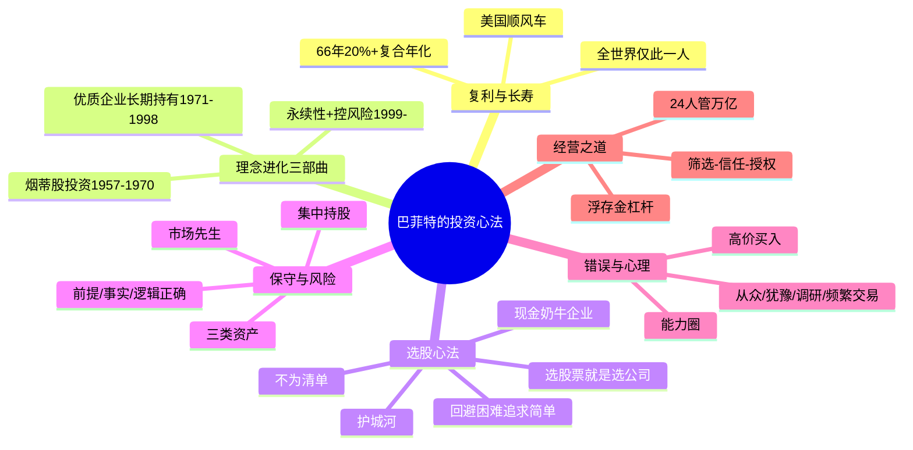
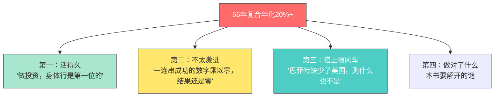
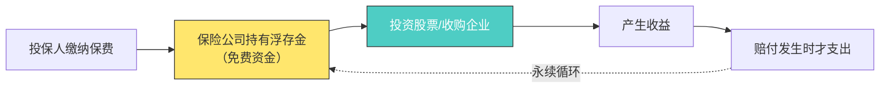
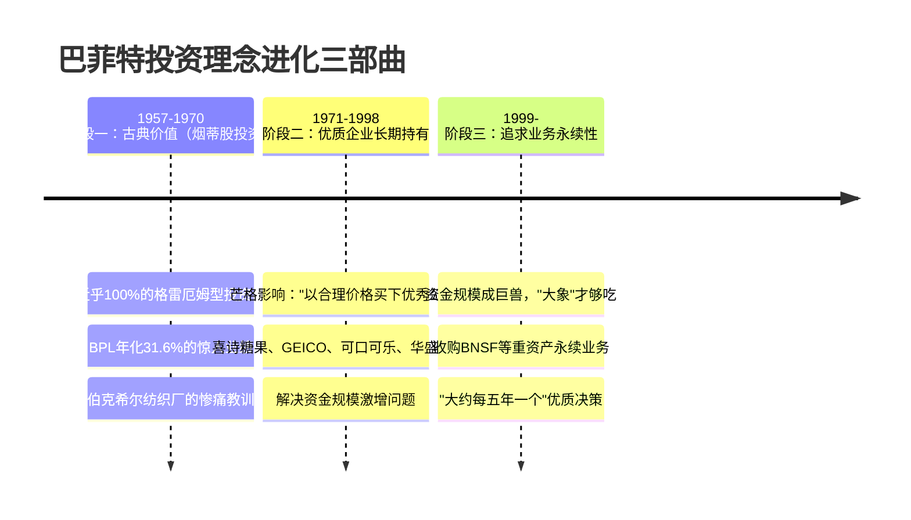
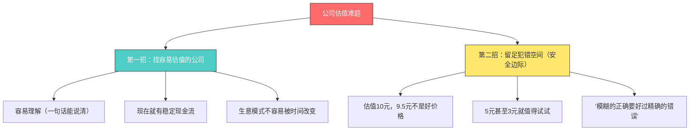
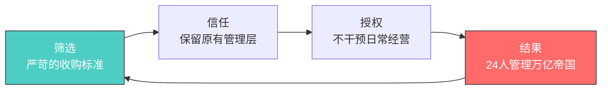
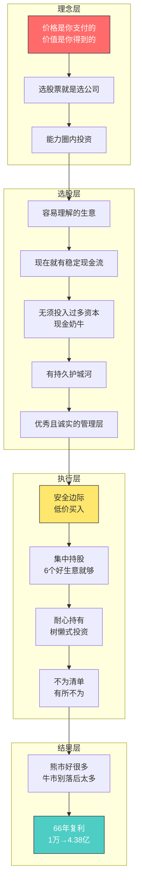
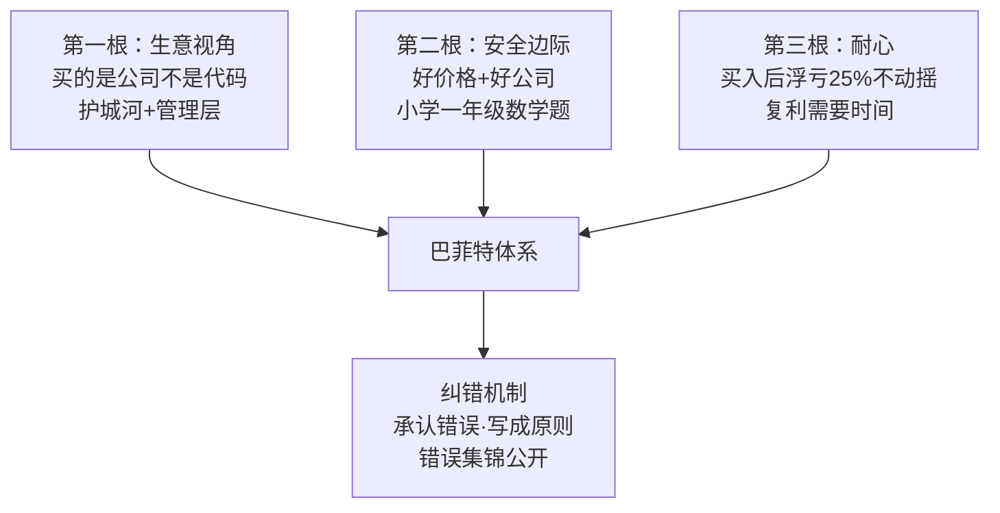

# 🍎 巴菲特的投资心法 —— 逐章深度解读

> **主题**：通过分析巴菲特长达60多年（1957-2023）致合伙人/股东的信，解开"为什么只有巴菲特成了最耀眼的明星"之谜
> **数据基础**：BPL公司（1957-1964）+ 伯克希尔-哈撒韦（1965-2022）逐年投资收益率
> **核心结论**：巴菲特投资心法 = 价值投资（价格 vs 价值）+ 生意眼光（买股票就是买公司）+ 极端自律（有所不为）

---

## 🎯 全书核心框架

---

## 📖 全书结构总览

| 章节 | 主题 | 核心关键词 |
|:---:|------|-----------|
| 第1章 | 百年一遇的投资大师 | 复利、顺风车、买股票就是买公司、浮存金 |
| 第2章 | 投资理念进化的三部曲 | 烟蒂股→优质企业→永续性 |
| 第3章 | 巴菲特如何选股票 | 估值、简单生意、现金奶牛、护城河、不为清单 |
| 第4章 | 他眼中的保守型投资 | 真正的保守、风险定义、集中持股、三类资产 |
| 第5章 | 几笔成功的投资 | 华盛顿邮报、GEICO、可口可乐 |
| 第6章 | 投资错误集锦 | 伯克希尔、NICO、所罗门、Dexter、Tesco等 |
| 第7章 | 投资中的错误心理 | 从众、犹豫、痴迷调研、频繁交易、高价买入 |
| 第8章 | 对基金的看法 | 鸭子理论、费用侵蚀、指数基金 |
| 第9章 | 人才观及企业经营观 | 热爱、品格、风险感知、筛选-信任-授权 |
| 第10章 | 不为人知的一面 | 宏观大师、投资风格多变 |
| 第11章 | 后记 | 价值投资不灭 |

---

## 第1章 百年一遇的投资大师

### 📌 核心故事

巴菲特是20世纪最伟大的投资者。**1万美元的威力**：
- 1965年初买入1万美元伯克希尔股权 → 2023年变成约**4.38亿美元**（4.38万倍）
- 同期标普500指数 → 仅312万美元
- 1957年开始跟投 → 67年后1万美元变成约**31亿美元**

**为什么只有巴菲特能做到？**

### 🔑 关键概念

#### 1. 简单的道理，却用一生去坚守

> "价格就是你所支付的，而价值就是你所得到的。"（1968年致股东的信）

- **价值投资** = 买得物超所值，用50元买下值100元的东西
- 为什么难？因为人人都想赚快钱——比尔·阿克曼："传统意义上的价值投资，就像看着油漆变干一样乏味"
- **贝佐斯问巴菲特**："为什么别人不能像你一样投资并变得富有？"巴菲特答："**因为没有人愿意慢慢变富。**"

**价值投资的特征**（1957年巴菲特就挑明）：
> "我预计我们将来在熊市的表现会比在牛市的表现要好。在牛市的情况下，我将会满足于取得一个相当于市场平均水平的回报率。"

| 市场状态 | 伯克希尔表现 |
|---------|------------|
| 1999年科技股顶峰 | 远逊于大盘 |
| 2000-2001年泡沫破裂 | 明显优于大盘 |
| 2008年金融危机 | 显著跑赢 |

#### 2. 直达生意的本质，并知行合一

- 优秀的投资家必然是优秀的企业家
- 购买上市公司股票不是巴菲特财富的唯一途径，甚至不是首要途径
- 只要生意足够好，他更愿意买下非上市公司的全部股权（喜诗糖果1972、内布拉斯加家具城1983、GEICO等）

**伯克希尔的管理奇迹：**
- 36.13万员工、总收入超2000亿美元 → 总部只有**24人**！
- 方法：筛选→信任→授权
- 1987年致股东的信："在业务的日常营运上，查理和我实在是无事可做。事实上，平心而论，我们管得越多，可能越会把事情搞砸。"

**1988年收购条件（"结婚对象"标准）：**
1. 年税前净利润至少1000万美元
2. 展示出持续的盈利能力（不要预期或困境反转型）
3. 只需很少（甚至没有）债务，就能获得高ROE
4. 管理层已经就位
5. 业务简单直白
6. 明确的收购价

> "这就和幸福婚姻的秘诀一样：婚后的相处固然重要，但挑选合适的人结婚是最重要的一步。"

#### 3. 关于巴菲特的几个谣言

**谣言：巴菲特牛是因为有长期保险资金（浮存金）**
- 反驳：美国有数千家保险公司，为什么只有巴菲特成功？
- 核心因素：**①如何正确获取浮存金 ②如何正确使用浮存金**

**浮存金概念**：保险"先收保费，后赔付"模式产生的可暂时免费使用的资金，只要业务永续开展，就变成长期甚至永续的免费资金。

---

## 第2章 投资理念进化的三部曲

### 📌 核心故事

巴菲特的投资理念经历了三个阶段的进化，每个阶段都是一次痛苦的教训换来的。

### 🔑 关键概念详解

#### 阶段一：古典价值（1957-1970）——烟蒂股投资

**格雷厄姆式思路**：以足够低的价格（显著低于清算价值）买入，要么等待价值回归，要么等待清算变现。

**典型案例：Commonwealth信托公司（1958）**
- 内在价值125美元/股，每股收益10美元，但从不分红→股价仅50美元（PE=5）
- 巴菲特以51美元均价买入12%股份，最终以80美元卖出，获利近60%
- 为什么卖？"因为他找到了更好的投资标的，所以进行了换仓"
- 深层洞察：**公司留存利润再投资是复利增长的关键**，当时的投资者因时代局限意识不到，给巴菲特创造了巨大的套利空间

**典型案例：桑伯恩地图公司（1959）**
- 拿出基金净资产的35%收购——地图业务衰落，但投资组合价值超过总市值
- 1958年：道琼斯指数550点，桑伯恩股价45美元，而投资组合每股值65美元——地图业务被评估为负20美元
- 巴菲特进入董事会，推动业务分离，大赚一笔
- 教训：**公司治理（董事会）可以毁掉或释放价值**

**巴菲特的三种投资分类**（1961年致合伙人信）：

| 类型 | 特点 | 仓位策略 |
|:---:|------|---------|
| 低估类股票 | 股价显著低于内在价值，无时间表 | 5-6只重仓（5-10%），10-15只小仓位 |
| 套利类股票 | 取决于公司行为（并购、清算等），有时间表 | 10-15只，可用杠杆（上限净资产25%） |
| 控股类股票 | 拥有控股权，有话语权 | 看几年时间，收集筹码时希望股价停滞 |

**关键认知**：巴菲特并不拒绝使用杠杆！"所谓的巴菲特'从来不用杠杆'，本身就是谣传。"

**转型原因**（为什么放弃烟蒂股）：
1. **市场环境变化**：机会从"奔腾不止的河流"变成"潺潺流淌的小溪"
2. **资金规模激增**：30万美元→1.04亿美元，"规模是收益的敌人"
3. **竞争更激烈**：烟蒂股投资氛围浓厚，机会转瞬即逝
4. **重大投资失败**：伯克希尔纺织厂——"谁能想到如今鼎鼎大名的伯克希尔-哈撒韦集团，最初是一个投资错误"

**伯克希尔纺织厂之痛**：
- 1962年买入时是标准烟蒂股（股价7.5美元 vs 运营资本10.25美元）
- CEO Stanton出价11.50美元回购，巴菲特同意，但信来时却变成11.375美元（少0.125美元）
- 巴菲特愤怒→继续买入→1965年控股→炒掉CEO
- 赌气的代价：纺织业日薄西山，1975年还错上加错收购Waumbec纺织厂，1985年彻底关闭

> "与其在一艘总是会漏水的破船上不断白费力气去补破洞，还不如把精力放在如何换条好船上。"

#### 阶段二：优质企业长期持有（1971-1998）

**芒格的转折建议**（1965年）：
> "以后再也不要买像伯克希尔这样的公司了。放弃以极好的价格买入平庸的公司，应该以合理价格买入优秀的公司。"

**喜诗糖果（1972）——第一次牛刀小试**
- 1972年：税前盈利420万美元，只用800万美元有形净资产
- 报价3000万美元，巴菲特被"超3倍有形资产"吓坏，只愿出2500万——对方同意了！
- 1984年：税后净利润从208万→1338万美元（6.4倍）
- 2007年：仅新投入3200万美元，创造了累计**13.5亿美元**税前收益
- 本质：**"现金奶牛"企业**——品牌、客户忠诚度、渠道等无形资产不体现在报表上，却带来提价能力

> "真正伟大的生意，不但能使其投资者从有形资产中获得巨大回报，而且在任何持续期内，不用拿出收益中的很大一部分再投资，以维持其高回报率。"（2007年致股东的信）

**GEICO（1976）——困境中的经典**
- 1951年：巴菲特押上50%身家买入350股（成本10282美元），1952年以15259美元卖出（获利48%）
- 教训：20多年后这些股票值130万美元——**"绝对不能卖掉一家明显优秀的公司的股票"**
- 1970年代GEICO因管理层错误濒临破产，股价从61美元跌到2美元
- 1976-1980年：巴菲特投入4570万美元买下33%股权
- 1995年：50%股权价值23.93亿美元——**15年市值增长52.3倍，年化30.2%**
- 更核心的是浮存金："GEICO这200多亿美元的浮存金才是巴菲特放大财富效应的核武器"

**可口可乐（1988）——52年的等待**
- 1936年（6岁）：从爷爷杂货店5美分进货，6美分卖给邻居——深刻理解产品吸引力
- 但52年间"很小心地避开了这只股票，一股都没买"——因为烟蒂股理念无法衡量品牌价值
- 1988-1989年：耗资10.2亿美元买入2335万股
- 1998年：市值134亿美元——**10年9倍**（还没算分红）
- 买入逻辑：全世界独一无二的产品 + 海外市场爆炸性成长 + 优秀CEO古崔塔

**"优秀公司"的6条标准**（1990年致股东信）：
1. 税前盈利超过1000万美元
2. 业已验证的持续的盈利能力
3. 只用较少或不用债务就能实现高ROE
4. 已有管理层到位（我们提供不了）
5. 简单的生意（高科技我们无法理解）
6. 明确的售价

**巴菲特 = 85%格雷厄姆 + 15%费雪**（中后期费雪占比远不止15%）
- 格雷厄姆：重视估值、安全边际（向下底线思维）
- 费雪：重视优秀公司、长期增长（向上潜力思维）

> "有时候，以一个高得离谱的价格买入一只股票，会导致一笔优秀的生意变成一项糟糕的投资。"（2018年致股东的信）

#### 阶段三：追求业务永续性（1999-）

- 世界上没有"规模上升导致收益率下降"的彻底解决方案
- "对于一头大象来说，需要喂多少颗葡萄才能填饱它？"
- **"我们令人满意的业绩来自十几个真正优质的决策——大约每五年一个"**（2022年致股东的信）
- 好决策不在于速度、数量，而在于质量

**伯克希尔的"五大树林"**（2018年致股东信）：

| 树林 | 内容 | 代表 |
|:---:|------|------|
| 1 | 控股的非保险公司 | BNSF铁路、BHE能源 |
| 2 | 股票投资组合 | 可口可乐、苹果、美国银行 |
| 3 | 联营/合营公司 | 卡夫亨氏26.7%、Berkadia 50% |
| 4 | 国债和现金等价物 | 常年千亿美元以上 |
| 5 | 保险公司 | GEICO、通用再保险 |

---

## 第3章 巴菲特如何选股票

### 📌 核心故事

巴菲特看到"选股票"这个章名估计肺都要气炸了——"**查理和我选的不是股票，我们选的是生意。**"（2021年致股东的信）

### 🔑 关键概念详解

#### 3.1 选股票就是选公司

**估值公式**（约翰·伯尔·威廉姆斯）：
> "今天任何股票、债券或是企业的价值，都将取决于其未来剩余年度的现金流入与流出，并以一个适当的利率加以折现后所得的期望值。"

**股票vs债券的本质区别**：债券有票息与到期日；股票必须自己分析未来"票息"，且管理层能力大大影响"票息"收入。

**巴菲特化解估值难题的两招：**

> "对投资人而言，最重要的不是他到底知道多少，而是理性客观地知道他不懂哪些东西。一个投资人，只要能避免犯大错误，只需要知道很少，就够了。"（1992年致股东的信）

#### 3.2 回避困难，追求简单

> "我们学会了如何去避免这些问题。因为我们专注于找到那些我们能轻松跨越的1尺高的跨栏，而非那些7尺高的跨栏。……总之，我们尽量避开恶龙，而不是去屠恶龙来获得成功。"（1989年致股东的信）

**为什么拒绝困境反转型公司？**
- 轮胎插匕首的比喻："巨额的债务会迫使公司经理人比以往更专注于经营，就像一位驾驶员开着一辆轮胎上插着一把匕首的破车……但这辆车哪怕是遇上一个坑洼或是一小块冰，结果将是致命的。"
- 巴菲特30年结论："当一个声誉远播的管理层遇到烂生意时，往往是后者赢。"

> "投资者应该记住，他们的业绩不是使用奥林匹克跳水评分方法计算出来的，难度不被计算在内。"（1994年致股东的信）

#### 3.3 无须投入过多资本

**两种盈利生意对比：**

| 类型 | 特征 | 巴菲特态度 |
|------|------|-----------|
| 现金奶牛型 | 无须投入额外资本，每年稳定盈利 | 最喜欢！盈利可投向其他优质项目 |
| 重资本型 | 每年把大部分盈利投入资本开支维持竞争力 | 极力避免（纺织、航空是前车之鉴） |

**纺织业的"踮脚尖"悲剧**（1985年致股东的信）：
> "单独来看，每家公司的资本开支决策似乎具有成本效益以及合理性；从整体上看，这些投资决策相互抵消，是非理性的（就像每个观看游行的人都觉得，如果他踮起脚尖就能看得更清楚一样）。"

**航空业的教训**：
- 1989年以3.58亿美元买入全美航空优先股——买在景气度最高点
- 1990-1994年累计亏损24亿美元，净资产几乎归零
- 布兰森的笑话："你首先成为亿万富翁，然后买下一家航空公司，这事就成了。"
- 最终靠罚息条款和运气盈利退出，但心悸不已

#### 3.4 对商业模式的追求

**坏商业模式：大宗商品（同质化产品）**
- 产品高度雷同，无法差异化→最终必然惨烈价格战
- 只有两种情况能舒服盈利：①行业供需失衡供不应求 ②政策垄断
- "你听过多少人会说'我的咖啡要加奶油和C&H牌的白糖'？"

**好商业模式的两个特征**（1981年致股东的信）：
1. **有提价能力**（即使需求平稳且产能未充分利用）
2. **仅通过少量额外资本支出就能适应销售额大幅增加**

**同质化行业中的两类幸存者**：
- 垄断供给者（OPEC式）——资源禀赋型，极为稀有
- 成本最低者（GEICO直销、戴尔JIT）——通过商业模式设计将成本做到行业最低

#### 3.5 不断加深护城河

**护城河测试**（1998年佛罗里达大学演讲）：给你巨额资金，愿不愿意研发类似产品直接竞争？不愿意→护城河不言自明。

**竞争壁垒三特征**（1991年致股东的信）：
1. 有市场需求
2. 被顾客认定为找不到类似替代品
3. 价格不受管制

**护城河的持续性**：
> "一条必须不断重建的护城河，最终将不再是护城河。"（2007年致股东的信）

- 商业史充满"罗马焰火"——护城河被证明是虚幻的
- 1977-1986年，1000家公司中只有25家连续十年ROE>20%且无一年低于15%，其中24家跑赢标普500——大多数所在行业相当普通，不令人兴奋
- 真正的好生意不需要借钱

**加深护城河**（2005年致股东的信）：
> "当短期和长期冲突时，加深护城河必须优先。如果管理层为了达到短期盈利目标而做出错误的决定……那么再多的后续辉煌也无法弥补已经造成的损害。"

#### 3.6 重视定性分析

> 爱因斯坦："不是所有能够计算的东西都很重要，也不是所有很重要的东西都能计算。"

- 1967年巴菲特自述："尽管我认为自己主要是定量学派，但我多年来真正绝妙的想法依靠的是定性分析……真正的大钱往往是由那些在定性决策上正确的投资者赚到的。"
- 定量分析赚确定性高的钱；定性分析（行业态势、商业模式、护城河、管理层特质）赚大钱

#### 3.7 不为清单

> 芒格："要是知道我会死在哪里就好了，那我将永远不去那个地方。"

**巴菲特"我们不做什么"**（2009年致股东的信）：

| 不为清单 | 具体内容 |
|---------|---------|
| ① 不投高科技 | 1900年代几千家汽车厂商活下来的寥寥无几，行业激烈竞争+频繁技术变革摧毁大部分公司 |
| ② 不靠陌生人的善意 | 伯克希尔文化字典里没有"大而不倒"；"在投资圈，活得久比活得好要重要得多" |
| ③ 不干预子公司 | 尽量不干预日常运营和资本开支，避免官僚主义的无形代价 |
| ④ 不讨好华尔街 | 以股东长期利益为重，寻求同一类人持有伯克希尔股票 |

---

## 第4章 他眼中的保守型投资

### 📌 核心故事

大众以为投资成熟行业、买债券就是保守，买高科技才不算保守。巴菲特完全不同意——**"保守"与投资什么资产无关，与你的决策过程有关。**

### 🔑 关键概念详解

#### 4.1 什么是保守

> "不是因为很多人暂时和你意见一致，你就是对的。不是因为重要人物和你意见一致，你就是对的。在许多情况下，当上述两点同时发生时，才是考验你的行为是否保守的时候。……只有凭借知识和理智，才能实现真正的保守。"（1961年致合伙人的信）

**保守的三大条件**：前提正确、事实正确、逻辑正确。

**1966年的定义**：
> "我认为保守更恰当的解释为'暂时或永久性损失要比整体平均水平低很多'。"

- 保守投资 = 买入价格低于内在价值（安全边际越大越保守）
- 高价买入赌未来涨 = 投机 = 激进

#### 4.2 什么是风险——对beta的批判

**学术界定义**：价格波动性（beta）
**巴菲特定义**：**损失的可能性**（购买力损失+合理利率之下的回报）

| 维度 | 学术界（beta） | 巴菲特 |
|------|--------------|--------|
| 风险衡量 | 股价相对波动性 | 投资期内累计税后收入能否保购买力+合理利率 |
| 华盛顿邮报案例 | 1973年低价买入"风险更大"（波动大） | 低价买入风险更小 |
| 真风险来源 | 股价下跌 | 买了自己都不知道是什么的股票 |
| 名言 | 精确的错误 | **模糊的正确要好过精确的错误** |

**市场先生**（格雷厄姆《聪明的投资者》第8章）：
> "这个家伙越是狂躁或抑郁，投资者获利的机会就越大。剧烈波动的市场意味着，一些稳健的企业，也会定期出现非理性的低价。"

**真正的风险评估五要素**（1993年致股东的信）：
1. 公司长期竞争能力可以衡量的程度
2. 管理层发挥公司潜能及有效运用现金可以衡量的程度
3. 管理层将利益回报股东而非中饱私囊可以衡量的程度
4. 买进价格
5. 税务和通胀水平

**投资者的"躁郁症"**：股价上涨时觉得自己研究深刻、很行；下跌时觉得自己一无是处。

#### 4.3 关于分散投资

**散户的正确选择**：
- 没有时间精力研究 → 高度分散 + 低成本的指数基金（98%-99%的投资者应该如此）
- 主动投资者 → 集中持股，"你拥有的生意不应该超过6个"

**为什么基金无法超越指数**（1965年致股东的信）：
1. 集体决策几乎不可能产生优秀投资管理团队
2. 与大型机构保持仓位一致的倾向
3. 机构条条框框里中庸最"安全"
4. 对分散投资的非理性坚守
5. 惰性

**巴菲特的集中持股哲学**：
- "增加第100只股票根本无法充分减少投资组合净值的潜在波动，以弥补其加入对整体投资组合预期收益率的负面影响"
- "我实在不明白，那些投资人为什么要把钱放在他排名第20的股票上"
- "在伯克希尔，我们宁愿赚取波动的15%，也不要平稳的12%。"
- **"你无法靠着第7个好的点子发财，不如把钱都投到排前三的好点子上。"**

#### 4.4 股债性价比——三类资产

| 资产类别 | 例子 | 巴菲特评价 |
|---------|------|-----------|
| 第一类：现金类 | 货币基金、债券、存款 | "风险巨大"——通胀侵蚀购买力，47年前1美元现在要7美元 |
| 第二类：非生息类 | 黄金 | 不喜欢——不会生小黄金，只盼高价卖出 |
| 第三类：生产性资产 | 农场、房地产、企业股权 | 最推崇——每年持续产出稳定收益 |

> "当恐惧心理达到顶点时，第一类和第二类资产最受欢迎。……那些盲目跟随大众的投资者为感到舒适和安定付出了沉重的代价。"（2011年致股东的信）

---

## 第5章 几笔成功的投资

### 5.1 华盛顿邮报（1973）——以不到1/4内在价值买入

**故事**：1972年华盛顿邮报报道水门事件，遭受政府压力；1973年电视台执照展期被拒，股价从40美元跌到20多美元。巴菲特以均价22.75美元买入10%股份（1063万美元）。

**关键数据**：
- 1972年EPS 2.08美元 → PE约10.9倍（并非烟蒂股）
- 业内人士公认内在价值4-5亿美元，市值仅1亿美元
- 巴菲特："我们的优势在于态度……当一门好生意的市场价格相比其企业价值有了很大的折扣时，买入！"
- 但1974年底持仓浮亏25%（800万 vs 1063万）——**好公司也会继续跌**
- 1976年后价值终于被市场认可，此役赚得盆满钵满

**报业商业模式**：区域性垄断（华盛顿邮报市占率60%，双寡头格局）→ 对产品质量要求不高 → 好生意

**核心教训**：**"股票投资中，耐心是第一位的。"**

### 5.2 盖可保险（1976）——困境中的50倍

**故事**：1970年代GEICO管理层错误定价保单，濒临破产，股价从61美元跌到2美元。巴菲特看中的是直销模式的核心竞争力。

**关键数据**：
- 1976-1980年投入4570万美元 → 33%股权
- 1995年50%股权值23.93亿美元（**52.3倍，年化30.2%**）
- 1995年以23亿美元收购剩余50%
- 2018年：GEICO成为美国第二大车险公司，销售额比1995年增长1200%，浮存金从25亿增至221亿美元

**启示**：
- 困境反转型公司巴菲特一般不做，但GEICO是例外——"只有困境尚无反转"时买入
- 别把价值投资学成教条主义："如果我们学巴菲特的价值投资把自己学傻了，执行机械的教条主义，那才是东施效颦"

### 5.3 可口可乐（1988）——52年等待后的重仓

**故事**：6岁就发现可口可乐的吸引力，但52年间一股没买（烟蒂股理念的限制）。1988年理念进化后，10.2亿美元买入2335万股。

**关键数据**：
- 1998年市值134亿美元（10年9倍，未算分红）
- 买入逻辑：独一无二的产品力 + 海外市场空间 + 优秀CEO古崔塔（营销+财务双利刃）

**1938年的疑虑至今仍在**（1993年致股东的信）：
> "每年都会有许多重量型的投资人看好可口可乐，并对其过去的辉煌纪录表示敬意，但觉得自己发现得太晚，认为该公司已达巅峰。"——1938年如此，1993年如此，今天亦如此。

---

## 第6章 投资错误集锦

### 📌 核心故事

> 芒格："如果把我们最成功的十几笔投资去掉，我们就是一个笑话。"

投资比的不是谁不犯错，而是**谁犯的错少、犯的错量级小**。研究失败比研究成功更重要——"投资成功各有各的路数，但失败的原因往往类似。"

### 🔑 错误案例全览

| 错误 | 年份 | 金额/损失 | 核心教训 |
|------|:---:|----------|---------|
| 伯克希尔纺织厂 | 1965 | 赌气收购，拖累20年 | 好生意比低估值重要得多 |
| 国民赔偿保险公司 | 1967 | **最昂贵错误**（~1000亿美元） | 好的股权要尽可能多地拥有 |
| 所罗门兄弟优先股 | 1987 | 7亿美元差点归零 | 管理层的诚信品质至关重要 |
| Dexter鞋业 | 1993 | **最可怕错误**（4.33亿→57亿美元股票） | 竞争优势会因外国竞争快速消失 |
| Tesco | 2006 | 23.5亿投入，亏损4.44亿 | 管理层财务造假防不胜防 |
| 康菲石油 | 2008 | 亏损26亿美元 | 周期股在商品价格高点买入最危险 |
| 卡夫亨氏 | 2015 | 收购价过高（500多亿美元） | 再好的公司买得太贵也没好结局 |
| 派拉蒙全球 | 2022 | 30亿美元，清仓认错 | 传统行业遭遇流媒体颠覆 |
| 过早卖出 | 多次 | GEICO、资本城 | 绝对不能卖掉明显优秀的好公司 |
| 没投资的公司 | 长期 | 房利美（少赚14亿）、谷歌、沃尔玛 | "吮大拇指"症的隐性损失 |

### 各错误详细解剖

**① 伯克希尔纺织厂（1965）——赌气的代价**
- 本来可以11.50美元卖出获利50%退出，因CEO临时少给0.125美元而愤怒，改为收购公司
- 教训1：**一门好生意比低廉的价格重要得多**
- 教训2：**如果你已经在坑里，就不要再往下挖了**（1975年又收购Waumbec纺织厂）
- 教训3：净资产有误导性——账面资产清算时价格低到令人发指（5000美元的织布机26美元卖出）
- 教训4：**机会成本巨高**——大量资金长期锁定在无效益业务上

**② 国民赔偿保险公司（1967）——职业生涯最昂贵的错误**
- 用伯克希尔（只拥有61%）收购NICO，而非用BPL（100%拥有）
- 这个决定将约**1000亿美元**从BPL转给了一群陌生人
- 教训：不要拔掉鲜花而种上野草（彼得·林奇）

**③ 所罗门兄弟（1987）——7亿美元与一场丑闻**
- 9%利率优先股+转股期权，看似完美
- 1991年国债投标操纵丑闻→濒临破产→巴菲特出任临时董事长救火
- "我做梦也没想到自己会在60岁的时候找到一份新工作——所罗门兄弟公司临时董事长"
- 教训：管理层失职可以让"稳赚不赔"的投资差点归零

**④ Dexter鞋业（1993）——最可怕的错误**
- 用伯克希尔股票收购（4.33亿美元）→ 股票如今值57亿美元
- 外国竞争（中国制鞋）让竞争优势迅速消失
- 教训：过分看重管理层点石成金，但"公主亲吻了青蛙，青蛙却没有变成王子"

**⑤ Tesco（2006）**
- 管理层财务造假+海外扩张失败，2013-2014年股价跌50%
- 巴菲特清仓认栽

**⑥ 康菲石油（2008）**
> "在油价和天然气价格接近最高点时，我购买了大量康菲石油公司的股票。我没能预计到2008年下半年能源价格的戏剧性下跌。"

- 教训：**周期股在商品价格高点买入 = 在公司盈利高点买入**

**⑦ 卡夫亨氏（2015）**
> "当你买得太贵时，任何投资都会变成一笔坏投资。"——2019年股东大会

**⑧ 过早卖出的错误**
- GEICO：1952年卖出15259美元→20年后值130万美元——"绝对不能卖掉一家明显的好公司的原则"
- 资本城：1993年63美元卖出→1994年85.25美元

**⑨ 那些没投资的公司（隐性错误）**
> "通常，我们很多重大的错误不是发生在我们已经做了的部分，而是在我们没有去做的那部分。"（1991年致股东的信）

- 房利美：3.5-4亿美元买3000万股的计划，只买了700万股又全部卖掉→少赚14亿美元
- 谷歌："我总是晚到一步。"——GEICO在谷歌投广告效果极好，但一再错失
- 芒格："错失谷歌确实不可原谅。"
- 芒格总结："几乎所有的巨大错误都是没有购买……如果伯克希尔抓住了几个大机会，其净资产至少要比现在高出500亿美元。"

> "巴菲特和芒格对自己极度诚实，才是他们成功的一个关键因素。……什么时候想明白了投资中要'对自己100%诚实'，价值投资才算是入了门。"

---

## 第7章 投资中的错误心理

### 7.1 从众心理

- "别人这么做，所以我也这么做"会付出最昂贵的代价
- 保险公司四条准则，许多公司前三条合格却在第四条（不能获得合理保费就放弃业务）不及格——"别人这么做，所以我们也必须这么做"
- **反向操作与从众一样愚蠢**："投资所需要的是独立思考而不是投票表决。"
- 罗素："大多数人宁愿去死也不愿意思考！"
- > "投资的目的不是得到别人的认同。……谨防那些让人喝彩的投资行为；伟大的行动通常都会让人听起来昏昏欲睡。"（2008年致股东的信）

### 7.2 犹豫不决（"吮大拇指"症）

**两种表现**：
1. 买入错误股票后因沉没成本犹豫不卖，甚至变本加厉加仓
2. 面对重大机会踌躇不前（房利美、谷歌）

- 段永平："发现错了马上改，无论多大的代价，都是最小的代价。"
- 巴菲特对通用再保险衍生品业务的拖延："不管是我优柔寡断犯下大错（芒格称之为'吮大拇指'症）。不管是生活中还是商业中，当一个问题出现时，**行动的最佳时机就是现在**。"
- > "当你发现自己深陷坑里，最重要的一件事就是不要再往下挖了。"
- 彼得·林奇："你不会因为错失一个投资机会而损失任何钱；反而有些人因为害怕错过所谓的'重大投资机会'而遭受了重大损失。"

### 7.3 痴迷调研

- 1962-1968年：净资产从718万→1.04亿美元（14.5倍），差旅费只从3206→3603美元
- 巴菲特收购Fechheimer制服公司后从未去过总部；喜诗糖果CEO也从未到过奥马哈
- > "思考投资的最佳方法，是独自一人待在房间里静静地想。要是这样不行，别的方法也不管用。"（1998年佛罗里达大学演讲）
- 调研解决信息获取问题，但解决不了投资核心问题：对公司盈利特质的分析

### 7.4 频繁交易

**棒球理论**（泰德·威廉姆斯《击打的科学》）：
- 把击打区域划分77个小方格，只有球进入最理想方格才挥棒
- 这样维持40%超高命中率；勉强挥击较差方格命中率骤降23%
- 巴菲特把泰德的照片和最佳击打区域图放在办公区域时时警醒自己

**20个打孔位**：
> "我可以给你一张只有20个打孔位的卡片，这样你就可以在上面打20个孔——代表你一生中能做的所有投资，一旦你在这张卡片上打满了20个孔，你就不能再进行任何投资了。"

**华尔街靠折腾赚钱，你靠不折腾赚钱**：
> "券商就像这样一个医生，他让你换药的次数越多，他赚得越多。……任何刺激你瞎折腾的环境都要远离。"

> "我们从持有可口可乐和美国运通的股票中学到的是，当你找到一家真正出色的企业时，请坚持下去。耐心是有回报的，一笔出色的生意可以抵消许多不可避免的平庸决策。"（2023年致股东的信）

- 巴菲特自称"树懒式投资"：安静地坐在那儿喝杯咖啡，比干什么都强
- 一年找到一个好的投资机会，然后一直持有

### 7.5 高价买入

> "股票的买入价格过高，能极大地抵消掉这家公司未来十年的盈利积累所带来的好处。"（1980年致股东的信）

- 卡夫亨氏案例："当你买得太贵时，任何投资都会变成一笔坏投资。"
- **安全边际不是嘴上说说而已**

### 7.6 懂得多才能赚得多？（能力圈）

> "每个人都有自己的能力圈，重要的不是能力圈有多大，而是待在能力圈的范围之内。如果主板中有几千家公司，你的能力圈只涵盖其中的30家，只要你清楚是哪30家，就可以了。"

- 重要的是**懂得深**，而不是懂得多
- "一门生意，要是你不能一眼看懂，再花一两个月的时间，你还是看不懂。"
- **农场案例**：1986年28万美元买400英亩农场，对经营一窍不通，只知大豆玉米产量和成本→回报约10%→2013年利润3倍、价格5倍以上
- **地产案例**：1993年买纽约大学旁零售物业，无杠杆回报率约10%

---

## 第8章 对基金的看法

### 📌 核心故事

巴菲特对主动型公募基金和私募基金持有相当保留的态度——它们除了收取高额管理费让基金经理财富自由之外，能给投资人带来真正收益的产品极少。

### 🔑 关键概念

**鸭子理论**（1964年致合伙人的信）：
> "这些产品就像漂在池塘上的鸭子。水位（市场）涨起来时，鸭子跟着往上涨；水位落下去时，鸭子跟着往下落。……鸭子的功劳大小，要看它们自己的表现，不能对池塘水位的涨跌呱呱乱叫。"

**四层费用侵蚀**（2005年"如何使投资收益最小化"）：
1. 交易佣金（给经纪人的）
2. 基金管理费（给基金经理的）
3. 投资顾问费（给投资顾问的）
4. 私募基金费用（2%管理费+20%超额业绩分成）

> "这种摩擦成本占到了美国上市公司总体收益的20%。也就是说，投资者作为一个整体如果什么都不干，拿100%；如果拼命干，拿80%。"

**对"2+20"收费模式的炮轰**（2006年）：
> "某一年，费前收益为10%的基金，管理人就可收到3.6%的费用，而投资人只剩下6.4%。对于一只30亿美元的基金来说，6.4%的净'绩效'，将为基金管理人带来1.08亿美元的收入。对管理人来说，这就像一座矿山一样。"

**猴子的比喻**（2016年）：
> "如果1000名基金经理在年初做出市场预测，那么很可能至少有一位基金经理的预测会连续九年是正确的。当然，1000只猴子中同样可以产生一个看似全知全能的先知。"

**成功酝酿失败的三件事**：
1. 良好投资履历吸引大量资金
2. 巨额资金带来业绩停滞（规模定律）
3. 管理费驱动基金经理不停找新资金

**答案：低成本指数基金**
- 纪念约翰·博格："如果要树立一座雕像，用来纪念为美国投资者做出最大贡献的人，毫无疑问应该选择约翰·博格。……他是他们的英雄，也是我的英雄。"
- 10年赌约：2007年泰德·西德斯应战，2008-2017年没有一只精挑细选的FOF年化超过标普500的8.5%
- **遗嘱建议：10%短期政府债券 + 90%低成本标普500指数基金**

> "无论是机构还是个人，都会被赚取顾问费和交易费的中介机构不断怂恿，不停地交易。对投资者来说，这些费用总和非常巨大，它吞噬了利润。所以，忽略那些建议吧，保持最低的交易成本，并且像持有农场那样持有股票。"（2013年致股东的信）

---

## 第9章 人才观及企业经营观

### 🔑 关键概念

#### 管理层的价值与局限

**巴菲特喜欢的管理者**：
- **热爱事业**是首要条件："他们工作勤勉努力，是因为他们热爱他们自己的这份事业"
- 财富自由后仍工作→决策长期化
- 品格一票否决："经理人的正直和诚实……具有一票否决权"
- 不看重学历履历："杰出的生意头脑很大部分是天生的"（NICO历任4位总裁只有1位有大学学历）；"查理和我都不是严重的履历迷。相反，我们关注头脑、热情和诚实。"
- 讨厌的品格：傲慢、官僚主义、自满——"当这些企业癌细胞扩散时，即使是最强大的企业也会陷入泥潭"（通用汽车、IBM、西尔斯、美国钢铁的例子）

**继任投资经理标准**（2006年致股东的信）：
> "长期来说，市场将出现异常，甚至诡异至极的情况。一个巨大的错误，将会把过去长期一连串的成功一笔抹去。所以，我们需要生来就能辨认及规避重大风险的人，这个风险甚至是任何人都从未经历过的。"

- 独立思考、情绪稳定、对人性及机构行为有敏锐洞察力
- **风险感知能力 > 历史业绩**（1969年巴菲特逃顶是一战封神的证明）
- 赛马比喻："我们的目标是找到年仅2岁的Secretariat赛马，而不是一匹10岁的Seabiscuit赛马。"（找到年轻有潜力的Todd Combs，而非成名老将）

#### 经营之道：筛选-信任-授权

> "我们宁可接受x的回报，同时与一群我们特别喜欢且钦佩的人工作，也不愿意为了获得1.1倍x的回报，而与那些跟我们合不来的家伙打交道。"（1987年致股东的信）

> "更换管理层就像离婚一样，痛苦、费时还有不确定性。"

**收购的三个条件**（2019年致股东的信）：
1. 良好的运营净资产回报率
2. 经理人必须有能力且诚实
3. 买进价格必须合理

---

## 第10章 不为人知的一面

### 10.1 宏观大师巴菲特

巴菲特常说"不预测宏观"，但他是实打实的**宏观风险大师**——只不过他的方法是从公司估值角度出发：

| 时间 | 动作 | 结果 |
|------|------|------|
| 1969年 | 解散BPL（市场过热，机会消失，投机氛围） | 完美逃顶，避过漫长熊市 |
| 1973年 | 大举买进华盛顿邮报 | 抄底成功 |
| 1987年初 | 警告"华尔街几乎看不到恐惧" | 当年10月黑色星期一（标普跌20.5%） |
| 2008年10月 | 《纽约时报》"Buy American. I AM." | 金融危机最恐慌时喊话抄底 |

> "恐惧和贪婪这两种超级传染性疾病的偶尔暴发将永远发生在投资行业，但发生时间是不可预测的。……我们只是在别人贪婪时恐惧，在别人恐惧时贪婪。"（1986年致股东的信）

> "金融市场短期内的混乱，改变不了这些上市公司本身经营基本面在未来的逐步改善。"

**对复杂衍生品的态度**：深恶痛绝（通用再保险衍生品损失数亿美元）——但"既然有些衍生品的定价如此不合理，那白赚的钱为何不赚呢？"（卖出371亿美元名义价值的长期看跌期权）

### 10.2 投资风格多变

**巴菲特是"海里的一条灵活凶猛的大鲨鱼"**：
- 早期三种分类：低估类、套利类、控股类
- 德州国家石油套利：债券年化20%、股票+权证年化22%
- WPPSS高收益债：1983年买入1.39亿美元，税后利息收益16.3%，每年2270万美元利息收入
- 股票本质 = 永续性债券（未来现金流折现）

> "一个投资者很难只靠单一投资类别或投资风格就能创造傲人的收益。他只能靠着仔细评估事实并持续地实践才能赚取超额利润。"（1988年致股东的信）

---

## 第11章 后记 —— 价值投资不灭

**成为下一个巴菲特？概率万分之一都不到**：
1. 要幸运地出生在正确时间、正确地点（20世纪强大的美国）
2. 天赋（年少痴迷股市、商业洞察力、极致专注、稳定情绪、天生逆向思考）
3. 后天持续学习与实践（67年致股东的信就是证明）

**正确的学习态度**：
> "我们学习巴菲特，并不是要成为'下一个巴菲特'，而是要基于自身的资源禀赋，通过学习他的价值投资理念，提升自身的投资水平，成为'下一个更好的自己'。"

**价值投资会消亡吗？不会。**
> "量化投资也许可以成为股票投资的主流技术（其实在美国已经是了），但价值投资作为股票投资一个流派，永远不会消失……因为量化投资永远无法解决股票投资中的定性分析（商业护城河、商业前景、管理层特质），以及股市周期性的狂热与绝望。"

> "如果让我用一句话回答，价值投资是什么？我会选择'价格就是你所支付的，而价值就是你所得到的'这句话。如果能再加一句话，那就是，选股票就是选公司。"

> "尔曹身与名俱灭，不废江河万古流。价值投资不灭，巴菲特的投资心法永放光芒！"

---

## 🏆 全书精华总结

### 巴菲特投资心法的完整体系

### 巴菲特心法 vs 利弗莫尔 vs 达利欧

| 维度 | 巴菲特 | 利弗莫尔 | 达利欧 |
|------|--------|---------|--------|
| 核心方法 | 价值投资（价格vs价值） | 量价分析+交易纪律 | 宏观机器+系统化决策 |
| 持仓周期 | 数十年 | 数月-数年 | 数年 |
| 风险控制 | 安全边际+集中持股 | 价格止损+时间止损 | 风险平价+分散 |
| 决策方式 | 定性分析+独立思考 | 行情纸带解读 | 可信度加权+算法 |
| 对市场 | 利用市场先生 | 跟随阻力最小路径 | 理解经济机器 |
| 共同点 | **能力圈** | **只做强势股** | **只投高信心对象** |

### 巴菲特最核心的10句话

> 1. "价格就是你所支付的，而价值就是你所得到的。"

> 2. "因为没有人愿意慢慢变富。"

> 3. "买进股票的唯一时机是你知道它们将会上涨。"（注：利弗莫尔语，巴菲特与之相通）

> 4. "我们只是在别人贪婪时恐惧，在别人恐惧时贪婪。"

> 5. "模糊的正确要好过精确的错误。"

> 6. "当一个声誉远播的管理层遇到烂生意时，往往是后者赢。"

> 7. "如果你发现自己深陷坑里，最重要的一件事就是不要再往下挖了。"

> 8. "一条必须不断重建的护城河，最终将不再是护城河。"

> 9. "投资的目的不是得到别人的认同。……伟大的行动通常都会让人听起来昏昏欲睡。"

> 10. "当你找到一家真正出色的企业时，请坚持下去。耐心是有回报的。"

---

## 💡 个人读书心得

### 这本书的独特价值

本书与其他巴菲特书籍最大的不同：**完全以巴菲特60多年致股东的信为原始素材**，每一句话都有出处，相当于对巴菲特"原始档案"的系统化整理。数据扎实（逐年收益率、具体金额），案例完整（成功+失败同等对待）。

### 最颠覆认知的三点

1. **巴菲特不是"买了就不动"的呆子**——他早期做套利、用杠杆、玩高收益债、卖衍生品，是"一条灵活的鲨鱼"
2. **巴菲特最大的错误是"没买"**——房利美、谷歌、沃尔玛的错失比任何亏损都昂贵（芒格估计500亿美元+）
3. **巴菲特的核心资产不是股票而是保险浮存金**——"正确地获取+正确地使用"浮存金才是伯克希尔的核武器

### 对个人投资者的启示

1. **先划定能力圈**——只投自己能讲清楚的生意
2. **建立"不为清单"**——明确不做什么，比研究做什么更重要
3. **耐心是核心竞争力**——"没有人愿意慢慢变富"是散户和大师唯一的差距
4. **对自己100%诚实**——错了马上改，无论多大代价都是最小代价
5. **像持有农场一样持有股票**——关注生意本身，而不是每天的报价

---

*笔记创建日期：2026年8月1日*
*来源：C:\Obsidian笔记\投资_md\(005) 巴菲特的投资心法*

---

## 附录 从捡烟蒂到买帝国：巴菲特投资心法的进化史（知乎文风）

### 写在前面：为什么拆解巴菲特

系列拆到 05 号，我们已经见过四位大师：**利弗莫尔**（输给自己的天才）、**达利欧**（把纪律写成系统的人）、**索罗斯**（利用市场错误的哲学家）、**林奇**（与市场和解的普通人）。

而 05 号开始，我们要拆的是整个系列的核心人物——**沃伦·巴菲特**。如果说前面四位是"怎么赚钱"，巴菲特回答的是更根本的问题：**"钱到底是什么？"**

**利弗莫尔看价格，索罗斯看偏向，林奇看产品，达利欧看规律——巴菲特看生意。**

这本《巴菲特的投资心法》最珍贵的地方，是它把巴菲特 60 多年的投资理念，浓缩成了一条清晰的进化线：**从捡烟蒂的清算者，到买帝国的企业家。**这条线，就是价值投资从 1.0 到 3.0 的全部历史。

### 第一幕：格雷厄姆时代——捡烟蒂的清算者（1957—1970）

巴菲特的投资生涯，是从"捡烟蒂"开始的。

**什么叫烟蒂股？**格雷厄姆（[[28《聪明的投资者》深度解读（详细版）|28 号]]）的定义：像地上被人丢弃的烟蒂——**又湿又丑，但还能免费吸上一口。**对应到股票：价格显著低于清算价值、没人要的公司股票。

**经典案例：Commonwealth 信托公司（1958）**

| 指标 | 数据 |
|------|------|
| 内在价值 | 125 美元/股（每股收益 10 美元） |
| 市场股价 | **50 美元**（市盈率仅 5 倍） |
| 被嫌弃的原因 | 从不分红！ |
| 巴菲特操作 | 51 美元均价买入 12% 股份 |
| 卖出价 | 80 美元（获利约 60%） |

**为什么市场只给 5 倍市盈率？**因为那个年代的投资者"执迷不悟"：他们觉得股东就该每年拿分红，公司把利润留存下来继续投资，是"不把股东当回事"。**而巴菲特看懂了：留存利润→复利增长→股东价值爆炸。**时代局限，就是他的套利空间。

**更极端的案例：桑伯恩地图公司（1959—1960）**

这家公司更离谱：主业（卖火灾保险地图）衰落了，但它用留存收益买了一大堆股票和债券——**到 1958 年，它手里的证券组合价值（每股 65 美元）已经超过了它的股价（45 美元）。**

> 也就是说：你花 45 美元买这家公司，它账上的证券就值 65 美元——**地图业务等于白送，还是倒贴 20 美元。**

巴菲特重仓买入（占基金净资产 35%），进入董事会，推动公司拆分资产——大赚一笔。

**这个阶段的巴菲特，本质是一个"清算者"：**找到价格低于资产的公司，买下来，要么等价值回归，要么推动清算。**他赚的是"市场定价错误"的钱。**

### 第二幕：华盛顿邮报——从烟蒂到帝国（1973）

1973 年，一个关键转折。

华盛顿邮报——华盛顿地区市占率 60% 的报业霸主——因为顶住压力报道水门事件，遭到尼克松政府报复：电视台执照被否决、股价从 40 美元跌到 20 多美元。

巴菲特出手了：买入 467,150 股（占流通股 10%），总成本 1,063 万美元，均价 22.75 美元（市盈率约 10.9 倍）。

**请注意：这不是烟蒂股。**22.75 美元对应 10.9 倍市盈率——这是"以合理价格买入优秀公司"，是巴菲特进化到第二阶段的标志。

他在 1985 年的信里算了一笔让所有分析师脸红的账：

> "大部分的证券分析师、媒体经纪人和媒体经营者跟我们一样，算出该公司的内在价值约在 4 亿～5 亿美元。同时，它的 1 亿美元的市值每天都在市场上公布，人人可见。**我们的优势在于态度。**"

**内在价值 4—5 亿美元，市值 1 亿美元——所有人都算得出来，但只有巴菲特敢买。**

> "这是一个小学一年级的数学题。"

**知易行难。**——然后发生了什么？1974 年，华盛顿邮报经营蒸蒸日上，股价却继续下跌，巴菲特的持仓浮亏 25%（1,063 万变成 800 万）。

> "1973 年，我们认为价格已经不可思议地低了，如今的市场却给出了更低的价格。市场以其无穷的智慧，将它的标价向下调整到至少比其实际价值低 20% 的位置。"

**巴菲特没有割肉。他拿着。**一直到 1976 年才开始盈利，最终赚得盆满钵满。

**这一课的价值，比华盛顿邮报本身值钱得多：好公司+好价格，买入后依然可能浮亏 25%——耐心，是价值投资的入场券。**

（这个故事，与 32 号林奇"跌 25% 加仓而非割肉"、31 号索罗斯"市场总是过度反应"完全互相印证。）

### 第三幕：三部曲的完成——费雪与芒格（1980 年代后）

巴菲特的进化没有停在华盛顿邮报。他的理念三部曲，第三阶段由两个人接力完成：

| 阶段 | 导师 | 理念 | 代表投资 |
|------|------|------|---------|
| 第一阶段 | 格雷厄姆 | 便宜就是一切（烟蒂） | Commonwealth/桑伯恩 |
| 第二阶段 | 费雪（26 号） | 好公司值得好价格 | 华盛顿邮报 |
| 第三阶段 | 芒格（22—25 号） | **以合理价格买伟大公司** | 喜诗糖果/可口可乐 |

芒格对巴菲特说的那句改变历史的话：

> "你为一家伟大的公司支付合理的价格，好过为一家平庸的公司支付便宜的价格。"

**从"捡烟蒂"到"买帝国"，巴菲特完成了价值投资史上最伟大的进化**：烟蒂股的问题是——**吸完一口就没了**（伯克希尔纺织厂的教训），而伟大公司的问题是——**它的复利永不停歇**（喜诗糖果、可口可乐）。

### 第四幕：错误集锦——0.125 美元的愤怒

巴菲特不是神。这本《心法》里最珍贵的章节，是他自己承认的错误——**而最大的错误，恰恰是"赌气"。**

**伯克希尔纺织厂（1965）**：巴菲特原本只想做一笔漂亮的烟蒂股投资——7.5 美元买入（运营资本 10.25 美元/股，账面价值 20.20 美元/股），等 CEO 回购时获利 50% 退出。

结果呢？CEO Stanton 口头答应 11.50 美元收购巴菲特的股份，报价信寄来时却是 **11.375 美元——少了 0.125 美元。**

**巴菲特愤怒了。**他觉得被耍了，拒绝卖出，反而继续买入，最终控股了这家公司——然后炒掉了 Stanton。

**代价是什么？**伯克希尔纺织厂是个烂生意：20 年后（1985）被迫关闭，当年 5,000 美元一台的织布机，最后 26 美元一台卖掉，"都低于拆除成本了"。

> "当你遇到一艘总是会漏水的破船，与其不断白费力气去补破洞，还不如把精力放在如何换条好船上。"

**巴菲特自己总结这笔投资最大的代价：机会成本。**为了 0.125 美元的愤怒，他把宝贵的资金困在了一个没有未来的生意里 20 年——**这些钱本可以投到收益高得多的项目上。**

**这是全书最值得反复读的一段：连巴菲特都会因为"赌气"做出非理性决策。**区别只在于：**他把错误写下来，变成原则；大多数人把错误忘掉，然后重犯。**

### 第五幕：错误心理——投资最大的敌人

05 号书里专门有一章讲"投资中的错误心理"。巴菲特（及研究者）归纳的人性陷阱，与 01—03 号利弗莫尔的教训惊人一致：

| 错误心理 | 表现 | 巴菲特式解药 |
|---------|------|-------------|
| 从众心理 | 别人买我也买 | "别人贪婪我恐惧" |
| 锚定心理 | 盯着成本价 | 只看内在价值 |
| 损失厌恶 | 割肉比拿住更痛 | 问"现在还会买吗？" |
| 过度自信 | 觉得自己能择时 | 承认无法预测 |
| 赌气报复 | 0.125 美元的愤怒 | 把情绪写下来再决策 |

**巴菲特与利弗莫尔的终极对照：**两人都面对同样的人性陷阱——利弗莫尔靠意志硬扛，意志崩溃了；巴菲特靠"原则+体制"（伯克希尔的现金牛+保险浮存金）对冲，赢了。

### 三根柱子：巴菲特投资心法全景

| 柱子 | 核心 | 案例 |
|------|------|------|
| 生意视角 | 垄断/定价权/现金流 | 华盛顿邮报 60% 市占率 |
| 安全边际 | 4—5 亿内在价值 1 亿市值 | 华盛顿邮报 1973 |
| 耐心 | 浮亏 25% 拿住 3 年 | 华盛顿邮报 1973—1976 |

### 尾声：巴菲特在系列中的位置——五大师的终极光谱

| 大师 | 看什么 | 赚什么钱 | 最大敌人 |
|------|--------|---------|---------|
| 利弗莫尔（01—03） | 价格 | 趋势的钱 | 自己的人性 |
| 达利欧（04） | 规律 | 周期的钱 | 情绪（用系统对抗） |
| 索罗斯（31） | 偏向 | 转折的钱 | 自己的狂妄 |
| 林奇（32） | 产品 | 成长的钱 | 自己的恐慌 |
| **巴菲特（05—）** | **生意** | **复利的钱** | **自己的情绪（用原则对抗）** |

**巴菲特之所以是"股神"，不是因为他预测准（他从不预测），而是因为他把投资变成了生意：买入时像收购一家公司那样算账，持有后像经营一家公司那样耐心，卖出时只因为生意变坏或价格离谱——而不是因为股价波动。**

> "投资的关键在于，当一门好生意的市场价格相比其企业价值有了很大的折扣时，买入！"

**这是一个小学一年级的数学题。难的是：你敢不敢在所有人都说它还会跌的时候，做这道题。**

