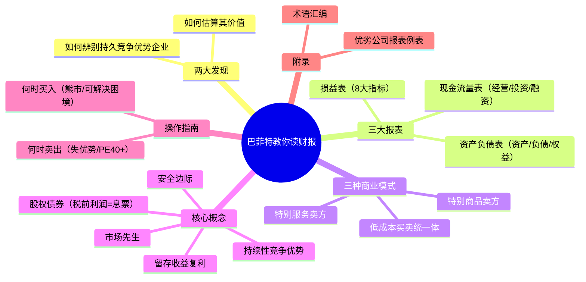
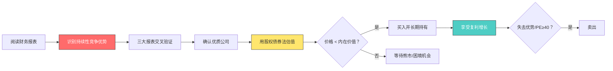
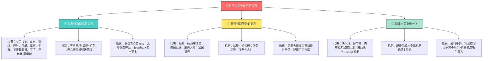
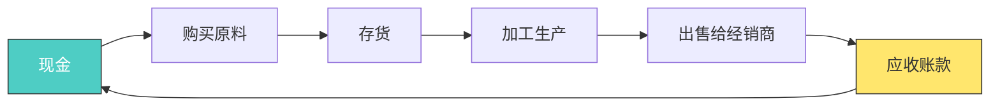
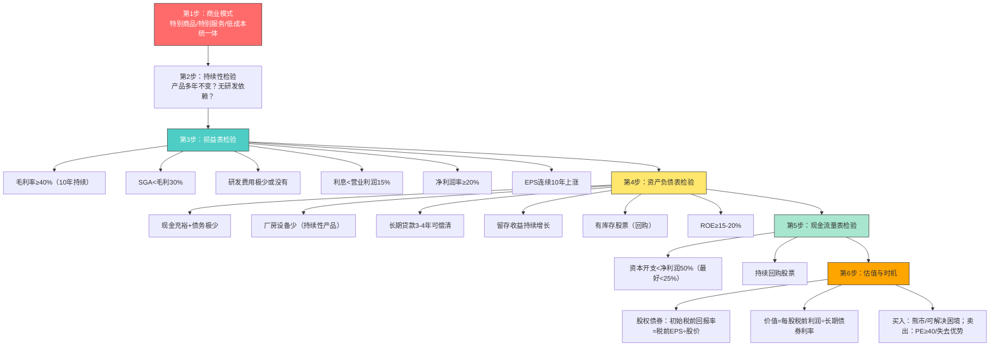

# 📊 巴菲特教你读财报 —— 逐章超详细深度解读

> **作者**：玛丽·巴菲特（Mary Buffett，沃伦·巴菲特的儿媳妇）& 戴维·克拉克（David Clark，"巴菲特追随者"）
> **译者导读**：刘建位（中央电视台《理财教室》主讲人、汇添富首席投资理财师）
> **主题**：巴菲特的两大发现——①如何辨别具有持久竞争优势的优质企业？②如何估算其价值？
> **核心方法**：通过三大财务报表（损益表、资产负债表、现金流量表）识别"持续性竞争优势"公司
> **全书结构**：序言6章 + 损益表14章 + 资产负债表29章 + 现金流量表3章 + 价值衡量5章 + 附录4例表 + 术语汇编

---

## 🎯 全书核心框架



### 巴菲特选股的完整逻辑链



---

## 📖 全书结构总览

| 部分 | 章节 | 内容 | 核心指标 |
|:---:|------|------|---------|
| 导读+序言 | 刘建位导读、玛丽序言 | 价值投资原理、股权债券概念 | 内在价值=现金流贴现 |
| 序言 | 第1-6章 | 两大发现、三种商业模式、持续性、报表概述 | 持续性竞争优势 |
| 第一部分 | 第7-20章 | 损益表 | 毛利率、净利率、EPS等8指标 |
| 第二部分 | 第21-49章 | 资产负债表 | 现金、负债、留存收益、ROE |
| 第三部分 | 第50-52章 | 现金流量表 | 资本开支、股票回购 |
| 第四部分 | 第53-57章 | 衡量价值 | 股权债券、买卖时机 |
| 附录 | - | 优劣公司报表例表+术语汇编 | 综合应用 |

---

## 📖 导读与序言深度解析

### 刘建位导读：价值投资的完整逻辑

**价值投资的本质：**
> "用40美分购买价值1美元的股票。"——股票价格一看就知道，但股票价值只能估计。

**估值的关键不是"准"而是"底线"：**
> "我们只是对于估计一小部分股票的内在价值还有点自信，但这也只限于一个价值区间，而决非那些貌似精确实为谬误的数字。"

- 估计价值区间，**重要的不是最高价值，而是最低价值估计是否准确**
- 如同买东西：知道基本价格下限，就能设定买入价格底线

**内在价值的定义：**
> "它是一家企业在余下的寿命中可以产生的现金流量的贴现值。"（巴菲特）

**股票=利息不固定的债券：**
- 债券有息票和到期日→未来现金流确定
- 股票没有息票→分析师必须自己估计未来的"息票"
- **管理层能力对股权"息票"有巨大影响**（对债券息票影响甚少）

**防止错误估计的两种方法（巴菲特1992年致股东信）：**
1. **固守可以了解的公司**——业务简单稳定；"重要的不是他到底知道什么，而是他们真正明白自己到底不知道什么。只要能够尽量避免犯重大的错误，投资人只需要做很少几件正确的事情就足可以保证盈利了"
2. **买入价格留有安全边际**——"如果我们计算出一只普通股的价值仅仅略高于它的价格，那么我们不会对买入产生兴趣。我们相信这一安全边际原则——格雷厄姆非常强调这一原则——是成功投资的基石"

**股权债券的复利威力（导读举例）：**
- 第一年投资1美元，年收益率20%
- 第10年本利合计6.19美元，当年新增盈利1.238美元
- 按最初本金1美元计算收益率高达123%
- 用5%债券利率估值：1.238÷5%=24.76美元——**升值24倍**

**巴菲特谈阅读年报：**
> "我阅读我所关注的公司年报，同时我也阅读它的竞争对手的年报，这些是我最主要的阅读材料。"

> "有些人喜欢看《花花公子》，而我喜欢看公司年报。"

> "你必须了解财务会计，并且要懂得其微妙之处。它是企业与外界交流的语言，一种完美无瑕的语言。"

> "当经理们想要向你解释清楚企业的实际情况时，可以通过会计报表的规定来进行。但不幸的是，当他们想弄虚作假时，起码在一些行业，同样也能通过报表的规定来进行。如果你不能辨认出其中的差别，那么你就不必在资产管理行业中混下去了。"

**分析财务报表其实很简单——三句话：**
1. 只用小学算术
2. 只需要看几个关键指标
3. 只需要分析那些业务相当简单、报表也相当简单的公司

### 玛丽·巴菲特序言：本书的由来

- 2007年伯克希尔年会上与戴维·克拉克讨论投资分析历史
- 格雷厄姆沿用了债券投资的分析方法，但**从不区别对待具有长期竞争优势的公司与平庸之辈**
- 格雷厄姆只关心公司能否渡过经济难关；股票两年没起色就卖掉
- 沃伦的发现：**持有优秀公司股票的时间越长，你就越富有**——格雷厄姆觉得优质公司股价太高，沃伦认为"根本没有必要等到'大削价'的时候才进场，只要支付的价格合理，同样可以从优质公司身上赚个盆满钵满"
- 两人用一个月时间完成本书

---

## 序言部分（第1-6章）

### 第1章 让巴菲特成为世界首富的两大发现

**核心故事：** 巴菲特年过花甲时重新审视格雷厄姆的投资策略，摒弃了沿用数年的格雷厄姆式价值投资，创造了"迄今为止世界上最有价值的投资策略"。

**两大发现：**
1. **如何辨别具有持久竞争优势的优质企业？**
2. **如何估算具有持久竞争优势的优质企业的价值？**

### 第2章 让巴菲特成为超级富豪的企业类型

**华尔街的本质：** 过去200年，华尔街既提供商业服务，也提供了一个大型赌场。投机者、机构投资者、计算机程序化交易者（"今天买入，第二天就卖出"）都在追涨杀跌。

**格雷厄姆的价值投资：**
- 发现投机者会把股价推到"与公司实际长期基本经济状况完全背离"的荒唐地步
- 在股价低于长期内在价值时买入超卖股票，等市场纠正低估后卖出获利
- 操作规则：寻找交易价格比公司库存现金一半还少的公司（"用50美分买1美元"）；从不买PE超过10倍的股票；股价涨幅超50%就卖出；两年没上涨也坚决卖出

**格雷厄姆方法的三个致命问题：**
1. 不是所有低估公司都会价值重估——某些甚至破产
2. 分散化投资100种以上股票稀释收益
3. **"如果这个公司在10年后才有表现的话，他将获得零收益"**

**巴菲特的关键发现：**

| 发现 | 内容 |
|------|------|
| ① 超级明星股的共性 | 都得益于某种竞争优势→类似垄断的经济地位→能要价更高或增加销量→比对手赚更多利润 |
| ② 持续性 | 竞争优势长期持续→公司价值持续增长→尽可能长久持有 |
| ③ 投资圣杯 | **使风险最小化，却能带来潜在收益增长**——推翻了"要获得更多利润，不得不加大风险"的华尔街格言 |
| ④ 价格合理即可 | 不需要等华尔街提供便宜价格——投资足够长的时间，支付公平合理价格即可 |
| ⑤ 免税复利 | 长线持有不卖出→资本利得税无限期推迟→复利增长且免税 |

**华盛顿邮报案例（1973年）：**
- 投资0.11亿美元，持有35年→价值14亿美元（**12460%收益率**）
- 至今未卖出任何一股→未支付任何税费
- 对比：格雷厄姆按50%法则1976年卖出→仅0.16亿美元+39%资本利得税；华尔街投机者35年进出上千次，每次付税
- **"巴菲特累积了12460%的收益率，并且直到如今，还未对其14亿美元收益支付任何税费"**

### 第3章 巴菲特的淘金之地：三种基本商业模式

**三种商业模式详解：**



**关键细节：**
- 特别商品：想要口香糖→箭牌；炎夏想喝冰镇啤酒→百威；饮可口可乐万事如意
- 特别服务的关键区别：**机构品牌 vs 个人品牌**。巴菲特卖出所罗门兄弟的原因——"当公司的顶尖人才带着他的高端客户跳槽时，巴菲特意识到这是一个以人员为主导的公司。在此种类型的公司里，员工可以要求得到公司大部分利润，而公司股东只能获得很少一部分。这样一来，投资者当然不会变得富有。"
- 低成本统一体：大宗交易创造丰厚利润；"哪里有廉价商品，消费者就会蜂拥而至"

### 第4章 "持续性"是巴菲特打开金库的钥匙

**可口可乐的例子：**
> "在过去的122年里，可口可乐公司一直销售着同一种产品，并且很可能在未来的122年里还会继续销售这种产品。"

**产品一致性带来的好处链：**
1. 无需频繁更换产品→不必在研发上花几百万
2. 不必投入几十亿资本更新厂房设备
3. 不必承担繁重债务、支付高额利息
4. 节约的钱→拓展业务或回购股票→提高每股收益和股价→股东更富有

**巴菲特在财务报表中寻找的"持续性"：**

| 问题 | 对应指标 |
|------|---------|
| 是否保持较高的毛利率？ | 毛利率（10年） |
| 是否一直承担较少的债务，甚至没有？ | 长期贷款、利息支出 |
| 是否从来无需在研发方面耗费大量资金？ | 研发费用 |
| 其盈利是否保持稳定，或者持续稳定地增长？ | 净利润、每股收益 |

> "财务报表所表现出的'持续性'可以让巴菲特了解这个公司竞争优势的'持久性'。判断一家公司是否具有'持续性'竞争优势，去看看该公司的财务报表吧。这就是巴菲特的做法。"

### 第5章 财务报表概述：淘金之地

**三大报表的角色：**

| 报表 | 反映内容 | 巴菲特用法 |
|------|---------|-----------|
| 损益表 | 一定会计期间的经营成果（季度/年度） | 利润率、股权收益、利润稳定性、发展趋势 |
| 资产负债表 | 特定日期（某一天）的资产、负债、净资产 | 现金资产、长期债务→判断竞争优势 |
| 现金流量表 | 现金流入流出 | 资本结构改善、债券股票销售、股票回购 |

**关键概念：** 资产负债表是"快照"（特定时刻），损益表和现金流量表是"电影"（一段时期）。

### 第6章 巴菲特在哪里发现财务信息

**免费渠道：**
- MSN Money（moneycentral.msn.com）——内容更详细
- 雅虎财经（finance.yahoo.com）

**SEC文件：**
- **10K文件**：年度报告，含会计年度财务报表——"数年来，巴菲特已经翻阅了成千上万份10K文件，因为这些数字能够最准确地反映出公司的财务信息"
- 10Q：季度报告

**付费渠道：** Bloomberg.com（买卖债券或货币时可能需要）

> 作者建议："当我们要建立一个股票投资组合时，MSN和雅虎财经网就能为我们免费提供所有需要的财务信息。"

---

## 第一部分 损益表（第7-20章）

### 导读：巴菲特分析损益表的8大指标

| 序号 | 指标 | 巴菲特的标准 |
|:---:|------|------------|
| 1 | 毛利率 | **40%及以上**，且查找过去10年数据确认"持续性" |
| 2 | 销售费用及一般管理费用占毛利比例 | **30%以下**最好 |
| 3 | 研发开支 | 回避巨额研发的公司（尤其高科技） |
| 4 | 折旧费用 | 占毛利润比例较低（对比同行） |
| 5 | 利息支出 | 优质公司几乎不付利息；消费品类<营业利润15% |
| 6 | 税前利润 | 同等条件下比较不同投资 |
| 7 | 净利润 | 长期增长；**占总收入20%以上**；明显高于竞争对手 |
| 8 | 每股收益 | **连续10年以上持续上涨** |

### 第7章 巴菲特从哪里开始着手：损益表

**损益表三要素：** 营业收入 + 需要扣除的支出 + 损益情况（盈利还是亏损）

**与格雷厄姆的区别：**
- 格雷厄姆只关注是否创造利润，不分析长期升值能力
- 巴菲特关注**利润的来源比利润本身更有意义**——"企业能否盈利仅仅是一方面，还应该分析该企业获得利润的方式，它是否需要靠大量研发以保持竞争力，是否需要通过财务杠杆以获取利润"

**世界上所有企业分两类：**
1. 相对竞争对手拥有持久竞争优势的企业——合理价格买入并长期持有→腰缠万贯
2. 在竞争市场上苦苦奋斗仍碌碌无为的普通企业——长期持有→财富日益萎缩

### 第8章 收入：资金来源的渠道

**核心概念：**
- 损益表第一行是总收入（会计期间流入的总资金）
- **高销售收入≠盈利**——必须从总收入中扣除成本费用才能得到净收益
- 总收入本身不能说明什么

> "当巴菲特浏览了一家企业的总收入之后，他就会花大量时间研究各种成本费用。因为巴菲特知道，发财致富的秘诀之一，就是减少开支。"

### 第9章 销售成本：对于巴菲特来说越少越好

**定义：** 销售成本（COGS）= 销售产品的进货成本，或制造产品的材料成本+劳动力成本。服务公司用"收入成本"。

**计算示例（家具公司）：**
- 年初存货成本1000万美元 + 年内新增存货200万美元 - 年末剩余存货700万美元 = **本期产品成本500万美元**

**重要性：** 销售成本本身不能告诉我们公司是否有竞争优势，但它决定**毛利润**——毛利润是判断长期竞争优势的关键指标。

### 第10章 毛利润/毛利率：巴菲特寻求长期赢利的关键指标

**公式：** 毛利率 = 毛利润 ÷ 总收入

**优质公司 vs 平庸公司毛利率：**

| 具有持续竞争优势的公司 | 毛利率 | 高度竞争/困境公司 | 毛利率 |
|----------------------|:-----:|-----------------|:-----:|
| 穆迪（债券评级） | 73% | 美国航空（濒临破产） | 14% |
| 可口可乐 | 60%+ | 通用汽车 | 21% |
| BNSF铁路 | 61% | 美国钢铁 | 17% |
| 箭牌 | 51% | 固特异轮胎 | 20% |
| 微软（软件） | 79% | 苹果（硬件+服务） | 33% |

**通用规则：**
- 毛利率**≥40%**：一般具有某种可持续性竞争优势
- 毛利率**<40%**：一般处于高度竞争行业
- 毛利率**≤20%**：行业存在过度竞争，无公司能创造可持续竞争优势

**为什么高毛利率=竞争优势？**
> "公司的可持续性竞争优势能够创造高毛利率，因为这种竞争优势可以让企业对其产品或服务进行自由定价，让售价远远高于产品成本。倘若缺乏持续竞争优势，公司只能通过降低产品及服务价格来保持竞争力。"

**重要提醒：**
- 毛利率指标不是万无一失，只是早期检验指标
- **必须看过去10年**的毛利率，确保"持续性"
- 高毛利率公司也可能误入歧途——三大陷阱：**过高的研究费用、过高的销售和管理费用、过高的债务利息支出**——任何一种过高都可能削弱长期经济原动力（这些被称为营业费用，"是所有公司的眼中钉"）

### 第11章 营业费用：巴菲特的关注点

**营业费用组成：**
- 新产品研发费用
- 销售费用及一般管理费用（SGA）
- 折旧费和分期摊销费
- 重置成本和减值损失
- 其他费用（非经营性支出、非经常性支出）

**关键公式：** 毛利润 - 总营业费用 = 营业利润（或亏损）

### 第12章 销售费用及一般管理费用（SGA）

**定义：** 管理人员薪金、广告费用、差旅费、诉讼费、佣金和应付薪酬等。

**优质公司数据：**

| 公司 | SGA占毛利润比例 |
|------|:--------------:|
| 穆迪 | 约25% |
| 可口可乐 | 约59% |
| 宝洁 | 约61% |

**平庸公司数据：**

| 公司 | SGA占毛利润比例 |
|------|:--------------:|
| 通用公司（过去5年） | 28%～83%波动 |
| 福特（过去5年） | **89%～780%**（"像疯子一样花钱"） |

**巴菲特的标准：**
- SGA占毛利润比例**越少越好**
- **<30%**：令人欣喜
- **30%-80%**：不少优质公司也在此区间
- **接近或超过100%**：很可能处于高度竞争行业

**关键警示：** 有些公司SGA比例低，但被高额研发、高资本开支或高利息支出破坏长期前景——**英特尔**（研发费用过高削弱业绩）、**固特异**（高资本开支+利息支出拖入赤字）。

> "无论股票价格如何，他都对这类公司避而远之，因为他知道，它们的内在长期经济实力如此脆弱，即使股价较低，也不能使投资者扭转终生平庸的结局。"

### 第13章 研究和开发费用：为什么巴菲特要避而远之

**核心逻辑：**
- 长期竞争优势常通过专利权或技术领先获得
- **专利权会过期**（制药公司）→竞争优势消失
- **技术革新会取代**（微软害怕谷歌）→今天的优势明天变成过时技术

**数据对比：**

| 公司 | 研发占毛利 | SGA占毛利 | 合计吞噬 |
|------|:---------:|:---------:|:-------:|
| 默克（制药） | 29% | 49% | **78%** |
| 英特尔 | 约30% | 较低 | 长期业绩仅平均水平 |
| 穆迪 | **0%** | 25% | 25% |
| 可口可乐 | **0%** | 约59% | 59% |

> "持有穆迪公司和可口可乐公司的股票，巴菲特不会因为担心某项药物专利过期，或者他持有股票的公司在下一轮技术突破竞争中失手而夜不能寐。"

**巴菲特的原则：**
> "那些必须花费巨额研发开支的公司都有在竞争优势上的缺陷，这将使它们的长期经营前景置于风险中，意味着它们并不太保险。如果不是一项比较保险的投资，巴菲特是不会对其产生兴趣的。"

### 第14章 折旧费：巴菲特不能忽视的成本

**折旧原理（印刷机案例）：**
- 100万美元印刷机，使用年限10年→每年计提10万美元折旧费
- 折旧是**真实的运营成本**——印刷机终有一日会报废

**华尔街的EBITDA伎俩：**
- 金融家把折旧费"加回"利润→创造EBITDA指标（息税折旧摊销前利润）
- **问题**："这台印刷机最终将报废，公司不得不再花100万美元去购买一台新的印刷机。但公司如今却背负着因杠杆式收购而产生的巨额债务，很可能没有能力去购买一台价值100万美元的新印刷机了"
- **巴菲特坚信：折旧费是一项真实的开支，必须包括进来**——"倘若背道而驰，我们就会自欺欺人地认为，公司在短期内的利润要比实际利润好得多。一个自欺欺人的人一般是不会发财致富的"

**优质公司折旧费占毛利润比例：**

| 公司 | 折旧费/毛利 |
|------|:----------:|
| 可口可乐 | 约6% |
| 箭牌 | 约7% |
| 宝洁 | 约8% |
| 通用汽车（高度竞争资本密集） | **22%～57%** |

> "对那些吞噬公司毛利润的各种费用，巴菲特认为它们越少，就意味着越高的保底线。"

### 第15章 利息支出：巴菲特不想看到

**利息支出的性质：** 财务成本而非运营成本——与生产和销售过程没有直接联系。负债越多，利息越多。

**利息支出高的两种公司类型：**
1. 处于激烈竞争行业的公司（保持竞争力需高额资本开支）
2. 有良好前景但在杠杆收购中承担大量债务的公司

**行业对比数据：**

| 公司 | 利息/营业利润 | 评价 |
|------|:------------:|------|
| 宝洁 | 8% | 优质 |
| 箭牌 | 7% | 优质 |
| 西南航空 | 9% | 行业最优 |
| 固特异 | 49% | 过度竞争+资本密集 |
| 联合航空 | 61% | 濒临破产 |
| 美国航空 | **92%** | 陷入困境 |
| 富国银行 | 约30% | 银行业最低（AAA评级） |
| 投行业平均 | 约70% | 高度杠杆 |

**规律：** 消费品领域，优质公司利息支出**<营业利润的15%**（不同行业差异大，如银行30%也正常）

**贝尔斯登的警示案例：**
- 2006年：利息支出占营业利润70%
- 2007年第四季度：飙升至**230%**——"意味着它将不得不动用公司所有者的权益去补足这个差额"
- 2008年3月：股价从170美元跌到被JP摩根以每股10美元收购

> "这是一条极其简单的规律：在任何行业领域，那些利息支出占营业利润比例最低的公司，往往是最有可能具有竞争优势的。"

### 第16章 出售资产收益（损失）及其他

**概念：** 出售资产（存货除外）的盈利/亏损 = 出售价格 - 资产账面价值
- 100万厂房折旧后账面50万→80万售出→30万收益；40万售出→10万损失

**巴菲特的处理：** 这些偶然性事件（非经常性收入支出）**应被排除在利润指标之外**——无论用哪种利润指标判断持续性竞争优势。

### 第17章 税前利润：巴菲特惯用的指标

**为什么用税前利润？**
- 所有投资报酬率都以税前为基准（免税投资除外）
- 所有投资都在相互竞争→同等条件下衡量更简单容易

**WPPSS债券案例（1983年）：**
- 买入1.39亿美元免税债券，每年2270万美元免税利息
- 免税的2200万收益 = 税前4500万美元收益
- 购买赚4500万税前利润的公司需要花2.5亿-3亿美元
- **相当于以50%折扣买入一家同样经济发展前景的公司**

**深层意义：** 税前利润是"股权债券"理论的基石——"持有一家具有持续竞争优势的公司，实际上是投资于一种息票利率逐渐增长的'权益债券'"

### 第18章 应缴所得税：巴菲特怎么知道谁在说真话

**验证真话的方法：**
- 美国公司所得税约35%
- 查看SEC报表→查出所得税支付情况→报告的税前利润×(1-35%)→与报告的税后利润对比
- **不符合→公司可能在说谎**

> "多年来，巴菲特发现那些千方百计歪曲事实以欺骗美国国家税务局的公司，同样会绞尽脑汁地想出各种方法欺骗它们的股东。真正具有长期竞争优势的优质公司，其利润本来就很不错，完全没有必要靠包装来误导他人。"

### 第19章 净利润：巴菲特的追求

**巴菲特关注的三个概念：**

**① 净利润是否具有上升趋势：**
> "仅仅一年的净利润数据对巴菲特来讲毫无价值，他感兴趣的是，公司利润是否展现美好前景，是否能保持长期增长态势。"

**② 注意净利润与EPS的区别：** 股票回购会减少流通股→EPS增加但净利润没增加——"尽管大多数金融分析师都关注公司的每股收益，但巴菲特却关注公司净利润的真正走势"

**③ 净利润占总收入的比例：**
> "倘若要在一家收入100亿美元、净利润为20亿美元的公司和一家收入1000亿美元但仅赚50亿美元的公司之间进行选择的话，他将选择拥有前者。"（20% vs 5%）

**行业对比：**

| 公司 | 净利润率 | 行业状态 |
|------|:-------:|---------|
| 穆迪 | 31% | 卓越 |
| 可口可乐 | 21% | 卓越 |
| 西南航空 | 7% | 高度竞争 |
| 通用汽车 | 3% | 过度竞争 |

**规律（当然不乏例外）：**
- 净利润率**>20%**：很可能具有长期相对竞争优势
- 净利润率**<10%**：很可能处于高度竞争行业
- **10%-20%灰色地带**："挤满了目前还未被投资者发现，但时机已经成熟，并等待发掘长期投资财富的公司"

**银行例外：** 异常高的净利润率可能意味着风险管理部门过于松懈——"表面上看起来非常有诱惑力，但实际上却暗示出公司可能在为所谓的高收益率承担巨大的风险……但代价可能是长期的灾难"

### 第20章 每股收益：巴菲特怎么辨别成功者和失败者

**公式：** EPS = 净利润总额 ÷ 流通股数量

**成功者的EPS模式（连续10年持续上涨）：**
> 2008: 2.95 → 2007: 2.68 → 2006: 2.37 → 2005: 2.17 → 2004: 2.06 → 2003: 1.95 → 2002: 1.65 → 2001: 1.60 → 2000: 1.48 → 1999: 1.30

**失败者的EPS模式（起伏不定、常亏损）：**
> 2008: 2.50 → 2007: 0.45（亏损）→ 2006: 3.89 → 2005: 6.05（亏损）→ 2004: 6.39 → 2003: 5.03...

**解读：**
- 持续上涨的EPS→产品无需昂贵交换过程、销售成本低→强大经济实力支付广告和扩张费用→有资金回购股票
- 起伏不定的EPS→激烈竞争行业，繁荣-衰退循环→"股票价格像翅膀一样忽上忽下"→"让很多传统价值投资者误认为到了买入的时机，但殊不知他们买进的却是一艘冗长而缓慢、没有明确行驶方向的船只"

---

## 第二部分 资产负债表（第21-49章）

### 第21章 资产负债表概述

**定义：** 特定时刻公司财务状况的"快照"（不同于损益表/现金流量表的"期间"概念）

**结构：**
- 资产（现金、应收账款、存货、房产、厂房、机械设备）
- 负债（流动负债+长期负债）
- 所有者权益（净资产）

**核心恒等式：** 资产 - 负债 = 净资产（所有者权益）

### 第22章 资产

**两大类资产：**

| 类别 | 内容 | 特点 |
|------|------|------|
| 流动资产 | 现金、现金等价物、短期投资、净应收账款、存货、其他流动资产 | 现金或一年内可变现；按流动性列示 |
| 长期资产 | 长期投资、厂房设备、商誉、无形资产、累计摊销、其他长期资产 | 一年内不能变现 |

**流动资产的重要性：** "如果公司的经营状况开始恶化，其他日常营运资本也开始锐减蒸发的话，它们能够快速变现。（如果你无法想象公司的营运资本可能一夜间蒸发殆尽，看看贝尔斯登就知道了。）"

### 第23章 流动资产周转：钱是如何赚取的

**运营资产循环：**



**关键认知：** 现金→存货→应收账款→现金循环反复周转，公司就在周转中赚钱。流动资产呈现的不同形式和内容，提供给巴菲特大量经营情况信息。

### 第24章 现金和现金等价物：巴菲特的困惑

**高额现金的两种可能：**
1. **好事情**：公司具有某种竞争优势，持续产生大量现金
2. **需警惕**：公司刚出售了一部分业务或大量公司债券

**低额/短缺现金**：通常意味着公司经营变得困难或趋于平庸

**产生大量现金的三种途径：**

| 途径 | 性质 |
|------|------|
| 发行新的债券或股票 | 偶然性（融资所得） |
| 出售部分现有业务或其他资产 | 偶然性 |
| **持续经营收益的现金流入>现金流出** | **巴菲特唯一感兴趣的** |

**巴菲特的判断方法：** 查看公司**过去7年**的资产负债表——库存现金是偶然事件产生，还是持续经营盈余产生。

**规律：**
> "如果我们看到一家公司持有大量现金和有价证券，并且几乎没有什么债务的话，那么很可能，这家公司能顺利渡过这个黑暗的困难时期。但如果这家公司现金紧缺，并且背负着一大堆债务，那么这家公司很可能会倒闭，再有能耐的经理恐怕也救不了它。"

> "我们不能遗忘，当困难来临时'现金为王'。所以，这时如果我们的竞争对手没有现金，而我们持有大量现金，那么我们才能步入正轨。"

### 第25章 存货：公司需采购的原料和公司需出售的产品

**存货过时风险：** 很多公司存在存货过时废弃风险——**但具有持续性竞争优势的制造类公司，其销售产品有不变的优势，产品绝不会过时废弃**

**巴菲特的检验：**
- 存货与净利润**同步增长**→公司找到有利可图的方式增加销售→存货增加满足订单→**好公司**
- 存货**剧烈波动**（某些年份迅速增加又迅速减少）→高度竞争、时而繁荣时而衰退的行业

### 第26章 应收账款净值：别人欠公司的钱

**公式：** 应收账款 - 坏账 = 应收账款净值

**巴菲特的使用方法：**
- 单独指标信息有限
- **对比同行业其他公司**：如果一家公司持续显示出比竞争对手**更低的应收账款占总销售比率**→很可能具有相对竞争优势
- 竞争行业公司用宽松付款条件（如120天）促销→应收账款增加

### 第27章 预付账款和其他流动资产

- 预付账款：提前支付但尚未获得商品/服务的款项（如预支保险费）
- 信息有限："不能帮我们判断公司是否获益于某种持续性竞争优势"

### 第28章 流动资产合计和流动比率（反直觉章节！）

**传统标准：** 流动比率 = 流动资产 ÷ 流动负债；>1好，<1坏

**但优质公司的流动比率常常<1：**

| 公司 | 流动比率 |
|------|:-------:|
| 穆迪 | 0.64 |
| 可口可乐 | 0.95 |
| 宝洁 | 0.82 |
| 安海斯-布什 | 0.88 |

**为什么？**
1. 盈利能力足够强劲→轻松偿还流动负债
2. 需要额外短期现金→毫无障碍进入商业票据市场融资
3. 强大盈利能力→派发红利或回购股票→减少现金储备→流动比率<1

**结论：**
> "很多具有持续性竞争优势的公司，其流动比率都小于1，不同于传统的流动比率指标评判标准。因此，我们在判断一家公司是否具有持续性竞争优势时，流动比率指标会显得毫无用处。"

### 第29章 房产、厂房和机器设备：对巴菲特来说越少越好

**核心逻辑：**
- 没有竞争优势的公司：被迫不断更新设备保持竞争力→持续隐形开支→厂房设备价值持续增长
- 有竞争优势的公司：无需不断更新（箭牌的口香糖厂房用到报废）

**数据对比：**

| 维度 | 箭牌（优质） | 通用汽车（平庸） |
|------|:-----------:|:--------------:|
| 厂房设备 | 14亿美元 | 560亿美元 |
| 债务 | 10亿美元 | 400亿美元 |
| 年利润 | 约5亿美元 | 连续亏损 |
| 1990年投10万→2008年 | 54.7万美元 | 9.7万美元 |

**"持续性产品"的定义：** 无需为保持竞争力而耗费巨额资金去更新厂房和设备的产品，能节约出大量资金用于其他有利可图的投资。

### 第30章 商誉

**定义：** 收购价格超过被收购公司账面价值的部分。

**变化：** 以前商誉需摊销（减少净利润）；现在除非公司确实价值贬值，否则不摊销。

**巴菲特的解读：**
- 商誉连续几年增加→公司在不断并购其他公司（如果并购对象也有竞争优势→锦上添花）
- 商誉每年不变→以低于账面价值并购或无并购
- **优质公司基本不会以低于账面价值出售**——"当然，也不排除偶尔会有这种情况发生，倘若确有其事，那是一次终生难得的买入的好机会"

### 第31章 无形资产：衡量不可测量的资产

**定义：** 专利权、版权、商标权、专营权、品牌等无法用身体感受的资产。

**会计规则：**
- 内部形成的无形资产**不允许**计入资产负债表
- 第三方收购产生的无形资产以合理价值计入

**关键洞察：**
> "拿可口可乐公司来说，该公司的品牌价值超过1000亿美元，但由于这只是公司内部形成的品牌，它作为无形资产的真实价值并不能反映在公司的资产负债表上。"

**为什么大众发现不了财富：**
> "这就是为什么持续性竞争优势能给股东带来财富，但长久以来却一直未被大众投资者所发现的原因之一。不善于比较公司过去10年的损益表，不深入分析其资产负债表反映的真实价值，大众投资者永远不知道财富在哪儿。"

> "巴菲特却能发现其他人所不能发现的秘密，那就是可口可乐的持续性竞争优势以及由此产生的长期盈利能力。"

### 第32章 长期投资：巴菲特成功的秘密之一

**记账规则：** 入账价值 = 成本价值或市场价值，**哪个更低记哪个**——"即使这项投资价值发生大幅增值，也不能以高于成本的价格入账"

**从长期投资看管理层心态：** 他们投资的是具有持续性竞争优势的公司，还是高度竞争行业的公司？

**伯克希尔的演变：**
- 伯克希尔原本是高度竞争纺织业中的平庸企业
- 巴菲特买入控股权→暂停分红累积现金→投资保险公司→用保险资产疯狂购买优质公司
- 40多年间，伯克希尔股票价值高达600亿美元

> "就像白雪公主亲吻青蛙一般，以持续性竞争优势亲吻一家像青蛙般平庸的公司，只要亲吻次数足够多，它最终会变成像王子一样尊贵的公司。"

### 第33章 其他长期资产

待摊费用等杂项——"在判断公司是否具有持续性竞争优势方面所提供的信息不多，所以，请大家直接翻到下一章吧。"

### 第34章 总资产和总资产回报

**公式：** 总资产 = 总负债 + 股东权益（资产负债表因此也叫"平衡表"）
**资产回报率（ROA）= 净利润 ÷ 总资产**

**数据对比：**

| 公司 | 总资产 | ROA |
|------|:------:|:---:|
| 可口可乐 | 430亿美元 | 12% |
| 宝洁 | 1430亿美元 | 7% |
| 奥驰亚 | 520亿美元 | 24% |
| 穆迪 | 17亿美元 | **43%** |

**巴菲特的独特洞察（反直觉）：**
> "大多数分析师认为资产回报率越高越好，但巴菲特却发现，过高的资产回报率可能暗示着这个公司的竞争优势在持续性方面是脆弱的。"

- 拿430亿美元撼动可口可乐：几乎不可能完成的任务
- 拿17亿美元与穆迪抗衡：完全有可能实现
- **穆迪盈利能力更强，但竞争优势持续性相对较弱（进入行业成本低）**

> "有时候现在的多往往意味着将来的少。"

### 第35章 流动负债

**定义：** 当期会计年度到期应偿还的债务或应履行的义务：应付账款、预提费用、短期贷款、一年内到期的长期贷款、其他流动负债。

### 第36章 应付账款、预提费用和其他流动负债

- 应付账款：赊购商品/服务的债务（订了1000磅咖啡的发票）
- 预提费用：已发生但未支付的负债（月底发的工资）
- 其他流动负债：未纳入上述的短期负债集合
- **信息有限**，但短期贷款和长期贷款数额能反映很多长期经营状况信息

### 第37章 短期贷款：它如何摧毁一家金融机构

**短借长贷的模式：**
- 以5%利率借入短期资金，以7%利率放出长期贷款→赚2%利差
- **风险一**：短期利率上升到8%→再融资成本超过贷款利率→亏损
- **风险二**：债权人拒绝续贷→"顷刻间，我们必须偿还所有以短期借入而以长期贷出的资金。但此时，我们没有足够的资金"

**贝尔斯登的崩溃：** 借入短期资金购买住房抵押贷款证券→以证券为抵押再借短期→债权人醒悟："我们认为你们提供的抵押品的价值根本值不了你们所说的价值，我们不想再借给你一分钱，并且我们要收回已提供给你的贷款。"

**巴菲特对银行的态度：**
> "银行业最灵活、最安全的赚钱方式就是借入长期资金并以此提供长期贷款。"

- 富国银行：每1美元长期贷款仅57美分短期借款
- 美国银行：每1美元长期贷款由2.09美元短期贷款提供
- "激进派金融机构可能短期内收益颇丰，但它很容易在将来面临金融危机。没有人能在发生金融危机的逆境中致富"

> "持续性'就是保守投资带来的稳定性。当别人亏损时它有资金，这就创造了机会。"

### 第38章 一年内到期的长期贷款及其可能带来的问题

**识别陷阱：** 大型公司会把部分即将到期的长期贷款计入流动负债→误认为短期贷款负担过重，实际并非如此。

**投资机会：**
> "每当我们打算买入一家具有持续性竞争优势，但因某些偶然性事件正处于困境时期的公司时，我们最好查看一下公司到底有多少长期贷款在明年即将到期。仅仅是单独一年的过多到期债务可能会令众多投资者感到不安，这样就会留给我们一个绝佳的购买时机。"

**风险警示：** 陷入严重困境的平庸公司+过多到期债务→现金流中断→破产。"拥有一项垂死挣扎的投资是不会让我们发财致富的。"

### 第39章 负债合计和流动比率

- 流动比率>1好、<1坏的判断对优质公司无效（同第28章）
- "确定那些处于平均水平公司的流动性和流动比率至关重要，但是它在帮我们判断一个公司是否具有某种持续性竞争优势方面几乎没什么作用"

### 第40章 长期贷款：优秀公司很少有的东西

**核心发现：** 具有持续性竞争优势的公司通常负担很少甚至没有长期贷款——"这些公司具有超强的盈利能力，当需要扩大生产规模或进行企业并购时，它们完全有能力自我融资"

**检验方法：** 查看**过去10年**的长期负债情况；少量或没有→很可能具有强大竞争优势。

**偿债能力标准：** 公司应有充足盈余在**3-4年间**偿还所有长期债务

| 公司 | 偿清长期贷款所需时间 |
|------|:-------------------:|
| 可口可乐、穆迪 | 1年 |
| 箭牌、华盛顿邮报 | 2年 |
| 通用、福特 | 10年净利润也不够 |

**杠杆收购警示：** 优质公司常成为杠杆收购目标（雷诺兹-纳贝斯克案例）——收购后背负巨额债务。此时**债券**可能是不错的投资选择（全部盈利用于还债）。

> "一条简单的规律：少量或没有长期贷款通常意味着一项很好的长期投资。"

### 第41章 递延所得税、少数股东权益和其他负债

- 递延所得税：已到期未支付的税款——信息少
- **少数股东权益**：收购>80%股份时合并报表，少数股东权益代表不为母公司所有的部分股份价值——作用是平衡资产负债表，与判断竞争优势关系不大
- 其他负债：非当期收益、税赋利息、未交罚款、衍生工具等——没有作用

### 第42章 负债合计和债务股权比率

**公式：** 债务股权比率 = 总负债 ÷ 股东权益

**问题：** 优质公司强大到不需要大量股东权益（全用于回购）→股东权益减少→比率反而升高，与平庸公司混淆（穆迪的股东权益甚至为负！）

**修正方法：** 将库存股票价值**加回**股东权益再计算：

| 公司 | 调整后债务股权比率 | 评价 |
|------|:-----------------:|------|
| 可口可乐 | 0.51 | 优质 |
| 穆迪 | 0.63 | 优质 |
| 宝洁 | 0.71 | 优质 |
| 箭牌 | 0.68 | 优质 |
| 固特异 | 4.35 | 平庸 |
| 福特 | **38.0** | 灾难（72亿权益vs 2750亿债务） |

**银行例外：** 平均1美元股东权益对应约10美元负债（高杠杆是行业本质）；M&T银行仅7.7。

### 第43章 股东权益/账面价值

**定义：** 总资产 - 总负债 = 股东权益（净资产/账面价值）= 优先股+普通股+资本公积+留存收益

**重要性：** 通过它计算**股东权益报酬率（ROE）**——判断持续性竞争优势的方法之一。

### 第44章 优先股、普通股和资本公积

- 普通股：所有权+投票权+分红权；公司出售后股东获得所有利益
- 优先股：无投票权，先于普通股获得固定/浮动红利，破产时优先追偿
- 资本公积：溢价发行的部分（票面100美元、发行120美元→100入优先股、20入资本公积）

**反直觉洞察：** 优先股在会计上是权益，但实际更像**需要支付红利的负债**——且红利不能抵税（负债利息可以）→**筹资成本昂贵**

> "当我们搜寻具有持续性竞争优势的公司时，一个重要的标志就是在公司的资本结构中找不到优先股的身影。"

### 第45章 留存收益：巴菲特变得超级富有的秘密

**定义：** 净利润 - 派发红利 - 股票回购开支 = 新增留存收益（累计数据）

**留存收益增长率数据：**

| 公司 | 留存收益年增长率 |
|------|:---------------:|
| 可口可乐 | 7.9% |
| 箭牌 | 10.9% |
| BNSF铁路 | 15.6% |
| **伯克希尔** | **23%** |
| 通用汽车 | 负值（亏损） |
| 微软 | 负值（太强不需要留存，全用于回购分红） |

**核心机制：**
> "公司留存的收益越多，它的留存收益增长就越快，而这又将提高公司未来收益的增长率。当然，这里有个前提条件，公司必须持续买入那些具有持续性竞争优势的公司。"

**伯克希尔的复利机器：**
- 巴菲特取得控股权后**停止派发分红**→全部净利润进入留存收益
- 机会来临时→投资高收益率公司→利润再进入留存→再投资→循环
- 1965年每股19美元→2007年每股78000美元
- 1965年每股税前利润4美元→2007年每股13023美元（**约21%年均增长率**）

> "伯克希尔就像一只不断产下金蛋的鹅，而且它下的每个金蛋都能再孵出一只会下金蛋的鹅，所有这些下金蛋的鹅不断地孵出更多的金蛋。巴菲特发现，如果你能将这个过程保持足够长的时间，到最后，当你清点自己的财富时，计量单位将会以10亿计算，而不是以百万计算。"

### 第46章 库存股票：巴菲特喜欢在资产负债表上看到的

**定义：** 公司回购自身股票但未注销、保留以备再发行的股份。无投票权、无分红权，以**负值权益**体现在资产负债表上。

**为什么库存股票=优质公司标志：**
> "那些具有持续性竞争优势的公司因其强大的经济实力，更易于获得充裕的资金用来回购它们自身的股票。所以，一家公司具有持续性竞争优势的主要标志之一，就是其资产负债表上出现库存股票。"

**财务细节：**
- 回购并以库存股票持有→减少权益→**增加股东权益回报率**（需区分是财务处理还是杰出业绩）
- 修正方法：将库存股票负值转正加到股东权益上再计算ROE

**避税细节：** 库存股票在确定控制权时不能算作流通股——不择手段的股东可能借此向税务局少报控股比例（49% vs 实际50%+）来逃个人控股公司税。

### 第47章 股东权益回报率：第一部分

**股东权益的三个来源：**
1. 最初发行优先股/普通股募集的资金
2. 上市后增发股票筹措的资金
3. **最重要：公司积累的留存收益**

**关注ROE的原因：** 股东关注经理人分配资金的能力——表现优秀→追加资金；表现糟糕→出售股份。

### 第48章 股东权益回报率：第二部分

**公式：** ROE = 净利润 ÷ 股东权益

**行业对比：**

| 优质公司 | ROE | 航空业 | ROE |
|---------|:---:|--------|:---:|
| 百事 | 34% | 联合航空（繁荣期） | 15% |
| 好时 | 33% | 美国航空 | 4% |
| 可口可乐 | 30% | 德尔塔 | 0或负 |
| 箭牌 | 24% | 西北航空 | 0或负 |

**解读：**
> "高股东权益回报率意味着公司有效地利用了留存收益。随着时间的推移，这些高额的股东权益回报总会累积起来，并增加公司的内在价值，有朝一日股票市场会认可其价值，并将股价推向高位。"

**负股东权益的两种解读：**
- 一贯强劲净利润 + 负股东权益 → **优质公司**（利润全部分红，如穆迪）
- 长期亏损 + 负股东权益 → 竞争中落败的平庸公司

> "规律就是：高股东权益回报率意味着'近玩'，而低股东权益回报率意味着'远观'。"

### 第49章 杠杆问题和可能的骗局

**杠杆的诱惑：** 以7%利息借入1亿，投入运营赚12%→扣除资本成本后净赚5%（500万美元）→增加利润和ROE

**杠杆的欺骗性：** 可能使公司表面上看起来具有竞争优势，实际只是利用债务增加利润——投资银行6%借入、7%贷出赚1%利差（1000亿借入→10亿利润）→"可能令公司看来具有某种持续性竞争优势，但实际上并非如此"

**次贷危机案例：** 银行以6%利息借入数十亿，以8%利息贷给次级购房者→经济不景气时违约→数千亿美元损失

> "在评估一个公司竞争优势的质量和持续性方面，巴菲特会尽量避开那些使用大量杠杆来获取利润的公司。从短期来看，这些公司可能是一只下金蛋的鹅，但最终它们将一无是处。"

---

## 第三部分 现金流量表（第50-52章）

### 第50章 现金流量表：巴菲特查看现金之处

**为什么需要现金流量表：** 大多数公司用**权责发生制**（发货即记收入，不管何时收款）→赊销可以记为收入→需要单独列示实际现金流入流出

**现金流量表三部分：**

```mermaid
graph TD
    A["现金流量表"] --> B["① 经营活动现金流"]
    A --> C["② 投资活动现金流"]
    A --> D["③ 融资活动现金流"]
    
    B --> B1["净利润 + 折旧费 + 待摊费用"]
    B --> B2["（折旧不消耗现金——代表多年前已支付的现金）"]
    
    C --> C1["资本开支（通常是负值）"]
    C --> C2["其他投资活动（买卖盈利资产）"]
    
    D --> D1["支付红利（流出）"]
    D --> D2["发行/回购股票"]
    D --> D3["发行/偿还债券"]
    
    B + C + D --> E["现金流量净额"]
    
    style E fill:#ff6b6b,stroke:#333,color:#fff
```

### 第51章 资本开支：致富秘诀之一就是减少它

**定义：** 购买长期资产（房屋、厂房、机器设备、专利权）的现金支出——通过多期折旧摊销，而非一次性耗费。

**核心指标：资本开支 ÷ 净利润（10年累计）**

| 公司 | 资本开支/净利润 | 评价 |
|------|:--------------:|------|
| 穆迪 | **5%** | 极优 |
| 可口可乐 | 19% | 优质 |
| 奥驰亚 | 20% | 优质 |
| 美国运通 | 23% | 优质 |
| 宝洁 | 28% | 优质 |
| 百事 | 36% | 较好 |
| 箭牌 | 49% | 及格 |
| 通用汽车 | **444%** | 灾难 |
| 固特异 | **950%** | 灾难 |

**具体数据：**
- 可口可乐：10年每股收益20.21美元，资本开支仅4.01美元（19%）
- 穆迪：10年每股收益14.24美元，资本开支仅0.84美元（5%）
- 通用汽车：10年累计每股收益31.64美元，资本开支高达140.42美元/股
- 固特异：10年累计每股收益3.67美元，资本开支34.88美元/股

**多余的钱从哪来？** 银行贷款或发行债券→增加负债→增加利息费用——"所有这一切并不是件好事"

**巴菲特的标准：**
- 资本开支/净利润**<50%**→列入持续性竞争优势候选者名单
- **<25%**→很可能具有有利的持续性竞争优势

> "巴菲特说过，这就是他不投资通讯类公司的原因，因为通讯类公司需要花费巨额资本开支用于建设室外通信网络，这严重阻碍了其长期经济发展前景。"

### 第52章 股票回购：巴菲特增加股东财富的免税途径

**回购的魔力：**
- 1000万利润+100万流通股→EPS=10美元
- 流通股减至50万→EPS=20美元（净利润没变！）
- 流通股越少→每股收益越高→股价上涨

**免税的财富增值：**
> "最奇妙的是，股东们在出售其股份之前，他们的财富增加了，却不需要为之赋税。就把它当做源源不断的免费礼物吧！"

**巴菲特的偏好：** 不喜欢派发红利（股东要缴所得税）→说服董事会**回购股票**（GEICO、华盛顿邮报都用了这个策略）

**如何查看：** 现金流量表"发行（回购）股票【净值】"账户——**如果一家公司每年都进行股票回购，那么这很可能是一家具有持续性竞争优势的公司，因为只有这样的公司才有充裕的资金从事股票回购。**

---

## 第四部分 衡量具有持续性竞争优势公司的价值（第53-57章）

### 第53章 巴菲特的股权债券创意如何使他致富

**核心概念——股权债券：**
> "那些具有持续性竞争优势的公司为何有如此强大的、可预测的利润增长，使其股票变成一种息票利率不断增长的股权债券。这种债券就是公司的股票，而它的'息票利率'就是公司的税前利润，它不是公司派发的红利，而是公司实际的税前利润。"

**股权债券 vs 普通债券：**
- 普通债券：息票利率固定
- 股权债券：**息票利率不是固定的，而是年复一年地保持增长态势**，内在价值不断攀升

**可口可乐实例（1987年）：**
- 买入价：平均每股6.5美元
- 税前利润：每股0.70美元（税后0.46美元）
- 历史利润增长率：约15%
- **初始税前回报率 = 0.70 ÷ 6.5 = 10.7%**，且预计以每年15%增长
- 2007年：税前每股利润3.96美元 → **60%的税前年回报率**（40%税后）

**与格雷厄姆式投资者的区别：**
> "格雷厄姆式的价值投资者，并不是因为预期可口可乐股票价值应为每股60美元，而因为认为每股40美元的股价存在'价值低估'而买入。他考虑的是，以每股6.5美元的价格买入后，将获得相对无风险的10.7%的初始税前回报率，并且认为这一回报率在今后20年将以15%左右的年增长率不断升高。"

**华盛顿邮报实例（1973年）：**
- 成本价：每股6.36美元
- 34年后（2007年）：税前利润54美元/股（税后34美元）
- **税前回报率高达849%**（税后534%）

**价值推算：** 股权债券价值 = 每股税前利润 ÷ 长期公司债券利率
- 华盛顿邮报2007年：54 ÷ 6.5% = **每股830美元**（实际股价726-885美元）
- 可口可乐2007年：3.96 ÷ 6.5% = **每股60美元**（实际股价45-64美元）

> "股票市场一旦看到这些回报率，终有一日会重估巴菲特的股权债券价值，反映出其增长价值。"

### 第54章 持续性竞争优势带来的持续增长回报

**更多股权债券实例：**

| 公司 | 买入价 | 税后利润增长 | 当前税后回报率 | 税前回报率 |
|------|:------:|:-----------:|:------------:|:---------:|
| 穆迪（1998） | 10.38美元 | 0.41→2.58美元 | 24% | 38% |
| 美国运通（1998） | 8.48美元 | 1.54→3.39美元 | 40% | 61% |
| 宝洁（1998） | 10.15美元 | 1.28→3.31美元 | 32% | 49% |
| 喜诗糖果（1972全资） | 2500万美元 | 税前8200万 | - | **328%** |

**核心逻辑：** 持续性竞争优势→净利润年复一年增长→内在价值增加→股票市场随时间承认这些价值。

### 第55章 衡量具有持续性竞争优势公司价值的其他途径

**用贴现率推算内在价值（可口可乐案例）：**
1. 预计利润年增长率10%（1987年）
2. 推算2007年税前收益：6.5美元 × 66% = 4.35美元/股（税前），2.82美元（税后）
3. 使用7%贴现率（1987年长期利率水平）→贴现回报率约17%
4. 17% × 6.5美元 = 1.10美元每股税前收益
5. 1.10 × 1987年PE 14 = **每股15.40美元内在价值**
6. 实际结果：2007年税前利润3.96美元/股（9.35%年增长率）→60%税前回报率

**免税复利的终极威力：**
- 按2007年股价64美元：初始投资复利回报率**12.11%，且免税**
- "你可以把它当成一种能获得12.11%的免税年回报率的债券。不仅如此，你还可以将收益追加投资到这些回报率为12.11%的债券上"
- **巴菲特在伯克希尔股票上收获640亿美元资本，却未缴纳任何税费**

> "有比这更棒的事情吗？"

### 第56章 巴菲特如何确定购买一家理想企业的最佳时机

**价格决定回报：**
- 可口可乐6.5美元买入：2007年回报率39.9%
- 若21美元买入：初始回报率仅2.2%，2007年也只有12%

> "你为一家具有持续性竞争优势的公司所支付的价格越低，那你的长期回报将越高。"

**为什么格雷厄姆追随者错过优质公司：** "因为这些公司很少以老派格雷厄姆主义所认为的低价出售……他们觉得这些公司的股价太高了"

**买入时机总结：**

| 时机 | 说明 |
|------|------|
| 熊市中开始买入 | 尽管相比"熊市便宜货"价格仍偏高，但长远看绝对不错 |
| 优质公司遭遇可解决的困难 | "当一家优质公司面临一个偶然的、可解决的困难时，一个完美的买入契机就从天而降"（新可乐案例） |
| 牛市高点要远离 | 创历史新高PE交易时，即使优质公司也可能仅带来平庸业绩 |

**关键提醒：** 公司面临的困难必须是**可以解决的**。

### 第57章 巴菲特如何确定卖出时机

**为什么尽量不要卖：**
1. 持有时间越久，回报越多
2. **卖出=邀请收税员分一杯羹**——"如果收税员分得的蛋糕过多，你想成为富翁就变得比登天还难"

**巴菲特的三条卖出规则：**

| 情况 | 说明 |
|------|------|
| ① 需要资金投资更优秀、更便宜的公司 | 换仓机会 |
| ② 公司将要失去持续性竞争优势 | 报业、电视业在互联网到来后竞争优势受威胁 |
| ③ 牛市顶峰股价远超长期内在价值 | PE达到**40倍甚至更高**时 |

**卖出的数学（第57章案例）：**
- 预期公司未来20年赚1000万美元
- 今天有人出500万美元买下公司：
  - 若再投资年复利2%：20年后仅740万美元→不卖
  - 若再投资年复利8%：20年后2300万美元→**卖出是好选择**

**卖出后的策略：**
> "如果我们在疯狂的牛市中卖出了股票，不能马上将这些资金投出去，因为此时市场上所有股票的市盈率都高得惊人。我们能做的就是稍稍休息一下，把手上的钱投资美国国债，然后静静等待下一个熊市的到来。总会有另一个熊市在某处等着我们，让我们有机会买到一些廉价的、令人惊叹的、具有持续性竞争优势公司的股票。在长期的将来，我们将成为超级富翁。"

---

## 附录：术语汇编精华

| 术语 | 含义 | 巴菲特视角 |
|------|------|-----------|
| 持续性竞争优势 | 可以长期保持的相对竞争优势 | **巴菲特的致富秘诀，也是你阅读此书的缘由** |
| EBITDA | 扣除所得税、折旧费和摊销费之前的利润 | "盈利很低的公司很喜欢这个指标。巴菲特认为这一指标十分拙劣，当你听见管理层谈及使用这一指标时，说明该公司根本不具有持续性竞争优势" |
| 无形资产 | 专利权或版权等触摸不到的资产 | "这就像被法律保护的垄断企业……专利权是有使用期限的，期限一过则不能被保护。这是巴菲特始终对制药业不感兴趣的原因" |
| 存货 | 准备销售的产成品或半成品 | "倘若一家公司的销售在减少而存货在增加的话，你就要小心了" |
| 流通股 | 投资者持有的普通股（不含库存股） | "如果公司的流通股数量在几年时间内大幅增加，但其盈利却未提高的话，通常意味着公司在发行出售新股票以补充资本，试图掩饰其平庸的业绩。巴菲特对这类公司避而远之" |
| 被低估公司 | 市场价格低于长期内在价值 | "格雷厄姆通过购买被低估公司的股票成为百万富翁，而巴菲特通过购买具有持续性竞争优势公司的股票成为亿万富翁" |
| 普通股 | 代表企业所有权的证券 | "巴菲特就是通过购买普通股而发财致富的" |
| 流动资产 | 现金或一年内可变现资产 | "公司可以快速变现" |
| 资产负债平衡表 | 两边永远保持平衡 | 资产=负债+权益 |
| 收入 | 销售产品或服务的货款 | "收入是一切财富的源头，但它不是评价企业的唯一指标，除非你在华尔街工作，并准备向公众出售一家净收入为零的公司" |

---

## 🏆 全书精华总结

### 巴菲特识别优质公司的完整检查清单（6步法）



### 优质公司 vs 平庸公司全指标对比

| 财务指标 | 具有持续性竞争优势的公司 | 平庸/过度竞争公司 |
|---------|:----------------------:|:----------------:|
| 毛利率 | ≥40%（可口可乐60%+、穆迪73%） | <20%（通用21%、美国航空14%） |
| SGA/毛利 | <30%最好（穆迪25%） | 接近或超100%（福特89-780%） |
| 研发费用 | 几乎没有（穆迪0%、可口可乐0%） | 巨额（默克29%、英特尔30%） |
| 折旧/毛利 | 6-8%（可口可乐6%、宝洁8%） | 22-57%（通用汽车） |
| 利息/营业利润 | <15%（宝洁8%、箭牌7%） | 49-92%（固特异49%、美国航空92%） |
| 净利润率 | ≥20%（穆迪31%、可乐21%） | <10%（通用3%、西南航空7%） |
| 流动比率 | <1也正常（穆迪0.64、可乐0.95） | 传统标准>1 |
| 长期贷款 | 3-4年利润可偿清（可乐/穆迪1年） | 10年还不清（福特债务股权比38） |
| 债务股权比率 | <1（调整后：宝洁0.71、箭牌0.68） | >4（固特异4.35、福特38） |
| 资本开支/净利润 | <25%（穆迪5%、可乐19%） | 444-950%（通用、固特异） |
| 股东权益回报率 | 24-34%（百事34%、好时33%、可乐30%） | 0-15%（德尔塔0、美航4%） |
| EPS趋势 | 连续10年上涨 | 起伏不定、常亏损 |
| 留存收益 | 持续增长（伯克希尔23%年增） | 负值或停滞（通用为负） |
| 库存股票 | 有（回购股票） | 无（没有资金回购） |
| 优先股 | 基本没有（筹资成本昂贵） | 可能出现 |
| 杠杆 | 极少使用 | 高杠杆（投行、次贷危机） |

### 巴菲特最核心的15句话

> 1. "用40美分购买价值1美元的股票。"（价值投资的定义）

> 2. "内在价值是一家企业在余下的寿命中可以产生的现金流量的贴现值。"

> 3. "只要能够尽量避免犯重大的错误，投资人只需要做很少几件正确的事情就足可以保证盈利了。"

> 4. "我们强调在我们的买入价格上留有安全边际……这一安全边际原则是成功投资的基石。"

> 5. "有些人喜欢看《花花公子》，而我喜欢看公司年报。"

> 6. "当经理们想要向你解释清楚企业的实际情况时，可以通过会计报表的规定来进行。但不幸的是，当他们想弄虚作假时，起码在一些行业，同样也能通过报表的规定来进行。"

> 7. "发财致富的秘诀之一，就是减少开支。"

> 8. "对巴菲特来说，利润的来源比利润本身更具有意义。"

> 9. "那些必须花费巨额研发开支的公司都有在竞争优势上的缺陷。"

> 10. "折旧费是一项真实的开支，因此不管以何种方式计算利润，必须将折旧费包括进来。一个自欺欺人的人一般是不会发财致富的。"

> 11. "那些千方百计歪曲事实以欺骗美国国家税务局的公司，同样会绞尽脑汁地想出各种方法欺骗它们的股东。"

> 12. "一家具有持续性竞争优势的公司，其股票相当于一种股权债券，公司的税前利润相当于普通债券的息票或它支付的利息。"

> 13. "有时候现在的多往往意味着将来的少。"（过高ROA可能意味着竞争优势持续性脆弱）

> 14. "你为一家具有持续性竞争优势的公司所支付的价格越低，那你的长期回报将越高。"

> 15. "总会有另一个熊市在某处等着我们，让我们有机会买到一些廉价的、令人惊叹的、具有持续性竞争优势公司的股票。"

---

## 💡 个人读书心得

### 这本书的独特价值

这是巴菲特系列中**操作性最强**的一本：把巴菲特60年致股东信中的财务分析逻辑，拆解成57章可以一步步执行的检查步骤。与《巴菲特的投资心法》（理念层）互补，本书是**技术层**——每张报表、每个科目、每个指标都有明确的量化标准和真实公司数据对照。

### 三个最反直觉的发现

1. **流动比率<1反而可能是好公司**——穆迪0.64、可口可乐0.95，因为盈利能力太强，根本不需要流动性保护
2. **净资产为负可能是优质公司**——穆迪把利润全用于回购，股东权益为负，但净利润强劲——与破产公司（也是负权益）形成鲜明对比，关键在于净利润是否强劲
3. **总资产回报率过高要警惕**——穆迪ROA 43%但进入壁垒低，持续性脆弱；可口可乐ROA 12%却几乎无法撼动

### 本书方法论的局限（需要结合其他书）

1. **财务报表是后视镜**——只能验证过去10年的持续性，无法预知未来（Dexter鞋业当年财报也很漂亮）
2. **"持续性"判断需要行业洞察**——报业、电视业曾被巴菲特视为最佳商业模式，互联网到来后优势崩塌
3. **定量标准要灵活**——银行（利息30%正常）、科技公司（微软79%毛利率但需要研发）有行业例外
4. **估值需要安全边际**——股权债券法计算的内在价值要打折扣买入，PE≥40卖出

### 对A股投资者的应用建议

1. **三步筛选**：商业模式（卖什么）→ 10年财务检验（怎么赚）→ 估值与时机（多少钱买）
2. **重点指标组合**：毛利率≥40% + 净利率≥20% + ROE≥15% + 经营现金流/净利润>1 + 资本开支/净利润<50% + 低负债
3. **警惕"三高"公司**：高研发+高资本开支+高杠杆——即使短期盈利好，长期也难持续
4. **股权债券估值法**：股价 = 每股收益 ÷ 要求的回报率——只买"息票"能持续增长的
5. **买入时机**：熊市分批买入优质公司；遭遇**可解决**的困境（行业利空、短期业绩下滑）时是黄金机会
6. **卖出纪律**：PE≥40倍、竞争优势被颠覆、找到更优更便宜的标的

---

*笔记创建日期：2026年8月1日*
*来源：C:\Obsidian笔记\投资_md\(006) 巴菲特教你读财报*
*版本：详细版（约15,000字）*

---

## 附录 财报是公司的 X 光片：巴菲特如何用三张表看穿一家公司（知乎文风）

### 写在前面：最不性感的一本，却是巴菲特体系的地基

系列拆到现在，我们看过巴菲特怎么选公司（05 号）、怎么算生意（12 号）、怎么守护城河（13 号）。但有个问题一直悬着：**巴菲特是怎么"看见"别人看不见的东西的？**

答案是：**读财报。**

这家公司的护城河是真是假？管理层有没有说谎？利润是赚来的还是"做"出来的？——**这些问题，财报里全有答案。**只是大多数人看不懂，或者懒得看。

06 号这本《巴菲特教你读财报》，就是巴菲特式的"财报阅读手册"。它一点都不性感——没有故事，没有金句，满篇是数字——**但它可能是整个系列里最实用的书：因为它教你给公司做"体检"。**

### 第一幕：巴菲特的"两大发现"——一切从数字开始

这本书的序言讲了巴菲特成为世界首富的"两大发现"：

| 发现 | 内容 |
|------|------|
| 发现一 | **拥有持续竞争优势的公司，才是财富之源** |
| 发现二 | **复利可以让这些公司的财富呈指数级增长** |

**注意：两大发现都和"预测股价"无关。**巴菲特从不预测——他只做两件事：**找出有持续竞争优势的公司，然后长期持有，享受复利。**

而"找出有持续竞争优势的公司"的第一步，就是读财报。

**为什么巴菲特 11 岁就痴迷于数字？**因为他从小就发现：**数字不会说谎，但说数字的人会。**一家公司可以吹牛、可以画饼、可以发漂亮新闻稿——**但它的财报数字，最终会暴露一切。**

### 第二幕：损益表——从收入到每股收益的"漏斗"

巴菲特读财报，从损益表开始。损益表回答一个问题：**这家公司到底赚不赚钱？**

**巴菲特式的"漏斗"检查法**：

| 检查点 | 巴菲特的标准 | 为什么 |
|--------|-------------|--------|
| 毛利率 | **> 40%** | 高毛利=有定价权=护城河证据 |
| 销售/管理费用 | 占毛利润 < 30% | 费用失控=管理混乱 |
| 研发费用 | **越低越好，甚至没有** | 需要靠研发续命=没有持续竞争优势 |
| 折旧 | 越少越好 | 重资产=利润被吞噬 |
| 利息支出 | **越少越好** | 负债=脆弱 |
| 税前利润 | 持续增长 | 经营的果实 |
| 税后净利润 | **净利率持续 > 20%** | 最终检验 |
| 每股收益 | **10 年持续增长** | 复利的证据 |

**几个"反直觉"的巴菲特标准，值得展开说：**

**① 为什么巴菲特"避研发费用而远之"？**

> "如果一家公司必须通过持续投入巨额研发来保持竞争力，说明它根本没有持续竞争优势。"

**可口可乐不需要每年砸 100 亿研发——它的配方和品牌就是护城河。**需要靠研发续命的公司（当年的摩托罗拉、诺基亚），一旦研发掉队，护城河就塌了。

**② 毛利率 > 40% 意味着什么？**

毛利率=产品定价权的最直接证据。**毛利率 40% 以上的公司，说明它有能力让顾客为"品牌/配方/垄断"多付钱**——这就是持续竞争优势的财务特征。

**③ 所得税：巴菲特怎么知道谁在说真话？**

报告利润与应纳税利润的巨大差异=公司可能在"做账"。**巴菲特把税率当成测谎仪：**真实利润高而账面利润低的公司（如巴菲特喜欢的"递延税"型公司），反而是好公司——**因为它把税后利润留给了股东。**

### 第三幕：资产负债表——家底与负债的真相

损益表看"赚多少"，资产负债表看"有多少、欠多少"。

**巴菲特式检查清单**：

| 项目 | 巴菲特的态度 | 原因 |
|------|-------------|------|
| 现金 | 越多越好（净现金） | 家底厚，抗风险 |
| 存货 | 警惕异常增长 | 存货暴增=卖不动了（周期股信号） |
| 应收账款 | 警惕异常增长 | 应收暴增=放宽信用换收入 |
| 固定资产 | 越少越好 | 重资产=折旧吞噬利润 |
| 长期负债 | **越少越好，零负债最佳** | 负债=利息=脆弱 |
| 股东权益 | 持续增长 | 复利积累 |

**最关键的巴菲特式问题**：

> "如果一家公司需要借很多钱才能运转，说明它的生意本身不赚钱。**真正的好公司，是用自己的利润养活自己的。**"

（回忆一下 31 号索罗斯的信贷周期理论：负债驱动的高增长，在信贷收缩时最先倒下——巴菲特和索罗斯在"负债=脆弱"这一点上惊人一致。）

### 第四幕：现金流量表——真金白银的终极检验

**损益表可以被"做"漂亮，现金流很难。**

巴菲特最看重的财务指标，永远是现金流：

| 指标 | 含义 | 巴菲特的标准 |
|------|------|-------------|
| 经营现金流 | 生意真实产生的现金 | 持续为正且增长 |
| 资本开支 | 维持生意要花的钱 | 越少越好 |
| **自由现金流** | 经营现金流-资本开支 | **强劲且持续** |

**为什么现金流比利润重要？**

> "利润是观点，现金是事实。"

一家公司可以说"我们赚了 10 亿利润"——但如果它的经营现金流是负的，那这 10 亿利润就是应收账款和存货撑起来的纸面富贵（想想 A 股那些"利润很好但现金流常年为负"的公司）。

**巴菲特买公司，买的是"未来现金流的折现"（12 号估值逻辑的核心）**——所以现金流表，是他三张表里最不能造假、也最重要的一张。

### 第五幕：持续性竞争优势的衡量——把财报读成护城河地图

三张表读完，巴菲特要做最后一步：**判断这家公司的竞争优势能不能持续。**

**巴菲特的"持续性四问"**（书里第 53—57 章的核心）：

| 问题 | 财报证据 |
|------|---------|
| 它有持续竞争优势吗？ | 毛利率 40%+、净利率 20%+、零负债 |
| 竞争优势能持续吗？ | 10 年财报持续优秀，而非一年爆发 |
| 管理层诚实吗？ | 税负结构正常、无频繁"一次性损益" |
| **留存收益创造价值了吗？** | **每 1 美元留存收益，市值是否增加 ≥1 美元** |

**最后一条是巴菲特最爱的"终极检验"**：

> "把公司留存下来的每一美元利润，与它创造的市值增加额对比——如果留存收益没有创造等值甚至更多的市值，说明管理层在浪费股东的钱。"

**这一条可以杀掉一半的 A 股公司**：利润年年留存，市值十年不涨——留存收益去哪儿了？

### 尾声：财报的局限，与读财报的正确姿势

最后必须说句公道话：**财报不是万能的。**

| 财报能告诉你 | 财报不能告诉你 |
|-------------|--------------|
| 公司赚不赚钱 | 管理层人品 |
| 负债高不高 | 行业会不会消失 |
| 现金真不真 | 护城河会不会被填平 |
| 留存收益用得好不好 | 未来十年的竞争格局 |

**所以巴菲特读财报，从来不是"看完数字就买"**——财报是他的**过滤器**：先筛掉 90% 不合格的公司，剩下的 10%，再用 05 号的生意视角、13 号的护城河、12 号的估值去深入研究。

> **财报不是答案，而是提问的起点。**

**用巴菲特的方式读财报，就是给每家公司拍 X 光片**：皮囊（股价）可以化妆，但骨架（财报）骗不了人。**学会读财报，你就拥有了巴菲特的第一项超能力——在一堆花言巧语里，看见事实。**

