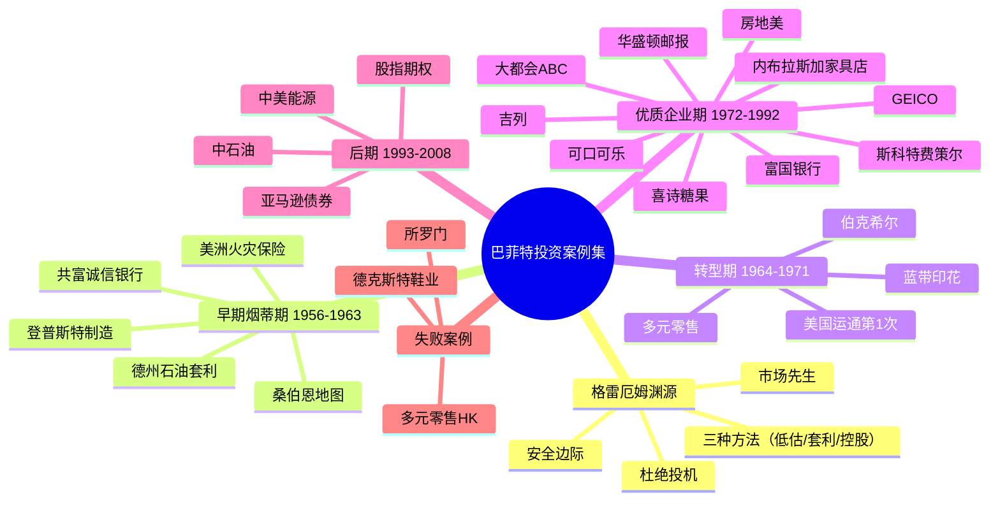
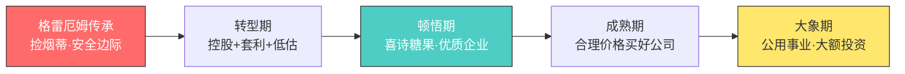
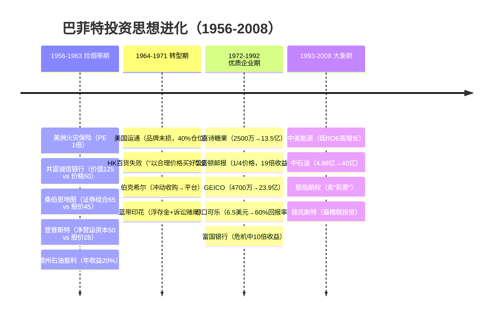
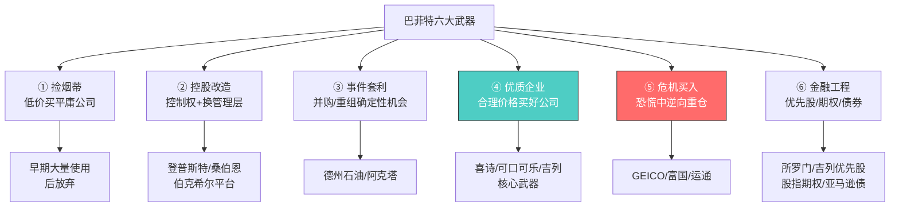

# 📈 巴菲特投资案例集 —— 逐案例超详细深度解读

> **作者**：黄建平（雪球知名投资者，系统整理巴菲特56年致股东信中的投资案例）
> **特色**：每个案例还原完整投资细节——公司背景、当时财务状况、买入价格、投资逻辑、内在价值、投资业绩，并附巴菲特致股东信原文
> **全书结构**：前言（格雷厄姆渊源）+ 28个经典案例（按时间顺序 1956-2008）+ 附录
> **价值**：从"理念"到"实战"的完整闭环——看巴菲特在每个历史时刻如何思考、如何操作、赚了多少钱、犯过什么错

---

## 🎯 全书核心框架

### 巴菲特投资思想进化主线

---

## 📖 前言深度解析：格雷厄姆和巴菲特的渊源

### 格雷厄姆投资思想三大支柱

| 支柱 | 内容 |
|------|------|
| 安全边际 | 买入股份=买入公司所有权；以4毛钱买1元的东西，赢的概率远大于亏 |
| 市场先生 | 短期是投票器，长期是称重机；市场非理性波动是朋友，提供低折扣买入机会 |
| 杜绝投机 | 严格遵守价值投资原则 |

### 格雷厄姆投资公司的营运方式（巴菲特的模板）

- 不收取管理费，不拿工资，**只收利润分成**
- 每年支付5%资本利息后，利润超过部分按累进制分成：20%以内分20%，20%-30%部分分30%，最高50%
- 公司资金和客户资金一起风险共担

### 格雷厄姆的盲点

- 估值集中在**营运资产等有形价值**，较少关注公司竞争力、管理质量、未来盈利能力
- 市值低于营运净资产的机会日渐稀少
- 后来费雪发展了成长股投资理论，被巴菲特采用

### 格雷厄姆的三种投资方法（巴菲特早期全盘继承）

1. **买入严重低估的普通股**：市值低于营运净资产（流动资产减负债）
2. **套利交易**：收购、合并、重组中的高确定性机会，含可转债套利
3. **控制类投资**：成为严重低估公司的主要股东，通过分红等实现价值

### 格雷厄姆的经典投资案例（巴菲特实战课的源头）

| 案例 | 手法 | 结果 |
|------|------|------|
| 联合电车公司 | 每股60元资产，股价<35元（5毛买1元） | 公司每股分红50元，巴菲特跟投赚2万美元 |
| 北方输油管公司 | 每股95元资产（铁路债券+现金），股价65元；买入5%+代理权32.5%成为董事 | 迫使管理层分发现金，每股分红70元，总收益约70% |
| 洛克伍德公司（股票换可可豆） | 以36元可可豆回购34元股票 | 巴菲特发现股数减少后每股价值超股价，买入222股持有，股价超100元，收益约3倍 |
| 里丁煤铁公司（麻雀变凤凰） | 控股后用公司现金买下联合内衣公司——用一项生意的钱买更赚钱的生意 | 投资回报丰厚（巴菲特后来用在伯克希尔上） |
| 联合纺织公司（可转债套利） | 卖空高估普通股+买入面值附近的可转债 | 股价70→20元，可转债价格不变，收益丰厚且进可攻退可守 |
| 杜邦（钱往低处流） | 买进杜邦（市值仅相当于持有的通用汽车股份价值），卖出7倍于杜邦股票的通用汽车 | 通用汽车跌、杜邦涨，获利丰厚（但此法也失败过一次，做空有风险） |

### 格雷厄姆思想家族的富翁们

| 人物 | 背景 | 业绩 |
|------|------|------|
| 沃尔特·施洛斯 | 没上大学，上夜校学证券分析，巴菲特的同事 | 28年年复合21.3%，总收益231倍（同期标普8.4%/8.8倍） |
| 汤姆·拉普 | 海滩巡逻员→哥伦比亚MBA→格雷厄姆学生 | 15年年复合20%，总收益16.6倍 |
| 比尔·鲁安 | 哈佛商学院→哥伦比亚听课 | 红杉基金14年年复合18.2% |
| 查理·芒格 | 律师出身，巴菲特劝他专心投资 | 1962年合伙公司12年年复合19.8%，后成伯克希尔副董事长 |
| 里克·格林 | 数学系毕业，IBM销售，5分钟理解价值投资 | 1965年太平洋合伙19年年复合32.9%，总收益222倍 |
| 巴菲特早期 | 11岁炒股，15岁买40英亩农场，看遍图书馆投资书 | 遇到格雷厄姆前业绩平平 |
| 巴菲特中期 | 全班唯一A+，入格雷厄姆公司，后自创合伙公司 | 1957-1969年年复合29.5%，总收益27倍（同期道指7.4%/1.5倍） |
| 巴菲特后期 | 1969年关闭合伙公司，用全部资金控制伯克希尔 | 1965-2012年年复合19.7%，总增长5868倍（同期标普9.4%/74倍） |

---

## 📚 28个案例逐一深度解读

---

## 一、早期"捡烟蒂"与套利期（1956-1963）

### 案例1：美洲国家火灾保险公司（1956）—— 信息不对称下的捡烟蒂

**公司背景：**
- 总部奥马哈。1919年无良保险员把毫无价值的股票以100美元/股卖给农民，随后被遗忘
- 保险商威廉·哈曼森被骗入公司后逐渐将其正规化，注入最高等级保险业务
- 哈曼森家族暗地里从农民手中回购，至1956年已持有70%股份
- **1956年每股盈利29美元，收购价约30美元——市盈率仅1倍！**

**巴菲特策略：**
- 翻阅《穆迪手册》发现该公司，但一股也买不到（只有哈曼森家族有股东名单）
- 派合伙人丹·莫奈开车带现钞去乡下，悄悄用现钞换股票（出价35美元高于哈曼森家族）
- 农民警觉后价格上涨至100美元，最终收集2000股（占10%）
- 收集足够后提着袋子走进海登·哈曼森办公室要求全部改到自己名下
- **一年后以125美元/股卖出，收益率约100%**

**关键教训：** 巴菲特对实际控制人威廉·哈曼森的钦佩——他通过美国家庭储蓄公司输送保险业务，把抵押贷款业务放到偏远地区降低人力成本。"买股票就是买人"的思想萌芽。

---

### 案例2：共富诚信银行（1958）—— 保守估值+等待价值释放

**公司背景：**
- 新泽西一家银行，1958年每股收益10美元，总资产约5000万美元
- 管理良好、盈利能力强，但利润增长缓慢、不派发现金红利
- 股价徘徊在50美元左右

**巴菲特策略：**
- 保守价值估计**每股125美元**，潜力可达250美元，市场价格仅50美元
- 合伙公司大量买入占12%股权，平均成本51美元（市盈率5.1倍）
- 大股东是一家大银行，有意合并——价值释放的催化剂
- 1959年底以80美元卖出（换仓至桑伯恩地图），收益率约60%

**巴菲特致股东信原文（1958年）：**
> "我们有了这样的良好组合：（1）很强的防御性特征；（2）建立在一个步伐上的优良稳定价值；（3）尽管可能是一年或十年，但是这个价值将最终释放。如果后者属实，其价值大概已经达到了一个相当大的数字，即每股250美元。"

**换仓逻辑：** "50美元的价格相对125美元的内在价值折扣要大于80美元的价格相对于135美元的价值折扣。另外，投资一个可以控股的公司可以更快速地让低估状态修复。"

---

### 案例3：桑伯恩地图公司（1958）—— 控股实现价值的经典

**公司背景：**
- 出版并不断修正美国城市详细地图（水管直径、消防栓位置、房屋结构等），对火险公司至关重要
- 75年垄断经营，利润不受经济衰退影响、几乎不需要营销
- 20世纪50年代保险业"梳理"政策冲击→税后利润从30年代50多万美元降至1959年不足10万美元
- 但30年代开始积累证券组合：**每股65美元的证券组合，股价只有45美元！**

**巴菲特策略：**
- 投入合伙公司1/3资金买入2.4万股（占总股本23%），掌握控制权
- 1959年建议将证券组合分给股东遭拒绝→威胁召开特别会议→董事会妥协
- 1960年提出用证券组合按市价兑换股票（回购注销，避免缴纳200万美元税）
- **70%股票被回购注销**，剩余股东每股盈利、股息、价值大幅提升

**巴菲特致股东信原文（1960年）：**
> "1938年，当道琼斯工业指数在100～120之间的时候，桑伯恩公司的股票以每股110美元的价格售出。1958年，当道琼斯工业指数在550左右时，桑伯恩公司的股票价格只有45美元。但是与此同时，桑伯恩公司的证券组合从每股20美元上升到每股65美元。"

> "如果重新收集像桑伯恩公司这么多的详细地图信息，将花费上千万美元。"

**关键洞察：** 董事会的利益冲突——14位董事中9位是保险业高管，只持有46股（象征性），却阻挠股东价值实现。"在过去的10年中，在任何和桑伯恩股票相关的交易中，保险公司都是唯一的卖主。"

---

### 案例4：登普斯特制造公司（1956-1963）—— 控制权+换帅扭亏

**公司背景：**
- 农业器具和灌溉系统生产商，管理不良、处于困境
- 自由现金流几乎为零、存货周转率低、销售收入停滞
- 1961年：销售收入900万美元，净资产450万美元（每股75美元），净营运资本每股50美元

**巴菲特策略：**
- 1956年起以16-25美元逐渐买入；1961年中期持30%股权
- 1961年8-9月以30.25美元大量买入至70%股权，取得控制权
- 平均成本28美元；1961年该投资占合伙公司净资产约20%
- 提拔执行副总裁为总裁→无效；1962年4月请来哈里·伯特→局面扭转
- **1963年以80美元/股卖出，总收益率约185%，年均约23%**

**巴菲特致股东信原文（1961年）：**
> "我们目前正在进行对于登普斯特制造公司的控制……这可以说明我们的大多数投资并不是'一夜情'式的投资。"

> "在牛市中，通过拥有控制权而实现公司的价值来赚钱要比直接买入市场的指数基金赚钱来得困难。但我同时也充分认识到在这样的市场环境中，风险比机遇要大。而上述控制公司的行为则可以在这种环境中减少我们面临的市场风险。"

**1962年原文：**
> "当你买下一家公司后，对你而言市场的价格波动已经不再重要，重要的是这家公司的资产到底价值几何。"

---

### 案例5：德州国家石油（套利）（1962）—— 套利的完整教科书

**公司背景：** 相对较小的石油及天然气生产商。1962年4月宣布将被加州联合石油收购。

**巴菲特策略：**
- 判断交易成功概率非常大（管理层商谈的结果）
- 买入三种证券：
  - 6.5%利率债券：26.4万美元
  - 普通股：6.4万股（预计卖出后每股7.42美元）
  - 权证：8.32万份（占13%）
- 过程波折（IRS裁决拖延），但交易最终于10月31日完成
- 债券投资：6.5%利息+资本利得，**年收益率约20%**

**巴菲特致股东信原文（1960年）：**
> "我从来不会介入这种谣言，虽然如果谣言成真，则在早期介入无疑将可以得到更大的利润。"

> "该项交易被管理层否决的可能性为零，因为该交易就是管理层商谈的结果。"

**套利四问（巴菲特1988年致股东信总结）：**
1. 已公布的事件有多少可能性确实会发生？
2. 你的资金总计要投入多久？
3. 有多大可能更好的结果会发生（如购并竞价提高）？
4. 因为反托拉斯或财务意外导致购并案触礁的机率有多高？

**细节体现耐心：** 从6月到9月的多次电话追踪（"裁决仍然有望在7月做出"→"下周做出"→"尚无明确消息"）——套利不是躺赢，需要持续跟踪。

---

## 二、转型期：从"捡烟蒂"到"买公司"（1964-1971）

### 案例6：美国运通（第1次）（1964）—— 困境中识别品牌护城河

**公司背景：**
- 1850年成立，美国最有声望的金融机构之一（旅行支票、信用卡）
- **1963年色拉油丑闻**：交易商安吉里斯用"油罐底部装满海水"的豆油库存作担保借款→豆油价格崩溃→美国运通子公司作为仓库收据担保人需承担责任
- 股价暴跌一半（叠加肯尼迪遇刺、股市崩盘）

**巴菲特策略：**
- 带着助理实地探访旅行支票和信用卡使用者、银行职员、旅馆——**判断品牌未受损**
- 1964年初开始买入；1965年占合伙公司1/3；1966年达1300万美元，**占净资产40%**，持5%股份
- 美国运通赔偿6000万美元解决丑闻
- 1965年股价从不足35美元涨至70美元；1967年投资升值至2800万美元（1.15倍），开始卖出

**里程碑意义：** "对美国运通的投资是巴菲特的投资思想从单纯'捡烟屁股'逐步转向'关注公司竞争优势'的开始。"

**巴菲特致股东信原文（1994年回顾）：**
> "趁该公司为色拉油丑闻所苦时，我们将巴菲特合伙企业40%的资金压在这只股票上，这是合伙企业有史以来最大的一笔投资，总计花了1300万美元买进该公司5%的股份。时至今日，我们在美国运通的持股将近10%，但买入成本却高达13.6亿美元，（美国运通1964年的获利为1250万美元，1994年则增加至14亿美元）。"

---

### 案例7：多元零售公司（1966）—— 第一个失败教训

**HK百货（霍克希尔曼-科恩公司）：**
- 巴尔的摩百货商店，面临激烈竞争，科恩家族希望打折卖出
- 巴菲特、芒格、戈特斯曼成立多元零售公司（股权80%、10%、10%）
- 1966年以约1200万美元收购全部股权（600万银行贷款），请路易斯·科恩做总经理
- **1969年12月以约1100万美元卖出——总体亏钱**
- 结论：**"以合理价格买入一个好公司远好于以一个好价格买入一个普通的公司"**

**联合棉布商店（后续补救）：**
- 运营折扣服装店，管理良好，80家连锁店，年销售3500万美元，年利润100万美元
- 创始人与合伙人遗孀闹矛盾急于卖出→以600万美元收购，留创始人罗斯纳经营
- 利润多年后也萎缩，资金转向其他业务

**巴菲特致股东信原文（1969年）：**
> "我们专挑那种一尺的低栏，而避免碰到七尺的跳高。"

**1989年原文（深刻反思）：**
> "我将这种投资方法称之为'烟屁股'投资法。在路边随地可见的香烟头捡起来可能让你吸一口，解一解烟瘾，但对于瘾君子来说，也不过是举手之劳而已。除非你是清算专家，否则买下这类公司实在是属于傻瓜行径。"

> "第一，长期而言，原来看起来划算的价格到最后可能一点都不值得，在经营艰困的企业中，通常一个问题才刚解决不久，另外一个问题就又接踵而来，**厨房里的蟑螂绝对不会只有你看到的那一只而已**。第二，先前的价差优势很快就会被企业不佳的绩效所侵蚀……时间虽然是好公司的朋友，但却是烂公司最大的敌人。"

> "好马还要搭配好骑师才能有好成绩……当一个绩效卓著的经理人遇到一家恶名昭彰的企业，通常会是后者占上风。"

> "不管是经营企业或是投资，通常坚持在前景明朗的好公司会比死守在有问题的公司要好得多。……我们尽量做到回避妖龙，而不是冒险去屠龙。"

---

### 案例8：伯克希尔·哈萨维（1962）—— 冲动的惩罚与平台的诞生

**公司背景：** 新英格兰纺织厂，受国外廉价劳动力竞争日益困难，至1962年已连续9年亏损，净资产约每股19美元。

**巴菲特策略（冲动起点）：**
- 1962年底以7.6美元买入第一批（打算卖给公司总裁西伯里赚差价）
- 西伯里口头同意11.5美元收购→来信变成11.375美元（低12.5美分）→**巴菲特感觉受骗，发誓收购这家公司**
- 1965年初获得控制权，均价14.86美元（当时营运资金净额每股19美元）
- 让西伯里退休，选肯·蔡斯任总裁
- 1967年用7.5%公司债交换股票（收回3.2万股），清洗短期股东

**走出逆境（资产配置的艺术）：**
- 1968年想卖纺织厂给芒格和戈特斯曼——他们不要，摆脱不掉
- 以伯克希尔为平台收购：国民赔偿公司、国民火灾及海事保险公司、伊利诺亚国民银行、奥马哈太阳报、布莱克印刷公司、70%门户保险代理公司
- 1969年底：纺织业务每股16美元+保险15美元+银行17美元=**总价值约45美元/股（购买价14.86美元的2倍）**
- 1969年底关闭合伙公司（股市泡沫严重，买不到低估股票），伯克希尔成为延续平台

**巴菲特致股东信原文（1965年）：**
> "由于取得了控制权，我们对于伯克希尔的投资，其意义已经不仅仅限于证券投资，而是我们实际拥有的生意。即便伯克希尔的股票上升了5美元，我们也不会因此有所获益……同样，若是其股价下降了5美元，我也不会认为我们遭受了任何损失。"

**1969年原文（为何关闭合伙公司）：**
> "在过去的20年中，通过数量（定量）分析方法所能把握的机会之水已经逐渐干涸，到今天可以说是已经完全枯竭了。"

> "我不想让自己成为一个永远管理着资金，追逐着投资收益的疯狂的兔子，而唯一让我放缓脚步的办法，就是将其停止。"

---

### 案例9：蓝带印花公司（1968）—— 浮存金思维+法律诉讼赌局

**公司背景：**
- 印花（优惠券）营销公司，加州的连锁店股东享受折扣（1.5美分 vs 平均2美分），加州71%市场份额，近乎垄断
- **浮存金特性**：印花预先付款，顾客积累印花兑换奖品期间（有时几年），公司可免费使用这笔钱

**巴菲特策略：**
- 1963年司法部起诉蓝带垄断，斯佩雷也起诉→股价大跌
- 里克·格林发现→告诉芒格→巴菲特也注意到
- 赌法律诉讼会解决、蓝带会幸存
- 合伙公司买入超7万股（约30美元/股，总投资约200万）
- 1969年诉讼解决后1股拆5股，股价快速上涨至25美元/股→200万变900万，**收益率约3倍**，卖出
- 之后蓝带跌回13美元→重新购买（为多元零售、伯克希尔、国民赔偿购买）
- 合伙公司解散后，巴菲特个人持蓝带13%股份
- **后来用蓝带收购了喜诗糖果和韦斯科金融64%股份**——蓝带成为另一只"下金蛋的鹅"

**巴菲特致股东信原文（2006年回顾）：**
> "查理·芒格和我常常可以引领风潮，掌握一些在商业前景上可能发光发热的潮流……这种令人兴奋的想法，鼓励了我们在1970年收购了一家印花交易公司——蓝带印花。"

> "当我们得知连一些特种行业如殡葬业者，都会给顾客兑换券时，我以为我终于找到了稳赚不赔的生意。然而，事实上并不尽然。"

> "到了1990年，犹如陷入泥沼的营收，更只剩下150万美元……到了去年，在伯克希尔集团980亿美元的总体营收中，来自蓝带公司的贡献，一共只有25920美元（后面并没省略任何0）。但我和查理还是怀抱着无比的希望，继续坚持下去。"

---

## 三、黄金期：优质企业投资范式确立（1972-1992）

### 案例10：喜诗糖果（1972）—— 改变巴菲特一生的交易

**公司背景：**
- 1921年成立，上等原料精细加工，即使在二战原料不足时也未偷工减料→加州无与伦比的声誉
- 1972年：销售额3133万美元，净利润208万美元，净资产约800万美元，要价3000万美元

**巴菲特策略（思想的转折点）：**
- 芒格认为生意模式极好；巴菲特受格雷厄姆影响觉得"15倍市盈率、高于净资产2倍"简直是"要了他的命"
- 给出上限2500万美元——哈里接受了
- **1972-1983年经营数据**：年均单价增长率10.3%、销量增长率3.5%、销售额增长率14.2%、利润率增长率5.5%、**净利润增长率20.7%**
- 期间糖果总销量增长45%，单价提高2倍，净利润率上升56%，**净利润增长5.5倍**
- 1972-2007年共贡献13.5亿美元税前利润，只消耗3200万美元补充营运资金

**巴菲特致股东信原文（2007年）：**
> "我们以2500万美元买下了喜诗糖果公司，当时它的销售额为3000万美元，税前利润不足500万美元。经营这家企业所需的资本为800万美元……这家公司投入资本的税前投资收益率为60%。"

> "有两项因素帮助该公司经营所需的资金降至最低——首先，销售的产品采用现金结算，这消除了应收账款；其次，生产周期和分配周期较短，这帮助库存降至最低水平。"

> "像喜诗糖果这样的企业在美国并不多，对许多企业来说，将利润从500万美元增加至8200万美元可能需要4亿美元左右的资本投资。……对企业所有人而言，他们希望最好在没有大量资金需求的情况下能产生不断增加的现金流。这可以问问微软或者谷歌。"

> "喜诗公司给我们带来了许多新的现金源泉（他对伯克希尔来说，就像《圣经》中所说的'丰腴膏沃且生养众多'）。"

**1983年原文：**
> "糖果就如同股票一样，价格与价值有所不同，价格是指你所付出的，而价值却是指你所得到的。"

---

### 案例11：华盛顿邮报（1973）—— 1/4价格买入伟大企业

**公司背景：**
- 1971年上市，总裁凯瑟琳·格雷厄姆（A类有投票权股票保证控制权）
- 五角大楼文件事件→顶住压力出版→最高法院支持→从地区报纸蜕变为全国性大报
- 1973年深入报道水门事件→尼克松政府威胁（两家电视台失去执照）
- 1973年熊市：标普跌14.8%，股价从30美元跌至15美元（-50%）

**巴菲特策略：**
- 1973年5月开始买入23万股→写信给凯瑟琳→拜访取得信任→再购
- 总持股46.175万股B类股，总价1060万美元，**均价约23美元**
- 与凯瑟琳签协议：未经同意不再购买（股价继续跌至亏损26%也无法加仓，推荐给朋友买）
- **估值逻辑**：总市值8800万美元 vs 当年净利润1330万美元（市盈率6.6倍）；内在价值估计4-5亿美元——"以不到内在价值1/4的价格买进"
- 1985年底市值2.2亿美元，**总收益率约19倍，年均复合约25%**（同期道指82%/4.7%）
- 公司利润增长9倍（0.13亿→1.14亿），市盈率从6.7倍增至13.3倍（2倍）——**戴维斯双击**

**报纸业商业模式分析（2012年原文）：**
> "广告本身也提供了对于大量读者来说很感兴趣的信息，相当于提供了更多的'新闻'。对于许多读者来说，知道哪些部门和职位在招聘，哪些超市在搞促销，哪些电影在何时何地上映，远比编辑们写的社论观点更重要。"

> "只要一家报纸是所在社区唯一的报纸，他的利润注定会非常好，无论管理的好还是不好都区别不大。（正像一位南方出版商所说的：我的得意社会地位归功于两项伟大的美国制度——裙带关系和垄断。）"

> "这种共生过程会导致弱势报纸的淘汰，正所谓'胖者生存'。"

**1985年原文（为何能抓住机会）：**
> "计算价格/价值比并不需要有独到的眼光，大部分的证券分析师、经纪人与媒体经营者跟我们一样估计该公司的价值约在4亿到5亿美元之间，但当时其仅1亿的股票市值却是众人皆知，而我们具有的优势是态度：我们从格雷厄姆那里学到成功投资的关键是，在价格以大折扣低于内在价值时，买进好公司的股票。"

> "在桥牌、西洋棋或选股等斗智的竞赛中，当对手被告知思考是白费力气的时候，还有什么比这个能让我们更有利呢？"（讽刺有效市场理论）

> "所以我们享受了三重好处，一是公司本身的价值提升，二是每股价值因公司回购进一步得到提高，三是随着折价幅度逐渐缩小，股价的涨幅超过每股盈利的增长幅度。"

**1993年原文（识人）：**
> "当初在决定买进该公司的股份时，我们便看好该公司的前景，但另外一点同样重要的是，查理和我都认为凯瑟琳将会证明自己是位杰出的经理人，同时能够诚实地对待所有的股东。"

---

### 案例12：政府雇员保险公司GEICO（1951、1976）—— 两进两出的完整故事

> 🔗 **集中投资版**：[[16《巴菲特的投资组合》深度解读（详细版）|16 巴菲特的投资组合]] 第3章补充了 GEICO 的投资总监卢·辛普森——组合 ≤10 只、年化 24.7% vs 大盘 17.8% 的集中投资实证。

**第一次（1951）：**
- 1936年创立，直接邮寄保单无代理商→销售成本低30%，利润率高出行业15-20个百分点
- 1948年格雷厄姆成为大股东；1950年巴菲特拜访（副总裁大卫花4小时讲解保险运营）
- 1951年买入350股（均价29.4美元，超过50%资产），撰文《我最喜欢的股票》推荐
- 1952年以15259美元全部卖出（换买市盈率1倍的西部保险证券公司）——**GEICO 20年后价值1300万美元**（错失的教训）

**第二次（1976）：**
- 70年代管理层低估理赔成本→保单价格过低→濒临破产，1976年亏损1.9亿美元
- 拜恩任总裁需筹集7600万美元，无人援助；股价从61美元跌至2美元
- 巴菲特拜访拜恩后认可其能力+核心优势未消失→买50万美元并持续买入共约400万美元
- 所罗门兄弟承保7600万美元可转换优先股→几周后股价涨3倍至8美元
- 1980年再投1890万美元（每股12.8美元）→共持720万股（33%股权），总成本4713万美元，平均6.67美元/股

**投资业绩：**
- 1980-1990年收益增长约10倍，**年均收益率约27%**（净利润增长3.5倍+市盈率5→11倍增长2.2倍+回购使股权占比增长40%）
- 1995年以23亿美元收购剩余50%→1977-1980年投入的4700万到1995年价值23.9亿，**16年约51倍，年均复合28%**
- GEICO保险资金投资（卢·辛普森）：1980-1986年年均31%；1980-1995年年均22.8%（同期标普15.7%）

**巴菲特致股东信原文（1980年）：**
> "GEICO可说是投资业界的最佳典范，它具有难以模仿的产业优势，同时加上高超的资金管理技巧。"

> "GEICO的问题与1964年美国运通所爆发的色拉油丑闻事件类似，一时的打击并未毁掉其原本的经济基础，就像是一个身体健壮的人得了局部可切除的肿瘤，只要遇到一位经验丰富的医生，就能化险为夷。"

> "我们还是很高兴能够以4700万美元的代价买到GEICO的持股，因为通过谈判购并方式想要买下一家类似具经济特质与光明前景，且每年可创造2000万盈余的公司，至少得花上2亿美金。"

**行业洞察（本书总结）：**
> "保险行业的产品难以做到显著差异化，所以竞争非常激烈，导致周期性的盈利和亏损，其核心竞争优势在于成本。GEICO直接销售的商业模式形成了持续的低成本优势，当保险业供大于求时，各公司竞相压价，但成本最低的公司仍然能够盈利，成本高的公司遭到淘汰。"

---

### 案例13：内布拉斯加家具店（1983）—— 传奇B夫人与低价垄断

**B夫人的传奇：**
- 1893年生于俄罗斯穷村庄，没上过学；一战时让丈夫先去美国
- 1916年独自穿越西伯利亚→中国东北→天津→横滨→运花生货船→3个多月到达西雅图
- 1937年借500美元在地下室开家具店，只加价10%销售→成为奥马哈打折家具代名词
- 供应商联手不供货→跑遍全美进货→被告上法庭（法官判她胜诉，第二天去她店里买了条地毯）
- 到1980年成为美国最大家具城（1.2万平方米），垄断当地一半市场

**巴菲特策略：**
- 巴菲特想收购，B夫人说："你得想法把它偷走才行啊！"
- 1983年以5500万美元收购90%股份（库存未清点前成交）
- 当年销售额约1亿美元，税后净利润约550万美元——**市盈率约10倍，市净率小于1**
- 收购后整理库存发现价值高达8500万美元
- 1993年净利润1040万美元（年均增长6%），10年贡献约8000万净利润
- 趣事：B夫人95岁被孙子们剥夺经营权→对面开"B夫人商场"→两年后和解，巴菲特以500万美元收购并签禁止同业竞争协议

**巴菲特致股东信原文（1983年）：**
> "去年在提到许多经理人如何前赴后继追求一些愚蠢的购并案时，我们引用帕斯卡的话：'它使我想到所有的不幸皆归咎于大家无法安静地待在一个房间内'，但今年我要说：'帕斯卡也会为了B夫人离开那个房间'。"

> "当我们在评断一家公司的企业价值时，我常常会问自己一个问题：'假设我有足够的资金与人才时，我愿不愿意和这家公司竞争'。答案是，我宁愿和大灰熊摔跤也不愿和B夫人家族竞争。"

> "他们采购很有一套，经营费用低到其竞争对手想都想不到的程度，然后再将所省下的每一分钱回馈给客人。这是一家理想中的企业，建立在为客户创造价值并转化为股东的经济利益的基础上。"

---

### 案例14：斯科特-费策尔（1986）—— 一桩被忽略的超级现金牛

**公司背景：**
- 1914年创建，多元化集团（寇比吸尘器、世界百科全书、空压机等22项事业）
- 1986年遇企业掠夺者伊万·布斯基→总裁拉尔夫·施莱向巴菲特求助

**巴菲特策略：**
- 1986年以3.152亿美元收购（账面净资产1.726亿，市盈率7.8倍，市净率1.8倍）
- **当年即分红1.25亿美元**（账上现金超1.25亿，几乎无有息负债）→实际购买市盈率仅4.7倍
- 1986-1994年9年间总分红6.34亿美元（收购价的2倍），净利润从4030万增至7930万（年均增长8.8%）
- 净资产收益率长期高于50%，1994年达87.4%——**若独立上市可排财富500强ROE第一名**
- 到2000年共贡献10.3亿美元分红，伯克希尔再用这些现金投资其他企业

**成功原因（巴菲特分析）：** 不是繁荣周期高峰、不是高财务杠杆、不是行业垄断，而是**以拉尔夫为首的管理层优秀的管理能力**——专注于主营业务不分心、设定目标全力拼搏、坦率直言、自信而不自大。

**巴菲特致股东信原文（1994年）：**
> "我的老师格雷厄姆45年前就教导我，在投资中，不需要为了额外的结果做额外的事。之后，我惊讶地发现，这个道理也适用于企业管理。经理人真正应该做的是把基本功做好而不分心。"

> "在伯克希尔，我们注重的是绩效，而不是日历。"

**1999年原文（有趣的插曲）：**
> "我立即写信给斯科特-费策尔当时的总裁拉尔夫，表达想买下该公司的意愿。在这之前我从来没有与拉尔夫见过面，不过在一个礼拜之内我们便达成协议……收到这样的礼物时，查理冷冷地响应说：'我宁愿再多付250万美元也不要看这些垃圾。'"（讽刺投资银行家准备的财务资料）

---

### 案例15：大都会/美国广播公司（1986-1999）—— 为经理人支付溢价

**投资过程：**
- 1977年买入大都会1090万美元（市盈率8.4倍）→1978年卖出（收益30-50%）
- 1978年买美国广播公司608万美元→1979年底价值967万（+60%）→1980年卖出
- **1986年以172.5美元/股（5亿美元）买回大都会/ABC 18.5%股权**（市盈率约16倍）——"为何43块卖掉，172.5块买回？"
- 投票权交给墨菲（信任管理层的极致）
- 大都会融资35亿美元收购ABC（贷款21亿+出售资产9亿+巴菲特5亿）
- 1984年对比：大都会营收9.4亿/净利1.35亿 vs ABC营收37亿/净利1.95亿——**大都会运营效率约为ABC的3倍**
- 1990年底市值13.77亿美元，增值1.7倍，**年均复合22%**（净利润1.8亿→4.7亿，市盈率维持16倍）
- 1993年以630美元卖出1/3（税后净收益2.97亿美元）
- 1995年迪士尼收购大都会→转成迪士尼股票→1997-1999年全部卖出（市盈率20-30倍），总收益约20亿美元

**巴菲特致股东信原文（1986年）：**
> "汤姆·墨菲与丹柏克不但是最优秀的管理阶层，也是那种你会想把自己的女儿嫁给他的那一种人。"

> "就算你让九个女人同时怀孕，也不可能让小孩一个月就生出来。"（对合并整合的耐心）

> "我们常借由锁住自身持有的股权来宣示对公司稳定性的支持，这种安定感加上好的管理层和好的生意，是让企业获利丰收的沃土。"

**1994年原文（承认错误）：**
> "1993年底，我将1000万股大都会股份以每股63美元卖出，不幸的是到了1994年底，该公司股价变成85.25美元……而当我们在1986年以每股172.5美元买进该公司股份时，就曾经向各位报告，在更早之前，也就是在1978年到1980年间，我就曾经以每股43美元卖掉该公司股份，并强调对于个人这样的行为感到心痛。没想到现在我却又明知故犯，看起来我似乎应该要找个监护人来好好监管一下。"

---

### 案例16：所罗门公司（1987）—— 失败投资之一：精力与回报不成正比

**投资背景：**
- 1910年三兄弟以5000美元创建；1985年达顶峰（《商业周刊》称"华尔街之王"）
- 内部竞争激烈、主力被挖走→大幅提高薪酬→1986年利润缩水→企业掠夺者出现→CEO古特弗罗因德向巴菲特求助
- 巴菲特感激其1976年拯救GEICO，信任其为人

**投资设计（安全边际思维）：**
- 明知投资银行业难以预测，不买普通股，**买7亿美元可转换优先股**（年息9%，即每年6300万美元利息，占所罗门年利润约15%）
- 转换价38美元；1995-1999年分批赎回；巴菲特、芒格进入董事会

**灾难发生：**
- 1987年10月19日黑色星期一：道指单日跌22.6%，所罗门当日损失7500万美元
- 董事会下调员工股票期权价格（巴菲特反对被忽略——"这是在抢钱"）
- **1991年国债竞标丑闻**：发行部负责人保罗·莫泽超上限竞标国债囤积居奇（4月收到调查函，8月巴菲特才被通知，期间莫泽5月再次违规）
- 财政部要求高层辞职→股价大跌→财政部计划禁止所罗门参加竞拍（等于死刑）
- 巴菲特出任临时董事长（前提：保留竞标权利），离股市开盘只剩几小时
- 上任后重整文化、压缩成本、被召到参议院作证，1992年6月辞任

**结果：** 优先股陆续被赎回/收购收回。**"相对于所得到的回报，巴菲特和芒格在投资所罗门公司上所花费的精力不成正比。"**

**巴菲特致股东信原文（1987年）：**
> "在投资银行业，我们当然没有特殊的远见，能够预知其未来发展的方向与获利能力。就产业特性而言，投资银行业比起我们其他主要投资的行业更难预测，这也是为什么我们选择以可转换优先股的方式投资。"

**1995年原文：**
> "虽然所罗门特别股最后的投资报酬率仍高于其替代的固定收益证券投资。不过若考量查理跟我本人在这项投资上所花费的心思，其所得与付出实在是不成正比。"

---

### 案例17：可口可乐（1988）—— 最伟大的投资之一

**公司背景：**
- 1886年诞生；1899年以1美元签下"永远以固定价格购买糖浆"的永久合同（拖累公司几十年）
- 1981年古巴裔化学家罗伯托·古崔塔任CEO→改革成效显现，罐装合同逐步解除，海外市场打开

**缘分：**
- 巴菲特50年百事粉丝→1987年白宫宴会尝樱桃可乐→改喝可口可乐
- 1987年黑色星期一股价跌20%；年底股价38.1美元，每股净利2.43美元（PE 15.7倍）
- 巴菲特多年研究结论：品牌在人们心中不可替代+优秀管理层+资本开支小的生意模式

**投资过程：**
- 1988年买入1417万股，成本5.92亿，均价41.8美元（PE 14.7倍）
- 1988年数据：毛利率19.2%（疑为经营利润率口径）、净利率12.4%、**ROE 33.3%**、EPS年均增长15.6%、全球碳酸饮料市占率45%
- 1989年增持至2335万股，总成本10.24亿（新增均价46.8美元，PE约15倍）
- 1991年：净利从10.4亿增至16.17亿（+60%），但PE涨至33倍→持股市值37.5亿（成本的3.7倍，**年均收益率38.5%**）
- 1994年横盘3年后以41.6美元（拆股后）加买2.7亿美元（PE约21倍）
- 1998年牛末股价最高70美元（PE约50倍）；此后10年未超过此价
- 1998年底持股市值134亿——10年增长约11倍，**年均复合约27%**（PE贡献3倍+净利润3.5倍+回购）
- 2012年净利90亿（1998年的2.6倍），但PE降至18倍→14年市值仅增长10%（134亿→145亿），期间分红约30亿美元

**巴菲特致股东信原文（1989年）：**
> "我记得我是在1935年或1936年第一次喝到可口可乐的……我也深深观察到这个产品对消费者的特殊吸引力及背后所代表的庞大商机。在往后的52年里，当可口可乐席卷全世界的同时，我也持续地注意到这种特质。然而在同一段期间，由于我个人过于小心谨慎，以至于竟然连一股股票都没有买……终于到了1988年的夏天，我的大脑与眼睛进行了连接。"

**1991年原文（戴维斯双击）：**
> "去年我们是两面得利，一方面是靠公司绝佳的获利能力，一方面是市场对于公司股票的重新评价。当然，我们认为这样的调整是经得起考验的，但这种情况不太可能每年都发生，展望未来我们可能只能靠前面那点而获益。"

**1994年原文（买入看价格不看时间）：**
> "对于买进股份我们注意的只是价格而非时间，我们认为因为忧虑短期不可控制的经济或是股市变量，而放弃买进一家长期前景可合理预期的好公司，是一件很愚蠢的事。"

> "当初在评估每个案子时，我们关心的不是道琼斯指数的走势、美联储的动向或是总体经济的发展，而是这些公司本身未来的前景。"

**1996年原文（百年大计）：**
> "面对年仅14.8万美元的销售额，公司总裁阿萨·坎得乐表示：'我们从没有放弃告诉全世界，可口可乐是能够提升人类健康与快乐、最卓越超凡的一件东西。'……我很高兴可口可乐在一百年后的今天，始终还是遵循坎得乐当初立下的愿景。"

---

### 案例18：阿克塔公司（套利）（1981-1988）—— 最曲折离奇的套利

**公司背景：**
- 印刷和森林产品公司；1978年美国政府征收其10700公顷红木林（国家公园），定价9790万美元分期支付（利率6%）
- 阿克塔不同意，争取更高赔偿金和利率
- 1981年9月KKR以每股37美元+政府额外补偿款2/3收购（股价当时33美元）

**巴菲特策略（套利四问的应用）：**
1. 交易成功概率？——KKR过往收购记录不错，且董事会决心出售（失败也会找新买主）
2. 资金投入多久？——预计几个月
3. 更好结果？——红木林补偿款是"额外之财"
4. 触礁风险？——融资风险为主

- 9月起2个月内买入40万股（均价33.5美元，5%股权）
- 12月宣布交易延后→1月4日签最终协议→加码38美元买至65.5万股（7%股权），总成本2290万美元
- 2月融资银行要求重新谈判→3月KKR砍价至33.5美元→两天后35美元→**3月15日董事会拒绝，接受另一家37.5美元+红木林补偿一半**→6月4日股东收到现金
- 6个月：2290万→2460万美元，**年回报率约15%**
- 1987年法院认定红木林价值2.75亿美元+利率14%→政府需付6亿美元→上诉→1988年5.19亿美元和解→**巴菲特额外收到1930万美元（每股29.48美元）**

**巴菲特致股东信原文（1988年）：**
> "华尔街有一句经过改编的俗话，给一个人一条鱼，你只能养活他一餐，教会他如何套利，却可以养活他一辈子。"

> "当套利客听到这种重申时，脑中便闪过一句老话：他说谎的方式就像是即将面临汇率崩盘的财政部长一样。"

> "坦白说我虽然个人连榆树跟橡木都分不出来，但对于这个问题我的处理方式倒很简单，反正就是介于零到一大笔钱之间就对了。"

---

### 案例19：房地美（1988-2000）—— 完美逃顶与衍生品警告

**公司背景：**
- 1970年国会成立，美国第二大政府赞助企业（仅次于房利美）
- 与房利美共同建立房贷二级市场（购买按揭贷款→打包证券化→转卖）
- 1970-1987年市场年增长率平均13%，无一年低于5.5%
- **双寡头垄断**：两房共同占有90%市场份额；1988年只有33%房贷被证券化（增长空间大）

**巴菲特策略：**
- 1988年买入：ROE 23%，市盈率<8倍——"价值被低估，低市盈率，有非常好的盈利记录，利润注定会越来越好"
- 旗下非保险子公司买入240万股，成本7173万美元（约30美元/股，接近法定上限4%）
- 房地美 vs 房利美：1978-1988年资产收益率是房利美的两倍多；坏账率0.4% vs 1.1%
- 1991年底市值3.43亿 vs 成本0.77亿，**总收益率345%，年均64%**（PE从8→22倍）
- 1992年以3.4亿美元增持→总成本4.1亿
- **2000年全部卖出**：税前总收益约30亿，总收益率约10倍
- 2008年两房破产、退市——完美逃顶！

**卖出原因（2001年股东大会）：**
> "不是因为政府管制的原因，而是风险因素使我们下定了决心。当我们了解了这个企业后，我们对这个企业的某些方面感到不安。"（房地美用复杂衍生品交易规避会计准则、虚增利润）

**巴菲特致股东信原文（1991年，承认操作失误）：**
> "当我们开始买进不到700万股时，该公司股价就开始上涨。失望之余，我立刻停止买进……更甚者，我觉得区区700万股对我们来说实在是没有太大的意义，所以之后又把持有的700万股全部卖掉。我期盼对于我这样不具职业水准的投资行为，可以给各位一个稍微合理一点的解释。不过我实在是编不出来……因为本人的这项错误，大概使得伯克希尔在1991年少赚了14亿美元。"

**2002年原文（衍生品=定时炸弹）：**
> "对于衍生性金融商品以及其他附带的交易，查理跟我的看法完全一致，我们认为不论是对参与交易的双方或者是整个经济体系而言，它们就像是一颗颗定时炸弹！"

> "只要是人想得到的（或者有时应该说是疯狂的人），都可以被列为衍生性金融商品交易的标的……比如说你想要签一个契约，赌内布拉斯加州2020年双胞胎出生的数目，没有问题，只要你肯出价，保证找得到人肯跟你对赌。"

> "最夸张的状况下，所谓的'依公式结算'极可能堕落沦为'依鬼话结算'。"

> "再保险业与衍生性金融商品交易有点类似，两者都像是地狱一样，并没有多大的进入障碍，但想要退出却难如登天。一旦签了约，你就摆脱不了它。"

---

### 案例20：吉列剃须刀（1989）—— 可转换优先股的进可攻退可守

**公司背景：**
- 1901年金·吉列发明一次性刀片；一战二战均为军需品→国际性品牌，全球占有率长期高于60%
- 1989年股价42美元，总市值46亿美元，净利润2亿美元（PE约23倍）

**巴菲特策略：**
- 因PE 23倍较高，不买普通股，**买6亿美元可转换优先股**（年息8.75%，转股价50美元，10年强制赎回）
- 行业认知：吉列与可口可乐并称"当今世界上最好公司中的两家"
- 用户黏性强：价格便宜（每年20多美元）、顾客对价格不敏感、不会随意换品牌；新一代产品会被快速接受
- 1991年提前赎回→4月1日转为普通股→年底市值13.47亿（成本6亿的2.25倍，**收益率125%**）
- 1991-1997年净利从2.82亿增至9.53亿（年均22.5%），PE维持30倍以上（1997年底58.8倍）→市值从13.47亿增至48.21亿（年均23.7%）
- 1996年78亿美元收购金霸王（代价过高）→1998年海外收入下滑→1999年新CEO霍利上任加速下滑→2000年被迫辞职→2001年基尔茨上任扭转
- 2005年宝洁570亿美元收购吉列→巴菲特换股（1股吉列换0.975股宝洁）+追加3.4亿美元→共持1亿股宝洁（成本9.4亿，年底市值57.88亿）
- 2008-2012年减持宝洁一半（PE 15-20倍）

**巴菲特致股东信原文（1989年）：**
> "吉列这家公司与我们喜爱的类型非常相近，查理和我都熟悉这个产业的环境，因此我们相信可以对这家公司的未来做一个合理的预估（若是没有试过吉列新的感应式刮胡刀，赶紧去买一个来试试）。但是我们就没办法预测投资银行业、航空业或是造纸业的未来前景。"

> "基本上我们是不可知论者，而不是无神论者。所以，由于我们在这些产业上缺乏强而有力的论点支持我们，因此我们在这些产业上所采用的投资方式，就必须与那些显而易见的好公司好产业有所不同。"

**1997年股东大会原文（行业壁垒）：**
> "在食品行业，你永远无法获得你能在类似于剃须刀这种单一消费品行业中的不可战胜性。如果我现在用的是吉列感应剃须刀，很显然，当这种剃须刀的下一代产品出来的时候，我会接着使用新一代产品……我绝对不会在其他品牌之间乱换。"

**2005年原文（金霸王教训）：**
> "吉列收购金霸王电池让股东们支付了几十亿美元的代价，而这种代价在传统财务会计上根本看不出任何反映。简而言之，吉列在并购中获得的商业价值与其付出的并购成本并不相等。"

---

### 案例21：富国银行（1990）—— 危机时刻的精确计算与逆向买入

**公司背景（1990年）：**
- 西海岸房地产供过于求→银行业股价大跌
- 富国银行数据：总资产562亿，净资产29.6亿，贷款490亿，存款418亿；净利7.1亿，每股净利13.39美元，每股净资产57.4美元
- 累计坏账拨备8.85亿，拨备率1.81%，核心资本充足率5.03%，资本充足率9.27%
- 成本收入比53.4%，ROA 1.26%，**ROE 24%**——各项指标优秀
- 股价：PE 4.3倍，市净率1.0倍

**巴菲特策略（压力测试）：**
- 1989年已买85万股（约70美元/股，PE 7倍）；1990年股价下跌后大幅买入至年底500万股（9.7%股权，接近10%上限），总成本2.89亿，每股57.9美元（PB 1倍，PE 4.3倍）
- **最坏情况测算**：490亿贷款10%不良（49亿）×30%本金收不回=损失15亿；富国一年税前利润+拨备约15亿→正好损益两平——利润下降只是短期，对长期现金流影响不大
- 巧合的是最坏打算1991年变成现实：1991年提取13.35亿减值拨备→净利润接近零；1992年继续提取12.15亿（超过实际所需，之后几年缩减）；1993年净利润恢复
- 1992-1993年继续增持（PB 1.2倍、1.5倍）→1993年底持679万股，总成本4.23亿
- 1993年底市值8.8亿：**投资收益率108%，三年年均26%**
- 2000年底市值30.7亿 vs 成本3.19亿：**总收益率9.61倍，10年年均25.4%**
- 1997-2001年减持1/3（PB 2.5-3.5倍）；2005年后每年增持；2008年金融危机后大幅增持（PB重回1.5倍内）

**巴菲特致股东信原文（1990年）：**
> "银行业并不是我们的最爱，因为这个行业的特性是资产约为股权的20倍，这代表只要资产发生一点问题就有可能把股东权益亏光光。"

> "因为20比1的比率，使得所有的优势与缺点所造成的影响会被放大。因此，我们对于用便宜的价格买下经营不善的银行一点兴趣都没有，相反，我们希望能够以合理的价格买进一些经营良好的银行。"

> "在富国银行，我想我们找到了银行界最好的经理人——卡尔·来卡特与保罗·黑曾……首先，两个人加起来的力量都大于单打独斗；其次，他们对于有才能的人从不吝啬，但也同时厌恶冗员过多；再次，尽管公司获利再好，他们控制成本的努力也不曾削减；最后，两者都坚持自己所熟悉的，让他们的能力而非自尊来决定成败。"

> "趁着大家出脱银行股之际，我们却逆势以2.9亿美元、5倍不到的本益比（若是以税前获利计算，则本益比甚至不到3倍），买进富国银行10%的股份。"

> "以长期投资作为终生目标的投资人对于股市波动也应该采取同样的态度，千万不要因为股市涨就欣喜若狂，股市跌就如丧考妣。奇怪的是，他们对于食物的价格则一点都不会搞错，很清楚自己每天一定会买食物，当食物价格下跌时，他们很高兴。（真正要烦恼的应该是卖食物的人。）"

> "股价不振最主要的原因是悲观的情绪，有时是全面性的，有时则仅限于部分产业或是公司。我们很期望能够在这种环境下做生意，不是因为我们天生喜欢悲观，而是如此可以得到便宜的价格买进更多好的公司。**乐观是理性投资人最大的敌人。**"

> "当然，以上所述并不代表不受欢迎或不被市场注意的股票，就是好的投资标的，反向操作有可能与羊群心理一样的愚蠢，真正重要的是独立思考而不是投票表决。……'大多数的人宁死也不愿意去思考'！"

---

### 案例22：M＆T银行（1991）—— 为敬仰的经理人破例

**公司背景：**
- 1856年创建，美国20家最大银行之一；1929年股灾时1400多家银行倒闭，M&T仍正常营业
- 1991年银行业坏账大增，但M&T坏账未显著增加（拨备0.27亿→0.63亿后净利仍增：0.54亿→0.67亿）

**巴菲特策略：**
- 1991年3月买入4000万美元可转换优先股（年息9%，1996年到期，转换价78.91美元）
- 转股价比股价（63美元）溢价25%——**为与总裁鲍勃·威尔默斯共事而破例**（"虽然巴菲特认为这笔投资规模太小，但他非常敬佩……希望与之共事"）
- 1979年威尔默斯请教克莱斯勒救助时，巴菲特答："那些无法让你财富满袋的家伙总是会对你唠叨个不停。"
- 1999年：4000万→2.1亿美元（不记分红收益率425%，年复合20%）+1800万优先股利息+700万股票分红
- 2000-2001年股市下跌时增持6300万美元（38.5美元/股，PE 10.5倍，PB 1.2倍）
- 2006年末市值8.2亿美元：**总收益率696%**

**经营数据（1990-2012年完整周期）：**
- 净利润和总市值增长约20倍（年均17%）；每股净利增长约10倍（年均13%，因收购增发稀释）
- 平均ROE 12.4%、ROA 1.1%；存贷比99%、成本收入比57%、拨备率1.9%
- 2007-2010年次贷危机计提15.76亿美元（相当于2007年净利的2倍）→3年净利负增长、股价跌超50%、市净率回归1倍

---

### 案例23：美国运通（第2次）（1991）—— 差点错过的超级牛股

**背景：**
- 1990年净利从11.6亿暴跌至1.8亿（净利率8.8%→1.2%），股价35→20美元，市净率2.7→1.6倍
- 1991年净利7.9亿，ROE仅10.6%（1989年20.3%）
- 面临VISA/MasterCard两大银卡联盟激烈竞争（1966年成立突破银行法地域限制）
- 发行PERCS（附带上限可转换优先股）：年息8.85%，转股价24.5美元（股价<33.8美元时），3年期

**巴菲特策略（高尔夫球场上的顿悟）：**
- 1991年投资3亿美元买PERCS（1224.49万股）
- 业绩低迷期准备到期后处理掉→**与Hertz总裁弗兰克·奥尔森打高尔夫**：第一洞开始追问信用卡行业，第二洞果岭时已被说服美国运通企业卡是绝佳生意→当下决定不卖→后九洞决定加码
- 1994年转成普通股（24.5美元）+追加4.2亿美元买入1552万股（均价26美元，PE 9倍）→年底持2776万股，成本7.2亿
- 1995年再花6.7亿美元增持2170万股（31美元，PE 10倍）→年底持4946万股（10%股权），成本13.9亿
- 重新买入逻辑：运通卡定位富人和公司客户（身份地位象征），错开与VISA/MasterCard直面竞争；长期ROE约20%，PB<2倍可保证长期PE<10倍；总裁哈维·戈卢布聚焦核心业务、剥离非核心（含雷曼兄弟）
- 1999年底股价160美元：市值84亿 vs 成本14.7亿，**总收益率472%，年均41%**（同期道指年均24.8%）
- 2008年金融危机最低约10美元（PE 5倍，PB 1倍）→2009年起爬升→2012年底58美元
- 1999-2012年：净利从24.8亿→44.8亿（年均4.6%），但PE从30倍降至15倍→市值仅从84亿增至87.2亿（**估值收缩吃掉了利润增长**）
- 另持有Ameriprise分拆股票（2005年市值12.43亿 vs 成本1.83亿，6.8倍）2006年卖出

**1999年巴菲特谈股市（太阳谷演讲背景）：**
> "经过17年的上涨后，美国股市未来将面临长期调整，美国股市未来预期收益率最多达到6%。"（对科技股泡沫的警示）

---

## 四、后期：大象起舞（1993-2008）

### 案例24：中美能源（1999）—— 资本规模倒逼的投资降级

**公司背景：** CalEnergy（1971年北美地热开发商）→1996年收购英国Northern Powergrid→1998年收购中美能源→1999年改组为中美能源控股。

**巴菲特策略：**
- 1999年10月签约：伯克希尔投资12.4亿美元（普通股+无息可转换优先股），获9.7%投票权和76%权益（受《公用事业控股公司法》限制不能超10%投票权）
- 2000年买入价35.05美元/股（3546.4万股），PE 13.5倍，PB约1倍，ROE约8%
- 另投4.55亿美元不可转换信托优先证券（年利率11%）
- 趣事：开价每股35美元坚持"一口价"，投资银行家软磨硬泡后"妥协"提高"惊人"的0.05美元
- 2001年收购英国约克夏电力（210万用户，英国第二）
- 2002年以60美元/股增持670万股（4.02亿）+12.73亿次顺位公司债（年息11%）→持83.4%股权
- 2004年终止锌矿项目一次性损失5.79亿（当年净利降60%）
- 2005-2006年34亿美元支持收购太平洋集团（PacifiCorp）；2006年PUHCA废止，优先股转普通股
- 2008年9月投资比亚迪2.25亿股H股（8港元/股，9.89%股权，18亿港元）
- 每股净利从2000年2.6美元→2012年20美元（**增长670%，年均18%**），买入时13.5倍PE到2012年仅1.7倍

**为什么投资低ROE（约10%）的公用事业？（三个原因）**
1. **资本量限制**："随着伯克希尔的投资资本越来越庞大，目标投资对象也会越来越大。这种大象级别的投资对象在市场中数量有限……不得不放低投资回报率的要求"
2. **商业特性**：多元化业务组合（天然气、电力、房屋中介），受管制但现金流稳定；公用事业有垄断性，随经济增长受益
3. **经营能力**：控股后不分红、利润全部再投资；通过不断收购使每股净利增长率（18%）远超ROE（10%）

**后续：** 有了中美能源经验后，2009年斥巨资收购BNSF铁路——"此类有着合理回报、垄断经营、盈利稳定的大型公用事业逐步走入巴菲特的怀抱"。

**2002年致股东信中的"北方天然"故事：**
> "北方天然一直是奥马哈地区著名的企业之一……不过该公司在1985年被规模不到它一半的休斯敦天然气所购并。该公司当时曾宣布将让总部继续设在奥马哈，并让原CEO继续留任，只是不满一年，这些承诺就被打破……连公司名称都被后来新继任的总裁Ken Lay改名为'安然'！"

> "时光飞逝，话说到了15年之后的2001年，安然营运发生重大困难……中美能源在7月26日星期五接到Dynegy公司打来的电话，对方希望将这条管线立即变现以取得现金。我想他们算是找对人了，紧接着在7月29日，我们就签订了一项合约，就这样，'北方天然'终于回到家乡的怀抱。"

---

### 案例25：亚马逊公司债（2002）—— 垃圾债里的黄金

**投资操作：**
- 2002年以面值57%购买3.1亿欧元亚马逊债券（票面年息6.875%，2010年到期，1欧元兑0.95美元，总投资1.69亿美元）
- 当时亚马逊：净资产为负（2000年-9.67亿、2001年-14.4亿）、严重亏损、股价从100美元跌至不足10美元、公司债被市场评为"垃圾"级
- 2007年债券价格升至面值102%，欧元升至1.47美元→2005-2006年卖出2.46亿，2007年底仍持1.62亿
- **总回报4.08亿美元，收益率约140%**（汇率贡献1.18亿+债券升值1.3亿）

**买入逻辑（债务结构分析）：**
- 亚马逊债务几乎全部为长期债券且大部分可转换：1997年7500万高级担保债券；1998年3.26亿高级贴现票据；1999年12.5亿次级可转换票据；2000年6.9亿欧元可转换债券（PEACS）
- **第一笔还款时间2008年**——2001年底长期负债21.56亿，年利息1.3亿，持有现金+可出售金融资产约10亿，经营现金流约-1.2亿
- **只要2008年前不耗尽10亿现金就不会倒闭；若能实现盈利，转股后还款压力消失**
- 2000年14.11亿亏损大部分来自对外投资（Drugstore.com、Pets.com）商誉摊销——"并没有对现金流造成大的影响"
- 业务快速增长：营收从1998年6亿→2001年31亿；仓储面积3年增长15倍（28.5万→421万平方英尺）
- 2002年营业利润转正（6400万），经营现金流1.74亿净流入；2003年起全面转好

**汇率因素：** 巴菲特2003年在《财富》撰文《日益沉重的贸易赤字是在出卖美国》，预测美元长期贬值→买入大量外汇资产（巴西货币、中石油、浦项钢铁）总收益数十亿美元。

**巴菲特致股东信原文（2007年）：**
> "2001和2002年，我们以票面价格的57%购买了亚马逊公司发行的3.1亿欧元债券……在那时，亚马逊的债券被评为垃圾债券，虽然事实绝非如此。（是啊，你能不时地发现市场是多么荒唐和无效，或者说除了在那些主流商学院的金融系以外，你可以在任何地方发现这种情况。）"

---

### 案例26：中国石油（2003-2007）—— 中国人最熟悉的案例

**投资背景：**
- 2003年春天"非典"肆虐，经济活动骤减，恒生指数跌回十年前（2003年4月最低8409点）

**巴菲特策略：**
- 2003年4月用伯克希尔悄然买入中石油H股23.4亿股（1.3%股份），投资4.88亿美元，**每股均价约1.6港元**
- 2007年7-10月全部卖出，**每股约13.5港元，总市值约40亿美元**
- **税前投资收益35.5亿美元，总收益率7.3倍，年均复合52.6%**（同期恒指2.7倍/22.2%）；另收税后分红约2.4亿美元

**买入逻辑（2007年致股东信）：**
> "在2002、2003年，伯克希尔以4.88亿美元的价格买入中国石油1.3%的股份，以当时的股价计算，其总市值是370亿。查理和我认为其大约值1000亿美元。在去年，两个因素使其价值急速上升：原油价格大幅上涨；中石油的管理层在建立石油和天然气的储备上做了卓有成效的工作。去年下半年，中石油的市值上升至2750亿美元，这是与其他石油巨头相比较合理的价格。于是我们以40亿美元将其卖出。"

1. **安全边际**：市值约为内在价值的0.4倍（2002年市值2900亿元 vs 现金流贴现值6153.86亿元，即0.47倍）
2. **原油价格偏低**：2003年25-30美元/桶，1999-2003年横盘4年；中国等新兴国家需求上升，上涨概率大于下降

**内在价值的数据依据（本书独特贡献）：**
- 中石油每年按美国会计准则披露"经贴现的未来净现金流量标准化度量"（10%贴现率）
- 2002年：原油储量174亿桶，现金流贴现值6153.86亿元（约800亿美元），总市值约350亿美元——**市值仅为现金流贴现值的0.47倍**

**卖出时机：** 2007年市值2750亿美元="与其他石油巨头相比较合理的价格"——价值兑现即卖出，不贪婪。

**额外因素：** 美元贬值判断（贸易赤字）→买入人民币计价资产对冲。

---

### 案例27：股指期权（2004-2008）—— 用保险思维卖"彩票"

**投资操作：**
- 2004-2008年卖出大量指数看跌期权（Put）：标普500、富时100、道琼欧洲50、日经225，期限15年或20年
- 2008年底持有371.3亿美元合约，收到期权费49亿美元，账面损失50.3亿美元——**依然信心满满**
- 第一个合约2019年9月到期，最后一个2028年1月到期；**到期日前不能提前结算**

**盈亏机制（以标普1300点为例）：**
> "举例说，我们在标普500指数为1300点时卖出期限15年、价值10亿美元的指数看跌期权。如果指数在到期时为1170点（跌10%），我们将赔付1亿美元。如果高于1300点，我们什么也不欠。对我们来说，如果到期时指数为零，我们损失10亿美元。卖出看跌期权将给我们带来一笔收入，大约1亿至1.5亿美元，这些收入我们可以拿去自由投资。"

**信心来源：**
1. **美股17年牛熊周期规律**（1999年《巴菲特谈股市》）：1948-1965涨、1965-1982横盘、1982-1999涨；期权到期日距1999年20-25年>17年周期，上涨概率远大于下跌
2. **对美国制度和社会的信心**：经济长期向上，保留盈利自然推动指数
3. **浮存金效应**：期权费可自由投资15-20年
4. **最坏情况分析**：371亿损失只在四个指数全部为零时发生（概率基本为0）；假设全跌25%→2019-2028年间产生90亿应付款 vs 已收49亿期权费→15年年均只需4%收益即平衡（伯克希尔历史20%）
5. **假设指数上涨**：49亿以8%复利15年→155亿美元全部归伯克希尔，成本为0

**对Black-Scholes模型的批判：**
> "当长期变量被计价时，Black-Scholes公式将产生不符合逻辑的结果，根源在于该公式中引入了波动性。用过去的非理性波动预测未来，就像从一个狂躁症者那里得到一组价格，计算出波动性来预测一个农场在一个世纪后的价值范围。"

> "假设我们卖出的是100年、金额为10亿美元的标普500指数的卖出选择权，执行价格为903点。若采用长期合约的波动率估计值……运用Black-Scholes公式所计算出的成本，将是250万美元。为了判断此成本的合理性，我们必须评估标普500指数，在一个世纪之后，是否会比今天的水平来得低……在将所有状况考虑进去，我相信在未来100年期间，指数下跌的可能性应该是远小于1%。"

**2008年原文（危机中的坚持）：**
> "我们的衍生品交易，要求我们的交易对手在合同签署时把资金支付给我们。因此，伯克希尔会一直持有这些资金，让我们不用面对没有意义的交易对手风险。"

> "如果我们在这些衍生品上亏钱了，那将是我的错误。……我认为任何大型财务组织的首席运营官（CEO）必须同时也是首席风险官（CRO）。"

**2010年进展：** 47份合约中8份被解除：收期权费6.47亿，支付4.25亿，**净赚2.22亿**，且无成本使用3年资金；余39份合约（期权费42亿，总额339亿，2018-2028年到期）。

---

### 案例28：德克斯特鞋业（1993）—— 最糟糕的投资

**投资过程：**
- 1991年买HH布朗鞋业（管理良好）→1992年买Lowell鞋业（女鞋/护士鞋）→1993年11月买德克斯特鞋业
- 德克斯特：年产750万双鞋、77家零售门店、高尔夫球鞋市占率15%、缅因州+波多黎各生产
- Harold Alfond 20岁以时薪25美分入行，1956年以1万美元创立，1958年侄子Peter加入
- **用25203股伯克希尔股票交换**（当时价值4.33亿美元，PE约16倍）
- 1993-1994年鞋业净利2883万→5575万美元，表现亮眼

**滑铁卢：**
- 国外廉价劳动力→制鞋业迁往中国等发展中国家→1999年美国消费的鞋子95%进口
- 1995年鞋业利润开始下滑→1999年整个鞋业税后净利仅1100万美元→**2001年亏损约4500万美元**
- 2000年巴菲特首度承认错误；2007年定性：**"迄今为止最糟糕的一笔投资"**
- 双重损失：4.33亿美元成本一无所获 + 25203股伯克希尔股票2007年价值**30.5亿美元**
- "实际上，我是用一个优秀公司的1.6%——现在的价值是2200亿——来换一个毫无价值的烂公司"

**巴菲特致股东信原文（2001年，三项错误）：**
> "我当初的三项决定让大家损失惨重：（1）是把她买下来；（2）是用伯克希尔的股票做交换；（3）是在明显需要做改变的时刻却犹豫迟疑。我实在很想将这些过错推到芒格身上（或者其他任何一个人都可以），但无奈这确实是我的错。"

**2007年原文：**
> "鲍比·拜耳（Bobby Bare）一首歌的一句歌词解释了企业并购中经常会发生的事：'我从不和丑女人上床，醒来时却发现身边躺着好几个。'"

**1993年原文（当时的乐观）：**
> "德克斯特是查理跟我在职业生涯中，所见过最好的公司之一。"

> "德克斯特还获得Nordstrom与JC Penny所颁发的年度最佳供货商奖项。"

**核心教训：**
1. 竞争优势判断错误——美国本土制鞋业无法对抗进口低成本
2. **用股票收购是双重错误**——优秀公司的股份换平庸公司
3. 没有及时止损

---

## 🏆 全书精华总结

### 巴菲特投资进化时间线

### 28个案例投资业绩总览

| # | 案例 | 年份 | 买入 | 结果 | 核心手法 |
|:-:|------|:---:|------|------|---------|
| 1 | 美洲火灾保险 | 1956 | 35-100美元 | 1年约100% | 信息不对称捡烟蒂 |
| 2 | 共富诚信银行 | 1958 | 51美元 | 约60% | 保守估值+催化剂 |
| 3 | 桑伯恩地图 | 1958 | 45美元 | 证券组合分配+回购 | 控股实现价值 |
| 4 | 登普斯特制造 | 1956-63 | 28美元 | 185%（年均23%） | 控制权+换帅 |
| 5 | 德州石油套利 | 1962 | 债券+股+权证 | 年约20% | 事件套利 |
| 6 | 美国运通① | 1964 | 1300万（40%仓位） | 约2-3倍 | 困境+品牌护城河 |
| 7 | 多元零售/HK | 1966 | 1200万 | 亏损 | **失败教训** |
| 8 | 伯克希尔 | 1962 | 14.86美元/股 | 纺织→45美元/股 | 冲动→平台化 |
| 9 | 蓝带印花 | 1968 | 200万 | 约3倍 | 浮存金+诉讼赌局 |
| 10 | 喜诗糖果 | 1972 | 2500万 | 13.5亿税前利润 | **优质企业转折点** |
| 11 | 华盛顿邮报 | 1973 | 1060万 | 19倍（年均25%） | 1/4价格买垄断 |
| 12 | GEICO | 1951/76 | 4700万 | 51倍（年均28%） | 危机+成本优势 |
| 13 | 内布拉斯加家具店 | 1983 | 5500万 | 10年8000万净利 | 低价垄断+B夫人 |
| 14 | 斯科特-费策尔 | 1986 | 3.152亿 | 分红10.3亿 | 现金牛+优秀经理 |
| 15 | 大都会/ABC | 1986 | 5.16亿 | 年均22% | 信任经理人 |
| 16 | 所罗门 | 1987 | 7亿优先股 | 精力不成正比 | **失败教训** |
| 17 | 可口可乐 | 1988 | 10.24亿 | 年均27%（11倍） | 品牌+全球化 |
| 18 | 阿克塔套利 | 1981-88 | 2290万 | 年15%+1930万 | 复杂套利 |
| 19 | 房地美 | 1988-2000 | 4.1亿 | 10倍+完美逃顶 | 双寡头+衍生品警告 |
| 20 | 吉列 | 1989 | 6亿优先股 | 2.25倍→23.7%年均 | 用户黏性+转换股 |
| 21 | 富国银行 | 1990 | 2.89亿 | 9.61倍（年均25.4%） | 危机+压力测试 |
| 22 | M&T银行 | 1991 | 4000万 | 696% | 为经理人破例 |
| 23 | 美国运通② | 1991 | 14.7亿 | 472%（年均41%） | 高尔夫球场的顿悟 |
| 24 | 中美能源 | 1999 | 12.4亿 | 净利增670% | 大象起舞 |
| 25 | 亚马逊公司债 | 2002 | 1.69亿 | 约140% | 垃圾债+债务结构 |
| 26 | 中国石油 | 2003-07 | 4.88亿 | 7.3倍（年均52.6%） | 0.4倍内在价值 |
| 27 | 股指期权 | 2004-08 | 收49亿期权费 | 浮存金+赌指数 | 保险思维 |
| 28 | 德克斯特 | 1993 | 4.33亿股票 | **归零+30.5亿机会成本** | **最糟糕投资** |

### 巴菲特投资方法论的六大武器

### 巴菲特10大核心教训

> 1. "以合理价格买入一个好公司远好于以一个好价格买入一个普通的公司。"（HK百货教训）

> 2. "厨房里的蟑螂绝对不会只有你看到的那一只而已。"（困境企业的连环问题）

> 3. "时间虽然是好公司的朋友，但却是烂公司最大的敌人。"

> 4. "当一个绩效卓著的经理人遇到一家恶名昭彰的企业，通常会是后者占上风。"

> 5. "我们专挑那种一尺的低栏，而避免碰到七尺的跳高。"

> 6. "乐观是理性投资人最大的敌人。"（富国银行）

> 7. "反向操作有可能与羊群心理一样的愚蠢，真正重要的是独立思考而不是投票表决。"

> 8. "我从不和丑女人上床，醒来时却发现身边躺着好几个。"（德克斯特——用股票收购是双重错误）

> 9. "相对于所得到的回报，巴菲特和芒格在投资所罗门公司上所花费的精力不成正比。"（能力圈外）

> 10. "当你买下一家公司后，对你而言市场的价格波动已经不再重要，重要的是这家公司的资产到底价值几何。"

### 成功案例的共性规律

| 维度 | 共性 |
|------|------|
| 估值 | 安全边际（1/4价格买华盛顿邮报、0.4倍买中石油、1倍PB买富国） |
| 护城河 | 品牌（可口可乐/吉列/喜诗）、垄断（邮报/房地美/蓝带）、成本（GEICO/B夫人） |
| 管理层 | 优秀+诚实+股东导向（凯瑟琳/墨菲/拜恩/拉尔夫/B夫人） |
| 时机 | 危机时刻（GEICO 2美元、富国银行PE 4.3、运通丑闻、非典中石油） |
| 持有 | 长期持有（华盛顿邮报34年、可口可乐30年+） |

### 失败案例的共同根源

| 失败 | 根源 |
|------|------|
| HK百货 | 好价格买普通公司——行业竞争壁垒小 |
| 所罗门 | 能力圈外（投行不可预测）——即使设计安全结构也耗费巨大精力 |
| 德克斯特 | ①误判竞争优势（美国制鞋业无法对抗进口）②用股票收购（机会成本30.5亿）③犹豫不决未及时止损 |
| 房地美（卖太早） | 700万股买后股价上涨就卖掉——"少赚14亿美元" |

### 对A股投资者的应用启示

1. **买股票就是买公司**：从"股价会不会涨"转向"公司值多少钱、生意好不好"
2. **估值先于买入**：学会用现金流贴现/资产重估估算内在价值，只在显著折价时出手
3. **危机是朋友**：非典买中石油、储贷危机买富国——系统性恐慌是黄金坑
4. **警惕三类公司**：重资产无壁垒（HK百货）、行业无法预测（投行）、优势正在流失（美国制鞋）
5. **用股票换购的陷阱**：收购/换股时永远用"被换出资产的机会成本"衡量
6. **能力圈原则**：不懂不碰；即使要碰（所罗门），也要用安全结构（优先股）控制风险
7. **卖出纪律**：价值兑现（中石油市值达合理估值）、优势消失（报业）、估值过高（PE 40+）
8. **跟踪债务结构**：亚马逊垃圾债的启示——债务全部长期+可转换+现金充足=倒闭风险极低

---

*笔记创建日期：2026年8月2日*
*来源：C:\Obsidian笔记\投资_md\(007) 巴菲特投资案例集（黄建平）*
*版本：超详细版（约17,000字）*

---

## 附录 八笔交易看懂巴菲特：28 个案例里的人生课（知乎文风）

### 写在前面：案例是最好的老师

05 号我们讲了巴菲特理念的进化史（捡烟蒂→买帝国），06 号学会了读财报。但理论是骨架，案例才是血肉——**巴菲特的每一笔投资，都是一个完整的故事：有背景、有算计、有等待、有教训。**

07 号这本书收录了巴菲特 60 年投资生涯的 28 个经典案例。我从里面挑出**八笔最值得反复读的交易**——它们合在一起，就是一部巴菲特的人生课。

### 第一课：喜诗糖果（1972）——2500 万美元买来的顿悟

1972 年，巴菲特做了一笔他后来称之为"改变一生"的交易：以 **2,500 万美元**收购喜诗糖果。

**疯狂之处**：喜诗糖果的账面净资产只有约 800 万美元——**巴菲特花了 3 倍于净资产的价格，买一家卖巧克力的公司。**这完全违背了他老师格雷厄姆"捡烟蒂"的信条。

**为什么买？**因为他看到了报表上看不见的东西：**品牌。**喜诗糖果在加州有几十年的口碑，"喜诗"两个字本身就能让顾客多付钱——**这是不用折旧、不用研发、不会过期的资产。**

后来的故事：喜诗糖果在之后的 30 多年里，为伯克希尔贡献了超过 13 亿美元的税前利润——**是收购价的 50 多倍。**

巴菲特后来说：

> "我们买了喜诗糖果之后，才开始明白品牌的力量。**如果我们当初没有买喜诗糖果，可能永远也不会明白。**"

**第一课：有些资产不在资产负债表上——品牌、口碑、客户黏性。学会为"看不见的资产"付钱，是价值投资者最重要的一次进化。**

### 第二课：华盛顿邮报（1973）——1/4 价格买伟大企业，然后浮亏三年

1973 年，华盛顿邮报（市占率 60% 的报业霸主）因为报道水门事件被政府打压，股价腰斩。巴菲特以 1,063 万美元买入 10% 股份——**相当于内在价值（4—5 亿美元）的 1/4。**

这是"小学一年级的数学题"（05 号附录讲过）。但真正的课在后面：

**买入后，股价又跌了 25%。**1974 年，巴菲特的持仓从 1,063 万缩水到 800 万。经营越来越好，股价越来越低——**市场用两年时间证明：好公司+好价格，照样可以套牢你。**

巴菲特拿住了。从 1976 年开始，价值回归，最终这笔投资赚了 100 倍以上。

**第二课：正确的买入，不保证立刻赚钱。**伟大投资的共同特征不是"买了就涨"，而是"**跌了还敢拿**"——因为你买的不是代码，是生意。

### 第三课：GEICO（1951、1976）——两进两出的完整人生

GEICO 是巴菲特人生第一只重仓股：1951 年，21 岁的他押上**一半身家（1 万美元）**买入——因为他在一个周六跑去 GEICO 总部，跟副总裁 Davy 聊了 4 个小时，搞懂了保险生意的本质：**低成本承保+直营渠道=别人赚不到的钱。**

这一笔他赚了 50% 退出——但故事没完。

1976 年，GEICO 因过度扩张濒临破产，股价从高位暴跌。**巴菲特又出手了**：大举买入（累计约 4,100 万美元），后来这笔投资涨了 50 倍以上，成为伯克希尔最重要的现金牛之一。

**第三课：真正看懂的生意，值得买两次——一次在它年轻时，一次在它落难时。**困境反转（27 号超级强势股的逻辑）与护城河（13 号）在 GEICO 身上完美合体。

### 第四课：内布拉斯加家具店（1983）——90 岁的 B 夫人

1983 年，巴菲特走进奥马哈一家家具店，对 89 岁的创始人 B 夫人说："我想买下你的店。"

B 夫人报了个价，巴菲特没有还价，直接签了支票——**5,500 万美元买下 90% 股权。**他说："B 夫人报的价，就是公道价。"

B 夫人的生意哲学朴素得可怕：**"便宜卖，卖得多，永远不骗人。"**这家店用最低价+最大销量，把竞争对手全部赶出奥马哈——**低价本身就是护城河。**

B 夫人后来 90 多岁还在店里亲自卖家具，巴菲特每年在她的生日宴上致辞。

**第四课：最好的生意，往往由最朴素的人用最朴素的方法做成。**低价、诚实、勤奋——三个没有技术含量的词，构成了零售业最坚固的护城河。

### 第五课：可口可乐（1988）——10 亿美元买帝国

1988 年，巴菲特动用约 10 亿美元买入可口可乐 7% 的股份——**这是他当时最大的一笔投资。**

为什么是可口可乐？用 06 号的财报语言：毛利率 60%+、净利率 20%+、几乎零负债、不需要研发、全球化复利——**教科书级的持续竞争优势。**

这笔投资在 10 年里涨了约 10 倍。更重要的是，它定义了巴菲特后期的投资范式：**找一台永远不会停的复利机器，然后坐着不动。**

**第五课：最好的投资是"不需要管理"的投资**——你买完之后，什么也不用做，公司自己会赚钱，复利自己会滚动。**投资的天花板，是找到一个你愿意持有 50 年的生意。**

### 第六课：富国银行（1990）——危机中的精确计算

1990 年，美国房地产崩盘，银行股哀鸿遍野。巴菲特逆势买入富国银行 10% 的股份（约 2.9 亿美元）。

**他是怎么算的？**富国银行当时贷款组合里有大量房地产贷款，市场恐慌到按"最坏情况"定价。巴菲特算了一笔账：**即使富国的房地产贷款全部亏掉（他估算约 10% 的贷款会出问题），富国依然赚钱**——因为它的核心存款业务成本极低，竞争对手无法复制。

市场最终证明：房地产贷款损失远没有最坏情况严重，富国银行股价后来涨了数倍。

**第六课：危机买股不是靠勇气，是靠计算。**巴菲特在别人恐惧时贪婪——但前提是他**算清楚了最坏情况**。没有计算的"贪婪"，和赌博没有区别。

### 第七课：中国石油（2003—2007）——中国人最熟悉的案例

2003 年，巴菲特以约 **4.88 亿美元**买入中国石油 1.3% 的股份。当时中石油市值被严重低估（油价低迷+市场忽视）。

2007 年，油价暴涨、中石油 A 股上市在即、全民追捧——巴菲特在 40 亿美元左右**全部卖出**，赚了约 35 亿美元（回报约 7 倍）。

**然后呢？**中石油股价继续大涨了一段时间，很多人嘲笑巴菲特"卖早了"。但后来的故事大家都知道：中石油 A 股从 48 元一路跌到个位数，**巴菲特卖在了别人贪婪的位置。**

**第七课：卖出的最高境界，是在"还能涨"的时候卖。**价值投资者不追求卖在最高点——**当价格远超价值时，剩下的钱不赚也罢。**（这与 31 号索罗斯"在转折点前退出"、29—30 号段永平"卖飞不后悔"完全一致。）

### 第八课：德克斯特鞋业（1993）——最糟糕的投资

巴菲特自己承认，德克斯特鞋业是他**最糟糕的一笔投资**：1993 年用 **4.33 亿美元（以伯克希尔股票支付）** 收购，后来美国鞋业被中国进口冲击，德克斯特价值归零。

**真正的教训不在亏损金额，而在支付方式**：巴菲特用股票支付——而那 4.33 亿美元股票，如果持有到今天，价值超过 **60 亿美元**。

> "我用伯克希尔的股票买了一家烂公司，相当于用一座金矿换了一堆废铁。**用股票支付收购，等于把自己的未来交给了对方。**"

**第八课：机会成本是最大的成本。**德克斯特亏损的不仅是 4 亿，而是那 4 亿股票未来 30 年的复利——**一笔投资最大的风险，不是你亏了多少，而是你错过了什么。**

### 尾声：八笔交易，一个完整的人

| 交易 | 年份 | 一课 |
|------|------|------|
| 喜诗糖果 | 1972 | 为看不见的资产付钱 |
| 华盛顿邮报 | 1973 | 正确买入也会浮亏，耐心是入场券 |
| GEICO | 1951/1976 | 看懂的生意的买两次 |
| 家具店 | 1983 | 低价+诚实=护城河 |
| 可口可乐 | 1988 | 找到复利机器，坐着不动 |
| 富国银行 | 1990 | 危机买股靠计算不靠勇气 |
| 中国石油 | 2003—2007 | 在还能涨的时候卖 |
| 德克斯特 | 1993 | 机会成本是最大的成本 |

**这八笔交易串起来，就是巴菲特的一辈子：年轻时为便宜货弯腰（烟蒂），中年时学会为品牌付钱（喜诗），成熟后只买伟大的复利机器（可口可乐），一生都在与自己的冲动（伯克希尔纺织厂）和傲慢（德克斯特）作斗争。**

**巴菲特不是不犯错的神，而是把每笔交易都变成教科书的人。**28 个案例，每一笔都是他拿真金白银买来的课——**你读这本书，等于免费旁听了 60 年最贵的商学院。**

