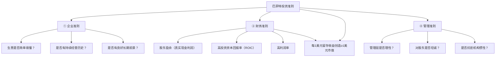
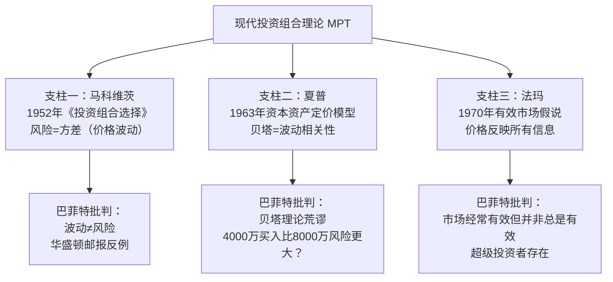
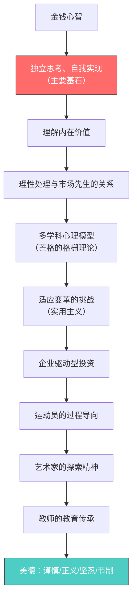
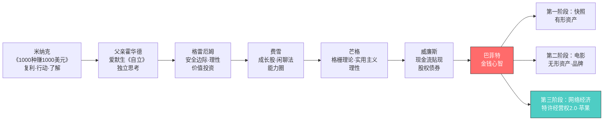

# 🧠 沃伦·巴菲特：终极金钱心智 —— 逐章超详细深度解读

> **作者**：罗伯特·哈格斯特朗（Robert Hagstrom）——全球知名巴菲特研究专家，研究巴菲特近40年，著有《巴菲特之道》《巴菲特的投资组合》《查理·芒格的智慧》等，本书是其研究巴菲特30年集大成之作，也被视为《巴菲特之道》的思想升级版
> **译者序**：刘建位（央视《理财教室》主讲人、汇添富首席投资理财师）——"研读罗伯特这部新作，胜过我自己摸索研究20余年"
> **主题**：这不是一本关于方法论的书，而是一本**关于思考的书**——剖析巴菲特如何思考，探究"金钱心智"（Money Mind）从何而来、由哪些组件构成、能否被学会
> **核心结论**：投资成功的关键是正确的心态，而不是复杂的运算
> **一句话概括**：**独立思考、自我实现**——这是金钱心智的核心

---

## 🎯 全书核心框架

```mermaid
graph TD
    MM["🧠 终极金钱心智"] --> YQ["缘起"]
    YQ --> YQ1["2017年股东会首次听到"]
    YQ --> YQ2["巴菲特谈继任者"]
    YQ --> YQ3["智商≠金钱心智"]

    MM --> YX["影响人物"]
    YX --> YX1["米纳克（第一本书）"]
    YX --> YX2["父亲霍华德（爱默生）"]
    YX --> YX3["格雷厄姆（安全边际）"]
    YX --> YX4["费雪（成长股/闲聊法）"]
    YX --> YX5["芒格（格栅理论）"]
    YX --> YX6["威廉斯（现金流贴现）"]

    MM --> JZ["价值投资三阶段"]
    JZ --> JZ1["第一阶段：有形资产（经典）"]
    JZ --> JZ2["第二阶段：无形资产（品牌）"]
    JZ --> JZ3["第三阶段：网络经济学（苹果）"]

    MM --> GC["金钱心智构成"]
    GC --> GC1["独立思考"]
    GC --> GC2["自我实现"]
    GC --> GC3["理性"]
    GC --> GC4["实用主义"]
    GC --> GC5["过程导向"]
    GC --> GC6["美德"]
    GC --> GC7["教育传承"]

    MM --> PF["对现代金融的批判"]
    PF --> PF1["马科维茨（方差=风险）"]
    PF --> PF2["夏普（贝塔）"]
    PF --> PF3["有效市场假说"]
    PF --> PF4["主动管理vs被动指数"]
```

### 金钱心智的定义（巴菲特2017年原话）

> "我管这叫作金钱心智（money mind）。人的智商可以达到120、140，或更高水平，或许一些人的头脑很擅长做一种事，而另一些人擅长做另一种事，他们可以完成大多数普通人无法做到的事。但我认识一些非常聪明的人，他们因为不具备金钱心智，也会做出非常愚蠢的决定。他们不具备资本配置能力，而我们需要的是具备这种天赋的人才，缺乏金钱心智的人，当然不是我们想要的。"

### 三个关键词的深意

| 关键词 | 含义 | 对应的反面 |
|--------|------|-----------|
| **独立思考** | 不依赖他人的意见和市场的情绪做决策 | 盲从大众、机构惯性 |
| **自我实现** | 知道自己拥有什么、为什么拥有，行动果断 | 犹豫不决、等待完美时机 |
| **知行合一** | 知道投资之道 ≠ 走上投资之道 | 懂得道理却无法承受波动 |

> 作者自白："多年来，我一直削尖铅笔去计算股票的价值，直到2017年那个5月的下午，我才意识到我忽略了最重要的建议。人们可以学习所有关于投资的知识，但如果没有金钱心智，这一切都是空谈。"

---

## 📖 全书结构总览

| 部分 | 内容 | 核心问题 |
|------|------|---------|
| 赞誉+译者序 | 各界评价、巴菲特投资苹果1611亿美元的启示 | 为什么巴菲特86岁还能进化？ |
| 前言 | 金钱心智的缘起（2017年股东会） | 什么是金钱心智？ |
| 第1章 | 年轻的巴菲特（《1000种赚1000美元的方法》） | 金钱心智的第一课从何而来？ |
| 第2章 | 投资哲学的发展（父亲、格雷厄姆、芒格） | 投资哲学由什么构成？ |
| 第3章 | 价值投资的演变（三阶段：经典→无形资产→网络经济） | 巴菲特如何不断进化？ |
| 第4章 | 企业驱动型投资（投资大世界、四类准则） | 如何像企业主一样投资？ |
| 第5章 | 并非主动管理不行了（对现代投资组合理论的批判） | 为什么伯克希尔模式不被复制？ |
| 第6章 | 金钱心智：运动员、教师、艺术家 | 金钱心智的终极组件是什么？ |
| 后记 | 金钱心智的总结与行动指南 | 如何培养金钱心智？ |

---

## 📖 前言：金钱心智的缘起

### 2017年5月6日：奥马哈的那个下午

- 伯克希尔股东大会，**3万名股东**到场，巴菲特和芒格连续5小时回答问题
- 桌上只有水杯、可乐、喜诗糖果和花生糖——**没有笔记、没有简报**，所有数字都在脑子里
- 第28个问题（来自9号区的一位股东）："你们两位通过交流观点的方式进行资本配置，在很大程度上避免了资本配置失误，这种情况还会在伯克希尔的未来继续下去吗？"

**巴菲特的回答**：
> "伯克希尔的任何继任者，其资本配置能力和经验都肯定是董事会最重要的考虑因素。如果伯克希尔的CEO仅仅具备某些领域的技能，而缺乏资本配置能力，那么这一定会影响公司的表现。"

- **然后他说出了"金钱心智"一词——作者研究巴菲特30多年，第一次听到这个说法**
- 作者当场顿悟：自己过去几十年都在研究"巴菲特买什么"，却忽略了"巴菲特怎么想"

### 作者的两次顿悟

**1984年第一次顿悟**（接触伯克希尔年报）：
- 从伯克希尔年报中读到：股票不是一张可以交易的纸，而是"由经理人管理的、向消费者提供产品的企业"
- "我记得当时我在自己家里，读完那封信时，我恍然大悟，那是我的顿悟时刻"

**2017年第二次顿悟**（听到金钱心智）：
- 多年来他发现：选择像巴菲特那样投资的人仍在苦苦挣扎
- **"知道自己为什么持有股票和具有承受市场大幅波动的能力，二者之间存在巨大的鸿沟"**
- "知道这条道路和走上这条道路有很大的区别，知行合一不是一件容易的事"
- 投资成功的公式 = 正确的心态 × 正确的方法，两者缺一不可

---

## 第1章 年轻的巴菲特

### 《1000种赚1000美元的方法》——金钱心智的第一课

**1941年，11岁的巴菲特**在奥马哈公共图书馆本森分馆发现F.C.米纳克（Frances Minaker，用首字母隐藏女性身份）的《1000种赚1000美元的方法》，副标题"利用你的业余时间做生意"，**408页，476条新商业建议，859条引文，35页出版物推荐清单**。

### 书中对巴菲特影响最大的故事

**① 哈里·拉森的投币体重秤（复利的本质）**
- 1933年，哈里·拉森在药店发现投币体重秤：店主拿25%收入（每月约20美元），公司拿75%
- 哈里用**175美元**买了3台体重秤，每月赚**98美元**
- **"我一共买了70台体重秤……后面的67台，是用前面3台赚到的钱买的……我赚的钱足以买下这些秤，并且使我过上不错的日子。"**
- 每次赚一点点，这就是复利的本质——利用利润获取更多的利润
- 爱因斯坦名言："复利是世界上的第八大奇迹。懂的人会得到它，不懂的人会付出代价。"
- 巴菲特后来用"一美分体重秤"描述自己的想法：
> "体重秤很容易理解，我会买一台体重秤，然后用赚来的钱去买更多的体重秤。很快我就会有20台体重秤，每台秤每天称重50次。我想这就是钱的来源，有什么比这更美妙吗？"
- **正是这种心智架构造就了今天的伯克希尔-哈撒韦公司**

**② 杰西·潘尼的故事**：第一份工作每月2.27美元，1902年开第一家百货店，第一年营业额28891美元，自己持股份的利润超1000美元

**③ 约翰·沃纳梅克的故事**：23岁说服妹夫凑钱在费城开服装店（正值内战和1857年大萧条），8年后成为美国最大男装零售商

### 米纳克的三条核心建议（金钱心智三步法）

| 步骤 | 建议 | 原文 | 对巴菲特的塑造 |
|:---:|------|------|---------------|
| ① | **了解情况** | "创办自己企业的第一步是了解情况……阅读所有有关你打算进入的行业的出版物，综合他人的经验" | 从问题的两方面入手：如何成功+如何避免失败 |
| ② | **开始行动** | "开始赚钱的方法就是开始行动" | 完美时刻无法预知，等待只是逃避的借口 |
| ③ | **别问太多人** | "如果你征求了足够多人的建议，你肯定会一事无成" | 自我教育和知道何时行动之间找到平衡 |

**金句：**
> "只有那些认为自己知道一切的人，才会认为交流想法是愚蠢的。真正的愚蠢是，花费数百美元（相当于今天花费数十万，甚至数百万美元）去发现自己的想法不可行，而其他人已经做过这样的尝试并将其写在了书上。"

> "创立的企业就像离开港口的航船，在商业的海洋上，你必须依靠自己的判断和能力。"

> "前景不明朗，看不清前方的路"——米纳克指出人们迟迟无法开始行动的原因，但完美时刻从来无法预知。

### 伯克希尔总部的图书馆

- 行政楼层**最大的房间不是巴菲特的办公室**，而是大厅下面的图书馆
- 一排排文件柜装的是企业的故事——**所有重要上市公司过去和现在的年度报告，巴菲特全都读过**
- 从中他不仅学到了什么是有用的、哪里能找到利润，更重要的是**学到了什么样的策略会造成失败和亏损**
- 与米纳克"了解情况"的建议一脉相承

### 年轻的巴菲特时间线

| 年龄 | 事件 |
|:---:|------|
| 6岁 | 路边摆摊卖糖果、口香糖、汽水；25美分批发6瓶装可乐，每瓶5美分转售（回报率20%） |
| 7岁 | 向圣诞老人许愿得到一本关于债券的书 |
| 8岁 | 开始读父亲藏书中关于股票的著作 |
| 11岁 | 第一次股票投资；发现《1000种赚1000美元的方法》 |
| 16岁 | 高中毕业时已是奥马哈最富有的高中生（可能是世界上最富有的白手起家少年） |
| 17岁 | 和朋友合资25美元买二手弹球机放在理发店，赚到钱又添两台 |
| 18岁 | 以1200美元转手弹球机生意 |
| 1947年 | 进入沃顿商学院，两年后觉得"会计和商业知识比教授还多"而离开 |
| 1949年 | 转学内布拉斯加大学，一年内通过14门功课获学士学位；毕业后大部分时间泡在图书馆疯狂阅读 |
| 1950年 | 读到《聪明的投资者》——"改变了他的命运"，申请哥伦比亚大学 |
| 1951年 | 师从格雷厄姆，获A+（格雷厄姆22年教学生涯第一次给出A+） |
| 1951-54年 | 回奥马哈，在父亲公司工作，奥马哈大学教课，为《商业与金融纪事报》写专栏 |
| 1954年 | 加入格雷厄姆-纽曼公司（两年，与沃尔特·施洛斯、汤姆·克纳普同事） |
| 1956年 | 回到奥马哈创立巴菲特投资合伙企业（105000美元起家） |
| 1969年 | 关闭合伙企业（资产1.04亿美元） |
| 1970年 | 接手伯克希尔，开始综合企业集团之旅 |

### 哥伦比亚大学：走出山洞

- 1950年夏天看到《聪明的投资者》——"相比于他读过的数百本书中的任何一本，巴菲特认为格雷厄姆的这本书改变了他的命运"
- 发现格雷厄姆和多德是哥伦比亚大学教授："我原本以为他们都是历史上的人物，应该早已不在人世了"
- 第一堂课"投资管理与证券分析"（金融111-112）由**大卫·多德**教授；巴菲特去纽约前已把七八百页的《证券分析》烂熟于心："我对于书中提到的每一个案例，可以说是了如指掌"
- 1951年春季学期，**本·格雷厄姆亲自授课**
- 格雷厄姆的贡献：华尔街传统选股方法从"你是否喜欢该股"开始，**格雷厄姆以一己之力扭转乾坤**——"既然你能根据大家的说法把钱投到一无所知的股票上，为什么不先搞清楚它的价值所在呢"
- 格雷厄姆的简单方法：流动资产（应收账款、现金、证券）相加，减去所有负债得出净值；股价低于净资产就买
- "格雷厄姆带给了巴菲特一样他多年以来一直在寻找的东西——一种投资体系：**用50美分买价值1美元的股票**"
- 有人说，巴菲特在哥伦比亚的求学经历"非常像一个人从居住了一辈子的山洞里走出来，他走出洞外，在阳光下眨眨眼，第一次感知真实的世界"
- 不上课时泡在哥伦比亚大学图书馆阅读**过去20年关于股市的旧报纸**，一周七天废寝忘食
- 学期结束获得A+——**这是格雷厄姆在哥伦比亚大学22年教学生涯中第一次给出A+**
- 毕业后申请去格雷厄姆-纽曼公司工作被拒，甚至提出免费工作也被礼貌拒绝

### 启航：1951-1956

- 1951年夏天回奥马哈，格雷厄姆和父亲都提醒"现在恐怕不是入市的好时机"——但巴菲特听从米纳克："开始赚钱的方法就是开始行动"
- 拒绝奥马哈国家银行的工作，去父亲的证券经纪公司；父亲的朋友问"将来这家公司是不是会更名为巴菲特父与子公司？"巴菲特答："也许，更名为巴菲特子与父公司更合适。"
- 参加戴尔·卡内基公共演讲课程；在奥马哈大学教授"投资原则"；为《商业与金融纪事报》写专栏"我最喜欢的股票"——大赞盖可保险
- 1954年格雷厄姆电话邀请，巴菲特立刻登机赴纽约
- 格雷厄姆-纽曼公司6名员工之一，与沃尔特·施洛斯、汤姆·克纳普同办公室，日复一日研究标准普尔股票指南
- **但他们提出的大部分建议都被格雷厄姆和杰瑞·纽曼否决了**——1955年道指420点，基金坐拥400万美元现金却不为所动
- 1956年格雷厄姆退休搬去加州贝弗利山，在UCLA执教直到82岁去世
- 巴菲特再次回到奥马哈："他再不会为别人工作了，他已经做好了准备，准备做自己的船长"

### 巴菲特投资合伙企业（1956-1969）

**启动：** 妹妹多丽丝夫妇、姑姑爱丽丝、岳父、前室友查克·彼得森、律师丹·莫恩，共**105000美元**。1956年春在奥马哈晚餐俱乐部开会。

**基本规则（定下企业基调）：**
1. **财务条款**：有限合伙人每年获6%回报，超出部分利润75%归LP、25%归巴菲特；亏损递延至下一年度弥补，未达标前巴菲特不收业绩报酬
2. **承诺原则**：不能承诺结果，但承诺所有决策基于格雷厄姆的投资原则
3. **业绩评价期**：忽略每天、每周、每月的市场波动；评价业绩至少3年，5年更好
4. **不做预测**：不预测股市或经济周期；不讨论、不披露买卖持股信息

**业绩：**

| 期间 | 巴菲特合伙企业 | 道琼斯指数 |
|------|:---:|:---:|
| 1957-1961（累计） | **251%** | 74% |
| 1957-1969（年化复合） | **29.5%**（扣费后23.8%） | 7.4% |
| 1968（单年） | **59%** | 8% |

- 目标每年跑赢道指10个百分点 → 实际超额**22个百分点**
- 资产从105000美元 → **1.04亿美元**（其中2500万美元属于巴菲特自己）
- 1964年资产720万美元，已超过老师格雷厄姆公司巅峰期的资产管理规模；1961年底巴菲特个人资产100万美元（31岁）
- 1968年59%的回报，巴菲特说应被视为"意外结果，就像桥牌比赛时，你抽到了13张黑桃一样"

**1969年关闭合伙企业的原因：**
> "有一点我非常清楚，我发现自己理解的投资逻辑，在当前的市场中难以运用。但我不会抛弃它，即便这么做可能意味着放弃巨额的且明显容易获得的利润，我不会接受自己使用没完全理解的、没有验证过的，且可能导致巨大永久性资本损失的方法。"

**给合伙人的三个选择（教育家的风范）：**
1. 转给比尔·鲁安（哥伦比亚同学）→ 2000万美元转移到RCS合伙企业 → **促成红杉基金的诞生**
2. 投资市政债券 → 巴菲特发送了一份100页的说明阐述免税债券机制
3. 换成伯克希尔普通股（巴菲特自己选了这个）
- 早期合伙人道客·安吉尔："这是任何人都可以得到的信息，如果他们有头脑的话。"

### 从合伙企业到综合企业集团

- 伯克希尔=伯克希尔棉纺公司+哈撒韦制造公司合并而来（新英格兰纺织业）
- 典型格雷厄姆式投资：股价7.50美元，运营资本每股10.25美元，账面净资产每股20.20美元
- "捡烟蒂"理论：以低廉价格购买硬资产，哪怕经济活力微乎其微
- 1965年持有39%股本，陷入控制权之争并获胜——**但发现25%的资产在一艘正在下沉的船上，且没有退出战略**："我感觉自己像是被绑架了"
- 伯克希尔像一个75岁的老人，暮气沉沉的19世纪纺织品制造商，利润微薄、资本密集、严重依赖人工劳力——没人愿意接手
- **但巴菲特遵循一个更强大的原则——长期复利**：把纺织业务每一分钱都重新分配到更优秀的企业里
- 儿时弹球机的生意就是"综合型企业"的原型：将资金从一个生意转到另一个生意，更妙的是将更多资金投入最好的生意
- 2014年年报：企业集团形式"可以实现长期资本最大化的理想架构"，在转移资金时"不会引发税务问题或其他成本"

**巴菲特与格雷厄姆的分道扬镳点：**
- 格雷厄姆不考虑持仓数年复利表现；**"复利"这个词，无论是在《证券分析》还是在《聪明的投资者》中从来没有出现过**
- 1963年巴菲特写给合伙人的信"复利之乐"：伊莎贝拉女王以30000美元资助哥伦布远航，若按4%复利，500年后达2万亿美元
- 10万美元按4%复利30年=22.4万美元；按16%复利30年=**848.494万美元**
- 他的建议："争取活得长久，并让钱以较高的复利增长"
- 截至2024年3月，伯克希尔是世界第六大公司；1962年7.50美元买入的A股现价每股33.4万美元（书中2020年数据）——"它再现了一个古老的奇迹：17世纪的金融复利理念"

---

## 第2章 投资哲学的发展

### 投资哲学的定义与三要素

> "投资哲学是关于金融市场如何运行的认知，以及如何运用这些认知为投资目标服务的一系列信念和见解。"

**投资哲学的三大组成部分：**
1. **你对市场的看法**——巴菲特："股票市场虽然常常是有效的，但并非时时有效"
2. **你的投资方法**——低换手率的集中投资组合，建立在对基本面和未来自由现金流贴现评估的基础上
3. **你的个人气质**——非常重要

**当三者和谐交融时，你就可以称为一个具有金钱心智的人。**

### 影响人物一：父亲霍华德·巴菲特（爱默生的传承）

**家族谱系：** 1696年约翰·巴菲特在纽约长岛结婚 → 1867年西德尼·霍曼·巴菲特西进奥马哈 → 1869年开杂货店 → 欧内斯特（祖父，芒格曾在他店里打工）→ 霍华德（父亲）

**霍华德的品格：**
- 为妻子放弃记者梦想，转做保险销售，后成立证券经纪公司巴菲特·斯凯林卡公司
- 正直坦率：客户投资结果不佳时，有时用自己的账户回购这些投资
- 提醒孩子对社区的责任："你们并不需要承担所有的责任，但也不许推卸自己应该担负的那部分责任。"
- 1942年起四次当选国会议员，属于"老右翼"（反对海外军事干预、反对罗斯福新政）
- 1964年去世，遗产56.3万美元，其中33.5万投资在巴菲特合伙企业中；没给巴菲特留特别财产（"他自己已经有了足够的财产"）——但无形资产价值高得多

**爱默生《自立》（Self-Reliance）的三大主题（通过父亲传给巴菲特）：**

| 主题 | 内容 | 对巴菲特的影响 |
|------|------|---------------|
| 孤独和社群 | 社群是自我成长的娱乐场所，应花更多时间安静思考 | 独立思考、独处思考 |
| 破除陈规 | "无论是谁，要成为一个人，必须不墨守成规" | 不随大流、拒绝机构惯性 |
| 内在信念 | 真理就在你的内心，依赖制度性思维会阻碍心理成长 | 相信自己的分析 |

**巴菲特与爱默生的呼应：**
> "我不想知道其他人怎么想，我只想知道事实，越多越好。我的意思是，说到底，我不会将自己的钱的命运交给别人。"

> "令人讨厌的小人物身上有着愚蠢的一致性，想要伟大就可能被误解。"（爱默生）

**父亲的教诲：**
> "父亲曾经告诉我，建立一个好名声需要花20年，而失去它只需要20分钟。这是我从他那里得到的最好的建议。如果你能记住这句话，就会做一些与众不同的事情。"

- 巴菲特曾说如果父亲是鞋子推销员，"我现在可能也是一个卖鞋的"
- 被问想与历史上谁交流，巴菲特毫不犹豫回答："我的父亲"

### 影响人物二：导师本·格雷厄姆（理性与安全边际）

**格雷厄姆生平：**
- 1894年生于伦敦犹太商人家庭，父亲35岁去世；哥伦比亚大学全班第二毕业，精通希腊语、拉丁语、德语、西班牙语
- 1914年入华尔街（周薪12美元），1923年创办投资公司，1926年成立格雷厄姆-纽曼公司（持续到1956年）
- 1914年刚入行就开始写铁路研究报告；一篇关于密苏里太平洋铁路的报告引起J.S.贝奇公司注意，得到数据员工作（薪水+50%）；纽伯格公司以加薪和"成立自己管理的统计部门"挽留
- 为《华尔街杂志》撰稿，出版小册子《投资者课堂》：**"如果一只股票的市场价值远远低于其内在价值，那么它应该有极佳的价格上涨前景"——这是"内在价值"一词第一次出现**
- 1929年大崩盘损失巨大；1930年认为股市触底重返（未对冲）→ 遭遇第二次濒临破产

**关键贡献：**
- 1927年在哥伦比亚大学开"高级证券分析"夜校课程（舍尔默霍恩大厅305室，每周一晚上）——**创造了"证券分析"这个名词**，用"证券分析师"取代"统计员"
- 格雷厄姆提出唯一要求：必须有专人做课堂笔记 → **大卫·多德**获得志愿者岗位 → 笔记构成《证券分析》实质内容
- 1934年《证券分析》出版，《纽约时报》路易斯·里奇："它是一个全面、成熟、细致的学术探索和智慧实践的卓越成果。如果它的影响足够大，投资者的注意力就会集中在证券上，而不是市场上。"
- 有趣：格雷厄姆和多德**从未一起教过一节课**——秋季多德教研究生"投资管理与策略"，春季格雷厄姆开20人小班研讨会
- 1949年《聪明的投资者》出版——巴菲特称其为"迄今为止，这是所有关于投资的书中最好的书"
- 1956年退休去加州，UCLA执教至82岁去世

**格雷厄姆的哲学（爱默生在格雷厄姆身上的显现）：**
> "要有勇气利用你的知识和经验。如果你已经从事实中得出了结论，如果你知道你的判断是正确的，那就应该采取行动，即使其他人可能会犹豫或持有不同看法。你既不会因为别人赞同而正确，也不会因为别人反对而错误。如果你是正确的，那是因为你的数据和你的推理是正确的。"

**巴菲特评价格雷厄姆教学中最有利于成功投资的特质：**
> "格雷厄姆既不会受他人想法的干扰，也不会在意某一天外界会怎样之类的事情。"

**格雷厄姆的独特做法：**
- 分析师被建议不要访问或询问公司管理层对未来前景的看法（担心过于倾向未来因素）
- **格雷厄姆甚至拒绝看CEO的照片**——担心不喜欢某张照片会影响分析
- 洛温斯坦（《巴菲特传》作者）："本·格雷厄姆打开了一扇门……有了格雷厄姆的技术，以格雷厄姆的特质为榜样，巴菲特能够展现他标志性的独立思考"
- 巴菲特："本·格雷厄姆远不只是一名作家或老师。除了我父亲，他比任何人对我的影响都要大。"

**巴菲特重点强调《聪明的投资者》的两章：**
1. **第8章"投资者与市场波动"**
2. **第20章"作为投资核心概念的安全边际"**
> "要想获得一生的投资成功，并不需要过人的智商，需要的是一个健全的决策知识框架，以及防止情绪腐蚀该框架的能力。"

### 格雷厄姆的古典学修养与斯多亚主义

- 格雷厄姆的名声集中在金融，但很少有人关注他的另一面：**对古典时代（公元前8世纪到公元6世纪）希腊罗马作品的研究**，阅读了所有主要古典文学作品，其中很多是原文
- 特别钦佩**罗马皇帝马可·奥勒留**（公元161-180年在位，五佳皇帝之一，唯一具有哲学家身份的皇帝）
- 《沉思录》——写给自己的文字，不断提醒斯多亚主义者应该如何生活
- **斯多亚主义真正的含义**（常被误解）：不是"清心寡欲、像木头人"，而是**认识到生活中那些我们无法控制的事件，不要让这些事件引发的不良情绪影响良好的判断**；目标是开发技巧防止负面情绪出现，达到"理性"——坚实的平静状态
- 珍妮特·洛《格雷厄姆经典投资策略》：格雷厄姆"把斯多亚学派包含在了自己的个人哲学中"

**市场先生寓言（斯多亚主义的投资应用）：**
- 市场先生是你的合伙人，每天跑来报买卖价格；他有严重的情绪问题——兴奋时报高价，沮丧时报低价
- 投资者最大的敌人是自己：以贪婪嫉妒看待上涨，用恐惧焦虑对待下跌——正是斯多亚学派试图避免的情绪
- 巴菲特版灰姑娘比喻：
> "就像舞会上的灰姑娘一样，你必须听从那个警告，否则时间一到，一切都会变成南瓜。对于市场先生，你会发现有用的是他的钱包，而不是他的智慧。如果有一天他带着一种特别愚蠢的情绪出现，你可以自主选择忽视他或利用他，但如果你受到他的影响，那结果将是灾难性的。"

> "如果你不确定自己是否比市场先生更了解你的业务，那么你就不属于这个游戏。就像人们在玩扑克时所说的，如果你在游戏中已经玩了30分钟，还不知道傻瓜是谁，那么你就是那个傻瓜。"

- 一旦确定持股价值，你对股价没有多大兴趣——股价不是你投资进展的主要衡量指标；股市狂躁状态成为次要指标
> "投资的成功不会来自神秘的公式、计算机程序或股票价格变动所产生的闪烁信号。相反，能够将良好的商业判断与市场情绪隔离开来，保持思想和行动的独立性，才能使投资者获得成功。"

### 影响人物三：查理·芒格（格栅理论与实用主义）

**芒格生平：**
- 1924年1月1日出生在奥马哈，**距巴菲特现在住的地方仅200码**；曾在巴菲特爷爷欧内斯特的杂货店打工，但两人小时候从未见过面
- 密歇根大学和加州理工学院学习，二战期间在美国空军担任气象员
- 没有本科学位，仍被哈佛法学院录取，1948年毕业
- 1959年父亲过世回家料理后事时经朋友介绍与巴菲特相识；巴菲特建议他：致富之路不是法律，而是投资
- 1962年创立惠勒·芒格公司，12年年复合19.8%
- 1978年成为伯克希尔副董事长；友谊持续超60年，投资热情58年，"飞行员和副驾驶"关系42年
- 巴菲特："芒格拥有世界上最棒的30秒思维能力。他可以一瞬间洞悉全局，在你说完一句话之前，他就已经看透了本质。"
- 巴菲特最初被芒格吸引，因为芒格让他想起格雷厄姆：对独立思想的信念、"正直，以及致力于客观和现实主义"、狂热的阅读者（芒格偏好成百上千的传记）、都是本杰明·富兰克林的崇拜者

**芒格思想三方面：发展通识智慧；从失败中学习；拥抱理性。**

**① 通识智慧（格栅理论）**
- 1994年4月南加州大学马歇尔商学院演讲："选股艺术是通识智慧艺术的一个小分支"
- 渊源：1749年富兰克林《关于宾夕法尼亚青年教育的建议》→ 1751年宾夕法尼亚慈善学院（今宾大）——富兰克林是文科教育的创始人，培养"思维习惯"
- 芒格：不需要成为每个学科专家，只需对主要模型有基本理解，享受"叠加效益"

**各学科心理模型对照表：**

| 学科 | 模型 | 投资应用 |
|------|------|---------|
| 物理学（牛顿第三定律） | 作用力=反作用力 | 供求平衡的恢复 |
| 生物学（达尔文） | 进化、适应、突变、正反馈循环 | 市场是非均衡的生物系统，微小变动引发大反应 |
| 社会学 | 多样性系统最稳定 | 所有人同一心智→繁荣萧条 |
| 数学（帕斯卡、费马、贝叶斯） | 概率论、贝叶斯定理 | 估计未来自由现金流的概率 |
| 哲学（斯多亚、笛卡尔、培根、休谟、康德、维特根斯坦、詹姆斯） | 逻辑、语言、实用主义 | 正确描述事实、理解意义 |
| 心理学 | 人类误判心理 | 从失败中学习 |

**② 从失败中学习（心理学）**
- 迪特里希·德尔纳《失败的逻辑》：失败是坏习惯的结果（不良心理习惯）；"失败不会像蓝色的闪电一般瞬间发生，它是按照自己的逻辑逐渐发展积累起来的"；人类更可能在逐渐累积的细小错误上栽跟头；"捷径思维"——人们倾向于只选择一个变量而非搞清多变量复杂关系
- 芒格1948年就开始"一场长期的斗争，以摆脱我某些概念中的那些最有障碍的部分"——**比行为金融学诞生早几十年**（卡尼曼/特沃斯基《不确定状况下的判断》1982年才出版；西奥迪尼《影响力》1983年）
- 1994年秋/1995年春在剑桥行为研究中心演讲"人类误判心理学"：列出**25种心理倾向**（从"奖励与惩罚/超级反应倾向"到"数种心理倾向共同作用产生极端后果的倾向"），每种都给出错误描述+应对之策（见《穷查理宝典》）
- 例：第15种"社会认同倾向"——不由自主跟随周围的人思考做事；解药："学习如何在别人提出错误的例子时忽略它们，没有什么技能比这更有价值"
- 芒格总结："心理思维系统所描述的这些，如果人们使用得当，就能使智慧和良好的行为得以传播，并有助于避免灾难。"

**③ 拥抱理性**
- 洛温斯坦说巴菲特"在很大程度上是一个性格上的天才——耐心、有纪律和理性"
- 芒格："伯克希尔是一个理性的殿堂"
- 晚宴上被问促使他成功的一个品质："我是理性的。这就是答案，我是理性的。"
- "那些说自己是理性的人应该知道，事情是如何运作的，什么是有效的，什么是无效的，以及为什么。"
- "保持尽可能多的理性是一种道德责任。"
- 理性可以学习："理性的增加不是你选择或不选择的事情"；"变得更加理性是一个漫长的过程。你只能慢慢得到它，而且结果并非固定不变，但几乎没有比这更重要的事情了。"

### 理性主义与经验主义：伯克希尔独特的理性

**哲学史上的争论：**
- **培根（经验主义者）**：所有知识源于实际经验或由实际经验检验；相信实用知识（建筑商、木匠、农民、水手、科学家）
- **笛卡尔（理性主义者）**：真正知识只能通过理性、推断第一原则
- **休谟（《人性论》）**：我们形成"将思想联系在一起的心理习惯"，想到X就自动想到Y
- **康德（《纯粹理性批判》）**：综合两者——格雷林的总结："经验主义者坚持认为，没有感官经验就不可能存在知识，这是正确的，但他们说头脑是一片空白、一无所有的，这是错误的。理性主义者坚持认为，我们的思想提供了先验概念，这是正确的，但是，他们说靠先验概念本身就足以了解世界，这是错误的。"

**三人的哲学阵营对照：**

| 人物 | 哲学阵营 | 投资表现 |
|------|---------|---------|
| 格雷厄姆 | 理性主义者（笛卡尔） | 知识通过一系列简单心理步骤建立；估值建立在先验推理上；倾向廉价"烟蒂"股 |
| 芒格 | 经验主义者（培根） | 真理建立在可观察到的事实和个人经验上；观察和分析公司整体经营状况 |
| 巴菲特 | **康德式综合** | 忠于格雷厄姆的安全边际（先验）+欣赏从已有公司经验中吸取教训（后验） |

- 巴菲特："我仍然认为安全边际是个正确的词。"
- "查理·芒格打破了我买烟蒂股的投资习惯……他给我的蓝图很简单，别老想着以便宜的价格去购买平庸的企业，而是应该以公允的价格去购买优秀的企业。"
- "我是一个企业家，这使我成为一个更好的投资者；我是一个投资者，这使我成为一个更好的企业家。"

### 实用主义：持续成功的钥匙

**2010年伯克希尔股东会的惊喜：**
- 股东请两人描述生活理念，芒格迅速抓起麦克风大声说："**实用主义！**"
- "去做一些适合你性格的事，去做一些有效的事，然后坚持不懈。这是生活的基本法则——重复有效的方法。"

**实用主义的渊源（威廉·詹姆斯）：**
- 1898年加州大学伯克利分校演讲"哲学概念与实践成果"——致敬皮尔士的《如何形成清晰的观点》："哲学的全部功能就是产生行动的习惯"；"实用"与"行动"同源
- 詹姆斯1869年获医学学位但从未行医；研究"灵魂疾病"；细致研究马可·奥勒留（与格雷厄姆共同的偶像！）；1890年出版两卷1200页《心理学原理》（耗时12年）
- 詹姆斯的父亲与爱默生是朋友，**爱默生是威廉·詹姆斯的教父**；1837年爱默生《论美国学者》"预示了一种新型思想家的诞生"
- 詹姆斯名句：一个特定信念的"现金价值是多少"？"我们的思想变得真实了，因为它们成功地发挥了它们牵线搭桥的功能"——**真理变成了一个动词，而不是一个名词**
- 实用主义没有偏见、教条或严格的教规："实用主义对可能的真理的唯一检验是最能引导我们的东西"
- 卡格教授：实用主义"代表了一个哲学的中间地带，旨在对相互竞争的理论学派……进行调解"；詹姆斯称理性主义者是"温柔的"，经验主义者是"强硬的"；实用主义是一种"康德哲学"——为强硬的科学家和温柔的理想主义者提供桥梁

**比尔·米勒论理性与实用主义：**
> "去做有效的事情，务实的做法就是理性。理性本身并不需要与推理所要求的抽象理论相结合，而需要与现实世界中有效的抽象理论相结合。"

**本章结尾的总结：**
> "金钱心智是独立思考、自我实现，正如爱默生的定义。一个具有金钱心智的人知道自己拥有什么以及为什么拥有。金钱心智不仅可以增强自信，还能面对股市的恐惧和贪婪保持理性。一个具有金钱心智的人，通过研究不同学科的心理模型来发展通识的智慧。以金钱心智去研究失败能避免犯别人犯过的错误。金钱心智是一种理性的思维，它既欣赏先验知识，又欣赏后验经验，它理解两者融合的最大好处。最后，金钱心智是务实的。"

---

## 第3章 价值投资的演变

### 格雷厄姆的开端：从统计员到证券分析之父

- 1914年加入纽伯格、亨德森和勒布公司，做普通职员；很快被调到债券部门接受推销员培训——但他真正想做的是写作
- 研究铁路行业，写研究报告；一份关于密苏里太平洋铁路公司的报告引起J.S.贝奇公司注意，提供数据员工作（薪水+50%）；纽伯格公司以加薪+成立统计部门挽留
- 为《华尔街杂志》撰稿，出版《投资者课堂》小册子："如果一只股票的市场价值远远低于其内在价值，那么它应该有极佳的价格上涨前景"——**"内在价值"一词第一次出现**
- 1923年创办自己的投资公司；1925年聘用杰瑞·纽曼，成立格雷厄姆-纽曼公司（持续到1956年）
- 早期投资组合大部分采用对冲或套利方式，1929年大崩盘损失巨大；1930年认为股市触底重返（未对冲）→ 市场再次大跌，遭遇第二次濒临破产
- 1927年在母校开夜校课程"高级证券分析"（舍尔默霍恩大厅305室，每周一晚上），教学目录描述："经过实际市场检验的投资理论，价格和价值差异的起源与验证"——**创造了"证券分析"这个名词**，用"证券分析师"取代"统计员"
- 格雷厄姆只提一个要求：必须安排专人做详细课堂笔记 → 大卫·多德（年轻金融学教授）→ 笔记构成《证券分析》的实质内容
- 1934年《证券分析》出版；有趣的是两人从未一起教过一节课（秋季多德教"投资管理与策略"，春季格雷厄姆开20人小班研讨会）
- 1951年，巴菲特第一次参加多德的课程，下一学期参加格雷厄姆的研讨会

### 第一阶段：经典价值投资（格雷厄姆-多德）

**核心内容：**
- 《证券分析》开篇第一行："分析意味着对现有事实的仔细研究，并试图根据既定的原则和逻辑从中得出结论。"
- 证券分析是一种科学的方法，方法与法律和医学差不多——但并不是一门精确的科学；没有分析能做出完美预测，但遵循既定、可量化的事实和方法，成功概率会大大提高
- 格雷厄姆在股票和债券市场中寻找**容易衡量且流通性好**的对象；《证券分析》更强调此时此刻发生的情况，对明天的不确定性进行折现
- **"投机这个词从词源上讲，意思是展望未来。"** 他对投资的传统定义更满意："它植根于过去既有的利益、财产权和价值观"
- 投机因素=市场因素（技术、操纵和心理）；内在价值因素=收益、股息、资产、资本结构；介于两者之间=未来价值因素（管理层声誉、竞争态势、公司前景、销售价格成本变化）
- 格雷厄姆-纽曼的分析师被建议不要访问或询问管理层对未来前景的看法；**格雷厄姆甚至拒绝看CEO的照片**
- 本质：通过比较当前收益、当前股息和当前资产，支付较低的购买价格 → 建立安全边际
- **"安全边际"一词并非格雷厄姆首创**：他在1930年之前的《穆迪投资手册》中发现了这个词（"公司使用它表示在支付利息后归属股东利益的余额"）
- 格雷厄姆把分析普通股的技术与债券统一："投资普通股和投资债券的技术非常相似"
- 投资者面临的最大危险是为利润、股息和资产支付过高的价格——不仅来自不好的公司，也来自好的公司（好公司眼下条件有利、价格很高，但这并不是永久的）

**价值投资两条黄金法则：**
1. **不要亏损**
2. **不要忘了第一条**

**市场分析 vs 证券分析：**
> "市场分析本质上是一场战斗"，与其他同样想法的投资者竞争，猜测股市短期走向；"在市场分析中，没有安全边际。你要么对，要么错，如果你错了，你就会赔钱。"

**安全边际的三重好处：**
1. 以较大折扣购买普通股：顺利则回报可观，意外则损失有限——**几乎是投资的完美对冲手段**
2. 体现投资者的投资心智和气质，使盈利成为可能
3. **坚定投资者的决心，对抗市场固有的短期波动**——了解投资价值+安全边际缓冲会增强毅力（呼应斯多亚派的理性态度）

**格雷厄姆方法的局限（巴菲特亲身体验）：**
> "以短线的心态投资农场设备制造公司、三流的百货公司和新英格兰纺织制造公司，这些投资在经济上给我带来的教训是对我的惩罚。"

- 农场设备=**登普斯特农机制造公司**，三流百货=**霍克希尔德·科恩**，纺织=**伯克希尔-哈撒韦**
- 格雷厄姆方法的前提假设：有人会随时准备购买糟糕公司的账面价值——但巴菲特变卖伯克希尔糟糕的账面资产时，实际所得与想象相去甚远
- 早期合伙企业时期购买不良企业廉价股票不错，是因为可以迅速出手继续下一轮；但对伯克希尔而言，购买和持有不良企业是失败的策略
- 贺拉斯（《证券分析》封面引言）："今天那些已然坍塌的，将来可能会浴火重生；今天那些备受尊荣的，将来可能会销声匿迹。"

### 转折点：喜诗糖果（1972）

**交易背景：**
- 伯克希尔拥有多元零售公司 → 拥有蓝筹印花公司（为超市和加油站提供交易印花，顾客收集印花兑换礼品；**未兑换的印花是一种浮存金**，可投资储贷公司、报纸和喜诗糖果部分权益）
- 芒格的投资合伙企业持有蓝筹印花股票
- 1972年蓝筹印花从创始人家族手中整体购买喜诗糖果（西海岸优质盒装巧克力制造商和零售商）
- 要价4000万美元（含1000万美元现金）；有形资产仅800万美元；年度税前利润400万美元
- **要价是有形资产的3倍**——芒格认为很合算，巴菲特觉得"格雷厄姆肯定不会同意"，还价2500万美元，仍认为自己可能出价过高

**结果：**
- 威廉·桑代克（《商界局外人》）统计：1972-1999年喜诗糖果IRR高达**32%**——"没有使用杠杆，也不是阶段性成果；如果把购买价格翻倍，IRR仍是21%，这简直不可思议"
- 2014年年报更新：42年里带来**19亿美元税前利润**，仅增加4000万美元额外资本投资
- 利润被重新配置去收购其他公司，又产生更多利润——"就像看兔子繁殖"

**巴菲特从喜诗糖果吸取的三重经验：**
1. 喜诗糖果不是被高估，而是被**严重低估**了
2. 如果资本得到合理配置，即使为增长缓慢的公司支付较高溢价，也是明智投资
3. "我得到了关于强大品牌价值的教育，让我看到了许多其他有利可图的投资"

> "芒格和我最终发现'巧妇难为无米之炊'这句话是真的有道理，我们的目标是以合理的价格找到优秀的企业，而不是以便宜的价格找到平庸的企业。"

### 巴菲特1992年正式放弃格雷厄姆的会计方法

**1988年买入可口可乐时的"背叛"：**
- 15倍市盈率、12倍现金流、市净率5倍——分别较市场平均水平溢价30%、50%、5倍
- 严格信奉格雷厄姆的人大喊：巴菲特背叛了他的老师！
- 1989年伯克希尔持有可口可乐7%流通股，10亿美元押注（投资组合三分之一）
- 10年后市值116亿美元；同期标普500只把10亿美元变成30亿美元

**巴菲特的辩解（1992年致股东信）：**
> "通常价值投资意味着购买具有低市净率、低市盈率或高股息收益率等特点的股票。但不幸的是，即使这些特点结合在一起，也远远不能确定投资者是不是以物有所值的价格买入的……与此相对应，一些相反的特征，例如高市净率、高市盈率、低股息收益率，也并非完全与价值购买相悖。"

> "在计算价值时，成长本身就是一个组成要素，本身就构成一个变量，其重要性从可以忽略不计到影响巨大，其影响可以是负面的，也可以是正面的。"

**巴菲特没有放弃的：** 格雷厄姆的基本哲学——以一定的安全边际购买股票；放弃的只是用简单会计方法识别价值。
**放弃的原因：** 拥有基于这些指标低价收购、完全控股企业的实际经验后发现，有时这样的公司给伯克希尔带来的回报并不理想。
> "我们需要的是思考，而不是以人数多寡作为决策依据。"

### 经典价值投资的困境（2008年后）

**背景：** 自2008年金融危机以来，经典价值型股票明显弱于高市盈率成长型股票，持续10多年。价值投资者将表现不佳比作20世纪90年代末——但有两个根本区别：
1. 90年代末成长股价格几乎没有经济基本面支撑（用浏览量而非利润证明高估值）；今天可用清晰的销售、利润和现金流衡量
2. 利率不同：2000年10年期国债收益率6.00%，今天不到1.00%——低利率提升了股票价值，尤其成长股

**学者证据（列夫&斯里瓦斯塔瓦《价值投资消亡的解析》）：**
- 直到20世纪80年代中期，上市公司市净率中值约1倍——公司估值主要由账面价值定义
- 80年代起商业模式改变：有形资产投资（财产、厂房、设备）让位于**无形资产投资**（专利、版权、商标、品牌）
- 会计规则植根于工业时代：对无形资产的投资必须立即成本化，**不增加账面价值** → 无形资产密集公司呈现高PE高PB的"昂贵"特征，但实际可能很有吸引力
- "目前在美国，企业部门的无形资产投资率大约是有形资产投资率的两倍"
- 成长股ROE中位数和净经营资产回报率（RNOA）中位数在过去10年达到最高水平；经典价值股50多年来维持较糟糕的盈利水平，且缺乏改善盈利的投资——**很多"便宜"股票实际上是价值陷阱**

**法玛-弗伦奇的价值溢价：**

| 期间 | 大市值价值股溢价 |
|------|:---:|
| 1963-1991 | 0.42% |
| 1991-2019 | 0.11% |

- 弗伦奇："28年来回报率所呈现的下降，不足以确定价值因素是否已经停止起作用。它很可能正在经历一个长的坏运气周期。"
- 结论：基于市净率的价值股超额表现近30年显著下降；会计因素倍数（PE/PB）只是**价值标记**，反映市场预期，不能仅靠简单比率判断定价错误

**达莫达兰（估值权威）：**
> "定价本身并没有什么错，但定价不是估值。估值是挖掘一个企业，了解这个企业，了解它的现金流和风险，然后根据企业的价值给企业贴上一个数字标签。大多数人不会那样做，他们是在给企业定价。在估值问题上，最大的错误就是把定价错当成了估值。"

**巴菲特的关键变量：**
> "撇开价格不谈，最好的生意是那些长期而言，无须更多大规模的资本投入，却能保持稳定高回报率的公司。反之，糟糕的生意一定会发生或将会发生与此相反的情况，也就是说，投入越来越多的资本，只能带来非常低的回报率。"

### 莫布辛：市盈率与资本回报率的关系

**米勒-莫迪利安尼公式（1961年《股息政策、增长和股票估值》，莫布辛称其"开创了现代估值时代"）：**
> **公司价值 = 现有稳定状态的价值 + 未来创造的价值**
- 稳定状态价值 = 标准化税后营业净利润 ÷ 资本成本 + 额外现金
- 未来创造的价值 = 投资 ×（资本回报率 - 资本成本）× 竞争优势期限
- 资本回报率 > 资本成本 → 创造价值；< 资本成本 → 毁灭价值；= 资本成本 → 既不创造也不毁灭

**莫布辛的演算（资本成本8%，期限15年）：**

| 资本回报率 | 增长率 | 市盈率估值 | 说明 |
|:---------:|:-----:|:---------:|------|
| 8% | 4%/8%/10% | 12.5倍 | 无论增长快慢估值不变 |
| 4% | 4% | 7.1倍 | 低于资本成本 |
| 4% | 6% | 3.3倍 | **增长反而毁灭价值** |
| 16% | 4% | 15.2倍 | 高于资本成本 |
| 16% | 6% | 17.1倍 | 增长创造价值 |
| 16% | 8% | 19.4倍 | 增长创造价值 |
| 16% | 10% | 22.4倍 | 增长创造价值 |

**结论：** 当利润回报超过资本成本时，增长越快价值越高——**高市盈率、快速增长的公司，如果资本现金回报率超过资本成本，可能是一个极好的价值标的**。
**实操三问（看到PE倍数时）：** ①这家公司实际产生了多少现金？②资本回报率与资本成本相比如何？③这些现金流的未来增长率是多少，回报能持续多久？

### 第二阶段：对企业进行估值，而不是对股票进行估值

**内在价值计算中"当前因素 vs 未来因素"的拔河比赛**——这是价值投资进化的根源。

**伊索寓言《鹰与夜莺》——"一鸟在手，胜过两鸟在林"：**
- 2600年前的古希腊寓言：鹰抓住夜莺，夜莺求饶"我只是一只小鸟，无法填饱你的辘辘饥肠"，鹰笑答"吃了你总比去找一个还没有抓到手的更大的猎物要好"
- 巴菲特版三个问题：①你有多大把握确定树林里确实有鸟？②鸟什么时候会出现，以及会有多少？③无风险利率是多少？
- 数学演算：树林里有两只鸟，5年后捕获，无风险利率5% → 年化回报14% → 应该下注
- "将伊索寓言里的原理扩大、推演到资本上，道理是一样的。它适用的对象可以是农场、工厂、债券和股票。"
- 巴菲特："投资者应该对商业和经济学有些基本的了解，以及具备独立思考、得出论据充分的结论的能力。"

**巴菲特为何需要新地图：** 哥伦比亚的课程、格雷厄姆-纽曼的两年，对理解公司长期商业策略和复利成长没有帮助——这些不是功课的一部分。真正的教育来自现实：**伯克希尔收购的、长期拥有实际控制权的企业给巴菲特内心留下的深刻印记**。1965年代理权之战后接管伯克希尔，增加纺织公司CEO职责，直接撰写年度报告。

### 菲利普·费雪：成长股的导师

**费雪生平：**
- 斯坦福商学院毕业，旧金山盎格鲁·伦敦-巴黎国民银行工作，不到两年成为统计部门主管；挺过1929年大崩盘；1931年3月31日创办自己的投资咨询公司（格雷厄姆-纽曼成立6年后）
- 斯坦福期间随教授定期走访旧金山公司——"每周访问公司的那几个小时，是我接受过的最有用的训练"
- 1958年《怎样选择成长股》——第三章"买什么：普通股投资的15个原则"是巴菲特仔细研究的对象

**费雪与巴菲特的缘分：**
- 巴菲特读费雪的书后登门拜访："读了费雪的书后，我找到了他。当我见到他的时候，我对这个人和对他的想法一样印象深刻。"
- 费雪将人分为两类：不是A就是F（一流或不入流）；巴菲特是少有的不仅见了第二次、之后又见了若干次的人
- 费雪在巴菲特身上看到的：**投资方法进化却不丧失核心原则**（诚信、投资气质、安全边际）；大多数专业投资者学习技巧和方法（如只买低市盈率股票）但从未进化，巴菲特一个十年接着一个十年地进化
- 费雪举例：无人能预测巴菲特70年代投资特许经营权媒体股（华盛顿邮报、奈特-里德、大都会、ABC），80年代购买高PE消费品公司（通用食品、雷诺烟草、吉列、可口可乐）——"这些公司的品牌价值为数十亿美元，但账面上看起来只有1美元"

**费雪教给巴菲特的核心：**
1. **成长性**：公司多年有能力以高于同行的速度实现销售额和利润增长；"拥有市场潜力足够大的产品或服务，使销售额在至少几年内大幅增长"
2. **再投资能力**：被"不需要额外融资就能在未来保持成长"的公司吸引——发股票增长会稀释股东利益；**关键要找不增发股票也能成长的公司**
3. **管理层**：生意好时管理层自由开放不算什么；**业务下滑时，管理层是公开谈论困难还是保持沉默，会告诉你很多**
4. **能力圈**："他早期的错误源于他试图'让自己超越经验的极限'"
5. **闲聊法**（第二章，仅3页）：采访客户、供应商、前员工、顾问、科学家、政府雇员、行业协会高管，甚至竞争对手——"从来自不同部门的人员代表所持有的不同观点中，以及从他们的观点中获得的交叉印证中，你可以得到每家公司在一个行业中相对强弱的精确画像"（与米纳克"阅读所有出版物"的建议呼应）
6. **反对过度多元化**："将很多鸡蛋放在太多不同的篮子里，实际上会增加一个投资组合的风险"

**格雷厄姆 vs 费雪对照表：**

| 维度 | 格雷厄姆（定量） | 费雪（定性） |
|------|----------------|-------------|
| 强调因素 | 固定资产、当前利润、股息 | 竞争战略、管理能力 |
| 信息获取 | 不采访任何人，拒绝看CEO照片 | 闲聊法广泛访谈 |
| 估值 | 先验推理、会计因素 | 公司未来价值 |
| 适用期 | 巴菲特合伙企业时期 | 伯克希尔时期 |

**巴菲特自评（1969年）：** "我是15%的费雪，85%的本·格雷厄姆。"——但那是在接手掌管伯克希尔、收购喜诗糖果、华盛顿邮报、大都会和可口可乐之前
**两人的共同点：** "尽管他们二人的投资方法不同，但他们在投资界是平行的。" 费雪"与本·格雷厄姆非常像，他也具有谦逊、慷慨的精神，是一位非凡的老师"

### 约翰·伯尔·威廉斯：现金流贴现之父

**威廉斯生平：**
- 1900年11月27日生于康涅狄格州哈特福德；哈佛教育，专业数学和化学；1923年进哈佛商学院
- 1932年回哈佛攻读经济学博士，研究目标：**了解1929年崩盘和大萧条的原因**
- 跟随熊彼特学习（"创造性破坏"概念的提出者）；熊彼特建议博士论文选题"一只普通股的内在价值"——也许熊彼特有点讽刺的动机：防止威廉斯与其他教员"发生冲突，没有人愿意挑战自己在投资方面的想法"
- 论文引起教授极大愤慨；麦克米伦和麦格劳-希尔都拒绝出版（太长、代数符号太多）；1938年哈佛大学出版社同意（威廉斯自付部分印刷费）；1940年通过论文答辩
- 《投资价值理论》在《证券分析》之后4年问世

**核心贡献：**
- 提出普通股内在价值 = **未来净现金流的现值**（按分红形式计算）——股利贴现模型（DDM）
- 将股息称为**未来的息票**（与巴菲特观点完全相符：伯克希尔旗下公司每年将利润提交给总部）
- 威廉斯没有使用"安全边际"一词，但表达了同样的概念：
> "如果一个人付出的价格低于证券的投资价值，他就永远不会损失，即使股价立即下跌，他仍然可以在持有中获得收入，并获得高于正常水平的回报；但如果他购买的价格高于投资价值，他避免损失的唯一希望是以更高的价格卖给其他人，后者则会遭受损失。"

- 第15章"怀疑论者的一章"：承认长期预测缺乏确定性，但反问："过去的经验不是表明，那些严谨的预测（当这样的预测被证明是正确的时候，它经常被称为远见）对投资者帮助极大吗？"

**巴菲特1992年致股东信引用威廉斯：**
> "50多年前，约翰·伯尔·威廉斯在他的著作《投资价值理论》一书中，提出价值方程式……任何股票、债券或生意，它们今天的价值，取决于资产在可预期的剩余寿命中，所产生的现金流入和现金流出的总和，以及适当的贴现率。"

> "投资者应该购买的对象是，按照现金流贴现计算出来的结果显示最便宜的标的，无论其业务是否增长，利润是波动还是平稳，也无论其市盈率或市净率是高还是低。"

**估值的难点：**
> "每一家企业的价值都是其未来自由现金流的现值，如果你有机会将一家公司从今天到其寿命最后一天之间所有产生的现金流做成统计表格，你就会得到一个精确的关于这家公司到底值多少钱的数字。"——但"债券有票面利率和到期日，可以用来定义未来的现金流，但对于股票，投资分析师必须自己估计未来的息票。"

> "通常，估算的范围太宽泛，以至于无法得出有用的结论。不过，有时候，即便是对未来鸟群出现的机会进行非常保守的估计，股价相对于价值而言还是低得惊人。投资者并不需要天赋异禀，也不需要目光如炬，事实上，使用精确的数字有时是愚蠢的，使用一个概率范围可能是更好的方法。"

> "无法确定一个精确的数字并不会使我们烦恼，我们宁愿要模糊的正确，也不要精确的错误。"

### 价值投资的三种方法（格林沃尔德等《价值投资》）

| 派别 | 侧重 | 代表 |
|------|------|------|
| 经典派 | 有形资产 | 格雷厄姆、多德 |
| 混合派 | 非公开市场价值或重置价值 | - |
| 现代派 | 特许经营权价值、企业主人视角 | 巴菲特 |

**"熟视无睹"与《失窃的信》（埃德加·爱伦·坡1844年侦探小说）：**
- 警察找不到被偷的信，侦探杜宾发现信就放在写字台上的卡片架上——**一个所有人都可以看到的地方**
- "他们自认为很聪明，所以在寻找藏匿的东西时，只会注意那些他们认为自己会隐藏的地方"
- 投资者同理：先入为主的认知偏差让他们看不到显而易见的东西
- 华尔街故事：两个银行家走路，一个弯腰捡100美元钞票，朋友说"别开玩笑了，如果那真的是一张百元大钞，早被人捡走了"——**有效市场信念本身成为认知盲区**

### 快照与电影（汤姆·盖纳的比喻）

- **第一阶段=快照**：时间是静止的（格雷厄姆定量法）。在大萧条和二战后的投资中非常有效，直到成百上千的投资者都选择同样的廉价股票，利润差距缩小，方法不再提供额外回报
- **第二阶段=电影**：理解价值会像电影一样随时间展开（巴菲特对可口可乐的观察就像在看郭思达执导的电影）
- 盖纳接受会计训练，称定量投资为"发现价值"；会计是商业的语言，但快照不够
- 芒格："那种按一按计数器，简单计算一下哪个市盈率低，哪个市净率低，然后以清算价值25%～50%的折扣购买资产，一转手就可以赚钱的日子已经结束了。这个世界已经清醒过来。游戏变得越来越难。你必须进入巴菲特的思维。"
- 第二阶段的电影制作比第一阶段拍摄快照难度大得多：如果投资者对电影的看法与现实不同，就会出现财务失误

**巴菲特论学习与思考的抗拒：**
> "大多数人对思考或改变有着令人难以置信的抗拒。我有一次引用伯特兰·罗素的话说'大多数人宁愿死也不愿思考。很多人真的这么做了'。从经济意义上来说，的确如此。"

### 可口可乐案例（第二阶段估值典范）

**1970年代的迷失：** 焦点分散、跨界活跃——资金投到水利、养虾场、葡萄酒，甚至奥斯汀妻子看上的现代艺术收藏品上。1974-1980年市值年平均涨幅仅5.6%，远低于标普500。

**1980年郭思达上任**（91岁的伍德拉夫罢免奥斯汀）：
- 可口可乐第一位在外国出生的CEO（古巴长大），脚踏实地
- 提出"80年代战略"（900字小册子）：**卖掉所有利润没有大幅增长、没有有效提升资本回报率的部门，收回的资金全部再投资于饮料业务**（增长最快、回报最高的部分）
- 1980年利润率13%→1988年19%；ROE从20%+→32%（1988年）→接近50%（1992年）
- 1984年首次回购600万股；10年内回购4.14亿股（占1984年已发行总股本的25%）
- 巴菲特观察到：只要郭思达不增发股票稀释经济成果，继续用过剩现金回购，**可口可乐的内在价值将大大高于市场预期**

**股利贴现模型演算：**

| 未来10年增长率（此后永续同速） | 公司价值 |
|:---:|:---:|
| 5% | 207亿美元 |
| 10% | 324亿美元 |
| 15% | 483亿美元 |

- 巴菲特购买时平均购买价格对应市值**151亿美元**
- 相对内在价值：保守估计低估**27%**，最乐观低估**70%**
- 第一阶段价值投资者看到的是高PE高PB，认为可口可乐被高估了

> "我过于小心谨慎，始终没有买可口可乐的股票，相反，我把我的大部分净资产投到了铁路公司、农机制造公司、无烟煤生产公司、纺织企业和交易印花发行商等。直到1988年夏天，我的大脑才终于与我的眼睛建立起了联系。"

### 第三阶段：网络经济学的价值

**熊彼特的背景：** 经济增长发生在一系列长时间的周期中（波浪），每一次速度都随时间的推移加快；资本主义可以理解为"持续创新和'创造性破坏'的进化过程"

**罗杰斯《创新的扩散》（1962年，31岁时出版，社会科学类引用第二多的著作）：** 技术采用者分为"创新者、早期采用者、早期多数、晚期多数和落后者"

**佩蕾丝《技术革命与金融资本》——五次技术革命：**

| 技术革命 | 起始年 | 标志 |
|---------|:---:|------|
| 第一次：工业革命 | 1771 | 阿克赖特水力棉纺纱厂（英国克伦福德） |
| 第二次：蒸汽和铁路 | 1829 | 利物浦-曼彻斯特铁路蒸汽机测试 |
| 第三次：钢铁电力重工 | 1875 | 卡内基贝塞默工厂（匹兹堡） |
| 第四次：石油汽车大规模生产 | 1908 | 福特Model-T（底特律） |
| 第五次：信息和电信 | 1971 | 英特尔微处理器（圣克拉拉） |

**第五次技术革命的特征：** 新技术=微电子学、计算机、软件、智能手机、控制系统；新基础设施=全球数字电信、电缆、光纤、无线电频率、卫星；原则=信息聚集（知识如同资本可以增值）、去中心化（市场碎片化、强大利基市场）、全球化（即时互动、无与伦比的可定位经济市场）

**佩蕾丝的生命周期（两波四阶段）：**
1. **安装调试期**：新技术"像推土机一样突破"成熟经济环境
   - 急速蔓延期："变革仅仅是一个小事实，却是一个大征兆"，大量投入
   - **疯狂展开期**：资金疯狂投入新业务和新基础设施，股市繁荣形成泡沫 → 崩溃 → 转折点 → 经济衰退为机构重组创造条件
2. **部署运用期**：
   - 协同期（**黄金时代**）：实体经济回报（销售额、现金收入、高资本回报率）变得明显
   - 成熟期：市场饱和，技术成熟，最后一批新进入者涌入

**当前定位：** 20世纪70-80年代=急速蔓延期；90年代=疯狂展开期（泡沫）→ 2000年泡沫破裂；现在坚定站在转折点另一边，处于第五次技术革命的**黄金时代**——投资黄金时期很可能持续多年

### 布莱恩·阿瑟：复杂经济学与加速回报

**生平：** 1945年生于北爱尔兰贝尔法斯特；贝尔法斯特女王大学电气工程学位；密歇根大学数学硕士；加州大学伯克利分校运筹学博士+经济学硕士；1996年任斯坦福大学莫里森经济和人口研究院主席（37岁，有史以来最年轻）；1990年凭《进化经济学》获熊彼特经济学奖

**新旧经济学对照（阿瑟的日记）：**

| 旧经济学 | 新经济学 |
|---------|---------|
| 理性 | 情绪化且不理性 |
| 对均值的回归 | 系统复杂而不简单 |
| 平衡状态 | 不断变化而非静态 |
| 基于经典物理学 | 更类似于生物学 |

**圣塔菲研究所：**
- 1987年秋，肯·阿罗（诺贝尔奖得主）邀请阿瑟参会——花旗集团董事长约翰·里德资助，希望找到资本市场如何运作的新思路
- 复杂自适应系统：系统由多个自主元素组成，每个元素对系统自身产生的模式进行反应和适应，随时间推移不断演化
- 阿瑟1999年在《科学》杂志创造"复杂经济学"术语
- **收益递减**（标准经济学基本原则）是旧实体经济特征；**加速回报**正在成为新经济（知识型产业）的特征："领先的会进一步领先，而那些失去优势的会进一步落后"
- 网络效应：随着越来越多的人使用某个产品或服务，其价值增加；数字网络与实体网络大不相同；最终"剩下来的网络赢家屈指可数"

**网络经济的四大效应（米勒的应用）：**

| 效应 | 含义 | 投资含义 |
|------|------|---------|
| 网络效应 | 需求方规模经济——人们更喜欢连接更大的网络；快速变大阻止竞争对手扩张 | 先发者优势，赢家通吃 |
| 正向反馈 | 斯金纳行为心理学：积极体验让人想重温——强者更强，弱者更弱 | 用户黏性自我强化 |
| 锚定效应 | 习惯一种方式后抵制改变 | 客户忠诚度 |
| 路径依赖 | 依赖现有技术路径，切换需要学习新指令，非常困难 | 转换成本壁垒 |

**这些因素导致高昂的切换成本→心理劝阻效应→黏性→相当于巴菲特所说的特许经营权！**
> "巴菲特告诉我们，那些长期前景优秀的最佳企业具有一种特质，它被称为特许经营权。具有特许经营权的公司，其销售的产品或服务是人们所需要或渴望的，并且没有替代品。巴菲特还表示，他相信下一波巨大的财富将由那些能识别新特许经营权的人获得。"

### 保罗·约翰逊：思科的ROIC论证

- 沃顿商学院MBA，教授打断他阐述CAPM，让他研究哈佛教授威廉·弗拉汉——"任何投资的经济价值，都是该项投资所预期产生的未来现金流，以及为该项投资融资所需资本成本的函数"；"如果一家公司能将其对资本的需求度降低到竞争对手以下，那么它的现金流就可以相应增多"（戴尔案例）
- 1996年12月研究报告《网络产业：倾听音乐的一种新方式——ROIC》：投资资本回报率（ROIC）是确定价值创造的优越方法，比EPS、EBITDA信息更丰富
- 1997年2月致巴菲特信推荐思科："亲爱的沃伦，如果你认为可口可乐是一项很好的投资，那就看看思科吧。"
- 数据对比：可口可乐1991-1996年ROIC 25%-35%，WACC 14%；思科同期ROIC **130%-195%**，WACC约18%
- 引用巴菲特1992年信："最好的生意意味着，在很长一段时间内可以使用大量增量资本，带来非常高的回报率。只有当企业能够以诱人的增量回报进行投资时，这样的成长才会使投资者受益，换言之，只有当用每一美元的增量投资创造出超过一美元的长期市场价值时，投资者才会获得价值。"

### 比尔·米勒：价值投资第三阶段的实践者

**背景：**
- 9岁在佛罗里达用割草机除草赚钱；父亲指财经版说"如果你昨天拥有这家公司的股票，今天就能赚25美分"——"嗯，我想赚很多钱，但我不想工作，所以我想搞明白股票"
- 高中读第一本投资书《我如何在股市赚了200万》；16岁把75美元投在RCA股票上获利
- 华盛顿与李大学（欧洲历史学和经济学，1972年优等毕业）——"一旦有人向你解释了价值的概念，你要么会立刻接受，要么会不认同。我发现这个概念是很有道理的，我认同它。"
- 陆军情报官员驻海外；约翰霍普金斯哲学博士课程（法律和政治伦理学）；导师胡克教授提醒可能找不到教职，鼓励他从事金融
- 每天去美盛证券等妻子下班，坐在角落研究报告——创始人梅森回忆："当米勒的妻子快下班的时候，米勒会出现，他是如此沉浸在研究报告中，以至于他的妻子不忍催促他赶快离开。"
- 1981年加入美盛成为厄尼·基恩的预备接班人；1982年美盛价值信托成立，基恩和米勒任联席投资经理；1990年10月基恩交棒
- **1991-2005年连续15年跑赢标普500**

**三阶段演变：**

| 阶段 | 特征 |
|------|------|
| 第一阶段（基恩时代） | 100多只低PE低PB股票，广泛多元 |
| 第二阶段（米勒逐步改造） | 专注未来现金流和净资产收益率，减少股票数量，集中最好想法（1980年代末完成） |
| 第三阶段（1990年掌权后） | 投资尚未被认可为价值投资对象的公司——科技股 |

- 1993年会晤花旗集团CEO约翰·里德（当时美国最大银行陷于困境但米勒认为便宜）；里德提到花旗资助圣塔菲研究所研究项目 → 米勒读《不断进化的复杂自适应系统经济学》→ 去了新墨西哥州
- 在圣塔菲遇到：诺贝尔奖得主菲利普·安德森、肯·阿罗，夸克命名者默里·盖尔曼，普遍增长规律研究者杰弗里·韦斯特，以及布莱恩·阿瑟（成为朋友）

**戴尔电脑案例：**
- 背景：1996年个人电脑销售放缓，价值投资者买入（6倍PE），涨到12倍卖出——但米勒继续持有
- 戴尔的直销模式（跳过零售商）：客户下单→信用卡付款→当晚戴尔收到钱→向供应商订购零部件（账期30-60天）→**负资本营运**（先收客户现金）
- 历史第一家资本回报率超过100%的公司，最高达229%
- 对比：捷威资本回报率40%（赚钱能力5倍差距），但戴尔PE只是捷威的3倍
- 米勒的"逆向观察缺陷"论："从理论的角度来看，使用逆向观察的方法存在着根本性的缺陷……跳到历史的终点回望今天，任何股票的价值100%取决于未来，而不是过去。"
- 戴尔35倍PE成为基金最大持仓引发震惊——米勒用资本回报率论证其合理性

**美国在线（AOL）案例：**
- 1996年底开始买入；史蒂夫·凯斯的服务将2900万人接入互联网；达到50%市场份额后坚不可摧；微软也无法干掉AOL
- 网络效应+正向反馈+锚定效应：邮件、聊天室、留言板、即时信息让用户花越来越多时间
- 转向统一价格时用户蜂拥而至导致系统崩溃、媒体负面——**但用户没有切换到其他供应商，用户人数继续增长**（锚定效应完美案例）
- 估值：米勒用30%贴现率（保守，是IBM估值贴现率的3倍）计算内在价值；15美元买入（价值约30美元）→1998年认为最低110美元最高175美元→1998-1999四次拆股→**大赚50倍**，仓位占19%（+戴尔等新经济股占组合41%）

**亚马逊案例（维特根斯坦的描述哲学）：**
- 1994年贝佐斯离开D.E. Shaw对冲基金；读研究报告预测互联网商务增长2300%；制定"遗憾最小化框架"；列出前20种可网销产品缩小到5种（计算机硬件、软件、光盘、视频、书籍）；旅行车开到华盛顿州，贝尔维尤车库卖书
- 1994年7月25日成立卡达布拉→改名亚马逊；一年后向全美50州45国销售图书，两个月内每周2万美元销售额
- 1997年5月15日IPO每股18美元；米勒买入翻倍卖出；两年后以每股88美元再次买入（《华尔街日报》称其职业生涯最大胆举动）；1999年底市销率高达22倍
- 华尔街描述亚马逊=巴诺书店在线版（应该买巴诺卖亚马逊）→后来=沃尔玛（做多沃尔玛做空亚马逊）
- **米勒看到的是戴尔类型**：每10万美元销售额资本支出微不足道；网上销售从客户处获得收入，3-6个月内不需向供应商付款；相同的负资本营运模式、现金转换周期；客户在为公司的扩张买单
- 2000年格兰特利率观察者会议：米勒发问卷让基金经理猜测亚马逊IPO以来累计现金损失——估计从2亿到40亿美元——**正确答案是6200万美元**："我们不认为市场对于亚马逊的分析是正确的。我的意思是，这些人可都是专业的。"
- 维特根斯坦《哲学研究》：一个三角形可以有12种不同描述——"我们如何看待这个世界，取决于我们如何描述它"；无法解释是由无描述能力造成的
- 结果：2000-2019年（遭遇2000年科技股熊市和2008年金融危机）亚马逊股价上涨**2327%**，同期标普500总回报**224%**

**米勒的定位：**
- 把自己归类为动量投资者，但从未偏离价值投资基本原则：用现金流贴现模型计算价值，只在有安全边际时出手
> "相较于基金经理每年换手率超过100%，我们11%的换手率是反常的。以便宜的价格找到好的企业，重仓持有多年，这在过去是明智的投资。当人们使用简单的、基于会计的指标，将其进行线性排列，然后利用它们来做出买卖决策时，我们会很高兴。"
- 米勒成功的三种影响：①成就卓越的会计金融学生，研究过巴菲特等方法；②在华尔街常客出现前全力投入圣塔菲研究所研究；③**哲学家兼投资者，更重要的是实用主义者**
- 实用主义者的特征：在较短时间周期内持有无效的模型；任何模型只是为了帮你完成任务；运用有用和有效的测试，不考虑其他人对绝对性的迷恋
- 布莱恩·阿瑟问哲学博士生如何踏入投资领域，米勒答："多亏了这些训练，我甚至可以在几英里之外洞察一场糟糕的争吵。"

### 巴菲特投资苹果（2016-2019）——第三阶段的证明

**投资过程：**

| 时间 | 动作 | 结果 |
|------|------|------|
| 2016年5月16日 | 宣布持有980万股 | - |
| 2016年底 | 6700万股，总价值67亿美元 | 平均买入价约每股100美元 |
| 2017年 | 再买1亿股 | 第二大持仓，市值280亿美元（略低于富国银行290亿） |
| 2018年 | 再增持9000万股 | **最大持仓**：富国银行两倍、美国银行两倍、可口可乐两倍 |

- "我不靠消息买股票，我并非基于即时消息做出交易决策。在我们买入苹果之前，我已经观察了很久。"
- 与贝佐斯渊源：上市后不久就见过面；2003年伯克希尔持有4.59亿美元亚马逊债券；巴菲特在网上只买三种东西：《华尔街日报》、在线桥牌、亚马逊的书——"我不知道亚马逊的体重是150磅还是300磅，但我知道的一件事是，它没有厌食症。贝佐斯将正确的东西（卖书）呈现在我们面前，把它和新技术结合在一起，在几年内创造出世界上最知名的品牌。"
- 2019年年会：贝佐斯"两次干得都非常棒，第一次是在线零售，第二次是亚马逊网络服务（AWS）"；芒格："觉得自己没有买谷歌像个傻瓜……我们对此仅仅是作壁上观，毫无作为。也许苹果可以让我们扳回一城。"

**为什么苹果不是摩托罗拉/诺基亚：**
- **苹果是手机奢侈品制造商（路易威登）**："对8岁和80岁的人都是如此，大家都想要这个产品。而且他们不想要最便宜的产品。"纽约第五大道和巴黎香榭丽舍的苹果专卖店紧邻路易威登不是没有原因的
- 每年销售占全球手机销量13%，却获得行业全球利润的**85%**（消费者愿意支付溢价）
- 2019年底投资资本回报率**143%**，加权平均资本成本仅7%
- 2020年第二季度末现金1920亿美元（占1.3万亿市值的15%）
- 每年派息130亿美元+大量回购：2016-2019年总股本从53亿股降至44亿股，**回购17%股份**——伯克希尔持股比例每年增加，却无须多花一美元
- 服务部门（App Store、Apple Music、Apple TV、iCloud、Apple Pay、Apple Health）是增长最快部门，回报率三位数；2016年市场对隐含增长没给出任何价值评估，如今超过三分之一企业价值归功于未来增长
- 生态系统网络效应：iOS连接Mac、iPod、iPhone、iPad、可穿戴设备、Apple Watch、AirPods——**苹果客户的转换成本太高了**
- **苹果=跨越第二阶段和第三阶段的完美案例**：品牌价值强大的全球消费品公司（第二阶段）+网络效应/正向反馈/路径依赖/锚定效应（第三阶段）
- **"苹果和可口可乐一样，都属于'隐藏在显而易见的地方'的宝石，大隐隐于市"**

**巴菲特的定性：**
> "苹果可能是我所知道的世界上最好的生意，它是一种有价值的产品，是人们生活的核心。"

- 巴菲特不认为苹果是股票投资组合的一部分，而是**伯克希尔的独立业务之一**——"三杰"（苹果、盖可保险、伯灵顿北圣塔菲铁路）
- 芒格打趣："要么是你发疯了，要么就是你正在学习，我更喜欢学习的这种解释。"
- 研究巴菲特的最大回报之一：观察他65年如何从第一阶段进化到第二阶段再到第三阶段——1958年联合城市联邦信托、1960年桑伯恩地图公司、1962年登普斯特控股；后来喜诗糖果、可口可乐；现在第五次技术革命中的苹果
- 费雪说得对：**很少有投资者能从第一种方法进化到第二种方法，更不用说第三种方法了**。要想在一个市场周期中取得成功，需要灵活的头脑、合适的投资气质以及持续学习的强烈愿望——这是金钱心智运作的心理结构的重要组成部分

### 罗杰·默里与60年代成长股泡沫

- 1956年格雷厄姆退休离开纽约，罗杰·默里接手哥伦比亚大学价值投资课程（1961年多德退休后接手秋季课程）
- 默里：银行家信托公司首席经济学家（最年轻副总裁）、IRA计划初创者、投资者责任研究中心创始董事、美国金融协会第23任主席；学生包括马里奥·加贝利、查克·罗伊斯、莱昂·库珀曼、阿特·萨姆伯格、罗伯特·布鲁斯
- 60年代末：婴儿潮、长期繁荣、道指首次突破1000点——**增长而非价值成了投资的新咒语**，新型投资经理浮出水面
- 格拉德·蔡（蔡至勇）是这种新型基金经理的代表

---

## 第4章 企业驱动型投资

### 核心命题

> "像做企业一样做投资，这样的投资是最明智的。"——格雷厄姆《聪明的投资者》

> "这是关于投资的最重要的一句话。"——巴菲特

**格雷厄姆的"双重身份"：** 买股票的人可以选择成为企业股东（财富依赖于企业利润或资产价值变化），或股票投机者（一张纸，几分钟内可卖出，交易价格往往与资产负债表价值相差很远）。

**巴菲特的延伸：**
> "我们最终的经济命运，取决于我们所拥有的企业的经济命运，无论我们持有的所有权是部分还是全部。"

> "在我看来，股市并不存在。股市的存在只是为了看看是否有人打算做些愚蠢的事。"

> "我们愿意无限期地持有一只股票，只要我们预期该公司的内在价值会以令人满意的速度增长。"

> "我们把自己视为企业分析师。"

**鱼的比喻：**
> "你能向一条鱼解释在陆地上行走的感觉吗？……股市里的投资者很难理解经营企业的真正感觉，就像在水里的鱼很难理解陆地一样。"

### 投资大世界（Investment Universe）

**心理练习：如果股市一年只开放一次——** 在其余364天里，对投资者唯一有用的信息就是公司每季度的财务报告和公司新闻。

**金钱心智的基石：刻意远离股市。**
- 在心理上戴上一副眼罩，股市不再是关注的焦点，充其量是次要关注对象
- 市场只有在价格大幅波动时才值得关注——这时是判断买卖自家企业股份是否有利可图的明智时机
- 其他时候，关于股市的每日、每周、每月的新闻都兴趣寥寥

### 巴菲特分析公司的四类准则

### 企业准则

**简单易懂：**
- 投资者成功与对投资的理解程度成正比（"记住米纳克的建议：建立企业或购买公司的第一步是了解情况"）
- 巴菲特："跨越七英尺的栏杆并不是获利的方式，获利的方式是跨过一英尺的栏杆。"
- 不需要成为各种业务类型的专家，但需要**至少了解一家公司**：你理解目标吗？出售什么产品和服务？客户是谁？竞争对手表现如何？
- 避免"困境反转"的故事：无论一个失败企业的东山再起看起来多么令人兴奋

**长期前景：**
> "一个伟大公司的定义应该是一个会持续伟大二三十年的公司。"

- **特许经营权**：销售的产品或服务是人们需要或想要的，且没有类似替代品→能定期提高价格而不用担心失去市场份额或销量降低
- **整体目标市场规模**：一家公司拥有100%市场份额时能实现的销售额——决定潜在价值的关键因素；公司最终能做多大、能创造多少股东价值，与所处的市场规模有关
- 自1960年以来，标普500指数价值上升的大约三分之一来自对未来投资获得的回报——要理解价值创造，需了解公司的再投资潜力和市场整体发展规模
- 特许经营权能容忍管理不善："特许经营权还可以容忍管理不善，无能的管理者可能会削弱特许经营权企业的盈利能力，但不会造成致命的损害"

**巴菲特总结：**
> "我喜欢的投资对象是一个在我所理解的领域内，具有经济实力的企业，并且我认为它会持续下去。"

### 财务准则（金融界的摩西三诫）

> "如果金融界有一个摩西，他带着一块石碑下山，上面刻着三条准则：现金利润、投资资本回报和安全边际。"

**① 现金利润（股东盈余）：**
- 企业主的主要目标是产生利润，特别是**现金**——部分用于个人生活，其余用于再投资
- 巴菲特警告：会计上的每股收益是决定企业经济价值的**起点，而不是终点**——"首先要明白的是，并不是所有的利润都是以同样的方式创造出来的"
- 资产负债率高企的公司，利润往往是人造的，犹如海市蜃楼
- **现金流定义的缺陷**：税后净利润+折旧损耗摊销等非现金费用——忽略了一个关键经济因素：**资本支出**
- 大约95%的美国工业制造企业需要的资本支出大致与折旧差不多；资本支出可以推迟一年左右，但长期不支出业务水平就会下降——**必要资本支出对公司的意义就像劳动力和公用事业成本一样**
- **EBITDA批判：**
> 这些数字"经常被商界和证券界的营销人员用来试图论证一些不合理的理由，从而推销那些原本卖不出去的东西。当利润看起来不足以偿还垃圾债券的债务或为愚蠢的股价提供合理的理由时，关注现金流是多么方便。"

- **股东盈余（owner-earnings）的定义**：净利润 + 折旧摊销 - 维持企业运营所需的资本支出 - 额外营运资本 = 企业主从企业运营中所要求的现金
- 实证研究（1952-2019，750只大盘股）：自由现金流收益率最高的1/5股票年度表现比最低的1/5**高出850个基点**；次高1/5也比最低组高出200个基点
- 股东盈余是推动器——一家公司在整个潜在市场上扩大业务的燃料；投资大世界中的金钱心智如激光般聚焦股东盈余

**② 投资资本回报（ROIC）：**
- **EPS批判**：每股收益增长是烟幕弹——如果公司净资产增加10%，每股收益增加10%并不稀奇，"这就像把钱存入储蓄账户，让利息积累的复利增长一样"
> "对公司管理层经济检验的主要指标，是公司权益资本的收益水平（在没有过分的融资杠杆、会计伎俩的情况下），而不是每股利润的增长。"
- 优秀企业应该在负债极少或没有债务的前提下获得良好资本回报；公司可以通过提高负债率提高ROE，但"好的商业决策或投资决策，即便在没有加杠杆的情况下，也能产生相当令人满意的结果"
- 巴菲特不恐惧借钱，只对那些大量举债以增加回报的公司持怀疑态度——高杠杆公司容易遭受经济放缓的不利影响
- ROIC = 价值创造衡量标准：投资资本 = 净资产 + 留存利润 + 负债；回报高于加权平均资本成本 → 管理层提升了公司内在价值；低于 → 破坏股东价值
- **高于资本成本的回报率是一家企业为其股东创造长期价值所必需的最低要求**

**销售增长×经济增加值（2009-2018，标普500）：**

| 组合 | 平均年回报率 |
|------|:-----------:|
| 销售增长高+经济增加值为正 | **17.1%** |
| 销售增长低+经济增加值为正 | 15.0% |
| 销售增长高+经济增加值为负 | 12.0% |
| 销售增长低+经济增加值为负 | 11.0% |
| 标普500 | 13.0% |

- 十年间比标普500平均年回报率高4个百分点
- **结论：当一家公司的利润率超过资本成本时，公司的销售增长就是一台增加公司内在价值的涡轮增压器**

### 市场准则（安全边际与内在价值）

**定义：** 只有在股票价格低于公司内在价值时才买入。价格由股票市场决定，价值由公司业务决定——两者差异对投资者有利时，就是安全边际。

**巴菲特的内在价值公式：**
> "公司存续期内，所有预期的股东盈余，除以适当的贴现利率。"——"这个公式非常重要，因为在它面前，所有的企业，无论是生产马车，还是制造马鞭，还是手机运营商，在经济上都变得平等。"

- 对股票的数学计算与债券估值非常相似：债券由息票和到期日确定未来现金流；股票必须估计未来的息票（股东盈余），然后贴现回当下

**贴现率之争：**
- 标准答案：资本成本（CAPM，夏普20世纪60年代提出）——股权资本成本 = 个股价格波动 × 整体市场风险溢价
- **但巴菲特和芒格都抛弃了CAPM：**
> 巴菲特："我不知道我们的资本成本，许多商学院都在这么教，但我们持怀疑态度。对我来说，我从未见过什么有说服力的资本成本计算方法。"
> 芒格："难道这世界上都没人了吗？怎么会有如此令人震惊的荒谬想法。"

- 《巴菲特之道》1994年出版时，巴菲特以10年期美国国债利率（90年代平均8.55%）作为无风险利率用于股票贴现
> "我非常重视确定性。如果这样做了，那么关于风险因素的整套理论对我来说就没有任何意义，风险来自你不知道自己在做什么。"
- 利率接近零时巴菲特的新方案："我们只是希望用我们现有的资本做最明智的事。"芒格："我们衡量的一切都与我们的参照物有关，所以，使用的参照物很重要。"——**机会成本**
- 索金和约翰逊《证券分析师进阶指南》："在贴现过程中使用的'正确利率'是公司的资本成本，这也代表了投资者的机会成本……所有的资本都有机会成本。"
- 股票市场投资者期望至少10%回报（1900年以来的平均历史回报率）——不投资股市相当于放弃10%的年回报率
- 作者的建议：**无论资本结构如何，继续以10%贴现，然后调整安全边际以适应未来自由现金流的可预测性**

**内在价值的性质：**
> "我们将内在价值定义为，在企业剩余寿命期内可以产生的现金流的贴现价值。任何计算内在价值的人都必然会得出一个高度主观的数字，随着对未来现金流的估计值的修正和利率的变化，这个数字会发生变化。然而，尽管内在价值很模糊，却至关重要，它是评估投资、公司相对吸引力的唯一有逻辑的方法。"

- 格雷厄姆："证券分析并不寻求某个特定对象精确的内在价值，它只需要确定其内在价值足以证明购买债券或股票是合适的即可。对内在价值有一个并不确定的近似值可能就足够了。"
- 卡拉曼（《安全边际》）："许多投资者追求在他们的投资中加入精确的价值，在一个不精确的世界中寻求精确，但企业价值无法精确确定。"
- 巴菲特："我们以盈利概率乘以可能盈利的数量，减去损失概率乘以可能损失的数量，尽管这个公式是不完美的，但这就是它的全部含义所在。"
> "我宁愿要模糊的正确，也不要精确的错误。"

### 管理准则

**巴菲特给予公司管理者的最高赞美：** 他总像公司主人一样行事和思考。

**管理层三问（费雪启发）：**
1. 管理层是否理性？——是否以提升企业内在价值为首要目标
2. 对股东是否坦诚？——公开、全面地向股东汇报，承认错误
3. 是否抗拒"惯性驱使"？——抵制盲目的跟风行为

**机构惯性（巴菲特1977年总结的四种表现）：**
1. 拒绝改变当前方向
2. 扩大企业版图以填满时间，不断发展新项目或进行新收购以消耗资金
3. 对领导者在商业扩张上的渴望，无论多么愚蠢，下属都能很快准备好详细的回报率和战略研究支持
4. 同行的行为（扩张、收购、高管薪酬）被盲目模仿

**利润分配的三种选择（企业生命周期视角）：**

| 阶段 | 正确做法 |
|------|---------|
| 增长阶段 | 将利润再投资于业务，取得内在价值复合增长 |
| 成熟阶段（增长放缓） | ①继续再投资于低回报业务（寄希望于管理层能力）②对外收购购买增长 ③**把钱还给股东** |

- 巴菲特对"帮助衰落企业东山再起"持怀疑态度——高管往往高估自己的能力
- 对"通过收购达到增长"也持怀疑态度——通常薪酬过高，难以整合
- **唯一合理和负责任的做法：把现金返还给股东**——通过支付股息或回购股票

**股票回购的双重回报：**
1. 价格低于内在价值时：股价50美元、内在价值100美元，管理层每次回购相当于花1美元获得2美元内在价值——对留下来的股东非常有利；同时向市场发出积极信号（管理优良、意在增加股东财富）
2. **注意**：股价高于内在价值时回购会破坏股东价值——不要认为所有回购都是明智的
3. 节税：派息需缴税，回购可以100%确定留存股东持股比例增大，新利润分享更多而无须多花一美元

**可口可乐回购实证：**
- 1988-89年巴菲特花10亿美元买入，持有7%股份；2019年底13亿美元投资（1994年增持后）价值**221亿美元**
- 现在持有4亿股占总股本9.3%——**没多花一美元，持股比例上升，在可口可乐利润中所占份额增加了32%**
- 2019年可口可乐向伯克希尔支付股息6.56亿美元；美国运通2.48亿美元；自2000年以来美国运通共支付21亿美元股息（几乎是初始投资的2倍）

**桑代克（《商界局外人》）的"分母思维"：**
> 表现最好的CEO们"都高度关注每股价值最大化。为了做到这一点，他们并没有简单地关注分子，即公司的总价值。他们还专注于通过谨慎地为投资项目融资和窗口期股票回购来管理分母。"

**资本配置决策的逻辑（巴菲特1994年年报）：**
> "理解内在价值对管理者和投资者一样重要。当管理者做出资本配置决策（包括回购股票的决策）时，他们必须要增加每股内在价值，避免有损内在价值的举措。"

> "我们的长期经济目标是，追求每股内在价值年化增长率最大化。我们不以规模大小来衡量伯克希尔的经济意义或业绩，我们以每股的价值提升来衡量。"

**资本配置失败的根源：** 无法抗拒盲目模仿同行的冲动（惯性驱使）→ 社会证明倾向（芒格25种心理倾向之一）→ 解药："学习如何在别人提出错误的例子时忽略它们"→ 爱默生：自信与独立思考、自我实现直接关联——**这正是金钱心智的基础**。所以伯克希尔下一任CEO必须证明自己具备"独立思考、自我实现"的品质。

### 透视盈余：不依赖股价衡量业绩

- 1980年巴菲特："留存利润对伯克希尔的价值并不取决于我们是否拥有企业100%、50%、20%或1%的股权，相反，这些留存利润的价值取决于它们如何被使用以及随后的收益水平。"
- 树的比喻："如果有一棵树生长在我们拥有部分所有权的森林里，虽然我们没有在财务报表中记录其生长情况，但是，我们仍然拥有这棵树的一部分。"
- **透视盈余的定义**：计算伯克希尔在持股公司的未分配利润中应得的份额，如同这些利润真的派发了一样
- 1991年：伯克希尔前7大持股的未分配利润总额2.3亿美元；2019年：前10大持股未分配利润总额**83亿美元**
> "关注自己投资组合的透视盈余，对于投资者达到目标会有所帮助……每个投资者的目标应该是创建一个投资组合（这就相当于是一家'公司'），这个组合在未来十年或更长的时间里，可以为他带来最大化的透视盈余。"
- 如果希望投资组合内在价值每年提高10%，透视盈余就需要以10%的速度增长
- **芒格的机会成本法**：这比我们已经拥有的更好吗？加入新股能否提高整个组合的价值？→ 将投资组合集中到更少但最好的投资对象上
- **巴菲特和芒格在回答投资者问题时，就是建议他们将自己的投资组合打造成一个迷你版的伯克希尔**
> "这种方法将迫使投资者考虑长期的企业前景，而不是短期的市场前景，这种观点很可能会改善业绩。"

### 集中投资与长期持有

- 巴菲特："我们所采取的策略，排除了我们曾经学习的刻板教条的多元化。……我们认为，如果集中投资的策略，使投资者在购买企业股票之前提高了对企业的认知度，以及对企业各项经济特征的敏感度，那么这种策略反而可能降低了风险。"
- **核心前提：知道你拥有什么，以及你为什么拥有它**

**凯恩斯致F.C.斯科特的信：**
> "随着时间的推移，我越来越相信正确的投资方法，是将大笔的资金投到自己了解的且管理层完全值得信赖的公司上。相比之下，将资金分散在自己知之甚少又缺乏信心的企业上，希望以这种分散多元的方式来控制风险，这种想法是错误的。一个人的知识和经验都是绝对有限的，任何时候，让我深刻了解、掌控两个或三个以上的企业，我都不敢保证有充分的信心可以做到。"

- 股票数量与理解程度直接关联；拥有太多股票且过度分散**增加**资本损失风险——50多家公司很难仔细监控

**卖出原则：**
> "我们需要强调的是，我们出售股票不仅仅因为它们价格上涨，或者因为持有了很长时间。在华尔街的所有格言中，最愚蠢的一句就是'只要有钱赚，你就不会破产'。我们非常乐于无限期持有任何证券，只要其业务预期的资本回报令人满意，管理层诚实能干，市场价格没有被高估。"

**埃德加·劳伦斯·史密斯《用普通股进行长期投资》（凯恩斯背书）：**
> "史密斯先生最重要、最新颖的观点……管理良好的公司通常不会把其全部盈利派发给股东，即便在不错的年份，它们也会保留一部分利润，重新投入业务进行扩大再生产。因此，在投资于那些运营良好的实业的过程中，存在着一种复利因素。"

- 巴菲特困惑：为什么留存利润使股东价值增加的事实被完全忽视——"卡内基、洛克菲勒和福特等巨头早前积累了令人难以置信的财富……他们都会保留很大部分的利润"
- 投资者最常见的错误：**过早卖出股票**，丧失留存收益最终的复利回报
- 巴菲特引用帕斯卡："我突然发现，人们所有的不幸都源于这样一个原因，这个原因就是他们无法安静地待在一个房间里。"
- 史密斯的区别："投资意味着一种简单的行为，只在投资进行时，才做出合理的判断。而投资管理是一种持续的行为，它意味着判断的持续实施"——**"判断的持续实施"在金钱心智的影响下得到加强**

### 杰克·特雷诺与长期套利

**特雷诺生平：** 哈弗福德学院数学，1955年哈佛商学院毕业，理特管理顾问咨询公司研究部门；多产作家，获格雷厄姆和多德奖、罗杰·F.默里奖、CFA卓越奖；《特雷诺的机构投资》574页

**《长期投资》（1976年《金融分析师杂志》5/6月合刊）：**
- 两种想法：①影响显而易见的想法（需要较少专业知识评估，传播很快）②需要反思、判断的想法（需要较多专业评估，传播很慢）
- "如果市场效率低下，那么第一种想法一定会是迅速且有效的，因为根据定义，第一种想法不太可能被大量投资者误解。"
- **"第二种想法是对长期投资唯一有意义的基础，因为它并非显而易见，它是对于企业'长期'发展潜力的洞察。"**（呼应盖纳的快照vs电影）

**时间连续体：** 从微秒、分钟、小时、天、周、月、年到数十年——越靠左（短时间框架）越可能属于投机，越靠右（长时间周期）越被认为是投资；越来越多的人挤向最左边，右侧人数逐年下降

**施莱弗和维什尼（1990年《公司的新理论》）：**
- 套利的成本=资本投资的时间，风险=结果的不确定性，回报=投资收益
- 短期套利：投资时间短、确认结果快、投资回报少；长期套利：投资时间长、不确定性更高、回报应更高
- **"由于长期资产套利比短期资产套利的成本更高，因此，前者必须在均衡过程中更多地利用错误定价，才能使净回报相等。"**
- 投机者在短期内折腾接受较小回报；投资者在较长时期内运作期望更大回报

**长期持有的实证（1970-2012，43年，标普500，仅价格）：**

| 持有周期 | 股价翻倍的股票比例 | 500只中数量 |
|---------|:---:|:---:|
| 1年 | 1.8% | 约9只 |
| 滚动3年 | 15.3% | 约77只 |
| 滚动5年 | 29.9% | 约150只 |

- 5年翻一番 = 年化14.9%回报率
- 持有期数据：1950-1970年平均持股4-8年；如今共同基金持有普通股以月为计量单位；**组合年换手率接近100%，大多数投资者几乎注定与高回报无缘**
- 结论：获得高投资回报的最大机会发生在**持有三年之后**

**垂钓者的比喻：** 短期套利池塘周围挤满投资者，陷入困境；长期套利池塘周围有足够空间，企业成长驱动型投资者耐心等待"战利品的大鱼"

**爱默生给投资者的力量（本章结尾）：**
> "为什么我们要承担朋友的过错？……当整个世界似乎都在暗中图谋，用琐事一次又一次侵扰你、纠缠你，当所有人都来敲你的门，并且说：'到我们这里来吧。'绝对不要动心，不要加入到他们的喧闹中。始终保有一颗自助自主的心，不受外界影响和左右，活在自己的意志里，才能够使心灵得到宁静，才会过上真正独立的生活。"

---

## 第5章 并非主动管理不行了

### 芒格之问（1997年股东会）

> 伯克希尔的投资风格"如此简单，但为什么并没有被广泛复制呢？我不知道为什么。即使在那些知名的大学和学术研究机构里，伯克希尔的风格也不是投资管理的标准。这是一个非常有趣的问题。如果我们是正确的，那么，为什么会在眼皮子底下有这么多不对呢？"

**回答：** 并不是主动管理不行了，而是**大多数主动管理者所使用的策略不起作用**。

### 现代投资组合理论的三大支柱与批判

### 马科维茨（1952年《投资组合选择》）

**背景：**
- 导师马尔沙克→商学院院长凯彻姆→让他读威廉斯的《投资价值理论》
- 马科维茨着迷于净现值模型，但认为"逻辑上将导致投资组合只能持有少数几只股票"——**他没有注意到威廉斯赞同格雷厄姆安全边际的观点**
- **核心飞跃：假设"不受欢迎的波动（价格波动）实际上就是风险"，却没有任何经济解释或证据证明高方差的资产会导致永久损失**
- 马科维茨忽略了公司价值的问题：没有引用《证券分析》，也没有提到《聪明的投资者》中"短期浮亏和永久资本损失二者并不相同"的观点
- 风险 = 回报方差（价格波动性）——来自一个**没有资产管理经验的研究生**

### 夏普（1963年）与贝塔

- 简化模型：所有证券都与潜在基本因素（股市本身）有共同关系
- 贝塔 = 股票价格波动与大盘波动的相关性（随市场同步=1.0，两倍=2.0）
- 结论：贝塔>1.0的风险高于市场——与马科维茨的价格方差观点完全一致

### 巴菲特对贝塔/现代投资组合理论的批判（1990年斯坦福演讲）

> "1974年，我们以8000万美元的估值买入了《华盛顿邮报》公司的股票。如果你随便去问100位分析师，在我们收购该公司时，《华盛顿邮报》应该价值多少，他们没有一个人会否认该公司估值4亿美元。现在，在贝塔理论和现代投资组合理论的体系下，根据这些理论的解释，我们用4000万美元买入，比用8000万美元买入，反而具有更大的风险，仅仅是因为它的股价具有更大的波动性，尽管它价值4亿美元。看了这些，我无法接受他们的结论。"

> "我们认为股东就是企业的所有者，从企业的所有者的角度来看，学术界对风险的定义非常离谱，已经到了荒谬的地步。"

### 巴菲特的风险定义

**风险 = 造成伤害或损失的可能性**——与企业内在价值相关，而非股价波动。伤害或损失源于四个问题：
1. 对企业长期经济特征评估的确定性
2. 对管理层评估的确定性（发挥业务潜力的能力+明智利用现金流的能力）
3. 管理层值得信赖（将回报回馈股东而非损公自肥）
4. 收购的价格

**风险与时间跨度密不可分：**
- 今天买明天卖=风险交易（猜硬币概率）；把时间跨度延长到几年，风险大幅下降（前提是购买明智）
> "如果你让我评估今天早上买进可口可乐，明天早上将其卖出的风险，我会说，这是一笔非常危险的交易。"——但在1988年购买可口可乐并持有10年，几乎没有风险

> "这实在太讽刺了，如果投资者担心价格波动，进而错误地将波动作为衡量风险的标准，他最终可能会做一些非常危险的事情。"

> "要想成功投资，你不需要理解贝塔或现代投资组合理论。事实上，如果你不知道这些可能会更好。……投资专业的学生只需要学好两门课程：**如何评估企业价值和如何考虑市场价格**。"——这是金钱心智的基石

**现代投资组合理论的首要目标是解决心理不适，而不是获得更高的投资回报**——这就是为什么标准的主动管理基金无法跑赢被动指数基金。

### 多元化之争

**马科维茨：** "多元化既是可见的，也是明智的。一种不承认投资多元化优越性的行为规则，无论是作为一种假设，还是一种行为准则都应当被拒绝。"

**巴菲特：**
> "如果我可以选择的公司范围有限，比如说，仅限于在奥马哈的非上市公司，首先，我会尝试评估每个企业的长期经济特征；其次，评估负责运营企业的团队素质；最后，尝试以合理的价格购买一些最好的业务。我当然不打算在城里所有企业中都拥有一份比例相同的股份，那么，为什么在面对选择更广泛的上市公司时，伯克希尔要采取不同的策略呢？"

> "如果你是一个明智的投资者，能够了解企业的经济状况，并找到5～10家具有重要长期竞争优势且价格合适的公司，传统的投资多元化对你来说就没有意义。多元化很容易损害你的业绩结果，并增加你的风险。"

> "我不明白，为什么一个投资者要选择投资于位列最喜欢的企业名单上第20位的企业，而不是简单地把这笔钱追加到他的首选对象上，那才是他了解最多、风险最小、利润潜力最大的企业。"

**集中投资：** 巴菲特对作者说："罗伯特，我们只集中在为数不多的杰出企业上，我们是集中投资者。"——这就是《巴菲特的投资组合》（集中投资策略）的由来。

**注意：** 集中的、换手率低的投资组合通常会遭遇表现不佳的时间段——这是集中投资的代价。

**华盛顿邮报的实证：** 1974年以1062.8万美元买入467150股B类股（当时最大投资），当年熊市大盘跌近50%——巴菲特保持镇定："股市波动对我们来说并不重要，除非它们可能提供购买机会，重要的是企业本身的表现。"10年后的1985年，1000万美元变成2亿美元，**20倍股**。

### 集中投资的学术研究（克雷默斯/佩塔吉斯托/帕雷克）

**研究结论（作者团队25年前的集中投资文章，如今学术界称为"高活跃度投资"）：**
- 集中投资者在短期或更长的时间内表现不佳并不罕见——**重要的不是你做对与做错的次数，重要的是你在做对的时候赚了多少钱，在做错的时候亏了多少钱（频率与振幅）**
- 集中投资组合高点更高、低点更低
- **随着投资组合中股票数量减少，击败市场的可能性上升**；持有100-250只股票，就变成了市场本身

**克雷默斯和佩塔吉斯托（2009年耶鲁《你的基金经理有多活跃》）：**
- 活跃度 = 投资组合与业绩衡量基准的差异百分比（无重叠=100%，完全一致=0%）
- 调查1980-2003年2650只共同基金：活跃度80%+的投资组合费前收益超过基准**2.0%-2.7%**，费后1.5%-1.6%
- 活跃度最低的基金表现无法超越指数
- **跟踪误差波动率不能预测未来回报**（这是MPT衡量主动管理的标准方法）

**克雷默斯和帕雷克（2016年《耐心资本的卓越表现》）：**
- "耐心持有那些活跃度高的投资组合……持有超过两年，其平均表现优于大盘"
- 换手率高、活跃度高的投资组合实际表现逊于市场
- **结论：最糟糕的是频繁交易、过分多元化的组合；击败市场的最佳组合是由买进并持有风格的基金经理管理的高活跃度组合——与巴菲特管理伯克希尔的情形完全相符**

**悖论：** 高活跃度组合资产占比持续下降：1980年58% → 2003年28% → 今天继续下降。为什么投资者对已知有效的投资方式漠不关心？

**克雷默斯（2017年）三支柱论（追溯到柏拉图和亚里士多德："实践智慧涉及正确的认知（技能）、良好的判断力（信念）和有效的执行（机会）"）：**
1. **技能**：识别长期内在价值复合增长的股票
2. **信念**：运用良好判断抓住最佳机会（施莱弗和维什尼的长期套利）
3. **机会**：给予"足够的持续的机会，或者持续地减少障碍，使阻力最小化"

**信任鸿沟：**
> "一个长期盈利的策略在短期内可能会表现不佳。……短期表现不佳可能会影响基金经理执行长期投资策略的能力，尤其是在投资者缺乏耐心的情况下。"

- 高活跃度基金经理的挑战不在于战略本身的可行性，而在于以建立信任和耐心的方式将投资者与该方法联系起来
- 向上螺旋：投资者的信任与支持坚定基金经理执行策略的信心→为长期套利带来更多利润→为投资者带来超额回报

**业绩追逐者的陷阱（戈亚尔和瓦哈尔研究，1991-2004年1475家机构6260个组合）：**
- 顾问解雇近期表现低于基准的经理，聘用表现优于基准的经理——**但随后的几年里，许多被抛弃的基金经理最终表现超越了接替他们的人**
- 投资者在某种策略奏效后才投资该策略，抛弃落后的策略——但"糟糕的方法+偶然因素=好的结果"的术语是**"运气"**；好策略有时产生坏结果，即**"糟糕的间隙"**
- 鲁宾（前美国财政部长）："任何人都有可能经历未经仔细考虑却成功的决策；或者，经过仔细考虑却不成功的决策。但随着时间的推移，更为深思熟虑的决策通常会带来更好的结果，并且可以通过评估这些决策，而不是以结果定胜负来鼓励更深思熟虑的决策。"
- **短期业绩回报可变、难以预测；长期业绩结果可预测**——投资者应依靠透视盈余衡量经济回报

### 香农的通信系统与股市噪声

**香农（1948年《通信的数学原理》）：** 通信系统五部分：信息源→发射器→通道→接收器→目的地

**投资的通信系统映射：**

| 通信要素 | 投资对应 |
|---------|---------|
| 信息源 | 股票市场（股票价格产生信息） |
| 发射器 | 分析师、专栏作家、记者、顾问、基金经理、电视记者 |
| 通道 | 电视、广播、互联网、报纸、杂志、报告、随意对话 |
| 接收器 | 投资者的思想（重建和处理信号） |
| 目的地 | 投资者的投资组合（接收信息并行动） |

**国际象棋棋盘模型：** 1000个方格宽（罗素1000指数股票）×3000个方格长（每股市场价值1美元，上限覆盖Alphabet、亚马逊、伯克希尔B股）；每个棋子代表1000只股票；棋子随买卖上下移动——你的工作就是弄清楚为什么棋子在移动

**同时在股市运行的10种策略（大多与价值无关）：**
1. 动能：用先前价格/回报趋势预测未来
2. 技术面：交易数据历史模式
3. 资产配置：资产类别划分与再平衡
4. 指数：复制大盘回报
5. 套期保值：衍生品对冲（如今期权成交量大于股票成交量）
6. 抵税型的出售和赠送：省税策略
7. ESG：环境、社会和公司治理筛选
8. 宏观投资：宏观经济政策
9. 高频交易：算法化高速交易
10. 投机：根据对他人买卖的理解来回交易

> "短期股价的变化与其说是一个信号，不如说是一个噪声。"

**香农的"校正装置"→巴菲特的"透视盈余"：** 在接收器（思想）和目的地（投资组合）之间放置校正装置，从通道（财经媒体）的信息中分离噪声，重建最需要的信息——透视盈余过滤混乱信号，让你关注所拥有企业的经济效益而非股价表现

### 费希尔·布莱克与"噪声"演讲（1986年美国金融协会）

- 布莱克-斯科尔斯期权定价公式的提出者之一（与默顿、斯科尔斯）
- 挑战被广泛接受的"价格是有效的"论点："噪声，使我们的观察结果变得有瑕疵。"
- 市场上大部分是噪声→混乱→进一步提高噪声强度；股票价格作为理解内在价值的指南工具用处有限

### 尤金·法玛与有效市场假说

**法玛生平：** 1939年生于波士顿；莫尔登天主教高中体育名人堂（足球、篮球、棒球）；1960年塔夫茨大学罗曼什语学士；芝加哥大学经济学和金融学MBA和博士

**受影响：** 伯努瓦·曼德尔布罗特（分形几何学创始人，IBM沃森研究中心35年，75岁成为耶鲁历史上年纪最大的教授，15+荣誉学位）——股价波动如此不规律，不规则模式必然引发出乎意料的剧烈变化

**博士论文《股票价格的行为》（1963年）：** 股票价格不可预测，因为市场效率太高。有效市场=任何特定时间点股价已反映所有有用信息，股票以公允价值交易；"追求利润最大化的理性人"使股价在任何人获利之前迅速调整到位

**1970年三种市场效率：**

| 形式 | 含义 |
|------|------|
| 强式 | 所有信息（公开+私人）完全反映在股价上 |
| 半强式 | 公开信息立即反映；非公开信息可能有助于超额回报 |
| 弱式 | 今天股价反映所有过去信息；技术分析无效 |

- 弱式支持者的"破绽"：深思熟虑的基本面分析或许能发现被过度低估的股票——相当于特雷诺的"缓慢移动的想法"

**巴菲特1988年年报的批判：**
> "有效市场假说变得非常流行，事实上，在20世纪70年代，学术界几乎视其如同神圣的圣经。从本质上说，它认为分析股票是无用的，因为它认为所有相关信息都恰如其分地反映在股价上了。换句话说，市场总是什么都知道，作为一个推论，教有效市场理论的教授说，任何人在股票转盘上扔飞镖选出的股票投资组合，都不会输于最聪明、最努力的证券分析师做出的选择。"

- 反例清单：格雷厄姆-纽曼公司（1926-1956）、巴菲特投资合伙公司、伯克希尔本身、"格雷厄姆和多德部落的超级投资者"、"巴菲特部落的超级投资者"、克雷默斯/佩塔吉斯托/帕雷克——**不止一位投资者几十年的出色表现，都是价值原则+集中投资+低换手率**
- 支持者的反驳没有考虑到：大多数投资者跑输大盘不是因为市场有效，而是**因为他们使用的策略很愚蠢**

> "观察到市场经常是有效的，关于这一点他们是对的，但他们的推导却得出了错误的结论，他们认为市场总是有效的。有效和总是有效之间的差别巨大，巨大到如同白天和黑夜。"

**萨缪尔森的悖论：**
- 有效市场假说的早期支持者，也是伯克希尔早期投资者：1970年以每股44美元平均价买入伯克希尔（同年获诺贝尔奖）；从康拉德·塔夫（格雷厄姆的学生）那里了解到巴菲特
- 萨缪尔森最喜欢免税复利的想法（伯克希尔不支付股息）；持股留给了子孙和慈善机构，若保留至今价值超1亿美元
- 巴菲特："萨缪尔森教授和我一样相信市场是有效的，但并不总是有效。"

### 1973-1974年熊市与现代投资组合理论的崛起

- 1974年10月，自1929年以来最严重的熊市达到顶峰；"漂亮50"明星基金经理烟消云散
- 彼得·伯恩斯坦（伯恩斯坦·麦考利财富管理公司）："无人幸免，没有人毫发无损"——员工养老金下降令人担忧
> "1974年的市场灾难让我认为，必须有一种更好的方法来管理投资组合。即使我可以说服自己不理会学者们正在构建的这些理论，但来自大学的理论太多了。"
- 伯恩斯坦创办《投资组合管理杂志》，"在学术界和从业者之间搭建一座桥梁"
- 20世纪70年代末80年代初：投资由一群大学教授定义——"这是历史上第一次，人们的财务命运没有落在华尔街手中，甚至没有落在企业家手中"
- 现代投资组合理论（外部观察者）：股价波动是必须被打败的恶魔；企业驱动型投资者（内部参与者）：拥有企业，以智取胜
- 大崩溃的元凶：自称投资者的投机者（"漂亮50"的绚烂回报）——"当你使用'价值'这个词时，意思是除了'价格'之外，你可能还应该明白一些东西"
- 学术"大祭司"体系：芝加哥大学等论文委员会每年培养新博士（新红衣主教）→ 博士论文成为期刊素材 → 传播同样信息
- 1980年代：SEC新登记投资顾问数量增至3倍，共同基金数量增至4倍；到1989年近100家投资公司管理超100亿美元资产，十大资产管理公司管理超8000亿美元，机构管理资产整体达5万亿美元
- **风险容忍度问卷诞生**：超过一半的问题询问对价格波动的看法——现代投资组合理论"生根发芽，成为投资管理的例行惯例"

### 库恩的范式革命：为什么伯克希尔模式不被复制

**托马斯·库恩《科学革命的结构》（1962年）：**
- 物理学家背景（哈佛物理学硕士博士，量子力学在固态物理学中的应用）
- 挑战传统观点：科学进步并非"为坚固大厦添加知识砖瓦"的渐进过程——**进步有时通过危机发生：摧毁既有范式，重建全新模式**
- 正常科学：谜题在主流范式背景下解决；出现异常时：**"学者们无法解释的东西——但他们并没有重新审视自己的理论，而是简单地抛弃了关于这类异常现象的证据"**（巴菲特：哥伦布就是个异常现象）
- 新竞争范式诞生→"范式碰撞"：旧范式支持者先诋毁新范式，再修订既有范式（完美例证：法玛提出三种形式的有效市场理论以维持EMH完整性）
- **普朗克定律**："一个新的科学真理不是通过说服对手，并让他们看到曙光而取得胜利的，而是通过对手的最终消亡而取得胜利的，伴随这个过程的是熟悉它的新一代长大了。"——芒格版："葬礼之日便是进步之时。"
- 范式转变通常持续几十年，涉及数代人

**巴菲特对EMH的讽刺（挖苦式的感谢）：**
> "那些追随和轻信有效市场理论的学生以及投资人士，实际上，自然而然地为我们以及格雷厄姆方法其他的追随者提供了一种非凡的服务。在任何形式的比赛中，无论是经济上的、精神上，还是身体上的，有这样的对手简直可以说是一个巨大的优势。他们被教育说我们的方式是无用的，以至于都不会去尝试一下。从自私的角度出发，我们应该多给大学捐赠一些这样的教授席位，以确保有效市场理论的教学能一直持续下去。"

### 两种竞争模式的规则集对比

| 维度 | 现代投资组合理论 | 企业驱动型投资 |
|------|----------------|---------------|
| 指导原则 | 方差（价格波动）全能 | 公司经济回报（内在价值复合增长） |
| 波动性 | 必须被打败的恶魔 | 事后才知道 |
| 组合结构 | 广泛多元、高换手率 | 集中持股、高活跃度、低换手率 |
| 短期表现 | 追求短期投资回报（短期套利） | 不被认为是有意义的衡量指标 |
| 衡量标准 | 价格表现 | 透视盈余 |
| 名言 | - | 格雷厄姆："短期而言，市场是一台投票机，但长期而言，市场是一台称重机。" |

- 标准投资者疯狂追逐"投票"；企业驱动型投资者关注经济"权重"，知道自己最终会得偿所愿

### 投资与投机的区别（四大师）

**格雷厄姆**（《证券分析》第四章"区别投资和投机"、《聪明的投资者》第一章）：投资者面临的最大危险是**在没有意识到的情况下养成了投机的习惯**——"投资者最终得到了一个投机者的回报，因为他们认为他们是在投资"

**威廉斯**（《投资价值理论》第三章第七节"投资者和投机者"）："想要通过投机获益，投机者必须能够预测股价的变化。由于价格的变化与情绪意见的变化一致，投机者必须在最终的分析中能够预判意见的变化。"

**凯恩斯**（《就业、利息和货币通论》第十二章"长期预期的状态"）：
> "投机是预测市场心理的活动，实体是预测资产终身预期收益的活动。"

**巴菲特**：
> "如果你专注于未来股价的变化，专注于下一个人会出什么价格，你就是在投机。"

- 企业驱动型投资者在市场价格发生变化后采取行动；投机者在预期市场价格将会变化后采取行动
- 支持标准投资方法的专业组织"全部都已放弃了定义投资和投机之间差异的责任"
- 长期投资曾是一种谨慎的做法，现在却被认为是过时的、古怪的想法

**本章结尾：**
> "当市场飞速变幻时，每个人都在盲目、疯狂地追求短期表现。但总有一天，具有金钱心智的头脑会放慢脚步，这样一切就能一目了然，一切都会了然于胸。"

---

## 第6章 金钱心智：运动员、教师、艺术家

### 过程导向 vs 产品导向

**运动心理学分组：**
- 产品导向：特别专注于胜利
- 过程导向：从运动本身找到多种奖励（参与精神、集体主义、成就感、审美、与竞争对手的融洽关系）

**对投资的启示：**
> "一个运动员生涯的大部分内容都是散文，而不是诗歌，这个过程大多充满了无聊和纪律，而不是戏剧性。"——投资同理

> "从过程的角度来看待运动，我们将连续的经历视为运动不可分割的部分……这种从过程的视角来看待竞争的观点，也为艰难的时刻赋予了意义。"

**巴菲特的游戏精神：** 6岁发明弹球比赛、记忆车牌号码、计算字母出现次数；喜欢大富翁、拼字游戏、桥牌——"投资是最好的游戏"。

**桥牌与投资的相似：** 都是概率博弈，决策的信心是关键，不断有新牌旧牌的换手，解决谜题的工作永远不会停止。

### 教师：教育的神圣性

**威廉·詹姆斯的实用主义（激进的经验主义）：**
- 体验认知：来自体验者（巴菲特=体验者，通过亲历买卖公司和股票表达投资观点）
- 群体认知：被更大类别验证的知识（伯克希尔大学=将体验认知和群体认知结合）
- "分享经验"（杜威）：最好的教育就是通过所做的事情来学习

**詹姆斯的联想教学法：** "一个本身不令人感兴趣的对象，可能会通过与一个令人感兴趣的对象有所关联而变得有趣起来。"
- 格雷厄姆说"像做企业一样做投资"=通过联想教育
- 巴菲特说"投资者应该把股票视为企业的所有者权益"=通过联想教育

**塞内加："我们通过教导别人来学习。"**——2019年PNAS研究证实"提供建议可以提高顾问的学术成果"

**巴菲特的教师身份：** 父亲是教会和政府部门的教师；格雷厄姆在哥伦比亚大学任教30年；芒格成为思想导师；巴菲特1951年就在奥马哈大学教第一堂课；55年来伯克希尔信徒都从他那里学到很多。

- 几十年来巴菲特邀请学生到奥马哈，主持见面会，分享智慧，回答投资和股票市场问题，给出职业和生活建议
- CEO、专业投资者和顾问其实都是教师，有责任教育股东、机构客户和个人客户；股东和客户也有责任与最亲近的人分享所学

### 艺术家：投资的"美"与西斯廷教堂

**艺术品与投资：** 游客欣赏艺术品平均停留15-30秒；投资者进出股市画廊的速度也非常快——花一分钟读投资摘要、听财经新闻片段、和朋友交流几句。

> "投资，真正的投资，是对一家企业艺术形式的一种探索。相比之下，那些身处股市的人眼里看到的只是股票代码和股票价格。"

> "一幅画如果太复杂，一眼无法完全理解，一家公司也是如此，没有人能仅仅通过统计一些会计因素、财经评论等表面信息来真正理解一家公司。"

**西斯廷教堂的比喻：**
> "我对工作感觉很好，我每天早上去办公室时，觉得自己好像要去西斯廷教堂画画一样，还有什么能比这更有趣呢？这就像一幅未完成的画，无论我在画布上涂蓝色还是红色，我都可以随心所欲。"

- 西斯廷教堂穹顶壁画描绘创世纪经典九个场景，由米开朗基罗一人在极其困难的条件下独自完成
- 资金就是艺术家巴菲特手中的颜料和画笔；**伯克希尔的历史=一个人的巨大壁画**——任何人和巴菲特本人都很难挑出哪幅场景最著名
- 歌德："没有到过西斯廷教堂的人，无法真正地了解一个人的力量所能达到的程度。"
- 《华尔街日报》艺术专栏撰稿人兰斯·埃斯普朗德："当我们处在艺术之中，我们甚至会忘了艺术本身，重要的和吸引我们的不是目的地，而是旅行的过程。"——与体育和投资领域的"过程"一样
- 欣赏艺术需要一把舒适的椅子（耐心、专心），然后"从观察的艺术，转向发现的艺术、发掘的艺术"

**投资者如何真正理解一家公司：** 只有通过提问，投资者才真正有机会理解并最终得到深入的答案——而不是迅速把答案列在信息表格上

### 美德：金钱心智的终极组件

**柏拉图《理想国》的四种基本美德：**

| 美德 | 定义 | 对投资的对应 |
|------|------|------------|
| 谨慎 | 对未来谨慎行事 | 投资的基石 |
| 正义 | 知道什么是适当的和应得的 | 评估投资表现的关键技能 |
| 坚忍 | 在逆境中有勇气 | 低换手率投资组合中保持镇定 |
| 节制 | 内心的声音（所有美德中最重要的） | **金钱心智的完美描述** |

**麦金太尔《德性之后》：** "真正拥有美德的人，可以在不同的情况下，以不同的形式显现出来。"——投资的美德不仅体现在实践者和教师的头脑中，也体现在学生们学习的经验教训中——"美德作为比赛的真正奖品，其美妙之处在于，它不仅有益于获胜者，也有益于整个社群。"

**巴菲特的慈善：**
- 承诺捐出99%财富；2020年第15次年度捐赠29亿美元B股（比尔及梅琳达·盖茨基金会、苏珊·汤普森·巴菲特基金会、舍伍德基金会、霍华德·G.巴菲特基金会、诺沃基金会）
- 已累计捐赠**370亿美元**（按捐赠时股价），仍持有价值约670亿美元伯克希尔股票——未来将捐赠超1000亿美元——"有史以来，无出其右"

**兴趣与热忱（詹姆斯）：**
> "兴趣是人类内心的活力。"——"每当一个生命的过程向生活中的人传达一种渴望时，生命会变得真正重要"（《一定的盲度》）

- 巴菲特："我拥有了想要的一切，我爱每一天，我的意思是说，我跳着踢踏舞去上班，和那些我喜欢的人一起工作。"（25年前《巴菲特之道》的结尾，25年后依然如此）
- 卡萝尔·卢米斯《跳着踢踏舞去上班》收录86篇关于巴菲特的文章

### 企业的寿命与变革

- 1965-2015年，全球市值超2.5亿美元的公司中，**只有一半存活超10年**
- 如今大型公司的平均生存期仅有**16年**
- 熊彼特："创造性破坏的常年暴风"——企业寿命的短暂与快速的创新有关，"变革速度加速时，企业寿命也在缩短"
- 最初伯克希尔是1889年成立的纺织制造公司，1965年巴菲特接管——现代版56年历史（书中2020年时点），对比多数现代大公司已是长历史
- **但有一件事没变：数学意义上的复利**（雅各布·伯努利338年前发现）——青霉素、电、汽车、飞机、太空旅行、芯片、计算机、互联网、智能手机都没改变它——**伯克希尔还能再存在100年，超过世界上任何一家大型公司，这或许并非不可能**

### 伯克希尔的传承

- 2018年：**阿吉特·贾恩**任保险业务副董事长（国家赔偿保险公司CEO）；**格雷格·阿贝尔**任非保险业务副董事长（伯克希尔-哈撒韦能源公司CEO）
- 托德·库姆斯（2011）和泰德·韦斯勒（2012）加入，管理伯克希尔部分投资组合
- 大儿子霍华德·G.巴菲特随时准备接任董事长
- "如果有一天巴菲特不再出现在年会上回答股东问题时，所有必要的人员已经准备就位"

**坎宁安（伯克希尔研究权威）：**
> "人们说巴菲特非常特殊，伯克希尔不能没有他。但我说，伯克希尔是如此特殊，即使没有巴菲特，公司也能生存下来，这要感谢巴菲特为此培养的永恒文化。"

- 董事会成员苏珊·德克尔："这与公司的文化有关。"
- 卡萝尔·卢米斯："这与人有关。"
- 巴菲特最大的成就：**为伯克希尔的文化注入活力**——核心是由股东、合伙人、管理层和员工共同组成的社区，首先寻求合理资本配置
- 被问及最终离去是否会终止公司五十余年辉煌，巴菲特回答："现在所有的荣誉都归于伯克希尔。"

---

## 后记：金钱心智的总结

### 金钱心智的完整架构

### 后记的核心总结

**投资的真正困难：**
> "投资比你想象的要容易，但比看起来要难。"（巴菲特的简洁版）

- 容易的部分：跳过预测股市、利率、经济走势等恼人问题
- 困难的部分：**不是分析利润表、ROIC和DCF模型，而是养成正确的投资气质——一种具有金钱心智的投资气质**

**金钱心智的行动清单（10步）：**
1. **从了解情况开始**——阅读所有有关行业的出版物；至少花10分钟读董事长写给股东的信（"如果你不了解一家公司的内部运营方式，你将永远不能到达金钱心智的初级层面"）
2. **独立思考、自我实现**——"当你开始相信市场先生比你知道的更多时，你就已经失去了独立思考的能力"
3. **理性**——将更广泛的"分享经验"与有深刻经验的"体验者"结合
4. **多学科心理模型**——"获得通识智慧"；从错误中学习，检查"误判心理"
5. **适应变革**——拒绝过时的思维模式，拥抱实用主义
6. **企业驱动型投资**——不购买没有现金流的公司，不购买回报低于资本成本的公司，不购买没有安全边际的公司
7. **只关注自己拥有的公司的成长**——"他们不需要市场用每日价格来告诉他们是否走在正确的轨道上"
8. **过程导向**——"他们首先关注的是过程，然后是结果"
9. **教育神圣**——"导师肩负着教育他人的责任，而后他们也会成为导师"
10. **善良**——"谨言慎行、清醒自持和笃信好学这些基本美德的加强，使他们能够养成合适的投资气质"

**最后的话：**
> "金钱心智并不依赖于短期指标来衡量成功，而是着眼于取得长期回报。最重要的是，具有金钱心智的人是投资者，不是投机者。他们专注于资产本身，而不关心投机者发起的选美比赛。"

> "我不能保证走这条路会让你很富有，但我可以向你保证，它一定会让你的生活更丰富多彩。"

---

## 🏆 全书精华总结

### 金钱心智的12个构成组件

| # | 组件 | 来源/依据 |
|:-:|------|----------|
| 1 | 独立思考 | 爱默生《自立》→父亲霍华德→巴菲特 |
| 2 | 自我实现 | 米纳克"开始赚钱的方法就是开始行动" |
| 3 | 理性 | 格雷厄姆（不受他人想法干扰、不在意某天外界怎样） |
| 4 | 安全边际 | 格雷厄姆（穆迪手册起源）→"不要亏损，不要忘了第一条" |
| 5 | 企业驱动 | "像做企业一样做投资"→把自己视为企业分析师 |
| 6 | 能力圈 | 费雪"超越经验的极限"的教训 |
| 7 | 现金流视角 | 股东盈余、ROIC>资本成本 |
| 8 | 价值三阶段进化 | 快照→电影→网络经济（可口可乐→苹果） |
| 9 | 过程导向 | 运动员哲学（散文而非诗歌） |
| 10 | 实用主义 | 芒格"去做适合你性格的事，去做有效的事，然后坚持不懈" |
| 11 | 教育传承 | 塞内加"我们通过教导别人来学习" |
| 12 | 美德 | 柏拉图的谨慎/正义/坚忍/节制 |

### 巴菲特30句核心金句

> 1. "我管这叫作金钱心智。人的智商可以达到120、140，或更高水平……但我认识一些非常聪明的人，他们因为不具备金钱心智，也会做出非常愚蠢的决定。"

> 2. "投资比你想象的要容易，但比看起来要难。"

> 3. "股市的存在只是为了看看是否有人打算做些愚蠢的事。"

> 4. "我们最终的经济命运，取决于我们所拥有的企业的经济命运，无论我们持有的所有权是部分还是全部。"

> 5. "我不想知道其他人怎么想，我只想知道事实，越多越好。说到底，我不会将自己的钱的命运交给别人。"

> 6. "建立一个好名声需要花20年，而失去它只需要20分钟。"（父亲的话）

> 7. "格雷厄姆既不会受他人想法的干扰，也不会在意某一天外界会怎样之类的事情。"（巴菲特眼中格雷厄姆最利于成功投资的品质）

> 8. "要有勇气利用你的知识和经验。如果你已经从事实中得出了结论，如果你知道你的判断是正确的，那就应该采取行动。"（格雷厄姆）

> 9. "最好的生意是那些长期而言，无须更多大规模的资本投入，却能保持稳定高回报率的公司。"

> 10. "我们宁愿要模糊的正确，也不要精确的错误。"

> 11. "以合理的价格找到优秀的企业，而不是以便宜的价格找到平庸的企业。"

> 12. "一鸟在手，胜过两鸟在林"——但关键在于：树林里确实有鸟吗？什么时候出现？有多少？无风险利率是多少？

> 13. "当利润回报超过资本成本时，公司增长越快，价值就越高。"（莫布辛/巴菲特）

> 14. "投资专业的学生只需要学好两门课程：如何评估企业价值和如何考虑市场价格。"

> 15. "学术界对风险的定义非常离谱，已经到了荒谬的地步。"（用贝塔衡量风险）

> 16. "如果投资者担心价格波动，进而错误地将波动作为衡量风险的标准，他最终可能会做一些非常危险的事情。"

> 17. "如果你是一个明智的投资者……并找到5～10家具有重要长期竞争优势且价格合适的公司，传统的投资多元化对你来说就没有意义。"

> 18. "我们只集中在为数不多的杰出企业上，我们是集中投资者。"

> 19. "一个伟大公司的定义应该是一个会持续伟大二三十年的公司。"

> 20. "特许经营权还可以容忍管理不善，无能的管理者可能会削弱特许经营权企业的盈利能力，但不会造成致命的损害。"

> 21. "我喜欢的投资对象是一个在我所理解的领域内，具有经济实力的企业，并且我认为它会持续下去。"

> 22. "对公司管理层经济检验的主要指标，是公司权益资本的收益水平，而不是每股利润的增长。"

> 23. "苹果可能是我所知道的世界上最好的生意，它是一种有价值的产品，是人们生活的核心。"

> 24. "当我们发现我们持有兼具杰出企业与杰出经理人的股权时，我们最长的投资期间是永久。"

> 25. "我跳着踢踏舞去上班，和那些我喜欢的人一起工作。"

> 26. "我每天早上去办公室时，觉得自己好像要去西斯廷教堂画画一样。"

> 27. "投资是最好的游戏。"

> 28. "大多数人宁愿死也不愿思考。很多人真的这么做了。从经济意义上来说，的确如此。"（引用罗素）

> 29. "我认为你儿子如果成为伯克希尔的股东，会学到更多。"

> 30. "你不能保证走这条路会让你很富有，但它一定会让你的生活更丰富多彩。"（作者结语）

### 全书的思想脉络图

### 价值投资三阶段对照表

| 维度 | 第一阶段：经典 | 第二阶段：企业估值 | 第三阶段：网络经济 |
|------|--------------|------------------|------------------|
| 时代 | 大萧条-1970s | 1980s-1990s | 2000s-至今 |
| 定义价值方式 | 有形资产（流动资产-负债） | 未来现金流贴现（DDM） | 未来现金流贴现+网络效应 |
| 代表方法 | 低PE低PB、烟蒂股 | ROIC>资本成本、品牌特许经营权 | ROIC、网络效应、转换成本 |
| 代表人物 | 格雷厄姆、多德 | 巴菲特（喜诗/可口可乐） | 米勒（戴尔/AOL/亚马逊）、巴菲特（苹果） |
| 比喻 | 快照 | 电影 | 生态系统 |
| 关键问题 | 账面值多少钱？ | 未来能赚多少现金？ | 网络价值多大、能持续多久？ |

### 本书与巴菲特系列其他书的区别

| 维度 | 《巴菲特之道》 | 《巴菲特教你读财报》 | 《终极金钱心智》 |
|------|--------------|-------------------|----------------|
| 层次 | 方法论（怎么做） | 技术（具体指标） | **哲学（怎么想）** |
| 核心 | 选股之道 | 三大报表分析 | 金钱心智的构成 |
| 解决 | 买什么 | 怎么分析 | **为什么能坚持** |
| 唐朝评价 | - | - | "不能提高你对具体企业的估值能力，但可能让你的思考方式更像沃伦·巴菲特，让你的投资更少受到情绪的干扰" |

### 对投资者的终极启示

1. **智商≠金钱心智**——巴菲特认识很多非常聪明的人因不具备金钱心智而做出愚蠢决定
2. **独立思考是基石**——当你开始相信市场先生比你知道的更多时，你就失去了独立思考
3. **价值投资需要进化**——从快照（定量）到电影（定性）到网络经济（特许经营权2.0）：巴菲特86岁还在学习投资苹果
4. **过程重于结果**——"一个运动员生涯的大部分内容都是散文，而不是诗歌"
5. **远离市场噪声**——如果股市一年只开放一次，你会如何投资？
6. **教学是最好的学习**——"我们通过教导别人来学习"
7. **美德是终极组件**——谨慎、正义、坚忍、节制；"内在的心性品质定义了金钱心智"

---

*笔记创建日期：2026年8月2日*
*来源：C:\Obsidian笔记\投资_md\(008) 沃伦·巴菲特终极金钱心智（罗伯特·哈格斯特朗）*
*版本：超详细版（重写扩充，约30,000字）*

---

## 附录 巴菲特的大脑：一台由数字、理性与耐心组成的机器（知乎文风）

### 写在前面：系列里最特别的一本

系列读到 08 号，我们已经看过巴菲特怎么选股（05）、怎么读财报（06）、怎么打每一仗（07）。但有一个问题始终没回答：**巴菲特的大脑，到底和我们有什么不同？**

07 号这本《终极金钱心智》（罗伯特·哈格斯特朗著）回答的正是这个问题——**它不教你买什么，它解剖巴菲特怎么想。**

哈格斯特朗把巴菲特的心智称为"金钱心智"（Money Mind）：**一种看待世界的方式，让金钱、生意、风险在他眼里呈现出与常人完全不同的形状。**

这篇拆解，我们就来看看这台"机器"的六个部件。

### 第一幕：年轻的巴菲特——数字脑是天生的

巴菲特 6 岁就开始做生意：批发口香糖按片卖，每片赚 2 美分；挨家挨户卖可口可乐，一瓶赚 5 美分；13 岁当报童，同时送五条路线，靠记账把利润最大化——**他从小就在做"生意"，而不是"零工"。**

有两个细节特别能说明问题：

| 细节 | 含义 |
|------|------|
| 10 岁那年，父亲带他去纽交所，他盯着报价机看了一整天 | 对"价格"有本能的痴迷 |
| 11 岁买入人生第一只股票（城市服务优先股 3 股），38 美元买入后跌到 27 美元，涨回 40 美元时卖出——然后它涨到 200 美元 | **第一次体验"卖早了"的痛苦，从此埋下"耐心"的种子** |

**注意最后一个细节**：巴菲特 11 岁就尝到了"拿不住"的教训——这个教训他记了 80 年。**伟大投资者的"耐心"，往往来自年轻时一次刻骨铭心的"卖飞"。**

### 第二幕：投资哲学的发展——心智的三次升级

哈格斯特朗把巴菲特的心智进化分成三个阶段（与 05 号三部曲呼应，但角度是"心智"）：

| 阶段 | 心智状态 | 关键转变 |
|------|---------|---------|
| 格雷厄姆期 | 数字的清算者 | 相信"价格终会回归价值" |
| 费雪期 | 生意的鉴赏家 | 从"买便宜"转向"买好" |
| 芒格期 | 复利的信徒 | **"以合理价格买伟大公司"** |

**三次升级的共同点：每一次，都是心智的"扩容"，而不是"推翻"。**格雷厄姆的安全边际没有丢，只是从"唯一标准"变成了"底线之一"。

**这给我们的启示**：投资体系不是选一个然后死守，而是**像巴菲特一样，允许自己的心智随着阅历升级**——**承认过去的自己不够好，是进化的开始**（这与 04 号达利欧"痛苦+反思=进步"完全同构）。

### 第三幕：价值投资的演变——"过时"是最大的误解

这本书最有力的部分，是回应"价值投资已经过时"的论调。哈格斯特朗（借巴菲特之口）的回应是：

> "价值投资从来不会过时——过时的只是'买便宜货'的单一策略。**价值投资的本质不是买便宜的，而是买'价格低于价值'的——这个公式永远有效，只是'价值'的定义在变。**"

| 时代 | "价值"的定义 | 巴菲特的进化 |
|------|-------------|-------------|
| 1950 年代 | 账面资产 | 清算价值 |
| 1970 年代 | 品牌与特许经营权 | 喜诗糖果 |
| 1990 年代 | 全球化复利机器 | 可口可乐 |
| 2000 年代 | 低估值+高股息 | 中石油 |

**核心论点**：**市场在变、公司在变、技术在变——但"以低于价值的价格买入优质资产"这条公式，100 年来从未变过。**变的是筛选标准，不变的是底层逻辑。

### 第四幕：企业驱动型投资——用 CEO 的眼光看股票

巴菲特投资的第一视角，不是"股民"，是"企业家"。他买股票时问的问题，全是 CEO 才会问的：

| 股民的问题 | 巴菲特的问题 |
|-----------|-------------|
| 明天会涨吗？ | 这门生意能赚多少钱？ |
| 主力在吸筹吗？ | 护城河能维持多久？ |
| 该止损了吗？ | 如果我有 100% 股权，我会卖掉它吗？ |
| 最近有什么消息？ | 管理层值得信任吗？ |

**"企业驱动型投资"的精髓**：**把买股票想象成买下整个公司**——一旦你用这个视角看问题，股价波动就变成了噪音，生意质量才是信号。

**（这与 29—30 号段永平"买股票就是买公司"一字不差——中国价值投资者与巴菲特的心智，在这一点上完全同频。）**

### 第五幕：主动管理 vs 被动——十年赌约的真相

很多人不知道，巴菲特自己**推荐普通人买指数基金**。2007 年，他与华尔街对冲基金打了一个著名的十年赌约：

| 赌约方 | 10 年累计收益（2008—2017） |
|--------|---------------------------|
| 标普 500 指数基金 | **约 +126%** |
| 5 只精选对冲基金组合 | 约 +36% |

**指数基金完胜对冲基金——而且赢的不是一点半点。**

**但注意：巴菲特反对的不是"主动管理"，而是"没有优势的主动管理"。**他自己的主动管理（伯克希尔）长期跑赢指数——因为他有信息优势、资金优势、心智优势。**普通人没有这些优势，所以指数基金是更理性的选择。**

> "对绝大多数投资者来说，买入指数基金并长期持有，是战胜 90% 专业投资者的唯一方法。"

**这一章的深层智慧**：**知道自己是谁，比知道买什么更重要。**巴菲特一生都在做"符合自己优势"的事——而普通人的优势，恰恰是"承认自己没有优势"。

### 第六幕：金钱心智——运动员、教师、艺术家

哈格斯特朗用三个职业比喻金钱心智的特质：

| 比喻 | 心智特质 |
|------|---------|
| 运动员 | 专注、纪律、反复训练（读财报像练球） |
| 教师 | 简化、解释、传授（把复杂变简单） |
| 艺术家 | 想象、审美、独立（看见别人看不见的价值） |

**金钱心智的六大特质**（哈格斯特朗归纳）：

| 特质 | 表现 |
|------|------|
| 数字敏感 | 11 岁记股价，一生与数字为伴 |
| 理性 | 情绪隔离（暴跌中照常工作） |
| 独立 | 内心记分牌（inner scorecard） |
| 耐心 | "我们最喜欢的持有期是永远" |
| 专注 | 一生只做投资一件事 |
| 好奇 | 90 岁还在读年报、学新行业 |

**其中最核心的是"内心记分牌"**：

> 巴菲特说：**"我用内心的记分牌评判自己——别人怎么看我，与我无关。我做对了一件事，即使全世界都反对，我也是对的。"**

**这就是巴菲特能"在暴跌中买入、在狂欢中卖出"的心理基础**：他的行为不被市场打分，只被自己的标准打分。

### 尾声：金钱心智可以培养吗？

这本书最后要回答的问题：**金钱心智是天生的，还是可以练的？**

巴菲特的答案（也是哈格斯特朗的结论）：

> "数字敏感可能是天生的，但**理性、耐心、独立、专注——这些都是可以训练的。**你不需要成为天才，你只需要建立一套正确的思维习惯，然后坚持几十年。"

**从 01 号到 08 号，系列第一次给出一个乐观的结论**：

| 大师 | 他的心智来自 |
|------|-------------|
| 利弗莫尔 | 天赋（数字）+ 意志（未训练成功） |
| 达利欧 | 系统（把反思制度化） |
| 索罗斯 | 哲学（承认无知） |
| 林奇 | 生活（好奇+常识） |
| **巴菲特** | **天赋（数字）+ 训练（理性/耐心/独立）** |

**金钱心智不是天才的专利，而是一套可以拆解、学习、训练的思维操作系统**——11 岁卖口香糖的巴菲特能练成，你也能从今天开始练。

> "投资很简单，但并不容易。简单的是规则，不容易的是——用 60 年去坚持这些规则。"

