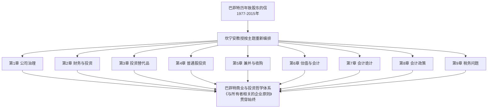
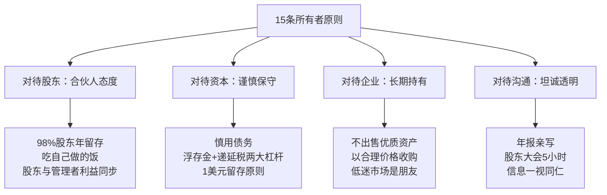
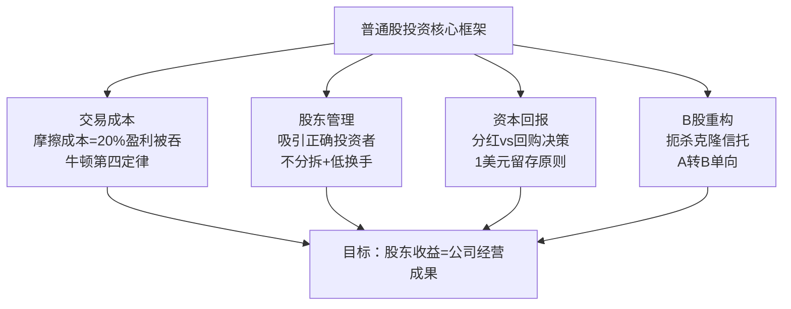
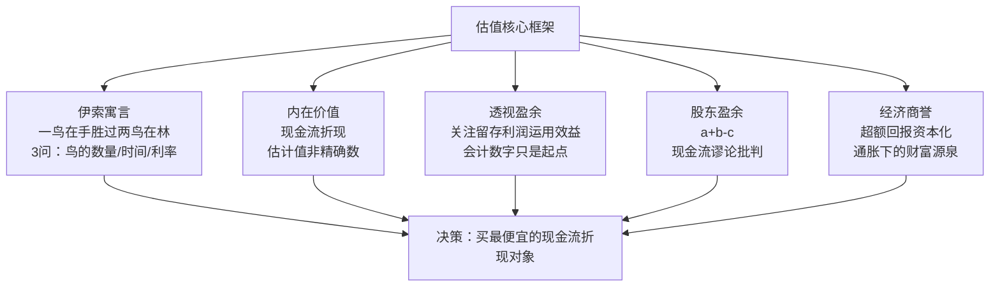
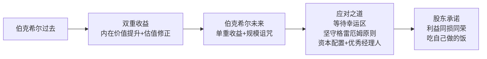
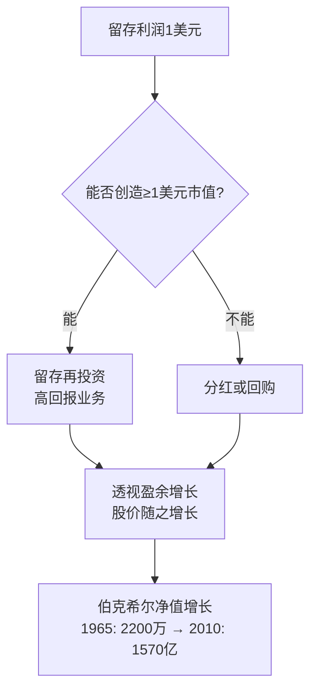

# 09《巴菲特致股东的信：投资者和公司高管教程》深度解读（详细版）

> **原著**：《The Essays of Warren Buffett: Lessons for Corporate America》（原书第4版）
> **编者**：劳伦斯·坎宁安（Lawrence A. Cunningham）——乔治·华盛顿大学法学院教授，巴菲特致股东信的权威编辑者
> **译者**：杨天南——北京金石致远投资管理公司CEO，1995年秋至2017年秋约获1000倍投资回报，著有《一个投资家的20年》
> **核心定位**：本书不是巴菲特写的，而是坎宁安教授从巴菲特 1977–2015 年历年亲笔撰写的致股东信中，按**公司治理、财务与投资、投资替代品、普通股、兼并与收购、估值与会计、会计诡计、会计政策、税务问题**九大主题重新编排而成的"商业与投资哲学教科书"。信中文字全部出自巴菲特本人，是研读巴菲特思想**最权威、最系统**的一本书。

---

## 全书导读

### 一、这本书为什么重要

巴菲特每年写给股东的信，被公认为投资界"最重要的文献"。但年报逐年零散，读者难以把握主线。坎宁安教授做了一件伟大的事：**把 40 年的信件按主题打散重排**，让巴菲特的思想像教科书一样体系化呈现。

### 二、全书结构总览

| 章节 | 主题 | 核心内容 | 关键金句/概念 |
|------|------|----------|---------------|
| 开场白 | 与所有者相关的企业原则 | 15条经营哲学纲领（1983年首提，后补充为15条） | "我们吃自己做的饭" |
| 第1章 | 公司治理 | 信息披露、董事会、企业变化焦虑、社会契约、股东捐赠、高管报酬、风险声誉 | "我们可以承受金钱损失，但无法承受名誉损失" |
| 第2章 | 财务与投资 | 市场先生、套利、戳穿标准教条、价值投资、聪明投资、捡烟蒂、生命与负债 | "短期是投票机，长期是称重机" |
| 第3章 | 投资替代品 | 三类投资资产、垃圾债券、零息债券、优先股、衍生品、外汇、房屋产权 | "黄金立方体 vs 农场+16个埃克森" |
| 第4章 | 普通股投资 | 交易成本、吸引正确投资者、分红与回购、拆股、股东策略、B股 | "摩擦成本是股东的重税" |
| 第5章 | 兼并与收购 | 收购动机、绿色邮件、LBO、收购政策、出售企业、有选择的买家 | "癞蛤蟆之吻"、"出售部分公司以收购B公司" |
| 第6章 | 估值与会计 | 伊索寓言、内在价值、透视盈余、经济商誉、股东盈余、期权估值 | "一鸟在手胜过两鸟在林" |
| 第7章 | 会计诡计 | 会计把戏讽刺、标准设定、股票期权、重组费用、退休福利、账面盈利 | "劣会计驱逐良会计" |
| 第8章 | 会计政策 | 并购会计、分部数据、递延税项、退休福利 | 购买法 vs 权益合并法 |
| 第9章 | 税务问题 | 公司税负分配、税务与投资哲学 | "李尔·阿伯纳的复利故事" |
| 后记 | 伯克希尔的未来 | 双重收益→单重收益、规模诅咒、传承 | "资金太多是超级回报的敌人" |

### 三、巴菲特成功的八字诀（译者杨天南总结）

杨天南认为巴菲特一生的成功秘诀可以归结为八个字：**与时俱进，良性循环**。

| 层面 | 内涵 | 巴菲特的具体体现 |
|------|------|------------------|
| 与时俱进 | 终身学习、思想迭代 | 早年师从格雷厄姆（捡烟蒂），后来遇见费雪（成长股），再后来与芒格搭档（优质企业）；自称 85% 格雷厄姆、15% 费雪，但哈格斯特朗认为如今可能是 50% 对 50%；芒格让他"从猩猩进化为人类" |
| 良性循环（财务） | 每笔投资都多一股现金流 | 2500万美元买禧诗糖果、10亿美元买可口可乐，如今分红早已超过本金且源源不断；旗下数十家企业每年提供资金弹药——这才是巴菲特敢说"我喜欢熊市"的底气 |
| 良性循环（人际） | 与合适的人做合适的生意 | "与坏人打交道做成一笔好生意，我从来没有遇见过"；买内布拉斯加家具大世界信任B夫人、买《华盛顿邮报》主动让出投票权 |

> 原文金句（译者序）：**"我是一个不错的投资家，因为我是一个不错的企业家；我是一个不错的企业家，因为我是一个不错的投资家。"**

---

## 开场白：与所有者相关的企业原则（15条全解）

这是整本书的纲领。1983 年巴菲特首次总结 13 条原则，之后不时更新，最终为 15 条。这些原则回答了"伯克希尔是一家什么样的公司、股东可以期待什么"。

### 股东群体特征（开篇）

| 数据 | 含义 |
|------|------|
| 每年年底与年初相比，98% 的股东不变 | 股东群体极其稳定，是"老朋友"关系 |
| 约 90% 的投资者，伯克希尔股票是其资产中占比最大的一项 | 股东愿意花时间精读年报 |
| 伯克希尔换手率在美国大型上市公司中极低 | 股东像公司主人一样思考 |

巴菲特用**费雪的"餐馆比喻"**说明公司与股东的关系：餐馆定位决定顾客群体——如果一家餐馆在法式美食和外卖鸡之间摇摆，回头客就会离开。公司同样如此，**公司的特征决定股东的特征（物以类聚）**。

### 15条原则详解

| 序号 | 原则 | 核心内容 | 经典表述 |
|------|------|----------|----------|
| 1 | 以合伙人的态度行事 | 形式是公司制，实质是合伙企业；芒格和巴菲特是执行合伙人；公司只是持有资产的渠道 | 希望股东把股票看作"与家人共同拥有的农场" |
| 2 | 吃自己做的饭 | 董事会成员财富主要押在伯克希尔股票上；芒格90%以上、巴菲特98-99%的资产在公司 | "只要你是我们的合伙人，你的金融资产和我们的资产将完全同步" |
| 3 | 长期目标 | 每股内在价值平均年回报率最大化；不以规模而以每股增长衡量 | 未来增长率必降（规模过大），但不应低于美国大型企业平均 |
| 4 | 达成目标的方式 | 首选直接持有一系列多元化企业；第二选择通过保险公司在股市买入类似企业 | "低迷的股市对我们而言是好事"（三个理由：便宜买公司、便宜买股票、可口可乐等回购让我们更便宜地增持） |
| 5 | 不被会计账面束缚 | 综合报表无法反映真实经济成果；只报告真正重要的数据 | "我们会告诉你们我们是如何思考的" |
| 6 | 账面结果不影响决策 | 宁买未在账面体现但实际带来2美元盈利的资产，不买账面体现但仅1美元盈利的资产 | 留存利润像"已分配给我们一样"最终让伯克希尔获益（透视盈余雏形） |
| 7 | 谨慎使用债务 | 拒绝诱人的机会也不过分负债；两大无风险杠杆：递延纳税+保险浮存金（合计约1000亿美元，无契约到期日） | "想成为第一，首先你必须完成比赛"（印第安纳波利斯500赛车名言） |
| 8 | 留存利润的"1美元原则" | 只有每1美元留存利润能创造至少1美元市值时才留存；否则应分红或回购 | 用"五年为期"测试 |
| 9 | 以五年为期测试 | ①账面价值增长是否跑赢标普500；②每留存1美元是否创造超1美元市值 | 1971-1975年测试结果糟糕，1983年令人惊喜 |
| 10 | 只在物有所值时发行新股 | 发行新股就是出售公司的一部分，估值方式与整体公司无异 | "如果管理层说股票被低估时还发新股，他要么撒谎，要么损害老股东" |
| 11 | 不出售优质资产 | 无论价格如何不卖优质资产；对糟糕企业不搞"拉米牌游戏"（轮流放弃最差企业） | 纺织业务苦撑20年后才关闭 |
| 12 | 坦诚沟通 | 年报亲自撰写、股东大会5小时以上问答、所有股东一视同仁 | "那些在公众场合能误导大众的人，最终也会在私下里误导自己" |
| 13 | 只谈法规范围内的证券话题 | 好主意稀缺宝贵；不谈论投资活动、已售证券、传言 | 学格雷厄姆：分享智慧但培养竞争者也在所不惜 |
| 14 | 希望股东收益与公司同步 | 股价与内在价值"一比一"最好，宁愿合理股价不要高估 | 合理股价吸引长期投资者 |
| 15 | 与标普500比较 | 希望长期超越大盘；但因税制（65%入账）熊市超大盘、牛市跑输 | "否则投资者何必把钱交给我们？" |

> 原文金句：**"我们并不将公司本身看作资产的最终所有者，而是认为公司仅仅是我们持有资产的一个渠道。"**

---

## 第1章 公司治理

### A. 完整公平的信息披露

**核心思想**：信息披露的黄金标准是"换位思考"——如果我处在股东的位置，希望了解哪些情况？

| 原则 | 说明 |
|------|------|
| 年报详细、季报简略 | 投资者着眼于长期，每季度很少有影响长期的新事件 |
| CEO亲写年报 | "股东聘请的管家"的报告，而非公关顾问的职业报告 |
| 不搞"大洗澡"和会计调整 | 不故意平滑季度数据，不"围着靶心画圈" |
| 不提供盈利预测指引 | 对分析师和散户一视同仁，"所有股东同时得到同样的信息" |
| 坦率汇报好坏 | 无论喜忧都坦白说明，让股东能判断管理方式和资本配置 |

### B. 董事会与公司高管

**核心洞察**：为什么无能CEO能尸位素餐，而无能秘书立刻走人？

| 对比项 | 秘书/销售员 | CEO |
|--------|-------------|-----|
| 衡量标准 | 清晰可测（打字速度、销售目标） | 几乎不存在，"先射箭再画靶心" |
| 监督机制 | 上司利益直接相关，立刻纠正 | 董事会被"和事佬氛围"笼罩 |
| 解雇后果 | 立刻走人 | 即使被收购接管，离任董事还能拿巨额利益 |

**关键词：董事会里的三种情形**（治理结构分析框架）

| 情形 | 特征 | 董事角色 | 典型问题 |
|------|------|----------|----------|
| 第一种（最常见） | 无控股股东 | 应像缺席股东一样着眼于长期利益，与平庸管理层斗争 | "长期"成为董事搪塞的借口；和事佬氛围；董事因社会名声而非能力入选 |
| 第二种（伯克希尔） | 控股股东兼高管 | 董事会无法扮演中间人，只能通过说服施加影响 | 老板不会解雇自己；外部董事不满只能辞职以示警示 |
| 第三种（好时食品、道琼斯） | 控股股东不参与管理 | 外部董事处于最有用的位置，可直接向大股东反映 | 大股东聪明自信时最有效，且乐于纠正自己的错误 |

**巴菲特对"独立董事"的辛辣批判**（40年19家上市公司董事经验，接触约250位董事）：

- 大多数"独立"董事至少缺乏三项特质（精通业务、有兴趣、股东导向）中的一项，对股东贡献很小甚至为负
- 公募基金独立董事62年失败记录：数千家公司、每年年会都"永远只选A经理"，即便业绩平庸；只有在基金被高价卖掉时，董事们才"发现"新经理更合适
- 董事们自己理财时谨慎小心，替别人理财时却漫不经心
- 费用谈判上，"独立"董事几乎总是失败——费用减少对董事毫无意义，对基金经理影响重大
- **结论：摆脱平庸CEO和过度扩张，靠的是大股东的行动——只要20家或更少的大机构联手投票，就能有效改革公司治理**

**关键词：能力与忠诚**——耶稣基督2000年前的告诫（路加福音16:2）："请把管理的账户情况说清楚，因为你已不再是我的管家了。"问责制和管家精神在大泡沫时代变得日益缺失——"当股价大幅上升时，公司经理人的行为准则却在下降。"

> 原文金句：**"我们通常会远远地在一个安全距离上观察其他公司很多CEO的表现……最大的讽刺莫过于，一个能力不足的下属或许很容易丢掉饭碗，而一个能力不足的CEO却不是这样。"**
> 原文金句（关于可口可乐董事席位之争）：**"你的财富在哪里，你的心就在哪里。"**（马修6:21——回应"独立性"质疑：谁会为了蝇头小利牺牲80亿美元的股东权益？）

### C. 企业变化的焦虑：纺织业务关闭始末（重大案例）

这是全书最重要的案例之一，完整讲述伯克希尔纺织业务的 21 年挣扎史。

**时间线**：

| 时间 | 事件 |
|------|------|
| 1964年 | 巴菲特合伙企业收购伯克希尔-哈撒韦控股权，账面净资产2200万美元全投在纺织业务，内在价值远低于账面 |
| 1964年前9年 | 伯克希尔与哈撒韦合并运营，总计5.3亿美元销售额产生1000万美元亏损，"进两步退三步" |
| 1967年初 | 用纺织业务产生的现金收购国民保险公司，进入保险业（关键转型） |
| 1978年 | 年报解释保留纺织厂的四个原因（就业雇主、高管优秀、工人合作、产出适当回报） |
| 1985年 | 第4个理由被证明完全错误——纺织业务长期大量消耗现金，最终关闭 |

**保留纺织业务的原因（1978年）与结果**：

| 保留理由 | 最终结果 |
|----------|----------|
| 工厂是当地重要就业雇主 | 真实，但不足以支撑亏损 |
| 高管直截了当、干劲十足 | 真实——肯·蔡斯、加里·莫里森都是杰出经理人 |
| 工人精诚合作、通情达理 | 真实——工会从未提出不现实要求 |
| 相对其他投资能产出适当回报 | **完全错误**——1979年微利后一直大量消耗现金 |

**伯灵顿工业公司对照实验**（证明"好船长+漏船"的悲剧）：

| 指标 | 伯灵顿（1964） | 伯灵顿（1985） |
|------|----------------|----------------|
| 销售额 | 12亿美元 | 28亿美元 |
| 股价 | 60美元 | 34美元（经拆股调整，仅略高于1964年） |
| 再投资 | — | 约30亿美元（每股200美元） |
| 真实美元销售额 | — | 实际下降 |
| 购买力 | — | 仅相当于1964年的1/3（CPI上涨超3倍） |

**关键教训**：

- **"优秀的骑手只有在良马上才会有出色的表现，在劣马上会毫无作为"**——同样的管理层，在流沙中奔跑就不会有任何进展
- 孔德的忠告："聪明才智应该是内心的仆人，而不应该是内心的奴隶"——巴菲特承认自己"选择相信了愿意相信的东西"
- **行业性再投资的囚徒困境**：每一家纺织厂的投资决策单独看都理性（降低成本），但所有人一起投资后，降低成本变成全行业杀价的新底线——"每个人都踮起脚尖，观看效果与之前一样"
- 塞缪尔·约翰逊的马的比喻："一匹能数到10的马是一匹非凡的马，但不是非凡的数学家"——一家能聪明配置资本的纺织公司，是一家非凡的纺织公司，但不是非凡的公司
- 伍迪·艾伦式抉择：一条路通往失望和绝望，另一条通往灭绝——"让我们祈祷有正确选择的智慧"

> 原文金句：**"如果你发现自己上了一艘长期漏水的船，那么，换一艘船所花费的精力可能比修补漏洞更富成效。"**
> 原文金句：**"一个良好的管理记录（以经济回报衡量）的产生，更多取决于你上了什么样的船，而不是你划船的效率。"**

### D. 社会契约

**核心思想**：企业与员工、社区之间存在社会契约，但巴菲特拒绝被"社会责任感"绑架去做糟糕的投资。这一节在源文件中较短，核心是：公司首先要对股东负责，同时体面地对待员工和社区；伯克希尔在关闭工厂时对工人和社区承担了责任，但不会为了维持亏损业务而无限制输血。

### E. 由股东决策的公司捐赠方法

**独特制度**：伯克希尔是全球罕见的、由股东指定慈善捐款去向的上市公司。

| 制度要点 | 细节 |
|----------|------|
| 机制 | 1981年9月30日获美国财政部税务裁定；每位股东按持股比例指定慈善机构，伯克希尔写支票，股东免个人所得税 |
| 参与度 | 有资格参与的932206股中，95.6%股份持有者做出回应（剔除巴菲特相关股份后仍达90%） |
| 规模 | 1783655美元分派给675个慈善机构 |
| 核心逻辑 | "如果A拿着B的钱给C，A是立法者，这叫纳税；A是公司高管，这叫慈善"——但巴菲特认为这本质上是一样的，不该由高管替股东决定 |

**捐赠去向大数据**（观察股东偏好的窗口）：

| 类别 | 机构数 | 笔数 |
|------|--------|------|
| 教堂/犹太教堂 | 347 | 569 |
| 学院/大学 | 238 | 670 |
| K-12学校 | 244 | 525 |
| 艺术文化机构 | 288 | 447 |
| 宗教服务机构 | 180 | 411 |
| 非教会社会服务机构 | 445 | 759 |
| 医院 | 153 | 261 |
| 健康相关机构 | 186 | 320 |

**三个有趣发现**：①自愿状态下人们真实的捐赠偏好；②上市公司捐赠几乎从不给教堂，但股东个人愿意；③股东捐赠显示矛盾人生哲学——130笔给支持堕胎机构、30笔给反堕胎机构。

> 原文金句（芒格吐槽）：管理费490万美元中，有140万美元用于购买公司喷气飞机，名字叫**"不可原谅号"**。

### F. 公司高管的报酬原则（期权批判全集）

**关键词：盈利增加可能并非管理层杰出**——储蓄账户类比：

假设你账户有10万美元存款，利率8%，受托人有权决定派息率，他设定为25%：

| 年份 | 账户总值 | 盈利 | 分红 |
|------|----------|------|------|
| 第1年 | 100,000 | 8,000 | 2,000 |
| 第10年 | 179,084 | 13,515 | 3,378 |

任何"盈利增长"都只是留存利润的自然复利——**如果CEO把盈利翻四倍仅仅因为留存利润滚存，这不值得任何赞美**（就像把储蓄本金翻四倍利息自然翻四倍）。

**固定价格期权的三大不公**：

| 问题 | 说明 |
|------|------|
| 漠视留存利润的自动增值 | 十年固定行权价期权让管理层从"储蓄账户自动增值"中获利，与能力无关 |
| 漠视资本成本 | 股东承担资本成本，期权持有人没有——"这完全是不同的船" |
| 让懒汉与明星同酬 | 期权授予后与表现无关，"沉睡的瑞普·凡·温克尔"也能获利 |

**弗莱德·徒劳先生侵蚀案例**（期权如何让无为CEO暴富）：

- 停滞公司：每年100亿美元净资产盈利10亿美元，1亿股，每股净利10美元
- 弗莱德收到相当于1%股权的期权，全部盈利用于回购不派息，股价维持10倍PE
- 十年后：股本降至3870万股，每股盈利升至25.80美元，股价上升158%，弗莱德身家1.58亿美元
- **即使公司利润下滑20%，弗莱德依然能获利超过1亿美元！**（用留存利润投资5%回报的项目，期权仍值630万美元）
- 结论：**"当初授予期权时说好的利益联盟在哪里？"**

**巴菲特对期权的三点看法**：

1. 期权应与公司整体表现挂钩——只负局部责任的管理者不该拿整体期权（0.350的击球手值得奖励，0.150的不该因球队夺冠受赏）
2. 期权结构应精心设计——考虑留存利润和资本成本，以真实价值定价
3. 承认有些杰出经理人（如芒格欣赏的人）能用期权建立良好的公司文化，应该保留

**伯克希尔的报酬机制**：

| 特征 | 说明 |
|------|------|
| 以子公司业绩定子公司经理奖金 | 禧诗糖果干得好不奖励新闻公司，反之亦然 |
| 不看伯克希尔股价 | 工作表现与股价脱钩 |
| 奖金可高达基本工资5倍以上 | 上不封顶、不分等级，小单位经理也可能拿得比大单位多 |
| 经理人自己买伯克希尔股票 | "用行动表明与股东穿同一双鞋" |

> 原文金句：**"如果一个CEO被炒掉那天赚的钱比清洁工一辈子还多，忘掉'一事成功事事成功'吧，商界最风行的是'一事失败事事成功'。"**
> 原文金句（克莱斯勒讽刺）：克莱斯勒因政府担保贷款授予政府期权，获利后抱怨"政府所得与贡献不相称"——但**从没有任何高管为自己或同事获得未经授权的期权而感到苦恼**。

### G. 风险、声誉和失察

**关键词：四大金融机构损失5000亿美元**——2008-2010年金融危机后，仅四个最大金融机构的惨败就让股东损失约5000亿美元（持股损失90%以上），但CEO们毫发无损。"他们长期享受了超级胡萝卜的好处，现在也应该尝尝大棒的滋味。"

**CEO不能转移风险控制责任**：

- 伯克希尔的每一个衍生品合约都由巴菲特亲自起草和监控——"如果伯克希尔遇到麻烦，这将是我的错，不能推诿于风控委员会或首席风险官"
- 大型金融机构董事会若不能坚持CEO对风险控制全责，就是玩忽职守

**关键词：名誉胜过金钱**——25年来的核心信条：

> **"我们可以承受金钱的损失，甚至损失大笔金钱，但我们无法承受名誉的损失，甚至一丝一毫也不可以。"**

- 衡量每个行为的标准：不仅要合法，还要问自己——**"如果这个行为被一个不友好却聪明的记者写在国家报纸头版，我们还能愉快面对吗？"**
- "每个人都在这么干"几乎一定说明这是个坏主意——让它说给记者或法官听
- 有坏消息立刻上报——所罗门丑闻的教训：不情愿直面坏消息，几乎导致8000人公司消亡
- **"是文化，而不是文件，更能决定一个企业的行为"**

**审计委员会四问**（让审计师说实话的武器）：

| 问题 | 目的 |
|------|------|
| 1. 如果审计师是唯一负责人，报表会有所不同吗？ | 逼出管理层与审计师的潜在分歧 |
| 2. 如果你是投资者，是否收到过帮助理解财务表现的重要信息？ | 检验信息披露质量 |
| 3. 如果你是CEO，公司是否遵循了应有的内部审计流程？ | 检验流程合规 |
| 4. 是否观察到把收入或成本从一个报告期转移到另一个报告期的行为？ | 直击盈利管理 |

---

## 第2章 财务与投资

### A. 市场先生（格雷厄姆的寓言，巴菲特的内化）

**市场先生寓言全文**（格雷厄姆《聪明的投资者》第8章）：

> 你应该将市场报价想象为一个名叫"市场先生"的人，他是你的私人公司的合伙人，是一个乐于助人的热心人。他每天都来给你一个报价，从不落空。在这个价格上，他既可以买你手中持有的股份，你也可以买他手中的股份。
>
> 即便你们俩拥有的这家公司运营良好，市场先生的报价也不一定稳定——这个可怜的家伙有着无法治愈的精神病症。在他感觉愉快的时候，只会看到企业的有利影响因素，报出很高的买卖价格；在他情绪低落的时候，只会看到负面因素，报一个很低的价格。
>
> 市场先生还有一个可爱的特点：**他不介意被忽视**。如果你今天对他的报价不感兴趣，他明天还会给你带来一个新报价。是否交易，完全由你抉择。**他的行为越是狂躁抑郁，越是对你有利。**

**市场先生寓言的深层含义**：

| 要素 | 含义 |
|------|------|
| 市场先生为你服务，而不是指导你 | 他的钱袋比智慧更有用 |
| 可以视而不见，也可以利用机会 | 但受他情绪影响就是灾难 |
| 灰姑娘的午夜钟声 | 必须留意估值过高的警示，否则一切变回南瓜和老鼠 |
| 30分钟牌局比喻 | 如果玩30分钟还不知道谁是倒霉蛋，有可能就是你 |

**巴菲特对"市场先生"的现代化应用**：

- 股市不存在也没关系——伯克希尔持有世界百科全书、范奇海默，即便没有报价也不不安
- **"短期而言，市场是一台投票机；长期而言，市场是一台称重机"**
- 被认可的滞后性反而是好处——给便宜买入的机会
- 不会因股价上升而卖，不会因持有太久而卖——华尔街最蠢格言："只要能赚钱，就不会破产"
- **三个永久持有的例外**：保险公司持有的三只可流通普通股（大都会/ABC、盖可、华盛顿邮报），即便股价过高也不卖——除非极端保险损失

**买家应该喜欢股价下跌（净储蓄者测试）**：

| 情境 | 问题 | 正确答案 |
|------|------|----------|
| 计划终身吃汉堡包 | 希望牛肉价格更高还是更低？ | 更低 |
| 时不时需要买车 | 希望车价更高还是更低？ | 更低 |
| 未来五年是净储蓄者 | 希望股市高还是低？ | 更低 |

大多数投资者在这个问题上犯错——他们为即将购买的"汉堡包"价格上涨而高兴。**新闻头条应改写为："撤资者因股市大跌而亏损，但投资者在获益。"** 每一次进洞都令一些人高兴——一个买家对应一个卖家，一个人受到的伤害往往成就另一个人。

> 原文金句：**"我们宁愿与我们喜欢与尊重的人合作，获得100%的回报，也不愿意与那些无趣或不喜欢的人合作，获得110%的回报。"**
> 原文金句（奥格威）：**"在你年轻的时候尽情发挥你的特异风格，这样，当你年老的时候，人们才不会认为你疯疯癫癫。"**

### B. 套利（风险套利实务课）

**套利的演变**：

| 时期 | 定义 |
|------|------|
| 古典套利 | 同一证券在不同市场间的价差（如荷兰皇家石油在阿姆斯特丹/伦敦/纽约的价差） |
| 现代风险套利（一战后） | 从宣布的公司事件中追逐利润：出售、合并、重组、改制、清算、自我收购；主要风险是**宣布的事件没有发生** |

**巴菲特24岁的经典案例：洛克伍德公司（Rockwood & Co.）可可豆套利**：

| 要素 | 细节 |
|------|------|
| 背景 | 纽约布鲁克林巧克力生产商，1941年采用LIFO存货计价；1954年可可价格从每磅5美分飙升至60美分以上 |
| 问题 | 直接卖可可，税款接近收益的50% |
| 机会 | 1954年税法条款：将库存分配给股东作为减少经营范围计划的一部分，LIFO利润可豁免税务 |
| 操作 | 公司用可可豆以80磅换1股回购股份（共1300万磅可分配）；巴菲特"整天买股票、卖豆子"，跑施罗德信托换仓库单据 |
| 结果 | 股价从15美元飙升至100美元；"利润非常可观，我的成本仅仅是几张地铁车票" |
| 设计者 | 当时32岁、默默无闻的杰伊·普利兹克（后来的普利兹克家族掌门人） |

**评估套利机会的四个问题**：

1. 承诺的事情发生的概率有多大？
2. 你的资金能挺多长时间？
3. 出现更好事情的可能性有多大（如更有竞争力的报价）？
4. 如果预期的事情没发生（反垄断、财务差错等），会怎样？

**阿克塔公司（Arcata Corp.）套利案例全程**（教科书级风险套利）：

| 时间 | 事件 |
|------|------|
| 1981年9月28日 | 董事原则上同意出售给KKR（37.50美元/股+政府红杉林赔偿额外金额的2/3） |
| 9月30日 | 巴菲特在33.50美元开始买入，8周内买40万股（5%股本） |
| 1982年1月4日 | 签署最终合同，巴菲特加仓至65万股（7%股本，均价38美元） |
| 2月25日 | 贷款人"再次审视"交易（房屋行业衰退），股东大会推迟到4月 |
| 3月12-15日 | KKR先砍价至33.50美元、再提至35美元，阿克塔拒绝，转接另一买家37.50美元+一半红杉林赔偿 |
| 6月4日 | 股东收到37.50美元；伯克希尔成本2290万美元，收到2460万美元，**6个月年化回报15%** |
| 1987年1-8月 | 红杉林价值委员会认定2.757亿美元、利率委员会推荐14%复利；法官支持，阿克塔净得约6亿美元 |
| 1988年 | 政府上诉前以5.19亿美元和解——伯克希尔额外获得29.48美元/股（约1930万美元）+1989年80万美元 |

**伯克希尔套利与其他套利者的不同**：

| 特征 | 伯克希尔 | 其他套利者 |
|------|----------|-------------|
| 数量 | 每年很少，但规模很大 | 50次甚至更多 |
| 依据 | 只根据公开信息交易 | 听谣言、猜接管下家 |
| 盯盘 | 不整天监控 | 需大量时间监控交易和市场 |
| 对业绩影响 | 单笔交易影响巨大 | 单笔影响小 |

> 原文金句：**"授人以鱼，只能养活他一天；教他如何套利，能养活他一辈子。"**（但如果是在伊万·博伊斯基的套利学校学习，最后养活他的是州监狱的牢饭。）
> 原文金句（阿克塔发言人保证"不认为交易陷入困境"时套利者的反应）：**"他在撒谎，就像一个贬值前夕的财政部长。"**

### C. 戳穿标准教条（对有效市场理论的全面批判）

**关键词：只在胜券在握时才出手**

**63年套利战绩 vs 市场有效理论**：

| 机构 | 时期 | 平均年化回报 |
|------|------|--------------|
| 格雷厄姆-纽曼公司 | 1926-1956 | 20%（去掉杠杆后） |
| 巴菲特合伙公司 | 1956-1969 | 超过20% |
| 伯克希尔 | 1969-1988 | 超过20% |
| 市场（含分红） | 63年 | 略低于10% |

**复利的悬殊对比**（1000美元投资63年）：

| 回报率 | 最终结果 |
|--------|----------|
| 市场约10% | 40.5万美元 |
| 套利20% | 9700万美元 |

**公平测试的四个条件**（证明套利战绩不是运气）：①63年数百种证券；②结果没被少数幸运经历扭曲；③只依据公开事件，不挖掘模糊事实；④仓位范围清晰，不是事后诸葛亮。

**对市场有效理论的三连击**：

- 市场"通常"有效≠"总是"有效——"这些观点的差异是如此巨大，就像白天不懂夜的黑"
- 有效市场理论的支持者从不承认错误——"这种不情愿放弃的心理，就像对于神职人员的去神秘化"
- **利己主义视角：格雷厄姆的信徒应该捐助大学教职，确保有效市场理论继续教下去**——面对一群被灌输"努力也会徒劳无益"的对手，我们拥有巨大优势

**重要警告**：套利看似容易≠永远保证20%。"一个投资者不可能因为简单地掌握了一种特定的投资方法或投资风格而获得超额利润。他只能通过认真地评估事实，并且持续执行纪律而获得这种利润。"

**关键词：不要卖出皇冠上的宝石**——彼得·林奇的"剪除鲜花，浇灌杂草"批判：CEO不会卖掉表现优异的子公司（"难道要我卖出皇冠上的宝石吗？"），却会冲动卖掉个人的明星股票——最糟糕的谚语："如果有利润的话，你就不可能破产。"

**可口可乐50倍增长案例**（1938年《财富》杂志"发现得太晚"论调的反驳）：

| 年份 | 年销量 | 40美元投资价值 |
|------|--------|----------------|
| 1919年 | 上市 | 40美元（1920年底跌至19.50美元，跌超50%） |
| 1938年 | 2.07亿箱 | 3,277美元（分红再投资） |
| 1993年 | 107亿箱 | 25,000美元（1938年才投资）；1919年投资到1993年底总值超210万美元 |

**风险定义的战争**：

| 定义 | 学派 | 缺陷 |
|------|------|------|
| 损失或受伤的可能性 | 巴菲特（字典定义） | — |
| 相对波动（贝塔） | 学术界 | "模糊的正确胜过精确的错误"；贝塔理论下，华盛顿邮报股价越低反而"风险越大"——荒谬 |

**评估风险的五个真正因素**：①公司长期保持经济特征的确定性；②管理层能力的确定性（实现潜力+明智运用现金流）；③管理层回报股东而非自己的确定性；④购买价格；⑤通货膨胀和税务水平。

**可口可乐/吉列的护城河数据**：可口可乐占全球软饮料44%市场份额、吉列超60%刀片市场份额（按价值）——"竞争有害财富"（彼得·林奇标签）。

**多元化 vs 集中的正确场景**：

| 场景 | 应该采用 |
|------|----------|
| 单个交易风险巨大的套利 | 广泛多元化（赌场观点：喜欢客人多次下注） |
| 不了解公司经济特征 | 多元化 |
| 深入了解的杰出公司 | 集中投资——"如果你一开始就取得了成功，那么，不必再做测试" |

**凯恩斯的投资智慧**（1934年8月15日给F.C.斯考特的信）："随着时光的流逝，我越来越确信，投资的正确方式是将相当分量的资金，投资于你了解并拥有令人充分信任的管理层的公司……一个人的知识和经验注定是有限的，在特定时间段，使我感受充分信心的公司很少超过两或三家。"

**1987年股灾与"投资组合保险"批判**：

- 1987年道指最终仅涨2.3%，但过程是过山车——10月遭遇巨幅大跌
- 投资组合保险（1986-1987流行）本质是"越跌越卖"的止损单升级版；《布雷迪报告》：1987年10月约有600-900亿美元股票处于一触即发的卖出状态
- 农场主类比：隔壁农场贱卖，理性的农场主会要求把自己的农场也低价卖吗？9:30邻居房子低价标售，你会9:31卖自己的房吗？
- **"市场先生……钱会从活跃者手中流向耐心者手中"**
- **"谁会被股市波动所伤害？"——只有在市场艰难时被迫卖出（财务或心理压力）的投资者才会被伤害；巨资基金经理造成的波动恰恰为真正投资者提供了更多机会**

> 原文金句：**"将那些频繁买卖的机构称为'投资者'，就像将那些喜欢一夜情的家伙称为浪漫主义者一样可笑。"**
> 原文金句：**"一个视力平平的人，没有必要在干草堆里寻找绣花针。"**
> 原文金句（1988年信）：**"股市是一个不断重新定位的地方，在这里，钱会从活跃者手中流向耐心者手中。"**

### D. "价值"投资：多余的两个字

**核心论点**：**"价值投资"这个术语本身是多余的——投资就是寻找价值，否则什么是投资？** "有意识地为一只股票支付高价，然后希望以更高的价格迅速卖出，这种行为应该被贴上投机的标签。"

**成长与价值的关系**（巴菲特的重要澄清）：

- 成长是价值的组成部分——"在计算价值时，成长其实就是价值的组成部分，它构成一个变量，影响范围可以从微小到巨大，可以是消极负面因素，也可以是积极正面因素"
- 低市净率、低市盈率、高分红≠价值；高市净率、高市盈率、低分红≠非价值
- **成长只有在"资助成长的每一美元长期能创造出大于一美元的市场价值"时才有利**
- 航空公司案例：投资者资助无利可图的成长——"这个行业成长得越多，股东的灾难就越大"（如果奥维尔·莱特的首次试飞没成功，事情原本可能更好）

**价值方程式（约翰·伯尔·威廉姆斯《价值投资理论》，50年前）**：

> **任何股票、债券或公司今天的价值，取决于在可以预期的资产存续期间，以合适利率进行贴现的现金流入和流出。**

| 对比项 | 债券 | 股票（权益） |
|--------|------|--------------|
| 现金流 | 明确的票息和到期日 | 分析师必须自行估计未来"票息" |
| 管理层影响 | 较小（无能表现为暂停付息） | 极大（能力影响权益"票息"） |

**以现金流贴现计算出的最便宜对象就是该买入的标的**——无论公司是否成长、盈利是否波动、相对当前盈利和账面值股价高低。如果债券算出来更便宜，就买债券。

**处理不确定性的两条原则**：

1. 坚守能力圈——"他们懂什么并不重要，更重要的是，他们知道自己不懂什么"
2. 安全边际——"我们计算一只股票的价值仅是略微高于其价格时，没有兴趣购买"

**二级市场 vs IPO市场**（为什么聪明投资者在二级市场干得更好）：

| 市场 | 卖方 | 定价 |
|------|------|------|
| 二级市场 | 大量傻瓜周期性主导，持续设定"清算"价格 | 价值X的股票经常以半价卖出 |
| IPO/新股市场 | 控股股东和公司掌控发行时机，市况不佳就取消 | 不会打折，大股东只在认为市场高估时卸货 |

**大都会/ABC收购案**（控制权与投票权安排的典范）：

- 1985年3月，伯克希尔以172.50美元/股买300万股大都会/ABC（当时市价），认购帮助其筹集35亿美元收购ABC
- 巴菲特评价汤姆·墨菲和丹·伯克："美国所有上市公司中最优秀的管理层……你愿意将女儿嫁给他"
- **特别安排**：只要汤姆（或丹）任CEO，他们可以代为行使伯克希尔股票的投票权——是巴菲特和芒格主动提出的；还限制向大买家出售持股
- 耐心："即便你能让九个女人同时怀孕，也不可能让她们在一个月里生出小宝宝"

> 原文金句：**"芒格和我发现，给我们丝绸，让我们织出丝绸钱包，我们可以干得很好，但巧妇难为无米之炊。"**
> 原文金句：**"我们试图买入那些具有良好经济前景的公司。我们的目标是发现那些价格合理的杰出公司，而不是价格便宜的平庸公司。"**

### E. 聪明的投资

**核心公式**：聪明的投资 = 正确评估能力圈内企业的能力 + 忍受诱惑的纪律。

- **"你不需要懂得贝塔、有效市场、现代投资组合理论或新兴市场。实际上，你最好根本不知道这些东西。"**
- 学习投资只需两门功课：**如何评估一家公司的价值，以及如何对待市场价格**
- 符合标准的企业不多——**"发现符合条件的企业时，你应该大幅买入（而不是小赌怡情）"**
- **"如果你不打算持有一只股票10年，那就不必考虑甚至持有10分钟"**

**变与不变**（投资确定性的来源）：

| 公司 | 变了什么 | 什么没变 |
|------|----------|----------|
| 禧诗糖果 | 糖果类型、机器、分销渠道 | 人们为何买盒装巧克力、为何从我们这里买——自1920年创立以来没变 |
| 可口可乐 | 古兹维塔改革了公司方方面面 | 可乐的竞争优势和出色经济特质多年稳定 |

**可口可乐1896年年报的启示**：问世仅十年已是软饮料领导者，总裁阿萨·坎德勒："我们从未停止过努力，我们向世界宣告，可口可乐对于所有人而言是一种卓越的健康产品以及美好的感觉。""从来没有一种产品能在公众的热爱中牢牢树立自己的地位。"当年销量116,492加仑，1996年为3.2亿加仑。

**"注定如此成功"的公司 vs 高科技公司**：

- 可口可乐和吉列是"注定如此成功"的——"我更喜欢一个确定的良好结果，而不是一个期望的伟大结果"
- 但警惕"江湖骗子"：通用汽车、IBM、西尔斯百货也曾看似不可战胜——"漂亮50"和"闪亮20"名单做不出来
- **"我们无法搞出一个'漂亮50'或甚至是'闪亮20'的名单出来。在我们的投资组合里，相对于'注定如此'的公司，我们只能标出几个'极高可能性'的公司。"**

**追高的代价**：支付过高价格的风险在周期后会显露——"即便对于一家杰出的公司（如果支付了高价），常常可能需要很长的时间，才能产出与支付价格相匹配的价值。"

**失去专注是最大的担心**："可口可乐养过虾，吉列搞过油"——当管理层傲慢或出离正道，价值就会停滞。

**投资者表现不佳的三个原因**（巴菲特给普通投资者的诊断）：

1. 高成本——交易频繁、管理费太高
2. 以股评和市场流行风尚为依据，而非深思熟虑的企业定量分析
3. 以不合时宜的方式进出市场（牛市进入，熊市退出）

**"亢奋与成本是他们的敌人。如果他们坚持尝试选择参与股票投资的时机，他们应该在别人贪婪的时候恐惧，在别人恐惧的时候贪婪。"**

**泰德·威廉姆斯的击球区纪律**（《击球的科学》）：将击球区划分为77个格子——只击打落在"最佳"格子里的球能打出0.400；击打最差位置的球只有0.230。"等待完美的抛球，等待完美一击的机会，将意味着步入名人堂的旅途。而不分青红皂白地挥棒乱击，将意味着失去成功的入场券。"

**1999年底的市场警告**：GDP真实增长约3%+通胀2%=利润增长约5%——股市投资者对回报预期过于乐观（潘恩·韦伯-盖洛普调查：投资者预期未来十年平均年回报19%，这是非理性的）。"傻瓜才会给你理由，智者从来不会。"

> 原文金句：**"作为一个公民，芒格和我欢迎变化……然而，作为投资者，对那些处于发酵中而迅速膨胀、变化的行业，我们的态度就像我们对于太空探索的态度一样：我们会鼓掌欢迎，但不会参与其中。"**
> 原文金句：**"成功的投资于上市公司股票的艺术，与成功收购全部公司股权的艺术，并无二致。"**

### F. 捡烟蒂和惯性驱使（机构强迫症）

**捡烟蒂投资法的定义与批判**：

> "如果你以足够低廉的价格买入一只股票，那么，通常企业的价值波动会给你提供机会，让你以合理的利润脱手股票，即便从长期而言，这个公司或许很糟糕，你的回报也还行。这种投资方式，我称之为'捡烟蒂'投资法。在大街上发现地下还有一节能抽一口的雪茄烟蒂，尽管所剩无几，但因'代价便宜'，也可以获利。**除非你是一名专业清算师，否则上述这种投资方法就是愚蠢的。**"

**捡烟蒂的两大陷阱**：

1. 便宜可能最终不便宜——"厨房里如果有蟑螂，不可能只有一只"
2. 初始优势被低回报侵蚀——800万买、1000万卖：立刻执行是超高回报；十年后才处理掉则令人失望——**"时间是优秀企业的朋友，是平庸企业的敌人"**

**巴菲特的亲身教训**：

| 错误 | 细节 | 教训 |
|------|------|------|
| 伯克希尔纺织厂 | 明知主业前途暗淡，被貌似低廉股价诱惑 | 优秀的骑手只有在良马上才有出色表现 |
| 霍克希尔德·科恩百货 | 账面巨大折扣+一流员工+LIFO存货安全垫，三年后幸运地以买入价脱手 | "在流沙中奔跑就不会有任何进展" |
| 错过能力圈内的机会 | "一些我所犯过的最糟糕的错误是公众所未见的"——错过明明知道价值的机会 | 错过能力圈外的机会不是罪过，错过圈内的才是 |

**梅伊·韦斯特的自嘲**："我是白雪公主，但却四处漂泊。"（声誉卓著的管理者接手徒有虚名的公司，能保全的只有公司的虚名。）

**关键词：1英尺跨栏 vs 7英尺跨栏**："我们专注于寻找那些可以跨越的1英尺跨栏，而不是我们具有了跨越7英尺跨栏的能力……我们倾向于避开怪兽，而不是杀死它。"（但水牛城新闻报周日版、美国运通和盖可的一次性可解决问题是例外）

**关键词：惯性驱使/机构强迫症**（巴菲特"最为惊讶的发现"——商学院从未教过）：

| 惯性驱使的表现 | 说明 |
|----------------|------|
| ① 牛顿第一定律 | 机构抗拒在当前方向上的任何改变 |
| ② 工作膨胀定律 | 项目或收购行为耗尽所有现金 |
| ③ 渴望定律 | 领导人渴望的项目，无论多愚蠢，都迅速得到下属精心准备的论证支持 |
| ④ 模仿定律 | 同行的扩张、收购、薪酬被不加思考地模仿 |

**令公司误入歧途的是惯性，不是腐败或愚蠢。**

**保守财务政策的辩护**（99:1概率逻辑）：

- 如果伯克希尔使用更高杠杆，会取得远高于23.8%的年回报率（甚至1965年就能判断99%概率"十拿十稳"）
- 但1%的机会（外部或内部突发因素）会导致从暂时痛苦到违约
- **"我们不喜欢这种99∶1的发生概率，永远不会。我们认为，一个小的丢脸或痛苦不可能被一个大的额外回报所抵消……如果你的行动是合理的，你肯定会得到良好的结果。在绝大多数情况下，杠杆只会加速事情的运动。"**

> 原文金句：**"与坏人打交道做成一笔好生意，在这方面我们从来没有成功过。"**
> 原文金句：**"芒格和我从来不会匆匆忙忙，我们享受投资过程远胜于收获的结果。"**

### G. 生命与负债

**伯克希尔使用债务的三个例外**：①参与美国政府回购作短期投资；②借钱对冲付息应收账款（风险特性了如指掌）；③子公司（中美能源）负债不占伯克希尔担保。

**信用就像氧气**：

> **"在短缺之时，渴望借钱的人才知道，信用就像氧气。此二者，在充足的时候，人们不会注意到它们的存在；当它们消失的时候，人们才会发现它们的重要性。甚至，信用的短暂缺失都会让公司陷入困境。2008年9月的危机中，国民经济中的很多部门的信用在一夜之间消失，令整个国家陷入崩溃的危险边缘。"**

**"任何序列的正数，无论多么大的数字，只要乘以一个零，都会蒸发殆尽"**——杠杆让人上瘾："一旦你奇迹般获利，很少有人会愿意再回到从前保守的状态……历史告诉我们，所有的杠杆通常导致的结果会是零，即便使用它的人非常聪明。"

**伯克希尔的现金堡垒**：

| 项目 | 数据 |
|------|------|
| 最低现金 | 至少100亿美元（不含公用事业和铁路） |
| 通常持有 | 200亿美元（经得住史无前例的保险损失+金融危机中抓住机会） |
| 最大保险损失 | 卡特丽娜飓风30亿美元（保险业最贵灾难） |
| 现金存放 | 美国政府国债（"人们过度追求收益所造成的损失，超过了被人持枪打劫！"——雷·德沃） |
| 40年记录 | 未分红未回购，留存全部盈利，净资产从4800万美元增长到1570亿美元 |
| 2008年出手 | 雷曼破产恐慌25天后投资156亿美元 |

**为什么不用杠杆（受托责任）**：数千股东将大部分家产投资于伯克希尔；保险客户（永久损伤者的赔付可能延续50年）的承诺——"我们会信守诺言，无论发生什么：金融危机、股市关门（1914年发生过）、甚至核弹攻击"。167岁的芒格和巴菲特："从头再来不是我们的人生目标。"

> 原文金句：**"我们确知你们和我们的父母，在很大程度上，将身家的大部分委托给我们管理……为区区额外几个点的回报而冒险，这样做是不负责任的。"**

---

## 第3章 投资替代品

### A. 三类投资资产（2011年信，完整的资产分类框架）

**第一类：基于货币的投资**（货币市场基金、债券、按揭、银行存款）

| 表面印象 | 真实情况 |
|----------|----------|
| "安全"、贝塔值或许为零 | **最危险的资产**——风险是购买力被通胀摧毁 |
| 到期收到利息本金 | 1965年以来美元累计贬值86%（接手伯克希尔那年），当年1美元现在要7美元以上 |
| 免税机构4.3%年化就能保值 | 应税投资者：47年国债年化5.7%，25%税率拿走1.4个百分点，通胀拿走4.3个百分点——**通胀税是所得税的三倍** |
| 印着"我们信仰上帝" | "掌控政府印钞机的，并非上帝之手，而是凡人之手" |

**第二类：无产出资产**（黄金及其他"买家接力"资产）

- 17世纪郁金香风潮就是这类买家的杰作——"买家不是因为这类资产能产出什么而购买……购买这类资产的真正原因是，将来会有人因为更贪婪而出更高的价格"
- 黄金两大缺点：**没有太多用处，也不能自我繁殖**——"如果你拥有一盎司黄金，你会一直拥有一盎司"
- **9.6万亿美元黄金立方体思想实验**：全世界黄金储量约17万公吨，融化成边长68英尺的立方体（约篮球场大小），金价1750美元/盎司时价值9.6万亿美元。同样的钱可以买：美国全部4亿英亩农场（年产2000亿美元）+16个埃克森-美孚（年盈利超400亿美元）+剩下1万亿美元
- 未来100年：耕地继续产出玉米棉花，埃克森派发上万亿美元分红，而17万吨黄金"体积不变，不会产出任何东西。你可以爱抚它，但它不会有丝毫的反应"

**第三类：可生产性资产**（公司、农场、房地产）——巴菲特的最爱

> **"最为理想的投资资产应该是这样的：这类资产在要求很少的新资本再投入的情况下，依然能在通货膨胀期间，提供维持其购买力价值的产出。"**

- 通过双重测试：可口可乐、IBM、禧诗糖果、农场、房地产
- 未通过的公司：受管制的公用事业（通胀带来沉重资本负担）
- **"商业奶牛"比喻**：未来的100年，无论货币基于黄金、贝壳、鲨鱼牙齿或纸片，人们总会用劳动换取一罐可口可乐——"它们的价值并不取决于交换的媒介，而是取决于它们的产奶能力"
- 道琼斯20世纪从66点到11497点（还有分红）
- **结论：第三类投资"在任何较长的时间段，将被证明是我们分析过的三类资产中遥遥领先的优胜者。更为重要的是，这类投资也是到目前为止最为安全的投资。"**

**恐惧的两极**：

| 恐惧 | 资金流向 | 反例 |
|------|----------|------|
| 经济崩溃 | 货币资产（美债） | 2008年人人喊"现金为王"时恰恰该动用现金 |
| 货币崩溃 | 黄金 | 80年代初期人人说"现金是垃圾"时，固定收益回报最具吸引力 |

> 原文金句（戴维斯）：**"债券在被推销时，说是可以提供无风险的回报，现在的定价却只剩下无回报的风险。"**

### B. 垃圾债券

**垃圾债券 vs 股票投资的异同**：

| 相似 | 差异 |
|------|------|
| 都要价格vs价值的计算 | 股票：专注财务稳健、强竞争力、德才兼备管理层的公司，亏损应罕见（伯克希尔38年盈利与失手比例约100:1） |
| 都要在数百个对象中找到少数有吸引力的 | 垃圾债券：打交道的都是边缘企业——高负债、低资本回报率、管理层品质存疑，甚至利益与债券持有者相悖 |

**富国银行投资案例**（1990年，银行业投资典范）：

| 要素 | 数据 |
|------|------|
| 买入价 | 2.9亿美元买10%股份，低于税后盈利5倍、税前盈利3倍 |
| 银行规模 | 资产560亿美元，净资产回报率超20%，总资产回报率1.25% |
| 等价计算 | 相当于买一家50亿资产银行的100%，但价格可能两倍，且找不到卡尔·赖卡特这样的银行家 |
| 风险分析 | 地震风险、系统性风险、西海岸房地产风险——但贷款总额10%出问题（损失30%资本）依然勉强盈亏平衡 |
| 结果 | 1990年股价数月下跌近50%，巴菲特"欢迎下跌，因为可以让我们有机会在新的、恐慌的价格上买进更多的股票" |

**银行业的杠杆特征**："资产总值是权益的20倍，这样的比例很常见，即便一个小小比例的资产错误，就可以吞噬掉大部分净资产……银行家就像行军的旅鼠。"

**"我们喜欢在悲观的环境中做生意，不是因为我们喜欢悲观主义，而是因为我们喜欢悲观主义带来的价格。对于理性的买家而言，乐观主义才是敌人。"**

**RJR Nabisco债券投资**：1989年下半年首次买入，1990年底市值约4.4亿美元（写作时又增1.5亿）——"我们认为这家公司的信用比人们普遍认识到的好很多"。

**"堕落天使" vs 新发行垃圾债券**：

| 特征 | 堕落天使 | 新发行垃圾债券 |
|------|----------|----------------|
| 评级 | 原本投资级，公司困境后被降级 | 发行之初就低于投资级 |
| 管理层心态 | 想方设法恢复投资等级 | 像海洛因吸食者，寻找下一次注射 |
| 信托责任 | 成熟得多 | 差得多 |
| 历史违约率参考价值 | 有 | 无——"就好比在琼斯镇惨案喝下酷爱饮料前，去调查这款饮料的历史死亡率" |

**"匕首理论"批判**："巨大的负债可以让管理层前所未有地专注工作，就像在汽车方向盘上装一把匕首，可以提高司机的注意力一样……商场上到处布满坑洞，一个要求避开所有坑洞的商业计划，本身就是一个灾难。"——格雷厄姆的座右铭：**安全边际**。

**坦帕电视台案例**（"出生即死亡"的资本结构）：收购动用大量负债，电视台总营收都无法抵偿负债利息——即便劳力、节目、服务全部免费，也要求营收激增才能避免破产。

**米尔肯理论的三大支柱及其破产**：①市场有效、波动带来额外收益；②新发垃圾债价格公平；③广泛多元化购买"注定获得超过平均回报"——"广泛多元化购买这种'债券'的机构，在大部分案例中，得到的是凄惨的结果。"

**历史数据的陷阱**："如果历史书是致富的关键，那么福布斯400的富豪榜单将由图书管理员组成。"

> 原文金句（罗素）：**"大多数人宁愿去死，也不愿意思考。很多人就是这样。"**
> 原文金句（伍迪·艾伦）：**"我不明白为什么没有更多的人是双性恋，因为这可以使你在周六晚上约会的机会增加一倍。"**（开放思维的优势）

### C. 零息债券

**伯克希尔自己的零息可转换次级债券**（1989年发行，所罗门兄弟承销）：

| 要素 | 数据 |
|------|------|
| 本金总额 | 9.026亿美元，纽约证交所挂牌 |
| 发行价 | 到期价值的44.314%（15年期），相当于每半年5.5%复合利率 |
| 实际募资 | 4亿美元（扣除950万美元发行费） |
| 转换条款 | 每1万美元面值可转0.4515股，转换价每股9815美元（15%溢价） |
| 赎回条款 | 1992年9月28日后伯克希尔可按孳息后价值赎回；持有人可在1994/1999年9月28日要求赎回 |
| 税务妙处 | 伯克希尔每年5.5%利息可抵税（虽无须支付现金）——实际有效利率远低于5.5% |

**零息债券的正当用途**（两个例子）：

1. **二战E系列储蓄债券**：18.75美元买、十年后25美元兑付，年化2.9%——"迄今销售最为广泛的债券"（战后每两个家庭就有一个持有）
2. **息票剥离（STRIPS）**：解决"再投资风险"——将标准国债的半年期息票剥离成独立零息债券，投资者持有期间可保证获得约定年复合回报率（利率10%时：6个月期息票价95.24%，20年期14.20%）

**"智者开头，愚者结尾"**——垃圾级零息债券与PIK债券（付券债券）的滥用：

- 零息债券的原则：**"如果你郑重承诺在很长一段时间分文不付，那么在很长一段时间你就不会违约"**——欠发达国家如果70年代只发零息债，信用记录会完美无瑕
- **EBDIT（扣除折旧、利息和税项之前的盈利）批判**："一个令人憎恶的概念"——忽视折旧这种真实费用；"如果他在银行借款时大谈EBDIT，他会在一片嘲讽中狼狈而逃"
- 进一步的疯狂：EBDIT只用来衡量能否覆盖**现金**利息——零息债/PIK债的累计利息被忽略不计
- 演示案例：税前盈利1亿美元的公司，需付9000万现金利息，再发零息债每年6000万累计利息——"一家年盈利只有1亿美元的公司，却魔术般地为债券持有者创造出了1.5亿美元的'盈利'"
- **"炼金术终究会失败的，无论是冶金上的还是金融上的。一个平庸公司是不可能通过会计的诡计或资本的架构，而成为一家杰出公司的。"**

**加尔布雷思的"盗用"概念**：当期被挪用贪污却未被发现的金额——"在没有被发现之前，挪用钱款的人因侵吞而变得富有，而被挪用钱款的人也没有感到贫穷"——零息债券是"合约的一方有'收入'，而另一方却没有费用的痛苦"。

**给投资者的建议**："每当一位投资银行家开始大谈EBDIT……你应该赶快合上你的钱包。你可以建议这个推销员和他高薪聘请的团队，在零息债券到期足额偿还之前，不准拿走他们的酬金。"

> 原文金句（昂鲁）：**"交易是金融的母乳。"**
> 原文金句：**"在愚蠢和违约之间的时间流逝可以被拉长"**——金融推销员把"愚蠢和违约之间的时间"拉长以赚取佣金，"那些投资人就像外出探险的鸡群一样，还没有回到鸡窝里"。

### D. 优先股（五大案例全景）

**伯克希尔优先股投资的共同结构**：每一只都具有"固定收入特征+转换选择权"双重属性；被投资公司都给予伯克希尔无限制的、完全转换基础上的投票权（公司融资中不多见的信任）。

**五大案例结果总表**：

| 公司 | 投资时间 | 金额 | 结果 |
|------|----------|------|------|
| 吉列 | 1989年 | 6亿美元 | 到年底升至48亿美元（8倍） |
| 第一帝国银行 | 1991年 | 0.4亿美元 | 升至2.36亿美元（约6倍） |
| 所罗门公司 | 1987年 | 7亿美元 | 历经丑闻，后并入旅行家集团；9%分红，最终"比两年前预期好很多" |
| 美国航空 | 1989年 | 3.58亿美元 | **灾难**：1994年减记75%至8950万美元；1996年扭亏后恢复，最终暴利 |
| 美国运通（PERCS） | 1991年 | 3亿美元 | 1994年转普通股，后持有10%股份，获利30亿美元 |

**关键词：我们犯过的错——"今日头条错误大奖"**：

| 奖项 | 错误 | 细节 |
|------|------|------|
| 银牌 | 卖大都会股票 | 1993年下半年以63美元卖1000万股，1994年底85.50美元——差价2.225亿美元；1986年17.25美元买入；1978-1980年曾以4.30美元卖出过（"我迷失了方向"）——"也许现在是我需要指定监护人的时候了" |
| 金牌 | 美国航空优先股 | 3.58亿美元买9.25%优先股；"非强迫性错误"——没人强迫、没人误导，是草率分析+傲慢 |

**美国航空错误的完整复盘**（巴菲特最痛的投资教训之一）：

- **忽视行业根本规律**：航空公司是"没有价格管制的普通商品型生意"——"一家公司必须将成本降低到具有竞争力的水平，否则就会灭亡"
- 管制时代的高成本结构 + 取消管制后的竞争——"低成本运输公司运力扩大，低票价策略渐渐迫使守旧的、高成本的航空公司降价"
- 1990-1994年累计亏损24亿美元，几乎抹去全部普通股账面净资产
- 赫布·凯莱赫名言："破产法院已经成为航空公司的疗养胜地"
- **"当一个公司销售的是普通商品型产品（或服务）时，它不可能比最为愚蠢的竞争对手聪明多少"**
- 唯一做对的事：**"惩罚性分红"条款**——违约时正常分红率上加5%累计，拖欠两年复利达13.25%-14%——"面对这项惩罚性条款，美国航空公司受到刺激，会尽一切努力尽快支付分红"（1996年下半年支付4790万美元）
- 两次想卖都失败（1995年面值卖50%、1996年约3.35亿美元卖），"你们很幸运：我的尝试再次没有成功，未能从胜利的口中虎口夺食"
- 最终反转：CEO斯蒂芬·沃尔夫上任，普通股从4美元涨到73美元，优先股3月15日被赎回，转换权带来"暴利"——"下一次，在我犯下重大愚蠢的错误时，伯克希尔的股东应该知道如何应对：给沃尔夫先生打电话"
- 布兰森之问："如何成为一名百万富翁？……你开始是一名亿万富翁，然后买一家航空公司"
- **"你不必以失去它的方式，将它找回来"**（不减记原则）

**关键词：我如何成了美国运通的大股东（运气+球友）**：

- 1994年8月PERCS转普通股后，巴菲特反复考虑卖出（运通面临VISA等发卡公司无情竞争）
- 关键时刻：在缅因州与赫兹CEO佛兰克·奥尔森打高尔夫——"从第一个发球台开始，我一直询问他关于这个行业的情况。等我们到第二个洞的果岭时，佛兰克已经让我意识到，美国运通公司的发卡业务具有惊人的特许权。于是，我决定不卖运通了。在折返回来的第九洞时，我已经从潜在卖家变成了买家"
- 几个月后伯克希尔持有10%美国运通股份，获利30亿美元
- 朋友乔治·吉莱斯派的功劳："是他安排了球赛，并且把我分派到了佛兰克的四人打球小组里"

**优先股价值的媒体误读**："如果所罗门股价22.80美元，优先股只能转换38美元（面值的60%）"——这种推算"一定会得出所有可转换优先股的价值存在于转换条款中，并且所罗门不可转换的优先股的价值为零"——错！**"我们持有的优先股的价值来源于它的固定收入的特征"**（可转换选择权让它们应该更有价值）。

> 原文金句（所罗门董事长经历）：**"我本来可以好好欣赏这场表演，不幸的是坐错了座位，它面朝着舞台。"**
> 原文金句（朋友问巴菲特）：**"你这么富有，为什么还这么不聪明呢？"**（回顾美国航空表现后）

### E. 衍生品（"大规模毁灭性金融武器"）

**芒格和巴菲特的一致看法**：衍生品是**定时炸弹**——无论对交易双方还是整个经济体系。

**衍生品的本质**：要求在未来的某个时点进行资金换手，由一个或多个参考指标（利率、股价、汇率）决定换手数量。"衍生品合约的种类几乎没有范围限制，完全取决于人类的想象力（或者，有时看起来像是疯子）"——安然有新闻纸和宽带衍生品合约；"你打算写一个合约，赌一下2020年内布拉斯加州出生的双胞胎数量。没问题！只要你出一个价格，就一定能找到对手盘。"

**衍生品与再保险的相似性**："就像地狱，都是进去容易，但几乎不可能出来"——合约背负数十年。

**通用再保险证券公司的退出代价**（巴菲特承认的拖延错误）：

| 数据 | 数值 |
|------|------|
| 2002年底流外合约 | 14,384件，涉及672个签约方 |
| 顶峰合约数 | 23,218个 |
| 2005年初 | 降至2,890个 |
| 累计损失 | 4.04亿美元（2005年当年1.04亿，削减741个合约的代价） |
| 最长合约 | **100年！**"简直难以想象，这样的合约用以满足什么样的'需求'！" |

**"按神话结算"**：衍生品合约双方"很可能使用不同的假设模型，使得双方在各自的账面上都显示出巨额利润的存在，而且这种情况会维持很多年"——**"一张合约的双方都能迅速报告自己是盈利的，这很奇怪。"**

**衍生品的系统性风险机制**：

1. **降级螺旋**：信用降级→要求立即提供更多担保→流动性危机→再次降级→崩溃
2. **连锁反应**：A公司的应收账款问题影响B公司直到Z公司——"一个引发问题的危机经常是在宁静时刻，由一连串意想不到的事件引发的"——保险和衍生品行业没有"美联储式"的中央隔离机制
3. **LTCM案例**（1998年）：美联储担心其倒下引发多米诺效应而出手援救——"仅有数百员工的交易商，将会引发严重的问题，威胁到整个美国市场的稳定"；完全收益掉期用100%杠杆"在对保证金的要求上开了一个玩笑，竟然可以完全不要保证金"

**利益不对称**："在衍生品业务中所犯的错误不是对称的，它们几乎总是有利于那些眼睛盯着数百万奖金的交易员，或是有利于希望报出引人瞩目'盈利'的CEO"——交易员领奖金、CEO兑现期权，股东很久后才发现"盈利"是虚假的。

**巴菲特的自我批评**（为什么拖延退出）："都怪我的优柔寡断犯下大错（芒格称之为吮拇指癖）。当一个问题发生时，无论是个人生活还是商业活动，行动的最佳时机就是马上行动。"

> 原文金句（马克·吐温）：**"一个试图揪着猫尾巴将猫带回家的人，将会学到从其他地方无法获得的教训。"**（如果他还活着，或许会尝试如何结束衍生品业务——用不了几天，他就会觉得还是选择去揪猫尾巴更好。）
> 原文金句：**"我们像是一只刚刚从这一商业煤矿坑区逃离出来的金丝雀，在断气的时候，为大家敲响警钟。"**

### F. 外汇和国外权益（美元贬值预警）

**背景**：2002年伯克希尔第一次进入外汇市场（巴菲特一生首次），2003年扩大——持续看空美元。"预言家的墓地中有一大半躺的都是宏观经济分析师，在伯克希尔我们很少对宏观经济做出预测。"

**贸易赤字的传导逻辑**：

| 年份 | 贸易赤字 | 数据 |
|------|----------|------|
| 1999年 | 已经拉响警报 | 2,630亿美元 |
| 2004年 | 持续扩大 | 6,180亿美元 |
| 2005年 | 1.44万亿美元真实贸易 + 0.76万亿美元非贸易 | 外国持有美国资产约3万亿美元 |
| 每天 | 财富转移速度 | 18亿美元/天（比上一年提高20%） |

**预算赤字 vs 经常账户赤字（关键区分）**：

| 类型 | 本质 | 后果 |
|------|------|------|
| 预算赤字 | 国内分配之争 | 100%美国产出仍属于美国公民，只是分配比例变化 |
| 经常账户赤字 | 向外国人让渡所有权 | "来要债的债主会越来越多，我们自己拥有的产出会越来越少……实际上世界其他国家将会从美国的产出中抽取越来越多的版税" |

**"佃农社会"预警**：十年后外国持有美国资产约11万亿美元，5%收益则每年输出5,500亿美元（GDP约18万亿的3%）——"这是真正的父债子偿，前人作孽、后人买单"。

**亚当·斯密的被误用**：斯密说的是以物易物的贸易，"而不是拿我们国家的财富来做交换"——"我肯定，斯密同样也不会赞同他的'家庭'以每天变卖部分农场的方式，来弥补过度消费的缺口"。

**伯克希尔的实践**：截至2004年底持有214亿美元外汇合约，涉及12种外币；截至2006年，外汇投资已赚20亿美元。"美国的花钱方式就像入不敷出的家庭，一点一点变卖家产以补贴生活"；2006年美国"投资收益"账目从1915年以来首次由正转负——"我们已经花完了银行账目里的钱，现在以刷信用卡负债度日"。

**凯恩斯的"世俗智慧"**："循规蹈矩的失败，可能比标新立异的成功，更有利于保全名声"——"旅鼠作为一个群体或许被嘲笑，但却没有任何一只旅鼠会挨骂。"

> 原文金句（W.C.菲尔兹）：**"抱歉，小伙子，我的钱全部套牢在外汇上了。"**

### G. 房屋产权：实践和政策（2008年金融危机反思）

**危机的根源**：所有人都假定"房屋价格肯定会随时间上升，任何下降都可以忽略不计"——"那些不该购买房屋的人，借钱买房；那些借钱给别人买房的人，本就不应该借。"

**欺诈链条**：首付造假（"在我看来，那只猫肯定值2000美元"——销售人员拿3000美元佣金）→ 借款人签署还不起的月供 → 华尔街打包证券化出售给毫无戒心的投资者 → "这种愚蠢的链条必将以恶果收场"。

**克莱顿房屋公司的正面对照**（伯克希尔旗下）：

| 指标 | 克莱顿数据 | 行业背景 |
|------|------------|----------|
| 市场份额 | 2008年建27,499套，占行业34% | 行业1998年顶峰372,843套后持续下降 |
| 贷款人FICO | 平均644分（全国平均723），35%低于620（"信用不佳"） | 出问题的证券化产品背后贷款人信用反而不错 |
| 拖欠率 | 3.6%（2008年底源头贷款） | 2006年2.9%、2004年2.9% |
| 丧失赎回权率 | 3.0%（2008年源头贷款） | 2006年3.8%、2004年5.3% |
| 证券化产品损失 | **一分钱本金利息都没让投资人损失** | 整个行业损失巨大 |

**为什么"信用不佳"的借款人表现良好？——《借款须知101》**：

- 看每月月供是否与**实际收入**匹配，而不是"希望收入"
- 不指望二按再融资还贷、不签收入脱节的贷款、不设想抛房获利
- 引发问题的真正原因：失业、死亡、离婚、医疗费用——**"大多数丧失房屋赎回权的情况并非由于房价低于房贷金额，而是因为贷款人还不起他们曾答应的月供"**

**政策建议**：首付至少10%、收入轻松负担月供、仔细审核收入——**"居者有其屋是美好的愿望，但不应该成为国家的首要目标。让购房者能待在他们的房屋里不毁约，才应该是目标。"**

> 原文金句：**"我们所有人都被卷入了这场灾难：政府、被借款人、借款人、媒体、评级机构，凡是你能想到名字的，几乎没有不受影响的。"**

---

## 第4章 普通股投资

### A. 交易的祸害：交易成本

**100年道琼斯数据悬念**：1899年12月31日66点 → 1999年12月31日11,497点——年化复合回报率仅**5.3%**（65.73→11,497.12）。21世纪要达到同样回报，道指需在2100年达到**2,011,011.23点**（200万点）。

**基本事实**："股东们从目前到上帝审判日之间获得的整体收益，将等同于所持有公司的整体收益。整个大饼，每个股东都有属于自己的那一份。"——除非有"摩擦"成本。

**G（Gotrocks）家族寓言**（巴菲特最精彩的比喻之一）：

| 阶段 | 帮手 | 结果 |
|------|------|------|
| 起点 | 无 | 家族每年赚7000亿美元，和谐美满 |
| 第一批帮手 | 经纪人 | 家族成员互相买卖，"占兄弟便宜"——财富大饼减少 |
| 第二批帮手 | 职业经理人 | 交易更疯狂，饼被分走更多 |
| 第三批帮手 | 财务规划师和机构顾问 | 三类费用叠加，情况更糟 |
| 第四批帮手 | 超级帮手（对冲基金、私募基金） | "换上新制服……就像克拉克·肯特换上超人服装"——付更多的钱（或有奖励） |
| 最终 | — | **摩擦成本已达美国公司盈利总和的20%——投资人只能获得本应获得盈利的80%** |

**"抛硬币游戏"的利益不对称**：正面（盈利）时帮手拿走大部分；背面（亏损）时家族背负全部损失并支付费用——"似乎称G家族为傻瓜家族（Hadrocks）更为合适"。

**牛顿的第四运动定律**：牛顿在南海泡沫损失大笔财富后说："我能计算出星体的运行，但无法计算出人类的疯狂。"——**"投资者的整体回报，随着交易频率的上升而减少。"**

**伯克希尔上市纽交所（1988年）**：

| 要素 | 细节 |
|------|------|
| 背景 | 总股本仅1,146,642股，10股就远超任何公司100股；交易所破例以10股为一手 |
| 目的 | 降低交易成本（买卖差价）——"并非为了追求伯克希尔股价的最大化" |
| 理性股价的意义 | 股东所得与公司经营成果一致，"而不是其他持股者的愚蠢行为" |
| 交易成本对比 | 活跃股票交易成本常达净利润的10%以上——"对股东征收的重税，虽然只是一个人决定'换个位子'" |

### B. 吸引正确的投资者

**伯克希尔的两个不同目标**：

1. 不希望股价越高越好——只希望股价以内在价值为中心窄幅波动
2. 希望交易活动少之又少——"如果这些合伙人或他们的代理人动不动就想散伙，我们一定会感到失望"

**股东优选学**（阿斯特夫人可以挑选400名精英，但股票无法按智力筛选）：通过政策和沟通——"我们的广告"——吸引理解公司运营、风格、期望的投资者，"同样重要的是，我们也试图阻止不合适的人"。

**自我选择效应**：歌剧 vs 摇滚音乐会——广告定位吸引不同人群。

**股东质量数据**：90%-95%的股票被"五年之前就持有伯克希尔或蓝带印花公司"的投资者持有；持股比第二大持股至少大两倍。

**亨德森兄弟公司（HBI）**：纽交所资历最老的指定经纪商（1861年成立，威廉·托马斯·亨德森用500美元买席位，现在约625,000美元）；吉姆·马奎尔董事长亲自处理伯克希尔交易——做市价差从3%以上降至50个点或更低（不到股价1%）。

### C. 分红政策与股票回购

**受限定收益 vs 非限定收益**（全书最重要的会计概念之一）：

| 类型 | 定义 | 处理原则 |
|------|------|----------|
| 受限定收益 | 高资产/利润比公司在通胀中，为保持竞争地位必须留存的收益 | 不能用于分红，否则丧失根基；"无论其分红率多么保守，持续地派发受限定收益都注定会完蛋" |
| 非限定收益 | 可留可分的自由收益 | 管理层应选择对股东最有利的方式 |

**联合爱迪生公司的讽刺**：股价只有账面值1/4（每留存1美元只转化为0.25美元市值），却仍将大部分收益留存再投资——"黄金变成铅的过程"，公司口号是"我们必须挖掘！"（挖掘什么？挖掘利润吗？）

**留存利润的唯一有效理由**："通过历史证明或经过缜密的前景分析，在未来具有合理回报预期的情况下，才应该保留非限定收益用于企业再投资"——**"公司留存的每一美元，要为股东创造至少一美元市值。"**

**10%无风险永续债券类比**（分红vs留存的决策框架）：

| 市场利率 | 理性选择 |
|----------|----------|
| 5%（低于票息10%） | 收取现金是愚蠢的——应再投资（或票息转债券后卖出） |
| 15%（高于票息10%） | 收取现金票息（即便没有现金需求）——再投资不如拿现金到市场买折扣债券 |

**公司层面应用**：再投资回报高→留存；回报低→分红。"旁观者清，当局者迷"——CEO对子公司严格要求分析报告，轮到自己却很少向股东解释。

**"业余选手混合赛"陷阱**：核心业务回报非凡掩盖了其他方面资产配置的失败（高价并购平庸企业）——"管理层不断总结他们从最近失败中所学到的教训，但他们总是在不停地寻找下一个教训"。

**回购股份的两个好处**：

| 好处 | 机制 |
|------|------|
| 显而易见（数学） | 低于内在价值回购，即刻提升每股价值——"以1美元获得2美元很容易"；对外并购"在很多令人沮丧的案例中，花出去1美元几乎得不到近乎1美元的价值" |
| 微妙（信号） | 管理层证明关心股东财富而非帝国版图——"投资者应该给那些被证明关心股东利益的管理层手中的公司出更高的价" |

**伯克希尔是否回购的两个条件**：①拥有满足日常运营之外的现金（含合理借款能力）；②股价低于保守计算的内在价值。附加条件：向公众提供足够信息估算真实价值——"否则内部人士就可能利用某些优势，从那些不明真相的合伙人手中攫取利益"。

**回购时机的历史对比**：70年代中期回购最有意义（价值低估+股东导向管理层）——"那种日子一去不复返了。现在，股份回购是个流行的时尚……经常是为了推高股价或支撑股价"——"花1.1美元为1美元买单，对于那些留下的人而言，并非一笔好买卖"。

**巴菲特自我批评**："我犯了没有进行回购的错误……以内在价值75折买进一家公司2%的股票，最多能提升0.5%的价值"——但"如果你打算明天卖掉手中的股票，他的建议很有道理——对他而言！如果他打算继续持有，他应该希望股价下跌才对"。

> 原文金句：**"你们应该注意，在过去的一些时候，我犯了没有进行回购的错误。这种错误的发生，或是由于我对伯克希尔的估值过分保守，或是由于我过于热衷将资金投资于其他地方。"**

### D. 拆股与交易活动

**为什么伯克希尔从不拆股**：

- 目标：股价与内在价值"理性相关"——"躁郁症的个性会产生躁郁症的估值"
- **股东优选学**："持有9张10美元钞票，会比持有1张100美元钞票感到更富有吗？"
- "那些因非价值因素买进的人，同样会因非价值因素而卖出"
- 1300美元/股时（1983年）能负担1股的人不多——拆成100股吸引的是"敏感易变、关注数量胜于质量"的新股东

**"摩擦成本是一种税"**：净资产收益率12%的公司、年换手率100%、以净资产交易——股东每年支付净资产的2%作交易成本（1/6的盈利损失于摩擦）——"如果政府部门对企业征收16.66%的新税种，会引发什么样的痛苦呼号？通过市场的'活跃'，投资者们自我增加了同样的税负。"

**对"活跃度"的彻底否定**：

- "对于赌场管理员有利的事情未必对客户也有利。过度活跃的股市是企业的扒手。"
- "做大馅饼"观点（活跃度提高资本配置理性）是"似是而非"的——过度活跃的资本市场"非但不是馅饼放大机，反而是馅饼缩小机"
- 亚当·斯密的无形之手 vs 赌场式市场的**"无形之脚"**："沉不住气的投资管理层扮演了一只无形的脚，不断给向前的经济使绊子"

### E. 股东策略（股票捐赠避税三法）

伯克希尔股价突破10,000美元（1992年）后，股东捐赠面临税率问题：

| 方法 | 适用 | 机制 |
|------|------|------|
| 配偶同意捐赠 | 已婚股东 | 每年向单个受赠人额度20,000美元 |
| 有条件交易 | 所有人 | 12,000美元股票以2,000美元售予被捐赠人（注意超出税基部分仍纳税） |
| 合伙企业让渡 | 所有人 | 以股票出资成立合伙企业，每年让渡不超过10,000美元的权益 |

**结论重申**：不分拆政策帮助聚集了"所有被广泛持有的美国公司中最棒的股东"——换手率远不够活跃，"交易的摩擦成本在伯克希尔实际上是不存在的"。

### F. 伯克希尔公司的资本重构（B股诞生记）

**B股设计**（1996年）：

| 条款 | 内容 |
|------|------|
| 每股B股权力 | 1/30 A股权力，但投票权仅1/200，不参与股东指定慈善捐赠计划 |
| 转换方向 | A股可随时转30股B股，B股不可反向转换 |
| 发行目的 | ①为股东捐赠提供便利（1-2股A股转B股）；②**扼杀"克隆伯克希尔"信托产品** |
| 发行数据 | 1996年5月发行517,500股，净集资金5.65亿美元；佣金费率仅1.5%（罕见的低费率） |
| 开放端口 | 击退追求短期飙升的新股炒家；挂牌后交易量远低于通常新股；增加40,000名股东 |

**为什么憎恨"克隆信托"**：经纪人高额佣金推销、用"肯定无法重复的业绩"引诱天真小散户、蜂拥买入会推高股价制造投机性泡沫——"他们的获利却是建立在接手盘——后续进来的买家虚妄的希望之上的"，留下的股东背负"成百上千的沮丧的间接股东+被玷污的名声"。

**估值坦率**："当我写下这段话时，A股的价格是36,000美元，芒格和我不认为这个股价存在低估。"（1995年）

**五年翻倍目标**："我们能够做到的最好的希望是，平均而言，每五年使伯克希尔每股的内在价值翻一番"——因为"我们喜欢为大众将1000美元变成3000美元"，但430亿美元变成1290亿美元（GE体量）做不到。

**对投行收费的澄清**："我们乐于支付那些与其表现相符、物有所值的费用"——所罗门"如果按照通常的惯例，原本可以赚更多的钱——也许多出十倍"，但特里·菲茨杰拉德主持的项目"有悖于所罗门公司的利益，而向着有利于我们目标达成的方向"。

> 原文金句：**"无论对于伯克希尔还是其他公司，这种股价优于公司表现的现象是注定无法长久存在的。"**（1996年警示：股价表现已超越公司表现）

---

## 第5章 兼并与收购

### A. 错误的动机和高昂的代价

**收购决策的核心原则**："我们收购决策的目标是实现真正经济利益的最大化，而不是管理版图的最大化，或会计报告上数字的最大化。（长期而言，那些看重财报表现，而不是经济实质表现的管理层，常常会在两方面都落空。）"

**"宁以X买T公司10%，不愿以2X买100%"**——巴菲特明确表示大部分管理层喜欢反过来。

**高价收购的三个不常明说的原因**：

| 原因 | 说明 |
|------|------|
| ① 动物精神 | 领导者精力旺盛，渴望激情与挑战——"伯克希尔公司脉搏的跳动从不会因即将发生的收购而加快" |
| ② 以规模衡量 | 《财富》500强按销售排名而非盈利——"如果按盈利排名，他可能自己都不知道公司排在哪" |
| ③ 癞蛤蟆童话 | 管理层的"公主之吻"能让癞蛤蟆变王子——"即便在公司的后院已经挤满没膝深的、反应迟钝的癞蛤蟆时，依然如此" |

**两类杰出的收购**：

1. **通货膨胀适应性公司**：①容易提价的能力（无惧提价导致份额下降）；②只需小额增量资本即可容纳业务大量增加——"即便能力一般的管理层也取得了优异的结果"，但符合特征的企业非常少
2. **管理明星**：本·海涅曼（西北实业）、亨利·幸格尔顿（特利丹）、欧文·扎班（国家服务工业）、特别是汤姆·墨菲——"一个真正'能用一分钱买两分货'的管理人才"

**巴菲特自嘲**："你们的董事长在第二类方面不太合格……我们的理念宣传比实际的表现要好。（我们忽视了诺亚法则：**重要的是建造方舟，而不是预测大雨。**）"

**发行股票的基本原则**："除非我们取得的内在价值至少与付出的代价相等，否则我们不会发行股票。"——但很多管理层"为了0.5美元而发行1美元作为交换"。

**"用低估货币购买十足财产"的机制**：买家股价只是内在价值一半时，用股票收购=用被估值成铅的金子购买被估值成金子的金子——"付出2美元得到1美元"。

**管理层为发行新股找的三个借口及反驳**：

| 借口 | 反驳 |
|------|------|
| "我们马上要收购的公司在未来将更加值钱" | 老公司权益同样更值钱——"如果为收购X而发行价值2X的新股，在双方公司估值都翻番的情况下，这种不平衡依然存在" |
| "我们必须成长" | "我们"是谁？现有股东的权益在发行新股时已经缩水——120英亩农庄与60英亩农庄合并各占50%，"版图扩大到180英亩，但你的权益缩水了25%" |
| "已把股票比例降至最低（51%股票+49%现金）" | "如果使用100%的发行是对老股东的伤害，那么51%的发行也会造成等比例的伤害"——西班牙猎犬和圣伯纳犬都会损坏草坪 |

**避免价值破坏的三种方式**：

1. 真正企业价值对等的合并（伯克希尔-蓝筹印花、达特-卡夫——"不多的例外"）
2. 收购方股价等于或高于内在价值时用股票收购（1965-1969年发生过，1970年后大多变成"膨胀货币"）
3. 并购后回购与发行的同等数量股票——"将糟糕的股票交易变成了公平的现金交易"（"触地得分比取回漏接更令人兴奋，但当接球失误已经发生，弥补措施也很重要"）

**"稀释"的措辞陷阱**：真正重要的是**以内在价值衡量**的稀释——"有很多并购在这个有限意义上没有稀释价值，但即刻损害了收购方的价值；也有一些并购稀释了当期盈利但实际提升了价值"。

**语言重构**："A公司收购B公司"应该改为——**"出售部分A公司以收购B公司"**。"如果管理层和董事会反问一下自己'按照出售公司部分股票的思路出售公司100%股票的问题'，他们的头脑会变得更加清晰敏锐。"

**注册投资公司的"支出与取得"**：X公司（交易价格只是资产价值的50%）发行等同于Y公司市值的新股——"以先前2美元的内在价值换取Y公司1美元的内在价值"——SEC会立刻抗议。

> 原文金句：**"我们试图避免一些小动作——'如果一些事情不值得做，也就不值得做好。'"**
> 原文金句：**"不要问理发师，是否需要理发。"**（关于投行人士的收购建议）

### B. 合理的股票回购和绿色邮件讹诈式回购

**绿色邮件（greenmail）三方游戏**：

| 角色 | 行为 |
|------|------|
| "股东"敲诈者 | 获得股东身份墨迹未干，便传达"要钱还是要命" |
| 公司内部人士 | 不惜任何代价求和平——"反正是别人付账，花的不是自己的钱" |
| 无辜股东 | "自己的钱被第（2）类人用于赶走第（1）类人" |

**结局**：敲诈者大谈"自由企业"精神，管理层大谈"公司的最佳利益"，无辜股东默默付账。

### C. 杠杆收购（LBO）——芒格执笔的章节

**LBO赚钱的机制**（90%负债+10%新股的资本重构）：

1. **税务效应**：税前盈利不再与税务征收者分享——"在很多情况下，之前每年税收拿走的金额比分给股东的多"
2. **价值提升分享**：支付高价给先前的股东后，税务效应的剩余影响依然让新股更值钱
3. **运营改造**：消除容易去除的成本（人力成本、不佳部门）+ 以超高价出售几个业务
4. **牛市顺风**：盈利不仅来自税务效应，还来自"股市牛市、长期的业务繁荣和极端财务杠杆所带来的向上的完美效应"

**社会之问**（卢·洛温斯坦）："企业界作为一个整体，是重要的社会机构，现在收购企业就像市场上买卖五花肉一样，这样的交易我们真的想继续下去吗？"

**"空麻袋难以直立"**（富兰克林《穷查理年鉴》）——"一个过度负债的虚弱公司，不就像一个结构强度不足的桥梁吗？"

**LBO运作者的激励结构**："他们几乎不用自己的钱去冒险（如果考虑各种费用，那几乎就更少了），而如果有盈利，却能获得可观的分成。这种结构安排很像赛马场——**谁见过哪个赌场里的服务生不希望自己的赌客下大注？**"

**利奇湖钓北美狗鱼的故事**（埃德·霍斯金斯与印第安向导）："这个湖以北美狗鱼而闻名""你抓到过多少？""一条也没有。"——收购游戏对几乎所有人都不容易。

### D. 稳定的收购政策

**为什么伯克希尔自己的收购值得欢呼**："我们相信多数收购行为损害了收购方公司的股东利益，就像歌剧《皇家海军皮纳福号》中的台词：'事情很少像看起来的那样，脱脂牛奶可以伪装成奶油。'"

**病马的故事**："当它走路没有问题的时候，赶快卖了它。"——被交易的公司就像那匹病马，会被当作纯种马兜售。

**伯克希尔收购的三大优势**：

1. **没有战略规划**——"我们没有必要向一个特定的方向推进（一条最终总是推高愚蠢收购价格的道路），我们只是简简单单地去决策，选择什么对我们的股东有利"
2. **主动收购vs被动投资的机会成本比较**——"这种比较是一种纪律，那些仅仅关注扩张的管理层很少考虑"
3. **伯克希尔股票作为支付手段**——杰出企业组合+无限期递延个人税+管理层自治承诺（"当我说我们会保留买入的公司时，我们的承诺是算数的"）

**德鲁克语录**："做交易胜过干活。做交易是一件令人兴奋、愉快的事，而干活又脏又累……这就是为什么即便一些交易毫无意义，但还是有人做的原因。"

**目标公司的六个特征**：

1. 规模够大
2. 具有被验证了的持续盈利能力（对预测毫无兴趣，对"困境反转"型公司也没兴趣）
3. 在负债极少或没有负债的情况下，具有良好的净资产回报率
4. 具备管理层（我们无法提供管理人员）
5. 业务简明（"如果有太多的科技成分，我们可能搞不明白"）
6. 明确的报价（不想浪费时间讨价还价）

**多元化顾问的反讽故事**："一开始，我们的盈利100%来自原来的公司。收购十年以后，我们的盈利150%来自原来的公司。"（增长来自留存利润，收购只带来负担）

**"如果你有意购买牧羊犬，并广而告之，那么，会有很多人打来电话想卖给你可卡犬。"**

### E. 出售企业（巴菲特给企业家的"求爱信"）

**一生一次的交易**：企业家用一生最好的时光构建公司，但"一生只有一次机会出售自己的企业，而且常常是在来自各方压力、充满情绪化的气氛中进行"——"在这种一生一次的买卖中，一旦犯错，不可逆转"。

**两类买家的缺陷**：

| 买家类型 | 缺陷 |
|----------|------|
| 同行或类似公司 | "无论是否有承诺，他们都会认为自己很懂你公司的运营，而且迟早会伸出'援助'之手"——母公司接管子公司运营 |
| 金融投资商（LBO） | 用借来的钱操作，打算转手卖给公众——"主要贡献是会计方法的改变，他们能使公司的盈利在脱手之前呈现出最为耀眼的光芒" |

**伯克希尔的不同**：买进是为了持有；母公司层面没有管理团队派驻；"我们拥有的所有企业都享有高度自治权"；"我们旗下很多重要公司的高管很多年都没有来过奥马哈"；**要求家族核心成员保留20%股份**——"除非现有的管理层愿意留下作我们的伙伴，否则我们就不会买这家企业。合同不能保证你持续的利益，而我们需要你的承诺"。

**诚实预告**："在出售生意之后，你将会和现在一样富有，但不可能更富……出售公司只是改变了你的财富形式，但不会改变它的数量。"——巴菲特不用"财富增长"诱饵。

**"书"的讽刺**（投行推销手册）："一家之前温文尔雅的公司在投行的电话亭里完成收购后，一跃而起，便能超越其他竞争对手，而且盈利的增长速度比子弹的速度还快"——投行家能精确规划被收购公司未来多年的盈利，却不敢预测自己公司下个月的盈利。

**思考特·费泽公司收购**：1985年投行广泛出价失败后，巴菲特写信给CEO拉尔夫·沙伊——"我从来没有见过他，但是一周之内，我们达成了交易"。

### F. 有选择的买家

**2000年收购顺风**：①卖家预见业务放缓（"我们不在乎过程的颠簸，我们要的是最终的、整体的胜利结果"）；②垃圾债券市场干涸，LBO买家失去资金——"我们基于全部权益的估值分析没有变化，这意味着我们变得更具竞争力"。

**选择卖家的买家**："当一家公司的主人关心买家是谁时，我们觉得这意味深长……当这种附加的情感存在时，它是一个信号，让人可以发现企业所具有的重要品质：不做假账，以产品为荣，尊重客户，以及一群忠诚的、有强烈方向感的人。"

**伦勃朗的比喻**：公司创始人就像画家伦勃朗——"如果他们能为自己的作品选择一个永久的家，这比将来交给信托或不感兴趣的后世继承人拍卖掉这些作品好得多"。

**PE（私募股权基金）批判**："并购就像'商品买卖'。在收购合约墨迹未干之时，那些收购运作者们就已经开始琢磨如何从企业脱身的'退出策略'了。"——"被这些PE收购的企业，在收购之后，相对于之前的情况，几乎必然会出现使资本结构中的权益部分大幅减少的现象……许多银行的债务，以1美元债务低于0.70美元出售"。

**监管者选择的买家**（公用事业）：中美能源2005年收购太平洋公司（PacifiCorp）——"我们今天在一个地方的所作所为，将会决定我们明天在其他地方的受欢迎程度"。

> 原文金句：**"我们长期公开的目标是成为企业'有选择的买家'，尤其是那些家族企业……我们必须遵守诺言，避免以过度负债收购企业，赋予管理层与众不同的自主权，与我们收购的企业同甘共苦。"**

---

## 第6章 估值与会计

### A. 伊索寓言和失效的灌木丛理论

**2600年前的估值公式**：公元前600年，伊索揭示——**"一鸟在手，胜过两鸟在林"**。

**充实这个原则必须回答的三个问题**：

1. 你怎么肯定灌木丛里肯定有鸟？
2. 它们何时出现，以及会有多少只？
3. 无风险的资本利率是多少（通常用美国长期国债利率）？

**"无论是蒸汽机、电力设备的发明，还是汽车的出现，都没有改变这个公式一丝一毫，即便如今的互联网，也没有改变它。"**

**对"成长vs价值"两分法的批判**："那些张口闭口将'成长'和'价值'作为两种截然不同投资风格的市场评论员和投资经理们，是在表现他们的无知，而不是精明。**成长仅仅是价值公式中的一个组成部分，通常是个正面因素，有时也会是个负面因素。**"——如果早期投入超过未来产出折现值，这种成长在破坏价值。

**IBT（低效灌木丛理论）**：有时即便对未来鸟儿数量保守估计，也会显示价格相对于价值"令人吃惊的低"——"一个投资者需要一些商业经济的常识，以及独立思考的能力……但投资者并不需要才华卓越，也不需要令人炫目的洞察力"。

**另一个极端**：新兴行业、迅速变化的行业，即便给宽泛的估计范围也无法确定小鸟会出现——"在这种情况下，任何资本运用都必须贴上投机的标签"。

**投机与投资的界限**："投机……它所关注的不是资产会产出什么，而是下一个傻瓜愿意出什么价格。但投机活动，并非芒格和我喜欢的游戏。既然我们两手空空地去参加舞会，凭什么要指望满载而归呢？"

**灰姑娘的舞会**（泡沫的心理机制）："他们明明知道，在舞会逗留的时间越久，南瓜马车和老鼠现出原形的概率就越高，但他们还是舍不得错过这场盛大舞会的每一分钟。这些轻佻疯狂的参与者都打算在午夜来临的前一秒离场，**问题来了：舞会现场的时钟没有指针！**"

**1999年12月潘恩·韦伯-盖洛普调查**：投资者预期未来十年平均年回报19%——"将整个美国公司作为一个整体，比喻为一个大灌木丛，到2009年也无法容下这么多小鸟的存在"。

**"价值创造"的谎言**："对于那些终其一生都在亏损的公司而言，它不是在创造价值，而是在毁灭价值，无论它在发展的某个阶段曾经有过多高的市值。在这些案例中，真正发生的只是财富的转移，而且是大规模的转移。"——"泡沫的市场创造泡沫的公司，它们更关注如何从投资者那里赚钱，而不是如何为投资者赚钱"；商业模式就是"老套的连锁信（chain letter）骗局"。

**"总有一根针在等待着每一个泡沫。当二者最终相遇的瞬间，新一拨的投资者会再次重温老教训：首先，在华尔街这样一个质量得不到褒奖的地方，它可以卖给投资者任何想买的东西；其次，投机看似天下最为容易的事，实则是最为危险的事。"**

> 原文金句：**"一鸟在手，胜过两鸟在林"这句格言，可能到我孙子那辈时，会被改为"一个敞篷车里的女孩，胜过五个电话簿上的女孩"。**

### B. 内在价值、账面价值和市场价格

**定义**："一个公司的内在价值是其存续期间所产生现金流的折现值。"——但这是**估计值**而非精确数字；随利率和现金流预期变化；"不同的两个人，比如芒格和我，即便看到的是同一个东西，也会得到不同的内在价值数字"——这就是巴菲特从不公布自己估值的原因。

**账面价值的局限**：1964年伯克希尔每股账面价值19.46美元——"这个数字在相当程度上夸大了公司的内在价值"（纺织业务资产没有继续经营价值也没有清算价值）；1996年3月31日每股账面价值15,180美元——**远低于内在价值**（控股公司价值远超账面）。

**大学教育类比**（理解账面价值vs内在价值的最佳案例）：

- 教育成本（学费+放弃的收入）= "账面价值"
- 毕业后的收入总和 − 未受教育的收入总和，以合适利率贴现 = 教育的内在价值
- 有些毕业生教育账面价值超出内在价值（支出非物有所值）；有些则相反
- **"账面价值并非内在价值的指示器"**

**会计的精神分裂症**（1987年数据）：

| 持股类型 | 会计处理 | 1987年数据 |
|----------|----------|------------|
| 少数股权（<20%） | 只记分红，不记对应盈利 | 市值超20亿美元，税后利润仅记1,100万美元（实际盈利超1亿美元） |
| 少数股权（保险公司持有） | 按市值记账 | 净值随市价更新，盈利却不入损益表 |
| 全资控股公司 | 盈利全额入损益表 | 资产账面价值收购后永不变 |

**伯克希尔的应对**："忽略GAAP的数字，而全力专注于我们控股和非控股公司的未来盈利能力上"——"审计师们是否听到森林中有一棵树倒下，我们并不关心，我们关心的是，这棵树属于谁以及拿它做什么"。

**格雷厄姆的天堂故事**（投资专家的从众心理）：石油勘探员上天堂，圣彼得说"为石油界准备的院子已经挤满了"——勘探员大喊"**地狱里发现了石油！**"所有人冲出。勘探员被邀请入住天堂，他却说："不，我想我应该跟他们一起去。**别忘了，谣言也可能是真的。**"

**伯克希尔股东结构的独特性**："实际上，我们所有的股东都是个人投资者，不是机构投资者。几乎没有其他类似我们体量的公众公司具有这样的特点。"——这解释了股价为何始终理性围绕内在价值波动。

**价格/价值关系的历史**：伯克希尔股价长期以略微低于内在价值交易（购买者稳赚）；近年来折扣消失甚至轻微溢价——"这对于已经持有我们股票的人而言是个好消息，但对于刚刚购买我们股票的人，或打算买我们股票的人而言是个坏消息"。

**四类业务分析框架**（1996年：68家公司按四类分析）：①保险；②受管制公用事业；③制造/服务/零售；④金融产品——"伯克希尔有没有给旗下各个企业带来什么优势？或者，伯克希尔直接持有这68家企业是不是更好？"（每年年报回答的问题）

### C. 透视盈余（look-through earnings）

**三类持股比例的会计记账法**：

| 持股比例 | 会计处理 |
|----------|----------|
| >50% | 合并报表（如60%蓝筹印花；40%作"少数股东权益"扣减） |
| 20%-50% | 按比例记录盈利（如48%威斯科，即便不派息也按比例入账） |
| <20% | **只记分红**——X公司盈利1000万，持有10%：全分记录100万；分50%记录50万；全留存记录0 |

**大都会/ABC案例**（透视盈余的极端例子）：持有17%股份，相应盈利约8,300万美元——但GAAP只记录分红53万美元（派发60万红利含税7万）——**"余下的8,200多万美元的留存利润，会继续为我们工作，但却不被记录在我们公司的账上"**。

**1990年透视盈余计算**：

| 项目 | 金额 |
|------|------|
| 对外投资相应盈利（留存利润） | 约2.5亿美元 |
| 减：税款（如全部分派） | 0.3亿美元 |
| 余额 | 2.2亿美元 |
| 加：运营盈利 | 3.71亿美元 |
| **透视盈余** | **约5.9亿美元** |

**"真正起作用的是剧本，而不是演员"**——"伯克希尔留存盈余的价值并不取决于我们持有100%、50%、20%或1%股份的公司如何留存这些盈余，而是取决于如何运用这些留存盈余以及其运用的效益"。

**可口可乐回购的透视效应**：公司用留存利润回购=提高伯克希尔在这家"世界上最有价值的公司"的所有权比例；分红再买入是效率较低的方式（要交税），"但具有讽刺意义的是，后一种方式在伯克希尔的财报上会体现出更多的'盈利'"。

**给投资者的建议**："投资者能够从专注于自己的'透视盈余'中受益"——把投资组合看作一个公司，计算十年内能提供的最大透视盈余——"这样的方式会强迫投资者思考企业的长期前景，而不是短期的股价表现。**观点会改变结果。**"

**"投资者需要盯着的是场上，而不是记分牌。"**

**衡量管理水平的唯一标准**："运用权益资本取得回报率的高低（没有过度的财务杠杆、会计花招等等），而不是每股盈利的持续增长。"

**圣抵消先生**（亚瑟·奥肯的守护神）："在我们所有的投资案例中，成绩骄人者远远超过落后者，好成绩抵消了坏结果"——留存利润1美元变2美元以上的案例 vs 无意义甚至负面的案例。

> 原文金句：**"会计数字仅仅是企业估值的开始，而不是结尾。"**
> 原文金句：**"我们宁愿将盈利交由只持股10%公司的优秀经理人好好发挥，也不愿意交给潜质有限的经理人管理，哪怕这个经理人是我们自己。"**

### D. 经济的商誉vs会计的商誉

**伯克希尔内在价值远超账面价值的两个原因**：①保险公司持有的股票按市价计账、其他按"成本或市价孰低"（1983年底超7000万美元税前的超额未体现）；②**经济商誉远大于会计商誉**。

**凯恩斯之难**："最难的不在于接受新思想，而在于如何摆脱旧思想的束缚。"——巴菲特35年前的偏见：看重有形资产、避开倚重经济商誉的企业——"这种偏见令我错失良机，犯了很多重大错误"。

**经济商誉的定义**："当企业被预期可以产生的回报，远远高于市场回报率时，这样的公司在逻辑上具有远高于其有形资产的价值。**这种超额回报的资本化就是经济商誉。**"

**消费特许权**（consumer franchise）："这种声誉创造了一种消费特许权，对于消费者而言，产品的价值不再限于成本，不再是决定售价的主要因素"——其他来源：不受利润管制的政府特许权（电视台）、行业低成本生产商的持久地位。

**禧诗糖果的完整会计案例**（1972年收购，四舍五入）：

| 项目 | 数值 |
|------|------|
| 收购价 | 2,500万美元（蓝筹印花公司） |
| 有形资产 | 约800万美元（含应收账款） |
| 税后利润 | 约200万美元（无杠杆、保守会计） |
| 有形资产回报率 | 25%税后（极少企业能做到） |
| 收购溢价 | 1,700万美元（转商誉，40年摊销，每年42.5万） |
| 1980年剩余商誉 | 1,250万美元（伯克希尔持60%≈750万） |
| 1983年合并蓝筹 | 购买法新增：禧诗2,840万+水牛城晚报2,330万商誉 |
| 摊销安排 | 未来28年每年约100万；2002-2013年每年约70万 |
| 1983年后经济现实 | 禧诗以2,000万有形净资产赚1,300万税后——**经济商誉远超会计商誉最初成本** |

**通胀下经济商誉的威力（禧诗vs平凡公司对比实验）**：

假设价格水平翻一番，两家公司名义利润都翻番到400万美元：

| 公司 | 有形净资产 | 通胀追加资本 | 新价值 | 每1美元新投资获得 |
|------|------------|--------------|--------|--------------------|
| 平凡公司（11%回报） | 1,800万 | 需追加1,800万 | 3,600万 | 1美元（存一得一） |
| 禧诗糖果（25%回报） | 800万 | 仅需追加800万 | 5,000万 | **3美元** |

**"少即是多"的验证**：**"在通货膨胀期间建立起来的不成比例的巨大财富，往往来源于这样类型的企业，它们拥有价值持久的无形资产，对于有形资产的要求也较少。"**——"商誉是不断给予的礼物"。

**传统智慧的谬误**："多年以来的传统智慧关于通胀的防护（其实是长于传统而短于智慧），都是拥有自然资源、厂房机器或其他有形资产"——实际相反：**"资产庞大的企业回报率低下，以至于无法提供足够的资本满足通胀情况下维持生存的需求"**。

> 原文金句：**"AT&T在其破产之前，被人普遍看好，但却没有一丁点儿的经济商誉。相反，一家企业可能并不为客户喜欢，但却拥有巨大的、日益成长的经济商誉。"**

### E. 股东盈利和现金流谬论（O公司与N公司）

**O公司/N公司测试**（1986年斯科特·费泽公司同一家企业的两种报表）：

| 项目 | O（老公司，收购前） | N（新公司，收购后） |
|------|---------------------|---------------------|
| 财报盈利 | 4,020万美元 | 2,680万美元 |
| 差异来源 | — | 收购溢价1.426亿美元（收购价3.15亿−账面净资产1.724亿）的摊销 |
| 差异构成 | — | ①非现金存货成本497.9万 ②额外折旧505.4万 ③商誉摊销59.5万 ④递延税技巧99.8万 |

**"两家公司"描述的是同一个经济状况——同样的销售收入、同样的工资、同样的税金，为投资者创造了同样数量的现金，只是会计方式不同而已。"**

**股东盈余公式**（巴菲特定义）：

> **股东盈余 = (a) 财报盈利 + (b) 折旧、损耗、摊销及其他非现金成本 − (c) 每年平均的工厂和设备等资本化开支（维持长期竞争地位和单位产量所需）**

- "(c) 一定是猜测，而猜测有时是非常困难的"——股东盈余"无法提供像GAAP一样具有欺骗性的、精确的数字"
- O公司和N公司的股东盈余一样→估值一样——"就像常识告诉你应该就是这样"
- 斯科特·费泽的结论：O公司盈利比N公司更具说服力（股东盈余比GAAP数字大得多）

**华尔街"现金流"数字的荒谬**："这些数字只是例行公事地包括（a）加（b），但没有减去（c）"——"这些手册会暗示正在发行的公司是一家像金字塔一样伟大的公司——它永远都是一流的，永远不需要更新、改进或翻新"。**"在没有减去（c）的情况下，你不应该加上（b）。"**

| 适合用"现金流"的公司 | 不适合的公司 |
|----------------------|--------------|
| 房地产、桥梁、寿命极长的天然气田（初期支出巨大、后期支出很小） | 制造类、零售业、天然生产业、公用事业——"（c）始终很重要" |

**玩世不恭的解释**："现金流这个词在今天如此流行……是试图证明那些质次价高（用来出售那些根本卖不掉的）的东西。当（a）——GAAP的盈利数字——看起来不足以支撑垃圾债券的债务或愚蠢的股票价格时，对于专注于（a）+（b）的推销员而言，又有什么更好的话说呢？"

> 原文金句：**"会计的工作是记录，不是评估。评估工作最终落在了投资者和公司经理人的肩上……会计仅仅是有助于商业思考，但却永远不能替代这种思考。"**
> 原文金句（牙医的类比）："尽管牙医总是说，如果你不关心你的牙齿，它们都会掉光的，同样的情况也适用于（c）。"

### F. 期权的估值（布莱克-斯科尔斯公式的极端测试）

**100年标普500看空期权的思想实验**（2008年12月31日，行权价903点）：

| 步骤 | 数据 |
|------|------|
| 布莱克-斯科尔斯"合适"溢价 | 250万美元 |
| 百年后标普500低于今天的概率 | 远小于1%（即使2%通胀，1美元只值0.14美元；20世纪道指因留存利润上升约175倍） |
| 假设概率1%、最大跌幅50% | 预期亏损500万美元（10亿×1%×50%） |
| 如果事先收250万保费 | 年复利0.7%就足以覆盖损失预期 |
| 最坏情况 | 借款成本仅上升到6.2% |
| 结论 | **"如果不是我的假设太疯狂，就是这个公式出了问题"** |

**公式失效的根源**：波动率来自过去每天的股价变动——"想象一下，你有一个躁郁症的农场邻居，他每天来给你一个报价，然后你根据这些报价计算出每天的价格变化，以此作为一个重要的因素输入一个计算程序公式里，预测未来一个世纪农场价值的变化范围。"

**为什么还继续用这个公式**：①它是"被广泛接受的标准，几乎所有的顶尖大学都在教它"；②审计师无法同时证明合约双方（各自用公式）估值都正确——"我们宁愿要模糊的正确，也不要精确的错误"。

**加尔布雷思的经济学家观察**："经济学家们是在思想上最为经济的一个群体：他们从大学里学了一些知识，然后，一辈子都在吃老本。"——有效市场理论的坚持者把有力事实称为"异常"现象——"地平协会的学者可能会认为，所谓'轮船可以环球航行'是非常讨厌的说法，并斥之为没有逻辑的异常现象。"

---

## 第7章 会计诡计

### A. 会计把戏的讽刺（美国钢铁公司的"现代化方案"）

**背景**：1990年年报附录A——巴菲特用一篇讽刺小品文（假借1935年美国钢铁公司董事会的声明）揭示会计把戏的荒谬。美国钢铁公司"宣布彻底现代化的方案"：**生产制造计划和营销政策没有任何变化，会计簿记系统进行翻天覆地的改变**——"即便在状况不佳的1935年，可预期的新会计方式可以产生每股接近50美元的财报盈利"。

**六大"现代化"会计手段及效果**：

| 手段 | "效果" |
|------|--------|
| ① 厂房设备减值至负10亿美元 | 每年折旧变为增值——"与目前每年4700万美元的折旧费用相比，取而代之的是每年5%的增值，也就是5000万美元的增值。这将会每年提升不少于9700万美元的盈利" |
| ② 普通股面值减至0.01美元 | 为期权创造巨额行权"利润" |
| ③ 用股票期权支付所有薪酬 | 工资账单完全消除（每年节省2.5亿美元）；行权带来每年2.5亿美元现金流入——"公司的高盈利和强大的现金流，使公司可以支付慷慨的分红，这反过来会使发放的认股权证被立刻执行，如此反复，没有穷尽" |
| ④ 存货记为1美元 | "年度期初的存货估值为1美元，会在年内以极高的利润售出"——每年收入至少增加1.5亿美元 |
| ⑤ 用50%折扣赎回的零息债券置换优先股 | 每年创造0.54亿美元的赎回"利润"+7900万美元利息节省 |
| ⑥ 建立10亿美元应急储备金 | 任何亏损"可以先由应急储备金填补" |

**讽刺的收尾**："董事会认为，在现代会计方案下，我们可以低于所有竞争对手的价格销售产品，我们具有如此强大的竞争力，以至于**反垄断法可能是唯一阻止我们获得行业100%市场份额的障碍**。"——"如果竞争对手也采取同样的会计改进方法……我们相信通过引入更为高级的簿记方法——现正在我们的会计实验室中开发——可以保持我们应得的领先性。"

> 原文金句：**"我真的很喜欢这种会计方法"的潜台词——"以会计手段创造利润"是巴菲特讽刺的核心。**

### B. 标准的设定

**核心问题**：会计标准由谁设定、为谁服务？巴菲特在源文件中强调：会计标准的制定过程被企业利益集团裹挟，FASB（财务会计标准委员会）在期权会计问题上被CEO们"以令人苦恼的数字苦苦争斗"，战火烧到国会——"有人宣称被夸大的数字符合国家利益"。

### C. 股票期权（期权会计的完整批判）

**三个无法回答的问题**（巴菲特数十年的追问）：

> **"如果期权不是一种报酬形式，那么它是什么？如果这种报酬不是一种费用，那么它是什么？如果公司在计算盈利时，不包括这种费用，那么它应该放在什么地方？"**

**"无现金、无成本"理论的荒谬**："机构投资者理事会认为期权不应该被视为成本，因为它们'不是来自公司金库里的钱'。我认为这种推理为美国的公司提供了激动人心的、可以即刻改善公司盈利的可能性。举个例子，他们可以通过支付期权的方式，消除保险的成本。**如果你是一个CEO，并且赞同这种'无现金、无成本'的理论，我可以给你一个你无法拒绝的报价：请给伯克希尔打电话，我们会很高兴卖给你保险，用来交换你们公司的一大捆股票期权。**"

**"难以估值"的借口不成立**："当前，会计充满了不精确之处。毕竟，没有哪一个经理人或审计师知道一架747飞机能使用多少年"——为什么单单期权"因为无法绝对准确的量化，就应该被忽略"？"说实话，相比我们确定公司商务飞机折旧率的能力而言，给期权确定一个合适价格的能力，我们有信心得多。"

**通用再保险的"爱丽丝漫游仙境"案例**：将期权激励改为现金激励——"同样程度的工作业绩，二者具有相同的经济效果"，但会计结果完全不同（报酬成本上升6300万美元）——**"会计原则给公司管理层提供了选择的余地：一种是支付员工报酬且计算成本，一种是支付员工报酬但忽略成本"**。

**盖可广告类比**：如果盖可用股票期权支付1.9亿美元广告费，"会有人认为伯克希尔没有为广告支付费用成本吗？"——"或许伯克利大主教（那个在四周无人的森林中沉思倒下的树木的哲学家）会相信，会计没有看见的成本就不存在。"

**员工期权的特点对冲**：

| 员工期权缺点（对公司） | 员工期权优点（对公司） |
|------------------------|------------------------|
| 经常被重新定价——"这种转换使它比市场公开交易的品种贵得多" | 可能失效——减少对股东的损害 |
| — | 行权时公司收到免税额度 |

**不可转让期权类比**："就像公司给员工配了一辆只能用于特别目的汽车，对于员工而言它的价值降低了很多，但对于公司而言，它的成本并没有丝毫的减少。"

**对伯克希尔的影响**："近些年来，芒格和我为期权所进行的盈利调整，常常将每股盈利数字减少5%，甚至10%也很常见。有些时候，向下进行的调整过大，以至于影响到了我们的投资决策。"

**合理期权的结构**（巴菲特不反对期权本身）：①合理的行权价格；②相对于留存利润的行权价格调整；③禁止获得期权后立刻抛售——"对于能够激励经理人的奖励措施，我们举双手赞成，无论是现金还是期权"。

> 原文金句：**"1993年挥舞着支票的CEO们首次对国会施压，打算通过期权会计法提案，并于去年又故伎重施地干了一遍。非常难得的是，心怀投资者的SEC主席比尔·唐纳森先生顶住了巨大的政治压力。"**
> 原文金句：**"自2005年6月15日起，期权计入成本开始强制生效。"**（巴菲特的胜利）

### D. "重组"费用（合法舞弊的艺术）

**迈克尔·金斯利对华盛顿的观察**："所谓丑闻并不在于非法的勾当，而是在于合法的勾当。"

**"格雷欣法则的子规则"（Son of Gresham）：劣会计驱逐良会计。**——"一旦这种'每个人都这么做'的态度成为顺理成章、心安理得的事实，道德的疑虑就会消失殆尽。"

**重组费用的机制**："一大笔本应合理分配到数年期间的成本，被集中倾泻到一个季度中，通常发生在那些已经注定让投资者失望的季度里"——"如果在某个季度里，每股盈利下跌5美元，华尔街并不会过于在意，只要这个欠佳的表现，能在未来的季度里，可以保证公司能以5美分/股的盈利持续地超出盈利预期。"

**高尔夫记分卡比喻**（两种作弊方式）：

| 方式 | 操作 | 华尔街反应 |
|------|------|------------|
| 先差后好 | 第一轮记140杆，然后"重组"挥杆，之后每轮80杆 | "不理会开头的140杆——那个挥杆得分表现是'不持续的'"，把他分在"优秀的80分球手"一类 |
| 先好后差 | 先四场80杆赢得掌声，第五场140杆"大洗澡" | 嘟囔几句抱歉的话，之前舞弊所得绝不退还（"球童会得到一个忠实的赞助人"） |

**伏尔泰的性别实验**："一次是哲学家，两次是变态。"——玩变形计分游戏的CEO会上瘾。

**收购中的重组艺术**："管理层现在经常利用合并的机会，在多个方面对资产和负债进行不诚实的包装，以期达到平滑和增厚未来利润的目的"——财险公司收购后"即刻提高损失准备金"，之后释放出来作为"利润"流入利润表——"这种巧合的精算'启示'多少还是有些不可思议的"。

**"如果你让我们失望，我们宁愿你是对我们的盈利失望，而不是对我们的会计失望。"**

**两位银行CEO的故事**：并购会产生巨额费用（也许10亿美元）？老手回答："**我们可以将费用做得更大，这就是我们要做这种并购生意的原因。**"

**1998年特殊费用统计**：R.G协会统计——1,369起特殊费用事件，涉及721亿美元（重组、R&D、并购相关、记减）；对比：1997年《财富》500强盈利总和仅3,240亿美元。

**SEC主席莱维特（1999年9月演说）**："太多的公司高管、审计师、分析师正在参与一场点头和递眼色的游戏"——"管理者或许正在向操纵妥协，诚信或许正在向假象让步。"

> 原文金句：**"审计人员本应该视投资大众为其客户，却常常对公司管理层卑躬屈膝，因为他们可以决定给哪家会计事务所一口饭吃。（就像老话说的：'吃谁的饭，唱谁的歌'。）"**

### E. 退休福利估计

**核心问题**：退休金和退休医疗福利的估计充满假设——贴现率、投资回报率、寿命预期、医疗成本通胀。巴菲特在源文件中强调：这些"估计"给管理层留下了操纵空间，尤其在退休医疗福利（OPEB）上，很多公司严重低估未来义务，把真实负债藏到表外。伯克希尔的处理原则：宁可保守——"当有些数字实在难以估算时，例如遇到保险储备金的情况，这时我们会尽量遵循财务的一贯性原则和保守性原则"。

### F. 账面盈利的实现问题

**净利润在伯克希尔"几乎毫无意义"**："无论我们的企业运作如何，芒格和我在合法的情况下，就净利润而言，在任何财报期间，可以给出任何我们愿意给出的数字。"

**机制**：通过买卖将投资账面盈亏变现进入损益表，同时未实现盈亏（大多数是亏损）不被包括——"想象一下，在某个特定年度，伯克希尔有未变现的100亿美元账面所得，同时有100亿美元的实现亏损，这样，我们的净利润——只计算亏损——会少于运营利润"。

**伯克希尔的态度**："请放心，芒格和我从来没有因为临近财报公布期的缘故，而大幅出售证券，以图财报的账面漂亮。我们对于玩'数字游戏'极其厌恶。"

**正确指标**："运营利润这个指标，尽管有一些不足，但它整体而言，是个反映企业运营状况的较为合理的指标。你可以忽略我们公司的净利润这个指标……如果你发现记者们非常关注这个指标，这更多说明的是他们的表现，而非我们的表现。"

> 原文金句：**"无论是实现的还是未实现的账面盈亏，都会完全反映在我们的账面价值的计算中。留意我们运营利润的构成与变化，你会走在正确的大道上。"**

---

## 第8章 会计政策

### A. 并购（购买法vs权益合并法）

**两种会计方法的对比**：

| 方法 | 适用 | 商誉处理 | 管理层偏好 |
|------|------|----------|------------|
| 购买法 | 现金或股票皆可 | 产生商誉，分年摊销（最长40年）——"在合并完成后，公司每年都要提列一笔为数庞大的商誉摊销费用，列为损益数字的减项，而且时间可能长达数十年" | 排斥 |
| 权益合并法 | 必须是股票 | 无商誉、无摊销——"这两家公司合并后的实体，仿佛一开始就被当作一个整体来看待" | 喜欢 |

**巴菲特的反驳**："毫无疑问，既然有交易，就一定有购并方与被购并方，不管你如何构建交易的细节，一定有一方是被另一方买下。其实很简单，只要你问问交易双方的员工，谁是征服者，而谁又是被征服者，就知道是怎么一回事了"——FASB取消权益合并法的坚持绝对是正确的。

**商誉摊销不合理之处（巴菲特同意经理人）**："经济商誉在许多情况下，并不会减损或消失。事实上在大部分情况下，商誉不但不减少，反而会随着时间的累积而增加。在某些特质上，经济商誉反而类似土地……以禧诗糖果的例子来说，在过去的78年里，其品牌价值以不规则但快速的速度成长。"

**巴菲特的中庸方案**：以公平市价列出投资成本→大笔经济商誉保留在账上而不摊销→商誉真减损时按一般判断进行计减——"如果我们提出的方案获得采纳，预计将会追溯适用，以使全美的购并会计处理原则都一致"。

### B. 分部数据和会计合并

**核心原则**：伯克希尔的年报按业务分部披露数据（保险、公用事业、制造/服务/零售、金融产品四大板块），让投资者能够分别评估各部分价值——因为"合并报表使真实的经济成果模糊不清"，分部数据是"我们给予股东的最重要的信息工具之一"。

### C. 递延税项

**核心观点**：递延税项是伯克希尔的两大无成本杠杆之一（另一是保险浮存金）——"这项负债无须承担利息"；只要不卖出证券，资本利得税就无限期递延；递延税项"给我们带来了债务的好处（获取更多的可运营资产），却避免了债务的弊端"。

### D. 退休福利

**核心观点**：退休福利负债（养老金+退休医疗）的真实成本常被低估；伯克希尔的处理方式是现金制原则——按实际支付计算，不玩精算假设游戏；巴菲特提醒投资者警惕那些把未来退休义务藏着掖着的公司。

---

## 第9章 税务问题

### A. 公司税负的分配

**伯克希尔的纳税规模**：

| 年份 | 伯克希尔联邦税 | 占全国公司税比例 |
|------|----------------|------------------|
| 1985年 | 1.32亿美元 | 610亿美元中的一小部分 |
| 1993年 | 3.9亿美元（运营2亿+资本利得1.9亿）+投资公司份额超4亿 | 直接间接合计占全国0.5% |
| 1995年 | 2.86亿美元 | 1,570亿美元中的一部分 |
| 2002年 | 17.5亿美元（纳税单超8,905页，摞起来超7英尺高） | — |
| 2003年 | 33亿美元 | 占全国2.5%（市值只占1%）——"名列国家前十大纳税人之列" |

**惊人的计算**："如果另外还有540个纳税主体所缴纳的税款如同伯克希尔一样多的话，其他人或公司就不必再向山姆大叔交税了"——2.9亿美国人和其他所有公司都不必再交任何联邦税。

**公司税的长期下降**："2003财年的公司所得税占联邦全部税收的7.4%，而最高峰时的1952年占到32%"——巴菲特讽刺："如果在美国还存在阶级的战争的话，我的这个阶级会明显胜出"——很多大公司CEO付的税率比35%低得多，"使得你们的董事长相形见绌"。

**回应财政部的"小提琴"演说**：2003年5月巴菲特批评布什税务法案，13天后财政部税务政策部长助理帕梅拉·奥尔森说"一个被关注的中西部圣贤，熟悉税法如同玩弄小提琴一样，他可以继续安全地保有他所有的财富"——巴菲特自嘲："唉，我的小提琴演奏技能没有将我送上卡内基音乐厅，甚至没有参与过高中的音乐会。"

> 原文金句：**"谈到我们的股份问题所涉及的税收，芒格和我绝对毫无怨言。我们知道自己是在一个市场经济体系中工作，与那些像我们一样努力，甚至更努力的人相比，社会对于我们的回馈已是非常慷慨。"**

### B. 税务和投资的哲学

**李尔·阿伯纳的复利故事**（漫画《Li'l Abner》中的复利启蒙）：

- 阿伯纳想娶纽约妖妇爱普丝娜塔·范·克拉麦克斯（她只想嫁给百万富翁），他只有1美元银币
- 老摩西的圣人之言："将你的钱翻20番，那个女人就是你的"（1，2，4，8，16……1,048,576）
- 阿伯纳走进小客栈，将1美元投进老虎机中了大奖——**捡起两美元，然后走出去继续寻找下一次翻番的机会**
- "打那以后，我抛弃了阿伯纳，开始阅读格雷厄姆"

**税收对复利的侵蚀计算**：

| 策略 | 数学结果 |
|------|----------|
| 每年翻番+35%税，20年 | 只能积累到22,370美元（再需7.5年才能到100万） |
| 1美元投资持有27.5年翻番 | 税前2亿美元，最后一年付7,000万税，税后约1.3亿美元——"那个妖妇会爬着去见阿伯纳" |

**核心结论**："对于赋税的投资者而言，在设定回报率的情况下，**一项内部以复利增长的单项投资，比一系列同样成功的投资，实现的财富要多得多**"——第三个理由支持"买入并持有"：**只有在卖出股票实现收益时，才需要纳税。**

**为什么喜欢100%持股（税务角度）**：

| 持股方式 | 税务待遇 |
|----------|----------|
| 100%控股（≥80%） | 子公司分红无须再付税；出售时"税务成本"含留存利润，无资本利得税——政府只做一次"合伙人" |
| 10%持股 | 分红要付14%税；留存利润以资本利得实现时税负不低于35%——**政府做了两次"合伙人"** |

**递延纳税=政府提供的无息贷款**：可以不立刻实现利得延迟35万美元的赋税，"但最终这笔税还是要付的"。

> 原文金句：**"伯克希尔喜欢购买一家公司100%的股份，而不是部分权益，这样做的背后，有其强烈的财务原因，而且与税务有关。"**

---

## 后记：伯克希尔的未来（双重收益的终结与传承）

### 双重收益→单重收益

**伯克希尔过去表现的来源**：

> "我们迄今为止的表现来源于'双重'收益：（1）我们投资组合中所持有的公司，在内在价值提升方面的杰出贡献；（2）当股市适当地'修正'这些杰出公司的价格时，可以提升它们相对于平庸公司的估值，我们因此实现的额外收益。"

**残酷的未来**："我们从'价格赶上价值'这条线的收益已经实现，这意味着，我们将来只能享受'单重'收益了。"——巴菲特坦诚告诉股东：别指望过去的高回报持续。

### 高成长率必定自我毁灭（卡尔·萨根的细菌寓言）

- 细菌每15分钟分裂一次：1小时翻四番，1天翻96番——"一天无性繁殖的放纵之后，它的后代会像一座大山一样重……两天之后，比太阳还重"
- "但是，不用担心，萨根说，总有某种障碍会阻止这种指数级的增长——'这种障碍或是食物中出来的小虫，或是它们自己之间相互毒杀，或是它们羞于在公众场合进行繁殖'"
- **"资金太多是获得超级投资回报的敌人"**——伯克希尔净资产从2200万美元（接手时）到119亿美元，现在"只考虑那些至少可以投资1亿美元的机会"

### 泰德·威廉姆斯的"幸运区"

> "我认为要成为一个优秀的击球手，你必须等到出现好球的机会才去击打，这是本书的第一原则。如果我不得不去抓住我的幸运区以外的球，我就不会成为0.344的优秀击球手，我可能只是0.250的平庸击球手。"

### 宏观预测的无用论

**30年无法预见的事件清单**：越战扩大、工资管制和物价管制、两次石油震荡、总统辞职、苏联解体、道指一天大跌508点、国债收益率在2.8%到17.4%之间巨幅波动——**"但是，令人吃惊的是，这些重磅炸弹式的事件都未能对本·格雷厄姆的投资原则产生丝毫的打击和动摇"**。

**"当对于宏观事件的忧虑达到顶峰之时，恰恰是我通常做出最佳买卖的时机。对于那些跟风追求时尚的人而言，恐惧是敌人，但对于那些关注基本面的人而言，恐惧是朋友。"**

### 与股东的利益纽带

- "如果你们遭受痛苦，我们也会遭受痛苦；如果我们发达，你们也会一样发达"
- 不引入"在股市上升时给予管理者更多比例的报酬，而在下跌时却没有太大损失"的报酬机制
- 个人财富绝大多数集中在伯克希尔股票上——"我们不会让你将投资的钱放在我们这里，而自己却将钱放在别处"

### 管理模式与传承

- **管理合伙人的分工**：巴菲特和芒格负责资本配置+关键经理人的关心培养；子公司经理人全权负责经营决策，将多余现金上交总部——"通过把现金交给总部的方式，他们就不会因各种诱惑而分心"
- **凯西·施滕格尔的管理哲学**："他们完成了本垒打，我们跟着受益。"
- **"即便是拥有著名钻石'希望之星'的一部分，也远远胜过拥有一颗人造钻石的全部"**
- 资产配置的年龄优势："头发灰白的人不会在这个运动场上受伤；在进行投资时，你不需要手眼的敏捷配合，或发达的肌肉（感谢上帝）"

> 原文金句：**"30年前，没有人能够预见到……但是，令人吃惊的是，这些重磅炸弹式的事件都未能对本·格雷厄姆的投资原则产生丝毫的打击和动摇，这些事件也没有动摇'以合理价格购买优秀企业'的原理。"**
> 原文金句：**"我们实现收益的方式，是通过一流经理人的努力而实现，他们是一群能从看似平常的企业中获得不平常利润的人。"**

---

## 总结：全书核心思想体系

### 一、巴菲特投资与商业思想的九大支柱

| 支柱 | 核心观点 | 代表章节 |
|------|----------|----------|
| 1. 所有者原则 | 公司是渠道不是终点；股东是合伙人；吃自己做的饭 | 开场白 |
| 2. 治理观 | 董事会的三种情形；能力与忠诚；名誉胜过金钱 | 第1章 |
| 3. 市场观 | 市场先生为你服务；短期投票机长期称重机；买家该喜欢下跌 | 第2章A/C |
| 4. 投资观 | 价值投资是多余的两个字；成长是价值的一部分；能力圈+安全边际 | 第2章D/E |
| 5. 资产观 | 三类投资资产；可生产性资产最优；黄金无产出 | 第3章A |
| 6. 资本观 | 慎用债务；信用像氧气；浮存金+递延税两大杠杆 | 第2章G |
| 7. 估值观 | 伊索公式；内在价值是估计；透视盈余；股东盈余 | 第6章 |
| 8. 会计观 | 会计是起点不是终点；商誉是不断给予的礼物；现金流谬论 | 第6章D/E、第7章 |
| 9. 税务观 | 递延纳税的复利魔法；买入持有；与政府做一次合伙人 | 第9章 |

### 二、巴菲特"一美元原则"全景图

### 三、核心概念速查表

| 概念 | 定义 | 出处 |
|------|------|------|
| 市场先生 | 格雷厄姆的寓言——躁郁症的交易对手 | 第2章A |
| 捡烟蒂 | 以便宜价格买平庸公司，等价值波动脱手 | 第2章F |
| 惯性驱使 | 机构抗拒改变、耗尽现金、盲从同行的四种表现 | 第2章F |
| 透视盈余 | 持仓公司留存利润的应占份额（含分红税调整） | 第6章C |
| 股东盈余 | (a)财报盈利+(b)非现金费用−(c)维持性资本开支 | 第6章E |
| 经济商誉 | 超额回报的资本化；消费特许权 | 第6章D |
| 受限定收益 | 通胀中维持竞争地位必须留存的收益 | 第4章C |
| 伊索公式 | 鸟（现金流）的数量、时间、利率决定价值 | 第6章A |
| 摩擦成本 | 交易费用吞掉股东收益（已达盈利的20%） | 第4章A |
| 绿色邮件 | 敲诈式回购，牺牲无辜股东利益 | 第5章B |
| 浮存金 | 保费沉淀，无契约到期日的"债务" | 开场白原则7 |

### 四、30条金句精选

1. **"短期而言，市场是一台投票机；但长期而言，市场是一台称重机。"**（格雷厄姆，巴菲特反复引用）
2. **"时间是优秀企业的朋友，是平庸企业的敌人。"**
3. **"如果你不打算持有一只股票10年，那就不必考虑甚至持有10分钟。"**
4. **"在别人贪婪的时候恐惧，在别人恐惧的时候贪婪。"**
5. **"我们喜欢在悲观的环境中做生意……对于理性的买家而言，乐观主义才是敌人。"**
6. **"模糊的正确胜过精确的错误。"**
7. **"优秀的骑手只有在良马上，才会有出色的表现，在劣马上会毫无作为。"**
8. **"一鸟在手，胜过两鸟在林。"**（伊索，2600年不变）
9. **"信用就像氧气——在充足的时候，人们不会注意到它们的存在；当它们消失的时候，人们才会发现它们的重要性。"**
10. **"任何序列的正数，无论多么大的数字，只要乘以一个零，都会蒸发殆尽，一切归零。"**
11. **"我们可以承受金钱的损失，甚至损失大笔金钱，但我们无法承受名誉的损失，甚至一丝一毫也不可以。"**
12. **"是文化，而不是文件，更能决定一个企业的行为。"**
13. **"我们并不将公司本身看作资产的最终所有者，而是认为公司仅仅是我们持有资产的一个渠道。"**
14. **"公司留存的每一美元，要为股东创造至少一美元市值。"**
15. **"投资者的整体回报，随着交易频率的上升而减少。"**（牛顿第四定律）
16. **"过度活跃的股市是企业的扒手。"**
17. **"当你注目伯克希尔的时候，实际上你看到的是整个美国商界。"**
18. **"资金太多是获得超级投资回报的敌人。"**
19. **"成长仅仅是价值公式中的一个组成部分，通常是个正面因素，有时也会是个负面因素。"**
20. **"会计数字仅仅是企业估值的开始，而不是结尾。"**
21. **"在没有减去（c）的情况下，你不应该加上（b）。"**（现金流谬论）
22. **"商誉是不断给予的礼物。"**
23. **"我们宁愿要模糊的正确，也不要精确的错误。"**
24. **"投资成功不可能是神秘公式、电脑程序或股票及市场价格变动引起的闪烁信号的产物。"**
25. **"如果你一开始就取得了成功，那么，不必再做测试。"**
26. **"与坏人打交道做成一笔好生意，在这方面我们从来没有成功过。"**
27. **"我们试图买入那些具有良好经济前景的公司。我们的目标是发现那些价格合理的杰出公司，而不是价格便宜的平庸公司。"**
28. **"聪明的投资并不复杂，尽管远不能说容易。"**
29. **"当对于宏观事件的忧虑达到顶峰之时，恰恰是我通常做出最佳买卖的时机。对于那些跟风追求时尚的人而言，恐惧是敌人，但对于那些关注基本面的人而言，恐惧是朋友。"**
30. **"我们宁愿与我们喜欢与尊重的人合作，获得100%的回报，也不愿意与那些无趣或不喜欢的人合作，获得110%的回报。"**

### 五、与巴菲特系列其他书的对比

| 维度 | 05《投资心法》 | 06《教你读财报》 | 07《案例集》 | 08《金钱心智》 | **09《致股东的信》** |
|------|---------------|------------------|--------------|----------------|----------------------|
| 主题 | 投资理念入门 | 财报分析方法 | 28个投资案例 | 思考方式哲学 | **商业与投资教科书（九大主题）** |
| 视角 | 二手解读 | 方法工具书 | 案例复盘 | 心理哲学 | **巴菲特本人原话（1977-2015）** |
| 特色 | 心法提炼 | 三大报表指标 | 四期演变 | 金钱心智12组件 | **15条所有者原则+会计诡计揭穿** |
| 最适合 | 入门读者 | 财报新手 | 案例学习者 | 思考者 | **高管与深度研究者** |

### 六、给读者的实践清单（本书行动指南）

1. **读年报像读家书**——选那些CEO亲写、坦诚汇报好坏、不搞盈利平滑的公司
2. **用透视盈余看组合**——把持仓公司看作一个整体公司，盯十年透视盈余
3. **用股东盈余估值**——(a)+(b)−(c)，警惕华尔街"现金流"推销
4. **区分受限定/非限定收益**——留存收益必须能创造1美元以上市值
5. **警惕重组费用**——一次"大洗澡"后持续"超预期"的公司最可疑
6. **远离衍生品和垃圾债新发行**——"如果你郑重承诺很长一段时间分文不付，那么很长一段时间你就不会违约"
7. **做净储蓄者**——为即将购买的"汉堡包"价格下跌而高兴
8. **审计委员会四问**——问你的公司审计师：报表会有所不同吗？有什么信息被隐藏？
9. **买股票前问三个问题**——伊索公式：鸟的数量？时间？利率？
10. **学伯克希尔的报酬观**——奖励与业绩挂钩，不看股价脸色

---

*本解读基于《巴菲特致股东的信：投资者和公司高管教程》（原书第4版）中文译本整理。全书以坎宁安教授的九大主题编排为骨架，覆盖巴菲特1977-2015年间致股东信的精华，是理解巴菲特商业与投资哲学最系统、最权威的入门与进阶读物。*

---

## 附录 55 年的公开日记：巴菲特致股东的信里藏着什么（知乎文风）

### 写在前面：一份写了半个世纪的"述职报告"

世界上大概没有第二个人，会像巴菲特这样认真地给股东写信——**从 1965 年收购伯克希尔起，每年一封，55 年从不间断。**每封信几十页，没有一句废话，不藏任何一个错误，把赚的钱、亏的钱、想的事，全部摊开给股东看。

你可能会问：上市公司都有年报，年报里都有董事长致辞，巴菲特这封信有什么特别的？

**特别在三个地方。**第一，别的董事长致辞是"公关稿"，巴菲特的是"述职报告"——他把伯克希尔当成自己的公司，把股东当成合伙人，信里全是真话；第二，别的公司年报报喜不报忧，巴菲特专门有一章叫"头 25 年所犯过的错误"；第三，别的公司 CEO 干几年就换人，巴菲特一写就是 55 年——**你可以在 55 封信里，完整地看到一个人的思想从 35 岁到 90 岁的全部进化。**

09 号这本《巴菲特致股东的信》（劳伦斯·坎宁安编选），把这 55 年信按主题重新编排——**相当于把半个世纪的"公开日记"按主题归档。**今天我们就钻进这堆信里，看看最值得普通人偷师的四个部分。

### 第一幕：与所有者相关的 15 条企业原则——伯克希尔的"宪法"

翻开股东信，开场白不是"各位股东好"，而是一份冷冰冰的清单——**巴菲特亲定的 15 条企业原则。**别小看这份清单，它是伯克希尔的"宪法"，55 年来一字未改。

逐条细读，你会发现每条都在对抗一种人性的诱惑：

**原则一："以所有者身份管理公司。"**——巴菲特自己就是最大的股东，他的利益和你的利益完全一致。这一条秒杀了华尔街所有"职业经理人"：他们用的是别人的钱，操的是自己的心。

**原则三："我们更看重企业的长期经营结果，而不是短期股价。"**——这一条是全文的灵魂。巴菲特在信里写得明明白白：

> "我们的目标不是让伯克希尔的股价在每个季度上涨，而是让公司的内在价值以每年 15% 的速度增长——**如果内在价值增长了，股价迟早会跟上，只是时间不确定。**"

**原则六："我们不会为了短期业绩牺牲长期利益。"**——听起来像空话？看看伯克希尔怎么做的：1987 年股灾、2000 年泡沫、2008 年危机，巴菲特从来没有为了"稳住股价"卖出过任何核心资产。**他宁可账面难看，也不做伤害长期价值的事。**

**原则八："我们会在年报中坦率承认错误。"**——这条最反人性。上市公司最擅长的是把错误包装成"一次性支出""战略性调整"，巴菲特直接开专栏：**"头 25 年所犯过的错误（浓缩版）"**，白纸黑字列出伯克希尔纺织厂、德克斯特鞋业、航空股……一个 55 岁的亿万富翁，向股东逐条认错。

**原则十五："我们不会为了迎合华尔街而改变策略。"**——巴菲特从不参加分析师电话会，从不给"业绩指引"。他的原话：

> "我们宁愿承受股价短期下跌的代价，也不愿为了让华尔街高兴而做蠢事。"

**这 15 条原则的意义**：**它把"长期主义"从口号变成了契约。**巴菲特不是嘴上说说"长期持有"，而是用一纸公开承诺，把自己绑在了"长期"的桅杆上——**以后想反悔都不行，因为全世界都看着。**

### 第二幕：会计诡计——巴菲特教你抓"做假账"的现行犯

股东信里最有"侦探感"的章节，是第 7 章"会计诡计"。巴菲特花了大量篇幅教股东识别报表里的花招——**因为他知道：90% 的投资者看不懂报表，剩下的 10% 里，又有 9% 只看利润表第一行。**

**诡计一：重组费用"洗大澡"**

一家公司业绩不好怎么办？华尔街的标准操作：宣布一次"重大重组"，把今年的利润全部冲掉，制造一个"巨亏"——然后明年"轻装上阵"，利润突然暴涨，股价翻倍。

巴菲特在信里讽刺这种把戏：

> "当管理层宣布'一次性重组费用'时，投资者应该警惕：**这往往不是在打扫房间，而是在为明年的财报化妆。**"

**识别方法**：看这家公司是否每隔两三年就"重组"一次——真正的重组是偶然的，化妆的重组是周期性的。

**诡计二：养老金假设操纵**

养老金会计有个著名的"后门"：公司可以自行假设养老金资产的长期收益率——假设 8%，当期费用就低，利润就高；假设 4%，利润立刻缩水。

巴菲特警告：

> "如果一家公司用虚高的养老金收益率假设来粉饰利润，那么当真实收益率达不到时，窟窿迟早要补——**补窟窿的那一天，就是股价大跌的那一天。**"

**识别方法**：把各家公司的养老金假设收益率放在一起比——假设最激进的那家，最可疑。

**诡计三：股票期权不计成本**

2004 年以前，美国公司发期权给高管，**在报表上不计入成本**——于是"利润"被系统性高估。巴菲特在股东信里连续多年炮轰：

> "如果期权不是成本，那什么是成本？**难道发给高管的真金白银是从天上掉下来的吗？**"

**诡计四：收益平滑**

有些公司利润曲线平滑得像高速公路——每年增长 10%，从无意外。巴菲特提醒：

> "真实世界的生意是波动的。**利润年年精确增长的公司，要么运气好得不像话，要么账做得太像话。**"

**这一章给普通投资者的最大价值**：**报表是公司写的，写报表的人有动机撒谎。**你不需要成为会计专家，你只需要记住巴菲特的核心态度：

> "如果会计师的规则允许我隐瞒真相，那我宁愿不做这笔交易，也不愿在模糊的账目里做生意。"

### 第三幕：投资替代品——当股票太贵时，钱放在哪

股东信里有一个常被忽略的章节："投资替代品"。巴菲特系统讲过：**投资不是"买股票"或"不买股票"的二选一，而是一张"机会菜单"。**

**第一道菜：现金。**别小看现金——巴菲特把它叫作"看涨期权"：

> "现金就像氧气：平时没人注意它，但缺了它，你一分钟都活不下去。**当机会来临时，手里有现金的人，才是真正的买方。**"

2008 年金融危机，巴菲特手里握着 400 多亿美元现金，在高盛、通用电气最恐慌的时候递出支票——**别人恐惧时他贪婪的底气，就是现金。**

**第二道菜：可转换优先股。**1989 年买吉列、1987 年买所罗门，巴菲特都用的是"优先股+转换权"结构：股价涨了，转股吃涨幅；股价跌了，拿固定股息保底。**进可攻退可守——这是巴菲特"聪明钱"的一面。**

**第三道菜：套利。**巴菲特早年合伙公司时期，套利是三大策略之一（另两个是低估类和控股类）——并购宣布后买入目标公司，赚取价差，年化 20% 以上，几乎无风险。

**这一章的核心思想**：

> "投资永远在做比较：**这个收益率 vs 那个收益率，这个风险 vs 那个风险。**手里永远有选项的人，才不会被迫做交易。"

### 第四幕：传承——"双重收益"的终结与伯克希尔的未来

股东信的后记，巴菲特罕见地谈到了"身后事"。

伯克希尔过去 50 年的增长，靠的是"双重收益"：**保险浮存金（先收保费、后理赔，等于用别人的钱投资）+ 旗下企业的利润再投资。**但巴菲特在晚年明确告诉股东：**这个模式的红利期结束了——伯克希尔的体量太大，找不到足够大的"大象"来收购了。**

那未来靠什么？巴菲特给了三个答案：

| 传承安排 | 内容 |
|---------|------|
| 接班人 | 必须理解生意+理性+诚实——"我不需要一个比我更聪明的人，我需要一个比我更理性的人" |
| 股票回购 | 当股价低于内在价值时回购——"回购是向股东返还价值的最后手段" |
| 现金处置 | 绝不为了花钱而花钱——"我们宁愿持有现金，也不愿买平庸的资产" |

巴菲特在 2013 年（50 周年）的信里，对股东说了最后一句话级别的嘱托：

> "买入伯克希尔，是因为看好它的生意，而不是因为它会涨。**如果你把伯克希尔当作一只'股票'来持有，你迟早会失望；把它当作一门'生意'来拥有，你会一直满意。**"

**一个 90 岁的老人，用 55 年时间建立了一套"没有我也能运转"的体系**——这与 04 号达利欧"让正确的事情不需要我的意志也能发生"惊人一致：**伟大的人物，最终都在做同一件事——让自己变得不再必要。**

### 尾声：股东信给普通人的三件礼物

| 礼物 | 内容 |
|------|------|
| 真诚 | 错误照实写（"头 25 年所犯过的错误"专章） |
| 常识 | 所有道理都是"小学一年级数学题" |
| 时间 | 55 年不间断=复利的最好示范 |

最后，送你巴菲特 2008 年金融危机时在股东信里写的一段话——那是他 55 年股东信里最动人也最有用的一段：

> "长期来看，股市的消息会越来越好。**在 20 世纪，美国经历了两次世界大战、大萧条、无数次衰退、石油危机、流感疫情……但道琼斯指数依然从 66 点涨到了 11,497 点。**如果你因为担心坏消息而不敢投资，那你永远等不到'好时候'——因为坏消息永远存在，而好公司也永远在赚钱。"

> **"我们选择衡量自己成就的标准，是企业的长期经营结果，而不是任何一天、一个月甚至一年的股价表现。"**

**读巴菲特的股东信，读的不是投资技巧，而是一个人的品格如何在 55 年里被反复验证。**技巧会过时，品格不会——**这大概就是"股神"两个字里，"神"字的真正含义。**

