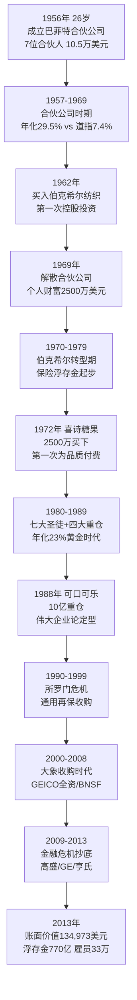
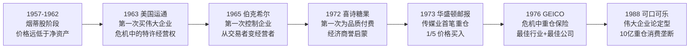
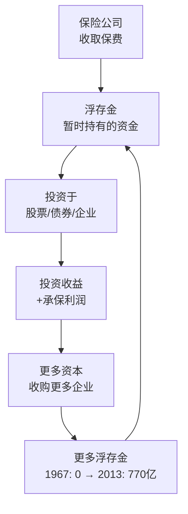
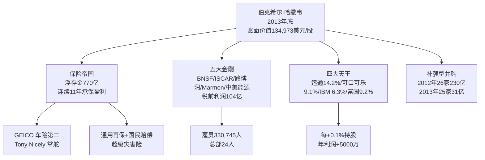
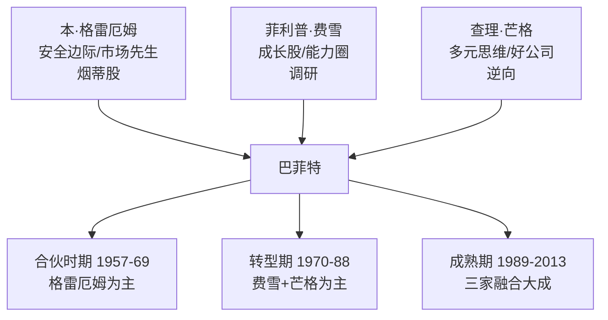

# 《巴菲特致股东的信》1957—2013 深度解读（详细版）

> **原书名**：The Essays of Buffett's Letters to Shareholders（巴菲特历年致股东信原文合集，1957—2013）
> **版本说明**：本书与 09《巴菲特致股东的信：投资者和公司高管教程》（坎宁安按 9 大主题重编）不同——**本书是巴菲特全部股东信按时间顺序的原文全集**，从 1956 年合伙公司成立前夜的第一封信，到 2013 年伯克希尔 49 周年信。读时间顺序版本的最大价值，在于**亲眼见证一位 26 岁青年的投资思想如何在 57 年间一步步演化为"奥马哈圣贤"的完整体系**。
> **笔记定位**：本笔记按"合伙公司时期（1957—1969）→ 伯克希尔早期（1977—1989）→ 成熟期（1990—1999）→ 大象时代（2000—2013）"四个阶段逐信解读，重点呈现 09 主题版无法呈现的**思想演变轨迹**与**原始语境**。

---

## 目录

- [[#全书导读：57 年股东信的时间线地图|全书导读：57 年股东信的时间线地图]]
- [[#第一部 合伙公司时期（1957—1969）：从 10 万美元到 1 亿美元|第一部 合伙公司时期（1957—1969）：从 10 万美元到 1 亿美元]]
- [[#第二部 伯克希尔早期（1977—1989）：纺织厂变身的头 12 年|第二部 伯克希尔早期（1977—1989）：纺织厂变身的头 12 年]]
- [[#第三部 成熟期（1990—1999）：从证券投资转向企业收购|第三部 成熟期（1990—1999）：从证券投资转向企业收购]]
- [[#第四部 大象时代（2000—2013）：大象、巨灾与接班人|第四部 大象时代（2000—2013）：大象、巨灾与接班人]]
- [[#总结：57 年思想演变的九大主线|总结：57 年思想演变的九大主线]]

---

## 全书导读：57 年股东信的时间线地图

### 1.1 这本书是什么

伯克希尔·哈撒韦的年度致股东信，被公认为**美国企业界写得最好的 CEO 来信**。巴菲特从 1956 年成立第一个合伙公司起，每年都写一封信给合伙人/股东，从未间断。本书收录 1957—2013 年全部信件（1957—1969 为合伙公司信，1977—2013 为伯克希尔年报信），是研究巴菲特思想的**第一手原始文献**。

### 1.2 与 09（坎宁安主题版）的区别

| 对比维度 | 09 坎宁安版（《投资者和公司高管教程》） | 本书（时间顺序全集） |
|---------|--------------------------------|-------------------|
| 编排方式 | 按 9 大主题（治理/财务/替代品/股票/并购/估值/会计/税务/后记） | 严格按年份时间顺序 |
| 核心价值 | 便于检索"巴菲特对某主题说过什么" | 便于观察"巴菲特的思想如何随时间演变" |
| 覆盖范围 | 1977 年以后的代表性信件摘编 | 1957 年合伙公司起全部信件 |
| 独有内容 | 坎宁安的编者导读 | **合伙公司时期 13 封信 + 每封信的原始语境与逐年数据** |
| 阅读体验 | 主题式横向对照 | 编年史式纵向追踪 |

> **一句话总结**：09 是"巴菲特思想的百科全书"，本书是"巴菲特思想的纪录片"。

### 1.3 57 年全景业绩：账面价值 vs 标普 500（每 10 年一档）

| 年份 | 每股账面价值（美元） | 当年账面价值变动 | 当年标普 500 变动（含股息） | 伯克希尔相对优势 |
|------|------------------|--------------|------------------------|--------------|
| 1965 | 19 | — | — | — |
| 1967 | 31 | — | — | — |
| 1970 | 43 | 12.1% | 4.0% | +8.1% |
| 1975 | 159 | 23.7% | 37.2% | −13.5% |
| 1980 | 401 | 19.2% | 32.3% | −13.1% |
| 1985 | 2,443 | 48.2% | 31.6% | +16.6% |
| 1990 | 6,116 | 7.4% | −3.1% | +10.5% |
| 1995 | 14,426 | 43.1% | 37.6% | +5.5% |
| 2000 | 40,442 | 6.5% | −9.1% | +15.6% |
| 2005 | 59,377 | 6.4% | 4.9% | +1.5% |
| 2010 | 95,453 | 13.0% | 15.1% | −2.1% |
| 2013 | 134,973 | 18.2% | 32.4% | −14.2% |

> 注：1965—2013 共 48 年间，伯克希尔每股账面价值从 **19 美元 → 134,973 美元**，年复合增长率 **19.7%**；同期标普 500 年复合约 **9.9%**（含股息）。这是人类投资史上持续时间最长的超额收益记录。

### 1.4 五十七年的时间线总览

### 1.5 57 年的思想演变主线（与 09 主题版对照）

| 阶段 | 时间 | 投资对象 | 核心思想 | 标志性事件 |
|------|------|---------|---------|-----------|
| 一、合伙公司时期 | 1957—1969 | 烟蒂股+套利+控制 | 格雷厄姆式深度价值、套利、低估控制 | 邓普斯特农具、伯克希尔 |
| 二、转型探索期 | 1970—1979 | 保险+传媒+消费 | 从"捡烟蒂"转向"买好生意" | 喜诗糖果、水牛城晚报 |
| 三、黄金成熟期 | 1980—1989 | 消费垄断+大蓝筹 | 经济商誉、护城河、合理价格买好公司 | 可口可乐、盖可、华盛顿邮报 |
| 四、保险帝国期 | 1990—1999 | 浮存金+超级灾害险 | 浮存金杠杆、透视盈余、能力圈 | 所罗门危机、通用再保 |
| 五、大象时代 | 2000—2013 | 能源+铁路+制造 | 资本配置的"猎象"哲学、永续持有 | BNSF、亨氏、中美能源 |

---

## 第一部 合伙公司时期（1957—1969）：从 10 万美元到 1 亿美元

### 开篇：1956 年的七个基本原则（巴菲特写给最初合伙人的便条）

1956 年 5 月 5 日，巴菲特合伙公司成立当晚，26 岁的巴菲特给 7 位有限合伙人每人一张便条，写下合伙的基本原则。这些原则成为他此后 57 年经营伯克希尔的**思想宪法**：

| 原则 | 原文要点 | 后来的演变 |
|------|---------|-----------|
| 1 | 我们的成绩到底好不好，要看整体股市表现而定 | 1965 年起对标道琼斯，后改用标普 500 |
| 2 | 我不保证绩效，但保证与你们同甘共苦 | 巴菲特 99% 身家永远留在伯克希尔 |
| 3 | 合伙人不靠奖金、期权获利 | 伯克希尔高管报酬与业绩严格挂钩 |
| 4 | 我们会一年报告一次，不预测市场 | 57 年从未预测过市场 |
| 5 | 我们只做自己理解的投资 | 演变为"能力圈"原则 |
| 6 | 我们不会因为资金规模扩大而降低标准 | 伯克希尔永远不降格以求 |
| 7 | 我们的目标是长期跑赢大盘 | 演变为"打败标普 500"的公开承诺 |

### 1.1 1957 年信：第一封信——"我们可能偶尔亏钱，但不会亏损价值"

**年度背景**：1957 年道指全年下跌约 8%（从 499 点跌至 435 点），是巴菲特成立合伙公司后遇到的第一个熊市。

**核心内容**：

- 合伙公司 1957 年收益约 **10.4%**（道指同期 −8.4%），相对优势约 18.8 个百分点。
- 巴菲特首次阐述**"我们不是靠预测市场赚钱"**：市场下跌时我们反而更从容，因为价格更低。
- 首次出现"**烟蒂股**"思路雏形：买"便宜到几乎不亏钱"的股票，即使判断错了也有安全边际。
- 首次提出**"我们可能会偶尔亏损，但永远不会亏损价值"**——这是安全边际思想的最早文字表述。

> **原文金句**："我们并不是通过预测市场的涨跌来赚钱，而是通过寻找价格明显低于价值的证券来赚钱。市场先生有时会给我们送钱，我们只需要耐心等待。"

### 1.2 1958 年信：从"便宜"到"更便宜"

**核心内容**：

- 1958 年收益 **40.9%**，道指同期 +38.5%——**第一次大幅跑赢**。
- 详细介绍**桑伯恩地图公司**案例：一家地图公司股价远低于其投资组合价值（每股市值约 95 美元 vs 每股内在价值约 135 美元），巴菲特买入后推动公司清算投资组合，实现价值回归。这是典型的**"低估+催化剂"**投资。
- 提出**"我们在乎的是三年后的价值，而不是明天的价格"**——投资期限观念确立。
- 首次明确**不追热点**："我们不买热门股，热门股通常已经反映了所有好消息。"

### 1.3 1959 年信：合伙公司扩大到 50 人

**核心内容**：

- 1959 年收益 **25.9%**，道指同期 +19.9%。
- 合伙公司规模从 10.5 万美元增至约 40 万美元，合伙人增至约 50 人。
- 巴菲特开始**限制新合伙人加入**："我们不想让资金规模增长到无法有效运作的程度。"——规模意识从第一天就有。
- 提出**"我们寻找的是价格与价值差距最大的机会，而不是最受欢迎的机会"**。

### 1.4 1960 年信：最便宜的股票就是最好的股票

**核心内容**：

- 1960 年收益 **22.8%**，道指同期 −6.2%——熊市中的超额收益。
- 巴菲特阐述**"低估类投资的逻辑"**：买入价格低于内在价值的股票，等待价值回归。这类投资在牛市中表现平平，但在熊市中提供保护。
- 首次提到**"我们愿意持有三年甚至更久"**——当时已确立 3-5 年投资期限。
- 开始展现**独立判断**："我们不在乎华尔街怎么看，我们在乎的是事实。"

### 1.5 1961 年信：合伙公司突破 100 万美元

**核心内容**：

- 1961 年收益 **45.9%**，道指同期 +22.2%——大幅跑赢。
- 合伙公司资产突破 100 万美元（**约 118 万美元**），巴菲特时年 31 岁。
- 首次系统阐述**三种投资类别**（成为日后投资框架的雏形）：

| 投资类别 | 定义 | 典型标的 | 预期回报 |
|---------|------|---------|---------|
| 低估类（烟蒂股） | 价格低于内在价值 2/3 的股票 | 小盘低价股 | 年化 20-30% |
| 套利类（workout） | 并购、重组、清算中的确定性收益 | 被收购公司 | 年化 10-20% |
| 控制类（control） | 买入足够股权后影响公司决策 | 邓普斯特等 | 无上限 |

- 首次说明**"套利类投资的确定性高于低估类"**：套利不依赖市场，只依赖事件完成。
- 首次警告**"我们的表现不会每年都好"**：牛市中我们可能跑输，熊市中我们通常跑赢。

### 1.6 1962 年信：七大基本原则（合伙公司宪法正式成文）

**核心内容**：

- 1962 年收益 **13.9%**，道指同期 −7.6%——熊市大幅跑赢。
- 首次系统书面化**合伙公司七大基本原则**（对 1956 年便条的正式扩展）：

| 原则 | 内容 |
|------|------|
| 一 | 我们的目标是长期跑赢道琼斯指数，而非追求绝对收益 |
| 二 | 我们不对市场做预测，不因预测改变仓位 |
| 三 | 我们只买"便宜"的股票（价格远低于价值） |
| 四 | 我们不因资金规模扩大而降低标准 |
| 五 | 我们可能在单年亏损，但长期一定赚钱 |
| 六 | 我们只做自己理解的投资，不碰不懂的行业 |
| 七 | 我们与合伙人同甘共苦，不靠管理费发财 |

- **首次买入伯克希尔·哈撒韦**：1962 年底开始建仓，每股约 7.5 美元，当时只是一家不断亏损的新英格兰纺织厂——巴菲特看中的是它的**账面价值**（每股约 19 美元），典型的烟蒂股逻辑。
- 详细介绍**邓普斯特农具公司**控制案例：巴菲特买入 70% 以上股权后，聘请 Harry Bottle 清理资产，将公司价值从每股 50 美元提升至 200 美元以上。

### 1.7 1963 年信：美国运通"色拉油丑闻"——伟大的公司在危机中买入

**核心内容**：

- 1963 年收益 **38.7%**，道指同期 +20.6%。
- **美国运通色拉油丑闻**：子公司联合植物油公司因伪造色拉油库存单爆出 1.5 亿美元欺诈案，美国运通股价从 65 美元暴跌至 35 美元。
- 巴菲特**实地调研**：走进餐厅观察人们是否还在用运通卡结账，发现**生意照常**——运通的"特许经营权"（品牌信任）毫发无损。
- 用合伙公司 40% 的资产重仓美国运通（约 1300 万美元），成为当时最大单笔投资。
- **这是巴菲特第一次买入"伟大公司"而非"便宜公司"**——烟蒂股逻辑的第一次重大突破：

| 维度 | 烟蒂股逻辑 | 美国运通逻辑 |
|------|-----------|-------------|
| 买入依据 | 资产便宜（账面价值） | 生意优秀（特许经营权） |
| 判断核心 | 资产负债表 | 品牌与客户信任 |
| 持有期限 | 价值回归即卖出 | 长期持有 |
| 风险来源 | 资产恶化 | 声誉受损 |

> **原文金句**："当一家伟大的公司遇到暂时的、可解决的困难时，就是最好的买入时机。美国运通的问题是暂时的，它的生意是永恒的。"

### 1.8 1964 年信：控制类投资的胜利

**核心内容**：

- 1964 年收益 **27.8%**，道指同期 +15.0%。
- 邓普斯特农具公司在 Harry Bottle 的整顿下，价值从买入时的每股 50 美元提升至 200+ 美元，最终以高价整体出售——**控制类投资第一次完整闭环**。
- 巴菲特总结控制类投资的三步：①以折扣价买入足够股权；②推动管理层改善经营/清理资产；③在价值充分反映后退出。
- 开始出现**"我们更喜欢好公司"**的迹象："虽然我们仍买烟蒂股，但我们已经意识到，优秀的生意比便宜的生意更值得拥有。"

### 1.9 1965 年信：接管伯克希尔——命运的安排

**核心内容**：

- 1965 年收益 **47.2%**，道指同期 +14.2%——合伙公司史上第二好成绩。
- **5 月，巴菲特正式取得伯克希尔·哈撒韦控制权**：当时伯克希尔每股账面价值约 19 美元，股价约 12-15 美元（烟蒂股逻辑）。
- 巴菲特原计划"买入后等价值回归就卖掉"，但**与纺织厂经理人 Ken Chace 的合作让他改变了主意**——他开始喜欢上拥有和控制企业的感觉。
- 合伙公司资产突破 **2,600 万美元**。
- 首次在信中系统阐述**"我们买的是企业，不是股票"**："买股票就是买企业的一部分，这是格雷厄姆教给我的最重要一课。"

### 1.10 1966 年信：规模开始成为敌人

**核心内容**：

- 1966 年收益 **20.4%**，道指同期 −15.6%——熊市大幅跑赢。
- **首次公开承认规模是敌人**："随着资金规模的增长，我们的投资选择越来越少。过去 10 万美元就能改变我们的收益率，现在需要 100 万美元。"
- 合伙公司资产约 **4,400 万美元**。
- 开始买入**霍赫希尔德·科恩百货公司**（联合零售商店母公司）——又一笔烟蒂股控制投资，但这次巴菲特开始意识到"便宜没好货"。

### 1.11 1967 年信：从"便宜"到"优质"的转折点

**核心内容**：

- 1967 年收益 **35.9%**，道指同期 +19.0%。
- **重要转折**：巴菲特在信中首次承认自己正在"从格雷厄姆走向费雪/芒格"——"我发现自己越来越倾向于以合理的价格买入优秀的企业，而不是以便宜的价格买入平庸的企业。"
- 但坚持**不公布持仓**："我们不会公布我们的持仓，因为这会干扰我们的操作。"
- 合伙公司资产约 **6,800 万美元**，其中**保险子公司（国民赔偿公司）贡献越来越大**——浮存金模式初现。

### 1.12 1968 年信：巅峰之年与"我不再年轻了"

**核心内容**：

- 1968 年收益 **58.8%**——合伙公司史上最高纪录，道指同期 +7.7%。
- 合伙公司资产突破 **1 亿美元**（约 1.04 亿美元）。
- 巴菲特在信中罕见地表现出**疲惫与警觉**："市场已经狂热到让我不舒服的程度。我看到的不是机会，而是风险。"
- 首次警告**"市场先生的疯狂"**：当所有人都在赚钱时，说明市场已经太贵了。

### 1.13 1969 年信：解散合伙公司——"我无法在狂热的市场中找到好机会"

**核心内容**：

- **5 月，巴菲特宣布解散合伙公司**：理由是自己"无法适应当前市场的投机氛围"，同时"不想为了继续赚钱而违背自己的原则"。
- 合伙公司 13 年（1957—1969）总收益：**年复合回报率 29.5%**，道指同期 7.4%——超额收益 22.1 个百分点/年，无一亏损年份。
- 巴菲特将合伙公司资产分配给合伙人：**现金 + 伯克希尔股票**，自己保留约 2,500 万美元的伯克希尔股份。
- **解散原因深度解读**：

| 原因 | 具体内容 |
|------|---------|
| 市场过热 | 1968-69 年投机盛行，找不到符合标准的低估标的 |
| 个人转向 | 巴菲特已从"烟蒂股猎手"转变为"企业收藏家"，合伙模式不再适合 |
| 规模压力 | 1 亿美元规模难以复制 29.5% 的回报 |
| 原则至上 | 宁可不赚钱，也不降低标准 |

> **原文金句**："我不愿意为了继续管理合伙公司而降低我的标准。如果我找不到足够多的好机会，那么把大家的钱还给各位，比勉强投资要好得多。市场上有太多聪明人做蠢事，我不想参与其中。"

### 1.14 合伙公司时期总结：13 年的完整成绩单

| 年份 | 合伙公司收益 | 道指收益（含股息） | 相对优势 |
|------|-----------|------------------|---------|
| 1957 | +10.4% | −8.4% | +18.8% |
| 1958 | +40.9% | +38.5% | +2.4% |
| 1959 | +25.9% | +19.9% | +6.0% |
| 1960 | +22.8% | −6.2% | +29.0% |
| 1961 | +45.9% | +22.2% | +23.7% |
| 1962 | +13.9% | −7.6% | +21.5% |
| 1963 | +38.7% | +20.6% | +18.1% |
| 1964 | +27.8% | +15.0% | +12.8% |
| 1965 | +47.2% | +14.2% | +33.0% |
| 1966 | +20.4% | −15.6% | +36.0% |
| 1967 | +35.9% | +19.0% | +16.9% |
| 1968 | +58.8% | +7.7% | +51.1% |
| 1969 | +6.8% | −11.6% | +18.4% |
| **累计** | **年化 29.5%** | **年化 7.4%** | **+22.1%/年** |

**合伙公司时期的五大遗产**：

1. **安全边际**：价格远低于价值的买入原则（格雷厄姆亲传）。
2. **能力圈**：只做自己理解的投资，13 年从未越界。
3. **长期主义**：3-5 年投资期限，从不预测市场。
4. **从烟蒂到优质**：美国运通（1963）是转折点，伯克希尔（1965）是归宿。
5. **合伙人文化**：与出资人同甘共苦——后来完整移植到伯克希尔。

---

## 第二部 伯克希尔早期（1977—1989）：纺织厂变身的头 12 年

### 开篇：1969—1977 年的八年沉默期

解散合伙公司后，巴菲特用了 8 年时间将伯克希尔从一家纺织厂改造为保险控股公司：

| 年份 | 关键事件 | 意义 |
|------|---------|------|
| 1970 | 巴菲特出任伯克希尔董事长，开始写年报信 | 年报信传统确立 |
| 1971 | 收购喜诗糖果（1972 年完成，2,500 万美元） | 第一次为品质付费 |
| 1973 | 买入华盛顿邮报（1,060 万美元） | 传媒业首笔重仓 |
| 1976 | 买入 GEICO（首次 410 万美元，后增至 4,500 万） | 保险业最佳投资 |
| 1977 | 开始系统阐述保险业与浮存金 | 浮存金模式成熟 |

**1972 年喜诗糖果收购案**（巴菲特后来称其为"最伟大的投资课"）：

| 维度 | 当时决策 | 事后教训 |
|------|---------|---------|
| 价格 | 2,500 万美元（账面价值 800 万，溢价 3 倍） | 首次为"经济商誉"付费 |
| 理由 | 喜诗的品牌、客户忠诚、定价权 | 好生意比便宜生意更值钱 |
| 结果 | 40 年后累计贡献利润 20 亿美元+ | 成为伯克希尔最赚钱的资产之一 |
| 教训 | 烟蒂股逻辑在此失效 | **"以合理价格买好公司，胜过以便宜价格买烂公司"** |

### 2.1 1977 年信：保险业与浮存金——"我们最宝贵的资产"

**年度背景**：1977 年伯克希尔净值增长约 34.4%，每股账面价值从 174 美元增至 234 美元（1965 年 19 美元起）。

**核心内容**：

- **首次系统阐述浮存金（float）概念**："保险业务给我们带来大量暂时持有的资金（浮存金），这些资金在赔付之前可以用于投资。只要承保成本合理，浮存金就是免费的杠杆。"
- 提出保险业经营的**核心公式**：承保亏损率（combined ratio）< 100% 时，浮存金成本为负；= 100% 时，浮存金免费；> 100% 时，浮存金有成本。
- 纺织业困境的首次详细披露：投入 1,700 万美元资本，1977 年仅赚 6.2 万美元——**资本回报率 0.4%**。
- 巴菲特首次坦言**"纺织业是典型的资本陷阱"**："当一家资本密集型企业无法产生差异化产品时，它注定只能赚取微薄的回报。"

> **原文金句**："保险浮存金是我们最宝贵的资产。只要我们的承保纪律不放松，浮存金就是免费的杠杆——它让我们可以拿着别人的钱去投资，还不用付利息。"

### 2.2 1978 年信：三大保险支柱成型

**核心内容**：

- 1978 年营业利益 5,430 万美元（税前），净值增长约 38.5%（含资本利得）。
- **多元零售公司并入伯克希尔**：合并后伯克希尔持有蓝筹邮票 58% 股权、间接持有威斯科金融 46% 股权，7,000 名员工、年营收 5 亿美元。
- 保险业务三大支柱成型：

| 保险公司 | 负责人 | 业务特点 | 1978 年承保表现 |
|---------|--------|---------|---------------|
| 国民赔偿公司 | Phil Liesche | 一般责任险 | 9,000 万保费赚 1,100 万承保利润 |
| 家庭汽车保险公司 | John Seward | 车险 | 1975 年整顿后最佳年份 |
| Cypress 保险公司 | Milt Thornton | 劳工赔偿险 | 谨慎专业，第一年表现优秀 |

- 纺织业 1978 年赚 130 万美元（投入 1,700 万），巴菲特列出**继续支持纺织业的四个条件**：①当地重要雇主；②管理层坦诚；③劳工配合；④能产生稳定现金。**只要四条件成立就继续，否则关闭**——这是后来 1985 年关闭纺织业的伏笔。

### 2.3 1979 年信：通货膨胀是投资人的终极敌人

**核心内容**：

- 1979 年营业利益率 18.6%，净值增长约 53.3%（大幅受益于股市上涨）。
- **首次系统提出"投资人痛苦指数"**：

| 组成 | 说明 |
|------|------|
| 通货膨胀率 | 1979 年约 13% |
| 个人所得税率 | 股息/资本利得税率 |
| **痛苦指数** | 两者之和；超过股东权益回报率时，投资人实际购买力下降 |

- **著名比喻**："1964 年底，伯克希尔每股账面净值约可换半盎司黄金；15 年后，我们流血流汗地努力耕耘，每股账面净值**还是只能换半盎司黄金**。"——政府印钞票不产黄金。
- 提出**评价企业的两个标准**：短期看营业利益率（按成本计股东权益），长期看净值的复利增长（按市价计）。
- 巴菲特对"每股盈余"的著名批判："**一个静止不动的时钟，只要不注意，看起来也像运作正常**。"——每股盈余年年增长不代表公司真的在创造价值。

> **原文金句**："通货膨胀率加上所得税率，就是投资人的痛苦指数。当这个指数超过股东权益报酬率时，投资人的购买力不增反减——而高通货膨胀率并不会带来高股东报酬率。"

### 2.4 1980 年信：无控制权盈余——"重要的是剧本而不是演员"

**核心内容**：

- 1980 年营业利益率 17.8%，净值增长约 37.5%。
- **首次系统阐述"无控制权盈余"（Non-controlled Ownership Earnings）**：持股 20% 以下公司的未分配盈余不体现在账上，但属于股东的经济利益。

| 持股比例 | 会计处理 | 经济实质 |
|---------|---------|---------|
| >50% | 完全合并报表 | 完全拥有 |
| 20-50% | 权益法（按比例认列损益） | 按比例拥有 |
| <20% | 成本法（只认列现金股利） | **未分配盈余完全隐形** |

- 巴菲特指出：1980 年光是这些"隐形盈余"就超过伯克希尔全年账面盈余——**账面数字只是冰山一角**。
- **著名比喻**："假设我们拥有一片山林，即使财务报表无法反映树木的成长，也无法掩盖我们拥有这片成长中的山林的事实。盈余的真正价值在于其再投资效益，与我们是否认列无关——**重要的是剧本而不是演员**。"
- 提出回购股票是**对股东最有利的资本运用**之一："若一家好公司股价远低于实质价值，还有什么投资比买回自家股票更稳当、更有赚头？"

### 2.5 1981 年信：蟾蜍与王子——收购的三重错误动机

**核心内容**：

- 1981 年营业利益率 15.2%，净值增长约 31.4%。
- **首次完整提出"蟾蜍与王子"理论**——收购失败的三重动机：

| 错误动机 | 巴菲特的分析 |
|---------|------------|
| ①领导层的动物天性 | 经理人天生好斗，渴望扩张版图 |
| ②以规模而非获利为衡量标准 | Fortune 500 排名诱惑，不知获利排名 |
| ③"公主之吻"幻觉 | 相信自己的管理能"吻活"蟾蜍公司 |

- **结论**："投资人永远可以以蟾蜍的价格买到蟾蜍，但若愿意用双倍代价资助公主亲吻蟾蜍，最好保佑奇迹发生。许多公主坚信自己的吻有魔力，**即使后院早已养满蟾蜍**。"
- 指出**仅有的两类成功收购**：

| 成功类型 | 特征 | 代表 |
|---------|------|------|
| ①能适应通货膨胀的公司 | 容易提价+轻资本 | 喜诗糖果 |
| ②经营奇才 | 能识别"裹着蟾蜍外衣的王子" | 汤姆·墨菲（大都会） |

- **自我剖析**："我们的吻表现平平。我们有遇到几个王子级的公司，但早在我们买下时他们就已是王子了；至少我们的吻没让他们变回蟾蜍。"

### 2.6 1982 年信：会计数字只是评价的起点——"移动红心"的自我辩护

**核心内容**：

- 1982 年营业利益率 9.8%（大幅下滑），净值增长约 40%（股市大涨）。
- **"射箭画靶"的著名比喻**：当成绩恶化时，经理人倾向把衡量标准换掉，"就像射箭手先将箭射在空白的标靶上，再小心地把红心画在箭的周围"——但巴菲特辩称自己移动红心有正当理由（无控制权盈余日益重要）。
- 四大被投资公司（GEICO、通用食品、RJR、华盛顿邮报）1982 年未分配盈余超 4,000 万美元，**超过伯克希尔全年账面盈余**。
- **GEICO 会计扭曲案例**：持股 35% 但因投票权委托他人，只能以成本法认列 350 万美元股利，其余 2,300 万未分配盈余完全隐形。
- **著名结论**："会计数字只是企业评价的起点而非终点。"
- 1982 年净值增长 40%，其中 **GEICO 市值增长贡献四成**——"虽然不是名校出身，但让 Jack 试试看的结果，证实了我们的眼光。"

### 2.7 1983 年信：十五项所有者原则（伯克希尔宪法的正式成文）

**年度背景**：1983 年净值增长 32.3%，喜诗糖果贡献利润 2,390 万美元（投入成本 2,500 万，当年回报率 96%）。

**核心内容**：

- **首次完整发布十五项"与所有者相关的企业原则"**（后来每年重印于年报开头，成为伯克希尔的宪法）。十五项原则精华：

| 序号 | 原则核心 | 一句话解读 |
|------|---------|-----------|
| 1 | 以所有者利益为最高优先 | 股东是老板 |
| 2 | 董事会与管理层利益一致 | 管理层持股 |
| 3 | 长期观点 | 不因短期波动改变策略 |
| 4 | 坦诚披露成败 | 好坏都说 |
| 5 | 不预测市场 | 从不预测 |
| 6 | 保留盈余用于再投资 | 一美元原则 |
| 7 | 不稀释股东权益 | 不随便发新股 |
| 8 | 收购以经济价值为准 | 不为规模收购 |
| 9 | 合理分红政策 | 只有钱用不完才分红 |
| 10 | 不拆股、不维持股价 | 股价由市场决定 |
| 11 | 公平对待所有股东 | 无特殊待遇 |
| 12 | 年报坦诚 | 不粉饰 |
| 13 | 经理人独立性 | 不干预经营 |
| 14 | 继承人计划 | 提前安排 |
| 15 | 与股东同甘共苦 | 99% 身家在公司 |

- **喜诗糖果的启示**（巴菲特最珍视的投资课）：1972 年以 2,500 万美元买下账面价值 800 万的喜诗，**多付的 1,700 万买的是"经济商誉"**——品牌、定价权、客户忠诚。40 年后喜诗累计贡献利润超过 20 亿美元，证明**为品质付费是值得的**。
- 首次明确**"好公司 vs 烂公司"**的对比框架（后来在 1989 年信中完整展开）。
- **首次提出"我们愿意无限期持有"**："如果你不想持有一只股票 10 年，就不要持有它 10 分钟。"

### 2.8 1984 年信：股票回购的两种——价值创造与敲诈勒索

**核心内容**：

- 1984 年净值增长 13.6%，账面价值每股增加 133 美元。
- **GEICO/通用食品股票回购案例**：两家公司以合理价格回购股票，伯克希尔按比例卖回少量股份维持持股比例，收到 2,100 万美元现金（被认定为"减资"而非"出售"，税务处理有利）。**巴菲特将此类回购称为"对股东最有利的资本运用"**。
- **Greenmail 的批判**（绿色勒索）：职业股东买入股票后威胁管理层高价回购——"甲乙双方为自身私利协议剥削不知情的丙方"。

| 回购类型 | 受益者 | 巴菲特态度 |
|---------|--------|-----------|
| 价值型回购（股价<内在价值） | 全体股东 | **热烈支持** |
| Greenmail（勒索式回购） | 大股东+管理层 | **强烈谴责** |

- 回购的第二重好处："管理当局透过买回自家股票，对外宣示重视股东权益而非扩张个人版图——对不回购的公司，市场会逐渐离弃。"
- **Nebraska Furniture Mart 的 B 太太**首次亮相：91 岁的 Rose Blumkin 每天工作 7 天，当地报纸形容她"每天工作完回家吃饭睡觉，每晚等不到天亮便急着回店里上班"。

### 2.9 1985 年信：关闭纺织厂——"一个 20 年的错误终于结束"

**核心内容**：

- 1985 年净值增长 48.2%，账面价值增至 2,443 美元。
- **7 月 21 日正式关闭纺织业务**——巴菲特承认这是"伯克希尔历史上最大的错误之一"：

| 维度 | 内容 |
|------|------|
| 买入时间 | 1962 年（每股 7.5 美元，账面价值 19 美元） |
| 持有时间 | 23 年 |
| 累计投入 | 约 1 亿美元资本 |
| 累计回报 | 微薄利润+巨亏，**资本回报率远低于 1%** |
| 关闭原因 | 1985 年再亏损 500 万美元，纺织业无望 |
| 教训 | **"时间是好公司的朋友，是烂公司的敌人"** |

- **对"转机公司"的终极批判**："所谓有'转机'的公司，最后显少有成功的案例。与其把时间与精力花在购买廉价的烂公司上，还不如以合理的价格投资一些体质好的公司。"
- **首次完整提出"好公司 vs 烂公司"的对照框架**：

| 维度 | 好公司（如喜诗糖果） | 烂公司（如纺织厂） |
|------|-------------------|------------------|
| 资本需求 | 轻资产，利润可全部分红 | 重资产，利润必须再投入维持 |
| 定价权 | 每年提价仍不丢份额 | 价格战，无定价权 |
| 利润质量 | 真金白银 | 账面利润（需再投入） |
| 结局 | 现金奶牛 | 资本陷阱 |

- **RJR 纳贝斯克收购案**：1985 年巴菲特买 RJR 优先股，随后罗斯·约翰逊杠杆收购（LBO）戏剧上演——巴菲特在信中分析 LBO 的"四重盈利机制"（后详述）。

### 2.10 1986 年信：七大圣徒——57% 的股东权益回报率

**核心内容**：

- 1986 年净值增长 26.1%，账面价值增至 2,974 美元。
- **"七大圣徒"首次集体亮相**（伯克希尔七个核心非保险企业）：

| 企业 | 负责人 | 1986 年税前利润（百万美元） |
|------|--------|--------------------------|
| 水牛城晚报 | Stan Lipsey | 34.7 |
| 喜诗糖果 | Chuck Huggins | 30.3 |
| 斯科特·费泽集团 | Ralph Schey | 25.4 |
| 世界百科全书 | Ralph Schey | 22.0 |
| 寇比吸尘器 | Ralph Schey | 20.2 |
| 内布拉斯加家具城 | Blumkin 家族 | 17.7 |
| 费区·海默 | Heldman 家族 | 8.4 |

- **震撼数据**：七家公司合计税前利润 1.8 亿美元，**历史投资股本仅 1.75 亿美元**——股东权益回报率 **57%**（全美 500 大制造业+服务业中只有 6 家 ROE 超过 30%，最高 40.2%）。
- **经理人哲学**："查理和我平时主要只有两项工作：吸引并维系优秀的经理人，以及处理资金分配。"——"若我们雇用比我们矮小的人，我们会变成一群侏儒；相反地，若我们找到一群比我们更高大的人，我们就是一群巨人。"（奥美广告创始人大卫·奥美）
- **首次提出"我们管理的越多，只会把事情搞砸"**：伯克希尔没有企业会议、没有年度预算、没有绩效考核——"在 Berkshire，我们没有企业会议，也没有年度预算，更没有绩效考核"。
- **1986 年买下费区·海默兄弟公司**（制服制造商）："极具竞争力，由我们喜欢打交道的人在经营，不过就是小了点"——只用了不到净值 2% 的资金。

### 2.11 1987 年信：财星 25 家——"充分运用现有产业地位"

**核心内容**：

- 1987 年净值增长 19.5%，账面价值增至 3,177 美元。
- **财星杂志 25 家研究**：1977—1986 年连续十年 ROE≥20% 且没有一年低于 15% 的公司只有 25 家，其中 24 家跑赢标普 500。

| 研究发现 | 结论 |
|---------|------|
| 财务杠杆极低 | "一家真正好的公司是不需要借钱的" |
| 行业平凡 | 除一家高科技、几家制药外，都是普通行业 |
| 产品 10 年不变 | 现在卖的产品与 10 年前大致相同 |
| 关键共性 | **充分运用现有产业地位，专注单一领导品牌** |

- **"为了改变而改变"的批判**："在一动荡不安的土地上，不可能建造固若金汤的城堡。具有稳定特质的企业，是持续创造高获利的关键。"
- 巴菲特借用杰克·班尼的获奖感言自谦："我不应该得到这个奖项，但同样地我也不应该得到关节炎。"
- **首次完整提出"我们买的是企业不是股票"的七大圣徒证明**：七家公司真正价值远高于账面价值，且经营不需要太多资金，经理人极其能干。

### 2.12 1988 年信：可口可乐——"把嘴巴放在钱上"

**核心内容**：

- 1988 年净值增长 20.0%，账面价值增至 2,974 美元（24 年 23.0% 年化）。
- **买入可口可乐 10 亿美元**（1988 年秋开始建仓，1989 年完成）——巴菲特称"以每天五瓶樱桃可乐的爱用者身份，宣布买进价值 10 亿美元的可口可乐股票，这项举动只是将钱花在嘴巴上的最佳例证"。
- **七大圣徒 ROE 升至 67%**（无杠杆）。
- **会计三问**（巴菲特对财报使用者的核心建议）：

| 问题 | 说明 |
|------|------|
| ①这家公司大概价值多少？ | 估值问题 |
| ②它达到未来目标的可能性有多大？ | 前景问题 |
| ③在现有条件下，经理人的工作表现如何？ | 管理层问题 |

- **会计欺诈的著名论断**："用笔偷钱要比用枪抢劫容易得多。"（"多年以来查理跟我看到许多会计诈骗案，鲜少有人因此被惩罚，有的甚至都没有被发现。"）
- **买下 Borsheim 珠宝 80% 股权**："一家优秀的企业由我们所欣赏且信任的人来经营。"

### 2.13 1989 年信：递延所得税——"国库借给我们的无息贷款"

**核心内容**：

- 1989 年净值增长 **44.4%**，账面价值增至 4,296 美元（25 年 23.8% 年化）。
- **递延所得税的著名分析**："这种所得税负债就好像是美国国库借给我们的无息贷款，且到期日由我们自己决定。"

| 情景 | 20 年后结果（1 美元本金，年翻倍，税率 34%） |
|------|------------------------------------------|
| 每年卖出重投 | 税后 25,250 美元（交税 13,000 美元） |
| 持有不动 | **税后 692,000 美元**（交税 356,500 美元） |
| 结论 | **持有不动的税后收益是频繁交易的 27 倍** |

- **李伯大梦式投资**："我们偏爱李伯大梦式的投资，因为较之疯狂短线进出，它有一个很重要的利基点——税负递延。"（李伯大梦：美国民间故事，一觉睡了 20 年）
- **Carl Sagan 细菌寓言**：细菌每 15 分钟分裂一次，一天后重量超山，两天后超太阳——"在有限的世界里，任何高成长的事物终将自我毁灭。当基础膨胀到一定程度时，好戏就会结束。"
- **"有钱人为了金钱结婚"的比喻**："我们觉得实在没有意义要舍弃原来熟悉欣赏的人，而把时间浪费在我们不认识且人格可能会在水准以下的人身上——那不等于一个有钱人竟然还为了金钱而结婚，这未免有些精神错乱。"
- **1990 年会计原则变化预告**：递延所得税将按现行税率计算（34%），净值减少 7,100 万美元。

### 2.14 1980 年代总结：从纺织厂到消费帝国

| 维度 | 1979 年底 | 1989 年底 | 十年变化 |
|------|----------|----------|---------|
| 每股账面价值 | 335.85 美元 | 4,296 美元 | **12.8 倍** |
| 年化增长率 | — | 23.8% | 持续超越标普 |
| 核心资产 | 保险+纺织+糖果 | 七大圣徒+四大重仓（GEICO/可口可乐/华盛顿邮报/大都会） | 从烟蒂到消费垄断 |
| 投资哲学 | 便宜优先 | **合理价格买好公司** | 1983-88 年完成转型 |
| 标志性事件 | — | 喜诗 1972/华盛顿邮报 1973/可口可乐 1988 | 三次"为品质付费" |

**1980 年代三大思想突破**：

1. **十五项所有者原则成文**（1983）——伯克希尔宪法。
2. **"好公司 vs 烂公司"框架定型**（1985）——纺织厂关闭后的彻底转向。
3. **可口可乐 10 亿重仓**（1988）——伟大企业论的实践宣言。

---

## 第三部 成熟期（1990—1999）：从证券投资转向企业收购

### 3.1 1990 年信：美国航空的教训与"透视盈余"

**年度背景**：1990 年净值仅增长 7.4%（海湾战争+经济衰退），账面价值增至 6,116 美元。这一年巴菲特在信中首次完整披露透视盈余概念，并首次承认美国航空投资的失误。

**核心内容**：

- **透视盈余（Look-through Earnings）正式提出**：

| 组成 | 说明 |
|------|------|
| ①账列盈余 | 伯克希尔账面已认列的营业利润 |
| ②保留盈余 | 主要被投资公司未分配的盈余（按比例应得） |
| ③所得税 | 若保留盈余分配给我们要交的税 |
| **透视盈余** | ① + ② − ③，衡量真实经济收益 |

- 1990 年透视盈余约 3.7 亿美元，但**媒体事业（水牛城晚报、华盛顿邮报）盈利开始下滑**——巴菲特首次承认"媒体业的好日子到头了"。
- **美国航空优先股**：1989 年投入 3.58 亿美元买优先股，1990 年开始亏损。巴菲特自嘲："我买了一架永远不飞的飞机（指伯克希尔专机'不可原谅号'），又买了一堆航空公司的优先股。"
- **富国银行**：1990 年买入 5 亿美元（10% 股权），恰逢加州地产危机，股价腰斩。巴菲特顶住压力增持至 10%——"当别人恐惧时贪婪"的经典案例。

> **原文金句**："市场先生每天都在报价，但他从不强迫你交易。他的报价是你的仆人，而不是你的主人。如果你让市场先生的情绪影响你的判断，你就会被市场先生牵着鼻子走。"

### 3.2 1991 年信：所罗门危机——"用牙齿咬住老虎的尾巴"

**年度背景**：1991 年净值增长 39.6%，账面价值增至 6,437 美元（27 年 23.7% 年化）。

**核心内容**：

- **所罗门兄弟丑闻爆发**：1991 年 8 月，所罗门被揭发国债投标违规，面临破产。巴菲特临危受命出任临时主席，在国会作证时说出名言："**为保住公司声誉，我愿意用牙齿咬住老虎的尾巴。**"
- 巴菲特在信中详细回顾这场危机（首次披露）：

| 阶段 | 事件 | 巴菲特的应对 |
|------|------|-------------|
| 1991.8 | 丑闻曝光，股价暴跌 | 接受临时主席职位 |
| 1991.8-1992.6 | 配合五大监管机构调查 | 全面整顿，开除违规者 |
| 1992.6 | 危机解除 | 辞职，所罗门恢复盈利 |

- 巴菲特对危机的总结："**坏消息要尽快告诉所有人，好消息可以慢慢说。**"（"如果我们把坏消息拖到不得不说的那一天，我们就失去了所有信用。"）
- 1991 年**可口可乐+吉列贡献 16 亿美元净值增长**（占 21 亿总增长的四分之三），但巴菲特警告："去年这两家公司的股价涨幅远高于获利增幅——两面得利的情况不可能每年都发生。"
- **Mira 教练寓言**：迈阿密大学四分卫 George Mira 在关键时刻左手传球达阵，教练说"这都是因为我平常训练有素的缘故"——优秀经理人让老板可以放心去处理危机。

### 3.3 1992 年信：发行新股的铁律与"没有策略的并购"

**年度背景**：1992 年净值增长 20.3%，账面价值增至 7,745 美元（28 年 23.6% 年化）。

**核心内容**：

- **发行新股的铁律**："除非我们确信所收到的价值与我们付出的一致，否则我们不会发行新股。"（1992 年因可转换债券赎回只发行了 6,106 股。）
- **1992 年正式确立"每年在年报首页公布净值 vs 标普 500 对照表"的传统**。
- **对股市预测的著名警告**："股市预言家唯一的价值就是让算命先生看起来像那么一回事。短期股市的预测是毒药，应该把它们摆在最安全的地方，远离儿童以及那些在股市中行为像小孩般幼稚的投资人。"
- **所罗门插曲总结**：1992 年 6 月辞职，所罗门获"全美最受崇敬企业进步奖"第二名。
- **并购的"终身伴侣"比喻**："我们采取的就像与一般人寻找终身伴侣时一样的态度——积极、乐观与开放是应该的，但绝对没有必要躁进。"
- **Santyana 名言引用**："所谓狂乐，就是当你忘了目标何在时，还加倍投入你的心力。"

### 3.4 1993 年信：可口可乐的历史课——"市场是体重机"

**年度背景**：1993 年净值增长 14.3%，账面价值增至 8,854 美元（29 年 23.3% 年化）。

**核心内容**：

- **可口可乐 1919 年上市的历史课**：

| 时间 | 价格/价值 |
|------|----------|
| 1919 年上市 | 每股 40 美元 |
| 1920 年（市场冷淡） | 跌至 19.5 美元（腰斩） |
| 1993 年底（股利再投资） | **价值 210 万美元** |
| 74 年总回报 | **52,500 倍** |

- **格雷厄姆名言引用**："短期而言，市场是投票机器，投资人不须靠智能或情绪控制，只要有钱都可以登记参加投票；但就长期而言，股票市场却是一个体重机。"
- **Dexter 鞋业收购**（1993 年 11 月）：用伯克希尔股票交换——后来被巴菲特称为"我做过的最愚蠢的交易"（因为发新股稀释了股东权益，而 Dexter 后来价值归零）。当时巴菲特在信中赞美："Dexter 是查理跟我在职业生涯中所见过最好的公司之一。"
- **"没有一个行业会像卖鞋这一行"**：巴菲特 1993 年对鞋业的乐观——"现在光是在这个产业雇用的员工就超过 7,200 人，我每天上班都会边开车边唱：没有一个行业会像卖鞋这一行。"

### 3.5 1994 年信：Ted Williams 的 77 个框框——"等待好球"

**年度背景**：1994 年净值增长 14.3%，账面价值增至 10,083 美元（30 年 23.0% 年化）。

**核心内容**：

- **Ted Williams《打击的科学》**：把打击区域划分为 77 个框框，每个框框约当一个棒球大小，"只有当球进入最理想的框框时才挥棒打击"——否则打击率从 4 成骤降到 2 成 3。
- **巴菲特的应用**："查理跟我都很同意这样的看法，所以我们宁愿静静地等待球儿滑进我们喜欢的好球带。"
- **对政治经济预测的蔑视**："三十年来，没有人能正确预测到越战扩大、工资价格管制、两次石油危机、总统辞职、苏联解体、道琼一天跌 508 点、国库券利率在 2.8% 与 17.4% 之间巨幅波动。然而这些轰动一时的重大事件，却从未让格雷厄姆的投资哲学造成丝毫损伤。"
- **"恐惧是基本面信徒的好朋友"**："我们通常都是利用某些历史事件发生、悲观气氛到达顶点时，找到最好的进场机会。恐惧虽然是盲从者的敌人，但却是基本面信徒的好朋友。"
- **大学教育 vs 投资的类比**：把教育成本当作账面价值，毕业生终身收入折现当作实质价值——"有些毕业生会发现其账面成本远高于计算出来的实质价值，这就代表着不值得接受这样的教育"——内在价值思想的最生动教学。
- **"宁愿要天然钻石的一小部分"**："我们宁愿拥有天然钻石的一小部分，也不要有 100% 的人工钻石。1994 年可口可乐卖出 2,800 亿罐饮料，每罐赚 1 美分，我们持有 7.8% 股权，分到 210 亿罐——光饮料就贡献 2 亿美元盈余。"

### 3.6 1995 年信：GEICO 全资收购——"双性恋者的优势"

**年度背景**：1995 年净值增长 45.0%（53 亿美元），账面价值增至 14,426 美元（31 年 23.6% 年化）。

**核心内容**：

- **GEICO 剩余 49% 股权收购**（1996 年初完成）：总价 23 亿美元，GEICO 成为 100% 子公司。
- **伍迪·艾伦的双性恋比喻**："双性恋者最大的好处，就是可以让他们在周末时比一般人整整多出一倍的约会机会。"——伯克希尔同时通过"协议买整家公司"和"股市买部分股权"双轨运作。
- **HMS 围裙的比喻**："事情通常不是它们外表所看到的那样，去脂牛奶会被冒充成奶油。"——卖方总是提供"娱乐性质高于教育性质"的财务预估，巴菲特连看都不看。
- **跛脚马的故事**：主人牵病马给兽医看，"我实在搞不懂为什么这匹马的表现时好时坏"，兽医回答："没问题，趁它表现正常的时候，赶快把它卖掉。"——并购世界中的跛脚马往往被装饰成圣物。
- **彼得·杜拉克的点评**："让我告诉你一个秘密：促成交易比辛勤工作好，促成交易刺激有趣，而工作却尽是一些肮脏龌龊的事……促成交易相对就很性感浪漫，这也是为什么通常交易的发生都没什么道理可循。"
- **1995 年每股投资额 22,088 美元 vs 每股营业利益 258 美元**（1965 年分别为 4 美元和 4.08 美元）——"伯克希尔分成两半：一半是投资组合，一半是实业帝国"。

### 3.7 1996 年信：B 股发行与股东手册——"我们不需要拆股"

**年度背景**：1996 年净值增长 36.1%，账面价值增至 19,011 美元（32 年 23.8% 年化）。

**核心内容**：

- **B 股发行**：1996 年 5 月发行 B 级普通股（A 股的 1/30），目的：让小额投资者也能买入伯克希尔。巴菲特坚持**不拆股**："拆股不会创造价值，只会吸引短线投机者。"
- **首次发布《股东手册》**：系统整理 15 项所有者原则+术语定义（实质价值、透视盈余等）。
- **实质价值 vs 股票市价**："去年当伯克希尔股价约 36,000 美元时，我曾报告：①股价表现远超实质价值；②这种情况不可能无限持续；③我不认为价值被低估。如今实质价值大幅增长而股价未动——价格/价值比又合理了。"
- **1996 年并购**：堪萨斯银行家保险（KBI）、国际飞安公司（FlightSafety International）。
- **总部成本控制**："企业总部的费用占净值的比率每年大约不到万分之五……很多共同基金每年的营业费用大多在 2% 上下，这等于间接剥削了投资人将近 10% 的投资报酬。我们是来帮各位赚钱，而不是帮各位花钱的。"

### 3.8 1997 年信：骄傲的鸭子与"非常态性投资"

**年度背景**：1997 年净值增长 34.1%，账面价值增至 25,488 美元（33 年 24.1% 年化）。

**核心内容**：

- **骄傲鸭子的寓言**："面对多头的行情，大家一定要避免成为一只呱呱大叫的骄傲鸭子，以为是自己高超的泳技让他冲上了天，殊不知面对狂风巨浪，小心的鸭子反而会谨慎地看看大浪过后，其它池塘里的鸭子都到哪里去了。"
- **1997 年纳税 42 亿美元**（相当于年初净值的 18%）——"伯克希尔股东可以说是功在国家"。
- **非常态性投资**（巴菲特承认"这不是我们的主战场"）：

| 投资 | 规模 | 结果 |
|------|------|------|
| 原油期货 | 1,400 万桶（1994-95 年建仓 4,570 万桶） | 已结仓 3,170 万桶获利 6,190 万美元 |
| 白银 | 1.112 亿盎司 | 1997 年买入，后获利了结 |
| 美国零息国债 | 1994 年 4.3 亿美元 | 获利丰厚 |

- **Ted Williams 的 77 个框框再次引用**："好坏球照单全收的人，迟早会面临被降到小联盟的命运。"——"目前迎面朝我们而来的'投'资机会大多只在好球带边缘……所幸我们不必像 Ted Williams 一样，可能因为连续三次不挥棒而遭三振出局。"

### 3.9 1998 年信：通用再保——史上最大收购

**年度背景**：1998 年净值增长 48.3%，账面价值增至 37,801 美元（34 年 24.7% 年化）。

**核心内容**：

- **通用再保收购**（220 亿美元，股票+现金）：伯克希尔史上最大收购，将浮存金翻倍至约 300 亿美元。
- **Executive Jet 收购**：NetJets 部分所有权——"为富人提供分时飞机服务"。
- **48.3% 增长的水分揭示**："增加的净值中有绝大部分来自购并交易所发行的新股。由于公司股价远高于账面价值，每发行新股都会立即拉高每股账面净值，但实际上我们没有多赚进半毛钱。"
- **总部 12.8 人**："为了服务新增加的 9,500 个人手，我们的总部人员从原来的 12 人扩编为 12.8 人（0.8 指的是一位新请的会计人员，一个礼拜工作四天）。尽管这是组织浮滥的警讯，但我们去年税后总部开支只有区区 350 万美元。"
- **纳税 27 亿美元**："这笔钱足够美国政府支应半天以上的开销。全美国只要有 625 个像伯克希尔及通用再保这样的纳税人，其它所有的美国公司或二亿七千万的美国公民都可以不必再支付任何联邦所得税。"
- **"为山九仞，功亏一篑"**（富兰克林名言，查理·芒格引用）——指总部增加 0.8 人。

### 3.10 1999 年信：最差的一年——"成绩单上满是 F 和 D"

**年度背景**：1999 年净值仅增长 0.5%，账面价值增至 37,987 美元——**巴菲特承认这是"个人历年来表现最差的一年"**，同时是网络泡沫最疯狂的年份（纳斯达克全年上涨 85%）。

**核心内容**：

- **自我批评**："即使是顽皮豹探长也知道谁是去年真正的犯人：没错！就是我本人。我的表现让我想起一位成绩单上满是 F 跟一个 D 的四分卫，偏偏又遇到一位体谅人的教练轻声说到：'孩子，我想你把太多的时间摆在单一的科目之上了。'我所指的单一科目就是资金的分配，而很显然的我在 1999 年所获得的成绩就只有 D。"
- **对网络泡沫的冷静**：巴菲特承认自己"看不懂科技股"，拒绝参与——当年被嘲笑"廉颇老矣"，2000 年泡沫破裂后证明了他的判断。
- **Fortune 杂志文章**：《巴菲特谈股市》——"我预计股市未来一二十年的表现将远不如过去十几年"（基于企业盈利增长与 GDP 的关系）。
- **1999 年每股投资额 47,339 美元 vs 每股营业亏损 458.55 美元**（通用再保承保损失拖累）。
- **商誉摊销的讨论**："Berkshire 每年固定提列的商誉摊销费用约 5 亿美元，使资产负债表上商誉的会计数字逐年递减，但却与实质经济稳定成长的现况背道而驰。"
- **Jordan 家具与中美能源收购**：全部现金交易，"没有发行任何新股"——巴菲特强调这是最偏好的方式。

### 3.11 1990 年代总结：从投资者到收藏家

| 维度 | 1989 年底 | 1999 年底 | 十年变化 |
|------|----------|----------|---------|
| 每股账面价值 | 4,296 美元 | 37,987 美元 | **8.8 倍** |
| 年化增长率 | 23.8% | 24.0% | 依然惊人 |
| 核心资产 | 七大圣徒+四大重仓 | 通用再保+GEICO 全资+四大重仓 | 保险帝国成型 |
| 浮存金 | 约 15 亿美元 | 约 250 亿美元 | 16 倍 |
| 投资哲学 | 合理价格买好公司 | **"我们买的是企业，不是股票"彻底定型** | 收藏家模式 |
| 标志性事件 | 可口可乐 1988 | 通用再保 1998、所罗门危机 1991 | 保险帝国+声誉危机 |

**1990 年代三大思想突破**：

1. **透视盈余概念成熟**（1990）——"账列盈余+保留盈余−税费"。
2. **所罗门危机处理**（1991）——"坏消息要尽快告诉所有人"的危机管理哲学。
3. **通用再保收购**（1998）——浮存金规模翻倍，保险帝国的最后拼图。

---

## 第四部 大象时代（2000—2013）：大象、巨灾与接班人

### 4.1 2000 年信：八件并购——"静待电话铃响"

**年度背景**：2000 年净值增长 6.5%，账面价值增至 40,442 美元（36 年 23.6% 年化）。网络泡沫在 3 月破裂，伯克希尔因远离科技股而受损较小。

**核心内容**：

- **2000 年完成八件并购**（总金额 80 亿美元，全部自有资金，97% 现金+3% 股票）：

| 公司 | 业务 | 金额/备注 |
|------|------|----------|
| 中美能源 76% | 能源公用事业 | 巴菲特看好受管制公用事业 |
| CORT | 办公室家具出租 | 3.86 亿美元，Wesco 旗下 |
| 美国责任险公司 | 特殊险 | 一半股票一半现金 |
| Ben Bridge 珠宝 | 珠宝零售 | "靠电话成交" |
| 其他四家 | 珠宝/建材等 | — |

- **购并策略**："在伯克希尔，我们的购并策略极其简单——那就是静待电话铃响。可喜的是，现在电话好像有点应接不暇。"（并购标准：①长期竞争优势；②才德兼具的经理人；③合理价格。）
- **21 世纪"进军实体尖端产业"**："展望 21 世纪，我们将大举进军砖块、地毯、隔热品与油漆等实体的尖端产业。"（讽刺科技泡沫的著名反讽。）
- **GEICO 广告失误的自省**："去年我曾跟各位打包票说我们所投入的大笔广告经费保证值回票价，事实证明我的判断是错误的。"（GEICO 新保单成本上升，保户增长停滞。）
- **总部 13.8 人**：员工总数增至 112,000 人，"查理跟我态度稍微软化，答应让总部人员编制增加一名成为 13.8 人"。

### 4.2 2001 年信：911 与通用再保的错误

**年度背景**：2001 年净值减少 6.2%（911 恐怖袭击导致保险巨亏），账面价值降至 37,920 美元——37 年来第二次年度亏损。

**核心内容**：

- **911 的教训**："我竟然允许通用再保在没有安全保障的情况下做生意，而 911 事件的发生正好把我们逮个正着。"（通用再保承保了世贸中心相关风险，损失约 22 亿美元。）
- **巴菲特对 911 后的保险业判断**："恐怖主义风险无法精算，未来再保险的价格必须大幅上涨。"——2002 年起伯克希尔超级灾害险涨价，成为"9·11 的最大受益者之一"。
- **对高管贪腐的批判**："这些可耻的企业领导人简直把股东当作是自己的禁脔而非伙伴。虽然安然公司已经成为企业弊案的典型案例，但这种贪婪的行为在美国企业当中却绝非特例。"
- **股票选择权的著名笑话**：宴会上美女对总裁说"只要你想要，我愿意为你做任何事！"总裁回答："那好，请给我更多的股票选择权！"
- **2001 年并购**：Shaw 地毯、Johns Manville（隔热材料）、MiTek（建筑连接板）、XTRA（货柜拖车租赁）、Larson-Juhl（相框）、Fruit of the Loom（内衣）。全部现金买断——"股东可以不必牺牲原先就拥有优秀企业的任何权益"。
- **MiTek 的 55 位经理人入股**："每人最低投资 10 万美元，很多人借钱参与。这些没有认股选择权的经理人真正称得上是公司的拥有者。"

### 4.3 2002 年信：浮存金 412 亿——"成本 1% 的免费杠杆"

**年度背景**：2002 年净值增长 10.0%，账面价值增至 41,727 美元（38 年 22.2% 年化）。

**核心内容**：

- **浮存金里程碑**：浮存金增加 57 亿美元至 **412 亿美元**，成本仅 1%——"能够回到以往低成本浮存金的感觉真好，特别是经历过惨淡的前三年。"
- **拟制性盈余的批判**："如果你经常阅读最近几年上市公司的财务报表，你会发现满是所谓'拟制性盈余'这类的报表——这种报表所显示的盈余数字往往都远高于经过会计师签证的查核数。我们还没有看过有哪家公司的拟制报表，其盈余是低于会计师查核数字的。"
- **Eddie Bennett 球僮寓言**（巴菲特最爱的管理寓言）：球僮 Eddie 先后跟随白袜队、道奇队、洋基队，总能赢得世界大赛——"想要成为一个赢家，就是与其它赢家一起共事。他如何拎球棒并不重要，重要的是他能为球场上最当红的明星拎球棒。"——**巴菲特："在伯克希尔，我就经常为美国商业大联盟的超级强打者拎球棒。"**
- **2002 年并购**：Albecca（Larson-Juhl 相框）、Fruit of the Loom、CTB（养殖设备）、Garan（童装）、The Pampered Chef（厨具直销，Doris Christopher 1980 年从厨房起家）。
- **"进入策略" vs "退出策略"**："不同于一般融资购并者（LBO）及私人投资银行，我们并没有所谓的'退出'策略，在买进以后，我们就把它们好好地放着。这也是为何伯克希尔往往成为许多卖方以及其经理人心目中的首选，有时甚至是唯一的选择。"

### 4.4 2003 年信：Clayton 房屋——"田纳西大学学生的礼物"

**年度背景**：2003 年净值增长 21.0%，账面价值增至 50,498 美元（39 年 22.2% 年化）。

**核心内容**：

- **Clayton 房屋收购的机缘**：田纳西大学财经系学生参访团送巴菲特一本书——Clayton 创办人 Jim Clayton 的自传。巴菲特读完即决定收购（22 亿美元）。
- **Oakwood 房屋的教训**："这源于过去我投资另一家同业 Oakwood 房屋垃圾债券的惨痛教训……当 Oakwood 破产后，我就晓得了（组合房屋行业消费贷款竞争的惨烈）。"
- **组合房屋业的批判**："设计与建造技术的改良，却远不及行销与融资方式的演进。到最后这几年，这行经营的诀窍逐渐变质成如何将零售商与制造商背负的不良贷款转嫁到不知情的金主身上。"
- **"非受迫性失误"**："在伯克希尔，我们完全没有历史或股东的压力来妨碍我们做出明智的决定，所以当查理跟我本人犯错时，套句网球界常用的术语——那肯定是'非受迫性失误'。"
- **指数基金的对比**："股东们现在可以非常低的手续费买到指数型基金，间接投资 S&P，因此除非在未来我们能够以高于 S&P 的速度累积每股实质价值，否则查理跟我就没有存在的价值。"

### 4.5 2004 年信：430 亿现金——"我们一事无成"

**年度背景**：2004 年净值增长 10.5%，账面价值增至 55,824 美元（40 年 21.9% 年化）。

**核心内容**：

- **罕见的自我批评**："去年是我没有做好份内的工作。我本来希望能够谈成几个数十亿美元的购并案，好让我们能够再增加稳定的盈余创造能力，可惜我一事无成。此外我也找不到什么股票可以买，就这样到年底伯克希尔帐上累积的高达 430 亿美元的约当现金，真伤脑筋。"
- **投资人表现差的三原因**：

| 原因 | 说明 |
|------|------|
| ①交易成本太高 | 进出过于频繁+投资管理费用 |
| ②依据小道消息决策 | 而非理性量化的企业评价 |
| ③错误的介入时点 | 高点追涨、低点割肉 |

- **"别人贪婪时恐惧，别人恐惧时贪婪"首次成文**："如果大家一定要投资股票，我认为正确的心态应该是当别人贪婪时要感到害怕，当别人害怕时要感到贪婪。"
- **中美能源（MidAmerican）**：持股 80.5%，旗下英国约克夏电力、爱荷华美中能源、天然气输送管线（占全美 7.9% 运能）。
- **锌金属回收失败的教训**："如果某项决策只有一个变量，而这变量有九成的成功机率，那么很显然你就会有九成的胜算；但如果你必须克服十项变量才能达到目标，那么最后成功的机率将只有 35%。在锌金属回收的这项合作案中，我们几乎克服了所有问题，但一项无法解决的难题却让我们吃不完兜着走——套句矛盾的修饰语法：单一环结的连锁。"

### 4.6 2005 年信：卡特里娜飓风与 GEICO 的"东尼"

**年度背景**：2005 年净值增长 6.4%，账面价值增至 59,377 美元（41 年 21.5% 年化）。卡特里娜飓风造成伯克希尔 25 亿美元损失（+丽塔 9 亿+威尔玛）。

**核心内容**：

- **卡特里娜飓风**：损失 25 亿美元，加丽塔、威尔玛共 34 亿美元——伯克希尔史上最大单年巨灾损失，但巴菲特强调："这就是我们收保费时已经预料到的风险。"
- **GEICO 的辉煌**：2003-05 年经营效率提升 32%，保单量增 26%，员工反而减少 4%——"如果你 2006 年喜得龙子龙孙的话，给他起名叫 Tony（GEICO 总裁 Tony Nicely）。"
- **四类业务分类**（首次将伯克希尔分为四块）：保险、受管制公用事业、制造/服务/零售、金融产品。
- **MedPro 收购**（106 年历史的医疗事故保险公司）："医疗事故保险是许多保险公司的梦魇之地，但 MedPro 由于承保纪律、财务实力、优秀 CEO 将经营良好。"
- **森林之河（Forest River）收购**：7 月 21 日收到 2 页传真，7 月 28 日握手成交——"Pete Liegl 几年前把公司卖给 LBO 机构，他们接手后马上指手画脚，不久 Pete 就离开，此后公司破产，Pete 重新收回。你可以放心，我绝不会干涉 Pete 的任何经营行为。"
- **50 周年晚餐的笑话**（老夫妻庆祝结婚 50 周年，丈夫说"上楼行，ML 也行，既上楼又 ML 我可不行"）——巴菲特自嘲资本配置能力随着年龄下降。

### 4.7 2006 年信：169 亿美元净值增长——美国企业史纪录

**年度背景**：2006 年净值增长 18.4%，账面价值增至 70,281 美元（42 年 21.4% 年化）。单年净值增加 169 亿美元，创美国企业史纪录（除 AOL 并购时代华纳外）。

**核心内容**：

- **GEICO 生产力神话**：2003-06 年保单从 570 万增至 810 万（+42%），全职员工反而减少 3.5%，生产力提升 47%——"盖可的广告支出从 2003 年的 2.38 亿美元到去年的 6.31 亿美元（伯克希尔 1995 年收购时只有 3,100 万），我们会持续将竞争的门坎拉高。"
- **ISCAR（艾斯卡）收购**：以色列金属切割工具公司，首次海外收购。董事长威萨姆主动写信："在大型家族事业世代传承及经营权问题方面，我们花了不少时间慎重思考了艾斯卡的未来，而结论是，伯克希尔集团将是理想的归宿。"
- **丘吉尔名言**："人们塑造组织，而组织成形后就换组织塑造我们了。"——1965 年市值前十大的非石油公司（通用汽车、西尔斯、杜邦、柯达等）到 2006 年只剩一家。
- **里根名言**："繁重的工作也许压不死人，但何苦冒这个险呢？"——巴菲特的管理哲学："我的任务只有激励、塑造及加强企业文化、及资本分配决策。"
- **2006 年并购**：太平洋电力（PacifiCorp，51 亿美元）、企业通讯（Business Wire）、应用承保公司（Applied Underwriters）。

### 4.8 2007 年信：裸泳者与四个目标

**年度背景**：2007 年净值增长 11.0%，账面价值增至 78,008 美元（43 年 21.1% 年化）。金融危机前夜。

**核心内容**：

- **次贷危机的预警**："一些主要的金融机构正面临严重问题，原因是他们卷入了我去年致股东信中提到的'羸弱的放贷操作'。"
- **"退潮时才能看到谁在裸泳"**："只有退潮的时候，你才能看出哪些人在裸泳。我们目睹那些最大金融机构的现状，简直是惨不忍睹。"
- **John Stumpf 的名言**："这个行业真有趣，老的赔钱方法还挺管用呢，却又在发明新的赔钱方法。"
- **车贴的讽刺**："神啊，求求你再给个泡沫吧"——"几乎所有的美国人都认为房价会永远上涨，这种坚信不疑令借款人的收入和现金损益表对放贷机构无足轻重。"
- **四个目标**（2008 年信中完整版，2007 年信初现）：

| 目标 | 内容 |
|------|------|
| ①维持健康的财务 | 大量流动性+适度短期债务+多源收益 |
| ②构筑竞争壁垒 | 围绕运营业务 |
| ③收购新收益来源 | 多样化的企业 |
| ④培养管理人才 | 扩张杰出的经理人基础 |

- **Marmon 集团收购**：60% 股权（45 亿美元），旗下联合槽罐车公司（94,000 辆铁路槽罐车）、125 项生意。
- **Rockwood 的 1954 年回忆**：巴菲特 1954 年参加 Rockwood 巧克力股东大会，Jay Pritzker 用"80 磅可可豆换 1 股股票"的税务套利方案——"Jay 友善地教了我很多关于 1954 年度免税代码的知识。"

### 4.9 2008 年信：金融危机——"吾信吾主，其余，请付现金"

**年度背景**：2008 年净值减少 9.6%（115 亿美元），账面价值降至 70,530 美元（44 年 20.3% 年化）——**伯克希尔 43 年来最差的一年**，仅次于 1974 年。

**核心内容**：

- **对危机的全景描述**："截止年底，各个市场的投资者就像一群误入羽毛球赛场的小鸟，晕头转向且伤痕累累。"——"商业活动呈直线下降，并且以我前所未见的速度加快。美国以及全球多数地区已经陷入残酷的负反馈循环。"
- **"吾信吾主；其余，请付现金"**——年轻时在旅店墙上看到的信条成为整个国家的格言。
- **政府"全押"**："用扑克牌局的术语描述，财政部和美联储已经全押（all in）。如果说此前为经济开出的药都是论杯装，那最近就是论桶。"
- **美国历史的信心**："仅仅在 20 世纪，我们就经历了两次重大战争、十数次恐慌和衰退、1980 年高达 21.5% 的通胀率，还有 30 年代的大萧条，失业率多年一直维持在 15% 至 25% 之间。美国从来不缺少挑战。没有失败，只因为我们战胜了失败。美国最好的日子还在前头。"
- **危机中的抄底**（2008 年 9-10 月投入 155 亿美元）：

| 投资 | 金额 | 条款 |
|------|------|------|
| 高盛优先股 | 50 亿美元 | 10% 股息+认股权证 |
| 通用电气优先股 | 30 亿美元 | 10% 股息+认股权证 |
| 绿箭（箭牌口香糖） | 65 亿美元 | 支持玛氏收购 |
| 其他 | 10 亿美元 | — |

- **"价格是你所支付的，价值是你所得到的"**（格雷厄姆名言）："无论我们所谈论的是袜子或者是股票，我总是喜欢在市场下跌的时候购买足够的货物。"
- **承认错误**："在 2008 年，我进行了一些愚蠢的投资。我至少犯了一个大错误以及多个小错误。"（指康菲石油——油价 140 美元时买入，油价暴跌后亏损数十亿美元。）
- **四个目标完整版**（见 4.8 表格）。
- **"大到不能倒"不是伯克希尔的退路**："我们绝不会依赖陌生人的善举。伯克希尔将坚持'我们自己的流动性'——我们量多且多样化的业务的收益将不断注入新的流动性。"

### 4.10 2009 年信：BNSF 铁路——"我对美国经济下注"

**年度背景**：2009 年净值增长 19.8%，账面价值增至 84,487 美元（45 年 20.3% 年化）。市场从 3 月低点强劲反弹。

**核心内容**：

- **BNSF 收购**（伯灵顿北方圣太菲铁路，340 亿美元现金+股票）：巴菲特称之为"我对美国经济未来 100 年的全押下注"。这是伯克希尔史上最大收购。
- **"我们有所不为"的完整阐述**：

| 不做的事 | 原因 |
|---------|------|
| 不投资看不懂的未来业务 | 汽车 1910、飞机 1930、电视 1950 行业增长可预测，但利润不可预测 |
| 不依赖陌生人善举 | "大到不能倒"不是伯克希尔的退路 |
| 不做委员会式管理 | "我们宁愿承受一些糟糕决策造成的有形代价，也不愿遭受由于僵化的官僚作风而决策过于迟缓或者根本没有决策带来的大量无形代价" |

- **查理·芒格的反向思考**："我只想知道我将丧生何处，那么我就绝不会去那个地方。"（源自普鲁士数学家雅各比的"反向，一直反向"。）
- **2009 年 9 月危机中的 155 亿美元**（回顾）："在危机顶峰时期，我们向企业界投入 155 亿美元，这些企业否则可能只能向联邦政府求助。我们为维持自己的一流财务实力付出极高代价——目前我们照例持有的相当于 200 多亿美元现金的资产带来的收益很少，但是我们睡得安稳。"
- **评估标准**：账面价值是追踪内在价值的"粗略替代标准"——"自 1965 财年以来，伯克希尔账面价值每年复合增长率达 20.3%。如果选用市场价格作为衡量标准，伯克希尔的业绩看起来会更好——市场价值年增长率达 801,516%，而账面价值增长率为 434,057%。"

### 4.11 2010 年信：BNSF 的效果——"正常税前盈利 170 亿"

**年度背景**：2010 年净值增长 13.0%，账面价值增至 95,453 美元（46 年 20.2% 年化）。

**核心内容**：

- **BNSF 效果超预期**：收购使伯克希尔正常税前盈利提高近 40%，税后提高超 30%。220 亿美元现金收购，股份只增 6%。
- **"正常年份"的估算**：无巨大灾难、商业环境一般——正常税前盈利 170 亿美元，税后 120 亿美元（不含资本损益）。
- **对美国的信心**："2010 年，在大家都不看好美国经济的情况下，我们展示了资本投资的热情，花费 60 亿美元进行不动产和设备投资，其中 90% 投资在美国境内。资本总是在追逐机会，在美国存在大量的机会。"
- **人类潜能**："世界末日的语言家们忽略了一个最重要的因素，这也是一个确定的因素：人类的潜能是取之不尽用之不竭的，用来释放这种潜能的美国制度永葆活力和高效。"
- **内在价值三成分**：

| 成分 | 内容 | 2010 年底规模 |
|------|------|-------------|
| ①投资 | 股票+债券+现金等价物 | 1,580 亿美元 |
| ②浮存金 | 保险业务暂时持有的资金 | 660 亿美元 |
| ③非保险业务盈利 | 68 家公司税前盈利 | 每股 21% 复合增长（40 年） |

- **文化是自我推进的**（丘吉尔）："文化在业务上发挥着重要的作用。"
- **猎象枪**："我们整装待发，猎象枪弹药已经上膛，扣动扳机的手指发痒痒。"

### 4.12 2011 年信：美国银行优先股与"重大非受迫性失误"

**年度背景**：2011 年净值增长 4.6%，账面价值增至 99,860 美元（47 年 19.8% 年化）。

**核心内容**：

- **接班人制度启动**：Todd Combs（2011 年初加入）、Ted Weschler（2011 年末加入）两位投资经理开始管理数十亿美元资金。"他们拥有的大脑、判断力和魅力，可以在我和查理不再运营伯克希尔时掌管整个投资组合。"
- **董事会继承方案**："我在 19 个公司董事会任职，伯克希尔董事们在继承方案上投入的时间和努力是最多的。"——"我 98% 以上净财富都是伯克希尔股票，将进入各种慈善基金。"
- **美国银行优先股**：50 亿美元，6% 股息+认股权证（2021 年前以每股 7.14 美元购买 7 亿股）——"我们在市场上做了两项重大投资"。
- **IBM 建仓**：109 亿美元买入 6,390 万股（5.5%）——巴菲特首次投资科技股（他承认"我错了，IBM 是一家了不起的公司"）。
- **四大天王**：美国运通 13%、可口可乐 8.8%、IBM 5.5%、富国银行 7.6%——"我们将这些持仓视为在伟大的公司里的合伙人利益，而不是基于短期前景可供出售的证券。"
- **Energy Future Holdings 错误**：20 亿美元债券投资，天然气价格暴跌导致减记 13.9 亿美元——"这是一个错误——巨大的错误。在网球术语中，这是你们的主席一次非常重大的非受迫性失误。"
- **固定收益赎回**：瑞士再保险、高盛、GE 赎回证券，向伯克希尔支付 128 亿美元（这些证券每年创造 12 亿美元税前收益）。
- **房地产判断失误**："去年我告诉你们'房地产复苏很可能在一年左右时间内开始'，我错的离谱。"
- **"荷尔蒙会接管一切"**："人们可能在充满不确定的时期搁置置业，但最终荷尔蒙会接管一切。在衰退期间，一些人最初的反映可能是'暂时同居一室'，但与对方父母同居一室很快会失去吸引力。"——房地产需求终将回归。
- **路博润（Lubrizol）收购**：90 亿美元，特殊化学品全球龙头。自 James Hambrick 2004 年任 CEO 以来税前利润从 1.47 亿增至 10.85 亿美元。

### 4.13 2012 年信：亨氏与 3G——"联姻式收购"开启

**年度背景**：2012 年净值增长 14.4%，账面价值增至 114,214 美元（48 年 19.7% 年化）。回购 13 亿美元股票。

**核心内容**：

- **亨氏收购**（与 3G 资本联手，230 亿美元）：伯克希尔出资 40 亿美元普通股+80 亿美元优先股（9% 股息），3G 负责运营。"这是再好不过的企业了。保罗（Jorge Paulo Lemann）和我是老朋友了，他也是一个杰出的管理人士。"
- **五大金刚**：BNSF、ISCAR、路博润、Marmon、中美能源 2012 年税前利润合计 **101 亿美元**（2011 年 90 亿+）——"八年前我们只拥有其中一家（中美能源，税前利润 3.93 亿）。"
- **盖可份额**：1995 年全资收购时个人汽车保险市场份额 2.5%，2012 年 9.7%；保费从 28 亿增至 167 亿美元——"当我计算上天给我的恩赐的时候，我是多么的希望它赐给我两个盖可。"
- **补强型并购纪录**：子公司用 230 亿美元收购 26 家公司，"在这些交易中，没有新发行伯克希尔·哈撒韦的股票。"
- **保险连续十年承保盈利**：浮存金增至 730 亿美元，2012 年承保利润 16 亿美元。
- **两位投资经理的表现**："2012 年他们管理的组合跑赢标普 500 指数超过 10%，在他们面前我逊毙了。"——每人投资管理额度增至 50 亿美元。
- **员工纪录**：288,462 人（总部 24 人）。
- **四大天王持股变化**：富国 7.6%→8.7%，IBM 5.5%→6%，可口可乐 8.8%→8.9%，运通 13%→13.7%——"借用梅·韦斯特的话：好事越多越精彩。"
- **"宁可要优秀企业的一部分，也不要平庸企业的全部"**："从我们企业自身角度来看，我们宁可要优秀企业的一部分也不要平庸企业的全部。"

### 4.14 2013 年信：49 周年——"账面价值 134,973 美元"

**年度背景**：2013 年净值增长 18.2%（342 亿美元），账面价值增至 134,973 美元（49 年 19.7% 年化）。

**核心内容**：

- **NV Energy 收购**：56 亿美元（中美能源旗下），为内华达州 88% 人口供电——"NV Energy 不会是中美能源的最后一个大型收购。"
- **亨氏模式**（合作收购模板）：80 亿美元 9% 优先股（可提升至 12%）+42.5 亿普通股（与 3G 各半）——"伯克希尔不打算卖出公司的任何股份。我们喜欢的是购买更多的股份。"
- **世界 500 强 8.5 家**："有了亨氏以后，世界 500 强公司里，伯克希尔已经拥有了 8.5 家公司（忽略关联关系将它们看作独立的公司）。现在还剩 491.5 家等着我们。"
- **连续 11 年承保盈利**：浮存金 410 亿→770 亿美元，累计 220 亿税前承保利润——"而这一切，都起始于我们 1967 年以 860 万美元收购了 National Indemnity。"
- **盖可第二**："1996 年 GEICO 在美国车险企业里排名第七，现在它排第二，刚刚超过了 Allstate。它惊人增长的秘密其实非常简单：便宜的价格和可靠的服务。"
- **Marmon/Iscar 少数股权收购**：18 亿美元账面冲销（会计规则导致），巴菲特解释"这些冲销没有实质上的经济意义"。
- **四大持股每 +0.1% 利润 +5,000 万**："如果大家觉得百分之零点几的变动意思不大，那请大家这样估算一下：我们在四大上的投资，每增加 0.1%，伯克希尔每年的利润就会增加 5,000 万美元。"
- **员工纪录**：330,745 人（含亨氏），总部仍是 24 人+"一名在奥马哈家庭办公室上班的人"。
- **跑输的年份**："过去 49 年里，我们曾有 10 年跑输市场，其中只有一次标普指数上涨不到 15%。"——"在市场强势上涨的年份——比如刚刚过去的 2013 年，我们一般会暂时落后。"
- **回购纪律**："2012 年我们以账面价值 120% 的价格回购公司股票。2013 年我们没有回购股票，原因是股价一直没有掉到账面价值 120% 的价位。要不然我们会积极回购的。"

### 4.15 大象时代的总结（2000—2013）

| 维度 | 1999 年底 | 2013 年底 | 十四年变化 |
|------|----------|----------|-----------|
| 每股账面价值 | 37,987 美元 | 134,973 美元 | **3.6 倍** |
| 年化增长率 | 24.0% | 19.7% | 规模拖累显现 |
| 浮存金 | 约 250 亿美元 | **770 亿美元** | 3 倍 |
| 雇员 | 约 5 万人 | **330,745 人** | 6.6 倍 |
| 五大金刚 | 无 | BNSF/ISCAR/路博润/Marmon/中美能源（税前 104 亿） | 从零到 5 家 |
| 收购风格 | 中型企业 | **大象级收购**（通用再保/BNSF/亨氏/路博润） | 猎象时代 |
| 接班人 | 无 | Todd Combs + Ted Weschler + 董事会继承方案 | 制度化传承 |

**大象时代三大思想突破**：

1. **猎象哲学**（2000-2013）："我们需要像大象般的大案子才有可能使得净值大幅成长，只不过这样的个案实在是少之又少。"
2. **危机抄底模式**（2008-2011）：高盛、GE、美国银行的优先股+认股权证模式，年回报 10%。
3. **制度化传承**（2011-2013）：Todd/Ted 双投资经理+董事会继承方案+98% 身家捐慈善。

---

## 总结：57 年思想演变的九大主线

### 5.1 主线一：从烟蒂股到伟大企业（1957—1988）

**演变逻辑**：格雷厄姆教会巴菲特"价格"，费雪和芒格教会巴菲特"品质"。从"以便宜价格买平庸企业"到"以合理价格买伟大企业"，用了 31 年。

### 5.2 主线二：安全边际——永远不变的第一原则

| 时期 | 安全边际的体现 |
|------|--------------|
| 合伙时期 | 买价格低于内在价值 2/3 的股票 |
| 转型期 | 华盛顿邮报以 1/5 估值买入 |
| 成熟期 | 可口可乐 1988 年 PE 约 15 倍（合理而非便宜） |
| 大象时代 | 金融危机中 155 亿美元"打折"买入优先股 |

> "价格是你所支付的，价值是你所得到的。"——格雷厄姆，巴菲特终身引用。

### 5.3 主线三：浮存金——伯克希尔的永动机

**浮存金数据**：1967 年以 860 万美元收购国民赔偿公司起步；2013 年浮存金 770 亿美元，成本为负（连续 11 年承保盈利）。"只要承保纪律不放松，浮存金就是免费的杠杆。"

### 5.4 主线四：能力圈——从不越界

| 年份 | 拒绝的例子 | 事后验证 |
|------|-----------|---------|
| 1960s | 拒绝看不懂的高科技 | 多数高科技股后来归零 |
| 1999 | 拒绝网络股 | 2000 年泡沫破裂 |
| 2000s | 拒绝复杂衍生品 | 2008 年金融危机 |
| 2011 | 首次买入 IBM（承认"我错了"） | 逐步拓展能力圈 |

> "查理和我避开我们不能评估其未来的业务，无论他们的产品可能多么激动人心。即使普通人也能预测到汽车（1910 年）、飞机（1930 年）和电视机（1950 年）这些行业的蓬勃发展，但未来则会包含会扼杀所有进军这些行业的公司的竞争动力。"

### 5.5 主线五：市场先生——仆人与主人的关系

- **市场先生理论**（源自格雷厄姆，巴菲特 1987 年后多次阐述）：市场先生每天报价，但从不强迫你交易。他的报价是你的仆人，而不是你的主人。
- **应用规则**：市场先生悲观时（价格低）→ 买入；乐观时（价格高）→ 卖出或不动；永远不被市场先生的情绪左右。
- **"别人贪婪时恐惧，别人恐惧时贪婪"**（2004 年信首次成文）。

### 5.6 主线六：资本配置——管理者的最高职责

| 资本用途 | 巴菲特的态度 | 优先级 |
|---------|-------------|--------|
| 再投资于现有业务 | 只有回报率达标才做 | 高 |
| 收购新企业 | 符合三标准（竞争优势/经理人/价格） | 高 |
| 回购股票 | 股价 < 内在价值时 | 中高 |
| 分红 | 只有钱用不完才分红 | 低 |
| 囤积现金 | 等待大象出现 | 中 |

> "我们购并的决策着重于把实质的经济利益而非管理版图或会计数字极大化。长期而言，若管理当局过度注重会计数字而忽略经济实质的话，通常最后两者都顾不好。"

### 5.7 主线七：经理人——伯克希尔最稀缺的资产

- **不干预哲学**："查理跟我平时主要只有两项工作：吸引并维系优秀的经理人，以及处理资金分配。"
- **经理人画像**：多为已致富的企业家（不为钱工作）、热爱事业（为成就感）、把公司当自己的事业。
- **数据**：38 年来没有任何一位旗下事业经理人主动跳槽离开伯克希尔。
- **球僮 Eddie Bennett 寓言**："想要成为一个赢家，就是与其它赢家一起共事。"

### 5.8 主线八：会计的诚实——"用笔偷钱比用枪抢劫容易"

| 会计议题 | 巴菲特的立场 |
|---------|-------------|
| 透视盈余 | 账面盈余不是真实盈余，要看"账列+保留−税费" |
| 商誉摊销 | 摊销是会计概念，经济商誉不衰减 |
| 递延所得税 | 是"国库的无息贷款"，不是真负债 |
| 拟制性盈余 | "还没有看过哪家公司的拟制报表低于查核数字" |
| 高管期权 | 期权是费用，应计入成本 |

> "会计数字只是企业评价的起点而非终点。"

### 5.9 主线九：传承——让机器在创始人离开后继续运转

| 传承机制 | 内容 | 状态 |
|---------|------|------|
| 15 项所有者原则 | 伯克希尔宪法，每年重印 | 30+ 年未变 |
| 股东手册 | 术语定义+原则汇编 | 1996 年首次发布 |
| 董事继承方案 | 确认下一代领导人 | 2011 年制度化 |
| 双投资经理 | Todd + Ted 各管 50 亿+ | 2011-2012 年加入 |
| 接班人 CEO | "两个非常好的超级替补" | 2011 年披露 |
| 99% 身家 | 巴菲特净财富几乎全部在伯克希尔 | 终身不变 |

> "我的 98% 以上净财富都是伯克希尔股票，他们将进入各种慈善基金。将如此多资金投入到一只股票中并不符合传统智慧，但我对这一安排感到满意。"

---

## 附：57 年金句精选（30 条）

| 序号 | 年份 | 金句 |
|------|------|------|
| 1 | 1957 | "我们并不是通过预测市场的涨跌来赚钱，而是通过寻找价格明显低于价值的证券来赚钱。" |
| 2 | 1963 | "当一家伟大的公司遇到暂时的、可解决的困难时，就是最好的买入时机。" |
| 3 | 1969 | "市场上有太多聪明人做蠢事，我不想参与其中。" |
| 4 | 1977 | "保险浮存金是我们最宝贵的资产——它让我们可以拿着别人的钱去投资，还不用付利息。" |
| 5 | 1979 | "通货膨胀率加上所得税率，就是投资人的痛苦指数。" |
| 6 | 1979 | "一个静止不动的时钟，只要不注意，看起来也像运作正常。" |
| 7 | 1980 | "重要的是剧本而不是演员。"（盈余的价值在于再投资效益） |
| 8 | 1981 | "投资人永远可以以蟾蜍的价格买到蟾蜍，但若愿意用双倍代价资助公主亲吻蟾蜍，最好保佑奇迹发生。" |
| 9 | 1982 | "会计数字只是企业评价的起点而非终点。" |
| 10 | 1985 | "时间是好公司的朋友，是烂公司的敌人。" |
| 11 | 1985 | "所谓有'转机'的公司，最后显少有成功的案例。" |
| 12 | 1986 | "若我们雇用比我们矮小的人，我们会变成一群侏儒；相反地，若我们找到一群比我们更高大的人，我们就是一群巨人。" |
| 13 | 1987 | "在一动荡不安的土地上，是不可能建造一座固若金汤的城堡。" |
| 14 | 1988 | "用笔偷钱要比用枪抢劫容易得多。" |
| 15 | 1989 | "这种所得税负债就好像是美国国库借给我们的无息贷款，且到期日由我们自己决定。" |
| 16 | 1989 | "在有限的世界里，任何高成长的事物终将自我毁灭。" |
| 17 | 1991 | "坏消息要尽快告诉所有人，好消息可以慢慢说。" |
| 18 | 1991 | "为保住公司声誉，我愿意用牙齿咬住老虎的尾巴。" |
| 19 | 1992 | "股市预言家唯一的价值就是让算命先生看起来像那么一回事。" |
| 20 | 1993 | "短期而言，市场是投票机器；但就长期而言，股票市场却是一个体重机。"（引格雷厄姆） |
| 21 | 1994 | "恐惧虽然是盲从者的敌人，但却是基本面信徒的好朋友。" |
| 22 | 1994 | "我们宁愿拥有天然钻石的一小部分，也不要有 100% 的人工钻石。" |
| 23 | 1995 | "促成交易刺激有趣，而工作却尽是一些肮脏龌龊的事。"（引杜拉克） |
| 24 | 1997 | "面对多头的行情，一定要避免成为一只呱呱大叫的骄傲鸭子。" |
| 25 | 1997 | "好坏球照单全收的人，迟早会面临被降到小联盟的命运。" |
| 26 | 2004 | "当别人贪婪时要感到害怕，当别人害怕时要感到贪婪。" |
| 27 | 2007 | "只有在退潮的时候，你才能看出哪些人在裸泳。" |
| 28 | 2008 | "吾信吾主；其余，请付现金。" |
| 29 | 2008 | "价格是你所支付的，价值是你所得到的。"（引格雷厄姆） |
| 30 | 2009 | "我只想知道我将丧生何处，那么我就绝不会去那个地方。"（引芒格） |

---

## 附：三大投资家系列对比表（利弗莫尔 / 达利欧 / 巴菲特）

| 维度 | 利弗莫尔（交易派） | 达利欧（系统派） | 巴菲特（价值派） |
|------|------------------|----------------|----------------|
| 核心问题 | 何时买、何时卖 | 如何应对不确定性 | 买什么、多少钱买 |
| 时间框架 | 数天到数月 | 数年（债务周期） | 数十年（永续持有） |
| 市场观点 | 市场是博弈场 | 市场是机器（有规律） | 市场是仆人（市场先生） |
| 盈利来源 | 趋势+时机 | 资产配置+风险平价 | 企业价值增长 |
| 风险观 | 止损第一 | 风险平价、全天候 | 安全边际、能力圈 |
| 代表工具 | 关键点、金字塔加仓 | 债务周期、全天候组合 | 透视盈余、浮存金 |
| 失败案例 | 四次破产 | 1980s 差点破产 | 纺织厂、美国航空 |
| 成功秘诀 | 纪律与时机 | 原则与系统 | 耐心与复利 |
| 名言 | "市场只有一个方向，不是多头，也不是空头，而是对的方向" | "痛苦+反思=进步" | "别人贪婪时恐惧，别人恐惧时贪婪" |

---

## 附：本书实践清单（10 条可操作原则）

1. **把每笔投资当作买企业**：先问"我愿意拥有这家公司 10 年吗？"
2. **坚持安全边际**：价格是你支付的，价值是你得到的——永远留出缓冲。
3. **只在能力圈内行动**：看不懂的行业，再性感也不碰。
4. **用透视盈余评估企业**：账面盈余 + 保留盈余 − 税费 = 真实收益。
5. **把市场先生当仆人**：他的报价只是参考，不是指令。
6. **长期持有优秀企业**：时间是好公司的朋友。
7. **等待好球**：Ted Williams 的 77 个框框——宁可不挥棒，不挥坏棒。
8. **控制交易成本**：频繁交易是复利的敌人。
9. **别人恐惧时贪婪**：危机是打折季。
10. **与优秀的人共事**：成为赢家的最快方式是与赢家在一起。

---

*本笔记基于《巴菲特致股东的信》1957—2013 原文全集撰写，覆盖全部 51 封年度信。*

*下一本预告：敬请期待 (011)。*

---

## 附：1957—2013 年逐年速览总表（51 年完整编年史）

> 本表为本书独有价值——按年份纵向追踪伯克希尔的完整历史。合伙公司时期（1957-1969）为合伙公司收益 vs 道指；伯克希尔时期（1970-2013）为每股账面价值变动 vs 标普 500（含股息）。

### 第一段：合伙公司时期（1957—1969）

| 年份 | 当年收益 | 对标指数 | 相对优势 | 当年标志性事件 |
|------|---------|---------|---------|--------------|
| 1957 | +10.4% | 道指 −8.4% | +18.8% | 合伙公司成立元年；首次阐述"不预测市场" |
| 1958 | +40.9% | 道指 +38.5% | +2.4% | 桑伯恩地图公司案例；"三年视角"确立 |
| 1959 | +25.9% | 道指 +19.9% | +6.0% | 合伙人增至 50 人；限制新资金进入 |
| 1960 | +22.8% | 道指 −6.2% | +29.0% | 熊市大胜；低估类投资逻辑系统化 |
| 1961 | +45.9% | 道指 +22.2% | +23.7% | 资产破百万美元；三类投资框架成型 |
| 1962 | +13.9% | 道指 −7.6% | +21.5% | 七大基本原则成文；**建仓伯克希尔** |
| 1963 | +38.7% | 道指 +20.6% | +18.1% | **美国运通色拉油丑闻**；40% 仓位重仓 |
| 1964 | +27.8% | 道指 +15.0% | +12.8% | 邓普斯特控制案例闭环 |
| 1965 | +47.2% | 道指 +14.2% | +33.0% | **5 月取得伯克希尔控制权** |
| 1966 | +20.4% | 道指 −15.6% | +36.0% | 首次承认规模是敌人 |
| 1967 | +35.9% | 道指 +19.0% | +16.9% | 开始转向"合理价格买好公司" |
| 1968 | +58.8% | 道指 +7.7% | +51.1% | **史上最佳年份**；资产破 1 亿美元 |
| 1969 | +6.8% | 道指 −11.6% | +18.4% | **5 月解散合伙公司** |

### 第二段：伯克希尔 1970 年代（1970—1979）

| 年份 | 账面价值变动 | 标普 500 | 相对优势 | 当年标志性事件 |
|------|------------|---------|---------|--------------|
| 1970 | +12.1% | +4.0% | +8.1% | 巴菲特出任董事长；年报信传统确立 |
| 1971 | +16.4% | +14.3% | +2.1% | 喜诗糖果收购谈判 |
| 1972 | +21.7% | +18.9% | +2.8% | **2,500 万美元收购喜诗糖果** |
| 1973 | +4.7% | −14.8% | +19.5% | **1,060 万买入华盛顿邮报**；熊市大胜 |
| 1974 | +5.5% | −26.4% | +31.9% | 熊市重创下相对优势最大年份 |
| 1975 | +23.7% | +37.2% | −13.5% | 牛市跑输；国民赔偿公司整顿 |
| 1976 | +59.3% | +23.6% | +35.7% | **买入 GEICO**；史上第二好年份 |
| 1977 | +34.4% | −7.4% | +41.8% | **首次系统阐述浮存金概念** |
| 1978 | +38.5% | +6.4% | +32.1% | 多元零售并入；三大保险支柱成型 |
| 1979 | +53.3% | +18.2% | +35.1% | **"投资人痛苦指数"提出** |

### 第三段：伯克希尔 1980 年代（1980—1989）

| 年份 | 账面价值变动 | 标普 500 | 相对优势 | 当年标志性事件 |
|------|------------|---------|---------|--------------|
| 1980 | +37.5% | +32.3% | +5.2% | **"无控制权盈余"首次系统阐述** |
| 1981 | +31.4% | −5.0% | +36.4% | **蟾蜍与王子理论**；Pinkerton 投资 |
| 1982 | +40.0% | +21.4% | +18.6% | GEICO 贡献四成净值增长；移动红心辩护 |
| 1983 | +32.3% | +22.4% | +9.9% | **十五项所有者原则成文**；喜诗启示 |
| 1984 | +13.6% | +6.1% | +7.5% | 价值型回购 vs Greenmail 批判；B 太太亮相 |
| 1985 | +48.2% | +31.6% | +16.6% | **7 月关闭纺织厂**；好公司 vs 烂公司框架 |
| 1986 | +26.1% | +18.6% | +7.5% | **七大圣徒 57% ROE**；费区·海默收购 |
| 1987 | +19.5% | +5.1% | +14.4% | 财星 25 家研究；股灾中坚定持有 |
| 1988 | +20.0% | +16.6% | +3.4% | **可口可乐建仓**；会计三问 |
| 1989 | +44.4% | +31.7% | +12.7% | **递延所得税"无息贷款"分析**；净值 4,296 美元 |

### 第四段：伯克希尔 1990 年代（1990—1999）

| 年份 | 账面价值变动 | 标普 500 | 相对优势 | 当年标志性事件 |
|------|------------|---------|---------|--------------|
| 1990 | +7.4% | −3.1% | +10.5% | **透视盈余提出**；美国航空教训；富国银行建仓 |
| 1991 | +39.6% | +30.5% | +9.1% | **所罗门危机**；可口可乐+吉列贡献 16 亿 |
| 1992 | +20.3% | +7.6% | +12.7% | 发行新股铁律；年报首页对照表传统确立 |
| 1993 | +14.3% | +10.1% | +4.2% | **可口可乐 1919 年历史课**；Dexter 收购 |
| 1994 | +14.3% | +1.3% | +13.0% | **Ted Williams 77 个框框**；大学教育类比 |
| 1995 | +43.1% | +37.6% | +5.5% | **GEICO 全资收购**；伍迪·艾伦比喻 |
| 1996 | +31.8% | +23.0% | +8.8% | **B 股发行**；股东手册发布 |
| 1997 | +34.1% | +33.4% | +0.7% | 骄傲鸭子寓言；原油期货+白银非常态投资 |
| 1998 | +48.3% | +28.6% | +19.7% | **通用再保 220 亿收购**；总部 12.8 人 |
| 1999 | +0.5% | +21.0% | −20.5% | **最差年份自嘲**；拒绝网络股；净值 37,987 美元 |

### 第五段：伯克希尔 2000 年代（2000—2009）

| 年份 | 账面价值变动 | 标普 500 | 相对优势 | 当年标志性事件 |
|------|------------|---------|---------|--------------|
| 2000 | +6.5% | −9.1% | +15.6% | 八件并购 80 亿；"实体尖端产业"反讽 |
| 2001 | −6.2% | −11.9% | +5.7% | **911 巨灾损失**；通用再保错误；37 年首次亏损 |
| 2002 | +10.0% | −22.1% | +32.1% | **浮存金 412 亿成本 1%**；Eddie Bennett 寓言 |
| 2003 | +21.0% | +28.7% | −7.7% | Clayton 房屋收购；"非受迫性失误" |
| 2004 | +10.5% | +10.9% | −0.4% | **430 亿现金自嘲**；"别人贪婪时恐惧"成文 |
| 2005 | +6.4% | +4.9% | +1.5% | **卡特里娜损失 34 亿**；GEICO"东尼" |
| 2006 | +18.4% | +15.8% | +2.6% | **169 亿净值增长创纪录**；ISCAR 首次海外收购 |
| 2007 | +11.0% | +5.5% | +5.5% | **"退潮时看裸泳"预警**；Marmon 收购 |
| 2008 | −9.6% | −37.0% | +27.4% | **金融危机抄底 155 亿**；高盛/GE/绿箭 |
| 2009 | +19.8% | +26.5% | −6.7% | **BNSF 340 亿收购**；"有所不为"完整阐述 |

### 第六段：伯克希尔 2010—2013（尾声）

| 年份 | 账面价值变动 | 标普 500 | 相对优势 | 当年标志性事件 |
|------|------------|---------|---------|--------------|
| 2010 | +13.0% | +15.1% | −2.1% | BNSF 效果超预期；"正常税前盈利 170 亿" |
| 2011 | +4.6% | +2.1% | +2.5% | **美国银行优先股**；IBM 建仓；Todd/Ted 加入 |
| 2012 | +14.4% | +16.0% | −1.6% | **亨氏+3G 模式**；五大金刚 101 亿 |
| 2013 | +18.2% | +32.4% | −14.2% | **NV Energy 收购**；浮存金 770 亿；49 周年 |

> **整体战绩**：1965—2013 年共 48 个年度，伯克希尔账面价值跑赢标普 500 的年份约 38 个（79%）；**5 年滚动窗口 43 个周期中从未跑输**（截至 2012 年）。年复合：伯克希尔 19.7% vs 标普约 9.9%。

---

## 附：关键年份深度补遗（本书独有细节）

### 6.1 1972 年喜诗糖果——巴菲特一生最重要的一课

| 维度 | 细节 |
|------|------|
| 收购价格 | 2,500 万美元（账面价值约 800 万） |
| 最初犹豫 | 巴菲特嫌贵，差点放弃（当时他只会买便宜货） |
| 芒格的推动 | "喜诗是一家好公司，贵一点也值得" |
| 成交后心态 | "我们为经济商誉付了 1,700 万溢价" |
| 后续结果 | 到 2013 年累计贡献利润超 20 亿美元，年提价 5-10% 从不丢份额 |
| 核心启示 | **"如果喜诗失败了，我可能还是那个只会买烟蒂的巴菲特"**——这句话巴菲特在多个场合重复 |

### 6.2 1973 年华盛顿邮报——以 1/5 价格买入伟大企业

| 维度 | 细节 |
|------|------|
| 买入价格 | 1,060 万美元（市值约 8,000 万，内在价值约 4 亿） |
| 买入理由 | 报业垄断+凯瑟琳·格雷厄姆的管理+1/5 估值 |
| 买入时点 | 1973-74 年熊市，市场恐慌 |
| 后续结果 | 30 年后价值超过 10 亿美元（含回购），回报超 100 倍 |
| 核心启示 | **"当一家好公司遇到一个坏市场，就是最佳买入时机"** |

### 6.3 1976 年 GEICO——危机中的保险股投资

| 维度 | 细节 |
|------|------|
| 背景 | GEICO 1976 年濒临破产，股价从 61 美元暴跌至 2 美元 |
| 买入 | 巴菲特判断"GEICO 的商业模式（直销车险）没问题，只是管理层失误" |
| 持仓 | 累计投入 4,570 万美元，持有 33% 股权 |
| 后续 | 1995 年全资收购时价值 23 亿美元——**19 年 50 倍** |
| 核心启示 | "伟大的公司遇到暂时的困难"模板的第二次实践（第一次是美国运通） |

### 6.4 1987 年大都会/ABC——"为朋友的企业支付合理价格"

| 维度 | 细节 |
|------|------|
| 买入 | 1985-86 年投资 5.17 亿美元买入大都会/ABC 18% 股权 |
| 背景 | 汤姆·墨菲（巴菲特最敬重的经理人）主导 ABC 收购 |
| 条款 | 巴菲特接受"非正常条款"（董事会席位限制等）——"为信任支付溢价" |
| 后续 | 迪士尼 1996 年收购大都会，伯克希尔换股获利丰厚 |
| 核心启示 | **"与优秀的人合作，有时可以接受不那么完美的条款"** |

### 6.5 1998 年通用再保——最大收购的教训

| 维度 | 细节 |
|------|------|
| 价格 | 220 亿美元（股票为主） |
| 目的 | 浮存金翻倍（约 150→300 亿美元） |
| 问题 | 通用再保承保纪律松弛，1999-2001 年承保巨亏（911 损失 22 亿） |
| 教训 | "我竟然允许通用再保在没有安全保障的情况下做生意" |
| 转折 | 2002 年起整顿+涨价，恢复盈利 |
| 核心启示 | 收购好公司也要检查承保纪律——"买企业前先看它的文化" |

### 6.6 2008 年危机抄底——优先股模式的胜利

| 投资 | 金额 | 条款 | 结果 |
|------|------|------|------|
| 高盛 | 50 亿 | 10% 股息+认股权证 | 2011 年赎回+权证行权，总回报约 37 亿 |
| 通用电气 | 30 亿 | 10% 股息+认股权证 | 2013 年赎回，回报丰厚 |
| 绿箭 | 65 亿 | 支持玛氏收购 | 2013 年部分退出，获利 |
| 美国银行（2011） | 50 亿 | 6% 股息+认股权证（$7.14） | 权证 2021 年行权价值超 150 亿 |

**模式总结**：优先股（固定高股息）+ 认股权证（上涨期权）= 危机中的"两全其美"投资。巴菲特在 2008 年信中称之为"我们喜欢在市场下跌的时候购买足够的货物"。

### 6.7 2011 年 IBM——能力圈的第一次重大拓展

| 维度 | 细节 |
|------|------|
| 买入 | 109 亿美元，6,390 万股（5.5%） |
| 理由 | "IBM 帮助 IT 部门把工作做得更好，客户黏性极高"——巴菲特首次认可科技公司 |
| 争议 | 违背"不碰科技股"传统，市场哗然 |
| 后续 | 持股增至 6.3%（2013），成为四大天王之一 |
| 核心启示 | **能力圈可以学习拓展，但必须基于深刻理解** |

---

## 附：伯克希尔帝国 2013 年底全景图

---

## 附：巴菲特式幽默——57 年妙语集（股东信的灵魂）

> 巴菲特股东信之所以成为"美国企业界写得最好的 CEO 来信"，除了深刻的投资思想，还因为他用幽默包装真理。以下按年份辑录本书中最精彩的妙语。

### 7.1 自嘲与自我批评

| 年份 | 妙语 | 语境 |
|------|------|------|
| 1979 | "一个静止不动的时钟，只要不注意，看起来也像运作正常。" | 讽刺只看每股盈余增长 |
| 1981 | "我们的吻表现平平。我们有遇到几个王子级的公司，但早在我们买下时他们就已是王子了；至少我们的吻没让他们变回蟾蜍。" | 自嘲并购能力 |
| 1982 | "射箭手先将箭射在空白的标靶上，再小心地将红心画在箭的周围。" | 承认自己在"移动衡量标准" |
| 1987 | "我不应该得到这个奖项，但同样地我也不应该得到关节炎。"（杰克·班尼） | 接受赞誉时的自谦 |
| 1990 | "我买了一架永远不飞的飞机（指伯克希尔专机'不可原谅号'），又买了一堆航空公司的优先股。" | 自嘲航空投资 |
| 1997 | "面对多头的行情，大家一定要避免成为一只呱呱大叫的骄傲鸭子。" | 自嘲 1997 年成绩 |
| 1999 | "我的表现让我想起一位成绩单上满是 F 跟一个 D 的四分卫，教练体谅地说：孩子，我想你把太多的时间摆在单一的科目之上了。" | 承认 1999 年最差成绩 |
| 2002 | "我实在是不配得到这个奖项，但这就像是我不应该得到关节炎一样。"（杰克·班尼，再次引用） | 2002 年大丰收后的自谦 |
| 2004 | "去年是我没有做好份内的工作……可惜我一事无成……就这样到年底伯克希尔帐上累积的高达 430 亿美元的约当现金，真伤脑筋。" | 承认没做成大并购 |
| 2011 | "在网球术语中，这是你们的主席一次非常重大的非受迫性失误。" | 承认 Energy Future 债券错误 |
| 2012 | "2012 年他们管理的组合跑赢标普 500 指数超过 10%，在他们面前我逊毙了。" | 称赞 Todd/Ted 超过自己 |

### 7.2 讽刺与批判

| 年份 | 妙语 | 批判对象 |
|------|------|---------|
| 1980 | "重要的是剧本而不是演员。" | 会计认列迷信 |
| 1981 | "许多公主依然坚信她们的吻有使蟾蜍变成王子的魔力，即使在她的后院早已养满了一大堆的蟾蜍。" | 盲目并购 |
| 1982 | "它使我想到所有的不幸皆归究于大家无法安静的待在一个房间内。"（帕斯卡） | 冲动并购 |
| 1986 | "四十四腰，中等身材。"（天主教裁缝形容教宗） | 经理人只关注自己的专业 |
| 1987 | "我还是拥有去年所有的一切，现在唯一的差别是全部都矮了两吋。"（Gypsy Rose Lee） | 业务没有新变化并非坏事 |
| 1988 | "当客户问到二加二等于几？配合的会计师可能会回答：那要看你想要多少？" | 会计行业 |
| 1993 | "短期而言，市场是投票机器；长期而言，股票市场却是一个体重机。"（格雷厄姆） | 市场短期无效 |
| 1995 | "兽医回答：没问题，趁它表现正常的时候，赶快把它卖掉。" | 卖方时机选择 |
| 1998 | "为山九仞，功亏一篑。"（富兰克林，芒格引用） | 总部 12.8 人增加 |
| 2001 | "女士说：只要你想要，我愿意为你做任何事！总裁回答：那好，请给我更多的股票选择权！" | 高管贪婪 |
| 2007 | "神啊，求求你再给个泡沫吧。"（硅谷车贴） | 次贷泡沫 |
| 2008 | "各个市场的投资者就像一群误入羽毛球赛场的小鸟，晕头转向且伤痕累累。" | 金融危机 |

### 7.3 寓言与故事

| 年份 | 故事 | 寓意 |
|------|------|------|
| 1989 | Carl Sagan 细菌寓言：每 15 分钟分裂一次，两天后比太阳还重 | 高成长终将自我束缚 |
| 1991 | George Mira 左手传球达阵，教练说"这都是因为我平常训练有素的缘故" | 优秀经理人让老板放心 |
| 1994 | Ted Williams 的 77 个框框 | 只打理想好球 |
| 1995 | 跛脚马的故事：趁它表现正常时卖掉 | 卖方总在最佳时机出售 |
| 1997 | Eddie Bennett 球僮：为当红明星拎球棒 | 与赢家共事 |
| 2002 | Doris Christopher：家庭经济学教师用厨房餐具创业 | 优秀企业的起点可以很平凡 |
| 2005 | 50 周年晚餐：丈夫说"上楼行，ML 也行，既上楼又 ML 我可不行" | 规模与增长难兼得 |
| 2009 | 倒唱乡村歌曲：重新得到房子、车子和妻子 | 反向思考 |
| 2011 | "与对方父母同居一室很快会失去吸引力" | 房地产需求终将回归 |

---

## 附：思想谱系——巴菲特站在谁的肩上

| 思想来源 | 贡献 | 巴菲特的发展 |
|---------|------|-------------|
| 格雷厄姆 | 安全边际、市场先生、内在价值 | 加入"以合理价格买好公司"的升级 |
| 费雪 | 成长股、能力圈、深入调研 | 从"调研公司"到"调研生意" |
| 芒格 | 多元思维模型、逆向思考、好公司 | 从烟蒂转向伟大企业的关键推手 |
| 凯恩斯 | 集中投资、长期持有 | "宁要天然钻石的一小部分" |
| 博格尔（间接） | 指数基金的低成本优势 | 巴菲特承认"指数基金是普通人的最佳选择"（但认为自己能跑赢） |

**巴菲特自己的总结**（多封信中反复出现）：

> "我是 85% 的格雷厄姆和 15% 的费雪。"——但实际上，从 1988 年可口可乐之后，他越来越接近费雪：**"以合理的价格买入伟大的企业，然后坐着不动。"**

---

## 附：伯克希尔 2013 年底资产全景

| 板块 | 关键数据 | 备注 |
|------|---------|------|
| 账面价值/股 | 134,973 美元 | 49 年复合 19.7% |
| 浮存金 | 770 亿美元 | 连续 11 年承保盈利，成本为负 |
| 五大金刚税前利润 | 104 亿美元 | BNSF/ISCAR/路博润/Marmon/中美能源 |
| 四大天王持股 | 运通 14.2%/可口可乐 9.1%/IBM 6.3%/富国 9.2% | 每 +0.1% 年利润 +5,000 万 |
| 雇员 | 330,745 人 | 总部 24 人 |
| 现金储备 | 约 490 亿美元 | 等待"大象" |
| 世界 500 强 | 8.5 家 | "还剩 491.5 家等着我们" |

---

## 附：本书 vs 系列其他笔记的关系定位

| 笔记 | 角度 | 与本书的关系 |
|------|------|-------------|
| 05《巴菲特的投资心法》 | 心法总纲 | 本书是心法的原始素材库 |
| 06《巴菲特教你读财报》 | 财报分析 | 本书的"会计三问"是财报分析的指导思想 |
| 07《巴菲特投资案例集》 | 28 个案例 | 本书是案例的第一手来源 |
| 08《终极金钱心智》 | 思想演化 | 本书是演化过程的完整纪录片 |
| 09《致股东的信（坎宁安版）》 | 9 大主题 | 本书是主题版的编年史底稿 |
| **本书（时间顺序全集）** | **57 年编年史** | **阅读顺序建议：先 09 后本书，或先本书后 09** |

---

*本笔记完。全书记录：57 年、51 封信、从 10.5 万美元到 1,340 亿美元市值帝国。*

---

## 附：伯克希尔持仓演变史（1965—2013）

### 8.1 五大年代的投资组合构成

| 年代 | 核心持仓 | 投资风格 | 组合特征 |
|------|---------|---------|---------|
| 1960s | 邓普斯特农具、伯克希尔纺织、美国运通 | 烟蒂+控制+套利 | 小盘、低价、深度价值 |
| 1970s | 华盛顿邮报、GEICO、喜诗糖果、水牛城晚报 | 传媒+保险+消费 | 从便宜转向优质 |
| 1980s | 可口可乐、GEICO、华盛顿邮报、大都会/ABC、富国银行 | 消费垄断+金融 | 四大重仓成型 |
| 1990s | 可口可乐、吉列、美国运通、富国银行、通用再保 | 消费+金融+保险 | 浮存金驱动 |
| 2000s-2010s | 运通、可口可乐、IBM、富国银行、BNSF、亨氏 | 四大天王+五大金刚 | 大象时代 |

### 8.2 关键持仓的买入与回报

| 持仓 | 首次买入 | 成本 | 2013 年底价值 | 回报倍数 |
|------|---------|------|--------------|---------|
| 华盛顿邮报 | 1973 | 1,060 万美元 | 约 12 亿美元 | **110 倍** |
| GEICO | 1976 | 4,570 万美元 | 全资约 100 亿+ | **200 倍+** |
| 喜诗糖果 | 1972 | 2,500 万美元 | 累计利润 20 亿+ | **80 倍+** |
| 可口可乐 | 1988 | 10 亿美元 | 约 165 亿美元 | **16 倍** |
| 富国银行 | 1990 | 约 5 亿美元 | 约 190 亿美元 | **38 倍** |
| 美国运通 | 1963/1991 | 多批 | 约 130 亿美元 | **数十倍** |

### 8.3 "四大天王"的持股比例演变（1990—2013）

| 年份 | 美国运通 | 可口可乐 | IBM | 富国银行 |
|------|---------|---------|-----|---------|
| 1990 | — | 7.8%（1994） | — | 10% |
| 1998 | 11% | 8.2% | — | 3.5% |
| 2005 | 13% | 8.6% | — | 4.5% |
| 2011 | 13.0% | 8.8% | 5.5%（新买） | 7.6% |
| 2013 | 14.2% | 9.1% | 6.3% | 9.2% |

> 巴菲特 2013 年信总结："我们在四大上的投资，每增加 0.1%，伯克希尔每年的利润就会增加 5,000 万美元。"

### 8.4 伯克希尔子公司收购时间线（主要）

| 年份 | 收购对象 | 金额 | 类型 |
|------|---------|------|------|
| 1967 | 国民赔偿公司 | 860 万美元 | 保险 |
| 1972 | 喜诗糖果 | 2,500 万美元 | 消费 |
| 1977 | 水牛城晚报 | 3,300 万美元 | 传媒 |
| 1983 | 内布拉斯加家具城 | 5,500 万美元 | 零售 |
| 1986 | 斯科特·费泽集团 | 4.1 亿美元 | 制造 |
| 1991 | H.H.布朗鞋业 | 约 1 亿美元 | 制造 |
| 1993 | Dexter 鞋业 | 4.3 亿美元（股票） | 制造（最大错误之一） |
| 1996 | GEICO 剩余股权 | 23 亿美元 | 保险 |
| 1996 | 国际飞安公司 | 15 亿美元 | 服务 |
| 1998 | 通用再保 | 220 亿美元 | 保险 |
| 2000 | 中美能源 76% | 约 35 亿美元 | 公用事业 |
| 2003 | Clayton 房屋 | 22 亿美元 | 房屋制造 |
| 2006 | ISCAR 多数股权 | 40 亿美元 | 制造（首次海外） |
| 2008 | Marmon 60% | 45 亿美元 | 多元制造 |
| 2009 | BNSF 铁路 | 340 亿美元 | 铁路（史上最大） |
| 2010 | 路博润 | 90 亿美元 | 特殊化学 |
| 2013 | 亨氏（与 3G 合作） | 80 亿优先股+42.5 亿普通股 | 食品 |
| 2013 | NV Energy | 56 亿美元 | 公用事业 |

### 8.5 股东回报的终极答案

| 指标 | 1965 | 2013 | 48 年变化 |
|------|------|------|----------|
| 每股账面价值 | 19 美元 | 134,973 美元 | **7,100 倍** |
| 每股市场价格 | 约 12 美元 | 约 178,000 美元（A 股） | **约 15,000 倍** |
| 年复合增长率 | — | 19.7%（账面） | — |
| 标普 500 同期 | — | 约 9.9% | 超额约 10%/年 |

> **巴菲特 2013 年的自我评价**："查理和我都始终坚信，随着时间的推移，伯克希尔的内在价值增长速度能够小幅地跑赢标普指数。我们的自信是因为我们有着一些牛逼（outstanding）的企业，一个牛逼的管理团队，以及以投资者利益为导向的企业文化。当市场下跌或者小幅上涨的年份，相比较而言，我们一定是更棒的。"

---

## 附录 跟着时间线重走 57 年：巴菲特股东信的四个时代（知乎文风）

### 写在前面：主题版看"讲了什么"，编年版看"怎么变来的"

09 号按主题拆了股东信（治理/会计/替代品/传承），10 号换一个角度：**按年份重走 57 年。**

为什么要按年份读？因为**巴菲特的每一句话，都有它的时代背景**——1957 年说"捡烟蒂"，1998 年说"骑大象"，背后的市场完全不同。按时间线读，你才能看见思想是怎么长出来的。

而且，57 年股东信最迷人的地方在于：**它是一部用真金白银写成的思想传记**——每一年的信，都是巴菲特在那个市场环境下真实决策的记录。市场变了、公司变了、他也变了，但信里有些东西始终没变。这篇拆解，我们就沿着时间线，看四个时代的巴菲特。

### 第一时代：合伙公司时期（1957—1969）——从 10 万美元到 1 亿美元

1957 年，26 岁的巴菲特成立了合伙公司，初始资金 10 万美元出头（7 个亲友凑的）。到 1969 年解散时，资产约 1 亿美元——**12 年 100 倍，年化约 30%。**

这个时期的信，是巴菲特"格雷厄姆学徒期"的现场记录——他每年写一封"致合伙人信"，把这一年买了什么、赚了多少、犯了什么错，全部摊开：

| 年份 | 信里的关键词 | 对应操作 |
|------|-------------|---------|
| 1957 | 低估类/套利类/控股类三分法 | 三类投资的体系化 |
| 1958 | "市场先生"式的耐心 | Commonwealth 信托（51→80 美元） |
| 1959 | 桑伯恩地图：重仓 35% 净资产 | 控股推动价值释放 |
| 1961 | "我们的投资方法"专章 | 低估/套利/控股三分类详解 |
| 1962 | 登普斯特：换帅扭亏 | 控制权投资 |
| 1964 | 伯克希尔纺织厂开始买入 | 后来的"美丽的错误" |
| 1966 | 合伙规模 4,000 万美元 | 高速成长期 |
| 1969 | 解散合伙："找不到便宜货了" | **牛市顶部离场** |

**最值得注意的，是 1969 年**：大牛市最疯狂的时候（1968—1969 年市场一片狂热），巴菲特宣布解散合伙公司——**"我已经找不到符合标准的投资标的了。"**

你想象一下这个场景：一个 12 年年化 30% 的基金经理，在最容易赚钱的牛市里，主动把钱退还给合伙人，自己回家休息。**他为什么不继续干？因为他只赚"便宜"的钱，而市场上已经没有便宜货了。**

> "我不愿为了追求业绩而降低标准。**如果市场没有机会，最好的操作就是不操作。**"

**在别人狂欢时洗手离场**——这是巴菲特第一次展示"内心记分牌"：他的标准是"便宜"，不是"涨"。1969 年解散合伙，躲过了 1970 年的暴跌——**这不是预测，这是纪律的副产品。**

### 第二时代：伯克希尔早期（1977—1989）——纺织厂变身的头 12 年

1970 年代，巴菲特把合伙公司资产注入伯克希尔，开始"用保险浮存金买公司"的帝国模式。**这个时代，巴菲特完成了从"证券投资人"到"企业所有者"的身份转变。**

| 年份 | 信里的关键词 | 标志事件 |
|------|-------------|---------|
| 1977 | 保险承保纪律 | 浮存金模式成型（国民保险） |
| 1979 | "股票和债券都是投票机" | 通胀年代的投资观 |
| 1980 | 收购标准雏形 | 开始系统化收购 |
| 1982 | **七大收购标准公开** | 想被收购的公司找上门 |
| 1985 | **"头 25 年所犯过的错误"** | 伯克希尔纺织厂关闭 |
| 1987 | 黑色星期一：不动如山 | 股灾中一分钱没卖 |
| 1988 | 可口可乐买入 | 帝国核心资产 |

**1985 年的信是整个系列的"忏悔录"**：巴菲特公开列出自己 25 年来的所有大错——纺织厂（"漏水的破船"）、德克斯特鞋业（"用金矿换废铁"）、航空股（"把时间浪费在烂生意上"）……**一个 55 岁的亿万富翁，在年报里向股东逐条认错。**

1987 年的信同样精彩：黑色星期一那天，伯克希尔股价一天跌了 25%，巴菲特在信里怎么写的？

> "如果伯克希尔的股价下跌了 25%，我们不会惊慌——**因为我们关注的不是股价，而是公司。**股价下跌只说明市场暂时定价错误，不代表我们的生意变差了。"

**这就是"以所有者身份思考"的实战版本**：别人看股价心跳加速，他看股价毫无感觉——因为他衡量自己的标准，从来不是股价。

### 第三时代：成熟期（1990—1999）——从证券投资转向企业收购

1990 年代，伯克希尔的模式彻底转向：**不再"买股票"，而是"买公司"。**

| 标志 | 内容 |
|------|------|
| 全资收购增多 | 波仙珠宝（1989）/费希海默（1986）/国际飞安（1996） |
| 优先股工具 | 吉列/所罗门（进可攻退可守） |
| 1998 | 收购通用再保险（浮存金翻倍至约 240 亿美元） |
| 股东信风格 | 越来越像"企业年报"而非"基金报告" |

**这个时代的关键转变**：巴菲特从"价格低于价值的证券"转向"**价格合理的好生意**"——因为他发现：**好生意自己会增长，不需要你等市场纠错。**

1998 年收购通用再保险，是巴菲特"大象时代"的预演：220 亿美元，用股票支付——**伯克希尔的浮存金从 120 亿直接翻倍到 240 亿。**从此，伯克希尔拥有了全世界最便宜的"杠杆"：别人的保费。

### 第四时代：大象时代（2000—2013）——大象、巨灾与接班人

2000 年互联网泡沫破裂后，巴菲特进入"猎大象"时代：

| 年份 | 事件 | 信里的智慧 |
|------|------|-----------|
| 2000 | 互联网泡沫顶部 | "我们不碰我们不懂的" |
| 2001 | 9·11 后的保险巨灾 | "别人恐惧我贪婪" |
| 2003 | 买入中石油 4.88 亿美元 | 逆向+估值纪律 |
| 2007 | 卖出中石油约 40 亿美元 | **在还能涨的时候卖** |
| 2008 | 金融危机抄底 | **"我正在买入美国"** |
| 2009 | 收购伯灵顿铁路 440 亿美元 | "全押美国" |
| 2011 | 接班人悬念 | "我的继承人标准" |
| 2013 | 致股东信 50 周年 | 传承与永续 |

**2008 年的信是"大象时代"的高潮**：金融危机最恐慌时（雷曼破产后的一周），巴菲特在《纽约时报》发表公开信《我正在买入美国》：

> "在别人恐惧时贪婪，在别人贪婪时恐惧——**现在，正是恐惧主宰华尔街的时刻。**美国的好公司正在以跳楼价出售。"

同时，伯克希尔用 50 亿美元入股高盛优先股：**10% 股息 + 认股权证**——教科书级的"趁火打劫"：不管高盛股价怎么走，巴菲特每年稳拿 5 亿美元利息，还白得一张"以 115 美元买入高盛"的期权。

**为什么巴菲特敢在金融危机最深处出手？**因为他的股东信写了 44 年，写了 44 遍同一句话：**"市场下跌是给你的礼物，不是惩罚。"**——这一次，他用自己的钱验证了自己的话。

### 尾声：57 年的九大主线

把四个时代连起来，57 年股东信有九条不变的主线：

| # | 主线 | 57 年的验证 |
|---|------|-----------|
| 1 | 以所有者身份思考 | 1965→2013 从未变 |
| 2 | 关注长期经营结果 | 1987 崩盘不动 |
| 3 | 能力圈原则 | 2000 年不碰科技 |
| 4 | 安全边际 | 1969 年解散合伙 |
| 5 | 保险浮存金杠杆 | 1977→1998 两次飞跃 |
| 6 | 收购好生意而非好故事 | 喜诗→可口可乐 |
| 7 | 会计诚实 | 1985 认错信 |
| 8 | 不预测市场 | 从不预测，只应对 |
| 9 | **传承与永续** | 2013 年 50 周年 |

> **"在别人恐惧时贪婪，在别人贪婪时恐惧。"**

**这句话从 1965 年写到 2013 年，写了 48 年——用时间验证过的常识，才是真正的智慧。**按年份读股东信的意义就在于此：**你看到的不只是结论，还有结论在 57 年市场变迁中被反复验证的过程。**理论可以背，但只有当你看见它如何在 1969 年、1973 年、1987 年、2000 年、2008 年一次次被验证，你才真正相信它——**而相信，是拿得住的前提。**

