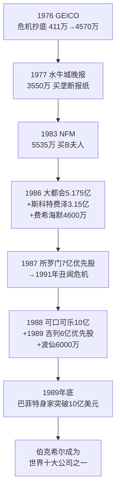
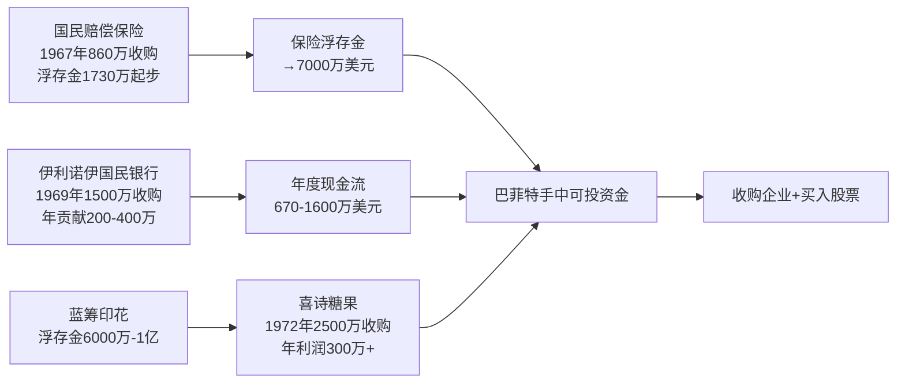
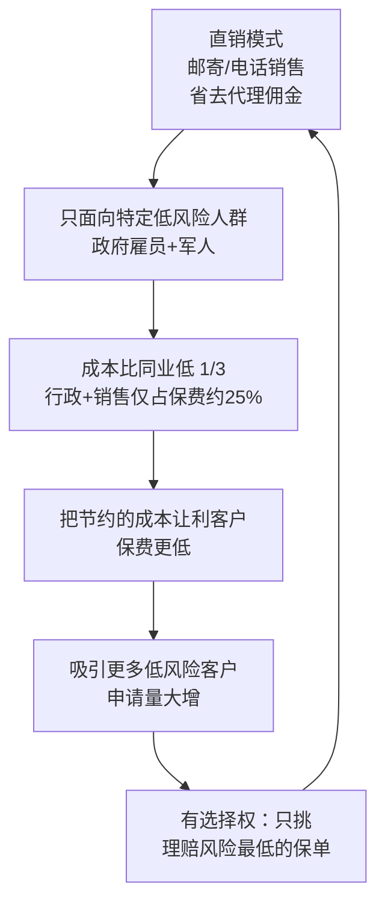
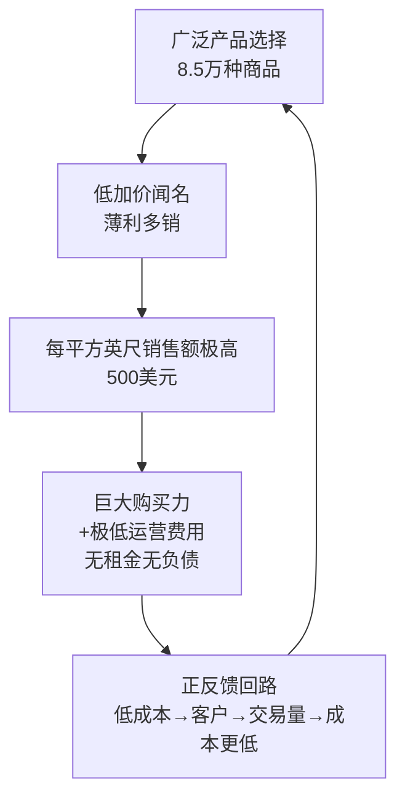
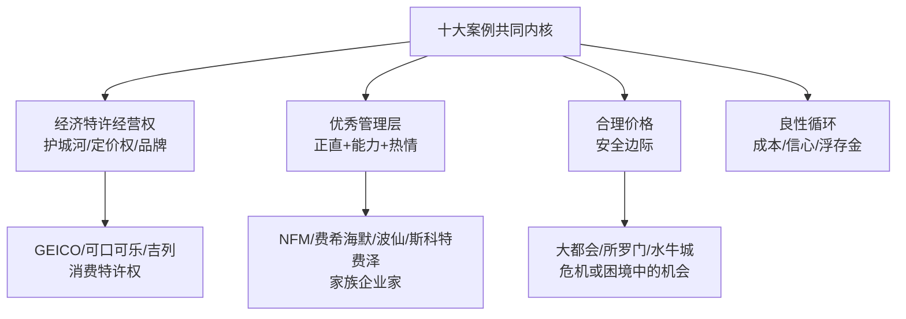

# 《巴菲特的伯克希尔崛起：从1亿到10亿美金的历程》深度解读（详细版）

> **原书名**：The Deals of Warren Buffett: From $100 Million to $10 Billion（格伦·阿诺德 著，杨天南 译）
> **系列定位**：阿诺德"巴菲特投资案例集"系列**第二部**（第一部《巴菲特的第一桶金》讲 1 亿之前，本书讲 **1 亿美元 → 10 亿美元**的关键旅程，第三部将讲 10 亿→100 亿）。
> **核心内容**：**1976—1989 年十大经典投资案例**逐案深度复盘。这是巴菲特投资生涯中最具戏剧性的 14 年：从 1976 年市值不足 4,000 万美元的伯克希尔，到 1989 年 59 岁的巴菲特身家突破 **10 亿美元**。十年间，伯克希尔股价从 40 美元涨到 8,600 美元（+21,400%）。
> **与系列其他笔记的关系**：07《巴菲特投资案例集》（黄建平）是国内视角的 28 案例概览；本书是英国金融学教授格伦·阿诺德的**学术级逐案深挖**——每个案例都从"为什么"出发，分析资产负债表、盈利历史、战略定位、管理层品质，并附独家数据表。09/10 是股东信原文，本书是把股东信背后的**交易现场**还原给你看。
>
> 🔗 **双链**：[[12《巴菲特的估值逻辑》深度解读（详细版）|12 估值逻辑（同一时期案例的算账版）]] · [[13《巴菲特的护城河》深度解读（详细版）|13 巴菲特的护城河（什么公司值得长期持有）]] · [[10《巴菲特致股东的信》深度解读（详细版）|10 致股东的信]]

---

## 目录

- [[#全书导读：从 1 亿到 10 亿的十年路线图|全书导读：从 1 亿到 10 亿的十年路线图]]
- [[#背景回顾：巴菲特如何赚得第一桶金（1941—1975）|背景回顾：巴菲特如何赚得第一桶金（1941—1975）]]
- [[#案例1 盖可保险（1976）：最佳单笔投资|案例1 盖可保险（1976）：最佳单笔投资]]
- [[#案例2 《水牛城新闻晚报》（1977）：收费桥梁的五年苦战|案例2 《水牛城新闻晚报》（1977）：收费桥梁的五年苦战]]
- [[#案例3 内布拉斯加家具城（1983）：B 夫人与一页纸合同|案例3 内布拉斯加家具城（1983）：B 夫人与一页纸合同]]
- [[#案例4 大都会/ABC/迪士尼（1986）：15 年耐心与 400 磅大猩猩|案例4 大都会/ABC/迪士尼（1986）：15 年耐心与 400 磅大猩猩]]
- [[#案例5 斯科特·费泽（1986）：股东盈余公式的唯一公开演示|案例5 斯科特·费泽（1986）：股东盈余公式的唯一公开演示]]
- [[#案例6 费希海默兄弟（1986）：收购广告与七圣徒|案例6 费希海默兄弟（1986）：收购广告与七圣徒]]
- [[#案例7 所罗门兄弟（1987）：职业生涯最大的失败|案例7 所罗门兄弟（1987）：职业生涯最大的失败]]
- [[#案例8 可口可乐（1988）：无法回避的公司|案例8 可口可乐（1988）：无法回避的公司]]
- [[#案例9 波仙珠宝（1989）：十分钟成交与五个问题|案例9 波仙珠宝（1989）：十分钟成交与五个问题]]
- [[#案例10 吉列/宝洁/金霸王（1989）：剃须刀与电池的三十年流转|案例10 吉列/宝洁/金霸王（1989）：剃须刀与电池的三十年流转]]
- [[#尾声 漫长的旅程：10 亿美元时刻|尾声 漫长的旅程：10 亿美元时刻]]
- [[#总结：十大案例的投资方法论|总结：十大案例的投资方法论]]

---

## 全书导读：从 1 亿到 10 亿的十年路线图

### 0.1 为什么这本书值得读

| 维度 | 本书特点 | 对比其他巴菲特书籍 |
|------|---------|------------------|
| 视角 | 英国金融学教授，从"为什么"逐案深挖 | 多数书只讲"买了什么、赚了多少" |
| 范围 | 1976—1989 十年十大案例，每案独立成章 | 编年史或主题式 |
| 数据 | 每个案例附独家数据表（成本/利润/回报） | 罕见 |
| 平衡 | **不回避错误**：所罗门丑闻、水牛城五年亏损、盖可信用卡失败 | 多数书只讲成功 |
| 结构 | 每案结尾"学习要点"清单 | 便于实践 |

### 0.2 十大案例总览表（按首次投资时间排序）

| 序号 | 案例 | 首次投资年份 | 投入金额 | 核心主题 |
|------|------|------------|---------|---------|
| 1 | 盖可保险（GEICO） | 1976 | 4,570 万美元（买一半） | 三个良性循环、危机抄底 |
| 2 | 《水牛城新闻晚报》 | 1977 | 3,551 万美元 | 收费桥梁、五年苦战 |
| 3 | 内布拉斯加家具城（NFM） | 1983 | 5,535 万美元（90%） | B 夫人、低成本特许经营权 |
| 4 | 大都会/ABC/迪士尼 | 1986 | 5.175 亿美元 | 15 年耐心、白衣护卫 |
| 5 | 斯科特·费泽 | 1986 | 3.152 亿美元 | 股东盈余公式、一页纸合同 |
| 6 | 费希海默兄弟 | 1986 | 约 4,600 万美元（84%） | 收购广告、家族企业 |
| 7 | 所罗门兄弟 | 1987 | 7 亿美元优先股 | 最大的失败、声誉危机 |
| 8 | 可口可乐 | 1988 | 约 10 亿美元 | 无法回避的公司 |
| 9 | 波仙珠宝 | 1989 | 约 6,000 万（80%，未公开） | 十分钟成交、五个问题 |
| 10 | 吉列/宝洁/金霸王 | 1989 | 6 亿美元优先股 | 剃须刀与电池的三十年 |

### 0.3 十年全景：伯克希尔股价 vs 标普 500

| 阶段 | 时间 | 标普 500 | 伯克希尔 | 倍数差 |
|------|------|---------|---------|--------|
| 第一阶段 | 1976—1985 | 翻一番（+100%） | 从不到 89 美元涨到超 2,600 美元 | **约 29 倍** |
| 第二阶段 | 1986—1989 | +39% | 再涨 3 倍 | 8,600 美元 |
| 全程 | 1976—1989 | 约 +180% | **+21,400%** | **约 119 倍** |

> 1962 年巴菲特首次购买伯克希尔股票时，价格是 7.50 美元/股。到 1989 年底，伯克希尔股价超过 8,600 美元——**27 年 1,100 倍**。

### 0.4 十年时间线总览

### 0.5 现金从哪里来：伯克希尔的资金引擎（1976 年前后）

**三条资金路径**：

| 资金源 | 规模 | 用途 |
|--------|------|------|
| 伯克希尔本身 | 浮存金 7,000 万+，年现金流 670 万—1,600 万 | 收购企业、买股票 |
| 多元零售公司 | 服装连锁年利润约 100 万+伯克希尔、蓝筹收益 | 1978 年并入伯克希尔 |
| 蓝筹印花 | 浮存金 6,000 万—1 亿 | 收购喜诗糖果（1972）、威斯科（1973-74）、水牛城晚报（1977） |

---

## 背景回顾：巴菲特如何赚得第一桶金（1941—1975）

### 1.1 早年：从报童到格雷厄姆的学生

| 年份 | 事件 | 关键数字 |
|------|------|---------|
| 1941 | 11 岁，凑 114.75 美元买入人生第一只股票 | 3 股城市服务优先股 |
| 1941—1947 | 报童生涯：投递《华盛顿邮报》，一周五天 | 青少年时投递过 50 万份报纸 |
| 1942—1950 | 弹球机转租、回收二手高尔夫球等小生意 | 20 岁时身家 15,000 美元 |
| 1950 | 读到格雷厄姆《聪明的投资者》 | 顿悟投资之道 |
| 1951 | 哥伦比亚大学师从格雷厄姆；发现老师基金持有 GEICO 大量股份 | 周六去 GEICO 总部与洛里默·戴维森聊了 4 小时 |
| 1951 | 将全部身家 2/3 投入 GEICO 股票 | 不到一年获利 50% 卖出 |
| 1952—1969 | 卖出 GEICO 后自责 19 年——若持有，19 年后价值 130 万美元 | 第一课：好公司要拿住 |

### 1.2 格雷厄姆的四大投资原则（巴菲特终身遵循）

| 序号 | 原则 | 内涵 |
|------|------|------|
| 1 | 对公司进行深入的分析 | 阅读财报、理解生意 |
| 2 | 确定内在价值与股价之间的安全边际 | 价格远低于价值才买 |
| 3 | 瞄准令人满意的回报 | 不是最大回报，是合理回报 |
| 4 | 记住市场先生有时给出奇怪报价 | 独立思考，利用市场情绪 |

### 1.3 合伙公司时期（1957—1969）：29.5% 的年化

- 1956 年成立巴菲特合伙公司，7 位合伙人，10.5 万美元起步。
- 13 年年化回报 **29.5%**，道指同期仅 7.4%，无一亏损年份。
- 1969 年解散：市场过热找不到好机会，宁可不做也不降低标准。
- 期间经典投资：桑伯恩地图（1958）、美国运通色拉油丑闻抄底（1963）、邓普斯特农具控制案（1962-64）。
- 1962 年以 7.5 美元/股买入伯克希尔纺织厂——本意是烟蒂股，后来成为终身事业。

### 1.4 伯克希尔转型的四个关键收购（1965—1974）

| 年份 | 收购 | 金额 | 意义 |
|------|------|------|------|
| 1965 | 取得伯克希尔控制权 | 每股 7.5 美元 | 纺织厂，账面价值 19 美元 |
| 1967 | 国民赔偿保险公司 | 860 万美元 | **浮存金模式起点**（1,730 万起步） |
| 1969 | 伊利诺伊国民银行（罗克福德） | 1,500 万美元 | 年贡献 200—400 万现金流 |
| 1972 | 喜诗糖果（经蓝筹印花） | 2,500 万美元 | **第一次为品质付费**，经济商誉启蒙 |
| 1974 | 《华盛顿邮报》9.7% 股权 | 1,060 万美元 | 传媒业第一笔重仓 |

### 1.5 1970 年代中期的伯克希尔帝国全景

| 板块 | 构成 | 年贡献 |
|------|------|--------|
| 保险 | 国民赔偿+旗下各险种 | 承保利润+浮存金投资 |
| 银行 | 伊利诺伊国民银行 | 400—500 万美元 |
| 纺织 | 伯克希尔纺织（垂死） | 微利甚至亏损 |
| 蓝筹印花 | 喜诗糖果 99%+威斯科 | 喜诗年利润约 300 万+ |
| 多元零售 | 服装连锁 75 店 | 约 100 万税前 |

> 巴菲特 1978 年与多元零售合并、1983 年全资收购蓝筹印花，将交叉持股结构简化为单一伯克希尔——**简化结构本身就是一种价值创造**。

---

---

## 案例1 盖可保险（1976）：最佳单笔投资

> 巴菲特本人评价："这或许是最佳的单笔投资。"最初 4,570 万美元的投资，至少赚了 100 倍。

### 1.1 案例速览

| 维度 | 内容 |
|------|------|
| 投资时间 | 1976 年 7 月（会面次日开始买入） |
| 买入价格 | 首批 411.6 万美元买 1,294,308 股，均价 3.18 美元/股 |
| 累计投入 | 1976—1980 年共 4,714 万美元，持有 720 万股（33%），均价 6.55 美元 |
| 买入背景 | GEICO 濒临破产，股价从 62 美元暴跌至 2 美元（−97%） |
| 关键人物 | 杰克·伯恩（新 CEO）、洛里默·戴维森（前总裁）、卢·辛普森（CIO）、托尼·奈斯利（1993 年 CEO） |
| 后续发展 | 1996 年以 23 亿美元收购剩余 49%（价格是前一半的 50 倍） |
| 最终回报 | 2018 年承保利润累计 155 亿美元；浮存金 220 亿美元 |

### 1.2 三个良性循环（盖可商业模式的核心）

#### 循环一：运营成本良性循环

| 要素 | 细节 |
|------|------|
| 直销 | 省去经纪佣金（同业约 40% 保费花在行政和销售上） |
| 目标人群 | 1958 年前只卖政府雇员和军人；此后限专业人士、技术人员、管理层 |
| 利润纪律 | 巴菲特希望盖可承保利润率最多 4%，超过就降价 |
| 服务 | 优质理赔服务→老客户推荐→低成本获客 |
| 选择权 | 申请量大→只承保最佳风险人群 |

> 21 岁巴菲特在《商业金融纪事报》发表《我最喜欢的股票》："没有来自代理商的压力，去被迫接受有问题的投保人，或为糟糕风险续保。"

#### 循环二：信心的良性循环（1976 年危机时刻）

| 阶段 | 状态 |
|------|------|
| 恶性循环 | 股价暴跌→投资者/再保险公司丧失信心→业务流失→更缺钱 |
| 僵局 | 每个潜在注资者都在等别人先迈出第一步 |
| 破局 | **巴菲特出手**：411.6 万美元真金白银+公开背书 |
| 良性循环 | 资本注入→市场信心恢复→再保险公司回归→监管配合→保单回升 |

#### 循环三：从负债到赚钱的良性循环（浮存金）

| 步骤 | 内容 |
|------|------|
| 1 | 收取保费（尚未赔付的钱） |
| 2 | 浮存金用于投资：债券利息+股票分红+资本利得 |
| 3 | 承保纪律良好时浮存金成本为负 |
| 4 | 递延税（应付税款与实际支付的时差）也是免费资金 |

### 1.3 盖可为何堕落：1970 年代的灾难

| 时间 | 事件 |
|------|------|
| 1958—1970 | 戴维森任总裁 12 年：保费 4,000 万→2.5 亿美元，美国第五大车险公司，严格承保纪律 |
| 1970 | 71 岁戴维森退休；"追求成长、对新电脑程序充满热情的人"占上风 |
| 1973 | 取消所有销售对象限制（含蓝领、21 岁以下高危人群） |
| 1973—75 | 疯狂扩张：向 2,500 万人发直邮、123 个地区办公室、领薪经纪人 |
| 1975 | 发现损失低估 1 亿美元，230 万个亏损保单；**亏损 1.265 亿美元**，停发股息，股价跌到 5 美元 |
| 1976 | 股价最低 2 美元（从 62 美元跌 97%） |

**格雷厄姆的震惊**（1976 年采访）："我问自己，公司是不是扩张太快了……一想到他们一年损失那么多钱，我就不寒而栗，难以置信……你必须是个天才才能亏那么多钱。"

**外部环境恶化**：

| 因素 | 影响 |
|------|------|
| 26 州《无过错保险法》 | 赔付由损害程度决定而非过错——盖可的低风险客户优势被削弱 |
| 监管限价 | 保费涨价受限 |
| 通胀 | 住院、手术、修车费用快速上升 |

### 1.4 杰克·伯恩：保险界的贝比·鲁斯

| 维度 | 细节 |
|------|------|
| 背景 | 新泽西人，保险世家，精算师出身，34 岁任旅行者保险执行副总裁 |
| 特质 | "既严厉又有爱心"——做错事情况很糟，做对事奖励丰厚 |
| 1976 年 5 月 | 出任 GEICO CEO |
| 行动清单 | ①说服监管不关门；②组建分保财团分担 40% 风险；③关办公室、员工减半；④提高保费 |
| 巴菲特的观察 | 巴菲特请凯瑟琳·格雷厄姆安排会面，被伯恩拒绝（"从没听说过巴菲特"），戴维森大怒逼他见面，7 月傍晚一见如故聊到深夜 |

**巴菲特对伯恩的评价**："保险界的贝比·鲁斯。"伯恩的激励艺术："就像一个养鸡场的场主，将一枚鸵鸟蛋放进母鸡栏中，大声说：这就是你们的奋斗目标。"

### 1.5 交易细节：1976 年的拯救行动

| 时间 | 事件 |
|------|------|
| 1976.7 | 巴菲特与伯恩会面；次日伯克希尔开始买入（411.6 万美元） |
| 1976.7 中 | 华盛顿监管允许继续运营；需分保 25% 风险+募资 5,000 万 |
| 1976.8 | 27 家保险公司提供再保险（条件：成功发行至少 5,000 万新股） |
| 1976.8.18 | 所罗门公司（当时二流投行，想提升权益市场地位）接下发行 |
| 1976.11 | 发行完成：8% 股息可转换优先股；巴菲特告诉所罗门——**伯克希尔收购所有人未认购的优先股**（当时伯克希尔市值不比盖可高多少） |
| 结果 | 伯克希尔买 1,986,953 股优先股，耗资 1,942 万美元（占其 7,540 万投资组合的 1/4） |

**综合成本率 124 的救赎**：盖可 1976 年综合成本率 124（每收 1 美元保费要赔付 1.24 美元）——"有史以来最糟糕的保险公司之一"。1976 年第二季度改善至 113。

> 巴菲特 1980 年总结买入逻辑："除了少数例外，当一个声誉卓著的管理层去拯救一个声名狼藉的企业时，往往后者的声誉毫无起色。"但盖可是例外——"盖可过去凭借其基本面所具有的商业优势取得了惊人的成功，今天，这种优势依然存在，尽管它被淹没在财务困境和运营困境的海洋之中。"他将此与 1964 年美国运通色拉油丑闻类比：**独一无二的公司，暂时打击未伤及基本面**。

### 1.6 盖可腾飞：19 年长跑的数据

| 年份 | 里程碑 |
|------|--------|
| 1977 | 扭亏为盈，恢复偿付能力；份额从 4% 降至 2% 以下但保单全部盈利 |
| 1980 | 盈利 2,000 万（占伯克希尔盈利 1/3）；股价 8.13 美元（1 年涨 1.6 倍） |
| 1981 | 股价 27.75 美元（5 年 8 倍）；伯克希尔持股市值 2 亿 |
| 1982 | 保费 2.5 亿（1/3 归伯克希尔），超过旗下其他保险公司总和 |
| 1984 | 保费 8.85 亿；持股市值 4 亿（占伯克希尔净值 27%） |
| 1990 年代初 | 股价超 320 美元（拆股前）；**百倍股** |
| 1992 | 安德鲁飓风重创；盖可多元化（航空/家庭/金融险）迷失方向 |
| 1993 | 托尼·奈斯利任 CEO，回归专注低成本直销 |
| 1996 | 伯克希尔 23 亿美元收购剩余 49% |
| 1997—2008 | 广告预算 3,100 万→8 亿；份额 2.5%→7.7%（第三大） |
| 2015 | 份额 11.4%，第二大车险公司 |
| 2018 | 承保利润累计 155 亿美元；浮存金 220 亿美元 |

### 1.7 卢·辛普森：比肩巴菲特的投资大师

| 维度 | 细节 |
|------|------|
| 1979 年任命 | 42 岁，经巴菲特 4 小时面试，巴菲特立刻给伯恩打电话"不必再物色了" |
| 业绩 | 25 年年化 **20.3%** vs 标普 13.5%——**超额 6.8%**（1 万美元→101.5 万 vs 23.7 万） |
| 仓位 | 集中持股 15—20 只（通常 7 只或更少），单一持股超 10%，前五占 50%+ |
| 换手率 | 15%—20%/年 |
| 巴菲特评价 | "具有投资者的理想气质……对于盲从大众毫无兴趣，无论顺逆，他都会遵循自己的推理"；"如果万一芒格和我发生了什么意外，辛普森的存在可以保证伯克希尔立即会有一位非凡的专业人士来处理投资工作" |

**辛普森的投资方法六条**：

| 方法 | 要点 |
|------|------|
| 审视事实而非愿景 | 已被证明的业绩>承诺的前景 |
| 整天阅读 | 每天读 5—8 小时财报、行业报告 |
| 独立思考 | 怀疑传统观念，愿意考虑不受欢迎的公司 |
| 高回报+股东导向 | 现金流回报优于利润回报（造假更难） |
| 减少投资 | "交易越多，赚钱就越难"；20 次打卡比喻 |
| 卖出错误持有正确 | "剪除鲜花、浇灌杂草"是投资者常见错误 |

### 1.8 托尼·奈斯利时代：广告机器与护城河

| 维度 | 细节 |
|------|------|
| 1993 年任联席 CEO | 18 岁入司（1961 年），历经危机岁月 |
| 广告投入 | 1997 年 1 亿→1999 年 2.42 亿→2009 年 8 亿（超过所有对手） |
| 巴菲特态度 | "伯克希尔愿意为盖可任何新业务投资，没有上限""奈斯利的脚将继续踩在给广告投入加油的踏板上（我的脚将踩在他的脚上）" |
| 壁虎广告 | 2000 年电视首秀，英国腔卡通壁虎成为广告偶像 |
| 激励方案 | 两个关键变量各占 50%：①保单数量增长；②承保超一年的车险保单利润——"盖可的每个人都知道什么是重要的" |
| 奖金数据 | 1996 年员工收入 16.9% 是奖金（4,000 万）；1998 年 32.3%（1.03 亿）；2004 年 24.3%（1.91 亿） |
| 成本护城河 | 承保费用+行政成本仅占保费 14%—20%，比对手低 15 个百分点 |

**巴菲特 2015 年的誓言**："到 2030 年 8 月 30 日，我 100 岁生日的那一天，我计划宣布盖可已经荣登榜首。"

### 1.9 一个 5,000 万美元的错误（巴菲特的忏悔）

| 维度 | 细节 |
|------|------|
| 事件 | 巴菲特突发奇想：给盖可客户提供信用卡（万事达白金卡） |
| 警告 | 盖可高管们一致反对："我们不会从盖可的客户那里得到好果子吃，相反，可能得到坏果子" |
| 结果 | 逆向选择：信誉最差的人最积极接受报价→巨亏约 5,000 万美元 |
| 巴菲特忏悔 | "你们的董事长结束了一场完全咎由自取的、非常昂贵的商业惨败……我曾经巧妙地暗示我岁数更大、更聪明，令人遗憾的是，我只是岁数更大而已。" |
| 教训 | "我们宁愿承受一些糟糕决策的有形成本，也不愿承担决策太慢或根本不做决策而带来的很多无形成本，因为官僚机构更令人窒息。" |

### 1.10 盖可案例学习要点（作者总结）

| 序号 | 要点 |
|------|------|
| 1 | **关注特许经营权**：公司因短期管理失误每况愈下时，独立分析其经济特许权是否幸存 |
| 2 | **了解关键人员**：是否懂特许经营权、明智追求利润、对股东高度诚信 |
| 3 | **不要过早卖出**：特许权未变+高回报+优秀管理层，涨 50 倍后依然值得持有而非卖出 |
| 4 | **寻找良性循环**：已经开始的或即将出现的良性循环 |
| 5 | **鼓励利润留存再投资**：仅限每留存 1 美元创造超 1 美元价值的情况 |
| 6 | **正确认识浮存金**：将低成本浮存金投入两位数回报的投资 |

---

---

## 案例2 《水牛城新闻晚报》（1977）：收费桥梁的五年苦战

### 2.1 案例速览

| 维度 | 内容 |
|------|------|
| 投资时间 | 1977 年 4 月 15 日（经蓝筹印花收购 100% 股权） |
| 成交价格 | 3,550.9 万美元（3,407.6 万现金+承担养老金） |
| 背景 | 布法罗（水牛城）两份报纸之一，无周日版，工会强大，城市衰退 |
| 竞争对手 | 《信使报》（Courier-Express）：出周日版，周日销量 27.5 万份 |
| 前五年 | 连续亏损（1978 年亏 290 万，1979 年亏 460 万……） |
| 转折 | 1982 年 9 月 19 日《信使报》倒闭，成为一城一报 |
| 最终回报 | 90 年代累计输送近 3 亿美元现金；**15 倍回报** |

### 2.2 为什么报纸是"收费桥梁"

**巴菲特 1984 年的经典论述**（书中全文收录）：

> "主流报纸的经济特征是极为优秀的……任何一家报纸只要占有社会主导地位，即便是三流报纸，获利也会一样丰厚甚至更好。……一旦占据主导地位，决定报纸好坏的就是报纸本身，而不再是市场。无论好坏，它都会兴旺发达。……即便是一份差劲的报纸，对大多数市民而言，也具有价值，因为它起到了公告牌的作用。"

| 收费桥梁特征 | 报纸的对应 |
|-------------|-----------|
| 不受价格监管 | 广告费率+发行价格可自主上调 |
| 垄断地位 | 一城一报 |
| 定价权 | 每年提价，利润滚滚 |
| 护城河 | 读者依赖+广告商依赖（公告牌效应） |

**巴菲特 2006 年回忆报业黄金时代**："当一个大城市有两份或两份以上的报纸时（这种情况一个世纪前几乎普遍存在），领先的报纸通常会成为独占鳌头的赢家。当竞争消失后，报纸在广告和发行方面的定价权被释放出来。……利润也会随之滚滚而来。这对于报纸的股东而言，简直就是经济意义上的天堂。"

### 2.3 收购前的四大顾虑与巴菲特的选择

| 顾虑 | 细节 | 巴菲特的判断 |
|------|------|-------------|
| ①双报竞争 | 两家竞争激烈都不赚钱 | 对手《信使报》每周出 7 天，晚报仅 6 天 |
| ②工会强势 | 管理层屈从工会，股东利益受损 | 1980 年以关厂威胁逼退工会 |
| ③无周日版 | 周日版对广告商最具吸引力 | **周日版是最大机会点** |
| ④城市衰退 | 铁锈带人口减少 | 人口稳定+高家庭订阅率是独特优势 |

**《华盛顿邮报》和《芝加哥论坛报》都拒绝了收购邀约**——巴菲特和芒格透过困境看到挑战可以克服。

### 2.4 收购细节

| 维度 | 内容 |
|------|------|
| 谈判 | 1977 年第一个星期六，巴菲特+芒格到康涅狄格州经纪人家中，讨价还价 |
| 价格 | 从 4,000 万降到 3,500 万（当时税前利润仅 170 万）最终 3,550.9 万 |
| 买家 | 蓝筹印花（伯克希尔持 58% 股权）——伯克希尔和多元零售现金不足 |
| 卖方背景 | 凯特·巴特勒 1974 年去世，拒绝遗产规划导致巨额遗产税，继承人只能出售 |
| 报纸优势 | 当地家庭订阅率全美大城市最高；日发行量 27 万 vs 对手 12.5 万；广告收入高 75% |

**芒格 1977 年给蓝筹印花股东的信**："晚报之所以是一份功勋卓著的报纸，部分原因是几十年来它一直由具有传奇色彩的编辑阿尔弗雷德·基尔霍费尔主导和塑造，他虽然退休了，但直到 83 岁时依然每天都来报社。"

### 2.5 周日版大战（1977—1982）

| 时间 | 事件 |
|------|------|
| 1977.11 | 晚报推出周日版：头五周"六份报纸价格拿七份"（1.05 美元）广告闪电战 |
| 1977.11 | 《信使报》反击：宣传"奥马哈大佬要毁掉《信使报》"+提起反垄断诉讼 |
| 1977.11 | 法院初步禁令：优惠期缩短为两周；广告商不能获发行量保证；限价；要客户签名订单 |
| 1977—78 冬 | 禁令下周日版仍卖出约 16 万份（对手的 2/3）；周六版损失 4.5 万份 |
| 1978.2 | 芒格："对周日版不会放弃，打算负全责"（尽管短期利润很低或没有） |
| 1979.4 | 上诉法院取消限制——但竞争持续多年 |
| 1980 | 13 个工会威胁：巴菲特+芒格提出"公司会倒闭"的真实威胁，工会退缩 |
| 1980—81 | 经济衰退重创布法罗，广告锐减；芒格承认"如果 1977 年没收购晚报，现在会多出 700 万美元资产" |
| 1982.9.19 | **《信使报》老板宣布退出**——耗不过蓝筹印花的财力 |

### 2.6 两位关键经理人+一位奥马哈外援

| 人物 | 角色 | 贡献 |
|------|------|------|
| 亨利·厄本 | 总裁/出版人（1974—1983） | 动荡期稳定公司；"对折扣买新闻纸有道德内疚"的老派绅士 |
| 默里·莱特 | 总编辑（1969 年起，1949 年入社） | 好莱坞式主编：昂首阔步、咆哮下命令；塑造报纸内容与评论 |
| 斯坦福·利普西 | 出版人（1983—2010） | 普利策奖得主；1977 年起每月一周从奥马哈来布法罗，1980 年全职；"发行、出版、销售和编辑"样样精通；与巴菲特共事 30 年从未有过分歧 |

**利普西的处世哲学**："你希望别人怎么对待你自己，你就怎么对待别人。你会为你身边重要的人着想，并且努力地、创造性地思考如何让一个人快乐。"

**巴菲特 1986 年对利普西的表扬**："连续三年，工时大幅下降，其他成本也得到了严格控制……我们继续提供 50% 的新闻版面。"（同业一般只有 40%）

### 2.7 巴菲特的管理风格（本案例总结）

| 原则 | 具体表现 |
|------|---------|
| 不干预 | 从不要求新闻编辑遵从自己的政治主张；大多数记者不知道巴菲特的政治主张 |
| 聚焦关键指标 | 最关心发行量数据、新闻纸成本、广告定价 |
| 定价的局外人视角 | "对经理人而言，提价就像俄罗斯轮盘赌；但 CEO 经历很多企业，应由经验丰富、远离现场的人制定价格" |
| 薪酬设计 | 利益与长期利润挂钩；对出色工作给予超越金钱的褒奖 |
| 诚实 | 芒格要求"坏消息立刻通知"；"好消息会自己照顾自己" |

### 2.8 互联网时代的衰落（2000 年后）

| 指标 | 2000 年前后 | 2015—2016 |
|------|------------|-----------|
| 周日版发行量 | 36 万+ | 17.4 万（跌一半） |
| 平日发行量 | 32.3 万 | 11.1 万 |
| 营业利润 | — | 1,090 万（2015）/730 万（2016） |

**巴菲特的清醒**："当一个行业的基础渐渐崩溃时，管理层的才华横溢固然可以减缓衰退的速度，但不断被侵蚀的基本面终将压倒管理层的才华。"

但他坚守承诺："除非我们面临不可逆转的现金流失，否则我们将坚守《水牛城新闻报》……我们相信充满活力的媒体是维持民主的关键因素。……报纸利润肥美的好日子已经一去不复返了。"

### 2.9 水牛城晚报案例学习要点

| 序号 | 要点 |
|------|------|
| 1 | 你看到的数字并不总是最重要的——从战略地位看质量潜力 |
| 2 | 注重产品质量和管理者素质——亏损时也不在质量上妥协 |
| 3 | 长期思维——持股期限是"永远" |
| 4 | 受到严重打击时要坚持——"很多失败注定会发生，但坚持到底，你终究会赢" |
| 5 | 储备充足——多种收入来源+丰富现金储备让威胁可信 |
| 6 | 信任管理层并尽力帮助他们——不是事无巨细掌控一切 |

---

---

## 案例3 内布拉斯加家具城（1983）：B 夫人与一页纸合同

### 3.1 案例速览

| 维度 | 内容 |
|------|------|
| 投资时间 | 1983 年 8 月 30 日（巴菲特 53 岁生日当天） |
| 成交价格 | 5,535 万美元买 90% 股份（后转 80%）——**一页纸手写合同** |
| 卖方 | B 夫人（罗丝·布鲁姆金，89 岁）及其家族 |
| 尽调 | 无盘点、无审计、无产权调查——"我对你的信任超过对英格兰银行的信任" |
| 背景 | 1979 年通胀 15%；伯克希尔需要抗通胀的轻资产企业 |
| 现状 | 40 年只开了 3 家新店；2011 年收入是 1983 年的 10 倍+（约 16 亿美元） |

### 3.2 B 夫人：从白俄罗斯到奥马哈的传奇

| 时间 | 事件 |
|------|------|
| 1893 年 | 出生于明斯克附近村庄，6 岁开始在母亲杂货店帮忙 |
| 1917 年前后 | 24 岁经贿赂边防警卫逃离白俄罗斯（俄国革命） |
| 1920s | 与丈夫路易斯到美国，身无分文、不懂英语、从未上过学 |
| 1937 年 | 地下室里开小店，带四个孩子；最困难时卖掉自家家具还债 |
| 数十年 | "物美价廉说实话"的经营座右铭；每周工作 70 小时 |
| 1983 年 | 89 岁将公司 90% 卖给巴菲特 |
| 1989 年 | 96 岁因与孙子们意见不合退出 NFM，在**NFM 对面**开了新地毯店竞争 |
| 1993 年前后 | 与家族和解，签竞业禁止协议 |
| 1998 年 | 104 岁离世；葬礼 1,000+ 人参加；NFM 当天没有关门——"她不会同意因为葬礼而错失商机" |

**B 夫人名言**："我不懂书本上的那些理论，我用的就是老办法：说真话，买的对，卖得便宜。"

**巴菲特的评价**："如果我开始创业时，可以像在美国橄榄球联盟选拔球员那样，从全国顶尖商学院中挑选 25 名优秀毕业生，或从《财富》500 强公司的 CEO 们中挑选 25 个，或者我可以请 B 夫人来经营公司，那我就请 B 夫人好了，像她这样的人可不多。"

### 3.3 交易现场：奥马哈历史性的握手

| 步骤 | 细节 |
|------|------|
| 背景 | 巴菲特观察 NFM 多年，多次被拒（B 夫人不想卖） |
| 突破 | 巴菲特"通过乞求的方式让她报一个价格"——她报出后他立刻答应 |
| 签约 | 1983.8.30 巴菲特生日；合同仅 1/4 页纸，巴菲特亲手起草；B 夫人没看合同，儿子路易讲解 |
| 尽调 | 巴菲特只问：是否有负债？是否房屋主人？——"成交，但并不是捡了便宜" |
| 条款 | 5,535 万买 90%；10% 留给路易三子；另授 10% 期权给关键家庭成员和经理层→伯克希尔最终 80% |
| 后续 | B 夫人任主席卖地毯；路易任 CEO |

**双方互评**：

| 人物 | 评价 |
|------|------|
| B 夫人评巴菲特 | "沃伦·巴菲特是个天才，我很尊重他，他非常诚实，非常质朴，他说的话就像金子一样珍贵……再也没有一个人像他一样温和、善良、诚实、友好。" |
| 巴菲特评 B 夫人 | "宁愿与灰熊摔跤，也不愿意与 B 夫人他们一家竞争。他们如此精明，以竞争对手做梦都想不到的成本进货，将节省下来的大部分成本让利给客户。" |

### 3.4 NFM 的特许经营权：五个要素

| 要素 | 数据对比 |
|------|---------|
| 毛利率 | NFM 约 22%（仅为莱维茨家具 44.4% 的一半） |
| 运营费用率 | NFM 约 16% vs 莱维茨 35.6% |
| 单店规模 | 1983 年 20 万平方英尺，全国家具/地毯/家电销量第一 |
| 年客户节省 | 每年为客户节省至少 300 万美元 |
| 扩张克制 | 40 年仅开 3 家店（得梅因 1993/堪萨斯 2003/得克萨斯 2016）——"不要妄想有一个成功的公式可以一直使用" |

**芒格的跨学科评价**："极端成功可能是由以下因素的某种组合造成的：一个或两个变量的极端最大化或极端最小化，例如 Costco 或我们的 NFM……结果往往不是线性的，你添加了一点点东西，然后得到了一大堆结果。"

### 3.5 巴菲特 1983 年的十二条基本原则（本书完整收录）

这是巴菲特 1983 年致股东信中写下的"永恒指南"，本书全文收录，此处摘其精华：

| 序号 | 原则 | 核心内容 |
|------|------|---------|
| 1 | 伙伴关系 | "虽然我们的组织形式是公司制，但我们对待大家的态度是伙伴关系" |
| 2 | 董事持股 | 至少 4/5 董事持股超家族净资产 50%——"我们吃自己做的饭" |
| 3 | 长期目标 | 每股内在价值年化平均收益最大化，而非规模 |
| 4 | 两种所有权 | 全资优秀企业或经保险子公司持优秀企业部分股权 |
| 5 | 合并报表失真 | 向股东逐一汇报每个重要企业的利润 |
| 6 | 会计不影响决策 | "更倾向于购买根据标准会计原则不需要报告的 2 美元利润，而不是需要报告的 1 美元利润" |
| 7 | 少用债务 | "会拒绝一些有趣的机会，而不是过度使用资产负债表" |
| 8 | 不用股东的钱买单 | "我们使用你们的钱就像用自己的钱一样" |
| 9 | 一美元原则 | 每留存 1 美元利润至少创造 1 美元市值，五年滚动验证 |
| 10 | 物有所值才发新股 | 发行新股就是出售公司的一部分 |
| 11 | 永不卖出好企业 | "无论价格如何，我们都没有兴趣卖掉伯克希尔所拥有的优质企业" |
| 12 | 坦诚披露 | "真诚将令人受益……在公众场合误导别人的 CEO，最终在私下里也会误导自己" |

### 3.6 收购后的表现

| 维度 | 数据 |
|------|------|
| 收购后十年 | 营业收入翻一番，利润翻一番 |
| 1993 年后 | 并入合并报表，不再单列 |
| 2011 年 | 收入是 1983 年的 10 倍多（约 16 亿美元） |
| 当前估算 | 年税后利润超 8,000 万美元（含 2016 年得克萨斯新店） |

**布鲁姆金家族的商业秘密（巴菲特总结）**：

| 序号 | 秘密 |
|------|------|
| 1 | 旺盛的热情和精力——"本杰明·富兰克林和霍雷肖·阿尔杰看起来像辍学生" |
| 2 | 明确能力圈并在圈内行事果断 |
| 3 | 对圈外诱惑置之不理 |
| 4 | 慎终如始，与人为善 |

### 3.7 NFM 案例学习要点

| 序号 | 要点 |
|------|------|
| 1 | 发现好企业后多年跟踪观察是值得的——即便暂时买不到 |
| 2 | 低成本生产商可能是好投资——低成本+低利润率+广泛覆盖=客户利益+高资本回报 |
| 3 | 估值要超越眼前收益——财报收益结合潜在利润成长与资本需求 |
| 4 | 珍惜与董事和高管相处的时光——机会出现时鼓励、表扬 |
| 5 | 不要妄想成功公式可复制——NFM 40 年只开 3 家店 |

---

---

## 案例4 大都会/ABC/迪士尼（1986）：15 年耐心与 400 磅大猩猩

### 4.1 案例速览

| 维度 | 内容 |
|------|------|
| 投资时间 | 1986 年 1 月（锁定 300 万股，172.50 美元/股） |
| 投入 | 5.175 亿美元（伯克希尔当时最大单笔投资） |
| 背景 | 大都会收购 ABC（35 亿美元，当时美国史上第二大收购案）；巴菲特做"白衣护卫" |
| 特殊条款 | 巴菲特将投票权+出售权交给墨菲两年——"我让他控制了公司" |
| 结果一 | 1993 年以 630 美元/股卖 1/3 给公司回购，税后获利 2.97 亿美元 |
| 结果二 | 1996 年迪士尼收购大都会：伯克希尔得 12 亿现金+13 亿迪士尼股票 |
| 结果三 | 1998—2000 年泡沫中抛售迪士尼，税前约 20 亿美元 |
| 全程 | 5.175 亿投入→约 40 亿美元回报（约 7 倍），仅 1993 年卖出 1/3 就收回成本 |

### 4.2 15 年耐心：为什么等了这么久

| 时间 | 事件 | 巴菲特的态度 |
|------|------|-------------|
| 1960s 末 | 纽约午餐初识墨菲，一见如故 | 开始钦佩"美国顶级管理者" |
| 1970s | 墨菲邀巴菲特入董事会 | 拒绝："你们的股价太高，而我打算持有一个大的仓位"（且媒体法规限制） |
| 1977 | 伯克希尔花约 1,090 万美元买 22 万股（49.48 美元） | 认为价格合理 |
| 1978—80 | **以 43 美元卖出**（亏本） | 巴菲特自嘲："一次典型的冒傻气的行为" |
| 1980—85 | 持续观察，与墨菲定期通话 | 墨菲："巴菲特是我最好的董事，尽管从技术上讲他并不是董事会成员" |
| 1985.1 | 墨菲与戈登森（ABC 创始人）谈合并 | 戈登森："汤姆，你需要一只 400 磅的大猩猩" |
| 1986.1 | 巴菲特以 172.50 美元买入 300 万股 | 15 年后终于等到机会 |

**巴菲特 1986 年致股东信的自嘲**："你们中的一些人可能想知道，为什么我们现在以每股 172.50 美元的价格买进大都会公司，因为你们的董事长在一次典型的冒傻气的行为中，在 1978—1980 年以每股 43 美元的价格卖出了同一家公司的股份。我已经预计到你们会关心这个问题，我花了 1985 年的大部分时间研究了一个能调和这些问题的简洁答案，请再多给我一点时间。"

### 4.3 汤姆·墨菲：巴菲特眼中"美国最好的管理者"

| 维度 | 细节 |
|------|------|
| 背景 | 二战海军退伍军人，哈佛商学院毕业；1954 年 29 岁加入哈德逊河谷广播公司（150 万美元起步） |
| 早期 | 三年亏损，两次几乎破产——"学会了在非必要的情况下，绝对不增加一个人或一件设备" |
| 管理哲学 | "我管理公司就像我自己拥有公司百分之百的股份一样……我们从来没有为了做大而做大" |
| 能力圈 | "我尽可能长时间地待在我们了解的行业里，比如电视和广播" |
| 搭档 | 丹·伯克（运营）——"这两人是最好的管理组合" |
| 业绩 | 1957—1985 年股价 0.72 美元→224.5 美元，**28 年年化 22.8%**（含股息） |

**巴菲特盛赞**："多年以来，我一直在观察大都会的管理情况，我认为它是美国所有上市公司中最好的。汤姆·墨菲不仅仅是伟大的管理者，还是你希望将女儿嫁给他的那种人，与他交往是一种荣幸。"

### 4.4 交易结构：白衣护卫的经典案例

| 环节 | 内容 |
|------|------|
| 为什么需要巴菲特 | 合并后大都会将负债 21 亿美元；企业掠食者（垃圾债券玩家）虎视眈眈 |
| 巴菲特的角色 | 400 磅大猩猩——拒绝出售的大股东 |
| 价格锁定 | 无论合并期间股价如何，172.50 美元/股锁定 300 万股 |
| 市场反应 | 宣布后一周：ABC 涨 42%（106 美元），大都会涨 22%（215 美元）——《财富》："市场对新公司管理层充满崇敬之心" |
| 附加条件 | 布法罗电视台必须出售（巴菲特不能同时拥有报纸和电视台）；巴菲特辞去《华盛顿邮报》董事 |
| **信任的极致** | 巴菲特把 18% 股份的投票权+出售权交给墨菲两年 |

**墨菲回忆**："发生了一件有趣的事，沃伦把他在公司 18% 的股份交给我两年。我从来没有想过向他索要这些，但他让我代表他的股份投票表决，他这是让我控制了公司……可以说，他就是我期待的那只 400 磅的大猩猩。"

### 4.5 价格对价值：为什么这笔"全价"交易物有所值

巴菲特承认："我们对于大都会的收购是以全价进行的，这充分反映了近年来市场发展起来的、对媒体股票高涨的热情……这里已不是一个可以讨价还价的领域。"（格雷厄姆不会为此鼓掌）

| 评估维度 | 分析 |
|---------|------|
| 账面数据 | 市值 36 亿美元 vs 年利润不到 2 亿（利息负担 1.8 亿+）——看起来不便宜 |
| ①资产 | ABC 网络覆盖每个美国人；8 家电视台排名数一数二；2,000+ 附属台；**ESPN（80% 持股）——被埋没的宝石**（1985 年亏 4,000 万→90 年代年赚 5,000 万—1 亿+） |
| ②股本回报率 | 媒体业 15%—22% |
| ③成本控制 | 墨菲去中心化；裁员 1,500 人；停掉 6 万美元花店账单、豪华轿车；出售黄金地段大楼 |
| ④偿债能力 | 卖出多余电视台筹 12 亿；5—6 年积累现金超 20 亿；1992 年现金超债务 |

**ESPN 的崛起（墨菲回忆）**："莱纳德·戈登森对我说：汤姆，总有一天，它的价值会和你的任何一家大型电视台一样高。……它从每年亏损 4000 万美元，到亏损 2000 万，到盈亏平衡，再到扭亏为盈，每年大赚 5000 万，到赚 1 亿。现在，它像是地球的同温层，为我们提供强有力的保护。"

### 4.6 透视盈余与"盯着赛场而不是记分牌"

**巴菲特建议所有投资者计算组合的股东盈利**："这种方法将迫使投资者考虑长期业务前景，而不是短期股市前景。……在投资中，就像在棒球比赛中一样，要在记分牌上得分，必须盯着赛场，而不是盯着记分牌。"

| 年份 | 大都会税后利润 | 伯克希尔应得份额（18%） |
|------|-------------|---------------------|
| 1986 | 2.03 亿 | 约 3,700 万 |
| 1988 | 3.59 亿 | 约 6,500 万 |
| 1990 | 3.59 亿 | 约 6,500 万 |
| 1992 | 4.16 亿 | 约 7,500 万 |

**永久性持股宣言（1987 年信）**："我们宁愿与非常喜欢、欣赏的人打交道，获得 X 倍的回报，也不愿意与无趣或令人反感的人打交道来实现 1.1 倍 X 的回报。我们永远也找不到比这三家永久持股公司（大都会/ABC、GEICO、华盛顿邮报）的管理者更令人喜欢和欣赏的人了。"

### 4.7 特许经营权→普通企业的转型预警（1991 年）

巴菲特在 1991 年信中指出：**媒体业从特许经营权沦为普通企业**。

| 维度 | 特许经营权 | 普通企业 |
|------|-----------|---------|
| 定义 | 需要/期望的产品+无替代品+不受价格管制 | 只能在价格/销量上击败对手 |
| 容忍管理不善 | 可以容忍一段时间 | 随时可能被管理不善扼杀 |
| 估值差异 | 100 万利润年增 6%，折现率 10%→**2,500 万** | 零增长→**1,000 万** |

**结论**："刀枪不入的特许经营权时代和聚宝盆经济时代已经一去不复返了"——但巴菲特不卖："优秀的管理层已经减缓了内在价值的损失；它们的债务很低，而且仍然比普通美国企业拥有的经济特征要好得多。"

### 4.8 迪士尼交易：太阳谷偶遇与两个信封

| 时间 | 事件 |
|------|------|
| 1995.7.14 | 太阳谷会议后，巴菲特偶遇迈克尔·艾斯纳，三人简短交谈——破冰 |
| 数周内 | 达成协议：每 1 股大都会换 1 股迪士尼+65 美元现金（可全选股份或现金） |
| 1996.3.5 | 巴菲特交出两个信封：①25 亿美元大都会股票交迪士尼；②密封信封"不要打开直到 3 月 7 日下午 4:30" |
| 3.7 | 信封打开：**只要股票，不要现金** |
| 结果 | 因太多股东要股票，艾斯纳坚持一半现金一半股票——伯克希尔最终得 12 亿现金+13 亿迪士尼股票 |

**巴菲特看好米老鼠的理由**："与那些明星演员不同，它没有经纪人，一个动画角色不会要求电影票房高比例分成，因为这些动画角色本身就 100% 属于迪士尼。"

**后续**：1998—2000 年泡沫中，迪士尼市盈率超 40 倍，巴菲特抛售（税前约 20 亿美元）。

### 4.9 大都会案例学习要点

| 序号 | 要点 |
|------|------|
| 1 | 投资企业，了解经营企业的人非常重要 |
| 2 | 耐心和纪律——内在价值与市价之间存在良好安全边际时才出手 |
| 3 | 特许经营权能造就伟大投资，但前提是价格不要过高 |
| 4 | 紧紧守住能力圈 |
| 5 | 待在正确的商业航船上——发现不对就换船，而不是修补漏船 |
| 6 | 忠诚且不对抗——投资者与管理层保持忠诚关系可收获丰厚分红 |
| 7 | 透视盈余思维提供有价值的视角 |
| 8 | 要得分必须盯着赛场（商业表现），而非记分牌（股市） |

---

---

## 案例5 斯科特·费泽（1986）：股东盈余公式的唯一公开演示

### 5.1 案例速览

| 维度 | 内容 |
|------|------|
| 投资时间 | 1986 年 1 月 |
| 成交价格 | 3.152 亿美元（60 美元/股，含内部剩余现金） |
| 背景 | 20 多家企业的大杂烩集团：世界百科全书（上门直销）、寇比吸尘器（上门直销）、压缩机/电动机/拖车挂接装置等 |
| 卖方 | 拉尔夫·斯凯（董事长兼 CEO，刚经历管理层收购失败） |
| 谈判 | 1985 年 10 月 22 日芝加哥见面，当晚达成协议，一周后完成 |
| 回报 | 收购后头 15 年向总部输送 **10.3 亿美元**现金（投入 3.152 亿） |
| 独特价值 | **巴菲特唯一一次公开演示股东盈余计算方法**（1986 年信附录） |

### 5.2 背景：垃圾债券时代的猎食者环伺

| 时间 | 事件 |
|------|------|
| 1914 | 乔治·斯科特+卡尔·费泽在克利夫兰开机械厂 |
| 1922 | 与吉姆·寇比合作（寇比吸尘器发明者） |
| 1970s | 拉尔夫·斯凯任 CEO，把 37 项业务缩减为 20 个部门，聚焦消费品牌 |
| 1978 | 收购维恩家居设备+《世界百科全书》（大英百科之后的市场领先直销商） |
| 1984.4.26 | 伊万·博斯基（《华尔街》电影戈登·盖科原型）出价 60 美元/股（4.2 亿）收购 |
| 1984 | 拉尔夫 MBO 出价 50 美元/股，后撤回（筹资困难） |
| 1985.5.8 | 董事会拒绝博斯基："要约具有巨大的不确定性和条件限制" |
| 1985.8 | 博斯基认输出售；拉尔夫重启 MBO（62 美元/股），但 ESOP 方案被政府驳回 |
| 1985.9 | 拉尔夫宣布"考虑其他可能的交易"——**巴菲特的机会来了** |
| 1985.10 | 瑞尔斯兄弟出价 60 美元——巴菲特信到，抢先成交 |

### 5.3 交易：一封改变命运的信

**巴菲特 1991 年向圣母大学 MBA 演讲还原**：

> "我从未见过拉尔夫……我（10 月）给他写了一封信说：'亲爱的拉尔夫先生，我们就是这样的……'我寄给他一份我们公司的年报，说'如果你想和一个可以随时兑现支票并且不会打扰你的人做生意，这就是天赐良机'。我也坦诚地说明了我们所有的不足之处，写了满满一张纸……我说'如果你愿意了解更多，我们可以见个面；如果你不愿意，就把信扔掉吧'。于是他给我打了电话，我们约在 10 月 22 日，那是一个星期天，在芝加哥见了面，当晚达成了协议，一周后，协议就完成了。"

**拉尔夫的评价**："如果我自己不能拥有斯科特·费泽，那么选择与巴菲特合作就是下一件最好的事情。"（比上市公司还好——没有机构投资者的质疑和批评）

### 5.4 巴菲特眼中的斯科特·费泽

| 维度 | 细节 |
|------|------|
| 世界百科全书 | "非常特别。25 年来，我一直是它的书迷和用户，现在我的孙子孙女们也像我的子女们一样在阅读它"——产品特殊+价格适中 |
| 整体 | "容易理解、规模庞大、管理良好、收入丰厚……很多业务在各自领域中都处于领导地位" |
| 资本回报 | "它的投资资本回报率在绝大多数企业中堪称优秀" |

**"谁需要一个战略规划部门"**："对斯科特·费泽的收购说明了我们收购的方式有些随机，我们没有什么公司战略，也没有什么战略规划人向我们提供关于社会经济趋势的看法……我们只是希望在一些明显的事情发生时，当机会出现时，我们会采取行动。"

**芒格的毒舌**（投行 250 万美元手续费只换来一本调研报告）："我情愿给你 250 万美元也不愿看这本报告。"

### 5.5 股东盈余公式（本书最核心的知识点）

**巴菲特 1986 年致股东信附录中的原文定义**：

> 股东盈余 =（a）财报盈利 +（b）折旧、损耗、摊销以及其他非现金费用 −（c）为保持该业务长期竞争地位和产品销量所需的、工厂和设备等资本化支出的平均年度开支。（如果业务需要额外营运资本维持竞争地位，增量也应包含在（c）中）

**对斯科特·费泽的应用（1986 年，单位：百万美元）**：

| 项目 | 金额 |
|------|------|
| （a）财报盈利 | 40.3 |
| （b）折旧摊销等非现金费用 | 8.3 |
| （c）维持性资本支出（估算） | 8.3 |
| **股东盈余** | **40.3** |

**关键点**：本例中（c）恰好等于（b）——斯科特·费泽的维持性资本支出与折旧相当，因此股东盈余≈财报盈利。**但巴菲特警告：大多数企业的（c）大于（b）**，此时财报盈利会夸大股东盈余。

**对"现金流"数据的批判**："如果所有美国的公司都能通过我们杰出的银行家们同时出售，并且如果描述公司的销售手册是可信的话，那么政府对国家厂房和设备支出的预测将不得不削减 90%……企业可能在某一年可以推迟资本支出，但在 5 年、10 年的时间里，必须进行投资，否则业务会衰退。"

### 5.6 内在价值的估算演练（阿诺德的推演）

巴菲特没有展示计算细节（芒格说："我们都是只掰手指头计算的人……我们从来没有见过他如何计算这些"，巴菲特答："有些事情，你只能私下进行。"）

**阿诺德基于 4,020 万美元股东盈余的三种情景推演**：

| 情景 | 假设 | 内在价值 |
|------|------|---------|
| 零增长 | 4,020 万永久不变 | 3.15 亿投入→年回报 12.8% 可接受 |
| 适度增长 | 增长 3.5%，折现率 7.7%（10 年期国债） | 9.91 亿美元 |
| 风险贴现 | 增长 3.5%，折现率 14.7%（+7% 风险溢价） | 3.71 亿美元 |
| 快速增长 | 增长 8.8%（后 9 年实际表现），折现率 14.7% | 7.41 亿美元 |

**安全边际的提醒**："如果计算某家公司要用上纸笔，那么安全边际也太小了点，那种一目了然到好像在向你大叫的机会，才算有安全边际。"

### 5.7 惊人的回报：高资本回报率的机器

| 年份 | 税后利润 | 分红给伯克希尔 | 动用净资产 |
|------|---------|-------------|-----------|
| 1986 | 4,030 万 | 1.25 亿（首年，含富余现金） | — |
| 1990 | 5,650 万+金融 810 万 | — | — |
| 1992 | 7,050 万 | — | 1.207 亿（**ROE 58%**，仅少量借款） |
| 2002 | 8,300 万+ | — | — |

| 惊人事实 | 内容 |
|---------|------|
| 头 15 年 | 向奥马哈输送 10.3 亿美元（投入 3.152 亿） |
| 7 年输送 | 超过利润的 100%（分红>当年利润） |
| 无负债技巧 | 没有增加债务、没有售后回租、没有转售应收账款——"实实在在就是在现有资产负债表上完成的" |
| 500 强排名 | 若独立列名，ROE 可排第四（前三都是困境反转型公司，利润靠债务豁免）——**实际上应排第一** |

**巴菲特归因于管理而非运气**："45 年前，本杰明·格雷厄姆告诉我，在投资中，没有必要为了获得非凡的结果而做非凡之事。在以后的生活中，我惊讶地发现这一点在企业管理中也同样适用。经理人必须处理好基础问题，而不是分心他顾，这正是拉尔夫成功的秘诀。"

### 5.8 一页纸的薪酬合同：激励的极致设计

| 原则 | 内容 |
|------|------|
| ①挂钩自身业务 | 薪酬基于斯科特·费泽的运营结果，而非伯克希尔整体——"他负责一项业务，不负责其他项业务" |
| ②奖励丰厚 | "我们喜欢兑现承诺的奖励，并确保与管控领域的结果直接挂钩" |
| ③资本使用费 | 对经理动用的增量资本收取高使用费，对释放的资本同等费率奖励——双向安排 |
| ④五分钟完成 | "我们与拉尔夫的薪酬补偿安排在购买斯科特·费泽后，花了 5 分钟就完成了，没有律师或赔偿顾问的出谋划策" |

**对股票期权的批判**："许多一致性的计划都未能通过这一基本的测验，它们就像是抛硬币，是此赢彼输的游戏。一种常见的错位形式出现在典型的股票期权安排中，该安排不会定期提高期权价格，以补偿留存收益正在积累公司财富的事实。事实上，十年期期权、低股息支付和复利的组合可以为一个只做了垫底工作的经理带来丰厚的收益。"

### 5.9 拉尔夫·斯凯：平凡中见非凡

| 维度 | 细节 |
|------|------|
| 2000 年退休 | 76 岁，巴菲特和芒格深感遗憾 |
| 巴菲特评价 | "他对旗下每一家公司的情况都了如指掌，他认知的广度与深度足以让他经营其中的任何一家或每一家" |
| 拉尔夫评价巴菲特 | "他让你想做得好，部分是为了你自己，但也同样是因为你知道这会让他感到骄傲……这是一件非常罕见的事情" |

### 5.10 斯科特·费泽案例学习要点

| 序号 | 要点 |
|------|------|
| 1 | 并非所有的企业集团都是一团糟——优秀的高管层能处理复杂事务 |
| 2 | 体面、正直、聪明的买家有优势——说服原团队继续努力 |
| 3 | **股东盈余是最有用的利润衡量指标**；股东盈余贴现是估算内在价值的最佳方法 |
| 4 | 激励管理层创造高资本回报率——一页纸合同：资本回报目标+巨额奖励+低回报惩罚+输送资本激励 |
| 5 | 把平凡的事情做好——没必要为非凡结果做非凡之事 |

---

---

## 案例6 费希海默兄弟（1986）：收购广告与七圣徒

### 6.1 案例速览

| 维度 | 内容 |
|------|------|
| 投资时间 | 1986 年 6 月 3 日（爱达荷州钓鱼小屋谈判） |
| 成交价格 | 公司整体估值 5,500 万美元，伯克希尔买 84%（约 4,600 万） |
| 卖方 | 私募股权卖家（5 年前杠杆收购）——巴菲特少见的从 PE 手中购买 |
| 公司 | 1842 年创立的制服制造商：军服、警服、消防/邮政/公交制服、棒球裁判服 |
| 买家来源 | **巴菲特 1982 年起在致股东信中刊登"收购广告"**，董事长罗伯特·赫尔德曼写信自荐 |
| 回报 | 7 年收回全部投资；"七圣徒"之一 |

### 6.2 收购广告：巴菲特的独特获客方式

**1982 年起登在致股东信中的广告条件**：

| 序号 | 条件 |
|------|------|
| 1 | 收购大型企业（税后利润至少 500 万美元，1985 年提高至 1,000 万） |
| 2 | 具有持续盈利能力（"我们对未来的预测不感兴趣，对扭亏为盈也不感兴趣"） |
| 3 | 具有良好的资本回报率，很少或没有负债 |
| 4 | 具有管理层（"我们无法提供"） |
| 5 | 业务简单（"如果牵涉很多技术，我们无法搞懂"） |
| 6 | 提供报价（"我们不想在价格未知的情况下浪费时间"） |

> "我们不会进行敌意收购，我们可以承诺在 5 分钟内对可能的交易做出完全保密和非常迅速的答复。收购的方式以现金为优先考虑。"

### 6.3 为什么从私募股权手中购买要格外小心

| 风险 | 内容 |
|------|------|
| ①他们为何放弃 | 卓越的公司为什么愿意卖掉？可能已透支未来 |
| ②粉饰报表 | 暂停研发/营销/培训、无理由涨价惹怒客户等短视手段 |

**巴菲特的破解之道**：不只看会计数字，更看**经营公司的赫尔德曼家族的品格与承诺**（1941 年起经营），并保留 16% 股份给家族——利益一致。

### 6.4 费希海默的竞争优势

| 优势 | 细节 |
|------|------|
| 国内生产法律壁垒 | 军服/邮政制服必须美国本土生产 |
| 定制能力 | 专业制造知识→定制解决方案 |
| 品牌 | "飞十字"品牌在公共服务组织中被认可尊重 |
| 市场领导地位 | 规模经济+更广产品范围 |
| 实体店网络 | 30 多家店面+数十家独立经销商——面对面建立长期关系 |
| 进入壁垒 | 竞争者需巨资建立知名度+经营效率 |

### 6.5 巴菲特的管理哲学（本案例的金句集）

| 主题 | 原话 |
|------|------|
| 剧烈变化 vs 卓越回报 | "剧烈的变化和卓越的回报通常不会同时出现。但大多数投资者的行为似乎正好相反——他们通常会将最高的市盈率赋予那些标新立异的企业……任何相亲都比与邻家女孩约会更令人向往，不管那位邻家女孩有多迷人。" |
| 稳定的价值 | "不断剧烈转变的经济环境，缺乏建立护城河式的特许经营权的基础，而特许经营权往往是持续获得高回报的关键。" |
| 制服行业 | "制服行业并没有什么神奇之处，唯一的神奇之处是赫尔德曼家族。罗伯特、乔治、加里、罗杰和费雷德对这项业务了如指掌，他们经营得很开心，我们很幸运能与他们合作。" |

### 6.6 七圣徒：57% 净资产回报率

**1987 年巴菲特命名"七圣徒"**：水牛城新闻报、费希海默、寇比、内布拉斯加家具城、斯科特·费泽制造集团、喜诗糖果、世界百科全书。

| 指标 | 数据 |
|------|------|
| 七家税前营业利润 | 1.8 亿美元 |
| 使用的有形净资产 | 仅 1.75 亿美元 |
| 利息费用 | 仅 200 万（负债极少） |
| 税后利润 | 约 1 亿美元 |
| **净资产回报率** | **57%** |
| 对比 | 全美 500 大制造业+服务业仅 6 家 ROE 超 30%，最高 40.2% |
| 伯克希尔支付溢价 | 2.22 亿美元（超出账面）——"我们为一家企业支付的价格并不影响其管理者掌握的资产规模" |

**"我们的主要工作就是鼓掌"**："芒格和我在商界看到了如此多的凡物，因而，我们发自内心地感谢大师级的表演。对于管理层在 1987 年的运营表现，只有一种回应是恰当的：持续的、震耳欲聋的掌声。"

**杰克·本尼式的谦逊**："或许我不配得到这个大奖，但是，我也得了关节炎，我原本也不配得关节炎。"

### 6.7 换岗：家族企业的接班难题

| 时间 | 事件 |
|------|------|
| 1988 | 乔治（69 岁）退休——"给我们留下了丰富的管理人才" |
| 随后 | 罗伯特病倒离开；罗伯特的儿子接手但"未能达到要求，被赶下台"——公司数年内无 CEO |
| 1997 | 帕特里克·伯恩（盖可前 CEO 杰克·伯恩之子）接任——"就像从消防水管里喝水" |
| 1999 | 伯恩离职去创业（overstock.com，现市值 4.2 亿，他仍是 CEO） |
| 2000 | 巴菲特派保险副手布拉德·金斯特勒接手整顿，2006 年转任喜诗糖果 CEO |
| 2007 | 鲍勃·杰托接任总裁兼 CEO |

**布拉德·金斯特勒谈巴菲特**："巴菲特着眼于长期的前景，因为他没有让我们处于压力之下……他知道道路有时会崎岖不平，当发生问题时，他知道最好的策略是解决问题，采取行动继续前进，但他希望这些问题可以得到根治，而不是重复发生。伯克希尔高层赋予的自主权给了我们信心和激情，让我们能够像管理自己的公司一样进行管理。"

### 6.8 费希海默案例学习要点

| 序号 | 要点 |
|------|------|
| 1 | 经营资本回报率是关键指标，而不是销售和收益的增长——公司规模不该超过当前（或许应该缩小） |
| 2 | 事在人为——竞争优势的关键因素是优秀的管理人才 |
| 3 | 优秀的经理人珍惜自主权——巴菲特的核心竞争力是"不干预" |
| 4 | 收入增长慢不等于坏投资——资本回报率才是王道 |

---

---

## 案例7 所罗门兄弟（1987）：职业生涯最大的失败

### 7.1 案例速览

| 维度 | 内容 |
|------|------|
| 投资时间 | 1987 年 9 月（股灾前一个月） |
| 投入 | 7 亿美元可转换优先股（9% 股息，3 年后可转普通股）——**伯克希尔 1/4 净资产** |
| 背景 | 英美资源/戴比尔斯子公司米诺科要卖 14% 所罗门股份；企业掠食者佩雷尔曼虎视眈眈 |
| 角色 | 白衣护卫（为 CEO 古特弗雷德提供保护） |
| 危机 | 1991 年 8 月国债竞拍丑闻爆发，巴菲特出任临时主席 10 个月 |
| 结果 | 10 年投入 10.24 亿，收回 25.32 亿，**年回报 14.5%**——但巴菲特称其为"职业生涯中最重大的失败" |
| 失败本质 | 对文化的分析失败：投资了自己长期批评的行业 |

### 7.2 为什么说这是"最大的失败"

| 维度 | 分析 |
|------|------|
| 金钱 | 赚了钱（14.5% 年化）——但赚到钱并不表示不存在失败 |
| 文化 | 投资了一个挥霍无度、激励扭曲、诚信被排挤的行业——**自己批评过的一切** |
| 声誉风险 | 几乎失去一切；巴菲特被迫四处奔波挽救以自己名义支持的企业 |
| 睡眠 | "他们两人都严重失眠，担心第二天会有什么事情发生" |
| 初衷 | 买证券是为了"在市场动荡时期晚上能睡个好觉"——结果完全相反 |

### 7.3 交易背景：1987 年牛市的困境

| 市场状况 | 数据 |
|---------|------|
| 道琼斯 | 1982 年 800 点→1987 年 8 月 2,709 点（5 年 3 倍+） |
| 标普市盈率 | 1980-81 年仅 7—9 倍→1987 年 8 月超 20 倍 |
| 巴菲特的状态 | 大规模持股从 1982 年 11 家降至 1987 年 3 家（永久持股） |
| 资金去向 | 7 亿免税长期债券（"最不令人讨厌的选择"）；套利（利尔西格勒等）；**可转换优先股** |

**梅·韦斯特式幽默**："目前，我既不喜欢股票，也不喜欢债券，我发现自己与梅·韦斯特的观点正好相反，因为她宣称：我只喜欢两种男人——外国男人和国内男人。"

**芒格的四项行动清单**：准备、纪律、耐心、果断。"投入更多的时间来学习和思考，而不是去行动""成功的唯一途径是工作、工作、工作、工作，并希望拥有为数不多的洞见。"

### 7.4 所罗门公司的历史与古特弗雷德

| 时间 | 事件 |
|------|------|
| 一战后 | 为政府推销债券起家 |
| 1960s—70s | 债券承销突飞猛进；"只要承诺融资就确保兑现，宁可自己承担重大风险" |
| 1976 | 冒着极端风险为盖可承销 7,600 万可转换优先股（8 家投行拒绝后）——**巴菲特由此认识古特弗雷德** |
| 1978 | 古特弗雷德任 CEO；美国第二大承销商+最大私人经纪公司 |
| 1980s | MBS（抵押贷款支持证券）等创新先驱；"华尔街之王"（《商业周刊》封面） |
| 1987 | 米诺科要卖 14% 股份；佩雷尔曼要董事会席位——古特弗雷德求助巴菲特 |

**巴菲特对古特弗雷德的信任**："他是那种芒格和我喜欢、欣赏和信任的人。我们第一次见面是在 1976 年，当时他在盖可保险摆脱濒临破产的困境中发挥了关键作用。此后，我们多次看到他引导客户远离那些不明智的交易，依照惯例，那些交易原本可以给公司带来大笔收入……这种自觉的超越自我的服务在华尔街极为少见。"

### 7.5 交易条款与巴菲特的华尔街批判

| 条款 | 内容 |
|------|------|
| 金额 | 7 亿美元 |
| 股息 | 9%（每年 6,300 万） |
| 转换 | 1990 年 10 月起可转普通股（约占 12%，转换价 38 美元） |
| 保底 | 1995—2000 年每年回购 1.4 亿优先股 |
| 董事会 | 巴菲特+芒格各一个席位 |
| 预期 | 年回报 15%（股价从 30 涨到 50—60 美元） |

**巴菲特为何不买普通股**："就其性质而言，预测该行业经济前景的难度远高于我们曾经参与过的大多数其他行业，这种不可预测性是我们采取可转换优先股形式参与的原因之一。"

**巴菲特的华尔街批判（《华盛顿邮报》文章）**：

> "华尔街的收入取决于改变处方的频率，而不是药物的疗效。就像对赌场老板而言，有利的是，每一笔交易他都会咬下一口，但这对顾客来说是毒药。……我总是会想象，一艘载有 25 名经纪人的船遭遇了海难，他们奋力挣扎着游上了一个荒岛……我想知道，他们会不会指定其中的 20 个人生产食物、衣服、居所等，与此同时，指定另外的 5 个人为那 20 人未来产出的东西进行大量的期权交易。"

### 7.6 1987 年 10 月股灾：巴菲特的现场观察

| 事件 | 细节 |
|------|------|
| 程序化交易 | 所罗门"数学爱好者"声称掌握了投资"科学"：计算机程序自动止损 |
| 结果 | 几天内市场从峰值下跌 36% |
| 巴菲特的归因 | 投资组合保险（Portfolio Insurance）：600—900 亿美元股票处于"一触即发"状态 |
| 逻辑荒谬 | "这种疯狂的逻辑推论就是在说，一旦股价大幅反弹，就应该买回这些股票" |
| 对投资者的意义 | "由手握重金的投机型基金经理引起的非理性波动，会为真正投资者提供更多可以做出明智投资决策的机会。只有在心理压力迫使其在不利时刻抛售股票的情况下，他才会受到这种波动的伤害。" |
| 实体经济的对照 | 喜诗糖果销量依旧、寇比吸尘器销量不变——"这场崩盘看起来几乎纯粹是一场金融泡沫" |

### 7.7 丑闻爆发：1991 年 8 月的十天

| 时间 | 事件 |
|------|------|
| 1989—90 | 莫泽尔（国债交易负责人）多次违规竞拍超 35% 上限，并伪造客户投标 |
| 1991.4 | 莫泽尔向顶头上司坦白；管理层决定报告美联储但**拖了 4 个月没做** |
| 1991.5 | 莫泽尔再次违规竞拍 |
| 1991.8.8 | 巴菲特在太浩湖接到电话——"也许是个好消息，也许公司将被出售" |
| 8.9 | 新闻稿发布（隐瞒 4 个月掩盖事实）；股价开始崩 |
| 8.14 | 董事会电话会议要求公开承认；古特弗雷德隐瞒了美联储的信——**"朝他们脸上吐口水"** |
| 8.15 | 挤兑开始：1,500 亿美元短期债务的债权人拒绝续贷；做市商拒绝交易 |
| 8.16 | 6:45 古特弗雷德电话辞职；巴菲特决定出任临时主席 |

**巴菲特后来说**："莫泽尔被判罚 3 万美元，并入狱 4 个月。所罗门公司的股东包括我在内，被判罚 2.9 亿美元，我被判做 CEO 10 个月。"

### 7.8 拯救行动：周末的 48 小时

| 时间 | 事件 |
|------|------|
| 周五 | 等科里根（纽约联储总裁）电话："可能发生任何事"——意味着可能吊销牌照 |
| 周六 | 与 12 名最高层高管分别面谈 10—15 分钟，问"谁应该成为你们的老板"→压倒性支持德里克·莫恩（东京办事处负责人，远离华尔街污秽） |
| 周日 10:00 | 财政部宣布取消所罗门国债拍卖资格——足以毁掉公司 |
| 周日 | 董事会讨论破产清算；巴菲特打给财政部长布朗迪（哈佛 MBA 论文正是分析伯克希尔！）+格林斯潘 |
| 周日 14:30 | 助理部长杰尔姆·鲍威尔（现任美联储主席！）来电：允许以自己账户参与拍卖——**财政部依然认为所罗门可靠** |
| 周日 | 董事会正式任命：巴菲特任董事长，莫恩任运营主管；发布会两小时问答 |

**新闻发布会妙语**："我母亲把我的名字缝在我的内衣上，这样就可以了。""有些人可能会称之为男子汉或骑士……但是我不认为他们会出现在修道院里。"

### 7.9 国会证词（1991.9.4）：伯克希尔年会的保留节目

> "首先，我要为把我们带到这里的行为道歉。……我的工作是处理过去和面对未来。……我要知道过去到底发生了什么，应该让少数罪人来承担这一污点，避免殃及无辜。……我要求所罗门公司的每一位员工都成为自己的合规员。在他们自己首先遵守所有规则之后，我希望所有员工都反躬自省，问问自己，他们是否愿意在第二天当地报纸的头版上，看到消息灵通、敢于批判的记者关于他们言行的报道，是否愿意让他们的配偶、孩子和朋友看到该报道。……赔掉公司的钱，我可以理解，但赔掉公司的声誉，哪怕只是一点点，我都会毫不留情。"

**每年 5 月股东大会上播放这段视频**，4 万名股东报以热烈掌声。

### 7.10 重建与退出

| 时间 | 事件 |
|------|------|
| 1991 下半年 | 每周在纽约数天（年薪 1 美元）；在四大报纸登两页广告阐述薪酬计划；股价跌至 20 美元附近 |
| 1992 春 | 恢复为客户参与国债拍卖；巴菲特回奥马哈 |
| 1990s 中期 | 追加 3.24 亿普通股（660 万股）→有效控制 20% 投票权 |
| 1996.10 | 1/5 优先股转 370 万普通股 |
| 1997 | 旅行者集团收购所罗门：伯克希尔获约 18 亿旅行者股票 |
| 十年总结 | 投入 10.24 亿（7 亿优先+3.24 亿普通），收回 25.32 亿（5.92 亿股息+1.4 亿赎回+18 亿股票+股息），**年化 14.5%** |

**巴菲特的幽默总结**："回顾过去，我认为我在所罗门公司的经历既引人入胜，又富有教育意义，尽管在 1992 年的一段时间里，我感觉自己就像一位戏剧评论家，他写道：'如果我不是坐在一个不幸的座位，我会喜欢这部戏的，这个座位面对着舞台。'"

### 7.11 声誉哲学：2010 年致经理人的信

> "当务之急，是我们所有人都要继续积极捍卫伯克希尔的声誉。我们不可能做到完美，但我们可以积极努力。正如我 25 年来在这些备忘录中所说的那样：我们可以负担得起金钱的损失，哪怕是一大笔钱，但是我们负担不起声誉的损失，哪怕只是一点点。……如果有任何重大的坏消息，请立即通知我，我能处理好坏消息，我不喜欢在坏消息恶化一段时间后再处理它。不愿意直面坏消息并不是一个好习惯，正是这一点让所罗门公司的问题从一个本可以轻易解决的问题，变成了一个可以导致拥有 8000 名员工的公司破产的严重问题。……通过行为和语言所表达出来的你在这些问题上的态度，将构成企业文化发展的最重要因素。**文化比规则更能决定一个组织的行为。**"

### 7.12 所罗门案例学习要点

| 序号 | 要点 |
|------|------|
| 1 | 没有稳赚不赔的投资——保持一定程度的多元化 |
| 2 | 寻找具有三种品质的管理者：正直、智慧、活力——"如果没有第一个，其他的两个会毁了你" |
| 3 | 合理的薪酬制度应使管理层利益与股东利益一致 |
| 4 | **声誉可以拯救企业**——正是巴菲特的名声挽救了所罗门（"声誉和诚信是你最宝贵的资产，但它们可能在瞬间消失"——芒格） |

---

---

## 案例8 可口可乐（1988）：无法回避的公司

### 8.1 案例速览

| 维度 | 内容 |
|------|------|
| 投资时间 | 1988 年秋开始建仓，1989 年上半年完成 |
| 买入均价 | 1988 年 41.81 美元；1989 年 47.01 美元（约 15 倍市盈率） |
| 累计投入 | 约 10.24 亿美元（13 亿股，至 1994 年增持完成） |
| 持股比例 | 7%→1994 年 1/12（最大股东）→2018 年 9.4% |
| 背景 | 从 6 岁卖可乐到 58 岁买入——**等了 52 年** |
| 分红 | 1995 年 8,800 万→2018 年 6.24 亿（年增 8.9%）——**2018 年一年分红即超过 2014 年全部投入（10 亿级）** |
| 回报 | 1998 年峰值市值约 133 亿；2019 年股价为成本的 15 倍 |

### 8.2 为什么等了 52 年：优秀企业≠优秀投资

| 阶段 | 状态 |
|------|------|
| 6 岁 | 25 美分买 6 瓶装，5 美分/瓶转售——"我注意到了该产品对消费者的非凡吸引力和商业潜力" |
| 6—58 岁 | 观察了 52 年**一股没买**——"你必须时刻记住要问问价格。如果股价没有明显的安全边际，那么对于坚守纪律的价值投资者而言必须保持观望" |
| 1980s | 戈伊苏埃塔+唐·基奥改革→内在价值跳跃式增长，股价反应滞后→**安全边际出现** |

### 8.3 "无法回避的公司"理论

| 特征 | 可口可乐的对应 |
|------|---------------|
| 强大的竞争优势 | 全球软饮料销量 44%+（部分国家 50%+） |
| 环境相对稳定 | 100 多年卖同一种饮料 |
| 主导地位持续 | 过去 10 年份额还在增加 |
| 领导层忠诚 | 管理层效力公司 10 年以上 |

**火星任务测试**："想象一下，你即将开始一项为期 10 年的火星探索任务，在你离开时，你无法改变你投资组合中的组成部分。……你所选择的公司需要在一个简单易懂的行业中运营，在一个稳定的增长轨道上，具有主导性质，而且公司领导层效忠于公司至少 10 年。"

**巴菲特的取舍**："很明显，很多高科技企业或新兴产业公司的增长速度将远远快于这类无法回避型公司的增长速度。但我宁愿要一个确定的好结果，也不梦想要一个伟大的结果。"

**警惕冒名顶替者**："对于每一个无法回避型公司，都会有数十个冒名顶替者"——宝丽来、通用电气、柯达都曾看似势不可挡，最终被新技术终结。

### 8.4 可口可乐的心理学护城河（本书最精彩的分析之一）

#### 操作性条件反射

| 机制 | 应用 |
|------|------|
| 奖励强化 | 喝水解渴+热量+口感+冰爽+咖啡因+糖→再买一罐 |
| 可得性 | 随处可得→对手难以建立新习惯 |
| 规模信息优势 | 更多人了解你的产品而非对手的 |

**芒格的箭牌类比**："如果我去一个偏远的地方，我或许会见到两个口香糖的牌子：箭牌和格格茨。嗯，我已经知道箭牌口香糖是一个令人满意的产品，而对格格茨这个牌子一无所知。所以，如果一个售价是 40 美分，另一个是 30 美分，我会拿一些我不知道的东西放进嘴里吗？这毕竟是要放进嘴里的东西，而且就多了一毛钱。"

#### 巴甫洛夫条件反射（经典条件反射）

| 机制 | 应用 |
|------|------|
| 联想 | 可乐标志↔味觉/解渴；棒球比赛开始↔喝可乐；休息时间↔健怡可乐 |
| 持续营销 | 2018 年促销营销支出 43 亿美元（营收 319 亿）——"将竞争拒之门外" |

#### 社会证明

| 机制 | 应用 |
|------|------|
| 从众效应 | 人人都在喝→我也喝 |
| 无处不在 | 咖啡馆、大街、球场、广告牌、电视 |

### 8.5 历史课：1919—1993 年的复利奇迹

| 时间 | 价格/价值 |
|------|----------|
| 1919 年上市 | 40 美元/股 |
| 1920 年底 | 19.50 美元（腰斩——市场情绪） |
| 1938 年底（分红再投资） | 40 美元→3,277 美元 |
| 1993 年底（分红再投资） | 40 美元→**210 万美元**（52,500 倍） |
| 1938 年底投入 40 美元 | →1993 年底 25,000 美元 |
| 1993 年后 | 再涨 5 倍；今天 40 美元→超 1,000 万美元 |

**1938 年《财富》的警告**："严肃的投资者对可口可乐非常尊重，但他们认为自己错过了机会"——巴菲特讽刺道："对于一个投资者来说，1938 年并不是盛会的终结。"

**格雷厄姆名言**："短期而言，市场是一台投票机——反映的只是投入的金钱数量，不考虑智力或情绪稳定性。但是，长期而言，市场是一台称重机。"

**伍德拉夫时代的国际化**：1923 年 5 国→1930 年 30 国→1959 年 100+ 国；1943 年二战以 5 美分/罐供应美军——"只要美国士兵到达一个国家，都在为可口可乐开拓新的市场"。

### 8.6 戈伊苏埃塔与唐·基奥：双子星的改革

| 维度 | 细节 |
|------|------|
| 1970s 的乱局 | 股东年化回报不到 1%；装瓶商失控；董事长失能；多元化到水产养殖、水处理厂、酒厂；百事盲测冲击 |
| 1981 | 戈伊苏埃塔任董事长兼 CEO（古巴裔，耶鲁毕业，1960 年离开古巴）；唐·基奥任总裁/COO |
| 战略分工 | 戈伊苏埃塔是亚特兰大战略家（关业务、整报表）；唐是全球化大使（激励、建团队） |
| 经济利润标准 | "当你开始向人们收取资本金时，各种各样的事情都会发生。你会突然发现库存得到了控制……你可以省很多钱，用纸板和塑料替代不锈钢糖浆容器" |
| 回归专注 | 卖掉葡萄酒等劣质业务；专注浓缩液等优势业务 |
| 新市场 | 泰国人均 26 份/年 vs 美国 274 份——"如果泰国人喝的苏打水和得州人一样多那该多好"；印尼 1.8 亿人口人均仅 3.2 份 |
| 成果 | 13 年市值从 44 亿→580 亿美元 |

**唐·基奥的早年故事**：1958 年巴菲特买下奥马哈房子（31,000 美元），对面住着咖啡推销员唐·基奥。1960 年巴菲特劝他投 1 万美元进合伙公司，唐拒绝了："你能想象把钱交给一个早上不起来去上班的人吗？"——如果当年投了，2018 年将值 9,300 万美元。"他当时和现在完全一样……你看到的就是你得到的，他的价值观从来没变过，他的故事不是金钱，是价值观。"

**巴菲特评价唐·基奥**："唐是我所认识的人中最为杰出的一个……一想到他，你就会感觉被幸福围绕。唐在那些时候给我留下的印象，是我决定让伯克希尔在 1988—1989 年对可口可乐投资 10 亿美元的一个重要原因。"

### 8.7 交易：1988 年的悄然建仓

| 时间 | 事件 |
|------|------|
| 1987 年 | 股价 6 年涨 4 倍，1987 年 10 月股灾跌 1/4——机会 |
| 1988 年秋 | 开始大举买入；亚特兰大总部发现股东名册异动，唐·基奥打电话："该不会就是你吧？"巴菲特答："哦，是的，就是我，不过，希望你们尽量保持沉默。" |
| 1989 年 | 持股 7%；巴菲特受邀加入董事会 |
| 1989 年信 | 自嘲："我已经吸取了教训，我对下一个具有吸引力的投资目标的反应时间，将大大短于 50 年。" |
| 1993—94 | 再次买入至 1/12（最大股东）——"1994 年买入的价格比 1988—89 年高出数倍，但即便如此依然物有所值" |

### 8.8 为什么泡沫中不卖

| 理由 | 细节 |
|------|------|
| 不做短线 | 不利用短期/中期波动获利 |
| 承诺 | 可口可乐是永久性持股——"说话算话，信守诺言" |
| 股息增长 | 1998 年 1.2 亿→2014 年 4.88 亿→2018 年 6.24 亿——基础业务良好 |
| 价值终将回归 | 2018 年税后利润 64.5 亿美元 |

> 1998 年市盈率 60 倍（泡沫），股价直到 2014 年才回到 1998 年水平——**即便好公司，付价过高也要用很长时间消化**。

### 8.9 可口可乐案例学习要点

| 序号 | 要点 |
|------|------|
| 1 | 寻找强大到可以承受多年管理不善的特许经营权 |
| 2 | 无法回避的公司是很好的投资对象，但价格必须具备安全边际——等了半个世纪 |
| 3 | 过去几十年做同样的事、未来几十年也会做同样的事的公司，分析更容易、成功更确定 |
| 4 | **理解经济特许权时，心理学通常比数学更重要**——学点心理学对投资者非常有用 |
| 5 | 管理者的能力和诚信至关重要 |

---

---

## 案例9 波仙珠宝（1989）：十分钟成交与五个问题

### 9.1 案例速览

| 维度 | 内容 |
|------|------|
| 投资时间 | 1989 年 2 月（谈判 10 分钟） |
| 成交价格 | 未公开（传言约 6,000 万美元买 80%）；法律文件一页纸，律师费 1,100 美元 |
| 卖方 | 弗里德曼家族（艾克·弗里德曼——B 夫人的外甥女婿？不，是 B 夫人妹妹瑞贝卡的家族） |
| 尽调 | 无盘点、无审计——"艾克只是简单地告诉我们有什么" |
| 结果 | 全美单店销售额之最（仅次于纽约蒂芙尼） |
| 后续 | 苏珊·雅克（34 岁，从 4 美元/小时销售助理做起）1994 年任 CEO |

### 9.2 背景：1989 年的伯克希尔现金状况

| 资金来源 | 金额 |
|---------|------|
| 保险业务（1988—89） | 每年超 2 亿美元 |
| 旗下企业 | 每年超 1 亿美元 |
| 24 个月合计 | 约 8 亿美元可投资 |
| 每月进账 | 约 3,700 万美元 |

**巴菲特 1989 年对业绩的拆解**："我们迄今的业绩得益于两个方面：①我们投资组合中持有的公司内在价值增长喜人；②由于市场适当'调整'了我们所持有公司的估值，我们获得了额外的红利。……但是，由于我们已经实现了'弯道超车'式的回报，我们在未来一定会面临偶尔落后的情形。"

### 9.3 五个问题与十分钟成交

| 巴菲特问的五个问题 | 含义 |
|------------------|------|
| ①销售额如何？ | 生意规模 |
| ②毛利率如何？ | 盈利质量 |
| ③成本费用如何？ | 运营效率 |
| ④库存如何？ | 资产质量 |
| ⑤你们是否愿意继续留下来工作？ | **管理层留任**——最关键 |

> "大多数人，不管他们在其他事情上有多么老练，他们在购买珠宝时都会觉得自己像是个置身于灌木丛中的婴儿，他们既不会判断质量，也不会判断价格。对他们而言，只有一条规则是有意义的：如果你不熟悉珠宝，熟悉珠宝商也行。"

**收购后的唯一指示**："忘掉这一切吧，继续做你们正在做的事。"——没有增长计划、没有管理层级讨论、没有利润目标。

### 9.4 波仙珠宝的商业模式

| 要素 | 细节 |
|------|------|
| 单店经营 | 一个地址，6.2 万平方英尺（1989 年 2 万） |
| 低成本 | 运营成本控制在销售额 18%（不到对手一半） |
| 大采购 | 伯克希尔 AAA 信用背书→少量定金批量采购→最低价（珠宝行业罕见） |
| 让利客户 | 低价格+多品种→高周转 |
| 寄送—欣赏 | "不喜欢可以退货，无需任何理由"——几乎没有欺诈行为 |
| 文化传承 | 弗里德曼家族三代+第四代学习经营 |

**艾克·弗里德曼**："具有计算机般的头脑。他通过珠宝识人，通过珠宝交易识人……他是不可思议的谈判者、不可思议的买家、不可思议的推销员。"

**2000 万美元珠宝的趣事**（巴菲特致股东信）：艾克带价值 2,000 万美元的珠宝参加格雷厄姆追随者的聚会，"看到那个保险箱了吗？我们已经调换了里面的东西，现在连酒店经理也不知道里面装的是什么……看到那两个佩枪的大个了吗？他们将整夜守护保险箱……其实，珠宝不在那个保险箱里。你想想，我们怎么能错过艾克这样的人呢？"

### 9.5 "7+1 圣徒"与芒格签名的收据

| 细节 | 内容 |
|------|------|
| 命名 | 收购波仙后，七圣徒变"7+1 圣徒"——"这些公司的管理层大多已不需要为谋生而工作，他们出现在球场上只是因为他们喜欢打出本垒打" |
| 年会营销 | 股东大会周五/周六/周日安排大巴拉股东去波仙——"芒格会在波仙珠宝的销售收据上签名，这是促成年度最大单日销售额的重要推动力" |
| 巴菲特吆喝 | "大家快来占我的便宜吧，快来发现'疯狂沃伦优惠价'吧" |
| 盖茨买戒指 | 1993 年 4 月，巴菲特亲自接机陪比尔·盖茨为梅琳达挑订婚戒指（巴菲特自己的戒指花掉 1951 年身家 6%）——"可惜，那个周日的收获没有我预期的大" |

### 9.6 接班：从艾克到苏珊·雅克

| 时间 | 事件 |
|------|------|
| 1991 | 艾克因肺癌去世（收购仅两年后），无接班计划 |
| 1991—94 | 女婿唐纳德·耶鲁任总裁/CEO；1994 年妻子患癌，辞职 |
| 1994 | 34 岁苏珊·雅克任 CEO（14 年前从津巴布韦来美，4 美元/小时销售助理起步）——"虽然她缺乏管理背景，但我还是毫不犹豫地让她做了 CEO……我们关注的是智慧、激情和正直" |
| 2014 | 苏珊离任，出任美国宝石学研究所（GIA）总裁——"我为苏珊感到无比的高兴和自豪" |
| 现在 | 凯伦·格拉克任 CEO；350 名员工 |

### 9.7 波仙珠宝案例学习要点

| 序号 | 要点 |
|------|------|
| 1 | 强强联合的好处——伯克希尔的信用评级+股东忠诚增强议价能力 |
| 2 | 深厚的文化底蕴——失去创始人也能快速找到继任者 |
| 3 | 好好利用良性循环——低价格→大交易量→更低价格（但贪婪会毁掉它） |
| 4 | 股票市场不是一台完美的称重机——超额回报机会永远存在 |
| 5 | 不要乱动——频繁交易降低回报 |

---

## 案例10 吉列/宝洁/金霸王（1989）：剃须刀与电池的三十年流转

### 10.1 案例速览

| 维度 | 内容 |
|------|------|
| 投资时间 | 1989 年 7 月 20 日 |
| 投入 | 6 亿美元可转换优先股（8.75% 股息，转股价 50 美元） |
| 背景 | 吉列遭露华浓（佩雷尔曼）+科尼斯顿合伙公司两轮狙击，负债累累，需要白衣护卫 |
| 结果一 | 1991 年 4 月转 1,200 万股普通股（市值 13 亿+）——两年翻倍 |
| 结果二 | 2005 年宝洁 570 亿美元收购吉列：伯克希尔 9,600 万股换 9,360 万股宝洁（+再买 640 万→1 亿股） |
| 结果三 | 2016 年用价值 42 亿的宝洁股票换金霸王 100% 股权（净价 24 亿） |
| 全程 | 6 亿→峰值 50 亿+→金霸王（+比亚迪合作）——**三十年流转的完整闭环** |

### 10.2 吉列的特许经营权：剃须刀与刀片战略

| 时间 | 事件 |
|------|------|
| 1895 | 金·吉列（推销员）构思双面刀片——"便宜到可以随时丢弃" |
| 1901 | 与 MIT 工程师尼克森成立公司；6 年研发出批量生产工艺 |
| 1903—04 | 卖出 91,000 把剃须刀；5 美元/套（约普通人半周工资）；专利获批 |
| 一战 | 为美军供应剃须刀（野战装备）——士兵战后继续使用，习惯养成 |
| 1921 专利到期 | 降低旧款价格碾压低端对手，同时推新款专利手柄高价销售——**"剃须刀+刀片"战略的特别升级版** |
| 1950s | 美国市场份额 70%—75% |
| 1955—67 | 多元化：Paper Mate 笔、Right Guard 止汗剂、布劳恩（Braun） |
| 1975 | 莫克勒任 CEO：砍掉低回报业务，聚焦高频复购产品，增加广告 |
| 1975—84 | 对抗 BIC 一次性产品：降售价+强调质量；推出双刃一次性、转向头剃须刀 |

### 10.3 华尔街掠食者的两轮袭击

| 轮次 | 时间 | 事件 |
|------|------|------|
| 第一轮 | 1986 | 露华浓（佩雷尔曼，18 亿垃圾债融资）48 亿美元要约收购；吉列以 59.50 美元/股回购其 13.9% 股份（5.58 亿）——**绿色邮件**，露华浓获利 4,300 万；股价跌至 45.875 美元 |
| 第二轮 | 1988 | 科尼斯顿合伙公司（持 6%）要求换 12 席董事中的 4 席，想拆分吉列；48% 股东支持——险胜；吉列 7.2 亿回购 1/7 股份（借款利率 10%），净资产一度为负 8,500 万 |

**吉列的两难**：①保持独立只是时间问题；②债务过重陷入财务困境——需要能投资大量非债务资本的白衣护卫。

### 10.4 交易：汉堡与可乐的午餐

| 时间 | 事件 |
|------|------|
| 1989 春 | 巴菲特读吉列财报时突发灵感："我认为他们或许有兴趣引入一大笔投资用于补充资本，因为他们的回购已经耗尽了现金" |
| 牵线 | 董事约瑟夫·西斯科（前外交官，也是盖可董事） |
| 会面 | 奥马哈新闻俱乐部：汉堡+可口可乐——"我喜欢他，就像遇见一个女孩，不出 5 分钟就有了化学反应一样" |
| 条款谈判 | 首案：9% 股息/45 美元转股；次案：9.5%/50 美元——吉列嫌烦琐；最终 8.75%/50 美元 |
| 成交 | 6 亿美元；季度股息 1,312.5 万美元；巴菲特入董事会 |
| 附加 | 若股价连续 12 天超 62 美元，吉列可强制转股（→11% 持股） |
| 趣闻 | 巴菲特入董事会后，吉列自动售货机从百事换成可口可乐 |

**巴菲特评价**："吉列的业务正是我们所喜欢的那种。芒格和我都认为我们了解公司的经济状况，因此我们相信可以对其做出合理、明智的推测。（如果你还没有试过吉列的新型 Sensor 剃须刀，那就赶快去买一把。）"

### 10.5 Sensor 剃须刀与黄金岁月

| 指标 | 数据 |
|------|------|
| 研发+广告 | 13 年研发 2 亿美元+广告 1 亿美元 |
| 1989.10 上市 | 弹簧双刃，感应面部轮廓——爆款；工厂 7 天 24 小时生产；不到两年销量 10 亿 |
| 利润 | 1989 年 2.85 亿→1990 年 3.68 亿→1991 年 4.27 亿→1992 年 5.13 亿 |
| 1991.4.1 | 吉列强制转股：伯克希尔获 1,200 万股（市值 13 亿+）——**两年翻倍** |

**莫克勒之死（1991.1）**："除了'绅士'这个词之外，没有什么其他词更适合形容莫克勒了。绅士是一个表示正直、勇气和谦逊的词。把这些品质与莫克勒所拥有的幽默和非凡的商业能力结合起来，你就能理解为什么我认为与他共事是一种纯粹的快乐。"

### 10.6 基尔茨时代：重振吉列（2001—2005）

| 维度 | 细节 |
|------|------|
| 背景 | 连续 14 个季度未达盈利目标、5 年销售无起色、金霸王收购失败（数十亿损失） |
| 2001.2 | 卡夫出身的吉姆·基尔茨上任——吉列 70 年来首位外聘 CEO |
| 巴菲特的判断 | "他在商业方面的敏感不输给任何一个人。坦率地讲，这样的人是很罕见的" |
| 作风 | "不是火箭科学，但这是一个细致而严格的过程……他的行事作风不迷人，也不性感，十分老派，但是有效" |
| 结果 | 伯克希尔持股市值 30 亿→40 亿→50 亿+ |

**巴菲特论 CEO 报酬**："给一位真正杰出的 CEO 什么样的报酬都不过分，因为这样合格的人才极其稀缺。"但——"被解雇会给 CEO 带来特别丰厚的收入。事实上，他在清理办公桌的那一天挣到的钱，比一个美国工人一生打扫厕所的收入还要多。"

**停滞公司的期权骗局**（巴菲特 10 年固定价期权的批判）：

| 情景 | 结果 |
|------|------|
| 停滞公司每年 10 亿利润，不分红全回购（10 倍 PE），10 年 | 股本 1 亿→3,870 万，每股盈利 10→25.80 美元，股价 +158%——**CEO 什么都没做赚 1.58 亿美元** |
| 即使盈利下降 20% | CEO 仍可赚超 1 亿 |

### 10.7 宝洁合并：梦寐以求的交易

| 维度 | 细节 |
|------|------|
| 动机 | 联合利华的全球压力；对沃尔玛等零售商的议价能力（经销费用：宝洁 17%、吉列 13%） |
| 2005.1 | 0.975 股宝洁换 1 股吉列，总价 570 亿（合并后实体 29%）——新宝洁市值 2,000 亿，全球第一大家居用品商 |
| 巴菲特 | "一次梦寐以求的交易""将创造出世界上最伟大的消费品" |
| 伯克希尔 | 9,600 万吉列→9,360 万宝洁+再买 640 万→1 亿股（3%，58 亿美元） |
| 承诺 | "在两家公司合并之前，我们没有出售吉列的打算；现在，我们也没有出售宝洁的打算" |
| 后续 | 2008—2010 年卖宝洁为陶氏/瑞士再保/BNSF 收购筹钱——"市场上有很多比宝洁更具吸引力的机会" |

### 10.8 金霸王：用宝洁换电池

| 维度 | 细节 |
|------|------|
| 2014 | 宝洁决定聚焦 65 个利润最大品牌，出售增长缓慢部门 |
| 2016.2 | 伯克希尔用价值 42 亿宝洁股票换金霸王 100%（宝洁刚注资 18 亿→净价 24 亿）——**不到 1996 年吉列收购价（78 亿）的 1/3** |
| 为什么换 | ①宝洁 PE 20+ 太贵；②金霸王 EBITDA 7 倍便宜；③有形资产极少（净有形资产 18 亿）但现金充裕；④**递延资本利得税**（若卖宝洁要交 38% 税，换股递延） |
| 协同 | 与比亚迪合作家用储能；与伯克希尔能源公司（每年可再生能源投资数十亿）是姊妹公司——**碳基经济→生态友好电力的布局** |
| 份额 | 全球碱性电池市场 24%（约 20 亿美元收入） |

**巴菲特 2007 年的表述**："稳定行业的长期竞争优势是我们在企业中寻求的。如果这伴随着快速的有机增长，当然非常棒。但即使没有实现有机的增长，这样的企业也是有回报的。我们只需要利用企业的丰厚收益，在其他地方购买类似的企业即可。"

### 10.9 吉列/宝洁/金霸王案例学习要点

| 序号 | 要点 |
|------|------|
| 1 | 能注入大笔资金且非威胁式投资的投资者，可从管理层得到可观的折扣价 |
| 2 | 缺乏定价合理的普通股时，优先股可提供高收益率——理想状况下可转换 |
| 3 | 良好的人际关系至关重要——信任、钦佩 |
| 4 | 企业掠食者可以摧毁或伤害企业（私募股权、对冲基金、垃圾债券） |
| 5 | 即便好的企业也会变得松懈——管理者可能志得意满或保留太多现金 |
| 6 | 管理层报酬应与其为股东创造的回报成比例——提防固定价期权 |
| 7 | **优秀的企业并不总是优秀的投资**——2015 年宝洁是好企业但代价太高；金霸王增长慢但价格便宜=好投资 |

---

---

## 尾声 漫长的旅程：10 亿美元时刻

### 11.1 十四年的惊人转变

| 维度 | 1976 年 | 1990 年 1 月 | 变化 |
|------|---------|-------------|------|
| 股价 | 40 美元 | 8,600 美元 | **+21,400%** |
| 公司市值 | 不足 4,000 万美元 | — | — |
| 巴菲特持股 | 超 40% | 超 40% | 身家突破 **10 亿美元** |
| 1 万美元投资（1975） | — | 215 万美元 | 215 倍 |

### 11.2 1989 年底的伯克希尔资产全景

| 资产 | 规模 |
|------|------|
| 保险浮存金 | 15.4 亿美元（1976 年仅 8,760 万）——利息+分红 2 亿美元/年 |
| 全资子公司 | 水牛城新闻报、费希海默、寇比、NFM、喜诗糖果、波仙珠宝、世界百科全书等 |
| 大都会/ABC | 18%（17 亿美元） |
| 可口可乐 | 7%（18 亿美元） |
| 华盛顿邮报 | 14%（5 亿美元） |
| GEICO | 51%（超 10 亿美元） |
| 房利美 | 约 10 亿美元 |
| 优先股 | 所罗门+吉列等约 20 亿美元 |

### 11.3 声誉的复利：最大的无形资产

| 1976 年 | 1989 年 |
|---------|---------|
| 很少股东出席年会，媒体不感兴趣 | 每年数千人奔赴奥马哈 |
| "小规模混合型企业集团" | 潜在卖家眼中的"创业避风港" |
| 中西部古怪商人 | **"世界上最大的企业避难所"** |

> "潜在的企业卖家通常会将伯克希尔·哈撒韦视为自己创业的避风港，在那里，企业将得到支持和成长，而不会失去诚信。"

### 11.4 下一卷预告

"在沃伦·巴菲特将满 60 岁，查理·芒格将满 66 岁时，我们可以发现他们俩每天跳着踢踏舞走进办公室，想着滚滚而来的现金流，想着他们还能买些什么。在接下来的几年里，他们发现了一些可以投资的大企业，从富国银行、美国运通，到 DQ、利捷公务航空、通用再保险、穆迪。……但这些故事（以及更多的故事）将不得不放在本系列的下一卷中。"

---

## 总结：十大案例的投资方法论

### 12.1 十案例的共性与差异

### 12.2 十大案例横向对比

| 案例 | 投资年份 | 投入 | 类型 | 关键教训 | 最终结果 |
|------|---------|------|------|---------|---------|
| GEICO | 1976 | 4,570 万（一半） | 危机抄底 | 特许权幸存+优秀管理者=最佳买点 | 100 倍+，1996 年 23 亿买另一半 |
| 水牛城晚报 | 1977 | 3,551 万 | 困境反转 | 收费桥梁值得五年苦战 | 15 倍，90 年代年输送近 3 亿 |
| NFM | 1983 | 5,535 万 | 家族企业 | 低成本+信任=一页纸成交 | 收入 10 倍+ |
| 大都会/ABC | 1986 | 5.175 亿 | 白衣护卫 | 15 年耐心+信任授权 | 约 7 倍（含迪士尼） |
| 斯科特·费泽 | 1986 | 3.152 亿 | 大杂烩集团 | 股东盈余+一页纸薪酬 | 15 年输送 10.3 亿 |
| 费希海默 | 1986 | 4,600 万 | 家族企业 | 收购广告+资本回报率 | 7 年回本 |
| 所罗门 | 1987 | 7 亿优先股 | 白衣护卫 | 文化的失败+声誉救企业 | 14.5% 年化（最大失败） |
| 可口可乐 | 1988 | 10 亿 | 伟大企业 | 无法回避+心理学护城河 | 15 倍+，分红超投入 |
| 波仙珠宝 | 1989 | 6,000 万 | 家族企业 | 五个问题+十分钟 | 单店全美第一 |
| 吉列→宝洁→金霸王 | 1989 | 6 亿优先股 | 白衣护卫 | 优秀企业≠优秀投资 | 6 亿→50 亿+→金霸王 |

### 12.3 巴菲特 1976—1989 年的方法进化

| 阶段 | 方法 | 标志 |
|------|------|------|
| 1976—1977 | 危机抄底（特许权幸存论） | GEICO、水牛城晚报 |
| 1983—1986 | 家族企业收购（信任+一页纸） | NFM、斯科特·费泽、费希海默、波仙 |
| 1986—1989 | 白衣护卫（优先股+董事会） | 大都会、所罗门、吉列 |
| 1988—1989 | 伟大企业重仓（永久持股） | 可口可乐 |

**贯穿始终的七大原则**：

| 序号 | 原则 | 出处案例 |
|------|------|---------|
| 1 | 只与喜欢、钦佩、信任的人打交道 | 全部案例 |
| 2 | 经济特许经营权优先（定价权+护城河） | GEICO/可乐/吉列 |
| 3 | 价格必须有安全边际 | 可口可乐等 52 年 |
| 4 | 股东盈余是评估核心 | 斯科特·费泽 |
| 5 | 激励与资本回报挂钩 | 斯科特·费泽/盖可 |
| 6 | 声誉是最宝贵的资产 | 所罗门 |
| 7 | 不干预+鼓掌的管理哲学 | 七圣徒 |

### 12.4 给投资者的实践清单（本系列综合）

1. **等待好球**：优秀企业+优秀管理层+合理价格，三者缺一不可，宁等 15 年。
2. **危机是机会**：特许经营权幸存的公司遭遇暂时困难时（GEICO 式），是最佳买点。
3. **计算股东盈余**：财报盈利+非现金费用−维持性资本支出，而不是轻信"现金流"。
4. **评估管理层**：正直第一——"如果没有正直，智慧和活力会毁了你"。
5. **守住能力圈**：墨菲守电视广播圈、布鲁姆金守家具圈、巴菲特守消费/保险圈。
6. **利用良性循环**：低成本→低价格→大销量→更低成本；找到它、维护它。
7. **声誉是复利**：诚实的记录让卖家主动上门——"静待电话铃响"。
8. **优秀企业≠优秀投资**：宝洁是好企业但 2015 年不是好价格；金霸王增长慢却是好投资。
9. **耐心与纪律**：巴菲特 15 年等大都会、52 年等可口可乐。
10. **简单为王**：一页纸合同、五个问题、十分钟成交——复杂的交易往往掩盖问题。

---

*本笔记基于格伦·阿诺德《巴菲特的伯克希尔崛起：从1亿到10亿美金的历程》（杨天南译）撰写，覆盖全部十个案例及序言回顾。*

*系列下一卷预告：10 亿到 100 亿美金的历程（富国银行、美国运通、通用再保、穆迪等）。*

---

## 附录 从 1 亿到 10 亿：伯克希尔黄金十年的十场战役（知乎文风）

### 写在前面：一本专写"中间十年"的书

巴菲特的故事，人们讲得最多的是两头：**年轻时捡烟蒂（1950—1970），晚年买大象（2000 年以后）。**中间那段最精彩的十年——1973 年到 1985 年，伯克希尔从 1 亿美元成长到 10 亿美元的黄金时代——反而很少有人细讲。

11 号这本《巴菲特的伯克希尔崛起》（格伦·阿诺德著）补上了这段空白：**它用十个完整案例，还原了巴菲特最关键的转型期**——从"买股票的人"变成"买公司的人"。

这篇文章，我们就跟着这十场战役，看巴菲特怎么打完这段"成人礼"。

### 第一战：政府雇员保险公司 GEICO（1976）——最伟大的一笔投资

GEICO 是巴菲特一生最重要的投资，没有之一。

故事要从 1951 年说起：21 岁的巴菲特第一次调研 GEICO，当时他还是哥伦比亚大学的学生，**坐火车到华盛顿，敲开 GEICO 副董事长戴维森的门，聊了四个小时。**回家后，他把一半身家（约 1 万美元）买进了 GEICO 股票。后来涨了 50 倍，他在 1960 年代卖掉了——**这是他后来懊悔了十年的决定。**

1976 年，GEICO 濒临破产：保险牌照差点被吊销、亏损严重、股价从 61 美元跌到 2 美元。全华尔街避之唯恐不及。

巴菲特做了什么？**他砸进去 4,100 万美元重仓买入，并放话："如果 GEICO 破产，我就自己出钱把它买下来。"**

为什么敢？因为他 1951 年那次四个小时的调研里已经看懂了 GEICO 的商业模式：**直销保险、成本极低、护城河是"便宜"本身。**1976 年的困境（盲目扩张+承保亏损）没有伤及商业模式——只是管理层犯错的暂时性结果。

后来的故事：GEICO 起死回生，成为伯克希尔最赚钱的资产之一，巴菲特后来在股东信里称它为**"一生中最好的投资"**。

**这场战役的启示**：真正的理解，是 25 年前敲开的门。**你调研得越早，理解得越深，危机来临时就越敢下手。**

### 第二战：水牛城晚报（1977）——五年苦战换来的垄断

1977 年，巴菲特用 3,300 万美元买下水牛城晚报。这笔交易在当时备受争议：水牛城是衰落的工业城市，报纸行业正被工会和电视台两面夹击。

但巴菲特看中的是报纸的"收费桥梁"属性：**本地广告必须投本地报纸，而水牛城只有两家报纸（另一家是《信使快报》）。**如果晚报能撑到对手倒下，它就是垄断。

战斗打了五年。1977—1982 年，晚报累计亏损超过 1,000 万美元，工会诉讼不断，竞争对手疯狂降价。**巴菲特顶住了所有压力，坚持不裁员、不减质、不退缩。**

1982 年，《信使快报》倒闭。水牛城晚报成为当地唯一日报——**收费桥梁建成。**此后十年，晚报为伯克希尔贡献了数亿美元利润，年利润率一度高达 50%+。

**这场战役的启示**：垄断不是天上掉的，是熬出来的。**巴菲特的耐心，不是"拿住股票"的耐心，而是"扛住亏损等对手死"的耐心。**

### 第三战：内布拉斯加家具城（1983）——B 夫人与一页纸合同

1983 年，巴菲特收购内布拉斯加家具城 90% 股权，花了 5,500 万美元——**只用了 10 分钟谈判，一页纸合同，没有审计，没有律师团。**

卖家是罗斯·布鲁姆金（B 夫人），一位 89 岁（实际 90 岁）的俄罗斯犹太移民老太太，她 1937 年带着 500 美元来到美国，靠"低价+诚信"把一家地下室家具店做成了全美最大的家具城。

巴菲特后来在股东信里写：

> "B 夫人 1937 年用 500 美元创业，到今天（1983 年）她的店一年销售额 1 亿美元。**她把每一分钱都省下来给顾客，把每一分钱都赚回来给股东。她是我见过最好的商人，没有之一。**"

**为什么敢不审计就买？**巴菲特说：**"如果 B 夫人说她的店值 5,500 万，那它就值 5,500 万——因为 B 夫人从不撒谎。"**

**这场战役的启示**：**买公司就是买人。**巴菲特后来反复说：**"当我们收购公司时，我们买的其实是管理层。"**——B 夫人 90 岁还在店里站着卖货，这种人对生意的热爱，比任何财务报表都可靠。

### 第四战：大都会 ABC（1986）——用 15 年等一个电话

1986 年，巴菲特以 5.17 亿美元买入大都会 ABC 18% 的股份。这笔投资的特殊之处在于：**他等了 15 年才等到这个机会。**

1970 年代初，巴菲特就想买大都会，但价格太贵。他不追高，把大都会 CEO 汤姆·墨菲的名字记在笔记本上，一记就是 15 年。

1985 年，大都会收购 ABC 后债务缠身，墨菲主动打电话给巴菲特求助——**"你愿意投资我们吗？"**巴菲特立刻同意，条件只有一个：**"我要和墨菲一起工作，而不是和 ABC 的管理层。"**

> 巴菲特后来解释："我买大都会，其实是买墨菲这个人。**他是我认识的最优秀的 CEO，有他在，我不需要看报表。**"

**这场战役的启示**：**好公司+好人，值得等 15 年。**巴菲特从不害怕"错过"，因为他知道：**真正的好机会，会自己找上门来——只要你在圈子里，只要你有钱，只要你有信誉。**

### 第五战：斯科特-费策尔（1986）——3.2 亿美元买一台"印钞机"

1986 年，巴菲特花 3.2 亿美元买下斯科特-费策尔（世界百科全书、柯比吸尘器的母公司）。这笔交易在当年创下伯克希尔单笔收购纪录。

斯科特-费策尔是典型的"现金牛"：业务无聊（百科全书+吸尘器）、增长缓慢、但**现金流极其充沛**。巴菲特买它，就是要它的"股东盈余"——他第一次在股东信里详细演示了"股东盈余"的计算公式（净利润+折旧-维护性资本开支），用来评估斯科特-费策尔的真实价值。

买入后，斯科特-费策尔每年为伯克希尔贡献 1 亿+美元自由现金流——**这笔钱后来投进了可口可乐、富国银行等"大象"**。

**这场战役的启示**：**无聊的生意+充沛的现金=印钞机。**巴菲特买斯科特-费策尔不是为了增长，而是为了"弹药"——**伟大的投资，往往是用无聊生意赚来的钱买的。**

### 第六战：所罗门兄弟（1987）——从"聪明的投资"到"糟糕的教训"

1987 年，巴菲特以 7 亿美元买入所罗门兄弟优先股。这笔投资后来让他吃尽了苦头——**但也是他一生中最重要的"反例教材"。**

1991 年，所罗门爆发国债操纵丑闻，公司濒临倒闭。巴菲特临危受命出任临时董事长，在国会听证会上说出那句名言：

> "**亏钱让我痛心，但亏掉声誉让我痛不欲生。**"

他花了一年时间整顿所罗门，最终保住了公司，但伯克希尔在这笔投资上几乎没有赚到钱——**时间、精力、声誉的代价远超收益。**

巴菲特事后总结：**"我买所罗门，是因为我信任它的管理层——但信任不能替代行业理解。投行业是我看不懂的生意，我不该碰。"**

**这场战役的启示**：**再聪明的结构（优先股+认股权证），也救不了看不懂的行业。**所罗门是巴菲特"能力圈原则"的活教材——**他一生都在买"简单"的生意，唯一一次破例买"复杂"的投行，就吃了大亏。**

### 第七战：可口可乐（1988）——10 亿美元，帝国的心脏

1988 年，巴菲特开始买入可口可乐，最终投入 10.24 亿美元，持有约 7% 股份。这是他"买帝国"的标志性一战。

为什么是可口可乐？巴菲特在股东信里说：

> "可口可乐是**无法回避**的公司：它卖的是糖水，但它的品牌让全世界 200 多个国家的人愿意为这杯糖水多付钱。**它不需要研发、不需要扩张、不需要创新——它只需要让全世界继续喝。**"

| 可口可乐的投资逻辑 | 内容 |
|-------------------|------|
| 商业模式 | 品牌特许经营（成本 20 美分卖 1 美元） |
| 护城河 | 全球最强品牌 |
| 增长引擎 | 全球化+瓶装厂扩张 |
| 现金流 | 每年数十亿美元自由现金流 |
| 持有期限 | "我们的目标持有期是永远" |

到 1997 年，这 10.24 亿美元市值涨到约 130 亿美元——**9 年 12 倍。**

**这场战役的启示**：**伟大的公司+合理的价格+永远的耐心=帝国的基石。**可口可乐一战，标志着巴菲特彻底完成从"格雷厄姆学徒"到"费雪/芒格信徒"的转变：**买最好的公司，而不是最便宜的公司。**

### 尾声：黄金十年的五条兵法

| 兵法 | 案例 | 含义 |
|------|------|------|
| 理解在先 | GEICO（25 年调研） | 深度理解=危机敢下手 |
| 耐心熬垄断 | 水牛城晚报（5 年苦战） | 垄断是熬出来的 |
| 买人 | 家具城（一页纸合同） | 买公司就是买管理层 |
| 等好球 | 大都会（15 年等待） | 好机会会自己来 |
| 现金牛养大象 | 斯科特-费策尔 | 无聊生意=印钞机 |

> **"我们最成功的投资，往往是最无聊的投资。"**

**这十年（1973—1985）是巴菲特一生最重要的转型期**：他从一个"聪明的证券分析师"变成了"伟大的企业收藏家"。GEICO 教会他理解，水牛城教会他耐心，B 夫人教会他看人，可口可乐教会他买帝国——**十场战役，一个进化。**从 1 亿到 10 亿，数字翻的是十倍，思想翻的是代际。

