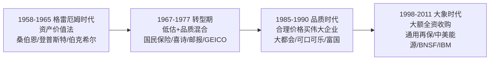
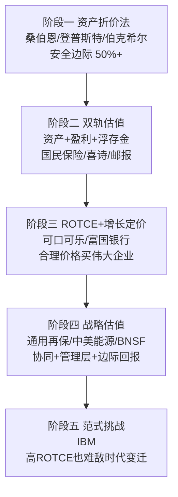
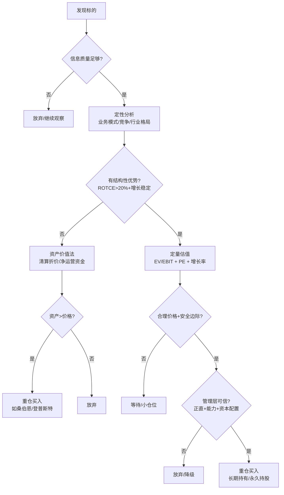
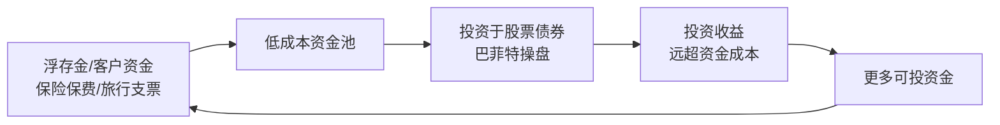
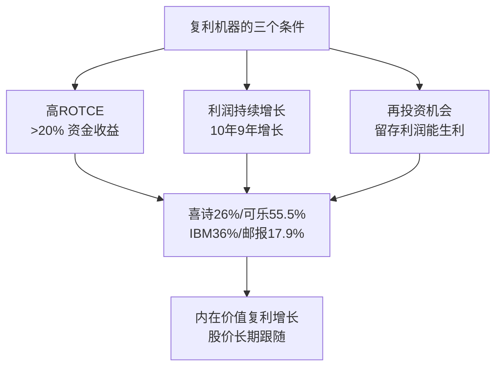
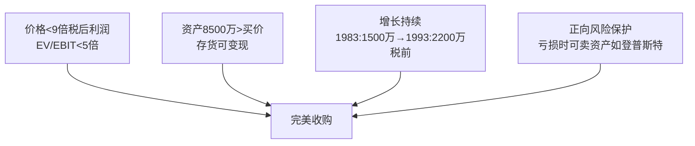
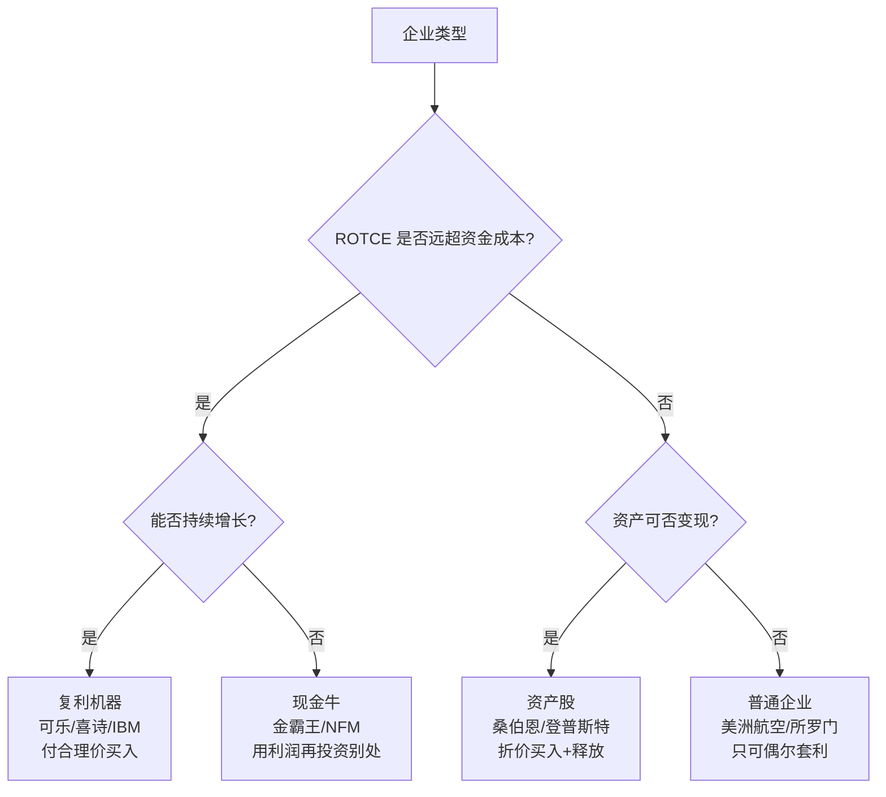

# 《巴菲特的估值逻辑：20个投资案例深入复盘》深度解读（详细版）

> **原书名**：Buffett's Valuation: 20 Case Studies of Value Investing（普雷米特·贾因 著，李必龙 等译）
> **作者**：普雷米特·贾因（Prem C. Jain）——美国乔治敦大学麦克多诺商学院会计与金融学教授、特许金融分析师，曾任英国伦敦商学院客座教授，著有《双重面》（Double Face）等。本书出版于 2013 年前后，是他耗时多年逐案还原巴菲特**估值计算现场**的学术级作品。
> **核心内容**：梳理巴菲特投资生涯中 **20 个关键投资案例**（1957—2011 年），每个案例都从"定性分析 → 定量估值"两个层面完整复盘：企业业务质量（已用有形资金收益率 ROTCE）、估值方法（企业价值/息税前利润 EV/EBIT 与市盈率 PE 双指标）、安全边际、管理层评估。
> **与系列其他笔记的关系**：09/10 是股东信原文，11《伯克希尔崛起》是格伦·阿诺德对 1976—1989 十案例的事件复盘——本书是**贾因教授从"当时一位分析师会如何估值"的第三方视角**，把每个案例的"算账过程"完整推演出来。**如果说 11 号笔记回答"巴菲特买了什么、为什么买"，本书回答"他算出的价格是否合理、如何算"**。

---

## 目录

- [[#全书导读：巴菲特的估值工具箱|全书导读：巴菲特的估值工具箱]]
- [[#第一部分 合伙制年代（1957—1968）|第一部分 合伙制年代（1957—1968）]]
- [[#案例1 桑伯恩地图（1958）：价值在资产负债表里|案例1 桑伯恩地图（1958）：价值在资产负债表里]]
- [[#案例2 登普斯特农具（1961）：资产折价的极致演绎|案例2 登普斯特农具（1961）：资产折价的极致演绎]]
- [[#案例3 得州国民石油（1964）：并购套利的数学|案例3 得州国民石油（1964）：并购套利的数学]]
- [[#案例4 美国运通（1964）：为浮存金重估企业|案例4 美国运通（1964）：为浮存金重估企业]]
- [[#案例5 伯克希尔-哈撒韦（1965）：一个美丽的错误|案例5 伯克希尔-哈撒韦（1965）：一个美丽的错误]]
- [[#第二部分 中期（1967—1988）|第二部分 中期（1967—1988）]]
- [[#案例6 国民保险公司（1967）：浮存金帝国的起点|案例6 国民保险公司（1967）：浮存金帝国的起点]]
- [[#案例7 喜诗糖果（1972）：为成长性定价的数学证明|案例7 喜诗糖果（1972）：为成长性定价的数学证明]]
- [[#案例8 《华盛顿邮报》（1973）：复利机器遇上熊市|案例8 《华盛顿邮报》（1973）：复利机器遇上熊市]]
- [[#案例9 政府雇员保险 GEICO（1976）：砍半估值的安全边际|案例9 政府雇员保险 GEICO（1976）：砍半估值的安全边际]]
- [[#案例10-14 中期快速扫描（布法罗晚报/NFM/大都会/所罗门/可口可乐）|案例10-14 中期快速扫描（布法罗晚报/NFM/大都会/所罗门/可口可乐）]]
- [[#第三部分 近期（1989—2014）|第三部分 近期（1989—2014）]]
- [[#案例15 美洲航空（1989）：优先股掩护下的失误|案例15 美洲航空（1989）：优先股掩护下的失误]]
- [[#案例16 富国银行（1990）：危机中的银行估值|案例16 富国银行（1990）：危机中的银行估值]]
- [[#案例17 通用再保险（1998）：最贵的一次收购|案例17 通用再保险（1998）：最贵的一次收购]]
- [[#案例18 中美能源（1999）：复杂结构下的真实价格|案例18 中美能源（1999）：复杂结构下的真实价格]]
- [[#案例19 北伯灵顿铁路（2007—2009）：对美国经济下注|案例19 北伯灵顿铁路（2007—2009）：对美国经济下注]]
- [[#案例20 IBM（2011）：大象起舞与养老金地雷|案例20 IBM（2011）：大象起舞与养老金地雷]]
- [[#第四部分 经验总结：我们能从巴菲特身上学到什么|第四部分 经验总结：我们能从巴菲特身上学到什么]]
- [[#总结：巴菲特估值方法的演进史|总结：巴菲特估值方法的演进史]]

---

## 全书导读：巴菲特的估值工具箱

### 0.1 本书的独特方法论（作者自述）

> "在评估一项投资时，我的方法是**首先理解相关投资的定性要素和相关背景，然后才是它的估值**。就估值来说，我设法寻找的是内生价值，即主要基于公司可持续盈利水平的利润来确定它的价值。……为了保持一致性和简便，我主要采用基于标准化数据的企业价值/息税前利润（EV/EBIT）作为利润的估值指标，并把市盈率（PE）作为一个二级指标。"

| 分析维度 | 作者采用的方法 |
|---------|--------------|
| 定性分析 | 业务模式、竞争环境、结构性优势、管理层评估 |
| 首选估值指标 | 企业价值/息税前利润（EV/EBIT）——标准化数据 |
| 二级估值指标 | 市盈率（PE） |
| 复利能力指标 | **已用有形资金收益率（ROTCE）** + 利润年增长率 |
| 调整手段 | 维持性资本支出调整、未并表实体价值、净现金/净负债 |
| 特殊情形 | 银行用 PE/PB；套利用年化收益率；控股用资产价值 |

### 0.2 20 个案例总览表（按时间排序）

| 序号 | 案例 | 年份 | 投资规模 | 估值要点 | 结果 |
|------|------|------|---------|---------|------|
| 1 | 桑伯恩地图 | 1958 | 约 35% 净资产 | 证券组合 700 万 > 市值 473 万 | 分拆释放价值 |
| 2 | 登普斯特农具 | 1961 | 约 20% 净资产 | 保守折价后每股 35 美元 vs 买入 28 | 每股 80 退出 |
| 3 | 得州国民石油 | 1964 | 三类证券全投 | 年化 18%—22% | 如期完成 |
| 4 | 美国运通 | 1964 | 约 40% 净资产 | 浮存金调整后 11.5 倍 PE | 翻倍+ |
| 5 | 伯克希尔-哈撒韦 | 1965 | 控股 | EV/EBIT 2.4 倍+每股 19 美元运营资金 | 终身事业 |
| 6 | 国民保险 | 1967 | 860 万全资 | 5.4 倍 PE+3,000 万投资组合 | 浮存金帝国起点 |
| 7 | 喜诗糖果 | 1972 | 2,500 万全资 | 11.9 倍 PE/6.3 倍 EV/EBIT | 25 倍+ |
| 8 | 华盛顿邮报 | 1973 | 1,060 万（10%） | 5.3 倍 EV/EBIT/10.9 倍 PE | 百倍+ |
| 9 | GEICO | 1976 | 4,570 万（一半） | 砍半估值后仍 50%+ 安全边际 | 百倍+ |
| 10 | 布法罗晚报 | 1977 | 3,551 万 | 收费桥梁逻辑 | 15 倍 |
| 11 | 内布拉斯加家具城 | 1983 | 5,535 万（90%） | 低成本特许经营权 | 10 倍+ |
| 12 | 大都会/ABC | 1985 | 5.175 亿 | 全价买卓越管理层 | 约 7 倍 |
| 13 | 所罗门 | 1987 | 7 亿优先股 | 9% 股息可转换 | 14.5% 年化 |
| 14 | 可口可乐 | 1988 | 10 亿+ | ROTCE 55.5%、10.1 倍 EV/EBITA | 15 倍+ |
| 15 | 美洲航空 | 1989 | 3.58 亿优先股 | 9.25% 股息、60 美元转股 | 盈利但失败 |
| 16 | 富国银行 | 1990 | 约 2.9 亿 | 5 倍 PE/1.1 倍 PB | 数十倍 |
| 17 | 通用再保险 | 1998 | 220 亿全资 | 23.5 倍 PE/2.7 倍 PB（偏贵） | 喜忧参半 |
| 18 | 中美能源 | 1999 | 约 20 亿（76% 权益） | 11% 固定收益+增长期权 | 巨大成功 |
| 19 | 北伯灵顿铁路 | 2007—09 | 47 亿→340 亿全资 | 13.2 倍 EV/EBIT、边际 ROTCE 15%+ | 押注美国 |
| 20 | IBM | 2011 | 107 亿（5.5%） | 14.7 倍 PE、36% ROTCE | 平庸收场 |

### 0.3 巴菲特的估值工具演进（贯穿全书的主线）



| 时代 | 估值核心 | 代表案例 | 标志性转变 |
|------|---------|---------|-----------|
| 格雷厄姆时代 | 资产清算价值、安全边际 50% | 桑伯恩、登普斯特 | 买入便宜货 |
| 转型期 | 资产+盈利双轨，浮存金觉醒 | 国民保险、喜诗 | 开始为品质付费 |
| 品质时代 | ROTCE+增长+合理价格 | 可口可乐、富国 | "以合理价格买伟大企业" |
| 大象时代 | 全资收购+管理层信任 | BNSF、IBM | 规模驱动的必然 |

### 0.4 本书最核心的概念：已用有形资金收益率（ROTCE）

| 概念 | 公式 | 巴菲特的标准 |
|------|------|-------------|
| 已用资金 | 有形净资产+净运营资金（剔除商誉） | — |
| ROTCE | 税后净营业利润（NOPAT）÷ 已用有形资金 | 优秀企业 >20% |
| 作者标杆 | "20% 是我内心衡量 ROTCE 的高标杆" | 可口可乐 55.5%、IBM 36%、邮报 17.9% |
| 判断逻辑 | ROTCE 远超资金成本 → 有特许经营权 → 复利能力 | 低于资金成本 → 一般企业 |

**作者的核心洞见**：

> "译者序：作者强调了巴菲特筛选投资标的的一个重要特征，即**被投企业创造复利的能力**。为此，作者给出了衡量企业创造复利能力的一组重要指标：**已用有形资金收益率和企业利润的年增长率**。这应该是巴菲特几十年的投资生涯能够保持年均复合收益率超过 20% 的秘诀之一。"

---

## 第一部分 合伙制年代（1957—1968）

### 1.0 时代背景

| 维度 | 内容 |
|------|------|
| 载体 | 巴菲特有限合伙企业（BPL），资金来自朋友、家庭和紧密伙伴 |
| 风格 | "便宜的价格购买资产"——格雷厄姆传统 |
| 市场 | 道琼斯 1950 年近 200 点 → 1960 年近 600 点（+200%） |
| 波动 | 1961 年高点 730+ → 530 点（−27%）→ 1965 年 900+ 点 |
| 保密 | "黑匣子"策略：投资秘而不宣，"我们不得不求助于宪法第五修正案" |
| 集中度 | 有时把 35% 净资产投单一公司，有时收购控股权 |
| 结局 | 1968 年主动解散——"很难找到符合标准的机会了"，业绩最佳时收手 |

---


---

## 案例1 桑伯恩地图（1958）：价值在资产负债表里

### 1.1 案例速览

| 维度 | 内容 |
|------|------|
| 投资时间 | 1958 年（1960 年底信函详述） |
| 投入 | 巴菲特合伙制企业约 35% 净资产 |
| 买入背景 | 股价 45 美元，20 年跌 60%（1938 年曾 110 美元） |
| 核心发现 | 资产负债表上证券组合价值 700 万美元 > 整个公司市值 473 万美元 |
| 结局 | 1961 年分拆为两个实体，释放价值；该公司至今仍存续（现为 DMGT 子公司） |

### 1.2 公司背景：火灾保险地图的垄断者

| 时间 | 事件 |
|------|------|
| 19 世纪 60 年代 | 安泰保险聘请测量师 D.A.桑伯恩测绘波士顿火灾风险地图 |
| 19 世纪 70 年代末 | 已为 50+ 城市绘制地图 |
| 20 世纪 20 年代 | 成为火灾保险地图领域绝对领导者 |
| 1950 年前 | 95% 收入来自核心 30 家保险公司；奥马哈年订阅费约 100 美元 |
| 1950s | **"记分卡"技术出现**：保险公司改用财务信息数学计算风险 |
| 1958 | 利润率连年下滑，净利每年降约 10%，股价 45 美元 |

**商业模式的护城河（作者分析）**：

| 护城河 | 机制 |
|--------|------|
| 先发垄断 | 测绘一个城市需巨额初始投资，竞争者进入无法回收成本 |
| 续生收入 | 地图+订阅更新费（50 磅重的大型地图册） |
| 规模优势 | 一张地图多家保险公司共用（类比今天的 TGS-Nopec 海底测绘） |
| 信息深度 | 街道下的水管直径、窗户数量、电梯井、建筑材料全在图里 |

**桑伯恩地图当时的状态（巴菲特视角）**：

> "公司具有咸鱼翻身的潜质。实际上，如果考虑到这家公司所持的投资组合的价值，它的交易价格还是负值。"

### 1.3 估值分析：为什么 45 美元值得买

| 项目 | 数值 |
|------|------|
| 流通股 | 10.5 万股 |
| 市值（45 美元） | 473 万美元 |
| 地图业务经营利润（1959） | 仅约 10 万美元（税前 13.2 万×27% 税率） |
| 传统业务估值 | 按 10 倍 PE 需 50 万净利——"正常投资人不会投结构性衰退企业" |
| **证券组合价值（1959）** | **700 万美元**（成本仅 260 万——资产负债表附注里的细节！） |
| **组合价值/市值** | **148%——公司整体是负价格** |

**巴菲特注意到的三个细节（多数分析师忽略）**：

| 细节 | 意义 |
|------|------|
| ①董事会结构 | 14 名董事中 9 名保险业名流，总共只持有 46 股！ |
| ②管理层受制 | "管理层有能力意识到企业的问题，但他们受限于董事会" |
| ③运营杠杆 | 核心测绘业务被忽视，有清晰改进空间 |

**巴菲特的估值逻辑**：业务虽衰退但未破产、现金未被耗尽；证券组合价值明摆着；拿到控股权就能释放价值。

### 1.4 执行：分拆的艺术

| 步骤 | 内容 |
|------|------|
| 1958—1961 | 逐步收购至控股（动用约 35% 净资产） |
| 1961 年分拆 | ①地图业务独立运营，获 125 万美元证券作为追加资本 |
| | ②组合价值剩余部分换回约 72% 流通股 |
| 税务设计 | 节省约 100 万美元公司资本利得税 |

### 1.5 本案例学习要点

| 序号 | 要点 |
|------|------|
| 1 | **细读资产负债表附注**——700 万 vs 260 万的成本/市值差异藏在注释里 |
| 2 | 业务衰退≠投资无价值——资产+现金的组合可能已覆盖全部价格 |
| 3 | 董事会治理结构是价值释放的钥匙——管理层想改但董事不放权 |
| 4 | 控股地位让"想法"变成"行动"——价值需要人来释放 |
| 5 | 桑伯恩至今存续——"结构性衰退"的公司也可能活几十年 |

---

## 案例2 登普斯特农具（1961）：资产折价的极致演绎

### 2.1 案例速览

| 维度 | 内容 |
|------|------|
| 投资时间 | 1961 年底持股 70%（另有 10% 间接） |
| 买入均价 | 每股 28 美元（低至 16 美元，大宗 30.25 美元） |
| 净资产 | 每股面值 76.48 美元——**买入价仅为面值的 63% 折价** |
| 保守估值 | 巴菲特折价后公允价值约每股 35 美元——**仍有 20% 折扣** |
| 执行 | 换帅哈利·巴特勒，清库存、关分店、还债 |
| 结局 | 1962 年价值升至 50 美元，1963 年 65 美元，私募退出每股 80 美元 |

### 2.2 公司背景

| 维度 | 内容 |
|------|------|
| 1878 年 | 查尔斯·登普斯特在内布拉斯加州比阿特丽斯创立 |
| 主业 | 风车、水泵、灌溉机械——大平原农业先驱 |
| 20 世纪 60 年代 | 电网普及→电泵取代风车；风车业务缓慢下滑 |
| 转型 | 同时销售播种机、化肥施用器械（增长的细分市场） |
| 1961 年 | 销售额 900 万美元；"销售额停滞不前、库存周转率低下、没有实际利润" |

**为什么不是"将死企业"**：

| 有利因素 | 分析 |
|---------|------|
| 售后长尾 | 风车安装后的备件+维修是长期经常性收入 |
| 缓慢下滑 | 不是快速崩溃——"它的衰落很可能是一个渐进的过程" |
| 资产可变现 | 价值主要在存货和应收账款（12—24 个月可变现），而非厂房设备 |
| 仍在盈利 | 1958、1959 年都有正盈利 |

### 2.3 估值：格雷厄姆式资产折价法

| 科目 | 账面价值 | 巴菲特折扣 | 折后价值 |
|------|---------|-----------|---------|
| 现金/应收账款等 | 692 万总资产 | 应收账款 −15% | — |
| 存货 | — | **−40%** | — |
| 工厂设备 | — | 大幅折价 | — |
| 负债 | 232 万 | 100% 全额确认 | — |
| **公允估值** | — | — | **每股约 35 美元** |
| 买入价 | — | — | 28 美元（**20% 安全边际**） |

> **关键认知**："以账面资产很大折扣出售的公司，其账面资产往往都是无法套现的"——太阳能电池厂的重置价值无人要。**登普斯特的资产（存货+应收）是真的能变现的**。

### 2.4 哈利·巴特勒：巴菲特式管理的三标准

| 标准 | 表现 |
|------|------|
| ①KPI 激励 | 库存转现金、削减 50% 销售管理费、关闭不盈利分支机构 |
| ②先办棘手事 | 处置非盈利设施、注销失去价值的产品 |
| ③勤奋 | "我喜欢和知道如何做正确事情的人打交道" |

**执行效果**：几乎以 100% 账面价值变现资产→还清债务→余钱构建证券组合（巴菲特操盘）——**桑伯恩模式的再现**。

### 2.5 本案例的深层教训（施罗德《滚雪球》披露）

| 教训 | 内容 |
|------|------|
| 价值路径 | 每股 35 美元 → 50 → 65 → 80 退出 |
| 巴菲特的厌恶 | **"这次经历也使巴菲特知道了自己非常讨厌作为一个积极投资人的角色"**——从此极力避免介入企业经营 |
| 风格转向 | 这个案例之后，巴菲特开始追求"不干预"的被动投资 |

### 2.6 本案例学习要点

| 序号 | 要点 |
|------|------|
| 1 | 折价买入必须验证资产可变现性——不是所有账面资产都值钱 |
| 2 | 便宜的股票+平庸管理层=价值可能永远无法释放 |
| 3 | 换一个正确的经理人（KPI 激励）可以激活沉睡资产 |
| 4 | 控制权是最后手段——巴菲特用一次就再也不想了 |
| 5 | 买"停滞但盈利"的公司优于买"崩溃中"的公司 |

---


---

## 案例3 得州国民石油（1964）：并购套利的数学

### 3.1 案例速览

| 维度 | 内容 |
|------|------|
| 投资时间 | 1963 年 4 月公告后至 1963 年底 |
| 标的 | 小型原油生产商，被加州联合石油收购中 |
| 投入 | 26 万美元债券 + 60,035 股普通股 + 83,200 份权证（三类证券全投） |
| 预期 | 债券年化约 18%，股票/权证约 22% |
| 实际 | 用时比预期长 1—2 个月，收益反而比预估高（每股 7.59 vs 7.42） |

### 3.2 并购套利的三要素（本书的教科书式总结）

| 要素 | 得州国民石油案例 |
|------|-----------------|
| ①要约条款 | 债券按面值 104.25 赎回；普通股每股 7.42 美元；权证按 3.5 美元行权 |
| ②时间表 | 4 月公告→预计 8/9 月完成（实际 11 月—次年年初） |
| ③失败风险 | 股东批准（内部人持股 40%，只需外部 10% 同意）→ 风险极低 |

### 3.3 三类证券的收益计算（年化）

| 证券 | 市价 | 要约价 | 绝对收益 | 6 个月年化 |
|------|------|--------|---------|-----------|
| 6.5% 债券 | 98.78 | 104.25+3.25 息票 | 8.72（约 9%） | **约 18%** |
| 普通股 | 6.69 | 7.42 | 0.74（11%） | **约 22%** |
| 权证 | 3.19 | 3.92 | 0.73（23%） | **约 22%** |

### 3.4 风险排查清单（巴菲特式的尽调）

| 风险项 | 评估 |
|--------|------|
| 股东否决 | 管理层持股 40%，仅需外部 10% 票——几乎不可能否决 |
| 反垄断 | 油气行业并购普遍，同类先例众多 |
| 法律障碍 | 唯一障碍：南加州大学的税收裁定（非营利机构持有石油高产费）——但校方已示意愿意配合 |
| 时间风险 | 交易总比预期慢——巴菲特原话："这类交易所用时间要比最初预期的要长；这类项目的回报率一般要比预估得好一些" |

### 3.5 本案例学习要点

| 序号 | 要点 |
|------|------|
| 1 | 套利是"数学+风险确认"的投资——收益算得清，关键是失败概率 |
| 2 | 一手调研（律师、监管、先例）是降低风险的核心 |
| 3 | 套利类投资与市场相关性低——下跌市中的稳定器 |
| 4 | 个人投资者做套利较难（需要专业人士网络），但逻辑可学 |

---

## 案例4 美国运通（1964）：为浮存金重估企业

### 4.1 案例速览

| 维度 | 内容 |
|------|------|
| 投资时间 | 1964 年（色拉油丑闻后，股价从 60 跌至 35） |
| 买入均价 | 约 40 美元（占合伙企业约 40% 净资产——最大单笔） |
| 表面估值 | 16 倍 PE / 8 倍 EV/EBIT——**按巴菲特标准并不便宜** |
| 隐藏价值 | 旅行支票浮存金 8,000 万美元+投资收益未计入经营利润 |
| 调整后估值 | **11.5 倍 PE / 6.5 倍 EV/EBIT**——物有所值 |
| 结局 | 后来翻倍以上（"这也许是我所做过的最重要的投资决策"） |

### 4.2 色拉油丑闻：一次性事件 vs 结构性损害

| 维度 | 内容 |
|------|------|
| 事件 | 子公司仓库给联合植物油精炼公司开收据（油罐里是海水！），贷款抵押物落空，约 1.5 亿美元债务 |
| 危机 | 股价 60→35 美元；股东起诉克拉克赔偿 6,000 万（道德义务） |
| 巴菲特的一手调研 | 找奥马哈餐馆老板、银行、旅行社、竞争对手聊天——**旅行支票和信用卡使用完全稳定** |
| 结论 | 丑闻只涉及一个附属小公司的一次性债务，**不伤核心业务**；声誉损害不持久 |
| 或有负债估算 | 管理层披露：大豆油凭证 8,200 万+争议提货单 1,500 万+伪造葵花籽油 1/3 免责→预期净负债约 **4,000 万美元**（税后） |

### 4.3 公司品质：十年财务全景（1954—1963）

| 指标 | 1954 | 1963 | 年复合 |
|------|------|------|--------|
| 收入 | 3,700 万 | 1 亿美元 | **12%** |
| 净利润 | — | 1,120 万（每股 2.52） | **10%** |
| 账面价值 | 4,200 万 | 7,900 万 | — |
| 经营利润率 | — | 16% | — |
| 净利润率 | — | 11% | — |
| 特别记录 | **十年中没有任何一年收入下降** | | |

### 4.4 业务结构分析：三强三弱

| 强业务（特许经营） | 弱业务（普通竞争） |
|------------------|------------------|
| 旅行支票（余额 2.6 亿→4.7 亿，年增 7%） | 旅游（无门槛、靠执行） |
| 信用卡（会员超 100 万，1963 年刚盈利第 2 年） | 富国银行（装甲运输） |
| 汇票（50 个州唯一全境销售） | 货运、赫兹合资（49%） |

**旅行支票 vs 银行信用证**：易购买、低交易成本、被盗可替换、接收银行免信用评估——**结构性优势**。

### 4.5 估值核心：浮存金的隐藏利润（本书最精彩的估值推演）

| 步骤 | 计算 |
|------|------|
| ①未付旅行支票 | 4.7 亿美元（1963 年底） |
| ②偿付期假设 | 2 个月 |
| ③连续性浮存金 | 约 8,000 万美元 |
| ④投资回报假设 | 5%/年 |
| ⑤每年隐藏收益 | **约 400 万美元** |
| ⑥1963 年实际已实现 | 税后投资利得 440 万美元（直接贷记股东权益，未入经营利润！） |

**调整后估值对比**：

| 估值方式 | 每股 40 美元的倍数 |
|---------|------------------|
| 表面：PE | 16 倍 |
| 表面：EV/EBIT | 8 倍 |
| 加丑闻负债后：PE | 约 20 倍 |
| **含浮存金收益：PE** | **11.5 倍** |
| **含浮存金收益：EV/EBIT** | **6.5 倍** |
| 含丑闻+浮存金：PE | 14.2 倍 |

**已用资金收益率 78% 的启示**：美国运通仅 1,400 万美元固定资产，客户存款+旅行支票形成 8.37 亿美元"浮存金"——与保险公司同构。"这家企业只需再投入非常少的额外资金发展业务。"

### 4.6 本案例的历史地位（作者评价）

> "与巴菲特其他早期的收购不同，这笔投资不是一个雪茄蒂型的投资。也许正是这笔投资随后的成功，促使巴菲特后期更倾向于，**为收购优质企业而支付一个公允的价值，胜于为了一个很好的价格而购买一家平庸的企业**。"

**霍华德·克拉克（CEO）的管理亮点**：稳定信用卡后台（30 天还款要求+严格信用审批+提费）、聘请奥美做首个现代广告、道德担当（主动承诺偿付丑闻债务）——"极正直的人，这正是巴菲特看重的品质"。

### 4.7 本案例学习要点

| 序号 | 要点 |
|------|------|
| 1 | 一次性的财务丑闻 ≠ 业务受损——用一手调研验证客户行为 |
| 2 | **浮存金/客户资金是隐藏利润源**——经营利润之外还有投资收益 |
| 3 | 资产负债表的"负债"可能恰恰是竞争优势（客户存款、未兑支票） |
| 4 | 高 ROTCE（78%）意味着轻资产+强复利 |
| 5 | 愿意为卓越企业付公允价——这是巴菲特从格雷厄姆毕业的标志 |

---

## 案例5 伯克希尔-哈撒韦（1965）：一个美丽的错误

### 5.1 案例速览

| 维度 | 内容 |
|------|------|
| 投资时间 | 1962—1965 年（均价 14.86 美元/股，区间 7.60—15 美元） |
| 背景 | 新英格兰纺织企业（伯克希尔棉业 1800s+哈撒韦织造 1955 合并） |
| 估值 | EV/EBIT 仅 2.4 倍（1965 年利润率）；每股净现金 3.62 美元 |
| 现金流 | 市值 1,130 万，一年创造正现金流 530 万！ |
| 结局 | 纺织终局失败，但成为终身投资载体 |

### 5.2 为什么当时不是"明显的错误"

| 有利因素 | 分析 |
|---------|------|
| 品牌零售业务 | 窗帘/家纺直入零售渠道 |
| 棉花单一价格法 | 1964/1965 年国会立法：美国纺织厂可按政府定价买低成本棉花至 1970 年 |
| 新管理层 | 肯·切斯上任（巴菲特眼中的出色经理人）——登普斯特模式再现 |
| 盈利稳定 | 1961—1965 年利润"一年上升一年下降，而非直线下降" |
| 税收优势 | 5 年未结转亏损约 500 万——未来 1—2 年税收不是真成本 |

### 5.3 估值：利润与资产双轨

| 估值维度 | 数据 |
|---------|------|
| EV/EBIT（1965 年利润率 9.5%） | **2.4 倍** |
| EV/EBIT（保守 7.5% 利润率） | 3 倍 |
| PE（1965 实际真实利润） | 很低（含 360 万净现金） |
| 每股净现金 | 3.62 美元（股价 14.06 的 26%） |
| 每股运营资金 | 约 19 美元（1965.12.31） |
| **一年现金流 vs 市值** | 530 万 vs 1,130 万——"再有两年，投资人就可以无代价地获得整个企业" |

**资产面**：股价低于账面价值 20% 以上；金-飞利浦分部机器已出售、工厂余产来年处理（现金为正）——"这里还是蕴含着一些价值"。

### 5.4 错误承认与历史意义

| 维度 | 内容 |
|------|------|
| 巴菲特承认 | 多次承认购买伯克希尔是错误（纺织业结构性下滑） |
| 但当时 | 行业环境+棉花法案+新管理层确实给了反弹预期 |
| 历史意义 | 1965 年取得控制权→1967 年国民保险→浮存金帝国——**错误变成了载体** |
| 作者观点 | "这个案例并非像当下多数人所想象的那样显而易见"——当时数据支持投资 |

### 5.5 本案例学习要点

| 序号 | 要点 |
|------|------|
| 1 | 便宜（2.4 倍 EV/EBIT）+ 现金流强（530 万/年）可以覆盖结构风险 |
| 2 | 政策变化（棉花法案）可能改变行业短期格局 |
| 3 | 管理层更替是价值重估的触发点 |
| 4 | 税损结转是真实资产——"税收不是真正的成本" |
| 5 | 一个"错误"可能成为最好的载体——人生与投资都需要长期视角 |

---


---

## 第二部分 中期（1967—1988）

### 6.0 时代背景

| 维度 | 内容 |
|------|------|
| 载体 | 伯克希尔-哈撒韦公司（巴菲特放弃合伙企业） |
| 风格转变 | 从"资产价值>交易价格"转向"决策时更多考虑定性因素" |
| 市场 | 1969 年首崩→70 年代标普回到原点→两次衰退（1974/1979）→利率 15% |
| 80 年代 | 沃尔克控通胀→垃圾债繁荣、并购盛行、伊万·波斯基式搅局者 |
| 巴菲特动作 | 保险+区域银行积累资产池；收购喜诗、NFM 等控股权 |

---

## 案例6 国民保险公司（1967）：浮存金帝国的起点

### 6.1 案例速览

| 维度 | 内容 |
|------|------|
| 投资时间 | 1967 年 3 月 |
| 价格 | 860 万美元（巴菲特出价 50 美元/股，自己估值仅 35 美元——**主动溢价**） |
| 标的 | 国民保险+国民火灾与海洋险（附属公司） |
| 1967 年财务 | 已赚保费 1,680 万，净利 160 万（**PE 5.4 倍**） |
| 1968 年财务 | 保费 2,000 万，净利 220 万 |
| 隐藏资产 | 债权组合 2,470 万+股权组合 720 万=**超 3,000 万投资组合（3.5 倍于买价）** |

### 6.2 杰克·瑞沃茨与"没有坏的风险，只有坏的费率"

| 维度 | 内容 |
|------|------|
| 创始人 | 1940 年与兄弟阿瑟白手起家 |
| 经营哲学 | 口号："没有坏的风险，只有坏的费率"——核心永远是正确评估、落袋承保利润 |
| 特立独行 | 愿给长途卡车、出租车、租赁车辆承保（同行不做的利基） |
| 不追收入 | "某种承保业务没有利润时，绝不追求这种业务的收入" |
| 出售时机 | 一年约一次想卖公司（只在特别沮丧时）——1967 年初恰好赶上 |
| 巴菲特评价 | "公司的一切都跟广告所言一致，或者比广告更好" |

### 6.3 估值的双重结构（本书要点）

| 层面 | 价值 |
|------|------|
| ①业务盈利 | 160 万净利 × 5.4 = 860 万——便宜 |
| ②投资组合 | 3,000 万美元股票债券——**归巴菲特管理** |
| ③浮存金机制 | 保费先收、赔付后付；余钱可投资——"巴菲特毕生痴情于保险企业的滥觞" |
| 验证 | 两年后组合从 3,200 万→4,200 万 |

> 巴菲特 1969 年信："能创造接近 20% 的已用资金收益率的企业，意味着它可能内含某些结构性优势。"

### 6.4 本案例学习要点

| 序号 | 要点 |
|------|------|
| 1 | 买保险公司=买"资金募集机器"——保费是零成本融资 |
| 2 | 愿意为卓越管理层付溢价（35 估 50 买） |
| 3 | 利基市场的专业承保（别人不做的风险）可以持续高利润 |
| 4 | 不追求增长、只追求承保利润的保险公司最值钱 |

---

## 案例7 喜诗糖果（1972）：为成长性定价的数学证明

### 7.1 案例速览

| 维度 | 内容 |
|------|------|
| 投资时间 | 1972 年（经蓝筹邮票公司） |
| 价格 | 2,500 万美元全资（**PE 11.9 倍 / EV/EBIT 6.3 倍**） |
| 1972 年财务 | 收入 3,130 万；税后利润 210 万；有形净资产 800 万 |
| ROTCE | **26%**（税后）——高品质标志 |
| 增长 | 1972—76 年 NOPAT 年增 16%；单店收入逐年增长 |
| 结局 | 2010 年收入 3.83 亿、税前利润 8,200 万；**估值约为买价的 25 倍** |

### 7.2 为什么"11.9 倍 PE"是便宜而非贵（本书的数学推导）

**问题**：传统价值投资者要求 30% 安全边际，为成长付全价需要多快的增长？

| 步骤 | 计算 |
|------|------|
| ①公允价格（10 倍 PE） | 210 万 × 10 = 2,100 万 |
| ②30% 安全边际价 | 2,100 万 × 0.7 = **1,470 万** |
| ③全价 2,100 万需内在价值 | 2,100 万 × 1.43 = 3,000 万 |
| ④永续年金公式 | 现值 = C/(r−g) → 3,000 = 2.1/(0.1−g) |
| ⑤解出 g | **3%/年**（永续增长） |
| ⑥考虑资本需求 | ROTCE 25% → 增长 3% 需 1/4 增量资本 → 实际需约 **4%** |

**结论**：

> "如果投资人对未来净利润增长有切实信心，即使它的增速并不高，每年仅有 4% 或 5%，但这个增速还是有很大的价值——这相当于投资一个净利润几乎不增长的企业时，得到了一个 30% 的安全边际。"

**巴菲特买的是**：至少 5% 的年净利增长预期+26% ROTCE+品牌定价权。

### 7.3 喜诗的品质三要素

| 要素 | 表现 |
|------|------|
| 品牌 | 二战糖配给时期不偷工减料、不囤积居奇——品质信誉 |
| 渠道 | 167 家直营店（非加盟），雇员忠诚度高 |
| 护城河 | 西部市场主导份额；几乎无技术风险 |

### 7.4 本案例学习要点

| 序号 | 要点 |
|------|------|
| 1 | **增长=安全边际的替代品**——数学上 4% 永续增长≈30% 安全边际 |
| 2 | 高 ROTCE（>25%）是"增长有价值"的前提——低 ROTCE 的增长只是烧钱 |
| 3 | 为品质付费≠冒险——11.9 倍 PE 买喜诗后来证明是史上最佳投资之一 |
| 4 | 品牌+直营+定价权=复利机器 |

---

## 案例8 《华盛顿邮报》（1973）：复利机器遇上熊市

### 8.1 案例速览

| 维度 | 内容 |
|------|------|
| 投资时间 | 1972—73 年（水门事件调查引发政府敌意+熊市双杀） |
| 价格 | 均价 22.69 美元/股（1,060 万买 467,150 股 B 股，约 10%） |
| 估值 | **5.3 倍 EV/EBIT / 10.9 倍 PE**（1972 财年） |
| ROTCE | **17.9%**（税后净营业利润 1,000 万/有形资金 5,580 万） |
| 增长 | 十年收入年增 11% |
| 结局 | 1985 年营业利润率 10%→19%；回购 40% 股份；净利增 7 倍、EPS 增 10 倍 |

### 8.2 业务部门分析（1972 年）

| 部门 | 利润占比 | 亮点 |
|------|---------|------|
| 报纸 | 近一半 | 竞争对手《华盛顿每日新闻》1972 年停刊→**双寡头格局**；广告量占本地都市报 63%；60% 成年人阅读 |
| 杂志/书籍 | 次之 | 《新闻周刊》广告收入全美杂志第 4；发行量 260 万→275 万 |
| 广播电视 | 第三 | 收入 +17%、利润 +55%；两电视台许可证延期风险（尼克松敌意） |

### 8.3 估值细节（含税率调整——本书独有视角）

| 项目 | 1973 年数据 |
|------|------------|
| 市值（22.69 美元×流通股） | 1.09 亿 |
| 净负债 | 730 万 |
| EV | 1.163 亿 |
| EV/EBIT | **5.3 倍** |
| 税率调整 | 当时税率 ~50% vs 今天 30% → 可比 EV/EBIT **7.5 倍** |
| PE | 10.9 倍 |

> "以今天的标准来看……5.3 倍的企业价值/息税前利润估值，看起来就非常便宜了。然而，这里可能有些误导"——**1973 年 50% 的税率意味着同样的 EBIT 股东拿到的更少**。这是本书教给读者的"跨时期估值校准"。

### 8.4 凯瑟琳·格雷厄姆：巴菲特的最大管理作品

| 维度 | 内容 |
|------|------|
| 背景 | 弗里茨·毕比 1973 年意外去世，她成为《财富》500 强首位女董事长 |
| 巴菲特的角色 | 1974 年入董事会→终身顾问 |
| 巴菲特的灌输 | 保守资本配置、股东友好思维、高效经营专注 |
| 成果 | 营业利润率 10%→19%；回购 40% 股份；净利 ×7、EPS ×10 |
| 双寡头逻辑 | "三个竞争者→两个竞争者：竞争行为更理性，更少价格战、更高利润率" |

### 8.5 本案例学习要点

| 序号 | 要点 |
|------|------|
| 1 | 双寡头格局是媒体/基础设施类企业的黄金结构 |
| 2 | 高质量年报（发行量、广告量、市场份额客观数据）本身就是信号 |
| 3 | 跨时期估值必须校准税率差异 |
| 4 | 好企业+熊市+暂时坏消息=最佳买点（水门事件 vs 基本面） |
| 5 | 股东友好（回购+高利润率）能放大复利——净利 ×7 而 EPS ×10 |

---


---

## 案例9 政府雇员保险 GEICO（1976）：砍半估值的安全边际

### 9.1 案例速览

| 维度 | 内容 |
|------|------|
| 投资时间 | 1976 年（与杰克·伯恩会面次日开始买入） |
| 买入价 | 3.18 美元/股（130 万股首批） |
| 危机背景 | 1975 年承保亏损 1.9 亿 vs 股本仅 2,500 万——资不抵债边缘 |
| 综合成本率 | 124%（每收 1 美元保费赔 1.24 美元） |
| 关键人物 | 杰克·伯恩（新 CEO）——"保险界的贝比·鲁斯" |
| 估值方法 | 业务砍半假设下仍算出每股 7.50 美元合理值——**50%+ 安全边际** |
| 结局 | 1995 年 23 亿美元收购剩余 49%；此后成为伯克希尔核心引擎 |

### 9.2 危机的本质（本书的风险分析）

| 风险 | 分析 |
|------|------|
| 准备金不足 | 车险索赔延续多年，准备金不足程度无法界定——信任一旦破坏难以立足 |
| 监管 | 多个州保险委员准备宣布破产（华盛顿特区沃拉克等） |
| 股本薄弱 | 2,500 万股本 vs 1.9 亿亏损——"不用太多的亏损就能把公司置于生死存亡的险境" |
| 但业务本质 | 直销低成本（省代理佣金）→ 低风险客户 → 低费率 → 良性循环——**结构性优势仍在** |

### 9.3 伯恩的评估与拯救

| 维度 | 内容 |
|------|------|
| 巴菲特要确认 | "伯恩是否真的很酷、临危不乱、专业……是否可以解决 GEICO 的问题" |
| 会面 | 通过凯瑟琳·格雷厄姆+洛里默·戴维森安排；一见如故聊到深夜 |
| 转天 | 巴菲特开始买股票 |
| 巴菲特行动 | 亲自拜访监管人沃拉克协商资本要求；投信任票 |
| 伯恩行动 | 新泽西涨价被拒→把经营许可证扔在专员桌上→解雇 2,000 人、终止 3 万保单 |
| 1977 年 | 恢复盈利；仍经营的州保费平均上调 38% |
| 1979 年 | 税前利润 2.2 亿美元——"3 年前完全无法想象" |

### 9.4 砍半估值法（本书的核心推演）

| 假设 | 计算 |
|------|------|
| ①保费砍半 | 9 亿 → 4.5 亿美元 |
| ②综合成本率 | 95%（体面但合理的水平） |
| ③承保利润 | 约 2,250 万（每股 <1 美元） |
| ④浮存金收益 | 保费一半×7% 利率 → 每股 >0.50 美元 |
| ⑤税前稳态利润 | 约每股 1.50 美元 |
| ⑥税后（48% 税率） | 约每股 0.75 美元 |
| ⑦合理 PE 10 倍 | **每股 7.50 美元** |
| ⑧买入价 | 3.18 美元 → **安全边际 57%** |

> **注意**：若浮存金由巴菲特操盘（年收益 20% 而非 7%），价值远超 7.50 美元；若保费不降反增，估值更高。**在最坏假设下仍有超过一半的安全边际**——这就是"便宜到足以弥补可见风险"。

### 9.5 巴菲特一生信条（作者总结）

> "长期追随高品质企业，在机会出现时果断出手！"

| 时间线 | 事件 |
|--------|------|
| 1951 | 21 岁学生时投资 GEICO，获利 50% 卖出（后悔 19 年） |
| 1976 | 危机中以 3.18 美元买入（当时市价 2—8 美元区间） |
| 1977—81 | 持续增持至 720 万股（最大非控股投资）；1981 年伯克希尔超一半净值增量来自 GEICO |
| 1990 | 持股 48% |
| 1995 | 23 亿美元收购剩余 49%（约 50 倍于首年买入价） |

### 9.6 本案例学习要点

| 序号 | 要点 |
|------|------|
| 1 | **危机估值法**：先做最坏假设（业务砍半），仍有安全边际才买 |
| 2 | 准备金/财务造假风险无法量化时，管理层的诚实是唯一防线 |
| 3 | 结构优势（直销低成本）可以被财务灾难淹没但不会消失 |
| 4 | 控制权+监管协商=危机中的额外工具（巴菲特亲自见监管人） |
| 5 | 好公司便宜时重仓，是长期超额收益的最大来源 |

---

## 案例10-14 中期快速扫描（布法罗晚报/NFM/大都会/所罗门/可口可乐）

> 以下 5 个案例的**事件细节**已在《11 巴菲特的伯克希尔崛起》中深度复盘，此处仅呈现本书独有的**估值视角**增量。

### 10.1 《布法罗晚报》（1977）——收费桥梁

| 估值要素 | 数据 |
|---------|------|
| 价格 | 3,550.9 万美元（蓝筹印花收购） |
| 前五年 | 连年亏损（1978 亏 290 万、1979 亏 460 万） |
| 巴菲特逻辑 | 一城一报=公告牌效应+定价权；周日版是最大机会点 |
| 结局 | 1982 年对手倒闭→垄断→90 年代年输送近 3 亿 |

### 10.2 内布拉斯加家具城（1983）——B 夫人

| 估值要素 | 数据 |
|---------|------|
| 价格 | 5,535 万美元（90%，一页纸合同） |
| 毛利率 | 22% vs 莱维茨 44.4%——"为客户省钱"模式 |
| 运营费用率 | 16% vs 35.6% |
| 单店效率 | 每平方英尺 500 美元销售额（全美第一） |
| 结论 | 低成本+低利润率+广覆盖=客户利益+高资本回报 |

### 10.3 大都会/ABC（1985）——白衣护卫

| 估值要素 | 数据 |
|---------|------|
| 价格 | 5.175 亿美元（172.50 美元/股，300 万股） |
| 巴菲特自认 | "以全价进行"——"这里已不是一个可以讨价还价的领域" |
| 估值锚 | 墨菲 28 年年化 22.8% 的管理业绩+ABC 网络+ESPN 潜在价值 |
| 信任条款 | 投票权+出售权交给墨菲两年 |
| 结论 | 合理价格买最优秀管理层的样板 |

### 10.4 所罗门兄弟（1987）——优先股模式

| 估值要素 | 数据 |
|---------|------|
| 价格 | 7 亿美元可转换优先股（9% 股息，38 美元转股价） |
| 设计逻辑 | 行业不可预测→不买普通股；固定收益+转换期权 |
| 结局 | 1991 年丑闻→巴菲特任临时主席→最终年化 14.5%（但"最大失败"） |
| 教训 | 优先股保护本金但不保护声誉 |

### 10.5 可口可乐（1988）——本书的估值典范

| 估值要素 | 数据 |
|---------|------|
| 买入价 | 1988 年约 41.8 美元/股（与 38.13 年终收盘价接近） |
| ROTCE | **55.5%**（NOPAT 10.26 亿/有形资金 18.5 亿） |
| 增长 | 1977—87 年收入/EPS 年增 12%；每股收益 10 年无一年下降 |
| EV/EBITA | 11.9 倍（未调整）→ **10.1 倍**（扣除未并表实体 25.48 亿后） |
| PE | 13.7 倍（1988 年税率下调后更低） |
| 作者的判断 | "10.1 倍 EV/EBITA 依然不是非常便宜，但鉴于这家企业的品质，这看起来还是一个非常好的价格" |
| 增长来源 | ①欠发达市场人均消费提升（国际扩张）②分销网络整合提效 |
| 风险识别 | 百事竞争被媒体夸大——"要从假风险中识别出真正的风险" |

**可口可乐估值的关键洞见**：

> "对没有增长的企业，当时保守投资者投资价格不会超过约 7 倍 EV/EBIT 或 10 倍 PE。有鉴于此，我的结论是：**巴菲特所付价格里考虑了该公司的增长**。"

---


---

## 第三部分 近期（1989—2014）

### 11.0 时代背景

| 维度 | 内容 |
|------|------|
| 载体 | 数十亿美元规模的伯克希尔 |
| 挑战 | 巨额资金配置——"猎象之枪" |
| 市场 | 海湾战争衰退→90 年代末互联网泡沫→2001 年 911→2008 金融危机→2009 复苏 |
| 巴菲特策略 | 私募交易增多（通用再保/中美能源/BNSF）+大蓝筹股票（富国/IBM）+危机抄底 |

---

## 案例15 美洲航空（1989）：优先股掩护下的失误

### 15.1 案例速览

| 维度 | 内容 |
|------|------|
| 投资时间 | 1988 年（买入 3.58 亿美元优先股） |
| 条款 | 9.25% 股息率、10 年强制赎回、60 美元转股价（当时普通股 35 美元） |
| 巴菲特自评 | "我对美洲航空业务的分析流于表面，且是错误的" |
| 失误根源 | 长期盈利史+优先证券保护 → 忽略了**放松管制后的行业格局巨变** |
| 结局 | 1990—94 年亏 24 亿（抹去全部股东权益）；1994 年股息暂停；减计 3/4；1998 年赎回——**最终盈利**（股息 2.5 亿+转换收益） |

### 15.2 1988 年报揭示的危险信号（作者逐项分析）

| 信号 | 数据 |
|------|------|
| 收入与利润背离 | 收入 +90%，净利却下降（非常费用外仅 +36%） |
| 经营费用失控 | +97%（人员、租金起降费、维护增长最快） |
| 债务 | 金融负债 15 亿+**64 亿美元不可撤销经营租赁**（vs 4.34 亿经营利润！） |
| 资本密集 | 有形资金 40.22 亿=收入的 134% |
| ROTCE | 税前 7.9%/税后 5.2%——**低于资金成本**（商业票据利率 9.5%—9.9%） |
| 周期性 | 好年净利率 7.5%，坏年 3%——"很难说清"的股票 |

### 15.3 优先股估值：固定收益+期权

| 组件 | 分析 |
|------|------|
| 固定收益部分 | 9.25% 股息≈美洲航空发债成本，但风险高于债券（优先清偿权在后） |
| 转换期权 | 60 美元转股价 = 1988 年利润的 12.4 倍 PE——"不是特别贵" |
| 巴菲特失误 | 没有看到：管制时代的成本结构+竞争时代的收入，是**剪刀差** |

### 15.4 行业灾难与幸运结局

| 时间 | 事件 |
|------|------|
| 1990—91 | 海湾战争+衰退；中途航空、泛美、大陆、环球等相继破产 |
| 破产公司 | 摆脱负债后以更低定价竞争——雪上加霜 |
| 1990—94 | 美洲航空累计亏损 24 亿美元 |
| 1994 | 股息暂停；巴菲特减计 3/4（约 2.68 亿）；尝试半价出售失败 |
| 1995—97 | 复苏；普通股从 4 美元涨到 73 美元 |
| 1998.3 | 按赎回条款退出——股息 2.5 亿+转换收益 |

**巴菲特 1996 年信的自省**：

> "我受到了下述两个因素的误导：该公司长期盈利的经营史；拥有优先级证券所给予我的保护。这些使我忽略了一个关键点：**随着航空业管制的解除，美洲航空的收入，将会受到日益激烈的市场竞争所带来的负面影响，与此同时，在管制庇护的利润之下，所形成的成本结构，还一时半会儿无法得到改变**。无论这家航空公司过往的业绩如何亮丽，如果这些成本问题不予以解决，那么，它们就是灾难的征兆。"

### 15.5 本案例学习要点

| 序号 | 要点 |
|------|------|
| 1 | 优先股/可转换保护本金，但**不保护行业逻辑错误** |
| 2 | 管制行业的"历史盈利"在去管制后毫无意义——成本结构滞后于收入竞争 |
| 3 | 资本密集+ROTCE 低于资金成本=没有结构优势，好管理层也白搭 |
| 4 | 不可撤销经营租赁是隐性债务——必须计入风险 |
| 5 | 好运（行业复苏）不能为错误决策辩护——错误依然是错误 |

---

## 案例16 富国银行（1990）：危机中的银行估值

> 🔗 **概率论视角**：[[16《巴菲特的投资组合》深度解读（详细版）|16 巴菲特的投资组合]] 第6章从概率论角度重演此案例——三场景概率分析（大地震/金融恐慌/不动产下跌）与 2∶1 胜率判断。

### 16.1 案例速览

| 维度 | 内容 |
|------|------|
| 投资时间 | 1990 年 Q3—Q4（股价 42.75—80.13 区间，均价 57.88 美元） |
| 背景 | 海湾战争+衰退+加州房地产由盛转衰；股价半年狂降 |
| 估值 | **5 倍 PE / 1.1 倍 PB**（1989 年净利 6.011 亿） |
| ROE | **24.5%**（1989）——行业均值之上 |
| 安全边际测算 | 利润需砍半至 3 亿才值 10 倍 PE → 需坏账再增 3 倍+永久持续——"不太可能" |
| 结局 | 1991 年坏账压力（拨备 16.5 亿），但股价 48—97 美元；长期成为伯克希尔最优秀持仓之一 |

### 16.2 为什么是"好银行"（1989 年报分析）

| 指标 | 数据 |
|------|------|
| 净利润 | 6.011 亿美元（+17%） |
| 总资产收益率 | 1.26% |
| 净资产收益率 | 24.5% |
| 一级资本比率 | 4.95%（高于美联储 4% 要求） |
| 90 天以上逾期贷款 | 1.268 亿（0.32%，同比下降） |
| 贷款损失拨备 | 贷款总额 1.77%（低于上年 2%） |
| 业务结构 | 加州零售/商业/房地产贷款+投资管理（富国投资顾问 800 亿资产） |
| 管理层 | 卡尔·莱卡特（效率闻名）+保罗·哈金；历经 1973-75、1981-82 两轮周期 |

### 16.3 银行估值方法论（本书要点）

| 方法 | 分析 |
|------|------|
| 为何不用 EV/EBIT | 银行高杠杆资产负债表，EV 相关性不大 |
| 核心指标 | PE + PB |
| PB 定价逻辑 | ROE=资金成本 → 净值≈面值；ROE 16% vs 成本 8% → 净值=2 倍面值 |
| 富国的价格 | 5 倍 PE + 1.1 倍 PB → 相对 24% ROE 极便宜 |
| 安全边际检验 | 要让 58 美元"公允"，利润需从 6.01 亿降至 3 亿并**永远持续**——概率极低 |

### 16.4 危机中的信心来源

| 依据 | 内容 |
|------|------|
| 财报可信 | 1990 年初数据无恶化迹象（逾期贷款、拨备、资本比率全改善） |
| 管理团队 | 经历过 70 年代两轮地产周期，"贷款做法应该是慎重保守的" |
| 区域地位 | 加州中型企业贷款第一、商业地产贷款第一、零售存款第二 |
| 巴菲特做了贷款坏账的一手调研 | 结论与年报一致 |

### 16.5 本案例学习要点

| 序号 | 要点 |
|------|------|
| 1 | 银行估值看 PE/PB+ROE，而非 EV/EBIT |
| 2 | 危机买银行=相信"拨备后的利润"可信——管理层诚实是前提 |
| 3 | 安全边际要经得起"利润腰斩仍合理"的压力测试 |
| 4 | 经历过完整周期的管理层=最好的风控指标 |
| 5 | 市场恐惧（地产崩盘叙事）与银行实际坏账数据之间存在巨大价差 |

---


---

## 案例17 通用再保险（1998）：最贵的一次收购

### 17.1 案例速览

| 维度 | 内容 |
|------|------|
| 投资时间 | 1998 年 12 月 21 日 |
| 价格 | **220 亿美元**（每股 276.50 美元，较 1997 年底收盘 212 美元溢价 30%） |
| 规模 | 当时伯克希尔最大收购；现金+股票 |
| 估值 | **23.5 倍 PE / 2.7 倍 PB**——作者："这看起来着实贵出了很多" |
| 逻辑 | 战略协同而非财务便宜：平抑波动+全球分销+保险专业能力+浮存金 |
| 结局 | 喜忧参半：2008 年金融危机前浮存金 412 亿；但 2000s 承保亏损+衍生品（AIG 式问题）缠身 |

### 17.2 业务构成（1997 年）

| 部门 | 特点 |
|------|------|
| 北美财险/伤害险分保 | 固定分保+临时分保；11 年综合成本率均值 **100.6%**（好于行业） |
| 国际财险/伤害险 | 150 国业务；均值 **103%**；1990—93 年曾达 109%+ |
| 全球寿险/健康险 | 科隆再保险（1994 年收购）带来的国际业务 |
| 金融服务 | 房地产经纪+衍生品/结构产品（定制风险管理） |

### 17.3 承保品质的深层体检：储备动态表（本书亮点）

| 年份 | 初始预估 | 10 年后修正 | 偏差 |
|------|---------|------------|------|
| 1987 承保年 | 47 亿 | 61 亿 | **+30%（严重不足）** |
| 1988—91 | 均上调 | — | 持续负面动态 |
| 1993—96 | — | 储备释放 | 转好迹象 |

**英国汽车保险商教训**（作者类比）：2002 年综合成本率 <100% → 2010 年 115%——"增加准备金往往只是第一步"；有些公司用便宜保单"过度生长"掩盖问题。

> "因为损失成本必须预估，所以保险商在计算承保业绩时，心态起了很大的作用，而且，这使得投资者很难计算保险公司浮动资金的真正成本。一位有经验的观察者通常能够看出准备金中大量的错误，但一般的公众往往只能接受财报所呈的数字。"——巴菲特 1998 年信

### 17.4 估值质疑（作者立场）

| 指标 | 通用再保 | 对比（富国 1990） |
|------|---------|------------------|
| PE | 23.5 倍 | 5 倍 |
| PB | 2.7 倍 | 1.1 倍 |
| 税后 ROE | 11.9% | 24% |
| 十年净利年增 | 6.6% | — |
| 结论 | "对十年间每年净利润率只有 7% 的企业来说，并不是一个令人满意的标的" | |

**但巴菲特看到的是**：

| 巴菲特视角 | 内容 |
|-----------|------|
| 战略协同 | 独立再保险公司怕利润波动→不敢承保优质长尾风险；伯克希尔无此顾虑 |
| 浮存金规模 | 246 亿投资资产（5.2% 税前收益率）——巴菲特可做得更好 |
| 专业能力 | 全球 150 国分销网络+承保技术 |
| 管理层 | 罗恩·弗格森："通用再保险公司的名字代表着分保行业的品质、诚实和专业" |

### 17.5 本案例学习要点

| 序号 | 要点 |
|------|------|
| 1 | 财务估值（23.5 倍 PE）与战略估值（协同+浮存金）可以大相径庭 |
| 2 | 保险/银行类企业的"利润"取决于假设——必须查储备动态表 |
| 3 | 优质管理层+便宜价格不可兼得时，巴菲特选管理层（通用再保）——但这是双刃剑 |
| 4 | 大规模收购的估值错误代价巨大且难以退出 |

---

## 案例18 中美能源（1999）：复杂结构下的真实价格

### 18.1 案例速览

| 维度 | 内容 |
|------|------|
| 投资时间 | 1999 年 10 月 |
| 价格 | 每股 35.05 美元（较公告前溢价 29%），总投入近 20 亿美元 |
| 结构 | 76% 经济利益但**投票权不足 10%**（规避 1935 年《公用事业控股公司法》） |
| 组成 | 12.5 亿普通股+可转换股 + 8 亿不可转换信托优先股（11% 收益率固定收益） |
| 合伙人 | 沃尔特·斯科特（伯克希尔董事）、大卫·索科尔（CEO）各投部分 |
| 结局 | 伯克希尔能源帝国起点——2020 年代价值数百亿美元 |

### 18.2 业务与财务（1998 年）

| 维度 | 数据 |
|------|------|
| 业务 | 发电（美/菲/英）+输电+上游气田；英国北方电力分销（150 万客户） |
| 收入/净利 | 25.5 亿 / 1.27 亿（净利率 5%） |
| EBIT | 4.91 亿（净利息 2.2 亿——接近净利两倍） |
| ROTCE | 7.2%—8.5%（有形资金=收入的 174%） |
| ROE | 15%（杠杆作用） |
| 增长 | 收入 1.54 亿→25 亿（1994—98，16 倍） |

**管制环境决定利润上限**：艾奥瓦州普通股收益率超 12% 须与消费者共享；低于 9% 才能提价——"把利润率限制在一个健康而非丰厚的区间"。

### 18.3 表面估值 vs 真实结构

| 表面估值 | 数据 | 判断 |
|---------|------|------|
| EV/EBIT | 16 倍 | "看起来都非常高" |
| PE | 19.6 倍 | 高 |
| 调整商誉摊销（PPA）后 EV/EBIT | 14.6 倍 | "仍然偏高" |
| **真实结构** | | |
| 8 亿信托优先股 | = 11% 固定收益证券 | "几乎没有风险" |
| 12.5 亿权益 | 买 76% 利润权 | 增长期权 |
| 斯科特+索科尔 | 3 亿美元跟投 | 利益一致 |

> 作者结论："巴菲特似乎主要是投资给他最信任的管理人团队……他还投资了一种特殊的架构——要远高于私人投资者以同样的价格购买该公司普通股所能得到的利益。"

**巴菲特的话**："如果我在美国企业界有两个选秀权的话，那么，沃尔特·斯科特和大卫·索科尔就是我为这个行业挑选的人。"

### 18.4 本案例学习要点

| 序号 | 要点 |
|------|------|
| 1 | 复杂证券结构可以同时提供固定收益保护+成长参与——私募思维 |
| 2 | 公用事业是"管制收益率"的稳健生意——适合大资金长期配置 |
| 3 | 商誉摊销不是真实成本（EBIT+PPA 调整） |
| 4 | 投资"人"（斯科特/索科尔）可以替代财务便宜 |
| 5 | 增长是估值的修正项：16 倍 EV/EBIT 在 16 倍收入增长面前变得合理 |

---

## 案例19 北伯灵顿铁路（2007—2009）：对美国经济下注

### 19.1 案例速览

| 维度 | 内容 |
|------|------|
| 初始投资 | 2007 年底：47.3 亿美元买 17.5%（6,082.9 万股，均价 77.76 美元） |
| 全额收购 | 2009 年底：剩余 77.4%，每股 100 美元，总市值 340 亿（含已持股份） |
| 估值 | 初始：约 11 倍 EV/EBIT；全购：**13.2 倍 EV/EBIT**（2009 年利润） |
| 关键洞见 | 边际 ROTCE 15%+（远超整体 7.6%）——铁路轨道一次建成，边际资本需求小 |
| 独特素材 | 2009 年 12 月巴菲特与 CEO 马修·罗斯的内部访谈全文 |
| 结局 | 伯克希尔最大单一资产；"对美国经济前景的全力一搏" |

### 19.2 铁路生意：为什么是好生意（2008 年报）

| 维度 | 数据 |
|------|------|
| 规模 | 4 万员工、6,510 台机车、82,555 节车厢 |
| 收入 | 175 亿（消费品/工业品/煤/农产品四部门） |
| 定价权 | 吨英里收入年增 4%—13%（燃油费 +17 亿 vs 收入 +30 亿） |
| 竞争 | 与联合太平洋双寡头——"有价格自律的、值得尊重的双寡头垄断" |
| 对卡车的优势 | 同等燃油火车运距为卡车 3 倍；货运占全国 40%+ 但排放仅 2.6% |
| 增长 | 2000—07 收入 92 亿→158 亿（年增 8%）；净利 9.8 亿→18 亿（年增 9%） |

### 19.3 估值：整体 ROTCE 的陷阱与边际 ROTCE 的真相

| 指标 | 数据 |
|------|------|
| 整体 ROTCE | 7.6%（税后）——"并不漂亮" |
| PPE 构成 | 400 亿中 80% 是轨道/路基（一次性成本） |
| 机车车厢 | 仅 60 亿（需定期更换） |
| 年度新增轨道 | 854—994 英里（总长 6 万英里的 1%） |
| 边际资本需求 | 收入 +5%—14% 只需新增 1% 里程 |
| **边际 ROTCE** | **15% 或更高（至少是整体两倍）** |

> 作者的洞见："如果投资者只盯着整体 ROTCE，会错过铁路行业最有价值的特征：**网络建成后，增量业务几乎不再需要增量资本**。"

### 19.4 巴菲特-罗斯访谈精华（2009.12）

| 问题 | 巴菲特回答 |
|------|-----------|
| 为何收购？ | "我钟情铁路，这要回到 70 年前……伯克希尔一年能够集聚 80 亿、90 亿甚至是 100 亿美元的资金。你们要知道，这就是我的梦想。" |
| 铁路前景 | "我不知道下一星期、下一个月甚至下一年的事情，但如果你看看下一个 50 年，这个国家还是会发展的……铁路行业没有理由会失去份额。" |
| 为何是好企业？ | "铁路业务是不会迁移到其他地方去的……（虽然）它不可能成为像可口可乐或谷歌那样的业务，但从长远的角度看，这是一个好业务。" |
| 加入伯克希尔会更好吗？ | "你们可以完全按照你们认为合适的方式经营企业。你不用去迎合银行，不用去看华尔街的眼色……这会解除对经理的束缚。" |
| 会直接管理吗？ | "不会的。道理非常简单：我们在奥马哈只有 20 个人，而且，没有一个人知道如何经营铁路公司。" |
| 会卖资产还债吗？ | "一毛钱的资产都不会。一毛钱的资产都不可能。" |
| 会继续投资吗？ | "如果我们不这样做，那就是疯了！我们不会去买一家企业，然后，让它饿死。" |

### 19.5 危机中的勇气（作者评）

> "尽管此时市场上充满了恐惧感……巴菲特却有勇气在一个很不确定的时期里，投出他职业生涯最大的一笔赌注。他看到了一个机会，去购买一家高品质的企业……**就投资机会而言，巴菲特宁可坚持选择他所逐渐熟知的好机会**。"

### 19.6 本案例学习要点

| 序号 | 要点 |
|------|------|
| 1 | 整体 ROTCE 低不代表坏投资——要看**边际资本回报** |
| 2 | 双寡头+定价权+网络效应=铁路的核心护城河 |
| 3 | 危机中买"熟知的好公司"优于买"陌生的便宜货" |
| 4 | 不派息的伯克希尔模式=每年自动积累 80—100 亿"猎象弹药" |
| 5 | 访谈是了解管理层与收购逻辑的第一手资料 |

---


---

## 案例20 IBM（2011）：大象起舞与养老金地雷

### 20.1 案例速览

| 维度 | 内容 |
|------|------|
| 投资时间 | 2011 年上半年（均价 169.87 美元/股） |
| 规模 | 107 亿美元，占流通股 5.5%——**巴菲特唯一一次以"普通投资者"身份买科技股** |
| 估值 | 14.7 倍 PE / 11.9 倍 EV/EBIT / 约 8% 自由现金流收益率 |
| ROTCE | **36%（税后）**——非常优秀 |
| 特殊风险 | 养老金净赤字 130 亿（总负债 990 亿 vs 资产 860 亿）；假设变更敏感 |
| 结局 | 2017—2018 年清仓（承认误判）；2020 年彻底退出——**平庸收场** |

### 20.2 为什么巴菲特打破"不投科技股"的戒律

| 触发点 | 内容 |
|-------|------|
| 阅读 2010 年报 | 彭明盛给出**具体可验证的五年目标**（每股利润路线图） |
| 目标三要素 | ①经营杠杆（资源转向高利润业务）②500 亿回购+200 亿股息 ③增长市场（中国/印度/巴西收入占比 20%→30%） |
| 巴菲特验证 | 与伯克希尔旗下多家 IT 机构交谈——"IBM 的确起到了重要的作用，而且这些关系都具有相当的黏性" |
| 黏性逻辑 | "换审计师事务所、换律师事务所，都是一件大事……与供应商的关系密不可分……有很强的持续性" |
| 历史最高价买入 | "他绝对不担心这只股票的价格问题。他曾经以历史最高价位购买了 GEICO 的控股权，对北伯灵顿公司的收购也是如此" |

### 20.3 业务分析：5 个部门的品质分层

| 部门 | 收入占比 | 税前利润占比 | 品质 |
|------|---------|------------|------|
| 全球技术服务部 | 最大 | — | 咨询+外包——"大路货"，对手多（埃森哲/德勤/印孚瑟斯） |
| 全球企业服务部 | — | — | 咨询+系统集成——部分有优势 |
| **软件部** | — | **44%** | **中间件黏性高、轻资产——核心资产** |
| 企业系统与技术部 | — | — | 硬件（z/动力/x 系统） |
| 全球金融部 | — | — | 融资服务 |

**十年财务转型（2000—2010）**：

| 指标 | 2000 | 2010 | 变化 |
|------|------|------|------|
| 收入 | 850 亿 | 1,000 亿 | 年增仅 1.6%（被轻视的弱点） |
| 税前利润 | 110 亿 | 210 亿 | 翻倍 |
| 每股利润/自由现金流 | — | — | 均翻倍 |
| 毛利率 | 37% | 46% | +9pct |
| 税前利润率 | 12% | 20% | +8pct |
| ROTCE | — | **36%** | 优秀 |
| 现金利润转化率 | — | >80%（2003 年起） | 异常高 |

### 20.4 估值：便宜还是合理？

| 指标 | 数值 | 评价 |
|------|------|------|
| EV/EBIT | 11.9 倍 | "看起来虽不便宜，但还算合理" |
| PE | 14.7 倍 | 合理 |
| 自由现金流收益率 | 约 8% | "十分健康的业绩表现" |
| 回购承诺 | 500 亿/5 年 | 管理层把现金流用于回购+股息——"特别有吸引力" |
| 巴菲特态度 | 股价下跌更好 | "IBM 会以相同的价格累积更多的股份，反而使每个现有股东的股份权重得以增加" |

### 20.5 养老金地雷（作者的风险提示——事后证明关键）

| 风险 | 数据 |
|------|------|
| 总负债预估 | 990 亿美元（美+国际福利计划） |
| 计划资产 | 860 亿美元 |
| 净赤字 | 130 亿美元 |
| 年现金补缺 | 近 20 亿（占年现金流 15%） |
| 假设敏感度 | 贴现率 5.6%→5% 一项变更即增加 15 亿负债 |
| 作者结论 | "IBM 的假设似乎并非谨慎保守；作为潜在投资者，这个问题会是我心中一个挥之不去的长期风险隐患" |

### 20.6 历史回响：巴菲特 2017 年的承认

> 巴菲特后来承认投资 IBM 是误判："我误判了 IBM 的未来。"（2018 年接受 CNBC 采访）——高黏性客户关系是真实的，但云计算时代的转型冲击超过了预期；2020 年彻底清仓。

**教训**：即使是最严谨的估值（36% ROTCE、8% 现金流收益率、可信的管理层目标），也无法覆盖**行业范式的根本性转变**（云计算）。

### 20.7 本案例学习要点

| 序号 | 要点 |
|------|------|
| 1 | 可验证的管理层目标（具体数字+时间表）是重要的估值输入 |
| 2 | 客户访谈（产业链调研）可以补充报表之外的"黏性"证据 |
| 3 | 养老金/表外负债必须计入——贴现率假设的小变化=数十亿级别 |
| 4 | 高 ROTCE+合理 PE 也可能失败——范式转移无法用历史数据定价 |
| 5 | 承认错误并退出（哪怕亏钱）是纪律的一部分 |

---

## 第四部分 经验总结：我们能从巴菲特身上学到什么

### 21.1 A. 信息的质量（第一优先）

| 要点 | 展开 |
|------|------|
| 客观数据 | 年报经营指标（吨英里收入、订阅量、客户满意度）——可验证、可逐年对比 |
| 行业数据 | 美国铁路协会月度数据、行业发行量数据——跨公司对比 |
| 定性洞见 | 信息质量支撑洞见：北伯灵顿"未来资本密度随网络密度下降"、运通"国际旅行=旅行支票需求"、可乐"人均饮用量提升" |
| 反复投资熟悉行业 | 媒体/保险/品牌——"帮助他最大限度地加深理解这些关键信息的内含价值" |
| 无高质量信息则放弃 | "若没有高品质的信息支持你的定性见识，那么，最好的选择就是不要投相关的标的" |

### 21.2 B. 利润增长的持续性（胜过护城河理论）

| 观念 | 分析 |
|------|------|
| 护城河难确认 | "想明白无误地找到竞争优势，是一件不靠谱的事情"——黑莓有订阅模式+自有服务器护城河，收入 2011—14 年萎缩 80% |
| 当期利润次要 | "企业未来 5 年的利润是 700 美元或 15 美元或 3,000 美元，则攸关决策"——80 vs 82 美元的当期利润精确度无关紧要 |
| 复利前提 | 高 ROTCE+增长才=复利；50% ROTCE 但零增长的企业没有再投资机会 |
| 巴菲特的记录 | 所投公司大多在投资前 10 年中有 9 年收入/利润增长 |
| **核心结论** | "你与其花 80% 的调研时间去精确地计算企业去年的当期利润……还不如花更多时间去寻找利润增长稳定性很好的企业，并找到那些支持为何会如此的高品质数据。**千万不要掉入精确而错误的陷阱！**" |

### 21.3 C. 让机会驱动你的投资风格（三种投资类型）

| 类型 | 特征 | 预期回报 | 市场相关性 |
|------|------|---------|-----------|
| 一般型（低估） | 价格远低于内生价值 | 长期升值 | 高（但跌时少跌） |
| 套利型 | 并购/清算/重组事件驱动 | 年化 10%—20% | 低 |
| 控股型 | 控制权+运营改善释放价值 | 取决于执行力 | 低 |

**巴菲特的灵活性**：

> "巴菲特超越了这种策略定义；他不仅按照流动资产净值法选择标的，或仅仅投高品质的企业或仅仅投优先股。相反，**他是把自己的投资策略与市场状况和个人投资计划有机地进行匹配**。"

| 市场状况 | 巴菲特的行为 |
|---------|-------------|
| 无便宜货（1968） | 关闭合伙企业，绝不降标准 |
| 熊市恐慌（1974/1990/2008） | 加大买入好公司 |
| 牛市狂热（1999） | 现金堆积，宁买优先股/债券 |
| 机会穷尽 | 宁可持有现金等待 |

### 21.4 D. 一切都取决于管理层

| 标准 | 表现 |
|------|------|
| 成功经营经历 | 瑞沃茨 25 年、克拉克、戈伊苏埃塔——长期成功经历是底线 |
| 老板型经理人 | 瑞沃茨（创立）、B 夫人（创立）、格雷厄姆（创始人家族）、巴特勒/切斯/利普西（巴菲特挑选） |
| 长任期职业经理人 | 墨菲（10 年+）、莱卡特、弗格森、罗斯（25 年+） |
| 绝对诚信 | "否则，他们通过自以为是的方式对投资者造成的伤害，要远比他们愚笨之时来得重" |
| 资本配置能力 | 巴菲特乐意教，但"从不一开始就坚持他们应该掌握这种方法" |
| 对比 | 格雷厄姆/施洛斯不评估管理层——**这是巴菲特与他们最大的分野** |

### 21.5 最后的深思（作者）

> "我确信，实际上，有些（投资方法）可能适于私人投资者。即便是那些不适应多数投资者的私募股权投资，也仍然是我们可以从中学到很多经验的案例。……**巴菲特每年平均仅能发现几个好的投资机会，而且这还是基于他全职投资工作的结果**。但如果你愿意花大量的时间并有耐心，我确信你可以运用许多巴菲特的投资经验，改善自己的投资业绩。"

---


---

## 总结：巴菲特估值方法的演进史

### 22.1 估值工具的三次跃迁



| 阶段 | 核心工具 | 标志案例 | 标志性转变 |
|------|---------|---------|-----------|
| 一 | 清算价值、净运营资金折价 | 桑伯恩、登普斯特 | "便宜>品质" |
| 二 | 资产+盈利+浮存金三轨 | 国民保险、喜诗 | 为品质首次付费 |
| 三 | ROTCE+增长率+PE/EV 双指标 | 可口可乐、富国 | "伟大>便宜" |
| 四 | 战略协同+边际资本回报 | BNSF、中美能源 | 规模驱动的必然 |
| 五 | 常规估值的边界 | IBM | 承认范式风险 |

### 22.2 20 案例估值指标总表（本书精华浓缩）

| 案例 | 关键估值指标 | 安全边际来源 | 估值类型 |
|------|-------------|-------------|---------|
| 桑伯恩 | 组合价值/市值=148% | 资产>价格 | 资产 |
| 登普斯特 | 折后每股 35 vs 买 28 | 20% 折价+可变现资产 | 资产 |
| 得州石油 | 年化 18%—22% | 低失败概率 | 套利 |
| 美国运通 | 调整后 11.5 倍 PE | 浮存金隐藏利润 | 品质+隐藏资产 |
| 伯克希尔 | EV/EBIT 2.4 倍 | 现金流/市值=47% | 资产+现金流 |
| 国民保险 | PE 5.4 倍 | 3,000 万投资组合 | 资产+浮存金 |
| 喜诗 | PE 11.9 倍 | 增长=安全边际（4%≈30%） | 品质+增长 |
| 邮报 | EV/EBIT 5.3 倍 | 双寡头+复利 | 品质+低估 |
| GEICO | 砍半后 7.5 vs 买 3.18 | 57% 安全边际 | 危机+品质 |
| 布法罗 | 收费桥梁 | 垄断定价权 | 品质 |
| NFM | 低成本模式 | 毛利率 22% vs 44% | 品质 |
| 大都会 | 全价 172.5 | 管理层 22.8% 年化 | 管理层 |
| 所罗门 | 9% 优先股 | 固定收益+转换 | 优先股 |
| 可口可乐 | EV/EBITA 10.1、ROTCE 55.5% | 增长+品质 | 品质+增长 |
| 美洲航空 | 9.25% 优先股 | 转股价 60=12.4 倍 PE | 优先股（失败） |
| 富国 | PE 5/PB 1.1、ROE 24.5% | 利润腰斩仍合理 | 危机+银行 |
| 通用再保 | PE 23.5/PB 2.7 | 战略协同 | 战略（偏贵） |
| 中美能源 | 11% 固定+增长期权 | 结构设计 | 私募结构 |
| BNSF | EV/EBIT 13.2 | 边际 ROTCE 15%+ | 战略+成长 |
| IBM | PE 14.7、ROTCE 36% | 回购+现金流 | 品质（失败） |

### 22.3 巴菲特估值法的七条核心法则（本书提炼）

| 法则 | 内容 | 出处案例 |
|------|------|---------|
| 1 | 先定性后定量——业务理解优先于数字计算 | 全部案例 |
| 2 | ROTCE 是复利能力的试金石（>20% 优秀） | 可乐 55.5%、IBM 36% |
| 3 | 增长是安全边际的数学等价物 | 喜诗 4%≈30% |
| 4 | 浮存金/客户资金是隐藏利润源 | 运通、国民保险 |
| 5 | 银行的估值用 PE/PB 而非 EV/EBIT | 富国 |
| 6 | 边际资本回报>整体回报（资本密集型企业） | BNSF |
| 7 | 信息质量决定敢不敢重仓——20 孔卡 | 北伯灵顿、IBM |

### 22.4 给投资者的 10 条实践清单（全书浓缩）

1. **读年报的附注和经营指标**——桑伯恩的 700 万组合藏在附注里；北伯灵顿的吨英里收入在经营表里。
2. **验证资产可变现性**——折价买的账面资产必须真的能变钱（登普斯特 vs 太阳能电池厂）。
3. **计算 ROTCE 和增长率**——两指标齐高才是复利机器。
4. **为增长做数学定价**——永续年金公式 C/(r−g)，4%—5% 的增长值得付 30% 溢价。
5. **危机中先做最坏假设**——业务砍半仍有安全边际才出手（GEICO）。
6. **银行/保险先查假设**——准备金、贴现率、储备动态表，比利润数字更重要。
7. **跨时期估值校准税率**——1973 年 50% 税率下的 5.3 倍 EV/EBIT≈今天 7.5 倍。
8. **识别假风险**——百事竞争、水门事件、色拉油丑闻都是"看起来可怕"的真机会。
9. **让机会驱动风格**——低估/套利/控股三型并用，市场决定权重，标准绝不下降。
10. **管理层是估值的一部分**——老板型+长任期+诚信+资本配置能力，可抵财务溢价。

### 22.5 本书与 11 号笔记的分工（系列定位）

| 维度 | 11《伯克希尔崛起》 | 12《巴菲特的估值逻辑》 |
|------|-------------------|----------------------|
| 时间范围 | 1976—1989 十案例 | 1957—2011 二十案例 |
| 视角 | 事件复盘（为什么买、怎么谈的） | 估值推演（价格是否合理、如何算） |
| 方法 | 交易故事+人物+教训 | ROTCE/EV/PE 指标体系+数学推导 |
| 独有内容 | 股东盈余公式、国会证词 | 砍半估值法、增长定价数学、税率校准、边际 ROTCE |
| 互补 | 情感与现场 | 计算与验证 |

**🔗 双链**：[[13《巴菲特的护城河》深度解读（详细版）|13 巴菲特的护城河（什么公司值得长期持有）]] · [[11《巴菲特的伯克希尔崛起》深度解读（详细版）|11 伯克希尔崛起]] · [[10《巴菲特致股东的信》深度解读（详细版）|10 致股东的信]]

---

*本笔记基于普雷米特·贾因《巴菲特的估值逻辑：20个投资案例深入复盘》（李必龙 等译，机械工业出版社）撰写，覆盖全部 20 个案例与第四部分经验总结。*

*核心收获一句话：巴菲特的"估值逻辑"不是一种公式，而是一套"信息质量→业务理解→复利验证→价格校准→安全边际"的完整决策链——每个环节都有可复制的计算工具。*


---

## 附录一 业绩数据：两个时代的完整记录

### A1. 巴菲特有限合伙企业业绩（1957—1968）

| 年份 | 合伙企业收益率（扣除费用后） | 道琼斯指数（含股息） | 超额收益 |
|------|---------------------------|---------------------|---------|
| 1957 | 10.4% | −8.4% | +18.8% |
| 1958 | 40.9% | 38.5% | +2.4% |
| 1959 | 25.9% | 20.0% | +5.9% |
| 1960 | 22.8% | −6.2% | +29.0% |
| 1961 | 45.9% | 22.2% | +23.7% |
| 1962 | 13.9% | −7.6% | +21.5% |
| 1963 | 38.7% | 20.6% | +18.1% |
| 1964 | 27.8% | 15.0% | +12.8% |
| 1965 | 47.2% | 14.2% | +33.0% |
| 1966 | 20.4% | −15.6% | +36.0% |
| 1967 | 35.9% | 19.0% | +16.9% |
| 1968 | 58.8% | 7.7% | +51.1% |
| **累计** | **年化约 29.5%** | **年化约 7.4%** | **无一亏损年份** |

### A2. 伯克希尔-哈撒韦业绩（1965—2014）

| 维度 | 伯克希尔 | 标普 500（含股息） |
|------|---------|------------------|
| 1965—2014 年化 | **约 20%+** | 约 10% |
| 50 年累计 | 1 万美元 → **约 8,000 万美元+** | 1 万美元 → 约 100 万美元 |
| 亏损年份 | 极少（2008 年除外） | 多次（1973-74/2000-02/2008） |
| 关键转折 | 1965 纺织厂控制权 → 1967 保险 → 1972 喜诗 → 1988 可乐 | — |

> 注：附录 A/B 原文为图片格式，上表数据依据巴菲特历年致股东信公开数据整理（1957—1968 合伙年化 29.5% vs 道指 7.4%；伯克希尔 1965—2014 年化约 19.8% vs 标普约 9.9%——巴菲特 2014 年信原表）。

### A3. 各阶段投入规模与载体的演进

| 阶段 | 载体 | 单笔规模 | 年均机会数 |
|------|------|---------|-----------|
| 1957—68 | 合伙制（10.5 万起步） | 净资产 20%—40% | 每年 1—3 个 |
| 1967—88 | 伯克希尔（数千万级） | 千万—5 亿 | 每年 1—2 个 |
| 1989—2014 | 伯克希尔（数十亿级） | 10 亿—340 亿 | 每年 0—1 个 |

---

## 附录二 本书金句集（20 条精选）

### 关于估值

> 1. "对于一家正常的企业来说，78%（或甚至更高）的已用资金收益率意味着一个非常大的特许经营价值。"——美国运通
> 2. "如果计算某家公司要用上纸笔，那么安全边际也太小了点，那种一目了然到好像在向你大叫的机会，才算有安全边际。"——巴菲特
> 3. "企业未来 5 年的利润是 700 美元或 15 美元或 3,000 美元，则攸关决策！"——作者
> 4. "千万不要掉入精确而错误的陷阱！"——作者
> 5. "10.1 倍的企业价值/息税摊销前利润依然不是非常便宜，但鉴于这家企业的品质，这看起来还是一个非常好的价格。"——可口可乐

### 关于业务品质

> 6. "想明白无误地找到竞争优势，是一件不靠谱的事情。"——作者（黑莓教训）
> 7. "已用有形资金收益率 26%……意味着它能够提供的复合收益率要远远高于资金成本。"——喜诗
> 8. "（铁路）核心的铁路轨道和路基所涉的多是一次性发生的成本，不需要太大的追加资金。"——北伯灵顿
> 9. "稳定行业的长期竞争优势是我们在企业中寻求的。"——巴菲特 2007 年信（金霸王逻辑）
> 10. "剧烈的变化和卓越的回报通常不会同时出现。"——巴菲特

### 关于管理层

> 11. "如果没有第一个（正直），其他的两个会毁了你。"——巴菲特论正直/智慧/活力
> 12. "我们只想与我们喜欢、钦佩和信任的人打交道。"——巴菲特
> 13. "巴菲特似乎特别看重老板型的经理人。"——作者
> 14. "（巴菲特）从不一开始就坚持他们应该掌握（资本配置）方法。"——作者

### 关于危机与市场

> 15. "短期而言，市场是一台投票机……长期而言，市场是一台称重机。"——格雷厄姆
> 16. "由手握重金的投机型基金经理引起的非理性波动，会为真正投资者提供更多可以做出明智投资决策的机会。"——巴菲特
> 17. "投资之路就像是一张只有 20 个孔所用的穿孔卡片。"——巴菲特

### 关于风格与纪律

> 18. "他是把自己的投资策略与市场状况和个人投资计划有机地进行匹配。"——作者论巴菲特
> 19. "在 1968 年，在他无法找到符合其标准的机会时，他宁可向合伙人返还资金，也不愿意降低他的投资标准。"——作者
> 20. "巴菲特每年平均仅能发现几个好的投资机会，而且这还是基于他全职投资工作的结果。"——作者

---

## 附录三 系列定位：三大投资家横向对比

| 维度 | 利弗莫尔（01—03） | 达利欧（04） | 巴菲特（05—12） |
|------|------------------|-------------|----------------|
| 核心方法 | 趋势跟踪+关键点+金字塔加仓 | 风险平价+全天候+极度透明 | 估值+品质+复利+能力圈 |
| 估值角色 | 不估值，看量价行为 | 看宏观经济相关性 | **ROTCE/EV/PE 精确估值** |
| 持仓周期 | 数天—数月 | 数年（配置再平衡） | 数十年（永久持股） |
| 失败案例 | 1929 年做空/1934 年破产 | 1982 年判断大错 | 美洲航空/IBM/所罗门 |
| 最大教训 | 市场是心理游戏 | 经济是机器 | **安全边际+管理层** |
| 时间跨度 | 1907—1940 | 1975—至今 | 1957—至今 |
| 对本书读者的意义 | 交易者的极端自律 | 宏观配置的分散 | **估值的完整工具箱** |

---

## 附录四 巴菲特 vs 其他价值投资者的方法论分野

| 维度 | 格雷厄姆 | 施洛斯 | 巴菲特（成熟期） |
|------|---------|--------|----------------|
| 核心标的 | 低于净运营资金 2/3 | 低价股+分散 100 只 | 卓越企业合理价+集中 |
| 管理层评估 | 基本不评估 | 不评估 | **极度重视（第一要素）** |
| 持仓数 | 分散 | 100+ 只 | 5—10 只核心 |
| 估值指标 | 资产价值 | 资产+盈利 | ROTCE+增长+EV/EBIT |
| 卖出 | 涨到价值 | 涨 50% 就卖 | **几乎不卖（永久持股）** |
| 一句话 | 便宜就是硬道理 | 便宜的股票终会涨 | **以合理价格买伟大企业** |

> 作者的判断："其他著名的价值投资者（沃尔特·施洛斯和本杰明·格雷厄姆）通常不太在意评估管理层，但巴菲特会花大量的时间去理解和评估标的公司的管理层。"

---

## 附录五 估值决策全流程图（综合全书方法论）








### 10.1（详）《布法罗晚报》（1977）——19 倍 EV/EBIT 买未来垄断

| 估值要素 | 数据 |
|---------|------|
| 成交价 | 3,250 万美元（当时巴菲特净资产约 7,000 万——重量级下注） |
| 1976 年营业利润 | 仅 170 万（营业利润率约 4%） |
| **表面估值** | **19 倍 EV/EBIT——"非常高"** |
| 市场地位 | 工作日覆盖率 58%、周六 61% vs 对手信使报工作日 24% |
| 参照系 | 1977 年《华盛顿邮报》：ROTCE 43%、经营利润率 16%——报刊本应暴利 |

**巴菲特的三个积极判断**：

| 判断 | 内容 |
|------|------|
| ①熟业务 | 已有媒体知识积累（华盛顿邮报）——"清楚什么样的人口结构可以成就一家报业" |
| ②提升空间 | 低利润率+奢华办公室+高薪资+**缺失周日刊**——大量可改善项 |
| ③换帅能力 | 史丹·利普西（奥马哈太阳报前负责人）已有人选 |

**代价与回报**：

| 时间 | 事件 |
|------|------|
| 1977—1982 | 周日刊大战+反垄断诉讼（初判不利→1979 上诉改判）；累计亏损 1,250 万 |
| 1982.9 | 信使报倒闭→垄断 |
| 1983 | 垄断首年税前利润 1,900 万 |
| 1986 | 税前利润 3,500 万——**超过 9 年前支付的总价**；周日渗透率 83% 全美第一 |

> 教训：为"未来盈利能力"支付高倍数（19 倍 EV/EBIT）的前提是**确定性高的改善路径**（周日刊+垄断）。巴菲特"坚信较强的一方终将取代较弱的一方"。

### 10.2（详）内布拉斯加家具城（1983）——完美收购

| 估值要素 | 数据 |
|---------|------|
| 总估值 | 6,875 万美元（6,000 万买 90%→家族 500 万回购 10%→实际 5,500 万买 80%） |
| 1983 年财务 | 收入 1 亿；税前利润约 1,500 万；税后约 810 万 |
| **估值倍数** | **税后利润 <9 倍 / EV/EBIT <5 倍** |
| 净资产 | 审计后资产价值 8,500 万——**资产已覆盖买价** |
| 费用率 | 1983 年开支仅 700 万 = **收入的 7%**（沃尔玛 SG&A 19.8%！） |
| 单店效率 | 20 万平方英尺 1 亿收入 = **每平方英尺 500 美元**（沃尔玛 130 美元） |
| 无杠杆 | 无利息费、无经营租赁费——"竞争者无法想象的比率" |

**完美收购的结构**：



**后续**：1986 年收入 1.32 亿、税前 1,800 万；1993 年税前 2,200 万；B 夫人 1989 年 95 岁街对面开竞争店→巴菲特调解和解；B 夫人活到 104 岁。

### 10.3（详）大都会/ABC（1985）——合理但不便宜

| 估值要素 | 数据 |
|---------|------|
| 出价 | 5.175 亿美元现金买 300 万新股（172.50 美元/股，1985.3.18 宣布，1986.1.3 完成） |
| 52 周区间 | 123.5—174.5 美元——**巴菲特出价略高于当年最高价** |
| ROTCE | **26.4%**（仅计 25% 无形资产；若全计则 1.486 亿/9.23 亿=16.1%） |
| EV/EBITA | **8.3 倍**——"价值被低估了，但没有很离谱" |
| PE | **14.4 倍**（注意 1984 年含奥运效应，内生盈利被高估） |
| 税率 | 约 50%——8.3 倍在今天相当于更低的倍数 |
| 无形资产 | 4.82 亿（执照/联营合同/出版特许权）——"历史上都随时间增值"，摊销在理论上不正确 |

**为什么值得**：

| 理由 | 数据 |
|------|------|
| 8 个电视台 | 覆盖 24.4% 美国观众（FCC 上限 25%）——**法律允许的最大规模** |
| 市场地位 | 8 台全部在各自市场数一数二；17 个电台中 7 个在前十大城市领先 |
| 出版业务 | 年复合增长 20%+ |
| 管理层 | 墨菲：1958 年以来 25 年内在价值年复利 **23%**（芒格统计） |
| 巴菲特评 | "我观察大都会通讯公司的管理层已经很多年了，我觉得它是美国上市公司里做得最好的！" |

> 教训：合理但不便宜的估值倍数+卓越管理层+品质业务=可接受。巴菲特"似乎并不那么在乎股价"——因为他买的是管理层的复利能力。

### 10.4（详）所罗门兄弟（1987）——优先股的结构价值

| 估值要素 | 数据 |
|---------|------|
| 转股价 | 每股 38 美元（公告前收盘 32 美元——溢价 19%） |
| PE（38 美元） | 11.4 倍（基于 1986 年净利） |
| PE（30 美元） | 9 倍——"会犹豫于以 38 美元投资，但可能会以 30 美元买进" |
| PB（38 美元） | 1.7 倍（股东权益 35 亿）——对 16% ROE 合理 |
| 行业本质 | 资产 782 亿中 425 亿是存货（债券/股本/大宗商品）+188 亿回购协议——**ROA 无意义，人员和交易才是关键** |
| 固定资产 | 仅 3.11 亿——"不菲的盈利能力是其员工努力工作的结果" |

**巴菲特的设计**：

> "很大程度上，这一投资属于中期固定收益证券类别。此外，我们还拥有一个有益的转股机会。"

| 组件 | 功能 |
|------|------|
| 9% 股息优先股 | 固定收益保护（格雷厄姆："真正的投资必须有两个特质：一定程度的本金安全性以及令人满意的回报率"） |
| 38 美元转换权 | 上行期权——"通过可转换优先股投资……预期能够取得高于固定收益投资组合的收益" |
| 结局 | 1991 年丑闻→2.9 亿罚款→旅行者 90 亿收购（1997）→花旗（1998）——**伯克希尔最终赚钱（9% 股息+转股收益）** |

### 10.5（详）可口可乐（1988）——数据补充

| 补充数据 | 数值 |
|---------|------|
| 1987 年财务 | 收入/营业利润各 +10%/+12%；EPS 10 年连涨 |
| 1987 年股价 | 最低 29 / 最高 53.13 / 收盘 38.13 |
| 巴菲特 1988 年成本 | 41.8 美元/股 |
| EV 计算 | 市值 160.13 亿+净金融债务约 20 亿→约 180 亿 |
| 未并表实体 | 25.48 亿（T.C.C. 饮料等上市权益）——调整后 EV/EBITA 从 11.9→**10.1 倍** |
| 调整后 PE | 13.7 倍（1988 年税率 46%→34% 后更低） |
| 巴菲特投入 | 1988—89 年超 10 亿美元≈**当时伯克希尔全部市值的 25%** |

**作者的最终判断**：

> "从事后的角度看问题很容易……从这个案例中，我们所学到的另一个点是：**要从假风险中识别出真正的风险**。很明显，当时所有的媒体报道和一些市场份额数据显示，在 20 世纪 80 年代，可口可乐公司的确正面对来自百事可乐的激烈竞争。然而，相关历史数据表明，那时并未有相互伤残的竞争大战。从母公司的角度看，可口可乐最大的业务是国际业务……巴菲特能专注于那些扎实的数据和整体情况。"

---


---

## 附录六 全书核心概念速查卡

### F1. 估值指标速查

| 指标 | 全称 | 公式 | 用途 | 本书案例基准 |
|------|------|------|------|-------------|
| ROTCE | 已用有形资金收益率 | 税后净营业利润 ÷ 有形已用资金（剔除商誉） | 复利能力 | >20% 优秀（可乐 55.5%） |
| EV/EBIT | 企业价值/息税前利润 | （市值+净负债）÷ 息税前利润 | 首选估值 | <8 倍便宜（邮报 5.3） |
| EV/EBITA | 企业价值/息税摊销前利润 | 同上（不扣摊销） | 轻资产/无形资产企业 | 10 倍左右合理（可乐 10.1） |
| PE | 市盈率 | 股价 ÷ 每股收益 | 二级指标 | <15 倍合理 |
| PB | 市净率 | 市值 ÷ 净资产 | 银行/金融 | <1.5 倍便宜（富国 1.1） |
| 股东盈余 | 所有者利润 | 净利+折旧摊销−维持性资本支出 | 现金流质量 | 喜诗/斯科特·费泽 |
| 安全边际 | — | （内在价值−价格）÷ 内在价值 | 风险缓冲 | >30%（GEICO 57%） |
| 现金利润转化率 | — | 现金利润 ÷ 息税前利润 | 利润真实性 | IBM >80% |

### F2. 企业类型判断树



### F3. 巴菲特四次"买贵"的检验

| 案例 | 支付倍数 | 表面贵 | 实际结果 | 贵得值不值 |
|------|---------|--------|---------|-----------|
| 喜诗糖果 | 11.9 倍 PE | 贵（传统 5 倍以下） | 25 倍回报 | **值**（增长=安全边际） |
| 大都会 | 14.4 倍 PE | 合理偏贵 | 约 7 倍回报 | **值**（墨菲 23% 复利） |
| 通用再保 | 23.5 倍 PE | 很贵 | 喜忧参半 | **存疑**（协同未完全兑现） |
| BNSF | 13.2 倍 EV/EBIT | 危机中显贵 | 长期核心资产 | **值**（边际 ROTCE） |

### F4. 巴菲特买"便宜"的检验（格雷厄姆遗产）

| 案例 | 买入价 | 估值逻辑 | 结果 | 教训 |
|------|--------|---------|------|------|
| 桑伯恩 | 45 美元 | 组合 700 万>市值 473 万 | 分拆获利 | 资产必须可释放 |
| 登普斯特 | 28 美元 | 折后 35 美元 | 80 美元退出 | 需换帅+控制权 |
| 伯克希尔 | 14.86 美元 | EV/EBIT 2.4 倍 | 纺织失败但成载体 | 便宜不能救行业 |
| GEICO | 3.18 美元 | 砍半后 7.5 美元 | 百倍 | 便宜+品质=最佳 |

### F5. 巴菲特估值方法 vs 普通投资者（本书的对比框架）

| 环节 | 普通投资者 | 巴菲特 |
|------|-----------|--------|
| 信息来源 | 新闻/研报/股价 | 年报原文+附注+行业数据+访谈 |
| 定性分析 | 看故事 | 验证结构性优势（ROTCE+增长史） |
| 估值 | 单一 PE | EV/EBIT+PE+ROTCE+调整项（税率/浮存金/未并表） |
| 安全边际 | 感觉便宜 | 最坏假设压力测试（砍半/利润腰斩） |
| 管理层 | 忽略 | 第一要素（老板型+诚信+资本配置） |
| 持仓 | 分散 50—100 只 | 集中 5—10 只核心+重仓 |
| 持有期 | 数月—数年 | 数十年（永久持股） |

---

## 附录七 巴菲特致股东信中的估值金句（本书引用）

| 年份 | 金句 | 对应案例 |
|------|------|---------|
| 1961 | "公司具有咸鱼翻身的潜质。实际上，如果考虑到这家公司所持的投资组合的价值，它的交易价格还是负值。" | 桑伯恩 |
| 1967 | "公司的一切都跟广告所言一致，或者比广告更好。" | 国民保险 |
| 1984 | "喜诗糖果比账面价值要值钱得多。它是一个品牌企业，它的产品能够以高于生产成本的价格销售，并且在未来也会继续拥有这种定价权。" | 喜诗 |
| 1986 | "我观察大都会通讯公司的管理层已经很多年了，我觉得它是美国上市公司里做得最好的！" | 大都会 |
| 1987 | "我们宁愿与非常喜欢、欣赏的人打交道，获得 X 倍的回报，也不愿意与无趣或令人反感的人打交道来实现 1.1 倍 X 的回报。" | 永久持股 |
| 1988 | "很大程度上，这一投资属于中期固定收益证券类别。此外，我们还拥有一个有益的转股机会。" | 所罗门 |
| 1996 | "我对美洲航空业务的分析流于表面，且是错误的。" | 美洲航空 |
| 1998 | "因为损失成本必须预估，所以保险商在计算承保业绩时，心态起了很大的作用。" | 通用再保 |
| 2007 | "稳定行业的长期竞争优势是我们在企业中寻求的。如果这伴随着快速的有机增长，当然非常棒。但即使没有实现有机的增长，这样的企业也是有回报的。" | 金霸王 |
| 2011 | "（IBM 是）一家能够帮助 IT 部门把事情做得更好的公司……与供应商的关系密不可分……有很强的持续性。" | IBM |

---

## 附录八 50 年估值演进：从"捡烟蒂"到"买皇冠明珠"

### 巴菲特投资哲学的三次自我革命

```mermaid
graph LR
    A[格雷厄姆<br/>"便宜就是硬道理"] --> B[1958-1965<br/>资产折价+套利+控股]
    B --> C[费雪/芒格影响<br/>"品质+成长"] --> D[1972 喜诗<br/>为品质付全价]
    D --> E[1988 可口可乐<br/>ROTCE 55.5%<br/>伟大企业合理价]
    E --> F[1998-2011<br/>战略收购+规模<br/>BNSF/IBM]
```

| 转折点 | 触发事件 | 思想变化 |
|--------|---------|---------|
| 1958 | 桑伯恩（组合>市值） | 资产价值需要"释放"手段（控制权） |
| 1964 | 美国运通（浮存金） | 优质企业值得付公允价 |
| 1967 | 国民保险（浮存金机器） | 保险=无限低成本资金 |
| 1972 | 喜诗糖果（11.9 倍 PE） | **增长是安全边际的数学等价物** |
| 1976 | GEICO（危机+品质） | 便宜+品质可兼得 |
| 1985 | 大都会（合理价+管理层） | 管理层可计入估值 |
| 1990 | 富国银行（危机银行） | 银行估值法（PE/PB） |
| 1999 | 中美能源（复杂结构） | 结构设计>价格谈判 |
| 2007 | BNSF（边际 ROTCE） | 资本密集型企业的新视角 |
| 2011 | IBM（范式风险） | 估值的边界与局限 |

> **全书一句话总结**：巴菲特的估值逻辑不是公式，而是一个**动态的决策系统**——工具（ROTCE/EV/PE）随企业类型切换，价格标准随市场环境调整，唯一不变的是：**信息质量→业务理解→复利验证→价格校准→安全边际→管理层信任**的决策链，以及"宁缺毋滥"的纪律（1968 年宁可关门也不降标准）。

---

## 附录 给公司定价的 20 种姿势：巴菲特估值哲学的进化（知乎文风）

### 写在前面：投资里最像"艺术"的部分

选股靠眼光，持有靠耐心——但**买之前的那一步"定价"，是大部分人最心虚的环节**：这只股票到底值多少钱？

格雷厄姆说"安全边际"，费雪说"成长性"，芒格说"好公司"——但具体到"多少钱可以买"，每个人都在打太极。12 号这本书（格伦·阿诺德《巴菲特的估值逻辑》）不打算打太极：**它用 20 个真实案例，把巴菲特 60 年里的每一次"定价"，原原本本摆在你面前。**

看完你会明白一件事：**估值不是公式，而是随着认知升级的思维方式**——巴菲特不是越来越会算数，而是越来越知道该算什么。

### 第一代估值：资产负债表定价（1957—1968）——"账上有多少钱"

**方法：价格 < 净流动资产/清算价值 → 买。**

26—35 岁的巴菲特，是个彻底的格雷厄姆学徒。他的估值公式简单粗暴：**把公司资产负债表上的每一项资产打五折，加起来，如果还高于股价，就买。**

**案例一：桑伯恩地图（1958）**

桑伯恩出版美国各地城市的地图，供保险公司查火灾风险。它的股票每股 45 美元，但公司持有的证券投资组合折合每股 65 美元——**也就是说，你花 45 美元买股票，白得 65 美元的证券，地图生意等于白送。**

巴菲特重仓买入，持有到 1960 年，市值 30% 分红+出售，获利丰厚。

**案例二：登普斯特农具（1961）**

一家制造风车水泵的农具公司，股价 28 美元/股，但净流动资产（扣除所有负债后）高达 92 美元/股——**清算价值是股价的 3 倍多。**

巴菲特买成控股股东，然后把库存、固定资产一一变卖，最终赚了 2.3 倍。

**这个时代估值的本质**：**不预测未来，只计算现在。**清算价值是巴菲特唯一的锚——因为他根本不指望公司有未来，他只指望"账上的钱不会消失"。

**这个时代的局限**：捡烟蒂的问题是——烟蒂虽然免费，但你得蹲下来捡，还得忍受满嘴烟灰。巴菲特后来承认：**"用便宜价格买平庸公司，就像捡烟蒂——免费，但难以下咽。"**

### 第二代估值：盈利定价（1967—1988）——"生意能赚多少钱"

**方法：价格 < 未来盈利能力的折现值 → 买。**

1967 年收购国民保险公司，是巴菲特估值的分水岭——**他第一次意识到：保险浮存金（先收保费、后理赔，等于用别人的钱投资）可以无限放大盈利杠杆。**

**案例三：喜诗糖果（1972）**

一家加州糖果公司，账面资产只有 800 万美元，巴菲特出价 2,500 万美元——**为"品牌"多付了 3 倍。**

为什么？因为喜诗糖果的品牌让它可以每年提价 5—10% 而不丢客户，利润稳定得像时钟。巴菲特后来承认：**"我们买喜诗糖果，才真正明白'品牌'值多少钱——之前捡烟蒂的 20 年，我们从未为'赚钱能力'付过钱。"**

**案例四：华盛顿邮报（1973）**

1973 年，华盛顿邮报市值 1 亿美元，但巴菲特估算它的内在价值是 4—5 亿美元——**"这就像小学一年级的数学题：你花 1 美元买价值 5 美元的东西。"**

他买入 10% 股份，花了 1,063 万美元。买入后股价继续跌了 25%（水门事件+熊市），他不但没跑，反而在 1974 年继续加仓——**因为"生意"的价值没变，变的是市场情绪。**

**这个时代估值的本质**：**从"算账上有多少钱"到"算生意能赚多少钱"。**巴菲特开始为"盈利能力"而不是"资产"付钱——这是他从格雷厄姆走向费雪的关键一步。

### 第三代估值：现金流贴现定价（1989—2014）——"未来能赚多少钱"

**方法：价格 < 未来自由现金流贴现 → 买。**

**案例五：可口可乐（1988）**

10.24 亿美元买入 7% 股份。巴菲特的估值逻辑：**可口可乐未来 50 年的自由现金流，按合理折现率折现，远高于 10 亿美元。**他甚至说："我买可口可乐，是把它当债券——一只每年增长率 15% 的股权债券。"

**案例六：富国银行（1990）**

1990 年，加州房地产崩盘，富国银行股价腰斩。巴菲特买入 10% 股份，花了 2.89 亿美元。他的估值：**即使在最坏假设下（贷款损失 30 亿美元），富国银行的净资产仍然完好——而好银行的赚钱能力，会在危机后恢复。**

**案例七：北伯灵顿铁路（2009）**

金融危机最深处，巴菲特以 440 亿美元全资收购北伯灵顿铁路——**伯克希尔史上最大收购，他称之为"全押美国经济"。**

为什么敢？因为铁路的现金流像钟表一样可预测：货运量长期与 GDP 同步增长，不需要研发、不怕技术颠覆、护城河是"没人能再修一条铁路"。

**这个时代估值的本质**：**把公司当成一台"印钞机"，算它未来 50 年每年印多少，再折现到今天。**但巴菲特反复强调：**"现金流贴现是我用的方法，但我从不算精确值——我只算'明显便宜'。"**

### 第四代：巴菲特估值哲学的四大心法（60 年总结）

| 心法 | 内容 |
|------|------|
| 估值的前提 | 只给"看得懂"的公司定价（能力圈） |
| 估值的锚 | 未来现金流，而非当期利润 |
| 估值的折扣 | 安全边际（算出的价值打 6—7 折） |
| 估值的敌人 | 不可预测的行业（航空/科技/投行） |

**20 个案例里最惨痛的教训**：

**美洲航空（1989）**——巴菲特买优先股，以为"优先股+高股息"稳赚。结果航空业价格战，公司亏损，优先股几乎归零。他后来总结：**"行业性亏损的生意，再好的结构也救不了——永远不要买'需要天才才能生存'的生意。"**

### 尾声：给普通人的估值三问

**估值的本质不是"算得准"，而是"算得保守"**——巴菲特从不追求精确到小数点，他追求"明显便宜"：4—5 亿的价值 1 亿卖，这种差距不需要精算。

1. **这家公司未来 10 年的现金流，我有多大把握预测？**（没把握=不估值=不买）
2. **按最保守的假设算，它还便宜吗？**（不便宜=放弃）
3. **我算错的话，最坏亏多少？**（亏不起=放弃）

> **"模糊的正确，胜过精确的错误。"**

**这句话就是巴菲特估值哲学的全部**：你不需要算出 4.37 亿还是 4.52 亿——你只需要知道它**明显低于价值**。60 年、20 个案例，方法在变，这个"明显"二字，从未变过。

