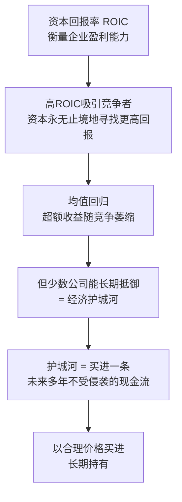
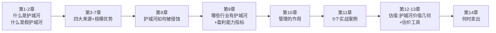
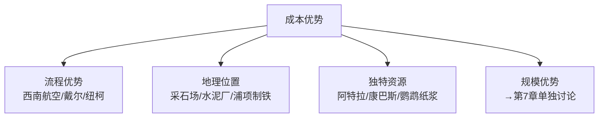
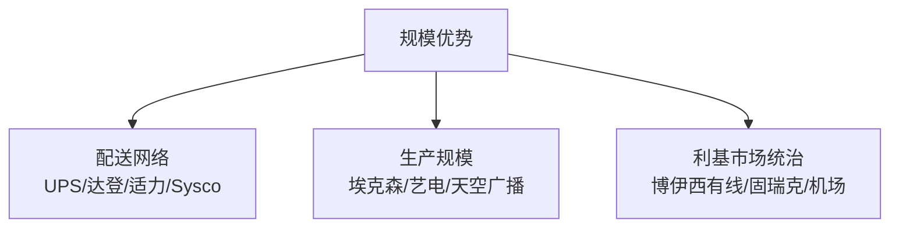
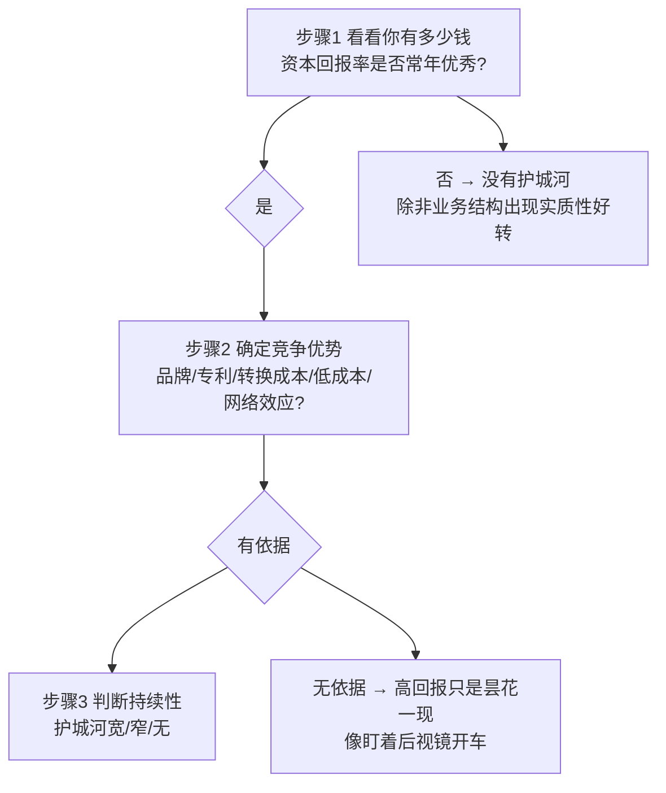
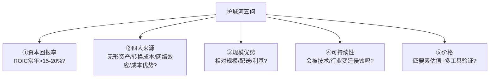
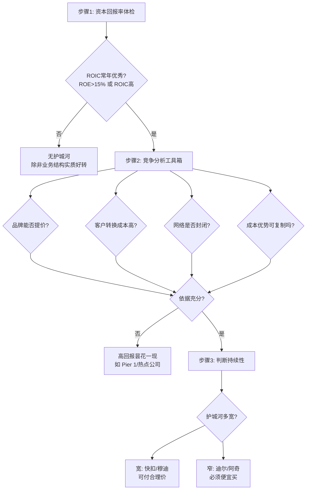
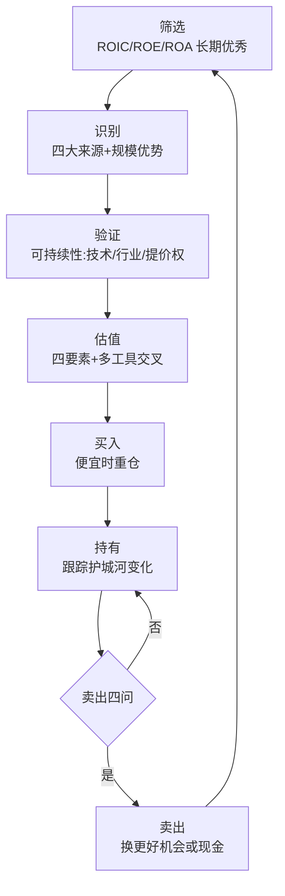

# 《巴菲特的护城河：降低风险、提高获利的股市真规则》深度解读（详细版）

> **原书名**：The Little Book That Builds Wealth: The Knockout Formula for Finding Great Investments
> **作者**：帕特·多尔西（Pat Dorsey）——晨星公司（Morningstar）股票研究部主管、首任首席证券策略师，美国西北大学政治学博士，后转型为专业证券分析师。本书是其"护城河三部曲"中最畅销的一部（另两部为《股市真规则》《投资的护城河》）。
> **核心内容**：把巴菲特"经济护城河"概念系统化为可操作的选股框架——**四大护城河来源（无形资产/转换成本/网络效应/成本优势）+ 规模优势 + 护城河识别三步骤 + 估值工具 + 卖出纪律**。全书以晨星公司 100+ 分析师对 2,000+ 家公司的实战评级为基础。
> **系列定位**：05—12 号笔记解决"巴菲特买什么、怎么算账"，本书解决"**什么样的公司值得长期持有**"——它是把巴菲特护城河思想变成一门"科学"（晨星评级体系）的实操手册。与 [[12《巴菲特的估值逻辑》深度解读（详细版）|12 估值逻辑]] 互补：12 讲估值计算，本书讲护城河识别。

> 🔗 **相关笔记双链**：[[11《巴菲特的伯克希尔崛起》深度解读（详细版）|11 伯克希尔崛起]] · [[12《巴菲特的估值逻辑》深度解读（详细版）|12 巴菲特的估值逻辑]] · [[10《巴菲特致股东的信》深度解读（详细版）|10 致股东的信（1957-2013）]] · [[09《巴菲特致股东的信》深度解读（详细版）|09 致股东的信（坎宁安版）]] · [[07《巴菲特投资案例集》深度解读（详细版）|07 投资案例集]]


---

## 全书导读：护城河投资法的完整框架

### 0.1 一句话读懂本书

> "寻找能持续多年实现超额收益的企业；耐心等待，在股价低于其内在价值时买进；持有股票，直到企业出现衰退导致股价高估或是找到更佳的投资机会时卖出，持有期至少应达到 1 年；必要的话，可以重复上述操作。"

**本书重点解决第一步**：什么样的企业能持续多年实现超额收益？

### 0.2 为什么护城河如此重要（核心逻辑链）



| 关键概念 | 定义 |
|---------|------|
| 资本回报率（ROIC） | 企业利用全部资产（厂房、人员、投资）为股东创造价值的能力——"衡量企业盈利能力的最佳指标" |
| 均值回归 | 随着竞争加剧，企业超额收益逐渐萎缩——**资本的本质是寻找更高回报** |
| 经济护城河 | 企业能常年保持竞争优势的**结构性特征**，是竞争对手难以复制的品质 |
| 护城河的价值 | 拥有护城河的企业可在更长时间内创造更多经济利润 |

### 0.3 三大价值主张（护城河给投资者带来什么）

| 价值 | 说明 |
|------|------|
| ①强化自律 | 不会为竞争优势岌岌可危的热门公司支付高价钱 |
| ②降低灭顶风险 | 内在价值稳步增长——即使买贵了也能靠增长消化 |
| ③增加企业弹性 | 能依靠结构优势尽快摆脱暂时困境（新可乐失败、麦当劳 2002 困境） |

**能力圈的定义工具**：护城河帮助投资者把"宽广无限的投资大世界"变成"能够深刻领会的理财小家园"。

### 0.4 全书路线图



### 0.5 晨星护城河评级体系（本书的实践背景）

| 维度 | 内容 |
|------|------|
| 评级分类 | 宽护城河 / 窄护城河 / 无护城河 |
| 分析团队 | 100+ 分析师覆盖 100+ 行业 2,000+ 公司 |
| 评级依据 | ①预期公允价值贴现（DCF 模型）②护城河规模 |
| 核心理念 | "我们希望能按更低的公允价值贴现值买进它们的股票" |
| 数据实证 | 晨星数据库 5,550 家基金中，仅 24 个非行业基金 15 年年化超 15%——**高资本回报率极其稀缺** |

---

## 第1章 经济护城河：什么是护城河

### 1.1 核心定义

> "经济护城河则保卫着世界顶级公司的高资本回报率不受侵犯。就像能拒敌于城池之外的护城河一样。"

| 要素 | 解释 |
|------|------|
| 结构性特征 | 与生俱来的、难以复制的品质（不是管理技巧） |
| 保护对象 | 高资本回报率（ROIC） |
| 时间维度 | "越经久耐用的东西，人们越愿意为其支付更高的价钱"——寿命长久的企业更有投资价值 |
| 本质 | 买进一条在未来若干年内不会受到竞争对手侵袭的现金流 |

### 1.2 两家公司的对比实验（护城河的价值）

| 维度 | 有护城河的公司 | 无护城河的公司 |
|------|--------------|---------------|
| 增长速度 | 相同 | 相同 |
| 资本与现金创造 | 相同 | 相同 |
| 再投资回报率 | 高（可持续多年） | 低（竞争者乘虚而入） |
| 资本回报率曲线 | 长时间后才下降 | 快速下降 |
| 累积经济价值 | **黑色区域巨大** | 黑色区域小 |

### 1.3 三大实际好处（详细展开）

| 好处 | 案例 |
|------|------|
| 自律 | 曾经的零售商"如同中世纪的裙撑"，技术公司优势一夜荡然无存——护城河帮你区分昙花一现与基业长青 |
| 安全 | 没有护城河的企业竞争力受挫时，内在价值直线下降——"你肯定不愿意为这样的股票支付高价钱" |
| 弹性 | 可口可乐新可乐/C2 两次惨败未入绝境；借 Dasani 瓶装水和收购非碳酸品牌渡过难关 |
| 弹性 | 麦当劳 2002—2003 年服务质量下滑，靠品牌+无所不在的经营网络东山再起 |

### 1.4 选股箴言（本章金句）

> 1. 购买一只股票，只意味着你掌握了这个企业的一点皮毛。
> 2. 企业价值等于它在未来所创造的全部现金。
> 3. 一个能长期实现现金盈利增长的企业，要比那些只能实现短期现金盈利增长的企业更有投资的价值。
> 4. 资本回报率是判断企业盈利能力的最佳指标。
> 5. 经济护城河能很好地保护企业免受外来竞争的影响。

---


---

## 第2章 真假护城河：四大陷阱

### 2.1 核心观点：赌马赌的是马，不是骑师

> "在股票市场上，毛驴和设得兰矮种马绝对能和纯种马同场竞技。纵然是世界上最好的骑师……作为投资者，你的工作就是**关注马匹，而不是骑师**。"

| 陷阱 | 为什么是假的 | 反例 |
|------|-------------|------|
| ①优质产品 | 好产品吸引竞争者蜂拥而至，没有结构性特征保护 | 克莱斯勒小型货车（印钞机→放弃）；怪物饮料（红牛被蚕食）；Krispy Kreme 甜甜圈 |
| ②高市场份额 | 领先优势可以转瞬即逝 | 柯达、IBM（PC）、网景、通用汽车、Corel |
| ③有效执行 | 没有难以复制的专有流程，效率优势不持久 | 戴尔/西南航空（下文详解） |
| ④卓越管理 | 个人对大规模组织影响有限；管理者来来去去 | 思科钱伯斯 vs 安然肯尼斯·莱——事后才知谁是天壤之别 |

### 2.2 陷阱一：优质产品≠护城河

| 案例 | 结局 |
|------|------|
| 克莱斯勒小型货车（1980s） | 几年内竞争者蜂拥而至，被迫放弃 |
| Gentex 自动变光后视镜 | **有专利保护**→20 多年后资本回报率仍 >20%——对照鲜明 |
| Krispy Kreme 甜甜圈 | 好吃但无护城河→消费者轻易转向 |
| 汤米·希尔费格 | 分销体系臃肿→沦为甩卖品牌 |
| 乙醇生产（2006） | 35% 经营利润率→一年后最大厂商开始亏损——"没有经济护城河的企业，财务成果注定归于消逝" |

**例外**：一鸣惊人的产品偶尔能转化为护城河——汉森天然（怪物饮料）与安海斯-布希签订**长期分销协议**，建立对手难以复制的渠道优势。

### 2.3 陷阱二：高市场份额≠护城河

> "我们首先需要提出的问题，并不是企业是否拥有巨大的市场份额，而是**它如何赢得市场**。"

| 案例 | 分析 |
|------|------|
| 柯达（胶卷） | 统治美国市场几十年→数字技术一统天下后挣扎求生 |
| 外科整形装置 | 小厂商也能高回报：医生不按价格决策+转换成本高+研发预算无意义——**份额大无优势** |
| 总结 | 规模可以建立优势（第7章），但很少是护城河来源；高份额也未必带来护城河 |

### 2.4 陷阱三：有效执行≠护城河

| 案例 | 成功原因 | 局限性 |
|------|---------|--------|
| 戴尔 | 直销+订单式生产+库存最小化 | 竞争对手不复制是因为战略失误（捷威开实体店）——"建立在竞争对手懒惰和犯错误基础上的护城河不够坚固" |
| 西南航空 | 单一机型+快速周转+节约文化 | 工会结构、中转站成本、差异化收费让老牌公司无法模仿；JetBlue 等新玩家最终复制成功 |

**结论**："新进入企业无法迅速复制其生产流程，或是即便能复制这一流程，也没能破坏整个行业的运行规律，那么，建立在流程基础上的成本优势就可以形成**暂时性**护城河。"

### 2.5 陷阱四：卓越管理≠护城河

| 论据 | 内容 |
|------|------|
| 学术研究 | 管理对企业绩效的影响位于行业控制力和其他因素之后 |
| 不可预测 | 超级明星 CEO 3 年后还在吗？——"高管的更迭早已成为企业创造价值的秘诀" |
| 后见之明 | 评价管理者更多地需要后见之明——钱伯斯 vs 莱 |
| 现实 | "我们很少会在商业媒体上看到'未来10年的管理奇才'之类的预测" |

### 2.6 真正的护城河：四大来源（本书框架的核心）

| 来源 | 定义 | 代表 |
|------|------|------|
| ①无形资产 | 品牌、专利、法定许可——出售竞争对手无法效仿的产品/服务 | 蒂芙尼、穆迪、拜耳 |
| ②转换成本 | 产品/服务让客户难以割舍→定价权 | 银行、Intuit、甲骨文 |
| ③网络效应 | 用户越多价值越大，把对手长期拒之门外 | eBay、微软、美国运通 |
| ④成本优势 | 流程、地理位置、规模、特有资产→更低价格 | 西南航空、浦项制铁、快扣 |

> "根据我们在晨星公司的实践经验，这四大特征体现于绝大多数拥有护城河的企业，以它们为过滤器，就可以……"

---

## 第3章 无形资产：品牌、专利与法定许可

### 3.1 三大无形资产的作用机理

> "任何一个拥有其中之一的企业都是一个微型垄断企业，能从客户身上获取更多的收益。"

| 类型 | 作用 | 关键风险 |
|------|------|---------|
| 品牌 | 提高消费者购买意愿/巩固依赖性 | 品牌失去魅力→无法收取溢价 |
| 专利 | 法律禁止竞争对手销售 | 有期限；可受挑战 |
| 法定许可 | 竞争对手无法进入市场 | 许可权可能被收回 |

### 3.2 品牌：只有带来定价权的品牌才是护城河

**核心检验**：能否收取高于同类竞争产品的价格？

| 案例 | 品牌力 | 是否护城河 |
|------|--------|-----------|
| 索尼 DVD | 品牌知名度毋庸置疑 | ❌ 消费者按性能价格购买 |
| 蒂芙尼钻石 | 同样 1.08 克拉 VS1 级绿钻：蒂芙尼 1.39 万 vs 蓝色尼罗河 8,948 美元 | ✅ **蓝盒子就是定价权** |
| USG Sheetrock | 产品与对手几乎一字不差，却收 10%—15% 溢价 | ✅ 耐久性/强度声誉 |
| 拜耳阿司匹林 | 化学成分相同，价格 2 倍 | ✅ 罕见案例 |
| 可口可乐/奥利奥/奔驰 | 品牌减少搜索成本，但可乐不比百事贵、奔驰不比宝马贵 | ⚠️ 品牌有价值但未必有定价权 |
| 卡夫干酪 | 杂货店自有品牌冲击→加工乳酪就是加工乳酪 | ❌ 品牌魅力被侵蚀 |

**结论**："最关键的并不是品牌的受欢迎程度，而是**它能否影响消费者的行为**。如果消费者仅仅因为品牌就愿意购买或是支付更高的价钱，那么，这就是经济护城河存在的最有力的证明。"

### 3.3 专利：需要创新传统与专利组合

| 要点 | 内容 |
|------|------|
| 有期限 | 一旦到期，竞争接踵而来——"几乎任何一家大型制药公司都有切肤之痛" |
| 可受挑战 | 专利利润越大，挑战者越多——1/10 成功率也值得挑战（仿制药公司） |
| 单一专利风险 | "把未来完全寄托在某一项专利产品上的企业……冷静下来，也许会让你心生疑虑" |
| 合格标准 | 历史悠久的创新传统+一大批专利产品——3M（数千项专利）、默克、礼来 |

### 3.4 法定许可：最接近垄断的护城河

**关键区分**：许可限制竞争但不限制定价——**制药 vs 公用事业**：

| 行业 | 审批 | 定价权 |
|------|------|--------|
| 制药 | FDA 批准才能卖药 | FDA 不管药品价格→高利润 |
| 公用事业 | 批准才能供电 | 管制机构决定收费水平→低利润 |

**经典案例：穆迪公司**

| 指标 | 数据 |
|------|------|
| 业务 | 债券信用评级（"美国特许统计评级机构"认证=进入壁垒） |
| 利润率 | 投资者服务业务利润率 **>50%** |
| 资本回报率 | **约 150%**——"你看准了，这可不是印错了数字" |

**NIMBY 护城河（"不要在我家后院"）**：

| 行业 | 护城河机制 |
|------|-----------|
| 垃圾场/采石场 | 几百家市政机构审批，不可能一夜变成废纸；地方性业务→微型护城河 |
| 对比：炼油厂 | 同样审批难，但汽油价值重量比高+管道廉价输送→其他地区炼油厂可进入→ROIC 仅 10% 出头 |
| 结论 | 采石/垃圾处理稳定保持近 20% ROIC——"貌不惊人的审批许可，却能造就持续恒久的护城河" |

**许可的多元化**："最坚固的法定许可构筑起来的护城河，源于一大批看似不起眼的法规，而不是一项朝不保夕、说变就变的重大法规。"

### 3.5 本章选股箴言

> 1. 受欢迎的品牌未必总是赚钱的品牌。如果一个品牌不能吸引消费者多掏钱，它就不可能创造竞争优势。
> 2. 虽然拥有专利权是一件美妙的事，但专利律师绝不是省油的灯。法律上的挑战是专利护城河最大的威胁。
> 3. 管制可以限制竞争……最坚固的法定许可构筑起来的护城河，源于一大批看似不起眼的法规。

---


---

## 第4章 转换成本：赖着不走的黄金客户

### 4.1 核心定义

> "客户从A公司产品转向B公司产品省下的钱，低于进行转换发生的花费，它们的差额就是转换成本。"

| 维度 | 内容 |
|------|------|
| 本质 | 客户难以割舍→企业拥有定价权→维持高资本回报率 |
| 关键 | 只有亲身体验产品的客户才能感受到（从内部看成本收益差异） |
| 动态性 | 会随时间推移强化或弱化 |
| 与品牌区别 | 不需要知名度，只需要"赖着不走" |

### 4.2 经典案例：银行（"银行就是印钞机"）

| 指标 | 数据 |
|------|------|
| 存款平均更换率 | 只有 15%——平均 6—7 年才换一次 |
| 美国银行业平均资产收益率 | 约 15% |
| 为什么 | 换银行要填表+调整直接存款+转账程序+**未知风险**（工资跑错、电费没交） |
| 对比 | 加油转换成本=几分钟时间（汽油就是汽油） |
| 银行的小算盘 | 利用客户不愿离开的心理，再下调一点利率或多收一点手续费 |

### 4.3 转换成本的多种形态

```mermaid
graph TD
    A[转换成本] --> B[与客户业务结合<br/>QuickBooks/甲骨文/Fiserv]
    A --> C[财务成本<br/>沃特斯LC设备5-10万美元]
    A --> D[重新培训时间成本<br/>Adobe/Autodesk]
    A --> E[心理成本<br/>基金"承认选错经理"尴尬]
    A --> F[风险成本<br/>精密铸件:涡轮叶片断裂]
    A --> G[流程成本<br/>丙烷池互换+手续费]
```

| 案例 | 转换成本来源 | 结果 |
|------|-------------|------|
| Intuit（QuickBooks/TurboTax） | 小企业数据全部输入软件，转移=时间+风险+校对 | **ROIC 连续 8 年 >30%**，两产品份额 75%+，击败微软 |
| 甲骨文 | 数据库与大量分析/报告软件绑定，转换=数据迁移+重绑+隐藏风险 | 客户难逃 |
| Fiserv/道富 | 银行后台数据处理，紧密对接客户业务 | **每年保留 95%+ 老客户**，收入具年金性质 |
| 精密铸件（PCC） | 飞机发动机/涡轮叶片——故障=灾难；工程师参与 GE 新产品设计 | 与客户合作超 30 年 |
| Adobe/Autodesk | Photoshop/AutoCAD 复杂，换软件=重新培训 | 设计师大学就开始学 AutoCAD |
| 共同基金 | 黏性资产+心理成本（承认选错基金经理） | 资金长期不动 |
| 丙烷配送 | 池子归供应商，换供应商=互换丙烷池+手续费 | 行业高资本回报率 |
| 沃特斯（Waters） | LC 设备 5—10 万+技师培训+高利润易耗品 | **ROIC >30%** |

### 4.4 转换成本低的行业（护城河缺失）

> "低转换成本恰恰是此类企业的主要缺陷。你可以随便从一家服装店走到另一家，或是在杂货店里选择不同品牌的牙膏，这几乎不费吹灰之力。**所以，零售商和餐馆很难为它们的业务设置护城河**。"

例外：沃尔玛/家得宝（规模经济）、寇兹（品牌）。

### 4.5 本章选股箴言

> 1. 如果企业能让客户不选择竞争对手的产品或服务，那么它就拥有自己的转换成本。如果客户无法实现转换，企业不仅可以收取更高的价格，而且有利于维持高资本回报率。
> 2. 转换成本是多种方式的，比如与客户业务的结合、财务成本和重新培训时间成本等。
> 3. 你的开户行就是转换成本的最大受益者。

---

## 第5章 网络效应：越多人用越值钱

### 5.1 核心定义

> "随着用户人数的增加，它们的产品或服务的价值也在提高。"

| 对比维度 | 普通商品 | 网络型产品 |
|---------|---------|-----------|
| 餐馆 | 价值与就餐人数无关 | — |
| 推土机（卡特彼勒） | 排他性商品——我用你不能用 | — |
| 美国运通/微软 | — | **非排他性商品**：一个人使用不妨碍他人，使用的人越多价值越大 |
| 经济学本质 | — | 信息是经济学家所说的非排他性商品 |

### 5.2 网络效应的威力

| 案例 | 网络效应表现 |
|------|-------------|
| 美国运通 | 消费点越多对用户价值越高→便利店加油站推广；运通卡回报再高，没有商家接受也没用 |
| 微软 Windows/Office | 人人都在用→你必须会用；OpenOffice 免费+功能相当也夺不走市场（文件共享） |
| eBay | 美国在线拍卖流量 85%+；买家因卖家来、卖家因买家来 |
| 西联汇款 | 网络规模只是对手 3 倍，交易量却是 5 倍——**每地点更高平均业务量** |
| 期货交易所 | 合约锁定（在纽商所买的合约必须在纽商所卖）→独享网络效应 |
| 股票交易所 | IBM 股票可在 5-6 家交易所交易→网络被打开→效应流失→ROIC 下滑 |

**道琼斯成分股验证**：30 只成分股中，竞争优势主要来自网络效应的只有 **2 家**——美国运通和微软。网络效应在**信息类/知识转移型行业**中更常见。

### 5.3 网络效应的非线性威力（数学视角）

| 节点数 | 连接数 | 增幅 |
|--------|--------|------|
| 20 | 190 | — |
| 30 | 435 | 节点 +50% → 连接 **+150%** |

> "网络规模扩大带来的经济价值增长率要大于其绝对规模的增长率。"

**注意**：连接的价值取决于用户需求——芝加哥皮尔森区移民要汇款到墨西哥，迪拜/达卡的网络连接对他们没价值。价值连接比在连接数庞大时会递减。

### 5.4 网络效应的边界（三个教训）

| 教训 | 案例 |
|------|------|
| ①先来后到 | eBay 美国 vs 日本雅虎：日本雅虎早 5 个月进入→确立胜局→eBay 退出 |
| ②先行不够 | eBay 中国：90% 流量但淘宝取消开店费+本土化→eBay 拱手让出 |
| ③封闭网络 | 期货交易所封闭→独享；股票交易所开放→竞争侵蚀 |

> "如果一家公司要想从网络效应中获益，就必须营造出一个**封闭的网络**。一旦这个本应封闭的网络被打开，网络效应便会四处飞溅。"

### 5.5 本章选股箴言

> 1. 如果产品或服务的价值随客户人数的增加而增加，那么，企业就可以受益于网络效应。信用卡、在线拍卖和某些金融产品交易所就是最典型的例子。
> 2. 网络效应是一种极其强大的竞争优势，在以信息共享或联系用户为基础的业务中，更容易找到这种护城河。但从事有形商品交易的企业却很难体现网络效应的威力。

---


---

## 第6章 成本优势：流程、地理位置与资源

### 6.1 成本优势的定位

> "企业可以通过低于竞争对手的成本，在自己的身边挖一条护城河。"

**判断标准**：成本优势是否**轻易可复制**。

| 假成本优势 | 真成本优势 |
|-----------|-----------|
| 把呼叫中心/工厂搬到中国、印度、菲律宾——低劳动力成本供应商"随时会变成其他任何一家公司的采购源" | 难以复制的流程、地理位置、资源、规模 |

**可替代性检验**：在价格决定采购决策的行业，成本优势意义非凡——Intel vs AMD（客户眼中无区别）、波音 737 vs 空客 A320、福特 vs 本田。

### 6.2 成本优势的四个来源



### 6.3 流程优势：强大但短暂

| 案例 | 优势来源 | 结局 |
|------|---------|------|
| 戴尔 | 直销+订单式生产+库存最小化 | 惠普重组、IBM 卖 PC 给联想、笔记本+大众市场兴起→优势大不如前 |
| 西南航空 | 单一机型+地面时间最小化+节约文化 | JetBlue/AirTran 复制→老牌公司也学（工会是壁垒但非不可破） |
| 纽柯/钢铁动力 | 迷你钢厂新技术 | 安赛乐米塔尔全球化低成本竞争→优势弱化 |

**三个案例的教训**：

> "新进入企业无法迅速复制其生产流程，或是即便能复制这一流程，也没能破坏整个行业的运行规律，那么，建立在流程基础上的成本优势就可以形成**暂时性**护城河。"

**为什么对手迟迟不复制**：
- 西南航空：工会结构（飞行员不帮地勤）、中转站维护费、差异化收费文化
- 戴尔：IBM/康柏渠道绑定；美光/捷威尝试失败（美光产品线太杂、捷威开实体店）

### 6.4 地理位置优势：更持久

| 特征 | 说明 |
|------|------|
| 适用行业 | 大批量商品+低价值重量比+消费市场接近生产地 |
| 持久性 | "地理位置更加不容易复制" |

| 案例 | 成本优势机制 |
|------|-------------|
| 采石场 | 每吨石料成本 7 美元+运费每吨每英里 0.10—0.15 美元→5—7 英里=10% 额外成本→**半径 50 英里内局部垄断** |
| 水泥厂 | 市中心老厂=附近建筑工地最低成本供应商→高利润率→迷你垄断 |
| 浦项制铁 | 韩国 75% 钢铁份额；汽车造船业近在咫尺+运输成本低；距中国一天海程 |
| 垃圾搬运 | 运距越远成本越高——"谁也不能在把垃圾搬运到几百英里外之后还能赚到钱" |

### 6.5 独特资源优势：世界级资产

| 案例 | 资源 | 成本优势 |
|------|------|---------|
| 阿特拉石油 | 怀俄明州天然气 | 钻井成本 700 万 vs 同行 1,700 万—2,500 万——利润率比北美均值高 1 倍 |
| 康巴斯矿业 | 戈德里奇港井矿盐（矿脉厚 100+ 英尺） | 全球最低除冰盐价格+休伦湖水运低成本 |
| 巴西鹦鹉纸浆 | 桉树 7 年砍伐期（智利 10 年、北美 20 年） | 用更少资本生产更多纸浆 |

### 6.6 成本优势的持久性排序

| 类型 | 持久性 | 原因 |
|------|--------|------|
| 流程优势 | ⭐ 短 | 可模仿；常靠对手不作为 |
| 地理位置 | ⭐⭐⭐ 长 | 不可复制；局部垄断 |
| 独特资源 | ⭐⭐⭐ 长 | 一流自然资源无法复制 |
| 规模优势 | ⭐⭐⭐⭐ 最长 | 第7章主题 |

### 6.7 本章选股箴言

> 1. 成本优势对那些价格影响客户采购决策最大的行业最为关键。仔细思考产品或服务是否易于找到替代品，可以帮助我们发现哪些行业的成本优势能带来护城河。
> 2. 低成本的流程优势、上佳的地理位置和独一无二的资源，都能创造出成本优势。但流程导向的优势需要特别注意，因为一家公司能发明的流程，另一家公司就能模仿。

---

## 第7章 规模优势：规模越大越强，但前提是你一定要找准方向

### 7.1 核心原则：相对规模而非绝对规模

> "最关键的并不是企业的绝对规模，而是和竞争对手相比的**相对规模**。对共同主宰一个行业的两家大公司——波音和空客来说，它们彼此之间不可能在规模上拥有什么真正的成本优势。"

**固定成本/变动成本比值决定规模收益**：比值越高，规模收益越大，行业越稳固——全国性物流/汽车/芯片厂商屈指可数，小型律所/会计师事务所数以千计。

### 7.2 规模优势的三个层次



### 7.3 配送网络优势

| 案例 | 机制 | 结果 |
|------|------|------|
| UPS vs FedEx | UPS 利润来自门到门地面配送（半满货车仍赚钱）；FedEx 靠隔夜航空（半满货机亏钱） | **UPS 资本回报率明显更高** |
| 达登（红龙虾） | 650 家餐厅的配送规模→更新鲜+更低成本 | 对手无法跨越的护城河 |
| 适力医疗环保 | 全美最大医疗垃圾处理商，第二名为其 1/16 | 每条路线更多停靠点→更赚钱的线路 |
| Sysco/快扣/百事/帝亚吉欧 | 庞大稠密配送网络 | "大规模配送网络极难复制，往往是超宽经济护城河的源泉" |

### 7.4 生产规模优势

| 案例 | 机制 |
|------|------|
| 埃克森美孚 | 多领域规模经济→提炼化工成本低于任何综合性石油公司 |
| 艺电（EA） | 游戏开发成本固定（约 2,500 万美元）→总体销售额分摊→更轻松推出新游戏 |
| 天空广播（BSkyB） | 同样收费提供更多节目→买更多英超/首映电影→吸引更多用户→**正反馈循环**；对手用户不到其 1/3 |

### 7.5 利基市场统治（"宁当鸡头，不做凤尾"）

| 案例 | 机制 | 结果 |
|------|------|------|
| 博伊西有线电视 | 小城市需求仅够一家盈利→对手无动力进入 | 近似垄断 |
| 固瑞克（Graco） | 高端工业泵市场小+研发仅 3%—4% 销售额+产品是总成本一小部分但客户看得见 | **ROIC 40%** |
| Blackboard | 学习管理系统 2/3 份额，市场太小吸引不了微软/Adobe | 高回报 |
| 私人机场 | 一个地区航线仅够一家机场盈利→即使获批建第二家也无利可图 | 宽阔护城河 |

### 7.6 本章选股箴言

> 1. 宁愿做小池塘里的大鱼，也不要做大池塘里更大的鱼，重点在于公司的相对规模，而非公司的绝对大小。
> 2. 只要你的鱼比所有人都卖得便宜，你就能赚到大钱。这样，你还可以卖点别的东西。
> 3. 尽管规模经济和鱼的外表没什么关系，但它却能创造更持久的竞争优势。

---


---

## 第8章 被侵蚀的护城河：不可逆转的颓势

### 8.1 核心警示

> "在这个充满竞争的世界里，即使是最高明的分析，也会在无法预测的变化面前显得毫无意义。……尽管变化也有可能带来机遇，但也会严重侵蚀曾经强大无比的经济护城河。"

**历史案例**：纽约证交所专业交易员（10 年前等于印刷钞票许可证）→宝丽来（数字技术）→长途电话（互联网协议）→报纸（互联网）→音乐行业（数字化）。

### 8.2 技术变革：两种企业的不同命运

| 类型 | 风险 | 案例 |
|------|------|------|
| 销售技术的企业（软件/半导体/网络硬件） | 优势随时可能数月内消失——"长期看来，一切将会变得平淡无奇" | Palm、多数科技公司 |
| **使用技术（技术创造型）的企业** | **更无法预料、更严重的威胁**——"在技术变化危及生存前，这些企业会给人竞争优势无与伦比的感觉" | 柯达、报业、长途电话 |

**柯达的教训**：胶卷统治几十年→2002—2007 年累计营业利润仅 8 亿美元，比前 5 年锐减 85%——"和柯达以前涉足的胶卷、纸张和化学品等发展缓慢但获利颇高的业务相比，产品周期较短的消费电子业务注定会更艰难"。

**纳斯达克的启示**：全电子交易所取代叫价式交易所→群岛交易所→买卖价差缩小→专业交易员处境不稳。

> "技术变革对**技术创造型企业**护城河的破坏性，甚至比对技术销售型企业的破坏性还要严重，尽管技术创造型企业的投资者也许不认为自己持有科技股。"

### 8.3 行业变迁的四种侵蚀力量

| 力量 | 机制 | 案例 |
|------|------|------|
| ①客户群集中 | 买方市场形成→丧失定价权 | 沃尔玛/塔吉特挤压 Clorox、纽威尔；劳氏/家得宝挤压斯坦利工具/百得 |
| ②低成本劳动力全球化 | 地理护城河被侵蚀（人力节约弥补运输成本） | 美国木制家具业 |
| ③非理性竞争对手 | 为政治/社会目的牺牲利润 | 劳斯莱斯 1980s 危机后低价卖发动机→普拉特-惠特尼/GE 盈利率受损 |
| ④破坏性增长 | 在无护城河领域扩张=自掘坟墓 | 微软：Zune/MSN/MSNBC/儿童玩具/30 多亿砸欧洲有线电视 |

**微软的教训**："当一个企业过度投资于缺乏竞争优势的业务时，也许就是在亲手填平自己辛辛苦苦挖出来的护城河。"

**资金分配的建议**："公司应该把剩余资金以股利形式返还给股东，这是最不被重视但却是最有效的资金分配工具。"

### 8.4 客户说"不"：护城河弱化的信号

**甲骨文案例**（晨星分析师 2006 年底发现）：甲骨文一反常态**停止提高软件维护承包费**——深入研究发现第三方维护公司已形成气候，客户无需升级→"随着时间的推移，这种趋势势必会影响到甲骨文的盈利能力，并最终侵蚀它的护城河"。

**识别信号**：一个可以经常提价的企业开始在客户面前示弱 = 竞争优势出现弱化。

### 8.5 本章选股箴言

> 1. 技术变革可以破坏企业的竞争优势，但**靠技术谋生的企业显然比销售技术的企业更担心**，因为技术变革的影响是不可预见的。
> 2. 如果一家公司的客户群日趋集中，或者某个非理性竞争对手已经不再把赚钱当作唯一目标，这就说明：企业的护城河已经危在旦夕。
> 3. 增长并不总是好事。因此，一个公司最好还是把主业赚来的钱返利于股东，而不是投入连自己都心里没底的不具备护城河的业务。

---

## 第9章 发现护城河

> 🔗 **选好之后怎么拿**：护城河解决"选什么"，[[16《巴菲特的投资组合》深度解读（详细版）|16 巴菲特的投资组合]] 解决"押多少、拿多久"——5—15 只集中组合的理论与实证。：哪些行业天生有护城河

### 9.1 行业决定论：有些行业天生更赚钱

> "有些竞争过于血腥，因此，要在这样的行业里打造竞争优势，管理者非得具备拿诺贝尔奖的水平。另一些行业的竞争却不那么激烈，即使是普普通通的企业，也能保持说得过去的资本回报率。"

**极端对比**：
- 汽车零部件（晨星 13 家）：仅 2 家有护城河——美国车轴：SUV 退潮后 ROIC 从 10%—15% 跌至个位数
- 资本管理（晨星 18 家）：**全部拥有护城河**（12 家宽护城河）——进入壁垒低（10 万美元就能开基金）但成功壁垒高（销售网络+黏性资产）

### 9.2 行业护城河分布地图（晨星 2,000+ 公司研究）

| 行业 | 护城河丰度 | 原因 |
|------|-----------|------|
| 商业服务 | **宽护城河比例最高** | 业务紧密结合客户（DST/Fiserv）+不可复制数据库（IMS/邓白氏/艾可菲）+垄断利基（适力/穆迪/FactSet/Blackbaud） |
| 金融服务 | 极高 | 进入壁垒（高盛）+转换成本（银行）+黏性资产（基金）+网络效应（交易所） |
| 消费品 | 极高（"势不可挡"企业） | 可口可乐/高露洁/箭牌/宝洁——品牌需持续广告+创新投入 |
| 软件 | 高 | 软件与软件绑定→转换成本（思科是例外：软件内嵌硬件） |
| 媒体 | 高但受冲击 | 迪士尼/时代华纳：独有内容+传播渠道控制；互联网冲击明显但强者恒强 |
| 电信 | 中等（2/3 有） | 但一半以上是外国公司（管制宽松）；美国需夹缝市场 |
| 医疗卫生 | 中低（但统计被小生物科技扭曲） | 大型药企/医疗设备强；HMO/医院弱；利基强者（伟康/Gen-Probe） |
| 能源 | 中高 | 天然气（管道无法越洋→北美本地护城河）；石油（OPEC+超级资本壁垒）；**管道运输**（利基垄断+管制宽松） |
| 公用事业 | 低 | 自然垄断被管制抵消——"宽容大度的管制机构是公用事业企业最宝贵的财产" |
| 工业材料 | 低 | 商品无差异化；仅超级霸王（必和必拓/力拓）或利基者（固瑞克/精密铸件/钢铁动力） |
| 消费服务（零售/餐饮） | **最低** | 低转换成本+理念易复制——"总像海市蜃楼一样稍纵即逝" |

### 9.3 护城河是相对的

> "护城河是相对的而不是绝对的。在一个具有内在吸引力的行业里，即使是排名第四的公司，其护城河的宽度也很有可能会超过激烈竞争行业中的老大。"

**银行劫匪威利·萨顿法则**："我抢劫银行，是因为那儿有钱。"——**有些行业在本质上就比其他行业更赚钱，它们就是寻找护城河的好去处，它们就是你的长期投资资金要去的方向。**

### 9.4 盈利能力指标：ROA / ROE / ROIC

| 指标 | 定义 | 优点 | 缺陷 | 临界值 |
|------|------|------|------|--------|
| 资产收益率（ROA） | 每 1 美元资产创造的收益 | 简单常用 | 不区分融资结构 | 非金融公司持续 7% 即可傲视群雄 |
| 股东权益回报率（ROE） | 每 1 美元股东权益创造的利润 | 综合性指标 | 高杠杆可虚增 | **15%** 是竞争能力临界值 |
| 投资资本回报率（ROIC） | 全部投入资本（含负债）的回报 | 剔除杠杆影响、最接近经营真实状态 | 计算复杂 | 越高越好 |

> "投资资本回报率综合了以上两个指标的优点……剔除了高杠杆公司通过负债提高股东权益回报率的弊端。"

### 9.5 本章选股箴言

> 1. 某些行业注定要比其他行业更易于创造竞争优势。
> 2. 护城河是相对的而不是绝对的。在一个具有内在吸引力的行业里，即使是排名第四的公司，其护城河的宽度也很有可能会超过激烈竞争行业中的老大。

---


---

## 第10章 大老板：管理没有我们想象的那么重要

### 10.1 颠覆性观点

> "长期竞争优势植根于诸多结构性特征（第3～7章讨论的），而管理者对这些特征的影响其实极为有限。"

**与吉姆·柯林斯《从优秀到卓越》针锋相对**：

> "就像喝樱桃可乐、吃西尔斯糖果不能把我变成沃伦·巴菲特一样，'意识性选择'也不可能把奋力挣扎的汽车零部件企业变成大把大把赚钱的数据处理公司。90%以上的情况，**行业竞争态势对企业拥有护城河的影响，要超过经营决策的力量**。"

**学术支持**（芝加哥大学史蒂夫·卡普兰研究）："从根本上讲，初创企业的投资者应该投资于一种强大的业务，而不是一个强大的管理团队。"

### 10.2 三组对比案例

| 案例 | 管理层表现 | 结果 |
|------|-----------|------|
| 骏利资本 | 把公司搞得一团糟 | 几年后利润率恢复 25%——**护城河（黏性资产）救场** |
| H&R Block | 把钱扔进欧德折扣经纪公司无底洞 | 纳税服务连锁依旧带来不菲回报 |
| 麦当劳 | 产品落后于口味+服务滑落 | 品牌让它很快摆脱困境 |

**反面**：三位超级 CEO 的溃败——福特纳塞尔、盖普普雷斯勒、康赛可文特（破产）——"巧妇难为无米之炊，即使是世界上最优秀的工程师，也不可能用沙子盖一座 10 层城堡"。

**JetBlue 尼尔曼**：天才创始人+全新飞机+皮座椅→营业利润率 17%、ROE 20%→飞机老化+工资上涨+皮革座椅被模仿+价格战→股价比上市时低 30%——"航空业无疑是一个凄风苦雨的行业，这也是决定企业命运的根本原因"。

### 10.3 巴菲特的名言

> "当一个声名显赫的管理者去应对一个以内忧外患著称的企业时，剩下的就只能是这个企业的坏名声。"

### 10.4 CEO 为何被高估（两个原因）

| 原因 | 分析 |
|------|------|
| ①媒体需要故事 | 商业媒体需要吸引观众，CEO 是合适的宣传主题——"掌勺大厨的手艺决定了餐厅的口味"是错觉；"即使是厨艺大师也要受制于厨房里的配料是否齐全" |
| ②人脑的归因偏见 | "讲述不存在的故事，寻找非现实的模式，这是人的内在本性"——把原因归咎于某个人比指责"缺乏竞争优势"更容易接受 |

### 10.5 概率思维：买马还是买骑师

> "相比于那些管理层平庸、没有太大作为，但是拥有护城河的企业，一个没有护城河但管理者丝毫不亚于杰克·韦尔奇的企业，或许会给我们带来更大的失望。"

| 选择 | 结果分布 |
|------|---------|
| 有护城河+平庸管理层 | 管理者可能惊喜可能糟糕，**但护城河为你保驾** |
| 无护城河+超级 CEO | 成功需克服艰难险阻；CEO 一旦不聪明→"业绩除了下滑之外，也就没有什么好指望的了" |

> "企业所处的行业和企业的管理者，到底哪个更容易改变？答案显而易见：管理者的来来去去是家常便饭，但这个企业的行业竞争在一定时间内却是一成不变的。"

### 10.6 本章选股箴言

> 1. 一定要把赌注放在赛马的马身上，而不是骑师身上。管理者固然重要，但还不足以超过护城河。
> 2. 投资的全部内容就是概率，和一个由超级明星 CEO 管理但却没有护城河的企业相比，一个管理者平庸无才但却拥有护城河的企业，更有可能给你带来长期性的成功。

---

## 第11章 实践见真功：5个竞争分析案例

### 11.1 识别护城河的三步骤（晨星实战方法）



> 步骤1 要在**尽可能长的期限**看资本回报率——"一两年的表现不佳并不能否认企业护城河的存在"。

### 11.2 案例一：迪尔公司（Deere）——窄护城河

| 维度 | 分析 |
|------|------|
| 资本回报率 | 10 年基本稳健（1999—2002 有下滑但周期可解释） |
| 竞争优势 | 品牌（170 年历史+农民忠诚）+**庞大经销商网络**（北美渗透无与伦比） |
| 为什么窄 | 竞争对手（凯斯/新荷兰）也有铁杆客户；经销商网络可复制（但需数年+是否愿意下狠心不得而知） |
| 关键 | 30 万美元联合收割机每年只工作几星期——**停机时间极其致命**→快速备件能力至关重要 |
| 评级 | **窄护城河**——"在未来一段时间里，迪尔还将继续保持高水平的资本回报率" |

### 11.3 案例二：玛莎斯图尔特（MSO）——无护城河

| 维度 | 分析 |
|------|------|
| 资本回报率 | 最鼎盛时期 ROE 也不到 13% |
| 业务性质 | 杂志/电视/品牌许可——**不需要资金**的业务 |
| 结论 | 品牌虽畅销，但"该公司没有经济护城河"——轻资产业务对 ROE 的期望应更高 |
| 后续 | 玛莎本人触犯法律（内幕交易）→公司遭重创 |

### 11.4 案例三：阿奇煤炭（Arch Coal）——（非常）窄护城河

| 维度 | 分析 |
|------|------|
| 资本回报率 | 2006—2007 年非凡（此前平平） |
| 好转原因 | ①2005 年底卖掉阿巴拉契亚中部赔钱煤矿 ②粉河盆地 4 家供应商之一（低硫煤=市政首选） |
| 为什么窄 | 粉河盆地成本远低于美国其他地区——**但需与盆地内对手保持相对低成本** |
| 未来催化 | 旧长期协议到期→新协议高价格→资本回报率实质提高 |
| 风险 | 粉河开采成本上涨或碳税→另当别论 |
| 评级 | **（非常）窄护城河**，需保持警惕 |

### 11.5 案例四：快扣公司（Fastenal）——宽护城河

| 维度 | 分析 |
|------|------|
| 资本回报率 | 10 年 >20% + 最低财务杠杆——晨星数据库中市值 5 亿+公司仅 50 家可媲美 |
| 竞争优势 | 2,000 家店经销加固件；**地理规模优势**（螺丝钉重、运输贵、本身便宜） |
| 细节 | 送货时间短（停机时间致命）+内部配送车队（省 UPS 成本）+几百个利基小块市场 |
| 对手 | 最接近的竞争对手经销网点只有其一半 |
| 评级 | **宽护城河**——"要和快扣竞争，不仅需要建立同样规模的经销网络，还要甘愿在这个只够一个人吃饱饭的市场上，设立一大批不赚钱的经销点" |

### 11.6 案例五：Pier 1 与热点公司（HOTT）——无护城河的零售教训

| 公司 | 历史业绩 | 行业属性 | 结局 |
|------|---------|---------|------|
| Pier 1 进口 | 增长 15%+、资本回报率惊人 | 进口家居零售——**转换成本几乎为零** | 2005—2007 股价跌 75% |
| 热点公司 | 增长超 40%+、资本回报率惊人 | 青少年服装零售——**潮流驱动** | 2005—2007 股价跌一半 |

> "零售业本身就是一个艰苦的行业——来得容易去得快。……除非企业拥有某些形式的经济护城河，否则无论以往的业绩多么辉煌，预测企业未来创造的股东价值都是有风险的。**认识数据是一个开端，但也仅仅是开端而已。**"

### 11.7 五案例横向对比

| 公司 | 资本回报率 | 竞争优势来源 | 护城河评级 |
|------|-----------|-------------|-----------|
| 迪尔 | 稳健 | 品牌+经销商网络 | 窄 |
| 玛莎斯图尔特 | <13% | 无（品牌未带来 ROE） | 无 |
| 阿奇煤炭 | 近年非凡 | 低成本资源（粉河盆地） | 非常窄 |
| 快扣 | 20%+ 十年 | 地理规模+配送网络+利基 | **宽** |
| Pier 1/热点 | 曾经惊人 | 无（低转换成本） | 无 |

---


---

## 第12章 护城河到底价值几何：估值四要素

### 12.1 核心提醒：好公司也可能让你赔钱

> "再好的公司，花太多钱买进都有损投资组合。……你购买股票的出价对你未来的投资回报至关重要。"

**讽刺的现实**：很多人为买辆车讨价还价几小时，为省几分钱跑几英里外的加油站，却在买股票时"对股票背后企业的潜在价值浑然不知"。

**估值难的两个原因**：
1. 每个企业都不同，价值比较困难
2. 企业价值与未来的财务业绩相联系——未来是未知的

**好消息**："在购买一家公司的股票之前，我们根本就没有必要知道企业的精确价值。你需要知道的，就是**股票的当前价格是否低于正常价值**。"

### 12.2 企业价值四要素（本书核心框架）

> 公司价值 = 未来所创造现金的现值

| 要素 | 公寓类比 | 投资含义 |
|------|---------|---------|
| ①增长率 | 旁边有空地可以扩建 | 未来现金流可能有多大 |
| ②风险 | 租户按月拿工资 vs 大学生 | 预测现金流变成现实的可能性 |
| ③资本回报率 | 不加投资就能提高房租 | 维持业务增长需要多少投资 |
| ④经济护城河 | 政府禁止附近建新楼 | 企业创造超额利润的持续时间 |

> "在使用价格乘数或其他估值工具时牢记这4个因素，你肯定能作出正确的投资决策。"

### 12.3 投资收益 vs 投机收益（股价涨跌的二分法）

| 类型 | 定义 | 来源 |
|------|------|------|
| 投资收益 | 收益增长+股利 | 公司财务状况 |
| 投机收益 | 市盈率变化（10→15） | 其他投资者的预期（悲观/乐观） |

**微软 vs Adobe 的十年对照**：

| 公司 | 每股收益年增 | 股价年增 | 市盈率变化 | 结论 |
|------|------------|---------|-----------|------|
| 微软 | 16% | 7% | 50→20 | 投资收益被负投机收益抵消 |
| Adobe | 13% | 24% | 17→45 | 投资收益+巨大投机收益 |

**启示**："对于未来的投资收益，我们可以通过合理的估价，实现可预见因素（企业的财务状况）影响的最大化、不可预见因素（其他投资者的心理）影响的最小化。"

### 12.4 企业高管委员会案例（反推估值的实战）

| 维度 | 内容 |
|------|------|
| 背景 | 2007 年夏，股价一年前跌一半；增长从 30% 骤降至 10% |
| 分析 | 竞争实力依然强劲+大量增长空间 |
| 反推 | "按照当时的股价，市场将达到 10% 的增长率"——只需判断恢复到 10% 以上的概率 |
| 决策 | 增长恢复 15% 够本、20%+ 大便宜、个位数则赔钱——"出现这种可能性的概率之小，是可以接受的" |
| 内在价值区间 | 85—130 美元，但"可以确信：股价绝不可能低于每股 65 美元" |
| 补充 | 该公司现金流比收益高 50%（预收订费）→市现率更有吸引力 |

### 12.5 本章选股箴言

> 1. 公司价值就是它在未来所创造的现金现值，仅此而已。
> 2. 影响企业估价的4个重要因素是：企业在未来所能创造的现金（增长率）、实现这些预测现金流的可能性（风险）、企业运作需要的投资额（资本回报率）以及企业置竞争对手于门外的时间（经济护城河）。
> 3. 买进估价较低的股票，可以帮助我们抵御市场不稳定性带来的侵袭，因为它把我们的未来投资收益直接与企业的财务状况紧密结合到一起。

---

## 第13章 估价工具：如何发现廉价的绩优股

### 13.1 四大价格乘数总览

| 乘数 | 公式 | 适用场景 | 缺陷/注意 |
|------|------|---------|-----------|
| 市销率（P/S） | 市值÷收入 | 暂时亏损/周期性企业；寻找下跌缓冲器 | 销售额价值随利润率变化；**不可跨行业比较** |
| 市净率（P/B） | 市值÷账面净资产 | **金融服务业**（账面≈有形资产） | 无形资产（品牌/人员）不入账；**商誉膨胀账面**；超低 P/B 可能说明账面有问题 |
| 市盈率（P/E） | 市值÷收益 | 最常用；需基准比较 | E 有多个版本；预测值不可靠 |
| 市现率（P/CF） | 市值÷经营现金流 | 现金流>收益的企业（预收模式） | 忽略折旧→高估资本密集型企业 |

### 13.2 市销率：发现被错杀的失宠股

**最佳用途**："寻找拥有下跌缓冲器的高净利率公司"——低 P/S+历史高净利率=市场把暂时盈利能力下跌当成永久性。

> "如果一个低净利率的企业与类似低净利率企业的市销率保持一致，而且你认为这家企业能大幅削减成本、提升利润率，那么或许它就是你要寻找的便宜货。"

**为什么优于 P/E**：低收益股票的 P/E 可能很高（分母 E 低）——单纯找低 P/E 会漏掉这些失宠股。

### 13.3 市净率：金融股的专属工具

**关键在认识"B"**：
- 资产密集型企业：账面净值=大量实体资产（机车/厂房/存货）
- 服务/技术企业：创造收入的资产是人员/理念/流程——**不反映在账面上**
- 哈雷戴维森：P/B 约 5，但品牌（25% 经营利润率、40% ROE 的来源）不在账面里
- **商誉陷阱**：美国在线收购时代华纳商誉 1,300 亿美元——"在市净率漂亮得令人难以置信时"要剔除商誉

**适用**：金融企业的资产流动性强→账面净值接近有形资产价值。注意："不寻常的低市净率可能说明账面净值有问题——或许存在某些需要计提的不良贷款。"

### 13.4 市盈率：正确使用"E"

| 问题 | 解答 |
|------|------|
| 用哪个 E？ | 不要用华尔街预测值（"就在持续下跌的股票开始反弹之前，这些被市场接受的估计值基本都过于悲观"） |
| 最佳方法 | "首先看看公司在顺境和逆境时的表现，再想想未来会比过去好转还是恶化，最后再估计公司的年均收益"——**自己的 E** |
| 如何比较 | 竞争对手/行业平均/整个市场/历史市盈率——但**绝不能盲目**：低 P/E 可能因为低 ROIC/弱竞争 |
| 历史比较陷阱 | "目前的市盈率是 10 年以来最低的"——前提是成长预期、资本回报率、竞争地位不变 |

**市场平均 18 倍 P/E 时**：20 倍 P/E 的宽护城河+40% ROIC+新兴市场成长股——"一点都不贵"。

### 13.5 市现率：我最喜欢的乘数

| 优点 | 缺点 |
|------|------|
| 现金流比收益更真实（不受会计调整影响） | 忽略折旧——资产密集型企业现金流>收益→高估盈利能力 |
| 更稳定（不受重组/核销影响） | — |
| 部分考虑资本使用效率 | — |

**案例**：出版商（先收订费）现金流>收益；赊销商店（等离子电视）收益>现金流；企业高管委员会现金流比收益高 50%。

### 13.6 收益率工具：直接对比债券

| 工具 | 公式 | 说明 |
|------|------|------|
| 收益率 | 每股收益÷股价（P/E 的倒数） | P/E 20 = 收益率 5%；与 10 年期国债（4.5%）比较 |
| 现金回报率 | （自由现金流+净利息费用）÷企业价值 | 企业价值=市值+长期负债−现金 |

**Covidien 案例**：FCF 20 亿+利息 3 亿=23 亿分子；市值 200 亿+负债 46 亿−现金 7 亿=239 亿分母→**现金回报率 9.6%**——"非常诱人"。

### 13.7 综合估值的 5 个步骤

| 步骤 | 内容 |
|------|------|
| 1 | 牢记四要素（风险/ROIC/竞争优势/增长率）——**高 ROIC 基础上的增长比低 ROIC 基础上的增长更有价值**（PEG 的盲区） |
| 2 | 综合运用多种工具——"如果某个比率或指标说明一种股票是便宜货，就用另一个指标看看" |
| 3 | 耐心等待好价钱——"在投资这个世界里，根本就不存在意外这个词" |
| 4 | 挺得住，不要慌张——"当所有媒体都在大肆吹捧……好股票肯定没有好价钱；但股市一片慌张……你也许会得到一份廉价大餐" |
| 5 | 做你自己，不要盲从——了解护城河源于何处+相信自己的判断 |

> "在这个世界上，即使是最好的生意，如果价格不合适，也会变成最差的投资。问问所有在 1999 年或 2000 年买进可口可乐或是思科股票的人。"

### 13.8 本章选股箴言

> 1. 市销率最适合暂时出现亏损或是利润率低于企业潜能的企业。
> 2. 市净率适用于金融公司……一定要当心超低的市净率，因为这有可能说明账面价值有问题。
> 3. 一定要注意计算市盈率（P/E）时采用的是哪个"E"。最适宜的就是自己的"E"。
> 4. 市现率可以帮助我们发现现金流高于收益的公司。它最适合能先拿现金后服务的企业。
> 5. 通过以收益率为基础的估值，我们可以直接与债券等其他投资进行比较。

---


---

## 第14章 该出手时就出手：理性抛出

### 14.1 卖出与买入同样重要

**作者亲身教训（EMC 案例）**：PE 约 20 买进存储公司 EMC→3 年股价 5→100 美元→1 年后回到 5 美元——"尽管在高价位时抛出了 1/3 头寸，但还是眼巴巴地看着股价一落千丈"。

> "如果你问专业投资者投资中最难的事是什么，他们中的绝大多数人都会这样告诉你：认清股价什么时候达到最高价位……什么时候应该抛出。"

### 14.2 卖出四问（核心框架）

```mermaid
graph TD
    A[想卖出时问自己四个问题<br/>至少一个答案是"否"就不要出手] --> B[我是否犯了错误?]
    A --> C[公司经营是否已经出现恶化?]
    A --> D[我的钱是否还有更好的去处?]
    A --> E[这种股票在我的投资组合中是否比重过高?]
```

### 14.3 卖出原因一：我犯了错误

| 情形 | 说明 |
|------|------|
| 投资主题不成立 | 以为管理层会卖赔钱业务但企业执迷不悟 |
| 竞争判断错误 | 以为竞争实力强，但竞争者正在蚕食午餐 |
| 高估新产品 | 新产品的成功被高估 |

> "不管犯了什么错误，只要最初买进股票的理由不在，就没有必要继续持有了。"

### 14.4 卖出原因二：公司经营恶化

**判断关键：永久性 vs 暂时性恶化**

| 案例 | 恶化性质 |
|------|---------|
| 电影放映机公司 | 多影院建设热潮消散→影院老板财务危机→股价跌到几美分（作者忍痛沽出，事后证明正确） |
| 华盖创意（Getty Images） | 数字技术普及→廉价相机拍专业级图片→几美元图片网站蜂拥而至（华盖图片数百美元）→"经济效益和增长预期急转直下" |

### 14.5 卖出原因三：钱有更好的去处

| 要点 | 内容 |
|------|------|
| 机会成本 | 沽出稍微被低估的股票，抓住千载难逢的时机——绝对合情合理 |
| 税收考量 | 纳税账户需要更高的升值潜力来弥补税损 |
| 现金也是去处 | "在某些时候，资金的最佳存放形式就是现金"——股价远超价值+预期收益率为负→清仓明智 |
| 实战案例 | 2007 年夏末次贷危机：比较现有头寸 vs 华尔街抛售的银行股→清掉升值潜力一般的股票，买进市价明显低于账面净值的银行股→"目前，这家银行已经按更高价被收购" |
| 保持弹药 | 个人账户保留 5%—10% 现金——"没人知道市场什么时候会发疯" |

### 14.6 卖出原因四：仓位过重

| 要点 | 内容 |
|------|------|
| 个人决策 | 作者个人组合曾只含 2 只股票——集中是个人偏好 |
| 建议 | 多数投资者把单只股票限制在组合 5% 左右；**超过 10% 应小心行事** |
| 心理 | "如果减仓让你觉得更舒服，那就不要犹豫" |

### 14.7 最重要的原则：卖出原因与股价无关

> "在我列出的这4个抛售原因中，没有一个是建立在股价基础之上的。它们的着眼点清一色地集中于**公司价值的变化或是可能发生的变化**。在企业价值没有下降的情况下，仅仅根据股价下跌就卖掉股票，绝对是不明智的事情。"

> "真正有意义的是你对企业未来的预期，而不是股价过去的表现。持续大涨的股票没有理由一定要回落，同样，一路下跌的股票也没有理由一定会反弹。"

### 14.8 本章选股箴言

> 1. 如果你在分析公司时已经犯了错，最初投资的理由已经不再合理，那么，抛掉股票就可能是最佳选择。
> 2. 强大的企业始终如一固然最好，不过这样的情况绝对罕见。如果公司的基本面出现永久性而非暂时性恶化，那么，这也许就是你该放弃的时候了。
> 3. 最优秀的投资者总在为自己的资金寻找更佳去处。把低估价股票换成超廉价股票，乃明智之举。同样，即使眼下还找不到任何价格诱人的股票，把高估值股票变成现金，也算得上精明之举。
> 4. 抛出比例过高的重仓股，同属有识之见，不过这全看你的定力如何。

---

## 结束语 数字外的玄机

### 15.1 噪音与信号

> "喧嚣吵闹的财经报道和美联储的会议总让人感到心烦意乱……它们大多不过是噪音而已，几乎与公司的长期价值毫无干系。于是，我基本上对这些东西置之不理，你也应该这样。"

### 15.2 广读博学：扩大你的"公司数据库"

| 读物 | 价值 |
|------|------|
| 《华尔街日报》《财富》《巴伦周刊》 | 扩大思维里的公司数据库——"你熟悉的公司越多，你就越容易作出比较" |
| 基金经理季报 | "绝对是这个星球上最被浪费的宝贝" |
| 公司年报 | "一份公司年报的价值绝对顶得上美联储主席的 10 次讲话" |
| 行为金融学著作 | 认识投资决策过程的偏见：《半斤非八两》《光环效应》《格雷厄姆的理性投资学》 |

### 15.3 全书终极信念

> "拥有真正竞争优势的公司，可以持续实现 20% 以上的资本回报率，很少有几个基金经理能长期实现这样的回报率。如果有机会成为这些企业的股东，就一定不要错过，**如果还能用 80 美分买到 1 美元的股票，那就更值得期待了**。"

---


---

## 总结：护城河投资法的完整决策链

### 16.1 护城河五问（全书核心浓缩）



### 16.2 四大护城河来源速查表

| 来源 | 核心机制 | 检验标准 | 代表企业 |
|------|---------|---------|---------|
| 无形资产 | 品牌/专利/许可→微型垄断 | 能否收更高价？专利是否多样？许可是否分散？ | 蒂芙尼、穆迪、拜耳、3M |
| 转换成本 | 客户难以割舍→定价权 | 换供应商的成本>收益？ | 银行、Intuit、甲骨文、精密铸件 |
| 网络效应 | 用户越多价值越大 | 网络是否封闭？先发优势？ | 美国运通、微软、eBay、西联 |
| 成本优势 | 流程/地理/资源/规模→低价 | 是否可复制？持久性排序？ | 西南航空、浦项、康巴斯、快扣 |

### 16.3 护城河评级与投资决策矩阵

| 护城河 | 资本回报率 | 估值要求 | 投资策略 |
|--------|-----------|---------|---------|
| 宽 | >20% 可持续 | 可接受合理价（四要素验证） | 核心持仓，长期持有 |
| 窄 | 10%—20% | 必须便宜（多工具确认） | 机会型配置 |
| 无 | 波动/低下 | 无论多便宜都谨慎（除非结构好转） | 回避或短期 |

### 16.4 本书的 10 条实践清单

1. **先看 ROIC**：高资本回报率是护城河的必要条件——"没有坚实的资本回报率，就相当于没有护城河"。
2. **验证四大来源**：品牌要能提价；专利要成组合；转换成本要亲身体验；成本优势要问可复制性。
3. **问相对规模**：小池塘里的大鱼 > 大池塘里的大鱼。
4. **警惕假护城河**：优质产品、高份额、好执行、好 CEO——四个陷阱。
5. **盯紧侵蚀信号**：客户集中、非理性对手、破坏性增长、提价权丧失。
6. **选对行业**：商业服务/金融/消费品优先；零售餐饮/工业材料慎入。
7. **买马不买骑师**：行业结构 > 管理层。
8. **四要素估值**：增长率、风险、资本回报率、护城河决定价值。
9. **多工具交叉验证**：P/S、P/B、P/E、P/CF、收益率——"一个明星股票不可能在每个指标上都出类拔萃，但一旦出现这种难得一见的现象，就说明：你已经找到真正被低估的股票"。
10. **卖出看价值不看股价**：犯错/恶化/更好去处/仓位过重——四问之外不动手。

### 16.5 本书与系列其他笔记的互补关系

| 笔记 | 主题 | 本书的补充 |
|------|------|-----------|
| 05—07（巴菲特心法/财报/案例） | 巴菲特怎么想、怎么看报表 | 把"护城河"从比喻变成可评级体系 |
| 09—10（股东信） | 巴菲特原话 | 晨星对护城河的实战操作化 |
| 11—12（伯克希尔崛起/估值逻辑） | 案例+估值计算 | 回答"什么公司值得长期持有"——护城河识别 |
| 本书独有 | — | 四大来源+规模优势+行业地图+卖出纪律+晨星评级 |

### 16.6 一句话总结

> 多尔西把巴菲特的"护城河"从一个比喻变成了一套可操作的筛选系统：**用资本回报率确认候选，用四大来源+规模优势确认护城河，用行业结构确认持续性，用四要素+多工具确认价格，用四问确认卖出时机**——这就是"降低风险、提高获利"的股市真规则。

---

*本笔记基于帕特·多尔西《巴菲特的护城河：降低风险、提高获利的股市真规则》（晨星公司股票研究部主管，中文版由刘寅龙译、机械工业出版社出版）撰写，覆盖全部 14 章 + 引言 + 结束语。*

*核心收获一句话：护城河不是品牌知名度，不是市场份额，不是管理团队——而是让企业**长期保持高资本回报率的结构性特征**；识别它、为它定价、在便宜时买入、在价值恶化时卖出，就是本书的全部。*


---

## 推荐序：护城河概念的晨星化

### R1. 晨星创始人乔·曼斯威托（Joe Mansueto）推荐序

| 维度 | 内容 |
|------|------|
| 缘起 | 1984 年创立晨星，目标之一就是**打造一家拥有经济护城河的业务**——"花费了这么多的钱财、时间和精力，难道只是要让对手抢走自己的客户吗？" |
| 护城河要素 | 值得信赖的品牌+庞大的财务数据库+不可复制的分析技术+经验丰富的分析师+忠实客户 |
| 23 年成果 | 收入超 4 亿美元，利润率"让业界叹服" |
| 护城河评级体系 | 100+ 分析师覆盖 100+ 行业 2,000+ 家公司 |
| 评级两因素 | ①股票预期公允价值的贴现（DCF 模型）②公司护城河的规模（宽/窄/无） |
| 投资哲学 | "我们希望能按更低的公允价值贴现值买进它们的股票"——巴菲特、比尔·尼格伦、梅森·霍金斯的方法论 |

**护城河的另一重价值**："通过长期持有股票而减少交易成本。因此，对任何一个投资组合来说，拥有宽护城河的公司，都是最有价值的候选对象。"

### R2. 田劲（晨星亚太区前总裁）推荐序

> "经过风浪，我们明白了，下水才能学会游泳，但不等于下水就能学会游泳。……投资并不复杂也非神秘。……摒弃噪音，掩卷沉思，在投资的尝试中您一定会多一份笃定，添几许从容。"

---

## 附录一 本书金句集（25 条精选）

### 关于护城河本质

> 1. "经济护城河是企业能常年保持竞争优势的结构性特征，是其竞争对手难以复制的品质。"——第2章
> 2. "如果你选择的公司拥有经济护城河，就相当于你买进了一条能在未来若干年内不会受到竞争对手侵袭的现金流。"——第1章
> 3. "寿命长久的企业，也就是竞争优势更强大的公司，注定比那些昙花一现的公司更有投资价值。"——第1章
> 4. "在股票市场上，毛驴和设得兰矮种马绝对能和纯种马同场竞技……作为投资者，你的工作就是关注马匹，而不是骑师。"——第2章
> 5. "如果世界上最优秀的牌手只拿到一对2点牌，那么，和一个手里攥着同花顺的业余选手相比，他也不大可能获胜。"——第2章

### 关于真假护城河

> 6. "最关键的并不是品牌的受欢迎程度，而是它能否影响消费者的行为。"——第3章
> 7. "只要消费者仅仅因为品牌就愿意购买或是支付更高的价钱，那么，这就是经济护城河存在的最有力的证明。"——第3章
> 8. "最坚固的法定许可构筑起来的护城河，源于一大批看似不起眼的法规，而不是一项朝不保夕、说变就变的重大法规。"——第3章
> 9. "你的开户行就是转换成本的最大受益者。"——第4章
> 10. "因为网络本身就是稀缺之物。"——第5章（经济学家布莱恩·亚瑟）

### 关于网络与规模

> 11. "如果一家公司要想从网络效应中获益，就必须营造出一个封闭的网络。一旦这个本应封闭的网络被打开，网络效应便会四处飞溅。"——第5章
> 12. "宁愿做小池塘里的大鱼，也不要做大池塘里更大的鱼，重点在于公司的相对规模，而非公司的绝对大小。"——第7章
> 13. "大规模配送网络极难复制，它往往是超宽经济护城河的源泉。"——第7章

### 关于侵蚀与行业

> 14. "技术变革对技术创造型企业护城河的破坏性，甚至比对技术销售型企业的破坏性还要严重，尽管技术创造型企业的投资者也许不认为自己持有科技股。"——第8章
> 15. "当一个企业过度投资于缺乏竞争优势的业务时，也许就是在亲手填平自己辛辛苦苦挖出来的护城河。"——第8章
> 16. "有些行业在本质上就比其他行业更赚钱，它们就是寻找护城河的好去处，它们就是你的长期投资资金要去的方向。"——第9章
> 17. "护城河是相对的而不是绝对的。在一个具有内在吸引力的行业里，即使是排名第四的公司，其护城河的宽度也很有可能会超过激烈竞争行业中的老大。"——第9章

### 关于管理层

> 18. "当一个声名显赫的管理者去应对一个以内忧外患著称的企业时，剩下的就只能是这个企业的坏名声。"——巴菲特（第10章引用）
> 19. "从根本上讲，初创企业的投资者应该投资于一种强大的业务，而不是一个强大的管理团队。"——卡普兰研究（第10章）
> 20. "一定要把赌注放在赛马的马身上，而不是骑师身上。"——第10章

### 关于估值与卖出

> 21. "公司价值就是它在未来所创造的现金现值，仅此而已。"——第12章
> 22. "在投资这个世界里，根本就不存在意外这个词。"——巴菲特（第13章引用）
> 23. "在这个世界上，即使是最好的生意，如果价格不合适，也会变成最差的投资。"——第13章
> 24. "在我列出的这4个抛售原因中，没有一个是建立在股价基础之上的。"——第14章
> 25. "如果有机会成为这些企业的股东，就一定不要错过，如果还能用80美分买到1美元的股票，那就更值得期待了。"——结束语

---

## 附录二 护城河案例速查表（全书 40+ 案例）

### A. 有护城河的正面案例

| 企业 | 护城河类型 | 关键数据 |
|------|-----------|---------|
| 蒂芙尼 | 品牌（定价权） | 同规格钻石贵 55%（1.39 万 vs 8,948 美元） |
| USG（Sheetrock） | 品牌（声誉） | 相同产品收 10%—15% 溢价 |
| 拜耳阿司匹林 | 品牌（罕见商品化） | 价格 2 倍于普通阿司匹林 |
| 穆迪 | 法定许可 | 利润率 >50%、ROIC 约 150% |
| 废品管理/沃尔肯 | NIMBY 许可+地理 | 稳定近 20% ROIC |
| 银行 | 转换成本 | 存款更换率 15%；行业 ROA 约 15% |
| Intuit | 转换成本 | ROIC 8 年 >30%；份额 75%+ |
| 甲骨文 | 转换成本 | 数据库绑定（但第三方维护出现=侵蚀信号） |
| 精密铸件（PCC） | 转换成本（风险） | 客户合作 30 年+ |
| 沃特斯（Waters） | 转换成本 | ROIC >30% |
| 美国运通 | 网络效应 | 消费点越多价值越高 |
| 微软 | 网络效应 | OpenOffice 免费也打不赢 |
| eBay | 网络效应 | 美国在线拍卖流量 85%+ |
| 西联汇款 | 网络效应 | 规模 3 倍于对手，交易量 5 倍 |
| 期货交易所 | 网络效应（封闭） | 合约锁定→独享 |
| 西南航空 | 流程成本优势 | 单一机型+快速周转（后被复制） |
| 浦项制铁 | 地理成本优势 | 韩国 75% 份额+运输优势 |
| 康巴斯矿业 | 资源优势 | 全球最低除冰盐成本 |
| 巴西鹦鹉纸浆 | 资源优势 | 桉树 7 年 vs 北美 20 年 |
| 快扣（Fastenal） | 规模（利基+配送） | 10 年 ROIC >20%、宽护城河 |
| 固瑞克（Graco） | 规模（利基） | ROIC 40% |
| 天空广播 | 规模（生产） | 对手用户不足其 1/3 |
| 迪尔 | 品牌+经销商网络 | 窄护城河 |
| 阿奇煤炭 | 资源成本 | 非常窄护城河 |

### B. 无护城河的反面案例

| 企业 | 看似优势 | 实际结局 |
|------|---------|---------|
| 克莱斯勒小型货车 | 优质产品 | 竞争者涌入→放弃 |
| Krispy Kreme | 美味甜甜圈 | 消费者轻易转向 |
| 汤米·希尔费格 | 知名品牌 | 沦为甩卖品牌 |
| 乙醇行业 | 35% 利润率 | 一年后最大厂商亏损 |
| 柯达 | 胶卷统治 | 数字技术→利润锐减 85% |
| 微软（扩张业务） | 宽护城河 | Zune/MSN/有线电视 30 亿打水漂 |
| 劳斯莱斯发动机 | 寡头格局 | 非理性降价→全行业受损 |
| Pier 1/热点公司 | 惊人增长+高回报 | 转换成本为零→股价跌 50%—75% |
| 美国车轴 | 10%—15% ROIC | SUV 退潮→个位数 |
| JetBlue | 天才创始人+新飞机 | 行业属性决定命运→股价跌 30% |

---

## 附录三 系列定位：护城河书系横向对比

| 维度 | 09/10 股东信 | 11 伯克希尔崛起 | 12 估值逻辑 | **13 巴菲特的护城河** |
|------|-------------|----------------|------------|---------------------|
| 作者 | 巴菲特/坎宁安 | 格伦·阿诺德 | 普雷米特·贾因 | 帕特·多尔西 |
| 核心问题 | 巴菲特说了什么 | 巴菲特买了什么 | 价格是否合理 | **什么公司值得长期持有** |
| 方法 | 原信+主题 | 案例复盘 | ROTCE/EV/PE 计算 | 护城河四大来源+评级 |
| 独特工具 | 15 条原则 | 股东盈余公式 | 砍半估值法 | **ROIC 三指标+晨星评级** |
| 卖出哲学 | 永久持股 | 不卖好企业 | 机会驱动 | **卖出四问（看价值不看股价）** |
| 管理层观点 | 极度重视 | 第一要素 | 第一要素 | **买马不买骑师（反直觉）** |
| 对散户适用性 | 理念学习 | 案例学习 | 估值学习 | **可直接操作的选股流程** |

**🔗 本表相关笔记**：[[09《巴菲特致股东的信》深度解读（详细版）|09]] · [[10《巴菲特致股东的信》深度解读（详细版）|10]] · [[11《巴菲特的伯克希尔崛起》深度解读（详细版）|11]] · [[12《巴菲特的估值逻辑》深度解读（详细版）|12]]

---


---

## 附录四 护城河识别全流程实操手册

### F1. 三步识别法详解（晨星标准流程）



### F2. 常用数据源与指标查询

| 数据 | 来源 | 用途 |
|------|------|------|
| 10 年财务数据 | Morningstar.com（免费） | 步骤1 资本回报率长周期验证 |
| ROA/ROE | 各大财经网站 | 盈利能力快筛 |
| ROIC | 需自行计算（或晨星专业版） | 剔除杠杆的真实回报 |
| 行业报告 | 《财富》《巴伦周刊》 | 扩大公司数据库 |
| 公司年报 | 官网投资者关系 | "一份年报顶得上美联储主席 10 次讲话" |

### F3. 护城河侵蚀预警信号清单（第8章总结）

| 信号 | 检查内容 |
|------|---------|
| 技术替代 | 公司的产品/服务是否正被新技术绕过？（柯达/长途电话/华盖） |
| 客户集中 | 前几大客户是否拿走越来越多份额？（Clorox/纽威尔） |
| 非理性对手 | 是否有不追求利润的竞争对手？（劳斯莱斯 1980s） |
| 破坏性增长 | 公司是否在无优势领域扩张？（微软/有线电视） |
| 提价权丧失 | 从"经常提价"变成"让步"？（甲骨文维护费） |
| 行业结构变化 | 分销渠道集中、低成本劳动力全球化？（五金/家具业） |

### F4. 四大护城河来源的检验问题清单

| 来源 | 必须回答的问题 |
|------|---------------|
| 品牌 | 能否收高于同类的价格？消费者是否因品牌而购买？ |
| 专利 | 是否专利组合+创新传统？单靠一项专利？ |
| 许可 | 许可是否分散（NIMBY 式）而非单一？管制是否限价？ |
| 转换成本 | 客户换供应商的成本是否>收益？是否存在隐藏风险成本？ |
| 网络效应 | 网络是否封闭？用户增加是否提升价值？先发是否关键？ |
| 成本优势 | 是流程（短命）/地理（持久）/资源（持久）/规模（最久）？ |

### F5. 估值工具选择速查

| 场景 | 首选工具 |
|------|---------|
| 暂时亏损/周期股 | 市销率（P/S） |
| 金融股（银行/保险） | 市净率（P/B）+收益率 |
| 正常盈利股 | 市盈率（P/E，用"自己的 E"） |
| 预收模式/订阅企业 | 市现率（P/CF） |
| 与债券比较 | 收益率/现金回报率 |
| 综合判断 | 多工具交叉验证 |

### F6. 卖出四问自测表

| 问题 | 是→ | 否→ |
|------|-----|------|
| 我犯了错误吗？ | 卖出 | 继续持有 |
| 公司经营恶化了吗？（永久性） | 卖出 | 继续持有 |
| 钱有更好的去处吗？ | 换股/换现金 | 继续持有 |
| 仓位过重吗？（>10%） | 减仓 | 继续持有 |

> **铁律**：四个问题全部聚焦公司价值变化，与股价无关。

---

## 附录五 本书与巴菲特原话的对应关系

| 巴菲特思想 | 本书的系统化 |
|-----------|-------------|
| "护城河"比喻（1993 年股东信） | 四大来源+规模优势+评级体系 |
| "以合理价格买伟大企业" | 护城河识别+四要素估值 |
| "能力圈" | 护城河帮你定义能力圈（第1章） |
| "宁要模糊的正确，不要精确的错误" | 不必知道精确价值，只需知道价格是否低于价值（第12章） |
| "通货膨胀是投资者的敌人" | 定价权（品牌/转换成本）是通胀对冲 |
| "我宁愿要模糊的正确" | 反推市场预期法（企业高管委员会案例） |
| "持股期限是永远" | 第14章卖出四问：价值恶化才卖 |

**🔗 延伸阅读**：护城河案例的"现场版"见 [[11《巴菲特的伯克希尔崛起》深度解读（详细版）|11 伯克希尔崛起（十案例）]]；护城河的"算账版"见 [[12《巴菲特的估值逻辑》深度解读（详细版）|12 估值逻辑（ROTCE/EV/PE）]]

---


---

## 附录六 细节案例集：书中容易忽略的珍珠

### G1. 老虎机行业的许可护城河（第3章）

| 维度 | 内容 |
|------|------|
| 行业格局 | 美国老虎机行业始终只有 **4 家厂商**，多年没有新面孔 |
| 管制机制 | 政府严格管制→获得制造/销售许可极难 |
| WMS 的教训 | 2001 年因一次软件故障被暂时取消许可→损失惨重，**3 年才恢复元气** |
| 启示 | 许可既是护城河也是达摩克利斯之剑——"如果失去这种许可的话，剩下的恐怕就只有灾难了" |

### G2. 教育认证：法定许可的变体（第3章）

| 维度 | 内容 |
|------|------|
| 案例 | 斯特雷尔教育集团、阿波罗集团（凤凰城大学母公司） |
| 认证价值 | ①学分可转公立大学→学位更值钱 ②只有获认证学校能接受联邦助学贷款 |
| 垄断本质 | "认证的授予方却只有政府管制机构，这事实上就形成了一种垄断" |
| 关键 | 最有价值的认证（学分可转公立大学）"难于上青天" |

### G3. 第三方物流的网络效应（第5章）

| 公司 | 业务 | 网络效应 | 业绩 |
|------|------|---------|------|
| 罗宾逊全球物流（C.H. Robinson） | 发货人与卡车运营商配货 | 发货人越多→对运输公司越有吸引力，反之亦然 | 40% ROIC+10 余年 20%—30% 增长 |
| 康捷国际（Expeditors） | 国际货运代理（买舱位+清关+仓储） | 四通八达分支网络→任何路线都有分支→新分支增加现有网络货物流 | 每分支平均营业收入随网络增长 |

### G4. 企业高管委员会（Corporate Executive Board）：网络即产品

| 维度 | 内容 |
|------|------|
| 业务 | 定期发布针对大企业的最佳实务研究 |
| 网络效应 | 参与企业越多→越有可能提供相关信息→越能联合成员解决问题 |
| 精妙之处 | "已发布的研究实际上并没有网络本身有价值"——高管想知道竞争对手怎么想 |
| 复制难度 | 潜在对手想复制网络，但"只要这个现有的网络还在扩张，希望就不可能实现" |

### G5. 纽柯钢铁：流程优势的经典（第6章）

| 维度 | 内容 |
|------|------|
| 创立 | 1969 年，专攻低质钢材 |
| 优势 | 低成本+灵活生产模式（迷你钢厂） |
| 为何老厂无法复制 | 综合性钢铁厂已在现有流程上投入几十亿美元——"不可能彻底放弃，从头开始" |
| 后续 | 钢铁动力（1990s 中期）技术领先 25 年→成本更低 |
| 现在 | 安赛乐米塔尔全球化+贸易壁垒削弱→优势弱化 |

### G6. 波音 vs 空客：为什么大公司之间没有规模优势（第7章）

| 维度 | 内容 |
|------|------|
| 产品同质 | 波音 737 和空客 A320 在航空公司眼里几乎无区别 |
| 采购决策 | 几乎完全依赖价格 |
| 规模结论 | 双寡头彼此相对规模相当→都没有成本优势（例外：787 新技术可能改变定式） |
| 启示 | 相对规模>绝对规模——两家一样大=都没有护城河 |

### G7. 达登"红龙虾"的配送护城河（第7章）

| 维度 | 内容 |
|------|------|
| 业务 | 北美 650 家海鲜餐厅连锁 |
| 护城河 | 庞大配送网络→以更高效率+更低成本供应新鲜海产品 |
| 意义 | "这也正是对手无法跨越的经济护城河"——餐饮业少有的规模配送优势 |

### G8. 思科的例外：硬件公司的软件化护城河（第9章）

| 维度 | 内容 |
|------|------|
| 常规规律 | 软件企业比硬件企业更易建护城河（软件与软件绑定=转换成本） |
| 思科的例外 | 直接把软件内嵌到硬件产品→人为创造转换成本 |
| 启示 | 规律是统计性的，总有个案——但要能解释为什么例外 |

### G9. 天然气 vs 石油：能源护城河的地理密码（第9章）

| 能源 | 运输方式 | 护城河 |
|------|---------|--------|
| 天然气 | 只能管道输送（无法越洋） | 北美厂商不受中东低成本威胁→成本曲线低端气田=坚不可摧护城河 |
| 石油 | 全球船运 | 全球定价+OPEC 卡特尔+超级资本壁垒（巨型投资） |
| 管道运输 | 监管审批+利基垄断 | 两点间业务量不足以支撑多家管道→局部垄断+管制相对宽松 |

### G10. 骏利资本的弹性（第9/10章）

| 维度 | 内容 |
|------|------|
| 危机 | 21 世纪初丑闻（择时交易）→资金萎缩一半→营业利润率跌至 11% |
| 恢复 | 利润率恢复到约 25% |
| 启示 | "这就是我们所说的富有弹性的经营模式——拥有护城河的企业"——黏性资产+品牌=能扛过管理层灾难 |

---

## 附录七 全书应用：一只股票的完整护城河体检表

### H1. 体检模板（可复制使用）

**第一步：资本回报率体检**

| 检查项 | 数据 | 判定 |
|--------|------|------|
| 10 年 ROIC | __% | ≥20% 优秀 / 15—20% 良好 / <15% 存疑 |
| 10 年 ROE | __% | ≥15% 是竞争能力临界值 |
| 10 年 ROA（非金融） | __% | ≥7% 可傲视群雄 |
| 盈利稳定性 | 几年下降？ | 1—2 年波动可容忍，长期下滑=红灯 |

**第二步：四大来源检验**

| 来源 | 检验问题 | 证据 |
|------|---------|------|
| 无形资产 | 能否提价？专利组合？许可分散？ | __ |
| 转换成本 | 换供应商成本>收益？ | __ |
| 网络效应 | 封闭网络？用户增加价值提升？ | __ |
| 成本优势 | 流程/地理/资源/规模？可复制？ | __ |

**第三步：持续性检验**

| 风险 | 检查 |
|------|------|
| 技术替代 | 行业是否被新技术绕过？ |
| 客户集中 | 买方议价力是否上升？ |
| 非理性竞争 | 有无不赚钱的对手？ |
| 破坏性增长 | 是否在无优势领域花钱？ |
| 提价权 | 是否开始让步？ |

**第四步：估值检验（四要素+多工具）**

| 工具 | 数值 | 与基准比较 |
|------|------|-----------|
| P/E（自己的 E） | __ | 同业/历史 |
| P/S | __ | 高净利率公司低 P/S=机会 |
| P/B（金融股） | __ | 超低=警惕坏账 |
| P/CF | __ | 预收模式企业 |
| 收益率 vs 国债 | __ | 风险补偿是否足够 |

**第五步：卖出条件预登记**

- [ ] 当初买入理由被证伪（犯错）
- [ ] 基本面永久性恶化（技术替代/行业变迁）
- [ ] 出现明显更好的机会（机会成本）
- [ ] 仓位超过 10% 且心理不适

### H2. 多尔西式选股 vs 常见选股法对比

| 维度 | 题材炒作 | 低市盈率捡便宜 | 高增长追买 | **护城河选股** |
|------|---------|--------------|-----------|---------------|
| 核心 | 市场情绪 | 便宜（P/E/P/B） | 增速（PEG） | **结构优势+合理价** |
| 护城河角色 | 无 | 无 | 无 | **核心前提** |
| 失败模式 | 击鼓传花 | 价值陷阱（便宜无优势） | 增长陷阱（高 ROIC 前提被忽略） | 需警惕护城河侵蚀 |
| 持有逻辑 | 短线 | 等价值回归 | 等增长兑现 | **长期复利** |
| 代表 | 游资 | 施洛斯式 | 成长股基金 | 晨星/巴菲特式 |

---


---

## 附录八 全书选股箴言全集（14 章精华汇总）

### 第1章 经济护城河

> 1. 购买一只股票，只意味着你掌握了这个企业的一点皮毛。
> 2. 企业价值等于它在未来所创造的全部现金。
> 3. 一个能长期实现现金盈利增长的企业，要比那些只能实现短期现金盈利增长的企业更有投资的价值。
> 4. 资本回报率是判断企业盈利能力的最佳指标。
> 5. 经济护城河能很好地保护企业免受外来竞争的影响。

### 第2章 真假护城河

> 1. 优质产品、高市场份额、有效执行和卓越管理——这四个陷阱可能让人误以为公司有护城河。
> 2. 护城河更依赖于手里抓到的牌到底是什么，而非企业如何巧妙地出牌。

### 第3章 无形资产

> 1. 受欢迎的品牌未必总是赚钱的品牌。
> 2. 专利律师绝不是省油的灯。法律上的挑战是专利护城河最大的威胁。
> 3. 最坚固的法定许可构筑起来的护城河，源于一大批看似不起眼的法规。

### 第4章 转换成本

> 1. 如果客户无法实现转换，企业不仅可以收取更高的价格，而且有利于维持高资本回报率。
> 2. 转换成本是多种方式的，比如与客户业务的结合、财务成本和重新培训时间成本等。
> 3. 你的开户行就是转换成本的最大受益者。

### 第5章 网络效应

> 1. 如果产品或服务的价值随客户人数的增加而增加，那么，企业就可以受益于网络效应。
> 2. 网络效应是一种极其强大的竞争优势，在以信息共享或联系用户为基础的业务中，更容易找到这种护城河。

### 第6章 成本优势

> 1. 成本优势对那些价格影响客户采购决策最大的行业最为关键。
> 2. 一家公司能发明的流程，另一家公司就能模仿——流程导向的优势需要特别注意。

### 第7章 规模优势

> 1. 宁愿做小池塘里的大鱼，也不要做大池塘里更大的鱼。
> 2. 只要你的鱼比所有人都卖得便宜，你就能赚到大钱。
> 3. 规模经济能创造更持久的竞争优势。

### 第8章 被侵蚀的护城河

> 1. 靠技术谋生的企业显然比销售技术的企业更担心，因为技术变革的影响是不可预见的。
> 2. 客户群日趋集中，或非理性竞争对手出现，说明护城河危在旦夕。
> 3. 增长并不总是好事。最好把主业赚来的钱返利于股东。

### 第9章 发现护城河

> 1. 某些行业注定要比其他行业更易于创造竞争优势。
> 2. 护城河是相对的而不是绝对的。内在吸引力行业里的第四名，护城河宽度可能超过激烈竞争行业中的老大。

### 第10章 大老板

> 1. 一定要把赌注放在赛马的马身上，而不是骑师身上。
> 2. 投资的全部内容就是概率——有护城河+平庸管理层 > 无护城河+超级明星 CEO。

### 第11章 实践见真功

> 1. 要了解一个公司是否拥有护城河，首先要检查以往的资本回报率。
> 2. 如果资本回报率的历史业绩保持强劲，就需要知道企业如何延续这样的资本回报率。
> 3. 如果认为企业拥有护城河，就需要判断这条护城河是否牢固，能维持多久。

### 第12章 护城河价值几何

> 1. 公司价值就是它在未来所创造的现金现值，仅此而已。
> 2. 影响估价的4个重要因素：增长率、风险、资本回报率和经济护城河。
> 3. 买进估价较低的股票，可以帮助我们抵御市场不稳定性带来的侵袭。

### 第13章 估价工具

> 1. 市销率最适合暂时出现亏损或是利润率低于企业潜能的企业。
> 2. 市净率适用于金融公司。一定要当心超低的市净率。
> 3. 一定要注意计算市盈率时采用的是哪个"E"——最适宜的就是自己的"E"。
> 4. 市现率最适合能先拿现金后服务的企业。
> 5. 通过以收益率为基础的估值，我们可以直接与债券等其他投资进行比较。

### 第14章 该出手时就出手

> 1. 如果你在分析公司时已经犯了错，最初投资的理由已经不再合理，那么，抛掉股票就可能是最佳选择。
> 2. 如果公司的基本面出现永久性而非暂时性恶化，那么，这也许就是你该放弃的时候了。
> 3. 最优秀的投资者总在为自己的资金寻找更佳去处。
> 4. 抛出比例过高的重仓股，同属有识之见，不过这全看你的定力如何。

---

## 总结篇 护城河投资法的完整决策链（终极版）

### Z1. 全流程总览



### Z2. 本书的三层价值

| 层次 | 内容 | 适用人群 |
|------|------|---------|
| 第一层：理念 | 护城河>管理层；行业>努力；结构>故事 | 所有投资者 |
| 第二层：方法 | 四大来源+规模优势+三步识别法 | 进阶投资者 |
| 第三层：工具 | ROIC 三指标+四大乘数+收益率+卖出四问 | 实操投资者 |

### Z3. 与巴菲特思想的终极统一

> 多尔西的护城河框架，本质上是把巴菲特 1993 年股东信中的"经济城堡与护城河"比喻，变成了一套**可检验、可评级、可定价**的工程系统。巴菲特说"我们寻找拥有持久竞争优势的企业"，多尔西回答了"什么是持久、如何识别、值多少钱、何时卖"。

| 巴菲特 | 多尔西 |
|--------|--------|
| "经济城堡的护城河" | 四大来源+规模优势=可检验清单 |
| "以合理价格买伟大企业" | 四要素估值+多工具验证 |
| "能力圈" | 行业护城河地图（哪里容易哪里难） |
| "永久持股" | 卖出四问（价值恶化才卖） |
| "管理层的魔力被高估" | 买马不买骑师（卡普兰研究支持） |

---

*本笔记基于帕特·多尔西《巴菲特的护城河：降低风险、提高获利的股市真规则》（The Little Book That Builds Wealth）撰写，覆盖引言、全部 14 章、结束语与两篇推荐序。*

*核心收获一句话：护城河投资法 = 用资本回报率找到候选，用四大来源确认结构优势，用行业地图选对战场，用四要素+多工具确认价格，用四问守住卖出纪律——**这是把巴菲特思想变成普通投资者可执行流程的最佳入门书**。*

---

## 附录 为什么好公司能一直好：护城河的四条护城河（知乎文风）

### 写在前面：巴菲特从不解释的"秘密"，晨星帮他讲清了

巴菲特张口闭口"护城河"，但从没系统讲过：**护城河到底是什么？怎么识别？怎么定价？**

13 号这本书（晨星公司帕特·多尔西《巴菲特的护城河》）补上了这个缺口——它是整个系列里"识别好公司"最系统的一本工具书。而且它解决了一个普通投资者最痛的困惑：**为什么有的公司股价涨了 10 年还在涨，有的公司涨了 3 年就原形毕露？**

答案就三个字：护城河。

### 第一幕：什么是护城河——城堡与护城河

**巴菲特原话**（书中引用）：

> "我们在选择投资对象时，会像选择城堡一样谨慎：**城堡要坚固（好生意），还要有宽阔的护城河（竞争优势）——护城河越宽，城堡越安全。**"

**护城河=企业长期保持超额利润的能力。**没有护城河的公司，利润会像沙滩上的脚印，被潮水（竞争者）抹平。

想想你的行业：一家餐厅生意火爆，三个月后隔壁就会开出三家同款——**利润越高，模仿者越多，直到利润归零。**这就是没有护城河的宿命。而有护城河的公司呢？茅台不怕人模仿（品牌+工艺），微信不怕人模仿（网络效应），高铁不怕人模仿（牌照+资本）。

**但先要排雷：四大"假护城河"**

| 假护城河 | 为什么是假的 | 案例 |
|---------|-------------|------|
| 优质产品 | 好产品人人可模仿 | VCR、硬盘、功能手机 |
| 高市场份额 | 份额高≠壁垒硬 | 柯达胶卷（份额 90% 也灭亡） |
| 高效执行 | 执行力可以被复制 | 沃尔玛的模仿者 |
| 卓越管理 | 管理层会走，护城河不会 | 苹果的乔布斯依赖症 |

**假护城河的共同特征**：**它们都是"人的因素"，而人是最容易被复制、被替换、被收买的。**真护城河必须"去人格化"——**换掉 CEO 公司照样赚钱，这才是护城河。**

### 第二幕：四条真护城河

**护城河一：无形资产（品牌/专利/许可）**

| 类型 | 例子 | 关键 |
|------|------|------|
| 品牌 | 可口可乐/茅台/爱马仕 | 让顾客多付钱（定价权） |
| 专利 | 制药公司 | 有期限，需注意专利悬崖 |
| 法定许可 | 评级机构/赌场牌照 | 政府发的垄断 |

**品牌的力量**：同样的糖水，可口可乐卖 3 美元，杂牌卖 1 美元——**品牌让公司拥有了"定价权"，而定价权就是利润的保险。**茅台更极端：成本几十元的酒卖 1,500 元，买家还要排队。

**护城河二：转换成本**

> "客户用你的产品越久，越离不开你——因为换掉你的代价太高。"

**典型**：银行账户（换银行=换所有自动扣款）、企业软件（SAP/用友——换系统=换流程=换习惯）、医疗器械（医生用惯了雅培的注射器）。

**转换成本的精髓**：**客户的"懒惰"就是你的护城河。**只要切换成本高于切换收益，客户就会留下来——哪怕你的产品贵一点、差一点。

**护城河三：网络效应**

> "越多人用，越值钱；越值钱，越多人用。"

**典型**：微信（13 亿人用，你没法不用）、淘宝（商家越多买家越多，买家越多商家越多）、万事达卡。

**网络效应是四条护城河里最坚固的，因为它会自我强化**——而且它是"赢家通吃"型的：一旦某个网络达到临界规模，后来者几乎无法追赶（想想支付宝和微信支付之外，还有谁做成了支付？）。

**护城河四：成本优势**

| 来源 | 例子 |
|------|------|
| 流程优势 | 西南航空（单一机型省维护费） |
| 地理位置 | 水泥厂（运输半径 300 公里） |
| 独特资源 | 矿山/盐湖（青海盐湖提锂） |
| 规模优势 | 沃尔玛/亚马逊（摊薄成本） |

**成本优势的精髓**：**行业价格战打到最后，活下来的一定是成本最低的那个。**低成本=价格战的免死金牌。

### 第三幕：护城河会消失——被侵蚀的城堡

**最残酷的真相**：护城河不是永久的。多尔西列了五大侵蚀源：

| 侵蚀源 | 案例 |
|--------|------|
| 技术变革 | 胶卷→数码、功能机→智能机 |
| 行业结构变化 | 管制放松（航空业） |
| 客户品味变化 | 品牌老化（年轻人不喝老字号） |
| 破坏性竞争 | 低价颠覆（小米 vs 传统手机） |
| 管理层挥霍 | 盲目多元化（乐视式扩张） |

**识别护城河消退的信号**：

- [ ] 毛利率连续 3 年下滑
- [ ] 市场份额持续流失
- [ ] 提价后销量明显下滑（定价权消失）
- [ ] 新进入者不断涌入

**巴菲特自己就吃过护城河消失的亏**：德克斯特鞋业——美国鞋业曾是他的"护城河"标的，结果中国制造的冲击让整个美国制鞋业护城河干涸。他后来承认：**"这是我做过的最糟糕的投资——我用伯克希尔的股票换了一条干涸的护城河。"**

### 第四幕：管理真的那么重要吗？——"大老板"章的颠覆

这本书最反直觉的一章：**"管理没有我们想象的那么重要"。**

| 观点 | 论据 |
|------|------|
| 好公司+平庸管理层 | 依然赚钱（护城河兜底） |
| 烂公司+优秀管理层 | 依然亏钱（巴菲特：漏水的破船） |
| 管理层能改变护城河 | 极少（多数只是维持） |

> 巴菲特："**当一个声誉良好的管理层遇到经济前景堪忧的生意时，通常是后者会占上风。**"

**这意味着**：选股的第一优先是"生意"，不是"人"——**护城河是生意的属性，不是管理的功劳。**这也是为什么巴菲特收购公司时说："我买的是生意，顺便接受了管理层。"

**一个残酷的推论**：**别为"优秀的管理层"付溢价**——因为管理层会走，护城河不会。买"好生意"，而不是"好人"。

### 尾声：护城河的估值——四要素与出手时机

**护城河估值四要素**（第 12 章）：

| 要素 | 问题 |
|------|------|
| 护城河宽度 | 超额利润能持续多久 |
| 增长潜力 | 市场空间 |
| 管理层配置 | 现金流怎么用 |
| 财务健康 | 负债与现金 |

**出手时机**（第 14 章）：护城河+便宜价格=出手；护城河+昂贵价格=等待。

**买好公司不等于任何价格都能买**——护城河决定"值不值得长期拥有"，价格决定"现在买不买"。**用 13 号的护城河筛公司，用 12 号的估值定价格，用 16 号的集中构建组合——这就是完整的价值投资流水线。**

> **"护城河是你理解一家公司长期价值的钥匙：找到宽阔的护城河，然后以合理的价格跳进去，剩下的交给时间。"**

**用一句话记住这本书**：**好公司不是"现在赚钱的公司"，而是"未来 20 年还能赚钱的公司"——护城河，就是它 20 年后还能赚钱的理由。**

