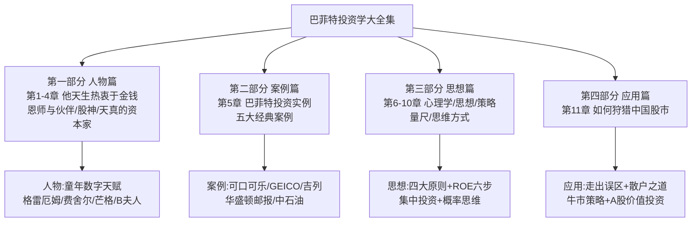
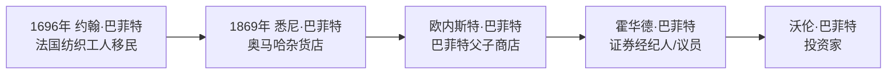
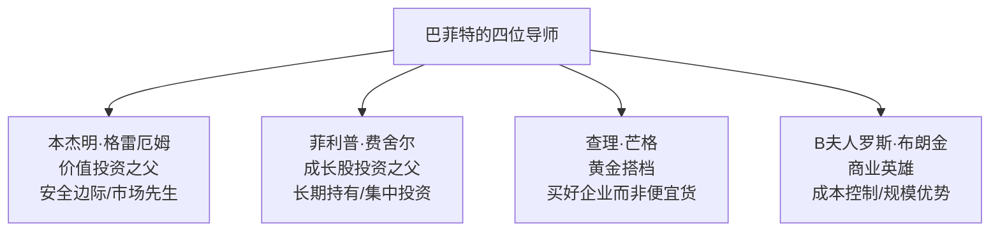
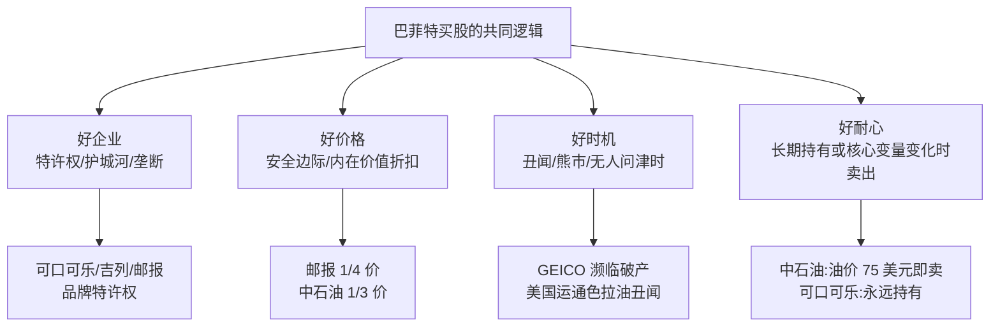
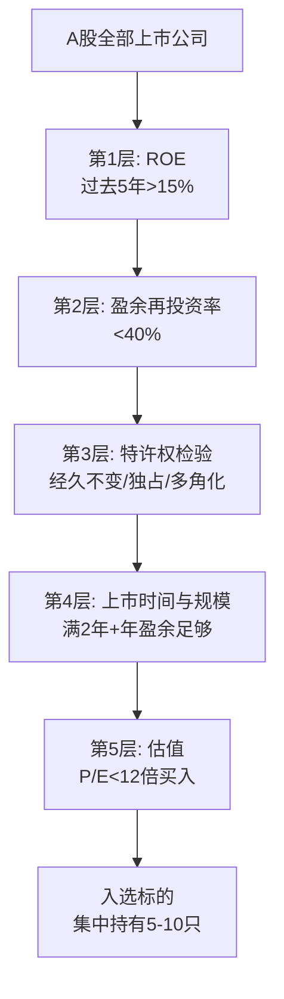
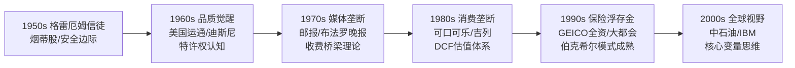

# 《巴菲特投资学大全集：造就美国股市上万个亿万富翁的秘密》深度解读（详细版）

> **出版信息**：中文编撰综合读物，2011 年 2 月出版。编者参考大量文献资料，将巴菲特传记、投资思想、经典案例分析与中国股市应用熔于一炉。
> **内容定位**：不同于 [[12《巴菲特的估值逻辑》深度解读（详细版）|12 估值逻辑（纯算账）]]、[[13《巴菲特的护城河》深度解读（详细版）|13 护城河（纯方法）]] 的专题深挖，本书是**巴菲特全景式入门**——先用 4 章讲透"巴菲特是谁"（人生故事+恩师伙伴），再用 5 章讲透"巴菲特怎么想"（五大案例+心理学+思想+策略+思维），最后 1 章落地"在中国怎么用"（A 股狩猎指南）。
> **系列定位**：本系列 05—13 号笔记分别从心法、财报、案例、心智、股东信、崛起历程、估值、护城河八个侧面解剖巴菲特；本书是**最后一本全景整合**——把前面所有碎片拼成完整拼图，并首次系统回答"巴菲特方法在中国 A 股如何落地"。
> **核心数字**：1956 年投入 1 万美元 → 税后 2.7 亿美元；合伙公司 1957—1968 年化 29.5% vs 道指 7.4%；伯克希尔 40 年年均 24%+；奥马哈一城培养出近 200 名亿万富翁。

---

## 目录

- [[#全书导读：全景式巴菲特手册|全书导读：全景式巴菲特手册]]
- [[#第1章 他天生热衷于金钱：数字与金钱的童年|第1章 他天生热衷于金钱：数字与金钱的童年]]
- [[#第2章 恩师与伙伴：格雷厄姆、费舍尔、芒格与B夫人|第2章 恩师与伙伴：格雷厄姆、费舍尔、芒格与B夫人]]
- [[#第3章 股神：从合伙公司到媒体帝国的传奇|第3章 股神：从合伙公司到媒体帝国的传奇]]
- [[#第4章 天真的资本家：私人生活与财富观|第4章 天真的资本家：私人生活与财富观]]
- [[#第5章 巴菲特投资实例：五大经典案例全解析|第5章 巴菲特投资实例：五大经典案例全解析]]
- [[#第6章 巴菲特的投资心理学|第6章 巴菲特的投资心理学]]
- [[#第7章 深入学习巴菲特的投资思想|第7章 深入学习巴菲特的投资思想]]
- [[#第8章 掌握巴菲特精选股票的策略|第8章 掌握巴菲特精选股票的策略]]
- [[#第9章 向巴菲特定购自己的投资量尺|第9章 向巴菲特定购自己的投资量尺]]
- [[#第10章 拷贝巴菲特的思维方式|第10章 拷贝巴菲特的思维方式]]
- [[#第11章 实践巴菲特：如何狩猎中国股市|第11章 实践巴菲特：如何狩猎中国股市]]
- [[#附录 巴菲特年报中的教导与投资名言|附录 巴菲特年报中的教导与投资名言]]
- [[#总结：全景整合与A股落地|总结：全景整合与A股落地]]

---

## 全书导读：全景式巴菲特手册

### 0.1 本书的独特价值（与系列其他笔记的分工）

| 维度 | 09/10 股东信 | 11 崛起 | 12 估值逻辑 | 13 护城河 | **14 大全集** |
|------|-------------|---------|------------|-----------|--------------|
| 回答的问题 | 巴菲特说了什么 | 巴菲特买了什么 | 价格怎么算 | 什么公司值得买 | **巴菲特是谁+怎么想+怎么用** |
| 体裁 | 原信主题 | 案例复盘 | 案例+计算 | 方法体系 | **传记+思想+案例+A股应用** |
| 独特内容 | 原则 | 十案例 | 估值工具 | 四大来源 | **人生故事+心理学+中国落地** |
| 与系列关系 | 巴菲特的"经" | 巴菲特的"史" | 巴菲特的"算" | 巴菲特的"器" | **巴菲特的"全"** |

> 🔗 **相关笔记双链**：[[11《巴菲特的伯克希尔崛起》深度解读（详细版）|11 伯克希尔崛起]] · [[12《巴菲特的估值逻辑》深度解读（详细版）|12 估值逻辑]] · [[13《巴菲特的护城河》深度解读（详细版）|13 巴菲特的护城河]] · [[10《巴菲特致股东的信》深度解读（详细版）|10 致股东的信]] · [[09《巴菲特致股东的信》深度解读（详细版）|09 致股东的信]] · [[07《巴菲特投资案例集》深度解读（详细版）|07 投资案例集]] · [[06《巴菲特教你读财报》深度解读（详细版）|06 教你读财报]] · [[05《巴菲特的投资心法》深度解读（详细版）|05 投资心法]]

### 0.2 全书框架总览



### 0.3 三大核心命题（贯穿全书）

| 命题 | 本书的回答 |
|------|-----------|
| 巴菲特为什么成功？ | 数字天赋+格雷厄姆的"安全边际"+"把股票当企业"的思维方式+罕见的心理素质 |
| 巴菲特怎么做投资？ | 四步决策链：选企业（四大原则）→ 算价值（DCF/ROE/所有者收益）→ 等价格（安全边际）→ 长期持有（集中投资） |
| 中国投资者怎么用？ | 走出五大误区+用内在价值牵着主力鼻子走+散户不败之道+牛市应对策略 |

### 0.4 关键数字一览

| 指标 | 数据 |
|------|------|
| 1956 年 1 万美元投入 | 税后增值为 2.7 亿美元 |
| 合伙公司年化收益（1957—1968） | 29.5%（道指仅 7.4%） |
| 合伙公司 10 年资产增长 | 1,156%（道指 122.9%） |
| 伯克希尔 40 年年均增速 | 24%，市值近 1,300 亿美元 |
| 1986 年股价 | 3,000 美元（21 年涨 167 倍） |
| 奥马哈市亿万富翁 | 近 200 名 |

---


---

## 第1章 他天生热衷于金钱：数字与金钱的童年

### 1.1 人物档案

| 维度 | 内容 |
|------|------|
| 出生 | 1930 年 8 月 30 日，美国内布拉斯加州奥马哈 |
| 家庭 | 父亲霍华德·巴菲特：证券经纪人+共和党议员；母亲利拉 |
| 特征 | 体重仅 6 磅、早产 5 周；超乎年龄的谨慎，"很少带来麻烦的小孩" |
| 天赋 | 对数字有本能的迫切渴望——车牌号、城市人口、棒球比分、赛马胜率都是养料 |

### 1.2 童年轶事：数字敏感性的养成

| 年龄 | 事件 | 投资学意义 |
|------|------|-----------|
| 5 岁 | 自家门口摆摊卖口香糖 | 最早的商业实践 |
| 9 岁 | 与拉塞尔数饮料瓶盖做市场调查 | **用数据判断哪种饮料销量最大**——最早的"市场调研" |
| 10 岁 | 父亲带他去纽约华尔街、参观纽交所 | 播下对股票的痴迷 |
| 11 岁 | 38 美元买入 3 股城市设施优先股，赚 5 美元后卖出 | 卖出后股价飙到 200 美元——**耐心与定力的第一课** |
| 少年 | 开发"必胜马仔系统"赛马投注系统 | 概率思维萌芽（后被赶出赛马场：没有营业执照） |

### 1.3 家族商业基因



**家族生意经（曾祖父泽布隆的信）**：
> "你不要指望一口吃成个胖子……如果不行的话，就赶紧关张，把欠债还清，维护好你的信誉，因为这比金钱更重要。"

### 1.4 本章金句

> 1. "这倒不是我想要很多钱，我觉得赚钱来看着它慢慢增多是一件很有意思的事。"——对"为什么想赚那么多钱"的回答
> 2. 母亲带他去教堂听布道，他"扳着手指头算起神职作曲家的寿命来"
> 3. 他的第一桶金：11 岁买入股票赚 5 美元——但清仓后股价飙升到 200 美元，让他记住了：**在股海沉浮中，投资者必须要有耐心和定力**

### 1.5 本章要点速记

- 巴菲特的成功不是偶然：**数字敏感性（天赋）+ 商业基因（家族）+ 早期试错（5 美元教训）**三重叠加
- 与 [[01《股票作手回忆录》读书笔记|01 利弗莫尔]] 对照：利弗莫尔 14 岁靠报价带数字谋生，巴菲特 11 岁抄股价画走势图——**两位大师都从数字游戏中起步**
- 关键转折：父亲带他看华尔街——"巴菲特显现出来的对股票的着迷程度丝毫不亚于其他孩子对飞机模型的喜爱"

---

## 第2章 恩师与伙伴：格雷厄姆、费舍尔、芒格与B夫人

### 2.1 四位导师全景



### 2.2 格雷厄姆：价值投资的奠基人

**生平**：1894 年生于伦敦，原名格罗斯伯姆；9 岁丧父、家道中落；13 岁目睹母亲保证金炒股破产——**童年的创伤塑造了他对风险极度厌恶的性格**。哥伦比亚商学院教授，"华尔街教父"，《证券分析》（1934）与《聪明的投资人》（1949）的作者。

**六大投资原则**：

| 原则 | 内容 |
|------|------|
| ①商业视角 | 把买股票当买公司——股票是公司部分所有权凭证 |
| ②安全边际 | 价格低于价值的部分=安全边际（20 美元股票 14 美元买入=30% 边际）——"安全边际越高，防止股价下滑的能力越强" |
| ③多元化 | 安全边际与多样化互为关联——单只股票即使有边际也可能亏损 |
| ④平均成本法 | 固定金额、规律间隔投资——低价多买、高价少买 |
| ⑤关注含糊处 | 格外关注财务报表中含糊不清的地方 |
| ⑥市场先生 | 市场情绪狂躁——"从短期来看，市场是一台投票机，但从长期来看，它是一台称重机" |

**格雷厄姆的关键案例**：1926 年研究北方管道公司年报发现每股约 95 美元国债被持有，股价仅 65 美元——迫使公司卖出国债分给股东 70 美元红利，大赚一笔。**这就是"烟蒂股"投资的经典范式**。

**大萧条的教训**：格雷厄姆联合股票账户 1932 年缩水 70%，全家搬离二层小楼——但合伙人纽曼的亲戚出资 7.5 万美元救活了基金。格雷厄姆-纽曼公司 1936—1956 年 21 年间年均赢利 17%，超过标普 14%。

### 2.3 巴菲特从格雷厄姆身上学到的

| 维度 | 内容 |
|------|------|
| 智力取经 | "他制定的投资路线图我已经遵循了 57 年，我没有理由去寻找另外的路线了" |
| 三大原则 | ①把股票看成企业 ②安全边际原理 ③用真实投资者的心态对待股市 |
| 市场先生 | 市场先生每天报价，但你可以选择不理他——"一个真正的投资家极少被迫出售其股票" |
| 证词名场面 | 参议院听证会上格雷厄姆说："经验告诉我们，最终市场会使得股票达到这种价值"——**股票回归自身价值，需要耐心** |

### 2.4 费舍尔：成长股的引路人

**生平**：1907 年生于旧金山，斯坦福毕业，1931 年创立投资咨询公司；1929 年 8 月准确预测"25 年来最严重的大空头市场"却"看空做多"亏惨；1954—1969 年事业巅峰；2004 年去世，享年 96 岁。

| 维度 | 内容 |
|------|------|
| 代表作 | 《怎样选择成长股》（1958 年《非常潜力股》） |
| 核心理念 | "找到真正杰出的公司，抱牢它们的股票，度过市场的波动起伏，不为所动，也远远比买低卖高的做法赚得多" |
| 三步调研法 | ①文本资料初步了解（年报/招股书/投股说明书）②商业圈渠道收集信息（"无盖饮水桶"方法：与竞争者、供应者、顾客交谈）③亲自拜访管理者（商业策略/可行性/管理者能力） |
| 持股业绩 | 德州仪器 1955—1962 涨 14 倍（后暴跌 80% 又创新高）；摩托罗拉 21 年涨 19 倍（年均 15.5%） |
| 卖出原则 | "当买进股票时各方面都运行良好的话就决不卖出股票"——除非：①当初评价错误 ②管理层变化企业走下坡 |

**费舍尔的买入时机三法**：①前景看好的新企业刚启动时 ②实力公司被坏消息困扰时（罢工/失误/临时错误）③资本密集型行业中有前途的项目。

### 2.5 芒格：把巴菲特推向"买好企业"

**生平**：1924 年生于奥马哈，哈佛法学院毕业，律师出身；1959 年与巴菲特重逢（两人童年都在巴菲特父子杂货店打过工）；经历丧子、离婚、1973-1974 年投资损失过半、左眼失明——**"能够义无反顾地摆脱这些悲剧的困扰"**；1978 年起任伯克希尔副主席至今。

| 维度 | 内容 |
|------|------|
| 核心贡献 | "查理把我推向了另一个方向，而不是像格雷厄姆那样只建议购买便宜货，这是他思想的力量，他拓展了我的视野。我以非同寻常的速度从猩猩进化到人类，否则我会比现在贫穷得多。" |
| 名言 | "一家资质良好的企业与一家苟延残喘的企业的区别在于，前者一个接一个地轻松作出决定，后者则每每遭遇痛苦抉择" |
| 合作模式 | 蓝带印花公司（浮存金 1.2 亿美元/年）→ 巴菲特与芒格共同运作 |
| 经典案例 | 登普斯特尔机械制造厂：芒格推荐哈里·博特压缩成本→230 万美元利润（3 倍回报） |
| 评价 | "沃伦的长处是说'不'，但查理比他做得还要好，沃伦把他当做最后的秘密武器" |

**蓝带印花公司的浮存金启示**（与 [[12《巴菲特的估值逻辑》深度解读（详细版）|12 估值逻辑]] 的保险浮存金主题呼应）：前端收取现金、长期分批偿还——"对巴菲特来说，蓝带公司就像是一家还没有受到监管当局控制的保险公司"。

### 2.6 B夫人罗斯·布朗金：商业英雄

**生平**：1893 年生于沙俄，1917 年横穿西伯利亚逃难（穿过满洲里→日本→西雅图）；1937 年用 500 美元开内布拉斯加家具世界；1983 年 89 岁以 6,000 万美元卖给巴菲特（巴菲特"迄今为止最大的一笔收购"）。

| 维度 | 内容 |
|------|------|
| 经营哲学 | "廉价，不欺"——卖价常只比成本高 10%；成批购进、尽量减少开支、有钱就存起来 |
| 传奇事件 | 1949 年被告违反公平交易法（卖 4.95 美元 vs 法定最低 7.25 美元）→ 法官判她赢，第二天来买 1,400 美元地毯 |
| 巴菲特评价 | "她 500 块钱起家，结果把别人都击败了"；"和她竞争可就小鬼见了阎王" |
| 商业智慧 | 巴菲特说 B 夫人对贬值和利率增长的理解"比所有在场的人都深刻"，虽然她可能不认得这两个词 |
| 收购细节 | 巴菲特只翻看纳税记录（税前利润 1,500 万美元），没查账、没查存货——"商业中要看的主要是人"（J.P. 摩根观点） |

> 🔗 **与 11 号笔记呼应**：B 夫人 NFM 案例在 [[11《巴菲特的伯克希尔崛起》深度解读（详细版）|11 伯克希尔崛起]] 中有完整展开——"一页纸合同"与"收费桥梁"的细节可交叉阅读。

### 2.7 本章金句

> 1. "我人生最成功的事就是选对了自己心中的英雄，我的灵感都来自本杰明·格雷厄姆。"
> 2. "我的血管里 85％流着格雷厄姆的血，15％流着费舍尔的血。"
> 3. "当我见到他时，他本人给我的印象，正如他的思想一样深刻。"——巴菲特初见费舍尔
> 4. "你应当投资一家甚至连傻子都可以经营的企业，因为有朝一日，可能会有傻子这么做的。"
> 5. "在我的一生中，我只看到一个做短线的商人赚到了钱，而靠长期投资赚钱的人却不计其数。"——费舍尔

---


---

## 第3章 股神：从合伙公司到媒体帝国的传奇

### 3.1 合伙公司年代（1956—1969）：走出老师的阴影

| 年份 | 事件 | 数据 |
|------|------|------|
| 1962 | 以 7.5—7.6 美元买入伯克希尔-哈撒韦（每股运营资金 16.5 美元=股价两倍多） | "雪茄烟头"逻辑 |
| 1963 | 美国运通色拉油丑闻后买入——公司 1/4 资产押注 | 股价从 65 跌至 35 美元 |
| 1963 | 拜访迪斯尼，400 万美元买 5% 股份 | PE 仅 10 倍 |
| 1965 | 合伙公司赢利率超道指 33 个百分点 | — |
| 1966 | 合伙公司总资产 4,400 万美元；巴菲特资产 685 万美元 | — |
| 1968 | 纯利润 4,000 万美元，年赢利率 59%，总资产 1.04 亿美元 | "百年一见的稀罕事" |
| 1969 | 宣布解散合伙公司——"我不想玩一种自己根本都不明白规则的游戏" | 急流勇退 |

**关键认知升级**：

> "巴菲特已经开始有了不同的思考模式。他已经不仅会用格雷厄姆偏爱的量化角度来考虑问题，更学会了从品质的角度去评价一家企业。……不再把股票看做简单的资产负债表，而是一个具有独特魅力和潜能的鲜活企业。"

**双轨投资观的雏形**（对照 12 号笔记的"双轨估值"）：
- 伯克希尔-哈撒韦：**"量化"吸引人**——价格足够低廉
- 美国运通：**"品质"吸引人**——产品出众、管理精英

**美国运通的"品质"分析**（1963 年）：
- 危机：色拉油丑闻，公司承诺补偿仓库债权人 6,000 万美元，股东起诉 CEO 克拉克
- 巴菲特力挺："那 6000 万美元就像是本该发给股东的红利，但不小心在邮寄途中丢了"
- 决策逻辑：**丑闻不会危及它在旅行支票或信用卡上的特许地位**——不看资产负债表，看特许权

**迪斯尼的"资产重估"**（1966 年）：
- 影片库（《白雪公主》《小鹿斑比》）价值不体现在账面，但"和工厂之类的有形资产同样真实存在"
- 巴菲特估算：单单卡通形象和电影本身就值股票的账面价值——**这正是"内在价值"思维的早期实践**

**1969 年解散合伙公司的深意**：
- 市场背景：美林买 39 倍 PE 的 IBM、巴奇买 50 倍 PE 的施乐、布莱尔把雅芳推到 56 倍 PE
- 名言："价格是你所掏的钱，而价值才是你真正得到的。"
- 结果：1970 年 6 月道指跌破 900 点，利顿实业跌 700%，凌-特姆科-沃特从 169 跌到 25 美元——**巴菲特又一次全身而退**

### 3.2 合伙公司业绩全景（对照 12 号笔记附录）

| 指标 | 数据 |
|------|------|
| 1957 年 1 万美元投入道指 | 13 年后总利润 15,260 美元 |
| 同样资金投入巴菲特合伙公司 | 扣除费用后利润 **150,270 美元**（近 10 倍） |
| 年化增速 | 29.5% vs 道指 7.4% |
| 合伙人名录 | 曾有投资公司出价购买，巴菲特拒绝——只推荐比尔·鲁安（塞凯亚基金） |

### 3.3 1970s：漂亮50与"现在正是投资的绝佳时机"

**漂亮 50 时代**：1972 年平均市盈率高达 80 倍——施乐、柯达、宝丽来、雅芳、德州仪器。"这些股票被认为是'安全的'，在任何价位都是相当安全的"——**巴菲特认为这是最大的谬论**。

**1973—1974 熊市（可与 30 年代大萧条相提并论）**：

| 股票 | 峰顶 | 谷底 |
|------|------|------|
| 宝丽来 | 149 美元 | 14.125 美元 |
| 施乐 | 171 美元 | 49 美元 |
| 雅芳 | 140 美元 | 18.625 美元 |

- 道指从 1,000 点跌至 607 点；工业市值蒸发 40%；熊市延续 6 年（比 1929—1932 长一倍）
- 巴菲特却"像一匹欢蹦乱跳的小马驹"："有几天我起床以后甚至想跳踢踏舞"
- 1974 年 10 月接受《福布斯》采访："我觉得我就像一个非常好色的小伙子来到了女儿国。投资的时候到了。"
- 1973 年伯克希尔买华盛顿邮报（27 美元→9 月 20.75 美元继续加仓）；凯泽工业 11 美元买入 500 万股（后跌到 4 美元——"千万不要想当然地认为股价已经跌得够多不会再跌了"）

### 3.4 华盛顿邮报：巴菲特媒体帝国的起点

| 维度 | 内容 |
|------|------|
| 缘分 | 巴菲特 13 岁就是邮报报童，干了 4 年多，攒了 5,000 多美元 |
| 买入 | 1973 年 2 月起分批买入：27 美元→23 美元→20.75 美元，到 10 月成最大外部股东 |
| 估值 | 巴菲特认为资产至少值 4 亿美元，而市值仅 1 亿美元——**1/4 价格买入** |
| 逻辑 | 垄断性报纸=收费桥梁："在一个大城市里，并不允许有一家以上的报纸兴旺经营" |
| 董事会 | 1974 年秋加入董事会；指导凯瑟琳·格雷厄姆（"读完第 20 份公司年报之后的你"） |
| 成果 | 公司用闲置现金回购 750 万股（占 40%）；净赢利增长 7 倍，每股收益增 10 倍 |
| 对比 | 联合出版公司（波士顿环球报母公司）：市值不到 3,000 万美元"少得有些可笑"——垄断 2/3 市场份额 |

**巴菲特在邮报董事会的影响**：11 年几乎没有任何大的商业运作（只办过一家体育杂志又关闭）——"企业规模并不是终极目标，股东的高回报才是要努力争取的目标"。拒绝 12 亿美元收购奥兰多电视台（"要价太高了"）。

### 3.5 布法罗晚报：垄断报业的"古老肉搏战"

| 维度 | 内容 |
|------|------|
| 买入 | 1977 年以 3,250 万美元收购（蓝带公司）——迄今最大一笔交易 |
| 潜力 | 日发行量是《信使快报》的 2 倍，广告收入多 75%；但无周日版（周日是广告商最爱） |
| 决策 | 巴菲特执意发行周日版——1977 年 11 月被告上法庭（反托拉斯） |
| 法庭经典 | 律师福斯质问"桥梁收费站"比喻——巴菲特："我只说过在通货膨胀十分严重的情况下，如果没有什么约束，能有一座桥梁收费站是很不错的" |
| 结果 | 法官禁发周日版→《信使快报》1982 年 9 月倒闭→《布法罗新闻报》垄断市场，税前利润 1,900 万美元→80 年代后期年均收益 4,000 万美元 |
| 启示 | "不是市场上第一宠儿的报纸注定要失败"；**垄断是报纸的经济本质** |

> 🔗 **与 11 号笔记呼应**：布法罗周日版大战的完整法庭攻防与"19 倍 EV/EBIT 买未来垄断"的估值细节见 [[11《巴菲特的伯克希尔崛起》深度解读（详细版）|11 伯克希尔崛起·案例2]]。

### 3.6 1980s：大都会/ABC 与"900 磅大猩猩"

| 维度 | 内容 |
|------|------|
| 交易 | 1985 年 3 月：伯克希尔以每股 172.50 美元买大都会 300 万股（18% 股份，5 亿多美元）→ 大都会收购 ABC |
| 大猩猩逻辑 | "你最好有头 900 磅重的大猩猩给你撑腰——一个拥有大量股票的人，是不会不顾价格高低随便卖出的"——巴菲特自己当大猩猩 |
| 出价 | 16 倍市盈率（格雷厄姆会觉得太高）——"对我的这个交易决定，格雷厄姆未必会赞成" |
| 代价 | 巴菲特辞去华盛顿邮报董事（FCC 规定不能同时兼任） |
| 结果 | ABC 转手后第一年从赢利 1.3 亿变亏损 7,000 万；电视网沦为三大电视网末席——巴菲特"不久后他的确对这个决定后悔了" |

**巴菲特对大都市的承诺**："我愿意在有生之年都保持和大都市公司的合作。这就像你有一个生病的孩子，你不会在 5 年后卖掉他。"

**斯科特-费泽的"避风港"收购**（1985 年 10 月）：
- 背景：投机商伊万·波亚斯基持股 7% 逼迫公司；CEO 斯奇利寻找买主
- 巴菲特出手：3.15 亿美元现金收购（每股 60 美元），无投资银行、无"放弃费"
- 逻辑："对于合适的行业和合适的人，我们可以提供一个安全的港湾"
- 资金来源：菲利浦莫里斯收购通用食品——伯克希尔作为最大股东大赚一笔

### 3.7 有效市场理论的世纪论战

**有效市场理论的核心主张**：所有公开信息已反映在股价中→证券分析无价值→巴菲特只是走运。

| 论战方 | 观点 |
|--------|------|
| 萨缪尔森 | 有效市场理论奠基人："聪明投资人一直在四处寻找物超所值的股票"；参议院作证：基金经理表现"并不比在市场上随意挑选 20 只股票出色" |
| 夏普 | 把巴菲特称为"三西格玛事件"——统计学上极小概率，可忽略 |
| 阿尔钦 | 把巴菲特成功归因于"内布拉斯加州保险法的漏洞"（允许保险公司投资更自主）——"我认为他的成功绝对是因为这种天然的有利因素" |
| 巴菲特 | "格雷厄姆－纽曼公司、巴菲特合伙公司和伯克希尔－哈撒韦公司连续 63 年成功运作的事实，已经很好地证明了有效市场理论是愚蠢的……我们是根据完全公开的信息来经营的" |

**格雷厄姆晚年的"变节"**（1976 年去世前）："我不再提倡为寻找有价值的投资机会而进行复杂的证券技术分析了。"——巴菲特从未指责老师："在他心中格雷厄姆有着太高的地位了。"

> 💡 **投资学意义**：这是"价值投资 vs 学院派"最完整的一次交锋记录。巴菲特用 63 年的实证业绩反驳"掷硬币"论——**市场短期是投票机，长期是称重机**。

### 3.8 本章金句

> 1. "那些基金经理对所持有的每只股票的简单了解甚至比不上一个酋长对自己 100 个老婆的了解程度。"
> 2. "我们的投资策略与人们的多元化信条格格不入……我们认为如果投资者能提高他对企业关注的强度，提高他对企业经济状况的满意度，那么他采取集中投资的策略反而会降低风险。"
> 3. "按兵不动其实是最聪明的策略，我们不会因为联邦储蓄贴现利率的小小改变，或者是哪位在华尔街颇有威望的人士的看法而改变我们既定的操作思路。"
> 4. "卖掉一只熟悉的股票就像把服侍了自己多年的妻子给休了一样。"
> 5. "债务对于投资人来说就像是狐狸精，会给人以'温柔的致命一击'。"

---


---

## 第4章 天真的资本家：私人生活与财富观

### 4.1 私人生活全景

| 维度 | 内容 |
|------|------|
| 婚姻 | 1952 年娶苏珊·汤普森；1977 年苏珊搬去旧金山（未离婚，保持"奇怪的三角关系"） |
| 生活风格 | 奥马哈老宅、格拉特牛排餐厅（牛排+土豆）、樱桃汁百事可乐、不看股价行情机 |
| 书房 | 家人称"寺庙"——"巴菲特只要有一本书和一个 60 瓦的灯泡就足够了" |
| 工作习惯 | 每天读大量年报；"我的工作是阅读" |
| 与孩子 | 不给零花钱、贷款要签合同、女儿苏珊要 20 美元停车费也要开发票——"把他们都当成刚一起经营生意的伙伴" |

### 4.2 财富观与慈善观

| 观点 | 内容 |
|------|------|
| 金钱观 | "别再絮絮叨叨地说他是怎么花钱的，跟我们说说他的这些钱到底是怎么赚来的！"（参观赫斯特城堡时） |
| 遗产观 | "如果因为出身富贵，手里就有一辈子享用不尽的免费食品券，我认为这是有悖公平的。"——拒绝给子女留遗产 |
| 慈善观 | 主张"不多元化"——找慈善事业中"像可口可乐那样的价值洼地"；关注核战争与人口控制（1990 年捐款 75% 用于人口控制） |
| 捐赠方式 | 1990 年每股 6 美元由股东指定慈善机构（不自己掏腰包） |
| 格林内尔教训 | 帮学院把 1,360 万捐款变 4,800 万，却发现教授挥霍——"巴菲特宁可被噎死，也不愿意给大学开一张支票" |

### 4.3 本章启示

- **巴菲特的"分心免疫"**：对孩子情感疏离、对豪宅无感、对政治冷感——**他把全部注意力投注到唯一重要的事：资本配置**
- 与 [[05《巴菲特的投资心法》深度解读（详细版）|05 投资心法]] 呼应：生活极简主义=投资极简主义（只做自己懂的事）
- 家族财富传承观：给子女"足够的钱做任何事，但不给多到无所事事"的雏形

---

## 第5章 巴菲特投资实例：五大经典案例全解析

### 5.1 五大案例总览

| 案例 | 投资年份 | 投入 | 收益 | 增值倍数 | 持有期 |
|------|---------|------|------|---------|--------|
| 可口可乐 | 1988 | 10.24 亿美元 | 88.51 亿美元 | 6.8 倍（681%） | 15 年+ |
| GEICO | 1951 起/1976 重仓 | 4,714 万美元 | 23 亿美元 | 50 倍 | 20 年+ |
| 吉列 | 1989 | 6 亿美元 | 29.26 亿美元 | 4.87 倍 | 14 年+ |
| 华盛顿邮报 | 1973 | 1,062 万美元 | 12.80 亿美元 | 128 倍 | 30 年+ |
| 中石油 | 2003 | 5 亿美元 | 40 亿美元 | 8 倍 | 4 年（卖出） |

### 5.2 案例一：可口可乐——赢利 88 亿美元，增值 6.8 倍

**买入决策的八重分析**：

| 分析维度 | 内容 |
|---------|------|
| ①持续稳定的传统产业 | 大规模生产、高边际利润、高现金流、低资本要求、高回报率 |
| ②简单易懂的业务 | 买原料→制浓缩液→卖给装瓶商→调配→卖给零售商 |
| ③高度特许经营权 | 品牌=全球最被广泛认同的象征 |
| ④强大销售系统 | 近 200 个国家约 1,000 家加盟装瓶厂；麦当劳等快餐首选 |
| ⑤稳固行业领导地位 | 世界一半碳酸饮料销量，是百事的 3 倍；美市场两强占 3/4 |
| ⑥专注核心事业 | 罗伯托"80 年代经营战略"：抛弃不能产生可接受投资收益率的业务 |
| ⑦非凡价值创造能力 | 净收益 3.91 亿→7.86 亿（翻倍）；ROE 从 21.4%→27.1% |
| ⑧持续竞争优势 | 1993 年报："品牌吸引力+产品特质+销售渠道=经济城堡周围形成了一条护城河" |

**业绩数据**：股东收益 1973—1980 年均增 8%，1981—1988 年均增 17.8%；销售收入 1973—1982 年均增 6.3%，1983—1992 年均增 31.1%。

> 🔗 **护城河视角**：可口可乐是 [[13《巴菲特的护城河》深度解读（详细版）|13 护城河]] 全书第一大正面案例（品牌+规模+心理学护城河）。

### 5.3 案例二：GEICO——赢利 23 亿美元，增值 50 倍

| 维度 | 内容 |
|------|------|
| 业务 | 1936 年创立；为政府雇员、军人提供直销汽车保险（无代理商） |
| 1951 | 21 岁巴菲特首次投资 10,282 美元（格雷厄姆任董事长期间） |
| 危机 | 1974 年首亏 600 万，1975 年亏 1.26 亿濒临破产；股价 61→2 美元 |
| 1976 重仓 | 拜访管理层后判断"低成本、无代理商的保险经济特许权依然完好无损"→410 万买 130 万股（3.18 美元/股） |
| 后续 | 1976 年 1,942 万买可转换优先股 25%；1980 年再买 147 万股；总成本约 4,714 万美元 |
| 复苏 | 杰克·伯恩 1977 年扭亏赢利 5,860 万；1982 年起 ROE 平均 21.2%（行业 2 倍） |
| 结局 | 1995 年 4,570 万→23 亿（50 倍）；1996 年 23 亿全资收购 |
| 价值逻辑 | 1980—1992 年保留的每 1 美元为股东创造 3.12 美元市值 |

**GEICO 的经济特许权本质**：直接销售模式省去 10%—25% 代理费用→低成本优势→安全驾驶者客户群→高再投保率→**差异化+规模双护城河**。

### 5.4 案例三：吉列——赢利 29 亿美元，增值近 5 倍

| 维度 | 内容 |
|------|------|
| 买入 | 1989 年 6 亿美元买入 8.75% 利率可转换优先股；1991 年转普通股 1,200 万股 |
| 分析 | ①稳定核心业务（"查理跟我都熟悉这个产业的状况"）②经济特许权典型（全球刀片市场 60%，斯堪的纳维亚/墨西哥 90%）③持续价值创造（1979—1988 收入+80%，净收益+142%） |
| 安全边际测算 | 10 年 15% 增速→内在价值 160 亿 vs 市值 80.3 亿→**安全边际 50%**；12% 增速→108 亿→边际 20%；7% 增速→85 亿→边际 6% |
| 结局 | 2005 年宝洁并购吉列：股价 51.6 美元，市值 51 亿美元；9600 万股转 9,360 万股宝洁（占 3%） |

### 5.5 案例四：华盛顿邮报——赢利 12 亿美元，增值 128 倍

| 维度 | 内容 |
|------|------|
| 缘分 | 13 岁送报 4 年攒 5,000 美元；1969 年买《奥马哈太阳报》积累报业经验 |
| 买入 | 1973 年 1,062 万美元（当时权益资本收益率 15.7%） |
| 低估逻辑 | 垄断 66% 华盛顿发行量+《新闻周刊》+4 家电视台——市值仅 1 亿 vs 资产值 4 亿 |
| 成果 | 5 年后 ROE 翻倍，比报业平均高 50%；30 年投资利润 12.80 亿美元 |

**报纸的垄断本质**："报纸是一个奇妙的行业。它是那种趋向一种自然的有限垄断的少数行业之一。"

### 5.6 案例五：中石油——赢利 40 亿美元，4 年增值 8 倍（本书独有案例）

| 维度 | 内容 |
|------|------|
| 买入 | 2003 年 4 月起持续买入 H 股 23.38 亿股，成本约 5 亿美元（约 32 亿港元） |
| 逻辑 | ①产量全球 3%、与埃克森相当 ②45% 赢利派发股东（消除不明朗因素）③以同类公司 1/3 价钱买入 |
| 调研 | "我读了 2002 年 4 月和 2003 年的年报……我没有见过管理层，也没有见过分析家的报告" |
| 卖出 | 2007 年 7 月起以约 13.16 港元均价清仓（油价超 75 美元/桶） |
| 卖出逻辑 | "石油的利润主要依赖于油价，如果石油在 30 美元一桶的时候，我们很乐观，如果到了 75 美元……我就不像以前那么自信" |
| 启示 | **价值投资≠长期持有**——高估了就一定要卖；核心是"公司价值核心驱动因素的变化"（油价是核心变量） |

**中石油案例的独特性**（与系列其他笔记对比）：
- 与可口可乐（长期持有）形成对照：**只有优质消费类股票才适合永久持有**
- 4 年 8 倍、唯一中国股票——"成功的价值投资案例不再是那么遥远"

### 5.7 五大案例的共性框架



---


---

## 第6章 巴菲特的投资心理学

### 6.1 核心命题：心理是价值投资者的核心竞争力

> "真正的价值投资者的核心竞争力不在于选股策略，因为相对心态而言选股其实很简单，明明白白选白马股票就可以了。……其实价值投资者的核心竞争力在于心态和毅力，迈向成功过程中投资心态的作用可以占到 70％以上。"

### 6.2 市场先生心理学（格雷厄姆框架的心理学解读）

| 要点 | 内容 |
|------|------|
| 市场先生 | 和蔼可亲但行为疯狂的合伙人，每天按心情报价——"他会根据自己从睡床的哪一边起来或是那些影响深刻的梦境，甚至某种难以名状的恐惧感来为股票设定一个价格" |
| 头号大敌 | "投资者的头号大敌不是股市而是他们自身。尽管拥有超级的数学、金融、财会技能，那些不能控制自己情绪的人也不可能在投资过程中获利" |
| 应对之道 | "一个真正的投资家极少被迫出售其股票，而且在其他任何时候他都有对目前市场报价置之不理的自由" |
| 铁律 | 绝不在股票连续上涨后买入，也不在持续下跌后卖出 |

### 6.3 巴菲特式心理修炼四法

| 方法 | 内容 |
|------|------|
| ①以不变应万变 | "99％的人都患有'多动症'"——等两三天没跌就忍不住买入=在上涨时买入、下跌时卖出 |
| ②控制情绪 | 承认自己的勇敢是"轻度妄想症的白日梦"——股价上涨时人人勇敢，下跌时人人胆怯 |
| ③避免盲目自信 | 客观认识自己的风险承受度——"那些头脑发昏的投资者是不会有好成绩的" |
| ④乌龟与兔子 | 长期持有者省事且幸福——不关注股价每天变化，免于别人的判断失误带来的痛苦 |

### 6.4 成功投资者的 9 个条件（巴菲特标准）

| # | 条件 |
|---|------|
| 1 | 有工作激情但绝不贪心过度，对投资过程入迷 |
| 2 | 必须有耐心 |
| 3 | 必须会独立思考 |
| 4 | 有安全意识，有来自知识的自信，不草率从事，不顽固不化 |
| 5 | 承认自己对某些东西不懂 |
| 6 | 依照企业类型灵活投资，但永远不以高于企业价值的价格买进 |
| 7 | 开始事业前有 10—15 年集中投资的理论和实践培养 |
| 8 | 相当聪明、诚实 |
| 9 | 避开任何大的让人分心的事情 |

### 6.5 克服贪欲与恐惧的实操建议

| 心理 | 对策 |
|------|------|
| 贪欲 | ①订立计划（巴菲特自己的赢利目标是 10%）②做应付各种可能的心理准备 ③遇事冷静思考 |
| 恐惧 | 恐惧三危害：跌时割肉、低位不敢买、过早抛售——**建立来源于知识的自信** |
| 从众 | 不要迷信分析师（"他们的意见并不都是独立思考来的"）；不要盲目跟风 |
| 自律 | "投资中最傻的行为就是知道自己做错了，但还在加倍努力"——自律决定赢利或亏损的多少 |

### 6.6 风险承受度心理学

| 发现 | 内容 |
|------|------|
| 自认为 vs 实际 | 自认为的风险承受度与实际相差甚远——"你可能只有在股价上扬时才是一个勇敢者" |
| 性格关联 | 风险承受度高的人无一例外是"内向型"（自控型）——巴菲特办公桌便条："如果发生了核子战争，请忽略这一事件" |
| 第二因素 | 成就动机（方向感）——出色投资家都有明确目标 |
| 与年龄性别 | 老年人比年轻人保守、女性比男性谨慎——但远不如性格特征重要 |

### 6.7 本章金句

> 1. "在别人胆怯时勇敢、在别人恐惧时贪婪。"——受用一生的投资箴言
> 2. "你不可能靠着市场的风向球致富。实际上你要记住，不要试图弄清市场在做什么，这是不可能的，你只需弄清你要理解的行业，并全神贯注就够了。"
> 3. "投资者的头号大敌不是股票市场，而是他们自身。"——格雷厄姆
> 4. "从玩扑克牌中你就知道，当握有一手对你非常有利的牌时，你必须下大赌注。"——芒格
> 5. "对你所做的每笔投资，你都应该有勇气和信心将你的净资产的 10％以上投入此股。"——巴菲特

---

## 第7章 深入学习巴菲特的投资思想

### 7.1 产业分析：选对战场

**产业吸引力的五力框架**（波特）：进入威胁、替代威胁、买方砍价能力、供方砍价能力、现有竞争对手的竞争——五种力量决定产业利润率。

**巴菲特的两大产业标准**：

| 标准 | 含义 | 反面 |
|------|------|------|
| 产业吸引力 | 平均赢利能力高 | 钢铁、石化：最优秀企业也只能低回报 |
| 产业稳定性 | 未来 10—20 年可预测 | 高科技、新兴产业：内在不稳定性 |

> "我们的重点在于试图寻找到那些在通常情况下未来 10 年、15 年或者 20 年后的企业经营情况是可以预测的企业。"

**工业型企业不适合投资的 5 个原因**：①容易形成恶性竞争（降价循环）②市场状况不稳定（需求突增→供应过剩）③利润增长空间小 ④对管理层依赖程度高 ⑤总得依靠低成本优势。

### 7.2 企业核心竞争力（麦肯锡定义）

| 类型 | 内容 |
|------|------|
| 市场渠道能力 | 品牌拓展、市场营销、分销渠道、后勤、技术支持 |
| 整合能力 | 质量、产品周期、即时生产与库存管理 |
| 功能性能力 | 提供差异性功能的产品/服务 |

**五大特征**：价值特征（创造顾客/企业价值、利用机会抵抗危机）、关键性（联系业务的"底盘"+新业务"发动机"）、独特而稀缺、不可模仿、难以替代。

### 7.3 超额利润的三个来源（持久性排序）

| 来源 | 持久性 | 说明 |
|------|--------|------|
| ①技术领先 | 短 | 很快被模仿、替代、超越——微软是凤毛麟角 |
| ②成本领先 | 中 | 依赖管理层、规模经济——易被超越，壁垒脆弱 |
| ③**特许经营权** | **最持久** | 垄断/商誉/独占性=坚固壁垒——"傻瓜都可以经营好的公司" |

> "拥有特许经营权的企业可以轻易地获得远超过市场平均水平的超额利润，甚至容许平庸的管理层的存在……品牌垄断是最强大、最具成长性、最持久的垄断。"

### 7.4 四大决策原则（巴菲特的"灯塔"）

| 原则 | 检查清单 |
|------|---------|
| 企业原则 | ①简单可以了解吗？②营运历史稳定吗？③长期发展前景看好吗？ |
| 经营原则 | ①经营者理性吗？②对股东诚实坦白吗？③会盲从其他法人机构吗？ |
| 财务原则 | ①ROE 而非每股盈余 ②计算 DCF ③寻找高毛利率 ④每 1 美元保留盈余创造 ≥1 美元市值 |
| 市场原则 | ①企业价值是什么？②能以显著价值折扣购得吗？（安全边际） |

**可量化版本（6 条筛选公式）**：
1. 最近年度 ROE > 市场及产业平均值
2. 五年平均 ROE > 15%
3. 最近年度毛利率 > 产业平均值
4. 7 年内市值增加值 / 7 年内保留盈余增加值 > 1
5. 最近年度自由现金流 / 7 年前自由现金流 − 1 ≥ 1
6. 市值 / 10 年自由现金流折现值 < 1

### 7.5 ROE 六步选股法（A股可执行版）

| 步骤 | 规则 |
|------|------|
| 1 | 过去 5 年 ROE > 15%（中国统计：5 年 ROE>15% 的公司下一年仍 >15% 的概率是 70%）；5 年中有两年 <15% 或最近一年 <15% → 观望 |
| 2 | 盈余再投资率 < 40% 佳，最高不超 80%（再投资率=资本支出/盈余） |
| 3 | 高再投资率须搭配高获利成长（双高是罕见特例） |
| 4 | 经久不变、独占、多角化至少具备一项（"不打算持有一只股票 10 年以上，那最好连 10 分钟都不要拥有"） |
| 5 | 上市未满两年且年盈余较低的不碰（过滤早夭/做假账） |
| 6 | 本益比 12 倍买进，变贵（P/E>40 倍）变坏（ROE<15%）卖出 |

**ROE 注意陷阱**：不要只看一年；结合股价变动分析；注意营业外收入；结合负债率——"如果负债多，作为分母的股东权益相对就小……这样的 ROE 数字也可能被高估了"。

**维持高 ROE 的数学**：维持 15% ROE 需净利润年增 17.65%；维持 20% 需年增 25%；5 年保持 25% 需年增 33.3%。

### 7.6 营业利润率与所有者收益

| 指标 | 公式 | 巴菲特观点 |
|------|------|-----------|
| 营业利润率 | 营业利润÷营业收入 | 与同业对比；"每当我听到某公司正在实施削减成本的新闻时，我会认为这个公司对成本的了解还不够清楚" |
| 所有者收益 | 净利+折旧摊销−维持竞争优势的资本支出 | 比会计准则现金流更真实——"房地产、油气行业适合现金流法，制造业必须用所有者收益" |

**伯克希尔的成本榜样**：全公司不到 10 人，无法律部门和公关部门——营业费用占营业利润不到 1%。

**可口可乐所有者收益增长**：1973 年 1.52 亿→1980 年 2.62 亿（年增 8%）→1988 年 8.28 亿（年增 18%）。

### 7.7 本章金句

> 1. "经验表明，经营赢利能力最好的企业，经常是那些现在的经营方式与 5 年前甚至 10 年前几乎完全相同的企业。"
> 2. "我们专门找那些只有一尺高的栏杆往外跨，而不是找那些七尺高的栏杆尝试跨越。"
> 3. "一家高成本结构公司的经营者，永远找得到增加公司开支的理由；而相对的，一家低成本结构公司的经营者永远找得到节省公司开支的办法。"
> 4. "如果跟获利相同但营业费用占营业利润 10％的公司比较……那些公司的股东因为多余的营业费用而丧失了 9％的应得利益。"

---


---

## 第8章 掌握巴菲特精选股票的策略

### 8.1 选股"三部曲"（全书方法论浓缩）

> （1）寻找具有长期稳定性的产业进入；
> （2）在此产业中选择具有突出竞争优势的超级明星企业；
> （3）以合适的价格买进具有长期可持续性竞争优势的超级明星企业。

### 8.2 优秀企业的 11 项特征

| # | 特征 |
|---|------|
| 1 | 较好的资本回收率（真实经营业绩，非做假账、非大量举债） |
| 2 | 企业可以被理解（了解过去、现状、未来发展） |
| 3 | 利润必须是现金利润 |
| 4 | 有较强的商业特权，并有较为自由的定价 |
| 5 | 经营者由精明的团队而非天才后盾（"你应当投资一家甚至连傻子都可以经营的企业"） |
| 6 | 利润是可以预期的（不买"收益能力仅仅是一种假设"的德州仪器/宝丽来式企业） |
| 7 | 并非某些法令所要限制的对象 |
| 8 | 存货少、资产周转率高、强制资本投资少 |
| 9 | 企业所有者的意图靠管理层贯彻（股东=合作者而非对手） |
| 10 | 固定资产投资收益率较高 |
| 11 | 成长性鹤立鸡群且只需少量资本投入 |

### 8.3 商业特许权：巴菲特最看重的特质

| 维度 | 内容 |
|------|------|
| 定义 | 具有其他竞争者所不具有的某种特质——"其他企业不能挤进这一领域与你竞争，更不可能与你展开价格战" |
| 代表 | 电视台、国际广告公司、铁矿、报纸——"直接受益于所服务的大的资本投资项目，运行中不需要再进行巨大的投入" |
| 吉列例证 | 全球每年 2,000—3,000 万片刀片，吉列占 60%——"当你躺在床上，仅仅想到在你睡觉时，全世界大约有 25 亿男人的毛发仍在生长这一点，你就会有非常舒服的感觉" |
| 可口可乐 | "如果你给我 1000 亿美元用以交换可口可乐这种饮料在世界上的特许权，我会把钱还给你，并对你说这可不成" |
| 危机时刻 | 美国运通 1963 年色拉油丑闻——丑闻不会危及旅行支票/信用卡特许地位→大胆买入（最成功交易之一） |

> 🔗 **与 13 号笔记呼应**：特许权=护城河的巴菲特原版表述（[[13《巴菲特的护城河》深度解读（详细版）|13 护城河]] 第 3 章"无形资产"扩展了这一概念）。

### 8.4 如何评估一家企业：DCF 估值法

**核心公式**：企业价值 = 全部生命周期内现金流量的折现值

| 要素 | 巴菲特的做法 |
|------|-------------|
| 息票类比 | "估算一家公司的内在价值就好比估算某一个具有一系列息票的债券，这张债券将在 100 年内到期" |
| 折现率 | 使用长期政府债券利率（无风险利率） |
| 风险处理 | **不调整折现率**，而是调整购入价保证安全边际——"如果你了解一家企业……你不需要为安全边际留出余地。相反，这家企业越脆弱，你需要为安全边际留出的余地越大" |
| 低利率环境 | 债券收益率低于 7% 时折现率调至 10% |
| 两段式 | 可口可乐案例：前 10 年持股收益高于平均（增长率 15%），第 11 年起降到 5%；9% 无风险利率−5% 增长率=4% 折现率 |

### 8.5 经济附加值（EVA）之争

| 维度 | EVA（斯特恩·斯图尔特） | 巴菲特的替代 |
|------|----------------------|-------------|
| 原理 | 净收益−资本成本（债务成本+权益成本加权） | 1 美元保留盈余 → ≥1 美元市值 |
| 资本成本 | 按 CAPM 计算 | 内部门槛 15% |
| 债务态度 | 债务增加→资本成本降低（说服力有限） | 喜欢无债或几乎无债的公司 |
| 巴菲特原话 | "我不需要经济附加值来告诉我可口可乐公司又升值了" | — |

**伯克希尔内部资本门槛**：向子公司收取 15% 的资本使用费——"我们发现 15％这个数字会引起他们足够的重视，但又不会使门槛太高以至做不成我们想做的事情"。

### 8.6 成长与增值：永久的辩题

| 观点 | 内容 |
|------|------|
| 巴菲特 | "依我的观点，两种方法（增值与成长）在尾部是相吻合的"——成长只是现金流计算的一部分 |
| 芒格 | "将'增值'股与'成长'股严格区分开的整个做法都是无稽之谈……所有聪明的投资都应是增值投资" |
| 实用建议 | 把自己称作增值投资家，但谨防落入为购买典型的"增值"股而购股的陷阱 |

### 8.7 规避风险的规则

| 规则 | 内容 |
|------|------|
| ①绝不碰自己不懂的企业 | 巴菲特与盖茨是好友（"我以前从不与不懂计算机的人交朋友，但巴菲特是个例外"），但不买科技股——"在科技股炙手可热的时代里，巴菲特尽量避免被别人当成傻瓜，他的做法之一就是干脆承认自己不懂" |
| ②关注企业内在价值 | "哪怕股市关闭 10 年我也不在乎"——经济命运由企业决定 |
| ③谨慎投资两类企业 | 需大量资本支出才能维持竞争力的企业；管理层不可靠的企业 |

**第一数据公司的例外**（1999 年）：巴菲特投资这家科技公司并非转向科技股——而是因为它"已经有了很大的销售额与利润"（符合巴菲特标准），与雅虎、戴尔有业务联系。**原则未变，变的只是标的**。

### 8.8 本章金句

> 1. "真正伟大的投资理念经常能用简单的一句话来概括：我们喜欢一个具有持续竞争优势的企业，且这个企业由一群为股东服务的人来管理。"——1994 年报
> 2. "价格是你所付出的，价值则是你所能得到的。"
> 3. "评估一家企业的价值，部分是艺术，部分是科学。"
> 4. "你现在要比 20 年前更愿意为好的行业和好的管理者多支付一些钱。"

---

## 第9章 向巴菲特定购自己的投资量尺

> 🔗 **集中投资的完整专著**：本章是 [[16《巴菲特的投资组合》深度解读（详细版）|16 巴菲特的投资组合]]（哈格斯特朗集中投资全书）的浓缩速览——统计学证据、凯利公式、心理准备详见 16 号笔记。

### 9.1 低周转率：按兵不动是最聪明的策略

| 维度 | 内容 |
|------|------|
| 换手率数据 | 大多数基金年换手率 100%—200%——每年卖掉全部股票再买回 |
| 巴菲特做法 | 资金周转率定在 10%—20%——**最佳持股 5—10 年** |
| 交易成本 | "如果你在一笔交易里赚到了 125 美元，然后支付了 25 美元的佣金，那你的净收入只有 75 美元；但是如果你损失了 125 美元，那你的实际损失就是 175 元" |
| 数学结论 | 三次成功交易才能抵消一次失误——若不想亏损，需保证 75% 交易获利 |
| 乔丹类比 | "如果有人建议你卖掉你最为成功的投资，因为它在整个投资中所占的比例太大，这种情况就好像让公牛队卖掉迈克尔·乔丹，原因是他对公牛队的作用实在太重要了" |
| 选股如选妻 | "选股如选妻，投资如结婚"——建立能长期生活在一起的投资组合 |

### 9.2 千万别信有效市场理论

**经典故事**：教授看到地上 100 美元钞票阻止学生去捡——"如果它是真的，早就被人捡走了"。巴菲特的反驳：63 年实证业绩。

| 论据 | 内容 |
|------|------|
| 巴菲特的证据 | 三个公司连续 63 年成功运作；买卖几百种证券；根据完全公开的信息经营——"无需挖掘内幕消息" |
| 格雷厄姆-多德反论 | 如果市场有效，A 股民判断 B、C、D 股民决策的心理博弈就没有意义——但市场恰恰充满了这种博弈 |
| 实践意义 | 价格与价值常常背离——"价格是你所付出的，而价值则是你所能得到的" |

### 9.3 把股票视为企业

**收购广告标准**（伯克希尔刊登在《华尔街日报》的求购声明——"求购声明"）：

| # | 标准 |
|---|------|
| 1 | 大宗交易（资本额决定的底线） |
| 2 | 已被证明拥有持续的赢利能力（"已经存在，而不只存在于未来的规划里"） |
| 3 | 资产回收率良好，负债很少或没有 |
| 4 | 有良好的管理层 |
| 5 | 业务简单并易于理解（"如果你们拥有太多的新技术，会增加我们理解它的难度"） |
| 6 | 请企业自己提出报价（"如果不知道你们的价格，我们不想浪费时间进行谈判"） |

**大宗交易优于小宗交易的发现**："我们在大宗交易上的成绩要远远好于在小宗交易上的成绩……在进行每一项大宗投资之前，我们都会去考察很多东西，对企业的了解也因此更为透彻，而在进行小的投资决策前，我们的表现则显得粗心大意。"

### 9.4 价值投资指标

| 指标 | 内容 |
|------|------|
| 格雷厄姆 vs 巴菲特 | 格雷厄姆："力争在股票价格最低的时候再买入"；巴菲特："我想要的是在某个现金值域的便宜交易"——"我现在要比 20 年前更愿意为好的行业和好的管理者多支付一些钱" |
| 商业理解能力 | "投资者作出正确决策的依据并非建立在他是否看懂了企业的财务报表，而取决于对商业的理解能力" |
| 旅鼠效应 | "在我进入投资领域三十多年的亲身经历中，还没有发现应用价值投资原则的趋势。看来，人性中总是有某种不良成分，它喜欢将简单的事情复杂化" |
| 干草堆原理 | "一个视力平平的人为什么要在干草堆里找绣花针呢？"——专注于易于理解的行业 |
| 匕首方向盘 | 垃圾债券/网络股狂热者"期望一把镶嵌在轿车方向盘上的匕首可以使司机极为谨慎地驾驶"——但路上到处是坑洞 |

### 9.5 集中投资：破解"少而精"的奥秘

| 维度 | 内容 |
|------|------|
| 定义 | "选择少数几种可以在长期拉锯战中产生高于平均收益的股票，将你的大部分资本集中在这些股票上，不管股市短期跌升，坚持持股，稳中取胜" |
| 思想渊源 | 凯恩斯（"能够有信心投资的企业也不过两三家"）+费舍尔（"我知道我对公司越了解，我的收益就越好"） |
| 持股数量 | 5—10 只，绝不超过 15 只 |
| 最佳击球区 | "身为一个独立的投资者的最大优势便是，他可以站在本垒永久地等候一个好球" |
| 狐狸与刺猬 | 多元化="狐狸策略"（知道许多小事），集中="刺猬策略"（知道一件大事但非常管用）——巴菲特是刺猬 |
| 大赌注案例 | 1963 年美国运通：公司 40% 资产（1,300 万美元）押注丑闻股→两年赚 2,000 万美元 |
| 最大持仓 | 1988—1998 年可口可乐 10 亿美元占证券投资总值 30% 以上→1998 年底值 130 亿美元 |

**对集中投资者的 5 条忠告**：

| # | 忠告 |
|---|------|
| 1 | 将股票看成企业所有权的一部分，且一直坚持这一观点 |
| 2 | 认真研究企业，包括竞争对手 |
| 3 | 至少愿意在某只股票上花 5 年或更长——不要试图短期运用集中投资 |
| 4 | 永远不要举债进行集中投资（"债务所带来的压力会使你变得脆弱"） |
| 5 | 集中投资者需要有正确的心态和性格 |

### 9.6 本章金句

> 1. "低周转率的投资战略要求我们只拥有少数几只优秀的股票……如果你拥有的是出色的企业，那就永远也不要将它卖掉；一旦这家企业不再优秀时，你需要毫不犹豫地将其抛售。"
> 2. "你不妨将精力放在了解企业的经营状况上，并从中选出 5 到 10 家价格合理且具有长期竞争优势的公司。"
> 3. "生活中你没有必要要求自己凡事皆对，只要你不做太多的错事就好了。"
> 4. "投资股票的数量绝不要超过 15 家，这是一个上限，超过这个数量，就不能算是集中投资了。"

---


---

## 第10章 拷贝巴菲特的思维方式

### 10.1 股票就是一种商业，与游戏无关

**核心认知**：大多数投资者把股票看成筹码、把投资视为游戏；巴菲特把股票看成商业——"在价值的计算过程中，增长一直是不可忽略的组成部分，它构成了一个变量，这个变量的重要性是很微妙的，它介于微不足道到不容忽视之间"。

**伯克希尔的经营法则 13 条**（巴菲特的企业经营观）：

| # | 法则 |
|---|------|
| 1 | 与长期经营策略一致：董事把自己的大部分资产投入公司，靠薪水自食其力 |
| 2 | 像运作合伙企业一样运作伯克希尔——股东是资产管道，不是物主 |
| 3 | 长期经营目标：每股平均收益率最大化 |
| 4 | 首先直接拥有能创造现金、让投资者获得平均资本回收率的企业；其次通过购买普通股拥有部分业务类似公司 |
| 5 | 向股东提供极为重要的企业赢利状况 |
| 6 | 未被揭示的收益透过资本回收反映在内在价值中 |
| 7 | 企业很少借债；贷款也以长期固定利率进行 |
| 8 | 不忽略股东长期经济效益，不为多元化而购买整个经济领域的企业 |
| 9 | 以"留有利润是否给股东带来相等的市场价值"衡量盈余使用效率 |
| 10 | 只有在确定能获得同等商业价值时才发行普通股——绝不透过发行股票出售公司的一部分 |
| 11 | **不管价格如何，绝不出售伯克希尔所拥有的好企业**——只有在经营管理发生变化时才考虑出售 |
| 12 | 将优点和不足之处客观公正披露给股东——"那些公开误导他人的企业管理者最终将使自己走入歧途" |
| 13 | 出色的投资计划像出色的产品一样珍贵，但都会受到资金规模的制约 |

### 10.2 概率思维：用数学思考投资

**风险套购的主观概率法**：
> "我们希望进入那些概率计算准确性高的交易。"

**富国银行案例（1990 年 10 月）**——三场景概率分析：

| 场景 | 概率判断 | 结果分析 |
|------|---------|---------|
| ①加州大地震 | 概率极低（<10%） | 可能摧毁借款者进而摧毁银行 |
| ②全局性金融恐慌 | 概率极低（<10%） | 殃及所有高度借贷机构 |
| ③西海岸不动产价值下跌 | 低概率且可承受 | "如果银行全部 480 亿贷款的 10％遭受重创，平均损失量为本金的 30％，公司仍能保本不亏" |

- 背景：股价从 86 美元跌至 57.88 美元（跌 50%）；巴菲特买 500 万股（2.87 亿美元）成最大股东（10%）
- 决策逻辑：银行税前年收益扣除贷款损失 3 亿后仍超 10 亿——**最坏场景也不致命**
- 结论："购买韦尔斯·法戈的股票赚钱的机会是 2∶1，相对犯错误的可能性只会减少不会增加"

**可口可乐案例（1988）**——百分之百肯定的概率：
- 100 多年投资业绩数据=频数分布图；管理层（格佐艾塔）卖坏业务、回购股票→财政收益好转
- 市场定价比内在价值低 50%—70%→**押大赌注**：10 亿美元占证券投资总值 30% 以上

### 10.3 概率论四步操作法（集中投资者的决策流程）

| 步骤 | 内容 |
|------|------|
| ①计算概率 | 信息可得用频数分布，不可得用主观概率——"将分析转换成数字，这个数字代表着这家公司成为赢家的可能性" |
| ②根据新信息调整 | 管理层是否反应？财务决策是否改变？竞争环境是否变化？ |
| ③决定投资数量 | 用凯利计算公式，然后下调一半 |
| ④等待最佳机会 | 成功概率转向你方=安全边际出现——局势越不明朗，越应留出更多安全边际 |

> "聪明的人会在世界提供给他这一机遇时下大赌注。当成功概率很高时他们下了大赌注，而其余的时间他们按兵不动，事情就是这么简单。"

### 10.4 不盲从：法人机构的盲从行为

**五大盲从症状**（巴菲特总结）：
1. 企业拒绝改变目前的运作方向
2. 经营者不可抗拒地把资金全部投到企业并购中
3. 跟竞争企业比较，不知不觉陷入模仿
4. 无论经营者做什么决策，总有下属的详尽报告将其合理化
5. 几乎所有的经营者都自信自己是行业里能力最强的人

**三个理由**：①管理者不能控制做事的欲望（如甲亢病人）②与同业比较收入/盈余/薪酬引发极度活跃 ③过于自信。

**反面教材**：37 家投资失败的银行机构——"尽管纽约股票市场的交易量增长了 15 倍，可这些机构还是失败了。他们为什么会失败呢？答案只有一个，那都是因为同业之间不经大脑的仿效行为所致。"

**正面教材**：GEICO 的伯恩——70 年代后期保险业降价竞争时拒绝跟随，保持价格不变，最后赢得竞争。

### 10.5 巴菲特的书单（立即读他推荐的书）

| 书 | 作者 | 巴菲特评价 |
|----|------|-----------|
| 《证券分析》 | 格雷厄姆 | "每一个投资者都应该阅读此书 10 遍以上" |
| 《聪明的投资者》 | 格雷厄姆 | "有史以来最伟大的投资著作" |
| 《怎样选择成长股》 | 费舍尔 | "85％的格雷厄姆和 15％的费舍尔" |
| 《巴菲特致股东的信：股份公司教程》 | 坎宁安编 | "整理其投资哲学的一流工作" |
| 《杰克·韦尔奇自传》 | 韦尔奇 | "杰克是管理界的老虎伍兹" |
| 《赢》 | 韦尔奇 | "有了《赢》，再也不需要其他管理著作了" |

> "我的工作是阅读。"——巴菲特概括自己的日常工作

### 10.6 本章金句

> 1. "不入虎穴，焉得虎子。这就好比打棒球，要想打击成功，就必须要挥棒，这可能会击出好球，也可能会失败。但当你手执球棒时，不必考虑每一个投球。"——盖茨转述巴菲特
> 2. "考虑到成为不可避免、必将发生的事物的代价，我和查理都意识到，我们永远都达不到漂亮的 50 点，甚至连闪光的 20 点也达不到。为了应付我们的证券投资里注定要发生的事件，我们只能多增加几分概率。"
> 3. "那些表面看来很精确的预测工具，它们越是显得严谨，人们就应当对它们越加小心。对我们来说，市场预测没有任何价值。"
> 4. "聪明的投资者不会一成不变"——"任何不能永远前进的事物都将停滞"

---


---

## 第11章 实践巴菲特：如何狩猎中国股市

### 11.1 走出投资误区（五大误区）

| 误区 | 内容 | 巴菲特对策 |
|------|------|-----------|
| ①"跌了这么多肯定不会再跌" | 凯泽工业 25 美元→13 美元→11 美元买 500 万股→跌到 4 美元——"千万不要想当然地认为股价已经跌得够多不会再跌了" | 承认股价可无限下跌 |
| ②"涨了这么多肯定不会再涨" | 可能失去上帝赐予的拥有财富的机会 | 对好企业保持信心 |
| ③"等它回升 10 元后我就售出" | 回升 9.75 元没卖→错过最佳卖点 | "如果没有继续购买这家公司股票的信心时，就赶快将它卖掉，而不要过于在意是什么价格" |
| ④"我等的时间已经够长了" | 卖出的第二天股票上涨（"脱离后的繁荣"） | 认真跟踪公司经营，做到心中有数 |
| ⑤"这次可不能再错过机会了" | 贸然行动买别人看好的股票→陷入陷阱 | 上次失去机会钱没少；轻率行为却可能带来重大损失 |

### 11.2 中国投资者如何运用价值投资

**价值投资两大前提问题**（格雷厄姆遗留）：
1. 什么是股票的"基本价值"？
2. 什么样的股票算是"严重低估"？

**投资机会就在身边（4 条发现路径）**：

| 路径 | 内容 |
|------|------|
| ①从自己的工作和生活经验出发 | 你比华尔街更了解你所在行业的企业 |
| ②关注身边的商业活动 | 常逛商店、注意畅销产品及其背后的公司 |
| ③多与家人朋友谈论经济生活 | 扩大认知范围，培养商业思维方式 |
| ④从各种媒体掌握资讯 | 发现潜力公司要趁早——"等到大家都已经在注意这家公司了，我们就很难以低价买进" |

### 11.3 散户的不败之道

**散户是怎么死的（三大死状）**：

| 死状 | 特征 |
|------|------|
| 死状一：跟风 | 追涨杀跌——追涨"高位被套"（很多个股三年业绩原地踏步、市盈率却高达 1000 多倍）；杀跌把筹码洗给庄家 |
| 死状二：打探小道消息 | 消息准确性存疑+往往滞后——"主力准备拉升时的消息，传到你那里，主力都开始出货了" |
| 死状三：迷信技术指标 | ①庄家能控制曲线和指标（给你好看的指标实际在出货）②大部分散户看不懂指标，规律不成规律 ③对指标一知半解——"分析那些曲线不如分析主力意图，分析散户心理" |

**巴菲特投资法特别提醒（A 股版 8 条）**：

| # | 提醒 |
|---|------|
| 1 | **辩证地看绩优企业**——绩优股股价可能已过分反映业绩；绩差股也可能已过分反映（1999 年中期每股收益不到 0.05 元的微利企业在排名前 100） |
| 2 | **用内在价值牵着主力的鼻子走**——不看盘面、不探消息、不猜有没有庄——"有庄没庄并不重要，关键是要选内在价值被低估的股票" |
| 3 | 不要在乎行业、板块、题材、热点与消息——关键是内在价值与市场价格的对比 |
| 4 | **现金流量表非常重要**——①造假相对困难 ②经营好坏一定反映在现金流量表上（巨人集团、ST 深华宝死于现金周转不过来）③可发现将资产重组的公司 |
| 5 | 不要把市盈率当做唯一选股基准 |
| 6 | 认真计算除权后的内在价值——青山纸业 10 送 10 前内在价值 15.54 元，送后 9.25 元（不是想象的 7.77 元） |
| 7 | 用动态的眼光看内在价值——价格与价值双向运动 |
| 8 | 专业、信念与忍耐——"如果大多数的投资者都坚持内在价值投资，那么盈亏的差别将不会像现在这样两极分化" |

### 11.4 巴菲特应对大牛市的启示

**三次牛市应对全记录**：

| 时间 | 市场 | 巴菲特行动 | 结果 |
|------|------|-----------|------|
| 1968—1969 | 日成交量 1,300 万股（+30%）；道指破 1,000 | **解散合伙公司**——"我不希望试图去参加一种我不理解的游戏" | 1970 年 5 月平均股价比 1969 年初下降 50% |
| 1972—1973 | 漂亮 50 平均市盈率 80 倍 | **大量抛出股票**——只保留 16% 资金在股票，84% 投债券 | 1973 年漂亮 50 大跌；1974 年 10 月道指跌到 580 点 |
| 1999 | 标普 500 涨 21%，网络股狂潮 | **拒绝高科技股**，继续持有可口可乐/美国运通/吉列——亏损 20%，输给市场 41% | 2000—2003 年美股大跌（-9.1%、-11.9%、-22.1%），巴菲特同期上涨 30% 以上 |

**1999 年巴菲特的自辩**（应对股东指责）：
> "尽管我们也同意高科技公司所提供的产品与服务将会改变整个社会这种普遍观点。但在投资中我们根本无法解决的一个问题是，我们没有能力判断出，在高科技行业中，到底是哪些公司拥有真正长期可持续的竞争优势。"

**1986 年巴菲特对大牛市的预言**：
> "在牛市中公司股东得到的回报变得与公司本身缓慢增长的业绩完全脱节。然而，不幸的是，股票价格绝对不可能无限期地超出公司本身的价值……牛市能使数学定律黯淡无光，但却不能废除它们。"

**牛市应对心法**："在别人贪婪时恐惧，在别人恐惧时贪婪。"

### 11.5 巴菲特投资四原则（A 股应用版）

| 原则 | 内容 |
|------|------|
| 企业原则 | ①简单且易于了解？②过去经营状况稳定？③长期发展远景看好？——"投资人在财务上的成功和他对自己所做的投资的了解程度成正比" |
| 管理原则 | ①管理阶层理性？②对股东坦白？③能对抗"法人机构的盲从行为"？ |
| 财务原则 | ①关注 ROE 而非每股收益 ②计算股东收益 ③寻求高利润公司 ④每保留 1 美元盈余→1 美元市值 |
| 市场原则 | ①企业内在价值如何？②能否以显著折扣购得？——折现率用美国政府长期债券利率 |

**巴菲特一年只检查一次的变量**：初始的股东权益报酬率；营运毛利、负债水平与资本支出的变化；该公司现金产生能力。

**巴菲特企业六类型（分类选股法）**：

| 类型 | 特征 | 投资策略 |
|------|------|---------|
| ①发展缓慢期 | 超大型企业、陈旧行业 | 很少有投资价值 |
| ②稳健适中型 | 大型企业，年增长 10%—12% | 关键看买入时机 |
| ③**发展迅速期** | 规模小、活力强、年增长 20%—25% | **最喜欢**——可能上涨 10—40 倍甚至上百倍 |
| ④周期起伏型 | 汽车、航空、化工、电力、钢铁 | 慎重对待，掌握收购时机 |
| ⑤可能复苏型 | 经历过动荡、濒临倒闭但有雄厚基础 | 注入新资金管理可能大赚（克莱门斯案例） |
| ⑥资产隐蔽型 | 现金、房地产、技术、特许权被低估 | 市场未充分认识时购进可大有斩获 |

### 11.6 学习体会九条（本书编者的实践总结）

| # | 体会 |
|---|------|
| 1 | 成功投资来自于实践——"巴菲特简单投资的核心只有两个字：理性" |
| 2 | 善于决策者赢——只在优良公司被不寻常信息包围、股价被错误评价时出手 |
| 3 | 成功的投资者就是艺术家——先确定相对规模，再判断属于六大类型中哪一类 |
| 4 | 简单一些，胜算多一些——保守方法以事实和推理为依据 |
| 5 | 时刻为成功做好准备 |
| 6 | 不做赌徒——巴菲特与索罗斯：前者理性平稳，后者"大起大落、大输大赢"——"索罗斯的做法可能放在电影里看会更安全一点" |
| 7 | 长期制胜的法宝：远离市场 |
| 8 | 最难的功夫——自我控制 |
| 9 | 灵活投资的态度——"任何不能永远前进的事物都将停滞" |

### 11.7 本章金句

> 1. "坚持价值投资是唯一方法。"——如何在中国实践巴菲特
> 2. "99％的散户都是赔钱的"——散户在信息和资金上的巨大弱势地位+赌博心理
> 3. "分析那些曲线不如分析主力意图，分析散户心理。"
> 4. "即使 A 股从 2000 点跌到 1000 点，但是很多人的资产涨了倍数，这就是巴菲特理论在中国成功的东西。"

---


---

## 附录 巴菲特年报中的教导与投资名言

### A1. 巴菲特年报中的教导（21 条精选）

> 1. "希望你不要认为自己拥有的股票仅仅是一纸价格每天都在变动的凭证……我希望你将自己想象成为公司的所有者之一，对这家企业你愿意无限期地投资，就像你与家庭中的其他成员合伙拥有的一个农场或一套公寓。"
> 2. "如果我们有坚定的长期投资期望，那么短期的价格波动对我们来说就毫无意义，除非它们能够让我们有机会以更便宜的价格增加股份。"
> 3. "投资成功的关键是在一家好公司的市场价格相对于它的内在商业价值大打折扣时买入其股份。……内在价值的定义很简单：它是一家企业在其余下的寿命史中可以产生的现金的折现值。"
> 4. "我们宁愿与我们非常喜欢与敬重的人联手获得回报 X，也不愿意通过那些令人乏味或讨厌的人改变这些关系而实现 110％的 X。"
> 5. "我认为投资专业的学生只需要两门教授得当的课堂——如何评估一家公司，以及如何考虑市场价格。"
> 6. "必须要忍受偏离你的指导方针的诱惑：如果你不愿意拥有一家公司 10 年，那就不要考虑拥有它 10 分钟。"
> 7. "我们欢迎市场下跌，因为它使我们能以新的、令人感到恐慌的便宜价格捡到更多的股票。"
> 8. "恐惧和贪婪这两种传染性极强的灾难的偶然爆发会永远在投资界出现……我们的目标应该是适当的：我们只是要在别人贪婪时恐惧，而在别人恐惧时贪婪。"
> 9. "我们的目标是使我们持股合伙人的利润来自于公司，而不是其他共有者的愚蠢行为。"
> 10. "投资过程如同棒球运动那样，要想让记分牌不断翻滚，你就必须盯着球场而不是记分牌。"
> 11. "价格是你所付出去的，价值是你所得到的，评估一家企业的价值部分是艺术部分是科学。"
> 12. "巨大的投资机会来自优秀的公司被不寻常的环境所困，这时会导致这些公司的股票被错误地低估。"
> 13. "理解会计报表的基本组成是一种自卫的方式……当他们想要耍花招时（起码在部分行业），同样也能通过会计报表的规定来进行。如果你不能识别出其中的区别，你就不必在资产选择行业做下去了。"
> 14. "如何决定一家企业的价值呢？做许多阅读：我阅读所注意的公司的年度报告，同时我也阅读它的竞争对手的年度报告。"
> 15. "每次我读到某家公司削减成本的计划书时，我都想到这并不是一家真正懂得成本为何物的公司……一位真正出色的经理不会在早晨醒来之后说，今天是我打算削减成本的日子，就像他不会在一觉醒来后决定进行呼吸一样。"
> 16. "想要摆脱平庸 CEO 的纠缠，寻找真正的能人取而代之，股东们，尤其是大股东必须站起来有所行动……只要少数比如说 20 家大型的投资机构联合采取行动，就可以有效地改革任何一家公司的企业治理程度。"
> 17. "尽管股市连续三年下跌，相对大大增加了投资股票的吸引力，但我们还是很难找到真正能够引起我们兴趣的投资标的，这可谓是先前网络泡沫所遗留下来的后遗症……狂欢之后所带来的宿醉截至目前仍然尚未完全消退。"
> 18. "除非是我们发现至少可以获得税前 10％报酬的概率相当高时（在扣除企业所得税后，净得 6.5％到 7％的报酬），否则我们宁可观望……成功的投资本来就必须有耐性。"
> 19. "投资评定标准：①自己熟悉了解的产业 ②具有长期性的远景 ③由正直且具有能力者所经营 ④吸引人的价格（这一点很重要，很多个案便是因为这项因素而无法成功）。"
> 20. "我们可以接受公司保持盈余而不分配，但前提是公司必须将之用在'更有利'的用途上，否则便应分配给股东或用来买回公司股份。"
> 21. "一家高成本结构公司的经营者，永远找得到增加公司开支的理由；而相对的，一家低成本结构公司的经营者永远找得到节省公司开支的办法。"

### A2. 巴菲特投资名言（4 条）

> 1. "如果你不是一个职业投资者，如果你的目标不是远超大多数人表现的话，那么你就需要做到最大可能的投资多元化。"——1998 年佛罗里达大学 MBA 演讲
> 2. "市场就像上帝，只帮助那些努力的人；但与上帝不同，市场不会宽恕那些不清楚自己在干什么的人。"——《巴菲特之道》
> 3. "如何成为一个优秀投资者：读一切你能拿到的东西，使你对投资对象能有全方位的思考。重要的是，要想想什么是超越时间而有意义、有价值的东西。"——2007 年股东大会
> 4. "架设桥梁时，你坚持载重量为 3 万磅，但你只准许 1 万磅的卡车穿梭其间。相同的原则也适用于投资领域。"——1984 年《证券分析》50 周年演讲

---

## 总结：全景整合与A股落地

### Z1. 巴菲特投资体系的完整拼图（本系列 05—14 的整合）

```mermaid
graph TD
    A[巴菲特投资体系] --> B[买什么<br/>企业原则:简单/稳定/前景好<br/>+特许权/护城河]
    A --> C[怎么算<br/>财务原则:ROE/股东收益<br/>高毛利/1美元留存1美元市值]
    A --> D[出什么价<br/>市场原则:内在价值DCF<br/>安全边际]
    A --> E[怎么拿<br/>集中投资+长期持有<br/>低周转率]
    A --> F[怎么卖<br/>变贵(P/E>40)/变坏(ROE<15%)<br/>核心变量变化(中石油油价)]
    B --> G[14大全集:六大类型企业]
    C --> H[12估值逻辑:ROTCE/EV/EBIT]
    B --> I[13护城河:四大来源+评级]
    E --> J[09/10股东信:永久持股哲学]
```

### Z2. 本书 10 条实践清单（A 股投资者可直接执行）

1. **选股先看 ROE**：过去 5 年 >15%，且稳定向上——"中国统计：5 年 ROE>15% 的公司下一年仍 >15% 的概率是 70%"。
2. **盈余再投资率 <40%**：赚 100 元只再投 8—40 元的企业=现金奶牛。
3. **找特许权企业**：品牌垄断>成本领先>技术领先——"傻瓜都可以经营好的公司"。
4. **用内在价值牵着主力鼻子走**：不看盘面、不探消息、不猜庄。
5. **重现金流量表**：A 股盈余管理普遍——现金流造假难、必现经营真相。
6. **市盈率不是唯一**：12 倍以下买、40 倍以上卖（ROE<15% 也卖）。
7. **集中投资 5—10 只**：绝不超过 15 只；每只都敢于投入净资产 10% 以上。
8. **牛市策略**：别人贪婪时恐惧——1968 解散、1972 减仓、1999 死守的三大范例。
9. **不碰不懂的行业**："一个视力平平的人为什么要在干草堆里找绣花针呢？"
10. **卖出看价值不看股价**：核心变量变化（中石油油价 75 美元）就卖；好企业永远不卖。

### Z3. 本书与系列其他笔记的互补关系（双链导航）

| 主题 | 本书章节 | 延伸笔记 |
|------|---------|---------|
| 巴菲特人生 | 第1—4章 | [[11《巴菲特的伯克希尔崛起》深度解读（详细版）|11 伯克希尔崛起]]（1976—1989 现场版） |
| 五大案例 | 第5章 | [[07《巴菲特投资案例集》深度解读（详细版）|07 投资案例集]]（28 案例）· [[12《巴菲特的估值逻辑》深度解读（详细版）|12 估值逻辑]]（估值计算版） |
| 护城河 | 第2/8章 | [[13《巴菲特的护城河》深度解读（详细版）|13 巴菲特的护城河]]（系统化方法） |
| 财务指标 | 第7章 | [[06《巴菲特教你读财报》深度解读（详细版）|06 教你读财报]]（报表实操） |
| 投资心法 | 第6/10章 | [[05《巴菲特的投资心法》深度解读（详细版）|05 投资心法]]（心法深化） |
| 股东信原文 | 附录 | [[09《巴菲特致股东的信》深度解读（详细版）|09 致股东的信]] · [[10《巴菲特致股东的信》深度解读（详细版）|10 致股东的信]] |
| 交易对照 | 第3章 | [[03《利弗莫尔的股票交易方法量价分析》深度解读（详细版）|03 利弗莫尔量价分析]] · [[02《股票大作手操盘术》深度解读（详细版）|02 大作手操盘术]] |
| 系统思维 | 第10章 | [[04《原则》深度解读（详细版）|04 达利欧《原则》]] |

### Z4. 三大投资家终局对比（利弗莫尔 vs 达利欧 vs 巴菲特）

| 维度 | 利弗莫尔（交易派） | 达利欧（系统派） | **巴菲特（价值派）** |
|------|------------------|-----------------|---------------------|
| 核心问题 | 何时买卖 | 如何应对周期 | 买什么企业 |
| 赚钱来源 | 价格波动（投机） | 资产配置（全天候） | 企业价值增长（投资） |
| 时间框架 | 分钟—月 | 年—十年 | 5 年—永远 |
| 失败模式 | 破产四次（人性弱点） | 模型失灵 | 买贵/看错企业 |
| 本书定位 | 反面教材（"索罗斯的做法放电影里看"） | 未提及 | **全书主角** |

### Z5. 一句话总结

> 《巴菲特投资学大全集》是巴菲特思想的中文全景手册：**用人物篇回答"巴菲特是谁"（数字天赋+格雷厄姆安全边际+芒格品质观），用案例篇回答"巴菲特买什么"（五大案例=特许权+安全边际+核心变量），用思想篇回答"巴菲特怎么想"（四大原则+ROE 六步+概率思维+集中投资），用应用篇回答"中国投资者怎么做"（走出五大误区+内在价值牵庄+牛市三范例）**。它是本系列 05—13 号的整合入口，也是 A 股投资者的巴菲特落地手册。

---

*本笔记基于《巴菲特投资学大全集：造就美国股市上万个亿万富翁的秘密》（2011 年中文编撰版）撰写，覆盖序言、全部 11 章、附录与名言部分。*

*核心收获一句话：巴菲特的成功 = 数字天赋 × 格雷厄姆的体系 × 费舍尔的品质观 × 芒格的助推 × 罕见的心理素质——而这一切最终浓缩为四件事：**选好企业、算好价值、等好价格、拿得住**。*


---

## 附录 一本人人都能用的巴菲特说明书（知乎文风）

### 写在前面：大全集=把巴菲特拆开给你看

前面 05—13 号，我们分别看了巴菲特的理念、财报、案例、估值、护城河。14 号这本《巴菲特投资学大全集》做了一件整合的事：**把巴菲特整个人——童年、恩师、方法、心理、A 股应用——拆成 11 个零件，逐一讲解。**

如果说前面的书是"巴菲特专题"，这本就是"巴菲特全家桶"。而且它有一个其他书没有的野心：**不只讲巴菲特是什么，还教你"拷贝巴菲特"——把方法用到中国股市。**

### 第一幕：他天生热衷于金钱——童年决定论

书的第一章讲巴菲特的童年，结论惊人：**巴菲特 6 岁时的行为模式，和他 80 岁时一模一样。**

| 年龄 | 行为 | 80 岁的同款行为 |
|------|------|----------------|
| 6 岁 | 批发口香糖零售赚差价 | 收购喜诗糖果赚品牌溢价 |
| 10 岁 | 盯纽交所报价机一整天 | 每天读 500 页年报 |
| 11 岁 | 记账本记录每一笔买卖 | 伯克希尔的年报精确到分 |
| 13 岁 | 报童，五条路线利润最大化 | 保险浮存金的效率思维 |

**天赋不是"会赚钱"，而是"对数字和生意有本能的痴迷"**——这种痴迷从 6 岁到 90 岁从未改变。

书里有个细节特别动人：巴菲特 10 岁那年，父亲带他去纽交所，交易所的人请他吃饭，饭后他站在报价机前看了一下午——**别的孩子看的是热闹，他看的是规律。**他后来说："我 10 岁就决定，这辈子要做和数字有关的工作。"

**童年决定论的启示**：**找一件你 6 岁就痴迷的事，然后做 80 年——这就是巴菲特成功的全部秘密。**兴趣不是"培养"出来的，是"发现"出来的。

### 第二幕：恩师与伙伴——巴菲特的"四根拐杖"

| 恩师 | 给了巴菲特什么 |
|------|---------------|
| 格雷厄姆 | 安全边际+市场先生 |
| 费舍尔 | 成长股的长期视角 |
| 芒格 | "合理价格买伟大公司" |
| B 夫人 | 低价+诚实的生意哲学 |

**没有一个人是全能导师——巴菲特是"拼接式学习"的典范**：从格雷厄姆学安全边际，从费雪学成长，从芒格学品质，从 B 夫人学经营。

**大师不是全知，而是会挑。**巴菲特 21 岁在哥大听格雷厄姆的课，26 岁读费雪的书，35 岁遇到芒格——**每一步，他都从对方身上拿走最需要的那块拼图。**

### 第三幕：天真的资本家——财富观

第四章讲巴菲特的私人生活，几个细节让人印象深刻：

| 细节 | 说明 |
|------|------|
| 住 1958 年买的房子 | 3 万美元→今天值 100 万美元（没换过） |
| 开旧车、吃麦当劳 | 消费与财富无关 |
| 给子女的钱"足够做任何事，不够无所事事" | 财富观：不给懒惰留后路 |
| 捐出 99% 财富 | "我从不把钱看作身份的象征" |

**巴菲特财富观的核心**：**钱是记分牌，不是生活。**他的快乐来自"做对决策"，而非"花钱消费"——这解释了他为什么能拿住股票几十年：**他不需要用钱证明什么。**

书里有个对比特别扎心：很多一夜暴富的彩票中奖者，几年后破产——因为他们把"钱"当成了"生活"。巴菲特 90 岁还住在 1958 年的老房子里，**因为他从来就没想过"有钱了要过什么样的生活"——他的生活一直是"做自己喜欢的事"。**

### 第四幕：投资心理学——巴菲特的心理防御工事

第六章专门讲巴菲特的心理素质，全书最实用的部分：

| 心理陷阱 | 巴菲特的防御 |
|---------|-------------|
| 从众心理 | "别人贪婪我恐惧" |
| 损失厌恶 | 用经营结果衡量，不用股价 |
| 过度自信 | 承认能力圈边界 |
| 锚定效应 | 只看内在价值 |
| 嫉妒心理 | "比较是痛苦的来源" |
| 恐惧 | 暴跌=打折促销 |

**巴菲特的终极心理武器**：**把"投资"重新定义为"做生意"**——生意人不会因为商品降价而恐慌，反而会高兴地多买几件。

**一个具体的心理练习**（书里给的）：把你的持仓想象成一家你拥有 100% 股权的杂货店——**你不会因为隔壁超市降价就把自己的店卖掉，对吧？那为什么股票一跌你就想跑？**

### 第五幕：拷贝巴菲特的思维方式——A 股落地

书的后半部分（第 9—11 章），教读者"拷贝"巴菲特：

| 步骤 | 内容 | A 股对应 |
|------|------|---------|
| 1 | 建立自己的能力圈 | 只研究看得懂的行业（白酒/中药/消费） |
| 2 | 用财报筛选 | 毛利率/现金流/负债 |
| 3 | 用护城河确认 | 品牌/成本/网络效应 |
| 4 | 用估值定价 | 六折买点 |
| 5 | 长期持有 | 穿越牛熊 |
| 6 | 定期复盘 | 买入理由复核 |

**A 股版巴菲特的三条本土化调整**（书里特别强调）：

1. **波动更大**：A 股年化波动率远超美股，所以"六折"买点比"七折"更安全；
2. **散户更多**：市场情绪更极端，鸡尾酒会理论在 A 股更灵验；
3. **政策更强**：政策市里，要留出"政策风险"的估值折价。

### 尾声：大全集的一句话总结

> **"巴菲特的所有方法，归结起来就是三件事：找好公司（护城河）、等好价格（安全边际）、拿得住（长期主义）。其他一切都是噪音。"**

**14 号读完，巴菲特的拼图就完整了**——05（理念）→06（财报）→07（案例）→08（心智）→09/10（股东信）→11（崛起）→12（估值）→13（护城河）→14（大全集）。**九本书，一个完整的巴菲特。**

而且 14 号给了你一个其他书没有的东西：**"拷贝清单"**——6 步流程 + 3 条本土化调整。**巴菲特的伟大不在于他多聪明，而在于他的方法可以被普通人拷贝——只是大多数人不愿意用 10 年去拷贝。**

---

---

## 附录二 本书金句集（40 条精选）

### 关于人生与性格

> 1. "我选择在内布拉斯加州居住和工作，是因为我在这里有好多要做的事情……它有干净的空气、很低的犯罪率、高素质的学校和以努力工作跟勤勉为标准的中西部的工作道德。"——为什么留在奥马哈
> 2. "苏珊一点点地驱散了我心中的阴霾。"——巴菲特谈妻子
> 3. "每当想到死亡会迫使自己停止工作时，就觉得难以忍受。"——巴菲特谈工作
> 4. "如果发生了核子战争，请忽略这一事件。"——巴菲特办公桌便条
> 5. "我从来不撒谎，从不欺人，也不轻易许诺。这给我带来好运。"——B夫人
> 6. "开车去窥探一下竞争对手的情况。"——B夫人的爱好

### 关于投资本质

> 7. "真正的目标，应该是实现尽可能多的税后利润。目标和手段不能混为一谈。"——1969 年致合伙人信
> 8. "价格是你所掏的钱，而价值才是你真正得到的。"
> 9. "在别人贪婪时恐惧，在别人恐惧时贪婪。"
> 10. "股市短期是投票机，长期是称重机。"——格雷厄姆
> 11. "从所有者角度投资是巴菲特最核心的投资思想。"
> 12. "选择股票进行投资，实际上就是投资企业的未来。"
> 13. "投资股市的实质就是投资企业的发展前景，永远都必须坚守这条原则。"

### 关于企业分析

> 14. "我们寻找的是那些故事容易写出来的公司。"——巴菲特谈选股
> 15. "每 1 美元保留盈余创造 1 美元市值"是巴菲特衡量管理层资本配置的金标准。
> 16. "一个具有持续竞争优势的企业，且这个企业由一群为股东服务的人来管理"——1994 年报投资理念一句话
> 17. "经验表明，经营赢利能力最好的企业，经常是那些现在的经营方式与 5 年前甚至 10 年前几乎完全相同的企业。"
> 18. "如果你不愿意拥有一家公司 10 年，那就不要考虑拥有它 10 分钟。"
> 19. "你应当投资一家甚至连傻子都可以经营的企业，因为有朝一日，可能会有傻子这么做的。"
> 20. "我阅读我所注意的公司的年度报表，同时我也会阅读它的竞争对手的年度报表——这是我读的数据的主要来源。"

### 关于市场与情绪

> 21. "市场就像上帝，只帮助那些努力的人；但与上帝不同，市场不会宽恕那些不清楚自己在干什么的人。"
> 22. "投资者的头号大敌不是股票市场，而是他们自身。"——格雷厄姆
> 23. "一个真正的投资家极少被迫出售其股票，而且在其他任何时候他都有对目前市场报价置之不理的自由。"——格雷厄姆
> 24. "99％的人都患有'多动症'。"——散户写照
> 25. "在投资这个领域，至今还没有一个能够'放之四海而皆准'的法则。"
> 26. "投资是科学，同时又是一门艺术……它需要你的某种直觉与悟性。"

### 关于集中投资

> 27. "我们采取的策略与人们的多元化信条格格不入……我们认为如果投资者能提高他对企业关注的强度，提高他对企业经济状况的满意度，然后再决定自己要投资的企业，那么他采取集中投资的策略反而会降低风险。"
> 28. "身为一个独立的投资者的最大优势便是，他可以站在本垒永久地等候一个好球。"
> 29. "生活中你没有必要要求自己凡事皆对，只要你不做太多的错事就好了。"
> 30. "选股如选妻，投资如结婚。"
> 31. "如果有人建议你卖掉你最为成功的投资，因为它在整个投资中所占的比例太大，这种情况就好像让公牛队卖掉迈克尔·乔丹。"

### 关于卖出与风险

> 32. "只要企业的股东权益报酬率充满希望并令人满意，或管理者能胜任其职务而且诚实，同时市场价格也没有高估此企业，那么应该很高兴地长期持有该股票。"
> 33. "当一家公司被高估时，会把它卖掉，买更被低估或比较熟悉的。但我们不会只因股价的上涨，或已经持有一段时间而卖股票。"——1987 年报
> 34. "石油的利润主要依赖于油价，如果石油在 30 美元一桶的时候，我们很乐观，如果到了 75 美元……我就不像以前那么自信。"——中石油卖出逻辑
> 35. "风险来自于你不知道自己在做什么。"

### 关于中国股市

> 36. "有庄没庄并不重要，关键是要选内在价值被低估的股票，这种股票买进来，价格上涨只是时间的问题，几乎没有投资风险。"
> 37. "分析那些曲线不如分析主力意图，分析散户心理。"
> 38. "在别人贪婪时恐惧，在别人恐惧时贪婪。这一投资箴言，让巴菲特受用一生……但是，将这一战略维持数十年却很难。尤其是在中国，做起来更不容易。"
> 39. "即使 A 股从 2000 点跌到 1000 点，但是很多人的资产涨了倍数，这就是巴菲特理论在中国成功的东西。"
> 40. "坚持价值投资是唯一方法。"——如何在中国实践巴菲特

---

## 附录三 巴菲特 vs 格雷厄姆 vs 费舍尔：三代价值投资大师对比

| 维度 | 格雷厄姆 | 费舍尔 | **巴菲特（融合者）** |
|------|---------|--------|---------------------|
| 时代 | 大萧条阴影 | 战后成长股时代 | 现代投资时代 |
| 选股标准 | 价格低估（烟蒂股） | 成长杰出（品质股） | **价格+品质双轨** |
| 分析方法 | 量化/统计 | 定性/访谈 | **定量+定性** |
| 持股期限 | 价值回归即卖 | 长期持有 | **5 年—永远** |
| 投资组合 | 分散多元化 | 集中少数 | **集中 5—15 只** |
| 对管理层 | 不信任 | 深入考察 | **考察+信任+放权** |
| 买入时机 | 尽量最低价 | 企业启动/坏消息时 | **某个现金值域的便宜交易** |
| 代表案例 | 北方管道公司 | 摩托罗拉（21 年 19 倍） | 可口可乐/邮报/中石油 |
| 名言 | "市场先生" | "抱牢股票度过波动" | "85% 格雷厄姆+15% 费舍尔" |

---

## 附录四 巴菲特 vs 芒格 vs 凯恩斯：集中投资思想谱系

| 维度 | 凯恩斯（源头） | 费舍尔（发展） | **芒格（合伙）** |
|------|--------------|--------------|-----------------|
| 核心观点 | "能够有信心投资的企业也不过两三家" | "我知道我对公司越了解，我的收益就越好" | "所有聪明的投资都应是增值投资" |
| 对巴菲特的贡献 | 集中投资雏形 | 品质+长期持有 | 从"便宜货"推向"好企业" |
| 经典语录 | "那种通过撒网来降低投资风险的想法是错误的" | "最优秀的股票是非常难以寻觅的" | "当握有一手对你非常有利的牌时，你必须下大赌注" |

---

## 附录五 A 股价值投资工具包（本书实操汇总）

### F1. 选股过滤漏斗



### F2. 卖出决策表

| 信号 | 动作 | 案例 |
|------|------|------|
| ROE < 15%（变坏） | 卖出 | 高 ROE 滑落=竞争优势消失 |
| P/E > 40 倍（变贵） | 卖出 | 市场狂热定价 |
| 核心驱动变量变化 | 卖出 | 中石油：油价 75 美元 |
| 当初评价错误 | 卖出 | 买入理由证伪 |
| 更好的标的出现 | 换股（谨慎） | 需确保了解更深 |

### F3. 三大财务报表速查要点（A 股版）

| 报表 | 重点 | A 股陷阱 |
|------|------|---------|
| 资产负债表 | 负债率、商誉、存货 | 高负债虚增 ROE；商誉减值雷 |
| 损益表 | 主营利润、毛利率 | 营业外收入美化利润 |
| 现金流量表 | 经营现金流为正且大 | **A 股造假重灾区在利润表，现金流难造假** |

### F4. 散户自测清单（对照"三大死状"）

- [ ] 我是否在追涨杀跌？（死状一）
- [ ] 我是否依赖小道消息？（死状二）
- [ ] 我是否迷信技术指标而忽略基本面？（死状三）
- [ ] 我是否用"跌了这么多"作为买入理由？（误区一）
- [ ] 我是否设定了"回升 X 元就卖"的目标？（误区三）
- [ ] 我是否了解所持股票的现金流量表？（提醒四）

---


---

## 附录六 与系列笔记的交叉对照：同一案例的五种视角

### X1. 可口可乐：本系列如何多角度解剖

| 视角 | 笔记 | 核心内容 |
|------|------|---------|
| 现场版 | [[11《巴菲特的伯克希尔崛起》深度解读（详细版）|11 崛起]] | 心理学护城河：口味测试、心智份额 |
| 估值版 | [[12《巴菲特的估值逻辑》深度解读（详细版）|12 估值逻辑]] | ROTCE 55.5%、调整后 10.1 倍 EV/EBITA |
| 护城河版 | [[13《巴菲特的护城河》深度解读（详细版）|13 护城河]] | 品牌+规模+心理三重护城河 |
| 财报版 | [[06《巴菲特教你读财报》深度解读（详细版）|06 读财报]] | 高毛利、低资本支出特征 |
| **全景版** | **14 大全集** | **八重分析框架+88.51 亿美元收益** |

### X2. GEICO：从烟蒂到核心的进化

| 视角 | 笔记 | 核心内容 |
|------|------|---------|
| 起源 | 14 大全集（第5章） | 21 岁 10,282 美元首投；1976 年濒临破产时 410 万买入 |
| 现场版 | 11 崛起 | 三个良性循环：低成本→低价→增长 |
| 估值版 | 12 估值逻辑 | 砍半估值 57% 安全边际 |
| 案例版 | 07 投资案例集 | 特许经营权+管理层（伯恩） |

### X3. 华盛顿邮报：垄断媒体的教科书

| 视角 | 笔记 | 核心内容 |
|------|------|---------|
| 全景版 | 14 大全集（第3/5章） | 13 岁报童→1/4 价买入→128 倍收益 |
| 现场版 | 11 崛起 | 凯瑟琳·格雷厄姆合作细节 |
| 估值版 | 12 估值逻辑 | 5.3 倍 EV/EBIT+税率校准 |
| 护城河版 | 13 护城河 | 行业地图：媒体高护城河 |

### X4. 中石油：本书独有案例

| 维度 | 内容 |
|------|------|
| 为什么本书独有 | 系列其他笔记均未覆盖——这是本书对中国投资者最大的增量价值 |
| 核心启示 | 价值投资≠长期持有；核心驱动变量（油价）决定买卖时机 |
| 方法 | 只读年报（2002 年 4 月+2003 年），不见管理层不读分析师报告 |
| 关键数据 | 5 亿美元→40 亿美元（4 年 8 倍）；45% 派息率；1/3 价格 |

---

## 附录七 巴菲特思想的时间线演化（本书梳理）



| 阶段 | 代表 | 思想标志 |
|------|------|---------|
| 1950s 师从期 | 格雷厄姆-纽曼公司 | 烟蒂股+安全边际 |
| 1960s 合伙期 | 美国运通/迪斯尼 | 品质因素"极大关注" |
| 1970s 转型期 | 华盛顿邮报/布法罗 | 垄断=收费桥梁 |
| 1980s 成熟期 | 可口可乐/吉列 | 护城河+DCF |
| 1990s 控股期 | GEICO/大都会 | 浮存金+放权管理 |
| 2000s 全球化 | 中石油 | 核心变量+价值投资≠长期持有 |

---

## 附录八 本书速查卡：一页纸记住巴菲特

### 巴菲特投资四步法

> **①选企业**（四大原则：企业/经营/财务/市场）→ **②算价值**（DCF+ROE+所有者收益）→ **③等价格**（安全边际+12 倍 P/E）→ **④拿住**（集中 5—10 只+5—10 年）

### 巴菲特五句核心口诀

1. 把股票当企业——"我把自己当成是企业经营者，所以我成为更优秀的投资人"
2. 安全边际——"架设桥梁时，你坚持载重量为 3 万磅，但你只准许 1 万磅的卡车穿梭其间"
3. 别人恐惧我贪婪——牛市三范例（1968 解散/1972 减仓/1999 死守）
4. 一尺栏杆——只跨自己能跨过的栏杆
5. 特许权——"傻瓜都可以经营好的公司"才是好公司

### 巴菲特六条纪律

| 纪律 | 内容 |
|------|------|
| 不借钱 | "债务对于投资人来说就像是狐狸精" |
| 不碰不懂 | 科技股"干脆承认自己不懂" |
| 不预测 | "我们从不考虑那些预测结果" |
| 不频繁交易 | 换手率 10%—20%，持股 5—10 年 |
| 不平均分散 | 5—10 只，每只敢投净资产 10%+ |
| 不买贵 | P/E>40 倍=变贵卖出；12 倍以下买 |

---


---

## 附录九 巴菲特人生大事年表（本书时间线整理）

| 年份 | 事件 |
|------|------|
| 1930 | 8 月 30 日出生于奥马哈 |
| 1941 | 11 岁买入 3 股城市设施优先股（第一桶金 5 美元） |
| 1947 | 入读宾夕法尼亚大学沃顿商学院（后转学） |
| 1950 | 入读内布拉斯加大学；读《聪明的投资人》被格雷厄姆折服 |
| 1951 | 哥伦比亚大学师从格雷厄姆（唯一"A+"学生）；21 岁投资 GEICO 10,282 美元 |
| 1952 | 与苏珊·汤普森结婚 |
| 1954 | 加入格雷厄姆-纽曼公司 |
| 1956 | 成立巴菲特合伙公司（7 个合伙人，10.5 万美元起步） |
| 1962 | 买入伯克希尔-哈撒韦；与芒格重逢 |
| 1963 | 美国运通色拉油丑闻后押注 1,300 万美元（公司 40% 资产） |
| 1965 | 取得伯克希尔控制权 |
| 1966 | 迪斯尼 400 万美元买 5% 股份；合伙公司资产 4,400 万美元 |
| 1969 | 解散合伙公司（年化 29.5% vs 道指 7.4%） |
| 1970 | 出任伯克希尔董事长，写第一封致股东信 |
| 1972 | 喜诗糖果收购（芒格推动） |
| 1973 | 买入华盛顿邮报（1,062 万美元） |
| 1976 | GEICO 濒危时 410 万买入；B 夫人结识 |
| 1977 | 布法罗晚报 3,250 万美元收购 |
| 1983 | B 夫人家具世界 6,000 万美元收购（最大单笔） |
| 1985 | 大都会/ABC：5 亿美元买 18%；斯科特-费泽 3.15 亿收购 |
| 1988 | 可口可乐 10.24 亿美元（后加仓至 10 亿+，占组合 30%+） |
| 1989 | 吉列 6 亿美元可转换优先股 |
| 1990 | 富国银行 2.87 亿美元（10% 股份） |
| 1996 | GEICO 23 亿美元全资收购 |
| 1999 | 网络股狂潮中亏损 20%（标普 +21%），坚持传统股 |
| 2003 | 中石油 5 亿美元（4 年后 40 亿美元卖出） |
| 2005 | 吉列被宝洁并购（持股市值 51 亿美元） |
| 2007 | 中石油 13.16 港元均价清仓；油价 75 美元 |

---

## 附录十 巴菲特投资学大全集 × 其他投资大师的交叉印证

### Y1. 巴菲特 vs 彼得·林奇：成长与价值的殊途同归

| 维度 | 巴菲特 | 林奇 |
|------|--------|------|
| 选股范围 | 简单易懂的传统行业 | 任何行业（包括科技） |
| 分析方法 | 深度基本面+年报 | 生活经验+常识（"逛街选股"） |
| 持有数量 | 5—15 只 | 上百只（灵活） |
| 卖出标准 | ROE/估值变化 | 故事改变/基本面恶化 |
| 共同点 | 把股票当企业、重视管理层、长期持有 | 同左 |

### Y2. 巴菲特 vs 索罗斯：理性与豪赌

| 维度 | 巴菲特 | 索罗斯 |
|------|--------|--------|
| 投资哲学 | 价值投资（企业基本面） | 反身性（市场心理+趋势） |
| 风险偏好 | 极度厌恶风险 | 敢于重注豪赌 |
| 收益曲线 | 平稳复利（年均 24%） | 大起大落（量子基金） |
| 本书评价 | "崇尚理性投资，一直非常平稳" | "典型的豪赌派……做法可能放在电影里看会更安全一点" |
| 对散户意义 | **可学习、可复制** | 只可远观 |

### Y3. 巴菲特 vs 达利欧：企业视角与宏观视角

| 维度 | 巴菲特 | 达利欧 |
|------|--------|--------|
| 分析层次 | 微观（企业） | 宏观（经济周期） |
| 核心工具 | DCF/ROE/护城河 | 全天候资产配置/风险平价 |
| 对预测的态度 | "从不考虑预测结果" | 研究周期但承认不可预测 |
| 应对危机 | 买入好企业（别人恐惧我贪婪） | 分散配置+原则化应对 |
| 互补性 | **选股** | **配置** |

> 🔗 **延伸阅读**：达利欧的系统思维见 [[04《原则》深度解读（详细版）|04 达利欧《原则》]]；巴菲特与利弗莫尔的交易哲学对照见 [[01《股票作手回忆录》读书笔记|01 利弗莫尔]]。

---

## 附录十一 本书方法论与 A 股实战的对接表

### Z6. 巴菲特概念 → A 股应用对照

| 巴菲特概念 | 本书的 A 股翻译 | 实战要点 |
|-----------|----------------|---------|
| 安全边际 | 内在价值 vs 市价对比 | 用现金流折现或 PE<12 倍 |
| 特许经营权 | 品牌垄断（茅台/片仔癀） | 高毛利率+定价权 |
| 护城河 | 竞争优势持续性 | 看 10 年 ROE 稳定性 |
| 所有者收益 | 自由现金流 | 重现金流量表 |
| 盈余再投资率 | 资本开支/净利润 | <40% 为佳 |
| 集中投资 | 5—10 只核心持仓 | 每只敢投净资产 10%+ |
| 市场先生 | 散户情绪周期 | 别人恐惧我贪婪 |
| 核心变量 | 行业关键驱动因素 | 中石油看油价 |
| 六大类型 | 企业生命周期分类 | 选发展迅速型为主 |
| 法人盲从 | 机构抱团/跟风 | 独立判断 |

### Z7. 本书 12 个关键数字（记住这些就够了）

| # | 数字 | 含义 |
|---|------|------|
| 1 | 29.5% | 合伙公司年化收益（1957—1968） |
| 2 | 7.4% | 同期道指年化 |
| 3 | 24% | 伯克希尔 40 年年均增速 |
| 4 | 1,156% | 合伙公司 10 年资产增长 |
| 5 | 15% | ROE 筛选线/伯克希尔内部资本门槛 |
| 6 | 40% | 盈余再投资率上限 |
| 7 | 12 倍 | P/E 买入线 |
| 8 | 40 倍 | P/E 卖出线 |
| 9 | 5—10 年 | 最佳持股期 |
| 10 | 5—15 只 | 集中投资数量 |
| 11 | 10% | 单只股票最小仓位信心线 |
| 12 | 100 美元→2.7 亿 | 1956 年 1 万美元的复利奇迹 |

---


---

## 附录十二 读完本书后的 10 个自问（检验理解）

1. 我能用一句话说出巴菲特的投资体系吗？（选好企业→算好价值→等好价格→拿得住）
2. 我知道格雷厄姆、费舍尔、芒格各自给了巴菲特什么吗？（安全边际/品质与长期/买好企业）
3. 我能解释"市场先生"和"安全边际"吗？
4. 我知道 ROE 六步选股法的每一步吗？（15%/40%/特许权/两年/12 倍）
5. 我能讲出五大案例各自的买入逻辑吗？（可口可乐品牌、GEICO 特许权、吉列定价权、邮报垄断、中石油油价）
6. 我知道集中投资为什么反而降低风险吗？（提高关注强度→提高满意度→降低风险）
7. 我能说出巴菲特三次应对牛市的行动吗？（1968 解散/1972 减仓/1999 死守）
8. 我知道"法人机构的盲从行为"的五大症状吗？
9. 我能区分投资与投机的四个维度吗？（目的/侧重点/目标/持有时间）
10. 我知道在中国股市运用巴菲特方法的最大障碍是什么吗？（心态与坚持——"投资心态的作用可以占到 70％以上"）

---

*本笔记覆盖《巴菲特投资学大全集》全部 11 章 + 序言 + 附录 + 名言，并整合本系列 05—13 号笔记形成全景图。*

*系列收官语：从利弗莫尔的交易（01—03）到达利欧的系统（04），再到巴菲特的价值全景（05—14），本系列 14 本深度笔记构成了一个完整的投资知识网络——交易派看时机、系统派看配置、价值派看企业。愿这份"大全集"成为你投资路上的灯塔。*


---

