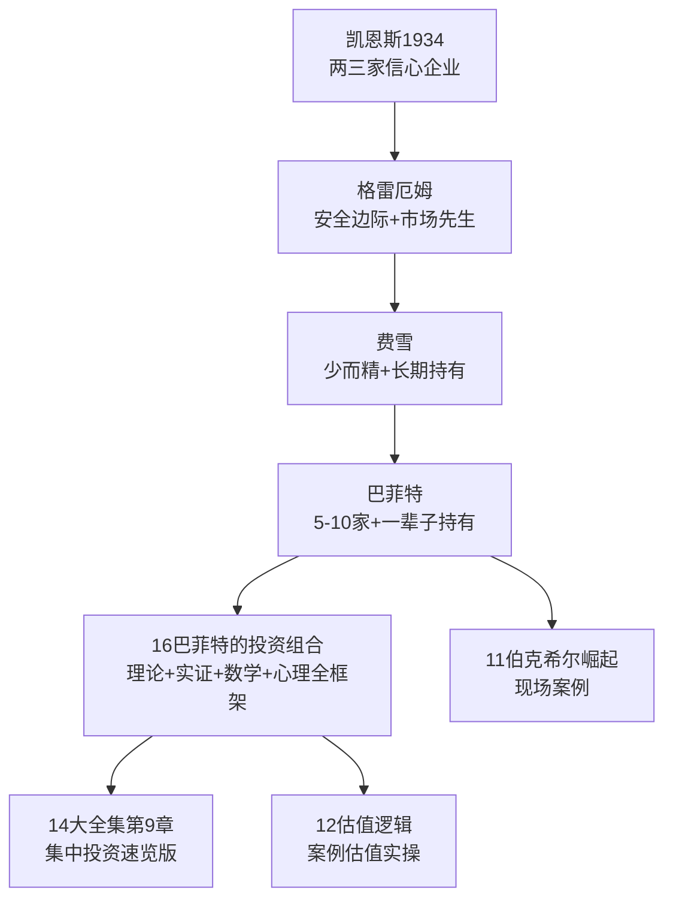
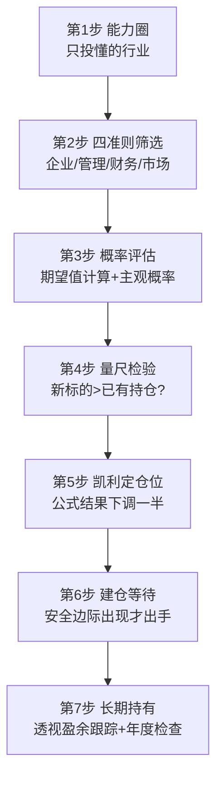
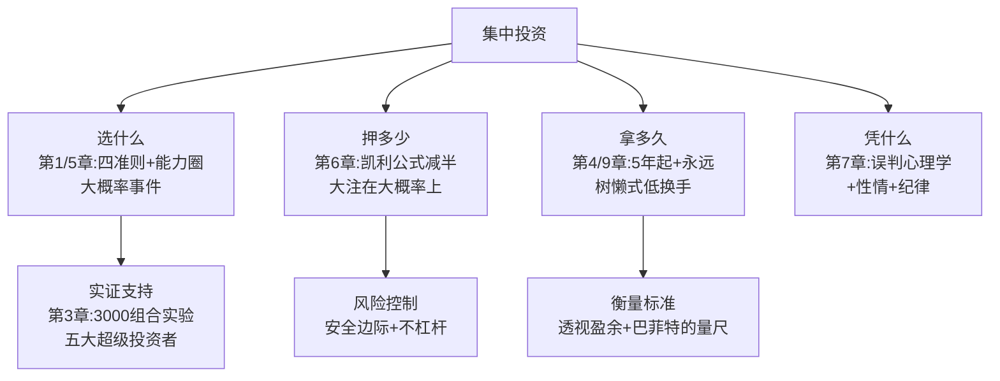

# 16《巴菲特的投资组合》深度解读（详细版）

> 集中投资的理论、实证与心法——"如何把好股票构建成一个战无不胜的组合"

## 📖 本书概览

| 项目 | 内容 |
|------|------|
| 书名 | 巴菲特的投资组合（The Warren Buffett Portfolio） |
| 作者 | 罗伯特·哈格斯特朗（Robert G. Hagstrom） |
| 定位 | 《巴菲特之道》姊妹篇（非续集）——**从"如何选股"到"如何构建组合"** |
| 出版背景 | 1999 年；作者时任美盛集中信托（Legg Mason Focus Trust）基金经理 |
| 核心命题 | 获得超越平均的投资回报，不仅是你**如何挑选股票**的问题，更是你**如何构建投资组合**的问题 |
| 本书结构 | 第1章 概念导入 + 第2—5章 学术与统计基础 + 第6章 概率数学 + 第7章 心理学 + 第8章 复杂系统 + 第9章 击球员结论 |
| 系列位置 | **16《巴菲特的投资组合》= 集中投资专题**：衔接 [[14《巴菲特投资学大全集》深度解读（详细版）|14 大全集（第9章集中投资速览）]]，深化为独立专著 |

## 🎯 为什么这本书值得单独解读

- **它是集中投资的"圣经"**：把巴菲特"5—10 只股票"的随口建议，升级为一套完整的**理论框架 + 统计证据 + 心理准备 + 数学工具**
- **正面迎战现代金融学**：用数据反驳马科维茨/夏普/法玛（有效边界、β、有效市场），是"学院派 vs 巴菲特"的完整论战记录
- **实证数据独一无二**：3000 个集中投资组合的蒙特卡洛实验、凯恩斯/巴菲特/芒格/红杉/辛普森五大集中投资者的完整业绩表
- **给散户的"公平警示标签"**：第9章的 5 条责任清单，比任何"10 倍股秘籍"都珍贵

## 📑 目录

- [[#第1章 集中投资：五个问题与四个答案|第1章 集中投资：五个问题与四个答案]]
- [[#第2章 现代金融的先驱：马科维茨、夏普、法玛与巴菲特的正面交锋|第2章 现代金融的先驱：马科维茨、夏普、法玛与巴菲特的正面交锋]]
- [[#第3章 巴菲特部落的超级投资家：五位大师的集中投资实证|第3章 巴菲特部落的超级投资家：五位大师的集中投资实证]]
- [[#第4章 一种衡量业绩更好的方法：透视盈余与巴菲特的量尺|第4章 一种衡量业绩更好的方法：透视盈余与巴菲特的量尺]]
- [[#第5章 沃伦·巴菲特的投资策略：四大准则的展开|第5章 沃伦·巴菲特的投资策略：四大准则的展开]]
- [[#第6章 投资的数学：概率论、凯利公式与富国银行案例|第6章 投资的数学：概率论、凯利公式与富国银行案例]]
- [[#第7章 投资心理学：从格雷厄姆到误判心理学|第7章 投资心理学：从格雷厄姆到误判心理学]]
- [[#第8章 市场是一个复杂适应性系统：为什么预测注定徒劳|第8章 市场是一个复杂适应性系统：为什么预测注定徒劳]]
- [[#第9章 创造佳绩的击球员在哪里：集中投资者的行动清单|第9章 创造佳绩的击球员在哪里：集中投资者的行动清单]]
- [[#附录一 本书金句集（35 条精选）|附录一 本书金句集（35 条精选）]]
- [[#附录二 集中投资 vs 现代投资组合理论：全维度对比|附录二 集中投资 vs 现代投资组合理论：全维度对比]]
- [[#附录三 系列互链：集中投资在 16 本笔记中的位置|附录三 系列互链：集中投资在 16 本笔记中的位置]]
- [[#附录四 集中投资实操手册：从选股到建仓的七步流程|附录四 集中投资实操手册：从选股到建仓的七步流程]]
- [[#总结：集中投资的完整心智模型|总结：集中投资的完整心智模型]]

## 🔗 双链导读（本笔记与系列的连接点）

| 连接主题 | 本笔记章节 | 关联笔记 |
|---------|-----------|---------|
| 集中投资速览 | 第1章 | [[14《巴菲特投资学大全集》深度解读（详细版）|14 大全集第9章]]（5—15 只/乔丹比喻/刺猬策略） |
| 估值基础 | 第5章 | [[12《巴菲特的估值逻辑》深度解读（详细版）|12 估值逻辑]]（ROTCE/EV-EBIT 体系） |
| 护城河选择 | 第1章 | [[13《巴菲特的护城河》深度解读（详细版）|13 护城河]]（先选好企业才能集中） |
| 富国银行案例 | 第6章 | [[14《巴菲特投资学大全集》深度解读（详细版）|14 大全集第10章]]（三场景概率法） |
| 透视盈余/股东信 | 第4章 | [[09《巴菲特致股东的信》深度解读（详细版）|09 股东信·主题版]] · [[10《巴菲特致股东的信》深度解读（详细版）|10 股东信·编年版]] |
| 巴菲特人生 | 第3章 | [[11《巴菲特的伯克希尔崛起》深度解读（详细版）|11 伯克希尔崛起]]（1976—1989 现场版） |
| 交易对照 | 第9章 | [[01《股票作手回忆录》读书笔记|01 利弗莫尔]] · [[03《利弗莫尔的股票交易方法量价分析》深度解读（详细版）|03 量价分析]] |
| 系统思维 | 第8章 | [[04《原则》深度解读（详细版）|04 达利欧《原则》]]（周期/系统视角） |

---

## 第1章 集中投资：五个问题与四个答案

### 1.1 一句话定义集中投资

> "选择为数不多的、可以在长期提供超越平均回报的股票，将你的大部分资金集中投在这些股票上。无视股市短期的涨跌波动，坚毅忍耐，持股不动。"

这个总结立刻引发五个问题：

| # | 问题 | 本书的回答 |
|---|------|-----------|
| 1 | 如何找到超越平均回报的股票？ | 用巴菲特投资准则筛选（企业/管理/财务/市场四准则） |
| 2 | "为数不多"是多少？ | **不超过 15 只**；执着者甚至 3 只；一般投资者 10—15 只 |
| 3 | "集中"是什么意思？ | 大部分资金押在少数高概率标的上（"大概率事件"） |
| 4 | 应该持有多久？ | 5 年起步，理想答案是"永远" |
| 5 | 为什么我要这么做？ | 见第3章统计证据：持股越少跑赢概率越大 |

### 1.2 好莱坞式的错误形象

| 形象 | 描述 |
|------|------|
| 好莱坞基金经理 | 两部电话同时通话、疯狂记录、紧盯上蹿下跳的屏幕、股价稍跌就猛击键盘 |
| 真实的巴菲特 | "轻声细语""脚踏实地""慈祥可亲"，平静中带着与生俱来的自信 |

> **核心洞察**：集中投资的想法非常简单，但就像大多数简单的想法一样，它建立在一系列相互关联的概念基础上——把想法举起来对着阳光仔细端详，会在明亮清晰的表面下，找到深度、实质和坚实的思考。

### 1.3 "发现杰出的公司"= "大概率事件"

- 巴菲特把大部分注意力用于**分析股票背后的公司以及评估管理层**，而不是追踪股价
- 做这些"功课"所花费的精力，**比试图成为抄底逃顶的市场高手节省不少**，而且结果更为有效
- 概率思维转换：将"杰出的公司"想成"大概率事件"——通过分析找到历史记录良好、前景光明的公司，从概率论角度去思考

### 1.4 "少即是多"：巴菲特对传统多元化的否定

巴菲特原话（对"有点儿基础的投资者"）：

> "如果你是个有点儿基础的投资者，了解一些企业的经济状况，并且可以找到 5 到 10 家定价合理、具有长期竞争优势的公司，那么，传统所谓的多元化（涵盖广泛的主动型投资组合）对你而言可能毫无意义。"

**传统多元化的问题**：大大增加了你投资**不甚了解的对象**的机会。

| 投资者类型 | 建议持股数 |
|-----------|-----------|
| 运用巴菲特准则"略知一二"者 | 5—10 家 |
| 对集中投资哲学执着者 | 可少到 3 家 |
| 一般投资者 | 平均 10—15 家 |
| 绝对上限 | **不超过 15 家**（超过即"四分五裂"） |

### 1.5 思想源头：凯恩斯的集中投资信条

1934 年凯恩斯给商务助理的信（本书第3章亦有展开）：

- 通过广撒网的形式（分散到许多企业）**降低风险的做法是错误的想法**
- 对一家企业了解得越多，错误判断的可能性就越小
- 一个人能真正了解的企业**很少**——"能够有信心投资的企业也不过两三家"

> 🔗 **呼应**：[[14《巴菲特投资学大全集》深度解读（详细版）|14 大全集]] 第9章同样引用了凯恩斯与费舍尔（"我知道我对公司越了解，我的收益就越好"）作为集中投资思想渊源。

### 1.6 格栅模型：芒格的跨学科思维框架

1995 年芒格在南加州大学商学院演讲"普世智慧：作为基本分支的投资专长"：

| 要点 | 内容 |
|------|------|
| 智慧的本质 | 将很多相关的事实**综合**在一起，而非简单整理引用 |
| 格栅比喻 | "你必须在头脑中建立模型，你必须将自己的经历在格栅模型的基础上条理化" |
| 学习第一规则 | 心中形成**多种模型**，且需来自不同学科 |
| 认知界限 | 商学院教授不讲物理学、物理学老师不讲生物学……必须去除这些"认知上的法定界限" |
| 单位效率 | "让你的大脑比别人的大脑工作得更为出色，因为如果你的大脑掌握绝大多数基本的模型，你的单位效率就会提高" |
| 不必精通 | "你所需要做的就是知道真正重要的概念，尽早地学习，并把它学好" |

**集中投资需要哪些学科模型**：

| 缺什么模型 | 会怎样 |
|-----------|--------|
| 心理学行为模式 | 永远不会对投资满意 |
| 统计概率 | 不懂如何优化投资组合 |
| 复杂适应性系统 | 永远不会意识到预测市场的愚蠢 |

### 1.7 本章小结

集中投资 = **选好企业（概率）× 集中下注（数量）× 长期持有（时间）× 心理准备（性情）**。它需要四种思维的协同：企业分析思维（第5章）、数学思维（第6章）、心理学思维（第7章）、系统思维（第8章）。

---

---

## 第2章 现代金融的先驱：马科维茨、夏普、法玛与巴菲特的正面交锋

### 2.1 马科维茨：有效边界与协方差（1952）

**历史时刻**：1952 年 3 月，巴菲特刚研究生毕业到父亲的证券经纪公司工作；同月《金融杂志》刊登芝加哥大学研究生哈里·马科维茨的 14 页论文《投资组合选择》——**现代金融的起点**。

| 概念 | 内容 |
|------|------|
| 核心观点 | 回报与风险密不可分；不承担高于平均的风险，就无法获得高于平均的回报 |
| 革命性 | 20 世纪 50 年代前投资者几乎不考虑组合问题或风险概念，组合建立是随机的 |
| 有效边界 | 一条从左下划向右上的曲线，每个点代表预期回报与风险的匹配；最有效组合=风险一定时回报最高 |
| 标准差 | 马科维茨用标准差衡量风险——与平均值的差距越大，风险越大 |
| 协方差 | **马科维茨最伟大的贡献**：衡量一组股票走势的关系——两只股票走势一致则协方差高，背道而驰则协方差低；组合风险 = 个股方差的加权平均 + 协方差修正 |

**推论**：投资经理的目标 = 在控制无效组合的情况下，将组合与投资者的风险承受度匹配。

### 2.2 夏普：β 与资本资产定价模型（CAPM）（1963—1964）

**历史**：1963 年，夏普在兰德研究所做线性规划研究，听从 UCLA 教授建议去找马科维茨，一年后发表《投资组合分析的简化模型》——避免了马科维茨需要的无数协方差计算。

| 概念 | 内容 |
|------|------|
| 简化思路 | 所有证券都与某基本因素（股市指数/GNP）有共同关系；只需衡量证券与主导因素的关系 |
| β 定义 | 个股价格走向与大盘的相关度；大盘 β=1.0，涨跌两倍 β=2.0，变动 80% β=0.8 |
| 组合 β | 加权平均；β>1 风险高于大盘，β<1 风险低于大盘 |
| 系统性风险 | 与大盘相关的风险（β），**无法通过多元化消除** |
| 非系统性风险 | 与公司自身经济状况相关，**可通过多元化分散** |
| 伯恩斯坦的结论 | "所谓的有效投资组合就是股市本身"——CAPM 表明整个市场组合完美地与有效边界吻合 |

### 2.3 法玛：有效市场理论（1963）

**思想来源**：法玛深受曼德勃罗（分形几何学创始人）影响——股价波动没有规律，不可能进行基本面或统计学研究；不规则波动模式一定加剧，导致巨大而剧烈的变化。

| 论点 | 内容 |
|------|------|
| 核心主张 | 股价无法预测是因为市场太有效：信息一出现，理性最大利润追求者立即利用，股价瞬间调整 |
| 验证方法 | 无法直接验证；替代方法：找能跑赢大盘的交易系统或交易者——找不到则市场有效 |
| 历史转折 | 1973—1974 大熊市迫使华尔街认真思考学术界著作；1974 年后"教授们成了现代金融的主宰" |

### 2.4 巴菲特论风险：与学术定义的决裂

| 维度 | 现代投资组合理论 | 巴菲特 |
|------|----------------|--------|
| 风险定义 | 股价波动（β/标准差） | **受到伤害或损害的概率**，是"内在价值风险"的构成因素，而非价格行为 |
| 股价下跌 | 风险增加 | **赚更多钱的良机**——股价下跌实际上减少了巴菲特的风险 |
| 原话 | — | "对于公司所有者来说，关于风险的学术定义实在是谬之千里，简直可以算是无稽之谈" |
| 真正风险 | — | 税后回报是否"带给他至少与投资之初相同的购买力，并在初始投资基础上加以合适的利息" |

**"这是一项好投资吗？"四要素**（决定未来利润与风险的四个确定性）：

| # | 要素 |
|---|------|
| 1 | 企业长期经济特征的确定性可以被评估 |
| 2 | 管理的确定性可以被评估（实现全部潜力的能力 + 明智使用现金流的能力） |
| 3 | 管理层值得信赖的确定性可以被评估（把回报交给股东而非自己） |
| 4 | 购买企业的价格 |

**风险与持有期限**：

> "如果你让我估计一下今天上午买进可口可乐并在明天上午卖出的风险，我必须说这是一笔极具风险的交易。"

| 期限 | 风险性质 |
|------|---------|
| 明天卖出 | 正确预测短期涨跌的概率≈抛硬币，进入风险交易 |
| 延长至数年 | 假设买进合适，风险交易概率大幅降低 |

### 2.5 巴菲特论多元化：对无知的保护

> "我们采取的策略使我们远离了跟随标准多元化的教条。……如果集中投资策略能提高投资者对公司的关注程度，并提升其对公司经济状况的满意程度，那么该策略就很可能会降低风险。"

| 论点 | 内容 |
|------|------|
| 多元化的作用 | "多元化对于无知起到了很好的保护作用" |
| 何时合适 | "如果你希望确保做得不比大盘更糟，你应该拥有整个市场"——适合不知道如何分析企业的人 |
| 保护的代价 | "它会告诉你如何得到平均结果，但是，我认为任何具有 5 年级水平的人，都知道如何获得平均结果" |
| 集中的逻辑 | 有意识地专注有限几家公司 → 更充分研究 → 更了解内在价值 → 风险更小 |

### 2.6 巴菲特论有效市场理论：三宗罪与"捐钱论"

**有效市场理论站不住脚的三个原因**：

| # | 原因 |
|---|------|
| 1 | 投资者并不总是理性的（行为心理学研究表明投资者群体并不拥有理性预期） |
| 2 | 投资者没有正确地处理信息（靠捷径确定股价，而非基本面分析） |
| 3 | 业绩标准强调短期表现，使长期战胜市场成为不可能的事 |

**巴菲特的核心反驳**：

> "他们正确地观察到市场经常是有效的，但接下来做出了不正确的推断——市场总是有效的。这之间的差别犹如暗夜与白昼。"

**经典"捐钱论"**（挖苦有效市场理论在商学院如宗教般盛行）：

> "很自然，那些因接受有效市场理论而受到伤害的学生以及轻信该理论的投资专业人士，实际上为我们以及其他格雷厄姆的追随者提供了非同一般的服务。如果（我们的）对手被教育无论如何努力都没用，以至于他们连试都不试一下，那么，（我们）无论是在财务方面，还是在心理和身体方面，都会拥有巨大的优势。从自私的角度而言，我们或许应该给大学捐钱以保证有效市场理论的教学可以一直持续下去。"

### 2.7 新投资组合理论：认知的十字路口

| 维度 | 现代投资组合理论（左） | 集中投资理论（右） |
|------|----------------------|-------------------|
| 投资者 | 理性 | **并非总是理性**，被周期性恐惧与贪婪折磨 |
| 市场 | 有效 | **并非总是有效**，愿研究学习者有机会战胜 |
| 风险 | 价格波动 | **经济价值** |
| 最佳组合 | 各种概率事件押同等筹码 | **大概率事件上下大注** |

**格雷厄姆给学生的箴言**（对深陷理论之争者的解药）：

> "你的对错不会由大众是否赞同你所决定，你只会因为你数据和逻辑的正确而正确。"

### 2.8 本章金句

> 1. "对于公司所有者来说，关于风险的学术定义实在是谬之千里，简直可以算是无稽之谈。"
> 2. "多元化对于无知起到了很好的保护作用。"
> 3. "市场经常是有效的，但并非总是有效的——这之间的差别犹如暗夜与白昼。"
> 4. "你的对错不会由大众是否赞同你所决定，你只会因为你数据和逻辑的正确而正确。"——格雷厄姆
> 5. "1974 年的灾难让我相信，一定会有更好的方法来管理投资组合。"——彼得·伯恩斯坦

---

---

## 第3章 巴菲特部落的超级投资家：五位大师的集中投资实证

### 3.1 约翰·梅纳德·凯恩斯：切斯特基金（1927—1945）

**背景**：凯恩斯不仅是宏观经济学大师，还是传奇投资家。1919 年被任命为剑桥国王学院第二财务主管，说服校董设立只投普通股/货币/商品期货的新基金（切斯特基金）；1927 年任第一财务主管直至 1945 年离世，始终唯一负责人。

**1938 年政策报告中的三条投资原则**：

| # | 原则 |
|---|------|
| 1 | 严格筛选几家公司，考虑其相对未来几年实际和潜在内在价值是否便宜 |
| 2 | 重仓，坚定持有——无论艰难险阻，历尽数年，直到实现预期回报或买入被证明错误 |
| 3 | 建立平衡的持有仓位——单股仓位较大，但风险具多样性，尽可能对冲 |

**业绩**（18 年）：

| 指标 | 数据 |
|------|------|
| 切斯特基金年复合回报 | **13.2%** |
| 同期英国股市 | 基本没涨没跌 |
| 波动率 | 大盘的 **2.5 倍**（标准差衡量） |
| 亏损年份 | 1930/1938/1940 三年跑输大盘 |
| 历史背景 | 大萧条 + 第二次世界大战期间取得——"非同一般" |

**凯恩斯对择时的自我否定**（作为宏观经济学家却反对预测）：

> "在股市周期中的不同阶段，整体而言，我们无法证明自己拥有利用股市的系统性趋势买进卖出股票的能力。……那些打算高价卖出、低价买入或两者都想做的人，总是会晚一步，绝大多数拥有这类想法的人实际上承担了极大的交易成本，形成了投机心理，导致自己心神不宁。"

### 3.2 巴菲特合伙公司（1957—1969）

**成立**：1956 年格雷厄姆解散投资公司后，巴菲特回奥马哈成立合伙公司，起步资金 105,100 美元（含自己投入的 100 美元）。

| 指标 | 数据 |
|------|------|
| 目标 | 每年跑赢道琼斯指数 10 个百分点 |
| 实际 | 平均年回报**高出道指 22 个百分点** |
| 亏损年份 | **从来没有一年亏损** |
| 1965 年规模 | 2,600 万美元 |
| 标准差 | **低于道指**（更小波动 + 更高回报 = "逆天"） |

**为什么集中投资却没有波动？** 两种解释：

1. 持股股价变动具有不同风格——精心构建的经济多元化组合可平滑道路上的坑坑洼洼（虽然他未必刻意构建低协方差组合）
2. **更可能的解释**：以认真自律的方式仅投资价格大大低于内在价值的股票，大大降低了股价继续向下的风险，留给合伙公司的都是向上的优势

> "我认为不管以什么方法来衡量，这样的结果都是令人满意的。"——巴菲特

### 3.3 查理·芒格合伙公司（1962—1975）

**背景**：巴菲特 1960 年遇见芒格："我告诉他，法律作为爱好是不错，但他可以做得更好。"芒格哈佛法学院毕业，洛杉矶法律业务蒸蒸日上，被巴菲特说服进入投资界。

| 指标 | 数据 |
|------|------|
| 年平均回报高出市场 | **18 个百分点** |
| 标准差 | 约为市场的 **2 倍**（波动大） |
| 风格 | 组合集中于少数几只股票，业绩波动大 |
| 原则 | 同样基于格雷厄姆价值折扣原则——只关注股价低于内在价值的公司 |

**巴菲特的评价**：

> "芒格的投资方式依然基于同样的价值折扣原则。他愿意接受业绩起伏的高峰和低谷，他恰好就是那种倾向于集中的人。"

**关键洞察**：巴菲特从不用"风险"一词描述芒格的表现——以标准差衡量芒格极具风险，但"以年平均回报高出市场 18 个百分点的结果击败大盘绝非一个爱冒风险者的作为"。

### 3.4 红杉基金：比尔·鲁安（1971—1997）

**成立**：1969 年巴菲特结束合伙公司时找到老同学鲁安（1951 年同听格雷厄姆证券分析课），请其成立基金接手合伙人。

| 指标 | 数据 |
|------|------|
| 成立时市场 | 漂亮 50 狂热、价值股遭抛弃（最差的时机） |
| 平均持股 | **6—10 家公司**，占组合仓位 90%+ |
| 行业覆盖 | 商业银行、制药、汽车、财产意外保险（集中但不单调） |
| 年平均回报 | **19.6%**（1971—1997） |
| 同期标普 500 | 14.5% |

**鲁安的反华尔街理念**：

| 维度 | 华尔街惯例 | 鲁安-卡尼夫公司 |
|------|-----------|----------------|
| 组合构建 | 先入为主的构成观念，往里填充股票 | **先挑最具潜力的股票，以此为中心构建组合** |
| 研究来源 | 券商研究报告 | 回避华尔街研究，**依靠自身深入调查研究** |
| 头衔观 | 分析师→晋升基金经理（更高职位） | "如果你是一个长期投资者，分析师这个岗位至关重要，基金经理会水到渠成"——名片上写"比尔·鲁安，研究分析师" |

### 3.5 卢·辛普森：GEICO 的投资总监（1980—1996）

**背景**：GEICO 在伯克希尔有崇高地位——1951 年巴菲特 21 岁时经格雷厄姆介绍认识 GEICO（当时格雷厄姆是董事），寒冬周六清晨专程拜访总裁助理洛里默·戴维森，上了一堂 GEICO 竞争优势速成课；同年巴菲特将**全部净资产的 65%（1 万美元）**投入 GEICO；1976 年 GEICO 濒临破产时巴菲特开始买进，到 1980 年持股 33%（价值 4,570 万美元）。

**辛普森其人**：普林斯顿经济学硕士；1979 年被巴菲特"收购"进 GEICO。巴菲特评价他具有"做投资的理想品质"——独立思考、对研究深具信心、"对于大众潮流没有特别的兴趣"。

| 指标 | 数据 |
|------|------|
| GEICO 投资组合年平均回报（1980—1996） | **24.7%** |
| 同期股市年平均回报 | 17.8% |
| 组合持股数 | **通常不超过 10 只** |
| 风格 | 只买可靠能干管理层掌管、高回报、价格合适的股票；深入研究公司年报，对华尔街报告视而不见 |

**巴菲特的高度评价**：

> "这不仅仅是完美的数字，更为重要的是，这些成绩是以正确的方法得到的。辛普森坚持不懈地投资那些被低估的普通股，就个股而言，不可能产生永久性损失，就整体而言，几乎没有风险。"

### 3.6 3000 个集中投资者：蒙特卡洛实验（本书最硬的实证）

**实验设计**（作者与琼·兰姆-坦南特博士的研究）：

- 从 1979—1986 年数据可测量的 **1,200 家公司**中随机挑选
- 形成 **12,000 种投资组合**：250 只 ×3000 种、100 只 ×3000 种、50 只 ×3000 种、15 只 ×3000 种
- 计算各组平均年收益率（10 年期与 18 年期），与标普 500 比较

**10 年期（1987—1996）结果**：

| 组合规模 | 最佳回报 | 最差回报 |
|---------|---------|---------|
| 250 只 | 16.0% | 11.5% |
| 100 只 | 18.3% | 10.0% |
| 50 只 | 19.1% | 8.6% |
| **15 只** | **26.6%** | 4.4% |

> 同期标普 500 平均回报 15.2%。**只有 15 只组合的最佳回报远远高于大盘**；且越集中"高的更高、低的更低"。

**跑赢大盘的组合数量**（3000 种组合中）：

| 组合规模 | 跑赢大盘数量 | 概率 |
|---------|------------|------|
| 15 只 | 808 | **约 1/4** |
| 50 只 | 549 | 约 1/5 |
| 100 只 | 337 | 约 1/9 |
| 250 只 | 63 | **约 1/50** |

**两个无法忽略的结论**：

1. 凭借集中投资组合，你会有**更大的机会跑赢大盘**
2. 凭借集中投资组合，你也会有**更大的机会跑输大盘**（波动是集中投资的入场费）

### 3.7 伯克希尔-哈撒韦：集中投资的终极证明

| 指标 | 数据 |
|------|------|
| 每股账面价值年均增长（1965—1997） | **24.9%**（同期标普 500 的近两倍） |
| 翻倍速度 | 每 2.9 年翻一番 |
| 权益类投资组合年均回报（1988—1997） | **29.4%** |
| 同期标普 500 | 18.9% |
| 可口可乐仓位（1991—1997） | 从 34.2% 提升到 **43%** |
| 可口可乐回报（1988—1997） | 平均 **34.7%** vs 大盘 18.8% |

**三种策略的回报对比**（1988—1997，伯克希尔主要持仓）：

| 策略 | 年回报 | 对比结论 |
|------|--------|---------|
| 集中投资（实际做法） | **29.4%** | 最佳 |
| 均等持仓（每只平均分配） | 27.0% | 低 2.5 个百分点 |
| 虚拟 50 只组合（每只 2%） | 20.1% | 低近 9 个百分点，仅比大盘高 1.2 |

**"如果不下重注"反事实推演**：若巴菲特保持均等仓位（上涨时卖出维持平衡），回报从 29.4% 降至 27.0%；若分散到 50 只，降至 20.1%——**集中重仓本身就是超额收益的来源**。

### 3.8 地平协会：为什么集中投资永远不会蔚然成风

1984 年哥伦比亚大学演讲中巴菲特的讽刺观察：

> "自从本杰明·格雷厄姆和戴维·多德撰写《证券分析》之后，这个秘密公之于众已经有 50 年之久，我运用这种价值投资方法已有 35 年之久，然而，我发现价值投资从来没有蔚然成风。看来人性中有偏执的一面，就是喜欢将简单的东西复杂化。"

> "尽管轮船依然会环游世界，但地平协会也依然会继续繁荣下去。在市场上，价值与价格之间巨大的差距会继续存在，那些信奉格雷厄姆和多德的人会继续发财。"

**为什么必须靠计算机实验而非真实数据**：集中投资历史数据有限，无法提炼统计结论——恰恰说明华尔街对集中投资"视而不见"到了需要人工造数据的地步（呼应第9章"为什么华尔街视而不见"）。

### 3.9 本章金句

> 1. "能够有信心投资的企业也不过两三家。"——凯恩斯（1934）
> 2. "芒格的投资方式依然基于同样的价值折扣原则。他愿意接受业绩起伏的高峰和低谷，他恰好就是那种倾向于集中的人。"——巴菲特
> 3. "这不仅仅是完美的数字，更为重要的是，这些成绩是以正确的方法得到的。"——巴菲特评辛普森
> 4. "人性中有偏执的一面，就是喜欢将简单的东西复杂化。"——巴菲特
> 5. "在大概率事件上下大注，而不是在充满各种可能的概率事件上押上同等分量筹码。"——本书总结

---

---

## 第4章 一种衡量业绩更好的方法：透视盈余与巴菲特的量尺

### 4.1 共同基金的双重标准

1997 年底《财富》杂志约瑟夫·诺塞拉揭示的悖论：

| 现象 | 内容 |
|------|------|
| 基金对投资者说 | "买进并持有" |
| 基金自己做 | 不停地买进卖出、再买进再卖出 |
| 晨星唐·菲利普的评论 | "基金这个行业所做的事与他们告诉投资人的事，两者之间没有任何联系" |
| 内在动力 | 季度排名压力——《华尔街日报》《巴伦周刊》每 3 个月公布排名，榜前基金获电视报纸赞誉、吸引新资金 |
| 结果 | 以短期价格表现衡量业绩的固定方式主导了整个行业的思维 |

> **残酷的讽刺**：最有可能产生长期高于平均回报的投资策略（集中+持有），与我们评价业绩表现的方式（短期排名）**格格不入**。

### 4.2 乌龟与兔子：超级投资者也曾长期跑输

尤金·沙汉（美国信托基金经理）1986 年文章《短期表现与价值投资真的水火不容吗？》：

> "这或许是另一个生活中的讽刺现象，那些主要关注短期表现的投资者也许能达到目的，但这是牺牲长期利益的结果。格雷厄姆-多德部落里，那些取得杰出投资业绩的超级投资者们完全不理会短期的表现。"

**五位集中投资者的"艰难时刻"**：

| 投资者 | 跑输经历 |
|--------|---------|
| 凯恩斯 | 18 年中 1/3 时间跑输大盘；最初 3 年落后 18 个百分点 |
| 鲁安/红杉 | 衡量期 37% 时间跑输；连续 4 年跑输标普；1974 年跑输 36 个百分点 |
| 芒格 | 也无法避免集中投资的波动期 |
| 辛普森 | 同样经历过短期低谷 |
| **只有巴菲特** | 在这场业绩比赛中**毫发无损**（唯一例外） |

**红杉基金的至暗时刻与反转**（鲁安自述）：

> "连续数年，我们经常是倒数第一。我们选择在 20 世纪 70 年代中期开始红杉的事业简直是瞎了眼，以至于连续 4 年都跑输标准普尔 500 指数，备受煎熬。……我们躲在办公桌下面，不敢接电话，我们也想知道暴风雨能否过去。"

- 1974 年跑输市场 36 个百分点
- 1976 年底：以五年半为期**领先市场 50%**
- 1978 年：累计回报 **220%** vs 标普 500 的 60%

### 4.3 替代的衡量标准：像衡量未上市企业一样衡量持股

**巴菲特的名言**：

> "我们持有的股票长时间无法交易，不会比 World Book 或 Fechheimer（伯克希尔的两家子公司）缺乏每日报价更让我们烦恼。最终，我们的经济命运将由我们拥有的企业的经济命运所决定。"

| 问题 | 答案 |
|------|------|
| 没有每日报价如何判断企业状况？ | 看净利润增长、运营利润率改善、资本支出减少——让企业的经济情况告诉你价值升降 |
| 上市与非上市衡量有何不同？ | **没有不同**——"如同测试酸碱度可以使用同样的石蕊试纸" |
| 股市的作用 | "股市对企业运营的成功或许会忽略一段时间，但终究会予以肯定" |

### 4.4 透视盈余：巴菲特发明的组合衡量工具

**定义**：伯克希尔的透视盈余 = 旗下子公司运营利润 + 大量普通股投资的留存收益 + 留存收益若派发可能产生的税收优惠。

**背景**：伯克希尔持有的可口可乐、房地美、吉列、华盛顿邮报等公司留存收益总额到 1997 年达 **7.43 亿美元**；按 GAAP 伯克希尔不能在财报中报告这些收益——巴菲特发明"透视盈余"让股东看清真实价值。

**集中投资者的应用**：

> "每一个投资者的目标都应该是构建一个投资组合（实际上，就相当于一家'公司'），从现在起到未来的 10 年，它可以给投资者提供最高的潜在透视盈余。"

**透视盈余与股价的关系**：

| 情形 | 表现 |
|------|------|
| 市场先生情绪不佳 | 透视盈余走在股价之前 |
| 市场先生情绪高亢 | 股价远远将盈余数字抛在身后 |
| 长期必然 | 自 1965 年以来伯克希尔透视盈余几乎与其证券市值同步增长 |

> "这种方式将迫使投资者思考企业的长期前景，而不是短期的市场表现。一个思路的转换可能会得到结果的改善。"

### 4.5 巴菲特的量尺：芒格揭示的被忽略的秘诀

**核心思想**：每当巴菲特考虑新投资时，首先回顾已有投资进行比较——**伯克希尔已经拥有的投资，就是衡量潜在收购标的的经济量尺**。

**芒格的展开**（OID 访谈）：

> "对于一个普通人，你手中最好的东西就应该是你的量尺。如果（你正在考虑投资购买的）新标的并不比你已经了解的更好，就说明它没有达到你的门槛。**仅这一条标准就可以淘汰掉你所见到的 99% 的候选对象。**"

| 要素 | 内容 |
|------|------|
| 量尺的定义 | 基于现有投资建立的经济衡量标准（透视盈余/ROE/安全边际等） |
| 决策问题 | 买进或卖出一家公司时，你**提高还是降低**了你的经济衡量标准？ |
| 对组合的意义 | 要跑赢标普 500，组合中公司的经济指标必须超越标普成分股的加权平均经济指标 |
| 芒格提醒 | "这是一项非常费神的工作，而且一般而言，大学的商学院不会教授这样的课程" |

**汤姆·墨菲的经营哲学**（大都会/ABC 掌门人，巴菲特最敬重的经营者之一）：

> "管理者的工作，并不是找到让火车变得更长的方法，而是找到让火车跑得更快的方法。"

### 4.6 像树懒一样行动的两个好理由

**理想的持股期限**：巴菲特会说"永远！"——只要公司持续产生高于平均的经济回报、管理层持续以理想方式分配利润。

> "按兵不动反而让我们的行为变得明智。无论是我，还是绝大多数公司的管理层，都不会因为美联储调息预期或华尔街的专家改变他的市场观点，而卖出我们旗下利润丰厚的公司。"

**大学篮球明星比喻**（投资组合中少数股票产生大部分回报）：

> "这个投资者得到的结果类似于，买了几个大学篮球明星未来收入权益的 20%，他们中有人会成为真正的 NBA 球星……如果建议这个投资者卖掉他最成功的投资标的，仅仅是因为这些标的在他投资组合中占比过大，这就像建议公牛队卖掉迈克尔·乔丹是因为他对公牛队太重要了一样。"

**低换手率的两大好处**：

| 好处 | 内容 |
|------|------|
| 降低交易成本 | 见 4.7 |
| 提高税后收益 | 见 4.8 |

### 4.7 降低交易成本：晨星的实证

**换手率定义**：一年内买卖数量占组合的比例。100% = 全部卖出再全部买进（或卖买 50% 两回）；10% = 平均持股 10 年。

**晨星研究**（观察 2,560 只美国国内股票基金）：

> 以 10 年为期，相较于换手率高于 100% 的基金，**换手率低于 20% 的基金的回报高出 14 个百分点**。

高换手率的问题：交易增加经纪成本，从而降低回报——"如此明显，以至于轻易就会被忽略"。

### 4.8 税后收益：未变现利得的巨大价值

**讽刺现象**：高频换手原本为提高回报，却提高了当期税收负担——每只取代旧仓的新股票，必须以**超过原有股票资本利得税**作为新起点。

**巴菲特称之为"来自财政部的无息贷款"**：

| 场景 | 第 20 年底结果 |
|------|--------------|
| 每年翻一番、每年卖出变现缴税（税率 34%） | 支付 13,000 美元税款后净赚 25,200 美元 |
| 每年翻一番、从不卖出 | 远高于前者（复利完全免税滚动） |

**1 美元年翻番复利对比**（设 34% 税率）：

| 年份 | 每年变现缴税 | 从不卖出 |
|------|------------|---------|
| 第 1 年底 | 1.66 美元 | 2 美元 |
| 第 5 年底 | ~4.8 美元 | 32 美元 |
| 第 20 年底 | 25,200 美元净利（付税 13,000） | 1,048,576 美元市值（未付税） |

**结论**：税收是投资者面临的最大成本（高于佣金、常高于基金运营成本）；指数基金节税 + 低换手率延迟纳税 = 双重优势。

### 4.9 本章金句

> 1. "买进并持有"——基金行业所做的事与他们告诉投资人的事，两者之间没有任何联系。——唐·菲利普
> 2. "最终，我们的经济命运将由我们拥有的企业的经济命运所决定。"——巴菲特
> 3. "仅这一条标准就可以淘汰掉你所见到的 99% 的候选对象。"——芒格论巴菲特的量尺
> 4. "管理者的工作，并不是找到让火车变得更长的方法，而是找到让火车跑得更快的方法。"——汤姆·墨菲
> 5. "未变现利得"是来自财政部的无息贷款。——巴菲特

---

---

## 第5章 沃伦·巴菲特的投资策略：四大准则的展开

### 5.1 市场准则：如何给一家企业估值（DCF 的艺术与科学）

**核心公式**（源自约翰·伯尔·威廉姆斯《投资价值理论》，60 年后依然正确）：

> "在看任何企业时，如果我们可以预测这家企业与企业所有者之间，在未来 100 年或是企业存续期间，所产生的现金流入和现金流出，然后使用一个合适的利率进行折现，就能得到一个内在价值。"

**债券类比**：

> "给一个企业估值，就像给一个附有一大把息票、期限为 100 年的债券估值，企业会有一直延续到未来的息票，只不过这种企业息票没有打印出来。因此，这种企业息票利率的高低取决于投资者的预期。"

| 要素 | 巴菲特的做法 |
|------|-------------|
| 息票 | 企业未来可能产生的盈利（现金流） |
| 折现率 | 当下美国长期国债利率（无风险利率）——"我们使用无风险利率仅仅是希望使两项相等" |
| 风险处理 | 不因风险调整折现率，而是调整买入价格（安全边际） |

### 5.2 财务准则：经济附加值（EVA）之争

**EVA 简介**：思腾思特咨询公司（Stern Stewart）商标持有的测量体系，衡量投资回报是否超过资本成本；可口可乐、礼来、AT&T 等公司采用。

**加权平均资本成本（WACC）公式**：

> 资本结构中的权益比例 × 权益成本 + 负债比例 × 负债成本

示例：60% 权益 × 15% + 40% 负债 × 9% = **12.6%**——若公司以 12.6% 资本成本获得 15% 回报，则增加经济价值。

**巴菲特不用 EVA 的两个理由**：

| 理由 | 内容 |
|------|------|
| 1 | EVA 公式建立在 CAPM 之上，而 CAPM 依据股价波动衡量风险——巴菲特早已否定"波动=风险" |
| 2 | 权益成本通常高于负债成本，EVA 模型里负债比例提高→资本成本降低→支持者认为高负债是好事——巴菲特认为**无负债或接近无负债对公司是好事** |

**巴菲特的替代标尺**：**一美元留存创造一美元市值**——公司每留存一美元，至少创造一美元市场价值。

**伯克希尔内部 15% 资本门槛**（不靠复杂公式）：

> "我们只是为投入的资本收取合理的费用，让他们自己去决定是否要购买一个新项目或其他什么东西。……一般而言，我们按照资本的 15% 收费。我们发现 15% 能引起他们足够的重视，但又不会过高，太高的门槛可能适得其反。"

> 🔗 **呼应**：[[14《巴菲特投资学大全集》深度解读（详细版）|14 大全集]] 第8章同样记载了 EVA 之争与 15% 门槛（"资本成本是商业世界中最大的秘密之一"）。

### 5.3 管理准则：给管理层估值

巴菲特考察管理的三个问题：

| # | 问题 |
|---|------|
| 1 | 管理层是否理性？（资本配置是否合理） |
| 2 | 管理层对股东是否坦诚？ |
| 3 | 管理层能否抗拒惯性驱使（法人机构的盲从行为）？ |

### 5.4 成长与价值：一个由来已久的辩题

**传统划分**：

| 类型 | 特征 |
|------|------|
| 价值投资者 | 寻找价格低于潜在价值的股票：低市净率、低市盈率、高股息 |
| 成长型投资者 | 与利润增长迅速的公司联系在一起，推断增长持续 |

**巴菲特的立场**：

> "价值和成长，大部分分析师习惯性地将二者对立起来。的确，很多投资界的专业人士将这两种形式的任何混合都视为学术上的变装行为。"

- 一只股票的价值 = 存续期间净现金流在合适利率下的折现值
- "成长"只是现金流计算的一部分
- **"在我们的观点里，这两种方式（价值与成长）实际上交织在一起，不分彼此"**

**芒格的立场**（惜字如金但一针见血）：

> "区分'价值'与'成长'在我看来简直是胡扯。这为一群养老基金顾问靠夸夸其谈收取费用提供了方便……但对我而言，所有聪明的投资都是价值投资。"

**实用建议**：把自己划为价值投资者，但小心不要落入购买所谓典型"增值"股的陷阱。

### 5.5 比尔·米勒：集中投资的当代实践者（美盛价值信托基金）

**人物背景**：与同行学马科维茨/夏普/法玛不同，米勒在约翰·霍普金斯研究生院钻研哲学，读威廉·詹姆士《实用主义》和约翰·杜威《实验逻辑论文集》；短暂出纳工作让他明白公司如何运营；1982 年加入美盛，与厄尼·奇勒共同管理价值信托基金。

**1980 年代双轨运行**：

| 管理者 | 方式 |
|--------|------|
| 厄尼·奇勒 | 格雷厄姆式：低市盈率、对账面价值折扣 |
| 比尔·米勒 | "更接近格雷厄姆所讲的、经过巴菲特精雕细琢的方式——任何投资的价值都是未来现金流的折现值。关键在于如何估值，对资产进行理性评估，然后以较大的折扣价买入" |

**业绩**：1990 年全面接管后，**连续 8 年（1991—1998）跑赢标普 500**；1998 年获晨星年度最佳权益类基金经理人奖。管理的资金超 120 亿美元（含 90 亿美元价值信托基金）。

**评价**：《巴伦周刊》基金专栏作家埃里克·萨维茨："比尔·米勒以持仓为主，着眼长远……他不会自我推销。有很多基金经理会现身美国 CNBC，夸夸其谈，自吹自擂，但是比尔·米勒不是那种自我吹嘘的人。"

**与集中投资的距离**：严格定义上米勒不算集中投资者，但**非常接近**——持股数量远低于同行，持仓为主、着眼长远。

### 5.6 巴菲特之道与科技公司：能力圈边界

**巴菲特不买科技股的真实原因**（1998 年年会回答"是否会投资科技股"）：

> "嗯，答案是'不'，这或许的确相当不幸。我是安迪·格鲁夫和比尔·盖茨的崇拜者，我希望自己能将这种崇拜转变为以金钱为支持的行动。但具体到微软和英特尔上，我无法确定 10 年之后的世界是什么样子，我不想参与到别人具有优势的游戏中去。即便我用我所有的时间去思考未来 10 年的科技情况，但在全国科技分析领域最聪明的人里，我或许只能排在第 100 个、第 1000 个甚至是第 10000 个。"

**芒格的补充**：

> "我们没有涉足高科技类公司，是因为在这个领域我们尤其缺少天赋。……我们为什么要参与到一个自己不具竞争优势——或许还有劣势的游戏中，而不参与到我们具有明显优势的领域中呢？"

**核心逻辑**：参与一场机会均等的游戏，对财富只有负面影响——"你愿意将自己一生累积的财富投入到周期性的抛硬币游戏中吗？"

### 5.7 重温证券分析：哥伦比亚大学的传承

**迈克尔·莫布森**：哥伦比亚商学院"证券分析"课程（与 70 年前格雷厄姆同名课程）现任教授，同时供职瑞士信贷第一波士顿。

**课程三大概念**：

| # | 概念 | 内容 |
|---|------|------|
| 1 | 跨学科投资方法 | 格雷厄姆将其他学科思想引进教学；不仅看金融财务书，也看其他领域并思考如何运用 |
| 2 | 心理学角色 | "市场先生"家喻户晓且至今有效；投资是社会活动，心理学扮演重要角色 |
| 3 | 安全边际 | 不仅格雷厄姆如何思考，还包括它如何在概率论中得到证明 |

**70 年不变的结论**：

> "以合理的价格购买财务优良、管理层精明能干的企业，这依然至关重要。"

### 5.8 本章金句

> 1. "给一个企业估值，就像给一个附有一大把息票、期限为 100 年的债券估值。"——巴菲特
> 2. "所有聪明的投资都是价值投资。"——芒格
> 3. "我们按照资本的 15% 收费。我们发现 15% 能引起他们足够的重视，但又不会过高。"——巴菲特
> 4. "我不想参与到别人具有优势的游戏中去。"——巴菲特论科技股
> 5. "每个人的判断力都受限于自己的能力圈——你要做的不是扩大圈子，而是知道圈子的边界。"——本书引申

---

---

## 第6章 投资的数学：概率论、凯利公式与富国银行案例

### 6.1 概率论：不确定性的数学语言

**定义**：概率论是不确定性的数学语言。猫生小鸟概率=0；明早太阳升起概率=1；其余事件概率在 0—1 之间。

**历史**：1654 年帕斯卡与费马的通信奠定了概率论基础——赌徒德米尔问"游戏结束前离开的玩家如何分配筹码"，两位天才分别用几何与代数方法建立多种可能结果的概率体系，开启了**决策理论**先河（"决策是任何管理风险的努力中必不可少的第一步"）。

**贝叶斯**：1701 年出生的英国数学家，其文章为理论付诸实践奠定基础——**用新信息更新先验概率**（贝叶斯分析）。

**投资的概率视角**：

> 市场有数百种甚至数千种力量混合、纠缠，任何一种都可能产生巨大影响，但没有一种属于绝对可预测——投资者可以将目标范围缩小，识别并排除最不确定的对象，集中于最可能了解的对象，**这就是概率论的运用**。

### 6.2 频率概率 vs 主观概率

| 类型 | 定义 | 适用场景 | 陷阱 |
|------|------|---------|------|
| 频率解读 | 事件重复无穷多次时频率反映概率（抛硬币 10 万次≈5 万次正面） | 可重复事件（大数法则） | 一次性事件无频率可用 |
| 主观解读 | 描述对事件的"确信程度"（绿湾包装工夺冠概率 2/3、通过考试 1/10） | 独一无二的一次性事件 | 假设可能被情感蒙蔽 |

**主观概率的两大陷阱**（书中警示）：

1. 假设"有 1/10 概率通过测验"——因为测验难没准备？还是故作谦虚？
2. 对球队的长期忠诚蒙蔽双眼，对其他球队的超强力量视而不见

**贝叶斯式修正**：如果你相信假设合理，主观概率等于频率概率"完全可以接受"——必须抛开不理智、无逻辑的假设，选择理智的假设。主观概率是频率概率的延伸，其附加价值在于**将可操作性方案置于考虑之中**。

### 6.3 巴菲特风格的概率论：风险套利的数学

**巴菲特的自述**：

> "用盈利的概率乘以可能盈利的数量，减去损失的概率乘以可能损失的数量，这就是我们一直在做的事。这并不完美，但是，这就是我们所做的全部。"

**风险套利的渊源**："风险套利这件事，我到现在已经干了 40 年。我的老板本杰明·格雷厄姆在此之前干了 30 年。"——注意：巴菲特刻意避开未公开事件上的投机套利，只评估**公开宣布**的并购事件概率。

**雅培公司并购示例**（巴菲特决策过程）：

| 要素 | 数据 |
|------|------|
| 开盘价 | 18 美元 |
| 公告 | 6 个月内以 30 美元被科斯特洛公司收购 |
| 消息后股价 | 升至 27 美元稳定 |
| 巴菲特评估 | 事件 90% 概率发生 → 上升空间 3 美元；10% 概率跌掉 9 美元 |
| 数学期望 | 0.9 × 3 − 0.1 × 9 = 27 − 9 = **+1.8 美元（正期望）** |
| 决策 | 下注！ |

### 6.4 两个经典案例：富国银行与可口可乐（概率论实操）

**富国银行（1990 年 10 月）**：

| 要素 | 数据 |
|------|------|
| 买入 | 2.89 亿美元，每股 57.88 美元，500 万股 |
| 地位 | 成为最大股东（总股本 10%） |
| 背景 | 年初股价 86 美元一路跌至 57.88（跌约 33%）；西海岸严重衰退；富国银行商业房地产贷款数量全加州最多，被认为尤其脆弱 |

**巴菲特的分析路径**（并非知道别人不知道的事，只是不同分析）：

1. **了解银行业务**：伯克希尔 1969—1979 年曾拥有伊利诺伊国民信托银行，董事长吉恩·阿贝格让巴菲特明白——管理优秀的银行有利润增长和漂亮的 ROE；**一家银行的长期价值取决于管理层行为**（糟糕管理层发愚蠢贷款、增加成本；优秀管理层削减成本、少发风险贷款）
2. **评估管理层**：富国董事长卡尔·雷查特 1983 年起管理卓著——利润增长和 ROE 高于同业、运营效率全国最高之列、贷款质量高

**三场景概率分析**（巴菲特心中的风险）：

| 场景 | 概率判断 | 结果 |
|------|---------|------|
| ①加州大地震 | 概率极低 | 可能摧毁借款者进而摧毁银行 |
| ②全局性金融恐慌 | 概率极低 | 殃及所有高度借贷机构 |
| ③西海岸不动产价值下跌 | 低概率且可承受 | 若 480 亿贷款的 10% 重创、平均损失本金的 30%，公司仍能保本不亏 |

**结论**："购买韦尔斯·法戈（富国银行）的股票赚钱的机会是 2∶1，相对犯错误的可能性只会减少不会增加。"

**可口可乐（1988）**——百分之百肯定的概率：

- 100 多年投资业绩数据 = 频数分布图
- 管理层（格佐艾塔）卖坏业务、回购股票→财政收益好转
- 市场定价比内在价值低 50%—70% → **押大赌注**（占组合 30%+）

### 6.5 凯利优化模式：赌注大小的数学

**思想源流**：香农（信息理论创始人，1948《通信的数学原理》）→ 凯利（1956《关于信息率的新解释》：传输速率与偶然事件可能结果本质是一回事）→ 索普（《击败庄家》：21 点计牌策略，将凯利公式用于赌场）。

**凯利公式逻辑**：当你手中有很多 10、头像牌和 A 时，你具有统计优势——给高分牌 -1、低分牌 +1 追踪牌数，正数时加大赌注。

**公式**（应用于投资）：

> 最优下注比例 = 盈利概率相关的函数——当胜算大于赔率时下大注，胜算不足时不下注。

**巴菲特/芒格的应用**：

> "聪明的人会在世界提供给他这一机遇时下大赌注。当成功概率很高时他们下了大赌注，而其余的时间他们按兵不动，事情就是这么简单。"——芒格

**本书的实用建议**：使用凯利公式计算后**向下调整（或许下调一半）**——因为投资中的概率估计远不如 21 点精确，保守为上。

### 6.6 保险就像投资：等待良机的哲学

**巴菲特进入保险业**：1967 年收购美国国民赔偿保险公司；此后收购 GEICO、1998 年底完成 160 亿美元通用再保险并购，使伯克希尔成为**全世界最大的巨灾（Super-cat）再保险公司**。

> "保险很像投资。如果你感觉自己必须每天都进行投资，你会犯很多错误。……你必须等待良机的出现。"

**巨灾保险的定价难题**（概率的极限）：

| 维度 | 汽车保险 | 巨灾保险 |
|------|---------|---------|
| 数据基础 | 大数法则（海量样本） | 频率分布和精确数据匮乏（地震/飓风次数有限） |
| 定价方法 | 经验推断 | 不能仅靠经验——"如果'全球变暖'是真的，那么情况的概率就变了" |
| 损失放大 | — | 20 年前的飓风，现在可轻易造成 **10 倍**损失（沿海人口和投保价值增长） |

**巴菲特的态度**：即便精确评估遥不可及，保险公司还是可以进行明智的承保——用保守假设 + 安全边际。

### 6.7 一切都是概率：芒格的赛马场模型

**芒格的比喻**（南加州大学演讲）：

> "我喜欢的模式——用一种简单的方式对股票市场所发生的事进行分类，是赛马场上赌金分成的计算方法。你仔细想想，这种赛马场上的赌金分成系统实际上就是一个股市。每个人都会冲进去下注，胜算概率基于赌注的变化而变化。这正是股票市场上发生的情形。"

> "就连傻瓜也能看出，一匹马如果具备负重轻、纪录好、位置好等优势，就比另一匹纪录不佳、体重超重的马更有可能取胜。但是，当你看到劣马的赔率是 100∶1 而良马的赔率是 3∶2 时，从统计的角度而言，你很难说哪一个赌注最好。价格就是这样变来变去，你很难战胜系统。"

**安德鲁·贝依的两种赌注理论**（《华盛顿邮报》专栏作家）：

| 赌注类型 | 特征 | 用法 |
|---------|------|------|
| 重要赌注 | 对获胜信心十足 + 回报概率大大高于平常 | **押大笔的钱** |
| 冲动赌注 | 并无胜算、仅为满足心理需求 | **永远只下小注** |

> 当赌马者开始混淆重要赌注和冲动赌注时，他就会"无可避免地陷入糟糕混乱的局面"。

### 6.8 概率论与股票市场：集中投资者的四步决策流程

| 步骤 | 内容 |
|------|------|
| ①计算概率 | 用频率分布和主观解读；将分析与巴菲特准则的相符程度**转化为数字**（代表成为赢家的可能性） |
| ②根据新信息调整 | 管理层是否不负责任？财务决策是否变化？竞争环境是否变化？→ 概率变化 |
| ③决定投资规模 | 使用凯利公式，然后**向下调整（或许下调一半）** |
| ④等待最佳时机 | 具有安全边际时成功概率才对你有利——**情况越不确定，需要的安全边际越大** |

**循环本质**：环境变化→概率改变→需要新的安全边际→调整感觉。像开车一样持续调整，但"专注于少数几家公司要相对容易得多，这只是个经验问题"。

**芒格的总结**：

> "人类并没有被赋予在任何时候了解任何事情的天赋，但那些努力工作、寻找和筛选错误定价背后下注机会的人，偶尔会发现一个机会。当世界提供这样的机会时，聪明的人会下重注。当胜算很大时，他们会下大注。在其他时候，他们不会这样。就是这样简单。"

### 6.9 数字美学与本章金句

> 1. "用盈利的概率乘以可能盈利的数量，减去损失的概率乘以可能损失的数量，这就是我们一直在做的事。"——巴菲特
> 2. "你必须等待良机的出现。"——巴菲特论保险与投资的共同哲学
> 3. "聪明的人会在世界提供给他这一机遇时下大赌注。"——芒格
> 4. "情况越是不确定，你需要的安全边际越大。"——本书
> 5. "在股票市场上，安全边际来自股价的打折。"——本书

---

---

## 第7章 投资心理学：从格雷厄姆到误判心理学

### 7.1 格雷厄姆：投资者最大的敌人是自己

**被忽略的教诲**：格雷厄姆在《证券分析》和《聪明的投资者》中花了大量篇幅解释投资者的情绪如何引发股市波动——"投资者最大的敌人不是股票市场，而是他们自己"。即便数学、金融、会计能力超强，不能把控情绪就无法获利。

**巴菲特总结的格雷厄姆三原则**：

| # | 原则 | 巴菲特点评 |
|---|------|-----------|
| 1 | 将股票视为企业 | "会给你一个完全不同的视野，让你有别于股市中的大多数人" |
| 2 | 安全边际 | "会赋予你竞争优势" |
| 3 | 用真正投资者的态度看待股市 | "如果你有了这样的态度，你就已经领先了股市中 99% 的人，这是一个非常巨大的竞争优势" |

**投资者态度的培养**：在财务和心理上都做好应对不可避免的波动的准备——不只是知识上知道下跌可能发生，还要在下跌真的发生时具备情绪上的稳定能力。

> "真正的投资者永远不会被迫出售他的股份，并且在任何其他时候他都应该有无视当前市场报价的自由。"——格雷厄姆

### 7.2 "市场先生"遇见查理·芒格

**60 年不变的现实**：格雷厄姆记录的非理性行为，60 多年后依然如故——恐惧与贪婪弥漫市场，愚蠢错误普遍存在，偏见思维无处不在。

**奥登研究（1997《为什么投资者交易过于频繁？》）**——1 万名投资者的铁证：

| 指标 | 数据 |
|------|------|
| 样本 | 1 万个账户（折扣经纪商随机抽取），追踪 97,483 笔交易（1987—1993） |
| 年平均换手率 | **78%**（每年卖掉组合 80% 再买进） |
| 发现一 | 买的总是**紧跟市场后面**的股票（追涨） |
| 发现二 | 卖出的实际上是**跑赢大市**的股票（杀跌） |
| 量化结论 | 以 1 年期计，卖出的股票比买进的股票扣除佣金前平均回报**高出 3 个百分点** |

**结论**：当遇见与金钱和投资有关的问题时，人们的判断一般会出现失误——无法准确解释原因，但答案可在**误判心理学**中找到。

**芒格的关键论断**：大脑在分析事情时喜欢走捷径——"我们会很轻易地跳到结论，我们容易被误导，容易被操纵"。心理学是投资中**最重要的领域之一**，尤其要学习误判心理学。

### 7.3 行为金融学：四大认知偏误

**过度自信**（判断失误的首要原因）：

| 例证 | 内容 |
|------|------|
| 驾驶水平调查 | 绝大多数人自认超出平均水平（"谁是糟糕的驾驶员？"） |
| 医学诊断 | 医生自认 90% 信心诊断肺炎，实际准确率仅 50% |
| 投资表现 | 投资者相信自己比别人聪明、能选出获利股票或能打败市场的基金经理 |
| 信息处理 | 依赖肯定自己行为的信息、忽视相反信息；处理唾手可得的信息，不寻求鲜为人知的信息 |
| 市场后果 | 如果所有参与者都认为自己的信息正确且独家，结果就是**交易量大增** |
| 卡尼曼名言 | "最让人难以置信的一件事是，你并不比一般人更聪明" |
| 宏观影响 | 过度自信可能触发格林斯潘警告的"非理性繁荣" |

**风险承受力**（随情绪漂移的档案）：

- 1987 年崩盘：投资者一夜之间戏剧性抛股买债——"风险承受力建立在情绪上，随环境变化而变化"
- 问卷建立的"风险偏好档案"不可靠：下跌时激进者变畏缩，牛市时保守者也加仓
- **沃尔特·米蒂效应**（D.G.普鲁特）：市场上升时投资者自以为是英雄、敢冒额外风险；下跌时夺门而出——像小说中温顺胆小的沃尔特在白日梦中变成轰炸机飞行员

### 7.4 集中投资心理学：性情的胜利

**巴菲特的行为模式**：

- 对自己的研究深具信心，不在运气上押宝
- 行动源于对目标的缜密思考，不会因短期事件偏离轨道
- 懂得真正的风险，信心满满地接受结果

**芒格与巴菲特的先知先觉**：

> "进入了商界，去发现极端非理性的可预测模式。"——他们发现的不是时机预测，而是非理性发生时的观点会导致后续**可预测的行为模式**。

**学习行为金融学的两个实用价值**：

| 价值 | 内容 |
|------|------|
| 1 | 获得指导原则，避免大部分普通错误 |
| 2 | 及时发现其他人所犯的错误，并从中受益 |

**羊群效应的复利**：当数千人乃至数百万人发生判断失误时，形成的整体效应会将市场推向崩溃边缘——"从众的羊群效应使得诱惑是如此强大，以至于误判的积累会产生复利般的累积效应。在非理性行为的狂波怒浪中，可以理性存活的人少之又少"。

**集中投资者的性情清单**：

- 道路是曲折的，知道哪条道路正确经常与直觉相反
- 股市持续波动会令人心神不宁、引发不理性行为
- 要时时观察这种情绪，即便本能强烈地让你采取相反行动，也要做好采取理智行动的准备

> "未来总会重奖集中投资者，因为他们曾经付出过巨大的努力。"

### 7.5 本章金句

> 1. "投资者最大的敌人不是股票市场，而是他们自己。"——格雷厄姆
> 2. "你并不比一般人更聪明。"——卡尼曼
> 3. "最让人难以置信的一件事是，你并不比一般人更聪明。"——行为金融学的清醒剂
> 4. "真正的投资者永远不会被迫出售他的股份。"——格雷厄姆
> 5. "在非理性行为的狂波怒浪中，可以理性存活的人少之又少。"——本书

---

---

## 第8章 市场是一个复杂适应性系统：为什么预测注定徒劳

### 8.1 预测的诱惑与巴菲特的态度

**章首名言**：

> "我们一直认为，股市预测的唯一价值是让算命先生看起来还不错。"——沃伦·巴菲特

**巴菲特的完整立场**：

> "事实上，人们贪婪、恐惧或愚蠢，这些都是可以预测的，然而，后果是无法预测的。"

| 层面 | 可预测性 |
|------|---------|
| 人的情绪（贪婪/恐惧/愚蠢） | **可以预测**（反复出现） |
| 情绪的后果（市场走势） | **无法预测** |

**人类对预测的深层心理需求**：今天就能得到明天的报纸当然有财经优势，但想知道未来的冲动远比金钱复杂——"我怀疑人类有一种深深的心理需求，希望了解未来对于我们到底意味着什么。或许横亘在我们面前的未知令人感到不舒服"。

**注意巴菲特的精确区分**：他没有说未来完全不可预测——市场最终会奖励提升股东价值的公司，只是**无法准确知道何时发生**。所以："购买正确的公司才是关键。"

### 8.2 古典理论：决定论的世界观

**古典经济学的假设**（阿尔弗雷德·马歇尔 100 多年前提出，至今支配思维）：市场和经济是**均衡系统**——尽管有供给与需求、价格与数量的对抗力量，股市和经济一般处于均衡状态；市场是有效的、机械的、理性的。

**现代科学的决定论根源**：

| 人物 | 观点 |
|------|------|
| 普里高津（诺贝尔物理学奖） | 科学建立在"未来脱胎于现在，可通过认真研究现在数据推断未来"的观念上 |
| 卡尔·波普 | 决定论是"以自然的观点取代上帝的观点……如果我们了解自然法则，我们就可以用理性的方式，通过今天的数据预测出未来" |
| 牛顿 | 现代科学史上第一位决定论者——万有引力开创力学范式，宇宙如机械般运行、像钟表一样可预测 |

**莫布森的概括**：马歇尔的经济观点"源于经济学是一种与牛顿物理学相似的科学，经济学也具有因果关系，里面隐含着可预测性"。

### 8.3 圣塔菲研究所：复杂系统的诞生地

**背景**：新墨西哥州圣塔菲，1984 年由前洛斯·阿拉莫斯实验室研究负责人乔治·考恩组建；物理学家、生物学家、免疫学家、心理学家、数学家和经济学家组成的跨学科组织，无学科界限。

**复杂系统 vs 混沌**：

| 概念 | 特征 |
|------|------|
| 简单系统 | 很少的运动部件（钟摆、受重力物体） |
| 混沌系统 | 粒子运动不规则、持续无序（1 立方厘米气体） |
| **复杂系统** | 介于混沌与机械之间；大量相互作用元素（细胞、胚胎、大脑、免疫系统、生态系统、蚁群、经济、社会） |

**1987 年经济学会议**：诺贝尔奖得主肯尼斯·阿罗邀请 10 位经济学家，菲利普·安德森邀请 10 位物理/生物/计算机科学家，讨论经济作为复杂系统——10 天会议发现**经济的三个重要特征**：

| # | 特征 |
|---|------|
| 1 | 经济由大量相互作用的个体构成 |
| 2 | 整体行为不能通过简单加总个体行为预测 |
| 3 | 经济适应并进化——参与者不断调整策略 |

### 8.4 爱尔·法罗难题：预测者的生态学

**故事**：圣塔菲研究所附近酒吧，布莱恩·阿瑟（花旗集团赞助经济学教授）周四晚去听爱尔兰音乐，但酒吧偶尔挤满蛮横醉汉——去还是不去？每周做决定，形成数学理论。

**模型**：100 个音乐爱好者，若预计上座 <60 人去，>60 人不去；每周公布上座数，每人用自己最准的预测方法（上周值/10 周平均/4 周平均等）独立决定；第二天更新模型。

**核心发现**：

| 洞察 | 内容 |
|------|------|
| 预测者生态学 | 任一时点部分预测者"活跃"（其预测被使用），其他"非活跃"；随时间推移相互转换 |
| 循环矛盾 | 预测准确的人改变行为 → 其预测方法失效 → 新预测者崛起——**没有一种预测方法能持续正确** |
| 市场印证 | 美林每年对机构投资者做问卷调查——同样的现象 |

**深层含义**：预测的结果取决于其他人的预测（自我指涉）——这与凯恩斯 60 年前的洞见一致。

### 8.5 三层分离法：凯恩斯的选美比赛

**凯恩斯的著名比喻**（《通论》第 12 章）：

> "职业投资可以被比喻为报纸的竞争，参赛者必须从 100 张照片中挑选出 6 张最漂亮的。最终的奖金会给那个所选照片与全体参赛者整体偏好最为接近的人。因此，每个参赛者必须挑选的并不是自己认为最漂亮的脸，而是他认为最有可能让其他参赛者想入非非的脸。"

**三层递进**：

| 层面 | 策略 |
|------|------|
| 第一层 | 选择自己认为最漂亮的 |
| 第二层 | 选择平均意见认为最漂亮的 |
| **第三层** | **运用智慧去预测平均意见会是什么**——甚至有人已深入第四、第五层 |

**巴菲特的现实观察**：

> "我们有一些掌控数十亿、数百亿资金的'职业投资家'，他们应该感谢大部分的市场波动。很多著名的投资经理已经不再关心企业未来几年会做什么了，取而代之的是，他们更关心其他投资经理未来几天会做什么。"

> 🔗 **呼应**：这正是 [[14《巴菲特投资学大全集》深度解读（详细版）|14 大全集]] 第10章"法人机构的盲从行为"的理论根源——当所有人都猜测别人怎么看时，市场就成了复杂系统。

### 8.6 在复杂的世界里投资：莫布森的进化解

**格雷厄姆的跨学科传统**：他不仅是金融思想家，还酷爱哲学和古典艺术，著有《储备与稳定》《世界商品与世界货币》——"他对世界跨学科的欣赏态度，使得证券分析课程的内涵也变得更加丰富多彩"（莫布森）。

**莫布森的进化论思维**：

> "随着时间的推移，由于世界经济和社会经济态势背景的变化，我们的思维模式也需要相应的进化。……30 年前，科技在我们的投资思维中没有任何有意义的展现，而今天，科技已经居于非常突出的位置。"

- 目标："站在巨人的肩膀上，建立新千年的思维模式"
- 判断："复杂适应性系统是一个非常强有力的、了解资本市场如何运作的方式"

### 8.7 模式识别：在正确的层面寻找模式

**人类的模式渴望**（乔治·约翰逊《心中的火焰》）：

> "一些关于心灵的东西，可以用来寻找真实的和想象中的模式，但会与基本面无序的理念背道而驰。"

**复杂系统的模式悖论**（布莱恩·阿瑟）：

> "如果你真有一个复杂系统，那么，就不存在精确的可重复模式。"

**投资者的出路——在正确的地方观察**：

| 观察层面 | 可预测性 |
|---------|---------|
| 整个经济和市场 | 复杂庞大、难以预测 |
| **公司层面** | **可以识别**——公司模式、管理模式、财务模式 |

> "如果你研究这些模式，在很多情况下，你就可以对公司的未来发展做出合理的预测。这些就是巴菲特关注的模式，而不是那些数百万投资者不可预测的行为模式。"

**巴菲特的印证**：

> "我总是觉得，如果需要对两个对象进行估值，一个受基本面支配，一个受心理因素支配，那么对前者估值要更容易些。"

### 8.8 本章金句

> 1. "股市预测的唯一价值是让算命先生看起来还不错。"——巴菲特
> 2. "人们贪婪、恐惧或愚蠢，这些都是可以预测的，然而，后果是无法预测的。"——巴菲特
> 3. "如果你真有一个复杂系统，那么，就不存在精确的可重复模式。"——布莱恩·阿瑟
> 4. "每个参赛者必须挑选的并不是自己认为最漂亮的脸，而是他认为最有可能让其他参赛者想入非非的脸。"——凯恩斯
> 5. "对受基本面支配的对象估值，比对受心理因素支配的对象估值要更容易些。"——巴菲特

---

---

## 第9章 创造佳绩的击球员在哪里：集中投资者的行动清单

### 9.1 .400 击球手的消亡与复现

**章首名言**：

> "棒球的第一原则是等到好球再挥棒。"——罗杰斯·霍恩斯比

**古尔德的统计发现**（《生命的壮阔：从柏拉图到达尔文》，1996）：

| 时期 | .400 击球手出现 |
|------|----------------|
| 1901—1930（30 年） | 9 个赛季至少一位 |
| 其后 68 年 | **仅 1 位**（泰德·威廉姆斯 1941 年打出 .406） |

**古尔德的解释**（非水平下降，而是整体水平上升）：投球技术越来越成熟，防守技术也越来越好——"随着棒球比赛的发展，钟形曲线向右侧移动，致使右侧的差异变量缩小，最终导致像 .400 这样优异成绩的消失，这是棒球运动整体水平提高的必然结果"。

**伯恩斯坦的类比**（《投资组合管理期刊》创始编辑）：

> "权益类投资组合的业绩数据所显示出来的模式，与棒球界的结果惊人地相似。"——随着市场效率提高（参与者整体水平上升），超越市场的难度加大，极端优异成绩趋于消失。

**但伯恩斯坦为业绩表现假说留了后门**：

> "如果目标能够提供超额收益，那么集中就是不可或缺的。"——要成为 .400 击球手，必须**有意地集中筹码**。

### 9.2 成为 .400 成绩的击球手：八条行动清单

打开伯恩斯坦的后门向外望，会看到：**凯恩斯、费雪、巴菲特、芒格、卢·辛普森、比尔·鲁安**。

> "生活的关键在于找到谁是蝙蝠侠。"——巴菲特

**优秀基金经理人的八项修炼**：

| # | 修炼 | 核心内容 |
|---|------|---------|
| 1 | **视股票为企业** | "学习投资的学生只需要认真学习两门功课即可：如何为一个企业估值，以及如何看待价格" |
| 2 | **扩大你的投资规模** | 在概率有利时下大注（集中） |
| 3 | **降低投资组合换手率** | 像树懒一样行动 |
| 4 | **使用不同衡量业绩的标尺** | 透视盈余、巴菲特的量尺，而非短期价格排名 |
| 5 | **学会概率思维** | 期望值计算 + 凯利公式 |
| 6 | **懂得误判心理学** | 识别过度自信、羊群效应、市场先生 |
| 7 | **对市场预测视而不见** | 复杂适应性系统不可预测 |
| 8 | **等待最佳击球机会** | 本垒上永久等候好球 |

### 9.3 集中投资者的责任：公平警示标签

> **极其重要**：本书建议将《巴菲特之道》与本书放在一起阅读，效果"就像法拉利车主手册一样"——要驾驶时速 200 英里的高性能跑车，就有责任安全驾驶。

**集中投资的五条安全提醒**：

| # | 提醒 |
|---|------|
| 1 | 除非你愿意由始至终将股票视为企业的一部分，否则就不要踏入股市 |
| 2 | 做好准备，努力研究你所拥有的公司及同行竞争对手——目标应该是**没有人比你更了解你的公司或行业** |
| 3 | 除非你愿意投资至少 **5 年**时间，否则不要开始集中投资之旅——投资期限越长越安全 |
| 4 | **不要用杠杆进行集中投资**——一个不加杠杆的集中投资已足以很快达到目标；一个突如其来的催缴保证金电话（Margin Call）可能会摧毁一个结构良好的投资组合 |
| 5 | 驾驭集中投资组合需要**合适的性情和品质** |

**关于研究深度的真相**：

> "你对于所持有的公司的了解将会超越投资者的平均水平，这就是你为获得竞争优势所需要做的全部工作。"——达到连华尔街也无法企及的程度并不像想的那么难

**巴菲特的方法人人可学**：

> "投资比你想的要容易，但比看起来要难。"

> "成功的投资不要求你学习满是希腊符号的高深数学，你不必会破译衍生品和国际货币的涨跌，你不需要深度解读美联储的货币政策，你当然也不必追随那些胡扯的市场预测。"

> "一个关于股市未来走向及利率变动的'鸡尾酒式的聊天'能给你带来的益处，远远比不上你花 30 分钟阅读自己持有公司的年报。"

### 9.4 为什么华尔街对集中投资法视而不见：库恩的范式理论

**芒格的困惑**：

> "我们的做法（集中投资）如此简单，却没有被广泛效仿，我不知道这是为什么。……如果我们是正确的，为什么这么多著名机构都错了呢？"

**托马斯·库恩的回答**（《科学革命的结构》，1962，销量超 100 万册）：

| 概念 | 内容 |
|------|------|
| 范式 | 主导学术界架构的模式 |
| 范式转换 | 科学的进步有时通过危机发生：先推翻原有范式，再重构崭新模式 |
| 历史先例 | 哥白尼日心说取代地心说；爱因斯坦相对论取代欧几里得几何学——每次都有危机时期 |
| 反常的概念 | 第一步是发生反常情况——学术界无法解释时，不去重新检视理论，而是"简单地斥之为反常" |
| 巴菲特的点评 | "我总是觉得'反常'这个词很有趣，因为哥伦布就是一个反常的人，至少有一段时间是这样" |

**现实判断**：就广泛多元化与集中投资的长短优劣，学术界现在进行的激烈争论**就是一种这样的危机**。

**捍卫者的双重威胁**：现代投资组合理论背后"充满了齐整的公式和诺贝尔奖得主的名字"，默许新理论会对捍卫者的**学术资本和财务资本造成双重威胁**——所以他们不会轻易被说服。

### 9.5 投资与投机：三大师的定义

| 大师 | 定义 |
|------|------|
| 凯恩斯 | "投资是一种基于某种资产整个存续期对该资产的收益进行预期的活动……投机是一种预期市场心理的活动" |
| 格雷厄姆 | "投资是基于透彻的分析、保证本金安全以及满意的回报的行为。所有未能符合这些要求的行为均为投机" |
| 巴菲特 | "如果你是一个投资者，你看的是资产——按我们的说法就是企业的状况。如果你是一个投机者，你主要预测的是股价会如何，而不是企业本身" |

**共识**：投机者痴迷于猜测未来股价；投资者关注股票代表的资产，相信未来股价与其代表的资产状况紧密相关——"如果他们的观点准确，那么，看起来如今主导金融市场的很多活动都属于投机，而不是投资"。

> 🔗 **对照**：[[01《股票作手回忆录》读书笔记|01 利弗莫尔]] 是投机艺术的巅峰；本书则给出投资/投机的清晰分界——两者都是合法路径，但需要不同的技能与心理。

### 9.6 向最棒的人学习：知识的传递

**芒格的学习观**：

> "坚信要掌握别人已经搞清楚的东西中最好的部分。我不相信仅仅坐在那里，梦想就会自己变为现实，没有人会那么聪明。"

**巴菲特的学习观**：

> "我主要通过自我阅读来学习，所以我不认为我有什么原创的观点。可以肯定地说，我谈论过格雷厄姆，我读过费雪的文章，所以，我从阅读中得到了很多自己的看法。……你可以从别人那里学到很多，你不必自己产出很多新的观点，你可以直接运用你看到的最好的东西。"

**伯克希尔年会的教育价值**：巴菲特和芒格通过自身例子和公开言论，帮助数千名投资者学会如何对投资过程进行思考——就像当年他们从自己的老师那里学来的一样。

### 9.7 本章金句

> 1. "棒球的第一原则是等到好球再挥棒。"——罗杰斯·霍恩斯比
> 2. "如果目标能够提供超额收益，那么集中就是不可或缺的。"——伯恩斯坦
> 3. "投资比你想的要容易，但比看起来要难。"——巴菲特
> 4. "一个突如其来的催缴保证金的电话可能会摧毁一个结构良好的投资组合。"——本书警示
> 5. "你可以直接运用你看到的最好的东西。"——巴菲特

---

---

## 附录一 本书金句集（35 条精选）

### 关于集中投资

> 1. "选择为数不多的、可以在长期提供超越平均回报的股票，将你的大部分资金集中投在这些股票上。无视股市短期的涨跌波动，坚毅忍耐，持股不动。"——本书定义
> 2. "如果集中投资策略能提高投资者对公司的关注程度，并提升其对公司经济状况的满意程度，那么该策略就很可能会降低风险。"——巴菲特
> 3. "多元化对于无知起到了很好的保护作用。"——巴菲特
> 4. "仅这一条标准就可以淘汰掉你所见到的 99% 的候选对象。"——芒格论巴菲特的量尺
> 5. "投资组合持股数量越少，跑赢大盘的概率越大。"——3000 组合实验结论
> 6. "凭借一个集中投资组合，你会有更大的机会跑赢大盘；也会有更大的机会跑输大盘。"——实验的双面结论
> 7. "当胜算很大时，他们会下大注。在其他时候，他们不会这样。就是这样简单。"——芒格

### 关于现代金融理论

> 8. "不承担一定的风险就想取得高回报这种想法是愚蠢的。"——马科维茨
> 9. "所谓的有效投资组合就是股市本身。"——彼得·伯恩斯坦总结 CAPM
> 10. "市场经常是有效的，但并非总是有效的——这之间的差别犹如暗夜与白昼。"——巴菲特
> 11. "我们或许应该给大学捐钱以保证有效市场理论的教学可以一直持续下去。"——巴菲特（讽刺）
> 12. "你的对错不会由大众是否赞同你所决定，你只会因为你数据和逻辑的正确而正确。"——格雷厄姆

### 关于风险与波动

> 13. "对于公司所有者来说，关于风险的学术定义实在是谬之千里，简直可以算是无稽之谈。"——巴菲特
> 14. "股价的下跌实际上减少了巴菲特的风险。"——本书解读
> 15. "如果你让我估计一下今天上午买进可口可乐并在明天上午卖出的风险，我必须说这是一笔极具风险的交易。"——巴菲特
> 16. "凯恩斯愿意接受业绩起伏的高峰和低谷，他恰好就是那种倾向于集中的人。"——巴菲特
> 17. "以年平均回报高出市场 18 个百分点的结果击败大盘绝非一个爱冒风险者的作为。"——本书评芒格

### 关于衡量业绩

> 18. "基金这个行业所做的事与他们告诉投资人的事，两者之间没有任何联系。"——唐·菲利普
> 19. "最终，我们的经济命运将由我们拥有的企业的经济命运所决定。"——巴菲特
> 20. "每一个投资者的目标都应该是构建一个投资组合，从现在起到未来的 10 年，它可以给投资者提供最高的潜在透视盈余。"——巴菲特
> 21. "管理者的工作，并不是找到让火车变得更长的方法，而是找到让火车跑得更快的方法。"——汤姆·墨菲
> 22. "未变现利得"是来自财政部的无息贷款。——巴菲特
> 23. "那些主要关注短期表现的投资者也许能达到目的，但这是牺牲长期利益的结果。"——尤金·沙汉

### 关于数学与概率

> 24. "用盈利的概率乘以可能盈利的数量，减去损失的概率乘以可能损失的数量，这就是我们一直在做的事。"——巴菲特
> 25. "你必须等待良机的出现。"——巴菲特论保险与投资
> 26. "聪明的人会在世界提供给他这一机遇时下大赌注。"——芒格
> 27. "情况越是不确定，你需要的安全边际越大。"——本书
> 28. "重要赌注要求大笔的钱；冲动赌注永远不要将大钱押上。"——安德鲁·贝依

### 关于心理与预测

> 29. "投资者最大的敌人不是股票市场，而是他们自己。"——格雷厄姆
> 30. "真正的投资者永远不会被迫出售他的股份。"——格雷厄姆
> 31. "最让人难以置信的一件事是，你并不比一般人更聪明。"——卡尼曼
> 32. "股市预测的唯一价值是让算命先生看起来还不错。"——巴菲特
> 33. "人们贪婪、恐惧或愚蠢，这些都是可以预测的，然而，后果是无法预测的。"——巴菲特
> 34. "如果你真有一个复杂系统，那么，就不存在精确的可重复模式。"——布莱恩·阿瑟
> 35. "在非理性行为的狂波怒浪中，可以理性存活的人少之又少。"——本书

---

## 附录二 集中投资 vs 现代投资组合理论：全维度对比

| 维度 | 现代投资组合理论（MPT） | 集中投资（巴菲特法） |
|------|------------------------|---------------------|
| 创立者 | 马科维茨（1952）/夏普（1963）/法玛（1963） | 凯恩斯（1934）→格雷厄姆→巴菲特 |
| 投资者假设 | 理性 | 非理性（恐惧与贪婪周期） |
| 市场假设 | 有效 | 经常有效但非总是有效 |
| 风险定义 | 股价波动（β/标准差） | 内在价值受损的概率 |
| 降低风险的方法 | 广泛多元化（分散非系统性风险） | **提高了解程度 + 安全边际** |
| 组合构建 | 有效边界上匹配风险承受度 | 大概率事件上下大注 |
| 持有数量 | 越多越好（数百只） | 5—15 只（执着者 3 只） |
| 持股期限 | 随业绩排名波动 | 5 年起步，"永远"为理想 |
| 业绩衡量 | 季度/年度排名 | 透视盈余、长期经济指标 |
| 预测态度 | 隐含可预测性（决定论） | 市场是复杂适应性系统，预测徒劳 |
| 理论支柱 | 诺贝尔奖公式 | 实证业绩（凯恩斯/巴菲特/芒格/红杉/辛普森） |
| 对散户的意义 | 获得平均结果（"5 年级水平"） | 有机会超越平均（1/4 概率，需付出研究） |
| 弱点 | 无法解释连续跑赢者；鼓励平庸 | 波动更大（"高的更高、低的更低"）；需强性情 |

---

## 附录三 系列互链：集中投资在 16 本笔记中的位置

### X1. 集中投资思想的系列谱系

### X2. 同一主题的系列对照

| 主题 | 16 号本书 | 其他笔记 |
|------|----------|---------|
| 集中投资定义 | 全专著（第1/9章） | [[14《巴菲特投资学大全集》深度解读（详细版）|14 大全集]]（5—15 只/乔丹比喻/刺猬策略） |
| 富国银行 | 第6章三场景概率法 | [[14《巴菲特投资学大全集》深度解读（详细版）|14 大全集第10章]]（2∶1 胜率） |
| 凯恩斯 | 第3章切斯特基金 13.2% | [[14《巴菲特投资学大全集》深度解读（详细版）|14 大全集第9章]]（思想渊源） |
| 有效市场论战 | 第2章三宗罪+捐钱论 | [[14《巴菲特投资学大全集》深度解读（详细版）|14 大全集第3章]]（萨缪尔森/夏普论战） |
| 透视盈余 | 第4章 | [[09《巴菲特致股东的信》深度解读（详细版）|09 股东信]] · [[10《巴菲特致股东的信》深度解读（详细版）|10 股东信]] |
| 一美元留存 | 第5章 | [[14《巴菲特投资学大全集》深度解读（详细版）|14 大全集第8章]]（EVA 之争） |
| 能力圈/科技股 | 第5章 | [[14《巴菲特投资学大全集》深度解读（详细版）|14 大全集第8章]]（第一数据公司例外） |
| 波动与风险 | 第2章 | [[12《巴菲特的估值逻辑》深度解读（详细版）|12 估值逻辑]]（安全边际量化） |
| GEICO/辛普森 | 第3章 | [[11《巴菲特的伯克希尔崛起》深度解读（详细版）|11 崛起]]（三个良性循环） |
| 投资 vs 投机 | 第9章 | [[01《股票作手回忆录》读书笔记|01 利弗莫尔]]（投机艺术对照） |

### X3. 与利弗莫尔/达利欧的体系对照

| 维度 | 利弗莫尔（01—03） | 达利欧（04） | 巴菲特集中投资（16） |
|------|------------------|-------------|---------------------|
| 核心动作 | 择时交易 | 资产配置 | 精选+重仓+长持 |
| 组合数量 | 随行情变化 | 全天候多资产 | **5—15 只** |
| 风险控制 | 止损纪律 | 风险平价 | **安全边际+深度了解** |
| 数学工具 | 量价分析 | 周期模型 | **概率论+凯利公式** |
| 心理要求 | 克服人性弱点 | 原则化决策 | **误判心理学+性情** |
| 市场观 | 趋势可捕捉 | 周期可应对 | **复杂系统不可预测** |

---

## 附录四 集中投资实操手册：从选股到建仓的七步流程

### F1. 七步流程总览

### F2. 每步的执行细节

| 步骤 | 关键动作 | 注意事项 |
|------|---------|---------|
| ①能力圈 | 列出自己真正理解的行业 | 不懂不做（"不想参与别人有优势的游戏"） |
| ②四准则 | 用巴菲特工具带逐条检验 | 企业简单/历史稳定/前景好；管理层理性坦诚；ROE 高；价格合理 |
| ③概率评估 | 盈利概率×盈利额 − 损失概率×损失额 | 转化为代表赢家可能性的数字 |
| ④量尺检验 | 与现有最佳持仓比较 | "不比你已了解的更好就淘汰"——淘汰 99% 候选 |
| ⑤凯利定仓 | 凯利公式 → 结果减半 | 投资概率估计不如 21 点精确，保守为上 |
| ⑥安全边际 | 价格显著低于内在价值才出手 | 情况越不确定，边际越大 |
| ⑦长期持有 | 每年检查运营结果而非股价 | 用透视盈余思维；好企业"永远"不卖 |

### F3. 集中投资者自测清单

- [ ] 我是否把每只持仓都当成一家企业（而非代码）？
- [ ] 我是否对每只持仓的研究达到"没人比我更了解"的程度？
- [ ] 我的持仓是否 ≤15 只？核心仓位是否敢押净资产 10%+？
- [ ] 我是否做好至少持有 5 年的准备？
- [️] 我是否使用了杠杆？（答案应为"否"）
- [ ] 我是否用透视盈余而非短期股价衡量业绩？
- [ ] 我是否知道每笔买入的期望值（概率×收益−概率×损失）？
- [ ] 我是否能忍受组合波动是大盘 2 倍（"高的更高、低的更低"）？
- [ ] 我是否对市场预测充耳不闻？
- [ ] 我是否把"重要赌注"和"冲动赌注"分得清清楚楚？

### F4. 常见误区对照表

| 误区 | 真相 |
|------|------|
| "分散化能降低风险" | 分散的是波动，不是风险；对无知是保护，对行家是稀释 |
| "集中=赌博" | 集中是对深度研究的兑现；赌博是无研究的下注 |
| "凯利公式=all in" | 巴菲特派建议**下调一半**——留足犯错余地 |
| "好股票要经常高抛低吸" | 奥登研究：投资者卖出的恰恰是跑赢大市的股票 |
| "跟着季度排名选基金" | 超级投资者 1/3 时间跑输大盘——短期排名是噪音 |
| "不预测就无法投资" | 巴菲特 40 年不预测，只评估企业 |

---

---

## 附录五 数字之美：本书关键数据速查

| # | 数字 | 含义 |
|---|------|------|
| 1 | 15 只 | 集中投资上限（执着者 3 只） |
| 2 | 1/4 vs 1/50 | 15 只组合跑赢概率 vs 250 只组合跑赢概率 |
| 3 | 26.6% vs 15.2% | 15 只组合最佳回报 vs 同期标普 500 |
| 4 | 22 个百分点 | 巴菲特合伙公司年均超越道指 |
| 5 | 18 个百分点 | 芒格合伙公司年均超越市场 |
| 6 | 13.2% | 凯恩斯切斯特基金 18 年年复合回报（英国大盘持平） |
| 7 | 19.6% vs 14.5% | 红杉基金 vs 标普 500（1971—1997） |
| 8 | 24.7% vs 17.8% | 辛普森 GEICO 组合 vs 大盘（1980—1996） |
| 9 | 29.4% vs 18.9% | 伯克希尔权益组合 vs 标普 500（1988—1997） |
| 10 | 43% | 可口可乐占伯克希尔组合峰值仓位 |
| 11 | 2.5 倍 | 切斯特基金波动率（大盘的倍数） |
| 12 | 14 个百分点 | 低换手率（<20%）基金 10 年回报高出高换手率（>100%） |
| 13 | 2∶1 | 富国银行交易的胜率判断 |
| 14 | 15% | 伯克希尔内部资本门槛 |
| 15 | 78% | 散户平均年换手率（奥登研究） |
| 16 | 3 个百分点 | 投资者卖出的股票比买进的股票年回报高出 |

---

## 附录六 巴菲特 vs 集中投资部落：谁更"集中"？

| 投资者 | 组合规模 | 年化超额 | 波动特征 | 风格备注 |
|--------|---------|---------|---------|---------|
| 凯恩斯 | 少数精选 | 英国大盘持平期 +13.2% 绝对回报 | 大盘 2.5 倍 | 宏观大师不做择时 |
| 巴菲特合伙 | 未披露但集中 | +22% vs 道指 | **低于大盘** | 安全边际买入降低下行风险 |
| 芒格合伙 | 少数几只 | +18% vs 市场 | 约大盘 2 倍 | 愿接受高峰低谷 |
| 红杉基金 | 6—10 只（占 90%+） | +5.1% vs 标普 | 高 | 先选股再构建组合 |
| 辛普森 | ≤10 只 | +6.9% vs 大盘 | 中等 | 只买低估普通股 |
| 伯克希尔 | 主要持股 8—10 只 | +10.5% vs 标普 | 中等 | 可口可乐 43% 峰值 |
| 比尔·米勒 | 接近集中 | 连续 8 年跑赢标普 | 高 | 哲学背景+长期持有 |

**共同规律**：全部超额收益者都是**集中 + 长期 + 深度研究**——没有一个是靠分散化取得超额收益的。

---

## 总结：集中投资的完整心智模型

### Z1. 集中投资的四层结构

### Z2. 本书回答的五个终极问题

| 问题 | 答案 |
|------|------|
| 集中投资有效吗？ | 有效——3000 组合实验 + 五大超级投资者实证（第3章） |
| 为什么华尔街不用？ | 范式危机 + 学术/财务资本双重威胁（第9章） |
| 风险怎么办？ | 风险≠波动；安全边际 + 深度了解 + 不用杠杆（第2/9章） |
| 押多少？ | 凯利公式下调一半；大概率事件下大注（第6章） |
| 普通人能做吗？ | 能——"投资比你想的要容易，但比看起来要难"（第9章） |

### Z3. 一句话总结

> 《巴菲特的投资组合》是集中投资法的**完整操作系统**：用第3章的统计证据说服你"为什么集中"，用第5章的准则告诉你"选什么"，用第6章的数学教你"押多少"，用第7章的心理学提醒你"凭什么拿住"，用第8章的系统观告诫你"别预测"，最后用第9章的清单检验你"配不配"。它是 [[14《巴菲特投资学大全集》深度解读（详细版）|14 大全集]] 中"集中投资"一节的**十倍展开**，也是巴菲特系列从"选股"走向"组合管理"的收官之论。

### Z4. 给读者的最后提醒（本书原意）

> "如果你准备系上一条集中投资的安全带，请记住：除非你愿意由始至终将股票视为企业的一部分，否则就不要踏入股市。"

**集中投资不是捷径，而是把功夫下在刀刃上**——5—15 只股票，每只都值得你比华尔街更了解它。选择集中，就是选择与波动为伴、与时间做朋友、与人性对抗。

---

*本笔记基于《巴菲特的投资组合》（罗伯特·哈格斯特朗著）撰写，覆盖前言、全部 9 章与附录精华，并整合本系列 16 本笔记形成互链网络。*

*核心收获一句话：**集中投资 = 在大概率事件上下大注，然后用透视盈余衡量、用安全边际护航、用性情拿住——少即是多，慢即是快。***

---

---

## 附录 一生只打 20 个孔：集中投资的逻辑与勇气（知乎文风）

### 写在前面：巴菲特最"反现代"的主张

现代金融学告诉你：分散投资，降低风险。巴菲特告诉你：**把鸡蛋放在一个篮子里，然后看好它。**

16 号这本书（哈格斯特朗《巴菲特的投资组合》）是集中投资思想的集大成之作。它的核心是一个著名的比喻——**打孔卡片**：

> 巴菲特说："假设你一生只能做 20 次投资决策，就像一张只能打 20 个孔的卡片。**你会怎么做？你会极度慎重地对待每一次出手。**"

**这篇文章，我们来聊聊"20 个孔"背后的逻辑与勇气**——为什么世界上最聪明的钱，都在做与教科书相反的事。

### 第一幕：集中投资 vs 现代组合理论——一场 50 年的战争

| 维度 | 现代组合理论（马科维茨/夏普） | 集中投资（巴菲特部落） |
|------|------------------------------|----------------------|
| 核心目标 | 在给定风险下最大化收益 | 在看得懂的前提下最大化收益 |
| 手段 | 分散到几十上百只 | 集中到 5—15 只 |
| 风险观 | 波动=风险 | **永久性损失=风险** |
| 对市场的态度 | 市场有效，无法战胜 | 市场无效，可以战胜 |
| 工具 | β、夏普比率 | 研究深度+耐心 |

**最关键的认知分歧**：**现代组合理论把"波动"当风险，巴菲特把"永久性损失"当风险。**

这个分歧怎么理解？举个例子：你持有 100 只股票，每只 1% 仓位——某只股票跌了 50%，你损失 0.5%，无所谓。**但问题来了：你花了多少时间研究这 100 只股票？**如果每只只花 2 小时，你对它们的理解，和掷骰子有什么区别？

**分散是对无知的补偿，而不是对聪明的奖励。**如果你真的懂某家公司，你为什么会满足于 1% 的仓位？

### 第二幕：巴菲特部落——五位集中投资大师

这本书最有意思的部分：巴菲特不是一个人在战斗，有一个"集中投资部落"：

| 大师 | 集中程度 | 验证 |
|------|---------|------|
| 巴菲特 | 前 5 大持仓占 50%+ | 60 年年化 20% |
| 芒格 | 极少数伟大公司 | 伯克希尔二把手 |
| 凯恩斯 | 5—10 只 | 剑桥基金 20 年跑赢 |
| 施洛斯 | 分散的"例外" | 证明集中不是唯一路径 |
| 格林布拉特 | 集中+特殊事件 | 30 年年化 30%+ |

**凯恩斯的故事最值得玩味**：他 1934 年给朋友写信说：**"随着年岁增长，我越来越相信，正确的投资方法是把大笔资金押注在少数我自认为很了解的公司上，而不是把资金分散到我不甚了解、也没什么信心的公司上。"**

**连经济学家都背叛了"分散教条"**——因为理论是给"不懂的人"设计的，而**真正懂的人不需要分散。**

### 第三幕：投资的数学——凯利公式与富国银行

集中投资不是"胆子大"，背后有数学支撑。16 号书里讲了凯利公式：

> **最优下注比例 = 胜率优势 ÷ 赔率**

| 场景 | 胜率 | 赔率 | 凯利最优仓位 |
|------|------|------|-------------|
| 富国银行（1990） | 90% 不亏 | 3:1 | 高仓位合理 |
| 彩票式投机 | 1% | 100:1 | 接近 0 |
| 普通股票 | 55% | 1.2:1 | 小仓位 |

**凯利公式的启示**：**你仓位的大小，应该等于你确定性的高低。**确定性高的机会重仓（巴菲特买可口可乐），确定性低的轻仓（试探仓）——**集中投资=把仓位集中在确定性最高的地方。**

**1990 年富国银行的案例**：加州房地产崩盘，富国银行股价腰斩。巴菲特计算：即使贷款损失 30 亿美元（当时最悲观的假设），富国银行的净资产依然完好——**"最坏情况"下不亏钱，"正常情况"下赚大钱。**这种"下有保底、上不封顶"的赔率结构，就是凯利公式里的"高确定性+高赔率"——值得重仓。

### 第四幕：投资的心理学——为什么分散是"心理舒适区"

第 7 章讲了一个扎心的真相：**分散投资很多时候不是理性选择，而是心理安慰。**

| 心理动机 | 表现 |
|---------|------|
| 后悔厌恶 | 怕选错，多买几只"分摊责任" |
| 控制错觉 | 持有 30 只=感觉"专业" |
| 从众安全 | 大家都分散，错了也不丢人 |
| 确认偏误 | 只看到分散的好处，无视稀释 |

**巴菲特式解药**：**承认自己不可能懂 30 家公司——把精力集中到 5—10 家真正懂的上面，深度研究，重仓持有。**

**这里有个反直觉的事实**：分散投资的"风险"不只是收益稀释——**还有精力稀释**。你研究 30 只股票，每只 2 小时；不如研究 5 只，每只 20 小时——**后者的理解深度，决定了你在危机时敢不敢拿住。**

### 第五幕：复杂适应性系统——为什么预测注定徒劳

第 8 章从系统论角度解释了为什么集中投资者不预测：**市场是复杂适应性系统（CAS）——无数参与者互相影响，行为不可精确预测。**

| 系统特征 | 对投资的含义 |
|---------|-------------|
| 非线性 | 小事件引发大波动 |
| 自组织 | 泡沫与崩溃自发形成 |
| 涌现性 | 整体大于部分之和 |
| 不可预测 | 预测注定徒劳 |

**所以巴菲特的策略不是预测，而是"站在大概率的一侧"**：好公司+好价格+长期=大概率赢。**不预测未来，只下注于"简单且确定"的事情。**

**为什么集中投资者不怕波动？**因为他们知道：**市场短期是投票机（情绪），长期是称重机（价值）。**你集中持有的好公司，短期可能暴跌 50%（投票机发疯），但长期必然回归价值（称重机不会错）——**你要做的，是熬过投票机发疯的时光。**

### 尾声：集中投资的行动清单

16 号书最后给了集中投资者的行动清单（第 9 章），浓缩为五条：

1. **只投资于你真正理解的企业**（能力圈）
2. **只投资于有护城河的企业**（13 号）
3. **以合理的价格买入**（12 号）
4. **用 5—15 只股票构建组合**（集中）
5. **持有至少 5 年**（耐心）

> **"分散化是对无知的保护。如果你知道自己正在做什么，分散化就没什么意义。"**

**这张打孔卡片，一生只有 20 个孔。**它的意义不是限制你，而是提醒你：**每一笔投资都值得像最后一次出手那样慎重——因为复利经不起频繁犯错。**

**最后说一句得罪人的话**：如果你觉得"集中投资"太危险，那说明你还没找到那 5 只值得重仓的公司——**而那不是集中投资的错，是你研究得不够深。**

---

---

## 附录七 本书与巴菲特系列的交叉验证：同一数据的五种读法

### X4. 富国银行：五大笔记的多维解剖

| 视角 | 笔记 | 核心内容 |
|------|------|---------|
| 概率版 | **16 本书（第6章）** | 三场景概率 + 2∶1 胜率 + 管理层评估（雷查特） |
| 大全集版 | [[14《巴菲特投资学大全集》深度解读（详细版）|14 大全集]] | 2.87 亿美元/500 万股/最大股东 10% |
| 估值版 | [[12《巴菲特的估值逻辑》深度解读（详细版）|12 估值逻辑]] | 具体估值计算 |
| 案例版 | [[07《巴菲特投资案例集》深度解读（详细版）|07 投资案例集]] | 危机买入案例 |
| 护城河版 | [[13《巴菲特的护城河》深度解读（详细版）|13 护城河]] | 银行业护城河（转换成本） |

### X5. 可口可乐：集中投资的教科书案例

| 视角 | 笔记 | 核心内容 |
|------|------|---------|
| 集中版 | **16 本书（第3章）** | 仓位从 20.7%→34.2%→43%；回报 34.7% vs 大盘 18.8% |
| 概率版 | 16 本书（第6章） | 100 多年频数分布 + 定价低 50%—70% → 大赌注 |
| 心理学版 | [[13《巴菲特的护城河》深度解读（详细版）|13 护城河]] | 心理护城河：口味测试/心智份额 |
| 估值版 | [[12《巴菲特的估值逻辑》深度解读（详细版）|12 估值逻辑]] | ROTCE 55.5%、10.1 倍 EV/EBITA |
| 人生版 | [[14《巴菲特投资学大全集》深度解读（详细版）|14 大全集]] | 88.51 亿美元收益、6.8 倍 |

### X6. GEICO：从 65% 净资产到全资收购

| 视角 | 笔记 | 核心内容 |
|------|------|---------|
| 起源版 | **16 本书（第3章）** | 21 岁投入全部净资产 65%；辛普森 24.7% 业绩 |
| 现场版 | [[11《巴菲特的伯克希尔崛起》深度解读（详细版）|11 崛起]] | 三个良性循环：低成本→低价→增长 |
| 大全集版 | [[14《巴菲特投资学大全集》深度解读（详细版）|14 大全集]] | 1976 年濒危时 410 万买入 |
| 案例版 | [[07《巴菲特投资案例集》深度解读（详细版）|07 投资案例集]] | 特许经营权+管理层 |

---

## 附录八 巴菲特组合管理的时间线演化（本书数据整理）

| 时期 | 标志性动作 | 集中度变化 |
|------|-----------|-----------|
| 1950s | 格雷厄姆式分散捡烟蒂 | 相对分散 |
| 1960s | 合伙公司 22% 超额 | 开始集中（运通 40% 资产） |
| 1970s | 控股收购（邮报/布法罗） | 组合聚焦媒体 |
| 1980s | 可口可乐重仓 | **峰值 43%** |
| 1990s | 保险浮存金扩张 | 主要持股 8—10 只 |
| 1998 | 通用再保险 | 巨灾保险+投资双引擎 |

---

## 附录九 巴菲特集中投资 vs 指数基金：给不同投资者的建议

| 投资者类型 | 建议 | 依据 |
|-----------|------|------|
| 投资"小白" | **指数基金** | 巴菲特本人建议；"多元化对无知是保护" |
| 有点基础者 | 5—10 家集中组合 | "传统多元化对你可能毫无意义" |
| 执着研究者 | 3—5 家极致集中 | 凯恩斯"两三家"；芒格"下大注" |
| 机构基金经理 | 短期排名压力下难集中 | 红杉基金 4 年倒数第一的教训 |
| 用杠杆者 | **禁止集中投资** | "保证金电话摧毁良好组合" |

**核心公式**：集中投资的收益 = 研究深度 × 下注力度 × 持有时间 − 心理失误。

---

## 附录十 本书 10 条实践清单（可直接执行）

1. **持仓上限 15 只**：超过即"四分五裂"，回到平庸。
2. **每只持仓都研究到"没人比我更了解"**：年报+竞争对手年报+行业资料。
3. **买入前算期望值**：盈利概率×盈利额 − 损失概率×损失额 > 0 才考虑。
4. **凯利公式减半**：算出最优仓位后下调一半，留足犯错余地。
5. **量尺检验**：新标的不比现有最佳持仓更好就淘汰——"淘汰 99% 候选"。
6. **安全边际**：股价显著低于内在价值才出手；越不确定边际越大。
7. **不用杠杆**：集中+杠杆=自杀组合。
8. **用透视盈余衡量**：每年看企业运营结果，不看股价。
9. **等待好球**：本垒上永久等候——"等到好球再挥棒"。
10. **5 年起步**：短期波动是集中投资的入场费，时间越长越安全。

---

---

