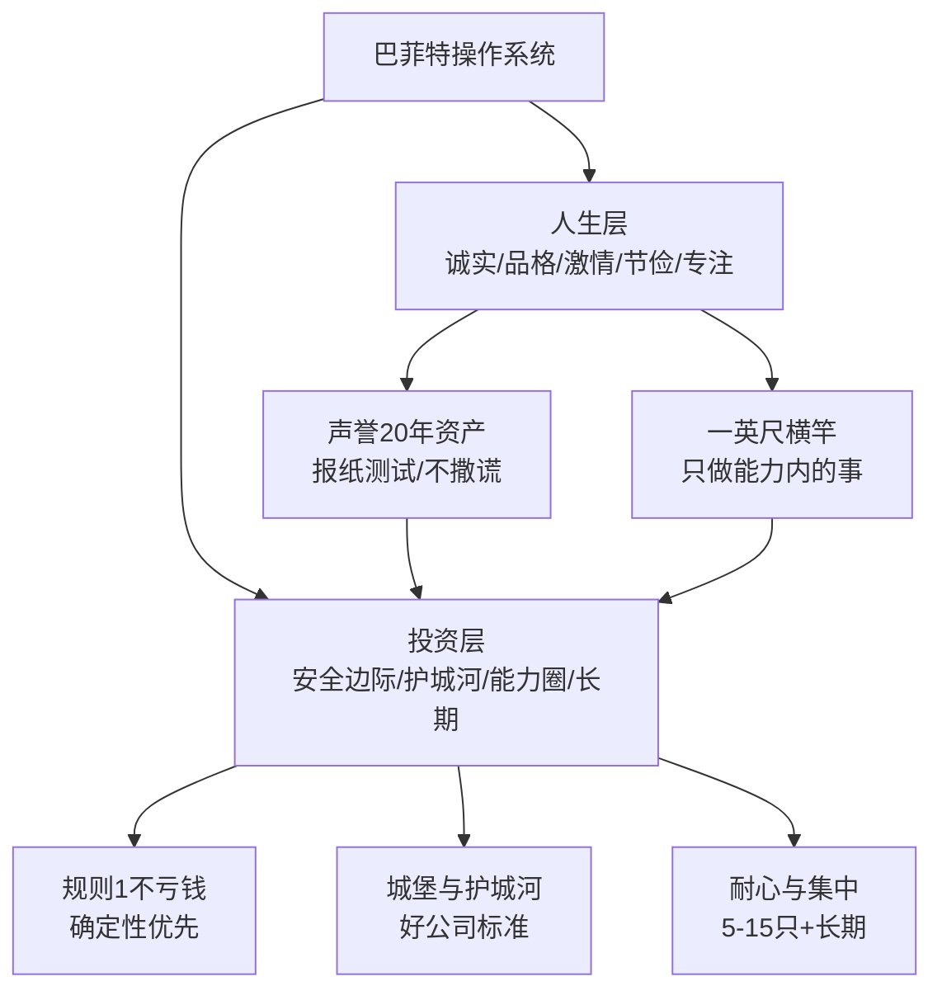
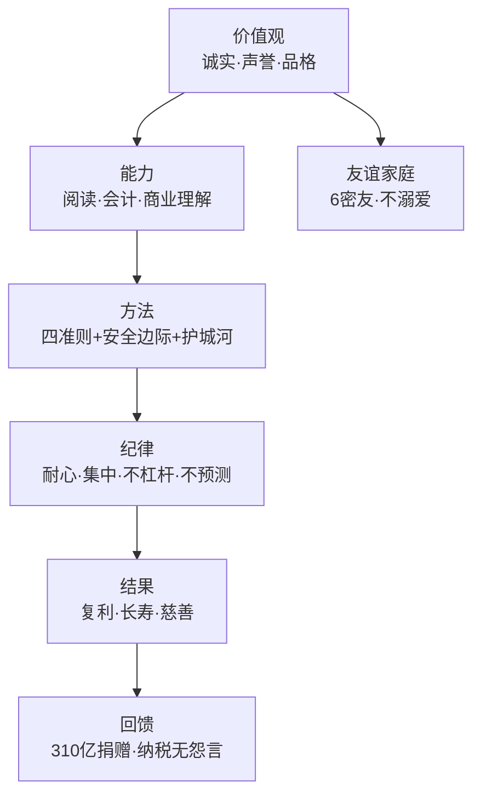
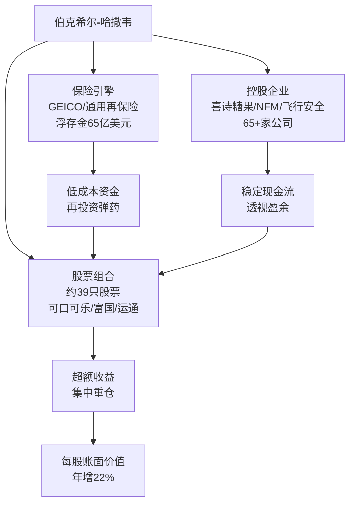
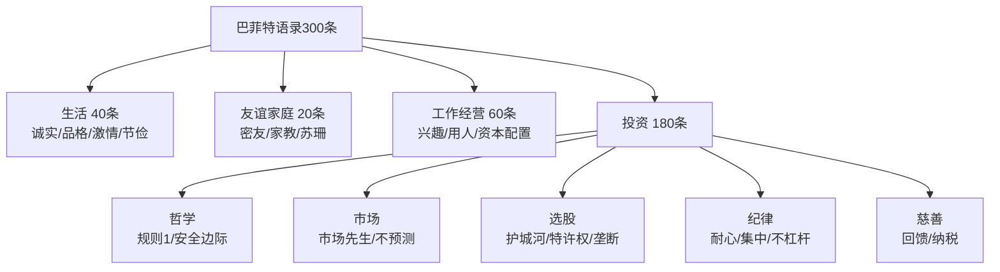

# 17《沃伦·巴菲特如是说》深度解读（详细版）

> 巴菲特亲口说出的人生与投资箴言——"没有人会比巴菲特更了解巴菲特"

## 📖 本书概览

| 项目 | 内容 |
|------|------|
| 书名 | 沃伦·巴菲特如是说（Warren Buffett Speaks） |
| 作者 | 珍妮特·洛（Janet Lowe），美国财经作家，巴菲特研究权威 |
| 体例 | **巴菲特格言警句集**——以巴菲特自己的话语为主体，辅以背景叙述 |
| 出版背景 | 1997 年初版，2007 年更新版（增补中石油、慈善捐赠等新内容） |
| 核心命题 | 巴菲特的语言是理解巴菲特的最佳入口——"也许除了他自己的话语之外，其他语言都不足以充分勾勒出独一无二的巴菲特" |
| 全书结构 | 绪论 + 6 章（生活/朋友/家庭/工作/经营/投资）+ 结束语 + 3 附录 |
| 系列位置 | **17《巴菲特如是说》= 原声语录集**：与 [[16《巴菲特的投资组合》深度解读（详细版）|16 投资组合（方法论）]]、[[14《巴菲特投资学大全集》深度解读（详细版）|14 大全集（全景）]] 互补——一本听巴菲特"怎么说" |

## 🎯 为什么这本书值得单独解读

- **第一手原声**：全书近 300 条巴菲特原话——从"规则1：绝不能亏钱"到"股票并不知道你拥有它"，是理解巴菲特思维的最短路径
- **生活与投资并重**：前 5 章讲生活/朋友/家庭/工作/经营（诚实、品格、激情、节俭、忠诚），第 6 章讲投资——巴菲特认为**人生哲学是投资哲学的地基**
- **独有轶事**：普利策奖调查、所罗门"报纸测试"、富国银行圣诞树、时思糖果 2500 万 3 倍账面价、可口可乐 1919 年 40 美元→180 万美元、加油站 8 亿美元机会成本
- **A 股直接相关**：中石油 4.88 亿→33 亿美元的完整记录（本书独有细节）

## 📑 目录

- [[#第1章 关于生活：精彩地生活，知足常乐|第1章 关于生活：精彩地生活，知足常乐]]
- [[#第2章 关于朋友：友谊的真谛与一生的伙伴|第2章 关于朋友：友谊的真谛与一生的伙伴]]
- [[#第3章 关于家庭：不溺爱孩子的哲学|第3章 关于家庭：不溺爱孩子的哲学]]
- [[#第4章 关于工作：做喜欢的工作，成功会接踵而至|第4章 关于工作：做喜欢的工作，成功会接踵而至]]
- [[#第5章 关于经营：价值管理者的经营之道|第5章 关于经营：价值管理者的经营之道]]
- [[#第6章 关于投资：简单、保守、精简的规则|第6章 关于投资：简单、保守、精简的规则]]
- [[#附录一 巴菲特原声金句集（60 条精选）|附录一 巴菲特原声金句集（60 条精选）]]
- [[#附录二 人生哲学 × 投资哲学：巴菲特的双层操作系统|附录二 人生哲学 × 投资哲学：巴菲特的双层操作系统]]
- [[#附录三 系列互链：本书与 16 本笔记的呼应点|附录三 系列互链：本书与 16 本笔记的呼应点]]
- [[#附录四 语录主题速查索引（按需求找原话）|附录四 语录主题速查索引（按需求找原话）]]
- [[#总结：格言背后的巴菲特心智模型|总结：格言背后的巴菲特心智模型]]

## 🔗 双链导读（本笔记与系列的连接点）

| 连接主题     | 本书章节   | 关联笔记                      |                       |
| -------- | ------ | ------------------------- | --------------------- |
| 护城河城堡原话  | 第6章    | [[13《巴菲特的护城河》深度解读（详细版）| 13 护城河]]（本书是护城河比喻的出处） |
| 集中投资/多元化 | 第6章    | [[16《巴菲特的投资组合》深度解读（详细版）| 16 投资组合]]（方法论展开）      |
| 市场先生     | 第6章    | [[14《巴菲特投资学大全集》深度解读（详细版）| 14 大全集]]（体系全景）        |
| 巴菲特生平    | 绪论/第3章 | [[14《巴菲特投资学大全集》深度解读（详细版）| 14 大全集第1—4章]]（传记版）    |
| 伯克希尔/所罗门 | 第5章    | [[11《巴菲特的伯克希尔崛起》深度解读（详细版）| 11 伯克希尔崛起]]（现场案例）     |
| 收购标准     | 第6章    | [[14《巴菲特投资学大全集》深度解读（详细版）| 14 大全集第9章]]（求购声明）     |
| 中石油      | 第6章    | [[14《巴菲特投资学大全集》深度解读（详细版）| 14 大全集第5章]]（卖出逻辑）     |
| 交易对照     | 第4章    | [[01《股票作手回忆录》读书笔记| 01 利弗莫尔]]（投机 vs 投资）   |

---

## 第1章 关于生活：精彩地生活，知足常乐

### 1.1 章首定位：先学会生活，再学习投资

> 尽管他跻身于世界上最富有的人之列，但他的朋友查理·芒格说巴菲特是他所认识的、最幸福的人之一。——在阅读巴菲特谈论如何成功地进行投资之前，让我们先来看看他所强调的更为重要的问题：**精彩地生活、知足常乐**。

**巴菲特的绰号**（绪论）："金融界的阿甘"（《名利场》）、"奥马哈之神"、"奥马哈的朴素商人"、"因循守旧的资本家"、"沃伦爵士"、"金融界的威尔·罗杰斯"、"钻石之王"（因收购波珊珠宝商店——美国第二大珠宝商店）。

### 1.2 奥马哈情结：为什么留在"美丽的小岛"

**童年**：父亲霍华德·巴菲特当选国会议员后全家搬到华盛顿，12 岁的巴菲特得了严重思乡病——

> "我得了严重的思乡病，我告诉父母自己躺下来时几乎无法呼吸。"

最终父母让他回奥马哈和爷爷住到学期结束。

**成年后的选择**（1956 年，25 岁回奥马哈定居）：

> "我曾在纽约和华盛顿居住过，但纽约拥挤的交通浪费了太多时间。我可以搭乘飞机花 3 小时飞到纽约和洛杉矶享受大城市的繁华，但我无法忍受住在那儿。"

> "我认为这里（奥马哈）是一个更适合居住的地方。……用不了多久，我的行为就会不受控制，变得疯狂。我想还是这里更适合思考。"

| 城市 | 巴菲特的态度 |
|------|-------------|
| 纽约 | 拥挤的交通浪费时间；"行为会不受控制，变得疯狂" |
| 奥马哈 | "美丽的小岛"；更适合思考、研究和生活 |

### 1.3 以自己想要的方式生活

> "证券投资吸引我的地方之一就在于能以自己的方式生活，而不必穿得像个成功人士。"

> "我无法忍受一生之中有什么东西是我想要却无法拥有的。"

> "赚钱要比花钱容易。"

### 1.4 想吃什么就吃什么 & 要有业余爱好

- **樱桃味可口可乐**：从百事可乐转向可口可乐（确切地说是樱桃口味）；苏珊说"他身上流的不是血，而是百事可乐，他有时甚至以百事可乐当早餐"
- **私人飞机"站不住脚号"**：一时冲动买下，本想命名"查理·芒格号"，但芒格宁愿坐经济舱也不坐；巴菲特说"我想我是爱上了这架飞机，我要把它带进坟墓"——1995 年收购奈特捷（NetJets）后狂热结束，开始乘部分所有权飞机

### 1.5 充满激情 & 志存高远

**激情与目标**（年会问答）：

> 股东问：既然你已经成了美国最富有的人，接下来的目标是什么？
> 巴菲特："这很容易回答，我接下来的目标就是要成为美国最长寿的人。"

**一英尺横竿哲学**（与 7 英尺横竿对照）：

> "我不会试图跃过 7 英尺高的横竿：我会环顾四周，寻找一根 1 英尺高的横竿，因为我知道这个高度是我能跃过的。"

**"被卡车撞了"的经典回答**（年会高频问题）：

> "我通常只能说，我只能对那辆卡车表示遗憾。"

### 1.6 定位准确 & 专注于既定目标

> "正如韦恩·格雷茨基所说的那样，要冲向冰球将要到达的位置，而不是它当前所处的位置。"

> "要想迅速游完 100 米的话，最好顺着大浪游，这比仅靠你自己的努力要轻松得多。"

> "如果我们乘坐列车从纽约前往芝加哥，我们绝不会中途在奥尔托纳下车。"

**研究失败而非成功**（逆向学习法）：

> "我总觉得研究公司失败要比研究公司成功能让我学到更多东西。商学院通常研究公司的成功，但我的合伙人芒格却说他希望知道哪里是自己的死穴，这样他就不会犯下致命错误。"

### 1.7 规划人生蓝图 & 诚实

**书桌上的笔记本**：

> "除非发生核战，否则都要谨遵这一格言。"

**1985 年回顾 20 年 22% 复合增长**："这就像经历了一个奢侈的青春期。"

**鸡尾酒会上的价值观**：

> "我并不以我赚的钱来衡量我的人生价值。其他人可能会这么做，但我肯定不会。"

**告诫儿子霍华德**（声誉的数学）：

> "建立声誉要花 20 年的时间，但毁掉它只需短短的 5 分钟。你只要想到这一点，处事之道就会有所不同。"

**关于说谎**：

> "在任何情况下都不要说谎，不要理会律师的话。……只要是你所说的就是你亲眼所见的真相，你不会有任何麻烦。"

**9 岁股东尼古拉斯的故事**（诚实细节）：1990 年年会上 9 岁的股东尼古拉斯质疑股价下跌；次年发现年报把自己的年龄错写成 11 岁，质问"我如何才能知道后面（财务报表中）的数字是正确的呢？"——巴菲特承诺书面回复。

### 1.8 请说出事实的真相：普利策奖的故事

**《太阳报》调查报告**（1969 年收购奥马哈周报后）：传闻"弗拉纳根男孩城"（为无家可归男孩提供庇护的非营利组织）博取同情积累捐款却未用于孩子。

- 巴菲特告诉记者 IRS 新规要求慈善基金填报报表 990 公布资产状况
- 暗中调查甚至在地下室工作，保密到位
- 8 页调查报告出版引发震撼——**获 1973 年普利策奖**

> 《太阳报》发行人斯坦·利普西："没有巴菲特，就没有这则传奇性的调查报告，就不会有普利策奖，这都是他的功劳。是他告诉我们关于报表 990 的细则，并帮助我们分析了男孩城高达 2.19 亿美元的巨额资产。"

### 1.9 培养良好品格：格雷厄姆的清单练习

**习惯的力量**：

> "直到你发现这些习惯是如此难以改变时，你才发现原来自己有许多习惯。"

**品格清单练习**（巴菲特给学生/听众的经典互动）：

> "有趣的是，当你斟酌头脑里浮现出的各种各样的想法时，你并不会考虑那些连你自己都无法实现的能力。你不会考虑有谁能跳 7 英尺高，有谁能将球踢出 65 英尺远，有谁能背出圆周率小数点后的 300 位……你考虑的是一个人性格中所有品质的综合。事实上，每一个人都能具备所有的那些品质，但这在很大程度上取决于一个人的习惯。"

**格雷厄姆的 12 岁清单**：格雷厄姆 12 岁时记下在别人身上看到的、所有他欣赏以及讨厌的品质——"他审视自己的清单，发现没有任何与 9.6 秒内跑完 100 码或跳 7 英尺高有关的记录，它们全部都是决定你能否成为某一类人的习惯。"

### 1.10 相信自己 & 不要过于自信

**20 岁的自信**（在父亲经纪公司上班时）：朋友问公司是否更名为"巴菲特父子公司"——

> "不，它将更名为巴菲特子父公司。"

> "我从不缺乏自信，也从不气馁。我一直坚信我会成为有钱人，对于这一点，我从未动摇过。"

**不过分自信的谦逊**：

> "我既不是班上最受欢迎的孩子，也不是最不受欢迎的孩子，我毫不起眼。"

**格雷厄姆拒绝免费劳工**："格雷厄姆习惯性地计算了我的价值和开价后，拒绝了我。"

**棒球开场球的自嘲**（投得不好）："我朝看台上望去，看见那些孩子正在擦掉我的签名。"

### 1.11 不要上当 & 分享智慧 & 不服老

**对溢美之词的怀疑**：

> "可能来自法国一座面积只有 8 英亩的小葡萄园的葡萄确实是世界上最好的葡萄，但我一直怀疑这杯酒中 99% 都是言过其实的溢美之词，只有 1% 才是真材实料的葡萄。"

**150 亿现金的幽默**（CNBC 采访）："是的，但我现在身上没带这么多。"

**盖茨买订婚戒指**（波珊珠宝）："我不能给你任何建议或折扣……但在 1951 年，我为妻子买的那枚订婚戒指花掉了我净资产的 6%。"（盖茨净资产的 6% ≈ 5 亿美元）

**退休计划**：

> "退休计划？在我去世 5 年或 10 年后再说吧。"

> "我们觉得自己都是玛士撒拉。"（《圣经》中活到 969 岁的人物）

**可口可乐管理层的常青树**："如果你还有出生于 1927 年的老朋友，那么就祈祷他们长寿吧。"

### 1.12 本章小结

巴菲特的生活哲学可浓缩为五条：**留在能思考的地方（奥马哈）、只跨一英尺的横竿、把声誉当 20 年资产经营、品格是习惯的产物、激情而不失谦逊**——这些不是投资的装饰，而是投资的底座。

---

---

## 第2章 关于朋友：友谊的真谛与一生的伙伴

### 2.1 友谊的检验标准

**6 位密友**：

> "我有 6 位密友，3 位是男性朋友、3 位是女性朋友。我喜欢他们、欣赏他们，我对他们是不设防的。"

**奥斯维辛幸存者的标准**：

> "我记得我曾问过从奥斯维辛集中营生还的一位妇女这个问题。她说她对于友谊的检验标准是：'他们会帮助我藏身吗？'"

### 2.2 为朋友打抱不平：奥马哈俱乐部的故事

**反歧视行动**（巴菲特自述）：

> "一次，我在奥马哈俱乐部吃午饭……我注意到那里几乎没有犹太人。他们告诉我'犹太人有他们自己的俱乐部'。……这完全不公平。因此我花了 4 个月的时间申请加入了犹太人俱乐部。……当我重新回到奥马哈俱乐部后，我告诉他们犹太人俱乐部如今不再全都是犹太人了。我还帮助两三位犹太人俱乐部成员申请加入了奥马哈俱乐部。如今我们消除了原来的隔阂。"

**启示**：巴菲特对不公不会沉默——**行动比立场重要**。

### 2.3 建立一生的友谊：格雷厄姆社团与芒格

**格雷厄姆社团**（1968 年科罗拉多之行后，每隔一年聚会）：

> "他们那时都还是中产阶级，但现在都已经非常富有。他们没有创造诸如联邦快递之类的神话，他们只是一步一个脚印地前进。格雷厄姆把这一切都写进了他的书里。一切就是这么简单。"

**芒格：最好的朋友兼最好的生意伙伴**：

- 和巴菲特一样在奥马哈长大，十几岁时便在巴菲特爷爷欧内斯特的杂货店工作
- 芒格回忆："巴菲特家的商店给了我最初的商业启蒙。我每天必须工作很长时间，而且必须努力工作，以确保不出错。这使得包括我在内的很多年轻伙计想寻找一份较为轻松的职业。"

**巴菲特对芒格的评价**："我告诉他，法律作为爱好是不错，但他可以做得更好。"

### 2.4 本章金句

> 1. "我对他们是不设防的。"——巴菲特论 6 位密友
> 2. "他们会帮助我藏身吗？"——友谊的终极检验
> 3. "他们只是一步一个脚印地前进。格雷厄姆把这一切都写进了他的书里。一切就是这么简单。"

---

## 第3章 关于家庭：不溺爱孩子的哲学

### 3.1 芒格解读巴菲特的家教

> "巴菲特对待他的孩子像对待雇员一样严格。因为他并不认为，如果爱某个人，为他着想的方式就是给予他一些他没有资格享有的东西。这是巴菲特性格的一部分。"

### 3.2 巴菲特的孩子们：各自闯出事业

| 孩子 | 特点 | 事业方向 |
|------|------|---------|
| 苏茜（长女） | 想让内布拉斯加显赫家族香火延续 | 慈善事业（苏珊·汤普森·巴菲特基金会） |
| 霍华德（长子） | 稳健财政政策支持者、国际环保主义者 | **伯克希尔帝国毫无悬念的继承人** |
| 彼得（次子） | 热爱音乐、富有创造性的梦想家 | 音乐家（创作《内布拉斯加州》一曲） |

**小苏茜的童年记忆**："爸爸每晚都哼着'在彩虹的那一端'哄我入睡。……在很长的一段时间里，我甚至不知道他从事什么工作。在学校里，他们问我父亲的职业，我说他是一名安全系统分析师。"

### 3.3 和妻子相濡以沫：苏珊的故事

**评价**："她与世无争，崇尚精神的自由。"

**特殊的关系**：1977 年苏珊搬到旧金山后分居但未离婚——经常一起旅行、参加家庭聚会；苏珊任职伯克希尔董事会，以自己名义拥有公司 2.2% 股份（价值 30 亿美元）。

**最后的陪伴**：2003 年确诊口腔肿瘤，手术化疗；2004 年 7 月 29 日在怀俄明州科迪市拜访朋友时突然中风，巴菲特一直陪伴至去世。

**苏珊的夜总会勇气**："我以自己为豪，因为没有什么事情比在公开场合唱歌更让我备受打击了。但我很自豪，因为我做到了，我几乎不相信自己能做到这一点。"

**苏珊去世改变了巴菲特**："他似乎意识到一切都是短暂的，包括他自己。"——两年后与阿斯特丽德·门克斯再婚。

### 3.4 善待母亲：凯迪拉克与健身脚踏车

**给 92 岁母亲的礼物**（两台健身脚踏车 + 一辆凯迪拉克）：

> "在这两台机器上我们一共骑了 25000 英里，但所有这些里程都是她骑的……我应该给她买辆自行车，而不是凯迪拉克。"

**母亲的神采飞扬**："巴菲特送给我一辆凯迪拉克作为我 80 岁生日的礼物，我只开了 8000 英里，但我在健身脚踏车上骑了 19190 英里。"

### 3.5 本章金句

> 1. "他对待他的孩子像对待雇员一样严格。"——芒格解读巴菲特
> 2. "她与世无争，崇尚精神的自由。"——巴菲特论苏珊
> 3. "没有什么事情比在公开场合唱歌更让我备受打击了。但我很自豪，因为我做到了。"——苏珊

---

## 第4章 关于工作：做喜欢的工作，成功会接踵而至

### 4.1 为兴趣工作：1951 年的华尔街

**时代背景**（巴菲特毕业时）：道琼斯指数只有 200 点；1945—1949 年股市低迷（最高约 190 点，最低约 160 点）；1949 年后才开始上升——"所以在当时，华尔街并不是一个能赚很多钱的地方……它和现在截然不同。"

**为钱而结婚的比喻**：

> "我认为那是一种疯狂的生活方式。无论在什么情况下，这可能都是个坏主意。但如果你已经很富有，这种情况绝对不会发生。"——和不喜欢的人一起工作就像"为钱而结婚"

### 4.2 及早开始：11 岁的第一只股票

**城市服务公司优先股**（11 岁，与姐姐多丽丝合买 3 股，38 美元/股）：

| 阶段 | 股价 | 反应 |
|------|------|------|
| 买入 | 38 美元 | — |
| 下跌 | 27 美元 | "开始有一些焦虑" |
| 反弹 | 40 美元 | 抛掉 |
| 之后 | 一路涨到 200 美元 | 教训：**赚钱需要耐心** |

**童年的生意清单**：高价卖可乐给朋友、发行赛马内幕（《马夫的选择》）、分发报纸、当高尔夫球童、25 美元买弹球游戏机（"威尔逊印钞机公司"，第一天赚 4 美元）——"我认为我已经找到了方向。"

### 4.3 在喜欢的地方工作

> "内幕消息和充足的资金会使你在一年之内破产。"——为什么离开纽约（谣言温床）

> "奥马哈是一个养育孩子和生活的好地方。在这里，你能更好地思考，能更好地研究这个市场，你不会听到很多传闻，能安静地坐在桌前对着电脑分析股票。"

### 4.4 和优秀的人共事 & 善于鼓励别人

> "我认真选择和我共事的每一个人，因为对于公司的运行来说，人归根结底是最重要的因素。我不和自己不喜欢或不赏识的人打交道，这是关键。在这方面，我就像对待结婚一样慎重。"

**用人三品质**（引用他人观点）：

> "雇用员工时，必须同时考虑三种品质：正直、智慧和勤奋。但如果他们不具备第一点品质，其余两点品质对你有害无益。"

**鼓励的艺术**（1984 年给凯瑟琳·格雷厄姆的信）：

> "伯克希尔公司在 1973 年春季和夏季买进了《华盛顿邮报》的股票。这些股票的总成本为 1060 万美元，而如今市值为 1.4 亿美元……若投资于道琼斯公司，现在值 5000 万美元；若投资于甘尼特报业集团，现在值 3000 万美元……因此，感激之情溢于言表，感谢你们让我的财富由 6500 万美元上升到 1.1 亿美元。"

### 4.5 忠于合作伙伴 & 珍惜时间 & 急流勇退

**狗的忠诚寓言**（金钱与权力的警示）：

> "一次我们家的一条狗爬到了屋顶，我儿子叫它下来，它居然就跳了下来，很幸运它没有死，只是摔断了一条腿。它太愚蠢了，但它只是因为对你太忠诚，因此就义无反顾地从屋顶跳下来……我也能让人们这么做，但我并不希望这样。"

**大都会的承诺**（有问题的孩子比喻）：

> "这就好比你有个有问题的孩子，你不会轻易放弃希望。我们并不打算在 5 年内出售这些投资，事实上我们已经结成了同盟。"

**时间管理**（长子霍华德的领悟）："我父亲不会使用剪草机……我也从未见过他修剪草坪、修葺篱笆或洗车。我记得过去我曾对此表示不满，直到长大后我理解了时间的价值。"

**急流勇退**（1969 年解散合伙公司，38 岁）：

> "我不想穷尽一生的时间来和投资时机赛跑。我没有积累巨额财富的强烈愿望。使我放慢脚步的唯一方法就是停下来。"

> "不值得做的事情不值得认真去做。"——巴菲特的工作哲学核心

### 4.6 本章金句

> 1. "做喜欢的工作，成功会接踵而至。"——哲学家（本书章首引语）
> 2. "内幕消息和充足的资金会使你在一年之内破产。"
> 3. "我不和自己不喜欢或不赏识的人打交道……就像对待结婚一样慎重。"
> 4. "不值得做的事情不值得认真去做。"
> 5. "使我放慢脚步的唯一方法就是停下来。"

---

---

## 第5章 关于经营：价值管理者的经营之道

### 5.1 善于沟通：写给姐姐的年度信

**巴菲特写信的对象**：

> "我只是假设我的姐姐拥有公司的另一半，她整年都在旅行。她并不是对公司经营一无所知，但也不是专家。我并不觉得图表有什么不妥，只是觉得当人们强调某件事情时，总倾向于忽略真实的信息，而过于注重信息的表现形式。"

**写作即思考**：

> "如果你能够真正理解一种想法，就应该能够很好地表达它，使其他人也能领会。……没有任何东西能像写作这样迫使你思考，理顺你的思路。"

### 5.2 知道什么时候说"不"：沉默的纪律

**标准答复**（员工对外统一口径）："我们从来都不评论我们的投资，也不回应有关我们投资的传闻，这是伯克希尔公司长期以来的政策。"

**沉默的原因**：

> "如果我说了什么，那是因为我知道它（吸引他的低价）将成为过去。在金融市场中，你不能暴露自己的重大决定。"

### 5.3 树立榜样：所罗门兄弟的"报纸测试"

**1991 年临危受命**任所罗门兄弟临时主席时对 9000 名员工的要求：

> "尽管规章制度是必不可少的，但一种鼓励模范行为的氛围甚至可能比规章制度更重要。……在考虑任何公司行为时，员工必须问问自己，他是否愿意看到这一行为被消息灵通、富有批判精神的记者在当地报纸的首页加以报道，而他的配偶、孩子和朋友都会读到这则新闻。"

> **"报纸测试"**：行为是否经得起登上报纸头版的检验——后来成为商业伦理的经典标尺。

**年会的"斯大林模式"议程**（幽默自嘲）：会议议程将以我们惯常的"斯大林模式"进行——少数人说话，多数人聆听。

### 5.4 关心股东：让股东觉得是主人

**皮尔逊的故事**（1965 年，巴菲特已不收新合伙人，聊了一小时后）：“好吧，看起来你像是一个不错的合伙人。”——皮尔逊成为"巴菲特百万富翁俱乐部"成员。

**董事会的股东导向**：董事会成员本身就是公司股东、持有大量股票；**不为董事和高管投保责任险**（若管理不当面临巨额罚款——利益绑定）。

**年会吸引力之谜**：

> "他们之所以来参加年会，是因为我们让他们觉得自己是公司的主人。"

### 5.5 雇用的人好，管理的就少

**聘用表格里的问题**："你是不是一个充满激情的人？"

**理想经理人**：

> "我喜欢那些忘记他们已经把公司卖给了我，却仍然像公司的所有者那样经营公司的家伙。打个比方，就好像我和某人的女儿结婚，但若她仍坚持和父母住在一起，那我的感觉肯定不太好。"

**罗伯特·迈尔斯的评价**：巴菲特不仅是一位价值投资者，还是一位"价值管理者"。

### 5.6 阅历更重要：没有退休年龄

**伯克希尔 CEO 平均服务 23 年**：

> "你认为自己真的能向一条鱼解释清楚在陆地上行走的感觉吗？若它能在陆地待上一天，它自己获得的感知胜于我们长达 1000 年的游说。经营公司一天所获得的价值便是如此。"

> "一般来说，白发不会让我们在竞技场上受到伤害，因为我们不依靠敏捷的身手或发达的肌肉来赚钱（谢天谢地）。只要我们的头脑仍然能有效地思考，芒格和我能像过去一样把工作做得很好。"

### 5.7 善于配置资本 & 勇敢 & 能力的交叉

**资本配置的自由**（全资拥有的好处）：

> "我们不属于钢铁行业，不属于鞋业，从本质上说，我们不属于任何行业。……因此，我们会把资本从保险公司转移到其他对于伯克希尔更有战略意义的公司。"

**100 美元的卡耐基课程**（克服演讲恐惧）：

> "参加这个课程并不是为了使我在公开演讲时膝盖不发抖，而是为了使我能克服公开演讲之前的恐惧心理。"

**商人 × 投资者的双重身份**：

> "我是一位比较成功的投资者，因为我本身还是一位商人；我是一位比较成功的商人，因为我本身还是一位投资者。"——能力交叉是巴菲特最独特的优势

> "我觉得管理和投资是有共通之处的，没有必要为了得到特别的结果做刻意的努力。"

### 5.8 伯克希尔-哈撒韦公司：强大的投资机器

**起源的误会**："在很长一段时间里，如果你提到伯克希尔-哈撒韦这家公司，人们会问：'它不是生产 T 恤的吗？'"

**纺织厂的转型**：新英格兰日渐衰落的纺织厂——巴菲特承认"这是自己投资生涯中所犯的最大错误"；多次拯救未果后关闭工厂，但**保留了公司的躯壳**，逐渐改造成世界上最伟大的控股公司。

**复利对比**（1965 年投入 1 万美元到 2006 年）：

| 投资方式 | 2006 年价值 |
|---------|-----------|
| 伯克希尔-哈撒韦 | **超过 3000 万美元** |
| 标准普尔 500 指数 | 只有 50 万美元 |

**核心数据**：自 1965 年每股账面价值年增约 22%（标普 500 约 10.4%）；21.7 万雇员；年收入近 1000 亿美元；超过 65 家公司的母公司；约 39 只不同公司股票；通用再保险是世界上唯一 AAA 级再保险公司。

### 5.9 本章金句

> 1. "没有任何东西能像写作这样迫使你思考，理顺你的思路。"
> 2. "在金融市场中，你不能暴露自己的重大决定。"
> 3. "他是否愿意看到这一行为被记者在当地报纸的首页加以报道？"——报纸测试
> 4. "他们之所以来参加年会，是因为我们让他们觉得自己是公司的主人。"
> 5. "我是一位比较成功的投资者，因为我本身还是一位商人；我是一位比较成功的商人，因为我本身还是一位投资者。"

---

---

## 第6章 关于投资：简单、保守、精简的规则

### 6.1 投资哲学：两条规则与格雷厄姆三观点

**巴菲特投资规则的全部**：

> "规则 1：绝不能亏钱；规则 2：绝不要忘记规则 1。"

**零的数学**：

> "经年累月，许多非常精明的人终于明白了不管多么长串的数字乘上零总是等于零。"

**格雷厄姆知识体系三观点**（巴菲特总结）：

> "你必须把公司看作是由股票组成的，把（市场）波动看作是你的朋友而非敌人，要记住利润来源于忽略市场波动而非对市场波动'助纣为虐'。"

### 6.2 认清敌人：通货膨胀

**通胀 = 最隐蔽的税**：

> "通货膨胀是一种比立法机关所颁布的任何政策都更具有破坏性的税赋，它有一种消耗资本的惊人能力。假设有一个寡妇，存款的储蓄利率为 5%，对她而言，在零通货膨胀时期为利息收入支付 100% 的所得税与在通货膨胀率为 5% 的年份支付零所得税是没有区别的。"

**战胜通胀的幻想**：

> "如果你觉得你能通过在证券市场上长袖善舞来战胜通胀，我愿意做你的经纪人，但不是你的合伙人。"

**通胀时代的投资对策**：买进收益强劲公司的股票（盈利好的公司通常拥有最高信用等级，通胀引发的融资需求反而是它们的机会）。

### 6.3 经验的顿悟：从图表到《聪明的投资者》

**19 岁时的"朝圣"**（内布拉斯加大学四年级读到《聪明的投资者》）：

> "当时我仍在苦苦摸索：我搜集图表，阅读所有的技术分析素材，听信一些似是而非的所谓技巧。就在这时，我读到了格雷厄姆的《聪明的投资者》，就像看见了指路的明灯。"

> "我并不想使自己听起来像一个虔诚的狂热分子，但它确实使我深深着迷。"——学到"为 40 美分买进 1 美元"的哲学

> 🔗 **对照**：巴菲特年轻时也曾是技术分析信徒——这与 [[01《股票作手回忆录》读书笔记|01 利弗莫尔]]、[[03《利弗莫尔的股票交易方法量价分析》深度解读（详细版）|03 量价分析]] 代表的交易派形成"同一起点、不同归宿"的镜像。

### 6.4 别在意教授怎么说：有效市场批判

> "如果市场总是有效的话，我将成为一无所有的乞丐。"

> "在一个人们都相信市场有效性的市场上进行投资，就像和被告之不需要盯着手中的牌的人打桥牌一样容易。"

> "商学院教导成千上万的学生：思考是没有任何好处的。这对我来说，非常有利。"

### 6.5 市场先生：你的仆人而非领导

**"市场先生"的定位**：格雷厄姆创造的寓言——股票市场应被视为一位受情绪摆布的商业搭档，每天给出报价，无论你多么频繁地拒绝，第二天照旧。

> **"市场先生"是你的仆人而非领导。**

**1989 年 3 月股市大跌时的纪律**：

> "我们不知道超卖会持续多久，我们也不知道什么能够改变促使政府、债权人和买方疯狂抛售的态度。但我们知道别人越不谨慎地管理他们的投资时，我们就必须越发谨慎地管理我们自己的投资。"

**忽略"市场先生"的情绪**：

> "我和芒格从不对市场妄下判断，因为这没有任何好处，反而可能影响我们原有的正确判断。"

> "你不可能由于把握住市场风向就变得富有。市场是一个参照物，我们只能借此判断某人是否在做蠢事。我们在股票市场上进行投资，实际上就是对公司进行投资。"

### 6.6 聆听机遇的召唤：荒岛与妻妾成群

**巴菲特的市场温度计**：市场上几乎没有可买的低估股票（牛顶）或太多值得买的好股票（熊底）——他依据"猎物多寡"而非预测判断。

**1973 年牛市顶部**：

> "我觉得自己就像是流落在一座荒芜孤岛上的、雄性荷尔蒙分泌旺盛的家伙——我几乎找不到可以买进的股票。"

**1974 年熊市底部**：

> "我觉得自己就像妻妾成群的、雄性荷尔蒙分泌旺盛的家伙——是时候开始投资了。"

### 6.7 价格与价值、内在价值与收益

**价格 vs 价值**：

> "价格是你支付的钱，而价值是你得到的钱。"

**中央州立保险赔偿公司成交记**（1992 年收购，10 倍年收益报价）：卖方报出 1 亿美元后想乘胜追击报 1.25 亿——

> 巴菲特："太迟了，我已经决定了，就 1 亿美元。"

**内在价值没有公式**：

> "没有公式可以计算内在价值。你必须了解你打算买进股票的那家公司的情况才能获得有关内在价值的信息。评估公司的内在价值既是一门艺术又是一门科学。"

**买入时机**：

> "我们并不一定非得等到价格触底时才买进。但若公司的价格低于你认为这个公司应有的价值时，就必须抛掉，而且公司必须是由诚实、有能力的人来管理。"

**收益！收益！收益！**（可口可乐例）：

> "最近一次我们买进可口可乐的股票时，它的价格大约是收益的 23 倍。但把我们的买入价和今天的收益进行比较，发现价格仅为收益的 5 倍。股票的价值的确是投入资本、投入资本回报和未来产生的资本，与当天买入价比较之后的综合结果。"

### 6.8 规避风险：确定性是唯一的解药

**蒂莫西·维克的评价**："人们说巴菲特是伟大的股票价值发现者，我却把他看作伟大的风险规避者（规避收益差的投资）。"

**巴菲特的风险观**：

> "我非常注重确定性……如果你也能做到这一点，那么风险不会对你产生任何影响。如果你承受了巨大的风险，那么归根结底是由于你对于未来的结果是不确定的。如果你分散买进一些值得投资的证券，就不会有风险。"

**华盛顿邮报：无风险投资的例子**（1973 年市价 8000 万美元、无债务）：

> "如果你问任何一个生意人，《华盛顿邮报》的资产值多少钱，他们会告诉你大约值 4 亿美元。"——1/5 的价格买入，这就是无风险

### 6.9 不要赌博、避免过度负债、套利三类型

**赌博心理的本质**：

> "如果奖金很诱人但参与费用很低，则不管赢的机会多么微乎其微，人们都会有赌博倾向。这就是为什么拉斯维加斯的赌场要大肆宣传巨额累积赌注。"

**交易成本与经纪商**：

> "交易越活跃，公众付出的成本就越高，在这些交易背后流入经纪商口袋的钱就越多。"

**大赌场比喻**：

> "你正在和这个市场上众多愚蠢的人打交道。这就像一个大赌场，每个人都已经喝得酩酊大醉，如果你能坚持只喝可乐，那么你应该能赢钱。"

**负债=方向盘上的匕首**：

> "你某天会因为地面崎岖不平而受到伤害。"——巴菲特把负债称作"系在公司方向盘上的匕首，直指其要害"

> 芒格："我和巴菲特都不敢借钱来买股票。如果你以自己的股票为抵押获得借款来购买股票，虽然因股价下跌而亏损，从而无力偿还借款的可能性很小，但始终是存在的。因此，完美的做法是以一种不会受临时因素干扰的方式筹集资金。"

**投资活动三种类型**（巴菲特投资方式的完整分类）：

| 类型 | 内容 |
|------|------|
| ①一般性投资 | 投资被低估的、能提供令人满意安全收益的绩优股 |
| ②控股投资 | 控股或完全拥有（如伯克希尔、GEICO 的逐步控股） |
| ③套利或其他特殊投资 | 公司合并、收购、重组、清盘、市场失衡时的机会 |

**套利的坦白**："因为今晚我母亲不在场，我才会向你们承认我曾经从事套利交易。"（在格雷厄姆-纽曼公司学会）

**套利决策要素**："我们密切关注任何与套利交易有关的消息……我们认为该公司的价值应为多少以及我们应支付多少，我们多久才能实现收益，我们还试图计算这一收购成功的可能性。"

---

### 6.10 耐心、独立思考、合适的工具、警惕华尔街

**棒球的耐心哲学**（投资中不存在"不挥棒判好球"）：

> "在投资中，不会出现类似于棒球比赛中打击手未挥棒却被主审判定为好球这样的好事……你唯一能获得'好球'的机会就是不断地挥棒、不断地失误。"

**挥棒时机**：

> "当球还在投手的手套中时，我绝不会挥棒。"

**独立思考**（芒格的评价）：“巴菲特相信，成功的投资从本质上来说，应该是一次独立的投资。”

**理发师比喻**：

> "绝不要问理发师你是否需要理发。"——对经纪商推荐的态度

**预测的真相**：

> "预测通常更多地告诉我们关于预测者的想法而不是真实的未来。"

**合适的工具**（个人投资者的三项必备）：

> "你必须了解公司的运作和会计语言，拥有对这一投资项目的极大热情和易冲动的特性，这些因素也许比智商更重要。因为这一切使你能独立地思考，避免那些不时会感染整个投资市场的各种歇斯底里的情绪对你产生干扰。"

**会计是自卫武器**：

> "如果经理想让你了解公司所发生的一切的话，他们完全可以按照会计准则的要求为你提供会计信息。但不幸的是如果他们想要敷衍你的话，至少对于某些行业来说，他们完全可以在不违背会计准则的前提下做到这一点。如果你无法意识到这两者之间的区别，你就不应该涉足证券投资业。"

**警惕华尔街**：

> "华尔街是唯一一个令那些开着劳斯莱斯的人趋之若鹜，去向那些坐地铁的人请教的地方。"

> "其他领域的全职专业人士，比如说牙医，能为外行人带来很多好处。但总的来说，人们不能从专业的理财顾问那里获得什么好处。"

> "短期交易行为就像无形的脚，不时会把经济踢得偏离了正常轨道。"

### 6.11 能力圈：只买你了解的股票

**能力圈的铁律**：

> "投资必须是理智的，如果你不了解这只股票，就不要和它打交道。"

**衍生品的警告**：

> "如果你把无知和负债结合在一起，那后果将是非常刺激的。"——衍生金融工具的风险是双倍的（不了解 + 杠杆）

> "我希望能解释自己的错误，这意味着我只做自己完全了解的事情。"

**新兴市场的态度**（早期）：

> "理解养育你的文化的独特性和复杂性已经很困难了，更何况别人的文化了。而且不管怎么说，我们的大部分股东都必须用美元来支付账单。"

> "如果我不能在一个规模为 5 万亿美元的市场中赚到钱的话，那么认为只要跑到几千公里之外的地方投资就一定能赚到钱，仅仅只是美好的愿望。"

**中石油（能力圈的例外）**：

| 要素 | 数据 |
|------|------|
| 持股 | 23 亿股（占外国股权 1.3%） |
| 成本 | **4.88 亿美元** |
| 2006 年底市值 | **33 亿美元**（约 6.8 倍） |
| 世界排名 | 按市值第四大石油公司（次于壳牌等） |

**苏丹争议的立场**（激进分子敦促抛售）：

> "我们不能把中国政府的行为看作中国石油公司或者其他诸如中国移动、中国人寿、中国电信之类的大型中国国有公司的行为。因为子公司没有能力控制母公司的政策。"

**能力拓展的方法**（如何扩大圈子）：

> "把你了解的公司都先圈起来，然后把那些不能达到价值底线、缺乏良好管理以及在低潮时不能实现有限风险管理的公司去掉。"

**继承者思维**（深度研究心法）：

> "如果我正密切关注一家保险公司或造纸公司，我会陷入这样的思维框框无法自拔：我会假设自己刚刚继承了这家公司，而这将成为我们家族拥有的唯一资产。我该对此做些什么呢？……我应该走出去和他们交谈，找出这一公司和其他公司相比所具有的强项和弱势。如果你能做到这一点，你可能会比公司的管理层更了解这家公司。"

### 6.12 养成阅读的习惯 & 像记者那样刨根问底

**阅读是工作的全部**：

> "我阅读我所关注的这些公司的年度信件，还阅读其竞争对手的年度信件，这也是非常重要的信息来源。"

**GEICO 研究法**（21 岁时）：

> "我读了大量资料。我终日泡在图书馆里……我从行业内最好的几家公司着手（根据保险业服务评级），关注这一行业的许多公司，阅读与这些公司有关的书籍，阅读公司年度信件，尽可能多地与保险从业人员和公司的管理层交谈。"

**记者思维**（对"水门事件"记者鲍勃·伍德沃德的回答）：

> "投资就像写报道。我让他想象自己被分配去写一篇关于《华盛顿邮报》的、有深度的文章。他会问许多问题，挖掘许多素材。通过这一过程，他会更了解《华盛顿邮报》，发现《华盛顿邮报》也不过如此而已。"

**美国运通田野调查**（巴菲特坐在奥马哈牛排馆收银员后面数多少顾客用美国运通卡结账）——"像记者那样刨根问底"的经典案例。

### 6.13 让投资变得简单 & 深入思考 & 知道你寻找的是什么 & 不要为数学绞尽脑汁

**为什么不做房地产**：

> "既然股票投资如此简单，我为什么还要投资于房地产呢？"

**价值投资的朴素**：

> "（价值投资的）理念看起来似乎很简单也很普通。它就像一个愚蠢的人去上学，却获得了经济学的博士学位。它还有一点像在神学院读了 8 年书，不断地有人告诉你十诫就是你人生的全部。"

**审慎调查的真相**：

> "如果你不得不进行太多的调查，那就意味着这家公司肯定存在问题。"

**大投资 vs 小投资**（合伙公司时期的发现）：

> "当我经营合伙投资公司时，我回顾了自己所有较大规模的投资和较小规模的投资，发现较大规模的投资的收益总是高于较小规模的投资的收益。因为在做出较大规模的投资决策时要接受审查、经受批评、掌握相关知识，应该是非常慎重的，而我们在做出较小规模的投资决策时往往会心血来潮。"

**收购广告标准**（《华尔街日报》求购声明，价值投资者的实操清单）：

| # | 标准 |
|---|------|
| 1 | 大型采购商（税后利润至少 1000 万美元，越多越好） |
| 2 | 已经得到证实的持续收益能力（对未来收益和突然好转不感兴趣） |
| 3 | 公司几乎没有什么债务，权益资本获得很好的回报 |
| 4 | 管理层各司其职（我们无法取而代之） |
| 5 | 业务简单（我们不了解太多技术） |
| 6 | 卖出报价（不想在一个价格未知的交易上浪费时间） |

**数学无用论**：

> "如果微积分是投资所必需的，那我只好回去派送报纸了。在这么多年的投资生涯中，我从未认为数学是必需的工具。……你所做的购买决策是否正确将取决于公司未来的收益能力，你要把这一因素和公司给你的报价结合起来综合考虑。"

> "你需要拜读格雷厄姆和菲利普·费雪的著作，阅读公司年度信件，但不要计算他们的书中以及年度信件中出现的公式。"

---

### 6.14 崇尚节俭、树立切合实际的目标、面对现实、期待改变

**成本是刻在骨子里的**：

> "当我读到一些文章说一些公司开展了削减成本计划时，我便知道这些公司并不真正理解什么是成本。……真正优秀的经理不会在早晨一觉醒来后说：'今天我打算削减成本。'就像他不会一觉醒来后决定进行呼吸一样。"

**富国银行圣诞树故事**（芒格视角）：

> 芒格得到消息说富国银行的 CEO 卡尔·赖卡特发现公司一名主管想要为办公室买一棵圣诞树，赖卡特要求他用自己的钱来买圣诞树。芒格说："当我们听到这则消息时，我们买进更多该公司的股票。"——**节俭的 CEO 是买入信号**

**15% 的切合实际目标**：

> "如果我们想要获得 15% 的增长率，（每年）必须创造 4 亿美元的税前利润，或者 3 亿美元的净利润，这意味着我们每天大约要赚 100 万美元，而这恰恰是我今天在这里的花费。"

（1963—2005 年伯克希尔账面价值实际年均增长 21.5%；规模成为阻力，2000 年以来有一年只实现 15% 多一点。）

**面对现实**：

> "不要太在意你所持有的股票的表现，因为毕竟：股票并不知道你拥有它。"

**黄金无用论**：

> "我们在非洲某地挖出了黄金，把它熔化，然后挖了另一个洞再把它埋起来，为此，我们还必须付钱请人在四周警戒。这些黄金没有任何经济效用。"

**期待改变**：

> "无法永远延续的任何事情最终都会结束。"

> "如果发明了拖拉机的话，那么马的存在就没有什么意义了；或者如果有了汽车的话，铁匠的存在也就没有意义了。"

> 芒格："要我说出一个由于缩小规模而破产的公司，我说不出来，但如果要我说出一个由于规模膨胀而破产的公司，则不胜枚举。"

**能应对改变**（从格雷厄姆到巴菲特的进化）：

> "我的思想是逐渐发生改变的，我并不是突然从猿变成人或从人变成猿的。"——巴菲特并不突然摒弃格雷厄姆教诲

> "由于我们运作较多的钱，不可能在各种情况下兼顾各种次级营运资本，因此我们更多关注的是：哪些是能在未来产生稳定的、不断增长的现金流的营运资本。"——进化是规模与时代使然

### 6.15 承认错误、不要犹豫不决、低调涉足航空业、从错误中学习

**承认错误**（伯克希尔纺织厂）：

> "即使像巴菲特这样的天才也有失手的时候。"——欧文·卡恩

**时间价值辩解**（大都会买贵了？）：

> "你们中的一些人可能会疑惑为什么我们现在要以 172.5 美元/股的价格买进大都会公司的股票呢？我预料到你们会问这个问题，因此我花了许多时间，终于想出了一个非常直接明了的、能够解释这些行为的答案，那就是：时间价值。"

**不要犹豫不决**（时思糖果 1972 年决策）：

| 要素 | 数据 |
|------|------|
| 报价 | 2500 万美元（账面价值的 3 倍） |
| 巴菲特的反应 | 最初不同意挂断电话→几分钟内回电同意 |
| 几分钟内完成的事 | 查阅数据、迅速分析——质量上乘 + 获利能力 + 增长潜力 |

**现金的决策速度**：

> "如果今天下午我接到电话，说有人想把证券、资产或公司卖给我，若它们看起来似乎不错，我们可能今晚就会达成交易。我们行动迅速，因为我们手头总是有大量现金。"

**错过的房地美**："我所错过的最可惜的机会可能要数房地美公司……我们的存款和贷款数量使得我们在房地美公司首次发行股票时，有权认购其 1%……"（巴菲特犹豫不决的罕见案例）

**航空业教训**（1995 年冲销全美航空 3.85 亿美元投资的 75%，即 2.685 亿美元）：

> "这是一种优先股。我承认此次投资是一次失误，但正因为这不是一家业绩良好的公司，我们才没有以普通股的方式进行投资。世界上并不是总有许多优秀的、值得投资的公司。"

**莱特兄弟的悖论**（为什么航空业不是好投资）：

> "正是在小鹰镇，莱特兄弟首次试飞成功。然而从那时开始一直到现在，以净收益衡量，美国的航空运输业没有任何盈利。"——一个改变世界的行业却从未整体赚过钱：**伟大的行业 ≠ 赚钱的行业**

**从错误中学习**（21 岁最失败的决定——加油站）：

> "巴菲特说他 21 岁时，做出了自己一生之中最失败的决定——把自己 20% 的净资产投资于一个加油站。据他估算，按照经济学上的机会成本计算，那几年这一错误决策使他损失了 8 亿美元。"

**不再犯错的纪律**：

> "这是一条亘古不变的原则：你不能重蹈覆辙。"

### 6.16 好公司的标准：童话城堡与护城河

**巴菲特最喜欢的描述**（护城河城堡的原文出处）：

> "一座城堡，四周环绕着很深的、危险的护城河，而城堡内的领导者是一位诚实、正派的人。更为重要的是，城堡能从领导者的天赋中获得力量；护城河是永恒存在的，成为对那些试图进攻城堡的人的强有力的威慑；与此同时，在城堡的内部，领导者能创造财富，但这些财富并不是由他一人独享。"

> "我们喜欢拥有统治地位的大公司，因为它们的特许权是独一无二的，拥有巨大的力量或者能长盛不衰。"

> "你的公司需要一条这样的'护城河'来使你免受那些不期而至、企图和你讨价还价的家伙的骚扰。"

> 🔗 **呼应**：这段原话正是 [[13《巴菲特的护城河》深度解读（详细版）|13 巴菲特的护城河]] 全书主题的源头——多尔西把巴菲特这个比喻系统化为四大护城河来源。

**寻找卓越的公司**（白痴也能经营）：

> "你必须投资于一家即使白痴也能经营的公司，因为该公司某一天就有可能由一个白痴来经营。"

**可口可乐 1919 年案例**（长期持有的终极证明）：

| 要素 | 数据 |
|------|------|
| 1919 年上市价 | 40 美元/股 |
| 次年 | 跌到 19 美元（一战后白糖价格剧烈波动） |
| 一直持有至今（股息再投资） | **40 美元 ≈ 180 万美元** |

> "在这过程中，我们经历了大萧条和战争，白糖价格一直跌宕起伏。……考虑该公司产品是否有可能经受住这些冲击，并成为支撑经济的重要力量，要比犹豫是否应买进或抛售该公司的股票更有经济效益。"

**保证投资的质量**（希望之星 vs 人造钻石）：

> "拥有希望之星的一小部分比拥有一颗人造钻石的全部要好得多。"

**赛马的速度裁判与等级裁判**（格雷厄姆 vs 费雪路线）：

> "速度主裁判说你要试着计算出这匹马能跑多快，而等级主裁判说一匹身价 1 万美元的马肯定要比身价 6000 美元的马跑得快。格雷厄姆说：'买进价格足够低的股票，它肯定能让你赚到钱。'……而另一些人说：'买进业绩最好的那家公司的股票，它肯定能让你赚到钱。'"

**垃圾债券**：

> "我想它们就像它们的名字一样，是一堆垃圾。"——但 1983—1984 年买进 1.39 亿美元 WPPSS 垃圾债券（WHOOPS 债券）

> "我们并不是根据信用评级做出判断。如果我们想让穆迪和标准普尔主宰我们的钱的话，还不如直接把钱交给他们经营好了。"——评级是参考，独立判断才是根本

**评估特许权的价值**（吉列例）：

> "每年全球大约消耗 200 亿～210 亿片剃须刀片，其中 30% 都是吉列生产的，但从价值上看，吉列占到 60%。吉列在一些国家——斯堪的纳维亚半岛和墨西哥的市场占有率高达 90%。"

> "你只要想到在你睡觉时全球有大约 25 亿男性的胡须在生长，你就能安然入睡。我想吉列的所有员工都不会有睡眠问题。"

**价格机制的力量**（定价权测试——时思糖果的魔镜）：

> "如果你拥有时思糖果公司，你会对着镜子说：'镜子镜子，我问你，今年秋天糖果的定价该为多少呢？'镜子说：'定价可以再高一些。'这是一家业绩良好的公司。"——**能自由提价 = 特许权**

**1986 年对电视行业的预言**（定价力量耗尽）：

> "许多年前，电视拥有许多尚未使用的价格力量，但它们如今已经被使用殆尽。……我没有看到有线电视行业实现超越通货膨胀率的飞速收入增长。"——定价权消失的行业不再值得持有

**寻找拥有廉价流动资金的公司**（浮存金）：

| 要素 | 数据 |
|------|------|
| 伯克希尔旗下保险公司浮存金总额 | 约 65 亿美元 |
| 其中 GEICO 提供 | 30 亿美元 |
| 性质 | 不属于伯克希尔，但有权使用 |

> "一些证券分析师认为仅仅按照其账面价值考虑保险公司的价值是一个巨大的错误，因为忽略了这些流动资金的价值。"

**学着喜欢垄断**（房地美/报纸）：

> "房地美公司和它的兄弟代理公司房利美公司控制了这一业务 90% 的市场，形成了一个由两家公司垄断的卖方市场：这是仅次于单头垄断的好事情。"

> "报业是一个令人觉得不可思议的行业。这是少数几个自然形成有限垄断的行业之一。……如果我让你找出另一个像这样的行业，我想你应该找不到。"

**寻找以所有者立场思考的经理**：

> "我总是假设整家公司都属于我一个人。如果管理层能像我这样考虑问题的话，那么这就是我喜欢的管理层。"

> "最好的 CEO 热爱经营管理公司，而不喜欢参加商业圆桌会议或在奥古斯塔国家高尔夫球俱乐部打高尔夫。"

**管理层固然重要，但好的公司更重要**：

> "只有在极少数例外情况下，声名显赫的管理层能使一家因经济基础差而闻名的公司起死回生——他们很难改变公司的现状。"

> "我喜欢的公司应该是一个即使没人管理，也能赚钱的公司。这是我梦寐以求的公司。"

**避免制度性强制（旅鼠行动）**：

> "对于领导者求贤若渴的公司来说，即便是愚蠢的领导者，也能迅速得到部下的支持。"

> "如果足球队教练最终训练出了 11 个在球场上不知所谓的家伙，他肯定会丢掉工作，但董事会成员不会因为他们雇用了一位平庸的 CEO 而失去工作。因此对于董事会成员来说，适用于其他工作岗位的这种自动淘汰机制是不起作用的。"——**平庸 CEO 没有市场淘汰机制**

### 6.17 回购、多元化与长期投资

**偏爱回购的公司**：

> "当某家公司的股票在市场上以低于内在价值的价格交易时，对于该公司来说，最好的投资方式之一就是买回自己的股票。"（伯克希尔回购的前提：股价比其他感兴趣的股票更便宜）

**不要害怕多元化**：

> "多元化投资是对于无知的一种保护。但它对于那些知道自己在做什么的人来说，几乎没有意义。"

> "世界上许多巨额财富都是通过对某家业绩突出公司的集中投资形成的。如果你了解这家公司，就没有必要再对其他许多公司进行投资。"

> 比利·罗斯："如果你妻妾成群，有 40 位之多，你就不可能深入了解她们中的任何一位。"——多元化的认知成本

**进行长期投资**（短期交易 100% 税提议）：

> "巴菲特对短期投资深恶痛绝，因此他曾经建议对时间短于 1 年的股票交易利润征收 100% 的税。"——通过税收迫使投资者长期持有，美国产业将更稳定

> "我们喜欢收购公司，不喜欢出售公司，我们希望这种状态能一直延续。"

### 6.18 善于总结：巴菲特投资法一句话版

> "股票投资很简单，你所要做的只是以低于公司内在价值的价格买进那些优秀的、拥有正直、精干的管理层的公司的股票。然后，你只要一直持有该公司的股票就可以了。"

**威尔·罗杰斯的方法**（巴菲特的幽默对照）："在买进一只股票之前要认真研究市场，然后，当股价上涨到你买入价的两倍时，把它抛掉。但如果股价没有上涨到你买入价的两倍，你该怎么办呢？——不要买进那些股价不能上涨至买入价两倍的股票。"

### 6.19 回馈社会：投资与慈善

**投资是有利于增进公众福利的方式**：

> "如果更多的劳动力、更大的消费者需求以及政府的重大承诺未能创造并利用整个产业所拥有的昂贵的、新的资本资产的话，则其唯一的后果便是巨大的挫折。这是俄罗斯人和洛克菲勒家族都非常理解的一种关系。"——非常高的资本积累率使联邦德国和日本在提高生活水平速度上远超美国

**杠杆收购不是创造价值**：

> "布恩·皮肯斯、吉米·戈德史密斯……他们一直在谈论如何为股东创造价值。事实上，他们不是在创造价值，而只是把这些价值从社会转移到股东手上。……它不像亨利·福特发明了汽车或像雷·克洛克（麦当劳创始人）……"

**报酬与付出不成比例**（市场体系的不完美）：

> "这个社会给予我的奖励远远超出我为它所付出的一切。"

> "如果你让我身处孟加拉国、秘鲁或其他一些国家，你就会发现我的天赋在不正确的土壤上，所取得的成就到底有多大——可能 30 年后，我仍在艰苦奋斗。"——美国市场体系恰好是"报酬与付出不成比例"的体系：泰森 10 秒赚 1000 万，杰出教师和敬业护士报酬不高

**心甘情愿地纳税**（1993 年伯克希尔支付 3.9 亿美元联邦税）：

> "芒格和我对于这笔巨额税款没有任何怨言。我们在市场经济中开展经济活动，它对我们的努力所给予的回报已经非常慷慨，远远超出了它给予那些其产出为社会带来的利益与我们相等或甚至更多的公司的回报。税收应该能部分纠正这种不平等。"

**慷慨付出：310 亿美元的捐赠**（2006 年世界杯期间宣布）：

| 要素 | 数据 |
|------|------|
| 捐赠对象 | 比尔和梅琳达·盖茨基金会（BMG） |
| 金额 | **310 亿美元**（使基金会规模达 600 亿美元） |
| 占财富比例 | **85%**（另 60 亿美元直接捐给家族基金会） |
| 历史对比 | 卡耐基基金 41 亿美元、洛克菲勒基金 76 亿美元（按 2006 年美元）——巴菲特捐赠"相形见绌"地超过二者 |

**"第二富有的人给第一富有的人"的回应**（《财富》主编卡罗尔·卢米斯问）：

> "如果您要这么理解的话，听起来似乎真的很有趣。但事实上，我只是通过他以及梅琳达进行捐赠，而不是把这些钱给他。"

**慈善捐赠六条想法**（给家族基金会）：

| # | 原则 |
|---|------|
| 1 | 只进行少数意义重大的资助活动 |
| 2 | 只关注缺乏资助就无法满足的捐助请求；避免对小额易获资助的组织捐赠 |
| 3 | 重要项目视作自己的同胞手足 |
| 4 | 关注家乡社团，但赞成更宽广的视野 |
| 5 | 根据是否符合目标与成功概率判断项目，不要根据提交申请的人判断 |
| 6 | 不要害怕犯错误——"如果你总是战战兢兢、裹足不前，永远不会做成任何事情" |

**捐赠不影响伯克希尔**：

> "认识我的人都知道我如何迫切地希望伯克希尔公司能尽可能地接近完美，这一目标不会改变。……我把伯克希尔公司看作能支持基金长期稳定的理想资产。"

### 6.20 结束语：为什么巴菲特不写自传

**1989 年写给卢米斯的信**：

> "目前最大的问题是——撇开时间的延迟不说——如果我真的要写一本书的话，我希望它是一本有用的书。这意味着这本书应该是关于我的一些好的想法，而且应该是一些我没有表达出来的好的想法。我最重要的一些想法都直接来源于格雷厄姆，他阐述观点要比我更透彻。"

> "如果这本书是一本传记式的书，我相信我宁愿再等一等。我是一个乐观主义者，相信最精彩的内容总会出现。"——最终，巴菲特授权坎宁安整理出版了《巴菲特致股东的信》

### 6.21 本章金句

> 1. "规则 1：绝不能亏钱；规则 2：绝不要忘记规则 1。"
> 2. "价格是你支付的钱，而价值是你得到的钱。"
> 3. "股票并不知道你拥有它。"
> 4. "市场先生是你的仆人而非领导。"
> 5. "如果市场总是有效的话，我将成为一无所有的乞丐。"
> 6. "你不可能由于把握住市场风向就变得富有。"
> 7. "绝不要问理发师你是否需要理发。"
> 8. "当球还在投手的手套中时，我绝不会挥棒。"
> 9. "一座城堡，四周环绕着很深的、危险的护城河。"
> 10. "你只要想到在你睡觉时全球有大约 25 亿男性的胡须在生长，你就能安然入睡。"
> 11. "如果你把无知和负债结合在一起，那后果将是非常刺激的。"
> 12. "这个社会给予我的奖励远远超出我为它所付出的一切。"

---

---

## 附录一 巴菲特原声金句集（60 条精选）

### 生活篇

> 1. "我接下来的目标就是要成为美国最长寿的人。"——成为最富有的人之后
> 2. "我不会试图跃过 7 英尺高的横竿：我会环顾四周，寻找一根 1 英尺高的横竿。"
> 3. "建立声誉要花 20 年的时间，但毁掉它只需短短的 5 分钟。"
> 4. "在任何情况下都不要说谎，不要理会律师的话。"
> 5. "我并不以我赚的钱来衡量我的人生价值。"
> 6. "我从不缺乏自信，也从不气馁。我一直坚信我会成为有钱人，对于这一点，我从未动摇过。"
> 7. "赚我钱的要诀是赚钱比花钱容易。"（"赚钱要比花钱容易。"）
> 8. "证券投资吸引我的地方之一就在于能以自己的方式生活，而不必穿得像个成功人士。"
> 9. "我想还是这里（奥马哈）更适合思考。"
> 10. "内幕消息和充足的资金会使你在一年之内破产。"

### 友谊家庭篇

> 11. "我对他们是不设防的。"——论 6 位密友
> 12. "他们会帮助我藏身吗？"——友谊的检验标准
> 13. "她与世无争，崇尚精神的自由。"——论苏珊
> 14. "我应该给她买辆自行车，而不是凯迪拉克。"——论母亲的健身里程
> 15. "我父亲不会使用剪草机……他的时间太宝贵了。"——长子霍华德

### 工作经营篇

> 16. "不值得做的事情不值得认真去做。"
> 17. "使我放慢脚步的唯一方法就是停下来。"——1969 年急流勇退
> 18. "我不和自己不喜欢或不赏识的人打交道……就像对待结婚一样慎重。"
> 19. "雇用员工时，必须同时考虑三种品质：正直、智慧和勤奋。但如果他们不具备第一点品质，其余两点品质对你有害无益。"
> 20. "没有任何东西能像写作这样迫使你思考，理顺你的思路。"
> 21. "在金融市场中，你不能暴露自己的重大决定。"
> 22. "他是否愿意看到这一行为被记者在当地报纸的首页加以报道？"——所罗门报纸测试
> 23. "他们之所以来参加年会，是因为我们让他们觉得自己是公司的主人。"
> 24. "我喜欢那些忘记他们已经把公司卖给了我，却仍然像公司的所有者那样经营公司的家伙。"
> 25. "我是一位比较成功的投资者，因为我本身还是一位商人；我是一位比较成功的商人，因为我本身还是一位投资者。"

### 投资哲学篇

> 26. "规则 1：绝不能亏钱；规则 2：绝不要忘记规则 1。"
> 27. "不管多么长串的数字乘上零总是等于零。"
> 28. "价格是你支付的钱，而价值是你得到的钱。"
> 29. "没有公式可以计算内在价值。评估公司的内在价值既是一门艺术又是一门科学。"
> 30. "如果市场总是有效的话，我将成为一无所有的乞丐。"
> 31. "在一个人们都相信市场有效性的市场上进行投资，就像和被告之不需要盯着手中的牌的人打桥牌一样容易。"
> 32. "商学院教导成千上万的学生：思考是没有任何好处的。这对我来说，非常有利。"
> 33. "市场先生是你的仆人而非领导。"
> 34. "我和芒格从不对市场妄下判断，因为这没有任何好处。"
> 35. "你不可能由于把握住市场风向就变得富有。"
> 36. "股票并不知道你拥有它。"
> 37. "我非常注重确定性……如果你也能做到这一点，那么风险不会对你产生任何影响。"
> 38. "如果你觉得你能通过在证券市场上长袖善舞来战胜通胀，我愿意做你的经纪人，但不是你的合伙人。"

### 方法与纪律篇

> 39. "要冲向冰球将要到达的位置，而不是它当前所处的位置。"——格雷茨基引语
> 40. "如果我们乘坐列车从纽约前往芝加哥，我们绝不会中途在奥尔托纳下车。"
> 41. "绝不要问理发师你是否需要理发。"
> 42. "预测通常更多地告诉我们关于预测者的想法而不是真实的未来。"
> 43. "当球还在投手的手套中时，我绝不会挥棒。"
> 44. "如果你把无知和负债结合在一起，那后果将是非常刺激的。"
> 45. "投资必须是理智的，如果你不了解这只股票，就不要和它打交道。"
> 46. "如果你不得不进行太多的调查，那就意味着这家公司肯定存在问题。"
> 47. "如果微积分是投资所必需的，那我只好回去派送报纸了。"
> 48. "多元化投资是对于无知的一种保护。但它对于那些知道自己在做什么的人来说，几乎没有意义。"
> 49. "世界上许多巨额财富都是通过对某家业绩突出公司的集中投资形成的。"
> 50. "我们喜欢收购公司，不喜欢出售公司，我们希望这种状态能一直延续。"

### 公司品质篇

> 51. "一座城堡，四周环绕着很深的、危险的护城河。"——最喜欢的公司描述
> 52. "你必须投资于一家即使白痴也能经营的公司，因为该公司某一天就有可能由一个白痴来经营。"
> 53. "拥有希望之星的一小部分比拥有一颗人造钻石的全部要好得多。"
> 54. "你只要想到在你睡觉时全球有大约 25 亿男性的胡须在生长，你就能安然入睡。"
> 55. "镜子镜子，我问你，今年秋天糖果的定价该为多少呢？镜子说：定价可以再高一些。"——定价权测试
> 56. "我喜欢的公司应该是一个即使没人管理，也能赚钱的公司。这是我梦寐以求的公司。"
> 57. "只有在极少数例外情况下，声名显赫的管理层能使一家因经济基础差而闻名的公司起死回生。"
> 58. "交易越活跃，公众付出的成本就越高，流入经纪商口袋的钱就越多。"
> 59. "股票投资很简单，你所要做的只是以低于公司内在价值的价格买进那些优秀的、拥有正直、精干的管理层的公司的股票。然后，你只要一直持有该公司的股票就可以了。"
> 60. "这个社会给予我的奖励远远超出我为它所付出的一切。"

---

## 附录二 人生哲学 × 投资哲学：巴菲特的双层操作系统

### Z1. 双层结构总览

### Z2. 同一原则的人生版与投资版对照

| 原则 | 人生版表述 | 投资版表述 |
|------|-----------|-----------|
| 声誉 | 建立声誉 20 年，毁掉只需 5 分钟 | 公司信誉：诚实的管理层是投资前提 |
| 能力圈 | 一英尺横竿而非 7 英尺 | 只买你了解的股票 |
| 节俭 | 不修草坪、不剪草（时间价值） | 成本刻在骨子里；富国银行圣诞树=买入信号 |
| 专注 | 列车中途不下车 | 5—15 只集中持有 |
| 耐心 | 追求最长寿 | 当球在投手手套中时不挥棒 |
| 诚实 | 不要理会律师，说真相 | 报纸测试：行为要经得起头版检验 |
| 勇敢 | 100 美元卡耐基课程克服恐惧 | 别人恐惧时贪婪（1974 妻妾成群） |
| 时间 | 时间比剪草更宝贵 | 长期投资；反对短期交易（100% 税提议） |

### Z3. 巴菲特给"人"的清单（品格练习实操）

1. 列出你认识的人中你最欣赏的品质（不要列能力——跳 7 英尺高不算）
2. 列出你最讨厌的品质
3. 对照清单：你拥有哪些欣赏的品质？哪些讨厌的习惯？
4. 记住：**所有品质都取决于习惯，而习惯可以培养**
5. 格雷厄姆 12 岁就做了这个练习——品格清单是最早的投资

---

---

## 附录三 系列互链：本书与 16 本笔记的呼应点

### X1. 本书语录 → 系列笔记的双向映射

| 本书语录/主题 | 关联笔记 | 呼应内容 |
|--------------|---------|---------|
| 护城河城堡原话 | [[13《巴菲特的护城河》深度解读（详细版）|13 护城河]] | 城堡比喻是全书源头；多尔西系统化为四大来源 |
| 规则 1 不亏钱 | [[16《巴菲特的投资组合》深度解读（详细版）|16 投资组合]] | 集中投资的风险控制总纲 |
| 多元化=对无知的保护 | [[16《巴菲特的投资组合》深度解读（详细版）|16 投资组合]] | 第2/9章完整展开 |
| 市场先生仆人 | [[14《巴菲特投资学大全集》深度解读（详细版）|14 大全集]] | 第6章投资心理学 |
| 有效市场三批判 | [[16《巴菲特的投资组合》深度解读（详细版）|16 投资组合]] | 第2章三宗罪+捐钱论 |
| 收购广告六标准 | [[14《巴菲特投资学大全集》深度解读（详细版）|14 大全集第9章]] | 求购声明原版 |
| 中石油 4.88 亿→33 亿 | [[14《巴菲特投资学大全集》深度解读（详细版）|14 大全集第5章]] | 核心变量卖出逻辑 |
| 可口可乐 1919 案例 | [[12《巴菲特的估值逻辑》深度解读（详细版）|12 估值逻辑]] | 复利时间表 |
| 时思糖果 2500 万决策 | [[11《巴菲特的伯克希尔崛起》深度解读（详细版）|11 崛起]] | 3 倍账面价值收购现场 |
| 报纸测试/所罗门 | [[11《巴菲特的伯克希尔崛起》深度解读（详细版）|11 崛起]] | 1991 年所罗门危机现场 |
| 浮存金 65 亿 | [[12《巴菲特的估值逻辑》深度解读（详细版）|12 估值逻辑]] | 保险浮存金估值 |
| 航空业莱特兄弟 | [[07《巴菲特投资案例集》深度解读（详细版）|07 案例集]] | 全美航空教训 |
| 旅鼠行动/制度性强制 | [[14《巴菲特投资学大全集》深度解读（详细版）|14 大全集第10章]] | 法人盲从五大症状 |
| 年轻时的技术分析 | [[01《股票作手回忆录》读书笔记|01 利弗莫尔]] · [[03《利弗莫尔的股票交易方法量价分析》深度解读（详细版）|03 量价分析]] | 交易派对照 |
| 格雷厄姆清单练习 | [[14《巴菲特投资学大全集》深度解读（详细版）|14 大全集（格雷厄姆六原则）]] | 格雷厄姆思想源头 |

### X2. 系列主题×本书语录速查

| 系列主题 | 本书最精炼的一句 |
|---------|----------------|
| 选股 | "投资于一家即使白痴也能经营的公司" |
| 估值 | "价格是你支付的钱，而价值是你得到的钱" |
| 护城河 | "一座城堡，四周环绕着很深的、危险的护城河" |
| 安全边际 | "为 40 美分买进 1 美元" |
| 风险 | "我非常注重确定性" |
| 集中 | "多元化是对于无知的一种保护" |
| 耐心 | "当球还在投手的手套中时，我绝不会挥棒" |
| 市场 | "市场先生是你的仆人而非领导" |
| 能力圈 | "如果你不了解这只股票，就不要和它打交道" |
| 长期 | "我们喜欢收购公司，不喜欢出售公司" |

### X3. 巴菲特 vs 利弗莫尔：格言对照

| 维度 | 利弗莫尔 | 巴菲特 |
|------|---------|--------|
| 市场本质 | 市场永远是对的（趋势） | 市场先生是仆人（情绪） |
| 决策依据 | 价格行为/关键点 | 企业内在价值 |
| 持仓时间 | 趋势结束即走 | 永远（好公司） |
| 风险控制 | 止损纪律 | 安全边际+确定性 |
| 错误观 | "亏损是学费" | "不能重蹈覆辙" |
| 终极目标 | 战胜市场 | 战胜通胀+长寿 |

---

## 附录四 语录主题速查索引（按需求找原话）

### A. 我需要勇气/信心时

- "我从不缺乏自信，也从不气馁。"
- "参加这个课程并不是为了使我在公开演讲时膝盖不发抖，而是为了使我能克服公开演讲之前的恐惧心理。"

### B. 我犹豫不决时

- 时思糖果：最初不同意→几分钟内回电同意——"我们行动迅速，因为我们手头总是有大量现金"
- 房地美：错过最可惜的机会（反面教材）

### C. 我害怕波动时

- "市场先生是你的仆人而非领导。"
- "股票并不知道你拥有它。"
- "只有经过大浪的考验，你才能知道谁真的可以在毫无保护的状态下游泳。"

### D. 我想频繁交易时

- "交易越活跃，公众付出的成本就越高，流入经纪商口袋的钱就越多。"
- 短期交易 100% 税提议——"迫使投资者较为长久地持有股票，美国的产业将会更加稳定"

### E. 我想追热点/听消息时

- "绝不要问理发师你是否需要理发。"
- "你不可能由于把握住市场风向就变得富有。"
- "内幕消息和充足的资金会使你在一年之内破产。"

### F. 我想用杠杆时

- 负债="系在公司方向盘上的匕首，直指其要害"——"你某天会因为地面崎岖不平而受到伤害"
- 芒格："我和巴菲特都不敢借钱来买股票。"

### G. 我想买"便宜但不懂"的股票时

- "投资必须是理智的，如果你不了解这只股票，就不要和它打交道。"
- "如果你把无知和负债结合在一起，那后果将是非常刺激的。"

### H. 我质疑自己能力时

- "你不必是一位航天科学家。投资并不是一场智商 160 分的人就必然能战胜智商 130 分的人的游戏。对于投资来说，理性是至关重要的。"
- "如果微积分是投资所必需的，那我只好回去派送报纸了。"

### I. 我想知道什么是好公司时

- "一座城堡，四周环绕着很深的、危险的护城河。"
- "你必须投资于一家即使白痴也能经营的公司。"
- "镜子镜子，我问你……定价可以再高一些。"——能提价的公司

### J. 我想卖出时

- "股票投资很简单……然后，你只要一直持有该公司的股票就可以了。"
- "我们喜欢收购公司，不喜欢出售公司。"

---

## 总结：格言背后的巴菲特心智模型

### Z1. 巴菲特的心智操作系统（本书全景）

### Z2. 本书的三层价值

| 层 | 价值 | 适用者 |
|----|------|--------|
| 格言层 | 300 条原话——随时翻阅的巴菲特语录库 | 所有人 |
| 方法层 | 第6章投资规则的完整体系（规则1+三类型+四准则+护城河） | 投资者 |
| 人生层 | 前 5 章生活哲学——投资的地基 | 想长期做好投资的人 |

### Z3. 一句话总结

> 《沃伦·巴菲特如是说》是巴菲特全部思想的**原声带**：用他自己的话回答"巴菲特是谁"（生活篇）、"巴菲特怎么待人"（朋友/家庭/工作篇）、"巴菲特怎么经营"（经营篇）、"巴菲特怎么投资"（投资篇）。如果说 [[14《巴菲特投资学大全集》深度解读（详细版）|14 大全集]] 是巴菲特的地图、[[12《巴菲特的估值逻辑》深度解读（详细版）|12 估值逻辑]] 是巴菲特的算盘、[[16《巴菲特的投资组合》深度解读（详细版）|16 投资组合]] 是巴菲特的组合理论，那么本书就是**巴菲特本人的声音**——最容易被忽略、却最接近真相的一本。

### Z4. 给读者的最后提醒

> "我最重要的一些想法都直接来源于格雷厄姆，他阐述观点要比我更透彻。"——巴菲特不写自传的理由，恰恰是本书的价值：**他的想法已经全部说出来了，剩下的只是你是否愿意照做**。

> 巴菲特人生与投资的第一性原理：**做个好人，买好公司，等好价格，拿一辈子，然后回馈社会。**

---

*本笔记基于《沃伦·巴菲特如是说》（珍妮特·洛著）撰写，覆盖绪论、全部 6 章、结束语与附录精华，并整合本系列 17 本笔记形成互链网络。*

*核心收获一句话：**巴菲特的所有投资规则都可以用一句话概括——以低于内在价值的价格买进优秀公司并长期持有；而他之所以能做到，是因为他先学会了诚实、专注、节俭与耐心地生活。***

---

---

## 附录 一句格言，一种人性：巴菲特语录里的心理学（知乎文风）

### 写在前面：语录不是鸡汤，是"反人性清单"

17 号这本书（《沃伦·巴菲特如是说》）收集了巴菲特几十年的名言——从生活到投资，从友谊到经营。表面看是"心灵鸡汤"，实际上**每一句格言，都是巴菲特针对一种人性弱点的"疫苗"。**

巴菲特为什么需要这么多"疫苗"？因为他比谁都清楚：**投资的敌人不是市场，是自己**——贪婪、恐惧、嫉妒、急躁、傲慢，每一种人性弱点都会在某个市场阶段精准收割你的钱包。他的格言，就是给自己打的预防针。

这篇文章，我们把语录按"对抗哪种人性弱点"重新分类——你会看到，**巴菲特的金句不是漂亮话，是防御工事。**

### 第一幕：对抗"从众"的格言

| 格言 | 对抗的弱点 |
|------|-----------|
| "别人贪婪我恐惧，别人恐惧我贪婪" | 从众 |
| "在别人都喝酒时，我喝水" | 从众 |
| "你要在别人恐惧时贪婪，而不是在别人贪婪时恐惧" | 情绪传染 |

**人性弱点**：人天生是群体动物——别人买我也买，别人跑我也跑。**股市里的从众，是人类几万年群居本能在金融市场的投影**：跟着群体走，安全；独自逆行，恐惧。

**巴菲特怎么练出逆行的勇气？**靠的不是胆量，是**认知**——他真真切切地算过账：好公司跌 50% 后，隐含回报率翻倍；而追高买热门股，隐含回报率可能是负的。**当你的大脑里装着"算好的账"，从众本能就失效了。**

**A 股版验证**：2015 年 5 月人人谈股（鸡尾酒会第四阶段），2024 年 1 月无人谈股（第一阶段）——**每一次情绪极端，都是"别人贪婪/恐惧"的现场直播。**

### 第二幕：对抗"急躁"的格言

| 格言 | 对抗的弱点 |
|------|-----------|
| "我们最喜欢的持有期是永远" | 急躁 |
| "股市是一个从急躁者向耐心者转移财富的机器" | 急躁 |
| "如果你不想持有十年，就不要持有十分钟" | 短视 |

**人性弱点**：多巴胺驱动下的"快点赚钱"冲动。**股市是唯一一个"越努力越亏钱"的地方**——因为频繁交易的手续费、情绪化的高买低卖，都在系统性收割急躁者。

**巴菲特的耐心格言，是对"快钱幻觉"最系统的解毒剂。**他说过一句大实话：**"股市是把钱从急躁者手里转移到耐心者手里的机器。"**——翻译一下：**你每交易一次，都在为这个机器交税。**

### 第三幕：对抗"过度自信"的格言

| 格言 | 对抗的弱点 |
|------|-----------|
| "能力圈的大小不重要，重要的是你知道边界在哪" | 过度自信 |
| "我不投资科技股，因为我看不懂" | 冒充内行 |
| "我们不知道市场明天会怎样，永远不知道" | 预测幻觉 |

**人性弱点**：人倾向于高估自己的判断力（认知心理学叫"达克效应"：越无知越自信）。**巴菲特的"能力圈"格言，是对"什么都懂"幻觉的终身免疫。**

**注意巴菲特的措辞**：他说"我看不懂科技股"，不是"科技股不好"——**承认自己看不懂，不是无能，而是清醒。**他错过微软、错过谷歌、错过亚马逊，但他 60 年年化 20%——**错过好公司不可怕，可怕的是假装看懂然后重仓亏钱。**

### 第四幕：对抗"损失厌恶"的格言

| 格言 | 对抗的弱点 |
|------|-----------|
| "股价下跌不是风险，永久性损失才是" | 损失厌恶 |
| "市场的下跌是给你的礼物，不是惩罚" | 恐惧 |
| "我们喜欢下跌，就像喜欢打折的牛排" | 恐惧 |

**人性弱点**：损失带来的痛苦是同等收益快乐的 2 倍（前景理论）——所以散户天然怕跌，天然想割肉。

**巴菲特怎么重构"下跌"的认知？**他把下跌重新定义为"打折"：**你买牛排时希望它涨价还是打折？当然打折。那买股票为什么怕打折？**——**认知重构，是战胜损失厌恶的唯一方法。**

**但注意**：巴菲特的"喜欢下跌"有个前提——**你持有的是好公司。**垃圾公司跌 50% 是价值毁灭，好公司跌 50% 才是打折。**先解决"买什么"，再谈"怕不怕跌"。**

### 第五幕：对抗"比较心"的格言

| 格言 | 对抗的弱点 |
|------|-----------|
| "比较是痛苦的来源" | 嫉妒 |
| "别人赚得比我多，与我无关" | 攀比 |
| "衡量成功的标准，是内心记分牌" | 外部评价 |

**人性弱点**：嫉妒是投资中最隐蔽的杀手——**因为嫉妒而追高、因为嫉妒而换股、因为嫉妒而失去理性。**看到隔壁老王炒题材赚了 50%，你还能拿住自己年化 15% 的消费股吗？

**巴菲特用"内心记分牌"彻底关闭了比较通道**：他的成功标准是"企业内在价值增长"，不是"跑赢谁"——**当你只和自己比，市场上就没有人能伤害你的情绪。**

### 第六幕：对抗"傲慢"的格言

| 格言 | 对抗的弱点 |
|------|-----------|
| "我们犯过很多错误" | 傲慢 |
| "如果把我们最成功的十几笔投资去掉，我们就是一个笑话"（芒格） | 归功于己 |
| "永远不要问理发师你需不需要理发" | 轻信专家 |

**人性弱点**：成功后最容易滋生傲慢。**巴菲特和芒格几十年来在年会上反复认错——这不是谦虚表演，而是防止傲慢侵蚀判断力的刻意练习。**

**最有名的例子**：巴菲特在 1985 年股东信里公开承认德克斯特鞋业是"最糟糕的投资"，2008 年承认"在油价顶部买入康菲石油是重大错误"——**一个 90 岁的亿万富翁，每年还在公开认错。**这种"认错训练"让他保持了 60 年的判断力。

### 尾声：语录的正确打开方式

**语录不是用来背的，是用来对照自己的。**

| 错误用法 | 正确用法 |
|---------|---------|
| 背下来发朋友圈 | 每次交易前对照检查 |
| 用格言安慰亏损 | 用格言发现自己的弱点 |
| 把格言当真理 | 把格言当"反人性清单"逐条自检 |

> **"投资很简单，但并不容易。简单的是规则，不容易的是遵守规则。"**

**巴菲特的一句句格言，是他用 60 年时间，把自己的人性弱点一个一个打败后留下的"战利品"。**读懂它们不难，难的是——**下次你的手忍不住想追高时，能不能想起那句格言。**

**建议**：把这张表抄下来贴在屏幕边——不是装饰，是**在你手痒的时候，给你 10 秒钟的冷静。**

---

---

## 第6章 补充篇：被忽略但重要的语录

### S1. 向前看，不要向后看

> "养老基金经理仍然凭借对过去的分析来做出投资决策。这种孤注一掷的方法经时间检验，证实是代价高昂的，而且这次可能也会令我们付出同样高昂的代价。"

> "当然，今天的投资者不能从昨日的利润增长中获得收益。"——后视镜思维是机构的最大通病

### S2. 关注非同寻常的市场环境 & 不要被市场环境所左右

> "当一些优秀的公司被一些非同寻常的外部环境所困扰而导致其股价被错估时，巨大的投资机会来临了。"——危机买入的总纲

> "只有经过大浪的考验，你才能知道谁真的可以在毫无保护的状态下游泳。"——巴菲特对市场环境的态度：环境是过滤器，不是方向盘

### S3. 期待市场出现步调不一 & 收益的复利

**逆势的日常化**：

> "当随波逐流的人们抛出股票时，伯克希尔公司买进股票。"

> "当大多数人对股票感兴趣时，人们会随大流。但我一般在没有人对股票感兴趣时，对股票产生兴趣。你不能指望通过买进热门股票获得高收益。"

**理性的稀缺**：

> "你不必是一位航天科学家。投资并不是一场智商 160 分的人就必然能战胜智商 130 分的人的游戏。对于投资来说，理性是至关重要的。"

**收益的本质**：

> "如果公司运行良好，公司的股票最终会体现这一点。"——股价长期跟随企业经济命运

### S4. 寻找刺激的交易：芒格与巴菲特的 DCF 公案

**芒格的抱怨**："巴菲特总是提到这些贴现后的现金流，但我从未见他计算过。"

**巴菲特的回答**：

> "我的确计算过。如果它（公司的价值）不能使你动心，那是因为价值太接近价格了。"——DCF 的价值在于区分"动心/不动心"，而非精确数字

### S5. 拥有合适的工具 & 能力的拓展（研究心法补充）

**会计语言的自我保护**（对散户最重要的一段）：

> "如果经理想让你了解公司所发生的一切的话，他们完全可以按照会计准则的要求为你提供会计信息。但不幸的是如果他们想要敷衍你的话，至少对于某些行业来说，他们完全可以在不违背会计准则的前提下做到这一点。如果你无法意识到这两者之间的区别，你就不应该涉足证券投资业。"

**继承者思维的完整版**：

> "如果我正密切关注一家保险公司或造纸公司，我会陷入这样的思维框框无法自拔：我会假设自己刚刚继承了这家公司，而这将成为我们家族拥有的唯一资产。我该对此做些什么呢？我应考虑些什么？我应担心些什么？谁是我的竞争对手？谁是我的顾客？我应该走出去和他们交谈，找出这一公司和其他公司相比所具有的强项和弱势。如果你能做到这一点，你可能会比公司的管理层更了解这家公司。"

> "我一次只投资于一个行业，但我能从中获得一些其他方面的专长。我不会对任何与行业有关的传统智慧望而却步，我会试图弄明白这一切。"——巴菲特也做行业深耕

### S6. 老将叱咤新兴市场的演变

**早期态度**："理解养育你的文化的独特性和复杂性已经很困难了，更何况别人的文化了。而且不管怎么说，我们的大部分股东都必须用美元来支付账单。"

**5 万亿美元市场的逻辑**：

> "如果我不能在一个规模为 5 万亿美元的市场中赚到钱的话，那么认为只要跑到几千公里之外的地方投资就一定能赚到钱，仅仅只是美好的愿望。我必须立足于国内市场，全力以赴。"

**但渐渐地**：随着能力圈拓展（中石油等），巴菲特开始用"企业标准"而非"国界标准"评估新兴市场——**能力圈可以扩张，标准不能放松**。

### S7. 慈善捐赠六条原则的实操注脚

**"只进行少数意义重大的资助活动"**——与集中投资同构：少数重注而非广撒网。巴菲特把投资哲学原样移植到慈善：**少而重、看本质、不怕错**。

> "根据它们是否符合你的目标以及它们的成功概率来判断一个项目是否值得捐助，千万不要根据提交申请的这个人做出判断。"——判断项目像判断企业：看生意本身，不看讲故事的人

> "不要害怕犯错误。如果你总是战战兢兢、裹足不前，永远不会做成任何事情。"——与投资中的"挥棒"哲学一致

### S8. 巴菲特的捐赠观：伯克希尔是理想的慈善资产

> "我把伯克希尔公司看作能支持基金长期稳定的理想资产。"——捐赠的不是现金，而是**持续创造现金的机器**；这也解释了为什么巴菲特坚持不卖伯克希尔：慈善需要复利

---

## 附录五 语录背后的反人性清单：每一句格言对抗一种弱点

| 巴菲特语录 | 对抗的人性弱点 | 常见失败模式 |
|-----------|--------------|-------------|
| "规则 1：绝不能亏钱" | 贪婪 | 博取高收益而忽视本金 |
| "市场先生是你的仆人" | 恐惧/从众 | 被市场情绪牵着走 |
| "当球在投手手套中时不挥棒" | 焦躁 | 手痒乱买 |
| "绝不要问理发师你是否需要理发" | 轻信 | 听信利益相关方建议 |
| "股票并不知道你拥有它" | 自我重要感 | 过度关注持仓表现 |
| "如果你不了解这只股票，就不要和它打交道" | 虚荣/逞能 | 买不懂的股票 |
| "多元化是对于无知的一种保护" | 假装懂行 | 过度分散掩盖无知 |
| "内幕消息和充足的资金会使你在一年之内破产" | 捷径心理 | 追逐消息与杠杆 |
| "预测告诉我们预测者的想法而非未来" | 确定感需求 | 依赖预测做决策 |
| "不能重蹈覆辙" | 侥幸 | 重复同样的错误 |
| "不值得做的事情不值得认真去做" | 惯性 | 忙忙碌碌却无产出 |
| "建立声誉 20 年，毁掉 5 分钟" | 侥幸/短视 | 为小利损害信誉 |

---

## 附录六 本书关键数字速查

| # | 数字 | 含义 |
|---|------|------|
| 1 | 2 条 | 巴菲特全部投资规则（不亏钱+不忘记） |
| 2 | 6 位 | 密友数量（3 男 3 女） |
| 3 | 5 分钟 vs 20 年 | 毁掉声誉 vs 建立声誉的时间 |
| 4 | 7 英尺 vs 1 英尺 | 不跨的横竿 vs 要跨的横竿 |
| 5 | 25000 英里 | 母亲在健身脚踏车上骑的里程 |
| 6 | 6% | 1951 年订婚戒指占净资产比例 |
| 7 | 23 年 | 伯克希尔 CEO 平均服务年限 |
| 8 | 22% | 伯克希尔 1965—2006 年账面价值年增（标普 10.4%） |
| 9 | 1 万 → 3000 万 | 1965 年投资伯克希尔到 2006 年的价值（标普只有 50 万） |
| 10 | 100 万美元 | 实现 15% 增长所需的每日利润 |
| 11 | 2500 万 | 时思糖果收购价（账面价值 3 倍） |
| 12 | 8 亿美元 | 加油站错误的机会成本 |
| 13 | 2.685 亿 | 全美航空冲销金额（3.85 亿的 75%） |
| 14 | 40 美元 → 180 万 | 可口可乐 1919 年至今的复利 |
| 15 | 4.88 亿 → 33 亿 | 中石油投资（约 6.8 倍） |
| 16 | 65 亿 | 伯克希尔保险浮存金总额（GEICO 30 亿） |
| 17 | 25 亿 | 全球男性胡须生长数量（吉列护城河） |
| 18 | 310 亿 | 捐给盖茨基金会的金额（占财富 85%） |

---

---

## 附录七 巴菲特 vs 格雷厄姆 vs 芒格 vs 费雪：四位大师的格言对照

| 维度 | 格雷厄姆 | 费雪 | 芒格 | 巴菲特 |
|------|---------|------|------|--------|
| 核心格言 | "买进价格足够低的股票，它肯定能让你赚到钱" | "买进业绩最好的那家公司的股票，它肯定能让你赚到钱" | "所有聪明的投资都是价值投资" | "以低于内在价值的价格买进优秀公司" |
| 赛马角色 | 速度裁判 | 等级裁判 | 赌金分成系统 | 两者兼收 |
| 风险观 | 安全边际 | 深度了解 | 误判心理学 | 确定性 |
| 对市场 | 市场先生寓言 | 抱牢股票度过波动 | 复杂系统 | 仆人而非领导 |
| 投资期限 | 价值回归即卖 | 长期持有 | 下重注后等待 | 永远 |
| 组合 | 分散 | 集中少数 | 极度集中 | 5—15 只 |

**巴菲特如何融合**（本书证据）：

| 来源 | 巴菲特吸收的 |
|------|-------------|
| 格雷厄姆 | 规则 1（不亏钱）、安全边际、市场先生、内在价值 |
| 费雪 | 优秀公司的品质标准、长期持有、深入调研（记者思维） |
| 芒格 | 品格清单、误判心理学、集中下注、护城河城堡比喻的完善 |
| 凯恩斯 | 集中投资（"两三家"）、耐心 |

---

## 附录八 本书与 14《大全集》的互补定位

### X4. 两本"巴菲特全景"的分工

| 维度 | [[14《巴菲特投资学大全集》深度解读（详细版）|14 大全集]] | **17 如是说** |
|------|--------------------------------|--------------|
| 体例 | 编撰综合读物（传记+思想+案例+应用） | 格言警句集（原声） |
| 叙述者 | 编者第三人称 | **巴菲特第一人称** |
| 内容重心 | 投资体系全景 + A 股应用 | 人生哲学 + 投资箴言 |
| 独有素材 | 五大案例全数据、ROE 六步法、牛市三范例 | 普利策奖、报纸测试、品格清单、慈善 |
| 适用场景 | 系统学习 | **随时翻阅、对照自省** |
| 金句密度 | 高 | **极高（300 条原话）** |

### X5. 两本配合使用的建议

1. 用 14 号搭框架（体系学习）→ 用 17 号填血肉（原声浸润）
2. 遇到决策困境时翻 17 号"主题速查索引"（附录四）找原话
3. 把 17 号的格言作为笔记标签/书签，链接回 14/12/13/16 的方法论章节

---

## 附录九 巴菲特式生活的 10 条日常清单（本书实操版）

1. **住在一个能思考的地方**——远离噪音（内幕消息是破产捷径）。
2. **只跨一英尺的横竿**——目标要难到值得做、易到做得到。
3. **把声誉当资产经营**——每次行动前问：经得起头版报道吗？
4. **做品格清单练习**——列出欣赏与讨厌的品质，检查自己的习惯。
5. **和喜欢的人共事**——像对待结婚一样慎重选择合作伙伴。
6. **为兴趣工作**——"做喜欢的工作，成功会接踵而至"。
7. **阅读一切**——年报、竞争对手年报、行业资料。
8. **保持现金与行动力**——"我们行动迅速，因为我们手头总是有大量现金"。
9. **不借钱买股票**——负债是方向盘上的匕首。
10. **回报社会**——"这个社会给予我的奖励远远超出我为它所付出的一切"。

---

## 附录十 巴菲特语录中的"数学之美"（本书数字类金句）

> 1. "不管多么长串的数字乘上零总是等于零。"——亏一次大的，之前的复利全部归零
> 2. "为 40 美分买进 1 美元。"——安全边际的数学表达
> 3. "每年全球消耗 200 亿～210 亿片刀片，吉列占 30% 的数量、60% 的价值。"——市场份额≠价值份额
> 4. "40 美元的可口可乐股票，持有至今（股息再投资）值 180 万美元。"——复利的时间维度
> 5. "每天大约要赚 100 万美元"才能实现 15% 增长——目标的可视化
> 6. "如果微积分是投资所必需的，那我只好回去派送报纸了。"——数学门槛的真相
> 7. "6 位密友""3 男 3 女"——生活的数学：少而深
> 8. "我 21 岁时把 20% 净资产投进加油站，机会成本 8 亿美元。"——错误的真实代价

---

---

## 补充篇 Ⅰ：第1章遗漏小节详解

### B1. 想吃什么就吃什么：饮食哲学

**巴菲特的家常饮食**（保持 50 年不变的饮食习惯）：

| 食物 | 细节 |
|------|------|
| 可乐 | 年轻时百事可乐，后转樱桃味可口可乐；"以百事可乐当早餐"（苏珊语） |
| 牛排 | 格拉特牛排餐厅（Gorat's）的常客——每年年会保留席位 |
| 汉堡/薯条 | 麦当劳早餐是日常 |

**家族聚会的百事可乐装饰**：苏珊把 3 英尺高的百事可乐空瓶堆在窗口装饰入口——"熟悉巴菲特的每个人都知道他身上流的不是血，而是百事可乐"。

**巴菲特对饮食的态度**：健康专家眼中"不健康"的饮食，他吃了 80 多年依然健康长寿——**生活方式的本质是自洽与快乐，而非教条**。

### B2. 要有业余爱好：桥牌与尤克里里

**桥牌**：巴菲特痴迷桥牌，常与比尔·盖茨搭档；桥牌锻炼的是**概率思维与决策纪律**——"桥牌是智力的体操"。

**尤克里里**：年会上弹唱表演——巴菲特用音乐保持生活的趣味性。

**业余爱好的意义**（巴菲特观点）：爱好不是浪费时间，而是**保持思维活跃与情绪健康的复利工具**——与投资一样，需要长期坚持。

### B3. 写给《华尔街日报》的信（1989 年）

**背景**：巴菲特 1989 年 3 月股市大跌期间撰文，阐述伯克希尔的投资原则。核心内容：

> "我们不知道超卖会持续多久，我们也不知道什么能够改变促使政府、债权人和买方疯狂抛售的态度。但我们知道别人越不谨慎地管理他们的投资时，我们就必须越发谨慎地管理我们自己的投资。"——1989 年 3 月（黑色星期一后）

**这封信的意义**：在市场恐慌时公开表态，用文字约束自己与股东——**公开承诺是最好的自律机制**。

### B4. 分享智慧：3% 财政修正案

**巴菲特的公共政策参与**（无政治野心但乐于献策）：

> "颁布一项宪法修正案，规定在座每位代表和参议员的任期内，若我们的财政赤字超过 GDP 的 3%，则你们都不具备参选资格。如果这项修正案能通过的话，那么国家的利益和立法者的利益就能……"——用利益绑定机制解决赤字问题（与伯克希尔"董事不投保责任险"同构）

---

## 补充篇 Ⅱ：第2—5章遗漏细节

### B5. 辅佐州长施瓦辛格（第2章）

**巴菲特与施瓦辛格**：2003 年加州州长竞选期间，巴菲特担任施瓦辛格的经济顾问——为这位"演艺明星州长"提供财政政策建议。

**意义**：巴菲特愿意为朋友/理念站台，但坚持不担任公职——**影响力不等于职位**，这与"不做自己不擅长的事"一脉相承。

### B6. 巴菲特社团的聚会传统（第2章）

1968 年科罗拉多之行后，格雷厄姆的学生们每隔一年聚会——**用定期聚会维持思想共同体的生命力**。巴菲特社团成员包括：巴菲特、芒格、鲁安（红杉基金）、沃尔特·施洛斯等格雷厄姆-多德部落成员。

### B7. 巴菲特的"工作狂"标签（第4章）

**父亲霍华德的评价**：巴菲特幼年时就被父亲称为"工作狂"——这种专注从 11 岁抄录股票行情开始，贯穿一生。

**工作的本质**（巴菲特）：工作不是苦役而是游戏——"我每天跳着踢踏舞去上班"（他在其他场合的名言，本书精神一致：为兴趣工作，成功接踵而至）。

### B8. 急流勇退的完整背景（第4章）

**1969 年解散合伙公司的三个理由**（本书补充）：

| 理由 | 内容 |
|------|------|
| 1 | 股市高位运行（日成交量 1300 万股、道指破 1000）——"我不想穷尽一生的时间来和投资时机赛跑" |
| 2 | 没有积累巨额财富的强烈愿望 |
| 3 | 寻找新的生活方式——"使我放慢脚步的唯一方法就是停下来" |

**解散时的业绩**：合伙公司 13 年（1957—1969）资产增长 30 倍（1,156%），年化 29.5%，从未亏损。

> 🔗 **呼应**：与 [[14《巴菲特投资学大全集》深度解读（详细版）|14 大全集]] 第3章"急流勇退"完全一致——1969 解散、1972 减仓、1999 死守构成巴菲特三次牛市应对。

---

## 补充篇 Ⅲ：伯克希尔投资机器的全景（本书数据整合）

### B9. 伯克希尔 = 投资机器 + 保险引擎

### B10. 保险引擎的三大支柱

| 支柱 | 公司 | 角色 |
|------|------|------|
| 汽车保险 | GEICO（美国第四大） | 低成本直营模式，浮存金 30 亿美元 |
| 再保险 | 通用再保险（世界唯一 AAA 级） | 巨灾风险承接（飓风/地震） |
| 巨灾保险 | 伯克希尔再保险集团 | 世界最大巨灾再保险商之一 |

### B11. 为什么伯克希尔能"无限"增长

1. **浮存金**：保费先收后赔，中间资金可用于投资（零成本杠杆）
2. **控股企业现金流**：喜诗糖果等贡献稳定利润，无需再投入
3. **资本配置自由**："我们不属于任何行业"——资本永远流向回报最高的地方
4. **不派息**：1967 年后从未分红——利润全部再投资（避免双重课税 + 复利最大化）

---

## 补充篇 Ⅳ：巴菲特语录的 A 股应用对照

### B12. 语录 → A 股实战翻译

| 巴菲特语录 | A 股翻译 | 实战动作 |
|-----------|---------|---------|
| "如果你不了解这只股票，就不要和它打交道" | 不碰看不懂的题材股 | 只买业务简单的公司 |
| "规则 1：绝不能亏钱" | 先想风险再想收益 | 用安全边际保护本金 |
| "别人贪婪时我恐惧" | 牛市不追高 | 高估值时减仓 |
| "多元化是对无知的保护" | 不因不懂而撒网 | 5—10 只深入研究 |
| "股票并不知道你拥有它" | 别被套牢焦虑绑架 | 看企业不看浮盈浮亏 |
| "如果微积分是投资所必需的……" | 不需要高深技术 | 回归财报与常识 |
| "当球在投手手套中时不挥棒" | 熊市空仓也是持仓 | 等待击球区 |
| "不能重蹈覆辙" | 复盘亏损单 | 建立错误清单 |

### B13. 中石油案例的完整投资逻辑（本书+A股视角）

| 要素 | 数据 |
|------|------|
| 买入 | 2003 年，4.88 亿美元（23 亿股） |
| 卖出 | 2007 年，约 40 亿美元（13.16 港元均价） |
| 收益 | 约 8 倍（含股息） |
| 核心逻辑 | 按市值第四大石油公司；中国能源需求增长 |
| 争议应对 | 苏丹问题声明（子公司≠母公司） |
| 卖出理由 | 油价 75 美元——核心变量变化（14 号笔记详述） |

> **A 股启示**：巴菲特用"企业标准"（现金流、派息率、资源储备）评估中石油——**价值投资可以跨越国界，但必须跨越的是能力圈而非标准**。

---

---

## 补充篇 Ⅴ：巴菲特语录地图与成长时间线

### B14. 语录主题地图（全书 300 条语录的分类导航）

### B15. 巴菲特人生投资时间线（本书数据）

```mermaid
graph LR
    A[1930 出生奥马哈] --> B[1941 11岁<br/>第一只股票]
    B --> C[1950 读聪明的投资者<br/>'指路明灯']
    C --> D[1956 合伙公司<br/>10.5万美元]
    D --> E[1962 买入伯克希尔<br/>'最大错误']
    E --> F[1969 解散合伙<br/>38岁急流勇退]
    F --> G[1972 时思糖果<br/>3倍账面价]
    G --> H[1973 华盛顿邮报<br/>1/5价格]
    H --> I[1988 可口可乐<br/>23倍PE买入]
    I --> J[1991 所罗门危机<br/>报纸测试]
    J --> K[2003 中石油<br/>4.88亿美元]
    K --> L[2006 捐赠310亿<br/>85%财富]
```

### B16. 巴菲特语录中的"时间"维度

| 时间尺度 | 语录 | 投资含义 |
|---------|------|---------|
| 5 分钟 | "建立声誉要花 20 年，毁掉只需 5 分钟" | 错误的代价是瞬间的 |
| 1 年 | 短期交易 100% 税提议 | 反对短视 |
| 5—10 年 | "在我去世 5 年或 10 年后再说吧"（退休） | 工作的永久性 |
| 20 年 | "建立声誉要花 20 年的时间" | 资产的积累期 |
| 100 年 | 可口可乐 1919 案例（40 美元→180 万） | 复利的极限 |
| 永远 | "我们喜欢收购公司，不喜欢出售公司" | 持股的理想期限 |

---

## 附录十一 巴菲特语录 × 系列笔记金句的互文对照

| 主题 | 17 号语录 | 系列其他金句 |
|------|----------|-------------|
| 风险 | "我非常注重确定性" | [[16《巴菲特的投资组合》深度解读（详细版）|16]]："风险是内在价值受损的概率" |
| 市场 | "市场先生是你的仆人而非领导" | [[14《巴菲特投资学大全集》深度解读（详细版）|14]]："别人贪婪时恐惧" |
| 护城河 | "城堡与护城河"原话 | [[13《巴菲特的护城河》深度解读（详细版）|13]]："买马不买骑师" |
| 集中 | "多元化是对无知的保护" | [[16《巴菲特的投资组合》深度解读（详细版）|16]]："在大概率事件上下大注" |
| 长期 | "我们喜欢收购公司，不喜欢出售公司" | [[09《巴菲特致股东的信》深度解读（详细版）|09]]："不愿意拥有一家公司 10 年，就不要考虑拥有它 10 分钟" |
| 估值 | "价格是你支付的钱，价值是你得到的钱" | [[12《巴菲特的估值逻辑》深度解读（详细版）|12]]：EV/EBIT 体系 |
| 能力圈 | "如果你不了解这只股票，就不要和它打交道" | [[14《巴菲特投资学大全集》深度解读（详细版）|14]]："干草堆里找绣花针" |
| 慈善 | "这个社会给予我的奖励远远超出我为它所付出的一切" | [[11《巴菲特的伯克希尔崛起》深度解读（详细版）|11]]：伯克希尔年会文化 |

---

## 附录十二 读完本书后的 10 个自问

1. 我能说出巴菲特的两条投资规则吗？
2. 我理解"市场先生是仆人而非领导"并能在波动中做到吗？
3. 我知道"报纸测试"并愿意用它检验自己的每个决定吗？
4. 我能画出"城堡与护城河"并说出城堡的三个要素吗？（深护城河/诚实领导/财富分享）
5. 我知道为什么"多元化是对无知的保护"吗？
6. 我能讲出可口可乐 1919 年 40 美元→180 万美元的故事并说明其投资含义吗？
7. 我知道巴菲特三种投资类型（一般/控股/套利）吗？
8. 我理解"如果你不得不进行太多的调查，那就意味着这家公司肯定存在问题"吗？
9. 我知道巴菲特为什么说"这个社会给予我的奖励远远超出我为它所付出的一切"吗？
10. 我能用巴菲特的一句话回答"什么是好公司"吗？（"即使白痴也能经营的公司"）

---

---

