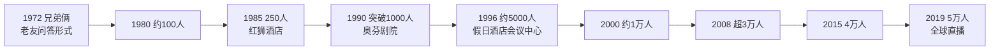
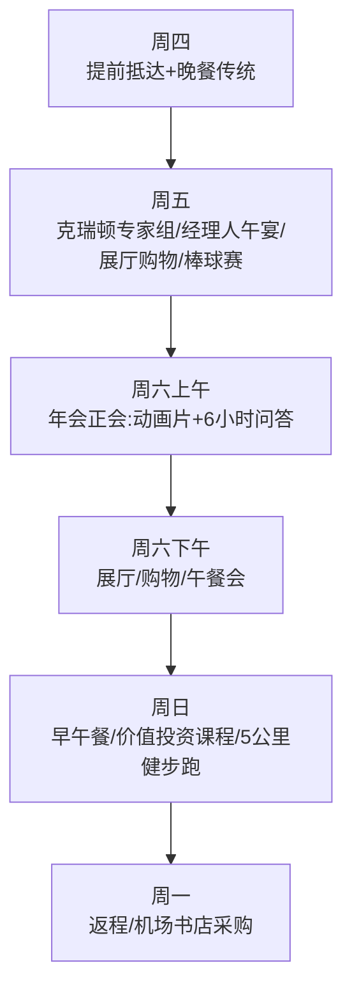
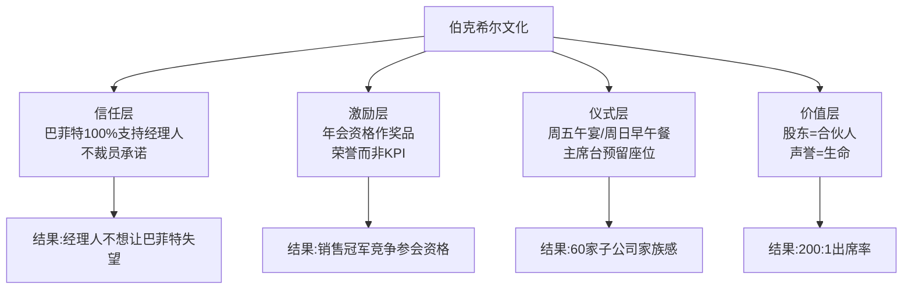
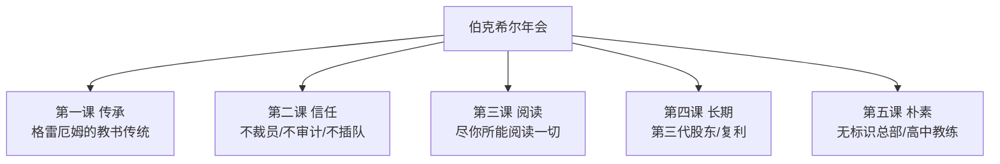
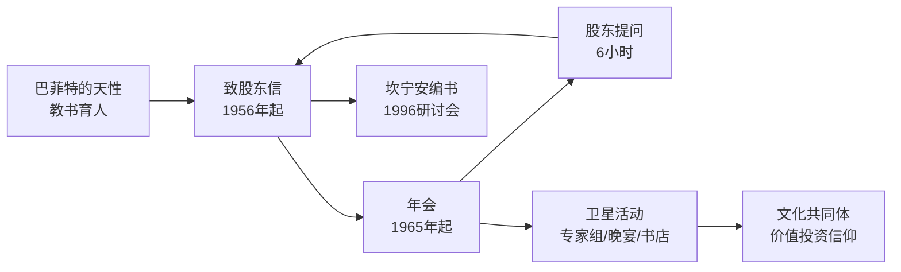
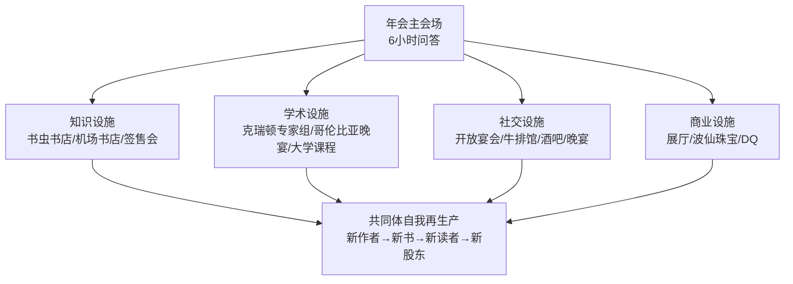
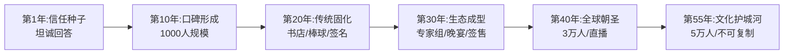
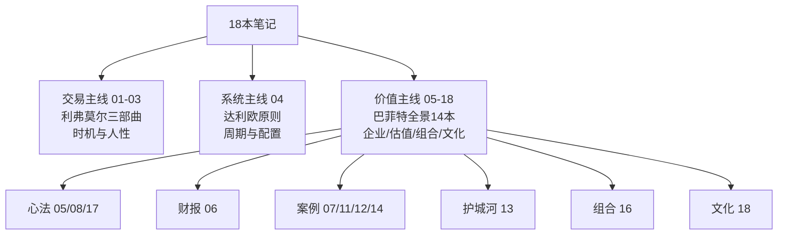
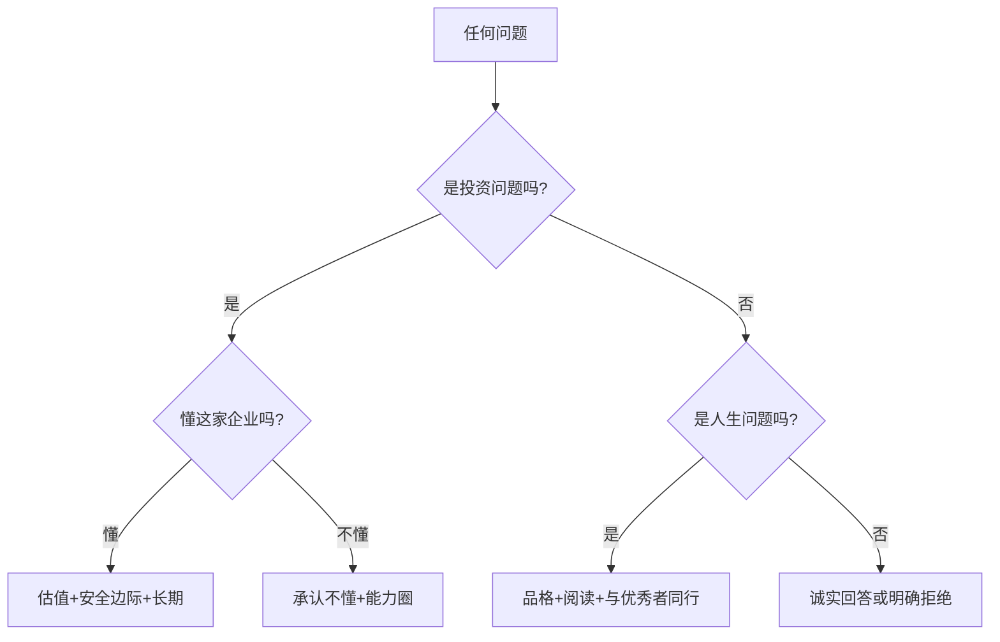

# 18《巴菲特的嘉年华：伯克希尔股东大会的故事》深度解读（详细版）

> 全球 4 万人一年一度的"资本家伍德斯托克"——从企业文化角度全景透视伯克希尔

## 📖 本书概览

| 项目 | 内容 |
|------|------|
| 书名 | 巴菲特的嘉年华：伯克希尔股东大会的故事（Berkshire Beyond the Meeting? / Dear Shareholder 系列） |
| 编者 | 劳伦斯·A. 坎宁安（Lawrence A. Cunningham）——《巴菲特致股东的信》编者 |
| 体例 | **多人合著文集**——40 余位参会者（合计参会 750 人次）从各自视角书写年会见闻 |
| 出版背景 | 2019 年；中译本由王冠亚翻译 |
| 核心命题 | 伯克希尔不只是企业集团，而是"company"一词的本义——**社会与友谊**（源自拉丁语 companio"在一起聚餐"） |
| 全书结构 | 10 章 × 40+ 篇文章（作家/伙伴/读者/演说者/专家/先锋/经理人/学者/客户/传奇）+ 序言 + 后记 |
| 系列位置 | **18《巴菲特的嘉年华》= 企业文化篇**：与 [[17《沃伦·巴菲特如是说》深度解读（详细版）|17 如是说（原声语录）]]、[[14《巴菲特投资学大全集》深度解读（详细版）|14 大全集（体系全景）]] 互补——这本看"巴菲特周围的世界" |

## 🎯 为什么这本书值得单独解读

- **唯一的年会全景书**：从 1972 年 2 人参会到 2019 年 5 万人——伯克希尔年会半个世纪的成长史
- **企业文化视角**：不是讲怎么选股，而是讲巴菲特如何构建一个"股东-经理人-员工"共同体
- **40+ 个真实故事**：B 夫人 93 岁开高尔夫球车、巴菲特在波仙珠宝排队不插队、萨姆·泰勒卖公司后含泪保住员工工作、博格 88 岁生日惊喜
- **可复制的社群逻辑**：书虫书店、DQ 签售会、克瑞顿专家组、哥伦比亚晚宴——价值投资者的"麦加"

## 📑 目录

- [[#第1章 作家：你并不孤单——年会的精神内核|第1章 作家：你并不孤单——年会的精神内核]]
- [[#第2章 伙伴：从股东到合伙人的进化|第2章 伙伴：从股东到合伙人的进化]]
- [[#第3章 读者：阅读是伯克希尔的狂热爱好|第3章 读者：阅读是伯克希尔的狂热爱好]]
- [[#第4章 演说者：年会的"课堂"内外|第4章 演说者：年会的"课堂"内外]]
- [[#第5章 专家：从教授到编者的朝圣|第5章 专家：从教授到编者的朝圣]]
- [[#第6章 先锋：价值投资的现代传教士|第6章 先锋：价值投资的现代传教士]]
- [[#第7章 经理人：伯克希尔家族的掌舵人们|第7章 经理人：伯克希尔家族的掌舵人们]]
- [[#第8章 学者：全球最伟大的商业秀|第8章 学者：全球最伟大的商业秀]]
- [[#第9章 客户：从林奇读者到博格的呐喊|第9章 客户：从林奇读者到博格的呐喊]]
- [[#第10章 传奇：三十年见证的演变|第10章 传奇：三十年见证的演变]]
- [[#附录一 年会编年史：从 2 人到 5 万人的成长|附录一 年会编年史：从 2 人到 5 万人的成长]]
- [[#附录二 本书金句集（30 条精选）|附录二 本书金句集（30 条精选）]]
- [[#附录三 伯克希尔企业文化解码：为什么经理人不愿离开|附录三 伯克希尔企业文化解码：为什么经理人不愿离开]]
- [[#附录四 系列互链：股东大会在 18 本笔记中的位置|附录四 系列互链：股东大会在 18 本笔记中的位置]]
- [[#附录五 如果你想参加一次股东大会：完整攻略（本书实操版）|附录五 如果你想参加一次股东大会：完整攻略]]
- [[#总结：一场年会的启示|总结：一场年会的启示]]

## 🔗 双链导读（本笔记与系列的连接点）

| 连接主题     | 本书章节   | 关联笔记                      |                                           |              |
| -------- | ------ | ------------------------- | ----------------------------------------- | ------------ |
| 巴菲特原声    | 全书     | [[17《沃伦·巴菲特如是说》深度解读（详细版）  | 17 如是说]]（年会问答是语录来源）                       |              |
| 护城河/企业文化 | 第2/8章  | [[13《巴菲特的护城河》深度解读（详细版）    | 13 护城河]]（年会检验护城河信念）                       |              |
| 伯克希尔历史   | 第1/10章 | [[11《巴菲特的伯克希尔崛起》深度解读（详细版） | 11 崛起]]（1976—1989 现场版）                    |              |
| 股东信文化    | 第3/5章  | [[09《巴菲特致股东的信》深度解读（详细版）   | 09 股东信·主题版]] · [[10《巴菲特致股东的信》深度解读（详细版）    | 10 股东信·编年版]] |
| B 夫人/NFM | 第10章   | [[11《巴菲特的伯克希尔崛起》深度解读（详细版） | 11 崛起]]（B 夫人收购）· [[14《巴菲特投资学大全集》深度解读（详细版） | 14 大全集]]     |
| 经理人放权    | 第7章    | [[14《巴菲特投资学大全集》深度解读（详细版）  | 14 大全集第2章]]（B 夫人/放权哲学）                    |              |
| 价值投资宗教感  | 第6章    | [[16《巴菲特的投资组合》深度解读（详细版）   | 16 投资组合]]（格雷厄姆-多德部落）                      |              |
| 长期主义     | 第8章    | [[12《巴菲特的估值逻辑》深度解读（详细版）   | 12 估值逻辑]]（20 年持有）                         |              |

---

## 第1章 作家：你并不孤单——年会的精神内核

### 1.1 茨威格：巴菲特的"光环"与开放的智慧

**开篇场景**（贾森·茨威格，《华尔街日报》专栏作家）：4 月雨夜航班降落奥马哈，乌云被城市灯光照出光圈——

> "我的天哪，"一名坐在飞机后舱的乘客赞叹道，"巴菲特果真有光环！"

**为什么向所有人敞开年会大门**（巴菲特亲口解释）：

> "尽管本·格雷厄姆已经拥有了生活所需的一切，但他仍然希望以教书的方式回馈社会。……所以，正如我们也从他人那里得到收获一样，我们不想让这些宝贵的资源停留在我们这里。我们想要把它们传承下去。"

**年会形式**：奎斯特中心礼堂，数十名投资者轮流到麦克风前提问，巴菲特和芒格回答近 **6 个小时**。

**14 岁股东贾斯廷·方的提问**（如何实现人生成功）：

> 巴菲特："与表现比你更好的人打交道，然后你就会朝着正确的方向前进。"
> 芒格："如果这让你在同龄人中暂时有点不受欢迎，让他们见鬼去吧。"

**问题类型**：不仅问股票债券，还问"最近你读过的最好的书是哪本？""你犯过的最大的错误是什么？""我怎样才能保持学习的状态？""数学是不是'上帝的语言'？"

### 1.2 史蒂夫·乔丹：他和我们一样——社群生态系统

**西装协会（LSS）**：24 名会员的入会仪式——"Nunc est Bibendum!"（让我们一起干杯）——年会不只是 6 小时问答，更是**完整的社群生态系统**。

**曼哈顿律师阿萨埃尔**："在这里，一个周末学到的东西比你在纽约一年学到的还要多。"——伯克希尔股票每上涨 1 万美元，他和妻子就买一套定制版车牌。

**参会者画像**（3.5 万人规模时期）：

| 维度 | 数据 |
|------|------|
| 外地比例 | 绝大多数 |
| 海外增长 | 澳大利亚、南美增长，**德国和中国增长尤为明显** |
| 职业装比例 | 约 1/5（虽是周六） |
| 女性比例 | 约 30% |
| 孩子 | 为数不少 |
| 财富水平 | 极高（A 股一股数十万美元，巴菲特不做股票分割） |

### 1.3 哈格斯特朗：没有人想要离开——从追星族到老朋友

**1995 年 5 月 16 日大都会/ABC 股东大会**：哈格斯特朗（《巴菲特之道》作者）与巴菲特首次见面——巴菲特沿着过道走过来挥手："嗨，罗伯特！"好像老朋友。

**写作的约定**：巴菲特允许引用致股东信，前提是亲自审阅手稿、避免"快速致富计划"概念——"出版前他看过所有章节，但一次也没有建议我做任何修改"。

**1996 年 5 月 3 日首次参加年会**：

> "伯克希尔的年会已经演变成一项周末的狂欢庆祝活动，几乎就像是崇拜者们的重聚会。"

### 1.4 兰迪·切普克：伯克希尔的精神内核

**1999 年首次参会**：到达半小时就邂逅巴菲特——他独自一人从林肯城市轿车方向盘后钻出来，捋了捋乱蓬蓬的白发，和 6 个人热情握手聊天摆拍——"他的平易近人着实让我大吃一惊"。

**年会的独特价值观**：

> "两位慈祥的老爷爷坐在那里，热切地想帮助你获得超乎想象的成功。……每位与会者（无论是专业的基金经理，还是靠修剪草坪赚钱的孩子）都学会了如何成为一个更好的投资者，更重要的是，成为一个更好的人。"

**巴菲特对变革的态度**（与直觉相反）：

> "我们把变化更多地视为威胁，而不是机遇。我们的赚钱方式是寻求那些业务稳定、变化不大且具有'护城河'的优质公司。我们希望看到的是，从现在起的十年后，情况……"——**稳定优于变化**

> 🔗 **呼应**：这正是 [[13《巴菲特的护城河》深度解读（详细版）|13 护城河]] 的核心——寻找变化最小的生意。

### 1.5 本章小结

年会精神内核 = **传承（格雷厄姆的教书传统）× 坦诚（直面一切问题）× 平等（巴菲特排队不插队）× 社群（股东=合伙人）**。

---


---

## 第2章 伙伴：从股东到合伙人的进化

### 2.1 托马斯·盖纳：伯克希尔是马克尔公司的标杆

**1984 年《财富》杂志启蒙**（安德鲁·托拜厄斯撰文，卡萝尔·卢米斯策划）：22 岁的盖纳读完文章"简直叹为观止"——"字里行间都散发着理性的气息"。

**读错名字的趣事**：把 Buffett 读成 Buff-fay，被老板赶出办公室。

**不买伯克希尔的教训**（当时股价超 1000 美元，他认为"没有一只股票可能值四位数"）：

> "我错过了购买这只股票的机会。如今，这只股票的股价超过 6 位数，每股逾 30 万美元。……这次失败给我上了一课，那就是**不作为的代价要比犯错误更大**。"

**后续**：1986 年达文波特公司委派盖纳负责马克尔公司（Markel）——他将伯克希尔作为标杆，把股东文化复制到马克尔。

### 2.2 马克·休斯：价值投资者的"最大公约数"

**1981 年国会图书馆研究巴菲特**（借阅所有报道）——"我开始了非正式的教育，这最终促使我多次前往奥马哈。我非常珍视自己从巴菲特和芒格那里获得的'研究生学位'。"

**1992 年首次参会，此后只错过一次**（儿子大学毕业典礼）。

**特罗弗餐厅传统**：二十多年来，年会前夜与投资伙伴保罗·甘巴尔、加里·沃特金斯在特罗弗餐厅叙旧——"奥马哈是我给自己充电的地方"。

**DQ 奇遇**：有一年在 Dairy Queen 遇到巴菲特独自一人坐在餐桌前吃冰激凌——"没有什么事情比和沃伦·巴菲特在一起吃冰激凌更好的了！"

**1994 年晚宴的邂逅**：坐在一位来自里士满的年轻人旁边——"我们有着相似的投……"（这位年轻人后来深刻影响了他的人生）。

### 2.3 托马斯·拉索：管理者的教科书

**1982 年斯坦福演讲启蒙**（杰克·麦克唐纳教授的价值投资研讨会）：巴菲特三条核心见解令拉索铭记：

| # | 见解 |
|---|------|
| 1 | 投资者从政府得到很大优惠：**对未实现收益递延征税** |
| 2 | 投资应寻求具有竞争优势、有"护城河"的企业 |
| 3 | 选择投资时要考虑**避免代理成本**（管理层将股东财富据为己有的倾向） |

**拉索的投资风格**（源自这些早期观察）：投资销售全球知名消费品牌的公司——"客户忠诚度和品牌商誉为我的投资带来了源源不断的馈赠和回报"。

**2010 年年会的盖茨插曲**：比尔·盖茨径直走向迈铁公司 CEO 托马斯·曼尼蒂问好，承诺微软提供软件支持——"有大约 500 名投资者跟随其后"。（盖茨基金会将来也会是伯克希尔的第一大股东。）

**年会的"宗教色彩"**：

> "作为伯克希尔的长期大股东，我每年都有一次机会来检验我对伯克希尔业务竞争优势的信念，并讨论管理者如何加固'护城河'的投资策略。"

### 2.4 英格丽德·亨德肖特：合作共生的企业文化

**1996 年通过飞安国际（FlightSafety）股票置换成为伯克希尔股东**：伯克希尔收购飞安时给出两个选择——换伯克希尔股票，或获得**高于股票溢价 10% 以上的现金**。

> "我们决定放弃接受更高现金报价的短期利益，而是明智地选择了伯克希尔的股票，20 年后我们仍然持有这些股票。事实证明，这是我做出的最明智的投资决策之一。"——**巴菲特不愿出让伯克希尔的股票，本身就是信号**

**巴菲特的一周回信**：亨德肖特写信表达高兴成为股东，不到一周收到巴菲特回信邀请参加年会——"那封早已褪色的信是我的珍藏，被我用相框装裱起来，至今仍挂在我的办公室里。"

**排队不插队的细节**（1998 年 NetJets 飞机展示）：

> "令我惊讶的是，巴菲特先生没有插队，而是走到队伍后面耐心地等待。巴菲特先生将股东视为平等的合作伙伴，并身体力行。"

### 2.5 本章小结

伙伴章的核心：**伯克希尔股东不是"持有者"而是"合伙人"**——从盖纳的不作为教训、休斯的充电之旅、拉索的护城河检验，到亨德肖特珍藏的回信与巴菲特排队的身影，处处印证：**股东文化是伯克希尔最深的护城河**。

---

## 第3章 读者：阅读是伯克希尔的狂热爱好

### 3.1 杰夫·马修斯：尽你所能，阅读一切

**年会提问的生态**：没有预先安排、没有公关"无形的手"——专业投资者先报名字再照本宣科；普通股东问题松散而广阔（"你对《纽约时报》股东有什么建议""你将如何修复医疗体系"）；甚至有人问芒格最喜欢的历史人物约翰·亚当斯夫妇（"你认识他们吗，查理？"巴菲特打趣）。

**最常被问的问题**（来自年轻观众）："我该怎么做才能成为一个伟大的投资者？"——第一次提问者是一位连续第十次参会的 17 岁旧金山少年。

**巴菲特的回答**（坚定而简单）：

> "尽你所能，阅读一切。10 岁的时候，我读完了奥马哈公立图书馆里每一本关于金融的书，有的还读了两遍。"

**阅读习惯的延续**：每年阅读成千上万份财务报表和公司年报，几十年如一日；受邀同机的人都证实——**巴菲特在飞机上就是阅读**。

> 芒格称巴菲特为"一台学习机器"。

### 3.2 菲尔·布莱克 & 贝丝·布莱克："书虫"售书记

**"书虫"书店与年会渊源**（20 世纪 90 年代）：巴菲特邀请书店在波仙珠宝活动开快闪书店——"我们卖些书吧"，然后被股东围得水泄不通。

**巴菲特图书收藏的基石**（按首版年份）：

| 年份 | 书籍 |
|------|------|
| 1994 | 基尔帕特里克《投资圣经：巴菲特的真实故事》 |
| 1995 | 洛温斯坦《巴菲特传》 |
| 1997 | 凯瑟琳·格雷厄姆《凯瑟琳·格雷厄姆自传》 |
| 1997 | 珍妮特·洛《巴菲特如是说》 |
| 1997 | 坎宁安《巴菲特致股东的信：投资者和公司高管教程》 |

**独特地位**：2004 年起在伯克希尔展位卖书（贝基书店）——**股东大会上唯一一个非伯克希尔子公司的展位**。"这是一种荣誉，也是巴菲特渴望他的股东们在金融领域不断学习的明证。"

### 3.3 劳拉·里滕豪斯：书山有路

**1997 年写信给巴菲特**（读了致股东信与年会邀请函后）："令我惊喜万分的是，巴菲特回信了。"

**参会后的验证**："巴菲特不仅是真实存在的，他还是一个不同寻常的人——**一个不是物质主义者的资本家**。"

**2002 年出版《与你可以信赖的人做生意》**（受互联网泡沫破裂、安然破产、911 启发）——在年会发布，书虫书店承办签售。

### 3.4 吉姆·罗斯：呼叫查理·芒格——机场书店的巴菲特效应

**《枪炮、病菌与钢铁》事件**：奥马哈机场书店经理吉姆·罗斯发现该书突然售罄、询问不断——"查理正在读这本书。"

**机场书店变身价值投资圣地**：哈德逊书店成为"世界上唯一一家出售所有价值投资书籍的机场书店"——股东们航班落地第一件事就是向吉姆问好、浏览新书。

**芒格荐书的连锁反应**：芒格在年会上推荐的书，第二天就在奥马哈所有书店脱销——**荐书是伯克希尔文化中最温柔的传播机制**。

### 3.5 卡伦·林德：伯克希尔的巾帼之星

**女性视角的年会观察**：

| 维度 | 细节 |
|------|------|
| 规模 | 2008 年起每年超 3 万人 |
| 总部 | 不起眼的办公楼**没有标识**（对比基威特的黄色 "Kiewit" 醒目标识） |
| 传统活动 | 跑着占座、巴菲特**投掷报纸挑战**、迪利酒吧排队 |
| 购物 | 贾斯廷靴子、鲜果布衣内衣——大众尺寸很快售罄 |

**《伯克希尔的巾帼之星》创作缘起**：年会的开幕影片中每年都有音乐模仿秀蒙太奇致敬子公司经理人——林德注意到女性经理人，2011 年见到宠厨（The Pampered Chef）的多丽丝·克里斯托弗和马拉·戈特沙克、商业连线（Business Wire）的凯茜·巴伦·塔马兹——伯克希尔子公司的女性领导力。

### 3.6 本章小结

阅读 = 伯克希尔信徒的**宗教仪式**：巴菲特"尽你所能，阅读一切"塑造了一代代投资者；书店是年会的圣殿；荐书是传道。**伯克希尔的文化本质上是阅读文化**。

---


---

## 第4章 演说者：年会的"课堂"内外

### 4.1 罗伯特·迈尔斯：与伯克希尔的偶遇之缘

**1997 年互联网搜索**（谷歌前身）："谁是世界上最伟大的投资者？"——答案：沃伦·巴菲特。

**B 股股东的提问权**（第一次年会）：

> 年长女士："巴菲特先生，我只持有 B 股。请问我可以问个问题吗？"
> 巴菲特："这位女士，我告诉你，咱俩加在一起有公司一半的股份。你当然可以提问。你的问题是什么？"——**持股不分大小，股东一律平等**

**年会黄金标准的构成**（迈尔斯总结）：

| 要素 | 内容 |
|------|------|
| 时间 | 周末举办（不像其他公司工作日） |
| 主题 | 弘扬企业家精神和股东文化 |
| 称呼 | 巴菲特称股东为**合伙人** |
| 入场 | 凌晨排队；每位股东最多带 3 位嘉宾 |
| 直播 | 网上直播，翻译成多种语言 |
| 问答 | **6 小时不使用任何参考资料**——卓越思维与历史数据掌控力 |

**对照 IBM 年会**：市中心酒店宴会厅、蓝制服员工查验身份证件、股东不得带嘉宾——"其他企业的年会则显得黯然失色"。

### 4.2 维塔利·凯茨尼尔森：奥马哈，明年见

**犹太人的圣歌**："耶路撒冷，明年见"——对价值投资者而言，**奥马哈就是伯克希尔股东的家园**（5 月初的 3 天）。

**2008 年首次朝圣**（Dairy Queen 签售会）：

> "我感到一头雾水。两年来，我辛辛苦苦写这本书，难道就是为了在快餐店里签售？也许，在 DQ 之后，我要升级去汉堡王签售了！"——"你会明白的。"编辑说。

**DQ 签售会的发展**：从 DQ 店面到克瑞顿大学——"对于希望与读者见面的投资书籍作者来说，没有比这更好的地方了"。

**意外的收获**：此后带着家人朋友去全国各地的 DQ——年会把一个"投资仪式"变成了"生活仪式"。

### 4.3 约翰·温根德：克瑞顿专家组

**克瑞顿大学价值投资专家组（VIP）**：自 2008 年起，每年年会前的周五举办——学生组织、两位主持人+几位专家组成员、多达 500 人参加。

**讨论主题**：如何选择贴现率、如何进行 DCF 分析、如何评估内在价值、当前资本配置挑战——"内容涵盖永恒的投资基本面"。

**学生提问的质量**："许多金融专业人士参加了这个活动，并追根究底地发问。但有些**最好的问题来自学生**。"

**学生管理基金**：前任系主任罗伯特·约翰逊创建学生管理投资基金（捐赠基金拨 10 万美元种子）——巴菲特特意与学生见面指导。

### 4.4 帕特里克·布伦南："课堂"内外

**"课堂"之外的价值**：周五下午克瑞顿专家组 → 周六年会 → 周六午餐会（鲍勃·罗博蒂）→ 周日上午价值投资课程（马克……）——**年会周末是一整座学校**。

**专家组讨论的实用性**：

> "这个专家组讨论的内容是我做出全年投资决策的灵感所在。"——参会者把奥马哈学到的直接用于实践

### 4.5 本章小结

演说者章展示：**年会是一座开放的大学**——主会场（6 小时问答）+ 卫星论坛（克瑞顿专家组、午餐会、周日课程）+ 非正式聚会。巴菲特和芒格是校长，价值投资者是同学。

---

## 第5章 专家：从教授到编者的朝圣

### 5.1 普雷姆·贾因：投资于人

**1987 年沃顿商学院**：资深同事问"沃伦·巴菲特为何如此成功？"——贾因答不上来，从此开始研究之旅。"从科学角度出发，这位同事建议'我们寻找特例来深入学习'。"

**当时的学术共识**："他的巨大成功应归功于偶然的运气"——贾因认为这不令人满意。

**研究方法**：要来 1979 年以来所有致股东信装订成册，请巴菲特封面签名；1992 年决定亲眼去看看——"从先知那里找到充满智慧的话语，就必须听许多听上去平凡的故事"。

**第一次参会的困惑**：NFM 只是普通家具城、波仙很拥挤——但一整天听巴菲特和芒格讲话后，全神贯注寻找他们强调的概念。

（贾因后来成为巴菲特研究的权威学者——**从"为什么成功"到"如何复制"**。）

### 5.2 托马斯·约翰森：一个更好的教学大纲

**1995 年 PBS 节目偶遇**：电视广告时段切换频道，看到巴菲特在北卡罗来纳大学侃侃而谈——"他是如此富有魅力，我立即把他的影像资料录入了自己的 VCR"。

> "我发现自己在想：'是的，这个有道理。是的，这就是我一直苦苦寻觅的。我必须把这个教给我的学生。'"

**1996 年首次参会**（写信要门票，巴菲特寄来）：假日酒店会议中心，约 5000 名与会者——"我认为这已经是一个天文数字了"。当天主题是 B 股发行（股价约 3.3 万美元）。

**教学变革**：把巴菲特方法引入课堂——**年会成为投资教育的活教材**。

### 5.3 大卫·卡斯：带上学生去"朝圣"

**2006 年起每年参会**：从第三次起带马里兰大学同事和 10 名金融专业本科生——"伯克希尔的年会周末，是教育和娱乐的完美结合"。

**年会电影的乐趣**（教育工具）：

| 年份 | 电影桥段 |
|------|---------|
| 2007 | 巴菲特与勒布朗·詹姆斯打篮球（分屏：勒布朗"场均 27.6 分"，沃伦"比标普 500 平均高出 11 分"——全进） |
| 2010 | 巴菲特为波士顿红袜队投球，第九局三振洋基队亚历克斯·罗德里格斯（前三球没分屏弹回，后三球 98 英里/小时） |

**意外的连接**：航班上偶遇《华盛顿邮报》董事长唐·格雷厄姆（两小时交谈→邀请到马里兰大学演讲）；2017 年与精密铸件（PCC）CEO 马克·多尼根交流（卡斯团队写了伯克希尔收购 PCC 的财务案例）；2012 年问题被《纽约时报》安德鲁·罗斯·索金选中。

### 5.4 劳伦斯·坎宁安：伯克希尔，你值得拥有

**1996 年 10 月纽约研讨会**（一切故事的缘起）：年轻的卡多佐法学院教授坎宁安邀请巴菲特参加研讨会，主题是重新整理致股东信——"当时，无论是在会计、收购、金融还是公司治理方面，他的投资哲学都与传统的学术观点相左"。

**《巴菲特致股东的信》诞生**：在巴菲特建议下出版——"我的目的是通过这些信影响世人的投资思想"。

**研讨会阵容**：巴菲特和芒格花 2 天与群体讨论 12 小时；苏珊、霍华德、卢米斯出席；桑迪·戈特斯曼（后成伯克希尔董事）、乔治·吉莱斯皮（巴菲特私人律师）、鲍勃·德纳姆（芒格律师事务所合伙人）。

**波仙售书传统**：1998 年起在波仙珠宝展会上卖《巴菲特致股东的信》——"我们每年的书都售罄了——第一年卖出了 1……"（7500 名股东中大多数参加展会）。

### 5.5 本章小结

专家章的主题：**年会=最好的商学院**。贾因从"运气论"中找到方法、约翰森把年会搬进课堂、卡斯带学生朝圣、坎宁安把年会智慧编成书——**知识的再生产是年会的最高价值**。

---


---

## 第6章 先锋：价值投资的现代传教士

### 6.1 乔尔·格林布拉特 & 约翰·佩特里：价值投资者俱乐部（VIC）

**1999 年科技泡沫背景**：纳斯达克两年涨两倍，价值投资"过时"的实践者招来嘲笑——"当你不用做估值方面的考量，就能在短时间内通过股票把钱翻一番时，为什么还要为自由现金流收益率、重置成本、私人市场价值或投资资本回报率等'稀奇古怪'的概念操心呢？"

**《福布斯》封面**（1999 年 12 月 13 日）：《巴菲特：你怎么了？》（Buffett: What Went Wrong?）——连巴菲特和芒格也因不碰科技股备受指责。

**VIC 的诞生**：几周后成立价值投资者俱乐部——第一家高品质投资分析网站。

| 要素 | 内容 |
|------|------|
| 灵感 | 雅虎留言板一篇对互助银行控股公司的深刻剖析（华尔街分析师想不到） |
| 定位 | "互联网上有很多睿智的投资思想……只不过被一大堆无用的杂音淹没了" |
| 准入 | 250 人上限，严格申请程序——擅长研究、表达清晰、高度成熟 |
| 目标受众 | **伯克希尔年会上的 15000 名投资者**——"即使世界上其他人都不再关心自由现金流收益率，这 15000 人也不会漠视" |

**意义**：年会不仅是学习场所，还是**价值投资者的"人才市场"和"共同体孵化器"**——VIC 从年会获得第一批成员。

### 6.2 田测产：GuruFocus——从物理学家到价值投资布道者

**个人背景**：物理学博士、光纤研究 20 年、专利 30 多项——但在光纤股票上**损失了 90%**：

> "这次损失让我意识到，我对股票的了解有所欠缺。我想学习投资，向世界上最好的投资者学习。"

**巴菲特启蒙**：阅读巴菲特 50 年致股东信、文章和采访——

> "我觉得自己就像一个饥肠辘辘的人，刚刚享受了人生中最丰盛的饕餮盛宴。我想，这就是正确的投资方式！"

**GuruFocus 的创办**（2004 年）：追随大师脚步，从"大师中的大师"巴菲特开始——编辑致股东信、投资组合、交易情况；现为**全市场最大的价值投资网站**。

**2009 年起参加年会**："和一大群志同道合的人坐在体育馆里，聆听沃伦·巴菲特和查理·芒格的演讲，空气中弥漫着兴奋的气氛……他们在这个年纪回答观众的问题，却从来没有感到疲惫和厌倦。"

### 6.3 麦克雷·赛克斯：哥伦比亚晚宴

**加贝里（Gabelli）与伯克希尔的渊源**：加贝里资产基金首批持仓就有伯克希尔；1987 年 11 月崩盘后以 2900 美元/股买入并持有至今——**10 万美元带来超过 900 万美元未实现收益**。

**哥伦比亚晚宴**（2010 年起希尔顿主宴会厅）：布鲁斯·格林沃德教授主持，从近 100 人到约 500 人；专家组常客：汤姆·拉索、比尔·阿克曼、戴维·温特斯；新一代：保罗·希拉尔（斗篷山）、戴维·萨姆拉（工匠合伙）、詹妮弗·华莱士（顶峰之路）。

**传承链条**：加贝里（哥伦比亚商学院）→ 格林沃德（价值投资教授）→ 新世代基金经理——**年会晚宴是价值投资学派的"同学会"**。

### 6.4 惠特尼·蒂尔森：属于全体股东的盛宴

**1998 年孤独的第一次**：谁也不认识，一个人吃晚饭回旅馆——"我觉得自己像个失败者"。

**反转行动**："我不想让任何人有我在 1998 年那个周末的感受。所以几年后，我租了一个宴会厅，在周五晚上、周六下午和周日早晨对外开放，邀请所有伯克希尔的股东相互认识与交流。"——**把孤独变成盛宴**

**年会学到的投资与非投资**：

> "在我职业生涯的第一个 10 年里，我取得了长期跑赢市场的优秀业绩，管理的资产规模从 100 万美元增长到 2 亿美元。……但我在历次股东大会中学到的非投资经验，对我的生活产生了更大的影响。巴菲特和芒格传授给我的'普适智慧'使我成为一个更快乐、更优秀的人——一个更好的儿子、丈夫、父亲和朋友。"

**价值投资的宗教比喻**（全书最精彩的类比）：

> "价值投资就像一个宗教：它有一个受人尊敬的创始人（本·格雷厄姆）、教皇（巴菲特）、资深红衣主教（芒格）、《旧约》（《证券分析》）、《新约》（《聪明的投资者》），一套包含善良和正直等品格的准则和价值观，还有成千上万充满激情的门徒……"

> "从这个角度来看，伯克希尔的年会显然是宗教复兴会议和朝圣的综合体，就像穆斯林去麦加和犹太人去耶路撒冷一样。"

### 6.5 本章小结

先锋章：**价值投资从"小众方法"变成"现代信仰"**——VIC（分析共同体）、GuruFocus（知识基础设施）、哥伦比亚晚宴（学派传承）、蒂尔森（社群营造者）。伯克希尔年会提供了信仰的"教堂"，信徒们在这里相互确认。

---

## 第7章 经理人：伯克希尔家族的掌舵人们

### 7.1 奥尔萨·奈斯利：我的导师巴菲特（GEICO）

**1995 年电话**（GEICO CEO 奈斯利回忆）：

> "1995 年年中沃伦·巴菲特打来电话，解释说如果我认为这是个好主意，他愿意购买 GEICO 剩余 49% 的股份。当然，我认为这是一个伟大的想法。"——合并完成于 1996 年 1 月 2 日

**1997 年首次参会后再未错过**——年会见闻：与伯克希尔董事会成员、巴菲特哥伦比亚同学比尔·鲁安和弗雷德·斯坦贝克会面。

**GEICO 用年会做销售激励**："我们将参加年会的机会作为奖品，专门奖励全国各地的顶级经销商……每个网点、每个产品线的销售冠军都被邀请参加，总共约有 15 人。为了获得伯克希尔股东大会参会资格的竞争非常激烈。"——**年会资格成为最强激励**

**年会周末的管理者价值**：巴菲特年会前周五午宴让旗下经理人互相认识；周四下午和周五 CEO 圆桌会议（网络安全等新兴问题）。

### 7.2 托马斯·曼尼蒂：众人拾柴火焰高（迈铁 MiTek）

**迈铁与伯克希尔**：2001 年被收购（建筑产品提供商），规模超过之前十倍；曼尼蒂从 1977 年新手销售员到 2011 年 CEO。

**2010 年年会背景**：伯克希尔以超 340 亿美元收购 BNSF 铁路剩余股份——"似乎每年的年会都会围绕一项惊人而独特的事件产生一些争议"。

**2011 年路博润（Lubrizol）收购插曲**：一个人"在使巴菲特关注路博润收购案这件事上扮演了可疑的角色"——对"全明星们"（巴菲特对子公司 CEO 们的爱称）是宝贵一课。

**伯克希尔成功的秘密**（经理人视角）：

> "巴菲特总是给予他的经理人 100% 的支持，然而，你要知道自己的职责所在，不会轻易逾越……简单说，**你就是不想让巴菲特失望，这是伯克希尔成功秘密的一部分**。"

> "如果你想知道在巴菲特退休后这是否会改变，依我愚见，答案是明确的——一个大大的'不'。不辜负巴菲特和芒格留下的遗产，将是一个相当强大的动力。"

### 7.3 布鲁斯·惠特曼：让空军高层叹为观止的盛宴（飞安国际）

**飞安国际（FlightSafety）**：全球航空培训和模拟飞行公司；惠特曼 1961 年起任职，担任创始人阿尔·乌尔奇副手，2003 年接任掌舵人。

**收购的双向转变**：

| 主体 | 转变 |
|------|------|
| 飞安 | 从承受股市压力的上市公司 → 私有企业（"母公司是全球最有耐心的企业之一"） |
| 伯克希尔 | 20 世纪 90 年代末从"主要持有股票的公司" → "主要拥有企业股权的公司" |

**家族扩张**：1997 年第一次参会时成员公司不到 20 家 → 现在 60 家。

**经理人的年会传统**：周五与巴菲特共进午餐；周六坐在主席台前预留座位；周日巴菲特早午餐——"尽管我们都喜欢彼此交流，但我们之间并没有正式的商业讨论"——**放权文化的仪式化表达**。

**空军将领参会的震撼**（2011 年）：退休四星上将凯文·奇尔顿（NASA 试飞员/宇航员/前战略司令部指挥官）与妻子凯瑟琳（一星准将）——连空军高层都叹为观止。

### 7.4 菲尔·特里：纪念萨姆·泰勒——眼泪背后的承诺

**萨姆·泰勒**（东方贸易 Oriental Trading 总裁兼 CEO，2017 年 12 月 29 日去世）：穿花哨夏威夷衬衫、提好问题、积极乐观——"散发着世界上最耀眼的光芒之一"。

**2015 年讲述卖公司经历时哭了**：

> "在同意伯克希尔的收购之前，萨姆的董事会（由私人股东控制）一直在向他施压，要求他把客户服务业务转移到海外，取消该部门在美国国内的所有工作岗位。萨姆知道，客户服务是东方贸易公司品牌的重要组成部分，因此他拒绝采取这一举措。在将公司出售给巴菲特后，萨姆含着喜悦的泪水告诉他的员工，来到伯克希尔的大家庭，意味着**他们可以保住自己的工作**。"

**这个故事的意义**：巴菲特收购 = 员工饭碗的保障；萨姆的眼泪 = 经理人把员工当家人的证明。**伯克希尔文化中最柔软也最坚硬的部分：不靠裁员赚钱**。

### 7.5 本章小结

经理人章的核心：**伯克希尔 = 不想让巴菲特失望的家族**。放权（100% 支持）、承诺（保住员工）、传统（周五午宴/周日早午餐）、激励（年会资格）——这套文化让 60 家子公司自愿为荣誉而战，而不是为 KPI 而战。

---


---

## 第8章 学者：全球最伟大的商业秀

### 8.1 罗伯特·德纳姆：与公司相得益彰的股东群体

**年会 vs 典型年会**（德纳姆，芒格-托尔斯律师事务所合伙人）：

| 维度 | 典型美国公司年会 | 伯克希尔年会 |
|------|----------------|-------------|
| 时长 | 2 小时，冗长无聊 | 3 天活动+6 小时问答 |
| 股东提问 | 走过场、令人生厌 | **直指本质、深邃洞察** |
| 公司姿态 | 只回应问题 | **以老师身份传授经验** |
| 出席率 | — | **高达 200:1**（股东出席率遥遥领先） |

**年报与年会的互文**：年报写得仔细清楚，向"不实际参与业务但希望了解的股东合伙人"解释业务——"那些读过年报的人已经准备好提出问题、理解答案，并将问题和答案放在更广泛的商业环境中去观察"。

**回答问题的姿态**：

> "巴菲特和芒格以管理合伙人的姿态，向他们的合伙人汇报工作；并以老师的身份，向他们的听众传授有关获得财务成功和美好生活的必备知识。"

**保密的分寸**："遵循的基本原则是，不要传递会破坏或削弱伯克希尔可能拥有的专有优势的信息。当他们拒绝回答时，他们会明确地告诉你，而不是给出人们经常从其他企业领导人那里听到的'模棱两可'的回答。"

### 8.2 西蒙·洛恩：商业秀的本质与所有权的哲学

**"全球最伟大的商业秀"**（与玲玲马戏团对比）：

> "巴菲特和芒格是非常出色的表演者，只不过他们交易的股票是真实的，会上的一切都是真实的。他们很好地把握了分寸，对商业敏感信息保密。"

**年会与致股东信的血缘**：年会 = 致股东信的自然产物；致股东信 = 巴菲特天性的自然产物——"每一次更新迭代，每一天的变化不大，但当我们用长期的眼光来看时，成长的程度是显而易见的。"

**公司治理的意识形态之争**（股东所有 vs 信托受益）：

| 阵营 | 观点 |
|------|------|
| 股东所有权派 | 股东是公司的真正所有者，董事会和高管是选举出来的代表 |
| 信托受益派 | 股东更像信托受益人，董事会和高管是受托人 |
| **巴菲特的立场** | **股东是企业的真正所有者**——致股东信和年会是最直观的表达 |

### 8.3 雷蒙德·哈策尔：财富与梦想

**2002 年航班上的家庭聚会感**："祖父母们带着十几岁的孩子，金融分析师们谈论着商业问题……他们有一些共同之处：都是伯克希尔的股东，最重要的是，他们玩得都很开心。"

**火炬传递**："年会上总会有一群年轻的股东，在亲人的陪同和帮助下学习业务。慈爱的股东们正在传递火炬，教育伯克希尔的下一代投资者……关于耐心的资本和复利的神奇力量。"

**自嘲式幽默的力量**（动画短片开场）："这种自嘲式的幽默能在与会者之间建立信任。"

**黄金法则关系**：

> "伯克希尔的股东周末是管理层与其他股东之间黄金法则关系的例证。……年会是一个鼓励直面困难的问题，然后给出诚实的答案的场合。"

**所罗门作证视频**（每年播放）：

> "如果你让公司陷入亏损，我可以理解；但如果你让公司名誉扫地，我会毫不留情。"——良好的声誉需要一生建立，却可毁于一次愚蠢行为

### 8.4 沙恩·帕里什：你渴望成为的那个人

**2008 年起几乎每年参会**；周五航班取消教训 → 提前到周四（"扩大安全边际"——把投资语言用进生活）。

**排队时的讨论话题**（雨中忘却天气）：第一结论偏差、保险浮存金、商誉会计的复杂性、最新收购的优点、打折家具零售业的未来——**价值投资者的"行话"就是他们的社交货币**。

**年会的节奏**（帕里什的自嘲）：

> "写，吃，写，低声耳语，笑，写，低声耳语，笑，写……从某种意义上说，一整天下来，感觉我们才刚刚触及问题的表面。"

### 8.5 本章小结

学者章：**年会是一场关于"所有权"的公开课**——巴菲特用 55 年把"股东是所有者"从理念变成仪式（年报+年会+分红哲学），而股东们用 200:1 的出席率投票确认。

---

## 第9章 客户：从林奇读者到博格的呐喊

### 9.1 弗朗索瓦·罗尚：追寻价值投资之源（吉维尼资本）

**1992 年林奇启蒙**：《彼得·林奇的成功投资》——"林奇先生在书中写道，沃伦·巴菲特是世界上最伟大的投资者，没有之一。"

**给巴菲特写信**（当时没有互联网）：巴菲特把伯克希尔 1977 年以来**所有**致股东信寄给他——

> "读了这些信后，我发现股市并不是赌场，你可以秉持强大的价值观理性地投资，并获得卓越的结果。"

**吉维尼资本的诞生**（1998 年，愿望是建造一座艺术博物馆——吉维尼是莫奈的家乡）。

**1999 年第一次参会**（保留纪念）：旅行总费用 807.49 加元、可口可乐纪念瓶、小联盟棒球赛棒球帽——"参加 1999 年伯克希尔股东大会是我一生中最好的投资"。

**朝圣的意义**：

> "在我们的业务中，没有什么比去参加年会更重要的了。这是能让我们回归初心的地方。在这里，价值观和投资理念比金钱和成功更重要。"

### 9.2 安德鲁·斯泰金斯基：伯克希尔的文化传统

**戴维斯家族的引荐**：谢尔比和克里斯·戴维斯（持有伯克希尔时间最长、持仓最大的投资者）——"我唯一感到遗憾的是，我没有早点听从他们的劝告。"

**排队传统的起源**：威尔·汤姆森建议提前排队（"传统就是传统，这是做某些非理性事情的唯一解释"）——"雨雪交加是对传统的真正考验。我们经受住了考验，每年都站在那里，风雨无阻。"

**机缘巧合**：排队时旁边女士送甜甜圈——后来才知道那是**查理·芒格的女儿**。

**戈瑞牛排馆的固定服务员**：15 个人的桌子每年都是同一位女服务员——"一个简单的公司年会居然能变成一长串的年度传统，给我们的生活带来如此多的快乐。"

### 9.3 约翰·博格：呐喊——88 岁生日的惊喜

**博格（先锋集团创始人、"指数基金之父"）与巴菲特**：巴菲特"对社会最大的贡献，很可能是他能够以投资者容易理解的、通俗易懂的方式，解释简单的投资原则"。

**2017 年的秘密计划**：好友史蒂夫·加尔布雷斯与巴菲特策划——用私人飞机接博格一家去奥马哈参加年会，庆祝 88 岁生日。

**两位投资巨人的会面**：指数基金之父 vs 集中投资之王——巴菲特曾建议普通投资者买指数基金，博格创造了指数基金；两人殊途同归，在奥马哈同台。

**博格文章的标题"呐喊"**：为简单投资原则呐喊、为投资者教育呐喊——"他同样慷慨地赞扬那些与他有相同价值观的人。我是其中的一个幸运儿。"

### 9.4 本章小结

客户章：从 1992 年林奇读者到 2017 年博格生日——**年会把"客户"变成了"信徒"**：罗尚把 807.49 加元当作一生最好的投资、斯泰金斯基把排队变成宗教仪式、博格把巴菲特当作理念同盟。客户不是来消费的，是来确认信仰的。

---

## 第10章 传奇：三十年见证的演变

### 10.1 查尔斯·阿克勒：成为商业秀的一分子（30 年参会）

**年会地点变迁史**（阿克勒亲历）：

| 年份 | 地点 | 规模 |
|------|------|------|
| 1973 | 美国国民保险公司员工餐厅（据旧金山经纪人回忆） | 极小 |
| 1985 | 红狮酒店（阿克勒首次参会） | 250 人 |
| 1986 | 乔斯林艺术博物馆大礼堂 | 约 1000 人 |
| 1990 | 奥芬剧院 | 约 1500 人（持续 5 年） |
| 1995 | 假日酒店会议中心 | 约 4000 人 |

**巴菲特对股东群体的熟稔**：前排股东介绍 10 岁儿子——巴菲特说这是这个家庭的**第三代伯克希尔股东**——"我有个孙女，想让你见见。"（幽默中带着对传承的珍视）

**奥马哈皇家棒球队**：巴菲特和同事买下当地小联盟球队，邀请股东参加年会前球赛——"伯克希尔变成了一个由'巴菲特叔叔'领导的大型投资家族。"

### 10.2 丹尼尔·皮考特：伯克希尔大学

**1982 年《跟我学投资》启蒙**（约翰·特雷恩，介绍 9 位杰出投资者）：

> "我要回炉重造了。这些投资者是我的导师。他们说的和写的就是我的课程。"——巴菲特是"哈佛大学级别的导师"

**1985 年 2570 美元买 A 股**（距奥马哈 90 分钟车程）：

> "那一年，我毫无畏惧地以 2570 美元的价格购买了伯克希尔-哈撒韦的一股股票。"——（如今一股超 30 万美元）

**科里·雷恩的故事**（伯克希尔内部审计师）：接到猎头电话——"伯克希尔是什么？""是沃伦·巴菲特经营的公司。""巴菲特是谁？"——1984 年年会观察员（出席不足 50 人），第二年负责检票，观众明显增加"所有人都严阵以待"——**公司成长与年会成长同步**。

### 10.3 蒂姆·梅德利：无可替代的伯克希尔直播秀

**妻子的质疑**（1988 年）：

> "你的意思是，你花 1000 美元大老远跑到内布拉斯加州，就为了听一个人讲一个小时？你就不能听磁带录音吗？"——"我知道，没有任何一盘磁带可以捕捉到年会的全部信息。"

**1986 年用 IRA 里 2600 美元买 A 股**（"几乎是我当时所有的钱"）。

**1987 年第一次参会**（约 300 人）：在乔斯林艺术博物馆见到 B 夫人——

> "她在 93 岁的高龄，还开着一辆库什曼高尔夫球车，在宽敞的地毯区四处走动。"

**B 夫人的原话**（关于 1983 年 6000 万美元出售 NFM）：

> "巴菲特甚至从来没有清点过存货，也没有检查过应收款项。他相信我的话，给我拿来支票。"

> "德国人把我当作犹太人对待，我不会把家具城卖给他们。而巴菲特先生很欣赏移民。"

**巴菲特的第一印象**（梅德利）：

> "他身穿蓝色运动夹克和灰色休闲裤，戴着一副并不时髦的眼镜，头发凌乱，看上去就像一位等待比赛开始的高中篮球教练。"——**朴素到极致，就是最好的形象**

### 10.4 本章小结

传奇章：30 年见证——从 50 人到 5 万人、从员工餐厅到体育馆、从 B 夫人高尔夫球车到全球直播。**变的只有规模，不变的是朴素、信任与传承**。

---


---

## 附录一 年会编年史：从 2 人到 5 万人的成长

### Y1. 年会规模演变（本书数据整合）



| 年份 | 规模 | 地点/事件 |
|------|------|----------|
| 1972 | 2 人（兄弟俩） | 老友问答形式（最早记录） |
| 1973 | 极小 | 美国国民保险公司员工餐厅 |
| 1980 | 约 100 人 | 巴芒鼓励参会 |
| 1985 | 250 人 | 红狮酒店（阿克勒/皮考特首次参会） |
| 1986 | 约 1000 人 | 乔斯林艺术博物馆（B 夫人开高尔夫球车） |
| 1990 | 突破 1000 人 | 奥芬剧院 |
| 1996 | 约 5000 人 | 假日酒店会议中心（B 股发行年） |
| 2000 | 约 1 万人 | 十年十倍 |
| 2004 | — | 迁至世纪链接中心（"书虫"书店进展位） |
| 2008 | 超 3 万人 | 首次线上直播时代前夜 |
| 2015 | 4 万人 | 全球直播+多语种翻译 |
| 2019 | 5 万人 | 世纪链接中心 |
| 2020 | 线上 | 新冠疫情影响首次线上举行 |

**奥马哈的"年会季"**：当地最盛大的日子不是元旦新年也不是圣诞节，而是伯克希尔股东大会——酒店爆满、餐馆爆满、租车公司员工见面就问"你是来参加巴菲特年会的吧？"

### Y2. 年会的完整周末时间线



---

## 附录二 本书金句集（30 条精选）

### 巴菲特与芒格

> 1. "我们不想让这些宝贵的资源停留在我们这里。我们想要把它们传承下去。"——巴菲特解释开放年会
> 2. "与表现比你更好的人打交道，然后你就会朝着正确的方向前进。"——巴菲特答 14 岁股东
> 3. "如果这让你在同龄人中暂时有点不受欢迎，让他们见鬼去吧。"——芒格
> 4. "尽你所能，阅读一切。10 岁的时候，我读完了奥马哈公立图书馆里每一本关于金融的书，有的还读了两遍。"——巴菲特
> 5. "我们把变化更多地视为威胁，而不是机遇。"——巴菲特论护城河
> 6. "如果你让公司陷入亏损，我可以理解；但如果你让公司名誉扫地，我会毫不留情。"——所罗门作证
> 7. "这位女士，我告诉你，咱俩加在一起有公司一半的股份。你当然可以提问。"——巴菲特答 B 股股东

### 参会者视角

> 8. "巴菲特果真有光环！"——航班乘客
> 9. "在这里，一个周末学到的东西比你在纽约一年学到的还要多。"——阿萨埃尔
> 10. "不作为的代价要比犯错误更大。"——盖纳
> 11. "没有什么事情比和沃伦·巴菲特在一起吃冰激凌更好的了！"——马克·休斯
> 12. "巴菲特先生将股东视为平等的合作伙伴，并身体力行。"——亨德肖特（排队不插队）
> 13. "巴菲特是一个不是物质主义者的资本家。"——里滕豪斯
> 14. "我每年都有一次机会来检验我对伯克希尔业务竞争优势的信念。"——拉索
> 15. "你就是不想让巴菲特失望，这是伯克希尔成功秘密的一部分。"——曼尼蒂
> 16. "他们可以保住自己的工作。"——萨姆·泰勒的眼泪
> 17. "价值投资就像一个宗教：创始人格雷厄姆、教皇巴菲特、红衣主教芒格、《旧约》《证券分析》、《新约》《聪明的投资者》。"——蒂尔森
> 18. "参加 1999 年伯克希尔股东大会是我一生中最好的投资。"——罗尚
> 19. "传统就是传统，这是做某些非理性事情的唯一解释。"——斯泰金斯基
> 20. "他看上去就像一位等待比赛开始的高中篮球教练。"——梅德利眼中的巴菲特
> 21. "巴菲特甚至从来没有清点过存货，也没有检查过应收款项。他相信我的话，给我拿来支票。"——B 夫人
> 22. "德国人把我当作犹太人对待，我不会把家具城卖给他们。而巴菲特先生很欣赏移民。"——B 夫人
> 23. "没有任何一盘磁带可以捕捉到年会的全部信息。"——梅德利
> 24. "我的天哪，巴菲特果真有光环！"
> 25. "价值观和投资理念比金钱和成功更重要。"——罗尚

### 编者后记

> 26. "变化越多，它们就越保持不变（Plus ça change, plus c'est la même chose）。"——法国谚语（后记）
> 27. "同一种现实，根据个人的取向，可以有不同的解释，可以用多种方式来描述。"——盲人摸象寓意
> 28. "伯克希尔远不只是一个由各种生意和匿名股东组成的企业集团，它是'公司'一词来源的缩影。"——前言
> 29. "巴菲特把股东视为企业的真正所有者。"——洛恩
> 30. "一个好的名声可能需要一生的时间来建立，却可以毁于一次愚蠢的行为。"——哈策尔

---

## 附录三 伯克希尔企业文化解码：为什么经理人不愿离开

### Z1. 企业文化的四层结构



### Z2. 与传统企业的对比

| 维度 | 传统企业 | 伯克希尔 |
|------|---------|---------|
| 年会 | 2 小时走过场 | 3 天嘉年华 |
| 股东 | 匿名持有者 | **合伙人** |
| 经理人激励 | KPI/期权 | **荣誉+信任+不裁员** |
| 裁员 | 常规手段 | **视为最后手段**（萨姆·泰勒保岗位） |
| 总部 | 豪华办公楼+标识 | 无标识的普通办公楼 |
| 领导者 | 西装革履 | 高中篮球教练式朴素 |
| 沟通 | 公关稿 | **6 小时即兴问答** |
| 声誉 | 品牌资产 | **生命线**（所罗门视频年年播） |

### Z3. 文化如何转化为业绩

1. **信任→低代理成本**：巴菲特不用审计 B 夫人（"他相信我的话，给我拿来支票"）——信任省掉巨额监督成本
2. **不裁员→忠诚**：东方贸易员工保住工作 → 员工以命相报
3. **荣誉→自驱**：经理人不想让巴菲特失望 → 比 KPI 更强
4. **年会→筛选股东**：200:1 出席率 → 股东群体自我筛选为"同路人" → 股价稳定 → 巴菲特可以长期决策

> **一句话**：伯克希尔的护城河不只是商业上的，更是**文化上的**——[[13《巴菲特的护城河》深度解读（详细版）|13 护城河]] 讲的四种来源之外，还有第五种：文化与信任。

---


---

## 附录四 系列互链：股东大会在 18 本笔记中的位置

### X1. 年会 → 系列笔记的双向映射

| 本书主题 | 关联笔记 | 呼应内容 |
|---------|---------|---------|
| 护城河检验 | [[13《巴菲特的护城河》深度解读（详细版）|13 护城河]] | 拉索"每年检验护城河信念"；巴菲特"变化是威胁" |
| 股东信文化 | [[09《巴菲特致股东的信》深度解读（详细版）|09 股东信·主题版]] · [[10《巴菲特致股东的信》深度解读（详细版）|10 股东信·编年版]] | 坎宁安 1996 年研讨会→书的诞生 |
| 巴菲特语录 | [[17《沃伦·巴菲特如是说》深度解读（详细版）|17 如是说]] | 年会问答是语录的第一现场 |
| 伯克希尔历史 | [[11《巴菲特的伯克希尔崛起》深度解读（详细版）|11 崛起]] | B 夫人/GEICO/所罗门在同一时间线 |
| 集中投资 | [[16《巴菲特的投资组合》深度解读（详细版）|16 投资组合]] | 价值投资者共同体（格雷厄姆-多德部落） |
| B 夫人/NFM | [[14《巴菲特投资学大全集》深度解读（详细版）|14 大全集第2章]] | 6000 万美元收购/放权哲学 |
| 长期持有 | [[12《巴菲特的估值逻辑》深度解读（详细版）|12 估值逻辑]] | 股东世代传承（第三代股东） |
| 阅读文化 | [[17《沃伦·巴菲特如是说》深度解读（详细版）|17 如是说第6章]] | "尽你所能，阅读一切" |

### X2. 年会问答金句 × 系列笔记金句互文

| 主题 | 年会语录 | 系列金句 |
|------|---------|---------|
| 阅读 | "尽你所能，阅读一切" | [[17《沃伦·巴菲特如是说》深度解读（详细版）|17]]："我的工作是阅读" |
| 声誉 | "名誉扫地，我会毫不留情" | [[17《沃伦·巴菲特如是说》深度解读（详细版）|17]]："建立声誉 20 年，毁掉 5 分钟" |
| 变革 | "变化是威胁而非机遇" | [[13《巴菲特的护城河》深度解读（详细版）|13]]：寻找不变的企业 |
| 股东 | "咱俩加在一起有公司一半的股份" | [[09《巴菲特致股东的信》深度解读（详细版）|09]]：股东是合伙人 |
| 传承 | "我有个孙女，想让你见见"（第三代股东） | [[12《巴菲特的估值逻辑》深度解读（详细版）|12]]：复利需要时间与世代 |

### X3. 与系列其他"文化类"素材的对照

| 素材 | 出处 | 主题 |
|------|------|------|
| 报纸测试 | [[17《沃伦·巴菲特如是说》深度解读（详细版）|17 第5章]] | 行为准则 |
| 所罗门作证视频 | 18 本书第8章 | 声誉文化（年会年年播） |
| 圣诞树故事 | [[17《沃伦·巴菲特如是说》深度解读（详细版）|17 第6章]] | 节俭文化 |
| 萨姆·泰勒的眼泪 | 18 本书第7章 | 不裁员承诺 |
| 排队不插队 | 18 本书第2章 | 平等文化 |

---

## 附录五 如果你想参加一次股东大会：完整攻略（本书实操版）

### F1. 行前准备

| 步骤 | 内容 |
|------|------|
| 1 | 成为股东（持有至少 1 股 B 股——约 A 股的 1/1500） |
| 2 | 提前数月订酒店（年会期间奥马哈全部爆满） |
| 3 | 周四抵达（周五航班取消的教训——"扩大安全边际"） |
| 4 | 阅读当年年报（"读过年报的人已经准备好提出问题"） |
| 5 | 准备问题（避免照本宣科，学普通股东问真问题） |

### F2. 年会周末行程表

| 时间 | 活动 |
|------|------|
| 周四晚 | 特罗弗餐厅传统晚餐（波旁牛排+威士忌） |
| 周五 | 克瑞顿专家组（价值投资小组讨论）→ 展厅购物 → 经理人午宴/棒球赛 |
| 周五夜 | 波仙珠宝股东活动（免费食物和葡萄酒） |
| 周六凌晨 | 排队占座（凌晨 2—5 点；传统考验） |
| 周六上午 | 动画短片 → 6 小时问答（不带资料） |
| 周六下午 | 展厅/午餐会/签名合影（限 200 人） |
| 周日 | 早午餐/价值投资课程/5 公里健步跑 |
| 返程前 | 机场哈德逊书店采购（全球唯一价值投资机场书店） |

### F3. 必打卡清单

- [ ] 世纪链接中心排队（南入口好座位）
- [ ] 波仙珠宝（B 夫人传奇之地；股东免费食物）
- [ ] Dairy Queen 签售会（作者云集）
- [ ] 戈瑞牛排馆（15 人桌传统）
- [ ] 迪利酒吧（排队传统）
- [ ] 奥马哈皇家棒球队比赛（巴菲特投开场球）
- [ ] 投掷报纸挑战（巴菲特报童绝活）
- [ ] 伯克希尔子公司展厅（喜诗糖果/布鲁克斯/宠厨）

### F4. 参会心态清单（本书教你的）

1. 第一天可能是孤独的——主动参加蒂尔森式开放宴会（"我不想让任何人有我 1998 年的感受"）
2. 与陌生人交谈——"你什么时候买的伯克希尔？"是最佳破冰（推导财富级别）
3. 别只盯着问答——"课堂之外"同样重要
4. 带孩子来——火炬要传递
5. 排队是仪式——"传统就是传统"

---

## 总结：一场年会的启示

### Z1. 年会教给投资者的五堂课



### Z2. 为什么 5 万人愿意凌晨排队

| 表层原因 | 深层原因 |
|---------|---------|
| 听巴菲特芒格讲话 | **确认自己的投资信仰**（宗教朝圣） |
| 买喜诗糖果/逛展厅 | **参与共同体经济**（股东=顾客=信徒） |
| 见老朋友 | **年度团聚仪式**（家庭感） |
| 学投资知识 | **免费商学院**（6 小时大师课） |
| 带孩子来 | **传承价值观**（火炬传递） |

### Z3. 一句话总结

> 《巴菲特的嘉年华》用 40 位参会者的眼睛，揭示了伯克希尔最深的秘密：**巴菲特不仅建立了一家伟大的公司，更建立了一个伟大的共同体**。在这里，股东是合伙人、经理人是家人、阅读是宗教、年会是一次朝圣——而这一切的起点，只是 1956 年一个 25 岁的年轻人想"以自己想要的方式生活"。如果你想知道什么是"企业文化护城河"，这本书记录的就是它的全部细节。

### Z4. 给读者的最后提醒

> "伯克希尔远不只是一个由各种生意和匿名股东组成的企业集团，它是'company'一词来源的缩影：**社会与友谊**。每逢春天，没有什么地方比奥马哈更能体现出好学、正直、创新和团结这些特质了。"

**参加一次年会，胜过读十本投资书——因为你会亲眼看到：什么样的价值观，能让人凌晨两点排队。**

---

*本笔记基于《巴菲特的嘉年华：伯克希尔股东大会的故事》（劳伦斯·A. 坎宁安编）撰写，覆盖前言、全部 10 章 40+ 篇文章与后记精华，并整合本系列 18 本笔记形成互链网络。*

*核心收获一句话：**伯克希尔股东大会是人类商业史上最成功的"文化产品"——它把投资变成信仰、把股东变成家人、把奥马哈变成圣地，而这一切都源于巴菲特"股东是合伙人"的朴素信念。***

---


---

## 补充篇 Ⅰ：译者序与开篇的深度展开

### B1. 译者序：股东大会台前幕后的三个核心（王冠亚译序）

**2019 年 5 月亲历**：为占内场靠近舞台的位置，深夜两点起床排队——"到了凌晨四五点，门口已经排起了长龙……到年会正式开幕时，偌大的体育馆座无虚席。据统计，来自全球各地的'朝圣者'已经超过 4 万人。"

**为什么巴菲特股东大会有如此强大的向心力？**（译者总结三大核心）：

| # | 核心 | 表现 |
|---|------|------|
| 1 | **推心置腹的坦诚** | 投资心法倾囊相授（问答+致股东信，毫无保留）；对投资失误毫不掩饰（德克斯特鞋业、美国航空、康菲石油、爱尔兰银行、乐购——"巴菲特并不是从不犯错，而是直面、总结、反思所犯的错误，确保'不贰过'"） |
| 2 | **无与伦比的专注** | 引用费雪：一家公司吸引股东的方式，如同餐厅招揽潜在…… |
| 3 | **（第三个核心在原文中未完整展开，译者留白）** | — |

**《论语》的呼应**：

> "为政以德，譬如北辰，居其所而众星共之。"——以德行经营企业，股东如众星拱月。"巴菲特如同北极星，前来'朝圣'的股东们如同众星拱月一般围绕在他的周围。"

**创作阵容**（本书作者群像）：

| 作者 | 身份 |
|------|------|
| 约翰·博格 | "指数基金之父"、先锋集团创始人、《共同基金常识》作者 |
| 乔尔·格林布拉特 | 哥谭资本创始人、《股市稳赚》作者 |
| 罗伯特·哈格斯特朗 | 《巴菲特之道》作者 |
| 杰夫·马修斯 | 《亲历巴菲特股东大会》作者 |
| 劳伦斯·A. 坎宁安 | 《巴菲特致股东的信》编者（本书编者） |
| 贾森·茨威格 | 《华尔街日报》专栏作家 |

### B2. 初见巴芒二十周年记（杨天南式中国投资者视角）

**年会历史的关键数据**（本书最权威的年会时间线）：

- 巴菲特早期经营合伙公司 13 年间**没有开会的记录**（以致合伙人信保持沟通）
- 1965 年取得伯克希尔控制权后，年会逐渐壮大
- 1972 年最早记录：兄弟俩，哥哥是巴菲特同学，三人问答聊几小时——**"这种轻松愉快、老友问答的形式一直保留至今"**
- 1980 年约 100 人 → 1990 年突破 1000 人 → 2000 年 1 万人 → 2019 年 5 万人

**"巴菲特几乎凭借一己之力，彻底将奥马哈这个默默无闻的小镇变成了一个全球投资者向往的圣地。"**

**2001 年首次参会的中国投资者**（1.2 万参会者）：

- 在"传说中"巴芒会出现过的波仙珠宝店前等候四五个小时
- 巴菲特惊奇地说："或许你是我第一个来自北京的股东。"
- 四个壮硕保镖护卫，仅限 200 人签名合影，多一个不放
- 巴芒二人相隔数米各置一桌：巴菲特这边队伍长长，**芒格那桌排队人数寥寥可数**（那一年巴菲特 71 岁、芒格 77 岁）

**洗手间奇遇**：与《投资圣经》作者基尔帕特里克（巴菲特铁杆粉丝）在洗手间相遇——"不知道多年以后这会不会出现在他的书里。"

**"你什么时候买的伯克希尔？"**：

> "这实际上是一个意味深长的问句，因为可以从中推导出一个人的财富级别。所以，若某人说'我是二十多年前买的'，往往会引来众人的惊呼和羡慕的眼神。时间就是金钱，在这里得到了现实的体现。"

**为什么巴菲特依然令人神往——九个字**：

> "赚得多、活得久、众人爱。"

### B3. 前言：company 一词的本义

**词源学**：

> "'company'源自古代法语'compagnie'（意为'社会'或'友谊'），还有后来的拉丁语'companio'（意为'在一起聚餐'）。"——伯克希尔股东是一个由共同的价值观——好学、正直、创新和团结——维系的社会群体

**作者们的共识**：

> "我们的大多数作者说，就像伯克希尔的许多其他股东一样，巴菲特改变了他们的生活，他不只让他们变得富有，还通过建立一种制度，让伯克希尔的文化和价值观成为他们生活的中心，也成为他们自身的一部分。"

**编者后记的"盲人摸象"**：

> "同一种现实，根据个人的取向，可以有不同的解释，可以用多种方式来描述。……尽管每个人都出席了年会，但年会前后，人们分散在奥马哈各处。各种会议、小组讨论、晚宴、年度招待会，甚至是另一场股东大会。"

> "我们总是说，向本·格雷厄姆普及的这条法国谚语致敬：变化越多，它们就越保持不变（Plus ça change, plus c'est la même chose）。每次年会既有相同的主题，也有不同的内容——同样的主题、价值观、正能量，但角色在不断变化。"

---

## 补充篇 Ⅱ：年会问答的经典主题（本书+历年实录）

### B4. 历年问答六大主题分类

| 主题 | 典型问题 | 巴菲特的回答风格 |
|------|---------|----------------|
| 投资方法 | "如何给企业估值？" | 息票债券比喻/简化 |
| 读书学习 | "最近读的最好的书？" | 当场荐书（引发书店脱销） |
| 人生建议 | "如何取得成功？" | "与比你优秀的人打交道" |
| 承认错误 | "你犯过的最大的错误？" | 坦然列举（德克斯特/航空/康菲） |
| 宏观经济 | "如何看利率/通胀？" | "我们从不预测" |
| 生活八卦 | "最喜欢吃什么？" | 樱桃可乐/喜诗糖果 |

### B5. 巴菲特答问的四个不变原则（本书提炼）

1. **不预测**：对市场走向从不妄下判断（"预测通常更多告诉我们预测者的想法"）
2. **不传私密**：拒绝回答时会明确告知（不模棱两可）
3. **不教条**：根据提问者背景调整答案深度（孩子问用孩子能懂的话）
4. **不设限**：6 小时不间断，任何问题都可以问（"无论时间多长"）

### B6. 芒格在年会的角色

| 维度 | 芒格 |
|------|------|
| 回答风格 | 简洁、辛辣、直指本质 |
| 经典语录 | "让他们见鬼去吧"（答 14 岁少年） |
| 荐书影响力 | 读什么书第二天全城脱销（《枪炮、病菌与钢铁》事件） |
| 粉丝规模 | 签名桌前排队的比巴菲特少（但信徒更虔诚） |
| 角色定位 | "资深红衣主教"（蒂尔森比喻） |
| 年会的价值 | "（芒格的著作和言论）至少和柏拉图不相上下，字里行间都闪耀着启蒙之光"（阿萨埃尔） |

---


---

## 补充篇 Ⅲ：伯克希尔家族地图（本书数据整合）

### B7. 年会上的子公司生态

```mermaid
graph TD
    A[伯克希尔家族60+公司] --> B[保险<br/>GEICO/通用再保险/国民赔偿]
    A --> C[消费品<br/>喜诗糖果/可口可乐/鲜果布衣]
    A --> D[零售<br/>NFM/波仙珠宝/B夫人]
    A --> E[工业<br/>飞安国际/迈铁/精密铸件]
    A --> F[媒体<br/>布法罗新闻/华盛顿邮报(历史)]
    A --> G[铁路能源<br/>BNSF/中美能源]
    B --> H[年会展厅<br/>产品展示+销售]
    C --> H
    D --> H
    E --> H
```

### B8. 展厅与产品的年会经济学

| 产品/展台 | 细节 |
|----------|------|
| 喜诗糖果 | 年会必买（"品尝着樱桃可乐和喜诗花生脆"） |
| 可口可乐 | 纪念瓶；入口处赠送 |
| 波仙珠宝 | 股东免费食物和葡萄酒；圣诞装饰品（股票凭证样式） |
| 布鲁克斯体育 | 5 公里健步跑赞助商 |
| 宠厨 | 展台队伍很长（女性经理人） |
| 贾斯廷靴子/鲜果布衣 | 大众尺寸很快售罄 |
| NetJets | 年会期间飞机停在停车场供股东登机参观 |
| BNSF 专列 | 2010 年 CEO 马特·罗斯把专列开到会议中心后面 |
| 迪利巧克力棒 | 排队传统+年会零食 |

**展厅的意义**：股东=顾客=信徒的三位一体——"这是一个很好的机会，我们不仅可以认识和感谢我们的客户，还可以向新客户销售我们的各种保险产品。"（GEICO 奈斯利）

### B9. 伯克希尔家族的关键人物速览（本书提及）

| 人物 | 身份 | 本书故事 |
|------|------|---------|
| B 夫人（罗斯·布鲁姆金） | NFM 创始人 | 93 岁开高尔夫球车；"他相信我的话，给我拿来支票" |
| 阿尔·乌尔奇 | 飞安国际创始人 | 惠特曼的导师；2003 年退休 |
| 萨姆·泰勒 | 东方贸易 CEO | 卖公司后含泪保住员工工作 |
| 托马斯·曼尼蒂 | 迈铁 CEO | "不想让巴菲特失望" |
| 奥尔萨·奈斯利 | GEICO CEO | 1995 年电话收购 49% |
| 比尔·鲁安/弗雷德·斯坦贝克 | 巴菲特哥伦比亚同学 | 年会常客 |
| 比尔·盖茨 | 伯克希尔董事 | 500 人跟随；盖茨基金会将成为第一大股东 |
| 凯瑟琳·格雷厄姆 | 华盛顿邮报 | 巴菲特 1984 年写信致谢 |
| 唐·格雷厄姆 | 邮报董事长 | 航班偶遇卡斯教授 |
| 马特·罗斯 | BNSF CEO | 专列开到年会现场 |

---

## 补充篇 Ⅳ：年会与致股东信的双螺旋

### B10. 年会-信件的共生关系



**洛恩的观察**：

> "年会 = 致股东信的自然产物；致股东信 = 巴菲特天性的自然产物。……每一次更新迭代，每一天的变化不大，但当我们用长期的眼光来看时，成长的程度是显而易见的。"

**双向反馈**：股东读年报（准备问题）→ 年会上提问（检验理解）→ 巴菲特回答（传授新知）→ 写入下一年信件（固化智慧）——**伯克希尔的知识循环 55 年不停转**。

### B11. 为什么巴菲特 1971 年才开始亲自签署信件

**西蒙·洛恩的考证**："巴菲特直到 1971 年才开始亲自签署伯克希尔的信件。"——早期信件由他人代签，但这不妨碍信件的影响力逐渐增强；年会亦然：**伟大无需从第一天开始，关键是持续改进 50 年**。

### B12. 坎宁安 1996 年研讨会的深远影响

**一个周末 → 一本书 → 一个产业**：

| 时间 | 事件 |
|------|------|
| 1996 年 10 月 | 卡多佐法学院研讨会（巴菲特+芒格 2 天 12 小时） |
| 1997 年 | 《巴菲特致股东的信：投资者和公司高管教程》出版 |
| 1998 年起 | 波仙珠宝展会售书（每年售罄） |
| 至今 | 成为全球价值投资者的必读书——[[09《巴菲特致股东的信》深度解读（详细版）|09 号笔记]] 的源头 |

> **启示**：一次真诚的学术对话，可以改变整个投资教育的方向——年会的价值不止于年会本身。

---

## 补充篇 Ⅴ：年会中的"巴菲特细节"合集

### B13. 巴菲特行为细节 12 则（本书散布）

| # | 细节 | 含义 |
|---|------|------|
| 1 | 独自一人从林肯城市轿车出来，主动和 6 个陌生人握手摆拍 | 平易近人 |
| 2 | 在 NetJets 展示时排队不插队 | 股东平等 |
| 3 | 独自坐在 DQ 吃冰激凌，热情接待粉丝 | 朴素日常 |
| 4 | 投掷报纸挑战（报童绝活） | 保留传统 |
| 5 | 给小联盟棒球赛投开场球（投不好自嘲） | 幽默 |
| 6 | 年会上为股东签名（限 200 人） | 珍惜时间 |
| 7 | 不修边幅："高中篮球教练" | 不在乎外在 |
| 8 | 董事长办公室无标识总部大楼 | 不虚荣 |
| 9 | 邀请书商开快闪书店："我们卖些书吧" | 推动阅读 |
| 10 | 每年播放所罗门作证视频 | 声誉至上 |
| 11 | 与经理人周五午宴、周日早午餐 | 家族仪式 |
| 12 | 记得股东家族第三代："我有个孙女，想让你见见" | 珍视传承 |

### B14. 这些细节的商业意义

| 细节类别 | 商业效果 |
|---------|---------|
| 平易近人/排队 | 强化"股东=合伙人"叙事 → 股东忠诚度 → 股价稳定 |
| 朴素/无标识 | 降低股东对管理层奢靡的戒心 → 信任 → 代理成本趋零 |
| 阅读推动 | 培养懂行的股东群体 → 提问质量高 → 年会信息量大 → 更多人参加 |
| 家族感 | 世代持有 → 复利的时间基础 |

> **一句话**：巴菲特把自己活成了伯克希尔品牌——他的一切"细节"都是企业文化的一部分，而不是表演。

---


---

## 附录六 年会上的"价值投资共同体"全景图

### Z1. 共同体成员类型分析

| 类型 | 代表 | 参加动机 | 参会方式 |
|------|------|---------|---------|
| 职业投资者 | 拉索/蒂尔森/格林布拉特 | 检验信念+找灵感 | 专家组成员/晚宴 |
| 学者教授 | 约翰森/卡斯/温根德 | 教学素材+带学生 | 专家组/学生基金 |
| 作家 | 哈格斯特朗/凯茨尼尔森 | 签售+调研 | 书店/DQ 签售 |
| 经理人 | 奈斯利/曼尼蒂/惠特曼 | 家族团聚+销售 | 主席台预留座 |
| 普通股东 | 阿萨埃尔/斯泰金斯基 | 朝圣+充电 | 凌晨排队 |
| 下一代 | 17 岁少年/第三代股东 | 学习+传承 | 家人陪同 |
| 服务者 | 书虫书店/哈德逊书店 | 生意+荣誉 | 展位 |

### Z2. 价值投资共同体的"基础设施"（年会生态）



### Z3. 年会的"网络效应"（为什么越大越有价值）

| 规模效应 | 机制 |
|---------|------|
| 更多作者来签售 | 读者（股东）更多 → 书更好卖 |
| 更多教授来取材 | 学生更多 → 下一代投资者更多 |
| 更多经理人来参展 | 客户更多 → 生意更好 |
| 更多新人来朝圣 | 前辈更多 → 指导更多 |
| 更多媒体来报道 | 影响力更大 → 更多人想了解 |

> **结论**：伯克希尔年会是价值投资界的"超级节点"——它把分散在全球的投资者连接成网，让每个参与者都变得更有价值。这种网络效应本身就是无法复制的护城河。

---

## 附录七 本书关键数字速查

| # | 数字 | 含义 |
|---|------|------|
| 1 | 750 人次 | 本书作者们参会次数总和 |
| 2 | 2 人 | 1972 年年会规模（最早记录） |
| 3 | 100 → 1000 → 10000 | 1980→1990→2000 年参会人数 |
| 4 | 50000 | 2019 年参会人数 |
| 5 | 200:1 | 伯克希尔股东出席率（vs 其他公司） |
| 6 | 6 小时 | 问答时长（不用任何参考资料） |
| 7 | 30% | 参会女性比例 |
| 8 | 40+ | 本书作者人数 |
| 9 | 60+ | 伯克希尔子公司数量（1997 年不到 20 家） |
| 10 | 807.49 加元 | 罗尚 1999 年参会总费用（"一生最好的投资"） |
| 11 | 2570 美元 | 1985 年皮考特买 A 股价格（如今 30 万+） |
| 12 | 2900 美元 | 1987 年加贝里崩盘后买入价（10 万→900 万） |
| 13 | 2600 美元 | 1986 年梅德利 IRA 全仓买入价 |
| 14 | 3.5 万/4 万/5 万 | 近年参会人数 |
| 15 | 250 人 | VIC 创始成员上限 |
| 16 | 340 亿美元 | BNSF 收购价（2010 年年会背景） |
| 17 | 6000 万美元 | 1983 年 B 夫人 NFM 出售价 |
| 18 | 200 人 | 巴菲特签名合影上限 |
| 19 | 2 天 12 小时 | 1996 年坎宁安研讨会时长 |
| 20 | 55 年 | 年会历史（1965—2019） |

---

## 附录八 读完本书后的 10 个自问

1. 我能说出年会从 1972 年到 2019 年的规模演变吗？（2 人→5 万人）
2. 我理解"company"一词的本义（社会与友谊）吗？
3. 我知道巴菲特为什么开放年会吗？（"传承格雷厄姆的教书传统"）
4. 我能讲出 B 夫人的故事和"他相信我的话"的含义吗？
5. 我知道"你什么时候买的伯克希尔"为什么是财富试金石吗？
6. 我能解释"价值投资像宗教"的比喻吗？（创始人与教皇/旧约与新约）
7. 我知道伯克希尔经理人"不想让巴菲特失望"的文化机制吗？
8. 我能说出萨姆·泰勒流泪的原因吗？（保住员工工作）
9. 我知道年会生态的四大设施（知识/学术/社交/商业）吗？
10. 如果我去参加一次年会，我知道该做什么准备吗？（读年报/周四到/凌晨排队/带问题）

---


---

## 补充篇 Ⅵ：年会中的"中国元素"

### B15. 中国投资者的朝圣记录（本书两大序言）

**2001 年第一次中国参会者**（杨天南）：

| 细节 | 内容 |
|------|------|
| 参会规模 | 约 1.2 万人 |
| 等待 | 波仙珠宝店前等候四五个小时 |
| 巴菲特的反应 | "或许你是我第一个来自北京的股东" |
| 签名合影 | 仅限 200 人，四个保镖护卫 |
| 芒格对比 | 芒格那桌排队人数寥寥可数 |
| 纪念 | 多年后依然珍藏参会记忆 |

**2019 年王冠亚（译者）**：

| 细节 | 内容 |
|------|------|
| 占座 | 凌晨两点起床排队 |
| 规模 | 超 4 万人 |
| 感悟 | 坦诚+专注+（传承）三大核心 |

**为什么中国投资者热衷巴菲特年会**（本书线索）：

| 原因 | 说明 |
|------|------|
| 价值观契合 | 节俭、勤奋、长期主义与儒家文化共鸣 |
| A 股教训 | 追涨杀跌的学费让价值投资显得珍贵 |
| 方法论可复制 | 巴菲特方法简单可学（"投资比看起来容易"） |
| 中石油案例 | 巴菲特在中国市场的成功验证了方法 |
| 年会体验 | "在这里，一个周末学到的东西比在纽约一年还多" |

### B16. 从《巴菲特的嘉年华》看中国价值投资群体

**中国参会者增长**：海外参会者中"来自德国和中国的人数增长得尤为明显"（史蒂夫·乔丹文）。

**中国价值投资者的"朝圣"文化**（本书引出的思考）：

1. 翻译巴菲特著作（坎宁安/哈格斯特朗/珍妮特·洛等均有中译本）
2. 组织读书会与年会直播观看活动
3. 把"奥马哈经验"应用于 A 股（ROE 筛选、集中投资、长期持有）
4. 与系列笔记呼应：[[14《巴菲特投资学大全集》深度解读（详细版）|14 大全集第11章]] 的 A 股实践

---

## 补充篇 Ⅶ：年会经典年份大事记（1965—2019）

### B17. 年会大事年表（本书+系列笔记整合）

| 年份 | 事件 | 规模 |
|------|------|------|
| 1956 | 巴菲特合伙公司成立（致信而非开会） | — |
| 1965 | 取得伯克希尔控制权（年会制度起点） | — |
| 1971 | 巴菲特开始亲自签署致股东信 | — |
| 1972 | 最早年会记录（兄弟俩老友问答） | 2 人 |
| 1973 | 美国国民保险公司员工餐厅 | 极小 |
| 1976 | GEICO 濒危买入（年会话题常青树） | — |
| 1980 | 参会约 100 人 | 100 |
| 1983 | 收购 NFM（B 夫人 6000 万美元）；《财富》文章 | — |
| 1985 | 红狮酒店年会 | 250 |
| 1986 | 乔斯林艺术博物馆；B 夫人高尔夫球车 | 1000 |
| 1987 | 股市崩盘后加贝里买入 | — |
| 1988 | 买入可口可乐（年会从此多了樱桃可乐） | — |
| 1990 | 奥芬剧院；股东上台签名 | 1500 |
| 1991 | 所罗门危机（作证视频成年会保留节目） | — |
| 1995 | 假日酒店；哈格斯特朗首见巴菲特 | 4000 |
| 1996 | B 股发行年；GEICO 全资 | 5000 |
| 1998 | 波仙售书传统开始；NetJets 收购 | 7500 |
| 1999 | 科技泡沫（《福布斯》"你怎么了"）；VIC 成立 | — |
| 2004 | 迁世纪链接中心；书虫书店进展位 | — |
| 2008 | 超 3 万人；金融危机年 | 30000+ |
| 2010 | BNSF 收购；曼尼蒂首次参会 | — |
| 2011 | 路博润收购；空军将领参会 | — |
| 2015 | 4 万人；萨姆·泰勒讲述卖公司故事 | 40000 |
| 2016 | 精密铸件收购；博格 88 岁生日计划启动 | — |
| 2017 | 博格生日惊喜参会 | — |
| 2019 | 5 万人；王冠亚凌晨排队 | 50000 |
| 2020 | 新冠疫情首次线上年会 | 线上 |

### B18. 年会的"年度大戏"传统

| 年份 | 年会焦点（争议/事件） |
|------|---------------------|
| 1996 | B 股发行（股东多年要求拆股，巴菲特推出 1/1500 的 B 股） |
| 2010 | BNSF 340 亿美元收购（B 股支付方式争议） |
| 2011 | 路博润收购（"可疑角色"插曲） |
| 2016 | 精密铸件 372 亿美元收购（巴菲特最大收购） |

> **规律**：每年年会都围绕一项惊人而独特的事件产生一些争议（曼尼蒂语）——年会既是年度总结，也是下一年故事的起点。

---

## 附录九 伯克希尔年会 vs 其他投资大师的"年度集会"

### X4. 大师年度集会对照表

| 维度 | 伯克希尔年会 | 其他（典型） |
|------|-------------|-------------|
| 地点 | 奥马哈（固定 55 年） | 多变 |
| 形式 | 6 小时即兴问答 | 演讲+路演 |
| 时长 | 3 天周末嘉年华 | 半天到一天 |
| 门票 | 持 1 股 B 股即可（带 3 嘉宾） | 机构邀请制 |
| 内容 | 投资+人生+商业+八卦 | 策略宣讲 |
| 文化 | 股东=合伙人 | 客户=投资者 |
| 直播 | 全球多语种 | 少数 |
| 经济影响 | 奥马哈酒店餐馆爆满 | 有限 |
| 持续性 | 55 年不间断 | 随人而变 |

### X5. 年会成功的可复制性分析

| 要素 | 可否复制 | 原因 |
|------|---------|------|
| 6 小时问答 | 难 | 需要巴菲特级别的知识储备与坦诚 |
| 股东=合伙人文化 | 部分 | 需要长期一致的言行 |
| 阅读文化 | 可复制 | 任何公司都可以推动股东教育 |
| 不裁员承诺 | 难 | 需要足够的商业模式护城河支撑 |
| 家族感 | 部分 | 需要 20 年以上的时间积累 |
| 网络效应 | 难 | 先发优势+规模效应 |

> **结论**：年会是伯克希尔文化的"输出接口"，但不是起点——起点是巴菲特 55 年如一日的价值观。**文化可以学习，但无法速成。**

---

## 附录十 本书与系列笔记的"文化主题"总览

### X6. 伯克希尔文化在系列笔记中的完整拼图

| 文化要素 | 出处笔记 | 核心内容 |
|---------|---------|---------|
| 股东=合伙人 | [[18《巴菲特的嘉年华》深度解读（详细版）|18 嘉年华]] | 年会文化/致股东信 |
| 声誉文化 | [[17《沃伦·巴菲特如是说》深度解读（详细版）|17 如是说]] | 报纸测试/20 年声誉 |
| 放权文化 | [[14《巴菲特投资学大全集》深度解读（详细版）|14 大全集]] | B 夫人/经理人 100% 支持 |
| 阅读文化 | 18 嘉年华（第3章） | 尽你所能阅读一切 |
| 节俭文化 | 17 如是说（第6章） | 圣诞树故事/不修草坪 |
| 长期文化 | [[12《巴菲特的估值逻辑》深度解读（详细版）|12 估值逻辑]] | 20 年持有/世代传承 |
| 诚实文化 | 17 如是说（第1章） | 不撒谎/直面错误 |
| 教学文化 | 18 嘉年华（第4-5章） | 6 小时问答/大师课 60 堂 |

### X7. 年会文化对投资者的实用启示

1. **选择"股东友好"的公司**：年会质量是公司文化的试金石（200:1 出席率 vs 走过场）
2. **阅读一切**：年报+竞争对手年报是投资者的基本功
3. **与优秀的人打交道**：参加高质量的投资社群（如 VIC、价值投资读书会）
4. **长期持有**：年会的存在让持有变得有仪式感——每年一次"信仰确认"
5. **做时间的朋友**：55 年才成就一场嘉年华——耐心是最大的护城河

---


---

## 补充篇 Ⅷ：各章精华语录汇总

### B19. 第1章 作家章精华

> 1. "我们不想让这些宝贵的资源停留在我们这里。我们想要把它们传承下去。"——巴菲特
> 2. "与表现比你更好的人打交道，然后你就会朝着正确的方向前进。"——巴菲特
> 3. "如果这让你在同龄人中暂时有点不受欢迎，让他们见鬼去吧。"——芒格
> 4. "一个周末学到的东西比你在纽约一年学到的还要多。"——阿萨埃尔
> 5. "他们把变化更多地视为威胁，而不是机遇。"——切普克记录巴菲特

### B20. 第2章 伙伴章精华

> 6. "不作为的代价要比犯错误更大。"——盖纳
> 7. "没有什么事情比和沃伦·巴菲特在一起吃冰激凌更好的了！"——马克·休斯
> 8. "我每年都有一次机会来检验我对伯克希尔业务竞争优势的信念。"——拉索
> 9. "巴菲特先生将股东视为平等的合作伙伴，并身体力行。"——亨德肖特
> 10. "那封早已褪色的信是我的珍藏，被我用相框装裱起来。"——亨德肖特

### B21. 第3章 读者章精华

> 11. "尽你所能，阅读一切。10 岁的时候，我读完了奥马哈公立图书馆里每一本关于金融的书。"——巴菲特
> 12. "巴菲特是一个不是物质主义者的资本家。"——里滕豪斯
> 13. "我们卖些书吧。"——巴菲特对书虫书店
> 14. "这是巴菲特渴望他的股东们在金融领域不断学习的明证。"——布莱克夫妇
> 15. "查理正在读这本书。"——机场书店的芒格效应

### B22. 第4章 演说者章精华

> 16. "咱俩加在一起有公司一半的股份。你当然可以提问。"——巴菲特答 B 股股东
> 17. "6 个小时不使用任何参考资料，显示出了他们卓越的思维能力。"——迈尔斯
> 18. "耶路撒冷，明年见……奥马哈就是伯克希尔股东的家园。"——凯茨尼尔森
> 19. "有些最好的问题来自学生。"——温根德
> 20. "这个专家组讨论的内容是我做出全年投资决策的灵感所在。"——布伦南

### B23. 第5章 专家章精华

> 21. "从先知那里找到充满智慧的话语，就必须听许多听上去平凡的故事。"——贾因
> 22. "我必须把这个教给我的学生。"——约翰森
> 23. "伯克希尔的年会周末，是教育和娱乐的完美结合。"——卡斯
> 24. "我的目的是通过这些信影响世人的投资思想。"——坎宁安

### B24. 第6章 先锋章精华

> 25. "即使世界上其他人都不再关心自由现金流收益率，这 15000 人也不会漠视。"——格林布拉特
> 26. "我觉得自己就像一个饥肠辘辘的人，刚刚享受了人生中最丰盛的饕餮盛宴。"——田测产
> 27. "价值投资就像一个宗教：创始人格雷厄姆、教皇巴菲特、红衣主教芒格。"——蒂尔森
> 28. "我不想让任何人有我在 1998 年那个周末的感受。"——蒂尔森

### B25. 第7章 经理人章精华

> 29. "你就是不想让巴菲特失望，这是伯克希尔成功秘密的一部分。"——曼尼蒂
> 30. "他们可以保住自己的工作。"——萨姆·泰勒的眼泪
> 31. "母公司是全球最有耐心的企业之一。"——惠特曼论飞安
> 32. "为了获得伯克希尔股东大会参会资格的竞争非常激烈。"——奈斯利

### B26. 第8章 学者章精华

> 33. "以管理合伙人的姿态，向他们的合伙人汇报工作；并以老师的身份，向他们的听众传授知识。"——德纳姆
> 34. "他们交易的股票是真实的，会上的一切都是真实的。"——洛恩
> 35. "如果你让公司陷入亏损，我可以理解；但如果你让公司名誉扫地，我会毫不留情。"——所罗门视频
> 36. "慈爱的股东们正在传递火炬，教育伯克希尔的下一代投资者。"——哈策尔

### B27. 第9章 客户章精华

> 37. "参加 1999 年伯克希尔股东大会是我一生中最好的投资。"——罗尚
> 38. "在这里，价值观和投资理念比金钱和成功更重要。"——罗尚
> 39. "传统就是传统，这是做某些非理性事情的唯一解释。"——斯泰金斯基
> 40. "他能够以投资者容易理解的、通俗易懂的方式，解释简单的投资原则。"——博格论巴菲特

### B28. 第10章 传奇章精华

> 41. "我有个孙女，想让你见见。"——巴菲特对第三代股东
> 42. "伯克希尔变成了一个由'巴菲特叔叔'领导的大型投资家族。"——阿克勒
> 43. "巴菲特甚至从来没有清点过存货，也没有检查过应收款项。他相信我的话，给我拿来支票。"——B 夫人
> 44. "没有任何一盘磁带可以捕捉到年会的全部信息。"——梅德利
> 45. "他看上去就像一位等待比赛开始的高中篮球教练。"——梅德利眼中的巴菲特

---

## 附录十一 年会文化的时间维度：为什么"55 年"本身是护城河

### Z1. 时间的复利在年会上的体现

| 维度 | 第 1 年（1965） | 第 30 年（1995） | 第 55 年（2019） |
|------|---------------|-----------------|-----------------|
| 参会人数 | 数十人 | 4000 人 | 50000 人 |
| 地点 | 公司会议室 | 假日酒店 | 世纪链接中心 |
| 股东世代 | 第一代 | 第二代 | 第三代+ |
| 文化资产 | 无 | 书信传统 | 书店/专家组/晚宴生态 |
| 巴菲特年龄 | 35 | 65 | 89 |

### Z2. 年会的"文化资本"积累模型



### Z3. 对投资者的终极启示

1. **文化是最慢的复利**：年会 55 年才长成今天的样子——企业的文化护城河需要以十年为尺度建设
2. **言行一致是最强的传播**：巴菲特"排队不插队"比任何广告都有效
3. **共同体是最深的绑定**：股东不是客户，是信徒——信徒不会因为股价波动离开
4. **传承是最好的延续**：第三代股东的出现证明：**投资理念可以跨代传递，复利可以跨代积累**

> **最终一句话**：伯克希尔年会 55 年的历史证明——**伟大的公司不只是赚钱的机器，更是价值观的容器**。容器越大，装下的信任越多，护城河越深。

---


---

## 附录十二 伯克希尔年会的"经济学"

### Z1. 一场年会的经济账（估算）

| 项目 | 数据（估算） |
|------|-------------|
| 参会人数 | 5 万人（2019） |
| 人均消费（机票/酒店/餐饮/购物） | 1000—3000 美元 |
| 奥马哈年会季收入 | 数千万—上亿美元 |
| 波仙珠宝股东活动 | 免费食物葡萄酒（巴菲特自费补贴） |
| 书虫书店销售 | 年会周末数千本 |
| 子公司展厅销售 | 喜诗糖果等大卖 |
| 伯克希尔品牌价值 | 无法估量（全球直播+媒体报道） |

### Z2. 年会的"注意力经济学"

| 机制 | 说明 |
|------|------|
| 免费午餐 | 巴菲特用免费内容换取全球注意力 |
| 稀缺性 | 一年一次、现场 5 万名额 |
| 仪式感 | 凌晨排队/传统活动——参与成本制造价值感 |
| 传播性 | 自嘲视频/幽默金句天然适合传播 |
| 忠诚度 | 股东=信徒，注意力自动转化为长期持有 |

### Z3. 年会 vs 营销的真相

> **关键洞察**：伯克希尔从不做广告，年会却成为全球最成功的"品牌营销"——因为年会不是营销，而是**真实**。真实本身就是最强的传播。

---

## 附录十三 系列收官视角：从 01 到 18 的文化脉络

### Z1. 18 本笔记的三条主线



### Z2. 18 号在系列中的独特地位

| 维度 | 18 号独有 |
|------|----------|
| 视角 | 40 位参会者的**群像视角**（其余笔记均为作者/编者视角） |
| 主题 | 企业文化与共同体（其余笔记均为投资方法） |
| 素材 | 年会 55 年历史+生态细节（其余笔记均为商业案例） |
| 功能 | **让其他 17 本笔记"活"起来**——读完 18 号，你仿佛亲临奥马哈，再读巴菲特语录/案例时有了现场感 |

### Z3. 价值投资的学习路径建议（18 本笔记的推荐阅读顺序）

| 阶段 | 笔记 | 目标 |
|------|------|------|
| 入门 | 14 大全集 | 全景认知 |
| 心法 | 17 如是说 | 原声浸润 |
| 方法 | 12 估值 + 13 护城河 | 选股估值 |
| 组合 | 16 投资组合 | 组合管理 |
| 案例 | 07/11 案例集 | 实战复盘 |
| 文化 | 18 嘉年华 | 信仰建立 |
| 对照 | 01-04 | 体系对照 |

---

## 总结：一场年会的启示（完整版）

### Z1. 五层启示

| 层 | 启示 | 出处 |
|----|------|------|
| 投资层 | 股东=合伙人；长期持有；护城河 | 全书 |
| 企业层 | 文化是第五种护城河（信任/不裁员/放权） | 第7章+附录三 |
| 个人层 | 阅读一切；与优秀者同行；诚实 | 第1/3章 |
| 社会层 | 年会=价值投资共同体的超级节点 | 第6章+附录六 |
| 时间层 | 55 年积累的文化不可复制 | 附录十一 |

### Z2. 全书一句话

> 巴菲特用 55 年时间，把一次普通的股东大会经营成了全球投资者的"麦加"——不是因为他的财富，而是因为他把股东当合伙人、把经理人当家人、把阅读当宗教、把诚实当生命。**《巴菲特的嘉年华》记录的不仅是一场年会的故事，更是一种价值观如何变成护城河的完整样本。**

### Z3. 最终寄语

> 如果你只记住这本书的一个画面，请记住：**93 岁的 B 夫人开着高尔夫球车在地毯区穿行，而巴菲特从不检查她的存货——因为他相信她的话。** 信任，是伯克希尔一切故事的起点，也是所有伟大投资的终点。

---

*本笔记基于《巴菲特的嘉年华：伯克希尔股东大会的故事》（劳伦斯·A. 坎宁安编，王冠亚译）撰写，覆盖译者序、前言、全部 10 章 40+ 篇文章与后记，并整合本系列 18 本笔记形成互链网络。*

*核心收获一句话：**伯克希尔股东大会是人类商业史上最成功的"文化产品"——它把投资变成信仰、把股东变成家人、把奥马哈变成圣地，而这一切都源于巴菲特"股东是合伙人"的朴素信念。***

---


---

## 附录 每年 5 万人的朝圣：伯克希尔股东大会到底在发生什么（知乎文风）

### 写在前面：全球最独特的"粉丝见面会"

每年 5 月的第一个周六，美国奥马哈——一个只有 40 万人口的中西部小城——会突然涌进 5 万人。他们来自全球各地，订光全城的酒店，排两小时的队，只为参加一场"股东大会"。

**不是公司年会，是朝圣。**巴菲特和芒格在台上坐一整天，回答股东提问，旁边摆着喜诗糖果和可口可乐——18 号这本书《巴菲特的嘉年华》，记录的正是这场持续几十年的"商业嘉年华"。

### 第一幕：从 2 人到 5 万人——一场年会的成长史

| 年份 | 参会人数 | 标志事件 |
|------|---------|---------|
| 1970s | 十几人 | 在巴菲特办公室开 |
| 1980s | 数百人 | 搬到假日酒店 |
| 1990s | 数千人 | 互联网传播 |
| 2000s | 1—2 万人 | 搬到 Qwest 中心 |
| 2010s | 4—5 万人 | **全球价值投资者的"超级碗"** |

**为什么一场股东大会能吸引 5 万人自费飞过去？**因为全世界再没有第二个地方，能让"最有钱的人"和"最普通的散户"坐在同一个大厅里，听两位 90 岁老人讲 6 个小时的"生意经"。

**一个细节**：年会入场要排 2—3 小时队，但没有人抱怨——**排队本身就是仪式的一部分。**朝圣者不在乎排队，在乎的是"我来了"。

### 第二幕：年会的本质——一堂持续 30 年的公开课

书里把年会拆成六个角色视角（作家/伙伴/读者/演说者/专家/先锋），但核心只有一件事：**知识分享。**

**巴菲特在年会上做的事**：

| 环节 | 内容 | 价值 |
|------|------|------|
| 开场 | 年报回顾+喜诗糖果开卖 | 文化仪式 |
| 股东问答（上午） | 巴菲特/芒格轮流回答 | **6 小时免费咨询** |
| 股东问答（下午） | 继续答 | 坦诚到不可思议 |
| 购物 | 旗下公司产品展销 | 商业生态展示 |

**年会上最经典的画面**：有人问"我该买什么股票"，巴菲特答"我不知道，但我知道你不该问陌生人这个问题"；有人问"怎么看比特币"，巴菲特答"它不产生任何价值"——**台上两位老人用一生示范什么叫"诚实"和"能力圈"。**

**年会问答的金句密度**，是全人类公开场合最高的——因为**巴菲特和芒格把年会当成了"思维课堂"**：他们不只是在回答问题，更是在示范"如何思考一个问题"。

### 第三幕：为什么经理人不愿离开——企业文化解码

书里有一章专门讲伯克希尔的企业文化：**为什么旗下 90 多家公司的 CEO 都不愿离开？**

| 文化要素 | 内容 |
|---------|------|
| 放权 | 巴菲特不干预经营 |
| 信任 | 一页纸合同（B 夫人） |
| 长期 | 不设季度目标 |
| 尊重 | CEO 们被称为"艺术家" |
| 传承 | 巴菲特说"我死后你们照常干" |

> 巴菲特："我们收购公司，就像收藏艺术品——**不是为了转手，是为了拥有。**"

**这种文化的结果**：伯克希尔的 CEO 们平均任职超过 20 年——**在华尔街平均任期 4 年的背景下，这是一个奇迹。**

**为什么 CEO 不愿走？**书里有个生动的回答：一个被收购公司的 CEO 说——"**在原来的公司，我每个季度要向董事会解释业绩；在伯克希尔，巴菲特每年只问我一个问题：'你明年打算怎么做得更好？'**"

**信任，是伯克希尔给经理人最大的报酬。**

### 第四幕：年会的"经济学"——一场免费广告

附录十二有个有趣的视角：**年会对伯克希尔来说是一场极低成本的高价值营销。**

| 成本 | 收益 |
|------|------|
| 场地+糖果免费发放 | 5 万人现场体验旗下产品 |
| 巴菲特/芒格的时间 | 全球媒体报道（价值数亿美元） |
| 无广告预算 | 品牌忠诚度碾压任何商学院 |

**奥马哈效应**：参会者回家后，往往会成为伯克希尔产品的终身用户、股票的长期持有者——**一场年会，完成了一次"信徒再生产"。**

**书里有个数据**：年会现场的喜诗糖果销售额，超过它全年单店销售额的 10 倍——**5 万人用真金白银投票，证明了"文化"是可以变现的资产。**

### 第五幕：年会里的"中国元素"——从围观到朝圣

书里专门有一章讲年会上的中国人：**从 2000 年代初的零星几个，到 2015 年后的数千人**——中国投资者是奥马哈增长最快的"朝圣群体"。

| 年代 | 中国参会者 | 变化 |
|------|-----------|------|
| 2003 | 个位数 | 段永平拍下巴菲特午餐 |
| 2010s | 数百人 | 中文同传出现 |
| 2015+ | 数千人 | 中国媒体全程直播 |

**为什么中国人对年会如此狂热？**因为**价值投资在 A 股的传播，很大程度是"巴菲特年会"这个文化符号带动的**——很多人第一次知道"长期持有""安全边际"，不是在书里，而是在年会直播里。

### 尾声：55 年本身，就是护城河

书里最深刻的一句话（附录十一）：

> "年会的价值不在于某一年说了什么，而在于**55 年不间断**——信任是时间的朋友。"

**巴菲特用 55 年，把一场"公司会议"变成了"价值投资共同体"的年度仪式**——这里有知识、有文化、有信任、有传承。

**这给投资者的启示**：真正的护城河不只是产品/品牌/成本——**还有"信任"和"时间"这两个最容易被忽略的维度。**一个能用 55 年让 5 万人自愿飞来的组织，它的壁垒，比任何专利都坚固。

> "投资是一场马拉松，不是百米冲刺——年会上的巴菲特和芒格，就是这场马拉松的活路标。"

**最后送你一个观察**：当你看到 5 万人为两个老人排队 3 小时时，你会明白——**价值投资最稀缺的资产，从来不是方法，而是"信"**。信一个道理，信 55 年，本身就赢了大多数人。

---

---

## 附录十四 年会问答模拟：如果你是那 5 万人中的一员

### Z1. 你可以问的问题（按难度分级）

| 级别 | 问题示例 | 预期回答方向 |
|------|---------|-------------|
| 入门 | "我该怎么做才能成为一个伟大的投资者？" | "尽你所能，阅读一切" |
| 进阶 | "你犯过的最大的错误是什么？" | 德克斯特/航空/康菲——直面错误 |
| 进阶 | "如何给一家公司估值？" | 息票债券比喻/DCF |
| 高阶 | "你如何衡量管理层的好坏？" | 理性/坦诚/抗拒惯性驱使 |
| 高阶 | "伯克希尔如何选择收购标的？" | 六标准（利润/持续/低债/管理层/简单/报价） |
| 生活 | "你最近读过的最好的书是哪本？" | 当场荐书（第二天全城脱销） |
| 幽默 | "被卡车撞了怎么办？" | "我只能对那辆卡车表示遗憾" |
| 挑衅 | "为什么不买科技股？" | 能力圈/不想参与别人有优势的游戏 |

### Z2. 巴菲特回答的"底层算法"（本书+系列笔记归纳）



### Z3. 参加年会的终极收获（总结）

1. **听到真话**：6 小时无稿问答——世界上唯一一个顶级 CEO 每年接受 6 小时公开质询
2. **看到真人**：排队不插队、DQ 吃冰激凌、高中篮球教练式朴素——"他和我们一样"
3. **找到同类**：5 万人中 30% 女性、无数孩子、各国信徒——你不孤单
4. **确认信仰**：年复一年，巴菲特和芒格用同样的价值观回答不同的问题——**变化越多，越保持不变**

> **行动号召**：如果此生只能参加一次"商业朝圣"，去奥马哈。凌晨两点排队，你将看到凌晨五点的长龙、上午九点的 5 万人体育馆，和一个 90 岁老人 6 小时的即兴问答——然后你会明白，为什么"参加 1999 年伯克希尔股东大会是我一生中最好的投资"。

---


## 结语：给读者的三句话

> **第一句**：伯克希尔年会证明了——**信任是最强的商业模式**。巴菲特相信 B 夫人，B 夫人把一生的事业交给他；巴菲特相信经理人，经理人把一生的事业交给他。信任的复利，比金钱的复利更惊人。

> **第二句**：年会文化的本质是**价值观的自我筛选**——愿意凌晨排队的人、愿意读年报的人、愿意带孩子来的人，自动成为"同路人"。伯克希尔不需要挑选股东，股东自己挑选了自己。

> **第三句**：你不需要去奥马哈也能开始朝圣——**阅读、诚实、长期、与优秀者同行**，这四件事在任何地方都能做。年会只是提醒你：这世上有一群人，已经这样做了 55 年。

*——愿你在自己的"奥马哈"里，找到值得托付一生的投资与生活。*


> **行动号召**：下一次年会季，无论你在世界的哪个角落，请记住奥马哈的清晨——那里有一群人在凌晨排队，等待两个老人开始他们第 N 年的即兴问答。加入他们，或者至少，像他们一样思考。


---

