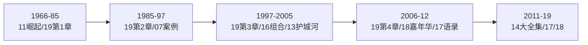
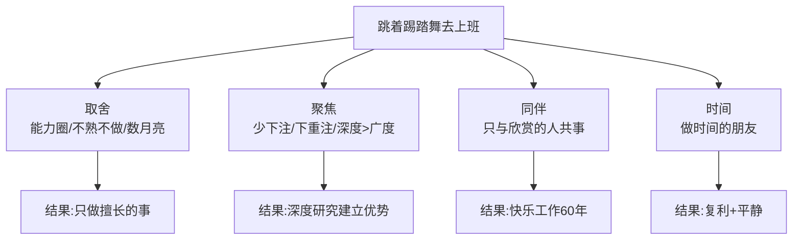
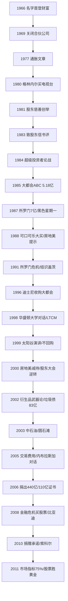

# 19《跳着踢踏舞去上班》深度解读（详细版）

> 《财富》杂志 46 年（1966—2012）巴菲特报道全景合集——卢米斯亲手编辑的第一现场记录

## 📖 本书概览

| 项目 | 内容 |
|------|------|
| 书名 | 跳着踢踏舞去上班：巴菲特的快乐投资与人生智慧（Tap Dancing to Work） |
| 编者 | 卡罗尔·卢米斯（Carol Loomis）——《财富》杂志资深编辑、巴菲特 40 年密友、35 年无偿编辑致股东信 |
| 体例 | **90 个独立单元的文集**：全文文章、节选、演讲、读者来信、巴菲特亲笔文章、年报摘要 |
| 时间跨度 | 1966 年（巴菲特名字首次见诸《财富》→ 2012 年（中石油 7 倍回报/比亚迪/股票胜过黄金）——**46 年第一现场** |
| 作者阵容 | 卢米斯 + 约 40 位《财富》撰稿人 + 巴菲特本人（12 篇）+ 比尔·盖茨 |
| 核心命题 | 巴菲特 46 年"跳着踢踏舞去上班"的完整轨迹——从无名投资者到慈善家 |
| 系列位置 | **19《跳着踢踏舞去上班》= 巴菲特编年史**：与 [[17《沃伦·巴菲特如是说》深度解读（详细版）|17 如是说（语录）]]、[[14《巴菲特投资学大全集》深度解读（详细版）|14 大全集（体系）]]、[[18《巴菲特的嘉年华》深度解读（详细版）|18 嘉年华（年会文化）]] 互补——这本按时间轴看"巴菲特如何一步步走到今天" |

## 🎯 为什么这本书值得单独解读

- **唯一的 46 年编年史**：从 1966 年《财富》拼错"Buffett"（少一个 t），到 2012 年捐赠承诺——巴菲特每一个关键节点都有当时的原始报道
- **卢米斯的"事后评注"**：每篇文章附注"巴菲特所预见的是否成真"——**预测验证实验场**（如 1977 通胀预测、1999 太阳谷 7% 回报率预言）
- **巴菲特亲笔 12 篇**：通货膨胀、衍生品"大规模杀伤性金融武器"、贸易赤字"进口许可证"、市场指标、股票 vs 黄金债券
- **大事件第一现场**：所罗门危机（"人生中最重要的一天"）、LTCM 收购告吹、互联网泡沫、2008 金融危机、比亚迪
- **快乐投资哲学**："跳着踢踏舞去上班"不是鸡汤——是能力圈+取舍+与喜欢的人共事的自然结果（邱国鹭序）

## 📑 目录

- [[#第1章 1966—1985：从无名到传奇的起点|第1章 1966—1985：从无名到传奇的起点]]
- [[#第2章 1985—1997：从投资家到企业家的转型|第2章 1985—1997：从投资家到企业家的转型]]
- [[#第3章 1997—2005：泡沫、危机与"神谕"|第3章 1997—2005：泡沫、危机与"神谕"]]
- [[#第4章 2006—2012：慈善、传承与最后的智慧|第4章 2006—2012：慈善、传承与最后的智慧]]
- [[#附录一 巴菲特语录精选（本书 20 条）|附录一 巴菲特语录精选（本书 20 条）]]
- [[#附录二 卢米斯评注：巴菲特预测的成与败|附录二 卢米斯评注：巴菲特预测的成与败]]
- [[#附录三 巴菲特花絮：你不知道的细节 20 则|附录三 巴菲特花絮：你不知道的细节 20 则]]
- [[#附录四 巴菲特慈善之路全记录|附录四 巴菲特慈善之路全记录]]
- [[#附录五 本书重要投资案例一览表|附录五 本书重要投资案例一览表]]
- [[#附录六 系列互链：19 号笔记在巴菲特系列中的位置|附录六 系列互链：19 号笔记在巴菲特系列中的位置]]
- [[#附录七 读完本书后的 10 个自问|附录七 读完本书后的 10 个自问]]
- [[#总结：跳着踢踏舞去上班的人生算法|总结：跳着踢踏舞去上班的人生算法]]

## 🔗 双链导读（本笔记与系列的连接点）

| 连接主题 | 本书章节 | 关联笔记 |
|---------|---------|---------|
| 合伙公司时代 | 第1章 | [[11《巴菲特的伯克希尔崛起》深度解读（详细版）|11 崛起]]（29.5% vs 7.4% 同源数据） |
| 股东信文化 | 第1章 | [[09《巴菲特致股东的信》深度解读（详细版）|09 股东信·主题版]] · [[10《巴菲特致股东的信》深度解读（详细版）|10 股东信·编年版]] |
| 格雷厄姆-多德部落 | 第1章 | [[16《巴菲特的投资组合》深度解读（详细版）|16 投资组合]]（超级投资者） |
| 所罗门危机 | 第2章 | [[14《巴菲特投资学大全集》深度解读（详细版）|14 大全集]]（报纸测试）· [[18《巴菲特的嘉年华》深度解读（详细版）|18 嘉年华]]（作证视频） |
| 可口可乐/大都会 | 第2章 | [[07《巴菲特投资案例集》深度解读（详细版）|07 案例集]] · [[11《巴菲特的伯克希尔崛起》深度解读（详细版）|11 崛起]] |
| 护城河/风险观 | 第2章 | [[13《巴菲特的护城河》深度解读（详细版）|13 护城河]]（波动≠风险） |
| 中石油 | 第3章 | [[14《巴菲特投资学大全集》深度解读（详细版）|14 大全集第5章]]（4 年 8 倍系列独有） |
| 年会文化 | 第3章 | [[18《巴菲特的嘉年华》深度解读（详细版）|18 嘉年华]]（伍德斯托克/宗教布道会） |
| 长期持有/复利 | 第4章 | [[12《巴菲特的估值逻辑》深度解读（详细版）|12 估值逻辑]] |

---

## 第1章 1966—1985：从无名到传奇的起点

### 1.1 没有人比得上琼斯——巴菲特的名字第一次登上《财富》

**1966 年的起点**：卢米斯写阿尔弗雷德·温斯洛·琼斯（对冲基金之父）的文章中，巴菲特的名字**只出现一句话**——而且被拼错了（"Buffett"少了一个 t）。

**琼斯的业绩**（为何值得开篇）：

| 指标 | 琼斯 | 对照 |
|------|------|------|
| 5 年总回报（至 1963.5.31） | 325% | 富达趋势基金 225% |
| 10 年总回报 | 670% | 德雷福斯基金 358% |
| 模式 | 有限合伙+杠杆+对冲 | 共同基金 |

**巴菲特合伙公司 vs 琼斯**（1965 年）：琼斯 325%（会计年度止于 5 月）vs 巴菲特 334%（止于 12 月）——**棋逢对手**。

**命运的分岔**：琼斯坚持战斗在股市；巴菲特关闭合伙公司，走向伯克希尔。

### 1.2 对冲基金遭遇艰难岁月——巴菲特 1969 年急流勇退

**1969 年背景**：大牛市于 1968 年见顶，1969 年对冲基金被熊市重创，大多亏损、撤资、关门。**巴菲特合伙公司却大赚一笔**，资产达 1 亿美元（琼斯两只基金合计约 1.6 亿）。

**39 岁巴菲特的选择**：认为 1968 年过度投机是疯狂行为——"这是一个我不了解的市场"。**1969 年底清算合伙公司**。

**合伙公司 13 年战绩**（卢米斯补注）：

| 指标 | 数据 |
|------|------|
| 复合年回报率（扣除激励） | 23.8% |
| 复合年回报率（含激励） | **29.5%** |
| 同期道指 | 7.4% |
| 巴菲特个人积累 | 2500 万美元 |
| 盈利年份 | 13 年全部盈利（含 1969） |
| 分配规则 | 回报低于 6% 全归合伙人；超过 6% 部分抽成 25% |

**关闭原因**：① 股市回报率越来越低（"油水已经流干了"）；② 时间和金钱应有其他导向；③ 建议投资者转向市政债券（"消极"方式）。

> 🔗 **呼应**：29.5% vs 7.4% 与 [[11《巴菲特的伯克希尔崛起》深度解读（详细版）|11 崛起]] 数据同源——合伙公司时代是巴菲特所有故事的起点。

### 1.3 通货膨胀如何欺诈股票投资者——巴菲特亲笔（1977）

**发表风波**：《财富》高级编辑塞利格曼专程赴奥马哈沟通修改，巴菲特（只收 1 美元稿费）拒绝删减；塞利格曼建议不刊登，主编卢巴坚持——最终刊出。

**核心论点**：传统观念认为股票是对冲通胀的武器（股票代表企业所有权，不直接与美元挂钩）——**巴菲特用数据证明这是幻觉**：

| 通胀时代的真相 | 说明 |
|---------------|------|
| 高通胀下股票和债券一样表现不佳 | 1970 年代 10 年大部分时间如此 |
| 12% 名义回报的幻觉 | 大企业名义回报约 12%，但真实购买力被通胀侵蚀 |
| 资本密集型企业受害最深 | 需要不断再投资维持实物资产 |
| 通胀=隐性税 | 对投资者征收的"通胀税" |

**卢米斯事后评注（成与败）**：
- ✅ 高通胀榨取股票投资者——正确（1977 年购买力损失惨烈）
- ❌ 高通胀将持续——错（1979 年沃尔克上任击碎通胀）
- ❌ 企业税率"不太可能"下降——错（48% → 35%）
- 巴菲特自认："我的猜测被证明是错误的，尤其是关于税率的部分，这是无可争议的事实。"

**巴菲特的坦率**：1999 年他依然说"我对自己说过的话不会做任何更正"（指太阳谷演讲），但对通胀文章的错误坦然承认——**学者式诚实**。

### 1.4 小学院在投资游戏中取得大成功——格林内尔学院（1983）

**背景**：巴菲特帮助格林内尔学院（Grinnell College）管理捐赠资金——1200 人的文科学院，位于爱达荷州玉米带。

**传奇操作**：1976 年花 1290 万美元（仅 200 万现金+无追索权贷款）买下代顿市一家电视台；1980 年以 5000 万美元卖给赫斯特集团——**4 年近 4 倍**。

**业绩对比**：

| 机构 | 5 年复合增长率 |
|------|--------------|
| 格林内尔学院基金会 | 16.2% |
| AG贝克追踪 150 家基金会中位数 | **1.7%** |

**巴菲特的困惑**（罕见）：

> "当基金会拥有 800 万美元的时候，这个只有 1200 人的学校看起来挺好的；而当基金会拥有了 5 亿美元的时候，这个 1200 人的学校还是挺好。"——**60 多倍回报没有改变学校本质**

**最新状态**（2011—2012）：学生 1600 人，基金会资产约 15 亿美元。

### 1.5 股东的慈善捐赠权利——1981 年创举与 2003 年终止

**创举**（1981 年）：巴菲特把公司捐款的决定权交给股东——每股可指定 2 美元捐给慈善机构。股东投票决定，而不是管理层。

> "我不希望股东从我的银行账户签支票，然后拿着支票按照他们的选择去做慈善。同理，我们拿股东账户的钱按照自己的选择去做慈善，也是不合适的。"

**背景数据**：1981 年伯克希尔市值约 500 美元/股，年利润 5300 万美元（每股 51.72 美元），1967 年起不分红，资本收益率约 20%；公司慈善捐款仅占税前利润 0.2%（美国企业平均 1%）。

**巴菲特与苏珊占 47% 股份** → 有权分派 93.5 万美元给偏爱的机构（推进人工流产组织）。

**22 年的"慈善红利"**：股东每年可向多达 3 家机构每股捐 18 美元；22 年共派发 **1.97 亿美元**。

**2003 年终止**（辛迪·库格伦事件）：亚利桑那州 34 岁家庭主妇库格伦——娇宠（The Pampered Chef，伯克希尔子公司，7.4 亿营收，7 万兼职"咨询员"）的准销售员——发起反对向人工流产组织捐款的运动。签名近 1000 人、销售员辞职、客户投诉，公司压力不堪重负。娇宠董事长克里斯托弗"怀着沉重的心情去见了巴菲特"。2003 年 7 月 3 日终止计划。

**巴菲特的考量**：反对者运动导致娇宠家庭主妇们可能失去工作，不公平——**宁可牺牲自己的创举，不牺牲员工生计**。

### 1.6 巴菲特的信——托拜厄斯与"最糟糕的投资"

**致股东信的进化**：1966 年起写；1977 年 SEC 专门小组学习后革新；1980 年代早期引起广泛注意。**卢米斯 1977 年起无偿编辑**（唯一记得的建议：把"the"改成"a"）。

**1983 年书评**（自由作家托拜厄斯）：当时还没听说过巴菲特——"只听说过他拥有一帮狂热的拥趸"。

**托拜厄斯的遗憾**（巴菲特粉丝最痛的段子）：

> "伯克希尔哈撒韦公司是我所做过的最糟糕的投资，因为我压根儿就没有买。如果当时我拿着《财富》杂志给我的 1500 美元稿费，再加些钱买两股，那么……"——当时股价 1000 美元（现价约 13 万美元）；同样的情况还发生在 1 万美元和 3 万美元时。

**年报的朴素**（1983 年描述）：没有照片、彩印、柱状图、图表、甚至没有公司标志——"看上去就像一家泡沫最终破裂的……"（年报如公司：重内容轻形式）

### 1.7 你能跑赢股市吗——格雷厄姆-多德部落 vs 有效市场（1984）

**背景**：有效市场假说（EMH）盛行——巴菲特"选择股票方面的优秀纪录"被看作"无以复加的幸运"。

**1984 年 5 月 2 日哥伦比亚大学论战**：巴菲特 vs 罗切斯特大学金融学教授迈克尔·詹森。詹森把巴菲特及其伙伴比作"幸运的金币"（掷硬币概率论）。

**巴菲特的绝地反击**：在 4 位（自己+芒格+鲁安+施洛斯）之外再加 5 位"幸运金币"，命名 **"格雷厄姆-多德都市的超级投资者"**（Superinvestors of Graham-and-Doddsville）——9 位投资者拥有同一位"精神导师"格雷厄姆，但投资组合鲜有重复——"栖息在同一个理念的国度，却做着形形色色的生意"。

**卢米斯的结论**：

> "作为这场著名论战的旁观者，我认为巴菲特打了一场漂亮仗，干脆利索地战胜了詹森。这个结论也成了大家的共识。巴菲特自己也觉得，在他自己写过的文……"（巴菲特自称这是他写过的最重要文章之一）

> 🔗 **呼应**：格雷厄姆-多德部落正是 [[16《巴菲特的投资组合》深度解读（详细版）|16 投资组合]] 第3章的学术基础——本书提供论战现场版。

### 1.8 第1章小结

1966—1985：巴菲特完成从"奥马哈无名合伙人"到"传奇投资者"的进化——**合伙公司 29.5% → 1969 急流勇退 → 通胀文章（思想成熟）→ 格林内尔（能力圈外延）→ 慈善创举（价值观成形）→ 超级投资者（理论自信）**。1965 年每股 18 美元，1983 年 1000 美元+。

---

---

## 第2章 1985—1997：从投资家到企业家的转型

### 2.1 首府/美国广播公司——5.18 亿美元买下"美国最顶尖的管理者"

**1985 年交易**：首府广播公司收购美国广播公司（ABC），巴菲特以 **5.18 亿美元**购买合并后公司 18% 股份。

**对墨菲的评价**：

> 巴菲特："我觉得他是美国最顶尖的管理者。"——自认不能胜任管理者角色的巴菲特，真真切切地把自己的未来部分地交到了墨菲手里。

**罕见条件**：巴菲特同意连续 11 年向管理层投"赞成票"（条件是墨菲或董事长丹尼尔·伯克掌权），并接受限制买卖股票的严格要求——**信任管理层的极致形态**。

**谈判桌上的巴菲特**（沃瑟斯坦回忆）：

> "巴菲特太聪明了。你要处处小心，以免被抓住小辫子。"——并购专家沃瑟斯坦 vs 巴菲特：巴菲特"虚伪"地承诺提价 3% 左右，拒绝再度讨价还价。

**结局**：1996 年被迪士尼收购，伯克希尔获得 **4 倍回报**。

### 2.2 时代华纳不为人知的故事——被拒绝的巴菲特

**1988 年**：巴菲特+墨菲+伯克到访时代华纳，试图合并——焦点"首府的管理者人数必须比时代华纳多出一到两个"。芒罗对墨菲说："非常感谢，但请记住，并不是时代华纳公司要被卖掉。"

**1984 年的闭门羹**：巴菲特曾非正式提出购买时代华纳 10% 股份——董事会极力劝芒罗放弃。

> **启示**：巴菲特不是每次都能买到想买的企业——被拒绝是常态，关键是继续找。

### 2.3 迪士尼——"回来真好"（1966 与 1996 的呼应）

**1966 年第一次买入**：股价低得可怜，整个公司市值不到 9000 万美元。巴菲特以 **每股 31 美分**用合伙公司资金大笔买入（电影资料库+主题公园）。

**1967 年卖出**：以每股 48 美分出售——"哦，好吧，回来真好。"

**1996 年重新买入**（大都会被迪士尼收购时）：两个信封——第一个装着 2000 万股首府股票（价值 25 亿美元）交给迪士尼；第二个信封密封："直至 3 月 7 日下午 4 点 30 分方可打开"——巴菲特的选择：**只要迪士尼股票**（标准包选择权）。

**与埃斯纳的对话**：巴菲特竖起大拇指、许诺资金支持；埃斯纳保证努力工作。

**花絮（卢米斯评注）**：巴菲特后来又卖出迪士尼（威尔斯去世、奥维茨管理失当之后）——**好公司+坏管理也会卖**。

> 🔗 **呼应**：1966 年迪士尼案例与 [[14《巴菲特投资学大全集》深度解读（详细版）|14 大全集]] 的"案例篇"互补——本书有迪士尼 31 美分→48 美分→25 亿美元三幕剧。

### 2.4 通过回购股票来打败市场（1999）

**巴菲特的回购观**：

> "只有在一种情况下，企业回购股票才是合理的，那就是自身价值被低估了。"——鄙视为支撑股价或抵消期权影响而回购。

**伯克希尔自己的回购纠结**（1999 年互联网泡沫）：

> "我对伯克希尔哈撒韦公司价值的评估一度太保守，抑或是太醉心于将资金用作他途。"——股价跌至 40000 美元时承认未回购是错误。

**回购的悖论**（卢米斯解释）：如果巴菲特公开说"伯克希尔股价过低值得购买"——股价立刻大涨，不再便宜。

**2011 年 9 月 26 日**：账面净资产约 96900 美元，股价持续低于 10 万美元——巴菲特宣布董事会授权以**不高于账面净资产 110%** 的价格回购——**回购终于落地**。

### 2.5 猜猜是谁购买了"倒霉"债券——WPPSS 与垃圾债券之路

**1985 年**：巴菲特投资 **1.39 亿美元**购买华盛顿公共能源供应系统（WPPSS）债券——1983 年无力偿还 22.5 亿美元贷款的"臭名昭著"机构，华尔街戏称"倒霉"债券（Whoops）。

**选择性地买**：只买为 1-3 期电站募资的债券（不碰 4-5 期）——**区分风险，不因名声放弃价值**。

**结果**：2.6 亿美元债券投资（1983—90 年代初期），带来 **2.63 亿美元免税利息收入 + 6800 万美元资本收益**。

**巴菲特的原则**（1985 年信）：

> "我和查理·芒格一起评估了所购买债券的风险，确保相对于未来可能获得的收益，伯克希尔哈撒韦公司支付的价格（远低于现行价格）是划算的。"——**风险不是名声，是价格与收益的对比**

### 2.6 所罗门兄弟公司——7 亿美元与"人生中最重要的一天"

**1987 年 10 月 1 日投资**：7 亿美元购买可赎回可转换优先股——伯克希尔**有史以来最大投资**。股息 9%，3 年后可 38 美元转换普通股（当时股价 33 美元）。

**对古弗兰的评价**：

> "我们对所罗门兄弟公司的首席执行官约翰·古弗兰的能力和刚正不阿充满敬佩。"——粉碎巴菲特要换帅的谣言

**"理发师"论**（1982 年年报）：

> "这些投资银行家就如同理发师，所以，永远不要问理发师你是否应该修剪头发了。"——但古弗兰与众不同：曾建议顾客不要急于做决定，哪怕错失大笔生意。

**1991—1992 年危机**（巴菲特人生中最重要的一天：1991 年 8 月 18 日）：

| 事件 | 细节 |
|------|------|
| 危机 | 所罗门违规竞标美国国债（保罗·莫泽案发） |
| 转折点 | 8 月 18 日财政部下达禁令，剥夺竞标资格——几乎推入死地 |
| 巴菲特的角色 | 亲自驻扎 9 个月；"每天要决定 25 件关系到公司生死的大事"（平时每年顶多一项重大决策） |
| 4 小时 | 两次国债拍卖间隙，巴菲特充满激情地奋斗，终于取消禁令 |
| 警告 | "所罗门的破产将是灾难性的，多米诺骨牌效应会波及全球"——**提前 17 年预言 2008 雷曼** |
| 结局 | 旅行者集团 90 亿美元收购（1997）——巴菲特撤出 |

**巴菲特的幽默**（莫泽被判罚款+监禁后）：

> "莫泽支付了 3 万美元的罚款，并被判处 4 个月的监禁。所罗门兄弟公司的股东，包括我在内，却支付了 2.9 亿美元的罚款，而且我本人还被判处担任临时董事长长达 10 个月之久！"

**巴菲特对危机期的反思**（卢米斯记录）：在"钢丝上骑独轮车"——**声誉是第一资产，必要时用全部身家去捍卫**。

> 🔗 **呼应**：所罗门"报纸测试"出自 [[17《沃伦·巴菲特如是说》深度解读（详细版）|17 如是说]]；年会上年年播放的作证视频见 [[18《巴菲特的嘉年华》深度解读（详细版）|18 嘉年华]]——本书提供危机第一现场全记录。

### 2.7 巴菲特内幕——1988 年卢米斯长文

**巴菲特从投资家变身企业家**：1987 年伯克希尔净资产 +4.64 亿美元（+19.5%），"接管 23 年以来平均 23.1%"。

**1987 年的操作**：10 月崩盘前购买 7 亿美元所罗门可转换优先股；德士古破产时收购短期债券。

**"油画布"**：巴菲特把伯克希尔称作"油画布"——每年年报就是他在画布上的作品。

**1988 年的转折点**（卢米斯）："巴菲特成为投资家之后，是如何迈向企业家的新领域的"——**从此伯克希尔不仅是投资组合，更是企业帝国**。

### 2.8 内布拉斯加的特别待遇——拒绝分拆的上市之路（1990）

**背景**：58 岁的巴菲特宣布将伯克希尔股票从场外市场移至纽交所——但纽交所要求 2000 位股东每人至少 100 股（股价 4300 美元，没多少人买得起 100 股；流通股不到纽交所平均的 3%）。

**巴菲特的应对**：拒绝分拆股票抑制投机——"宁愿等待纽约证券交易所改变规则"。纽交所最终允许 **10 股为一手**交易。

**上市动机**（出人意料）：不是刺激股价——"在相似的经济环境下，交易价格应该与场外差不多"。真实原因：**纽交所做市商买卖差价更小，交易价格更便宜**——为股东省钱。

### 2.9 房地美——"温馨提示"与蟑螂理论（1988—2000）

**罕见的买股提示**（1988 年 12 月 19 日）：巴菲特破例公开提示——伯克希尔旗下储蓄信贷公司有权提前购买房地美股票，已到上限，但"你们可以买"。

**结果**（卢米斯验证）：读者按分拆调整后 **4 美元**买入，持有至 1998 年 12 月可卖 **60 美元**——15 倍。"作为巴菲特的追随者，投资者所要做的就是坚守，长时间地坚守。"

**伯克希尔自己的操作**：约 6000 万股持有 10 年以上；2000 年减仓 95%，入账约 **30 亿美元资本利得**（SEC 规则允许秘密交易，F-13 表格事后修改）。

**减持的真实原因**（2003 年水落石出）：

> 巴菲特与 CEO 布伦德塞尔多次会面，发现他追求"两位数"利润率（如 15%）——对金融公司不正常。"管理层想要这样出色的业绩，只能开始对数字造假。"

> **"如果你在厨房发现了蟑螂，那就意味着绝对不止一只。"**——巴菲特经典判断

**后见之明**：卖掉偏早（房地美又涨到 2007 年 10 月），但 2008 年房地美成为跌得最惨的企业之一——**巴菲特躲过了金融危机的最大地雷之一**。布伦德塞尔被 OFHEO 处以 1600 万美元罚款。

### 2.10 第2章小结

1985—1997：巴菲特完成从"投资者"到"企业家+危机管理者"的转型——**大都会 4 倍、迪士尼回归、所罗门 9 个月救火、房地美 15 倍+提前逃离**。这段经历证明：巴菲特的护城河不只是选股，还有**危机中的判断力与声誉资本**。

---

---

## 第3章 1997—2005：泡沫、危机与"神谕"

### 3.1 "点金石"也打折了——1990 年股价暴跌的现场

**1990 年**：萨达姆·侯赛因+经济衰退重创市场——伯克希尔股价从 8900 跌至 5500 美元，**跌幅 36%（超标普两倍）**。60 岁巴菲特账面损失 15 亿美元（每小时损失 215450 美元）。

**巴菲特的态度**：

> "我可没有穷到把双层汉堡减成单层汉堡的地步。"——"它（商务飞机）肯定是最后离开公司的一员。"

**背景数据**：1965 年接手至 1989 年底，股价涨 741 倍（12 美元→8900 美元）；1974 年曾跌 55%；1989 年旗下公司平均净资产收益率达 57%。

**市场质疑"白衣骑士"**：为所罗门、吉列、全美航空、冠军国际充当"白衣骑士"（购买可转换优先股抵御恶意收购）——内夫看到"很多消极因素"。巴菲特回应：只有普通股表现好，优先股才有满意回报。

### 3.2 巴菲特买进垃圾债券——纳贝斯克（1990）

**1990 年年报**：公开承认投资 4.4 亿美元购买纳贝斯克（RJR Nabisco）高息债券——"那里有着比我预想中更多的杀戮。"

**判断**：纳贝斯克运转良好、信贷情况比猜测好——市场价值比出价高约 1.75 亿美元。

> "很多事情我都希望自己能有后见之明。但对于投资决定而言，我不认为后见之明有用，只有行动才有回报。"——**垃圾债券是"用脚投票"的理性估值**

### 3.3 巴菲特如何看待风险——波动不是风险（1993 年信）

**巴菲特的风险定义**：

> "通常风险低的股票，是那些我们非常熟悉的企业，而且在购买时，我们内心不会存在强烈的不舒服的感觉。……按照字典里的解释给风险下个定义：系指受到损失或伤害的可能性。"

**批判 Beta**：

> "学术界……坚持把它当作是股票价格或投资组合相对波动的程度。……他们渴望找出可以衡量风险的单一统计值，却忘了一项最基本的原则：宁愿'可能对'，也不要'一定错'。"

**波动是朋友**：

> "事实上，真正的投资人喜欢波动都还来不及……这是因为市场波动的幅度越大，就更有机会出现一些好公司的价格低廉的情况。很难想象这种低价的优惠会被睿智、精明、不放过任何机会的投资人视为'有害'。"

**华盛顿邮报例**：1973 年买邮报时股价相对大盘跌得更狠——按 Beta 理论风险"更高"，但"要是哪天有人愿意以极低的价格把整家公司卖给你，你是否也会认为这样风险太高，而予以拒绝呢？"

> 🔗 **呼应**：这是 [[13《巴菲特的护城河》深度解读（详细版）|13 护城河]] 中"波动≠风险"的原始出处之一；与 [[16《巴菲特的投资组合》深度解读（详细版）|16 投资组合]] 第2章（β/CAPM 批判）完全同源。

### 3.4 巴菲特抵挡住 2 亿美元的"下冲气流"——全美航空（1994）

**教训案例**：投资全美航空 3.58 亿美元可转换优先股，账面损失约 2 亿美元。

**巴菲特强硬一面**：1994 年警告——如果工会不同意削减成本（削减 10 亿经营费用，半数来自工资），他和芒格辞去董事职务。

**行业困境**：全美航空是成本最高的国内航空公司；1994 年 9 月匹兹堡空难（132 人死亡）让前景更阴郁；飞行员协会："每次公司陷入困境，都会首先拿飞行员开刀，然后把节省的钱乱花出去。"

**花絮反转**：1996 年新 CEO 斯蒂芬·沃尔夫带来"奇迹般"复苏——股价从 4 美元涨到 75 美元，可转换优先股价值扶摇直上，拖欠股息也获补偿——**坏投资也有转机，但教训（航空业）永记**。

### 3.5 巴菲特与盖茨——190 亿美元的友谊

**1991 年 7 月会面**（盖茨推荐序亲述）：母亲安排——盖茨本不想来（"和这位擅长挑选股票的家伙会面实在提不起我的兴趣"），但"聊了几句话，我立刻发现这是一位不同凡响的人"。

**首次会面细节**（卢米斯）：西雅图郊外盖茨父母乡间小屋；梅格·格林菲尔德带巴菲特和凯瑟琳·格雷厄姆挤在老旧窄小的斯巴鲁里；盖茨乘私人直升机带梅琳达前来，"甚至在落地时就在盘算早点儿逃离"——交谈后立刻改变想法。

**友谊的定价**（《亿万富翁的伙伴》）：

> "当友情的两端连接的是比尔·盖茨和沃伦·巴菲特时，这段友谊的价值将高达 190 亿美元。"——4 年了，美国最富有的两个人（巴菲特当时居首）的忘年深交。

**1998 年华盛顿大学对话**（《比尔·盖茨和沃伦·巴菲特秀》）：350 位商学院学生；盖茨 42 岁净资产约 480 亿、巴菲特 360 亿；"整个过程给人的感觉就像是分散各地的一家人又其乐融融地团聚在一起了。"

**2005 年内布拉斯加大学对话**（《910 亿美元的对话》）：2000 名学生排队；盖茨 510 亿、巴菲特 400 亿；**重大新闻：巴菲特宣布有生之年捐出亿万家产**（苏珊 2004 年去世后，慈善去向成为心理负担）。

**盖茨眼中的巴菲特**（《每个人都渴望的情书》前因）：

> 1996 年盖茨写道："在我认识的人当中，能将商业看得如此通透的人，除了巴菲特，绝无二人。直到今天，我仍然坚持这种看法。"

### 3.6 建在沙丘上的房子——LTCM 收购告吹（1998）

**背景**：1998 年 8 月，巴菲特准备出发去阿拉斯加前几小时，决定尝试收购濒临倒闭的长期资本管理公司（LTCM）的交易组合——从阿拉斯加海湾地区远程操控。

**LTCM 的教训**（巴菲特）：

> "你只需要发一次财。"——以才华出众闻名的公司管理者，却让自己陷入可能丧失全部资产的境况。这种行为在伯克希尔哈撒韦公司中是不可能被认可的。

**梅里韦瑟的执念**：LTCM 倒塌后 1999 年创办 JWM 合伙公司（曾达 20 亿美元，2008 年次贷危机清算）；2009 年又开 JM 咨询公司——**"第二次发财"执念 vs "只需要发一次财"**。

**结局**：14 家银行联合投入 36 亿美元救 LTCM（害怕连锁损失）；监督小组恢复 60000 个头寸；1999 年底返还银行，2000 年 LTCM 倒闭清算。**巴菲特的收购要约（含高盛团队）未成——但躲过一场劫难**。

### 3.7 巴菲特主义——2000 年股东大会的信仰危机与逆转

**"宗教布道会"**：投资者克利夫兰的比喻——"这是一场宗教布道会，而巴菲特就是我们的福音布道者！"（巴菲特自称资本主义的"伍德斯托克音乐节"）

**1999 年的挫败**：伯克希尔每股净资产增长**首次 20 年输给标普 500**（低 20.5%）——重仓股可口可乐、吉列暴跌，科技股一飞冲天。股价从高点跌 50% 至 40800 美元。"即便是最忠实的追随者，其信念恐怕也开始动摇了。"

**逆转**（2000 年 4 月下旬股东大会前夕）：股价大涨 47% 接近 6 万美元；科技股"滑铁卢"。

**股东大会众生相**（"巴菲特主义"细节）：

| 细节 | 内容 |
|------|------|
| 赠品 | 绿色 T 恤（印一叠现金）+ 棒球帽 |
| 早餐 | 免费丹麦面包和咖啡（股东排队领取，"看起来真不像买得起 A 股的有钱人"） |
| 爆款 | 时思糖果 50 年代销售小姐制服的**芭比娃娃**（时思×美泰合作）——人群沸腾争抢订单 |
| 时长 | 7 小时股东大会 |

**信徒宣言**（亨廷顿海滩的戈贝尔）：

> "无论如何，我们都将长期坚守伯克希尔哈撒韦的股票。我们可不是日内交易者。"

### 3.8 巴菲特先生谈股票市场——太阳谷演讲（1999）

**罕见的话题**：巴菲特几乎从不在公开场合谈论整体市场水平——1999 年下半年 4 个场合破例（7 月太阳谷峰会：道指 11194 点）。

**核心观点**（卢米斯整合+巴菲特审阅）：

1. **投资者期望值过高**：汽车业、航空业改变了世界，但没人靠投资它们发财——"改变生活方式的行业≠赚钱的行业"
2. **合理回报预期**：剔除通胀前约 **7%**（1999—2016 约 17 年）；再扣除交易费用后约 **6%**
3. **两段 17 年**：1964—1981（道指 0.1% 增长）vs 1981—1998（大牛市）——GNP 增速不能解释差异，**利率是"物质世界的地心引力"**

**卢米斯验证（成与败）**：
- ✅ 市场将大幅下跌——正确（互联网泡沫破裂）
- ❌ 具体回报率偏乐观——1999 年底至 2012 年中，道指复合年回报率仅约 **3.2%**、标普仅 **1.26%**（比巴菲特的 6% 预期还低）

**巴菲特的坚持**：

> "我对自己说过的话不会做任何更正。"

### 3.9 一切都该留给子孙吗——遗产观（1986 年封面文章）

**《财富》封面**（巴菲特头像第一次登封面）：美联储主席沃尔克在华盛顿聚会中说"现在每个人都在谈论你的文章"——25 年后读者仍收藏此文。

**遗产数字的演变**：

| 时间 | 遗产安排 |
|------|---------|
| 1986 年前 | "几十万美元"给孩子 |
| 2010 年纽约晚宴 | 首任妻子苏珊遗嘱：每子女 1000 万美元；巴菲特遗嘱：每子女 1500 万美元 |
| 合计 | 三子女共 7500 万美元（对比巴菲特财富近 500 亿美元——"以万计"） |

**子女慈善**：1999 年苏珊去世前，给每子女 1000 万美元建慈善基金会；后每子女基金会超 1 亿美元（彼得称"大爆炸现象"）。

**管理权传承**：不把管理权交给子女，但希望长子霍华德未来胜任董事长——"家庭成员能最大程度维系公司文化延续"，实际管理由家族外的人掌管。

### 3.10 一切都该留给子孙吗——富人和名人的子女（霍华德篇）

**霍华德·巴菲特**（35 岁农夫）：种植玉米大豆，1989 年当选内布拉斯加州道格拉斯市官员。

**姓氏的压力**：

> "我总感觉自己的面前有一道屏障。似乎我无论做什么，都不可能跟他一样成功。而且我做的事情很可能对他造成不利的影响。"——童年从不摆柠檬汁小摊

**孙子的感悟**（6 岁小霍伊买了 10 股可口可乐）：

> "我并不这样认为，我这辈子可能都没能力去购买 1 股伯克希尔哈撒韦公司的股票。"

**教子**：乔丹到访奥马哈时小霍伊想坐头桌——霍华德告诉儿子："你没有这种与生俱来的特权。"

**巴菲特式家教**："清理小渠沟和修剪草坪……做错事情的时候，要为结果埋单。"

### 3.11 第3章小结

1997—2005：巴菲特经历**信仰危机（1999—2000）与思想升华（太阳谷演讲、风险定义、遗产观）**，同时收获世纪友谊（盖茨）。这段时期证明：**巴菲特也会被市场嘲笑，但他的坚持最终被市场证明**。

---

---

## 第4章 2006—2012：慈善、传承与最后的智慧

### 4.1 成为慈善家——440 亿美元的去向（2006）

**2006 年 6 月的秘密**（卢米斯亲述）：巴菲特决定 6 月宣布立即捐献——财富将逐渐捐入 5 家基金会，最大一家是比尔和梅琳达·盖茨基金会。《财富》秘密筹划一个多月（连摄影都是"一头雾水"），6 月 25 日新闻发布会"完全震惊了全世界"。

**2006 年 8 月第一份"厚礼"**，此后每年夏天延续；2012 年共捐约 133 亿美元：

| 受赠方 | 2012 年金额 |
|--------|------------|
| 比尔和梅琳达·盖茨基金会 | 约 110 亿 |
| 苏珊·汤普森·巴菲特基金会 | 11 亿 |
| 三子女的基金会 | 12 亿（每个 4 亿） |

**捐赠的底层逻辑**（2006 年前后）：

> "我宁愿去选择一位聪明、善意、格调高的人，通过他开阔的视野去看待这个问题，而不需要受制于躺在棺材里的我。最有效、成果最佳的运营方式，往往是让高水平的人在不受约束的情况下工作。"——**选人而非选项目**

**为什么给盖茨**：盖茨基金会的规模与执行力——"把钱花掉"的效率。

### 4.2 20 多年历史的 110 亿美元——1979 年股权证书

**2006 年 7 月 3 日**：巴菲特亲自开车进城，步入奥马哈一家美国银行分行，打开大保险箱，取出一张 **1979 年、121737 股伯克希尔 A 股**的股权证书——按当天股价价值约 110 亿美元（总财富约 1/4）。

**兑换**：送明尼阿波利斯富国银行，按 30:1 兑换 375 万股 B 股（选派总部 16 名员工中的一位亲自护送，不用联邦快递）——足够未来 10 年捐赠。

**70 年前的回响**（6 岁）：父亲霍华德带他到同一家银行（当时叫奥马哈国家银行）开 20 美元储蓄账户；5 年积攒到 120 美元；**11 岁用 114 美元买 3 股城市服务公司优先股**——"如果你想要积累到 440 亿美元的财富，得有个好的起点才行。"

### 4.3 巴菲特对盖茨说：把钱花掉——10 年使用期限

**新规则**（2007 年年报）：遗产准备就绪（预计 3 年）后，**每一块钱都必须在 10 年之内花掉**。

> "之所以设定使用期限，是因为我希望这些钱被我认为有能力、有精力、有内驱力的人更快地花出去。"

**基金会行业的震撼**：大多数大型基金会按永久持续理念运营，支出比例不超 5%（免税最低限额）；30 家最大基金会中 28 家 2005 年拨出资金不到 5%。

**"全部用光"模式的支持者**（纽约大学戴尔）：

> "随着基金会的不断成长，出现官僚主义和使命偏离的风险也随之增加。……全部用光是很耗费脑力的。"

**呼应**：盖茨夫妇也规定基金在两人去世后 50 年内用完——**两位首富共同挑战"永久基金会"传统**。

### 4.4 捐赠承诺——Giving Pledge（2010）

**2009 年 5 月爆料**：盖茨和巴菲特在纽约秘密组织亿万富翁晚宴（戴维·洛克菲勒主持，布隆伯格、奥普拉等参加）——主题：慈善。

**2010 年 6 月正式发布**：巴菲特和盖茨宣告"捐赠承诺"，激发亿万富翁思考慈善贡献——《财富》封面故事；网站 givingpledge.org 同步上线（3 月两人在奥马哈郊外好莱坞餐厅共进午餐定方案）。

**成效**（2012 年 9 月）：**92 位签署者**（不含共同签名配偶）。

> 巴菲特："即便这个数字小于 92，我也会认为已经得偿所愿……某些人捐赠的数目是非常庞大的。"——印度和中国慈善晚宴继续推广（富人多倾向传承给下一代）

**"866000 亿美元的挑战"**：《财富》对巴菲特+盖茨计划的总结——用财富改变世界。

### 4.5 大规模的杀伤性金融武器——衍生品（2002）

**2002 年年报（节选首发《财富》）**：

> "在金融衍生品以及衍生品交易的问题上，芒格和我的看法一致：无论是对参与交易各方还是对整个经济系统而言，它们的危险性都不亚于定时炸弹！"——**"大规模杀伤性金融武器"从此成为流行语**

**衍生品的致命问题**：
- 复杂乱象使外部董事不可能知悉公司手中合同
- 大多数 CEO 无法掌控局面
- 风险管理 vs 投机的警戒线由"不靠谱却自我感觉良好"的华尔街人士决定

**巴菲特的解药**（《解开衍生品的乱麻》）：

> "要求每位首席执行官在年报中确认自己了解公司参与的每项衍生品。如果把这条写上，我想你就能解决好存在的每一个问题。"——**简单到没人相信，但他是对的**

**巴菲特自己也买衍生品**（2000 年年中，金融危机之际）：创造几十亿美元浮存金+丰厚承保利润预期；部分合约延伸到 **2028 年（他 100 周岁生日前两年）**——"希望自己能够长寿，看看最终结果如何"。

**"按照神话定价"**（2008 年评论）：CDO/CMO 按模型定价而非市场定价——"如果可以按照'模型'而非'市场'的标准来衡量一下我的体重，我倒愿意付出一些代价来尝试一下！"

### 4.6 现在我们要把钱放到哪里去呢——泡沫后的耐心（2002）

**2002 年信**：股价连跌三年，但"我们很难找到哪怕能引起我们一点儿兴趣的投资目标"——"狂欢作乐之后的宿醉尚未完全消退"。

**10% 门槛**：

> "除非我们发现有极大可能获得至少 10% 的税前利润（扣除企业所得税后约为 6%—7%），否则我们宁可作壁上观。靠短线获到低于 1% 的回报率，那简直是毫无乐趣可言。有时成功的投资需要的恰恰就是冷静与耐心。"

**垃圾债券的加仓**：2002 年这方面投资增加 5 倍达 **83 亿美元**。

**股票 vs 垃圾债券的盈亏比**（巴菲特自述）：

> "在我们经营伯克希尔哈撒韦公司的 38 年当中，不包括通用再保险公司与政府雇员保险公司的投资，盈亏比例约为 100 比 1。"——股票预期每笔成功；垃圾债券预期大幅亏损但回报补偿

### 4.7 7 倍回报的中石油——中国第一笔大投资（2003）

**背景**（卢米斯评论）：巴菲特调侃商学院学生——"要求每一位学生都来计算一家互联网公司的价值，然后对于有答案的学生，他会给个大大的不及格"；中国上市公司财务"如黄河一般浑浊"。

**2003 年 4 月**：再度投资 5000 万美元，持股达流通股 13%——投资总额近 5 亿美元，成为中石油第二大境外股东（仅次于英国石油）；"巴菲特效应"带动股价一周上涨 12%。

**巴菲特的解释**：

> "我们觉察到石油生意在中国发展得相当不错，但我们不会对中国本身下什么大结论。"——**投资企业，不投资国家**

**估值对比**：

| 指标 | 中石油 | 埃克森美孚 |
|------|--------|-----------|
| 市盈率 | 约 7 倍 | 约 15 倍 |

**质疑者**：油田已探明、产量难以为继、40 万员工工资负担；中国海油更受青睐（年收入增长 13% vs 中石油 4%）。

**花絮（卢米斯评注）**：最终中石油投资约 4.88 亿 → 33 亿——**4 年约 7 倍**（A 股投资者当时普遍质疑，事后证明巴菲特是对的）。

> 🔗 **呼应**：中石油是 [[14《巴菲特投资学大全集》深度解读（详细版）|14 大全集]] 第5章的系列独有案例——本书补充"当时现场质疑"的完整语境。

### 4.8 致命的"交易费用"——既得利益集团与 100 年道指（2005）

**"真正的还原论者"**（商业伙伴对巴菲特的评价）——2005 年信展示化繁为简天赋：

> "就股票投资者这个群体而言，在审判日之前所能拿到的报酬，就是这些企业产生的盈余。"——投资者总体回报 = 企业利润 − 交易费用

**既得利益集团（Gotrocks）寓言**（浓缩）：一群"既得利益"家族拥有美国企业，财富随企业盈余增长；但后来出现了"帮手"（经纪人、基金经理）——他们从家族财富中分走越来越多，家族成员开始跑不赢市场，甚至互相买卖股票让帮手赚差价——**帮手越来越多，家族越来越穷**。

**100 年道指**（1899.12.31—1999.12.31）：道指从 66 点涨到 11497 点——所需年增长率低得惊人（文中留悬念）；"整个世纪以来，美国企业都表现得非常出色，投资者却因'自伤'减少回报"。

**交易费用的终局验证**（巴菲特 vs 门徒合伙的赌局）：10 年赌约——低成本标普 500 指数基金（Admiral）vs 精心挑选的 5 只对冲基金（扣除所有费用）。

**2011 年底战况**（卢米斯更新）：

| 参赛方 | 2008 年 | 截至 2011 年底累计 |
|--------|---------|-------------------|
| 门徒 5 基金均值 | −23.9% | −5.89% |
| 标普 Admiral 基金 | −37% | −6.27% |

> 巴菲特："我只是希望《伊索寓言》是正确的，乌龟真的能够战胜兔子。"——开局惨烈，乌龟开始领先

**赌局的真正赢家**（卢米斯毒舌）：组合型基金的管理者——"他们已经将投资者（承担损失的有限合伙人）所支付的管理费收入囊中"。（门徒合伙人特德·塞德斯："唉！"）

### 4.9 身居幕后的查理·芒格——伯克希尔的共同掌舵者

**芒格对伯克希尔的贡献自述**（用"我们"——伯克希尔文化精髓）：

> "我们选择了符合自己性情的经营方式，这就需要我们花费很多时间进行思考、学习、终生不断地自省，对所犯过的错误进行悔悟，并保持幽默感。……事实上，我们继承了巴菲特的老师本杰明·格雷厄姆的衣钵。"

**谁是介绍人**（公案）：两个奥马哈人都声称介绍二人相识——霍兰的书里：客厅角落两张椅子，巴菲特和芒格整晚"驻扎"，"从未起身离开过座椅，也从未停止过谈话"。

**芒格的独特看点**：股东大会上最佳双人秀（"遗憾的是没能搬上百老汇"）；谈官司："他们传唤我们提交公司的人员编制材料。我们不仅没有这类材料，甚至连员工都没有。"（伯克希尔总部 16 人）

### 4.10 巴菲特是怎么想的——金融危机中的导师（2008）

**2008 年 4 月**（贝尔斯登刚倒下）：《财富》采访巴菲特与 150 位沃顿商学院学生的 4 小时对话——"巴菲特是如何扮演一位导师角色的"（他最希望人们记住的形象）。

**数据**：2007—2008 学年 31 所学校 2400 名学生造访伯克希尔；2011—2012 年削减至 1450（每月一个周五，160 名学生来自 8 所学校每校 20 名）；**追加规则：每校必须有女生**（此前绝大多数是男性）。

**瓦查维尔的印象**（采访者）：

> "巴菲特与学生对话时的自由风度和巨大信息量让他吃惊不已……在我下车之前，他问了一个又一个关于我自己的问题。在我们采访的对象当中，这种情况并不常见。"——**对人格外好奇，是巴菲特最被低估的特质**

### 4.11 巴菲特的"修复"先生——索科尔事件（2010—2011）

**2010 年赞美**：戴维·索科尔"最经常被视为巴菲特继任者"（其他竞争者：格雷格·埃布尔、阿吉特·贾因、泰德·蒙特罗斯、托尼·奈斯利、马特·罗斯）。

**2011 年 3 月崩塌**：索科尔辞职——他几周前购买了路博润（Lubrizol）股票并建议巴菲特收购；股票大涨+收购决定 → 内幕交易嫌疑。

**2011 年股东大会的头号话题**（卢米斯亲历）：记者宣读苛责问题"为什么巴菲特没在索科尔问题上表现得更强硬些？"——"我话音未落，一阵掌声随之而来。"巴菲特承认处理得不够好，"索科尔的行为的确令人费解"。

**声誉的代价**：新闻稿对索科尔"太过仁慈"的批评——巴菲特"如果任何人损害伯克希尔信誉会毫不留情"的声明被对照审视——**声誉是双刃剑，宽容也会被质疑**。

### 4.12 为何股票胜过黄金和债券（2011 年信，全书收尾）

**巴菲特的三分法**：

> "金子本身不会繁育出新的价值；债券也很少回馈投资者；而精挑细选出来的普通股票和土地则是具有生产性的资产，很有可能会为投资者带来丰厚回报。"

**46 年的数字对比**（卢米斯补注）：

| 年份 | 伯克希尔状态 |
|------|-------------|
| 1966 | 巴菲特合伙公司+新英格兰纺织企业，年收入 4900 万美元 |
| 2011 | 《财富》500 强第 7 名，年收入 1440 亿美元 |
| 2011（市值） | 500 强第 9，总市值 2020 亿美元（苹果 5690 亿居前） |

**"有生之年，还没有其他任何一个人像他一样把一家默默无闻的小公司带到了世界 500 强的前 10 名。"**

**1969 年合伙公司 1 亿美元播下的种子** → 2012 年伯克希尔 860 亿美元股权投资：可口可乐 156 亿、富国银行 137 亿、IBM 130 亿、美国运通 88 亿。

**乔布斯插曲**：两人相识于格林内尔学院董事会；乔布斯曾电话咨询苹果过剩现金处置，巴菲特给了建议，"但他并未采纳"。

### 4.13 第4章小结

2006—2012：巴菲特完成最后蜕变——**从"投资之神"到"慈善导师"**：440 亿捐出（有生之年）、10 年花完规则、捐赠承诺（92 位签署者）、金融危机中买股票（市场指标 75%）+比亚迪（芒格推荐）、索科尔风波中维护声誉。**46 年轨迹收官：跳着踢踏舞去上班的人生，最后跳着踢踏舞把钱送出去。**

---

---

## 补充篇 Ⅰ：本书其他重要文章精读

### B1. 对于指数期货的早期恐惧——1982 年致国会议员丁格尔的信

**背景**：1987 年 10 月 19 日"黑色星期一"，道指单日下跌 22.6%——调查聚焦标普 500 指数期货（"投资组合保险"策略做空放大恐慌）。

**1982 年的信**（《财富》找到的预言）：国会讨论是否允许芝加哥商品交易所开展股指期货交易时，丁格尔（调查委员会主席，父亲与巴菲特父亲同为议员好友）请巴菲特写信阐述观点。

**巴菲特的结论**：

> "我们不需要股指期货，它就是基于美国股市的一种赌博工具，证券经纪人也不该鼓励人们参与此类投资。"

**信中要点**（自述 30 年投资历练+一线销售经验）：
- 股指期货有助于减少投资者真正的风险？（巴菲特逐条辨析——用逻辑拆解期货的"好处"）
- 对声称"准确"的预测保持高度警惕

**结果**：1982 年 4 月标普 500 期货仍上市（丁格尔和巴菲特输了论战）；股指期货迅猛发展；2010 年 5 月"闪电崩盘"吓坏迷你电子盘投资者——**巴菲特的担忧以另一种方式被验证**。

### B2. 打电话给巴菲特谈合并——1986 年整版广告

**华尔街日报整版广告**（47000 美元）：

> "我们正努力寻求并渴望购买价值超过 1 亿美元的企业，截止日期是 1986 年 12 月 31 日之前。我们有充裕的资金，而且我们会以超乎想象的速度做出反应……如果你有意向，请立即致电。"

**紧迫的原因**：新税法 1987 年 1 月 1 日施行——资本利得税 20%→28%；巴菲特警告 12 月 31 日后卖资产可能要付高达 **52.5%**（企业 34% + 留存利润再投资 28%）。

**收购标准**（广告原文）：至少 1000 万美元税后利润（越多越好）、相当好的净资产收益率、很少或没有贷款、优良管理、**"简单的生意"**："如果过多涉及高科技成分，恐怕我们理解不了。"

**编者注**：巴菲特没有得到任何回应。——（广告没买到企业，但成了巴菲特收购哲学的公开声明）

### B3. 内布拉斯加的特别待遇 + 一切的神谕（2003 年圆石滩）

**72 岁巴菲特的一天**（安迪·瑟沃贴身采访）：圆石滩旅馆，穿睡衣见记者；朋友们（芒格、墨菲、吉莱斯皮、唐·格雷厄姆、戈特斯曼、约翰·卢米斯）每年聚一次打高尔夫球（巴菲特左肩有伤不打，"不想放弃这样难得的社交机会"）——**20 多年的老友局**。

**"神谕"的影响力**（杜克大学 MBA 调查）：毕业生最崇拜的人（除父亲外）不是总统、教皇、甘地——**是巴菲特**。

**影响力等级**（《财富》影响力特刊）：前三名恰好在太阳谷高尔夫球赛三支球队中——沃尔玛李·斯科特、微软盖茨、巴菲特。

**巴菲特影响力的本质**（卢米斯）：

> "这种'显赫'的地位赋予了他施加道德劝告的影响力，而他使用这一特权时又相当谨慎，因此使其影响力愈加强大。这是一种仅凭几句话，就能改变人们的行为的能力。这又使巴菲特具有了美国资本主义'护国公'的形象。"——**谨慎使用影响力，是影响力最大的来源**

### B4. "巴菲特"周边产品——粉丝经济学

| 价格 | 物品 |
|------|------|
| 16.95 美元 | 最畅销的巴菲特丛书 |
| 2.5 美元 | 股东大会门票（发售 1 万张；eBay 炒到 117 美元） |
| 5 美元 | 两张股东大会门票 |
| 20 美元 | 巴菲特摇头玩偶（奥马哈皇家队网站） |
| 100 美元 | 巴菲特签名钞票（教堂拍卖） |
| 210000 美元 | 巴菲特用了 20 年的旧钱包（1999 年慈善拍卖） |
| 250100 美元 | "与巴菲特共进午餐"（2003 年 eBay） |
| **3456789 美元** | "与巴菲特共进午餐"（2012 年，捐格莱德基金会） |

### B5. 我得到过的最好建议——最差建议（2001 年封面）

**采访的意外**（卢米斯）：问"你得到过的最好建议是什么"——巴菲特讲的是**最差的建议**，来自他最敬佩的两个人（父亲霍华德和格雷厄姆）。

**1951 年场景**：21 岁刚毕业，想进格雷厄姆-纽曼公司——"我兴冲冲地提出免费为他工作时，他却拒绝了"。

**两位导师的烂建议**：道指整年持续 200 点以上（此前每年都出现过低于 200 点）——"你肯定会很出色，只是现在的时机不够好。"

**巴菲特的应对**：不以为意，直接回奥马哈在父亲的巴菲特·福克公司做股票销售员——**把"时机不好"的建议扔进垃圾桶，是巴菲特最重要的决定之一**

**深层原因**（巴菲特自省）：也许是他太幼稚——"瘦巴巴的，头发乱糟糟的"，导师只是委婉劝他成熟些。

### B6. 支持奥巴马和希拉里的"政治重婚犯"

**政治身份演变**：父亲霍华德 4 次当选共和党国会议员——巴菲特起初是共和党人（宾大青年共和党人俱乐部主席；1948 年打算骑大象庆祝杜威当选，直到杜鲁门胜出）；现在是坚定民主党人。

**"政治重婚犯"**（2008 年）：希拉里（巴菲特支持其当选纽约州参议员）vs 奥巴马（经朋友介绍认识、来奥马哈共进午餐）——巴菲特告诉两位候选人："我会支持你们两个。"事实也是如此。

**政治原则**：

> "我支持政治人物，无关乎他们的派别，只在乎他们在重大问题上的观点是否与我同步。"——支持希拉里的人工流产合法化主张与竞选财务改革

### B7. 最受赞赏——一次又一次（2001—2012）

**数据**：《财富》最受赞赏公司——伯克希尔连续 5 年前 10，此后"位置就不曾动摇过"；1997—2012 年 **15 年间唯一始终停留在前 10 名的公司**（2008 年"全美"改"全球"后依旧）。

**巴菲特论信誉**（2010 年专访）：

> "这不是只花一天、一月或一年时间就能做到的事，而是需要一点一滴的积累。毁掉信誉是转眼之间的事，但把它树立起来却需要长久的功夫。"

**德克斯特鞋业**（伯克希尔的最差收购）：1993 年 4.19 亿美元股票收购（严重低估海外低价产品冲击）；2000 年注销 2.19 亿商誉；2001 年"认输"——不该收购、不该用股票收购、解决问题拖延；2005 年名字从年报消失。

> 巴菲特："这无疑是迄今为止我做过的最差的一笔收购。"——（用股票收购=双重错误：还搭上了上涨的伯克希尔股票）

**企业界的"情书"**（后安然时代）："诚挚地，沃伦"——巴菲特表扬信成为企业界的"产品质量许可证"：通用电气（期权费用化）、标准普尔（核心利润）、美国第一银行、亚马逊。

> "在所有人乃至万物之中，只有他拥有无瑕的声誉。"——标普分析师弗里德曼

### B8. 暴风骑士——富国银行的故事（2008 年信）

**2001 年 Finova 收购插曲**：伯克希尔与伙伴收购破产金融公司菲诺瓦，想拉银行组成贷款财团——其他银行愿意以高出成本 0.2% 的超低利率借钱（希望赢得后续投行业务），**富国银行没有兴趣**（巴菲特是富国最大股东，3.15 亿/7.4%）。

**巴菲特的兴奋**：

> "它就应该这么想，这事让我激奋了好一阵子……你观察一位银行家的真正角度就是看他如何操作资金。他说了什么并不作数，观察他做了什么、没做什么才真正有意义。富国银行没有做的事情恰好证明了它的了不起。"——**不赚不该赚的钱，是最好的银行**

### B9. 让巴菲特"出轨"的比亚迪（2008）

**背景**：巴菲特金科玉律"决不投资一家自己搞不懂的企业"——芒格建议投资比亚迪（电池/手机/电动汽车）时，人们以为巴菲特会拒绝。

**芒格的推荐逻辑**：

> "公司拥有大型且非常现代化的设施和优秀的员工，产品缺陷率很低，而且其运营的成本也很低。"——王传福是"爱迪生和韦尔奇的合体"

**投资**：2008 年底 2.3 亿美元买 10%（当时股价约 1 美元/8 港元）；2010 年 3 月涨到 77 港元，2012 年 5 月又跌至 11 港元，9 月 16 港元——"过山车"。

**芒格的克制**：对电动汽车行业销售增幅比较悲观，但长期前景看好——**芒格是比亚迪投资案的专家**（巴菲特在股东大会上如此说）。

### B10. 小巴菲特造访北京——彼得·巴菲特

**《做你自己》中国热销**：2010 年出版，中译本销量 32 万册（2012 年底超 40 万）——"股神"之子放弃斯坦福学业追逐音乐梦想的故事吸引中国年轻人。

**三个孩子的基金会**：
- 苏茜（59 岁）：奥马哈早教事业（全家最善于与父亲沟通的人——"只要苏茜出马，安全问题就能搞定"）
- 霍华德（57 岁）：伊利诺伊州农场，关注非洲贫困农村
- 彼得（54 岁）：全球女性问题（与妻子珍妮弗）

**"股神"在中国**：每次到访中国媒体全程追踪；超过 40 本关于巴菲特的书被翻译成中文。

### B11. 吉米·巴菲特和沃伦·巴菲特是亲戚吗

**相似点**：都爱弦乐器（吉米热带吉他/巴菲特尤克里里）；都在自己熟知的领域脚踏实地（巴菲特不碰高科技股，吉米润色几十年前的歌）；都吸引拥趸（"鹦鹉头"粉丝 vs 股东——巴菲特自称资本界的"伍德斯托克音乐节"）；都不喜欢改变（巴菲特戏称"树懒天生懒散"）。

**族谱调查**（巴菲特的姐姐多丽丝，系谱学家）：向全美 125 位"巴菲特"发问卷两年——发现 17 世纪长岛穷苦农民约翰·巴菲特、纽芬兰水手、诺福克岛成百上千位"巴菲特"（赏金反叛者后代）、流放地近亲通婚……**最终无确凿血缘证据**。

> 吉米："我很想成为你们家族的亲戚，因为你们既有钱又有名。"
> 多丽丝："真是太有意思了，我们和你想得一样，也想和你攀亲戚，因为你也既有钱又有名。"

### B12. 大咬一口审计委员会——审计三问

**背景**：SEC 主席莱维特成立特别小组改进审计委员会——提议审计委员会在年报中证实财务报告符合 GAAP，遭企业反对（"证实的工作是外聘审计员要干的活儿"）。

**巴菲特的反对**："每年开几个小时的会议，审计委员会就能够证实任何对公司财务报告中有意义的东西"——**质疑形式主义**。

**巴菲特给审计委员会的三问**（让审计员回答）：

| # | 问题 |
|---|------|
| 1 | 如果由某个审计员单独负责审核，他呈现的报表与管理层的会不会不同？如果不同，解释差异 |
| 2 | 如果审计员是投资者，收到的报表信息是否足以了解报告期内财务状况？ |
| 3 | 如果审计员是 CEO，会认为公司遵循了相同的内部审计程序吗？区别在哪里，为什么？ |

**核心**：回答应在会议几分钟内完成；关键是**在审计人员头上悬起"货币性惩罚"的警示**——"驱使他们真正完成自己的工作，而不是成为唯管理层是从的马屁精"。

**行业评价**：美国注册公共会计师协会主席柯特利——巴菲特把问题的"水分都蒸发掉了"。

### B13. 巴菲特的"温馨提示"变奏：市场指标（2009）

**指标**：美国股市总市值/GNP 比率（1924—2009 年 85 年图）。

| 时点 | 比率 | 信号 |
|------|------|------|
| 2001 年底 | 133% | 别买（《财富》当年发表"别买！"） |
| 2009 年 1 月下旬 | 75% | **买**（巴菲特：70%—80% 区间购买可能带来很好回报） |

**验证**：2009 年 2 月 1 日买入标普总回报 ETF，持有到 2012 年中——**78% 总回报**（尽管 3 月 9 日还先跌了 18%）。

**格雷厄姆的回响**：

> "股市短期的运作像是一个投票机，而它长期的表现则像一个称重器。"

**巴菲特的行动**（2008 年 10 月 17 日《纽约时报》专栏）：长期只持有美国国债（伯克希尔股票除外）后开始进购——"如果价格持续下跌，我预计很快就会动用我 100% 的净资产净买入美国股票。"

### B14. 先知的信用危机 + 通用汽车的凯迪拉克

**FICO 信用分 718**（低于美国平均水平）：报告显示巴菲特从汇丰内华达分行申请 294 美元分期付款且 23 期断供——巴菲特从未开过户（冒名顶替骗局）；2004 年调查显示 25% 信用报告有严重错误。"多年以来，我一直对自己的家人说我的信用记录不太好。"（暗指对孩子的"吝啬"）

**凯迪拉克 DTS**（2006 年）：看完通用汽车 CEO 瓦戈纳"坦率、沉稳和理性"的采访后决定买新车——"我百分之百地支持通用汽车公司"，派女儿去买（专门为高龄驾车人士设计的 DTS，起价 41990 美元），**付现金**。

> "我想我会变成一个汽车推销员，因为我可以毫不费力地把车卖给任何人。"

---

---

## 附录一 巴菲特语录精选（本书 20 条）

### 投资篇

> 1. "我只是在做这辈子自己最喜欢做的事情，这种状态从 20 岁起就开始了。"——27 岁篇
> 2. "我对每一位共事的伙伴都有所选择。这也是我取得巨大成就的最重要的因素。我不会和自己不喜欢或者不欣赏的人打交道，就像选择婚姻伴侣一样。这就是关键。"——27 篇
> 3. "资金最紧张的时候就是投资的最佳时刻。"——59 岁语录
> 4. "宁愿'可能对'，也不要'一定错'。"——风险论
> 5. "真正的投资人喜欢波动都还来不及。"——风险论
> 6. "只有在一种情况下，企业回购股票才是合理的，那就是自身价值被低估了。"——回购论
> 7. "我对自己说过的话不会做任何更正。"——太阳谷演讲
> 8. "靠短线获到低于 1% 的回报率，那简直是毫无乐趣可言。有时成功的投资需要的恰恰就是冷静与耐心。"——2002 年信
> 9. "我们觉察到石油生意在中国发展得相当不错，但我们不会对中国本身下什么大结论。"——中石油
> 10. "你只需要发一次财。"——LTCM 教训

### 商业与声誉篇

> 11. "这些投资银行家就如同理发师，所以，永远不要问理发师你是否应该修剪头发了。"——1982 年年报
> 12. "本年度，我们的净资产增加了 6.136 亿美元，或者说是增长了 48.2%。这样的净资产收益率就像哈雷彗星来访一样弥足珍贵。在我的生命中不会再有第二回了。"——1985 年年报（卢米斯注：错了，1998 年 48.3% 再创新高）
> 13. "如果期权不是一种薪酬，那是什么？如果薪酬不是一种花费，那是什么？如果计算利润时不考虑花费，那花费究竟要算到谁头上？"——期权费用化
> 14. "虽然我们都期待股东大会带给大家的是更偏重精神层面的体验，但也务必记住，即便圣洁如宗教，也会将捐献盘作为仪式的一部分。"——1995 年股东大会
> 15. "莫泽支付了 3 万美元的罚款，并被判处 4 个月的监禁。所罗门兄弟公司的股东，包括我在内，却支付了 2.9 亿美元的罚款，而且我本人还被判处担任临时董事长长达 10 个月之久！"——所罗门
> 16. "毁掉信誉是转眼之间的事，但把它树立起来却需要长久的功夫。"——最受赞赏

### 人生与慈善篇

> 17. "在股票方面，你寻求的东西都是很明显且很容易操作的。你努力去寻找只有'一英尺'高的门槛……然而，当我真正进入慈善领域时才发现，我所碰到的问题是有史以来最棘手、最难解决的。所有的门槛都是'七英尺'高的。"——慈善如鬼魅
> 18. "我宁愿去选择一位聪明、善意、格调高的人，通过他开阔的视野去看待这个问题，而不需要受制于躺在棺材里的我。"——捐给盖茨的逻辑
> 19. "金子本身不会繁育出新的价值；债券也很少回馈投资者；而精挑细选出来的普通股票和土地则是具有生产性的资产。"——股票胜过黄金
> 20. "如果该比率（总市值/GNP）下降到 70%—80% 之间，购买股票就可能会带来很好的回报。"——市场指标

---

## 附录二 卢米斯评注：巴菲特预测的成与败

### Y1. 大预言验证表

| 年份 | 巴菲特的预测/判断 | 结果 | 评级 |
|------|------------------|------|------|
| 1977 | 高通胀将榨取股票投资者 | 正确（1977—1981 购买力损失惨烈） | ✅ |
| 1977 | 高通胀将持续 | 错（1979 沃尔克上任击碎） | ❌ |
| 1977 | 企业税率不太可能下降 | 错（48%→35%） | ❌ |
| 1982 | 股指期货是赌博工具 | 部分应验（1987 黑色星期一放大、2010 闪电崩盘） | ⚠️ |
| 1985 | 48.2% 净资产收益率"不会再有第二回" | 错（1998 年 48.3% 再创新高） | ❌ |
| 1988 | 房地美值得买（4 美元提示） | 正确（10 年 15 倍） | ✅ |
| 1991 | 所罗门倒闭将引发全球多米诺骨牌 | 正确（2008 雷曼验证） | ✅ |
| 1999 | 股市期望值过高、合理回报 7% | 方向正确；实际更低（道指 3.2%/标普 1.26%） | ✅⚠️ |
| 2001 | 总市值/GNP 133% 别买 | 正确（随后大跌） | ✅ |
| 2009 | 总市值/GNP 75% 可以买 | 正确（至 2012 年中 78% 回报） | ✅ |
| 2005 | 指数基金将战胜对冲基金（赌局） | 进行中领先（2011 年底 −6.27% vs −5.89%） | ✅ |
| 2003 | 中石油（7 倍市盈率）值得买 | 正确（4 年约 7 倍） | ✅ |
| 2000 | 减持房地美（"蟑螂"） | 正确（2008 房地美崩溃） | ✅ |

### Y2. 巴菲特预测方法的特质

1. **预测企业而非预测市场**：中石油看石油生意、房地美看管理层——市场预测只是副产品
2. **承认错误的速度**：税率、通胀、哈雷彗星——年报里公开纠正（"这是无可争议的事实"）
3. **坚持不改的预测**：太阳谷 7%（"不会做任何更正"）——方向对，幅度错也坚持
4. **可操作的信号**：市场指标给出明确区间（70%—80% 买）——不是模糊的感觉

> **启示**：巴菲特的预测胜率并不完美（约 70%），但**每次错误都公开承认、每次正确都带来超额回报**——"可能对"优于"一定错"。

---

## 附录三 巴菲特花絮：你不知道的细节 20 则

| # | 花絮 | 出处 |
|---|------|------|
| 1 | 名字第一次上《财富》被拼错（少一个 t） | 1966 琼斯文 |
| 2 | 给《财富》写稿只收 1 美元稿费 | 1977 通胀文 |
| 3 | 卢米斯 35 年无偿编辑致股东信（唯一建议：the→a） | 前言 |
| 4 | 1966 年迪士尼 31 美分买入、1967 年 48 美分卖出——"回来真好" | 迪士尼篇 |
| 5 | 1986 年花 47000 美元登整版广告买企业——无人回应 | 合并广告篇 |
| 6 | 1998 年股东大会：时思糖果芭比娃娃引发人群沸腾 | 巴菲特主义 |
| 7 | 1991 年所罗门危机期间"每天要决定 25 件生死大事"（平时每年 1 件） | 力挽狂澜 |
| 8 | 2003 年圆石滩：穿睡衣见记者；左肩有伤不打高尔夫但坚持参加老友局 | 一切的神谕 |
| 9 | 杜克 MBA 调查：除父亲外最崇拜的人是巴菲特（不是总统/教皇/甘地） | 影响力 |
| 10 | 旧钱包拍卖 21 万美元；签名钞票 100 美元；摇头玩偶 20 美元 | 周边产品 |
| 11 | 与巴菲特共进午餐：2003 年 25 万 → 2012 年 3456789 美元 | 周边产品 |
| 12 | 1966 年不买时代华纳 10%（被董事会拒绝） | 时代华纳 |
| 13 | 1986 年纽交所为伯克希尔改规则：10 股一手（巴菲特拒绝拆股） | 内布拉斯加 |
| 14 | 2006 年买凯迪拉克 DTS（为高龄驾车人士设计）——付现金 | 通用汽车 |
| 15 | FICO 信用分 718，低于美国平均水平（冒名骗局） | 信用危机 |
| 16 | 1979 年股权证书（121737 股 A 股）价值 110 亿美元——自己开车去银行取 | 110 亿美元 |
| 17 | 6 岁在奥马哈国家银行开 20 美元账户；11 岁 114 美元买 3 股城市服务优先股 | 110 亿美元 |
| 18 | 2001 年富国银行拒绝以超低利率借钱给伯克希尔——巴菲特"激奋了好一阵子" | 暴风骑士 |
| 19 | 每月一个周五与 160 名学生对话（8 校各 20 名）；规则：每校必须有女生 | 怎么想的 |
| 20 | 乔布斯曾电话咨询苹果现金处置——"他并未采纳"巴菲特的建议 | 股票胜过黄金 |

---

## 附录四 巴菲特慈善之路全记录

### Z1. 慈善大事年表

| 年份 | 事件 |
|------|------|
| 1981 | 创举：股东指定捐赠（每股 2 美元） |
| 1986 | 《财富》封面文章《一切都该留给子孙吗》 |
| 1999 | 苏珊去世前给每子女 1000 万美元建基金会 |
| 2003 | 7 月 3 日终止"慈善红利"（娇宠风波）——22 年共 1.97 亿美元 |
| 2004 | 苏珊去世（遗嘱：每子女 1000 万） |
| 2006 | 6 月宣布有生之年捐出 440 亿美元（5 家基金会）；7 月 3 日兑换 1979 年股权证书 |
| 2007 | 年报新规：遗产 10 年内花完 |
| 2008 | 每子女基金会超 1 亿美元（彼得："大爆炸现象"） |
| 2010 | 捐赠承诺（Giving Pledge）发布——92 位签署者（2012.9） |
| 2011 | 印度慈善晚宴；"巴菲特法则"（奥巴马阵营） |
| 2012 | 年度捐赠约 133 亿（盖茨基金会约 110 亿） |

### Z2. 慈善哲学五原则

| 原则 | 巴菲特的话 |
|------|-----------|
| 选人 | "选择一位聪明、善意、格调高的人……而不需要受制于躺在棺材里的我" |
| 速度 | "我希望这些钱被我认为有能力、有精力、有内驱力的人更快地花出去"（10 年期限） |
| 不留给子女 | 三子女共 7500 万（对比财富近 500 亿）——"以万计" |
| 股东权利 | 1981 年创举："拿股东账户的钱按照自己的选择去做慈善，是不合适的" |
| 规模效应 | 给盖茨基金会（全球最大）——钱的效率最大化 |

### Z3. 慈善 vs 投资的门槛之辨

> "在股票方面，你寻求的东西都是很明显且很容易操作的。你努力去寻找只有'一英尺'高的门槛，这样就能轻松地跨过去。然而，当我真正进入慈善领域时才发现，我所碰到的问题是有史以来最棘手、最难解决的。最关键的一点是，所有的门槛都是'七英尺'高的。……（人口控制和防止核扩散）门槛如此之高，以至于我根本看不清其真实面貌，真的跟'鬼魅'有得一比啊。"——**投资找一英尺栏杆，慈善面对七英尺栏杆**

---

---

## 附录五 本书重要投资案例一览表

### X1. 投资案例全表

| 案例 | 年份 | 金额/价格 | 结果 | 教训 |
|------|------|----------|------|------|
| 迪士尼 | 1966 | 31 美分/股（公司市值<9000 万） | 48 美分卖出→1996 年 25 亿美元回归 | 好公司也要拿得住 |
| 格林内尔电视台 | 1976 | 1290 万（200 万现金+贷款） | 5000 万卖出（4 年近 4 倍） | 非上市公司也能增值 |
| 大都会/ABC | 1985 | 5.18 亿买 18% | 1996 年迪士尼收购→4 倍 | 信任管理层（11 年赞成票） |
| WPPSS"倒霉"债券 | 1983—85 | 2.6 亿债券 | 2.63 亿免税利息+6800 万资本收益 | 名声≠风险；选择性购买 |
| 所罗门 | 1987 | 7 亿可转换优先股 | 1991 危机救火→1997 撤出 | 声誉保卫战；9% 股息兜底 |
| 房地美 | 1988 | 4 美元提示买入 | 10 年 15 倍；2000 减持（30 亿收益） | 蟑螂理论；管理层造假信号 |
| 纳贝斯克垃圾债 | 1990 | 4.4 亿 | 市场价值高出 1.75 亿 | 垃圾债券也要估值 |
| 全美航空 | 1990s | 3.58 亿可转换优先股 | 账面亏 2 亿→1996 年复苏 | 航空业教训；优先股设计保护 |
| 中石油 | 2003 | 约 4.88 亿（13%） | 4 年约 7 倍（33 亿） | 7 倍市盈率；投资企业不投资国家 |
| 比亚迪 | 2008 | 2.3 亿（10%） | 过山车（8→77→11 港元） | 芒格推荐；能力圈边缘 |
| 富国银行 | 长期 | 3.15 亿/7.4%（2001 时点） | 长期重仓 | 不赚不该赚的钱才是好银行 |

### X2. 亏损案例全表（巴菲特自己承认的）

| 案例 | 错误 | 巴菲特的话 |
|------|------|-----------|
| 伯克希尔纺织 | 1965 年买下"烟屁股" | "我的第一个错误就是买下了伯克希尔哈撒韦公司的控制权"——烟蒂法买企业不是明智行为 |
| 德克斯特鞋业 | 1993 年 4.19 亿**股票**收购 | "这无疑是迄今为止我做过的最差的一笔收购"——不该收购+不该用股票+拖延 |
| 未回购伯克希尔 | 1999 年股价 40000 美元时 | "我对伯克希尔价值的评估一度太保守，抑或是太醉心于将资金用作他途" |
| 全美航空 | 航空业长期困局 | 行业结构性差——"如果你在厨房发现蟑螂"（此处为教训版） |
| 所罗门 | 投资银行难以预测 | "投资银行的经济状况远不如我经营的其他业务那般稳健、可预见" |

### X3. 关键数据速查

| 数据 | 数值 |
|------|------|
| 合伙公司 13 年复合回报 | 29.5%（含激励）/ 23.8%（扣除后）；道指 7.4% |
| 1965—1989 股价 | 12 美元→8900 美元（741 倍） |
| 1965—2012 股价 | 18 美元（1965）→7450 美元（1990）→133000 美元（2012.9） |
| 慈善红利 22 年 | 1.97 亿美元 |
| 捐赠（2012） | 133 亿美元（盖茨基金会 110 亿） |
| 1979 年股权证书 | 121737 股 A 股→110 亿美元 |
| 46 年跨度 | 1966 年 4900 万收入→2011 年 1440 亿收入（500 强第 7） |
| 1999—2012 道指 | 复合年回报约 3.2%（巴菲特预期 6%） |
| 2009 市场指标 | 总市值/GNP 75%→持有至 2012 年中 78% 回报 |
| 最受赞赏 | 1997—2012 唯一 15 年全在前 10 |

---

## 附录六 系列互链：19 号笔记在巴菲特系列中的位置

### W1. 与各笔记的内容映射

| 主题 | 19 号章节 | 关联笔记 |
|------|----------|---------|
| 合伙公司 29.5% | 第1章 1.2 | [[11《巴菲特的伯克希尔崛起》深度解读（详细版）|11 崛起]] |
| 致股东信 | 第1章 1.6 | [[09《巴菲特致股东的信》深度解读（详细版）|09 股东信·主题版]] · [[10《巴菲特致股东的信》深度解读（详细版）|10 股东信·编年版]] |
| 超级投资者 | 第1章 1.7 | [[16《巴菲特的投资组合》深度解读（详细版）|16 投资组合]] |
| 所罗门 | 第2章 2.6 | [[17《沃伦·巴菲特如是说》深度解读（详细版）|17 如是说]]（报纸测试）· [[18《巴菲特的嘉年华》深度解读（详细版）|18 嘉年华]]（作证视频） |
| 风险=波动？ | 第3章 3.3 | [[13《巴菲特的护城河》深度解读（详细版）|13 护城河]] · [[16《巴菲特的投资组合》深度解读（详细版）|16 投资组合第2章]] |
| 中石油 | 第4章 4.7 | [[14《巴菲特投资学大全集》深度解读（详细版）|14 大全集第5章]] |
| 可口可乐 | 第2章 | [[07《巴菲特投资案例集》深度解读（详细版）|07 案例集]] · [[12《巴菲特的估值逻辑》深度解读（详细版）|12 估值逻辑]] |
| 年会文化 | 第3章 3.7 | [[18《巴菲特的嘉年华》深度解读（详细版）|18 嘉年华]] |
| 巴菲特语录 | 附录一 | [[17《沃伦·巴菲特如是说》深度解读（详细版）|17 如是说]] |
| 长期主义 | 第4章 4.12 | [[12《巴菲特的估值逻辑》深度解读（详细版）|12 估值逻辑]] |

### W2. 同一事件的多笔记视角（本书的特色案例）

| 事件 | 19 号（现场报道） | 其他笔记（分析视角） |
|------|-----------------|-------------------|
| 所罗门危机 | 第2章：8 月 18 日"人生最重要一天"、4 小时救火 | [[17《沃伦·巴菲特如是说》深度解读（详细版）|17]]：报纸测试；[[18《巴菲特的嘉年华》深度解读（详细版）|18]]：作证视频年年播 |
| 中石油 | 第4章：2003 年现场质疑 vs 7 倍结果 | [[14《巴菲特投资学大全集》深度解读（详细版）|14]]：4 年 8 倍系列独有案例 |
| 可口可乐 | 第2章：基奥电话"那个人是不是你" | [[07《巴菲特投资案例集》深度解读（详细版）|07]]：88.5 亿/6.8 倍 |
| 房地美 | 第2章：蟑螂理论、4 美元→60 美元 | [[12《巴菲特的估值逻辑》深度解读（详细版）|12]]：估值视角 |
| 2008 危机 | 第4章：沃顿学生对话、市场指标 75% | [[14《巴菲特投资学大全集》深度解读（详细版）|14]]：A 股应用五大误区 |

### W3. 编年史定位：19 号 = 巴菲特系列的时间骨架

---

## 附录七 读完本书后的 10 个自问

1. 我能说出巴菲特合伙公司 13 年的回报率与道指的对比吗？（29.5% vs 7.4%）
2. 我知道巴菲特 1969 年为什么关闭合伙公司吗？（"油水干了"+时间导向）
3. 我能讲出 1977 年通胀文章的"成与败"吗？（购买力正确/税率错）
4. 我知道"格雷厄姆-多德部落的超级投资者"是哪 9 位吗？（同理念、不同生意）
5. 我能说出所罗门危机中"人生中最重要的一天"发生了什么吗？（8 月 18 日禁令+4 小时）
6. 我知道"蟑螂理论"的出处吗？（房地美：厨房一只蟑螂=不止一只）
7. 我能解释"大规模杀伤性金融武器"和巴菲特自己买衍生品的矛盾吗？（能估值就安全）
8. 我知道巴菲特捐出 440 亿美元的 5 家基金会和"10 年花完"规则吗？
9. 我能说出巴菲特两次预测失败的例子吗？（税率、哈雷彗星 48.3%）
10. 如果让我给巴菲特 46 年划分阶段，我能说出每个阶段的标志事件吗？

---

## 总结：跳着踢踏舞去上班的人生算法

### Z1. 快乐投资的四层结构（邱国鹭序 × 本书内容）

### Z2. 巴菲特 46 年的五个阶段

| 阶段 | 年份 | 标志 | 关键词 |
|------|------|------|--------|
| 合伙时代 | 1956—1969 | 29.5% vs 7.4% | 烟蒂股/套利 |
| 伯克希尔初创 | 1965—1985 | 纺织厂→保险+糖果 | 转向企业 |
| 企业家转型 | 1985—1997 | 大都会/所罗门/可口可乐 | 声誉+放权 |
| 泡沫与危机 | 1997—2005 | 太阳谷/衍生品/中石油 | 耐心+批判 |
| 慈善与传承 | 2006—2012 | 440 亿捐出/捐赠承诺 | 效率+价值观 |

### Z3. 这本书教给普通投资者的五件事

1. **看现场**：巴菲特也会被嘲笑（1999 年"老古董"）、也会犯错（德克斯特）——**成功是长期正确+公开认错的累积**
2. **看验证**：卢米斯 46 年追踪——预测有对有错，**重要的是对的时候赚大钱、错的时候不伤本**
3. **看本质**：投资回报 = 企业利润 − 交易费用（Gotrocks 寓言）——**费用是投资者最大的敌人**
4. **看人生**：只与喜欢的人共事、只做擅长的事、跳着踢踏舞去上班——**快乐是可持续投资的前提**
5. **看慈善**：财富的最终去向反映一个人的价值观——**"把每一块钱在 10 年内花掉"比"永久基金会"更需要勇气**

### Z4. 全书一句话

> **《跳着踢踏舞去上班》用 46 年的第一现场证明：巴菲特的伟大不在于从不犯错，而在于把"能力圈+安全边际+与欣赏的人共事+长期主义"坚持了半个世纪——然后跳着踢踏舞，把 440 亿美元送了出去。**

### Z5. 最终寄语

> 1966 年，《财富》杂志第一次提到巴菲特——名字还拼错了。2012 年，这本书出版时，伯克希尔的股价是 133000 美元。**46 年里唯一不变的是：巴菲特每天早上还是跳着踢踏舞去上班，办公室还是奥马哈那间没有标识的小楼，他还是只和自己欣赏的人打交道。** 变化的是财富，不变的是舞步——这就是"跳着踢踏舞去上班"的全部秘密。

---

*本笔记基于《跳着踢踏舞去上班：巴菲特的快乐投资与人生智慧》（卡罗尔·卢米斯编）撰写，覆盖推荐序、前言、全部 90 个单元的核心内容与卢米斯评注，并整合本系列 19 本笔记形成互链网络。*

*核心收获一句话：**巴菲特 46 年的编年史证明——快乐投资不是天赋，而是选择：选择能力圈内的生意、选择欣赏的伙伴、选择长期的视角，最后连财富的去向也选择得明明白白。***

---

---

## 补充篇 Ⅱ：前言与序言的深度展开

### B15. 卢米斯前言：为什么不写传记

**卢米斯的拒绝**：许多人请她写巴菲特传记——"我的答复总是'不'，因为我坚信对某一话题的熟稔并不一定能成就一部精彩的传记。一般而言，传记的作者最好与当事人之间保持一定的距离。"

**40 年友谊的起点**：1966 年文章后，巴菲特和妻子苏珊邀请卢米斯和约翰共进午餐——"从那时起，我们之间建立起了朋友关系，也可以说，为本书的撰写埋下了种子。"

**35 年无偿编辑**：1977 年起每年无偿编辑巴菲特致股东的信（"他写，我编辑"）。

**本书的诞生**：

> "过去在《财富》杂志发表的文章，本身就是货真价实的商业传记。只要稍加编辑，就能变成一本好书。"——90 个单元、约 40 位作者、46 年历史

**巴菲特的回应**（得知 46 年跨度）：

> "呣……46 年，真是很久啊！差不多有美国历史的五分之一那么长。"

**内容原则**：避免重复——"重复的内容基本都被剔除。事实上，做到这一点相当容易，因为巴菲特自己就一直走在创新的道路上。"

**1983 年的轶事**（巴菲特仍默默无闻）：《财富》请托拜厄斯写致股东信书评——他还没听说过巴菲特；巴菲特 1977 年写的通胀文章至今还会收到邮件。

### B16. 邱国鹭推荐序：取舍是快乐投资的源泉

**三种价值投资流派**（邱国鹭只做过三本书的序）：

| 流派 | 代表 | 方式 |
|------|------|------|
| 主动创造 | 3G 资本 | 并购控股+削减成本+释放价值 |
| 安全边际 | 格雷厄姆 | 市场先生/安全边际/便宜是硬道理 |
| 长期质地 | 巴菲特 | 企业质地+管理层+时间的朋友 |

**快乐的来源**：

> "之所以快乐，是因为你知道时间是你的朋友，你知道在等待的过程中，你所投资的公司的内在价值正在与日俱增。"

**社会意义**：

> "把资本投给自己尊敬、欣赏和钦佩的企业家，让优秀的企业有更低的融资成本和更充足的资源，知道自己的投资优化了社会资源的配置，这也是快乐的源泉。"

**金句**："不数星星、数月亮"；"弱水三千，但取一瓢"；曾国藩"结硬寨、打呆仗"——**取舍→聚焦→下重注**。

### B17. 盖茨推荐序：一个聪明家伙的伟大故事

**起初不情愿**（盖茨亲述）：父母邀请巴菲特、凯瑟琳·格雷厄姆、梅格·格林菲尔德来度假屋过周末——"和这位擅长挑选股票的家伙会面实在提不起我的兴趣……我的母亲却不依不饶"。

**1991 年 7 月那个午后**：

> "聊了几句话，我立刻发现这是一位不同凡响的人，他的智慧和对商业的洞见绝对可以用石破天惊来形容。……我意识到自己遇见了一位罕见的天才，而且这种感觉一直持续到现在。"

**读书的两种反应**（盖茨预言）：

> "第一，在漫长的职业生涯中，巴菲特难以置信地始终坚持着自己的洞察力和投资原则；第二，他对商业和企业的分析和思考直到如今都是无与伦比的。"

---

## 补充篇 Ⅲ：两场世纪对话精华

### B18. 华盛顿大学对话（1998）——盖茨和巴菲特秀

**场景**：350 位商学院学生；盖茨 42 岁（480 亿）、巴菲特 67 岁（360 亿）；化妆师给盖茨鼻子扑粉、给巴菲特修眉毛（苏珊喜不自禁）；巴菲特笨拙模仿尼克松"V"字手势；上台前像大学室友般击掌。

**问答精华**（学生提问）：

| 话题 | 回答要点 |
|------|---------|
| 成功要素 | 智力+性格+运气；巴菲特：性格（理性）最重要 |
| 如何选股 | 巴菲特：找一英尺栏杆；盖茨：关注产品与市场 |
| 科技 vs 传统 | 盖茨谈技术变革；巴菲特：不投资不懂的行业 |
| 慈善 | 两人都谈及早规划财富的去向 |
| 对年轻人的建议 | 找到热爱的事业（"跳着踢踏舞去上班"） |

**核心看点**：两位亿万富翁的互相尊重——"巴菲特的出席，似乎安抚了盖茨，所以他表现得相当轻松友善"（尽管微软正面临反垄断诉讼）。

### B19. 内布拉斯加大学对话（2005）——910 亿美元的对话

**场景**：林肯市橄榄球周末，2000 名学生提前一小时排队；盖茨 510 亿、巴菲特 400 亿——"无论如何，这可是比尔·盖茨和沃伦·巴菲特啊！"

**重大新闻**：巴菲特宣布有生之年捐出亿万家产——苏珊 2004 年去世后，慈善去向成为心理负担；2006 年初制订 5 家基金会计划。

**"巴菲特法则"的起源**：巴菲特对超级富豪所得税税率过低的不满——2011 年奥巴马阵营提出"巴菲特法则"（巴菲特频繁呼吁或类似表态之后）。

### B20. 盖茨笔下的巴菲特（《哈佛商业评论》书评）

**《财富》首次转载别家商业刊物文章**（创刊 80 多年以来）：盖茨评论洛温斯坦《巴菲特传》——大部分篇幅是盖茨对巴菲特的印象。

**盖茨的核心观察**（1996 年）：

> "在我认识的人当中，能将商业看得如此通透的人，除了巴菲特，绝无二人。直到今天，我仍然坚持这种看法。"——（2012 年仍坚持）

**两人共同的价值观**（卢米斯）：不止 25 岁年龄差距和兴趣沟壑——"两人共有的价值观"（坦诚、理性、慈善、热爱事业）。

---

## 补充篇 Ⅳ：散落的语录单元汇总

### B21. 各年份"巴菲特语录"单元（本书独特体例）

| 年份 | 语录 | 语境 |
|------|------|------|
| 1985（55 岁） | "净资产收益率就像哈雷彗星来访一样弥足珍贵。在我的生命中不会再有第二回了。"（+48.2%） | 1985 年年报（1998 年 48.3% 打脸） |
| 1991（61 岁） | "资金最紧张的时候就是投资的最佳时刻。" | 借 4 亿美元买美国国债 |
| 1993（63 岁） | "莫泽支付了 3 万美元罚款+4 个月监禁。我们股东支付了 2.9 亿美元罚款，我本人还被判处担任临时董事长长达 10 个月！" | 所罗门 |
| 1994（64 岁） | "即便圣洁如宗教，也会将捐献盘作为仪式的一部分。" | 股东大会推销糖果 |
| 1995（65 岁） | "（期权）如果期权不是一种薪酬，那是什么？" | 期权费用化三问 |
| 芒格（71 岁） | "他们传唤我们提交公司的人员编制材料。我们不仅没有这类材料，甚至连员工都没有。" | 伯克希尔总部 16 人 |

### B22. 巴菲特语录 × 系列笔记互文

| 本书语录 | 系列对应 |
|---------|---------|
| "尽你所能，阅读一切"（17 号） | "我只做这辈子最喜欢做的事情"（19 号）——热爱是持续阅读的动力 |
| "建立声誉 20 年、毁掉 5 分钟"（17 号） | "毁掉信誉是转眼之间的事，但树立起来需要长久功夫"（19 号）——同一思想两种表述 |
| "一英尺横竿"（17 号） | "努力去寻找只有'一英尺'高的门槛"（19 号慈善篇）——能力圈=一英尺栏杆 |
| "球还在投手手套中时我绝不挥棒"（17 号） | "有时成功的投资需要的恰恰就是冷静与耐心"（19 号 2002 信） |
| "市场先生"（格雷厄姆） | "股市短期是投票机，长期是称重器"（19 号市场指标篇） |

---

---

## 补充篇 Ⅴ：巴菲特 46 年大事年表（1966—2012）

### B23. 编年史总表

### B24. 关键年份细节表

| 年份 | 事件 | 数据/细节 |
|------|------|----------|
| 1966 | 《财富》首提巴菲特（拼错名） | 伯克希尔股价约 22 美元 |
| 1969 | 关闭合伙公司 | 资产 1 亿；13 年 29.5% |
| 1977 | 通胀文章 | 1 美元稿费；拒绝删改 |
| 1979 | 股权证书（110 亿之始） | 121737 股 A 股 |
| 1983 | 格林内尔电视台出售 | 5000 万（1290 万买入） |
| 1985 | 大都会 ABC | 5.18 亿/18%；WPPSS 债券 1.39 亿 |
| 1987 | 所罗门 | 7 亿可转换优先股（10 月 1 日） |
| 1988 | 可口可乐+房地美 | 13 亿/4 亿股；房地美 4 美元提示 |
| 1991 | 所罗门危机+盖茨 | 8 月 18 日禁令；7 月盖茨会面 |
| 1993 | 德克斯特收购 | 4.19 亿股票（最差收购） |
| 1996 | 迪士尼收购大都会 | 4 倍回报；B 股发行（1/1500） |
| 1998 | LTCM 收购告吹 | 14 银行 36 亿救场 |
| 1999 | 太阳谷演讲 | 7% 预期；不回购自责 |
| 2000 | 房地美减持 95% | 约 30 亿资本利得 |
| 2002 | 衍生品+垃圾债 | 83 亿垃圾债；武器论 |
| 2003 | 中石油 | 4.88 亿→33 亿（7 倍） |
| 2006 | 慈善元年 | 440 亿；110 亿证书兑换 |
| 2008 | 比亚迪+危机买入 | 2.3 亿/10%；市场指标 |
| 2010 | 捐赠承诺+索科尔 | 92 位签署者；路博润风波 |
| 2011 | 回购授权+巴菲特法则 | 110% 账面价回购；奥巴马阵营 |
| 2012 | 本书出版 | 股价 133000 美元 |

### B25. 伯克希尔 vs 标普的"输赢记录"（巴菲特主义篇）

| 年份 | 事件 | 结果 |
|------|------|------|
| 1999 | 净资产增长首次 20 年输标普 | 低 20.5% |
| 2000.3 | 股价 40800 美元（跌 50%） | "信徒信念动摇" |
| 2000.4 | 股东大会前夕大逆转 | +47% 至 6 万；科技股滑铁卢 |

**巴菲特主义的三条信条**（股东信仰）：

| # | 信条 |
|---|------|
| 1 | 投资基本面优秀且成熟的企业 |
| 2 | 坚持持有 |
| 3 | 股东大会=宗教布道会（巴菲特=福音布道者） |

---

## 补充篇 Ⅵ：可口可乐专题（基奥电话与两任 CEO）

### B26. 巴菲特和可口可乐公司

**基奥的电话**（可口可乐董事长，巴菲特奥马哈老邻居）：

> "沃伦，根据盘面的情况显示，有人正在大笔购买可口可乐的股票。那个人是不是你？"
> "好吧，别让你和罗伯特以外的人知道这事儿。你说得对，这个人就是我。"——基奥挂了电话就告诉戈伊苏埃塔

**1988—1994 的买入**：1987 崩盘后大笔购进；1994 年停购时积累 **4 亿股（分拆调整后）**，占 7.8%，总耗资 13 亿美元，**每股均价不到 3.25 美元**。

**巴菲特论可口可乐**（《世界上最好的品牌》）：

> "如果在一生中能撞见一家好企业，你就很幸运了。可口可乐基本上可以说是全世界最好的企业了。它的产品价格极其公道，而且无人不爱，在每个国家，它的人均消费几乎每年都在攀升。没有任何产品能与之媲美。"

**论管理层**（戈伊苏埃塔+基奥）：

> "如果你拥有 1927 年的洋基队，那么你唯一的愿望就是它能长生不老。……即便你给我 1000 亿美元，让我抢占可口可乐公司在全世界软饮料市场的领军地位，我也会把钱还给你，并告诉你，我办不到。"

**艾夫斯特之败**（1997 年戈伊苏埃塔去世后）：新 CEO 艾夫斯特"既不是贝比·鲁斯，也不是卢·格里克，他表现得更像是个球童"——2000 年初被迫辞职。

**巴菲特动用否决权**（《价值机器》）：反对可口可乐收购桂格燕麦——"要用股票支付的价钱实在太高，要付出超过 10% 的股份"；"如果董事会上的某个提议只是'小口啃咬'股东利益，巴菲特一般不会发表言论；可如果是狮子大开口，他就不会坐视不管了"。"和巴菲特辩论，对大多数人来说是一场必输之仗，因为他太有逻辑性，也太聪明了。"

**2012 年终局**：4 亿股仍在手，市值 156 亿美元（成本 13 亿）；回购使持股升至 8.9%——"巴菲特仍然坚信这是全世界最好的企业"。

### B27. 可口可乐案例的五笔记视角（系列互文）

| 视角 | 笔记 | 内容 |
|------|------|------|
| 现场版 | 19 号（本书） | 基奥电话、两任 CEO 更替、桂格否决 |
| 案例版 | [[07《巴菲特投资案例集》深度解读（详细版）|07 案例集]] | 88.5 亿/6.8 倍完整案例 |
| 估值版 | [[12《巴菲特的估值逻辑》深度解读（详细版）|12 估值逻辑]] | 内在价值评估 |
| 护城河版 | [[13《巴菲特的护城河》深度解读（详细版）|13 护城河]] | 品牌无形资产 |
| 大全集版 | [[14《巴菲特投资学大全集》深度解读（详细版）|14 大全集]] | 选股三部曲应用 |

---

## 补充篇 Ⅶ：巴菲特与新一代"巴菲特"（1989 年）

### B28. 12 位年轻投资者（弗罗姆森甄选）

**1989 年系列文章**：《巴菲特与新一代"巴菲特"》——12 位可与巴菲特媲美的年轻投资天才；20 多年后 9 位仍叱咤投资界：

| 人物 | 后来 |
|------|------|
| 吉姆·查诺斯 | 做空大师（安然做空者） |
| 吉姆·克拉默 | CNBC《我为钱狂》主持人 |
| 塞思·卡拉曼 | 鲍德斯（Baupost）掌门、《安全边际》作者 |
| 埃迪·兰珀特 | 西尔斯控股者 |
| 迈克尔·普赖斯 | 共同股份基金传奇 |
| 理查德·佩里 | 佩里资本 |
| 格伦·格林伯格 | 勇士资本 |

**"现在，看看老巴菲特"**：霍默·道奇教授驱车奥马哈劝巴菲特管理资金的故事——诺顿·道奇（其子）用遗产收藏苏联异见艺术家作品捐给罗格斯大学——**巴菲特股东群体（而非巴菲特本人）是文化捐赠主力**。

### B29. 桥牌桌边发生了什么

**慈善桥牌赛**：美国定约桥牌联盟力邀巴菲特等 6 位银行家组成商界联队 vs 政治人物队——**商界 54 分 vs 政界 39 分**；观众 100 美元/席，收入捐教育基金和"阅读为本"项目。

**桥牌与投资的共同点**（巴菲特花絮）：概率计算、耐心等待、对手分析——巴菲特牌技精湛，自称"树懒天生懒散"式打法。

### B30. 奥巴马的商业观 + 最受赞赏的人们

**奥巴马论巴菲特**：

> "巴菲特是我最喜欢的人之一，他非常务实，而且精明。"——不仅大力批判金融行业和为富人减税的政策，而且比任何人更了解资本市场

**CEO 眼中的巴菲特**（美国运通 CEO 查劳尔特）：

> "他身上有一种令人难以置信的完美融合，即极高的智慧和商业头脑与情感互动能力之间的完美融合。"——最受赞赏的人们赞赏的人

---

---

## 补充篇 Ⅷ：贸易赤字、桥牌与"树懒"哲学（其他主题精读）

### B31. 不断增长的贸易赤字——"进口许可证"提案（2003）

**巴菲特亲笔文章**（标题长度创《财富》纪录）：谴责美国贸易赤字，提出"进口许可证"（Import Certificates）方案促使进出口平衡——引发华盛顿兴趣（特德·肯尼迪、乔·拜登关注）。

**芒格的回应**（传统主义者）：

> "沃伦是正确的，当然，我们都憎恶贸易赤字。尽管如此，我还是希望，他不要推进这样的理念。"——朋友支持观点但反对方案

**后续**：经济学家不买账（自由贸易者鄙视配额）；赤字 2003 年达 5000 亿，此后每年增 1000—2500 亿；2009 年短暂回落（次贷危机减少消费）；2012 年约 5600 亿。

**巴菲特的坚持**：

> "在某种程度上，我们必须达到平衡。巨额赤字的现状是完全不堪一击的。"——同时开始第一次做空美元（外汇交易）

### B32. 捐赠承诺细节：866000 亿美元的挑战（2009—2010）

**2009 年 5 月**：媒体爆料盖茨和巴菲特纽约秘密组织亿万富翁晚宴（戴维·洛克菲勒主持；布隆伯格、奥普拉等出席）——主题慈善。

**2010 年 6 月**：正式发布捐赠承诺（Giving Pledge）——《财富》封面；givingpledge.org 上线；镜头对准 3 月奥马哈郊外好莱坞餐厅的午餐（盖茨乘飞机跨国家赴约，巴菲特驱车前往）。

**92 位签署者**（2012 年 9 月，不含配偶）：

> 巴菲特："即便这个数字小于 92，我也会认为已经得偿所愿，而且我知道，我们已经改变了很多人关于捐赠数额的看法。某些人捐赠的数目是非常庞大的。"——印度、中国慈善晚宴继续推广

### B33. 巴菲特"树懒"哲学与生活细节

**树懒天生懒散**（巴菲特自况）：不追新行业、不换生活方式、不做能力圈外的事——"树懒"式投资风格（也是吉米·巴菲特对比中的亮点）。

**生活细节总表**：

| 细节 | 表现 |
|------|------|
| 通勤 | 每天 5 分钟路程 |
| 午餐 | 奶品皇后（DQ）就餐 |
| 汉堡 | 双层汉堡（"没穷到减成单层"） |
| 办公 | 奥马哈无标识小楼；总部 16 名员工 |
| 出行 | 商务飞机"肯定是最后离开公司的一员"（自嘲） |
| 爱好 | 尤克里里、桥牌、可口可乐、喜诗糖果 |
| 社交 | 圆石滩 20 年老友局（自己不打球也参加） |

**财富观**（贯穿 46 年）：1969 年"金钱不是驱使他前行的动力，创造财富更像是永不休止而无比刺激的游戏"→ 2006 年捐出 440 亿——**游戏赢了，奖品送给别人**。

---

## 附录八 本书结构总览表

### V1. 90 个单元的分类统计（本书构成）

| 类别 | 数量（约） | 代表 |
|------|-----------|------|
| 巴菲特亲笔 | 12 | 通胀文/衍生品/贸易赤字/股票胜黄金 |
| 卢米斯撰文/评注 | 40+ | 巴菲特内幕/所罗门力挽狂澜/成为慈善家 |
| 其他《财富》作者 | 25+ | 琼斯文/巴菲特主义/一切的神谕 |
| 巴菲特语录单元 | 6+ | 各年份短语录 |
| 演讲/对话 | 4 | 太阳谷×2/华盛顿大学/内布拉斯加大学 |
| 读者来信 | 1 | 1956 年买纺织股（伯克希尔前身）亏 64% |
| 年报摘要 | 6+ | 我是怎么搞砸的/交易费用/现在把钱放哪里 |
| 盖茨文章 | 1 | 《哈佛商业评论》书评转载 |

### V2. 时间轴分布

| 年代 | 单元数（约） | 主题 |
|------|-------------|------|
| 1966—1970 | 2 | 琼斯/合伙公司关闭 |
| 1977—1984 | 4 | 通胀/格林内尔/捐赠/信/超级投资者 |
| 1985—1991 | 12 | 大都会/迪士尼/所罗门/房地美 |
| 1993—1997 | 8 | 风险/全美航空/盖茨/遗产 |
| 1998—2002 | 12 | LTCM/巴菲特主义/太阳谷/衍生品 |
| 2003—2005 | 8 | 中石油/贸易赤字/交易费用/对话 |
| 2006—2009 | 8 | 慈善/金融危机/市场指标/比亚迪 |
| 2010—2012 | 6 | 捐赠承诺/索科尔/股票胜黄金 |

### V3. 本书教给读者的"报道式学习法"

1. **看原文**：巴菲特亲笔文章（通胀/衍生品/贸易赤字）——第一手思想
2. **看评注**：卢米斯事后验证（预测成与败）——学会检验
3. **看现场**：危机时刻的报道（所罗门/LTCM/泡沫）——身临其境
4. **看对比**：46 年数据对比（1966 年 4900 万→2011 年 1440 亿）——感受复利
5. **看花絮**：细节中的价值观（排队/小气/慷慨）——完整的人

---

## 结语：给读者的三句话

> **第一句**：这本书是巴菲特 46 年的"现场直播"——比任何传记都真实，因为每一篇都写在他做决定的当下，而不是事后回忆。

> **第二句**：巴菲特最值得我们学习的不是"股神"的称号，而是他**公开认错的速度**——税率错了、哈雷彗星错了、德克斯特错了——他每次都在年报里写出来。诚实不是美德，是投资方法。

> **第三句**：跳着踢踏舞去上班的完整公式是——**能力圈（一英尺栏杆）× 同伴选择（只与欣赏的人共事）× 时间（做时间的朋友）× 价值观（最后把钱花明白）**。四个变量都选对了，财富和快乐就会同时到来。

*——愿你也找到自己"跳着踢踏舞去上班"的那件事。*

---

---

## 附录 跳着踢踏舞去上班：巴菲特人生切片集（知乎文风）

### 写在前面：这不是投资书，是"巴菲特人物志"

19 号这本《跳着踢踏舞去上班》（卡萝尔·卢米斯编），收集了 1966—2013 年间关于巴菲特的最好的文章——**从《财富》杂志的深度报道，到朋友同事的回忆，它是一本"巴菲特人生切片集"。**

书名来自巴菲特的名言：

> "我每天上班，都像去西斯廷教堂画壁画——**我每天都是跳着踢踏舞去上班的。**"

别的巴菲特书教你"怎么投资"，这本书让你"看见巴菲特"——**它回答的是一个更根本的问题：什么样的人，才能 60 年如一日地做好投资？**

### 第一幕：1966—1985——从无名到传奇的起点

**1966 年，巴菲特 36 岁，管理着 4,000 万美元的合伙资金——但全美国没几个人知道他。**

书里收录的早期文章，记录了巴菲特"成名前"的样子：

| 细节 | 含义 |
|------|------|
| 办公室只有 12 个人 | 一人多职，亲力亲为 |
| 不装电话行情机 | 不看盘，只看财报 |
| 年薪 5 万美元 | 拿固定薪水，利润归股东 |
| 住老房子开旧车 | 财富与消费无关 |

**成名前的巴菲特，已经和成名后的巴菲特一模一样**——不是成功后变得朴素，而是朴素让他成功。

**一个细节**：1960 年代，他的合伙公司年化 30%+，但他办公室没有报价机——**他买的不是"价格"，是"公司"。**报价机只会让他分心，所以他干脆不装。

### 第二幕：1980s——"股神"的诞生与争议

1980 年代，巴菲特开始被媒体称为"股神"（Oracle of Omaha）。书里收录了那个时代最尖锐的报道——**包括对他"买所罗门兄弟"的质疑。**

| 争议事件 | 巴菲特的应对 |
|---------|-------------|
| 所罗门丑闻 | 亲自出任董事长救火 |
| "股神"称号 | "我不是神，我只是住在奥马哈的普通人" |
| 不买科技股 | "我看不懂，就不买" |

**1980 年代的巴菲特，学会了与"名气"相处**：名气没有改变他的方法，只增加了他的责任。

**所罗门丑闻的细节**（书里最有戏剧性的一章）：1991 年，所罗门兄弟因国债操纵面临倒闭，巴菲特临危受命出任临时董事长。他在国会听证会上说：**"亏钱让我痛心，但亏掉声誉让我痛不欲生。"**——**一个已经拥有几十亿美元的人，为什么还要蹚这浑水？因为他知道：伯克希尔的信誉，比钱值钱。**

### 第三幕：踢踏舞的秘诀——做热爱的事

书名的出处，是巴菲特对"成功"的定义：

> "成功不是赚多少钱，而是**每天醒来，都期待去工作**。我认识的每个真正成功的人，都热爱他们做的事——**热爱到愿意免费去做。**"

| 巴菲特的证据 | 说明 |
|-------------|------|
| 90 岁还在上班 | 不是责任，是乐趣 |
| 年会上讲 6 小时 | 享受分享 |
| 每天读 500 页 | 阅读=娱乐 |
| 从不为钱工作 | 钱只是记分牌 |

**"跳着踢踏舞去上班"的本质**：**找到你愿意免费做的工作，然后让市场为它付钱。**投资的道理如此，人生的道理也如此。

**一个反例对照**：书里记录了巴菲特最痛恨的一种人——**"为了钱做自己不喜欢的工作"的人**。他说："你见过哪个成功的投资人，是被迫做投资的？"

### 第四幕：书里的巴菲特细节——人物志的珍珠

这本书区别于其他巴菲特书的地方，是那些"非投资"的细节：

| 细节 | 启示 |
|------|------|
| 妻子苏茜说"他连衣服都不会搭配" | 专注=放弃琐事 |
| 女儿说"他从不和我们谈钱" | 家庭与事业分离 |
| 秘书说他"对每个人都一样客气" | 平等待人 |
| 朋友说他"记性惊人" | 对数字和人情都用心 |
| 他记不住自己家电话号码 | 记忆只留给重要的事 |

**巴菲特不是完美的圣人，而是一个"极度专注的人"**：他把所有精力都放在"读财报+做生意"上，其他一切从简——**极简生活不是苦行，是效率最大化。**

**书里最动人的细节**：巴菲特 90 岁那年，朋友问他"你人生最大的遗憾是什么"，他沉默很久说：**"我浪费了一些时间在不是最重要的事情上。"**——一个把时间用到极致的人，遗憾的居然还是"浪费了时间"。

### 尾声：人物志给投资者的启示

| 启示 | 内容 |
|------|------|
| 一致性 | 巴菲特 60 年如一日——方法不变、生活不变、心态不变 |
| 热爱 | 没有热爱，坚持不了 60 年 |
| 朴素 | 财富观=拿得住股票的底气 |
| 专注 | 集中投资=集中生活 |

> **"我每天跳着踢踏舞去上班。如果你也找到了这样的事，你就不需要'坚持'——因为热爱本身就是动力。"**

**这本书的价值不在投资技巧，而在"人"**：它让你看见，那个被神化的"股神"，其实是一个每天想上班、爱读财报、住老房子、开旧车的奥马哈老头——**而正是这些"无聊"的特质，构成了他最坚固的护城河。**

**最后问你自己一个问题**：你每天上班，是跳着踢踏舞去的，还是拖着沉重的步伐去的？**如果你的答案是后者，你该考虑的不是"怎么投资"，而是"怎么换一种活法"**——因为巴菲特证明了：**热爱，才是复利最好的燃料。**

---

