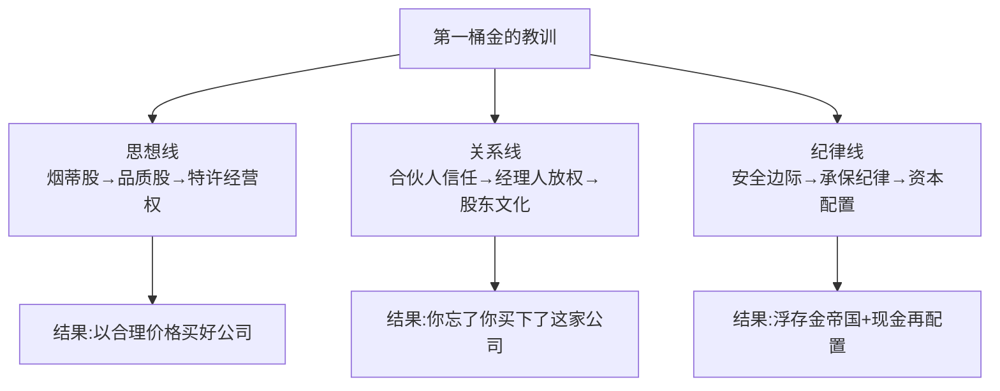
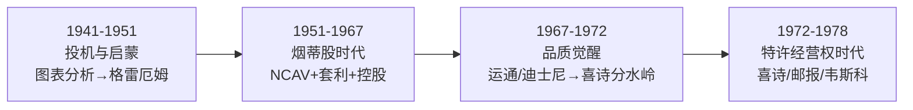
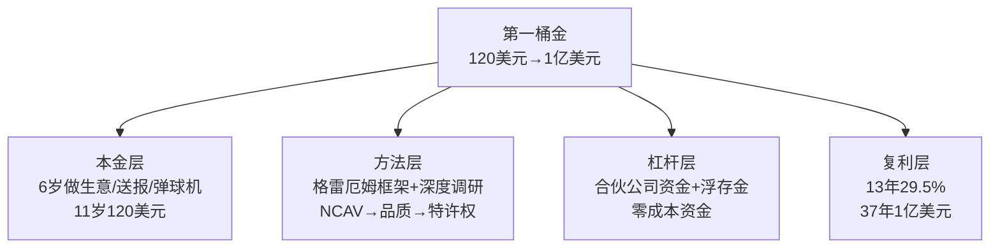
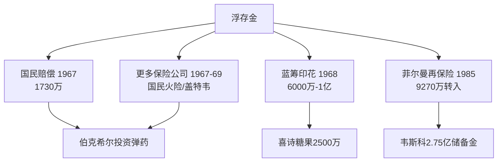

# 20《巴菲特的第一桶金》深度解读（详细版）

> 1941—1978：从 11 岁的 120 美元到 48 岁的 1 亿美元——22 个投资案例完整复盘

## 📖 本书概览

| 项目 | 内容 |
|------|------|
| 书名 | 巴菲特的第一桶金（The Deals of Warren Buffett: The First $100m） |
| 作者 | 格伦·阿诺德（Glen Arnold）——英国金融学终身教授转职业投资者，巴菲特投资案例集系列第 1 卷 |
| 译者 | 王冠亚（西湖边写序："资金超越主意的分水岭"） |
| 时间跨度 | 1941 年（11 岁 120 美元起步）→ 1978 年（48 岁赚得第一个 1 亿美元）——**37 年** |
| 体例 | **22 个投资案例**（含失败案例）+ 每章"学习要点"+ 第一部分"人物与情景" |
| 核心命题 | 巴菲特如何一步步建立投资体系：格雷厄姆净流动资产法 → 费雪/芒格品质派 → 控股企业帝国 |
| 系列位置 | **20《巴菲特的第一桶金》= 早期编年案例集**：与 [[07《巴菲特投资案例集》深度解读（详细版）|07 案例集（1976—1989 中期）]] 是同一作者的姊妹篇——07 讲巴菲特成名后的案例，020 讲成名前的 22 个案例 |

## 🎯 为什么这本书值得单独解读

- **最完整的早期案例集**：22 个案例涵盖从 11 岁第一只股票到喜诗糖果/华盛顿邮报——含大量被忽视的案例（洛克伍德/桑伯恩/邓普斯特/霍希尔德-科恩/联合棉纺）
- **"为什么"视角**：作者不满足于"巴菲特赚了多少"，而是深挖"为什么这样投资"——每个决策的资产负债表、盈利历史、战略地位、管理层素质
- **失败案例与教训**：克利夫兰精纺厂、加油站、霍希尔德-科恩、伯克希尔"里程碑式的愚蠢"——**伟大的投资者也会犯错**
- **格雷厄姆方法实操手册**：净流动资产价值法（NCAV）的完整操作细节（库存打 7 折、应收账款打 8 折）
- **思想进化史**：从"烟蒂股"到"以合理价格买好公司"的转变现场（喜诗糖果是分水岭）

## 📑 目录

- [[#第1章 人物与情景：从奥马哈少年到合伙公司|第1章 人物与情景：从奥马哈少年到合伙公司]]
- [[#第2章 格雷厄姆的思想遗产|第2章 格雷厄姆的思想遗产]]
- [[#第3章 早期案例 1—7：烟蒂股时代（1941—1961）|第3章 早期案例 1—7：烟蒂股时代（1941—1961）]]
- [[#第4章 中期案例 8—13：品质觉醒（1963—1967）|第4章 中期案例 8—13：品质觉醒（1963—1967）]]
- [[#第5章 案例14：投资人的关系与 1967—1969 的困惑|第5章 案例14：投资人的关系与 1967—1969 的困惑]]
- [[#第6章 控股帝国：案例 15—18（1968—1970）|第6章 控股帝国：案例 15—18（1968—1970）]]
- [[#第7章 后期案例 19—22：浮存金与特许经营权（1970—1978）|第7章 后期案例 19—22：浮存金与特许经营权（1970—1978）]]
- [[#第8章 大整合：伯克希尔帝国的诞生|第8章 大整合：伯克希尔帝国的诞生]]
- [[#附录一 22 个案例总览表|附录一 22 个案例总览表]]
- [[#附录二 本书金句集（25 条精选）|附录二 本书金句集（25 条精选）]]
- [[#附录三 学习要点汇总（本书 60+ 条教训）|附录三 学习要点汇总（本书 60+ 条教训）]]
- [[#附录四 净流动资产价值法（NCAV）实操手册|附录四 净流动资产价值法（NCAV）实操手册]]
- [[#附录五 巴菲特思想进化时间线|附录五 巴菲特思想进化时间线]]
- [[#附录六 系列互链：第一桶金在巴菲特系列中的位置|附录六 系列互链：第一桶金在巴菲特系列中的位置]]
- [[#附录七 读完本书后的 10 个自问|附录七 读完本书后的 10 个自问]]
- [[#总结：第一桶金的人生算法|总结：第一桶金的人生算法]]

## 🔗 双链导读（本笔记与系列的连接点）

| 连接主题 | 本书章节 | 关联笔记 |
|---------|---------|---------|
| 案例集姊妹篇 | 全书 | [[07《巴菲特投资案例集》深度解读（详细版）|07 案例集（1976—1989）]] |
| 合伙公司 29.5% | 第1章 | [[11《巴菲特的伯克希尔崛起》深度解读（详细版）|11 崛起]] · [[19《跳着踢踏舞去上班》深度解读（详细版）|19 踢踏舞]] |
| 格雷厄姆-多德部落 | 第2章 | [[16《巴菲特的投资组合》深度解读（详细版）|16 投资组合]] |
| 美国运通/迪士尼 | 第4章 | [[07《巴菲特投资案例集》深度解读（详细版）|07 案例集]] · [[19《跳着踢踏舞去上班》深度解读（详细版）|19 踢踏舞]] |
| 伯克希尔收购 | 第4章 | [[14《巴菲特投资学大全集》深度解读（详细版）|14 大全集第3章]] |
| 浮存金/保险 | 第6章 | [[12《巴菲特的估值逻辑》深度解读（详细版）|12 估值逻辑]] |
| 喜诗糖果定价权 | 第7章 | [[13《巴菲特的护城河》深度解读（详细版）|13 护城河]] · [[17《沃伦·巴菲特如是说》深度解读（详细版）|17 如是说]] |
| 华盛顿邮报 | 第7章 | [[07《巴菲特投资案例集》深度解读（详细版）|07 案例集]] · [[19《跳着踢踏舞去上班》深度解读（详细版）|19 踢踏舞]] |
| 年报/股东信 | 全书引用 | [[09《巴菲特致股东的信》深度解读（详细版）|09 股东信·主题版]] · [[10《巴菲特致股东的信》深度解读（详细版）|10 股东信·编年版]] |
| 可口可乐 | 加油站教训 | [[07《巴菲特投资案例集》深度解读（详细版）|07 案例集]] |

---

## 第1章 人物与情景：从奥马哈少年到合伙公司

### 1.1 孩童时代——"我一定要富有"

**1930 年 8 月出生**：华尔街刚经历 1929 年大崩溃；父亲霍华德是奥马哈股票经纪人（后当选国会议员）；家境不宽裕但"中西部家庭"团结互助。

**少年赚钱史**（暗下决心："我一定要富有！"）：

| 生意 | 细节 |
|------|------|
| 捡高尔夫球 | 捡球场遗落的球出售（后来拉朋友合伙） |
| 可口可乐零售 | 批发整箱拆开一罐罐卖 |
| 二手劳斯莱斯 | 买来出租赚钱 |
| **弹球机** | 买来安装在理发店，收入分给理发师——**最喜欢的项目** |
| **送报纸** | 最赚钱的工作：送《华盛顿邮报》，搬家到华盛顿后每天上学前送三份 |

**15 岁**：拿出 1200 美元买下距奥马哈 70 英里的 42 英亩农场——**5 年后以 2 倍价格卖出**。

### 1.2 第一只股票——城市服务（案例 1）

**11 岁**：攒下 120 美元（开源节流成果），与姐姐多丽丝合资买 6 股城市服务优先股——自己 3 股，成本 114.75 美元。

**6 月股价从 38.25 跌到 27 美元**：巴菲特深感内疚——"因为是他说服了姐姐相信他，拿出自己的积蓄买了股票"。

> **责任感的意义**（阿诺德点评）：巴菲特对信任他的人所具有的这种责任感，对理解他后来对待合伙人、伯克希尔股东的态度非常重要——**合伙人的钱是神圣的**

**反弹到 40 美元卖出**：每股赚 1.75 美元。**但此后股价飙升到 202 美元！**

**学习要点**（本书第 1 个案例的教训）：
1. 不要不加思考地仅攫取蝇头小利（40 美元卖出后涨到 202）
2. 不要执着于买入成本——那只是沉没成本；应该从当前价位重新评估未来
3. 管理他人投资时犯错会导致糟糕的感觉——巴菲特发誓不拿别人的钱投资，除非有必胜把握（"别人的钱是神圣的"——坦普顿语）

### 1.3 大学时光与投机岁月

**17 岁沃顿**：自问学习意义——"他从 6 岁开始做生意，已经有了不菲的收入，现在继续大学的学业只会拖延他事业发展的进程，他相信自己比大学里的教授更明白如何经营一家企业"。两年后转学内布拉斯加大学（离家更近）。

**1949 年 19 岁**：财富积累到 **9800 美元**（六个县雇报童送报+高尔夫球+J.C.彭尼销售员）。

**投机者阶段**（重要！）：

> "这个阶段，他对于炒股票非常着迷。他尝试了各种各样的炒股方法，从图表分析到数字分析，以及碎股交易。由此我们可以看出，**巴菲特曾经也是一个投机者**。"

**转折点**：读到格雷厄姆《聪明的投资者》——"这就像是上天的启示！"1950 年秋入学哥伦比亚商学院，1951 年夏获经济学硕士学位。

### 1.4 青年时代与合伙企业（1941—1957）

**1951 年**：格雷厄姆课程唯一 A+——"这是格雷厄姆教学生涯中唯一一次给出的 A+"（巴菲特总是第一个举手发言）。

**1954—1956 年**：加入格雷厄姆-纽曼公司（仅有的四位员工之一）。

**格雷厄姆拒绝巴菲特的往事**：巴菲特 1951 年想免费为格雷厄姆工作——被拒（格雷厄姆是犹太人，倾向把岗位留给犹太人）。"巴菲特苦恼地意识到，格雷厄姆对于价值观的坚持非常执着。"

**1951 年底**：自有资金 20000 美元。**最尊敬的两个人（格雷厄姆和父亲）都建议不要入市**（股价太高）——巴菲特不同意，第一次借钱买股票（借 5000 美元=净资产的 1/4）。

> **融资警告**（阿诺德）：融资仅限于有能力的投资者，亏掉全部也不影响生活。巴菲特之后很少融资——**保险公司浮存金给了他需要的杠杆，而且通常还没有资金成本**。

**穆迪手册**：约 10000 页，巴菲特读了两遍！在奥马哈大学教授夜间课程传授格雷厄姆投资学。

**1956 年合伙公司成立**：6 个合伙人（大部分亲朋好友，姑姑爱丽丝投 3.5 万），共筹集 10.5 万美元，巴菲特只投 100 美元——**卧室就是办公室**。

**独特规矩**：不告诉合伙人买了什么股票（担心引起模仿）；每年写年度报告；年度聚会苏珊呈上鸡肉晚餐；1962 年整合为巴菲特合伙公司（BPL）。

**1957—1968 年绩效**（全书最震撼数据）：

| 指标 | 数据 |
|------|------|
| 道指上涨 | 185.7% |
| 投资巴菲特的每一美元 | **2610.6%** |
| 1957 年投 1000 美元 | → 27106 美元（扣费后 15000+） |
| 道指 1000 美元 | → 仅 2857 美元 |
| 费后年化 | 23.8% |
| 费前年化 | **29.5%**（道指同期 8%） |
| 无亏损年份 | 13 年全部盈利 |

### 1.5 伯克希尔进入视野（1962）

**1962 年**：以平均 **7.50 美元/股**买入伯克希尔-哈撒韦（新英格兰亏损纺织公司）——到 1964 年 5 月持有 7.5% 股份。

**斯坦顿的回购激怒事件**：斯坦顿（大股东兼 CEO）口头同意以 11.50 美元回购（比买入价高 50%）——"这正是那免费的一口烟，享受完这个之后，我打算继续寻找下一个被丢弃的烟头"——但几天后正式报价 **11.375 美元**（低了 1/8 美元）！

> 巴菲特："我被斯坦顿的行为激怒了，没有接受他的出价。"——**转而大量买进**，1965 年 4 月持有 39%，正式控股，动用了全部资金的 1/4！

**巴菲特自认"非常愚蠢的决定"**（阿诺德点评）："由此可见，伟大的投资家也并非总是理性的，他们像所有投资者一样，也会犯错。"

**代价**：1964 年底伯克希尔净资产仅 2200 万美元，现金匮乏，背负 250 万美元负债——"他必须重组一个糟糕的生意"。

**转机**：1967 年出资 860 万美元收购奥马哈的国民赔偿保险公司——**浮存金时代开启**。

### 1.6 第1章小结

**人物与情景的核心**：巴菲特的成功不是天赋异禀的直线——**6 岁做生意、11 岁炒股、19 岁投机、21 岁被格雷厄姆拒绝、25 岁卧室创业、32 岁被斯坦顿激怒买下纺织厂**——每一个"错误"都成为后来成功的基石。1941 年 120 美元 → 1956 年 14-17.4 万 → 1969 年合伙公司 1 亿美元。

---

---

## 第2章 格雷厄姆的思想遗产

### 2.1 大萧条催生的投资定义

**1929—1932 大熊市**：格雷厄姆管理的 250 万美元基金损失/赎回 70%——"倾巢之下，焉有完卵"。这迫使他反思：到底是什么可以成就一个投资者？

**他看到的问题**（当时所有投资方式的不足）：
- 盈利预测的估值导致乐观情绪
- 有人买股票就是在博傻（股价上升导致有人出更高价）
- 有人基于图表、推荐、误解和内幕消息买股票

**格雷厄姆-多德投资定义**（1934 年《证券分析》）：

> "投资是经过深入分析，可以承诺本金安全并提供满意回报的行为。不能满足这些要求的就是投机。"

**投资三要素**：

| 要素 | 含义 |
|------|------|
| 深入分析 | 对企业做彻底的研究（不是听故事） |
| 本金安全 | 安全边际（价格低于价值） |
| 满意回报 | 合理的收益预期（不是暴富） |

### 2.2 巴菲特从格雷厄姆学到的其他理念

**投资回报取决于三点**：知识、经验、**性格**。

> "格雷厄姆教导巴菲特，大部分的聪明人往往由于缺乏正确的心态，而难以成为优秀的投资者。"——如果他们高度理性，会为市场非理性而沮丧，无法利用非理性；他们沉溺于预测而忽视安全边际；他们从众——"**投资者最大的敌人往往是自己**"。

**关注事实**（格雷厄姆的提点）：

> "（证券）分析应该主要关注那些基于事实的价值，而非预测。"——不要只关注公司的故事而忽略事实的真相；预测未来十年媒体注册用户之类"不可能被准确预测"；应关注资产负债表、盈利历史、股票价格。

**独立思考**：

> "你既不会因为大众同意你而正确，也不会因为大众反对你而错误。一切以事实为根据，而不是大众的看法。"（盖可案例中的真理）

### 2.3 第2章小结

格雷厄姆给巴菲特的不是"买便宜货"这一个技巧，而是一套完整的**认知框架**：投资 vs 投机的定义、三要素、性格重于智商、事实重于故事、独立于大众。**这套框架 1950 年确立后，巴菲特从未违背**——变的只是具体策略（烟蒂→品质）。

---

## 第3章 早期案例 1—7：烟蒂股时代（1941—1961）

### 3.1 案例 2：盖可保险——周六敲门与"卖出的损失"

**背景**：1951 年初，20 岁的巴菲特（哥伦比亚第二学期）发现老师格雷厄姆是盖可保险（GEICO）主席。

**盖可的历史**（1936 年创立）：直接邮寄卖保险给政府雇员——绕过代理人降低成本，费率更优、利润率更高。1947 年控股股东家族出售 55% 股份，格雷厄姆基金以 72 万美元买下，格雷厄姆任主席。

**周六敲门**：1951 年初一个周六，巴菲特敲开盖可总部大门——碰巧副总裁洛里默·戴维森在公司（巴菲特自称那时"看起来像一个不谙世事的 16 岁少年"）。**4 小时交流**，戴维森给巴菲特上了保险业精彩一课。

**巴菲特发现的竞争优势**：
1. 销售方式极大低成本优势
2. 客户群体精准定位——政府雇员是安全驾驶群体，风险很低
3. 利润率是同业平均的 5 倍
4. 拥有可观浮存金（已收未赔的保费，可投资）

**独立判断**：此前与几位保险专家交流，都认为盖可估值过高（市场份额仅 1%、经纪人队伍薄弱）——巴菲特坚持"事实而非大众看法"。

**投资**：将 **65% 净资产（10282 美元）**投入盖可。1952 年卖出拿回 15259 美元。

**痛心的教训**（阿诺德补注）：此后 19 年若继续持有，到 20 世纪 60 年代后期将价值 **130 万美元**——"这是一堂令人痛心的课，课程的名字应该叫作——论卖出一家好公司股票的损失"。但资金有了更好的用武之地。1970 年代初伯克希尔再次投资盖可；**2016 年盖可占有美国汽车保险市场 11.4% 份额**。

**学习要点**：
1. 做好功课：既关注"量"（会计）也关注"质"（口碑/管理层）
2. 认真努力，会发现自己的判断比专家更可靠

### 3.2 案例 3&4：两个失败案例——克利夫兰精纺厂和加油站

**失败案例 1：克利夫兰精纺厂**（1951 年，21 岁）

**买入逻辑**（纯格雷厄姆）：股价比净流动资产价值的一半还少——"流动资产减去所有负债之后的一半，也比公司的总市值还多"。即使固定资产一文不值，现金+应收账款+存货价值也是市价两倍。加上高比例分红——"显然是一项很有吸引力的投资"，推荐给客户。

**结果**：南方纺织厂+合成纤维竞争，巨额亏损，削减分红，股价大跌。

**失败案例 2：加油站**（1951 年，22 岁）

**买入**：与朋友合伙在奥马哈买加油站——不幸正对德士古加油站，对方生意一直更好。巴菲特亲自上阵当工作人员，每个周末亲临服务客户——**依然无法改变**。

**学到的竞争优势**：

> "德士古公司的加油站'运作成熟，拥有客户的忠诚，我们做什么都无法改变这些'。"——这次教训启发他后来做出了一些最佳投资：**寻找行业中客户忠诚度最高的公司，如可口可乐**

**2000 美元的损失**（22 岁）"使巴菲特更聪明了"。

### 3.3 净流动资产价值投资法（NCAV）——格雷厄姆的核心工具

**定义**：流动资产（现金+一年内可变现的资产）− 所有负债 = 净流动资产价值。寻找**市值低于净流动资产价值**的公司——完全忽略固定资产的价值（视为零！）。

**两个安全措施**（格雷厄姆式调整）：
1. **减少库存和应收账款**：库存打 7 折（格雷厄姆多数例子推荐减少 33%）；应收账款打 8 折（高管比你乐观）
2. **检查质的因素**：公司前景能否维持盈利（"盈利能力"）；当下令人满意的盈利和分红/历史平均盈利能力——**千万不要听信任何人预测未来趋势**

**巴菲特对邓普斯特的评价**（典型 NCAV 标的）：

> "过去几十年的运营状况不佳：销售停滞；库存周转率低下；投入的资本几乎毫无利润可言。"——股价 16-18 美元 vs 每股净资产 75 美元 vs 净流动资产 50 美元

**NCAV 投资的四种回报路径**：① 行业前景改善；② 管理层改进或换人；③ 公司被清盘；④ 公司被收购。

### 3.4 案例 5：洛克伍德公司——可可豆套利（1954）

**背景**：洛克伍德公司（巧克力豆制造商）长年亏损但拥有大量可可豆库存；可可豆价格飙升；直接出售要交 50% 重税。

**普里茨克的避税方案**：新税法规定——公司缩小经营范围可免税清算相应库存。普里茨克买下控股权，方案是：**每股股票可换 36 美元的可可豆**（当时股价 34 美元）——明确的套利机会。

**格雷厄姆-纽曼的操作**：买入股票换可可豆再卖掉（每股赚 2 美元）；为防止可可豆仓单价格下跌，同时卖出可可期货锁定利润——**"买进股票、卖出可可期货"每周重复**。

**巴菲特的独立思考**（222 股自己的钱）：约定的出价每股可换 80 磅可可豆；公司拥有的可可豆远超流通股对应数量；**不卖股票给公司的人，每股对应的可可豆价值会因他人出售而增加**；工厂、设备、现金也有价值——"普里茨克对此了如指掌，他是个非常聪明的家伙。巴菲特选择和他站在一起——买进股票。"

**结局**：出价前股价 15 美元，后来涨到约 100 美元——**巴菲特赚 13000 美元**。

**学习要点**：
1. 深入思考公司行动及其对未来价值的影响——与短线思维相比，这其实是无风险的回报
2. 机会只展现给脚踏实地的人——"给那些日复一日在干草堆里寻针的人"（巴菲特研究数以千计的公司）

### 3.5 案例 6：桑伯恩地图公司——主动介入董事会（1958—1959）

**背景**：桑伯恩为保险公司提供城市地图（电线/水管/建筑细节，用于火灾风险评估）——保险业兼并+现代评估方法使需求锐减。利润从 30 年代的 50 万/年降到 1958-59 年的 10 万以下；股价从 1938 年 110 美元跌到 1958 年 45 美元（总市值 470 万）。

**关键**：桑伯恩持有 **每股约 65 美元的投资组合**（700 万可变现证券）——"这家公司有些像一个投资信托，其投资组合中持有 30 或 40 种优质证券。我们所进行的投资，是基于这些证券的市值，以及对其业务的保守估值，有一个巨大折扣。"（1959 年致合伙人信）

**行动升级**（巴菲特第一次"介入"）：合伙公司+个人+朋友+父亲的客户一起买——1958 到 1959 年买进，成功进入董事会。**首次董事会提议**：股东应得到投资组合的相应价值+用电子设备重塑地图业务——保险公司背景的董事反对。

**巴菲特恼火**：继续增持——BPL 持有 2.4 万股（22.8%）+伙伴 21%——**把合伙公司 35% 的资金投在桑伯恩上**。最终赢得董事会控制。

**结局**：公司清算投资组合，股东获得巨大价值——合伙人在这项投资上回报超过 50%（巴菲特当时 29 岁）。

**学习要点**：当市场无视隐藏价值时，**买入足够多的股份改变公司行为**——这是巴菲特控股投资的第一个原型。

### 3.6 案例 7：邓普斯特农机制造公司——起死回生与"冷酷"的教训（1956—1963）

**标的**：内布拉斯加比阿特丽斯小镇的风车/灌溉系统家族企业。股价 16-18 美元 vs 每股净资产 75 美元 vs 净流动资产 50 美元。盈利微薄、负债多、行业前景差——**典型格雷厄姆式投资**。

**买入过程**：1956 年开始买；与施洛斯、纳普持有 11%；进入董事会；1961 年中买下邓普斯特家族股份——**持有 70%，价值约 100 万美元（占总资产 21%），巴菲特任董事长**，均价 28 美元。

**麻烦**：高管"点头称是却毫无作为"；银行考虑关停公司；1962 年濒临破产——**合伙人 21% 的资产可能消失**。

**查理·芒格的出场**（1959 年相识——"芒格是为数不多的可以跟上巴菲特成长脚步的人"）：介绍哈里·波特尔（意志坚定的企业经理人）——慷慨薪酬（利润分成）说服他搬到比阿特丽斯。

**波特尔的绝招**（白线故事）：

> "绝望之下，我直接找来一个画家，在最大仓库的墙面上，距离地面 10 英尺的地方，画了一道 6 英寸宽的白线。我叫来工厂主管，告诉他们如果我走进来时，看不见货物堆上的那道白线，就会开除除了运输部门之外的所有人，直到我能看到那道白线。后来，我逐渐将那道白线下移，直到我得到了令人满意的库存周转率为止。"

**成果**：改进销售策略、卖多余设备、大幅削减库存、关闭 5 个分公司、独家供应地区提价 500%、建成本控制系统、裁员 100 人——**盈亏平衡点降低一半**，释放现金供巴菲特投资股票债券。1962 年初库存 420 万，一年后大幅下降。

**退出**：巴菲特登《华尔街日报》广告卖公司；1963 年夏，比阿特丽斯居民集资约 300 万美元买下运营资产继续经营——**留下只有现金和投资的壳**。BPL 占 73%，股票值 330 万美元（每股 80 美元）——**赚了 2 倍**。

**巴菲特"发誓"**（邓普斯特留下的心理创伤）：

> "整个比阿特丽斯镇都不喜欢巴菲特，面对抗拒和厌恶，巴菲特充满了恐惧。他发誓，再也不会陷入这种局面——必须对为他工作的人冷酷无情。"——**这解释了：他为何长期维持伯克希尔无利可图的纺织业务；他为何喜欢具有护城河、拥有令人喜欢信任尊敬的管理层的公司**；巴菲特喜欢长期、积极、正面的关系。

**巴菲特对波特尔的评价**：

> "聘请了哈利是我曾经做过的最为重要的管理决策。邓普斯特公司在两个前任经理人手中是个烫手的山芋，银行都觉得公司快破产了。如果邓普斯特垮掉了，我后来的人生和财富与今天会有很大的不同。"

### 3.7 第3章小结

烟蒂股时代（1941—1961）的进化：**城市服务（11 岁懵懂）→ 盖可（65% 重仓+4 小时调研）→ 克利夫兰/加油站（失败学到的：品质与忠诚度）→ 洛克伍德（套利+独立思考）→ 桑伯恩（第一次介入董事会）→ 邓普斯特（控股+起死回生+"再也不冷酷"）**。巴菲特从"捡烟蒂"进化到"改变公司"，也从"赚钱机器"进化出"与人为善"的价值观。

---

---

## 第4章 中期案例 8—13：品质觉醒（1963—1967）

### 4.1 重要的变化——从格雷厄姆到费雪/芒格

**20 世纪 60 年代初的发现**：很多公司没有强劲的资产负债表（无法满足格雷厄姆条件），但"拥有强大的经济特许权、稳健的财务状况、诚实能干的管理层，所以具有良好的发展前景"。

**两位新导师**：菲利普·费雪的思想 + 查理·芒格的日常交流——"这并不表示巴菲特开始排斥格雷厄姆的方法，仅仅表明在价值的果园里，有很多种类的甜美的果实。"

**巴菲特 1967 年致合伙人信**（定性 vs 定量的宣言）：

> "出于投资的目的而评估股票和公司，一直是将定性因素和定量因素结合在一起……有趣的是，尽管我认为自己属于定量分析学派，但多年以来我最成功的投资决策都是在充分考虑定性因素后做出的，这种对定性因素的判断力，我称之为'高概率事件洞察力'，这才是我赚大钱的秘诀。然而，这种机会非常少见，正如洞察力一样往往得之不易。当然，定量分析一般并不需要洞察力——数据本身就会说话，数字会像球棒一样猛击你的脑袋。所以，赚大钱的投资机会通常来源于正确的定性决策，但更多确定无疑的利润则来自于直观的定量决策。"

**小型投资者的两种路径**（巴菲特/芒格的回答）：格雷厄姆方式投小市值公司 + 投资拥有经济特许权的大公司——"以 100 万美元开始投资，他们会选择那些小型公司投资，因为那里有更多低估的机会"。

### 4.2 案例 8：美国运通——色拉油丑闻与"传闻研究"（1963—1967）

**事件缘起**（一个骗子的故事）：骗子买下大豆色拉油储存在仓库，用库存仓单质押从 51 家银行获得数千万贷款——**美国运通出具仓单证明**。骗局：油比水轻——大多数油罐注入海水，只浮一层真油；检查人员从表面取样，以为装满了油。1963 年 9 月：骗子想操控市场（苏联进口需求），美国政府对苏联油料禁运导致价格崩溃——骗子破产，银行损失超 1.5 亿美元，找美国运通索赔。**股价从 64 美元暴跌到 38 美元**，分析师担心公司能否存活。

**巴菲特的调研**（在奥马哈他最喜欢的餐厅）：

| 观察点 | 发现 |
|--------|------|
| 餐厅 | 人们照常使用运通卡付账 |
| 其他餐馆/场所 | 商家依然接受运通卡 |
| 银行/旅行社 | 人们依然喜欢运通旅行支票 |
| 竞争对手 | 依然认为运通是强有力的对手 |
| 奥马哈之外 | 朋友确认运通服务照常 |

**判断**：丑闻动摇的是华尔街的信心，不是客户的心——**特许经营权未受损**。

**出手**：1964 年初合伙公司资金 1700 万（巴菲特自有 180 万）；到 6 月持有近 300 万股；支持运通与银行签署 6000 万美元和解方案（**声誉是特许经营权的核心，承担财务责任是更好的选择**）；11 月持有超 430 万股；1965 年初持股价值超合伙公司资产 1/3；1966 年共花 1300 万持有 5%；1967 年股价 180 美元——**卖出大多数持股**。

**学习要点**：
1. **分析公司本身**：短期麻烦导致股价下跌，但长期价值未受影响——以便宜价格买优质公司的机会
2. **机会出现时要大举投资**：投入可掌控资金的 40%
3. **传闻研究**：像费雪一样走出去与了解公司的人交流（竞争对手/员工/供应商/顾客）——"除了你们自己，在这个行业里谁是最棒的？"

### 4.3 案例 9：迪士尼——费雪和芒格的因素多于格雷厄姆（1966）

**背景**：1966 年迪士尼市盈率不到 10；1965 年税前利润约 2100 万，总市值 8000-9000 万；账上现金多于负债。华尔街认为《欢乐满人间》之后没有发展后劲。

**巴菲特的调研**（看电影+逛乐园）：坐在孩子们中间看《欢乐满人间》——感受孩子们对迪士尼产品的热爱；**《白雪公主》每七年新一代孩子想看**（"本质上而言，你每七年能收割一次，而且每一次都可以收更多的钱，没有什么系统比这更好了"）；米老鼠没有经纪人（不像汤姆·克鲁斯）——卡通形象可运用于书包/T恤/主题公园；与芒格参观迪士尼乐园分析设施价值；会晤沃尔特·迪士尼——**《加勒比海盗》一项设施花费 1700 万美元，相当于总市值的 1/5**！

> 巴菲特开玩笑："可以想象我是多么激动——一家公司的市值仅仅是一个娱乐设施造价的 5 倍！"

**巴菲特的逻辑**（费雪多于格雷厄姆）：

> "1966 年，人们说：'《欢乐满人间》这部音乐剧不错，但明年迪士尼不会再有一部《欢乐满人间》，所以，盈利会下降。'我不担心盈利是否下降，因为你明明知道，七年之后它会再次大卖一次……"

**隐形资产**：馆藏电影价值值回买价，但账面价值为零！

> "如果他私下里去找一个大风险投资家……如果迪士尼是一家非公众公司，并且他说'我希望你能买这家公司'，他们绝对会以 3 亿美元或 4 亿美元的估值买进的。可现实是，这家公司每天用市场报价告诉人们，8000 万美元是个合适的估值。可喜的是，人们对此视而不见，因为它如此熟悉，正所谓**近处无风景**。这样的事在华尔街周而复始地发生。"

**投资**：合伙公司投 400 万（5% 股份）；第二年卖出收回 620 万美元——**赚 55%**。但巴菲特还是卖早了（迪士尼后来暴涨）。

### 4.4 案例 10：伯克希尔-哈撒韦——"里程碑式的愚蠢"决定（1962—1967）

**公司历史**：19 世纪新贝德福德棉纺企业；一战后被南方廉价劳工抢走生意；大萧条关闭多数工厂。哈撒韦公司（斯坦顿经营）坚守纺织业，再投资 1000 万现代化，进入人造丝领域——**但无法阻止远东低成本闯入者**。1955 年哈撒韦与伯克希尔细纺公司合并（斯坦顿任总裁）：超 1 万员工、14 个工厂、销售 1.12 亿美元。**蔡斯家族控制伯克希尔 150 年，马尔科姆·蔡斯发现"在新英格兰再投资多少钱到纺织业上也是徒劳"**。

**1955—1964 的衰落**：营收 5.3 亿但亏损；**资产负债表缩水一半**（运营亏损+1300 万现金回购+回购略超一半股本）；斯坦顿霸道地打破与纽约犹太家族的默契（自己设厂做后期整理，直接竞争）——纽约订单减少，每况愈下。

**巴菲特的买入**（1962 年 12 月，7.50 美元/股）：每股运营资本 10.25 美元、账面价值 20.20 美元、营业额 6000 万、工厂只剩 5 间——**典型格雷厄姆捡烟蒂**：

> "在大街上捡到的雪茄烟头，可能只剩下一口烟可以吸，但'便宜的买价'却令其有利可图。"

**斯坦顿的回购激怒**（1964 年 5 月 6 日）：口头 11.50 美元 → 正式报价 11.375 美元——"我被斯坦顿的行为激怒了，没有接受他的出价"——**继续买进**，1965 年 4 月持有 39%，正式控股（动用全部资金 1/4）。

**巴菲特 2014 年信中的自省**：这个决定"非常愚蠢"——"我所犯过的第一个大错误"。

### 4.5 伯克希尔八步重组（1965—1967）

| 步骤 | 内容 |
|------|------|
| 1. 摆脱清盘者恶名 | 向新贝德福德媒体宣布照常运营不关厂（邓普斯特创伤）；恰好赶上人造纤维复苏（繁荣了两年） |
| 2. 授权 | 工厂运营全权交给肯·蔡斯（生在新贝德福德、一生投入纺织业）；巴菲特只管资金 |
| 3. 激励措施 | 不用期权（不承担下跌风险=用股东的钱赌博）；给蔡斯购买 1000 股的机会并借他 1.8 万（年薪 3 万） |
| 4. 关注资本回报 | 不关心产量/销售/市场份额——"仅仅关注利润也不完全是设定企业目标的恰当方式" |
| 5-8. 现金纪律 | 限制纺织新增投资；压缩存货应收；释放现金；用于其他领域 |

**1966 年年报**："公司一直在寻找合适的收购对象，范围不局限于纺织行业。"——**重新配置资本的宣言**。

**学习要点**（阿诺德总结）：
1. 拒绝情绪化——巴菲特的愤怒导致控制一家衰落公司 70% 股份（结局好但运气成分大）
2. 高质量管理和忠诚至关重要——激励方案要简单（几句话，无须薪酬顾问的长篇报告）
3. 重新配置资本——公司不必拘泥于自己所在的行业
4. **善待所有打交道的人**——20 年里多次应冷酷关厂，但巴菲特坚持经营纺织厂不愿轻易解雇员工——"他的正直与生俱来、发自本性，并非受外界影响，这也是公司非常重要的资产"——**很多出售企业的家族因此选择伯克希尔：永续经营、长期价值观、诚实**

### 4.6 案例 11：国民赔偿保险公司——浮存金的开端（1967）

**杰克·林沃尔特**（白手起家的保险商）：1950 年代巴菲特曾鼓动他投资合伙公司——巴菲特要求至少 5 万美元，林沃尔特说："如果你认为我会将 5 万美元交给一个毛头小伙子，那你简直比我想的还要疯狂。"（20 年后反思：那 5 万交给巴菲特会变成 200 万！）

**国民赔偿（NICO）**（1940 年林沃尔特兄弟创办）：给奥马哈出租车公司卖责任险起家；专做非标风险（保险巨头避而远之）——**"没有坏的风险，只有坏的费率"**；承保对象包括马戏团驯兽员、舞蹈明星的腿、电台寻宝！林沃尔特以节俭闻名（随手关灯、不吃西装午餐省衣帽间小费）——"毫无疑问，林沃尔特正是巴菲特喜欢的那一类人"。

**1967 年 2 月的会面**（查尔斯·海德牵线——他 15 分钟发火传闻是巴菲特"如闻仙乐"的线索）：林沃尔特要价 1000 万美元出售。对话（全书最精彩的问答）：

> 巴菲特："为什么你之前不愿意出售公司？"
> 林沃尔特："因为都是骗子和破产的人想要它。"
> "还有别的原因吗？""我不希望其他股东得到的每股报价比我的低。"
> "还有吗？""我不想出卖我的保险经纪人。""我不希望我的员工担心失去工作。"
> "还有吗？""我为这家公司是一家奥马哈的公司而感到自豪，我希望它能继续留在奥马哈。"
> "还有吗？""我不知道，这些还不够吗？"
> "你的股票值多少？""《世界先驱报》上的每股市价为 33 美元，但实际上每股价值 50 美元。"
> 巴菲特："好吧。我要了。"

**收购价**：约 860 万美元（伯克希尔收购）；巴菲特说服林沃尔特留任——"一留就是六年"（远超 65 岁退休年龄）；林沃尔特用部分卖股款买伯克希尔股票"又为他赚了不少"。

**国民赔偿的竞争优势**（巴菲特 2004 年信）：买下时"并未显现出任何与其他公司不同的、能够克服业内痼疾的特征"——不出名、无信息优势（甚至没有精算师）、运营成本不低、靠一般经纪人销售。**竞争优势是巴菲特带来的：承保纪律**。

> "你能想象有哪家上市公司能接受我们所经历的，从 1986 年到 1999 年的收入下滑吗？……如果我们愿意降价，会有数十亿美元的保费等待我们去承揽。但是，我们坚持以稳定的价格获得利润，不像大多数乐观的同行那样低价竞争。**我们从未离开客户，是客户离开我们。**"

**浮存金的力量**：1967 年 NICO 浮存金 1730 万美元——保费先收、理赔后付，中间的资金可投资；承保纪律使浮存金成本为零（承保多年盈利或小幅亏损）。**"伯克希尔旗下的大多数业务是保险公司，并非偶然。"**

**严重的失策**（巴菲特自认比买伯克希尔更严重的错误）：没有用合伙公司直接收购 NICO，而是通过伯克希尔收购（当时 BPL 只持有伯克希尔 61%）——39% 的价值流入了合伙人之外的其他人手里：

> "这个问题，我思考了 48 年，也没有得到答案。我犯了一个巨大的错误……这个决策最终导致巴菲特合伙公司的全体合伙人，将大约 1000 亿美元的价值，转手送给了一群陌生人。"（2004 年信）——**"这是我生涯中代价最大的（错误）"**

### 4.7 案例 12：霍希尔德-科恩公司——"以三流价格买进二流百货公司"（1966）

**标的**：巴尔的摩百货公司（科恩家族持有，下一代无人接班）；竞争力疲弱需大量翻新投资；CEO 马丁·科恩告诉戈特斯曼"折扣价也能接受"。

**巴菲特的买入理由**（从一开始就明白是"以三流的价格买进一个二流的百货公司"）：净资产高于市值、隐匿性资产（未记录房地产价值）、后进先出记账法下的旧库存（按旧价估值）。

**交易**：1966 年 3 月完成；新设控股公司**多元零售有限公司**（名字显示巴菲特和芒格想建零售集团）；BPL 持 80%、惠勒·芒格公司持 10%、戈特斯曼基金持 10%；收购价 1200 万（约一半为借贷）。**惠勒·芒格公司 1962—1975 平均年化 19.8%（道指仅 5%）**。

**结果**：1967 年夏巴菲特"非常满意"；但很快发现零售业困境——三年后"很幸运能以原价脱手"。

**巴菲特的反思**（1989 年信，思想转变的里程碑）：

> "我的买价远远低于该公司的账面价值，公司人员也是一流的，整个交易还包括一些额外的福利——例如：未记录在案的房地产价值、后进先出记账法下的库存。面对这样的好机会，我怎么可能拒绝呢？所以（你懂的），三年之后，我很幸运能以原价将其脱手。在终于与霍希尔德-科恩分手以后，我感觉自己像是一首乡间民谣中描述的丈夫的角色，民谣中唱到：'我老婆和我最好的朋友跑了，我仍然非常想念我的朋友。'"

**学习要点**（价值投资最著名原则的出处）：
1. **以合理的价格买进一家好公司，远胜过以好价格买进一家一般的公司**
2. **优秀的骑手在良马上会表现出色，但在劣马上可能毫无作为**（"买马不买骑师"的反面：骑师需要良马）

### 4.8 案例 13：联合棉纺公司——"你忘了你买下了这家公司"（1967）

**本·罗斯纳**（63 岁创始人）：1931 年以 3200 美元起家，36 年拓展到 80 家商店、年营业额 4400 万美元；省吃俭用+工作狂——巴菲特欣赏的品质。**卫生纸故事**：晚宴上听说别人进价更低，立刻离席直奔仓库，整晚数卫生纸卷的张数——发现供应商给的纸卷确实少纸！

**交易**：巴菲特谢绝参观商店（"零售业的细节完全超出了他的能力圈"），只让罗斯纳电话读过去 5 年财报；半小时讨论后罗斯纳说："他们告诉我，你是西部拔枪最快的人！快点拔枪吧！"巴菲特答下午有结果——成交价约 600 万美元。

**收购后**：巴菲特请罗斯纳留任——他一待就是 20 年：

> "你忘了你买下了这家公司，我忘了自己卖掉了这家公司。"——不干预管理风格的最佳赞誉

**业绩**：1968 年资本整体回报率约 20%；1969 年更名联合零售公司——"净资产约 750 万美元，优秀的企业，具有强大的财务基础、良好的运营利润率"。

### 4.9 第4章小结

1963—1967 是巴菲特思想的**品质觉醒期**：美国运通（特许经营权危机中买入）、迪士尼（无形资产估值）、霍希尔德-科恩（三流价格的教训）、联合棉纺（优秀经理人）。**"以合理价格买好公司"开始取代"以便宜价格买普通公司"**——但完整的转变要到喜诗糖果（1972）才完成。

---

---

## 第5章 案例14：投资人的关系与 1967—1969 的困惑

### 5.1 狂野年代——市场从 7 倍到 21 倍市盈率

**背景**（阿诺德的历史观察）：大萧条后 20 年人们普遍认为"不要碰股票"——这使股价被压得很低（1950 年市场平均 PE 仅 7.2）；到 1956 年 PE 12.1 仍合理；**60 年代市场平均 PE 15—21 倍**——"发现打折的股票虽然并非不可能，但变得很困难"。

**投机狂热**：野蛮生长的企业集团、电子公司、化学公司成为"明日之星"（1967 年电影《毕业生》中"明日行业"的建议）。**巴菲特越来越焦虑——几乎无法为合伙公司的资金找到合适的投资去处**。

### 5.2 巴菲特不是普通的基金经理人

**1966 年初关闭合伙公司**（不再接纳新投资人）：

> "我强烈地感觉到规模越大，未来的业绩可能会越差，而非提升业绩。对于我个人业绩而言，也许未必如此，但你们的业绩必然受损。"——**与行业完全相反**（狂热股市正是基金经理扩大规模赚管理费的好时机）

**独特激励机制**：
1. 与生俱来的正义感和荣誉感——忠诚对待合伙人（很多是亲朋好友）
2. 收费机制：回报超 6% 才收费（1961 年起；此前 4%），超出的部分绩效费 25%（最早可高达 50%）——**规模扩大对他没有好处**

### 5.3 1967 年的挫折与困惑

**巴菲特的三重困惑**（1967 年初）：
1. 定量分析的机会消失（"这样的投资机会在过去 20 年内持续稳定地减少，现在已经几乎全部消失"）
2. 资产已达 1 亿美元——"300 万美元以下的投资对我们整体资产回报的表现并没有什么真正的影响……仅仅这一条就像一个门槛，已经将市值低于 1 亿美元的公司，排除在我们的投资大门之外"
3. 市场投机氛围越来越重

**他不做的**（1967 年 10 月信，一声惊雷）：

> "基本上可以说，我已经跟不上现在的市况。然而，有一点，我是非常清楚的：**我不会抛弃先前我明白其内在逻辑的投资方法**（尽管我发现这个方法现在已经难以运用）。采用一种我不完全理解、没有成功实践过的方法可能会轻松地赚到大钱，但也可能导致巨大的损失。"——**不因市场改变而改变自己的原则**

**对短期绩效的批判**（1967 年 10 月信，今天依然切中时弊）：

> "我认为，我们正在见证一个好的观念如何被扭曲。……用于衡量投资'绩效'的最短期限应该是三年。……当投资大众开始自作主张时，用于衡量投资绩效的时间预期被不断缩短，从一年缩短到一个季度，再缩短到一个月，有时甚至更短……**短期绩效表现的奖金越来越丰厚，不仅是奖励已经取得的业绩，还奖励吸引到下一轮新的资金。这种模式导致越来越多的资金进场，卷入越来越短时间的投资游戏中。**一个令人不安的推论是，当这类行为愈演愈烈的时候，参与投资的工具（特定的公司或股票）渐渐变得不那么重要——有时几乎是次要的。"——**1967 年就预见了今天的量化交易生态**

### 5.4 个人动力——"放慢工作的脚步"

**与妻子的协议**：赚到 800 万—1000 万美元就不再拼命——目标已实现（1967 年巴菲特身家约千万美元）。

> "由于个人状况的改善，放慢工作的脚步是最明智的选择。我已经观察了很多案例，涉及生活中所有活动的习惯模式，特别是在事业方面，在这些习惯已失去意义之后，有些习惯还是会继续（并且随着时间推移而变得更加突出）。基本的自我分析让我明白，对于那些将资金托付给我们的人，我不得不尽全力去达成公开宣示的目标。但这种全力以赴的努力已逐渐失去意义。"

**希望的转变**：减少工作量，专注于自己控制的公司——"由他喜欢、信任和欣赏的人来管理运作，即便这样可能意味着回报的降低。他倾向于享受自己所从事的工作，而不是全力追求财务回报。"

### 5.5 再次表现超群——讽刺的 1967 年

**1967 年回报 35.9%**（道指 19.0%）；扣除管理费后合伙人得 28.4%（19384250 美元）；合伙公司净资产 68108088 美元。巴菲特开玩笑"可以买很多百事可乐"（当时是百事爱好者，买可口可乐股票后立即切换热情）。

**清醒**：巴菲特看穿回报中的人为因素——上升来自让炒股者膨胀的"投机糖果"，迟早终结于"消化不良"和"不安全感"——"即使他一直坚持吃'燕麦'的清教徒（一直遵循格雷厄姆原则）"。

**1968 年 1 月**：明确回答"是否终结合伙公司"——"我可以肯定地回答：不！只要合伙人愿意将他们的资金和我的资金放在一起……我就打算继续干下去。"

**学习要点**（案例 14）：
1. 市场总会在相当长的时期内处于非理性状态
2. 无论好时候坏时候，都要坚守投资原则
3. **赚钱并不是人生的全部，甚至赚钱都不是特别重要的部分——良好的人际关系则非常重要**
4. 考虑到高管理费，大多数基金经理无法超越大盘（收费与投资表现无关）

---

## 第6章 控股帝国：案例 15—18（1968—1970）

### 6.1 案例 15：伊利诺伊国民银行——7 倍盈利的银行（1969）

**尤金·阿贝格**（1931 年 25 万美元起家）：到 1969 年银行净资产 1700 万、存款 1 亿、年利润约 200 万（存款的 2%/资本的 11.8%）；"资本结构、流动性和放贷政策所承受的风险都很低，却取得了较高的回报率"——**从没从股东手里筹集过新增资本**。

**交易**：其他买家"指手画脚、批评指责、要求审计查账"惹恼阿贝格；巴菲特出价（比其他买家低 100 万）——阿贝格"对股东施加压力接受巴菲特的出价，威胁否则辞职"。1969 年伯克希尔以约 1550 万美元买下 97.7%——**仅为盈利的 7 倍，低于账面价值**。

**罕见的举债**：贷款 1000 万美元完成收购——"在接下来的 30 年中，我们几乎没向银行借过一分钱。（在伯克希尔，债务这个词仅仅是一个四个字母的单词而已。）"

**放权管理**（阿贝格 71 岁留任）：

> "我们的经验显示，一个高成本运营的经理人通常在发现新方式增加开支方面显得足智多谋，而会过紧日子的经理人总会找到额外的方式进一步压缩成本。就后面这种能力而言，没有人被证明可以比尤金·阿贝格干得更好。"

**惊人回报**：收购后五年半内银行支付给伯克希尔的分红达 **2000 万美元——超过收购价**！

**坏账记录**（1975 年信）：平均 6500 万贷款中净坏账仅 24000 美元（0.04%）；1976 年进一步降至 0.02%；利润/存款/贷款增加但**雇员人数没有增加**。

**被迫分手**（1978 年）：监管当局要求 1980 年底前将银行与伯克希尔分离（银行不能成为非银行组织的一部分）。1979 年银行利润 500 万（总资产 2.3%——典型竞争银行的 3 倍）。

**"最高的价格未必是最好的选择"**：

> "我们对于任何买家都极为挑剔，我们的选择不仅仅是基于价格。罗克福德银行以及管理层对我们不薄，所以，如果必须出售这家企业，我们希望他们能找到同样对他们不薄的好婆家。"——**卖企业也讲价值观**

**阿贝格逝世**（1980 年 7 月）——巴菲特悼文（全书最动人的文字）：

> "作为朋友、银行家和公民，他是无与伦比的。当你从一个商人手中买下他的企业，然后，他以雇员身份而不是所有者身份依然坚守在管理岗位上，你会从他身上学到很多东西……尤金从来没有忘记他是在管理别人的钱，**信托责任始终在他心中**。……数十位罗克福德的居民告诉我，尤金给予过他们多年的帮助。……由于我们的年龄与位置不同，我有时是初级合伙人，有时是资深合伙人，但无论如何，这种关系总是特别的，令我非常怀念。"

### 6.2 案例 16：《奥马哈太阳报》——125 万美元买下普利策奖（1969）

**背景**：巴菲特从小送《华盛顿邮报》，对报纸有强烈兴趣；妻子苏茜认识《奥马哈太阳报》老板利普西——利普西主动上门卖报纸。

**标的**：6 份聚焦地方的新闻周报，总发行量 5 万，年收入约 100 万——专门调查"当地大报《奥马哈世界先驱报》遗漏或不敢报道的新闻"（地方政府决策失误/重要人物不法行为）。

**交易**：20 分钟谈成，125 万美元——预期每年 10 万美元现金利润（8% 回报率，低于通常预期，但当时资金闲置）；**看中的是"公共服务精神和坚守新闻精神"**；注意到单一报纸城市的定价权优势。

**普利策奖**：1971 年《奥马哈太阳报》调查男孩城（孤儿慈善机构）丑闻——该机构宣称没有政府资助（实际有）、每年发 5000 万封劝捐信（年募约 2500 万，现金 1800 万=支出的 4 倍）、现金累计 2.09 亿美元（人均 30 万美元/男童）——**赢得普利策新闻大奖**。巴菲特"像个侦探一样在奥马哈四处探访"。

**巴菲特的态度**（阿诺德点评）：

> "眼看着自己的股票在市场上飞涨而大把赚钱，这并不令巴菲特满意，他的满意来源于经过缜密分析和推理而获得的结论……首先是逻辑分析，其后是企业的成功，之后是股价的上涨。这是投资世界的正确顺序。……以非理性赚来的钱，也会同样以非理性的方式迅速溜走。"

### 6.3 案例 17：更多保险公司——浮存金王国的扩张

**1968—1969**：伯克希尔卖出所有有价证券（税后盈利超 500 万美元——1965 年市值还不到 2000 万的公司赚了 500 万"相当有分量"）；资金为收购提供弹药。

**版图**：国民赔偿（1967）+国民火险和水险公司（1967）+盖特韦承保公司（70%）+布莱克印刷公司（100%）+《奥马哈太阳报》。

**蔡斯的描述**（1970 年信）：承认"四年之前，公司管理层犯了错误，误以为只要向纺织行业进行大量、持续的资本投入，就可以获得更多、更持久的盈利能力，但实际上这是不可能的"——**巴菲特接手后重新配置资本**。

**保险业务的扩张**：进入加州劳工补偿市场、新再保险部门、新州业务——"保险公司在 1969 年已经可以产生承保利润"——**浮存金成本为零**。

**资本使用**（巴菲特 1969 年评估）：纺织 1600 万+银行 1700 万+保险约 1500 万——"正常的盈利能力约为每股 4 美元"（BPL 每股成本仅 14.86 美元）；预期两家公司内在价值每年增长 10%——"我认为长期持有这两只股票是非常不错的，我很高兴将我的绝大部分身家投在里面"。

### 6.4 案例 18：巴菲特合伙公司的终结——38 岁的"退休"（1969）

**1969 年 5 月**：巴菲特宣布退休计划（当时只有 38 岁）——投资环境不适应+无暇顾及家庭。

**关闭的三个理由**（1969 年信）：
1. 定量分析的机会消失（"几乎全部消失"）
2. 资产 1 亿美元规模太大（300 万以下投资没意义；市值低于 1 亿的公司被排除）
3. 市场投机氛围越来越重

**对"分钟级"基金经理的回应**（一家大型基金宣称"证券研究应该以分钟计"）：

> "哇！这帮家伙搞得我连出去喝罐百事可乐都感到有负罪感。设想一下，越来越多手握巨资的人跃跃欲试，但可投资的合适证券却非常有限，这样导致的结果往往极难预测。这个场面看起来很热闹，也很糟糕。"

**没有股票可买**（1969 年信）：

> "目前适合投资的股票，在质量和数量上都处于历史的低点……一个上了年纪的棒球手，身材发福，腿脚不灵，眼神也不济了，他作为替补出场，有可能精准地打出一个全垒打，但你不会因此而改变球队的首发阵型。未来我们将面临诸多重大的不利因素，我们不至于一事无成，但总体利润可能低于平均水平。"——**当市场没有折扣时，现金就是最好的头寸**

**低成本运营**（1969 年信，伯克希尔的基因）：

> "1962 年 1 月 1 日，我们合并了之前的合伙公司，我不在家里办公了，并聘请了公司第一个全职员工。那时，我们的净资产达到了 7178500 美元。从那时起到现在，我们的净资产达到了 104429431 美元，而我们的员工只增加了一个人。"——**1.04 亿净资产，2 名员工**

**解散安排**（强烈的责任感）：
- 推荐比尔·鲁安接手资金管理——"未来应该干得和我未来可以达成的业绩一样好，甚至更好"（鲁安 1956-61 及 1964-68 综合回报超年化 40%，比巴菲特还好；1962 年曾跌 50%——巴菲特依然推荐，因为他看长期原则）
- 合伙人可选择现金或有价证券（伯克希尔+多元零售股票）
- 现金分配：1969 年初价值的 56% → 1970 年 1 月变为 64%（卖出价格高于预期）

**1969 年底 BPL 持有**：多元零售 80%（800000/1000000 股）+ 伯克希尔 70.3%（691441/983582 股）——**巴菲特不卖这两家，并投入自己大部分身家**。

**关系转变的声明**：巴菲特坦率宣称对这两家公司"仅仅是公司的股东和董事"——但"抛弃一贯的管理作风或家长式的责任感，巴菲特是做不到的"（阿诺德：他对待股东的态度和他对待合伙人一样——欢迎股东来奥马哈，让股东尽可能了解公司状况）。

### 6.5 第6章小结

1968—1970：巴菲特完成从"基金经理"到"企业主"的跃迁——**伊利诺伊银行（好银行）、太阳报（普利策奖）、保险公司群（浮存金）、合伙公司终结（38 岁退休→全职伯克希尔）**。1.04 亿美元净资产、2 名员工的效率纪录，为伯克希尔的文化定下基调。

---

---

## 第7章 后期案例 19—22：浮存金与特许经营权（1970—1978）

### 7.1 案例 19：蓝筹印花公司——被迫留下的金矿

**印花业务**（20 世纪 60 年代末流行）：购物后得到印花，贴满本子可换烤箱/水壶/桌子。**亮点**：零售商先付现金买印花，顾客后兑换——**账上有现金（浮存金）**；人们丢失/忘记/攒不够，钱就留下了。每年向零售商卖出约 1.2 亿美元印花，**浮存金 6000 万—1 亿美元**。

**为何便宜**：1956 年由 9 家大型零售集团创立；小零售商告反垄断——1967 年被迫重组，向小零售商发行 55% 新股；"数以千计的小零售商最终得到了这些股票，但他们并不真的想持有，于是纷纷抛出，导致股价下行。这时，巴菲特、芒格和盖林却如饥似渴地买进。"

**巴菲特 2006 年的回忆**：

> "1970 年，大约有 600 亿张印花被顾客收集成册，拿到蓝筹印花的兑换店里兑换商品。我们兑换商品的目录册有 116 页……我被告知，**甚至妓院和殡仪馆都会给客户发放印花**。"

**1969 年底**：BPL 持有蓝筹印花（约占合伙公司 6% 资金）；巴菲特本想卖出 371400 股（7.5% 总股本）分现金——承销商出价太低不断下调——**"被迫"留下**。"事后的结果证明，这只被迫留下的股票赚了很多钱。"

**蓝筹印花成为资本平台**：1972 年以 2500 万美元收购喜诗糖果（案例 20）——**"至今仅追加 4000 万，已创造 19 亿美元税前利润"**。

**学习要点**：
1. 浮存金是获得额外回报的非常有用的工具（不限于保险公司：印花、圣诞篮俱乐部等）
2. **当很多股票持有者三心二意的时候，往往是买家买进的好机会**（股东不忠诚→股价被压低）
3. 经营有问题的企业未必是糟糕的投资——如果能重新分配已有资源
4. 与志同道合的投资伙伴合作，可以获得更大的影响力（巴菲特+芒格+盖林掌控蓝筹印花）

### 7.2 案例 20：喜诗糖果——2500 万美元买下的"思想分水岭"（1972）

**喜诗太太**（1921 年帕萨迪纳小平房起家）：高品质+经典怀旧风味；1949 年劳伦斯接管时 78 家分店；1969 年劳伦斯去世时 150 家分店。

**查克·哈金斯**（巴菲特的关键人物）：1925 年生、二战伞兵、英语专业；1951 年入职打杂；1969 年任副总裁——**他一共提供了约 20 亿美元现金供巴菲特投资**。

**收购过程**（1971 年 11 月）：蓝筹印花投资顾问弗拉赫里打电话推荐——巴菲特第一个反应："无意收购一家糖果公司，并认为价格太贵，然后就挂了电话。"第二次联系时看了报表略微放松底线。洛杉矶酒店会晤哈里·喜诗。

**犹豫**：有形净资产仅 800 万、税后利润 200 万——**3000 万要价从资产负债表和损益表看都太高**。芒格的朋友艾拉·马歇尔努力说服（"这是一家与众不同的公司，值得更高的价格"）。**唯一积极因素：有形资产税后回报率高达 25%**。

**定价权的发现**：与罗塞尔售价差不多，但蓝筹高层认为喜诗有"尚未挖掘的定价能力"——2500 万收购的话回报率 8%（当时十年期国债 5.8%）；若考虑提价，利润可从税前 400 万增到 650—700 万——**只需每磅提价 15 美分（当时售价 1.85 美元/磅）**。

**格雷厄姆式的跨越**：以有形净资产 3 倍的价格收购，对巴菲特是巨大跨越——"他允许芒格和其他人将他的边界扩大，纳入那些在他的能力圈内具有优秀商业特许权的公司"。**严格底线 2500 万**——哈里·喜诗同意（"这样可以继续过自己想要的日子了"）。1972 年 1 月 3 日完成。

**收购之后**（5 分钟达成的薪酬方案，没写在纸上，持续数十年）：

> "巴菲特出自本能地开始热切关注与此项生意相关的关键点，特别是与财务相关的部分，例如白糖和可可期货。哈金斯并没有被要求必须与巴菲特或来自蓝筹印花、伯克希尔的其他任何人定期会面。……这种关系对于双方而言，更像朋友和知己间的平等合作，而不是老板与雇员。巴菲特从来没有命令哈金斯去做任何事，但当做出决策之后，他会帮助测试结果。"

**特许经营权**（巴菲特学到的）：

> "你拥有可口可乐或这类公司的股票是一回事，但当你真正参与到开设分店、制订价格时，却是另一回事，你会从中学到很多。**与喜诗公司的盈利相比，我们从喜诗赚到的钱远远超过喜诗本身**，事实上，它教会了我一些东西，并且，我确信查理也从中受益匪浅。"——**心智份额而非市场份额**（品牌在人们心智情感中的重要性）

**扩张的克制**：20 世纪 80 年代在科罗拉多/密苏里/德州开分店失败（品牌识别度不足，人们不愿为不熟悉品牌付溢价）——从此只在顾客喜爱并愿意付溢价的地方开店；1998 年巴菲特推动网上销售（"尽管巴菲特总是自称太老了，不懂得高新科技"）；2012 年 211 家分店全在芝加哥以西（110 家在加州）；新店投资控制在 30 万美元以内。**哈金斯工作到 81 岁退休（54 年工龄、33 年 CEO）**。

**定价权**（魔镜）：

> "如果你拥有喜诗糖果，你对着魔镜说：'魔镜，魔镜，今年秋天，我的糖果应该卖多少钱？'镜子会说：'更多。'这是一个好生意。"

**为什么需要巴菲特参与定价**：

> "公司管理者只面对一家企业。在他的公式里，如果定价太低，这并不是什么严重的问题；但是如果定价过高，他会觉得生命中唯一重要的事情被弄砸了。并且，没有人知道提价之后会发生什么。对于管理者而言，这相当于俄罗斯轮盘赌。……经验丰富的人以旁观者的视角审视定价这件事，在某种程度上是很有必要的。"

**是什么成就了好企业**（A 公司 vs B 公司测试）：

| 项目 | A 公司（糖果） | B 公司（钢铁） |
|------|--------------|--------------|
| 税后利润 | 200 万 | 200 万 |
| 有形净资产 | 800 万 | 4000 万（5 倍） |
| 未来 20 年利润 | 均增长到 2000 万 | 同左 |
| 为 10 倍产出需追加 | 7200 万 | 3.6 亿（新增 9 个钢铁厂） |
| 20 年动用资本 | 8000 万 | 4 亿 |
| **20 年可派发股息** | **3.6 亿** | **0.72 亿** |

> **结论**：A 公司（糖果商）更好——"尽管从资产负债表的角度看，A 公司的价值似乎更低，但实际上 A 公司更具价值，因为它可以给投资者所希望得到的东西：提供从生意中产生的现金。"——**股东盈余 vs 财报盈利**

**经济商誉**：收购价 2500 万−有形净资产 800 万 = 1700 万商誉（会计上 40 年摊销）——但喜诗的税后有形资产回报率 25%（远高于市场平均）——**经济商誉（品牌在客户心中的声誉）创造了消费者特许权，进而产生溢价**。会计商誉的摊销是假象，"这种减少并不是真实的"。

**结局**：1972 年 2500 万收购 → 至今创造 19 亿美元税前利润；哈金斯提供约 20 亿美元现金供巴菲特再投资——**喜诗不仅是赚钱机器，更是巴菲特思想的转折点**。

### 7.3 案例 21：《华盛顿邮报》——"注定发生的事"（1973）

**漂亮 50 的教训**（背景）：1972 年市场追捧"漂亮 50"（一锤定音型投资，永不卖出）——雅芳 PE 61、宝丽来 95、施乐 46（平均 42）；1973-74 年崩盘：雅芳跌 86%、宝丽来跌 91%、施乐跌 71%。**"这些公司的确是优秀的公司，但这些公司的股票的确是优秀的投资标的吗？"**

**巴菲特的准备**（在非理性年代没有虚度光阴）：1973 年初通过所罗门发行 2000 万高级票据（20 年期）——偿还 900 万旧债+为投资组合准备弹药；研究分析从未停止。1974 年中期市场极度悲观（衰退+12% 通胀=滞胀）——**"巴菲特却很兴奋，他觉得伟大的时刻到来了"**："当别人贪婪时恐惧，当别人恐惧时贪婪。"

**邮报投资**：1973 年春/夏，用债券资金 1060 万美元买入 9.7% 股份（467150 股 B 股）。公司拥有《华盛顿邮报》《新闻周刊》、四家电视台、两家广播电台、印刷厂造纸厂——**巴菲特认为价值 4 亿—5 亿美元，市场标价 1 亿美元**。

**凯瑟琳·格雷厄姆**（46 岁被推上领导位置）：害羞胆小自信不足——"对于管理或编辑，她一无所知"；1963 年丈夫凯自杀后成为总裁（当时邮报在当地市场份额仅第三）；1971 年上市（格雷厄姆家族持 A 股控投票权，B 股股东最多决定 30% 席位）。

**交易的建立**（巴菲特赢得信任）：1973 年春末累计超 5% 时写信告知凯瑟琳——她担心"野蛮入侵者"；朋友顾问告诉她巴菲特无法控制公司（B 股投票权有限）；会晤后巴菲特"以渊博知识、彬彬有礼和幽默感赢得凯瑟琳好感"；第二次会晤坦率表示不想接手经营；**巴菲特承诺不经许可不再买入更多**；后来把投票权授权给凯瑟琳的儿子唐——**没有投票权也愿意买入，如果信任关键人物**。

**市场先生的坏脾气**（收购后）：市值从 1 亿跌到 8000 万（内在价值的 1/5）；罢工事件中凯瑟琳和巴菲特并肩打包报纸贴标签到凌晨 3 点；股价直到收购 3 年后才回到买进价位。

**朋友与导师**：巴菲特代笔凯瑟琳的演讲稿（包括给华尔街专家的）、教授会计知识、从不质疑她的运营决策、在她干得不错时大力赞扬、面对艰难决策时耐心倾听——1974 年秋受邀加入董事会——**从当年投递报纸的报童到董事，想想都令人感到甜蜜**（巴菲特着迷新闻业，"如果当初不干投资这一行，他最有可能成为一个记者"）。

**巴菲特贡献的管理才能**（董事角色）：
1. **回购股份**：说服董事会股价低迷时回购——"以更少的股份获得未来年度股东贴现的盈利"——邮报年复一年回购了近一半股份——**伯克希尔持股从 10% 提高到 1999 年的 18%（没再买一股）**
2. **阻止高价竞标**：媒体资源过热时"持有现金是更佳的选择"；能力圈外的谨慎（如 24 小时新闻频道）
3. **简约作风**：让希望做大事业版图的高管泄气——但公司整体资本回报非常高

**"注定发生的事"**（巴菲特概念）：在自己行业/领域处于主导地位、竞争优势可保持数十年。**荒岛测试**：去荒岛住十年回来，家乐氏还在主导麦片、可口可乐主导饮料、吉列主导剃须刀、吉百利主导巧克力——"这些公司的力量来源于它们在人们心智中的位置，而且这种影响可以代际传承"。**反例**：苹果（智能手机市场脆弱竞争激烈）、宝马（豪华车玩家众多）、沃尔玛（电商进攻）——"没有强大到成为'注定发生的事'"。

**投资回报**：1060 万 → 2005 年市值 13 亿美元（还不含分红）；1988 年税后净利润 2.69 亿（14 年前总市值仅 8000 万）；1998 年净利润 4.17 亿巅峰；**1985 年巴菲特说**："大多数证券分析师、投行经纪人，以及投行高层都认为《华盛顿邮报》的内在价值在 4 亿到 5 亿美元，这与我们的看法一致。但在股市上，该公司的市值只有 1 亿美元，这个价格就摆在那里，股市上每个人天天都能看得到。"

**阿诺德的挑战**（后视镜偏差）：巴菲特 1985 年的话是购买 12 年后说的——"这笔投资最终的结果很好，所以，当巴菲特回顾 1973 年的时候，或许很明显地看出当时《华盛顿邮报》的价值远高于他支付的价格，但这在当年或许并不这么显而易见。"——**1972 年财报净流动资产为负，并不符合格雷厄姆 NCAV 法**——巴菲特的估值来自对特许经营权的理解（后视镜中"显然"，当年需要洞察力）。

**阿诺德对学院派的嘲讽转述**（巴菲特 1985 年信）：市场完全有效的理论——"对于企业价值的计算在投资活动中没有什么作用，甚至都不需要考虑"——巴菲特嘲笑这种观点（邮报案例是最好的反证）。

**至死不渝**（1986 年信）：三只永久持有股票——大都会/ABC（投资 5 亿+，1987 年值 10 亿）、盖可（4570 万，1987 年值 7.57 亿）、《华盛顿邮报》（1987 年值 3.23 亿）：

> "即便这三只股票目前的价格有些高估，我们也不打算卖掉，这就像即使有人提出再高的价格，我们也不会卖掉喜诗糖果或《水牛城晚报》一样。……我们还是继续坚持'至死不渝'的策略，这是唯一能让芒格和我都感到自在的方式。"

**经营特许权的丧失**（结局）：互联网+24 小时新闻频道摧毁传统媒体；2010 年《新闻周刊》以 1 美元出售（承担养老金负债）；2013 年贝索斯以 2.5 亿美元买下报纸业务（"格雷厄姆家族认为，尽管报纸在自家手里仍可以生存，但在贝索斯手里，辅以他的科技和市场能力，报纸可以变得更好"）；剩余业务中最重要的是 Kaplan 教育（1984 年 4000 万收购，2007 年占集团收入 50%，市值 30 亿）——**再伟大的特许经营权也可能被技术摧毁，但资本配置让股东依然受益**。

### 7.4 案例 22：韦斯科金融——迷你版伯克希尔（1972—）

**韦斯科的生意**：控股公司，旗下帕萨迪纳互惠储贷（1920 年代创立，1959 年上市）；股价死气沉沉滑落到十几美元（市值不到净资产一半——1972 年夏市值不到 3000 万，仅为净资产的一半）。

**贝蒂·彼得斯**（47 岁，董事会成员，照看孩子+纳帕农庄；至今 90 岁仍是董事）：想励精图治遭董事拒绝——打算与圣塔巴巴拉金融公司合并（1973 年 1 月宣布）。**蓝筹印花（8% 股东）和奥马哈"大为光火"——让利太多**，计划被叫停。

**巴菲特接手**（双管齐下）：蓝筹印花以 17 美元增持至 17%（监管上限 20%）；芒格求见 CEO 文森蒂被礼貌拒绝（"如果股东同意董事会的提案，这项交易将会继续推进"）——芒格去见贝蒂（考佩尔被敷衍打发，但贝蒂刚读完《超级金钱》——书中描述巴菲特是"思路清晰、充满商业智慧的思想家"）——24 小时内会见。

**旧金山机场候机室会面**：贝蒂想在韦斯科做点事；巴菲特说"如果给他机会尝试更好的替代方案，他愿意配合"——**贝蒂把投票权委托给巴菲特**。1974 年巴菲特和芒格加入韦斯科董事会；蓝筹印花 1974 年底持 64%、1977 年底 80%（与贝蒂协议上限）。

**业绩**：1977 年税后利润 571.5 万（80% 归蓝筹印花）；文森蒂（1955 年加入、1961 年任总裁）"逐步缩小生意规模，目的是提高股东回报"——1983 年退休时互惠储贷年利润超 300 万（行业里很多公司还在亏损）。**储贷业好日子一去不复返**（芒格 90 年代年信）——但资金用于更好的投资机会。

**浓墨重彩的结尾**：互惠储贷曾投资房地美 7200 万（2880 万股）——**2000 年卖出实现税后证券利得 8.524 亿美元**！（整个韦斯科 1970 年代估值不到 4000 万——"已经是非常令人满意的回报了。但是，这还不是韦斯科的全部"）

**保险转型**（1985 年，最重要的资本配置）：与菲尔曼基金保险（美国运通旗下、1985 年独立上市，掌门杰克·拜恩——曾拯救盖可，赢得巴菲特钦佩）签订"配额份额合约"——国民赔偿再保险其 7% 业务四年；1985 年 9 月 1 日预收保费储备 13.24 亿的 7% = 9270 万转入伯克希尔；其中 2/7 转给韦斯科旗下新保险公司。**浮存金持续多年**：直到 1997 年底韦斯科金融保险公司仍持有 2.75 亿保险储备金。

> 芒格（1997 年信）："在所有的理赔都完成之前，有非常长的时间，在这期间，韦斯科金融保险公司可以享受很多年来自于浮存金投资的收益。"——巨灾险（1994 年后）："巨灾险不适合胆小的人。未来发生灾难和持续几年的业绩波动是无可避免的。"

**KBS 收购**（1996 年，约 8000 万）：堪萨斯金融担保公司（1909 年创立，堪萨斯银行业存款保险起家，拓展至 22 州社区银行；总裁唐纳德·托尔——"以 13 人团队管理，将公司视为'自己的'公司来经营，这种态度正是我们伯克希尔所珍视的"）。**巴菲特讲收购过程的段子**（侄媳妇 40 岁生日晚会→罗伊·丁斯代尔→KBS 董事会→2 月 13 日出价 7500 万）——"现在，我正计划着参加简的下一场晚会。"

**迷你型伯克希尔**：韦斯科旗下全资子公司+保险+可流通证券（雷诺兹烟草到富国银行）——"对于那些想搭上巴菲特和芒格快车的小投资者而言，韦斯科公司最吸引人的地方在于，相对于高高在上、动辄以十万美元计的伯克希尔股价，韦斯科的股价要便宜很多。"——**额外福利：参加查理·芒格亲自主持的韦斯科年度股东大会（帕萨迪纳自助餐厅，妙语如珠）**

### 7.5 第7章小结

1970—1978 是巴菲特"第一桶金"的完成期：**蓝筹印花（被迫留下的浮存金金矿）→ 喜诗糖果（2500 万买下思想分水岭）→ 华盛顿邮报（1060 万→13 亿）→ 韦斯科（迷你帝国）**。到 1978 年，48 岁的巴菲特赚得人生第一个 1 亿美元——**伯克希尔股价跨越 200 美元**。

---

---

## 第8章 大整合：伯克希尔帝国的诞生

### 8.1 复杂的交叉持股

**1970 年代中期**：巴菲特身家达 1 亿美元，但资产分散在个人投资组合、伯克希尔、多元零售、蓝筹印花——**这些公司相互交叉持股，各有外部股东**。

**监管的关注**（1974 年 SEC）：注意到韦斯科多宗交易——巴菲特和芒格直接或通过多元零售间接掌控蓝筹印花；巴菲特通过伯克希尔影响蓝筹印花；巴菲特直接或间接控制伯克希尔一半股权——"从表面来看，其中可能存在着重大利益冲突"。

**SEC 正式调查**：《关于蓝筹印花、伯克希尔-哈撒韦公司、沃伦·巴菲特，编号 HO-784》——调查巴菲特是否设计诈骗计划、谎报重要事实、操纵韦斯科股价、密谋。

**1975 年 3 月连续两天传唤作证**（问答实录）：

> 问：芒格有没有参与圣塔巴巴拉储贷社股票的做空活动？答：没有。
> 问：蓝筹印花有没有为收购韦斯科，刻意阻挠韦斯科与圣塔巴巴拉的合并？答：二者的合并还不是一个明确的计划，而且成功可能性极小。
> 问：在合并计划落空之后，为什么还要以高价购买韦斯科股票？答：长期而言，如果能善待韦斯科股东，蓝筹印花股东也将从中受益。路易斯·文森蒂、贝蒂·彼得斯以及韦斯科其他股东可以因此而感受到诚意，收购之后双方的关系是否融洽，对于未来的影响非常重大。

**结果**：SEC 结论——蓝筹印花导致合并案失败并人为抬高韦斯科股价，但**未对巴菲特做出不利裁决**；蓝筹印花支付 11.5 万美元给据称受损害的韦斯科股东（轻微处罚）；巴菲特承诺不再发生。

**大整合**（1978 年起）：多元零售并入伯克希尔 → 蓝筹印花并入 → **伯克希尔-哈撒韦帝国成形**——简化结构、消除交叉持股的利益冲突疑虑。

### 8.2 1970 年的巴菲特：你会在那时投资伯克希尔吗？

**阿诺德的诚实评估**（重要！）：

> "如果我可以穿越到 1970 年，如果有人让我分析一下伯克希尔-哈撒韦，我可能会得出这样的结论，尽管公司有一个了不起的船长，公司业务本身却相当平淡无奇，也没有显示出能长期维持高回报率的能力。……**巴菲特的伟大故事并不是注定会发生的，伯克希尔也不是注定辉煌的企业帝国。在职业生涯的很多时候，巴菲特手中的工具并不锋利，材质也不佳，但巴菲特……**"

**1970 年伯克希尔的构成**：纺织（1969 年资产回报率 5%）+ 伊利诺伊银行 + 保险公司（3900 万浮存金）+ 200 万其他投资；减去 700 万收购负债，有形净资产 4300 万≈市值；整体股东权益回报超 10%；银行+保险获利能力约 400 万/3200 万有形资产 = 12.5%——**数字不错但远不到拍案叫绝**。

**巴菲特本人的预期**：股东盈余年化 10% 增长——"这并不是一个了不起的速度"。

**关键洞察**（阿诺德）：现金流+浮存金+资本配置能力——"月复一月，巴菲特都有现金可供使用。如果他能控制更多的保险公司，就会有更多的浮存金。"——**1970 年的平淡数字里藏着帝国的种子：现金流的再配置能力**

### 8.3 赚钱机器与巴菲特的工作方式

**1970 年春末的巴菲特持仓**（离开合伙公司后）：伯克希尔 29%（43 美元/股，市值约 1200 万）+ 多元零售 40%（约 500 万）+ 蓝筹印花（两位数百分比）——**身家大部分押在自己控制的公司上**。

**赚钱机器矩阵**（阿诺德描绘）：

| 经理人 | 公司 | 角色 |
|--------|------|------|
| 肯·蔡斯 | 纺织厂 | 总裁 |
| 尤金·阿贝格 | 伊利诺伊国民银行 | 行长 |
| 杰克·林沃尔特 | 国民赔偿保险 | 保险商 |
| 本·罗斯纳 | 联合零售商店 | 经营者 |
| 查克·哈金斯 | 喜诗糖果 | CEO（1972 年后） |

**日常工作**（基维特大厦小办公室）：早 8:30—下午 5:00，大部分时间打电话（包括与芒格）+阅读；**只有四五个助理**（证券经纪商对接/记账/对外联络）。

> "这些优秀的经理人每月将公司财务数据上报给他，巴菲特就这样一边阅读着财务月报，一边看着现金源源不断地流入。"——**自由现金流是帝国的燃料**

### 8.4 第8章小结

大整合完成于 1978 年——恰是巴菲特 48 岁、赚得第一个 1 亿美元的年份：**多元零售+蓝筹印花+伯克希尔合一，交叉持股的混乱让位于一个清晰的帝国结构**。SEC 调查（HO-784）成为巴菲特简化结构的催化剂——"外界有理由怀疑小股东权益会受到侵害"——**结构清晰本身也是声誉资产**。

---

## 附录一 22 个案例总览表

| # | 案例 | 年份 | 投入 | 结果 | 角色 |
|---|------|------|------|------|------|
| 1 | 城市服务 | 1941 | 114.75 美元（3 股） | 每股赚 1.75 美元（后涨到 202） | 投机 |
| 2 | 盖可保险 | 1951 | 10282 美元（65% 净资产） | 15259 美元卖出（19 年后值 130 万） | 深度调研 |
| 3 | 克利夫兰精纺厂 | 1951 | NCAV 法 | 亏损（行业竞争） | 失败 |
| 4 | 加油站 | 1951 | 2000 美元 | 损失（德士古对面） | 失败 |
| 5 | 洛克伍德 | 1954 | 222 股 | 赚 13000 美元（15→100） | 套利 |
| 6 | 桑伯恩地图 | 1958-59 | 合伙公司 35% 资金 | 回报超 50% | 介入董事会 |
| 7 | 邓普斯特农机 | 1956-63 | 均价 28 美元/股 | 赚 2 倍（80 美元/股） | 控股+重组 |
| 8 | 美国运通 | 1963-67 | 1300 万（5%） | 股价 64→38→180 卖出 | 特许权 |
| 9 | 迪士尼 | 1966 | 400 万（5%） | 620 万卖出（+55%） | 品质萌芽 |
| 10 | 伯克希尔 | 1962-65 | 7.5 美元/股起 | 帝国起点（"愚蠢决定"） | 控股 |
| 11 | 国民赔偿 | 1967 | 860 万 | 浮存金帝国开端 | 控股 |
| 12 | 霍希尔德-科恩 | 1966 | 多元零售 1200 万收购 | 3 年原价脱手（教训） | 失败 |
| 13 | 联合棉纺 | 1967 | 约 600 万 | 1968 年回报约 20% | 控股 |
| 14 | 投资人关系 | 1967-69 | — | 关闭合伙公司（38 岁） | 哲学 |
| 15 | 伊利诺伊银行 | 1969 | 1550 万（7 倍盈利） | 5 年半分红 2000 万 | 控股 |
| 16 | 奥马哈太阳报 | 1969 | 125 万 | 普利策奖（8% 回报） | 控股 |
| 17 | 更多保险公司 | 1967-69 | 浮存金扩张 | 零成本浮存金 | 平台 |
| 18 | 合伙公司终结 | 1969 | 1 亿美元规模 | 64% 现金分配+推荐鲁安 | 谢幕 |
| 19 | 蓝筹印花 | 1968-70 | 6% 资金起步 | 被迫留下→金矿 | 浮存金 |
| 20 | 喜诗糖果 | 1972 | 2500 万 | 至今 19 亿税前利润 | 分水岭 |
| 21 | 华盛顿邮报 | 1973 | 1060 万（9.7%） | 2005 年 13 亿 | 特许权 |
| 22 | 韦斯科金融 | 1972- | 蓝筹印花 17 美元增持 | 房地美 8.5 亿利得 | 迷你帝国 |

---

---

## 附录二 本书金句集（25 条精选）

### 巴菲特原话

> 1. "在大街上捡到的雪茄烟头，可能只剩下一口烟可以吸，但'便宜的买价'却令其有利可图。"——烟蒂法
> 2. "我被斯坦顿的行为激怒了，没有接受他的出价。"——1/8 美元引发的帝国
> 3. "这是一个我不了解的市场。"（1969 年论投机市场）
> 4. "我们专注于发生什么，而不是什么时候发生。"——公司分析 vs 时机
> 5. "基本上可以说，我已经跟不上现在的市况。然而，有一点，我是非常清楚的：我不会抛弃先前我明白其内在逻辑的投资方法。"——1967 年信
> 6. "赚大钱的投资机会通常来源于正确的定性决策，但更多确定无疑的利润则来自于直观的定量决策。"——1967 年信
> 7. "短期绩效表现的奖金越来越丰厚……这种模式导致越来越多的资金进场，卷入越来越短时间的投资游戏中。"——1967 年预言
> 8. "我们没有坏的风险，只有坏的费率。"——林沃尔特（巴菲特欣赏的哲学）
> 9. "我们从未离开客户，是客户离开我们。"——国民赔偿承保纪律
> 10. "你忘了你买下了这家公司，我忘了自己卖掉了这家公司。"——罗斯纳
> 11. "我老婆和我最好的朋友跑了，我仍然非常想念我的朋友。"——霍希尔德-科恩的反思
> 12. "以合理的价格买进一家好公司，远胜过以好价格买进一家一般的公司。"——1989 年信
> 13. "魔镜，魔镜，今年秋天，我的糖果应该卖多少钱？'镜子会说：'更多。'"——喜诗定价权
> 14. "与喜诗公司的盈利相比，我们从喜诗赚到的钱远远超过喜诗本身。"——思想回报
> 15. "每七年能收割一次，而且每一次都可以收更多的钱，没有什么系统比这更好了。"——迪士尼
> 16. "近处无风景。这样的事在华尔街周而复始地发生。"——迪士尼估值
> 17. "在接下来的 30 年中，我们几乎没向银行借过一分钱。（在伯克希尔，债务这个词仅仅是一个四个字母的单词而已。）"——伊利诺伊银行
> 18. "你既不会因为大众同意你而正确，也不会因为大众反对你而错误。"——格雷厄姆（盖可案例）
> 19. "当别人贪婪时恐惧，当别人恐惧时贪婪。"——1974 年
> 20. "聘请了哈利是我曾经做过的最为重要的管理决策。如果邓普斯特垮掉了，我后来的人生和财富与今天会有很大的不同。"——波特尔

### 阿诺德点评

> 21. "伟大的投资家也并非总是理性的，他们像所有投资者一样，也会犯错。"——斯坦顿激怒事件
> 22. "以非理性赚来的钱，也会同样以非理性的方式迅速溜走。"——巴菲特的态度（太阳报）
> 23. "巴菲特长期坚持经营纺织厂，不愿意轻易解雇员工。他的正直与生俱来、发自本性，并非受外界影响，这也是公司非常重要的资产。"——善待员工
> 24. "巴菲特的伟大故事并不是注定会发生的，伯克希尔也不是注定辉煌的企业帝国。在职业生涯的很多时候，巴菲特手中的工具并不锋利，材质也不佳，但巴菲特……"——1970 年的评估
> 25. "一栋房子价值几何，取决于它所在的位置；一家公司的价值几何，取决于它管理层的素质。"——（本书精神）

---

## 附录三 学习要点汇总（本书 60+ 条教训）

### Z1. 按主题分类的学习要点

| 主题 | 教训 |
|------|------|
| 犯错 | 每一个投资者都会犯错；伟大的投资者也有 45% 的时间会犯错；如果能 55% 做对，假以时日能成功积累财富 |
| 卖出 | 不要执着于买入成本（沉没成本）；论卖出一家好公司股票的损失（盖可/迪士尼） |
| 他人资金 | 别人的钱是神圣的；管理他人投资时犯错会导致糟糕的感觉 |
| 调研 | 做好功课（量+质）；传闻研究（费雪式交流）；认真努力会发现自己的判断比专家可靠 |
| 品质 | 竞争优势和管理层素质是绝大多数成功投资的核心因素；买马不买骑师的反面——骑师需要良马 |
| 买入 | 当很多股东三心二意时是买进好机会；当绝佳机会出现要投入有分量的资金（40%） |
| 态度 | 市场总会在相当长时间非理性；无论好坏时候坚守投资原则；拒绝情绪化 |
| 人生 | 赚钱不是人生的全部，甚至不是特别重要的部分——良好的人际关系非常重要 |
| 经理人 | 激励方案要简单（几句话）；以雇员身份坚守管理岗位的所有者值得学习；优秀管理人可创造奇迹 |
| 资本配置 | 公司不必拘泥于自己所在的行业；股东盈余 vs 财报盈利；浮存金是无息资金 |
| 治理 | 善待所有打交道的人（正直是公司资产）；结构清晰也是声誉资产 |

### Z2. 本书的三条主线教训

---

## 附录四 净流动资产价值法（NCAV）实操手册

### Z1. 操作五步

| 步骤 | 操作 |
|------|------|
| 1 | 计算流动资产（现金+库存+应收账款+一年内可变现） |
| 2 | 减去所有负债（长期+短期）= 净流动资产价值 |
| 3 | 寻找市值低于净流动资产价值的公司（固定资产视为零！） |
| 4 | 安全调整：库存打 7 折、应收账款打 8 折（格雷厄姆推荐比例） |
| 5 | 检查质的因素：公司能否维持盈利（盈利能力）；当前盈利分红/历史平均——不听未来预测 |

### Z2. 四种回报路径

1. 行业经济前景改善
2. 管理层改进或换人
3. 公司被清盘
4. 公司被收购

### Z3. NCAV 的局限（本书案例证明）

| 案例 | 教训 |
|------|------|
| 克利夫兰精纺厂 | 便宜但行业竞争毁灭价值 |
| 邓普斯特 | 便宜但需要激进干预才释放价值（白线） |
| 伯克希尔 | 便宜但"烟蒂"是走下坡路的生意 |
| 霍希尔德-科恩 | 低于账面价值买入也可能 3 年原地踏步 |
| 华盛顿邮报 | NCAV 为负（净流动资产负值）——品质法才买得到 |

> **结论**：NCAV 是起点不是终点——巴菲特用它找到候选，用"品质"筛选赢家。

---

## 附录五 巴菲特思想进化时间线

### Z1. 三阶段进化

### Z2. 关键转折点

| 时间 | 转折 |
|------|------|
| 1949 | 读《聪明的投资者》——"上天的启示" |
| 1951 | 盖可调研——深度分析+独立判断的第一次 |
| 1956 | 合伙公司成立——受托责任 |
| 1958 | 桑伯恩——第一次主动介入董事会 |
| 1962 | 邓普斯特——第一次控股+重组（白线） |
| 1963 | 美国运通——第一次"品质优先于资产负债表" |
| 1966 | 迪士尼——无形资产估值（馆藏电影账面为零） |
| 1967 | 国民赔偿——浮存金模式开启 |
| 1969 | 关闭合伙公司——原则高于规模 |
| 1972 | 喜诗糖果——**思想分水岭：愿意为品质付溢价** |
| 1973 | 华盛顿邮报——"注定发生的事"与荒岛测试 |
| 1978 | 大整合+第一个 1 亿美元 |

---

## 附录六 系列互链：第一桶金在巴菲特系列中的位置

### W1. 与各笔记的内容映射

| 主题 | 20 号章节 | 关联笔记 |
|------|----------|---------|
| 案例集姊妹篇 | 全书 | [[07《巴菲特投资案例集》深度解读（详细版）|07 案例集（1976—1989）]] |
| 合伙公司数据 | 第1章 | [[11《巴菲特的伯克希尔崛起》深度解读（详细版）|11 崛起]] · [[19《跳着踢踏舞去上班》深度解读（详细版）|19 踢踏舞]] |
| 格雷厄姆思想 | 第2章 | [[14《巴菲特投资学大全集》深度解读（详细版）|14 大全集第2章]] |
| 超级投资者 | 第2/3章 | [[16《巴菲特的投资组合》深度解读（详细版）|16 投资组合]] |
| 美国运通 | 第4章 | [[07《巴菲特投资案例集》深度解读（详细版）|07 案例集]] · [[19《跳着踢踏舞去上班》深度解读（详细版）|19 踢踏舞]] |
| 迪士尼三幕剧 | 第4章 | [[19《跳着踢踏舞去上班》深度解读（详细版）|19 踢踏舞]]（31 美分→48 美分→25 亿） |
| 伯克希尔收购 | 第4章 | [[14《巴菲特投资学大全集》深度解读（详细版）|14 大全集第3章]] |
| 喜诗糖果 | 第7章 | [[13《巴菲特的护城河》深度解读（详细版）|13 护城河]] · [[17《沃伦·巴菲特如是说》深度解读（详细版）|17 如是说]] |
| 华盛顿邮报 | 第7章 | [[07《巴菲特投资案例集》深度解读（详细版）|07 案例集]] · [[19《跳着踢踏舞去上班》深度解读（详细版）|19 踢踏舞]] |
| 所罗门/浮存金 | 第6章 | [[19《跳着踢踏舞去上班》深度解读（详细版）|19 踢踏舞第2章]] |
| 年报引用 | 全书 | [[09《巴菲特致股东的信》深度解读（详细版）|09 股东信·主题版]] · [[10《巴菲特致股东的信》深度解读（详细版）|10 股东信·编年版]] |

### W2. 07 号 vs 20 号：同一作者的姊妹篇

| 维度 | 07《巴菲特投资案例集》 | 20《巴菲特的第一桶金》 |
|------|---------------------|----------------------|
| 时间 | 1976—1989 | 1941—1978 |
| 主角 | 成名后的巴菲特 | 成名前的巴菲特 |
| 案例 | 10 个（可口可乐/GEICO 等） | 22 个（含失败案例） |
| 视角 | 大资金时代 | 从小资金到大资金的路径 |
| 互补 | 中期案例 | 早期案例+思想进化 |

### W3. 与 19 号（编年史）的互补

- 19 号（《财富》现场报道）：1966 年起的外部视角
- 20 号（案例深挖）：1941 年起的内部视角（"为什么"）
- **两本合起来 = 巴菲特 1941—1978 完整画像**

---

## 附录七 读完本书后的 10 个自问

1. 我能说出巴菲特 11 岁第一只股票的名称和成本吗？（城市服务优先股，114.75 美元）
2. 我知道"别人的钱是神圣的"这句话的意义吗？（坦普顿→巴菲特受托责任）
3. 我能解释净流动资产价值法（NCAV）的五步操作吗？
4. 我知道桑伯恩地图案例中巴菲特第一次做了什么吗？（介入董事会）
5. 我能讲出波特尔"白线"的故事和邓普斯特给巴菲特的教训吗？（再也不冷酷）
6. 我知道美国运通案例中巴菲特做了什么样的市场调研吗？（餐厅/银行/旅行社观察）
7. 我能说出"里程碑式的愚蠢"指什么吗？（斯坦顿 1/8 美元激怒→买下伯克希尔）
8. 我知道巴菲特为什么说国民赔偿的收购方式是"生涯中代价最大的错误"吗？（1000 亿美元给了陌生人）
9. 我能讲出喜诗糖果为什么是"思想分水岭"吗？（2500 万 vs 800 万有形资产/25% 回报率）
10. 我知道"注定发生的事"和荒岛测试吗？（家乐氏/可口可乐/吉列 vs 苹果/宝马/沃尔玛）

---

## 总结：第一桶金的人生算法

### Z1. 第一桶金的四层结构

### Z2. 从 120 美元到 1 亿美元的关键节点

| 年份 | 年龄 | 身家/事件 |
|------|------|----------|
| 1941 | 11 | 120 美元→城市服务优先股 |
| 1949 | 19 | 9800 美元（送报等） |
| 1951 | 21 | 20000 美元（借钱买股票） |
| 1956 | 25 | 14—17.4 万（合伙公司成立） |
| 1962 | 31 | BPL 720 万美元（整合） |
| 1967 | 36 | 合伙公司 6810 万（35.9% 年回报） |
| 1969 | 38 | 合伙公司 1 亿美元（关闭） |
| 1978 | 48 | **个人身家 1 亿美元（第一个 1 亿）** |

### Z3. 第一桶金给普通投资者的五件事

1. **早开始、小起步**：11 岁的 120 美元和 15 岁的农场——**复利需要时间，时间需要早**
2. **框架比技巧重要**：格雷厄姆三要素（深入分析/本金安全/满意回报）——巴菲特 1950 年学到后从未违背
3. **从错误中学习**：克利夫兰/加油站/霍希尔德-科恩——**失败是学费，重点是学到的教训**
4. **与优秀的人同行**：格雷厄姆→芒格→林沃尔特→罗斯纳→阿贝格→哈金斯——**人是第一桶金的最大杠杆**
5. **让金钱服务人生**：1969 年关闭合伙公司（原则高于规模）、1978 年 1 亿美元（第一桶金完成）——**跳着踢踏舞去上班的前提是先找到值得跳的工作**

### Z4. 全书一句话

> **《巴菲特的第一桶金》用 22 个案例证明：巴菲特的伟大不在于"第一桶金"有多大，而在于他从 11 岁起就把"深入分析、安全边际、与好人共事、长期主义"内化成了本能——然后在 37 年里让复利完成了剩下的工作。**

### Z5. 最终寄语

> 1964 年，斯坦顿为了 1/8 美元激怒了巴菲特——巴菲特买下了整个伯克希尔。1972 年，巴菲特为了喜诗糖果多付了 1700 万美元商誉——这笔"多付的钱"后来教会他定价权，创造了 19 亿美元利润。**第一桶金的故事告诉我们：决定命运的往往不是计算出的价格，而是计算之外的原则——愤怒时的不妥协、心动时的远见、以及与人为善的坚持。**

---

*本笔记基于《巴菲特的第一桶金》（格伦·阿诺德著，王冠亚译）撰写，覆盖译者序、推荐序、序言、导言、第一部分人物与情景、全部 22 个案例、大整合与附录案例总结，并整合本系列 20 本笔记形成互链网络。*

*核心收获一句话：**从 120 美元到 1 亿美元，巴菲特用的不是魔法，而是 37 年如一日的三件事——在能力圈内深入分析、用安全边际保护本金、与喜欢的人一起赚钱。第一桶金是这三件事的复利结果，而不是起点。***

---

---

## 补充篇 Ⅰ：序言与导言精读

### B1. 译者序：资金超越主意的分水岭（王冠亚）

**序言背景**：西湖边桂香四溢写序——"这本《巴菲特的第一桶金》是我翻译的第五本财经投资书籍"。

**为什么要读早期案例**：

> "今年已 89 岁的巴菲特，实际上他的名气大幅飙升大约发生在 65 岁以后……对于他早期的投资案例，却记录不多，大众知之甚少，原因也很简单——当年有谁知道这个文质彬彬的年轻人将来能成大事呢？"

**这本书的独特价值**：

> "本书向我们展示了巴菲特从年轻时代开始，如何从几千、几万、十几万、几十万、一百万、几百万……一步一步，直至买下伯克希尔建立一个投资帝国的历程。从 1962 年他以 7.5 美元/股买入伯克希尔起，到如今股价 31 万美元，可谓'合抱之木，生于毫末；九层之台，起于垒土'。"

**系列书计划**："巴菲特投资案例集"系列第一卷（共 4 卷）——"未来三年我的翻译这项'业余'工作已是板上钉钉、责无旁贷"。

**里程碑节点**：止于 1978 年——巴菲特 48 岁，伯克希尔股价跨越 200 美元，赚得人生第一个 1 亿美元。

**结尾的当代反思**：2019 年有机构投资者卖出伯克希尔（2009—2019 伯克希尔上涨 323% vs 标普 334%），批评"手握巨资、坐失良机、回购不足"——**即使巴菲特也会被时代质疑——但 37 年的第一桶金故事说明：长期主义的评价周期应以数十年计**。

### B2. 推荐序：研究巴菲特的新篇章（坎宁安）

**坎宁安的身份**：1996 年主持巴菲特致股东信研讨会（后来成书）——"那个时候，巴菲特的知名度仅限于金融领域"。

**巴菲特把价值投资带回主流**（坎宁安总结）：

| 贡献 | 说明 |
|------|------|
| 价值投资 | 从投资界边缘拉回主流 |
| 去中心化管理 | 自主管理模式渐渐为人们所追随 |
| 慈善 | 将全部财富约 750 亿美元捐给慈善机构 |
| 股东大会 | 近 4 万人参加 |

**巴菲特图书的三个分期**（坎宁安框架）：
1. 早期的伯克希尔（直到 1978 年重新整合）
2. 伯克希尔在股市中的主要投资（1978—2000）
3. 伯克希尔作为全资拥有各类公司的大型联合体（至今）

> **注**：坎宁安的三分期与本书的终止点（1978）完全吻合——**第一桶金的完成=伯克希尔新时代的开始**。

### B3. 序言：伟大的投资者也会犯错（阿诺德）

**本书的安慰功能**：

> "当人们知道一个最终拥有亿万财富的人也会犯错，这或许是一种安慰，可以帮助我们面对自己遭受的挫折。实际上，认为投资者必须在所有的时候都表现完美、永不犯错是最大的错误。从心理层面而言，投资者应该做好犯错以及遭受打击的准备，并坚信自己能够东山再起。……从巴菲特的失败案例中学习经验，没有比这更好的了。"

**本书的定位**：专注投资案例分析——"如果你希望看到的是自传体故事，这本书并不适合你。但是，如果你希望成为一个更成功的投资者，通过坚定执行投资准则赚到钱，那么你应该好好阅读本书。"

**为什么选择 22 个案例**：并非 37 年中每个案例都写——"选择了那些对于巴菲特财富成长以及投资哲学形成最有影响力的案例"。

**BPL 缩写**：巴菲特合伙公司（Buffett Partnership Ltd.）。

### B4. 导言：48 岁赚得 1 亿美元（阿诺德的写作缘起）

**作者本人的转变**：放弃终身教授头衔+伦敦城高薪教职，全职投入股票市场——"投资成为我新的全职工作，我认为有必要将投资分析的过程记录下来"——写博客（公开表达的压力成为激励）→ ADVFN 专栏 → 本书。

**"为什么"的追问**（本书的灵魂）：

> "很多作者写的都是巴菲特如何投资，赚了多少钱。但我想知道的是'为什么'，为什么巴菲特这样投资？巴菲特所选择的公司具有什么特质，让它们脱颖而出？是资产负债表上的数字吗？是盈利的历史吗？是公司的战略地位吗？还是公司高管的素质？……从几乎一无所有到世界首富，巴菲特是如何一步步走过来的？这就是我想知道的。"

**阿诺德与巴菲特的两件趣事**：
1. 他自称"促成了巴菲特捐款 400 亿美元"——2006 年比尔·盖茨和巴菲特在一起时（盖茨是……）——（作者的自嘲式幽默，见导言）
2. 作为伯克希尔股东定期参加股东大会

---

## 补充篇 Ⅱ：本书中隐藏的细节与数据

### B5. 合伙公司取费模式演进

| 时期 | 规则 |
|------|------|
| 1956—1961 | 回报低于 4% 不收费；高于 4% 部分分成（绩效费最初可高达 50%） |
| 1961 起 | 门槛调为 6%；超出部分绩效费 25% |
| 目标 | 每一个三年周期跑赢道琼斯指数——"至少以三年为周期评判一个基金经理的水平" |

**绩效费再投资**：巴菲特把收取的绩效费全部再投入合伙公司——"他持有的股份越来越多，他也随之越来越富有"——**利益与合伙人完全绑定**。

### B6. 巴菲特合伙公司绩效（1957—1968，12 年）

| 年份 | 巴菲特合伙公司 | 道指 |
|------|--------------|------|
| 1957—1968 平均 | 费前约 29.5% | 约 8% |
| 无亏损年份 | 13 年全部盈利 | — |
| 1967 | 35.9% | 19.0% |
| 每 1 美元增长 | 2610.6% | 185.7% |

### B7. 伯克希尔重组八步的完整版

| 步骤 | 内容 | 细节 |
|------|------|------|
| 1 | 摆脱清盘者恶名 | 公开宣布照常运营（邓普斯特创伤后遗症） |
| 2 | 授权 | 工厂运营全权交肯·蔡斯 |
| 3 | 激励 | 借 1.8 万给蔡斯买 1000 股（年薪 3 万）——不用期权 |
| 4 | 关注资本回报 | 不关心产量/销售/市场份额 |
| 5 | 限制投资 | 纺织业新增投资需巴菲特许可 |
| 6 | 压缩营运资本 | 存货应收账款最小化 |
| 7 | 关停亏损部门 | 精纺棉部门（占产量 10%）关停 |
| 8 | 重新配置资本 | 转向保险/银行/收购 |

### B8. 巴菲特的时间管理（1960 年代末）

| 活动 | 安排 |
|------|------|
| 办公 | 基维特大厦小办公室，早 8:30—5:00 |
| 员工 | 4—5 人（含秘书） |
| 主要工作 | 打电话（含芒格）+ 阅读 |
| 经理人月报 | 每月阅读旗下公司财务数据 |
| 研究 | 穆迪手册 10000 页读两遍（1951）；数以百计公司持续研究 |

---

## 补充篇 Ⅲ：案例间的思想关联

### B9. 三个"教训链"

**教训链 1：卖出**（盖可→迪士尼→华盛顿邮报）
- 盖可：卖出后 19 年值 130 万（"论卖出一家好公司股票的损失"）
- 迪士尼：卖出后涨更多（"回来真好"——19 号笔记）
- 邮报：**至死不渝**——"即便价格高估也不卖"

**教训链 2：买入的勇气**（盖可→运通→邮报）
- 盖可：65% 净资产（年轻的全力）
- 运通：40% 可掌控资金（"机会出现时要大举投资"）
- 邮报：1060 万+债券杠杆（1973 年熊市"伟大的时刻"）

**教训链 3：企业治理**（桑伯恩→邓普斯特→伯克希尔）
- 桑伯恩：第一次介入董事会（推动价值释放）
- 邓普斯特：第一次控股重组（白线+裁员 100 人）——"再也不冷酷"
- 伯克希尔：第一次"善待"（不关厂 20 年）——**正直成为公司资产**

### B10. 浮存金家族谱系

### B11. 喜诗糖果案例的完整数据链

| 数据 | 数值 |
|------|------|
| 收购价 | 2500 万美元（1972 年 1 月 3 日） |
| 有形净资产 | 800 万 |
| 税后利润 | 200 万 |
| 税后有形资产回报率 | 25% |
| 当时十年期国债 | 5.8% |
| 提价空间 | 每磅 15 美分（售价 1.85 美元/磅）→ 税前 400 万→650—700 万 |
| 追加投资 | 4000 万 |
| 至今税前利润 | 19 亿美元 |
| 哈金斯提供的投资现金 | 约 20 亿美元 |
| 分店（2012） | 211 家（110 家在加州） |

---

---

## 补充篇 Ⅳ：案例细节扩展

### B12. 美国运通案例的完整时间线

| 时间 | 事件 |
|------|------|
| 1963 年前 | 运通是领先旅行支票提供商（60% 市场份额）+信用卡龙头 |
| 1963.9 | 色拉油骗局崩溃：银行损失超 1.5 亿，找运通索赔 |
| 1963.11 | 股价 64→38 美元 |
| 1964 初 | 巴菲特调研（餐厅/银行/旅行社/竞争对手） |
| 1964.6 | BPL 持有近 300 万股 |
| 1964.11 | BPL 持有超 430 万股 |
| 1965 初 | 持股价值超合伙公司资产 1/3 |
| 1965-66 | 继续买入；共花 1300 万持有 5% |
| 1966-67 | 支持 6000 万和解方案（声誉>短期财务） |
| 1967 | 股价 180 美元——卖出大多数持股 |

**关键判断**：丑闻动摇的是华尔街的信心，不是客户的心——**特许经营权未受损**；"承担财务责任，保全声誉，是公司更好的选择"。

### B13. 桑伯恩地图案例的数字

| 指标 | 数据 |
|------|------|
| 1938 年股价 | 110 美元 |
| 1958 年股价 | 45 美元 |
| 总市值 | 470 万（45×10.5 万股） |
| 投资组合价值 | 约 700 万（每股 65 美元） |
| 年销售收入 | 200 万 |
| 利润（30 年代） | 50 万/年 |
| 利润（1958-59） | 10 万以下 |
| BPL 持股 | 2.4 万股（22.8%） |
| 伙伴持股 | 约 21% |
| BPL 资金占比 | 35% |

**巴菲特的信**（1958 年）：

> "尽管桑伯恩公司低估的程度不比我们持有的其他证券更大……我……"——（巴菲特罕见地把 35% 资金押注在一个需要"改变公司"的投资上）

### B14. 邓普斯特案例的完整数据

| 指标 | 数据 |
|------|------|
| 股价（1956 开始买） | 16—18 美元 |
| 每股净资产 | 75 美元 |
| 每股净流动资产 | 50 美元 |
| 年销售收入 | 约 900 万 |
| BPL 持股（1961 年中） | 70%（约 100 万价值） |
| 其他朋友持股 | 10% |
| 均价 | 28 美元 |
| BPL 资产占比 | 21% |
| 1962 年初库存 | 420 万 |
| 退出价 | 约 80 美元/股（330 万） |
| 回报 | 约 2 倍 |

**波特尔的五项措施**：
1. 改进市场销售策略
2. 卖掉多余设备
3. 大幅削减库存（白线法）
4. 关闭 5 个分公司
5. 独家供应地区提价 500%+成本控制系统+裁员 100 人

### B15. 伊利诺伊银行 vs 国民赔偿：两个收购的对照

| 维度 | 国民赔偿（1967） | 伊利诺伊银行（1969） |
|------|----------------|---------------------|
| 卖家 | 林沃尔特（创始人在世） | 阿贝格（创始人在世） |
| 价格 | 约 860 万（浮存金 1730 万） | 1550 万（盈利 7 倍） |
| 资金 | 伯克希尔纺织业务现金流 | 伯克希尔证券盈利 500 万+贷款 1000 万 |
| 创始人留任 | 6 年（远超 65 岁退休年龄） | 至 1980 年去世（71 岁接手时） |
| 关键资产 | 浮存金+承保纪律 | 存款 1 亿+极低坏账 |
| 结局 | 浮存金帝国开端 | 5 年半分红 2000 万→1980 年被迫剥离 |

### B16. 华盛顿邮报 vs 喜诗糖果：两种"特许经营权"

| 维度 | 喜诗糖果 | 华盛顿邮报 |
|------|---------|-----------|
| 收购时间 | 1972（蓝筹印花） | 1973（伯克希尔） |
| 价格 | 2500 万（3 倍有形资产） | 1060 万（9.7%） |
| 估值依据 | 定价权+心智份额 | 4—5 亿内在价值 vs 1 亿市值 |
| 特许权来源 | 品牌/心智 | 单一报纸城市+媒体主导 |
| 巴菲特角色 | 控股（定价参与） | 董事（回购/克制竞标） |
| 后期 | 19 亿税前利润 | 2005 年 13 亿→2013 年贝索斯接手 |
| 共同点 | **"注定发生的事"+定价权** | **"注定发生的事"+定价权** |

### B17. 韦斯科案例的关键数字

| 指标 | 数据 |
|------|------|
| 1972 年市值 | 不到 3000 万（净资产一半） |
| 蓝筹印花初始买入 | 200 万（8%） |
| 增持价格 | 17 美元 |
| 1974 年底持股 | 64% |
| 1977 年底持股 | 80%（上限） |
| 1977 年税后利润 | 571.5 万 |
| 房地美投资 | 7200 万（2880 万股） |
| 2000 年卖出利得 | **税后 8.524 亿美元** |
| 菲尔曼再保险（1985） | 13.24 亿储备的 7% = 9270 万 |
| 1997 年底保险储备金 | 2.75 亿 |

---

## 补充篇 Ⅴ：本书与 07 号案例集的三大比较

### B18. 同一案例的双书视角

| 案例 | 07 号（案例集） | 20 号（第一桶金） |
|------|---------------|-----------------|
| 盖可 | 1976 年危机买入（成长视角） | 1951 年周六敲门（起源视角） |
| 华盛顿邮报 | 1973 年完整案例 | 荒岛测试+凯瑟琳友谊+回购细节 |
| 国民赔偿 | 保险浮存金 | 1967 年 2 月对话（"我要了"） |

### B19. 两本书的互补结构

| 维度 | 07 号 | 20 号 |
|------|-------|-------|
| 巴菲特年龄 | 46—59 岁 | 11—48 岁 |
| 资金规模 | 千万级—亿级 | 百元级—亿级 |
| 案例类型 | 上市公司投资为主 | 控股/套利/失败案例并重 |
| 思想阶段 | 成熟期（护城河/能力圈） | 进化期（烟蒂→品质） |
| 学习价值 | 大资金配置艺术 | 小资金起步路径 |

### B20. 从 07 到 20 的阅读建议

1. **先读 20 号**（本书）：理解巴菲特的"操作系统"如何形成——格雷厄姆框架+失败教训+思想转折
2. **再读 07 号**：看同一操作系统在 1976—1989 如何输出结果——可口可乐/GEICO/大都会
3. **对照 19 号**：用《财富》现场报道补全外部视角
4. **最后 14 号**：大全集把整个体系收拢成可复用的方法论

---

## 补充篇 Ⅵ：巴菲特式的"拒绝"与"等待"

### B21. 巴菲特拒绝过什么（本书案例）

| 拒绝 | 原因 | 结果 |
|------|------|------|
| 不收 1 万美元投资（林沃尔特） | 至少 5 万才接受 | 错过 200 万（林沃尔特视角） |
| 不参观联合棉纺商店 | 零售细节超出能力圈 | 只看财报电话成交 |
| 不给喜诗加价（超过 2500 万就放手） | 严格底线 | 哈里·喜诗接受 |
| 不买科技股（60 年代末） | "超出我的理解范围" | 错过狂热但保住本金 |
| 不追逐漂亮 50 | PE 42—95 倍太贵 | 1973-74 崩盘后大举买入 |
| 不按斯坦顿 11.375 出售 | 被激怒（1/8 美元） | 买下整个公司（因祸得福） |

### B22. 巴菲特等待过什么

| 等待 | 时长 | 结果 |
|------|------|------|
| 林沃尔特卖 NICO | 10+ 年观察（1950s—1967） | 860 万收购 |
| 邮报价格回归 | 3 年（1973 买入→1976 回本） | 13 亿（2005） |
| 市场出现便宜货 | 1969—1973（4 年空仓等待） | 邮报/喜诗/韦斯科 |
| 喜诗分店扩张 | 20 年（1980s 失败→2012 谨慎） | 211 家盈利分店 |
| 房地美（韦斯科） | 28 年（1972 投资→2000 卖出） | 8.5 亿利得 |

> **等待与拒绝是一体两面**：巴菲特用"拒绝"守住原则，用"等待"换来机会——**不做什么比做什么更重要**。

---

---

## 补充篇 Ⅶ：给 A 股投资者的启示（本书案例的中国镜像）

### B23. 22 个案例对 A 股的映射

| 本书案例 | A 股对应现象 | 启示 |
|---------|-------------|------|
| 克利夫兰精纺厂 | 夕阳行业低价股 | 便宜不等于价值（行业竞争毁灭） |
| 加油站（德士古对面） | 同质化竞争的小生意 | 忠诚度是最深的护城河 |
| 洛克伍德（套利） | 重组/要约收购机会 | 深入思考公司行动的价值 |
| 桑伯恩（隐藏资产） | 资产重估题材 | 买入足够多股份推动价值释放 |
| 邓普斯特（白线） | 库存高企的制造业 | 激进运营管理创造价值 |
| 美国运通（丑闻） | 白马股"黑天鹅"事件 | 区分公司危机与行业危机 |
| 迪士尼（七年收割） | 内容/品牌公司 | 无形资产价值（账面为零） |
| 霍希尔德-科恩 | "便宜"的百货/零售 | 好价格买一般公司=陷阱 |
| 伊利诺伊银行 | 优质小银行 | 坏账率是银行的生命线 |
| 喜诗糖果（定价权） | 消费品牌提价能力 | 心智份额>市场份额 |
| 华盛顿邮报（荒岛测试） | 十年后仍主导的行业 | 注定发生的事 vs 脆弱龙头 |

### B24. 中国投资者的"第一桶金"路径（本书逻辑的迁移）

1. **本金积累**：巴菲特 11 岁 120 美元——A 股投资者从第一笔 1 万元开始
2. **框架先行**：深入分析+安全边际+满意回报（三要素不分市场）
3. **小资金优势**：巴菲特说"以 100 万开始会选小公司"——**小资金可以买小市值被低估标的，大资金不能**
4. **失败预算**：巴菲特 45% 时间犯错——给失败留学费
5. **时间复利**：37 年 1 亿美元——A 股投资者同样需要以十年为单位

### B25. 本书的终极问题

> 如果你在 1962 年以 7.5 美元买了伯克希尔，你会在 11.375 美元的报价前卖出吗？如果你在 1972 年面对 800 万有形资产却要价 2500 万的喜诗糖果，你会买吗？如果你在 1973 年面对跌跌不休的邮报，你会拿住 10 年吗？——**第一桶金属于那些在每一个"不合理"的价格面前，依然坚持用内在价值思考的人。**

---

## 附录 1 亿美元之前的巴菲特：22 个早期投资的故事（知乎文风）

### 写在前面：人人想学 90 岁的巴菲特，但没人愿意学 30 岁的他

人们研究巴菲特，研究的都是他成为"股神"之后的投资——可口可乐、苹果、铁路。但 20 号这本书（格伦·阿诺德《巴菲特的第一桶金》）讲的是**另一个巴菲特：30 岁、管理着 10 万美元合伙资金、在奥马哈的破旧办公室里捡烟蒂的巴菲特。**

**为什么早期案例更值得学？因为那时的巴菲特，离普通人最近**——没有伯克希尔、没有保险浮存金、没有品牌光环，只有一套方法：**低估买入+耐心持有。**

### 第一幕：起点——10 万美元与七条规则

1956 年，26 岁的巴菲特成立合伙公司，7 个亲友凑了 10.5 万美元。他定下七条规则，其中三条最狠：

| 规则 | 内容 | 深层含义 |
|------|------|---------|
| 规则一 | 亏损由我承担，盈利我分 25% | 利益绑定 |
| 规则三 | **不许问我去哪** | 绝对信任+绝对自由 |
| 规则五 | 我可能亏损，但不会隐瞒 | 诚实优先 |

**七条规则的本质**：**把"信任"变成制度**——合伙人信任他的判断，他回报以诚实。这套规则后来支撑了 12 年 30% 年化。

**注意规则三的细节**：合伙人不能问巴菲特买了什么、为什么买——**巴菲特用"信息隔离"换来了"决策自由"**：他不需要向任何人解释，只需要向结果负责。后来他在致股东信里解释：**"我告诉你们怎么赚钱，比告诉你们买了什么更有价值。"**

### 第二幕：早期投资的"烟蒂仓库"

**早期巴菲特的选股标准**（书里 22 个案例的共同特征）：

| 特征 | 案例 |
|------|------|
| 市值远低于净流动资产 | 登普斯特（资产 92 元 vs 股价 28 元） |
| 无增长也能赚钱 | 桑伯恩地图 |
| 被市场遗忘 | 美洲国家火灾保险 |
| 套利机会 | 德州国民石油 |
| 家族控制 | 共富诚信银行 |

**注意：早期巴菲特根本不看"成长性"**——他只看"便宜"。他的策略是：**买一堆"便宜到不会亏"的股票，其中总有几只被市场重新发现。**

**桑伯恩地图的完整故事**：桑伯恩出版美国城市防火地图，每股 45 美元，但公司持有的证券组合折合每股 65 美元——**"你花 45 美元买一张地图公司的股票，白得 65 美元的证券，地图生意免费送。"**巴菲特重仓买入，逼董事会把证券组合变现分红——**他赚的不是"地图"的钱，是"别人没发现的资产"的钱。**

### 第三幕：第一桶金的三级跳

| 阶段 | 资产 | 关键动作 |
|------|------|---------|
| 1956 | 10.5 万美元 | 合伙公司成立 |
| 1960 | 100 万美元 | 桑伯恩/登普斯特重仓 |
| 1965 | 2,600 万美元 | 收购伯克希尔（转折） |
| 1969 | 1 亿美元 | **解散合伙（牛市顶部离场）** |

**最震撼的一步是最后一步**：1969 年，大牛市最疯狂时，巴菲特解散合伙公司——**"我找不到便宜货了，所以我选择不赚钱。"**

**这需要多大的定力？**一个 12 年年化 30% 的基金经理，在最容易赚钱的牛市里，把钱退还给合伙人——**因为他只赚"便宜"的钱，不赚"疯狂"的钱。**

书里还原了当时的细节：1968 年，市场已经疯狂到"垃圾股一天翻倍"，合伙人们纷纷要求巴菲特"多买点、快买点"。巴菲特在 1969 年新年给合伙人写信：**"我无法找到符合我标准的投资标的了。与其降低标准，不如结束游戏。"**

**然后他真的结束了**——1970 年市场崩盘，他躲过了。**这不是预测，是纪律。**

### 第四幕：早期巴菲特 vs 后期巴菲特——方法论对比

| 维度 | 早期（20 号） | 后期（05—14 号） |
|------|-------------|-----------------|
| 选股 | 便宜（烟蒂） | 优质（护城河） |
| 持有 | 价值回归即卖 | 永远 |
| 组合 | 分散+重仓特例 | 集中 |
| 资金 | 合伙人资金 | 保险浮存金 |
| 心态 | 一样耐心 | 一样耐心 |

**结论：变的只是"买什么"，不变的是"怎么想"**——安全边际、能力圈、耐心、诚实，四样东西从 26 岁到 90 岁从未变过。

**书里最值钱的一个发现**：早期巴菲特就已经有"后期巴菲特"的雏形——1963 年他重仓美国运通（当时运通遭遇"色拉油丑闻"，股价腰斩），不是因为它便宜，而是因为**"运通的旅行支票业务像特许经营权一样赚钱"**——**这是"买好生意"的第一次实践，比喜诗糖果早了 9 年。**

### 尾声：第一桶金的启示

| 启示 | 内容 |
|------|------|
| 起步不需要大资金 | 10.5 万美元足够 |
| 起步需要好规则 | 信任+诚实+利益绑定 |
| 起步需要好方法 | 低估买入，等价值回归 |
| 起步需要好心态 | 牛市里敢不赚钱 |

> **"投资的第一桶金，不是赚来的，是'等'来的。"**

**巴菲特 30 岁时做的事，你今天就能做：定规则、找便宜货、耐心持有、牛市清醒。**不需要伯克希尔，不需要浮存金——**你需要的，只是 26 岁巴菲特那颗"只赚明白钱"的心。**

**最后说一句扎心的大实话**：书里 22 个案例，每一个都花了几百个小时调研——**巴菲特的第一桶金，是用 12 年、每天 12 小时换来的。**羡慕他 1 亿美元的人很多，愿意过他那 12 年"枯燥生活"的人，很少。

---

