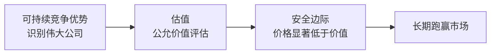
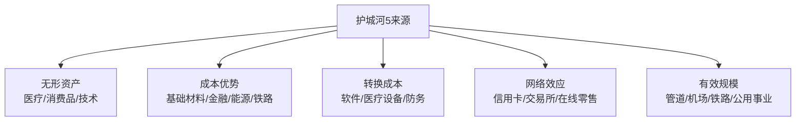
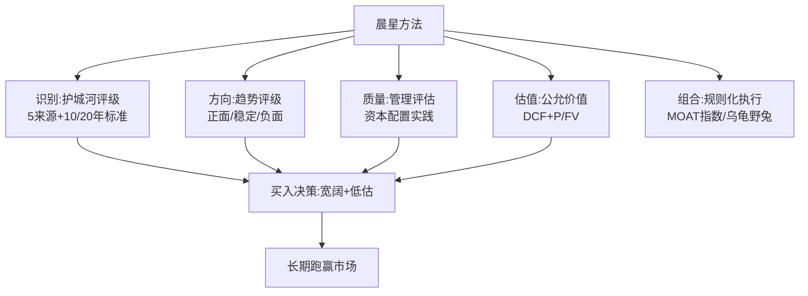
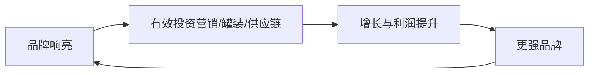

# 21《星公司解密巴菲特股市投资法则》深度解读（详细版）

> 晨星公司（Morningstar）护城河方法论大全：如何识别伟大公司 + 何时买入伟大公司

## 📖 本书概览

| 项目 | 内容 |
|------|------|
| 书名 | 星公司解密巴菲特股市投资法则（晨星公司股票研究方法论） |
| 作者 | 晨星公司（Morningstar）研究团队集体创作——护城河委员会、各行业研究总监、量化研究副总裁等 |
| 译者 | 汤光华、张坚柯、罗维等（教育部教改项目支持） |
| 核心框架 | **三要素**：可持续竞争优势（经济护城河）+ 估值 + 安全边际 |
| 两个核心问题 | ① 如何识别伟大公司？② 何时投资伟大公司最佳？ |
| 独特体系 | **护城河评级**（狭窄 10 年 / 宽阔 20 年）+ **趋势评级**（正面/稳定/负面）+ 公允价值评估 + 分行业指南 |
| 系列位置 | 与 [[13《巴菲特的护城河》深度解读（详细版）|13 护城河（多尔西）]] 同公司同体系——**13 是个人入门版，021 是团队方法论大全（含 8 大行业指南）** |

## 🎯 为什么这本书值得单独解读

- **把"护城河"从概念变成可操作的评级系统**：狭窄 vs 宽阔（10 年/20 年经济利润）、ROIC vs WACC、周期中部考察
- **独一无二的实证检验**：第 7 章用 10 年数据检验"护城河评级能否预测收益率"——宽阔护城河股票波动率只有无护城河股票的一半
- **护城河趋势评级**（2009 年推出）：护城河有生命周期——正面 8% vs 负面 16%，趋势比宽度更难
- **管理评估的方法论革命**（2011 年改进）：从"治理方格打分"转向"资本配置实践"——"好的治理"不等于"好的资本配置"
- **8 大行业护城河地图**（参考手册式）：基础材料/消费品/能源/金融/医疗/工业/技术/公用事业——每个行业什么来源能建护城河、什么不能

## 📑 目录

- [[#第1章 晨星公司的投资指导原则：三要素框架|第1章 晨星公司的投资指导原则：三要素框架]]
- [[#第2章 护城河的 5 项来源|第2章 护城河的 5 项来源]]
- [[#第3章 护城河趋势：护城河也有生命周期|第3章 护城河趋势：护城河也有生命周期]]
- [[#第4章 管理对经济护城河的影响|第4章 管理对经济护城河的影响]]
- [[#第5章 护城河在红利型投资中的应用|第5章 护城河在红利型投资中的应用]]
- [[#第6章 公允价值的评估|第6章 公允价值的评估]]
- [[#第7章 护城河评级可用来预测股票收益率吗|第7章 护城河评级可用来预测股票收益率吗]]
- [[#第8章 护城河与估值的结合运用：投资组合策略|第8章 护城河与估值的结合运用：投资组合策略]]
- [[#第9章 基础材料业|第9章 基础材料业]]
- [[#第10章 消费品业|第10章 消费品业]]
- [[#第11章 能源业|第11章 能源业]]
- [[#第12章 金融服务业|第12章 金融服务业]]
- [[#第13章 医疗保健业|第13章 医疗保健业]]
- [[#第14章 工业|第14章 工业]]
- [[#第15章 技术行业|第15章 技术行业]]
- [[#第16章 公用事业|第16章 公用事业]]
- [[#附录一 本书金句集（20 条精选）|附录一 本书金句集（20 条精选）]]
- [[#附录二 晨星护城河评级实操手册|附录二 晨星护城河评级实操手册]]
- [[#附录三 8 大行业护城河地图总览|附录三 8 大行业护城河地图总览]]
- [[#附录四 本书 vs 13 号《巴菲特的护城河》|附录四 本书 vs 13 号《巴菲特的护城河》]]
- [[#附录五 系列互链：护城河体系全景|附录五 系列互链：护城河体系全景]]
- [[#附录六 读完本书后的 10 个自问|附录六 读完本书后的 10 个自问]]
- [[#总结：晨星方法论的投资者应用|总结：晨星方法论的投资者应用]]

## 🔗 双链导读（本笔记与系列的连接点）

| 连接主题 | 本书章节 | 关联笔记 |
|---------|---------|---------|
| 护城河概念 | 第1-2章 | [[13《巴菲特的护城河》深度解读（详细版）|13 多尔西护城河]] |
| 巴菲特竞争优势 | 第1章 | [[17《沃伦·巴菲特如是说》深度解读（详细版）|17 如是说第6章]] |
| 估值/安全边际 | 第6章 | [[12《巴菲特的估值逻辑》深度解读（详细版）|12 估值逻辑]] · [[14《巴菲特投资学大全集》深度解读（详细版）|14 大全集]] |
| 组合策略 | 第8章 | [[16《巴菲特的投资组合》深度解读（详细版）|16 投资组合]] |
| 消费品/可口可乐 | 第10章 | [[07《巴菲特投资案例集》深度解读（详细版）|07 案例集]] · [[20《巴菲特的第一桶金》深度解读（详细版）|20 第一桶金]] |
| 银行业 | 第12章 | [[20《巴菲特的第一桶金》深度解读（详细版）|20 伊利诺伊银行案例]] |
| 能源业/中石油 | 第11章 | [[19《跳着踢踏舞去上班》深度解读（详细版）|19 踢踏舞]] |
| 铁路业 | 第14章 | [[07《巴菲特投资案例集》深度解读（详细版）|07 案例集]]（BNSF） |
| 公司生命周期 | 第4章 | [[19《跳着踢踏舞去上班》深度解读（详细版）|19 踢踏舞]]（3.2% 预期） |
| 红利与回购 | 第4-5章 | [[09《巴菲特致股东的信》深度解读（详细版）|09 股东信]] |

---

## 第1章 晨星公司的投资指导原则：三要素框架

### 1.1 晨星是谁

**1999 年《财富》文章**（巴菲特）为起点："投资的关键在于确定一家指定公司的竞争优势，尤为重要的是，确定这种优势的持续期。"——晨星公司将这句话变成了 15 年以上的研究体系。

**晨星的做法**：不预测股价、不追逐热点——**只回答两个问题**：

| 问题 | 答案 |
|------|------|
| 我们如何才能识别出那些伟大的公司？ | 寻找拥有**可持续竞争优势（经济护城河）**的公司 |
| 何时才是投资伟大公司的最佳时机？ | 当股票价格**显著低于公允价值**（安全边际）时 |

### 1.2 三要素：可持续竞争优势、估值、安全边际

**伟大的公司的定义**（晨星标准）：

> "伟大的公司有能力抵御竞争，能在未来很长时期维持高的资本回报率——盈余不断提升，向股东回报现金，内在价值实现复合式增长。"

**三要素的逻辑链**：

**所有者的思考方式**（晨星核心理念）：

> "当你集中于分析公司基本价值与股票价格的相对关系，而不是观察今天的股票价格是否不同于 1 个月前、1 天前、甚至 5 分钟前的价位时，你就是在以一位所有者，而非交易者的身份思考问题了。**以所有者的身份来思考会使你成为一名更好的投资者。**"

### 1.3 本书的定位

> "如果你正在寻找的是一本教你利用股票投机快速致富的书，恐怕不能在本书中得偿所愿。本书的目的是为你构建一个基本分析框架，帮你实现成功的长期投资，这一框架凝聚了我们在实践中积累的全部经验。"

### 1.4 第1章小结

晨星方法论的全部起点：**识别伟大公司（护城河）→ 评估价值（公允价值）→ 等待好价格（安全边际）**。三要素缺一不可——只有好公司没有好价格，是"优秀的公司，糟糕的投资"；只有好价格没有好公司，是"价值陷阱"。

---

## 第2章 护城河的 5 项来源

### 2.1 护城河评级的两个问题

晨星为一家公司评级前先问两个问题：

| 问题 | 含义 |
|------|------|
| ROIC 是否有可能超过 WACC？ | 投资资本回报率 > 加权平均资本成本 → 创造**经济利润** |
| 是否至少具备 5 项可持续竞争优势之一？ | 无形资产/成本优势/转换成本/网络效应/有效规模 |

**经济利润的定义**：

> "当一家企业的盈利既超过其会计成本，又超过投资者提出的机会成本时，这家企业就在创造经济利润。一家不创造经济利润的企业是不能为投资者赢得回报的。"

### 2.2 评级的核心：经济利润的持续性

| 评级 | 标准 |
|------|------|
| **狭窄护城河** | 至少一项可持续竞争优势 + 经济利润至少持续 **10 年** |
| **宽阔护城河** | 经济利润至少持续 **20 年** |

> "我们相信，经济利润的可持续性远比其数值重要得多。一家能将中度经济利润持续 20 年之久的公司，相比于一家只在短期几年有着极高的投资资本回报率的公司，更值得享有宽阔的护城河评级。"

**周期中部原则**（关键方法论）：

> "投资者要在正常状况下，或者说在'周期中部'的环境下考察公司的经济利润。如果一家公司只是在行业高峰阶段产生了强劲的 ROIC，我们是不会将它列为护城河评级候选对象的。另外，如果一家公司因为处于行业的最低谷阶段……现在不能赚取经济（甚至会计）利润，也不排除它获得护城河评级的可能。"——**高峰不奖、低谷不罚，只看正常状态**

### 2.3 五项来源速览

| 来源 | 本质 | 典型案例 |
|------|------|---------|
| **无形资产** | 品牌/专利/监管许可——让顾客愿意付溢价或无法模仿 | 可口可乐、迪士尼、制药专利 |
| **成本优势** | 以更低成本生产/服务——价格战中的生存权 | 盖可直销、铁路运输、低成本开采 |
| **转换成本** | 客户换供应商的成本高——锁定效应 | 银行账户、企业软件、医疗设备 |
| **网络效应** | 用户越多越有价值——赢家通吃 | 信用卡、交易所、在线零售平台 |
| **有效规模** | 市场只容得下少数玩家——理性竞争 | 管道运输、机场、公用事业 |

**评级的绝对性**（不是相对排名）：

> "我们的护城河评级标准是绝对而非相对的。我们要求考察一家公司是否具备：（1）可持续的竞争优势，（2）经济利润的持续时间……"——**护城河评级不与同行比较，而是与"竞争侵蚀"比较**

### 2.4 护城河来源的组合与鉴别

**一个来源不够**：宽阔护城河公司往往是多来源组合——比如可口可乐（品牌无形资产+分销成本优势）、苹果（转换成本+生态系统）。

**看似护城河实为陷阱的**：
- 市场份额高 ≠ 护城河（可能只是暂时领先）
- 热门产品 ≠ 护城河（可能没有持续性）
- 高效运营 ≠ 护城河（效率可以被模仿，结构优势才持久）

### 2.5 第2章小结

晨星护城河评级的核心不是"公司好不好"，而是**"超额收益能持续多久"**——10 年狭窄、20 年宽阔；考察要在周期中部；来源可以组合。这套评级为全书的行业分析提供了统一标尺。

---

## 第3章 护城河趋势：护城河也有生命周期

### 3.1 为什么需要趋势评级

护城河评级是**静态的**——揭示当前宽度，但不揭示方向。2009 年晨星推出**护城河趋势评级**：

> "趋势评级传递的是企业在竞争优势方面正在变化的方向。护城河评级揭示了一家公司当前的护城河宽度，而趋势评级告诉我们的是护城河是否被维护得很好，是否得到了进一步的加固，或者是否正在遭受一帮狂暴分子的攻击。目标公司在进化中、到达了成熟期、还是正在走向最后的死亡？"

### 3.2 趋势评级的分布（2013 年中期数据）

| 趋势 | 占比 | 解读 |
|------|------|------|
| 正面 | 约 8% | 竞争优势在提升 |
| 稳定 | 约 76% | 无明显方向变化 |
| 负面 | 约 16% | 竞争优势在衰退 |
| （宽阔护城河评级） | 约 13% | 对比：正面趋势比宽阔护城河更稀有 |

> "获得正面的趋势评级比获得宽阔的护城河评级更为艰难。"——**宽阔是存量，正面是增量**

### 3.3 如何评估趋势：回到 5 大来源

评估趋势时逐项检查 5 大来源的变化：
- 护城河基于低成本？——成本差距在扩大还是缩小？
- 拥有网络效应？——网络是增强还是被替代？
- 无形资产？——品牌/专利在被强化还是侵蚀？

**关键区分**：

> "分清楚哪些竞争威胁在性质上只是暂时的，而哪些经营环境的变化会对公司的竞争优势造成严重而持续的威胁。"——**暂时性冲击 vs 结构性侵蚀**

**宝洁案例**（开篇问题）：品牌强大的宝洁正逐渐在消费者眼中失去魅力——品牌护城河需要持续投资维护，**护城河不是一劳永逸的资产，而是需要持续加固的动态系统**。

### 3.4 第3章小结

**护城河有生命周期**：进化→成熟→死亡。趋势评级把"静态宽度"升级为"动态方向"——16% 负面 vs 8% 正面说明：**多数护城河在缓慢失血，只有少数在变强**。投资者不仅要问"有没有护城河"，还要问"护城河是在加宽还是收窄"。

---

---

## 第4章 管理对经济护城河的影响

### 4.1 核心命题：管理本身不是护城河，但资本配置决定护城河命运

> "强有力的管理本身不可能成为经济护城河的来源，但管理层的资本配置决策会极大地影响护城河的创立、加固或侵蚀。"——本章主旨

**为什么管理本身不算护城河**：

> "有效的管理本身不会自行转化成护城河，因为它无法从根本上改变公司的基本结构特点，并且按理说，一个伟大的管理团队可以甩手走人，离开没有持续竞争优势的公司。"

**但管理又极其重要**（伯克希尔 1994 年信开篇）：

> "渐渐地人们会发现，公司管理者配置资本的能力对企业价值有重要影响。"

### 4.2 时代背景：公司生命周期急剧缩短

| 年份 | 标普 500 成分股平均生命周期 |
|------|---------------------------|
| 1958 | 61 年 |
| 1980 | 25 年 |
| 2011 | **18 年** |

（来源：咨询公司创见研究所 Innosight 报告）

> "在商业领域，达尔文主义的适者生存法则愈加明显。于是，一家公司的管理团队能否有效地将股东资本配置到拓展公司护城河的项目中去，以及能否通过股票回购及红利发放平衡好股东现金回报，便成为了极其关键的问题。"

### 4.3 管理评估方法论的革命（2011 年改进）

**旧方法的问题**（治理方格打分）：

> "我们原本采用的是一种对公司治理实践进行'方格打分'的分级体系。然而，这种做法存在很多问题，它对公司的资本配置决策及其为股东创造的价值不具备可靠的预测作用。实际上，我们发现**有很多治理不良的企业却在资本配置上做得不错，反之亦然**。"

**福特案例**（旧方法的荒谬）：按旧方法福特应获非常低的管理评级——它发行两种类别股票（治理差）；但自 2006 年艾伦·穆拉利接任 CEO 以来，福特在股东资本配置上做得很好。

**新方法**（2011 年中期改进）：减少方格打分占比，更重视管理层的**实践举措**：

| 评估维度 | 内容 |
|---------|------|
| 投资战略 | 是否围绕护城河配置资本 |
| 投资时机与评估 | 何时投资、如何评估回报 |
| 财务杠杆运用 | 债务水平与风险 |
| 红利和股票回购政策 | 现金回报股东的纪律 |
| 执行力 | 战略落地能力 |
| 薪酬 | 是否与股东利益绑定 |
| 关联方交易与会计实践 | 诚信与透明度 |

> "改进过的评估方法不仅在比较全球不同市场间的管理工作时更具有普遍的应用性，而且也更好地揭示出管理团队在股东资本配置、经济护城河的创建或加固方面做得如何。"——**从"治理形式"到"资本配置实质"**

### 4.4 管理与护城河的四种关系

| 关系 | 表现 | 例子 |
|------|------|------|
| 创立护城河 | 管理层把资本投向能建立优势的领域 | 亚马逊早期再投资 |
| 加固护城河 | 持续投入维护/扩大优势 | 可口可乐品牌+分销 |
| 侵蚀护城河 | 乱投资/高溢价收购毁灭价值 | 多元化灾难 |
| 与护城河无关 | 优秀管理+无护城河=价值有限 | 任何竞争性行业的好经理 |

### 4.5 第4章小结

**管理评估的晨星答案**：不看你"治理得好不好看"，而看"钱花得对不对"——投资战略、杠杆、分红回购、执行力。管理不能创造护城河，但能**加速或摧毁**护城河。评估护城河必须同时评估管理层的资本配置——**护城河+资本配置 = 完整的企业质量画像**。

---

## 第5章 护城河在红利型投资中的应用

### 5.1 红利投资者要问的三个问题

> "当投资者遇到一家慷慨支付红利的公司时，要问三个问题：**红利安全吗？会增长吗？未来的红利前景预示着多高的总收益水平？**"

### 5.2 红利之争：凯斯勒 vs 晨星

**反红利派的观点**（安迪·凯斯勒，风险资本家）：

> "红利如同你得到的一笔贿赂，诱惑你对缓慢增长的公司感兴趣，而这些公司从不花心思思考如何把盈利再投资于有意义的项目。"（《华尔街日报》2008 年 1 月 7 日专栏"西格尔教授，我仍然讨厌红利"）

**晨星的反驳**：

> "我们必须对凯斯勒先生的观点表示异议……凯斯勒将红利比作贿赂，这种情况事实上极少发生；相反，我们发现在很多时候，**红利能够对公司管理层施加的十分有效的约束**。……在历史上，支付红利的股票通常会跑赢不支付红利的股票，而高红利收益率的股票也通常会跑赢低红利收益率的股票。"

### 5.3 红利的功能与陷阱

| 功能 | 说明 |
|------|------|
| 收入来源 | 退休人士的恒正收入 |
| 防御性 | 支付红利的公司通常业务成熟、财务稳定 |
| 管理约束 | 持续分红约束管理层乱花钱 |
| 信号作用 | 红利安全/增长反映护城河健康 |

**红利的陷阱**（需要注意）：
- 高红利收益率可能是股价大跌的假象（收益率=红利/股价）
- 红利安全性需要护城河支撑——**没有护城河的高红利不可持续**
- 增长红利 > 静态红利——红利增长能力本身就是护城河强度的体现

> "一家公司成长缓慢不意味着它在本质上一团糟，只要它定期支付可观的红利，同样可以为股东带来不错的总回报。不过，完全没有……"（高增长+不分红也可能是好公司——总回报思维）

### 5.4 第5章小结

红利的三个问题（安全吗？会增长吗？总收益多高？）本质上**都是护城河问题**：红利安全靠护城河保护盈利，红利增长靠护城河扩展，总收益靠护城河+估值的组合。护城河是红利投资的底层保障。

---

## 第6章 公允价值的评估

### 6.1 估值的意义：价格终归回归价值

> "沃伦·巴菲特曾有教诲——'在别人贪婪时要恐惧，在别人恐惧时要贪婪'，这种投资理念的灵魂即在于**股票价格终将回归公允价值**。我们无法确切地判断一家公司的内在价值，但可以使用一些方法来缩小内在价值的可能空间，从而识别出最佳的投资机会。"

**价格 vs 价值**：

> "我们赞同沃伦·巴菲特的著名论断：'价格是你付出的，价值是你得到的。'长期来看，股票价格会回归公允价值，但在短期和中期，股票市场会对具体事件做出过度或不足的反应，这样就会创造出投资机会。"

### 6.2 DCF：内在价值的定义

> "公司的内在价值可以被描述为它在未来生命期内产生的**超额现金流的折现值**。这就是众所周知的贴现现金流法，或叫 DCF 法，其中的贴现率反映了投资者对所投资本要求的必要报酬。"

**晨星的估值流程**：
1. 详细的公司、行业及宏观经济研究
2. 一贯的分析框架（护城河+趋势+管理）
3. 全面的同业互查评估

### 6.3 P/FV：价格与公允价值之比

**核心指标**（晨星全天候发布的比值）：

| P/FV | 判断 |
|------|------|
| > 1 | 股价高于公允价值 → 高估 |
| = 1 | 股价等于公允价值 |
| < 1 | 股价低于公允价值 → 低估 |

**实证效果**（图 6-1，全样本公司过去 10 年 P/FV 中位数）：

> "在 2008 年金融危机爆发之前，市场受乐观情绪的支配，股票市价高开，如果在此时盲目入场，投资者会损失惨重。是我们样本股票的公允价值告诫我们要遵循沃伦·巴菲特的教诲，避免在股市走高时盲目入场，或在股市走低时匆忙退场。"——**公允价值是行为纠偏器**

### 6.4 第6章小结

估值不是精确计算，而是**缩小可能区间**：DCF 给出公允价值估计，P/FV 给出买卖信号。护城河回答"买什么"，公允价值回答"何时买"——两个问题合起来才是晨星方法的完整闭环。

---

## 第7章 护城河评级可用来预测股票收益率吗

### 7.1 十年数据的检验

晨星自 2002 年开始发布护城河评级，本章用 10 年数据检验：**护城河分析值得花时间吗？**

**月度收益率统计**（表 7-1）：

| 指标 | 宽阔护城河 | 狭窄护城河 | 没有护城河 |
|------|-----------|-----------|-----------|
| 月均收益率 | 1.0% | 1.0% | 1.0% |
| **标准差** | **6.9%** | **8.7%** | **13.2%** |
| 四分位数间距 | 7.3% | 8.7% | 更大 |

**关键发现**：

> "不同护城河评级分组的月平均收益率没有任何差异……当然，平均值没有告诉我们做这 3 种投资所涉及的风险。**没有护城河的股票，其标准差几乎是拥有宽阔护城河的股票的两倍**。"

### 7.2 结论：护城河是风险管理工具

| 发现 | 含义 |
|------|------|
| 平均收益无差异 | 护城河不是"收益增强器" |
| 波动率减半 | 护城河是**风险降低器** |
| 恐慌/低迷期宽阔护城河跑赢 | 下跌保护显著 |
| **宽阔+低估 → 超额收益** | 护城河+估值的组合才创造 alpha |

> "尽管没有强有力的证据能够证明所有拥有宽阔护城河评级的股票都能获得经风险调整后的超额收益，但**那些拥有宽阔护城河评级且市场估值偏低的股票的确如此**。……护城河评级是一种有价值的风险管理和证券选择工具，尤其当我们把它与估值指标结合起来使用的时候。"

### 7.3 第7章小结

这是全书最"科学"的一章：**护城河不提高平均收益，但把标准差从 13.2% 降到 6.9%**——同样的收益，一半的颠簸。而"宽阔+便宜"是唯一有超额收益证据的组合——**质量与价格的乘法关系**。

---

## 第8章 护城河与估值的结合运用：投资组合策略

### 8.1 宽阔护城河聚焦指数（MOAT）

**构建规则**：
- 股票池：所有在美国注册交易、拥有**宽阔护城河**评级的股票（约 130 家，剔除 ADR/有限合伙）
- 按"市场价格偏离公允价值程度"排序
- 选出**折价最多的 20 只**，等权重
- 每季度再平衡
- 只看护城河评级+估值，不考虑趋势/管理/不确定性

### 8.2 十年业绩：15.9% vs 8.8%

| 年份 | MOAT 指数 | 标普 500 |
|------|-----------|---------|
| 2002* | 15.0% | 8.4% |
| 2003 | 36.2% | 28.7% |
| 2004 | 27.8% | 10.9% |
| 2005 | 4.7% | 4.9% |
| 2006 | 17.7% | 15.8% |
| 2007 | -1.3% | 5.5% |
| 2008 | **-19.6%** | **-37.0%** |
| 2009 | 49.7% | 28.3% |
| 2010 | 8.6% | 15.1% |
| 2011 | 6.6% | 2.1% |
| 2012 | 24.5% | 16.0% |
| 2013** | 22.5% | 19.8% |
| **年化** | **15.9%** | **8.8%** |

（*2002 年 10 月 1 日起模拟回溯；**止于 2013 年 9 月 30 日）

**十年考验的极端环境**：大宗商品繁荣、全球金融危机、深度衰退、房地产周期——MOAT 指数全部经受住：

> "这表明该指数具备适应市场、识别高质低估股票的稳健能力。"——**2008 年只跌 19.6% vs 标普跌 37%——护城河的下行保护在极端环境再次验证**

**产品化**：指数获批设计为 ETF（代码 **MOAT**）和 ETN（代码 WMW）。

### 8.3 乌龟与野兔组合（晨星实盘组合）

由《晨星股票投资者》编辑马特·科菲纳管理的实盘投资组合——"乌龟与野兔"命名源于伊索寓言：**稳健的乌龟（宽阔护城河+合理估值）最终跑赢敏捷的野兔（热门题材股）**。组合持续跑赢标普 500，把护城河方法落实为可执行的投资决策。

### 8.4 第8章小结

晨星方法论的终极验证：**一个完全规则化的指数（宽阔护城河+折价 20 只+等权重+季调）就能十年年化 15.9% vs 标普 8.8%**——护城河评级和公允价值估计不是纸上谈兵，而是可复制的系统。**质量筛选+估值排序+纪律再平衡 = 可外包给规则的智慧**。

---

---

## 第9章 基础材料业

### 9.1 行业护城河图景

> "基础材料业（包括基础材料生产企业、加工企业以及金属与采矿业）并非是盛产护城河的肥沃土壤，但成本优势通常能成为企业在这个行业中构建护城河的关键。"

**为什么难有护城河**：

> "依照定义，基础材料公司经营的一类产品并非建造护城河的最肥沃土壤。对于这类公司来说，其产品几乎不存在差异，并且价格由供求法则来决定。这些公司被看做**价格接受者**，几乎无法控制产品的价格。"

**唯一的正道——成本优势**：

> "这类公司获得竞争优势以及构建护城河的关键就在于它们有无能力以低于竞争对手的成本生产出产品。拥有世界级的矿藏储量、便利地获取低成本原料（比如原油）以及运用高效的生产工艺是获得低成本优势的最常见方式。"

**其他来源的局限**：研发系统、运输网络、转换成本——"这些优势在多数情况下，不是被地质地理因素所限制，就是最终被竞争者所模仿。因此，很多公司即便使出浑身解数也只能建造出**狭窄**的经济护城河。在基础材料行业，拥有宽阔护城河的公司极少。"

### 9.2 细分行业要点

| 细分 | 护城河来源 | 要点 |
|------|-----------|------|
| 基础材料生产企业（钢/铝/纸） | 低成本为主 | 同质化产品，价格为王；品牌/专利/网络效应/有效规模极少发挥作用 |
| 金属与矿业 | 资源禀赋（地质） | 世界级矿藏=天然成本优势 |
| 化学公司 | 低成本+转换成本 | 部分公司融入客户流程创造转换成本 |

### 9.3 投资要点

1. 基础材料公司 = 价格接受者——**只找成本曲线最低端的生产者**
2. 宽阔护城河极度稀缺——预期要放低
3. 周期行业：注意在"周期中部"评估，行业高峰的靓丽 ROIC 不作数

---

## 第10章 消费品业

### 10.1 行业护城河图景

> "在丰富的消费品细分行业之中，包括饮料业、日用消费品行业、烟草业、餐饮业、仓储式及专业零售业、住宿业，品牌实力、成本优势及网络效应是它们构筑竞争优势的核心。"

**品牌的第一性检验**：

> "如果想知道消费者是否看重品牌，你只要向几位路人询问，他们是喝可口可乐还是百事可乐，是抽万宝路牌还是骆驼牌香烟，是用亨氏牌番茄酱还是亨特牌番茄酱……**当消费者为得到他们想要的品牌愿意支付溢价的时候，品牌就成为了竞争优势的一项重要来源。**"

**多来源并存**：
- **品牌**（无形资产）：最主要的来源
- **成本优势**：大型饮料公司规模经济+议价能力（食糖、果汁、包装材料采购）
- **网络效应**：在线零售商（低价格+丰富产品吸引消费者→吸引第三方商家→更多点评推荐）

### 10.2 饮料业：良性循环

> "品牌越响亮，它们越能够有效地投资于营销方案、罐装设备和供应链运作，这又进一步刺激了公司未来的增长和利润。这种良性循环使得软饮料巨头可口可乐、啤酒业主宰安海斯-布希及烈性酒市场领导者帝亚吉欧能够利用有效的分销网络出售溢价饮品，占据主要的市场份额。"

**品牌忠诚度的经济本质**：降低顾客搜寻成本——"忠诚度降低了顾客的搜寻成本。品牌忠诚度使得饮料公司有能力进行产品线扩张（比如无糖百事可乐、零度可乐和百威金樽）"。

**进入壁垒**：

> "建立品牌和分销系统要花费数十年的时间，而消费者的偏好改变起来很慢。"——**时间本身就是壁垒**

### 10.3 其他细分领域

| 细分 | 护城河来源 | 代表 |
|------|-----------|------|
| 日用消费品 | 品牌+分销 | 宝洁（但趋势可能负面——见第3章） |
| 烟草业 | 品牌+有效规模+转换成本 | 万宝路等 |
| 餐饮业 | 品牌+选址（有效规模） | 麦当劳 |
| 仓储式零售 | 成本优势（规模采购） | 好市多 |
| 专业零售 | 品牌+成本 | 各有不同 |
| 住宿业 | 品牌+转换成本（会员体系） | 万豪、希尔顿 |

### 10.4 投资要点

1. 消费品=护城河最肥沃的行业之一——**品牌溢价能力是第一检验**
2. 关注"良性循环"：品牌→营销投入→更强品牌
3. 但要警惕趋势评级——**品牌需要持续投资维护（宝洁教训）**
4. 与巴菲特消费股投资（可口可乐/喜诗糖果/亨氏）直接呼应

---

## 第11章 能源业

### 11.1 行业护城河图景

> "能源业受到商品价格和周期性的强烈影响，这个领域的企业常把成本优势和有效规模作为护城河优势的来源。然而，**经济周期的高峰与低谷都不会持续很久**——这是投资该行业时应该铭记的事情。"

**周期性的根源**：供给与需求的一点点变动都会给商品价格和企业短期利润带来巨大影响。

### 11.2 细分行业护城河分层

| 细分 | 护城河可能性 | 来源 |
|------|------------|------|
| 钻探企业 | 尤为罕有 | 价格是客户首选因素；日费率周期波动超 50% |
| 开采与生产（E&P） | 狭窄居多 | 成本优势（长期储备+多年经验） |
| 炼油企业 | 狭窄居多 | 低成本原油获取+运营效率 |
| **中游管道运输** | **宽阔出现** | **有效规模**（监管+经济限制竞争） |

**管道公司的护城河逻辑**：

> "监管和经济形势倾向于限制现有石油管道公司间的竞争，虽然争夺新管道项目的开发权可能会很激烈，但这一竞争比较理性，签署的长期合同会保证项目获取长期适中而稳定的资本回报。"——**理性竞争+长期合同 = 稳定超额收益**

### 11.3 钻探行业的残酷

> "客户选择哪一家钻探企业主要受价格因素的影响，尽管也会考虑诸如服务质量、运营及技术水平、设备适用性与可得性、信誉以及钻探安全记录等无形资产。……由于供需间的驱动因素各不相同，供需间时常会发生错配，导致行业呈现高度的周期性，在一个周期内，日费率上下波动可能超过 50%。"——**重资产+强周期+价格主导 = 护城河荒漠**

### 11.4 投资要点

1. 能源投资先问：**你在价值链的哪一段？**——管道（有护城河）vs 钻探（没有）
2. 周期中部评估——高峰/低谷的盈利都不作数
3. 替代能源时代：化石燃料仍主宰全球能源业，但趋势评级值得关注
4. 呼应巴菲特：中石油案例（低成本开采）、铁路运煤（有效规模）

---

## 第12章 金融服务业

### 12.1 行业护城河图景

> "货币本身，以及大多数的金融产品，纯粹是一种商品。……各家提供的产品和服务基本上都无差异，加上监管严格和竞争激烈，银行业和保险业是挑战性特别大的行业。"

**为什么银行保险难有护城河**：

> "想要说服顾客为一笔汽车贷款额外多付几个百分点，或是想让储户接受减半的存款利率，几乎是不可能的。况且，宏观经济因素，如利率及失业率，也会对金融服务业的盈利带来很大的波动。……由于市场中存在着大量的竞争者，这使得我们在银行和保险这两个行业极少看到有宽阔护城河的公司。一部分银行和保险公司有能力开掘出一个狭窄的护城河，只是，他们大部分都得依靠**成本控制**。"

### 12.2 例外：网络效应细分领域

> "金融业的中介本质在总体上会有利于其建立起强大的网络效应。成功的信用卡公司和金融交易所就是凭借信用卡持卡人、商家和交易者组成的网络，构建起护城河的。在这些细分领域，我们识别出 **7 家具有宽阔护城河的公司**。"

**宽阔护城河的金融公司在哪里**：
- 信用卡网络（Visa/万事达）——持卡人+商家双边网络
- 交易所（纽交所/芝商所）——交易者聚集效应
- 成本优势是金融公司最普遍的护城河来源

### 12.3 银行业的护城河拼图

| 因素 | 作用 |
|------|------|
| 定价能力 | 高度竞争市场几乎没有（美国）；加拿大/英国竞争者少时有些机动性 |
| 结构优势 | 规模庞大、分支网络便利、客户关系深厚 → 可收更高费率/付更低存款利率 |
| **成本优势** | **最重要的来源**——价格弹性有限，只能靠成本管控 |
| 管理能力 | 银行实现低成本的支柱——"对银行进行估价时，给予管理能力（的权重）" |

### 12.4 投资要点

1. 银行保险：**别指望宽阔护城河**——找成本控制最强的狭窄护城河（呼应巴菲特：伊利诺伊银行坏账率 0.04%+成本极低）
2. 金融的护城河在**中介网络**：信用卡、交易所
3. 杠杆行业：护城河+杠杆=高风险组合——波动放大
4. 宏观经济（利率/失业率）是金融盈利的最大变量——估值要保守

---

## 第13章 医疗保健业

### 13.1 行业护城河图景

> "尽管医疗保健行业在 21 世纪面临着诸多的变革和挑战，但这个行业仍是一块相对肥沃的盛产经济护城河的土壤。在晨星公司涵盖的大约 140 家医疗保健公司中，**超过 70% 的公司拥有护城河，并且其中 1/4 都有着宽阔的护城河评级**。"

**来源分布**：无形资产（专利）为主 + 成本优势（生物技术规模生产）+ 转换成本（医疗设备）。

### 13.2 制药业：专利护城河的运作

| 要素 | 细节 |
|------|------|
| 专利期 | 一般存续 20 年 |
| 垄断定价 | 审批通过后可收取垄断性价格 |
| 专利到期 | 发达市场药品价格通常**下降 90%** |
| 应对 | 必须不断开发新受专利保护的药品抵御仿制药 |
| 新兴市场差异 | **品牌比专利更重要**——专利到期后品牌药仍可维持份额 |

**宽阔 vs 狭窄的关键——产品多样化**：

> "对于制药企业来说，是获得宽阔的护城河还是狭窄的护城河，主要看公司的销售收入是否来自多样化的产品。公司在世界各地销售的药品越多，越有可能研发出新药，越能维持高的投资资本回报率。……高度多样化的药品能够进一步巩固已有的经销网络和制造能力。"

**罕见病药物的特殊优势**：患者人数少→新进入者意愿低→**有效规模**成为罕见病药企的强大优势。

### 13.3 医疗设备与生物技术

- **医疗设备**：知识产权/专利 + **转换成本**——"医务专业人士为学会使用这些产品已经投入了大量的时间和精力，弃而不用会心有不甘"
- **生物技术**：复杂工艺流程→大规模生产→**规模效应成本优势**

### 13.4 投资要点

1. 医疗=护城河最肥沃行业（70%+ 有护城河）——**专利+品牌+转换成本三保险**
2. 制药看**产品组合多样性**——单一爆款药是"狭窄中的危险"
3. 专利到期（降价 90%）是最大单一风险——**专利悬崖**决定持有周期
4. 新兴市场：品牌护城河比专利更持久

---

## 第14章 工业

### 14.1 行业护城河图景

> "工业行业是一个大杂烩，里面包罗万象、类别众多，公司特征差异明显、跨度很大，潜在的护城河来源各不一样，因此，难以一致地概括其护城河的来源。"

| 细分 | 护城河来源 |
|------|-----------|
| 机场/海港/铁路 | **有效规模**（地理垄断+有限运载能力） |
| 机场运营商 | 无形资产（政府许可经营权，需年复一年维护关系） |
| 航空航天与防务 | 无形资产（通晓政府流程）+ **转换成本**（复杂技术+严格培训） |
| 铁路 | **成本优势**（比其他运输方式便宜）+ 有效规模 |
| 重型设备 | **网络效应**（经销商网络快速高效服务） |
| 多元化工业 | 跨平台核心能力 |
| 货车运输 | **最难拥有护城河** |

### 14.2 铁路业：有效规模+成本优势的双护城河

> "火车是迄今为止成本最低廉的运输方式。**火车的燃料效率是货车的 4 倍**，并且长途货运火车能够更有效地利用人力……通过铁路收取的价格会比货车收取的低 10%—30%。"

**有效规模**：

> "除了最为繁忙的运输线路（如在怀俄明州盛产煤炭的粉河盆地），在所有其他线路，一般由一家铁路公司提供站点间的运输服务，并且在北美，每个区域仅有两家铁路公司。"——**一区两家：竞争理性化**

（呼应巴菲特：2009 年收购 BNSF 铁路——"铁路是美国经济的大动脉"）

### 14.3 货车运输：护城河荒漠

> "货车运输业最难拥有护城河，它很难从成本优势、网络效应、转换成本以及无形资产中获得竞争优势。"——**进入门槛低+同质化+客户价格敏感**

### 14.4 投资要点

1. 工业找**基础设施型资产**（铁路/机场/港口）——有效规模是工业最强护城河来源
2. 防务/航空：转换成本+政府关系=隐形壁垒
3. 远离货车运输类同质化竞争
4. 多元化工业看**跨平台协同**是否真实存在

---

## 第15章 技术行业

### 15.1 行业护城河图景

> "在技术行业中，巨额财富可以在瞬间被创造，也可以在瞬间消失掉。……技术行业更新迅速，变化无常，对投资者充满了诱惑，也充满了挑战。"

**残酷的行业现实**：互联网泡沫（1990 年代后期→2000-2001 破灭）——"技术类股票——哪怕与互联网只是稍稍沾一点边儿——其股价先是爆发式地上涨，随后便是一泻千里地下跌。自那之后，很多技术公司浴火重生，股价又飙升到新的高度。"

**护城河分布**：晨星涵盖的 140 家技术公司中，**约 15% 拥有宽阔护城河**——大多数来源于软件和半导体；其余平均分布于没有护城河与狭窄护城河之间（狭窄主要来自高客户转换成本和无形资产）。

### 15.2 消费品技术：转换成本是王道

> "在这一行业，转换成本对于各等级的护城河都是至关重要的。考虑到产品生命周期很短，公司想要获取长期可持续的超额收益，只能想方设法将转换成本嵌入到产品之中，从而确保现有消费者未来还会继续购买公司的产品。硬件厂家最初可能靠出售某种小器件获利，但只有围绕硬件开发出相关的软件，提供相应的服务和内容才可能激发消费者在未来继续购买公司产品。"

**苹果案例**（2013 年视角）：

> "苹果公司 iPhone 手机的硬件性能近几年来已经差不多被其他众多品牌手机追赶上了，但我们认为，**凭借 iPhone 手机用户从应用商店购买相应的软件、应用程序和媒体内容，苹果公司将来仍会维持庞大的用户基数**。"——**硬件易追，生态难追**

**游戏公司**：靠知识产权（无形资产）——"成功的游戏公司可以年复一年地推出系列产品，也可以将已经流行的游戏加以衍生化"；进入壁垒不高，但领先内容商靠几款热门版权获得丰厚回报。

### 15.3 软件与半导体：宽阔护城河的大本营

| 细分 | 护城河来源 |
|------|-----------|
| 企业软件 | 转换成本（数据+培训+流程嵌入） |
| 操作系统/平台 | 网络效应+转换成本 |
| 半导体 | 有效规模+成本优势（资本密集+工艺） |
| 消费电子 | 转换成本（生态锁定） |

### 15.4 投资要点

1. 技术行业**先问护城河再问成长**——"除了关注潜在增长之外，重要的还需关注可持续的竞争优势"
2. 找**转换成本嵌入**的公司：生态、数据、流程
3. 宽阔护城河稀少（15%）——大多数技术公司只是"高波动题材"
4. 快速变化行业=趋势评级尤为重要——今日的护城河可能明年的沙滩城堡

---

## 第16章 公用事业

### 16.1 行业护城河图景

> "毫无疑问，经营公用事业的公司总是受到政府监管的严重影响。**支持性的监管政策可以为公用事业公司带来有效规模这一强大的竞争优势，而消极激进的监管则可能给公用事业公司带来毁灭性的打击。**"

**监管 = 护城河的双刃剑**：受监管程度是公用事业护城河宽度的决定性因素。

### 16.2 受监管 vs 去监管

| 类型 | 代表 | 护城河 |
|------|------|--------|
| 受监管公用事业 | 杜科能源、南方公司 | 有效规模 → 通常狭窄护城河 |
| 独立电力生产商（IPPs） | 化石燃料/可再生能源发电 | 周期性+不稳定 → 难有护城河 |
| 核能公司 | — | 成本优势明显 → 有构建护城河机会 |

**受监管公司的商业模式**：

> "州及联邦监管部门一般会将公用事业的独家经营权授予给有能力垄断区域服务的公司。作为获得经营权的交换条件，监管部门会将价格设定在某个水平，以实现消费者使用成本的最小化，但也会允许公用事业公司的资本提供者获得合理的回报。"

**监管与资本的默契**：

> "通常来说，监管部门与资本提供者之间的这一默契会让受监管的公用事业公司至少在长期获得相当于资本成本的收益率。尽管短期的回报会因需求趋势、投资周期、经营成本和融资便利等因素存在变数。但从长期来看，这些公用事业公司大多能依靠**有效规模**赢得经济护城河。"

**激进监管的风险**：可能损灭优势、限制超额收益——"这种不利的监管所带来的风险会阻止他们之中的大部分赢得宽阔的护城河"——但"监管完全损坏企业竞争优势的概率较低"，所以**大多数受监管公用事业拥有狭窄护城河**。

### 16.3 投资要点

1. 公用事业=**"监管特许权"**——护城河来自政府的独家经营权
2. 预期管理：狭窄护城河是常态，宽阔很罕见
3. 关注监管政策变化——**政策风险是最大的护城河变量**
4. 稳定分红+防御属性——适合红利投资者（呼应第5章）

---

---

## 附录一 本书金句集（20 条精选）

> 1. "投资的关键在于确定一家指定公司的竞争优势，尤为重要的是，确定这种优势的持续期。"——巴菲特（1999 年《财富》，全书出发点）
> 2. "以所有者的身份来思考会使你成为一名更好的投资者。"——晨星三要素
> 3. "当一家企业的盈利既超过其会计成本，又超过投资者提出的机会成本时，这家企业就在创造经济利润。"——经济利润定义
> 4. "经济利润的可持续性远比其数值重要得多。"——狭窄/宽阔评级核心
> 5. "获得正面的趋势评级比获得宽阔的护城河评级更为艰难。"——趋势与宽度
> 6. "强有力的管理本身不可能成为经济护城河的来源，但管理层的资本配置决策会极大地影响护城河的创立、加固或侵蚀。"——管理章主旨
> 7. "有很多治理不良的企业却在资本配置上做得不错，反之亦然。"——2011 年方法论革命
> 8. "渐渐地人们会发现，公司管理者配置资本的能力对企业价值有重要影响。"——伯克希尔 1994 年信
> 9. "红利能够对公司管理层施加的十分有效的约束。"——反凯斯勒
> 10. "支付红利的股票通常会跑赢不支付红利的股票，而高红利收益率的股票也通常会跑赢低红利收益率的股票。"——红利实证
> 11. "价格是你付出的，价值是你得到的。"——巴菲特（估值章）
> 12. "长期来看，股票价格会回归公允价值。"——DCF 的灵魂
> 13. "没有护城河的股票，其标准差几乎是拥有宽阔护城河的股票的两倍。"——第7章核心发现
> 14. "那些拥有宽阔护城河评级且市场估值偏低的股票的确如此（获得超额收益）。"——质量×价格
> 15. "品牌越响亮，它们越能够有效地投资于营销方案……这种良性循环"——饮料业
> 16. "建立品牌和分销系统要花费数十年的时间，而消费者的偏好改变起来很慢。"——时间壁垒
> 17. "经济周期的高峰与低谷都不会持续很久——这是投资该行业时应该铭记的事情。"——能源业
> 18. "在银行和保险这两个行业极少看到有宽阔护城河的公司。"——金融业
> 19. "硬件厂家最初可能靠出售某种小器件获利，但只有围绕硬件开发出相关的软件，提供相应的服务和内容才可能激发消费者在未来继续购买公司的产品。"——技术业（苹果）
> 20. "支持性的监管政策可以为公用事业公司带来有效规模这一强大的竞争优势，而消极激进的监管则可能给公用事业公司带来毁灭性的打击。"——公用事业

---

## 附录二 晨星护城河评级实操手册

### Z1. 评级流程五步

| 步骤 | 操作 |
|------|------|
| 1 | 计算 ROIC 与 WACC——确认是否创造经济利润 |
| 2 | 识别 5 大护城河来源（无形资产/成本优势/转换成本/网络效应/有效规模） |
| 3 | 考察经济利润的可持续性——10 年→狭窄，20 年→宽阔 |
| 4 | 在"周期中部"评估——高峰盈利不奖、低谷亏损不罚 |
| 5 | 附加评估：护城河趋势（正面/稳定/负面）+ 管理层资本配置 |

### Z2. 护城河评级的使用原则

1. **评级是绝对标准**：不与同行比较，与"竞争侵蚀"比较
2. **宽阔+低估才有超额收益**：护城河单独是风险工具，组合估值才是 alpha
3. **趋势比宽度重要**：负面趋势的宽阔护城河比正面趋势的狭窄护城河危险
4. **评级会变**：2011 年后管理评估从治理打分转向资本配置实质
5. **行业分布极不均衡**：医疗 70%+ 有护城河，基础材料/货车运输/钻探近乎荒漠

### Z3. 五项来源鉴别清单

| 来源 | 验证问题 |
|------|---------|
| 无形资产 | 顾客愿意为品牌付溢价吗？专利能定价吗？牌照能挡住对手吗？ |
| 成本优势 | 成本差距可持续吗？靠规模/资源/工艺哪种？对手几年能追平？ |
| 转换成本 | 客户换供应商损失多大？数据/培训/流程嵌入深吗？ |
| 网络效应 | 用户越多价值越大吗？双边网络有飞轮吗？ |
| 有效规模 | 市场只能容下少数玩家吗？新进入者理性吗？监管限制竞争吗？ |

---

## 附录三 8 大行业护城河地图总览

### W1. 行业护城河丰度排行

| 排名 | 行业 | 护城河丰度 | 主要来源 | 宽阔护城河代表 |
|------|------|-----------|---------|--------------|
| 1 | 医疗保健 | ★★★★★（70%+ 有护城河，1/4 宽阔） | 专利/品牌/转换成本 | 大型制药 |
| 2 | 消费品 | ★★★★☆ | 品牌/成本/网络效应 | 可口可乐、烟草 |
| 3 | 工业（基建型） | ★★★☆☆ | 有效规模/成本/转换成本 | 铁路、机场 |
| 4 | 公用事业（受监管） | ★★★☆☆ | 有效规模（监管特许） | 少见，多为狭窄 |
| 5 | 能源（中游） | ★★☆☆☆ | 有效规模/成本 | 管道公司 |
| 6 | 技术 | ★★☆☆☆（15% 宽阔） | 转换成本/无形资产 | 软件、半导体 |
| 7 | 金融 | ★★☆☆☆ | 成本控制/网络效应 | 信用卡、交易所（7 家） |
| 8 | 基础材料 | ★☆☆☆☆ | 成本优势 | 极少 |

### W2. 各行业"护城河来源"分布（晨星图 9-1 至 16-1 综合）

### W3. 行业投资要点对照表

| 行业 | 找什么 | 躲什么 |
|------|--------|--------|
| 基础材料 | 成本曲线最低端 | 同质化价格战 |
| 消费品 | 品牌溢价+良性循环 | 品牌失势（宝洁趋势） |
| 能源 | 中游管道/低成本 E&P | 钻探/高成本生产 |
| 金融 | 信用卡/交易所/低成本银行 | 高杠杆同质化银行保险 |
| 医疗 | 专利+多样化产品组合 | 单一爆款药（专利悬崖） |
| 工业 | 铁路/机场/防务 | 货车运输 |
| 技术 | 转换成本嵌入（生态） | 纯硬件/无生态题材 |
| 公用事业 | 受监管特许权 | 激进监管区/IPPs |

---

## 附录四 本书 vs 13 号《巴菲特的护城河》

### Y1. 两本书的关系

| 维度 | 13《巴菲特的护城河》（多尔西） | 21《星公司解密巴菲特股市投资法则》（晨星团队） |
|------|------------------------------|---------------------------------------------|
| 作者 | 帕特·多尔西（晨星股票研究部主管，个人） | 晨星公司研究团队（集体） |
| 定位 | 入门普及（Little Book 系列） | 方法论大全（含实证与行业手册） |
| 护城河来源 | 4 类（无形资产/转换成本/网络效应/成本优势） | 5 类（+**有效规模**） |
| 评级体系 | 有概念无系统评级 | **狭窄/宽阔+10年/20年标准+趋势评级** |
| 管理评估 | 简略 | **专章+2011 方法论革命** |
| 估值 | 简略 | **专章 DCF+P/FV** |
| 实证 | 无 | **10 年收益率检验（第7章）** |
| 组合应用 | 无 | **MOAT 指数+乌龟野兔组合** |
| 行业分析 | 简略 | **8 大行业专章（参考手册）** |

### Y2. 两本书的互补阅读

1. **先读 13 号**：快速建立护城河直觉（4 类来源+案例）
2. **再读 21 号**：把直觉升级为系统（5 来源+评级标准+趋势+估值+实证+行业地图）
3. **对照巴菲特案例**：用 07/20 号的案例检验晨星框架——伊利诺伊银行（成本优势）、喜诗糖果（品牌定价权）、邮报（有效规模+无形资产）都能在晨星框架中找到位置

---

## 附录五 系列互链：护城河体系全景

### X1. 护城河主题在系列中的分布

| 笔记 | 护城河相关内容 |
|------|--------------|
| 13 护城河 | 多尔西 4 来源入门 |
| **21 星公司（本书）** | **晨星 5 来源+评级+趋势+行业地图** |
| 07 案例集 | 护城河在案例中的验证（可口可乐/GEICO） |
| 20 第一桶金 | 早期案例中的护城河萌芽（盖可/喜诗/邮报） |
| 12 估值逻辑 | 护城河与估值的结合（20 案例） |
| 16 投资组合 | 护城河在组合构建中的角色 |
| 17 如是说 | 巴菲特护城河语录 |

### X2. 本书与巴菲特案例的验证表

| 晨星来源 | 巴菲特案例 | 验证 |
|---------|-----------|------|
| 无形资产（品牌） | 喜诗糖果（定价权） | ✅ 魔镜定价 |
| 无形资产（牌照） | 华盛顿邮报（媒体特许） | ✅ 荒岛测试 |
| 成本优势 | GEICO（直销低费率） | ✅ 低成本结构 |
| 成本优势 | 伊利诺伊银行（坏账 0.04%） | ✅ 运营效率 |
| 有效规模 | BNSF 铁路 | ✅ 一区两家 |
| 网络效应 | 美国运通（卡网络） | ✅ 商户+持卡人 |
| 转换成本 | 国民赔偿（续保黏性？） | ⚠️ 更靠承保纪律 |

### X3. 与系列其他书的交叉点

- 公司生命周期 61→25→18 年：与 [[19《跳着踢踏舞去上班》深度解读（详细版）|19 踢踏舞]] 中"太阳谷 7% vs 3.2%"呼应——**长期预期必须建立在护城河持续性上**
- 红利三问：与 [[09《巴菲特致股东的信》深度解读（详细版）|09 股东信]] 中回购/分红哲学互证
- 资本配置评估：与 [[20《巴菲特的第一桶金》深度解读（详细版）|20 第一桶金]] 中"重组八步"完全同构

---

## 附录六 读完本书后的 10 个自问

1. 我能说出晨星跑赢市场的三要素吗？（可持续竞争优势+估值+安全边际）
2. 我能说出护城河 5 项来源并各举一个例子吗？
3. 我知道狭窄与宽阔护城河的时间标准吗？（10 年/20 年经济利润）
4. 我理解"周期中部"评估的含义吗？（高峰不奖、低谷不罚）
5. 我能解释护城河趋势评级为什么重要吗？（16% 负面 vs 8% 正面）
6. 我知道晨星 2011 年管理评估改革的内容吗？（治理打分→资本配置实质）
7. 我能回答红利投资的三个问题吗？（安全吗？会增长吗？总收益多高？）
8. 我知道 P/FV 比值如何用于买卖决策吗？（>1 高估，<1 低估）
9. 我能说出第 7 章实证的核心结论吗？（宽阔=波动减半；宽阔+低估=超额收益）
10. 我能说出 8 大行业中护城河最肥沃和最贫瘠的行业吗？（医疗 vs 基础材料）

---

## 总结：晨星方法论的投资者应用

### Z1. 方法论全景图

### Z2. 普通投资者可带走的五件事

1. **护城河是"持续时间"问题**：10 年/20 年的标准提醒我们——**看公司先问"超额收益能撑多久"**
2. **宽阔+便宜才是买入信号**：护城河单独是防御工具，与估值结合才是进攻武器
3. **趋势比宽度重要**：16% 的公司在失血——每年检查你的持仓护城河是在加宽还是收窄
4. **管理看"钱怎么花"**：治理打分是形式，资本配置是实质——投资战略/杠杆/分红回购/执行力
5. **行业地图是捷径**：医疗找专利组合、消费找品牌、工业找基础设施、技术找转换成本、金融找网络——**在正确的行业里找正确的护城河**

### Z3. 全书一句话

> **《星公司解密巴菲特股市投资法则》把巴菲特的"竞争优势"直觉变成了可评级、可检验、可复制的系统：5 项来源识别护城河，10 年/20 年标准量化护城河，趋势评级追踪护城河，公允价值锚定买卖点，规则化指数验证方法——护城河不是玄学，是方法论。**

### Z4. 最终寄语

> 1999 年巴菲特在《财富》写下"投资的关键在于确定竞争优势的持续期"；十几年后，晨星用 130 家宽阔护城河公司、10 年收益率数据、15.9% vs 8.8% 的年化业绩证明：**这条原则不仅能被理解，而且能被系统化执行**。对普通投资者而言，本书最大的价值不是学会晨星的评级，而是学会用晨星的眼睛看企业——**先问护城河，再问价格，最后问自己：十年后它还在吗？**

---

*本笔记基于《星公司解密巴菲特股市投资法则》（晨星公司著，汤光华等译）撰写，覆盖全部 16 章（三要素框架、护城河 5 来源、趋势评级、管理影响、红利应用、公允价值评估、收益率实证、组合策略、8 大行业指南）与译者后记，并整合本系列 21 本笔记形成互链网络。*

*核心收获一句话：**护城河不是"好公司"的形容词，而是一个可测量的时间函数——10 年狭窄、20 年宽阔、趋势决定方向、估值决定买卖。识别伟大公司（质量）与等待好价格（估值）是同一个问题的两面。***

---
## 补充篇 Ⅰ：消费品业深潜（第10章扩展）

### B1. 饮料业的完整护城河分析

**宽阔护城河的饮料公司**（可口可乐、安海斯-布希、帝亚吉欧）的良性循环：

**依赖关系创造额外收益**：

> "一些拥有狭窄护城河的饮料公司，比如胡椒博士斯纳波集团和怪物饮料公司，依靠拥有宽阔护城河的公司来分销产品。这种依赖性使得拥有宽阔护城河的公司收获到额外的收入，进一步拉大了与小规模竞争对手的差距。"——**宽阔护城河公司同时是别人的分销渠道**

**评估饮料公司的关键因素**：
1. 相对竞争者，品牌能否带来价格溢值？
2. 分销系统被复制的难易程度？
3. 未来几年品牌是损害、维持还是提升市场份额？（份额萎缩=竞争加剧或定价能力削弱）
4. 稳健利润率和 ROIC 是否预示成本优势（分销网络/罐装设备/供应链效率）？

### B2. 日用消费品：金宝汤案例

**宽阔护城河的日用消费品公司标准**：主导性的品牌组合 + 覆盖全球的经营范围 + 其他自有品牌无可匹敌的竞争能力。

**金宝汤（Campbell Soup）的宽阔护城河**：

| 指标 | 数据 |
|------|------|
| 美国湿汤市场份额 | 接近 60% |
| 湿汤品类经营利润率 | 超过 20%（占销售收入 1/3、营业利润 1/2 以上） |
| 过去 10 年平均 ROIC（含商誉） | 约 18% |
| 资本成本估计值 | 8.1% |
| ROIC/WACC | 超过 2 倍 |

**护城河来源**：无可匹敌的规模经济 + 美国汤品市场主导地位 + 极强盈利能力 + 强大品牌 + 遍布全球的分销网络。

**评估要点**：
- 品牌实力看产品销售量及价格随时间的**变化趋势**
- 规模要大到新进入者复制需要"高额成本和长期努力"
- 自有品牌渗透不等于品牌优势丧失，但**持续创新必不可少**
- **计算 ROIC 时包括商誉**——日用消费品收购频发，收购行为要理性（赚取超过 WACC 的 ROIC）

**特殊品类无护城河**：周转快且易腐烂的商品（肉类、奶制品）——高度同质化、价格接受者。

### B3. 烟草业：成瘾性+监管壁垒的宽阔护城河

> "撇下社会责任不论，烟草公司享受着短期内不受侵蚀威胁的丰厚利润及宽阔的经济护城河（对于投资者有利的事并不总是对消费者有利）。"

**护城河三来源**：
1. **无形资产（品牌+成瘾性）**：烟民对品牌忠诚+尼古丁致瘾——即使面对稳定提价和低成本替代品仍继续购买（万宝路案例）
2. **有效规模**：大多数国家仅几家烟草公司控制市场绝大部分份额——对供应商（烟叶/滤嘴/烟纸/包装）和零售商（货架位置）有联合谈判压力
3. **监管壁垒**：美国 FDA 极大放缓审批新烟草产品——"一道将新竞争者拒之门外的监管屏障"

**利润与销量脱钩**：美国烟草销量持续下滑，但稳健定价能力+有效成本管控使营业利润持续提升。

**评估关键因素**：
- 价格能否弥补销量下滑？（"这种情况不会永远持续"）
- 竞争者是否理性？（激进降价损害全行业 ROIC）
- **电子烟替代威胁**：份额迈过 20% 门槛后会大幅上升，甚至超越传统香烟
- 政府监管和税收变化（大幅提高消费税/简易包装/禁用薄荷醇）——**烟草业的未来很大程度上取决于政府采取的行动**

### B4. 餐饮业：宽阔护城河仅麦当劳和星巴克

**行业特性**：不存在转换成本、竞争激烈、进入壁垒低——很难建立护城河。但少数企业利用无形资产+成本优势建立护城河。

**宽阔护城河的标准**（仅麦当劳、星巴克）：
- 品牌几乎在全球每个角落家喻户晓（产品溢价）
- 附有黏性的特许经营模式
- 定期重新规划餐厅选址（5—7 年）
- 采购议价能力+广告规模效应→成本优势→行业领先利润率

**狭窄护城河案例：敦肯布兰德（Dunkin' Brands）**
- 护城河来源：高知名度品牌+黏性特许经营体系（核心区域美国东北部——70% 的敦肯甜甜圈店在此）
- 加盟商破产率相对较低、现金收益率居快餐业前列
- **为何只是狭窄**：成本控制乏善可陈——全系统销售量在饮品零食细分排名第二（远在星巴克之后）、快餐市场仅第七——与供应商议价无优势；特许餐厅建设成本早已商定不构成优势

**评估餐饮企业的关键因素**：
1. 品牌能否弥补食品及劳动力成本上涨？（涨价后业务量/营业利润维持=有定价能力）
2. 价格战中表现如何？（无转换成本→长期价格战；打折期间维持利润率=有成本优势）
3. 经营理念是否在多个市场成功复制？（增加餐厅数量同时提高经营利润=无形资产或规模成本优势）
4. 特许经营体系是否富有黏性？（加盟商盈利状况、破产率、现金流稳健性）

### B5. 仓储式零售：好市多模式与沃尔玛霸权

**护城河双驱动**：成本优势+无形资产（品牌），两者相得益彰。

**好市多的模式**：大路货微利或不盈利（甚至亏损，如牛奶面包）+其他品种高利润+**会员费弥补收入**——采购规模越大→供应商价格越优惠→成本优势越大→品牌影响力越明显→部分成本让利消费者。

**沃尔玛的宽阔护城河**：作为世界最大零售商，"凭一己之力可以撬动前端消费品供应商、厂家和生产商，从它们那里获得最优惠的条款"；供应商必须无缝对接沃尔玛的适时存货与物流系统（**对接即锁定**）。

**大部分仓储式零售商没有护城河**——但明确且可持续的成本领先者可以获狭窄/宽阔评级。

**评估关键因素**：
1. 是否拥有相对的成本优势？（市场份额+分销渠道+供应链优化→单位成本优势）
2. 产品组合与采购规模？（占据供应商大部分收入/利润+有足够替代者=谈判筹码；注意品类间差异）
3. 新进入者/新渠道/新业态风险？（多渠道公司更抗冲击；缺在线渠道、无品类控制力、无低成本仓储=不利）
4. 商店布局与客户群重叠度？（与大型竞争对手高度重叠=激烈价格竞争）

### B6. 专业零售：最难开拓护城河的消费品细分

**行业困境**：缺乏对供应商影响力、与沃尔玛/好市多/亚马逊相比无规模优势、几乎不存在转换成本——**唯一方法是以差异化留住消费者**。

**例外案例：PetSmart（狭窄护城河）**
- 最大专业宠物零售商，规模优势显著（价格比竞争对手低 8%—10%）
- 服务是规模较小的竞争者模仿不起的
- 瞄准相对富裕客户（收入更高、愿意在宠物上多花钱、对价格不敏感）
- 与优质供应商签订协议限制其为折扣店/杂货店供货
- 高端自主品牌产品→更高利润率

**评估关键因素**：
1. 产品组合或购物体验是否真正差异化？
2. 品类集中度？（集中度高+规模=明显优势；如家居装修/汽车配件 vs 体育用品）
3. 在线零售商是否有网络效应？（活跃用户约占总人口 15% 以上时网络效应出现）

### B7. 住宿业：转换成本+网络效应的狭窄护城河

**三种收入模式**：特许经营授权商（收加盟费）/ 酒店管理公司（收管理费）/ 自有酒店经营者（直接收房费）。

**住宿业是消费品中少数转换成本起作用的行业**：酒店管理合同期长达 10—30 年——合同到期前退出=破坏经营+巨额终止费+改造重塑资产大笔开支。

**为什么难获宽阔**：
- 合同大部分少于 20 年——利润难以持续到宽阔护城河要求的时间长度
- 奖励顾客名义会员数百万但活跃度低——参与度不高、竞争激烈
- 经济型酒店顾客价格敏感、品牌相对不重要

**评估关键因素**：
1. 以管理/授权为主还是自有为主？（管理+授权=高加盟商转换成本和网络效应）
2. 地域集中还是全球经营？（全球知名品牌从网络效应和品牌忠诚度中获益更多）
3. 轻资产战略（剥离自有酒店）还是收购自有酒店？

---

---

## 补充篇 Ⅱ：能源业深潜（第11章扩展）

### B8. 钻探业：护城河为何罕见

**行业结构**：为油气公司提供钻探设备、技术人员及相关服务，按日计费。

**护城河障碍**：
- 客户选择主要受价格影响（虽也考虑服务/运营/技术/信誉/安全记录）
- 供需错配→高度周期性→**日费率波动超 50%**
- 近海 vs 陆上：陆上进入壁垒低（钻塔更便宜、员工易招、集中度低）

**近海钻探的相对优势**（无形资产）：长达数十年的项目周期内稳定的财务状况 + 熟练使用新钻塔的经验 + 更好满足客户需求的钻塔选址 + 良好声誉和安全记录。复制极难：**超深海钻塔需数年建造、成本高达 7.5 亿美元、经验工程师极其短缺**。

**为何仍难宽阔**：资产不断老化、深海技术更新迅速——"尽管一座钻塔的使用寿命为 30 年，但拥有领先优势的有效年限就短多了"——**超额收益的持续期不确定**。

**罕见案例：Transocean（狭窄护城河）**
- 超深海专业能力：海深 10000 英尺以上钻探
- 每天运营成本超 100 万美元，但能控制计划外停钻时间（对客户很有价值）
- 深海钻塔数量是最接近同行的**两倍**，最有经验
- 收取更高日费率；新钻塔建造的时间和资金壁垒使对手难以接近
- 行业口碑最好+多项技术专利

**评估钻探企业的关键因素**：优质资产（深海钻塔）规模 / 钻塔建造计划 / 资产负债状况与杠杆（业主有限合伙制等特殊融资选择）。

### B9. 开采与生产（E&P）：地质决定命运

**成本优势是唯一主要来源**：产品高度可替代、无差异——"以大幅低于当前价格水平的成本进行生产的能力是它们赚取经济利润的唯一凭借"。

**地质特征决定成本**：单位岩石中资源含量越高、越靠近地表、矿藏越厚越广→成本越低。

**为何很少宽阔**：依赖地质储备（有限资源终会耗尽）；维持生产必须不断寻找新储备；**政治管辖风险**（未来盈利可能流入权力机构）排除在宽阔护城河门外。

**案例：兰格资源（Range Resources，狭窄护城河）**——资产质量三维度优势：
1. **资源潜力**：适合勘探的油田数量+可再生碳氢化合物含量（控制宾州马塞勒斯页岩区超 20 年勘探权，富含干气和液态油）
2. **单位生产成本**：低运营与开发成本（先行者+大型运营商→较低开采费率）
3. **实售价格**：距东北用户近+多油层开发潜力+基础设施扩建提升运输能力

**评估关键因素**：
- 未来成本（不只现有成本）：租赁许可/服务设备支付/开发支出/生产费用/开采特许费
- 价格预测用"正常"经营环境，不用供需冲击下的奇高奇低价
- **实售价格**（非全球基准价）——取决于产品质量/加工需求/运输距离/基础设施产能
- 资本成本代理变量：单位储量勘探开发成本或折旧摊销成本
- **储量寿命（R/P 比率）**：年均生产量/总储量——可持续性指标
- ROIC 分母纳入商誉（资源获取成本）

### B10. 中游行业：宽阔护城河最集中的能源细分

**有效规模是最重要来源**：

> "尽管中游企业相互间会为争夺新项目展开激烈的竞争，可一旦管线投入运行，企业就能享有超额收益。一条长距离管线就是一项内在含有护城河性质的资产，这得益于监管机制及市场机制，它们倾向于限制竞争性管道的建设，除非有证据表明新建管线可产生明确的经济效益。"

**既有者的优势**：借助已有线路权采用增加油泵、加压站或新建复线增加产能——比竞得线路权建新线"更为经济"。

**长期合同锁定**：项目破土动工前就用长期合同锁定经济效益——"确保最低限度能够收回项目成本及资本成本，同时在未来较长时期拥有获得超额收益的潜力"。

**管线网络>单条管线**：服务多个终端市场+连接多个产区；利用系统优化输送、锁定不同地理区域价格差异、利用贮存设备锁定不同时间价格差异。

**转换成本加成**：上游生产商在管线使用上几乎没有什么选择（高端客户转换成本）。

**垂直整合>单一环节**：案例对比——EnterpriseProduct（采集系统+炼油厂+天然气管道+液化天然气管道）vs Regency 能源（仅天然气采集处理）——整合服务确保管道网络更高产能利用率。

> "我们涵盖的大部分中游管线公司事实上都拥有宽阔的经济护城河。"——**能源业宽阔护城河的主产地**

**评估关键因素**：是否实现超额收益？资产是否互补/跨地域跨价值链？增量资本支出投在哪（同时提高多项资产效能/提升竞争地位/战略进入新市场）？

### B11. 炼油业：给料成本领先的狭窄护城河

**行业本质**：产品无差异、对投入成本与产出价格几乎无法控制——**获取低价原油（给料）是唯一有价值的竞争优势**。

**给料优势的两种形式**：

| 形式 | 机制 | 持续性 |
|------|------|--------|
| 毗邻原油产地/困境生产商 | 相对国际基准折价 | 难获得（折价因素不受炼油商控制）——**更值得欣赏** |
| 加工低质油/重质油/含硫原油 | 技术复杂度换取低价给料 | 较易获得但需巨额投资 |

**加固护城河的次要优势**：低运营成本（能源成本约占运营现付成本一半，通常靠国内天然气）/ 出口能力（利用更高国际价格或提高资源利用率）/ 推广分销资源（零售加油站确保产品销路）。

**为何难宽阔**：原油折价是否持续难以判断——"在新油田开发的早期，由于交通不畅，产油商可能不得不以较低的价格出售原油。但在大多数情况下，交通网络通常很快就会铺开，导致价格向国际基准靠拢，折价幅度收缩。"

**美国炼油商的特例**：**政府禁止原油出口**实际上保护了公司获得廉价原油；新建炼油厂的成本和监管审批程序带来进入壁垒（有效规模）。

**案例：瓦莱罗（Valero，狭窄护城河）**：14 家炼油厂，处理系统比竞争对手复杂得多——劣质给料加工成高价值产品；给料约三分之二为低成本原油或残油；利润率高于竞争对手；**最大出口商**巩固护城河。

**评估关键因素**：能否获得低成本给料？优势是否需要大量投资（回报率取决于重质油折价持续性）？成本优势是否可持续？

---

---

## 补充篇 Ⅲ：金融服务业深潜（第12章扩展）

### B12. 银行业：宽阔护城河极少，富国银行是狭窄标杆

**银行的护城河三来源**：
1. **成本优势**（最重要）：银行必须比同行更有效地经营、更有效地贷款管理、降低借款成本——"即便如此，银行也很难在不承担额外风险的情况下获得超过其资本成本的回报"
2. **转换成本**：转换账户的麻烦常抵消转换好处（价格竞争激烈→激励措施有限）；深厚客户关系+多样化产品线→高于平均的转换成本
3. **无形资产**：品牌（危机中的稳健表现增值）

**案例：富国银行（狭窄护城河）**
- **低成本的存款基础**是护城河的主要来源——为资金支付的费用越少获利越多
- 广泛分支机构+出色客户服务+多样化产品供给→低资金成本
- 为存款者提供便利选择的同时增加转换成本
- 严厉经营费用控制+严格贷款标准→巩固低成本银行地位
- 2008 金融危机期间的稳健表现→品牌无形资产增值

**加拿大/澳大利亚的宽阔护城河特例**：大量合并+严格监管减少竞争——过度风险承担被监管者严格限制、新进入者极少、现存大公司乐意维持市场份额——"在这些国家，银行拥有很高的定价能力"。

**评估银行的关键因素**：
1. 在众多竞争者的市场经营，还是少数银行主导的理性垄断市场？
2. 异常高效是结构化优势（规模经济/商业模式）还是管理上的锱铢必较？
3. 低信贷损失率来自小范围贷款市场/监管规定/娴熟贷款核准？
4. 低融资成本来自网点结构优势还是客户关系转换成本？
5. 资产与负债状况及风险？
6. 非利息收入来源的规模与竞争优势？
7. 监管制度？
8. 期望超额利差（权益资本收益率−权益成本）有多少？

### B13. 资本市场业：声誉+网络的狭窄护城河

**护城河三来源**：网络效应、无形资产、成本优势。

**网络效应在各业务的体现**：
- **承销**：公司物色拥有庞大分销网络的投资银行（连接大量买方机构+财富管理客户）→竞价投标更竞争；投资者为热门发行配额与承销商保持关系
- **并购**：广泛地域网络的财务咨询公司（众多顾问和客户找并购伙伴）
- **二级市场交易**：庞大客户交易网络→拆分大额/难达成指令+定价信息源

**声誉（无形资产）的变现**：有盛名的投资银行更可能被选为主承销商（管理账簿+分派发行量）→更大份额更多佣金；进入新领域更快立足（并购咨询→私募股权基金发行）。

**成本优势**：自建核心电子交易基础设施+规模→更低交易成本→进入壁垒+定价灵活性。

**为何难宽阔**：2008 年金融危机错误定价证券→声誉重创；长期杠杆化商业模式令人担心偿债能力/流动性/长期生存能力——"资本市场在未来 20 年的发展实在存在着太多的不确定性"。

**案例：拉扎德（Lazard，150 多年独立投行）**
- 同行中最广泛的地域分布
- 为大公司和政府提供高质量金融咨询的良好声誉
- 好光景做并购建议、衰落期做重组咨询——**最大限度减少经济周期风险**
- 不愿负担过多杠杆→业绩稳定性

**评估资本市场公司的关键因素**：能否参与更大更复杂的交易/跨境竞争？分销网络提升空间？新监管威胁还是机会？多少业务可电子化执行？有利可图市场的份额？是否依赖杠杆获取超额收益？营收是否依赖委托投资或自营交易？

### B14. 信用服务业：Visa 的网络效应典范

**商业模式**：将付款人和收款人连接起来——**网络效应依赖支付网络的广泛接受和使用**：

> "每一位新增用户都为其他用户创造价值——一个被付款人广泛接受的网络给使用它的收款人带来好处，同时，一个被收款人广泛接受的网络对于付款者来说也是一个富有吸引力的选择。"

**三大来源齐备**：网络效应（核心）+ 成本优势（新增交易边际成本微不足道→规模经济）+ 无形资产（值得信赖的品牌对货币结算支付公司求之不得）。

**案例：Visa（宽阔护城河）**

> "每增加一名持卡者就会使 Visa 品牌对商家更有吸引力，每增加一家接受 Visa 卡的商家也会使 Visa 品牌对持卡人更有吸引力。"——**双边网络飞轮**

- 全球最大支付网络——未来若干年会是顾客钱包（实物或电子）中的必备之物
- 结构优势使新竞争者难以达到其网络规模
- 品牌投入：过去数十年在品牌这一无形资产上投入数十亿美元

**评估信用服务公司的关键因素**：客户基础规模？网络服务对象类别（集中大客户 vs 分散小用户）？独特产品服务？转换成本与平均还款期限？**监管风险（限制支付网络盈利的立法是持续风险）**？新增交易量需要什么投入？是否向客户贷款或提供其他服务？

### B15. 金融交易所：CME 的清算所护城河

**三大来源**：规模经济的成本优势（初始投入大、新增交易边际成本低→**交易量激增对盈亏平衡特别有利**）+ 网络效应（市场参与者偏好有深度、流动性好的系统）+ 无形资产（提供竞争对手没有的交易产品）。

**案例：芝加哥金融交易所集团（CME Group，宽阔护城河）**
- 经营 5 家期货交易所
- **关键竞争优势：清算所**——"在芝加哥金融交易所开立的头寸必须要在该交易所的系统上平仓，这让该交易所可斩获所有的交易及清算业务量"（对比：股票可在不同交易所自由买卖）
- **潜在威胁**：清算/交易业务模式的监管变动会打击战略地位、盈利能力及护城河

**评估金融交易所的关键因素**：多大比例产品可在其他交易所交易？垂直整合能力（清算/结算/托管）？是否垄断经营（未来份额与定价趋势）？客户是否支持新举措？

### B16. 保险业：纯保险无宽阔护城河（晨星结论）

**行业本质**：商品经营——"保险公司帮助其客户将风险转换为已知的成本……核心不外乎商品经营范畴"。

**成本优势的三条路径**：
1. **聚焦竞争较少的领域**：短缺和超赔保险更专业、监管更少→灵活性和定价能力提升——但需专业核保+合适激励（规避错误定价保单）
2. **规模经济**：有限——美国州级监管使跨州经营费用加倍；**保险成本中只有相当小部分属于固定成本**→只有部分公司能有效扩展规模（个人保险可扩展性更大）；"总体上，我们不认为多样化的大型保险公司会拥有护城河"
3. **分销平台+客户黏性**：独特高效分销平台降低分销成本；获取新保单成本远高于更新现有保单→增加黏性（垄断代理网络/交叉销售）——但这些方法都增加额外成本，需观察长期有效性

**为何纯保险无宽阔护城河**（到本书写作为止）：
1. 庞大投资组合→暴露大量投资风险
2. 管理错误（错误定价/不恰当业务拓展）轻而易举削弱承保优势
3. **杠杆经营模式放大各种错误或未预见损失的负面效果**

**评估保险公司的关键因素**：
- 顾客不会为易复制的品牌和产品支付明显溢价→**成本结构是关键性差异化因素**
- 许多保险公司不知道产品实际成本→定出过低价格→"有动机以牺牲长期盈利能力为代价追求成长"
- 利润来源：承保收入+浮动收入（浮存金投资收益）——"**超众的承保收入是护城河的唯一真正来源**"（呼应巴菲特：承保纪律！）

---

---

## 补充篇 Ⅳ：医疗保健业深潜（第13章扩展）

### B17. 大型制药：强生——晨星眼中"护城河最宽阔的企业"

**宽阔护城河的大型制药标准**：多样化产品（世界各地销售药品越多→越可能研发新药→维持高 ROIC）+ 抵御新药竞争威胁和药品副作用。

**案例：强生（Johnson & Johnson，宽阔护城河）**

> "强生公司能持续保持医疗保健行业的领导地位，并且可能是整个行业中护城河最宽阔的企业。"

| 优势 | 细节 |
|------|------|
| 多样化经营 | 医疗设备、非处方药、若干处方药市场都居领导地位；不过度依赖单一部门；不会出现辉瑞立普妥式的单品独大 |
| 定价能力 | 众多产品保持强劲定价能力；过去 5 年毛利率接近 70% |
| 研发实力 | 未来 5 年适时推出多种新药，免于重大专利到期冲击 |
| 设备领先 | 陶瓷髋关节、微创侵入性手术工具→行业领导者+强定价能力 |
| 伙伴吸引力 | 强大销售能力→小型医药公司愿意合作；**收购后不过多干预→创新公司愿意加入联合体** |

**评估大型制药企业的关键因素**：
1. 新药研发能力（专利失效冲击+新药销售预测=抗仿制代理变量）
2. 监管机构对新药创新的态度
3. 生物制剂/疫苗占比（专利保护+制造/销售/审批难度=额外进入壁垒）
4. 传统药之外的竞争优势（动物健康/常用药/疫苗/非专利药/新兴市场有独特壁垒）

### B18. 生物技术：罕见病有效规模+工艺复杂成本优势

**三类生物技术公司**：成熟的、新兴的、投机的——**护城河主要产生于前两类**。

**三大来源**：
1. **无形资产（最重要）**：进入壁垒（专利强度+保护期+制造复杂程度）；动态竞争力（从初级保健转移到重大疾病治疗领域→更强定价能力+更少销售推广投入）；产品组合宽度（抵御竞争威胁）
2. **有效规模（最强护城河）**：罕见病药企（拜姆仁、亚力兄）——"高额的初始投入成本（辨别及定位为数很少的患者群体）和较少的收益（全球只有为数不多的病人）都会打消竞争者入场的积极性。而拥有先发优势的公司能够享受到高额的利润，因为患者及监管者有极少的选择余地，竞争威胁也极其有限。"
3. **成本优势**：复杂生物制造工艺需规模才盈利——血浆的采集、分馏和加工耗费巨大，"必须能够有效地将血浆转化成几种可销售的产品"——限定于少数有经验的全球生产商（巴克斯特、基立福）

**专利保护的残酷现实**：

> "品牌药能够享有 20 年的专利保护期，可一旦药品得到确认，专利进入申报，保护期就开始计时了。不断的试验会占去好些年的专利保护期，因此，几乎没有几种药品能享够 20 年的垄断利润，很多药品自推向市场之后只能享有 8 到 10 年的专利保护期。"——**评估时识别药品独家经营权期限非常重要**

**护城河持续期增强因素**：高度复杂药品专利到期后难以模仿；针对未满足需求；稀有药使用年限明显延长。

**宽阔护城河案例**：安进（Amgen）、诺和诺德（Novo Nordisk）、罗氏控股（Roche Holding）——强大多样化战略+可持续研发战略。

**评估生物技术公司的关键因素**：专利能否在未来 10 年提供保护（工艺流程 vs 药品成分）？仿制药风险（制造/临床实验模仿难度）？治疗领域吸引力（市场规模/监管/报销/竞争者数量）？研发效率与投入？

### B19. 医用设备：寡头垄断+转换成本的宽阔护城河

> "知识产权、监管要求、转换成本和医师关系都给这个行业的新进入者造成了障碍。如果新进入者对已形成的寡头垄断行业结构带来明显威胁，现有厂家就会动用它们充足的现金流予以清剿。"——**现金清剿权**

**四大来源**：
- **无形资产**：知识产权（专利保护+差异化产品不可互换；诉讼战旷日持久）+ 医师关系（技术服务人员在手术室提供建议——经验不足的医师特别重视）
- **转换成本**：矫正设备——外科医生几年内不换植入物和工具供应商；医师学会使用需漫长陡峭学习曲线
- **有效规模**：心脏起搏器——3 家主要公司占据近 90% 份额——**理性寡头垄断市场**

**宽阔 vs 狭窄的判别**：

> "如果公司生产的产品具有极大的差异性（并且几乎没有可替代品），而且绝大部分医师会因转换成本而锁定使用该项产品，那么生产该设备的公司就没有理由不拥有宽阔的护城河。"

- 狭窄：低转换成本产品（波士顿科技/雅培的冠脉支架——可替代性较强）；产品范围窄小（任何颠覆性技术创新都会让它遍体鳞伤）
- 宽阔：产品组合宽度广+大部分产品可替换性低
- **案例：美敦力（Medtronic，宽阔）**——脊柱类产品学习曲线漫长陡峭→转换成本非常高；心率管理设备较易被替代→转换成本有限（同一公司的不同产品线护城河不同！）

**评估医用设备制造商的关键因素**：新兴技术领先地位？药物疗法创新是否使设备竞争失去意义（心率设备领域最常发生）？并购过度支付风险（看含商誉 ROIC）？保险赔付前景（美国医保中心为私人采购商设立基准）？

### B20. 医疗器械与用品：转换成本+未满足需求市场

**最常来源**：高昂转换成本（执业医师训练后犹豫更换）+ 高进入壁垒（制造工厂/经销渠道初始投资巨大）+ 规模与范围优势（大公司多产品线定价能力+并购创新成长企业）+ 研发专业技能（优秀产品性能维持竞争地位）。

**时代变化**（削弱护城河的因素）：

> "由于购买决策权从医师手中转移至管理者手中，转换成本的作用变得有些弱化，并且，由于医院预算在收紧，保险赔付的范围在缩小，器械制造商凌驾于客户之上的优势地位遭到削弱。"——**买方结构变化侵蚀传统护城河**

**宽阔护城河两条路**：
1. **高度差异化+未满足需求市场**：Intuitive Surgical（机器人手臂手术设备）
2. **利基市场垄断**：微创侵入性手术器械——医师使用惯性+竞争者理性行为→份额稳定

**评估关键因素**：产品线竞争程度？器械领域吸引力（市场规模/技术革新/监管赔付/竞争者数量）？**技术优势本身几乎不可能成为可持续护城河**（需结合经营模式创新或庞大经销网络）？并购的 ROIC（研发支出资本化或商誉调整）？

### B21. 诊断与研究：剃刀加刀片模式的转换成本

**转换成本是最重要优势**：大量前期投入+长时间质量承诺——**"剃刀加刀片"模式**（沃特思 Waters、安捷伦 Agilent）：前期大量投入增加转换成本+聚焦需要昂贵终端培训的产品线——"一旦客户经受了培训，有了产品体验，他们要转换其他产品，就会犹豫不决"。

**其他来源**：无形资产（专利保护，但精细复杂程度决定保护范围；临床研究顶级公司靠专业技能/知识/强大数据库获得定价溢值）+ 成本优势（低端产品微小作用；高端市场客户愿为更好更便利的产品付高价）+ 规模（实验室业务：LabCorp 和 Quest 两强垄断——更大规模更低成本更有效实验）+ 有效规模（极少）。

**评估诊断与研究类公司的关键因素**：客户黏性（昂贵培训→不愿换产品）；……

---

---

## 补充篇 Ⅴ：工业深潜（第14章扩展）

### B22. 铁路业：定价能力+有效规模的宽阔护城河

**护城河三来源**：
1. **成本优势**：火车燃料效率是货车的 4 倍；价格比货车低 10%—30%
2. **有效规模**：除最繁忙线路外，一般由一家铁路公司提供服务——北美每个区域仅两家铁路公司
3. **进入壁垒**：必须取得相邻路权才能铺设连续钢轨——"我们怀疑未来还会建造新的干线"

**定价能力的觉醒**（现代铁路的关键变化）：

> "在现代管理理念盛行的时代，过去那种'即使每节车厢都亏钱，也要抢占市场份额'的观念已经像恐龙一样销声匿迹了，如今的铁路公司行动比过去更为理性。行业的整合也促进了理性水平的提高。在 1980 年，北美有超过 40 家一级铁路公司，如今只剩下 7 家。"

**铁路的资本开支负担**：与货车/驳船不同，铁路必须维护自有铁路——**每年占总收入的 16%—20%**，减少自由现金流。

**评估铁路的关键因素**：劳动力/燃料效率提升带来多少利润率提升？立法监管是否威胁定价能力（托运商持续游说）？递延所得税（SEC 折旧 vs 税法折旧差异→未来现金税率低于账面税率）？**没有得到资金支持的政府授权项目（如精确列车控制系统）耗费数十亿美元且不带来经济利益**？

### B23. 机场运营：许可权决定护城河宽度

**无形资产+有效规模是两大来源**：

> "从政府那里获得机场经营与管理的许可权，这是护城河的最重要来源，这需要事先熟悉门道，与政府官员保持良好的关系。新进入者必须让管理当局相信，新建的基础设施会在某方面给国家或区域带来好处。"

**有效规模**：区域市场太多机场→降低所有公司利润。

**许可权长度决定评级**：
- **墨西哥（1999 年起 50 年许可权）**：东南部机场集团→**宽阔护城河**
- **巴黎戴高乐机场**：政府当受管制公用事业对待，不允许过高超额回报——**即使垄断也无护城河**

**评估机场的关键因素**：许可权竞标过程？合同存续期？政府是否允许赚取超过资本成本的回报？运输量水平？资本投入与提价能力？是否有机会通过兼并实现地理扩张？

### B24. 航空航天与防务：双寡头宽阔护城河

**无形资产（最主要）**：深谙复杂政府客户运作机制——"成功的公司要经过数十年的交往互动及关系构建才拥有这方面的知识，新进入者很难跟上步伐"。

**转换成本**：设备使用需大量前期培训+设备维修服务给现有供应商优势；新装备采购需经过各级政府机构审批检查（使用者+购买者）。

**宽阔护城河仅两家**：洛克希德马丁（军用飞机统治地位）+ 通用动力（海上军舰统治地位）——领域有限竞争。

**波音为什么只是狭窄**：进入壁垒高，但商用飞机市场份额争夺激烈、客户鲜有盈利、主要航空公司取消订单——超额收益确定性有限。

**评估防务业的关键因素**：能否与美国五大防务供应商竞争？（**自 1990 年代以来美国防务行业已由 50 家合并到 5 家**）是否拥有稳定资本回报的利基市场？承包商是否了解晦涩的招标规则（记账+专利保护限制新进入者）？高回报来自低成本还是政府促进健康发展的机遇？**商用飞机：客户交付前付款→净营运资本可能为负→推高资本回报率——分析师不应仅凭这一点认定护城河**。

### B25. 货车运输与水上运输：护城河荒漠中的可比集团

**为何普遍无护城河**：

> "我们涵盖的所有专营卡车货运以及零担货运的公司都没有获得过护城河评级。……起初，人们也许会认为货车运输公司由于有着高的固定成本（货车车队和司机工资），可以利用优秀的流程管理和规模经济来获得成本优势，但事实证明这是无法持久的。在货车运输业，转换成本很低，几乎没有进入壁垒——只需购买一辆货车就可以开展货物的运输。"

**零担（LTL）的相对优势**：资本密集性更高、行业集中度更高（联合集散站需广泛网络）——但规模经济相对较弱；严重衰退期竞争者压价到不可持续——"即使国内最大的零担货运公司也会濒临破产"。

**海上运输**：资本高度密集+低转换成本→高周期性和激烈价格竞争——"即使全球最大的远洋船队也只能是价格的接受者，并且由于长期的供给过剩，整个行业的利润率都会遭到侵蚀"。

**例外：可比集团（Kirby Corp，狭窄护城河）**——美国最大油驳船经营者：
- 规模是排名第 2 的对手（美国商业轮船公司）的**两倍**
- 难以取代的规模→更快调整驳船航程、更有效利用返航载货机会、提高货船利用率
- 船队遍布世界各地→提高为不同货物提供合适驳船的机会→减少船舶清洗费用（特别是石化产品）
- **《琼斯法案》保护**：美国水上运输业务由国内航运公司控制，免遭外国竞争对手打击

**评估货运业的关键因素**：资本密集+少差异化→值得授予护城河的公司凤毛麟角；萧条期定价能力恶化（费率设定不理性）；内陆航线轮船公司可用网络规模降成本（减少空载里程）；**海港公司通常有能力利用有效规模建造护城河（全球极少地方允许几家竞争性企业并存）**。

### B26. 废品管理：垂直整合+许可证的护城河

**行业结构**：一体化废品管理公司围绕垃圾填埋场、焚化炉、回收中心等实物资产建立收集线路。

**三大优势来源**：
1. **垂直整合**：兼具收集与处理→捆绑收费（不增加自有资产却增加废物量）+ 有效规模阻止新进入者；监管当局通常给予填埋场/焚化炉所有者 **10—20 年独家经营权**（可设定"小费"价格）
2. **收集路线密集度**：每多一个收集点=边际成本+业务量增加→超额自由现金流再投资改善经营
3. **转换成本**：危险品处理——更换公司可能不便、服务质量不可靠、**最终让废品产生方承担环境责任**→客户绑定有良好处理记录的公司；垂直整合减少供应商数量形成闭环系统→降低负面环境事件风险

**宽阔护城河仅一家：思特力赛克（Stericycle，医疗废品处理）**
- 系列收购→他人无法企及的规模
- 有价值的医疗废品处理许可证+良好客户关系
- 密集的、别人难以复制的收集线路网络和处理设施，满足环保当局苛刻要求
- 成本高昂的许可证阻止新进入者→医疗机构几乎没有议价能力
- 高效可靠处理整个流程（收集→杀菌→焚化）→极大减少客户风险
- 利基市场的有效规模

**评估废品管理的关键因素**：填埋场/焚化炉所有权（公众反对+政治压力延长新处置点许可→新进入者难以达到网络规模）；**内部化率（自有资产获得最大化的废品收集量，高内部化率约 65% 的垂直整合企业更抗经济低迷）**；经营杠杆的必要性（所有经济周期都有废品处理基本需求）；人口密集区循环利用更好，但无政府支持填埋难大规模采用。

### B27. 重型装备：服务信誉+经销网络的护城河

**服务即护城河**：

> "在路途、施工现场或是采矿过程中出现故障造成停工，这对用户来说就等同于收入损失。……如果公司能提供最为广泛的售后支持，最为优秀的服务质量，它通常就能收取……"（溢价）

**经销网络（网络效应）**：独立经销商网络或直接服务——广泛的售后支持+优秀服务质量=定价权。

**评估重型装备的关键因素**：（原文续）服务网络覆盖、零部件供应、经销商关系、……

---

---

## 补充篇 Ⅵ：技术行业深潜（第15章扩展）

### B28. 消费品技术：宽阔护城河极其艰难

**行业特征**：产品生命周期短、技术变革迅速、消费者喜好无常。

**狭窄护城河的三个可能来源**：成本优势 / 较高消费者转换成本 / 长期获得有价值知识产权的许可权。

**案例：电子艺界（Electronic Arts，狭窄）**——借助持续 25 年的《劲爆橄榄球》控制体育视频游戏市场；从全美橄榄球联盟获得知识产权许可权；"利用这类方式建立起一套软件开发驱动体系，使公司得以快速、便利、低廉地制作出高质量游戏"。

> "除去这些因素，我们真不确定还有哪家单一的消费品技术公司能在下一个 10 年获得数量可观的经济利润，除非这类公司进军到消费品市场之外的领域，进入到更稳定的工商企业市场。"——**消费电子是护城河最难的技术细分**

**评估消费品技术公司的关键因素**：
1. 产品哪些因素留住忠诚用户、推动未来销售？（现有用户基数的广度深度+转换意愿）
2. 软件、服务及知识产权的竞争地位及演变？
3. 产品是否明显优于对手？（价格涨跌迹象预示超额利润能力）
4. 是否会被替代品取代？（多设备/多平台必要性）
5. ROIC 是否从制造外包或低的固定成本基数中获利？

### B29. 企业硬件系统：转换成本的三种武器

**行业现实**：硬件技术容易模仿、顾客精明、进入壁垒低——**不能依赖无形资产和成本优势，转换成本是主要来源**。

**三种增加黏性的方式**：
1. **软件体系**：用户界面、系统管理工具、分析方法、程序界面→提高价值感知、与客户环境结合更紧密
2. **延长系统生命周期**：改善基本配置→客户只需采购额外硬件模块；软件/系统升级比转用竞争对手平台更平稳更省钱
3. **年度维修服务**：费用是系统初始价格的 **10%—20%**——产品生命周期内每年高利润率收入+良好客户关系

**黏性最强的情况**：
- 产品与客户生产高度集成、支持关键核心流程（数据中心转换集群 vs 分支机构路由器——"客户很难弃之不用"）
- 更换风险大于预期收益
- 需要特殊专业技能和训练才能安装管理（vs 即插即用）

**案例：EMC（网络存储，高转换成本护城河）**
- 庞大客户基础
- 首席信息官不愿冒险用新供应商产品——"即使较小规模的竞争对手有好的技术，也难以从 EMC 的市场份额中分得一杯羹"
- 扩展存储平台通常用已有软件、只添加新硬件
- 丰富产品线给客户灵活性（先买低端，随数据需求增加往价值链上端转移）

**评估企业硬件的关键因素**：产品支持关键核心应用还是单点方案？产品周期中如何保护自己免遭模仿？客户名单/经销商关系/直销队伍/关键决策者关系？**计算 ROIC 时：从投资资本中减去多余现金、加上收购商誉**（硬件公司是活跃收购方）。

### B30. 信息技术服务：埃森哲的宽阔护城河

**行业特性**：高度竞争和分散——但大型公司靠转换成本和无形资产建立护城河。技术咨询、系统集成、定制应用开发与客户业务联系紧密、常涉及关键核心工作→客户不愿更换供应商。

**客户关系的自我强化**：服务记录→客户信任→关系黏性；"有些客户与服务提供商形成了长达十多年的互动合作关系"。

**全球化=护城河**：只有少数几家全球性公司能为全球最大跨国公司提供全面端对端解决方案——"有能力以快速、有效的方式处理全球不同地方的不同问题→受到高端客户青睐"。

**狭窄 vs 宽阔**：业务流程外包/基础设施外包更易实施但无实质转换成本→易受竞争冲击。

**案例：埃森哲（Accenture，晨星最近上调至宽阔）**
- 专博结合的行业技能+全球化经营网络+令人满意的客户声誉
- 全球化使其区别于较小竞争者——广泛范围吸取合适专家、采用相关技术工具
- **客户黏性数据**（2013 年中期）：最大 100 家客户中 **99 家保持至少 5 年业务关系，92 家保持至少 10 年**

**评估 IT 服务的关键问题**：全球经营广度深度？能否提供一站式综合产品组合？**客户关系深度（前 5/10 名客户收入）与时间长度**？价值链位置（高端咨询整合 vs 低端外包市场化）？能否为同一客户长期服务（产生正经济利润的关键）？

### B31. 半导体：摩尔定律下的护城河分层

**行业核心驱动力**：创新能力——计算能力不断提升+元器件成本快速下降（摩尔定律）。

**常见来源**：成本优势（细分市场主导份额→规模经济→更低单位成本+更多研发投资→前沿技术+进入壁垒）+ 无形资产。

**模拟芯片的特殊性**：高度专利化、缺少直接替代品、工程师面临特有设计挑战——凌特（Linear Technology）、美信（Maxim Integrated）靠优秀设计专长和知识产权构建护城河；**留住稀缺的集成电路技术工程师**是关键。

**专利的局限**：普遍交叉授权+行业标准→技术专利很少带来护城河——**例外：高通围绕 CDMA 无线技术的专利，在销售的每台 3G 及 4G 设备上都能收取特许权使用费**。

**宽度判别**：
- 产品复杂专业→宽阔（复制有技术挑战+进入壁垒）
- 产品不复杂→狭窄甚至没有（记忆芯片本质更像普通商品，电脑处理器更具专利特性）

**案例：英特尔（宽阔）**——巨大规模+无可匹敌的研发投入→微处理器性能卓越；持续投资最前沿制造技术→**技术比其他芯片制造商领先一到两年**→摩尔定律下以更低单位成本生产更快更强的芯片。

**评估半导体的关键问题**：细分市场是否主导份额？研发支出是否保持在技术曲线前沿？优秀工程师/专利能否带来长期超额回报？技术转变中赢/失份额是暂时还是永久？**ROIC 分析要在整个商业周期（3—5 年）内进行——周期上升阶段的超额回报不必然代表全周期表现**；再投资需求（数模集成电路需前沿制造技术大规模投资）。

### B32. 软件业：网络效应+转换成本的宽阔护城河

**分类**：基础类/应用类；产品（许可）或服务（SaaS）。

**三大来源**：
1. **网络效应**（应用类）：用户安装事实上已成为行业标准的软件→用户越多网络效应越大——**微软办公软件、Adobe 图片处理软件**
2. **转换成本**（基础类）：核心关键内容软件需按客户定制+操作指导培训→转换成本大增；**嵌入客户核心关键工作流程→巨大进入壁垒→高续订合同率→类似年金的收入流**
3. **规模经济**（SaaS）：高额资本支出+较低价位订阅模式→规模经济对资本回报必要——"没有充足资本来源的公司难以在这个细分领域竞争成功"

**无形资产补充**：知识产权+政府规制。

**狭窄 vs 宽阔**：
- 狭窄：明显市场份额+转换成本但非市场领导者；单点解决方案或平台某方面强大但难以整合成完整软件基础体系
- 宽阔：**近似垄断的市场地位**，某产品（或若干产品）……

### B33. 公用事业深潜（第16章补充）

**行业分层**：

| 类型 | 特征 | 护城河 |
|------|------|--------|
| 受监管公用事业 | 独家经营权+定价受监管 | 有效规模→狭窄 |
| 独立电力生产商（IPPs） | 批发市场销售/双边协议 | 周期性+不稳定→难有 |
| 核能公司 | 成本优势明显 | 有构建机会 |

**评估公用事业的关键因素**（原文要点）：监管政策方向（支持 vs 激进）、资产网络不可复制性、长期资本成本回报、定价权、……

---

---

## 补充篇 Ⅶ：护城河五来源深潜（第2章扩展）

### B34. 护城河委员会的行业参照制度

> "我们从晨星股票研究团队中选拔了 15 位高级经理组成一个专门委员会，由他们审查每家公司的评级。这个委员会的成员分别负责不同的行业，为每个行业内的公司评级都设定了一个行业参照。"

**两个常见陷阱**（委员会专门规避）：
1. 认为只有行业中的最佳公司才理应享有宽阔护城河等级
2. "行业最佳"称号自动等同于拥有可持续竞争优势

**10-K 年报的陷阱**：大多数公司会列出专利、品牌、成本优势、强大客户关系——"这些听起来挺具有护城河意味的，但公司却未必能真正地从中获益"；**极少有公司会明确提及转换成本、网络效应及有效规模**——需要额外分析挖掘。

### B35. 品牌：定价能力是唯一检验

**品牌的护城河定义**：

> "如果品牌促使顾客支付意愿上升及顾客忠诚度增加，这一品牌就在公司利润周围构筑起了一道经济护城河。拥有护城河价值的品牌能给企业带来定价能力，或可复制的商业模式，甚至能转化成为可持续的经济利润。"

**品牌检验四问**：
1. **品牌包含多少定价能力？**——高品牌认可度≠定价能力：联合航空/美国航空品牌家喻户晓，但"我们多数时候只会基于成本做出购买决定"→航空公司盈利能力不强、缺乏可持续竞争优势
2. **高定价是否被高成本抵消？**——真正具备护城河价值的品牌，定价能力不会被高成本完全抵消
3. **利润率对比**——没有价格成本数据时，利润率高于竞争对手=定价能力信号
4. **可持续性**（最重要）——"品牌时起时伏……历史上充斥着各种实例，表明认同度高的品牌并不必然给公司带来可持续的收益，比如卡骆驰、诺基亚、奔迈"

**口味偏好的持久性**：食品饮料行业培养起的口味偏好可长久持续（可口可乐 vs 百事可乐几十年忠诚顾客）；**婴儿配方**的偏好只能在育儿期发挥作用——美赞臣必须不停地讨好年轻父母。

**案例：迪士尼（品牌护城河典范）**
- 核心业务（有线网络/主题公园/电影娱乐/消费产品）持久产生强劲经济利润
- ESPN 赚取大量用户费→有财力签订长期转播权→巩固领导地位→扩展特许经营权→姊妹频道+体育网站
- 人物形象特许经营权：剧场→DVD→电视网络许可费→续集→衍生商品→主题公园景点——"每一项新开发的特许经营权都成为有价值的增值品……在未来几十年里都能如同印钞机一般为公司创造收益"

**案例：星巴克**——咖啡本是全球互通商品（高可替代性、价格透明），但"顾客还是愿意为一杯带有绿色美人鱼商标的咖啡额外多付一些钱"——**消费体验转化为品牌组成部分**→长期 ROIC 超 20%。

**案例：宝马（狭窄）**——强大品牌+全球认可+动力总成技术领导地位→高定价能力；过去 11 年收益超过资本成本达 10 年（汽车制造业了不起的业绩）；风险：劳斯莱斯定价偏高顾客易转向宾利/奥迪、"一些本来看起来坚不可摧的品牌也可能在弹指间败绩失据"——但根深蒂固的迷恋细节文化支撑信心。

### B36. 专利：不是所有专利都是护城河

**专利护城河的充分条件**：主要产品受专利保护+市场上不存在真正替代品→阻止同质竞争→持续定价能力。

**专利检验六问**：
1. **专利组合何时到期？**（短期到期专利不能成就护城河——评级要求 10 年+）
2. **组合多样性？**（多样化+广度→护城河概率高；研发投资成功历史）
3. 待上市产品的市场潜力？
4. **专利到期后对手进入难度？**——生物制药仿制压力小于传统制药（研制更困难、临床试验及营销费用更高）
5. 潜在替代品？（有替代品→无护城河价值；技术/工业更新换代快→专利意义弱）
6. **知识产权保护力度？**（保护不力→专利起不到阻止作用）

**案例：赛诺菲**——胰岛素及罕见病生物药市场牢固领导地位：前期高昂开发成本+规模经济→后期低廉生产成本；长效甘精胰岛素（全天疗效区别于其他胰岛素）；**胰岛素生产及营销复杂→专利到期后恐怕也不会被仿制**；后期开发产品线补充减少专利损失。

**案例：iRobot（智能机器人公司）**——全自动吸尘器+军用警用机器人；强大专利组合保护产品优势；**全球已售价值超 60 亿美元全自动吸尘器后仍无真正竞争**——有限竞争产品不是定价太高就是质量低下或管理不善。

**案例：孟山都（宽阔护城河）**——农业生物技术垄断；专利种子技术+**许可他人使用策略**→市场份额主导+溢价权；每年销售收入 10% 投入研发；行业领先胚质资源库+全球育种体系难以复制；**竞争对手选择从孟山都获得许可而不是对簿公堂**（先正达/杜邦用"Roundup Ready 2 yield"而非自建平台）。

### B37. 监管：政府创造的无形资产

**监管护城河的定义**：

> "如果政府的规章制度使竞争者很难甚至不可能进入市场，那么，政府的这些监管制度可以成为可持续竞争优势的另一项无形资产来源。如果公司的经营类似于一家垄断企业，但所受到的管制又不在价格方面，这样的监管环境就特别有利。"——**垄断经营+不管制价格=最佳监管护城河**

**监管检验四问**：
1. 是否有不利抵消因素（价格控制/服务强制）？——巴黎航空港：区域垄断+世界首屈一指客流量，但政府收费标准使其只能收取很低价格→难以产生经济利润
2. 替代品威胁？（国内牌照垄断也要考虑国外替代）
3. 未来监管趋势？（基于最可能的监管环境预期盈利能力）
4. 不利监管变动风险？（很可能发生→不授予评级）

**案例：墨西哥电视集团（Grupo Televisa，宽阔）**——墨西哥政府牌照+经营重要电视网络；"如果广告客户想让自己在墨西哥家喻户晓，墨西哥电视集团是他们唯一的选择"；节目制作帝国+控制墨西哥一半以上付费电视市场。

**案例：亚洲赌场（拉斯维加斯金沙/永利，宽阔）**——**中国澳门：寡头垄断市场只发六张牌照、博彩仅限澳门、内地严厉打击非法博彩；新加坡：双头垄断只发两张牌照**；澳门牌照可开设多家赌场（每新增需政府批准+付费）vs 美国每家新赌场都要新牌照——"这样的监管政策给在亚洲经营赌场的公司带来极大的保护，使其有能力长期赚取超额利润"。

### B38. 成本优势：四种具体路径（原文要点）

成本优势来自降低生产成本——有利的**地理位置/资源禀赋、独特工艺/规模经济、卓越物流**等。关键检验：成本差距能否持续？对手几年能追平？（第 9-16 章各行业均有应用：基础材料低成本开采、铁路燃料效率 4 倍、盖可直销模式等）

---

---

## 补充篇 Ⅷ：给 A 股投资者的应用指南

### B39. 晨星五来源的 A 股映射

| 晨星护城河来源 | A 股对应案例（示例） | 验证要点 |
|---------------|-------------------|---------|
| 无形资产（品牌） | 贵州茅台（心智份额） | 提价能力是否被高成本抵消 |
| 无形资产（牌照） | 片仔癀（国家保密配方） | 监管壁垒+替代品威胁 |
| 成本优势 | 中国神华（低成本煤电一体化） | 成本差距可持续性 |
| 转换成本 | 恒生电子（金融 IT 系统嵌入） | 客户更换的代价 |
| 网络效应 | 腾讯/阿里巴巴（双边平台） | 用户增长是否自我强化 |
| 有效规模 | 长江电力（水电特许经营） | 新进入者理性吗 |
| 监管特许 | 中国移动（电信牌照） | 价格管制是否抵消垄断 |

### B40. 晨星评级的 A 股操作五步

1. **选行业**：先用行业地图（附录三）排除护城河荒漠（如基础材料/货运）
2. **找来源**：识别目标公司至少一项可持续竞争优势
3. **测时间**：经济利润能否持续 10 年（狭窄）或 20 年（宽阔）
4. **看趋势**：护城河在加宽还是收窄（16% 的公司正在失血）
5. **等价格**：P/FV < 1 时才出手——宽阔+低估才有超额收益

### B41. A 股特有的护城河注意事项

1. **国企监管特许**：公用事业/银行的政策性护城河——注意价格管制抵消（巴黎航空港教训）
2. **消费品牌**：白酒/调味品的口味偏好持久性（可口可乐式）vs 网红品牌（卡骆驰式）
3. **医药**：仿制药集采=专利悬崖的 A 股版——关注创新药管线多样性（强生式）
4. **技术**：消费电子硬件易模仿（苹果式生态 vs 诺基亚式坠落）——软件/平台转换成本优先
5. **金融**：银行成本控制（富国式）vs 高杠杆扩张——"超众的承保收入是护城河的唯一真正来源"

### B42. 护城河投资的 10 条纪律（全书浓缩）

1. 先问护城河，再问价格——顺序不能反
2. 宽阔+低估才重仓——单一条件不构成买入
3. 周期中部看 ROIC——高峰不奖、低谷不罚
4. 趋势比宽度重要——每年复查持仓护城河方向
5. 管理看资本配置——投资战略/杠杆/分红回购/执行力
6. 行业地图先行——在肥沃土壤播种
7. 专利/品牌都要测"到期时间"——10 年起步
8. 监管护城河要问价格管制——垄断不赚钱照样无护城河
9. 红利三问：安全吗？会增长吗？总收益多高？
10. 用规则代替情绪——MOAT 指数证明：系统化执行=长期跑赢

---

## 附录 用巴菲特的眼睛看 A 股：本土化投资的开始（知乎文风）

### 写在前面：系列第一本"中国视角巴菲特"

前面 05—20 号，我们学的都是美国巴菲特。但 A 股投资者最大的困惑是：**巴菲特的法则，在 A 股还灵吗？**

21 号这本《星公司解密巴菲特股市投资法则》（中国作者），就是来回答这个问题的——**它把巴菲特的理念翻译成 A 股语言，用 A 股的例子重新讲了一遍。**而且它回答了一个中国投资者特别关心的问题：**为什么有人照抄巴菲特却亏钱？**

### 第一幕：巴菲特的法则在 A 股灵不灵？

**结论先行：法则本身完全适用，但"翻译"需要本地化。**

| 巴菲特法则 | 美国版 | A 股版 |
|-----------|--------|--------|
| 能力圈 | 可口可乐/银行 | 白酒/中药/消费 |
| 护城河 | 品牌/网络效应 | 品牌/牌照/资源 |
| 安全边际 | PE/现金流折现 | PE/股息率/市净率 |
| 长期持有 | 持有 50 年 | 持有 3—5 年（周期更短） |
| 集中投资 | 5—15 只 | 3—5 只（波动更大） |

**核心差异**：A 股波动更大、散户更多、政策影响更强——**巴菲特的"耐心"在 A 股需要更大的心理容量，而"能力圈"需要更严格的边界。**

**为什么照抄巴菲特会亏钱？**书里给了三个原因：

1. **A 股估值中枢更低**——美股 20 倍 PE 是常态，A 股经常 10 倍以下还有更便宜的——**用美股标准"便宜"，在 A 股可能只是"合理"；**
2. **A 股波动更剧烈**——美股年波动 15%，A 股年波动 30%+——**50% 的回撤在 A 股是常态，巴菲特式"满仓穿越"在 A 股需要更强的心理素质；**
3. **A 股政策市特征**——产业政策、监管变化对股价影响巨大——**美股投资者不需要考虑的政策风险，A 股必须考虑。**

### 第二幕：A 股版的"巴菲特式选股"

书里给了一套 A 股落地流程：

| 步骤 | A 股操作 | 对应法则 |
|------|---------|---------|
| 1 | 从身边消费品开始（白酒/酱油/中药） | 能力圈 |
| 2 | 用财报筛（毛利率/现金流/负债） | 财务分析 |
| 3 | 用护城河确认（品牌/牌照/成本） | 护城河 |
| 4 | 用股息率+PE 定价 | 安全边际 |
| 5 | 分批建仓+大跌加仓 | 长期持有 |
| 6 | 每季度复查买入理由 | 定期复盘 |

**书里最实用的一个 A 股细节**：**用"股息率"代替"现金流折现"作为普通人的估值锚**——因为 A 股散户算不清 DCF，但股息率一查就有。**"股息率 5% 以上的消费龙头，长期跑赢银行存款的概率极高。"**

### 第三幕：A 股特有的"伪护城河"

书里特别提醒：A 股有一些"看起来像护城河"的陷阱：

| 伪护城河 | 案例 | 真相 |
|---------|------|------|
| 政策保护 | 曾经的资源股 | 政策会变 |
| 垄断地位 | 曾经的公用事业 | 定价权被管制 |
| 高分红 | 周期股高股息 | 周期顶部的高分红=陷阱 |
| 概念炒作 | 各种"概念第一股" | 没有业绩支撑 |

**A 股版本的真护城河**：品牌（茅台）、独占资源（片仔癀）、成本（海螺水泥）、网络效应（腾讯/美团）——**和美国的护城河逻辑一样，只是载体不同。**

**书里有个犀利的判断**：A 股历史上"概念股"（纳米、石墨烯、元宇宙……）层出不穷，但没有一个概念股活过 5 年——**"伪护城河"的代价，是用真金白银验证的。**

### 第四幕：A 股投资者最缺的巴菲特品质

书里最后一章（也是全书的灵魂）指出：**A 股散户不缺方法，缺品质。**

| 品质 | A 股散户现状 | 巴菲特版本 |
|------|-------------|-----------|
| 耐心 | 平均持股 44 天 | 持有期"永远" |
| 独立 | 天天看股吧 | 内心记分牌 |
| 理性 | 追涨杀跌 | 别人恐惧我贪婪 |
| 诚实 | 亏了怪市场 | 先承认自己错了 |

> **"A 股不缺巴菲特式的公司，缺巴菲特式的人。"**

**一个触目惊心的数据**：A 股散户平均持股周期 44 天，而巴菲特持有可口可乐 30 年——**44 天 vs 30 年，差的不是方法，是"持有"的勇气。**

### 尾声：本土化的巴菲特三原则

1. **能力圈本地化**——先研究你身边看得懂的 A 股公司（白酒/中药/消费）
2. **安全边际 A 股化**——用股息率+PE 双保险，波动大所以要更便宜的买点
3. **耐心中国版**——不追求 50 年，但至少穿越一个完整牛熊（5—8 年）

> **"价值投资没有国界，只有人性。"**

**21 号读完，巴菲特系列（05—21）就完整了**：从美国的巴菲特，到中国的巴菲特；从理论到财报，从案例到 A 股落地。**接下来的 22—25 号芒格系列，我们将认识巴菲特最重要的搭档——那个"反着思考"的天才。**

**最后送你一句书里最狠的话**：**"如果你在 A 股用巴菲特的方法亏了钱，先别怪市场——先问问自己：你真的'看懂'了吗？你真的'拿住'了吗？你真的是在'投资'，还是在'赌'？"**

---

