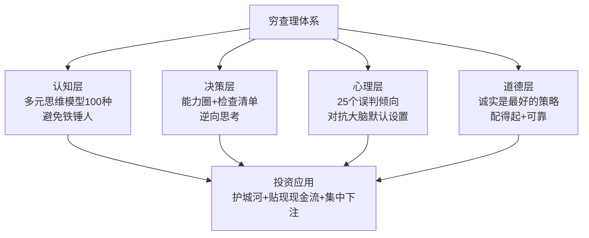
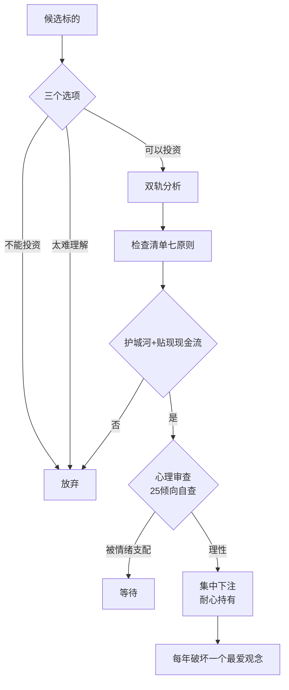

# 22《穷查理宝典》深度解读（详细版）

> 查理·芒格智慧箴言录——多元思维模型、人类误判心理学与普世智慧

## 📖 本书概览

| 项目 | 内容 |
|------|------|
| 书名 | 穷查理宝典——查理·芒格智慧箴言录（Poor Charlie's Almanack） |
| 编者 | 彼得·考夫曼（Peter Kaufman，企业家+"职业书虫"，芒格多年朋友） |
| 译者 | 李继宏（中文版序言：李录） |
| 定位 | 效仿本杰明·富兰克林《穷理查年鉴》的芒格思想汇编 |
| 结构 | 序言（巴菲特论芒格）+ 驳辞（芒格论巴菲特）+ 传略 + 决策方法 + 即席谈话 + **查理十一讲** + 文章评论 + 年谱 |
| 核心主题 | 多元思维模型、lollapalooza 效应、逆向思考、能力圈、人类误判心理学（25 个心理倾向）、诚实与理性 |
| 系列位置 | **芒格三部曲之首**：[[23《查理·芒格的智慧 投资的格栅理论》深度解读（详细版）|23 格栅理论]]（方法论扩展）· [[24《芒格之道》深度解读（详细版）|24 芒格之道]]（股东会讲话实录）· [[25《一本书读懂穷查理宝典》深度解读（详细版）|25 一本书读懂穷查理宝典]]（入门解读） |

## 🎯 为什么这本书值得单独解读

- **巴菲特唯一公开承认的"思想启蒙者"**：巴菲特说"全部符合我这些特殊要求的人只有一个，他就是查理"——没有芒格，就没有"以合理价格买伟大公司"的伯克希尔
- **多元思维模型**：100 种来自各学科的重要模型——"在手里拿着铁锤的人看来，世界就像一颗钉子"
- **lollapalooza 效应**：多种力量同向共振产生核爆式效果——芒格独创的分析概念
- **人类误判心理学 25 个倾向**：全书最重的一讲（5 万字）——理解自己如何被大脑欺骗
- **逆向思考**："反过来想，总是反过来想"——卡森药方（保证痛苦生活的处方）
- **诚实是最好的策略**：富兰克林没说诚实是最好的道德品质，他说诚实是最好的策略

## 📑 目录

- [[#第1章 序言与传略：从奥马哈到伯克希尔|第1章 序言与传略：从奥马哈到伯克希尔]]
- [[#第2章 芒格的决策方法：多元思维模型|第2章 芒格的决策方法：多元思维模型]]
- [[#第3章 芒格的投资评估过程|第3章 芒格的投资评估过程]]
- [[#第4章 芒格主义：即席谈话精华|第4章 芒格主义：即席谈话精华]]
- [[#第5章 查理十一讲（上）：普世智慧|第5章 查理十一讲（上）：普世智慧]]
- [[#第6章 查理十一讲（下）：经济学与会计批判|第6章 查理十一讲（下）：经济学与会计批判]]
- [[#第7章 人类误判心理学：25 个心理倾向详解|第7章 人类误判心理学：25 个心理倾向详解]]
- [[#第8章 文章、报道与寓言|第8章 文章、报道与寓言]]
- [[#附录一 芒格金句集（40 条精选）|附录一 芒格金句集（40 条精选）]]
- [[#附录二 芒格检查清单全表|附录二 芒格检查清单全表]]
- [[#附录三 查理·芒格年谱（1924—2010）|附录三 查理·芒格年谱（1924—2010）]]
- [[#附录四 系列互链：芒格体系全景|附录四 系列互链：芒格体系全景]]
- [[#附录五 读完本书后的 10 个自问|附录五 读完本书后的 10 个自问]]
- [[#总结：穷查理的人生算法|总结：穷查理的人生算法]]

## 🔗 双链导读（本笔记与系列的连接点）

| 连接主题 | 本书章节 | 关联笔记 |
|---------|---------|---------|
| 芒格思想扩展 | 全书 | [[23《查理·芒格的智慧 投资的格栅理论》深度解读（详细版）|23 格栅理论]] · [[24《芒格之道》深度解读（详细版）|24 芒格之道]] · [[25《一本书读懂穷查理宝典》深度解读（详细版）|25 一本书读懂穷查理宝典]] |
| 巴菲特合伙公司 | 第1章 | [[20《巴菲特的第一桶金》深度解读（详细版）|20 第一桶金]] |
| 喜诗糖果 | 第2章 | [[20《巴菲特的第一桶金》深度解读（详细版）|20 第一桶金第7章]] |
| 可口可乐案例 | 第5章 | [[07《巴菲特投资案例集》深度解读（详细版）|07 案例集]] |
| 浮存金 3% vs 13% | 第4章 | [[20《巴菲特的第一桶金》深度解读（详细版）|20 国民赔偿]] |
| 护城河 | 第3章 | [[13《巴菲特的护城河》深度解读（详细版）|13 护城河]] · [[21《星公司解密巴菲特股市投资法则》深度解读（详细版）|21 星公司]] |
| 集中投资 | 第2章 | [[16《巴菲特的投资组合》深度解读（详细版）|16 投资组合]] |
| 衍生品警告 | 第4章 | [[19《跳着踢踏舞去上班》深度解读（详细版）|19 踢踏舞]] |
| 韦斯科/西科 | 第4章 | [[20《巴菲特的第一桶金》深度解读（详细版）|20 韦斯科案例]] |
| 年会议话 | 第3章 | [[18《巴菲特的嘉年华》深度解读（详细版）|18 嘉年华]] |

---

## 第1章 序言与传略：从奥马哈到伯克希尔

### 1.1 中文版序言：书中自有黄金屋（李录）

**李录**（喜马拉雅资本创始人，2004 年成为芒格的投资合伙人）：20 多年前作为年轻中国学生赴美，1990 年代接触巴菲特/芒格价值投资体系，从此人生改变。

**李录的核心领悟**（序言精华）：
- 价值投资 = 以所有者的心态买企业的一部分
- 芒格思想对他个人的塑造：理性、跨学科、长期主义
- 2009 年（芒格 85 岁）决定翻译本书——"对恩师最好的报答"

**李录在第二章贡献**：泰德·威廉姆斯 77 格击球区的阐释（见第3章）。

### 1.2 序言：巴菲特论芒格

**富兰克林 vs 芒格**（开篇妙喻）：

> "本杰明建议做的，到查理这儿变成必须做到的。如果本杰明建议节省几分钱，查理会要求节省几块钱。如果本杰明说要及时，查理会说要提前。和芒格苛刻的要求相比，依照本杰明的建议来过日子显得太容易了。"

**复利的活教材**：富兰克林遗嘱设立两个小型慈善基金"向人们传授复利的魔力"——芒格选择自己来做复利的活教材，避免削弱榜样力量的铺张开支——"结果是，查理的家庭成员体会到坐巴士长途旅行的乐趣，而他们那些被囚禁在私人飞机里的富裕朋友则错过了这些丰富多彩的体验。"

**选择合伙人的建议**（巴菲特，全书最重要的方法论之一）：

> "首先，要找比你更聪明、更有智慧的人。找到他之后，请他别炫耀他比你高明，这样你就能够因为许多源自他的想法和建议的成就而得到赞扬。你要找这样的合伙人，在你犯下损失惨重的错误时，他既不会事后诸葛亮，也不会生你的气。他还应该是个慷慨大方的人，会投入自己的钱并努力为你工作而不计报酬。最后，这位伙伴还会在漫漫长路上结伴同游时能不断地给你带来快乐。"

> "全部符合我这些特殊要求的人只有一个，他就是查理。"——**巴菲特 1959 年以来的唯一合伙人**

**巴菲特答问录**（1959 年初识）：
- 戴维斯医生介绍相识，晚宴小包厢——"当查理为自己讲的笑话而笑得前俯后仰时，我知道我遇到气味相投的人了"
- 成功的秘密（一个词）：**"理性"**——"他天生就是很理性的人，并把它用在做生意上。在其他方面，他倒不是一直都很理性，但在生意场上绝对是"
- 道德品质来自富兰克林：诚实正直、做的总比分内事多、从来不抱怨其他人做了什么——"我们合伙了 40 年，他从来不对我做的事情放马后炮。我们从来没有发生过一次争执"
- 最异乎寻常的特点："查理的一切都是异乎寻常的。我花了 40 年在他身上找寻常的东西，现在还没找到呢。**查理谱写了他自己的乐曲，那是真的没有人听过的乐曲。**"

**苏丝·巴菲特答问录**（1998 年 11 月访谈）：1959 年那晚"沃伦居然肯安静下来，让查理掌握话语权。我还从来没有看到过那样的情况……沃伦总是掌控对话的一方，我从来没见到有谁能把这个角色抢走，那天晚上他把它让给了查理。"

### 1.3 驳辞：芒格论巴菲特

> "我想那些认为我是沃伦的伟大启蒙者的想法里有好些神话的成分。他不需要什么启蒙。坦白说，我觉得我有点名不副实。……但如果世上未曾有过查理·芒格这个人，巴菲特的业绩依然会像现在这么漂亮。"

**对巴菲特的评价**：

> "人们很难相信他的业绩一年比一年好。这种情况不会永久地持续下去，但沃伦的境界确实有所提高。这是很罕见的：绝大多数人到古稀之年便停滞不前了，但沃伦依然在进步。"

**沃伦走后会怎样**（2004 年年会）：

> "等到沃伦离开的时候，伯克希尔的收购业务会受到影响的，但其他部门将会运转如常。……我想到那时伯克希尔的最高领导人应该没有沃伦那么聪明。但别抱怨：'天啊，给我沃伦·巴菲特 40 年之后，怎么能给我一个比他差的混蛋呢？'那是很愚蠢的。"

**幽默**："他们让我这个 80 岁老头坐在这里的主要目的，是让沃伦显得很年轻。"（2004 年年会）

### 1.4 第一章传略：查理·芒格的一生

**1924 年 1 月 1 日**生于奥马哈——与巴菲特同乡；少年时在**巴菲特父子商店**打工（老板是沃伦的祖父恩尼斯特）："老板要求孩子们下班时上缴两分钱，那是新的社会安全法案规定的费用。他们得到的是两美元的日薪和一句忠告：社会主义是有问题的。"

**人生轨迹**（详见附录三）：密歇根大学数学专业（辍学）→ 二战陆军航空兵团天文士官 → 哈佛法学院优秀毕业生（1948）→ 洛杉矶律师 → 1959 年与巴菲特相识 → 1962 年创办芒格-托尔斯律师事务所 + 惠勒芒格投资公司 → 1978 年伯克希尔副主席 → 1983 年西科主席。

**惠勒芒格公司业绩**（1962—1975）：**平均年化 19.8%（道指同期 5.0%）**——巴菲特在《超级投资者》中匿名引用："他成立的合伙公司和沃尔特的完全不同。他的投资组合集中在非常少的几只股票上，因而，他的投资业绩波动要大得多……他恰好是一个心理结构倾向集中的人。"

**芒格的人生悲剧与坚韧**：1955 年儿子泰迪死于白血病；1951 年离婚——"查理从这些磨难中崛起，成为更好的人"。

**晚辈眼中的芒格**（忆念）：
- **小查理**：借车加满油的故事——"你要是借了别人的车，别忘了加满油再还给人家"——公平周到的处事哲学
- **温蒂**：餐桌德育故事——"他讲的故事非常极端，非常可怕，每当他讲完之后，我们通常会一边尖叫一边大笑"；财务负责人犯错立即上报的故事——**诚实报告的奖励机制**
- **芒格、托尔斯&奥尔森律师事务所**（罗纳德·奥尔森）："带来新客户的最佳办法就是把案头工作做好"——不靠营销靠口碑

**船长查理**（游艇趣事）：瑞克·格伦说"我管查理那艘游艇叫'芒格的蠢事'。那是查理唯一做过的完全非理性的事情。"查理的结语："设计和建造那艘船是很好玩的事，怎么就非理性了呢？"

**歌颂长者：芒格论晚年**（受西塞罗《论老年》启发）：1744 年富兰克林首次将西塞罗《论老年》译为英文；芒格 82 岁时读到此书"高兴到几乎上天"——

> "晚年的最佳保护铠甲是一段在它之前被悉心度过的生活。"——查理·芒格（萨克拉门托河畔，2005 年）

**富兰克林论衰老**（芒格引用）："生活的悲哀之处在于，我们总是老得太快，而又聪明得太慢。等到你不再修正的时候，你也就不在了。"

### 1.5 第1章小结

序言三篇勾勒出芒格的完整画像：**巴菲特眼中的"理性"化身与完美合伙人；芒格自己眼中的"名不副实"启蒙者；晚辈眼中的正直导师**。传略揭示思想来源：中西部老派价值观 + 富兰克林榜样 + 自学成才 + 历经磨难。

---

---

## 第2章 芒格的决策方法：多元思维模型

### 2.1 多元思维模型：100 种工具的复式框架

**核心论断**：

> "你必须知道重要学科的重要理论，并经常使用它们——要全部都用上，而不是只用几种。大多数人都只使用学过的一个学科的思维模型，比如说经济学，试图用一种方法来解决所有问题。你知道谚语是怎么说的：'在手里拿着铁锤的人看来，世界就像一颗钉子。'这是处理问题的一种笨办法。"

**为什么必须多元**：几乎每个系统都受到多种因素的影响——"如果我们试图理解一样看似独立存在的东西，我们将会发现它和宇宙间的其他一切都有联系"（约翰·缪尔）。

**模型的来源学科**：历史学、心理学、生理学、数学、工程学、生物学、物理学、化学、统计学、经济学等。

**最重要的模型举例**：

| 学科 | 模型 | 应用 |
|------|------|------|
| 工程学 | 冗余备份模型 | 关键系统要有备份（安全边际的工程版） |
| 数学 | 复利模型 | "复利是世界第八大奇迹" |
| 物理学/化学 | 临界点、倾覆力矩、自我催化模型 | 质变临界、趋势自我强化 |
| 生物学 | 现代达尔文综合模型 | 商业即生态系统、适者生存 |
| 心理学 | 认知误判模型 | 25 个心理倾向 |

**100 种模型的正确用法**（不是死记硬背）：

> "你必须把经验悬挂在头脑中的一个由许多思维模型组成的框架上。"——"有些学生试图死记硬背，以此来应付考试。他们在学校中是失败者，在生活中也是失败者。"

**模型的复式框架**：

> "长久以来，我坚信存在某个系统——几乎所有聪明人都能掌握的模型——它比绝大多数人用的系统管用。你需要的是在你的头脑里形成一种思维模型的复式框架。有了那个系统之后，你就能逐渐提高对事物的认识。然而，我这种特殊的方法似乎很少得到认可，甚至对那些非常有才能的人来说也是如此。人们要是觉得一件事情'太难'，往往就会放弃去做它。"（简单是长期努力工作的结果，而不是起点——迈特兰德）

**愿意改变想法**（芒格最罕见的性格）：

> "如果说伯克希尔取得了不错的发展，那主要是因为沃伦和我非常善于破坏我们自己最爱的观念。**哪年你没有破坏一个你最爱的观念，那么你这年就白过了。**"

> "如果有了更好的工具（观念或方法），那还有什么比用它来取代你较为没用的旧工具更好的呢？沃伦和我常常这么做，但大多数人会像加尔布雷思说的那样，永远不舍得他们那些较为没用的旧工具。"（"当面临要么改变想法、要么证明无需这么做的选择时，绝大多数人都会忙于寻找证据。"——加尔布雷思）

### 2.2 lollapalooza 效应：多种力量的核爆

**定义**（芒格发明的词组，亨利·爱默生引述）：

> "最重要的事情是要牢牢记住，这 100 种模型往往能够带来特别大的力量。当几个模型联合起来，你就能得到 lollapalooza 效应；这是两种、三种或四种力量共同作用于同一个方向，而且你得到的通常不仅仅是几种力量之和。那就像物理学里面的临界质量，当你达到一定程度的质量，你就能引发核爆炸——而如果你没有达到那种质量，你将什么也得不到。"

**力量的冲突**：

> "更为常见的情形是，这 100 种模型带来的各种力量在某种程度上是相互冲突的。所以你将会面临鱼和熊掌不可兼得的境况。如果你不明白有舍才有得的道理，如果你以为鱼与熊掌可以兼得，那么你就太傻了。……你必须意识到生物学家朱利安·赫胥黎的那句话是千真万确的——他说：'生活无非就是一个接一个的联系。'"

**lollapalooza 的实战应用**：
- 可口可乐案例（第四讲）：口味偏好+社会认同+对比效应+奖励机制……多重心理倾向协同——建立 2 万亿美元的企业
- 品牌营销：品牌强度=品质联想+社会认同+激励超级反应……的组合
- **投资决策中识别多因素共振**：好公司（护城河模型）+ 好价格（估值模型）+ 好时机（周期模型）三力合一才出手

### 2.3 能力圈与"三个选项"

**能力圈**：

> "如果你确有能力，你就会非常清楚能力圈的边界在哪里。如果你问起（你是否超出了能力圈），那就意味着你已经在圈子之外了。"——查理·芒格
> "如果说我们有什么本事的话，那就是我们能够弄清楚我们什么时候在能力圈的中心运作，什么时候正在向边缘靠近。"——巴菲特

**老托马斯·沃森的概括**（芒格最欣赏的方法论表述）：

> "我不是天才。我有几点聪明，我只不过就留在这几点里面。"

**三个选项**（投资决策的总纲）：

> "关于投资，我们有三个选项：可以投资，不能投资，太难理解。"——**不能投资的立即划掉（交易、公开招股）；太难理解的直接放弃（制药业、高科技）；只有"可以投资"的进入下一步**

**讨厌"披沙拣金"**：芒格不用"从一大堆沙子里淘洗出几粒小小的金子"的方法——"他要用'重要学科的重要理论'的方法，去寻找别人尚未发现的、有时候躺在一眼就能看见的平地上的大金块。"

### 2.4 生态系统的商业观

> "我发现把自由的市场经济——或者部分自由的市场经济——当作某种生态系统是很有用的思维方式。动物在合适的地方能够繁衍，同样地，人只要在社会上找到了专属于自己的位置，也能够做得很成功。"

**生态位的启示**：竞争激烈的行业（沙漠）vs 有护城河的行业（绿洲）——"取胜的系统在最大化或者最小化一个或几个变量上走到近乎荒谬的极端——比如说好市多仓储超市。"

**巴菲特对芒格的评价**：

> "查理能够比任何活着的人更快、更准确地分析任何种类的交易。他能够在 60 秒之内找出令人信服的弱点。他是一个完美的合伙人。"

### 2.5 第2章小结

芒格决策方法的核心 = **多元思维模型（工具）+ 能力圈（边界）+ 生态观（视角）+ 破坏最爱观念（进化）**。100 种模型不是知识清单，而是"经验悬挂的框架"——只有反复使用、互相联系，才能产生 lollapalooza 效应。

---

## 第3章 芒格的投资评估过程

### 3.1 投资评估总纲

> "最重要的观念是把股票当成企业的所有权，并根据它的竞争优势来判断该企业的持有价值。如果该企业未来的贴现现金流比你现在购买的股票价格要高，那么这个企业就具有投资价值。当你占据优势的时候才采取行动，这是非常基本的。你必须了解赔率，要训练你自己，在赔率有利于你时才下赌注。我们只是低下头，尽最大努力去对付顺风和逆风，每隔几年就摘取结果而已。"

### 3.2 沃伦和查理论"护城河"（2000 年年会实录）

> 巴菲特："让我们来把护城河、保持它的宽度和保持它不被跨越作为一个伟大企业的首要标准。我们告诉我们的经理，我们想要护城河每年变宽。那并不意味着今年的利润将会比去年的多，因为有时候这是不可能的。然而，如果护城河每年都变宽，企业的经营将会非常好。当我们看到的是一条很狭窄的护城河——那就太危险了。我们不知道如何评估那种情况，因此，我们就不考虑它了。我们认为我们所有的生意——或者大部分生意——都有挖得很深的护城河。我们认为那些经理正在加宽它们。查理你说呢？"
> 芒格："你还能讲得比这更好吗？"
> 巴菲特："当然。请给这位先生来点花生糖。"

### 3.3 泰德·威廉姆斯的 77 格击球区（李录阐释）

> "他把击打区划分为 77 个棒球那么大的格子。只有当球落在他的'最佳'格子时，他才会挥棒，即使他有可能因此而三振出局，因为挥棒去打那些'最差'格子会大大降低他的成功率。作为一个证券投资者，你可以一直观察各种企业的证券价格，把它们当成一些格子。在大多数时候，你什么也不用做，只要看着就好了。每隔一段时间，你将会发现一个速度很慢、线路又直，而且正好落在你最爱的格子中间的'好球'，那时你就全力出击。"

**芒格的原则**：

> "有性格的人才能拿着现金坐在那里什么事也不做。我能有今天，靠的是不去追逐平庸的机会。"

**两个方向的错误**：
1. **挥棒太过频繁**：个人投资者和机构投资者共同的问题（"机构行为铁律"）
2. **发现好球却无法全力出击**：资金管理不当，好球来临时没有子弹

### 3.4 纪律和耐心：复利与等待

> "如果你把我们 15 个最好的决策剔除，我们的业绩将会非常平庸。你需要的不是大量的行动，而是大量的耐心。你必须坚持原则，等到机会来临，你就用力去抓住它们。"

> "有很多情况比淹没在现金中却又什么都不做糟糕得多。我记得从前我缺乏现金的情况——我可不想回到那个时候。"

**复利的本质**：

> "钱是一种繁殖力特别强大的东西。钱会生钱子，钱子会生更多的钱孙。"（富兰克林）——"理解复利的魔力和获得它的困难是理解许多事情的核心和灵魂。"

### 3.5 投资原则检查清单（七大原则）

| 原则 | 要点 |
|------|------|
| **风险** | 所有评估从测量风险开始：安全边际、避开道德品质有问题的人、为预定风险要求补偿、记住通胀和利率风险、避免犯大错和资本金持续亏损 |
| **独立** | "唯有在童话中，皇帝才会被告知自己没穿衣服"——对错不取决于别人同意与否，唯一重要的是你的分析判断是否正确 |
| **准备** | 惟一的获胜方法是工作、工作、工作，并希望拥有一点洞察力；终生自学；每天努力聪明一点点；"为什么，为什么，为什么" |
| **谦虚** | 承认无知是智慧的开端；只在能力圈内行事；核查否定性证据；抵制虚假精确；"别愚弄你自己，你是最容易被自己愚弄的人" |
| **严格分析** | 区分价值和价格、过程和行动、财富和规模；浅显的好过深奥的；做商业分析家而非市场/宏观/证券分析家；关注二阶效应；反过来想 |
| **配置** | 正确配置资本是投资者最重要的工作；最好用途由第二好用途衡量（机会成本）；好主意特别少，时机有利时狠狠下注；别"爱上"投资项目 |
| **耐心** | 复利是世界第八大奇迹，不到必要别打断它；避免多余交易税和摩擦成本；永远别为行动而行动；幸运来临时保持头脑清醒 |

**富兰克林的复利注脚**："这是能够将你所有的铅块变成金块的石头。"

### 3.6 诚实是最好的策略

**格罗斯的评价**（债券之王）：

> "如果东海岸和西海岸同时被海水淹没，不管是由于风暴、地震还是道德沦丧，芒格的奥马哈将依然会存在。应该用卫星将查理的道德标准播送到世界各地的金融中心，以便防止未来再出现安然或世通之类的丑闻。……查理和沃伦是极好的榜样和教师……在持续终生的商业'赛跑'中，查理和沃伦不但处于领先地位，而且沿途还从来不抄近道。"

**瑞克·格伦的两次见证**（占便宜的反面）：
1. 收购企业时两位老太太持有债券——"我们本来很容易以远低于面值的价格收购这些债券——但是查理却按照面值给她们钱"
2. 卖一半股权给查理——"我说 13 万美元，他说不行，23 万美元才对，他真给了我那么多钱"

> "在股票交易所占价格低廉的股票便宜是一回事，但是占合伙人或者老太太便宜是另外一回事——这是查理绝对不会做的事。"

**查理论诚实**（2004 年西科年会）：

> "路易斯·文森狄以前曾经说：'如果你说真话，你就不用记住你的谎言啦。'我们不想搞得太复杂，所以总是说实话。"

> "有些事情就算你能做，而且做了不会受到法律的制裁，或者不会造成损失，你也不应该去做。你应该有一条底线。你心里应该有个指南针。所以有很多事情你不会去做，即使它们完全是合法的。"

> "本杰明·富兰克林是对的。他并没有说诚实是最好的道德品质，他说**诚实是最好的策略**。"

### 3.7 第3章小结

投资评估 = **企业所有权思维 + 护城河 + 贴现现金流 + 赔率 + 集中下注**。检查清单是纪律化的保障；诚实是策略（长期利益最大化）；耐心是性格（拿住现金等好球）。芒格的投资方法不是"选股技巧"，而是一套完整的人生态度。

---

---

## 第4章 芒格主义：即席谈话精华

### 4.1 我们成功的关键（两条核心）

> "1. 如果乌龟能够吸取它那些最棒前辈的已经被实践所证明的洞见，有时候它也能跑赢那些追求独创性的兔子……**我们赚钱，靠的是记住浅显的，而不是掌握深奥的。我们从来不去试图成为非常聪明的人，而是持续地试图别变成蠢货**，久而久之，我们这种人便能获得非常大的优势。"
>
> "2. 我们并不自称是道德高尚的人，但至少有很多即便合法的事情，也是我们不屑去做的。……在你应该做的事情和就算你做了也不会受到法律制裁的事情之间应该有一条巨大的鸿沟。我想你应该远离那条线。……**更多的时候，我们由于做正确的事情而赚到更多的钱。**"

### 4.2 论伯克希尔：浮存金生意模型

> "我们就像（伯林教授所讲的）刺猬，只知道一个大道理：**如果你能够用 3% 的利率吸取浮存金，然后将其投资给某家能够带来 13% 的收益的企业，那么这就是一桩很好的生意。**……伯克希尔收购的企业能够给我们带来的税前回报率是 13%，也许还要多一点。由于资本成本利率只有 3%——这些资本金是别人的钱，以浮存金的形式得到的——这就是非常棒的生意。"

**伯克希尔以前的回报**："好到几近荒谬。如果伯克希尔愿意举债经营，比如说吧，就算负债率只有鲁珀特·默多克的一半，它的规模也应该是现在的 5 倍。"

**伯克希尔的未来展望**（诚实面对）：

> "一个人可以做的最聪明的事之一是调低投资预期，尤其是调低对伯克希尔的收益的预期。那是成熟而负责任的表现。"

原因两点：① 规模太大（只能投资竞争更激烈的领域）；② 未来 15—20 年普通股票市场不会像过去那么好。

### 4.3 对巴菲特的评论

> "人们很难相信他的业绩一年比一年好。这种情况不会永久地持续下去，但沃伦的确在进步。这是很罕见的：绝大多数人到了 72 岁就停滞不前了，但沃伦依然在进步。"

**对自身影响的谦逊**："我认为那些作者言过其实地夸大了我对沃伦的影响。……但如果世上未曾有过查理·芒格这个人，巴菲特的业绩依然会像现在这么漂亮。"

**沃伦走后**："关键是拥有许多优秀的企业。优秀的企业能给伯克希尔的发展带来很多动力。（然而，）我认为我们的继任者在资本配置方面将不会像沃伦这么出色。"——"别抱怨：'天啊，给我沃伦·巴菲特 40 年之后，怎么能给我一个比他差的混蛋呢？'那是很愚蠢的。"

### 4.4 投资建议：性格、耐心和求知欲

> "成功投资的关键因素之一就是拥有良好的性格——大多数人总是按捺不住，或者总是担心过度。成功意味着你要非常有耐心，然而又能够在你知道该采取行动时主动出击。你吸取教训的来源越广泛，而不是仅仅从你自己的糟糕经验中吸取教训，你就能变得越好。"

> "我想说说怎样才能培养那种毫不焦躁地持有股票的性情。光靠性格是不行的。你需要在很长很长的时间内拥有大量的求知欲望。你必须有浓厚的兴趣去弄明白正在发生的事情背后的原因。如果你能够长期保持这种心态，你关注现实的能力将会逐渐得到提高。如果你没有这种心态，那么即使你有很高的智商，也注定会失败。"

**集中投资**（芒格风格）：

> "我们的投资风格有一个名称——集中投资，这意味着我们投资的公司有 10 家，而不是 100 家或者 400 家。我们的游戏是，当好项目（出现时）……"（重仓少数）

### 4.5 谈市场：股票、伦勃朗和泡沫

> "股票有点像债券，对其价值的评估，大略以合理地预测未来产生的现金为基础。但股票也有点像伦勃朗的画作，人们购买它们，是因为它们的价格一直都在上涨。这种情况，再加上股票涨跌所产生的巨大'财富效应'，可能会造成许多祸害。"

**未来回报率预测**（2000 年 11 月）：

> "如果股市未来的回报率能够达到 15%，那肯定是因为一种强大的'伦勃朗效应'。这不是什么好事。看看日本以前的情况就知道了。当年日本股市的市盈率高达 50 到 60 倍。这导致了长达十年的经济衰退。……我的猜测是，美国不会出现极端的'伦勃朗化'现象，今后的回报率将会是 6%。"

**对投资者的直言**（2001 年 4 月）："总的来说，我认为美国投资者应该调低他们的预期。人们不是有点蠢，而是非常蠢。没有人愿意说出这一点。"——"我们并没有处在一个猪猡也能赚钱的美好时代。投资游戏的竞争变得越来越激烈。"

### 4.6 批判六连：管理层、基金、华尔街、会计、期权、衍生品

**对企业管理层的批评**：

> "现在，它的机制类似于连锁信。由于和诸如风险投资之类的合法活动混在一起，这种做法看起来似乎很体面。但我们正在混淆体面的活动和可耻的活动——所以我在伯克希尔·哈撒韦的年会上说，**如果你把葡萄干和大便搅在一起，你得到的仍然是大便。**会计学没有办法阻止那些道德败坏的管理人员从事那种连锁信式的骗局。"

**对基金管理企业的批评**：

> "开放式基金每年收取 2% 的费用，然后那些经纪商让人们在不同基金之间转来转去，多付 3% 到 4% 的费用。可怜的普通基民们把钱交给专业人士，却得到糟糕的结果。我觉得这很恶心。……从净收益来看，整个投资管理行业加起来并没有对全部客户的资产提供附加值。"——"如果共同基金的监事是独立的，那么我就是俄罗斯波尔修芭蕾舞团的首席男明星。"

**对华尔街的批评**：

> "华尔街的平均道德水准永远至多只能说是中等……许多年前，我们花 600 万美元收购多元零售公司，银行对我们进行了严格而聪明的审查。那些银行家关心他们的客户，想要保护他们的客户。现在的风气是，只要能赚钱，什么都可以卖。你能把东西卖掉，你就道德高尚。但这个标准可不够。"

**所罗门个案研究**（麦克斯韦尔事件）："这人的绰号可是'跳来跳去的捷克人'啊。他既然有这个花名，投资银行就不应该去抢着做他的生意。……你得防止人们为了挣钱将不三不四的人带入。"

**对会计的批评**（EBITDA 妙语）：

> "我认为，你每次看到 EBITDA 这个词汇，你都应该用'狗屁利润'来代替它。"——"创造性会计（伪造账目）绝对是对文明的诅咒。……安然是企业文化长期出毛病的最典型例子。"

**对股票期权的批评**：

> "给一个亲手创办公司、已经六十几岁的 CEO 大量的期权，试图以此刺激他对该公司的忠诚，这是一种精神错乱的想法。玛约医疗中心的医生或者克拉法斯律所的律师在六十几岁时还会为了期权而更加努力地工作吗？"

**布莱克-舒尔斯模型的局限**："布莱克-舒尔斯模型是一套'一无所知'的系统。如果你对价值毫不了解，只了解价格，那么利用布莱克-舒尔斯模型，你能够很准确地猜出为期 90 天的期权到底值多少钱。但如果期权比 90 天更长久，那么使用这个模型就有点神经啦。"（好市多案例：执行价 30 美元和 60 美元的期权，模型认为 60 美元的价值更高——"这简直是疯了"）

**对金融机构和衍生品的警告**：

> "金融机构的本质决定了它很容易阴沟里翻船。……当金融机构想努力表现时，我们就会感到紧张。我们尤其害怕那些大量举债的金融机构。如果他们开始说起风险管理有多么好，我们就会很紧张。"——"衍生品系统简直是神经病，它完全不负责任。"

**马克·吐温的猫尾巴**："抓住猫尾巴，把猫倒提起来的人，将会学到他在别的地方学不到的教训。"——衍生品和保险的本质：**风险的"长尾"**——"可能要经过好几年，才能测算某项交易的亏损或收益。"

**对律师的批评**（玛莎·斯图亚特案）："准确地说，她是因为请了律师之后的行为才进的监狱！"——律师教她编虚假故事欺骗检察官（重罪）而非说出真相。

### 4.7 怎样变得幸福、富裕，以及其他建议

> "如果你在生活中惟一的成功就是通过买股票发财，那么这是一种失败的生活。生活不仅仅是精明地积累财富。"

> "生活和生意上的大多数成功来自你知道应该避免哪些事情：过早死亡、糟糕的婚姻等等。……避免邪恶之人，尤其是那些性感诱人的异性。如果因为你的特立独行而在周围人中不受欢迎……那你就随他们去吧。"

**满足于你已经拥有的**（反德鲁肯米勒/索罗斯）："如果你已经相当富裕，而别人的财富增长速度比你更快……那又怎样呢？！总是会有人的财富增长速度比你快。这并不可悲。"

**提防妒忌**：

> "关注别人赚钱（比你）更快的想法是一种致命的罪行。**妒忌真的是一种愚蠢的罪行，因为它是仅有的一种你不可能得到任何乐趣的罪行。**它只会让你痛苦不堪，不会给你带来任何乐趣。你为什么要妒忌呢？"

### 4.8 幽默与箴言

> ※"我宁愿将毒蛇丢进我的衬衣里，也不愿聘用一名薪酬顾问。"
> ※"（有人问查理是否会弹钢琴）我不知道，我从来没试过。"
> ※"在企业界，如果你聘请了分析师，在并购时进行了尽职调查，却不具备常识，那么你遇到的将会是地狱。"
> ※"如果你取得了很高的地位，那么你必须遵守某些行为规则。如果你是一个喜欢酗酒的铲沙工人，你可以去脱衣舞俱乐部；但如果你是波士顿的主教，那你就不应该去了。"

**辛普森谈芒格**（GEICO 资产运营总裁）：

> "他最大的优点是诚实、道德和正直的绝对坚持——查理从来不为自己'攫取'非分之物，值得毫无保留地信任。如果这些还不够，他还拥有一种最适合投资的理想性格：**毫不妥协的耐心，自律，自控——无论遭受多大的压力，查理从来不会动摇或者改变他的原则。**"

**芒格谈辛普森**：连续 25 年年均回报率高于标普 500 达 6.8 个百分点——"路易斯是我们这个时代最伟大的投资者之一。正如沃伦说的，他是'投资名人堂里的常胜将军'。"（1990 年代末正确、彻底地避开互联网泡沫——"他正确地、彻底地避开了那个泡沫，坚守基本的投资原则"）

**塞内加尔互评**（好市多 CEO）：芒格敏锐指出好市多会员制价值；芒格称塞内加尔"是 20 世纪最出色的五名零售商之一。……我们在好市多公司拥有属于我们自己的活着的、呼吸着的山姆·沃尔顿。"

### 4.9 第4章小结

即席谈话是芒格思想的"口语版"：**成功=记住浅显的+避免当蠢货+做正确的事**；投资=浮存金 3% 借入 13% 投出；市场=警惕伦勃朗效应；批判=直指华尔街/会计/期权的激励扭曲；幸福=避免愚蠢+提防妒忌+满足于已有。

---

---

## 第5章 查理十一讲（上）：普世智慧

### 5.1 第一讲：在哈佛学校毕业典礼上的演讲（1986）——卡森药方

**芒格的演讲套路**：效仿约翰尼·卡森——不告诉毕业生如何获得幸福，而是告诉他们**如何保证自己过上痛苦的生活**（逆向思考的经典应用）。

**卡森的三味痛苦处方**（芒格扩展为四味）：

| # | 痛苦药方 | 机制 |
|---|---------|------|
| 1 | **要反复无常**，不要虔诚地做你正在做的事 | 养成这个习惯，就能抵消你所有优点产生的效应 |
| 2 | **尽可能从你们自身的经验获得知识**，尽量别从其他人成功或失败的经验中广泛吸取教训 | 只要看看身边发生的事，你们就可以亲手造就失败 |
| 3 | **当你们在人生的战场上遭遇第一、第二或者第三次严重失败时，就请意志消沉，从此一蹶不振吧** | 即使是最幸运、最聪明的人也会遇到许多失败，一蹶不振保证你永远失败 |
| 4 | （芒格加味）**尽可能减少客观性** | 获得客观性很难，一旦拥有却不会被用来获取其他优势 |

**卡森药方第一味药详解**（反复无常）：芒格年轻时听过卡森演讲，后来在哈佛法学院的同学中观察——"虽然资质优异，却由于毫无节制的反复无常而失败"——"他们只要遇到不喜欢的事情，就采取不理会、不接触的态度……你们当中那些意志不够坚定的人将会沦为反复无常的奴隶"。

**第二味药详解**（自身经验）：芒格引用爱因斯坦的话（"自我批评"）、达尔文（极端客观）；"让那些在生活中遭到打击的人吸取别人的经验教训吧——别以为只有亲身经历才能学到东西"。

**第三味药详解**（一蹶不振）："由于过于吃苦头，我在很长时间里精神不振。……我想避免你们也走进这个误区。回想我的一生，我觉得不想陷入沮丧情绪的一个方法，是向托马斯·卡莱尔学习——他说：'人的任务不是去看清远处模糊的东西，而是去做好手边清楚的事情。'"

**第四味药详解**（减少客观性）：达尔文的极端客观——"他尤其注重检查的是他最爱戴和爱慕的理论。……如果你们让负面证据妨碍你们从过去吸取教训，那就等于你们完全违背了达尔文的精神"。

**重读第一讲（2006）**：没有要修改的地方——"我现在更加坚定地认为：1. 在生活中，可靠是至关重要的；2. 虽然量子力学对于绝大多数人而言是学不会的，但可靠却是几乎每个人都能很好地掌握的。"

> "我只不过是说麦当劳是最值得我们尊敬的机构……这么多年来，麦当劳为数百万少年提供了第一份工作，包括许多问题少年，它成功地教会他们中的大多数人最需要的一课：**承担工作的责任，做可靠的人。**"

### 5.2 第二讲：论基本的、普世的智慧（1994 南加大）——祖母的规矩

**演讲结构**（祖母的规矩——先吃胡萝卜再吃甜点）：先讲普世智慧（胡萝卜），再讲选股艺术（甜点）。

**普世智慧第一条规则**：

> "如果你们只是记得一些孤立的事物，试图把它们硬凑起来，那么你们无法真正地理解任何东西。如果这些事物不在一个理论框架中相互联系，你们就无法把它们派上用场。你们必须在头脑中拥有一些思维模型。你们必须依靠这些模型组成的框架来安排你的经验。"

**模型的多元性**（铁锤人警告）："如果你只能使用一两个（模型），研究人性的心理学表明，你将会扭曲现实，直到它符合你的思维模型……你将会和一个脊椎按摩师一样。"——"在手里拿着铁锤的人看来，每个问题都像钉子。"

**模型的来源**（跨学科）："这些模型必须来自各个不同的学科——因为你们不可能在一个小小的院系里面发现人世间全部（的智慧）"。

**选股艺术 = 普世智慧的小分支**：投资是普世智慧的应用场景之一，不是独立技巧。

### 5.3 第三讲：论基本的、普世的智慧（修正稿，1996 斯坦福）——可口可乐 2 万亿美元

**开场定调**：

> "如果沃伦·巴菲特从哥伦比亚大学商学院毕业之后没有吸取新的知识，伯克希尔将不可能取得现在的成就。沃伦将会变成富人——因为他从哥伦比亚的格拉汉姆那里学到的知识足以让任何人变得富裕。但如果他没有继续学习，他将不会拥有伯克希尔·哈撒韦这样的企业。"——**学习是伯克希尔的引擎**

**威廉·奥斯勒爵士**（现代医学之父，多元主义先驱）："不断地将注意力集中在同一个学科，不管这个学科是多么有趣，都会把人的思想禁锢在一个狭窄的领域之内。"——"在任何行业取得成功的第一步是对该行业产生兴趣。"

**重读第三讲（2006）**：政治偏见使许多人精神失常——"无论左翼还是右翼，它们的政治偏见都变本加厉……很多人无法正确地认识现实"；"我把用来对付失望的最佳方法称为犹太人的方法：那就是幽默。"

### 5.4 第四讲：关于现实思维的现实思考？（1996）——五个超级简单的普遍观念

**开场**："如果缺乏数学运算能力，在我们大多数人所过的生活中，你将会像一个参加踢屁股比赛的独腿人。"

**问题**：如何用 **200 万美元的初始资本打造一家价值高达 2 万亿美元的企业**？

**五个有用的普遍观念**：

| # | 观念 | 含义 |
|---|------|------|
| 1 | **简化任务的最佳方法一般是先解决那些答案显而易见的大问题** | 大处着眼，先解决关键约束 |
| 2 | **惟有数学才能揭示科学的真实面貌**（伽利略） | 数学运算能力是思考的底线 |
| 3 | **光是正面思考问题是不够的，你必须进行反面思考** | "反过来想，总是反过来想"（雅各比）——"他要是知道他的死亡地点就好了，那他就永远不去那里" |
| 4 | **应用基本的跨学科智慧，永远不要完全依赖他人** | 最有效的智慧来自多学科综合 |
| 5 | **注意多种因素的共同作用——lollapalooza 效应** | 多种力量同向共振产生核爆 |

**可口可乐 2 万亿美元的思维实验**（芒格的最著名案例分析）：
- 简化任务：先解决大问题——"我们要打造一家价值 2 万亿美元的企业，必须销售一种全球人都想拥有的产品"
- 数学验证：2 万亿美元按 10% 折现 = 每年必须赚 2000 亿美元（1986 年全球 GDP 的一半）→ 需要占领全球饮料市场
- 反面思考：什么会杀死这门生意？（竞争/政策/健康观念）
- 跨学科：心理学（口味偏好+社会认同+对比效应）、经济学（规模效应）、营销学（品牌）
- lollapalooza：品牌+分销+口味+文化多因素共振
- **结论**：可口可乐=糖水+碳酸+品牌+全球化——"如果我们把全世界每个人的水分消耗都变成可口可乐……"——2 万亿美元完全可能

**重读第四讲（2006）**：芒格承认这次演讲"很失败，大多数听过的人都无法理解"——教学错误：想灌输的太多、用艰深概念解释艰深概念、"我特别纳入了心理学，我想要证明许多受过高等教育的人对心理学其实一无所知……如果大多数人对心理学并不了解，我的听众如何能够确认我讲的心理学就是正确的呢？"

### 5.5 第五讲：专业人士需要更多的跨学科技能（1998 哈佛法学院）

**五个问题**（苏格拉底式自问自答）：是否广大专业人士都需要更多跨学科技能？教育提供了足够的跨学科知识吗？什么样的跨学科教育可行？精英学府 50 年来进展如何？哪些教育实践能加快进程？

**专业缺陷的根源**（萧伯纳的不足）：

> "归根到底，每个职业都是蒙骗外行人的勾当。"（萧伯纳）——但更重要的是两种潜意识心理倾向：① **激励机制造成的偏见**（"对自己有利的，就是对客户和整个文明社会有利的"）；② **铁锤人倾向**（"在只有铁锤的人看来，每个问题都非常像一颗钉子"）

**治疗良方**：拥有许多跨学科技能=拥有许多工具=尽可能少犯铁锤人错误——"当他拥有足够多的跨学科知识，从实用心理学中了解到，在一生中他必须与自己和其他人身上那两种我上面提到的倾向作斗争，那么他就在通往普世智慧的道路上迈出了有建设性的一步。"

**查理的检查清单**（第五讲配套，四种基本清单）：
1. **双轨分析**：理性因素（宏观微观经济）+ 潜意识因素（本能、情绪、贪婪）
2. **投资和决策检查清单**（详见附录二）
3. **超级简单的普通观念**：先解决显而易见的大问题/数学/逆向/跨学科/lollapalooza
4. **基于心理学的倾向**：人类误判的 25 个标准原因

### 5.6 第十讲：在南加州大学 GOULD 法学院毕业典礼上的演讲（2007）——配得起

**核心道理**（全书最动人的一段）：

> "我非常幸运，很小的时候就明白这样一个道理：**要得到你想要的某样东西，最可靠的办法是让你自己配得起它。**这是个十分简单的道理，是黄金法则……"

**配套建议**：
- 正确的爱："人生在不同阶段会遇到不同的、优秀的、值得爱的人。为了赢得他们的爱，你必须让自己配得上他们。"
- 勤奋："我这辈子遇到的聪明人（来自各行各业的聪明人）没有不每天阅读的——没有，一个都没有。"
- 避免怨恨："如果你想要说服别人，要诉诸利益，而非诉诸理性。"（富兰克林）
- 逆向："生活和生意上的大多数成功来自你知道应该避免哪些事情。"
- 学习别人失败："最好是从别人的悲惨经历中学到深刻教训，而不是自己的。"

**重读第十讲背景**：孔子孝道——"我这辈子一直很崇拜孔子。我很喜欢孔子关于'孝道'的思想……请留意在美国社会中亚洲人的地位上升得有多快。"

### 5.7 第5章小结

十一讲上半部分=**普世智慧的构建**：第一讲（逆向：痛苦处方）、第二三讲（多元模型框架）、第四讲（五个普遍观念+可口可乐 2 万亿思维实验）、第五讲（跨学科与检查清单）、第十讲（配得起）。共同主线：**用多学科思维模型解决现实问题，先学会避免愚蠢，再追求智慧。**

---

---

## 第6章 查理十一讲（下）：经济学与会计批判

### 6.1 第六讲：一流慈善基金的投资实践（1998）

**背景**：向基金会财务总监联合会演讲——"与你们邀请的其他演讲者不同，我本身没有什么东西需要推销，因而我讲的内容，可能会跟包括慈善基金在内的大型机构的现行投资实践格格不入。"

**批评对象：康非德式"基金中的基金"**

> "有些基金会追随像耶鲁大学这样的基金会，努力向伯尼·康非德式的'基金中的基金'靠拢。这是一种令人吃惊的发展。很少有人能够预料到，在康非德锒铛入狱之后很久，一些主流大学仍然用康非德式的方法来管理慈善基金会。"

（伯尼·康非德：1960 年代在瑞士注册"投资者海外服务公司"（IOS）基金集团，雇用几千名销售员上门推销，募集 25 亿美元——典型的庞氏式结构。）

**顾问叠加的荒谬**：先请一批顾问，再让他们挑选投资顾问、配置资金、复核业绩、保证风格执行、按"波动性和 beta 系数"分配……

**重读第六讲（2006）**：

> "自从我在 1998 年发表这次演讲以来……我所批评过的投资行为更为加剧了。特别值得一提的是，股票市场投资者的摩擦成本增加了很多，进入投资界的青年才俊也越来越多，可惜他们扮演的角色跟**赛马情报员在马会上起到的作用**差不多。"

**"捞灰金"思想实验**（第七讲重读，2006）：

> "假设在 2006 年，股票的价格上涨了 200%，而企业的盈利没有增长，那么全部美国企业的所有可合理分配的利润加起来，尚且没有股票持有者的投资成本多……而那些摩擦成本制造者所得到的，反而比全部可合理分配的企业利润还要多。"

**三种东西的结合体**（芒格对"摩擦成本吞噬一切"的定性）：① 贪婪地收取不合理手续费的金场赌场；② 与天价艺术品市场相同的庞氏骗局；③ 终将破裂并可能给宏观经济造成恶果的投机泡沫。

**正面趋势**：越来越多的人转向**指数投资法**——"这个规避成本、追踪指数的群体增长的速度虽然不够快，不足以抑制总摩擦成本的增长，但越来越多的持股方式正在慢慢转向消极的、指数化的模式。"

### 6.2 第七讲：在慈善圆桌会议早餐会上的讲话（2000）——财富效应

**坦白**："我从来没有上过哪怕一节经济学课，也从来没有通过预测宏观经济的变化而赚到一分钱。"

**核心观点**：大多数拥有博士学位的经济学家**低估了基于普通股的"财富效应"在极端情况下发挥的威力**。

**财富效应的复杂机制**：股价上涨→消费意愿上涨→（消费推动股价进一步上涨）；股价上涨→退休金成本下降→盈利提升→股价进一步上涨——"'财富效应'涉及许多复杂的数学谜题，尚未像物理学理论那样被解释得清清楚楚"。

**日本的前车之鉴**（芒格最常引用的宏观案例）：

> "日本的金融界非常腐败，该国的股票和地产价格在很长一段时间内涨幅极大……但随后资产的价格急剧下跌，日本的经济一蹶不振。在此之后，日本这个现代经济体开始努力地、长时间地将它学到的各种貌似正确的凯恩斯理论和货币政策派上用场。许多年来，日本政府不但背负了巨额的财政赤字，而且还将利率一直保持在接近零的水平线上。尽管如此，年复一年，日本的经济依然没有起色，因为日本人的消费意愿对经济学家们的任何招数都无动于衷。"——**财富效应的反向作用：资产泡沫破裂后的长期通缩**

### 6.3 第八讲：2003 年的金融大丑闻（2000 年夏写）——宽特科技的寓言

**背景**：芒格 2000 年夏天在明尼苏达度假时亲手写下的道德寓言剧——"宽特科技"（Quant Tech）是虚构的工程公司，经历了许多真实公司常见的弊端——**特别是没有在会计报表中正确反映职工股票期权成本的致命伤**。

**两幕道德剧**：
- 第一幕（创始人阿尔伯特·宽特时代）：道德高尚的黄金时代——1940 年创业，1982 年去世时营业收入 10 亿美元、盈利 1 亿美元；"该公司没有股票期权，因为宽特先生认为对股票期权的法定会计处理方式'软弱、腐败和令人鄙视'，他不想企业做糟糕的账目"
- 第二幕（后继者时代）：道德沦丧——引入股票期权会计，利润虚增，最终"变得跟索多玛或蛾摩拉差不多"

**寓意**：

> "做假账无异于在盖高层公寓楼的时候把钢筋从水泥中抽走，允许这么做的行业和国家必将学到惨痛的教训。而且假账的破坏作用比那些害死人的豆腐渣工程更大。毕竟，那些无良的建筑商很难给他们的肮脏行为找到正当的理由。因此无良的会计行为比无良的建筑行为更容易扩散。"

**索福克勒斯式悲剧的结构**：一个漏洞（股票期权会计处理）就遭到命运女神的惩罚——"宽特科技和它的国家成了受害者"。

**重读第八讲（2006）**：情况有所改善——"目前美国的会计行业要求职员股票期权的部分真实成本在损益表中必须被记为支出。然而，等到股票期权被行使时，账目上记录的总成本往往比实际发生的总成本低很多。"

> "这篇关于会计的寓言是一个令人悲伤的例子，它再次证明能给人们带来好处的罪恶很难被消除，因为大量的人认为，一件事只要能给他们带来利润，就不可能是罪恶的。"——"享乐是罪恶的最大动因。"（柏拉图）

### 6.4 第九讲：论学院派经济学（2003 UCSB）——跨学科需求

**开场**（胆量黑带）："我从来没有上过一节经济学课。你们可能会觉得奇怪，我既然这么毫无资格，怎么还敢大言不惭地发表这次演讲呢？答案是，**我在胆量方面是黑带水平**。"

**伯克希尔的实战资格**："当沃伦接管伯克希尔的时候，公司的市值大约是 1000 万美元。现在距当年已经有四十几年了，伯克希尔的流通股比当年多不了多少，但市值达到了大概 1000 亿美元，增长了一万倍。"

**诺贝尔奖经济学家的"运气西格玛"**（有效市场理论的荒谬）：

> "起初，他说伯克希尔能够在流通股投资上打败市场，是由于一个运气西格玛，因为在他看来，除了靠运气，没有人能够打败市场。这种僵化的有效市场理论在当时各个经济学院非常流行。……接下来，这位教授随后又引入了第二个西格玛、第三个西格玛、第四个西格玛，到最后，他总共（引入了无数个西格玛）……"——**用不断增加"运气"参数来维护理论的荒谬**

**学院派经济学的七大缺点**（芒格总结）：
1. 致命的无关联性（学科孤立）
2. 物理妒忌（追求精确公式，忽视现实复杂）
3. 不用就忘（知识不用就退化）
4. 铁锤人倾向（单一模型）
5. 极端保守（拒绝新观念）
6. 僵化（对跨学科研究不感兴趣）
7. 对心理学完全无知（最重要的批评）

**经济学与道德**（重读补充）：本杰明·弗里德曼《经济增长的道德意义》——"没有面包就没有法律，没有法律就没有面包。"（艾利沙·本·阿萨里亚拉比）

### 6.5 第十一讲：人类误判心理学（2005 修订）——25 个心理倾向

**成稿背景**：将 1992（加州理工）/1994（哈佛）/1995（波士顿港）三次演讲合并，2005 年全凭记忆大改——"查理认为 81 岁的他能够比 10 年前做得更好"。

**四个写作顾虑**（芒格的自我剖析）：
1. 追求逻辑完整性→更枯燥难懂（"像心理学教科书和欧几里得"）
2. 只浏览过三本心理学教材却要批评学院派心理学（"班门弄斧"）
3. 让某些喜欢他的人不满（"大言不惭地谈论一门他从来没有上过课的学科"）
4. 篇幅更长

**25 个心理倾向总览**（详见第7章详解）：

| # | 倾向 | # | 倾向 |
|---|------|---|------|
| 1 | 奖励和惩罚超级反应倾向 | 14 | 被剥夺超级反应倾向 |
| 2 | 喜欢/热爱倾向 | 15 | 社会认同倾向 |
| 3 | 讨厌/憎恨倾向 | 16 | 对比错误反应倾向 |
| 4 | 避免怀疑倾向 | 17 | 压力影响倾向 |
| 5 | 避免不一致性倾向 | 18 | 错误衡量易得性倾向 |
| 6 | 好奇心倾向 | 19 | 不用就忘倾向 |
| 7 | 康德式公平倾向 | 20 | 化学物质错误影响倾向 |
| 8 | 艳羡/妒忌倾向 | 21 | 衰老——错误影响倾向 |
| 9 | 回馈倾向 | 22 | 权威——错误影响倾向 |
| 10 | 受简单联想影响的倾向 | 23 | 废话倾向 |
| 11 | 简单的、避免痛苦的心理否认 | 24 | 重视理由倾向 |
| 12 | 自视过高的倾向 | 25 | **lollapalooza 倾向** |
| 13 | 过度乐观倾向 | | |

### 6.6 第6章小结

十一讲下半部分=**对行业与制度的批判**：慈善基金（康非德式结构）、财富效应（日本教训）、股票期权会计（宽特科技寓言）、学院派经济学（运气西格玛讽刺）、人类误判心理学（25 倾向）。共同主线：**制度设计必须考虑到人性的弱点**——"一种让欺诈得到回报的制度将给社会造成很大的破坏"。

---

---

## 第7章 人类误判心理学：25 个心理倾向详解

### 7.1 倾向一：奖励和惩罚超级反应倾向

**核心**：激励机制的威力被普遍低估——"我觉得自我成年以来，在理解激励机制的威力方面，我比 95% 的同龄人要好，然而我总是低估那种威力。"

**经典案例**：
- **联邦快递**：夜班工人按时完成工作问题——按小时付薪没用，**改为按班次付薪+装完货物提前回家**——立刻奏效
- **施乐公司**：新机器卖不过旧机器——销售提成协议让旧机器提成更高——"在这种变态激励机制的推动下，劣等的旧机器当然卖得更好"
- **马克·吐温的猫**：被热火炉烫过之后，再也不愿意坐在火炉上——不管火炉是热的还是冷的
- **苏联工人**："他们假装给薪水，我们假装在工作"——"也许最重要的管理原则就是，'制定正确的激励机制'"

**富兰克林箴言**："如果你想要说服别人，要诉诸利益，而非诉诸理性。"——"当你该考虑动用激励机制的威力时，千万千万别考虑其他的。"

**激励机制引起的偏见**（最重要的推论）："由于激励机制的驱动，他可能会有意或者无意地做出一些不道德的行为，以便得到他想要的东西，而且他还会为自己的糟糕行为寻找借口"——**外科医生切正常胆囊案例**（"他认为胆囊是所有疾病的祸根，而且如果你真的爱护病人，就应该尽快把这个器官切除掉"）。

**对策**：① 顾问建议对其本人特别有利时特别害怕；② 学习顾问所在行业的基本知识；③ 复核、质疑或更换建议。**收款机是伟大的道德工具**（帕特森案例）；**合理的会计系统是企业的"收款机"**（西屋电器案例——"运钞公司突然决定不用武装车辆押运现金，而改让手无寸铁的侏儒用敞开的篮子提着现金走过贫民窟"）。

**斯金纳的教训**：过度强调激励机制→"铁锤人倾向"（"寻菇犬"）——但斯金纳基本观点正确："重复有效的行为"；即时的回报远比延后的回报有效；**随机分布模式**（奖励撤销）最能保持行为——解释了赌博。

### 7.2 倾向二至八：情感与公平类

**二、喜欢/热爱倾向**：人类天生喜欢和热爱被喜欢和被热爱——"忽略其热爱对象的缺点，对其百依百顺；偏爱那些能够让自己联想起热爱对象的人、物品和行动；为了爱而扭曲其他事实。"——**爱屋及乌是认知扭曲的源头**。

**三、讨厌/憎恨倾向**：与热爱相反——"忽略其讨厌对象的优点；讨厌那些能够让自己联想起讨厌对象的人、物品和行动；为了仇恨而扭曲其他事实。"——政治/宗教冲突的心理根源。

**四、避免怀疑倾向**：大脑天生倾向于尽快做出决定以消除怀疑——"人类通过尽快做出决定来消除怀疑的倾向十分明显"——**宗教与权威的吸引力**。

**五、避免不一致性倾向**（抗改变倾向）："大脑的抗改变倾向使得它倾向于保留在一种状态下，即使这种状态已经不再适合。"——**习惯、身份认同、先入为主的强大力量**；"人们积累的大量僵化的结论和态度，而且并不经常去检查它们是否依然正确。"——**改变观念极难，这是芒格"破坏最爱观念"的反面教材**；预防比治疗重要——"由于避免不一致性倾向的存在，防止一种习惯的养成要比改变它容易得多。"

**六、好奇心倾向**：好奇心能帮助防止其他倾向造成的糟糕后果——**保持好奇是理性的一部分**。

**七、康德式公平倾向**：人类期待公平对待——"人们期待公平待遇的倾向"——公平感是社会合作的基础，也被用于操纵（"黄金法则"的社会维度）。

**八、艳羡/妒忌倾向**：芒格引用巴菲特："驱动这个世界的不是贪婪，而是妒忌。"——妒忌是最愚蠢的罪行（见第4章）——**妒忌驱动了大量非理性行为**。

### 7.3 倾向九至十三：社会与自我类

**九、回馈倾向**：以德报德、以牙还牙——"人类生活中最强大的心理力量之一"——**互惠原则被营销利用**（免费试用）；回馈倾向也是**以牙还牙的报复循环**的来源；芒格应用：**先付出再索取**（"如果你想要说服别人，要诉诸利益"）。

**十、受简单联想影响的倾向**：人们根据过去的经验做简单联想——"波斯信使综合征"（杀掉带来坏消息的信使）；**可口可乐的联想营销**（快乐、庆典）；"广告商利用简单联想影响消费者"。**警示**：投资中不要因为"上次这样赚了钱"就简单联想重复——"过去的成功容易导致联想误判"。

**十一、简单的、避免痛苦的心理否认**：现实太痛苦，无法承受，人们会扭曲事实——"否认现实"（酗酒者/赌徒/悲伤过度者）——**承认痛苦的现实是理性的第一步**。

**十二、自视过高的倾向**：人们高估自己——"90% 的司机都认为自己的驾驶技术在平均水平之上"；**过度自信的来源**：自视过高+禀赋效应（"人们一旦拥有某物，就高估它的价值"）——**投资中"爱上自己买的股票"的根源**。

**十三、过度乐观倾向**：人们天生乐观——"一个人想要什么，就会相信什么"（德摩斯梯尼）——**需要制度化的悲观检查**（检查清单、反面论证）。

### 7.4 倾向十四至十八：损失与群体类

**十四、被剥夺超级反应倾向**（损失厌恶）：失去造成的痛苦远大于得到同等东西的快乐——"人们对于失去的反应，远比对于得到的反应强烈"——**赌徒输钱后加倍下注**；"被剥夺超级反应倾向"使人在面对损失时做出疯狂的非理性行为——**投资中最危险的情绪**；芒格对策：**预期管理**——"许多损失其实只是'账面上的'，但人们仍然痛不欲生"。

**十五、社会认同倾向**：在感到困惑或压力时，人们会模仿他人的行为——"人们在感到困惑或压力时，最容易受到社会认同倾向的影响"——**从众心理的根源**；"如果一个人自动依照他看到的周围人们的思考和行动方式去思考和行动，那么他就能够把一些原本很复杂的行为进行简化。"——**巴菲特 1967 年说的"连锁信游戏"的社会心理学基础**；对策：**独立思考+少看别人**。

**十六、对比错误反应倾向**：人们不是根据绝对价值做判断，而是根据对比——"因为人类的神经系统并不是精密的科学仪器，所以它必须依靠某些更为简单的东西，比如说对比"——**温水煮青蛙**（逐步恶化难以察觉）；**房产中介先带看破房子再看好房子**；投资中"锚定效应"——**买入价成为心理锚**。

**十七、压力影响倾向**：突然的压力会导致肾上腺素激增、行为失常；**压力+社会认同+被剥夺反应=极端行为**。

**十八、错误衡量易得性倾向**：人们高估容易得到的信息的重要性——"大脑会高估容易得到的东西的重要性，因而展现出易得性——错误衡量倾向"——**媒体轰炸塑造世界观**；对策：**检查清单+统计基础比率**——"别根据最近看到的个案下结论"。

### 7.5 倾向十九至二十四：生理与表达类

**十九、不用就忘倾向**：所有技能都会因为不用而退化——"明智的人会终身操练他全部有用然而很少用得上的、大多数来自其他学科的技能"——**保持跨学科技能的演练**。

**二十、化学物质错误影响倾向**：酒精、毒品等化学物质会破坏理性——"它能够改变人的感知和判断"——**远离影响判断的物质**。

**二十一、衰老——错误影响倾向**：年龄增长带来认知退化——"年纪增长会导致认知功能下降"；但"不断地思考和阅读可以延缓退化"。

**二十二、权威——错误影响倾向**：人类天生服从权威——**米尔格拉姆电击实验**；"在权威面前，人们会放弃独立思考"——**飞行机组的教训**（副机长不敢质疑机长→坠机）；对策：**权威的话也要用检查清单验证**。

**二十三、废话倾向**：人类天生喜欢废话和闲聊——"作为一种从远古时代就存在的社会润滑剂"——**信息的噪音成本**；芒格对"专家废话"的厌恶。

**二十四、重视理由倾向**：人们重视理由（即使理由很糟糕）——"人们天生热爱准确的认知，并为此感到高兴"；"如果你给人们一个理由，他们就会照做"——**"因为"的力量**（复印机实验：说"因为我要复印"成功率大增）——**营销与说服的核心工具**；同时也意味着：**坏理由也会被接受——要审查理由的质量**。

### 7.6 倾向二十五：lollapalooza 倾向

**定义**：

> "数种心理倾向共同作用造成极端后果的倾向。"——"有些心理倾向在几种倾向的共同作用下，会产生远超各倾向单独作用的后果。"

**经典案例：证券经纪人的销售**——社会认同（大家都买）+ 权威（专家推荐）+ 互惠（免费服务）+ 奖励机制（提成）共同作用→投资者被反复收割。

**开赌场的盈利模型**：被剥夺反应（输了想翻本）+ 奖励随机化（斯金纳）+ 社会认同（别人在赢）+ 简单联想（上次赢了）——**lollapalooza 效应的商业应用**。

**芒格的反向应用**：识别多重倾向共振的场合（广告/传销/泡沫）→**避而远之或反向利用**。

### 7.7 第7章小结

25 个倾向不是知识清单，而是**自我审查的工具**：投资决策前问自己——"我现在是不是被损失厌恶支配？是不是在从众？是不是被锚定？是不是被权威影响？"芒格的实用心理学=**用多学科框架武装自己，对抗大脑的默认设置**。

---

---

## 第8章 文章、报道与寓言

### 8.1 向那些优秀的工程师致敬（1978《洛杉矶时报》）

**背景**：芒格写这篇文章"为了激怒我那些偏向左倾的子女"。

**核心数据**（标准石油的"贪婪"检验）：1965—1978 年，标准石油平均股价上涨 22%，消费者价格指数上涨约 102%；红利从每股 1.03 美元涨到 2.55 美元（年增长率超过通胀约 1 个百分点，但远低于工资增长率）——**扣除通胀和 40% 红利税后，股东实际回报为负（年均损失超 2%）**。

> "如果说标准石油正在试图成为贪婪的垄断企业，那么它的表现当然是很糟糕的。"——**用数据检验指控，而不是用情绪**

### 8.2 不那么沉默的合伙人（1996《福布斯》）

**芒格的定位**：

> "可能是美国当代历史上最伟大投资者的沃伦·巴菲特并非单打独斗。……30 多年来，人们忘了巴菲特拥有一位不那么沉默的合伙人，这位合伙人不但是伯克希尔·哈撒韦投资哲学的共同缔造者，而且他本人也是一位大师级人物。"

**两人互补**："芒格显得更为傲慢和博学，巴菲特显得谦虚和友好。但这都只是表面现象。实际上，这两人的思想是异乎寻常地相似。"

**巴菲特评芒格**："我跟其他任何华尔街的人谈话的次数，可能还没有我跟查理谈过的 1% 那么多。"——"查理是世界上最优秀的快速思考者。他能够一下子从 A 想到 Z。甚至在你话没说完之前，他就已经看到一切的本质。"

**芒格对巴菲特投资哲学的影响**：奥马哈现象最初纯粹是格拉汉姆式的（白菜价买便宜股票）——芒格推动巴菲特走向"以合理价格买伟大公司"（喜诗糖果是转折点，见 [[20《巴菲特的第一桶金》深度解读（详细版）|20 第一桶金]]）。

### 8.3 互助储蓄与贷款联盟的请辞信（1989 西科年报）

**芒格的直言不讳**：西科旗下互助储蓄退出美国储蓄机构协会——"我们的储蓄和贷款行业如今创造了美国金融机构历史上最混乱的局面"：

> "（1）多年以来，贵协会通过游说，不断成功地阻止政府规范少数由骗子和白痴管理的保险机构的业务；（2）许多保险机构做了假账，以便使它们的经营状况看起来比实际上更加健康；（3）保险机构的真实权益资本率太低，无法保障储蓄账户持有者的利益。……把国会现在面对的局势比喻为癌症、把贵协会比喻为致癌因素并不过分。"

### 8.4 反托拉斯法的滥用（2000《华盛顿邮报》）

**微软案的质疑**：司法部认为"任何销售商只要（1）经常以固定价格销售包括所有配件的产品，（2）市场优势地位，（3）通过添加与其他人最先推向市场的产品功能相同的新配件参与竞争"就自动侵犯反托拉斯法——

> "如果上诉法庭愚蠢到认可审判法庭对微软案的裁决，那么美国几乎所有在市场上取得领先地位的高科技企业将会被迫放弃世界各国的企业在受到市场上其他公司推出的更优秀技术威胁时所采取的标准竞争行为。"

**历史反证**：1912 年福特公司是领先汽车制造商，通用汽车前身发明自动点火装置——福特回应：自己研发自动点火装置安装到车上，"从而巩固了其市场领先地位，限制了那家很小的竞争公司的入侵。**我们真的想把这种行为定义为非法行为吗？**"——**竞争行为 vs 垄断行为的边界**

### 8.5 乐观主义在会计中没有容身之地（2002《华盛顿邮报》）

**安然的两大溃败原因**：① 变态的、将失败描绘为进步的"金融工程"；② 在实践中被用于制造幻象和假账的公认会计准则。

> "白痴和骗子，比如说安然那些，将会永远伴随我们左右，而且他们要是看到有大钱可赚……就会特别活跃。因此，**会计准则必须让白痴和骗子很难伪造利润和净资产。**……一个让滥用数字轻易得逞的规则制定系统就像一个没有收款机的零售系统。"

**工程学的安全边际**：麻醉机器"阻止操作者将氧气输送量降到零"——"聪明的会计准则必须表现出同样的精明"。

> "从会计准则中得到最大安全的办法是，强制人们在做账的时候采用悲观谨慎的态度。长远来看，悲观谨慎的会计将会给公众带来巨大的利益，而几乎不会对公众造成任何危险；而乐观主义的会计是对公众的一种威胁。"

### 8.6 贝西克兰兴衰记（2010《石板》）——国家经济崩溃寓言

**贝西克兰**（基础之国）：18 世纪初欧洲人在太平洋孤岛建立的理想国家——"政府高度尊重与捍卫私有财产权"；银行系统"努力向信用良好的企业提供健全的通货、高效的贸易以及充裕的贷款，而强烈反对向不具竞争力的企业或对日常消费提供贷款"；**几乎不存在负债购买股票/房产**；投机被严厉禁止、衍生品被禁止；政府支出仅占 GDP 不到 7%。

**前 150 年繁荣**——然后（寓言的关键转折）：**国家偏离了这些原则**……（走向债务、投机、衍生品、金融化——影射 2008 年金融危机前的美欧）

**寓意**：一个国家的基础制度（产权保护、信贷纪律、限制杠杆、禁止投机）一旦被侵蚀，繁荣就会崩塌——**微观审慎原则的宏观版本**。

### 8.7 "贪无厌""高财技""黑心肠"和"脑残"国的悲剧（2011《石板》）——大萧条戏说

**人物**：
- **"贪无厌"**：保守的房贷发放者——利率 6% 以下、高首付、文件齐全——"把他所有的贷款卖给人寿保险公司……然后持有这些贷款，直到贷款期结束"
- **"高财技"**：大胆精明的投资银行家——在沙漠赌场酒店发现洞见："虽然周边是无尽的沙子，但这些酒店每天都能收入巨额的现金，而且完全没有套压在库存、应收账款或生产设备上的资本"——**无资本高现金流的商业模式**→给投资银行增添"赌场式活动，让银行坐拥'主场之利'"
- **"黑心肠"**：……
- **"脑残"国**：全体国民（美国）——纵容金融工程把好贷款变成坏衍生品

**寓意**：把好贷款打包成"无资本高现金流"的金融产品→杠杆放大→崩溃——**"高财技"把"贪无厌"的好生意变成了全国性灾难**。芒格用寓言揭示 2008 危机的结构性根源：**金融工程把风险藏起来而不是消除掉**。

### 8.8 芒格的推荐书目（读书观）

> "我这辈子遇到的聪明人（来自各行各业的聪明人）没有不每天阅读的——没有，一个都没有。沃伦读书之多，我读书之多，可能会让你感到吃惊。我的孩子们都笑话我。他们觉得我是一本长了两条腿的书。"

**推荐书单**（节选）：约翰·葛瑞本《深奥的简洁》（混沌与复杂）、弗兰克·帕特诺伊《诚信的背后》（华尔街圈钱游戏）、Arthur Herman《How the Scots Invented the Modern World》（苏格兰人如何发明现代世界）等——**历史、科学、传记为主，极少投资技术书**（"就确定未来而言，没有比历史更好的老师……一本 30 美元的历史书里隐藏着价值数十亿美元的答案"——格罗斯语）。

### 8.9 第8章小结

芒格的公开文章=**用普世智慧分析公共议题**：标准石油（数据检验情绪）、微软案（竞争vs垄断）、会计（悲观谨慎原则）、金融危机（制度寓言）。与十一讲互补：演讲讲方法，文章讲应用。

---

---

## 附录一 芒格金句集（40 条精选）

> 1. "在手里拿着铁锤的人看来，世界就像一颗钉子。"——多元思维模型
> 2. "反过来想，总是反过来想。"——雅各比（芒格最爱引用）
> 3. "哪年你没有破坏一个你最爱的观念，那么你这年就白过了。"——自我进化
> 4. "如果你确有能力，你就会非常清楚能力圈的边界在哪里。如果你问起（你是否超出了能力圈），那就意味着你已经在圈子之外了。"——能力圈
> 5. "我不是天才。我有几点聪明，我只不过就留在这几点里面。"——老托马斯·沃森（芒格引用）
> 6. "有性格的人才能拿着现金坐在那里什么事也不做。我能有今天，靠的是不去追逐平庸的机会。"——纪律
> 7. "如果你把我们 15 个最好的决策剔除，我们的业绩将会非常平庸。你需要的不是大量的行动，而是大量的耐心。"——集中
> 8. "复利是世界第八大奇迹。"（爱因斯坦，芒格引用）——"理解复利的魔力和获得它的困难是理解许多事情的核心和灵魂。"
> 9. "我们赚钱，靠的是记住浅显的，而不是掌握深奥的。我们从来不去试图成为非常聪明的人，而是持续地试图别变成蠢货。"——成功关键
> 10. "说真话，你将无须记住你的谎言。"——路易斯·文森狄（芒格引用）
> 11. "本杰明·富兰克林并没有说诚实是最好的道德品质，他说诚实是最好的策略。"——2004 西科年会
> 12. "能力会让你到达巅峰，但只有品德才能让你留在那里。"——2004 西科年会
> 13. "阴谋诡计是蠢货的伎俩，他们缺乏足够的智慧去以诚待人。"——2004 西科年会
> 14. "如果你想要说服别人，要诉诸利益，而非诉诸理性。"——富兰克林（芒格引用）
> 15. "妒忌真的是一种愚蠢的罪行，因为它是仅有的一种你不可能得到任何乐趣的罪行。"——幸福建议
> 16. "如果你在生活中惟一的成功就是通过买股票发财，那么这是一种失败的生活。"——人生
> 17. "生活和生意上的大多数成功来自你知道应该避免哪些事情：过早死亡、糟糕的婚姻等等。"——逆向
> 18. "要得到你想要的某样东西，最可靠的办法是让你自己配得起它。"——2007 USC 演讲
> 19. "晚年的最佳保护铠甲是一段在它之前被悉心度过的生活。"——论老年
> 20. "生活的悲哀之处在于，我们总是老得太快，而又聪明得太慢。"——富兰克林（芒格引用）
> 21. "如果你把葡萄干和大便搅在一起，你得到的仍然是大便。"——论互联网与投机
> 22. "我宁愿将毒蛇丢进我的衬衣里，也不愿聘用一名薪酬顾问。"——幽默
> 23. "你每次看到 EBITDA 这个词汇，你都应该用'狗屁利润'来代替它。"——会计批评
> 24. "做假账无异于在盖高层公寓楼的时候把钢筋从水泥中抽走。"——宽特科技
> 25. "人们不是有点蠢，而是非常蠢。没有人愿意说出这一点。"——2001 年论预期
> 26. "我们没有处在一个猪猡也能赚钱的美好时代。投资游戏的竞争变得越来越激烈。"——2001 年
> 27. "股票有点像伦勃朗的画作，人们购买它们，是因为它们的价格一直都在上涨。"——谈市场
> 28. "债券比股票理性得多。没有人会以为债券的价值会上升到月球去。"——谈市场
> 29. "当金融机构想努力表现时，我们就会感到紧张。"——金融警告
> 30. "抓住猫尾巴，把猫倒提起来的人，将会学到他在别的地方学不到的教训。"——马克·吐温（衍生品长尾）
> 31. "介绍新观念倒不是很难，难的是清除那些旧观念。"——凯恩斯（芒格引用）
> 32. "不自欺的精神是你能拥有的最好的精神。它非常强大，因为它太少见了。"——思维模型
> 33. "人们计算得太多，思考得太少。"——常识
> 34. "把事情做对的最可靠方法，是向比你优秀的人学习。"——学习观
> 35. "如果共同基金的监事是独立的，那么我就是俄罗斯波尔修芭蕾舞团的首席男明星。"——基金批评
> 36. "如果某个吸引我的人同意我的观点，我就会很高兴，所以我对菲尔·费舍尔有很多美好的回忆。"——幽默
> 37. "在股票交易所占价格低廉的股票便宜是一回事，但是占合伙人或者老太太便宜是另外一回事——这是查理绝对不会做的事。"——瑞克·格伦
> 38. "他们让我这个 80 岁老头坐在这里的主要目的，是让沃伦显得很年轻。"——2004 年年会
> 39. "一个人可以做的最聪明的事之一是调低投资预期，尤其是调低对伯克希尔的收益的预期。那是成熟而负责任的表现。"——论伯克希尔
> 40. "无论遭受多大的压力，查理从来不会动摇或者改变他的原则。"——辛普森谈芒格

---

## 附录二 芒格检查清单全表

### Z1. 双轨分析

| 轨道 | 内容 |
|------|------|
| 理性轨道 | 哪些因素真正主导了牵涉到的利益？（宏观和微观经济因素） |
| 潜意识轨道 | 哪些潜意识因素会自动形成有用但往往失灵的结论？（本能、情绪、贪婪等） |

### Z2. 投资和决策检查清单（七大原则扩展版）

| 原则 | 检查项 |
|------|--------|
| 风险 | 测算合适的安全边际；避免和道德品质有问题的人交易；坚持为预定的风险要求合适的补偿；永远记住通货膨胀和利率的风险；避免犯下大错；避免资本金持续亏损 |
| 独立 | 客观和理性的态度需要独立思考；你是对是错并不取决于别人同意你还是反对你——唯一重要的是你的分析和判断是否正确；随大流只会让你往平均值靠近 |
| 准备 | 通过广泛阅读把自己培养成一个终生自学者；培养好奇心，每天努力使自己聪明一点点；比求胜的意愿更重要的是做好准备的意愿；熟练地掌握各大学科的思维模型；不停地追问"为什么，为什么，为什么" |
| 谦虚 | 只在自己明确界定的能力圈内行事；辨认和核查否定性的证据；抵制追求虚假的精确和错误的确定性的欲望；别愚弄你自己，而且要记住，你是最容易被自己愚弄的人 |
| 严格分析 | 区分价值和价格、过程和行动、财富和规模；记住浅显的好过掌握深奥的；成为一名商业分析家，而不是市场、宏观经济或者证券分析家；考虑总体的风险和效益，永远关注潜在的二阶效应和更高层次的影响；要朝前想、往后想——反过来想，总是反过来想 |
| 配置 | 记住，最好的用途总是由第二好的用途衡量出来的（机会成本）；好主意特别少——当时机对你有利时，狠狠地下赌注吧；别"爱上"投资项目——要依情况而定，照机会而行 |
| 耐心 | 复利是世界第八大奇迹，不到必要的时候，别去打断它；避免多余的交易税和摩擦成本，永远别为了行动而行动；幸运来临时要保持头脑清醒 |

### Z3. 超级简单的普遍观念（四讲中的五个观念）

1. 先解决那些答案显而易见的问题
2. 利用数学运算能力
3. 逆向思考（反过来考虑问题）
4. 应用基本的跨学科智慧，永远不要完全依赖他人
5. 注意多种因素的共同作用——lollapalooza 效应

### Z4. 基于心理学的倾向（25 条，见第7章详解）

---

## 附录三 查理·芒格年谱（1924—2010）

| 年份 | 事件 |
|------|------|
| 1924 | 1 月 1 日生于内布拉斯加州奥马哈市 |
| 1941—42 | 就读密歇根大学数学专业，辍学 |
| 1943 | 加入美国陆军航空兵团，任天文士官 |
| 1946 | 与南希·哈金斯结婚 |
| 1948 | 以优秀毕业生身份从哈佛法学院毕业；开始在洛杉矶执业 |
| 1950 | 结识埃德·霍斯金斯，共同创办变形者工程公司 |
| 1951 | 离婚 |
| 1955 | 儿子泰迪死于白血病 |
| 1956 | 与南希·巴里·博斯韦克结婚 |
| 1959 | **与巴菲特在奥马哈相识**（戴维斯医生子女做东的晚宴） |
| 1961 | 卖掉变形者工程公司；开始第一个房地产开发项目 |
| 1962 | 2 月 1 日成立惠勒芒格公司（合伙投资）；创办芒格、托尔斯律师事务所 |
| 1965 | 退出律师事务所日常业务（仍任合伙人） |
| 1972 | 蓝筹印花公司收购喜诗糖果（芒格推动） |
| 1973 | 蓝筹印花购入韦斯科金融 |
| 1975 | 惠勒芒格公司解散（1962—75 年化 19.8% vs 道指 5.0%） |
| 1978 | 出任伯克希尔·哈撒韦董事会副主席 |
| 1983 | 出任西科金融公司董事会主席 |
| 1984 | 巴菲特《超级投资者》引用芒格合伙公司业绩 |
| 1986 | 第一讲：哈佛学校毕业演讲（卡森药方） |
| 1994 | 第二讲：南加大普世智慧 |
| 1996 | 第三讲：斯坦福修正稿；第四讲：现实思维（可口可乐 2 万亿） |
| 1998 | 第五讲：哈佛法学院跨学科；第六讲：慈善基金投资 |
| 2000 | 第七讲：财富效应；撰写第八讲（宽特科技寓言） |
| 2003 | 第九讲：学院派经济学（UCSB） |
| 2004 | 第十讲前的西科年会论诚实；李录成为投资合伙人 |
| 2005 | 修订第十一讲（人类误判心理学） |
| 2007 | 第十讲：USC 法学院毕业演讲（配得起） |
| 2010 | 《石板》发表贝西克兰兴衰记 |

---

## 附录四 系列互链：芒格体系全景

### W1. 芒格主题在系列中的分布

| 笔记 | 芒格相关内容 |
|------|-------------|
| **22 穷查理宝典（本书）** | 多元思维模型+25 心理倾向+十一讲 |
| 23 格栅理论 | 多元思维模型的学科详解（物理/生物/心理/数学） |
| 24 芒格之道 | 1987—2022 股东会讲话实录（践行版） |
| 25 读懂宝典 | 《穷查理宝典》入门解读 |
| 20 第一桶金 | 喜诗糖果（芒格推动）、韦斯科（芒格主持）、邓普斯特（波特尔） |
| 16 投资组合 | 集中投资（芒格 10 家 vs 400 家） |
| 14 大全集 | 巴菲特体系（芒格影响：以合理价格买好公司） |
| 19 踢踏舞 | 衍生品"大规模杀伤性武器"（芒格同调） |
| 21 星公司 | 护城河方法论（晨星 vs 芒格多元模型） |

### W2. 芒格 vs 巴菲特：互补关系表

| 维度 | 巴菲特 | 芒格 |
|------|--------|------|
| 学历 | 哥伦比亚商学院（格雷厄姆弟子） | 哈佛法学院（律师出身） |
| 方法论 | 财务报表+护城河 | 多元思维模型+心理学 |
| 名言 | "别人贪婪时恐惧" | "反过来想，总是反过来想" |
| 投资风格 | 相对分散（10—20 只） | 更集中（10 只以内） |
| 影响力 | 公众偶像 | 幕后"说不大师" |
| 贡献 | 资本配置+声誉 | 品质投资转向+心理学框架 |

### W3. 与 20 号的关键交叉：喜诗糖果的思想源头

- 20 号（第一桶金）：1972 年 2500 万美元收购喜诗糖果——"芒格和其他人将他的边界扩大，纳入那些在他的能力圈内具有优秀商业特许权的公司"
- 22 号（本书）：芒格说"如果沃伦·巴菲特从哥伦比亚大学商学院毕业之后没有吸取新的知识，伯克希尔将不可能取得现在的成就"——**喜诗=芒格思想的果实**
- 两书互证：烟蒂股→品质股的转变 = 格雷厄姆→费雪/芒格的转变

---

## 附录五 读完本书后的 10 个自问

1. 我能说出多元思维模型的核心理念吗？（多个学科的模型组成框架，避免铁锤人倾向）
2. 我知道 lollapalooza 效应的定义吗？（多种力量同向共振，效果超过简单相加）
3. 我能背诵"卡森药方"的四个痛苦处方吗？（反复无常/自身经验/一蹶不振/减少客观性）
4. 我知道"三个选项"吗？（可以投资/不能投资/太难理解）
5. 我能说出投资原则检查清单的七大原则吗？（风险/独立/准备/谦虚/严格分析/配置/耐心）
6. 我能讲出可口可乐 2 万亿美元的思维实验吗？（五个普遍观念的应用）
7. 我知道"诚实是最好的策略"的出处吗？（富兰克林，芒格 2004 西科年会）
8. 我能列出 25 个心理倾向中最危险的五个吗？（奖励惩罚/避免不一致/被剥夺反应/社会认同/对比错误）
9. 我知道"配得起"原则吗？（要得到想要的，最可靠的办法是让自己配得起它）
10. 我能说出芒格对会计/期权/衍生品/华尔街的核心批评吗？（激励扭曲+制度必须防人性弱点）

---

## 总结：穷查理的人生算法

### Z1. 芒格体系的四层结构

### Z2. 普通投资者可带走的五件事

1. **多元思维模型**：至少掌握 8—10 个学科的 20 个核心模型（复利/边际/博弈/心理学/进化论……）——"你必须知道重要学科的重要理论，并经常使用它们"
2. **反过来想**：先列出"如何亏钱"的清单，再避免它——"持续地试图别变成蠢货，久而久之便获得非常大的优势"
3. **检查清单**：投资决策用清单对抗情绪——风险/独立/准备/谦虚/严格分析/配置/耐心
4. **心理自我审查**：买入前问"我被哪个倾向支配了？"——损失厌恶/从众/锚定/权威是最常见的四个陷阱
5. **诚实与可靠**：不是道德说教，是长期利益最大化——"诚实是最好的策略"（信誉是最稀缺的资产）

### Z3. 全书一句话

> **《穷查理宝典》的核心不是"如何选股"，而是"如何思考"：用多元思维模型武装头脑，用逆向思考避开愚蠢，用检查清单对抗情绪，用诚实可靠积累信誉——投资只是这套人生算法的自然输出。**

### Z4. 最终寄语

> 查理·芒格 1924 年出生，1995 年 71 岁时还在修订讲稿、81 岁时全凭记忆重写人类误判心理学——他用一生证明："简单是长期努力工作的结果，而不是起点。"对读者而言，《穷查理宝典》最珍贵的不是任何一条具体建议，而是一个示范：**一个从不停止学习、从不停止破坏自己最爱观念的人，如何把生活本身变成复利的活教材。**

---

*本笔记基于《穷查理宝典——查理·芒格智慧箴言录》（彼得·考夫曼编，李继宏译，中信出版社）撰写，覆盖中文版序言、巴菲特序言、芒格驳辞、传略、决策方法、即席谈话、全部十一讲（含重读）、文章评论与年谱，并整合本系列 22 本笔记形成互链网络。*

*核心收获一句话：**芒格的全部智慧可以浓缩为三个词——多元（思维模型）、逆向（反过来想）、可靠（诚实与配得起）。投资是这三者的应用，人生也是。***

---

---

## 补充篇 Ⅰ：李录序言与导读精读

### B1. 李录序言：一个中国学生的价值投资之路

**李录的起点**：上世纪七八十年代的中国长大，"对经商几乎没有概念。在那个年代，商业在中国还不是很要紧的事"——到美国哥伦比亚大学读本科，靠奖学金和贷款维持——"那笔贷款是天文数字的债务"。

**转折点**：一位同学告诉他"你要是想了解在美国怎么能赚到钱，可以去听一门课"——那门课讲的就是巴菲特/芒格的价值投资。

**李录的领悟过程**（序言核心）：
- 价值投资的四个基本概念（从格雷厄姆到巴菲特/芒格）：① 股票是企业所有权的一部分；② 市场先生（价格波动是机会不是风险）；③ 安全边际；④ 能力圈
- **芒格的特殊贡献**：把价值投资从"捡烟蒂"升级为"以合理价格买伟大企业"——"查理让我真正理解了什么是最优秀的投资"
- 2004 年芒格成为他的投资合伙人——"自此就成为我终生的良师益友"

**李录的实践心得**（作为基金经理）：
- 投资是"对未来的预测"——预测的质量取决于知识框架的广度（多元思维模型）
- 中国市场同理：用同样的框架分析中国企业（茅台=可口可乐式心智份额）
- **做投资先做人**：诚实、理性、长期——"投资到最后是品格的变现"

### B2. 考夫曼导读：通往更好投资和决策的旅程

> "你将要踏上通往更好的投资和决策的非凡旅程。你也可能因此而对生活有更深的理解，这一切都要感谢查理·芒格——当代的本杰明·富兰克林——的风趣、智慧、演讲和作品。"

**芒格世界观的特点**："他用'跨学科的'方法让自己养成了清晰而简单的思维模式——可是他的观点和思想却绝不简单。"

**芒格思想的根基**："查理进行观察和作出推论的基础是根本的人性、基本的真理和许多学科的核心原理。"

**芒格的修辞天赋**："从古代的雄辩家到 18、19 世纪的欧洲文豪，再到当代的流行文化偶像，这些人的名言他都能信手拈来。其他人哪会让德摩斯梯尼、西塞罗和约翰尼·卡森平起平坐……"

**芒格的方法**："他利用幽默、逆向思维（遵从伟大的代数学家雅各比的指示，'反过来想，总是反过来想'）和悖论来提供睿智的忠告，引导人们应付最棘手的生活难题。"

**老派价值观清单**（导读总结）：活到老学到老、对知识抱有好奇心、遇事冷静镇定、不心生妒忌和仇恨、言出必行、能从别人的错误中吸取教训、有毅力恒心、拥有客观的态度、愿意检验自己的信念。

### B3. 芒格、托尔斯&奥尔森律师事务所的启示

**"带来新客户的最佳办法就是把案头工作做好"**——不采用传统营销方式，靠专业口碑。

**律师事务所与伯克希尔的共生**：处理伯克希尔并购业务和"相对而言极少的重要诉讼"——"查理的威望和那些朴素的箴言对该所产生了深远而持续的影响"。

**罗纳德·奥尔森的总结**：

> "查理·芒格在他的从业生涯中一直在研究那些获得成功的人生和其他那些留下遗憾或者遭遇失败的人生。这种研究让我们明白他为什么拥有那么渊博的知识，为什么仍旧是芒格、托尔斯&奥尔森最重要的精神导师。"——**研究失败的人生，是芒格智慧的秘密来源**

---

## 补充篇 Ⅱ：十一讲补充细节

### B4. 第二讲补充：从格雷厄姆到芒格的进化

**芒格讲普世智慧时的关键历史叙述**：

> "伯克希尔·哈撒韦的历史清楚地表明，如果你们吸收了本杰明·格拉汉姆和菲利普·费雪两人的思想，你们就完全能够创造出更好的投资记录。……我的想法是，把两者结合起来：在投资时既要看重企业的质量，也要看重企业的价格。"

**格雷厄姆的遗产**：买入价格低于内在价值的证券（烟蒂）；**费雪的贡献**：关注优秀企业的成长性（以合理价格买入伟大企业）——**芒格把巴菲特从格雷厄姆推向费雪**。

**投资管理的现实**（芒格谈基金行业）：大多数基金经理被"机构行为铁律"束缚——"他们这么做，是因为他们的客户不允许他们表现得与众不同"——**从众是职业安全，不是理性选择**。

**普世智慧的实用价值**（芒格的总结）：

> "如果你把自己训练得更加客观，拥有更多学科的知识，那么你在考虑事情的时候，就能够超越那些比你聪明得多的人。……我觉得这是显而易见的。你们每个人都应该追求的是尽可能地培养一套自己的思维体系。"

### B5. 第三讲补充：普世智慧的检查清单运用

**斯坦福修正稿新增内容**：两年前南加大演讲的扩展——"你们手头有我在南加大演讲的讲稿。里面没有哪一点是我今天不会重复的。但我想扩展我当时说过的话。"

**芒格的"聪明人也会犯错"清单**（第三讲提出）：
- 聪明人由于"激励机制的偏见"犯错（做对自己有利的事）
- 聪明人由于"铁锤人倾向"犯错（只有一种工具）
- 聪明人由于"避免不一致性倾向"犯错（拒绝改变）
- **对策**：检查清单+多元模型+愿意改变

### B6. 第四讲补充：可口可乐思维实验的完整逻辑链

**第一步：简化任务**——"先解决那些答案显而易见的大问题"：打造 2 万亿美元企业→必须让全球每个消费者都想喝我们的产品

**第二步：数学运算**——2 万亿 ÷ 折现率 = 年利润要求；全球 60 亿人 × 每人每天 8 杯水 = 市场规模上限→**必须占领全球饮料市场的相当份额**

**第三步：反向思考**——什么会杀死这门生意？→ 竞争（百事）、政策（糖税）、健康观念、替代品

**第四步：跨学科设计**：
- 心理学：口味偏好（糖+碳酸的先天吸引力）、社会认同（大家都喝）、对比效应（与白水对比）、奖励机制（快乐联想）
- 经济学：规模效应（成本摊薄）、品牌溢价
- 营销学：全球化分销网络
- **结论：可口可乐=用心理学设计的"完美商品"**——"如果我们把全世界每个人的水分消耗都变成可口可乐……"

**芒格的教学反思**（重读）："我在充当业余教师的时候犯了大错。我想要灌输的太多了。……我用一个很长很复杂的例子来阐述五种适合用来解决问题的方法……如果大多数人对心理学并不了解，我的听众如何能够确认我讲的心理学就是正确的呢？"——**最深的洞见也需要教学法**

### B7. 第六讲补充：基金会投资的四条原则

**芒格给基金会（及普通投资者）的建议**：
1. **避免"康非德式"结构**：不要基金中的基金、顾问的顾问——每一层都在抽水
2. **指数化是底线**：如果无法选出好经理，指数基金是理性选择（"投资指数是比现在通行的无借贷股票投资更为聪明的投资策略"）
3. **摩擦成本是敌人**：费用、佣金、周转率——"从净收益来看，整个投资管理行业加起来并没有对全部客户的资产提供附加值"
4. **长期主义**：基金会是永续机构，最应该承受短期波动换取长期回报——"我们不需要在短期内证明什么"

### B8. 第九讲补充：学院派经济学的"七大罪"

| # | 缺点 | 说明 |
|---|------|------|
| 1 | 致命的无关联性 | 学科各自孤立，不吸收其他学科 |
| 2 | 物理妒忌 | 追求像物理学一样精确的公式，忽视现实复杂性 |
| 3 | 不用就忘 | 不用的知识会退化 |
| 4 | 铁锤人倾向 | 只用一个模型（有效市场假说） |
| 5 | 极端保守 | 拒绝新观念（对行为经济学长期抵制） |
| 6 | 僵化 | 对跨学科研究不感兴趣 |
| 7 | **对心理学完全无知** | 最严重的缺点——经济学假设人是完全理性的 |

**"运气西格玛"讽刺的完整版**：诺贝尔奖经济学家用不断增加"运气参数"解释伯克希尔的持续成功——"到最后，他总共引入了无数个西格玛"——**当一个理论需要无限修正才能解释现实时，理论本身就该被修正**

---

## 补充篇 Ⅲ：穷查理宝典的 A 股应用

### B9. 芒格框架的 A 股映射

| 芒格概念 | A 股应用 |
|---------|---------|
| 多元思维模型 | 分析公司用财务+产业+心理+博弈多视角（避免单一估值模型） |
| 能力圈 | 只买看得懂的行业（消费/医药/金融 vs 看不懂的题材） |
| 三个选项 | 题材股/妖股="不能投资"；高科技="太难理解"；消费龙头="可以投资" |
| lollapalooza | 识别牛股的多因素共振（品牌+渠道+消费升级+政策）与泡沫的多因素共振 |
| 25 心理倾向 | 识别市场情绪（从众/锚定/损失厌恶）与自身情绪 |
| 检查清单 | 买入前逐项核查（安全边际/管理层/负债/估值） |
| 诚实策略 | 财报造假公司一票否决（康美/獐子岛教训） |
| 配得起 | 先提升认知再谈赚钱——"你永远赚不到认知以外的钱" |

### B10. 芒格式 A 股检查清单（简化版）

1. **行业**：在能力圈内吗？行业格局清晰吗？（三个选项判断）
2. **公司**：有护城河吗？（品牌/成本/网络/牌照——见 21 号笔记）
3. **管理层**：诚实吗？（财报是否保守、分红是否兑现、是否乱并购）
4. **财务**：ROIC 持续大于 WACC 吗？负债低吗？现金流真实吗？
5. **估值**：有安全边际吗？（对比内在价值与价格）
6. **心理**：我现在是理性分析还是被情绪支配？（社会认同/损失厌恶/锚定）
7. **逆向**：如果反向做空这只股票，理由是什么？能反驳吗？
8. **配置**：这是我最看好的机会吗？（机会成本）值得重仓吗？
9. **耐心**：买入后能拿 3 年吗？（复利需要时间）
10. **诚实**：我对这只股票的了解，是"普朗克"级别还是"司机"级别？

### B11. 芒格 vs A 股散户常见错误对照

| 散户错误 | 对应芒格倾向 | 芒格解药 |
|---------|------------|---------|
| 追涨杀跌 | 社会认同+对比错误 | 独立思考+逆向思考 |
| 频繁交易 | 奖励（赌博快感） | 复利+摩擦成本意识 |
| 死扛亏损 | 避免不一致+损失厌恶 | 检查清单+愿意改变 |
| 听消息买股 | 权威+简单联想 | 能力圈+深入分析 |
| 满仓单一题材 | 过度乐观 | 安全边际+分散底线 |
| 爱上看好的股票 | 自视过高+热爱 | "别爱上投资项目" |

---

---

## 补充篇 Ⅳ：芒格与其他思想家的对照

### B12. 芒格 vs 富兰克林：跨越两个世纪的呼应

| 维度 | 富兰克林 | 芒格 |
|------|---------|------|
| 年鉴 | 《穷理查年鉴》（1733—1758） | 《穷查理宝典》（2005） |
| 偶像关系 | 芒格最大的偶像 | 富兰克林的信徒+超越者 |
| 复利 | 遗嘱设立复利教育基金 | 自己当复利活教材 |
| 诚实 | "诚实是最好的策略" | 2004 西科年会全文引用 |
| 通才 | 科学家+外交家+作家+发明家 | 律师+投资者+慈善家+建筑设计师 |
| 晚年 | 62 岁发明音标、70 岁参与独立宣言、81 岁制宪会议 | 81 岁重写 25 心理倾向、90+ 岁仍出席股东会 |
| 共同点 | **终身学习+务实+幽默+服务社会** | **同左** |

### B13. 芒格 vs 格雷厄姆：师徒之间的思想转向

| 维度 | 格雷厄姆 | 芒格 |
|------|---------|------|
| 核心方法 | 净流动资产法（NCAV） | 多元思维模型+企业质量 |
| 对市场 | 市场先生（利用波动） | 伦勃朗效应（警惕泡沫） |
| 买什么 | 便宜的（烟蒂） | 伟大的（护城河） |
| 持有时间 | 价值回归即卖 | 好公司长期持有（至死不渝） |
| 分散度 | 广泛分散 | 集中 10 家以内 |
| 对巴菲特的贡献 | 框架（安全边际） | 升级（品质+心理学） |

**传承关系**：格雷厄姆→巴菲特（20 号笔记）→芒格补充（22 号）→晨星系统化（21 号）——**价值投资家族谱系**

### B14. 芒格 vs 费雪：成长股的两位先知

| 维度 | 费雪 | 芒格 |
|------|------|------|
| 著作 | 《怎样选择成长股》（27 号笔记） | 《穷查理宝典》 |
| 核心 | 15 要点+闲聊法 | 多元模型+检查清单 |
| 调研 | 走访公司/客户/供应商 | 阅读+思考+生态观察 |
| 共同点 | **买伟大企业+长期持有+管理层质量** | **同左** |

---

## 补充篇 Ⅴ：本书关键概念的速查卡

### B15. 芒格词汇表

| 概念 | 一句话定义 | 出处 |
|------|-----------|------|
| 多元思维模型 | 用多个学科的重要理论组成的决策框架 | 第2章/第二讲 |
| lollapalooza 效应 | 多种力量同向共振产生超加性效果 | 第2章/第四讲 |
| 铁锤人倾向 | 只有一种工具的人把所有问题看成钉子 | 第2章/第五讲 |
| 能力圈 | 真正理解、有把握的领域边界 | 第3章 |
| 三个选项 | 可以投资/不能投资/太难理解 | 第3章 |
| 卡森药方 | 保证痛苦生活的处方（逆向幸福学） | 第一讲 |
| 祖母的规矩 | 先吃胡萝卜再吃甜点（先基础后专业） | 第二讲 |
| 双轨分析 | 理性轨道+潜意识轨道同时分析 | 检查清单 |
| 机会成本 | 最好的用途由第二好的用途衡量 | 检查清单 |
| 二阶效应 | 行动的间接后果（比直接后果更重要） | 检查清单 |
| 被剥夺超级反应 | 失去的痛苦远大于得到的快乐（损失厌恶） | 第十一讲 |
| 避免不一致性 | 大脑抗拒改变既有观念 | 第十一讲 |
| 普朗克知识 | 真正理解（vs 司机式背诵） | 第九讲 |
| 伦勃朗效应 | 因价格上涨而购买（艺术品式投机） | 即席谈话 |
| 摩擦成本 | 投资中支付的费用/佣金/税收 | 第六讲 |
| 狗屁利润 | EBITDA 的芒格式代名词 | 即席谈话 |

### B16. 芒格决策流程图

### B17. 芒格给投资者的"负面清单"（反向智慧）

> 如果你想让投资生涯痛苦，请务必：
> 1. 频繁交易（摩擦成本吞噬复利）
> 2. 追逐热点（社会认同+简单联想）
> 3. 满仓一只"内幕消息"股（权威倾向）
> 4. 亏损后加倍下注（被剥夺反应）
> 5. 永远不读年报，只看股价（易得性倾向）
> 6. 把买入价当锚（对比错误反应）
> 7. 拒绝承认错误（避免不一致性）
> 8. 借钱炒股（杠杆+压力倾向）
> ——**反过来做，就是芒格式的投资纪律**

---

## 附录 反过来想，总是反过来想：查理·芒格的逆向智慧（知乎文风）

### 写在前面：巴菲特最怕的人

巴菲特说过一句著名的话：

> "**查理让我以惊人的速度从猩猩进化到人类。**"

22 号这本《穷查理宝典》，是查理·芒格（Charlie Munger）演讲与文章的合集——**它可能是整个系列里"最不像投资书"的投资书**：不谈财报、不谈估值、不讲案例，通篇讲的是——**怎么正确地思考。**

### 第一幕：芒格其人——"行走的图书馆"

| 维度 | 芒格 |
|------|------|
| 身份 | 巴菲特合伙人、伯克希尔副主席 |
| 背景 | 哈佛法学院毕业→律师→投资人 |
| 特质 | 跨学科思维、毒舌、博览群书 |
| 名言 | "我这辈子遇到的聪明人，没有不每天阅读的" |
| 口头禅 | "反过来想，总是反过来想" |

**芒格和巴菲特的最大区别**：巴菲特研究"怎么赚钱"，芒格研究"**怎么避免亏钱**"——**他认为避免犯错比追求正确更重要。**

**一个细节**：芒格年轻时经历过大萧条、离婚、丧子、破产——**他 30 岁前的人生是连续的灾难。**正是这些灾难，让他对"愚蠢"有本能的警觉：**"我见过太多聪明人因为愚蠢而毁掉一生——我不想成为其中之一。"**

### 第二幕：多元思维模型——用 100 个模型看世界

芒格的核心方法论：**不要只用一种学科的眼光看世界，要掌握多个学科的"大思想"。**

| 学科 | 关键模型 | 投资应用 |
|------|---------|---------|
| 数学 | 复利/概率 | 长期持有+凯利公式 |
| 物理学 | 临界点/均衡 | 市场转折 |
| 生物学 | 进化/适者生存 | 护城河=生存优势 |
| 心理学 | 误判/激励 | 识别市场情绪 |
| 经济学 | 规模效应/机会成本 | 竞争优势 |
| 工程学 | 冗余/安全边际 | 现金流折现打折 |

> "**拿着锤子的人，看什么都像钉子。**"——只用一种模型思考，是愚蠢的根源。

**多元思维模型的本质**：**投资是一个复杂问题，单一学科无法解决**——你需要用物理学看趋势、心理学看情绪、数学看概率、生物学看竞争。

**芒格自己是怎么练的？**他说他年轻时把各学科最重要的书都读了一遍，然后**"像拼图一样把大思想拼在一起"**——他管这叫"普世智慧"（worldly wisdom）。**不是每个学科都精通，而是每个学科都拿最重要的那 5—6 个思想。**

### 第三幕：人类误判心理学——25 个心理倾向

《穷查理宝典》最著名的章节：芒格总结的 **25 个心理倾向**（为什么聪明人也会做蠢事）。最要命的几个：

| 心理倾向 | 表现 | 投资中的危害 |
|---------|------|-------------|
| 奖励惩罚超级反应 | 激励决定行为 | 追涨（市场奖励短线） |
| 喜欢/热爱倾向 | 爱上自己的持仓 | 拒绝卖出 |
| 讨厌/憎恨倾向 | 恨一只股票 | 错过机会 |
| 避免怀疑倾向 | 快速下结论 | 不做研究就买 |
| 避免不一致倾向 | 不愿改变观点 | 死扛错误 |
| 好奇倾向 | 什么都想知道 | 信息过载 |
| 艳羡/嫉妒倾向 | 看别人赚钱眼红 | 追高接盘 |
| 回馈倾向 | 受人恩惠想回报 | 听信荐股 |
| 简单联想倾向 | 看到相似就下结论 | "这次不一样" |
| 自视过高倾向 | 高估自己 | 满仓+杠杆 |
| 过度乐观倾向 | 只看到利好 | 忽视风险 |
| 被剥夺超级反应 | 害怕错过（FOMO） | 高位追入 |

**芒格的结论**：**这些倾向是人类进化的产物，无法消除——只能通过"训练+清单"来对冲。**

**芒格自己的防错清单**（他亲口说的）：**"我一生都在训练自己，用清单检查自己的决策——就像飞行员起飞前检查仪表。**飞行员不会因为'飞了 20 年'就跳过检查清单，投资者也不应该。"

### 第四幕：逆向思维——"我只想知道我会死在哪里"

芒格最著名的思维工具：

> "**告诉我我会死在哪里，我就永远不去那里。**"

| 投资中的"死亡之地" | 芒格的回避 |
|-------------------|-----------|
| 加杠杆 | "杠杆会让你失去时间" |
| 频繁交易 | "摩擦成本吃掉复利" |
| 追热点 | "热门是愚蠢的奖赏" |
| 嫉妒别人 | "比较是痛苦之源" |
| 不懂装懂 | "能力圈外是雷区" |

**逆向思维的精髓**：**与其研究怎么成功，不如先研究怎么避免失败——把亏钱的路全部堵死，赚钱的路自然显现。**

**芒格的经典应用**：他研究"怎么破产"——列出一百种破产方式（赌博、吸毒、杠杆、嫉妒、怨恨……），然后**确保自己一个都不沾**。他说：**"我不需要知道怎么成功，我只需要避免所有失败的方式——剩下的自然就是成功。"**

### 第五幕：芒格的投资评估过程

《穷查理宝典》里芒格给了他的选股流程（与巴菲特互补）：

| 步骤 | 内容 |
|------|------|
| 1 | 只投自己能力圈内的公司 |
| 2 | 检查"护城河"是否持续 |
| 3 | 评估管理层（诚实+能力） |
| 4 | 用"多元模型"交叉验证 |
| 5 | 等待"好球区"（便宜+好公司） |
| 6 | 集中重仓（一生 20 个孔） |

> "**投资就像打棒球——你要做的就是等待好球，然后全力挥棒。**"（泰德·威廉姆斯）

**注意芒格与巴菲特的微妙差别**：巴菲特说"以合理价格买好公司"，芒格更极端——**"我们宁愿以合理价格买伟大的公司，也不愿以便宜价格买平庸的公司。"**——**这句话，就是伯克希尔从捡烟蒂转向买帝国的思想源头。**

### 尾声：芒格给普通人的三句话

1. **"每天起床时，争取比你睡觉时聪明一点"**——终身学习
2. **"反过来想，总是反过来想"**——逆向思维
3. **"嫉妒是愚蠢的，比较是痛苦的"**——内心记分牌

> **"我这辈子遇到的聪明人，没有不每天阅读的——一个都没有。"**

**22 号读完，你会明白为什么巴菲特说"芒格让我从猩猩进化到人类"**：巴菲特提供"买什么"，芒格提供"怎么想"。**接下来的 23—25 号，我们把芒格的思维模型拆得更细。**

**最后送你芒格的一句大实话**：**"我这辈子只做了一件事：把简单的事情做到极致。投资如此，阅读如此，人生如此。"**

---

