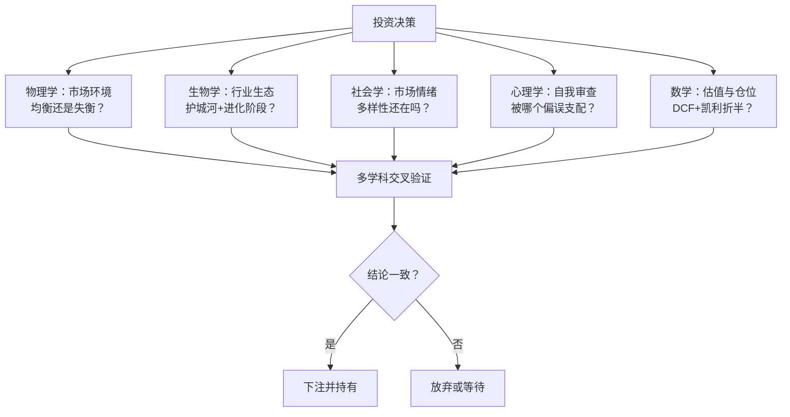
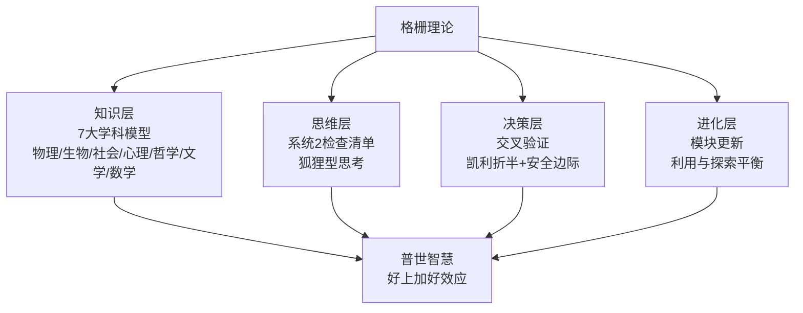

# 23《查理·芒格的智慧 投资的格栅理论》深度解读（详细版）

> 从牛顿、达尔文到巴菲特——用七个学科的思维模型搭建投资的"格栅"

## 📖 本书概览

| 项目 | 内容 |
|------|------|
| 书名 | 查理·芒格的智慧：投资的格栅理论（Investing: The Last Liberal Art） |
| 作者 | 罗伯特·哈格斯特朗（Robert G. Hagstrom）——曾著《巴菲特之道》《巴菲特的投资组合》 |
| 版本 | 第 2 版（第 1 版中文版 2001 年出版；新版新增"数学"一章并重写决策过程章） |
| 定位 | **"这不是一本指导投资的书"**——不教选股步骤，而是教如何思考投资 |
| 结构 | 思维格栅模型 + 物理学/生物学/社会学/心理学/哲学/文学/数学 7 大学科 + 决策过程 |
| 核心主题 | 芒格"普世智慧"的学科展开：均衡理论 vs 复杂适应性系统、群体智慧、认知偏误、概率思维、系统1/系统2 |
| 系列位置 | **芒格三部曲之二**：[[22《穷查理宝典》深度解读（详细版）|22 穷查理宝典]]（思想母本）→ **本书（学科详解）** → 24《芒格之道》（实践检验） |

## 🎯 为什么这本书值得单独解读

- **多元思维模型的最完整展开**：芒格说"100 种模型"，哈格斯特朗逐学科拆解——物理学（均衡）、生物学（进化）、社会学（群体）、心理学（认知）、哲学（描述）、文学（阅读）、数学（概率）——每章讲清楚模型的来龙去脉和投资应用
- **格栅的交叉力量**：同一市场现象（1987 股灾、泡沫、波动）被 7 个学科从不同角度解释——交叉验证才是"普世智慧"的来源
- **复杂适应性系统**：圣达菲研究所的视角——市场更像生物学而非物理学（埃尔法罗博弈、沙堆模型、多样性消失）
- **群体智慧 vs 群体疯狂**：勒庞《乌合之众》vs 索罗维基《群体的智慧》——市场到底是谁说了算
- **系统1/系统2 与狐狸/刺猬**：认知反映测试、泰特洛克 27450 项预测研究——为什么聪明人做糟糕决策
- **文学与投资的连接**：艾德勒《如何阅读一本书》四层阅读法——好读者=好投资者

## 📑 目录

- [第1章 思维格栅模型：普世智慧的入口](#第1章-思维格栅模型普世智慧的入口)
- [第2章 物理学：均衡、随机与临界点](#第2章-物理学均衡随机与临界点)
- [第3章 生物学：进化、适应与复杂系统](#第3章-生物学进化适应与复杂系统)
- [第4章 社会学：群体、多样性与从众](#第4章-社会学群体多样性与从众)
- [第5章 心理学：认知、情绪与偏误](#第5章-心理学认知情绪与偏误)
- [第6章 哲学：描述、语言与现实](#第6章-哲学描述语言与现实)
- [第7章 文学：阅读、理解与批判性思维](#第7章-文学阅读理解与批判性思维)
- [第8章 数学：估值、概率与均值回归](#第8章-数学估值概率与均值回归)
- [第9章 决策过程：系统1/系统2 与狐狸/刺猬](#第9章-决策过程系统1系统2-与狐狸刺猬)
- [第10章 整合：搭建你的思维格栅](#第10章-整合搭建你的思维格栅)
- [附录一 格栅理论金句集（30 条精选）](#附录一-格栅理论金句集30条精选)
- [附录二 七大学科思维模型速查表](#附录二-七大学科思维模型速查表)
- [附录三 格栅理论阅读书单](#附录三-格栅理论阅读书单)
- [附录四 系列互链：芒格体系全景](#附录四-系列互链芒格体系全景)
- [附录五 读完本书后的 10 个自问](#附录五-读完本书后的-10-个自问)
- [总结：格栅理论的人生应用](#总结格栅理论的人生应用)

## 🔗 双链导读（本笔记与系列的连接点）

| 连接主题 | 本书章节 | 关联笔记 |
|---------|---------|---------|
| 芒格思想母本 | 全书 | [[22《穷查理宝典》深度解读（详细版）|22 穷查理宝典]]（多元思维模型/25 心理倾向） |
| 巴菲特之道 | 第8章 | [[12《巴菲特的估值逻辑》深度解读（详细版）|12 估值逻辑]] · [[14《巴菲特投资学大全集》深度解读（详细版）|14 大全集]] |
| 集中投资 | 第3章 | [[16《巴菲特的投资组合》深度解读（详细版）|16 投资组合]] |
| 护城河 | 第3章 | [[13《巴菲特的护城河》深度解读（详细版）|13 护城河]] · [[21《星公司解密巴菲特股市投资法则》深度解读（详细版）|21 星公司]] |
| 格雷厄姆遗产 | 第5章 | [[20《巴菲特的第一桶金》深度解读（详细版）|20 第一桶金第2章]] |
| 行为金融 | 第5章 | [[22《穷查理宝典》深度解读（详细版）|22 人类误判心理学]] |
| 1975—1982 边缘市场 | 第8章 | [[09《巴菲特致股东的信》深度解读（详细版）|09 致股东的信]] · [[10《巴菲特致股东的信》深度解读（详细版）|10 编年版]] |
| 年报阅读 | 第7章 | [[06《巴菲特教你读财报》深度解读（详细版）|06 教你读财报]] |

---

## 第1章 思维格栅模型：普世智慧的入口

### 1.1 1994 年的那堂课

1994 年 4 月，南加州大学马歇尔商学院，吉尔福·巴考克教授的投资研讨班——芒格走进教室，恶作剧地说要"和听众玩个小把戏"：

> "他没有讨论股票市场，而是在谈'挑选股票是为人处世智慧的一个应用分支'。在后面的一个半小时里，他向学生提出挑战，扩大了他们在市场、金融学和经济学方面的眼界，启发他们不要把这些知识当作相互孤立的学科，而是当作一个结合了物理学、生物学、社会学、心理学、哲学、文学和数学的知识体系。"

**格栅的定义**（芒格原话）：

> "在你的头脑中有很多模型，你应该把你的经验，不管是直接还是间接获得的，分类安置在这个格栅模型中。"

**核心信念**：

> "他坚信，通过整合不同学科的思维模型建立起的思维格栅理论框架，是获取超额投资回报的强有力的途径。如果从不同学科的角度能得出同样的结论，那样做出的投资决策会更正确。这才是最大的收获——更全面的理解让我们得以成为更棒的投资者。"

### 1.2 为什么必须跨学科

**铁锤人问题的治疗**（贯穿全书的引子）：

> "对于一个手里只有锤头的人来说，他看到的每个问题都像是一枚钉子。……如果这个人拥有一大套来自多种学科的工具，那么他从理论上就持有了多种工具，因此将限制从'只有锤子'的倾向中产生的不良认知努力。"

**芒格对教育体系的批评**（1998 哈佛法学院 50 周年重聚）：

> "我们的教育是否已经足够多学科化了？在最近 50 年里，学术精英在获得最佳的多学科化方面进展如何？"

**芒格的温和要求**："我们不是要求把每个人的技能提升到拉普拉斯的天体力学水平，也不是要求每个人在其他非专业知识方面的水平与专业知识方面的水平一样。"——"事实上，每个学科最有用的思想精华，最有价值。"

### 1.3 如何获得普世智慧：渐进过程

> "简洁地说，这是一个渐进的过程。首先，要从许多不同的知识领域获取那些有价值的概念，或者说模型，其次是学习如何识别其中类似的模式。前者是自我学习，后者是学会从不同角度思考和看问题。"

**好消息**："你无需成为每个领域的专家。你只需要学习基本原理——查理称为'了不起的思想'，你要真正掌握它们，让它们成为你自己的东西。"

**坏消息**："在通向伟大思想的路上，没有捷径可走。我们只能从基础入手。"

### 1.4 大脑如何联结知识：神经元网络

**约翰·霍兰德**（密歇根大学心理/工程/计算机科学教授，遗传算法之父）：格栅理论的神经科学基础——大脑由 1000 亿个神经元组成，每个神经元与其他神经元有成千上万的联结；**学习=建立新的联结**。

**联结理论**：记忆不是存储在某处，而是神经元之间联结强度的变化。**知识越多元，可建立的联结越多**——这就是格栅模型的生物学基础："通过选择和重新组合模块，我们所做的就是创造自己新的神经网络和联结模型。"

### 1.5 第1章小结

格栅模型 = **多学科模型组成的决策框架**。它不是知识清单，而是经验的组织方式：把直接/间接经验"分类安置"在模型的交叉点上，让不同学科的观点互相印证——**交叉验证过的结论才值得下注**。

---

## 第2章 物理学：均衡、随机与临界点

### 2.1 牛顿：宇宙的时钟与均衡思想

**牛顿生平速写**：1642 年圣诞节生于英格兰林肯郡农场，父亲早逝、母亲改嫁、由奶奶抚养 9 年；少年沉迷制作风车、滴漏和老鼠拖动的玉米研磨器——**没有正规数学背景却 19 岁进入剑桥三一学院**。

**牛顿从开普勒学到的**：行星运动三大定律（基于第谷·布拉赫 25 年观测记录）——"我们在解释人类存在这一类最基本的问题时，很大程度上取决于当时的测量工具和科学家分析数据的数学能力。"

**伽利略的遗产**：天文望远镜证实日心说；"万物都蕴含着数字的逻辑"——**数学是理解宇宙的语言**。

**三大运动定律**（均衡理论的物理根基）：惯性定律（除非受力，运动物体保持匀速直线运动）；加速度与力成正比、与质量成反比；作用力与反作用力大小相等方向相反。

### 2.2 均衡理论谱系：从斯密到夏普

| 人物 | 贡献 | 核心思想 |
|------|------|---------|
| 亚当·斯密（1776） | 《国富论》 | 价格围绕"真实价值"波动；无形之手 |
| 阿尔弗雷德·马歇尔 | 均衡价格理论 | 竞争最终决定均衡价格；供需暂时失衡会被纠正 |
| 巴舍利耶（1900） | 博士论文 | **价格变化无法预测**——"投机者的数字预期值几乎为零"（随机游走起源） |
| 萨缪尔森（1965） | 影子价格 | 股价反映对未来不确定的预期；理性预期假设 |
| 尤金·法玛 | 有效市场假说 | 市场有效→股价完全反映所有信息→无法预测 |
| 威廉·夏普（1964） | CAPM | 回报期望与风险（标准差）之间存在线性均衡关系——**承担更多风险才能获得更高回报** |

**考尔斯委员会的实证打击**：阿尔弗雷德·考尔斯订阅主要投资杂志，发现没有一本预测到 1929 年股灾——委员会详细分析 1929—1944 年 **6904 份预测**："结果显示，人们无法成功地预测股市。"

**肯德尔的统计结论**（1953）：回顾过去 50 年股价表现，"没有可以依从的股价走势规律，让投资者做出精确预测"。

### 2.3 均衡理论的裂缝：1987 年股灾

**1987 年 10 月黑色星期一**：一天之内道指暴跌 22.6%——按均衡理论，股价瞬时变化应源于理性投资者对新信息的反应，**但针对 1987 年股灾的研究没有找到与之关联的市场信息**。

**萨默斯的数据**（后任美国财政部长）：研究波幅最大的 100 个当日市场波动，**只有 40% 可与有价值的事件联系起来**——过半的剧烈波动没有对应信息。

> "如果严格地遵守均衡市场理论，市场就不会有牛市或股灾，也不会有大交易量或高换手率。但众所周知，随着交易量和换手率不断攀升，剧烈的波动成为常态。我们自觉接受的均衡市场理论和有效市场假说，有没有可能是错误的？"

### 2.4 复杂系统的挑战与调和

**圣达菲研究所的观点**：市场是非理性的、随机的而非机械的、并非完全有效；个人投资者会错误定价证券，从而制造可获利的交易策略。

**作者的调和立场**：

> "我想说的是，我不是让你放弃均衡理论，也不是说供需法则是错误的。世界不能简单地区分为白色或黑色。……均衡理论可能依然是宇宙的状态，但它不是牛顿学说唯一的结论。在任何时间里，均衡和不均衡都可能出现在同一个市场中。"（酒杯/古装女人的双关图）

**罗闻全的桥梁**（第3章详述）："我认识到信奉行为经济的人和信奉效率市场的人都是对的——他们都观察到了同一种现象，不过是从不同的角度观察的。"

### 2.5 物理学给投资者的礼物

- **临界点概念**：系统在某个阈值突然改变状态（后文沙堆模型的基础）
- **均衡 vs 非均衡共存**：不要用单一模型解释市场
- **测量工具决定认知**：开普勒的教训——你的分析工具决定了你能看到什么
- **"错误的解释源于错误的描述"**（曼德勃罗，第6章详述）：描述市场的语言错了，解释必然错

### 2.6 第2章小结

物理学贡献了**均衡理论**——现代金融的基石（有效市场假说、CAPM 都建立其上），但也埋下了自我否定的种子：随机游走（巴舍利耶）与均衡（法玛）同时成立是矛盾的，而 1987 年股灾实证了这个矛盾。**物理学模型的教训：最优雅的理论也可能描述不了现实，市场需要更多学科的视角。**

---

---

## 第3章 生物学：进化、适应与复杂系统

### 3.1 为什么市场更像生物学而非物理学

**两次股灾的启示**：1987 年与 2007—2009 年的大股灾让均衡理论的解释力破产——"均衡理论在两次股灾上的失误，让其他潜在的可与之匹敌的理论得以发展。这其中最主要的一个理论就是**从生物学的角度认识市场和经济**。"

**进化的核心思想**："在自然界，进化程序是自然选择的过程，用进化的概念看待市场，我们可以观察经济的选择法则。"

**达尔文小传**：1809 年生于科学家家庭（祖父伊拉斯谟·达尔文是医生兼诗人，用诗歌表达进化猜想）；学医失败（"看到没有麻醉就进行手术的场景就恶心"）、神学毕业（"亨斯洛的追随者"）；1831 年登上贝格尔号，5 年环球航行——"这次航行彻底改变了他的世界观"。

### 3.2 圣达菲研究所：复杂适应性系统

**布赖恩·亚瑟**（温和的爱尔兰经济学家）：接受经典经济学训练却"无论多么想接受均衡的教义，他只看到了不均衡"——1979 年在笔记本上比较新旧经济学：

| 旧经济学 | 新经济学 |
|---------|---------|
| 投资者是相同的、理性的、能力相当的 | 投资者按个人能力被区分，是情绪化的 |
| 拒绝任何真实动态变化 | 系统复杂多变 |
| 一切都是均衡的 | 本质上是复杂的 |
| 基于经典物理学 | **更像生物学而非物理学** |

**复杂适应性系统的四个特征**（圣达菲小组）：
1. **松散的互动**：现象由众多平行个体互动而成，任何个体行为取决于其他个体及系统
2. **不存在全球调控者**：没有谁能掌控全球经济，靠个体间竞争与合作调控
3. **持续的适应**：个体行为、策略、产品基于积累的经验不断修正——经济体是适应性的、不断进步的
4. **动态的不平衡**：因为不断改变，经济体是不均衡的

**反馈机制**："系统中的个体首先给出期望或模型，然后按照这些模型给出的预期来行动。但长期来说，模型会根据个体对外界预期的精确度而改变。有用的模型会被保留下来，而没有用的模型会被修改。"

### 3.3 埃尔法罗博弈：预测的生态学

**场景**：圣达菲的埃尔法罗酒吧每周四晚演奏爱尔兰音乐，100 个音乐爱好者决定去还是不去（酒吧超过 60 人就不舒适）；酒吧公布过去 10 周的人数，每人建立自己的预测模型。

**过程**：不同模型（上周类推、10 周平均、天气关联……）互相竞争——准确的模型"活着"，不准确的模型消失；每周都有新模型加入。

**要点**：

> "亚瑟说，埃尔法罗的预测过程可以称为预测的生态学。……在市场中，每个个体的预测模型要与其他所有人的模型竞争，胜利才能存活下来，而这个过程的反馈结果导致一些模型被改变，一些模型消失了。这是一个世界，亚瑟说，这是复杂的、适应性的和进化的世界。"

### 3.4 多因·法默：市场作用力的生态学

**法默的洞察**：市场不是有效的（萨默斯数据支持）；"有一些内在的动力导致市场的波动"——他找到了解释生态系统行为的法则。

**生物生态学 vs 金融生态学类比**（法默表 3-1）：

| 生物生态学 | 金融生态学 |
|-----------|-----------|
| 物种 | 交易策略 |
| 种群 | 资产类别 |
| 自然选择 | 资产分配 |
| 突变 | 新策略 |
| 基因重组 | 策略重组 |
| 灭绝 | 策略失效 |

**金融策略的五段进化史**：
1. **1930—40 年代**：格雷厄姆/多德《证券分析》——账面价值折扣策略
2. **二战后**：分红模型（对 1929 股灾心有余悸，高分红股票受宠，**分红收益率历史上首次低于债券**）
3. **1960 年代**：从高分红转向高增长率公司
4. **1980 年代**：巴菲特转向"所有者收益"高的公司/现金流
5. **现在**：投资资金的现金回报（新策略）

**进化的机制**：

> "一个成功的策略会吸引更多的资金，并成为主流的策略。当新的策略被发掘后，资产会被重新分配——用生物学的术语就是，种群发生了变化。……'市场长期的进化通过资金流进行观察。资金对金融进化的影响，正如食物对生物进化的影响。'"

> "随着越来越多的个体使用同一种策略，该策略产生的利润就降低了。这个策略逐渐失效，原始的策略被清除。然后新的个体带着新的想法入场。"——**策略拥挤→利润稀释→新策略取代=市场永远无法真正有效**

### 3.5 罗闻全：适应性市场假说

**大象寓言**：6 个盲人摸象，摸到腿的说树、摸到身体的说墙——"我认识到信奉行为经济的人和信奉效率市场的人都是对的。他们都观察到了同一种现象，不过是从不同的角度观察的。"

**适应性市场假说**："行为其实是逻辑能力和情绪反应的互动输出。当逻辑和情绪处于适当的平衡点时，市场机制以高效的形式运行。"——**市场效率是进化出来的，不是假设出来的；效率随时间、环境、参与者构成而变化。**

### 3.6 生物学的应用：创新与毁灭

**麦肯锡的《创造性破坏》**（理查德·福斯特、萨拉·卡普兰）："为什么基业长青的公司的表现低于市场——以及他们如何成功转型"——**S&P 500 成分股的平均寿命在缩短**：1920 年代 65 年，如今不到 20 年。

**克里斯滕森《创新者的窘境》**："新的技术导致伟大公司的衰落"——大公司被颠覆性创新击败，因为它们的"适应"策略在旧世界最优。

**康德的名言（被纠正）**："植物界中不会出现牛顿。"——康德错了：

> "由达尔文的自然选择学说带来的知识革命，和牛顿的地心引力同样重要。……由机械世界观向生物世界观的转换，已经被称为'第二次科学革命'。"

**新旧科学观的对比**：

| 旧科学观（牛顿） | 新科学观（达尔文） |
|-----------------|-------------------|
| 线性：变化与输入成正比 | **非线性**：微小改变可能有大作用 |
| 规律可以预测 | 突然和意外的改变 |
| 个体主义 | 联系和掺杂 |
| 关心对已存在法则的理解 | 关心准则的结果 |
| 简单制约力 | 个体间相互作用并反馈 |

### 3.7 第3章小结

生物学贡献了**进化论+复杂适应性系统**：市场是活的——策略会进化、会拥挤、会灭绝；效率是动态的；行业会创造性毁灭。**给投资者的礼物：用生态位思维选行业（有护城河=有生存优势），用进化思维看策略（拥挤的策略注定失效），用适应思维做决策（模型要随环境更新）。**

---

## 第4章 社会学：群体、多样性与从众

### 4.1 牛顿的南海泡沫：最伟大头脑的失败

**背景**：1720 年南海公司——牛顿 3 个月内赚了 3 倍卖掉股票；但看着朋友越来越富，"7 月，牛顿无法再忍受诱惑，重回股市，用 700 英镑的价格再次买入之前用 300 英镑卖出的股票。这次他不是投入了一部分的资产——而是他所有资产的一大半。"11 月泡沫破裂，牛顿仓促卖出，**每股只剩下 100 英镑**。

> "我能计算天体的运行，却无法计算人类的疯狂。"——牛顿

**德拉维加的《乱中之乱》**（1688，第一本股市书）四大原则：
1. **永远别建议任何人买入或卖出任何股票**——"当洞察力下降时，最善意的建议也有可能导致坏的结果"
2. **每次获利之后，不要因为错失的利润而懊悔**——享受确定的利润
3. **交易中产生的利润就像精灵的财富**——"有时候它们是红宝石，有时候是煤、珠宝、燧石、朝露或者泪水"
4. **想要在这场游戏中赚钱需要有耐心和钱**——"那些知道如何忍受打击而没有被不幸吓倒的人像狮子"

### 4.2 勒庞 vs 索罗维基：群体是疯狂还是聪明

**勒庞《乌合之众》**（1895）："群体作为一个整体，能够产生比所有个体简单叠加更大的能量。群体能够整体运作，并形成自身的特质和意愿"——但"群体无法做出需要更高智商才能做的事情"，"人群的智慧总是低于个体的智慧"。

**索罗维基《群体的智慧》**：反对麦基《大癫狂》——"在适当的情况下，群体会显得非常聪明，并且常常比其中最聪明的人还要聪明"。

**高尔顿称牛实验**（1907《自然》）：787 人猜牛重，只有少数农场主/屠夫是专家——**真实重量 1198 磅，猜测平均值 1197 磅（误差 0.1%），中值误差 0.8%**——正态分布两端的误差相互抵消。

**群体智慧的两个前提**：
1. **多样性**："如果一个集体可以容纳各种各样的、从各方面思考问题的个体，其决策会优于一群思想类似的人的决策"
2. **独立性**："第一，它使得人们犯下相关的错误（而非同方向的系统性错误）；第二，独立的个体更有可能获得相对于已经熟悉的旧有数据来说较新的信息"

### 4.3 佩奇：多样性优于能力

**斯科特·佩奇**（密歇根大学，复杂系统中心）电脑模拟：10—20 人一组解决不同难度问题——
- **既有聪明个体又有不聪明个体的团队，比全部由聪明个体组成的团队更容易解决问题**
- 随便找的人组成的团队与精挑细选聪明人的团队，解决问题能力相似
- 结论："多样性的观点和工具，能够让群众找到更多更好的解决方案"

**预测市场的验证**：好莱坞股票交易中心（电影票房预测）、艾奥瓦电子市场（政治竞选预测）、Intrade——由多样、独立思考人群组成，预测正确率非常高。

**对股市的推论**：

> "如果股市具有足够多样性，还有更重要的一点，如果其参与者都达到了独立性的程度，市场很有可能是有效的。……如果市场参与者的决策不再独立，反而统一成一种观点会怎样？这种情况发生时，系统失去了多样性，无法再获得优化的解决方案——在股市中，多样性的消失将导致市场的失效。"

### 4.4 多样性的消失：信息流与从众

**莫布森**（《魔鬼投资学》作者）："当人们是基于其他人的行为而不是通过自己的信息做决定时，信息流（会导致多样性消失）产生了。这些信息流有助于解释泡沫、时尚、流行和灾难。"

**桑斯坦的辩论实验**：把民主党/共和党按思维相似分组辩论，再混合分组——**混合组的最终观点比之前更极端，因为强大的领导人把其他人拉到自己一边**（群体极化）。

**阿希从众实验**（1940 年代）：8 人一组判断线段长度，7 人是托儿一致给出错误答案——**约 1/3 的真实受试者改变自己的看法配合群体**。"团体的决定，就算是非常小的决定，也会对个人的决定产生明显的影响。"

### 4.5 巴克沙堆模型：自组织临界性

**伯·巴克**（丹麦理论物理学家，1948—2002）统一理论：复杂大系统由成千上万个小系统相互作用组成。

**沙堆比喻**：沙子一粒粒落到平台形成沙堆，到达临界高度后，再加一粒沙可能引发小崩溃，也可能引发雪崩——**系统处于"自组织临界状态"**：濒临不稳定的边缘，无法预测哪一粒沙引发多大雪崩。

**巴克模型应用股市**（两类交易者）：
- **趋势交易者**：股价上升买入、下跌卖出（放大波动）
- **基本面交易者**：价值高于价格买入、低于价格卖出（稳定市场）
- **动态平衡**：股价上升→基本面交易者卖出离场、趋势交易者被吸引入场→**基本面交易者减少、趋势交易者增多→沙堆变陡→泡沫出现、雪崩风险加大**——"我们走向了多样性消失之境"

**重要限定**："如果我们最终可以预测个人的雪崩，那这肯定不是因为人们掌握了自组织临界，而是因为掌握了其他还没有发现的科学。"——**可以理解系统，不可预测个体事件**。

### 4.6 共识与不稳定

**黛安娜·理查兹**（政治学家）"集体选择"理论：个体选择的总和并不总能得到稳定的群体选择——**共识越低，系统越不稳定**。当参与者对选择没有相似的思想框架时，系统有出现不稳定的危险。

**社会系统的独特之处**："我们无法改变飓风的轨迹，但我们可以通过影响个体对不同情况的反应，而影响最终的结果。……我们有可能通过更多地了解是什么导致了不可避免的临界点，而阻止一些可能出现的雪崩。"——**理解多样性消失的机制，可以避免部分泡沫**

### 4.7 第4章小结

社会学贡献了**群体行为学**：群体既可以是智慧之源（多样性+独立性），也可以是疯狂之源（信息流+从众+群体极化）。股市有效与否取决于参与者的多样性和独立性是否保持——**泡沫=多样性消失的过程**。给投资者的礼物：警惕"所有人都这么想"的时刻；独立判断是稀缺资产；群体极化（杠杆牛、赛道共识）是危险信号。

---

---

## 第5章 心理学：认知、情绪与偏误

### 5.1 卡尼曼与特沃斯基：自嘲性研究

**背景**：2002 年诺贝尔经济学奖颁给弗农·史密斯（实验经济学）和**丹尼尔·卡尼曼**（心理学家）——"将心理学的研究融入经济学，特别是关于不确定性对人类判断和决策的影响"。特沃斯基 1996 年去世，与诺奖失之交臂（诺贝尔奖不颁发给过世者）。

**研究方法论**："不去研究人类判断的特定错误，除非他们在自己身上看到了那些愚蠢的错误"——卡尼曼说："人们认为我们在研究愚蠢的行为，其实我们是在研究自己。"（"自嘲性研究"）

**预期理论**（1979，《计量经济学》引用率最高文章）：推翻了冯·诺伊曼/摩根斯顿的效用理论——"人们不仅仅看重最终的财富有多少，同时也看重这些财富是增值了还是贬值了。"

**框架效应实验**（600 人公共健康问题）：第一组在"保证 200 人安全"vs"1/3 概率救 600 人"中选择——大多数人选保证项；第二组在"400 人全部死去"vs"2/3 概率 600 人全部死去"中选择——**同样的问题，不同的表述框架，决策反转**。

**损失趋避（最重要的发现）**："个体对损失的内疚，超过获得等量财富时的欢愉——差不多是 2~2.5 倍的差距。"

### 5.2 泰勒与贝纳茨：短视性损失趋避

**理查德·泰勒**（芝加哥大学行为经济学教授）：质疑理性投资者假设；与什洛莫·贝纳茨（UCLA）1995 年合写"用短视性风险规避模型解释股票溢价之谜"。

**萨缪尔森 1963 年的对赌问题**：50% 赢 200 美元 vs 50% 亏 100 美元——同事拒绝单次对赌，却愿意玩 100 次。**启示：增加时间长度+减少关注频次，风险就显得可接受**。

**短视性损失趋避的定义**：损失趋避 + 频繁查看价格——"使得投资者不愿意承受持有股票风险的两个因素是：损失趋避和频繁查看价格。"

**一年法则**：泰勒/贝纳茨测试股票在不同查看频率（1 小时/1 天/1 年/10 年/100 年）下的效用函数（效用 = 上升可能性 − 2×下降可能性）——**持有股票 1 年以上，效用函数才为正值**。

> "损失趋避是一种本能，但作为一种策略性的选择，计算回报的频率是可以被改变的，至少理论上是可以的。"

**作者 28 年从业观察**："我亲身经历投资者、投资组合管理人、咨询师和大投资机构的成员，因为频繁查看报表上的损失而遭受巨大的伤痛。能够克服这一负面情绪的只有少数人。"

### 5.3 奥丁与巴伯：交易吞噬财富

**奥丁 1997 研究**（10000 个匿名账户，1987—1993 年，97483 次交易）：投资者每年买入或卖出投资组合中 **78%** 的资产；两个惊人趋势：**①买入的股票表现总是低于大市；②卖出的股票表现总是优于大市**。

**奥丁/巴伯 2000 研究**（66465 户家庭）：最激进的交易者回报率最低，交易最少的投资者回报最高。

**2001 互联网研究**：网上巨量信息让投资者轻易锚定支持自己预测的证据，过度自信——"当人们对某一个预期或评估获得更多的信息，他们对预期的正确性的自信心的增速（这一点很重要）比预期的准确性要快得多。"——**信息过载导致知识幻觉**。

**对现代投资者的忠告**："对于那些每分钟都计算投资组合价值的人，我能想象到的就是短视性损失趋避。"

### 5.4 风险容忍度的真相：沃尔特·米蒂效应

**迪安·普鲁伊特**（社会心理学家）：投资者回答风险问卷时的答案就像《沃尔特·米蒂的秘密生活》的主角——"当市场走好时，他们在自己的眼中变得勇敢，同时渴望承担更多的风险。但如果股市下跌，他们慌忙夺门而出"——**牛市里是"无畏的轰炸机机长"，熊市里是"唯唯诺诺的丈夫"**。直接问风险容忍度是无效的。

**作者与合作者开发的间接测量**（维拉诺瓦大学贾斯廷·格林）：
- **人口统计学因素**：年龄（老年人更谨慎）、性别（女性更谨慎）——**财富多少不影响风险容忍度**
- **性格因素**：个人控制力（"坚定者"敢担风险 vs "飘荡者"）、成就动机（目标明确者愿担风险）
- **关键变量**：你是否认为股市是"①只凭运气定输赢的游戏"还是"②基于精确信息和理性选择获得成功的事业"？——**认为回报取决于技能的人，倾向于承担更高风险**

### 5.5 思维模型：克雷克与约翰逊-莱尔德

**肯尼思·克雷克**（苏格兰心理学家，《解释的本质》1943）："人类是信息处理者，人们通过已知的信息建立思维模型，对事件做出预期"——借助"小型外在事物的模型和可能的应对行为"，我们能"利用过去经历的知识解决现在和未来的事情"。**克雷克 31 岁死于自行车事故**，思维模型研究由约翰逊-莱尔德接棒。

**约翰逊-莱尔德《思维模型》（1983）发现的系统性错误**：
- 假设每种模型出现概率相同（**缺乏贝叶斯推理**）
- 重点放在少数几个模型上→有限模型导致错误结论
- 模型通常提示"什么是正确的"而非"什么是错误的"
- 模型常有漏洞、不完整、会随时间遗忘
- 最终会构建出基于迷信和无根据的模型

> "因为思维模型决定了人类的行为，那些信息不足而形成粗糙的思维模型会导致差劲的投资也就不足为奇了。"

### 5.6 舍默：信仰机器

**迈克尔·舍默**（《我们如何相信》）：
- 人类是**模式化思维的动物**——"那些善于发现模式（逆风的方向不利于狩猎，牛粪对农作物有益）的人拥有更多的后代，（同时）我们就是他们的后代"
- 中世纪 90% 文盲用巫术解释世界：瘟疫=星象错位、儿童死亡=吸血鬼
- 科学减少了迷信，但**没有完全消灭**——运动员仪式、彩票占星、忌讳数字 13
- 信仰优先于推理："人类的大脑是一个信仰机器……我们会收集那些与信仰一致的信息，而忽略与信仰相反的信息"——**"基于信仰的事实"**
- 股市预测吸引力的解释："人类经过长时间的进化，在面对不确定因素时会产生强烈的不安全感与紧张感，因此我们愿意去相信那些可以消除紧张感的花言巧语。"

### 5.7 布莱克的噪声与香农的信息

**费希尔·布莱克**（期权定价模型三巨头之一，1986 年美国金融协会主席报告《噪声》）："市场中听到的绝大部分信息是噪声，产生的唯一结果就是混乱。投资者的混乱，让噪声更上一层楼。**噪声，让我们的观察变得不完美。**"

**香农信息论**（1948《交流的数学理论》）："交流的基础问题在于，信息的再造在某一点可能是精确的，而在另一点可能只是大概的信息"——**减少噪声的过程=信息的精确交流=投资者理性判断的前提**。

**格雷厄姆的先见之明**（早于泰勒/贝纳茨 45 年）："如果一个投资者的股票无人问津，他最好把股票放一放，如果不这样，他很有可能因为别人的错误判断而备受精神折磨。"——"精神折磨"就是短视性损失趋避。

### 5.8 第5章小结

心理学贡献了**认知偏误地图**：损失趋避（2 倍痛感）、框架效应、短视性损失趋避（1 年法则）、过度交易（78% 换手率）、知识幻觉、信仰机器、噪声。**给投资者的礼物：知道自己的大脑会骗自己——少看账户（一年一次）、少交易（交易越少回报越高）、少听预测（信仰机器）、用检查清单对抗系统1。**

---

## 第6章 哲学：描述、语言与现实

### 6.1 哲学的三大分支

| 分支 | 研究对象 | 投资关联 |
|------|---------|---------|
| 形而上学 | 超越物理的问题（上帝、来生、存在本质） | 市场"本质"之争（均衡 vs 复杂） |
| 美学/伦理学/政治学 | 美、对错、社会组织 | 投资伦理、制度设计 |
| **认知学** | 知识的本质与局限 | **本书重点：我们如何知道市场"知道"什么** |

> "当我们运用认知学的时候，我们在思考思考这件事。"——**元认知：投资者最重要的能力之一**

### 6.2 麦金太尔：本体论 vs 认知论

**李·麦金太尔**（波士顿大学）：复杂系统研究是哲学问题——"现实本身无法理解"（本体论局限）还是"我们眼下理解能力有限"（认知论局限）？

**关键论证**：牛顿发表天体运动定律之前，自然被认为是"被预设而无法解释的"（本体论）；之后一切都变了（认知论）——**复杂系统并非本性不可知，只是描述方法未到位**。

> "一旦有人接受复杂系统只是描述的复杂而已，就会出现其他可能的定义用简单、科学的方法来描述。……**复杂性并不是世界的自然本质，而是我们思考方式的一个分支。**"——用诗人亚历山大·波普的话："无序就是对有序的误解。"

**对投资者的意义**："人们很难理解市场的一个原因是，我们被市场表现的均衡理论限制住了。要获得更高层次的见解，我们要开放性地接受新的定义。"——**但也要警惕过度自由**："我们不能杜撰一个子虚乌有的规则。自然和市场绝非那么简明易懂。"

### 6.3 曼德勃罗：错误的解释源于错误的描述

**贝努瓦·曼德勃罗**（1924—2010，分形几何之父，耶鲁最年长终生教授）：圣达菲讲座上大声宣告——**"错误的解释源于错误的描述！"**

**分形**："一个粗糙或零碎的几何形状，可以分成数个部分，且每一部分都是整体缩小后的形状"——云朵、山峰、海岸线、树枝、血管、花椰菜——**自相似性**。

**对市场的意义**：用"云朵不是圆形的，山峰不是圆锥状的"类比——**用正态分布描述市场（"瘦尾"假设）本身就是错误描述**；市场波动有自相似的分形结构（厚尾）。

### 6.4 维根斯坦：语言定义现实

**路德维希·维根斯坦**（1889—1951）：《逻辑哲学论》（1921，仅 75 页）试图定义语言与现实之间的逻辑关系；后半生自我否定——"我被动地意识到，我在第一本书中出现的重大错误。"

**《哲学研究》（1953）核心**：词语的意义由语言所行使的功能建构——"人类所见的世界由人类选择的词语定义并赋予意义。简单来说，**我们怎么看世界，世界就是怎样**。"

**三角形例证**："这个三角形可以看作孔状的、实心的、几何学的、底座接地的、悬挂的；像一座山峰、一个楔子、一枝箭或一个指针……无论你设想它是什么，你都会从中看到你所想事物的影像。"

**亚马逊的维根斯坦式解读**（1997 年上市，18 美元→1999 年 100 美元→分析师预测 300 美元）：不同的人用不同的"语言"描述同一家公司——价值投资者说"没有利润"，成长投资者说"占领未来"——**股价是语言竞争的产物**。泡沫的根源之一：市场的集体"描述"被情绪劫持。

### 6.5 实用主义：威廉·詹姆斯

**哈格斯特朗的自学示范**（第7章阅读法的应用）：从《牛津哲学指南》索引找到"实用主义"→读《实用主义的复活》《形而上学俱乐部》→读詹姆斯传记与信函→读《实用主义》原文→思考投资关联。

**实用主义的投资版本**：真理=有用——"评估一个想法，要看它在实践中产生什么效果"。芒格的格栅理论本身就是实用主义：**模型的价值不在真假，在于能否产生更好的决策**。

### 6.6 第6章小结

哲学贡献了**认知方法论**：市场复杂性的"不可知"多半是描述问题（麦金太尔）；错误描述导致错误解释（曼德勃罗分形）；语言定义我们看见的世界（维根斯坦）；有用即真理（詹姆斯）。**给投资者的礼物：警惕用错误的模型语言描述市场（正态分布、线性外推），不断重新描述问题，才能解开理解之结。**

---

---

## 第7章 文学：阅读、理解与批判性思维

### 7.1 自我教育：芒格的答案

**问题的起点**：听众问芒格"我在学校里没有学过那些知识，要从零开始起步，如何开拓自己的知识深度和广度？"

**芒格的回答**："大多数人都没有接受过适当的教育，太多学院派过于狭窄，太强调学科边界，过度自我陶醉于只做范围有限的事情。……答案很简单：**我们必须进行自我教育**。关键的原理，那些真正伟大的思想，早已写下来了，等着我们去发现，并将其变成自己的财富。"

**工具**：书、报纸、杂志、时评、技术期刊、分析师报告、互联网——"这不只是一个数量问题……我们在谈论如何成为一个**明辨是非的读者**：分析你读到的东西，在大背景下评估其价值，再决定是否将其纳入你自己的格栅思维模型中。"

**阅读重心转移**："我怀疑你现在阅读的大部分内容……只是让你了解更多的事实，而非加深你的理解。"——**信息 ≠ 理解**。

**阅读与投资的同构**："评估一本书是否值得深入研究，就像是分析一个潜在的投资，而且具有类似的目标：形成一个有充分信息支撑的清醒的决定。"——"用心选择投资需要和用心读书同样的思考技能。"

### 7.2 圣约翰学院：伟大著作阅读计划

**背景**：马里兰州安纳波利斯圣约翰学院——以**伟大著作阅读计划**闻名的四年制文科学院：没有独立的专业或系别、没有选修课；四年阅读文学、哲学、神学、心理学、物理学、生物学、政府学、经济学和历史学，18—20 人研讨班讨论；第一学年古希腊、第二学年罗马……

**周五晚演讲制度**：全校师生聚集听演讲（内容可能是"一本伟大的书、一位知名作者，或判断、爱情、智慧这样的话题"）——强化"认真听取不熟悉的资料的习惯"，同时训练公开讲话能力。

**《如何阅读一本书》的流传**："学生间传阅的这本书，很多都是折了角的，用笔画过线，写满注脚的复印本。学生们把这本书看作在阅读中获取最多有用知识所不可或缺的工具。"（1940 年出版，1972 年修订，至今印行）

### 7.3 艾德勒：阅读的四个基本问题

> 艾德勒认为，阅读一本书的中心目的是为了理解——这和为了获得信息的阅读是不同的。"当我们阅读这些资料时，我们收集了更多的数据，但是我们对事物的理解一般不会得到提升。显然，信息是理解的前提条件，但关键在于，不要止步于只是接收信息。"

**区分信息与理解的简单方法**："任何时候你读到的资料如果在你看来是轻而易举就可以'得到'的，很可能你只是在做信息编录。但是假如你需要停下来思考，而且要再次阅读加以确认的话，这个过程有可能提高你的理解。"

**四个基本问题**（无论何时何地何种读物）：
1. **整本书讲了什么内容？**
2. **细节是怎样的？**
3. **这本书是否真实，是部分真实还是全部真实？**
4. **这本书的目的是什么？**

**棒球隐喻**："投球手和一些作者一样，可能很野蛮且难以控制，要求接球手（读者）做出更多努力。所以，如果你想成为一名好读者，有时不得不付出更多的努力，去抓住一个表述得很松散的思想。"

### 7.4 四层阅读法

| 层次 | 方法 | 目标 |
|------|------|------|
| **基础阅读** | 认字、读通句子 | 字面理解 |
| **检视阅读**（快速浏览） | 前言→目录→索引→参考文献→随意翻阅几个段落→书末总结（半小时到一小时） | 判断是否值得精读 |
| **分析阅读** | 通读全书（跳过困难章节，像侦探找线索）→ 逐章概括 → 判断作者是否达成目的、是否有逻辑漏洞 | 全面吸收+判断真实性 |
| **比较阅读**（主题阅读） | 列出参考书目 → 快速审读筛书 → 找出每本书的相关段落 → 用自己的问题清单比较各书优劣 → 公平分析各位作者讨论 | 主题级的理解 |

**分析阅读三目标**："①对书本内容的细致了解；②通过了解作者对于所写主题所持的观点解释书的内容；③分析作者在表达观点方面的成功之处。"

**比较阅读的告诫**："不要因为作者给出了不同的答案而沮丧，但一定要花时间搞清楚每个作者答案的内涵。……你越推迟做出结论，你对整个问题的理解越全面。"

### 7.5 理论与实践：阅读的分类

**说明性作品（非虚构）**：
- **理论类**（历史、数学、自然科学、社会科学）：关注观点，挑战是接受知识并整合进自己的格栅
- **实用类**（规则、步骤、how-to）："只有当你采取行动时，书中的真理才能成为真正有用的"

**想象类作品（文学）**："传递的是经历"而非知识——"不要试图抗拒想象类作品对你产生的影响，让其自由发挥对你的影响。"——"任何读过莎士比亚作品的人都了解到了人性。"

**阅读社会科学的悖论**："这类著作所描述的经历为我们大家所熟悉，而且我们已经形成了一些见解和理念。但这也是一个悖论，即这类见解也使得阅读社会科学书籍变得困难。"——"你必须先检查自己的观点，如果你拒绝听书上是怎么说的，你就无法理解这本书。"

### 7.6 分析师报告批判性阅读法

1. **核对事实**：分析师有时会在数学上犯一般性错误
2. **独立验证**：与独立来源（Value Line）或其他分析师报告比照；**最好研究原始来源——公司自己的财务报表**
3. **区分事实与观点**："如果你发现有些事实站不住脚，这是一个好的提醒，你所读的大部分内容可能是建议和观点"
4. **审查意见背后的利益**："报告中是否包含了某种利益？有无分析师长期的个人偏好？分析师的意见是否与之前报告的提法不同，如果是，有无合理的改变理由？"

### 7.7 多蒂：文学与金融危机课程

**本杰明·多蒂**（Koss Olinger 高级投资总监，明尼苏达大学兼职教授，商学+英国文学双学位）：网络股泡沫顶点时在读德莱塞《金融家》——"19 世纪一位有才华的银行家由于财富得而复失起伏跌宕的人生际遇……讲的是有关贪得无厌和野心过大的教训。"

**次贷危机后的课程**："美国小说，商业和金融危机"——从希勒《终结次贷危机》讲起，引入《麦克白》《理查三世》《了不起的盖茨比》《石油！》《黑暗之心》《塞拉斯·拉帕姆发迹》《美国牧歌》和《金融家》。

> "在这个大多数商业读物充斥着企业档案、技术手册和自助指引的世界上，我们不应低估文学的力量。文学增加了大多数商业非虚构读物所不具备的东西——将复杂事件进行戏剧性的处理。……好的文学作品通常站在批判立场，那可能就是我们现在所需要的。"

**军事的阅读传统**：亚历山大大帝枕头下垫着《伊利亚特》；约翰·亚当斯总统 1802 年向美国军事科学院提出激进阅读计划；陆军 6 个阅读清单、海军专业阅读计划（含梅尔维尔《比利·伯德》）——**与生死的复杂性和不确定性打交道的职业，最重视阅读**。

### 7.8 第7章小结

文学贡献了**阅读方法论**：阅读是自我教育的主要工具（芒格"长了两条腿的书"）；四问四层阅读法把读书变成结构化思考；批判性阅读=投资分析的同构技能。**给投资者的礼物：用检视阅读筛书（如筛股票）、用分析阅读精读年报（核对事实+区分观点+审查利益）、用比较阅读建立主题理解（多本书交叉验证）。**

---

## 第8章 数学：估值、概率与均值回归

### 8.1 伊索寓言：2600 年前的 DCF

**《鹞子与夜莺》**："一鸟在手，胜过二鸟在林"——伊索不知道自己"订下了一条投资界必须遵守的戒律"。

**巴菲特的三个问题**（伊索原则的现代版）：

> "你有多肯定树林中有鸟？它们何时会出现以及有多少只？无风险利率是什么？如果你能够回答这 3 个问题，你将知道这个树林中的鸟的最大数量。当然，鸟只是个比喻，你应该想的是美元。"

**公式的不朽**："不管你将其用在股票、债券、制造企业、农场、石油特许权或是彩票上都是如此。……你所要做的事情就是加入正确的数字，所有投资机会的吸引力就将自动排出顺序。"

**巴菲特版谚语**："一个坐在我车中的姑娘，胜过五个电话联系簿上的姑娘。"

### 8.2 威廉斯：折现现金流的诞生

**约翰·伯尔·威廉斯**：1923 年入读哈佛（数学+化学）→ 证券分析师 → 1929 年崩盘后回哈佛读经济学博士，导师约瑟夫·熊彼特建议研究"如何确定普通股的内在价值"——1940 年论文《投资价值理论》出版。

**反对凯恩斯的选美比赛**：凯恩斯认为股价取决于"你认为别人认为别人认为……谁最美"（选美比赛）；威廉斯认为"金融市场的价格最终是资产价值的反映。是由经济决定的，而不是依靠看法和观点"。

**DCF 方法**："一只普通股的内在价值，是投资期内未来现金流净值的现值"——像债券估值一样：把所有票息（未来现金流）加总，除以合适比率，得出今天的价格。

**为什么人们不用 DCF 而用二阶模型**："因为预测一家公司的未来现金流是非常困难的"——债券现金流基于合同条款，商业项目受经济变化、竞争、创新者冲击——**但这不是放弃的借口**：

> "宁要模糊的正确，不要精确的错误。"——巴菲特

### 8.3 概率论：从帕斯卡到贝叶斯

**1654 年德·梅雷的难题**（未结束的概率游戏如何分配筹码）→ 帕斯卡（发明机械计算器"Pascaline"的神童）找费马（律师+解析几何发明者）——通信"是数学史和概率论上的开创性事件"，诞生**决策理论**："面对不确定的未来，我们能够做出优化决策的过程。做出决策，是管理风险所需做的最基本的第一步。"

**雅各布·伯努利**：赌博游戏概率 ≠ 生活问题概率——"大自然的模式只是部分确定的，所以概率从本质上应该被看作确定性的程度，而不是绝对的确定性。"（大数定律的发现者）

**托马斯·贝叶斯**（1701—1761，长老会牧师）：奠定概率的实践应用——**贝叶斯定理：根据新证据更新先验信念**。投资含义：判断要随新信息持续修正（与泰特洛克"狐狸型预测者修改 59% 预测"呼应）。

### 8.4 凯利公式：下注的数学

**凯利公式**（约翰·凯利 1956 年）：f = 优势 / 赔率——给定胜率和赔率，确定最优下注比例，最大化长期资产增长率。

**艾德·索普**（21 点算牌+对冲基金先驱）的实践：
- 案例：成功概率 55% 的赌注，凯利计算应下注 10%——**但可以选择只投资 5%（凯利一半）或 2%（凯利一小部分）**
- **"减少赌注可以为组合管理提供安全边际"**——双重保护+舒适心理水平
- **凯利折半法的数学优势**："把算出的赌注减少一半，只会将盈利增长率减少 25%"——因凯利模型具有抛物线性质，**对减少赌注的惩罚并不严重，而过度赌博的风险远大于此**
- "凯利系统适用于那些只想看到资产随时间大幅增长的人。如果你有大量时间和足够的耐心，这个工具正适合你用。"

**投资应用**：集中投资（16 号笔记）的数学基础——确定优势时重仓，但永远打折下注（安全边际）。

### 8.5 古尔德：差异世界与右偏分布

**史蒂芬·杰伊·古尔德**（古生物学家）：40 岁诊断腹部皮瘤——"存活期中位数只有 8 个月"。他笑了——因为他知道**中位数不是命运**：存活期分布明显右偏，超过 8 个月的患者"不是多活了几个月而是几年"；右偏患者特征：年轻、健康、及早诊断——古尔德都符合。**他实际上又活了 20 年**。

> "我们的文化里具有一种忽视或者忽略差异的强烈偏差。我们倾向于只关注中心趋势，相当实用主义，结果经常是犯一些很可怕的错误。"

**投资的差异思维**："投资者需要理解股票市场平均回报水平与单只股票表现的差别。"——**均值是抽象，差异才是现实**。

**1975—1982 边缘市场实证**（作者的研究）：道指 1975 年 10 月 784 点，1982 年 8 月回到 784 点附近——"边缘市场"（7 年价格几乎没变），标普市盈率从 12 倍跌到 7 倍。但同期：
- **巴菲特：伯克希尔累计总回报 676%**
- **比尔·鲁安（红杉基金）：415%**
- 作者统计 500 只大股票：1 年内翻倍的仅 3%；**3 年内 18.6%（93 只）翻倍；5 年内 38%（190 只）翻倍**

> "投资者观察到了 1975~1982 年的股市情况，并关注于市场均值而形成了错误结论。他们错误认为市场处于边缘状态，而实际上市场的差异非常大，有大量机会赢得超额回报。"——"在达尔文的世界里，差异代表了基本现实，而计算平均值是一种抽象手段。"

### 8.6 均值回归：高尔顿的发现

**弗朗西斯·高尔顿**（达尔文的外甥，称牛竞赛的发起人）：受凯特勒（正态分布引入社会科学）启发，研究家族天才的遗传——发现**均值回归**："特别高或者特别低的数值逐渐向中间值靠拢的趋势。"

**投资含义**："很优秀或很糟糕的业绩都不太可能持续，稍后可能会向相反方向转变。"——格雷厄姆/多德在《证券分析》首页引用的贺拉斯："现在已然衰朽者，将来可能重放异彩；现在备受青睐者，将来却可能日渐衰朽。"

**伯恩斯坦的注脚**："世事有起有落""骄兵必败"是均值回归的民间版——约瑟夫对法老的预言（7 年丰收后 7 年灾荒）——**均值回归是选股与预测市场中最常用（也最被过度使用）的策略**。

### 8.7 第8章小结

数学贡献了**估值与概率工具**：DCF（一鸟在手）、概率论（帕斯卡/贝叶斯）、凯利公式（打折下注）、差异思维（古尔德右偏）、均值回归。**给投资者的礼物：用 DCF 做估值（宁要模糊的正确）、用贝叶斯更新判断、用凯利折半控制仓位、关注个股差异而非市场均值——边缘市场恰恰是超额收益的来源。**

---

---

## 第9章 决策过程：系统1/系统2 与狐狸/刺猬

### 9.1 认知反映测试：三道题暴露系统1

**沙恩·弗里德里克**（耶鲁市场营销学副教授，2005 年 MIT 任职期间设计认知反映测试）：
1. 一张球拍和一只球总价 1.1 美元，球拍比球贵 1 美元，球的价格是多少？——**答案 0.05 美元**（直觉答 0.1）
2. 5 台机器 5 分钟制作 5 个徽标，100 台机器制作 100 个徽标要多久？——**答案 5 分钟**（直觉答 100）
3. 湖里睡莲每天面积增大一倍，48 天覆盖湖面，多久覆盖一半？——**答案 47 天**（直觉答 24）

**惊人的事实**："超过一半的哈佛、麻省理工和普林斯顿的学生也都算错了这道题"——而且"当再次让他们确认这是否是其最终答案时，他们仍坚持了这个答案。"

**两个结论**："其一，人们不习惯努力思考问题，而是更倾向于使用第一个浮现在脑海的答案；其二，系统2 的流程确实没有很好地监督系统1 的思考。"——**认知反映表现好的人倾向于更耐心地回答问题**。

### 9.2 系统1 与系统2：快思考与慢思考

| 系统 | 特征 | 例子 |
|------|------|------|
| **系统1**（直觉） | 自动执行、快速、不受控制 | 驾驶时后轮打滑打方向盘 |
| **系统2**（推理） | 受控、缓慢、审慎、需要专注 | 解决数学题、检查清单 |

**卡尼曼对直觉的界定**：直觉揭示答案需要两个条件——"第一，环境的规律性足够强使其能进行预测；第二，必须有'有机会通过实践了解这些规律'。"国际象棋/桥牌/扑克符合；"诊疗师、选股人和经济学者"很少发展出可靠直觉——**股市是非线性系统，直觉作用较不明显**。

**直觉=认知**（赫伯特·西蒙的定义）："这个局面提供了一个线索，专家可以接触到存储于记忆中的信息，而这个信息提供了答案。"

### 9.3 卡尼曼：懒惰的控制者

**《思考，快与慢》**（2011 年《华尔街日报》《纽约时报》同评年度最佳 5 本书）："我们大多数人在大部分时间都是健康的，而且我们的大多数判断和行动，在大部分时间也是妥当的……但是并不总是如此。**我们甚至在错了的时候也很自信，客观的观察者比我们自己更可能发现我们的错误。**"

**懒惰的控制者**："对于任何工作，我们很多人在任务变得困难时，都倾向于偷懒，简单地逃避掉。……要求系统2 思考参与的活动，需要自我控制，而持续的自我松懈是不受欢迎的。"

**勤勉**（对懒惰的解法）："那些试图避免智力懒惰问题的人可以被称为'勤勉'。他们更为警醒，也更为积极主动，较不愿意满足于接受表面上特别有吸引力的答案，对待自己的直觉感受更为严格。"——**这意味着你的系统2 思维是强大的、有活力的，不太容易疲倦**。系统2 与系统1 的区别如此大，斯塔诺维奇称它们为"不同的头脑"。

### 9.4 泰特洛克：专家预测不如掷飞镖的大猩猩

**菲利普·泰特洛克**（宾夕法尼亚大学）：284 名专家（上电视的、被引述的、提供咨询的），15 年（1988—2003），**27450 项预测**——"专家的预测结果并不比'投掷飞镖的大猩猩'更准确。"

**专家的四个思维疏漏**：过度自信、后见之明、信仰系统抵触、缺乏贝叶斯概率思考——"这些心理误区影响了系统1 思考。我们急于做出一个直觉性的决定，没有意识到，我们的思维障碍来自自身固有的偏误和启发式思考方法。只有接入系统2 思考，我们才能够再次检查初步决定是否正确。"

### 9.5 狐狸与刺猬：两种预测者

**隐喻来源**：2600 年前希腊诗人亚基罗古斯："狐狸懂得很多伎俩，而刺猬只懂一个。"以赛亚·伯林用刺猬/狐狸区分思想家：**刺猬型=通过一个单一视角看世界；狐狸型=对宏大理论心存疑虑，依靠多种多样的经验**。

**泰特洛克的研究发现**（《狐狸与刺猬：专家的政治判断》）：
- **狐狸型预测者的整体成功率明显高于刺猬型**
- 面对新证据：**狐狸型修改了 59% 的预测结果，刺猬型仅修改 19%**
- 狐狸型承认自身知识不足，调校（主观概率对客观现实的反映）和分辨（判断力）得分更高
- 刺猬型"对理论情有独钟……对世界如何运作抱有僵化的信念，他们更有可能为不会发生的事情而不是已经发生过的事情赋予概率"

**狐狸型预测者的三个认知优势**：
1. 从"合理的初始"概率估计值起步（更好的内部指引系统）
2. 面对新信息愿意承认错误并修正观点（良好的概率判断流程）
3. 能够感受到相互矛盾力量的存在，**能够领会相关的类比**

> "刺猬型预测者从一个大的想法开始，贯彻始终——而不理会那样做的逻辑是什么。狐狸型预测者把大的想法聚集起来，他们研究和思考其中的类比关系，然后创造出一个综合性的假说。我认为，狐狸型的人是人文艺术投资一派最完美的代表。"——**狐狸=格栅理论的化身**

### 9.6 斯塔诺维奇：理性障碍

**基思·斯塔诺维奇**（多伦多大学）：智力测验（ACT/SAT）"最多是一种中性的预测方式……有些理性思维技巧是完全和智力不搭界的"——**最常犯的思维错误和智商没有太大关系，而是和理性相关**。

**"理性障碍"（dysrationalia）**：尽管有高智商但无法理性地思考和行动。两个原因：
1. **处理问题**：人类是"认知缺乏者""懒惰的思考者"——"人们会找出简单方法，其结果就是答案经常欠缺逻辑性"
2. **内容问题**：**"心件空隙"（mindware gap）**——解决问题时脑中缺少规则、策略、程序和知识（戴维·珀金斯定义：心件=头脑需要的工具，如厨具之于厨房、软件之于计算机）

**心件空隙的根源**："一般是由于教育面太窄。学校在教授每个学科的知识方面做得不错，但是在将各学科知识联系起来提高人们对于世界的整体理解方面，就做得很差了。"——**解法：跨学科教育（珀金斯"心件加强型注入"）=本书的写作原则**。

### 9.7 模块化决策：林肯积木与飞行模拟器

**林肯积木比喻**："为了搭一个房子模型，孩子们用不同的积木，按照自己对于房子的想象搭建……**建造有效模型的第一个原则是在开始前准备好足够多的模块**。"——模块太少，无法搭建精巧的模型。

**飞行模拟器比喻**："模拟器的最大优点是可以允许飞行员在不同情境下训练和完善其技能，而不用承担实际损坏飞行器的风险。飞行员可以学习在夜间、在恶劣天气或者飞机出现了机械故障时如何飞行。**每个这样的模型，可能包括了类似的模块，但是装配的顺序不同。**"

**飞行员模式识别**："我以前从未见过同样的情况，但是我见过类似的事情，而且我知道在那种情况下怎样做是管用的，所以我将从那里开始尝试，然后不断改进。"——**投资决策=在变化的环境中重新组合模块**。

**利用与探索的平衡**（霍兰德）：

> "当我们的模型指明已有的利润时，当然我们应该尽量利用市场的无效率。但是我们永远不应该停止寻找新的构建模块。"——蚂蚁群中总有少量蚂蚁随机探索新路线；美洲土著打猎、挪威渔民捕鱼同理——**少数探索者保证系统适应未来变化**。

**模块的生命周期**："如果新的模块被证明是有用的，那么就保留下来，给予适当的重视。如果它们看上去没有增加什么价值的话，你只需先将其搁置一旁，等到将来的某天再拿出使用。"——**永远不要停止发现新模块**："当我们停止探求新观念，我们可能仍然能够在股市中遨游一段时间，但最可能的是，在明天的变革环境中，我们将自己置于不利地位。"

### 9.8 富兰克林的注视：教育的终极问题

**宾夕法尼亚大学校园**：金融系学生走最短的路去沃顿商学院，4 年学习经济学、管理学、金融学、会计学、市场营销学、商学——作者坐在富兰克林雕像旁思考：如果他们学了物理学（牛顿定律、热力学、非线性）、生物学（进化论、分子生物学）、社会学、心理学、哲学（批判性思维）、文学、数学（信息时代的数学推理），"是否会有额外的优势？"

**芒格 1948 年哈佛法学院第 15 次重聚时的问题**："我们的教育是否已经足够多学科化了？"

**威尔逊的《论契合》**："知识碎片化及其导致的混乱，并非是这个真实世界的反映，而是学术界自身造成的结果"——"不同学科的知识'聚集在一起'，是建立一般性解释框架的唯一途径。"

> "我们在这本书中得到一个经验教训是，仅仅基于金融学理论的描述并不足以解释市场行为。……我们的高等教育机构将知识进行分类，而智慧却是将它们联系起来。"

**卢克莱修**："没有什么比居于宁静的高处，通过智者的教导，牢牢地立于高处更令人喜悦的了——你能够俯视其他人，看到他们到处流浪，寻找着生活的道路却走入迷途。"

**富兰克林的标题**："各年龄段的聪慧人士已经认识到，对年轻人的良好教育构成了幸福的甜美基础。"——"这是个人和社会成功的一个简单公式，无论在当今，还是在 250 年前，都同样有效。"

### 9.9 第9章小结

决策过程贡献了**认知操作系统**：系统1 快而偏、系统2 慢而准（认知反映测试证明聪明人也懒）；专家预测不可靠（泰特洛克）；狐狸优于刺猬（修改率 59% vs 19%）；理性障碍与心件空隙（高智商也会做傻事）；模块化决策（林肯积木+飞行模拟器）。**给投资者的礼物：接入系统2 检查清单、做狐狸型思考者、不断积累新模块、保持利用与探索的平衡。**

---

## 第10章 整合：搭建你的思维格栅

### 10.1 七大学科贡献总览

| 学科 | 核心模型 | 投资应用 | 代表人物 |
|------|---------|---------|---------|
| 物理学 | 均衡理论、临界点、惯性 | 有效市场假说、CAPM、市场波动 | 牛顿、法玛、夏普、萨缪尔森 |
| 生物学 | 进化论、复杂适应性系统、创造性毁灭 | 策略进化、生态位、护城河 | 达尔文、亚瑟、法默、罗闻全 |
| 社会学 | 群体智慧、多样性、从众、自组织临界 | 泡沫机制、市场有效性条件 | 勒庞、索罗维基、佩奇、巴克 |
| 心理学 | 损失趋避、框架效应、短视性损失趋避 | 行为金融、风险容忍度、交易纪律 | 卡尼曼、泰勒、奥丁 |
| 哲学 | 认知论、分形描述、语言定义现实 | 模型选择、重新描述问题 | 麦金太尔、曼德勃罗、维根斯坦 |
| 文学 | 四问四层阅读法、批判性思维 | 年报阅读、信息 vs 理解 | 艾德勒、多蒂 |
| 数学 | DCF、概率论、凯利公式、均值回归 | 估值、仓位、更新判断 | 威廉斯、帕斯卡、贝叶斯、古尔德 |

### 10.2 交叉验证：同一现象的多学科解释

**以"1987 年股灾"为例**：
- 物理学视角：均衡理论失效——"没有与崩溃关联的市场信息"
- 生物学视角：复杂系统动态不平衡——"市场像生物而非物理"
- 社会学视角：多样性消失——"趋势交易者取代基本面交易者，沙堆变陡"
- 心理学视角：损失趋避+从众——"恐慌抛售自我强化"
- 数学视角：厚尾分布——"用正态分布描述市场是错误描述"

**结论**：

> "如果从不同学科的角度能得出同样的结论，那样做出的投资决策会更正确。这才是最大的收获——更全面的理解让我们得以成为更棒的投资者。"——芒格（第1章）

### 10.3 格栅模型的投资决策框架

### 10.4 从格栅到普世智慧：最后一课

> "获得查理·芒格所说的'普世智慧'是一种追求，看上去和古代和中世纪时期很相近，而与更强调获得某个领域特定知识的现代学术颇有差距。没有人会不赞同经过这么多年，我们已经增加了大量知识，但可以肯定的是我们今天所迷失的正是智慧。我们的高等教育机构将知识进行分类，而智慧却是将它们联系起来。"

**"好上加好效应"**（圣达菲科学家称"突变"、芒格称 lollapalooza）："当基础概念组合起来并保持一致方向时，会带来放大效应，强化了各自领域的基础性真理。"

> "更快地沿着旧有的路走下去，并非正确答案。而应该是从智慧人士教授知识的高度看下去才对。那些总是不断扫描各种方向以期帮助他做出好的决策的人，将成为未来成功的投资者。"——卢克莱修式的格栅观

### 10.5 第10章小结

格栅的终点不是掌握 7 个学科，而是**让模型互相交叉验证**：单一学科解释市场（均衡理论）被证伪，多学科交叉（进化+群体+心理+数学）才能逼近真相。**普世智慧=把知识联系起来的能力**——"好上加好效应"是格栅的复利。

---

---

## 附录一 格栅理论金句集（30 条精选）

> 1. "挑选股票是为人处世智慧的一个应用分支。"——芒格，1994 南加大
> 2. "在你的头脑中有很多模型，你应该把你的经验，不管是直接还是间接获得的，分类安置在这个格栅模型中。"——芒格
> 3. "如果从不同学科的角度能得出同样的结论，那样做出的投资决策会更正确。"——芒格
> 4. "对于一个手里只有锤头的人来说，他看到的每个问题都像是一枚钉子。"——谚语（芒格引用）
> 5. "我们不是要求把每个人的技能提升到拉普拉斯的天体力学水平。"——芒格
> 6. "事实上，每个学科最有用的思想精华，最有价值。"——芒格
> 7. "在通向伟大思想的路上，没有捷径可走。我们只能从基础入手。"——哈格斯特朗
> 8. "我们能计算天体的运行，却无法计算人类的疯狂。"——牛顿
> 9. "永远别建议任何人买入或卖出任何股票。当洞察力下降时，最善意的建议也有可能导致坏的结果。"——德拉维加（1688）
> 10. "市场长期的进化通过资金流进行观察。资金对金融进化的影响，正如食物对生物进化的影响。"——法默
> 11. "随着越来越多的个体使用同一种策略，该策略产生的利润就降低了。这个策略逐渐失效，原始的策略被清除。"——法默
> 12. "行为其实是逻辑能力和情绪反应的互动输出。当逻辑和情绪处于适当的平衡点时，市场机制以高效的形式运行。"——罗闻全
> 13. "信奉行为经济的人和信奉效率市场的人都是对的。他们都观察到了同一种现象，不过是从不同的角度观察的。"——罗闻全
> 14. "由达尔文的自认选择学说带来的知识革命，和牛顿的地心引力同样重要。"——哈格斯特朗
> 15. "在适当的情况下，群体会显得非常聪明，并且常常比其中最聪明的人还要聪明。"——索罗维基
> 16. "多样性的观点和工具，能够让群众找到更多更好的解决方案。"——佩奇
> 17. "当人们是基于其他人的行为而不是通过自己的信息做决定时，信息流（会导致多样性消失）产生了。"——莫布森
> 18. "团体的决定，就算是非常小的决定，也会对个人的决定产生明显的影响。"——阿希实验
> 19. "损失趋避是一种本能，但作为一种策略性的选择，计算回报的频率是可以被改变的，至少理论上是可以的。"——泰勒/贝纳茨
> 20. "当人们对某一个预期或评估获得更多的信息，他们对预期的正确性的自信心的增速比预期的准确性要快得多。"——奥丁/巴伯
> 21. "人类的大脑是一个信仰机器……我们会收集那些与信仰一致的信息，而忽略与信仰相反的信息。"——舍默
> 22. "噪声，让我们的观察变得不完美。"——费希尔·布莱克
> 23. "错误的解释源于错误的描述。"——曼德勃罗
> 24. "无序就是对有序的误解。"——亚历山大·波普
> 25. "我们怎么看世界，世界就是怎样。"——维根斯坦
> 26. "你必须先检查自己的观点，如果你拒绝听书上是怎么说的，你就无法理解这本书。"——艾德勒
> 27. "宁要模糊的正确，不要精确的错误。"——巴菲特
> 28. "你有多肯定树林中有鸟？它们何时会出现以及有多少只？无风险利率是什么？"——巴菲特（伊索三问）
> 29. "在达尔文的世界里，差异代表了基本现实，而计算平均值是一种抽象手段。"——古尔德
> 30. "我们的高等教育机构将知识进行分类，而智慧却是将它们联系起来。"——哈格斯特朗

---

## 附录二 七大学科思维模型速查表

### Z1. 模型清单（按学科）

| 学科 | 必须掌握的模型 | 一句话用途 |
|------|--------------|-----------|
| 物理学 | 均衡理论 · 临界点 · 惯性 · 随机游走 | 理解市场为什么看起来有效 |
| 生物学 | 自然选择 · 复杂适应性系统 · 创造性毁灭 | 理解策略/行业为什么兴衰 |
| 社会学 | 群体智慧 · 多样性/独立性 · 自组织临界 · 从众 | 理解泡沫为什么发生 |
| 心理学 | 损失趋避 · 框架效应 · 短视性损失趋避 · 过度自信 | 理解自己为什么犯错 |
| 哲学 | 本体论/认知论 · 分形 · 语言游戏 · 实用主义 | 理解自己用什么模型看世界 |
| 文学 | 四问阅读法 · 检视/分析/比较阅读 | 理解如何获取真正的知识 |
| 数学 | DCF · 概率/贝叶斯 · 凯利公式 · 均值回归 · 差异思维 | 理解如何估值与下注 |

### Z2. 格栅决策检查清单

1. **多学科视角**：这个决策用几个学科模型看过？（至少 3 个）
2. **交叉验证**：不同学科得出结论一致吗？不一致时哪个更可信？
3. **系统2 接入**：我是靠直觉（系统1）还是检查清单（系统2）做的判断？
4. **狐狸自检**：我最近一次修改自己的预测是什么时候？如果很久没改——警惕刺猬化
5. **多样性警觉**：市场里还有独立意见吗？还是所有人都在说同样的话？
6. **心理审查**：损失趋避/锚定/从众/过度自信，哪一个在影响我？
7. **差异思维**：我在看市场均值还是个股差异？
8. **模块更新**：今年我新增了哪些思维模块？破坏了多少旧观念？
9. **仓位纪律**：凯利公式算过吗？下注打折了吗？
10. **阅读记录**：最近读的书是在收集信息还是加深理解？

---

## 附录三 格栅理论阅读书单

### Z1. 本书引用核心书目

| 学科 | 书目 | 作者 |
|------|------|------|
| 通识 | 《如何阅读一本书》 | 艾德勒、范多伦 |
| 通识 | 《穷查理宝典》 | 彼得·考夫曼编 |
| 物理/金融 | 《投资革命》 | 彼得·伯恩斯坦 |
| 风险 | 《与天为敌》 | 彼得·伯恩斯坦 |
| 生物学 | 《物种起源》 | 达尔文 |
| 创新 | 《创新者的窘境》 | 克里斯滕森 |
| 毁灭 | 《创造性破坏》 | 福斯特、卡普兰 |
| 群体 | 《乌合之众》 | 勒庞 |
| 群体 | 《群体的智慧》 | 索罗维基 |
| 群体 | 《大癫狂》 | 查尔斯·麦基 |
| 多样性 | 《不同之处》 | 斯科特·佩奇 |
| 投资 | 《魔鬼投资学》《反直觉思考》 | 莫布森 |
| 心理 | 《思考，快与慢》 | 卡尼曼 |
| 心理 | 《赢者的诅咒》 | 泰勒 |
| 决策 | 《狐狸与刺猬：专家的政治判断》 | 泰特洛克 |
| 认知 | 《智力测验遗漏了什么》 | 斯塔诺维奇 |
| 信仰 | 《我们如何相信》《被信任控制的大脑》 | 舍默 |
| 估值 | 《投资价值理论》 | 约翰·伯尔·威廉斯 |
| 估值 | 《证券分析》 | 格雷厄姆、多德 |
| 哲学 | 《逻辑哲学论》《哲学研究》 | 维根斯坦 |
| 文学 | 《金融家》 | 德莱塞 |
| 分形 | 《自然的分形几何学》 | 曼德勃罗 |
| 复杂 | 《自组织经济》 | 克鲁格曼 |
| 知识统一 | 《论契合》 | 爱德华·威尔逊 |

### Z2. 阅读进阶路径（格栅式）

1. **入门**：《穷查理宝典》第十一讲（25 倾向）→ 本书（7 学科地图）
2. **学科深潜**：物理学《与天为敌》→ 生物学《创新者的窘境》→ 社会学《群体的智慧》→ 心理学《思考，快与慢》→ 数学《投资革命》
3. **交叉应用**：《魔鬼投资学》（莫布森把各学科用于投资的最佳示范）
4. **文学补养**：《金融家》（德莱塞）——"好的文学作品通常站在批判立场，那可能就是我们现在所需要的"

---

## 附录四 系列互链：芒格体系全景

### W1. 芒格主题在系列中的分布

| 笔记 | 芒格相关内容 | 关系 |
|------|-------------|------|
| **23 格栅理论（本书）** | 7 学科模型详解+决策过程 | 学科地图 |
| 22 穷查理宝典 | 多元思维模型+25 心理倾向+十一讲 | 思想母本 |
| 24 芒格之道 | 1987—2022 股东会讲话实录 | 实践验证 |
| 25 读懂宝典 | 《穷查理宝典》入门解读 | 入门导读 |
| 16 投资组合 | 集中投资（凯利公式的巴菲特版） | 数学应用 |
| 21 星公司 | 护城河方法论（竞争优势=生态位） | 生物学应用 |
| 13 护城河 | 多尔西个人入门（与 21 互补） | 生物学应用 |
| 20 第一桶金 | 格雷厄姆遗产+喜诗转折 | 历史验证 |
| 06 教你读财报 | 年报阅读（艾德勒阅读法的实战） | 文学应用 |

### W2. 格栅 vs 行为金融：互补关系

| 维度 | 格栅理论（23） | 行为金融（22/25） |
|------|--------------|-----------------|
| 出发点 | 多学科模型的交叉 | 心理学偏误清单 |
| 市场观 | 复杂适应性系统 | 非理性参与者 |
| 方法 | 搭积木式整合知识 | 列清单式自我审查 |
| 代表 | 哈格斯特朗 | 卡尼曼/芒格 |
| 共同点 | **都承认市场不完美，都需要系统2 与检查清单** | 同左 |

### W3. 与 22 号的关键交叉：从 25 倾向到 7 学科

- 22 号给**清单**（25 个心理倾向：知道会犯什么错）
- 23 号给**地图**（7 个学科：知道用什么工具想问题）
- 两者合体=芒格"普世智慧"的完整操作手册：**先用 23 的模型框架分析，再用 22 的清单自我审查**

---

## 附录五 读完本书后的 10 个自问

1. 我能说出格栅模型的定义吗？（多学科模型组成的经验安置框架）
2. 我能讲出复杂适应性系统的四个特征吗？（松散互动/无全球调控者/持续适应/动态不平衡）
3. 我知道埃尔法罗博弈的寓意吗？（预测模型的生态竞争）
4. 我能说出市场"永远无法真正有效"的生物学原因吗？（策略拥挤→利润稀释→新策略取代）
5. 我知道群体智慧的两个前提吗？（多样性+独立性）泡沫=什么的消失？（多样性）
6. 我能复述短视性损失趋避的定义吗？（损失趋避+频繁查看价格；一年法则）
7. 我知道"错误的解释源于错误的描述"是谁说的吗？（曼德勃罗）
8. 我能说出艾德勒阅读四问吗？（讲什么/细节/是否真实/目的）
9. 我能回答认知反映测试三道题吗？（0.05 美元/5 分钟/47 天）
10. 我知道狐狸型预测者的三个认知优势吗？（合理初始概率/愿意修正/领会类比）

---

## 总结：格栅理论的人生应用

### Z1. 格栅体系四层结构

### Z2. 普通投资者可带走的五件事

1. **格栅不是知识量，是联结能力**：每个学科掌握 2—3 个"了不起的思想"，重点是让它们互相交叉——"智慧是将知识联系起来"
2. **市场是生态系统不是机器**：策略会拥挤失效、行业会创造性毁灭——永远寻找新的思维模块
3. **泡沫=多样性消失**：当所有人都用同一套逻辑（趋势交易者主导），沙堆就变陡了——保持独立判断
4. **少看账户、少交易、少听预测**：短视性损失趋避（一年法则）、78% 换手率教训、专家预测不如飞镖
5. **做狐狸不做刺猬**：愿意修改自己的预测（59% vs 19%），用贝叶斯更新判断，用凯利折半下注

### Z3. 全书一句话

> **《格栅理论》的核心不是"七个学科的知识"，而是"把知识连接起来的习惯"：用物理学的均衡与生物学的进化看市场，用社会学的群体与心理学的偏误看自己，用哲学的描述与文学的阅读看问题，用数学的概率与估值看下注——交叉验证过三次以上的结论，才值得你押上真金白银。**

### Z4. 最终寄语

> 哈格斯特朗 2000 年写下第一版时，芒格 76 岁；第 2 版出版时他已是 80 多岁的老人——但芒格仍在 81 岁重写人类误判心理学、90 多岁还在股东会上引经据典。格栅理论的真正示范不是书里的 7 个学科，而是芒格本人：**一个把终身学习变成生活方式的人，其认知的复利曲线，比任何单一模型都陡峭。**

---

*本笔记基于《查理·芒格的智慧：投资的格栅理论》（罗伯特·哈格斯特朗著，郑磊译，机械工业出版社第 2 版）撰写，覆盖前言、全部 9 章、附录与译后记，并整合本系列 23 本笔记形成互链网络。*

*核心收获一句话：**格栅理论=给芒格"多元思维模型"配齐了学科地图——物理学的均衡、生物学的进化、社会学的群体、心理学的偏误、哲学的描述、文学的阅读、数学的概率，七条线索交叉验证，投资的真相才会显影。***

---

## 附录 用物理学家、生物学家和心理学家的眼睛看股票（知乎文风）

### 写在前面：一本"不务正业"的投资书

23 号这本《查理·芒格的智慧：投资的格栅理论》，全篇没有一个选股技巧——它讲的是：**物理、生物、社会、心理、哲学、文学、数学……这些学科的大思想，怎么用在投资上。**

**为什么投资要懂物理？为什么选股要懂生物？**因为芒格相信：**投资不是一个"金融问题"，而是一个"复杂系统问题"——只有用多学科的大思想交叉验证，才能看清市场的全貌。**

### 第一幕：格栅模型——什么是"思维格栅"

> "如果你只掌握一个学科的知识，就像只有一个锤子——看什么都像钉子。**但如果你把多个学科的大思想编成一张'格栅'，每一个新问题都可以在格栅上找到多个支点。**"

| 单学科思维 | 格栅思维 |
|-----------|---------|
| 用 K 线解释一切 | 用概率+心理学+周期解释 |
| 用 PE 决定一切 | PE+护城河+行业进化 |
| 预测明天 | 理解系统 |

**格栅的本质**：**把不同学科的"第一性原理"装进大脑，遇到问题时用多个原理交叉验证——错误率大幅下降。**

**一个格栅思维的例子**（书里的）：2000 年互联网泡沫时，如果你只用"金融学"看——"市梦率"无法解释；用"物理学"看——**"任何指数增长都不可能永远持续"**（临界点定律）；用"心理学"看——**"从众+过度乐观"**正在疯狂自我强化。**三个学科交叉，泡沫的结局早就写在格栅上了。**

### 第二幕：物理学的眼睛——均衡、临界与随机

| 物理学概念 | 投资应用 |
|-----------|---------|
| 均衡 | 价格终会回归价值（但路径不可预测） |
| 临界点 | 泡沫的"最后一根稻草"（相变） |
| 随机性 | 短期走势≈随机游走 |
| 杠杆原理 | 浮存金/杠杆放大收益与风险 |

**物理学的最大贡献**：**"临界点"思维**——水到 100°C 才沸腾，市场到临界点才崩盘（2015 年 A 股杠杆牛、2008 年次贷）。**理解临界点，就能理解"为什么危机总是一夜之间发生"。**

**书里有个精彩的类比**：把市场想象成一堆沙子——你可以不断往沙堆上加沙，沙堆会越来越高，**直到某粒沙引发雪崩**。雪崩的规模无法预测，但"雪崩必然发生"可以确定——**这就是"自组织临界"：市场的崩塌不是偶然，是系统自己长出来的必然。**

### 第三幕：生物学的眼睛——进化与适者生存

| 生物学概念 | 投资应用 |
|-----------|---------|
| 进化 | 行业如物种：不适应就灭绝 |
| 适者生存 | 护城河=竞争优势的生存化 |
| 生态系统 | 产业链上下游互相依存 |
| 变异/选择 | 创新者淘汰守成者 |

**生物学的最大贡献**：**"护城河"的生物学版本——公司不是机器，是"物种"**：适应环境（技术变革/消费升级）的生存，不适应的灭绝（诺基亚/柯达）。

**书里最深的洞察**：**行业和物种一样，会经历"大灭绝"**——每次技术革命（蒸汽、电力、互联网、AI）都是一次"寒武纪大爆发+大灭绝"：新物种崛起，旧物种死亡。**投资者要做的，是识别"哪些物种能活过下一次大灭绝"。**

### 第四幕：心理学的眼睛——认知偏误与从众

23 号书的心理学章节，是"误判心理学"（22 号）的系统化展开：

| 心理学概念 | 市场表现 |
|-----------|---------|
| 从众 | 抱团股/鸡尾酒会理论 |
| 锚定 | 盯着成本价不放 |
| 损失厌恶 | 割肉难/拿不住 |
| 确认偏误 | 只看得见利好的证据 |
| 过度自信 | 满仓+频繁交易 |

**心理学的最大贡献**：**它解释了市场为什么"经常犯错"**——如果市场参与者全是理性人，市场早就有效了；正因为参与者带着各种偏误，**市场才给价值投资者留出了超额收益的空间。**

**书里的金句**：**"市场不是理性的，市场是无数非理性个体组成的复杂系统——这正是你赚钱的机会。"**

### 第五幕：数学与哲学的眼睛——概率、复利与语言

| 学科 | 概念 | 投资应用 |
|------|------|---------|
| 数学 | 复利 | 长期持有的数学基础 |
| 数学 | 概率 | 凯利公式/期望值 |
| 数学 | 均值回归 | 极端估值终会回归 |
| 哲学 | 实证主义 | 用事实检验观点 |
| 哲学 | 语言 | 警惕"漂亮话"包装的谎言 |

**数学的最大贡献**：**复利是"世界第八大奇迹"**——理解了复利，你就理解了为什么"长期持有"和"不频繁交易"是数学上的最优解。

**哲学的最大贡献**：**"可证伪性"思维**（来自波普尔）——一个好观点必须能被事实推翻。**如果某个投资逻辑"永远正确、无法证伪"（比如"这次不一样"），那它多半是错的。**

### 尾声：狐狸与刺猬——格栅思维的终极形态

书的最后一章用了古希腊的比喻：

| 类型 | 特征 | 投资表现 |
|------|------|---------|
| 刺猬 | 只知道一件大事 | 死守一个方法 |
| 狐狸 | 知道很多小事 | 多模型交叉验证 |

**芒格（和本书作者）推崇狐狸**：**真正的智慧不是"一个伟大的想法"，而是"一堆经过检验的好想法"**——就像巴菲特同时懂生意、懂财务、懂心理、懂历史，才能在复杂市场里长期不败。

> **"你不需要成为每个学科的专家，你只需要掌握每个学科最重要的 5—6 个大思想，然后让它们互相碰撞。"**

**23 号读完，你拥有的不再是"一个投资方法"，而是一套"观察世界的格栅"**——下次看一只股票，试着同时用财务（数学）、行业（生物）、情绪（心理）、政策（社会）四个维度去看，你会发现，**单一维度看到的都是假象，交叉维度看到的才是真相。**

---

---

---

## 补充篇 Ⅰ：各学科深潜细节

### B1. 物理学章细节：从开普勒到考尔斯

**第谷·布拉赫的 25 年观测**：天文象限仪（类似瞄准器）从水平角度测量行星上升高度、从正北方观测环绕轨道——"在长达 25 年的时间里，布拉赫一丝不苟地记录了行星的位置。他于 1601 年去世，这一年他将所有的观察结果交给了年轻的助理"——**开普勒用这些数据得出行星运动三大定律**。

**牛顿从开普勒身上学到的**："我们在解释人类存在这一类最基本的问题时，很大程度上取决于当时的测量工具和科学家分析数据的数学能力。"——**工具决定认知，这条教训贯穿全书**。

**伽利略的遗产**："他认为万物都蕴含着数字的逻辑……他认为应该分清'上帝的指示'和'上帝的设计'。"——数学是上帝的语言（科学革命的宣言）。

**均衡理论的完整谱系**（本章核心线索）：
- 1776 亚当·斯密《国富论》→ 价格围绕"真实价值"波动
- 马歇尔《经济学原理》→ 竞争决定均衡价格，供需失衡终被纠正
- 1900 巴舍利耶博士论文 → 价格随机游走（"投机者的数字预期值几乎为零"）
- 1965 萨缪尔森《预测价格随机波动的证明》→ 影子价格+理性预期
- 1964 夏普 CAPM → 风险与回报的线性均衡
- 法玛有效市场假说 → 股价完全反映信息

**考尔斯 6904 份预测**：1932 年成立考尔斯委员会（因订阅投资杂志却没有一本预测到 1929 股灾），分析 1929—1944 年 6904 份预测——"结果显示，人们无法成功地预测股市。"

**肯德尔的统计**（1953）：50 年股价数据没有可依从的规律——这篇论文在皇家统计学学会大受欢迎，激起了萨缪尔森对股市的兴趣。

### B2. 生物学章细节：贝格尔号与亚瑟的笔记本

**达尔文的转折**：父亲反对航海→舅舅乔赛亚·韦奇伍德二世说情——"就这样，在 1831 年 12 月 27 日贝格尔号驶离英格兰普利茅斯港时，查尔斯·达尔文登上了船，负责收集、记录和分析在航行中遇到的动物、植物和地质样本。"（自然学家职位没有薪水还要自付旅费）

**亚瑟 1979 年笔记本**："在命名为'经济学的新与旧'的一页里，他比较了旧的和新的经济学之间的特征"——旧经济学：投资者相同、理性、能力相当，拒绝真实动态变化；新经济学：投资者按能力区分、情绪化、系统复杂多变——"经济学本质上不是简单的而是复杂的，**更像生物学而非物理学**。"

**圣达菲研究所的诞生**：1987 年秋，肯尼思·阿罗（诺贝尔奖得主）邀请亚瑟在物理学家、生物学家、经济学家会议上展示研究——"主办这一会议的目的，是希望从不同的自然科学中汲取精华，形成'科学复合体'，以提供理解经济学的新途径。"

**法默的市场作用力论文**：圣达菲"市场作用力、生态学和进化"——物种互动的生物生态学 vs 策略互动的金融生态学类比（表 3-1）——法默是第一个承认这个类比不完美的人。

**罗闻全的挣扎**："他承认他在这两种思想中挣扎了很多年，直到他明白了这两种思想一点都不冲突。"

### B3. 社会学章细节：从南海泡沫到沙堆

**牛顿的完整悲剧**（本书记述最生动的部分）：1720 年南海公司，牛顿 3 个月内股价翻 3 倍卖掉→"他不安地看着那些仍然持有南海公司股票的朋友们越来越富有。7 月，牛顿无法再忍受诱惑，重回股市，用 700 英镑的价格再次买入之前用 300 英镑卖出的股票。这次他不是投入了一部分的资产——而是他所有资产的一大半。"→11 月泡沫破裂，"牛顿仓促卖掉了股票，最终每股股票只剩下 100 英镑了。要不是因为他是皇家铸币局的局长，能领到固定的工资，牛顿的下半生可能会陷入财务危机。"

**德拉维加《乱中之乱》**（1688，第一本股市书）："用不同市场参与者之间对话的方式展现出投机的艺术"——四大原则（见第4章）——"今天的情况就像 325 年前一样。"

**勒庞 vs 约翰逊的正面交锋**：勒庞认为"群体无法做出需要更高智商才能做的事情"；诺曼·约翰逊（洛斯阿拉莫斯实验室）的迷宫实验证明：**20 人集体即使对迷宫一无所知也能快速找到最短路径；而只有高绩效人士的系统，集体解决问题的能力反而降低**——"看上去集体的多样性能更好地适应体系的突变。"

**约翰逊的三大特性**（自组织体系）：
1. 复杂的国际性事件由简单的、相互联系的区域性行为人构成
2. 解决方案来自个体输入的多样性
3. 系统的功能和坚固性，比任何一个个体行为人都要强大

**阿希实验的细节**："然后这时候 8 个人中的 7 个人（事先被安排好的人）都一致认为，右侧较短的那条线与左侧的线条长度相同"——"尽管很多受试者坚持自己最初的看法——受试者仍然是独立的，但仍有大约 1/3 的受试者改变了自己的看法以配合其他成员的意见。"

**巴克沙堆的完整逻辑**：沙粒一粒粒落下→沙堆成型→侧面平滑→无法再高→临界点→再加一粒沙引发小崩溃或大雪崩——"这场雪崩一直到所有不稳定的沙子都落下了为止"——**自组织临界状态：系统濒临不稳定的边缘**。

**基本面交易者 vs 趋势交易者的动态**："股价上升时，趋势交易者相对于基本面交易者的比例增加……随着基本面交易者的减少，以及趋势交易者的增多，沙堆的形状变得越加陡峭，发生雪崩的可能性越来越大。我们可以再次说，基本面交易者和趋势交易者之间不再平衡，**我们走向了多样性消失之境**。"

### B4. 心理学章细节：从预期理论到噪声

**卡尼曼/特沃斯基合作的起点**：1968 年卡尼曼邀请特沃斯基（数学心理学家，"那个时代的认知科学的先驱"）做研讨会报告——"这是他们持续了近 30 年的，并最终获得诺贝尔奖的深入研究的开端。"特沃斯基 1996 年去世，距诺奖仅差 6 年——卡尼曼在诺奖演说中称自己的工作是"与已故的阿莫斯·特沃斯基通过长时间非同一般的紧密合作共同完成的"。

**框架效应实验完整版**：第一组"保证 200 人的安全"vs"1/3 可能拯救 600 人、2/3 可能救不了任何人"→大多数人选保证项；第二组"400 个人全都死去"vs"2/3 可能 600 人全都死去"→选择反转——**同一问题的两种框架，决策完全不同**。

**奥丁 97483 次交易**："在长达 7 年的时间里（1987~1993 年），奥丁跟踪了一家大型经纪行 10000 个随机挑选的账户，收集到 97483 次交易"——78% 年换手率；买入的股票表现低于大市、卖出的股票表现优于大市。

**米蒂效应的完整故事**：詹姆斯·瑟伯 1939 年短篇小说《沃尔特·米蒂的秘密生活》（1947 年丹尼·凯主演电影）——"上一分钟他还畏惧于妻子的毒舌；下一分钟他就成为了一名无畏的轰炸机机长，独自执行一项危险的行动。"

**风险容忍度的三个性格特征**："假设年龄和性别相同，我们可以通过三个性格特征判断投资者的风险容忍度：目标，个人认为自己控制周围环境和结果的水平以及最重要的一点，是否将股市看作一个在足够多的信息和理性的选择之下会获得盈利的偶然困境。"

**克雷克的英年早逝**："可惜的是，克雷克在 31 岁的时候因为一场自行车交通事故而殒命"——思维模型研究由约翰逊-莱尔德接棒（《思维模型》1983）。

**舍默的中世纪图景**："那时候 90% 的人都是文盲……瘟疫是因为星象和行星的错位导致的。儿童的死亡往往归责于住在洞穴中的吸血鬼或食尸鬼"——科学没有完全消灭迷信："很多运动员用奇怪的仪式来保持成功的势头。彩票玩家通过占星术上的标记玩彩票。很多人忌讳数字 13。"

### B5. 哲学章细节：从分形到维根斯坦

**圣达菲"在均衡和有效之外"会议**（曼德勃罗宣言现场）："错误的解释源于错误的描述！"——这个声音如此响亮，响彻整个房间。这句话的意思十分明确，振聋发聩，让有些人愤怒沮丧，有些人惊讶地坐在椅子上一动不动。"与会者包括罗伯特·希勒、莫迪利亚尼、泰勒、莫布森、比尔·米勒、布赖恩·亚瑟、默里·盖尔曼（1969 年诺贝尔物理学奖）。

**分形的自然存在**："云朵、山峰、树、蕨类植物、河道和花椰菜。这些事物的递归性很明显。树枝或蕨类的复叶都是树或蕨类的缩略图。在体内，我们发现血管和肺毛细管也是分形系统。在 30000 英尺的高空，我们可以看到海岸线是自然的一种分形。"

**曼德勃罗的独特认识**："云朵不是圆形的，山峰不是圆锥状的，海岸线不是环状的，树皮不是平滑的，光线不是按直线传播的"——**用标准几何描述自然是错误描述**。

**维根斯坦的传奇**：伯特兰·拉塞尔称其为"我所知道的传统设想中最完美的天才：激情、博学、严谨、专断"——只发表过一篇读书报告、一篇文章、一部儿童字典和一本 75 页的《逻辑哲学论》（1918 年在一次大战前线整理成书）；后半生自我否定，改用评论方式写作（《哲学研究》1953 年被很多学者认为是 20 世纪最重要的书之一，因"交叉学科的杰作、跨越了不同的专业和哲学方向"而著称）。

**维根斯坦三角形的投资版本**："股票与维根斯坦的三角形理论有很多共同点"——亚马逊：18 美元上市→28% 首日回报→1999 年 100 美元→分析师预测 300 美元——**同一家公司，不同的语言描述，不同的估值**。

**实用主义对格栅的意义**：哈格斯特朗自学威廉·詹姆斯的完整过程（从词典索引→专著→传记→信函→原文→思考关联）——**"当我所学习的每个部分都慢慢整理得井井有条时，我总结出，实用主义是对投资者有重要教益的一个哲学领域。"**——这是第7章阅读法的最佳示范。

---

---

## 补充篇 Ⅱ：文学与数学章深潜

### B6. 文学章细节：圣约翰学院与阅读方法

**圣约翰学院的课程设计**："课程表的设计是按照大致的年代顺序排列的（参见附录的圣约翰学院阅读清单）。在第一学年，学生集中精力学习古希腊的伟大思想家的著作，第二学年主要阅读罗马时期……"——**按思想史顺序读原著，而非按学科分科**。

**艾德勒四问的完整表述**：
1. 整本书讲了什么内容？
2. 细节是怎样的？
3. 这本书是否真实，是部分真实还是全部真实？
4. 这本书的目的是什么？

**检视阅读的半小时到一小时**："从阅读前言、目录、索引、参考文献到系统性快读，至少需要半小时到一个小时。你可以在实体书店或者网上做这件事，从任何网上书店提供的'部分内容浏览'中得到好处。在最后，你应该知道这本书整体上是写什么的，这样就知道你是否愿意花宝贵的时间去读它。"——**像筛股票一样筛书**。

**分析阅读的操作**："手边放一个笔记本，对每一章的重要话题做出概括。用自己的话写下来你认为作者写作这本书的主要目的，列出你认为的作者的基本论点，然后与内容概括进行对比。自己判断一下，是否作者已经达到了当初的写作目的，捍卫了论点以及说服了你。……如果有些事情看上去不完全或者不令人满意，作者是否坦率承认无法提供完整答案，还是试图蒙混敷衍读者？"

**比较阅读的完整流程**：列出参考书目→快速审读筛掉无关书→找出每本书的相关段落（"无需完整地分析每一本书"）→用自己的问题清单比较各书优劣→"注意不要带有偏见，而是要公平地对待各位作者的不同观点。当然，完全客观几乎是不可能的，但是你越推迟做出结论，你对整个问题的理解越全面。"

**想象类作品的阅读**："不要试图抗拒想象类作品对你产生的影响，让其自由发挥对你的影响"——"任何读过莎士比亚作品的人都了解到了人性，同时也被那些主人公所说的美丽和戏剧性的语言深深打动了。"

**多蒂的课堂书单**：《麦克白》《理查三世》《了不起的盖茨比》《石油！》《黑暗之心》《塞拉斯·拉帕姆发迹》《美国牧歌》《金融家》——"好的文学作品通常站在批判立场，那可能就是我们现在所需要的。"

**军事阅读传统**："自从亚历山大大帝总是在枕头下面垫着一本《伊利亚特》时代起，阅读就已成为军事的一个中心信条"——陆军 6 个清单、海军陆战队读书清单、海军专业阅读计划（含《比利·伯德》）——**与不确定性打交道的职业最重视文学**（"在那里有的不是收益和损失，而是生与死"）。

### B7. 数学章细节：从伊索到凯利

**伊索寓言的版本流变**：《良善行为指南》（休·罗兹）："手中一只鸟，顶得上林中的十只鸟"→ 约翰·海伍德（1546）："一鸟在手，胜过十鸟在林"→ 约翰·雷（1670）："一鸟在手，胜于二鸟在林"——**2600 年前的奴隶定下投资界必须遵守的戒律**。

**威廉斯的完整故事**：1923 年入哈佛学数学和化学→受 20 年代股市狂潮吸引成为证券分析师→"对于华尔街的一片牛市看法，威廉斯感到疑惑，而且觉得缺少一个决定股价内在价值的理论框架"→1929 年崩盘后回哈佛读经济学博士→导师熊彼特建议研究"如何确定普通股的内在价值"→1940 年论文《投资价值理论》出版（"在他获得博士学位两年前就由哈佛大学出版社作为专著出版了"）。

**凯恩斯选美比赛的原文**："他认为，投资者挑选股票就像一家报纸举办一场选美比赛，要求人们从 6 张照片中选出最美的女人。赢得比赛的技巧，不在于你挑出了你心中最美的候选人，而是你要猜得到每个人认为哪个女人最美丽。"——**威廉斯反对凯恩斯：价格最终是资产价值的反映，不是观点的反映**。

**债券估值的类比**（理解 DCF 的关键）："一只债券既有票息（现金流），也有到期日，使用这两个条件就可以确定其未来现金流。如果你把所有票息加总，然后再除以一个合适的比率，就可以得出这只债券的价格。你可以用同样的方法确定一项业务的价值。"

**德·梅雷难题**（概率论起点）："在一个未结束的概率游戏里，当一个玩家已经领先时，你如何分配筹码？"——200 年前卢卡·帕乔利就提出过，一直无解；帕斯卡找费马合作，"帕斯卡和费马通了很多信函，最终形成了今天被称为概率论的理论基础"——伯恩斯坦："这些通信是数学史和概率论上的开创性事件。"

**雅各布·伯努利的区分**："你无需亲自去转轮盘来指出小球落在数字 17 的概率。但是在现实生活中，相关的信息对于理解一个结果出现的概率是必需的。……概率从本质上应该被看作确定性的程度，而不是绝对的确定性。"

**贝叶斯的低调**（1701—1761，伦敦南部肯特郡的长老会牧师）："在他的一生中，他没有发表其他数学论文。尽管如此，他在遗嘱中写明在他死后，要将其一篇文章的草稿和 100 英镑赠予理查德·普赖斯"——普赖斯将贝叶斯定理公之于世。

**凯利公式的实践**（艾德·索普）："由于过度赌博的风险远大于对减少赌注的惩罚，投资者绝对应该考虑将凯利方法算出的结果进行缩减处理。……凯利折半法，即把算出的赌注减少一半，只会将盈利增长率减少 25%。"

**古尔德的图书馆时刻**："他钻进哈佛康特维医学图书馆，将'皮瘤'这个词键入计算机，再花了 1 小时阅读了几篇最新文章……所有信息都是直白的：皮瘤是不治之症，存活期中位数只有 8 个月。古尔德惊呆了，坐在那里无法动弹，直到脑子重新恢复清醒，他笑了。"——**因为他知道差异比均值重要**。

**边缘市场的完整数据**：1975 年 10 月 1 日道指 784 点；1982 年 8 月 6 日再次接近 784 点；标普连续市盈率从约 12 倍跌到约 7 倍——同期巴菲特累计 676%、鲁安 415%；500 只大股票 1 年翻倍仅 3%、3 年 18.6%（93 只）、5 年 38%（190 只）。

**高尔顿的学术谱系**：凯特勒（1796—1874，布鲁塞尔观察站）"最令人惊讶的有关均值发散的理论定律（正态分布）是独特的，特别是在测量人体体重和胸围时更是如此"→高尔顿《遗传的天才》研究达尔文家族的天才遗传→**发现均值回归**。

---

## 补充篇 Ⅲ：格栅理论的 A 股应用

### B8. 七学科模型的 A 股映射

| 学科 | 模型 | A 股应用 |
|------|------|---------|
| 物理学 | 均衡理论 | 理解"抱团股"估值：赛道共识=偏离均衡，均值回归迟早发生 |
| 物理学 | 临界点 | 政策底/情绪底的突变：利空出尽后的急速反转 |
| 生物学 | 创造性毁灭 | 行业轮动=策略/主题的进化：白酒→新能源→AI 的种群更替 |
| 生物学 | 生态位 | 护城河=生态位：茅台（品牌）、宁德（技术）、长江电力（牌照） |
| 社会学 | 多样性消失 | 牛市顶部=全市场一个声音（"这次不一样"）→沙堆最陡时刻 |
| 社会学 | 自组织临界 | 杠杆牛/配资牛=趋势交易者主导→雪崩不可避免 |
| 心理学 | 短视性损失趋避 | 散户天天盯盘→78% 换手率→"一卖就涨一买就跌" |
| 心理学 | 框架效应 | 同样利空，"高开低走"vs"低开高走"的解读取决于持仓 |
| 哲学 | 语言定义现实 | 题材命名（"数字经济""国产替代"）塑造估值想象空间 |
| 文学 | 批判性阅读 | 读研报：核对事实/独立验证/区分观点/审查利益 |
| 数学 | DCF | 茅台的"一鸟在手"：确定性与现金流折现 |
| 数学 | 凯利折半 | 重仓股仓位=凯利结果打 5 折，留安全边际 |
| 数学 | 均值回归 | "涨多了会跌、跌多了会涨"的统计学基础（但小心趋势延续） |

### B9. 格栅式 A 股检查清单

1. **市场环境**（物理学）：当前是均衡还是失衡？（估值分位、情绪指标）
2. **行业生态**（生物学）：行业在进化哪个阶段？护城河在加宽还是变窄？（参考 [[21《星公司解密巴菲特股市投资法则》深度解读（详细版）|21 护城河框架]]）
3. **群体状态**（社会学）：市场还有独立声音吗？研报/论坛是否只剩一种观点？
4. **自我审查**（心理学）：我是因为分析还是因为从众买入？最近一次看账户是什么时候？
5. **描述框架**（哲学）：我用什么"语言"描述这只股票？换个框架（DCF vs 题材）结论还成立吗？
6. **信息质量**（文学）：我的信息来自原始来源（年报/公告）还是二手解读？
7. **仓位数学**（数学）：凯利算过吗？打了多少折？DCF 的模糊正确有吗？
8. **模块更新**：这只股票在我的格栅里用了几个学科模型？有没有只会用市盈率一个锤子？

### B10. 格栅 vs 传统技术分析

| 维度 | 传统技术分析 | 格栅分析 |
|------|-------------|---------|
| 数据 | 价格/成交量 | 跨学科基本面+群体心理 |
| 时间尺度 | 短期（日/周） | 长期（年） |
| 决策依据 | 图形模式 | 多模型交叉验证 |
| 弱点 | 过度拟合、易得性偏误 | 需要大量学习投入 |
| 适用 | 交易（01—03 号笔记） | 投资（本系列主流） |
| 互补 | 技术派看"市场在做什么" | 格栅派看"市场为什么这样做" |

---

---

## 补充篇 Ⅳ：关键人物与概念速查

### B11. 格栅理论人物谱

| 人物 | 身份 | 贡献 | 与格栅的关系 |
|------|------|------|-------------|
| 查理·芒格 | 伯克希尔副主席 | 格栅模型提出者 | 思想源头 |
| 罗伯特·哈格斯特朗 | 投资作家 | 本书作者（《巴菲特之道》） | 阐释者 |
| 艾萨克·牛顿 | 物理学家 | 三大定律/均衡思想/南海泡沫 | 物理学章主角 |
| 查尔斯·达尔文 | 生物学家 | 自然选择/物种起源 | 生物学章主角 |
| 布赖恩·亚瑟 | 经济学家（斯坦福） | 埃尔法罗博弈/复杂适应性系统 | 圣达菲核心 |
| 多因·法默 | 物理学家→金融 | 市场作用力生态学 | 圣达菲核心 |
| 罗闻全 | 麻省理工教授 | 适应性市场假说 | 均衡与进化的桥梁 |
| 詹姆斯·索罗维基 | 《纽约客》专栏作家 | 群体智慧理论 | 社会学章核心 |
| 斯科特·佩奇 | 密歇根教授 | 多样性优势模拟 | 群体智慧实证 |
| 诺曼·约翰逊 | 洛斯阿拉莫斯 | 集体问题解决迷宫实验 | 突变行为实证 |
| 伯·巴克 | 理论物理学家 | 沙堆模型/自组织临界 | 泡沫机制 |
| 丹尼尔·卡尼曼 | 心理学家 | 预期理论/损失趋避 | 心理学章核心 |
| 理查德·泰勒 | 行为经济学家 | 短视性损失趋避 | 行为金融应用 |
| 特伦斯·奥丁 | 行为经济学家 | 10000 账户交易研究 | 过度交易实证 |
| 迈克尔·舍默 | 科学作家 | 信仰机器 | 预测吸引力解释 |
| 贝努瓦·曼德勃罗 | 数学家 | 分形几何 | "错误描述"宣言 |
| 路德维希·维根斯坦 | 哲学家 | 语言游戏/哲学研究 | 语言定义现实 |
| 莫蒂默·艾德勒 | 哲学家 | 《如何阅读一本书》 | 阅读方法论 |
| 约翰·伯尔·威廉斯 | 金融学家 | DCF 发明者 | 估值理论 |
| 艾德·索普 | 数学家/对冲基金 | 凯利公式实践 | 下注数学 |
| 史蒂芬·古尔德 | 古生物学家 | 差异思维/右偏分布 | 均值 vs 差异 |
| 弗朗西斯·高尔顿 | 统计学家 | 均值回归/称牛实验 | 统计学贡献 |
| 菲利普·泰特洛克 | 心理学教授 | 27450 预测研究 | 狐狸/刺猬 |
| 基思·斯塔诺维奇 | 心理学教授 | 理性障碍 | 智商 vs 理性 |
| 本杰明·多蒂 | 投资总监 | 文学与金融危机课程 | 文学投资跨界 |

### B12. 全书关键数据档案

| 数据 | 数值 | 出处 |
|------|------|------|
| 高尔顿称牛 | 787 人平均 1197 磅 vs 真实 1198 磅 | 第4章 |
| 阿希从众 | 约 1/3 受试者改变看法 | 第4章 |
| 奥丁交易研究 | 10000 账户 / 97483 次交易 / 78% 年换手 | 第5章 |
| 损失趋避倍数 | 损失痛感 = 收益快感的 2~2.5 倍 | 第5章 |
| 效用转正 | 持有股票 1 年以上效用函数为正值 | 第5章 |
| 考尔斯预测研究 | 6904 份预测：无法成功预测 | 第2章 |
| 萨默斯波动研究 | 100 个最大波动仅 40% 关联信息 | 第2章 |
| 1987 股灾 | 道指单日暴跌 22.6% | 第2章 |
| 泰特洛克研究 | 284 专家 / 15 年 / 27450 预测 | 第9章 |
| 狐狸 vs 刺猬 | 修改预测 59% vs 19% | 第9章 |
| 认知反映测试 | 超过一半名校生答错 | 第9章 |
| 边缘市场 | 1975—1982 道指 784→784；巴菲特 676% / 鲁安 415% | 第8章 |
| 翻倍股票 | 5 年 38%（190/500 只）翻倍 | 第8章 |
| 凯利折半 | 赌注减半仅减 25% 增长率 | 第8章 |
| 古尔德存活 | 中位数 8 个月 vs 实际活了 20 年 | 第8章 |
| S&P 成分股寿命 | 1920 年代 65 年 → 如今不到 20 年 | 第3章 |

### B13. 格栅词汇表

| 概念 | 一句话定义 | 学科 |
|------|-----------|------|
| 格栅模型 | 多学科思维模型组成的经验安置框架 | 通识 |
| 均衡理论 | 价格围绕价值波动、供需终被纠正 | 物理学 |
| 随机游走 | 价格变化无法预测 | 物理学 |
| 复杂适应性系统 | 众多单元互动适应、动态不平衡的系统 | 生物学 |
| 埃尔法罗博弈 | 预测模型的生态竞争（酒吧人数博弈） | 生物学 |
| 创造性毁灭 | 新事物不断取代旧事物的进化过程 | 生物学 |
| 群体智慧 | 多样性+独立性条件下群体决策优于个体 | 社会学 |
| 多样性消失 | 信息流导致独立判断被从众取代 | 社会学 |
| 自组织临界 | 系统到达临界点后任何扰动都可能引发雪崩 | 社会学 |
| 损失趋避 | 损失痛感约 2 倍于收益快感 | 心理学 |
| 短视性损失趋避 | 损失趋避+频繁查看价格 | 心理学 |
| 知识幻觉 | 信息越多自信增长越快于准确性 | 心理学 |
| 信仰机器 | 大脑收集支持信仰的信息、忽略相反信息 | 心理学 |
| 分形 | 部分与整体自相似的几何结构 | 哲学 |
| 语言游戏 | 词语意义由使用功能建构 | 哲学 |
| 理性障碍 | 高智商却无法理性思考 | 决策 |
| 心件空隙 | 解决问题时缺少必要的思维工具 | 决策 |
| 系统1/系统2 | 快直觉 vs 慢推理 | 决策 |
| 狐狸/刺猬 | 多视角修正 vs 单一视角固执 | 决策 |
| 凯利公式 | 确定优势下的最优下注比例（要打折用） | 数学 |
| 均值回归 | 极端值趋向中间值 | 数学 |
| 右偏分布 | 尾部拉长的非对称分布（差异>均值） | 数学 |

---

## 补充篇 Ⅴ：芒格体系跨书对照

### B14. 芒格三部曲定位（22/23/24）

| 维度 | 22 穷查理宝典 | 23 格栅理论（本书） | 24 芒格之道 |
|------|--------------|-------------------|------------|
| 形式 | 演讲+语录汇编 | 学科系统解读 | 股东会实录 |
| 侧重 | 是什么（思想体系） | 为什么（学科基础） | 怎么做（实践检验） |
| 深度 | 25 倾向+检查清单 | 7 学科模型地图 | 35 年现场智慧 |
| 阅读顺序 | 先读（母本） | 次读（展开） | 后读（验证） |
| 互补 | 知道要避免什么 | 知道用什么思考 | 知道如何坚持 |

### B15. 格栅与系列其他笔记的映射

| 本书模型 | 系列对应笔记 |
|---------|-------------|
| DCF/一鸟在手 | [[12《巴菲特的估值逻辑》深度解读（详细版）|12 估值逻辑]]（DCF 案例） |
| 集中投资/凯利 | [[16《巴菲特的投资组合》深度解读（详细版）|16 投资组合]]（集中 vs 分散） |
| 护城河/生态位 | [[13《巴菲特的护城河》深度解读（详细版）|13 护城河]] · [[21《星公司解密巴菲特股市投资法则》深度解读（详细版）|21 星公司]] |
| 25 心理倾向 | [[22《穷查理宝典》深度解读（详细版）|22 人类误判心理学]] |
| 格雷厄姆遗产 | [[20《巴菲特的第一桶金》深度解读（详细版）|20 第一桶金第2章]] |
| 年报阅读 | [[06《巴菲特教你读财报》深度解读（详细版）|06 教你读财报]] |
| 1975—1982 年报 | [[09《巴菲特致股东的信》深度解读（详细版）|09 致股东的信]] |
| 复利与耐心 | [[14《巴菲特投资学大全集》深度解读（详细版）|14 大全集]] |

### B16. 格栅理论对中医思维的启示（跨界）

芒格"跨学科"与中医"整体观"异曲同工：
- **辨证论治=格栅交叉验证**：望闻问切四诊合参=多学科模型互相印证
- **君臣佐使=模块组合**：方剂=把不同功效的"模块"（药物）按比例组合
- **同病异治/异病同治=模式识别**：同一模型在不同情境下重新装配（飞行模拟器原理）
- **治未病=检查清单**：系统2 预防性审查，而非等病发才处理
- **整体观念=复杂适应性系统**：人体与市场都是非线性系统，局部最优≠整体最优
- **警惕"铁锤人"**：只会用清热解毒一个思路的中医，就像只会用市盈率的投资者——**多学科（多辨证体系）才是正途**

---

---

## 补充篇 Ⅵ：决策过程深潜与常见错误

### B17. 认知反映测试的深层含义

**弗里德里克的实验设计**："他对测试人们的认知推理很感兴趣，特别是人们如何控制大脑的反射性决策中心——通常称为直觉。"——三道题都设计成"直觉答案明显错误但脱口而出"。

**大学生群体的教训**："显然这些大学生是沉湎于系统1 的思考中，而不能或者不愿意转换到系统2。如果他们哪怕用很短时间想一想，弗里德里克说，他们都会意识到 1 美元减去 10 美分，得到的差值是 90 美分，而不是 1 美元。"——**聪明人（哈佛/MIT/普林斯顿）一样栽在系统1 上：智力不能替代理性训练**。

**耐心的作用**："弗里德里克也发现那些在认知反映试验中表现良好的人倾向于更耐心地回答问题。系统2 思考是一个相对较慢的过程。当我们被迫快速回答时，我们没有足够多的时间去关注处于反射过程中心的理性。"——**慢下来，是理性的第一步**。

**直觉的合法领地**（卡尼曼的条件）：①环境规律性足够强；②有机会通过实践了解规律——国际象棋、桥牌、扑克、军官、消防队员、理疗师、护士；**诊疗师、选股人、经济学者不在其列**（非线性系统）。

### B18. 专家为何预测失败

**泰特洛克的方法**："他将专家定义为那些出现在电视上的、被报纸期刊文章引述的人，以及向政府和企业提供咨询或者参加圆桌讨论会的人。他向所有人询问了对于世界局势的看法，每个人都要对世界将会发生的事做出预测。最终他们做出了超过 27450 项预测。泰特洛克保留了每个人的预测记录，计算了预测结果。"

**结论的杀伤力**："专家的预测结果并不比'投掷飞镖的大猩猩'更准确"——但更重要的发现是狐狸 vs 刺猬的分化（59% vs 19% 修改率）。

**"如何思考要比思考什么更重要"**——泰特洛克。**这十个字是决策过程章的题眼**：预测内容不重要，思考方式决定一切。

### B19. 理性障碍与心件

**斯塔诺维奇的三个命题**：
1. 智力测验测量"重要的品质，但在测试理性思维方面表现不佳"
2. "有些理性思维技巧是完全和智力不搭界的"——理性是一种独立于智力的技能
3. "人类是认知缺乏者"——天生倾向于用最少计算的方式思考

**心件空隙的解决**（珀金斯"心件加强型注入"）："用一种深入延伸的方式将新概念和主题内容整合起来"——**本书就是心件加强型注入的一个直观示例**（作者自述）。

**卡尼曼的"懒惰的控制者"详解**："人们在同时面对认知任务和诱惑的挑战时，更倾向于选择后者。如果你被迫不断去做有挑战性的事情，那么当下一个挑战来临时，就会倾向于放松对自我的控制。"——**自我控制是一种会耗尽的资源，理性需要刻意维护**。

### B20. 决策过程的完整操作流程

1. **识别模式**（系统1 先给出直觉答案）
2. **接入系统2**（暂停，启动检查清单）
3. **多模块装配**（像飞行模拟器一样，根据当前环境选择模块组合）
4. **交叉验证**（至少 3 个学科模型结论一致才行动）
5. **概率化表达**（不是"会涨"，而是"60% 概率 3 年内涨 50%"）
6. **预设修正点**（什么新信息会让我改变判断？——狐狸型）
7. **仓位纪律**（凯利折半：算出的仓位打 5 折）
8. **执行后复盘**（记录决策理由，半年后回看：当时的信息质量如何？）

### B21. 投资者常见错误的格栅诊断

| 常见错误 | 格栅诊断（哪个学科看穿它） | 解法 |
|---------|--------------------------|------|
| 追涨杀跌 | 社会学（从众/多样性消失） | 检查市场是否只剩一种声音 |
| 频繁交易 | 心理学（短视性损失趋避） | 一年看一次账户 |
| 死扛亏损 | 心理学（损失趋避） | 问"如果空仓现在会买吗" |
| 满仓单一赛道 | 数学（凯利未打折） | 凯利折半+安全边际 |
| 听消息买股 | 哲学（语言定义现实）+心理学（信仰机器） | 用 DCF 重新描述 |
| 迷信专家预测 | 决策（泰特洛克：专家不如飞镖） | 自己做分析 |
| 只看市盈率 | 物理学（单一模型=铁锤人） | 格栅多模型交叉 |
| 牛市顶部加仓 | 社会学（沙堆临界）+生物学（策略拥挤） | 多样性消失警报 |
| 熊市底部割肉 | 数学（均值回归）+心理学（压力影响） | 检查清单强制冷静 |
| 不读年报只看股评 | 文学（信息≠理解） | 艾德勒四问阅读法 |

### B22. 格栅理论 vs 穷查理宝典：读法建议

**建议路径**（两本互补）：
1. 先读 22 号（穷查理宝典）第 11 讲——建立 25 个心理倾向的心理防线
2. 再读 23 号（本书）——建立 7 个学科的知识纵深
3. 回头重读 22 号第二讲（普世智慧）——此时才能完全听懂芒格在说什么
4. 最后用 23 号的检查清单+22 号的倾向清单做实际决策

**一句话区分**：22 号回答"**我为什么错**"（心理），23 号回答"**我该怎么想**"（方法）——两本合起来才是完整的芒格操作系统。

---

## 附：本书结构总览表

| 章节 | 学科 | 核心模型 | 关键人物 | 投资启示 |
|------|------|---------|---------|---------|
| 第1章 | 通识 | 格栅模型/神经元联结 | 芒格、霍兰德 | 经验分类安置于多模型框架 |
| 第2章 | 物理学 | 均衡/随机游走/临界点 | 牛顿、法玛、萨缪尔森 | 市场有效是假设不是事实 |
| 第3章 | 生物学 | 进化/复杂系统/创造性毁灭 | 达尔文、亚瑟、法默、罗闻全 | 策略会拥挤失效，护城河是生态位 |
| 第4章 | 社会学 | 群体智慧/多样性/自组织临界 | 勒庞、索罗维基、佩奇、巴克 | 泡沫=多样性消失 |
| 第5章 | 心理学 | 损失趋避/框架/短视性损失趋避 | 卡尼曼、泰勒、奥丁、舍默 | 少看少动少听预测 |
| 第6章 | 哲学 | 认知论/分形/语言游戏 | 麦金太尔、曼德勃罗、维根斯坦 | 错误描述导致错误解释 |
| 第7章 | 文学 | 四问阅读法/四层阅读 | 艾德勒、多蒂 | 好读者=好投资者 |
| 第8章 | 数学 | DCF/概率/凯利/均值回归 | 威廉斯、帕斯卡、索普、古尔德 | 一鸟在手+打折下注+差异思维 |
| 第9章 | 决策 | 系统1/2/狐狸刺猬/心件 | 卡尼曼、泰特洛克、斯塔诺维奇 | 如何思考比思考什么更重要 |
| 第10章 | 整合 | 交叉验证/好上加好效应 | 哈格斯特朗 | 智慧=把知识联系起来 |

---

