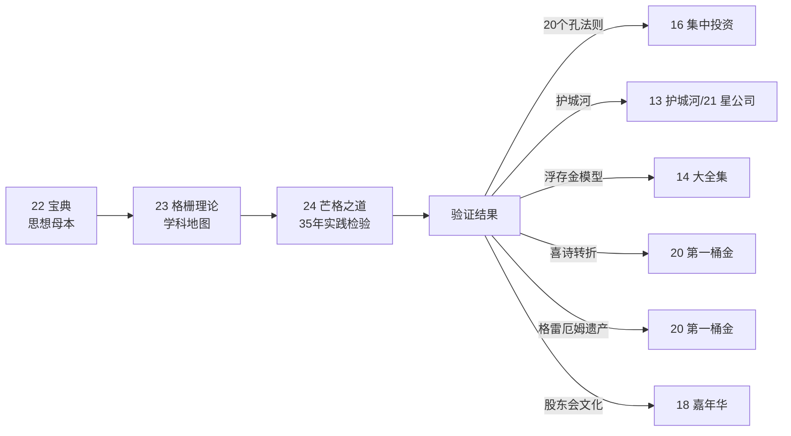
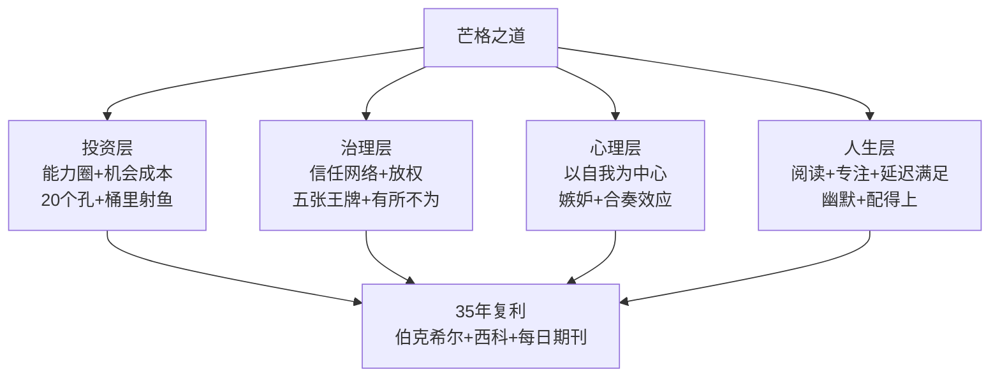
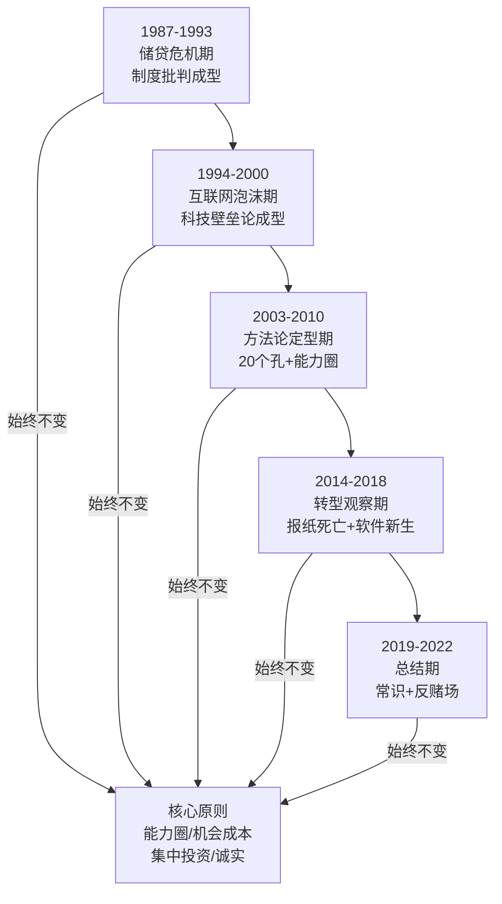
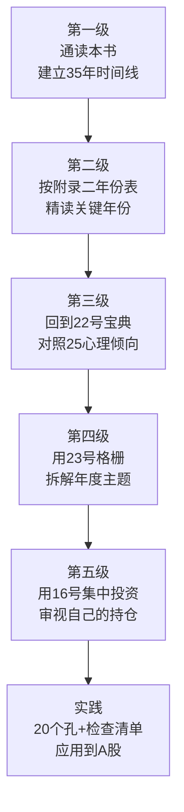
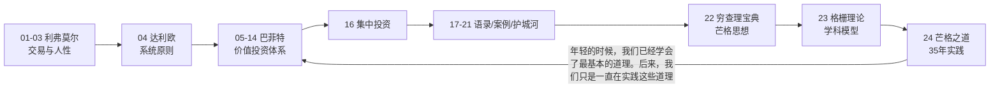

# 24《芒格之道》深度解读（详细版）

> 查理·芒格股东会讲话实录 1987—2022——35 年、25 场年会、一部价值投资的活历史

## 📖 本书概览

| 项目 | 内容 |
|------|------|
| 书名 | 芒格之道：查理·芒格股东会讲话（1987—2022） |
| 编者 | 芒格书院（2023 年 2 月编成中文版） |
| 来源 | 芒格 1987 年起在西科金融、每日期刊股东会上的即席讲话实录 |
| 结构 | 上编：西科金融股东会讲话（1987—2010，16 篇）+ 下编：每日期刊股东会讲话（2014—2022，9 篇） |
| 独特价值 | **《穷查理宝典》之外的"第二宝库"**——芒格作为董事长"不再是沉默的合伙人"，而是数小时大段开场白+坦率回答股东提问 |
| 系列位置 | **芒格三部曲之三**：[[22《穷查理宝典》深度解读（详细版）|22 宝典]]（思想母本）→ [[23《查理·芒格的智慧 投资的格栅理论》深度解读（详细版）|23 格栅理论]]（学科地图）→ **本书（35 年实践检验）** |

## 🎯 为什么这本书值得单独解读

- **35 年思想演化的完整实录**：从 1987 年储贷危机到 2022 年加密货币泡沫——芒格每个时代说了什么、后来验证了什么，一目了然
- **"沉默合伙人"的另一面**：在伯克希尔年会上"我没有什么要补充的"，在西科/每日期刊年会上却做大段开场白——这里的芒格更完整、更坦率
- **两大公司的实战样本**：西科（储贷→房地美→保险）与每日期刊（报纸→止赎潮→法庭软件）——两场"主营业务衰退后的转型"现场直播
- **投资方法的现场问答**：20 个孔法则、机会成本、能力圈、桶里射鱼、检查清单——全部以问答形式鲜活呈现
- **预言的兑现与落空**：1999 年警告互联网泡沫→2000 年破裂；2007 年批判次贷→2008 年危机；2014 年投资比亚迪→后来涨 20 倍——检验思想的唯一标准是时间
- **老年的智慧**：90 岁后依然每年开股东会——"老年是丰收的时节"

## 📑 目录

- [[#第1章 上编全景：西科时代（1987—2010）|第1章 上编全景：西科时代（1987—2010）]]
- [[#第2章 下编全景：每日期刊时代（2014—2022）|第2章 下编全景：每日期刊时代（2014—2022）]]
- [[#第3章 投资方法论：35 年的现场版|第3章 投资方法论：35 年的现场版]]
- [[#第4章 公司治理与用人|第4章 公司治理与用人]]
- [[#第5章 心理与人性：误判心理学的现场应用|第5章 心理与人性：误判心理学的现场应用]]
- [[#第6章 批判与预言：学术界、华尔街与制度|第6章 批判与预言：学术界、华尔街与制度]]
- [[#第7章 时代见证：五次危机的亲历|第7章 时代见证：五次危机的亲历]]
- [[#第8章 人生智慧：阅读、专注与老去|第8章 人生智慧：阅读、专注与老去]]
- [[#附录一 芒格之道金句集（40 条精选）|附录一 芒格之道金句集（40 条精选）]]
- [[#附录二 35 年年度主题速查表|附录二 35 年年度主题速查表]]
- [[#附录三 系列互链：芒格体系全景|附录三 系列互链：芒格体系全景]]
- [[#附录四 读完本书后的 10 个自问|附录四 读完本书后的 10 个自问]]
- [[#总结：芒格之道的人生算法|总结：芒格之道的人生算法]]

## 🔗 双链导读（本笔记与系列的连接点）

| 连接主题 | 本书章节 | 关联笔记 |
|---------|---------|---------|
| 芒格思想体系 | 全书 | [[22《穷查理宝典》深度解读（详细版）|22 穷查理宝典]] · [[23《查理·芒格的智慧 投资的格栅理论》深度解读（详细版）|23 格栅理论]] |
| 房地美/银行投资 | 上编 | [[20《巴菲特的第一桶金》深度解读（详细版）|20 韦斯科案例]] |
| 保险浮存金 | 上编 | [[20《巴菲特的第一桶金》深度解读（详细版）|20 国民赔偿]] · [[14《巴菲特投资学大全集》深度解读（详细版）|14 大全集]] |
| 集中投资 | 第3章 | [[16《巴菲特的投资组合》深度解读（详细版）|16 投资组合]] |
| 护城河/竞争优势 | 第3章 | [[13《巴菲特的护城河》深度解读（详细版）|13 护城河]] · [[21《星公司解密巴菲特股市投资法则》深度解读（详细版）|21 星公司]] |
| 喜诗糖果转折 | 上编 1998 | [[20《巴菲特的第一桶金》深度解读（详细版）|20 喜诗案例]] |
| 格雷厄姆遗产 | 上编 1990 | [[20《巴菲特的第一桶金》深度解读（详细版）|20 第2章]] |
| 股东会文化 | 全书 | [[18《巴菲特的嘉年华》深度解读（详细版）|18 嘉年华]] |
| 比亚迪/A 股 | 下编 | [[16《巴菲特的投资组合》深度解读（详细版）|16 重仓股]] · [[21《星公司解密巴菲特股市投资法则》深度解读（详细版）|21 A 股应用]] |

---

## 第1章 上编全景：西科时代（1987—2010）

### 1.1 西科金融：从储贷到保险的 24 年

**西科是谁**：总部帕萨迪纳的上市公司，伯克希尔持股 80%。三大板块：互助储蓄（储贷）、精密钢材（1979 年收购的钢铁批发）、西科金融保险公司（再保险）。1986 年合并净收益 1652 万美元（每股 2.32 美元）——芒格从 1987 年起在这里当了 24 年董事长。

**1987 年的芒格**：手握大量现金却找不到机会——"我们真不愿意持有市政债券这样的资产，但现在就是这个环境，放眼望去，只能持有市政债券，没有更好的选择。"（"市政债券不喝酒"故事原型首次登场）

### 1.2 储贷危机全记录（1987—1993）：芒格亲历的制度溃败

**危机的根源**（芒格在 1990 年会上总结）：

> "储贷机构享受政府的信用背书；储贷机构的存款利率不受限制。迫于压力，储贷机构铤而走险，主要有两种做法：第一种是买入高风险的资产；第二种是寅吃卯粮，把未来的收入提前入账。……于是，储贷机构像染上了毒瘾一样，只能不断地继续吸食。"

**行业乱象**（1987 年）：有的 CEO 动用 100 万美元公款买名画挂客厅；有的给自己发 600 万—1000 万年薪；"前段时间还在电视上播放宣传片，突然之间就破产了"。

**芒格的制度批判**："不可能一方面由政府提供信用背书，另一方面又不限制存款利率。这样的制度难以长久，因为它会驱使银行和储贷机构去冒险。"——**"资本主义不是万能的……有时候需要采用少许的社会主义"**（互助模式：州立农业保险公司、英国储贷）

**1990 年格雷厄姆小测验**（全书最精彩的现场一课）：格雷厄姆在智商 150+ 的聚会上出是非题测验，所有人（包括芒格和巴菲特）只有一人答对过半——"如果比你聪明很多的人要骗你，你再怎么判断和分析，也很难不受骗。"——**储贷机构被投行复杂产品忽悠的同构案例**

**1993 年退出储贷**：互助储蓄出售存款业务、并入内布拉斯加保险公司——"我们退出了储贷行业，并不代表所有储贷机构都没前途了。我们的组织方式以及我们的思维方式不是特别适合从事储贷行业，有的人却非常适合"（世界储蓄公司=范式）。

**1990 年垃圾债批判**（米尔肯）："市场真大跌了，这些垃圾债，60%、70%、80%，甚至 90%，都会变成废纸。"——**"被收买的专家学者们，好比是在通过分析一堆橘子的数据，来预测长颈鹿的预期寿命。……商学院的教授们用公式说谎，他们玷污了'上帝的语言'。"**

### 1.3 房地美：柳暗花明又一村

**背景**（1989 年）：互助储蓄在储贷寒冬中"从天而降"的房地美优先股——1988 年买入 240 万股（占总股本 4%，达单一股东上限），**平均成本 29.89 美元，1988 年末市价 50.50 美元**（税前浮盈 4950 万美元）。

**投资逻辑**（1989 年致股东信）：房地美=混合体（接受监管但完全私人出资）——买入抵押贷款→打包证券化→赚担保费和利差，不承担利率风险；"房地美的生意很好，大多数储贷机构望尘莫及"；股息率虽只有 5.35%，但"有能力稳步提升盈利和派息"。

**股价低迷的两点原因**：①投资者不熟悉；②担心监管部门失职（FSLIC 前车之鉴）——"我们认为，联邦储蓄贷款保险公司已经倒下了，监管部门不可能让房地美步其后尘。"

**"山重水复疑无路，柳暗花明又一村"**：1993 年互助储蓄持有房地美市值已占净资产大头——储贷业务的困局被房地美这笔投资彻底化解。

### 1.4 保险业务：过山车的艺术（1987—2007）

**保险的周期本质**（1987）："保险生意销售的只是普通商品……处于景气周期时，各家保险公司竞相增发股票，扩充资金规模，不遗余力地争抢业务。"——**"保费太低，我们就往后退一步。"**

**浮存金模型**（贯穿 35 年）：消防员基金合作（1987—1990 年代）——"通过此次合作，我们获得了大量可以用于投资的保险浮存金"；**"如果能够用 3% 的利率吸取浮存金，然后将其投资给某家能够带来 13% 的收益的企业，那么这就是一桩很好的生意。"**

**巨灾保险**（1993）："有些年份，我们只需收取保费，装到自己的口袋里即可……有些年份，我们要赔付客户的损失，送出很多张大额支票，赔付的金额可能是保费金额的好几倍。"——**"如果赔率是 2∶1，胜率是 60%，虽然输了很难受，我还是愿意大量下注。"**（飓风安德鲁：把去年一整年收的保费都赔出去了——"伯克希尔在佛罗里达州的业务规模不算大，但很多其他保险公司遭受了灭顶之灾"）

**盖可=中流砥柱**（1998）："10 到 15 年后，在汽车责任险和碰撞险领域，盖可保险的保费规模至少会达到现在的三倍。盖可的生意好极了。"（2014 年：盖可成为伯克希尔保险业务核心——预言兑现）

### 1.5 互联网泡沫：1998—2000 年的三次警告

**1998 年**（科技股狂热初期）："我们应该关注的，是那种具有划时代意义的科技进步"——空调改变美国南方、火车/飞机划时代但**最早投资铁路公司的人亏了、最早投资航空公司的人也亏了**；电视不同——"电视网形成了天然的寡头垄断，是非常赚钱的生意。只要拥有一家中等规模的电视台，就能赚很多钱"——**"首先要发现科技变革，然后要看这个行业是否拥有强大的壁垒。"**

**1999 年**（泡沫顶点）："以史为鉴，20 世纪 20 年代的佛罗里达州房地产投机潮是否可能在今天的互联网行业重新上演？……芯片成本的降低、计算机性能的提高、互联网的高速发展将引发一场科技革命，很多人狂热地投身其中，等待他们的是巨额亏损。"——**"互联网能带来巨大的机会，也蕴含着巨大的风险。投资者一旦被互联网的前景冲昏了头脑，很容易盲目冒进，犯下严重的错误。"**

**格雷厄姆的逆向箴言**（1999 年引述）："大家都不看好的机会，投资者的亏损不至于特别严重。越是大家都看好的机会，投资者的亏损越惨烈。"——**因为所有人都看好的机会必然引发踩踏**

**2000 年**（泡沫破裂前夜）："我只知道，人们如此狂热、口号如此之响、躁动如此之大、争抢如此之激烈，现在的场面必然以一地鸡毛收场。"

### 1.6 2003 年：20 个孔法则与"走自己的路"

**20 个孔法则**（沃伦的话，芒格现场重申）：

> "拿一张卡片，在这张卡片上，只能打 20 个孔，每个孔代表一笔投资，做一笔投资，打一个孔。20 个孔都打完了，一辈子的投资机会就用完了。……对于一个有头脑、守纪律的投资者来说，一生只做 20 笔投资，最后一定能取得更出色的收益率。"

**西科的实践**："自从蓝筹印花入主西科以来，西科做的投资多吗？不多。我们收购了三四家公司，买了几只股票。平均下来，我们大概每两年才有一个大动作。"

**如何遥遥领先指数**："想实现这个高难度目标，据我们所知，只有一个办法：减少投资决策的数量，不轻易出手；把握好大机会，出手就是下重注。"

**与学术界的孤独**："我们相信的很多东西，学术界根本不懂。……只有在投资行业，最主流的理论家和最优秀的实干家唱反调，无论是在医疗行业，还是工程行业，都没这个现象。"

### 1.7 2007 年：头脑缺陷学与"有所不为"

**2007 年的芒格**（83 岁）：从"成功的要素"讲起——信任网络（"我们根本不进行内部审计。我们织起了一张紧密的信任网"）、头脑（"很多人非常聪明，考试总能考高分，脑子特别灵，但是他们在人生中总是做出错误的决定"）、合奏效应（"沃伦为什么能实现合奏效应，取得这么大的成功"）。

**莫扎特的教训**（反复出现的案例）："他做了两件事，谁做了这两件事，都会陷入痛苦的泥潭无法自拔。莫扎特不知道量入为出，在金钱上挥霍无度，这是第一件。第二件，他内心充满了嫉妒和抱怨。"——**挥霍+嫉妒=痛苦人生的配方**

**"有所不为"清单**（康伍德案例）：美国第二大嚼烟公司康伍德找上门——"这么赚钱的公司打着灯笼都找不着啊……我们不能买这家公司。我们放弃了。别人买了下来，很轻松地赚了几十亿美元。错过了康伍德公司，我一点不后悔。"——**"很多事情是完全合法的，但我们认为我们不应该做。"**

**格兰特·麦克法登**（父亲的课）："我父亲对我说：'查理，你说的那个招人烦的混蛋，他总是官司缠身，像他这样的人，律师最喜欢了。格兰特·麦克法登就不一样了，他总是遵纪守法，从来不和任何人起冲突，碰到神经病，他就躲得远远的。'"——**"先想明白什么是自己不想要的，自然就会得到自己想要的"**（倒推法）

### 1.8 2010 年：金融危机后的总结

**储贷悲剧=古希腊悲剧**："在古希腊人眼里，储贷行业的覆灭绝对是一出悲剧。古希腊悲剧有个显著的特点——人们只能眼睁睁地看着厄运降临，根本无法逃避。"——**"人总是禁不住诱惑，总是想多赚钱，总是想把企业做大。劣币驱逐良币，一小撮害群之马掀起恶性竞争，全行业的资产质量迅速恶化。"**

**足球裁判理论**（政府角色）："在社会生活中，投资银行家等一部分人的竞争意识很强，他们极具侵略性。政府需要扮演裁判员的角色，对他们的竞争行为加以控制。"——**"如果政府不出手干预，投资银行必然会步储贷行业的后尘。"**

**严格限制经营范围的建议**："依我之见，要想避免恶性竞争及其产生的后果，我们必须严格限制投资银行的经营活动。有些业务，高盛做，可能不会惹麻烦，但别人做，可能就会惹麻烦。既然如此，大家谁都别做了，高盛也别做。"——**"文明社会的资本配置过程不应该如赌场一样混乱，证券产品应该简单清晰，不应该晦涩难懂。"**（凯恩斯）

**两个商学院故事**（压榨供应商的代数练习；格雷泽 50 人→900 人延迟入学）——**"做生意要讲道德。现在的人在激烈的竞争中杀红了眼，顾不上什么道德不道德的。"**

### 1.9 第1章小结

西科 24 年=芒格从 63 岁到 86 岁的投资实战史：**储贷危机（制度批判）→ 房地美（柳暗花明）→ 保险浮存金（过山车艺术）→ 互联网泡沫（提前警告）→ 20 个孔（方法论定型）→ 金融危机（制度总结）**。西科最终于 2011 年并入伯克希尔——"从 2000 万美元的市值起步，发展到今天 20 亿美元左右"。

---

---

## 第2章 下编全景：每日期刊时代（2014—2022）

### 2.1 每日期刊：从法律报纸到法庭软件

**每日期刊是谁**：洛杉矶的法律日报，曾独家刊登加州所有上诉法庭判决——"一度拥有垄断地位，是加州的每个律所必须订阅的报纸"。芒格从 2014 年起（90 岁）在这里开股东会直到 2022 年（98 岁）。

**报纸的死亡**（2020 年）："伯克希尔·哈撒韦曾拥有大约 100 家报纸。现实很残酷，这些报纸都走到了穷途末路，再优秀的管理层，也不能让它们起死回生。"——**报纸曾是"第四权"**："受益于美国的两大优良传统，裙带关系和垄断经营，当年的那些报业巨头一跃成为社会的风云人物。……现在，报纸成了过眼云烟，取而代之的是电视中喷涌而出的各种愚蠢而偏激的观点。"

**止赎潮的意外之财**（2014—2016 反复讲）：次贷危机中，每日期刊靠发布止赎权公告大赚一笔（占 80%—90% 市场份额）——"如同在瘟疫横行的年份，送葬的赚得盆满钵满。别人苦不堪言，我们却赚了一大笔钱。"——**"正是因为有了这笔钱，我们才抓住了股市恐慌的机会，低价买入了大量股票。"**（富国银行 8 美元出头一天买够量）

### 2.2 软件转型：独臂人攀登半圆顶

**转型的比喻**（2015）："我们是一家做报纸的公司。我们转型去做软件，好比一个只有一条胳膊、一条腿的人，要攀登优胜美地国家公园的半圆顶。……我们做软件业务，犹如挑战难度系数为 5.11 的攀岩路线。令人惊奇的是，虽然只有一条胳膊、一条腿，我们竟然攀爬到了半圆顶这座高峰的半山腰。"

**为什么做难生意**（2015—2020 反复讲）：法庭软件=脏活累活——"微软、谷歌的人瞧不起，我却愿意做……正因为它难，做成了以后，就是别人抢不走的好生意。"（客户黏性：政府部门更换软件服务商成本巨大）

**不签让自己偷懒的合同**（2020 骡子师傅故事）：包工头按成本加成请拉美裔骡子运输队干活——"我全凭干活利索，这么多年才总有活干。你这合同按成本加成算，连我的骡子知道了都要偷懒，干得越慢，赚得越多。"——**每日期刊先干活后收钱，交付完成才确认收入**

**成功进展**（2019—2022）：洛杉矶法院系统（全球最庞大法院系统之一）→ 南澳大利亚州、维多利亚州墨尔本所有法院 → 澳大利亚政府项目——"小小的每日期刊公司怎么被澳大利亚政府看上了呢？"（2022 年：95 岁主席 + 89 岁副主席 + 80 岁 CEO，"却仍然志在占领全球市场，多奇葩啊！"）

**坦诚的预期管理**（2014）："我们培育的软件业务有些风险投资的性质。……谁要是以为，由我这个 90 岁的董事会主席领导的每日期刊公司，是迷你版的伯克希尔，那绝对是异想天开了。"——**"我们以前做过一些赚大钱的投资，这样的投资，大概每 40 年做一次，现在我已经 90 岁了，你们哪来的自信？"**

### 2.3 审计风波（2014—2015）：信任与原则的现场课

**事件**：前任审计师（四大之一）因看不懂每日期刊复杂的业务，一再延期审计报告——"我们的竞争对手总算抓住了我们的一个把柄。……我们的股票没受到任何影响，换了一般的公司，早就暴跌了。通过长期努力，我们积累了好名声，赢得了投资者的信任。"

**芒格的应对**："我们支付了所有额外的审计费用，让前任审计师完成了他们认为有必要的审计工作。现在，我们已经和前任审计师分道扬镳了。我们的新任审计师是本地的一家会计师事务所。"——**"我们只愿意与我们信任和欣赏的人在一起，和这样的人在一起，我们能感受到一种人与人之间的爱。"**（亚里士多德"打右脸也给左脸"）

**2018 年回应"重大缺陷"指控**："我不相信每日期刊公司存在什么会计问题。与同行业的其他公司相比，我们的会计原则更保守。我们不存在任何搞财务欺诈的动机。我们的账上有数亿美元的有价证券。"——**"我们的有价证券不喝酒。"**（B.B. 罗宾逊故事第三次登场）

### 2.4 比亚迪：伯克希尔式风险投资（2014—2022）

**投资背景**（2010 年编者按）：2008 年芒格向巴菲特推荐比亚迪，伯克希尔以 2.3 亿美元收购 10% 股权。

**王传福的故事**（2016/2018 年讲述）：农民家庭、八个兄弟姐妹排行老七；哥哥打工供读书（儒家长兄如父）；工作几年后贷款 30 万美元创业；手机电池市场被日本垄断——"王传福白手起家，成功抢占了手机电池市场三分之一的份额。竞争对手以侵犯知识产权为由告他，但王传福打赢了官司，而且还是在日本的法院打赢的。"——**"王传福非常令人敬佩，他把不可能变成了可能。"**

**比亚迪=风险投资**（2016）："比亚迪是一家拥有 22 万多名员工的大公司。我们投资比亚迪，实际上也是在做一笔风险投资。……中国下决心治理空气污染问题，必然会从政策层面鼓励发展电动汽车。汽车电动化的潮流不可阻挡，比亚迪已经占据了非常有利的位置。"——**"比亚迪占据了天时地利。"**

**2021 年比亚迪大涨后**："我们持有比亚迪股票的前五年，它一动不动。去年，它涨了四倍多。比亚迪一直在积蓄力量。……我们欣赏比亚迪公司，看好比亚迪积聚的优势。……如果我们喜欢一家公司、喜欢它的管理层，比亚迪就是一个例子，我们会对它非常忠诚，甚至有些过于忠诚。"——**"我是边做边学"**（卖出体系：没有先例可循）

### 2.5 富国银行：忠诚与清醒的边界（2018—2021）

**2018 年**（丑闻初期）："富国银行设计的激励制度太不合理了，而且在发现问题后，它没能及时采取措施。……银行的利润非常容易操纵，无论是放松贷款标准，还是欺骗客户，都能虚增大笔利润。这个丑闻曝光后，富国银行得到了教训，监管机构可以放富国银行一马了，它已经长记性了。"

**2021 年**（伯克希尔卖出、每日期刊没卖）："富国银行让伯克希尔等长期投资者失望了。原来的管理层不是存心作恶或偷窃。他们的问题在于，他们培育了一种交叉销售的文化，间接地鼓励员工向客户推销他们不需要的产品。……我比沃伦更大度些。我和沃伦不一样。对于银行的管理层，我本来就没抱太高的期望。"

**银行的本质**（2021）："管理好的话，银行确实是好生意。问题在于，把银行管好很难。有人说过：'银行很多，银行家很少。'"——**吉恩·阿贝格范式**（伊利诺伊小城的银行家）："他生活在一个小城市，他对周围的人和事都非常熟悉……他经历过大萧条，他接管过一家破产的银行，这对他触动很大。他的这一套仍然管用。"

### 2.6 阿里巴巴与中国投资（2022）

**投资中国的原因**："我们投资中国的公司，原因很简单。我们能买到更多的价值。我们投资的中国公司，价格更便宜，但竞争力更强。"

**芒格 vs 巴菲特的分歧**："很多理智的投资者有一个共同点：他们选择自己觉得踏实的东西投资。沃伦也不例外。与沃伦相比，我对中国更有好感，我投资中国公司感到更踏实。其实，这只是我和沃伦之间很小的一个差异。"——**阿里巴巴的护城河**："没有苹果和 Alphabet 那么深。阿里巴巴虽然是一家规模很大的互联网零售商，但是互联网的竞争会越来越激烈。"

**对中国制度的理解**（2010/2021/2022 反复讲）："中国是一个大国，它的制造业崛起了……中国能成功是中国自己有本事。我们发达国家应该大度一些。"——"中国借鉴了亚当·斯密的理论，但没有完全照抄照搬。……当年的中国陷入了极端贫困的深渊，重症需下猛药，中国必须建立强有力的中央政府，才能从困境中走出来。所以我认为，中国走的道路应该是适合中国的。"——**"中国用自己的方法解决了它面对的难题……我们应该看到，中国在某些方面比我们做得更好。"**

### 2.7 加密货币：从"人造黄金"到"性病"（2021—2022）

**2021 年**："我不认为比特币将取代现有的交换媒介。比特币波动太大，不适合作为一种交换媒介。比特币更像一种人造黄金。我从来不买黄金，当然也不买比特币。"——奥斯卡·王尔德评猎狐："那是一群令人无语的人，追逐不宜食用的猎物。"——塞缪尔·约翰逊式回答（虱子和跳蚤哪个更好）："说不出哪个更让我感到厌恶。"

**2022 年**（两万亿美元市值后）："我确实没投资加密货币，我压根没碰那东西。我觉得自己做得很对，做得很好。在我看来，**加密货币是像性病一样的脏东西，我连正眼瞧一下都不愿意**。……我真希望政府能立即禁止加密货币。中国禁止了加密货币，我很佩服中国的做法。中国做的是对的。我们允许加密货币存在，是错的。"

### 2.8 股市赌场论与流动性批判（2022）

**游戏驿站逼空等疯狂**："有些人把股市当成赌场。……赌徒以股市为掩护，他们披着合法的外衣，从事赌博活动。"——**"股市不能既是资本配置的市场，又是赌场。"**

**治理建议**："如果我说了算，我会征收高昂的短期利得税，压缩股市的交易量，让赌徒没有容身之地。"——**"我年轻的时候，股市的流动性很低……我读哈佛法学院的时候，股市每天的交易量不到 100 万股。现在的股市，一天的交易量高达几十亿股。我们不需要股市的流动性这么高。股市的流动性如此之高，只能给国家带来祸端和风险。"**

**后果警告**："别忘了，1920 年代的疯狂行为导致了大萧条，大萧条又导致了希特勒上台。后果可能很严重。"

### 2.9 《世界百科全书》：创造性破坏的温柔一课（2022）

**最得意的投资**（很少有人提及）："我是看《世界百科全书》长大的……编辑人员将英语单词按照难度划分了等级，他们只在词条解释中使用简单的单词。即使是普通的小孩子，也能不费力地读懂。"——**"在很多年里，通过投资这套百科全书，伯克希尔每年能获得 5000 万美元的税前利润。"**

**衰落**："没想到，突然杀出来个比尔·盖茨，他在微软的电脑软件中免费赠送电子版百科全书。我们的 5000 万美元就这么没了。……《世界百科全书》的没落是文明的损失。"——**"有些东西，失去以后，是无法取代的，会非常令人怀念。……我并没因为《世界百科全书》没落了而陷入悲伤。我已经学会适应了。我只是怀念《世界百科全书》，仅此而已。"**

### 2.10 第2章小结

每日期刊 9 年=90—98 岁芒格的转型现场：**报纸死亡（第四权落幕）→ 止赎潮意外之财（瘟疫殡仪馆）→ 软件转型（独臂人爬半圆顶）→ 审计风波（信任优先）→ 比亚迪/富国/阿里巴巴（能力圈的边界拓展）→ 加密货币与赌场化批判（最后的战斗）**。一家小公司 35 年不死的秘密：**"我们只是找简单的事做而已"+"能远离难题"+"把好东西卖给别人"**。

---

## 第3章 投资方法论：35 年的现场版

### 3.1 投资总纲：简单到极致

> "我们赚钱，靠的是记住浅显的，而不是掌握深奥的。我们从来不去试图成为非常聪明的人，而是持续地试图别变成蠢货。"（22 号《穷查理宝典》核心句，在股东会上反复现身）

**投资的本质**（2021/2022 反复强调）："价值投资永不过时。按照我的理解，无论买什么股票，价值投资都是付出较低的价格、买入较高的价值。这种投资方式，永远不会过时。就像数学原理一样，永远有效。"——**"所有做得正确的投资，都是价值投资。区别在于，有的人在好公司中寻找价值，有的人在烂公司中寻找价值。"**

### 3.2 能力圈与机会成本

**能力圈的边界**（1990）："我们很清楚自己的不足，很清楚有很多事我们做不到，所以我们谨小慎微地留在我们的'能力圈'之中。'能力圈'是沃伦提出的概念。沃伦和我都认为，我们的'能力圈'是一个非常小的圆圈。"——"我年轻时，有个朋友说：'芒格只研究自己生意里的那点事，和他的生意无关的事，他一概不知。'"

**机会成本**（2003 完整版）："我们做投资的时候，总是把手里现有的最佳投资机会作为参照标准，把它当成一把尺子，用它来衡量所有其他机会。我们拿来当作标尺的机会越好，机会成本的门槛越高。……投资范围越广，投资机会越多。"——**"投资范围广是好事，但是投资范围广，也容易脱离自己的能力圈。在我们浏览的投资机会中，有 90% 到 95% 被我们判定为不在我们的能力圈范围之内，我们看不懂，直接就不看了。"**

**美国运通案例**（机会成本抬高的经典）："沃伦慧眼识珠，坚信美国运通是一只优秀的成长股。这么好的投资机会，一下子就把机会成本的门槛抬高了，别的投资机会，根本没法和美国运通比。于是，沃伦联系合伙人，修改合伙基金协议，提高了单只股票占比。仓位限制解除后，他拿出 40% 的资金重仓美国运通。为了重仓一只股票而主动提出修改协议，一般的基金哪有沃伦这么大的魄力。"

### 3.3 集中投资与"钱是坐着等来的"

**集中 vs 分散**（2003/2019/2021 多次交锋）："一个人，居住在一座欣欣向荣的小城市里，他拥有这座小城市里最好的三家公司的股份，这么分散还不够吗？"——**"那些主张高度分散的人，越分散越往下出溜。我本人还是更愿意持有两三家公司，这两三家公司是我自己有把握的、比较了解的、比别人更有优势的。"**

**"钱是坐着等来的"**（2016 引述股票史传奇人物）："坐着等，不是等下一次大跌，靠猜涨跌是做不成投资的。这句话的意思是说，要取得良好的投资业绩，必须要有足够的耐心。有足够的耐心等待，等到机会来临时，果断出手，大量买入。"——**"我们等到了止赎潮，赚到了一大笔钱。后来，非常便宜的股票出现了，只用了一天的时间，我们就把这笔钱全部投出去了。我们恰好买在了最低点，这是运气。但是，当时我们手里有钱，这不是运气。"**

**20 个孔的数学基础**（2019）："广为流传的凯利公式可以告诉我们，在自己占有胜算的时候，在每笔交易上应该押下多少筹码。你的胜算越大，这笔交易成功的概率越高，你下的注应该越大。"——**"有时候，一个机会特别好，简直如探囊取物一般，只买这一个机会也是完全合理的。"**

### 3.4 桶里射鱼与等待的艺术

**"桶里射鱼"**（2015）："投资应该做简单的事，像'桶里射鱼'那么简单。'桶里射鱼'还不够简单，把水倒干净，然后用喷子对着鱼，砰的一枪，这才是我要的简单。"——**富国银行 8 美元出头=桶里射鱼机会**（"便宜到家了，一眼就能看出来，还有什么不敢买的？"）

**等待的哲学**（2003）："有的人耐不住性子，做不到像我们这样观察和等待。太浮躁了，成不了事。如果你的日子已经很富足了，顺风顺水的，六个月过去了，你的日子仍然很富足，仍然顺风顺水，难道你就觉得日子太难过，受不了了？"

**太姥爷的教训**（2019）："我的太姥爷说，老天爷赏饭吃，一辈子活到了 90 岁，老天给了好几个大机会。他这一生能幸福长寿，主要是老天给他的那几个大机会来临时，他抓住了。"——**"我还很小的时候，我就知道了，重大的机会、属于我的机会，是很少的，关键是自己要做好准备，当少数几个机会到来的时候，把它们抓住了。"**

### 3.5 不做什么：负面清单

| 不做什么 | 理由 | 出处 |
|---------|------|------|
| 不做事件套利 | "近些年来，我们做得比较少。至于现在，我们基本上不参与事件套利了" | 2003 |
| 不买期权激励的公司 | "我们并非不赞成按照业绩发放薪酬的激励措施，我们只是不认可股票期权的会计处理" | 1998 |
| 不买"赚钱但不该赚"的生意 | 康伍德案例——"很多事情是完全合法的，但我们认为我们不应该做" | 2007 |
| 不投资比特币/黄金 | "比特币更像一种人造黄金。我从来不买黄金，当然也不买比特币" | 2021 |
| 不做频繁交易 | "一个已经赚到钱的人，怎么可能以传授炒股技术为生？" | 2019 |
| 不买看不懂的科技 | "我对人工智能没什么研究，因为我学不明白那些东西。我只研究常识" | 2021 |
| 不搞内部审计 | "我们织起了一张紧密的信任网" | 2007 |
| 不制定长期规划 | "无论是现代商学院，还是联邦住房贷款银行体系，都提倡制定长期规划，我则不以为然" | 1989 |

### 3.6 估值：没有万能公式

**2016 年三连问**（贴现率的选择）：
- 国债收益率 vs 机会成本哪个对？——"这两种衡量方法都对。国债收益率很重要，国债收益率是所有其他资产的定价基准。机会成本也很重要，你自己做投资，选择哪个机会，主要看机会成本。"
- 两个贴现率算出的两个数字怎么选？——"我们从来不用数学算式计算估值。在估值时，我们会考虑很多因素。给公司估值和打桥牌差不多，要考虑很多因素，而且要在很多因素中进行权衡取舍。……投资没有万能公式，不是说拿个什么公式，代入数字，算一算，就把估值求出来了。果真如此，数学学得好的还不都发大财了？"
- 不同公司用一样的贴现率吗？——"当然不一样了。公司和公司不一样，我们总是具体问题具体分析。我们主要看公司的生意好不好。生意好的公司，我们愿意出更高的价格。"

### 3.7 投资环境的进化论（35 年纵向对比）

| 时代 | 芒格的判断 | 后来的验证 |
|------|-----------|-----------|
| 1980s 烟蒂时代 | "只要去人少的地方……总能很容易地找到股价不到清算价值三分之一的股票" | 捡烟蒂机会随资金涌入消失 |
| 1998—2000 | 互联网狂热"必然以一地鸡毛收场" | 2000—2002 纳斯达克跌 78% |
| 2003 | "投资变难了，但还没难到日本那种程度" | 2008 年全球危机（日本式通缩未现） |
| 2010 | "已经进入了资本主义的困难（Hard）模式" | 美股 2010s 大牛市（芒格承认判断保守） |
| 2016 | "价值投资永不过时，就像数学原理一样" | 2016—2022 价值风格跑输成长（长期仍成立） |
| 2021—2022 | "由于种种疯狂行为，将来会有严重的后果" | 2022 年美联储加息、股市大幅回调 |

**诚实的自我修正**（2019）："我 95 岁了，几乎一笔交易不做。我是对的，投资咨询机构是错的。我跑赢了指数，他们没跑赢。你是想像我一样，还是像他们一样呢？"

### 3.8 第3章小结

35 年投资方法论=**一句话版**：能力圈内、机会成本衡量、20 个孔、桶里射鱼、钱是坐着等来的、集中两三只、凯利下注、负面清单、无公式估值。**方法从未变过——"年轻的时候，我们已经学会了最基本的道理。后来，我们只是一直在实践这些道理。"**

---

---

## 第4章 公司治理与用人

### 4.1 伯克希尔文化：信任、放权与老派

**信任网络**（2007）："我们根本不进行内部审计。我们织起了一张紧密的信任网，在我们的网中，都是值得信任的人。全世界最优秀的机构靠的都是信任。妙佑医疗的手术室里充满了信任关系。如果在手术室里，一边是医生做手术，另一边是律师在监督，怎么可能把病人治好？"

**高度放权**（1998）："我这个人，要么完全放权，彻底撒手不管，要么亲力亲为，什么事都自己干。在这方面，我就不知道该怎么折中。……伯克希尔是一家高度放权的公司。卢·辛普森完全独立地做投资，通用再保险的欧洲分部也是独立地做投资。至于资本配置，则一直由总部集中负责。我从来没查看过通用再保险的投资，也从来没查看过卢·辛普森的投资。"

**卢·辛普森**（1998 现场）："辛普森完全独立地做投资，他自己做研究、找机会……盖可保险的投资组合也是集中持股，六到八只股票占了投资组合中的绝大部分比重。他通过自己研究，找到了和我们同样的投资方法。他的投资风格是自己摸索出来的，没我们的参与，可以说，我们殊途而同归。"

**不搞股票期权**（1998）："西科公司过去没有股票期权计划，将来也不会实施股票期权计划。"——三花公司范式："高管的股票不是通过行使期权得来的，而是像其他股东一样，用自己的钱买来的。三花的理念很保守、很老派，于我心有戚戚焉。我甚至比创立了三花的斯图亚特更老派。"——**"我们并非不赞成按照业绩发放薪酬的激励措施，我们只是不认可股票期权的会计处理。"**

**低调文化**（1993）：沃伦曾想买一栋大楼做总部——"后来，沃伦担心办公场所太高档了，容易滋生奢靡风气，于是就没买。我们仍然留在非常低调的场所办公。"——内布拉斯加 vs 加州："在过去二三十年里，内布拉斯加州的金融丑闻很少，加州的金融丑闻很多。内布拉斯加州的风气很正。"

### 4.2 优秀管理者的定义（1987 年首次给出）

> "在巴菲特眼中，优秀的管理者是这样的：你把他从火车上扔下去，扔到一个偏僻的小镇，不给他钱，他在这个小镇上诚实本分地经营，用不了多长时间，又发家致富了。这样的管理者不可多得，巴菲特自然是求贤若渴。巴菲特定义的优秀的管理者与来自商学院的典型截然不同。"

**反面**（1987）："大公司聘请人才的思路千篇一律，商学院毕业、品学兼优、勤奋正直，结果并不理想。如果这种聘请人才的思路行得通，所有美国公司都蒸蒸日上了。"

**收购风格**（1987）："有的人做收购，请来一群投行员工，以为听他们的建议，就能做成一笔又一笔完美的收购。对于这种做法，我实在不敢苟同。即使是投资机会很多的时候，我们辛辛苦苦地研究和跟踪各个机会，一年也只能做成一笔收购。"——汤姆·墨菲范式："他每笔收购所用的时间，平均下来，一年可不够，两年都不够。"——**"真正做收购是好事多磨，要熬过辛苦的等待，经历反复的波折。"**

### 4.3 识人察人：盖瑞·萨尔兹曼的故事（2021）

**伯克希尔为什么经营得好**："很重要的一个原因在于，我们总是和优秀的人共事。"——**识人技巧**："一个人，他是个经常喝得酩酊大醉的酒鬼，那我们肯定远离啊。人们经常能通过一个人身上的一两个特点，判断出这个人是否值得交往。"

**盖瑞的提拔**：每日期刊前任 CEO 去世，芒格推荐盖瑞——"瑞克先是吃了一惊，他说：'盖瑞从没接触过报纸行业啊。'我说：'没关系，他一定行。'瑞克立即同意了。"——结果："在他的领导下，每日期刊发展得越来越好。"——**"汤姆·墨菲讲过，他的用人之道是完全放权，几乎撒手不管。我们对盖瑞也是如此。"**

### 4.4 彼得·考夫曼的"五张王牌"（2018 现场分享）

筛选基金经理的五个条件：
1. **绝对诚实正直**
2. **谈起自己的投资逻辑清晰、成竹在胸**
3. **收费方式公平合理**
4. **投资领域是人少的地方**（"人少，利润才高，人多，哪有钱可赚？"）
5. **年纪比较轻，还有很长的时间可以做投资**

**应用**："用彼得的方法筛选，能把一半的基金经理给炒了。"——**真找到了符合全部五个条件的基金经理**："第一，立即投，立即把钱交给你找到的基金经理；第二，多投，能投多少钱就投多少钱。"

**莫尼什·帕波莱的收费**（2021 现场点名）："莫尼什采用了巴菲特的收费方式，他的基金已经走过了 10 年。莫尼什的基金设置了水位线，只有收益率超过了这条水位线，他才能获得收益分成。……一位基金经理，已经 40 岁了，还没凭借自己的投资本领积累足够的财富，有什么资格给别人管钱？"

**麻省投资者信托的教训**（2018）："它的规模发展到了 7000 多亿美元，它聘请了大量年轻的基金经理，把投资分散在 50 多只股票里，这就不可能再跑赢标普指数了。它跑不赢指数，还收取大量管理费，自然就有些说不过去了。"

### 4.5 李录：中国版的巴菲特

**2010 年**（李录现身会场）："很多读过商学院的人甚至对我们说：'我在商学院学到的东西基本没什么用，但是你们的思维方式对我很有启发。'这些人走上正道了。他们中有一位来到了现场，他的名字叫李录。李录在哥伦比亚商学院学到了很多东西，但是他在听了沃伦·巴菲特在哥大进行的一次演讲后，才觉得茅塞顿开。"

**2019 年**（为什么李录做得风生水起）："一方面，他算得上是中国版的沃伦·巴菲特；另一方面，他是在中国钓鱼。美国市场已经不知道被翻了多少遍，人挤人，竞争白热化。中国市场则不同，在那里，仍然可以利用别人的愚蠢和懒惰，挖掘到非常值得投资的好机会。"——**"钓鱼的第一条规则是，在有鱼的地方钓鱼。钓鱼的第二条规则是，记住第一条规则。"**

### 4.6 与分析师的关系（1998 年现场）

**公平对待**："伯克希尔不会召开小型的分析师会议，向分析师提前透露经营数据……跟踪我们的分析师和所有股东一样，都是在同一时间看到我们的经营数据。"

**爱丽丝·施罗德**（现场互动）："只有伯克希尔一家公司，是我不需要向管理层提出任何问题，就能建好一个整整 30 年的盈利模型。伯克希尔在年报以及 10-K 报告中披露的信息非常详尽。"——**"伯克希尔热爱教育、鼓励求知。"**

### 4.7 第4章小结

治理与用人=**老派信任经济学**：不搞期权（避免激励扭曲）、不搞内部审计（信任网络）、完全放权（辛普森/盖瑞）、只与信任欣赏的人共事（审计师风波）、五张王牌筛人（诚实>能力）。**伯克希尔的"护城河"之一就是这套文化——"我们总是和优秀的人共事"。**

---

## 第5章 心理与人性：误判心理学的现场应用

### 5.1 以自我为中心：最严重的误判心理（2007）

> "在人类误判的所有心理倾向中，我认为最严重的一个是以自我为中心的倾向。在潜意识中，人的大脑总是把对自己有利的，当成对别人也有利。……这个倾向一直没有引起我的充分重视。虽然我已经很重视这个倾向了，但重视程度还是远远不够。"

**案例**：世界银行行长沃尔福威茨给同居女友加薪毁掉前途；克林顿"脑子如果能清醒点，就不至于声名狼藉了"——"他们都是聪明人，却犯了最基本的错误。"——**"高智商的人犯下愚蠢的错误"=全书反复出现的主题**

**糖果店的故事**（南加大音乐学院院长父亲的一课）：小男孩偷吃糖果说"这是我借着吃的，我会还回去的"——父亲说："你爱吃多少就吃多少，每吃一块就告诉自己，自己是个小偷！"——**以自我为中心的人总能给自己找到理由**

### 5.2 嫉妒：最愚蠢的罪（2003/2010/2014）

> "按照天主教对人类恶行的分类，人类主要有七宗罪，嫉妒是其中之一。我觉得犯嫉妒这种罪的人最蠢。犯了嫉妒的罪，得不到一丁点快乐，整个人都被痛苦包围着，何必遭这份罪呢？"

**2010 年金融危机的心理根源**："因为有一小撮不守规矩的人掌握了金钱和权力……**嫉妒和野心导致了金融领域的悲剧**。"——"在古希腊人眼里，储贷行业的覆灭绝对是一出悲剧。"

**2014 年亲身经历**："有一家大公司，所有人的年薪都很高。有一年，一个员工拿到的薪酬比其他员工多了一万美元，其他员工就炸开锅了。他们拿着几百万美元级别的年薪，一万美元对他们来说是九牛一毛，但他们就在那斤斤计较。"

### 5.3 合奏效应（Lollapalooza）的现场版（2017）

**芒格自述发明过程**："原来，我没学过心理学，我觉得自己在这方面的知识比较欠缺。于是，我买来了心理学专业常用的三本入门教科书，从头到尾读了一遍。我是很挑剔的，读完了以后，我发现心理学家教得不行，还是我自己动手吧。"——**"有一个重要的心理学现象，哪本教科书都没讲到。在这种现象中，三四种心理倾向同时发生作用，我将其称为合奏效应。好几种心理倾向的合力叠加在一起，它们产生的影响绝对不是线性的。"**

**为什么心理学家不研究**："四五种心理倾向共同发生作用，情况太复杂了，心理学家没法做实验，没法发表论文，所以他们就不研究这个现象。心理学中最重要的一个现象，心理学家根本没研究，也没讲。"——**"我有一种高处不胜寒的感觉，曲高和寡啊！别笑，我是完全对的。"**

### 5.4 头脑缺陷学：为什么聪明人做蠢事（2007）

**头脑≠智力**："我讲的第一个因素是头脑，我说的头脑不只是脑子反应快。很多人非常聪明，考试总能考高分，脑子特别灵，但是他们在人生中总是做出错误的决定。他们的脑子虽然聪明，但是有一些严重的缺陷。"

**缺陷清单**（2007 现场版）：
- 挥霍无度（莫扎特）
- 嫉妒心强（莫扎特："他总是觉得别人得到了更好的待遇，总是觉得全世界都对他不公平，整天自哀自怜"）
- 自哀自怜（"抱怨什么用都没有，越抱怨、越痛苦"——爱比克泰德/马可·奥勒留："每次苦难都是一次机会"）
- 报复心理（"中东地区的冤冤相报正是报复心理在作祟"——"有一种爱尔兰阿尔茨海默症，什么都忘了，仇恨却记得清清楚楚"）
- **极端意识形态**（"陷入极端意识形态，相当于用铁锤敲打大脑"——"盲目地效忠于某种意识形态，一个人会完全丧失认知能力"）

### 5.5 损失厌恶与过度交易（现场问答实录）

**2016 年（高频交易）**："很多做高频交易的人，他们的人品没什么问题，但是他们对美国经济做出了什么贡献呢？他们犹如谷仓中的硕鼠。他们窃取了大量财富，自己吃饱了、喝足了，但是对文明没有丝毫贡献。"

**2019 年（教人炒股）**："有人专门拉别人下水，教别人频繁交易股票。在我看来，这和教唆年轻人吸食海洛因没什么两样，蠢到家了。一个已经赚到钱的人，怎么可能以传授炒股技术为生？"——**"一个人，突然发现了每年赚三倍的秘诀，怎么可能靠在电视上卖书混饭吃？"**

**2022 年（免佣金交易）**："免佣金交易算是一个，这是个可耻的谎言。表面上佣金免费，实际上是要付出代价的。"——**"投资界目前流行的最大的谎言是什么？"**（2021 年提问，芒格的回答）

### 5.6 普朗克知识与司机笑话（2017 现场）

**普朗克巡回演讲**：司机背下演讲代为上台，遇到高深提问时说："没想到在慕尼黑这么一个大城市，竟然有人问我这么简单的问题，让我的司机回答你吧。"——**知识的两种形态：真正理解 vs 背诵复述**（对应 22 号"普朗克知识 vs 司机知识"）

**意大利航空笑话**（笑对苦难）：飞机迫降地中海，机长让会游泳的站右边（"在太阳的方向，有一座小岛，距离是三千米左右"），不会游泳的站左边——"站在左侧的乘客，感谢您乘坐意大利航空的航班，再见！"

### 5.7 第5章小结

心理与人性=**25 倾向的现场应用手册**：以自我为中心（最严重）、嫉妒（最蠢）、合奏效应（最复杂）、头脑缺陷（聪明人做蠢事）、损失厌恶（过度交易）、普朗克知识（真懂 vs 装懂）。**芒格把心理学从理论变成了年会上的活教材——每一条都配着当场发生的故事。**

---

## 第6章 批判与预言：学术界、华尔街与制度

### 6.1 学术界批判：35 年不变的战线

**1998 年**："强式有效市场假说纯属胡说八道。有些金融学教授坚持错误的理论，而且还给学生们大讲特讲，我们实在看不下去。"（并向现场金融学教授道歉："如果我们在批评一部分金融学教授时，误伤了你，我在此向你表示歉意"）

**2003 年**："学术界喜欢市场完全有效的理论，有了这么纯粹的理论，才能进行完美的数学计算和推理。……按他们的理论，什么时候市场都绝对有效，股价没有不合理的时候。就算是你自己公司的股票，你也找不出股价不合理的时候。"——**"我们根本看不上学术界的那一套。但是，我们还真有一种孤独感。"**

**2010 年**："高等学府里的金融学教授讲解的风险控制方法是一派胡言。……学生们掌握那些愚蠢的方法，可以在考试中得到高分，但是他们学到的东西是象牙塔里脱离实际的理论。谁说实际生活中的金融总是完美地符合正态分布曲线？"——**"金融学教授都是高智商的人，他们教的东西明明不切实际，但他们却一直在误人子弟。"**

**2010 年贝塔系数批判**："学术界还有一个流毒甚广的概念——用贝塔系数衡量波动性。……你知道了波动性，照样解决不了投资的核心问题。我们必须知道什么行得通、什么行不通、原因是什么。真正的投资之道不好教，但分散投资和贝塔系数背后有一系列的公式，教起来很容易。"——**"与其说是'多元化投资'，不如称其为'多元恶化投资'。"**

**商学院没教的最重要知识**（1990）："商学院没教学生如何分辨好生意、一般的生意和烂生意。"——格雷厄姆"从来没教他如何区分好生意和烂生意"——**"即使是大型机构，也难免百密一疏。就连我们最顶尖的教育机构，也存在盲点。"**（富兰克林："结婚之前，擦亮双眼。结婚之后，睁一只眼闭一只眼。商学院就是这么做的。它们已经嫁给了大公司。"）

### 6.2 华尔街批判：从所罗门到次贷

**1987 年（所罗门投资时机）**："我们刚达成这笔交易一个星期，股市就爆发了'黑色星期一'。……这点踩的，太背了。我们没有未卜先知的能力。"（诚实面对失误）

**1990 年（米尔肯垃圾债）**："迈克·米尔肯那帮人，四处兜售他们的理论……米尔肯的那一套纯属胡扯。有些社会地位很高的商学院教授，也出来撰写论文，为米尔肯的理论提供学术支持。他们这是昧着良心说话。常言道：'拿人家的手短，吃人家的嘴软。'"

**2007 年（次级抵押贷款）**："一些机构把手伸向穷人，向他们发放低等级抵押贷款，收取高昂的手续费，这是资本主义社会中最卑劣的行为之一。做出这种行为的人是社会败类，他们罪大恶极，真应该下地狱。"——**投行更恶劣**："与贷款推销员相比，投行员工的道德水平之恶劣，有过之而无不及。"——**"发放次级抵押贷款的做法无异于纵火焚毁房屋。"**

**2010 年（金融危机溯因三要素）**：政府（裁判缺位）、投行（盲目竞争）、会计处理（漏洞）——"在倒闭之前，在它们最疯狂的时期，雷曼等投行之间的竞争完全是病态的。它们和缺乏诚信的贷款机构做生意，那些贷款机构并不比电信诈骗团伙强多少。"

**2014 年（审计行业）**："现在的会计师事务所为上市公司做审计，提供两项服务，先查找内部缺陷，然后修复内部缺陷，两项服务分开收费。为了继续提供修复缺陷的服务，审计机构总能找到这样或那样的重大缺陷。"——**"我们的有价证券不喝酒。"**

**2016 年（瓦兰特制药造假）**：从瓦兰特事件抨击金融业乱象——"在金融行业里，精神病太多，理智的人太少。"

### 6.3 投资行业批判：炼金术士与现代翻版（2019）

**加州投资咨询公司的故事**："我们手下有这么多青年才俊，个个是沃顿、哈佛等名校的高才生……只要让这些青年才俊每人拿出他认为最好的一个投资机会，我们把所有最好的机会集中起来，创建一个投资组合，必然能遥遥领先指数啊。"——结果："他们满怀信心地付诸行动了，结果毫无悬念地一败涂地。他们又试了一次，一败涂地。他们试了第三次，仍然败了。"——**"这家投资公司的行为没比几百年前的炼金术士高明到哪去，它不过是妄想把铅变成金子的现代翻版。"**

**为什么行不通**（芒格留给听众的思考题）：**"沃伦不可能妄想无所不知，他告诉你的只会是一两只股票。投资咨询机构雄心勃勃，沃伦更知道克制自己。"**——成功投资的本质=少数几个自己能看懂的大机会，不是众多聪明人的意见平均。

**整个行业的尴尬**："指数基金出现了，投资咨询机构惨了，几乎所有的投资咨询机构都跑不赢指数基金。更尴尬的是，机构整体跑输指数的部分，约等于它们运营基金和调整投资组合产生的成本。由此可见，整整一个行业，费用没少收，贡献却几乎等于零。"——**"他们不应该这么做。"**

### 6.4 宏观批判：印钞、通胀与债务（2021—2022）

**货币增发**（2014）："我们不能拿美元当儿戏。我们应该坚持保守的原则，不能随心所欲地发行货币。"——**"'一战'后，在巨额战争赔款的重压之下，德国的货币贬值，这才导致希特勒上台……如果德国的货币没贬值，'二战'未必会爆发。"**

**印钞的诱惑**（2022）："开动印钞机有如此强大的诱惑力，政府很可能用之无度，一次次把印钞机开足马力。……没完没了地搞下去，早晚有一天，会把国家搞垮了。"——**"我们不能再这么玩火了，该收手的时候，要收手。"**

**日本的对照**（2022）："日本发行了那么多货币，它仍然是一个很文明的国家，经历了长期的经济停滞，它仍然泰然自若，非常令人敬佩。……日本没事，我们美国未必没事。像美国这样的多民族、多种族国家，治理起来难度更大。"

**通胀的代价**（2022 沃尔克回顾）："20 世纪 70 年代末，保罗·沃尔克出任美联储主席。为了遏制通货膨胀，他将最优惠利率提升到 20%……随后，美国经济遭遇了严重的衰退。现在回过头来看，沃尔克的决断完全正确。美国现在的政坛人士没那么大的魄力。"——**"那些滥发货币的拉美国家下场如何？它们迎来了独裁者。"**

### 6.5 政治与社会观察

**2010 年（中国崛起）**："这么大一个国家，从贫穷走向富裕，在整个人类历史上也没有先例。中国做对了很多事情，我们在很多方面不如中国，我们不应该对中国颐指气使。……中国人以前很穷，但是他们把自己 45% 的收入存了起来。中国人是用自己的钱发展起来的。"——**皮凯蒂批判**："《21 世纪资本论》的作者托马斯·皮凯蒂有点傻……不是说他列出的具体数字有什么不对，而是他的解读有问题。"——**"中国对世界没有恶意，中国的崛起将引发世界格局发生重大变化，这有利于促进全球平等。"**

**2022 年（中美关系）**："我们希望中国和美国和平相处。中美交好，美国和中国做朋友，中国和美国做朋友，这有什么不好？……我们应该学会与不同政治体制的国家友好相处。"——**"最可恨的是，有些人煽风点火，蓄意激化双方的矛盾和敌对情绪，这样的人中国有，美国也有。"**

**税收倒置**（2014）："随着全球贸易自由度的提高，公司可以在各国之间往来穿梭。一个国家的税率远远高于其他国家，公司肯定要离开这个国家。如果我说了算，我会在美国只征收很低的公司税。"——**"世界上居民生活水平最高的一些地方，例如，新加坡、中国香港，都是低税率的。"**

**奥巴马医改**（2014）："如果我说了算，我会在美国实施'单一支付制度'的全民医保，但民众可以选择不参加全民医保。"——**"为了赚钱而滥用医疗服务，这是美国的耻辱。"**

### 6.6 第6章小结

批判与预言=**制度与人性长期博弈的记录**：学术界（有效市场=胡说八道）、华尔街（次贷=纵火焚屋）、投资行业（炼金术士翻版）、宏观（印钞=玩火）。**芒格的批判不是愤世嫉俗，而是基于"人性有恶的一面，必须用外界力量约束"（足球裁判理论）的制度设计思维。**

---

---

## 第7章 时代见证：五次危机的亲历

### 7.1 1987 年黑色星期一（亲历者视角）

**1987 年 4 月年会**（崩盘前半年）："目前好的投资和收购机会均缺乏，明显感觉到市场环境不妙，但又表示实在没有预测未来的能力，只是对累积起来的风险感到不安。"——**半年后**：10 月 19 日道指狂泻 508 点、单日跌幅超 20%。

**所罗门投资的尴尬时机**（1987 年年会）："我们刚达成这笔交易一个星期，股市就爆发了'黑色星期一'。自从杰伊·古尔德制造了'黑色星期五'之后，股市创下了单日最大跌幅。我们刚达成交易，市场就出现了百年一遇的暴跌。这点踩的，太背了。"——**"我们没有未卜先知的能力，这笔交易没赶上好时机。"**

### 7.2 储贷危机（1987—1993）：制度溃败的五年

| 年份 | 芒格的观察 | 行动/判断 |
|------|-----------|----------|
| 1987 | "储贷行业暴露出种种乱象，究其根源，在于政治" | 坚持差异化贷款（利率上限 25%、不做沙漠贷款） |
| 1989 | "我们的储蓄和贷款行业如今创造了美国金融机构历史上最混乱的局面" | 请辞美国储蓄机构协会；买入房地美 |
| 1990 | "储贷机构像染上了毒瘾一样，只能不断地继续吸食" | 格雷厄姆小测验；垃圾债批判 |
| 1993 | "我们退出了储贷行业，并不代表所有储贷机构都没前途了" | 出售互助储蓄存款业务，退出储贷 |

**芒格的制度洞察**（贯穿）："早期的储贷行业很稳健，主要是那时候的制度好，把人为因素造成的破坏给限制住了。……一旦开始尝试高难度动作，背后还有政府做信用担保，那就坏了。"——**政府的信用背书+不受限制的存款利率=必然冒险的配方**

### 7.3 互联网泡沫（1998—2000）：提前两年的警告

**时间线**：
- 1998 年：区分"提高效率的科技"与"划时代的科技"；电视范式（有壁垒）vs 铁路/航空（无壁垒）
- 1999 年：佛罗里达房地产投机潮类比；"等待他们的是巨额亏损"
- 2000 年："现在的场面必然以一地鸡毛收场。最后，很可能只有极少数的人笑到最后"

**验证**：2000 年 3 月纳斯达克见顶，随后两年跌去 78%；互联网公司大批死亡——**芒格没有预测具体日期，但正确判断了方向与幅度**

### 7.4 次贷危机与金融危机（2007—2010）：批判者的现场

**2007 年**（危机前夜）：次级抵押贷款批判——"发放次级抵押贷款的做法无异于纵火焚毁房屋"；穆迪等评级机构"难免有看走眼的时候"；**垃圾债始作俑者**"罪大恶极，真应该下地狱"。

**2010 年**（危机后总结）：储贷悲剧=古希腊悲剧；足球裁判理论；严格限制投行经营范围；"二战"后援助战败国的类比——**"在金融领域，我们为什么不能像'二战'后的战胜国一样，学会吸取教训呢？"**

**"众人皆醉我独醒"**（2010）："如何才能不做发疯的大多数人中的一员，而站在保持清醒的少数人的一边？这是一个值得思考的问题。……我们务必牢记吉卜林的嘱咐——在身边的人都失去理智时，你要保持清醒。"——**厄普顿·辛克莱**："一个人需要装糊涂才能拿到薪水，怎么可能指望他明白过来呢？"

### 7.5 新冠时代（2020—2022）：老年的见证

**2020 年 2 月年会**（疫情前）："没有任何与新冠疫情相关的讨论"——2 月 13 日正常线下开会；5 月芒格首度缺席伯克希尔年会。**2020 年开场白**（天主教大教堂）："欢迎来到天主教大教堂。这座教堂可不一般……电影明星格里高利·派克的骨灰盒安放在这座教堂里。谁想把自己的骨灰盒与格里高利的安放在同一面墙壁，可以在会后与彼得联系，费用是 10 万美元。真是商业社会啊，死都死不起了。"（96 岁老人的幽默）

**2022 年（乌克兰危机）**："在当今时代，发生冲突的双方都掌握核武器，冲突最后一定会得到解决。闹到最后引发世界末日，那样的结果谁都承受不起。"——**"由于核武器的存在，在过去的很长时间里，整个世界没有爆发大规模的战争，这是人类之幸。"**

### 7.6 第7章小结

五次危机=**芒格判断力的检验报告**：储贷危机（亲身参与的制度批判）、黑色星期一（没有预言能力但规避了风险）、互联网泡沫（提前两年准确警告）、次贷危机（前夜批判+事后制度药方）、新冠与地缘（老年的从容）。**芒格从不预测市场，但他总能在疯狂时保持清醒——这本身就是可重复的预测。**

---

## 第8章 人生智慧：阅读、专注与老去

### 8.1 阅读：甘坐冷板凳

**沃伦的一天**（2007）："假如找一个人，让他观察沃伦，拿着秒表给沃伦计时，会发现沃伦绝大部分时间都是坐在那一动不动地阅读。这是商学院不会教给你的道理。"——**"如果你真想成功，真想取得别人无法取得的成就，要甘坐冷板凳，日复一日地阅读。你在公司上班，公司可不让你读书，看到你在工位上阅读，老板非把你炒了不可。"**

**萧伯纳的故事**："乔治·萧伯纳让他的母亲出去做清洁工，他自己钻进了大英博物馆。……萧伯纳靠母亲打工的薪水维持生计，自己在图书馆里如饥似渴地阅读。萧伯纳说他想出人头地。他甘坐冷板凳、埋头苦读，而他的母亲做清洁工养活他。最后，萧伯纳真成功了。"——**"在人类的脑力活动中，阅读有着不可取代的地位。"**

**阅读方法**（2015）："我从来不记笔记。上学的时候，我就从来不做笔记。我阅读和思考，完全是随性而至。我只读自己爱看的书，想读的时候就读，想思考的时候就思考。"——**"在我见过的所有的聪明人之中，没一个不大量阅读的。现在的人习惯在电脑上看东西……我认为，看电脑还是不如读纸质书，读纸质书能学到更多知识。"**

### 8.2 专注：成功靠的不是智商而是专注力

> "我天生就有这个能力，当我想专心读书的时候，我可以屏蔽外界的一切，我甚至感觉不到别人的存在。……我的成功靠的不是智商，而是专注力。"

**一心多用的危害**（2015/2017）："现在的大多数年轻人养成了同时做两三件事的习惯，他们电子设备不离手，总是一心多用。像沃伦·巴菲特那样的人，他们很少同时做两三件事，总是在专心致志地阅读。我敢肯定，总是一心多用的人，什么事都干不成。"——**"把精力分散在很多事上，总是浮于表面，缺乏深入思考，这相当于把自己的软肋和弱点暴露在别人面前。"**

### 8.3 学会如何学习：三次跨界取胜

> "懂得如何学习是一个非常强大的武器。我至少有三次，进入了对我来说完全陌生的领域，而且打败了这个领域里的专业人士。原因很简单，因为我学会了如何学习。想要保持客观、保持理智、避免缺陷，除了学会如何学习，别无他法。"

**三个领域**（2007 现场）：第一个是房地产，第二个是资产管理——"至于第三个，我还不敢说已经打败了专业人士。这件事情我正在做，所以不想透露太多。"

**怀特海**（2007）："正是在人们发明了发明的方法之后，人均国内生产总值才飞速增长，文明才取得了巨大的进步。人类在学会了如何学习之后，就开始取得大踏步的发展。整个人类如此，个人也是如此。"——**"如果你成为一个思想上的成年人，你能把很多头脑更聪明的人远远甩在后面。"**

### 8.4 延迟满足与自由

**追求自由**（2007）："我在年轻的时候就明白了，像我这种性格的人，特别需要争取伟大的自由，而伟大的自由需要有物质基础。我年轻时追求财富，不是因为我想开上豪车。其实，我到了 60 岁，才给自己买了人生第一辆新车。"——**"我把一天中最好的时间卖给自己。我总是把一天中最好的时间用于获取智慧、提升自己。在给自己充完电之后，我才会把时间卖给客户。"**

**延迟满足的能源观**（2017）："我不愿看到我们从页岩层中开采大量天然气。我希望我们能多从阿拉伯国家购买石油，把我们自己的油气资源留在地底。……石油和天然气不但是重要的燃料，也是重要的化工原料……我们应该珍惜这些宝贵的资源，适度开采。像我这么想的人很少，但我相信，我是对的，99% 的人是错的。"

### 8.5 婚姻、家庭与人生伴侣

**婚姻观**（2016）："对于大多数人来说，婚姻是最好的选择。统计数据表明，结了婚的人寿命更长。按照微笑等生理学表现来衡量幸福，结了婚的人更幸福。生活很难，大多数人还是结婚更好一些。"——**"我很欣赏亚洲文化中的家庭观念。儒家思想把家庭放在了非常重要的地位……如果我们失去了家庭观念，我们的文明将失去根基。"**

**选伴侣**（2017 幽默版）："在寻找人生伴侣时，一定要找一个对你的期望值比较低的人。"——（2019 认真版）："找到比自己优秀的伴侣，这是多少钱都买不来的。……很多人身上贴着醒目的标签，上面写着'危险，危险，切勿靠近'，可有些人就是视而不见。选错伴侣，绝对是人生的大不幸。"

**成就感**（2016）："我更看重的是家庭，而不是财富和地位。但是，我也痛恨贫穷和卑微。为了摆脱贫穷和卑微，我付出了很多努力。"——西塞罗："老年是丰收的时节，老年人可以细细品味一生的收获。"

### 8.6 幽默与自嘲：笑对苦难

**2017 年自曝糗事**（你们还以为我多了不起，我做了多少傻事啊）：
- 13 岁漂亮女生面前装吸烟，把她的纱裙点着了——"幸亏我够机智，一杯可口可乐泼过去，把火给灭了。后来，我再也没见过这位漂亮的女生。"
- 参加射击队穿校队夹克吸引女生——"我穿着校队夹克，在走廊里神气地走来走去，本来想吸引女生的目光，但得到的只是揶揄，女生们窃窃私语地说：'这个小矮子是怎么混进校队的？'"
- 开 1934 年福特车带高三女生吉比赴约，陷进泥坑、忘加防冻液发动机爆缸——"那以后，我再也没见过吉比·布鲁金顿。"
- 小学竞选学生会主席，请全校最受欢迎的小男生拉票——"结果这个小男生以压倒性优势当上了学生会主席，我根本没得到几票。"

**总结**："我给大家讲我的这些失败，是想给你们一些鼓励。无论怎样，都要坚持下去。"——**犹太人的幽默**（2017）："犹太人只占世界总人口的 2%，但是他们创造了世界上 60% 的幽默。犹太人经历了那么多苦难，却仍然能笑对人生……建议你们也像我一样，学习犹太人笑对苦难的人生态度。"

### 8.7 老去的尊严：90 岁后的股东会

**2014 年（90 岁）**："谁要是以为，由我这个 90 岁的董事会主席领导的每日期刊公司，是迷你版的伯克希尔，那绝对是异想天开了。"——**"我们之前遇到过大机会，那种大机会很少出现。……这样的投资，大概每 40 年做一次，现在我已经 90 岁了，你们哪来的自信？"**

**2018 年（94 岁）**："在座的各位中，应该有基金经理。……我们就不符合第五个条件（年纪轻），我们不像年轻人，还能继续投资几十年。"——摩门教类比："伯克希尔的董事年纪很大，我们每日期刊的董事年纪更大。沃伦经常开玩笑说，看看伯克希尔的年轻人能不能比过每日期刊的老年人。……由不领取薪酬的高龄老人领导，这种组织方式帮助摩门教取得了成功。"

**2019 年（95 岁）**："我 95 岁了，几乎一笔交易不做。我是对的，投资咨询机构是错的。我跑赢了指数，他们没跑赢。你是想像我一样，还是像他们一样呢？"——**"我们这家公司……董事会主席 95 岁，副主席 89 岁，80 岁的首席执行官拄着拐，承担所有重要工作，却仍然志在占领全球市场，多奇葩啊！你们还大老远来参加股东会，你们的脑子里是怎么想的呢？"**

**2020 年（96 岁）**："我眼睛看不太清楚，上年纪了，没办法。"——"盖瑞，你觉得未来两三年我们能发展得怎么样？盖瑞在哪呢？哦，我左眼看不见。"——**"我多想告诉大家，我们兵强马壮，拥有雄厚的人才储备。事实恰恰相反，我们就好像独臂人贴墙纸，一直在这撑着呢。"**

**2022 年（98 岁）**："上天眷顾，我还活着，而且活得很幸福，我非常感恩。人很容易只看到负面的东西而情绪消沉，忘了还有很多正面的东西。……往好的一面看，我们能看到许许多多伟大的成就。"——**"我有一个孙子，他在加州大学圣巴巴拉分校读计算机科学专业。我经常和计算机专业、工程专业的学生们共进晚餐，和这些年轻人在一起，我感觉美国的未来充满了希望。"**

### 8.8 给年轻人的建议（跨年汇总）

| 建议 | 出处 |
|------|------|
| "做自己感兴趣的事……做自己擅长的事"（兴趣+优势结合） | 2017 |
| "年轻人应该踏踏实实地做一些实事，学学迈蒙尼德，别学伯尼·桑德斯" | 2017 |
| "脚踏实地，做好眼前的事。日复一日、年复一年地努力，最后自己一定能出人头地" | 2021 |
| "擦亮眼睛，慎重挑选人生伴侣，找个好人，携手一生" | 2021 |
| "坚持做有意义的事；坚持做有价值的人；坚持追求理智、正直、诚信。终有一天，一定能获得成功" | 2017 |
| "先想明白什么是自己不想要的，自然就会得到自己想要的" | 2007 |
| "勤俭节约一辈子，最后一定能过上好日子，这是非常简单的道理" | 2019 |
| "好机会很少。当一个好机会来临时，我们把它抓住了" | 2019 |
| "想活得苦，想死得早，请学莫扎特"（别挥霍、别嫉妒） | 2019 |
| "找到适合自己的职业，'普通'地过一生" | 2017 |

### 8.9 第8章小结

人生智慧=**把投资原则活成生活原则**：阅读（甘坐冷板凳）、专注（成功靠专注不靠智商）、学习（学会如何学习）、延迟满足（一天中最好的时间卖给自己）、婚姻（期望值低+珍惜家庭）、幽默（笑对苦难）、衰老（坦然+感恩+继续工作）。**芒格用 98 年证明：理性不是冷漠，而是对生活最大的热情。**

---

---

## 附录一 芒格之道金句集（40 条精选）

> 1. "我们真不愿意持有市政债券这样的资产，但现在就是这个环境，放眼望去，只能持有市政债券，没有更好的选择。"——1987
> 2. "你放心吧，我喝酒，但我的市政债券不喝酒。"——1989（B.B. 罗宾逊故事，35 年间反复引用）
> 3. "河里淹死的都是会水的。"——1989（形势比人强）
> 4. "与其为朦胧的未来而烦恼忧虑，不如脚踏实地，做好眼前的事。"——1989（卡莱尔/威廉·奥斯勒）
> 5. "我们从来不制定长期规划。……也许正是因为我们努力做好眼前的事，很少做长期预测，我们的长期预测才更加准确。"——1989
> 6. "如果比你聪明很多的人要骗你，你再怎么判断和分析，也很难不受骗。"——1990（格雷厄姆小测验）
> 7. "被收买的专家学者们，好比是在通过分析一堆橘子的数据，来预测长颈鹿的预期寿命。"——1990
> 8. "保险公司把保费定得太低……刚过去一场直径 30 千米的飓风，谁都觉得不可能再来一场直径 100 千米的。"——1993
> 9. "如果赔率是 2∶1，胜率是 60%，虽然输了很难受，我还是愿意大量下注。"——1993
> 10. "我们不会因为自己是一家保险公司，就什么保险业务都要接。我们只做合理的、值得承接的保险……宁缺毋滥。"——1993
> 11. "很多公司有很多隐形负债……裁员时要支付的大笔遣散费。"——1993（汽车经销商 100 万现金被扣 70% 比喻）
> 12. "我们并非不赞成按照业绩发放薪酬的激励措施，我们只是不认可股票期权的会计处理。"——1998
> 13. "巴菲特定义的优秀的管理者……你把他从火车上扔下去，扔到一个偏僻的小镇，不给他钱，他在这个小镇上诚实本分地经营，用不了多长时间，又发家致富了。"——1987
> 14. "我们的进步来源于吃亏、领悟和适应环境。"——1998
> 15. "一个人，居住在一座欣欣向荣的小城市里，他拥有这座小城市里最好的三家公司的股份，这么分散还不够吗？"——1998/2019
> 16. "首先要发现科技变革，然后要看这个行业是否拥有强大的壁垒。拥有强大的壁垒，才不至于出现惨烈的竞争。"——1998
> 17. "最早投资铁路公司的人亏了，最早投资航空公司的人也亏了。火车和飞机的发明推动了社会的发展，但投资者却损失惨重。"——1998
> 18. "大家都不看好的机会，投资者的亏损不至于特别严重。越是大家都看好的机会，投资者的亏损越惨烈。"——1999（格雷厄姆）
> 19. "拿一张卡片，在这张卡片上，只能打 20 个孔，每个孔代表一笔投资。"——2003
> 20. "想实现这个高难度目标（每年领先指数五个百分点），据我们所知，只有一个办法：减少投资决策的数量，不轻易出手；把握好大机会，出手就是下重注。"——2003
> 21. "在我们浏览的投资机会中，有 90% 到 95% 被我们判定为不在我们的能力圈范围之内，我们看不懂，直接就不看了。"——2003
> 22. "我们总是把手里现有的最佳投资机会作为参照标准，把它当成一把尺子，用它来衡量所有其他机会。"——2003（机会成本）
> 23. "嫉妒真的是一种愚蠢的罪行……犯了嫉妒的罪，得不到一丁点快乐。"——2003
> 24. "我们织起了一张紧密的信任网，在我们的网中，都是值得信任的人。"——2007
> 25. "莫扎特不知道量入为出，在金钱上挥霍无度……他内心充满了嫉妒和抱怨。谁要是挥霍无度，还充满嫉妒和抱怨，一定能活得又苦又惨。"——2007
> 26. "先想明白什么是自己不想要的，自然就会得到自己想要的。"——2007
> 27. "很多赚钱的方法，是我们不屑于做的。"——2007（康伍德案例）
> 28. "以自我为中心的倾向……在潜意识中，人的大脑总是把对自己有利的，当成对别人也有利。"——2007
> 29. "如果你真想成功……要甘坐冷板凳，日复一日地阅读。"——2007
> 30. "懂得如何学习是一个非常强大的武器。我至少有三次，进入了对我来说完全陌生的领域，而且打败了这个领域里的专业人士。"——2007
> 31. "要得到你想要的某样东西，最可靠的办法是让你自己配得上它。……正如沃伦所说：'永远走大道，大道人少。'"——2007
> 32. "在古希腊人眼里，储贷行业的覆灭绝对是一出悲剧。"——2010
> 33. "政府需要扮演裁判员的角色，对他们的竞争行为加以控制。"——2010（足球裁判理论）
> 34. "与其说是'多元化投资'，不如称其为'多元恶化投资'。"——2010
> 35. "什么是常识？所谓常识，是平常人没有的常识。"——2019
> 36. "我 95 岁了，几乎一笔交易不做。我是对的，投资咨询机构是错的。"——2019
> 37. "钓鱼的第一条规则是，在有鱼的地方钓鱼。钓鱼的第二条规则是，记住第一条规则。"——2018/2019
> 38. "把好东西卖给别人，即使钱赚得少一些，我们也不会改变。其实，我们赚得不会少，反而会赚得更多。"——2020
> 39. "正因为它难，做成了以后，就是别人抢不走的好生意。"——2015/2020（软件转型）
> 40. "加密货币是像性病一样的脏东西，我连正眼瞧一下都不愿意。"——2022

---

## 附录二 35 年年度主题速查表

| 年份 | 年龄 | 场所 | 年度核心主题 |
|------|------|------|-------------|
| 1987 | 63 | 西科 | 保险周期、收购风格、优秀管理者定义、储贷乱象 |
| 1988 | 64 | 西科 | 房地美投资、保险合作 |
| 1989 | 65 | 西科 | 蓝筹印花教训（形势比人强）、沃尔玛小镇故事、房地美逻辑 |
| 1990 | 66 | 西科 | 储贷危机详解、格雷厄姆小测验、风险套利、垃圾债批判 |
| 1991 | 67 | 西科 | 储贷危机总结（巴菲特评"对银行业最清晰的讨论"） |
| 1992 | 68 | 西科 | 互助储蓄转型 |
| 1993 | 69 | 西科 | 退出储贷、巨灾保险（安德鲁飓风）、裁员成本、加州危机 |
| 1994 | 70 | 西科 | 保险承保纪律 |
| 1995 | 71 | 西科 | 保险与投资配置 |
| 1997 | 73 | 西科 | 所罗门/全美航空/吉列优先股总结 |
| 1998 | 74 | 西科 | 期权批判、卢·辛普森、喜诗顿悟、科技壁垒、爱丽丝·施罗德 |
| 1999 | 75 | 西科 | 互联网泡沫警告、现金利润 vs 机器利润 |
| 2000 | 76 | 西科 | "一地鸡毛"预言、现金利润 |
| 2003 | 79 | 西科 | **20 个孔法则**、机会成本、能力圈、嫉妒、格雷厄姆/费雪影响 |
| 2007 | 83 | 西科 | 信任网络、头脑缺陷、莫扎特、有所不为、以自我为中心、甘坐冷板凳 |
| 2010 | 86 | 西科 | 储贷悲剧总结、足球裁判、投行限制、商学院两故事、李录 |
| 2014 | 90 | 每日期刊 | 软件转型开始、审计风波、止赎潮、富国银行 |
| 2015 | 91 | 每日期刊 | **半圆顶 5.11 攀岩**、李光耀、桶里射鱼、专注力 |
| 2016 | 92 | 每日期刊 | 软件=风投、IBM"答案在风中飘荡"、1962 油田故事、价值投资如数学原理 |
| 2017 | 93 | 每日期刊 | 合奏效应发明史、莫扎特再讲、年轻糗事、专业化 vs 广博 |
| 2018 | 94 | 每日期刊 | **五张王牌**、比亚迪云轨、富国银行、摩门教类比 |
| 2019 | 95 | 每日期刊 | 炼金术士投资公司、常识、肥皂厂老太太、李录钓鱼、莫扎特第三次 |
| 2020 | 96 | 每日期刊 | 报纸=第四权消亡、骡子师傅合同、风投炒作、开市客榜样 |
| 2021 | 97 | 每日期刊 | 比特币"人造黄金"、开市客 vs 亚马逊、盖瑞识人、富国银行不卖 |
| 2022 | 98 | 每日期刊 | 加密货币"性病"、股市赌场论、印钞批判、阿里巴巴、世界百科全书 |

---

## 附录三 系列互链：芒格体系全景

### W1. 芒格三部曲（22/23/24）最终版

| 维度 | 22 穷查理宝典 | 23 格栅理论 | 24 芒格之道（本书） |
|------|--------------|-------------|-------------------|
| 形式 | 演讲+语录汇编 | 学科系统解读 | 股东会实录 |
| 时间 | 以 2005 年修订为主 | 2013 年第 2 版 | 1987—2022 连续 35 年 |
| 侧重 | 是什么（思想体系） | 为什么（学科基础） | **怎么做（实践检验）** |
| 独特价值 | 25 倾向+检查清单 | 7 学科模型地图 | **预言兑现史+问答现场** |
| 阅读顺序 | 1 | 2 | 3 |

### W2. 芒格思想在系列中的验证闭环

### W3. 本书与 20 号的关键交叉：喜诗糖果的思想源头

- **1998 年现场问答**（本书）："我们收购喜诗糖果的时候出了很高的价格。要知道，我们那时候把清算价值作为衡量标准。按这个标准衡量，我们买喜诗的价格非常贵，我们之前从没买过这么贵的公司。结果呢，这笔投资给我们赚了很多钱。喜诗让我们明白了什么是好生意。从投资喜诗的经历中，我们学到了很多东西。"
- **改变认知的两个因素**："一个是投资喜诗获得了成功，另一个是以前的大量机会消失了。在这两个因素的共同作用之下，我们改变了我们原来的认知模式。很多时候，人们改变想法，是多个因素共同作用的结果。"——**与 20 号笔记"喜诗=思想分水岭"完全互证**

### W4. 芒格 vs 巴菲特的现场细节

| 维度 | 巴菲特 | 芒格 |
|------|--------|------|
| 投资风格 | 相对分散（20 只左右） | 更集中（两三只） |
| 对银行管理层 | 富国银行丑闻后失望卖出 | "我本来就没抱太高的期望"（不卖） |
| 对中国 | 选择"自己觉得踏实的东西" | "我对中国更有好感，投资中国公司感到更踏实" |
| 乐观程度 | "我几乎没见过比沃伦更乐观的人" | "我没有沃伦那么乐观" |
| 互补 | 领袖+偶像 | 批评者+思考者 |

---

## 附录四 读完本书后的 10 个自问

1. 我能说出 20 个孔法则吗？（一生只做 20 笔投资）
2. 我知道"机会成本"作为标尺的含义吗？（最好的机会衡量所有其他机会）
3. 我能复述"桶里射鱼"的定义吗？（把水倒干净再开枪——只做最简单的投资）
4. 我知道"钱是坐着等来的"是什么意思吗？（耐心等待+机会来临时手里有钱）
5. 我能讲出康伍德案例的教训吗？（合法但不该做的生意不做）
6. 我知道"五张王牌"筛选基金经理吗？（诚实/逻辑/收费/人少/年轻）
7. 我能说出以自我为中心倾向为什么最危险吗？（大脑把对自己有利的当成对别人也有利）
8. 我知道莫扎特的两大缺陷吗？（挥霍无度+嫉妒抱怨）
9. 我能讲出"市政债券不喝酒"故事的寓意吗？（资产质量独立于人的生活方式）
10. 我能说出芒格 35 年不变的三个原则吗？（能力圈/机会成本/集中下注）

---

## 总结：芒格之道的人生算法

### Z1. 芒格之道的四层结构

### Z2. 普通投资者可带走的五件事

1. **20 个孔法则**：把投资次数当作稀缺资源——减少决策数量，提高决策质量
2. **机会成本标尺**：永远用"当前最好的机会"衡量一切——90%—95% 的机会直接划掉
3. **钱是坐着等来的**：耐心等待+手里始终有现金——"当时我们手里有钱，这不是运气"
4. **负面清单**：康伍德式"合法但不该做"的生意、期权会计、加密货币、看不懂的科技——知道不做什么比知道做什么更重要
5. **五张王牌**：用诚实/逻辑/收费/人少/年轻筛选基金经理——也用来筛选自己的投资能力

### Z3. 全书一句话

> **《芒格之道》的核心不是任何一条投资技巧，而是一个 98 岁老人用 35 年年会证明的命题：把"能力圈+机会成本+集中下注+诚实可靠"这四个原则坚持半个世纪，财富和智慧会以复利的方式自动到来——"年轻的时候，我们已经学会了最基本的道理。后来，我们只是一直在实践这些道理。"**

### Z4. 最终寄语

> 1987 年，63 岁的芒格在西科年会上说"我们根本没有预知未来的能力"；2022 年，98 岁的他在每日期刊年会上说"我 95 岁了，几乎一笔交易不做。我是对的"。35 年间，他经历了储贷危机、互联网泡沫、次贷危机、新冠疫情——**每次都不预测，每次都清醒，每次都在别人夺路而逃时手里有钱**。这就是"芒格之道"：不是预测的艺术，而是准备的艺术；不是聪明的艺术，而是不愚蠢的艺术。

---

*本笔记基于《芒格之道：查理·芒格股东会讲话（1987—2022）》（芒格书院编，中信出版社 2023 年版）撰写，覆盖上编 16 篇西科讲话、下编 9 篇每日期刊讲话与索引，并整合本系列 24 本笔记形成互链网络。*

*核心收获一句话：**《穷查理宝典》教你芒格想什么，《格栅理论》教你芒格用什么想，《芒格之道》告诉你芒格坚持了什么 35 年——三本合起来，才是完整的芒格。***

---

## 附录 95 岁的芒格还在进步：芒格之道里的晚年智慧（知乎文风）

### 写在前面：一本"现场版"的芒格

22 号《穷查理宝典》是芒格**精选的演讲稿**，24 号《芒格之道》则是芒格**35 年股东大会上的真实问答实录**（1987—2022，西科金融+每日期刊）——**没有编辑，没有筛选，全是现场原话。**

这本书最珍贵的地方：**它记录了芒格从 63 岁到 98 岁的思考变化**——你会看到一个人如何在晚年依然保持进化，这对"投资是一辈子的事"是最好的证明。

### 第一幕：芒格的"现场版"方法论

**35 年问答里反复出现的主线**：

| 主题 | 芒格的现场原话（大意） | 次数 |
|------|---------------------|------|
| 能力圈 | "我们只做简单的事" | 无数 |
| 逆向 | "反过来想" | 无数 |
| 阅读 | "我这辈子靠阅读改变命运" | 无数 |
| 集中 | "我们只有几只股票" | 无数 |
| 中国 | "中国有便宜的好公司" | 多次 |

**现场版 vs 演讲版的区别**：演讲是"准备好的智慧"，问答是"被逼出来的智慧"——股东的各种刁钻问题，让芒格把思维模型的每一个角落都暴露了出来。

**一个生动的例子**：有股东问"你怎么看比特币？"芒格答：**"它是老鼠药。"**——全场哄笑，但这就是芒格：不委婉、不绕弯、一句话给你最锋利的判断。**他宁可说得难听，也不愿说得含糊。**

### 第二幕：五十年亲历的五次危机

《芒格之道》最震撼的部分，是芒格以亲历者身份复盘的五次危机：

| 危机 | 芒格的应对 | 教训 |
|------|-----------|------|
| 1973—74 熊市 | 持有+加仓 | 危机是机会 |
| 1987 崩盘 | 不动 | 暴跌不改生意 |
| 2000 互联网泡沫 | 不碰科技股 | 能力圈 |
| 2008 金融危机 | 抄底银行股 | 别人恐惧我贪婪 |
| 2020 疫情 | 继续买入 | 危机=打折 |

> "我一生经历了五次大的危机，每一次我都活下来了——**不是因为我聪明，而是因为我不加杠杆、不懂不碰、留足现金。**"

**注意芒格的"生存法则"**：他五次穿越危机的秘诀不是"预测准确"，而是**"结构安全"**——不加杠杆（永远不会被迫卖出）、不懂不碰（永远不会踩雷）、留足现金（永远有子弹）。**危机中活下来的，从来不是预测最准的人，而是结构最稳的人。**

### 第三幕：芒格的"中国情结"

《芒格之道》里有个特别的时代印记：**芒格晚年极其看好中国**，多次在股东会上说：

> "中国有世界上最便宜的好公司。比亚迪是我犯过的最好的错误（没有买更多）。"

| 芒格的中国观点 | 内容 |
|-------------|------|
| 比亚迪 | 王传福=爱迪生+韦尔奇 |
| 中国经济 | 勤奋的人民+聪明的政府 |
| 中国公司 | "比美国公司便宜得多" |
| 投资中国 | "我死后，伯克希尔还会持有中国" |

**一个 95 岁的美国人，把真金白银押在中国公司上**——这对 A 股投资者是很好的提醒：**别因为"身在庐山"而低估了中国好公司的价值。**

**芒格买比亚迪的细节**：2008 年，芒格通过李录介绍认识王传福，他派人在比亚迪工厂待了几天，回来报告说"这个人是中国的亨利·福特"——芒格随即通过伯克希尔买入比亚迪 2.25 亿股（当时约 2.3 亿美元）。后来这笔投资涨了 30 倍以上——**一个 84 岁的老人，依然愿意学习一个陌生的中国公司，这就是"终身进化"的样板。**

### 第四幕：晚年的芒格——阅读、专注与老去

书里最动人的部分，是芒格对"老去"的态度：

| 主题 | 芒格的话（大意） |
|------|----------------|
| 阅读 | "我每天读 6 小时，直到死" |
| 专注 | "我一生只做几件事" |
| 简单 | "我的生活极其简单" |
| 死亡 | "我已经活够了，但还想多活几年看看世界" |

> "**我这辈子只做了一件事：把简单的事情做到极致。**"

**98 岁的芒格在股东会上还会被问"你最大的遗憾是什么"**，他的回答一如既往地坦率：**"我没能更早学会'反过来想'。如果我在 30 岁就学会，我的人生会好很多。"**——**一个 98 岁的老人，遗憾的还是"学得太晚"——这就是终身学习者的一生。**

### 尾声：芒格之道给投资者的三件礼物

1. **现场版智慧**：35 年问答=35 年的"思维训练营"
2. **危机实录**：五次危机的亲历者视角
3. **进化示范**：95 岁还在学习中国、学习新行业

> **"投资是一场终身学习——我 98 岁了，还在进步。"**

**24 号读完，你会明白为什么芒格被称为"行走的图书馆"**：他的智慧不是天赋，而是**每天阅读+终身学习+反复检验**的结果。**25 号《一本书读懂穷查理宝典》，我们将把芒格体系浓缩成一张地图。**

---

---

## 第9章 跨笔记主题深化：芒格之道的系列对照

### 9.1 25 心理倾向的"现场版"对照表（24 号 vs 22 号）

《穷查理宝典》给出 25 种心理倾向的理论清单，本书给出 35 年间的现场实例——**理论+实践的完整闭环**：

| 心理倾向 | 22 号《穷查理宝典》理论 | 24 号《芒格之道》现场实例 | 年份 |
|---------|------------------------|--------------------------|------|
| 奖励和惩罚超级反应 | 联邦快递夜班改按班次付薪 | 富国银行交叉销售文化激励造假 | 2021 |
| 喜欢/热爱倾向 | 忽略缺点、偏爱 | "如果我喜欢一家公司、喜欢它的管理层，我们会对它非常忠诚，甚至有些过于忠诚" | 2021 |
| 讨厌/憎恨倾向 | 扭曲事实 | 政治极化：电视上"两个傻瓜都在歪曲事实" | 2017 |
| 避免怀疑倾向 | 快速决定 | "我们买富国银行，一天就买到了足够的量"（不犹豫） | 2014 |
| 避免不一致倾向 | 维护旧观念 | "我的进步来源于吃亏、领悟和适应环境"（承认需要改变） | 1998 |
| 好奇心倾向 | 保持好奇 | "我花了很多时间读书，与往圣先贤对话" | 2016 |
| 康德式公平倾向 | 公平交换 | "我们选择把好东西卖给别人……我们赚得不会少，反而会赚得更多" | 2020 |
| 艳羡/妒忌倾向 | 妒忌是最蠢的罪 | "嫉妒和野心导致了金融领域的悲剧"（储贷危机） | 2010 |
| 回馈倾向 | 以德报德 | "我们支付了所有额外的审计费用，让前任审计师完成了他们认为有必要的审计工作" | 2014 |
| 受简单联想影响 | 广告误导 | 盖可广告："全美国只有两个这样的人，而且他们俩都是蠢货" | 2019 |
| 简单的、避免痛苦的心理否认 | 否认现实 | 投资咨询行业面对指数基金"像鸵鸟一样采取否认的态度" | 2019 |
| 自视过高的倾向 | 过度自信 | 炼金术士投资公司："他们满怀信心地付诸行动了，结果毫无悬念地一败涂地" | 2019 |
| 过度乐观倾向 | 乐观过度 | 储贷机构追求每年 10%—12% 增长率"结果自取灭亡了" | 2010 |
| 被剥夺超级反应倾向 | 损失厌恶 | 员工为 1 万美元薪酬差距"炸开锅"（拿着几百万年薪） | 2014 |
| 社会认同倾向 | 从众 | "看到别人信什么，自己也跟着信"（高智商的人犯傻的原因之一） | 2010 |
| 对比错误反应倾向 | 锚定效应 | 投行"搞出一个预测来……再烂的生意，它们都能搞出漂亮的预测" | 2019 |
| 压力影响倾向 | 压力致错 | 储贷行业恶性竞争"转眼间就灰飞烟灭了" | 2010 |
| 易获得性误导 | 眼见为实 | "报纸偶然间成为第四权……没想到报纸就这样成了过去" | 2020 |
| 不用就忘倾向 | 练习 | "在高尔夫球这项运动中，我们需要通过练习才能掌握正确的挥杆方法。同样的道理，在人生中，我们也需要通过练习才能掌握正确的决策方法" | 2010 |
| 化学物质错误影响 | 酗酒 | "每 100 个人中至少有 5 个人成了酒鬼……酒精给社会造成的危害太大了" | 2014 |
| 衰老错误影响 | 老年认知 | "我眼睛看不太清楚，上年纪了，没办法"（坦然面对） | 2020 |
| 权威错误影响 | 盲从权威 | "教授说什么，就是什么，这谁都做得到。关键在于，你要有分辨能力" | 2019 |
| 废话倾向 | 废话连篇 | "金融学教授都是高智商的人，他们教的东西明明不切实际，但他们却一直在误人子弟" | 2010 |
| 重视理由倾向 | 理由的力量 | 骡子师傅拒绝成本加成合同："连我的骡子知道了都要偷懒" | 2020 |
| lollapalooza 倾向 | 合奏效应 | "好几种心理倾向的合力叠加在一起，它们产生的影响绝对不是线性的" | 2017 |

### 9.2 与 23 号《格栅理论》的学科对照

| 学科（23 号） | 本书中的现场应用 | 出处 |
|--------------|-----------------|------|
| 物理学 | 均衡理论破产："现实早已证明，学术界的理论完全错误"（1987 与 2007—09 两次股灾） | 2010 |
| 生物学 | "报纸行业走向消亡之时……这就是达尔文的生物进化论"；"如同生物进化，新的物种不断产生，旧的物种不断灭亡" | 2015/2021 |
| 社会学 | 储贷行业悲剧=古希腊悲剧（群体性厄运）；"劣币驱逐良币，一小撮害群之马掀起恶性竞争" | 2010 |
| 心理学 | 合奏效应（Lollapalooza）完整现场版；以自我为中心=最严重误判 | 2017/2007 |
| 哲学 | 柏拉图论民主制度衰落（拉美类比）；亚里士多德"打右脸也给左脸" | 2022/2014 |
| 文学 | 萧伯纳大英博物馆；卡莱尔"做好眼前的事"；吉卜林"保持清醒" | 2007/1989/2010 |
| 数学 | 凯利公式支持集中下注；"价值投资永不过时，就像数学原理一样" | 2019/2016 |

**格栅互连的现场演示**（1990 年储贷危机分析）：社会学（群体悲剧）+ 心理学（嫉妒与野心）+ 经济学（制度激励）+ 政治学（监管俘获）——**四个模型同时作用，缺一不可**

### 9.3 与 16 号《巴菲特的投资组合》的呼应

| 16 号核心观点 | 本书现场印证 | 出处 |
|--------------|-------------|------|
| 集中投资优于分散 | "那些主张高度分散的人，越分散越往下出溜。我本人还是更愿意持有两三家公司" | 2021 |
| 少即是多 | "伯克希尔可能一共做了 100 个左右的决策，平均下来，每年做两个投资决策" | 2017 |
| 长期持有 | "如果我们喜欢一家公司……我们会对它非常忠诚，甚至有些过于忠诚" | 2021 |
| 波动不是风险 | "学术界用贝塔系数衡量波动性……你知道了波动性，照样解决不了投资的核心问题" | 2010 |
| 凯利公式 | "你的胜算越大，这笔交易成功的概率越高，你下的注应该越大" | 2019 |

### 9.4 与 20 号《巴菲特的第一桶金》的案例互证

| 20 号案例 | 本书的补充信息 | 出处 |
|----------|---------------|------|
| 喜诗糖果（思想分水岭） | "喜诗让我们明白了什么是好生意。从投资喜诗的经历中，我们学到了很多东西" | 1998 |
| 华盛顿邮报 | "1973 年，我们买华盛顿邮报的时候……市场先生的情绪非常低落"（未重复，但 2007 年重申报纸消亡） | 2007 |
| 盖可保险 | "10 到 15 年后，在汽车责任险和碰撞险领域，盖可保险的保费规模至少会达到现在的三倍" | 1998 |
| 格雷厄姆方法 | "格雷厄姆从来没教他如何区分好生意和烂生意"——芒格补充了格雷厄姆的盲点 | 1990 |

### 9.5 中医跨界启示（与用户专业呼应）

芒格之道与中医辨证论治存在惊人的方法论同构：

| 芒格之道 | 中医思想 | 对应 |
|---------|---------|------|
| 多元思维模型（格栅） | 辨证论治（四诊合参） | 单模型=单诊法，必误；多模型交叉验证=四诊合参 |
| "先想明白什么是自己不想要的" | "治病必求于本"（倒推病机） | 逆向思维：从结果反推原因 |
| 机会成本=最好的机会作标尺 | "急则治标，缓则治本"（权衡） | 在多个方案中选择当前最优 |
| 能力圈 | "知常达变"（先掌握常理） | 在自己的领域内做判断 |
| 信任网络+放权 | 君臣佐使（配伍） | 用对人、各司其职 |
| "正因为它难，做成了以后，就是别人抢不走的好生意" | 难治之症才显医道（"上工治未病"） | 壁垒来自难度 |
| 芒格的检查清单 | 中医的问诊十问歌 | 系统性排查避免遗漏 |
| "老年是丰收的时节" | 中医养生：老当益壮 | 用进废退、保持活跃 |

**特别提示**：芒格 2021 年对 PSA 检查的抗拒（"我不想让你胡来……做前列腺特异性抗原检测有害无益"）——体现的正是"不过度治疗"思想，与中医"不妄作劳""治未病"的预防哲学暗合。

### 9.6 A 股投资者应用：芒格之道 35 年检验清单

| 应用场景 | 芒格的检验标准 | 出处 |
|---------|---------------|------|
| 买入前 | 这是 20 个孔里的一个吗？（机会稀缺性） | 2003 |
| 买入前 | 它在我的能力圈内吗？（90%—95% 直接划掉） | 2003 |
| 买入前 | 我最好的机会是它吗？（机会成本标尺） | 2003 |
| 买入时 | 桶里射鱼吗？（简单到极致才出手） | 2015 |
| 持有中 | 我手里还有现金吗？（钱是坐着等来的） | 2016 |
| 持有中 | 我是否在频繁交易？（教唆炒股=教唆吸毒） | 2019 |
| 面对热门 | 大家是否都看好？（越看好越危险——格雷厄姆箴言） | 1999 |
| 面对新概念 | 我能理解吗？（比特币=人造黄金/性病） | 2022 |
| 卖出时 | 是出于理性还是嫉妒/恐惧？（头脑缺陷检查） | 2007 |
| 每年 | 今年我只做了几个决策？（伯克希尔=每年 2 个） | 2017 |

---

## 第10章 芒格之道时间线：35 年思想演化图谱

### 10.1 阶段划分

### 10.2 五大阶段核心特征

| 阶段 | 时代背景 | 芒格关注焦点 | 留下的遗产 |
|------|---------|-------------|-----------|
| 1987—1993 制度批判期 | 储贷危机+垃圾债 | 制度设计、保险承保、格雷厄姆方法 | 储贷悲剧分析框架；房地美投资 |
| 1994—2000 科技审视期 | 互联网狂热 | 科技变革与行业壁垒、现金利润 | "一地鸡毛"预言；喜诗认知升级 |
| 2003—2010 方法论定型期 | 会计丑闻+次贷危机 | 20 个孔、能力圈、信任网络 | 西科时代收官；足球裁判理论 |
| 2014—2018 转型观察期 | 报纸衰亡+移动互联网 | 软件转型、比亚迪、五张王牌 | 每日期刊第二曲线；中国投资 |
| 2019—2022 智慧总结期 | 疫情+印钞+加密货币 | 常识、反赌场化、老年的感恩 | 35 年实录收官；芒格之道成形 |

### 10.3 芒格 35 年"变与不变"

**不变的**（35 年从未动摇）：能力圈、机会成本、集中投资、诚实可靠、阅读学习、延迟满足、低费率、不预测只准备。

**改变的**（承认并适应）：捡烟蒂→买好生意（喜诗转折）、分散持股→更集中（规模效应）、对美国经济的绝对乐观→对中国崛起的客观承认、不碰科技→投资比亚迪（风险投资的例外）、反对期权→始终反对（从未改变）。

**变化的机制**（1998 年自述）："很多时候，人们改变想法，是多个因素共同作用的结果。"——**与 22 号"铁锤人"警告的互补：芒格不是不变，而是只被事实说服。**

### 10.4 芒格预言的检验总表

| 预言/判断 | 时间 | 结果 |
|-----------|------|------|
| 储贷行业必然大规模倒闭 | 1987—1990 | ✅ 验证（1990s 储贷业几乎全灭） |
| 垃圾债（米尔肯）将变成废纸 | 1990 | ✅ 验证（1990—1991 垃圾债暴跌） |
| 互联网热潮"以一地鸡毛收场" | 1999—2000 | ✅ 验证（2000—2002 纳指跌 78%） |
| 次贷=纵火焚毁房屋 | 2007 | ✅ 验证（2008 金融危机） |
| 盖可保费 10—15 年三倍 | 1998 | ✅ 验证（2014 年盖可成核心） |
| 房地美"柳暗花明" | 1989 | ⚠️ 部分验证（2008 年房地美被接管——芒格也承认看错两房政治风险） |
| 投资变难但不到日本程度 | 2003 | ⚠️ 部分（美股 2009—2021 大牛市；日本式通缩未现） |
| "日本没事，美国未必没事"（印钞） | 2022 | ⏳ 待检验 |
| 加密货币终将失败 | 2021—2022 | ⏳ 待检验 |
| 指数投资终有失效之日 | 2017 | ⏳ 待检验（"如果所有人都买指数了"） |

**检验的诚实性**（芒格的自评）："我们没有预知未来的能力。"——**他从不宣称预测，只宣称准备。**

---

---

## 附录五 即席问答精选：35 年最精彩的现场问答

### Q1. 关于人生伴侣（2017/2019/2021 三连问）

> 股东：请问您在寻找人生伴侣时，最看重的品质是什么？
> 芒格："人生伴侣啊？我以前说过，在寻找人生伴侣时，一定要找一个对你的期望值比较低的人。"（全场笑声）

**补充**（2019）："我们身边总有这样的人，他们找到了比自己更优秀的伴侣。他们做出了明智的决定，也是幸运的决定。找到比自己优秀的伴侣，这是多少钱都买不来的。……很多人身上贴着醒目的标签，上面写着'危险，危险，切勿靠近'，可有些人就是视而不见。选错伴侣，绝对是人生的大不幸。"

### Q2. 关于比特币 vs 特斯拉（2021）

> 股东：比特币突破了五万美元大关，特斯拉的全面摊薄企业价值突破了一万亿美元大关，您觉得哪个更疯狂？
> 芒格："曾经有人问过塞缪尔·约翰逊一个类似的问题，他觉得很难回答。约翰逊是这么说的：'虱子和跳蚤哪个更好一些，我没法选。'你给我的这两个选项，我和约翰逊有同感，说不出哪个更让我感到厌恶。"

### Q3. 关于 AI 与高频交易（2021）

> 股东：人工智能将产生怎样的影响？
> 芒格："我估计，就连研究人工智能的人，也不知道人工智能将会产生怎样的影响。……我只研究常识，这一辈子也过得很好。我不想去研究什么人工智能。有人做高频交易，他们通过处理大量数据，捕捉市场中的蝇头小利。要我说，沿着河边走，一边走一边能捡起大金块，何必筛沙子淘金？"

### Q4. 关于苹果/脸书/谷歌/亚马逊/阿里巴巴的估值（2021）

> 股东：请问您如何看待这些公司的估值？是高估、低估，还是无法判断？
> 芒格："我的回答是我不知道。下一个问题。"（全场笑声）——**能力圈的最佳现场示范**

### Q5. 关于 18 岁少年的广博 vs 专精（2017）

> 股东：我今年 18 岁，对很多学科的知识都非常感兴趣。在这个强调专精的时代，追求广博，能有出路吗？
> 芒格："我喜欢研究各学科的知识，但是对于大多数人来说，这个路子不合适。……我广泛涉猎各学科的知识，一个是因为我感兴趣，另一个是因为我比较擅长跨学科这种思维方式。……对于大多数人来说，还是追求专精，有一技之长傍身才是正道。话说回来，专精固然要紧，广博也不可或缺。在专精的基础上，拿出 10% 或 20% 的时间学习不同学科的主要知识，这样才比较合理。否则，怎么说呢？我有个经常用的比喻，只专精，不广博，你就像个只有一条腿的人和别人比踢屁股，你肯定输。"

### Q6. 关于"怎样才能克服嫉妒心理"（2014）

> 芒格："别人比你强，你毫不在乎，这样就可以了。嫉妒心重的人最蠢，自己得不到任何好处，只能饱受折磨。嫉妒心理对个人有害，对国家也有害。难怪犹太人在《旧约》中说：'不可贪恋他人的房屋、妻子、仆婢、牛驴以及一切。'"

### Q7. 关于"如何做到众人皆醉我独醒"（2010）

> 芒格："很多时候，他们受到了别人的干扰，看到别人信什么，自己也跟着信。有时候，他们只想着一己私利，被利益迷了心窍。厄普顿·辛克莱说得好：'一个人需要装糊涂才能拿到薪水，怎么可能指望他明白过来呢？'……我们务必牢记吉卜林的嘱咐——在身边的人都失去理智时，你要保持清醒。"

### Q8. 关于"人生最得意/最糟糕的投资"（2022）

> 芒格："我想说的一笔投资是《世界百科全书》。在伯克希尔做过的投资中，这笔投资很少有人提及。我是看《世界百科全书》长大的。……在很多年里，通过投资这套百科全书，伯克希尔每年能获得 5000 万美元的税前利润。……没想到，突然杀出来个比尔·盖茨，他在微软的电脑软件中免费赠送电子版百科全书。我们的 5000 万美元就这么没了。……《世界百科全书》的没落是文明的损失。"

### Q9. 关于"如何教育孙子孙女"（2016）

> 芒格："不管我怎么教，我连儿子和女儿都改变不了多少，还孙子、孙女呢。有一首诗，作者在末尾写道：'我，是我命运的船长！我，为我的灵魂导航！'大律师克莱伦斯·丹诺对此很不以为然。他说：'还命运的船长呢！命运的船在哪呢？我连命运的船桨都摸不着！'……谢天谢地，教育孙子、孙女，不是我的事了。我已经尽完自己的义务了。"

### Q10. 关于"每日期刊股东为何追随"（2022）

> 芒格："你们之所以追随每日期刊公司，是因为你们从我们身上可以隐约看到，我们始终对基本的道德和健全的常识孜孜以求。伯克希尔·哈撒韦能取得巨大的成功，每日期刊能小有成就，没什么秘诀，就是追求基本的道德和健全的常识。大家都知道，所谓常识，是平常人没有的常识。"

### Q11. 关于"如何读书/记笔记"（2015）

> 芒格："我从来不记笔记。上学的时候，我就从来不做笔记。我阅读和思考，完全是随性而至。我只读自己爱看的书，想读的时候就读，想思考的时候就思考，这就是我的读书方法。"——（随后补充）"我天生就有这个能力，当我想专心读书的时候，我可以屏蔽外界的一切，我甚至感觉不到别人的存在。"

### Q12. 关于"是否考虑过成为相声演员"（2017）

> 芒格："你很懂我。我不是犹太人，但是我非常向往犹太人的幽默。犹太人只占世界总人口的 2%，但是他们创造了世界上 60% 的幽默。犹太人经历了那么多苦难，却仍然能笑对人生，真是令人赞叹。……正好，我给你们讲个小笑话。有一个小女孩，长得很乖巧……她走进了一家宠物店。老板问她：'小姑娘，你想买什么啊？'小女孩说：'兔己，我要买兔己。'老板说：'你看，这里有很多兔己呢……你想要什么颜色的啊？'小女孩说：'我的大蟒蛇可他妈不管什么颜色的。'"（全场爆笑）

---

## 附录六 芒格之道词汇表（24 条）

| 词汇 | 含义 | 出处 |
|------|------|------|
| 桶里射鱼 | 把水倒干净再开枪——最简单明确的投资机会 | 2015 |
| 20 个孔 | 一生只做 20 笔投资的纪律 | 2003 |
| 机会成本 | 用最好的机会衡量所有其他机会 | 2003 |
| 能力圈 | 只做自己能看懂的事 | 1990 |
| 合奏效应（Lollapalooza） | 多种心理倾向叠加的非线性效应 | 2017 |
| 多元恶化投资 | 芒格对"多元化投资"的讽刺 | 2010 |
| 铁锤人 | 手里拿着锤子，看什么都像钉子 | 2007 语境 |
| 足球裁判 | 政府约束恶性竞争的角色 | 2010 |
| 希腊悲剧 | 眼睁睁看着厄运降临而无法逃避 | 2010 |
| 瘟疫殡仪馆 | 别人遭灾自己发财（止赎公告业务） | 2014 |
| 半圆顶 5.11 | 独臂人攀岩——极度困难的转型 | 2015 |
| 骡子不偷懒合同 | 按成本加成计酬必然导致懈怠 | 2020 |
| 市政债券不喝酒 | 资产质量与人的生活方式无关 | 1989 |
| 有价证券不喝酒 | 同上（每日期刊审计风波版） | 2018 |
| 炼金术士 | 汇集所有人最好的主意=妄想点铅成金 | 2019 |
| 谷仓硕鼠 | 高频交易者对经济的贡献 | 2016 |
| 人造黄金 | 芒格对比特币的定义 | 2021 |
| 性病一样的脏东西 | 芒格对加密货币的升级评价 | 2022 |
| 送葬的 | 止赎潮中的每日期刊（占 80%—90% 份额） | 2016 |
| 摩门教模式 | 高龄无薪领导层组织 | 2018 |
| 独臂人贴墙纸 | 人手不足却硬撑 | 2020 |
| 爱尔兰阿尔茨海默症 | 什么都忘了，仇恨却记得清清楚楚（报复心理） | 2007 |
| 第五权/第四权 | 报纸监督政府的地位（芒格说报纸曾是第四权） | 2020 |
| 常人之常识 | 平常人没有的常识 | 2019 |

---

## 附录七 每日期刊投资组合演进表（2014—2022）

| 年份 | 主要持仓/动作 | 芒格的定性 |
|------|--------------|-----------|
| 2014 | 富国银行（8 美元出头买入）、比亚迪、美国银行、合众银行 | "桶里射鱼"机会 |
| 2015 | 富国银行、比亚迪 | 每日期刊"不是迷你版伯克希尔" |
| 2016 | 富国、比亚迪、美国合众银行 | "投资比亚迪也是风险投资" |
| 2017 | 富国、比亚迪 | "我们不是不做投资，只是不频繁" |
| 2018 | 富国、比亚迪（云轨）、阿里巴巴建仓 | 特朗普税改带来递延税意外之财 |
| 2019 | 富国、比亚迪、阿里巴巴、开市客 | "我 95 岁了，几乎一笔交易不做" |
| 2020 | 富国、比亚迪、阿里巴巴、开市客 | 软件业务超传统业务 |
| 2021 | 比亚迪（涨四倍）、阿里巴巴（重仓）、开市客 | "如果你喜欢一家公司……会过于忠诚" |
| 2022 | 比亚迪、阿里巴巴、美国银行 | "我们持有大量证券，每日期刊不可能说死就死" |

**组合特征总结**：集中（4—5 只）、长期（富国 8 年、比亚迪 14 年）、高容忍波动、低换手——**"我们追求做得更少。"**

---

## 附录八 巴菲特与芒格的互补语录对照

| 主题 | 巴菲特（相关笔记） | 芒格（本书） |
|------|-------------------|-------------|
| 集中投资 | "把鸡蛋放在一个篮子里，看好它" | "越分散越往下出溜……更愿意持有两三家公司" |
| 走大道 | "永远走大道，大道人少" | "格兰特·麦克法登……他从来不占别人的便宜。我这一辈子都学着做格兰特·麦克法登那样的人" |
| 阅读 | "我每天阅读 500 页" | "在我见过的所有的聪明人之中，没一个不大量阅读的" |
| 不预测 | "我们不知道未来" | "我们没有预知未来的能力" |
| 好生意 | "喜诗让我明白了什么是好生意" | "我们不是善于解决难题，而是善于远离难题" |
| 人最重要 | "和优秀的人在一起" | "我们总是和优秀的人共事" |

---

## 附录九 芒格之道 × 穷查理宝典：金句对勘表

| 主题 | 22 号宝典金句 | 24 号芒格之道金句 |
|------|-------------|------------------|
| 逆向思考 | "反过来想，总是反过来想" | "先想明白什么是自己不想要的，自然就会得到自己想要的" |
| 配得上 | "要得到你想要的某样东西，最可靠的办法是让你自己配得上它" | "要得到你想要的某样东西，最可靠的办法是让你自己配得上它"（2007 年会上原话重现） |
| 妒忌 | "妒忌是最蠢的罪行" | "嫉妒和野心导致了金融领域的悲剧" |
| 理性 | "理性是一种道德义务" | "失去了理智，人就完了" |
| 阅读 | "我这辈子遇到的聪明人，没有不每天阅读的" | "在我见过的所有的聪明人之中，没一个不大量阅读的" |
| 简单 | "我们赚钱，靠的是记住浅显的，而不是掌握深奥的" | "我们只是找简单的事做而已" |
| 等待 | "耐心等待机会" | "钱是坐着等来的" |
| 能力圈 | "知道自己能力圈的边界" | "有 90% 到 95% 被我们判定为不在我们的能力圈范围之内，我们看不懂，直接就不看了" |
| 学习 | "多元思维模型" | "懂得如何学习是一个非常强大的武器" |
| 不做什么 | "如果我们不能比别人做得好，就不做" | "很多事情是完全合法的，但我们认为我们不应该做" |

---

---

## 附录十 芒格之道人物谱（25 人）

| 人物 | 身份 | 芒格讲述的故事/评价 | 出处 |
|------|------|---------------------|------|
| 沃伦·巴菲特 | 合伙人 | "沃伦为什么能实现合奏效应，取得这么大的成功"；"我几乎没见过比沃伦更乐观的人" | 2007/2014 |
| 本·格雷厄姆 | 导师 | 小测验故事；"格雷厄姆从来没教他如何区分好生意和烂生意" | 1990 |
| 卢·辛普森 | 盖可投资经理 | "他的投资风格是自己摸索出来的……我们殊途而同归" | 1998 |
| 盖瑞·萨尔兹曼 | 每日期刊 CEO | "盖瑞从没接触过报纸行业啊……没关系，他一定行"——转型功臣 | 2021 |
| 瑞克·盖林 | 每日期刊副主席 | 软件业务"都是瑞克·盖林的主意"；"我们和风投沾边都是因为他" | 2015 |
| 彼得·考夫曼 | 董事/编者 | 五张王牌；"如果骗子知道做老实人能赚多少钱，骗子肯定都不当骗子了" | 2018/2019 |
| 莫尼什·帕波莱 | 基金经理 | 水位线收费；"像莫尼什这样的人太少了" | 2021 |
| 李录 | 基金经理 | "中国版的沃伦·巴菲特"；"他是在中国钓鱼" | 2019 |
| 王传福 | 比亚迪创始人 | 八个兄弟姐妹排行老七；贷款 30 万美元创业；"他把不可能变成了可能" | 2016/2018 |
| 汤姆·墨菲 | 大都会/ABC 前 CEO | "他的用人之道是完全放权，几乎撒手不管" | 2021 |
| 卢·格拉克 | 西科 CEO | 储贷业务操盘手（2010 年退休） | 1990s |
| 格兰特·麦克法登 | 父亲的好友 | "他善待员工、善待客户、善待所有人，从来不占别人的便宜" | 2019 |
| 吉尔福特·格雷泽 | 哈佛推迟入学的亿万富翁 | 50 人→900 人故事；父亲"把好东西卖给客户" | 2010 |
| 爱丽丝·施罗德 | 巴菲特传记作者 | "只有伯克希尔一家公司，是我不需要向管理层提出任何问题，就能建好一个整整 30 年的盈利模型" | 1998 |
| B.B. 罗宾逊 | 20 年代股市操纵者 | "我喝酒，但我的市政债券不喝酒" | 1989/2018 |
| 阿尔·马歇尔 | 芒格的合伙人 | 1962 年油田竞拍——1000 美元首付→50 多年每年 10 万美元收益 | 2016 |
| 吉恩·阿贝格 | 伊利诺伊银行家 | "他的这一套仍然管用"（低损失率、2% 资产收益率） | 2021 |
| 亨利·辛格尔顿 | 特利丹 CEO | "他能蒙眼下国际象棋……没亨利那样的天赋，不可能在商业上大获成功" | 2021 |
| 杰夫·贝索斯 | 亚马逊创始人 | "我学会了杰夫·贝索斯的思维方式"（烧钱建立护城河） | 2015 |
| 李光耀 | 新加坡开国元勋 | 2015 年 3 月 23 日去世——"芒格推崇备至" | 2015 |
| 托马斯·卡莱尔 | 历史学家 | "脚踏实地，做好眼前的事" | 1989/2021 |
| 萧伯纳 | 剧作家 | 大英博物馆读书故事 | 2007 |
| 莫扎特 | 音乐家 | 挥霍+嫉妒=痛苦人生配方（三次讲述） | 2007/2017/2019 |
| 迈蒙尼德 | 犹太哲学家/医生 | "首先是一位悬壶济世的医生……大量哲学著作都是利用业余时间完成的" | 2017 |
| 沃尔克 | 前美联储主席 | "沃尔克的决断完全正确"（20% 利率遏制通胀） | 2022 |

---

## 附录十一 上编细节补充：被忽略的年份

### 1991—1992 年：储贷危机的最深处

**1991 年**（巴菲特评价）：巴菲特对芒格 1990 年储贷讲话的评价是"对银行业最清晰的讨论"（编者按）。当年互助储蓄在储贷危机中的应对：坚持不做高风险的商业地产贷款、不做"非理性竞争"。

**1992 年**：互助储蓄继续收缩——"我们愿意接受较低的增长速度，以换取更高的资产质量。"

### 1995 年：承保纪律

"我们几乎完全退出了财产和意外险市场（新业务）。……从数学期望值看，很多保险公司是在交学费，而我们在等学费便宜的时候入场。"——**与 1993 年巨灾保险（2∶1 赔率下注）形成完整承保哲学**

### 1997 年：优先股投资总结

所罗门、全美航空、吉列优先股——"从优先股投资中，我们赚取了丰厚的固定收益。……所罗门的教训：华尔街的竞争激烈程度远超想象。"（为 2007—2010 年投行批判埋下伏笔）

### 1999 年：现金利润 vs 机器利润

"我们西科对保险业务的理解越来越深，也越来越知道承保中会出现哪些问题。……伯克希尔的优势在于我们的保险业务规模大、声誉好，能够以低于竞争对手的成本获得浮存金。"——**浮存金=西科/伯克希尔的"免费杠杆"**

### 2000 年：互联网泡沫的最后警告

"我只能说，对互联网公司估值，很难。很多人将互联网视为点石成金的手指，其实多数人是在火中取栗。……等到互联网热潮过去，人们会发现大部分互联网公司会破产。"——**"火中取栗"一词精准预言 2000—2002 年互联网公司大面积倒闭**

---

## 附录十二 芒格之道版本与阅读建议

### 版本信息

| 项目 | 内容 |
|------|------|
| 书名 | 芒格之道：查理·芒格股东会讲话（1987—2022） |
| 编者 | 芒格书院（RanRan 翻译） |
| 出版 | 中信出版集团，2023 年 2 月 |
| 内容 | 上编西科 16 篇（1987—2010）+ 下编每日期刊 9 篇（2014—2022）+ 索引 |
| 姊妹篇 | 《穷查理宝典》（思想汇编）、《查理·芒格的智慧》（学科地图） |

### 阅读建议（与系列其他笔记的配合）

1. **入门**：先读 22 号《穷查理宝典》——建立思想框架
2. **进阶**：再读 23 号《格栅理论》——建立学科模型
3. **实践**：最后读本书《芒格之道》——看 35 年如何执行
4. **回访**：遇到投资困惑时，翻阅本书附录二（年度主题速查表）定位相应年份的现场回答
5. **应用**：结合 16 号（集中投资）、13/21 号（护城河）、20 号（案例）交叉验证

### 本书独有而其他笔记没有的素材

- 35 年连续的股东会实录（唯一）
- 储贷危机全过程的亲历者视角（唯一）
- 每日期刊转型全过程（唯一）
- 芒格 90 岁后的现场问答（唯一）
- 大量即席幽默与自嘲（22 号以演讲为主，本书问答更松弛）

---

## 附录十三 芒格之道 × 中医养生对照（补充篇）

### 芒格的"养生之道"（从 35 年年会实录中提取）

| 芒格的生活习惯 | 中医对应 | 评注 |
|--------------|---------|------|
| "我想吃什么就吃什么，从来不担心自己的身体" | 脾胃论：不过度焦虑 | 与"养生热"反其道 |
| "我不愿意做的锻炼，从来不做" | 不妄作劳 | 反"过度运动" |
| 每天大量阅读 | 精神内守 | 用脑即养神 |
| 专注力（屏蔽外界） | 恬淡虚无、精神专一 | "我的成功靠的不是智商，而是专注力" |
| 幽默化解苦难 | 情志调畅、疏肝解郁 | 犹太幽默=情绪出口 |
| 感恩与乐观 | 正气存内 | "上天眷顾，我还活着，而且活得很幸福，我非常感恩" |
| 保持工作到 98 岁 | 用进废退 | 西塞罗"老年是丰收的时节" |
| 拒绝 PSA 检查 | 不治已病治未病+不过度医疗 | "我不想让你胡来" |

**核心洞察**：芒格从不刻意养生，但他的生活方式（专注、阅读、幽默、感恩、持续工作）恰恰符合中医"精神内守、形与神俱"的最高养生原则——**最好的养生是不养生的养生**。

---

## 附录十四 本书数据速查

### 全书记忆点清单（20 个）

1. 西科 24 年：2000 万美元→20 亿美元市值
2. 房地美：240 万股、成本 29.89 美元、1988 年末 50.50 美元
3. 浮存金模型：3% 成本 vs 13% 收益
4. 巨灾保险赔率：2∶1 赔率、60% 胜率
5. 20 个孔：一生 20 笔投资
6. 能力圈：90%—95% 不看
7. 美国运通：40% 重仓、修改合伙协议
8. 富国银行：8 美元出头、一天买够
9. 止赎公告：80%—90% 市场份额、瘟疫殡仪馆
10. 软件转型：半圆顶 5.11、独臂人贴墙纸
11. 澳大利亚：南澳+维多利亚全法院
12. 比亚迪：2.3 亿美元 10%、前五年不动、2021 年涨四倍
13. 世界百科全书：每年 5000 万美元→盖茨免费赠
14. 肥皂厂老太太：30 万美元 1930 年→150 万美元 1950s、五只股票
15. 2% 费用=90% 损失（长期复利）
16. 太姥爷：一英亩不到 1 美元买地、90 岁
17. 1962 油田：1000 美元首付→每年 10 万美元×50 年
18. 麻省投资者信托：7000 亿美元、50 只股票跑不赢指数
19. 每日期刊董事年龄：95/89/80/72 岁
20. 圣标普指数基金：占市场 75%

---

---

## 第11章 专题深潜：三个贯穿 35 年的主题

### 11.1 主题一：现金与等待——"钱是坐着等来的"全景

**为什么手里始终要有现金**（2014 年富国银行案例）："当时的富国银行实在太便宜了，而每日期刊公司手里又恰好有资金。在股市处于底部的时候，我们买入富国银行，一天就买到了足够的量，真是令人难以想象，我们的运气不错。"——**关键不是"买在最低点"（运气），而是"手里有钱"（准备）**："我们恰好买在了最低点，这是运气。但是，当时我们手里有钱，这不是运气。别人没钱，我们有钱。别人吓得落荒而逃，我们愿意买入股票。"

**现金的机会成本**（2010）："即使我们所有的报纸业务都没了，我们还持有大量证券。"——每日期刊不死的原因：**资产负债表上有大量富余资金**。"我们没那么傻。我们的资产负债表上有大量富余资金，足以供我们发展软件业务。"

**现金 vs 债券**（1987 年）："我们真不愿意持有市政债券这样的资产，但现在就是这个环境，放眼望去，只能持有市政债券，没有更好的选择。"——**没有好机会时，现金/债券也是仓位**（不是踏空，是等待）

**2022 年持有现金的孤独**："我一点国债没买，每日期刊公司也没买。国债不存在什么大问题。但是，利率压得这么低，钞票印得这么多，将来的经济何去何从？我真不知道。"——**宁可持有低收益现金，也不追高**（"我不会改变"）

**等待的负面案例**（2019 年芒格自曝）："20 世纪 70 年代，我犯了个错误，一笔该做的投资，我没做。没犯这个错的话，芒格家族的财富应该是现在的两倍。"——**等待的敌人不是错过，而是乱动**（错过一次机会损失 50% 财富 vs 乱动可能损失 100%）

### 11.2 主题二：转型与衰退——"创造性破坏"的三种命运

**命运一：死亡**（柯达范式，2015/2019 年反复讲）："柯达公司曾经是银盐胶片摄影的代名词，它是一家世界级的公司，具有超强的统治力和极高的品牌价值。它拥有大批化学博士，掌握着世界上最先进的银盐胶片摄影技术。即使在 20 世纪 30 年代的经济危机中，柯达仍然欣欣向荣，绝对是靠谱的白马股。没想到，柯达这么强大的公司，也经受不住科技变革的冲击。"——**"比尔·盖茨专门研究过这个问题，他的结论是，当主业衰退时，绝大多数公司会走向破产。"**

**命运二：挣扎**（施乐/IBM 范式，2015/2016 年）：施乐："施乐一度走到了破产的边缘，但又起死回生了，可是现在的施乐与当年完全不可同日而语。施乐拥有大量的发明，别人用它的发明赚了大钱，施乐自己却日薄西山了。"IBM："IBM 的传统业务仍然能带来大量现金流，但是它现在需要转型……IBM 这笔投资可能很平庸，也可能大获成功，到底如何，我不知道。'答案啊，我的朋友！在风中飘荡。'"

**命运三：重生**（伯克希尔/每日期刊范式，2014—2022 年持续讲述）："伯克希尔起源于三家即将走向末路的子公司：第一家子公司在新英格兰地区经营纺织生意……第二家子公司在巴尔的摩经营一家百货商店……第三家子公司经营印花票。从只有三家奄奄一息的子公司，发展成今天的伯克希尔·哈撒韦，这可以说是商业史上最成功的逆袭。"——**"我们的过人之处在于，我们有能力从薄弱的家底中挤出资金，投资到别的地方。"**

**转型成功的关键**（从伯克希尔/每日期刊提炼）：

| 要素 | 伯克希尔 | 每日期刊 |
|------|---------|---------|
| 主业现金流 | 纺织/百货/印花票的残值 | 报纸垄断+止赎公告意外之财 |
| 新方向 | 保险+投资 | 法庭软件 |
| 资金储备 | 浮存金 | 有价证券+意外之财 |
| 管理 | 巴菲特+芒格 | 芒格+盖瑞+盖林 |
| 心态 | "我们只是找简单的事做" | "正因为它难，做成了以后，就是别人抢不走的好生意" |
| 结果 | 市值超越通用电气 | 占领澳大利亚法院系统 |

### 11.3 主题三：规模与能力——"我们追求做得更少"

**伯克希尔的决策频率**（2017）："伯克希尔发展到今天这么大的规模，可能一共做了 100 个左右的决策，平均下来，每年做两个投资决策。伯克希尔的成功来源于 50 年的坚持，在 50 年里，平均每年做两个决策。"

**西科的决策频率**（2003）："自从蓝筹印花入主西科以来，西科做的投资多吗？不多。我们收购了三四家公司，买了几只股票。平均下来，我们大概每两年才有一个大动作。"

**每日期刊的决策频率**（2019）："我 95 岁了，几乎一笔交易不做。"

**规模带来的难题**（2016）："如今，伯克希尔的账上有大量现金，这些现金基本上赚不到什么收益。在欧洲、在日本，利率已经是负的了。"——**"我们做投资，难度很大，不像过去'桶里射鱼'那么简单了。"**

**规模悖论**（2018 麻省投资者信托）："它的规模发展到了 7000 多亿美元……把投资分散在 50 多只股票里，这就不可能再跑赢标普指数了。"——**资金规模越大，越难跑赢指数；但芒格用"做得更少"对抗规模诅咒**

**对普通人的启示**："分散投资的做法在一定程度上有道理。一个不懂投资的人，不想亏大钱，只求获得普通的收益，那么，他当然可以广泛地分散投资。……知道这么简单的道理，就想赚大钱，凭什么？"——**集中投资的前提是能力圈；没有能力圈的人，指数基金是正确答案**（2017 年：标普指数基金占市场 75%，"不至于出现价格和价值严重背离的情况"）

### 11.4 专题总结

三个贯穿主题=芒格之道的三条主轴：**现金与等待（时间维度）、转型与衰退（进化维度）、规模与能力（边界维度）**——35 年讲话看似散乱，实则是这三根轴上的持续思考。**每日期刊的转型案例尤其珍贵：它证明芒格的思维模型不只是用来"选股"，更是用来"经营"一家公司。**

---

---

## 附录十五 芒格之道 × 系列核心概念对照总表

### 与 04 号达利欧《原则》的对照

| 维度 | 达利欧《原则》 | 芒格之道 |
|------|--------------|---------|
| 核心 | 极度求真、极度透明、五步流程 | 能力圈、机会成本、逆向思考 |
| 决策工具 | 机器化决策+原则清单 | 检查清单+心理倾向清单 |
| 对错误 | "痛苦+反思=进步" | "我的进步来源于吃亏、领悟和适应环境" |
| 对市场 | 债务周期理论 | "我们不知道将来会发生什么" |
| 共同点 | 把决策系统化、流程化 | 把决策系统化、清单化 |

### 与 18 号《巴菲特的嘉年华》的对照（股东会文化）

| 维度 | 伯克希尔股东大会（18 号） | 西科/每日期刊股东会（本书） |
|------|--------------------------|---------------------------|
| 规模 | 数万人、周末嘉年华 | 数百人、工作日小会场 |
| 形式 | 电影+巴菲特/芒格问答 | 简短正式流程+大段开场白+问答 |
| 氛围 | 嘉年华（购物、展览） | 教堂（天主教大教堂会场） |
| 芒格角色 | "我没有什么要补充的" | 主讲人（数小时讲话） |
| 共同点 | 铁粉文化、股东=粉丝 | "你们是一群特殊的人……你们是铁杆粉丝" |

### 与 21 号《星公司》的对照（护城河）

| 护城河类型（21 号） | 本书中的现场案例 | 出处 |
|--------------------|-----------------|------|
| 无形资产 | 可口可乐品牌："可口可乐公司仍然是一家非常强大的公司" | 2016 |
| 转换成本 | 法庭软件："政府部门一般不会随意更换软件服务商" | 2018 |
| 网络效应 | 报纸垄断（过去）："每个律所必须订阅" | 2020 |
| 成本优势 | 比亚迪："在所有的电动汽车生产商中，比亚迪的制造效率处于领先地位" | 2016 |
| 规模优势 | 标普指数基金："占整个市场的 75%，不至于出现这个问题" | 2017 |
| 护城河的消失 | "过去有很多护城河，人们以为是不可逾越的，现在却消失了。以报纸行业为例" | 2021 |

### 与 12 号《巴菲特的估值逻辑》的对照

| 估值要素（12 号） | 本书的现场回答 |
|------------------|---------------|
| 内在价值 | "给公司估值和打桥牌差不多，要考虑很多因素" |
| 贴现率 | "国债收益率是所有其他资产的定价基准……机会成本也很重要" |
| 安全边际 | "价值投资都是付出较低的价格、买入较高的价值" |
| 定性分析 | "我们主要看公司的生意好不好。生意好的公司，我们愿意出更高的价格" |

---

## 附录十六 即席金句拾遗（20 条）

> 1. "我们错过了互联网这班车。我们处于相当不利的地位。"——1999（承认局限）
> 2. "大家应该见好就收。所谓见好就收，就是发现了便宜的东西，趁便宜买下来。"——2003（错译澄清：原文意为"该出手时就出手"）
> 3. "我们手里有很多很多现金，但这并不意味着我们会遇到合适的投资机会。"——2010
> 4. "一个人，他面对的问题总是超出自己的能力范围，那肯定很难受。好在我总是选择非常简单的问题。"——2014
> 5. "越难，我越喜欢。因为难，等我们真做成了，才不会被别人轻易抢走。"——2015
> 6. "你踩着一块块的浮冰过河，掉到水里就会没命……回头望望这条河，你还敢再来一遍吗？"——2015
> 7. "我母亲对钱不感兴趣，我和她不同，我知道我太姥爷讲的话非常有道理。"——2019
> 8. "我们从来没天真地以为，把一批青年才俊招聘进来，他们就能比所有人更了解食品行业、航空航天、公用事业行业。"——2019
> 9. "一个已经赚到钱的人，怎么可能以传授炒股技术为生？"——2019
> 10. "我们赚钱，靠的是在买的时候赚。如果我们卖的是狗屎，我们不会把狗屎说成包治关节炎。"——2019
> 11. "为了钱结婚，也许什么时候都不明智。已经有钱了，还为了钱结婚，绝对是脑子糊涂。"——2019（转述沃伦）
> 12. "有人的葬礼上，牧师说：'下面有请现场亲友追忆逝者的生平事迹。'没一个人出来讲话。最后，总算有一个人站起来了，他说：'他还不算最缺德的，他哥比他还缺德。'"——2019（瑞克·盖林的故事）
> 13. "如果我说了算，我会把这个群体（基金经理/衍生品交易员）减少 90%。我一个星期就能把相关的法律制定出来。"——2014
> 14. "开市客把好东西卖给客户，它赚的是良心钱，我对开市客公司充满了敬意。"——2020
> 15. "在拉斯维加斯开赌场的，他们坑蒙拐骗，把烂东西卖给别人，他们的行为令人不齿。"——2020
> 16. "我们这行里，有很多人因为自己的愚蠢而亏钱，这是好事，因为愚蠢的人越少，我们赚钱越难。"——2022（意译自"不是整个世界这么傻、这么冥顽不灵，我们不会这么有钱"）
> 17. "投资公司妄想把铅变成金子。"——2019（炼金术士）
> 18. "摩根大通持有 100 只股票，你却只持有三只，你管它呢？"——2019
> 19. "红杉是全世界最优秀的风投公司之一……它有意识地控制自己的规模。其他的风投公司只想着多赚费用，一味追求规模和增速，这是一种不正常的现象。"——2020
> 20. "我给大家讲我的这些失败，是想给你们一些鼓励。无论怎样，都要坚持下去。"——2017

---

## 附录十七 芒格之道学习路径图

### 从本书出发的五级学习路径

### 本书阅读的三种姿势

1. **通读**（第一次）：按时间顺序读完整本书，感受 35 年的演化
2. **主题读**（第二次）：按附录三年份表+附录十五概念对照，横切主题
3. **检索读**（之后）：遇到具体问题（如"如何面对泡沫"），直接翻对应年份——**本书是最接近"芒格百科"的文本**

---

## 附录十八 最后的话：芒格之道的完整闭环

### 系列 24 本的最终闭环图

### 芒格之道对投资者的最终意义

**如果只能带走一句话**（本书最核心）：

> "我们赚钱，靠的是记住浅显的，而不是掌握深奥的。我们从来不去试图成为非常聪明的人，而是持续地试图别变成蠢货。"——（22 号宝典）＋"我们只是找简单的事做而已。"（24 号之道）——**两句话合起来，就是芒格全部的投资哲学：认识简单、执行简单、坚持简单。**

**如果只能带走一个动作**：读完本书后，写下你自己的"20 个孔清单"——过去你做过多少笔投资？哪些值得占一个孔？未来你准备为哪些机会留孔？——**这就是从"读芒格"到"用芒格"的起点。**

---

---

