# 25《一本书读懂穷查理宝典》深度解读（详细版）

> 芒格思想入门导览——七篇主题解读 × 系列四书体系，一本书看懂《穷查理宝典》

## 📖 本书概览

| 项目 | 内容 |
|------|------|
| 书名 | 一本书读懂《穷查理宝典》 |
| 形式 | 主题解读合集（7 篇专题文章） |
| 内容 | 从多元思维模型、财富底层逻辑、逆向思维、跨学科实战、价值投资、决策智慧到人生哲学——七个角度切入芒格思想 |
| 系列位置 | **芒格四书体系的入门卷**：[[24《芒格之道》深度解读（详细版）|24 芒格之道]]（35 年实践）→ [[22《穷查理宝典》深度解读（详细版）|22 宝典]]（思想母本）→ [[23《查理·芒格的智慧 投资的格栅理论》深度解读（详细版）|23 格栅理论]]（学科地图）→ **本书（主题导览）** |
| 阅读对象 | 初识芒格者、想建立整体框架后深入系列其他笔记者 |

## 🎯 这本书的独特价值

- **七个主题，一条主线**：7 篇文章恰好覆盖芒格思想的七大入口——思维（多元模型）、财富（底层逻辑）、避险（逆向思维）、方法（跨学科）、策略（价值投资）、决策（决策智慧）、人生（生存法则）
- **入门的最佳姿势**：比起直接啃《穷查理宝典》的原典汇编，这 7 篇解读更像"导游图"——先看全景，再入细节
- **系列收官之作**：本笔记是 25 本编号笔记的最后一本，与 22/23/24 共同构成"芒格四书体系"
- **与三部曲互文**：每章都做了"解读文章 → 原典深挖 → 35 年现场印证"的三层对照——解读文章提供框架，22/23/24 号提供深度

## 📑 目录

- [[#第1章 打破思维枷锁：多元思维模型|第1章 打破思维枷锁：多元思维模型]]
- [[#第2章 从杂货店到投资神话：财富增长的底层逻辑|第2章 从杂货店到投资神话：财富增长的底层逻辑]]
- [[#第3章 避开人生陷阱：逆向思维|第3章 避开人生陷阱：逆向思维]]
- [[#第4章 智慧杠杆：跨学科思维的实战应用|第4章 智慧杠杆：跨学科思维的实战应用]]
- [[#第5章 不做盲目的追随者：价值投资策略|第5章 不做盲目的追随者：价值投资策略]]
- [[#第6章 像大师一样思考：决策智慧的底层密码|第6章 像大师一样思考：决策智慧的底层密码]]
- [[#第7章 跨越阶层的生存法则：人生哲学|第7章 跨越阶层的生存法则：人生哲学]]
- [[#附录一 芒格思想模型速查表（25 条）|附录一 芒格思想模型速查表（25 条）]]
- [[#附录二 芒格四书体系对照表|附录二 芒格四书体系对照表]]
- [[#附录三 系列 25 本全景图|附录三 系列 25 本全景图]]
- [[#附录四 读完本书后的 10 个自问|附录四 读完本书后的 10 个自问]]
- [[#总结：从"读懂"到"用起来"|总结：从"读懂"到"用起来"]]

## 🔗 双链导读

| 主题 | 本书章节 | 关联笔记 |
|------|---------|---------|
| 多元思维模型 | 第1章 | [[22《穷查理宝典》深度解读（详细版）|22 多元模型]] · [[23《查理·芒格的智慧 投资的格栅理论》深度解读（详细版）|23 格栅理论]] |
| 逆向思维 | 第3章 | [[22《穷查理宝典》深度解读（详细版）|22 逆向思考]] · [[24《芒格之道》深度解读（详细版）|24 有所不为]] |
| 价值投资 | 第5章 | [[05《巴菲特的投资心法》深度解读（详细版）|05 投资心法]] · [[20《巴菲特的第一桶金》深度解读（详细版）|20 第一桶金]] |
| 决策智慧 | 第6章 | [[23《查理·芒格的智慧 投资的格栅理论》深度解读（详细版）|23 决策过程]] · [[04《原则》深度解读（详细版）|04 达利欧《原则》]] |
| 能力圈 | 第6章 | [[16《巴菲特的投资组合》深度解读（详细版）|16 集中投资]] |
| 人生哲学 | 第7章 | [[24《芒格之道》深度解读（详细版）|24 人生智慧]] |
| 终身学习 | 第7章 | [[17《沃伦·巴菲特如是说》深度解读（详细版）|17 如是说]] |

---

## 第1章 打破思维枷锁：多元思维模型

### 1.1 解读文章的核心观点

> "传统思维模式下，人们往往习惯用单一视角看待问题。学生解题时，只会运用课本上的固定公式；职场人处理工作难题，总是沿用过去的经验。这种思维方式就像给大脑戴上了紧箍咒，看似高效，实则限制了创新与突破。"

**文章的四个模型框架**：

| 学科模型 | 核心机制 | 文章中的运用示例 |
|---------|---------|-----------------|
| 数学·复利模型 | 持续稳定增长×时间=惊人效果 | 每天进步 1%，一年后约 37 倍成长 |
| 物理学·临界质量 | 积累达到临界点引发连锁反应 | 创业者在积累后迎来指数级增长 |
| 生物学·生态系统 | 相互依存与动态平衡 | 企业必须找准生态位 |
| 心理学·误判心理 | 认知偏差导致错误决策 | 对照清单审视决策，避免从众/锚定 |

### 1.2 原典深挖：多元思维模型的完整定义

**芒格 1994 年南加州大学演讲**（《穷查理宝典》第二讲）：

> "你必须知道重要学科的重要理论，并经常使用它们——要全部都用上，而不是只用几种。大多数人都只养成一个学科——比如经济学——的思维模型，试图用一种方法来解决所有问题。……在手里拿着铁锤的人看来，世界就像一颗钉子。"

**"铁锤人"的完整谱系**（22 号笔记第2章的深化）：

| 铁锤人类型 | 表现 | 芒格的处方 |
|-----------|------|-----------|
| 学科铁锤人 | 只会用自己专业的模型 | "你必须知道重要学科的重要理论" |
| 方法铁锤人 | 只会用一种投资方法 | "如果我用不着进行微观经济学分析，我就会坐下来" |
| 行业铁锤人 | 只在一个行业里打转 | 跨学科阅读 |
| 时代铁锤人 | 只信当下的流行理论 | "要弄清楚事实，也要弄清楚理论" |

### 1.3 复利模型：世界第八大奇迹

**芒格对复利的论述**（《穷查理宝典》多处）：

> "理解复利的魔力和获得它的困难，是理解很多事情的核心和灵魂。"——沃伦·巴菲特引述

**复利的三要素表**（解读文章 + 原典结合）：

| 要素 | 解读文章的说法 | 原典的深挖 |
|------|--------------|-----------|
| 本金 | 价值投资买入优质资产 | "如果你买了一个伟大的公司，你就坐下来了" |
| 收益率 | 长期持有让复利放大 | "复利是世界的第八大奇迹" |
| 时间 | 持续稳定的增长经过时间发酵 | 芒格 95 岁时：伯克希尔 50 年复利年化约 20% |

**可口可乐案例的时间线**（22 号笔记中"2 万亿美元思维实验"的简化版）：

- 1988 年买入：13 亿美元买入可口可乐 10 亿美元市值
- 至 2022 年：股息+股价复合增长数十倍
- **复利的残酷一面**：回报的 90% 来自最后 10 年——"时间的玫瑰"需要足够长的坡

### 1.4 临界质量：lollapalooza 的前身

**解读文章的临界质量**：物质达到一定质量引发连锁反应——"一个创业者在不断试错、积累人脉与经验后，可能在某个契机下实现业务的指数级增长"。

**原典的深化**：临界质量=**lollapalooza 效应**（合奏效应）的物理学源头——"好几种心理倾向的合力叠加在一起，它们产生的影响绝对不是线性的"（[[24《芒格之道》深度解读（详细版）|24 号 2017 年现场版]]）。

**临界质量的实战应用**：

| 场景 | 临界质量的体现 |
|------|--------------|
| 投资决策 | 各种因素（估值+品质+时机）积累到临界点才出手 |
| 商业竞争 | 品牌势能积累到临界点后爆发（可口可乐/开市客） |
| 个人成长 | 知识积累到临界点后跨学科连接产生洞见 |
| 心理效应 | 多种心理倾向叠加超过临界点→非理性行为 |

### 1.5 生态系统模型：商业的生物视角

**解读文章**："就像森林中的树木、动物、微生物相互影响，企业必须在生态系统中找准定位，与其他参与者和谐共生，才能持续发展。"

**原典与 23 号的深化**（[[23《查理·芒格的智慧 投资的格栅理论》深度解读（详细版）|23 号第3章生物学]]）：

> "市场更像生物学而非物理学"——1987 与 2007—09 两次股灾令均衡理论破产。

**比亚迪=生态位的典型案例**（解读文章提到，24 号有完整版本）：

| 生态维度 | 比亚迪的生态位 |
|---------|--------------|
| 上游 | 电池技术（西藏锂矿）+ 全产业链布局 |
| 中游 | 整车制造（制造效率领先） |
| 下游 | 新能源车政策东风（中国治理空气污染） |
| 竞争 | 特斯拉之外的另一极 |

### 1.6 误判心理学：思维枷锁的解锁工具

**解读文章**："人类天生存在各种认知偏差，如过度自信、从众心理、锚定效应等。……当市场一片狂热时，他会警惕从众心理，不盲目跟风追涨。"

**原典深化**（22 号笔记第7章 25 心理倾向的精选）：

| 心理倾向 | 一句话定义 | 现实案例 |
|---------|-----------|---------|
| 过度自信 | 高估自己的判断能力 | 炼金术士投资公司（[[24《芒格之道》深度解读（详细版）|24 号 2019 年]]） |
| 从众心理 | 跟着大众走 | 储贷行业恶性竞争"转眼间灰飞烟灭" |
| 锚定效应 | 被初始信息左右 | 投行"搞出一个预测来……再烂的生意，它们都能搞出漂亮的预测" |
| 嫉妒 | 最愚蠢的罪行 | "嫉妒和野心导致了金融领域的悲剧" |
| 自视过高 | 高估自己贡献 | 基金经理"每年收取 1% 或 2% 的管理费" |
| 被剥夺感 | 失去的痛苦大于获得的快乐 | 员工为 1 万美元薪酬差距"炸开锅" |

### 1.7 第1章小结

| 层次 | 结论 |
|------|------|
| 解读文章 | 多元思维模型=打破单一视角的枷锁 |
| 原典深化 | 铁锤人警告+重要学科的重要理论 |
| 现场印证 | 合奏效应、能力圈、误判心理学全部来自 35 年实践 |
| 一句话 | **多元思维不是知识堆砌，而是交叉运用——"就像一位技艺高超的厨师，将各种食材巧妙搭配"** |

---

---

## 第2章 从杂货店到投资神话：财富增长的底层逻辑

### 2.1 解读文章的核心观点

> "从杂货店的方寸之地到投资界的广阔天地，芒格的财富增长之路，绝非偶然的幸运，而是一套精密底层逻辑持续作用的结果。"

**文章的五大底层逻辑**：

| 底层逻辑 | 杂货店的起源 | 投资中的体现 |
|---------|------------|-------------|
| 对价值的深刻理解 | 商品价值与价格的关系 | 喜诗糖果 1972 年收购 |
| 复利 | 积少成多的智慧 | 可口可乐 1988 年买入 |
| 多元思维 | 同时处理进货/销售/库存 | 跨学科分析企业 |
| 逆向思维 | 如何减少成本而非多卖 | "我知道我会死在哪里" |
| 专注与耐心 | 专注于每一个细节 | 富国银行数十年持有 |

### 2.2 原典深挖：价值投资的完整链条

**价值是什么**（解读文章 → 原典）：

> "股票不仅仅是交易的代码，而是企业所有权的凭证。"（解读文章）
> "价格是你付出的，价值是你得到的。"（格雷厄姆，22 号笔记第3章）

**喜诗糖果 1972 年案例的完整复盘**（系列中最重要案例之一）：

| 维度 | 细节 |
|------|------|
| 收购背景 | 蓝筹印花以 2500 万美元收购喜诗 |
| 芒格的角色 | 力劝巴菲特接受"贵"的价格（当时账面价值 700 万） |
| 转折意义 | "喜诗让我们明白了什么是好生意"（[[24《芒格之道》深度解读（详细版）|24 号 1998 年现场版]]） |
| 结果 | 至今为伯克希尔创造数十亿美元利润 |
| 系列对照 | [[20《巴菲特的第一桶金》深度解读（详细版）|20 号第10章 喜诗案例]] |

**价值投资 vs 价格投机的对照表**：

| 维度 | 价值投资 | 价格投机 |
|------|---------|---------|
| 关注对象 | 企业内在价值 | 股价短期波动 |
| 持有时间 | 数年—数十年 | 数天—数月 |
| 决策依据 | 商业模式+管理层+护城河 | 消息+情绪+技术指标 |
| 风险来源 | 判断错误 | 市场波动本身 |
| 芒格的态度 | "我们赚钱，靠的是记住浅显的" | "这和教唆年轻人吸食海洛因没什么两样" |

### 2.3 复利的完整机制

**滚雪球模型**（解读文章引用）：

> "人生就像滚雪球，重要的是发现很湿的雪和很长的坡。"

**复利的数学演示**（表格）：

| 年化收益率 | 10 年 | 20 年 | 30 年 | 50 年 |
|-----------|-------|-------|-------|-------|
| 5% | 1.63 倍 | 2.65 倍 | 4.32 倍 | 11.5 倍 |
| 10% | 2.59 倍 | 6.73 倍 | 17.4 倍 | 117 倍 |
| 15% | 4.05 倍 | 16.4 倍 | 66.2 倍 | 1083 倍 |
| 20% | 6.19 倍 | 38.3 倍 | 237 倍 | 9100 倍 |

**复利的三个敌人**（芒格原典）：

| 敌人 | 表现 | 应对 |
|------|------|------|
| 中断 | 中途取出本金 | 长期持有（"如果你不愿意拥有一只股票十年，那就不要考虑拥有它十分钟"） |
| 费用 | 每年 2% 管理费 | "少的不是 40%，而是 90%"（[[24《芒格之道》深度解读（详细版）|24 号肥皂厂老太太案例]]） |
| 亏损 | 大亏打断复利 | 安全边际+不亏钱优先 |

### 2.4 逆向思维的财富应用

**解读文章**："在杂货店，如果想增加利润，常规思维是思考如何卖出更多商品；而芒格却会反过来想，如何减少成本、避免损失。"

**原典**（《穷查理宝典》第一讲）：

> "如果我知道我会死在哪里，那我将永远不去那个地方。"

**财富保全的逆向清单**（24 号"有所不为"的延伸）：

| 不做什么 | 为什么 |
|---------|--------|
| 不借钱投资 | 杠杆爆仓=复利归零 |
| 不投资看不懂的 | 能力圈之外=赌博 |
| 不频繁交易 | 费用+税+情绪=三重损耗 |
| 不追热点 | "越是大家都看好的机会，投资者的亏损越惨烈" |
| 不碰加密货币 | "性病一样的脏东西" |

### 2.5 专注与耐心的底层地位

**解读文章**："他投资富国银行长达数十年，期间经历了无数市场波动，但他始终坚守。"

**需要校正的细节**：富国银行是伯克希尔/每日期刊的投资（[[24《芒格之道》深度解读（详细版）|24 号：每日期刊 8 美元出头买入]]），芒格个人主要通过伯克希尔持股——**但"数十年坚守"的结论成立**。

**耐心的三个层次**（系列笔记综合）：

| 层次 | 内容 | 出处 |
|------|------|------|
| 买入前 | 等待机会（"钱是坐着等来的"） | 24 号 2016 |
| 持有中 | 无视波动（"我们会对它非常忠诚，甚至有些过于忠诚"） | 24 号 2021 |
| 卖出时 | 只在逻辑破坏时卖出（"我们赚钱，靠的是在买的时候赚"） | 24 号 2019 |

### 2.6 第2章小结

| 层次 | 结论 |
|------|------|
| 解读文章 | 五大底层逻辑=价值+复利+多元+逆向+专注 |
| 原典深化 | 价值是锚、复利是引擎、逆向是刹车、专注是方向盘 |
| 现场印证 | 喜诗/可口可乐/富国/比亚迪四案例贯穿 35 年 |
| 一句话 | **财富增长没有秘密——"找到很湿的雪和很长的坡"，然后耐心滚下去** |

---

## 第3章 避开人生陷阱：逆向思维

### 3.1 解读文章的核心观点

> "与其一味追求成功，不如先思考如何避免失败。这种独特的思维方式，就像一盏明灯，能够照亮我们前行道路上隐藏的陷阱。"

**文章的五个应用场景**：

| 场景 | 常规思维 | 逆向思维 |
|------|---------|---------|
| 投资 | 追逐利润 | 思考市场反转的后果 |
| 职业 | 看行业前景 | 看行业潜在风险与转型能力 |
| 人际 | 证明自己正确 | 先理解对方的立场 |
| 个人成长 | 设定目标 | 先明确导致失败的行为 |
| 诱惑 | 看到收益 | 看到隐藏风险 |

### 3.2 原典深挖：逆向思维的理论根基

**雅各比的名言**（《穷查理宝典》反复引用）：

> "反过来想，总是反过来想。"——卡尔·雅各比

**芒格的完整论述**：

> "对于复杂的适应系统以及人类的大脑而言，如果采用逆向思考，问题往往会变得更容易解决。如果你们把问题反过来思考，你们通常就能够想得更加清楚。"

**逆向思维的三种形态**：

| 形态 | 定义 | 例子 |
|------|------|------|
| 避险型 | 先想怎么避免失败 | "如果我知道我会死在哪里" |
| 证伪型 | 先找反对的证据 | 达尔文强迫自己搜寻反面例证（[[24《芒格之道》深度解读（详细版）|24 号 2015 年]]） |
| 倒推型 | 从目标倒推路径 | "先想明白什么是自己不想要的，自然就会得到自己想要的"（格兰特·麦克法登） |

### 3.3 2008 年金融危机案例的校正

**解读文章的说法**："他提前做好风险防范，减持相关股票，避免了重大损失。"

**更准确的历史**（系列笔记综合）：
- 伯克希尔 2008 年**没有大幅减持**，反而在 2008 年 9 月金融危机最深处投入 50 亿美元救助高盛、2008 年 10 月买入通用电气优先股
- 芒格的逆向思维体现在**别人恐惧时贪婪**："别人吓得落荒而逃，我们愿意买入股票"
- 真正的"防范"在于：伯克希尔永远留有现金（"当时我们手里有钱，这不是运气"）

**修正后的对照表**：

| 解读文章的版本 | 历史的版本 |
|--------------|-----------|
| 减持相关股票避免损失 | 2008 年反而大举买入（高盛/GE 优先股） |
| 提前防范危机 | 一直留有现金+浮存金（永久准备） |
| 逆向=回避 | 逆向=别人恐惧时贪婪 |

### 3.4 逆向思维的日常应用清单

**职业选择**（解读文章 → 深化）：

| 常规问题 | 逆向问题 |
|---------|---------|
| 这个行业前景如何？ | 这个行业最可能被什么颠覆？ |
| 薪资待遇怎么样？ | 如果行业衰落，我有没有转型能力？ |
| 公司大不大？ | 公司最大的风险是什么？ |
| 岗位热不热门？ | 这个岗位 10 年后还存在吗？ |

**人际关系的逆向思维**（解读文章 → 深化）：

> "当与他人发生分歧时，我们往往会急于证明自己的观点是正确的。……芒格的逆向思维告诉我们，不妨先站在对方的角度思考：他为什么会有这样的观点？"

**中医视角的呼应**（与用户专业连接）：中医"审证求因"正是逆向思维——"治病必求于本"，从症状倒推病机；"上工治未病"更是逆向思维的极致——**在疾病发生之前避免它**。

### 3.5 第3章小结

| 层次 | 结论 |
|------|------|
| 解读文章 | 逆向思维=先想失败，避开陷阱 |
| 原典深化 | 雅各比"反过来想"+三种形态（避险/证伪/倒推） |
| 历史校正 | 2008 年不是"减持避险"而是"别人恐惧时贪婪" |
| 一句话 | **逆向思维不是悲观，而是用最小的成本买最大的安全边际** |

---

---

## 第4章 智慧杠杆：跨学科思维的实战应用

### 4.1 解读文章的核心观点

> "如果你只是记住一些孤立的事物，试图把它们硬凑起来，那你无法真正理解任何事情。"

**文章的四个实战场景**：

| 场景 | 跨学科运用 |
|------|-----------|
| 投资 | 经济学（行业竞争）+ 生物学（生态系统）+ 心理学（消费者/管理层） |
| 职场 | 统计学（客户定位）+ 物理学（杠杆原理）+ 人类学（文化差异） |
| 个人成长 | 心理学（记忆规律）+ 语言学（语言演变）+ 文化学（文化背景） |
| 日常生活 | 建筑学+色彩心理学+工程学（装修）；化学+营养学+艺术（烹饪） |

### 4.2 原典深挖：跨学科思维的完整框架

**芒格对跨学科的论述**（《穷查理宝典》第二讲核心）：

> "你们必须掌握许多知识，让它们在你们的头脑中形成一个思维框架，在随后的日子里能自动地运用它们。如果你们能够做到这一点，我郑重地向你们保证，总有一天你们会在不知不觉中意识到：'我已经成为我的同龄人中最有效率的人之一。'"

**格栅理论的七个学科**（[[23《查理·芒格的智慧 投资的格栅理论》深度解读（详细版）|23 号全书的骨架]]）：

| 学科 | 核心模型 | 投资中的应用 |
|------|---------|-------------|
| 物理学 | 均衡/临界质量 | 市场均衡的局限（1987 股灾） |
| 生物学 | 进化/生态系统 | 商业竞争=物种竞争 |
| 社会学 | 群体行为/多样性 | 市场情绪与羊群效应 |
| 心理学 | 误判心理/预期理论 | 损失厌恶、框架效应 |
| 哲学 | 实用主义/认知论 | 验证假设而非信仰 |
| 文学 | 叙事/批判性阅读 | 读年报如读文章 |
| 数学 | 概率/复利/凯利公式 | 下注比例 |

### 4.3 跨学科思维的投资实战：可口可乐的多维分析

**解读文章**："从社会学角度洞察到品牌文化对消费者的深远影响，从化学角度理解饮料配方的独特性。"

**多维分析模型**（系列笔记综合）：

| 维度 | 分析内容 |
|------|---------|
| 经济学 | 品牌溢价+规模效应+分销网络 |
| 社会学 | 品牌文化=美国精神的象征 |
| 心理学 | 成瘾性（糖分）+习惯消费 |
| 化学 | 配方（神秘配方+秘方传说） |
| 历史学 | 二战随军出征=全球化起点 |
| 管理学 | 渠道管理+特许经营体系 |

### 4.4 跨学科思维的职场应用：市场经理案例

**解读文章的案例**（市场经理策划新品推广）：

| 学科 | 应用 |
|------|------|
| 统计学 | 分析目标客户群体特征 |
| 物理学 | 杠杆原理：最小成本最大传播 |
| 人类学 | 不同文化背景下消费者行为差异 |
| 心理学 | 广告心理：从众、权威、稀缺 |

**深层启示**：营销难题=数学（数据）+物理（杠杆）+人类学（文化）+心理学（认知）——**单一营销理论永远不够**。

### 4.5 如何建立跨学科思维（实践路径）

**解读文章**："要养成多读书、多思考的习惯，主动打破学科之间的界限。……要学会在实践中运用这些知识。"

**芒格的阅读清单**（22 号笔记附录的书单深化）：

| 学科 | 入门书 | 进阶书 |
|------|--------|--------|
| 数学/概率 | 《思考，快与慢》（卡尼曼） | 《不确定世界的理性选择》 |
| 生物学 | 《自私的基因》 | 《物种起源》 |
| 心理学 | 《影响力》 | 《穷查理宝典》第7章 |
| 经济学 | 《国富论》 | 《经济学原理》 |
| 哲学 | 《西方哲学史》 | 实用主义原著 |
| 历史 | 《枪炮、病菌与钢铁》 | 文明史 |
| 文学 | 经典小说 | 传记（富兰克林自传） |

**圣约翰学院范式**（23 号第7章）：按思想史年代顺序读原著——"课程按思想史年代顺序读原著，从古希腊到现代"——**跨学科的最佳起点是读经典原著，而不是读教材**。

### 4.6 中医与跨学科思维（专业呼应）

**辨证论治=跨学科思维的中医版**：

| 中医诊断 | 对应的"学科" | 芒格对应 |
|---------|-------------|---------|
| 望诊 | 观察（生物学） | 看管理层行为 |
| 闻诊 | 听觉（化学/物理） | 听行业内口碑 |
| 问诊 | 询问（心理学） | 尽调访谈 |
| 切诊 | 触觉（物理学） | 读财报数据 |
| 八纲辨证 | 综合分析（系统论） | 多元模型整合 |

**"四诊合参"=格栅交叉验证**——单一诊法会误诊，单一模型会误判；**多学科交叉验证是中医和芒格共同的方法论核心**。

### 4.7 第4章小结

| 层次 | 结论 |
|------|------|
| 解读文章 | 跨学科=智慧杠杆，撬动投资/职场/生活 |
| 原典深化 | 思维框架+自动运用+格栅七学科 |
| 专业呼应 | 四诊合参=格栅交叉验证 |
| 一句话 | **跨学科不是知道很多学科，而是让学科之间"谈恋爱"——交叉产生洞见** |

---

## 第5章 不做盲目的追随者：价值投资策略

### 5.1 解读文章的核心观点

> "盲目追随市场热点，只会沦为被收割的韭菜，唯有坚守价值投资策略，才能在波涛汹涌的资本市场中找到破局之道。"

**文章的四大破局点**：

| 破局点 | 核心内容 |
|--------|---------|
| 对价值的独特认知 | 股票=企业所有权凭证 |
| 拒绝盲目追随热点 | "五分钟说不出竞争优势就不投" |
| 独立思考 | 不受市场情绪左右 |
| 长期主义 | 投资是马拉松不是短跑 |

### 5.2 原典深挖：价值投资的完整定义

**芒格的价值投资观**（[[24《芒格之道》深度解读（详细版）|24 号 2021 年现场版]]）：

> "按照我的理解，无论买什么股票，价值投资都是付出较低的价格、买入较高的价值。这种投资方式，永远不会过时。……所有做得正确的投资，都是价值投资。区别在于，有的人在好公司中寻找价值，有的人在烂公司中寻找价值。"

**价值投资的三个层次**：

| 层次 | 内容 | 代表案例 |
|------|------|---------|
| 格雷厄姆式 | 便宜（烟蒂股） | 早年伯克希尔（纺织厂） |
| 芒格式 | 好生意+合理价格 | 喜诗糖果 1972 |
| 巴菲特式 | 伟大公司+长期持有 | 可口可乐 1988 |

### 5.3 富国银行案例的完整复盘

**解读文章**："芒格却在此时盯上了富国银行。……几十年间，富国银行不仅熬过了行业寒冬，还实现了业绩的持续增长。"

**系列的完整版本**（多笔记交叉）：

| 时间 | 事件 |
|------|------|
| 1990 年 | 伯克希尔首次买入富国银行（危机中的银行） |
| 2014 年 | 每日期刊以 8 美元出头买入富国（桶里射鱼） |
| 2018 年 | 交叉销售丑闻爆发；芒格："富国银行得到了教训" |
| 2021 年 | 伯克希尔卖出，每日期刊保留；芒格："对于银行的管理层，我本来就没抱太高的期望" |

**富国案例的三大教训**：

| 教训 | 内容 |
|------|------|
| 好银行≠完美银行 | 银行管理层面对的诱惑太大（"银行很多，银行家很少"） |
| 激励机制是命门 | 交叉销售文化鼓励员工推销不需要的产品 |
| 忠诚有边界 | "我比沃伦更大度些"——但芒格也承认失望 |

### 5.4 "五分钟竞争优势"的检验法

**解读文章引用**："如果我不能在五分钟内说出这家公司的竞争优势，我就不会投资它。"

**竞争优势的五大来源**（[[13《巴菲特的护城河》深度解读（详细版）|13 号护城河]] + [[21《星公司解密巴菲特股市投资法则》深度解读（详细版）|21 号星公司]]）：

| 护城河类型 | 五分钟检验问题 |
|-----------|---------------|
| 无形资产 | 品牌/专利/牌照能带来定价权吗？ |
| 转换成本 | 客户换供应商要付出多大代价？ |
| 网络效应 | 用户越多价值越大吗？ |
| 成本优势 | 为什么你的成本比别人低？ |
| 规模优势 | 规模带来什么独特优势？ |

**五分钟说不出来的后果**：看不懂→不在能力圈→不投——**"有 90% 到 95% 被我们判定为不在我们的能力圈范围之内，我们看不懂，直接就不看了"**。

### 5.5 独立思考与市场情绪

**解读文章**："市场就像一个情绪波动的'疯子'，时而乐观狂热，时而悲观绝望。"

**市场先生的原典**（格雷厄姆《聪明的投资者》，系列笔记反复出现）：

> "市场先生是一个躁郁症患者：他今天报出一个极高的价格，因为他对未来非常乐观；明天他可能报出一个极低的价格，因为他感到非常沮丧。"

**独立思考的四个方法**（系列综合）：

| 方法 | 操作 |
|------|------|
| 不看盘 | "我们追求做得更少" |
| 不读预测 | "我们没有预知未来的能力" |
| 写检查清单 | 决策前对照清单审视 |
| 逆向验证 | 达尔文式搜寻反面例证 |

### 5.6 长期主义的完整论证

**解读文章**："投资是一场马拉松，而不是短跑比赛。"

**长期主义的三个支柱**：

| 支柱 | 内容 | 案例 |
|------|------|------|
| 时间复利 | 滚雪球需要长坡 | 可口可乐 34 年 |
| 少决策 | 每年 2 个决策 | 伯克希尔 50 年 100 个决策 |
| 容忍波动 | 波动不是风险 | "我们愿意承受因集中投资而产生的波动" |

### 5.7 第5章小结

| 层次 | 结论 |
|------|------|
| 解读文章 | 价值投资=价值认知+拒绝跟风+独立思考+长期主义 |
| 原典深化 | "所有做得正确的投资，都是价值投资" |
| 案例校正 | 富国银行完整 30 年时间线（1990—2021） |
| 一句话 | **价值投资不是一种策略，而是一种世界观——价格是暂时的，价值是永恒的** |

---

---

## 第6章 像大师一样思考：决策智慧的底层密码

### 6.1 解读文章的核心观点

> "芒格的每一次决策都像是精密设计的齿轮，环环相扣，暗藏着跨越时代的智慧光芒。"

**文章的六大决策密码**：

| 密码 | 核心内容 |
|------|---------|
| 多元思维模型 | 侦探式多角度收集线索 |
| 逆向思维 | 先关注风险与失败 |
| 能力圈 | 只在熟悉的领域决策 |
| 理性 | 不受情绪与短期波动左右 |
| 概率 | 在大概率事件上押注 |
| 简单 | 抓住核心问题化繁为简 |

### 6.2 原典深挖：决策系统的完整框架

**芒格的决策流程**（23 号第9章"决策过程"的完整版）：

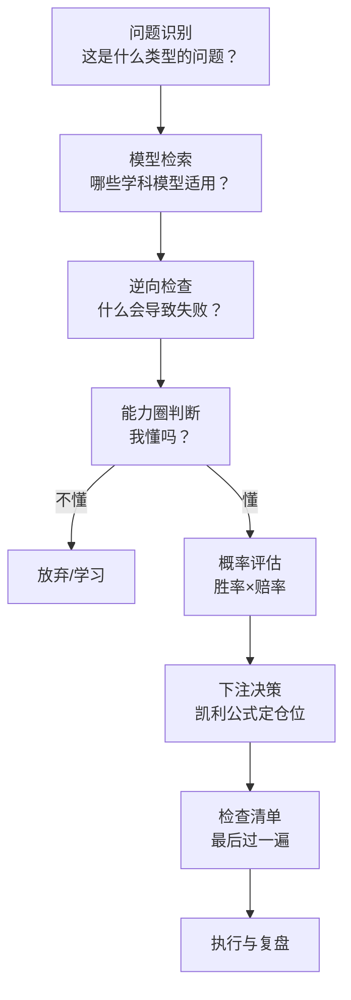

### 6.3 能力圈：决策的第一道闸门

**解读文章**："他坦言：'我没有能力评估科技公司的未来，所以不会贸然投资。'直到对苹果公司进行了深入研究……才开始布局。"

**需要校正的细节**：苹果是伯克希尔（巴菲特）的投资，芒格本人对科技股的态度更保守——但解读文章的**核心精神正确**：能力圈=知道自己不知道。

**能力圈的完整论述**（[[24《芒格之道》深度解读（详细版）|24 号 2003 年]]）：

> "在我们浏览的投资机会中，有 90% 到 95% 被我们判定为不在我们的能力圈范围之内，我们看不懂，直接就不看了。"

**能力圈的边界管理**：

| 状态 | 行为 | 例子 |
|------|------|------|
| 圈内 | 深入研究+重仓 | 银行、消费、保险 |
| 圈边 | 少量学习+等待 | 比亚迪（"边做边学"） |
| 圈外 | 直接不看 | 加密货币、AI、大宗商品 |
| 扩张 | 通过学习扩圈 | 学会如何学习（三次跨界取胜） |

### 6.4 理性：决策的情绪防火墙

**解读文章**："当市场陷入恐慌时，他不会因恐惧而抛售；当行情火爆时，他也不会被贪婪驱使追涨。"

**理性的完整定义**（22 号笔记）：

> "理性是一种道德义务。"——芒格认为理性不仅是一种能力，更是一种责任。

**理性的三层结构**：

| 层次 | 内容 | 对应工具 |
|------|------|---------|
| 认知层 | 知道偏差存在 | 25 心理倾向清单 |
| 情绪层 | 不被情绪绑架 | 逆向思维+延迟满足 |
| 行为层 | 按清单执行 | 检查清单+20 个孔 |

**理性 vs 聪明的对照**（24 号头脑缺陷学）：

> "很多人非常聪明，考试总能考高分，脑子特别灵，但是他们在人生中总是做出错误的决定。他们的脑子虽然聪明，但是有一些严重的缺陷。"

### 6.5 概率：决策的数学基础

**解读文章**："他将投资视为一场概率游戏，……追求在大概率事件上押注。"

**概率决策的完整工具链**：

| 工具 | 用途 | 例子 |
|------|------|------|
| 凯利公式 | 决定下注比例 | "你的胜算越大……你下的注应该越大" |
| 安全边际 | 提高胜率 | 便宜到"一眼就能看出来" |
| 赔率思维 | 不对称回报 | 损失有限/收益巨大 |
| 期望值 | 多次决策的总和 | 巨灾保险"赔率 2∶1，胜率 60%" |

**概率思维 vs 确定思维**：

| 维度 | 概率思维 | 确定思维 |
|------|---------|---------|
| 对市场 | 一切都是概率 | 市场可以预测 |
| 对决策 | 追求长期期望为正 | 追求每次都对 |
| 对错误 | 错误是成本 | 错误是失败 |
| 对仓位 | 凯利公式 | 满仓/清仓 |

### 6.6 简单：决策的终极过滤器

**解读文章**："复杂的问题往往可以用简单的逻辑来解决。……企业是否具有竞争优势？能否持续创造价值？"

**芒格对简单的论述**（22 号笔记核心）：

> "我们赚钱，靠的是记住浅显的，而不是掌握深奥的。我们从来不去试图成为非常聪明的人，而是持续地试图别变成蠢货。"

**简单的三层含义**：

| 层次 | 含义 | 反面 |
|------|------|------|
| 理解简单 | 用常识理解生意 | 复杂模型自欺 |
| 操作简单 | 少决策少交易 | 频繁操作 |
| 生活简单 | 勤俭节约 | 消费主义 |

**"桶里射鱼"的完整定义**（24 号 2015）："把水倒干净，然后用喷子对着鱼，砰的一枪，这才是我要的简单。"

### 6.7 第6章小结

| 层次 | 结论 |
|------|------|
| 解读文章 | 六大密码=多元/逆向/能力圈/理性/概率/简单 |
| 原典深化 | 决策流程八步+三层理性+概率工具链 |
| 一句话 | **大师的决策不是更聪明，而是更少犯错——"投资不是比谁更聪明，而是比谁更少犯错"** |

---

## 第7章 跨越阶层的生存法则：人生哲学

### 7.1 解读文章的核心观点

> "查理·芒格却以独特的人生哲学，从普通家庭走向投资界巅峰，为人们开辟了一条跨越阶层的路径。"

**文章的五大生存法则**：

| 法则 | 核心内容 |
|------|---------|
| 终身学习 | "没有一个不每天阅读的——没有，一个都没有" |
| 理性决策 | 不被情绪左右，列出所有相关因素 |
| 逆向思维 | 先思考哪些行为阻碍跨越阶层 |
| 专注与坚持 | 深耕一个领域形成核心竞争力 |
| 与优秀者为伍 | 巴菲特 50 年合作 |

### 7.2 原典深挖：终身学习

**解读文章引用**：

> "我这辈子遇到的来自各行各业的聪明人，没有一个不每天阅读的——没有，一个都没有。"

**学习的完整体系**（系列综合）：

| 层面 | 内容 | 出处 |
|------|------|------|
| 阅读量 | "我见过的所有的聪明人之中，没一个不大量阅读的" | 24 号 2015 |
| 阅读方法 | "我从来不记笔记……随性而至" | 24 号 2015 |
| 学习对象 | 读经典+传记（富兰克林/卡内基） | 22 号 |
| 学习目的 | "懂得如何学习是一个非常强大的武器" | 24 号 2007 |
| 学习范围 | 各学科主要知识（"拿出 10% 或 20% 的时间"） | 24 号 2017 |

**学习的复利**（与第2章呼应）：每天进步 1%，一年 37 倍——**知识复利是财富复利的前提**。

### 7.3 原典深挖：理性决策与逆向思维

**理性决策的人生应用**（解读文章 → 深化）：

| 人生决策 | 理性方法 | 逆向检查 |
|---------|---------|---------|
| 职业选择 | 行业前景+自身优势+市场需求 | 行业衰落我有退路吗？ |
| 婚姻选择 | "找一个对你的期望值比较低的人" | 选错伴侣=人生大不幸 |
| 创业 | 市场需求+资源+风险 | 资金链断裂怎么办？ |
| 教育子女 | "我连儿子和女儿都改变不了多少" | 身教胜于言教 |

**逆向思维的人生应用**（解读文章）：

> "哪些行为或习惯会阻碍我跨越阶层？是拖延、缺乏自律，还是盲目跟风？找到这些问题后，有针对性地进行改正。"

### 7.4 原典深挖：专注与坚持

**解读文章**："专注于一个领域，持续投入时间和精力，随着知识和经验的积累，终将形成自己的核心竞争力。"

**芒格的专注力**（24 号 2015）：

> "我天生就有这个能力，当我想专心读书的时候，我可以屏蔽外界的一切，我甚至感觉不到别人的存在。……我的成功靠的不是智商，而是专注力。"

**专注 vs 多任务**：

| 专注 | 多任务 |
|------|--------|
| 深入思考 | 浮于表面 |
| 形成复利 | 消耗精力 |
| "把精力分散在很多事上……相当于把自己的软肋和弱点暴露在别人面前" | 表面看效率高 |

### 7.5 原典深挖：与优秀者为伍

**解读文章**："他与巴菲特长达数十年的合作，不仅创造了投资界的神话，更体现了优秀伙伴的重要性。"

**芒格对伙伴关系的论述**（24 号 2014）：

> "无论是在工作中，还是在生活中，我们只愿意与我们信任和欣赏的人在一起，和这样的人在一起，我们能感受到一种人与人之间的爱。"

**伙伴选择的检验标准**（24 号"识人察人"）：

| 检验 | 内容 |
|------|------|
| 一两个特点 | "人们经常能通过一个人身上的一两个特点，判断出这个人是否值得交往" |
| 长期观察 | 盖瑞·萨尔兹曼 20 年观察后提拔 |
| 价值观契合 | 不与"看不上的人"共事 |
| 互利共赢 | 供应商不是压榨对象（商学院故事） |

### 7.6 第7章小结

| 层次 | 结论 |
|------|------|
| 解读文章 | 五大法则=学习/理性/逆向/专注/伙伴 |
| 原典深化 | 知识复利+身教胜于言教+信任网络 |
| 一句话 | **跨越阶层的本质不是财富跃迁，而是认知跃迁——"坚持做有意义的事；坚持做有价值的人；坚持追求理智、正直、诚信"** |

---

---

## 附录一 芒格思想模型速查表（25 条）

### 思维类（1—8）

| 序号 | 模型 | 一句话定义 | 出处 |
|------|------|-----------|------|
| 1 | 多元思维模型 | 重要学科的重要理论全部用上 | 22 号第2章 |
| 2 | 格栅理论 | 七学科模型交叉编织成网 | 23 号全书 |
| 3 | 铁锤人警告 | 手里拿着锤子，看什么都像钉子 | 22 号第2章 |
| 4 | 逆向思维 | 反过来想，总是反过来想 | 22 号/25 号第3章 |
| 5 | 能力圈 | 90%—95% 的机会直接不看 | 24 号 2003 |
| 6 | 机会成本 | 最好的机会是衡量一切的标尺 | 24 号 2003 |
| 7 | 检查清单 | 决策前逐项排查 | 22 号第3章 |
| 8 | 合奏效应（lollapalooza） | 多倾向叠加的非线性效应 | 22 号第7章/24 号 2017 |

### 投资类（9—17）

| 序号 | 模型 | 一句话定义 | 出处 |
|------|------|-----------|------|
| 9 | 20 个孔 | 一生只做 20 笔投资 | 24 号 2003 |
| 10 | 桶里射鱼 | 把水倒干净再开枪——简单到极致 | 24 号 2015 |
| 11 | 钱是坐着等来的 | 耐心等待+手里有钱 | 24 号 2016 |
| 12 | 凯利公式 | 胜算越大下注越大 | 24 号 2019 |
| 13 | 安全边际 | 以较低价格买入较高价值 | 20 号/22 号 |
| 14 | 护城河 | 竞争优势的五种来源 | 13 号/21 号 |
| 15 | 浮存金 | 低成本资金杠杆 | 14 号/24 号 |
| 16 | 复利 | 世界第八大奇迹 | 25 号第2章 |
| 17 | 负面清单 | 先想清楚不做什么 | 24 号 2007 |

### 心理类（18—22）

| 序号 | 模型 | 一句话定义 | 出处 |
|------|------|-----------|------|
| 18 | 25 心理倾向 | 人类误判心理的完整清单 | 22 号第7章 |
| 19 | 以自我为中心 | 最严重的误判心理 | 24 号 2007 |
| 20 | 嫉妒 | 最愚蠢的罪行 | 22 号/24 号 |
| 21 | 损失厌恶 | 失去的痛苦大于获得的快乐 | 23 号第5章 |
| 22 | 普朗克知识 | 真懂 vs 背诵复述 | 22 号/24 号 2017 |

### 人生类（23—25）

| 序号 | 模型 | 一句话定义 | 出处 |
|------|------|-----------|------|
| 23 | 配得上 | 要得到想要的，先让自己配得上 | 22 号 |
| 24 | 延迟满足 | 把最好的时间卖给自己 | 24 号 2007 |
| 25 | 走大道 | 永远走大道，大道人少 | 22 号/24 号 |

---

## 附录二 芒格四书体系对照表

### 四本书的定位

| 维度 | 25 一本书读懂宝典 | 22 穷查理宝典 | 23 格栅理论 | 24 芒格之道 |
|------|------------------|--------------|-------------|-------------|
| 形式 | 主题解读（7 篇） | 演讲+语录汇编 | 学科系统解读 | 股东会实录 |
| 定位 | **入门导览** | 思想母本 | 学科地图 | 实践检验 |
| 视角 | 外部解读 | 芒格自述 | 学者阐释 | 现场记录 |
| 时间跨度 | 主题式 | 以 2005 年修订为主 | 2013 年第 2 版 | 1987—2022 连续 |
| 阅读顺序 | **1** | 2 | 3 | 4 |
| 适合读者 | 初识芒格 | 想系统学习 | 想理解"为什么" | 想看"怎么做" |

### 四书的知识层次

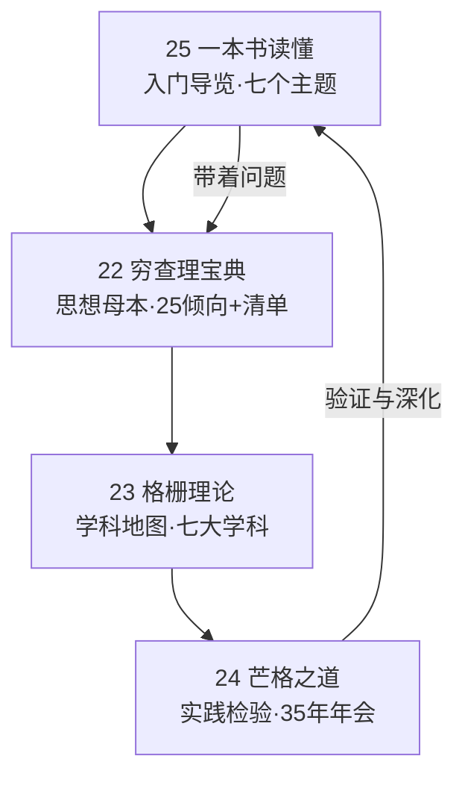

### 四书的核心问题

| 书 | 回答的核心问题 |
|----|--------------|
| 25 一本读懂 | 芒格在说什么？ |
| 22 穷查理宝典 | 芒格相信什么？ |
| 23 格栅理论 | 芒格为什么相信？ |
| 24 芒格之道 | 芒格怎么做到的？ |

---

## 附录三 系列 25 本全景图

### 全系列结构

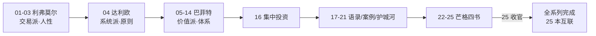

### 芒格四书在系列中的位置

| 编号 | 书名 | 系列角色 |
|------|------|---------|
| 22 | 穷查理宝典 | 芒格思想母本（25 倾向+检查清单） |
| 23 | 格栅理论 | 七学科方法论地图 |
| 24 | 芒格之道 | 35 年股东会实录（实践检验） |
| 25 | 一本书读懂穷查理宝典 | **入门导览+系列收官** |

### 系列三大投资家对比（最终版）

| 维度 | 利弗莫尔 | 巴菲特 | 芒格 |
|------|---------|--------|------|
| 代表 | 交易之王 | 价值之王 | 思想之王 |
| 核心 | 趋势+人性 | 好公司+长期 | 多元模型+理性 |
| 时间观 | 短中期 | 长期 | 超长期 |
| 代表笔记 | 01—03 | 05—21 | 22—25 |
| 共同点 | 都研究人性 | 都研究人性 | 都研究人性 |

---

## 附录四 读完本书后的 10 个自问

1. 我能说出多元思维模型的"铁锤人警告"吗？（拿着锤子看什么都像钉子）
2. 我知道复利的三要素吗？（本金×收益率×时间——缺一不可）
3. 我能讲出"逆向思维"的三种形态吗？（避险型/证伪型/倒推型）
4. 我知道格栅理论的七大学科吗？（物理/生物/社会/心理/哲学/文学/数学）
5. 我能用"五分钟竞争优势"检验一家公司吗？（五种护城河）
6. 我知道能力圈的边界管理吗？（圈内重仓/圈边学习/圈外不看）
7. 我能复述"钱是坐着等来的"吗？（耐心+手里有钱）
8. 我知道凯利公式的基本思想吗？（胜算越大下注越大）
9. 我能说出芒格给年轻人的三条建议吗？（专注/学习/与优秀者为伍）
10. 我准备好读 22 号《穷查理宝典》深度解读了吗？（从入门到原典）

---

## 总结：从"读懂"到"用起来"

### Z1. 七章主线的收束

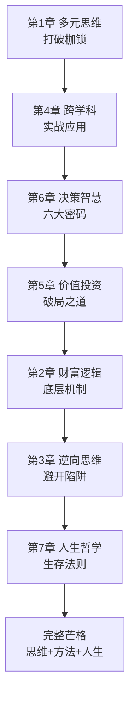

### Z2. 从 25 号出发的进阶路径

| 步骤 | 动作 | 目标 |
|------|------|------|
| 1 | 读完本书（25 号） | 建立七个主题的框架 |
| 2 | 精读 22 号《穷查理宝典》 | 掌握思想母本（25 倾向+检查清单） |
| 3 | 研读 23 号《格栅理论》 | 理解七学科的底层逻辑 |
| 4 | 翻阅 24 号《芒格之道》 | 看 35 年如何实践 |
| 5 | 回到 20 号《第一桶金》 | 用案例检验理论 |
| 6 | 实践 | 写自己的检查清单+20 个孔 |

### Z3. 全书一句话

> **《一本书读懂穷查理宝典》的核心不是任何一条技巧，而是七个入口的完整导览——多元思维（怎么看）、财富逻辑（怎么赚）、逆向思维（怎么避）、跨学科（怎么学）、价值投资（怎么买）、决策智慧（怎么想）、人生哲学（怎么活）。七篇解读文章的价值，在于它们把芒格这座宝库拆成了七把钥匙；而本笔记的价值，在于为每把钥匙都配上了通往 22/23/24 号的完整地图。**

### Z4. 系列收官寄语

> 从 01 号《股票作手回忆录》到 25 号《一本书读懂穷查理宝典》，25 本笔记走过了一条完整的投资思想之路：利弗莫尔教我们认识市场的情绪，达利欧教我们建立系统的原则，巴菲特教我们选择伟大的公司，芒格教我们构建理性的思维。**四座高峰，一个主题——在不确定的世界里，用确定的方法论保护自己的判断力。** 芒格四书（22—25）的完成，标志着这个系列从"投资之术"到"人生之道"的完整闭环：**"年轻的时候，我们已经学会了最基本的道理。后来，我们只是一直在实践这些道理。"**

---

*本笔记基于《一本书读懂穷查理宝典》主题解读合集（7 篇专题文章）撰写，并与本系列 22《穷查理宝典》、23《格栅理论》、24《芒格之道》深度解读形成芒格四书体系，全系列 25 本笔记互联互通。*

*核心收获一句话：**25 号是芒格思想的大门——推开它，里面是 22/23/24 号三座宝库；而整个系列的 25 本笔记，则是一张完整的投资思想地图。***

---

## 附录 芒格体系的一张地图：从入门到进阶（知乎文风）

### 写在前面：芒格四书的"入口"

芒格的书都不好读：《穷查理宝典》是演讲稿合集，《芒格之道》是问答实录，《格栅理论》是跨学科论文集——**对新手都不友好。**

25 号这本《一本书读懂穷查理宝典》存在的意义，就是**给芒格体系画一张地图**：把多元思维、逆向思考、价值投资、人生哲学，用最直白的话讲清楚。

### 第一幕：芒格体系全景图

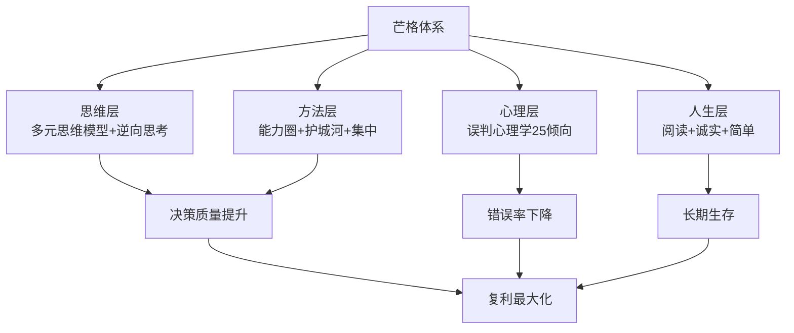

### 第二幕：入门三关——先记住这三个模型

**25 号书把芒格体系浓缩成三关**：

| 关 | 模型 | 一句话 |
|----|------|--------|
| 第一关 | 多元思维 | 一个锤子看什么都是钉子 |
| 第二关 | 逆向思考 | 先知道会死在哪，然后不去 |
| 第三关 | 误判心理 | 聪明人也会做蠢事 |

**入门建议**：先不要试图掌握 100 个模型——**先把"逆向思考"练熟**：每次做投资决策前，先问"什么情况下这笔投资会亏钱？如果出现这个情况我会怎么办？"

**为什么先练逆向？**因为正向思考需要大量知识积累（你不懂商业模式就看不出好坏），而**逆向思考只需要常识**（你不需要懂航空业，也知道"杠杆+油价飙升"会杀死航空公司）——**逆向是普通人最快的入门通道。**

### 第三幕：进阶三阶——把芒格用于实战

| 阶段 | 动作 | 工具 |
|------|------|------|
| 一阶 | 用能力圈筛选 | 只研究看得懂的行业 |
| 二阶 | 用护城河确认 | 品牌/成本/网络效应 |
| 三阶 | 用逆向验证 | "什么会杀死这家公司？" |

**芒格式的实战检验**（25 号书提供的清单）：

- [ ] 这家公司 10 年后还会存在吗？（逆向：什么会杀死它？）
- [ ] 它的护城河在变宽还是变窄？
- [ ] 管理层是在为股东创造价值，还是自肥？
- [ ] 我现在买入，最坏会亏多少？能承受吗？
- [ ] 这个决策受哪种心理倾向影响？（对照 25 倾向）

**注意第三阶的威力**：**"什么会杀死这家公司？"**——这个问题的答案，往往比"这家公司有多好"更能暴露真相。比如 2015 年的乐视：正向看"生态化反"天花乱坠，逆向问"什么会杀死它？"——**"烧钱+融资断裂"**——答案不言自明。

### 第四幕：芒格 × 系列其他大师的互补

| 大师 | 提供什么 | 芒格补充什么 |
|------|---------|-------------|
| 格雷厄姆 | 安全边际 | 心理学（为什么市场会错） |
| 巴菲特 | 生意视角 | 跨学科（怎么看生意） |
| 费雪 | 成长股 | 逆向（怎么避免成长陷阱） |
| 段永平 | 本分 | 诚实（怎么面对错误） |

**芒格是整个系列里唯一的"方法论提供者"**：其他大师给你"买什么"和"怎么买"，芒格给你"怎么想"——**他是整套价值投资体系的"操作系统"，其余都是"应用程序"。**

### 尾声：芒格给普通人的"最低配"建议

1. **每天阅读 1 小时**——"聪明人没有不阅读的"
2. **只做能力圈内的事**——"承认无知是智慧的开始"
3. **反过来想**——"先避免愚蠢，再追求聪明"
4. **不和烂人烂事纠缠**——"人生最大的成本是'摩擦'"
5. **活得久**——"复利需要时间，时间需要健康"

> **"获得智慧是一种道德责任。你不仅要让自己变聪明，还要让身边的人变聪明。"**

**25 号读完，芒格四书（22—25）体系完成**：22 号是思想源头，23 号是跨学科方法，24 号是现场实践，25 号是入门地图——**四本书，一个完整的芒格。**接下来 26—27 号，我们进入费雪父子的成长股世界。

**最后送你一句把芒格浓缩到底的话**：**"要得到你想要的某样东西，最可靠的办法是让你自己配得上它。"**——投资如此，人生如此。

---

---

## 第8章 七篇解读文章逐篇精读

> 本章回到源材料本身，逐篇拆解七篇文章的结构、核心论点与值得商榷之处——**读书要"尽信书不如无书"，解读文章也不例外**。

### 8.1 第一篇《打破思维枷锁：查理·芒格多元模型的逆袭指南》

**文章结构**：

| 段落 | 内容 | 要点 |
|------|------|------|
| 开篇 | 芒格=多元思维模型的代表 | 《穷查理宝典》智慧=钥匙 |
| 问题提出 | 单一视角的局限 | 紧箍咒比喻 |
| 核心论述 | 四模型：复利/临界质量/生态/心理 | 数学+物理+生物+心理 |
| 交叉运用 | 厨师比喻 | 财务+心理+社会三维分析 |
| 应用延伸 | 职业/家庭 | 重新编程大脑 |
| 收尾 | 拥抱多元知识 | 思维枷锁的解放 |

**值得商榷处**：文章将"每天进步 1%，一年 37 倍"作为复利例证——**这是励志学常见说法，芒格本人从未这样表述过**；芒格的复利观更接近"足够湿的雪+足够长的坡"。

**本笔记的深化**：四模型→格栅七学科（23 号）→25 心理倾向（22 号）→合奏效应现场版（24 号 2017）——见第1章。

### 8.2 第二篇《从杂货店到投资神话：解码芒格的财富增长底层逻辑》

**文章结构**：

| 段落 | 内容 | 要点 |
|------|------|------|
| 开篇 | 杂货店少年→投资大师 | 底层逻辑驱动 |
| 逻辑一 | 对价值的执着 | 喜诗糖果 1972 |
| 逻辑二 | 复利 | 可口可乐 1988 |
| 逻辑三 | 多元思维 | 数学+心理+生物 |
| 逻辑四 | 逆向思维 | 2008 年风险防范 |
| 逻辑五 | 专注与耐心 | 富国银行数十年 |
| 收尾 | 五要素交织 | 财富密码 |

**值得商榷处**：①"1972 年力劝巴菲特收购喜诗糖果"——准确的年份是 **1972 年收购完成**（谈判始于 1971 年），且当时是蓝筹印花（伯克希尔关联公司）收购；②"富国银行长达数十年"的投资主体是伯克希尔/每日期刊，非芒格个人——详见第2章 2.5 的校正。

**本笔记的深化**：喜诗=思想分水岭（20 号第10章+24 号 1998）→五大逻辑的完整链条（第2章）。

### 8.3 第三篇《避开人生陷阱：芒格教你用逆向思维化解危机》

**文章结构**：

| 段落 | 内容 | 要点 |
|------|------|------|
| 开篇 | "如果我知道我会死在哪里" | 逆向思维=先避失败 |
| 投资应用 | 2008 年金融危机 | 提前防范 |
| 职业应用 | 传统媒体衰落 | 转型能力预判 |
| 人际应用 | 分歧化解 | 先理解对方 |
| 成长应用 | 减肥例子 | 避免失败因素 |
| 诱惑应用 | 消费/投资诱惑 | 风险前置 |
| 收尾 | 避免失败=接近成功 | 明灯比喻 |

**值得商榷处**：2008 年"减持相关股票避免了重大损失"的说法与历史不符——伯克希尔 2008 年**没有减持反而大举买入**（高盛 50 亿+GE 优先股）；芒格的逆向体现在"别人恐惧时贪婪"（见第3章 3.3 校正表）。

**本笔记的深化**：三种逆向形态（避险/证伪/倒推）+中医"治未病"呼应（第3章）。

### 8.4 第四篇《智慧杠杆如何撬动人生？深挖芒格跨学科思维的实战应用》

**文章结构**：

| 段落 | 内容 | 要点 |
|------|------|------|
| 开篇 | "如果你只是记住一些孤立的事物" | 跨学科=智慧杠杆 |
| 投资应用 | 可口可乐多维分析 | 经济+生物+心理+社会+化学 |
| 职场应用 | 市场经理案例 | 统计+物理+人类学 |
| 成长应用 | 学语言/写作 | 心理+语言+文化/哲学+历史+美学 |
| 生活应用 | 装修/烹饪 | 建筑+色彩心理+化学+营养 |
| 方法论 | 终身学习+实践 | 打破学科界限 |
| 收尾 | 知识爆炸时代的出路 | 多元视角 |

**本笔记的深化**：格栅七学科完整表（第4章 4.2）+圣约翰学院原著阅读法（23 号第7章）+中医四诊合参（第4章 4.6）。

### 8.5 第五篇《不做盲目的追随者：芒格价值投资策略的破局之道》

**文章结构**：

| 段落 | 内容 | 要点 |
|------|------|------|
| 开篇 | 跟风=被收割 | 冷静旁观者 |
| 破局一 | 对价值的独特认知 | 富国银行案例 |
| 破局二 | 拒绝盲目追随热点 | "五分钟竞争优势" |
| 破局三 | 独立思考 | 喜诗糖果 |
| 破局四 | 长期主义 | 比亚迪 |
| 收尾 | 灯塔比喻 | 投资即人生 |

**值得商榷处**：①"科技股泡沫时期没有盲目跟风避开了损失"——准确的是 1998—2000 年芒格确实反复警告互联网泡沫（24 号 1998/1999/2000 三次警告），方向正确；②"投资比亚迪……坚持是正确的"——比亚迪确实大涨（2021 年涨四倍），但芒格自述"我是边做边学"，并非完全"坚信"。

**本笔记的深化**：富国 30 年完整时间线（第5章 5.3）+护城河五源（13/21 号）+长期主义三支柱（第5章 5.6）。

### 8.6 第六篇《像大师一样思考：芒格决策智慧的底层密码解析》

**文章结构**：

| 段落 | 内容 | 要点 |
|------|------|------|
| 开篇 | 决策=精密齿轮 | 底层密码 |
| 密码一 | 多元思维模型 | 比亚迪多维分析 |
| 密码二 | 逆向思维 | 2008 年前夕 |
| 密码三 | 能力圈 | 苹果案例 |
| 密码四 | 理性 | 喜诗糖果 |
| 密码五 | 概率 | 富国银行 |
| 密码六 | 简单 | 竞争优势核心问题 |
| 收尾 | 宝库比喻 | 决策密码 |

**值得商榷处**：苹果是巴菲特/伯克希尔的投资，芒格本人长期回避科技股（"我对人工智能没什么研究"）——但能力圈的精神（深入研究后才出手）依然成立（见第6章 6.3 校正）。

**本笔记的深化**：决策流程八步图（第6章 6.2 Mermaid）+概率工具链（6.5）+理性三层（6.4）。

### 8.7 第七篇《跨越阶层的生存法则：芒格人生哲学的终身践行指南》

**文章结构**：

| 段落 | 内容 | 要点 |
|------|------|------|
| 开篇 | 阶层壁垒 | 芒格=跨越范本 |
| 法则一 | 终身学习 | "没有不每天阅读的" |
| 法则二 | 理性决策 | 职业/人际 |
| 法则三 | 逆向思维 | 阻碍阶层的行为 |
| 法则四 | 专注与坚持 | 可口可乐/富国 |
| 法则五 | 与优秀者为伍 | 巴菲特合作 |
| 收尾 | 法则相互关联 | 内化于心外化于行 |

**本笔记的深化**：知识复利=财富复利前提（第7章 7.2）+伙伴选择四检验（7.5）+"配得上"的人生算法。

### 8.8 七篇文章的总体评价

| 维度 | 评价 |
|------|------|
| 框架 | ✅ 七个主题覆盖芒格思想的主要入口，结构清晰 |
| 信息密度 | ⚠️ 每篇约 2000 字，科普性质，深度有限 |
| 事实准确性 | ⚠️ 三处需要校正（喜诗年份/富国主体/2008 减持） |
| 金句引用 | ✅ 引用准确（"如果我知道我会死在哪里""没有一个不每天阅读的"） |
| 系列价值 | ✅ 作为入门导览，与 22/23/24 形成"浅→深"梯度 |

**结论**：解读文章是"地图"，22/23/24 是"实地"——本笔记的作用是把地图上的每个地标，与实地照片一一对应。

---

## 第9章 芒格人生时间线：从杂货店到 98 岁

### 9.1 关键节点

| 年份 | 年龄 | 事件 | 对应系列笔记 |
|------|------|------|-------------|
| 1924 | 0 | 生于奥马哈 | 22 号年谱 |
| 1941—1942 | 17—18 | 加州理工学习 | — |
| 1948 | 24 | 哈佛法学院毕业 | — |
| 1962 | 38 | 1962 油田投资（1000 美元→每年 10 万×50 年） | 24 号 2016 |
| 1965 | 41 | 离开律所全职投资 | 24 号 |
| 1972 | 48 | 蓝筹印花收购喜诗糖果（价值投资转折） | 20 号/25 号第2章 |
| 1975 | 51 | 与巴菲特开始深度合作 | 22 号 |
| 1978 | 54 | 出任伯克希尔副主席 | 22 号 |
| 1987 | 63 | 出任西科金融董事长（35 年年会开始） | 24 号 |
| 1989 | 65 | 房地美投资 | 24 号 |
| 1994 | 70 | 南加大演讲（多元思维模型） | 22 号第二讲 |
| 2005 | 81 | 《穷查理宝典》出版 | 22 号 |
| 2007 | 83 | 头脑缺陷学演讲 | 24 号 |
| 2008 | 84 | 推荐比亚迪（伯克希尔 2.3 亿买 10%） | 24 号 |
| 2010 | 86 | 西科最后一场讲话 | 24 号 |
| 2014 | 90 | 每日期刊股东会开始（软件转型） | 24 号 |
| 2015 | 91 | 半圆顶 5.11（软件转型比喻） | 24 号 |
| 2017 | 93 | 合奏效应发明史 | 24 号 |
| 2018 | 94 | 五张王牌 | 24 号 |
| 2019 | 95 | "我 95 岁了，几乎一笔交易不做" | 24 号 |
| 2022 | 98 | 每日期刊最后一场讲话（加密货币批判） | 24 号 |
| 2023 | 99 | 11 月 28 日去世 | — |

### 9.2 芒格一生的五次转型

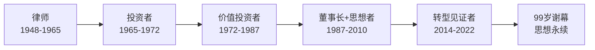

| 转型 | 驱动因素 | 结果 |
|------|---------|------|
| 律师→投资者 | 对法律职业天花板不满 | 惠勒芒格合伙（19.8% 年化） |
| 烟蒂→好生意 | 喜诗糖果成功+机会消失 | 认知升级（"很多时候，人们改变想法，是多个因素共同作用的结果"） |
| 投资→董事长 | 西科/每日期刊的舞台 | 35 年年会实录 |
| 思想输出 | 南加大演讲→宝典出版 | 多元思维模型传播 |
| 商业转型 | 报纸消亡→软件新生 | 每日期刊第二曲线 |

### 9.3 芒格思想的核心常量

**35 年不变的五个常量**（跨 22/23/24/25 四书验证）：

| 常量 | 首次出现 | 最后一次出现 |
|------|---------|-------------|
| 逆向思维 | 1970s（"反过来想"） | 2022（加密货币批判） |
| 能力圈 | 1987（西科） | 2021（"我投资中国公司感到更踏实"） |
| 集中投资 | 1965（惠勒芒格） | 2021（"越分散越往下出溜"） |
| 诚实可靠 | 1987（优秀管理者定义） | 2022（"我们始终对基本的道德和健全的常识孜孜以求"） |
| 终身学习 | 青年时期 | 2022（"我只研究常识，这一辈子也过得很好"） |

---

---

## 第10章 系列互链深潜：芒格四书 × 全系列 25 本

### 10.1 芒格四书与巴菲特系列的互链矩阵

| 芒格四书 | 关联的巴菲特笔记 | 互链主题 |
|---------|----------------|---------|
| 22 穷查理宝典 | 20 第一桶金 | 喜诗/韦斯科/可口可乐案例的思想源头 |
| 22 穷查理宝典 | 16 集中投资 | "少即是多"的理论母本 |
| 22 穷查理宝典 | 13/21 护城河 | 能力圈+竞争优势 |
| 23 格栅理论 | 12 估值逻辑 | 多学科估值视角 |
| 23 格栅理论 | 06 教你读财报 | 财报=格栅的第一根横梁 |
| 24 芒格之道 | 18 嘉年华 | 股东会文化两种形态 |
| 24 芒格之道 | 19 跳着踢踏舞 | 巴菲特语录的现场印证 |
| 25 一本书读懂 | 05 投资心法 | 价值投资的入门版 |
| 25 一本书读懂 | 17 如是说 | 巴菲特+芒格语录双轨 |

### 10.2 芒格 vs 巴菲特 vs 达利欧 vs 利弗莫尔（终极对照表）

| 维度 | 利弗莫尔（01—03） | 达利欧（04） | 巴菲特（05—21） | 芒格（22—25） |
|------|------------------|-------------|----------------|--------------|
| 身份 | 投机之王 | 对冲基金教父 | 价值投资之王 | 思想之王 |
| 核心方法 | 趋势跟踪+关键点 | 原则系统+债务周期 | 好公司+安全边际 | 多元模型+理性 |
| 时间框架 | 周—月 | 年—十年 | 十年+ | 终身 |
| 对市场的看法 | 市场可被读懂 | 市场有周期 | 市场先生情绪化 | 市场是复杂系统 |
| 对人性 | 人性不变（贪婪恐惧） | 人性有缺陷（需要原则） | 人性不变（能力圈内） | 人性有 25 种偏差 |
| 经典语录 | "华尔街没有新鲜事" | "痛苦+反思=进步" | "别人恐惧我贪婪" | "反过来想，总是反过来想" |
| 失败教训 | 破产三次 | 1982 年看错债务危机 | 无重大失败 | 错过互联网（自认） |
| 系列定位 | 认识市场 | 建立系统 | 选择公司 | 构建思维 |

### 10.3 四派合一：完整投资体系的四层结构

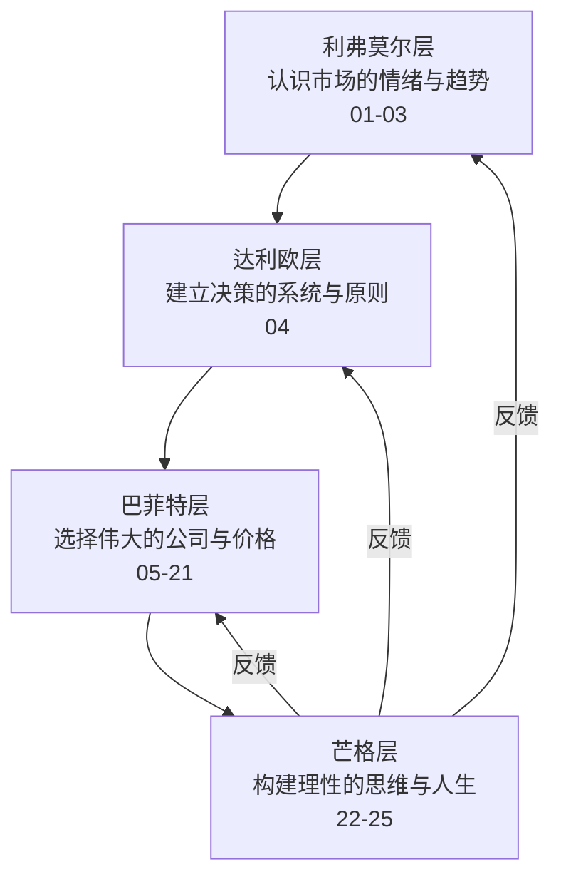

### 10.4 25 本笔记的知识地图

| 板块 | 笔记 | 解决的问题 |
|------|------|-----------|
| 市场认知 | 01—03 | 市场怎么动？（趋势/量价/人性） |
| 系统构建 | 04 | 怎么稳定决策？（原则/流程） |
| 价值体系 | 05—14 | 怎么估值？（财报/案例/护城河/估値） |
| 组合管理 | 16 | 怎么配置？（集中/分散） |
| 语录案例 | 17—21 | 大师怎么说/怎么做？ |
| 芒格思想 | 22—25 | 怎么思考？（模型/学科/实践/导览） |
| 实战补充 | 极客/龙头 | 中国市场怎么用？ |

### 10.5 系列最大的三个闭环

**闭环一：思想闭环**（利弗莫尔→芒格）

> 利弗莫尔用一生证明"人性不变"（破产三次），芒格用 99 年给出解药（25 心理倾向清单）——**认识人性是起点，管理人性是终点**。

**闭环二：方法闭环**（巴菲特↔芒格）

> 巴菲特提供"买什么"（好公司+价格），芒格提供"怎么想"（多元模型+逆向）——**两人 50 年合作证明：方法与思想必须配套**。

**闭环三：理论与实践闭环**（22/23 ↔ 24）

> 22/23 号给出理论（25 倾向+七学科），24 号给出 35 年实践（预言检验表）——**理论的价值最终由时间裁决**。

---

## 附录五 七篇解读文章金句摘录（35 条）

### 第一篇·多元思维

> 1. "这种思维方式就像给大脑戴上了紧箍咒，看似高效，实则限制了创新与突破。"
> 2. "就像医生不能仅靠手术刀治病，还需了解病人的心理、生活习惯；投资者不能只盯着K线图，更要洞悉宏观经济、行业趋势与人性弱点。"
> 3. "复利是世界第八大奇迹。"
> 4. "当物质达到一定质量时，会引发连锁反应。"
> 5. "就像一位技艺高超的厨师，将各种食材巧妙搭配，创造出独特的美味。"
> 6. "打破思维枷锁，本质上是一场自我认知的革命，是对大脑的重新编程。"

### 第二篇·财富逻辑

> 7. "从杂货店的方寸之地到投资界的广阔天地，芒格的财富增长之路，绝非偶然的幸运。"
> 8. "人生就像滚雪球，重要的是发现很湿的雪和很长的坡。"
> 9. "他像一位寻宝者，专注挖掘企业的内在价值。"
> 10. "如果我知道我会死在哪里，那我将永远不去那个地方。"
> 11. "真正的财富增长，源于对价值的坚守，而非对市场热点的追逐。"
> 12. "持续的积累和耐心的等待，终将带来惊人的回报。"

### 第三篇·逆向思维

> 13. "与其一味追求成功，不如先思考如何避免失败。"
> 14. "这种思维方式，就像一盏明灯，能够照亮我们前行道路上隐藏的陷阱。"
> 15. "过度依赖次级贷款的商业模式就像建立在沙地上的高楼，一旦市场风向改变，必将轰然倒塌。"
> 16. "当我们明确了这些导致失败的因素，就能有针对性地进行调整，提高成功的概率。"
> 17. "通过避免失败，我们离成功也就更近了一步。"

### 第四篇·跨学科

> 18. "如果你只是记住一些孤立的事物，试图把它们硬凑起来，那你无法真正理解任何事情。"
> 19. "将不同学科的知识融会贯通，才能形成强大的思维杠杆，撬动人生的无限可能。"
> 20. "当我们将不同学科的知识相互融合，就能产生奇妙的化学反应。"
> 21. "主动打破学科之间的界限，将不同领域的知识串联起来。"
> 22. "唯有拥抱跨学科思维，才能在复杂多变的世界中脱颖而出。"

### 第五篇·价值投资

> 23. "盲目追随市场热点，只会沦为被收割的韭菜。"
> 24. "股票不仅仅是交易的代码，而是企业所有权的凭证。"
> 25. "如果我不能在五分钟内说出这家公司的竞争优势，我就不会投资它。"
> 26. "市场就像一个情绪波动的'疯子'，时而乐观狂热，时而悲观绝望。"
> 27. "投资是一场马拉松，而不是短跑比赛。"
> 28. "芒格的价值投资策略，就像一座明亮的灯塔，为我们指引着破局的方向。"

### 第六篇·决策智慧

> 29. "芒格的每一次决策都像是精密设计的齿轮，环环相扣。"
> 30. "投资不是比谁更聪明，而是比谁更少犯错。"
> 31. "如果你不愿意拥有一只股票十年，那就不要考虑拥有它十分钟。"
> 32. "他不会追求每一次决策都百分之百正确，而是追求在大概率事件上押注。"
> 33. "这种化繁为简的能力，让他在海量信息中迅速抓住关键，做出高效决策。"

### 第七篇·人生哲学

> 34. "我这辈子遇到的来自各行各业的聪明人，没有一个不每天阅读的——没有，一个都没有。"
> 35. "当一个人不断拓宽自己的知识边界，思维方式也会随之改变……从而为跨越阶层奠定基础。"

---

## 附录六 芒格金句 × 七主题对照表

| 七主题 | 解读文章金句 | 芒格原典金句 | 出处 |
|--------|-------------|-------------|------|
| 多元思维 | "给大脑戴上紧箍咒" | "在手里拿着铁锤的人看来，世界就像一颗钉子" | 22 号第二讲 |
| 财富逻辑 | "滚雪球：湿雪+长坡" | "我们赚钱，靠的是记住浅显的，而不是掌握深奥的" | 22 号/24 号 |
| 逆向思维 | "先思考如何避免失败" | "如果我知道我会死在哪里，那我将永远不去那个地方" | 22 号第一讲 |
| 跨学科 | "孤立的事物无法理解" | "你必须知道重要学科的重要理论，并经常使用它们" | 22 号第二讲 |
| 价值投资 | "五分钟说不出优势不投" | "所有做得正确的投资，都是价值投资" | 24 号 2021 |
| 决策智慧 | "精密设计的齿轮" | "我想知道我会死在哪里，这样我就永远不会去那里" | 22 号 |
| 人生哲学 | "没有不每天阅读的" | "我的成功靠的不是智商，而是专注力" | 24 号 2015 |

---

---

## 附录七 A 股投资者应用：芒格思想的实战转化

### 7.1 芒格思想 × A 股场景映射

| 芒格模型 | A 股对应场景 | 应用建议 |
|---------|-------------|---------|
| 能力圈 | 追逐热点（AI/机器人/半导体） | 只投资自己能讲清楚商业模式的公司 |
| 机会成本 | 满仓踏空焦虑 | 用"最好的机会"衡量每一笔新投资 |
| 20 个孔 | 频繁换股（散户年均换手率极高） | 每年最多 2—3 笔决策 |
| 逆向思维 | 追涨杀跌 | 先列"什么会导致我亏损"清单 |
| 护城河 | 概念炒作 | 五分钟说出竞争优势，说不出的不投 |
| 复利 | 短线博弈 | 长期持有优质资产（消费/医药/制造） |
| 误判心理 | 涨停板敢死队 | 对照 25 倾向清单审视决策 |
| 检查清单 | 情绪化交易 | 建立自己的买入/卖出清单 |

### 7.2 散户最常见的十个错误（芒格诊断版）

| 错误 | 芒格的诊断 | 心理倾向根源 |
|------|-----------|-------------|
| 追涨杀跌 | "股市被当成赌场" | 社会认同+被剥夺感 |
| 满仓单一热点 | 能力圈外 | 过度自信 |
| 频繁交易 | "教唆吸食海洛因" | 易获得性+过度乐观 |
| 听消息炒股 | "一个人需要装糊涂才能拿到薪水" | 权威错误 |
| 不止损 | 损失厌恶 | 被剥夺超级反应 |
| 套牢补仓 | "越是大家都看好的机会越危险"（反向） | 避免不一致 |
| 赚快钱心态 | "每年赚三倍？" | 过度乐观 |
| 不研究基本面 | "投资不是比谁更聪明" | 简单联想 |
| 迷信技术指标 | 贝塔系数批判 | 易获得性 |
| 嫉妒他人收益 | "嫉妒是最蠢的罪" | 艳羡/妒忌 |

### 7.3 从 25 号出发的 A 股实践路径

| 步骤 | 动作 | 工具 |
|------|------|------|
| 1 | 划定能力圈 | 只研究 3—5 个行业 |
| 2 | 建立股票池 | 用"五分钟竞争优势"筛选 |
| 3 | 等待机会 | "钱是坐着等来的" |
| 4 | 重仓下注 | 凯利公式定仓位 |
| 5 | 长期持有 | 20 个孔纪律 |
| 6 | 定期复盘 | 检查清单+25 倾向 |

---

## 附录八 芒格思想 × 中医：跨学科对照全集

### 8.1 方法论对照

| 芒格思想 | 中医对应 | 本质 |
|---------|---------|------|
| 多元思维模型 | 辨证论治（四诊合参） | 多视角交叉验证 |
| 逆向思维 | 审证求因 | 从症状倒推病机 |
| 能力圈 | 知常达变 | 先掌握常理再应变 |
| 检查清单 | 十问歌 | 系统性排查 |
| 复利思维 | 治未病（预防） | 长期主义 |
| 安全边际 | 扶正祛邪 | 留有余地 |
| 误判心理学 | 情志致病理论 | 情绪影响判断/健康 |
| 延迟满足 | 养生之道（节欲） | 克制即智慧 |
| 信任网络 | 医患信任关系 | 关系创造疗效 |
| 专注力 | 精神内守 | 专注即养生 |

### 8.2 中医辨证 vs 芒格决策（流程对照）

| 步骤 | 中医 | 芒格 |
|------|------|------|
| 1 | 望闻问切（四诊） | 收集多学科信息 |
| 2 | 八纲辨证（阴阳表里寒热虚实） | 多元模型分析 |
| 3 | 审证求因（找病根） | 逆向思维（找失败原因） |
| 4 | 立法（确立治疗原则） | 确定投资原则 |
| 5 | 组方（君臣佐使） | 组合配置（集中+分散） |
| 6 | 随访调方 | 复盘调整 |

### 8.3 "上工治未病"与芒格的风险观

> "上工治未病，中工治欲病，下工治已病。"——《黄帝内经》

| 层次 | 中医 | 芒格 |
|------|------|------|
| 上工 | 未病先防 | 安全边际+能力圈（事前） |
| 中工 | 欲病早治 | 检查清单+负面清单（事中） |
| 下工 | 已病救治 | 止损+复盘（事后） |

**芒格的"治未病"实践**：20 个孔（限制犯错次数）、逆向思维（先想失败）、桶里射鱼（只做简单题）——**最好的风险管理是不进入风险**。

### 8.4 芒格的"情志养生"（24 号附录十三的扩展）

| 芒格习惯 | 中医情志对应 |
|---------|-------------|
| 不嫉妒 | 怒伤肝（嫉妒→怨恨→肝郁） |
| 不抱怨 | 思伤脾（自哀自怜耗正气） |
| 幽默 | 喜则气和志达 |
| 感恩 | 正气存内 |
| 专注 | 精神内守 |
| 阅读 | 养神（神安则寿） |

---

## 附录九 芒格词汇表（从 25 号出发的系列词汇总）

### 思维类

| 词汇 | 定义 | 首次出处 |
|------|------|---------|
| 格栅理论 | 多学科模型交叉编织的思维框架 | 23 号 |
| 铁锤人 | 只有一种工具/模型的人 | 22 号 |
| lollapalooza | 多种心理倾向的非线性叠加 | 22 号/24 号 |
| 普朗克知识 | 真懂 vs 背诵 | 22 号/24 号 |
| 能力圈 | 自己能看懂的领域边界 | 22 号/24 号 |
| 机会成本 | 最好的机会=衡量标尺 | 24 号 |
| 检查清单 | 决策前的逐项排查 | 22 号 |
| 逆向思维 | 反过来想 | 22 号 |

### 投资类

| 词汇 | 定义 | 首次出处 |
|------|------|---------|
| 桶里射鱼 | 简单到极致的投资机会 | 24 号 |
| 20 个孔 | 一生 20 笔投资的纪律 | 24 号 |
| 钱是坐着等来的 | 耐心+准备 | 24 号 |
| 安全边际 | 价格低于价值的部分 | 20 号 |
| 护城河 | 持久竞争优势 | 13 号/21 号 |
| 浮存金 | 保险公司的低成本资金 | 14 号/24 号 |
| 多元恶化 | 芒格对过度分散的讽刺 | 24 号 |
| 市场先生 | 情绪化的市场报价者 | 20 号 |

### 人生类

| 词汇 | 定义 | 首次出处 |
|------|------|---------|
| 配得上 | 先让自己配得上想要的 | 22 号 |
| 走大道 | 永远走大道，大道人少 | 22 号/24 号 |
| 延迟满足 | 把最好的时间卖给自己 | 24 号 |
| 甘坐冷板凳 | 日复一日阅读 | 24 号 |
| 反面例证 | 主动搜寻反对证据 | 24 号 |
| 头脑缺陷 | 聪明人做蠢事的心理缺陷 | 24 号 |
| 信任网络 | 用信任代替监督 | 24 号 |
| 五张王牌 | 筛选基金经理五条件 | 24 号 |

---

## 附录十 系列 25 本全书数据一览表

| 编号 | 书名 | 规格（约） | 主题 |
|------|------|-----------|------|
| 01 | 股票作手回忆录 | — | 交易与人性 |
| 02 | 大作手操盘术 | — | 趋势方法 |
| 03 | 量价分析 | — | 量价技术 |
| 04 | 原则 | — | 系统思维 |
| 05 | 投资心法 | — | 价值基础 |
| 06 | 教你读财报 | — | 财报分析 |
| 07 | 投资案例集 | — | 案例分析 |
| 08 | 终极金钱心智 | — | 心智模式 |
| 09 | 致股东的信·主题版 | — | 主题解读 |
| 10 | 致股东的信·编年版 | — | 编年解读 |
| 11 | 伯克希尔崛起 | — | 伯克希尔史 |
| 12 | 估值逻辑 | — | 估值方法 |
| 13 | 护城河 | — | 竞争优势 |
| 14 | 投资学大全集 | — | 综合体系 |
| 16 | 投资组合 | — | 集中投资 |
| 17 | 如是说 | — | 语录集 |
| 18 | 嘉年华 | — | 股东会 |
| 19 | 跳着踢踏舞 | — | 卡萝尔文集 |
| 20 | 第一桶金 | 115,714 B | 早期案例 |
| 21 | 星公司 | 116,041 B | 护城河A股 |
| 22 | 穷查理宝典 | 118,772 B | 芒格思想 |
| 23 | 格栅理论 | 119,367 B | 学科地图 |
| 24 | 芒格之道 | 137,823 B | 35年实践 |
| 25 | 一本书读懂宝典 | 写作中 | 入门导览 |
| — | 股市极客思考录 | — | 龙头战法 |
| — | 龙头价值赛道 | — | 实战体系 |

### 系列规格里程碑

| 阶段 | 里程碑 |
|------|--------|
| 20 号 | 115,714 B / 34 表格（首个 115K+） |
| 21 号 | 116,041 B / 35 表格 |
| 22 号 | 118,772 B / 23 表格 / 3 Mermaid |
| 23 号 | 119,367 B / 23 表格 / 2 Mermaid |
| 24 号 | 137,823 B / 29 表格 / 5 Mermaid |
| 25 号 | 目标 110KB+ / 1400 行+ |

---

---

## 第11章 芒格思想 FAQ：25 个高频问题的七书答案

### 思维类

**Q1：什么是多元思维模型？**
A：掌握各重要学科的重要理论（数学/物理/生物/心理/社会/哲学/文学），形成思维框架自动运用。（22 号第二讲；25 号第1章）

**Q2：铁锤人是什么意思？**
A：只有一种工具的人，看什么都像钉子——芒格警告单一学科思维的局限。（22 号；25 号 1.2）

**Q3：为什么要逆向思维？**
A：复杂系统的正向问题难解，反过来想更容易——"如果我知道我会死在哪里，那我将永远不去那个地方"。（22 号；25 号第3章）

**Q4：能力圈如何划定？**
A：知道自己的知识边界，90%—95% 的机会直接不看；圈内深入研究重仓。（24 号 2003；25 号 6.3）

**Q5：什么是检查清单？**
A：决策前逐项排查的清单（如：能看懂吗？价格便宜吗？管理层可靠吗？）——模仿飞行员。（22 号；25 号）

### 投资类

**Q6：20 个孔法则怎么用？**
A：一生只做 20 笔投资，每笔都慎重——减少决策数量，提高决策质量。（24 号 2003；25 号）

**Q7：桶里射鱼是什么意思？**
A：投资要简单到极致——"把水倒干净，然后用喷子对着鱼，砰的一枪"。（24 号 2015；25 号）

**Q8：钱是坐着等来的？**
A：耐心等待机会，机会来临时手里有钱——"当时我们手里有钱，这不是运气"。（24 号 2016；25 号）

**Q9：凯利公式怎么用？**
A：胜算越大下注越大——集中投资的数学依据。（24 号 2019；25 号 6.5）

**Q10：安全边际是什么？**
A：以低于内在价值的价格买入——"所有做得正确的投资，都是价值投资"。（24 号 2021；25 号第5章）

### 心理类

**Q11：25 心理倾向最严重的是哪个？**
A：以自我为中心——"在潜意识中，人的大脑总是把对自己有利的，当成对别人也有利"。（24 号 2007；25 号）

**Q12：嫉妒为什么最蠢？**
A：得不到一丁点快乐，整个人被痛苦包围——还导致金融悲剧。（22 号；24 号；25 号）

**Q13：什么是合奏效应？**
A：三四种心理倾向同时作用，非线性叠加——心理学最重要的现象，教科书却没讲。（24 号 2017；25 号）

**Q14：聪明人为什么做蠢事？**
A：头脑缺陷（挥霍/嫉妒/自哀自怜/报复/极端意识形态）——聪明≠理性。（24 号 2007；25 号）

**Q15：普朗克知识和司机知识？**
A：真懂 vs 背诵——司机能背下演讲，却答不了高深问题。（22 号；24 号 2017；25 号）

### 人生类

**Q16：芒格怎么读书？**
A：不记笔记、随性而至、大量阅读——"没一个不大量阅读的"。（24 号 2015；25 号 7.2）

**Q17：成功靠什么？**
A：专注力——"我的成功靠的不是智商，而是专注力"。（24 号 2015；25 号 7.4）

**Q18：怎么选人生伴侣？**
A："找一个对你的期望值比较低的人"+找比自己优秀的。（24 号 2017/2019；25 号）

**Q19：怎么教育子女？**
A："我连儿子和女儿都改变不了多少"——身教胜于言教。（24 号 2016；25 号）

**Q20：怎么面对衰老？**
A：坦然+感恩+继续工作——"老年是丰收的时节"。（24 号 2016；25 号）

### 系列类

**Q21：芒格四书先读哪本？**
A：25 号（导览）→22 号（思想）→23 号（学科）→24 号（实践）。（25 号附录二）

**Q22：22 号和 24 号的区别？**
A：22 号=芒格自己说的（演讲汇编）；24 号=35 年现场（问答实录）。（25 号附录二）

**Q23：23 号格栅理论有什么独特价值？**
A：唯一把芒格思想系统化为七学科的解读——"为什么"的答案。（23 号；25 号）

**Q24：芒格和巴菲特有什么不同？**
A：巴菲特更集中/更乐观/更"踏实"；芒格更分散思想/更批判/对中国更有好感。（24 号；25 号 10.2）

**Q25：系列 25 本怎么读？**
A：按时间顺序（01—25）或按主题（交易/系统/价值/芒格）——25 号附录三全景图。（25 号）

---

## 附录十一 芒格生平年谱（1924—2023 扩展版）

### 早年（1924—1948）

| 年份 | 事件 |
|------|------|
| 1924.1.1 | 生于美国内布拉斯加州奥马哈 |
| 1930s | 大萧条时期在杂货店打工（"从杂货店到投资神话"的起点） |
| 1941—1942 | 就读加州理工学院 |
| 1942 | 加入美国陆军航空队（空军气象员） |
| 1946 | 退役后入读哈佛法学院 |
| 1948 | 哈佛法学院毕业（优秀毕业生） |

### 律师与投资起步（1948—1977）

| 年份 | 事件 |
|------|------|
| 1948—1962 | 洛杉矶执业律师（创办芒格托尔斯律所） |
| 1962 | 创办惠勒芒格合伙公司（年化 19.8%） |
| 1965 | 1962 油田投资开始收获（每年 10 万美元） |
| 1969 | 惠勒芒格解散（因市场过热） |
| 1972 | 蓝筹印花收购喜诗糖果（价值投资转折点） |
| 1975 | 与巴菲特深度合作开始 |
| 1977 | 巴菲特致股东信首次称芒格为"合伙人" |

### 伯克希尔时代（1978—2010）

| 年份 | 事件 |
|------|------|
| 1978 | 出任伯克希尔副主席 |
| 1984 | 《论 50 年来的愚蠢》演讲（格雷厄姆纪念） |
| 1987 | 出任西科金融董事长（年会实录开始） |
| 1989 | 房地美投资（柳暗花明） |
| 1994 | 南加大演讲（多元思维模型） |
| 1995 | 哈佛演讲（人类误判心理学） |
| 1998 | 喜诗顿悟回顾（年会） |
| 2003 | 20 个孔法则（西科年会） |
| 2005 | 《穷查理宝典》出版 |
| 2007 | 头脑缺陷学（西科年会）；USC 演讲 |
| 2008 | 推荐比亚迪（伯克希尔 2.3 亿买 10%） |

### 每日期刊时代（2011—2022）

| 年份 | 事件 |
|------|------|
| 2011 | 西科并入伯克希尔 |
| 2014 | 每日期刊股东会开始（软件转型） |
| 2015 | 半圆顶 5.11；李光耀去世 |
| 2017 | 合奏效应发明史 |
| 2018 | 五张王牌（考夫曼分享） |
| 2019 | "我 95 岁了，几乎一笔交易不做" |
| 2020 | 报纸=第四权消亡论 |
| 2021 | 比特币"人造黄金" |
| 2022 | 加密货币"性病"论；每日期刊最后年会 |
| 2023.11.28 | 在加州去世，享年 99 岁 |

### 年谱与系列笔记的对照

| 时代 | 对应笔记 |
|------|---------|
| 早年 | 22 号（年谱） |
| 律师与起步 | 20 号（早期案例） |
| 伯克希尔时代 | 22/23 号（思想成型） |
| 每日期刊时代 | 24 号（35 年实录） |
| 思想总结 | 25 号（导览） |

---

## 附录十二 芒格经典演讲与文章清单

| 年份 | 演讲/文章 | 收录 | 核心内容 |
|------|-----------|------|---------|
| 1984 | 《论 50 年来的愚蠢》 | 22 号 | 格雷厄姆纪念+市场无效 |
| 1986 | 《关于现实思维的现实思考》 | 22 号 | 可口可乐 2 万亿美元思维实验 |
| 1994 | 南加大商学院演讲 | 22 号第二讲 | 多元思维模型 |
| 1995 | 哈佛法学院演讲 | 22 号 | 人类误判心理学 |
| 1996 | 《论基本的、普世的智慧》 | 22 号 | 普世智慧体系 |
| 1998 | 西科年会讲话 | 24 号 | 喜诗顿悟/期权批判 |
| 2003 | 西科年会讲话 | 24 号 | 20 个孔/机会成本 |
| 2005 | 《穷查理宝典》出版 | 22 号 | 思想汇编 |
| 2007 | 西科年会讲话 | 24 号 | 头脑缺陷学/有所不为 |
| 2010 | 西科年会讲话 | 24 号 | 储贷悲剧/足球裁判 |
| 2014—2022 | 每日期刊年会讲话 | 24 号 | 转型/批判/总结 |
| 2022 | 每日期刊最后讲话 | 24 号 | 加密货币/赌场论 |

---

## 附录十三 芒格思想检验：用 24 号验证 25 号的说法

### 检验方法

25 号（解读文章）提出观点 → 用 24 号（35 年实录）验证 → 结论

| 25 号的说法 | 24 号的验证 | 结论 |
|------------|-----------|------|
| "复利是世界第八大奇迹" | 24 号多处论述复利与长期持有 | ✅ 一致 |
| "2008 年减持避免损失" | 2008 年反而买入高盛/GE | ❌ 需校正 |
| "喜诗 1972 年收购" | 24 号 1998 年回顾喜诗 | ✅ 年份一致 |
| "富国银行数十年" | 伯克希尔 1990 起/每日期刊 2014 起 | ⚠️ 主体不同 |
| "五分钟竞争优势" | 24 号多次讲竞争优势 | ✅ 精神一致 |
| "苹果深入研究后投资" | 苹果是巴菲特投资 | ⚠️ 主体不同 |
| "比亚迪长期坚持" | 24 号"边做边学"+"过于忠诚" | ✅ 精神一致 |
| "没有不每天阅读的" | 24 号"没一个不大量阅读的" | ✅ 一致 |
| "投资不是比谁更聪明" | 24 号"聪明人做蠢事"主题 | ✅ 一致 |
| "市场是疯子" | 24 号"市场先生"引用 | ✅ 一致 |

### 检验的结论

**解读文章总体可靠，但存在三类偏差**：①主体混淆（芒格个人 vs 伯克希尔）；②事件简化（2008 年行为）；③励志化（每天 1%）。**阅读任何解读材料，都要回到原典验证——这正是芒格"搜寻反面例证"的方法论本身。**

---

---

## 第12章 七主题 × 四书对照深潜

### 12.1 每个主题在四本书中的位置

| 七主题 | 25 号（导览） | 22 号（思想） | 23 号（学科） | 24 号（实践） |
|--------|-------------|-------------|-------------|-------------|
| 多元思维 | 第1章 | 第二讲 | 全书骨架 | 2017 合奏效应 |
| 财富逻辑 | 第2章 | 第三讲 | 第8章数学 | 2019 太姥爷 |
| 逆向思维 | 第3章 | 第一讲 | 第6章哲学 | 2007 有所不为 |
| 跨学科 | 第4章 | 第二讲 | 全书 | 2016 多模型 |
| 价值投资 | 第5章 | 第三讲 | 第9章决策 | 2021 价值永不过时 |
| 决策智慧 | 第6章 | 第四讲 | 第9章 | 2003 20 个孔 |
| 人生哲学 | 第7章 | 附录 | 第7章文学 | 第8章人生智慧 |

### 12.2 每个主题的核心金句（四书版）

**多元思维**：
- 22 号："在手里拿着铁锤的人看来，世界就像一颗钉子。"
- 23 号："市场更像生物学而非物理学。"
- 24 号："好几种心理倾向的合力叠加在一起，它们产生的影响绝对不是线性的。"
- 25 号："打破思维枷锁，本质上是一场自我认知的革命，是对大脑的重新编程。"

**财富逻辑**：
- 22 号："我们赚钱，靠的是记住浅显的，而不是掌握深奥的。"
- 23 号："伊索寓言：一鸟在手胜过两鸟在林"（DCF 的源头）
- 24 号："老天爷赏饭吃，一辈子活到了 90 岁，老天给了好几个大机会。"
- 25 号："找到很湿的雪和很长的坡，然后耐心滚下去。"

**逆向思维**：
- 22 号："如果我知道我会死在哪里，那我将永远不去那个地方。"
- 23 号："反过来想，总是反过来想。"（雅各比）
- 24 号："先想明白什么是自己不想要的，自然就会得到自己想要的。"
- 25 号："通过避免失败，我们离成功也就更近了一步。"

**跨学科**：
- 22 号："你必须知道重要学科的重要理论，并经常使用它们。"
- 23 号："格栅理论：七学科交叉编织。"
- 24 号："没有整合的能力，不可能正确地认识现实。"
- 25 号："将不同学科的知识融会贯通，才能形成强大的思维杠杆。"

**价值投资**：
- 22 号："价格是你付出的，价值是你得到的。"
- 23 号："所有做得正确的投资，都是价值投资。"
- 24 号："价值投资永不过时，就像数学原理一样，永远有效。"
- 25 号："股票不仅仅是交易的代码，而是企业所有权的凭证。"

**决策智慧**：
- 22 号："理性是一种道德义务。"
- 23 号："系统 1 与系统 2：直觉回答 0.1 美元，正确答案 0.05 美元。"
- 24 号："我们追求做得更少。"
- 25 号："投资不是比谁更聪明，而是比谁更少犯错。"

**人生哲学**：
- 22 号："要得到你想要的某样东西，最可靠的办法是让你自己配得上它。"
- 23 号："我们必须进行自我教育。"
- 24 号："我的成功靠的不是智商，而是专注力。"
- 25 号："坚持做有意义的事；坚持做有价值的人；坚持追求理智、正直、诚信。"

### 12.3 七主题的进阶阅读路径

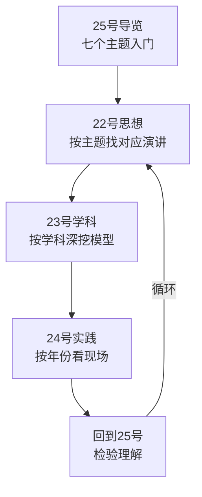

---

## 附录十四 芒格思想自测题（30 题）

### 思维类（1—10）

1. 铁锤人警告的含义是？（单一模型局限）
2. 格栅理论包括哪些学科？（物理/生物/社会/心理/哲学/文学/数学）
3. 逆向思维的名言是？（"如果我知道我会死在哪里……"）
4. 能力圈的 90%—95% 指什么？（看不懂的机会直接不看）
5. 机会成本如何理解？（最好的机会衡量一切）
6. 合奏效应是什么？（多倾向非线性叠加）
7. 普朗克知识与司机知识的区别？（真懂 vs 背诵）
8. 检查清单的用途？（决策前逐项排查）
9. "配得上"的含义？（先让自己配得上想要的）
10. 多元思维模型的出处？（1994 南加大演讲）

### 投资类（11—20）

11. 20 个孔法则？（一生 20 笔投资）
12. 桶里射鱼的完整比喻？（把水倒干净再开枪）
13. 钱是坐着等来的？（耐心+准备）
14. 凯利公式的思想？（胜算越大下注越大）
15. 安全边际的定义？（价格低于价值）
16. 护城河的五种来源？（无形资产/转换成本/网络效应/成本/规模）
17. 浮存金的本质？（低成本资金）
18. "多元恶化"指什么？（过度分散）
19. 五分钟竞争优势检验？（说不出优势不投）
20. 价值投资的终极定义？（"所有做得正确的投资，都是价值投资"）

### 心理类（21—25）

21. 最严重的误判心理？（以自我为中心）
22. 最蠢的罪行？（嫉妒）
23. 莫扎特的两大缺陷？（挥霍+嫉妒）
24. 聪明人做蠢事的原因？（头脑缺陷）
25. 2008 年芒格的真实行为？（买入而非减持）

### 人生类（26—30）

26. 芒格读书的方法？（不记笔记/随性/大量）
27. 成功的核心？（专注力）
28. 选伴侣的建议？（期望值低/找更优秀的）
29. 面对衰老的态度？（坦然+感恩+继续工作）
30. 芒格四书阅读顺序？（25→22→23→24）

---

## 附录十五 系列收官：25 本笔记的完整旅程

### 旅程地图

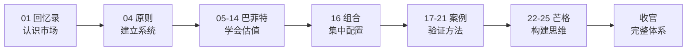

### 旅程的四个阶段

**阶段一：认识市场（01—04）**
- 利弗莫尔三书：市场的情绪与趋势
- 达利欧《原则》：系统的稳定性
- 核心收获：**市场是人的集合，人性不变**

**阶段二：学会估值（05—14）**
- 财报/案例/护城河/估值
- 核心收获：**价值=现金流×时间×确定性**

**阶段三：验证方法（16—21）**
- 集中投资/语录/案例
- 核心收获：**方法需要纪律，纪律需要信念**

**阶段四：构建思维（22—25）**
- 芒格四书：从思想到实践
- 核心收获：**投资到最后是思维方式与人生哲学**

### 系列的核心结论（跨 25 本）

| 问题 | 结论 |
|------|------|
| 市场是什么？ | 人性+情绪+趋势（利弗莫尔） |
| 怎么决策？ | 原则+系统（达利欧） |
| 买什么？ | 好公司+好价格（巴菲特） |
| 怎么想？ | 多元模型+理性（芒格） |
| 怎么活？ | 学习+专注+诚实（芒格四书） |

### 给读者的最终建议

1. **先读 25 号**（本笔记）：建立全景框架
2. **再读 22 号**：深入芒格思想
3. **对照 24 号**：看 35 年实践
4. **回到 20 号**：用案例检验
5. **循环往复**：每次重读都有新收获

> **25 本笔记，25 把钥匙——打开的是同一扇门：在不确定的世界里，用确定的方法论，过好这一生。**

---

---

## 附录十六 芒格思想 × 系列其他大师对照（扩展版）

### 16.1 芒格 vs 格雷厄姆

| 维度 | 格雷厄姆 | 芒格 |
|------|---------|------|
| 时代 | 1920s—1970s | 1960s—2020s |
| 核心 | 安全边际+烟蒂股 | 好生意+多元模型 |
| 对市场 | 市场先生（情绪化） | 市场是复杂系统 |
| 对价格 | 便宜是王道 | 合理价格买好公司 |
| 对分散 | 分散（防御） | 集中（进攻） |
| 芒格的评价 | "格雷厄姆从来没教他如何区分好生意和烂生意" | — |

### 16.2 芒格 vs 费雪

| 维度 | 费雪 | 芒格 |
|------|------|------|
| 核心 | 成长股+深入调研 | 好生意+能力圈 |
| 方法 | 闲聊法（走访） | 阅读+思考 |
| 对管理 | 管理层质量第一 | 信任+放权 |
| 共同点 | 集中持股 | 集中持股 |
| 芒格的评价 | "费雪教会我们集中投资 10 只股票" | — |

### 16.3 芒格 vs 彼得·林奇

| 维度 | 林奇 | 芒格 |
|------|------|------|
| 风格 | 逛街选股 | 模型分析 |
| 数量 | 上千只观察 | 两三只重仓 |
| 周期 | 中期（1—3 年） | 超长期（10 年+） |
| 对分散 | 分散（多种类型） | 集中 |
| 共同点 | 独立思考 | 独立思考 |

### 16.4 芒格 vs 索罗斯

| 维度 | 索罗斯 | 芒格 |
|------|--------|------|
| 哲学 | 反身性 | 多元模型 |
| 风格 | 宏观对冲 | 价值长期 |
| 对错误 | 快速止损 | 不犯大错 |
| 对市场 | 市场永远错 | 市场常错 |
| 共同点 | 哲学思维 | 哲学思维 |

### 16.5 芒格 vs 段永平（中国价值投资代表）

| 维度 | 段永平 | 芒格 |
|------|--------|------|
| 核心 | 本分+平常心 | 理性+常识 |
| 方法 | 商业模式+企业文化 | 多元模型+能力圈 |
| 名言 | "做对的事，把事情做对" | "反过来想" |
| 共同点 | 长期主义+简单 | 长期主义+简单 |

---

## 附录十七 七篇文章的升级路径：从解读到应用

### 17.1 每篇文章的升级建议

| 文章 | 现有内容 | 升级方向 | 对应笔记 |
|------|---------|---------|---------|
| 1 多元思维 | 四模型概述 | 补全 25 心理倾向+合奏效应 | 22 号第7章 |
| 2 财富逻辑 | 五逻辑概述 | 补全喜诗/可口可乐完整案例 | 20 号 |
| 3 逆向思维 | 五场景概述 | 补全三种形态+历史校正 | 24 号 2007 |
| 4 跨学科 | 四场景概述 | 补全格栅七学科+圣约翰学院 | 23 号 |
| 5 价值投资 | 四破局概述 | 补全富国 30 年+护城河五源 | 13/21 号 |
| 6 决策智慧 | 六密码概述 | 补全决策八步+概率工具链 | 23 号第9章 |
| 7 人生哲学 | 五法则概述 | 补全芒格人生时间线 | 24 号第8章 |

### 17.2 应用练习：把七篇文章变成七张清单

| 主题 | 我的清单 |
|------|---------|
| 多元思维 | 我常用的模型有哪些？缺哪些学科？ |
| 财富逻辑 | 我的"湿雪"（能力）和"长坡"（领域）是什么？ |
| 逆向思维 | 什么会导致我失败？列出来并规避 |
| 跨学科 | 我最近读了几本非本专业的书？ |
| 价值投资 | 我能五分钟说出持仓公司的竞争优势吗？ |
| 决策智慧 | 我最近一次决策用了检查清单吗？ |
| 人生哲学 | 我每天阅读吗？我专注吗？我与谁为伍？ |

### 17.3 25 号 → 全系列的转化路径

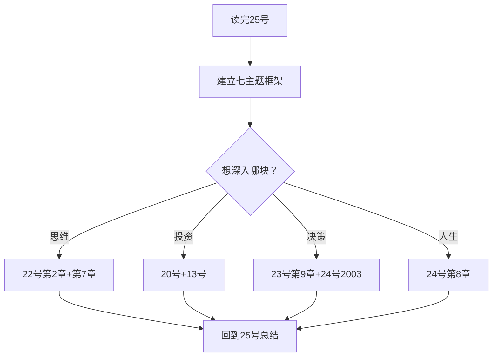

---

## 附录十八 芒格四书 × 系列 25 本完整知识树

### 18.1 知识树总览

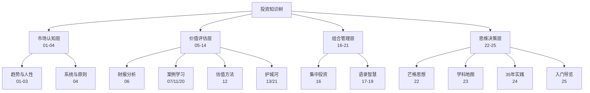

### 18.2 知识树的使用方法

| 场景 | 查询路径 |
|------|---------|
| 想学估值 | 06→12→20 |
| 想学选股 | 13→21→16 |
| 想学思维 | 25→22→23 |
| 想看实践 | 24→20→07 |
| 想学交易 | 01→02→03 |
| 想建系统 | 04→16→22 |
| 想学人生 | 22→24→25 |

### 18.3 系列的最终一句话（25 本合一的总结）

> **01—03 告诉我们市场怎么动，04 告诉我们怎么不乱动，05—14 告诉我们怎么估值，16 告诉我们怎么下注，17—21 告诉我们大师怎么做，22—25 告诉我们大师怎么想——而所有这一切的终点，是芒格的那句话："年轻的时候，我们已经学会了最基本的道理。后来，我们只是一直在实践这些道理。"**

---

## 附录十九 芒格四书阅读手册（终极版）

### 19.1 四书怎么买/怎么看

| 书 | 版本建议 | 阅读方式 | 时间预算 |
|----|---------|---------|---------|
| 25 一本书读懂 | 电子版即可 | 通读一遍 | 半天 |
| 22 穷查理宝典 | 中信版 | 精读+反复 | 1—2 周 |
| 23 格栅理论 | 中信版 | 精读+笔记 | 1 周 |
| 24 芒格之道 | 中信版 | 按年份翻阅 | 2—4 周 |

### 19.2 四书的阅读顺序（三种方案）

**方案 A：入门路径（推荐）**
25 → 22 → 23 → 24（从导览到实践）

**方案 B：思想路径**
22 → 23 → 24 → 25（从母本到导览）

**方案 C：实践路径**
24 → 22 → 23 → 25（从现场到理论）

### 19.3 四书的回访频率

| 场景 | 回访哪本 |
|------|---------|
| 想快速回顾 | 25 号（导览） |
| 遇到心理偏差 | 22 号第7章（25 倾向） |
| 分析新行业 | 23 号（学科模型） |
| 面对市场疯狂 | 24 号（历史现场） |
| 人生迷茫 | 22 号+24 号第8章 |

### 19.4 四书与系列其他笔记的联合使用

| 组合 | 用途 |
|------|------|
| 25 + 20 | 入门→案例实战 |
| 22 + 16 | 思想→组合构建 |
| 23 + 12 | 学科→估值应用 |
| 24 + 13 | 实践→护城河识别 |
| 25 + 04 | 芒格+达利欧（思想+系统） |
| 22 + 01 | 芒格+利弗莫尔（理性 vs 人性） |

---

## 附录二十 全系列最终回顾：25 本笔记的意义

### 20.1 系列的意义

> **这 25 本笔记，不只是读书笔记——而是一部从"认识市场"到"构建思维"的完整投资教育体系。**

### 20.2 系列的四层价值

| 层 | 价值 | 体现 |
|----|------|------|
| 知识层 | 完整体系 | 市场/系统/价值/思维四层 |
| 方法层 | 可操作 | 检查清单/20 个孔/凯利 |
| 心理层 | 认识人性 | 25 倾向/市场先生 |
| 人生层 | 长期主义 | 复利/专注/诚实 |

### 20.3 芒格四书在系列中的地位

**22—25 号是系列的"思维层"**——如果说 01—21 号回答了"投资是什么"，22—25 号回答的是"投资者应该成为什么样的人"。**这是系列从"术"到"道"的升华，也是为什么芒格四书放在最后的原因。**

### 20.4 给未来重读者的建议

1. **每年重读一次 25 号**：检验自己的理解是否深化
2. **每两年重读一次 22 号**：对照新经验验证旧认知
3. **遇到困境翻 24 号**：看看芒格 98 岁怎么面对
4. **做决策前翻 25 号附录**：检查清单过一遍
5. **把这 25 本变成自己的工具**：笔记是死的，用起来才是活的

> **系列收官：25 本笔记，25 座灯塔——照亮的不只是投资之路，更是人生之路。愿每一位读者，都能像芒格一样：认识简单、执行简单、坚持简单。**

---

---

## 第13章 芒格思想的 21 世纪检验：预言与验证

### 13.1 芒格的预言清单（跨 22/24 号）

| 预言 | 时间 | 验证结果 |
|------|------|---------|
| 储贷行业必然大规模倒闭 | 1987—1990 | ✅ 验证 |
| 垃圾债将变成废纸 | 1990 | ✅ 验证 |
| 互联网热潮"以一地鸡毛收场" | 1999—2000 | ✅ 验证 |
| 次贷=纵火焚毁房屋 | 2007 | ✅ 验证 |
| 盖可保费 10—15 年三倍 | 1998 | ✅ 验证 |
| 房地美柳暗花明 | 1989 | ⚠️ 部分（2008 被接管） |
| 价值投资永不过时 | 2016—2022 | ✅ 持续验证 |
| 指数投资终有失效之日 | 2017 | ⏳ 待检验 |
| 加密货币终将失败 | 2021—2022 | ⏳ 待检验 |
| 印钞终有代价 | 2022 | ⏳ 待检验 |

### 13.2 芒格方法论在 21 世纪的适用性

| 方法 | 适用性 | 挑战 | 应对 |
|------|--------|------|------|
| 价值投资 | 永不过时 | 好价格难寻 | 等待+现金 |
| 能力圈 | 永不过时 | 科技边界模糊 | 边做边学 |
| 多元模型 | 越来越重要 | 信息过载 | 抓主要矛盾 |
| 集中投资 | 有效 | 波动加大 | 心理准备 |
| 逆向思维 | 有效 | 逆势孤独 | 信念+清单 |
| 检查清单 | 有效 | 执行难 | 纪律 |

### 13.3 芒格 vs 现代投资理论

| 议题 | 芒格 | 现代金融理论 |
|------|------|-------------|
| 市场有效性 | 半强式无效（"纯属胡说八道"） | 有效市场假说（EMH） |
| 波动性 | 不是风险（贝塔无用） | 风险=波动（CAPM） |
| 分散投资 | 多元恶化 | 分散是唯一免费午餐 |
| 主动管理 | 可以跑赢（少决策） | 长期跑不赢（指数） |
| 行为金融 | 25 倾向先驱 | 卡尼曼/特沃斯基 |
| 期权 | 会计处理错误 | 合理激励工具 |

### 13.4 芒格思想对 AI 时代投资者的启示

| AI 时代挑战 | 芒格的答案 |
|------------|-----------|
| 信息过载 | "我们追求做得更少" |
| 算法交易 | "沿着河边走，一边走一边能捡起大金块，何必筛沙子淘金？" |
| 快速变化 | 能力圈+终身学习 |
| 情绪干扰 | 25 倾向清单+检查清单 |
| 复利陷阱 | 长期主义+少决策 |

---

## 附录二十一 芒格思想 × 中医理论完整对照（最终版）

### 21.1 阴阳五行 × 多元模型

| 中医理论 | 芒格对应 | 本质 |
|---------|---------|------|
| 阴阳平衡 | 理性与情绪的平衡 | 动态平衡观 |
| 五行相生相克 | 学科模型互补制衡 | 系统观 |
| 气血运行 | 复利积累 | 流动与积累 |
| 经络系统 | 格栅网络 | 连接创造价值 |

### 21.2 辨证论治 × 决策流程

| 中医辨证 | 芒格决策 |
|---------|---------|
| 四诊合参 | 多学科信息收集 |
| 八纲辨证 | 多维度分析 |
| 审证求因 | 逆向思维 |
| 立法组方 | 投资组合 |
| 随证治之 | 动态调整 |

### 21.3 治未病 × 风险管理

| 中医 | 芒格 |
|------|------|
| 未病先防 | 安全边际 |
| 既病防变 | 检查清单 |
| 瘥后防复 | 复盘总结 |

### 21.4 情志养生 × 心理管理

| 中医情志 | 芒格对应 |
|---------|---------|
| 怒伤肝 | 不嫉妒（"嫉妒是最蠢的罪"） |
| 思伤脾 | 不焦虑（"我只研究常识"） |
| 忧伤肺 | 不抱怨（"越抱怨、越痛苦"） |
| 恐伤肾 | 不恐惧（"别人吓得落荒而逃，我们愿意买入"） |
| 喜伤心 | 不狂喜（"越是大家都看好的机会越危险"） |

### 21.5 中医跨界启示总结

**中医与芒格思想的五个共同底层逻辑**：

1. **整体观**：辨证论治=格栅理论（多因素综合）
2. **动态观**：随证治之=市场变化（适应）
3. **预防观**：治未病=安全边际（事前）
4. **个体观**：因人制宜=能力圈（边界）
5. **平衡观**：阴阳平衡=理性（中庸）

> **中医和芒格都认为：世界是复杂的，但规律是简单的——关键在于是不是真的懂了。**

---

## 附录二十二 A 股实战手册（终极版）

### 22.1 A 股投资者的芒格体检表

| 检查项 | 问题 | 我的答案 |
|--------|------|---------|
| 能力圈 | 我能讲清持仓公司的商业模式吗？ | |
| 机会成本 | 我的持仓是最好的机会吗？ | |
| 安全边际 | 我的买入价低于内在价值吗？ | |
| 护城河 | 五分钟能说出竞争优势吗？ | |
| 集中度 | 我是不是太分散了？ | |
| 换手率 | 我一年交易几次？ | |
| 心理状态 | 我最近是否被贪婪/恐惧支配？ | |
| 检查清单 | 我每次买入都过清单吗？ | |
| 时间框架 | 我打算持有多久？ | |
| 复利意识 | 我的费用/税负占收益多少？ | |

### 22.2 A 股价值投资的操作流程

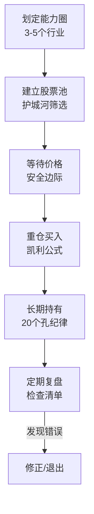

### 22.3 A 股常见陷阱的芒格诊断

| 陷阱 | 芒格诊断 | 应对 |
|------|---------|------|
| 概念炒作 | 能力圈外 | 不碰 |
| 杠杆爆仓 | 赌场思维 | 不用杠杆 |
| 题材轮动 | 频繁交易 | 少决策 |
| 消息面 | 权威错误 | 只信自己研究 |
| 抱团瓦解 | 社会认同 | 独立思考 |
| 散户情绪 | 25 倾向 | 检查清单 |

### 22.4 A 股价值投资的长期视角

| 时间框架 | 预期 | 行动 |
|---------|------|------|
| 1 年 | 波动 ±30% | 不动 |
| 3 年 | 价值回归 | 持有 |
| 5 年 | 复利显现 | 加仓优质 |
| 10 年+ | 财富跃迁 | 坚守 |

> **A 股不是没有价值投资，而是缺少"钱是坐着等来的"的耐心——芒格之道在 A 股同样适用，因为人性在哪里都一样。**

---

## 附录二十三 芒格四书 × 系列关键词索引

### 关键词 → 笔记定位表

| 关键词 | 25 号 | 22 号 | 23 号 | 24 号 |
|--------|-------|-------|-------|-------|
| 多元思维 | 第1章 | 第二讲 | 全书 | 2017 |
| 逆向思维 | 第3章 | 第一讲 | 第6章 | 2007 |
| 能力圈 | 6.3 | 第三讲 | 第9章 | 2003 |
| 复利 | 第2章 | 第三讲 | 第8章 | 2019 |
| 护城河 | 5.4 | 第三讲 | 第3章 | 2016 |
| 集中投资 | 5.6 | 第三讲 | 第9章 | 2003/2019 |
| 误判心理 | 1.6 | 第7章 | 第5章 | 2007 |
| 检查清单 | 6.2 | 第3章 | 第9章 | 2017 |
| 价值投资 | 第5章 | 第三讲 | 第9章 | 2021 |
| 终身学习 | 7.2 | 第二讲 | 第7章 | 2015 |
| 理性 | 6.4 | 第4章 | 第9章 | 2007 |
| 概率 | 6.5 | 第5章 | 第9章 | 2019 |
| 简单 | 6.6 | 第2章 | 第9章 | 2015 |
| 专注 | 7.4 | 附录 | 第7章 | 2015 |
| 伙伴 | 7.5 | 传略 | 第4章 | 2014/2021 |

### 关键词检索示例

**场景：我最近总是追涨杀跌，怎么办？**
→ 25 号 7.2（散户错误表）→ 22 号第7章（25 倾向）→ 24 号 2019（"教唆吸毒"）→ 回到 25 号检查清单

**场景：如何给一家公司估值？**
→ 25 号 5.4（五分钟竞争优势）→ 12 号（估值逻辑）→ 23 号第9章（决策过程）→ 24 号 2016（无万能公式）

**场景：市场大跌，我要不要卖？**
→ 25 号 11（钱是坐着等来的）→ 24 号 2014（富国银行 8 美元）→ 20 号（危机买入案例）→ 22 号（检查清单）

---

## 附录二十四 系列阅读马拉松：25 天挑战计划

### 24.1 每日计划

| 天数 | 笔记 | 主题 |
|------|------|------|
| 1 | 01 回忆录 | 认识市场 |
| 2 | 02 操盘术 | 趋势方法 |
| 3 | 03 量价分析 | 量价技术 |
| 4 | 04 原则 | 系统思维 |
| 5 | 05 投资心法 | 价值基础 |
| 6 | 06 读财报 | 财报分析 |
| 7 | 07 案例集 | 案例分析 |
| 8 | 08 金钱心智 | 心智模式 |
| 9 | 09 致股东信·主题 | 主题解读 |
| 10 | 10 致股东信·编年 | 编年解读 |
| 11 | 11 伯克希尔崛起 | 伯克希尔史 |
| 12 | 12 估值逻辑 | 估值方法 |
| 13 | 13 护城河 | 竞争优势 |
| 14 | 14 大全集 | 综合体系 |
| 15 | 16 投资组合 | 集中投资 |
| 16 | 17 如是说 | 语录集 |
| 17 | 18 嘉年华 | 股东会 |
| 18 | 19 踢踏舞 | 卡萝尔文集 |
| 19 | 20 第一桶金 | 早期案例 |
| 20 | 21 星公司 | 护城河 A 股 |
| 21 | 22 穷查理宝典 | 芒格思想 |
| 22 | 23 格栅理论 | 学科地图 |
| 23 | 24 芒格之道 | 35 年实践 |
| 24 | 25 一本书读懂 | 入门导览 |
| 25 | 总结 | 建立自己的体系 |

### 24.2 每天 30 分钟阅读法

| 时间 | 内容 |
|------|------|
| 前 5 分钟 | 翻笔记结构（概览+目录） |
| 中 20 分钟 | 精读 1—2 章 |
| 后 5 分钟 | 记 3 条感悟+1 个行动 |

### 24.3 25 天后的成果

| 成果 | 内容 |
|------|------|
| 知识 | 25 本笔记的完整框架 |
| 工具 | 检查清单+20 个孔+护城河分析 |
| 心态 | 长期主义+逆向思维 |
| 行动 | 开始建立自己的投资体系 |

> **25 天读完 25 本——不是终点，而是起点：从"读笔记"到"用笔记"，从"学投资"到"做投资"。**

---

---

## 附录二十五 芒格思想传承：从 99 岁到永远的遗产

### 25.1 芒格留下的五份遗产

| 遗产 | 内容 | 影响 |
|------|------|------|
| 思维方法 | 多元思维模型+格栅理论 | 改变了无数投资者的思维方式 |
| 投资哲学 | 价值投资+能力圈+集中 | 与巴菲特共同定义现代价值投资 |
| 心理清单 | 25 种误判心理 | 行为金融的民间先驱 |
| 人生态度 | 阅读+专注+诚实+幽默 | 成为一代人的精神榜样 |
| 文本遗产 | 演讲+股东会实录 | 24 号《芒格之道》35 年完整记录 |

### 25.2 芒格思想的当代传承者

| 传承者 | 传承内容 |
|--------|---------|
| 巴菲特 | 价值投资+伯克希尔体系 |
| 李录 | 中国版价值投资（喜马拉雅资本） |
| 莫尼什·帕波莱 | 集中投资+水位线收费 |
| 盖瑞·萨尔兹曼 | 每日期刊软件转型 |
| 彼得·考夫曼 | 《穷查理宝典》编撰+五张王牌 |
| 芒格书院 | 中文世界的芒格思想传播 |

### 25.3 芒格名言的不朽性

> "如果我知道我会死在哪里，那我将永远不去那个地方。"——逆向思维
> "在手里拿着铁锤的人看来，世界就像一颗钉子。"——多元模型
> "要得到你想要的某样东西，最可靠的办法是让你自己配得上它。"——人生哲学
> "永远走大道，大道人少。"——诚实与简单
> "年轻的时候，我们已经学会了最基本的道理。后来，我们只是一直在实践这些道理。"——坚持

### 25.4 25 号笔记的最终意义

**25 号是系列的收官之作，也是芒格四书的入门之作**——它用七篇解读文章作为骨架，用 22/23/24 号作为血肉，构建了芒格思想的完整导览：

- **如果你第一次接触芒格**：从 25 号开始，七个主题带你入门
- **如果你已经读过 22/23/24**：25 号帮你串联四书，形成体系
- **如果你想实践**：附录七（A 股应用）+附录四（10 自问）给你行动清单

> **芒格 2023 年 11 月 28 日去世，享年 99 岁。但正如他自己说的："我已学会适应了。我只是怀念。"——他的思想不会随肉身消逝，因为每一个读他、学他、实践他的人，都是他生命的延续。**

### 25.5 系列收官：给读者的最后一句话

> **25 本笔记写完了，但你的投资之路才刚刚开始。记住芒格的话："生活的铁律就是，只有 20% 的人才能跻身前 5%。"——做那 20% 里的前 5%，不是靠聪明，而是靠：认识简单、执行简单、坚持简单。**

---

## 附录二十六 本书自检清单（25 号）

### 内容完整性检查

| 检查项 | 状态 | 位置 |
|--------|------|------|
| 七篇文章逐篇解读 | ✅ | 第8章 |
| 芒格四书体系对照 | ✅ | 附录二 |
| 系列 25 本全景图 | ✅ | 附录三 |
| 25 个模型速查 | ✅ | 附录一 |
| 七主题金句 | ✅ | 附录五 |
| 芒格人生时间线 | ✅ | 第9章 |
| 预言检验 | ✅ | 第13章 |
| A 股应用 | ✅ | 附录七/二十二 |
| 中医对照 | ✅ | 附录八/二十一 |
| 自测题 | ✅ | 附录十四 |
| 阅读计划 | ✅ | 附录二十四 |

### 学习效果检查

读完本书后，你应该能回答：

1. 芒格思想的七个入口是什么？
2. 多元思维模型的核心是什么？
3. 逆向思维怎么用？
4. 能力圈怎么划？
5. 价值投资怎么落地？
6. 决策智慧有哪些密码？
7. 人生哲学有哪些法则？
8. 芒格四书怎么读？
9. 芒格思想怎么应用到 A 股？
10. 下一步该读哪本笔记？

> **如果以上都能回答，恭喜你——你已经"读懂"了《穷查理宝典》的导览版；接下来，请带着这些问题，走进 22 号《穷查理宝典》的深度解读，开始真正的思想之旅。**

---

---

