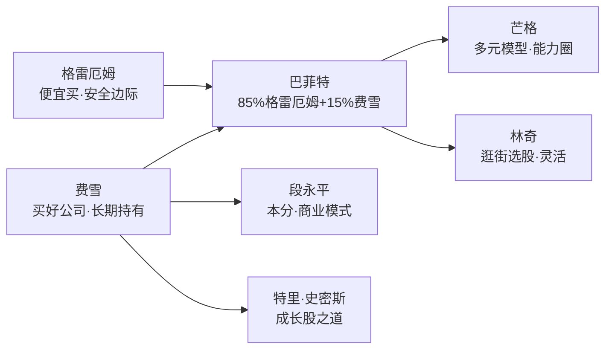
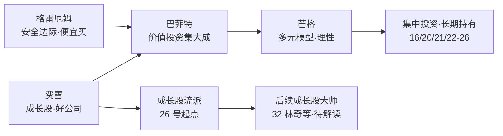
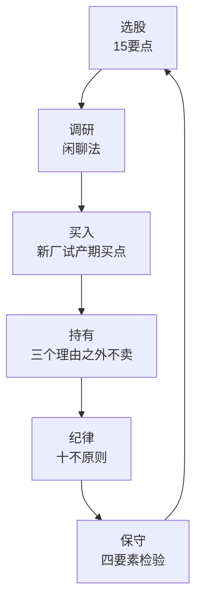
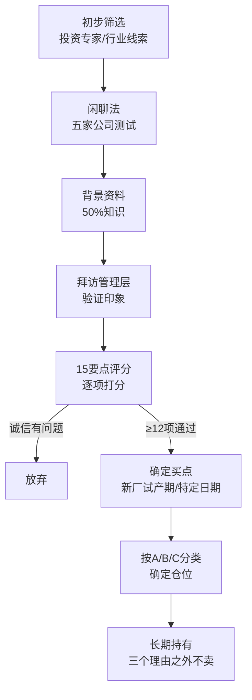
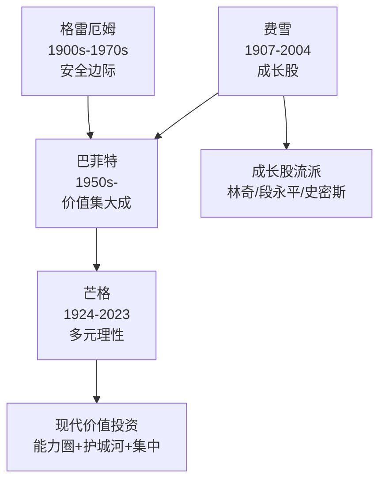

# 26《怎样选择成长股》深度解读（详细版）

> 菲利普·费雪——成长股投资之父的完整思想体系：15 要点、闲聊法、十不原则与保守投资四要素

## 📖 本书概览

| 项目 | 内容 |
|------|------|
| 书名 | 怎样选择成长股（Common Stocks and Uncommon Profits） |
| 作者 | 菲利普·A·费雪（Philip A. Fisher，1907—2004），1958 年初版，修正版含第二、三部分 |
| 结构 | 引言（其子肯内斯·费雪撰）+ 第一部分"普通股和不普通的利润"（11 章）+ 第二部分"保守型投资人夜夜安枕"（6 章）+ 第三部分"发展投资哲学"（4 章）+ 附录 |
| 历史地位 | **成长股投资的开山之作**；巴菲特自称"85% 的格雷厄姆 + 15% 的费雪"；芒格称费雪教会他集中投资 |
| 系列位置 | **价值派·思想源头**：[[20《巴菲特的第一桶金》深度解读（详细版）|20 第一桶金]]（格雷厄姆实践）→ **本书（费雪思想）** → [[22《穷查理宝典》深度解读（详细版）|22 宝典]]（芒格体系） |

## 🎯 为什么这本书值得单独解读

- **巴菲特思想的另一半**：格雷厄姆教"便宜买"，费雪教"买好公司"——巴菲特的"喜诗糖果转折"思想源头就在本书
- **15 要点**：史上最经典的选股清单——从市场潜力到管理层诚信，至今仍是机构尽调的原型
- **闲聊法（Scuttlebutt）**：独特的调研方法论——不靠财务报表，靠"企业耳语网"获取一手信息
- **十不原则**：投资纪律的负面清单——"不买创业公司""不过度分散""不随波逐流"
- **卖出哲学**：巴菲特"永远持有"的源头——"如果当初买对了，就几乎没有理由卖出"
- **保守投资的重新定义**："保守"不是买大公司，而是理解自己在买什么


## 📖 全书结构与核心框架

### 26.0 全书结构总览表

| 源书部分 | 笔记章节 | 核心内容 | 关键概念/案例 |
|---------|---------|---------|--------------|
| 引言（其子撰写） | 第1章 费雪其人 | 从斯坦福到费雪公司；成长股思想的诞生 | 1931 年创业、40 年费雪公司 |
| 第一部分·第1章 | 第2章 两种赚钱方法 | 预测景气（炼金术）vs 长期持有杰出公司 | 摩托罗拉 45.5→122 美元；"幸运且能干"vs"能干所以幸运" |
| 第一部分·第2章 | 第3章 闲聊法 | 企业耳语网：向产业链上下游打探 | 五类信息源；投资专家 5/6 vs 高管科学家 1/6 |
| 第一部分·第3—7章 | 第4章 十五要点 | 寻找优良普通股的完整清单 | 市场潜力→管理诚信 15 条 |
| 第一部分·第8—9章 | 第5章 何时买进 | 时机与价格的艺术 | 新厂试产期买点；美国氰胺 45.5→60 美元；"按日期买而非按价格买" |
| 第一部分·第10章 | 第6章 何时卖出 | 三个理由与无数陷阱 | "如果当初买对了，就几乎没有理由卖出" |
| 第一部分·第11章 | 第7章 十不原则 | 投资纪律的负面清单 | 五不：创业公司/店头股/年报格调/高本益比/锱铢必较 |
| 第二部分（6 章） | 第8章 保守四要素 | 保守型投资人夜夜安枕 | 技能/人/企业特质/价格；蜂蜜罐比喻 |
| 第三部分（4 章） | 第9章 哲学形成 | 从错误中学习 | 食品机械 21→4 美元；道氏化学"绝不要擢升没犯过错误的人" |
| — | 第10—12章 | 大师对照/当代验证/中医呼应 | 15 要点×TAM；苹果全符合；四诊合参 |

### 26.1 核心框架：费雪投资体系的五层骨架

```mermaid
graph TD
    A[目标：寻找长期增长 10 倍以上的杰出公司] --> B[调研：闲聊法<br/>五类信息源·企业耳语网]
    B --> C[筛选：十五要点<br/>市场潜力→管理诚信]
    C --> D[买入：时机而非价格<br/>新厂试产期·不择时]
    D --> E[卖出：几乎不卖<br/>三个理由·十不原则]
    E --> F[保守四要素<br/>技能/人/特质/价格]
    F --> G[哲学：长期持有<br/>"幸运且能干"的公司]
```

## 📑 目录

- [[#第1章 费雪其人：从斯坦福到费雪公司|第1章 费雪其人：从斯坦福到费雪公司]]
- [[#第2章 过去提供的线索：两种赚钱方法|第2章 过去提供的线索：两种赚钱方法]]
- [[#第3章 闲聊法：企业耳语网|第3章 闲聊法：企业耳语网]]
- [[#第4章 十五要点：寻找优良普通股的完整清单|第4章 十五要点：寻找优良普通股的完整清单]]
- [[#第5章 何时买进：时机与价格的艺术|第5章 何时买进：时机与价格的艺术]]
- [[#第6章 何时卖出：三个理由与无数陷阱|第6章 何时卖出：三个理由与无数陷阱]]
- [[#第7章 十不原则：投资纪律的负面清单|第7章 十不原则：投资纪律的负面清单]]
- [[#第8章 保守型投资人夜夜安枕：四要素|第8章 保守型投资人夜夜安枕：四要素]]
- [[#第9章 投资哲学的形成：从错误中学习|第9章 投资哲学的形成：从错误中学习]]
- [[#第10章 费雪 × 系列大师对照|第10章 费雪 × 系列大师对照]]
- [[#附录一 费雪金句集（35 条精选）|附录一 费雪金句集（35 条精选）]]
- [[#附录二 十五要点速查表|附录二 十五要点速查表]]
- [[#附录三 系列互链：费雪在价值投资谱系中的位置|附录三 系列互链：费雪在价值投资谱系中的位置]]
- [[#附录四 A 股应用：费雪方法的本土化|附录四 A 股应用：费雪方法的本土化]]
- [[#附录五 读完本书后的 10 个自问|附录五 读完本书后的 10 个自问]]
- [[#总结：费雪之道的核心|总结：费雪之道的核心]]

## 🔗 双链导读

| 连接主题 | 本书章节 | 关联笔记 |
|---------|---------|---------|
| 巴菲特思想源头 | 全书 | [[20《巴菲特的第一桶金》深度解读（详细版）|20 喜诗转折]] · [[05《巴菲特的投资心法》深度解读（详细版）|05 投资心法]] |
| 集中投资 | 第九章"另五不" | [[16《巴菲特的投资组合》深度解读（详细版）|16 集中投资]] |
| 护城河思想 | 15 要点 5/6/11 | [[13《巴菲特的护城河》深度解读（详细版）|13 护城河]] · [[21《星公司解密巴菲特股市投资法则》深度解读（详细版）|21 星公司]] |
| 管理层评估 | 15 要点 7/8/9/14/15 | [[22《穷查理宝典》深度解读（详细版）|22 管理层评估]] |
| 市场无效 | 第三部分第4章 | [[22《穷查理宝典》深度解读（详细版）|22 有效市场批判]] |
| 闲聊法=尽调 | 第3章 | [[07《巴菲特投资案例集》深度解读（详细版）|07 案例集]] |
| 长期持有 | 第6章 | [[20《巴菲特的第一桶金》深度解读（详细版）|20 长期持有]] · [[24《芒格之道》深度解读（详细版）|24 钱是坐着等来的]] |

---

## 第1章 费雪其人：从斯坦福到费雪公司

### 1.1 费雪的生平（1907—2004）

| 时间 | 事件 |
|------|------|
| 1907 | 生于旧金山 |
| 1927—1928 | 斯坦福大学商学院研究生（艾梅特教授"绝不只看工厂"的参观课） |
| 1928.5 | 进入旧金山国安盎格鲁国民银行统计部门，20 个月后当上部门主管 |
| 1929 | 亲历大崩盘（"难以置信的金融纵欲游戏"） |
| 1931.3.1 | 创立费雪公司（投资顾问公司）——年仅 24 岁 |
| 1940s | 二战期间在陆军航空兵团服役三年半，投资哲学在此成形 |
| 1957 | 出版《怎样选择成长股》（时年 50 岁） |
| 1959—1963 | 在斯坦福商学院兼职任教（代理财务学教授） |
| 1974 | 出版第二、三部分（保守型投资人/发展投资哲学） |
| 2004 | 去世，享年 97 岁 |

**费雪公司的独特模式**（序言自述）：

> "费雪公司并没有服务一般大众，因为十多年来，费雪公司从来不曾同时拥有十来位客户。这段期间内，这些客户大多保持原状。费雪公司以前主要的兴趣，放在资本大幅增值上，现在所有的作为，则把这件事当作唯一的目标。"

**经营时间线**（1957 年序言回顾）：

| 阶段 | 表现 |
|------|------|
| 战前十年（局部运用原则） | 报酬领先市场指数 |
| 战后时期（完整运用原则） | 报酬显著领先；**市场静止或下跌年份，表现不逊于上涨年份** |

### 1.2 费雪的两个核心发现（1957 年序言）

**发现一：耐性（Patience）**

> "投资想赚大钱，必须有耐性。换句话说，**预测股价会到达什么水准，往往比预测多久才会到达那种水准容易**。"

**发现二：市场的欺骗性**

> "股票市场本质上具有欺骗投资人的特性。跟随其他每个人当时在做的事去做，或者自己内心不可抗拒的呐喊去做，事后往往证明是错的。"

### 1.3 肯内斯·费雪的引言：儿子眼中的父亲

**八岁读父亲的书**："我花了约十五年的时间，才了解《怎样选择成长股》一书在写些什么。第一次看这本书，实在不懂它到底在讲什么，那时我才八岁。"

**20 岁验证 15 要点**：尝试把 15 要点应用到太平洋木材（地方性股票）——"一开始便有好几个人飨我以闭门羹之后，我终于知难而退，但因此认清，还需要好好自我充实。"

**闲聊法=钢琴 vs 作曲**：

> "能看出符合'15 要点'的股票是门艺术。两者的差别，有如学习弹奏钢琴（窍门），然后编曲（艺术）。……几乎任何领域中，你只能靠反复练习学得窍门，别无他法。"

**父亲与儿子的差异**（成长型 vs 价值型）：

| 维度 | 费雪（父） | 肯内斯·费雪（子） |
|------|-----------|------------------|
| 类型 | 成长型股票投资人 | 价值型股票投资人 |
| 方法 | 找能成长再成长的公司 | 找便宜得要命的股票 |
| 持有 | 合理价格买到后几乎不卖出 | 便宜比坏形象重要 |
| 共同点 | **都用 15 要点+闲聊法** | **都用 15 要点+闲聊法** |

**纽可公司案例**（1976）：肯内斯从价值型观点买纽可（小型钢制品销售商），父亲立即从成长型观点买进——"我们运用的都是'15 要点'。"——**15 要点对成长型和价值型都管用**

**问问题的艺术**（闲聊法的精髓）：

> "关键是问更多的问题——问正确的问题，并从中获得较多的答案。……我看过有人一成不变地拿着标准问题清单问问题，而不管得到什么样的回答。这不是艺术。……如你能当机立断，马上提出好问题，你就会是作曲家、艺术家、富有创意和好地探究的投资人。"

**费雪拜访企业的准备**：事先把问题打在黄色纸张上，行间留空做笔记——"他总是希望做好准备，并让接受拜访的公司晓得他有备而来"；但"他最好的问题，总是在毫无准备的情况下，直接从脑中蹦出"。

### 1.4 第1章小结

| 层面 | 结论 |
|------|------|
| 生平 | 24 岁创业、97 岁离世——70 年投资生涯只服务少数客户 |
| 核心发现 | 耐性+市场欺骗性 |
| 方法论 | 15 要点+闲聊法=选股与调研的完整工具 |
| 传承 | 儿子验证、巴菲特借鉴、芒格推崇 |

---


---

## 第2章 过去提供的线索：两种赚钱方法

### 2.1 第一章的核心论点

> "即使随意浏览美国的股票市场史，也可以看出人们使用两种很不相同的方法，累聚可观的财富。"

**方法一：预测景气周期**（19 世纪—20 世纪上半叶）

| 特征 | 内容 |
|------|------|
| 原理 | 景气坏时买进、景气好时卖出 |
| 依赖 | 与金融界关系良好（可事先得知银行体系紧张状态） |
| 时代背景 | 银行体系不稳导致荣枯循环 |
| 终结 | 1913 年联邦储备系统建立后结束，罗斯福任内证券交易管理法使其成历史 |

**方法二：寻找杰出公司长期持有**（费雪推荐）

> "找到真正杰出的公司，抱牢它们的股票，度过市场的波动起伏，不为所动，也远比买低卖高的做法赚得多，而且赚到钱的人数还多于往日。"

**关键数据**（1950s 的观察）：

> "50 年前，投资 10,000 美元，今天有可能成长为 250,000 美元或此数的几倍之多。……大部分投资人终其一生，依靠有限的几支股票，长时间的持有，就为自己或子女奠下成为巨富的基础。"

**核心能力**："投资人需要具备的能力，是区辨提供绝佳投资机会的少数公司，以及为数远多于此，但未来只能略为成功的或彻底失败的公司。"

### 2.2 为什么今天的机会更好：企业管理的变化

| 时代 | 过去（一世代前） | 现在（1950s） |
|------|----------------|--------------|
| 所有权 | 家族拥有、视为私财 | 公众公司、专业经理人 |
| 外部股东 | 利益多遭忽视 | 管理层重视股东关系 |
| 接班 | 为儿子或侄儿着想 | 训练年轻贤才 |
| 创新 | 抗拒创新或改善 | 竞相寻找改善方法 |
| 咨询 | 不倾听建议 | 求教于各方面专家 |

### 2.3 研发（R&D）的爆炸：新时代的投资引擎

**数据**（1950s 的研发支出）：

| 年份 | 民间企业研发支出 | 备注 |
|------|----------------|------|
| 1953 | 约 37 亿美元 | 《商业周刊》报告 |
| 1956 | 55 亿美元 | 增长 49% |
| 1957 | **73 亿美元** | 一年增长 20%，四年约增 100% |
| 1959（预计） | 63 亿美元+ | 依企业计划 |

**更惊人的预测**："到 1959 年，许多知名企业预料，总营业额中产品开发费用将从目前占总销售额的 15% 上升到 20%。""所有的制造业预期 1957 年的营业额中，将有 10% 来自三年前还不存在的产品。"

**对投资的影响**：

> "研究成本变得很大，没有从商业观点善加处理的公司，可能在营运费用不胜负荷的情形下，步履蹒跚。此外，管理阶层或投资人找不到唾手可得的简单量尺，衡量研究的获利性。"

### 2.4 "幸运且能干" vs "能干所以幸运"

**费雪对公司成长的两分法**（15 要点 1 的重要铺垫）：

| 类型 | 定义 | 案例 |
|------|------|------|
| 幸运且能干 | 行业本身比管理层构想的还好，公司受益于技术发展和经济情势 | 美国铝业（铝制品市场超乎创始人预见） |
| 能干所以幸运 | 公司运用原有技能和知识不断推陈出新，创造自己的好运 | 杜邦（炸药→尼龙/玻璃纸/荧光树脂）、通用美国运输（铁路设备→其他生产领域） |

**杜邦案例**："杜邦公司本来不生产尼龙、玻璃纸、人造荧光树脂、氯丁橡胶、奥龙合成纤维、米拉，或其他多种令人瞩目的产品。多年来，杜邦生产的是炸药。……这家公司优异的商业和财务判断力，加上出色的技术能力，目前每年的营业额超过 20 亿美元。"

**通用美国运输案例**："50 多年前，这家公司成立时，铁路设备业似乎是成长空间宽广的好行业。但最近几年，很难找到一些行业，持续成长的前景比它差。可是当铁路运输逐渐向货车运输倾斜之际，过人的创新能力和足智多谋，维持这家公司的收益稳定攀升。"

**对投资人的意义**："不管是何者，投资人都必须时时留意，观察管理阶层目前以及未来是不是一直很能干；若非如此，营业额将无法继续成长。"

### 2.5 摩托罗拉案例：营业额曲线的实证（15 要点 1 的现场演示）

**1958 年初版时的观察**：摩托罗拉（Motorola）——收音机/电视机公司，通过技术变迁实现转型：

| 转型方向 | 内容 |
|---------|------|
| 双向电子通讯 | 警车/出租汽车→货车运输/公用事业/大型营造计划 |
| 半导体（晶体管） | 建立获利事业部 |
| 立体音响唱机 | 成为主角 |
| 高价位电视 | 与德瑞希尔结盟 |
| 助听器材 | 小钱并购进入 |

**股价验证**："初版写完时，摩托罗拉的股价是 45.5 美元，今天是 122 美元。"（涨约 168%）

**康宁玻璃案例**（1947 年调查）：分析师发现显像管玻璃真空管缺货→康宁玻璃技术领先→"这支股票那时的价格约 20 美元，后来一股拆分成两股半。在他买进之后十年，股价上涨到 100 美元以上，等于老股 250 美元以上。"

### 2.6 第2章小结

| 层面 | 结论 |
|------|------|
| 两种方法 | 预测景气（已过时）vs 长期持有杰出公司（正道） |
| 时代变化 | 管理专业化+研发爆炸=成长股投资的黄金时代 |
| 分类框架 | "幸运且能干" vs "能干所以幸运" |
| 案例 | 杜邦/通用美国运输/摩托罗拉/康宁 |

---

## 第3章 闲聊法：企业耳语网

### 3.1 闲聊法（Scuttlebutt）的定义

> "由于找不到更好的辞汇，我姑且称这种做法为'闲聊'法。……企业界的'耳语网'是件很奇妙的事。熟悉一家公司特定面向的人，你可以从他们具有代表性的意见入手，获知每一家公司在业内的相对强弱势，而且资讯之准确，令人咋舌。"

**为什么不能只看内部**（第一章的铺垫）：即使具备高级管理技能的人，也难以从公司内部获得全部信息——"美国真正有成长实力的公司，到底有多少家愿意让外人获得所有必要的资料，以做成资讯充分的决定，值得存疑。"

### 3.2 闲聊法的信息源全景

**五家公司测试法**：

> "你不妨找一个行业的五家公司，问每家公司一些问题，如另外四家公司强在哪里，弱在哪里。全部五家公司极其详尽和准确的画面，十之八九可因此获得。"

**信息源层级表**：

| 信息源 | 价值 | 注意事项 |
|--------|------|---------|
| 竞争对手 | 很好但不是最好 | "他们喜欢谈论他们从事的工作领域，并且畅谈竞争对手" |
| 供应商和客户 | 一样叫人称奇 | "能打听到他们来往的对象，到底是什么样的人" |
| 大学/政府/竞争公司科学家 | 很有价值 | 技术视角 |
| 同业公会高级主管 | 极佳 | 行业全局视角 |
| 前员工 | 一针见血但有偏见 | "务必仔细探讨为什么那些员工离开你所研究的公司" |

### 3.3 闲聊法的两大纪律

**纪律一：信息源绝不可曝光**

> "到处打听消息的投资人，必须能够十分确定，他们的资讯来源绝不会曝光。此后他必须严守这个政策，否则因提供资讯而惹来麻烦，将使别人不敢表达不利的意见。"

**纪律二：不同来源的印证**

> "研究一家公司时，如果不同的资讯来源很多，就没理由相信获得的每一份资料彼此相互吻合。实际上，你根本不必指望会有这样的事。真正出色的公司，绝大多数的资讯十分清楚，连经验不多、但晓得自己正寻找什么样的投资人也能区分哪些公司值得进一步调查。"

### 3.4 闲聊法的完整操作流程（第十章）

**第一阶段：选择研究哪些公司**（决定"挖到矿脉还是贫瘠土地"）

| 步骤 | 内容 |
|------|------|
| 1 | 找杰出的投资专家聊（纽约/波士顿/费城/芝加哥/旧金山/洛杉矶/圣地亚哥） |
| 2 | 初步询问两个关键问题：行业营业额是否有高成长机会？新公司是否容易进入取代领导公司？（进入壁垒） |
| 3 | 浏览资产负债表、SEC 公开说明书（总营业额分项/竞争状况/高管持股/盈余报表） |
| 4 | 不做的三件事：不找管理层、不花无数小时翻旧年报、不问股票营业员 |

**点子的来源质量对比**（费雪自己的统计研究）：

| 点子来源 | 引起研究兴趣的比例 | 带来有价值成果的比例 |
|---------|------------------|---------------------|
| 企业高级主管和科学家 | 约 1/5 | 约 1/6 |
| 训练有素的投资专家 | 约 4/5 | 约 5/6 |

**结论**："我慢慢认识和尊敬少数一些人，他们在挑战成长型普通股方面，做得非常之好。……由于他们是训练有素的投资专家，我通常能够很快听到他们的意见。"

**第二阶段：深入研究**（拜访前）

> "投资某支股票需要的所有知识中，除非至少先取得 50%，否则绝不要去拜访任何公司的管理阶层。不先做到这一点而冒然去见管理阶层，那么他所处地位很危险，因为他对自己应知道的事情，了解甚少，和管理阶层见面，能不能得到正确的答案，只能靠运气。"

**为什么先闲聊再拜访**：

> "接触管理阶层前，根据'闲聊'法获得背景资料，才能知道拜访一家公司时，应该试着了解什么事情。……没有这方面的背景资料，你可能没办法确定最基本的要点——高级管理人员本身的能力。"

**拜访的引介技巧**：通过商业银行引荐——"大部分投资银行人士都乐意帮忙——只要你不常麻烦他们。"

**资料不足时的原则**：

> "坦白说，如果我没办法得到想要的很多资讯，我会放弃研究调查，另找目标。投资要赚得大钱，你考虑的每项投资不需要都获得某些答案。反之，你需要的是少数实际购买的股票得到许多正确的答案。"

### 3.5 闲聊法 × 系列对照：尽调方法的谱系

| 方法 | 出处 | 核心 |
|------|------|------|
| 闲聊法 | 本书 | 企业耳语网（竞争对手/供应商/客户/前员工） |
| 拜访管理层 | 本书 | 掌握 50% 知识后带着问题去验证 |
| 芒格的反面例证 | [[22《穷查理宝典》深度解读（详细版）|22 号]] | 达尔文式搜寻反面证据 |
| 巴菲特的访谈 | [[07《巴菲特投资案例集》深度解读（详细版）|07 号]] | 从管理层和行业人士交叉验证 |
| 喜诗糖果的验证 | [[20《巴菲特的第一桶金》深度解读（详细版）|20 号]] | 品牌溢价+消费者忠诚的实地感知 |

**闲聊法的现代版本**：今天的"闲聊"= 调研纪要、专家网络、卖方访谈、产业链上下游访谈、管理层电话会议——**方法变了，逻辑没变：信息优势来自一手来源的交叉验证**。

### 3.6 第3章小结

| 层面 | 结论 |
|------|------|
| 定义 | 通过行业相关人士（而非公司内部）获取公司真实状况 |
| 信息源 | 五家公司测试法+竞争对手/供应商/客户/前员工 |
| 纪律 | 来源保密+多方印证 |
| 流程 | 投资专家选方向→闲聊收集背景→掌握 50% 后再见管理层 |
| 现代应用 | 调研纪要/专家网络/产业链访谈 |

---


---

## 第4章 十五要点：寻找优良普通股的完整清单

### 4.1 十五要点总览

> "我相信，投资人应关心 15 个要点。一家公司未能完全符合的要点如果很少，则有可能是很好的投资对象；未能符合的要点如果很多，我认为它将不值得投资。"

**十五要点分类**：

| 类别 | 要点 | 主要内容 |
|------|------|---------|
| 市场与产品 | 1—3 | 市场潜力/开发决心/研发效果 |
| 运营能力 | 4—6 | 销售组织/利润率/利润率维持 |
| 人与组织 | 7—9 | 劳资关系/高管关系/管理深度 |
| 财务与会计 | 10 | 成本分析和会计记录 |
| 行业与财务结构 | 11—13 | 行业独到之处/盈余展望/股权稀释 |
| 诚信 | 14—15 | 报喜不报忧/诚信正直 |

### 4.2 要点 1：市场潜力

> "这家公司的产品或服务有没有充分的市场潜力，至少几年内营业额能否大幅成长？"

**关键澄清**（费雪特意强调）：
- 营业额静止≠没有一次性利润（成本控制），但这不是成长股投资的兴趣所在
- **短时爆发后停止成长的行业不是好标的**（电视机案例：几年内大幅成长→需求饱和→"营业额曲线再呈平疲"）
- **不以年为单位判断成长**，应以好几年为单位（"工商业景气循环反复无常，也严重影响逐年的比较"）

**"幸运且能干" vs "能干所以幸运"**（第2章详述）——两类公司都值得投资，但都要"时时留意管理阶层目前以及未来是不是一直很能干"。

### 4.3 要点 2：开发新产品的决心

> "为了进一步提高总体销售水平，发现新的产品增长点，管理层是不是决心继续开发？"

**要点 1 vs 要点 2 的区别**（费雪亲自澄清）：

| 维度 | 要点 1 | 要点 2 |
|------|--------|--------|
| 性质 | 事实（评估现状） | 态度（评估管理层） |
| 内容 | 产品目前的销售成长潜力 | 管理层是否体会成长终有极限、愿意开发新市场 |
| 结论 | 必须在要点 1 有好增长率 | 同时在要点 2 有正面积极态度，才能吸引最大兴趣 |

**研发的聚焦原则**："一公司的研究如能围绕每一个事业部，有如很多树木各从自己的树干长出树枝，成果通常比一家公司从事许多不相干的新产品好得多。"

### 4.4 要点 3：研发效果

> "和公司的规模相比，这家公司的研究发展努力，有多大的效果？"

**研发支出数字的陷阱**：
- 各公司对"研发费用"的界定差异极大（有的把销售工程费列为研发，有的把纯正研究列为生产成本）
- 简单的支出比率（研发/销售额）只能当"粗略的量尺"

**研发效果的真实差异**：

> "企业各项主要营运活动中，以研究开发领域的成本效益差距最大。即使管理最优良的公司，彼此的差异，比率可高达二比一。……把经营普通的公司纳入，则最佳和普通公司间的差异更大。"

**高效研发的四个条件**：

| 条件 | 内容 |
|------|------|
| 团队协作 | "必须结合受过高度训练的工作团队，而且人人各有所长"（化学家/物理学家/冶金学家/数学家） |
| 研究-生产-销售协调 | "最后构思出来的新产品往往不是无法低价生产，便是在设计时欠缺最迷人的销售魅力" |
| 高级管理层的理解 | 商业研究的精髓是"只选报酬金额可望达研究成本好几倍的任务" |
| 不搞"紧急计划" | "研究人员一直着手的课题突然叫停，转而集中精力在新的任务上"——往往过于昂贵 |

### 4.5 要点 4：销售组织

> "这家公司有没有高人一等的销售组织？"

**销售被忽视的原因**："比较公司的生产成本、研究活动或财务结构与竞争对手的优劣时，我们很容易建构简单的教学比率……但是谈到销售和配销的效率，即使意义雷同，计算比率却困难得多。"

**三大支柱论**：

> "优异的生产、销售、研究或可视为成功的三大支柱。说其中之一比另一重要，就像说心、肺、消化道里面的，一个是维持人体正常运转最重要的器官。"

**道氏化学案例**（销售培训）："年轻的大学毕业生成为道氏的业务员之前，可能受邀到密德兰数趟……在拜访第一位潜在顾客之前，必须接受专业训练，为期短则几个星期，长则持续年余。"

**IBM 案例**（销售培训）："一般业务员全部的受训时间，三分之一待在公司赞助的学校中！……主要原因是公司希望业务员随时了解一日千里的科技最新动态。"

### 4.6 要点 5 和 6：利润率及其维持

**要点 5：利润率高不高**

> "真正能够让你投资赚大钱的公司，大部分都有相对偏高的利润率。通常它们在业内有最高的利润率。"

**边际公司的陷阱**（费雪反复警告）：

> "经济呈上升趋势的时期，边际公司——也就是利润率较低的公司——利润率成长的幅度几乎总是远高于成本较低的公司……但是我们也应记住，一旦年景不好了，前者的盈余也会急剧下降。……我相信投资边际公司，绝对无法获得最高的长期利润。"

**例外情况**："一家公司的利润率极低，但考虑长期投资的唯一理由，在于可能有强烈的迹象表明，该公司正从根本上发生变化。……这家公司不能算是边际公司，因为购买股票的真正原因，是该公司经营效率高，或开发出新产品，已使它脱离边际公司之林。"

**要点 6：如何维持或改善利润率**

> "购买股票要赚钱，不是看购买当时这家公司有哪些事情普遍为人所知。相反的，能不能赚钱，要看买进股票之后需要知道的事情。因此，对投资人来说，重要的不是过去的利润率，而是将来的利润率。"

**提价的短暂性**（1956 年铝市场案例）："几个星期内铝市场从供不应求，转为厂商竞相抛售。……整个行业的利润率因为价格一再上涨而升高时，对长线投资人来说，不是好兆头。"

**创意降本**（正道）："有些公司不是靠提高价格，而是借远富创意的方法，提升了利润率。有些公司借助资本增值或产品更新部门，取得成功。这些部门唯一的职能，是设计新的设备，以降低成本。"

### 4.7 要点 7—9：人的因素

**要点 7：劳资和人事关系**

> "大部分投资人可能没有充分认识良好的劳资关系能带来利润。……人事关系良好和人事关系乏善可陈的两种公司间，其利润差额远大于罢工造成的直接成本。"

**判断劳资关系的方法**：

| 指标 | 良好信号 | 恶劣信号 |
|------|---------|---------|
| 工会 | 无工会组织者（摩托罗拉/德州仪器案例） | 企业内部有工会组织（但非绝对） |
| 员工流动率 | 相对同地区偏低 | 过高（训练成本浪费） |
| 应征人数 | 很多人希望到该公司工作 | 无人问津 |
| 工资等级 | 高于平均水准但盈余也高 | 盈余靠压低工资（"迟早可能尝到严重的苦果"） |
| 管理层态度 | 及时化解小抱怨 | "随意大量雇用和解雇员工" |

**经典比喻**："没有发生罢工的公司，很像惧内的老公。没有冲突，婚姻生活不见得幸福美满，因为当事人只是害怕冲突。"

**要点 8：高级主管关系**

> "高级主管间气氛良好的公司，能提供最佳的投资机会。这样的公司中，高级主管对总裁和董事长有信心。"

**良好氛围的标志**：升迁以能力为依归（非结党成群）、家族成员不压制人才、薪水定期调整且与业界看齐、内部晋升优先、容忍摩擦但不容忍不合作。

**要点 9：管理深度**

> "小公司可以做得非常好，而且如果其他因素都合适，则在真正能干的一人管理领导之下，多年内这家公司有可能是很好的投资对象。不过，人的能力毕竟有其极限。"

**管理深度的临界规模**："这事通常发生在每年总营业额升至 1,500 万到 4,000 万美元之际。"

**授权的重要性**："如果从最高层到基层，每个层级的主管没有以别出心裁和有效率的方式，配合个人的能力，获得实权，以执行指派的任务，优秀的主管人才便有如身强体壮的动物被关在牢笼里。"

**管理层是否欢迎批评**："高级管理人员是否虚心欢迎并乐于评估员工提出的建议，即使这些建议有时严厉批判目前的管理实务？"

### 4.8 要点 10：成本分析和会计记录

> "如果不能够准确和详尽地细分总成本，显示每一小步营运活动的成本，没有一家公司有办法长期经营得十分成功。"

**成本会计的三大用途**：订定价格政策确保最高总利润、决定哪种产品值得特别推广、发现"表面上成功的活动其实正在赔钱"。

**投资人的无奈**："小心谨慎的投资人通常最好同时承认这个课题很重要，以及他本身能力有限，没办法给予适当的评估。"

### 4.9 要点 11—13：行业特征与财务结构

**要点 11：行业独到之处**

| 行业 | 独到之处示例 |
|------|-------------|
| 零售业 | 不动产事务能力（承租物品质） |
| 一般行业 | 信用处理能力 |
| 保险敏感行业 | 总保险成本相对销售额比率（可差 35%） |
| 专利行业 | 专利权（防止竞争、提升利润率） |

**要点 12：短期或长期盈余展望**

> "有些公司的经营方式是追求眼前最大的利润，有些则刻意抑制近利，以建立良好的信誉，因而获得较高的长期整体利润。"

**两类差异的体现**：对待供应商（严苛 vs 确保可靠来源多付钱）、对待客户（斤斤计较 vs 老客户困难时提供帮助）。

**要点 13：股权稀释**

> "一般谈投资的书，都花很大的篇幅，探讨公司的现金存量、企业组织结构、发行各种证券所占资本比率等，但……聪明的投资人不应光因价格便宜就买普通股，而必须在有利可图时才购买。"

**稀释的计算**："计算普通股发行在外的真正股数时，最好假定所有的优先可转换证券都已经转换，而且所有的可转换权、选择权等都已行使。"

**判断标准**："如果买进普通股之后几年内，公司将发行股票筹措资金，而且如果发行新股之后，普通股持有人的每股盈余只会小幅增加，则我们只能有一个结论，也就是管理阶层的财务判断能力相当差。"

### 4.10 要点 14—15：诚信

**要点 14：报喜不报忧**

> "即使是经营管理最好的公司，有时也会出乎意料碰到困难、盈余萎缩、产品需求转向别处。……连最成功的企业，也无法避免这种叫人失望的事情。坦诚面对，加上良好的判断力，会知道它们只是最后成功的代价之一。"

**"三缄其口"的三个原因**（费雪的诊断）：没有锦囊妙计、管理阶层已经心生恐慌、不觉得对持股人有责任——"不管是什么样的理由，凡是设法隐匿坏消息的公司，投资人最好不要纳入选股考量对象中。"

**要点 15：诚信正直（最优先）**

> "不管其他所有的事务得到多高的评价，如果管理阶层对股东有无强烈的责任感一事，令人深感怀疑的话，投资人绝不要认真考虑投资这样一家公司。"

**内部人自肥的四种方法**：超高薪水、高价向自己买卖财产、供应商经纪商手续费、滥用认股权。

**十五要点的最终裁决**：

> "一家公司在这 15 个要点中，有任何一点不如人意，但其他要点得到很高的评价，则仍可视为理想的投资对象。不过，不管其他所有的事务得到多高的评价，如果管理阶层对股东有无强烈的责任感一事，令人深感怀疑的话，投资人绝不要认真考虑投资这样一家公司。"

### 4.11 第4章小结

| 类别 | 要点 | 一句话 |
|------|------|--------|
| 市场 | 1—3 | 有市场潜力+有开发决心+研发有效 |
| 运营 | 4—6 | 强销售+高利润率+能维持 |
| 人 | 7—9 | 劳资和谐+高管团结+管理有深度 |
| 财务 | 10 | 成本会计精准 |
| 行业 | 11—13 | 有独到之处+眼光长远+少稀释 |
| 诚信 | 14—15 | 不报喜不报忧+诚信正直（最高优先） |

---


---

## 第5章 何时买进：时机与价格的艺术

### 5.1 反对经济预测：炼金术的比喻

> "我相信预测景气趋势的经济学，不妨视为有如中世纪的炼金术，不能和今天的化学相提并论。那时的炼金术和今天的景气预测一样，基本原理刚从一堆神秘的符咒中现身。但是炼金术的这些原理，没有进步到可以作为安全的基础，据以采取行动。"

**1929 年的例证**："1929 年夏，也就是美国有史以来最严重的股市崩盘之前不久，精挑细选买进几家公司的股票。假以时日，这些股票终会带来不错的报酬。但 25 年后，投资人使出浑身解数，挑出合适的公司……则这些股票的涨幅，将远高于 1929 年夏买进股票的涨幅。"

**经济预测的失败率**："我怀疑，猜对的年头不超过十分之一。未来的比率可能更低。"

**《商业金融年鉴》的验证法**："不管选看哪一年，他会找到很多文章，里面有知名经济和金融权威人士对未来展望的看法。……叫人稀奇的是这些专家看法分歧的程度。更令人惊讶的是，有些论点强而有力，条理分明，叫人折服。后来却证明是错的。"

### 5.2 买进时机的真正答案：新厂试产期

**成长股的开发周期**（费雪的经典模型）：


**费雪的比喻**："试车工厂的运转，有如在崎岖的乡间小路上，以 10 哩的时速开车。商业化量产工厂的运转，则有如在同样的道路上以 100 哩的时速开车。"

**买点出现的过程**（完整描述）：

> "实验室正在研发绝佳新产品的消息一传出，买主便会蜂拥而来，推升该公司的股票价格。试车工厂运转成功的消息传出，股价涨得更高。……接下来，月复一月，商业化量产工厂的困难慢慢浮现之后，始料未及的费用支出导致每股盈余重挫。厂房营运陷入困境的消息传开。没人能保证问题何时可以解决。……最后，厂房终于运转顺畅的好消息出现，股价连续弹升两天。不过接下来一季，特别的销售费用导致纯益进一步下降，股价跌到多年来的最低水准。整个金融圈都晓得该公司的管理阶层犯下大错。**这个时候，这支股票也许很值得买进。**"

**为什么第二座厂开始就轻松了**："由于使用的技术相同，第二座、第三座、第四座、第五座厂房建厂运转，几乎没有延误，而且不必负担第一座工厂冗长的试车期间发生的特殊费用。"

### 5.3 美国氰胺案例（第一版经典案例）

**背景**（1954 年）："美国氰胺公司在市场上的本益比远低于其他大部分主要化学公司。……虽然该公司的事业部是全球最杰出的制药组织之一，但规模相对较大的工业和农业化学部门，构成一个大杂烩。"

**被忽视的事实**："大多数人没有注意到，新上任的管理阶层坚定果断地缩减生产成本、裁汰冗员和冗物、精简组织，只是没有大张旗鼓。"

**霍提尔新厂事件**："以它的规模来说，竟在路易斯安纳州霍提尔斥巨资盖了一座很大的有机化学新工厂。这座厂房的工程设计很复杂，预估的损益平衡点日期落后好几个月才出现。……但霍提尔的问题继续存在，美国氰胺的股票雪上加霜。"

**买点与结果**：

| 时间 | 事件 | 数据 |
|------|------|------|
| 1954 年 | 投资基金以平均 45.5 美元买进（拆股后 22.5 美元） | — |
| 1956 年 | 每股盈余 2.10 美元（1954 年 1.48） | 盈余+42% |
| 1957 年 | 盈余 2.42 美元（历史最高） | 三年盈余+37% |
| 1959 年 | 股价约 60 美元 | 五年市值+163% |

**费雪的诚实追踪**（修正版记录）："这些基金已经不再持有这支股票，1959 年春卖出持股的平均价格是 49 美元左右。……仍有约 110% 的获利。"——**卖出理由是换股到前景更好的公司+化学业务不如预期的担忧**；费雪承认"事后来看可能仍是错误的投资决定"（因为制药事业部远景明亮：新抗生素+口服小儿麻痹疫苗）。

### 5.4 食品机械化学案例（第二个经典案例）

**背景**（1957 年下半年）：战前只生产各式机械，战争期间建立多元化化学事业；收购四家公司形成四个事业部；机械事业部内部成长率 9%—10%。

**市场看法**："化学单位平均而言，和真正的化学业领导公司还差上一大截。……在化学事业部有更高的整体利润率和展现其他内在价值之前，很少人愿意投资整家公司。"

**管理层的行动**：建立高级管理团队（内部升迁+对外招募）→ 旧厂现代化 → 新建厂房 → 推动研发——**"如果不完全不谈正常情况下资本化的厂房支出，根本不可能在不提高目前费用水准的情况下，进行大规模的现代化和扩厂计划。"**

### 5.5 买进时机的三个补充原则

**原则一：正确的股票比时机更重要**

> "买到正确的股票，并抱牢够长的时间，总会带来一些利润。通常它们会创造可观的利润。不过，要获得最高的利润……则应考虑进出时机的问题。"

**原则二：别为"担心大盘"延迟买进**

> "由于担心大盘可能如何而延后买进值得投资的股票，长期而言，是损失惨重的做法，因为投资人忽视了他相当肯定的强大影响力量，反而担心没那么强的力量。"

**原则三：特定日期买进 vs 特定价格买进**（第九章第 4 不的正面表述）

> "这个做法就是不在特定的价格买进股票，而在特定的日子买进。……研究这家公司过去其他成功的经营计划，可以发现这些经营计划在发展阶段的某一点，便会反映在股价上，或许那是在这些经营计划到达试车阶段之前平均约一个月。"

### 5.6 第5章小结

| 层面 | 结论 |
|------|------|
| 反对 | 经济预测=炼金术（猜对年头不超过 1/10） |
| 买点 | 新厂试产期困难导致的股价低谷 |
| 案例 | 美国氰胺（45.5→60 美元）、食品机械化学 |
| 原则 | 股票第一、时机第二；别怕大盘；按日期买而非按价格买 |

---

## 第6章 何时卖出：三个理由与无数陷阱

### 6.1 卖出普通股的三个理由

> "我相信有三个理由，而且只有三个理由，才会出售根据前面讨论过的投资原则，精挑细选买进的普通股。"

**理由一：买进错误**

> "原始买进动作犯下错误，而且情况愈来愈清楚，某特定公司的实际状况显著不如原先所想那么美好。这种情况要妥善处理，主要得靠情绪上的自制。"

**认赔的心态建设**：

> "如果投资普通股的真正目标，是几年内赚数倍的利润，则 20% 的损失和 5% 的利润，两者间的差距便微不足道。……投资人死抱很不想要的股票，寄望有一天能够'至少打平'，因此损失的金钱，可能多于其他任何单一的理由。"

**理由二：公司变化，不再符合 15 要点**

> "如果随着时间的流逝，一家公司发生变化，符合第三章所述 15 要点的程度，不再和当初买进时相近，就应卖出它的股票。"

**恶化的两种原因**：
- 管理阶层退步："耽于逸乐、洋洋自得和怠惰松懈，取代了以前的干劲和才气。"
- 市场成长展望耗竭："多年成长惊人之后，终于到达某个阶段，市场成长展望耗竭。"

**自检问题**（判断是否该卖）：

> "下一次景气周期的高峰到来时，不管这之前可能发生什么事，这家公司的每股盈余和目前的水准比较，增幅是不是至少和上次已知的景气高峰期到目前水准的增幅一样大？如果答案是肯定的，也许这支股票应抱牢不放。如果答案为否定，或许应该卖出。"

**理由三：换股到明显更好的股票**

> "如果证据很明显，而且投资人对自己的判断相当有把握，则换股买进远景似乎更美好的股票，即使扣除资本所得税，投资人所获利润可能仍然很可观。"

**12% vs 20% 的算术**："一公司长期内平均每年成长 12%，对持股人的财富应该很有帮助。但是这种成果和平均每年增值 20% 的公司比起来，值得不怕麻烦换股操作。"

**换股的谨慎**："卖出相当令人满意的持股，转进更好的股票之前，有必要十分小心谨慎，设法准确评估整个情势中的所有因素。"

### 6.2 绝不卖出的理由（常见的错误卖出逻辑）

**错误一：担心大盘下跌**

> "我看过很多投资人，因为忧虑空头市场将来，而抛售未来几年将有庞大涨幅的持股。结果，空头市场往往未现身，股市一路扶摇直上。空头市场果真来临时，我从没看过买回相同股票的投资人，能在当初的卖价以下买得。"

**错误二：股价"过高"**

> "假设某支股票现在的价格不是常见的盈余的 25 倍，而是盈余的 35 倍。……如果成长率很高，再等个 10 年，这家公司的规模将是当前的 4 倍，则目前的股价可能高估 35%，或者不可能高估 35%，还有那么重要吗？真正要紧的是，未来价值将提高的股票，不要轻易放手。"

**错误三：涨幅已大、获利了结**

**同学契约类比**（全书最精彩的比喻之一）：

> "设想你大学毕业那一天……班上每位男同学急需马上用钱，每个人都向你提出相同的交易方式。如果你肯给他们一笔钱，金额相当于他们开始工作后 12 个月内总收入的 10 倍，则在他们的余生，每年收入的四分之一会交给你！……十年过去了，三位同学中有一位表现十分突出……有人建议你卖出这份合约，转而和另一位同学缔约，而他的年收入仍和十年前刚踏出校门时大致相同，你一定觉得，提出这种建议的人该去做脑部检查。"

**股票与同学的区别**（强化而非削弱不卖的理由）："这个不同点在于同学的寿命有限。普通股则没有类似的寿龄限制。发行普通股的公司，可以甄选优秀的管理人才，训练这些人才了解公司的政策、方法和技术，以保留和传承公司的活力。"

### 6.3 费雪卖出哲学 × 系列对照

| 大师 | 卖出观 | 出处 |
|------|--------|------|
| 费雪 | 三个理由（买错/公司变坏/换更好） | 本书 |
| 巴菲特 | "如果你不愿意拥有一只股票十年，那就不要考虑拥有它十分钟" | [[20《巴菲特的第一桶金》深度解读（详细版）|20 号]] |
| 芒格 | "如果我们喜欢一家公司……会非常忠诚，甚至有些过于忠诚" | [[24《芒格之道》深度解读（详细版）|24 号]] |
| 格雷厄姆 | 价格达到内在价值即卖 | [[20《巴菲特的第一桶金》深度解读（详细版）|20 号]] |
| 共同点 | 不因短期波动/大盘预测卖出 | 价值投资共同纪律 |

### 6.4 第6章小结

| 层面 | 结论 |
|------|------|
| 三个卖出的理由 | 买错/公司不再符合 15 要点/换到明显更好的股票 |
| 三个不卖的理由 | 担心大盘/股价过高/涨幅已大 |
| 核心逻辑 | "一旦某支股票审慎挑选起来，而且历经时间的考验，则很难找到理由去卖它" |

---


---

## 第7章 十不原则：投资纪律的负面清单

### 7.1 投资人"五不"原则（第八章）

**不 1：不买处于创业阶段的公司**

> "不管创业公司乍看之下多吸引人，我相信这些公司应留给专业团体去投资。专业团体有优秀的管理人才，在创业公司营运开展之际，一发现弱点，便能提供支援。"

**创业公司的三个问题**：
- 只能看"运作蓝图"猜测，无法观察实际运营
- 通常由一两个人主导，"他们可能是卓越的推销员，但缺乏其他经营能力"
- 投资人无法说服创始人补充短板

**判断标准**："尚未商业营运至少两三年以及一年获有营业利润的公司……和根基稳固的老公司分属完全不同的类别。"

**不 2：不要因为一支好股票在"店头市场"交易，就弃之不顾**

**市场结构的变化**（1950s 视角）："赌徒、抢进杀出的买主，甚至'寄生虫'的存在不利经济健全发展，但他们却可提供一个真正的市场。"——市场流动性下降是改善的代价。

**营业员 vs 推销员**：

| 角色 | 工作方式 | 手续费 |
|------|---------|--------|
| 营业员 | 撮合已决定的委托单 | 低 |
| 推销员 | 说服客户采取行动 | 高（服务对象多是小客户） |

**店头市场的真相**："买进的一边，我们有个市场。卖出的一边，我们有两个市场。我们有零售和批发市场。"（店头经营商语）

**结论**："你应十分肯定已选到正确的证券。接下来，确定你已找到能干和尽忠职守的营业员。如果这两件事都做得很好，就不需担心所买的股票是在'店头'交易，还是在交易所上市。"

**不 3：不要因为你喜欢某公司年报的"格调"，就去买该公司的股票**

> "让年报的一般性遣词用字和格调影响买进普通股的决定，就像见到看板上的广告很吸引人，就去买某样产品。"

**年报的真相**："今天的年报通常都经精心设计，以争取股东的好感。不要光看外表，而应深入观察事实，十分重要。其他的销售工具也都倾向于展现公司'美好的一面'。"

**例外**："当年报的内容未能适当揭露投资人觉得很重要的资讯或问题时。这么做的公司，通常不可能提供投资成功需要的背景资料。"

**不 4：不要以为一公司的本益比高，便表示未来的盈余成长已大致反映在价格上**

**XYZ 公司的思想实验**：符合 15 要点的公司，本益比 20—30 倍（道琼斯 2 倍），今天股价"可能"已反映成长——**费雪的反驳**：高本益比是否合理，取决于未来的成长能否持续，而"投资人没办法准确地指出某家公司两年后的每股盈余将有多少"。

**"股价过高"的真实含义**（与第6章呼应）：如果公司规模 10 年后翻 4 倍，"则目前的股价可能高估 35%，还有那么重要吗？"

### 7.2 投资人"另五不"原则（第九章）

**不 1：不要过度强调分散投资**

> "把蛋放到太多篮子里，一定会有很多蛋没放进好篮子，而且我们不可能在鸡蛋放进去之后，时时盯着所有的篮子。"

**步兵架枪的比喻**："步兵架两支枪的稳定程度，一定不如架五、六支枪。但是五支枪的稳定程度不输给 50 支枪。……谈到分散投资的问题，架枪和普通股间有一个很大的不同点：股票本身的特质和实际需要的分散投资程度有很大的关系。"

**过度分散的根源**："投资人被过分灌输分散投资的重要性，害怕一个篮子里有太多蛋，使得他们买进太少自己彻底了解的公司，买进太多自己根本不了解的公司。他们似乎从没想过，买进一家公司的股票时，如果对那家公司没有充分的了解，可能比分散投资做得不够充分还危险。"

**分散投资的分类指引**（费雪的 A/B/C 框架）：

| 类别 | 公司类型 | 单只仓位上限 | 特征 |
|------|---------|-------------|------|
| A 类 | 根基稳固的大型成长股（道氏/杜邦/IBM） | 20%（至少 5 只） | 产品线最多略微重叠 |
| B 类 | 中等规模成长股（年营业额 1,500 万—1 亿） | 8%—10% | 有管理团队、非一人公司 |
| C 类 | 小型高风险公司 | 5%（且只用赔得起的钱） | "经营失败将血本无归" |

**B 类案例**（第一版+修正版的诚实追踪）：
- 梅勒里公司（电子零组件/特殊金属/电池）：十年营业额约增四倍；股价十年约增五倍；修正版承认"表现没有整体市场好"但微型电池前景可期（35 美元→37.25 美元）
- 被金属公司（铍铜铍铝合金）：十五年营业额增约六倍；股价 16.16 美元→26.25 美元（涨幅约 63%）；修正版修正了铍铜模与核能需求的光环，但航空需求出现
- 佛特矿业（1947 年 40 美元→1957 年约 50 美元，含拆股 2000 股+）

**不 2：不要担心在战争阴影笼罩下买进股票**

> "整个 20 世纪，除了一次例外，每次大规模的战争在世界任何地方爆发，或者每当美军卷入任何战斗，美国的股票市场总是应声重挫。……不过，所有实际的战斗尘埃落定之后——不管是第一次世界大战、第二次世界大战，或者朝鲜战争——大部分股票的价格都远高于战前。"

**战争=通胀的逻辑**："现代战争总是使政府在战争期间的支出，远高于从纳税人身上征得的收入。这使得货币发行量大增……换句话说，战争总是使金钱变薄。"

**行动建议**："如果投资人本来就决定好要买进某支普通股，可是全面爆发战争的阴影突然来袭，导致股价重跌，那么他应该抛弃当时的恐惧心理，勇往直前开始买进。"——**缓缓买进（战争威胁时）→ 大幅加快买进（战争爆发时）**

**不 3：不要忘了你的吉尔伯特和沙利文（不要受无关紧要事务的影响）**

> "花朵在春天盛开，可是那没有关系。"（吉尔伯特和沙利文歌剧台词）——**过去的价格和盈余统计，往往无关宏旨。**

**为什么过去的价格无关紧要**："四年前某支股票的价格，可能和目前的价格几无或根本没有实质关系。这家公司可能培养出很多新的、能干的高级主管、很多高获利的新产品……使得它的股票本质上相对于其他股票的价值，四倍于四年前。"

**德州仪器案例**（全书最著名的"过去统计误导"案例）：

| 时间 | 事件 | 数据 |
|------|------|------|
| 1956 年夏 | 从德州仪器高管手中买股（14 美元，约 1956 年预估盈余 70 美分的 20 倍） | 前四年盈余 39/48/50 美分，记录平平 |
| 1956—1957 | 经纪商引用旧统计唱空（股价偏高/未来竞争/内部人卖出） | 大卖盘出现 |
| 1957 年 | 盈余 1.10 美元（+54%） | 股价一年内上涨约 100% |
| 1958 年 | 盈余 1.6 美元；IBM 选择德州仪器合作研究半导体 | — |
| 1959 年 | 盈余超过 3 美元；整块电路板技术突破 | 股价从 26 美元涨超五倍；**三年半前 14 美元买入者获利 1,000% 以上** |

**对投资人的警示**："现在对他重要的事情，是未来五年的盈余，不是过去五年的盈余。……报告撰稿人有强烈的倾向，腾出尽可能多的篇幅，填入大家无争辩余地的事实资料，而不管那些事实资料到底重不重要。"

**不 4：买进真正优秀的成长股时，除了考虑价格，不要忘了时机因素**

**思想实验**（20 美元合理 vs 32 美元现价）："假设五年后这些新影响因素能使股价轻易涨到充分反映其价值的 75 美元，那么我们现在是不是应以 32 美元……的价格买进？"

**股数逻辑**："如果以 32 美元买进，后来股价可能跌到 20 美元左右……要是股价后来涨到 75 美元，则以同样的钱，我们在 32 美元买到的股数，比耐心等候它跌到 20 美元再买进少约 60%。假设 20 年后，其他新的事业推升股价上升到 200 美元，则同样的钱能买到多少股数，便格外重要。"

**解法：在特定日期买进**："研究这家公司过去其他成功的经营计划，可以发现这些经营计划在发展阶段的某一点，便会反映在股价上，或许那是在这些经营计划到达试车阶段之前平均约一个月。那么何不准备在五个月后，也就是试车工厂开始运转之前一个月，买进股票？"——**在某个日期买进，不在某个价位买进**

**不 5：不要随波逐流**

**金融圈集体错觉案例**（1948 年道氏化学）：

> "1948 年，我曾和一位绅士聊天。我相信，担任纽约证券分析家学会董事长的他是很能干的投资专家。……我提到，快要结束的那个会计年度，道氏的盈余会创下新高水准，我认为这支股票很值得买进。他答道，他觉得像道氏这样一家公司，能赚那么高的每股盈余，可能只具历史意义。"

**结果**："后来道氏的盈余不曾跌下这个若干人以为的异常高峰，股价也从若干人以为的当时高价继续往上攀升好几倍。"

**心理因素的本质**："所有这些影响因素有个共同点。它们是我们生存的世界中真正发生的事情。……现在我们要谈一种很不一样的价格影响因素，纯粹起于心理面。外在或经济世界压根儿没有发生变化，但绝大多数的金融界人士从各自不同的观点，观察完全相同的情境。"

**行业观点转变的案例表**：

| 行业 | 原观点 | 新观点 | 结果 |
|------|--------|--------|------|
| 国防工业 | 单一客户（政府）+低利润率=无魅力 | 长期国防支出+不受景气循环影响 | 股价重估 |
| 制药业 | 与化学业同等理想（1950） | 龙头地位不保（药品事故）→ 又回升（1958 景气不振中盈余新高） | 本益比大幅波动 |
| 化学业 | 理想投资（1950） | 产能过剩+盈余下滑（1958）→ 优秀公司恢复 | 声望起伏 |
| 机械制造业 | 景气大好大坏轮替 | 长期资本支出+自动化=成长行业（新学说）→ 1957 年衰退粉碎 | 观点反复 |

**费雪的方法论**："如果他能找到某种行业或者某家公司，当时金融圈的一般看法远比事实资料呈现的要差，则不随波逐流，可能获得额外的报酬。买进的公司和行业，如是当时金融圈的最爱，则应格外小心谨慎。"

**入门练习**："金融圈通常很慢才看出基本面已经发生变化，除非有知名人物或喧腾一时的事件涉入其中。……如由默默无闻的人士接掌经营管理的重责大任，很有可能几个月、几年过去了，公司得到的金融圈评价还是很不好，本益比依然偏低。认清这些情况……是初出茅庐的投资人首先应该练习的最简单方法。"

### 7.3 第7章小结

| 原则 | 一句话 |
|------|--------|
| 五不 | 不买创业公司/不弃店头股/不信年报格调/不惧高本益比/不要锱铢必较 |
| 另五不 | 不过度分散/不怕战争/不信过去统计/重时机/不随波逐流 |
| 核心 | 负面清单=把精力集中在真正重要的事上 |

**不 5 的经典案例（不要锱铢必较）**：

> "25 年前，有位绅士在大部分地方都展现了高超的投资能力，他想买纽约证券交易所上市的某支股票一百股。……这支股票以 35—35.5 美元收盘。隔天价格又是如此。但这位绅士不愿以 35.5 美元买进。为了省 50 美元，他下了 35 美元的买进委托单，拒绝提高价格。这支股票此后未曾跌到 35 美元。25 年后的今天……目前的价格远高于 500 美元。"

**算术**："为了节省 50 美元，这位投资人少赚了大把的美元。……46,500 美元是 50 美元的 930 倍，因此这位投资人必须省下 50 美元 930 次才能打平。很明显的，采取这种对自己十分不利的理财行动，无异于精神异常。"

**小额投资人原则**："如果想买的股票看起来是合适的股票，而且目前的价位似乎很吸引人，以'市价'买进便是。多花 1/8、1/4，或 1/2 美元，和没买到这支股票失之交臂的利润相比，实在微不足道。"

---


---

## 第8章 保守型投资人夜夜安枕：四要素

### 8.1 保守的重新定义（第二部分引言）

**两个定义**（费雪借儿子肯恩的概念）：

> "1. 保守型投资很有可能在最低的风险下，保存购买力。
> 2. 保守地投资指了解保守型投资的构成内涵，接着针对特定的投资，依照一套合适的行动程序，以确定特定的投资到底是不是保守型投资。"

**宾州中央与联合爱迪生的教训**："依照传统的标准，几年前的宾州中央和最近的联合爱迪生，被视为保守型的投资。很遗憾的，行事保守和行事守旧两者，投资人往往混淆不清。"

**保守=两个条件同时具备**：了解理想特质（要素）+ 采取研究调查行动（程序）——"两项条件没有同时具备，则普通股投资人可能只有运气好坏……但称不上是保守型投资人。"

### 8.2 第一个要素：生产、市场营销、研究和财务技能的优势

**四类优势**：

| 类别 | 核心内容 | 投资意义 |
|------|---------|---------|
| 生产成本低 | 低成本制造商或接近 | 损益平衡点下有回旋余地+内部融资 |
| 强大的行销组织 | 时时留意客户愿望变化 | 顾客重复收入=成功第一判断准绳 |
| 杰出的研究 | 新产品+新工艺 | 成长引擎 |
| 财务技能 | 成本会计+财务控制 | 预警系统 |

**低成本的两大好处**：
1. **不景气时的生存与扩张**："一旦不景气袭击整体业界……不少成本较高的竞争对手会有很大的亏损，某些同业将被迫停止生产。存活下来的低成本公司，利润会自动提高。"
2. **内部融资能力**："高于平均水准的利润率，应能让一家公司获得够多的盈余，从内部创造公司成长所需的大部分资金，或者全部的资金。"

**低成本 vs 高成本的多头市场悖论**（算术演示）：

> "假设两家公司的规模相同，景气正常时，产品的单位售价是 10 美分。A 公司每单位产品的利润是 4 美分，B 公司则是 1 美分。……价格推升到 12 美分，利润较高的那家公司，单位利润从 4 美分增加到 6 美分，成长 50%，但成本较高的另一家公司，利润则成长 200%，或者增为三倍。"

**行销的定义**："认清消费大众的品味改变，并立即采取因应行动还不够。……在竞争激烈的商业世界中，设法让潜在客户晓得某样产品或服务的好处，是十分重要的工作。"——**"顾客不会开出一条路，走到某人门口，去买更好的捕鼠器。"**

### 8.3 第二个要素：人的因素

**核心命题**："第一个要素谈的是企业的现状，基本上是个结果。第二个要素则谈导致这些结果的成因……根本原因在人。"

**爱德华·赫勒的"朝气蓬勃"**："每一家经营成功，不同凡响的公司背后，都有这么一位刚毅果决的创业家，具备冲劲、原创力、必要的技能。"

**大公司的警示**（赫勒的朋友的话）："我的朋友是我认识最聪明的人之一。他老是把事情做得很好。在小公司，这种情形或许不错。但随着公司成长，你有时也必须用到正确的人。"——**一人公司→团队公司的转变是成长的关键考验**

**管理团队的标准**：

| 标准 | 内容 |
|------|------|
| CEO 致力于长期成长 | 身边有能力的助手+大量授权 |
| 团队合作 | "不能只顾内部永无止尽地争权夺利" |
| 培养接班人 | "腾出时间，寻找和训练合格和士气高昂的资浅人员" |
| 内部晋升为主 | "具有高投资价值的公司，通常从内部擢升人才" |
| 外部空降=危险信号 | "大公司如需从外面聘用执行官，一定是很不好的兆头" |
| 薪酬结构 | "要是第一号人物的薪水远高于第二号或第三号人物，警讯便响起" |

### 8.4 第三个要素：若干企业的投资特征

**高利润率的重要性**（蜂蜜罐比喻）：

> "原有公司的高利润率有如一罐没有封口的蜂蜜，难免吸引一群饥饿的昆虫竞相前来争食。企业世界中，一公司只有两种方法，可以保护蜂蜜罐，免遭竞争同业吞食。一种方法是独占（通常属非法行为，源于专利权的独占也许不然）……拥有蜂蜜罐的公司，驱离昆虫的另一种方法，是在营运上远比其他公司有效率，使得现有或潜在竞争对手找不到采取行动的动机。"

**获利能力的两种衡量**：

| 指标 | 定义 | 用途 |
|------|------|------|
| 投资资产回报率 | 盈余/资产 | 管理层衡量准绳 |
| 销售利润率 | 利润/销售额 | **投资安全性的重点** |

**为什么销售利润率更重要**（算术演示）："如果两家公司的营运成本都上升 2%，而且没办法提高价格，则利润率为 1% 的公司将发生亏损而遭淘汰，但利润率为 10% 的另一家公司，成本增加只会使利润少掉五分之一。"

**高利润率面临的竞争侵蚀**："潜在竞争对手成为实际的竞争对手之后，继之而来的销售额争夺战，将使原有公司迄今保有的高利润率略微或大幅下降。"

### 8.5 第四个要素：保守型投资的价格（第4—6章要点）

**第二部分第4-6章的核心**（价格要素三论）：

| 章 | 主题 | 核心观点 |
|----|------|---------|
| 第四章 | 保守型投资的价格 | 价格是保守投资四要素中最后一个，也是最难评估的 |
| 第五章 | 再论第四个要素 | 股利政策与价格的关系 |
| 第六章 | 三论第四个要素 | 成长股的价格容忍度 |

**价格要素的核心逻辑**（与第5/6章呼应）：如果前三要素（生产行销研究财务/人/企业特质）都出色，那么价格即使偏高，长期回报仍可能可观——**"真正要紧的是，未来价值将提高的股票，不要轻易放手"**。

### 8.6 保守投资的行动程序（投资人的再教育）

**费雪对 1970s 市场的诊断**（第十一章汇总）：

> "1974 年年中的平均股价比 1968 年的高价低 70%。"——**"名闻远近的道琼斯 30 种工业股价指数是每天股市价位变动的极佳指标。但如考虑较长的期间，这个指数可能掩饰，而非完全揭露最近许多普通股投资人蒙受的伤害。"**

**两类投资人的错误反应**：
- 完全撤离市场："可是很多公司目前的表现好得出奇。……以审慎的态度选择性买进股票，风险性可能远比其他一些看起来较安全的资金去处要低。"
- "从现在起要较为保守"（只买最大型公司）："宾州中央和联合爱迪生的名字……美国不知道的人很少"——**大名字≠保守**（呼应引言）

### 8.7 第8章小结

| 要素 | 一句话 |
|------|--------|
| 一·技能 | 低成本+强行销+好研发+财务纪律 |
| 二·人 | 朝气蓬勃的团队+授权+内部晋升 |
| 三·企业特质 | 高利润率+防竞争的效率（蜂蜜罐） |
| 四·价格 | 前三要素出色时，价格容忍度提高 |
| 保守的定义 | 不是买大公司，而是理解自己在买什么 |

---


---

## 第9章 投资哲学的形成：从错误中学习

### 9.1 哲学的起源（第三部分第一章）

**费雪公司的投资目标**：

> "费雪公司管理的任何资金，目标都在于投资非常少数的公司。这些公司因为管理阶层的素质优异，营业额以及更重要的盈余成长率，应该都会远高于业界整体的水准。和成长率比起来，它们所承受的风险也相当小。"

**合格公司的三个条件**：
1. 管理阶层有一套可行的政策，**愿意牺牲短期的利润，追求更高的长远利益**
2. 有能力在企业经营的所有例行性任务上每天都有出色的表现
3. **重大的错误发生时，能够认清这些错误，并采取矫正行动**

**兴趣的诞生**（祖母的谈话）："小学一下课，我便去看她。有位伯伯刚好也来，和她谈到他对未来一年工商业景气的看法，以及她的股票可能受到什么影响。一个全新的世界展开在我眼前。……几年后，我才发现祖母持有的股票很少，而且那天的谈话内容十分肤浅，可是他们两人谈话激起的兴趣，终我一生持续不坠。"

**斯坦福的启蒙**（艾梅特教授的参观课）："这个课程的举行，有个原则，就是我们绝不拜访只让我们看工厂的公司。'看过轮子转动'不算数。"——**必须见到管理层，而不只是看工厂**

### 9.2 从经验中学习（第三部分第二章）

**食品机械公司的完整案例**（贯穿 50 年的样本）：

| 时间 | 事件 |
|------|------|
| 1928 | 三家公司合并成食品机械公司；上市价 21 美元；股票操纵集团炒作（最高报价 50 美元以上） |
| 1929—1932 | 大萧条；1928 年新股狂热期间上市的运营小公司一家接一家破产 |
| 1932—1933 | 食品机械股价跌到 4—5 美元（历史最低 100 股 3.5 美元） |
| 1931 年起 | 费雪发现食品机械=投资良机（三业务全球首屈一指+行销地位强+创意工程设计） |
| 1933 年后 | 费雪买入并长期持有 |

**费雪早期失败的教训**："我晓得几年前，由于我没花工夫去见两家地方性公司的管理阶层，并评估他们的素质，结果投资损失惨重，所以我决定不再犯同样的错误。"——**管理评估=投资的第一课**

**食品机械的投资亮点**（费雪看到的）：
- 规模优势：三种业务的产品线"论规模和品质，我相信都是全球首屈一指"
- 行销地位强："它的装罐机械已有很多公司安装使用，在某种程度内'锁住'了市场"（**转换成本/客户黏性的早期表述**）
- 创意工程："业内第一部机械式梨子去皮机、第一部机械式桃子去核机，还有一种合成工艺，为柳橙上色"

**费雪的自省**："很遗憾的，在这之后几年内，我并没有把我的深度现场分析政策订为合乎逻辑的结论。对于较远地方的公司，我做得不够勤快，去认识和评估它们的管理阶层。"——**哲学是从错误中逐步修正的**

### 9.3 哲学成熟（第三部分第三章）

**二战期间的沉淀**："穿着山姆大叔的制服，做各种事务性工作的这段期间，我发现，几乎在没有预警的情况下，我得轮流经历两种截然不同的处境。……事情没那么忙的时候，我发现，详细规划快活的日子来临……这段期间内，我目前的投资哲学慢慢变得更为具体。"

**两个重要结论**（战后）：
1. **限制客户群**："战后，我要限制自己经营一小群大户，目标只集中在高成长的投资对象。从税赋的角度来说，高成长股对这些客户比较有利。"
2. **战后化学业高成长**："复员后我的优先要务，是从大型化学公司里面找出最具吸引力的公司。"

**三个月筛出三家**："凡是对这个复杂行业非常了解的人，能找到的都找了他们一谈。这些人有：经销一家或多家大公司产品线的经销商；大学化学系的教授……甚至找到一些大建设公司……有了这些资讯，再加上分析一般的财务资料，只花了约三个月的时间，便把选择范围缩小到三家公司里面的一家。"

**1947 年春的选择：道氏化学**

**道氏化学总裁的回答**（费雪最爱的提问——"他认为公司面对的最重要长期问题是什么"）：

> "那就是在我们成长得很大时，必须抗拒强大的压力，不要成为军队式的组织，而且维持非正式的关系，让不同阶层和不同部门的人员，继续以完全非结构性的方式彼此沟通，同时不致造成行政管理上的混乱。"

**赫伯特·道的两句话**（道氏创办人）：

> "绝不要擢升没犯过一些错误的人，因为这么一来，等于擢升从来没做过什么事的人。"——**"想在商业世界拥有一番不俗的成就，几乎总是需要某种程度的开路先锋精神，创新和实用兼容并蓄。"**

**道氏的投资特质清单**（费雪看到的）：
- 产品线限制在"有合理的机会成为最有效率的制造商"的领域
- "富有创意的研究，不只是跑在前头，也是维持在前头所必需"
- 强烈认识"人的因素"：尽早找出人才、灌输公司文化、给失败者合理机会

### 9.4 市场效率真的很高？（第三部分第四章）

**费雪对高效市场理论的批判**（1970s 的回应）：

> "过去几年，人们把太多的注意力放在我相信不对的一种观念上。我指的是市场效率十分完美的观念。……这个观念说，任何时点，市场的'高效率'价格应已充分和务实地反映一公司所有已知的事情。除非某人拥有重要、非法的内线情报，否则没办法找到真正便宜的股票。"

**随机漫步学派的合理内核**："我不反对这种说法。前面已说过，我们极难根据短期的市场预测，从短线进出操作中赚到钱。所谓市场效率很高，或许只是这个狭隘的意思。"

**费雪的立场**："我们大部分人是投资人，也应该是投资人，不是操作者。……我不相信对勤奋、知识丰富的长期投资人来说，价格很有效率。"

**斯坦福教学实验**（让两组学生分别用不同方法分析股票，体验个股差异远大于大盘波动）——**市场整体的"效率"与个股的错误定价可以并存**

**"事情变得愈多，愈是保持原状"**（50 年回顾）：

> "每个年代都有一段期间，人们盛行的看法是外部影响力量很大，而且超出个别公司管理阶层的控制能力，因此即使最聪明的普通股投资也属有勇无谋的行为。……30 年代，受到经济大萧条的影响……40 年代人们对德国战争机器及二次世界大战的恐惧，或 50 年代另一次经济严重萧条势必来临的忧虑，或 70 年代人们担心通货膨胀、政府过度干预等事情。但是事后来看，每个年代都创造出不可思议的投资机会。"

### 9.5 附录：评估好公司的重要因素（功能/人/企业特质）

**功能因素**（7 条）：
1. 成本最低的公司之一+损益平衡点低+内部融资能力
2. 时时以顾客为念，因应需求变化
3. 效果卓著的行销（用客户能懂的语汇）
4. 强大的研究能力（即使非科技公司）
5. 研究的成效=市场/利润意识+团队汇聚能力
6. 强大财务团队（成本资讯/预警）
7. 财务功能作为预警系统

**人的因素**（7 条）：
1. 刚毅果决的创业家个性
2. 成长导向的 CEO+能力强团队+授权
3. 吸引低阶层优秀经理人+内部晋升（外部聘任=危险信号）
4. 整个组织充满创业家精神
5. 独特的人格特质（做事情有特别的方法=正确迹象）
6. 适应变化（定期重新检讨做事方式+冒险前把风险降到最低）
7. 让每个阶层员工相信"公司真的是工作的好地方"（尊严/环境/无恐惧表达不满/参与式计划）

**企业特质**（3 条）：
1. 资产回报率的比较会被历史成本扭曲——销售利润率更重要（尤其通胀时）
2. 高利润率引来竞争——以高效率抑制竞争
3. （附录后半：护城河式特质的早期表述）

### 9.6 第9章小结

| 阶段 | 教训 |
|------|------|
| 起源 | 兴趣+斯坦福"必须见到管理层"原则 |
| 经验 | 食品机械=50 年样本（21→4 美元→长期持有） |
| 成熟 | 道氏化学=完美样本（管理哲学+研发+人的因素） |
| 市场观 | 高效市场理论对长期投资者无效 |
| 附录 | 功能/人/企业特质三组检查清单 |

---

## 第10章 费雪 × 系列大师对照

### 10.1 价值投资谱系图



### 10.2 格雷厄姆 vs 费雪：价值投资的两极

| 维度 | 格雷厄姆 | 费雪 |
|------|---------|------|
| 核心 | 安全边际+便宜价格 | 优秀公司+合理价格 |
| 选股 | 量化指标（低 PE/PB） | 15 要点（定性为主） |
| 持有 | 价格达到价值即卖 | 几乎不卖 |
| 分散 | 分散（防御） | 集中（A/B/C 分类） |
| 调研 | 财报分析 | 闲聊法+拜访管理层 |
| 时间观 | 2—3 年 | 5—10 年+ |
| 巴菲特评价 | "格雷厄姆从来没教他如何区分好生意和烂生意" | "15% 的费雪" |

### 10.3 费雪 × 芒格（思想亲缘）

| 主题 | 费雪 | 芒格 |
|------|------|------|
| 集中投资 | "不要过度强调分散投资" | "越分散越往下出溜" |
| 长期持有 | "很难找到理由去卖它" | "对喜欢的公司非常忠诚" |
| 管理层诚信 | 15 要点之 15（最高优先） | "我们只愿意与我们信任和欣赏的人在一起" |
| 市场无效 | "我不相信对勤奋、知识丰富的长期投资人来说，价格很有效率" | "强式有效市场假说纯属胡说八道" |
| 能力圈 | 只投资少数非常了解的公司 | "90%—95% 的机会直接不看" |
| 人的因素 | 管理评估=投资第一课 | 识人察人=伯克希尔成功原因 |

### 10.4 费雪 × 巴菲特（直接的师徒关系）

| 维度 | 费雪的影响 | 巴菲特的实践 |
|------|-----------|-------------|
| 好公司 | 15 要点 | 喜诗糖果（1972 转折） |
| 长期持有 | 几乎不卖 | "最好的持有期是永远" |
| 管理评估 | 拜访+闲聊 | "我们总是和优秀的人共事" |
| 少而精 | 少数客户少数股票 | 20 个孔法则 |
| 特许经营权 | 低成本+转换成本（食品机械"锁住"） | 护城河理论 |

### 10.5 费雪 × 系列其他大师速览

| 大师 | 与费雪的异同 | 关联笔记 |
|------|-------------|---------|
| 林奇 | 同：重视调研/逛街选股；异：林奇更分散灵活 | 32 号已解读（见 [[32《彼得·林奇的成功投资》深度解读（详细版）|32 号]]） |
| 达利欧 | 同：系统化原则；异：宏观周期视角 | [[04《原则》深度解读（详细版）|04 号]] |
| 利弗莫尔 | 同：重视人性；异：交易派 vs 投资派 | [[01《股票作手回忆录》读书笔记|01 号]] |
| 段永平 | 同：本分/商业模式；异：段更强调企业文化 | 026 系列对照 |
| 霍华德·马克斯 | 同：第二层思维；异：周期与情绪 | 103 号（待解读） |

### 10.6 第10章小结

**费雪在系列中的坐标**：格雷厄姆（价格）→ **费雪（品质）** → 巴菲特（融合）→ 芒格（升华）——**费雪是价值投资从"便宜"走向"优秀"的桥梁**。

---


---

## 附录一 费雪金句集（35 条精选）

> 1. "投资想赚大钱，必须有耐性。预测股价会到达什么水准，往往比预测多久才会到达那种水准容易。"——序
> 2. "股票市场本质上具有欺骗投资人的特性。跟随其他每个人当时在做的事去做，或者自己内心不可抗拒的呐喊去做，事后往往证明是错的。"——序
> 3. "找到真正杰出的公司，抱牢它们的股票，度过市场的波动起伏，不为所动，也远比买低卖高的做法赚得多。"——第一章
> 4. "大部分投资人终其一生，依靠有限的几支股票，长时间的持有，就为自己或子女奠下成为巨富的基础。"——第一章
> 5. "投资人需要具备的能力，是区辨提供绝佳投资机会的少数公司，以及为数远多于此，但未来只能略为成功的或彻底失败的公司。"——第一章
> 6. "企业界的'耳语网'是件很奇妙的事。"——第二章
> 7. "不妨找一个行业的五家公司，问每家公司一些问题，如另外四家公司强在哪里，弱在哪里。全部五家公司极其详尽和准确的画面，十之八九可因此获得。"——第二章
> 8. "真正出色的公司，绝大多数的资讯十分清楚，连经验不多、但晓得自己正寻找什么样的投资人也能区分哪些公司值得进一步调查。"——第二章
> 9. "一家公司未能完全符合的要点如果很少，则有可能是很好的投资对象；未能符合的要点如果很多，我认为它将不值得投资。"——第三章
> 10. "优异的商业和财务判断力，加上出色的技术能力……产品源源不断上市成功，成了美国企业伟大的成功故事之一。"——第三章（杜邦）
> 11. "投资人必须时时留意，观察管理阶层目前以及未来是不是一直很能干；若非如此，营业额将无法继续成长。"——第三章
> 12. "优异的生产、销售、研究或可视为成功的三大支柱。说其中之一比另一重要，就像说心、肺、消化道里面的，一个是维持人体正常运转最重要的器官。"——要点 4
> 13. "真正能够让你投资赚大钱的公司，大部分都有相对偏高的利润率。通常它们在业内有最高的利润率。"——要点 5
> 14. "重要的不是过去的利润率，而是将来的利润率。"——要点 6
> 15. "整个行业的利润率因为价格一再上涨而升高时，对长线投资人来说，不是好兆头。"——要点 6
> 16. "没有发生罢工的公司，很像惧内的老公。没有冲突，婚姻生活不见得幸福美满，因为当事人只是害怕冲突。"——要点 7
> 17. "优秀的主管人才便有如身强体壮的动物被关在牢笼里，无法舒展筋骨，尽情发挥。"——要点 9
> 18. "凡是设法隐匿坏消息的公司，投资人最好不要纳入选股考量对象中。"——要点 14
> 19. "不管其他所有的事务得到多高的评价，如果管理阶层对股东有无强烈的责任感一事，令人深感怀疑的话，投资人绝不要认真考虑投资这样一家公司。"——要点 15
> 20. "预测景气趋势的经济学，不妨视为有如中世纪的炼金术，不能和今天的化学相提并论。"——第五章
> 21. "试车工厂的运转，有如在崎岖的乡间小路上，以 10 哩的时速开车。商业化量产工厂的运转，则有如在同样的道路上以 100 哩的时速开车。"——第五章
> 22. "投资人死抱很不想要的股票，寄望有一天能够'至少打平'，因此损失的金钱，可能多于其他任何单一的理由。"——第六章
> 23. "一旦某支股票审慎挑选起来，而且历经时间的考验，则很难找到理由去卖它。"——第六章
> 24. "如果投资普通股的真正目标，是几年内赚数倍的利润，则 20% 的损失和 5% 的利润，两者间的差距便微不足道。"——第六章
> 25. "真正要紧的是，未来价值将提高的股票，不要轻易放手。"——第六章
> 26. "不管创业公司乍看之下多吸引人，我相信这些公司应留给专业团体去投资。"——第八章
> 27. "买进一家公司的股票时，如果对那家公司没有充分的了解，可能比分散投资做得不够充分还危险。"——第九章
> 28. "五支枪的稳定程度不输给 50 支枪。"——第九章（步兵架枪）
> 29. "战争总是使金钱变薄。因此，在战争一触即发，或实际爆发时，卖出股票换成现金，可说极不懂投资理财之道。"——第九章
> 30. "现在对他重要的事情，是未来五年的盈余，不是过去五年的盈余。"——第九章
> 31. "在某个日期买进，不在某个价位买进。"——第九章
> 32. "如果他能找到某种行业或者某家公司，当时金融圈的一般看法远比事实资料呈现的要差，则不随波逐流，可能获得额外的报酬。"——第九章
> 33. "投资某支股票需要的所有知识中，除非至少先取得 50%，否则绝不要去拜访任何公司的管理阶层。"——第十章
> 34. "投资要赚得大钱，你考虑的每项投资不需要都获得某些答案。反之，你需要的是少数实际购买的股票得到许多正确的答案。"——第十章
> 35. "在股票市场，强健的神经系统比聪明的头脑还重要。"——第十一章（引投资专家语）

---

## 附录二 十五要点速查表

### 要点清单（实用版）

| # | 要点 | 一句话检查 |
|---|------|-----------|
| 1 | 市场潜力 | 未来几年营业额能大幅成长吗？ |
| 2 | 开发决心 | 管理层愿意持续开发新产品吗？ |
| 3 | 研发效果 | 研发投入的产出效率高吗？ |
| 4 | 销售组织 | 销售能力高于同业吗？ |
| 5 | 利润率 | 利润率在业内领先吗？ |
| 6 | 维持利润率 | 有创意的方法维持利润率吗？ |
| 7 | 劳资关系 | 员工觉得被公平对待吗？ |
| 8 | 高管关系 | 高管团队团结、信任 CEO 吗？ |
| 9 | 管理深度 | 有接班人梯队吗？授权充分吗？ |
| 10 | 成本会计 | 成本分析精准吗？ |
| 11 | 行业独到 | 有别人没有的优势吗？ |
| 12 | 盈余展望 | 眼光放远而非急功近利吗？ |
| 13 | 股权稀释 | 未来增发会稀释股东吗？ |
| 14 | 报喜不报忧 | 坏消息会坦诚披露吗？ |
| 15 | 诚信正直 | 管理层对股东有责任感吗？（最高优先） |

### 十五要点的信息源

| 要点 | 主要信息来源 |
|------|-------------|
| 1—2 | 行业分析+公司年报 |
| 3—4 | 闲聊法（竞争对手/客户）+拜访 |
| 5—6 | 财务报表+闲聊法 |
| 7—9 | 闲聊法（员工/前员工）+拜访 |
| 10 | 拜访（直接询问管理层） |
| 11—12 | 闲聊法+行业知识 |
| 13 | 财务报表（股本结构） |
| 14—15 | 闲聊法+历史记录 |

---

## 附录三 系列互链：费雪在价值投资谱系中的位置

### 系列投资思想演进图（最新版）



### 系列"三大投资家对比表"（更新版）

| 维度 | 格雷厄姆 | 费雪 | 巴菲特/芒格 |
|------|---------|------|------------|
| 核心 | 安全边际 | 优秀公司 | 两者的融合 |
| 买什么 | 便宜股票 | 成长股 | 好公司好价格 |
| 怎么选 | 量化指标 | 15 要点+闲聊 | 护城河+能力圈 |
| 持有多久 | 到价值实现 | 几乎永远 | 永远（最佳持有期） |
| 分散程度 | 分散 | 集中（A/B/C） | 集中（20 个孔） |
| 代表笔记 | 20 号（早期） | **26 号（本书）** | 05—25 号 |

### 与 20 号《巴菲特的第一桶金》的关键互证

**喜诗糖果=费雪思想的实践**：
- 费雪 15 要点之 1（市场潜力）+之 5（利润率）+之 15（诚信）→ 喜诗完全符合
- 巴菲特 1972 年收购喜诗=从格雷厄姆派转向费雪派的标志
- [[20《巴菲特的第一桶金》深度解读（详细版）|20 号]]："喜诗让我们明白了什么是好生意"（[[24《芒格之道》深度解读（详细版）|24 号 1998 年现场版]]印证）

---

## 附录四 A 股应用：费雪方法的本土化

### 4.1 15 要点 × A 股检验

| 要点 | A 股应用场景 | 常见误区 |
|------|-------------|---------|
| 1 市场潜力 | 行业景气度+渗透率 | 把题材当成长 |
| 2 开发决心 | 研发费用率+新品管线 | 只看费用不看转化 |
| 3 研发效果 | 专利质量+产品落地 | 专利数量≠研发能力 |
| 4 销售组织 | 渠道深度+经销商质量 | 只看营收不看渠道健康 |
| 5 利润率 | 毛利率/净利率同业对比 | 只看 PE 不看利润率 |
| 6 维持利润率 | 提价能力+降本措施 | 周期性提价≠能力 |
| 7 劳资关系 | 员工流失率+招聘热度 | 忽略"996"文化代价 |
| 8 高管关系 | 高管稳定性+减持记录 | 只盯股价 |
| 9 管理深度 | 二把手梯队+授权体系 | 一人公司迷信 |
| 10 成本会计 | 分产品毛利披露 | 只看合并报表 |
| 11 行业独到 | 牌照/专利/成本优势 | 把垄断当能力 |
| 12 盈余展望 | 大股东质押+关联交易 | 短期业绩洗澡 |
| 13 股权稀释 | 定增/可转债计划 | 忽视摊薄 |
| 14 报喜不报忧 | 业绩预告+问询函回应 | 只看利好公告 |
| 15 诚信正直 | 造假史+监管处罚 | 最高优先！ |

### 4.2 闲聊法的 A 股版本

| 费雪的信息源 | A 股对应 |
|-------------|---------|
| 竞争对手 | 同行业上市公司年报/调研纪要 |
| 供应商/客户 | 产业链上下游访谈（专家网络） |
| 前员工 | 离职员工访谈（注意偏见） |
| 同业公会 | 行业协会数据 |
| 拜访管理层 | 股东大会+调研接待日 |

### 4.3 A 股实战检查清单（费雪式）

1. 我能说出公司的 15 要点评分吗？（逐项打分）
2. 我拜访过/调研过这家公司吗？（至少看过调研纪要）
3. 我能说出行业的进入壁垒吗？（新公司容易进入吗）
4. 管理层诚信有瑕疵吗？（造假史/处罚/质押）
5. 我准备持有几年？（费雪：几乎永远）
6. 我因为股价涨了就想卖吗？（费雪：三个理由之外不卖）
7. 我因为"大家都说好"就买吗？（费雪：不随波逐流）
8. 我的仓位符合 A/B/C 分类吗？（20%/8-10%/5%）

---

## 附录五 读完本书后的 10 个自问

1. 我能背出 15 要点吗？（市场/开发/研发/销售/利润/维持/劳资/高管/深度/会计/独到/展望/稀释/坦诚/诚信）
2. 我知道"闲聊法"的完整流程吗？（投资专家选方向→闲聊收集→50% 后再拜访）
3. 我知道两个"幸运"分类吗？（幸运且能干 vs 能干所以幸运）
4. 我知道买进时机的最佳买点吗？（新厂试产期困境=买点）
5. 我知道卖出股票的三个理由吗？（买错/公司变坏/换更好）
6. 我知道为什么"股价过高"和"涨幅已大"不是卖出理由吗？（同学契约类比）
7. 我知道 A/B/C 三类公司的仓位上限吗？（20%/8-10%/5%）
8. 我知道为什么不要锱铢必较吗？（省 50 美元 vs 少赚 46,500 美元）
9. 我知道保守投资的四个要素吗？（技能/人/企业特质/价格）
10. 我知道费雪与格雷厄姆的区别吗？（便宜 vs 优秀——巴菲特融合了两者）

---

## 总结：费雪之道的核心

### Z1. 费雪投资体系的全景



### Z2. 费雪之道的五个核心

| 核心 | 内容 |
|------|------|
| 好公司优先于好价格 | 15 要点全部通过的公司，价格偏高也值得买 |
| 信息优势来自闲聊 | 一手来源的交叉验证，而非财报的数字游戏 |
| 长期持有 | 三个卖出理由之外的波动都是噪音 |
| 少而精 | A/B/C 分类+集中持股 |
| 诚信是底线 | 15 要点之 15：管理层诚信不可妥协 |

### Z3. 全书一句话

> **《怎样选择成长股》的核心是：找到少数真正优秀的公司（15 要点），用闲聊法确认它们真的优秀，在困境买点买入，然后几乎永远持有——"投资想赚大钱，必须有耐性。"**

### Z4. 最终寄语

> 费雪 1958 年写下这本书时 51 岁，2004 年去世时 97 岁——他用 70 年证明了这套方法。巴菲特说自己是"85% 的格雷厄姆 + 15% 的费雪"，但正是这 15% 让巴菲特从"捡烟蒂"走向"买伟大公司"。**读 26 号，是理解巴菲特后半生投资哲学的钥匙；而 15 要点，至今仍是筛选伟大公司的最佳起点。**

---

*本笔记基于《怎样选择成长股》（菲利普·费雪著，1958 年初版+修正版）撰写，覆盖引言、第一部分 11 章、第二部分 6 章、第三部分 4 章与附录，并与本系列 20《巴菲特的第一桶金》、22《穷查理宝典》、24《芒格之道》等形成互链网络。*

*核心收获一句话：**格雷厄姆教你买便宜货，费雪教你买好东西——巴菲特把两者融合，而 15 要点+闲聊法，是"买好东西"的完整操作系统。***

---

## 附录 成长股之父的十五要点：费雪教会巴菲特的事（知乎文风）

### 写在前面：巴菲特 35 岁才遇到的书

巴菲特 1951 年读格雷厄姆，1958 年读费雪——**他自己说：我是格雷厄姆（85%）和费雪（15%）的结合体。**而那 15% 的费雪，恰恰是巴菲特从"捡烟蒂"走向"买成长"的关键。

26 号这本《怎样选择成长股》，是菲利普·费雪（Philip Fisher）1958 年的经典——**成长股投资的开山之作。**它回答了一个格雷厄姆不回答的问题：**除了便宜，什么才是真正值得长期拥有的公司？**

### 第一幕：费雪其人——与格雷厄姆完全相反的人

| 维度 | 格雷厄姆（28） | 费雪（26） |
|------|-------------|-----------|
| 时代 | 大萧条幸存者 | 战后繁荣见证者 |
| 关注 | 资产（账上有什么） | 成长（未来赚多少） |
| 方法 | 量化筛选 | 深度调研（闲聊法） |
| 持有期 | 价值回归即卖 | **5—10 年甚至永远** |
| 名言 | 安全边际 | **"最好的买入时机是现在"** |

**费雪的投资信条**：**买最好的公司，而不是最便宜的公司**——好公司会自己长大，便宜公司可能永远便宜。

**两个人的历史性会面**：1958 年，巴菲特专程拜访费雪——**当时的巴菲特已经靠捡烟蒂赚了第一桶金，但他隐约觉得"便宜的尽头是便宜"。**费雪用一天时间告诉他：**"如果你能找到一家真正伟大的公司，以合理的价格买入，然后什么都不做——这是最好的投资。"**巴菲特后来说，这次谈话改变了他的一生。

### 第二幕：闲聊法——费雪的调研利器

费雪最著名的调研方法：**闲聊法（Scuttlebutt）**——不只看财报，而是**向公司生态里的每个人打听**：

| 打听对象 | 问什么 |
|---------|--------|
| 客户 | 这家公司的产品好用吗？会继续买吗？ |
| 供应商 | 这家公司付款及时吗？扩张快吗？ |
| 竞争对手 | 你最怕哪家同行？为什么？ |
| 前员工 | 管理层真实水平如何？ |
| 行业协会 | 这个行业谁在崛起？ |
| 公司内部 | 研发管线/产能规划 |

> "**从公司外部获得的关于公司的信息，往往比公司自己说的更真实。**"

**闲聊法的本质**：**把调研从"看数字"升级为"听生态"**——一家公司的真实情况，藏在它上下游的嘴里（与 32 号林奇"逛街调研"、03 号利弗莫尔"纸带验证"异曲同工）。

**费雪自己的故事**：他调研一家公司，会先和它的 10 个客户聊，再和 10 个竞争对手聊，最后才见管理层——**"管理层永远是最后见的，因为你会被他们的口才影响。"**

### 第三幕：十五要点——寻找优良普通股的完整清单

费雪的十五要点，是成长股投资的"宪法"。核心几条：

| # | 要点 | 白话 |
|---|------|------|
| 1 | 产品有足够大的市场潜力 | 赛道要够长 |
| 2 | 管理层有决心开发新产品 | 研发要持续 |
| 3 | 研发投入占销售额比例足够高 | 花钱要舍得 |
| 4 | 销售团队高于平均水准 | 卖货要厉害 |
| 5 | 利润率足够高 | 赚钱要够多 |
| 6 | 维持/改善利润率的具体措施 | 护城河意识 |
| 7 | 良好的劳资关系 | 内部要和谐 |
| 8 | 优秀的高管关系 | 团队要稳定 |
| 9 | 管理层有深度 | 不能靠一个人 |
| 10 | 成本分析和会计控制 | 管理要精细 |
| 11 | 行业内独特的竞争优势 | 差异化 |
| 12 | 长期展望（中短期不看重） | 眼光要长 |
| 13 | 增发融资会稀释股东利益吗 | 股权要珍惜 |
| 14 | 管理层诚实吗 | 人品要正 |
| 15 | 管理层是否自我中心 | 胸怀要大 |

**十五要点的核心**：**好公司=好赛道+好产品+好团队+好人品**——四个"好"，缺一不可。

**注意费雪的"反常识"**：第 12 条说"中短期展望不重要"——**费雪反对预测"下季度利润"，但他要求预测"10 年后市场"**：一个 10 年后市场缩水的行业，再好的公司也不买；一个 10 年后市场翻倍的行业，短期波动可以完全无视。

### 第四幕：何时买进——时机与价格的艺术

费雪对买点的看法，比格雷厄姆"激进"得多：

| 费雪的观点 | 内容 |
|-----------|------|
| 买点一 | 新产品/新技术即将爆发时 |
| 买点二 | 市场恐慌错杀好公司时 |
| 买点三 | **"最好现在买，别等更低"** |
| 反对 | 为了等 10% 的便宜而错过 100% 的成长 |

> "**如果你对一家公司的判断是对的，早买比买得便宜更重要。**"

**（这与格雷厄姆"安全边际"的张力，正是巴菲特一生调和的两极：格氏给底线，费雪给上限——好公司+合理价格即可，不必等到"便宜得离谱"。）**

### 第五幕：何时卖出——三个理由与无数陷阱

**费雪的卖出三理由**：

| # | 卖出理由 |
|---|---------|
| 1 | 当初买入的判断错了（公司并非想象中那么好） |
| 2 | 公司基本面恶化（护城河消失/管理层变质） |
| 3 | 找到明显更好的标的（机会成本） |

**费雪反对的卖出理由**（无数陷阱）：

- ✗ 因为股价涨了 50% 就卖（"涨了就要卖"=放弃复利）
- ✗ 因为股价跌了就卖（恐慌=割肉）
- ✗ 因为"涨太多了"就卖（好公司可以涨 10 年）
- ✗ 因为短期消息就卖（噪音）

> "**如果当初买入的理由没有消失，就不要卖出——无论股价怎么波动。**"

### 尾声：费雪对巴菲特的"15%"

| 巴菲特从费雪学到 | 体现在哪 |
|----------------|---------|
| 买好公司而非便宜公司 | 喜诗糖果/可口可乐 |
| 长期持有 | "最喜欢的持有期是永远" |
| 调研生态 | 亲自拜访管理层 |
| 成长性估值 | 现金流折现 |

> **"买进最好的公司，然后坐等——这就是费雪的全部，也是巴菲特那 15% 的灵魂。"**

**26 号读完，你拥有了成长股的"选股宪法"**：十五要点+闲聊法+三卖出理由。接下来 27 号（小费雪《超级强势股》），我们把成长股的"买点与价格"讲到极致。

**最后送你费雪的一句话，值得抄下来贴在屏幕边**：**"股票市场本质上具有欺骗性——它让聪明人做蠢事。你要做的，是当那个不做的聪明人。"**

---


---

## 第11章 费雪思想的当代验证：70 年后的检验

### 11.1 十五要点的现代回响

**费雪 1958 年提出的框架，在今天的投资界依然活跃**：

| 费雪的要点 | 现代对应物 | 实例 |
|-----------|-----------|------|
| 要点 1 市场潜力 | TAM（可寻址市场）分析 | 新能源车渗透率 |
| 要点 2 开发决心 | 研发管线/产品矩阵 | 药企 in-house 管线 |
| 要点 3 研发效果 | 研发转化率/专利质量 | 华为 5G 专利 |
| 要点 4 销售组织 | 渠道效率/人效 | 美的 T+3 渠道变革 |
| 要点 5 利润率 | 毛利率/净利率分位数 | 茅台 90%+ 毛利率 |
| 要点 6 维持利润率 | 提价能力/降本增效 | 涪陵榨菜提价史 |
| 要点 7 劳资关系 | 员工流失率/ESG 评分 | 海底捞员工激励 |
| 要点 8 高管关系 | 高管持股/离职率 | 腾讯五虎时期 |
| 要点 9 管理深度 | 接班人计划/组织架构 | 阿里合伙人制度 |
| 要点 10 成本会计 | 分产品/分地区毛利披露 | 比亚迪分部报告 |
| 要点 11 行业独到 | 牌照/专利/独占资源 | 片仔癀独家配方 |
| 要点 12 盈余展望 | 长期主义 vs 短期主义 | 亚马逊长期亏损扩张 |
| 要点 13 股权稀释 | 增发/可转债/期权 | 中概股 ADR 稀释 |
| 要点 14 报喜不报忧 | 业绩预告透明度 | 瑞幸造假（反面） |
| 要点 15 诚信正直 | 治理评级/监管记录 | 造假公司一票否决 |

### 11.2 用现代案例检验费雪框架

**案例一：苹果（2003—2023）——15 要点的完美样本**

| 要点 | 苹果的印证 |
|------|-----------|
| 1 市场潜力 | iPhone 开启智能手机时代，市场潜力巨大 |
| 2 开发决心 | iPod→iPhone→iPad→Apple Watch 持续创新 |
| 3 研发效果 | 芯片（M 系列）、生态系统的研发转化 |
| 4 销售组织 | 直营店+运营商渠道+官网直销 |
| 5 利润率 | 硬件+服务双高毛利 |
| 6 维持利润率 | 品牌溢价+生态锁定 |
| 7 劳资关系 | 高人才吸引力（但代工厂争议） |
| 8 高管关系 | 库克接班平稳（费雪：外部空降=危险，但库克是例外） |
| 9 管理深度 | 深度管理层梯队 |
| 10 成本会计 | 分产品披露 |
| 11 行业独到 | 生态+品牌+芯片 |
| 12 盈余展望 | 服务收入长期化 |
| 13 股权稀释 | 巨额回购（反稀释） |
| 14 报喜不报忧 | 相对坦诚 |
| 15 诚信正直 | 无重大造假 |

**案例二：瑞幸（反面教材）——要点 14/15 的一票否决**

> 瑞幸 2019—2020 年财务造假 22 亿人民币——符合要点 1（咖啡市场潜力大）甚至要点 5（高毛利），但要点 15（诚信）一票否决。**费雪 1958 年的警告在 2020 年依然有效**："不管其他所有的事务得到多高的评价，如果管理阶层对股东有无强烈的责任感一事，令人深感怀疑的话，投资人绝不要认真考虑投资这样一家公司。"

**案例三：宁德时代——要点 1+6 的现代演绎**

| 维度 | 宁德时代的印证 |
|------|---------------|
| 要点 1 | 动力电池市场潜力（电动车渗透率） |
| 要点 6 | 麒麟电池/钠离子电池持续技术迭代维持利润率 |
| 要点 3 | 研发费用率+专利数量行业第一 |
| 要点 11 | 规模+技术+客户绑定（转换成本） |

### 11.3 费雪 vs 巴菲特：同一案例的两种视角

**可口可乐（巴菲特 1988 年买入）**：

| 费雪视角（15 要点） | 巴菲特视角 |
|--------------------|-----------|
| 要点 1：全球饮料市场潜力 | 品牌全球化空间 |
| 要点 5：高利润率（60%+ 毛利） | 特许经营权 |
| 要点 6：品牌定价权维持利润率 | 护城河（品牌） |
| 要点 4：全球分销网络 | 渠道网络 |
| 要点 2：产品线扩展（零度/健怡） | 管理层优秀 |

**比亚迪（芒格/巴菲特 2008 年买入）**：

| 费雪视角 | 芒格/巴菲特视角 |
|---------|----------------|
| 要点 1：电动车市场潜力 | "汽车电动化的潮流不可阻挡"（[[24《芒格之道》深度解读（详细版）|24 号]]） |
| 要点 3：研发效果（电池技术） | 王传福"把不可能变成了可能" |
| 要点 11：全产业链优势 | 制造效率领先 |
| 要点 15：王传福的诚信 | 儒家价值观+专注 |

### 11.4 费雪框架的现代局限

| 局限 | 说明 | 现代应对 |
|------|------|---------|
| 时代背景 | 1950s 美国制造业为主 | 服务业/平台公司需调整 |
| 研发视角 | 偏重制造业研发 | 互联网研发=产品迭代 |
| 访谈文化 | 高管乐于接待投资者 | 现代 IR 更谨慎 |
| 信息环境 | 信息不对称严重 | 现在信息过载，筛选更难 |
| 持股期限 | 几十年 | 现代波动加剧需更强心理 |

**费雪框架的可迁移核心**：**不是 15 个要点本身，而是"系统化评估公司品质"的思维**——把模糊的"好公司"变成可检验的清单。

### 11.5 第11章小结

| 层面 | 结论 |
|------|------|
| 现代回响 | 15 要点=现代尽调清单的原型 |
| 案例验证 | 苹果全符合/瑞幸诚信一票否决 |
| 双视角 | 费雪与巴菲特的框架殊途同归 |
| 局限 | 时代背景需调整，核心思维永不过时 |

---

## 第12章 费雪 × 中医：跨界对照（与用户专业呼应）

### 12.1 方法论同构

| 费雪方法 | 中医对应 | 本质 |
|---------|---------|------|
| 15 要点 | 望闻问切（四诊） | 系统化采集信息 |
| 闲聊法 | 问诊+多方求证 | 一手信息优于二手 |
| 拜访前 50% 知识 | 辨证前先熟悉医理 | 先学后问 |
| 管理层评估 | 察色按脉（观其神） | 观察本质 |
| 长期持有 | 缓则治本 | 治本优于治标 |
| 诚信底线 | 医德 | 底线不可妥协 |

### 12.2 15 要点 × 中医诊断对照

| 费雪要点 | 中医诊断法 | 对应逻辑 |
|---------|-----------|---------|
| 1 市场潜力 | 看大环境（五运六气） | 先看趋势 |
| 5 利润率 | 脉象（气血虚实） | 看体质强弱 |
| 7 劳资关系 | 问饮食起居 | 看日常状态 |
| 15 诚信 | 医者仁心 | 看本心 |

### 12.3 "治未病" × 费雪的风险观

> 费雪："投资想赚大钱，必须有耐性。" ↔ 中医："上工治未病。"

**共同的预防哲学**：
- 费雪：15 要点事前筛选，避免买入烂公司
- 中医：治未病事前调理，避免疾病发生
- 本质：**最好的治疗是不需要治疗，最好的投资是不需要止损**

### 12.4 十二经络 × 格栅理论的呼应

> 费雪的 15 要点犹如人体的十二经络——每一条都有其功能，但真正健康的企业（人体）需要所有经络（要点）畅通。**单一要点优秀（如高利润率）就像单一经络旺盛，如果其他要点（如诚信）阻塞，整体依然不健康。**

---

## 附录六 费雪生平大事年表

| 年份 | 年龄 | 事件 |
|------|------|------|
| 1907 | 0 | 生于旧金山 |
| 1920s 中期 | 青少年 | 在大多头市场中赚了点钱（父亲反对，怕养成赌博习惯） |
| 1927—1928 | 20—21 | 斯坦福商学院研究生（艾梅特教授参观课） |
| 1928.5 | 21 | 进入国安盎格鲁国民银行统计部门 |
| 1928 | 21 | 食品机械公司上市（21 美元）——后来的 50 年样本 |
| 1929 | 22 | 亲历大崩盘（"金融纵欲游戏"） |
| 1931.3.1 | 24 | 创立费雪公司 |
| 1932—1933 | 25—26 | 食品机械跌至 4—5 美元；费雪开始买入 |
| 1942—1945 | 35—38 | 陆军航空兵团服役（投资哲学沉淀期） |
| 1947 春 | 40 | 选定道氏化学为战后核心持股 |
| 1948 | 41 | 道氏化学被金融圈看空（纽约分析师学会董事长案例） |
| 1954 | 47 | 美国氰胺案例（投资基金 45.5 美元买入） |
| 1956 | 49 | 德州仪器案例（14 美元买入） |
| 1957.9 | 50 | 完成《怎样选择成长股》序言 |
| 1958 | 51 | 《怎样选择成长股》出版（《纽约时报》畅销书榜第一本投资书） |
| 1959—1963 | 52—56 | 斯坦福商学院代理财务学教授 |
| 1960s—70s | 60+ | 持续管理费雪公司（少数客户） |
| 1974 | 67 | 出版第二、三部分（保守型投资人/发展投资哲学） |
| 1980s | 70+ | 与儿子肯内斯合作拜访企业 |
| 1987 | 80 | 巴菲特在致股东信中推荐费雪的书 |
| 2004 | 97 | 去世 |

---

## 附录七 费雪式投资组合构建示例

### 7.1 A/B/C 分类的实际应用

假设可投资金 100 万元：

| 类别 | 配置 | 金额 | 单只上限 | 示例（A 股） |
|------|------|------|---------|-------------|
| A 类（大型成长股） | 60% | 60 万 | 20%（5 只） | 茅台/宁德/美的/腾讯/恒瑞 |
| B 类（中型成长股） | 30% | 30 万 | 8%—10%（3—4 只） | 细分龙头 |
| C 类（小型高风险） | 10% | 10 万 | 5%（2 只） | 小市值高弹性 |
| 现金 | — | — | — | 等待机会 |

### 7.2 费雪式买入流程



### 7.3 费雪式持有监控

| 频率 | 检查内容 |
|------|---------|
| 每季度 | 财报是否符合 15 要点预期 |
| 每年 | 拜访/调研一次（或看纪要） |
| 每三年 | 15 要点重新评分 |
| 事件驱动 | 管理层变动/诚信事件（立即重估） |

---


---

## 附录八 费雪思想 × 系列 25 本对照总表

### 8.1 费雪与系列每本笔记的连接点

| 系列笔记 | 连接点 |
|---------|--------|
| 01—03 利弗莫尔 | 市场欺骗性（费雪序）vs 人性不变（利弗莫尔） |
| 04 达利欧 | 系统化原则 vs 15 要点清单 |
| 05 投资心法 | 价值投资入门 vs 费雪成长股 |
| 06 教你读财报 | 财报分析基础 vs 费雪"财报只是起点" |
| 07 案例集 | 巴菲特案例 vs 费雪案例（美国氰胺/德州仪器） |
| 09—10 致股东信 | 巴菲特"好公司"论述与费雪 15 要点互证 |
| 12 估值逻辑 | 估值方法 vs 费雪"高本益比不一定是卖出理由" |
| 13 护城河 | 护城河五源 vs 费雪要点 5/6/11（利润率/维持/独到） |
| 14 大全集 | 巴菲特综合体系 vs 费雪成长股补充 |
| 16 集中投资 | 费雪"不过度分散"是集中投资的源头之一 |
| 17 如是说 | 巴菲特语录 vs 费雪金句 |
| 18 嘉年华 | 股东会文化 vs 费雪拜访管理层 |
| 20 第一桶金 | 喜诗糖果=费雪思想实践 |
| 21 星公司 | 护城河 A 股应用 vs 15 要点 A 股应用 |
| 22 穷查理宝典 | 芒格"铁锤人"vs 费雪"15 要点"（都是清单思维） |
| 23 格栅理论 | 跨学科模型 vs 费雪多维评估 |
| 24 芒格之道 | 芒格识人 vs 费雪管理评估；芒格"钱是坐着等来的"vs 费雪"耐性" |
| 25 一本书读懂 | 芒格导览 vs 费雪导览（本笔记=费雪导览） |

### 8.2 价值投资的完整谱系（费雪视角）



### 8.3 费雪与芒格的"清单思维"对照

| 维度 | 费雪 15 要点 | 芒格检查清单 |
|------|-------------|-------------|
| 形式 | 15 条选股要点 | 决策前逐项排查 |
| 内容 | 市场/运营/人/财务/诚信 | 心理倾向+投资原则 |
| 用途 | 选股 | 决策+心理 |
| 哲学 | 系统化评估公司 | 系统化防范错误 |
| 共同点 | **把模糊的判断变成可检验的清单** | 同左 |

---

## 附录九 费雪投资问答录（模拟现场）

**Q1：我应该买多少只股票？**
A：看类别——A 类大型成长股 5 只（各 20%），B 类中型成长股 8%—10%，C 类小型高风险股 5% 且只用赔得起的钱。"五支枪的稳定程度不输给 50 支枪。"

**Q2：市盈率 30 倍的成长股能买吗？**
A："不要以为一公司的本益比高，便表示未来的盈余成长已大致反映在价格上。"如果 10 年后公司规模翻 4 倍，"目前的股价可能高估 35%，还有那么重要吗？"

**Q3：股价已经涨了一倍，该卖吗？**
A："单单因为股价已经上涨，大部分的上涨潜力可能已经耗尽，所以应该卖出"是所有不当看法中最荒谬的一个。回想同学契约：你会因为同学年薪涨了 6 倍就卖掉他未来收入的 25% 吗？

**Q4：我该等大盘回调再买吗？**
A：不要。"由于担心大盘可能如何而延后买进值得投资的股票，长期而言，是损失惨重的做法。"

**Q5：怎么判断管理层好不好？**
A：拜访前先用闲聊法掌握 50% 知识；拜访时问"公司面对的最重要长期问题是什么"；观察薪酬结构（一号人物薪水远高于二号三号=警讯）；看内部晋升还是外部空降。

**Q6：公司突然有个坏消息，要卖吗？**
A：先判断是"暂时的成功代价"还是"根本变化"。坏消息如果源于新厂试产/研发失败——"它们往往是公司强势的迹象，而非弱势的征兆"。

**Q7：我只有几万块，能做成长股投资吗？**
A：可以，但要控制数量。"对于只想买几百股的小额投资人来说，原则很简单。如果想买的股票看起来是合适的股票，而且目前的价位似乎很吸引人，以'市价'买进便是。"

**Q8：战争/危机来了，要清仓吗？**
A："在战争一触即发，或实际爆发时，卖出股票换成现金，可说极不懂投资理财之道。其实，该做的事恰巧相反。"——缓缓买进（威胁时）→ 大幅加快（爆发时）。

---

## 附录十 费雪式周复盘模板

### 每周 30 分钟复盘

| 步骤 | 内容 | 时间 |
|------|------|------|
| 1 | 持仓的 15 要点是否变化？（重点：诚信/管理层/利润率） | 10 分钟 |
| 2 | 有新的"闲聊"信息吗？（行业动态/竞争对手/供应商） | 10 分钟 |
| 3 | 我的卖出冲动属于哪类？（三个理由 vs 三个陷阱） | 5 分钟 |
| 4 | 有新标的进入观察池吗？（投资专家/行业线索） | 5 分钟 |

### 卖出决策树

```mermaid
graph TD
    A[想卖出？] --> B{属于三个理由吗？}
    B -->|是-买错了| C[立即认赔<br/>释放资金]
    B -->|是-公司变坏| D[15要点重评<br/>确认后卖出]
    B -->|是-换更好股票| E[仔细评估<br/>有把握才换]
    B -->|否| F{属于三个陷阱吗？}
    F -->|担心大盘| G[不卖<br/>"空头市场往往未现身"]
    F -->|股价过高| H[不卖<br/>"10年后4倍还重要吗"]
    F -->|涨幅已大| I[不卖<br/>同学契约类比]
```

---

## 附录十一 费雪金句 × 系列金句对勘

| 主题 | 费雪 | 系列对应 |
|------|------|---------|
| 耐性 | "预测股价会到达什么水准，往往比预测多久才会到达那种水准容易" | 芒格："钱是坐着等来的" |
| 市场欺骗 | "跟随其他每个人当时在做的事去做，事后往往证明是错的" | 格雷厄姆："越是大家都看好的机会，投资者的亏损越惨烈" |
| 好公司 | "真正能够让你投资赚大钱的公司，大部分都有相对偏高的利润率" | 巴菲特："喜诗让我们明白了什么是好生意" |
| 不卖 | "一旦某支股票审慎挑选起来，则很难找到理由去卖它" | 芒格："对喜欢的公司非常忠诚，甚至有些过于忠诚" |
| 集中 | "五支枪的稳定程度不输给 50 支枪" | 芒格："越分散越往下出溜" |
| 诚信 | "管理阶层对股东有无强烈的责任感……绝不要认真考虑" | 芒格："我们只愿意与我们信任和欣赏的人在一起" |
| 市场无效 | "我不相信对勤奋、知识丰富的长期投资人来说，价格很有效率" | 芒格："强式有效市场假说纯属胡说八道" |
| 耐心等待 | "投资想赚大钱，必须有耐性" | 巴菲特："别人恐惧我贪婪" |
| 少而精 | "你需要的是少数实际购买的股票得到许多正确的答案" | 巴菲特："20 个孔" |
| 神经系统 | "强健的神经系统比聪明的头脑还重要" | 芒格："理性是一种道德义务" |

---

## 附录十二 本书数据速查

### 全书核心数字

| 数字 | 含义 |
|------|------|
| 15 | 选股要点数 |
| 5 | 闲聊法"五家公司测试" |
| 50% | 拜访管理层前应掌握的知识比例 |
| 10（十不） | 五不+另五不 |
| 4 | 保守投资四要素 |
| 20%/8-10%/5% | A/B/C 类公司仓位上限 |
| 930 倍 | 省 50 美元 vs 少赚 46,500 美元 |
| 1/10 | 经济预测猜对的年头比例（费雪估计） |
| 3 年 | 盈余增长 37%→市值增长 85%（美国氰胺） |
| 1000% | 德州仪器 14 美元买入者三年半的回报 |
| 70 年 | 费雪的投资生涯（1928—1998） |
| 97 岁 | 费雪的寿命 |

### 全书案例速查

| 案例 | 用途 | 出处 |
|------|------|------|
| 美国铝业 | "幸运且能干" | 要点 1 |
| 杜邦 | "能干所以幸运" | 要点 1 |
| 通用美国运输 | 转型重生 | 要点 1 |
| 摩托罗拉 | 技术变迁的营业额曲线 | 要点 1 |
| 康宁玻璃 | 调研发现机会 | 要点 1 |
| 道氏化学 | 销售培训/1948 集体错觉/道氏哲学 | 要点 4/第九章/第三部分 |
| IBM | 销售培训 | 要点 4 |
| 美国氰胺 | 新厂试产期买点 | 第五章 |
| 食品机械化学 | 转型+买点 | 第五章/第三部分 |
| 德州仪器 | 过去统计误导 | 第九章 |
| 梅勒里/被金属/佛特矿业 | B 类公司 | 第九章 |
| 同学契约 | 不卖的类比 | 第六章 |
| 步兵架枪 | 分散的类比 | 第九章 |
| 蜂蜜罐 | 高利润率竞争 | 第八章 |
| 35→35.5 美元 | 不要锱铢必较 | 第八章 |

---


---

