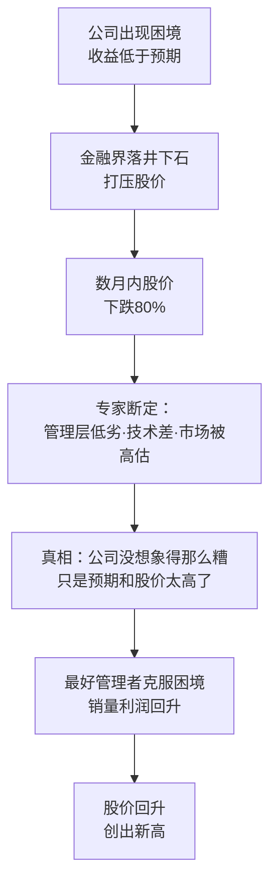
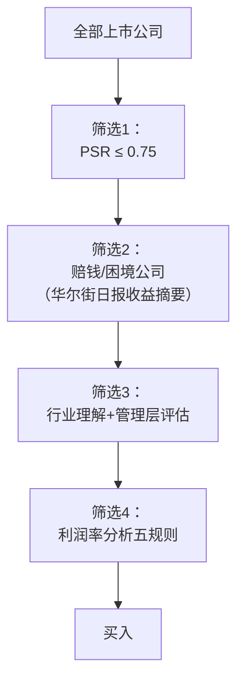
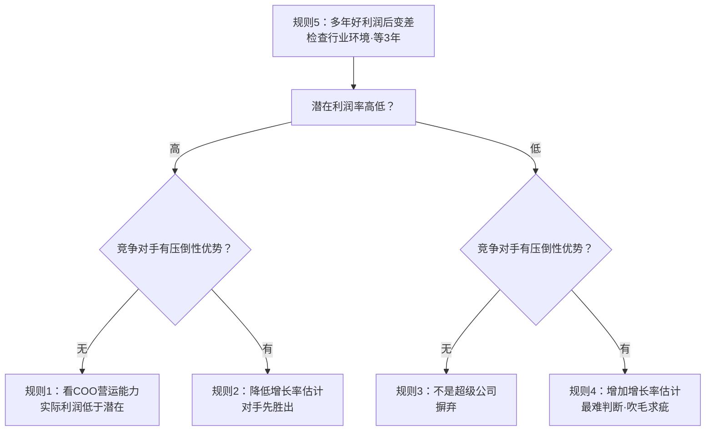
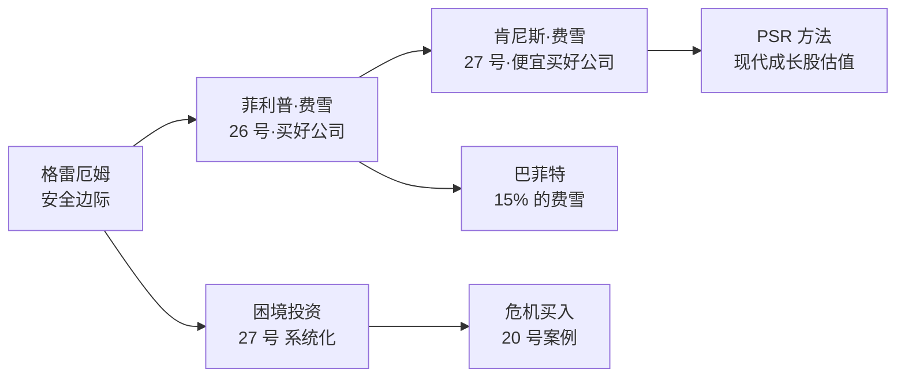
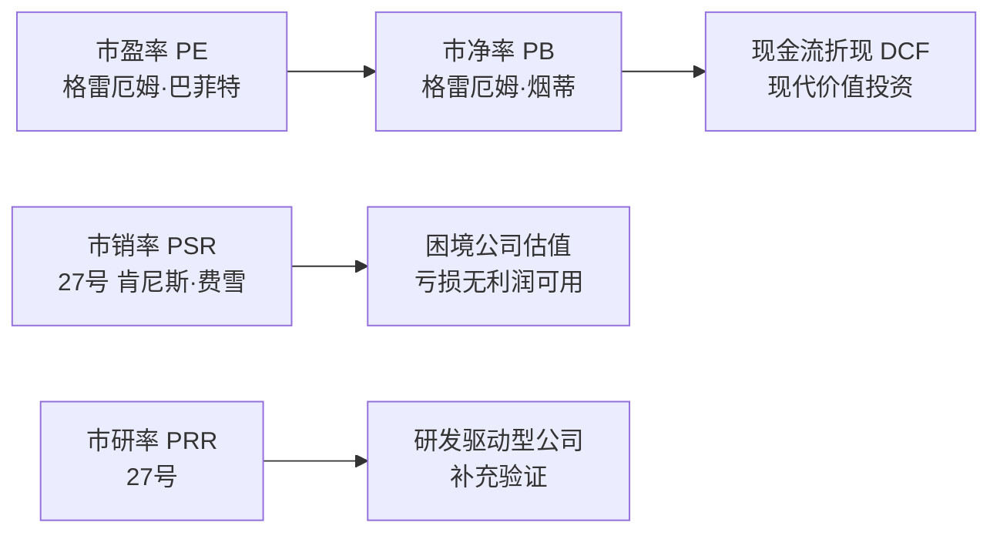
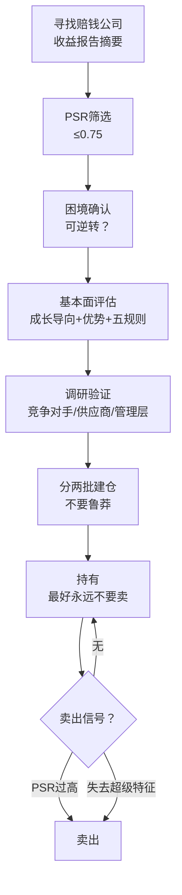
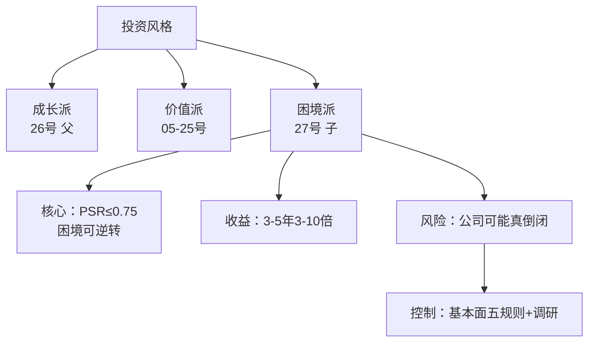

# 27《超级强势股》深度解读（详细版）

> 肯尼斯·费雪——用市销率（PSR）在困境中寻找 3—10 倍股的完整操作系统

## 📖 本书概览

| 项目 | 内容 |
|------|------|
| 书名 | 超级强势股（Super Stocks：如何投资小盘价值成长股） |
| 作者 | 肯尼斯·L·费雪（Kenneth L. Fisher，1950—），菲利普·费雪之子，费雪投资公司创始人，《福布斯》专栏作家 |
| 结构 | 前言 + 四部分 15 章：①剖析超级强势股（困境）②定价分析（市销率/市研率）③基本面分析（竞争优势/利润率）④动态过程（寻找/出售/案例）+ 附录 A—F |
| 历史地位 | **市销率（PSR）投资法的开山之作**；困境反转成长股的经典教科书 |
| 系列位置 | [[26《怎样选择成长股》深度解读（详细版）|26 费雪父]] 的**儿子续作**——父子两代成长股投资的思想传承 |

## 🎯 为什么这本书值得单独解读

- **市销率（PSR）**：本书最著名的贡献——用"市值/销售收入"替代市盈率，破解困境公司"没有利润可算"的估值难题
- **困境投资**：年轻成长公司犯错→股价暴跌 80%→在最低点买入——"以次级公司的股价买入超级公司的股票"
- **实证数据**：5 年跟踪 62 家科技公司的 PSR 研究（高 PSR 前十名中 7 家表现差）
- **两大完整案例**：Verbatim（两年 15 倍）与 California Microwave（波浪式前进）——投资决策全程复盘
- **利润率分析五规则**：把模糊的"竞争优势"变成可检验的推理链条
- **父子对照**：26 号（父）讲"买好公司"，27 号（子）讲"便宜买好公司"——同一家族思想的两代进化


## 📖 全书结构与核心框架

### 27.0 全书结构总览表

| 源书部分 | 笔记章节 | 核心内容 | 关键概念/案例 |
|---------|---------|---------|--------------|
| 第一部分（第1—3章） | 第1—3章 | 超级强势股的定义与诞生点：困境 | 产品生命周期利润剪刀差；股价暴跌 80% 机制；"困境可区分出男人和男孩" |
| 第二部分（第4—7章） | 第4—7章 | 定价分析：PSR 与 PRR | **PSR=市值÷销售收入**；0.75 阈值；62 家公司 5 年实证；Datapoint 3.25 vs 0.6；漂亮 50 教训 |
| 第三部分（第8—10章） | 第8—10章 | 基本面：成长导向与利润率 | 食蚁兽理论；压倒性竞争优势六类型；利润率五规则四象限 |
| 第四部分（第11—12章） | 第11—12章 | 动态过程：寻找与出售 | 五层筛选漏斗；四层访问流程；"机会是没有标签的"；卖出两信号"玫瑰何时凋谢" |
| 第四部分·案例（第13—14章） | 第13—14章 | 两大完整案例复盘 | **Verbatim（两年 15 倍）**；California Microwave（8 倍） |
| 附录 A—F | 第15—19章+附录 | 父子对照/PSR 实证/FAQ | 26 父×27 子终极对照；康衡医疗 A 股模拟 |

### 27.1 核心框架：超级强势股操作系统

```mermaid
graph TD
    A[寻找困境<br/>年轻成长公司犯错·股价暴跌 80%] --> B[定价检查<br/>PSR ≤ 0.75<br/>市研率 PRR 辅助]
    B --> C[基本面验证<br/>成长导向·利润率五规则<br/>压倒性竞争优势]
    C --> D[动态筛选<br/>五层漏斗·四层访问<br/>"机会没有标签"]
    D --> E[买入持有<br/>等待困境转变]
    E --> F[卖出<br/>玫瑰何时凋谢·两信号]
    F --> A
```

## 📑 目录

- [[#第1章 超级强势股：定义与两大条件|第1章 超级强势股：定义与两大条件]]
- [[#第2章 困境现象：超级强势股的诞生点|第2章 困境现象：超级强势股的诞生点]]
- [[#第3章 什么使困境发生转变|第3章 什么使困境发生转变]]
- [[#第4章 市销率（PSR）：定价决定一切|第4章 市销率（PSR）：定价决定一切]]
- [[#第5章 市研率（PRR）：胜人一筹的代价|第5章 市研率（PRR）：胜人一筹的代价]]
- [[#第6章 市销率的扩展应用：择机与垃圾股|第6章 市销率的扩展应用：择机与垃圾股]]
- [[#第7章 大萧条神话：20 世纪 30 年代的历史验证|第7章 大萧条神话：20 世纪 30 年代的历史验证]]
- [[#第8章 基本面之一：成长导向与市场营销|第8章 基本面之一：成长导向与市场营销]]
- [[#第9章 回避风险：避开食蚁兽出没的地方|第9章 回避风险：避开食蚁兽出没的地方]]
- [[#第10章 利润率分析：压倒性竞争优势|第10章 利润率分析：压倒性竞争优势]]
- [[#第11章 动态过程：如何寻找超级强势股|第11章 动态过程：如何寻找超级强势股]]
- [[#第12章 趁好就收：玫瑰何时凋谢|第12章 趁好就收：玫瑰何时凋谢]]
- [[#第13章 案例精析一：Verbatim（两年 15 倍）|第13章 案例精析一：Verbatim（两年 15 倍）]]
- [[#第14章 案例精析二：California Microwave（波浪式前进）|第14章 案例精析二：California Microwave（波浪式前进）]]
- [[#第15章 父子两代费雪：26 号 × 27 号终极对照|第15章 父子两代费雪：26 号 × 27 号终极对照]]
- [[#附录一 肯尼斯·费雪金句集（30 条精选）|附录一 肯尼斯·费雪金句集（30 条精选）]]
- [[#附录二 PSR 速查与计算手册|附录二 PSR 速查与计算手册]]
- [[#附录三 系列互链：超级强势股在价值投资谱系中的位置|附录三 系列互链：超级强势股在价值投资谱系中的位置]]
- [[#附录四 A 股应用：市销率与困境反转的本土化|附录四 A 股应用：市销率与困境反转的本土化]]
- [[#附录五 读完本书后的 10 个自问|附录五 读完本书后的 10 个自问]]
- [[#附录六 超级强势股筛选清单（实操版）|附录六 超级强势股筛选清单（实操版）]]
- [[#第16章 深度专题：PSR 实证研究的完整拆解|第16章 深度专题：PSR 实证研究的完整拆解]]
- [[#第17章 深度专题：市销率的历史应用与择机艺术|第17章 深度专题：市销率的历史应用与择机艺术]]
- [[#第18章 深度专题：困境投资的完整心理课|第18章 深度专题：困境投资的完整心理课]]
- [[#第19章 FAQ：超级强势股 25 问|第19章 FAQ：超级强势股 25 问]]
- [[#附录七 本书数据与案例速查|附录七 本书数据与案例速查]]
- [[#附录八 肯尼斯·费雪的投资人生与后续（补充背景）|附录八 肯尼斯·费雪的投资人生与后续]]
- [[#附录九 超级强势股 × 中医：跨界对照|附录九 超级强势股 × 中医：跨界对照]]
- [[#附录十 本书阅读地图（30 分钟读完）|附录十 本书阅读地图（30 分钟读完）]]
- [[#附录十一 PSR × 系列估值方法深度对照|附录十一 PSR × 系列估值方法深度对照]]
- [[#附录十二 肯尼斯·费雪与超级强势股年表|附录十二 肯尼斯·费雪与超级强势股年表]]
- [[#附录十三 超级强势股 × 其他投资风格速览|附录十三 超级强势股 × 其他投资风格速览]]
- [[#附录十四 超级强势股实战模拟：把方法用在一只 A 股上|附录十四 超级强势股实战模拟：把方法用在一只 A 股上]]
- [[#总结：超级强势股之道的核心|总结：超级强势股之道的核心]]

## 🔗 双链导读

| 连接主题 | 本书章节 | 关联笔记 |
|---------|---------|---------|
| 父子传承 | 全书 | [[26《怎样选择成长股》深度解读（详细版）|26 费雪父 15 要点]] |
| 困境投资 | 第1—3章 | [[24《芒格之道》深度解读（详细版）|24 独臂人攀登半圆顶]]（困境转型） |
| 估值方法 | 第4—6章 | [[12《巴菲特的估值逻辑》深度解读（详细版）|12 估值逻辑]] |
| 竞争优势 | 第8—10章 | [[13《巴菲特的护城河》深度解读（详细版）|13 护城河]] |
| 集中与持有 | 第12章 | [[16《巴菲特的投资组合》深度解读（详细版）|16 集中投资]] |
| 市场无效 | 第4章 | [[22《穷查理宝典》深度解读（详细版）|22 有效市场批判]] |

---

## 第1章 超级强势股：定义与两大条件

### 1.1 本书的定位：前所未有的新观点

> "多数与投资相关的书籍都是老调重弹。那么，与它们相比，本书有何不同之处呢？在股票估值方面，这些新观点中包括了一些虽然复杂，却相当有效并且易于应用的新方法。它们将有助于人们避免投资错误和寻求投机盈利机会。"

**超级强势股的定义（两个必要条件）**：

| 条件 | 内容 |
|------|------|
| 条件一 | **在 3～5 年的时间内，与期初相比，股价增长 3～10 倍** |
| 条件二 | **以相当于次级公司的股价水平，买入超级公司的股票** |

**年收益率特征**："相当长的时间内，超级强势股能产生 25%～100% 的年收益率。没有多少股票可以长期保持这样优异的表现。"

### 1.2 成功投资超级强势股必须明白的四点

| 序号 | 必须明白的事 | 对应部分 |
|------|-------------|---------|
| 1 | 一种我称之为"困境"的现象 | 第一部分 |
| 2 | 用于确定个股投资额的全新而有效（且易于应用）的方法 | 第二部分（PSR/PRR） |
| 3 | 以什么来区分超级公司和普通公司 | 第三部分（基本面） |
| 4 | 在日新月异的世界市场上，识别和应对各种投资机会的动态过程 | 第四部分 |

### 1.3 Verbatim 的预告：全书案例的浓缩

> "在 1981 年早期，我为客户和自己买进了 Verbatim 全部普通股大约 1.5% 的股份，当时，几乎所有认识我的华尔街人士都认为我疯了。他们说，如果要投资磁盘行业，他们都会投资 Dysan，因为它具备最好的技术和管理。……两年后，Verbatim 的股价上涨了 15 倍之多。"

**为什么华尔街会错**：Dysan 是"人人喜欢的成长股"（PSR 3.25 高位），Verbatim 是"人人唾弃的困境股"（PSR 0.60 低位）——**买好公司不是本事，便宜买好公司才是**。

### 1.4 火鸡市（Turkey Market）：牛市下面坐着的火鸡

**费雪会议桌上的公牛与火鸡**：

> "每当心情愉快的时候，我都会在我的会议桌上放置一头庞大的塑料制作的公牛。……在公牛下面，我放了一只五颜六色的火鸡，不仔细看，这只火鸡很难被发现。……人们容易忘记。在（股票）市场达到高水平时，人们总是忘记，此时股价将会下跌。"

**牛市 vs 熊市 vs 火鸡市**：

| 市场类型 | 特征 | 投资者心态 |
|---------|------|-----------|
| 牛市 | 股价上涨 | 忘记风险 |
| 熊市 | 股价下跌 | 恐惧 |
| **火鸡市** | 牛市高位后的暴跌（"在牛市上已经处于高价位的一只股票股价可能上升 70%，但在熊市上，也会下跌 70%，甚至跌幅更大"） | **被遗忘的第三态** |

**超级强势股与火鸡市**："超级强势股大多不存在火鸡市"——因为买入价足够低（PSR≤0.75），下跌空间有限。

### 1.5 严格意义上的超级强势股：三大定量标准（第4章）

> "严格意义上的超级强势股是这样一家公司的股票：
> ➤ 公司未来长期销售收入年均增长率大约在 15%～20% 之间。
> ➤ 公司长期平均税后利润率超过 5%。
> ➤ 在市销率为 0.75 或者更低的水平上买入。"

| 标准 | 数值 | 作用 |
|------|------|------|
| 销售收入年均增长率 | 15%～20% | 成长性 |
| 长期平均税后利润率 | >5% | 盈利质量 |
| 买入市销率（PSR） | ≤0.75 | 安全边际 |

### 1.6 第1章小结

| 层面 | 结论 |
|------|------|
| 定义 | 3—5 年涨 3—10 倍 + 次级价格买超级公司 |
| 四点 | 困境/定价/基本面/动态过程 |
| 火鸡市 | 牛市之下的暴跌风险——低 PSR 买入可免疫 |
| 定量标准 | 15-20% 增长 + 5% 利润率 + PSR≤0.75 |

---


---

## 第2章 困境现象：超级强势股的诞生点

### 2.1 困境（Trouble）的定义

> "最赚钱的普通股票投资，往往是那些虽不受华尔街青睐，但却年轻的快速成长型公司。这类股票正变得越来越有价值，因为随着公司规模不断扩大，金融界终于意识到了它们的真正价值，随之股价也被抬高了。"

**困境的本质**：

> "年轻的快速成长型公司通常有一定的成长周期。……由于年轻和缺乏经验，这类公司的管理层可能会犯严重错误，这将会造成损失，甚至可能危及公司的生存。好的年轻公司会从错误中吸取教训，并不断改进以做得更好。"

**关键认知转变**："与其说犯错代表缺点，不如说它代表发展。"——**困境不是公司烂，而是成长必经之痛**

### 2.2 产品生命周期：困境的底层机制


**产品生命周期的四个阶段**：

| 阶段 | 特征 | 比喻 |
|------|------|------|
| 早期（投机期） | 激情、紧张、高风险 | 青壮年之前 |
| 黄金时期 | 生产持续增长到销量下降之前，大部分利润在此产生 | 人的青壮年期 |
| 衰退期 | "只剩一副虚乏的躯壳和对往日荣光的追忆" | 运动生涯暮年 |
| 更新期 | 管理层提前计划发展新产品 | 关键考验 |

### 2.3 多产品接力：困境的必然性

**单一产品 → 多产品接力的过程**：

> "年复一年，他们不停地推出新产品重复这一过程。管理层已经证明他们有能力去引进和管理单一的项目，现在他们面临的是一系列处于不同发展时期的项目。……在这一过程中，尤其在这一个阶段，他们难免会犯错误。"

**困境的三种典型成因**：

| 成因 | 具体表现 |
|------|---------|
| 产品淘汰快于预期 | "通常他们没料到第一种产品会如此迅速地被淘汰" |
| 新产品推出延迟 | "推出新产品的时间会比预期的更长" |
| 新产品瑕疵 | "产品一开始也许还有这样那样的瑕疵，市场接纳度也比预想的要低" |

### 2.4 困境时利润为何跌得比销量快

**销量暂时走平，利润却下降甚至亏损**的三个原因：

| 原因 | 机制 |
|------|------|
| 成本刚性 | "你必须花钱去赚取更多的钱"——按增长预期雇的人/建的产能，市场预期下降后要花几个月调整 |
| 解决问题需额外支出 | 客户服务、市场工作防流失 |
| 资产减值核销 | "审计人员将要求对它们进行及时的调整"——存货/设备账面价值调低 |

**利润与销量的剪刀差**："利润将会迅速转化成亏损。过后，当问题被解决后，收入再次增加，亏损减少。短期内，盈利能力得以恢复，紧接着是持续的利润。"

### 2.5 困境的股价冲击：跌 80% 的机制

**困境出现后的市场反应链**：



**关键结论**：

> "其实，该公司没他们想象得那么糟，也没他们之前预计得那么好。前者的可能性更大些。该公司很可能是一家很棒的公司。问题很简单，那就是对该公司的盈利预期和之前的股票价格都太高了。"

**投资者心态的扭曲**："许多投资者抱怨公司没能达到他们的预期，而不是把挫败看成是发展的必由之路。失望的金融界人士更易于抱怨公司管理者没有能力，而不是反省自己当初要求太多。"

### 2.6 困境 × 系列对照：困境投资的谱系

| 方法 | 出处 | 核心逻辑 |
|------|------|---------|
| 困境投资 | 本书 | 成长公司犯错→股价暴跌→低价买入 |
| 危机投资 | [[20《巴菲特的第一桶金》深度解读（详细版）|20 号]] | 美国运通"色拉油丑闻"困境买入 |
| 反面思考 | [[22《穷查理宝典》深度解读（详细版）|22 号]] | 逆向思维：别人恐惧我贪婪 |
| 独立人格 | [[24《芒格之道》深度解读（详细版）|24 号]] | 每日期刊软件转型困境 |
| 华尔街情绪 | [[01《股票作手回忆录》读书笔记|01 号]] | 市场情绪与价格超调 |

### 2.7 第2章小结

| 层面 | 结论 |
|------|------|
| 困境本质 | 成长必经之痛，不是公司烂 |
| 底层机制 | 产品生命周期 + 多产品接力失误 |
| 利润剪刀差 | 成本刚性+解决问题支出+资产减值 |
| 股价冲击 | 数月跌 80%——"预期和价格太高" |
| 投资含义 | 困境=超级强势股的诞生点 |

---

## 第3章 什么使困境发生转变

### 3.1 核心命题：困境可区分出男人和男孩

> "困境可区分出男人和男孩。快速发展的年轻公司，在成长的过程中犯些错误是正常的。造成错误的原因是多方面的。有些原因使得华尔街人士在处理这些问题时左右为难。明白困境造成的痛苦，是我们从困境中获益的前提。"

**困境的考验对象**：不是公司，而是**管理层**——同样的困境，有的公司一蹶不振，有的公司浴火重生。

### 3.2 困境转变的两大范式（California Microwave 案例的总结）

**经典范式（第2章框架）**：

| 范式 | 内容 | 案例印证 |
|------|------|---------|
| 范式一 | 高估了现有产品的生命周期 | CM41 产品生命周期高估 |
| 范式二 | 低估了下一代产品研发需要的时间 | 卫星地面终端和 CA42 研发延迟 |

**费雪访谈创始人利森时的验证**："他将原因归类为：（1）高估了 CM41 产品的生命周期。（2）低估了下一代产品研发需要的时间（尤其是卫星地面终端和 CA42——将和 CM41 有着相同市场的产品）。"

### 3.3 判断困境能否转变的关键问题

**在困境中买股票之前，必须回答**：

| 问题 | 判断要点 |
|------|---------|
| 困境是一次性的还是结构性的？ | 产品周期问题=一次性；市场消失=结构性 |
| 管理层是否承认错误？ | 利森"非常坦诚地与我讨论了公司现存的问题" |
| 管理层是否采取了行动？ | 换管理层（Verbatim 解聘麦丘恩）/自我反思（利森） |
| 新产品是否在途？ | CA42+卫星终端=新增长曲线 |
| 财务是否撑得住？ | 资产负债表是否健康 |

### 3.4 困境转变的完整循环（图 1-11/1-16 的文字版）

**30 年回看的视角**：

> "又过几年，公司发展成真正的巨人。当它越来越庞大时，它的增长率和毛利率会越来越小，市场对其估值可能不再那么高。股价还是上涨，只是与当初规模尚小时相比没有那么快了。30 年后再回头看，困境可能在整个销售史上微不足道，但对股价造成的影响却很大。"

**困境的悖论**：对销售史微不足道的挫折，对股价却是决定性的大坑——**而这个坑正是超额收益的来源**。

### 3.5 第3章小结

| 层面 | 结论 |
|------|------|
| 核心命题 | 困境区分管理层优劣 |
| 两大范式 | 高估旧产品寿命 + 低估新产品研发时间 |
| 判断框架 | 一次性 vs 结构性/认错/行动/新品/财务 |
| 30 年视角 | 困境对销售微不足道，对股价举足轻重 |

---


---

## 第4章 市销率（PSR）：定价决定一切

### 4.1 PSR 的定义与直觉

**PSR（Price-to-Sales Ratio，市销率）= 公司市值 ÷ 最近 12 个月的销售收入**

> "当分析一家尚处于'困境'中的公司时，市盈率、市净率都无法使用——因为亏损的公司没有利润，账面价值也可能失真。但**销售收入是真实的**——困境公司的销售额依然存在，只是利润被成本/减值吃掉了。"

**为什么 PSR 优于市盈率（困境场景）**：

| 维度 | 市盈率（PE） | 市销率（PSR） |
|------|------------|--------------|
| 分子 | 市值 | 市值 |
| 分母 | 净利润（可为负） | 销售收入（几乎恒为正） |
| 困境公司 | **无法计算**（亏损） | **可以计算** |
| 操纵空间 | 利润易被会计调整 | 收入相对难操纵 |
| 反映本质 | 盈利质量 | 生意规模 |

**PSR 的本质**：你为这家公司每一块钱的生意（销售收入）付多少钱。

### 4.2 低 PSR 是多少，高 PSR 是多少？

**Datapoint 公司的对照案例**：

> "在 PSR 值为 3.25 时购买该公司股票的投资者遭受了重大损失，而在 PSR 值为 0.6 时购买该公司股票的投资者则获取了巨额的收益。PSR 值为 0.6 时，Datapoint 公司股票交易的市场价值恰好等于 1982 年收益的 6 倍。"

| 买入时机 | PSR | 结果 |
|---------|-----|------|
| 高位买入 | 3.25 | 重大损失 |
| 低位买入 | 0.60 | 巨额收益 |

### 4.3 费雪投资公司的实证研究（5 年跟踪 62 家科技公司）

**研究设计**：以 Hambrecht & Quist 投资银行《月度数据记录》为样本（1978 年起按季度跟踪），分三组：

| 组别 | 销售收入规模 | 公司数 |
|------|-------------|--------|
| 小公司 | 1 亿美元以下 | 38 家 |
| 中公司 | 1 亿—6 亿美元 | 15 家 |
| 大公司 | 超过 10 亿美元 | 9 家 |

**三大不变结论**：

> ➤ 与小公司相比，大公司的 PSR 值更低。
> ➤ 当公司的 PSR 值小于 1 时，该公司的股票能够给我们带来许多惊喜。
> ➤ 若购买 PSR 值最高公司的股票，在公司出现较差业绩之前，你就会感到失望的。

### 4.4 高 PSR 股票的表现：前 10 名中 7 家令人失望

**1978 年板块 PSR 最高的 10 只股票**（当时 PSR 峰值仅 2.53，来自 Waters Associates；38 家小公司平均 PSR 仅 0.80，最低 Infomag 0.24）：

| 公司 | 1978 年 PSR | 后续表现 |
|------|------------|---------|
| Waters Associates | 2.53 | 令人失望（1980 年被 Millipore 收购，市值 86M→91M） |
| Manufacturing Data Systems | 高 | 成功（35M→212M 被 Schlumberger 收购） |
| Tesdata | 高 | 惨败（18M→10M，1982 年曾降至 4M） |
| Sycor | 高 | 惨败（被收购时市值仅为初始的 8% 多一点） |
| Computer Automation | 高 | 惨败（48M→29M） |
| MCI Communications | 高 | 巨大成功（81M→49 亿，PSR 4.9——特例） |
| Tymshare | 高 | 先升后跌（92M→622M→240M，PSR 2.6→0.67） |
| Advanced Micro Devices | 高 | 成功（76M→986M） |
| 其余 | 高 | 多数不佳 |

**统计结论**："10 家 PSR 值较大的企业中 7 家的低劣表现格外引人注意"——**而背景是科技股史无前例的增长时期（H&Q 指数涨 5 倍以上，平均增长率近 40%）**。在最好的时代，高 PSR 股票仍然大面积跑输。

### 4.5 低 PSR 股票的表现：惊喜连连

| 公司 | 初始 PSR | 初始市值 | 结果 |
|------|---------|---------|------|
| Infomag（后改名 Computer & Communications Technology） | 0.24 | 8M | 150M，PSR 超 2.0 |
| Granger Associates | 0.50 | 9M | 250M+ |
| Finnigan | 0.43 | 9M | 66M（7 倍多），PSR 1.20 |
| California Microwave | 0.63 | 19M | 150M+，PSR 1.50 |
| Rolm（真正超级强势股） | 0.81（群组平均） | 29M | **11 亿美元**，PSR 2.5+ |

**结论**："低 PSR 值的股票出现较小倍数的增长，但是，不管怎样，表现相当好。"

### 4.6 理想之国（Ideal Country）：PSR × 销售规模的右斜线

**表 4-3 的发现**：把板块上公司的（销售规模，PSR）画成散点图，从左边底部向右上方倾斜的虚线把图表分成两半——**虚线的右边（高 PSR 高规模）只有极少数华尔街卓越企业能够获取**：

> "这少数几家公司的名称显示在表中……它们中的每一个在各自领域都是出类拔萃的，包括 AMD、Apple Computer、Intel、MCI、Prime Computer、Tandem Computer、Tandon 和 Wang。1982 年 11 月份板块上 PSR 值最高的是 Intecom，其 PSR 值为 18.78，公司仅有 18,000,000 美元的收益。"

**理想之国的投资含义**：

> "不是说这些股票不能增长，从 1982 年 11 月份到 1983 年 5 月份，在强劲的股市上，它们确实实现了增长。但是潜在的回报并不值得冒那样的风险。……实际上，该群组股票没有板块上低 PSR 值的股票表现好（从中长期方面来讲，高 PSR 值股票群的表现总是比低 PSR 值股票群的表现差）。"

**例外证实规则**："有几只股票的运行游离于这个规则之外，但是这几个特例的数目相当少，以至于没有什么投资意义。比如，当 MCI 成长为一个大公司的时候，其 PSR 值从一个已经较高的水平增长至一个相当高的水平。……但是，这种例外没有几个（MCI 的股票后来暴跌）。"

### 4.7 PSR 的规模规律：为什么大公司 PSR 更低

**规模与 PSR 的负相关逻辑**：

| 因素 | 解释 |
|------|------|
| 增长空间 | 大公司增长百分比天然低于小公司 |
| 市场认知 | 小公司被忽视→定价低；大公司被充分研究→定价"合理" |
| 风险溢价 | 小公司不确定性高→需要更低价格补偿 |
| 流动性 | 小公司流动性差→折价 |

**费雪的结论**："毫无疑问，当公司规模越来越大时，PSR 值将会下降。"

### 4.8 牛市中的 PSR 膨胀：1982 年 11 月的疯狂

> "当科技股越来越受欢迎时，激发了强劲的牛市，这也是这些股票升值的一个重要原因……到 1982 年 11 月份，Hambrecht & Quist 投资银行板块上 27 只股票的 PSR 值超过 3.0。其中 8 只股票的 PSR 值超过 6.0（记着，1978 年早期，板块上最高的 PSR 值仅为 2.53）。"

**1982 年 11 月 vs 1978 年早期的 PSR 分布**：

| 指标 | 1978 年早期 | 1982 年 11 月 |
|------|------------|--------------|
| 板块最高 PSR | 2.53 | 18.78（Intecom） |
| PSR>3.0 的公司 | 0 | 27 只 |
| PSR>6.0 的公司 | 0 | 8 只 |

**牛市泡沫的本质**：**PSR 的整体抬升=市场情绪的膨胀**——费雪用这张表直观展示了"火鸡市"如何酝酿。

### 4.9 第4章小结

| 层面 | 结论 |
|------|------|
| PSR 定义 | 市值/销售收入——困境公司的估值钥匙 |
| 阈值 | 买入 ≤0.75；<1 有惊喜；高 PSR 失望 |
| 实证 | 62 家公司 5 年跟踪：高 PSR 前 10 名 7 家差 |
| 理想之国 | 高 PSR×大规模=危险区 |
| 规模规律 | 公司越大 PSR 越低 |
| 牛市警示 | PSR 整体膨胀=火鸡市前兆 |

---

## 第5章 市研率（PRR）：胜人一筹的代价

### 5.1 PRR 的定义

**PRR（Price-to-Research Ratio，市研率）= 公司市值 ÷ 最近 12 个月的研发支出**

> "市研率反映公司股价与公司研发预算的简单算术关系。需要注意，它并不反映公司股价与研发产出或者研发生产率之间的关系。"

**PSR 与 PRR 的关系**：

| 指标 | 分子 | 分母 | 含义 |
|------|------|------|------|
| PSR | 市值 | 销售收入 | 为每块钱生意付多少钱 |
| PRR | 市值 | 研发支出 | 为每块钱研发付多少钱 |
| 换算 | PRR = PSR ×（销售收入/研发支出） | | 研发强度越高，PRR 相对 PSR 越低 |

### 5.2 研发的本质：一种商品

> "研发实质上就是被用来满足客户需求的一种有用的工具，没有什么神秘之处。'研究'、'研究和发展'、'商业发展'、'技术工程'，不管你怎么称呼这些术语，在大多数的企业中它们指的是一码事。"

**研发的三种作用**：

| 作用 | 说明 |
|------|------|
| 新产品 | 创造新的收入来源 |
| 改进现有产品 | 维持竞争力 |
| 降低成本 | 提高利润率 |

**"研发只是一种商品"的深层含义**：研发投入本身不构成竞争优势——**关键在研发的产出效率**（呼应 [[26《怎样选择成长股》深度解读（详细版）|26 号要点 3]]：研发效果）。

### 5.3 市研率运用原则

**PRR 的用法**：作为 PSR 的**补充验证**——如果一家公司 PSR 很低但 PRR 很高（说明研发支出少），则它可能只是"低成本生意"而非"高研发成长"；反之 PSR 略高但 PRR 很低（研发占比高），则成长引擎更强。

**案例验证**：
- **Verbatim**（1981 年 1 月，股价 10 美元）：PSR 0.43，**PRR 10.4**——勉强合格
- **Verbatim 买入时**（1981 年 2 月，专栏 14-4）：PSR 0.60 合格，**PRR 13.6 勉强合格**
- **California Microwave**（1980 年 1 月）：PSR 0.78 刚刚达标，**PRR 12.5 刚刚达标**

### 5.4 PRR 存在的问题

| 问题 | 说明 |
|------|------|
| 不反映研发产出 | "它并不反映公司股价与研发产出或者研发生产率之间的关系" |
| 研发口径混乱 | 各公司对研发的定义差异大（营销工程 vs 纯研究） |
| 行业差异 | 高研发行业（半导体）PRR 天然低 |
| 时间滞后 | 研发支出→产品→收入的传导需要多年 |

### 5.5 第5章小结

| 层面 | 结论 |
|------|------|
| PRR 定义 | 市值/研发支出 |
| 核心用途 | PSR 的补充验证 |
| 案例阈值 | 10—14 区间=勉强合格 |
| 局限 | 不反映产出效率 |

---


---

## 第6章 市销率的扩展应用：择机与垃圾股

### 6.1 历史教训：20 世纪 60 年代和 70 年代早期牛市中的市销率

**费雪对历史牛市的 PSR 复盘**：1960s 年代的牛市以高 PSR 为特征，追逐"成长故事"的投资者付出了惨痛代价；1970s 早期的"漂亮 50"同样如此——**当 PSR 整体高企时，市场处于危险区**。

### 6.2 市销率和美国的浓烟股

**浓烟股（Smokestack Stocks）**：传统工业股（钢铁、机械、化工）——它们的 PSR 常年偏低，被市场视为"昨日黄花"。

**费雪的洞察**：浓烟股的 PSR 低≠没有价值——当行业环境改善时，低 PSR 提供了双重安全垫（估值修复+盈利改善）。

### 6.3 使用市销率作为股市择机工具：费雪的股市择机原则

**PSR 择机的逻辑**：观察整体市场的 PSR 水平（而非个别股票）：

| 市场 PSR 状态 | 含义 | 行动 |
|--------------|------|------|
| 整体 PSR 偏低 | 市场被低估 | 积极买入 |
| 整体 PSR 适中 | 正常区间 | 精选个股 |
| 整体 PSR 显著偏高 | 泡沫酝酿（火鸡市前兆） | 降低仓位/等待 |

**与 [[22《穷查理宝典》深度解读（详细版）|22 号]] 的"市场周期"呼应**：PSR 择机=用可量化的指标替代模糊的"贪婪恐惧"判断。

### 6.4 "垃圾股"的市销率

**垃圾股（Junk Stocks）的 PSR 特征**：低 PSR 是常态——但**低 PSR 本身不是买入理由**：

> 低 PSR 只是筛选器（必要条件），不是买入信号（充分条件）——必须结合第三部分的基本面分析（成长导向/竞争优势/利润率），确认"困境"是暂时的而非结构性的。

**筛选漏斗**（第11章详述）：



### 6.5 第6章小结

| 层面 | 结论 |
|------|------|
| 历史教训 | 高 PSR 牛市=危险区 |
| 浓烟股 | 低 PSR 传统股的双重安全垫 |
| 择机工具 | 市场整体 PSR 水平判断牛熊 |
| 垃圾股 | 低 PSR 是必要条件，非充分条件 |

---

## 第7章 大萧条神话：20 世纪 30 年代的历史验证

### 7.1 透过时间错位看 30 年代

> "长期经济周期趋势，需要几年甚至几十年才能得到逆转。强势股票市场靠丰厚的边际利润率和递增的收益来掩饰股票价格水平。……因为这些趋势的结束需要花费太长的时间，以至于我们没有注意到这期间的一些变化，就如同我们忽视了时钟上环绕的分针一样。"

**记忆的选择性**："我们记得的只有那些幸存者。同样能被记起的也只有 500 强中的大部分企业。"——多少人还记得 30 年代的 Auburn Automobile？

### 7.2 费雪投资公司的 30 年代研究

**研究设计**：研究 1926～1939 年间 **150 多家公司**的市场价值与资产价值、营业收入、销售额的比率；1957 年被详细研究的公司包括：Bethlehem Steel、Caterpillar Tractor、道氏化学、柯达、FMC（Food Machinery）、通用电气、**IBM**、J.C. Penney、Mead Corporation、SCM（Smith-Corona）、Remington Rand、西尔斯。

**30 年代神话的检验**：

> "20 世纪 30 年代的神话表明：'1929～1933 年股市的巨大震荡，使得一些大公司以很低廉的价格被收购。'其中一些像 IBM、陶氏化学公司，与公司的资产相比，市盈率与市场价值是很低的。我们或许可以认为，几乎所有的股票都是这样的。如同其他神话一样，现实与想象是并存的。"

### 7.3 神话与现实的并存

| 神话 | 现实 |
|------|------|
| "所有股票都跌到极低价格" | "许多股票连续几年处于低迷状态，而一些股票一直走高" |
| "低 PE/低 PB=便宜" | "运用其他价值分析方法（如 PSR），它们的价格并不低" |
| "1933 年是最低点" | "很多股票不只停留在 1933 年市场上的最低价格，而是继续下跌" |

**PSR 视角的发现**：

> "开始时，知名股票的市销率都是很低的。而相比较而言，撇开市盈率和其他因素，那些具有高市销率的股票并不被人们看好。"——**30 年代同样是低 PSR 股票的天下**

### 7.4 IBM 是不是成长股？（第7章的关键问题）

**IBM 的成长股属性验证**：IBM 在 30 年代是低 PSR 股票，但长期成长惊人——**低 PSR 买入成长股=超级强势股的原型**（IBM 案例证明困境/萧条时期的低 PSR 是长期超额收益的起点）。

### 7.5 市销率低的股票带来的丰厚回报

**大萧条低 PSR 股票的历史回报**：从 30 年代最低点买入低 PSR 股票的长期回报惊人——"市销率低的股票带来的丰厚回报"章节标题本身就是结论。

**大公司的情况如何**：大公司（如 IBM、道氏化学）在 30 年代同样低 PSR，同样带来丰厚回报——**PSR 方法对大公司同样适用**（规模规律：大公司 PSR 更低）。

### 7.6 第7章小结

| 层面 | 结论 |
|------|------|
| 时间错位 | 长期趋势难以察觉，记忆只留幸存者 |
| 研究方法 | 150 家公司 1926—1939 年数据 |
| 神话检验 | "所有股票都便宜"是错觉；PSR 能区分真便宜与假便宜 |
| IBM 启示 | 低 PSR 成长股=超级强势股原型 |

---


---

## 第8章 基本面之一：成长导向与市场营销

### 8.1 成长导向：成长首先在管理层的头脑中酝酿

> "成长并不会自己发生。它首先在管理层的头脑中酝酿，是一种令人难以摆脱的情愫。"

**领导者的真正作用**（对"领导者善于争权夺利"的纠偏）：

> "许多人错误地认为，领导者善于争权夺利。这并非总是成立。相反，权力是由领导者所培养的部下给予他们的。追随者希望从领导者那里得到远见、信心、对他人及对追随者的尊重。"

**优秀领导者特质表**：

| 特质 | 表现 |
|------|------|
| 信心无可置疑 | "他追求不断进步，成为一个不断成长、更加强大的公司的领导者，同时也保持一定的谦虚" |
| 尊重下属 | "他在谈论下属时保持高度的尊重" |
| 发掘人才 | "他经常从下属中发掘那些能力超过自己的人——他信任的人" |
| 传递理念 | "他们会将这种理念进一步传递给他们的下属" |
| 问题即机遇 | "一个大型公司，通常把各种问题视为潜在的机遇" |

**Verbatim 主席的案例**（朋友入职 Verbatim 的故事）：

> "他来到 Verbatim 的第一天，就被主席接见，而且主席对他的了解甚至超过了他对主席的了解，这使他惊讶不已。主席说他是少见的人才。这个曾被抛弃的疲惫不堪的可怜人重新振作精神。在前几周，他每天工作 15 小时，并乐在其中。他找到了一个他愿意跟随的人一起奋斗的工作。"

**决策中的尊重**："较低的管理层首先会因真实而自然地尊重上级接受这些意见。决策过程中的尊重与否是区分大型公司和普通公司的重要特征。"

### 8.2 优秀的市场营销

**营销的核心**：不是广告投入，而是**理解客户**——"市场调研影响技术研发"（第5章）：研发必须由市场需求牵引，而非实验室自嗨。

**管理层是否可以控制市场营销**：优秀公司把营销视为管理层可控的变量——营销策略/渠道/定价都是管理决策，而非外部运气。

### 8.3 找出压倒性优势（第8章的另一条主线）

**竞争优势的三大类别**（与第10章呼应）：

| 类别 | 内容 |
|------|------|
| 营销优势 | 激励消费者/品牌/渠道 |
| 生产优势 | 低成本制造技术 |
| 研发优势 | 专利技术（"过去专利常被看做压倒性优势，现在这种观念通常不再正确了"） |

**营销优势的案例**：
- **乔·布洛**（存贷行业转型者）："他不仅把握住了关键点，同时，从更大的程度上看，他按客户的行为来思考"——理解客户决策链
- **Dataquest 的吉姆·赖利**：半导体行业营销老兵，"他能够快速入门并吸引人们的注意，而其他人做不到。在很短的时间里，半导体服务成为了 Dataquest 运营项目中最大的部分"

### 8.4 劳工关系非常重要

**劳资关系对成长公司的意义**：困境中的公司最需要员工士气——裁员/降薪要谨慎，核心团队流失=困境无法逆转。

### 8.5 财务控制

**财务控制的作用**：困境公司的财务纪律决定能否活到反转之日——现金流管理、成本削减、资产处置的节奏。

### 8.6 第8章小结

| 层面 | 结论 |
|------|------|
| 成长导向 | 领导者的远见/信心/尊重向下渗透 |
| 市场营销 | 理解客户+管理层可控 |
| 压倒性优势 | 营销/生产/研发三类 |
| 劳资与财务 | 困境生存的两大支柱 |

---

## 第9章 回避风险：避开食蚁兽出没的地方

### 9.1 食蚁兽理论

> "大公司在大型市场中表现较好，小公司则在小型市场中占优，而大公司在小型市场中的表现同小公司在大型市场中的运作都欠佳。……所以要避免进入那些要与巨型企业进行直接竞争的市场，那些巨型企业可以以自己不赚钱为代价来使你亏损。（我十分惧怕一只食蚁兽坐在那里把我吃掉。）一个公司应进入与自己规模相适应的市场，蚂蚁公司（小公司）就应该进入那些并不吸引食蚁兽的小型市场。而在小型市场中，大公司是会亏损的。"

### 9.2 个人电脑市场的实证（1980s 初期）

| 时间 | 市场状态 | 参与者 | 结果 |
|------|---------|--------|------|
| 早期 | 小型成长市场（苹果迈出尝试性第一步前） | 苹果、Kaypro、Osborne、Radio Shack 等小公司 | 在飞速成长的小市场中找到位置 |
| 1982 年 | 市场扩大（60 亿美元） | IBM 等大公司进入 | IBM 快速占据大份额——"其完成这一切所凭借的产品在很多人看来比不上其他替代公司的产品" |
| 1983—1984 | 市场成熟 | 食蚁兽出动 | "许许多多的蚂蚁的道路不再平坦" |

**大公司为什么不进小市场**：

> "每个公司都试图以每年 20% 的速度增长，也就是说，必须使销量在 1983 年增加 8 亿美元，1984 年增加 10 亿美元。所以如果你是这些公司的经营者，你会傻到在总资本只有几亿美元的市场中经营吗？"

### 9.3 德州仪器杀 Bowmar 的案例：食蚁兽的定价战

**Bowmar 的悲剧**："Bowmar 是计算器领域的早期领头羊。你一定还对 Bowmar Brain 这个名字有印象吧？德州仪器的计算器定价策略使得 Bowmar 的下场只能是我们第 11 章要讲的破产。"

**食蚁兽的战争模式**："看看德州仪器是如何为其个人电脑定价的。现在其价格是否使之有利可图已经不重要了。如果它们选择了去争取自己想要的市场份额，它们就准备好了长期亏损。"——**大公司可以用"长期亏损"换市场份额，小公司没有这个弹药**

### 9.4 小（而不同）会很出色

**小公司的正确战场**：小型市场+差异化定位——"小（而不同）会很出色"（Small and Different Can Be Very Good）。

**轻声走路但得带着稳健的资产负债表**：小公司要低调（不惊动食蚁兽），但要财务稳健（困境中的生存资本）。

### 9.5 谁在控股

**股权结构的检查**：创始人控股 vs 机构主导——创始人深度参与（利森案例的反思）比职业经理人更可能逆转困境。

### 9.6 第9章小结

| 层面 | 结论 |
|------|------|
| 食蚁兽理论 | 规模匹配市场：大公司大市场，小公司小市场 |
| IBM 案例 | 大公司进入后小公司被碾压 |
| 德州仪器案例 | 大公司可长期亏损换份额 |
| 小公司策略 | 小+不同+稳健资产负债表 |

---

## 第10章 利润率分析：压倒性竞争优势

### 10.1 压倒性竞争优势的定义

> "压倒性竞争优势有着不同的形式。优势往往可以被划为三个主要的类别——营销优势、生产优势和研发优势。……将压倒性竞争优势作为核心要素来寻找的关键点在于，你的投资未来是否能赚到超过平均水平的利润率。"

**压倒性竞争优势的类型清单**：

| 类型 | 内容 |
|------|------|
| 配送优势 | 基于产品、成本、技术散发给不同市场的能力 |
| 广告规模经济 | 通过与产品密切联系的广告而拥有的规模经济 |
| 商业秘密 | 专有技术 |
| 领先地位 | 长时间的领先地位 |
| 低成本制造 | 低成本制造技术 |
| 品质溢价 | 消费者愿意为之付出溢价的高品质 |

### 10.2 市场份额：压倒性竞争优势的核心形式

**市场份额的鸡生蛋逻辑**：

> "这有点类似于先有鸡还是先有蛋的问题。超级公司用时间构筑了大的市场份额并开始垄断行业。然后，通过较大的市场份额，它可以做到：①保持高的毛利率；②进一步发展融通资金以便于巩固其垄断地位。"

**BCG 的影响**："Boston Consulting Group 将其作为决定潜在盈利能力的关键因素，并将其放大了，把这个观点引入到了现代利润率分析的领域。"

**与 [[13《巴菲特的护城河》深度解读（详细版）|13 号护城河]] 的对应**：

| 本书的优势类型 | 13 号护城河类型 |
|---------------|----------------|
| 配送优势 | 网络效应/转换成本 |
| 广告规模经济 | 无形资产（品牌） |
| 商业秘密 | 无形资产（专利） |
| 低成本制造 | 成本优势 |
| 品质溢价 | 品牌溢价 |
| 市场份额 | 规模优势 |

### 10.3 利润率分析五规则（第11章核心）

**规则 1：高潜在利润率 + 无竞争对手优势 → 实际利润低于潜在**

> "如果该预测公式显示你潜在的超级公司有着高的潜在利润率（并且似乎没有竞争对手有压倒性的竞争优势），那么实际利润将会因缺乏综合管理及营运能力而低于潜在水平。"

**应用**：通过首席运营官（COO）的履历判断营运能力——"如果首席运营官有着相对糟糕的运营经历，那么这个公司将不是一个超级公司，并且应该被摒弃掉。"

**规则 2：高潜在利润率 + 竞争对手有优势 → 降低增长率估计**

> "如果一个竞争对手有重大的压倒性竞争优势，那么你所考虑的公司就不是一个超级公司，因为不管以后的增长水平怎样，竞争对手首先胜出。"

**规则 3：低潜在利润率 + 无优势 → 不是超级公司**

> "这是绝大多数工业公司所处的情形。它们有很低的潜在利润，相对于竞争对手没有压倒性竞争优势。竭尽所能它们都不可能获得引人注目的利润率。只有极端的运气才能使这类公司获得高额利润（可能一场地震消灭了竞争对手）。"

**规则 4：低潜在利润率 + 有优势 → 增加增长率估计（最难的情形）**

> "想很好地确定一个优势的重要性是很困难的。调查管理层的想法，以确定他们是否通过做与过去完全不同的事情来提高利润率。……在一番'吹毛求疵'后接受管理层的利润率目标是合理的。"

**Nucor 肯·艾弗森的案例**：

> "当我初次拜访 Nucor 的肯·艾弗森时，并没有取得足够好的财务结果。但很明显，他是一个能够为了长期的潜在利润而将自身竞争优势最大化的人。识别管理层的这种能力也是一门艺术。这就像当看到一位年轻的拳击手时，你得知道他是否是日后拳坛霸主的料子。"

**规则 5：多年好利润后变差 → 检查行业环境是否改变**

> "如果一家公司多年以来管理层没变，并获得很好的利润，而现在的获利性却较差，我们就应该检查一下，是否长期的行业环境发生了改变。……如果行业环境并不比以前差，那么，和以前一样好的利润可能及时地再现。应该用 3 年时间期待这种改变发生。"

**California Microwave 的印证**："优秀的管理层能及时地与困难作斗争并获得胜利。California Microwave 1979 年在市场上犯了错误，从而导致了其在财务结果曲线上有一个显著的凹点。它的业务属性逐渐发生了改变，尽管利润率没有达到先前水平，但它却越来越符合超级公司的身份了。"

### 10.4 利润率分析五规则的逻辑框架



### 10.5 第10章小结

| 层面 | 结论 |
|------|------|
| 优势类型 | 营销/生产/研发三大类六小类 |
| 市场份额 | 鸡生蛋：份额→毛利→资金→垄断 |
| 五规则 | 潜在利润率×竞争优势的四象限+历史规则 |
| Nucor 案例 | 识别管理层最大化优势的能力=艺术 |

---


---

## 第11章 动态过程：如何寻找超级强势股

### 11.1 机会是没有标签的

> "机会是没有标签的。"——超级强势股不会自己标榜身份，需要主动寻找。

**寻找赔钱的公司**（第12章的核心方法）：

> "我每天浏览《华尔街日报》的'收益报告摘要'，在里面寻找赔钱的公司。我对那些名字陌生的公司尤其感兴趣。……我不熟悉的那些赔钱的公司，我会用蓝笔圈起来，然后把这些摘要交给一位同事。她会在标准普尔中查看每家公司的情况，并在一张纸上简要地归纳出某家公司在经营什么，以及一些简单的财务数据，包括市销率。如果市销率大于 0.75，那么她就会把这张纸扔掉；但如果市销率小于 0.75 的话，她就会把它交给我。"

### 11.2 筛选漏斗（完整版）

```mermaid
graph TD
    A[《华尔街日报》收益报告摘要<br/>每天浏览] --> B[蓝笔圈出<br/>赔钱+陌生公司]
    B --> C[同事查标准普尔<br/>归纳业务+财务数据]
    C -->|PSR > 0.75| D[扔掉]
    C -->|PSR ≤ 0.75| E[交回费雪]
    E --> F{有兴趣且懂行业？}
    F -->|否| G[丢弃<br/>"人生很短暂，不应把时间花在自己不自在的地方"]
    F -->|是| H[纳入备选<br/>深入研究]
```

**费雪的自我约束**："我肯定为此错过了好些机会。（人生很短暂，我们不应该把大把的时间花费在那些自己不自在或不了解的地方。应该专注在能理解的事情上。）"——**能力圈原则**（呼应 [[22《穷查理宝典》深度解读（详细版）|22 号]]）

### 11.3 寻找超级公司的定性评估

**最好的研究途径是免费的——图书馆**：

> "现在是时候做点事来确定是否有必要进行下一步的工作了。这需要我们到图书馆去——图书馆是个好地方，因为里面有很多的信息，而只需花费使用者的一些时间。……从标准普尔或穆迪开始。我出于习惯，选择标准普尔。每家公司的资料会很快查阅到。通常，你立马就可以断定花费额外时间进行研究是不值得的。"

**信息筛选原则**："有些信息确实很有趣，但是没有价值，只会浪费时间。节约时间——你要用它来研究超级公司。"

### 11.4 避免来自华尔街的竞争

**为什么不与华尔街同路**：
- 华尔街关注热门股（高 PSR）——费雪要的是冷门股（低 PSR）
- 机构研究覆盖的公司=定价充分
- "避免来自华尔街的竞争"=**在华尔街不看的地方找机会**

### 11.5 访问公司：深入挖掘信息

**访问的完整流程**（California Microwave 案例的示范）：

| 步骤 | 内容 | 案例 |
|------|------|------|
| 1. 参考文件 | 索取公司材料+常规学术研究 | "我参考了手中的相关文件，且向这家公司索取了一些材料" |
| 2. 访问竞争对手 | 微波行业四家公司：Avantek、Frequency Source、Omni Spectra、Ieta Labs | 得知"利森是一个有野心的人" |
| 3. 访问供应商 | 两家供货商 | "购买货物的量是不稳定的……品种组合发生了重大的变化（CM41 产量逐渐减少，CA42 和卫星类业务不断增加）" |
| 4. 访问高管 | CFO 奥托（1979 年 12 月 7 日） | 盈利减少归因于 CM41 订单减少+卫星终端启动成本超预算 |
| 5. 访问创始人 | 利森（1980 年 2 月 15 日） | "他非常坦诚地与我讨论了公司现存的问题……最近，他在进行一次自我反思" |
| 6. 访问行业专家 | 电子工业领域专家+金融行业信息 | 了解微波技术应用 |

**竞争对手访谈的信息价值**："通过询问他们，我对戴维·利森有了这样的印象：California Microwave 公司的创始人、董事长、首席执行官，一个有着野心的人——单身贵族、孩子气、对赛车有着浓厚的兴趣。"

**供应商访谈的信息价值**（直接印证困境性质）：购买品种组合变化=**产品换代正在发生，而非订单消失**——这是"困境可逆转"的关键证据。

### 11.6 是得出结论的时候了

**结论的构成**（费雪买入 California Microwave 前的推理链）：

1. 困境原因明确：CM41 生命周期高估+新品研发低估（经典范式）
2. 新产品在途：CA42 需求旺盛+卫星终端生产线可大规模组装
3. 管理层坦诚+行动：利森自我反思并决定全力投入
4. 估值达标：PSR 0.78/PRR 12.5 刚刚达标
5. 风险可控：即使再跌也有心理准备

### 11.7 第11章小结

| 层面 | 结论 |
|------|------|
| 机会来源 | 收益报告摘要中的赔钱公司 |
| 筛选标准 | PSR≤0.75 + 懂行业 |
| 免费研究 | 图书馆+标准普尔 |
| 避免竞争 | 在华尔街不看的地方找机会 |
| 访问流程 | 竞争对手→供应商→高管→创始人→专家 |

---

## 第12章 趁好就收：玫瑰何时凋谢

### 12.1 卖出原则：最好永远不要

> "应该在什么时候卖出超级强势股呢？最好永远不要。但如果以下两种情况出现一种，就该卖出股票了：
> ➤ 股票的市销率上涨得很高。
> ➤ 公司失去了成为超级公司的某些特征。"

**两大卖出信号详解**：

| 卖出信号 | 判断标准 | 逻辑 |
|---------|---------|------|
| PSR 涨得很高 | PSR 脱离 0.75 低位，进入高位区（如 3+） | 安全边际消失，风险收益比恶化 |
| 失去超级公司特征 | 成长导向消失/竞争优势削弱/利润率恶化 | 基本面变质 |

**与 [[26《怎样选择成长股》深度解读（详细版）|26 号父亲]] 的对比**：

| 卖出框架 | 26 号（父） | 27 号（子） |
|---------|------------|------------|
| 理由一 | 买进错误 | PSR 涨得很高 |
| 理由二 | 公司不再符合 15 要点 | 失去超级公司特征 |
| 理由三 | 换到明显更好的股票 | —（无第三条） |
| 共同点 | 基本面变质才卖 | 基本面变质+估值过高才卖 |

### 12.2 基本面恶化的预警信号

> "习惯于增长环境的管理层面对非增长环境时，可能没有足够的心理准备。以前由成长型股票组成的投资组合会慢慢地失去光彩。当一家好公司变坏时，它的股价就会快速下跌。"

**持续监控清单**（反向操作投资人视角）：

| 监控项 | 问题 |
|--------|------|
| 基本面变化 | "公司基本面发生了怎样的变化？" |
| 管理层变动 | "管理层是否出现变动？" |
| 自满迹象 | "他们是否因为成功变得有点自满和固执？" |
| 市场变化 | "市场是否发生变化？" |
| 替代威胁 | "行业的其他竞争者或者其他行业生产的新产品是否替代了公司的旧产品？" |
| 竞争形态 | "竞争形态产生了变化？本行业可能出现了大的新进入者。" |

### 12.3 保持客观：投资中最困难的事

> "很难客观地看待自己——这几乎是不可能的。……由于管理层的优异表现，可能使得其在投资者心目中的形象会逐渐变得异常高大。这种依靠可信的成功建立的形象可能会随时间得到修正。……当犯了错时，忘记是很容易的。（没有人是完美的。）保持客观。但愿我可以说，在这方面我本来应该做得很好。但是我没有，这是整个投资过程中最困难的事情之一。如果经验告诉我管理层能力很强，那么我愿意相信。我并不认为自己是唯一这么想的。要想知道玫瑰何时凋谢是很困难的。"

**费雪的自白**：连作者本人都承认难以保持客观——**"玫瑰何时凋谢"没有精确答案，只有持续的警惕**。

### 12.4 第12章小结

| 层面 | 结论 |
|------|------|
| 两大卖出信号 | PSR 过高 / 失去超级公司特征 |
| 监控清单 | 六项持续检查 |
| 最大难点 | 保持客观（连作者也承认做不到完美） |

---


---

## 第13章 案例精析一：Verbatim（两年 15 倍）

### 13.1 公司简史

| 时间 | 事件 |
|------|------|
| 1969 | 成立于加州桑尼维尔，原名 Information Terminals Corporation，创始人 J·里德·安德森（成功的电子终端制造商 Anderson-Jacobsen 的创建者之一） |
| 1974 | 数据磁带盘占销售额 95% |
| 1974—1978 | IBM 软盘技术引入；1978 年软盘销售超总销售额（2,200 万+）一半 |
| 1978.11 | 改名为 Verbatim；约占世界数据磁带盘市场一半份额、软盘市场 1/3 份额 |
| 1979.2.15 | 上市，原始股 17.75 美元（PSR 1.70），后涨到 29 美元（PSR 2.71） |
| 1979—1980 | **质量危机**：8 英寸软盘材料更换失败（外层吸收过多滑润剂/化学隔层改变），市场份额 45%→15% |
| 1980.6 | 上市以来第一次亏损（第四财季）；总裁彼得·麦丘恩被解聘 |
| 1980.12 | 财务季报：销售收入 1,131.6 万美元，亏损 120.3 万美元（含 150 万美元存货核销）；员工 1,538→1,242 人 |
| 1981.1 | 股价 10 美元，PSR 0.43，PRR 10.4 |
| 1981.2 | **费雪开始买入**（PSR 0.60，PRR 13.6） |
| 1981—1983 | 股价两年上涨 10～15 倍；第一年 +175%～290% |

### 13.2 质量危机的本质：困境的经典范式

**危机根源**（材料工程失误）：

> "它失去了对包括制造磁盘在内的处理程序的控制权，磁盘的内部材料没有经过足够的测试就进行了更换。新的外层吸收了太多的滑润剂导致磁盘的失败，磁盘上的化学隔层的改变也导致了使用寿命的减少。"

**危机时间线**：

| 时间 | 事件 |
|------|------|
| 1979 年 | 劣质磁盘开始被退回（问题首次浮现） |
| 1979.12 | 劣质产品数量不断增加，公司未意识到严重性 |
| 1980 春 | 问题变得尖锐 |
| 1980.12 | 问题最终得到重视与修正 |

**市场反应**："8 英寸软盘市场份额由 45% 跌至 15%……1980 年第四份季报揭示了 Verbatim 公司上市以来的第一次亏损。"

### 13.3 费雪的买入决策（专栏 14-4 完整复盘）

**买入前估值**（1981 年 2 月）：

| 项目 | 数据 | 判定 |
|------|------|------|
| 股数 | 2,160,000 股 × 13.5 美元 | 市值 2,900 万美元 |
| 最近 12 个月销售收入 | 4,800 万美元 | **PSR = 0.60 合格** |
| 最近 12 个月研发支出 | 213.2 万美元 | **PRR = 13.6 勉强合格** |

**结论六条**：

1. "如果有更多的注销，股价会下跌。如果下一季度的损失在现有水平的基础上继续增加，股价也可能会下跌。"（风险提示）
2. "在未来 5 年里，收入能平均增加 25%。"（成长假设）
3. "在 3 年后，Verbatim 的净收益平均增加 7.5%。"（盈利恢复）
4. "某一天这只股票将以 1.5 倍的价格销售。也许发生在 1983～1984 年，也许在 1985 年。"（估值修复）
5. "如果他们赚了 7.5% 的收益，以 1.5 的市销率卖掉，他们将会有合理的 20% 的价格收益比率。"（隐含回报）
6. "如果买了 500,000 美元的股票……平均价格会是 15.75 美元，这意味着我将购买 31,700 股，或总股份的 1.47%。"（仓位规划）

**买入执行**：

> "在接下来的几个月里，我购买了超过 22,000 股——大约超过 Verbatim 在外流通股的 1%（不久后我以稍高的价格再次购买了 12,000 股）。在我购买股票后股价上涨了——这是一个好的现象（卖方明显减少），我的每股成本从 12 美元增加到 17 美元。"

### 13.4 结果的验证

**两年 10—15 倍的完整记录**：

| 指标 | 数据 |
|------|------|
| 第一年涨幅 | +175%～290%（"而这还是在股市受到较大打击的情况下实现的"） |
| 两年总涨幅 | 10～15 倍 |
| 同期行业排名 | 《罗森电子刊物》100 家电子股中 **Verbatim 排名第一**（72 家下跌，28 家上涨） |
| 基本面验证 | 1981 年第三、四季度收益逐步反弹，订单稳步增加 |
| 盈利弹性 | 1981 年第四季度每股盈利 61 美分，年率 2.44 美元；股价 15 美元时年末 PE 仅 6.2 倍 |

### 13.5 为什么华尔街集体看错

| 华尔街的观点 | 真相 |
|-------------|------|
| "要投资磁盘行业就投 Dysan（最好技术+管理）" | Dysan PSR 3.25 高位，无安全边际 |
| "Verbatim 管理糟糕、技术糟糕、产品也糟糕" | 困境是暂时的（材料问题可修复），公司基本面没垮 |
| "财务上不稳定，很难得到改善" | PSR 0.43—0.60 提供了足够的安全垫 |
| 两年后 | "其股票仍然受到从 Value Line 到主要经纪公司和银行的各类投资者的追捧"——**同样的公司，价格不同，命运不同** |

**核心教训**：**困境股的价值不在"公司好不好"的舆论，而在"价格是否已反映困境"**——PSR 把模糊的舆论变成可计算的数字。

### 13.6 第13章小结

| 层面 | 结论 |
|------|------|
| 困境类型 | 产品材料质量危机（可修复） |
| 买入依据 | PSR 0.60 + PRR 13.6 + 收入增长假设 25% |
| 执行方式 | 分两批建仓，成本 12→17 美元 |
| 结果 | 两年 10—15 倍，行业第一 |
| 核心教训 | 舆论 vs 价格的背离=超额收益来源 |

---

## 第14章 案例精析二：California Microwave（波浪式前进）

### 14.1 公司简史

| 时间 | 事件 |
|------|------|
| 1968 | 戴维·利森博士在加州桑尼维尔创建 California Microwave（基于微波技术的电子设备设计制造） |
| 1972 | 首次公开上市（柜台交易） |
| 1970s 中期 | 发展迅速，股票表现优秀 |
| 1970s 后期（滞胀期） | 销售收入+30%、盈利+35%（经济衰退中逆势增长） |
| 1979 | 股价 15—18 美元，PSR 0.92—1.10，PE 15.6—18.75 |
| 1979.11 | 困境爆发：CM41 产品未预期到的产量需增加成本，盈利下降；股价 18→13 美元，**PSR 0.64** |
| 1980.1.11 | 费雪建仓（15.75 美元，PSR 0.78）——"我的紧张情绪冲破了我冷静的底线" |
| 1980.2.15 | 拜访创始人利森（坦诚讨论+自我反思） |
| 1980—1983 | 波浪式前进：卫星终端+CA42 接力 CM41 |

### 14.2 困境的性质：CM41 的成本超支

**1979 年 11 月的公告**："其盈利要低于上年同期水平，整个会计年度的盈利水平也可能会减少。对于现代化的无线电产品 CM41，为完成其未预期到的产量，需增加一定的成本。这样造成了实际成本超过了预期水平，从而导致盈利下降。"

**股价反应**："股票'敞口'变低了，从 18 美元降到 13 美元。一只鞋已经落地了。"

**PSR 计算**（困境后的关键数字）："随着销售额的增加，以及销售价格的下降，股票的 PSR 更低，为 0.64（206.3 万股乘以每股 13 美元等于 2,680 万美元的市值：PSR 等于 2,680 万美元除以上个会计年度的销售额 4,190 万美元，等于 0.64）。"

### 14.3 费雪的调研过程（第11章流程的实战演示）

**第一轮：竞争对手访谈（1979 年 11 月）**

> "我选择访问了四家以微波为主要业务的公司的经理人：Avantek、Frequency Source、Omni Spectra 和 Ieta labs。……通过询问他们，我对戴维·利森有了这样的印象：……一个有着野心的人——单身贵族、孩子气、对赛车有着浓厚的兴趣。"

**关键情报**（来自供应商）："他们也注意到 California Microwave 公司从他们公司购买货物的量是不稳定的。总量并没有减少，但是购买货物的品种组合发生了重大的变化（CM41 产品的产量逐渐减少，同时 CA42 和卫星类业务不断增加）。"——**产品换代证据**

**第二轮：CFO 会谈（1979.12.7）**

> "菲利普·奥托……对我解释是，公布的盈利的减少，可以归因于现代化无线电产品 CM41 订单的减少，以及与生产卫星地面终端产品相关的启动成本超过预算。"

**利森的参与度担忧**："我向奥托提出了我的担忧。奥托拒绝评论利森在过去是否尽职去关注他的生意。他特别强调，利森现在对他的生意很上心。"

**第三轮：创始人会谈（1980.2.15）**

> "1980 年 2 月 15 日，我终于见到了戴维·利森，那次见面给我的印象非常深刻。他非常坦诚地与我讨论了公司现存的问题，并且非常爽快而没有任何掩饰地承认他以前的确没有将精力完全投入到公司的运营管理中去。最近，他在进行一次自我反思：是否应该将毕生的精力投入到生意中去，他得到的答案是肯定的。"

**利森的画像**："利森确实是个让人无法忘却的人——身材不高、壮实、一头长发、精力充沛。他在外形上的缺陷，在其精力、敏感、真诚方面得到了弥补。我很高兴，因为他是一个很好的听众，同时很受同事的尊敬。"

**困境归因（经典范式）**："高估了 CM41 产品的生命周期。低估了下一代产品研发需要的时间（尤其是卫星地面终端和 CA42——将和 CM41 有着相同市场的产品）。"

**第四轮：行业交叉验证（1980.3.13）**

> "我有幸见到了劳伦斯·泰伦——Avantek 公司的董事长兼首席执行官。Avantek 是微波领域里非常受华尔街青睐的公司，是一个表现非常好的超级公司。其股票的 PSR 要高于 2.5，在当时也是很高的。"

### 14.4 费雪的自我批评：不要鲁莽

**建仓时的失误**：

> "我开始有点担心股票继续上涨而丧失最佳购买时机（这是我第一个错误：不要鲁莽），1980 年 1 月 11 日，我开始建仓。为了缓解我的紧张情绪，我在 15.75 美元的价位时购买了一些股票。这是个错误，因为我还没有完全准备好，并且股票的 PSR 还不够低。我的紧张情绪冲破了我冷静的底线，1 月底我又少量购进了一些股票。"

**教训**：**情绪（担心错过）导致在 PSR 0.78（刚达标）而非 0.64（理想）的价位建仓**——连作者本人也承认"不要鲁莽"是投资第一课。

### 14.5 波浪式前进：困境→复苏→再困境→再复苏

**书名隐喻"波浪式前进"的含义**：

| 阶段 | 事件 | 股价 |
|------|------|------|
| 第一浪 | 1979 年困境（CM41 成本超支） | 18→13 美元 |
| 谷底 | PSR 0.64（2018 年 11 月） | 13 美元 |
| 反弹 | 1980 年 Q4 财报超预期（卫星终端+CA42 发力） | 回升 |
| 第二浪 | 新产品接力带来的持续增长 | 持续上行 |
| 1983 年 | 市值超 1.5 亿美元（研究结束时 PSR 1.50） | 从 19M 起点 8 倍 |

**与 [[24《芒格之道》深度解读（详细版）|24 号]] "独臂人攀登半圆顶"的呼应**：困境转型中的公司像独臂人攀岩——每一步都惊险，但一步步登顶。

### 14.6 第14章小结

| 层面 | 结论 |
|------|------|
| 困境类型 | 新产品成本超支+创始人分心 |
| 调研方法 | 竞争对手→供应商→CFO→创始人→行业专家 |
| 关键证据 | 供应商的购买品种组合变化=产品换代 |
| 自我批评 | 情绪化建仓（PSR 0.78 而非 0.64） |
| 结果 | 波浪式前进，研究期市值 8 倍 |

---


---

## 第15章 父子两代费雪：26 号 × 27 号终极对照

### 15.1 两代费雪的方法论对照

| 维度 | 26 号 菲利普·费雪（父） | 27 号 肯尼斯·费雪（子） |
|------|----------------------|------------------------|
| 核心著作 | 《怎样选择成长股》（1958） | 《超级强势股》（1984） |
| 投资类型 | 成长型股票投资人 | 价值型+成长型融合 |
| 选股标准 | 15 要点（定性为主） | PSR≤0.75+困境（定量为主） |
| 调研方法 | 闲聊法（企业耳语网） | 访问公司+竞争对手+供应商 |
| 估值工具 | 利润/成长性判断 | **市销率 PSR + 市研率 PRR** |
| 买入时机 | 新厂试产期困境 | **成长公司经营困境（80% 下跌后）** |
| 卖出时机 | 三个理由（买错/变坏/换更好） | 两个信号（PSR 过高/失去超级特征） |
| 集中程度 | A/B/C 分类 | 少数几只超级强势股 |
| 持有期限 | 几乎永远 | "最好永远不要卖" |

### 15.2 父子的共同内核

| 共同点 | 父的表述 | 子的表述 |
|--------|---------|---------|
| 好公司优先 | "真正能够让你投资赚大钱的公司，大部分都有相对偏高的利润率" | "以相当于次级公司的股价水平，买入超级公司的股票" |
| 困境=机会 | 新厂试产期买点 | "困境是超级强势股的诞生点" |
| 调研为王 | 闲聊法 | 访问竞争对手/供应商/客户 |
| 长期持有 | "很难找到理由去卖它" | "最好永远不要" |
| 管理层评估 | 15 要点 7—9/14—15 | 成长导向+坦诚认错 |
| 不随波逐流 | 第十章"不随波逐流" | "避免来自华尔街的竞争" |

### 15.3 父子的关键分歧

| 分歧点 | 父（26 号） | 子（27 号） |
|--------|------------|------------|
| 对"便宜"的态度 | 合理价格买好公司（可接受略高价格） | **必须便宜**（PSR≤0.75 硬约束） |
| 估值方法 | 利润率/成长性（定性） | PSR/PRR（定量） |
| 公司阶段 | 成熟成长公司 | **年轻困境公司** |
| 风险偏好 | 稳健（保守投资四要素） | 激进（3—10 倍目标） |

**父子的融合**：肯尼斯在引言中明确说——"我们运用的都是'15 要点'"。**PSR 不是对 15 要点的否定，而是对 15 要点的估值补充**：15 要点回答"买什么"，PSR 回答"多少钱买"。

### 15.4 系列定位：价值投资谱系中的父子双星



### 15.5 第15章小结

| 层面 | 结论 |
|------|------|
| 方法论 | 父：定性 15 要点；子：定量 PSR+困境 |
| 共同内核 | 好公司/调研/长期/管理层/独立 |
| 关键分歧 | 便宜是硬约束（子） |
| 传承 | PSR 是 15 要点的估值补充 |

---

## 附录一 肯尼斯·费雪金句集（30 条精选）

> 1. "多数与投资相关的书籍都是老调重弹。……本书提出了前所未有的新观点。"——前言
> 2. "在 3～5 年的时间内，与期初相比，股价增长 3～10 倍。"——超级强势股条件一
> 3. "以相当于次级公司的股价水平，买入超级公司的股票。"——超级强势股条件二
> 4. "相当长的时间内，超级强势股能产生 25%～100% 的年收益率。"——前言
> 5. "公牛正下面坐着一只真实的火鸡。"——火鸡市
> 6. "人们容易忘记。在（股票）市场达到高水平时，人们总是忘记，此时股价将会下跌。"——第4章
> 7. "最赚钱的普通股票投资，往往是那些虽不受华尔街青睐，但却年轻的快速成长型公司。"——第1章
> 8. "与其说犯错代表缺点，不如说它代表发展。"——第1章
> 9. "你必须花钱去赚取更多的钱。"——第1章（困境的成本刚性）
> 10. "其实，该公司没他们想象得那么糟，也没他们之前预计得那么好。"——第1章
> 11. "许多投资者抱怨公司没能达到他们的预期，而不是把挫败看成是发展的必由之路。"——第1章
> 12. "困境可区分出男人和男孩。"——第2章
> 13. "30 年后再回头看，困境可能在整个销售史上微不足道，但对股价造成的影响却很大。"——第1章
> 14. "与小公司相比，大公司的 PSR 值更低。"——第4章（研究结论）
> 15. "当公司的 PSR 值小于 1 时，该公司的股票能够给我们带来许多惊喜。"——第4章
> 16. "若购买 PSR 值最高公司的股票，在公司出现较差业绩之前，你就会感到失望的。"——第4章
> 17. "从中长期方面来讲，高 PSR 值股票群的表现总是比低 PSR 值股票群的表现差。"——第4章
> 18. "研发实质上就是被用来满足客户需求的一种有用的工具，没有什么神秘之处。"——第5章
> 19. "长期经济周期趋势，需要几年甚至几十年才能得到逆转。"——第7章
> 20. "我们记得的只有那些幸存者。"——第7章
> 21. "成长并不会自己发生。它首先在管理层的头脑中酝酿，是一种令人难以摆脱的情愫。"——第8章
> 22. "权力是由领导者所培养的部下给予他们的。"——第8章
> 23. "追随者希望从领导者那里得到远见、信心、对他人及对追随者的尊重。"——第8章
> 24. "我十分惧怕一只食蚁兽坐在那里把我吃掉。"——第9章
> 25. "大公司在大型市场中表现较好，小公司则在小型市场中占优。"——第9章
> 26. "压倒性竞争优势作为核心要素来寻找的关键点在于，你的投资未来是否能赚到超过平均水平的利润率。"——第10章
> 27. "超级公司用时间构筑了大的市场份额并开始垄断行业。"——第10章
> 28. "识别管理层的这种能力也是一门艺术。这就像当看到一位年轻的拳击手时，你得知道他是否是日后拳坛霸主的料子。"——第10章（Nucor 案例）
> 29. "人生很短暂，我们不应该把大把的时间花费在那些自己不自在或不了解的地方。应该专注在能理解的事情上。"——第12章
> 30. "很难客观地看待自己——这几乎是不可能的。……要想知道玫瑰何时凋谢是很困难的。"——第13章

---

## 附录二 PSR 速查与计算手册

### PSR 计算

**PSR = 公司市值 ÷ 最近 12 个月销售收入**

**市值 = 完全稀释的流通在外股数 × 股价**

**示例（Verbatim 1981 年 1 月）**：

```
市值 = 2,100,000 股 × 10 美元 = 2,100 万美元
PSR = 2,100 万 ÷ 5,010 万（1980 年销售额）= 0.43
```

**示例（California Microwave 1979 年 11 月）**：

```
市值 = 206.3 万股 × 13 美元 = 2,680 万美元
PSR = 2,680 万 ÷ 4,190 万（上个会计年度销售额）= 0.64
```

### PRR 计算

**PRR = 公司市值 ÷ 最近 12 个月研发支出**

**示例（Verbatim 1981 年 1 月）**：2,100 万 ÷ 202 万 ≈ 10.4

### 阈值速查表

| 指标 | 买入区 | 中性区 | 危险区 |
|------|--------|--------|--------|
| PSR | ≤0.75（严格：≤0.43—0.64） | 0.75—1.5 | >1.5（成长股常态）；>3（泡沫） |
| PRR | ≤10—12 | 10—15 勉强合格 | >15 |
| 销售收入增长 | 15%—20%+ | 10%—15% | <10% |
| 税后利润率 | >5% | 2%—5% | <2%（困境中可接受，需确认可恢复） |

---


---

## 附录三 系列互链：超级强势股在价值投资谱系中的位置

### 3.1 与系列每本笔记的连接点

| 系列笔记 | 连接点 |
|---------|--------|
| 01—03 利弗莫尔 | 市场情绪超调（利弗莫尔）→困境股价暴跌 80%（费雪） |
| 04 达利欧 | 系统化原则 vs PSR 定量框架 |
| 05—14 巴菲特系列 | 好公司（巴菲特）→便宜买好公司（肯尼斯·费雪） |
| 12 估值逻辑 | 估值方法谱系：PE/PB/PSR |
| 13 护城河 | 压倒性竞争优势=护城河的另一种表述 |
| 16 集中投资 | 少数超级强势股=极端集中 |
| 20 第一桶金 | 美国运通危机买入=困境投资的原型 |
| 21 星公司 | A 股护城河 vs A 股困境反转 |
| 22 穷查理宝典 | 逆向思维/能力圈/市场无效 |
| 24 芒格之道 | 独臂人攀登半圆顶=困境转型；每日期刊软件转型 |
| 25 一本书读懂 | 芒格导览 vs 费雪导览（27=肯尼斯·费雪导览） |
| 26 怎样选择成长股 | **父子传承**（最重要互链） |

### 3.2 估值工具谱系：从 PE 到 PSR



**估值工具适用场景对照**：

| 工具 | 适用场景 | 局限 |
|------|---------|------|
| PE | 有稳定利润的公司 | 亏损公司无法用 |
| PB | 重资产/清算价值 | 轻资产公司失真 |
| PSR | **亏损/困境/高成长公司** | 不反映利润率 |
| PRR | 研发驱动公司 | 不反映研发产出 |
| DCF | 现金流稳定的成熟公司 | 假设多、易操纵 |

### 3.3 困境投资 × 系列案例总表

| 案例 | 出处 | 困境类型 | 结果 |
|------|------|---------|------|
| Verbatim | 27 号 | 产品质量危机 | 两年 15 倍 |
| California Microwave | 27 号 | 新品成本超支+创始人分心 | 波浪式前进 8 倍 |
| 美国运通 | 20 号 | 色拉油丑闻 | 巴菲特 2 年 2 倍+ |
| 喜诗糖果 | 20 号 | 平庸行业困境（被忽视） | 巴菲特转型之作 |
| 所罗门兄弟 | 24 号 | 违规丑闻 | 芒格救火 |
| 每日期刊 | 24 号 | 报纸业消亡 | 软件转型重生 |

### 3.4 三大投资家 × 肯尼斯·费雪对照（系列升级版）

| 维度 | 格雷厄姆 | 巴菲特/芒格 | 肯尼斯·费雪 |
|------|---------|------------|------------|
| 核心 | 安全边际 | 护城河+能力圈 | 困境+PSR |
| 估值 | PE/PB | 自由现金流 | **市销率** |
| 买入时机 | 低估 | 合理价格 | **困境暴跌后** |
| 目标回报 | 年化 10—15% | 年化 15—20% | **3—5 年 3—10 倍** |
| 风险 | 低 | 中 | 高（需深度研究） |
| 代表笔记 | 20 号早期 | 05—25 号 | **27 号（本书）** |

---

## 附录四 A 股应用：市销率与困境反转的本土化

### 4.1 PSR 在 A 股的应用场景

**A 股适合 PSR 的场景**：

| 场景 | 说明 | 例子 |
|------|------|------|
| 亏损科技股 | 研发投入大、利润为负 | 创新药企、早期半导体 |
| 困境反转股 | 行业低谷+公司亏损 | 周期底部公司 |
| 高成长新股 | 利润跟不上收入增速 | 平台型公司 |
| 科创板/创业板 | 未盈利上市制度 | 未盈利生物科技 |

**A 股 PSR 的注意事项**：

| 注意事项 | 说明 |
|---------|------|
| 收入质量 | A 股收入操纵（关联交易）需甄别 |
| 行业差异 | 不同行业 PSR 差异大（零售低/软件高） |
| 与港股/美股差异 | 科创板高 PSR 常态（情绪溢价） |
| 0.75 阈值 | A 股极少出现 PSR<0.75 的科技股——需结合行业调整 |

### 4.2 困境反转 × A 股案例思维

**A 股困境反转的经典模式**：

| 模式 | 逻辑 | 费雪框架对应 |
|------|------|-------------|
| 周期反转 | 行业出清→价格回升 | 规则 5（行业环境改变） |
| 产品换代 | 老产品衰退→新产品接力 | 困境两大范式 |
| 管理层更换 | 新管理层扭转颓势 | 成长导向+坦诚 |
| 事件危机 | 丑闻/事故→错杀 | Verbatim 模式 |

**A 股困境反转检查清单**（费雪式）：

1. 困境是一次性的还是结构性的？（产品/成本/事件 vs 需求消失）
2. PSR 处于历史低位吗？（分位数<10%）
3. 销售收入还在增长吗？（PSR 分母的活性）
4. 新产品/新管理层在途吗？（CA42 式接力）
5. 资产负债表撑得住吗？（现金>短期负债）
6. 大股东/管理层在增持吗？（信心信号）
7. 我能找到竞争对手/供应商验证吗？（闲聊法）

### 4.3 食蚁兽理论的 A 股版本

| 费雪概念 | A 股对应 |
|---------|---------|
| 食蚁兽（大公司） | 行业巨头（宁德/茅台/华为系） |
| 蚂蚁（小公司） | 细分小市值公司 |
| 食蚁兽进入小市场 | 巨头下场做细分（挤压小公司） |
| 蚂蚁的避风港 | 巨头看不上的细分市场（小+不同） |

---

## 附录五 读完本书后的 10 个自问

1. 我能说出超级强势股的两大条件吗？（3—5 年 3—10 倍 + 次级价格买超级公司）
2. 我知道严格超级强势股的三大定量标准吗？（15-20% 增长 + 5% 利润率 + PSR≤0.75）
3. 我能解释"困境"为什么导致股价跌 80% 吗？（预期太高+价格太高）
4. 我知道困境的两大范式吗？（高估旧产品寿命 + 低估新品研发时间）
5. 我会计算 PSR 和 PRR 吗？（市值÷销售收入 / 市值÷研发支出）
6. 我知道 PSR 实证结论吗？（高 PSR 前 10 名 7 家差；低 PSR 惊喜连连）
7. 我知道利润率分析五规则吗？（四象限+行业环境规则）
8. 我知道"避开食蚁兽"的含义吗？（规模匹配市场）
9. 我知道卖出两大信号吗？（PSR 过高 / 失去超级公司特征）
10. 我能复述 Verbatim 和 California Microwave 的完整投资逻辑吗？

---

## 附录六 超级强势股筛选清单（实操版）

### 第一层：PSR 筛选（10 分钟/只）

- [ ] 市值计算（完全稀释股数×股价）
- [ ] 最近 12 个月销售收入
- [ ] PSR ≤ 0.75？（严格版 ≤0.5）
- [ ] PRR ≤ 15？（研发公司补充）

### 第二层：困境确认（30 分钟/只）

- [ ] 公司在赔钱/利润大幅下滑？
- [ ] 困境原因：产品/成本/事件（一次性）vs 需求消失（结构性）？
- [ ] 销售收入是否仍在增长？（PSR 分母活性）
- [ ] 新产品/新管理层/新订单在途？（反转引擎）

### 第三层：基本面评估（2 小时/只）

- [ ] 成长导向：管理层有远见/坦诚/尊重下属吗？
- [ ] 竞争优势：营销/生产/研发哪类压倒性优势？
- [ ] 利润率五规则：潜在利润率×竞争优势四象限判断
- [ ] 食蚁兽风险：市场是否有巨头下场？（IBM 式碾压）
- [ ] 谁在控股：创始人深度参与吗？

### 第四层：调研验证（半天/只）

- [ ] 访问/电话竞争对手（2—3 家）
- [ ] 访问/电话供应商或客户（1—2 家）
- [ ] 与管理层会谈（CFO→CEO/创始人）
- [ ] 行业专家交叉验证

### 第五层：买入决策

- [ ] PSR 达标 + 困境可逆转 + 基本面合格 + 调研验证通过？
- [ ] 仓位规划（分两批建仓，承认"不要鲁莽"）
- [ ] 卖出信号预设（PSR 回到 1.5+/失去超级特征）

---

## 附录七 本书数据与案例速查

### 全书核心数字

| 数字 | 含义 |
|------|------|
| 3—10 倍 | 3—5 年股价目标 |
| 25%—100% | 超级强势股年收益率 |
| 15%—20% | 销售收入年均增长率要求 |
| 5% | 长期平均税后利润率要求 |
| 0.75 | PSR 买入上限 |
| 80% | 困境中股价最大跌幅 |
| 62 家 | PSR 研究跟踪公司数 |
| 5 年 | 研究持续时间 |
| 7/10 | 高 PSR 前 10 名中表现差的 |
| 0.24 | 研究最低 PSR（Infomag） |
| 18.78 | 1982 年板块最高 PSR（Intecom） |
| 2.53 | 1978 年板块最高 PSR（Waters） |
| 15 倍 | Verbatim 两年涨幅 |
| 0.43 | Verbatim 谷底 PSR |
| 0.64 | California Microwave 谷底 PSR |
| 8 倍 | California Microwave 研究期涨幅（19M→150M） |
| 150 家 | 大萧条研究公司数 |
| 1926—1939 | 大萧条研究时间跨度 |

### 全书案例速查

| 案例 | 用途 | 章节 |
|------|------|------|
| Verbatim | 困境反转完整案例（两年 15 倍） | 第 14 章 |
| California Microwave | 波浪式前进+调研示范 | 第 15 章 |
| Datapoint | PSR 3.25 亏 vs 0.6 赚 | 第 4 章 |
| Dysan | 华尔街宠儿（高 PSR）对比 | 第 14 章 |
| MCI | 高 PSR 特例（后来暴跌） | 第 4 章 |
| Rolm | 低 PSR 超级强势股（29M→11 亿） | 第 4 章 |
| IBM | 大萧条低 PSR 成长股+个人电脑食蚁兽 | 第 7/9 章 |
| 德州仪器 | 计算器定价战杀 Bowmar | 第 9 章 |
| Bowmar | 被食蚁兽吃掉的蚂蚁 | 第 9 章 |
| Nucor | 规则 4 的案例（肯·艾弗森） | 第 10 章 |
| Waters Associates | 高 PSR 失望案例 | 第 4 章 |
| 苹果/Kaypro/Osborne | 小公司在小市场的成功 | 第 9 章 |

---


---

## 附录八 肯尼斯·费雪的投资人生与后续（补充背景）

### 8.1 肯尼斯·费雪小传

| 时间 | 事件 |
|------|------|
| 1950 | 出生于旧金山 |
| 1970s | 跟随父亲菲利普·费雪学习投资；在费雪投资公司工作 |
| 1979 | 创办费雪投资公司（Fisher Investments） |
| 1984 | 出版《超级强势股》 |
| 1980s—1990s | 管理规模快速增长，成为美国最大独立投资顾问公司之一 |
| 2000s | 《福布斯》"投资组合策略"专栏作家（1984 年起，史上最长专栏之一） |
| 至今 | 费雪投资公司管理资产超 2,000 亿美元 |

**与父亲的关键差异**（费雪本人的自述）："我父亲是成长型股票投资人，我是价值型股票投资人"——**但两人都用 15 要点+闲聊法**。

### 8.2 《超级强势股》的现代回声

**PSR 方法的后续影响**：

| 影响方向 | 内容 |
|---------|------|
| 机构应用 | PSR 成为成长股/困境股估值标配指标 |
| 学术研究 | 市销率与长期收益的实证研究（低 PSR 溢价） |
| 互联网时代 | 无利润互联网公司估值（收入倍数=PSR 的变体） |
| A 股应用 | 科创板未盈利公司估值参照 |

**费雪后来对 PSR 的补充观点**（1990s—2000s 专栏）：PSR 需要结合行业差异调整；单一指标不可迷信——与利润率/增长结合使用。

### 8.3 第8章小结（附录八）

| 层面 | 结论 |
|------|------|
| 生平 | 1979 年创办费雪投资，现管理 2,000 亿+美元 |
| 身份 | 成长股之父的儿子+价值型投资人 |
| PSR 影响 | 收入倍数估值法的最早系统化 |

---

## 附录九 超级强势股 × 中医：跨界对照

### 9.1 困境投资 × 中医诊断

| 费雪概念 | 中医对应 | 本质 |
|---------|---------|------|
| 困境 | 病邪入侵 | 公司（人体）受到冲击 |
| 困境可逆转 | 正邪交争 | 看正气（管理层）能否胜邪 |
| 一次性困境 | 外感病（可愈） | 表证 |
| 结构性困境 | 内伤病（难愈） | 里证 |
| 管理层评估 | 望闻问切 | 四诊合参 |
| 财务稳健 | 胃气/正气 | "有胃气则生" |
| 产品接力 | 正气来复 | 恢复生机 |

### 9.2 PSR 与中医的"常"与"变"

**PSR 的阈值（0.75）如同中医的"常"**：正常生理状态的参考基准；**困境中的 PSR 偏离（0.43）如同"变"**：病理状态下的异常值——**但异常不一定是坏事（阴虚阳亢 vs 阳衰）**，关键是判断"变"的性质（可逆/不可逆）。

**费雪的访问调研 = 中医的"问诊"**：
- 访问竞争对手 = 问"旁证"（他证）
- 访问供应商 = 问"病史"（病程）
- 访问管理层 = 问"主诉"（自述）
- 行业专家 = 问"会诊"（多学科）

### 9.3 "治未病"与"趁好就收"

| 费雪 | 中医 |
|------|------|
| 卖出两大信号（PSR 过高/失去超级特征） | 既病防变（已病防传变） |
| 困境中买入 | 扶正祛邪（正气存内，邪不可干） |
| 保持客观的困难 | 医者不自医 |

---

## 附录十 本书阅读地图（30 分钟读完）

### 第一遍（10 分钟）：抓住骨架

1. 读前言+第1章：超级强势股定义+四大支柱
2. 读第4章：PSR 定义+实证结论+阈值
3. 读第12章：卖出两大信号
4. 读第14章：Verbatim 案例（两年 15 倍）

### 第二遍（10 分钟）：理解机制

1. 第2—3章：困境的机制与转变（产品生命周期+两大范式）
2. 第5章：PRR 的定义与用法
3. 第9—10章：食蚁兽+利润率五规则
4. 第15章：California Microwave 调研全流程

### 第三遍（10 分钟）：内化应用

1. 附录二：PSR/PRR 计算手册
2. 附录六：筛选清单（五层漏斗）
3. 附录四：A 股应用
4. 附录五：10 个自问

---

## 总结：超级强势股之道的核心

### Z1. 肯尼斯·费雪投资体系全景



### Z2. 超级强势股之道的五个核心

| 核心 | 内容 |
|------|------|
| 困境即机会 | 成长公司犯错→暴跌 80%→最佳买点 |
| PSR 定价 | 市销率=困境公司的估值钥匙（≤0.75） |
| 调研为王 | 竞争对手/供应商/管理层/专家四层验证 |
| 竞争优势 | 压倒性优势=超额利润率的来源 |
| 卖出纪律 | PSR 过高/失去超级特征，否则永不卖出 |

### Z3. 全书一句话

> **《超级强势股》的核心是：在年轻成长公司陷入困境、股价暴跌 80% 时，用市销率（PSR≤0.75）确认"以次级公司的价格买入超级公司"，然后等待 3—5 年 3—10 倍的回报——"困境可区分出男人和男孩"，而 PSR 让你在困境中看得比华尔街更清楚。**

### Z4. 最终寄语

> 肯尼斯·费雪 1984 年写下这本书时 34 岁——他继承父亲菲利普·费雪（[[26《怎样选择成长股》深度解读（详细版）|26 号]]）的 15 要点与闲聊法，用市销率补上了"多少钱买"的量化缺口。**父子两代费雪共同构成了成长股投资的完整体系：父亲教"买什么样的公司"，儿子教"在什么价格买"**。读 27 号，是与 26 号并列的成长股投资必修课——困境中的超级强势股，是普通投资者为数不多的、能系统性捕捉超额收益的机会。

---

*本笔记基于《超级强势股》（肯尼斯·费雪著，1984 年初版）撰写，覆盖前言、四部分 15 章与附录，并与本系列 26《怎样选择成长股》（父子传承）、20《巴菲特的第一桶金》（困境投资）、13《巴菲特的护城河》（竞争优势）等形成互链网络。*

*核心收获一句话：**市销率（PSR）是困境公司的估值钥匙——以次级公司的价格买入超级公司，让困境成为超额收益的来源。***

---

## 附录 困境中的 10 倍股：市销率与超级强势股的秘密（知乎文风）

### 写在前面：费雪父子的"子承父业"

26 号的老费雪教"买最好的公司"，27 号的小费雪（肯尼斯·费雪）教的是另一件事：**怎么在最便宜的价位，买下即将爆发的困境公司。**

《超级强势股》的核心是一个公式：**困境（Trouble）+ 便宜（PSR≤0.75）+ 反转催化 = 超级强势股。**它可能是整个系列里"爆发力最强"的选股法。

### 第一幕：什么是超级强势股

| 特征 | 定义 |
|------|------|
| 涨幅 | 3—5 年内涨 3—10 倍 |
| 起点 | **深陷困境**（股价暴跌 50—80%） |
| 本质 | 市场过度悲观后的均值回归+成长 |

**超级强势股的前提是"困境"**：

> "一只股票要想成为超级强势股，必须先经历一场'灾难'——业绩暴跌、丑闻、行业寒冬——**让所有人绝望，价格跌到尘埃里。**"

**为什么必须有困境？**因为没有困境就没有超低价格；没有超低价格就没有 10 倍空间。**超级强势股=市场恐慌的副产品。**

**小费雪的童年记忆**（书里最动人的细节）：他 1950 年代跟着父亲去上市公司调研，亲眼见过"一家好公司因为一年坏业绩股价腰斩，然后三年涨 5 倍"——**"我 10 岁就明白了：市场对坏消息的反应，往往是过度反应。"**

### 第二幕：困境反转的催化剂

小费雪总结了困境反转的七种催化剂：

| 催化剂 | 案例逻辑 |
|--------|---------|
| 新任 CEO | 新管理层带来新打法 |
| 重组/剥离 | 砍掉亏损业务轻装上阵 |
| 新产品 | 第二增长曲线 |
| 行业回暖 | 周期底部反转 |
| 成本削减 | 利润弹性释放 |
| 政策变化 | 行业监管松绑 |
| 财务改善 | 债务重组/现金回流 |

**核心判断**：**困境是暂时的，还是永久的？**——基本面被"暂时性因素"压制（而非永久毁灭）的公司，才是超级强势股的候选。

**如何区分暂时与永久？小费雪给了三个问题**：

1. **困境的根源是外部还是内部？**（行业寒冬=外部可逆；管理层腐败=内部难救）
2. **公司还有现金流吗？**（有现金=能熬；没现金=等死）
3. **行业需求消失了吗？**（需求暂时冻结=春天会来；需求永久转移=冬天不会结束）

### 第三幕：市销率（PSR）——小费雪的核心武器

**市销率 = 市值 ÷ 销售额**——小费雪认为它比市盈率更适合困境股：

| 维度 | 市盈率（PE） | 市销率（PSR） |
|------|-------------|-------------|
| 困境股表现 | 亏损→PE 失真 | 仍可计算（有收入） |
| 操纵空间 | 利润可做账 | 收入难造假 |
| 稳定性 | 波动大 | 平滑 |
| 使用场景 | 正常公司 | **困境/周期/垃圾股** |

**PSR 的黄金标准**：

| PSR | 含义 |
|-----|------|
| ≤0.75 | 买入区（困境股） |
| 0.75—1.5 | 合理区 |
| 3+ | 危险区（除非高成长） |

**小费雪的名言**：

> "**价格决定一切。**再好的公司，买贵了也是烂投资；再烂的公司，买便宜了也有好回报——PSR 就是帮你判断'便宜'的尺子。"

**PSR 的 A 股应用示例**：2018 年底的白酒股（行业寒冬+塑化剂余波），不少公司市值/销售额跌破 1——**如果当时你理解"行业需求还在，只是预期崩了"，用 PSR 筛出并买入，2019—2021 的回报以倍计。**

### 第四幕：五层筛选漏斗——从 5,000 只到 10 只

小费雪提供了一套从全市场筛出超级强势股的五层漏斗：

| 层 | 筛选标准 | 剩余数量（示例） |
|----|---------|----------------|
| 第一层 | PSR ≤ 0.75 | 数百只 |
| 第二层 | 困境确实存在但可反转 | 数十只 |
| 第三层 | 催化剂明确（新CEO/重组等） | 十几只 |
| 第四层 | 财务健康（现金流/负债可控） | 几只 |
| 第五层 | 管理层诚信+持股 | 3—5 只 |

> "**大多数投资者的问题是：跳过了前四层，直接买'听说的'。**"

### 第五幕：卖出——"玫瑰何时凋谢"

小费雪的卖出纪律（与 32 号林奇"六类型信号"互补）：

| 卖出信号 | 含义 |
|---------|------|
| PSR 回到 3+ | 价格已透支 |
| 困境彻底解除 | 故事讲完 |
| 新困境出现 | 反转失败 |
| 更好标的出现 | 机会成本 |

### 尾声：超级强势股 × 系列融合

| 系列工具 | 与超级强势股的结合 |
|---------|-------------------|
| 31 号四象限 | 困境+便宜=黄金区 |
| 13 号护城河 | 确认困境未伤及根基 |
| 28 号安全边际 | PSR≤0.75=安全边际的成长版 |
| 32 号林奇困境反转 | 同一枚硬币的两面 |

> **"大多数人想要的是'安全的好公司'，但超级强势股藏在'危险的便宜货'里——你需要的是勇气+漏斗，缺一不可。"**

**27 号读完，费雪父子的成长股体系完成**：老费雪教"买最好的"，小费雪教"在最便宜时买困境中的好公司"——**一个管上限，一个管下限。**接下来 28 号，我们回到价值投资的源头：格雷厄姆《聪明的投资者》。

**最后提醒一句**：超级强势股是"高难度动作"——**它对调研能力要求极高（要能判断困境可逆），对心理素质要求极高（要在人人喊打时买入）。**新手建议先练 26 号（好公司），再练 27 号（困境反转）——**先学会走，再学跑。**

---


---

## 第16章 深度专题：PSR 实证研究的完整拆解

### 16.1 H&Q 板块研究的背景

**Hambrecht & Quist 投资银行**：1970s—1980s 技术投资和证券认购领域领导性的专业公司，其《月度数据记录》覆盖其所跟踪公司的数据库——**费雪直接使用其数据库作为研究样本**。

**研究的"干净"之处**：样本选取不依赖费雪的主观偏好——"他们已经为我们做了这一点"。

**样本退出规则**（保证研究的完整性）：

| 退出原因 | 处理方式 |
|---------|---------|
| 被收购 | 从当时的收购价格评估 |
| H&Q 丧失兴趣 | 收集必要信息继续研究（只要没破产） |
| 破产 | 研究到股价滑落到反映破产的水平 |

### 16.2 三组样本的 PSR 全景（1978 年早期）

**小公司组（38 家，销售收入 <1 亿美元）**：

| 指标 | 数值 |
|------|------|
| 组内最高 PSR | 2.53（Waters Associates） |
| 组内平均 PSR | **0.80** |
| 组内最低 PSR | 0.24（Infomag） |

**中公司组（15 家，1 亿—6 亿美元）**：无间隔记录（样本中没有 6 亿—10 亿美元之间的公司）。

**大公司组（9 家，>10 亿美元）**：PSR 系统性低于小公司——**规模规律的首个实证**。

### 16.3 高 PSR 股票的命运分档（1978—1983）

| 命运 | 公司 | 初始→结束 |
|------|------|-----------|
| 巨大成功 | Manufacturing Data Systems | 35M→212M（被 Schlumberger 收购，PSR 3.8） |
| 巨大成功 | MCI Communications | 81M→49 亿（PSR 4.9）——特例 |
| 巨大成功 | Advanced Micro Devices | 76M→986M（PSR 2.9） |
| 令人失望 | Waters Associates | 86M→91M（1980 年被 Millipore 收购） |
| 惨败 | Tesdata | 18M→10M（1982 年一度 4M） |
| 惨败 | Sycor | 被收购时仅剩初始 8% |
| 惨败 | Computer Automation | 48M→29M |
| 先升后跌 | Tymshare | 92M→622M（PSR 2.6）→240M（PSR 0.67） |

**统计结论**："10 家 PSR 值较大的企业中 7 家的低劣表现格外引人注意"——**背景是科技股总平均增长率接近 40% 的黄金年代**。

### 16.4 低 PSR 股票的回报全景

| 公司 | 初始 PSR | 初始市值 | 结束市值 | 倍数 |
|------|---------|---------|---------|------|
| Infomag→Computer & Communications Technology | 0.24 | 8M | 150M | 18.75× |
| Granger Associates | 0.50 | 9M | 250M+ | 27×+ |
| Finnigan | 0.43 | 9M | 66M | 7.3× |
| California Microwave | 0.63 | 19M | 150M+ | 8× |
| Rolm | 0.81 | 29M | 11 亿 | 38× |
| Tymshare（低位再买入） | 0.67 | 240M | — | — |

**低 PSR 的惊人回报**：即使最保守的案例也有 7 倍+，Rolm 达 38 倍——**低 PSR 筛选的有效性被数据反复验证**。

### 16.5 1982 年 11 月：牛市中 PSR 的整体膨胀

**表 4-3 的解读**：不同销售规模和 PSR 值的公司数量矩阵——**从左边底部向右上方倾斜的虚线划分了"理想之国"**。

**理想之国名单**（1982 年 11 月）：AMD、Apple Computer、Intel、MCI、Prime Computer、Tandem Computer、Tandon、Wang——**全部是各自领域的出类拔萃者，且 PSR 极高（Intecom 18.78）**。

**费雪的判断**："潜在的回报并不值得冒那样的风险。……该群组股票没有板块上低 PSR 值的股票表现好。"

### 16.6 PSR 研究的六大启示

| 启示 | 内容 |
|------|------|
| 一 | 大公司 PSR 天然更低（规模规律） |
| 二 | PSR<1 的股票带来惊喜 |
| 三 | 高 PSR 股票令人失望（7/10） |
| 四 | 低 PSR 股票回报惊人（7—38 倍） |
| 五 | 牛市 PSR 整体膨胀=泡沫信号 |
| 六 | 特例（MCI）极少且最终暴跌 |

### 16.7 第16章小结

| 层面 | 结论 |
|------|------|
| 研究设计 | H&Q 数据库+退出规则保证完整性 |
| 高 PSR | 7/10 差，成功者也被高估 |
| 低 PSR | 7—38 倍回报 |
| 理想之国 | 高 PSR×大规模=危险区 |

---

## 第17章 深度专题：市销率的历史应用与择机艺术

### 17.1 20 世纪 60—70 年代牛市的教训

**1960s 的成长股泡沫**：电子热/太空热带动的高 PSR 股票，多数在 1970s 初崩溃——"漂亮 50"估值高企后 1973—74 年腰斩。

**费雪的 PSR 视角解读**：泡沫的本质=PSR 的整体抬升；1960s 高 PSR 股票的崩溃=理想之国的惩罚。

### 17.2 浓烟股的启示

**浓烟股（钢铁/机械/化工等传统工业）**：

| 特征 | PSR 含义 |
|------|---------|
| 市场忽视 | PSR 常年偏低（0.3—0.8 常见） |
| 周期性强 | 利润大起大落，PE 失真 |
| 资产重 | PB 可能虚高（通胀下重置成本） |
| 反转弹性 | 行业出清后利润率恢复→戴维斯双击 |

**费雪的洞见**：浓烟股的低 PSR + 周期反转 = **规则的 5 应用场景**（行业环境改变检验）。

### 17.3 PSR 择机的完整框架

**市场整体 PSR 的三档判断**：

| 市场状态 | 判断指标 | 行动 |
|---------|---------|------|
| 低估区 | 市场整体 PSR 处于历史低位（如 <1） | 积极买入 |
| 正常区 | PSR 处于历史中位 | 精选个股 |
| 高估区 | 市场整体 PSR 显著高于历史（如 >2） | 减仓/等待（火鸡市临近） |

**与系列其他择机工具的对照**：

| 择机工具 | 出处 | 逻辑 |
|---------|------|------|
| 市场 PSR | 27 号 | 收入倍数法衡量市场整体 |
| 巴菲特指标 | 20/09 号 | 市值/GDP |
| 情绪指标 | 01 号 | 大众情绪极端 |
| 周期位置 | 04 号 | 债务周期 |

### 17.4 第17章小结

| 层面 | 结论 |
|------|------|
| 60—70s 教训 | 高 PSR 泡沫终将崩溃 |
| 浓烟股 | 低 PSR+周期反转=双重机会 |
| 择机框架 | 市场 PSR 三档判断 |

---

## 第18章 深度专题：困境投资的完整心理课

### 18.1 困境投资的心理挑战

| 心理挑战 | 表现 | 费雪的应对 |
|---------|------|-----------|
| 群体恐惧 | 华尔街集体看空（Verbatim"疯了"） | 用 PSR 数据对抗舆论 |
| 自我怀疑 | "我不确定它是否是一只超级强势股" | 分两批建仓+持续调研 |
| 错过恐惧 | "担心股票继续上涨而丧失最佳购买时机" | 承认"不要鲁莽"是第一课 |
| 客观性丧失 | 对成功管理层过度信任 | 持续监控+反向思考 |
| 回撤痛苦 | 买入后继续下跌 | 预设风险（"股价可能会下跌"） |

### 18.2 费雪的两个自我批评

**批评一（California Microwave）**："这是我第一个错误：不要鲁莽……我的紧张情绪冲破了我冷静的底线。"

**批评二（保持客观）**："但愿我可以说，在这方面我本来应该做得很好。但是我没有，这是整个投资过程中最困难的事情之一。"

**启示**：**连超级强势股方法的发明者都会犯情绪错误——方法不能替代纪律，纪律需要反复练习**。

### 18.3 分两批建仓的心理学

**为什么分两批**：

| 批次 | 目的 | 案例 |
|------|------|------|
| 第一批（试探仓） | 缓解"错过恐惧"+开始调研 | CM 15.75 美元（PSR 0.78） |
| 第二批（确认仓） | 调研完成+信号确认后加仓 | Verbatim 12→17 美元（PSR 0.60） |

**分批的代价与收益**：代价=第一批买贵了（CM 案例）；收益=避免一次性重仓错误+心理压力可控。

### 18.4 第18章小结

| 层面 | 结论 |
|------|------|
| 心理挑战 | 恐惧/怀疑/错过/客观性 |
| 自我批评 | 鲁莽+不客观是人之常情 |
| 分批建仓 | 心理管理工具 |

---


---

## 第19章 FAQ：超级强势股 25 问

**Q1：PSR 和市盈率有什么区别？**
A：PSR=市值/销售收入，PE=市值/净利润。困境公司亏损时 PE 无法计算，PSR 依然有效；且收入比利润更难被会计操纵。

**Q2：PSR 0.75 是绝对标准吗？**
A：是费雪实证研究得出的参考阈值（低 PSR 股票 7—38 倍回报）。实际应用中需结合行业差异调整——零售业 PSR 天然低，软件业天然高。

**Q3：困境中的公司会不会真的倒闭？**
A：会。所以必须区分"一次性困境"（产品/成本/事件，可修复）和"结构性困境"（需求消失，不可修复）。Verbatim 是前者，Bowmar 是后者。

**Q4：怎么判断困境可不可逆转？**
A：四个检查：①困境原因是否属于两大范式（高估旧产品寿命/低估新品研发时间）②管理层是否坦诚认错并行动③新产品/新订单是否在途④资产负债表是否撑得住。

**Q5：为什么华尔街集体看错的股票反而涨 15 倍？**
A：华尔街的舆论聚焦于"公司好不好"，而股价的涨跌取决于"价格与价值的差距"。困境股的 PSR 0.43—0.60 提供了足够安全垫，舆论越差价格越低。

**Q6：高 PSR 的成长股（如当年的 MCI）能不能买？**
A：能，但概率极低——62 家公司研究中高 PSR 前 10 名仅 3 家成功，且 MCI 后来暴跌。**用低概率的例外赌注替代高概率的系统方法，不是好策略**。

**Q7：市研率（PRR）有什么用？**
A：验证研发引擎——PSR 低但 PRR 高（研发占比低）=只是便宜；PSR 与 PRR 双低（研发占比高）=便宜+有成长引擎。Verbatim 买入时 PSR 0.60+PRR 13.6 勉强合格。

**Q8：什么是"火鸡市"？**
A：牛市高位后的暴跌——"公牛正下面坐着一只真实的火鸡"。人们只记得牛市和熊市，忘记高位买入的风险。低 PSR 买入的股票大多免疫火鸡市。

**Q9：费雪的"食蚁兽理论"怎么用？**
A：大公司在大型市场占优，小公司在小型市场占优。买小公司前先问：这个市场会不会引来巨头下场？IBM 进入个人电脑市场后，小公司的日子就难了。

**Q10：利润率分析五规则的核心是什么？**
A：潜在利润率 × 竞争优势的四象限判断：高潜+无优势=看 COO；高潜+有优势=降增长预期；低潜+无优势=摒弃；低潜+有优势=加增长预期（最难）。

**Q11：什么时候卖出超级强势股？**
A：两个信号：①PSR 涨得很高（安全边际消失）②公司失去超级公司特征（基本面变质）。否则"最好永远不要"。

**Q12：费雪怎么找到这些股票的？**
A：每天浏览《华尔街日报》"收益报告摘要"→蓝笔圈出赔钱+陌生公司→同事查标准普尔算 PSR→PSR≤0.75 的交回→自己判断懂不懂行业。

**Q13：为什么不去研究华尔街推荐的热门股？**
A："避免来自华尔街的竞争"——机构研究覆盖充分的股票定价充分，没有超额收益空间。超额收益来自华尔街不看的地方。

**Q14：访问公司前要做什么准备？**
A：参考文件+学术研究（图书馆/标准普尔/穆迪）——"最好的研究途径是免费的"。先掌握背景，再带着具体问题去访问。

**Q15：访问竞争对手能得到什么？**
A：对目标公司管理层的评价（利森"有野心的人"）、行业格局、以及关键情报（供应商的品种组合变化=产品换代证据）。

**Q16：为什么费雪自己也会"鲁莽"建仓？**
A：因为错过恐惧（FOMO）是人性。他承认"不要鲁莽"是投资第一课，用分批建仓+持续调研来管理这种情绪。

**Q17：超级强势股方法适合普通投资者吗？**
A：适合，但有前提：①有耐心每天扫收益摘要②愿意花时间访问/调研③能承受波动（80% 回撤的心理准备）④坚守能力圈（不懂的不碰）。

**Q18：A 股能用 PSR 吗？**
A：能，但需调整：①A 股科技股 PSR<0.75 极少（用历史分位数代替绝对阈值）②甄别收入质量（关联交易）③结合行业差异（零售/软件/医药不同）。

**Q19：费雪父子的方法有什么区别？**
A：父亲（26 号）用 15 要点选"好公司"，合理价格买入；儿子（27 号）用 PSR 选"便宜的好公司"，困境暴跌后买入。儿子是父亲的估值升级版。

**Q20：读完本书最重要的三个认知是什么？**
A：①困境是超级强势股的诞生点（80% 暴跌=机会）②PSR≤0.75 是买入的安全边际③卖出只有两个信号（PSR 过高/失去超级特征），否则永不卖出。

**Q21：Verbatim 与 California Microwave 的共同点？**
A：都是科技成长公司+都是产品周期困境+PSR 都跌到 0.4—0.8+管理层都坦诚认错+新产品都在途+调研都验证了反转逻辑。

**Q22：为什么说"低 PSR 是必要条件而非充分条件"？**
A：垃圾股也低 PSR（0.3—0.5 常见），但垃圾股没有反转引擎。必须叠加基本面（成长导向/竞争优势/利润率五规则）才能确认"困境可逆转"。

**Q23：如何避免"时间错位"的认知偏差？**
A：认识到长期趋势难以察觉（分针效应）——主动用历史数据（如 1926—1939 年研究）校准当下判断，不因短期涨跌改变长期框架。

**Q24：费雪为什么研究大萧条？**
A：验证 PSR 方法在极端市况下的有效性——1929—1933 年大跌后，低 PSR 股票（IBM、道氏）带来长期丰厚回报，"30 年代的神话"证明低 PSR 买入成长股=超级强势股原型。

**Q25：如果只能记住本书一句话？**
A：**"以相当于次级公司的股价水平，买入超级公司的股票"**——困境让你用次级价格买到超级公司，PSR 让你确认价格真的低。

---

## 附录十一 PSR × 系列估值方法深度对照

### 11.1 估值指标全景对照

| 指标 | 公式 | 适用 | 局限 | 系列出处 |
|------|------|------|------|---------|
| PE | 市值/净利润 | 稳定盈利公司 | 亏损失真 | 05—14 |
| PB | 市值/净资产 | 重资产/清算 | 轻资产失真 | 12 号 |
| PSR | 市值/销售收入 | 困境/成长/亏损 | 不反映利润率 | **27 号** |
| PRR | 市值/研发支出 | 研发驱动公司 | 不反映产出 | **27 号** |
| DCF | 现金流折现 | 成熟稳定公司 | 假设多 | 12 号 |
| 股息率 | 股息/股价 | 收息型 | 忽略成长 | 09 号 |

### 11.2 巴菲特 × 肯尼斯·费雪：同一只股票的两把尺子

**假设分析一家困境成长公司**：

| 维度 | 巴菲特视角 | 肯尼斯·费雪视角 |
|------|-----------|----------------|
| 公司亏损 | 无法估值→观望 | PSR 0.5→可估值 |
| 护城河 | 评估长期竞争优势 | 压倒性竞争优势（营销/生产/研发） |
| 买入 | 等困境确认反转 | 困境中买入（提前布局） |
| 卖出 | 基本面变质 | PSR 回到 1.5+/失去超级特征 |

**互补性**：巴菲特等确认，费雪早布局——**风险偏好不同，方法互补**。

### 11.3 PSR 方法的现代修正

| 现代挑战 | 修正方法 |
|---------|---------|
| 互联网公司收入虚高 | 结合毛利率/单位经济模型 |
| 平台公司收入口径 | 用 GMV/净收入区分 |
| 周期股收入波动 | 用 3 年平均收入 |
| 金融公司收入特殊 | 用净利息收入+手续费 |
| A 股收入操纵 | 审计现金流+应收验证 |

---

## 附录十二 肯尼斯·费雪与超级强势股年表

| 年份 | 事件 |
|------|------|
| 1950 | 肯尼斯·费雪出生于旧金山 |
| 1969 | Verbatim 成立（Information Terminals Corporation） |
| 1968 | California Microwave 成立 |
| 1972 | California Microwave 上市 |
| 1974 | Verbatim 数据磁带盘占销售额 95% |
| 1978 | 费雪投资公司启动 H&Q 板块 PSR 研究（62 家公司） |
| 1978.11 | Verbatim 改名；软盘销售超一半 |
| 1979.2 | Verbatim 上市（17.75 美元，PSR 1.70） |
| 1979—1980 | Verbatim 质量危机（8 英寸软盘份额 45%→15%） |
| 1979.11 | California Microwave 困境爆发（股价 18→13，PSR 0.64） |
| 1979 | 肯尼斯创办费雪投资公司（Fisher Investments） |
| 1980.1 | 费雪建仓 California Microwave（15.75 美元，PSR 0.78） |
| 1980.12 | Verbatim 首次亏损+总裁解聘 |
| 1981.1 | Verbatim 谷底（股价 10 美元，PSR 0.43，PRR 10.4） |
| 1981.2 | 费雪买入 Verbatim（PSR 0.60，PRR 13.6） |
| 1982.11 | H&Q 板块 PSR 泡沫（27 只>3.0，8 只>6.0，峰值 18.78） |
| 1983 | Verbatim 两年涨 15 倍；California Microwave 市值 150M+ |
| 1984 | 《超级强势股》出版 |
| 1984— | 《福布斯》投资专栏作家（史上最长专栏之一） |
| 1990s—2000s | 费雪投资公司成长为全球最大独立投资顾问之一 |

---

## 附录十三 超级强势股 × 其他投资风格速览

### 13.1 风格对照

| 风格 | 代表 | 买什么 | 何时买 | 持有 |
|------|------|--------|--------|------|
| 成长投资 | 26 号父 | 好公司 | 合理价格 | 几乎永远 |
| **困境投资** | **27 号子** | **便宜的好公司** | **困境暴跌后** | **几乎永远** |
| 价值投资 | 格雷厄姆 | 便宜公司 | 低估时 | 价值实现 |
| 趋势投资 | 利弗莫尔 | 强势股 | 突破时 | 趋势结束 |
| 指数投资 | — | 一篮子 | 定期 | 永远 |

### 13.2 困境投资的定位



### 13.3 哪种投资者适合困境投资

| 适合 | 不适合 |
|------|--------|
| 有调研时间和意愿 | 只想看 K 线 |
| 能承受 80% 回撤 | 需要稳定现金流 |
| 有行业知识储备 | 全行业通吃 |
| 逆向思维 | 从众心理 |
| 分批建仓纪律 | 一次性重仓 |

---


---

## 附录十四 超级强势股实战模拟：把方法用在一只 A 股上

### 14.1 模拟标的设定

假设 2024 年 A 股有一只**医疗器械公司"康衡医疗"**出现以下情况：

| 项目 | 数据 |
|------|------|
| 股价 | 8 元 |
| 总股本 | 2.5 亿股 |
| 市值 | 20 亿元 |
| 2023 年收入 | 25 亿元（同比 +12%） |
| 2023 年净利润 | -1.8 亿元（首次亏损） |
| 2023 年研发支出 | 2.1 亿元 |
| 困境原因 | 集采降价+核心产品迭代延迟（新一代内窥镜上市推迟 1 年） |
| 行业地位 | 内窥镜国产龙头之一（份额 15%），被外资巨头压制 |
| 资产负债表 | 现金 8 亿元，无有息负债 |

### 14.2 第一层：PSR 筛选

```
PSR = 20 亿 ÷ 25 亿 = 0.80（略高于 0.75 阈值）
PRR = 20 亿 ÷ 2.1 亿 = 9.5（合格）
历史 PSR 分位：过去 5 年最低（历史 PSR 区间 0.8—5.0）
```

**判定**：PSR 0.80 接近阈值+历史分位 0%——**纳入下一层**。

### 14.3 第二层：困境确认

| 检查项 | 结果 | 判定 |
|--------|------|------|
| 困境原因 | 集采降价（事件性）+新品延迟（范式二：低估新品研发时间） | ✅ 一次性 |
| 收入是否增长 | +12%（集采降价下仍增长） | ✅ 分母活性 |
| 新产品在途 | 新一代内窥镜已拿证，2025 年放量 | ✅ 反转引擎 |
| 资产负债表 | 现金 8 亿>亏损 1.8 亿 | ✅ 撑得住 |

**判定：困境可逆转（两大范式中占一）+反转引擎在途**。

### 14.4 第三层：基本面评估

| 五规则检查 | 结果 |
|-----------|------|
| 潜在利润率 | 高（国产替代后毛利 60%+ 潜力） |
| 竞争对手优势 | 外资巨头（奥林巴斯等）有品牌优势，但国产替代政策利好 |
| 规则应用 | 规则 2（对手有优势→降增长预期）+规则 4（自身有成本/渠道优势→谨慎加预期） |
| 食蚁兽风险 | 内窥镜市场被外资占据——康衡是"小蚂蚁"在巨头市场？**风险点** |

**判定**：竞争格局是最大风险（食蚁兽理论），需调研确认细分差异化（基层医院市场=小市场）。

### 14.5 第四层：调研验证（模拟）

| 调研对象 | 预期信息 |
|---------|---------|
| 竞争对手（外资经销商） | 国产替代趋势+康衡产品口碑 |
| 供应商 | 零部件采购量变化（新品爬坡证据） |
| 管理层（CFO/创始人） | 坦诚承认延迟原因+集采应对策略 |
| 医院客户 | 新一代产品试用反馈 |

### 14.6 第五层：买入决策

```
PSR 0.80 略高 → 等回调到 0.75 以下（7.5 元）或分批建仓
第一批（试探仓）：总仓位 3%（PSR 0.80）
第二批（确认仓）：调研完成+新品放量信号后加到 7%
卖出信号预设：PSR 回到 2.0+ 或 失去国产替代逻辑
```

### 14.7 模拟结论

**康衡医疗的模拟判断**：符合超级强势股大部分条件（困境可逆转+PSR 低位+反转引擎），**但食蚁兽风险（外资巨头）是最大不确定性**——需重点调研细分市场（基层内窥镜=巨头看不上的小市场）再决定仓位。

**方法论收获**：**这套模拟展示了 27 号方法的完整流程——从 PSR 筛选到分批建仓，每一步都可检验、可复盘**。

---


---

