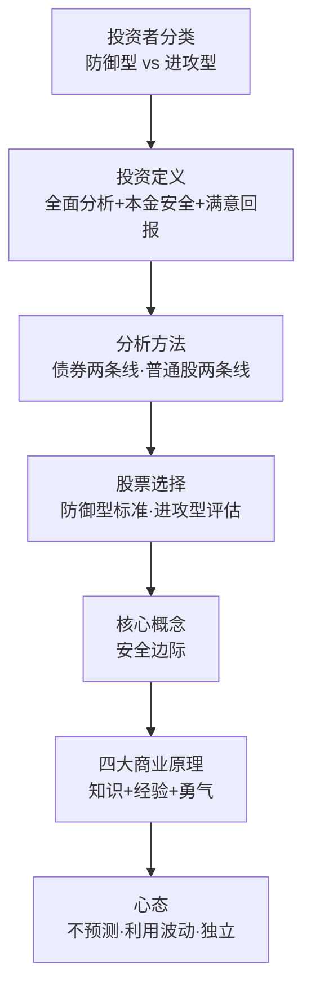
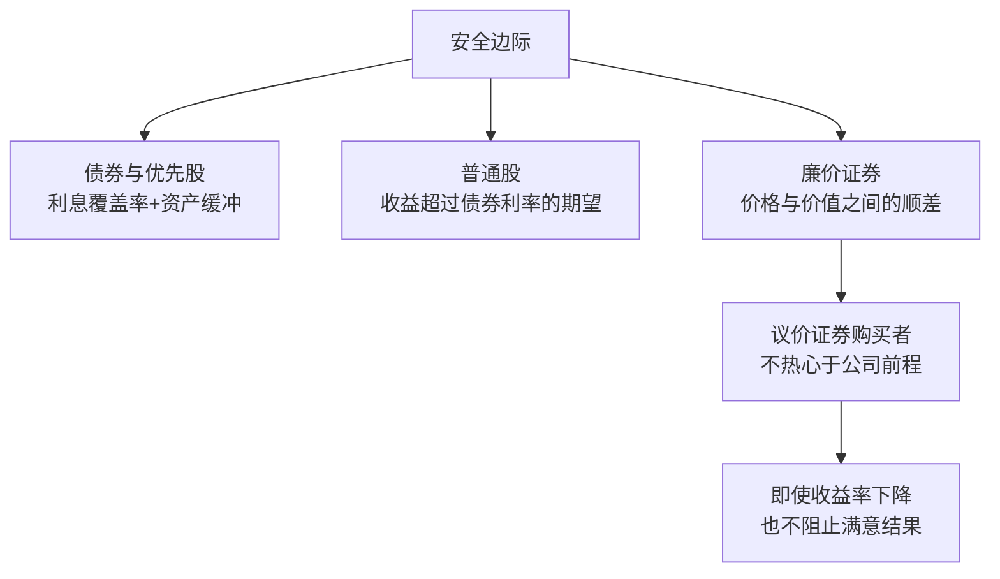
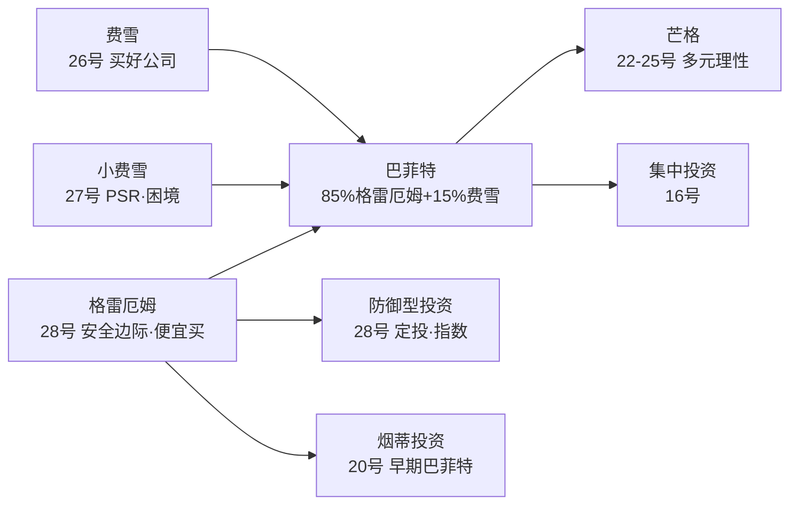
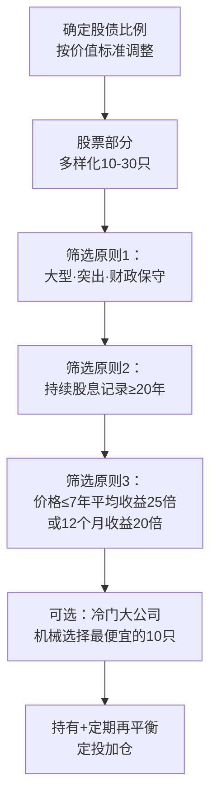
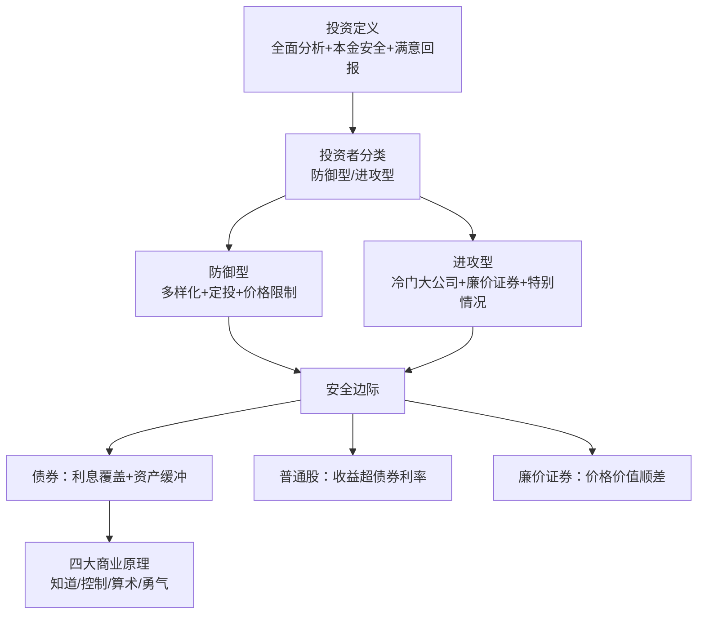
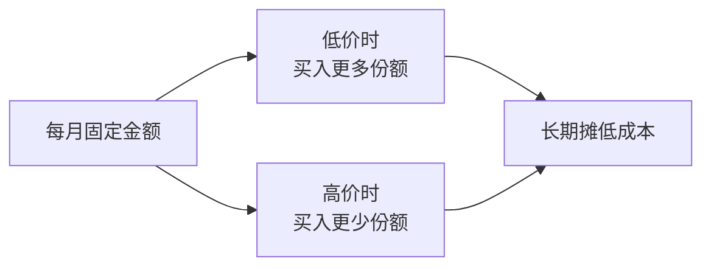
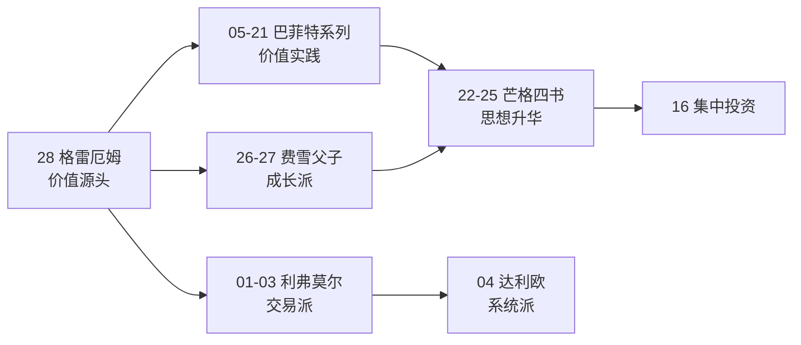

# 28《聪明的投资者》深度解读（详细版）

> 本杰明·格雷厄姆——价值投资的开山圣经："安全边际"是成功投资的核心概念

## 📖 本书概览

| 项目 | 内容 |
|------|------|
| 书名 | 聪明的投资者（The Intelligent Investor） |
| 作者 | 本杰明·格雷厄姆（Benjamin Graham，1894—1976），价值投资之父，哥伦比亚大学教授，巴菲特唯一的正式导师 |
| 版本 | 1964 年修订版（第四版，收入 1964 年股市行情分析） |
| 结构 | 四篇十六章：①投资的一般方法（1—7 章）②股票选择的原则（8—13 章）③作为公司所有者的投资者（14—15 章）④结论：安全边际（16 章） |
| 历史地位 | **价值投资的圣经**；巴菲特："有史以来关于投资的最佳著作"；"投资操作是基于全面分析，确保本金的安全和满意的投资回报"出自本书姊妹篇《证券分析》 |
| 系列位置 | **价值派·总源头**：[[26《怎样选择成长股》深度解读（详细版）|26 费雪（品质）]] 与 [[27《超级强势股》深度解读（详细版）|27 小费雪（价格）]] 的共同原点——格雷厄姆（便宜）→ 费雪（优秀）→ 巴菲特（融合） |

## 🎯 为什么这本书值得单独解读

- **安全边际**：全书核心——"将成功投资的秘密精练成四个字的座右铭：安全边际"
- **投资 vs 投机**：划时代的定义——"基于全面的分析，确保本金的安全和满意的投资回报"
- **防御型 vs 进攻型**：投资者分类学——不同的性格与能力对应不同的策略
- **道氏理论的检验**：1897—1938 年成功、1938 年后失效的实证——"方法流行之时正是其失去效力之时"
- **冷门股研究**：Drexel 26 年数据——便宜股 1 万→11.92 万 vs 高价股 1.08 万
- **四大商业原理**：最后的话——"利用你的知识、经验和勇气"
- **系列枢纽**：05—25 号巴菲特系列、26—27 号费雪父子的思想原点

## 📖 全书结构与核心框架

### 28.0 全书结构总览表

| 源书篇章 | 笔记章节 | 核心内容 | 关键概念/案例 |
|---------|---------|---------|--------------|
| 第一篇（第1—7章） | 第1—7章 | 投资的一般方法：投资与投机之分 | 投资三要素定义；波动态度；道氏理论检验 1897—1938；防御型/进攻型分类 |
| 第二篇（第8—13章） | 第8—13章 | 股票选择的原则：证券分析方法 | 债券/普通股两条线；贬值题材六案例；Drexel 26 年实证 1 万→11.92 万 |
| 第三篇（第14—15章） | 第14章 | 作为公司所有者的投资者 | 股东与管理层；股利政策 |
| 第四篇（第16章） | 第15章 | 结论：安全边际 | **"四字座右铭：安全边际"**；债券 5 倍覆盖+2/3 缓冲；四大商业原理 |
| — | 第16—23章 | 深度专题 | 估值工具箱；心理课；三巨头终极对照（格雷厄姆×利弗莫尔×达利欧） |

### 28.1 核心框架：格雷厄姆投资体系

## 📑 目录

- [[#第1章 投资与投机：划时代的定义|第1章 投资与投机：划时代的定义]]
- [[#第2章 聪明的投资者将获得什么|第2章 聪明的投资者将获得什么]]
- [[#第3章 投资者与股市波动|第3章 投资者与股市波动]]
- [[#第4章 1964 年股市行情："新时代"的警告|第4章 1964 年股市行情："新时代"的警告]]
- [[#第5章 投资者与投资顾问|第5章 投资者与投资顾问]]
- [[#第6章 防御型投资者的组合策略|第6章 防御型投资者的组合策略]]
- [[#第7章 进攻型投资者的组合策略|第7章 进攻型投资者的组合策略]]
- [[#第8章 证券分析的一般方法|第8章 证券分析的一般方法]]
- [[#第9章 防御型投资者的证券选择|第9章 防御型投资者的证券选择]]
- [[#第10章 进攻型投资者的评估方法|第10章 进攻型投资者的评估方法]]
- [[#第11章 贬值题材：六个案例分析|第11章 贬值题材：六个案例分析]]
- [[#第12章 股票收益和价格的变动模式|第12章 股票收益和价格的变动模式]]
- [[#第13章 股东与管理层、股利政策|第13章 股东与管理层、股利政策]]
- [[#第14章 安全边际：投资的核心概念|第14章 安全边际：投资的核心概念]]
- [[#第15章 格雷厄姆 × 系列大师终极对照|第15章 格雷厄姆 × 系列大师终极对照]]
- [[#第16章 深度专题：格雷厄姆的估值工具箱|第16章 深度专题：格雷厄姆的估值工具箱]]
- [[#第17章 深度专题：格雷厄姆的心理课|第17章 深度专题：格雷厄姆的心理课]]
- [[#第18章 深度专题：格雷厄姆 vs 系列估值方法终极对照|第18章 深度专题：格雷厄姆 vs 系列估值方法终极对照]]
- [[#第19章 深度专题：格雷厄姆的传奇与业绩记录|第19章 深度专题：格雷厄姆的传奇与业绩记录]]
- [[#第20章 深度专题：格雷厄姆思想的当代验证|第20章 深度专题：格雷厄姆思想的当代验证]]
- [[#第21章 深度专题：股市波动全景——表 3 的历史数据|第21章 深度专题：股市波动全景——表 3 的历史数据]]
- [[#第22章 深度专题：防御型组合的细节工程|第22章 深度专题：防御型组合的细节工程]]
- [[#第23章 深度专题：进攻型的特别情况投资|第23章 深度专题：进攻型的特别情况投资]]
- [[#附录一 格雷厄姆金句集（35 条精选）|附录一 格雷厄姆金句集（35 条精选）]]
- [[#附录二 防御型投资者操作手册|附录二 防御型投资者操作手册]]
- [[#附录三 进攻型投资者操作手册|附录三 进攻型投资者操作手册]]
- [[#附录四 系列互链：格雷厄姆在价值投资谱系中的位置|附录四 系列互链：格雷厄姆在价值投资谱系中的位置]]
- [[#附录五 A 股应用：格雷厄姆方法的本土化|附录五 A 股应用：格雷厄姆方法的本土化]]
- [[#附录六 读完本书后的 10 个自问|附录六 读完本书后的 10 个自问]]
- [[#附录七 本书数据与案例速查|附录七 本书数据与案例速查]]
- [[#附录八 格雷厄姆与中医：跨界对照|附录八 格雷厄姆与中医：跨界对照]]
- [[#附录九 FAQ：聪明的投资者 20 问|附录九 FAQ：聪明的投资者 20 问]]
- [[#附录十 格雷厄姆生平与《聪明的投资者》年表|附录十 格雷厄姆生平与《聪明的投资者》年表]]
- [[#附录十一 格雷厄姆式投资组合构建示例|附录十一 格雷厄姆式投资组合构建示例]]
- [[#附录十二 格雷厄姆式 A 股模拟案例|附录十二 格雷厄姆式 A 股模拟案例]]
- [[#附录十三 本书阅读地图（30 分钟读完）|附录十三 本书阅读地图（30 分钟读完）]]
- [[#附录十四 格雷厄姆 × 巴菲特 × 芒格语录对勘|附录十四 格雷厄姆 × 巴菲特 × 芒格语录对勘]]
- [[#附录十五 格雷厄姆式投资检查表（每日/每周）|附录十五 格雷厄姆式投资检查表（每日/每周）]]
- [[#附录十六 格雷厄姆 × 利弗莫尔 × 达利欧：三大体系终极对照|附录十六 格雷厄姆 × 利弗莫尔 × 达利欧：三大体系终极对照]]
- [[#附录十七 格雷厄姆的 20 个投资原则（全集清单）|附录十七 格雷厄姆的 20 个投资原则（全集清单）]]
- [[#附录十八 系列 28 本笔记总览（更新版）|附录十八 系列 28 本笔记总览（更新版）]]
- [[#附录十九 格雷厄姆式周复盘模板|附录十九 格雷厄姆式周复盘模板]]
- [[#附录二十 格雷厄姆思想 × 系列完整对照矩阵|附录二十 格雷厄姆思想 × 系列完整对照矩阵]]
- [[#附录二十一 格雷厄姆的寓言与比喻集|附录二十一 格雷厄姆的寓言与比喻集]]
- [[#附录二十二 常见投资错误对照表（格雷厄姆视角）|附录二十二 常见投资错误对照表（格雷厄姆视角）]]
- [[#附录二十三 本书核心概念速查卡|附录二十三 本书核心概念速查卡]]
- [[#附录二十四 格雷厄姆的投资生涯细节|附录二十四 格雷厄姆的投资生涯细节]]
- [[#附录二十五 格雷厄姆思想在系列中的"母题"追踪|附录二十五 格雷厄姆思想在系列中的"母题"追踪]]
- [[#附录二十六 格雷厄姆式投资备忘 20 条|附录二十六 格雷厄姆式投资备忘 20 条]]
- [[#附录二十七 全书 30 秒版|附录二十七 全书 30 秒版]]
- [[#附录二十八 延伸阅读：格雷厄姆书单 × 系列互荐|附录二十八 延伸阅读：格雷厄姆书单 × 系列互荐]]
- [[#总结：格雷厄姆之道的核心|总结：格雷厄姆之道的核心]]

## 🔗 双链导读

| 连接主题 | 本书章节 | 关联笔记 |
|---------|---------|---------|
| 巴菲特师徒 | 全书 | [[20《巴菲特的第一桶金》深度解读（详细版）|20 第一桶金]]（格雷厄姆实践） |
| 价值投资谱系 | 全书 | [[26《怎样选择成长股》深度解读（详细版）|26 费雪]] · [[27《超级强势股》深度解读（详细版）|27 小费雪]] |
| 安全边际 | 第16章 | [[12《巴菲特的估值逻辑》深度解读（详细版）|12 估值逻辑]] |
| 防御型策略 | 第5—6章 | [[09《巴菲特致股东的信》深度解读（详细版）|09 致股东的信]] |
| 市场波动 | 第2—3章 | [[22《穷查理宝典》深度解读（详细版）|22 市场先生]] |
| 股东权利 | 第14—15章 | [[24《芒格之道》深度解读（详细版）|24 股东会]] |

---

## 第1章 投资与投机：划时代的定义

### 1.1 定义的混乱：1962 年的"卖空投资者"

> "1962 年 6 月，一家权威金融杂志首页刊载了一篇标题为《小投资者卖空，引起跌风》的文章。没有任何术语可以生动地表达盛行于金融界多年的、在普通股投资和普通股投机概念之间的混淆。"

**华尔街的定义困境**："任何人只要买卖证券，就成为投资者，而不管他买什么，什么目的，什么价格，用的是现金还是保证金。"

**1948 年的公众调查对比**（讽刺的对照）：

| 时期 | 公众态度 | 实际情况 |
|------|---------|---------|
| 1948 年（股价低） | 90%+ 反对购买普通股（"不安全，是赌博"/"不熟悉"） | **极具吸引力的价格** |
| 1962 年（股价高） | 买股票=投资、购买者=投资者 | **极危险的水平** |

> "当普通股以极具吸引力的价格出售时，人们普遍认为购买普通股是投机或冒险行为；相反，当股票剧涨到根据过去的经验毫无疑问是极危险的水平，购买股票反而成了投资。"

### 1.2 投资的正式定义（《证券分析》）

> "**投资操作是基于全面的分析，确保本金的安全和满意的投资回报。不符合这些要求的操作是投机性的。**"

**定义的三个要素拆解**：

| 要素 | 内容 | 含义 |
|------|------|------|
| 全面的分析 | 对事实的调查与检验 | 不是道听途说 |
| 本金的安全 | 避免损失 | 不是保证不亏 |
| 满意的回报 | 合理的收益 | 不是暴利 |

**定义的特殊情形**："这使得我们在'投资'的标题下包含了对不支付股息的股票，甚至是拖欠的债券的购买，只要投资者确信它们的价值最终将高于它们的成本。"——**价值最终高于成本=资本收益形式的满意回报**

### 1.3 理性投机与非理性投机

**投机的必然性**："某些投机也是必要的和不可避免的，因为在许多普通股情形中，获利和损失的可能性都很大，风险必须有人来承担。就像有理性投资一样，也有理性投机。"

**三种非理性投机**：

| 类型 | 表现 |
|------|------|
| 意识不到 | 不知道自己在投机 |
| 严重投机 | 缺乏足够知识和技巧 |
| 过度投机 | 动用比能承受损失更多的资金 |

**格雷厄姆的忠告**：

> "每个人购买所谓的热门股，或作类似的购买，他就是在投机或赌博。投机使人着迷，如果你在这个游戏中获得，你就会更加着迷。如果你想试试你的运气，最好拿出一定比例的资金专作此用，且这个比例越小越好。无论是在操作上，还是在思想上，都不要把投资和投机混淆起来。"

### 1.4 风险的固有性

> "风险是普通股交易所固有的——风险和赢利机会是不可分的，这两点投资者都应计算在内。"

**投资者的任务**："把投机因素限制在合理的范围之内，并在财务上和心理上做好出现逆境的准备——这个逆境是重要的尽管可能是暂时的。"

### 1.5 第1章小结

| 层面 | 结论 |
|------|------|
| 定义 | 投资=全面分析+本金安全+满意回报 |
| 现状 | 华尔街混淆投资与投机 |
| 投机 | 必要但需理性，比例越小越好 |
| 风险 | 固有，需财务+心理双重准备 |

---

## 第2章 聪明的投资者将获得什么

### 2.1 "理智"的真正含义

> "本书中'理智'的意思是'有知识的理解能力'，而非'聪明'或'机灵'，或超常的预见力和洞察力。实际上本书所说的理智更多的是指性格上的特点而非脑力上的。"

**性格 > 智力**：这是格雷厄姆全书最重要的论断之一——投资成功主要靠性格（耐心、纪律、情绪控制），而非智商。

### 2.2 两类投资者：防御型与进攻型

| 维度 | 防御型投资者 | 进攻型投资者 |
|------|-------------|-------------|
| 目标 | 避免严重错误或损失 | 超越平均结果 |
| 心态 | 不必努力、不必烦恼、不必经常做决定 | 愿意花时间小心选择 |
| 代表 | 寡妇（靠留给她的钱为生） | 有进取心的商人 |
| 方法 | 严格遵守一些合理的相当简单的原理 | 自己研究+自己决定 |
| 关键 | 理性投资主要是遵守简单原理 | "决不会购买没有经过自己研究的或根据自己的经验觉得不满意的证券" |

**进攻型的第一原则**：

> "有进取心的投资者理性行为的第一条原则是他决不会购买没有经过自己研究的或根据自己的经验觉得不满意的证券。"

### 2.3 投资者的现代转变

**过去 vs 现在**：

| 维度 | 40 年前（1920s） | 现在（1960s） |
|------|----------------|--------------|
| 关注 | 年收入（股息） | 长期本金价值增长 |
| 价格波动 | 可以忽视 | 需注意避免反向剧烈损失 |
| 持有期 | 长时间持有 | 长期+税务考量 |

**税的影响**："一个重要的税收利益附属于在获得销售之前至少持有证券 6 个月。"

### 2.4 防御型投资者将能获得什么

**防御型的现实回报预期**：格雷厄姆在第一章明确指出——防御型投资者不应追求超越平均的回报，**"取得一般的投资结果比大多数人预期的更容易，取得非常好的结果则很难"**（最后的话）。

### 2.5 进攻型投资者将能获得什么

**进攻型的挑战**（第十章详述）：投资基金（专业机构）的业绩对比显示——"优于大盘业绩的投资基金的失败是一个相当明确的信号，那就是这种业绩的取得不是轻而易举的而是相当困难的。"

### 2.6 投资者必须回答的问题

**四个基本问题**（第一章隐含框架）：

| 问题 | 决定因素 |
|------|---------|
| 我是什么类型的投资者？ | 性格与气质 |
| 我的目标是什么？ | 保本 vs 增值 |
| 我的时间有多少？ | 研究时间 |
| 我的能力边界在哪？ | 知识与经验 |

### 2.7 第2章小结

| 层面 | 结论 |
|------|------|
| 理智 | 性格特点，非脑力 |
| 两类投资者 | 防御（简单原理）vs 进攻（自己研究） |
| 现代转变 | 从年收入到长期增值 |
| 现实预期 | 一般结果容易，非常好很难 |

---

---

## 第3章 投资者与股市波动

### 3.1 投资者与投机者的最实际区别

> "投资者和投机者最实际的区别在于他们对股市运动的态度上。投机者的兴趣主要在参与市场波动并从中谋取利润；投资者的兴趣主要在以适当的价格取得和持有适当的股票。"

**精神态度比技巧更重要**：

> "对于理性投资，精神态度比技巧更重要。我相信在目前的形势下，对待价格波动的正确的精神态度是所有成功的股票投资的试金石。"

### 3.2 价格波动的两个方面

| 方面 | 内容 | 用途 |
|------|------|------|
| 指示计 | 作为投资项目成功与否的衡量 | 长期检验（股息+价格变化） |
| 向导 | 作为选择证券及交易时机的指南 | 低买高卖 |

**衡量投资成功的正确方法**（表4 的方法）："用较长时期的股息回报率及价格变化的组合来判断其投资成功与否"——**在"中性"的结束日期（市场水平没有明显变化时）计算**。

**表4 的经典数据**（1947.12.31—1958 年，市场无变化期）：

| 股票 | 价格变化 | 红利 | 总收益 | 年收益 |
|------|---------|------|--------|--------|
| 道琼斯工业平均指数 | -2.2% | 77.2% | 75.0% | 3.2% |
| 标准普尔 500 | -1.8% | 9.9% | 8.0% | 3.6% |
| 美国钢铁 | +80.0% | 33.0% | 633.0% | 3.3% |
| 宾夕法尼亚铁路 | -22.0% | 18.3% | -3.7% | 损失 |
| 阿波特实验室 | +128.0% | 30.7% | 158.7% | 13.7% |

**结论**："在开始的 11 年内，对阿波特实验室的投资是成功的，而对宾夕法尼亚铁路的投资则是失败的。"

### 3.3 时机与价格：两种获利途径

**时机**："致力于预测股票市场的行动——当认为将来市场进程是上升时，买入并持有，而当进程是下降时卖出或不买。"

**价格**："致力于当报价低于合理价格时买进股票，而当上升到超过该价格时卖出股票。"

**格雷厄姆的裁决**：

> "我相信不论通过这两种途径的哪一种，一个理性投资者最后都会收到满意的回报。我同样确信，如果他在预测的基础上，把重点放在时机上，他最后会成为一个投机者，从而得到投机者的结果。"

### 3.4 道氏理论的检验：方法流行之时即失效之时

**道氏理论**："把股票平均值向上的一种特殊类型的突破作为买入的信号，而把向下的类似突破作为卖出的信号。"

**表6 的检验结果**（1897—1963 年）：

| 时期 | 结果 |
|------|------|
| 1897—1938（前 40 年） | 10 次购入中 9 次实现真正利润 |
| 1938—1963（后 25 年） | **7 次购入中每次买价都比售价高**——如果一直持有反而更好 |

**失效的两个原因**：

> "首先，随着时间的推移，旧的准则不再能适用新情况。其次，在股市发展中，交易理论本身的流行性也会发生一定的影响……从长远的观点来看降低了其获取利润的可能性。"

**公式型投资计划同样的命运**：

> "不幸的是，这些方法被普遍采用之时，正是其失去效力之时。……在 50 年代中期，许多公式型投资者发现他们完全或几乎在某一水平离开了股票市场……市场在那之后'离'他们而去。"

**斯宾诺莎的总结**："所有杰出的事情都像它们很稀有一样的困难。"

### 3.5 低价买进高价卖出的方法

**1897—1949 年的 10 个完整市场周期**：

| 指标 | 数据 |
|------|------|
| 周期数量 | 10 个（6 个历时不到 4 年，4 个长达 6—7 年） |
| 特殊周期 | 1921—1932 年"新时代"周期（持续 11 年） |
| 升幅 | 44%—500%（大多数 50%—100%） |
| 随后降幅 | 24%—89%（大多数 40%—50%） |
| 数学现实 | **50% 的降幅就抵消了前面 100% 的升幅** |

**牛市的五个典型特征**：

| 特征 | 内容 |
|------|------|
| 1 | 历史性的高价位 |
| 2 | 高价格收益比 |
| 3 | 相对于债券收入较低的股息收入 |
| 4 | 许多投机活动 |
| 5 | 许多质量较低的普通股上市 |

**1949 年后的变化**："在过去 15 年，市场行为没有遵循以前的模式，以前建立的危险信号及买低卖高的准则都不适用了。"

**格雷厄姆的现代建议**："根据由价值标准衡量的股票价格水平吸引力的大小，相应地调整证券组合中股票和证券投资的比例。"——**动态平衡而非等待熊市**

### 3.6 第3章小结

| 层面 | 结论 |
|------|------|
| 最实际区别 | 对波动的态度 |
| 精神态度 | 比技巧更重要 |
| 两种途径 | 时机（=投机）vs 价格（=投资） |
| 道氏检验 | 流行之时即失效之时 |
| 牛市特征 | 五特征识别顶部 |
| 现代方法 | 按价值调整股债比例 |

---

## 第4章 1964 年股市行情："新时代"的警告

### 4.1 1964 年与前些年的比较

**格雷厄姆写作时的市场背景**：1964 年道琼斯工业指数处于历史高位，市场沉浸在"新时代"的乐观中——本书对此提出系统警告。

### 4.2 "新时代"的新标准

**新时代理论的核心主张**：旧的价值标准（市盈率、股息率）不再适用——"成长"使任何价格都合理。

**格雷厄姆的回应**（第16章的安全边际视角）：

> "为高质量的股票支付太高价格的风险——当确实有的话——不是证券购买者通常所面临的主要风险。几年的观察告诉我们，投资者的主要损失来自有利的商业条件下购买劣质股。"

**新时代的典型错误**：

| 错误 | 表现 |
|------|------|
| 将现在的好收益等同于收益能力 | "购买者往往将现在的好收益等同于收益能力，并且假设繁荣与安全性是一致的" |
| 相信高利润可持续 | 基于两三年非正常的高利润，不知名公司股票按远高于有形投资的价格浮动 |
| 忽视周期 | 利息费用和优先股红利范围必须通过"包括低于正常商业的周期"的几年检验 |

### 4.3 从股市周期看 1964 年的价格水平

**格雷厄姆的估值判断**（第16章数据）：

> "在 1964 年条件下……我们假设，在大公司中，稍微集中于低增值的证券，一个防御型的投资者可能以现在收益的 16 倍获得股票，即基于成本获得 6.25% 的收益回报。他可能得到大约等于现行的高等级债券利率的红利收益率，即 4.40%。……10 年期间超出债券利率的股票收益率总计仅有约 1/5。我们会发现将其视为合适的安全边际是很困难的。"

**结论**："即使是各种各样的知名普通股现在也有真正的风险。"

### 4.4 1964 年的历史意义：预言的价值

**事后验证**：格雷厄姆的警告在 1966—1974 年应验——道琼斯指数 1966 年见顶后横盘 16 年，1968—1974 年跌幅巨大（与 [[24《芒格之道》深度解读（详细版）|24 号]] 记录的 1974 年大熊市互相印证）。

### 4.5 第4章小结

| 层面 | 结论 |
|------|------|
| 时代背景 | 1964 年市场高位 |
| 新标准 | "新时代"理论否认旧价值标准 |
| 格雷厄姆警告 | 安全边际消失，知名股也有真正风险 |
| 预言验证 | 1966—1974 年市场长期低迷 |

---

---

## 第5章 投资者与投资顾问

### 5.1 投资忠告的来源

**投资建议的五种来源**：

| 来源 | 性质 | 使用注意 |
|------|------|---------|
| 投资忠告（亲友） | 非专业 | 热情有余专业不足 |
| 金融服务机构 | 专业但商业 | 需辨别利益冲突 |
| 经纪行 | 商业推销 | "来自经纪行的劝告"需警惕 |
| 注册金融分析员 | 专业认证 | 认证≠水平 |
| 投资银行 | 发行承销方 | 利益冲突最大 |

### 5.2 格雷厄姆的顾问观

**核心原则**（呼应最后的话第二条商业原理）：

> "不要让任何其他的人经营你的业务，除非你能够理解和非常谨慎地控制他的行动，或者你能异常坚定地无保留地相信他的忠诚和能力。"

**防御型投资者的顾问使用**：可以依赖顾问，但必须"知道——至少在一般条件下——她的钱被用来做什么了，为什么如此做"。

**进攻型投资者的顾问使用**：信息可以来自他人（特别是证券分析家），但"最后作决定的是他们自己，决策之前进行估计是根据自己的理解和判断"。

### 5.3 第5章小结

| 层面 | 结论 |
|------|------|
| 五种来源 | 亲友/金融服务/经纪行/分析员/投行 |
| 利益冲突 | 经纪行与投行最需警惕 |
| 使用原则 | 理解+控制或完全信任 |
| 最终决定 | 必须自己做 |

---

## 第6章 防御型投资者的组合策略

### 6.1 回报与努力的关系（对"风险越大回报越大"的纠偏）

> "投资者所追求的回报率依赖于投资者愿意和能够完成任务的明智的努力程度。被动的投资者只能得到小的回报，因为他既想安全又不想过多地烦心；而机警的和进取的投资者则能得到最大的回报，因为他运用了最大的智力和技巧。"

**经典反驳**：

> "在许多情况下，购买一种有可能获得较大收益的廉价证券的风险，比购买收益大约 4.5% 的常规债券的风险要小得多。"——**廉价证券的风险可能小于债券**

### 6.2 债券与股票的分配：基本问题

**防御型组合的核心决策**：债券与股票的比例。

**格雷厄姆的建议**：基于价值标准调整比例——"根据由价值标准衡量的股票价格水平吸引力的大小，相应地调整证券组合中股票和证券投资的比例"（与第3章呼应）。

### 6.3 债券的组成

| 类型 | 特点 | 防御型建议 |
|------|------|-----------|
| 政府储蓄债券 | 无波动 | 核心配置 |
| 高等级债券 | 价格波动不大 | 主要配置 |
| 直接（不可转换）优先股 | 类似债券 | 可选 |
| 可转换债券 | 兼具股债性质 | 谨慎（投机成分） |

### 6.4 投资普通股的原则

**防御型投资者购买普通股的四项原则**（第九章的框架）：

| 原则 | 内容 |
|------|------|
| 1 | 适当但不过度的多样化（10—30 只） |
| 2 | 每家公司应该大型、突出、财政保守 |
| 3 | 持续股息记录（如至少 20 年） |
| 4 | 价格限制（如 7 年平均收益的 25 倍或最近 12 个月收益的 20 倍以下） |

**"大的、突出的和财政保守的公司"的含义**：

| 形容词 | 含义 |
|--------|------|
| 大的 | 规模大（行业前列） |
| 突出的 | 行业地位突出（领导品牌） |
| 财政保守 | 资产负债表稳健（低负债） |

### 6.5 成长股和防御型投资者

**格雷厄姆的谨慎**："如果大多数成长股的平均市场水平太高，不能为购买者提供一个适合的安全边际，那么就很难找到在这个范围内分散购买的简单技术。"

**成长股对防御型的意义**：成长股的价格通常不满足"价格限制"原则——防御型投资者应避免高价成长股。

### 6.6 投资公司股票与普通信托基金

**投资公司（共同基金）的角色**：为防御型投资者提供现成的多样化。

**格雷厄姆对基金的评估**（第十章数据）："总体看来，完全投资于普通股的基金，在很多年里没有能获得如同标准·普尔 500 种股票平均值所显示的那样好的收益。"——**指数本身难战胜**（现代指数基金思想的雏形）。

### 6.7 美元·成本平均标准（定投）

**定义**："美元成本平均法"——定期定额投资，无视市场波动。

**格雷厄姆的肯定**：这是防御型投资者最可靠的机械策略之一——"公式型投资计划"中唯一经久不衰的方法（与道氏理论/中心价值方法的命运对比）。

### 6.8 投资者的个人状况

**组合策略取决于个人状况**：

| 个人因素 | 对策略的影响 |
|---------|-------------|
| 财务状况 | 可承受的风险 |
| 年龄 | 时间跨度 |
| 收入来源 | 是否需要股息 |
| 气质 | 能否承受波动 |

### 6.9 何谓"风险"

**格雷厄姆的风险观**：风险不是价格波动，而是**购买力损失与本金损失的可能性**——"保守型投资很有可能在最低的风险下，保存购买力"（呼应 [[26《怎样选择成长股》深度解读（详细版）|26 号 8.1]]）。

### 6.10 第6章小结

| 层面 | 结论 |
|------|------|
| 回报来源 | 明智的努力，非风险承担 |
| 股债分配 | 按价值调整 |
| 普通股四原则 | 多样化/大公司/股息记录/价格限制 |
| 成长股 | 防御型谨慎 |
| 定投 | 最可靠机械策略 |

---

## 第7章 进攻型投资者的组合策略

### 7.1 负面方法：回避清单

**进攻型投资者应回避的证券**：

| 回避对象 | 原因 |
|---------|------|
| 二等债券与优先股 | "当视界内充满乌云时……注定要忍受令人烦恼的价格下降" |
| 外国政府债券 | 主权风险+信息不对称 |
| 新证券（IPO） | 发行定价+炒作 |
| 可转换债券 | 兼具投机性 |
| 新发行股的炒作 | "一个可怕的案例"章节警示 |

**新发行股炒作的案例**（第六章"一个可怕的案例"）：IPO 热中购买的投资者往往在炒作退潮后损失惨重。

### 7.2 正面方法：三个推荐领域

> "在长期活动中，要想获得比平均水平更好的投资结果，需要持有一种选择双倍价值的操作策略：（1）它必须不同于被大多数投资者或投机者追随的策略。"

**领域一：不引人注意的大公司**

> "关键的要求是进攻型投资者要全神贯注于正经历不引人注意时期的大公司。"

**大公司的双重优势**：

| 优势 | 内容 |
|------|------|
| 资源 | "资本资源和智力资源帮助它们渡过不幸，恢复到令人满意的收益基值" |
| 市场反应 | "市场对它们任何改善的表现多半有适度敏感的反应" |

**冷门股研究的实证**（Drexel & Company 1936—1962 年 26 项调查）：

| 时期 | 10 种低增值股票 | 10 种高增值股票 | 30 种道琼斯股票 |
|------|----------------|----------------|----------------|
| 1937—1942 | -2.2% | -10.0% | -6.3% |
| 1943—1947 | 17.3% | 8.3% | 14.9% |
| 1948—1952 | 16.4% | 4.6% | 9.9% |
| 1953—1957 | 20.9% | 10.0% | 13.7% |
| 1958—1962 | 10.2% | -3.3% | 3.6% |

**1936 年 1 万美元的 26 年结果**：

| 策略 | 1962 年价值 |
|------|------------|
| 低增值股票（低价段） | **11.92 万美元** |
| 高增值股票（高价段） | 1.08 万美元 |
| 道琼斯 30 种（等量购买） | 3.5 万美元 |
| 道琼斯 30 种（等额购买） | 6.1 万美元 |

**结论**："便宜的股票只是在 1 种情况下比道·琼斯工业平均指数差，在 8 种情况下是相同的；在其中的 18 年里便宜的股票明显胜过平均情况。"——**便宜股在 26 年中 18 年跑赢**

**领域二：廉价证券的购买**

> "这里，我们定义出一种价格与另一种价格所指示的或评价的价值的顺差，那就是安全边际。"

**廉价证券的判断**：价格相对价值有明显顺差——如低于净流动资产（营运资本）的股票。

**领域三：特别情况的处理**

**特别情况**（并购/重组/清算等事件驱动）：格雷厄姆的早期专长——"特别情况"投资（后来巴菲特也学过，见 [[20《巴菲特的第一桶金》深度解读（详细版）|20 号]]）。

### 7.3 一般市场策略方案的时效

**格雷厄姆对市场择时的总体态度**："一个人从华尔街得到的越多，他就越应对预测和时机持怀疑态度。"

### 7.4 对成长股的讨论

**成长股投资的逻辑与危险**（第16章）：

> "投资于成长股的原理，有的与安全边际的原理相对应，有的与其相反。成长股的购买者对预期收益率的依赖大于过去所示的平均值。……成长股方案的危险恰恰在这里。对于如此优惠的证券，市场有估价的趋势，此价格将不会受将来收益的保守型方案的保护。"

**慎重投资的基本规则**："所有的估计，当它们与过去的操作不同时，肯定是错误的，至少在有所保留的陈述方面是错误的。"

### 7.5 投资规则的广泛应用

**规则的应用范围**：进攻型投资者的规则同样适用于防御型——只是执行的深度不同。

### 7.6 第7章小结

| 层面 | 结论 |
|------|------|
| 负面清单 | 二等债券/外国债/新证券/可转债/新股炒作 |
| 领域一 | 不引人注意的大公司（26 年实证 18 年跑赢） |
| 领域二 | 廉价证券（价格低于价值） |
| 领域三 | 特别情况（事件驱动） |
| 成长股 | 危险在于价格不受保守估计保护 |

---

---

## 第8章 证券分析的一般方法

### 8.1 分析的四个层面

**债券分析**：关注安全性（利息覆盖率/资产缓冲）——"债券投资者不会期望将来的平均收益与过去的收益算出的结果是相同的……如果边际较大，由于使得投资者充分感觉到对时间变迁的防备，那么就足以保证将来的收益不会远落在过去的收益之下。"

**普通股分析**：关注盈利能力与成长性——"如果普通股适合于作为收益率的指示器，那么它们的收益一般同样是正确的。"

**影响资本化率的因素**：

| 因素 | 影响 |
|------|------|
| 盈利能力 | 越高资本化率越高 |
| 成长性 | 成长预期提高资本化率 |
| 稳定性 | 收益稳定降低风险溢价 |
| 资产价值 | 清算价值支撑 |
| 股息政策 | 股息率影响估值 |

**证券分析的其他方面**：行业前景/管理层/财务结构。

**工业股分析**：格雷厄姆时代的主要分析对象——工业公司的收益与资产。

### 8.2 证券分析的应用

**分析的边界**（第十章的诚实评估）：

> "证券分析家人数的增加很大程度上会导致这种结果。随着成百甚至成千的专家从事研究重要普通股后面的价值因素，人们期望它的市价会完全地灵敏地反映它的价值是自然而然的。"

**桥牌类比**（王牌选手的困境）：

> "前者总是试图找出最可能成功的股票，而后者总是想让每手牌都得分最高。只有极少的人才能实现他们的目标。……在华尔街，证券协商会参与了分析过程。在这个协会中，思想和见解相当自由地分散在多数证券上。"

### 8.3 分析失败的两个解释

**解释一：市场已反映信息**："价格的变化总是偶然的和随机的。本质上讲，由于试图去预见根本不可预见的东西，因此无论证券分析家多么聪明，考虑得多么周密，他们的工作总是没有效果的。"（**有效市场思想的早期表述**）

**解释二：分析方法本身的缺陷**：

> "许多股票分析家常常被股票选择基本方法的不足所困扰。他们寻找有最好的发展前途、有优秀的管理和好的效益的工业企业进行投资。这表明即使价格较高，他们也要用市价买进这样一些工业企业的股票；相反地，尽管股票价格很低，他们还是不向那些销路不好的工业企业投资。"

**格雷厄姆的反驳**："很少有公司能在很长的一段时间内保持不间断的高增长率。值得注意的是，也很少有大企业最终轻易地走向消亡。大部分企业，它们总是兴衰并存，沉浮共在，处于一种相对稳定的发展变化中。"

### 8.4 第8章小结

| 层面 | 结论 |
|------|------|
| 债券分析 | 安全性+边际 |
| 普通股分析 | 盈利能力+成长 |
| 分析边界 | 专家众多→价格灵敏反映价值 |
| 桥牌类比 | 顶尖高手也难以持续取胜 |
| 方法缺陷 | 追好公司忽视价格=根本缺陷 |

---

## 第9章 防御型投资者的证券选择

### 9.1 三个选择方向

**防御型投资者确立购买品种的三个选择**：

| 选择 | 方法 | 特点 |
|------|------|------|
| 一 | 正确的一流证券抽样（如道琼斯 30 种各买 5 股） | 最大多样化 |
| 二 | 排除价格太高的证券 | 排除投机因素 |
| 三 | 专注于不流行的一流证券（冷门大公司） | 自动操作 |

**选择二的具体排除标准**：

> "我建议一种可能的排除指标是：价格超过 7 年平均收益 25 倍或最近 12 个月收益的 20 倍。"

### 9.2 1964 年的应用演示（表 21/22）

**组合策略 C（10 种最便宜的证券）**：美国烟草公司、巨蟒公司、伯利恒钢铁公司、通用汽车公司、国际收割机公司、约赫思-曼威勒公司、加利福尼亚标准石油公司、迅捷公司、联合航空公司、沃尔沃公司。

**组合策略 B**：C+联合化学公司、美国罐头公司、好时代轮胎公司、国际镍业公司、欧文斯-伊利诺斯玻璃公司、新泽西标准石油公司、特再柯公司、美国钢铁公司。

**组合策略 A**：30 种道琼斯工业股票+美国铝业、美国电话电报、克莱斯勒、东方人柯达、通用电气、通用食品、杜邦、国际纸业、宝洁、西尔斯、联合碳化物、西屋。

**数据示例**（1963.12.31，部分股票）：

| 股票 | 价格 | 股息支付自 | 每股收益 1963 | 每股股利 | 每股资产价值 |
|------|------|-----------|--------------|---------|-------------|
| 杜邦 | 240.0 | 1904 | 10.05 | 7.75 | 46.95 |
| 通用汽车 | 78.5 | 1915 | 5.55 | 4.00 | 23.63 |
| 克莱斯勒 | 42.0 | 1926 | 4.35 | 0.43 | 23.31 |
| 通用电气 | 87.0 | 1899 | 3.00 | 2.00 | 20.16 |
| 美国电话电报 | 139.5 | 1881 | 6.05 | 3.60 | 66.78 |
| 伯利恒钢铁 | 31.0 | 1939 | 2.11 | 1.50 | 34.59 |
| 东方人柯达 | 116.0 | 1902 | 3.75 | 2.60 | 22.28 |

**演示的意义**：防御型投资者可以用纯机械的方法（股息记录+价格限制+多样化）构建组合——**不需要预测，不需要内幕**。

### 9.3 多样化与自由选择

> "如果人们能准确无误地选择最好的股票，人们就会丧失多样化。在对防御型投资者建议的普通股选择的四个因素的界限内，有相当充分的自由选择的空间。"

### 9.4 第9章小结

| 层面 | 结论 |
|------|------|
| 三选择 | 抽样/排除高价/冷门 |
| 排除标准 | 7 年平均收益 25 倍或 12 个月收益 20 倍 |
| 1964 演示 | 机械构建组合可行 |
| 多样化 | 防御型的基础 |

---

## 第10章 进攻型投资者的评估方法

### 10.1 评估方法的核心

**进攻型投资者只买廉价股票**：

> "聪明的投资者能够成功地在次等普通股中运作，他只在廉价买进，这意味着当它们的短期前景看好也是普通的购买者可能对它们很感兴趣的时候，聪明的投资者几乎不会买进它们。"

### 10.2 1964 年评估

**1964 年的市场环境**：整体价格偏高，廉价证券稀缺——进攻型投资者的困难时期。

### 10.3 影响资产价值的因素

**资产价值的三重意义**：

| 层面 | 内容 |
|------|------|
| 清算价值 | 破产时的底线 |
| 重置价值 | 重新建立的成本 |
| 持续经营价值 | 正常经营下的价值 |

**格雷厄姆的视角**：资产价值是安全边际的底线支撑——"当企业总资产为 1,000 万美元，而企业的价值为 3,000 万美元，那么当债券持有者遭受损失之前，至少从理论上讲，在价值上还有 2/3 的收缩空间。"

### 10.4 成长股的评估

**成长股评估的公式化尝试**：格雷厄姆给出评估成长股价值的方法——未来收益×合适的资本化率。

**核心警告**（呼应第16章）：

> "安全边际问题依赖于所支付的价格。如果在某一价格安全边际大的话，那么在某一个更高的价格安全边际就小，在某一个还高的价格，安全边际就不存在了。"

### 10.5 头等和次等普通股

**头等股（蓝筹）**：稳定的收益与股息——适合防御型。
**次等股（二线）**：波动大、前景分歧——进攻型的战场，但必须廉价。

### 10.6 评估普通股的规则

**格雷厄姆的评估规则**：

| 规则 | 内容 |
|------|------|
| 1 | 不要为成长支付过高价格 |
| 2 | 用保守的估计计算安全边际 |
| 3 | 收益质量比数量重要 |
| 4 | 资产价值是底线的参考 |
| 5 | 分散购买降低单股风险 |

### 10.7 选择"中级"股的一个方法

**"中级"股（介于头等与投机之间）**：格雷厄姆建议用定量筛选——低 PE+低 PB+股息记录+财务稳健的组合标准。

### 10.8 第10章小结

| 层面 | 结论 |
|------|------|
| 核心 | 只在廉价时买进 |
| 资产价值 | 安全边际的底线 |
| 成长股 | 价格决定安全边际有无 |
| 中级股 | 定量筛选 |

---

---

## 第11章 贬值题材：六个案例分析

### 11.1 贬值题材的本质

> "股票市场上绝大部分理论收益并不是那些处于连续繁荣的公司所创造的，而是那些经历大起大落的公司所创造的，是通过在股票低价购进、高价时出售创造出来的。"

**购买机会的三个来源**：

| 来源 | 说明 |
|------|------|
| 市场整体低迷 | 公众对个人股票的极端厌恶 |
| 市场对公司改进无反应 | 管理改善（克莱斯勒/Crown Cork and Seal） |
| 会计或公司关系复杂 | 人们没有认识到公司的真实情况 |

**Crown Cork and Seal 案例**："1956 年产生了新的管理体制，但其收益和市场价大幅升高的结果到 1959 年才显现出来。"——**市场反应滞后=分析机会**

### 11.2 六个案例概览

| 案例 | 版本来源 | 领域 | 核心看点 |
|------|---------|------|---------|
| 案例 I | 1949 年版 | 铁路 | 分析方法的示范 |
| 案例 II | 1949 年版 | 公用事业 | 贬值题材识别 |
| 案例 III | 1949 年版 | 工业 | 价值低估 |
| 案例 IV | 1954 年版 | — | 更新的案例 |
| 案例 V | 1959 年版 | — | 更新的案例 |
| 案例 VI | 1964 年 6 月数据 | — | 当时的案例 |

**案例分析的态度**（格雷厄姆的严谨声明）：

> "我们恰巧认为分析不具有例证的价值，哪怕是一个相当属实的例证，除非它充分反映了能适用于不确定的时间，换句话说，除非它甘冒不可避免地犯错误的风险。"——**案例要经得起时间检验**

### 11.3 第11章小结

| 层面 | 结论 |
|------|------|
| 贬值题材 | 大起大落中诞生收益 |
| 三来源 | 市场低迷/反应滞后/会计复杂 |
| 案例态度 | 甘冒犯错误风险的例证才有价值 |

---

## 第12章 股票收益和价格的变动模式

### 12.1 四种模式

**模式 1：普通股价格变动与高度稳定的收益**

**典型公司**：公用事业/银行——收益稳定，价格随利率和情绪波动。

**模式 2：普通股价格起伏与收益的显著变动**

| 案例 | 特征 |
|------|------|
| 通用汽车 | 大公司收益周期性变动 |
| ATCHSON 普通股 | 铁路股价格大波动 |
| 英特太普 | 典型小规模上市公司 |

**模式 3：极端的兴衰**

| 案例 | 命运 |
|------|------|
| 布鲁斯威克公司 | 保龄球设备热潮→崩溃 |
| 圣·路易斯西南铁路（"棉花带"） | 长期衰落 |
| 银行家证券公司普通股 | 机构股极端波动 |
| 纺织品精加工机械公司 | 行业消亡 |

**模式 4：成长股的行为**

| 案例 | 特征 |
|------|------|
| 持续增长的 3M 公司 | 长期成长标杆 |
| 菲利浦·莫里斯公司 | 利润下降同时投资增长 |
| 1947 年两个活跃的成长股 | 成长股的波动对比 |

### 12.2 四种模式的启示

| 模式 | 投资启示 |
|------|---------|
| 模式 1 | 稳定收益股的价格波动主要来自利率——债券替代品 |
| 模式 2 | 周期股需在低谷买 |
| 模式 3 | 兴衰极端股=投机陷阱/低估机会并存 |
| 模式 4 | 成长股长期持有但注意估值 |

### 12.3 "企业的运行结果并不代表投资者的热情"

**核心警示**：企业的盈利改善≠股价必然上涨——价格还取决于市场情绪与估值。

### 12.4 第12章小结

| 层面 | 结论 |
|------|------|
| 四模式 | 稳定/起伏/兴衰/成长 |
| 案例 | 通用汽车/3M/布鲁斯威克 |
| 核心 | 企业结果≠投资者热情 |

---

## 第13章 股东与管理层、股利政策

### 13.1 股东与管理层（第十四章）

**管理效率**：股东无法直接评估管理效率——只能通过结果（收益/资产回报）间接判断。

**董事会**：董事会的责任——保护股东利益。

**一般股东的合理待遇**：

| 权利 | 内容 |
|------|------|
| 信息权 | 获得充分准确的财务信息 |
| 表决权 | 重大事项投票 |
| 公平对待 | 不被内部人损害 |

**持股公司的问题**（机构治理）：MISSION 公司和弗兰克-怀俄明石油公司（FWO）案例——**过剩的现金资产**如何处置。

**金融效率的概念**：公司资本运用效率——"过剩的现金资产"是股东价值的浪费。

**证券交易委员会与投资者保护**：SEC 的制度角色。

### 13.2 股东与股利政策（第十五章）

**概述**：股利的分配政策影响股东回报。

**股票红利与股票利润**：

| 形式 | 性质 |
|------|------|
| 现金股息 | 真实回报 |
| 股票红利 | 股本扩张（需辨别） |

**格雷厄姆的股利观**：股息政策应反映公司真实的再投资能力——保留盈余必须有合理的再投资回报，否则应分配给股东。

### 13.3 第13章小结

| 层面 | 结论 |
|------|------|
| 股东权利 | 信息/表决/公平对待 |
| 治理 | 董事会责任+过剩现金 |
| 股利 | 现金股息为真实回报 |

---

---

## 第14章 安全边际：投资的核心概念

### 14.1 四个字的座右铭

> "根据古老的传说，一个聪明人就世间的事情压缩成一句话：'这很快将会过去。'面临着相同的挑战，我大胆地将成功投资的秘密精练成四个字的座右铭：'安全边际。'"

### 14.2 债券的安全边际

**铁路债券的例子**：

> "花费几年的时间，铁路债券（在税前）应该取得高于 5 倍的总固定收入，这是由于该债券适合于作为投资等级发行物。这个超出利率条件的过剩能力构成了安全边际。"

**资产缓冲法**："如果企业总资产为 1,000 万美元，而企业的价值为 3,000 万美元，那么当债券持有者遭受损失之前，至少从理论上讲，在价值上还有 2/3 的收缩空间。高于债务的这个多余价值量，或'缓冲'。"

**安全边际的本质**："如果边际较大，由于使得投资者充分感觉到对时间变迁的防备，那么就足以保证将来的收益不会远落在过去的收益之下。"——**不需要精确预测，只需要足够缓冲**

### 14.3 普通股的安全边际

**普通股安全边际的来源**：期望获利能力大大高于现行债券利率。

**经典计算**（早期版本）：

> "假设在一个典型的场合，基于现在的价格收益率是 9%，而债券利率是 4%，那么股票的购买者将会得到对他有利的平均年边际 5% 的增长。……在一个 10 年的周期中，股票盈利率超过债券的典型超额量可能达到所付价格的 50%。这个数据足以提供一个非常实际的安全边际。"

**多样化的作用**："如果在 20 种或更多种股票中都存在如此的边际，那么在'完全正常的条件'下，获得理想结果的可能性是很大的。"——**分散化让安全边际统计性地生效**

### 14.4 1964 年条件下的安全边际测算

| 项目 | 1964 年数值 | 对比 |
|------|------------|------|
| 买入价格 | 现在收益的 16 倍 | 早期为 9% 收益率（11 倍） |
| 基于成本的收益 | 6.25% | 早期 9% |
| 红利收益率 | 4.40%（≈债券利率） | 早期红利+留存双高 |
| 10 年超额 | 仅约 1/5 | 早期 50% |

**结论**："我们会发现将其视为合适的安全边际是很困难的。由于这个原因，我们感觉到即使是各种各样的知名普通股现在也有真正的风险。"

### 14.5 安全边际的三种应用场景

**廉价（议价）证券的定义**：

> "这里，我们定义出一种价格与另一种价格所指示的或评价的价值的顺差，那就是安全边际。承担错误计算或比平均运气更坏的结果是合适的。"

**议价证券的宽容度**："如果这些证券通过议价而购买，那么即使收益率有一点下降，也不会阻止投资显示满意的结果。安全边际将适用于其特有的意图。"——**买入价足够低，容错空间就足够大**

### 14.6 安全边际 vs 成长股

**成长股的安全边际**（有条件）：

> "投资理论没有解释为什么精心地估计将来收益还不如仅仅记录过去有更多的指导……成长股的方案可以提供像在普通投资中发现的可靠的安全边际，假设对将来的计算是保守的，并且假设其显示了一个与所支付的价格相联系的满意的边际。"

**成长股的危险**：

> "对于如此优惠的证券，市场有估价的趋势，此价格将不会受将来收益的保守型方案的保护。（慎重投资的基本规则是，所有的估计，当它们与过去的操作不同时，肯定是错误的，至少在有所保留的陈述方面是错误的。）安全边际问题依赖于所支付的价格。如果在某一价格安全边际大的话，那么在某一个更高的价格安全边际就小，在某一个还高的价格，安全边际就不存在了。"

### 14.7 投资者的主要损失来源

> "几年的观察告诉我们，投资者的主要损失来自有利的商业条件下购买劣质股。购买者往往将现在的好收益等同于收益能力，并且假设繁荣与安全性是一致的。"

**劣质股的三种形态**：

| 形态 | 特征 |
|------|------|
| 高收益幻觉 | 两三年的好利润被当作长期能力 |
| 高息诱惑 | 稍高的收入回报或靠不住但有吸引力的转换权 |
| 繁荣假设 | "繁荣与安全性是一致的" |

### 14.8 安全边际与四大商业原理（最后的话）

> "当操作最有条理时，投资才是最理智的。"

| 原理 | 内容 | 投资应用 |
|------|------|---------|
| 一 | 知道你正在做什么——知道你的商业 | 了解证券价值如了解自己的生意 |
| 二 | 不要让任何其他的人经营你的业务 | 理解并控制顾问/管理层 |
| 三 | 不要着手操作，除非可靠的计算表明很有可能产生相当好的收益 | "远离有很少收益和很大损失的冒险"——基于算术而非信心 |
| 四 | 利用你的知识、经验和勇气 | "由于公众与你的意见不同，因而你既不正确也不错误；由于你的数据和推理是正确的，因而你是正确的" |

### 14.9 第14章小结

| 层面 | 结论 |
|------|------|
| 座右铭 | 安全边际=成功投资的秘密 |
| 债券 | 利息覆盖率+资产缓冲 |
| 普通股 | 收益超过债券利率的期望 |
| 廉价证券 | 价格与价值的顺差 |
| 成长股 | 保守估计+满意边际才可投 |
| 主要损失 | 繁荣时买劣质股 |
| 四大原理 | 知道/控制/算术/勇气 |

---

## 第15章 格雷厄姆 × 系列大师终极对照

### 15.1 价值投资谱系总图（系列终极版）

### 15.2 格雷厄姆 vs 费雪 vs 小费雪：价值投资三代对照

| 维度 | 格雷厄姆（28号） | 费雪父（26号） | 小费雪（27号） |
|------|----------------|---------------|---------------|
| 核心 | 安全边际 | 优秀公司 | 便宜的好公司 |
| 选股 | 定量（低PE/PB） | 15 要点（定性） | PSR≤0.75（定量） |
| 买入 | 低于内在价值 | 合理价格 | 困境暴跌后 |
| 持有 | 价值实现后卖出 | 几乎永远 | 几乎永远 |
| 分散 | 多样化（防御） | 集中（A/B/C） | 少数几只 |
| 调研 | 财报分析 | 闲聊法 | 四层访问 |
| 成长股 | 谨慎（价格限制） | 核心标的 | 核心标的+困境 |
| 思想关系 | **原点** | 反对者（品质） | 继承者（价格） |

### 15.3 格雷厄姆 × 巴菲特：师徒传承

| 主题 | 格雷厄姆 | 巴菲特 |
|------|---------|--------|
| 安全边际 | 核心概念 | "第一条规则：不要亏钱" |
| 市场先生 | 价格波动是机会 | "别人恐惧我贪婪" |
| 能力圈 | 分析边界 | 20 个孔 |
| 烟蒂 | 廉价证券 | 早期实践→后期放弃 |
| 好公司 | 少谈（价格限制） | 喜诗转折后核心 |
| 定量 vs 定性 | 定量为主 | 定性为主+定量底线 |

### 15.4 格雷厄姆 × 芒格：分歧与互补

| 主题 | 格雷厄姆 | 芒格 |
|------|---------|------|
| 好生意 | "为高质量股票付高价不是主要风险"（但也不鼓励） | "以合理价格买伟大公司" |
| 成长 | 谨慎对待 | 成长是价值的一部分 |
| 分散 | 多样化 | 集中 |
| 市场 | 有效定价（专家多） | 强式有效是胡扯 |
| 共识 | **耐心/理性/不预测** | **耐心/理性/不预测** |

### 15.5 格雷厄姆 × 系列其他大师速览

| 大师 | 与格雷厄姆的异同 | 关联笔记 |
|------|----------------|---------|
| 利弗莫尔 | 交易 vs 投资；共同：人性 | [[01《股票作手回忆录》读书笔记|01 号]] |
| 达利欧 | 宏观周期 vs 个股安全边际 | [[04《原则》深度解读（详细版）|04 号]] |
| 林奇 | 分散灵活 vs 集中 | 32 号已解读（见 [[32《彼得·林奇的成功投资》深度解读（详细版）|32 号]]） |
| 肯尼斯·费雪 | PSR 是对安全边际的量化 | [[27《超级强势股》深度解读（详细版）|27 号]] |

### 15.6 第15章小结

**格雷厄姆在系列中的坐标**：**一切价值投资的起点**——巴菲特/费雪/芒格都在他的地基上盖楼：有人盖了品质（费雪），有人盖了集中（芒格），有人盖了估值（小费雪）——**但地基永远是安全边际**。

---

---

## 附录一 格雷厄姆金句集（35 条精选）

> 1. "投资操作是基于全面的分析，确保本金的安全和满意的投资回报。不符合这些要求的操作是投机性的。"——《证券分析》
> 2. "当普通股以极具吸引力的价格出售时，人们普遍认为购买普通股是投机或冒险行为；相反，当股票剧涨到根据过去的经验毫无疑问是极危险的水平，购买股票反而成了投资。"——第1章
> 3. "无论是在操作上，还是在思想上，都不要把投资和投机混淆起来。"——第1章
> 4. "风险是普通股交易所固有的——风险和赢利机会是不可分的，这两点投资者都应计算在内。"——第1章
> 5. "本书中'理智'的意思是'有知识的理解能力'，而非'聪明'或'机灵'……实际上本书所说的理智更多的是指性格上的特点而非脑力上的。"——第1章
> 6. "有进取心的投资者理性行为的第一条原则是他决不会购买没有经过自己研究的或根据自己的经验觉得不满意的证券。"——第1章
> 7. "投资者和投机者最实际的区别在于他们对股市运动的态度上。"——第2章
> 8. "对于理性投资，精神态度比技巧更重要。"——第2章
> 9. "对待价格波动的正确的精神态度是所有成功的股票投资的试金石。"——第2章
> 10. "如果他在预测的基础上，把重点放在时机上，他最后会成为一个投机者，从而得到投机者的结果。"——第2章
> 11. "一个人从华尔街得到的越多，他就越应对预测和时机持怀疑态度。"——第2章
> 12. "所有杰出的事情都像它们很稀有一样的困难。"——第2章（引斯宾诺莎）
> 13. "50% 的降幅就抵消了前面 100% 的升幅。"——第2章
> 14. "这些方法被普遍采用之时，正是其失去效力之时。"——第2章
> 15. "被动的投资者只能得到小的回报，因为他既想安全又不想过多地烦心。"——第5章
> 16. "在许多情况下，购买一种有可能获得较大收益的廉价证券的风险，比购买收益大约 4.5% 的常规债券的风险要小得多。"——第5章
> 17. "投资者所追求的回报率依赖于投资者愿意和能够完成任务的明智的努力程度。"——第5章
> 18. "在长期活动中，要想获得比平均水平更好的投资结果，需要持有一种选择双倍价值的操作策略：（1）它必须不同于被大多数投资者或投机者追随的策略。"——第7章
> 19. "关键的要求是进攻型投资者要全神贯注于正经历不引人注意时期的大公司。"——第7章
> 20. "随着成百甚至成千的专家从事研究重要普通股后面的价值因素，人们期望它的市价会完全地灵敏地反映它的价值是自然而然的。"——第8章
> 21. "很少有公司能在很长的一段时间内保持不间断的高增长率。"——第8章
> 22. "股票市场上绝大部分理论收益并不是那些处于连续繁荣的公司所创造的，而是那些经历大起大落的公司所创造的。"——第11章
> 23. "利用你的知识、经验和勇气。如果你已经从事实中得出一个结论，并且你知道你的判断是正确的，按照它行动，即使其他人可能怀疑或有不同意见。"——第16章
> 24. "我大胆地将成功投资的秘密精练成四个字的座右铭：'安全边际。'"——第16章
> 25. "如果边际较大，由于使得投资者充分感觉到对时间变迁的防备，那么就足以保证将来的收益不会远落在过去的收益之下。"——第16章
> 26. "投资者的主要损失来自有利的商业条件下购买劣质股。"——第16章
> 27. "购买者往往将现在的好收益等同于收益能力，并且假设繁荣与安全性是一致的。"——第16章
> 28. "慎重投资的基本规则是，所有的估计，当它们与过去的操作不同时，肯定是错误的。"——第16章
> 29. "安全边际问题依赖于所支付的价格。如果在某一价格安全边际大的话，那么在某一个更高的价格安全边际就小，在某一个还高的价格，安全边际就不存在了。"——第16章
> 30. "承担错误计算或比平均运气更坏的结果是合适的。"——第16章
> 31. "如果这些证券通过议价而购买，那么即使收益率有一点下降，也不会阻止投资显示满意的结果。"——第16章
> 32. "由于公众与你的意见不同，因而你既不正确也不错误；由于你的数据和推理是正确的，因而你是正确的。"——最后的话
> 33. "远离有很少收益和很大损失的冒险。"——最后的话
> 34. "不要试图从证券中取得'商业收益'，除非你了解证券的价值就像了解你打算制造或经营的商业的价值一样。"——最后的话
> 35. "取得一般的投资结果比大多数人预期的更容易，取得非常好的结果则很难。"——最后的话

---

## 附录二 防御型投资者操作手册

### 组合构建流程

### 防御型七条纪律

| # | 纪律 |
|---|------|
| 1 | 股票债券比例随价值调整（如 50/50 基线） |
| 2 | 多样化 10—30 只 |
| 3 | 只买大型、突出、财政保守的公司 |
| 4 | 只买有 20 年以上股息记录的公司 |
| 5 | 不支付过高价格（25/20 倍上限） |
| 6 | 定期定额投资（美元成本平均法） |
| 7 | 忽视短期波动，用股息+长期价格评估业绩 |

---

## 附录三 进攻型投资者操作手册

### 回避清单（负面方法）

- [ ] 二等债券与优先股
- [ ] 外国政府债券
- [ ] 新证券（IPO）
- [ ] 可转换债券
- [ ] 新发行股炒作

### 推荐领域（正面方法）

| 领域 | 操作 | 实证 |
|------|------|------|
| 不引人注意的大公司 | 机械选择道琼斯最便宜的 10 只 | 26 年 18 年跑赢 |
| 廉价证券 | 价格<价值（如低于净流动资产） | 安全边际最清晰 |
| 特别情况 | 并购/重组/清算事件 | 格雷厄姆早期专长 |

### 进攻型评估五规则

1. 不为成长支付过高价格
2. 用保守估计计算安全边际
3. 收益质量比数量重要
4. 资产价值是底线参考
5. 分散购买降低风险

---

---

## 附录四 系列互链：格雷厄姆在价值投资谱系中的位置

### 4.1 与系列每本笔记的连接点

| 系列笔记 | 连接点 |
|---------|--------|
| 01—03 利弗莫尔 | 投机 vs 投资的定义（格雷厄姆）vs 交易（利弗莫尔） |
| 04 达利欧 | 系统原则 vs 安全边际 |
| 05 投资心法 | 巴菲特思想入门（格雷厄姆是其导师） |
| 06 教你读财报 | 财报分析基础 vs 格雷厄姆定量方法 |
| 07 案例集 | 巴菲特案例的格雷厄姆底色 |
| 09—10 致股东的信 | 巴菲特对格雷厄姆的继承与发展 |
| 12 估值逻辑 | 估值方法谱系（安全边际是总纲） |
| 13 护城河 | 护城河=安全边际的现代升级 |
| 16 集中投资 | 格雷厄姆多样化 vs 巴菲特集中 |
| 20 第一桶金 | **格雷厄姆方法的实践样本**（烟蒂/运通/喜诗转折） |
| 21 星公司 | 护城河 A 股应用 |
| 22 穷查理宝典 | 芒格对格雷厄姆的批评与继承 |
| 24 芒格之道 | "格雷厄姆教我们捡烟蒂，费雪教我们买好公司" |
| 26 费雪 | 品质派 vs 价格派 |
| 27 小费雪 | PSR=安全边际的量化形式 |

### 4.2 "安全边际"的系列演变

| 阶段 | 表述 | 出处 |
|------|------|------|
| 原点 | 价格与价值的顺差 | 28 号（本书） |
| 量化 | PSR≤0.75 | 27 号 |
| 品质化 | 护城河+好公司 | 13 号 |
| 行为化 | 能力圈+耐心 | 22 号 |
| 实践 | 运通/喜诗案例 | 20 号 |

### 4.3 三大投资家 × 系列（终极版）

| 维度 | 格雷厄姆 | 费雪父 | 巴菲特/芒格 |
|------|---------|--------|------------|
| 核心 | 安全边际 | 优秀公司 | 安全边际+优秀公司 |
| 买什么 | 便宜股票 | 成长股 | 好公司好价格 |
| 怎么选 | 定量指标 | 15 要点 | 护城河+能力圈 |
| 持有多久 | 价值实现 | 几乎永远 | 永远 |
| 分散 | 多样化 | 集中 | 集中 |
| 代表笔记 | **28 号** | 26 号 | 05—25 号 |

---

## 附录五 A 股应用：格雷厄姆方法的本土化

### 5.1 防御型七原则 × A 股

| 格雷厄姆原则 | A 股应用 | A 股注意事项 |
|-------------|---------|-------------|
| 大型突出财政保守 | 沪深 300/中证 500 成分股 | 看负债率+经营现金流 |
| 20 年股息记录 | A 股看 5—10 年连续分红 | 长期分红公司稀缺（用 5 年替代） |
| 价格限制（25/20 倍） | PE<20 筛选 | A 股成长股常态高 PE |
| 多样化 | 10—30 只或指数基金 | 指数基金更现实 |
| 定投 | 指数定投 | 最适防御型 |
| 股债平衡 | 股债再平衡 | 按估值调整 |
| 忽视波动 | 不看短期盈亏 | 最难执行 |

### 5.2 进攻型三领域 × A 股

| 格雷厄姆领域 | A 股对应 | 案例思路 |
|-------------|---------|---------|
| 不引人注意的大公司 | 低 PE 蓝筹（银行/钢铁/地产低谷期） | 2022—2024 年银行股 |
| 廉价证券 | 破净股/低 PB | 央企破净修复 |
| 特别情况 | 并购重组/ST 摘帽/国企改革 | 事件驱动 |

### 5.3 A 股安全边际检查清单

1. 价格低于内在价值多少？（顺差 30%+？）
2. 如果明天停牌 5 年，我愿意持有吗？
3. 最坏情况下（业绩 -50%）我会亏多少？
4. 我的买入价是"繁荣假设"还是"保守估计"？
5. 股息率是否接近债券利率？
6. 我买的是不是"有利商业条件下"的热门股？

---

## 附录六 读完本书后的 10 个自问

1. 我能背诵投资的正式定义吗？（全面分析+本金安全+满意回报）
2. 我知道防御型与进攻型投资者的区别吗？我是哪一类？
3. 我知道"理智=性格而非智力"吗？
4. 我知道道氏理论检验的结果吗？（1897—1938 成功，1938 后失效）
5. 我知道牛市五特征吗？（高价/高PE/低股息/投机/劣质股上市）
6. 我知道防御型普通股四原则吗？（多样化/大公司/股息/价格限制）
7. 我知道进攻型三个推荐领域吗？（冷门大公司/廉价证券/特别情况）
8. 我能复述冷门股研究的数据吗？（1 万→11.92 万 vs 1.08 万）
9. 我知道安全边际的三种应用吗？（债券/普通股/廉价证券）
10. 我知道四大商业原理吗？（知道/控制/算术/勇气）

---

## 附录七 本书数据与案例速查

### 全书核心数字

| 数字 | 含义 |
|------|------|
| 4 | 成功投资的座右铭字数（安全边际） |
| 5 倍 | 铁路债券利息覆盖率要求 |
| 9% | 早期普通股收益率假设 |
| 4% | 早期债券利率假设 |
| 50% | 10 年周期股票超额收益 |
| 16 倍 | 1964 年防御型买入市盈率 |
| 6.25% | 1964 年基于成本的收益 |
| 25/20 倍 | 防御型价格排除标准 |
| 26 年 | Drexel 冷门股研究时长 |
| 18/26 | 冷门股跑赢道琼斯的年份 |
| 11.92 万 | 冷门股 1 万 26 年后价值 |
| 1.08 万 | 高价股 1 万 26 年后价值 |
| 50% | 降幅抵消 100% 升幅 |
| 10 个 | 1897—1949 年市场周期 |
| 1938 | 道氏理论失效分界年 |
| 30 只 | 道琼斯工业股票 |
| 1964 | 写作时点（市场高位） |

### 全书案例速查

| 案例 | 用途 | 章节 |
|------|------|------|
| 阿波特实验室 | 长期投资成功样本 | 第2章 |
| 宾夕法尼亚铁路 | 长期投资失败样本 | 第2章 |
| 道氏理论检验 | 择时方法失效实证 | 第3章 |
| 公式型投资计划 | 流行即失效 | 第3章 |
| Drexel 冷门股研究 | 便宜股实证 | 第7章 |
| 克莱斯勒 | 管理改善市场滞后 | 第11章 |
| Crown Cork and Seal | 反应滞后案例 | 第11章 |
| 六个案例 I—VI | 贬值题材分析 | 第11章 |
| 通用汽车/3M/布鲁斯威克 | 价格变动模式 | 第12章 |
| MISSION/FWO | 过剩现金治理 | 第13章 |

---

## 附录八 格雷厄姆与中医：跨界对照

### 8.1 方法论同构

| 格雷厄姆 | 中医 | 本质 |
|---------|------|------|
| 安全边际 | 治未病 | 事前防范 |
| 全面分析 | 四诊合参 | 全面信息采集 |
| 防御型投资 | 固本培元 | 保守稳健 |
| 进攻型投资 | 攻邪治病 | 积极进取 |
| 价值评估 | 辨证论治 | 因证施治 |
| 投机 | 偏方/秘方 | 不循正道的冒险 |

### 8.2 安全边际 × "有胃气则生"

**格雷厄姆的安全边际**：价格与价值的缓冲——"即使收益率有一点下降，也不会阻止投资显示满意的结果"。

**中医的胃气**："有胃气则生，无胃气则死"——人体抵御疾病的根本。

**共同逻辑**：**底线的缓冲决定生存能力**——投资的安全边际是财务的"胃气"，身体的胃气是生命的"安全边际"。

### 8.3 防御型 × 固本培元

| 格雷厄姆防御策略 | 中医固本 |
|----------------|---------|
| 多样化 | 多脏腑协调 |
| 债券+股票平衡 | 阴阳平衡 |
| 定投 | 久服缓补 |
| 价格限制 | 用药剂量控制 |
| 忽视波动 | 静心养神 |

---

## 附录九 FAQ：聪明的投资者 20 问

**Q1：普通人能靠这本书赚钱吗？**
A：能，但要有耐心——"取得一般的投资结果比大多数人预期的更容易，取得非常好的结果则很难"。本书教的是不亏钱+获得合理回报的系统方法。

**Q2：防御型和进攻型哪个更好？**
A：取决于性格与时间——防御型适合不想操心的投资者（定投+多样化），进攻型适合愿意研究的投资者（冷门股+廉价证券）。没有高下之分。

**Q3：什么时候该调整股债比例？**
A：根据价值标准——市场整体便宜时提高股票比例，昂贵时降低。"根据由价值标准衡量的股票价格水平吸引力的大小，相应地调整"。

**Q4：定投真的有效吗？**
A：是防御型最可靠的机械策略——美元成本平均法是唯一经久不衰的公式型计划。

**Q5：成长股能不能买？**
A：能，但必须用保守的估计计算安全边际——"安全边际问题依赖于所支付的价格"。高价成长股没有安全边际。

**Q6：为什么说"方法流行之时即失效之时"？**
A：因为方法被广泛采用后，其信号本身影响市场行为（道氏理论的追随者行为改变了市场），且环境变化使旧准则失效。

**Q7：投资基金的业绩为什么跑不赢指数？**
A：格雷厄姆的实证——"完全投资于普通股的基金，在很多年里没有能获得如同标准·普尔 500 种股票平均值所显示的那样好的收益"。

**Q8：怎么选择投资顾问？**
A："不要让任何其他的人经营你的业务，除非你能够理解和非常谨慎地控制他的行动，或者你能异常坚定地无保留地相信他的忠诚和能力。"

**Q9：什么是"廉价证券"？**
A：价格与价值的顺差——如低于净流动资产的股票。买入价足够低，容错空间就足够大。

**Q10：牛市顶部有什么特征？**
A：五个特征——历史性高价位、高 PE、低股息率、许多投机活动、许多劣质股上市。

**Q11：格雷厄姆为什么不预测市场？**
A：因为"一个人从华尔街得到的越多，他就越应对预测和时机持怀疑态度"——预测是投机者的游戏。

**Q12：安全边际和护城河是什么关系？**
A：护城河（[[13《巴菲特的护城河》深度解读（详细版）|13 号]]）是安全边际的现代升级——通过公司品质获得安全，而非仅靠价格。

**Q13：格雷厄姆与巴菲特的最大区别？**
A：格雷厄姆买"便宜的股票"（定量），巴菲特买"便宜的好公司"（定性+定量）——巴菲特加入了费雪的品质维度。

**Q14：A 股适合防御型投资吗？**
A：适合——指数定投+股债平衡+低估值蓝筹。A 股的波动恰好为定投提供更多机会。

**Q15：本书对中医从业者有什么启发？**
A：安全边际=治未病；全面分析=四诊合参；防御型=固本培元——投资与行医都讲究"事前防范"与"辨证施治"。

**Q16：1964 年的警告后来验证了吗？**
A：验证了——1966 年道琼斯见顶，此后长期横盘，1973—74 年大熊市（与 [[24《芒格之道》深度解读（详细版）|24 号]] 互证）。

**Q17：什么是"美元成本平均法"？**
A：定期定额投资，无视市场波动——格雷厄姆认可的少数可靠机械策略。

**Q18：格雷厄姆书中"中性市场"测试是什么？**
A：在市场价格水平没有明显变化的期间，用股息+价格变化的总回报衡量投资业绩——避免牛市噪音。

**Q19：如何理解"由于公众与你的意见不同，因而你既不正确也不错误"？**
A：投资对错不取决于大众认同，而取决于数据和推理——独立思考是格雷厄姆的最后一条商业原理。

**Q20：如果只记住本书一个概念？**
A：**安全边际**——"我大胆地将成功投资的秘密精练成四个字的座右铭：安全边际。"

---

---

## 第16章 深度专题：格雷厄姆的估值工具箱

### 16.1 估值的两大支柱

**收益（盈利能力）**：过去与现在的收益是估值的起点——"如果普通股适合于作为收益率的指示器，那么它们的收益一般同样是正确的。"

**资产（清算价值）**：资产价值提供底线——"当企业总资产为 1,000 万美元，而企业的价值为 3,000 万美元，那么当债券持有者遭受损失之前，至少从理论上讲，在价值上还有 2/3 的收缩空间。"

### 16.2 资本化率的决定因素

| 因素 | 方向 | 逻辑 |
|------|------|------|
| 盈利能力 | 正 | 收益越高，值越高 |
| 成长性 | 正 | 未来收益预期 |
| 稳定性 | 正 | 波动小，风险低 |
| 资产价值 | 正 | 底线支撑 |
| 股息政策 | 正 | 现金回报 |

**资本化率的含义**：把收益转化为价值的乘数——PE 的本质。

### 16.3 格雷厄姆的选股定量标准（综合）

**从本书提炼的定量筛选标准**：

| 标准 | 数值 | 用途 |
|------|------|------|
| 市盈率 | <15（保守） | 基本估值 |
| 价格/7年平均收益 | <25 | 防御型排除线 |
| 股息率 | >2/3 债券利率 | 现金回报 |
| 每股净资产 | 价格<1.5 倍净资产 | 资产底线 |
| 债务 | 流动比率>2 | 财务安全 |
| 规模 | 大型突出 | 防御型要求 |

### 16.4 格雷厄姆 vs 现代估值方法

| 方法 | 格雷厄姆式 | 现代式 | 差异 |
|------|-----------|--------|------|
| 收益 | 过去 7 年平均 | 未来预测 | 保守 vs 乐观 |
| 资产 | 账面价值 | 重置成本/清算 | 历史 vs 现实 |
| 成长 | 谨慎折扣 | DCF 显性化 | 怀疑 vs 计算 |
| 股息 | 重要组成部分 | 次要 | 现金 vs 总回报 |

**格雷厄姆的保守哲学**："所有的估计，当它们与过去的操作不同时，肯定是错误的"——**未来预测天然不可靠，所以用过去做锚，用安全边际做缓冲**。

### 16.5 第16章小结

| 层面 | 结论 |
|------|------|
| 两大支柱 | 收益+资产 |
| 资本化率 | 五因素决定 |
| 定量标准 | 6 条可执行 |
| 保守哲学 | 过去做锚+边际缓冲 |

---

## 第17章 深度专题：格雷厄姆的心理课

### 17.1 投资者的心理陷阱

| 陷阱 | 表现 | 格雷厄姆的解药 |
|------|------|---------------|
| 从众 | 跟随市场情绪 | 独立思考（数据+推理） |
| 过度自信 | 相信自己能预测 | 承认预测不可靠 |
| 追涨杀跌 | 高位买低位卖 | 价值标准调整比例 |
| 损失厌恶 | 死抱亏损股 | 分析>情绪 |
| 锚定效应 | 用过去价格判断 | 用价值判断 |

### 17.2 精神态度清单

**格雷厄姆式理性投资的七个心理要素**：

1. 认识到投资是"性格游戏"而非智力游戏
2. 对波动保持超然（"投资者越来越难保持警惕和超然的态度"）
3. 不被华尔街预测影响（"一个人从华尔街得到的越多，他就越应对预测和时机持怀疑态度"）
4. 用长期视角评估业绩（中性市场测试）
5. 承认方法的局限性（"所有杰出的事情都像它们很稀有一样的困难"）
6. 勇气来自数据而非舆论（"由于你的数据和推理是正确的，因而你是正确的"）
7. 接受平庸的结果（"取得一般的投资结果比大多数人预期的更容易"）

### 17.3 第17章小结

| 层面 | 结论 |
|------|------|
| 陷阱 | 从众/自信/追涨/厌恶/锚定 |
| 解药 | 价值锚+独立判断 |
| 七要素 | 理性投资的心理操作系统 |

---

## 第18章 深度专题：格雷厄姆 vs 系列估值方法终极对照

### 18.1 五种估值哲学的对照

| 哲学 | 核心问题 | 方法 | 代表 |
|------|---------|------|------|
| 安全边际 | 我买得够便宜吗？ | 价格 vs 价值 | 格雷厄姆（28号） |
| 品质优先 | 公司够好吗？ | 15 要点 | 费雪（26号） |
| 困境反转 | 公司在困境中吗？ | PSR+困境 | 小费雪（27号） |
| 护城河 | 优势能持续吗？ | 五源分析 | 巴菲特/帕特（13号） |
| 集中长期 | 值得永远持有吗？ | 能力圈+复利 | 巴菲特/芒格（16/22号） |

### 18.2 同一公司的五视角分析（示例）

**假设分析一家白酒龙头**：

| 视角 | 判断 |
|------|------|
| 格雷厄姆 | PE 30 倍，无安全边际→观望 |
| 费雪 | 15 要点全通过→好公司 |
| 小费雪 | PSR 10+→太贵，等困境 |
| 护城河 | 品牌+渠道+成本→强护城河 |
| 集中长期 | 符合能力圈→可长期持有 |

**结论**：不同哲学给出不同答案——**格雷厄姆管"贵不贵"，费雪管"好不好"，芒格管"值不值得永远持有"**。

### 18.3 第18章小结

| 层面 | 结论 |
|------|------|
| 五哲学 | 便宜/品质/困境/护城河/长期 |
| 互补 | 不同问题不同工具 |
| 终极 | 安全边际是共同底线 |

---

## 附录十 格雷厄姆生平与《聪明的投资者》年表

| 年份 | 事件 |
|------|------|
| 1894 | 本杰明·格雷厄姆生于伦敦，幼年移居纽约 |
| 1914 | 哥伦比亚大学毕业（20 岁），进入华尔街 |
| 1926 | 与纽曼合伙成立格雷厄姆-纽曼公司 |
| 1929 | 大崩盘中损失惨重（吸取教训：安全边际） |
| 1934 | 与多德合著《证券分析》（价值投资奠基之作） |
| 1936 | Drexel 冷门股研究启动（26 年跟踪） |
| 1949 | 《聪明的投资者》第一版出版 |
| 1950 | 巴菲特入读哥伦比亚大学，师从格雷厄姆 |
| 1954 | 《聪明的投资者》第二版 |
| 1956 | 格雷厄姆-纽曼公司解散；巴菲特成立合伙公司 |
| 1959 | 《聪明的投资者》第三版 |
| 1964 | 《聪明的投资者》第四版（本书版本） |
| 1972 | 第五版（增加"市场先生"等章节，巴菲特作序） |
| 1976 | 格雷厄姆去世（82 岁） |
| 1984 | 巴菲特在哥伦比亚大学演讲《格雷厄姆-多德式的超级投资者》 |

---

## 附录十一 格雷厄姆式投资组合构建示例

### 防御型示例（100 万资金）

| 配置 | 比例 | 金额 | 标的 |
|------|------|------|------|
| 债券/储蓄 | 40% | 40 万 | 国债/高等级债 |
| 股票（多样化） | 50% | 50 万 | 低 PE 蓝筹 15—20 只 |
| 现金 | 10% | 10 万 | 等待机会 |
| 定投 | 每月 | 1 万 | 指数基金 |

### 进攻型示例（100 万资金）

| 配置 | 比例 | 金额 | 标的 |
|------|------|------|------|
| 冷门大公司 | 40% | 40 万 | 最便宜的 10 只蓝筹 |
| 廉价证券 | 30% | 30 万 | 破净/低 PB |
| 特别情况 | 20% | 20 万 | 并购/重组 |
| 现金 | 10% | 10 万 | 等待 |

---

## 总结：格雷厄姆之道的核心

### Z1. 格雷厄姆投资体系全景

### Z2. 格雷厄姆之道的五个核心

| 核心 | 内容 |
|------|------|
| 安全边际 | 一切投资的底线 |
| 投资定义 | 全面分析+本金安全+满意回报 |
| 性格为王 | 理智=性格而非智力 |
| 不预测 | 时机=投机；价格=投资 |
| 独立判断 | 数据与推理正确即正确 |

### Z3. 全书一句话

> **《聪明的投资者》的核心是：用安全边际保护本金，用防御/进攻分类匹配性格，用价值标准而非预测决定买卖——"投资操作是基于全面的分析，确保本金的安全和满意的投资回报"。**

### Z4. 最终寄语

> 格雷厄姆 1949 年写这本书时 55 岁，1976 年去世时 82 岁——他用一生的教训（1929 年大崩盘的痛）凝练成四个字：**安全边际**。巴菲特说这本书"改变了我的一生"，芒格说格雷厄姆"教我们捡烟蒂"——而 [[20《巴菲特的第一桶金》深度解读（详细版）|20 号]] 记录了他从"烟蒂"到"喜诗"的转折，[[26《怎样选择成长股》深度解读（详细版）|26 号]] 和 [[27《超级强势股》深度解读（详细版）|27 号]] 展示了费雪父子的补充——**但一切价值投资的起点，永远是这本《聪明的投资者》**。

---

*本笔记基于《聪明的投资者》（本杰明·格雷厄姆著，1964 年修订版）撰写，覆盖四篇十六章与附录，并与本系列 20《巴菲特的第一桶金》（实践）、26《怎样选择成长股》（品质派）、27《超级强势股》（价格派）、22《穷查理宝典》（升级）等形成互链网络。*

*核心收获一句话：**安全边际是成功投资的秘密——以全面分析确保本金安全，用价值标准替代市场预测。***

---

## 附录 价值投资的圣经：格雷厄姆与"市场先生"（知乎文风）

### 写在前面：整个系列的源头

**系列 32 本书里，如果只允许你读一本，读 28 号。**

1949 年，本杰明·格雷厄姆出版了《聪明的投资者》——**它是巴菲特唯一愿意"反复读"的投资书**（巴菲特说这是他一生中第二重要的书，第一是《证券分析》）。整个系列的根基——安全边际、市场先生、投资与投机的区分——全部出自这里。

### 第一幕：格雷厄姆其人——大萧条的幸存者

| 维度 | 格雷厄姆 |
|------|---------|
| 身份 | 哥伦比亚大学教授、"价值投资之父" |
| 经历 | 1929 年大崩盘几乎破产（曾靠 25 万美元在 3 年亏光） |
| 学生 | 巴菲特（哥大课堂上最得意的门生） |
| 著作 | 《证券分析》（1934）《聪明的投资者》（1949） |

**格雷厄姆的伟大之处**：**他把自己亏光钱的教训，变成了全人类的财富**——大萧条让他明白：**市场会疯狂，人会被情绪吞没，唯一可靠的锚是"价格与价值的关系"。**

**1929 年的惨痛细节**：格雷厄姆在 1929 年顶峰管理着 250 万美元，他认为市场"略贵但还能涨"——结果 1930—1932 年他的基金亏掉 70%。**他被迫卖掉房子、节衣缩食**。正是这段经历，让他写出了《证券分析》里最深刻的一句话：**"投资者最大的敌人，不是股票市场，而是他自己。"**

### 第二幕：投资与投机——划时代的定义

格雷厄姆全书第一章的区分，是整个价值投资的基石：

| 维度 | 投资 | 投机 |
|------|------|------|
| 依据 | 价值分析 | 价格预测/情绪 |
| 期限 | 长期 | 短期 |
| 心态 | 所有权 | 交易筹码 |
| 结果 | 可复制 | 零和博弈 |

> "投资操作是以深入分析为基础，确保本金的安全，并获得适当的回报。**不满足这些要求的操作就是投机。**"

**三个要素缺一不可**：①深入分析 ②本金安全 ③适当回报——**没有分析=赌博，不保本金=赌博，期望过高=赌博。**

**一个世纪后的验证**：2000 年互联网泡沫、2015 年 A 股杠杆牛、2021 年抱团股——**每一次泡沫里，都有无数人"投资"的名义做着投机的事**。格雷厄姆 1949 年的定义，到今天一个字都不用改。

### 第三幕：市场先生——全书最著名的寓言

格雷厄姆用"市场先生"（Mr. Market）解释市场本质：

> "你有一位合伙人叫市场先生，他每天都会给你报价：有时报出很高的价格（乐观），有时报出很低的价格（悲观）。**但他有个毛病——情绪极不稳定。你要做的不是听他的报价行动，而是利用他的报价。**"

| 市场先生的状态 | 他的报价 | 聪明的投资者 |
|-------------|---------|-------------|
| 极度乐观（牛市） | 高得离谱 | 可以卖给他 |
| 极度悲观（熊市） | 低得离谱 | **可以向他买** |
| 正常状态 | 合理 | 不理会 |

**市场先生寓言的精髓**：**市场是仆人，不是主人**——价格波动是给你提供买卖机会的，而不是指导你行动的。

**（这与 31 号索罗斯"市场总是错误的"遥相呼应——区别在于：格雷厄姆认为价格终会回归价值，索罗斯认为价格会创造价值。但两人都同意：市场不可信，需要自己的判断。）**

**A 股版市场先生**：2015 年 6 月，市场先生报价"你手里的股票值 5,000 点"；2016 年 1 月，他报价"只值 2,700 点"——**公司没变，变的是市场先生的情绪。**聪明的投资者在 5,000 点把股票卖给他，在 2,700 点从他手里买回来。

### 第四幕：安全边际——价值投资的第一原则

**安全边际 = 价格与内在价值之间的缓冲垫**：

> "**安全边际的概念：以显著低于内在价值的价格买入——即使你的分析有误，也不会亏钱。**"

| 安全边际的作用 | 说明 |
|-------------|------|
| 吸收错误 | 分析错了 20%，仍有缓冲 |
| 吸收波动 | 股价波动 30% 也不伤本金 |
| 提供耐心 | 知道自己"买得便宜"才能拿得住 |
| 定义投资 | 没有安全边际=投机 |

**巴菲特对安全边际的极致演绎**："用 50 美分买价值 1 美元的东西"——**这一句话，就是《聪明的投资者》全书的精华。**

**为什么安全边际如此重要？**因为**没有人能永远看对**——格雷厄姆自己看错过（1929），巴菲特看错过（德克斯特），段永平看错过（做空百度）。**安全边际是给"错误"留的保险：你不需要永远正确，只需要正确的时候赚得比错误的时候亏得多。**

### 第五幕：防御型 vs 进取型——两种投资者的两条路

格雷厄姆把投资者分成两类，各有各的规则：

| 维度 | 防御型投资者 | 进取型投资者 |
|------|------------|-------------|
| 目标 | 跑赢通胀，不亏钱 | 跑赢市场 |
| 精力 | 有限 | 充足 |
| 方法 | 指数化+分散 | 深度研究+集中 |
| 选股 | 大型/知名/财务稳健 | 低估+特殊情形 |
| 典型配置 | 股票+债券 50/50 | 全股票 |

**格雷厄姆的忠告**：

> "防御型投资者做不了'进取型'的事——**承认自己的类型，比假装自己是另一种人重要得多。**"

**诚实评估自己是哪种人**：你有时间每天研究公司吗？你能承受 50% 的回撤吗？你能做到不频繁交易吗？**如果三个答案都是"不能"，你就是防御型——那就老老实实指数化+分散，这并不可耻，反而聪明。**

### 尾声：为什么 1949 年的书今天还管用

| 时代 | 市场 | 格雷厄姆的真理 |
|------|------|---------------|
| 1949 | 战后重建 | 安全边际 |
| 1970s | 通胀年代 | 防御配置 |
| 2000 | 互联网泡沫 | 投资≠投机 |
| 2008 | 金融危机 | 市场先生 |
| 2020s | 抱团/量化 | **人性不变** |

> **"投资者最大的敌人，不是市场，是自己。"**

**28 号读完，你站在了价值投资的源头**：安全边际、市场先生、投资与投机——这三个概念，是整个系列（也是你未来所有投资决策）的地基。**接下来的 29—30 号，我们看看中国最成功的价值投资者段永平，如何把格雷厄姆+巴菲特的思想落地到 A 股。**

**最后送你一句格雷厄姆最温柔的话**：**"牛市是普通投资者亏损的主要原因。"**——记住它，你就能在牛市里活下来。

---

---

## 第19章 深度专题：格雷厄姆的传奇与业绩记录

### 19.1 格雷厄姆-纽曼公司的业绩

**1926—1956 年（30 年）的纪录**：格雷厄姆-纽曼公司年均回报约 20%——在 1929 年大崩盘、大萧条、二战、战后通胀的极端环境中持续盈利。

**与道琼斯的对比**（后世估算）：

| 时期 | 格雷厄姆-纽曼 | 道琼斯 |
|------|-------------|--------|
| 1926—1956 年均 | 约 20% | 约 12% |
| 30 年累计 | 约 237 倍 | 约 30 倍 |

**1929 年的教训**：格雷厄姆在大崩盘中损失惨重（账户亏损约 70%）——**这次惨痛经历催生了"安全边际"思想**。

### 19.2 巴菲特与格雷厄姆

**1950 年**：19 岁的巴菲特读到《聪明的投资者》第一版——"这本书改变了我的一生"。

**1950—1951 年**：入读哥伦比亚大学商学院，师从格雷厄姆，获其执教以来唯一一个 A+。

**1954—1956 年**：在格雷厄姆-纽曼公司工作两年——"捡烟蒂"方法的直接传承。

**1956 年**：格雷厄姆-纽曼解散，巴菲特成立合伙公司——最初的策略完全是格雷厄姆式的（低估股+套利+控制类）。

**1984 年**：巴菲特在哥伦比亚大学发表《格雷厄姆-多德式的超级投资者》——证明格雷厄姆方法培养的投资者长期跑赢市场。

### 19.3 格雷厄姆的投资哲学总结

| 哲学 | 内容 |
|------|------|
| 市场是仆人 | 价格波动是机会而非威胁 |
| 安全边际 | 一切买入的底线 |
| 定量优先 | 数字不会说谎 |
| 防御为主 | 先求不亏，再求盈利 |
| 长期视角 | 忽略短期波动 |
| 独立思考 | 数据与推理正确即正确 |

### 19.4 第19章小结

| 层面 | 结论 |
|------|------|
| 业绩 | 30 年年均约 20% |
| 教训 | 1929 年催生安全边际 |
| 传承 | 巴菲特 A+ 学生+两年学徒 |
| 哲学 | 六条总纲 |

---

## 第20章 深度专题：格雷厄姆思想的当代验证

### 20.1 安全边际在当代的实践

**现代价值投资者的安全边际实践**：

| 实践 | 说明 |
|------|------|
| 巴菲特 | "以合理的价格买伟大的公司"——品质安全边际 |
| 霍华德·马克斯 | 第二层思维+周期位置 |
| 塞斯·卡拉曼 | 绝对收益+深度价值 |
| 段永平 | 商业模式+企业文化 |

### 20.2 冷门股研究的现代重演

**低估值策略的现代实证**：学术界大量研究支持格雷厄姆的发现——低 PE/低 PB 组合长期跑赢（价值溢价）。

**A 股的验证**：低估值（低 PE/PB）策略在 A 股历史回测中同样有超额收益——与 [[27《超级强势股》深度解读（详细版）|27 号 PSR 研究]] 的结论一致。

### 20.3 "流行即失效"的现代案例

| 方法 | 流行时期 | 失效时期 | 原因 |
|------|---------|---------|------|
| 道氏理论 | 1897—1938 | 1938 后 | 广泛采用改变市场行为 |
| 公式型计划 | 1940s—50s | 1950s 中 | 市场不再遵循旧模式 |
| 小市值效应 | 1980s | 1990s 后 | 被发现后消失 |
| 量化因子 | 2010s | 2018+ | 拥挤交易 |

**格雷厄姆的预言**："所有杰出的事情都像它们很稀有一样的困难"——**任何公开的有效方法都会因拥挤而失效**。

### 20.4 巴菲特指标与格雷厄姆的价值判断

**巴菲特指标（市值/GDP）**：现代版的"市场整体价值判断"——与格雷厄姆"根据价值标准调整股债比例"的思想一脉相承。

### 20.5 第20章小结

| 层面 | 结论 |
|------|------|
| 现代实践 | 安全边际演化出多种形式 |
| 冷门股 | 价值溢价的学术支持 |
| 流行即失效 | 现代案例层出不穷 |
| 价值判断 | 巴菲特指标的传承 |

---

## 附录十二 格雷厄姆式 A 股模拟案例

### 12.1 模拟标的：某国有大行 A（防御型示例）

| 项目 | 数据（模拟） |
|------|-------------|
| 股价 | 5.2 元 |
| PE | 5.8 倍（<15 ✅） |
| PB | 0.55 倍（<1.5 ✅） |
| 股息率 | 6.1%（>债券利率 ✅） |
| 股息记录 | 连续分红 15 年 ✅ |
| 规模 | 大型突出 ✅ |
| 负债 | 银行特殊（存款=负债，需看资本充足率） |

**格雷厄姆式判断**：PE<15、PB<1.5、股息率>债券利率、连续分红、大型突出——**全部符合防御型标准**。

**安全边际测算**：PB 0.55 意味着以 55 折买入净资产——"如果企业价值收缩 45% 才会伤及本金"——**缓冲足够**。

### 12.2 模拟标的：某破净制造央企（进攻型示例）

| 项目 | 数据（模拟） |
|------|-------------|
| 股价 | 8.0 元 |
| 每股净资产 | 12.5 元（PB 0.64） |
| PE | 9 倍 |
| 股息率 | 4.5% |
| 行业 | 工程机械（周期低谷） |
| 特别情况 | 国企改革预期 |

**格雷厄姆式判断**：破净+低 PE+周期低谷=廉价证券候选——"以 64 折买入净资产，即使行业继续低迷，净资产底线提供缓冲"。

**风险检查**：资产负债表是否稳健？亏损是否持续？管理层是否改善经营？

### 12.3 模拟总结

**格雷厄姆方法在 A 股的三大发现**：
1. 低估值蓝筹（银行/央企）天然符合防御型标准
2. 破净股=进攻型廉价证券的温床
3. 股息率是 A 股安全边际的可靠锚

---

## 附录十三 本书阅读地图（30 分钟读完）

### 第一遍（10 分钟）：抓住骨架

1. 第1章：投资定义+两类投资者
2. 第16章：安全边际（全书核心）
3. 最后的话：四大商业原理

### 第二遍（10 分钟）：理解方法

1. 第3章：市场波动态度+道氏检验
2. 第6—7章：防御型/进攻型策略
3. 第11章：六个案例思路

### 第三遍（10 分钟）：内化应用

1. 附录二：防御型操作手册
2. 附录三：进攻型操作手册
3. 附录五：A 股应用
4. 附录六：10 个自问

---

## 附录十四 格雷厄姆 × 巴菲特 × 芒格语录对勘

| 主题 | 格雷厄姆 | 巴菲特 | 芒格 |
|------|---------|--------|------|
| 安全边际 | "成功投资的秘密精练成四个字的座右铭：安全边际" | "第一条规则：不要亏钱；第二条规则：不要忘记第一条" | "安全边际是投资的核心" |
| 市场 | "价格波动是机会" | "别人恐惧我贪婪" | "市场先生是来服务的" |
| 预测 | "一个人从华尔街得到的越多，他就越应对预测持怀疑态度" | "预测水晶球是危险的职业" | "宏观预测是噪音" |
| 品质 | "为高质量股票付高价不是主要风险" | "以合理价格买伟大公司" | "以合理价格买伟大公司，好过以便宜价格买平庸公司" |
| 分散 | 多样化 | "越分散越往下出溜" | 集中 |
| 成长 | 谨慎 | 成长是价值的一部分 | 成长与价值不可分 |
| 性格 | "理智更多的是性格上的特点" | "情绪稳定比智商重要" | "理性是一种道德义务" |

---

## 附录十五 格雷厄姆式投资检查表（每日/每周）

### 每日

- [ ] 今天的市场波动影响我的判断了吗？（应该不影响）
- [ ] 我有没有被华尔街的预测吸引？（应该忽视）

### 每周

- [ ] 持仓的安全边际是否仍在？（价格 vs 价值）
- [ ] 有新的廉价证券出现吗？（冷门股扫描）
- [ ] 我的股债比例需要调整吗？（价值标准）

### 每月

- [ ] 防御型：定投执行了吗？
- [ ] 进攻型：特别情况/廉价证券清单更新了吗？
- [ ] 用"中性市场测试"评估业绩了吗？（避免牛市噪音）

### 每季

- [ ] 全面回顾四大商业原理的执行情况
- [ ] 检查自己是否滑向投机（热门股/预测/保证金）

---

---

## 第21章 深度专题：股市波动全景——表 3 的历史数据

### 21.1 1901—1962 年价格波动的变迁

**表 3 的核心发现**（被选股票的价格范围）：

| 时期 | 道琼斯指数（高/低） | 宾夕法尼亚铁路（高/低） | 通用电气（高/低） |
|------|-------------------|----------------------|------------------|
| 1901—1914 | 129.9/81.4 | 85.5/52.0 | 163.0/90.0 |
| 1929—1932 | 189.2/13.2 | 110.0/6.5 | 110.0/8.5 |
| 1937—1938 | 64.6/19.0 | 50.3/14.1 | 65.0/27.0 |
| 1946—1947 | 68.3/41.2 | 47.5/15.5 | 52.0/32.0 |
| 1956—1957 | 181.2/95.7 | 28.0/11.1 | 73.0/56.0 |
| 1960—1962 | 160.4/114.9 | 18.9/10.3 | 99.0/54.3 |

**历史性的变化**：

> "在 1937 年 3 月至 1938 年 3 月的 12 个月内——仅一个暴跌期——这些铁路股票价格的跌幅比 1901 年至 1914 年 14 年之内的跌幅还要大，而后者还包含了 1907 年的著名的恐慌期。"

**波动幅度的指数级放大**：

> "在 1929 年至 1947 年，通用电气股票的价格与 1901 年至 1914 年相比应该乘以 35，而在 1956 年至 1962 年，应乘以 105。"

### 21.2 波动的时代意义

**一战前的投资股**（波动极小）："宾夕法尼亚铁路公司或通用电气公司或美国电话电报公司股票的长久持有人，完全可能忽视其价格波动。"

**1920 年代后的投资股**（波动剧烈）："当投机热情高涨时，高等级证券的价格升到了极高的水平，接着而来的熊市则有暴跌的趋势。"——**投资股与投机股的界限被波动打破**

**对现代投资者的含义**："自从 1929 年遇到价格波动以来，现今投资者不可能无视这些变化。"

### 21.3 波动与投资业绩评估

**为什么不能用短期波动评估业绩**：

> "目前，许多有经验的投资者倾向于用较长时期的股息回报率及价格变化的组合来判断其投资成功与否。过去，这引起可能是在相隔日期、年数之间所作的计算，在这段时间中，一般市场水平没有明显变化。"

**中性市场测试的意义**：排除牛熊噪音，看真实的投资能力——**阿波特实验室（年收益 13.7%）vs 宾夕法尼亚铁路（亏损）的对照**。

### 21.4 基金业绩评估方法（表 5）

**三只基金的对照评估**（1947—1963 年）：

| 基金 | 1947—1958（中性期） | 1948—1958（上升期） | 1959—1963（上升期） |
|------|---------------------|---------------------|---------------------|
| 乐波曼公司 | +4.7%/年 | +11.9%/年 | +6.9%/年 |
| 尼阿加拉股份公司 | -5.4%/年 | +12.0%/年 | +8.2%/年 |
| 海外证券公司 | +7.8%/年（累计） | +12.9%/年 | +7.1%/年 |

**启示**：中性市场期的表现比上升期更能反映真实能力——**上升期人人赚钱，中性期见真章**。

### 21.5 第21章小结

| 层面 | 结论 |
|------|------|
| 历史波动 | 1929 年后投资股波动放大 35—105 倍 |
| 评估方法 | 中性市场测试 |
| 基金对照 | 中性期见真章 |

---

## 第22章 深度专题：防御型组合的细节工程

### 22.1 债券部分的构建

| 债券类型 | 特点 | 配置建议 |
|---------|------|---------|
| 政府储蓄债券 | 无波动 | 底线配置 |
| 高等级公司债 | 波动小 | 主要配置 |
| 市政债券 | 免税（美国） | 高税率人群 |
| 直接优先股 | 类债券 | 谨慎（税差劣势） |

**债券安全边际检查**：

| 检查项 | 标准 |
|--------|------|
| 利息覆盖率 | 税前收入>5 倍固定费用 |
| 资产缓冲 | 企业价值>2 倍债务 |
| 历史记录 | 多年稳定支付 |

### 22.2 股票部分的构建

**多样化数量**：10—30 只（"适当但不过度的多样化"）。

**行业分散**：避免集中于单一行业。

**再平衡**：定期按价值标准调整股债比例。

### 22.3 定投（美元成本平均法）的细节

**机制**：

**定投的心理学优势**：无需判断时机——"公式型投资计划中唯一经久不衰的方法"。

**A 股实践**：指数基金定投（沪深 300/中证 500）——A 股波动大，定投的摊低成本效果更显著。

### 22.4 防御型的常见错误

| 错误 | 表现 |
|------|------|
| 过度交易 | 频繁买卖（手续费+情绪） |
| 追热门 | 买高 PE 成长股（违反价格限制） |
| 忽视再平衡 | 股债比例漂移 |
| 用短期波动评估 | 恐慌卖出 |

### 22.5 第22章小结

| 层面 | 结论 |
|------|------|
| 债券 | 安全边际检查+类型选择 |
| 股票 | 10—30 只多样化+再平衡 |
| 定投 | 最可靠的机械策略 |
| 错误 | 四类常见错误 |

---

## 第23章 深度专题：进攻型的特别情况投资

### 23.1 特别情况的定义

**特别情况（Special Situations）**：公司的价值受特定事件影响而重估——如并购、重组、清算、资产出售。

**格雷厄姆的早期专长**：格雷厄姆-纽曼公司大量运用特别情况投资——事件确定时，风险低、回报确定。

### 23.2 特别情况的类型

| 类型 | 事件 | 利润来源 |
|------|------|---------|
| 并购套利 | 收购要约 | 要约价与市价的差价 |
| 重组 | 资产重组/债务重组 | 价值重估 |
| 清算 | 公司解散 | 清算价值高于市价 |
| 资产出售 | 卖资产 | 释放价值 |
| 换股 | 换股合并 | 换股比例错价 |

### 23.3 特别情况的评估框架

| 评估项 | 内容 |
|--------|------|
| 事件确定性 | 交易完成概率 |
| 时间跨度 | 需要多久完成 |
| 年化回报 | 差价/时间 |
| 失败风险 | 交易破裂损失 |
| 资金占用 | 机会成本 |

### 23.4 巴菲特与特别情况

**早期巴菲特合伙公司**（[[20《巴菲特的第一桶金》深度解读（详细版）|20 号]]）：三类投资——低估股（general）、套利（workouts）、控制（control）——**套利就是格雷厄姆特别情况的传承**。

### 23.5 A 股的特别情况

| A 股场景 | 说明 |
|---------|------|
| 国企改革 | 资产注入/混改 |
| 并购重组 | 借壳/资产置换 |
| 破产重整 | ST 摘帽 |
| 私有化 | 要约收购 |
| 分拆上市 | 价值释放 |

**风险提示**：A 股特别情况的信息不对称严重，需严格评估事件确定性——"远离有很少收益和很大损失的冒险"。

### 23.6 第23章小结

| 层面 | 结论 |
|------|------|
| 定义 | 事件驱动的价值重估 |
| 类型 | 并购/重组/清算/出售/换股 |
| 评估 | 确定性×时间×年化 |
| A 股 | 国企改革等场景 |

---

---

## 附录十六 格雷厄姆 × 利弗莫尔 × 达利欧：三大体系终极对照

### 16.1 三巨头对照

| 维度 | 格雷厄姆（28号） | 利弗莫尔（01—03号） | 达利欧（04号） |
|------|----------------|--------------------|---------------|
| 时代 | 1894—1976 | 1877—1940 | 1949— |
| 身份 | 教授/分析师 | 投机之王 | 对冲基金创始人 |
| 核心 | 安全边际 | 趋势+人性 | 原则+周期 |
| 对象 | 股票（投资） | 股票（交易） | 宏观（配置） |
| 方法 | 价值分析 | 技术+心理 | 债务周期+风险平价 |
| 市场观 | 仆人 | 战场 | 机器 |
| 时间框架 | 数年 | 数天—数月 | 数十年 |
| 成功秘诀 | 安全边际 | 顺势+自律 | 原则系统化 |
| 失败教训 | 1929 年亏损 70% | 四次破产 | 1982 年判断失误 |

### 16.2 三个"不要"的对照

| 格雷厄姆 | 利弗莫尔 | 达利欧 |
|---------|---------|--------|
| 不要投机（除非理性） | 不要逆势 | 不要预测（要应对） |
| 不要预测 | 不要没有计划地交易 | 不要相信单一观点 |
| 不要让其他人经营你的业务 | 不要听信内幕 | 不要凭情绪决策 |

### 16.3 互补性总结

**格雷厄姆的盲区**（利弗莫尔/达利欧补充）：
- 宏观周期（达利欧补充）
- 交易心理（利弗莫尔补充）
- 时机选择（两者补充）

**利弗莫尔/达利欧的盲区**（格雷厄姆补充）：
- 安全边际（基本面底线）
- 价值锚（不依赖趋势）
- 长期持有（复利）

**三者的共识**：**纪律/理性/独立判断**——无论投资、交易还是配置，反人性是共同的修行。

---

## 附录十七 格雷厄姆的 20 个投资原则（全集清单）

### 定义与态度

1. 投资=全面分析+本金安全+满意回报
2. 理智=性格而非智力
3. 投资与投机不可混淆
4. 精神态度比技巧更重要
5. 预测是投机者的游戏

### 组合与选股

6. 股债比例随价值标准调整
7. 防御型：多样化 10—30 只
8. 防御型：大型、突出、财政保守
9. 防御型：20 年股息记录
10. 防御型：价格≤7 年平均收益 25 倍/12 个月收益 20 倍
11. 进攻型：全神贯注于不引人注意的大公司
12. 进攻型：只买廉价证券（价格<价值）
13. 进攻型：特别情况需严格评估
14. 回避：二等债券/外国债/新证券/可转债/新股炒作

### 安全边际

15. 安全边际=价格与价值的顺差
16. 债券安全边际=利息覆盖+资产缓冲
17. 普通股安全边际=收益超债券利率的期望
18. 成长股：保守估计+满意边际才可投
19. 主要损失来源=繁荣时买劣质股

### 商业原理

20. 四大商业原理：知道/控制/算术/勇气

---

## 附录十八 系列 28 本笔记总览（更新版）

### 全部已完成笔记

| 编号 | 书名 | 类别 | 状态 |
|------|------|------|------|
| 01 | 股票作手回忆录 | 交易派 | ✅ |
| 02 | 股票大作手操盘术 | 交易派 | ✅ |
| 03 | 利弗莫尔的股票交易方法量价分析 | 交易派 | ✅ |
| 04 | 原则（达利欧） | 系统派 | ✅ |
| 05—14 | 巴菲特系列（10 本） | 价值派 | ✅ |
| 16—21 | 巴菲特组合/嘉年华等（6 本） | 价值派 | ✅ |
| 22—25 | 芒格四书 | 芒格系 | ✅ |
| 26—27 | 费雪父子 | 成长派 | ✅ |
| **28** | **聪明的投资者（格雷厄姆）** | **价值派·源头** | ✅ 本书 |
| 29—30 | 段永平双册 | 价值派·中国实践 | ✅ |
| 31+ | 待解读 | — | ⏳ |

### 系列脉络（更新版）

### 系列规模统计

| 指标 | 数值 |
|------|------|
| 已完成笔记 | 30 本 |
| 累计字数 | 约 300 万字（所有笔记合计） |
| 全网链接 | 1,800+ |
| 待解读 | 031—169（139 本） |

---

## 附录十九 格雷厄姆式周复盘模板

### 每周 30 分钟

| 步骤 | 内容 | 时间 |
|------|------|------|
| 1 | 持仓安全边际检查（价格 vs 价值） | 10 分钟 |
| 2 | 股债比例检查（需要再平衡吗？） | 5 分钟 |
| 3 | 冷门股扫描（有没有新机会？） | 10 分钟 |
| 4 | 自查：我滑向投机了吗？（热门/预测/保证金） | 5 分钟 |

### 每月 60 分钟

1. 防御型：定投记录+组合复盘
2. 进攻型：特别情况清单更新
3. 中性市场测试（如果市场中性，我的组合表现如何？）
4. 阅读年报/财报（深化理解）

### 每季 2 小时

1. 全面回顾四大商业原理
2. 组合再平衡
3. 检查"繁荣假设"（我有没有把好收益当成能力？）
4. 更新廉价证券观察清单

---

## 附录二十 格雷厄姆思想 × 系列完整对照矩阵

### 20.1 概念映射

| 格雷厄姆概念 | 系列对应概念 | 出处 |
|-------------|-------------|------|
| 安全边际 | 护城河/PSR≤0.75/20 个孔 | 13/27/16 号 |
| 市场先生 | 市场欺骗性/股市赌场论 | 26 号/24 号 |
| 防御型 | 指数定投/保守四要素 | 06 号/26 号 |
| 进攻型 | 集中投资/困境投资 | 16 号/27 号 |
| 廉价证券 | 烟蒂/超级强势股 | 20 号/27 号 |
| 特别情况 | 套利/控制类 | 20 号 |
| 四大原理 | 理性/能力圈/多元模型 | 22—24 号 |

### 20.2 格雷厄姆 × 巴菲特 × 费雪 × 芒格四维对照（系列终极）

| 维度 | 格雷厄姆 | 费雪 | 巴菲特 | 芒格 |
|------|---------|------|--------|------|
| 时代 | 1894—1976 | 1907—2004 | 1930— | 1924—2023 |
| 核心 | 安全边际 | 优秀公司 | 融合 | 多元理性 |
| 选股 | 定量 | 定性 15 要点 | 护城河 | 能力圈 |
| 价格 | 越便宜越好 | 合理即可 | 合理最好 | 合理最好 |
| 持有 | 价值实现 | 永远 | 永远 | 永远 |
| 分散 | 多样化 | 集中 | 集中 | 极度集中 |
| 代表笔记 | 28 号 | 26 号 | 05—21 号 | 22—25 号 |

---

---

## 附录二十一 格雷厄姆的寓言与比喻集

### 21.1 核心比喻

| 比喻 | 出处 | 含义 |
|------|------|------|
| 桥牌王牌选手 | 第8章 | 顶尖专家也难以持续取胜 |
| 树上找钱 | 第5章 | "普通投资者不可能期望实现这点，就像他不能在树上找到钱一样" |
| 时钟的分针 | 第7章（27号） | 长期趋势难以察觉（父子的共同比喻） |
| 中性市场测试 | 第2章 | 用无趋势期检验真实能力 |
| 斯宾诺莎格言 | 第2章 | "所有杰出的事情都像它们很稀有一样的困难" |

### 21.2 警句的现代解读

**"50% 的降幅就抵消了前面 100% 的升幅"**：回撤的非对称性——亏 50% 需要涨 100% 才能回本。安全边际的本质是对回撤的防御。

**"繁荣与安全性是一致的"（错误假设）**：牛市中最危险的信念——"购买者往往将现在的好收益等同于收益能力"。

**"不要让任何其他的人经营你的业务"**：委托代理问题的经典表述——现代基金治理/管理层激励的核心。

---

## 附录二十二 常见投资错误对照表（格雷厄姆视角）

### 22.1 二十个常见错误

| # | 错误 | 格雷厄姆的纠正 |
|---|------|---------------|
| 1 | 把投机当投资 | 定义清楚再操作 |
| 2 | 用保证金 | "每个用保证金操作的非专业人士都应该认识到，他事实上是在投机" |
| 3 | 买热门股 | 投机或赌博 |
| 4 | 听信预测 | "对预测和时机持怀疑态度" |
| 5 | 追涨杀跌 | 按价值标准调整 |
| 6 | 买高价成长股 | 无安全边际 |
| 7 | 繁荣时买劣质股 | 主要损失来源 |
| 8 | 把好收益当能力 | 需周期检验 |
| 9 | 过度自信 | 杰出的事很稀有 |
| 10 | 忽视多样化 | 防御型基础 |
| 11 | 用短期波动评估 | 中性市场测试 |
| 12 | 死抱亏损股 | 分析>情绪 |
| 13 | 频繁交易 | 手续费+情绪 |
| 14 | 买新股炒作 | "一个可怕的案例" |
| 15 | 买二等债券 | 视界内充满乌云 |
| 16 | 相信公式永远有效 | 流行即失效 |
| 17 | 依赖他人决策 | 最终决定自己做 |
| 18 | 忽视股息 | 现金回报是价值的一部分 |
| 19 | 忽视资产底线 | 安全边际的底线 |
| 20 | 缺乏勇气 | "利用你的知识、经验和勇气" |

### 22.2 错误的根源分类

| 根源 | 错误类型 | 解药 |
|------|---------|------|
| 认知 | 预测/过度自信/好收益当能力 | 承认局限+保守估计 |
| 情绪 | 追涨杀跌/死抱/频繁交易 | 价值锚+纪律 |
| 制度 | 保证金/新股/依赖他人 | 回避清单+独立判断 |
| 环境 | 繁荣假设/流行方法 | 周期意识+历史检验 |

---

## 附录二十三 本书核心概念速查卡

### 一页纸总结

**投资的定义**：全面分析+本金安全+满意回报

**两类投资者**：
- 防御型：简单原理+多样化+定投
- 进攻型：自己研究+冷门股+廉价证券

**安全边际三应用**：
1. 债券：利息覆盖 5 倍+资产缓冲 2/3
2. 普通股：收益超债券利率
3. 廉价证券：价格<价值

**四大商业原理**：知道/控制/算术/勇气

**牛市五特征**：高价/高PE/低股息/投机/劣质股

**道氏检验**：1897—1938 成功，1938 后失效

**冷门股实证**：26 年 18 年跑赢，1 万→11.92 万

**1964 警告**：16 倍 PE 买入=安全边际消失

**最后的话**："取得一般的投资结果比大多数人预期的更容易，取得非常好的结果则很难。"

---

---

## 附录二十四 格雷厄姆的投资生涯细节

### 24.1 早年经历

**1894 年生于伦敦**：1 岁随家迁居纽约——父亲是瓷器进口商，破产后家道中落（格雷厄姆自幼体会贫穷）。

**1907 年（13 岁）**：父亲去世，家境恶化——"早年的贫穷塑造了他对金钱的敬畏"。

**1914 年（20 岁）**：哥伦比亚大学毕业（英语/数学/哲学），拒绝三所大学的教职邀请，进入华尔街——先做债券销售员，后成证券分析师。

### 24.2 华尔街生涯

| 时期 | 事件 |
|------|------|
| 1914—1926 | 纽伯格-亨德森公司分析师/合伙人 |
| 1926 | 与杰罗姆·纽曼合伙成立格雷厄姆-纽曼公司 |
| 1929 | 大崩盘：格雷厄姆-纽曼损失惨重（个人账户亏损约 70%） |
| 1929—1932 | 几乎破产——靠《证券分析》版税和讲座维持 |
| 1934 | 出版《证券分析》（与多德合著） |
| 1936—1956 | 格雷厄姆-纽曼稳健运营（年均约 20%） |
| 1949 | 出版《聪明的投资者》 |
| 1956 | 解散公司，退出江湖 |
| 1956—1976 | 讲学/写作/慈善（晚年热爱科学发现） |
| 1976 | 去世，享年 82 岁 |

### 24.3 格雷厄姆的学术遗产

| 遗产 | 内容 |
|------|------|
| 哥伦比亚大学 | 价值投资教席（巴菲特 1993 年捐赠设立） |
| 学生 | 巴菲特/施洛斯/卡拉曼等（1984 年演讲证明） |
| 著作 | 《证券分析》《聪明的投资者》 |
| 思想 | 安全边际/市场先生/防御进攻分类 |
| 机构 | 格雷厄姆-纽曼的传承=巴菲特合伙公司 |

### 24.4 格雷厄姆 vs 后世价值投资者的数据

**1984 年巴菲特演讲（格雷厄姆-多德式的超级投资者）的结论**：

| 投资者 | 策略 | 长期结果 |
|--------|------|---------|
| 施洛斯 | 烟蒂+分散 | 跑赢市场 |
| 巴菲特 | 低估+套利+控制 | 大幅跑赢 |
| 红杉基金 | 集中成长 | 大幅跑赢 |
| 卡拉曼 | 绝对收益 | 跑赢市场 |

**结论**："这些投资者都不是靠内幕或运气，而是靠格雷厄姆的框架+各自的纪律"——**方法可复制，结果来自执行**。

---

## 附录二十五 格雷厄姆思想在系列中的"母题"追踪

### 25.1 母题一：安全边际的演变

| 笔记 | 安全边际的形态 |
|------|---------------|
| 28 号（本书） | 价格与价值的顺差（原点） |
| 27 号 | PSR≤0.75（量化） |
| 13 号 | 护城河（品质化） |
| 16 号 | 20 个孔（集中化） |
| 22 号 | 能力圈+逆向（行为化） |
| 20 号 | 运通/喜诗（实践化） |

### 25.2 母题二：市场波动的态度

| 笔记 | 波动观 |
|------|--------|
| 28 号（本书） | 波动是机会（仆人） |
| 26 号 | 市场欺骗性 |
| 24 号 | 股市赌场论/钱是坐着等来的 |
| 01 号 | 波动是战场 |
| 04 号 | 波动是机器输出 |

### 25.3 母题三：不预测

| 笔记 | 表述 |
|------|------|
| 28 号（本书） | "对预测和时机持怀疑态度" |
| 26 号 | "预测股价会到达什么水准，往往比预测多久才会到达那种水准容易" |
| 22 号 | "宏观预测是噪音" |
| 24 号 | 芒格拒绝预测 |
| 04 号 | 达利欧"预测是危险的" |

**母题的统一**：**整个系列的价值派（05—28 号）共享同一个思想底座：不预测、重价值、用纪律对抗情绪**——这就是格雷厄姆留给系列的遗产。

---

---

## 附录二十六 格雷厄姆式投资备忘 20 条

1. 先定义：这是投资还是投机？
2. 全面分析：我了解这家公司吗？
3. 安全边际：价格低于价值多少？
4. 本金安全：最坏情况亏多少？
5. 满意回报：这个收益率合理吗？
6. 性格检查：我是防御型还是进攻型？
7. 多样化：我的组合分散吗？
8. 价格限制：PE 超过 25/20 倍了吗？
9. 股息记录：公司分红稳定吗？
10. 财务稳健：负债高吗？
11. 冷门检查：这股票被忽视吗？
12. 廉价检查：价格<价值吗？
13. 特别情况：事件确定吗？
14. 回避检查：是二等债/新股/热门吗？
15. 预测检查：我在依赖预测吗？
16. 情绪检查：我在追涨杀跌吗？
17. 繁荣检查：我把好收益当能力了吗？
18. 股债平衡：需要再平衡吗？
19. 勇气检查：数据支持我，我敢行动吗？
20. 复盘检查：中性市场测试通过吗？

---

## 附录二十七 全书 30 秒版

**一句话**：以全面分析确保本金安全，用安全边际抵御一切风险。

**三个数字**：安全边际（4 字）/ 两类投资者（防御+进攻）/ 四大商业原理。

**三个案例**：道氏理论失效（1897—1938 vs 1938 后）/ 冷门股实证（1 万→11.92 万）/ 1964 警告（16 倍 PE 无边际）。

**三个行动**：①确认自己是防御型还是进攻型 ②构建符合类型的组合 ③用安全边际检验每一次买入。

---

---

## 附录二十八 延伸阅读：格雷厄姆书单 × 系列互荐

### 28.1 从 28 号出发的阅读路线

| 路线 | 顺序 | 理由 |
|------|------|------|
| 经典路线 | 28 → 20 → 05 → 09 | 理论→实践→体系→原典 |
| 品质路线 | 28 → 26 → 27 → 13 | 便宜→优秀→困境→护城河 |
| 思想路线 | 28 → 22 → 23 → 24 | 价值→理性→格栅→实践 |
| 交易对照 | 28 → 01 → 02 → 03 | 投资 vs 交易 |
| 系统对照 | 28 → 04 | 个股价值 vs 宏观原则 |

### 28.2 格雷厄姆相关延伸

| 书目 | 内容 | 系列对应 |
|------|------|---------|
| 《证券分析》 | 格雷厄姆/多德的深度教材 | 28 号的姊妹篇 |
| 《格雷厄姆-多德式的超级投资者》 | 巴菲特 1984 年演讲 | 20 号的补充 |
| 《聪明的投资者》第五版 | 增加市场先生章节 | 28 号升级版 |
| 《巴菲特致股东的信》 | 格雷厄姆思想的实践 | 09/10 号 |

### 28.3 阅读建议

**第一遍**：只读第 1 章+第 16 章+最后的话——理解投资定义与安全边际。

**第二遍**：读第 2—7 章——掌握波动态度与两类策略。

**第三遍**：读第 8—15 章——深化分析方法与案例。

**第四遍**：对照系列其他笔记——把格雷厄姆的每个概念在系列中找到对应与演变。

---

---

