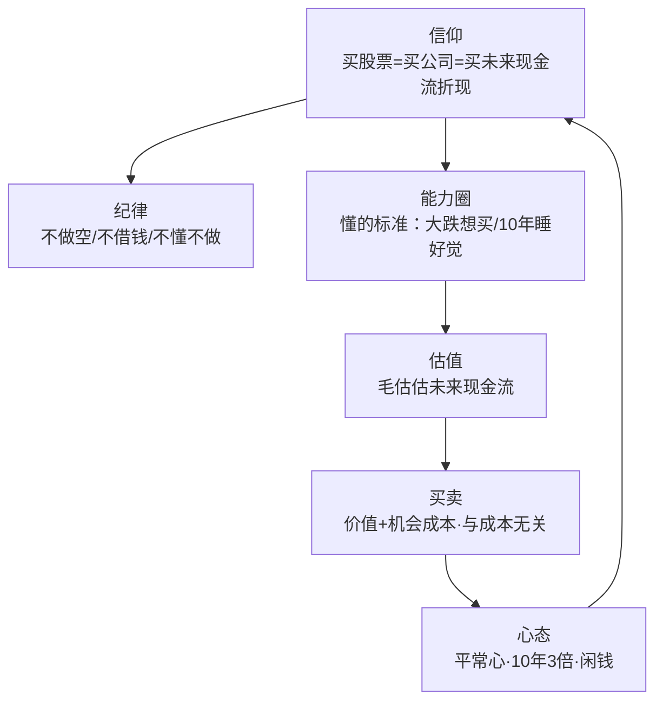
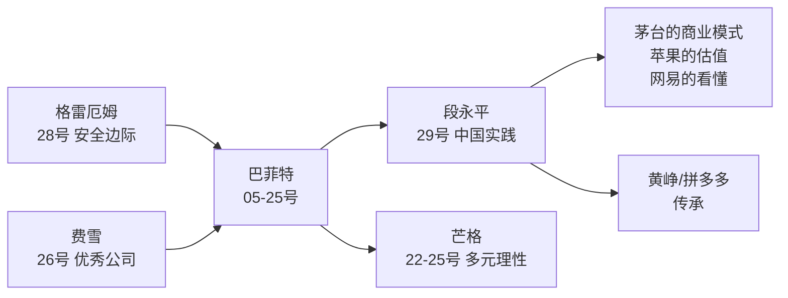
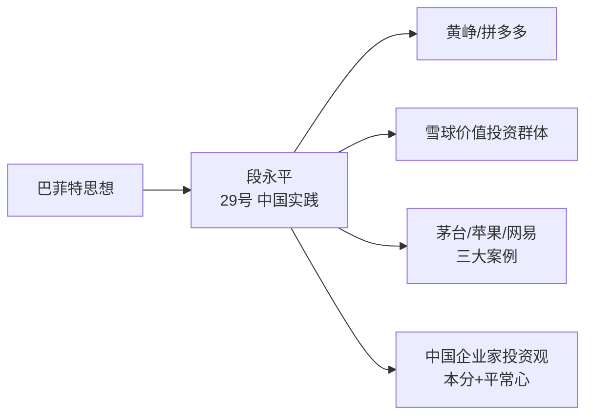
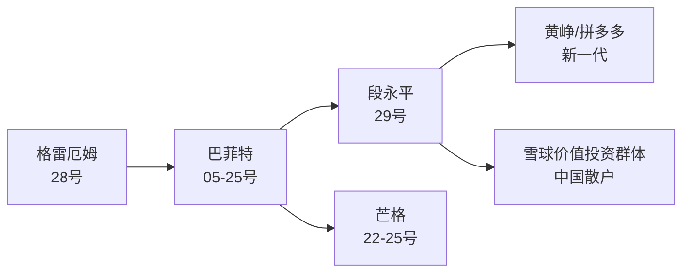
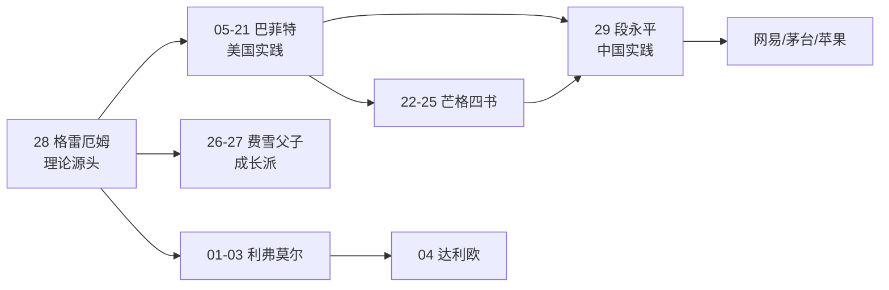
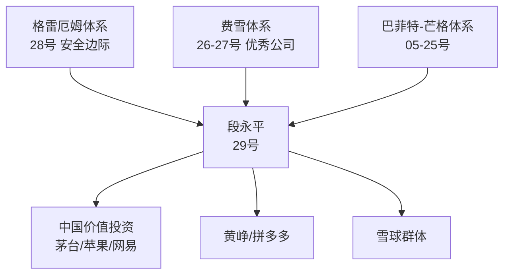
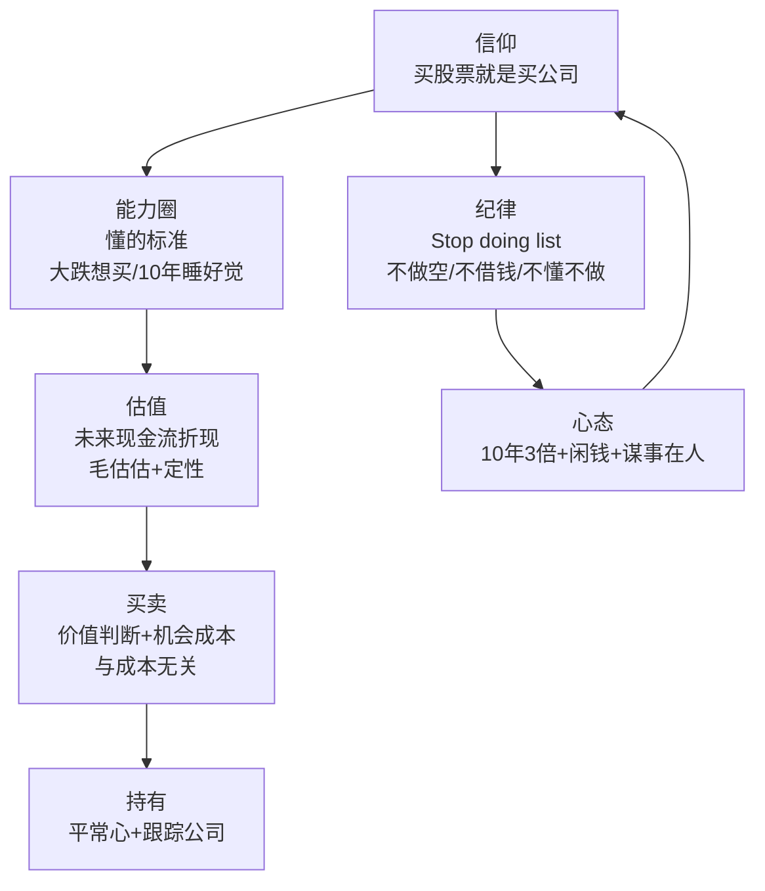

# 29《段永平投资问答录》深度解读（详细版）

> 段永平——"买股票就是买公司"：中国企业家的价值投资实践哲学

## 📖 本书概览

| 项目 | 内容 |
|------|------|
| 书名 | 段永平投资问答录（雪球专刊精选） |
| 作者 | 段永平（1961—）：小霸王品牌缔造者、步步高创始人、vivo/OPPO 联合创始人、网易丁磊生命中的贵人、拼多多黄峥的人生导师 |
| 结构 | 七章：①投资理念（信仰/做对的事情/Stop doing list）②投资理解（价值投资/封仓十年）③golf 和投资（看懂公司/能力圈）④财务理解（财报/回购分红/ROE）⑤估值逻辑（现金流折现/雅虎案例/PE/买卖时机/机会成本）⑥投资方法论（宏观/平常心）⑦案例分析（茅台/网易/苹果） |
| 形式 | 博客/雪球问答实录（2010—2020 年），原汁原味 |
| 历史地位 | **中国价值投资第一人**；网易投资 100 倍以上回报；重仓茅台、苹果 |
| 系列位置 | **价值派·中国实践**：[[28《聪明的投资者》深度解读（详细版）|28 格雷厄姆（理论源头）]] → [[20《巴菲特的第一桶金》深度解读（详细版）|20 巴菲特（实践样本）]] → **29 段永平（中国本土化）** |

## 🎯 为什么这本书值得单独解读

- **A 股投资圈的圣经**：段永平是极少数"企业家+投资人"双重身份的成功者——既做过企业（小霸王/步步高/OPPO/vivo），又做投资（网易 100 倍/茅台/苹果）
- **投资信仰**："买股票就是买公司，买公司就是买公司的未来现金流折现，句号！"——一句话说透价值投资
- **Stop doing list**：不做空/不借钱/不做不懂的东西——巴菲特三大纪律的中国实践版
- **三个传奇案例**：网易（0.8 美元→100 倍+）、茅台（商业模式解析）、苹果（2011 年 3000 亿市值买入）
- **能力圈与"懂"**：中国企业语境下最实用的理解框架
- **系列桥梁**：把 28 号格雷厄姆/05—25 号巴菲特的理论，翻译成中国投资者能用的语言


## 📖 全书结构与核心框架

### 29.0 全书结构总览表

| 源书章节 | 笔记章节 | 核心内容 | 关键概念/案例 |
|---------|---------|---------|--------------|
| 第一章 投资理念 | 第1—3章 | 信仰/做对的事情/Stop doing list | "买股票就是买公司，句号！"；称重机；华以刚围棋；百度做空 1.5—2 亿教训 |
| 第二章 投资理解 | 第4—5章 | 价值投资/封仓十年 | 三重考验；李驰"傻子"名言；定性 vs 定量；10 年 3 倍 |
| 第三章 golf 和投资 | 第6—7章 | 看懂公司/能力圈 | 懂的五种检验；恐惧与了解成反比；单刃的能力圈 |
| 第四章 财务理解 | 第12章 | 财报/回购分红/ROE | 回购优先级；"任何股票只有一个真正的买家"；苹果回购推演 |
| 第五章 估值逻辑 | 第8—10章 | 现金流折现/雅虎案例/PE/买卖/机会成本 | 雅虎 70 亿买+500 亿"白给"；PE 是倒后镜；停车场投币器；忠旺 3 块→1.46 块 |
| 第六章 投资方法论 | 第11章 | 宏观/平常心 | 8% 回报预期；谋事在人成事在天；闲钱 |
| 第七章 案例分析 | 第13—15章 | 茅台/网易/苹果 | 网易 100 倍；茅台商业模式；苹果 2000 亿算术题 |

### 29.1 核心框架：段永平投资体系



## 📑 目录

- [[#第1章 投资的信仰：买股票就是买公司|第1章 投资的信仰：买股票就是买公司]]
- [[#第2章 做对的事情，把事情做对|第2章 做对的事情，把事情做对]]
- [[#第3章 Stop doing list：不为清单|第3章 Stop doing list：不为清单]]
- [[#第4章 价值投资难吗：三重考验|第4章 价值投资难吗：三重考验]]
- [[#第5章 封仓十年：定性分析的艺术|第5章 封仓十年：定性分析的艺术]]
- [[#第6章 看懂公司：懂的标准|第6章 看懂公司：懂的标准]]
- [[#第7章 能力圈：边界比大小重要|第7章 能力圈：边界比大小重要]]
- [[#第8章 估值逻辑：未来现金流折现|第8章 估值逻辑：未来现金流折现]]
- [[#第9章 市盈率与买卖时机|第9章 市盈率与买卖时机]]
- [[#第10章 机会成本：沉没成本的陷阱|第10章 机会成本：沉没成本的陷阱]]
- [[#第11章 平常心：回报预期与投资心态|第11章 平常心：回报预期与投资心态]]
- [[#第12章 财务理解：回购分红与 ROE|第12章 财务理解：回购分红与 ROE]]
- [[#第13章 案例一：网易（100 倍之路）|第13章 案例一：网易（100 倍之路）]]
- [[#第14章 案例二：贵州茅台（商业模式典范）|第14章 案例二：贵州茅台（商业模式典范）]]
- [[#第15章 案例三：苹果（看懂的力量）|第15章 案例三：苹果（看懂的力量）]]
- [[#第16章 段永平 × 系列大师终极对照|第16章 段永平 × 系列大师终极对照]]
- [[#第17章 深度专题：段永平的"本分"哲学|第17章 深度专题：段永平的"本分"哲学]]
- [[#第18章 深度专题：段永平的投资决策实录|第18章 深度专题：段永平的投资决策实录]]
- [[#第19章 深度专题：段永平论宏观与市场|第19章 深度专题：段永平论宏观与市场]]
- [[#第20章 深度专题：段永平的管理哲学与投资|第20章 深度专题：段永平的管理哲学与投资]]
- [[#第21章 深度专题：段永平与黄峥、拼多多|第21章 深度专题：段永平与黄峥、拼多多]]
- [[#第22章 深度专题：段永平语录 × 系列大师对勘|第22章 深度专题：段永平语录 × 系列大师对勘]]
- [[#第23章 深度专题：golf 和投资的共通哲学|第23章 深度专题：golf 和投资的共通哲学]]
- [[#第24章 深度专题：什么人适合做股票投资|第24章 深度专题：什么人适合做股票投资]]
- [[#附录一 段永平金句集（40 条精选）|附录一 段永平金句集（40 条精选）]]
- [[#附录二 Stop doing list 全集|附录二 Stop doing list 全集]]
- [[#附录三 段永平投资体系速查|附录三 段永平投资体系速查]]
- [[#附录四 系列互链：段永平在价值投资谱系中的位置|附录四 系列互链：段永平在价值投资谱系中的位置]]
- [[#附录五 A 股应用：段永平方法的本土化|附录五 A 股应用：段永平方法的本土化]]
- [[#附录六 读完本书后的 10 个自问|附录六 读完本书后的 10 个自问]]
- [[#附录七 本书案例与数据速查|附录七 本书案例与数据速查]]
- [[#附录八 段永平与中医：跨界对照|附录八 段永平与中医：跨界对照]]
- [[#附录九 FAQ：段永平投资问答 20 问|附录九 FAQ：段永平投资问答 20 问]]
- [[#附录十 段永平式投资组合构建示例（A 股）|附录十 段永平式投资组合构建示例（A 股）]]
- [[#附录十一 段永平投资年表|附录十一 段永平投资年表]]
- [[#附录十二 段永平 vs 巴菲特午餐的传承|附录十二 段永平 vs 巴菲特午餐的传承]]
- [[#附录十三 全书 30 秒版|附录十三 全书 30 秒版]]
- [[#附录十四 段永平问答精选（原汁原味 20 则）|附录十四 段永平问答精选（原汁原味 20 则）]]
- [[#附录十五 段永平式 A 股实战模拟：看懂一家白酒公司|附录十五 段永平式 A 股实战模拟：看懂一家白酒公司]]
- [[#附录十六 段永平投资检查清单（每日/每周/每月）|附录十六 段永平投资检查清单（每日/每周/每月）]]
- [[#附录十七 系列 29 本笔记总览（更新版）|附录十七 系列 29 本笔记总览（更新版）]]
- [[#附录十八 段永平式"本分投资"周记模板|附录十八 段永平式"本分投资"周记模板]]
- [[#附录十九 段永平思想 × 系列完整对照矩阵|附录十九 段永平思想 × 系列完整对照矩阵]]
- [[#附录二十 段永平式投资书籍推荐（从本书出发）|附录二十 段永平式投资书籍推荐（从本书出发）]]
- [[#附录二十一 段永平投资理念 100 条（问答录精华汇编）|附录二十一 段永平投资理念 100 条（问答录精华汇编）]]
- [[#附录二十二 段永平式观察池：A 股"懂"的练习|附录二十二 段永平式观察池：A 股"懂"的练习]]
- [[#附录二十三 全书 30 秒版（段永平）|附录二十三 全书 30 秒版（段永平）]]
- [[#总结：段永平之道的核心|总结：段永平之道的核心]]

## 🔗 双链导读

| 连接主题   | 本书章节  | 关联笔记                    |           |
| ------ | ----- | ----------------------- | --------- |
| 价值投资源头 | 第1—2章 | [[28《聪明的投资者》深度解读（详细版）   | 28 格雷厄姆]] |
| 巴菲特传承  | 第3章   | [[20《巴菲特的第一桶金》深度解读（详细版） | 20 第一桶金]] |
| 能力圈    | 第7章   | [[22《穷查理宝典》深度解读（详细版）    | 22 能力圈]]  |
| 商业模式   | 第14章  | [[13《巴菲特的护城河》深度解读（详细版）  | 13 护城河]]  |
| 集中投资   | 第5章   | [[16《巴菲特的投资组合》深度解读（详细版） | 16 集中投资]] |
| 买公司思维  | 第1章   | [[26《怎样选择成长股》深度解读（详细版）  | 26 费雪]]   |

---

## 第1章 投资的信仰：买股票就是买公司

### 1.1 一句话的投资信仰

> "我理解的投资归纳起来就是：**买股票就是买公司，买公司就是买公司的未来现金流折现，句号！**这就是我说的所谓的信仰的意思，或者说我是从骨子里相信，不会因为任何影响而动摇。"

**信仰的三个层次**：

| 层次 | 内容 |
|------|------|
| 第一层 | 买股票=买公司（不是买代码/买K线） |
| 第二层 | 买公司=买未来现金流折现 |
| 第三层 | 未来=直到公司结束（"就是包括卖掉在内的所有可能"） |

**为什么是"信仰"**："很多人一讲到投资就会马上冒出很多大家都似懂非懂的术语，大概原因就是因为没有这个信仰。"

**马克思的印证**："记得马克思说过：价格围绕价值上下波动。买股票花的是价格，买的是价值。"

### 1.2 简单但绝不容易

> "其实我对投资的理解就这些，其他都是这几句话衍生出来的。简单不？对，简单但绝不容易！不懂企业的人绝对没办法看懂未来现金流。所谓懂的人往往也只能看懂自己能力圈内的很少很少企业的未来现金流折现，而且还一定是毛估估滴。"

**"学会简单其实就不简单"**：段永平反复强调——投资的核心极简单，但做到极难。

### 1.3 未来现金流折现：思维方式而非公式

> "未来现金流折现只是一种思维方式，只有在自己能力圈范围内的公司，投资人才能毛估估看明白。没人真用公式的，至少剩者都是不用公式的。（说自己有公式还有参数的都是不懂甚至可能是骗人的，别理他们）"

**毛估估**："会加减乘除，懂什么叫复利就够了。其余的我不知道对谁有用。"

**折现=反过来的复利**："折现就是反过来的复利。"

### 1.4 长期而言股市是称重机

> "投资的信仰指的是：相信长期而言股市是称重机，对没有信仰的人而言，股市永远是投票器。"

**称重机 vs 投票器**：

| 概念 | 短期 | 长期 |
|------|------|------|
| 投票器 | 情绪主导 | — |
| 称重机 | — | 价值主导 |

> "我说的信仰就是你骨子里真的相信的东西，是不会被某些事情动摇的。比如长期利润及净现金流好的公司股价早晚会跟上来等等。"

### 1.5 懂的人不超过 5 个

> "我们都信仰巴菲特对投资的理解——'买股票就是买公司'。'买股票就是买公司'这句话会说的人非常多，但我几乎没见过真的骨子里真的理解并相信这句话的——我知道的人里面大概不超过 5 个（包括巴菲特和芒格在内）——当然，这是因为我知道的人很少的缘故。"

### 1.6 第1章小结

| 层面 | 结论 |
|------|------|
| 信仰 | 买股票=买公司=买未来现金流折现 |
| 公式 | 思维方式，不是数学公式 |
| 市场 | 长期称重机，短期投票器 |
| 门槛 | 简单但绝不容易 |

---

## 第2章 做对的事情，把事情做对

### 2.1 华以刚的围棋故事

> "很多年前，我和华以刚下过一盘围棋，有一块我感觉非常不舒服，复盘的时候我问他为什么我怎么下都觉得不对，然后他告诉我其实你这里怎么下都一样的，因为你前面下错了。"

**围棋的启示**：**前面下错了，后面怎么补救都是错**——投资同理：方向（做对的事情）错了，技巧（把事情做对）再好也没用。

### 2.2 什么是"做对的事情"

> "难道还有人明知是错的事情还会做的吗？看看周边有多少人抽烟你就明白了。为什么人们会明知是错的事情还会去做呢？那是因为错的事情往往有短期的诱惑。"

**核心定义**：

> "人们往往知道什么是错的事情，只要把错的事情停止做了，就离'做对的事情'更近了一步。所以，'做对的事情'其实就是发现是错的事情的时候要马上停止，不管多大的代价都是最小的代价。"

**三个关键认知**：

| 认知 | 内容 |
|------|------|
| 一 | 做对的事情=不做错的事情 |
| 二 | 发现错了马上改，代价最小 |
| 三 | "坚持到底"指的是坚持对的事情，不是坚持错的事情 |

### 2.3 什么是"把事情做对"

> "把事情做对是一个学习的过程，中间会犯很多的错误。如何坚持做对的事情，付出为了把事情做对的过程当中所需要付出的代价，其实是非常不容易的。在把事情做对的过程当中，其实是没有办法避免犯错误的，比如打高尔夫的人，是没有办法避免偶尔把球打下水的，能做的仅仅是如何能降低犯错误的概率。"

**两件事的分工**：

| 维度 | 做对的事情 | 把事情做对 |
|------|-----------|------------|
| 性质 | 方向/原则 | 方法/技巧 |
| 例子（投资） | 买股票就是买公司 | 看懂公司的生意 |
| 错误 | 原则性错误不可犯 | 过程错误不可避免 |
| 来源 | 不用看书，懂了就懂了 | 有些书可以帮助 |

### 2.4 巴菲特最重要的不是做了什么

> "一般人学习理解总是觉得做什么是最重要的，其实最重要的是不做什么。巴菲特能有今天最重要的是'不做什么'。"

> "学巴菲特最重要和人们能够学的东西其实是他不做什么！绝大多数人学的是相反的东西，就是他在做什么，那是没办法学的，因为每个人的能力圈不同。"

**为什么"不做什么"可学**："你说知道自己的能力圈有多大比能力圈有多大要重要的多。当然，能力圈的大小也是可以学的，但那是每个人自己的经历包括学历等，巴菲特不教这个。"

### 2.5 关于犯错：巴菲特与马云之辨

**网友的问题**：马云说"不犯错将是最大的错"，巴菲特说"不要犯错"，怎么理解？

**段永平的回答**：

> "巴菲特有今天，我个人觉得最重要的就是他很少犯'原则性错误'，也就是说，他认为他能力以外的事他坚决不碰。几十年下来，他犯的错远远少于同行，仅此而已。"

> "马云讲的是另外的一面，就是如何把事情做对的问题。无论是谁，在把事情做对的过程当中都是有可能犯错的。"

**巴菲特也有亏损**："事实上他亏过的钱的总额比我们谁都多，因为他也有犯错误的时候。呵呵，光是他投在康菲石油上亏的钱就有几十个亿美金啊。"

### 2.6 第2章小结

| 层面 | 结论 |
|------|------|
| 围棋启示 | 方向错了，技巧无用 |
| 做对的事情 | 发现错马上停，代价最小 |
| 把事情做对 | 学习过程，错误不可避免 |
| 巴菲特 | 最重要的不是做了什么，是不做什么 |
| 犯错之辨 | 原则性错误 vs 过程错误 |

---


---

## 第3章 Stop doing list：不为清单

### 3.1 芒格的智慧："知道自己会死在哪里"

> "当我知道自己会死在哪里时，就永远不去那儿——芒格"

**Stop doing list 的本质**：**不为清单比为清单更重要**——"好的公司都一定是有一个长长的'Stop doing list'，就是'不做的事情'"。

### 3.2 第一条：不做空

**段永平的惨痛教训（百度做空）**：

> "亏钱的投资有好几次了，多数都可以原谅，但有一次属于极度愚蠢，就是跑去 short 百度。之前投资表现非常好，有点飘飘然，真以为自己很厉害。开始还是想小玩玩，后来又不服输，最后被夹空而投降，所有账号加起来亏了很多钱，大概有 1.5-2 亿美金，其中有个账号到现在都翻不了身。"

**教训的三层含义**：

| 层面 | 内容 |
|------|------|
| 直接损失 | 亏了 1.5—2 亿美金 |
| 机会成本 | "这次错误把我们的现金储备全部消耗掉了，机会成本巨大，不然这次金融危机我就可以帮大家赚更多钱了" |
| 纪律 | "这个错误是发生在巴菲特叫我不要做空之后。现在知道什么叫不听老人言的后果了吧？" |

**为什么不做空**（巴菲特/芒格论述）：

> "巴菲特：'查理和我对做空都不陌生，我们两个都失败了。'"
> "芒格：'我们不喜欢以痛苦地交易来换金钱。'"
> "做空并看着推动者把股价拉升是非常刺激的，但不值得去体验这种刺激。不做空、不融资，想死就变得较难了。"

**做空的结构性劣势**：

| 维度 | 做多 | 做空 |
|------|------|------|
| 最大损失 | 100%（归零） | **无限**（股价无上限） |
| 时间压力 | 无 | 有（利息+逼空） |
| 与市场为敌 | 否 | 是（"还要面对市场的疯狂"） |
| 长期胜率 | 高 | "长期而言，靠做空成功的人极少" |

**段永平的金句**："任何时候，只要你还想着要空一把谁，那就表示你还是个投机分子（以为自己比市场聪明）。"

### 3.3 第二条：不借钱（不用 margin）

**巴菲特的三条纪律**（段永平反复引用）：

> "老巴的教导千万别忘了：不做空，不借钱，不做不懂的东西！"

**借钱的结构性风险**：

| 场景 | 风险 |
|------|------|
| 市场下跌 | 被迫卖出（margin call） |
| 时间错配 | 好公司需要时间，杠杆没有时间 |
| 情绪放大 | 杠杆放大恐惧 |

**段永平**："投资用的是闲钱，不然就是投机了。"

### 3.4 第三条：不做不懂的东西

**不懂不做=价值投资的定义**：

> "研究巴菲特其实就一件事：不懂不做，只要你这么做，就叫价值投资。"

**不懂的代价**："股市上那些长期亏钱的大多属于不知道自己能力圈有多大的人"——**大多数人都是倒在能力圈外的**。

### 3.5 段永平的不为清单全集

| # | 不为清单 | 理由 |
|---|---------|------|
| 1 | 不做空 | 无限风险+与市场为敌 |
| 2 | 不借钱 | 杠杆没有时间 |
| 3 | 不做不懂的东西 | 不懂=投机 |
| 4 | 不买不了解的公司 | 了解是买入前提 |
| 5 | 不预测市场 | 预测=投机 |
| 6 | 不跟风热门 | 热门=高估 |
| 7 | 不把投资和投机混在一起 | 纪律边界 |
| 8 | 不因价格波动改变判断 | 价值锚定 |
| 9 | 不为短期回报冒险 | 长期主义 |
| 10 | 不碰没有现金流的东西 | 比特币等 |

### 3.6 第3章小结

| 层面 | 结论 |
|------|------|
| 不为清单 | 比"为清单"更重要 |
| 不做空 | 百度教训：1.5—2 亿美金+机会成本 |
| 不借钱 | 杠杆没有时间 |
| 不懂不做 | 价值投资的同义词 |

---

## 第4章 价值投资难吗：三重考验

### 4.1 价值投资难在哪

**引文（豆豆龙）**："对于价值投资来说，其实最难的部分是那种人生态度和哲学。查理芒格曾说 40 岁以前没有真正的价值投资者。也许他的意思是，心理年龄不到 40 岁的人，未曾经历真正的风雨和历练的人，是很难有这种超常的定力和淡泊的风骨的。"

**第一难：被怀疑被耻笑时候的坚持、自信与淡定**

> "作为一个价值投资者，是会经常被人怀疑和耻笑的。因为价值投资人常常在短期内'赶不上潮流'，遗憾的是，这个所谓的'短期'常常有可能甚至是几年的时间。"

**中国的价值投资人被嘲笑案例**：

| 人物 | 被嘲笑的事 |
|------|-----------|
| 李驰/但斌 | 博客评论区的耻笑与怀疑 |
| 林园 | 电视节目主持人的冷嘲热讽（"连股票价格复权这样基本的常识都不懂，却敢去嘲讽一个每年股利就能分到几千万的智者"） |
| 巴菲特 | 科技股疯狂时被质疑"落伍了，被时代所淘汰了" |
| 段永平本人 | 卖房被说"又疯又傻"；看好银行股被说"脑袋进水了" |

**李驰的名言**："投资未最后结帐之前，看起来和傻子一模一样。"

**第二难：逆势而为的理性、清醒与忍耐**

> "在大牛市中持有现金，正像在大熊市中满仓尖叫一样，是需要理性与勇气的。"

**赵丹阳的案例**：2007 年大牛市清仓——"那个时候，几乎所有的人都热情高涨，都认可股市到达 10000 点是指日可待的事情，连证券公司门口看车的老大爷，都开始把一辈子的存款拿出来炒股。"当时最知名的歌曲是"死了都不卖"。

**第三难：抵御"别人都赚了"的诱惑**

> "一个月，我们可以坚守自己的信念；可是，半年后，一年后，甚至三五年后，当看到身边那些技术派、趋势派、甚至没有任何投资知识的老奶奶，他们的收益都比自己高的多的时候（遗憾的是，这真的有可能发生的），我们会不会仍然坚守自己的判断和信念？"

### 4.2 推荐了正确的个股，很多人也无法获利

**为什么**："一个别人推荐的，你并没有深入研究过的股票，你能坚守吗？"

**价值投资的链条**：研究→相信→持有→获利——**任何一环缺失，都无法获利**。

### 4.3 价值投资的时间维度

**卖房案例的启示**："一套住了 9 年的房子，卖的房价是当年的 5 倍多，租售比已经在 600:1，虽然我永远都不知道也不奢望是否卖在了最高点，但我很清楚价格已经非常高估了。"

**"世界上没有只涨不跌的商品"**："人还没去世，不代表着人一辈子都不会死。"

### 4.4 第4章小结

| 层面 | 结论 |
|------|------|
| 第一难 | 被怀疑被耻笑时的坚持 |
| 第二难 | 逆势而为的理性 |
| 第三难 | 抵御短期诱惑 |
| 链条 | 研究→相信→持有→获利 |

---

## 第5章 封仓十年：定性分析的艺术

### 5.1 时间是优秀企业的朋友

> "时间是优秀企业的朋友，平庸企业的敌人。"——巴菲特

**封仓 10 年的思路**："封仓 10 年是个很好的思路，选股时就该这么想。"

### 5.2 定性 vs 定量：段永平最核心的方法论

> "其实看几年并不是个时间长短的问题，而是个定性的问题。"

**为什么定性更重要**：

> "大致的估值主要用于判断下行的空间，定性的分析才是真正利润的来源，这也可能是价值投资里最难的东西。"

> "一般而言，赚到几十倍甚至更多的股票绝不是靠估值估出来的，不然没道理投资人一开始不全盘压上（当时我要知道网易会涨 160 倍，我还不把他全买下来？）。"

**芒格的印证**：

> "实际上，每个人都会把可以量化的东西看得过重，因为他们想'发扬'自己在学校里面学的统计技巧，于是忽略了那些虽然无法量化但是更加重要的东西。"——段永平："我觉得我干得也不错。我把这个叫定性分析。"

**巴菲特的名言**："宁要模糊的正确，也不要精确的错误。"

**段永平的极端表述**："我从来没做过定量的分析……从十年或以上的角度看，定量分析很荒唐。"——"因为定性分析要更准确。比如人们可能很容易知道茅台 10 年后大概能赚多少钱，但无法准确知道 10 年后的某一年能赚多少，也没必要知道。"

### 5.3 长期主义的完整表述

> "长期而言（10 年 20 年或以上）坚持只投好的商业模式，好的企业文化的公司大概率上是会有比较好的回报的，而且这种投资方法让人很愉快，不需要整天瞎操心。简言之，投资人每次做投资决定时如果想的是 10 年 20 年的事情，最后的结果很难不好，不然就难说了。要找到自己能想清楚 10 年 20 年的公司是非常不容易的，一生有那么 10 个 8 个机会就非常非常好了。"

### 5.4 拥有公司的心态

> "大概只有一个办法，那就是拥有这家公司的心态。你要真有这种心态，其实不用学就会了，因为那都是真金白银啊。我发现虽然很多人说起来都是要用拥有公司的心态去买股票，但绝大多数实际上只是停留在口头上，一到关键时刻就会掉链子。"

### 5.5 第5章小结

| 层面 | 结论 |
|------|------|
| 封仓十年 | 选股就该这么想 |
| 定性优先 | 定量分析是荒唐的（10 年+视角） |
| 模糊的正确 | 好于精确的错误 |
| 拥有心态 | 真金白银才会真懂 |

---


---

## 第6章 看懂公司：懂的标准

### 6.1 "懂"的定义

> "我自己的所谓能看懂就是认为自己大概能看懂其商业模式及未来的现金流（折现）。"

> "简单讲就是企业生命周期赚的钱你能看懂。"

**"懂"的边界**：

> "'懂'的定义不要太理想化。'懂'并不是能看到未来一切的'水晶球'。能看到一些重要的东西就很不错了。长远而言，我觉得投资实际上是个概率事件，真正'懂'的人犯错误的概率低，最后的回报高。"

### 6.2 懂的标准（段永平给出的五种检验）

| 检验 | 内容 |
|------|------|
| 检验一 | "看懂了一家公司的最简单的标准就是你不会想去问别人'我是不是看懂了这家公司'" |
| 检验二 | "懂的标准是当他大掉的时候你非常想再买多些，而不是到处打听'发生什么事了'，或者老想着要卖掉" |
| 检验三 | "没看懂的公司比较容易鉴别，就是股价一掉你就想卖，涨一点点你也想卖的那种。看懂的那种大概就是怎么涨你都不想卖，大掉时你会全力再买进的那种" |
| 检验四 | "当你觉得你买的股票掉的时候你真的不受影响的时候，你大概就是懂了" |
| 检验五 | "想象你打算买一家公司，拿着 10 年都不上市你依然能睡好觉，那你大概就懂了" |

### 6.3 恐惧程度和了解程度成反比

> "恐惧程度和了解程度成反比。……跟心理素质没关系，是因为你不明白所谓'价值'为何物。"

**上市公司与不上市公司的区别**：

> "就是因为本没有区别，哪来的市场恐惧呢？比如欧洲金融危机和我住的房子是没关系的，当然如果你是借钱买的可能就有关系了。"——**好公司+没杠杆=没有恐惧的理由**

### 6.4 股价下跌时的兴奋

**雅虎案例**（段永平的真实反应）：

> "如果因为自己买的股票掉了而兴奋的话，对价值投资的理解就可能有进步了。昨天看 yahoo 盘后掉我就很兴奋来着，一夜只睡了不到两小时，就为了早点起来买 yahoo……结果在 17.5 以下又买了 200 多万股。"

**股市幽默的回应**："昨天问一炒股朋友：最近股市暴跌了，睡眠怎样？他说：像婴儿般睡眠。……他沉默半响道：半夜经常醒来哭一会再睡。"——段永平："如果是半夜起来笑一会会怎么样？"

### 6.5 "懂"的来源：生意理解

**网易的例证**："我们能在网易上赚到 100 多倍是因为我在做小霸王时就有了很多对游戏的理解，这种理解学校是不会教的，书上也没有，财报里也看不出来。"

**苹果的例证**："OPPO 和 APPLE 其实有很多相同的基因，这也是我最后能看懂 APPLE 的原因之一。""当年的小霸王学习机也差不多是单一产品模式……这是我能看懂苹果的重要原因之一，没有那段经历，不一定会知道苹果有多厉害。"

### 6.6 第6章小结

| 层面 | 结论 |
|------|------|
| 定义 | 看懂商业模式+未来现金流 |
| 五检验 | 不问人/大跌想买/涨跌都不卖/跌了不受影响/10 年不上市能睡好觉 |
| 恐惧 | 与了解程度成反比 |
| 来源 | 生意经历（小霸王→网易/OPPO→苹果） |

---

## 第7章 能力圈：边界比大小重要

### 7.1 能力圈的定义

> "'能力圈'的意思就是你能够判断未来现金流折现的范围。知道自己的'能力圈'有多大比'能力圈'本身有多大要重要的多。"

**能力圈的真正含义**（破除金箍棒误解）：

> "能力圈不是拿金箍棒在地上画个圈，说待在里面不要出去，外面有妖怪。能力圈是：诚实对自己，知之为知之，不知为不知。有这样的态度，然后如果能看懂一个东西，那它就是在我能力圈内，否则就不是。"

### 7.2 边界比大小重要的三重论证

| 论证 | 内容 |
|------|------|
| 巴菲特 | "对你的能力圈来说，最重要的不是能力圈的范围大小，而是你如何能够确定能力圈的边界所在。如果你知道了能力圈的边界所在，你将比那些能力圈虽然比你大 5 倍却不知道边界所在的人要富有得多。" |
| 段永平 | "股市上那些长期亏钱的大多属于不知道自己能力圈有多大的人们" |
| 现实 | "投资的人绝大多数都是倒在能力圈外的，虽然大多数最后都不明白为什么中的招" |

### 7.3 能力圈是单刃的

> "能力圈不是双刃剑，是单刃的，只是内外有别而已。"——**圈内是安全的，圈外是危险的——不存在"圈外也安全"的一面**

### 7.4 智商与能力圈

> "巴菲特：投资并非一个智商为 160 的人就一定能击败智商为 130 的人的游戏。"
> "段永平：大概智商高的人未必知道自己的能力圈边界在哪里，但智商高的人可能往往容易越出自己的能力圈。"

**一英尺障碍**："我们之所以取得目前的成就，是因为我们关心的是寻找那些我们可以跨越的一英尺障碍，而不是去拥有什么能飞越七英尺的能力。"

### 7.5 段永平 vs 巴菲特：能力圈的不同

> "我觉得我和巴菲特不同的地方主要是能力圈子不一样，本质的东西没什么区别。……巴菲特有很多保险和金融的投资，我基本没有，因为我还不懂，总觉得不踏实。我投了一些和 internet 相关的公司，巴菲特没投过，因为他不懂。他认为可口可乐是人们必喝的，我认为游戏是人们必玩的。"

### 7.6 第7章小结

| 层面 | 结论 |
|------|------|
| 定义 | 能判断未来现金流折现的范围 |
| 核心 | 知道边界比大小重要 |
| 单刃 | 圈外永远危险 |
| 智商 | 高智商反而容易越界 |
| 差异 | 能力圈不同，本质相同 |

---

## 第8章 估值逻辑：未来现金流折现

### 8.1 唯一的一种投资模式

> "我永远只有一种投资模式，那就是估算未来现金流（的折现）。有点像高尔夫，只有一种挥杆模式。"

> "我的投资其实就是一个思路：未来现金流的折现。这点很像打高尔夫，每支杆的挥杆动作都是一样的。"

### 8.2 没有现金流的东西不碰

**比特币/虚拟货币**：

> "没有现金流的东西不知道怎么看。""我对不产生现金流的东西，不感兴趣。区块链我不懂，不懂不看，不懂没法下重注。"

**"钱会但币不会"**：1 块钱钢镚掉缝里会捡，比特币不会。

**李嘉诚的印证**："投资就是买未来的现金流，不谋而合。"——段永平："不然买的是什么？"

### 8.3 不增长的公司不等于没价值

**反例论证**：

> "给你个反例你就明白了：不增长的公司不等于没价值！比如有家公司一年赚 100 亿，没负债，没增长，年年赚 100 亿，现在市值 100 亿，你投吗？投的算不算价值投资？为快而快总是很危险的。"

**增长与速度的辨析**：

> "一般经济学里讲的速度实际上是物理里的加速度的概念，物理里的速度在经济学里是总量的概念。所以成长速度等于 0 表示的是物理里的加速度等于 0，但经济总量是维持不变的。"

**两道算术题的启示**（1000 亿净资产赚 50 亿 vs 100 亿净资产赚 5 亿增长 8%）："从算术题的角度看，两家企业 20 年后的差距肯定是拉大了。如果你是那个小企业的话，难道你会觉得差距缩小了？现实中有意思的是，小企业里的人一般都觉得差距缩小了，感觉也好多了，有趣吗？"

### 8.4 价值 vs 成长：本质是现金流

> "投资标的是所谓的成长股、价值股、烟屁股，都不重要；重要的是从未来净现金流折现的角度来看是否便宜。"——段永平："对，这个是本质。"

**巴菲特卖 IBM 买苹果**："现金流，现在的现金流和未来的现金流。"

**芒格对巴菲特的提醒**："老巴发现'便宜货'的未来现金流的折现比有把握成长的公司的未来现金流折现来的还要小，这可能就是芒格提醒的作用吧。但是，看懂好的成长公司可是要比捡便宜要难得多哦。"

### 8.5 可口可乐的假设题

> "假如可口可乐已经永远停止成长，一年的利润是 50 亿，市值 30 亿，你觉得可以买吗？你只要买下来然后把他下市你岂不是赚大钱？"——**零增长≠零价值**

### 8.6 雅虎案例：现金流折现的实战演示

**为什么买雅虎**：

> "我想我从一开始就说的很清楚，我买 yahoo 是为了买淘宝和阿里巴巴集团。所以 yahoo 只要过得去就可以了。"

**估值拆解（2010 年 2 月）**：

| 项目 | 金额 |
|------|------|
| Yahoo 市值 | 约 215 亿美元 |
| 现金 | 约 45 亿美元 |
| Yahoo 日本+阿里香港上市部分 | 约 100 亿美元 |
| **实际支付（215-45-100）** | **约 70 亿美元** |
| Yahoo 自身盈利能力 | 5—7 亿/年 |
| 微软合作节省 | 5—6 亿/年 |
| 潜在盈利 | 10 亿+/年 |
| 淘宝+支付宝（段永平毛估） | **可能值 500 亿（"白给的"）** |

**段永平的一句话估值**："我毛估估地认为美国 Yahoo 大概值 15 左右，其他投资价值也值 15 左右（包括 Yahoo 日本和阿里巴巴集团 Yahoo 所占部分）。"——**"怎么看都值 30 块"**

**安全边际**："没有阿里巴巴集团的话，yahoo 就不便宜了。"

**阿里巴巴的预言（2010 年）**："我猜若干年后阿里巴巴集团或腾讯会是中国最早到 500 亿，甚至 1000 亿美金市值的民营上市公司。""我的意思是阿里早晚能赚一年 100 亿美金以上，这个数字可能在 5 年左右就能看到了。"——**2014 年阿里上市市值超 2000 亿美元，预言验证**

**买阿里/雅虎的核心逻辑**："阿里巴巴的企业文化是我在中国企业里迄今见到的写的最好的企业文化。拥有这么好的企业文化再加上已经找到的这么好的生意模式，阿里巴巴想不成功都不容易啊。"

### 8.7 第8章小结

| 层面 | 结论 |
|------|------|
| 唯一模式 | 未来现金流折现 |
| 无现金流 | 不碰（比特币） |
| 零增长 | 不等于零价值 |
| 雅虎案例 | 70 亿买+500 亿白给 |
| 阿里预言 | 1000 亿美金（验证） |

---


---

## 第9章 市盈率与买卖时机

### 9.1 对 PE 的看法：历史数据，倒后镜

> "看但不看重。pe 是历史数据，我们买的是未来的现金流。所以除非你能从历史中看到未来，否则没意义。相对于 pe，我会更多用 e/e 来衡量一个企业。"

> "市盈率是倒后镜，不能作为能不能投的标准。关键是未来的盈利能力，看不懂的再低也别碰。"

**低 PE 的陷阱（通用汽车）**：

> "PE 是历史数据的意思是你不能单靠 PE 去推测公司未来的收益，不然会中招的。举个例子，GM（通用汽车）的 PE 一直都很低（以前老在 5 倍左右），但债务很高，结果破产了。"

**PE 的正确用法**："我说的 pe 一般指的是相对于未来长期实际利润的 pe，不是一般财报上的那个 pe。你愿意给多少 pe 完全取决于你自己的能力或者说你自己的资金的机会成本，其实和市场无关。"

**12 倍 PE 的参照**："多少倍 pe 和平均长期利息有关，12 倍长期 pe 应该可以了，我一般大概也用这个数左右。"（巴菲特买喜诗 12PE、中石油 12PE）

### 9.2 什么时候卖股票：和成本无关

> "我有个理解，就是无论什么时候卖都不要和买的成本联系起来。该卖的理由可能有很多，唯一不该用的理由就是'我已经赚钱了'。"

> "买的时候也一样。买的理由可以有很多，但这只股票曾经到过什么价位最好不要作为你买的理由。我的判断标准就是价值。"

**网易持有的道理**：

> "这也是我能拿住网易 8-9 年的道理。……在持有的这 8 年到 9 年当中，我可能每天都会被卖价所诱惑，我就是用这个道理抵抗住诱惑的。"

**"被套"的辨析**：

> "长线持有一定是在买对好股票的前提下。有很多人往往只是在'被套'的时候才想起'长线'来。这里'被套'的意思是指有些人本来只打算拿 10 天的股票，结果因为'亏钱'了而决定改为拿 10 年，这种决定往往会让人亏更多。不打算拿 10 年的股票一定别去打算拿 10 天，不然就是'炒'了。"

### 9.3 买股票和过去的价格无关

**苹果 560 美元的故事**：

> "他告诉我他上午'又'买苹果了，大概 $560/股。记得上一次他买苹果是当苹果 $360 的时候，结果买了以后就设了个 $399 的卖单。我劝他别卖，因为这价太便宜，可他最后还是卖了。今天，其实苹果还是那个苹果，但市场价到过 600 多以后，似乎在 500 多下买单就容易多了。"

> "卖股票和成本无关，买股票和其到过多少价也无关。最重要其实也是唯一重要的是公司本身。"

### 9.4 投资与投机：与市场的关系

> "我理解的所谓投资其实和'市场'（短期）没关系，所以没有谁比谁聪明的问题，但有每个人了解的东西不一样的概念。我认为的投机就是认为自己可以比市场快一步。"

> "从长期的角度看，市场是绝顶聪明的！其实很多'购买并持有'的人们实际上就是投机分子，因为他们自己其实不知道自己买的是什么，所以买了以后需要整天问别人怎么看，在被套时就拿出'长期投资'来安慰自己。要知道，没什么比买错股票并长期持有伤害更大的了。"

### 9.5 You Must Believe!

> "很多人读过很多书，知道很多投资的教条，but they just don't believe. Maybe, they don't believe because they don't really understand."

> "这里的'believe'千万不要理解成简单的自信，这个'believe'的建立是需要很多年的经验和理解的，但不是有很多年就一定可以理解的意思。我见过很多有很多年'经验'的人，其实从来就没有真正花时间去'理解'过。"

### 9.6 第9章小结

| 层面 | 结论 |
|------|------|
| PE | 历史数据/倒后镜/12 倍参照 |
| 卖出 | 和成本无关，价值判断 |
| 买入 | 和过去价格无关 |
| 投资 | 与市场无关，与公司有关 |
| Believe | 需要多年的理解建立 |

---

## 第10章 机会成本：沉没成本的陷阱

### 10.1 停车场的投币器

> "一次有个朋友飞来旧金山，我去机场接。由于早到，我在停车场投币器里投了一个小时的钱。结果他也早到了，所以我们回到车上时，投币器里还剩半个多小时的时间没用完。于是我们决定为了不浪费已经投进投币器里的钱，我们在停车场里的车上又呆了半个多小时。"

**故事的寓意**："这个故事说明投币器里的钱已经拿不回来了，再搭上时间就愚蠢了。"——**沉没成本（沉入成本）的经典寓言**："为了去救已经沉没的钱又花了新的投资，结果是白花了。"

**500 强 CEO 的调查**："据说有个调查显示，500 强 CEO 里有 85% 的人承认他们干过类似的事情。本人属于 85% 这类人。"

### 10.2 机会成本的定义

> "机会成本是指做一个选择后所丧失的不做该选择而可能获得的最大利益。简单的讲，可以理解为把一定资源投入某一用途后所放弃的在其他用途中所能获得的利益。"

**投资中的机会成本**：

> "多数人被'套住'的时候都会守在那里，直到'解套'，而不是比较'解套'和其他标的哪一个机会更大。其实每天的收盘价就是我们的机会成本，没有卖就等于买了，否则可以买其他。"

### 10.3 中国忠旺案例（机会成本的实战）

> "弟兄们买了很多这家公司的股票……于是我确实飞过去看了这家公司……回来后我告诉弟兄们：我觉得这家公司商业模式一般，企业文化一般，大家卖了吧，无论亏赚，换茅台或者苹果或者腾讯都应该更好啊。当时忠旺股价在 3 块左右。大部分人很快就换了，但确实有人不舍得换，总是说会有机会的会有机会的。一转眼这么多年过去了……机会成本刚刚的。"——**忠旺现价 1.46 块**

### 10.4 三个选择问题

> "如果你觉得自己现在持有的公司在看得到的未来某一天会完蛋，你觉得是应该：
> 1．加码，因为前面买的亏了，要摊低成本等他反弹时卖掉补回成本？
> 2．不买但也不卖，希望能有个反弹的机会卖掉？
> 3．忘掉自己什么价买的，平常心去想这个公司值多少钱？"

**答案**："显然应该忘掉自己是什么价位买的，平常心去想这个公司值多少钱。"——段永平："呵呵，这个最难。"

### 10.5 芒格：人们破产的常见原因

> "人们破产的常见原因是不能控制心理上的纠结。你花了这么多心血、这么多金钱，花的越多，就越容易这么想：'估计快成了，再多花一点儿，就能成了……'人们就是这么破产的——因为他们不肯停下来想想：'之前投入的就算没了呗，我承受得起，我还可以重新振作。'"

**段永平的总结**："想起沉入成本。还想起老巴说的，如果是个坑就别再往下挖了。看看有多少人在给自己挖坑就明白了。"

### 10.6 第10章小结

| 层面 | 结论 |
|------|------|
| 投币器寓言 | 沉没成本不值得再投入 |
| 定义 | 放弃的最大利益 |
| 忠旺案例 | 3 块不舍得换→1.46 块 |
| 三个选择 | 忘掉成本，平常心估值 |
| 破产原因 | 不肯止损的心理纠结 |

---

## 第11章 平常心：回报预期与投资心态

### 11.1 可以放心睡觉的就是价值投资

> "可以放心睡觉的就是价值投资了。投资用的是闲钱，不然就是投机了。"

### 11.2 回报预期：8% 就够

> "我对投资的长期回报基本希望是能略好于长期国债，比如 8%。"

> "我对投资没有理想收益的想法。我关注过程是否正确多于关注结果是否马上显现。"

**三段论**：

> "首先说明，本人从来不预设回报预期，因为对本人而言投资回报本来就和自己的预期无关。我对投资的认识是过程比结果重要，或者说是谋事在人成事在天，只要过程对了，结果自然会好；第二，长期而言，跑过银行存款应该是最基本的要求；第三，从保值的角度看，长期而言投资回报至少要做到能保住购买力不变才叫不亏。"

**保值的本质**："投资最重要的动机是保值，保持购买力不下降。其他都是附带的。多数人可能没有意识到保值不是件容易的事情。看下 M2 的数字也许能明白点？"

### 11.3 10 年 3 倍的心态

> "10 年 100 倍的东西多少有点可遇不可求。能有 10 年 3 倍的我就满意了。""我一直这么想。10 年 3 倍是个心态，不贪心。"

**芒格的 12%**："一旦你自己找到了一件运行良好的机制能致富，还非要在意别人赚钱比你快，这在我来看就是疯了。"——段永平："1、平常心地呆在自己能力圈内；2、12% 是个可接受的年复合回报率。"

### 11.4 暴富神话与赌场

> "去赌场门口看看，暴富的故事多了去了。""人们很喜欢用一年的回报率来衡量，但大资金的年回报率是没机会特别高的……就像一起去赌场的朋友中，第一天出来时总有个别人是兴高采烈的一样，千万别以为这些人已经比巴菲特厉害了。"

> "偶尔会听到有人说某只股票至少会涨 10 倍，所以计划放 10% 进去等等。如果他真相信这只股票会涨 10 倍，什么理由他让只放 10% 呢？"

### 11.5 85% 的人亏钱的真相

> "在真的理解的生意里一个人会选多少回报的？很多人错在选了自己不了解的别人说回报高的，结果是 85% 的人亏钱。如果问这 85% 的'投资者'选 8% 每年收益还是选择 10% 还是 20% 的，那就有点像某记者问人'你幸福吗？'"

> "每个人都能理解的生意其实就是把钱存银行了。投资是只有很少人能理解的，所以大多数人还是别碰为好。"

### 11.6 谋事在人，成事在天

> "给自己设定短期投资回报率实际上有点滑稽，相当于猜测市场的短期反应。炫耀短期回报率高也是危险的，因为想要高回报率会让人铤而走险。"

### 11.7 第11章小结

| 层面 | 结论 |
|------|------|
| 平常心 | 放心睡觉=价值投资 |
| 回报预期 | 8% 就够，过程比结果重要 |
| 10 年 3 倍 | 不贪心的心态 |
| 暴富 | 赌场门口的故事 |
| 85% | 选了自己不懂的高回报 |

---


---

## 第12章 财务理解：回购分红与 ROE

### 12.1 回购与分红的正确顺序

> "其实最理想的公司是能把利润继续投入到原来的生意模式里的公司，分红是其次的选择。有些公司，比如苹果，就是已经没办法把利润再投入，所以才开始回购和分红的。当然，分红比乱花钱好 100 倍。"

**资金处置的优先级**：

| 优先级 | 处置方式 | 条件 |
|--------|---------|------|
| 1 | 再投入原生意 | 有好的再投资机会 |
| 2 | 回购 | 股价便宜时（提升每股价值） |
| 3 | 分红 | 无法再投入时 |
| 4（最差） | 乱花钱 | 多元化乱投资 |

### 12.2 回购与增持的信号意义

**公司说被低估**："大概所有公司的人都会对外说自己的股票被低估了吧？问完之后你感觉好点儿了吗？"

**大股东回购的真实含义**：

> "控股股东买自己的股票的原因大概有 n 种……但不管谁买，其实都不会改变公司的内在价值，除非这种购买可以改变经营或文化等。"

> "回购最多只能说明大股东认为其股票被低估了。很多时候公司的回购经常只是为了给市场一个姿态，实际上并不表示什么。大概只有一种情况能表示公司确实认为其股票真的被低估了，那就是完全私有化。"

**回购与内在价值**："回购其实也不提高整个公司的内在价值，但提高个股的内在价值，因为股票少了。"

### 12.3 巴菲特回购的理由

> "别的公司回购的真实理由可能有无穷个，但老巴回购的理由大概就只有一个，那就是他现在暂时很难找到比 BRK 更便宜的股票，也就是说他认为 BRK 确实很便宜了。我理解的老巴对很便宜的定义大概是安全的年复合回报率在 10% 或以上的意思。"

### 12.4 苹果回购的推演（2013 年）

> "苹果已经拥有远多于运营需要的现金……那么处理这些现金的最好办法大概就是在便宜的时候回购。……长期来讲，股价低对苹果没任何坏处，回购到便宜的股票实际上对长期股东也非常好。"

**极端例子**：

> "假设苹果股价在这里不动 3 年，苹果每年赚 450 亿，3 年后加上现在手里的现金资产近 1400 亿，手里留 400 亿周转，再去掉分红 300 亿，苹果可以投 2000 亿进去回购，那 3 年后苹果的市值就只有 2000 亿左右了。那个时候苹果可能一年可以赚 500 多亿或者 600 多亿……很难再继续在 2000 亿市值上呆着吧？"

**"任何股票都只有一个真正的买家，那就是公司自己"**：

> "苹果现在拥有远多于运营需要的现金，所以苹果一定会用他们认为合适的办法还给股东，这是人们在投资苹果时应该认定的，不然就是投机。……我如果是苹果，现阶段宁愿贷款也要回购，因为分红都比利息高了。"

### 12.5 ROE 与财报理解

**ROE 的视角**：净资产收益率——衡量公司用股东的钱赚钱的能力（与 [[06《巴菲特教你读财报》深度解读（详细版）|06 号]] 呼应）。

**财报的理解**：段永平对财报的态度——**财报是了解公司的起点而非终点**；真正要懂的是生意（"我就玩他们的游戏来着"）。

### 12.6 第12章小结

| 层面 | 结论 |
|------|------|
| 优先级 | 再投入>回购>分红>乱花钱 |
| 回购信号 | 姿态居多，私有化才最可信 |
| 苹果推演 | 回购到便宜股票=长期股东福音 |
| 唯一买家 | 公司自己 |

---

## 第13章 案例一：网易（100 倍之路）

### 13.1 投资全景

| 项目 | 数据 |
|------|------|
| 买入时间 | 2002 年初 |
| 买入价格 | 约 0.8—1 美元（相当于现在 0.25） |
| 卖出价格 | 大部分 30—35 美元（现在价）；部分持有到 120—140 倍 |
| 持有期 | 8—9 年 |
| 回报 | **100 倍以上** |
| 背景 | 网易因互联网泡沫+财务风波股价跌破 1 美元，面临退市风险 |

### 13.2 为什么能看懂网易：小霸王的游戏基因

> "我们能在网易上赚到 100 多倍是因为我在做小霸王时就有了很多对游戏的理解，这种理解学校是不会教的，书上也没有，财报里也看不出来。"

**小霸王时期**："我做游戏最早的鼻祖就是我。我对游戏的理解非常深。"

**调研方法**："我就玩他们的游戏来着。"——**最直接的调研：成为用户**

### 13.3 孤独的时刻

> "从开始买到网易跌破 1 块钱满 3 个月的那天总共两个多月的时间里，每天的买单可能有一半都是我的（每天只有几千股成交），当时确实感觉很孤独，尤其是最后一天，居然一下买了接近 50 万股（相对于现在的 200 万股）。据说那天卖的人是害怕 3 个月满了会被摘牌。"

**"买的那个人的想法非常简单，认为买的是公司，上不上市无所谓。孤独有时候确实价值连城。"**

### 13.4 不需要勇气的金子

> "当有人非要把金子按铜的价钱卖给你的时候，你是不需要勇气的，你只要确认那真的是金就行了（有可能其实是镀金的铁块或石头）。买网易时我觉得有点孤独，好像这个世界就我一个人再买。买 GE 时我很平淡，略微有点兴奋。我想可能是我有进步了。"

### 13.5 如何拿住 100 倍

> "能够拿得住的最主要原因还是对公司及其业务的了解，还有就是平常心了，不要去想买入的成本，把焦点放在能理解的未来现金流上。"

> "不知道当时的 pe，也不知道什么是 pb，想的就只有所谓未来现金流的概念（连折现都好像没算过）。只有能看懂公司和生意才能做到这一点。"

**卖出的理由（不是赚钱）**："我卖的理由是需要换 GE 和 Yahoo。"——**换股=机会成本逻辑**

### 13.6 第13章小结

| 层面 | 结论 |
|------|------|
| 买入 | 0.8—1 美元（退市边缘） |
| 理解来源 | 小霸王游戏经验 |
| 调研 | 玩他们的游戏 |
| 孤独 | 每天一半买单是我的 |
| 持有 | 了解+平常心+成本无关 |

---

## 第14章 案例二：贵州茅台（商业模式典范）

### 14.1 投资公式

> "right business + right people + right price + time = good result。虽然这个不是投资的充分公式，但好结果却是个比较大概率的事件。"

**两个重要的点**：

> "一般来讲我要投资一个公司时，主要考虑两个重要的点：
> 1、这家公司能长期获利（足够的利润）吗？
> 2、公司获得的利润如何给到股东？"

### 14.2 茅台的商业模式：罕见的好生意

| 特征 | 说明 |
|------|------|
| 库存增值 | "我们这个行业的库存几乎就是垃圾，茅台几乎就是个宝"——14 万吨基酒=1400 亿 |
| 无保质期 | "高度酒没有保质期，可以长期存放" |
| 无售后服务 | "茅台这个生意模式还有个极大的好处是不需要售后服务" |
| 预收款模式 | "如果人们明白大部分生意实际上是没啥预收款的时候，人们会很喜欢茅台的" |
| 差异化 | "酒是有很大差异化的东西，至少感觉如此。See's candy 也是有很大差异化的产品" |
| 定价权 | 国酒地位+品质最好 |
| 无长期负债 | 存货增值+预收款 |

**库存的对比**（消费电子 vs 白酒）：

> "茅台这个生意和我们的消费电子比较起来，最大的差别可能就在库存上。我们这个行业的库存几乎就是垃圾，茅台几乎就是个宝。"——**段永平用自己 20 年消费电子经验理解茅台**

### 14.3 2013 年反三公时的判断

> "难道你认为我们以前的都不是动真格的？茅台和腐败没有直接关系，但减少公款消费确实会减少很多浪费，短期内应该也会影响到茅台以及很多东西的销量。但公款消费应该不是茅台的大头。茅台之被很多人喜欢是因为茅台是很特别的好酒，喜欢喝的人依然会喜欢喝的，只是以后用公款喝的机会少了而已。"

**预收款下降的解读**：

> "如果人们明白大部分生意实际上是没啥预收款的时候，人们会很喜欢茅台的。下降表示还有，只是过去太难拿到货，所以很多人愿意付预收款，现在不太需要了。"——**不恐慌，看本质**

### 14.4 看生意模式，不见树木只见森林

> "投资最重要的还是要看生意模式，不然的话大家就很容易只见树木不见森林，全部盯着眼前这一个月一个季度的波动来决定买卖的行为，这样是很难做投资的。"——**2013 年 4 月 18 日，茅台一季度净利+21% 但预收款下降的评论**

### 14.5 第14章小结

| 层面 | 结论 |
|------|------|
| 投资公式 | right business + right people + right price + time |
| 商业模式 | 库存增值/无售后/预收款/差异化 |
| 反三公 | 公款不是大头，好酒有人喝 |
| 方法论 | 看生意模式，不盯季度波动 |

---


---

## 第15章 案例三：苹果（看懂的力量）

### 15.1 买入的估值逻辑（2011 年）

> "比如苹果，我在 2011 年买苹果的时候，苹果大概 3000 亿市值（当时股价 310/7=44），手里有 1000 亿净现金，那时候利润大概不到 200 亿。以我对苹果的理解，我认为苹果未来 5 年左右赢利大概率会涨很多，所以我就猜个 500 亿（去年 595 亿）。所以当时想的东西非常简单，用 2000 亿左右市值买个目前赚接近 200 亿／年，未来 5 左右会赚到 500 亿／年或以上的公司（而且还会往后继续很好）。"

**估值拆解**：

| 项目 | 数值 |
|------|------|
| 市值 | 约 3000 亿美元（股价 44 美元×拆股） |
| 净现金 | 约 1000 亿美元 |
| 实际买入成本 | **约 2000 亿美元** |
| 当时年利润 | 不到 200 亿美元 |
| 5 年后利润预测 | 500 亿/年（实际 2015 年 595 亿 ✅） |
| 隐含回报 | 2000 亿买→年赚 200 亿→5 年后 500 亿 |

**"懂"的定义**："如果有这个结论，买苹果不过是个简单算术题，你只要根据你自己的机会成本就可以决定了。**但得到这个结论非常不容易，对我来说至少 20 年功夫吧。能得到这个结论，就叫懂了。**不懂则千万千万别碰。"

### 15.2 为什么段永平能看懂苹果

| 经历 | 与苹果的关联 |
|------|-------------|
| 20 年消费电子体验 | "苹果是我一直梦寐以求但似乎难以达到的生意模式" |
| OPPO | "OPPO 和 APPLE 其实有很多相同的基因，这也是我最后能看懂 APPLE 的原因之一" |
| 小霸王 | "当年的小霸王学习机也差不多是单一产品模式……这是我能看懂苹果的重要原因之一" |

### 15.3 产品体验：看懂苹果的方法

| 体验 | 内容 |
|------|------|
| iPhone | "下决心去花时间用了一会儿 android 的东西，觉得确实不如苹果的好用，而且差距还不小" |
| Macbook | "突然发现原来苹果的电脑也很好用。如果 10 年前我想起来去上个这个课的话，我就发达了" |
| 当了一回销售员 | 在苹果店帮同胞母子买 iPad2——"似乎卖个苹果的产品还挺容易的" |
| 换机优先 | "你不明白没关系，反正大多数人或公司也不明白"——苹果把消费者放第一位的证明 |
| iPhone 4s 发售 | 9 点准时上网、9:15 才进去、9:40 全部卖光——"这个卖法，这个季度的财报要创纪录了" |

**产品体验的结论**："他们是真正把消费者放在第一位的了。苹果这种强大，是一种持续性的竞争能力吗？"——段永平："难道不是吗？"

### 15.4 苹果的生意模式

> "本人喜欢苹果生意模式的很重要的一点来自于自己在消费电子 20 多年的体验，苹果是我一直梦寐以求但似乎难以达到的生意模式。"

**苹果模式的核心**：产品为王+生态锁定+现金奶牛——"低 pe 同时高增长的公司"。

### 15.5 第15章小结

| 层面 | 结论 |
|------|------|
| 买入逻辑 | 2000 亿买年赚 200 亿、5 年后 500 亿的公司 |
| 懂的标准 | 20 年功夫才能得到结论 |
| 看懂来源 | 消费电子 20 年+OPPO+小霸王 |
| 产品体验 | 用产品、当销售员 |
| 苹果模式 | 梦寐以求的生意模式 |

---

## 第16章 段永平 × 系列大师终极对照

### 16.1 价值投资谱系中的段永平



### 16.2 段永平 vs 巴菲特：同与不同

| 维度 | 巴菲特 | 段永平 |
|------|--------|--------|
| 核心 | 好公司好价格 | 买股票就是买公司 |
| 能力圈 | 消费/金融/能源 | 消费电子/互联网/白酒 |
| 理解来源 | 阅读+年报 | **做企业的经验** |
| 持有 | 永远 | 8—9 年（网易）起 |
| 卖出 | 基本面变坏 | 机会成本（换更好的） |
| 身份 | 职业投资家 | 企业家+业余投资者 |

**段永平的自述**："我和他们 3 个人的最大的不同确实有一点，那就是他们都是职业投资家，我是业余爱好者。"——**"我现在管的钱的绝对值比老巴和芒格在我这个年龄时还要多呢"**

### 16.3 段永平 vs 格雷厄姆：方法论对照

| 维度 | 格雷厄姆 | 段永平 |
|------|---------|--------|
| 核心 | 安全边际（价格） | 现金流折现（价值） |
| 定量 | 定量为主（低 PE/PB） | **定性为主**（"定量分析很荒唐"） |
| 分散 | 多样化 | 集中（重手 5 家） |
| 估值 | 7 年平均收益 | 未来现金流毛估估 |
| 共同点 | 不预测/独立/理性 | 不预测/独立/理性 |

### 16.4 段永平 vs 芒格：思想亲缘

| 主题 | 芒格 | 段永平 |
|------|------|--------|
| 逆向 | 反过来想 | "当我知道自己会死在哪里时，就永远不去那儿"（引用） |
| 能力圈 | 90% 的机会不看 | 不懂不做 |
| 集中 | 越分散越往下出溜 | 一生 10 个 8 个机会 |
| 平常心 | 理性是道德义务 | 平常心=回到事物的本源 |
| 多元 | 格栅理论 | 商业模式+企业文化 |

### 16.5 段永平 vs 系列其他大师速览

| 大师 | 与段永平的异同 | 关联笔记 |
|------|---------------|---------|
| 费雪 | 同：好公司/长期；异：费雪重调研闲聊，段重生意经验 | [[26《怎样选择成长股》深度解读（详细版）|26 号]] |
| 小费雪 | 同：便宜买好公司；异：小费雪 PSR 定量，段永平定性 | [[27《超级强势股》深度解读（详细版）|27 号]] |
| 达利欧 | 异：宏观系统 vs 微观生意 | [[04《原则》深度解读（详细版）|04 号]] |
| 利弗莫尔 | 异：交易 vs 投资（段永平明确反对投机） | [[01《股票作手回忆录》读书笔记|01 号]] |

### 16.6 第16章小结

**段永平在系列中的坐标**：**巴菲特思想的中国企业家实践版**——把"买股票就是买公司"从理论变成可执行的中国经验（茅台/苹果/网易三大案例），用做企业的经验补足了"看懂公司"的方法论。

---


---

## 附录一 段永平金句集（40 条精选）

> 1. "买股票就是买公司，买公司就是买公司的未来现金流折现，句号！"——投资的信仰
> 2. "长期而言股市是称重机，对没有信仰的人而言，股市永远是投票器。"——信仰
> 3. "价格围绕价值上下波动。买股票花的是价格，买的是价值。"——马克思引语
> 4. "学会简单其实就不简单。"——微博引语
> 5. "做对的事情，其实就是发现是错的事情的时候要马上停止，不管多大的代价都是最小的代价。"——做对的事情
> 6. "人们热爱做'不对的事情'是因为这类事情往往有短期诱惑。"——做对的事情
> 7. "秘诀不是做了什么而是不做什么。"——Stop doing list
> 8. "当我知道自己会死在哪里时，就永远不去那儿。"——芒格引语
> 9. "老巴的教导千万别忘了：不做空，不借钱，不做不懂的东西！"——三条纪律
> 10. "做空是愚蠢的！"——不做空
> 11. "任何时候，只要你还想着要空一把谁，那就表示你还是个投机分子。"——不做空
> 12. "研究巴菲特其实就一件事：不懂不做，只要你这么做，就叫价值投资。"——价值投资
> 13. "投资未最后结帐之前，看起来和傻子一模一样。"——李驰引语
> 14. "在大牛市中持有现金，正像在大熊市中满仓尖叫一样，是需要理性与勇气的。"——价值投资难
> 15. "时间是优秀企业的朋友，平庸企业的敌人。"——巴菲特引语
> 16. "看几年并不是个时间长短的问题，而是个定性的问题。"——封仓十年
> 17. "大致的估值主要用于判断下行的空间，定性的分析才是真正利润的来源。"——定性分析
> 18. "宁要模糊的正确，也不要精确的错误。"——巴菲特引语
> 19. "从十年或以上的角度看，定量分析很荒唐。"——定性分析
> 20. "一生有那么 10 个 8 个机会就非常非常好了。"——长期主义
> 21. "恐惧程度和了解程度成反比。"——看懂公司
> 22. "想象你打算买一家公司，拿着 10 年都不上市你依然能睡好觉，那你大概就懂了。"——懂的标准
> 23. "当有人非要把金子按铜的价钱卖给你的时候，你是不需要勇气的。"——网易
> 24. "孤独有时候确实价值连城。"——网易
> 25. "知道自己的能力圈有多大比能力圈本身有多大要重要的多。"——能力圈
> 26. "能力圈不是双刃剑，是单刃的，只是内外有别而已。"——能力圈
> 27. "股市上那些长期亏钱的大多属于不知道自己能力圈有多大的人。"——能力圈
> 28. "我永远只有一种投资模式，那就是估算未来现金流（的折现）。有点像高尔夫，只有一种挥杆模式。"——估值
> 29. "没有现金流的东西不知道怎么看。"——比特币
> 30. "不增长的公司不等于没价值！"——估值
> 31. "pe 是历史数据，我们买的是未来的现金流。"——PE
> 32. "市盈率是倒后镜，不能作为能不能投的标准。"——PE
> 33. "该卖的理由可能有很多，唯一不该用的理由就是'我已经赚钱了'。"——卖出
> 34. "卖股票和成本无关，买股票和其到过多少价也无关。最重要其实也是唯一重要的是公司本身。"——买卖
> 35. "不打算拿 10 年的股票一定别去打算拿 10 天，不然就是'炒'了。"——买卖
> 36. "投币器里的钱已经拿不回来了，再搭上时间就愚蠢了。"——沉没成本
> 37. "如果是个坑就别再往下挖了。看看有多少人在给自己挖坑就明白了。"——机会成本
> 38. "可以放心睡觉的就是价值投资了。投资用的是闲钱，不然就是投机了。"——平常心
> 39. "10 年 3 倍是个心态，不贪心。"——回报预期
> 40. "其实任何股票都只有一个真正的买家，那就是公司自己。"——结尾

---

## 附录二 Stop doing list 全集

### 段永平的投资不为清单

| # | 不为 | 关键依据 |
|---|------|---------|
| 1 | 不做空 | 百度做空亏 1.5—2 亿美金 |
| 2 | 不借钱（margin） | 杠杆没有时间 |
| 3 | 不做不懂的东西 | 不懂=投机 |
| 4 | 不预测市场 | 预测=投机 |
| 5 | 不买不了解的公司 | 了解是前提 |
| 6 | 不追热门 | 热门=高估 |
| 7 | 不因价格波动改变判断 | 价值锚定 |
| 8 | 不为短期回报冒险 | 长期主义 |
| 9 | 不碰没有现金流的东西 | 比特币等 |
| 10 | 不把投机当投资 | 纪律边界 |

### 企业家的 Stop doing list（段永平的管理哲学）

| # | 不为 | 说明 |
|---|------|------|
| 1 | 不骗人 | 本分 |
| 2 | 不搞多元化 | 聚焦主业 |
| 3 | 不恶性竞争 | 价格战没有赢家 |
| 4 | 不赊账 | 现金流纪律 |
| 5 | 不借款经营 | 稳健 |
| 6 | 不为上市而上市 | 本分 |

---

## 附录三 段永平投资体系速查

### 核心公式

```
投资 = 买股票 = 买公司 = 买未来现金流折现
```

### 决策流程

```mermaid
graph TD
    A[第一步：懂不懂？<br/>能看懂商业模式+未来现金流？] -->|不懂| B[不碰<br/>"不懂不做"]
    A -->|懂| C[第二步：值不值？<br/>毛估估未来现金流折现]
    C --> D[第三步：机会成本<br/>与其他选择比较]
    D --> E[第四步：敢不敢重仓？<br/>"如果真相信会涨10倍<br/>什么理由只放10%"]
    E --> F[买入持有<br/>卖出只看价值和机会成本]
    F --> G[日常：忘记成本<br/>平常心+了解跟踪]
```

### 五大检验

1. 懂的标准：大跌想买，不打听
2. 估值标准：未来现金流折现（毛估估）
3. 卖出标准：价值判断+机会成本（与成本无关）
4. 风险标准：不做空/不借钱/不懂不做
5. 心态标准：10 年不上市能睡好觉

---


---

## 附录四 系列互链：段永平在价值投资谱系中的位置

### 4.1 与系列每本笔记的连接点

| 系列笔记 | 连接点 |
|---------|--------|
| 01—03 利弗莫尔 | 段永平明确反对投机（做空教训）vs 利弗莫尔交易 |
| 04 达利欧 | 宏观系统 vs 微观生意 |
| 05—14 巴菲特系列 | 段永平=巴菲特思想的坚定执行者 |
| 13 护城河 | 茅台的商业模式=护城河典范 |
| 16 集中投资 | 重手 5 家=极端集中 |
| 20 第一桶金 | 巴菲特实践 vs 段永平中国实践 |
| 22 穷查理宝典 | 能力圈/逆向/不为清单的师承 |
| 24 芒格之道 | "钱是坐着等来的"vs"拿住 8—9 年" |
| 26 费雪 | 好公司理解（费雪定性 vs 段永平定性） |
| 27 小费雪 | 便宜买好公司（PSR vs 毛估估） |
| 28 格雷厄姆 | 安全边际 vs 现金流折现（本质相通） |

### 4.2 "买股票就是买公司"的系列演变

| 阶段 | 表述 | 出处 |
|------|------|------|
| 原点 | 投资=全面分析+本金安全+满意回报 | 28 号格雷厄姆 |
| 美国化 | 以合理价格买伟大公司 | 20/22 号 |
| **中国化** | **买股票就是买公司=买未来现金流折现** | **29 号（本书）** |
| 量化版 | PSR≤0.75 | 27 号小费雪 |

### 4.3 中国价值投资传承线



---

## 附录五 A 股应用：段永平方法的本土化

### 5.1 段永平方法在 A 股的核心场景

| 场景 | 应用 | 案例思维 |
|------|------|---------|
| 白酒消费 | 商业模式分析（库存/预收款/差异化） | 茅台/五粮液/汾酒 |
| 消费电子 | 产品体验+生意理解 | 苹果/小米/立讯 |
| 互联网 | 看懂生意模式+企业文化 | 腾讯/阿里/拼多多 |
| 医药 | 产品力+管线（需专业理解） | 恒瑞/迈瑞 |
| 周期 | 现金流折现+机会成本 | 谨慎（不懂不做） |

### 5.2 A 股实战检查清单（段永平式）

**买入前 10 问**：

1. 我能看懂这家公司的商业模式吗？（产品怎么赚钱）
2. 我能毛估估它未来 10 年的现金流吗？
3. 如果它退市 10 年，我敢持有吗？
4. 它大跌 50%，我会加仓还是打听消息？
5. 我在用闲钱吗？（不是闲钱=投机）
6. 我加杠杆了吗？（加了=投机）
7. 我在预测短期走势吗？（在=投机）
8. 我买它是因为"别人推荐/涨得好"吗？（是=投机）
9. 我的机会成本考虑了吗？（有更好的选择吗）
10. 我能拿 10 年吗？（不能=别买）

### 5.3 段永平 vs A 股常见误区

| A 股误区 | 段永平的纠正 |
|---------|-------------|
| 追热点概念 | 不懂不做 |
| 听消息炒股 | 自己看懂 |
| 摊低成本 | 忘掉成本，机会成本 |
| 被套转长线 | "被套"时想起长线=亏更多 |
| 高抛低吸 | 卖股票和成本无关 |
| 杠杆抄底 | 不借钱 |
| 看 PE 买股 | PE 是倒后镜 |
| 预测牛熊 | 谋事在人成事在天 |

---

## 附录六 读完本书后的 10 个自问

1. 我能背出投资的信仰吗？（买股票=买公司=买未来现金流折现）
2. 我知道"做对的事情"与"把事情做对"的区别吗？
3. 我能说出巴菲特三条纪律吗？（不做空/不借钱/不懂不做）
4. 我知道价值投资的三重困难吗？（被嘲笑/逆势/诱惑）
5. 我知道"懂"的五种检验吗？（不问人/大跌想买/涨跌不卖/不受影响/10 年睡好觉）
6. 我知道能力圈的定义吗？（能判断未来现金流折现的范围）
7. 我知道 PE 的正确用法吗？（历史数据/倒后镜/12 倍参照）
8. 我知道卖股票的三个原则吗？（价值/成本无关/机会成本）
9. 我能复述网易/茅台/苹果三个案例的核心逻辑吗？
10. 我知道"任何股票都只有一个真正的买家，那就是公司自己"的含义吗？

---

## 附录七 本书案例与数据速查

### 核心数据

| 数字 | 含义 |
|------|------|
| 100 倍+ | 网易投资回报 |
| 0.8—1 美元 | 网易买入价 |
| 8—9 年 | 网易持有期 |
| 1.5—2 亿美金 | 百度做空亏损 |
| 3000 亿 | 苹果买入时市值（美元） |
| 1000 亿 | 苹果净现金（美元） |
| 2000 亿 | 实际买入成本（3000-1000） |
| 500 亿 | 5 年后利润预测（实际 595 亿） |
| 215 亿 | 雅虎市值（2010） |
| 70 亿 | 雅虎实际支付（215-45-100） |
| 500 亿 | 淘宝+支付宝毛估估值 |
| 1000 亿美金 | 阿里预言（2010，2014 验证） |
| 12 倍 | 长期 PE 参照 |
| 8% | 长期回报预期 |
| 10 年 3 倍 | 心态基准 |
| 5 家 | 重手投资的公司数 |
| 不到 10 家 | 10 年看懂的公司数 |
| 3 块→1.46 块 | 中国忠旺（机会成本案例） |

### 案例速查

| 案例 | 核心 | 章节 |
|------|------|------|
| 网易 | 看懂+孤独+100 倍 | 第 13 章 |
| 茅台 | 商业模式典范 | 第 14 章 |
| 苹果 | 估值推演+产品体验 | 第 15 章 |
| 雅虎 | 现金流折现实战 | 第 8 章 |
| 百度做空 | 不做空的教训 | 第 3 章 |
| 中国忠旺 | 机会成本 | 第 10 章 |
| 停车场投币器 | 沉没成本 | 第 10 章 |
| 华以刚围棋 | 做对的事情 | 第 2 章 |

---

## 附录八 段永平与中医：跨界对照

### 8.1 方法论同构

| 段永平 | 中医 | 本质 |
|--------|------|------|
| 做对的事情 | 辨证论治（先辨对证） | 方向正确 |
| 把事情做对 | 施治用药 | 执行正确 |
| 不懂不做 | 不妄治（不知则不下药） | 敬畏未知 |
| 能力圈 | 医者所知（各科专长） | 认知边界 |
| 平常心 | 恬淡虚无/守神 | 心态平和 |
| 本分 | 医德 | 底线 |
| Stop doing list | 治未病/忌口 | 不做错事 |

### 8.2 "做对的事情"× 中医

**段永平**："发现是错的事情的时候要马上停止，不管多大的代价都是最小的代价。"

**中医**："上工治未病"——最好的治疗是预防；误治后及时纠偏（"急则治其标"）。

**共同逻辑**：**错了马上改的代价最小**——投资止损如中医纠误治，拖延只会让错误扩大。

### 8.3 "懂"与"辨证"

| 段永平的懂 | 中医的辨证 |
|-----------|-----------|
| 看懂商业模式 | 辨清证候 |
| 毛估估未来现金流 | 推测病势转归 |
| 大跌想买=真懂 | 见微知著=真懂 |
| 不懂不碰 | 不识不治 |

### 8.4 平常心 × 养生

**段永平**："可以放心睡觉的就是价值投资了。"

**中医**："精神内守，病安从来"——心安则身安。

**共同启示**：**投资如养生——选对标的（养对气血），拿得住（守得住），睡得着（心安）**。

---

## 附录九 FAQ：段永平投资问答 20 问

**Q1：投资的信仰是什么？**
A："买股票就是买公司，买公司就是买公司的未来现金流折现，句号！"——从骨子里相信，不会因任何影响而动摇。

**Q2：什么是"做对的事情"？**
A：发现是错的事情马上停止，不管多大的代价都是最小的代价。秘诀不是做了什么，而是不做什么。

**Q3：为什么不做空？**
A：做空有无限风险，还要面对市场的疯狂。段永平自己在百度做空上亏了 1.5—2 亿美金——"做空是愚蠢的"。

**Q4：价值投资难在哪？**
A：三重考验：被怀疑被耻笑时的坚持、逆势而为的理性、抵御短期诱惑。"投资未最后结帐之前，看起来和傻子一模一样。"

**Q5：什么是"懂"？**
A：能看懂商业模式及未来现金流（折现）。检验：大跌时非常想再买多些，而不是打听"发生什么事了"。

**Q6：能力圈是什么意思？**
A：能够判断未来现金流折现的范围。知道边界比大小重要——"能力圈不是双刃剑，是单刃的"。

**Q7：怎么估值？**
A：未来现金流折现（毛估估）——"会加减乘除，懂什么叫复利就够了"。定性分析比定量重要。

**Q8：PE 有用吗？**
A：PE 是历史数据、倒后镜——"我们买的是未来的现金流"。12 倍长期 PE 是参照。

**Q9：什么时候卖股票？**
A：卖和成本无关，唯一不该用的理由就是"我已经赚钱了"。判断标准是价值+机会成本。

**Q10：为什么拿得住网易？**
A：了解公司+平常心+忘掉成本。卖网易是为了换 GE 和 Yahoo（机会成本逻辑）。

**Q11：为什么买雅虎？**
A：为了买淘宝和阿里巴巴集团——70 亿实际支付，淘宝支付宝 500 亿"白给的"。

**Q12：为什么买苹果？**
A：2000 亿买年赚 200 亿、5 年后 500 亿的公司——"能得到这个结论，就叫懂了"。

**Q13：为什么买茅台？**
A：商业模式罕见——库存增值/无售后/预收款/差异化/定价权。"right business + right people + right price + time"。

**Q14：投资回报预期多少？**
A：8% 就够（略好于长期国债）——"10 年 3 倍是个心态，不贪心"。谋事在人，成事在天。

**Q15：普通人适合投资吗？**
A："大多数人其实不碰股票就是最好的投资"——"投资是只有很少人能理解的，所以大多数人还是别碰为好"。

**Q16：比特币能投吗？**
A："没有现金流的东西不知道怎么看"——不碰。

**Q17：什么是机会成本？**
A：做选择后放弃的最大利益。忠旺案例：3 块不舍得换茅台苹果腾讯，现在 1.46 块。

**Q18：段永平和巴菲特有什么区别？**
A：能力圈不同，本质相同——"买股票就是买公司"。段永平是企业家做投资，巴菲特是职业投资家。

**Q19：怎么看待被套？**
A："被套"时想起长线会亏更多——长线持有一定是在买对好股票的前提下。不打算拿 10 年的股票一定别去打算拿 10 天。

**Q20：如果只记住本书一句话？**
A：**"买股票就是买公司，买公司就是买公司的未来现金流折现，句号！"**

---


---

## 第17章 深度专题：段永平的"本分"哲学

### 17.1 本分的含义

**段永平的本分哲学**（从企业管理延伸到投资）："本分"=做自己该做的事，不做不该做的事——**与 Stop doing list 一脉相承**。

| 场景 | 本分的表现 |
|------|-----------|
| 经营 | 不骗人、不欠钱、不搞恶性竞争 |
| 投资 | 不懂不做、不用 margin |
| 生活 | 平常心、不贪心 |
| 慈善 | 捐钱之外，指点人生（"有时候比给钱更重要"） |

### 17.2 本分 × 投资

**投资中的本分**：

> "本分就是做对的事情和把事情做对。"——选股时问自己：这是不是本分的事（懂/不投机/不赌）？

**段永平的企业家身份对投资的影响**：

| 企业家经验 | 投资应用 |
|-----------|---------|
| 小霸王（游戏） | 看懂网易 |
| 步步高（消费电子） | 看懂苹果 |
| 经营现金流管理 | 估值时重视现金流 |
| 企业文化认知 | 评估阿里巴巴/苹果文化 |
| 定价权认知 | 理解茅台/喜诗 |

### 17.3 第17章小结

| 层面 | 结论 |
|------|------|
| 本分 | 做对的事情+把事情做对 |
| 企业家→投资人 | 经验直接转化为投资能力 |
| 知行合一 | 本分是投资与做人的统一 |

---

## 第18章 深度专题：段永平的投资决策实录

### 18.1 买入决策的标准流程（从问答录提炼）

```mermaid
graph TD
    A[机会出现<br/>公司大跌/被忽视] --> B{懂吗？<br/>能看懂商业模式+未来现金流？}
    B -->|不懂| C[不碰<br/>"不懂的再低也别碰"]
    B -->|懂| D{便宜吗？<br/>毛估估现金流折现<br/>vs 市值}
    D -->|不便宜| E[等待<br/>"你懂的公司不会只出现一次机会"]
    D -->|便宜| F{敢重仓吗？<br/>机会成本比较}
    F -->|有更好| G[选更好的<br/>换股逻辑]
    F -->|没有更好| H[重手买入<br/>分批+闲钱]
    H --> I[持有<br/>跟踪公司而非股价]
```

### 18.2 卖出决策的标准流程

```mermaid
graph TD
    A[想卖出？] --> B{公司基本面变了吗？<br/>商业模式/企业文化}
    B -->|变了| C[卖出<br/>不看成本]
    B -->|没变| D{有更好的机会吗？<br/>机会成本}
    D -->|有| E[换股<br/>如网易→GE/Yahoo]
    D -->|没有| F[继续持有<br/>"最好永远不要卖"]
```

### 18.3 段永平的仓位管理

| 原则 | 内容 |
|------|------|
| 集中 | 重手投 5 家 |
| 满仓 | "当时确实把自己手头的活钱都放进去了"（网易） |
| 闲钱 | "投资用的是闲钱，不然就是投机了" |
| 加仓 | 大跌时加仓（雅虎 17.5 以下又买 200 万股） |
| 换股 | 机会成本驱动（忠旺→茅台/苹果/腾讯） |

### 18.4 第18章小结

| 层面 | 结论 |
|------|------|
| 买入 | 懂→便宜→敢重仓→分批 |
| 卖出 | 变坏→卖；更好→换；否则持有 |
| 仓位 | 集中+闲钱+大跌加仓 |

---

## 附录十 段永平式投资组合构建示例（A 股）

### 10.1 组合框架

| 原则 | 应用 |
|------|------|
| 只投懂的 | 3—5 只重仓 |
| 闲钱 | 不借钱不杠杆 |
| 长期 | 10 年视角 |
| 大跌加仓 | 机会来时不手软 |

### 10.2 模拟组合（100 万资金）

| 标的 | 配置 | 逻辑 |
|------|------|------|
| 贵州茅台 | 40% | 商业模式典范（库存/预收款/定价权） |
| 腾讯控股 | 30% | 互联网生意+企业文化（懂的人才投） |
| 苹果（QDII） | 20% | 消费电子+现金奶牛 |
| 现金 | 10% | 等待大跌机会 |

**注意**：段永平的方法**不能照搬标的**——"你懂的才是你的好生意"——**必须自己看懂再投**。

### 10.3 段永平式复盘模板

| 频率 | 复盘内容 |
|------|---------|
| 每日 | 股价波动影响判断了吗？（应该不影响） |
| 每周 | 公司有新的变化吗？（商业模式/文化） |
| 每月 | 我的"懂"还成立吗？（毛估估现金流） |
| 每季 | 机会成本重新比较了吗？ |
| 每年 | 10 年视角重新审视 |

---

## 附录十一 段永平投资年表

| 年份 | 事件 |
|------|------|
| 1961 | 生于江西 |
| 1980s | 中国人民大学研究生（计量经济学） |
| 1989 | 进入小霸王（中山）——"小霸王其乐无穷" |
| 1995 | 创办步步高 |
| 1999 | 步步高分拆（OPPO/vivo 前身） |
| 2000s | 移居美国，开始职业投资 |
| 2001—2002 | 买入网易（0.8—1 美元） |
| 2002 | 丁磊的贵人（网易转型游戏） |
| 2006 | 以 62 万美元拍下巴菲特午餐（第一位华人） |
| 2008 | 金融危机期间买入 GE 等 |
| 2010 | 开始重仓雅虎（买阿里） |
| 2010s | 重仓苹果/茅台 |
| 2011 | 苹果投资（2000 亿实际成本） |
| 2013 | 茅台反三公时期的坚定持有 |
| 2015 | 黄峥创办拼多多（段永平为导师/投资人） |
| 2016 | 拼多多上市（段永平投资回报巨大） |
| 2020s | 持续在雪球分享投资理念 |

---

## 附录十二 段永平 vs 巴菲特午餐的传承

### 12.1 62 万美元的午餐

**2006 年**：段永平以 62 万美元拍下巴菲特午餐——"和老巴吃顿饭没白吃，这句话就已经值个 100 顿饭了吧（其实远远不止哈）？"

**"生意模式最重要"**："老巴童鞋说生意模式最重要。我自己大概对这句话想了好几年了，还在继续想，但确实越来越感觉到老巴这个说法有道理。"

### 12.2 午餐的收获

| 收获 | 内容 |
|------|------|
| 生意模式 | 最重要的一句话 |
| 不做空 | 巴菲特明确告诫（段永平后来违背→百度教训） |
| 信仰确认 | 买股票就是买公司 |
| 传承 | 后来段永平也以类似方式帮助年轻人（黄峥） |

### 12.3 第12章小结（附录十二）

**段永平与巴菲特的午餐是价值投资传承的象征**——从格雷厄姆→巴菲特→段永平→黄峥，价值投资的火炬在中国传递。

---

## 附录十三 全书 30 秒版

**一句话**：买股票就是买公司，买公司就是买公司的未来现金流折现——句号！

**三个纪律**：不做空、不借钱、不做不懂的东西。

**三个案例**：网易（0.8 美元→100 倍）/ 茅台（商业模式典范）/ 苹果（2000 亿买年赚 200 亿、5 年后 500 亿的公司）。

**三个心态**：平常心（放心睡觉）/ 10 年 3 倍（不贪心）/ 谋事在人成事在天（过程比结果重要）。

**三个行动**：①确认自己懂什么（能力圈）②毛估估未来现金流（估值）③忘掉成本，用价值和机会成本决策（买卖）。

---


---

## 第19章 深度专题：段永平论宏观与市场

### 19.1 如何看待宏观

**段永平的宏观观**（第六章第1节）：宏观预测是噪音——**"谋事在人，成事在天"的延伸**。

| 段永平的观点 | 与系列对照 |
|-------------|-----------|
| 不预测宏观 | [[22《穷查理宝典》深度解读（详细版）|22 号芒格"宏观预测是噪音"]] |
| 宏观只影响情绪 | [[01《股票作手回忆录》读书笔记|01 号市场情绪]] |
| 专注公司本身 | [[28《聪明的投资者》深度解读（详细版）|28 号格雷厄姆"不预测"]] |

### 19.2 牛市以及熊市的投资策略

**牛熊不改变投资方法**：段永平的方法在牛熊中不变——"只有一种挥杆模式"。

| 市场状态 | 段永平的做法 | 错误做法 |
|---------|-------------|---------|
| 牛市 | 依然只看价值（贵了不买） | 追涨/怕错过 |
| 熊市 | 大跌=机会（加仓好公司） | 恐慌卖出 |
| 震荡 | 平常心持有 | 频繁交易 |

### 19.3 金融衍生品（套利）

**段永平对衍生品的态度**：谨慎——**衍生品=杠杆的变体**。

**巴菲特的衍生品观**（呼应）："衍生品是金融大规模杀伤性武器。"

**段永平的实践**：不做衍生品投机——"我早就不再做空了"延伸到所有衍生品。

### 19.4 投资书籍及其它

**段永平的书单观**：

> "老巴的股东信是涵盖了两者的（做对的事情+把事情做对），如果反复看还是没帮助的话，别的书估计帮助也不大。我本人是没看过啥书的，但做过企业对理解企业有很大帮助。"

**对读书的态度**：

> "很多人读过很多书，知道很多投资的教条，but they just don't believe. Maybe, they don't believe because they don't really understand."

**与 [[25《一本书读懂穷查理宝典》深度解读（详细版）|25 号]] 的呼应**：读书不在多，在于真正理解并相信。

### 19.5 第19章小结

| 层面 | 结论 |
|------|------|
| 宏观 | 不预测，专注公司 |
| 牛熊 | 方法不变，大跌加仓 |
| 衍生品 | 谨慎回避 |
| 书籍 | 巴菲特股东信足够，理解>数量 |

---

## 第20章 深度专题：段永平的管理哲学与投资

### 20.1 敢为天下后

**段永平的管理哲学**（步步高时代）："敢为天下后"——**不做第一个吃螃蟹的，做后发制人的**。

| 理念 | 内容 | 投资对应 |
|------|------|---------|
| 敢为天下后 | 不抢跑，后发优势 | 不追热点（等看懂再买） |
| 本分 | 做该做的事 | 不懂不做 |
| 平常心 | 不贪不急 | 10 年 3 倍心态 |
| 聚焦 | 少而精 | 重手 5 家 |

**投资对应**："后发"=不追热门股，等看懂+等便宜——**与 [[27《超级强势股》深度解读（详细版）|27 号]] 的"等待困境"异曲同工**。

### 20.2 企业文化：段永平最看重的投资维度

**阿里巴巴的例证**：

> "阿里巴巴的企业文化是我在中国企业里迄今见到的写的最好的企业文化。拥有这么好的企业文化再加上已经找到的这么好的生意模式，阿里巴巴想不成功都不容易啊。这也是我愿意买 Yahoo 的最重要的原因！"

**苹果的例证**："OPPO 和 APPLE 其实有很多相同的基因"——**段永平通过企业文化的共鸣看懂苹果**。

**企业文化评估清单**（段永平式）：

| 维度 | 问题 |
|------|------|
| 使命 | 公司为什么存在？ |
| 价值观 | 什么不能做？（Stop doing list） |
| 用人 | 提拔什么样的人？ |
| 客户 | 把消费者放第一位吗？ |
| 长期 | 愿意为长期牺牲短期吗？ |

### 20.3 第20章小结

| 层面 | 结论 |
|------|------|
| 敢为天下后 | 后发优势=不追热点 |
| 本分 | 管理=投资=做人 |
| 企业文化 | 段永平最看重的维度 |

---

## 第21章 深度专题：段永平与黄峥、拼多多

### 21.1 师徒传承

**段永平与黄峥**：
- 黄峥（拼多多创始人）视段永平为人生导师
- 段永平在黄峥创业时给予指导与投资
- 拼多多上市后段永平投资回报巨大

**段永平的导师哲学**（前言）：

> "帮助别人，做公益不一定只有捐钱的方式，比如在人生道路上指点一二，有时候比给钱更重要。"——"哈，我也希望 30 年后发现全中国会投资的 200 只猴子里有 50 只曾经常来这个博客。"

### 21.2 价值投资的代际传承



### 21.3 第21章小结

| 层面 | 结论 |
|------|------|
| 师徒 | 指点比给钱更重要 |
| 传承 | 格雷厄姆→巴菲特→段永平→黄峥 |
| 意义 | 价值投资在中国的延续 |

---

## 第22章 深度专题：段永平语录 × 系列大师对勘

### 22.1 同主题语录对照

| 主题 | 段永平 | 系列对应 |
|------|--------|---------|
| 买公司 | "买股票就是买公司" | 巴菲特："股票是生意的一部分" |
| 不懂不做 | "不懂不做，只要你这么做，就叫价值投资" | 芒格："能力圈" |
| 不做空 | "做空是愚蠢的" | 巴菲特："查理和我对做空都不陌生，我们两个都失败了" |
| 长期 | "10 年 3 倍是个心态" | 巴菲特："最好的持有期是永远" |
| 平常心 | "可以放心睡觉的就是价值投资了" | 芒格："理性是一种道德义务" |
| 定性 | "从十年或以上的角度看，定量分析很荒唐" | 巴菲特："宁要模糊的正确" |
| 机会成本 | "每天的收盘价就是我们的机会成本" | 芒格："机会成本是投资决策的核心" |
| 现金流 | "没有现金流的东西不碰" | 巴菲特："现金为王" |
| 回购 | "任何股票都只有一个真正的买家，那就是公司自己" | 巴菲特："回购提高每股价值" |
| 本分 | "做对的事情，把事情做对" | 芒格："反过来想" |

### 22.2 段永平独有的贡献

| 独有贡献 | 内容 |
|---------|------|
| 中国语境 | 把价值投资翻译成中国人能懂的语言 |
| 企业家视角 | 从做企业理解投资（罕见） |
| 三大案例 | 网易/茅台/苹果（中国投资者可复制的路径） |
| 问答体 | 2000+ 问答的实操对话 |
| 平常心 | 中国式投资心态管理 |

### 22.3 第22章小结

**段永平的语录与系列大师高度同构**——因为真理只有一个：**买股票就是买公司**。段永平的价值在于用中国经验验证了它。

---

## 附录十四 段永平问答精选（原汁原味 20 则）

**1．关于信仰**："我不迷信但我有信仰。"（2016-12-02）

**2．关于投机的心**："其实每个人都有一颗投机的心，所以才需要信仰。我对信仰的理解就是'做对的事情'，或者说知道是'不对的事情'就别做了。人们热爱做'不对的事情'是因为这类事情往往有短期诱惑。"（2013-02-01）

**3．关于乌龟大师**："You must believe.——乌龟大师"（2012-05-20）

**4．关于相信**："我从看到'巴菲特'第一分钟就开始相信巴菲特了，从来没动摇过。心中没有'巴菲特'的人是很难相信'巴菲特'的，而且谁说都没用。"（2010-07-04）

**5．关于教不会**："道的东西确实难教，必须要靠自己悟。心中无道的人你怎么说也是没用的。"（2019-04-11）

**6．关于 open**："那些不 open 的人常常就是那些不太成功的人。举个例子，炒了 30 年股票都不赚钱的人，当我说老巴时，人家居然会说……布拉布拉的。"（2019-04-11）

**7．关于投机者**："你如果总是想着别人谁会来买，那就说明你还没有上道呢。"（2010）

**8．关于鲁莽**："当时不知道哪根神经起了主导作用，属于失去平常心的愚蠢行为。"（2012-03-14，谈做空百度）

**9．关于游戏**："游戏最根本的东西实际上是消费时间同时获得快乐。网络游戏对大多数人来说，是性价比最高的获取简单快乐的办法。"（2011-11-27）

**10．关于误解**："我是非常支持游戏之人，谁因为这个骂史玉柱就是骂我。给人们带来快乐的行业有什么错？"（2010-03-30）

**11．关于怕跌**："如果因为自己买的股票掉了而兴奋的话，对价值投资的理解就可能有进步了。"（2010-04-23）

**12．关于机会**："网易这种投资机会是可遇不可求的，再说就算买了也很难拿得住，如果不能很好地了解和理解的话。"（2010-03-15）

**13．关于勇敢**："事后很多人包括有媒体问过我当时为什么那么勇敢，我才知道原来我不光运气，还勇敢。"（2012-01-10，谈网易）

**14．关于没时间感**："说没有'时间感'是假的。但如果时间总是站在自己这边时，感觉还是挺好的。"（2010-05-17）

**15．关于交易员**："买股票和这只股票过去是多少钱没关系，就像卖股票和买入成本无关一样。搞不懂这点就是 trader，当然做个赚钱的 trader 也不错哈。"（2012-01-28）

**16．关于投机分子**："很多'购买并持有'的人们实际上就是投机分子，因为他们自己其实不知道自己买的是什么，所以买了以后需要整天问别人怎么看，在被套时就拿出'长期投资'来安慰自己。要知道，没什么比买错股票并长期持有伤害更大的了。"

**17．关于赌场**："我们老中好像天生好赌，真有很多人是到赌场去赌身家的，让人难以理解。"（2011-10-29）

**18．关于经济舱**："这帮哥们这是想不开啊。不过据说那次以后，这班哥们开始不那么亏待自己了，起码也搞个商务舱吧。"（2011-10-29，赌场故事）

**19．关于平常年景**："平常年景的说法很有趣，因为对我而言每年都是平常年景。"（2014-08-21）

**20．关于算术**："如果有这个结论，买苹果不过是个简单算术题，你只要根据你自己的机会成本就可以决定了。但得到这个结论非常不容易，对我来说至少 20 年功夫吧。"（2019-05-20）

---


---

## 附录十五 段永平式 A 股实战模拟：看懂一家白酒公司

### 15.1 模拟标的设定

假设 2024 年有一只**区域白酒龙头"汾泉酒业"**出现以下情况：

| 项目 | 数据 |
|------|------|
| 股价 | 35 元 |
| 总市值 | 700 亿元 |
| 2023 年净利润 | 45 亿元（同比 +25%） |
| 预收款 | 30 亿元 |
| 库存（基酒） | 大量（增值中） |
| 毛利率 | 78% |
| 分红率 | 50% |
| 困境 | 行业调整+商务消费下滑 |

### 15.2 段永平式提问（懂不懂？）

| 问题 | 答案 |
|------|------|
| 我能看懂它的商业模式吗？ | 白酒：库存增值/无售后/预收款/品牌差异化 |
| 它怎么赚钱？ | 卖高端白酒，靠品牌+渠道 |
| 未来 10 年现金流能毛估估吗？ | 品牌力决定，可大致估算 |
| 它是"我的生意"吗？ | 取决于我对白酒行业的理解 |

**关键**：段永平方法的第一步永远是"懂不懂"——**不懂的公司再便宜也不碰**。

### 15.3 毛估估（值不值？）

```
年利润 45 亿 × 12 倍长期 PE ≈ 540 亿（保守）
+ 基酒库存增值（隐性资产）
+ 预收款 30 亿（先款后货）
→ 毛估估价值：600—800 亿
→ 当前市值 700 亿：合理偏上（不算便宜）
→ 行动：等待或小仓位观察
```

**茅台对照**（段永平 2013 年的判断逻辑）：预收款下降≠生意变坏——"下降表示还有，只是过去太难拿到货"。

### 15.4 机会成本（换不换？）

| 比较 | 汾泉 | 茅台 |
|------|------|------|
| 品牌力 | 区域龙头 | 全国龙头 |
| 定价权 | 中 | 强 |
| 确定性 | 中高 | 极高 |
| 估值 | 20 倍 | 25 倍 |

**结论**："换茅台或者苹果或者腾讯都应该更好啊"（忠旺语录）——**如果茅台看得懂，机会成本指向茅台**。

### 15.5 模拟结论

**段永平式判断**：汾泉是好生意（白酒模式），但①是否"懂"取决于个人能力圈②当前价格不算便宜③机会成本比较决定配置——**"懂→便宜→重仓"三步缺一不可**。

---

## 附录十六 段永平投资检查清单（每日/每周/每月）

### 每日 5 分钟

- [ ] 今天的股价波动影响我的判断了吗？（应该不影响）
- [ ] 我有没有想"卖一点/买一点"的冲动？（有=还没真懂）

### 每周 15 分钟

- [ ] 持仓公司有重大新闻吗？（业务变化 vs 股价变化）
- [ ] 我对公司的"懂"还成立吗？（商业模式/文化）
- [ ] 我在看盘还是在看公司？

### 每月 30 分钟

- [ ] 毛估估未来现金流：我的假设变了吗？
- [ ] 机会成本重新比较：有更好的标的吗？
- [ ] 检查 Stop doing list：做空了吗/借钱了吗/碰不懂的了吗？

### 每季 1 小时

- [ ] 读财报：利润/现金流/预收款/分红
- [ ] 评估管理层：企业文化有变化吗？
- [ ] 10 年视角重新审视：还愿意持有 10 年吗？

### 每年 2 小时

- [ ] 全年复盘：过程对吗？（结果交给天）
- [ ] 学习：重读巴菲特股东信
- [ ] 更新能力圈：今年看懂什么新东西了吗？

---

## 附录十七 系列 29 本笔记总览（更新版）

### 全部已完成笔记

| 编号 | 书名 | 类别 | 状态 |
|------|------|------|------|
| 01—03 | 利弗莫尔三部曲 | 交易派 | ✅ |
| 04 | 原则（达利欧） | 系统派 | ✅ |
| 05—14 | 巴菲特系列（10 本） | 价值派 | ✅ |
| 16—21 | 巴菲特组合/嘉年华等（6 本） | 价值派 | ✅ |
| 22—25 | 芒格四书 | 芒格系 | ✅ |
| 26—27 | 费雪父子 | 成长派 | ✅ |
| 28 | 聪明的投资者（格雷厄姆） | 价值派·源头 | ✅ |
| **29** | **段永平投资问答录** | **价值派·中国实践** | ✅ 本书 |
| 30 | 段永平底层逻辑 | 价值派·中国实践 | ✅ |
| 31+ | 待解读 | — | ⏳ |

### 系列脉络（更新版）



### 系列规模统计

| 指标 | 数值 |
|------|------|
| 已完成笔记 | 30 本 |
| 全网链接 | 1,800+ |
| 待解读 | 031—169（139 本） |

---

## 附录十八 段永平式"本分投资"周记模板

### 周一：公司观察

- [ ] 本周公司动态（公告/新闻/产品）
- [ ] 商业模式有没有变化？

### 周三：价值复盘

- [ ] 毛估估现金流折现（更新假设）
- [ ] 当前价格 vs 价值（便宜了吗？）

### 周五：心态检查

- [ ] 本周有没有情绪波动？（涨了想卖/跌了害怕）
- [ ] 有没有违反 Stop doing list？
- [ ] 机会成本重新比较

### 周末：学习充电

- [ ] 读一份年报/一份深度研报
- [ ] 重读巴菲特股东信（反复读）

---

## 附录十九 段永平思想 × 系列完整对照矩阵

### 19.1 概念映射

| 段永平概念 | 系列对应 | 出处 |
|-----------|---------|------|
| 买股票就是买公司 | 股票是生意的一部分 | 09/20 号 |
| 未来现金流折现 | DCF 估值 | 12 号 |
| 能力圈 | 能力圈/20 个孔 | 22 号/16 号 |
| Stop doing list | 反过来想/不为清单 | 22—23 号 |
| 平常心 | 理性/情绪控制 | 22 号/17 号 |
| 本分 | 诚信/正直 | 26 号要点 15 |
| 机会成本 | 换股逻辑 | 27 号卖出 |
| 懂的标准 | 15 要点/护城河 | 26 号/13 号 |
| 商业模式 | 护城河/生意模式 | 13 号/20 号 |
| 不做空 | 杠杆风险 | 01 号/04 号 |

### 19.2 三大投资体系的中国合流



**段永平是三大体系的合流点**：格雷厄姆的安全边际（雅虎 70 亿买）、费雪的好公司（茅台/苹果）、巴菲特-芒格的集中与长期（重手 5 家/10 年视角）——**三流归一，中国落地**。

---

## 附录二十 段永平式投资书籍推荐（从本书出发）

### 必读（段永平推荐的顺序）

| 优先级 | 书目 | 理由 |
|--------|------|------|
| 1 | 巴菲特致股东的信 | "涵盖了两者（做对的事情+把事情做对）" |
| 2 | 穷查理宝典 | 能力圈/逆向/不为清单 |
| 3 | 聪明的投资者 | 安全边际的理论源头 |
| 4 | 怎样选择成长股 | 好公司的理解 |
| 5 | 超级强势股 | 便宜的量化方法 |

### 段永平的读书观

> "我本人是没看过啥书的，但做过企业对理解企业有很大帮助。"——**实践>读书**

> "如果反复看（巴菲特股东信）还是没帮助的话，别的书估计帮助也不大。"——**经典>数量**

---


---

## 第23章 深度专题：golf 和投资的共通哲学

### 23.1 高尔夫与投资的三大共通点

**段永平以高尔夫喻投资**（第三章的命名来源）：

| 共通点 | 高尔夫 | 投资 |
|--------|--------|------|
| 一种挥杆 | 每支杆的挥杆动作一样 | 只有一种投资模式（现金流折现） |
| 降低失误率 | "没有办法避免偶尔把球打下水的，能做的仅仅是如何能降低犯错误的概率" | 把事情做对的过程 |
| 心态 | 不因一杆得失影响下一杆 | 不因一次涨跌改变判断 |

### 23.2 "什么是看懂一个公司"的高尔夫版

> "泰格伍兹很'懂'高尔夫，但如果有人问什么叫'懂'高尔夫时，想想他会如何回答？"——**懂是内化的能力，无法言传**

### 23.3 第23章小结

| 层面 | 结论 |
|------|------|
| 一种挥杆 | 方法的唯一性 |
| 降低失误 | 过程的修炼 |
| 懂 | 内化的能力 |

---

## 第24章 深度专题：什么人适合做股票投资

### 24.1 段永平的回答

> "大多数人其实不碰股票就是最好的投资，除非你认为自己确实有自己了解的好公司处在便宜的价钱。"

**不适合投资的类型**：

| 类型 | 特征 |
|------|------|
| 不知道自己能力圈的人 | "股市上那些长期亏钱的大多属于不知道自己能力圈有多大的人" |
| 追热点的人 | 85% 亏钱 |
| 用杠杆的人 | 睡不好觉 |
| 靠别人推荐的人 | "推荐了你正确的个股，你也不一定拿得住" |
| 想暴富的人 | "去赌场门口看看，暴富的故事多了去了" |

**适合投资的类型**：

| 类型 | 特征 |
|------|------|
| 能看懂公司的人 | 商业模式+未来现金流 |
| 有耐心的人 | 10 年 3 倍心态 |
| 用闲钱的人 | 放心睡觉 |
| 独立思考的人 | 不随大流 |

### 24.2 投资的门槛

> "投资是只有很少人能理解的，所以大多数人还是别碰为好。"——**承认自己不合适也是智慧**（呼应 [[28《聪明的投资者》深度解读（详细版）|28 号格雷厄姆"防御型"]]）

### 24.3 第24章小结

| 层面 | 结论 |
|------|------|
| 大多数人 | 不碰股票就是最好的投资 |
| 不适合 | 不懂/追热点/杠杆/靠推荐/想暴富 |
| 适合 | 懂公司/耐心/闲钱/独立 |

---

## 附录二十一 段永平投资理念 100 条（问答录精华汇编）

### 信仰与理念（1—20）

1. 买股票就是买公司，买公司就是买公司的未来现金流折现，句号！
2. 长期而言股市是称重机，对没有信仰的人而言，股市永远是投票器。
3. 价格围绕价值上下波动。买股票花的是价格，买的是价值。
4. 投资就是价值投资的意思，不然投资投的是啥？
5. 公司价值就是公司未来现金流的折现。
6. 未来是多久？就是直到永远的意思。
7. 永远是多久？就是到公司结束为止。
8. 公司结束是什么意思？就是包括卖掉在内的所有可能。
9. 不懂企业的人绝对没办法看懂未来现金流。
10. 所谓懂的人往往也只能看懂自己能力圈内的很少很少企业。
11. 简单但绝不容易！
12. 学会简单其实就不简单。
13. 未来现金流折现只是一种思维方式。
14. 没人真用公式的，至少剩者都是不用公式的。
15. 说自己有公式还有参数的都是不懂甚至可能是骗人的，别理他们。
16. 会加减乘除，懂什么叫复利就够了。
17. 折现就是反过来的复利。
18. 投资里做对的事情就是买股票就是买公司。
19. 从把事情做对的角度看，投资就是要看懂公司的生意。
20. 心中无道的人你怎么说也是没用的。

### 做对的事情（21—40）

21. 做对的事情，其实就是发现是错的事情的时候要马上停止。
22. 不管多大的代价都是最小的代价。
23. 错的事情往往有短期的诱惑。
24. 人们热爱做"不对的事情"是因为这类事情往往有短期诱惑。
25. "坚持到底"指的是坚持"做对的事情"而不是坚持做错的事情！
26. 秘诀不是做了什么而是不做什么。
27. 好的公司都一定是有一个长长的"Stop doing list"。
28. 巴菲特能有今天最重要的是"不做什么"。
29. 学巴菲特最重要和人们能够学的东西其实是他不做什么！
30. 不做什么才是成功的关键因素。
31. 对的事情一般来讲是指原则性的东西。
32. 做对的事情在实际中往往就变成不对的事情不要做。
33. 不做自己不懂的东西。
34. 发现错了马上改，不管多大的代价都是最小的代价。
35. 没人不犯错，但知道这个原则的人犯错概率低，改得快。
36. 巴菲特之所以是"巴菲特"，最重要的就是他能坚持做正确的事。
37. 他"不懂的事就坚决不做"。
38. 我从巴菲特那里学到的"最重要的东西"也就是这个。
39. 把事情做对是一个学习的过程，中间会犯很多的错误。
40. 在把事情做对的过程当中，其实是没有办法避免犯错误的。

### Stop doing list（41—60）

41. 不做空！做空是愚蠢的！
42. 不借钱！投资用的是闲钱，不然就是投机了。
43. 不做不懂的东西！
44. 老巴的教导千万别忘了：不做空，不借钱，不做不懂的东西！
45. 做空有无限风险，一次错误就可能致命。
46. 做空时不光要面对基本面，还要面对市场的疯狂。
47. 长期而言，靠做空成功的人极少。
48. 不是极少数人做，而是绝大多数做的人都中招了。
49. 任何时候，只要你还想着要空一把谁，那就表示你还是个投机分子。
50. 为什么要找这种让自己睡不好觉的事干呢？
51. 当我知道自己会死在哪里时，就永远不去那儿。（芒格）
52. 不做空、不融资，想死就变得较难了。（芒格）
53. 做空并看着推动者把股价拉升是非常刺激的，但不值得去体验这种刺激。（芒格）
54. 没有现金流的东西我不碰。（比特币）
55. 区块链我不懂，不懂不看，不懂没法下重注。
56. 我早就不再做空了。
57. 属于失去平常心的愚蠢行为。（谈做空百度）
58. 现在知道什么叫不听老人言的后果了吧？
59. 机会成本巨大，亏点钱是小事。
60. 这根本就是彻头彻尾的投机。以后不会再有这种例子了。

### 懂与能力圈（61—80）

61. 能看懂其商业模式及未来的现金流（折现）。
62. "懂"并不是能看到未来一切的"水晶球"。
63. 长远而言，投资实际上是个概率事件。
64. 真正"懂"的人犯错误的概率低，最后的回报高。
65. 当你还有疑惑时就表示你还不懂或懂得不够。
66. 看懂了一家公司的最简单的标准就是你不会想去问别人。
67. 懂的标准是当他大掉的时候你非常想再买多些。
68. 而不是到处打听"发生什么事了"。
69. 股价一掉你就想卖=没看懂。
70. 怎么涨你都不想卖，大掉时你会全力再买进=看懂。
71. 恐惧程度和了解程度成反比。
72. 拿着 10 年都不上市你依然能睡好觉，那你大概就懂了。
73. 能力圈的意思就是你能够判断未来现金流折现的范围。
74. 知道自己的能力圈有多大比能力圈本身有多大要重要的多。
75. 能力圈是：诚实对自己，知之为知之，不知为不知。
76. 能力圈不是双刃剑，是单刃的。
77. 股市上那些长期亏钱的大多属于不知道自己能力圈有多大的人。
78. 投资的人绝大多数都是倒在能力圈外的。
79. 智商高的人可能往往容易越出自己的能力圈。
80. 大多数人其实不碰股票就是最好的投资。

### 估值与买卖（81—100）

81. 我永远只有一种投资模式，那就是估算未来现金流（的折现）。
82. 有点像高尔夫，只有一种挥杆模式。
83. 不增长的公司不等于没价值！
84. 为快而快总是很危险的。
85. 投资标的是所谓的成长股、价值股、烟屁股，都不重要。
86. 重要的是从未来净现金流折现的角度来看是否便宜。
87. 大致的估值主要用于判断下行的空间。
88. 定性的分析才是真正利润的来源。
89. 从十年或以上的角度看，定量分析很荒唐。
90. pe 是历史数据，我们买的是未来的现金流。
91. 市盈率是倒后镜，不能作为能不能投的标准。
92. 12 倍长期 pe 应该可以了。
93. 该卖的理由可能有很多，唯一不该用的理由就是"我已经赚钱了"。
94. 卖股票和成本无关。
95. 买股票和其到过多少价也无关。
96. 最重要其实也是唯一重要的是公司本身。
97. 不打算拿 10 年的股票一定别去打算拿 10 天。
98. 没什么比买错股票并长期持有伤害更大的了。
99. 投币器里的钱已经拿不回来了，再搭上时间就愚蠢了。
100. 其实任何股票都只有一个真正的买家，那就是公司自己。

---


---

## 附录二十二 段永平式观察池：A 股"懂"的练习

### 22.1 观察池的建立方法

**段永平式观察池**：不急着买，先"懂"——把候选公司放进观察池，用 1—3 年时间看能不能看懂。

| 步骤 | 内容 |
|------|------|
| 1 | 列出 10—20 家你接触过产品/服务的公司 |
| 2 | 每家回答：它怎么赚钱？（商业模式一句话） |
| 3 | 毛估估：未来 5 年利润大概多少？ |
| 4 | 标记：哪些"懂"、哪些"半懂"、哪些"不懂" |
| 5 | 只对"懂"的做估值与机会成本比较 |

### 22.2 模拟观察池示例

| 公司 | 商业模式一句话 | 懂的程度 | 行动 |
|------|---------------|---------|------|
| 茅台 | 卖品牌白酒，库存增值 | 懂 | 等便宜 |
| 腾讯 | 社交+游戏+广告 | 半懂 | 继续学 |
| 美的 | 家电制造+渠道 | 懂 | 观察 |
| 宁德时代 | 动力电池 | 不懂 | 不碰 |
| 某创新药企 | 研发管线 | 不懂 | 不碰 |
| 中国移动 | 通信服务收租 | 懂 | 观察股息 |

### 22.3 观察池的纪律

1. 不懂的永远不碰（"看不懂的再低也别碰"）
2. 懂的等便宜（"你懂的公司不会只出现一次机会"）
3. 大跌时检验"懂"（想加仓=真懂；想打听=假懂）

---

## 附录二十三 全书 30 秒版（段永平）

**一句话**：买股票就是买公司，买公司就是买公司的未来现金流折现——句号！

**三个纪律**：不做空、不借钱、不做不懂的东西。

**三个案例**：网易（0.8 美元→100 倍）/ 茅台（商业模式典范）/ 苹果（2000 亿买年赚 200 亿、5 年后 500 亿的公司）。

**三个心态**：平常心（放心睡觉）/ 10 年 3 倍（不贪心）/ 谋事在人成事在天（过程比结果重要）。

**三个行动**：①确认自己懂什么（能力圈）②毛估估未来现金流（估值）③忘掉成本，用价值和机会成本决策（买卖）。

**一句话结尾**："其实任何股票都只有一个真正的买家，那就是公司自己。"

---

## 总结：段永平之道的核心

### Z1. 段永平投资体系全景



### Z2. 段永平之道的五个核心

| 核心 | 内容 |
|------|------|
| 信仰 | 买股票就是买公司 |
| 纪律 | 不做空/不借钱/不懂不做 |
| 懂 | 大跌想买=真懂 |
| 估值 | 未来现金流折现（毛估估） |
| 心态 | 平常心+10 年 3 倍 |

### Z3. 全书一句话

> **《段永平投资问答录》的核心是：把"买股票就是买公司"变成信仰，用"不做空、不借钱、不懂不做"守住纪律，以"未来现金流折现"毛估估价值，靠"平常心+机会成本"做决策——懂的人大跌时兴奋加仓，不懂的人大涨时恐慌离场。**

### Z4. 最终寄语

> 段永平 2001 年开始投资时 40 岁——他用小霸王积累的游戏理解在网易上赚了 100 倍，用 20 年消费电子经验看懂苹果，用对商业模式的敬畏持有茅台。**他是格雷厄姆（[[28《聪明的投资者》深度解读（详细版）|28 号]]）的安全边际、巴菲特（[[20《巴菲特的第一桶金》深度解读（详细版）|20 号]]）的买公司、芒格（[[22《穷查理宝典》深度解读（详细版）|22 号]]）的能力圈在中国的合流——用企业家（[[26《怎样选择成长股》深度解读（详细版）|26 号费雪]]）的眼睛看懂生意，用"本分"守住投资的底线。** 读 29 号，是读懂中国价值投资的捷径。

---

*本笔记基于《段永平投资问答录》（雪球专刊精选，2010—2020 年问答实录）撰写，覆盖七章全部内容，并与本系列 28《聪明的投资者》（理论源头）、20《巴菲特的第一桶金》（美国实践）、22《穷查理宝典》（能力圈）等形成互链网络。*

*核心收获一句话：**买股票就是买公司——不懂不做，不做空不借钱，用未来现金流折现毛估估价值，靠平常心拿住好公司。***

---

## 附录 中国价值投资第一人：段永平的本分哲学（知乎文风）

### 写在前面：系列里最"近"的一本

前面 28 本，我们学的都是美国大师。29 号这本书换了个视角——**一个中国人，用巴菲特的方法，在中国市场赚到了钱。**

段永平——小霸王/步步高/OPPO/vivo 背后的男人，网易 100 倍、苹果重仓、茅台长持——**他是中国最接近巴菲特的人**，而且他把巴菲特的哲学翻译成了四个字：**本分。**

### 第一幕：段永平其人——实业家转投资家

| 维度 | 段永平 |
|------|--------|
| 实业 | 小霸王→步步高→OPPO/vivo 幕后 |
| 投资 | 2001 年起专注投资 |
| 战绩 | 网易（约 100 倍）、苹果、茅台、腾讯 |
| 哲学 | **本分**：做对的事，把事情做对 |
| 名言 | "买股票就是买公司" |

**段永平的独特之处**：他是**先做实业、后做投资**的人——他见过"公司"怎么运转，所以他能看懂"公司"的价值。**他的投资观，本质是实业家的眼光。**

**一个细节**：段永平 40 岁就退休了（2001 年，把步步高拆分成 OPPO/vivo 交给弟子），然后"闲得没事"开始做投资——**他是先想清楚"这辈子该做什么"，再决定"顺便赚多少钱"**。这种"本分"的价值观，是他投资哲学的地基。

### 第二幕：买股票就是买公司——第一性原理

段永平的投资哲学，浓缩为一句话：

> "**买股票就是买公司的一部分。**你买的是生意，不是代码。"

| 散户视角 | 段永平视角 |
|---------|-----------|
| 股票是赌博筹码 | 股票是公司所有权 |
| 关心明天涨跌 | 关心公司赚不赚钱 |
| 看 K 线 | 看商业模式 |
| 听消息 | 看企业文化 |

**"买公司"意味着三件事**：①看得懂生意（能力圈）②算得清价值（估值）③拿得住长期（耐心）——**与巴菲特一字不差，但段永平用中国话讲了一遍。**

**段永平的原话**：**"我买股票，从来不看大盘，也不看 K 线——我只回答一个问题：这家公司 10 年后还在不在？10 年后还赚不赚钱？"**

### 第三幕：段永平的"懂"——五重检验

段永平反复强调"不懂不做"，那什么叫"懂"？他给了可操作的检验：

| 检验 | 内容 |
|------|------|
| 检验一 | 大跌时你敢买吗？（懂=跌了更想买） |
| 检验二 | 你能不打听消息持有吗？ |
| 检验三 | 你能讲清它 10 年后赚多少钱吗？ |
| 检验四 | 你能说出它的护城河吗？ |
| 检验五 | 它 10 年不上市，你睡得着吗？ |

> "**如果你不敢重仓，说明你还没有真正看懂。**"

**检验五最狠**：**"如果这家公司 10 年不上市、没有股价、只有每年分红，你还愿意持有吗？"**——如果答案是"不愿意"，说明你买的不是公司，是"涨价的预期"。

### 第四幕：本分——段永平最独特的贡献

**"本分"是段永平对价值投资的中国式提炼**：

| 本分的含义 | 投资中的体现 |
|-----------|-------------|
| 做对的事 | 不投机、不赌博、不预测 |
| 把事情做对 | 深入研究+耐心持有 |
| 不占便宜 | 不给别人挖坑，也不接别人的坑 |
| 平常心 | 涨不狂喜，跌不恐慌 |
| 敢为天下后 | 不追热点，后发制人 |

> "本分就是：做对的事，并把事情做对。投资里最大的本分，是不懂不做。"

**"敢为天下后"的深意**：段永平做实业时不追第一个吃螃蟹（步步高做 VCD 时市场已成熟），做投资时同样不追热点——**"后发"不是落后，而是等别人把路蹚平了再走，成本更低、风险更小。**

### 第五幕：段永平的经典案例

| 案例 | 操作 | 启示 |
|------|------|------|
| 网易 | 2001 年 $1 附近买入（濒临退市），持有到 $100 | **恐慌中的逆向+懂游戏行业** |
| 苹果 | 2011 年重仓，持有至今 | 商业模式+现金流 |
| 茅台 | 长期持有 | 品牌+定价权 |
| 不做空 | "做空是高风险低回报" | 本分 |

**网易案例的细节**：2001 年网易因财务丑闻跌到 1 美元以下（退市边缘），段永平研究后认为：**网易的现金流（游戏业务）远好于市场定价**——他买了几百万股，后来涨了约 100 倍。**"别人恐惧我贪婪"的中国版。**

**段永平自己怎么解释这笔投资？**他说得特别朴素：**"我没有研究什么高深的东西，我就是算了一笔账：网易的账上现金加上游戏业务的利润，已经超过它的市值了——剩下的全是免费的。"**——**这就是格雷厄姆的安全边际，用中国话重新算了一遍。**

### 尾声：段永平给 A 股投资者的五句话

1. **"买股票就是买公司"**——第一性原理
2. **"不懂不做"**——能力圈
3. **"本分"**——做对的事
4. **"平常心"**——不预测，不焦虑
5. **"时间是好公司的朋友"**——复利

> **"投资最重要的是'本分'：不赚不该赚的钱，不碰不懂的东西，不做超出能力的事——剩下的，交给时间。"**

**29 号读完，你会明白为什么段永平被称为"中国巴菲特"**：他不是模仿巴菲特，而是**用中国式智慧重新发现了巴菲特**——"本分"两个字，就是"安全边际+能力圈+长期主义"的东方表达。**30 号（底层逻辑），我们将看到这套哲学完整的操作体系。**

---


---

