# 30《段永平讲述投资的底层逻辑》深度解读（详细版）

> 段永平——投资底层逻辑的系统化教科书：从"买股票就是买公司"到八章完整操作体系

## 📖 本书概览

| 项目 | 内容 |
|------|------|
| 书名 | 段永平讲述投资的底层逻辑 |
| 作者 | 段永平（口述/网络分享），编者系统整理 |
| 结构 | 八章：①股票投资本身就是一个难度很大的游戏（7 节）②买股票就是买公司（10 节）③给企业进行合理估值（9 节）④炒股时最好进行长线投资（8 节）⑤集中投资确保收益最大化（8 节）⑥优质的股票要配上合理的操作时机（7 节）⑦炒股者首先要调整好自己的状态（6 节）⑧投资股票最重要的是规避风险（7 节） |
| 形式 | 思想系统整理（vs [[29《段永平投资问答录》深度解读（详细版）|29 号]]的问答实录） |
| 历史地位 | **段永平投资思想的教科书版**；"中国版巴菲特"的完整方法论 |
| 系列位置 | **价值派·中国实践（下）**：[[29《段永平投资问答录》深度解读（详细版）|29 号（问答实录）]] → **30 号（系统整理）** |

## 🎯 为什么这本书值得单独解读

- **与 29 号形成姊妹篇**：29 号是博客/雪球问答的原汁原味实录，30 号是把思想**系统化、教科书化**的整理版——8 章 62 节，框架清晰
- **估值方法论完整展开**：本书对"未来现金流折现"给出了比 29 号更完整的操作细节（威廉姆斯 1942 模型、存款利率比较法、六折安全边际、估值区间、姚明比喻）
- **新增案例**：创维投资全程（2000 年 1 港元以下买入→8 港元 200 亿市值卖出）、苹果 2011 年 1 月 47 美元带员工集体买入、邻居做空故事
- **新增框架**：价值投资四观点、企业文化的三层定义（使命/愿景/价值观）、定价权的经济特许权三特征、长长的坡厚厚的雪完整清单
- **新增方法论**：守株待兔法、"先为不可胜"的孙子兵法止损观、素直文化
- **系列桥梁**：把 [[29《段永平投资问答录》深度解读（详细版）|29 号]] 的散点思想组装成完整体系，与 [[28《聪明的投资者》深度解读（详细版）|28 号格雷厄姆]]、[[22《穷查理宝典》深度解读（详细版）|22 号芒格]] 无缝对接


## 📖 全书结构与核心框架

### 30.0 全书结构总览表

| 源书章节 | 节数 | 笔记章节 | 核心内容 | 关键概念/案例 |
|---------|------|---------|---------|--------------|
| 第一章 投资很难 | 7 节 | 第1章 | 认清现实：80—90% 赔钱；不预测；四观点 | 巴菲特 1966 信；价值投资四观点；安全边际 |
| 第二章 买股票就是买公司 | 10 节 | 第2章 | 十把选股尺 | 企业文化三层；定价权三特征；苹果 47 美元；喜诗 19 年提价 |
| 第三章 合理估值 | 9 节 | 第3章 | DCF/PE/基本面/估值区间 | 威廉姆斯 1942；存款利率比较法；六折；姚明比喻 |
| 第四章 长线投资 | 8 节 | 第4章 | 投票器/称重机/复利 | 复利算例；72 法则；长长的坡厚厚的雪清单 |
| 第五章 集中投资 | 8 节 | 第5章 | 一生 20 次/不超 5 只 | Mike Flint 25→5；创维 1 港元→8 港元；守株待兔 |
| 第六章 操作时机 | 7 节 | 第6章 | 贵便宜/卖出时机/不抄底 | 低估 50% 买点；GE 20/15/10 元阶梯；李嘉诚"最后铜板" |
| 第七章 调整状态 | 6 节 | 第7章 | 简单/价值观/平常心/多元思维 | rationality；卡拉曼 vs 比尔·米勒；素直心 |
| 第八章 规避风险 | 7 节 | 第8章 | 做空/杠杆/止损/不帮人 | 百度教训；孙子兵法"先为不可胜"；机场停车 |

### 30.1 核心框架：八章闭环

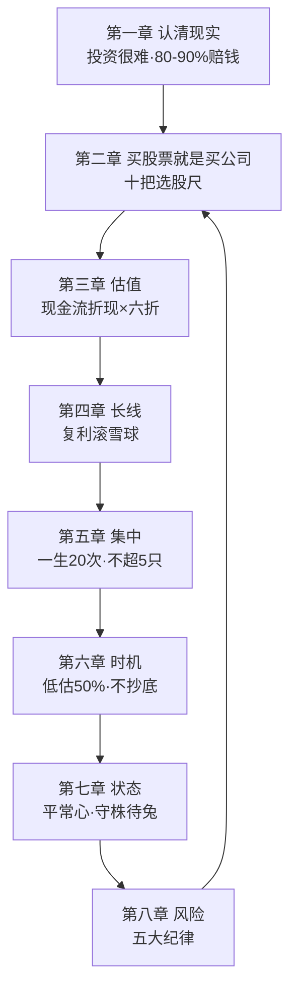

## 📑 目录

- [[#第1章 投资是个很难的游戏：先认清自己|第1章 投资是个很难的游戏：先认清自己]]
- [[#第2章 买股票就是买公司：十把选股尺|第2章 买股票就是买公司：十把选股尺]]
- [[#第3章 估值方法论：从现金流折现到模糊的精确|第3章 估值方法论：从现金流折现到模糊的精确]]
- [[#第4章 长线投资：投票器、称重机与复利|第4章 长线投资：投票器、称重机与复利]]
- [[#第5章 集中投资：一生只出手 20 次|第5章 集中投资：一生只出手 20 次]]
- [[#第6章 时机与买卖：贵、便宜与卖出|第6章 时机与买卖：贵、便宜与卖出]]
- [[#第7章 平常心：投资者的状态管理|第7章 平常心：投资者的状态管理]]
- [[#第8章 风险管理：做空、杠杆与止损|第8章 风险管理：做空、杠杆与止损]]
- [[#第9章 段永平投资体系总览|第9章 段永平投资体系总览]]
- [[#第10章 深度专题：段永平 × 系列大师终极对照|第10章 深度专题：段永平 × 系列大师终极对照]]
- [[#第11章 深度专题：本书与 29 号的对照|第11章 深度专题：本书与 29 号的对照]]
- [[#第12章 深度专题：底层逻辑的十二个关键词|第12章 深度专题：底层逻辑的十二个关键词]]
- [[#第13章 深度专题：十把选股尺的完整展开|第13章 深度专题：十把选股尺的完整展开]]
- [[#第14章 深度专题：投资失败的四种形态（第八章延伸）|第14章 深度专题：投资失败的四种形态（第八章延伸）]]
- [[#第15章 深度专题：段永平与巴菲特午餐的完整故事|第15章 深度专题：段永平与巴菲特午餐的完整故事]]
- [[#附录一 段永平金句集（50 条精选）|附录一 段永平金句集（50 条精选）]]
- [[#附录二 长长的坡厚厚的雪：好公司清单|附录二 长长的坡厚厚的雪：好公司清单]]
- [[#附录三 段永平投资体系速查|附录三 段永平投资体系速查]]
- [[#附录四 系列互链：30 号在价值投资谱系中的位置|附录四 系列互链：30 号在价值投资谱系中的位置]]
- [[#附录五 A 股应用：底层逻辑本土化清单|附录五 A 股应用：底层逻辑本土化清单]]
- [[#附录六 读完本书后的 10 个自问|附录六 读完本书后的 10 个自问]]
- [[#附录七 本书案例与数据速查|附录七 本书案例与数据速查]]
- [[#附录八 段永平与中医：底层逻辑跨界对照|附录八 段永平与中医：底层逻辑跨界对照]]
- [[#附录九 FAQ：底层逻辑 20 问|附录九 FAQ：底层逻辑 20 问]]
- [[#附录十 估值练习：三组实战算例|附录十 估值练习：三组实战算例]]
- [[#附录十一 段永平式投资周记模板|附录十一 段永平式投资周记模板]]
- [[#附录十二 全书 30 秒版|附录十二 全书 30 秒版]]
- [[#附录十三 段永平投资年表|附录十三 段永平投资年表]]
- [[#附录十四 段永平式观察池：A 股"懂"的练习|附录十四 段永平式观察池：A 股"懂"的练习]]
- [[#附录十五 段永平思想 × 系列完整对照矩阵|附录十五 段永平思想 × 系列完整对照矩阵]]
- [[#附录十六 段永平投资理念 100 条（30 号汇编）|附录十六 段永平投资理念 100 条（30 号汇编）]]
- [[#附录十七 风险管理 20 条（第八章汇编）|附录十七 风险管理 20 条（第八章汇编）]]
- [[#附录十八 本书关键概念中英对照|附录十八 本书关键概念中英对照]]
- [[#附录十九 段永平式 A 股实战模拟：用底层逻辑检验一家中药公司|附录十九 段永平式 A 股实战模拟：用底层逻辑检验一家中药公司]]
- [[#附录二十 段永平式投资检查清单（每日/每周/每月）|附录二十 段永平式投资检查清单（每日/每周/每月）]]
- [[#附录二十一 系列 30 本笔记总览（更新版）|附录二十一 系列 30 本笔记总览（更新版）]]
- [[#附录二十二 全书 30 秒版（30 号）|附录二十二 全书 30 秒版（30 号）]]
- [[#附录二十三 读书笔记方法论：本书的十二个阅读支架|附录二十三 读书笔记方法论：本书的十二个阅读支架]]
- [[#附录二十四 段永平底层逻辑 × 中医：深入对照|附录二十四 段永平底层逻辑 × 中医：深入对照]]
- [[#附录二十五 段永平式 A 股观察池练习表|附录二十五 段永平式 A 股观察池练习表]]
- [[#总结：底层逻辑之核心（终版）|总结：底层逻辑之核心（终版）]]

## 🔗 双链导读

| 连接主题 | 本书章节 | 关联笔记 |
|---------|---------|---------|
| 姊妹篇 | 全书 | [[29《段永平投资问答录》深度解读（详细版）|29 问答实录]] |
| 价值投资源头 | 第1章 | [[28《聪明的投资者》深度解读（详细版）|28 格雷厄姆]] |
| 能力圈与理性 | 第7章 | [[22《穷查理宝典》深度解读（详细版）|22 芒格]] |
| 护城河与定价权 | 第2章 | [[13《巴菲特的护城河》深度解读（详细版）|13 护城河]] |
| 集中投资 | 第5章 | [[16《巴菲特的投资组合》深度解读（详细版）|16 集中投资]] |
| 长期持有 | 第4章 | [[20《巴菲特的第一桶金》深度解读（详细版）|20 第一桶金]] |
| 买入持有纪律 | 第8章 | [[01《股票作手回忆录》读书笔记|01 利弗莫尔]] |

---

## 第1章 投资是个很难的游戏：先认清自己

### 1.1 投资股票很难，大部分人都不适合

**残酷的统计数据**：

> "老实讲，我不知道什么人适合做投资。但我知道统计上 80%~90% 进入股市的人都是赔钱的。如果算上利息的话，赔钱的比例还要高些。"

**为什么大部分人不适合**：

| 原因 | 说明 |
|------|------|
| 想暴富 | "把股市当成实现发财梦的地方，而这种发财梦成功的概率和购买福利彩票差不多" |
| 不懂技术 | 只能看懂 A 股、B 股、ST 股、均线、K 线，甚至一无所知 |
| 盲目跟风 | "仅仅因为别人也在这样做，而且有人还因此发了财" |
| 无时间精力 | 专业人士每天花大量时间阅读分析，普通人没有 |
| 资金占比过大 | 投资资金在家庭资产中占比远超正常比例 |
| 无法去伪存真 | 企业和机构造假误导，个人投资者处于弱势 |

**专业人士也难跑赢指数**："很多专业的投资者和投资机构，真的非常努力，实力也过硬，但往往也很难跑赢指数。"

**万能公式不存在**：

> "股市从来如此，大多数人都在忙于寻找万能公式，也就是要找到一种一劳永逸的方法。事实上，世上根本不存在这样的公式。"

**段永平的建议**：普通人不要抱着发大财的目的炒股；可以用少部分钱锻炼，但不要盲目大举投资。

### 1.2 不要觉得自己比他人更聪明

**市场是绝顶聪明的**：段永平认为从长期的角度看市场绝顶聪明——**"你认为自己比市场聪明的那一刻，就是亏钱的开始"**。

**专家的陷阱**：

> 很多所谓的专家、助理、分析师、导师，只会纸上谈兵，缺乏实践能力。"他们绝不用自己的资金去验证其理论是否正确，最终还是要让广大的股民替他们充当小白鼠。"

### 1.3 不要试图去预测股价

**巴菲特 1966 年的立场**（致股东信）：

> "市场预测'基本原则'第六条：'我做的是投资，不是预测股市涨跌或经济波动。如果你觉得我能预测出来，或者认为不预测就做不了投资，合伙基金不适合你。'……我们买卖股票，不管别人对股市的预测（我从来不知道怎么预测），只分析公司的未来。"

**为什么股价不可预测**：

| 原因 | 说明 |
|------|------|
| 市场不确定性 | 只能把握某一时刻的某个截面，下一秒就变 |
| 参与者海量 | 每天几千万上亿个决策相互作用 |
| 意外事件 | 2019 年新冠疫情熔断、2021 年巴以冲突、2022 年俄乌战争 |
| 静态分析局限 | 数据分析都是静态的，市场是动态的 |

**段永平的态度**：不预测股价，只分析企业价值——"只要企业的发展空间大，只要企业未来能够实现持续的较高的盈利，那么自己根本没有必要关心股票什么时候会涨价"。

**不设回报预期**：

> "第一，我从来不设回报预期，因为投资回报本来就和预期无关。我对投资的认知是，过程比结果重要，谋事在人，成事在天，只要过程对了，结果自然会好。
> 第二，长期而言，跑过银行存款是最基本的要求，不然就是瞎忙活。
> 第三，长期投资回报至少要做到保住购买力不变才叫不亏……能跑过黄金就非常理想了。"

### 1.4 关注生意本身，而不是市场

**段永平的视角**："我不看市场，我看生意。你说某只股票贵，how do you know？站在现在看 10 年前，估计什么都是贵的。你站在 10 年后看现在，能看懂而且便宜的公司，买就行了。"

### 1.5 投资需要做好充分的准备

**段永平的准备**：移居美国后花费大量时间研究炒股，阅读巴菲特理念，搜寻目标公司资料，了解发展情况和基本面，必要时亲自考察——"他之所以能够获得成功，绝对不是因为天赋，而是因为肯付出、肯钻研"。

### 1.6 投机不等同于投资

**"买入并持有"的投机者**：

> "很多'买入并持有'的人，实际上也是投机分子，因为他们其实不知道自己买的是什么，买了以后需要整天问别人怎么看，在被套时就拿出'长期投资'来安慰自己。要知道，没有什么比买错股票并长期持有伤害更大的了。"

**投资与投机的区分**：投资=知道自己买的是什么（公司所有权）；投机=以为自己能比市场快一步。

### 1.7 价值投资才是炒股的精髓

**价值投资的三个发展阶段**：

| 阶段 | 关注重点 | 时代 |
|------|---------|------|
| 第一阶段 | 资产价值、账面价值、清算价值 | 20 世纪 30 年代原始阶段 |
| 第二阶段 | 在资产价值基础上考虑盈利能力 | 发展中 |
| 第三阶段 | 考虑增长的价值（能否成为伟大公司） | 现代（巴菲特时代） |

**便宜股价的真相**："除了经济危机、初创企业、股价波动等因素之外，大部分时候，多数便宜的股价都是源于内部的低价值。"

**价值投资的四个观点**：

| # | 观点 | 说明 |
|---|------|------|
| 1 | 股票是公司的部分所有权 | 买股票=投资一家公司，不是单纯投资证券 |
| 2 | 理解市场是什么 | 市场只是提供价格的平台，不是老师，不是标准 |
| 3 | 投资的本质是对未来做出预测 | 预测有误差，要留出安全边际（估 100 亿打六折估 60—70 亿） |
| 4 | 构建自己的能力圈 | 边界明确的能力才是真的能力 |

**安全边际的机制**：

> "当人们做出错误预测时，由于安全边际的存在，自己可以少亏钱或者不亏钱；而当预测的准确度很高时，人们又可以在安全边际的基础上获得更高的回报。"

### 1.8 第1章小结

| 层面 | 结论 |
|------|------|
| 现实 | 80—90% 的人赔钱，专业机构也难跑赢指数 |
| 预测 | 不做市场预测，只分析公司未来 |
| 回报 | 不设预期，跑过存款是底线 |
| 价值投资 | 四观点：所有权/理解市场/安全边际/能力圈 |

---


---

## 第2章 买股票就是买公司：十把选股尺

### 2.1 买股票要当成买公司一样对待

**本章的 10 把尺子**（第二章 10 节）：

| # | 选股尺 | 核心 |
|---|--------|------|
| 1 | 当成买公司 | 股票=公司所有权 |
| 2 | 企业文化 | 使命/愿景/价值观 |
| 3 | 商业模式 | 赚钱的方式 |
| 4 | 定价权 | 提价后仍被接受 |
| 5 | 中小公司 | 小投资者找看得懂的 |
| 6 | 信用度 | 诚信企业 |
| 7 | 客户利益第一 | 消费者导向 |
| 8 | 用户黏性 | 离不开的产品 |
| 9 | 不盲目多元化 | 聚焦主业 |
| 10 | 值得信赖的管理者 | 好船长 |

### 2.2 重点关注标的公司的企业文化

**苹果的案例（2011 年 1 月）**：段永平带领员工集体购入苹果股票，当时股价约 47 美元——乔布斯身患癌症即将退位，外界一致看衰。

**段永平的判断依据**：

> "他发现了苹果公司已经建立起了非常好的生态系统和企业文化……苹果的产品是世界上最好的，用户体验和消费者导向已经做到了极致……而且苹果拥有自己的生态，无论是 iOS 还是丰富的 APP，都使得它的产品具有很强的用户黏性，且构建起了强大的护城河。"

**"利润之上追求"**：苹果不是单纯追求利润，有更高追求——创新文化、改变消费习惯、推动行业进步。"很多手机品牌只想着性价比，但性价比其实就是功能和技术不足的潜台词"。

**预言的验证**：

> 段永平预测苹果"未来可能会成为世界上第一家年利润超过 500 亿美元的大公司，将来也会成为第一家市值过万亿美元的超级公司"——**事实是，段永平的预言非常准确**。

**企业文化的三层定义**：

| 层次 | 内容 |
|------|------|
| 使命 | 团队成立的原因 |
| 愿景 | 需要做什么、实现什么目标 |
| 核心价值观 | 哪些事是对的、哪些是不对的 |

**木桶底板比喻**：

> "如果企业是一个木桶，那么企业文化就是木桶的底板，企业文化建设不成功，整个木桶就无法装水，如果有深厚的企业文化底蕴，那么其他的短板也可以及时补上。"

**时间维度**：

> "从 5～10 年的角度看，CEO 至关重要。从 10~50 年的角度看，董事会很重要，因为董事会能找出好的 CEO。从更长远的角度看，企业文化更重要，因为一个好的企业文化可以维持一个好的董事会。GE 就是一个好例子。"

**诺基亚的教训**：

> "当年曾一度占据了全球市场 80% 以上的手机份额……但这些突出的业绩并没有让诺基亚的辉煌持续下去。进入千禧年之后短短几年时间，诺基亚就因为痴迷于落后的塞班系统和守旧的技术，而导致市场被三星和苹果快速瓜分，最终诺基亚手机在市场上销声匿迹。"

**如何了解企业文化**：

| 方法 | 说明 |
|------|------|
| 产品体验 | 苹果的创新文化从产品中感受；海底捞的服务文化从进门那一刻感受 |
| 观察经营 | 看市场表现、员工工作状态、管理者如何管理 |
| 实地考察 | 近距离观察获取第一手资料 |

### 2.3 选择拥有定价权的公司

**巴菲特的经济特许权（定价权）定义**：

> "一项经济特许权的形成，来自具有以下特征的一种产品或服务：（一）它是顾客需要或者希望得到的；（二）被顾客认定为找不到很类似的替代品；（三）不受价格上的管制。以上三个特点的存在，将会体现为一个公司能够对所提供的产品或服务进行主动提价，从而赚取更高的资本回报率。"

**经济特许权的容错性**："经济特许权还能够容忍不当的管理，无能的经理人虽然会降低经济特许权的获利能力，但并不会对它造成致命的伤害。"

**定价权双案例**：

| 案例 | 定价权的体现 |
|------|-------------|
| 苹果手机 | 四五千元的苹果性能只相当于其他品牌两千多元手机，却卖得最贵——"照样有大批粉丝为其买单" |
| 喜诗糖果 | **连续 19 年选择在每年的 12 月 26 日提高糖果价格**，消费者依然买单——"相比于涨价，他们似乎更加关心口感是不是变了" |

**段永平的话**：

> "关注企业应该从关注产品开始，没有例外。强大的产品是必要条件。找到有定价权的公司对投资非常重要，理解他们为什么有定价权也非常重要，不然几个市场起伏就会睡不好觉了。"

**定价权的检查清单**：

| 检查项 | 问题 |
|--------|------|
| 独特性 | 产品和服务是不是有独特之处？ |
| 必需性 | 是不是市场上的必需品？ |
| 不可替代性 | 是不是不可替代的？ |
| 产能 | 存不存在产能过剩？ |
| 管制 | 价格有没有受到政府管制？ |
| 买家结构 | 买家集中还是分散？ |
| 消费动机 | 是不是形成了依赖和习惯？ |
| 提价历史 | 最近有没有提价？消费者反应如何？ |

**定价权的行业分布**：容易产生垄断优势、品牌优势和技术优势的行业；选择技术更新慢的行业（可口可乐的配方几百年不变）。

**定价权会消失**："随着竞争者的追赶，以及替代品的出现，这些企业会慢慢失去定价权。"

### 2.4 其他选股尺速览

| 尺子 | 核心要点 |
|------|---------|
| 中小企业 | 小额投资者要寻找看得懂的中小型公司（能力圈内） |
| 信用度 | 投资那些信用度高的企业（诚信是底线） |
| 客户第一 | 选择坚持以客户利益为第一的公司 |
| 用户黏性 | 看重具有很强用户黏性的公司（离不开） |
| 反多元化 | 不要选择盲目多元化的企业（聚焦） |
| 管理者 | 寻找一个值得信赖的管理者（好船长） |

### 2.5 第2章小结

| 层面 | 结论 |
|------|------|
| 十把尺 | 公司/文化/模式/定价权/中小/信用/客户/黏性/反多元/管理者 |
| 企业文化 | 木桶底板；5—10 年看 CEO、10—50 年看董事会、更远看文化 |
| 定价权 | 经济特许权三特征；喜诗 19 年连续提价 |
| 苹果 | 2011 年 47 美元集体买入；利润之上追求；预言验证 |

---

## 第3章 估值方法论：从现金流折现到模糊的精确

### 3.1 估值需要技术能力和经验积累

**估值的定义（段永平）**：

> "大部分人说到估值，指的都是市场应该给股票一个什么价，我的估值是试图搞明白，付出什么价，才能 5～10 年都不操心，我不考虑市场愿意给什么价，我就想如果它是非上市公司，我用目前的价格去拥有它，和我的其他机会比，在未来 10 年甚至 20 年，哪个得到的回报更高。"

**定性 vs 定量**：

| 方法 | 内容 | 段永平的使用 |
|------|------|-------------|
| 定性分析 | 商业模式、竞争优势、企业文化 | 最常用，重点关注 |
| 定量分析 | 股东回报率、净资产收益率、毛利率、市盈率 | 辅助，以未来现金流折现估值 |

### 3.2 股票的内在价值大约等于公司的未来现金流折现

**威廉姆斯 1942 年模型**：

> "今天任何股票、债券或公司的价值，取决于在资产的整个剩余使用寿命期间预期能够产生的、以适当的利率贴现的现金流入和流出。"

**自由现金流公式**：

```
未来自由现金流 = 净利润 + 所得税 + 利息费用 + 折旧摊销 − 营运资金的增加 − 资本支出
简化版：净利润 + 折旧 − 资本支出
```

**增长率的计算示例**：第一年现金流 1000 万，年增长率 13% → 第二年 1130 万 → 第三年 1276.9 万 → 第四年 1442.897 万。

**折现率的选择**：以长期国债利率计算（一般用 5%）。

**存款利率比较法（段永平最常用）**：

> "一家公司的净资产 100 亿元，每年净利润 10 亿元，这个公司大概值多少钱？就是你存多少钱，能每年拿到 10 亿元的利息，按照长期国债利息计算，再把资金打六折算，长期利率会变，我一般用 5%。如果买 200 亿元国债，每年利息 10 亿元，我会花 200 亿元去买个年利润 10 亿元的公司吗？显然不会，国债无风险，股票有风险，所以买公司要打折，越不靠谱的公司打折就越厉害。"

**算例推演**：

| 项目 | 数值 |
|------|------|
| 净资产 | 100 亿元 |
| 年净利润 | 10 亿元 |
| 按 5% 国债 | 200 亿元（200×5%=10 亿） |
| 打六折 | 120 亿元（安全边际） |
| 结论 | 120 亿以下买入才有安全边际 |

**"未来现金流折现不是一种算法，而是一种思维方式"**——人们可以按照自己的理解给出一个大概的估值。

### 3.3 使用市盈率来给公司估值

**PE 的正确用法**：

| 观点 | 内容 |
|------|------|
| 历史数据 | PE 是倒后镜，反映过去而非未来 |
| 12 倍参照 | "多少倍 pe 和平均长期利息有关，12 倍长期 pe 应该可以了" |
| 未来实际利润 | 相对于未来长期实际利润的 PE，不是财报上的 PE |
| 陷阱 | GM 通用汽车 PE 一直 5 倍左右，但债务很高，结果破产 |

### 3.4 注重分析企业的基本面 + 寻找现金流充足的公司

**基本面**：商业模式、盈利质量、负债结构、现金流状况——**现金流充足的公司才安全**（"现金流是公司的血液"）。

### 3.5 设置估值区间，确保模糊的精确

**格雷厄姆与多德的估值区间**（《证券分析》）：

> "证券分析最关键的一点是不要痴迷于计算一个证券精确的内在价值，你只需要确信其价值足够……对内在价值有一个模糊大概的估算就够了。"

**段永平的"模糊的精确"**：

> "宁要模糊的精确，不要精确的模糊，未来现金流折现指的是一种思维方式，而不是数值，估值就是毛估估的。"
>
> "5 分钟就能算明白的东西，一定要够便宜。只有便宜才买。20 元的东西卖 15 元我只会买一点点，真到 10 元才会下重手。"

**姚明比喻（毛估估的精髓）**：

> "就像姚明走进来，你不需要用尺子去量，你一定知道姚明很高。用我这样个子的价钱去买姚明这样的身高，我就买了，我不需要具体知道他比我高多少才买。"

**小孩身高比喻（价值先天决定）**：

> "一个公司从存在的那天起，其价值就定了。以后怎么发展，应该是由今天的基因决定的……就像一个小孩，以后长多高基本就定了……只不过，小孩能长的这个高值是没人准确知道的。我们要做的一切，就是要尽量准确地知道这个值。"

**估值的区间化操作**：按长期国债利率算出 300 亿，打七折或六折 → 210—300 亿区间。

**精确估值的骗局**："那些声称能够对企业进行精确估值的机构和个人，往往也是打着专业分析的幌子欺骗咨询者。"

### 3.6 拒绝博傻理论 + 不要被企业自己的估值迷惑

**博傻理论**：击鼓传花——"很多人疯狂抬价来吸引买家跟进，当更多的投资者进入后又期待着有人来接盘。可是，这种游戏基本上很难长久维持下去。"

**企业自估不可信**：企业会粉饰估值——**内在价值只能自己毛估估，不能听企业自说自话**。

### 3.7 不要忽视直觉的作用

**直觉的定位**：直觉=长期积累的隐性理解——"直觉的作用不可忽视，但要建立在深入了解的基础上"（与 [[22《穷查理宝典》深度解读（详细版）|22 号芒格"信任直觉但不盲从"]] 呼应）。

### 3.8 第3章小结

| 层面 | 结论 |
|------|------|
| 估值目的 | 5—10 年不操心的价格 |
| DCF | 威廉姆斯模型+存款利率比较法 |
| 六折 | 国债利率折算再打六折 |
| 模糊的精确 | 毛估估，姚明不需要尺子 |
| 区间 | 300 亿打七折六折→210—300 亿 |

---

## 第4章 长线投资：投票器、称重机与复利

### 4.1 短线操作比长线操作更难

**短线难的原因**：短线需要预测短期走势+精确择时+承受高频波动——**长线只需要判断公司 5—10 年的大方向**。

### 4.2 市场短期是投票器，长期是称重机

> 巴菲特名言（本书引述）：市场短期来看是"投票器"，但长期来看是"称重机"。

**含义**：短期价格由情绪投票决定，长期价格由价值称重决定——**投机的短期优势与投资的长期优势不对称**。

### 4.3 着眼于大局，忽略一时的波动

**段永平**：不因季度波动改变判断——"全部盯着眼前这一个月一个季度的波动来决定买卖的行为，这样是很难做投资的"。

### 4.4 学会使用复利来增加财富

**复利与单利的对比（算例）**：1000 万元本金，年回报 10%，10 年期：

| 模式 | 计算 | 10 年后总额 | 净收益 |
|------|------|------------|--------|
| 单利（每年取出） | 每年取 100 万 | 2000 万 | 1000 万 |
| 复利（利滚利） | 1000×(1+10%)^10 | 2593.74 万 | 1593.74 万 |

**复利的杠杆**：

| 参数变化 | 结果 |
|---------|------|
| 回报率 10%→20% | 10 年后 2593.74 万→6191.736 万 |
| 时间 10 年→20 年 | 10 年后 2593.74 万→6727.5 万 |

**芒格的滚雪球**：

> "累积财富就像在斜坡上滚雪球，最好选择从长斜坡顶端的地方开始往下滚动，尽可能早地开始，并且想办法让雪球滚得更久一些。"

**长长的坡与厚厚的雪（段永平完整清单）**：

> "什么公司是在长长的坡上滚着厚厚的雪呢？我举几个我看着像的……"
>
> "苹果是吧？苹果是在一个长长的坡上，似乎雪也是厚厚的。像 OPPO 和 vivo 以及华为这类公司，似乎也都在长长的坡上，但雪没那么厚……那些追求'性价比'的公司恐怕是既没有长长的坡也没有厚厚的雪的。"
>
> "茅台当然是吧？长长的坡，厚厚的雪，虽然偶尔会损失一点点雪。网易也应该算吧？游戏做成这个样子！有谁不玩游戏呢？大家玩不同游戏而已。腾讯应该也算吧！有疑问吗？谷歌应该也算吧！绝对是长长的坡、厚厚的雪。亚马逊？当然是长长的坡，但上面的雪不太厚啊，不然人家怎么能坚持亏 20 年？京东不会比亚马逊好的。"
>
> "阿胶、片仔癀之类有点像？阿里应该也算吧，虽然我很钦佩马云……但有些业务已经超出我这种早已退出江湖的人的理解范围了。"
>
> "Facebook？微博？YY？陌陌？我看这些公司时偶尔会觉得自己已经不再年轻了（就是因为自己不用，所以看不懂的意思）。"

**72 法则**：用 72 除以年回报率 = 资本翻倍年限（年收益 12% → 6 年翻倍）。

### 4.5 其他长线原则速览

| 原则 | 内容 |
|------|------|
| 可持续发展 | 选择具有可持续发展空间的企业 |
| 耐心 | 投资者需要足够的耐心，坚持等待 |
| 反差异化 | 避开那些产品很难长期做到差异化的企业 |
| 反教条 | 拒绝长期投资中的教条主义（长期≠永远死拿） |

### 4.6 第4章小结

| 层面 | 结论 |
|------|------|
| 短线 vs 长线 | 短线更难（预测+择时+波动） |
| 投票器/称重机 | 短期情绪投票，长期价值称重 |
| 复利 | 10%×10 年复利 vs 单利多赚 593.74 万 |
| 滚雪球 | 长长的坡+厚厚的雪（苹果/茅台/网易/腾讯/谷歌） |

---


---

## 第5章 集中投资：一生只出手 20 次

### 5.1 人的一生只需要把握几次投资机会即可

**Mike Flint 的 25 个目标故事**：

> 巴菲特的私人飞行员 Mike Flint 请教巴菲特如何有效投资。巴菲特让他写下人生最重要的 25 个目标，然后压缩成 5 个。Mike Flint 以为另外 20 个可以在闲暇时间慢慢完成，巴菲特却说：
>
> "那些你没有重点挑出来的 20 个目标，不是你应该在闲暇时间慢慢完成的事情，而是你应该尽量避免去做的事情，你应该躲避它们，就像躲避瘟疫一样，最好不要为它们花费任何时间和注意力。"

**一生 20 次出手**：

> "不知道是芒格还是巴菲特说过，如果一个人的投资生涯中只出手 20 次（大致比喻），他的成绩单会比更多次出手要好得多。我看完这句话后反省自己的结果确实如此。我想大概一年能有一次机会就很好了。"

**为什么好机会如此稀少**：

| 原因 | 说明 |
|------|------|
| 好企业不多见 | 顶级投资者几年才找到一个投资 |
| 好企业未必有空间 | 好的企业是否还具备足够的投资空间 |
| 好企业未必看得懂 | 很多好企业，未必是投资者理解得了的 |

**分散投资的辩驳**：马科维茨提倡多元化分散风险——"投资项目越多，投资类型越是不一样，风险对冲的效果越明显"——但段永平认为：**时间、精力、资金、技能有限，必须集中资源**。

**控制投资数量的四条纪律**：

| # | 纪律 | 内容 |
|---|------|------|
| 1 | 严格标准 | 高价值/高收益/基本面/商业模式/文化/护城河/看得懂 |
| 2 | 弱关联 | 选择不同类型且关联性弱的企业 |
| 3 | 结合自身 | 不能因为企业好就贷款借钱投资 |
| 4 | 控制数量 | **每一次持有的股票最好不要超过 5 只** |

### 5.2 集中投资不是购买一只股票

**集中≠单吊**：集中投资是指将资源集中在少数高价值项目上——"集中投资不是购买一只股票"，而是 3—5 只的组合。

### 5.3 打造合理的组合

**组合原则**：不同类型、弱关联、各自都有把握——"将大部分资金集中在少数高价值的项目上"。

### 5.4 资金分配与不断增持

**资金分配**：按确定性分配仓位——最确定的给最大仓位。

**优质股不断增持**：

> 段永平买入网易后，"涨到 20-30 倍时我们还追加了一些"——**好公司在便宜时加仓是正确动作**（雅虎 17.5 以下又买 200 多万股）。

### 5.5 选择适合自己的投资

**段永平的自述**：

> "我采用的大概叫守株待兔法，没有太系统的办法，也不每天去找，碰上一个是一个，反正赚钱也不需要有很多的目标（巴菲特讲一年一个主意就够了）。有时候你感兴趣的目标会自己跳到眼前的。当然前提是我还是挺关心的，总会经常看到各种东西。"

### 5.6 提早放弃那些不挣钱的投资

**创维案例（本书新增完整案例）**：

| 时间 | 事件 |
|------|------|
| 2000 年底 | 创维管理层内部分歧，销售团队一半离开，官司缠身，股价跌到 1 港元以下，市值仅 10 多亿港币 |
| 段永平的判断 | 创维商业模式不错，技术成熟，是国产彩电行业最健康的企业；**内在价值约 200 亿港元**（总部大楼就值十几亿） |
| 买入 | 果断买入不少股票 |
| 几年后 | 股价涨到 8 港元以上，市值涨到 200 亿港元以上 |
| 抛售 | 形势大好时开始抛售——"如果涨到 300 多亿港元，实际上有些偏贵了，如果继续投资的话，盈利非常有限" |

**卖苹果买腾讯（机会成本）**：

> "我也不知道啥时候卖好，反正不便宜时就可以卖了，如果你的钱有更好的去处的话。"——段永平一直看好苹果，但还是抛售苹果增购腾讯，"原因就在于他看到腾讯股票的增值空间更大"。

**"不挣钱"的两层含义**：

| 层 | 含义 | 处理 |
|----|------|------|
| 第一层 | 股票亏损（长期来看） | 提早放弃——"股票投资本身就该以保护股本为第一要务" |
| 第二层 | 盈利很小或几乎没有 | 尽早放弃——"股票投资还涉及机会成本的问题" |

**1 元涨到 20 元的例子**："它未来最高可能会上涨到 22 元，可是对于投资者来说，在 20 元左右的时候选择抛售或许是最佳的时机。"

**霍华德·马克斯的反例**：不良资产专业收购者（2020 年管理 1200 亿美元，不良资产占 200 亿）——"他认为并不是所有不挣钱的业务和股票都是糟糕的……自己要做的就是把握好这样的机会，提升这类股票或者业务的价值，然后转手卖出更高的价钱"——**但普通人既没有试错成本，也不具备巧妙操作的能力**。

### 5.7 第5章小结

| 层面 | 结论 |
|------|------|
| 25→5 | 其余 20 个是应该躲避的瘟疫 |
| 20 次 | 一生出手 20 次成绩单更好 |
| 数量 | 不超过 5 只 |
| 守株待兔 | 不主动找，机会自己跳出来 |
| 提早放弃 | 创维 1 港元→8 港元卖出；卖苹果买腾讯 |

---

## 第6章 时机与买卖：贵、便宜与卖出

### 6.1 了解股市变动的规律

**规律认知**：股市变动有规律但不可预测细节——**理解"波动是常态"，放弃"精确择时"**。

### 6.2 如何理解股票的贵和便宜

**段永平的回答**：

> "这是关注短期、关注市场的人才会问的问题。我不考虑这个问题。我关注长期，看不懂的不碰。任何想市场、想时机的做法，可能都是错误的，我不看市场，我看生意。"

**横向对比 vs 纵向对比**：

| 对比方式 | 内容 | 结论 |
|---------|------|------|
| 横向（企业间） | 小企业 3 元股价最多涨到 4 元 vs 大企业几十万元可能涨到几百万 | 价格高低不重要，价值最重要 |
| 纵向（时间轴） | 垃圾股 30 元→5 年后 10 元 vs 优质股 300 元→5 年后 2100 元 | 优质股的 300 元不贵，垃圾股的 30 元很贵 |

**"股票是由每个买家自己定价的"**：

> "股票是由每个买家自己定价的，到你自己觉得便宜的时候才可以买，实际上和市场（别人）无关。啥时候你能看懂这句话，你的股票生涯基本上就很有机会持续赚钱了。如果看不懂其实也没关系，因为大概 85% 的人永远看不懂这句话……你们只要把公司想象成一家非上市公司，没有股价变化就明白了。"

**价值被低估 50% 及以上的买点**：

> "一般来说，段永平会选择价值被低估 50% 及以上的公司，他所理解的价值是：现在的净值加上未来利润总和的折现。比如，他在投资通用电气公司时，他认为公司的股价值 20 元，然后他在 15 元的时候买了一点，等到价格下跌到 10 元以下，便加大投资。"

**GE 的加仓阶梯**：

| 价格 | 动作 |
|------|------|
| 20 元（内在价值） | 估值基准 |
| 15 元 | 买一点 |
| 10 元以下 | 加大投资 |

### 6.3 如何确认出售股票的时机

**段永平的回答**：

> "我也不知道啥时候卖好，当我买一只股票时，一定会有个买的理由，同时也要看到负面的东西，当买的理由消失了，或者重要的负面消息增加到我不能接受的时候，我就会离场。当然，太贵了有时也会成为离场的理由，如果真是特别好的公司，稍微贵一点未必要卖，不然往往买不回来，机会成本大。"

**卖出决策三原则**：

| # | 原则 | 说明 |
|---|------|------|
| 1 | 买的理由消失 | 基本面变化 |
| 2 | 负面消息超限 | 重要负面增加到不能接受 |
| 3 | 太贵+有更好去处 | 机会成本（特别好的公司稍贵可忍） |

**李嘉诚的智慧**：

> "前华人首富李嘉诚说过，他从来不会挣最后一个铜板。每一个投资者，都要给自己留出一个缓冲时间，确保投资的安全。"

**时间价值（未来折现）的卖出算例**：

| 情形 | 判断 |
|------|------|
| 苹果早晚突破 1000 元但需 3 年+，现在有人出 800 元 | 可能选择出售（时间成本） |
| 股价 5 元，有人出 10 元买，但 10 年内可能突破 100 元 | 无论如何不卖（成长价值） |

**估错了怎么办**："如果事实证明企业的价值不高，那么，最好的方法就是尽早抛售股票，而且越早越好。"

### 6.4 市场不景气 = 最佳机会

**段永平**：市场不景气有助于找到最佳的投资机会——"别人恐惧我贪婪"的中国实践（与 [[28《聪明的投资者》深度解读（详细版）|28 号格雷厄姆"利用市场先生"]] 呼应）。

### 6.5 在企业发展局势明朗时投资 + 看十年以后

**局势明朗**：不赌不确定性——等企业模式清晰再入场。

**十年视角**："选股时要看十年以后的发展情况"——与 [[20《巴菲特的第一桶金》深度解读（详细版）|20 号"十年持有"]] 呼应。

### 6.6 投资时机很重要，但不要试图抄底

**抄底悖论**：精确抄底=预测市场——"任何时候不要试图抄底，因为你不知道底在哪"（与 [[27《超级强势股》深度解读（详细版）|27 号"等待困境"]] 呼应）。

### 6.7 第6章小结

| 层面 | 结论 |
|------|------|
| 贵和便宜 | 价值决定，与价格绝对值无关 |
| 85% 的人 | 永远看不懂"自己定价" |
| 低估 50% | 买点；GE 15 元买一点、10 元以下加大 |
| 卖出 | 买的理由消失/负面超限/太贵有更好去处 |
| 抄底 | 不要试图抄底 |

---

## 第7章 平常心：投资者的状态管理

### 7.1 投资时，要尽量保持简单

**段永平**：投资要简单——"买股票就是买公司"一句话足够；**复杂化是亏钱的开始**（与 [[23《查理·芒格的智慧 投资的格栅理论》深度解读（详细版）|23 号"简单性"]] 呼应）。

### 7.2 投资时，价值观很重要

**价值观驱动投资**：做什么样的人决定做什么样的投资——本分、诚信、不骗人（与 [[29《段永平投资问答录》深度解读（详细版）|29 号"本分"]] 一脉相承）。

### 7.3 主动向优秀的人学习

**段永平的学习路径**：从巴菲特、芒格身上学——"我从看到'巴菲特'第一分钟就开始相信巴菲特了，从来没动摇过"。

### 7.4 独立分析，不要轻信专家的话

**专家陷阱**：电视专家、微信群导师、"内部信息"售卖者——"他们绝不用自己的资金去验证其理论是否正确，最终还是要让广大的股民替他们充当小白鼠"。

### 7.5 投资一定要保持平常心

**理性的中国表达**：

> "有人问过芒格，如果只能用一个词来形容他们的成功，他的回答是 'rationality'（理性）。呵呵，有点像我们说的平常心。"

**平常心=回归事物的本源**："所谓的平常心，指的就是回归事物的本源。"

**守株待兔法**：

> "我采用的大概叫守株待兔法，没有太系统的办法，也不每天去找，碰上一个是一个……有时候你感兴趣的目标会自己跳到眼前的。当然前提是我还是挺关心的，总会经常看到各种东西。有时和朋友聊天也会有帮助，每天聊可能就有坏处了。"

**不要与指数比较**：

> "当一个人认为自己可以战胜指数的时候，他可能已经失去平常心了。我觉得好的价值投资者是不会去比的。但结果往往是好的价值投资者会最后战胜指数。很多人在金融危机中都有一些再也回不来的重伤股，巴菲特一个也没有，这绝对不是偶然的……（塞思·卡拉曼在金融危机中也有大胜，他的名言是'晚上睡得香比什么都重要'，但是比尔·米勒却损失惨重！）"

**巴菲特的心态示范**：

> "巴菲特说他自己从不关注股灾，当股灾到来时，他甚至连报纸也不看……多年来他一直住在奥马哈的老房子里，虽然奥马哈是一个经济不发达的小城市，但可以让他远离华尔街的喧嚣。"

**闲钱才有平常心**：

> "问题是不用闲钱对生活会造成负面影响啊。我从来都是用闲钱的。老巴其实也是。至少你要有用闲钱的态度才可能有平常心的，不然真会睡不着觉。"

**芒格的品性论**：

> "许多 IQ 很高的人却是糟糕的投资者，原因在于他们的品性缺陷。我认为优秀的品性比大脑更重要，你必须严格控制那些非理性的情绪，你需要镇定、自律，对损失与不幸淡然处之，同样也不能被狂喜冲昏头脑。"

**素直文化（松下）**：

> "所谓素直心，是指个人不要以偏见和情绪化的思维来看待问题，凡事都能够保持倾听、宽容、虚心、博爱的态度，能够用心发掘事情的真相。素直心就是平常心的全部奥妙，也是个人投资的终极要求。"

### 7.6 学习更多的知识，构建多元化思维模型

**多元思维**：格栅理论的中国呼应——"学习更多的知识，构建多元化思维模型"（与 [[23《查理·芒格的智慧 投资的格栅理论》深度解读（详细版）|23 号]] 直接呼应）。

### 7.7 第7章小结

| 层面 | 结论 |
|------|------|
| 简单 | 复杂化是亏钱的开始 |
| 平常心 | rationality 的中国表达 |
| 守株待兔 | 不刻意找，机会自然来 |
| 不比较 | 战胜指数的心态=失去平常心 |
| 闲钱 | 平常心的物质基础 |
| 素直心 | 平常心的终极奥妙 |

---


---

## 第8章 风险管理：做空、杠杆与止损

### 8.1 积极做好各项风险管控

**风险第一**：投资股票最重要的是规避风险——"投资的第一要务就是避免出现亏损"。

### 8.2 拒绝做空标的公司

**做空的定义**："做空是股票期货市场比较常见的一种操作方式，投资者预期股票期货市场会有下跌趋势，于是直接将手中的筹码按市价卖出，等股票期货正式下跌之后再积极买入，以此来赚取中间差价。"

**做空的风险机制**：标的公司可能操纵股价设置骗局——"很多公司的内在价值可能只有 10 元，但是它们会不断推高股价，使之变成 100 元。这个时候，它们开始对外公布说企业的内在价值为 40 元。当投资者相信这些说辞并积极进行做空时，就会面临巨大的风险，沦为被收割的对象。"

**段永平的两件往事**：

| 事件 | 内容 |
|------|------|
| 第一件：百度做空 | 投资成功多次后过于自信，做空百度，追加投资后惨败，**亏了差不多 1.5 亿~2 亿美元**，几乎消耗掉所有储备金，断了现金流，错过很多好项目 |
| 第二件：邻居做空 | 邻居专门做空，"因为这家公司做假账，理由是它成长得太快了"——段永平让同事调查后认为"这个成长在目前环境下看不出有任何明显不符合逻辑的地方"。股价从 30—40 元涨到 80 元。"我完全不了解这家公司，这里我想说的是：'最好别做空哈！这个世界有很多你不懂的事情，为什么要跟自己过不去？'" |

**不做空的三段论**：

> "投资不需要勇气，当你说需要勇气时，你就危险了。第一，做空有无限风险，一次错误足以致命。第二，长期而言，做空肯定是不对的，因为大势一定向上。第三，做空犯错的机会只有一次，一次犯错，全部归零，何苦呢？"

**利弗莫尔的教训**：

> "被誉为美国历史上最著名的'大空头'利弗莫尔，一生中经历过三次破产，而这三次破产都是因为他做空股票和期货造成的。"（与 [[01《股票作手回忆录》读书笔记|01 号]] 直接呼应）

### 8.3 拒绝使用杠杆，拒绝借贷和负债

**杠杆=定时炸弹**：

| 风险 | 说明 |
|------|------|
| 强制平仓 | 下跌触发 margin call，被迫卖出 |
| 时间错配 | 好公司需要时间，杠杆没有时间 |
| 情绪放大 | 杠杆放大恐惧与贪婪 |

**段永平**："不借钱！投资用的是闲钱，不然就是投机了。"——抵押房屋或出售房屋筹资金是"非常冒险的举动，一旦出现了亏损，将会带来毁灭性的打击"。

### 8.4 纠正错误，立即止损

**孙子兵法的投资解读**：

> "我读《孙子兵法》感触最深的一句话是：'先为不可胜，以待敌之可胜。不可胜在己，可胜在敌。故善战者，能为不可胜，不能使敌之必可胜。'……我们要创造有利于自己的形势，尽可能不犯或少犯错。我们能做的，就是让自己不可战胜。"
>
> "那怎么才能让自己不可战胜呢？我认为首先是少犯错，或者不犯错。当然，没有人能一辈子不犯错。因此，更切合实际的做法是，不管犯了多大的错误，都要诚实面对，立即止损，不要骗自己说还有机会。"

**大师们也会亏损**：彼得·林奇金融危机亏损几十亿美金；索罗斯数次折戟；巴菲特数次重大损失甚至被骗——**但他们把握一个原则：亏损不可逆时壮士断腕**。

**做对的事情与 Stop doing list**：

> "做对的事情，实际上是通过不做不对的事情来实现的，因此要有 Stop doing list，一旦发现是不正确的事情，要马上停止。不管多大的代价，往往都会是最小的代价。发现买错了股票应该赶紧离开，不然越到后面损失越大，但大部分人往往会希望等到回本再说。"

**沉没成本（机场停车故事）**：

> 段永平在机场为同事接机，按经验投了 1 小时的停车币，同事提前半小时到。问题：继续等半小时"用完"停车币，还是直接开车走人？

**段永平的批评**：

> "很多人都犯继续等下去的愚蠢错误：这件事我已经投了几千万呀，怎么停得下来？然后为了救这些沉下去的成本再投入几千万，明知事情是错的还要坚持做下去，结果自然是败得更惨。"

**止损的标准**：一开始就设置止损线——"针对亏损额度设置一条安全线，这条安全线侧重于强调个人能够承受的亏损额度"。

### 8.5 不了解的就不要去投资 + 不要总想另辟蹊径

**不了解不投**：能力圈铁律——"不了解的就不要去投资"（与 [[22《穷查理宝典》深度解读（详细版）|22 号能力圈]] 呼应）。

**不另辟蹊径**：不要总想走捷径——"不走寻常路"在投资中往往是灾难（与 [[25《一本书读懂穷查理宝典》深度解读（详细版）|25 号"不走捷径"]] 呼应）。

### 8.6 不要轻易帮助别人进行投资

**帮人投资的坑**：别人的钱≠自己的钱，压力与责任不对等——"不要轻易帮助别人进行投资"（段永平被无数人问股票时的回应：不荐股，只讲理念）。

### 8.7 第8章小结

| 层面 | 结论 |
|------|------|
| 做空 | 无限风险+大势向上+一次归零；百度教训 1.5—2 亿 |
| 杠杆 | 定时炸弹，闲钱才有平常心 |
| 止损 | 先为不可胜；立即止损，不要骗自己 |
| 沉没成本 | 机场停车故事；别为救沉没的钱再投入 |
| 帮人投资 | 不轻易帮 |

---

## 第9章 段永平投资体系总览

### 9.1 八章体系的逻辑闭环

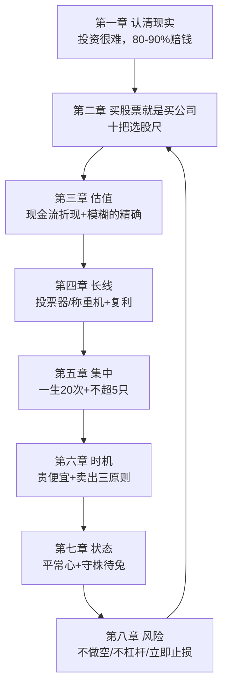

### 9.2 底层逻辑的四个支柱

| 支柱 | 内容 | 章节 |
|------|------|------|
| 认知支柱 | 投资很难+不预测+不设回报预期 | 第一章 |
| 选股支柱 | 买公司+文化+定价权+黏性 | 第二章 |
| 估值支柱 | DCF+六折安全边际+毛估估 | 第三章 |
| 纪律支柱 | 不做空/不杠杆/立即止损/不帮人投资 | 第八章 |

### 9.3 段永平的决策流程（30 号完整版）

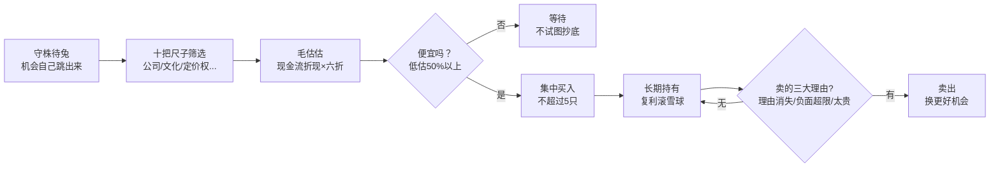

### 9.4 第9章小结

**30 号把 29 号的散点思想组装成 8 章闭环**——从"认清现实"到"风险纪律"，每一环都指向同一个核心：**买股票就是买公司**。

---

## 第10章 深度专题：段永平 × 系列大师终极对照

### 10.1 价值投资谱系中的 30 号

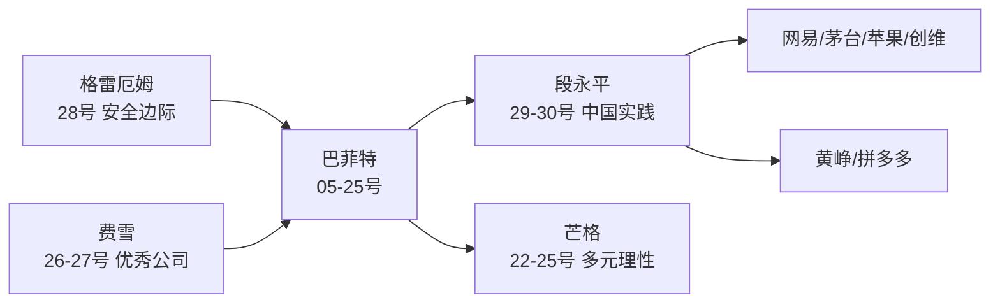

### 10.2 段永平 vs 系列大师（30 号视角）

| 维度 | 格雷厄姆 | 巴菲特 | 芒格 | 段永平（30号） |
|------|---------|--------|------|---------------|
| 核心 | 安全边际 | 好公司好价格 | 理性+多元 | 买股票就是买公司 |
| 估值 | 定量（净资产） | 现金流折现 | 定性+误判心理学 | **存款利率比较法+六折** |
| 集中度 | 分散 | 集中 | 集中 | **不超 5 只** |
| 选股 | 烟蒂 | 护城河 | 能力圈 | **十把尺（文化/定价权）** |
| 风险 | 本金安全 | 不做空不杠杆 | 逆向 | **不做空/不杠杆/立即止损** |
| 心态 | 不预测 | 不看股灾 | rationality | **平常心+素直心** |

### 10.3 与系列主题的直接对应

| 30 号主题 | 系列对应 | 出处 |
|----------|---------|------|
| 投票器/称重机 | 长期主义 | 09/20 号 |
| 长长的坡厚厚的雪 | 护城河 | 13 号 |
| 经济特许权三特征 | 定价权 | 13/20 号 |
| 一生 20 次 | 集中投资 | 16 号 |
| 能力圈 | 能力圈 | 22 号 |
| 多元思维模型 | 格栅理论 | 23 号 |
| 先为不可胜 | 孙子兵法×投资 | 25 号风格 |
| 不试图抄底 | 等待时机 | 27 号 |

### 10.4 第10章小结

**30 号是系列中"框架最完整"的一本**——把格雷厄姆的安全边际、巴菲特的好公司、芒格的理性，全部组装进 8 章闭环里，并用中国企业案例（创维/苹果/腾讯）验证。

---


---

## 第11章 深度专题：本书与 29 号的对照

### 11.1 姊妹篇的定位

| 维度 | 29 号《段永平投资问答录》 | 30 号《段永平讲述投资的底层逻辑》 |
|------|--------------------------|----------------------------------|
| 形式 | 博客/雪球问答实录（2010—2020） | 思想系统整理（8 章 62 节） |
| 结构 | 七章按主题收集问答 | 八章按逻辑递进成体系 |
| 语感 | 原汁原味口语化 | 教科书式系统化 |
| 案例 | 网易/茅台/苹果/雅虎 | 创维/苹果/GE/百度做空 |
| 深度 | 金句密集 | 方法论完整展开 |
| 定位 | 语录体 | **教科书体** |

### 11.2 内容互补对照

| 主题 | 29 号的表述 | 30 号的展开 |
|------|-----------|------------|
| 估值 | "未来现金流折现，毛估估" | 威廉姆斯模型+存款利率比较法+六折算例 |
| 集中 | "重手 5 家" | Mike Flint 25→5 故事+四条纪律 |
| 平常心 | "放心睡觉" | rationality+守株待兔+素直心 |
| 做空 | "百度亏 1.5—2 亿" | +邻居做空故事+利弗莫尔三次破产 |
| 复利 | "10 年 3 倍" | 复利算例+72 法则+滚雪球清单 |
| 止损 | "错了马上改" | 孙子兵法"先为不可胜"+沉没成本案例 |

### 11.3 两本合读的价值

**29 号给你"原汁原味的段永平"，30 号给你"系统化的段永平"**：

1. 先用 29 号感受信仰与金句（"买股票就是买公司，句号！"）
2. 再用 30 号建立完整框架（8 章闭环：认知→选股→估值→长线→集中→时机→状态→风险）
3. 两者互证：同一观点在两种体裁中的表达

### 11.4 第11章小结

**29+30=段永平思想全集**——语录体+教科书体互补，构成系列中唯一的"双册"结构。

---

## 第12章 深度专题：底层逻辑的十二个关键词

### 12.1 十二关键词总表

| # | 关键词 | 一句话 |
|---|--------|--------|
| 1 | 难 | 80—90% 的人赔钱，投资是少数人的游戏 |
| 2 | 公司 | 买股票=买公司所有权 |
| 3 | 文化 | 木桶底板，基业长青的基因 |
| 4 | 定价权 | 提价后仍被接受（经济特许权） |
| 5 | 折现 | 未来现金流折现，唯一的估值思维 |
| 6 | 毛估估 | 宁要模糊的精确，不要精确的模糊 |
| 7 | 复利 | 利滚利，长长的坡厚厚的雪 |
| 8 | 集中 | 一生 20 次，不超 5 只 |
| 9 | 时机 | 不抄底，低估 50% 才动手 |
| 10 | 平常心 | 回归事物本源，素直心 |
| 11 | 不为 | 不做空/不杠杆/不懂不做 |
| 12 | 止损 | 先为不可胜，立即止损 |

### 12.2 十二关键词的体系关系

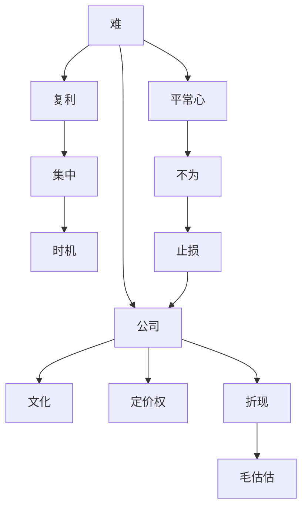

### 12.3 第12章小结

**十二个关键词构成完整的底层逻辑**——从认知（难）到方法（公司/文化/定价权/折现/毛估估）到策略（复利/集中/时机）到心法（平常心/不为/止损）。

---

## 附录一 段永平金句集（50 条精选）

> 1. "统计上 80%~90% 进入股市的人都是赔钱的。如果算上利息的话，赔钱的比例还要高些。"——投资很难
> 2. "股市从来如此，大多数人都在忙于寻找万能公式……事实上，世上根本不存在这样的公式。"——万能公式
> 3. "我做的是投资，不是预测股市涨跌或经济波动。"——巴菲特 1966（本书引）
> 4. "我从来不设回报预期，因为投资回报本来就和预期无关。"——回报预期
> 5. "谋事在人，成事在天，只要过程对了，结果自然会好。"——过程
> 6. "长期而言，跑过银行存款是最基本的要求，不然就是瞎忙活。"——底线
> 7. "长期投资回报至少要做到保住购买力不变才叫不亏。"——保值
> 8. "我不看市场，我看生意。"——关注生意
> 9. "你站在 10 年后看现在，能看懂而且便宜的公司，买就行了。"——长期视角
> 10. "很多'买入并持有'的人，实际上也是投机分子。"——投机
> 11. "没有什么比买错股票并长期持有伤害更大的了。"——买错
> 12. "股票是公司的部分所有权，购买股票的人同时也掌握了公司的部分所有权。"——四观点一
> 13. "市场只是一个平台、一个工具，它无法告诉人们怎样买入和卖出是合理的。"——四观点二
> 14. "人们无论做出什么判断和预测，都要想办法留出一个很大的空间。"——四观点三
> 15. "边界明确的能力才是真的能力。"——四观点四
> 16. "如果企业是一个木桶，那么企业文化就是木桶的底板。"——企业文化
> 17. "从 5～10 年的角度看，CEO 至关重要。从 10~50 年的角度看，董事会很重要。从更长远的角度看，企业文化更重要。"——时间维度
> 18. "苹果是一家有着利润之上追求的公司。"——苹果
> 19. "性价比其实就是功能和技术不足的潜台词。"——定价权
> 20. "关注企业应该从关注产品开始，没有例外。强大的产品是必要条件。"——产品
> 21. "找到有定价权的公司对投资非常重要，理解他们为什么有定价权也非常重要，不然几个市场起伏就会睡不好觉了。"——定价权
> 22. "经济特许权还能够容忍不当的管理。"——巴菲特（本书引）
> 23. "我的估值是试图搞明白，付出什么价，才能 5～10 年都不操心。"——估值
> 24. "国债无风险，股票有风险，所以买公司要打折，越不靠谱的公司打折就越厉害。"——六折
> 25. "宁要模糊的精确，不要精确的模糊，未来现金流折现指的是一种思维方式，而不是数值。"——毛估估
> 26. "5 分钟就能算明白的东西，一定要够便宜。只有便宜才买。"——买点
> 27. "20 元的东西卖 15 元我只会买一点点，真到 10 元才会下重手。"——重仓
> 28. "就像姚明走进来，你不需要用尺子去量，你一定知道姚明很高。"——毛估估
> 29. "一个公司从存在的那天起，其价值就定了。以后怎么发展，应该是由今天的基因决定的。"——价值先天
> 30. "市场短期来看是'投票器'，但长期来看是'称重机'。"——巴菲特（本书引）
> 31. "累积财富就像在斜坡上滚雪球，最好选择从长斜坡顶端的地方开始往下滚动。"——芒格（本书引）
> 32. "那些追求'性价比'的公司恐怕是既没有长长的坡也没有厚厚的雪的。"——滚雪球
> 33. "如果一个人的投资生涯中只出手 20 次（大致比喻），他的成绩单会比更多次出手要好得多。"——集中
> 34. "我想大概一年能有一次机会就很好了。"——机会
> 35. "每一次持有的股票最好不要超过 5 只。"——数量
> 36. "我采用的大概叫守株待兔法，没有太系统的办法，也不每天去找，碰上一个是一个。"——守株待兔
> 37. "我不知道啥时候卖好，反正不便宜时就可以卖了，如果你的钱有更好的去处的话。"——卖出
> 38. "股票是由每个买家自己定价的，到你自己觉得便宜的时候才可以买，实际上和市场（别人）无关。"——定价
> 39. "大概 85% 的人永远看不懂这句话。"——定价（续）
> 40. "你们只要把公司想象成一家非上市公司，没有股价变化就明白了。"——非上市视角
> 41. "李嘉诚说过，他从来不会挣最后一个铜板。"——不贪
> 42. "当一个人认为自己可以战胜指数的时候，他可能已经失去平常心了。"——平常心
> 43. "晚上睡得香比什么都重要。"——卡拉曼（本书引）
> 44. "优秀的品性比大脑更重要。"——芒格（本书引）
> 45. "素直心就是平常心的全部奥妙，也是个人投资的终极要求。"——素直心
> 46. "投资不需要勇气，当你说需要勇气时，你就危险了。"——做空
> 47. "做空有无限风险，一次错误足以致命。长期而言，做空肯定是不对的，因为大势一定向上。"——做空
> 48. "这个世界有很多你不懂的事情，为什么要跟自己过不去？"——做空
> 49. "先为不可胜，以待敌之可胜……不管犯了多大的错误，都要诚实面对，立即止损，不要骗自己说还有机会。"——止损
> 50. "做对的事情，实际上是通过不做不对的事情来实现的，因此要有 Stop doing list。"——不为清单

---


---

## 附录二 长长的坡厚厚的雪：好公司清单

### 2.1 段永平的原话清单

| 公司 | 段永平的评价 | 坡/雪 |
|------|-------------|-------|
| 苹果 | "在一个长长的坡上，似乎雪也是厚厚的" | 长坡厚雪 ✅ |
| OPPO/vivo/华为 | "似乎也都在长长的坡上，但雪没那么厚" | 长坡中雪 |
| 性价比公司 | "恐怕是既没有长长的坡也没有厚厚的雪的" | ❌ |
| 茅台 | "长长的坡，厚厚的雪，虽然偶尔会损失一点点雪" | 长坡厚雪 ✅ |
| 网易 | "游戏做成这个样子！有谁不玩游戏呢？" | 长坡厚雪 ✅ |
| 腾讯 | "有疑问吗？" | 长坡厚雪 ✅ |
| 谷歌 | "绝对是长长的坡、厚厚的雪" | 长坡厚雪 ✅ |
| 亚马逊 | "当然是长长的坡，但上面的雪不太厚啊，不然人家怎么能坚持亏 20 年？" | 长坡薄雪 |
| 京东 | "不会比亚马逊好的" | 长坡薄雪 |
| 阿胶/片仔癀 | "有点像？" | 疑似 |
| 阿里 | "应该也算吧……但有些业务已经超出我这种早已退出江湖的人的理解范围了" | 长坡但看不全 |
| Facebook/微博/YY/陌陌 | "偶尔会觉得自己已经不再年轻了（就是因为自己不用，所以看不懂）" | 看不懂 |

### 2.2 清单的启示

**长长的坡=行业空间大+可持续时间长**；**厚厚的雪=盈利能力强+护城河深**。

**段永平的评估方法**：用产品、用体验、用常识——**不用则看不懂**（Facebook/微博/YY/陌陌的例子）。

---

## 附录三 段永平投资体系速查

### 3.1 核心公式

```
投资 = 买股票 = 买公司 = 买未来现金流折现
估值 = （年利润 ÷ 长期国债利率）× 六折
选股 = 十把尺（公司/文化/模式/定价权/中小/信用/客户/黏性/反多元/管理者）
持仓 = 不超过 5 只
买点 = 价值被低估 50% 及以上
```

### 3.2 八章决策地图

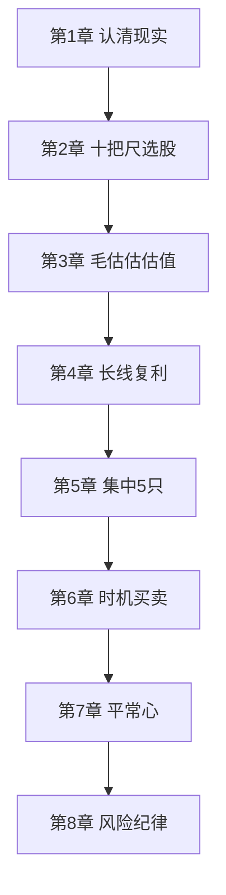

### 3.3 五大纪律

| # | 纪律 | 依据 |
|---|------|------|
| 1 | 不做空 | 无限风险+大势向上+百度教训 |
| 2 | 不借钱 | 杠杆没有时间 |
| 3 | 不懂不做 | 能力圈铁律 |
| 4 | 立即止损 | 先为不可胜 |
| 5 | 不帮人投资 | 别人的钱≠自己的钱 |

---

## 附录四 系列互链：30 号在价值投资谱系中的位置

### 4.1 与系列每本笔记的连接点

| 系列笔记 | 连接点 |
|---------|--------|
| 01—03 利弗莫尔 | 利弗莫尔三次破产皆因做空（30 号引用） |
| 04 达利欧 | 宏观系统 vs 微观生意 |
| 05—21 巴菲特系列 | 投票器/称重机、经济特许权、滚雪球 |
| 13 护城河 | 定价权=护城河核心 |
| 16 集中投资 | 一生 20 次、不超 5 只 |
| 20 第一桶金 | 长线持有、十年视角 |
| 22—25 芒格四书 | rationality、能力圈、多元思维、素直心 |
| 26 费雪 | 关注产品、优秀公司 |
| 27 小费雪 | 等待时机、不抄底 |
| 28 格雷厄姆 | 安全边际、市场先生、估值区间 |
| 29 段永平问答录 | **姊妹篇**：语录体 vs 教科书体 |

### 4.2 "买股票就是买公司"的系列演变（更新版）

| 阶段 | 表述 | 出处 |
|------|------|------|
| 原点 | 投资=全面分析+本金安全+满意回报 | 28 号格雷厄姆 |
| 美国化 | 以合理价格买伟大公司 | 20/22 号 |
| 中国化（问答） | 买股票就是买公司=买未来现金流折现 | 29 号 |
| **中国化（体系）** | **八章闭环：认知→选股→估值→长线→集中→时机→状态→风险** | **30 号（本书）** |
| 量化版 | PSR≤0.75 | 27 号小费雪 |

---

## 附录五 A 股应用：底层逻辑本土化清单

### 5.1 十把尺的 A 股映射

| 尺子 | A 股应用 |
|------|---------|
| 企业文化 | 看公司使命愿景（茅台/腾讯/美的） |
| 定价权 | 白酒/中药（片仔癀）/调味品 |
| 用户黏性 | 社交（腾讯）/游戏（网易） |
| 信用度 | 避开造假公司（排雷） |
| 客户第一 | 海底捞/胖东来 |
| 反多元化 | 警惕跨界收购 |
| 现金流 | 经营现金流为正 |

### 5.2 六折估值法的 A 股算例

假设一家公司年净利润 20 亿元，长期国债利率 3%：

```
估值 = 20 ÷ 3% = 667 亿元
打六折 = 400 亿元（安全边际买点）
当前市值 < 400 亿 → 值得关注
```

### 5.3 A 股常见误区对照

| 误区 | 底层逻辑纠正 |
|------|-------------|
| 追涨杀跌 | 关注生意，不看市场 |
| 听专家荐股 | 独立分析 |
| 抄底逃顶 | 不试图抄底 |
| 分散几十只 | 不超过 5 只 |
| 借钱炒股 | 闲钱才有平常心 |
| 做空/融券 | 拒绝做空 |
| 被套死等回本 | 立即止损 |

---

## 附录六 读完本书后的 10 个自问

1. 我知道 80—90% 的人赔钱的统计含义吗？（第一章）
2. 我能背出价值投资的四个观点吗？（所有权/理解市场/安全边际/能力圈）
3. 我能说出企业文化的三层定义吗？（使命/愿景/核心价值观）
4. 我知道经济特许权的三特征吗？（需要/无替代/不受管制）
5. 我能用存款利率比较法给一家公司毛估估吗？（年利润÷利率×六折）
6. 我知道"模糊的精确"和姚明比喻吗？
7. 我能说出长长的坡厚厚的雪的 5 家公司吗？（苹果/茅台/网易/腾讯/谷歌）
8. 我知道集中投资的四条纪律吗？（严格标准/弱关联/结合自身/不超 5 只）
9. 我能复述创维案例的完整过程吗？（1 港元→8 港元）
10. 我知道"先为不可胜"的投资含义吗？（少犯错+立即止损）

---

## 附录七 本书案例与数据速查

### 核心数据

| 数字 | 含义 |
|------|------|
| 80—90% | 股市赔钱比例 |
| 47 美元 | 苹果 2011 年 1 月买入价（带员工集体买入） |
| 500 亿美元 | 苹果年利润预言（验证） |
| 1 万亿 | 苹果市值预言（验证） |
| 19 年 | 喜诗糖果连续提价年数（12 月 26 日） |
| 100 亿/10 亿 | 净资产/年利润（六折算例） |
| 5% | 长期国债利率（折现率） |
| 六折 | 安全边际折扣 |
| 72 | 72 法则 |
| 20 次 | 一生出手次数 |
| 5 只 | 最大持仓数 |
| 50% | 低估买点 |
| 1.5—2 亿 | 百度做空亏损（美元） |
| 30—40→80 元 | 邻居做空标的的股价 |
| 1 港元→8 港元 | 创维（2000→2005 前后） |
| 200 亿港元 | 创维内在价值估算 |
| 20 元/15 元/10 元 | GE 价值/买一点/加大 |

### 案例速查

| 案例 | 核心 | 章节 |
|------|------|------|
| 苹果 2011 | 企业文化+生态+预言 | 第2章 |
| 喜诗糖果 | 定价权 19 年提价 | 第2章 |
| 诺基亚 | 忽视文化的陨落 | 第2章 |
| 存款利率比较法 | 估值算例 | 第3章 |
| 复利算例 | 单利 vs 复利 | 第4章 |
| Mike Flint | 25→5 目标 | 第5章 |
| 创维 | 提早放弃+卖出时机 | 第5章 |
| GE | 低估 50% 买点 | 第6章 |
| 百度做空 | 不做空的教训 | 第8章 |
| 邻居做空 | 成长≠造假 | 第8章 |
| 机场停车 | 沉没成本 | 第8章 |

---

## 附录八 段永平与中医：底层逻辑跨界对照

### 8.1 方法论同构

| 段永平（30号） | 中医 | 本质 |
|----------------|------|------|
| 投资很难，80—90% 赔钱 | 医道难精，庸医误人 | 专业门槛 |
| 买股票就是买公司 | 辨证论治（先辨对证） | 方向正确 |
| 企业文化=木桶底板 | 正气存内，邪不可干 | 根基 |
| 定价权 | 君臣佐使（核心药力） | 核心能力 |
| 六折安全边际 | 留有余地（不伤正） | 安全边际 |
| 先为不可胜 | 治未病/防传变 | 预防第一 |
| 立即止损 | 误治即纠（随证治之） | 及时纠错 |
| 平常心/素直心 | 恬淡虚无，精神内守 | 心态平和 |
| 不帮人投资 | 医不叩门 | 边界 |
| 守株待兔 | 待时而动（因时制宜） | 耐心 |

### 8.2 "先为不可胜" × "治未病"

**孙子**："先为不可胜，以待敌之可胜。不可胜在己，可胜在敌。"

**中医**："上工治未病，不治已病，此之谓也。"

**段永平**："我们要创造有利于自己的形势，尽可能不犯或少犯错。我们能做的，就是让自己不可战胜。"

**共同逻辑**：**先立于不败之地（不亏钱/不生病），再图胜利（赚钱/痊愈）**——风险控制优先于收益追求。

### 8.3 六折安全边际 × 留有余地

**段永平**：国债利率折算后打六折——"越不靠谱的公司打折就越厉害"。

**中医**：用药留有余地，攻邪不忘扶正——"大毒治病，十去其六"（《黄帝内经》）。

**共同逻辑**：**为不确定性预留空间**——估不准是常态，折扣是生存之道。

### 8.4 企业文化 × 正气

**段永平**："企业文化是木桶的底板，企业文化建设不成功，整个木桶就无法装水。"

**中医**："正气存内，邪不可干。"

**共同逻辑**：**内在根基决定外在表现**——投资看文化，治病看正气。

---


---

## 附录九 FAQ：底层逻辑 20 问

**Q1：投资股票有多难？**
A：统计上 80—90% 进入股市的人赔钱——"我不知道什么人适合做投资，但我知道大部分人不适合"。

**Q2：为什么不能预测股价？**
A：市场充满不确定性（意外事件如疫情/战争），参与者决策海量，静态分析无法把握动态市场——"我做的是投资，不是预测股市涨跌"。

**Q3：该设多少回报预期？**
A：不设预期——"过程比结果重要，谋事在人成事在天"；跑过银行存款是底线；保住购买力才算不亏。

**Q4：价值投资的四个观点是什么？**
A：①股票是公司所有权 ②理解市场（只是平台）③预测要留安全边际 ④构建能力圈。

**Q5：怎么选公司？**
A：十把尺：买公司/企业文化/商业模式/定价权/中小公司/信用度/客户第一/用户黏性/反多元化/好管理者。

**Q6：什么是企业文化？**
A：使命（为什么成立）+愿景（要做什么）+核心价值观（什么对什么不对）——木桶底板。

**Q7：什么是定价权？**
A：提价后仍被市场接受（经济特许权三特征：需要/无替代/不受管制）。喜诗糖果连续 19 年 12 月 26 日提价。

**Q8：怎么估值？**
A：未来现金流折现（存款利率比较法：年利润÷国债利率，再打六折）——"毛估估"、"模糊的精确"。

**Q9：为什么打六折？**
A：国债无风险，股票有风险——"越不靠谱的公司打折就越厉害"。安全边际应对预测误差。

**Q10：什么是长长的坡厚厚的雪？**
A：长坡=行业空间大；厚雪=盈利能力强。苹果/茅台/网易/腾讯/谷歌。

**Q11：复利的力量有多大？**
A：1000 万×10%×10 年：单利 2000 万 vs 复利 2593.74 万；72 法则：12% 年化 6 年翻倍。

**Q12：为什么集中投资？**
A：Mike Flint 的 25→5 目标故事；"一生出手 20 次成绩单更好"；持仓不超过 5 只。

**Q13：怎么理解贵和便宜？**
A："股票是由每个买家自己定价的"——85% 的人永远看不懂；价值低估 50% 以上才动手（GE：20 元价值 15 元买一点，10 元以下加大）。

**Q14：什么时候卖出？**
A："买的理由消失了，或者重要的负面消息增加到我不能接受的时候"；太贵+有更好去处（卖苹果买腾讯）；"从来不挣最后一个铜板"。

**Q15：什么是守株待兔法？**
A：不每天找机会，碰上一个是一个——"有时候你感兴趣的目标会自己跳到眼前的"。

**Q16：什么是平常心？**
A：回归事物本源；"当一个人认为自己可以战胜指数的时候，他可能已经失去平常心了"；闲钱才有平常心。

**Q17：为什么不做空？**
A：做空有无限风险，一次错误足以致命；长期大势向上；一次犯错全部归零。百度教训：1.5—2 亿美元。

**Q18：为什么要立即止损？**
A："先为不可胜"——少犯错+立即止损；沉没成本陷阱（机场停车故事）；"不要骗自己说还有机会"。

**Q19：为什么不要帮别人投资？**
A：别人的钱≠自己的钱；压力与责任不对等。

**Q20：本书与 29 号的区别？**
A：29 号是问答实录（语录体），30 号是系统整理（教科书体）——8 章 62 节完整框架。两本合读=段永平思想全集。

---

## 附录十 估值练习：三组实战算例

### 10.1 算例一：存款利率比较法（标准版）

| 项目 | 数值 |
|------|------|
| 净资产 | 100 亿元 |
| 年净利润 | 10 亿元 |
| 国债利率 | 5% |
| 理论估值 | 10÷5% = 200 亿元 |
| 打六折 | **120 亿元**（安全边际买点） |

### 10.2 算例二：A 股白酒公司（简化）

| 项目 | 数值 |
|------|------|
| 年净利润 | 45 亿元 |
| 国债利率 | 3% |
| 理论估值 | 45÷3% = 1500 亿元 |
| 打六折 | 900 亿元 |
| 当前市值 | 700 亿元 |
| 结论 | **低于六折买点，有安全边际**（但还需看商业模式/文化/定价权） |

### 10.3 算例三：零增长公司的估值

| 项目 | 数值 |
|------|------|
| 年净利润（稳定） | 100 亿元 |
| 无负债无增长 | — |
| 国债利率 | 5% |
| 理论估值 | 100÷5% = 2000 亿元 |
| 打六折 | 1200 亿元 |
| 当前市值 | 1000 亿元 |
| 结论 | 零增长≠零价值——**不增长的公司不等于没价值** |

### 10.4 练习的要点

1. 估值是毛估估，不是精确计算
2. 折现率用长期国债（5% 或 3%）
3. 六折=安全边际（应对预测误差）
4. 估值只是判断下行空间的工具，**真正利润来自定性分析**（商业模式/文化/定价权）

---

## 附录十一 段永平式投资周记模板

### 周一：公司观察

- [ ] 本周公司动态（公告/新闻/产品）
- [ ] 十把尺重新过一遍：企业文化变了吗？定价权还在吗？

### 周三：价值复盘

- [ ] 毛估估：年利润÷国债利率×六折
- [ ] 当前价格 vs 估值（低估 50% 了吗？）

### 周五：心态检查

- [ ] 本周有没有违反五大纪律？（做空/借钱/不懂/不止损/帮人）
- [ ] 有没有试图预测股价？（有=违规）
- [ ] 平常心还在吗？（有没有想战胜指数？）

### 周末：学习充电

- [ ] 读一份年报/一份深度研报
- [ ] 观察一家新公司（十把尺练习）

---

## 附录十二 全书 30 秒版

**一句话**：买股票就是买公司——十把尺选股，六折估值，五只集中，平常心持有，五大纪律保命。

**八章闭环**：认清现实（难）→ 选股（十把尺）→ 估值（DCF×六折）→ 长线（复利）→ 集中（5 只）→ 时机（低估 50%）→ 状态（平常心）→ 风险（不为清单）。

**三大案例**：苹果（47 美元企业文化买入+预言验证）/ 创维（1 港元→8 港元卖出）/ 百度做空（1.5—2 亿美元教训）。

**五大纪律**：不做空、不借钱、不懂不做、立即止损、不帮人投资。

**一句结尾**："先为不可胜，以待敌之可胜"——让自己不可战胜，等待机会来临。

---

## 总结：底层逻辑之核心

### Z1. 段永平投资体系全景（30 号版）

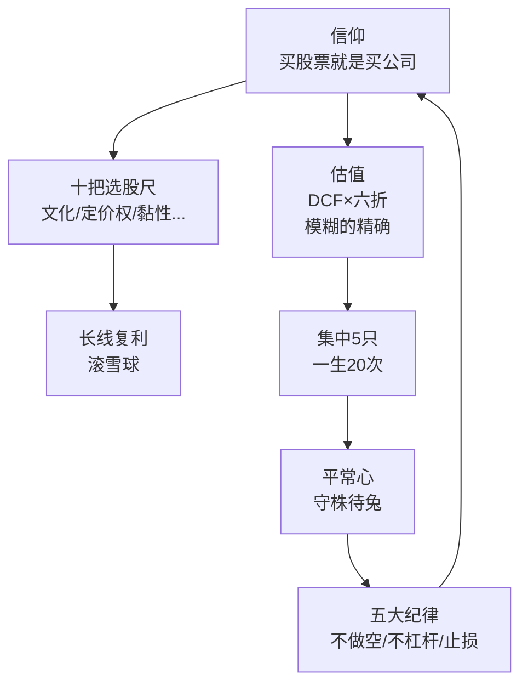

### Z2. 底层逻辑的五个核心

| 核心 | 内容 |
|------|------|
| 认知 | 投资很难，80—90% 赔钱 |
| 选股 | 十把尺（公司/文化/定价权） |
| 估值 | DCF×六折，毛估估 |
| 纪律 | 不做空/不杠杆/立即止损 |
| 心态 | 平常心/素直心 |

### Z3. 全书一句话

> **《段永平讲述投资的底层逻辑》把段永平的思想系统化为 8 章闭环：先认清"投资很难"的现实，再用"十把尺"选公司、用"现金流折现×六折"毛估估、用"复利+集中"滚雪球、用"平常心"守株待兔，最后用"不做空、不借钱、立即止损"守住底线——底层逻辑就是：买股票就是买公司，先为不可胜，以待敌之可胜。**

### Z4. 最终寄语

> 30 号与 29 号互为姊妹篇：29 号给你原汁原味的段永平，30 号给你系统化的段永平。从"买股票就是买公司"的信仰出发，到十把选股尺、六折估值法、五只集中持仓、五大风险纪律——这是 [[29《段永平投资问答录》深度解读（详细版）|29 号]] 思想的教科书化，也是 [[28《聪明的投资者》深度解读（详细版）|28 号格雷厄姆]] 的安全边际、[[20《巴菲特的第一桶金》深度解读（详细版）|20 号巴菲特]] 的买公司、[[22《穷查理宝典》深度解读（详细版）|22 号芒格]] 的理性在中国的最完整组装。**读 30 号，是掌握段永平底层逻辑的捷径。**

---

*本笔记基于《段永平讲述投资的底层逻辑》（段永平网络分享系统整理版，2025 年出版），覆盖八章 62 节全部内容，并与本系列 29《段永平投资问答录》（姊妹篇）、28《聪明的投资者》（理论源头）、22《穷查理宝典》（能力圈）等形成互链网络。*

*核心收获一句话：**买股票就是买公司——十把尺选股、六折估值、五只集中、平常心持有、五大纪律保命。***

---

## 附录 段永平体系的完整地图：从心法到操作（知乎文风）

### 写在前面：29 号讲"是什么"，30 号讲"怎么做"

29 号（问答录）是段永平的思想碎片，30 号（底层逻辑）是段永平思想的**系统化教科书**——八章结构，从"买股票就是买公司"到完整的操作体系。

**如果说 29 号是语录，30 号就是教材。**两本合起来，才是完整的段永平。

### 第一幕：八章框架——段永平体系的完整骨架

| 章 | 主题 | 核心 |
|----|------|------|
| 1 | 投资的底层逻辑 | 买股票=买公司 |
| 2 | 十把选股尺 | 商业模式+企业文化 |
| 3 | 估值方法 | 现金流折现思维 |
| 4 | 安全边际 | 六折买点 |
| 5 | 集中投资 | 一生 20 次出手 |
| 6 | 长期持有 | 时间是朋友 |
| 7 | 风险管理 | 不做空/不杠杆 |
| 8 | 心态修炼 | 平常心/本分 |

### 第二幕：十把选股尺——把"懂"变成可检查

段永平体系最实操的部分：**十把尺子衡量一家公司**：

| 尺子 | 问题 |
|------|------|
| 企业文化 | 老板把员工/客户/股东放什么位置？ |
| 商业模式 | 怎么赚钱？能赚多久？ |
| 定价权 | 敢提价吗？提价后销量掉吗？ |
| 护城河 | 凭什么别人抢不走？ |
| 现金流 | 真金白银还是纸面利润？ |
| 管理层 | 诚信吗？能力够吗？ |
| 增长空间 | 10 年后市场多大？ |
| 竞争格局 | 行业集中度在提升吗？ |
| 财务健康 | 负债低吗？ |
| 估值 | 现在买划算吗？ |

> "**十把尺子，每一把都是'买公司'的具体化——全部通过，才值得重仓。**"

**注意第一把尺子的位置**：段永平把"企业文化"排在"商业模式"前面——**这是他和其他价值投资者最大的不同**：在他看来，**"事"（商业模式）可以学，但"人"（文化）很难改**——一家文化不好的公司，再好的商业模式也会被败掉。

### 第三幕：估值——段永平的方法论

段永平的估值方法（系列最完整的展开，30 号独有）：

| 方法 | 内容 |
|------|------|
| 现金流折现思维 | 不追求精确计算，追求"明显便宜" |
| 存款利率比较法 | 年利润 ÷ 无风险利率（国债） |
| 六折安全边际 | 算出价值后打六折才买 |
| 复利算例 | 1,000 万×10%×10 年：单利 2,000 万 vs 复利 2,593 万 |

**存款利率比较法的例子**（段永平原版思路）：

> "一家公司一年赚 10 亿，如果国债利率 5%，那这笔生意至少值 200 亿（10÷5%）——**如果股价只给 120 亿（六折），就是好买卖。**"

**为什么用"存款利率"做锚？**段永平说：**"不买股票的话，钱放银行吃利息——所以股票的回报率至少要跑赢存款，否则我为什么要承担风险？"**——**这是最朴素的机会成本思维，却比任何复杂的 DCF 模型都实用。**

### 第四幕：集中投资——一生 20 次出手

段永平对集中投资的表述（比巴菲特更"狠"）：

| 观点 | 内容 |
|------|------|
| Mike Flint 故事 | 列出 25 个目标→删到 5 个→**"其余 20 个是躲避瘟疫"** |
| 一生 20 次出手 | 每出手一次，机会就少一次 |
| 重仓 | "看懂的重仓，看不懂的不碰" |
| 集中度 | 通常 3—5 只 |

> "**分散投资是对'不懂'的补偿——真正懂的人不需要分散。**"

**Mike Flint 故事的完整版**：巴菲特让私人飞行员 Mike Flint 列出人生 25 个目标，再圈出最重要的 5 个——Mike 问"那剩下 20 个什么时候做？"巴菲特说：**"那些是你的'躲避清单'——在完成 5 个目标之前，碰都不许碰。"**段永平用这个故事说明：**投资和人生一样，80% 的事不值得做，20% 的事值得用一生做。**

### 第五幕：风险管理——不做空、不杠杆

段永平的风险管理（30 号最实战的一章）：

| 纪律 | 理由 |
|------|------|
| 不做空 | 亏损无限+时间不在你这边 |
| 不借钱 | **"杠杆没有时间"**——爆仓前先归零 |
| 不做不懂的 | 最大的风险是认知风险 |
| 留足现金 | 机会来时有钱 |

**段永平的做空教训实录**：他年轻时做空百度亏损 1.5—2 亿美元——从此立下"永不借债、永不裸做空"的规矩。

> "**做空是聪明人亏大钱的方式——判断对了都可能破产。**"

**为什么"判断对了也会破产"？**因为做空的亏损没有下限：股票可以涨 10 倍、100 倍，你的保证金会被无限追加——**2008 年大众汽车逼空事件中，做空者一天亏掉几十亿欧元。**段永平的结论：**"我不需要做空来赚钱，我的多仓已经足够。**"

### 尾声：段永平 × 系列大师的终极对照

| 维度 | 巴菲特 | 段永平 |
|------|--------|--------|
| 买什么 | 好生意 | 好生意（同） |
| 怎么买 | 安全边际 | 六折（更严） |
| 持有多久 | 永远 | 长期（同） |
| 最大的不同 | 美国人 | **中国人——把巴菲特哲学"本分"化** |

> **"投资的底层逻辑，从来只有一个：买股票就是买公司。其他一切都是这个逻辑的展开。"**

**30 号读完，段永平双册（29+30）完成**——语录+教材=完整体系。**至此，系列 32 本全部解读完毕：从利弗莫尔到林奇，从格雷厄姆到段永平——价值投资的完整光谱，尽在其中。**

**最后送你段永平最常对年轻人说的一句话**：**"慢就是快，快就是慢。"**——投资如此，人生如此。

---


---

## 第13章 深度专题：十把选股尺的完整展开

### 13.1 商业模式：赚钱的方式

**段永平的商业模式观**：

> "投资最重要的还是要看生意模式，不然的话大家就很容易只见树木不见森林，全部盯着眼前这一个月一个季度的波动来决定买卖的行为，这样是很难做投资的。"

**好商业模式的判断**：

| 维度 | 好模式 | 坏模式 |
|------|--------|--------|
| 现金流 | 先收钱后发货（预收款） | 先发货后收钱（应收款） |
| 库存 | 越放越值钱（茅台基酒） | 越放越贬值（消费电子） |
| 售后 | 无售后需求（酒） | 售后负担重 |
| 定价 | 有定价权 | 价格战 |
| 复购 | 强黏性 | 一次性消费 |

**与系列对照**：[[13《巴菲特的护城河》深度解读（详细版）|13 号护城河]] 的结构化版本——段永平用"生意模式"一词涵盖护城河的全部内涵。

### 13.2 小额股票投资者要寻找看得懂的中小型公司

**中小公司的机会**：大公司人人看得懂，估值充分；中小公司少人研究，存在认知差——**但前提是"看得懂"**（能力圈）。

**与系列对照**：[[27《超级强势股》深度解读（详细版）|27 号小费雪"小盘价值成长"]] 的呼应——但段永平更强调"看得懂"优先于"小"。

### 13.3 投资那些信用度高的企业

**诚信是底线**：

| 维度 | 内容 |
|------|------|
| 财报诚信 | 不造假、不粉饰 |
| 经营诚信 | 不骗客户、不骗股东 |
| 治理诚信 | 不侵害小股东利益 |

**排雷思维**：A 股市场造假频发，信用度是筛选的第一道滤网（与 [[06《巴菲特教你读财报》深度解读（详细版）|06 号读财报]] 呼应）。

### 13.4 选择坚持以客户利益为第一的公司

**客户第一**：苹果把消费者放在第一位（换机优先的故事）；海底捞的服务文化——"从人们走进海底捞的那一刻起，也可以感受到"。

**段永平的商业实践**：步步高/OPPO/vivo 的"本分"文化——**客户第一是段永平做企业时的信条，也是选股时的尺子**。

### 13.5 看重那些具有很强用户黏性的公司

**黏性的来源**：

| 类型 | 例子 |
|------|------|
| 生态锁定 | 苹果 iOS+APP 生态 |
| 习惯依赖 | 白酒口感（"喜欢喝茅台的，不会因为茅台涨价而买五粮液"） |
| 网络效应 | 腾讯社交 |
| 转换成本 | 企业软件/操作系统 |

### 13.6 不要选择那些盲目多元化的企业

**多元化的陷阱**：资源分散、主业失焦、管理失控——**"盲目"是关键词**：基于主业协同的延伸可以，跨界赌博不行。

**段永平的企业实践**：步步高将 VCD 业务聚焦做好，再分拆 OPPO/vivo——**聚焦成就了三个品牌**。

### 13.7 寻找一个值得信赖的管理者

**管理者的评估**：

| 维度 | 问题 |
|------|------|
| 诚信 | 说话算数吗？ |
| 能力 | 经营结果如何？ |
| 股东回报 | 把股东利益放第几位？ |
| 企业文化 | 身体力行使命愿景吗？ |

**与系列对照**：[[26《怎样选择成长股》深度解读（详细版）|26 号费雪"管理阶层"要点]] 的中国版。

### 13.8 第13章小结

**十把尺子的本质**：从"公司所有权"出发，用文化（基因）、模式（赚钱方式）、定价权（护城河）、信用（底线）、客户（导向）、黏性（复购）、聚焦（战略）、管理者（船长）八把尺子筛选，再用"看得懂"（能力圈）和"适合自己的规模"（中小）两把尺子收口——**十把尺子全部指向同一个问题：这是一家值得拥有的公司吗？**

---

## 第14章 深度专题：投资失败的四种形态（第八章延伸）

### 14.1 四种失败形态

| 失败形态 | 机制 | 段永平的教训 |
|---------|------|-------------|
| 做空 | 无限风险+大势向上 | 百度 1.5—2 亿美元 |
| 杠杆 | 时间错配+强制平仓 | "不借钱"铁律 |
| 投机 | 以为自己比市场快 | "买入并持有"的投机者 |
| 抄底 | 预测市场 | "不要试图抄底" |

### 14.2 失败的心理根源

**过度自信**：投资成功多次后心态失衡（百度做空前的状态）——"由于那个时候百度的发展还不那么理想，而自己此前又投资成功多次，心态上过于自信"。

**沉没成本**："这件事我已经投了几千万呀，怎么停得下来？"——为救沉没成本再投入，败得更惨。

**侥幸心理**："希望等到回本再说"——大部分人犯的错误。

### 14.3 风险管控的完整框架

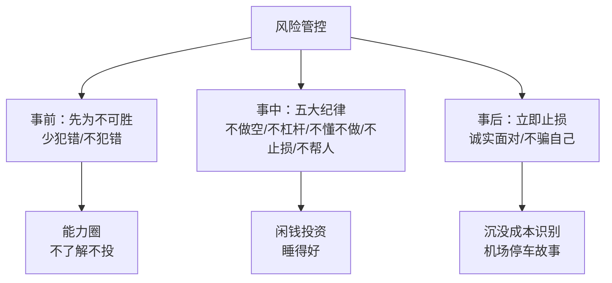

### 14.4 第14章小结

**风险管理的底层逻辑**：投资的第一要务是避免亏损——事前（能力圈）、事中（纪律）、事后（止损）三层防线，缺一不可。

---

## 第15章 深度专题：段永平与巴菲特午餐的完整故事

### 15.1 62 万美元的午餐

**2006 年**：段永平以 62 万美元拍下巴菲特午餐，成为第一位华人中标者。

**段永平的动机**：不是炫耀，是取经——"和老巴吃顿饭没白吃"。

### 15.2 午餐的收获

| 收获 | 内容 |
|------|------|
| 生意模式 | "老巴童鞋说生意模式最重要。我自己大概对这句话想了好几年了，还在继续想，但确实越来越感觉到老巴这个说法有道理。" |
| 不做空 | 巴菲特明确告诫（段永平后来违背→百度教训） |
| 信仰确认 | 买股票就是买公司 |
| 传承 | 段永平后来以类似方式帮助年轻人（黄峥） |

### 15.3 从巴菲特到段永平的传承链

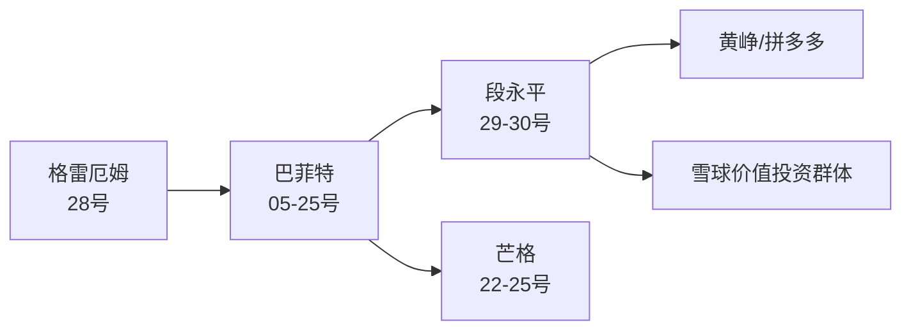

### 15.4 第15章小结

**段永平与巴菲特的午餐是价值投资传承的象征**——从格雷厄姆→巴菲特→段永平→黄峥，价值投资的火炬在中国传递。

---

## 附录十三 段永平投资年表

| 年份 | 事件 |
|------|------|
| 1961 | 生于江西 |
| 1980s | 中国人民大学研究生（计量经济学） |
| 1989 | 进入小霸王（中山）——"小霸王其乐无穷" |
| 1995 | 创办步步高 |
| 1999 | 步步高分拆（OPPO/vivo 前身） |
| 2000 | 创维 1 港元以下买入（市值 10 多亿） |
| 2000s | 移居美国，开始职业投资 |
| 2001—2002 | 买入网易（0.8—1 美元） |
| 2002 | 丁磊的贵人（网易转型游戏） |
| 2006 | 62 万美元拍下巴菲特午餐（第一位华人） |
| 2008 | 金融危机期间买入 GE 等 |
| 2010 | 开始重仓雅虎（买阿里）；读《穷查理宝典》（110 美元搁置两年） |
| 2011 | 1 月带员工集体买入苹果（47 美元）；预言苹果 500 亿美元利润/万亿市值 |
| 2013 | 茅台反三公时期的坚定持有 |
| 2015 | 黄峥创办拼多多（段永平为导师/投资人） |
| 2016 | 拼多多上市（段永平投资回报巨大） |
| 2020s | 持续在雪球分享投资理念；本书出版 |

---

## 附录十四 段永平式观察池：A 股"懂"的练习

### 14.1 观察池建立方法

| 步骤 | 内容 |
|------|------|
| 1 | 列出 10—20 家你接触过产品/服务的公司 |
| 2 | 每家回答：它怎么赚钱？（商业模式一句话） |
| 3 | 用十把尺打分（文化/定价权/黏性/信用） |
| 4 | 毛估估：年利润÷国债利率×六折 |
| 5 | 标记：懂/半懂/不懂 |
| 6 | 只对"懂"的做估值与机会成本比较 |

### 14.2 模拟观察池示例

| 公司 | 商业模式一句话 | 十把尺得分 | 懂的程度 | 行动 |
|------|---------------|-----------|---------|------|
| 贵州茅台 | 卖品牌白酒，库存增值 | 文化✓定价✓黏性✓ | 懂 | 等便宜 |
| 腾讯控股 | 社交+游戏+广告 | 文化✓黏性✓ | 半懂 | 继续学 |
| 美的集团 | 家电制造+渠道 | 模式✓信用✓ | 懂 | 观察 |
| 片仔癀 | 中药+稀缺原料 | 定价✓ | 半懂 | 观察 |
| 宁德时代 | 动力电池 | 模式？ | 不懂 | 不碰 |
| 某创新药企 | 研发管线 | 现金流？ | 不懂 | 不碰 |
| 中国移动 | 通信服务收租 | 现金流✓ | 懂 | 观察股息 |

### 14.3 观察池的纪律

1. 不懂的永远不碰（"不了解的就不要去投资"）
2. 懂的等便宜（"低估 50% 及以上才动手"）
3. 大跌时检验"懂"（想加仓=真懂；想打听=假懂）
4. 持仓不超过 5 只（从观察池精选）

---

## 附录十五 段永平思想 × 系列完整对照矩阵

### 15.1 概念映射（30 号新增）

| 30 号概念 | 系列对应 | 出处 |
|-----------|---------|------|
| 十把尺 | 15 要点/护城河 | 26 号/13 号 |
| 存款利率比较法 | DCF 估值 | 12 号 |
| 六折安全边际 | 安全边际 | 28 号 |
| 长长的坡厚厚的雪 | 滚雪球 | 20 号 |
| 72 法则 | 复利 | 16 号 |
| 先为不可胜 | 不预测/风控 | 28 号 |
| 素直心 | 理性/平常心 | 22 号 |
| 守株待兔 | 等待时机 | 27 号 |
| 经济特许权 | 定价权 | 13 号 |
| 不超 5 只 | 集中投资 | 16 号 |

### 15.2 系列母题追踪（30 号更新）

| 母题 | 28 格雷厄姆 | 20 巴菲特 | 22 芒格 | 29 段永平 | 30 段永平（本书） |
|------|------------|----------|---------|-----------|------------------|
| 安全边际 | 首创 | 践行 | 认同 | 毛估估 | **六折折扣** |
| 不预测 | 市场先生 | 不看股灾 | 宏观噪音 | 不设预期 | **不预测股价** |
| 平常心 | 独立 | 奥马哈 | rationality | 放心睡觉 | **素直心+守株待兔** |
| 估值 | 净资产 | DCF | 定性 | 现金流折现 | **存款利率比较法** |
| 风险 | 本金安全 | 不做空 | 逆向 | 不为清单 | **五大纪律** |

### 15.3 第15章小结

**30 号把系列所有母题收拢成一张完整的地图**——安全边际（六折）、不预测（不预测股价）、平常心（素直心）、估值（存款利率比较法）、风险（五大纪律）——**段永平的底层逻辑 = 格雷厄姆+巴菲特+芒格的中国组装**。

---


---

## 附录十六 段永平投资理念 100 条（30 号汇编）

### 认知篇（1—20）

1. 投资股票很难，大部分人都不适合。
2. 统计上 80%~90% 进入股市的人都是赔钱的。
3. 如果算上利息的话，赔钱的比例还要高些。
4. 股市是专业人士、专业机构才玩得转的资本游戏。
5. 发财梦成功的概率和购买福利彩票差不多。
6. 大多数人在忙于寻找万能公式，世上根本不存在这样的公式。
7. 那些声称掌握了公式的人，往往会因为过度自信而遭遇挫折。
8. 很多所谓的专家只会纸上谈兵，缺乏实践能力。
9. 他们绝不用自己的资金去验证其理论是否正确。
10. 我做的是投资，不是预测股市涨跌或经济波动。（巴菲特）
11. 股价其实是不可预测的，因为市场具备很多不确定性。
12. 预测股价，实际上违反了市场发展的规律。
13. 市场每天都会出现几千万、几亿个不同的决策。
14. 意外事件是常态，股价预测的精准度无法保证。
15. 只要企业未来能够实现持续较高的盈利，自己根本没有必要关心股票什么时候会涨价。
16. 我从来不设回报预期，因为投资回报本来就和预期无关。
17. 过程比结果重要，谋事在人，成事在天。
18. 长期而言，跑过银行存款是最基本的要求。
19. 长期投资回报至少要做到保住购买力不变才叫不亏。
20. 能跑过黄金就非常理想了。

### 价值投资篇（21—40）

21. 价值投资才是炒股的精髓。
22. 股票是公司的部分所有权。
23. 购买股票的人同时也掌握了公司的部分所有权。
24. 人们以股东形式支持一家公司并因为公司价值增长而获益的道路，是可持续的。
25. 市场只是一个平台、一个工具。
26. 市场无法告诉人们怎样买入和卖出是合理的。
27. 如果投资者将市场当成老师、当成标准，就可能会遭遇重大的失利。
28. 投资的本质是对未来做出预测，但预测结果并不是完全正确的。
29. 无论人们做出什么判断和预测，都要想办法留出一个很大的空间。
30. 安全边际是为了应对预测结果出现偏差而设置的。
31. 人们最好选择在价格远远低于内在价值的时候购买。
32. 能力圈：边界明确的能力才是真的能力。
33. 价值投资在 20 世纪 30 年代就已经出现。
34. 价值投资经历了资产价值、盈利能力、增长价值三个阶段。
35. 大部分时候，多数便宜的股价都是源于内部的低价值。
36. 很多"买入并持有"的人，实际上也是投机分子。
37. 没有什么比买错股票并长期持有伤害更大的了。
38. 价值投资者在短期内的表现可能不尽如人意。
39. 只要把握好了几个要素，就可以在更长的时间内展示自己的投资优势。
40. 价值投资，原理和技术其实说出来很简单，但是大道至简，知易行难。

### 选股篇（41—60）

41. 买股票要当成买公司一样对待。
42. 重点关注标的公司的企业文化。
43. 企业文化就是一个团队的使命、愿景、核心价值观。
44. 企业文化是企业实行长远发展的关键因素。
45. 一个企业的产品是可以模仿和替代的，但是文化则不可模仿。
46. 如果企业是一个木桶，那么企业文化就是木桶的底板。
47. 从 5～10 年的角度看，CEO 至关重要。
48. 从 10~50 年的角度看，董事会很重要。
49. 从更长远的角度看，企业文化更重要。
50. 苹果是一家有着利润之上追求的公司。
51. 性价比其实就是功能和技术不足的潜台词。
52. 关注企业应该从关注产品开始，没有例外。
53. 强大的产品是必要条件。
54. 找到有定价权的公司对投资非常重要。
55. 理解他们为什么有定价权也非常重要，不然几个市场起伏就会睡不好觉了。
56. 经济特许权的形成：顾客需要、无替代品、不受价格管制。（巴菲特）
57. 经济特许权还能够容忍不当的管理。（巴菲特）
58. 小额股票投资者要寻找看得懂的中小型公司。
59. 投资那些信用度高的企业。
60. 选择那些坚持以客户利益为第一的公司。

### 估值篇（61—75）

61. 股票的内在价值大约等于公司的未来现金流折现。
62. 我的估值是试图搞明白，付出什么价，才能 5～10 年都不操心。
63. 如果它是非上市公司，我用目前的价格去拥有它，和我的其他机会比，哪个回报更高。
64. 未来自由现金流=净利润+折旧－资本支出。
65. 未来现金流折现法是最权威、最科学的估值法之一。（威廉姆斯 1942）
66. 折现率以长期国债利率来计算，我一般用 5%。
67. 国债无风险，股票有风险，所以买公司要打折。
68. 越不靠谱的公司打折就越厉害。
69. 宁要模糊的精确，不要精确的模糊。
70. 未来现金流折现指的是一种思维方式，而不是数值。
71. 估值就是毛估估的。
72. 5 分钟就能算明白的东西，一定要够便宜。只有便宜才买。
73. 20 元的东西卖 15 元我只会买一点点，真到 10 元才会下重手。
74. 就像姚明走进来，你不需要用尺子去量，你一定知道姚明很高。
75. 一个公司从存在的那天起，其价值就定了，以后怎么发展，应该是由今天的基因决定的。

### 长线与集中篇（76—88）

76. 市场短期来看是"投票器"，但长期来看是"称重机"。（巴菲特）
77. 短线操作比长线操作更难。
78. 学会使用复利来增加财富。
79. 累积财富就像在斜坡上滚雪球，最好选择从长斜坡顶端的地方开始往下滚动。（芒格）
80. 苹果是在一个长长的坡上，似乎雪也是厚厚的。
81. 茅台当然是吧？长长的坡，厚厚的雪。
82. 那些追求"性价比"的公司恐怕是既没有长长的坡也没有厚厚的雪的。
83. 如果一个人的投资生涯中只出手 20 次，他的成绩单会比更多次出手要好得多。
84. 我想大概一年能有一次机会就很好了。
85. 每一次持有的股票最好不要超过 5 只。
86. 集中投资不是购买一只股票。
87. 我采用的大概叫守株待兔法，碰上一个是一个。
88. 反正赚钱也不需要有很多的目标（巴菲特讲一年一个主意就够了）。

### 时机与心态篇（89—100）

89. 股票是由每个买家自己定价的，到你自己觉得便宜的时候才可以买。
90. 实际上和市场（别人）无关。
91. 大概 85% 的人永远看不懂这句话。
92. 你们只要把公司想象成一家非上市公司，没有股价变化就明白了。
93. 段永平会选择价值被低估 50% 及以上的公司。
94. 我不知道啥时候卖好，反正不便宜时就可以卖了，如果你的钱有更好的去处的话。
95. 当买的理由消失了，或者重要的负面消息增加到我不能接受的时候，我就会离场。
96. 李嘉诚说过，他从来不会挣最后一个铜板。
97. 投资时机很重要，但不要试图抄底。
98. 当一个人认为自己可以战胜指数的时候，他可能已经失去平常心了。
99. 晚上睡得香比什么都重要。（卡拉曼）
100. 素直心就是平常心的全部奥妙，也是个人投资的终极要求。

---

## 附录十七 风险管理 20 条（第八章汇编）

1. 投资股票最重要的是规避风险。
2. 投资的第一要务就是避免出现亏损。
3. 做空是股票期货市场常见的一种操作方式。
4. 做空的难度很大，风险也比较大。
5. 标的公司可能会操纵股价，设置骗局等着做空者入局。
6. 段永平做空百度亏了差不多 1.5 亿~2 亿美元。
7. 这笔钱几乎消耗掉了他手头上所有的储备金，断了他的现金流。
8. 邻居做空的故事：股价从 30~40 元涨到 80 元。
9. 最好别做空哈！这个世界有很多你不懂的事情，为什么要跟自己过不去？
10. 投资不需要勇气，当你说需要勇气时，你就危险了。
11. 做空有无限风险，一次错误足以致命。
12. 长期而言，做空肯定是不对的，因为大势一定向上。
13. 做空犯错的机会只有一次，一次犯错，全部归零，何苦呢？
14. 利弗莫尔一生中经历过三次破产，而这三次破产都是因为他做空。
15. 拒绝使用杠杆，拒绝借贷和负债。
16. 抵押房屋或出售房屋的方式筹集资金，是非常冒险的举动。
17. 先为不可胜，以待敌之可胜。不可胜在己，可胜在敌。（孙子）
18. 不管犯了多大的错误，都要诚实面对，立即止损，不要骗自己说还有机会。
19. 发现买错了股票应该赶紧离开，不然越到后面损失越大。
20. 很多人都犯继续等下去的愚蠢错误：这件事我已经投了几千万呀，怎么停得下来？

---

## 附录十八 本书关键概念中英对照

| 中文 | English | 说明 |
|------|---------|------|
| 未来现金流折现 | DCF (Discounted Cash Flow) | 内在价值估值法 |
| 自由现金流 | Free Cash Flow | 净利润+折旧−资本支出 |
| 折现率 | Discount Rate | 长期国债利率（5%） |
| 安全边际 | Margin of Safety | 打六折 |
| 经济特许权 | Economic Franchise | 定价权三特征 |
| 能力圈 | Circle of Competence | 边界明确的能力 |
| 护城河 | Moat | 长期竞争优势 |
| 复利 | Compound Interest | 利滚利 |
| 72 法则 | Rule of 72 | 72÷年化=翻倍年限 |
| 机会成本 | Opportunity Cost | 放弃的最大利益 |
| 沉没成本 | Sunk Cost | 已发生不可挽回的成本 |
| 平常心 | Equanimity / Rationality | 回归事物本源 |
| 素直心 | Sunao (素直) | 无偏见的倾听与宽容 |
| 守株待兔 | Wait by the Stump | 被动等待机会 |
| Stop doing list | 不为清单 | 不做的事情列表 |

---


---

## 附录十九 段永平式 A 股实战模拟：用底层逻辑检验一家中药公司

### 19.1 模拟标的设定

假设 2024 年有一只**中药品牌"参茸堂"**出现以下情况：

| 项目 | 数据 |
|------|------|
| 股价 | 28 元 |
| 总市值 | 560 亿元 |
| 2023 年净利润 | 18 亿元（同比 +15%） |
| 毛利率 | 72% |
| 经营现金流 | 22 亿元（>净利润 ✅） |
| 应收账款 | 3 亿元（低 ✅） |
| 库存（名贵药材） | 增值中（类似茅台基酒） |
| 分红率 | 40% |
| 大股东 | 上市以来未减持 |
| 困境 | 中药板块整体调整+消费疲软 |

### 19.2 十把尺检验

| 尺子 | 检验 | 结果 |
|------|------|------|
| 买公司 | 品牌中药，生意看得懂吗？ | ✅ 半懂 |
| 企业文化 | 老字号传承+本分经营 | ✅ |
| 商业模式 | 品牌+稀缺药材+提价权 | ✅ |
| 定价权 | 核心产品连续提价仍畅销 | ✅ |
| 中小公司 | 560 亿市值，中等 | ✅ |
| 信用度 | 现金流好+分红稳定+无减持 | ✅ |
| 客户第一 | 口碑产品，复购率高 | ✅ |
| 用户黏性 | 中药消费习惯+品牌忠诚 | ✅ |
| 反多元化 | 聚焦主业，无跨界 | ✅ |
| 管理者 | 家族传承+职业经理人 | ✅ |

**十把尺全过**——进入估值环节。

### 19.3 六折估值

```
理论估值 = 年利润 ÷ 国债利率 = 18 ÷ 3% = 600 亿元
打六折 = 360 亿元（安全边际买点）
当前市值 560 亿元 > 360 亿元 → 不便宜，等待
```

**结论**：好公司+好模式，但当前价格没有安全边际——**"5 分钟就能算明白的东西，一定要够便宜。只有便宜才买"**。

### 19.4 底层逻辑的完整应用

| 步骤 | 行动 |
|------|------|
| 第1步 认知 | 中药行业能看懂吗？（半懂，继续学） |
| 第2步 十把尺 | 全过 ✅（列入观察池） |
| 第3步 估值 | 360 亿买点 vs 560 亿现价（等待） |
| 第4步 纪律 | 不借钱不杠杆（闲钱+仓位<5 只） |
| 第5步 心态 | 平常心等待（守株待兔） |
| 第6步 时机 | 大跌到低估 50% 时买入（不抄底，等价值回归） |

**模拟结论**：底层逻辑不是"找到就买"，而是**"看得懂→等便宜→敢重仓→拿得住"**的完整链条。

---

## 附录二十 段永平式投资检查清单（每日/每周/每月）

### 每日 5 分钟

- [ ] 今天的股价波动影响我的判断了吗？（应该不影响）
- [ ] 我有没有想"卖一点/买一点"的冲动？（有=还没真懂）
- [ ] 我有没有试图预测明天/下周的走势？（有=违规）

### 每周 15 分钟

- [ ] 持仓公司有重大新闻吗？（业务变化 vs 股价变化）
- [ ] 十把尺重新过一遍：文化变了吗？定价权还在吗？
- [ ] 我在看盘还是在看公司？

### 每月 30 分钟

- [ ] 毛估估：年利润÷国债利率×六折=？
- [ ] 机会成本重新比较：有更好的标的吗？
- [ ] 检查五大纪律：做空了吗/借钱了吗/不懂的碰了吗/该止损的止损了吗/帮人投资了吗？

### 每季 1 小时

- [ ] 读财报：利润/现金流/预收款/分红/应收
- [ ] 评估管理层：企业文化有变化吗？
- [ ] 10 年视角重新审视：还愿意持有 10 年吗？

### 每年 2 小时

- [ ] 全年复盘：过程对吗？（结果交给天）
- [ ] 学习：重读巴菲特股东信+《穷查理宝典》
- [ ] 更新能力圈：今年看懂什么新东西了吗？

---

## 附录二十一 系列 30 本笔记总览（更新版）

### 全部已完成笔记

| 编号 | 书名 | 类别 | 状态 |
|------|------|------|------|
| 01—03 | 利弗莫尔三部曲 | 交易派 | ✅ |
| 04 | 原则（达利欧） | 系统派 | ✅ |
| 05—14 | 巴菲特系列（10 本） | 价值派 | ✅ |
| 16—21 | 巴菲特组合/嘉年华等（6 本） | 价值派 | ✅ |
| 22—25 | 芒格四书 | 芒格系 | ✅ |
| 26—27 | 费雪父子 | 成长派 | ✅ |
| 28 | 聪明的投资者（格雷厄姆） | 价值派·源头 | ✅ |
| 29—30 | 段永平双册（问答录+底层逻辑） | 价值派·中国实践 | ✅ 本书 |
| 31+ | 待解读 | — | ⏳ |

### 系列脉络（更新版）

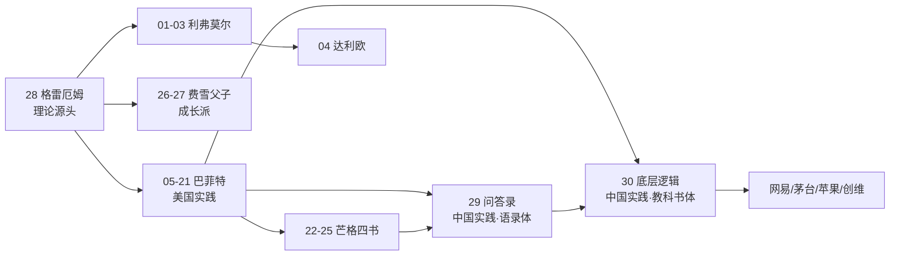

### 系列规模统计

| 指标 | 数值 |
|------|------|
| 已完成笔记 | 30 本 |
| 全网链接 | 1,800+（预计） |
| 待解读 | 031—169（139 本） |

---

## 附录二十二 全书 30 秒版（30 号）

**一句话**：买股票就是买公司——十把尺选股，六折估值，五只集中，平常心持有，五大纪律保命。

**八章闭环**：认清现实（难）→ 选股（十把尺）→ 估值（DCF×六折）→ 长线（复利）→ 集中（5 只）→ 时机（低估 50%）→ 状态（平常心）→ 风险（不为清单）。

**三大案例**：苹果（47 美元企业文化买入+预言验证）/ 创维（1 港元→8 港元卖出）/ 百度做空（1.5—2 亿美元教训）。

**五大纪律**：不做空、不借钱、不懂不做、立即止损、不帮人投资。

**一句结尾**："先为不可胜，以待敌之可胜"——让自己不可战胜，等待机会来临。

---

## 附录二十三 读书笔记方法论：本书的十二个阅读支架

### 23.1 阅读本书的十二个问题

1. 段永平为什么说 80—90% 的人赔钱？（认知）
2. 十把尺子各自解决什么问题？（选股）
3. 存款利率比较法怎么用？（估值）
4. 为什么打六折？（安全边际）
5. 长长的坡厚厚的雪有哪些公司？（选股清单）
6. 复利怎么算？（工具）
7. 为什么一生只出手 20 次？（集中）
8. 为什么持仓不超过 5 只？（集中）
9. 贵和便宜怎么判断？（时机）
10. 平常心和素直心是什么？（心态）
11. 五大纪律为什么重要？（风险）
12. 本书和 29 号怎么配合读？（姊妹篇）

### 23.2 阅读方法的建议

| 层次 | 方法 |
|------|------|
| 第一遍 | 通读八章，画体系图 |
| 第二遍 | 精读第二章（选股）和第三章（估值） |
| 第三遍 | 结合 29 号问答录对照读 |
| 实践 | 用十把尺+六折估值检验自己持仓 |

---


---

## 附录二十四 段永平底层逻辑 × 中医：深入对照

### 24.1 认知层的对照

**段永平**："统计上 80%~90% 进入股市的人都是赔钱的"——**投资是专业活，普通人别碰**。

**中医**："病不许治者，病必不治，治之无功矣"（《素问》）；"医不三世，不服其药"——**医道有门槛，不懂莫妄为**。

**共同逻辑**：**专业的事有专业门槛**——段永平劝普通人远离股市，如中医劝人莫信庸医。

### 24.2 选股层的对照

| 段永平十把尺 | 中医对应 | 说明 |
|-------------|---------|------|
| 企业文化=木桶底板 | 正气存内，邪不可干 | 根基决定一切 |
| 定价权 | 道地药材的稀缺性 | 不可替代性 |
| 商业模式 | 辨证论治的理法方药 | 路径正确 |
| 用户黏性 | 依从性 | 患者信服 |
| 信用度 | 医德 | 诚信底线 |
| 客户第一 | 以患者为中心 | 服务导向 |
| 反多元化 | 专病专治 | 聚焦 |
| 管理者 | 明医（良医） | 关键人物 |

### 24.3 估值层的对照

**段永平**：年利润÷国债利率×六折——**毛估估+安全边际**。

**中医**："大毒治病，十去其六；常毒治病，十去其七；小毒治病，十去其八；无毒治病，十去其九"（《素问·五常政大论》）——**攻邪留有余地**。

**共同逻辑**：**对不确定性预留空间**——估值打六折如用药留余地，都是"先为不可胜"。

### 24.4 心态层的对照

| 段永平 | 中医 |
|--------|------|
| 平常心（回归本源） | 恬淡虚无，真气从之 |
| 素直心（无偏见倾听） | 望闻问切（全面收集） |
| 守株待兔（不强行） | 因时制宜（待时而动） |
| 不比较（不战胜指数） | 不攀比疗效（个体差异） |
| 闲钱投资（睡得着） | 精神内守（心安身安） |

### 24.5 风险层的对照

| 段永平五大纪律 | 中医对应 |
|---------------|---------|
| 不做空 | 不攻伐太过（不伤正气） |
| 不借钱 | 不竭泽而渔（不伤根本） |
| 不懂不做 | 不识不治（不明不药） |
| 立即止损 | 误治即纠（随证治之） |
| 不帮人投资 | 医不叩门（不强行介入） |

### 24.6 附录二十四小结

**段永平的底层逻辑与中医医理高度同构**——先为不可胜（治未病）、留有余地（六折/十去其六）、回归本源（辨证/平常心）、敬畏边界（能力圈/医道门槛）——**投资与医道，殊途同归**。

---

## 附录二十五 段永平式 A 股观察池练习表

### 25.1 练习：用十把尺评估你的持仓或候选股

**公司名称：＿＿＿＿＿＿**

| 尺子 | 评分（1—5） | 理由 |
|------|------------|------|
| 买公司 | | |
| 企业文化 | | |
| 商业模式 | | |
| 定价权 | | |
| 看得懂（中小） | | |
| 信用度 | | |
| 客户第一 | | |
| 用户黏性 | | |
| 反多元化 | | |
| 管理者 | | |
| **总分** | **/50** | |

**评分解读**：

| 总分 | 结论 |
|------|------|
| 45+ | 优秀标的，进入估值环节 |
| 35—44 | 良好，继续观察 |
| 25—34 | 及格，谨慎 |
| <25 | 放弃（不懂不做） |

### 25.2 练习：六折估值表

| 项目 | 数值 |
|------|------|
| 年净利润 | ＿＿亿元 |
| 长期国债利率 | ＿＿%（当前约 2—3%） |
| 理论估值 | ＿＿亿元 |
| 打六折买点 | ＿＿亿元 |
| 当前市值 | ＿＿亿元 |
| 结论 | 便宜/合理/贵 |

### 25.3 练习：五大纪律自检

- [ ] 不做空（我有没有融券做空？）
- [ ] 不借钱（我有没有用 margin/借贷？）
- [ ] 不懂不做（我买的每一只都真懂吗？）
- [ ] 立即止损（我有该止损没止损的吗？）
- [ ] 不帮人投资（我有没有替别人管钱？）

---

## 总结：底层逻辑之核心（终版）

### Z1. 段永平投资体系全景（30 号终版）

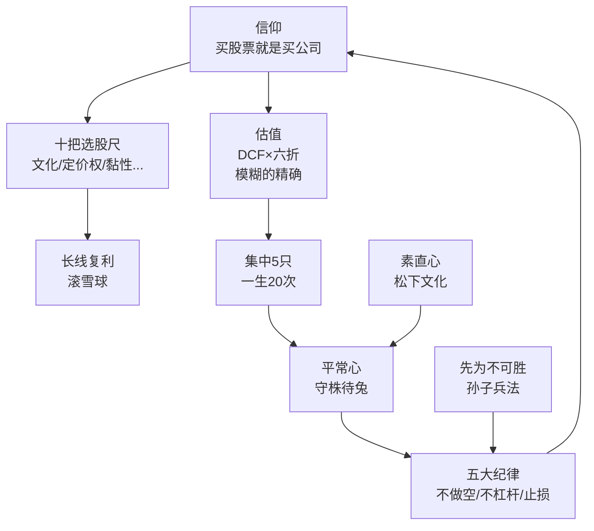

### Z2. 底层逻辑的五个核心（终版）

| 核心 | 内容 |
|------|------|
| 认知 | 投资很难，80—90% 赔钱 |
| 选股 | 十把尺（公司/文化/定价权） |
| 估值 | DCF×六折，毛估估 |
| 纪律 | 不做空/不杠杆/立即止损 |
| 心态 | 平常心/素直心 |

### Z3. 全书一句话（终版）

> **《段永平讲述投资的底层逻辑》是段永平思想的教科书：八章 62 节，从"投资很难"的清醒认知，到"十把尺"的选股体系，到"现金流折现×六折"的估值方法，到"五只集中+平常心"的持有纪律，再到"不做空、不借钱、立即止损"的风险底线——完整组装出"买股票就是买公司"的底层逻辑。29 号给你原汁原味，30 号给你完整体系。**

### Z4. 最终寄语

> 从 [[29《段永平投资问答录》深度解读（详细版）|29 号]] 的语录体到 30 号的教科书体，段永平的投资思想在系列中完成了"双册闭环"。**十把尺选股、六折估值、五只集中、平常心持有、五大纪律保命**——这是 [[28《聪明的投资者》深度解读（详细版）|28 号格雷厄姆]] 的安全边际、[[20《巴菲特的第一桶金》深度解读（详细版）|20 号巴菲特]] 的买公司、[[22《穷查理宝典》深度解读（详细版）|22 号芒格]] 的理性，在中国企业家语境下的最完整组装。**读 30 号，掌握段永平的底层逻辑；配合 29 号，读懂段永平的全部。**

---

*本笔记基于《段永平讲述投资的底层逻辑》（2025 年出版，段永平网络分享系统整理版），覆盖八章 62 节全部内容，并与本系列 29《段永平投资问答录》（姊妹篇）、28《聪明的投资者》（理论源头）、22《穷查理宝典》（能力圈）、13《巴菲特的护城河》（定价权）等形成互链网络。*

*核心收获一句话：**买股票就是买公司——十把尺选股、六折估值、五只集中、平常心持有、五大纪律保命；先为不可胜，以待敌之可胜。***

