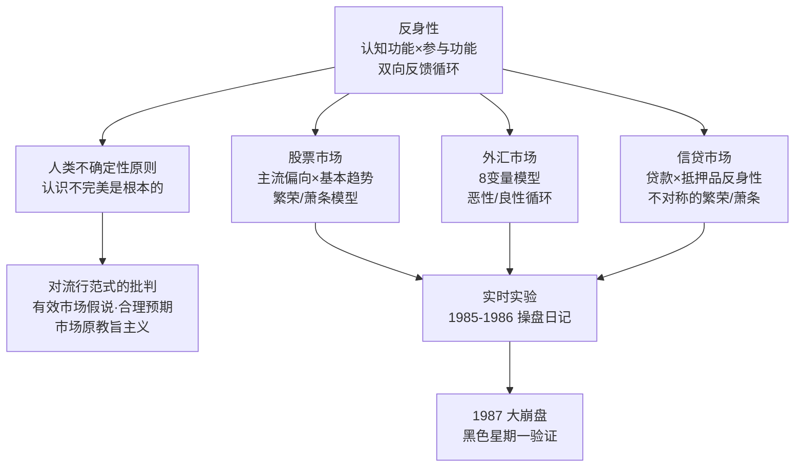
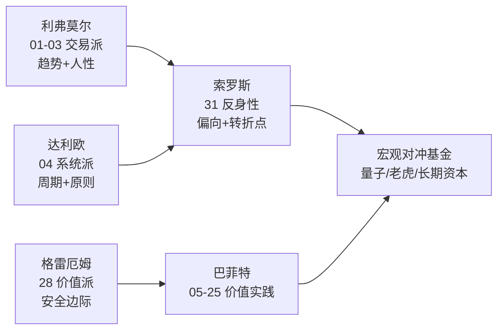
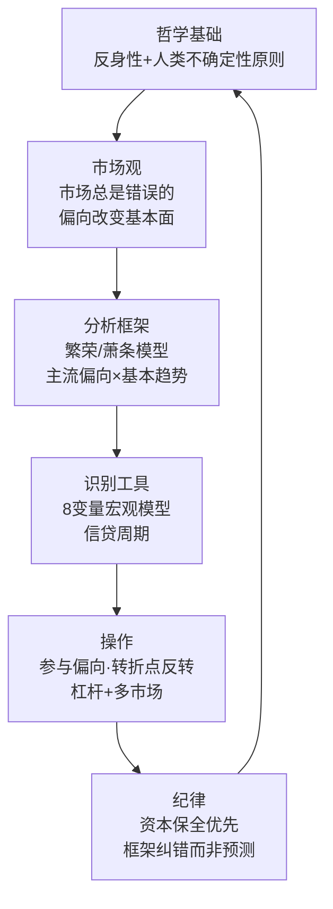
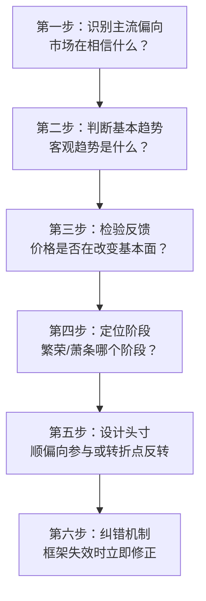
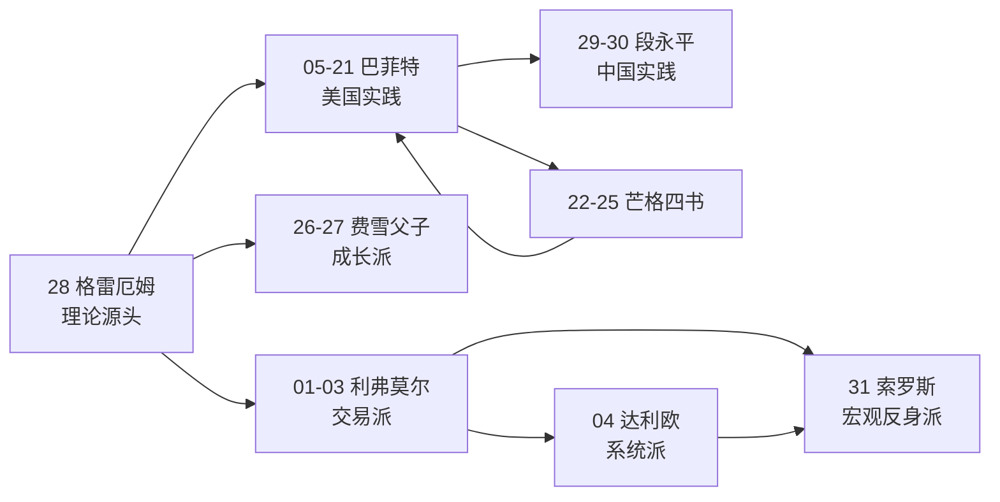
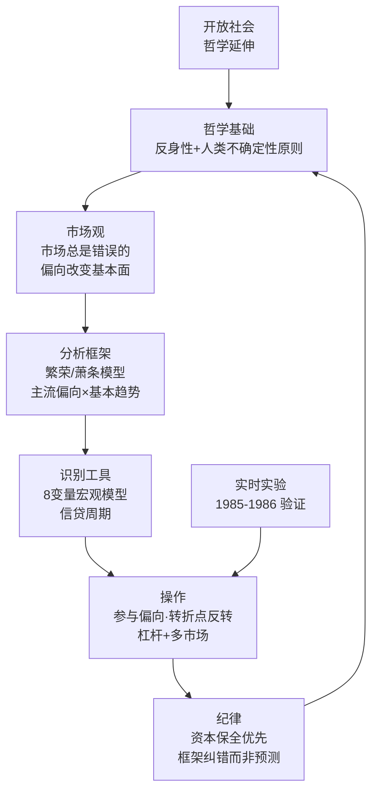
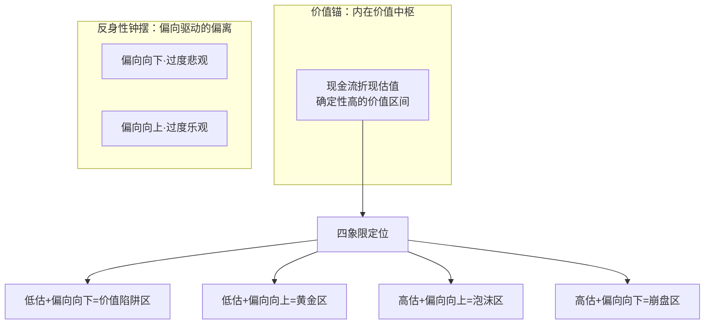

# 31《金融炼金术》深度解读（详细版）

> 乔治·索罗斯——反身性理论：市场永远是错的，参与者的偏向改变基本面

## 📖 本书概览

| 项目 | 内容 |
|------|------|
| 书名 | 金融炼金术（The Alchemy of Finance） |
| 作者 | 乔治·索罗斯（George Soros，1930—）：量子基金创始人，1992 年狙击英镑"打败英格兰银行"，1997 年亚洲金融危机的标志性人物，索罗斯基金管理公司主席；同时是哲学家（卡尔·波普尔的学生）与慈善家 |
| 版本 | 1987 年初版；新版含作者新序言（保罗·沃尔克撰）、新版前言、新版导论 |
| 结构 | 新版导论 + 五部分：①反身性理论（股票/外汇/信贷三市场）②历史透视（国际债务/里根大循环/银行体系/公司大精简）③实时实验（1985.8—1986.11 量子基金操盘日记）④评价（实验评判/社会科学困境）⑤起步（自由市场与管制/国际中央银行/全面改革悖论）+ 1987 大崩盘 + 结束语 |
| 历史地位 | **宏观对冲投资的开山圣经**；反身性理论（Reflexivity）的原始文本；"市场永远是错的" |
| 系列位置 | **宏观反身派**：[[01《股票作手回忆录》读书笔记|01 利弗莫尔（交易）]] → [[04《原则》深度解读（详细版）|04 达利欧（系统）]] → **31 索罗斯（反身性）**——系列第三大宏观/交易体系 |

## 🎯 为什么这本书值得单独解读

- **反身性理论**：参与者的认知与现实的相互反馈——"市场总是失真的，而且这种失真具有左右潜在价值的力量"——价值投资"价格围绕价值波动"之外的第二大范式
- **人类不确定性原则**：认识不可能同时满足真实性、完整性和连贯性——索罗斯对"理性人"假设的根本否定
- **对有效市场假说的宣战**：随机漫步 12 年超额业绩反驳、合理预期理论批判、市场原教旨主义批判
- **繁荣/萧条模型**：自我加强→最终自我毁灭的过程——解释泡沫的唯一理论（有效市场假说无法解释）
- **实时实验**：全书最独特部分——索罗斯 1985.8—1986.11 真实操盘日记（广场协议前后），15 个月基金升值 126%
- **1987 大崩盘**：黑色星期一的完整复盘（卢夫尔协定/日本债券崩盘/组合保险）
- **系列桥梁**：与 04 达利欧（宏观周期）、28 格雷厄姆（安全边际）、01 利弗莫尔（交易心理）形成"三大宏观体系"对照

## 📖 全书结构与核心框架

### 31.0 全书结构总览表

| 源书部分 | 笔记章节 | 核心内容 | 关键概念/案例 |
|---------|---------|---------|--------------|
| 新版序言/前言/导论 | 第1—3章 | 反身性概念/人类不确定性原则/范式批判 | 认知功能 vs 参与功能；市场原教旨主义 |
| 第一部分（第1—3章） | 第4—6章 | 股票/外汇/信贷三市场中的反身性 | 主流偏向；8 变量模型；贷款抵押反身性 |
| 第二部分（第4—8章） | 第7章 | 历史透视：债务危机/里根大循环/银行/公司精简 | 大循环四要素公式；最后的贷款人 |
| 第三部分（第9—13章） | 第8章 | 实时实验：1985.8—1986.11 操盘日记 | 广场协议；基金升值 126%；日本繁荣/萧条 |
| 第四部分（第14—15章） | 第9—11章 | 实验评判/社会科学困境 | 投资成功 vs 预测失败；科学 vs 炼金术 |
| 第五部分（第16—18章）+ 19 章 | 第12—13章 | 自由市场与管制/国际中央银行/改革悖论/1987 崩盘 | 黑色星期一；卢夫尔协定 |
| 结束语 | 第14章 | 价值/自我/开放社会 | 反身性过程必然过度失衡 |

### 31.1 核心框架：反身性理论的完整骨架



## 📑 目录

- [[#第1章 反身性的概念：认知功能与参与功能|第1章 反身性的概念：认知功能与参与功能]]
- [[#第2章 人类不确定性原则|第2章 人类不确定性原则]]
- [[#第3章 对流行范式的批判：市场原教旨主义|第3章 对流行范式的批判：市场原教旨主义]]
- [[#第4章 股票市场中的反身性：繁荣/萧条模型|第4章 股票市场中的反身性：繁荣/萧条模型]]
- [[#第5章 外汇市场中的反身性：8 变量模型|第5章 外汇市场中的反身性：8 变量模型]]
- [[#第6章 信贷与管制的周期：不对称的繁荣/萧条|第6章 信贷与管制的周期：不对称的繁荣/萧条]]
- [[#第7章 里根大循环：历史透视的经典案例|第7章 里根大循环：历史透视的经典案例]]
- [[#第8章 实时实验：量子基金的 15 个月操盘日记|第8章 实时实验：量子基金的 15 个月操盘日记]]
- [[#第9章 实验评判：投资成功与预测失败之谜|第9章 实验评判：投资成功与预测失败之谜]]
- [[#第10章 1987 年大崩盘：黑色星期一的复盘|第10章 1987 年大崩盘：黑色星期一的复盘]]
- [[#第11章 深度专题：科学 vs 炼金术|第11章 深度专题：科学 vs 炼金术]]
- [[#第12章 深度专题：索罗斯 × 系列大师终极对照|第12章 深度专题：索罗斯 × 系列大师终极对照]]
- [[#第13章 深度专题：开放社会与金融炼金术的延伸|第13章 深度专题：开放社会与金融炼金术的延伸]]
- [[#第14章 深度专题：反身性与中医|第14章 深度专题：反身性与中医]]
- [[#第15章 深度专题：国际债务与贷款的集团体制（第四、五章）|第15章 深度专题：国际债务与贷款的集团体制（第四、五章）]]
- [[#第16章 深度专题：自由市场与管制、国际中央银行与全面改革（第十六—十八章）|第16章 深度专题：自由市场与管制、国际中央银行与全面改革（第十六—十八章）]]
- [[#第17章 深度专题：反身性思维的操作手册|第17章 深度专题：反身性思维的操作手册]]
- [[#附录一 索罗斯金句集（40 条精选）|附录一 索罗斯金句集（40 条精选）]]
- [[#附录二 反身性术语速查表|附录二 反身性术语速查表]]
- [[#附录三 系列互链：索罗斯在投资谱系中的位置|附录三 系列互链：索罗斯在投资谱系中的位置]]
- [[#附录四 A 股应用：反身性思维的本土化|附录四 A 股应用：反身性思维的本土化]]
- [[#附录五 读完本书后的 10 个自问|附录五 读完本书后的 10 个自问]]
- [[#附录六 本书案例与数据速查|附录六 本书案例与数据速查]]
- [[#附录七 索罗斯投资年表|附录七 索罗斯投资年表]]
- [[#附录八 实时实验复盘：15 个月的关键决策时间线|附录八 实时实验复盘：15 个月的关键决策时间线]]
- [[#附录九 FAQ：反身性 20 问|附录九 FAQ：反身性 20 问]]
- [[#附录十 反身性 × 系列母题追踪（完整版）|附录十 反身性 × 系列母题追踪（完整版）]]
- [[#附录十一 索罗斯式宏观分析实战模拟：A 股繁荣/萧条定位|附录十一 索罗斯式宏观分析实战模拟：A 股繁荣/萧条定位]]
- [[#附录十二 全书 30 秒版|附录十二 全书 30 秒版]]
- [[#附录十三 索罗斯投资理念 100 条（金融炼金术汇编）|附录十三 索罗斯投资理念 100 条（金融炼金术汇编）]]
- [[#附录十四 索罗斯式投资检查清单（每日/每周/每月）|附录十四 索罗斯式投资检查清单（每日/每周/每月）]]
- [[#附录十五 系列 31 本笔记总览（更新版）|附录十五 系列 31 本笔记总览（更新版）]]
- [[#附录十六 全书 30 秒版（31 号）|附录十六 全书 30 秒版（31 号）]]
- [[#附录十七 反身性 × 系列实战对照：同一市场的四种眼光|附录十七 反身性 × 系列实战对照：同一市场的四种眼光]]
- [[#附录十八 索罗斯与中医：深度对照补充|附录十八 索罗斯与中医：深度对照补充]]
- [[#附录十九 本书关键概念中英对照|附录十九 本书关键概念中英对照]]
- [[#附录二十 反身性思维训练：10 个日常练习|附录二十 反身性思维训练：10 个日常练习]]
- [[#附录二十一 反身性 × 价值投资融合体系：A 股应用|附录二十一 反身性 × 价值投资融合体系：A 股应用]]
- [[#附录二十二 三大战役：狙击英镑、亚洲金融危机、2008 次贷（知乎文风完整拆解）|附录二十二 三大战役：狙击英镑、亚洲金融危机、2008 次贷（知乎文风完整拆解）]]
- [[#总结：金融炼金术的核心（终版）|总结：金融炼金术的核心（终版）]]

## 🔗 双链导读

| 连接主题 | 本书章节 | 关联笔记 |
|---------|---------|---------|
| 宏观体系对照 | 第12章 | [[04《原则》深度解读（详细版）|04 达利欧]] |
| 交易心理 | 第4章 | [[01《股票作手回忆录》读书笔记|01 利弗莫尔]] |
| 市场错误定价 | 第4章 | [[28《聪明的投资者》深度解读（详细版）|28 格雷厄姆]] |
| 周期与泡沫 | 第6章 | [[04《原则》深度解读（详细版）|04 达利欧]] |
| 市场先生 | 第4章 | [[28《聪明的投资者》深度解读（详细版）|28 格雷厄姆]] |
| 反身性 × 博弈 | 第2章 | [[23《查理·芒格的智慧 投资的格栅理论》深度解读（详细版）|23 格栅理论]] |

---

## 第1章 反身性的概念：认知功能与参与功能

### 1.1 反身性的定义

> "反身性的概念其实很简单：在任何包含有思维参与者的情景中，参与者的思想和现实情况之间存在着一种相互影响的关系。"

**两种功能（两种过程）**：

| 功能 | 方向 | 作用 | 已知量 |
|------|------|------|--------|
| 认知功能（认识过程） | 现实 → 思想 | 试图了解真实情况 | 现实是已知量 |
| 参与功能（操纵过程） | 思想 → 现实 | 试图获得想象中的结果 | 参与者的思想是已知量 |

**反身性 = 两种功能的相互干涉**：

> "在提出哪些是已知的而哪些是未知的时候，这两种作用会相互干涉。我将这种两个作用间的相互干涉称之为'反身性'。"

**反馈循环**："我也将反身性想象成参与者的思想和参与者所参与的情景间的反馈循环"——**反身性导致参与者对现实的理解是不完美的，同时参与者的行为也会产生他们无法预知的后果**。

### 1.2 参与者的不完美认识

**旁观者 vs 参与者**：

| 身份 | 认识与现实的关系 |
|------|-----------------|
| 旁观者 | 主张可以有选择性地影响或不影响事实情况 |
| **参与者** | **哪怕仅仅是去试图理解事实情况的行为，都已经改变了现实情况** |

**循环逻辑的本质**：

> "如果参与者的认识是符合事实的，那事实就不会是不可知的……但是这不是真实情况。事实是不可知的，因为参与者的认识往往不对应事实。如果你觉得这听起来像是循环逻辑，那么你就理解对了。"

**未来的事实不能作为知识**：

> "参与者的意识决定了未来的走向，而未来是根据不同个体当前抉择的不同而不同的。因此，未来的事实不能作为独立的真实依据，也就不能被现在的参与者当作知识来使用。"

### 1.3 反身性与经济学理论

**流行范式的困境**：

| 理论 | 主张 | 索罗斯的批判 |
|------|------|-------------|
| 有效市场假说 | 市场价格完全反映所有外在因素 | 与事实不符；"市场总是错误的" |
| 合理预期理论 | 市场整体比任何个体包含更多信息 | 参与者"认为的最大需求"≠"最大需求" |
| 均衡理论 | 市场趋向平衡 | "金融市场会趋于平衡的观点似乎与很多证据相左" |
| 市场原教旨主义 | 市场自行完成资源最优分配 | "危险的意识形态" |

**合理预期理论的致命伤**：

> "参与者并不是遵从他们最大的需求，而是他们认为的最大的需求，这两点是完全不同的。参与者对于事实认知的不完善导致他们的行为可能造成无法预期的后果。"

**市场总是错误的**：

> "事实上，市场总是错误的，他的趋势体现在膨胀期的自我满足以及在衰退期的自我瓦解。因此只有处在转折点时流行倾向才会被证明是错的。"

### 1.4 反身性的适用范围

**普遍条件 vs 特殊形式**（新版导论的自我澄清）：

| 概念 | 性质 |
|------|------|
| 认知/参与功能 | 普遍条件，一直存在 |
| 反身性关系 | 间断出现，在不同时期以不同形式出现 |
| 繁荣/萧条过程 | **反身性最引人注目的特殊形式**（自我强化→最终自我毁灭） |

**反身性何时重要**：

> "使反身性变得有趣的是主流偏差会使用不同的方法，通过市场价格，去影响所谓的市场价格应该反映的供求关系。只有在供求关系受到影响时，反身性才会变得重要到改变事情的走向。"

### 1.5 第1章小结

| 层面 | 结论 |
|------|------|
| 定义 | 认知功能×参与功能的双向反馈 |
| 参与者 | 理解行为本身改变现实 |
| 市场 | 总是错误的，偏向改变基本面 |
| 繁荣/萧条 | 反身性的最引人注目形式 |

---


---

## 第2章 人类不确定性原则

### 2.1 定义：认识的三重不完美

> "此原则认为人们对于他们生活的世界的认识是不可能同时满足真实性、完整性和连贯性的。在人们的思维受到现实限制的情况下，思维是不足以做出完美的决策的；而当思维干扰了决策的情况下，思维就无法控制现实的走向。"

**人类不确定性原则对现实和思维的双重影响**：

| 影响对象 | 结果 |
|---------|------|
| 思维 | 有时不连贯性、永远不完整性 |
| 事件过程 | 加入了与随机性不同的实实在在的未知元素 |

### 2.2 与海森堡测不准原理的异同

| 维度 | 海森堡测不准原理 | 人类不确定性原则 |
|------|-----------------|-----------------|
| 内容 | 量子粒子的位置和动量不能同时测出 | 认识不可能同时满足真实性/完整性/连贯性 |
| 对研究对象的影响 | 原理本身不影响量子行为 | **关于人类行为的理论有可能影响人的行为** |
| 例子 | — | 马克思主义影响历史；市场原教旨主义影响政策；"死亡税"措辞改变国家政策 |

**关键区别**：

> "海森堡测不准原理本身一点都不会影响量子粒子行为……这一点对于人类不确定性原则而言有些不同。关于人类行为的理论有可能会影响人的行为。"

### 2.3 创造性而非不完美

> "我们可能会将其描述为不完美的理解，但称为人类的创造性也许更为合适。不完美的理解听起来有负面的态度；创造性听起来则更鼓舞人心。如果完美的理解是可以达到的，那就没有想象的空间留下了。因此我们生活的这个世界，在某种程度上，就是我们想象出来的。"

### 2.4 自然现象与社会现象之分

| 维度 | 自然现象 | 社会现象（含思维参与者） |
|------|---------|--------------------------|
| 法则 | 独立于人类思想 | 思维在理解与塑造中都更活跃 |
| 行动依据 | — | 人根据对世界的认识行动（认识≠现实） |
| 历史 | 由确定事实构成 | 同一事件对不同参与者意义不同 |
| 科学方法 | 有效（如量子力学） | 有漏洞；历史是故事 |

**科索沃战役的例子**："1389 年科索沃战役的影响在最近南斯拉夫的解体中显得很突出"——**关于过去的传说对于未来是有影响的**。

### 2.5 对波普尔的继承与背离

**继承**：卡尔·波普尔是"对我思想有深远影响的人"——证伪主义、开放社会。

**背离（科学统一原则）**：

> "我不认同我的导师卡尔·波普尔在关于科学统一性主义的问题上的看法，社会科学和自然科学有两个方面是完全不相同的。一方面是研究主题，另一方面是科学家所处的角色。"

**两大障碍**：

| # | 障碍 | 含义 |
|---|------|------|
| 1 | 研究主题 | 反身性理论和人类不确定性原则与人类行为的可预知性相违背 |
| 2 | 科学家角色 | 有关人类行为的理论能够且一定会影响人类的行为 |

**波普尔为何选择科学统一原则**："我相信他这么做是因为他想证明马克思主义是不科学的，而他需要科学统一原则作为论点支撑。但是这不能掩盖他引用了一个错误论点的事实。"

**经济学的困境**："很多经济学理论例如完全竞争理论是无法被证伪的，因为它们建立在一些具体的假设之上……市场原教旨主义似乎钻了空子，使大家忽视了建立在假设上的人造世界和真实世界间的区别。"

### 2.6 第2章小结

| 层面 | 结论 |
|------|------|
| 人类不确定性原则 | 认识不可能同时真实/完整/连贯 |
| vs 海森堡 | 人类理论会影响人类行为 |
| 创造性 | 不完美的理解=想象空间 |
| 波普尔 | 继承证伪与开放社会，背离科学统一原则 |

---

## 第3章 对流行范式的批判：市场原教旨主义

### 3.1 有效市场假说的三重反驳

**第一重：经验反驳（随机漫步）**：

> "随机漫步理论……坚持认为市场将一切未来的发展充分地作了贴现，以至于个别参与者超越或低于市场（平均获利能力）的机会是均等的。……我本人在十二年的时间里持续取得超出市场平均水平的业绩，仅此一端即足以证明其荒谬。"

**第二重：理论反驳（反身性）**：

> "那种觉得市场永远能够做出正确决定的幻觉是建立在参与过程和认知过程间的反身性互动上的。"

**第三重：泡沫反驳（解释力）**：

> "大多数投机投资人都是在以繁荣/萧条序列为特征的金融市场中崭露头角的。反身性理论可以解释这些泡沫现象，然而有效市场假说则不能。"

### 3.2 合理预期理论的批判

> "根据我的理解，这个理论主张市场参与者遵循他们自己的需求，他们假定其他参与者也会做出同样的选择而进行决策。这听起来合理，但实则不然，因为参与者并不是遵从他们最大的需求，而是他们认为的最大的需求。"

**学习机制的质疑**："参与者有可能会理解错误……但是从长远来看所有的参与者都是以现实世界的运行规律作为理论模型的，当他们不能准确地掌握世界运行规律时，他们会从经验中学习，最终他们全都会用几乎相同的运行规律模型。"

**索罗斯的回应**："而我应用了一个不同的运行规律模型，我也成功地将这种模型运用在了市场中，这让合理预期模型显得毫无意义。"

### 3.3 市场原教旨主义：危险的意识形态

**市场原教旨主义的定义**：

> "认为市场在自由的无人调控的情况下能够保证资源最优分配的观念。"

**历史演变**：

| 时代 | 名称 | 状态 |
|------|------|------|
| 19 世纪 | 自由主义 | 意识形态 |
| 20 世纪末 | 市场原教旨主义 | 借美国国家政策变得极有影响力 |
| 现代 | "华盛顿共识" | 官方政策主导 |

**与马克思主义的相似性**：

> "这两种意识形态有一个相同点：他们都声称自己的有效性是基于科学权威之上的。"

**危险性**：

> "我认为市场原教旨主义是一个危险的意识形态，市场原教旨主义是隐藏在金融市场全球化之下的一种意识形态。"

### 3.4 为什么有效市场理论被广泛接受

> "这问题的答案应该与经济学理论的科学追求有关。科学理论往往被假定为能有一定的预测价值，有效市场假说在试图满足这种需求，但反身性理论并没有这么做。反身性理论不但没有这么做，相反的，它还主张这些实际过程是无法被预测的。因此，前一种理论被认为是科学的理论（尽管他是错误的），然而后者没有。"

**命名缘由**："我了解这一点，所以我将我的书命名为《金融炼金术》，以示有别于科学。"

### 3.5 术语的自我批判（新版导论）

**索罗斯承认的术语问题**：

| 问题 | 说明 |
|------|------|
| "反身性"一词过弱 | 会被当作描述普遍条件（认知/参与功能） |
| "繁荣/萧条"不贴切 | 只是最引人注目的特殊形式 |
| 过度强调繁荣/萧条模型 | 信贷与管制周期"弱化了我的论证" |
| 忽视权力关系 | 读奥尔森《权力与繁荣》后的补课 |

**主流偏差的正确理解**：

> "很多评论通过'主流观点极大地影响市场价格'这样的说法来描述反身性。如果那就是反身性的全部，我就真的只是在重申明显的事情。使反身性变得有趣的是主流偏差会使用不同的方法，通过市场价格，去影响所谓的市场价格应该反映的供求关系。"

### 3.6 第3章小结

| 层面 | 结论 |
|------|------|
| 有效市场 | 经验/理论/泡沫三重反驳 |
| 合理预期 | 参与者认为的需求≠最大需求 |
| 市场原教旨主义 | 危险意识形态（华盛顿共识） |
| 命名 | 炼金术=操作成功，非科学真理 |

---

## 第4章 股票市场中的反身性：繁荣/萧条模型

### 4.1 为什么从股票市场谈起

**三个原因**：

| # | 原因 |
|---|------|
| 1 | 25 年投资经历，最熟悉 |
| 2 | 股票市场是检验理论的优越实验室（定量语言/资料易得/参与者观点可见） |
| 3 | 已实地检验过理论 |

**股票市场满足充分竞争的全部标准**：中央市场、同质产品、低廉成本、便捷通讯、足够参与者、内幕交易控制、信息公开——**"要是有什么地方能够实践充分竞争理论的话，股票市场无疑是最合适的"**。

**均衡的失败**："我们未能发现存在着任何均衡点，或者哪怕是价格朝向均衡点的运动趋势的经验证据……均衡概念的最高评价也不过是毫无用处，如果挑剔一点，应该说它根本就是误人之见。"

### 4.2 对三种市场理论的批判

| 理论 | 主张 | 索罗斯的评价 |
|------|------|-------------|
| 随机漫步 | 市场贴现一切未来，无法超越 | "它的错误甚至不值一提"（12 年超额业绩） |
| 技术分析 | 价格由供求决定、过去与未来相关 | "谈不上有什么理论" |
| 基础性分析 | 股票具有真实的基本价值，价格趋向价值 | 忽略了"股票价格影响公司经营状况"的回路 |

**基础性分析的关键遗漏**：

> "股票价格可以影响一家公司的地位，更微妙的方式还有信用评级、消费者接受程度、管理者信誉等等……奇怪的是，股票价格对这些因素的影响却为基础性的方法所忽略。"

**"市场永远正确"的迷信**：索罗斯用两个主张取代它：

> "1、市场总是表现出某种偏向；
> 2、市场能够影响它预期的事件；
> 这两个主张结合起来解释了为什么市场似乎经常能够正确地预期未来事件。"

**关键论断**：

> "我不相信股票价格是潜在价值的被动反映，更不相信这种反映倾向于符合潜在的价值。我坚决主张市场的估价总是失真的，不仅如此——这是对均衡理论的决定性背离——这种失真具有左右潜在价值的力量。"

### 4.3 两个简化概念：基本趋势与主流偏向

| 概念 | 定义 | 说明 |
|------|------|------|
| 基本趋势 | 无论投资者是否意识到都将影响股票价格变化的趋势 | 对价格的影响视参与者观点而定 |
| 主流偏向 | 众多参与者偏向中彼此抵消后剩下的部分 | 在买卖交易中找到表达，是可观察的现象 |

**价格 = 基本趋势 + 主流偏向的合成**：

> "股票价格取决于两个因素：基本趋势和主流偏向，这两者又反过来受股票价格的影响。股票价格和这两个因素之间的相互作用不存在常数关系：在一个函数中的自变量到了另一个函数中就成为因变量。常数关系不存在，均衡的趋势也就无从谈起。"

### 4.4 自我加强与自我矫正

**术语体系**：

| 术语 | 含义 |
|------|------|
| 自我加强的趋势 | 价格变化加强基本趋势（加速） |
| 自我矫正的趋势 | 价格变化与基本趋势相反（减速） |
| 积极的偏向 | 主流偏向推动价格上涨 |
| 消极的偏向 | 主流偏向推动价格下跌 |

**繁荣/萧条的完整过程**：

> "起初是市场参与者意识到了基本趋势，认识上的变化将（通过投资决策）影响股票的市场价格……我们进入了自我加强过程的起点。……只要偏向是自我加强的，预期甚至比股票价格还要升得快。基本趋势愈益受到股票价格的影响，与此同时，股票价格的上涨则愈益依赖主流偏向的支撑，从而造成基本趋势与主流偏向两者同时滑入极其脆弱的状态，最后，价格的变化无法维持主流偏向的预期，于是进入了矫正过程。"

### 4.5 繁荣/萧条的双曲线模型

**两条曲线的含义**：

| 曲线 | 代表 |
|------|------|
| 股票价格曲线 | 市场价格 |
| 每股收益曲线 | 基本趋势的标度 |
| 两曲线之间的差距 | 主流偏向的标示 |

**典型走向**：起初对基本趋势的认定滞后→趋势在每股收益中表现出来→自我加强→差距扩大→脆弱→矫正→逆转→反向自我加强→衰落达到极限→重新反转。

**自我加强过程的重要特征**：

> "典型的情况是，一个自我加强的过程在早期会进行适度的自我矫正，如果在矫正之后趋势仍然得以持续，这一偏向将有机会得到加强和巩固，且不易动摇。当这一过程继续下去时，矫正行为就会逐渐减少，而在趋势顶点逆转的危险则增大了。"

### 4.6 第4章小结

| 层面 | 结论 |
|------|------|
| 两个主张 | 市场总是有偏向；市场影响预期事件 |
| 两个概念 | 基本趋势×主流偏向 |
| 繁荣/萧条 | 自我加强→脆弱→逆转→反向加强 |
| 估值失真 | 失真具有左右潜在价值的力量 |

---


---

## 第5章 外汇市场中的反身性：8 变量模型

### 5.1 货币市场的反身性是连续的

> "反身性相互作用在股票市场中是间歇性的，而在货币市场上却是连续的。我试图证明，自由浮动汇率具有内在的不稳定性，并且，这种不稳定性是累积的，因此自由浮动汇率体系的最终崩溃几乎是毫无疑问的。"

**对传统均衡观的驳斥**：传统认为外汇市场趋向均衡（定值过高→刺激进口抑制出口→回到均衡），但：

> "1973 年实行浮动汇率制度以来的历史经验驳斥了这一观点，不是基本因素确定汇率，倒是汇率找到了一条影响基本因素的途径。"

**德国 70 年代的良性循环**：

> "坚挺的汇率抑制了通货膨胀，工资保持稳定，进口商品价格下降，当出口商品中含有很大份额的（经过加工的）进口商品时，一个国家就能够几乎无限制地保持竞争力，哪怕其货币持续稳定升值。"

### 5.2 恶性循环与良性循环

| 循环 | 特征 |
|------|------|
| 恶性循环 | 货币贬值→通货膨胀→进一步贬值 |
| 良性循环 | 货币升值→通胀抑制→竞争力保持→进一步升值 |

**循环的脆弱性**："自我加强的过程持续越久，它本身也就越脆弱，最终还是要自我逆转，启动一轮反向的自我加强的过程。"

**参与者的偏向的作用**：

> "当因果关系呈现出反身性特点时，参与者的偏向就可能产生、维持或破坏一个恶性的或良性的循环。……当这种情况出现时，投机就成了一股破坏稳定的力量。"

### 5.3 8 变量模型

**四项比率与四个数量指标**：

| 变量 | 含义 | 方向 |
|------|------|------|
| e | 名义汇率（↑=上升趋势） | 比率 |
| i | 名义利率 | 比率 |
| p | 相对于国外的国内价格水平 | 比率 |
| v | 经济活动水平 | 比率 |
| N | 非投机资本流动（↑=流出增加） | 数量 |
| S | 投机资本流动（↓=流入增加） | 数量 |
| T | 贸易平衡（↑=盈余） | 数量 |
| B | 政府预算（↓=赤字） | 数量 |

**最简单的汇率模型**：

```
(↓T + ↑N + ↑S) → ↓e
（贸易、非投机资本、投机资本三个交易项目内的货币交易总额决定了汇率的走向）
```

**投机资本的一般规律**：

```
↑(e + i) → ↓S
（投机资本为上升的利率和上升的汇率所吸引）
```

**汇率作用远大于利率**：

> "只要币值略为下降，总收益就可能变成负值。基于同样的理由，如果一种升值的货币同时拥有利率优势，其总收益将超出金融资产常规业务中所允许的最大期望。"

### 5.4 利率重要性的认知误区

| 时期 | 流行认知 | 事实 |
|------|---------|------|
| 1982—1986 | 资本流向利率最高的货币（美元） | 部分正确 |
| 70 年代末瑞士 | — | 利率调为负值也无法阻止资本流入 |
| 1984 年 11 月前 | 美元坚挺由于高利率吸引 | **利率下调后美元并未颓势，看法声名扫地** |

### 5.5 外汇市场 vs 股票市场：基本因素的作用

| 维度 | 股票市场 | 外汇市场 |
|------|---------|---------|
| 反身性 | 间歇性 | 连续性 |
| 基本因素 | 相对模糊但有关联 | **更为模糊**（贸易平衡最重要但常背离） |
| 例子 | — | **1982—1985 美元坚挺而美国贸易收支不断恶化** |
| 投机地位 | 重要 | 举足轻重 |

### 5.6 第5章小结

| 层面 | 结论 |
|------|------|
| 连续反身性 | 自由浮动汇率内在不稳定且累积 |
| 循环 | 恶性/良性循环自我加强最终逆转 |
| 8 变量 | e/i/p/v + N/S/T/B |
| 投机 | 汇率预期驱动，破坏稳定 |

---

## 第6章 信贷与管制的周期：不对称的繁荣/萧条

### 6.1 信贷与反身性的特殊缘分

> "信贷取决于预期，预期涉及偏向，于是信贷成为偏向介入历史过程并发挥因果作用的主要渠道之一。"

**不对称性**：

> "这种模式是非对称的，繁荣是长期的、逐渐加速的，而萧条是突发的并且往往是灾难性的。"

### 6.2 贷款与抵押品的反身性联系

**抵押的宽泛定义**：

> "它可以是涉及借方信用可靠性的任何东西，而不论是否实际上进行了抵押行为。也就是说，它可以是一宗财产，也可以是可望在将来获得的一笔收入。"

**反身性的机制**：

> "贷款行为可能会影响到抵押品的价值：正是这种联系引起了反身性的过程。"

**认识函数（规范联系）vs 参与函数（任性联系）**：

| 函数 | 方向 | 例子 |
|------|------|------|
| 认识函数 | 对未来事件评估 | 银行评估抵押品价值 |
| 参与函数 | 预期结果影响预期对象 | **贷款行为本身改变抵押品价值** |

**银行家们没有意识到的**：

> "在国际贷款兴盛时，银行家没有认识到贷款国的负债率因为它们自己的贷款活动而得到改善。同样，在集团企业兴旺时，投资商也没有意识到，每股收益的增长取决于他们对其所作的估价。"

### 6.3 信贷周期的完整剖析

**扩张阶段**："强劲增长的经济倾向于增加资产价值和增加未来收入流量……在信贷扩张反身性过程的早期阶段，所涉及的信用金额相对不大，对抵押品估价的影响是可以忽略不计的，这也是为什么这一过程在最初阶段显得很稳健的缘故。"

**转折点**："随着负债总额的累积，信贷总额的权重日增并开始对抵押品价值产生了增值的效应。这个过程一再持续，直到总信贷的增加无法继续刺激经济的那一点为止。"

**崩溃阶段**：

> "此时，抵押价值已经变得过度地依赖于新增贷款的刺激作用，而由于新贷款未能加速增长，抵押品价值就开始下降。抵押价值的侵蚀对经济活动产生了抑制的作用，反过来又加强了对抵押品价值的侵蚀。到了那个阶段，抵押品已经用至极限了，轻微的下跌就可能引发清偿贷款的要求。"

**为什么萧条是灾难性的**：

> "清偿贷款是要花时间的，履行越快，对抵押品价值的影响就越大。在萧条阶段，贷款和抵押品价值间的反身性相互作用被压缩在一个很狭窄的时段内，故而后果很可能是灾难性的。"

### 6.4 实物经济与金融经济

| 经济 | 内容 |
|------|------|
| 实物经济 | 经济活动发生地 |
| 金融经济 | 信贷的扩充和偿还发生地 |
| 联系 | 贷款与抵押价值的反身性相互作用可能把两者联系起来 |

**货币学派盲点**："贷款和经济活动之间的联系是远非直接的（事实上，这已经成为货币学派执迷于货币供给而忽略信贷的最好说明）。"

### 6.5 管制者也是参与者

**金融史的两组参与者**："金融史最好被解释为其中有两组而不是一组参与者的反身性过程：竞争者和管制者。"

**管制者的凡人本质**：

> "一种自然的倾向是把他们视为超人类……事实并非如此，他们也是凡人，具有凡人的所有缺点。他们凭借着不完备的理解从事管理活动，并且他们的行为也会产生意料之外的后果。"

**管制的滞后性**：

> "管制措施通常是为了阻止上一次的灾难，而不是下一次的意外。一方面，在情况迅速发生变化时，管制的缺陷尤其明显；另一方面，缺少管制则导致市场出现更为严重的震荡。"

**管制周期与信贷周期的关系**：

> "市场经济也倾向于在过度管制和管制不足之间来回摆动。管制周期的长度看来是与信贷周期相关的。"

### 6.6 康德拉季耶夫长波的提示

> "人们意识到经济发展存在着更长的周期，通常称其为康德拉季耶夫长波，但它从未得到'科学的'解释。……我坚持认为，自第二次世界大战结束以来的历次衰退都发生于信用扩张期间，目前的这场尚未定型的可能的衰退却可能发生在实体经济中的借款能力收缩的时刻，这在近期的历史上是没有前例的。"

**1982 年以来的困惑**："令我迷惑不解的是繁荣分明已经泄了气，而萧条却仍未发生。"——**中央银行的干预抑制了信贷紧缩的"常规"表现**。

### 6.7 第6章小结

| 层面 | 结论 |
|------|------|
| 信贷反身性 | 贷款改变抵押品价值 |
| 不对称 | 繁荣缓慢、萧条灾难性 |
| 管制者 | 也是参与者，为上次灾难而管制 |
| 长波 | 康德拉季耶夫；1982 年后处于暧昧地区 |

---

## 第7章 里根大循环：历史透视的经典案例

### 7.1 大循环的诞生：矛盾的政策目标

**1982 年的意义**："我认为 1982 年是世界性信贷扩张阶段的终结，但当时我并未意识到美国将成为'最后的贷款人'。"

**里根的两难**：

> "一方面，里根总统通过减税力求削弱政府对经济的干预；可在另一方面，他又希望能够摆出一副军事力量强大的姿态，以对抗他所谓的共产主义的威胁。这样两个目标是不可能在一个平衡的预算框架中同时实现的。"

**两派学说的分裂**：

| 政策 | 学派 | 主张 |
|------|------|------|
| 财政政策 | 供应学派 | 减税刺激产出与缴税意愿→预算恢复平衡 |
| 货币政策 | 货币主义 | 严格控制货币供应→控制通胀 |

**供应学派的缺陷**："这是一种彻头彻尾的反身性论证方式，它含有严重的缺陷……它的有效性取决于能否被广泛接受，也就是说，这是一个全异命题：要么全对，要么全错。"

**1979 年 10 月的历史转折**："联邦储备局改变了它的一贯做法，由控制短期利率转向以控制货币供应为主要目标，一任联邦基金利率自由浮动。"

### 7.2 从高利率到债务危机

**政策冲突的结果**："由于弥补预算赤字的努力被局限在严格的货币供应目标以内，利率上升到了前所未有的高度，其结果是经济非但没有增长，反而因财政与货币政策的对立而陷入了严重的衰退。意料之外的高利率加上衰退，终于导致了 1982 年的国际债务危机。"

**考夫曼的预言**："H·考夫曼早就发出了警告：政府的赤字政策可能会将其他借款人挤出市场。事实证明他是正确的，只不过被挤出市场的首先是外国政府，而不是国内的贷款使用者。"

**1982 年 8 月的转折**："作为对墨西哥债务危机的反应，联邦储备局于 1982 年 8 月放松了货币供应……闸门一旦开启，经济就开始起飞了，复苏的劲头几乎同衰退一样有力。"

### 7.3 大循环的四要素与公式

**自我强化的环形联系**：

> "强有力的经济，强势的货币，庞大的预算赤字，巨额的贸易逆差相互加强，共同创造了无通货膨胀下的经济增长。我将这一环形联系命名为里根大循环。"

**大循环的骨干公式**：

| 公式 | 含义 |
|------|------|
| (↓B + ？) > (↓T + ？) → ↑v | 预算赤字刺激压过贸易赤字阻滞→经济上升 |
| ↓T < ↓(N + S) → ↑e | 资本流入支持美元升值，克服贸易赤字 |
| ↑e → ↓S → ↑e → ↓S | 汇率与投机资本流入的自动放大机制 |

**良性于里而恶性于表**："它从国外吸引来商品和资本以支持强有力的军事态势。这也使得这一循环呈现出良性于里而恶性于表的特点。"

### 7.4 大循环的解体机制

**不可持续的关系**：

> "当投机资本的流入在短期内自动放大时，它也在滋生着利息与本金的负担，这一过程是累积性的，到了一定的程度，将从相反方向发生影响。"

**最终的破坏**：

> "最终，偿债负担的增长（↑N）注定要破坏大循环所赖以维系的那些基本关系，而利率变动的趋势也将走向逆转：到那时，偿债负担和投机资本的逃逸再加上贸易逆差将引发灾难性的美元崩溃。"

**沃尔克的警告**："中央银行的官员们，以沃尔克（时任联储局主席）为其杰出代表，清楚地看到了这中间的危险，并且公开地发出了警告。"

### 7.5 对债务国是噩梦

| 维度 | 债务国的处境 |
|------|-------------|
| 借入时 | 美元廉价 |
| 还本付息时 | 美元昂贵 |
| 出口 | 市场争夺压低价格 |
| 最脆弱国家 | 经济滑入下降螺旋（非洲/秘鲁/多米尼加） |

**日本的最大受益**："日本是目前这种格局的最大受益者，它的境遇几乎就是美国的镜像：巨大的贸易盈余与强劲的国内储蓄同资本输出相平衡。"

### 7.6 第7章小结

| 层面 | 结论 |
|------|------|
| 起源 | 供应学派×货币主义的矛盾 |
| 四要素 | 经济/美元/赤字/逆差相互加强 |
| 公式 | (↓B+?)>(↓T+?)→↑v；↓T<↓(N+S)→↑e |
| 解体 | 偿债负担累积→美元崩溃 |
| 意义 | 反身性过程的宏观历史实证 |

---


---

## 第8章 实时实验：量子基金的 15 个月操盘日记

### 8.1 实验的起点（1985 年 8 月）

**实验的缘起**："反身性原理发展迄今尚未尝试过任何精确的预测，尽管它对我形成自己的观点很有帮助。这次我打算尝试一下。我计划进行一项试验，从现在起记下那些引导我制定投资策略的观点，待本书完成后，在实际过程的基础上对它们进行修订。"

**两种前景构想**：

| 前景 | 内容 | 结局 |
|------|------|------|
| 软着陆 | 美元贬值 20%—25%→挽救外贸→经济复苏→美元底部支持 | 各国协力监控经济 |
| 美元崩溃 | 美元居高不下→外国人不再吸纳→危机降临→全面衰退 | 金融结构大伤元气 |

**索罗斯当时的判断**：偏向"软着陆"，但为崩溃做好准备——**"作为市场的参与者，我必须基于自己对形势发展的估测作出决策"**。

### 8.2 量子基金的特点

| 特点 | 说明 |
|------|------|
| 杠杆运用 | 本金一般投资于股票，杠杆用于商品投机（含股指期货/债券/外汇） |
| 宏观/微观观念 | 宏观决定敞口，微观决定个股 |
| 自有资金心态 | "我管理它仿佛——在很大程度上——那就是我自己的钱" |
| 股票流动性考量 | 本金投流动性较差的股票，避免追加保证金灭顶之灾 |
| 资本保全优先 | "相对于近期赢利，我更关心基金资本的保全" |

**存在主义式的抉择（外汇）**：

> "任何人都不能回避某种形式的外汇投机，不作决策本身也是一种决策……投资者将为回避决策的做法付出相当可观的代价。"

### 8.3 广场协议：生平最大的一笔

**1985 年 9 月 22 日**（五国集团广场旅馆会议）：

> "上周日在广场旅馆举行的五国集团财政部长与中央银行行长的紧急会晤，开创了历史性的局面，它标志了从汇率自由浮动体制向管理浮动体制过渡的转变。读过我关于'外汇市场中的反身性'一章的读者都知道，这只是早晚的事，越早越好。"

**坚守的回报**：

> "我总算能将外汇头寸保存至今，堪堪幸免于难。上周日五国集团财长会议之后，我赚得了平生最大的一笔。接着我全力以赴，在周日晚间继续购入日元……上一周的利润足以补偿近四年来外汇投机的全部亏损，尚且绰绰有余。"

**为什么能坚守**："支撑我坚守外币头寸的，是股票市场的极为明显的疲弱表现……如果衰退已经来临，那么抵押品的价值一定会下跌，而股票市场是最重要的抵押品陈列室。"

**马克 vs 日元的差异**："日元的升值将会比较理智，一般不会超过 200∶1，而马克的估价则很可能大大超出实际而过分高估。"

### 8.4 实验的四个阶段与绩效

**第一阶段（1985.8—1985.12）**：从亏损到广场协议大捷；石油空头（"崩溃来临越迟，其规模也就越大"）；EPIC 破产观察（"EPIC 破产所代表的信用紧缩与抵押品价值下跌，将使建筑业受到压抑"）。

**控制对照阶段（1986.1—1986.7）**：个股观念贡献增强；"百年不遇牛市市场"判断成形。

**第二阶段（1986.7—1986.11）**：日本不动产相关股票操作；繁荣/萧条卷入。

**实验总绩效（11 个月）**：

| 项目 | 升值 |
|------|------|
| 基金股票（合计） | **+126%** |
| S&P 指数期货 | +27% |
| 国库券 | +30% |
| 德国马克 | +23% |
| 日元 | +34% |

### 8.5 第二阶段：日本繁荣/萧条的教训

**第二阶段（1986.7—年底）以亏损告终**：基金股票下跌 2%（S&P+2%/国库券−2%/日本国债+1%/日本股指+5%/马克+10%/日元−2%/黄金+14%/石油+40%）。

**主要错误**：

> "在第二阶段中，我始终受制于一个主要的错误：不愿意承认'百年不遇牛市市场'已经终结，尽管它确实还没有完成应有的表现。日本市场的挫折尤其惨痛，我卷入了一个典型的繁荣/萧条序列，居然未能及时脱身，大错一旦铸成，纠正起来是极为困难的。"

**黄金与石油的补偿**：黄金+14%、石油+40%——**错误方向上的损失由正确方向上的盈利弥补**。

### 8.6 第8章小结

| 层面 | 结论 |
|------|------|
| 实验形式 | 实时记录投资决策 |
| 广场协议 | 反身性框架的胜利（生平最大一笔） |
| 绩效 | 11 个月 +126% |
| 第二阶段的教训 | 繁荣/萧条中未能及时脱身 |

---

## 第9章 实验评判：投资成功与预测失败之谜

### 9.1 必须区分的两种能力

> "要对我的方法进行评判，就必须将获利于金融市场与预言未来过程这两种能力加以区分。"

| 能力 | 表现 |
|------|------|
| 获利于金融市场 | 极其成功（第一阶段 +126%） |
| 预言未来过程 | "令人极其沮丧" |

### 9.2 预测失败的清单

**从未实现的预言**：

| 预言 | 结果 |
|------|------|
| 萧条即将来临 | 从未发生过 |
| 大循环逆转 | 广场协议最后一分钟挽救 |
| 银行体系崩溃（1981 年以来） | 未发生 |
| 石油暴跌后对进口石油征税 | 没有动静 |

**看准的事件**：石油价格暴跌；日本支持美国预算赤字的意愿；未预见但反应正确的广场协议。

### 9.3 投资成功与预测失败的调和

**两种解释**：

| 解释 | 内容 |
|------|------|
| 个人因素 | 决策程序受个人因素影响；实验压力迫使勤奋（"如履薄冰"）；随时记录思想的益处 |
| 主题因素 | 第一阶段恰逢历史性时刻（当局携手干预美元）；框架极好地适应了管制与信贷循环 |

**方法的价值不是预测，而是纠错**：

> "这种方法不能给出有效的预言，但它有助于我修正错误的预测。"

**尼德霍费尔的插曲（赌场系统）**：1981—1982 年政府债券市场像大赌场——"当我终于看清了市场趋向并形成了用以解释市场的假说时，潮流已经转向了……我不得不另找一位依靠计算机程序交易的投资者，维克多·尼德霍费尔"——**方法失效时要知道它的适用边界**。

### 9.4 科学 vs 炼金术的最终界定

> "科学的方法试图按其本来形态来理解事物，炼金术则指望能够获得所期望的目标状态，换一种说法，科学的基本目标是真理——而炼金术，则是操作上的成功。"

**为什么社会现象中炼金术可行**：

> "社会现象却有所不同：介入其中的参与者能够进行思维，事件的进程也并不遵循那种独立于任何人思想的自然规律。相反，参与者的思想构成了一个完整的客观研究对象所不可或缺的成分，这就为不见容于自然科学领域的炼金术打开了大门。即使不掌握科学的知识，也一样有可能取得操作上的成功。"

### 9.5 第9章小结

| 层面 | 结论 |
|------|------|
| 两能力 | 获利（成功）vs 预言（失败） |
| 预言 | 经常失败，框架用于纠错 |
| 炼金术 | 操作上的成功≠科学真理 |
| 适用边界 | 方法失效时要知道边界（尼德霍费尔） |

---

## 第10章 1987 年大崩盘：黑色星期一的复盘

### 10.1 历史背景：1929 vs 1987

| 维度 | 1929 年 | 1987 年 |
|------|---------|---------|
| 跌幅 | 纽约股市约 36% | 道指 508 点/22%（单日） |
| 后续 | 反弹一半→1930—1932 漫长空头（再跌 80%） | 无第二波卖压 |
| 货币当局 | 犯严重错误，未提供充分流动资金 | 迅即反应（"避免重蹈 1929 覆辙"） |

**技术面类似**："下跌的形式与幅度，甚至于每天的价格波动都非常接近。主要差别在于 1929 年的第一波卖压高潮出现后，几天之内又出现了第二波卖压。"

**索罗斯的错误预测**："我认为股票市场崩盘会从日本开始，后来我为这一错误付出了高昂的代价。"——**反身性框架下也会看错转折点**。

### 10.2 崩盘的先决条件：流动性不足

**繁荣与崩盘的逻辑**：

> "股票市场繁荣是流动资本促成的，而流动性不足却是崩盘的先决条件。"

**卢夫尔协定（1987 年 2 月）的关键角色**：

> "在1987年2月达成卢夫尔协定后的最初几个月，美元受到封闭式干预（sterilized intervention）；亦即，国内利率不许受影响。当各国中央银行发现需要吸纳的美元数量超过其所能承受的程度时，他们改变了战术……事实上，他们把该项干预'私有化'了。"

**两种可能的机制**：

| 机制 | 说明 |
|------|------|
| 封闭式干预 | 大量美元流入央行账户，联储未注入等量资金→几个月后显现 |
| 非封闭干预 | 日德当局担心通胀，为控制货币供给致使全球利率上扬 |

**索罗斯的倾向**："我偏向后一种解释，虽然我不排除前者也是可能的影响因素。"

### 10.3 事件序列：从日本债券到黑色星期一

**日本债券市场崩盘居首**：

> "在1987年崩盘的历史年鉴中，日本债券市场崩盘可居于各事件序列之首。9月份债券期货有相当大量的投机多头头寸无法平仓……#89 债券的收益率在触底之前，曾经上涨超越 6%。"

**索罗斯的错误**："我认为债券市场崩跌会蔓延到股票市场，因为股票市场的高估比债券市场更严重，但是我错了。投机资金涌向股票市场在此弥补其所蒙受的亏损。结果，日本股票市场在 10 月份又创新高。"

**美国市场的传导**："美国的公债市场倚赖日本的买盘，当日本人转成卖方，即使数量相当小，我们的债券市场便会应声下跌，其跌幅无法用经济基本面来解释。"

**崩盘导火索（10 月 6 日—19 日）**：

| 日期 | 事件 |
|------|------|
| 10 月 6 日 | 普雷克特发出空头信号，市场下跌 90 点 |
| 10 月 14 日 | 贸易数据令人失望，美元严重卖压 |
| 10 月 15—16 日 | 贝克向德国施压降息；垃圾债券抵税上限消息 |
| 10 月 18 日 | 《纽约时报》报道财政部倡导美元贬值 |
| **10 月 19 日** | **黑色星期一：道指下挫 508 点，总市值 22%** |

**顺势操作的脆弱性**：

> "证券组合保险、期权出售和其他顺势操作的设计，原则上可以使个别参与者以增加系统不稳定为代价来限制个人的风险。然而，覆巢之下岂有完卵。市场陷入混乱，恐慌弥漫，抵押品被迫清算，进一步地打压了市场价值。"——**反身性：个体的风险规避设计加剧了系统性风险**。

### 10.4 各市场的不同命运

| 市场 | 表现 |
|------|------|
| 纽约 | 单日暴跌 22%，此后未再创新低 |
| 伦敦 | 比纽约更脆弱 |
| 瑞士 | 一向稳定却受更大打击 |
| 香港 | 最糟糕：期货投机商操纵停市失败，政府被迫干预 |
| 日本 | **唯一幸免**：大藏省干预+四大券商护盘 |

**日本幸免的机制**："在日本市场再度开盘时，大藏省拨了几个电话，卖单便奇迹般地消失了，大型机构进场积极护盘……它们准许日本四大券商以自己的账户进场操作——事实上，无异于准许四大券商操控股市。"

### 10.5 崩盘的历史意义

**权力转移**：

> "相对地，1987 年大崩盘的历史意义在于它使经济与金融权力从美国转移到日本。在过去，日本的生产一直大于消费，美国的消费则高于生产。日本不断累积海外资产，美国则不断累积债务。"

> "1987 年大崩盘显示了日本的力量，并使得经济与金融权力的转移清晰可见。日本债券市场的崩跌促使美国的债券市场下挫，并导致美国股票市场的崩盘。然而，日本却能独善其身，免于其股票市场的崩跌。"

### 10.6 第10章小结

| 层面 | 结论 |
|------|------|
| 先决条件 | 流动性不足（卢夫尔协定干预） |
| 序列 | 日本债券→美国债券→美国股票 |
| 黑色星期一 | 道指 508 点/22% |
| 日本幸免 | 大藏省+四大券商 |
| 意义 | 权力从美国转移到日本 |

---


---

## 第11章 深度专题：科学 vs 炼金术

### 11.1 两种知识传统的分野

| 维度 | 科学 | 炼金术 |
|------|------|--------|
| 目标 | 真理（按其本来形态理解事物） | 操作上的成功（获得期望的目标状态） |
| 适用领域 | 自然现象 | 社会现象（有思维参与者） |
| 预测能力 | 有（如物理学） | 无（反身性过程不可预言） |
| 失败的例子 | — | 中世纪炼金术试图改变自然物质属性 |

**自然科学的胜利逻辑**："自然规律的运作与人们对它的理解无关，人类影响自然的唯一途径是理解并应用这些规律，这就是自然科学如日中天而炼金术却销声匿迹的原因。"

**社会现象的特殊性**：

> "参与者的思想构成了一个完整的客观研究对象所不可或缺的成分，这就为不见容于自然科学领域的炼金术打开了大门。即使不掌握科学的知识，也一样有可能取得操作上的成功。"

### 11.2 社会科学的两大障碍

| 障碍 | 内容 | 后果 |
|------|------|------|
| 研究主题 | 反身性与人类行为的不可预知性 | 无法满足科学预测性期待 |
| 科学家角色 | 人类行为的理论会影响人类行为 | 理论介入现实 |

**强加自然科学标准的后果**：

> "强加自然科学的标准流程于人文科学会造成一个伪命题和有误导性的结果。这会鼓励诸如合理预期理论这样的不符合实际情况的理论，同时也褫夺了反身性理论的资格。"

### 11.3 实时实验不是科学实验

**两个不满足的条件**：

| 科学实验条件 | 实时实验的现实 |
|-------------|---------------|
| 结果不受实验影响 | 实验本身是重要的个人性因素（压力→勤奋） |
| 理论普遍有效 | 时断时续地发挥作用 |

**索罗斯的声明**："我从未夸耀过自己理论框架的科学身份……反身性的过程不可能用科学的方法来加以预言，历时实验只不过是寻求替代方法的一种审慎的尝试。"

### 11.4 投资成功的哲学解释

**炼金术逻辑下的成功**：投资者不需要"科学真理"，只需要**操作上的成功**——理解参与者的偏向如何自我验证、何时逆转，就能在转折点获利。

**关键能力**："它帮助我在一个事件刚刚开始时就能够领会其重要性"——**不是预测，是早期识别**。

### 11.5 第11章小结

| 层面 | 结论 |
|------|------|
| 科学 | 真理导向，自然领域有效 |
| 炼金术 | 操作导向，社会领域可行 |
| 反身性 | 不可预言，但可早期识别 |
| 实验 | 不是科学实验，是替代方法的尝试 |

---

## 第12章 深度专题：索罗斯 × 系列大师终极对照

### 12.1 三大宏观/交易体系对照



### 12.2 索罗斯 vs 利弗莫尔

| 维度 | 利弗莫尔（01—03） | 索罗斯（31） |
|------|-------------------|-------------|
| 核心 | 趋势交易+市场情绪 | 反身性+主流偏向 |
| 方法 | 关键点/最小阻力线 | 繁荣/萧条序列识别 |
| 失败模式 | 三次破产（做空） | 1987 年判断错误（从日本崩盘） |
| 共同点 | 都靠市场心理赚钱；都大起大落 | 都承认市场不可精确预测 |
| 结局 | 自杀 | 持续成功+慈善 |

### 12.3 索罗斯 vs 达利欧

| 维度 | 达利欧（04） | 索罗斯（31） |
|------|-------------|-------------|
| 核心 | 周期+债务危机模型 | 反身性+繁荣/萧条 |
| 分析单位 | 长期债务周期 | 参与者的偏向 |
| 方法论 | 机器化原则（计算机决策） | 框架化直觉（毛估判断） |
| 对市场 | 市场有规律可循（原则） | 市场总是错误的（偏向） |
| 共同点 | 宏观对冲；都经历 1987/2008；都写书阐述体系 | 都承认债务/信贷的关键性 |

### 12.4 索罗斯 vs 格雷厄姆

| 维度 | 格雷厄姆（28） | 索罗斯（31） |
|------|---------------|-------------|
| 价格与价值 | 价格围绕价值波动（可回归） | **价格创造价值（反身性）** |
| 市场先生 | 情绪化但可利用 | 偏向会改变基本面 |
| 方法论 | 安全边际（防御） | 转折点识别（进攻） |
| 对波动 | 利用波动（低买） | 参与波动（顺偏向而行，在转折点反转） |
| 共同点 | 都反对有效市场假说；都认为市场情绪重要 | 都强调认识的不完美 |

### 12.5 索罗斯 vs 巴菲特

| 维度 | 巴菲特（05—25） | 索罗斯（31） |
|------|-----------------|-------------|
| 市场观 | 市场是称重机（长期） | 市场总是错误的（随时） |
| 时间框架 | 10 年以上 | 数月到数年 |
| 持仓 | 集中持有好公司 | 杠杆+多市场+宏观 |
| 能力圈 | 只做懂的生意 | 宏观框架内什么都可做 |
| 对泡沫 | 回避（"别人贪婪我恐惧"） | **参与泡沫并在转折点退出** |
| 共同点 | 都反对市场原教旨主义；都长期跑赢 | 都承认认识不完美 |

### 12.6 索罗斯 vs 段永平

| 维度 | 段永平（29—30） | 索罗斯（31） |
|------|-----------------|-------------|
| 核心 | 买股票就是买公司 | 市场偏向改变基本面 |
| 估值 | 未来现金流折现 | 不估值，识别繁荣/萧条位置 |
| 市场 | 不预测，看生意 | 必须预测偏向的演化 |
| 杠杆 | 永不 | 核心工具 |
| 共同点 | 都反对市场有效；都用闲钱之外的理由决策 | 都承认参与者认识不完美 |

### 12.7 第12章小结

**索罗斯在系列中的坐标**：**宏观反身派**——与 01 利弗莫尔（交易心理）、04 达利欧（系统周期）并列为系列三大宏观体系；与 28 格雷厄姆（价值）、05—25 巴菲特（实践）、29—30 段永平（中国）形成"市场错误论"的激进版对照。

---

## 第13章 深度专题：开放社会与金融炼金术的延伸

### 13.1 从金融市场到社会哲学

**索罗斯的完整追求**："这本书是有关经济市场的，但是我一生的努力并不局限于这一个舞台。我对哲学的兴趣远在我涉足金融市场之前……我将金融市场当作实验室去验证我的理论。"

### 13.2 反身性过程必然导致过度失衡

> "反身性过程必然导致过度失衡。但要定义什么是过分的界限却是不可能的，因为在涉及价值问题时根本就无所谓标准。"

**价值体系都有缺陷**："任何一种价值体系都包含缺陷。接下去我们就可以去发掘每一特定价值体系的不现实因素，以及这些因素同现实因素之间的相互作用。"

### 13.3 开放社会 vs 封闭社会

**波普尔的遗产**：

| 社会类型 | 特征 |
|---------|------|
| 封闭社会 | 预设的社会形式（集体对个人统治） |
| 开放社会 | 允许社会成员自己决定社会形态 |

**索罗斯的实践**："他重要的成就体现在他致力于鼓励处于新兴加转型的国家转变为'开放社会'，这种开放不仅限于商业自由，更重要的是，它能包容新的观点和不同的思想行为模式。"

### 13.4 自我的反身性

> "在我们是什么同我们自以为是什么之间不存在一致性，但在这两类概念之间却存在着双方的相互作用。……我们自以为是什么同实际上我们究竟是什么，此二者之间的联系是能否获得幸福的关键。"

**索罗斯的自我坦白**："如果我坦白承认自己一直怀有过分夸张自我重要性的想法，读者诸君恐怕也不会觉得意外——直截了当地讲，我幻想自己是神灵或经济改革家，就像凯恩斯，或者更好一些，仿佛爱因斯坦那样的科学家。"

**市场作为现实的锚**："只要我还留在金融市场，这种情况出现的可能性极小，因为市场会时刻提醒我意识到自己的局限。"

### 13.5 第13章小结

| 层面 | 结论 |
|------|------|
| 过度失衡 | 反身性的必然结果 |
| 开放社会 | 允许成员自决社会形态 |
| 自我 | 自以为是什么×实际是什么 |
| 市场 | 提醒局限的锚 |

---

## 第14章 深度专题：反身性与中医

### 14.1 反身性 × 阴阳学说

**索罗斯**：认知功能（现实→思想）与参与功能（思想→现实）的双向反馈——参与者的认识改变其所认识的对象。

**中医**：阴阳互根互用——"阴在内，阳之守也；阳在外，阴之使也"；"重阴必阳，重阳必阴"——认识与对象、正与邪、药与病相互影响。

**共同逻辑**：**观察者与被观察对象不可分割**——西医的"客观"观察在中医看来不存在，正如索罗斯认为市场参与者无法置身事外。

### 14.2 繁荣/萧条 × 阴阳消长

| 索罗斯的繁荣/萧条 | 中医的阴阳消长 |
|------------------|---------------|
| 自我加强阶段 | 阳气渐盛（重阳必阴的前奏） |
| 顶点脆弱 | 重阳必阴、物极必反 |
| 逆转 | 阴阳转化 |
| 反向自我加强 | 阴盛阳衰 |
| 转折点 | 阴阳转化的枢机（"至阴至阳处，变化之极"） |

**共同核心**：**极盛处即转衰之机**——索罗斯在繁荣顶点寻找做空机会，如中医在"重阳必阴"处预见病势转归。

### 14.3 人类不确定性原则 × 医者之辨

**索罗斯**：认识不可能同时满足真实性、完整性和连贯性——参与者的认识永远不完美。

**中医**："医者意也"——辨证永远是不完美的认识；"望闻问切"四诊合参就是为了逼近真相而承认单一手段的不完整。

**共同逻辑**：**承认认识的不完美，用多角度交叉验证逼近真相**。

### 14.4 主流偏向 × 病势与方证

**索罗斯**：主流偏向会自我验证（价格上涨证明上涨预期）——直到转折点。

**中医**：方证相应——"有是证用是方"；误治后病情反而加重（治疗的参与改变了病情本身）——**医生的治疗行为是病情的一部分**，如投资者的交易是市场的一部分。

### 14.5 第14章小结

**索罗斯的反身性与中医医理深度同构**——观察者参与被观察对象（阴阳互根）、极盛必转（重阳必阴）、认识不完美（医者意也）、干预改变对象（方证相应）——**投资与医道，皆在反身性之中**。

---


---

## 附录一 索罗斯金句集（40 条精选）

> 1. "在任何包含有思维参与者的情景中，参与者的思想和现实情况之间存在着一种相互影响的关系。"——反身性定义
> 2. "哪怕仅仅是去试图理解事实情况的行为，都已经改变了现实情况。"——参与者的不完美
> 3. "如果你觉得这听起来像是循环逻辑，那么你就理解对了。"——反身性的循环本质
> 4. "未来的事实不能作为独立的真实依据，也就不能被现在的参与者当作知识来使用。"——知识局限
> 5. "参与者的意识决定了未来的走向，而未来是根据不同个体当前抉择的不同而不同的。"——未来不可知
> 6. "人们对于他们生活的世界的认识是不可能同时满足真实性、完整性和连贯性的。"——人类不确定性原则
> 7. "关于人类行为的理论有可能会影响人的行为。"——vs 海森堡
> 8. "如果完美的理解是可以达到的，那就没有想象的空间留下了。"——创造性
> 9. "因此我们生活的这个世界，在某种程度上，就是我们想象出来的。"——创造性（续）
> 10. "1389 年科索沃战役的影响在最近南斯拉夫的解体中显得很突出。"——历史是故事
> 11. "市场总是表现出某种偏向；市场能够影响它预期的事件。"——两个主张
> 12. "市场的估价总是失真的，不仅如此——这种失真具有左右潜在价值的力量。"——核心论断
> 13. "事实上，市场总是错误的，他的趋势体现在膨胀期的自我满足以及在衰退期的自我瓦解。"——市场错误
> 14. "我本人在十二年的时间里持续取得超出市场平均水平的业绩，仅此一端即足以证明其荒谬。"——随机漫步
> 15. "参与者并不是遵从他们最大的需求，而是他们认为的最大的需求，这两点是完全不同的。"——合理预期批判
> 16. "反身性理论可以解释这些泡沫现象，然而有效市场假说则不能。"——泡沫解释
> 17. "我了解这一点，所以我将我的书命名为《金融炼金术》，以示有别于科学。"——命名
> 18. "市场原教旨主义是一个危险的意识形态。"——市场原教旨主义
> 19. "使反身性变得有趣的是主流偏差会通过市场价格，去影响所谓的市场价格应该反映的供求关系。"——自我批判
> 20. "股票价格和这两个因素之间的相互作用不存在常数关系……常数关系不存在，均衡的趋势也就无从谈起。"——繁荣/萧条
> 21. "只要偏向是自我加强的，预期甚至比股票价格还要升得快。"——自我加强
> 22. "一个自我加强的过程在早期会进行适度的自我矫正……当这一过程继续下去时，矫正行为就会逐渐减少，而在趋势顶点逆转的危险则增大了。"——顶点
> 23. "自由浮动汇率具有内在的不稳定性，并且，这种不稳定性是累积的。"——外汇反身性
> 24. "不是基本因素确定汇率，倒是汇率找到了一条影响基本因素的途径。"——外汇（续）
> 25. "投机资本为上升的利率和上升的汇率所吸引。其中，汇率的作用远大于利率。"——投机规律
> 26. "当因果关系呈现出反身性特点时，参与者的偏向就可能产生、维持或破坏一个恶性的或良性的循环。"——偏向作用
> 27. "信贷成为偏向介入历史过程并发挥因果作用的主要渠道之一。"——信贷
> 28. "繁荣是长期的、逐渐加速的，而萧条是突发的并且往往是灾难性的。"——不对称
> 29. "贷款行为可能会影响到抵押品的价值：正是这种联系引起了反身性的过程。"——贷款抵押
> 30. "管制措施通常是为了阻止上一次的灾难，而不是下一次的意外。"——管制
> 31. "他们也是凡人，具有凡人的所有缺点。他们凭借着不完备的理解从事管理活动。"——管制者
> 32. "强有力的经济，强势的货币，庞大的预算赤字，巨额的贸易逆差相互加强，共同创造了无通货膨胀下的经济增长。我将这一环形联系命名为里根大循环。"——大循环
> 33. "不作决策本身也是一种决策。"——存在主义式抉择
> 34. "我管理它仿佛——在很大程度上——那就是我自己的钱。"——量子基金
> 35. "上一周的利润足以补偿近四年来外汇投机的全部亏损，尚且绰绰有余。"——广场协议
> 36. "这种方法不能给出有效的预言，但它有助于我修正错误的预测。"——方法本质
> 37. "科学的基本目标是真理——而炼金术，则是操作上的成功。"——科学与炼金术
> 38. "即使不掌握科学的知识，也一样有可能取得操作上的成功。"——炼金术可行
> 39. "股票市场繁荣是流动资本促成的，而流动性不足却是崩盘的先决条件。"——1987 崩盘
> 40. "反身性过程必然导致过度失衡。"——结束语

---

## 附录二 反身性术语速查表

| 术语 | 英文 | 定义 |
|------|------|------|
| 反身性 | Reflexivity | 认知功能与参与功能之间的双向反馈循环 |
| 认知功能 | Cognitive function | 现实→思想（认识过程，现实为已知量） |
| 参与功能 | Participating function | 思想→现实（操纵过程，思想为已知量） |
| 人类不确定性原则 | Human Uncertainty Principle | 认识不可能同时满足真实性/完整性/连贯性 |
| 主流偏向 | Prevailing bias | 众多参与者偏向抵消后剩下的部分 |
| 基本趋势 | Underlying trend | 影响股价变化的客观趋势 |
| 自我加强 | Self-reinforcing | 价格变化加强基本趋势（加速） |
| 自我矫正 | Self-correcting | 价格变化与基本趋势相反（减速） |
| 积极的偏向 | Positive bias | 推动价格上涨 |
| 消极的偏向 | Negative bias | 推动价格下跌 |
| 繁荣/萧条 | Boom/bust | 自我加强→最终自我毁灭的过程 |
| 恶性循环 | Vicious circle | 贬值→通胀→贬值 |
| 良性循环 | Benign circle | 升值→通缩→升值 |
| 大循环 | Imperial Circle | 经济/美元/赤字/逆差相互加强 |
| 封闭式干预 | Sterilized intervention | 不影响国内利率的干预 |
| 市场原教旨主义 | Market fundamentalism | 市场自行最优分配的观念 |
| 开放社会 | Open society | 允许成员自决社会形态（波普尔） |
| 炼金术 | Alchemy | 操作上的成功（vs 科学的真理） |

---

## 附录三 系列互链：索罗斯在投资谱系中的位置

### 3.1 与系列每本笔记的连接点

| 系列笔记 | 连接点 |
|---------|--------|
| 01—03 利弗莫尔 | 交易心理；大起大落；市场情绪 |
| 04 达利欧 | 宏观周期/债务危机；1987 与 2008 的共同经历 |
| 05—25 巴菲特 | 市场称重机 vs 市场永远错误；泡沫参与 vs 回避 |
| 13 护城河 | 基本面分析的反身性局限 |
| 16 集中投资 | 索罗斯的多市场杠杆 vs 巴菲特的集中 |
| 22—25 芒格 | 误判心理学；能力圈 vs 反身性 |
| 26—27 费雪 | 基本趋势概念与费雪成长股的呼应 |
| 28 格雷厄姆 | 市场先生 vs 主流偏向；安全边际 vs 转折点 |
| 29—30 段永平 | 不预测 vs 必须预测偏向；买公司 vs 参与宏观 |
| 32 起 | 待解读 |

### 3.2 系列母题追踪（31 号更新）

| 母题 | 28 格雷厄姆 | 04 达利欧 | 01 利弗莫尔 | 31 索罗斯 |
|------|------------|----------|------------|-----------|
| 市场本质 | 称重机（长期） | 机器（有规律） | 情绪（人性） | **永远是错的（偏向）** |
| 价格与价值 | 价格回归价值 | 周期驱动 | 趋势自我实现 | **价格创造价值** |
| 投资者角色 | 旁观者利用波动 | 系统内原则应对 | 参与者顺势 | **参与者改变对象** |
| 泡沫 | 避免（高估不买） | 债务周期阶段 | 参与趋势 | **参与并在转折点退出** |
| 预测 | 不预测 | 原则应对 | 关键点识别 | 不预言，早期识别 |

### 3.3 第3章小结（附录三）

**索罗斯补上系列的关键一角**：在价值派（格雷厄姆→巴菲特→段永平）与系统派（达利欧）、交易派（利弗莫尔）之外，提供了"反身性"这一**第四种市场范式**——市场不是回归价值，而是偏向自我实现、最终自我毁灭。

---

## 附录四 A 股应用：反身性思维的本土化

### 4.1 反身性在 A 股的表现

| A 股现象 | 反身性解释 |
|---------|-----------|
| 2015 年杠杆牛 | 价格上涨→融资增加→价格再涨（自我加强）→强平→崩盘 |
| 白酒/医药抱团 | 基金净值上涨→申购增加→抱团加强 |
| 妖股炒作 | 涨停→吸引跟风→再涨停 |
| 核心资产信仰 | 上涨证明"价值"→更多资金涌入 |
| 房地产周期 | 涨价→抢购→地价涨→再涨价 |

### 4.2 繁荣/萧条的位置识别

| 阶段特征 | 识别信号 | 索罗斯式动作 |
|---------|---------|-------------|
| 早期自我加强 | 趋势确立+初步矫正后继续 | 参与（顺偏向） |
| 中期加速 | 预期比价格涨得还快 | 持有+警惕 |
| 后期脆弱 | 价格依赖偏向支撑、矫正消失 | **逐步退出** |
| 转折点 | 价格无法维持预期 | **反手做空/离场** |
| 反向自我加强 | 下跌自我验证 | 等待极限 |

### 4.3 A 股反身性检查清单

- [ ] 这个上涨有"自我验证"机制吗？（上涨→更多资金→上涨？）
- [ ] 基本面真的在改善，还是只被"证明"在改善？
- [ ] 当前处于繁荣/萧条的哪个阶段？
- [ ] 主流偏向是什么？谁在推动它？
- [ ] 转折点可能的触发因素是什么？
- [ ] 如果我是参与者，我的交易改变了我所交易的对象吗？

### 4.4 反身性 vs 价值投资的 A 股结合

| 场景 | 价值派做法 | 反身性补充 |
|------|-----------|-----------|
| 好公司+泡沫 | 回避/卖出 | 识别泡沫何时自我毁灭，做空或等待 |
| 困境反转 | 低估买入 | 确认偏向是否转向（转折点） |
| 行业景气 | 看现金流 | 警惕景气自我验证的假象 |

---

## 附录五 读完本书后的 10 个自问

1. 我能说出反身性的定义吗？（认知功能×参与功能的双向反馈）
2. 我知道认知功能与参与功能的区别吗？
3. 我能解释"市场总是错误的"吗？
4. 我知道人类不确定性原则与海森堡测不准原理的区别吗？
5. 我能画出繁荣/萧条模型的两条曲线吗？（股价/每股收益+偏向差距）
6. 我知道外汇市场 8 变量模型吗？（e/i/p/v+N/S/T/B）
7. 我能解释贷款与抵押品的反身性联系吗？
8. 我知道里根大循环的四要素与公式吗？
9. 我知道实时实验的绩效与教训吗？（+126%；日本繁荣/萧条未脱身）
10. 我能区分"科学的真理"与"炼金术的操作成功"吗？

---


---

## 附录六 本书案例与数据速查

### 核心数据

| 数字 | 含义 |
|------|------|
| 12 年 | 索罗斯持续超越市场平均（反驳随机漫步） |
| 126% | 实时实验 11 个月基金股票升值 |
| 27%/30%/23%/34% | S&P/国库券/马克/日元（实验第一阶段） |
| 2% | 第二阶段（1986.7—年底）基金下跌 |
| 40%/14% | 石油/黄金（第二阶段补偿） |
| 508 点/22% | 黑色星期一（1987.10.19 道指） |
| 36% | 1929 年崩盘跌幅 |
| 80% | 1930—1932 漫长空头跌幅 |
| 2.6%→6% | 日本 #89 债券收益率（崩盘前） |
| 370 亿美元 | 日本电话电报公司公开筹资 |
| 200:1 | 日元升值预期的理智上限 |
| 15% | 广场协议后美元对马克贬值（初期） |
| 20%—25% | 软着陆所需的美元贬值 |

### 关键日期

| 日期 | 事件 |
|------|------|
| 1973 | 浮动汇率制度开始 |
| 1979.10 | 联储转向货币供应控制 |
| 1982.8 | 墨西哥债务危机；联储放松 |
| 1984 末季 | 大循环临界点 |
| 1985.8 | 实时实验开始 |
| 1985.9.22 | 广场协议（索罗斯生平最大一笔） |
| 1986.1—7 | 控制对照阶段 |
| 1986.7—11 | 第二阶段（日本繁荣/萧条） |
| 1987.2 | 卢夫尔协定 |
| 1987.9 | 日本债券市场崩盘 |
| 1987.10.19 | 黑色星期一 |

---

## 附录七 索罗斯投资年表

| 年份 | 事件 |
|------|------|
| 1930 | 生于匈牙利布达佩斯（犹太家庭） |
| 1944 | 纳粹占领匈牙利（父亲用伪造证件救全家） |
| 1947 | 移居英国；伦敦经济学院（师从卡尔·波普尔） |
| 1956 | 移居美国，华尔街证券分析师 |
| 1969 | 创立双鹰基金（量子基金前身） |
| 1973 | 更名索罗斯基金（后为量子基金） |
| 1985 | 广场协议（生平最大一笔盈利） |
| 1987 | 《金融炼金术》出版；黑色星期一 |
| 1992 | 狙击英镑（"打败英格兰银行"）获利 10 亿美元 |
| 1997 | 亚洲金融危机（泰铢/港元） |
| 2000 | 互联网泡沫（量子基金业绩不佳） |
| 2007—2008 | 次贷危机做空获利 |
| 2011 | 宣布量子基金停止对外管理（只管理自有资金） |
| 2018 | 索罗斯基金管理公司管理 260 亿美元 |

---

## 附录八 实时实验复盘：15 个月的关键决策时间线

### 8.1 第一阶段（1985.8—1985.12）

| 时间 | 决策 | 结果 |
|------|------|------|
| 1985.8 | 实验开始；满仓外币多头+债券空头+石油空头 | 初期亏损（"自实验开始以来亏损严重"） |
| 1985.9.9 | 债券上扬时放弃空头头寸；坚守外币多头 | 部分损失，坚持宏观判断 |
| 1985.9.22 | 广场协议后全力购入日元 | **生平最大一笔**；补偿 4 年外汇亏损 |
| 1985.10+ | 马克多头；S&P 指数（后亏损放弃） | 日元的理智升值 vs 马克可能高估 |

### 8.2 控制对照阶段（1986.1—1986.7）

- 宏观经济判断成熟：减息+美元贬值路径确认
- 个股投资观念贡献增强（"百年不遇牛市市场"成形）
- S&P 指数期货+27%、国库券+30%

### 8.3 第二阶段（1986.7—1986.11）

- 日本不动产相关股票操作（繁荣/萧条卷入）
- 不愿意承认牛市终结（主要错误）
- 年终：基金下跌 2%，但黄金+14%、石油+40% 补偿

### 8.4 时间线的教训

| 教训 | 内容 |
|------|------|
| 坚守宏观判断 | 即使初期亏损，框架内的头寸要拿住 |
| 转折点事件 | 广场协议完美契合框架（虽未预见但反应正确） |
| 繁荣/萧条脱身 | 日本市场的教训：卷入后难以抽身 |
| 分散补偿 | 错误方向的损失由正确方向盈利弥补 |

---

## 附录九 FAQ：反身性 20 问

**Q1：反身性是什么？**
A：认知功能（现实→思想）与参与功能（思想→现实）之间的双向反馈循环——参与者的思想改变其所参与的现实。

**Q2：市场为什么总是错误的？**
A：参与者的偏向会影响价格，价格又影响基本面（"市场能够影响它预期的事件"）——价格不是价值的被动反映，而是价值的一部分。

**Q3：有效市场假说错在哪？**
A：三重错误：经验上（索罗斯 12 年超额业绩）、理论上（市场正确的幻觉建立在反身性上）、解释力上（无法解释泡沫）。

**Q4：人类不确定性原则是什么？**
A：人们对自己生活的世界的认识不可能同时满足真实性、完整性和连贯性——与海森堡测不准原理相似，但人类理论会影响人类行为。

**Q5：繁荣/萧条模型怎么运作？**
A：基本趋势被意识到→自我加强→偏向自我验证→预期涨得比价格快→脆弱→矫正→逆转→反向自我加强→衰落极限→反转。

**Q6：主流偏向和基本趋势是什么？**
A：主流偏向=众多参与者偏向抵消后剩下的部分（可观察）；基本趋势=影响价格的客观趋势。价格=两者合成。

**Q7：外汇市场为什么反身性更强？**
A：货币市场上反身性是连续的（汇率影响通胀/竞争力/贸易），且投机资本占比大——8 变量模型（e/i/p/v+N/S/T/B）。

**Q8：信贷周期为什么不对称？**
A：贷款改变抵押品价值（参与函数）；繁荣时缓慢累积，萧条时清偿压缩在狭窄时段内→灾难性。

**Q9：管制者为什么也是参与者？**
A：管制者凭不完备理解管理，行为产生意外后果——"管制措施通常是为了阻止上一次的灾难"。

**Q10：里根大循环是什么？**
A：经济↑/美元↑/赤字↑/逆差↑相互加强的环形——(↓B+?)>(↓T+?)→↑v；偿债负担最终破坏循环。

**Q11：实时实验证明了什么？**
A：11 个月 +126%（投资成功），但预言频繁失败（萧条从未发生）——方法的价值不是预测而是纠错。

**Q12：科学和炼金术的区别？**
A：科学目标是真理（自然领域有效）；炼金术目标是操作成功（社会领域可行）——金融市场属于后者。

**Q13：1987 崩盘为什么发生？**
A：流动资本促成繁荣，流动性不足（卢夫尔协定干预私有化）是崩盘先决条件；日本债券崩盘→美国债券→黑色星期一。

**Q14：为什么日本幸免 1987 崩盘？**
A：大藏省电话干预+四大券商进场护盘——"无异于准许四大券商操控股市"。

**Q15：索罗斯和巴菲特最大的区别？**
A：巴菲特回避泡沫（市场是称重机）；索罗斯参与泡沫并在转折点退出（市场总是错误的）。

**Q16：反身性理论能预测吗？**
A：不能——"反身性的过程不可能用科学的方法来加以预言"；但它帮助早期识别事件的重要性。

**Q17：索罗斯怎么用杠杆？**
A：本金投股票，杠杆用于商品（股指期货/债券/外汇）——避免被迫追加保证金时灭顶之灾。

**Q18：市场原教旨主义为什么危险？**
A：它声称基于科学权威（如马克思主义一样），主张市场自行最优分配——但建立在假设上的人造世界≠真实世界。

**Q19：A 股怎么用反身性？**
A：识别繁荣/萧条阶段（2015 杠杆牛）；检查"自我验证"机制；在转折点前退出。

**Q20：如果只记住一句话？**
A：**"市场总是表现出某种偏向，而且市场能够影响它预期的事件"——价格创造价值，而非反映价值。**

---

## 总结：金融炼金术的核心

### Z1. 索罗斯投资体系全景



### Z2. 金融炼金术的五个核心

| 核心 | 内容 |
|------|------|
| 反身性 | 认知×参与的双向反馈 |
| 市场错误 | 偏向改变基本面 |
| 繁荣/萧条 | 自我加强→自我毁灭 |
| 信贷 | 贷款改变抵押品价值 |
| 炼金术 | 操作成功而非科学真理 |

### Z3. 全书一句话

> **《金融炼金术》的核心是：市场不是价值的镜子而是价值的参与者——参与者的偏向通过价格改变基本面，形成自我加强最终自我毁灭的繁荣/萧条序列；聪明的投资者不预测转折点，而是在转折点出现时第一个识别它。科学追求真理，金融炼金术追求操作上的成功。**

### Z4. 最终寄语

> 索罗斯用 [[04《原则》深度解读（详细版）|04 达利欧]] 的宏观视野、[[01《股票作手回忆录》读书笔记|01 利弗莫尔]] 的市场直觉，加上波普尔式的哲学深度，构建了系列中唯一"市场错误论"体系——**与 [[28《聪明的投资者》深度解读（详细版）|28 格雷厄姆]] 的"价格回归价值"、[[05《巴菲特的投资心法》深度解读（详细版）|05 巴菲特]] 的"称重机"形成根本性对照：市场不会回归，市场会创造。** 读 31 号，是理解泡沫、危机与转折点的钥匙。

---

*本笔记基于《金融炼金术》（乔治·索罗斯著，1987 年初版，新版含作者导论），覆盖新版导论、五部分正文、实时实验与 1987 大崩盘全部内容，并与本系列 04《原则》（达利欧）、28《聪明的投资者》（格雷厄姆）、01《股票作手回忆录》（利弗莫尔）等形成互链网络。*

*核心收获一句话：**市场总是表现出某种偏向，而且市场能够影响它预期的事件——价格创造价值，转折点识别比预测更重要。***

---

## 第15章 深度专题：国际债务与贷款的集团体制（第四、五章）

### 15.1 国际债务问题的反身性本质

**1982 年国际债务危机的背景**：1974—1982 年间资金向欠发达国家巨额转移——"绝不可能是在周密的计划与组织之下进行的"——**历史性进展常在参与者毫无意识时发生**。

**贷款集团体制的无意形成**：

> "贷款的集团体制的确立也是无意之间的事情，故而并未张扬。"

**债务国的反身性困境**：

| 阶段 | 处境 |
|------|------|
| 借入时 | 美元廉价，利率低 |
| 还本付息时 | 美元昂贵，实际利率高企 |
| 出口竞争 | 市场争夺压低出口商品价格 |
| 调整期 | 出口削弱→拉回第二阶段（倒退） |

**索罗斯对债务危机的框架**：把 1982 年视为"世界性信贷扩张阶段的终结"——**与第三章信贷周期模型的直接应用**。

### 15.2 银行体系的演进（第七章）

**银行作为信贷周期的核心参与者**：

| 特征 | 说明 |
|------|------|
| 银行的自我强化 | "银行急于放贷，因为在实际上，任何一笔新增贷款都可以提高其贷款组合业务的质量水平" |
| 管制演进 | 每一次危机后中央银行都变得更强有力 |
| 中央银行体制 | "为了防范突然的、灾难性的信贷紧缩而不懈努力的历史" |

**银行的反身性**：银行放贷改善自身贷款组合（参与函数）→ 资产价格上升 → 抵押品增值 → 更多放贷——**银行是繁荣/萧条循环的发动机**。

### 15.3 美国的"公司大精简"（第八章）

**并购热潮的反身性特征**：

> "还有从 20 世纪 80 年代中叶开始横扫美国法人圈的并购热潮，与第一章中描述的企业的繁荣有着不同的特征。"

**并购热潮的机制**：股价上涨 → 融资能力增强（股票作为并购货币）→ 并购 → 每股收益提升 → 股价再涨——**与 60 年代集团企业繁荣的呼应**。

**反身性在并购中的体现**：企业价值由市场估价决定，估价又影响企业行为（融资/并购/回购）——**"股票价格可以影响一家公司的地位"**。

### 15.4 第15章小结

| 层面 | 结论 |
|------|------|
| 国际债务 | 贷款集团体制无意形成；债务国被反身性困住 |
| 银行 | 放贷改善自身组合=繁荣发动机 |
| 并购潮 | 估价影响企业行为的典型反身性 |
| 历史 | 重大进展常在参与者毫无意识时发生 |

---

## 第16章 深度专题：自由市场与管制、国际中央银行与全面改革（第十六—十八章）

### 16.1 自由市场与管制

**管制的悖论**：

| 维度 | 无管制 | 有管制 |
|------|--------|--------|
| 优点 | 市场自由运作 | 防止严重震荡 |
| 缺点 | "缺少管制则导致市场出现更为严重的震荡" | "管制措施通常是为了阻止上一次的灾难" |

**索罗斯的立场**：既非自由放任也非全面管制——**承认管制者也是参与者，需要与市场形成反身性互动**。

### 16.2 走向国际性的中央银行

**问题的提出**：金融全球化需要全球化的最后贷款人——1987 年崩盘显示各国央行协调（卢夫尔协定）的力量与局限。

**国际央行的两难**：

| 困难 | 说明 |
|------|------|
| 主权 | 各国货币政策自主权 |
| 协调 | 广场协议/卢夫尔协定都是临时协调 |
| 道德风险 | 干预会鼓励投机 |

### 16.3 全面改革的悖论

**改革的困境**：

> "反身性过程必然导致过度失衡。但要定义什么是过分的界限却是不可能的。"

**改革的悖论**：改革需要共识，共识本身是反身性的产物——**改革方案的有效性取决于能否被广泛接受**（供应学派减税的全异命题教训）。

### 16.4 第16章小结

| 层面 | 结论 |
|------|------|
| 管制 | 管制者也是参与者 |
| 国际央行 | 全球化需要但难以实现 |
| 改革 | 有效性取决于被接受（反身性） |

---

## 第17章 深度专题：反身性思维的操作手册

### 17.1 从理论到操作的六步



### 17.2 索罗斯式决策的四个原则

| 原则 | 内容 |
|------|------|
| 参与而非旁观 | 决策本身是市场的一部分（存在主义式抉择） |
| 框架而非预测 | 不预言，早期识别事件重要性 |
| 资本保全优先 | 本金安全>近期盈利 |
| 纠错而非坚持 | 大错铸成纠正极难，要及早 |

### 17.3 反身性与系列方法论的对照操作

| 场景 | 价值派操作 | 反身性操作 |
|------|-----------|-----------|
| 泡沫初期 | 高估，不买 | 参与（顺偏向） |
| 泡沫中期 | 继续回避 | 持有+警惕 |
| 转折点 | 无法识别 | **第一波识别并反手** |
| 崩盘后 | 便宜了，买入 | 等待反向自我加强的极限 |
| 常态市场 | 现金流折现 | 偏向与趋势的合成分析 |

### 17.4 第17章小结

**反身性操作的本质**：不预测价格，而是**定位自己在繁荣/萧条序列中的位置**——顺偏向参与，在转折点前退出，在极限处反向。

---

## 附录十 反身性 × 系列母题追踪（完整版）

### 10.1 市场本质的五派对照

| 派别 | 代表 | 市场本质 | 操作 |
|------|------|---------|------|
| 价值派·源头 | 28 格雷厄姆 | 称重机（长期回归） | 低估买入 |
| 价值派·实践 | 05—25 巴菲特 | 生意所有权 | 好公司好价格 |
| 交易派 | 01—03 利弗莫尔 | 情绪与趋势 | 顺势关键点 |
| 系统派 | 04 达利欧 | 机器（周期规律） | 原则应对 |
| **宏观反身派** | **31 索罗斯** | **永远错误的偏向** | **转折点反转** |

### 10.2 泡沫解释的对照

| 理论 | 泡沫解释 |
|------|---------|
| 有效市场假说 | 无泡沫（价格总是对的） |
| 格雷厄姆 | 市场先生情绪失控（会回归） |
| 巴菲特 | 别人贪婪我恐惧（回避） |
| 达利欧 | 债务周期阶段（可量化） |
| **索罗斯** | **反身性自我加强→自我毁灭（唯一解释泡沫形成机制的理论）** |

### 10.3 转折点识别的对照

| 大师 | 转折点方法 |
|------|-----------|
| 利弗莫尔 | 关键点/最小阻力线 |
| 巴菲特 | 不识别，看公司 |
| 达利欧 | 指标偏离历史 |
| **索罗斯** | **偏向与趋势的脆弱性（矫正消失/预期超价格）** |

### 10.4 第10章小结（附录十）

**31 号让系列完成了"市场本质"的最后一极**：称重机（格雷厄姆/巴菲特）× 机器（达利欧）× 情绪（利弗莫尔）× **反身性（索罗斯）**——四种范式互相补充，构成完整的市场认知光谱。

---

## 附录十一 索罗斯式宏观分析实战模拟：A 股繁荣/萧条定位

### 11.1 模拟场景：2015 年 A 股杠杆牛

| 阶段 | 信号 | 反身性解释 |
|------|------|-----------|
| 2014 年末 | 券商股暴涨→融资余额上升 | 价格上涨→融资增加→价格再涨 |
| 2015 上半年 | 两市成交破 2 万亿；全民谈股 | 预期比价格涨得还快（自我加强后期） |
| 2015.6 | 去杠杆政策+强平 | 抵押品（保证金）价值下降→强制清偿 |
| 2015.7—8 | 千股跌停→国家队救市 | 反向自我加强+管制者介入 |

**索罗斯式动作**：2015 年 5—6 月（预期远超价格、融资依赖价格）应识别"脆弱状态"——**在矫正消失时逐步退出**。

### 11.2 模拟场景：2020—2021 核心资产抱团

| 阶段 | 信号 |
|------|------|
| 2019—2020 | 基金发行火爆→净值上涨→申购增加 |
| 2021 年初 | 白酒/新能源估值创历史（"赛道信仰"） |
| 2021.2 | 美债收益率上升→抱团瓦解 |

**反身性定位**：抱团=主流偏向自我验证的典型；**转折点触发因素**=流动性预期变化。

### 11.3 索罗斯式检查清单（A 股版）

- [ ] 当前市场的主流偏向是什么？（一句话）
- [ ] 偏向在自我验证吗？（价格在证明预期吗？）
- [ ] 预期比价格涨得快还是慢？（加速=后期）
- [ ] 矫正行为在减少吗？（减少=顶点临近）
- [ ] 什么事件可能触发转折？（流动性/政策/外部冲击）
- [ ] 我的头寸设计对应哪个阶段？
- [ ] 我的纠错机制是什么？（框架失效时怎么办）

### 11.4 第11章小结（附录十一）

**反身性在 A 股的应用不是预测点位，而是定位阶段**——识别主流偏向、判断自我加强的进度、在脆弱状态出现时调整头寸。

---

## 附录十二 全书 30 秒版

**一句话**：市场总是表现出某种偏向，而且市场能够影响它预期的事件——价格创造价值，繁荣/萧条自我实现，转折点识别比预测更重要。

**一个模型**：反身性（认知×参与）→ 繁荣/萧条（自我加强→自我毁灭）。

**三个市场**：股票（主流偏向×基本趋势）、外汇（8 变量恶性/良性循环）、信贷（贷款×抵押品不对称周期）。

**一个实验**：1985.8—1986.11 实时操盘日记，11 个月 +126%，但预言频繁失败——炼金术=操作成功而非科学真理。

**一个案例**：1987 黑色星期一——流动性不足是崩盘先决条件，日本债券崩盘居首，日本独善其身。

**一句话结尾**："科学的基本目标是真理——而炼金术，则是操作上的成功。"

---


---

## 附录十三 索罗斯投资理念 100 条（金融炼金术汇编）

### 哲学与反身性（1—25）

1. 反身性的概念其实很简单：参与者的思想和现实情况之间存在着一种相互影响的关系。
2. 认知功能：思考者试图去了解真实的情况。
3. 参与功能：思考者试图获得一个他们想象中的结果。
4. 在提出哪些是已知的而哪些是未知的时候，这两种作用会相互干涉。
5. 反身性导致参与者对于现实的理解是不完美的。
6. 参与者的行为也会产生他们无法预知的后果。
7. 当我们身为参与者时，哪怕仅仅是去试图理解事实情况的行为都已经改变了现实情况。
8. 事实是不可知的，因为参与者的认识往往不对应事实。
9. 如果你觉得这听起来像是循环逻辑，那么你就理解对了。
10. 未来的事实不能作为独立的真实依据，也就不能被现在的参与者当作知识来使用。
11. 人类不确定性原则：人们对于他们生活的世界的认识是不可能同时满足真实性、完整性和连贯性的。
12. 关于人类行为的理论有可能会影响人的行为。
13. 如果完美的理解是可以达到的，那就没有想象的空间留下了。
14. 我们生活的这个世界，在某种程度上，就是我们想象出来的。
15. 历史是故事，它为巫术、迷信、宗教或其他信仰留有很大空间。
16. 人不是根据现实采取行动的，而是根据他们对世界的认识。
17. 1389 年科索沃战役的影响在最近南斯拉夫的解体中显得很突出。
18. 社会科学和自然科学有两个方面是完全不相同的：研究主题和科学家所处的角色。
19. 强加自然科学的标准流程于人文科学会造成一个伪命题和有误导性的结果。
20. 反身性是一种规则，而不是特例。
21. 繁荣/萧条过程是反身性最引人注目的特殊表现形式。
22. 使反身性变得有趣的是主流偏差会通过市场价格，去影响所谓的市场价格应该反映的供求关系。
23. 反身性过程必然导致过度失衡。
24. 任何一种价值体系都包含缺陷。
25. 市场会时刻提醒我意识到自己的局限。

### 市场与股票（26—50）

26. 股票市场提供了优越的实验场所用于检验理论。
27. 均衡概念的最高评价也不过是毫无用处，如果挑剔一点，应该说它根本就是误人之见。
28. 我坚决主张市场的估价总是失真的。
29. 这种失真具有左右潜在价值的力量。
30. 市场总是表现出某种偏向。
31. 市场能够影响它预期的事件。
32. 人们普遍相信股票市场预期了萧条，实际上应该说它促成了预期中的萧条成为现实。
33. 主流偏向是众多参与者偏向彼此抵消后剩下的部分。
34. 正的偏向导致价格上涨，负的偏向导致下跌。
35. 股票价格的变化可以看成是基本趋势和主流偏向的合成。
36. 常数关系不存在，均衡的趋势也就无从谈起。
37. 市场事件的序列只能解释为历史性的变化过程。
38. 自我加强的趋势会加速。
39. 当偏向自我矫正时，预期和未来股票价格实际变化之间的差异就会缩小。
40. 只要偏向是自我加强的，预期甚至比股票价格还要升得快。
41. 基本趋势愈益受到股票价格的影响，与此同时，股票价格的上涨则愈益依赖主流偏向的支撑。
42. 最后，价格的变化无法维持主流偏向的预期，于是进入了矫正过程。
43. 一个自我加强的过程在早期会进行适度的自我矫正。
44. 当这一过程继续下去时，矫正行为就会逐渐减少，而在趋势顶点逆转的危险则增大了。
45. 股票价格可以影响一家公司的地位：信用评级、消费者接受程度、管理者信誉。
46. 股票价格不是单纯的被动的反应，它在一个同时决定股票价格和公司经营状况的过程中发挥着积极的作用。
47. 随机漫步理论的错误甚至不值一提。
48. 我本人在十二年的时间里持续取得超出市场平均水平的业绩。
49. 技术分析谈不上有什么理论。
50. 基础性分析忽略了股票价格影响公司经营状况的可能。

### 外汇与信贷（51—70）

51. 反身性相互作用在股票市场中是间歇性的，而在货币市场上却是连续的。
52. 自由浮动汇率具有内在的不稳定性，并且这种不稳定性是累积的。
53. 不是基本因素确定汇率，倒是汇率找到了一条影响基本因素的途径。
54. 国内通货膨胀率与货币汇率之间的关系不是单向的而是循环作用的。
55. 将货币贬值的通货膨胀局面称为恶性循环。
56. 将相反的情形称为良性循环。
57. 自我加强的过程持续越久，它本身也就越脆弱。
58. 投机资本为上升的利率和上升的汇率所吸引，其中汇率的作用远大于利率。
59. 只要币值略为下降，总收益就可能变成负值。
60. 1984 年 11 月之前，人们普遍认为美元的坚挺是由于高利率的吸引。然而，利率下调后，美元并没有出现颓势。
61. 信贷取决于预期，预期涉及偏向。
62. 信贷成为偏向介入历史过程并发挥因果作用的主要渠道之一。
63. 繁荣是长期的、逐渐加速的，而萧条是突发的并且往往是灾难性的。
64. 贷款行为可能会影响到抵押品的价值。
65. 抵押可以是涉及借方信用可靠性的任何东西。
66. 银行家没有认识到贷款国的负债率因为它们自己的贷款活动而得到改善。
67. 随着待偿债务总额的累积，还本付息的份额也增加了。
68. 抵押品已经用至极限了，轻微的下跌就可能引发清偿贷款的要求。
69. 在萧条阶段，贷款和抵押品价值间的反身性相互作用被压缩在一个很狭窄的时段内。
70. 货币学派执迷于货币供给而忽略信贷。

### 管制与历史（71—85）

71. 金融史最好被解释为其中有两组而不是一组参与者的反身性过程：竞争者和管制者。
72. 管制者也是凡人，具有凡人的所有缺点。
73. 管制措施通常是为了阻止上一次的灾难，而不是下一次的意外。
74. 缺少管制则导致市场出现更为严重的震荡。
75. 市场经济也倾向于在过度管制和管制不足之间来回摆动。
76. 每一次危机之后中央银行都变得更强有力。
77. 1982 年是世界性信贷扩张阶段的终结。
78. 强有力的经济，强势的货币，庞大的预算赤字，巨额的贸易逆差相互加强，共同创造了无通货膨胀下的经济增长。
79. 我将这一环形联系命名为里根大循环。
80. 供应学派的论证是一种彻头彻尾的反身性论证方式，它含有严重的缺陷。
81. 大循环呈现出良性于里而恶性于表的特点。
82. 偿债负担的增长注定要破坏大循环所赖以维系的那些基本关系。
83. 当投机资本的流入在短期内自动放大时，它也在滋生着利息与本金的负担。
84. 重大历史性进展常常在参与者们毫无意识的情况下发生。
85. 许多重大的历史性进展常常在参与者们毫无意识的情况下发生。

### 操作与实验（86—100）

86. 任何人都不能回避某种形式的外汇投机，不作决策本身也是一种决策。
87. 我管理它仿佛——在很大程度上——那就是我自己的钱。
88. 将绝大部分股本金投资于流动性相对较差的股票，可以避免在被迫追加保证金时遭遇灭顶之灾。
89. 相对于近期赢利，我更关心基金资本的保全。
90. 上一周的利润足以补偿近四年来外汇投机的全部亏损，尚且绰绰有余。
91. 支撑我坚守外币头寸的，是股票市场的极为明显的疲弱表现。
92. 股票市场是最重要的抵押品陈列室。
93. 大错一旦铸成，纠正起来是极为困难的。
94. 这种方法不能给出有效的预言，但它有助于我修正错误的预测。
95. 我的所有预言都完全是尝试性的，必须根据市场的发展时时进行修正。
96. 科学的基本目标是真理——而炼金术，则是操作上的成功。
97. 即使不掌握科学的知识，也一样有可能取得操作上的成功。
98. 股票市场繁荣是流动资本促成的，而流动性不足却是崩盘的先决条件。
99. 覆巢之下岂有完卵。市场陷入混乱，恐慌弥漫，抵押品被迫清算。
100. 我幻想自己是神灵或经济改革家……不过，只要我还留在金融市场，这种情况出现的可能性极小，因为市场会时刻提醒我意识到自己的局限。

---

## 附录十四 索罗斯式投资检查清单（每日/每周/每月）

### 每日 5 分钟

- [ ] 今天市场的主流偏向有变化吗？
- [ ] 我的头寸对应的繁荣/萧条阶段还成立吗？
- [ ] 有没有新事件可能成为转折点触发因素？

### 每周 15 分钟

- [ ] 偏向在自我验证还是开始矫正？（价格在证明预期吗？）
- [ ] 预期与价格的差距在扩大还是缩小？
- [ ] 我的框架有失效迹象吗？（像尼德霍费尔赌场系统那样）

### 每月 30 分钟

- [ ] 宏观 8 变量重新审视（e/i/p/v+N/S/T/B）
- [ ] 信贷周期定位：贷款在扩张还是收缩？
- [ ] 管制者（政策/监管）在做什么？管制周期到哪了？

### 每季 1 小时

- [ ] 繁荣/萧条序列全景复盘
- [ ] 我的错误清单：哪些预测失败了？框架如何修正？
- [ ] 资本保全检查：本金风险敞口是否可控？

### 每年 2 小时

- [ ] 用反身性重读本年市场大事（泡沫/崩盘/政策）
- [ ] 对照系列其他范式（价值/系统/交易）验证结论
- [ ] 更新自己的"主流偏向观察笔记"

---

## 附录十五 系列 31 本笔记总览（更新版）

### 全部已完成笔记

| 编号 | 书名 | 类别 | 状态 |
|------|------|------|------|
| 01—03 | 利弗莫尔三部曲 | 交易派 | ✅ |
| 04 | 原则（达利欧） | 系统派 | ✅ |
| 05—14 | 巴菲特系列（10 本） | 价值派 | ✅ |
| 16—21 | 巴菲特组合/嘉年华等（6 本） | 价值派 | ✅ |
| 22—25 | 芒格四书 | 芒格系 | ✅ |
| 26—27 | 费雪父子 | 成长派 | ✅ |
| 28 | 聪明的投资者（格雷厄姆） | 价值派·源头 | ✅ |
| 29—30 | 段永平双册 | 价值派·中国实践 | ✅ |
| **31** | **金融炼金术（索罗斯）** | **宏观反身派** | ✅ 本书 |
| 32+ | 待解读 | — | ⏳ |

### 系列脉络（更新版）



### 系列规模统计

| 指标 | 数值 |
|------|------|
| 已完成笔记 | 31 本 |
| 全网链接 | 2,000+（预计） |
| 待解读 | 032—169（138 本） |

---

## 附录十六 全书 30 秒版（31 号）

**一句话**：市场总是表现出某种偏向，而且市场能够影响它预期的事件——价格创造价值，繁荣/萧条自我实现，转折点识别比预测更重要。

**一个模型**：反身性（认知×参与）→ 繁荣/萧条（自我加强→自我毁灭）。

**三个市场**：股票（主流偏向×基本趋势）、外汇（8 变量恶性/良性循环）、信贷（贷款×抵押品不对称周期）。

**一个实验**：1985.8—1986.11 实时操盘日记，11 个月 +126%，但预言频繁失败——炼金术=操作成功而非科学真理。

**一个案例**：1987 黑色星期一——流动性不足是崩盘先决条件，日本债券崩盘居首，日本独善其身。

**一句话结尾**："科学的基本目标是真理——而炼金术，则是操作上的成功。"

---


---

## 附录十七 反身性 × 系列实战对照：同一市场的四种眼光

### 17.1 案例：2008 年金融危机

| 大师视角 | 解读 | 操作 |
|---------|------|------|
| 28 格雷厄姆 | 资产大幅低于内在价值 | 捡便宜（但会太早） |
| 05 巴菲特 | 好公司被错杀 | 贪婪买入（危机后） |
| 04 达利欧 | 债务周期顶部破裂 | 原则应对+现金为王 |
| **31 索罗斯** | **信贷繁荣/萧条的反身性顶点** | **做空次贷（2007 年提前布局）** |

### 17.2 案例：2020 年疫情崩盘

| 大师视角 | 解读 | 操作 |
|---------|------|------|
| 28 格雷厄姆 | 恐慌抛售=机会 | 分批买入 |
| 05 巴菲特 | 股灾不改变生意 | 持有+抄底 |
| 04 达利欧 | 现金为王（桥水 2020.3 亏损） | 原则应对 |
| **31 索罗斯** | **流动性危机→反身性下跌→央行干预转折** | **V 型反转参与** |

### 17.3 同一市场的四种眼光的意义

| 维度 | 价值派 | 系统派 | 交易派 | 反身派 |
|------|--------|--------|--------|--------|
| 时间框架 | 10 年 | 周期 | 数周 | 数月—数年 |
| 核心问题 | 值多少钱？ | 在周期哪？ | 趋势在哪？ | **偏向在自我验证吗？** |
| 风险控制 | 安全边际 | 原则 | 止损 | 资本保全+纠错 |
| 适合人群 | 基本面研究者 | 系统思维者 | 盘感交易者 | 宏观思考者 |

### 17.4 第17章小结（附录十七）

**四大范式互补构成完整的投资认知光谱**——同一市场，四种眼光，各自捕获不同的真相维度。31 号补上了"市场如何被参与者改变"的一维。

---

## 附录十八 索罗斯与中医：深度对照补充

### 18.1 反身性 × 辨证的动态性

**索罗斯**：认识函数与参与函数互相干涉——观察改变被观察对象。

**中医**：辨证是动态的——"病之变化，不可胜数"；证随治疗而变（一剂知、二剂已，证变方变）——**医生的辨证本身就是治疗的一部分**。

### 18.2 繁荣/萧条 × 病势传变

| 索罗斯 | 中医 |
|--------|------|
| 自我加强阶段 | 邪气亢盛（实证阶段） |
| 顶点脆弱 | 阳极阴生/壮火食气 |
| 转折点 | 病势转折（正邪交争的枢机） |
| 反向加强 | 邪去正虚/虚证阶段 |
| 早期矫正 | 小柴胡汤和解之机 |

### 18.3 主流偏向 × 误治

**索罗斯**：主流偏向自我验证直到转折点——"价格证明预期"。

**中医**：误治后症状加重反而"验证"了错误辨证（如寒证误用寒药后更寒）——**错误的治疗会自我强化错误的证候认知，直到病势转折**。

### 18.4 人类不确定性原则 × 医者局限

**索罗斯**：认识不可能同时真实/完整/连贯。

**中医**："医之所病，病道多"（《素问》）；"上工十全九"——**承认医者认识的不完美，是辨证的前提**。

### 18.5 第18章小结（附录十八）

**反身性给中医的启示**：医生的诊断与治疗改变病情本身——**"辨证论治"不仅是认识过程，更是参与过程**；警惕"证候自我验证"的误治循环，正如警惕市场偏向的自我验证。

---

## 附录十九 本书关键概念中英对照

| 中文 | English | 说明 |
|------|---------|------|
| 反身性 | Reflexivity | 认知×参与的双向反馈 |
| 认知功能 | Cognitive function | 现实→思想 |
| 参与功能 | Participating function | 思想→现实 |
| 人类不确定性原则 | Human Uncertainty Principle | 认识的三重不完美 |
| 主流偏向 | Prevailing bias | 参与者偏向的总合 |
| 基本趋势 | Underlying trend | 客观趋势 |
| 自我加强 | Self-reinforcing | 趋势加速 |
| 自我矫正 | Self-correcting | 趋势减速 |
| 繁荣/萧条 | Boom/bust | 反身性最引人注目的形式 |
| 良性循环 | Benign circle | 升值→通缩→升值 |
| 恶性循环 | Vicious circle | 贬值→通胀→贬值 |
| 里根大循环 | Imperial Circle | 四要素相互加强 |
| 封闭式干预 | Sterilized intervention | 不影响利率的干预 |
| 市场原教旨主义 | Market fundamentalism | 市场自行最优分配 |
| 开放社会 | Open society | 波普尔概念 |
| 炼金术 | Alchemy | 操作上的成功 |

---

## 附录二十 反身性思维训练：10 个日常练习

1. 观察一个热门板块：主流偏向是什么？谁在推动？
2. 找一个"上涨证明上涨"的例子（自我验证机制）
3. 找一个"下跌证明下跌"的例子（反向自我加强）
4. 分析一次泡沫（2015 杠杆牛/2021 抱团）：转折点触发因素是什么？
5. 反思自己的持仓：我的买入理由在自我验证吗？还是我在证明它？
6. 观察政策：管制者在为"上一次灾难"做什么？
7. 追踪信贷：贷款在扩张还是收缩？（融资余额/社融）
8. 定位阶段：当前市场处于繁荣/萧条的哪一段？
9. 纠错练习：我的框架最近失效过吗？怎么修正的？
10. 跨界思考：用一个中医病案练习反身性分析（证候如何自我验证）

---

## 总结：金融炼金术的核心（终版）

### Z1. 索罗斯投资体系全景（终版）



### Z2. 金融炼金术的五个核心（终版）

| 核心 | 内容 |
|------|------|
| 反身性 | 认知×参与的双向反馈 |
| 市场错误 | 偏向改变基本面 |
| 繁荣/萧条 | 自我加强→自我毁灭 |
| 信贷 | 贷款改变抵押品价值 |
| 炼金术 | 操作成功而非科学真理 |

### Z3. 全书一句话（终版）

> **《金融炼金术》的核心是：市场不是价值的镜子而是价值的参与者——参与者的偏向通过价格改变基本面，形成自我加强最终自我毁灭的繁荣/萧条序列；聪明的投资者不预测转折点，而是在转折点出现时第一个识别它。科学追求真理，金融炼金术追求操作上的成功。**

### Z4. 最终寄语（终版）

> 索罗斯用 [[04《原则》深度解读（详细版）|04 达利欧]] 的宏观视野、[[01《股票作手回忆录》读书笔记|01 利弗莫尔]] 的市场直觉，加上波普尔式的哲学深度，构建了系列中唯一"市场错误论"体系——**与 [[28《聪明的投资者》深度解读（详细版）|28 格雷厄姆]] 的"价格回归价值"、[[05《巴菲特的投资心法》深度解读（详细版）|05 巴菲特]] 的"称重机"形成根本性对照：市场不会回归，市场会创造。** 读 31 号，是理解泡沫、危机与转折点的钥匙。

---

*本笔记基于《金融炼金术》（乔治·索罗斯著，1987 年初版，新版含作者导论），覆盖新版导论、五部分正文、实时实验与 1987 大崩盘全部内容，并与本系列 04《原则》（达利欧）、28《聪明的投资者》（格雷厄姆）、01《股票作手回忆录》（利弗莫尔）等形成互链网络。*

*核心收获一句话：**市场总是表现出某种偏向，而且市场能够影响它预期的事件——价格创造价值，转折点识别比预测更重要。***

---

## 附录二十一 反身性 × 价值投资融合体系：A 股应用

### 21.1 两种范式的互补关系

**破除误解**：索罗斯并不否定"价值"——他反对的是均衡理论（价格精确回归价值），从不否认公司有内在价值：

> "市场的估价总是失真的，不仅如此，这种失真具有左右潜在价值的力量。"

**注意"左右潜在价值"**：价值本身存在，但价值会被偏向推着走——索罗斯做空英镑时英国基本面确实在恶化，做空泰铢时泰国经常账户赤字确实巨大。**索罗斯从不与基本面作对，他与"被偏向推过头的基本面"作对**。

| 维度 | 价值投资（28/05—25/29—30） | 反身性（31） | 结合后的作用 |
|------|---------------------------|-------------|-------------|
| 回答的问题 | 这是什么公司？值多少钱？ | 市场现在处于什么状态？ | 买什么+什么时候 |
| 时间尺度 | 5—10 年 | 数月—数年 | 锚定长期，择时中期 |
| 核心工具 | 现金流折现/护城河/安全边际 | 繁荣/萧条阶段定位 | 估值定锚，偏向定钟摆 |
| 盲区 | 低估可以更低估（价值陷阱） | 不关心公司好坏（可能做空好公司） | 互相补盲 |

**价值投资者的最大盲区不是"看不懂公司"，而是"低估了偏向的持续时间"**——银行股 2018 年就"低估"了，2024 年还在低估；"低估"了七年，多少人死在半路。

### 21.2 价值锚 × 反身性钟摆：四象限模型



**四象限的具体含义**：

| 象限 | 估值状态 | 偏向状态 | A 股例子 | 价值派动作 | 反身性动作 | 结合动作 |
|------|---------|---------|---------|-----------|-----------|---------|
| **A 价值陷阱区** | 低估 | 偏向继续向下（利空不断） | 2018—2024 地产链 | "便宜，买"（危险！） | 不接飞刀 | **等偏向见底信号再买** |
| **B 黄金区** | 低估 | 偏向已见底/转上 | 2013 茅台（反三公后）、2018 年底白酒 | 买入 | 确认转折 | **重仓买入（段永平式重手）** |
| **C 泡沫区** | 高估 | 偏向自我验证（加速） | 2021 年初核心资产、2015 年中小创 | "好公司，拿着"（危险！） | 逐步退出 | **分批卖出（估值到位+偏向过热）** |
| **D 崩盘区** | 高估→暴跌 | 偏向逆转自我毁灭 | 2015 年 6—8 月、2024 年初微盘 | 恐慌卖出 | 等待极限 | **不动（有安全边际底仓不卖）** |

**关键洞察**：价值投资的"安全边际"是静态的（价格 vs 价值），反身性补充的是动态维度（偏向还在加强还是衰竭）——**锚定长期价值，择时中期偏向**。

### 21.3 A 股五大应用场景

#### 场景一：价值陷阱识别——为什么便宜了还跌？

**价值派的困惑**："PE 5 倍的银行/地产，为什么还能跌？"

**反身性的回答**：偏向在自我验证——股价跌→持仓者亏损→止损/赎回→基金被迫卖出→股价再跌；股价跌→信用收缩→抵押品价值降→更多卖出→再跌。

**A 股价值陷阱的典型机制**：

| 机制 | 例子 | 反身性本质 |
|------|------|-----------|
| 机构持仓出清 | 银行/地产 2021—2024 | 下跌→赎回→再下跌的闭环 |
| 业绩下滑预期自我实现 | 消费降级叙事 | 预期→减少消费→业绩真的降 |
| 信用收缩螺旋 | 地产链 | 房价跌→抵押品跌→信贷紧→房价再跌 |
| 政策与情绪互锁 | 教培/互联网 2021 | 政策→恐慌→估值跌→再恐慌 |

**价值陷阱的识别信号**：

| 信号 | 说明 |
|------|------|
| 利空还在"新" | 每次下跌都有新利空（偏向在找理由） |
| 估值下限不断被击穿 | PE 从 8 到 6 到 5，"便宜"的锚在失效 |
| 抄底资金持续亏损 | 每次反弹都被卖压吃掉 |
| 卖盘来源清晰 | 机构赎回/雪球敲入/质押平仓（机械性卖压未结束） |

**何时从陷阱变黄金**：利空钝化（坏消息不再让股价新低）+ 卖盘枯竭（缩量到极致）+ 偏向出现第一个自我否定（乐观叙事开始出现）——**反向自我加强到达极限的信号**。

#### 场景二：抱团泡沫——好公司也会被偏向推过头

**2020—2021 核心资产抱团**的反身性拆解：

| 阶段 | 时间 | 反身性机制 |
|------|------|-----------|
| 自我加强初期 | 2019 | 外资流入→核心资产涨→净值好→申购增加 |
| 加速期 | 2020 | **基金发行火爆→抱团→净值涨→更多申购**（预期比价格涨得快） |
| 脆弱期 | 2021 年初 | 估值创历史（茅台 70 倍 PE）；**"赛道信仰"替代基本面分析** |
| 转折触发 | 2021.2 | 美债收益率上行→DCF 分母变→抱团瓦解 |
| 反向自我加强 | 2021.3 | 净值跌→赎回→卖出→净值再跌 |

**茅台的对照（2013 vs 2021）——同一公司，两种处境**：

| 维度 | 2013 年（反三公） | 2021 年初 |
|------|-----------------|-----------|
| 估值 | 约 9—10 倍 PE（低估） | 70 倍 PE（高估） |
| 偏向 | 极度悲观（利空不断） | 极度乐观（"永远涨"） |
| 基本面 | 预收款下降但库存增值（段永平看懂了） | 业绩仍在增长但透支多年 |
| 反身性位置 | **黄金区（B）** | **泡沫区（C）** |
| 正确动作 | 买入（段永平式） | 卖出/减仓（索罗斯式） |

**同一个公司，2013 年段永平对，2021 年索罗斯对**——锚没变，钟摆变了。

#### 场景三：景气自我验证——信贷与情绪的双重反馈

**A 股行业景气的反身性链条**：

```
行业景气 → 股价涨 → 融资便利（定增/发债容易）→ 产能扩张 → 业绩兑现 → 股价再涨
行业景气 → 基金重仓 → 净值涨 → 申购 → 更多资金 → 股价再涨
```

**典型例子**：

| 行业 | 自我验证链条 | 崩溃触发 |
|------|-------------|---------|
| 2015 互联网+ | 并购→业绩承诺→股价涨→再并购 | 去杠杆/监管 |
| 2020—2021 新能源 | 景气→扩产→股价涨→再融资→再扩产 | 产能过剩/价格战 |
| 2023—2024 光模块/AI | 叙事→估值→叙事（纯情绪阶段） | 业绩不及预期 |

**景气反身性的阶段信号**：

| 阶段 | 信号 | 操作 |
|------|------|------|
| 早期（真景气） | 业绩兑现+估值合理 | 价值投资正常买入 |
| 中期（景气+融资） | 再融资频繁+扩产公告 | 持有但警惕 |
| 后期（纯偏向） | **研报全是"空间测算"没有业绩**；基金发行以行业命名 | 减仓 |
| 崩溃 | 第一份业绩不及预期→戴维斯双杀 | 不接飞刀 |

**戴维斯双杀就是反身性**：业绩降→估值降→股价加速跌（下跌自我验证）。

#### 场景四：危机抄底——反向自我加强何时到极限

**A 股历次危机的极限信号对照**：

| 危机 | 机械性卖压 | 极限信号 | 事后验证 |
|------|-----------|---------|---------|
| 2015.7—8 股灾 | 强平/配资清理 | 千股跌停→国家队入场 | 阶段性底部 |
| 2018.10 | 质押平仓 | 上市公司密集"倡议增持"+政策底（刘鹤讲话） | 2440 政策底+市场底 2019.1 |
| 2020.3 疫情 | 外资抛售 | 流动性危机→美联储无限 QE | V 型反转 |
| 2024.1—2 微盘 | 雪球敲入+量化踩踏 | **雪球敲入大部分完成→DMA 出清→监管干预** | 2 月初反弹 |

**反身性抄底的三个确认**：

| # | 确认 | 含义 |
|---|------|------|
| 1 | 卖压来源可数清 | 雪球敲入还剩多少/质押平仓线在哪/赎回高峰过没过——机械性卖压是"可数清的偏向" |
| 2 | 利空钝化 | 坏消息不再创新低 |
| 3 | 管制者入场 | 索罗斯：管制者也是参与者——国家队/平准基金入场=反身性链条被外力打断 |

**与价值派抄底的区别**：价值派看"够不够便宜"（静态），反身性看"卖压是否出清"（动态）——**两者都满足才重仓**：2018 年底（2440 点估值历史低位+质押出清+政策底）= 黄金区；2021 年地产（估值低但卖压未出清）= 陷阱区。

#### 场景五：困境反转——与 27 号超级强势股的缝合

**27 号（肯尼斯·费雪）的困境投资与反身性是天然一对**：

| 27 号要素 | 反身性补充 |
|----------|-----------|
| 困境（Trouble）：股价暴跌 80% | 反向自我加强的阶段定位（跌到哪一段了？） |
| PSR≤0.75（便宜） | 便宜+偏向见底=黄金区才买 |
| 五层筛选漏斗 | 确认基本面没有"自我毁灭"（价值还在） |
| 卖出两信号"玫瑰何时凋谢" | 偏向重新过热=矫正消失信号 |

**困境反转的完整结合流程**：

```
1. 反身性定位：股价为什么跌？（偏向/基本面/两者）
2. 27 号筛选：PSR 便宜+基本面未毁灭（价值锚）
3. 阶段判断：反向自我加强是否到极限？（利空钝化/卖盘枯竭）
4. 买入：低估 50%+偏向见底 → 重仓
5. 持有：监测偏向转向（利好开始被正反馈）
6. 卖出：估值到位+偏向过热（"玫瑰何时凋谢"）
```

### 21.4 融合操作系统：段永平选股 × 索罗斯择时

#### 买入系统（黄金区 B 才动手）

| 步骤 | 工具 | 来源 |
|------|------|------|
| 1. 选股 | 十把尺（文化/定价权/黏性） | 段永平（29—30） |
| 2. 估值 | 现金流折现×六折（低估 50%+） | 段永平/格雷厄姆 |
| 3. **偏向定位** | **主流偏向一句话+阶段判断** | **索罗斯（31）** |
| 4. **见底确认** | **利空钝化/卖盘枯竭/管制者入场** | **索罗斯** |
| 5. 重仓 | 闲钱+不超 5 只+大跌加仓 | 段永平 |

**A 股黄金区的典型特征（四条件同时满足）**：

- [ ] 估值低于六折买点（价值锚）
- [ ] 主流偏向仍悲观（没人看好）
- [ ] 但利空已钝化（坏消息不跌）
- [ ] 卖盘已枯竭（缩量/出清完成）

#### 持有系统（反身性监测）

持有期间用索罗斯的"矫正消失"信号监测：

| 监测项 | 健康信号 | 危险信号 |
|--------|---------|---------|
| 偏向 | 温和乐观+时有回调 | 一致看多+单边加速 |
| 矫正频率 | 有正常回调（3—5%） | **回调幅度越来越小（矫正消失）** |
| 增量资金 | 理性流入 | 融资余额暴增/基金发行爆款/散户开户潮 |
| 估值 | 合理区间 | 突破历史估值上限 |
| 叙事 | 业绩+基本面 | "这次不一样"/"永远涨" |

#### 卖出系统（三条件触发）

| 触发条件 | 工具 | 例子 |
|---------|------|------|
| 1. 价值到位（估值到锚） | 段永平/格雷厄姆 | 茅台 2021 年 70 倍 PE |
| 2. 偏向过热（矫正消失+情绪指标极端） | 索罗斯 | 基金发行爆款+融资余额新高 |
| 3. 有更好机会（机会成本） | 段永平 | 换到更便宜的黄金区标的 |

**卖出≠清仓**：索罗斯式卖出是"分批+在转折点确认后加速"——第一笔在估值到位时卖（价值锚），第二笔在偏向过热时卖（钟摆），留底仓等转折确认。

#### 风控系统（两家纪律合并）

| 纪律 | 来源 | 内容 |
|------|------|------|
| 不做空 | 段永平 | A 股散户做空工具少且风险大 |
| 不借钱 | 段永平 | 杠杆没有时间 |
| 不懂不做 | 段永平/巴菲特 | 能力圈 |
| **假说可错** | **索罗斯** | **买入逻辑写下来，每季检验，错了就改** |
| **纠错机制** | **索罗斯** | "大错一旦铸成，纠正起来极为困难"——预设纠错条件 |
| 资本保全 | 索罗斯 | 本金优先于盈利 |

### 21.5 A 股反身性的特殊性：管制者权重更大

索罗斯（31 号）的核心观点之一：**"管制者也是参与者"**。A 股是全球管制者权重最大的市场之一：

| A 股特性 | 反身性含义 |
|---------|-----------|
| 政策市 | **政策是偏向的最大制造者**：政策利好→资金涌入→上涨自我验证；政策收紧→反向 |
| 国家队/平准基金 | 管制者直接入场打断反身性链条（2015 救市/2024 汇金增持） |
| 涨跌停/停牌 | 流动性扭曲→偏向无法充分表达→极端后更极端 |
| 散户占比高 | 情绪放大器→偏向更强、矫正更少（泡沫更圆、崩盘更急） |
| 融资融券/雪球/量化 | 机械性卖压的新来源（2024 年 1 月微盘流动性踩踏） |

**A 股式反身性操作要点**：

1. 政策本身是偏向的一部分——分析政策周期（收紧/放松）就是分析偏向周期
2. 国家队入场=反身性链条被外力打断的信号——历史上都是阶段性底部区域（2015.7/2018.10/2024.2）
3. 散户情绪指标是最好的偏向温度计——基金发行量/开户数/两融余额/股吧热度
4. A 股泡沫更圆、崩盘更急——因为涨跌停和散户放大，**"矫正消失"信号出现后动作要更快**

### 21.6 中医对照：价值锚×钟摆 = 正气×邪气

| 结合体系 | 中医对应 | 逻辑 |
|---------|---------|------|
| 价值锚（内在价值） | **正气/胃气** | "有胃气则生"——公司基本面是根本 |
| 反身性偏向 | **邪气/病势** | 邪气可以盛极一时，但不能永恒 |
| 黄金区（低估+偏向见底） | **正虚邪衰，扶正之时** | 买在邪气最弱处 |
| 泡沫区（高估+偏向亢盛） | **邪气亢盛（重阳必阴）** | 卖在阳极将阴处 |
| 价值陷阱（低估+偏向向下） | **正虚邪恋** | 正气虽存但邪气未退，不可急补（不接飞刀） |
| 转折点 | **阴阳转化的枢机** | 重阳必阴/重阴必阳——偏向极处必转 |
| 纠错机制 | **随证治之** | 假说如辨证，证变方变 |
| 利空钝化信号 | **"脉静身凉"** | 病势将退的征兆——利空不再造成新低 |

**最妙的一句对照**：中医说"**大实有羸状，至虚有盛候**"——极端真实的繁荣看起来虚弱，极端虚弱的底部看起来繁荣。**索罗斯在"至虚有盛候"（崩盘前的一片繁荣）时做空，价值投资者在"大实有羸状"（利空弥漫但卖盘枯竭）时买入**——同一个反身性原理，两种应用。

### 21.7 合体版检查清单（反身性 × 价值投资 A 股应用）

**买入前（四关全过才重仓）**：

- [ ] **价值关**（段永平/格雷厄姆）：看得懂？现金流折现×六折，低估 50%+？
- [ ] **偏向关**（索罗斯）：主流偏向是什么？一句话说得清吗？
- [ ] **阶段关**（索罗斯）：繁荣/萧条哪一段？反向自我加强到极限了吗？
- [ ] **信号关**（结合）：利空钝化？卖盘枯竭？管制者入场？矫正开始出现？

**持有中（每月监测）**：

- [ ] 价值锚变了吗？（基本面/护城河）
- [ ] 偏向在自我验证还是开始衰竭？（矫正频率）
- [ ] 情绪指标到什么位置？（基金发行/两融/开户）
- [ ] 我的买入假说还成立吗？（错了就改，索罗斯式）

**卖出时（三触发）**：

- [ ] 估值到位（价值锚）
- [ ] 偏向过热（钟摆极端）
- [ ] 有更好机会（机会成本）

### 21.8 附录二十一小结

**反身性与价值投资不是对手，是互补的两只眼睛**：价值投资回答"买什么"（锚），反身性回答"现在处于什么状态"（钟摆）。**四象限定位（陷阱/黄金/泡沫/崩盘）+ 段永平选股 × 索罗斯择时 + 两家纪律合并（不做空/不借钱/假说可错/纠错机制）**——这是 A 股投资者能把 31 号真正用起来的方式。

---


---

## 附录二十二 三大战役：狙击英镑、亚洲金融危机、2008 次贷（知乎文风完整拆解）

### 22.0 写在前面：为什么拆这三场仗

如果你只读一本讲索罗斯的书，你记住的可能是"反身性"三个字。但如果你想知道反身性到底怎么用，你得看他打的仗。

索罗斯一生有三次标志性的大战：1992 年狙击英镑，1997 年亚洲金融危机，2008 年做空次贷。每一次，他都站在大多数人对面；每一次，他都不是在赌运气，而是在验证一个理论。

这三场仗，分别是反身性理论的三个章节：**第一场验证了"偏向如何自我毁灭一个体系"；第二场验证了"信贷如何把繁荣变成灾难"；第三场验证了"一个长达 25 年的超级泡沫如何终结"**。

让我们一仗一仗地看。

---

### 22.1 第一战：狙击英镑（1992）——一个人对抗一个国家

#### 故事的开头：一个注定要碎的"笼子"

1990 年 10 月，英国做了一个决定：加入欧洲汇率机制（ERM）。

听起来很技术，但你可以把它理解成：英国把自己的货币，关进了一个笼子里。笼子的规则是——英镑兑德国马克的汇率，只能在很小的范围内波动。英国承诺：无论如何，我保持 1 英镑 ≈ 2.95 马克。

为什么要进这个笼子？因为当时欧洲的主流想法是：汇率稳定，贸易就稳定；贸易稳定，欧洲就统一。而德国马克，是当时欧洲最硬的货币——德国央行（Bundesbank）以"反通胀斗士"闻名于世，马克就是"稳定"的代名词。把英镑拴在马克上，等于把英国的信用拴在德国的信用上。

听起来很美。但有一个致命的问题，藏在背景里：**1990 年，德国统一了。**

#### 历史的讽刺：德国的"内部消化"撕裂了欧洲

1990 年，东德并入西德。统一是伟大的，但代价是巨大的——东德的重建需要天文数字的资金。德国央行怎么办？加息，大量发债，把资金吸进德国。

德国利率一高，马克就走强。马克走强，拴在马克上的英镑就难受了：英国必须跟着加息，才能维持汇率稳定。可英国当时正陷在经济衰退里——失业率攀升、制造业萎缩，英国要的是降息刺激经济，不是加息。

这就是索罗斯后来在《金融炼金术》里讲的**反身性困境**：

> 英国维持高利率 → 经济更差 → 英镑更弱 → 市场更确信英镑撑不住 → 更多人抛售英镑 → 英国被迫维持更高利率……

**一个自我加强的死循环**。英国不是被索罗斯打败的，是被自己的承诺打败的——或者说，被"承诺与基本面之间的裂痕"打败的。

#### 索罗斯的布局：不是赌，是"算账"

1992 年 9 月，索罗斯开始动手。他的逻辑链条是这样的：

1. 英镑被高估了大约 20%（基本面 vs 汇率）；
2. 英国经济衰退，撑不起高利率（政治现实）；
3. 德国央行不会真心救英镑（德国自己的通胀压力更大，救英镑=放水=违背德国央行的灵魂）；
4. 所以，ERM 这个笼子，一定会碎。

注意，这里没有一样是"预测"——全都是"现状"。索罗斯做的是：**看清一个必然要崩的体系，然后站在它的对面**。

他动用了大约 100 亿美元做空英镑——这在当时是天文数字，几乎是他基金全部身家的杠杆放大。分批建仓，慢慢加，加到他后来自己说"我们快要超出自己能力范围了"。

#### 黑色星期三：150 亿英镑打水漂

1992 年 9 月 16 日，历史性的一天。

英国政府拼了。英格兰银行动用外汇储备——有说 150 亿英镑，有说更多——疯狂买入英镑，试图托住汇率。当天上午，英国宣布加息，从 10% 加到 12%；市场不为所动，继续抛售。下午，英国再加息到 15%——一天之内加息两次，这是恐慌，不是策略。

**你越用力捍卫，市场越确信你撑不住。**这就是反身性最残酷的一面：捍卫行为本身，成了崩溃的证据。

当晚 7 点，英国宣布：退出 ERM。英镑自由浮动，一夜之间贬值约 15%。

索罗斯这一战赚了大约 10 亿美元。伦敦媒体给他起了个外号：**"The man who broke the Bank of England"——打败英格兰银行的人**。

#### 复盘：索罗斯到底做对了什么

很多年后，人们复盘这一战，喜欢说索罗斯"胆大"。但仔细看，他做对的其实是三件小事：

| 动作 | 本质 |
|------|------|
| 看清体系的裂痕（承诺 vs 基本面） | 反身性的起点：偏向终将被现实击穿 |
| 分批建仓、敢于重仓 | 假说被市场验证后，果断加注 |
| 不跟英格兰银行对骂，只跟基本面站队 | 不预测，只定位 |

还有一件容易被忽略的事：索罗斯这一战从头到尾没有"恨"英镑。他后来在采访里说，他做空英镑时对英国没有情绪——**他只是站在了历史的错误一侧的对面**。

---

### 22.2 第二战：亚洲金融危机（1997）——从曼谷开始的多米诺

#### 故事的开头：一个"亚洲奇迹"的暗面

如果你在 1996 年去曼谷，你会觉得泰国是世界的未来。GDP 年均增长 9%，高楼大厦拔地而起，曼谷街头堵车堵到全世界闻名——堵车，是繁荣的副作用。

泰国做对了什么？对外开放，出口导向，外资涌入。但很少有人注意一个细节：**泰铢，是钉住美元的**。

钉住美元有什么好处？稳定。1990 年代，美元走强，泰铢跟着强，外资觉得泰国"安全"，热钱滚滚而来。泰国央行给的利率又高（10% 上下），于是出现了一个无风险套利游戏：

> 从国外借便宜的美元 → 换成泰铢存进泰国银行 → 吃高利息 → 到期换回美元还债。

只要泰铢不贬值，这个游戏稳赚。于是外资疯狂涌入——1996 年，泰国的外债已经高达 900 多亿美元，而它的外汇储备只有 300 多亿。**短债长投、借外币投本币资产**——这是教科书级的脆弱结构，但繁荣中没人看教科书。

#### 反身性链条：繁荣如何自我喂养

索罗斯在《金融炼金术》里讲过信贷与抵押品的反身性，泰国就是活教材：

> 外资涌入 → 泰国资产价格上涨（股市、楼市）→ 抵押品升值 → 银行更敢放贷 → 经济更热 → 更多外资涌入……

房价涨了，地价涨了，股市涨了，人人都在赚钱。1996 年泰国股市涨幅全球前列，曼谷的写字楼空置率其实已经很高了——但没关系，**价格上涨本身就在"证明"繁荣的合理性**。

这就是繁荣/萧条模型里最危险的一段：**预期涨得比价格还快**。大家买的已经不是"泰国"，是"泰国永远涨"。

#### 转折点：1997 年 5 月的第一声枪响

崩盘的种子早就埋下了：泰国经常账户赤字占 GDP 的 8%——借来的繁荣，总得还。1997 年 2 月，国际投机资金开始试探性攻击泰铢；5 月，泰国央行大规模干预，用外汇储备硬扛，还放话"泰铢绝不贬值"。

**又是那句熟悉的话。**"绝不贬值"四个字一出，等于告诉全世界：我有软肋。

7 月 2 日，泰国终于撑不住了，宣布泰铢浮动。当天，泰铢贬值约 17%。接下来的几个月，多米诺骨牌一张接一张倒下：菲律宾比索、马来西亚林吉特、印尼盾、韩国韩元……

| 国家 | 崩溃时间 | 后果 |
|------|---------|------|
| 泰国 | 1997.7 | 泰铢半年贬值 50%+，银行倒闭潮 |
| 印尼 | 1997.8 起 | 印尼盾贬值 80%+，1998 年苏哈托政权倒台 |
| 韩国 | 1997.11 | 韩元腰斩，外债危机，接受 IMF 570 亿美元援助 |
| 马来西亚 | 1997.7 起 | 马哈蒂尔痛骂索罗斯，实施资本管制 |

香港也没能幸免。1997 年 10 月，港币被攻击，金管局被迫大幅加息捍卫联系汇率；1998 年 8 月，香港政府史无前例地动用约 1181 亿港元入市买股票，才把联系汇率守住。

#### 索罗斯的角色：是猎手，还是哨兵？

马来西亚总理马哈蒂尔公开指责索罗斯"是破坏亚洲经济的罪魁祸首"。索罗斯的回应很平静，大意是：

**我只是在做市场会做的事。泰国的崩溃不是我做出来的，是它的结构决定的——我只是第一个看清并下注的人。**

这话一半是辩白，一半是实话。反身性理论的视角下，亚洲金融危机不是一个坏人造成的，而是一个**信贷繁荣/萧条周期的必然结果**：借来的繁荣，在抵押品贬值的那一刻，就会变成强制清偿的灾难——"繁荣是长期的、逐渐加速的，而萧条是突发的并且往往是灾难性的"（《金融炼金术》第三章）。

索罗斯这一战赚了大约 10 亿美元级别的利润，但他后来多次说，他对亚洲危机的看法是复杂的——他看到了灾难，也看到了自己理论被验证。**一个哲学家型的投资者，最幸福的时刻不是赚钱，而是世界证明你对了。**

#### 复盘：亚洲金融危机给价值投资者的三条警示

| 警示 | 内容 |
|------|------|
| 繁荣有暗面 | GDP 高增长+汇率稳定+外资涌入，可能是借来的繁荣 |
| 固定汇率是承诺 | 任何"绝不贬值"的承诺，都是反身性攻击的靶子 |
| 传染是真切的 | 一个新兴市场的崩溃，会通过资本流动传染给"基本面完全不同"的邻居 |

---

### 22.3 第三战：2008 次贷危机——反身性的完美标本

#### 故事的开头：格林斯潘的低利率与"房价永远涨"

2000 年互联网泡沫破裂，紧接着是 9·11。为了救经济，美联储主席格林斯潘把联邦基金利率一路降到 1%——维持了整整一年。钱变得极其便宜，便宜到什么程度？**借钱几乎不要成本。**

钱总得有个去处。于是，全美国的钱涌向了一个东西：房子。

房价开始涨。2000 年到 2006 年，美国房价翻了一倍多。涨价的逻辑非常"合理"：人口增长、土地稀缺、美国梦……而且，**房价从来没有全国性下跌过**——这是当时所有人心中的"常识"。

#### 反身性链条：美国版的"贷款-抵押品"循环

索罗斯在《金融炼金术》里写过的那个模型，在 2000 年代的美国被完整复刻了一遍：

> 房价涨 → 抵押品升值 → 银行更敢放贷 → 贷款标准放松（次贷出现）→ 更多人买得起房 → 需求增加 → 房价再涨……

注意那个"贷款标准放松"——这是整个链条里最致命的一环。以前买房要 20% 首付、要信用记录；后来呢？零首付、免收入证明、"忍者贷款"（NINJA：No Income, No Job, no Assets——没收入、没工作、没资产也能贷）。

为什么银行敢这么放？因为两个"聪明"的工具：

1. **资产证券化**：银行把房贷打包成 MBS（抵押贷款支持证券），卖给全世界的投资者——风险转嫁出去了，银行只管收手续费；
2. **CDO**：把 MBS 再分层打包，最安全的那层让评级机构评成 AAA——连养老基金都能买。

于是，链条变成了：

> 房价涨 → 抵押品升值 → 放贷标准放松 → 更多人买房 → 房价再涨 → 打包成 MBS/CDO → 全世界资金涌入 → 房价再涨……

**这是一个全球化的反身性机器**。美国的房价，被德国的小镇银行、日本的寿险公司、中国的央行一起抬着。繁荣的规模史无前例——索罗斯后来称之为"超级泡沫"（super-bubble）：一个从 1980 年代就开始累积、横跨 25 年、由信贷扩张驱动的巨型繁荣/萧条。

#### 转折点：2006 年，边际买家消失了

2006 年，美国房价见顶。原因朴素得近乎残忍：**该买房的人都买了，边际买家消失了。**

房价不涨了，问题就来了：次级贷款者的月供重新定价（很多是 2 年固定利率转浮动利率），还款压力陡增；房价不涨，就没法再融资；没法再融资，就违约；违约率上升，MBS 开始贬值；MBS 贬值，CDO 跟着崩；CDO 崩了，持有它们的金融机构巨亏……

2007 年，索罗斯开始做空。这一次，他不是攻击某个汇率，而是攻击整个链条：做空次贷相关的证券、做空金融机构的股票。他事后说，这是他职业生涯中第一次"提前很久"预见到一场危机——**因为这次，反身性理论给出了教科书级的信号：信贷扩张的自我加强已经进入最后阶段，抵押品价值开始依赖新增贷款本身。**

接下来的故事大家都知道了：

| 时间 | 事件 |
|------|------|
| 2007.4 | 新世纪金融（美国第二大次贷机构）破产 |
| 2008.3 | 贝尔斯登被摩根大通收购（每股 2 美元） |
| 2008.9.7 | 房利美、房地美被政府接管 |
| 2008.9.15 | **雷曼兄弟破产**——史上最大破产案 |
| 2008.9.16 | AIG 被政府救助（850 亿美元） |
| 2008.10 | 全球股市崩盘，冰岛国家破产 |

#### 结果：量子基金 2008 年赚了 8%

记住这个数字：**2008 年，全球金融体系差点完蛋，但索罗斯的基金赚了约 8%。**2007 年，他赚了 32%。

不是因为他有内幕，不是因为他运气好，而是因为：**他在 2007 年就看清了信贷周期的位置，然后做空，然后等待。**全世界最聪明的机构（雷曼、贝尔斯登、AIG 的高管们）在链条内部，看不到链条的全貌；索罗斯在链条外面，用反身性看到了全貌。

这里有个特别知乎风格的细节：2008 年 10 月，美国国会听证会上，一位议员质问格林斯潘："你错了吗？"格林斯潘承认："我找到了一个缺陷——我错误地以为，机构的自利会保护股东和公司。我对此感到震惊。"

**连美联储主席都承认自己错了。而索罗斯，在 21 年前的书里就写下了这一切。**

---

### 22.4 三场战役的同一个剧本

把三场战役放在一起，你会发现它们惊人地相似——同一个反身性剧本，演了三遍：

| 幕 | 狙击英镑（1992） | 亚洲金融危机（1997） | 次贷危机（2008） |
|----|-----------------|---------------------|-----------------|
| 第一幕：一种"正确"的叙事 | 欧洲一体化需要固定汇率 | 亚洲奇迹、泰铢钉住美元 | 房价永远涨、美国梦 |
| 第二幕：偏向自我验证 | 捍卫承诺=耗尽储备 | 热钱套利=繁荣假象 | 抵押品升值=贷款标准放松 |
| 第三幕：脆弱性积累 | 英国衰退+高利率困境 | 外债 900 亿 vs 储备 300 亿 | 次贷+CDO+全球杠杆 |
| 第四幕：转折点 | 德国统一撕裂 ERM | 经常账户赤字+边际买盘枯竭 | 房价见顶+边际买家消失 |
| 第五幕：反向自我加强 | 英镑贬值螺旋 | 货币崩溃+区域传染 | 违约→MBS 崩→机构破产 |
| 第六幕：管制者介入 | 英国退出 ERM | IMF 援助+资本管制 | 政府接管+无限 QE |

**索罗斯的每一次胜利，都是同一句话的胜利：**

> "市场总是表现出某种偏向，而且市场能够影响它预期的事件。"

英镑的贬值预期，通过抛售变成了现实；泰铢的崩溃预期，通过资本外逃变成了现实；次贷的违约预期，通过 CDO 的连锁反应变成了现实。**索罗斯不是预言家，他是第一个看懂"预言如何自我实现"的人，然后站在自我实现的正确一侧。**

---

### 22.5 尾声：从"赚到钱"到"证明理论"

1992 年，索罗斯 62 岁，赚了 10 亿美元，全世界叫他"打败英格兰银行的人"。

1997 年，索罗斯 67 岁，赚了约 10 亿美元级别的利润，被半个亚洲骂成"金融大鳄"。

2008 年，索罗斯 78 岁，赚了 8%，然后做了一件让很多人意外的事：**他把大部分财富捐了出去**——过去 30 年，他在慈善上花了超过 180 亿美元。

有人问他为什么。他的回答其实在《金融炼金术》的结束语里早就写好了：

> "直截了当地讲，我幻想自己是神灵或经济改革家……不过，只要我还留在金融市场，这种情况出现的可能性极小，因为市场会时刻提醒我意识到自己的局限。"

这句话值得读三遍。**索罗斯的狂妄是"我知道市场会错"，他的谦卑是"我知道我也会错"**——所以他才需要反身性：不是用来预测，而是用来在自己错的时候，第一个知道。

三场战役，一个理论。从 1992 到 2008，世界换了三轮主角，剧本从未变过。

**下一次开场的时候，希望你已经读懂了剧本。**

