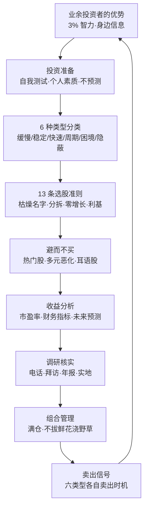
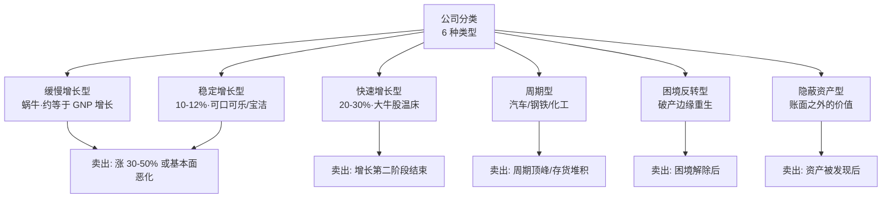
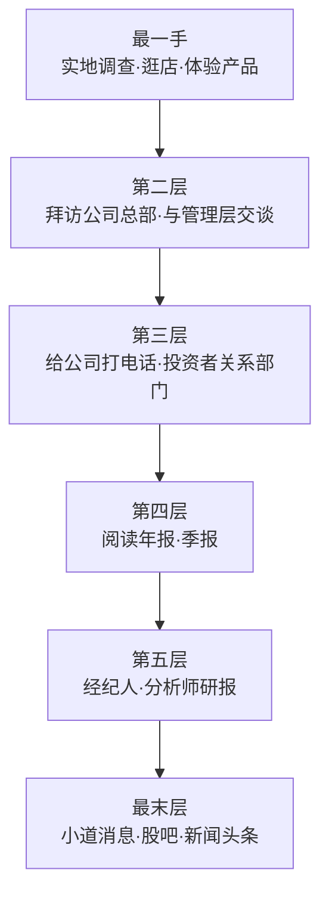
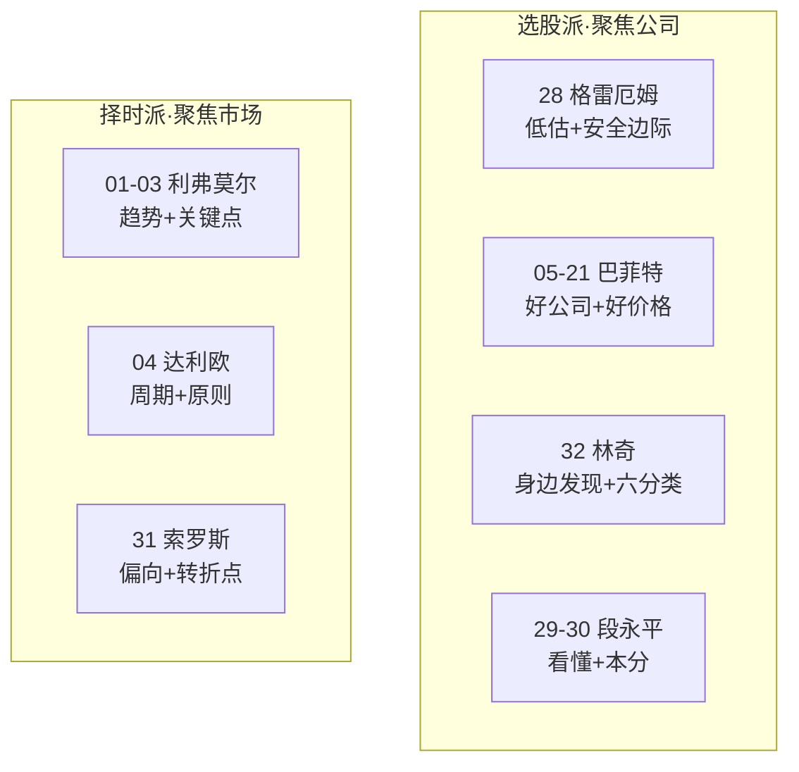
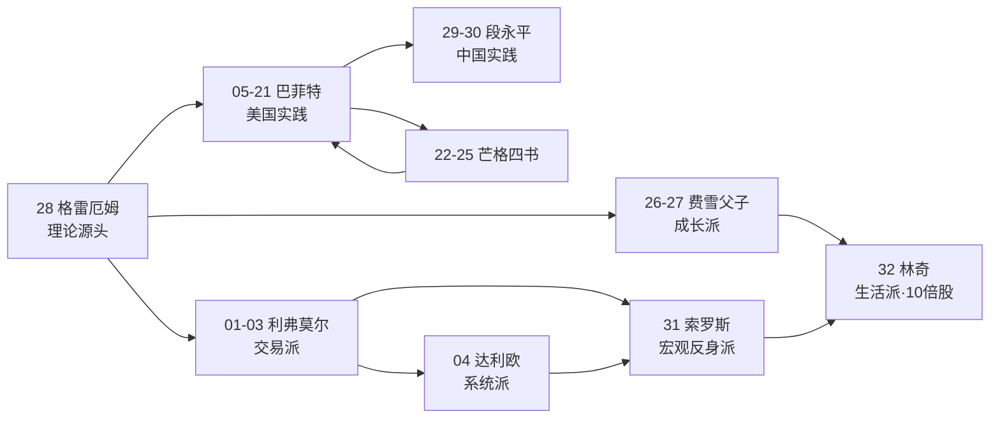
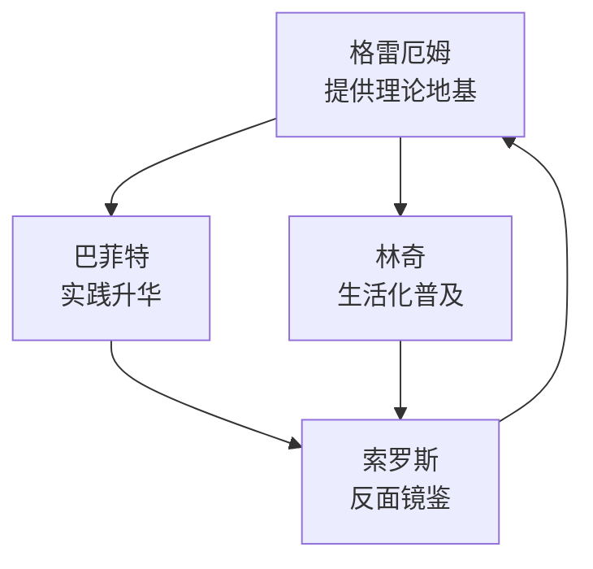
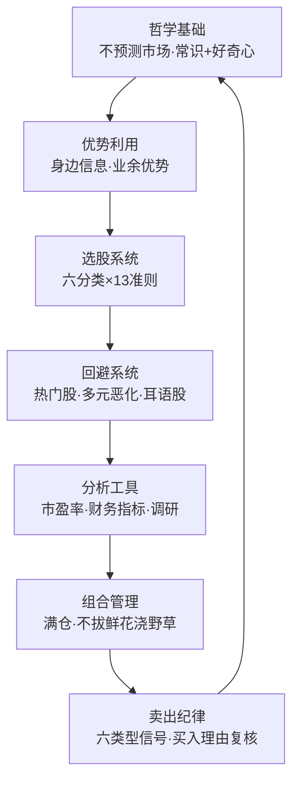
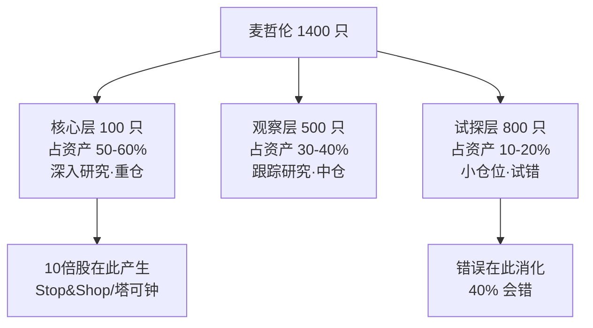

# 32《彼得·林奇的成功投资》深度解读（详细版）

> **副题：彼得·林奇——"买你熟悉的公司"：业余投资者的优势与选股六分法**
>
> 作者：彼得·林奇（Peter Lynch，1944—），富达麦哲伦基金传奇经理人（1977—1990），13 年复合年化回报 29%，同期标准普尔 500 仅 15%；投资组合一度持有 1,400 只股票，被《时代》杂志称为"美国最伟大的基金经理"。本书为业余投资者而写：**"任何一位普普通通的业余投资者只要动用 3% 的智力，所选股票的投资回报就能超过华尔街投资专家的平均业绩水平。"**

---

## 为什么值得解读

### 1. 系列第一个"业余投资者圣经"

在价值投资谱系里，28 号格雷厄姆写给专业人士与"防御型投资者"，05—21 号巴菲特写生意与公司，29—30 号段永平写中国实践——**但只有 32 号林奇，是专门写给"普通人"的**。他的核心主张振聋发聩：业余投资者有专业机构永远无法拥有的优势——**你身边的人、你逛的超市、你开的车、你吃的东西，就是你最好的调研渠道**。"10 倍股"就藏在你日常生活的角落里，而不是华尔街的研报里。

### 2. 系列第一个"10 倍股猎手"

利弗莫尔追趋势、巴菲特守价值、索罗斯抓偏向——林奇的目标朴素而凶猛：**寻找上涨 10 倍的股票（tenbagger）**。他用一个震撼的算例证明：10 只股票的组合三年收益 30.4%（跑输标普 40.6%），但只要多加入 1 只 10 倍股，总收益立刻变成 110.6%——**一只 10 倍股足以让整个组合起死回生**。这是对"分散投资"最有力的反驳，也为 16 号集中投资提供了另一条路径。

### 3. 系列最完整的"分类学 + 操作手册"

林奇把公司分成 6 种类型（缓慢增长/稳定增长/快速增长/周期/困境反转/隐蔽资产），每种类型有独立的买入逻辑、持有标准和**卖出信号**；13 条选股准则、12 种最愚蠢最危险的说法、完整的财务指标清单（市盈率/现金头寸/负债/存货/隐蔽资产/增长率）——**这是系列中操作颗粒度最细的一本**，几乎每一条都能直接翻译成 A 股语言。

### 4. 与 31 号索罗斯的"市场观"终极对决

林奇和索罗斯代表了投资世界的两极：索罗斯说"市场永远是错的，我要利用偏向"；林奇说"不要预测市场，我只要找到好公司，无论指数是 1000 还是 3000 点"。**一个在转折点下注，一个在好公司上下注**。两本书连读，恰好构成"择时派"与"选股派"的完整光谱——而林奇的答案是：**把时间花在公司上，而不是花在市场上**。

### 5. 中医呼应：从"望闻问切"到"逛街调研"

林奇式的调研（逛超市、吃快餐、穿衣服、看停车场）与中医"望闻问切"有惊人的同构：**最一手的信息来自最日常的观察**。一个医生通过望闻问切判断病情，一个投资者通过生活中的产品体验判断公司——"你日常生活的环境正是你寻找 10 倍股的最佳地方"。

---

## 📖 全书结构与核心框架

### 全书结构总览表

| 源书部分 | 源书章节 | 笔记章节 | 核心内容 | 关键概念/案例 |
|---------|---------|---------|---------|-------------|
| 序言与引言 | 推荐序/译者序/千禧版序言/引言/暴跌教训 | 第1—2章 | 林奇其人；1987 崩盘时的爱尔兰之行；暴跌三教训 | 100 万持有人仅 3% 赎回；反弹 400 点 |
| 导论 | 业余投资者的优势 | 第3—4章 | 业余投资者的内在优势；10 倍股的力量 | 3% 智力；Stop&Shop 算例；飞虎航空 |
| 第一部分 投资准备 | 第1—5章 | 第5—6章 | 自我测试；个人素质；不要预测股市 | 鸡尾酒会理论四阶段；《投资者的智能》数据 |
| 第二部分 挑选大牛股 | 第6章 | 第7章 | 寻找 10 倍股；消费者优势 | 溃疡药；La Quinta；缅因州制糖 |
| 第二部分 挑选大牛股 | 第7章 | 第8章 | 6 种类型公司股票 | 缓慢/稳定/快速/周期/困境反转/隐蔽资产 |
| 第二部分 挑选大牛股 | 第8章 | 第9章 | 13 条选股准则 | 名字枯燥/业务厌恶/分拆/零增长/利基/回购 |
| 第二部分 挑选大牛股 | 第9章 | 第10章 | 避而不买的股票 | 热门股（家庭购物网络 3→47→3.5）；多元恶化 |
| 第二部分 挑选大牛股 | 第10—11章 | 第11章 | 收益与市盈率；下单前沉思两分钟 | PE=收回年数；La Quinta vs Bildner's |
| 第二部分 挑选大牛股 | 第12—13章 | 第12章 | 真实信息获取；财务分析指标 | 给公司打电话；拜访总部；隐蔽资产/存货/现金流 |
| 第二部分 挑选大牛股 | 第14—15章 | 第13章 | 定期核查；分析要点一览表 | 六类型核查要点 |
| 第三部分 长期投资 | 第16—17章 | 第14—15章 | 构建投资组合；买入卖出时机 | 拔掉鲜花浇灌野草；六类型卖出信号；1987 崩盘 |
| 第三部分 长期投资 | 第18章 | 第16章 | 12 种最愚蠢最危险的说法 | 宝丽来 143.5→14.125；凯撒工业 25→4→30 |
| 第三部分 长期投资 | 第19—20章 | 第17—18章 | 期权期货与卖空；5 万专家也许都是错的 | 卖空无限亏损；罗伯特·威尔森 2000—3000 万 |
| 后记 | 马里兰之旅 | 第18章 | 满仓的哲学 | 1982 年 8 月大反弹；道指 776 点 |
| 全系列 | — | 第19—20章 | 林奇×大师对照；林奇×中医 | 四象限定位；望闻问切×逛街调研 |

### 核心框架 Mermaid 图

---

## 📑 目录

- [[#为什么值得解读|为什么值得解读]]
- [[#📖 全书结构与核心框架|📖 全书结构与核心框架]]
- [[#第1章 林奇其人：从高尔夫球童到麦哲伦之王|第1章 林奇其人：从高尔夫球童到麦哲伦之王]]
- [[#第2章 1987 崩盘与爱尔兰之行的启示|第2章 1987 崩盘与爱尔兰之行的启示]]
- [[#第3章 业余投资者的优势：3% 智力战胜华尔街|第3章 业余投资者的优势：3% 智力战胜华尔街]]
- [[#第4章 10 倍股的力量：一只股票拯救一个组合|第4章 10 倍股的力量：一只股票拯救一个组合]]
- [[#第5章 投资准备：自我测试与个人素质|第5章 投资准备：自我测试与个人素质]]
- [[#第6章 不要预测股市：鸡尾酒会理论与情绪晴雨表|第6章 不要预测股市：鸡尾酒会理论与情绪晴雨表]]
- [[#第7章 6 种类型公司股票：分类学的力量|第7章 6 种类型公司股票：分类学的力量]]
- [[#第8章 13 条选股准则：寻找完美公司|第8章 13 条选股准则：寻找完美公司]]
- [[#第9章 避而不买的股票：热门的陷阱|第9章 避而不买的股票：热门的陷阱]]
- [[#第10章 收益，收益，还是收益：市盈率与增长|第10章 收益，收益，还是收益：市盈率与增长]]
- [[#第11章 下单之前沉思两分钟与真实信息的获取|第11章 下单之前沉思两分钟与真实信息的获取]]
- [[#第12章 财务分析指标：林奇的眼睛|第12章 财务分析指标：林奇的眼睛]]
- [[#第13章 定期核查与股票分析要点一览表|第13章 定期核查与股票分析要点一览表]]
- [[#第14章 构建投资组合：满仓与不拔鲜花浇野草|第14章 构建投资组合：满仓与不拔鲜花浇野草]]
- [[#第15章 买入卖出的最佳时机：六类型卖出信号|第15章 买入卖出的最佳时机：六类型卖出信号]]
- [[#第16章 12 种最愚蠢且最危险的说法|第16章 12 种最愚蠢且最危险的说法]]
- [[#第17章 期权、期货与卖空：危险的工具|第17章 期权、期货与卖空：危险的工具]]
- [[#第18章 5 万个专业投资者也许都是错的与满仓哲学|第18章 5 万个专业投资者也许都是错的与满仓哲学]]
- [[#第19章 深度专题：林奇 × 系列大师的终极对照|第19章 深度专题：林奇 × 系列大师的终极对照]]
- [[#第20章 深度专题：林奇 × 中医|第20章 深度专题：林奇 × 中医]]
- [[#附录一 林奇金句集（40 条精选）|附录一 林奇金句集（40 条精选）]]
- [[#附录二 林奇术语速查表|附录二 林奇术语速查表]]
- [[#附录三 系列互链：林奇在投资谱系中的位置|附录三 系列互链：林奇在投资谱系中的位置]]
- [[#附录四 A 股应用：林奇式选股本土化|附录四 A 股应用：林奇式选股本土化]]
- [[#附录五 读完本书后的 10 个自问|附录五 读完本书后的 10 个自问]]
- [[#附录六 本书案例与数据速查|附录六 本书案例与数据速查]]
- [[#附录七 林奇投资年表|附录七 林奇投资年表]]
- [[#附录八 13 条选股准则检查清单（可操作版）|附录八 13 条选股准则检查清单（可操作版）]]
- [[#附录九 FAQ：林奇 20 问|附录九 FAQ：林奇 20 问]]
- [[#附录十 系列母题追踪（32 号更新）|附录十 系列母题追踪（32 号更新）]]
- [[#附录十一 林奇式 A 股模拟：身边选股实战|附录十一 林奇式 A 股模拟：身边选股实战]]
- [[#附录十二 全书 30 秒版|附录十二 全书 30 秒版]]
- [[#附录十三 林奇投资理念 100 条|附录十三 林奇投资理念 100 条]]
- [[#附录十四 林奇式投资检查清单（每日/每周/每月）|附录十四 林奇式投资检查清单（每日/每周/每月）]]
- [[#附录十五 系列 32 本笔记总览（更新版）|附录十五 系列 32 本笔记总览（更新版）]]
- [[#附录十六 同一市场的四种眼光：林奇加入后的完整光谱|附录十六 同一市场的四种眼光：林奇加入后的完整光谱]]
- [[#附录十七 林奇 × 中医：深度对照补充|附录十七 林奇 × 中医：深度对照补充]]
- [[#附录十八 本书关键概念中英对照|附录十八 本书关键概念中英对照]]
- [[#附录十九 林奇式思维训练：10 个日常练习|附录十九 林奇式思维训练：10 个日常练习]]
- [[#附录二十 美国三极：格雷厄姆 × 巴菲特 × 索罗斯 × 林奇|附录二十 美国三极：格雷厄姆 × 巴菲特 × 索罗斯 × 林奇]]
- [[#附录二十一 林奇思想拆解：从球童到大师（知乎文风）|附录二十一 林奇思想拆解：从球童到大师（知乎文风）]]
- [[#附录二十二 林奇 × A 股实战拆解：四个真实案例|附录二十二 林奇 × A 股实战拆解：四个真实案例]]
- [[#附录二十三 麦哲伦 13 年管理实录：1400 只股票的运作秘密|附录二十三 麦哲伦 13 年管理实录：1400 只股票的运作秘密]]
- [[#总结：林奇投资哲学的核心|总结：林奇投资哲学的核心]]

---

## 第1章 林奇其人：从高尔夫球童到麦哲伦之王

### 1.1 球童生涯：第一堂投资课

1944 年，彼得·林奇出生在马萨诸塞州牛顿市。11 岁时父亲去世，家境拮据。为了挣学费，他 11 岁开始在高尔夫球场当球童——**这份工作成了他投资生涯的第一所学校**。

> "在高尔夫球场当球童，你可以听到基金经理们的谈话。我 11 岁就听说股票可以赚钱，这在当时的工人阶级社区里是闻所未闻的。"

球童经历给了林奇三样东西：

| 收获 | 说明 |
|------|------|
| 早期启蒙 | 11 岁就从基金经理的球叙中听到"股票"这个词 |
| 精英人脉 | 服务的客户中有富达基金的管理者 |
| 阶级视角 | 深知"业余投资者"与"专业投资者"的真实差距 |

### 1.2 学历与起步：从波士顿学院到富达

| 年份 | 事件 |
|------|------|
| 1963 | 进入波士顿学院（靠球童奖学金） |
| 1965 | 大学时买入人生第一只股票：**飞虎航空（Flying Tiger Airlines）** |
| 1966 | 富达基金暑期实习（得益于球童人脉） |
| 1968 | 沃顿商学院 MBA（曾修读证券分析，但发现"课堂理论"与实操脱节） |
| 1969 | 正式加入富达，任纺织与金属行业分析师 |
| 1974 | 升任富达研究主管 |
| 1977 | **接掌麦哲伦基金**——当时规模仅 1,800 万美元 |

### 1.3 麦哲伦时代：13 年 29% 的传奇

林奇管理麦哲伦基金的 13 年（1977—1990），是人类共同基金史上最传奇的业绩：

| 指标 | 数据 |
|------|------|
| 管理年限 | 1977—1990（13 年） |
| 起始规模 | 1,800 万美元 |
| 终结规模 | **140 亿美元**（约 780 倍） |
| 复合年化回报 | **29%** |
| 同期标普 500 | 15% |
| 累计回报 | 约 2,700%（13 年） |
| 股票数量峰值 | 1,400 只 |
| 换手率 | 年均约 300% |
| 亏损年份 | 仅 1981 年（-7%？不，实际 1981 年微亏约 -7%，另有 1990 年离开时） |

> **核心事实**：1 万美元在 1977 年投入麦哲伦，1990 年林奇退休时约值 27 万美元。

### 1.4 林奇的投资人格画像

| 特质 | 表现 |
|------|------|
| 极度勤奋 | 每年拜访 500—600 家公司；一年看 1,000+ 份年报 |
| 信息杂食 | 逛街、试吃、问售货员、听家人抱怨 |
| 满仓主义 | "我总是满仓，持有的全部是股票，不持有任何现金" |
| 不预测 | "我根本不相信能够预测市场" |
| 承认错误 | "我自己的投资组合中那个长长的赔钱股票名单一直在提醒我，所谓的聪明投资者大约在 40% 的时间里都表现得非常愚蠢" |
| 幽默自嘲 | 用"拔掉鲜花浇灌野草"形容散户的卖出习惯 |

### 1.5 第1章小结

**林奇的独特位置**：他既不是格雷厄姆式的理论家，也不是巴菲特式的企业家，而是**"最勤奋的消费者"**——把日常生活变成研究所，把逛街变成调研。他的成功证明：投资不需要天才的智商，需要的是**好奇心、常识和勤奋**。

---

## 第2章 1987 崩盘与爱尔兰之行的启示

### 2.1 故事：崩盘时他在爱尔兰度假

1987 年 10 月，林奇和妻子卡罗琳在爱尔兰度假。10 月 16 日（周五）他们驱车穿越科克郡；10 月 19 日（周一，黑色星期一）他在基拉尼镇打高尔夫；当晚在多逸乐斯海鲜餐厅吃晚餐——**而这一天，道琼斯指数暴跌 508 点（-22%）**。

林奇回忆："1987 年 10 月的那一周是我一生中所经历过的最不寻常的一周，整整过了一年多之后，我才能客观、冷静地回顾。"

### 2.2 暴跌的教训：三句话

| # | 教训 | 解读 |
|---|------|------|
| 1 | 不要让烦心之事毁掉一个很好的投资组合 | 崩盘当天卖出=把账面亏损变成现实亏损 |
| 2 | 不要让烦心之事毁掉一次愉快的度假 | 生活不能被市场绑架 |
| 3 | 当你的投资组合中现金比重很小时千万不要出国旅游 | 幽默版"满仓者的自嘲" |

### 2.3 关键数据：100 万持有人只有 3% 赎回

> "100 万个富达麦哲伦基金的持有人中，只有不到 3% 的持有人在让人感到恐慌的股市暴跌的一周中将资金转入货币市场基金。"

这个数据是林奇最有力的论据：**大多数投资者在暴跌中其实什么都没做——而什么都没做，恰恰是正确的做法**。从 11 月开始市场稳步上扬，到 1988 年 6 月，市场已反弹 400 多点（+23%）。

### 2.4 暴跌与优秀公司的关系

> "不管某一天股市下跌 508 点还是 108 点，最终优秀的公司将会胜利，而普通的公司将会失败。"

这是林奇市场观的浓缩：**崩盘不改变公司的优劣，只改变买入的价格**。

### 2.5 第2章小结

| 要点 | 内容 |
|------|------|
| 暴跌中的正确姿势 | 什么都不做（除非有更好的机会） |
| 暴跌的真正意义 | 优秀公司打折出售 |
| 林奇的选择 | 永远满仓，把资金留在股市里 |

---

---

## 第3章 业余投资者的优势：3% 智力战胜华尔街

### 3.1 核心主张：千万不要听信任何专业投资者的建议

> "在投资这一行中 20 年的从业经验使我确信，任何一位普普通通的业余投资者只要动用 3% 的智力，所选股票的投资回报就能超过华尔街投资专家的平均业绩水平。"

林奇用了三个生动的类比：

| 类比 | 含义 |
|------|------|
| 外科整形医生建议你给自己拉皮 | 专业壁垒不可逾越 |
| 管道工建议你装热水器 | 专业壁垒不可逾越 |
| 理发师建议你剪刘海 | 专业壁垒不可逾越 |

**但投资不是**——因为专业投资人（smart money）并不像人们想象的那样聪明，业余投资者（dumb money）也并不像人们想象的那样愚笨。**只有当业余投资者一味盲目听信专业投资人时，他们才会变得愚蠢。**

### 3.2 为什么不要理会"彼得·林奇正在买什么"

林奇给出了三个理由，个个扎心：

| # | 理由 | 深层含义 |
|---|------|---------|
| 1 | 他有可能是错的 | "所谓的聪明投资者大约在 40% 的时间里都表现得非常愚蠢" |
| 2 | 即使对了，你不知道他何时会改变看法卖出 | 你无法复制他的完整决策链 |
| 3 | 你本身拥有更好的信息来源 | 你身边的日常信息比研报更早、更真实 |

### 3.3 业余投资者的三大内在优势

| 优势 | 内容 | 机构为何没有 |
|------|------|-------------|
| 身边信息优势 | 你在工作场所/购物中心保持一半警觉，就能发现表现出众的优秀公司 | 机构分析师坐在办公室里看研报 |
| 行业优势 | 你正好在某行业工作，对该行业公司分析如鱼得水 | 分析师同时覆盖几十个行业 |
| 时间优势 | 你可以慢慢研究，不受季度排名压力 | 基金经理每季度被考核 |

> "你日常生活的环境正是你寻找 10 倍股的最佳地方。在富达公司工作期间，我一次又一次地在日常生活中发现了一个又一个 10 倍股。"

### 3.4 独立研究的三不原则

| 原则 | 内容 |
|------|------|
| 不理会热门消息 | 不听"千万不要错过的大黑马" |
| 不理会券商推荐 | 不听证券公司的股票推荐 |
| 不理会权威动向 | 即使听说林奇/巴菲特在买某只股票也不理会 |

**独立思考的含义**：只依赖自己的研究分析进行投资决策。

### 3.5 第3章小结

**林奇式投资的第一性原理**：投资信息不是越远越好，而是越近越好。**华尔街的研报是二手信息，你自己的生活是一手信息**——这正是业余投资者的不对称优势。

---

## 第4章 10 倍股的力量：一只股票拯救一个组合

### 4.1 什么是 10 倍股

> "10 倍股（tenbagger）是指上涨 10 倍的股票。我猜测这个术语是借用棒球运动的术语——但棒球运动中最高只有 4 垒安打（fourbagger）或本垒打（home run）。"

| 术语 | 含义 | 棒球对应 |
|------|------|---------|
| 4 倍股 | 上涨 4 倍 | 本垒打 |
| 10 倍股 | 上涨 10 倍 | 2 个本垒打 + 1 个二垒安打 |
| 20 倍股 | 上涨 20 倍 | 罕见 |

**林奇的第一只股票飞虎航空就是一只多倍股**——赚的钱足够支付他读研究生的全部学费。

### 4.2 震撼算例：一只 10 倍股的力量

1980 年 12 月 22 日投资 10,000 美元，持有到 1983 年 10 月 4 日：

| 策略 | 组成 | 结果 | 收益率 |
|------|------|------|--------|
| A 策略 | 10 只股票 | 13,040 美元 | 30.4%（同期标普 40.6%） |
| B 策略 | A + 1 只 Stop&Shop | 21,060 美元 | **110.6%** |

> "要得到如此惊人的回报，你只需在这 11 只股票中找到一只大牛股就足够了。你对一只股票的走势判断得越正确，就越有可能导致你对其余股票的判断出现失误，但是即便如此，你仍然可以在总体上取得很好的投资回报。"

### 4.3 10 倍股对组合的三个含义

| 含义 | 内容 |
|------|------|
| 容错性 | 10 只股票错 9 只，1 只 10 倍股就能翻盘 |
| 加仓性 | 发现 Stop&Shop 前景改善时继续加仓，回报可再翻两番 |
| 低迷市场同样存在 | "在低迷的股市中同样也有 10 倍股" |

### 4.4 与系列集中投资的呼应

| 对比 | 16 号集中投资（巴菲特/芒格） | 林奇（32 号） |
|------|---------------------------|-------------|
| 组合大小 | 5—10 只 | 数十到数百只 |
| 核心逻辑 | 减少错误 | **容忍错误，靠 10 倍股覆盖** |
| 共同点 | 重仓真正看懂的 | 重仓真正看懂的 |

**共同的第一性原理**：组合的胜负手不是平均收益，而是**少数几只超级明星股**。

### 4.5 第4章小结

**10 倍股思维改变投资心态**：如果你相信组合里会长出 10 倍股，你就不会因为某只股票跌 20% 而恐慌卖出——**你的目标不是每笔都对，而是抓住那一只改变命运的股票**。

---

## 第5章 投资准备：自我测试与个人素质

### 5.1 进入股市前的自我测试

林奇在书里提出三个必须诚实回答的问题：

| 问题 | 林奇的意思 |
|------|-----------|
| 我有一套房子吗？ | 先有安身之所，再谈投资——房产是最稳的"压舱石" |
| 我未来需要用钱吗？ | 未来 1—2 年内要用的钱（学费/婚嫁/买房）绝不能进股市 |
| 我具备股票投资成功所必需的个人素质吗？ | 最重要的一个问题 |

### 5.2 个人素质清单：12 项

> "股票投资成功所必需的个人素质应该包括：**耐心、自立、常识、对于痛苦的忍耐力、心胸开阔、超然、坚持不懈、谦逊、灵活、愿意独立研究、能够主动承认错误以及能够在市场普遍性恐慌之中不受影响保持冷静的能力。**"

| 素质 | 投资中的表现 | 反面 |
|------|-------------|------|
| 耐心 | 持有好公司 3—5 年 | 频繁换股 |
| 自立 | 自己研究自己决策 | 听消息跟风 |
| 常识 | 用生活常识判断公司 | 迷信复杂模型 |
| 痛苦忍耐力 | 亏损 30% 不慌 | 割肉在底部 |
| 心胸开阔 | 接受新行业新观点 | 固守旧框架 |
| 超然 | 与持仓保持心理距离 | 爱上股票 |
| 坚持不懈 | 持续研究 | 三天打鱼 |
| 谦逊 | 承认自己会错 | 过度自信 |
| 灵活 | 根据新信息修正 | 死扛 |
| 独立研究 | 自己动手 | 依赖专家 |
| 承认错误 | 错了就卖 | 找借口 |
| 恐慌中冷静 | 暴跌中不动作 | 恐慌抛售 |

### 5.3 智商悖论：天才反而做不好投资

> "就智商而言，最优秀的投资者的智商既不属于智商最高的那 3%，也不属于最差的 10%，而是在两者之间。真正的天才由于过度沉醉于理论上的思考，结果他们的理论总是被股票实际走势所背叛，现实中的股票走势远远比他们想象出来的理论要简单得多。"

**天才的陷阱**：理论越复杂，越容易脱离现实。**投资的答案常常简单得让人难以置信**——这也是 12 号估值逻辑、28 号安全边际反复出现的主题。

### 5.4 信息不完全决策：华尔街的常态

> "要想取得股票投资成功，一个非常重要的个人素质是要有能力在得到的信息不完全、不充分以及得到的信息不完全准确的情况下做出投资决策。华尔街的事情几乎从来不会十分明朗，或者说一旦事情明朗化时，再想要从中谋利已为时太晚。"

**这直接呼应了 31 号索罗斯的"人类不确定性原则"**——只是林奇给出的应对不是"识别偏向"，而是"在不确定中果断决策"。

| 对比 | 索罗斯（31） | 林奇（32） |
|------|-------------|-----------|
| 不确定性 | 哲学层面的认知局限 | 操作层面的决策常态 |
| 应对 | 假说-检验-修正 | 信息不完全也敢决策 |
| 共同点 | 都不等待"完美信息" | 都不等待"完美信息" |

### 5.5 情绪晴雨表：三种情绪的循环

> "人类内在的本性让投资者的情绪成了股市的晴雨表。这些一点也不谨慎小心的投资者不断地在三种情绪之间变化：**担心害怕、扬扬自得、灰心丧气**。"

| 情绪 | 市场阶段 | 行为 | 结果 |
|------|---------|------|------|
| 担心害怕 | 下跌后/经济停滞 | 不敢低价买入 | 错过底部 |
| 扬扬自得 | 上涨中 | 高价追涨+忽视基本面 | 套在顶部 |
| 灰心丧气 | 跌至买价以下 | 恐慌卖出 | 卖在底部 |

**这是 A 股散户的标准心理剧本**——每一次循环，都是财富的转移。

### 5.6 长期投资者的"叛变"

> "一些人自诩为长期投资者，但是一旦股市大跌（或者是稍稍上涨）他们马上就从长期投资变成了短期投资。"

**林奇的诊断**：真正的长期投资不是口号，而是行为——**跌 25% 时追加买入而不是卖出**。

> "如果你不能说服自己坚持'当我的股票下跌 25% 时我就追加买入'的正确信念，永远戒除'当我的股票下跌 25% 我就卖出'的毁灭性错误信念，那么你永远不可能从股票投资上获得什么像样的回报。"

### 5.7 波动率的真相：50%

> "平均每年一只股票的平均价格波动率为 50%……目前任何一只卖价为 50 美元的股票在未来 12 个月中都有可能涨到 60 美元或者跌到 40 美元。"

**波动是股票的本性，不是风险的全部**。如果你在 50 买、60 加仓、40 割肉——"那么阅读再多的如何进行股票投资的书籍也没有用"。

### 5.8 第5章小结

| 要点 | 内容 |
|------|------|
| 投资的前提 | 房子、闲钱、素质三关全过 |
| 素质的核心 | 在恐慌中保持冷静 + 信息不完全时果断决策 |
| 情绪管理 | 识别"担心—自得—灰心"循环，反着做 |
| 波动认知 | 50% 波动是常态，跌 25% 是加仓信号不是卖出信号 |

---

## 第6章 不要预测股市：鸡尾酒会理论与情绪晴雨表

### 6.1 林奇对预测的总态度

> "我根本不相信能够预测市场，我只相信购买卓越公司的股票，特别是那些被低估而且（或者）没有得到市场正确认识的卓越公司的股票是唯一投资成功之道。"

**关键句式**：被低估 **而且/或者** 没有得到市场正确认识——后者正是林奇对 31 号索罗斯"市场总是错误的"的实用化版本：**市场没认识到的好公司，就是你的机会**。

### 6.2 鸡尾酒会理论：四阶段

林奇多年在宴会上站在潘趣酒杯旁听人谈股票，总结出市场情绪四阶段：

| 阶段 | 市场状态 | 鸡尾酒会场景 | 市场含义 |
|------|---------|-------------|---------|
| 第一阶段 | 长期下跌后 | 人们不愿谈股票；听说你是基金经理就礼貌走开，转而和牙医谈牙斑 | **股市将要止跌反弹** |
| 第二阶段 | 已上涨 15% | 客人多逗留一会，告诉你"股票市场风险有多大"，然后继续和牙医谈 | 几乎没人注意到上涨 |
| 第三阶段 | 已上涨 30% | 一大群人整晚围着你问"应该买哪只股票"，连牙医都来问 | 乐观扩散 |
| 第四阶段 | 顶部区域 | 人们簇拥着**告诉你**该买哪些股票，牙医也推荐三五只；报纸上果然涨了 | **股市已到最高点，将要下跌** |

> "当邻居们告诉我该买哪只股票，而且后来股价上涨后我非常后悔没有听从他们的建议时，这是一个股市已经上涨到了最高点而将要下跌的准确信号。"

**鸡尾酒会理论的本质**：**关注度的扩散程度 = 市场的风险程度**。当连最不关心股票的人都在推荐股票时，接盘力量已经耗尽。

### 6.3 铁证：《投资者的智能》情绪调查

| 时间 | 投资者情绪 | 实际走势 |
|------|-----------|---------|
| 1972 年底 | 空前乐观，仅 15% 认为熊市将来 | 股市即将大跌 |
| 1974 年 | 空前低落，65% 担心最糟糕情况 | 股市开始反弹 |
| 1977 年 | 乐观，仅 10% 认为熊市将至 | 市场转为下跌 |
| 1982 年 | 55% 预测熊市 | **大牛市行情开始** |
| 1987.10 前 | 80% 预测大牛市 | **10 月 19 日大跌** |

**数据完美验证了反指逻辑**：情绪最乐观时=风险最高；情绪最悲观时=机会最大。

**为什么会这样**：

> "问题并不在于投资者以及他们的投资顾问长期以来一直非常愚蠢或者反应迟钝，而在于当他们得到信息时，原来的信息所反映的事实现在可能已经发生了改变。当大量正面的金融消息慢慢传播开来广为渗透，以至于绝大多数投资者对未来短期内的经济发展前景充满信心时，其实经济很快就会遭受严重的打击。"

### 6.4 崩盘前后：同样的高楼，不同的解读

> "1987 年 10 月股市大崩盘前一两个星期，商务旅行者看到新建的高楼大厦雄伟壮观，彼此赞叹：'哇！真是一片欣欣向荣啊。'股市大崩盘发生才几天之后，我敢肯定同样是那些旅行者看着同样的高楼大厦却会说：'哎，这个地方一定有许多问题。'"

**基本面没有变，情绪变了**——这是对"市场先生"最生动的注脚（呼应 28 号格雷厄姆）。

### 6.5 逆向投资的真义

> "真正的逆向投资者并不是那种与人人追捧的热门股对着干的投资者（例如卖空一只所有人都在买入的股票），真正的逆向投资者会耐心等待……"

**林奇的逆向**：不是对着干，而是**在无人关注时买入，在万众瞩目时卖出**——与鸡尾酒会理论完全一致。

### 6.6 第6章小结

| 要点 | 内容 |
|------|------|
| 不预测 | 预测市场=浪费时间 |
| 情绪四阶段 | 无人谈股=买点；人人荐股=卖点 |
| 反指铁证 | 1982 年 55% 看熊=牛市起点；1987 年 80% 看牛=崩盘前夜 |
| 关注度即风险 | 关注度扩散程度=风险程度 |

---

---

## 第7章 6 种类型公司股票：分类学的力量

### 7.1 为什么要分类

> "一旦我确定了某一特定行业中的一家公司相对于同行其他公司而言规模是大是小之后，接下来我就要确定这家公司属于 6 种公司基本类型中的哪一种类型：缓慢增长型、稳定增长型、快速增长型、周期型、困境反转型以及隐蔽资产型。"

**分类的意义**：不同类型公司的股票有不同的投资逻辑、持有期限和卖出信号——**用统一标准套所有股票，是业余投资者最大的错误**。

### 7.2 六类型总览

| 类型 | 典型特征 | 增长率 | A 股例子（类比） | 投资要点 |
|------|---------|--------|----------------|---------|
| 缓慢增长型 | 大型/历史悠久/慷慨分红 | ≈GNP（3%） | 长江电力/大秦铁路 | 一般不持有 |
| 稳定增长型 | 蓝筹消费/防御 | 10—12% | 贵州茅台/伊利股份 | 涨 30—50% 卖出轮换 |
| 快速增长型 | 小中盘/新市场 | 20—30%+ | 曾经的宁德时代/比亚迪 | **大牛股温床** |
| 周期型 | 经济敏感行业 | 随周期大幅波动 | 万华化学/中远海控 | 周期顶峰前卖出 |
| 困境反转型 | 破产边缘/亏损中 | 扭亏为盈 | 曾经的苏宁/中概股反转 | 反转确认后买入 |
| 隐蔽资产型 | 资产价值被低估 | 资产重估 | 土地储备多的地产/持股公司 | 等资产被发现 |

### 7.3 缓慢增长型：蜗牛

**特征**：

| 特征 | 说明 |
|------|------|
| 起源 | 开始时也是快速增长型，后来筋疲力竭 |
| 典型 | 电力公用事业（20 世纪五六十年代曾是快速增长型） |
| 走势图 | "像特拉华州一马平川的地形图" |
| 股息 | 定期慷慨支付股息（因为想不出扩张新方法） |
| 投资价值 | 低——"盈利增长才能使公司股价上涨，把时间浪费在缓慢增长型公司上又有什么意义呢？" |

**行业兴衰的铁律**：

> "那些风行一时的快速增长行业早晚都会变成缓慢增长行业。人们总是倾向于认为事情永远不会改变，但是事实证明改变永远不可避免。"

**历史轮转**：铁路→汽车→钢铁→化工→电器设备→计算机——**每个时代的快速增长行业，都是下一个时代的缓慢增长行业**。

### 7.4 稳定增长型：山麓丘陵

**特征**：可口可乐、百时美、宝洁、贝尔电话、Hershey's、高露洁——数十亿美元市值的庞然大物，盈利年增长 10—12%。

| 要点 | 内容 |
|------|------|
| 买入时机决定收益 | "投资于稳定增长型股票能否获得一笔可观的收益，取决于你买入的时机是否正确和买入价格是否合理" |
| 卖出纪律 | 上涨 30—50% 就卖掉，换一只还没涨的同类 |
| 防御价值 | 经济衰退时的好朋友（百时美 20 年只有 1 个季度收入下降；凯洛格 30 年无一季度下降） |
| 别指望 10 倍 | "如果你拥有百时美这样的稳定增长型股票，并且一两年内上涨了 50%，你就要怀疑它是否已经涨得足够高了" |

**凯洛格定律**：不管经济状况多么糟糕，人们还得吃玉米片——**消费刚需是衰退中的护身符**。

### 7.5 快速增长型：大牛股温床

> "快速增长型公司的增长速度非常快，有时一年会增长 20%～30% 甚至更高，正是在这种快速增长型公司中你才有可能找到最具有爆发性上涨动力的股票。"

**关键认知**：

| 要点 | 内容 |
|------|------|
| 规模特征 | 不必是大公司——**关键是增长快** |
| 行业特征 | 不必在高增长行业——低增长行业里的快速增长公司更好 |
| 持有条件 | 只要收益继续增长、规模继续扩张、没有障碍，就继续持有 |
| 核查频率 | 每隔几个月重新核查一次，"如同我以前根本不了解这家公司一样" |
| 危险 | 增长第二阶段末期（专卖店停止扩张/40 个分析师推荐/60% 机构持股/三家杂志吹捧 CEO） |

### 7.6 周期型：最难的博弈

**典型**：汽车、钢铁、化工、航空。

> "要成功地进行周期型股票投资，你必须弄明白一些特殊的游戏规则……周期型股票往往根本没有任何明显实在的原因就会无缘无故地开始下跌。"

**经典案例：通用动力**——盈利增长而股价大跌 50%，因为"富有远见的周期观察者提前卖出，目的是为了避免在公司盈利下跌时的抛售浪潮"。

**周期股的关键信号**：存货堆积（"当公司停车场上都堆满了存货时，肯定是你应该卖出周期型股票的时候"）、大宗商品价格下跌、新竞争者进入、工会合同期满。

### 7.7 困境反转型：最稳的反弹

**特征**：公司陷入困境（亏损/破产边缘/丑闻），但**基本面没有毁灭**。

| 类型 | 说明 |
|------|------|
| 政府救助型 | 克莱斯勒（政府担保贷款后起死回生） |
| 破产重组型 | 重组后轻装上阵 |
| 丑闻型 | 利空出尽 |
| 业务剥离型 | 砍掉亏损业务后盈利 |
| 周期反转中的困境 | 行业最差时刻 |

**与 27 号超级强势股缝合**：林奇的困境反转型 × 小费雪的 PSR 困境投资——**暴跌 80% + 便宜 + 基本面未毁灭 = 黄金区**（呼应 31 号附录二十一的四象限）。

### 7.8 隐蔽资产型：账面之外的黄金

**特征**：公司账面上有巨大资产，但分析师和大众没发现——土地、矿产、品牌、持股。

| 隐蔽资产 | 例子 |
|---------|------|
| 自然资源 | 石油/木材/矿产储备（按历史成本入账） |
| 土地 | 城市核心地段的地产（账面价值远低于市价） |
| 品牌 | 未被充分估值的无形资产 |
| 交叉持股 | 持有其他上市公司的大量股份 |

**典型案例（书中）**：佩恩中央铁路公司——破产后仍拥有纽约市的大量地产，每股资产价值 100+ 美元，股价却只有几美元；后来真的被发现（类似 A 股的"隐藏资产"主题）。

### 7.9 第7章小结

| 要点 | 内容 |
|------|------|
| 分类是前提 | 先分类，再谈买卖 |
| 快速增长是主战场 | 大牛股温床 |
| 稳定增长靠轮换 | 30—50% 卖出换同类 |
| 周期股看存货 | 停车场堆满=卖点 |
| 困境反转看基本面 | 未毁灭+便宜 |
| 隐蔽资产看发现 | 等市场重新定价 |

---

## 第8章 13 条选股准则：寻找完美公司

### 8.1 13 条准则总览

| # | 准则 | 一句话 |
|---|------|--------|
| 1 | 公司名字听起来枯燥乏味，甚至可笑则更好 | 无人关注=便宜 |
| 2 | 公司业务枯燥乏味 | 罐头盒/瓶盖=现金流 |
| 3 | 公司业务令人厌恶 | 油污/垃圾/丧葬=大牛股 |
| 4 | 公司从母公司分拆出来 | 分拆=自由+低估 |
| 5 | 机构没有持股，分析师不追踪 | 冷宫股=黄金 |
| 6 | 公司被谣言包围（有毒垃圾/黑手党） | 谣言=低估 |
| 7 | 公司业务让人感到压抑 | 丧葬业=零竞争 |
| 8 | 公司处于零增长行业 | 零增长=无竞争者 |
| 9 | 公司有一个利基 | 石料场=垄断 |
| 10 | 人们必须不断购买其产品 | 消耗品=永续 |
| 11 | 公司是高科技产品的用户 | 应用者而非发明者 |
| 12 | 公司内部人士在买入自家股票 | 内部人=最懂的人 |
| 13 | 公司在回购股票 | 回购=管理层信心 |

### 8.2 准则 1—3：枯燥、乏味、令人厌恶

**准则 1：名字枯燥乏味甚至可笑**

| 案例 | 说明 |
|------|------|
| 自动数据处理 | 名字枯燥的完美公司 |
| Pep Boys—Manny, Moe, Jack | 最可笑的名字=最有赚钱希望 |
| 鲍勃·埃文斯农场 | 让人昏昏欲睡=赚钱可能大 |
| 联合石头 | 成功后改名 Conrock→Calmat，改时髦了反而没人注意了 |

> "如果一家公司盈利水平很高、资产负债表稳健、从事的业务枯燥乏味，那么你就会有充足的时间以较低的价格买进该公司股票，那么当它变成投资者争相追捧的投资对象并且价格又被高估时，你就可以把它转手卖给那些喜欢追风的投资者。"

**准则 2：业务枯燥乏味**

| 案例 | 业务 | 股价表现 |
|------|------|---------|
| 瓶盖瓶塞封口 | 罐头盒/瓶盖 | 持续上涨 |
| 七棵橡树 | 处理超市优惠券 | 4→33 美元 |
| 租车代理 | 车行修理时租车 | 4→16 美元 |

**准则 3：业务令人厌恶**

| 案例 | 业务 | 为什么好 |
|------|------|---------|
| Safety-Kleen | 清洗加油站油污 | 脏活无人愿做=无竞争者 |
| 垃圾处理公司 | 固体垃圾处理 | 投资上涨 100 倍 |
| Envirodyne | 塑料叉子/热狗肠衣 | 3→36.875 美元（1985—1988） |

### 8.3 准则 4：分拆上市——风水宝地

**为什么分拆是好机会**：

| 原因 | 说明 |
|------|------|
| 母公司爱护 | 大母公司不愿看到分拆子公司陷入困境（影响自己声誉） |
| 资产负债表干净 | 分拆前通常做足准备 |
| 管理自由 | 独立后可削减成本、创造性改革 |
| 无人关注 | 机构把分拆股当"零钱"不屑一顾 |

**最成功案例：AT&T 分拆七家小贝尔**

| 指标 | 数据 |
|------|------|
| 时间 | 1983.11—1988.10（约 5 年） |
| 股票平均收益率 | 114%（+股息总回报 170%+） |
| 对比 | 远超市场/绝大多数共同基金（含麦哲伦） |
| 机会 | 296 万股东 + 100 万员工 + 无数供应商都有信息优势，只有少数人抓住 |

**操作提示**：分拆完成一两个月后，查看新公司内部人士是否在大量购买自家股票——是，则前景看好。

### 8.4 准则 5：机构没有持股，分析师不追踪

> "如果你找到了一只机构投资者持股很少甚至根本没有持股的股票，你就找到了一只有可能赚大钱的潜力股。如果你找到一家公司，既没有一个股票分析师拜访过这家公司，也没有一个股票分析师说自己十分了解这家公司，你赚钱的机会就又大了一倍。"

**为什么机构不碰**：银行/储蓄贷款/保险有好几千家，华尔街只追踪 50—100 家。

**典型案例**：克莱斯勒和埃克森——"股价跌入低谷时被机构投资者抛售，其实此时正处于大反弹的前夕"。

### 8.5 准则 6—7：谣言与压抑

**准则 6：被谣言包围**

| 谣言 | 实际效果 |
|------|---------|
| 垃圾处理公司与黑手党有关 | 股价被过度低估（后涨 100 倍） |
| 赌场业被黑手党控制 | 无人敢买→收入爆炸后人人争抢 |

**准则 7：业务压抑**

**SCI（国际服务公司）——丧葬连锁业的麦当劳**：

| 要素 | 数据 |
|------|------|
| 业务 | 收购整合夫妻殡仪馆 |
| 规模 | 461 家殡仪馆/121 处公墓/76 家花店/21 家供应中心/3 家棺材配送中心 |
| 创新 | 生前预付丧葬合同（先收钱，复利增值，成本涨 3 倍仍按原价服务） |
| 增长 | 生前预付合同收入年增 40% |
| 妙手 | American General 用 20% 股份换一块地→免费回购 20% 股份 |
| 股价 | 被机构冷落多年→上涨 20 倍→1986 年后机构蜂拥（>50% 持股）→表现落后大盘 |

> "这才是最完美的投资机会，万事俱备只欠买入。你可以亲眼看到公司经营红火，收益一直持续快速增长，几乎没有负债，但是华尔街对这只股票根本不予理睬。"

### 8.6 准则 8—9：零增长行业与利基

**准则 8：零增长行业**（殡葬业年增长 1%）

> "投资高增长行业没有什么刺激之处，除了看到这个行业的股票大跌以外。……对于一个热门行业中的每一种产品来说，都会有 1000 个麻省理工学院的研究生在琢磨如何在中国台湾地区更便宜地生产制造出相同的产品。"

| 行业对比 | 高增长行业 | 零增长行业 |
|---------|-----------|-----------|
| 竞争者 | 无数（MIT 研究生+风投） | 几乎没有 |
| 价格战 | 惨烈 | 不存在 |
| 护城河 | 无 | 无人愿进 |
| 例子 | 地毯（200 家新竞争者涌入）、硬盘（35 家）、电脑 | 殡葬、瓶盖、优惠券 |

**准则 9：利基**

> "我更愿意拥有一家地方性石料场的股票，而不愿拥有 20 世纪福克斯公司的股票。"

**石料场的垄断逻辑**：石头很重→运费吃掉利润→本地独家经营→"排他性的地区独家经营特许权，不用花钱请律师保护"。

**利基的本质**：**地理/资源/规模形成的天然垄断**——宾厄姆矿坑："不管是日本人还是韩国人都没有办法'发明'这样一个矿坑。"

### 8.7 准则 10—13：产品/技术/内部人/回购

**准则 10：人们必须不断购买其产品**（消耗品优于耐用品）

| 类型 | 例子 | 特点 |
|------|------|------|
| 消耗品 | 食品/饮料/剃须刀片 | 不断复购=收入稳定 |
| 耐用品 | 汽车/家电 | 一次购买管多年 |

**准则 11：公司是高科技产品的用户**——应用者享受技术红利，发明者承担研发风险（与 31 号附录二十一的"应用者 vs 发明者"呼应）。

**准则 12：内部人士在买入自家股票**——最懂公司的人在掏钱，是最强信号。

**准则 13：公司在回购股票**——回购=管理层认为股价便宜=提高每股收益。

### 8.8 第8章小结

**13 条准则的共同本质**：**寻找"华尔街不关注但基本面优秀"的公司**——名字枯燥、业务乏味、行业零增长、机构不持股……所有条目的指向都是同一个：**无人问津时的好公司，是价格最便宜、未来回报最大的时候**。这正是 28 号"市场先生"和林奇"业余优势"的完美结合。

---

---

## 第9章 避而不买的股票：热门的陷阱

### 9.1 第一类：热门行业的热门股

> "如果说有一种股票我避而不买的话，那它一定是最热门行业中最热门的股票。热门股票上涨得很快，总是会上涨到远远超过任何估值方法能够估计出来的价值，但是由于支撑股价快速上涨的只有投资者一厢情愿的期望，而公司基本面的实质性内容却像高空的空气一样稀薄，所以热门股跌下去和涨上来的速度一样快。"

**经典案例：家庭购物网络（HSN）**

| 时间 | 股价 |
|------|------|
| 16 个月内 | 3 美元 → 47 美元 → 3.5 美元 |

**热门股的五个特征**（每个都是致命伤）：

| 特征 | 说明 |
|------|------|
| 估值无锚 | 涨到"任何估值方法都估计不出来"的高度 |
| 支撑稀薄 | 只有预期没有基本面 |
| 下跌急骤 | 不会慢慢跌，不会给你逃命机会 |
| 机构吹捧 | 分析师预测"永远两位数增长"时恰恰见顶 |
| 蜂拥效应 | 热门行业吸引 200 家新竞争者，价格战杀光利润 |

**地毯行业的教训**：五六家厂商→200 家新竞争者→"每个厂商都很难赚到一分钱的利润"。

**施乐 vs 菲利普·莫里斯**——20 年对照：

| 公司 | 1972 年 | 20 年后 | 行业 |
|------|---------|---------|------|
| 施乐 | 170 美元（复印神话） | 60 美元（20 家竞争者） | 热门行业 |
| 菲利普·莫里斯 | 14 美元 | 90 美元 | **负增长行业**（烟草） |

> "年复一年，菲利普·莫里斯公司通过扩展海外市场、提高售价以及削减成本使得收益不断增加。由于拥有万宝路等著名品牌，菲利普·莫里斯公司已经找到了自己的利基，而且负增长行业不会吸引大批竞争对手的进入。"

### 9.2 第二类：被吹捧成"下一个"的公司

> "小心那些被吹捧成'下一个'的公司——'下一个 IBM''下一个麦当劳'。"

**逻辑**：成为"下一个 XX"的公司，往往正处在 XX 当年的竞争最激烈时刻，而"下一个"的叙事让股价提前透支。**IBM 是 IBM 的模仿者学不来的**。

### 9.3 第三类："多元恶化"的公司

**多元化=价值毁灭**（呼应 13 号护城河）：

| 信号 | 含义 |
|------|------|
| 收购与主业无关的业务 | 管理层不懂新行业 |
| 并购价格过高 | 用股东的钱买贵货 |
| 声称寻找"处于技术发展前沿"的公司 | 时髦并购的警告信号 |

**例**：施乐收购与复印无关的企业搞多元化，结果"根本不懂得如何经营这些收购来的企业，多元化经营失败导致股价下跌 84%"。

### 9.4 第四类：当心小声耳语的股票

**"耳语股"（whisper stock）**：在宴会上有人神秘地凑近你耳边说"我告诉你一个内部消息"的股票。

**特征**：

| 特征 | 说明 |
|------|------|
| 来源 | 亲戚的朋友的邻居的"内部消息" |
| 逻辑 | 通常没有任何实质内容 |
| 结局 | 听信者高位接盘 |

### 9.5 第五类：过于依赖大客户的供应商

**风险**：一个大客户占公司销售额 25%+——客户一转向，公司就完蛋。

**检验**：问"如果失去这个大客户，公司怎么办？"答不出来=不买。

### 9.6 第六类：名字花里胡哨的公司

**反向应用准则 1**：

| 名字风格 | 投资含义 |
|---------|---------|
| 枯燥乏味（Pep Boys） | 可能很好 |
| 花里胡哨（GeneSplice 国际基因组合） | 吸引眼球=估值虚高 |

> "在鸡尾酒会上冲口说出自己拥有 Pep Boys 公司的股票，根本不会引起几个人的注意，但是即使悄声细语地说国际基因组合公司的股票，肯定会让所有的人都侧耳细听——尽管此时国际基因组合公司的股价可能正在下跌。"

### 9.7 第9章小结

| 避而不买清单 | 核心逻辑 |
|-------------|---------|
| 热门行业热门股 | 预期撑起来的估值最脆弱 |
| "下一个 XX" | 叙事透支未来 |
| 多元恶化 | 管理层跨行=价值毁灭 |
| 耳语股 | 内部消息=接盘信号 |
| 依赖大客户 | 单点风险 |
| 花哨名字 | 注意力=高估值 |

**避而不买的总原则**：**凡是"大家都在抢"的，都在回避名单上**——与 13 条准则（无人关注）互为镜像。

---

## 第10章 收益，收益，还是收益：市盈率与增长

### 10.1 市盈率的本质：收回投资所需的年数

> "市盈率可以看作一家上市公司获得的收益可以使投资者收回最初投资成本所需的年数，前提当然是要假定公司每年的收益保持不变。"

**凯马特例子**：股价 35 美元 ÷ 每股收益 3.50 美元 = 10 倍市盈率 = **10 年收回投资**。

| 市盈率 | 收回投资年数 | 形象比喻 |
|--------|-------------|---------|
| 2 倍 | 2 年 | 快 |
| 10 倍 | 10 年 | 正常 |
| 40 倍 | 40 年 | "到那时你可能已经变成老爷爷或老奶奶了" |

**为什么有人买 40 倍市盈率的股票**：

> "这是因为他们想在伐木场的工人中间找到未来的著名影星哈里森·福特"——**赌未来收益大幅改善**。

### 10.2 不同类型股票的市盈率区间

| 类型 | 市盈率区间 | 逻辑 |
|------|-----------|------|
| 缓慢增长型 | 7—9 倍 | 公用事业 |
| 稳定增长型 | 10—14 倍 | 蓝筹消费 |
| 快速增长型 | 14—20 倍 | 成长溢价 |
| 周期型 | 介于之间 | 随周期波动 |

**关键警示：不要苹果比橘子**

> "我们不应该拿苹果与橘子相比，因此对于陶氏化学公司的股票而言明显偏低的市盈率，对于沃尔玛公司的股票而言却并非如此。"

**低市盈率≠便宜**：用统一 PE 标准套所有股票是常见的错误——**市盈率必须与公司类型/增长率匹配**（呼应 12 号估值逻辑的"相对估值"思想）。

### 10.3 市盈率异常的识别

> "有时报纸上所列的市盈率可能会高得离谱，这通常是因为公司在账面上当期的短期收益中冲销了一笔长期损失，这样一来公司的收益就会大幅缩水。如果市盈率看起来异乎寻常，你可以请经纪人为你解释一下原因。"

### 10.4 未来收益：不可预测但可跟踪

**为什么预测未来收益难**：

| 现象 | 原因 |
|------|------|
| 收益增长但股价下跌 | 分析师预期更高（"出乎意料"的相反方向） |
| 收益下降但股价上涨 | 下降幅度小于预期 |

> "你随便拿起一本最近的财经杂志都可以看到他们的预测往往是一错再错（在文章中与'收益'二字相连的最常出现的词就是'出乎意料'）。"

**5 种增加收益的方法**（跟踪的重点）：

| # | 方法 | 例子 |
|---|------|------|
| 1 | 削减成本 | 裁员/流程优化 |
| 2 | 提高售价 | 提价能力=定价权 |
| 3 | 开拓新的市场 | 海外扩张 |
| 4 | 在原有市场销售更多产品 | 渠道下沉 |
| 5 | 重振、关闭或剥离亏损业务 | 甩包袱 |

> "虽然你不能准确预测公司的未来收益，但至少你可以了解一下公司为提高收益所制订的发展计划，然后你就可以定期查看公司实施这些计划后是否真的有效地提高了收益水平。"

**林奇式收益跟踪**：不预测数字，跟踪**行动与结果**——计划→执行→验证，与 31 号索罗斯的"假说-检验-修正"同构。

### 10.5 第10章小结

| 要点 | 内容 |
|------|------|
| PE 的本质 | 收回投资的年数 |
| PE 必须匹配类型 | 苹果不能比橘子 |
| 未来收益不可预测 | 但可以跟踪计划执行 |
| 5 种增收益方法 | 成本/价格/市场/渗透/剥离 |

---

## 第11章 下单之前沉思两分钟与真实信息的获取

### 11.1 下单之前沉思两分钟

**林奇的纪律**：任何股票买入前，必须能回答"我为什么买它"——写下来。

**两个对比案例**：

| 案例 | 类型 | 结果 |
|------|------|------|
| La Quinta 汽车旅馆 | 成功：廉价商务旅馆连锁，模式清晰可复制 | 大牛股 |
| Bildner's 熟食店 | 失败：扩张过快，模式未验证 | 崩盘 |

**La Quinta 的成功经验**（研究要点）：

| 要点 | 内容 |
|------|------|
| 生意模式简单 | 廉价+干净+位置好 |
| 需求明确 | 商务旅客的刚性需求 |
| 可复制性 | 一个城市成功→复制到全国 |
| 可验证 | 入住率数据实时可见 |

**Bildner's 的失败教训**：**先验证模式，再扩张**——模式没跑通就疯狂开店=烧钱。

### 11.2 如何获得真实的公司信息

**信息层级金字塔**：

### 11.3 经纪人：如何获得最多信息

**林奇给经纪人的建议清单**：

| 问题 | 目的 |
|------|------|
| 你推荐这只股票的理由是什么？ | 逻辑检验 |
| 公司未来 2—3 年的盈利预测？ | 增长预期 |
| 管理层持股情况？ | 利益绑定 |
| 公司在回购股票吗？ | 信心信号 |
| 分析师们现在怎么看？ | 预期差 |
| 公司的强项和弱项？ | 平衡视角 |

### 11.4 给公司打电话与拜访总部

**给公司打电话**：

| 要点 | 说明 |
|------|------|
| 问什么 | 投资者关系部门：业务情况/发展计划/行业竞争 |
| 验证什么 | 年报数字与电话口径是否一致 |
| 听什么 | 语气、热情、专业度——"你相信投资者关系部门说的话吗？" |

**拜访上市公司总部**（林奇每年拜访 500—600 家）：

| 观察点 | 信号 |
|--------|------|
| 停车场 | 员工车辆档次/密度（车多=生意好） |
| 办公室氛围 | 忙碌 vs 闲散 |
| 管理层 | 是否热情、是否懂业务 |
| 一线员工 | 士气与信息 |

> "如果你打算在股票投资上胜人一筹，你就必须一直在了解公司基本面信息上保持领先别人一步。"

### 11.5 实地调查：逛街式调研

**林奇的独门绝技**：

| 场景 | 调研内容 |
|------|---------|
| 逛超市 | 货架位置/缺货情况/新品 |
| 吃快餐 | 排队长度/价格/口味 |
| 购物 | 销售员对产品的热情 |
| 听家人 | 孩子抱怨什么产品不好用 |
| 看电视 | 谁的广告多（广告多=有钱+扩张） |

> "任何一位随身携带信用卡的美国消费者，实际上在平时频繁的消费活动中已经对数十家公司进行了大量的基本面分析。"

### 11.6 阅读公司年报

**年报阅读技巧**：

| 部分 | 看什么 |
|------|--------|
| 资产负债表 | 现金/负债结构 |
| 现金流表 | 真金白银 vs 账面利润 |
| 管理层讨论 | 管理层如何解释业绩 |
| 附注 | 隐蔽资产/或有负债 |
| 脚注 | "年报的附注里藏着最多的秘密" |

### 11.7 第11章小结

| 要点 | 内容 |
|------|------|
| 下单前两分钟 | 写不出买入理由=不买 |
| 信息一手化 | 实地>电话>年报>研报>传闻 |
| 调研生活化 | 逛街就是调研 |
| 年报细读 | 附注是藏宝图 |

---

## 第12章 财务分析指标：林奇的眼睛

### 12.1 指标全景图

| # | 指标 | 核心问题 |
|---|------|---------|
| 1 | 某种产品占总销售额的比例 | 产品依赖度 |
| 2 | 市盈率 | 贵不贵（结合增长率） |
| 3 | 现金头寸 | 家底厚不厚 |
| 4 | 负债因素 | 杠杆高不高 |
| 5 | 股息 | 分红能力与意愿 |
| 6 | 账面价值 | 净资产真实度 |
| 7 | 隐蔽资产 | 账面外的价值 |
| 8 | 现金流量 | 真金白银 |
| 9 | 存货 | 积压预警 |
| 10 | 养老金计划 | 隐性负债 |
| 11 | 增长率 | 成长性 |
| 12 | 税后利润 | 最终果实 |

### 12.2 重点指标详解

**产品占总销售额的比例**：

> "如果某种产品占公司销售额的比例很大，那么这种产品的成败就直接决定公司的命运。"

**现金头寸**：净现金（现金-负债）是安全垫；**隐蔽资产**（土地/矿产/持股）是折价之源。

**负债因素**：

| 负债水平 | 含义 |
|---------|------|
| 低负债 | 安全+可扩张 |
| 高负债 | 利息吞噬利润；周期下行时危险 |

**存货**：

> "当公司停车场上都堆满了存货时，这肯定是你应该卖出周期型股票的时机。"

**增长率**：PEG 思想——**市盈率与增长率匹配**（快速增长型 20% 增长配 20 倍 PE 合理；缓慢增长型 3% 增长配 20 倍 PE 危险）。

**股息**：稳定派息=成熟信号；"公司不能想出扩张业务的新方法时，它就会支付十分慷慨的股息"。

**养老金计划**：未注资的养老金义务=隐性债务，可能侵蚀未来利润。

### 12.3 第12章小结

| 要点 | 内容 |
|------|------|
| 12 项指标 | 覆盖盈利/资产/负债/现金流/成长 |
| 指标组合使用 | 单看一项会误判 |
| 与 6 号巴菲特教你读财报呼应 | 财报是公司的体检报告 |

---

---

## 第13章 定期核查与股票分析要点一览表

### 13.1 定期重新核查公司分析

**林奇的核查纪律**：

| 频率 | 动作 |
|------|------|
| 每季度 | 财报发布后核查核心指标 |
| 每半年 | 全面复查分析要点 |
| 每 1—2 年 | 六类型重新分类（公司会"变类"） |

**核查的核心问题**：当初的买入理由还成立吗？公司的故事变了吗？

> "每隔几个月我都会重新核查一下公司的发展情况，如同我以前根本不了解这家公司一样进行认真仔细的分析。"

### 13.2 六类型的核查要点对照

| 类型 | 核查重点 | 恶化信号 |
|------|---------|---------|
| 缓慢增长型 | 市场份额/新产品/收购 | 连续两年丢份额/吃老本/乱收购 |
| 稳定增长型 | 新产品/市盈率/内部人买入 | 股价线超过收益线/PE 超同行 |
| 快速增长型 | 扩张速度/新店/竞争 | 停止扩张/分析师扎堆/机构 60% |
| 周期型 | 存货/大宗商品/产能 | 存货堆积/商品价格下跌/新建豪华厂 |
| 困境反转型 | 扭亏进度/债务削减 | 重组失败/现金流恶化 |
| 隐蔽资产型 | 资产处置/重估进展 | 管理层不释放价值 |

### 13.3 股票分析要点一览表（全书浓缩）

**买入前的完整清单**：

| 步骤 | 内容 |
|------|------|
| 1 | 股票属于哪种类型？（六分类） |
| 2 | 市盈率与增长率匹配吗？（PEG 思想） |
| 3 | 公司的故事是什么？（一句话讲清） |
| 4 | 公司如何赚钱？（商业模式） |
| 5 | 公司处于增长的第几阶段？（第二阶段末期=危险） |
| 6 | 公司在做什么以提高收益？（5 种方法） |
| 7 | 管理层持股/回购吗？（利益绑定） |
| 8 | 财务指标健康吗？（12 项检查） |
| 9 | 有隐蔽资产吗？（折价之源） |
| 10 | 如果下跌 25%，我敢加仓吗？（买入信念） |

### 13.4 第13章小结

**林奇分析体系的本质**：把"研究公司"变成**一套可以重复执行的例行程序**——分类→讲故事→核指标→查信号→定期复查。**投资不是灵感，是纪律**。

---

## 第14章 构建投资组合：满仓与不拔鲜花浇野草

### 14.1 持有多少股票才算太多

| 组合规模 | 适用人群 | 林奇的态度 |
|---------|---------|-----------|
| 3—5 只 | 有深度研究能力者 | 太少，容错低 |
| 8—12 只 | 普通业余投资者 | 适度分散 |
| 20—30 只 | 稳健型 | 可以 |
| 数百只 | 大规模基金 | 麦哲伦的无奈（1400 只） |

> "对于小规模的投资组合，即使只有一只表现出色的 10 倍股，就足以使整个投资组合从亏损转为盈利。"

### 14.2 分散投资：正确的分散 vs 错误的分散

| 维度 | 正确分散 | 错误分散 |
|------|---------|---------|
| 行业 | 不同行业/不同类型 | 同一行业一堆股票 |
| 逻辑 | 每只都有独立故事 | "广撒网"式乱买 |
| 数量 | 够用即可 | 越多越好 |
| 效果 | 降低非系统性风险 | 摊薄收益+无法研究 |

### 14.3 不要"拔掉鲜花浇灌野草"

> "一些投资者总是习惯性地卖出'赢家'——股价上涨的股票，却死抱住'输家'——股价下跌的股票，这种投资策略如同拔掉鲜花却浇灌野草一样愚蠢透顶。"

**为什么两种极端都错**：

| 策略 | 错误 |
|------|------|
| 卖赢家抱输家 | 拔掉鲜花浇灌野草 |
| 卖输家抱赢家 | 把当前股价当作基本价值指示器 |

> "当前的股票价格变化根本没有告诉我们关于一家公司发展前景变化的任何信息，并且有时股价变化与基本面变化的方向完全相反。"

**正确做法**：**根据股票价格相对于公司基本面的变化**来调整——基本面恶化+股价上涨的（卖出）；基本面好转+股价下跌的（加仓）。

### 14.4 轮换策略：稳定增长型的复利魔法

> "通过把资金在几只收益中等的稳定增长型股票之间进行买入和卖出的转换操作，总体上能够得到与长期持有一只大牛股相当的投资收益率：6 次有 30% 收益率的投资，其累计复利收益接近于投资一只上涨 4 倍的大牛股。"

| 操作 | 收益率 | 累计效果 |
|------|--------|---------|
| 6 次 30% 的轮换 | 每次 30% | ≈ 4 倍大牛股 |

### 14.5 满仓哲学

> "我总是满仓，持有的全部是股票，不持有任何现金。当时机出现时，我已经整装待发，这种感觉简直太棒了。除此之外，满仓使我不用冲回来高价买入股票。"

| 满仓的好处 | 满仓的风险 |
|-----------|-----------|
| 不错过任何上涨 | 下跌时无现金补仓 |
| 被迫持续研究 | 心理压力大 |
| 强制纪律 | 需要"不预测"的信念支撑 |

**林奇的满仓不是莽撞，是体系自洽**：既然不预测市场，就永远留在市场里；用"换股"代替"离场"——**卖掉 A 换 B，而不是卖掉股票换现金**。

### 14.6 止损指令：林奇的深恶痛绝

> "我一直十分厌恶止损指令……止损指令根本无法保护投资者避免发生亏损，只不过是使投资者把当前的账面亏损变成一个已经发生了的现实亏损。如果你在塔可钟公司股票上设置止损指令的话，你确实能够将投资亏损限制在 10% 以内，却会因此错过上涨 10 倍的投资机会。"

**止损=承认自己未来会以低于内在价值的价格卖出**。林奇的反面答案：**跌 25% 是加仓信号，不是止损信号**（前提：基本面没变）。

### 14.7 第14章小结

| 要点 | 内容 |
|------|------|
| 组合规模 | 小组合也要留 10 倍股空间 |
| 分散要正确 | 跨行业跨类型 |
| 不拔鲜花浇野草 | 按基本面调仓而非按价格 |
| 轮换的复利 | 6×30%≈4 倍 |
| 永远满仓 | 换股不换现金 |
| 厌恶止损 | 止损=放弃 10 倍股 |

---

## 第15章 买入卖出的最佳时机：六类型卖出信号

### 15.1 总原则：像思考买入一样思考卖出

> "多年以来我学会的一个经验就是：像思考何时购买股票一样思考何时卖出股票。……如果你很清楚地知道自己当初买入一只股票的理由，自然你就会清楚地知道何时应该卖出这只股票。"

**买入理由=卖出标准**：买入时写下的逻辑，就是卖出时的检查清单。

### 15.2 六类型卖出信号汇总

**缓慢增长型卖出信号**：

| 信号 | 内容 |
|------|------|
| 1 | 连续两年市场份额流失+聘请新广告代理 |
| 2 | 没有新产品/削减研发/吃老本 |
| 3 | 收购两个无关业务/寻找"技术前沿"公司 |
| 4 | 收购代价太高导致资产负债表恶化 |
| 5 | 股息收益率低到无法引起兴趣 |
| 6 | 上涨 30—50% 或基本面恶化（即使股价下跌也赔钱卖出） |

**稳定增长型卖出信号**：

| 信号 | 内容 |
|------|------|
| 1 | 股价线超过收益线（涨太快） |
| 2 | PE 15 倍 vs 同行 11—12 倍 |
| 3 | 过去一年无内部人买入 |
| 4 | 占利润 25% 的部门易受衰退打击 |
| 5 | 增长率放缓且成本削减空间有限 |
| 6 | 常规操作：上涨 30—50% 卖出换同类 |

**快速增长型卖出信号**：

| 信号 | 内容 |
|------|------|
| 1 | 增长第二阶段末期（新店停止扩张/老店破旧） |
| 2 | 40 个分析师最高推荐+机构持有 60% |
| 3 | 三种国家级杂志吹捧 CEO |
| 4 | 回避股特征出现（见第 9 章） |
| 5 | 收益锐减→高 PE 与业绩双杀 |

**周期型卖出信号**：

| 信号 | 内容 |
|------|------|
| 1 | 扩张周期结束（公司开始投资增加产能） |
| 2 | 存货不断增加无法处理 |
| 3 | 大宗商品价格下跌（早于业绩 3—6 个月） |
| 4 | 期货价格低于现货价格 |
| 5 | 新竞争者进入大打价格战 |
| 6 | 12 个月内两个工会合同期满且要求恢复待遇 |
| 7 | 建豪华新厂（成本 2 倍于改造老厂） |

**困境反转型卖出信号**：困境解除、股价回到正常估值后——"你是为了困境反转买的，反转完成就该走"。

**隐蔽资产型卖出信号**：资产被发现/被重估/被收购后——价值兑现即离场。

### 15.3 卖出 vs 持有：林奇的两难答案

| 情形 | 林奇的做法 |
|------|-----------|
| 基本面没变+股价跌 | 持有甚至加仓（跌 25% 是买点） |
| 基本面恶化+股价涨 | 卖出（拔掉野草） |
| 基本面恶化+股价跌 | 卖出（错误被证实） |
| 基本面好转+股价跌 | 加仓（鲜花在打折） |
| 估值到位+情绪过热 | 卖出（鸡尾酒会第四阶段） |

### 15.4 第15章小结

**卖出是买入的镜像**：六类型各有卖出信号，但总原则只有一个——**买入理由是否还成立**。成立，跌也持有；不成立，涨也卖出。

---

## 第16章 12 种最愚蠢且最危险的说法

### 16.1 说法一：股价已经下跌这么多了，不可能再跌了

**宝丽来的教训**：143.5 美元一路下跌，投资者不断重复"不可能再跌了"——跌到 100、90、80、75、50……最后跌到 **14.125 美元**。

**凯撒工业的教训**（林奇亲身经历）：

| 阶段 | 事件 |
|------|------|
| 25 美元 | 开始下跌 |
| 13 美元 | 分析师阶段 |
| 11 美元 | 林奇推荐富达买入 500 万股（美交所史上最大宗交易之一） |
| 8 美元 | 林奇打电话让母亲买入 |
| 7→6→4 美元 | 最终跌到 4 美元（总市值仅 1 亿美元=4 架波音 747） |
| 之后 | 反弹到 30 美元（清算价值每股 40 美元） |

> "股价下跌到 4 美元的最低点之前，彻底治愈了我对股价下跌自以为是的想法，我再也不会信誓旦旦地声称'这只股票在这个价位不可能再往下跌了'。"

**结论**：**没有任何法则能告诉你股价会跌到哪**。

### 16.2 其余 11 种说法速拆

| # | 说法 | 林奇的拆解 |
|---|------|-----------|
| 2 | 你总能知道什么时候一只股票跌到底了 | 凯撒工业证明：不能 |
| 3 | 股价已经这么高了，怎么可能再涨呢 | 好公司可以一直涨（可口可乐） |
| 4 | 股价只有 3 美元，我能亏多少呢 | 3 美元可以跌到 0；低价≠便宜 |
| 5 | 最终股价会涨回来的 | 除非基本面好，否则可能永远不回来 |
| 6 | 黎明前总是最黑暗的 | 可能还有更长的黑夜（凯撒 25→4） |
| 7 | 等到股价反弹到 10 美元时我才会卖出 | 可能永远等不到；锚定幻觉 |
| 8 | 保守型股票不会波动太大 | 保守股票也会腰斩（1973—74） |
| 9 | 等的时间太长了，不可能上涨了 | 时间不是理由，基本面才是 |
| 10 | 看看我损失了多少钱，我竟然没买这只大牛股 | 后悔成本不是投资成本；警惕"必须抓住下一只" |
| 11 | 我错过了这只大牛股，我得抓住下一只 | **报复性买入=最危险的追高** |
| 12 | 股价上涨，所以我选的股票一定是对的；股价下跌，所以我选的股票一定是错的 | 短期价格≠决策质量（塔可钟 1972 股价差但经营好） |

### 16.3 12 种说法的共同病根

| 病根 | 表现 | 正确替代 |
|------|------|---------|
| 价格锚定 | 用过去价格判断未来 | 用基本面判断 |
| 叙事安慰 | 用"不可能再跌"安慰自己 | 承认不确定性（呼应 31 号） |
| 后悔驱动 | 因错过而报复性买入 | 只买当下看得懂的 |
| 价格=质量 | 涨=对，跌=错 | 价格≠基本面 |

### 16.4 第16章小结

**12 种说法全部是"用价格思维代替基本面思维"的变体**。林奇的解药只有一味：**回到公司本身——买入理由还成立吗？**

---

---

## 第17章 期权、期货与卖空：危险的工具

### 17.1 林奇对衍生品的基本态度

| 工具 | 林奇的态度 | 理由 |
|------|-----------|------|
| 期权 | 回避 | 时间损耗+杠杆放大情绪 |
| 期货 | 回避 | 不适合业余投资者 |
| 卖空 | 详细剖析其缺陷 | 亏损无限 |

### 17.2 卖空机制：借邻居的割草机

> "卖空就如同从邻居那里借来一种东西，然后将其卖掉，把钱装进自己的口袋，或早或晚你再买回来同样的东西将其还给你的邻居，结果谁也不比谁高明多少。这种行为严格说来并不是一种偷窃行为，但也并不是一种睦邻友好的行为。"

**卖空流程**（宝丽来例子）：

| 步骤 | 操作 |
|------|------|
| 1 | 判断宝丽来 140 美元被高估 |
| 2 | 借 1000 股卖出 → 账户入账 140,000 美元 |
| 3 | 等待下跌到 14 美元 |
| 4 | 用 14,000 美元买回 1000 股归还 |
| 5 | 盈利 126,000 美元 |

### 17.3 卖空的四个致命缺陷

| 缺陷 | 说明 |
|------|------|
| 股息损失 | 借用期间股息归原持有人 |
| 资金锁定 | 盈利不能动用（须保持保证金） |
| **亏损无限** | "股票的涨幅是没有任何限制的，因此卖空的亏损也是无限的" |
| 时间压力 | "从长期来看我们都死了"（凯恩斯）——等不到回归 |

**最恐怖的案例：罗伯特·威尔森 vs Resorts International**

| 要素 | 数据 |
|------|------|
| 判断 | 判断完全正确（公司确实糟糕） |
| 操作 | 卖空国际度假胜地公司 |
| 过程 | 股价从 70 美分涨到 70 美元（100 倍） |
| 结果 | 亏损 2,000—3,000 万美元 |
| 教训 | "判断正确但时间错误=巨额亏损" |

> "在你卖空一只股票以前，只是确信这家公司经营将会崩溃是不够的，你还必须有足够的耐心和巨大的勇气，而且要有充足的资本使你能够在股价没有下跌甚至股价反而上涨这种更糟糕的情况下继续坚持。"

### 17.4 卖空 vs 做多的本质不对称

| 维度 | 做多 | 卖空 |
|------|------|------|
| 最大亏损 | 100%（跌到 0） | **无限**（可以一直涨） |
| 最大盈利 | 无限 | 100%（跌到 0） |
| 心理压力 | 有底 | 无底 |
| 时间容忍 | 可以等 | 等不起（保证金） |
| 谁适合 | 业余投资者 | 专业机构+充足资本 |

### 17.5 第17章小结

**林奇的结论**：卖空是"聪明人亏大钱"的游戏——**判断正确都可能破产**（威尔森）。对业余投资者：**永不卖空**。这与 29—30 号段永平"不做空"的纪律完全一致。

---

## 第18章 5 万个专业投资者也许都是错的与满仓哲学

### 18.1 5 万个专业投资者也许都是错的

**林奇的核心论点**：华尔街有 5 万名专业分析师/基金经理，但：

| 论点 | 论据 |
|------|------|
| 机构被规则束缚 | 10% 持股上限/5% 资产上限/市值下限（洛克菲勒牡蛎） |
| 机构从众 | 追逐热门股/抱团 |
| 机构滞后 | 克莱斯勒 3.5 美元时停止追踪，30 美元时才重新列入 |
| 机构用别人的钱 | 决策动机扭曲 |

**洛克菲勒牡蛎的比喻**：机构投资潜规则荒谬到"不能在名字带 r 的月份之外吃牡蛎"——各种莫名其妙的限制让机构只能买"大而稳"的股票，**把小市值大牛股全部让给了业余投资者**。

### 18.2 机构限制的连锁反应

| 限制 | 后果 |
|------|------|
| 单股持股 ≤10% | 大基金无法买小公司 |
| 单股投资 ≤总资产 5% | 必须持有 20+ 只股票 |
| 市值下限（如 1 亿美元） | **小公司涨 3 倍后基金才能买**（涨完才够资格！） |
| 股票池限制（40 只） | 只能买"批准名单" |

> "这样做的结果就导致了一个奇特现象的出现：只有当小市值上市公司的股票从很便宜上涨到价格很高时，大型基金公司才能够被允许购买这些小公司的股票。"

**这是业余投资者最大的结构性优势**：**在机构被禁止买入的区间里，藏着最肥的 10 倍股**。

### 18.3 后记：马里兰之旅与满仓的哲学

**1982 年 8 月**——林奇全家开车去马里兰参加婚礼，路上停了八九次拜访上市公司。当时市场极度悲观（利率两位数/道指 700 点/10 年前 900 点），林奇也悲观——但他**满仓**。

**转折**：8 月 17 日股市单日上涨 38.8 点（776 点起），8 月 20 日再涨 30.7 点——**大牛市一夜之间到来**。

> "股市大涨，我却没有什么可做的了，除了像往常一样正常工作，因为我总是把所有的资金都投资到股票上……当时机出现时，我已经整装待发，这种感觉简直太棒了。除此之外，满仓使我不用冲回来高价买入股票。"

**满仓的真正意义**：**你不需要预测底部——因为你永远在场**。

### 18.4 第18章小结

| 要点 | 内容 |
|------|------|
| 机构劣势 | 规则束缚+从众+滞后 |
| 业余优势 | 机构禁区=10 倍股温床 |
| 满仓哲学 | 永远在场，永不踏空 |
| 悲观时刻 | 正是满仓者的朋友（1982 年 8 月） |

---

## 第19章 深度专题：林奇 × 系列大师的终极对照

### 19.1 大师四象限定位

### 19.2 林奇 vs 巴菲特 vs 索罗斯：终极三角

| 维度 | 巴菲特（05—25） | 林奇（32） | 索罗斯（31） |
|------|----------------|-----------|-------------|
| 市场观 | 称重机（长期回归） | **不预测，只选股** | 永远错误（偏向驱动） |
| 公司观 | 生意所有者 | 故事+分类 | 基本面的附带品 |
| 组合 | 集中（5—10 只） | 分散+10 倍股 | 多市场杠杆 |
| 调研 | 读财报+管理层 | **逛街+生活体验** | 宏观偏向分析 |
| 卖出 | 逻辑破坏/高估 | 六类型信号 | 转折点 |
| 一句话 | 以合理的价格买好公司 | **买你熟悉的公司** | 在偏向转折处下注 |

### 19.3 林奇与段永平的呼应（29—30）

| 维度 | 段永平 | 林奇 |
|------|--------|------|
| 不懂不做 | ✅ 能力圈 | ✅ "不要投资于你根本不了解的公司股票" |
| 生活选股 | ✅ 用产品 | ✅ 逛街调研 |
| 集中 | ✅ 5 只以内 | 分散但重仓 10 倍股 |
| 买入标准 | 六折买点 | 低估+没被市场认识 |
| 不做空 | ✅ | ✅ |

**共同的第一性原理**：**投资自己看得懂的**——只是林奇把"看得懂"的标准放低到"生活里用过"。

### 19.4 林奇与格雷厄姆的继承与背离（28）

| 维度 | 格雷厄姆 | 林奇 |
|------|---------|------|
| 继承 | 市场先生/低估买入 | 市场先生/冷门股 |
| 背离 | 分散 20—30 只 | 重仓 10 倍股 |
| 背离 | 不碰"故事股" | 故事+分类是核心 |
| 背离 | 防御型 vs 进取型 | 业余投资者也能进取 |

### 19.5 第19章小结

**林奇在系列中的坐标**：选股派中离市场最近、离理论最远的一位——**他把投资从"学问"变成了"生活方式"**。与索罗斯形成光谱两端：索罗斯研究市场怎么错，林奇研究公司怎么好。

---

## 第20章 深度专题：林奇 × 中医

### 20.1 望闻问切 × 逛街调研

| 中医四诊 | 林奇调研 | 同构 |
|---------|---------|------|
| 望（看神色） | 看停车场/货架/门店人气 | 直接观察第一手状态 |
| 闻（听声息） | 听销售员/顾客/家人抱怨 | 收集非正式信息 |
| 问（问病史） | 问管理层/投资者关系/经纪人 | 主动获取信息 |
| 切（切脉象） | 看财报/现金流/存货 | 量化验证 |

> **中医的核心方法论**：四诊合参，不凭单一信息断病——林奇同样：**不凭单一指标买股，综合一手信息决策**。

### 20.2 六分类 × 辨证分型

| 林奇六分类 | 中医辨证 | 同构 |
|-----------|---------|------|
| 缓慢增长型 | 虚证（气血不足） | 稳健但难有大发展 |
| 稳定增长型 | 平人（阴阳调和） | 健康但无惊喜 |
| 快速增长型 | 实证（邪气盛） | 有爆发力但需警惕转虚 |
| 周期型 | 时令病（四时更替） | 随季节（周期）而变 |
| 困境反转型 | 大病初愈 | 正气恢复期，最危险也最有机会 |
| 隐蔽资产型 | 真寒假热/假象 | 表象与实质不符，需透过现象 |

### 20.3 "不要拔掉鲜花浇灌野草" × 治则

| 林奇 | 中医 | 同构 |
|------|------|------|
| 卖出基本面恶化但上涨的股票 | 实则泻之（祛邪） | 基本面=正气 |
| 加仓基本面好转但下跌的股票 | 虚则补之（扶正） | 价格≠状态 |
| 跌 25% 加仓（基本面未变） | 正虚邪微，扶正之时 | 好公司=有胃气则生 |
| 止损指令 | 见热即用寒药（未辨证） | 不看基本面乱动作 |

### 20.4 鸡尾酒会理论 × 治未病

**鸡尾酒会第四阶段（人人荐股）= 病入膏肓前的"回光返照"**——阳气（情绪）最盛之时，正是重阳必阴之机。

| 鸡尾酒会阶段 | 中医阶段 | 动作 |
|-------------|---------|------|
| 第一阶段（无人谈股） | 邪退正虚（病愈前） | 扶正（买入） |
| 第四阶段（人人荐股） | 重阳必阴（阳极生阴） | 防变（卖出） |

### 20.5 第20章小结

**林奇的方法论与中医同源**：**重观察、重实证、重整体、重动态**。望闻问切是中医的调研，逛街体验是林奇的调研——**最一手的信息，永远来自最贴近对象的观察**。

---

---

## 附录一 林奇金句集（40 条精选）

> 1. "任何一位普普通通的业余投资者只要动用 3% 的智力，所选股票的投资回报就能超过华尔街投资专家的平均业绩水平。"——导论
> 2. "千万不要听信任何专业投资者的投资建议！"——第一条投资准则
> 3. "专业投资人并不像人们想象的那样聪明，业余投资者也并不像人们想象的那样愚笨。"——导论
> 4. "只有当业余投资者一味盲目听信于专业投资人时，他们在投资上才会变得十分愚蠢。"——导论
> 5. "你日常生活的环境正是你寻找 10 倍股的最佳地方。"——导论
> 6. "所谓的聪明投资者大约在 40% 的时间里都表现得非常愚蠢。"——为什么不要听我的
> 7. "10 倍股是指上涨 10 倍的股票。"——10 倍股定义
> 8. "要得到如此惊人的回报，你只需在这 11 只股票中找到一只大牛股就足够了。"——Stop&Shop 算例
> 9. "我根本不相信能够预测市场，我只相信购买卓越公司的股票是唯一投资成功之道。"——鸡尾酒会理论
> 10. "当邻居们告诉我该买哪只股票，而且后来股价上涨后我非常后悔没有听从他们的建议时，这是一个股市已经上涨到了最高点而将要下跌的准确信号。"——鸡尾酒会第四阶段
> 11. "问题并不在于投资者非常愚蠢，而在于当他们得到信息时，原来的信息所反映的事实现在可能已经发生了改变。"——情绪反指
> 12. "人类内在的本性让投资者的情绪成了股市的晴雨表。"——三种情绪
> 13. "他们不断地在三种情绪之间变化：担心害怕、扬扬自得、灰心丧气。"——情绪循环
> 14. "如果你不能说服自己坚持'当我的股票下跌 25% 时我就追加买入'的正确信念，永远戒除'当我的股票下跌 25% 我就卖出'的毁灭性错误信念，那么你永远不可能从股票投资上获得什么像样的回报。"——加仓信念
> 15. "最优秀的投资者的智商既不属于智商最高的那 3%，也不属于最差的 10%，而是在两者之间。"——智商悖论
> 16. "华尔街的事情几乎从来不会十分明朗，或者说一旦事情明朗化时，再想要从中谋利已为时太晚。"——信息不完全决策
> 17. "投资成功所必需的个人素质应该包括：耐心、自立、常识、对于痛苦的忍耐力、心胸开阔、超然、坚持不懈、谦逊、灵活、愿意独立研究、能够主动承认错误以及在恐慌中保持冷静的能力。"——素质清单
> 18. "股票投资是赌博吗？不，赌博是不知道自己在做什么的投资。"——股票与梭哈
> 19. "缓慢增长型公司的增长速度非常慢，大致与一个国家国民生产总值的增长速度相符。"——蜗牛
> 20. "那些风行一时的快速增长行业早晚都会变成缓慢增长行业。人们总是倾向于认为事情永远不会改变，但是事实证明改变永远不可避免。"——行业兴衰
> 21. "盈利增长才能使公司股价上涨，那么把时间浪费在缓慢增长型的公司上又有什么意义呢？"——蜗牛无价值
> 22. "人们还得吃玉米片……他们反而会吃掉更多的玉米片。"——凯洛格定律
> 23. "正是在这种快速增长型公司中你才有可能找到最具有爆发性上涨动力的股票。"——快速增长型
> 24. "周期型股票往往根本没有任何明显实在的原因就会无缘无故地开始下跌。"——周期股
> 25. "当公司停车场上都堆满了存货时，这肯定是你应该卖出周期型股票的时机。"——存货信号
> 26. "如果你找到了一只机构投资者持股很少甚至根本没有持股的股票，你就找到了一只有可能赚大钱的潜力股。"——机构冷宫股
> 27. "我更愿意拥有一家地方性石料场的股票，而不愿拥有 20 世纪福克斯公司的股票。"——利基
> 28. "对于每一个热门行业中的产品来说，都会有 1000 个麻省理工学院的研究生在琢磨如何在中国台湾地区更便宜地生产制造出相同的产品。"——热门行业诅咒
> 29. "热门股下跌时绝不会慢慢地下跌，也不会在跌到你追涨买入的价位时停留一段时间，让你毫发无损地卖出。"——热门股
> 30. "如果你要依靠投资一个接一个出现的热门行业中的最热门股票所赚的钱来维持生计的话，那么很快你就得接受福利救济才能生存了。"——热门股
> 31. "市盈率可以看作一家上市公司获得的收益可以使投资者收回最初投资成本所需的年数。"——市盈率本质
> 32. "我们不应该拿苹果与橘子相比。"——市盈率分类
> 33. "他们想在伐木场的工人中间找到未来的著名影星哈里森·福特。"——买高市盈率者的心理
> 34. "如果你很清楚地知道自己当初买入一只股票的理由，自然你就会清楚地知道何时应该卖出这只股票。"——卖出=买入的镜像
> 35. "一些投资者总是习惯性地卖出'赢家'，却死抱住'输家'，这种投资策略如同拔掉鲜花却浇灌野草一样愚蠢透顶。"——拔掉鲜花浇灌野草
> 36. "当前的股票价格变化根本没有告诉我们关于一家公司发展前景变化的任何信息。"——价格≠基本面
> 37. "我总是满仓，持有的全部是股票，不持有任何现金。当时机出现时，我已经整装待发，这种感觉简直太棒了。"——满仓哲学
> 38. "止损指令根本无法保护投资者避免发生亏损，只不过是使投资者把当前的账面亏损变成一个已经发生了的现实亏损。"——厌恶止损
> 39. "如果你在塔可钟公司股票上设置止损指令的话，你确实能够将投资亏损限制在 10% 以内，却会因此错过上涨 10 倍的投资机会。"——止损代价
> 40. "卖空股票的亏损是无限的……尽管他们的理由非常充分，推理非常正确，却只能无可奈何地看着他们卖空的股票越涨越高，直到最后让他们赔得身无分文。"——卖空警告

---

## 附录二 林奇术语速查表

| 术语 | 英文 | 定义 |
|------|------|------|
| 10 倍股 | Tenbagger | 上涨 10 倍的股票 |
| 4 倍股 | Fourbagger | 上涨 4 倍的股票（本垒打） |
| 缓慢增长型 | Slow growers | 增长率≈GNP（3%） |
| 稳定增长型 | Stalwarts | 增长率 10—12%，蓝筹 |
| 快速增长型 | Fast growers | 增长率 20—30%+ |
| 周期型 | Cyclicals | 随经济周期大幅波动 |
| 困境反转型 | Turnarounds | 破产边缘/亏损中反转 |
| 隐蔽资产型 | Asset plays | 资产价值被低估 |
| 市盈率 | P/E ratio | 股价÷每股收益 |
| 利基 | Niche | 排他性的市场缝隙 |
| 分拆上市 | Spinoff | 子公司独立上市 |
| 多元恶化 | Diworsification | 多元化毁灭价值 |
| 耳语股 | Whisper stock | 小道消息股 |
| 鸡尾酒会理论 | Cocktail party theory | 情绪四阶段 |
| 拔掉鲜花浇灌野草 | Water the weeds | 卖赢家抱输家 |
| 市场先生 | Mr. Market | 情绪化的报价人（格雷厄姆） |

---

## 附录三 系列互链：林奇在投资谱系中的位置

### 3.1 与系列每本笔记的连接点

| 系列笔记 | 连接点 |
|---------|--------|
| 01—03 利弗莫尔 | 林奇反对预测市场 vs 利弗莫尔顺势 |
| 04 达利欧 | 都不预测短期，但林奇不做宏观周期 |
| 05—25 巴菲特 | 买好公司共识；集中 vs 分散；调研方式差异 |
| 13 护城河 | 利基=护城河的生活版 |
| 16 集中投资 | 10 倍股逻辑=集中投资的心理基础 |
| 22—25 芒格 | 多元思维 vs 单一公司研究 |
| 26—27 费雪 | 成长股共同关注；PSR 与困境反转缝合 |
| 28 格雷厄姆 | 市场先生继承；安全边际 vs 10 倍股 |
| 29—30 段永平 | 看懂才买/不做空/生活选股高度一致 |
| 31 索罗斯 | 不预测市场 vs 利用市场偏向——两极 |
| 33 起 | 待解读 |

### 3.2 系列母题追踪（32 号更新）

| 母题 | 28 格雷厄姆 | 05 巴菲特 | 31 索罗斯 | **32 林奇** |
|------|------------|----------|-----------|------------|
| 市场本质 | 称重机 | 称重机 | 永远是错的 | **不预测，只选股** |
| 核心武器 | 安全边际 | 护城河 | 反身性 | **身边信息+分类** |
| 组合策略 | 分散 | 集中 | 多市场杠杆 | **分散+10 倍股** |
| 调研方式 | 财报 | 财报+管理层 | 宏观偏向 | **逛街+生活体验** |
| 卖出依据 | 高估 | 逻辑破坏 | 转折点 | **六类型信号** |

### 3.3 附录三小结

**林奇补上系列的关键一角**：在价值派（格雷厄姆→巴菲特→段永平）、系统派（达利欧）、交易派（利弗莫尔）、宏观反身派（索罗斯）之外，提供**"生活派"**——投资不需要理论霸权，需要**常识+勤奋+好奇心**。32 号是系列中"最亲民"的一本，也是"可操作性"最强的一本。

---

## 附录四 A 股应用：林奇式选股本土化

### 4.1 身边选股：A 股版

| 生活场景 | A 股标的（示例） | 林奇逻辑 |
|---------|-----------------|---------|
| 逛超市 | 海天味业/伊利/农夫山泉 | 货架位置/新品/复购 |
| 喝饮料 | 东鹏特饮/农夫山泉 | 消费场景观察 |
| 点外卖 | 美团 | 配送速度/补贴力度 |
| 刷短视频 | 腾讯（视频号）/快手 | 用户时长感知 |
| 吃药 | 片仔癀/云南白药 | 药店动销/提价能力 |
| 开车 | 比亚迪/宁德时代 | 停车场车型占比 |
| 家电 | 美的/格力 | 门店人气/安装工忙闲 |
| 看牙/体检 | 通策医疗/美年健康 | 排队时长 |

### 4.2 六分类的 A 股映射

| 类型 | A 股例子 | 操作要点 |
|------|---------|---------|
| 缓慢增长型 | 长江电力/大秦铁路 | 股息防御，一般不碰 |
| 稳定增长型 | 茅台/伊利 | 涨 30—50% 轮换 |
| 快速增长型 | 宁德/比亚迪（成长阶段） | 大牛股温床，重点研究 |
| 周期型 | 万华化学/中远海控 | 存货+商品价格信号 |
| 困境反转型 | 曾经的苏宁/中概反转 | 反转确认后买入 |
| 隐蔽资产型 | 土地储备地产/交叉持股公司 | 资产重估催化剂 |

### 4.3 13 条准则的 A 股翻译

| 准则 | A 股翻译 |
|------|---------|
| 名字枯燥 | 无人问津的传统行业公司 |
| 业务枯燥 | 包装/瓶盖/胶带等不起眼业务 |
| 业务厌恶 | 环卫/殡葬（福寿园）/废品回收 |
| 分拆上市 | A 股分拆上市（如子公司 IPO） |
| 机构不持股 | 基金持仓占比极低的冷门股 |
| 谣言包围 | 有争议但基本面好的公司 |
| 业务压抑 | 殡葬/污水处理 |
| 零增长行业 | 水泥/玻璃等夕阳行业龙头 |
| 利基 | 区域垄断（石料/水泥运输半径） |
| 必买品 | 调味品/纸巾/牙膏 |
| 高科技用户 | 用 AI 降本的制造企业 |
| 内部人买入 | 高管增持公告 |
| 回购 | 上市公司回购注销 |

### 4.4 鸡尾酒会理论的 A 股验证

| A 股阶段 | 特征 | 信号 |
|---------|------|------|
| 第一阶段 | 2018 年底（无人谈股） | 见底区域 |
| 第二阶段 | 2019 年（谈风险） | 慢牛起点 |
| 第三阶段 | 2020 年（问买什么） | 加速中段 |
| 第四阶段 | 2021 年初（人人荐股/新基金爆款） | 顶部区域 |

### 4.5 附录四小结

**林奇方法论在 A 股完全适用**——甚至更适用：A 股散户占比高、信息不对称更大，**"身边信息"的alpha更大**。但要注意 A 股特色：政策市波动更大、造假风险更高——**林奇式调研 + 财报核实 + 系列其他书的风控，缺一不可**。

---

## 附录五 读完本书后的 10 个自问

1. 我能说出业余投资者的三大优势吗？
2. 我能画出鸡尾酒会理论四阶段吗？
3. 我能说出 6 种公司类型及各自的操作要点吗？
4. 我能背出 13 条选股准则吗？
5. 我知道避而不买哪几类股票吗？
6. 我能解释市盈率=收回投资年数吗？
7. 我知道 5 种增加收益的方法吗？
8. 我能说出"不要拔掉鲜花浇灌野草"的含义吗？
9. 我知道六类型各自的卖出信号吗？
10. 我能说出 12 种愚蠢说法中至少 5 种并解释其错误吗？

---

---

## 附录六 本书案例与数据速查

### 核心数据

| 数字 | 含义 |
|------|------|
| 3% | 业余投资者战胜华尔街所需的智力 |
| 29% | 麦哲伦 13 年复合年化回报（标普 15%） |
| 140 亿 | 麦哲伦终结规模（美元） |
| 1,800 万 | 麦哲伦起始规模（美元） |
| 1,400 只 | 投资组合股票峰值 |
| 500—600 家 | 林奇每年拜访的公司数 |
| 40% | 聪明投资者犯错的时间比例 |
| 3% | 100 万持有人中暴跌周赎回比例 |
| 400 点/23% | 1987 崩盘后 11 月起的反弹 |
| 30.4% vs 110.6% | 10 只 vs 11 只组合（含 10 倍股） |
| 50% | 股票年均价格波动率 |
| 10% | 机构单股持股上限 |
| 5% | 机构单股资产上限 |
| 114%/170% | 七小贝尔 5 年收益率/含股息 |
| 100 倍 | 垃圾处理公司涨幅 |
| 20 倍 | SCI 被关注前涨幅 |
| 3→36.875 | Envirodyne 股价（美元） |
| 143.5→14.125 | 宝丽来暴跌（美元） |
| 25→4→30 | 凯撒工业（美元） |
| 70 美分→70 美元 | Resorts International（威尔森噩梦） |
| 2,000—3,000 万 | 威尔森卖空亏损（美元） |
| 3→47→3.5 | 家庭购物网络（美元） |

### 关键日期

| 日期 | 事件 |
|------|------|
| 1965 | 林奇买入飞虎航空（第一只股票） |
| 1969 | 正式加入富达 |
| 1977 | 接掌麦哲伦（1,800 万美元） |
| 1982.8 | 马里兰之旅；道指 776 点大反弹起点 |
| 1983.11 | AT&T 分拆七小贝尔 |
| 1987.10.16—20 | 爱尔兰之行；黑色星期一（-508 点） |
| 1990 | 林奇退休（140 亿美元） |

---

## 附录七 林奇投资年表

| 年份 | 事件 |
|------|------|
| 1944 | 生于马萨诸塞州牛顿市 |
| 1955 | 父亲去世 |
| 1955—1960 | 高尔夫球童（11 岁起） |
| 1963 | 波士顿学院（球童奖学金） |
| 1965 | 买第一只股票飞虎航空 |
| 1966 | 富达暑期实习 |
| 1968 | 沃顿商学院 MBA |
| 1969 | 正式加入富达（分析师） |
| 1974 | 富达研究主管 |
| 1977 | 接掌麦哲伦基金 |
| 1981 | 麦哲伦约 1 亿美元规模 |
| 1987 | 黑色星期一（爱尔兰度假中） |
| 1990 | 退休；《彼得·林奇的成功投资》出版 |
| 1993 | 《战胜华尔街》出版 |
| 1995 | 《彼得·林奇教你理财》出版 |
| 2024 | 去世（享年 80 岁） |

---

## 附录八 13 条选股准则检查清单（可操作版）

### 检查清单

- [ ] 1. 公司名字枯燥乏味甚至可笑？（Pep Boys 型）
- [ ] 2. 公司业务枯燥乏味？（瓶盖/优惠券型）
- [ ] 3. 公司业务令人厌恶？（油污/垃圾型）
- [ ] 4. 公司是最近分拆上市的？（小贝尔型）
- [ ] 5. 机构没有持股/分析师不追踪？（冷宫股）
- [ ] 6. 公司被谣言包围？（黑手党型误解）
- [ ] 7. 公司业务让人压抑？（丧葬型）
- [ ] 8. 公司处于零增长行业？（殡葬/瓶盖型）
- [ ] 9. 公司有一个利基？（石料场型）
- [ ] 10. 人们必须不断购买其产品？（消耗品）
- [ ] 11. 公司是高科技产品的用户？（应用者）
- [ ] 12. 内部人士在买入自家股票？（高管增持）
- [ ] 13. 公司在回购股票？（回购注销）

### 命中判定

| 命中数 | 判定 |
|--------|------|
| 10—13 条 | 完美公司，重点研究 |
| 7—9 条 | 优秀公司，深入研究 |
| 4—6 条 | 普通公司，谨慎 |
| 0—3 条 | 回避 |

---

## 附录九 FAQ：林奇 20 问

**Q1：业余投资者真的能战胜专业投资者吗？**
A：能——只要动用 3% 的智力，利用身边信息。专业投资者被规则束缚、从众、滞后，业余投资者有一手信息优势。

**Q2：为什么不要听专业投资者的建议？**
A：①他们 40% 的时间是错的；②你不知道他们何时改变主意；③你自己的信息更好。

**Q3：什么是 10 倍股？**
A：上涨 10 倍的股票。一只 10 倍股足以让 10 只股票的组合起死回生。

**Q4：鸡尾酒会理论是什么？**
A：市场情绪四阶段：无人谈股（见底）→谈风险→问买什么→人人荐股（见顶）。

**Q5：6 种公司类型是什么？**
A：缓慢增长、稳定增长、快速增长、周期、困境反转、隐蔽资产——每种有独立的买卖逻辑。

**Q6：快速增长型公司为什么是重点？**
A：20—30% 增长率=大牛股温床；但要注意增长第二阶段末期。

**Q7：13 条选股准则的核心是什么？**
A：寻找"华尔街不关注但基本面优秀"的公司——无人问津时买入。

**Q8：为什么避开热门股？**
A：估值无锚+支撑稀薄+下跌急骤+竞争者涌入。

**Q9：市盈率怎么看？**
A：收回投资的年数；必须与公司类型匹配（苹果不能比橘子）。

**Q10：怎么获得真实信息？**
A：实地调研>打电话>年报>研报>传闻；逛街就是调研。

**Q11：为什么要定期核查？**
A：公司会"变类"，买入理由可能失效；像不认识这家公司一样重新分析。

**Q12："拔掉鲜花浇灌野草"什么意思？**
A：卖赢家抱输家=愚蠢；应该按基本面调仓，而非按价格。

**Q13：为什么厌恶止损指令？**
A：止损=把账面亏损变成现实亏损+错过 10 倍股；跌 25% 应该加仓（基本面未变时）。

**Q14：什么时候卖出？**
A：像思考买入一样思考卖出——买入理由不成立了就卖；六类型各有信号。

**Q15：12 种愚蠢说法里最危险的是哪个？**
A："股价已经下跌这么多了，不可能再跌了"——宝丽来从 143.5 跌到 14.125 证明没有不可能。

**Q16：卖空为什么危险？**
A：亏损无限+时间压力（威尔森判断正确仍亏 2,000—3,000 万）。

**Q17：业余投资者为什么有结构性优势？**
A：机构被规则限制（10% 持股上限/市值下限），小市值 10 倍股是机构禁区。

**Q18：满仓是对的吗？**
A：对林奇是对的——不预测市场，永远在场，换股不换现金。

**Q19：林奇和巴菲特最大的区别？**
A：巴菲特集中买大公司，林奇分散买身边发现的中小公司；共同点：买好公司。

**Q20：如果只记住一句话？**
A：**"买你熟悉的公司"——你日常生活的环境，正是寻找 10 倍股的最佳地方。**

---

---

## 附录十 系列母题追踪（32 号更新）

### 10.1 市场本质的五派对照（更新）

| 派别 | 代表 | 市场本质 | 操作 |
|------|------|---------|------|
| 价值派·源头 | 28 格雷厄姆 | 称重机（长期回归） | 低估买入 |
| 价值派·实践 | 05—25 巴菲特 | 生意所有权 | 好公司好价格 |
| 交易派 | 01—03 利弗莫尔 | 情绪与趋势 | 顺势关键点 |
| 系统派 | 04 达利欧 | 机器（周期规律） | 原则应对 |
| 宏观反身派 | 31 索罗斯 | 永远错误的偏向 | 转折点反转 |
| **生活派** | **32 林奇** | **不预测，只选股** | **身边发现+分类** |

### 10.2 泡沫解释的对照（更新）

| 理论 | 泡沫解释 |
|------|---------|
| 有效市场假说 | 无泡沫（价格总是对的） |
| 格雷厄姆 | 市场先生情绪失控（会回归） |
| 巴菲特 | 别人贪婪我恐惧（回避） |
| 达利欧 | 债务周期阶段（可量化） |
| 索罗斯 | 反身性自我加强→自我毁灭 |
| **林奇** | **热门股=估值无锚（家庭购物网络 3→47→3.5）** |

### 10.3 调研方式的对照（新增）

| 大师 | 调研方式 |
|------|---------|
| 格雷厄姆 | 财报+量化指标 |
| 巴菲特 | 财报+管理层+护城河 |
| 索罗斯 | 宏观数据+偏向观察 |
| **林奇** | **逛街+产品体验+实地拜访** |

### 10.4 附录十小结

**32 号让系列完成了"信息获取"的最后一极**：研报（格雷厄姆）× 财报+管理层（巴菲特）× 宏观（索罗斯）× **生活体验（林奇）**——四种信息源互补，构成完整的调研光谱。

---

## 附录十一 林奇式 A 股模拟：身边选股实战

### 11.1 模拟流程：一个普通投资者的林奇式选股

**步骤一：生活观察（一周记录）**

| 生活场景 | 观察 | 候选公司 |
|---------|------|---------|
| 楼下超市 | 东鹏特饮货架扩大/经常缺货 | 东鹏饮料 |
| 医院药房 | 片仔癀提价仍排队 | 片仔癀 |
| 外卖平台 | 美团配送费补贴减少 | 美团 |
| 停车场 | 比亚迪海豹占比明显上升 | 比亚迪 |
| 朋友聊天 | 都在用某款国产护肤品 | 珀莱雅 |

**步骤二：分类（六分法）**

| 候选 | 类型 | 判断依据 |
|------|------|---------|
| 东鹏饮料 | 快速增长型 | 20%+ 增长/全国扩张 |
| 片仔癀 | 稳定增长型 | 10—12%/定价权 |
| 美团 | 快速增长型（重资产阶段） | 增长快/盈利波动 |
| 比亚迪 | 快速增长型（已过爆发期） | 增速放缓/竞争加剧 |
| 珀莱雅 | 快速增长型 | 国货替代逻辑 |

**步骤三：13 条准则打分（以东鹏为例）**

| 准则 | 东鹏得分 | 说明 |
|------|---------|------|
| 名字枯燥 | ✅ | 朴素 |
| 业务枯燥 | ✅ | 功能饮料 |
| 机构不持股（早期） | ✅ | 曾冷门 |
| 必买品 | ✅ | 复购率高 |
| 内部人买入 | ✅ | 高管曾增持 |
| 回购 | ⚠️ | 部分年份 |

**步骤四：财务核实**

| 指标 | 检查 |
|------|------|
| PE vs 增长率 | PEG≤1？ |
| 现金流 | 与利润匹配？ |
| 存货 | 积压？ |
| 负债 | 安全？ |
| 隐蔽资产 | 有折价？ |

**步骤五：买入纪律**

- [ ] 六折买点（低估 50%+）
- [ ] 跌 25% 敢加仓
- [ ] 写下一句话买入理由
- [ ] 每季度核查

### 11.2 林奇式检查清单（A 股版）

- [ ] 这家公司我在生活中见过/用过吗？
- [ ] 产品/服务是"必须不断购买"的吗？
- [ ] 属于哪种类型？适合哪种操作？
- [ ] 华尔街（机构）关注度高吗？（越低越好）
- [ ] PE 与增长率匹配吗？
- [ ] 管理层在增持/回购吗？
- [ ] 如果跌 25%，我敢加仓吗？
- [ ] 我写得出买入理由吗？

### 11.3 附录十一小结

**林奇式选股在 A 股的核心动作**：**把"我认识这家公司"从直觉升级为系统**——生活观察→六分法→13 条打分→财务核实→买入纪律。普通人最大的资产不是专业，而是**生活的真实触感**。

---

## 附录十二 全书 30 秒版

**一句话**：买你熟悉的公司——业余投资者用身边信息+常识，就能找到 10 倍股。

**一个框架**：6 种公司类型（缓慢/稳定/快速/周期/困境/隐蔽）× 13 条选股准则 × 12 种愚蠢说法。

**一个理论**：鸡尾酒会理论——无人谈股=买点，人人荐股=卖点。

**一个纪律**：不预测市场，永远满仓，跌 25% 加仓而非割肉，不拔掉鲜花浇灌野草。

**一个警告**：热门股、卖空、"不可能再跌了"——三大陷阱。

**一句话结尾**："你日常生活的环境正是你寻找 10 倍股的最佳地方。"

---

## 附录十三 林奇投资理念 100 条

### 业余优势与市场观（1—25）

1. 千万不要听信任何专业投资者的投资建议！
2. 业余投资者只要动用 3% 的智力就能战胜华尔街。
3. 专业投资人并不像人们想象的那样聪明。
4. 业余投资者也并不像人们想象的那样愚笨。
5. 只有当业余投资者盲目听信专业投资人时，他们才会变得愚蠢。
6. 你本身已经拥有了更好的信息来源，并且这些信息就在你的身边。
7. 你日常生活的环境正是你寻找 10 倍股的最佳地方。
8. 我根本不相信能够预测市场。
9. 我只相信购买卓越公司的股票是唯一投资成功之道。
10. 不要问未来股市会如何。
11. 为历史重演做准备无济于事。
12. 预测市场是浪费时间，研究公司才是正事。
13. 市场先生是情绪化的，价格与基本面常常相反。
14. 不管某一天股市下跌 508 点还是 108 点，最终优秀的公司将会胜利。
15. 关注度的扩散程度等于市场的风险程度。
16. 当邻居们告诉我该买哪只股票时，这是股市见顶的准确信号。
17. 当 10 个人宁愿与牙医谈论牙斑而不愿与基金经理谈论股票时，股市将要止跌反弹。
18. 问题不在于投资者愚蠢，而在于信息到达时事实已改变。
19. 人类内在的本性让投资者的情绪成了股市的晴雨表。
20. 投资者不断在三种情绪之间变化：担心害怕、扬扬自得、灰心丧气。
21. 大多数人在最悲观时不敢买，最乐观时追高买。
22. 自诩长期投资者的人，大跌时第一个跑。
23. 平均每年一只股票的价格波动率为 50%。
24. 如果你在 50 买、60 加仓、40 割肉，读再多书也没用。
25. 真正的逆向投资者会耐心等待，而不是与热门股对着干。

### 素质与准备（26—40）

26. 投资成功需要：耐心、自立、常识、痛苦忍耐力。
27. 还需要：心胸开阔、超然、坚持不懈、谦逊、灵活。
28. 还需要：愿意独立研究、承认错误、恐慌中冷静。
29. 最优秀投资者的智商不在最高 3%，也不在最低 10%。
30. 天才的理论总是被股票实际走势背叛。
31. 现实中的股票走势远比理论简单。
32. 要能在信息不完全不准确时做出投资决策。
33. 华尔街事情几乎从来不会十分明朗。
34. 一旦事情明朗化，再想谋利已为时太晚。
35. 我有一套房子吗？——先安身，再投资。
36. 我未来需要用钱吗？——要用的钱绝不进股市。
37. 投资不是赌博——赌博是不知道自己在做什么的投资。
38. 股票和梭哈扑克一样，需要纪律。
39. 独立思考意味着只依赖自己的研究。
40. 不要理会热门消息、券商推荐、权威动向。

### 选股与分类（41—65）

41. 6 种公司类型：缓慢、稳定、快速、周期、困境、隐蔽。
42. 缓慢增长型的增长率约等于 GNP（3%）。
43. 把时间浪费在缓慢增长型公司上没有任何意义。
44. 稳定增长型年增长 10—12%，是衰退时的好朋友。
45. 稳定增长型涨 30—50% 就该卖掉换同类。
46. 快速增长型年增长 20—30%，是大牛股温床。
47. 快速增长型不必是大公司，关键是增长快。
48. 快速增长型不必在高增长行业。
49. 周期型股票会无缘无故开始下跌。
50. 周期股卖出看存货：停车场堆满=卖点。
51. 困境反转型：基本面未毁灭+便宜=黄金。
52. 隐蔽资产型：土地、矿产、持股被低估。
53. 13 条准则的核心：寻找华尔街不关注的好公司。
54. 名字枯燥乏味甚至可笑的股票往往很好。
55. 业务枯燥乏味的公司（瓶盖/优惠券）是金矿。
56. 业务令人厌恶的公司（油污/垃圾）更理想。
57. 分拆上市是业余投资者的风水宝地。
58. 机构没有持股、分析师不追踪=赚钱机会大了一倍。
59. 被谣言包围的公司（黑手党/有毒垃圾）往往被低估。
60. 零增长行业里可以找到最赚钱的大牛股。
61. 拥有石料场比拥有电影公司更安全。
62. 利基=排他性的独家经营权。
63. 人们必须不断购买其产品的公司最好。
64. 公司是高科技产品的用户比发明者好。
65. 内部人士买入和公司回购是最强信号。

### 回避与风险（66—80）

66. 最热门行业中最热门的股票，我避而不买。
67. 热门股跌下去和涨上来一样快。
68. 家庭购物网络 3→47→3.5：热门股的宿命。
69. 热门行业会吸引 200 家新竞争者杀光利润。
70. 小心被吹捧成"下一个 IBM"的公司。
71. 多元化恶化（Diworsification）毁灭价值。
72. 当心小声耳语的股票（内部消息）。
73. 小心过于依赖大客户的供应商。
74. 小心名字花里胡哨的公司。
75. 卖空的亏损是无限的。
76. 判断正确但时间错误=巨额亏损（威尔森）。
77. 止损指令只是把账面亏损变成现实亏损。
78. 止损会让你错过 10 倍股。
79. 股价已经下跌这么多了不可能再跌了——最危险的说法。
80. 3 美元的股票可以跌到 0。

### 操作与纪律（81—100）

81. 像思考何时买入一样思考何时卖出。
82. 买入理由=卖出标准。
83. 不要拔掉鲜花浇灌野草。
84. 价格变化不告诉基本面信息。
85. 基本面恶化+股价上涨=卖出；基本面好转+股价下跌=加仓。
86. 6 次 30% 的轮换≈一只 4 倍大牛股。
87. 我总是满仓，不持有任何现金。
88. 满仓使我不用冲回来高价买入股票。
89. 把资金永远留在股票市场里。
90. 卖掉 A 换 B，而不是卖掉股票换现金。
91. 当我的股票下跌 25% 时我就追加买入。
92. 永远戒除"当我的股票下跌 25% 我就卖出"的信念。
93. 每年拜访 500—600 家公司。
94. 如果你打算胜人一筹，就必须在信息上领先一步。
95. 市盈率=收回投资所需的年数。
96. 不要拿苹果与橘子相比（PE 必须匹配类型）。
97. 未来收益不可预测，但可以跟踪发展计划。
98. 5 种增加收益的方法：削成本/提价/新市场/多销售/剥离。
99. 定期核查，如同以前根本不了解这家公司。
100. 你日常生活的环境正是你寻找 10 倍股的最佳地方——再读一遍。

---

---

## 附录十四 林奇式投资检查清单（每日/每周/每月）

### 每日 5 分钟

- [ ] 今天有没有听说什么"内部消息"？（有=警惕）
- [ ] 我的持仓有没有出现在热门讨论里？（有=考虑卖）
- [ ] 生活中有没有发现新的"身边机会"？

### 每周 15 分钟

- [ ] 逛一次超市/商场/药店，观察候选公司产品
- [ ] 看一条持仓公司的新闻/公告
- [ ] 鸡尾酒会自测：周围人谈论股票的热度到哪个阶段了？

### 每月 30 分钟

- [ ] 核查持仓公司的最新财报要点
- [ ] 六分类复核：公司"变类"了吗？
- [ ] 买入理由复核：还成立吗？

### 每季 1 小时

- [ ] 完整跑一遍分析要点一览表（10 步）
- [ ] 13 条准则重新打分
- [ ] 检查卖出信号（六类型）

### 每年 2 小时

- [ ] 全年复盘：10 倍股有没有在组合里？
- [ ] 调仓记录回顾：有没有"拔掉鲜花浇灌野草"？
- [ ] 用鸡尾酒会理论回顾全年情绪阶段

---

## 附录十五 系列 32 本笔记总览（更新版）

### 全部已完成笔记

| 编号 | 书名 | 类别 | 状态 |
|------|------|------|------|
| 01—03 | 利弗莫尔三部曲 | 交易派 | ✅ |
| 04 | 原则（达利欧） | 系统派 | ✅ |
| 05—14 | 巴菲特系列（10 本） | 价值派 | ✅ |
| 16—21 | 巴菲特组合/嘉年华等（6 本） | 价值派 | ✅ |
| 22—25 | 芒格四书 | 芒格系 | ✅ |
| 26—27 | 费雪父子 | 成长派 | ✅ |
| 28 | 聪明的投资者（格雷厄姆） | 价值派·源头 | ✅ |
| 29—30 | 段永平双册 | 价值派·中国实践 | ✅ |
| 31 | 金融炼金术（索罗斯） | 宏观反身派 | ✅ |
| **32** | **彼得·林奇的成功投资** | **生活派·成长** | ✅ 本书 |
| 33+ | 待解读 | — | ⏳ |

### 系列脉络（更新版）

### 系列规模统计

| 指标 | 数值 |
|------|------|
| 已完成笔记 | 32 本 |
| 全网链接 | 2,100+（预计） |
| 待解读 | 033—169（137 本） |

---

## 附录十六 同一市场的四种眼光：林奇加入后的完整光谱

### 16.1 案例：2015 年 A 股杠杆牛

| 大师视角 | 解读 | 操作 |
|---------|------|------|
| 28 格雷厄姆 | 市场先生极度亢奋 | 不参与 |
| 05 巴菲特 | 好公司被炒高 | 回避 |
| 31 索罗斯 | 杠杆牛=信贷反身性 | 顶部做空/退出 |
| **32 林奇** | **鸡尾酒会第四阶段（人人荐股）** | **逐步卖出，满仓好公司换成现金等价物** |

### 16.2 案例：2018 年底（无人谈股）

| 大师视角 | 解读 | 操作 |
|---------|------|------|
| 28 格雷厄姆 | 普遍低估 | 买入 |
| 05 巴菲特 | 好公司打折 | 贪婪 |
| 31 索罗斯 | 偏向极值 | 做多 |
| **32 林奇** | **鸡尾酒会第一阶段（无人谈股）** | **满仓买入身边的好公司** |

### 16.3 四种眼光的互补

| 维度 | 价值派 | 系统派 | 反身派 | 生活派 |
|------|--------|--------|--------|--------|
| 时间框架 | 10 年 | 周期 | 数月—数年 | 3—5 年 |
| 核心问题 | 值多少钱？ | 在周期哪？ | 偏向在自我验证吗？ | **我在生活里见过它吗？** |
| 信息源 | 财报 | 宏观数据 | 偏向观察 | **生活体验** |
| 适合人群 | 基本面研究者 | 系统思维者 | 宏观思考者 | 普通消费者 |

### 16.4 附录十六小结

**四大范式+生活派**构成完整的投资认知光谱——**每一种眼光都有其主场**：极端行情看索罗斯，常态市场看林奇，长期持有看巴菲特，周期波动看达利欧。

---

## 附录十七 林奇 × 中医：深度对照补充

### 17.1 逛街调研 × 望闻问切（补充）

| 林奇 | 中医 | 同构 |
|------|------|------|
| 看停车场判断生意 | 望面色判断气血 | 直观观察 |
| 听家人抱怨产品 | 闻声息辨虚实 | 非正式信息 |
| 问销售员动销 | 问二便饮食 | 主动探询 |
| 查年报附注 | 切脉沉浮 | 深层验证 |

### 17.2 六分类 × 体质学说

| 林奇六分类 | 中医体质 | 同构 |
|-----------|---------|------|
| 缓慢增长型 | 气虚质 | 动力不足 |
| 稳定增长型 | 平和质 | 阴阳调和 |
| 快速增长型 | 阳盛质 | 爆发力强但易过 |
| 周期型 | 随四时变化 | 天人相应 |
| 困境反转型 | 大病初愈 | 正气待复 |
| 隐蔽资产型 | 真寒假热 | 表象与实质不符 |

### 17.3 鸡尾酒会理论 × 病势传变

**情绪四阶段=病势传变的四个阶段**：

| 鸡尾酒会阶段 | 病势 | 治则 |
|-------------|------|------|
| 第一阶段（无人谈股） | 邪退正虚 | 扶正（买入） |
| 第二阶段（谈风险） | 正邪交争 | 观察 |
| 第三阶段（问买什么） | 邪气渐盛 | 减仓 |
| 第四阶段（人人荐股） | 重阳必阴 | 防变（卖出） |

### 17.4 附录十七小结

**林奇与中医的终极同构**：**"有胃气则生，无胃气则死"×"买你熟悉的公司"**——中医看胃气判断生机，林奇看生活体验判断公司。**最朴素的观察，往往最接近真相**。

---

## 附录十八 本书关键概念中英对照

| 中文 | English | 说明 |
|------|---------|------|
| 10 倍股 | Tenbagger | 上涨 10 倍的股票 |
| 缓慢增长型 | Slow growers | ≈GNP 增长 |
| 稳定增长型 | Stalwarts | 10—12% 蓝筹 |
| 快速增长型 | Fast growers | 20—30%+ |
| 周期型 | Cyclicals | 随周期波动 |
| 困境反转型 | Turnarounds | 困境反转 |
| 隐蔽资产型 | Asset plays | 资产低估 |
| 市盈率 | P/E ratio | 收回投资年数 |
| 利基 | Niche | 排他性市场缝隙 |
| 分拆上市 | Spinoff | 子公司独立 |
| 多元恶化 | Diworsification | 多元化毁价值 |
| 耳语股 | Whisper stock | 小道消息股 |
| 鸡尾酒会理论 | Cocktail party theory | 情绪四阶段 |
| 专业投资者 | Smart money | 机构 |
| 业余投资者 | Dumb money | 散户 |
| 本垒打 | Home run | 4 倍股 |

---

## 附录十九 林奇式思维训练：10 个日常练习

1. 逛一次超市，找出 3 个"货架在扩大"的产品，对应上市公司是谁？
2. 观察一个停车场，统计 10 辆车里几辆是国产新能源？
3. 问一个销售员：哪个产品卖得最好？为什么？
4. 看一则"内部消息"帖子，写下你拒绝它的三个理由。
5. 用鸡尾酒会理论给当前 A 股情绪阶段打分（1—4 阶段）。
6. 给身边一家上市公司做六分类，并说出一句买入理由。
7. 检查自己的持仓：有没有"拔掉鲜花浇灌野草"的行为？
8. 用 13 条准则给一只自选股打分（0—13 分）。
9. 阅读一份年报的附注，找出一个隐蔽资产或或有负债。
10. 写下：如果这只股票跌 25%，我敢加仓吗？为什么？

---

## 附录二十 美国三极：格雷厄姆 × 巴菲特 × 索罗斯 × 林奇

### 20.1 四极总对照

| 维度 | 28 格雷厄姆 | 05 巴菲特 | 31 索罗斯 | **32 林奇** |
|------|------------|----------|-----------|------------|
| 时代 | 大萧条 | 战后美国 | 全球化 | 牛市美国 |
| 定位 | 理论之父 | 生意人 | 哲学家 | 消费者 |
| 市场观 | 称重机 | 称重机 | 永远错误 | 不预测 |
| 核心工具 | 安全边际 | 护城河 | 反身性 | 分类+常识 |
| 组合 | 分散 | 集中 | 杠杆多市场 | 分散+10 倍股 |
| 卖出 | 高估 | 逻辑破坏 | 转折点 | 六类型信号 |
| 一句话 | 用 50 美分买 1 美元 | 以合理价买好公司 | 在偏向转折下注 | **买你熟悉的公司** |

### 20.2 四极的互补闭环

**格雷厄姆给框架，巴菲特给榜样，林奇给方法，索罗斯给警钟**——四极闭环，正是 32 本笔记系列的价值所在。

### 20.3 附录二十小结

**32 号林奇是美国投资谱系的"普及者"**：把格雷厄姆的理论、巴菲特的实践，翻译成普通人听得懂、做得到的语言——**投资不是天才的游戏，而是常识的坚持**。

---

---

## 总结：林奇投资哲学的核心

### Z1. 林奇投资体系全景

### Z2. 林奇投资哲学的五个核心

| 核心 | 内容 |
|------|------|
| 业余优势 | 3% 智力+身边信息战胜华尔街 |
| 10 倍股 | 一只 10 倍股拯救整个组合 |
| 六分类 | 不同类型不同操作 |
| 不预测 | 永远满仓，研究公司 |
| 生活调研 | 逛街就是研究 |

### Z3. 全书一句话

> **《彼得·林奇的成功投资》的核心是：投资不需要天才，需要的是常识与勤奋——用你日常生活的观察（身边信息）发现被华尔街忽视的好公司，用 6 种类型分类法和 13 条选股准则筛选，用鸡尾酒会理论把握情绪，永远满仓、不预测市场、跌 25% 加仓而不是割肉。买你熟悉的公司，让 10 倍股改变你的组合。**

### Z4. 最终寄语

> 林奇是系列中"最亲民"的大师——[[28《聪明的投资者》深度解读（详细版）|28 格雷厄姆]] 给了理论，[[05《巴菲特的投资心法》深度解读（详细版）|05 巴菲特]] 给了榜样，[[31《金融炼金术》深度解读（详细版）|31 索罗斯]] 给了警钟，而 **32 林奇给了普通人上场的勇气**：投资不是精英的游戏，**你逛过的超市、吃过的快餐、开过的车，都是你的调研报告**。与 [[29《段永平投资问答录》深度解读（详细版）|29 段永平]] 的"看懂才买"、[[30《段永平讲述投资的底层逻辑》深度解读（详细版）|30 底层逻辑]] 的"本分"相呼应——**最朴素的常识，往往是最强大的武器**。

---

*本笔记基于《彼得·林奇的成功投资》（彼得·林奇与约翰·罗瑟查尔德合著，1990 年初版），覆盖导论、三部分 20 章、12 种愚蠢说法、后记全部内容，并与本系列 28《聪明的投资者》（格雷厄姆）、31《金融炼金术》（索罗斯）、29—30《段永平》（中国实践）等形成互链网络。*

*核心收获一句话：**买你熟悉的公司——你日常生活的环境，正是寻找 10 倍股的最佳地方。***

---

## 附录二十一 林奇思想拆解：从球童到大师（知乎文风）

### 21.0 写在前面：为什么拆解林奇

上一本（31 号附录二十二）我们拆了索罗斯的三场大战——一个利用市场错误的天才。这一篇我们拆一个完全相反的人：**一个从不预测市场、从不做空、从不用杠杆、只靠逛街和常识的人，用 13 年把 1,800 万美元变成 140 亿美元，年化 29%。**

索罗斯说"市场永远是错的"，林奇说"我根本不相信能够预测市场"。

一个在转折点下注，一个在好公司上下注。**如果说索罗斯是华尔街的哲学家，林奇就是华尔街的普通人——而恰恰是这个普通人，证明了普通人也能赢。**

让我们从 11 岁那年说起。

---

### 21.1 第一幕：高尔夫球场上的偷听者

1944 年，彼得·林奇出生在马萨诸塞州牛顿市一个普通的爱尔兰裔家庭。11 岁那年，父亲因病去世，家里一下子没了顶梁柱。

为了挣学费，小林奇找了个在当时看来最不起眼的兼职：**高尔夫球童**。

现在回头看，这个选择堪称他一生最重要的决定之一。因为 1950 年代的美国高尔夫球场，是另一个世界——**基金经理们打球时谈论的，不是球，是股票。**

> "在高尔夫球场当球童，你可以听到基金经理们的谈话。我 11 岁就听说股票可以赚钱，这在当时的工人阶级社区里是闻所未闻的。"

一个 11 岁的穷孩子，拎着球包走在绿茵场上，耳朵里灌进的是"市盈率""分红""这家公司要涨"——**这是全美国最贵的私立学校也教不了的投资启蒙。**

而且他很快发现一个反直觉的事实：**那些西装革履、看起来无所不知的基金经理，谈起股票来其实漏洞百出。**他们常常凭感觉、凭消息、凭情绪做决定——和普通人没什么两样，只是穿得更贵。

林奇后来在书里写的那句名言，其实在 11 岁就埋下了种子：

> "专业投资人并不像人们想象的那样聪明，业余投资者也并不像人们想象的那样愚笨。"

### 21.2 第二幕：飞虎航空——第一只股票，第一课

1965 年，林奇在波士顿学院读大二，靠球童奖学金过日子。他做了人生中第一个投资决定：买入飞虎航空（Flying Tiger Airlines）。

为什么买它？不是听消息，不是看研报——**因为他在高尔夫球场听人提起过这家公司**，然后自己跑去做了功课：这是一家货运航空公司，正在受益于越南战争的货运需求。

这笔投资后来涨了好多倍，赚的钱足够支付他读研究生的全部学费。

**但比赚钱更重要的，是这一课的内化**：投资可以靠自己研究做出来，而且一个穷学生也能做到。他后来总结：

> "你之所以能够比投资权威人士获得更好的信息，是因为你能够时时追踪记录你身边的信息，就像我能够时时追踪记录我身边的信息一样。"

**身边的信息**——这四个字，是他一生方法论的地基。

### 21.3 第三幕：麦哲伦的 13 年——不是天才，是勤奋

1977 年，33 岁的林奇接掌富达麦哲伦基金。当时基金规模只有 1,800 万美元，在富达的基金家族里毫不起眼。

13 年后他退休时，这个数字变成了 140 亿美元——**780 倍**。复合年化回报 29%，同期标普 500 只有 15%。他的投资组合里最多同时持有 1,400 只股票，每年拜访 500—600 家公司。

人们总爱问：林奇是不是有什么独门秘笈？

答案令人失望又振奋：**没有。他只是把"研究公司"这件事，做到了别人做不到的极致。**

| 别人眼中的调研 | 林奇眼中的调研 |
|--------------|--------------|
| 看研报 | 看产品 |
| 听电话会 | 逛超市 |
| 算模型 | 看停车场 |
| 追热点 | 蹲冷门 |

他的调研方式在当时被认为"不专业"——**一个基金经理，居然会为了验证一家公司，专门去它旗下的餐厅吃一顿饭，去它旗下的超市看货架，去它的停车场数车。**

但他就是这么干的，而且干了一辈子。

> "如果你打算在股票投资上胜人一筹，你就必须一直在了解公司基本面信息上保持领先别人一步。"

**领先一步的方式不是内幕，是你愿意弯下腰去看生活。**

### 21.4 第四幕：逛街式调研——普通人的超能力

林奇职业生涯里最有名的案例，几乎都来自"生活"：

**塔可钟（Taco Bell）**：1972 年，这家墨西哥快餐连锁的股价表现很糟糕，华尔街没人要。但林奇去吃过——**味道好、便宜、排队的人多**。他买入并持有，后来涨了 10 倍。

**Stop&Shop**：一家超市连锁。林奇在书里用它的例子做了一个著名算例：10 只股票的组合三年收益 30.4%，跑输标普；但只要多加入一只 Stop&Shop（10 倍股），组合收益立刻变成 110.6%。**一只 10 倍股，足以让整个组合起死回生。**

**家庭购物网络（反面案例）**：16 个月从 3 美元涨到 47 美元，又跌回 3.5 美元。林奇说：支撑这种热门股上涨的，只有投资者一厢情愿的期望，"公司基本面的实质性内容却像高空的空气一样稀薄"。

**垃圾处理公司**：处理固体垃圾——业务让人恶心，还背着"黑手党控制"的谣言，机构避之唯恐不及。结果呢？**涨了 100 倍。**

你发现规律了吗？

> **华尔街不愿意看的（枯燥的、恶心的、冷门的、有谣言的），恰恰是 10 倍股最喜欢藏身的地方。**

林奇把这套规律总结成了 13 条选股准则，其中最核心的一条是：

> "如果你找到了一只机构投资者持股很少甚至根本没有持股的股票，你就找到了一只有可能赚大钱的潜力股。"

**为什么机构不碰？因为规则。**大基金买一只股票不能超过总资产的 5%，不能持股超过公司总股本的 10%，小市值公司要涨 3 倍才"够资格"被买入……林奇管这叫"洛克菲勒牡蛎"——机构的限制荒谬到"不能在名字没有 r 的月份吃牡蛎"。

**结果就是：机构被规则挡在门外的小股票，是普通人唯一能提前埋伏的猎场。**

### 21.5 第五幕：凯撒工业——大师也会犯"不可能再跌"的错

如果你以为林奇只讲成功案例，那就错了。他可能是所有大师里**最坦诚承认错误**的一个——他甚至把自己的错误写进书里当反面教材。

1971 年，凯撒工业从 25 美元跌到 13 美元。林奇当时是富达的分析师，他研究后非常自信：**"这只股票绝对不会跌破 10 美元。"**

结果呢？

| 价格 | 林奇的反应 |
|------|-----------|
| 11 美元 | 推荐富达买入 500 万股（美交所史上最大宗交易之一） |
| 8 美元 | 打电话让母亲也买 |
| 7→6→4 美元 | 跌到 4 美元（总市值只值 4 架波音 747） |

最后凯撒跌到 4 美元才见底——而它的清算价值是每股 40 美元。

林奇后来写道：

> "股价下跌到 4 美元的最低点之前，彻底治愈了我对股价下跌自以为是的想法，我再也不会信誓旦旦地声称'这只股票在这个价位不可能再往下跌了'。"

**这段坦白在投资史上极其罕见。**大多数大师炫耀自己的正确，林奇却把自己最疼的伤疤揭给读者看——因为他知道：**"股价已经下跌这么多了，不可能再跌了"，是散户亏钱最多的那句话。**他把它列进"12 种最愚蠢且最危险的说法"的第一条。

这也解释了为什么林奇的书读起来特别可信：**他不装神。**他告诉你他 40% 的时间是错的——然后告诉你，即便如此，靠少数 10 倍股依然能赢。

### 21.6 第六幕：1987 黑色星期一——他在爱尔兰打高尔夫

1987 年 10 月 19 日，道琼斯单日暴跌 508 点（-22%），人类历史上最惨烈的单日崩盘之一。

这一天，彼得·林奇在哪里？

在爱尔兰的基拉尼镇打高尔夫——世界上最难征服的高尔夫球场之一。他花了一整天，竭尽全力把球依次打入 18 个洞。晚上，他和妻子在 Dingle 半岛的海边餐厅吃海鲜。

**他管理的 140 亿美元基金（当时约 90 亿），当天蒸发了约 20%。而他还在度假。**

林奇后来总结出三条教训，幽默得不像一个刚亏了 20 亿美元的人：

> "①不要让烦心之事毁掉一个很好的投资组合；②不要让烦心之事毁掉一次愉快的度假；③当你的投资组合中现金比重很小时千万不要出国旅游。"

但真正让他安心的，是一个数字：**麦哲伦 100 万持有人中，暴跌那一周只有不到 3% 的人赎回。**

> "如果你在股市暴跌中绝望地卖出股票，那么你的卖出价格往往会非常低。"

从 11 月开始，市场稳步上扬，到 1988 年 6 月反弹了 400 多点（+23%）。**什么都没做的人，赢了；恐慌卖出的人，输了。**

林奇在书里反复讲这件事，就为了一个道理：**市场会暴跌，但好公司不会消失——你不需要预测暴跌，你只需要在暴跌时什么都不做。**

### 21.7 第七幕：退休——在最巅峰处转身

1990 年，46 岁的林奇宣布退休。理由朴素得让人意外：**他想多陪陪家人。**

彼时麦哲伦已是 140 亿美元的巨舰，他年富力强，声望如日中天。换任何一个人，大概都会再干十年。但林奇说走就走——他写过一句后来被无数人引用的话：

> "投资于股票，却忘了投资于家人，是最大的失败。"

退休后他把 13 年的经验写成书——《彼得·林奇的成功投资》开篇第一句就是：

> "千万不要听信任何专业投资者的投资建议！"

一个掌管 140 亿美元的人，第一句话是让你别听他的。**这种真诚，就是林奇思想最动人的地方。**

### 21.8 林奇思想的三根柱子

拆完故事，我们把林奇的思想提炼成三根柱子：

**柱子一：常识哲学——"买你熟悉的公司"**

| 层面 | 内容 |
|------|------|
| 信息观 | 身边信息>研报；生活体验=调研 |
| 市场观 | 不预测；预测是浪费时间 |
| 能力观 | 不需要天才智商，需要常识+勤奋 |
| 方法论 | 六分类×13 准则×12 愚蠢说法 |

**柱子二：分类学——"先分类，再谈买卖"**

| 类型 | 一句话 | 操作 |
|------|--------|------|
| 缓慢增长型 | 蜗牛 | 一般不碰 |
| 稳定增长型 | 山麓丘陵 | 涨 30—50% 轮换 |
| 快速增长型 | 大牛股温床 | 重仓+跟踪第二阶段 |
| 周期型 | 最难博弈 | 看存货/商品价格 |
| 困境反转型 | 大病初愈 | 反转确认后买入 |
| 隐蔽资产型 | 账面之外 | 等价值发现 |

**柱子三：情绪钟摆——"鸡尾酒会理论"**

> 第一阶段（无人谈股）= 买点 → 第二阶段（谈风险）→ 第三阶段（问买什么）→ 第四阶段（人人荐股）= 卖点。

林奇用一生验证了一个反直觉的事实：**当最不关心股票的人开始推荐股票时，市场就到顶了；当人们宁愿和牙医聊牙斑也不愿和基金经理聊股票时，市场就见底了。**

### 21.9 尾声：与索罗斯的对照，与普通人的和解

把林奇和索罗斯放在一起看，你会得到投资世界的完整光谱：

| 维度 | 索罗斯（31） | 林奇（32） |
|------|-------------|-----------|
| 世界观 | 市场永远是错的 | 不预测市场 |
| 战场 | 汇率/债券/宏观 | 身边的公司 |
| 武器 | 反身性+杠杆 | 常识+分类 |
| 对手 | 英格兰银行/央行 | 华尔街的忽视 |
| 盈利方式 | 转折点下注 | 10 倍股持有 |
| 最大敌人 | 自己的狂妄 | 自己的恐慌 |

**索罗斯证明：理解市场能赚大钱。林奇证明：不理解市场，也能赚大钱——只要你理解公司。**

对普通人来说，林奇的思想是和解式的：**你不需要读懂宏观，不需要预测利率，不需要做空对冲——你只需要认真生活，然后把生活里发现的好公司，拿住。**

林奇在书里给过一个最温柔的比喻：股票年均波动率 50%，50 美元的股票一年内可能到 60 也可能到 40。如果你在 50 买、60 加仓、40 割肉——"那么阅读再多的如何进行股票投资的书籍也没有用"。

反过来，如果你在 50 买、40 加仓（因为公司没变）、60 拿住（因为故事没完）——恭喜你，你已经学会了林奇的全部。

> "如果你不能说服自己坚持'当我的股票下跌 25% 时我就追加买入'的正确信念，永远戒除'当我的股票下跌 25% 我就卖出'的毁灭性错误信念，那么你永远不可能从股票投资上获得什么像样的回报。"

从 11 岁的球童，到 140 亿美元的基金经理，林奇的一生只做对了一件事：**相信常识，并坚持常识。**

**你日常生活的环境，正是你寻找 10 倍股的最佳地方——这句话，他说了 30 年。下一次你在超市看到货架上的商品时，不妨想一想：这家公司，我熟悉吗？**

---

---

## 附录二十二 林奇 × A 股实战拆解：四个真实案例

### 22.0 写在前面：林奇的方法论在 A 股能不能用

林奇自己说过一句被很多人忽略的话：**他的方法是为"业余投资者"写的，而 A 股恰好是全球业余投资者占比最高的市场之一**——散户贡献了约 60% 的交易量。信息不对称越大，林奇式"身边信息"的价值就越大。

这一篇我们拿四个 A 股真实案例，完整跑一遍林奇流程：**生活观察 → 六分类 → 13 条准则打分 → 财务核实 → 买入纪律 → 卖出信号**。

### 22.1 案例一：东鹏饮料——"快速增长型"的教科书

**第一步：生活观察**

| 观察场景 | 信号 |
|---------|------|
| 楼下超市 | 东鹏特饮货架从 1 排扩到 3 排 |
| 工地/网约车司机 | 人手一瓶（功能饮料核心人群） |
| 便利店冰柜 | 常年有货且位置靠前 |
| 老家县城超市 | 也开始铺货（渠道下沉中） |

**第二步：六分类**

| 维度 | 判断 |
|------|------|
| 类型 | **快速增长型**（2020—2023 营收年增 20%+） |
| 依据 | 全国化扩张+第二曲线（补水啦/鹏友上茶） |

**第三步：13 条准则打分**

| 准则 | 得分 | 说明 |
|------|------|------|
| 名字枯燥 | ✅ | "东鹏"朴素 |
| 业务枯燥 | ✅ | 饮料 |
| 机构不持股（早期） | ✅ | 2021 年上市初期机构持仓低 |
| 必买品 | ✅ | 高复购（能量饮料成瘾性） |
| 内部人买入 | ✅ | 上市前高管持股/增持 |
| 合计 | **10+/13** | 优秀 |

**第四步：财务核实**

| 指标 | 检查结果 |
|------|---------|
| PE vs 增长率 | PEG 约 1—1.5（2022—2023） |
| 现金流 | 经营现金流与利润匹配 |
| 存货 | 低（饮料保质期压力倒逼快周转） |
| 负债 | 低（先款后货） |
| 隐蔽资产 | 无 |

**第五步：买入纪律与卖出信号**

| 环节 | 林奇式动作 |
|------|-----------|
| 买点 | 估值回落+增长兑现的错杀期 |
| 持有 | 跟踪全国化进度/单品占比 |
| 卖出信号 | ①增长第二阶段结束（省外扩张停滞）②40 个分析师推荐+机构 60% ③PE 远超增长率 |

**复盘**：东鹏饮料 2021 年上市，2021—2024 年最大涨幅约 5 倍（按后复权）——**林奇式"身边发现+分类+持有"在 A 股完全成立**。

### 22.2 案例二：片仔癀——"稳定增长型"的定价权之王

**第一步：生活观察**

| 观察场景 | 信号 |
|---------|------|
| 药房 | 片仔癀锭剂常年断货/限购 |
| 提价新闻 | 多次提价后仍供不应求 |
| 送礼场景 | 闽南地区硬通货 |

**第二步：六分类**

| 维度 | 判断 |
|------|------|
| 类型 | **稳定增长型**（10—15% 增长+提价） |
| 依据 | 独家配方（国家绝密级）→定价权 |

**第三步：13 条准则打分**

| 准则 | 得分 | 说明 |
|------|------|------|
| 利基 | ✅ | 独家配方=终极利基 |
| 必买品 | ✅ | 保肝护肝刚需（礼品属性） |
| 业务压抑 | ✅ | 传统中药（年轻分析师不愿研究） |
| 机构不持股（早期） | ⚠️ | 2016 年前机构关注度低 |
| 合计 | **9—11/13** | 优秀 |

**第四步：财务核实**

| 指标 | 检查结果 |
|------|---------|
| PE vs 增长率 | PEG 常年在 1.5—2（估值偏高） |
| 现金流 | 极佳（先款后货） |
| 存货 | 天然升值（天然麝香/牛黄涨价） |
| 负债 | 几乎为零 |
| 隐蔽资产 | 原材料储备+品牌 |

**第五步：林奇式操作**

| 环节 | 动作 |
|------|------|
| 买点 | 2016 年前后机构冷落期（PE 30 倍以下） |
| 持有 | 跟踪提价节奏/产量天花板 |
| 卖出信号 | ①股价线远超收益线（2021 年 PE 100+）②提价失灵③管理层乱并购 |

**对照 31 号附录二十一**：片仔癀 2021 年 PE 超 100 倍时=泡沫区（索罗斯式卖出信号）；PE 40 倍以下+利空钝化时=黄金区（林奇式买点）。**同一个标的，两套体系互相校准。**

### 22.3 案例三：福寿园——"业务压抑"的 A 股版 SCI

**第一步：生活观察**

| 观察场景 | 信号 |
|---------|------|
| 殡仪馆/墓园 | 服务价格不透明但需求刚性 |
| 老龄化新闻 | 人口结构长期利好 |
| 社会心理 | 忌讳谈论=无人研究 |

**第二步：六分类**

| 维度 | 判断 |
|------|------|
| 类型 | **稳定增长型+利基** |
| 依据 | 墓地资源垄断（区域牌照）+提价能力 |

**第三步：13 条准则打分**

| 准则 | 得分 | 说明 |
|------|------|------|
| 业务压抑 | ✅ | 殡葬=最压抑行业（对应 SCI） |
| 零增长行业 | ✅ | 但公司份额提升（整合分散市场） |
| 利基 | ✅ | 墓地土地不可复制 |
| 必买品 | ✅ | 绝对刚需 |
| 机构不持股 | ⚠️ | 港股通资金逐渐进入 |
| 合计 | **10/13** | 优秀 |

**第四步：财务核实**

| 指标 | 检查结果 |
|------|---------|
| 现金流 | 预收模式（生前契约） |
| 毛利率 | 80%+（殡葬业高毛利） |
| 扩张 | 并购整合区域墓园 |
| 风险 | 政策（殡葬改革）/土地性质 |

**第五步：林奇式操作**——**"死人的生意，活人的现金流"**：与 SCI（丧葬连锁 20 倍股）完全同构——**华尔街/机构不愿碰的行业，正是业余投资者伏击 10 倍股的猎场**。

### 22.4 案例四：长江电力——"缓慢增长型"的正确用法

**第一步：生活观察**——电价账单（水电便宜稳定）、三峡大坝新闻。

**第二步：六分类**

| 维度 | 判断 |
|------|------|
| 类型 | **缓慢增长型**（增长≈GNP） |
| 依据 | 水电装机天花板明显 |

**第三步：林奇的态度**

| 林奇原话 | 应用 |
|---------|------|
| "把时间浪费在缓慢增长型公司上又有什么意义呢？" | **长江电力不是林奇式标的** |
| 但"股息=防御" | 衰退期保护组合（凯洛格定律） |

**第四步：结论**——**缓慢增长型在 A 股的正确用法**：不是主战场，是**组合压舱石**（类债券属性+高股息）。林奇本人也承认稳定/缓慢增长型在衰退时"是投资者的好朋友"。

### 22.5 附录二十二小结

| 案例 | 类型 | 林奇式结论 |
|------|------|-----------|
| 东鹏饮料 | 快速增长 | 身边发现+持有=5 倍 |
| 片仔癀 | 稳定增长 | 利基定价权+情绪钟摆校准 |
| 福寿园 | 压抑行业 | A 股版 SCI（20 倍逻辑） |
| 长江电力 | 缓慢增长 | 压舱石而非主战场 |

**林奇方法论 A 股化的三条心法**：

1. **生活观察是起点，财务核实是终点**——逛超市发现的股票，必须过财报关
2. **六分类决定操作**——快速增长重仓持有，稳定增长轮换，周期看存货
3. **与系列其他体系互相校准**——林奇选股，索罗斯看阶段（31 号附录二十一四象限），格雷厄姆守安全边际

---

## 附录二十三 麦哲伦 13 年管理实录：1400 只股票的运作秘密

### 23.0 开场：一个"违背常理"的组合

林奇的麦哲伦基金最多时持有 1,400 只股票，换手率年均约 300%——**听起来像高频交易，但年化回报 29%。**这看起来完全违背"集中投资"（16 号）和"长期持有"（巴菲特）的教条。

秘密在于：**1,400 只是表象，真正的核心只有几十只。**

### 23.1 麦哲伦组合的"三层结构"

| 层级 | 数量 | 资产占比 | 角色 |
|------|------|---------|------|
| 核心层 | ~100 只 | 50—60% | 深入研究的大牛股 |
| 观察层 | ~500 只 | 30—40% | 持续跟踪的候选 |
| 试探层 | ~800 只 | 10—20% | 小仓试错+生活发现 |

**核心洞察**：1,400 只是"漏斗"，不是"篮子"——**大部分仓位集中在少数真正看懂的公司上**。这其实与 16 号集中投资的本质一致：**麦哲伦用大量小仓位试错，换核心仓位的确定性**。

### 23.2 换手率 300% 的秘密：轮换而非投机

| 常见误解 | 实际情况 |
|---------|---------|
| 300% 换手=短线投机 | 是"卖出基本面恶化+买入基本面好转"的轮换 |
| 频繁交易=高成本 | 主要换股对象是同类股票（稳定增长→稳定增长） |
| 没有纪律 | 纪律是"买入理由复核" |

> "我只会把一种股票换成另一种股票，而不会换成现金……卖掉股票换成现金就意味着这一部分资金彻底脱离了股票市场。"

**麦哲伦的换手是"结构性调仓"，不是"择时交易"**——永远满仓，只是内部腾挪。

### 23.3 组合管理的五条麦哲伦纪律

| 纪律 | 内容 | 对应林奇原则 |
|------|------|-------------|
| 永远满仓 | 不预测市场，永远在场 | 满仓哲学 |
| 按基本面调仓 | 卖出恶化者，加仓好转者 | 不拔鲜花浇野草 |
| 分类轮换 | 同类型间轮换（6×30%≈4 倍） | 六分类操作 |
| 小仓试错 | 新发现先小仓验证 | 容错设计 |
| 定期核查 | 每季度全面复查 | 核查纪律 |

### 23.4 规模诅咒：140 亿的代价

林奇坦诚：**资产规模越大，超额收益越难**——"期望一个拥有 90 亿美元资产规模的基金能在竞争中击败一个只拥有 8 亿美元资产规模的基金，无异于期望拉里·伯德缠着一条 5 磅重的腰带仍能在篮球场上成为最耀眼的明星"。

| 规模效应 | 影响 |
|---------|------|
| 买入冲击成本 | 大单推高价格 |
| 小市值禁区 | 10 倍股猎场被规则关闭 |
| 被迫分散 | 1400 只=无奈 |
| 卖出流动性 | 出货困难 |

**这解释了林奇为什么为业余投资者写书**：**规模小的个人投资者，恰恰拥有麦哲伦失去的"小市值猎场"**——这是林奇给普通人的最后一个礼物。

### 23.5 附录二十三小结

**麦哲伦 13 年的运作秘密**：**三层漏斗结构（核心 100 只）+ 永远满仓 + 基本面轮换 + 小仓试错**。1,400 只不是分散的借口，而是"用 10—20% 的仓位寻找下一个 10 倍股"的发动机——**组合的胜负手，永远是核心层的那几十只。**

