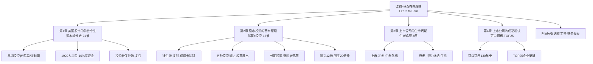
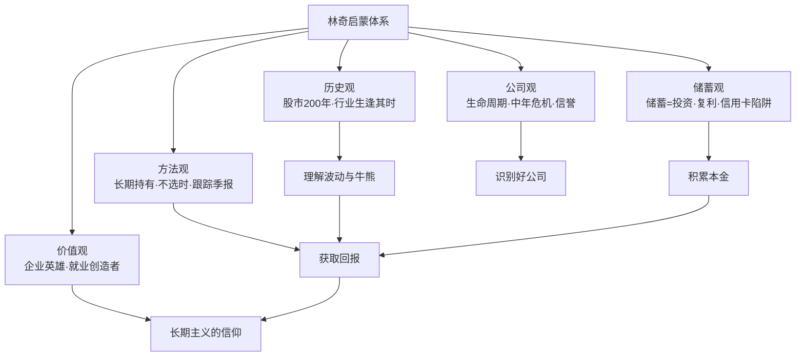

# 33《彼得·林奇教你理财》深度解读（详细版）

> **副题：彼得·林奇——"补上投资这一课"：一部用投资语言写成的美国资本成长史**
>
> 作者：彼得·林奇（Peter Lynch，1944—），富达麦哲伦基金传奇经理人。本书英文名 *Learn to Earn*（学会赚钱），是林奇与作家约翰·罗斯柴尔德合著的投资启蒙经典——**官方定位"向高中生及以上年龄的人群普及投资和商业的基本规律"**，但它远不止是一本入门书：林奇用大半篇幅讲述**美国股市 200 年的历史**——从华尔街的诞生、铁路的兴起、1929 年大崩盘，到可口可乐与沃尔玛的崛起——**开创性地以"资本成长"的视角重写了美国史**。
>
> **核心定位**：如果说 32 号《彼得·林奇的成功投资》教的是"怎么选股"（方法论），33 号《教你理财》教的是"为什么要投资"与"公司到底是什么"（世界观+历史观）。两本书合起来，才是完整的林奇。
>
> **系列意义**：033 是系列第 33 本，也是林奇系列第二本（032《成功投资》→ 033《教你理财》），接续 034《战胜华尔街》。这本"历史+启蒙"双料书，为系列补上了**"投资的来处"**——当你理解了美国股市从无到有的 200 年，你就理解了市场波动、公司兴衰、牛熊交替的底层逻辑。

---

## 📖 全书结构与核心框架



### 全书结构总览表

| 部分 | 章节 | 核心内容 |
|------|------|---------|
| 开篇 | 推荐序/序言/引言 | 为什么学校不教投资；储蓄=投资第一原理；公司=有限责任的合伙 |
| 第1章 | 美国股市的前世今生（21 节） | 早期投资者→铁路兴盛→道琼斯由来→1929 大崩盘→投资者保护法→股民重返 |
| 第2章 | 股市投资的基本原理（17 节） | 钱生钱→股票更胜一筹→长期投资→共同基金→自己选股→实战演习→股东权利→暴涨 12 倍→强生案例 |
| 第3章 | 上市公司的生命周期（8 节） | 上市扬帆→初创→中年危机（苹果）→衰老→并购→终结→经济气候→牛熊交替 |
| 第4章 | 上市公司的成功秘诀（4 节） | 可口可乐成功之道→比肩可口可乐→美国神话→TOP25 企业英雄 |
| 附录 | 附录A 常用选股工具 / 附录B 学会看财务报表 | 市盈率/每股收益等工具；资产负债表/损益表入门 |

---

## 📑 目录

- [[#第1章 这本书的定位：补上投资这一课|第1章 这本书的定位：补上投资这一课]]
- [[#第2章 引言：公司是什么——有限责任的奇迹|第2章 引言：公司是什么——有限责任的奇迹]]
- [[#第3章 美国股市的前世今生：一部资本成长史|第3章 美国股市的前世今生：一部资本成长史]]
- [[#第4章 基本原理之一：储蓄等于投资，让钱为你工作|第4章 基本原理之一：储蓄等于投资，让钱为你工作]]
- [[#第5章 基本原理之二：五种投资类别大比拼|第5章 基本原理之二：五种投资类别大比拼]]
- [[#第6章 基本原理之三：长期投资与选时者陷阱|第6章 基本原理之三：长期投资与选时者陷阱]]
- [[#第7章 牛市与熊市：市场波动的历史规律|第7章 牛市与熊市：市场波动的历史规律]]
- [[#第8章 案例一：耐克——跟踪季报找到 12 倍股|第8章 案例一：耐克——跟踪季报找到 12 倍股]]
- [[#第9章 案例二：强生——20 分钟读完年报的经典示范|第9章 案例二：强生——20 分钟读完年报的经典示范]]
- [[#第10章 上市公司的生命周期：从摇篮到坟墓|第10章 上市公司的生命周期：从摇篮到坟墓]]
- [[#第11章 苹果的"中年危机"：一个完整的企业转折样本|第11章 苹果的"中年危机"：一个完整的企业转折样本]]
- [[#第12章 可口可乐：一部 130 年的商业史诗|第12章 可口可乐：一部 130 年的商业史诗]]
- [[#第13章 TOP25 企业英雄：谁在创造就业|第13章 TOP25 企业英雄：谁在创造就业]]
- [[#第14章 共同基金与投资实战：普通人的入场方式|第14章 共同基金与投资实战：普通人的入场方式]]
- [[#第15章 附录A/B：选股工具与财务报表入门|第15章 附录A/B：选股工具与财务报表入门]]
- [[#总结：林奇启蒙课的核心思想|总结：林奇启蒙课的核心思想]]
- [[#附录一 林奇金句集（40 条精选）|附录一 林奇金句集（40 条精选）]]
- [[#附录二 本书术语速查卡|附录二 本书术语速查卡]]
- [[#附录三 系列互链：033 在 33 本笔记中的位置|附录三 系列互链：033 在 33 本笔记中的位置]]
- [[#附录四 A 股应用：中国版资本成长史|附录四 A 股应用：中国版资本成长史]]
- [[#附录五 读完本书后的 10 个自问|附录五 读完本书后的 10 个自问]]
- [[#附录六 本书案例与数据速查|附录六 本书案例与数据速查]]
- [[#附录七 美国股市大事年表（本书时间线）|附录七 美国股市大事年表（本书时间线）]]
- [[#附录八 林奇"教你理财"检查清单|附录八 林奇"教你理财"检查清单]]
- [[#附录九 本书 FAQ 20 问|附录九 本书 FAQ 20 问]]
- [[#附录十 系列母题追踪（033 号更新）|附录十 系列母题追踪（033 号更新）]]
- [[#附录十一 林奇双册对照：教你理财 × 成功投资|附录十一 林奇双册对照：教你理财 × 成功投资]]
- [[#附录十二 30 秒版：给新手的投资第一课|附录十二 30 秒版：给新手的投资第一课]]
- [[#附录十三 林奇理财理念 60 条|附录十三 林奇理财理念 60 条]]
- [[#附录十四 新手避坑清单（本书版）|附录十四 新手避坑清单（本书版）]]
- [[#附录十五 系列 33 本总览（完成进度）|附录十五 系列 33 本总览（完成进度）]]
- [[#附录十六 同一市场，五种眼光（033 版）|附录十六 同一市场，五种眼光（033 版）]]
- [[#附录十七 中医视角：投资启蒙与"上工治未病"|附录十七 中医视角：投资启蒙与"上工治未病"]]
- [[#附录十八 中英对照：林奇理财核心概念|附录十八 中英对照：林奇理财核心概念]]
- [[#附录十九 思维训练：10 个理财练习|附录十九 思维训练：10 个理财练习]]
- [[#附录二十 给未来投资者的信（知乎文风附录）|附录二十 给未来投资者的信（知乎文风附录）]]

---

## 第1章 这本书的定位：补上投资这一课

### 1.1 林奇为什么要写一本"入门书"

林奇在序言里提出了一个振聋发聩的问题：**美国的初中和高中，为什么从来不教"投资学"？**

> "我们教授历史，却从未涉及资本主义的伟大进程，以及公司对于改变和提高我们生活水平所起到的重要作用；我们教授数学，却从未谈及如何利用简单的算术帮助我们了解上市公司。"

| 学校教了什么 | 学校没教什么 |
|-------------|-------------|
| 历史（战争/政治/政府） | 资本主义进程/公司的作用 |
| 数学（公式/计算） | 用算术判断公司经营 |
| 家政学（缝纫/烹饪/预算） | 尽早储蓄和投资是致富关键 |
| 爱国主义（军队/战争） | 企业才是一国繁荣的关键 |

**林奇的核心观点**：没有投资者的资金，就不会有新的公司成立，就不会有新的工作机会——**投资不只是个人致富的途径，更是国家繁荣的发动机。**

**"早知今日，何不早日投资"**——林奇观察到，大多数人人到中年（"视力开始变糟、腰围开始变粗的年纪"）才开始知悉投资的奥妙。他写这本书，就是想让年轻人**在 15 岁而不是 45 岁**明白这些道理。

### 1.2 第一原理：储蓄等于投资

林奇给出的理财第一原理，简单到令人惊讶：

> "**储蓄等于投资。**把钱放进存钱罐或饼干盒里并不能算是一种投资，但只要你将钱存进银行，进而购买债券或公司股票，那你就是在投资。接受者会用这笔钱去建商店、买房子或新工厂，这样就会产生许多新的就业机会。"

**储蓄→投资→就业→收入→再储蓄**——这是一个周而复始的良性循环，适用于任何家庭、任何公司、任何国家：

| 国家/主体 | 行为 | 结果 |
|-----------|------|------|
| 日本 | 战后高储蓄率 | 从"日本制造"的笑柄变成高科技象征 |
| 美国 | 曾拥有世界最高储蓄率 | 富甲天下 |
| 现在的美国 | 储蓄率仅 4% | 债台高筑（国债 5 万亿美元） |
| 月光族 | 不储蓄不投资 | 老来无依 |
| 信用卡负债者 | 付 18% 利息给别人 | 越欠越多 |

**林奇的警示**：信用卡公司"投资在你身上比投资股市的回报更大"——18% 的利息，意味着你每欠 400 美元，每年要多付 72 美元；如果只还最低额度，一台 400 美元的电视最终会花掉你 800 美元。

### 1.3 越早开始，复利越惊人

林奇反复强调一个数学事实：**时间比金钱更重要**。

> "你未来的财富不仅取决于你目前赚多少钱，而且取决于你将多少钱用于储蓄和投资——**以及你从多早开始。**"

**每年储蓄 500 美元，利率 5%，连续 10 年**：

| 项目 | 金额 |
|------|------|
| 本金合计 | 5,000 美元 |
| 利息合计 | 1,603.39 美元 |
| 本利总计 | **6,603.39 美元** |

而如果投入股市（平均每 7—8 年翻一番），收益远不止于此。**巴菲特的故事就是最好的例证**：他靠送报纸攒钱，11 岁买第一只股票——他看到一台 400 美元的电视时，想的不是"买不买得起"，而是"**这 400 美元如果投资，20 年后值多少**"。

**林奇的金句**：

> "如果你及早储蓄和投资，终有一天单靠钱生钱就够你生活所需，就像你有一个有钱的姑妈或舅舅寄给了你下半辈子所需要的所有现金——**而你甚至不需要写感谢信。**"

### 1.4 投资不是天赋，是学习

林奇特别破除一个迷思：**"他是个天生的投资家"——纯属胡说。**

> "任何人的投资能力并非与生俱来……金融理财的原理实际上很简单，也很容易掌握。"

| 迷思 | 真相 |
|------|------|
| 投资需要天才智商 | 五年级数学就够 |
| 投资是男人的事 | 男女皆可 |
| 需要内幕消息 | 需要的是计划和纪律 |
| 太晚开始没意义 | 65 岁开始也不晚（还能再活 25 年） |

---

## 第2章 引言：公司是什么——有限责任的奇迹

### 2.1 "公司"一词的来历

**"公司"（company）源于拉丁文"共事者"（companion）**；正式名称"股份有限公司"（corporation）源于拉丁文 corpus（主体），意为"一群人联合起来做生意"。

**成立公司有多容易？**在美国，去州政府登记注册、支付一点手续费即可。特拉华州特别受欢迎，因为其法律特别有利于公司组织。公司名称后加"Inc."（incorporated，股份责任有限），在英国则加"limited"（有限）。

### 2.2 有限责任：资本主义的伟大发明

林奇用一个生动的例子解释"有限责任"：**埃克森瓦尔迪兹号油轮原油泄漏事件**——一艘油轮在阿拉斯加威廉王子海湾搁浅，泄漏 1,100 万加仑原油，污染需数月才能清除。埃克森是全美第三大公司，股东成千上万。

| 如果没有有限责任 | 有了有限责任 |
|----------------|-------------|
| 所有股东都可能被起诉 | 只有公司（总经理和董事会）被诉 |
| 股东可能损失终身积蓄 | 股东个人财产受保护 |
| 没人敢买股票 | 投资者放心入场 |

> "这就是资本主义体系的重要保护措施——**如果不是责任有限的话，恐怕没有人敢买任何一种股票。**"

**有限责任的意义**：它把"投资"与"经营"的风险隔离——**你可以分享公司的利润，而不用承担公司过失的无限责任**。没有这个制度，现代股市根本不会存在。

### 2.3 引言给读者的第一课

林奇在引言里埋下了全书的种子：**开始留意身边的上市公司**——公司不是抽象的概念，你喝的饮料、穿的运动鞋、用的手机，背后都有一家上市公司。**理解公司，是理解投资的起点。**

---

## 第3章 美国股市的前世今生：一部资本成长史

### 3.1 从早期投资者到铁路时代

**这一章是全书最独特的部分**——林奇用 21 个小节，讲完了美国股市从无到有的 200 年。推荐序作者吕俊的评价一针见血：**"这是一部以投资语言写就的美国股市和美国资本的发展史。"**

| 阶段 | 关键人物/事件 | 意义 |
|------|-------------|------|
| 早期投资者 | 荷兰/英国的股票传统传入 | 股市的种子 |
| 早期企业家 | 亚当·斯密"看不见的手" | 资本逐利的理论奠基 |
| 金融体系之父 | 汉密尔顿（美国第一任财政部长） | 国债与银行的建立 |
| 最早的百万富翁 | 靠贸易/航运起家 | 资本积累的雏形 |
| 铁路的兴盛 | 铁路公司大量上市融资 | **股市第一次大爆发** |
| 美国品牌兴起 | 可口可乐/宝洁/吉列 | 消费股的诞生 |
| 工业暴发户 | 卡内基/洛克菲勒/福特 | 垄断巨头的时代 |
| 道琼斯指数 | 1896 年创立 | 市场温度计 |
| 1929 大崩盘 | 10% 保证金制度 | 股市的至暗时刻 |
| 投资者保护法 | 1933/1934 年证券法 | 现代监管的起点 |

### 3.2 铁路：美国股市的第一波浪潮

林奇特别强调了铁路的历史地位：**铁路是美国股市的第一场大牛市的主角**。

| 铁路的特征 | 投资含义 |
|-----------|---------|
| 需要巨额资本 | 必须上市融资（当时最大的公司） |
| 股息丰厚稳定 | 被视为"安全投资"首选 |
| 垄断性路线 | 早期的"护城河" |
| 20 世纪衰落 | 汽车/飞机取代铁路地位 |

> "鲜有经济学家（更鲜有算命先生）预料到，铁路会长期丧失其领先地位，萎缩成公众生活中的阴影……**股票是好是坏完全取决于是否生逢其时。**"

**"股票是好是坏取决于生逢其时"**——这句话是全书最重要的历史观：没有永远的好行业，只有时代的行业。铁路→电力→汽车→消费→科技，**每一代人的"伟大公司"，都可能成为下一代人的"平庸资产"。**

### 3.3 1929 年大崩盘：10% 保证金的教训

**1929 年大崩盘是全书历史部分的"中心事件"**。林奇用当时的细节还原了崩盘的环境：

**崩盘前的市场**：

| 数据 | 1929 年 | 对比 |
|------|---------|------|
| 纽交所全部股票总市值 | 870 亿美元 | 现在仅埃克森一家就超过 |
| 最大公司 | 美国电话电报公司（AT&T） | 铁路仍是最大行业 |
| 散户杠杆 | **只需 10% 订金即可买股票** | 相当于 10 倍杠杆 |

**崩盘的元凶**：**10% 保证金制度**——人们以 10% 的订金买股票，意味着 90% 是借款。股价一跌，追加保证金的通知雪片般飞来，散户被迫割肉还债：

> "直到最后，他们所欠的债务远远超过最初投入的资金。经纪行必须催收这些债务，疯狂地要求客户变现资产偿还债务……**散户股民就没有那么幸运了。**"

**林奇的历史洞察**：

| 教训 | 内容 |
|------|------|
| 杠杆是崩盘的放大器 | 10% 保证金=10 倍杠杆 |
| 崩盘后的经纪行 | 大部分挺过来了（它们只是中介） |
| 崩盘后的公司 | 好公司活了下来（大难不死） |
| 崩盘后的监管 | 催生了投资者保护法 |

**"大难不死的好公司"**——林奇专门有一节讲 1929 崩盘后活下来的公司：**好公司在崩盘中不会消失，消失的是杠杆过度的投机者。**这与系列 31 号（索罗斯"繁荣/萧条"）和 28 号（格雷厄姆安全边际）形成呼应：**崩盘清洗的是杠杆，留下的是价值。**

### 3.4 投资者保护法：现代股市的基石

1933—1934 年，美国先后通过《证券法》和《证券交易法》，建立了信息披露制度和证券交易委员会（SEC）：

| 保护措施 | 内容 |
|---------|------|
| 强制信息披露 | 上市公司必须公开财务数据 |
| 禁止内幕交易 | 内部人不能利用未公开信息 |
| 设立 SEC | 独立监管机构 |
| 注册制度 | 新股发行必须注册 |

**林奇的态度**：投资者保护法是"股民逐渐重返股市"的前提——**信任，是股市存在的基础。**

### 3.5 从历史得到的投资启示

| 历史事实 | 投资启示 |
|---------|---------|
| 铁路由盛转衰 | 行业有生命周期，生逢其时很重要 |
| 1929 崩盘消灭的是杠杆者 | 不借钱，就能活过任何崩盘 |
| 好公司大难不死 | 危机是检验公司成色的试金石 |
| 监管保护投资者 | 制度是股市长期繁荣的根基 |
| 股票长期上涨 | 美国股市 200 年总体向上 |

---

## 第4章 基本原理之一：储蓄等于投资，让钱为你工作

### 4.1 钱生钱的数学

**林奇的"500 美元例子"**：在储蓄账户存 500 美元，利率 5%，一年后多赚 25 美元——"不用靠修剪草坪或清洗五辆汽车"就赚到了。

| 年限 | 每年存 500 美元（5% 利率） | 累计本金 | 利息 |
|------|--------------------------|---------|------|
| 第1年 | 525.00 | 500 | 25.00 |
| 第5年 | 2,903.72 | 2,500 | 403.72 |
| 第10年 | **6,603.39** | 5,000 | 1,603.39 |

**复利的本质**：利息生利息。**林奇说"时间创造金钱"**——把"时间就是金钱"改写成"时间创造金钱"。

### 4.2 三种理财状态的对比

| 状态 | 行为 | 结果 |
|------|------|------|
| 最好 | 从工资中直接省下一部分投资 | 钱生钱 |
| 次好 | 月光族 | 不亏不赚 |
| 最糟 | 信用卡赊账消费 | **付 18% 利息给别人** |

**信用卡的真相**：信用卡公司"投资在你身上比投资股市的回报更大"——它们向你收 18% 的利息，而股市长期回报只有 11%。**你越是超前消费，越是在给信用卡公司打工。**

### 4.3 储蓄习惯与国家命运

林奇把储蓄上升到国家层面：**日本战后靠高储蓄率重建经济**——"日本制造"从笑柄变成高科技象征；而美国储蓄率从世界第一跌到 4%，国债高达 5 万亿美元，**"纳税人缴纳的每一美元中有 15 美分是用来偿还国债利息的"。**

> "一个高储蓄率的国家可以集中财力投资于公路、电话网络、工厂、设备和一切可以使公司生产出价廉物美、行销海外的商品的创新科技。"

**储蓄=国家的投资能力**——这个观点放在今天的中国同样成立：**高储蓄率是 A 股长期资金来源的基石。**

---

## 第5章 基本原理之二：五种投资类别大比拼

### 5.1 五种投资方式的完整对比

林奇在"股票投资更胜一筹"一节中，系统比较了五种投资方式：

| 投资方式 | 优点 | 缺点 | 长期表现 |
|---------|------|------|---------|
| 储蓄/货币基金/国库券 | 本金安全、随时变现 | 利息率低、跑不赢通胀 | **长期亏本**（通胀+税） |
| 收藏品（邮票/钱币/车） | 越老越值钱 | 易丢失/损坏/保险贵/需要专业 | 少数人赚钱 |
| 房产 | 可住可涨、可贷款、税收优惠 | 流动性差 | 稳健（杠杆加成） |
| 债券 | 固定利息 | 本质是借条、跑不赢股票 | 比储蓄好 |
| **股票** | **分享公司成长** | 短期波动大 | **长期最佳**（11%/年） |

### 5.2 为什么储蓄"长期是失败的投资"

**林奇的核心论点**：储蓄的最大缺点是**跑不赢通货膨胀**。

> "通货膨胀是价格上涨的一种比较学术化的说法……现在美国的通货膨胀率略低于 3%，这就意味着你拥有的每一美元，每年都在损失约 3 美分。"

**投资回报率必须超过通胀率才算保本**——如果储蓄利率 3%、通胀 3%、还要交利息税，那么**20 年里有 10 年储蓄是亏本的投资**。

### 5.3 房产：普通人最赚钱的买卖

林奇对房产的评价极高：**"买房是很多人最赚钱的买卖。"** 他用"乔和萨莉"的故事说明：

| 角色 | 选择 | 15 年后 |
|------|------|---------|
| 萨莉 | 贷款买房（首付 20%） | 还清贷款，完全拥有房产 |
| 乔 | 租房+把钱花在音箱和高尔夫课 | 家无恒产，租金还涨了 |

**房产的杠杆魔法**：10 万美元的房子，首付 2 万美元，年涨 3% = 3,000 美元——**用 2 万美元赚 3,000 美元，回报率是 15% 而不是 3%。**

> "一个不会省钱买房子的人，通常也不太可能存钱投资股市。一个家庭为了最终可以买房子而做出很多牺牲，这听起来很平常，但是你听说过一个家庭为了买第一只共同基金而做出很多牺牲吗？"

### 5.4 债券：一张精美的借条

林奇对债券的定义非常直白：

> "美其名曰的'债券'，其实就是一张借条（IOU）……即使有时候叫'购买债券'，但当你购买的时候，你却没有买到任何东西，**你只是借出了一笔款项。**"

| 债券的本质 | 股票的本质 |
|-----------|-----------|
| 借钱给发行人 | 成为公司的所有者 |
| 利息固定 | 分享利润（上不封顶） |
| 不分享增长 | 分享增长 |
| 优先受偿 | 最后受偿 |

### 5.5 为什么股票长期更胜一筹

**林奇的结论**：股票是长期唯一能跑赢通胀并分享经济增长的投资。

| 维度 | 股票 | 债券/储蓄 |
|------|------|-----------|
| 长期回报 | 年化约 11% | 3—6% |
| 抵御通胀 | 公司随通胀提价 | 固定收益被通胀侵蚀 |
| 分享增长 | 公司成长=股价成长 | 不参与 |
| 风险 | 短期波动大 | 本金安全 |

> "如果你已经决定投资股票，而不是债券的话，你就做出了一个很明智的决定——**当我们这样说的时候，我们是假定你是一个长期投资者。**"

---

## 第6章 基本原理之三：长期投资与选时者陷阱

### 6.1 投资股票需要的时间框架

林奇给出了明确的建议：**投资股票需要坚持 20 年或 20 年以上**。

> "如果你的钱只能投资 1 年、2 年或是 5 年，那么，股票并不是第一选择。因为从这一年到下一年股市会怎么样没有人会知道。"

**11% 年化的复利威力**（1 万美元初始投资）：

| 持有年限 | 价值 |
|---------|------|
| 5 年 | 16,851 美元 |
| 10 年 | 28,394 美元 |
| 15 年 | 47,846 美元 |
| 20 年 | **80,623 美元** |

### 6.2 "婚姻"比喻：长期投资的纪律

林奇用了一个生动的比喻：

> "要想得到每年 11% 的投资回报，你必须忠诚地对待你购买的股票，就像忠实于婚姻一样，因为你已经建立了你的钱和你的投资之间的'婚姻'。**有时候决定投资者的好坏高低的并不是投资智慧，而是投资的纪律性。**"

| 短期投资者 | 长期投资者 |
|-----------|-----------|
| 像约会（随时分手） | 像婚姻（忠诚持有） |
| 根据波动买卖 | 根据基本面买卖 |
| 自称长期但一跌就跑 | 真正经受熊市考验 |

**林奇的辛辣观察**：自诩长期投资者很容易——"现在已经很难找到一个人不说自己是长期投资者了"，**但当股市调整之日，真正的考验才刚开始**：90% 的股票集体下跌时，号称长期投资者的人突然变成了短线投机者。

> "他们因为股价下跌而惶恐，匆匆卖掉股票而不是耐心等待它反弹。没有人强迫他们这样做，是他们自愿的。"

### 6.3 选时者陷阱：没有人能连续两次预测熊市

**林奇对"选时"（市场择时）的批判**是全书的精髓之一：

> "选时者试图预测短期市场波动和股价变动，并据此获得盈利而退场。但是，没有多少人可以用这种傻瓜都懂的方法真正赚到钱。**如果真是这样，那这个人早就成了亿万富翁，而不是比尔·盖茨和沃伦·巴菲特了。**"

| 选时者的幻觉 | 现实 |
|-------------|------|
| 我能躲过下跌 | 躲过下跌的同时也错过了上涨 |
| 有人预测对了 1987 崩盘 | 从没听说有人连续两次预测对 |
| 专家喊"熊来了" | 大部分时候啥也没发生 |
| 避开调整=省钱 | **躲避调整损失的金钱，远超过调整本身造成的损失** |

**铁证**（林奇引用的标普 500 数据，1954—1994 四十年）：

| 策略 | 年化回报 |
|------|---------|
| 40 年全部投入股市 | **11.5%** |
| 错过 40 个涨幅最大的月份 | **只剩 2.7%** |

> "你试图选时，但结果往往是追涨杀跌……**在试图通过选时来躲开熊市的同时，人们往往也错过了与牛市共舞的机会。**"

**（这与 31 号索罗斯"识别偏向"并不矛盾**：索罗斯不预测市场方向，而是识别"偏向是否极端"；林奇则从根本上反对择时——两者针对的是不同层面：林奇管"该不该持有"，索罗斯管"极端时刻该不该动作"。**对普通人而言，林奇的"不选时"是更安全的默认策略。**）

---

## 第7章 牛市与熊市：市场波动的历史规律

### 7.1 牛熊的定义与频率

| 术语 | 定义 | 20 世纪频率 |
|------|------|------------|
| 调整 | 从高点下跌 10% | 53 次（平均每 2 年一次） |
| 熊市 | 下跌 25% 或更多 | 15 次（平均每 6 年一次） |
| 超级熊市 | 1929 年开始的大崩盘 | 25 年才解套 |
| 次超级熊市 | 1973—1974 | 股价平均跌 50% |

**林奇的幽默**："把熊和赔钱联系在一起，对熊而言是很不公平的——**在华尔街方圆 50 英里以内你绝对找不到一只熊。**"

### 7.2 牛市里的众生相

林奇描写牛市的文字极富画面感：

> "只要这场天赐良机还没结束，这个国家数以百万计的股票持有人在每天晚上上床的时候都觉得自己幸福无比。他们洗澡的时候哼着小曲，上班的时候吹着口哨，看到老太太过马路的时候也乐意搀扶一把，**当然睡前也绝不会忘记计算自己的投资组合今天又赚了多少钱。**"

**（这段描写与 32 号"鸡尾酒会理论"第四阶段完全对应**：全民狂欢之时，正是风险积聚之日。）

### 7.3 熊市的残酷数据

| 熊市 | 高点买入者的解套时间 |
|------|---------------------|
| 1929 年高点买入 | **等 25 年才能解套** |
| 1969 年高点买入（1973—74 崩盘） | 等 12 年 |

> "想象一下你的资金被套牢达到 1/4 世纪是什么滋味！"

### 7.4 应对牛熊的正确姿势

| 错误姿势 | 正确姿势 |
|---------|---------|
| 试图预测熊市 | 承认无法预测 |
| 熊市前清仓 | 保持持有 |
| 等调整捡便宜 | 一直参与市场 |
| 杀进杀出 | 长期持有 |

> "投资者最大的错误之一，就是在股票和基金里杀进杀出，指望避开调整。**还有一种错误就是手上拿着一大笔钱迟迟不入场，而是期待下一个调整来临时来捡便宜货。**"

**林奇的结论**：投资者无法避免调整和熊市，"就像美国北方人无法避免暴风雪一样"——**在 50 年的时间里，你会遇到 25 次调整，其中有八九次会变成熊市。** 接受波动，是投资的成年礼。

---

## 第8章 案例一：耐克——跟踪季报找到 12 倍股

### 8.1 案例背景：1987 年的耐克

这是全书最完整的实战演示。**1987 年，耐克是一家"简单得任何人都能跟踪"的公司**：主要生产运动鞋。林奇说只需跟踪三个核心要素：

| 跟踪要素 | 问题 |
|---------|------|
| 要素一 | 今年和去年相比，是否销售了更多运动鞋？ |
| 要素二 | 销售运动鞋是否盈利丰厚？ |
| 要素三 | 明年及之后的销售量能否与日俱增？ |

**耐克的历史波动**：1984 年 5 美元→1986 年 10 美元→跌回 5 美元→1987 年再涨到 10 美元。

### 8.2 连续四个季度的跟踪记录

**林奇演示了"跟踪季报"的完整过程**：

| 季度 | 发布时间 | 数据 | 信号 |
|------|---------|------|------|
| 1987 财年Q1 | 1986 年 10 月 | 销售 -22%，收入 -38%，未来订单 -39% | 🔴 糟糕 |
| Q2 | 1987 年 1 月 | 和 Q1 一样糟糕 | 🔴 糟糕 |
| Q3 | 1987 年 4 月 | 差强人意 | 🟡 平淡 |
| Q4 | 1987 年 7 月 | 销售仅 -3%，**未来订单增加** | 🟢 转折信号！ |
| 1988 财年Q1 | 1987 年 9 月 | **销售 +10%，收入 +68%，订单 +61%** | 🟢🟢 强劲反转 |

**关键细节**：Q4 的"未来订单增加"意味着**经销商正在采购更多耐克鞋——只有经销商销售信心增加，它们才会增加采购。** 这是领先指标。

**另一个关键认知**：尽管连续几个季度收入下降，**耐克依然盈利**——因为运动鞋行业成本低（一个大厂房+缝纫机+便宜原料），不需要钢铁业那样昂贵的工厂。**了解经营背景，才知道下跌的财报不等于毁灭。**

### 8.3 崩盘中的礼物

1987 年 10 月股市崩盘，耐克股价从 12.50 美元跌回 7 美元——**"那些罔顾公司经营实质背景的投资者正在抛售手中的所有股票……因为他们相信晚间新闻的评论员的预测：一个世界范围的金融市场崩溃即将来临。"**

而**跟踪过季报的你**知道：耐克的情况正在好转。崩盘给了你一份大礼——**在低位买入的机会**：

> "耐克的股价在股市崩盘后下跌至 7 美元，并在那个价位上盘整了 8 天，因此，你有充足的时间打电话给你的经纪人，从而买入耐克股票。**持股到 1992 年末，耐克的股价是你在 1987 年买入时的 12 倍多。**"

### 8.4 案例启示

| 启示 | 内容 |
|------|------|
| 股价≠公司 | "将股价和股票的实质混为一谈，是投资者所犯的最大错误" |
| 跟踪季报 | 三个核心要素足够（销量/利润/订单） |
| 领先指标 | 订单是经销商的信心投票 |
| 崩盘是礼物 | 好公司大跌=打折 |
| 不必买在最低点 | 错过 7 美元，12 倍变 10 倍、8 倍、6 倍——依然是超级回报 |

> "即使你错过在大跌后以 7 美元买入耐克公司股票的机会，你仍可以在随后的 3 个月、6 个月或是 1 年后的每次收到季报时购买耐克的股票。**虽然不能使你的资金变成原先的 12 倍，但你仍然能够实现 10 倍、8 倍或是 6 倍的投资回报。**"

---

## 第9章 案例二：强生——20 分钟读完年报的经典示范

### 9.1 案例背景：股价下跌的强生

1994 年 3 月 10 日，强生公布 1993 年年报。**股价从 1991 年底的 57 美元跌到 39.63 美元**——一家大公司在市场上升期创造了糟糕的股价，你一定怀疑是哪里出了问题。

林奇的示范：**翻开年报，找出导致股价下跌的利空消息——但每处看到的都是利好。**

### 9.2 年报中的利好清单（20 分钟能读完的部分）

| 数据 | 内容 | 页码 |
|------|------|------|
| 收益 | 过去 10 年直线稳步上涨 4 倍 | 第42页 |
| 销售 | 同样稳定增长 | 第42页 |
| 分红 | 连续 10 年提升（实际连续 32 年！） | 第42页 |
| 效率 | 1983 年 77,400 员工创造 60 亿；1993 年 81,600 员工创造 140 亿 | 第42页 |
| 回购 | 1993 年回购 300 万股，10 年共回购 1.1 亿股 | 第25/42页 |
| 现金 | 超过 9 亿美元现金和有价证券 | 第29页 |
| 负债 | 长期负债 15 亿 vs 权益 55 亿（适宜） | 第29页 |
| 研发 | 1993 年研发 10 亿+（占销售 8%），10 年翻倍 | 第42页 |

**员工效率的细节**：增加 4,200 名员工，产值翻了一倍多（60 亿→140 亿）——**公司变得高效并善于缩减成本**，员工为公司、股东和自己创造更大价值。

**回购的意义**：更小的股本意味着更多的每股收益，股价会变得更高——**"看着强生的股价，你不会想到这是由于公司进行股份回购而促成的。"**

### 9.3 股价下跌的真正原因

**公司没有任何问题——问题是"健康护理恐慌"**：

> "在 1993 年，美国国会讨论了各种健康护理的改革方案，其中包括克林顿政府的提案。投资者们担心，一旦克林顿政府的提案通过并立法，健康护理行业的公司会因此遭殃。因此，投资者大量抛售强生公司及其他健康护理行业的股票。"

**但细读年报，强生受影响有限**：

| 担忧 | 强生的实际情况 |
|------|---------------|
| 克林顿医改打击药企 | 强生 **50% 以上利润来自国际业务**（提案影响不到） |
| 药品是改革重心 | 强生 20% 利润来自香波/急救绑带等非药品消费品 |
| 行业整体遭殃 | 强生只是"被错杀" |

### 9.4 结论与后续

> "阅读强生的年报不超过 20 分钟，就能决定在 39.63 美元左右买入强生公司股票是 10 年间最好的交易之一。**强生公司的故事并不深奥，即使你不是全职专业投资者，也不是一个哈佛商学院毕业的高材生，你也一样能够发现其中的机会。**"

**后续验证**：1993 年底林奇在《今日美国》推荐（44.88 美元）；1994 年春股价跌到 37 美元——**"7 美元的下跌丝毫没有影响彼得·林奇。最新季报告诉他，公司的销售和收益正在上升，因此，故事会向更好的方向继续发展。在更低的价位买入更多的强生公司股份是一个完美的机遇。"**

| 案例启示 | 内容 |
|---------|------|
| 股价下跌≠公司变差 | 先查年报找原因 |
| 行业恐慌=错杀机会 | 区分"公司问题"与"行业情绪" |
| 20 分钟足够 | 收益/分红/回购/现金/研发五项指标 |
| 下跌后敢加仓 | 基本面向上+股价向下=完美买点 |
| 与耐克案例互补 | 耐克=困境反转；强生=错杀修复 |

---

## 第10章 上市公司的生命周期：从摇篮到坟墓

### 10.1 公司也有生老病死

**第3章是全书最有"生物学味道"的部分**——林奇把公司比作生命体，用生命周期框架分析公司：

| 阶段 | 特征 | 投资含义 |
|------|------|---------|
| 上市扬帆 | 首次公开募股（IPO） | 高风险高回报 |
| 初出茅庐 | 快速增长、烧钱扩张 | 成长股温床 |
| 步入中年 | 增速放缓、稳定 | 现金牛 |
| 日渐衰老 | 市场萎缩、失去活力 | 价值陷阱 |
| 收购兼并 | 大鱼吃小鱼 | 机会与风险并存 |
| 公司终结 | 破产/退市 | 归零风险 |

### 10.2 中年公司的特点

> "公司步入中年阶段时，往往比年轻的公司稳定得多……此时，公司多半已经进入稳定发展阶段，它们在银行里也有些积蓄，商誉良好，借贷记录优良。然而，一个步入中年的公司，虽然目前继续增长，但增长速度已经明显减缓。"

| 中年公司的优势 | 中年公司的风险 |
|---------------|---------------|
| 知名度高 | 增长放缓 |
| 与银行关系良好 | 安于现状 |
| 有积蓄有商誉 | 被进取的竞争者超越 |
| 能从错误中学习 | **中年危机**（过去的做法不再有效） |

**（这与 32 号"六类型公司"中的"稳定增长型"完全对应**——33 号从生命周期角度解释了为什么会有这些类型。）

### 10.3 生命周期的投资启示

| 阶段 | 投资策略 |
|------|---------|
| 初创期 | 高风险高回报，适合敢赌的人 |
| 成长期 | 快速增长型，大牛股温床 |
| 中年期 | 稳定增长型，拿分红+稳步增值 |
| 衰老期 | 警惕价值陷阱（便宜但不会涨） |
| 终结期 | 远离 |

---

## 第11章 苹果的"中年危机"：一个完整的企业转折样本

### 11.1 从 Apple III 到丽萨：一连串失误

**林奇用苹果电脑的 1980 年代作为"中年危机"的完整案例**：

| 事件 | 年份 | 结果 |
|------|------|------|
| 苹果上市 | 1980 年底 | 万众瞩目 |
| Apple III 推出 | 1980 年底 | **市场败绩**，消费者失去信心 |
| 裁撤高管 | 1981 | 断然措施挽回信誉 |
| 年销售 10 亿美元 | 1982 | 复苏（但 IBM 切入个人电脑市场） |
| 丽萨（Lisa）推出 | 1983 | **卖不出去**（配鼠标但贵） |
| 股价一年跌一半 | 1983—84 | 投资人恐慌 |
| 马库拉辞职，斯卡利上任 | 1983 | 百事前总裁临危受命 |
| 麦金托什（Mac）推出 | 1984 | 电视广告"免费试用24小时"，3 个月卖 7 万台 |
| Mac 年销突破 100 万台 | 1988 | 彻底翻盘 |

### 11.2 信誉：公司最宝贵的资产

> "对任何一个上市公司来说，没有任何东西比商业信誉来得更为重要。一个百年历史的餐厅，可能口碑良好而且享誉百年，但是，这样一世的英名，可能也会因为一次食物中毒，或新厨师把菜单弄错而毁于一旦。"

**Apple III 的教训**：产品失败可以停产，但**消费者信心的损失无法立刻挽回**——必须靠"断然措施"（裁撤高管）来重建信任。

### 11.3 行销高手救场：斯卡利的启示

**斯卡利不是电脑专家，但是行销高手——而"行销专家就是苹果电脑现在最需要的高管"。**

| 斯卡利的动作 | 效果 |
|-------------|------|
| 分拆丽萨/Mac 两大部门 | 内部竞争激烈 |
| 砍掉丽萨，集中火力 Mac | 资源聚焦 |
| 电视广告"免费试用 24 小时" | 订单雪片般飞来 |
| 让 Mac 与任何网络兼容 | 1988 年销量破 100 万台 |

### 11.4 中年危机的投资含义

> "一个上市公司面临的中年危机，常会让投资人束手无策：股价已经跌了一半，是该一走了之呢？还是继续持有，期待公司能有转机？**当然，事后我们知道那时确实是苹果电脑的转机，但当危机发生时，究竟有无转机实在难以料定。**"

| 关键问题 | 林奇的答案 |
|---------|-----------|
| 危机发生时能确定转机吗？ | 不能（事后才知道） |
| 那投资者怎么办？ | 看基本面是否恶化（而不是股价） |
| 苹果当时基本面如何？ | 产品线调整中，现金流尚可 |
| 结论 | 中年危机=高风险时刻，需跟踪基本面 |

---

## 第12章 可口可乐：一部 130 年的商业史诗

### 12.1 从澡盆里的糖浆到全球帝国

**第4章"可口可乐的成功之道"是全书最精彩的故事**——林奇用可口可乐 130 年的历史，浓缩了"成功公司的全部秘诀"：

| 时间 | 事件 | 意义 |
|------|------|------|
| 1869 | 彭伯顿博士在亚特兰大卖专利药 | 可口可乐前身诞生 |
| 1880s | 糖浆卖不动（第一年广告 73.96 美元，只卖了 50 美元糖浆） | 惨淡开局 |
| 1886 前后 | 彭伯顿以 2,300 美元卖掉配方 | **历史上最便宜的甩卖** |
| 1890s | 坎德勒接手，去可卡因、改标签 | 合规化 |
| 1916 | 发明曲线瓶 | 品牌视觉识别 |
| 1919 | 伍德罗夫家族 2,500 万美元收购并上市（100 万股，40 美元/股） | 公开上市 |
| 1929—1937 | **大萧条中逆势上涨：20 美元→160 美元** | 8 倍 |
| 二战 | 美国大兵成为"最有效的免费代言人" | 全球化开端 |
| 1958—1972 | 5,000 美元→100,000 美元（14 年 20 倍） | 耐心回报 |
| 1972 危机 | 市值跌 63%，3 年未恢复 | 波动常态 |
| 1984—1994 | 5,000 美元→50,000 美元 | 再次 10 倍 |

### 12.2 可口可乐成功秘诀拆解

| 秘诀 | 具体内容 |
|------|---------|
| 产品力 | 独特配方（"20 世纪保守得最好的秘密"） |
| 品牌 | 曲线瓶一眼可辨；红色广告牌遍布六大洲 |
| 危机应对 | 大萧条时人们不买新鞋新衣但**仍要买可乐** |
| 全球扩张 | 二战美国大兵免费代言 |
| 长寿 | 130 年穿越战争、萧条、监管 |
| 定价权 | 提价不丢客户（品牌溢价） |

### 12.3 大萧条的启示：反直觉的赢家

> "尽管 1930 年美国的经济已经跌到谷底，但是，因为可口可乐保持了较高的盈利水平，所以它的股价从 1932 年时的 20 美元逆势上涨到 1937 年时的 160 美元。**你投资可口可乐股票的资本上涨了 8 倍，而周围的人则惶惶然仿佛世界末日，真是令人不可思议。**"

**（这个案例与系列 31 号"危机抄底"、28 号"安全边际"完美互证**：真正的优质消费品，在危机中反而受益——**"口红效应"的百年版本。A 股对应：白酒、中药等必需消费在 2018、2022 年的表现。）**

### 12.4 林奇的历史洞察

> "要从可口可乐这只股票中赚足好处，你要有耐心等上 20 年的时间……**在 14 年间将 5000 美元资产扩大到 100000 美元，这种机会少之又少，除非你中彩票或干非法勾当。**"

**关键：耐心的复利**——可口可乐的每个 10 倍，都是"持有 10 年以上"换来的。**（与 32 号"10 倍股"、05 号巴菲特"可口可乐 30 年"构成三部曲。）**

---

## 第13章 TOP25 企业英雄：谁在创造就业

### 13.1 企业英雄 vs 明星偶像

林奇提出了一个发人深省的问题：**橄榄球明星乔伊·蒙塔纳 vs 拯救克莱斯勒的李·艾柯卡——谁对社会贡献更大？**

| 人物 | 贡献 |
|------|------|
| 蒙塔纳（橄榄球明星） | 让球迷买票进场，繁荣票贩子和热狗小贩 |
| 艾柯卡（克莱斯勒 CEO） | 拯救 11.5 万员工 + 相关产业 = **超过 30 万个工作岗位** |
| 杰克·韦尔奇（通用电气） | 20 年市值增长 30 倍 |
| 罗伊·瓦格洛斯（默克） | 开发多种抗病创新药 |
| 弗雷德·史密斯（联邦快递） | **不是为了钱**，想建立比邮局更好的邮递系统 |

> "艾柯卡拯救的不仅是热狗的品种，而是每小时 20 美元的技术岗位。30 多万个员工都应该感谢艾柯卡，是他让这些员工可以度假、买第二套房、送孩子上大学。"

### 13.2 企业家的财富来自哪里

**林奇为企业家辩护**：高管们的财富大多来自**股票期权**，而不是现金薪水——

> "只有在公司盈利、股票上涨时，公司高管才能从中获益。如果公司不赚钱且股价下跌，那么，这些人只能眼睁睁地看着自己的财富流失……**利用股票期权激励管理者，使得公司的管理层与股东利益攸关……这就形成了双赢的局面。**"

**迪士尼的艾斯纳**：10 年内迪士尼股价增长 11 倍，他赚进 5,000 万美元——**"不要眼红，反而应该为之欢呼，因为迪士尼在他的领导下兴盛起来，进而带动了股价上涨，大大小小的投资者都从中获益。"**

### 13.3 就业创造者才是真正的英雄

| 常听到的 | 不常听到的 |
|---------|-----------|
| 大公司裁员新闻 | 企业家创造的就业 |
| 500 强 80 年代裁员 300 万 | 沃尔玛/联邦快递等创造的岗位 |
| 企业家=贪婪的守财奴 | 他们享受"超越竞争对手的满足感" |

**林奇的教育意图**：让孩子们知道，**商业英雄和体育明星一样值得崇拜——甚至更值得**。他还在书里布置"家庭作业"：希望自己的三个女儿和罗斯柴尔德的两个女儿"受到鼓舞，立志成为女企业家"。

---

## 第14章 共同基金与投资实战：普通人的入场方式

### 14.1 共同基金：专业化的投资

第2章后半部分，林奇介绍了共同基金：

| 共同基金的特点 | 内容 |
|---------------|------|
| 集合投资 | 汇集众人资金 |
| 专业管理 | 基金经理操作 |
| 分散风险 | 持有多只股票 |
| 历史 | 20 世纪发展壮大 |
| 适合人群 | 没时间/没能力自己选股的投资者 |

### 14.2 投资基金的九条建议（要点）

| # | 建议 |
|---|------|
| 1 | 选择历史业绩稳定的基金 |
| 2 | 了解基金的投资风格 |
| 3 | 关注费用率 |
| 4 | 长期持有 |
| 5 | 不要追逐明星基金经理 |
| 6 | 定期定额投资 |
| 7 | 用闲钱投资 |
| 8 | 别频繁买卖 |
| 9 | 基金也要看基本面 |

### 14.3 如何自己挑选股票（纲要）

| 步骤 | 内容 |
|------|------|
| 1 | 了解公司经营背景（最重要！） |
| 2 | 跟踪季报/年报 |
| 3 | 关注销量、利润、订单 |
| 4 | 股价下跌时先查基本面 |
| 5 | 区分"公司变差"与"市场情绪" |

### 14.4 实战演习与交易基础

| 主题 | 要点 |
|------|------|
| 在交易所买股票 | 通过经纪商下单 |
| 证券经纪商的角色 | 执行交易+提供建议（注意利益冲突） |
| 其他交易场所 | 场外市场（OTC）等 |
| 阅读股票资讯 | 报纸股票版/行情数据 |
| 股东的权利 | 分红、投票、知情权 |

**股东的权利**（林奇特别强调）：

| 权利 | 内容 |
|------|------|
| 分红权 | 分享利润 |
| 投票权 | 选举董事会 |
| 知情权 | 查看年报 |
| 出售权 | 随时卖出 |

### 14.5 投资的目的在于获利

> "股价高低取决于盈利增长"——**长期看，股价是公司盈利的投影。** 林奇用强生案例证明：盈利 10 年涨 4 倍，股价终会跟随（哪怕中间有 3 年的错杀）。

---

## 第15章 附录A/B：选股工具与财务报表入门

### 15.1 附录A：常用的选股工具

| 工具 | 含义 | 使用要点 |
|------|------|---------|
| 市盈率（PE） | 股价÷每股收益 | 越低越便宜（相对行业） |
| 每股收益（EPS） | 净利润÷股本 | 长期增长是关键 |
| 股息率 | 每股分红÷股价 | 稳定分红=现金流 |
| 市净率（PB） | 股价÷每股净资产 | 银行/周期股适用 |
| 销售额 | 公司规模 | 跟踪增速 |

### 15.2 附录B：学会看财务报表

| 报表 | 内容 | 关键指标 |
|------|------|---------|
| 资产负债表 | 资产/负债/权益 | 现金、负债率 |
| 损益表（利润表） | 收入/成本/利润 | 毛利率、净利率 |
| 现金流量表 | 经营/投资/筹资现金流 | 自由现金流 |

**强生案例的报表应用**：现金 9 亿+（资产负债表）、研发 10 亿（损益表）、回购 1.1 亿股（现金流）——**三张表合起来，20 分钟读懂一家公司。**

---

## 总结：林奇启蒙课的核心思想

### Z1. 林奇理财体系全景



### Z2. 全书的五根柱子

| 柱子 | 核心内容 | 对应章节 |
|------|---------|---------|
| 历史 | 美国股市 200 年=资本成长史 | 第1章 |
| 储蓄 | 储蓄等于投资，让钱工作 | 第2章前半 |
| 方法 | 长期投资、不选时、跟踪季报 | 第2章后半+案例 |
| 公司 | 生命周期、中年危机、成功秘诀 | 第3、4章 |
| 价值 | 企业英雄、就业创造、耐心复利 | 第4章+全篇 |

### Z3. 林奇留给读者的三句话

> 1. "储蓄等于投资——越早开始，复利越惊人。"
> 2. "股价下跌并不是一个好的卖出理由——先查基本面，再决定去留。"
> 3. "投资股票需要坚持 20 年或 20 年以上——忠诚，就像婚姻。"

### Z4. 本书与 32 号《成功投资》的分工

| 维度 | 32《成功投资》 | 33《教你理财》 |
|------|--------------|--------------|
| 定位 | 方法论手册 | 历史+启蒙 |
| 对象 | 想学选股的投资者 | 完全的新手 |
| 内容 | 六分类/13 准则/12 愚蠢说法 | 股市历史/生命周期/可口可乐 |
| 案例 | 塔可钟/Stop&Shop | 耐克/强生/苹果/可口可乐 |
| 共同点 | 身边信息、长期持有、不预测 | 同左 |

---

## 附录一 林奇金句集（40 条精选）

> 1. "储蓄等于投资。把钱放进存钱罐或饼干盒里并不能算是一种投资。"——序言
> 2. "任何人的投资能力并非与生俱来……所谓无师自通只不过是天方夜谭。"——序言
> 3. "你未来的财富不仅取决于你目前赚多少钱，而且取决于你将多少钱用于储蓄和投资。"——序言
> 4. "花样年华就是开始投资的黄金时间……越早开始投资，你所收获的财富将越大。"——序言
> 5. "如果你及早储蓄和投资，终有一天单靠钱生钱就够你生活所需。"——第2章
> 6. "让时间和金钱发挥双重作用，投资回报自然不菲。"——第2章
> 7. "时间就是金钱'现在应该被改成'时间创造金钱'。"——第2章
> 8. "如果不是责任有限的话，恐怕没有人敢买任何一种股票。"——引言
> 9. "股票是好是坏完全取决于是否生逢其时。"——第1章
> 10. "散户股民就没有那么幸运了。"——第1章（1929 崩盘）
> 11. "股票投资更胜一筹。"——第2章标题
> 12. "你的钱就犹如逆水行舟不进则退。"——第2章
> 13. "储蓄在长期来看意义不大。"——第2章
> 14. "买房是很多人最赚钱的买卖。"——第2章
> 15. "债券其实就是一张借条（IOU）。"——第2章
> 16. "投资股票需要坚持 20 年或 20 年以上。"——第2章
> 17. "你必须忠诚地对待你购买的股票，就像忠实于婚姻一样。"——第2章
> 18. "有时候决定投资者的好坏高低的并不是投资智慧，而是投资的纪律性。"——第2章
> 19. "最好的秘籍便是选择一家盈利能力强的公司的股票长期持有。"——第2章
> 20. "股价下跌并不是一个好的卖出理由。"——第2章
> 21. "自诩是一个长期投资者很容易……但当股市调整之日，真正的考验才刚开始。"——第2章
> 22. "他们因为股价下跌而惶恐，匆匆卖掉股票……没有人强迫他们这样做，是他们自愿的。"——第2章
> 23. "如果真是这样，那这个人早就成了亿万富翁，而不是比尔·盖茨和沃伦·巴菲特了。"——第2章（讽刺选时者）
> 24. "人们往往也错过了与牛市共舞的机会。"——第2章
> 25. "在股市里像一个童子军那样保持戒备实际上是弊大于利。"——第3章
> 26. "投资者无法避免调整和熊市，就像美国北方人无法避免暴风雪一样。"——第3章
> 27. "将股价和股票的实质混为一谈，这是一个投资者所犯的最大错误。"——第2章
> 28. "这样的崩盘给了你一份大礼：一个在低位买入耐克股票的机会。"——第2章
> 29. "阅读强生的年报不超过 20 分钟，就能决定在 39.63 美元左右买入强生公司股票是 10 年间最好的交易之一。"——第2章
> 30. "股价的下跌与强生公司本身毫无关系。"——第2章
> 31. "没有任何东西比商业信誉来得更为重要。"——第3章
> 32. "一个上市公司面临的中年危机，常会让投资人束手无策。"——第3章
> 33. "你投资可口可乐股票的资本上涨了 8 倍，而周围的人则惶惶然仿佛世界末日。"——第4章
> 34. "美国大兵是商业广告史上最有效的免费代言人。"——第4章
> 35. "要从可口可乐这只股票中赚足好处，你要有耐心等上 20 年的时间。"——第4章
> 36. "这种机会少之又少，除非你中彩票或干非法勾当。"——第4章
> 37. "不要眼红迈克尔·艾斯纳从自己的迪士尼股票中赚进 5000 万美元，反而应该要为之欢呼。"——第4章
> 38. "他是在享受超越竞争对手的满足感。"——第4章
> 39. "我们听到的更多是失业的消息……但这并不会蔓延成全美性的危机。"——第4章
> 40. "学会让钱为你工作——它将成为你很好的朋友。"——第2章

---

## 附录二 本书术语速查卡

| 术语 | 定义 | 本书出处 |
|------|------|---------|
| 股份有限公司 | 一群人联合做生意的有限责任主体 | 引言 |
| Inc./limited | 责任有限的标记 | 引言 |
| 有限责任 | 股东不对公司过失承担无限责任 | 引言 |
| 通货膨胀 | 价格上涨/货币购买力下降 | 第2章 |
| 储蓄 | 把钱存入银行/购买债券股票 | 序言 |
| 复利 | 利息生利息 | 第2章 |
| 信用卡陷阱 | 18% 利息侵蚀财富 | 第2章 |
| 调整 | 从高点下跌 10% | 第3章 |
| 熊市 | 下跌 25% 或更多 | 第3章 |
| 选时者 | 试图预测短期波动的人 | 第2章 |
| 市盈率 | 股价÷每股收益 | 附录A |
| 每股收益 | 净利润÷股本 | 附录A |
| 共同基金 | 集合投资的基金 | 第2章 |
| 股票期权 | 以特定价格买股票的权利 | 第4章 |
| IPO | 首次公开募股 | 第3章 |

---

## 附录三 系列互链：033 在 33 本笔记中的位置

### 033 与系列笔记的链接网络

| 系列笔记 | 链接点 |
|---------|--------|
| [[32《彼得·林奇的成功投资》深度解读（详细版）|32 号]] | 林奇方法论手册；本册为其"历史+启蒙"姊妹篇 |
| 34《战胜华尔街》（待解读） | 林奇三册之三（待解读） |
| [[28《聪明的投资者》深度解读（详细版）|28 号]] | 格雷厄姆安全边际；本书"股价下跌≠公司变差"同源 |
| [[31《金融炼金术》深度解读（详细版）|31 号]] | 索罗斯繁荣/萧条；本书 1929 崩盘=杠杆反身性史例 |
| [[05《巴菲特的投资心法》深度解读（详细版）|05 号]] | 巴菲特 400 美元电视机的机会成本思维（本书引用） |
| [[11《巴菲特的伯克希尔崛起》深度解读（详细版）|11 号]] | 可口可乐案例互证（两家书都详解） |
| [[13《巴菲特的护城河》深度解读（详细版）|13 号]] | 可口可乐品牌=无形资产护城河 |
| [[27《超级强势股》深度解读（详细版）|27 号]] | 耐克困境反转=超级强势股逻辑 |
| [[04《原则》深度解读（详细版）|04 号]] | 达利欧债务周期；本书信贷/杠杆历史互证 |
| [[29《段永平投资问答录》深度解读（详细版）|29 号]] | "买股票就是买公司"；本书公司生命周期=公司观 |
| [[01《股票作手回忆录》读书笔记|01 号]] | 1929 崩盘亲历者利弗莫尔；本书提供宏观背景 |

### 林奇三册定位

| 册 | 书名 | 定位 | 状态 |
|----|------|------|------|
| 第一册 | 彼得·林奇的成功投资 | 方法论（六分类/13 准则） | ✅ 32 号 |
| 第二册 | **彼得·林奇教你理财** | 历史+启蒙（股市 200 年/公司生命周期） | ✅ 033 号 |
| 第三册 | 战胜华尔街 | 实战（基金/行业轮动） | 待解读 034 |

---

## 附录四 A 股应用：中国版资本成长史

### 4.1 中国股市的"前世今生"对照

林奇讲美国股市 200 年，中国股市 30 年——**同样的剧本，更快的速度**：

| 美国历史阶段 | 美国时间 | 中国对应 | 中国时间 |
|-------------|---------|---------|---------|
| 铁路大牛市 | 1840s—1900s | 地产+基建牛市 | 2005—2007、2014—2015 |
| 工业暴发户 | 1880s—1920s | 制造业龙头崛起 | 2003—2010 |
| 消费品牌兴起 | 1900s—1930s | 白酒/家电/调味品 | 2016—2021 |
| 1929 崩盘（10% 保证金） | 1929 | 2015 杠杆牛（场外配资） | 2015 |
| 投资者保护法 | 1933—34 | 注册制/退市新规 | 2019— |
| 股民重返 | 1940s—1950s | 机构化/长线资金入市 | 2020s— |

### 4.2 A 股版"生逢其时"

| 时代 | 生逢其时的行业 | 生不逢时的行业 |
|------|---------------|---------------|
| 2005—2007 | 周期股（有色/煤炭/地产） | 消费股（无人问津） |
| 2013—2015 | 互联网+（乐视/暴风） | 银行/白酒 |
| 2016—2021 | 白酒/医药/新能源 | 周期股 |
| 2021—2024 | 高股息/公用事业 | 新能源/医药 |

**"股票是好是坏完全取决于是否生逢其时"**——A 股的行业轮动完美验证了林奇的历史观：**没有永恒的好行业，只有时代的行业。**

### 4.3 A 股版可口可乐：从历史看消费长牛

| 美国可口可乐 | 中国版（茅台/片仔癀等） |
|-------------|------------------------|
| 130 年历史 | 数百年工艺传承 |
| 大萧条逆势上涨 | 2013 年塑化剂后 9—10 倍 PE 黄金坑 |
| 二战全球扩张 | 消费升级+国际化预期 |
| 品牌护城河 | 品牌+配方+文化 |
| 耐心 20 年 | 持有 5—10 年穿越牛熊 |

### 4.4 A 股新手的三条启蒙建议

1. **先理解公司再买股票**——从你喝的白酒、用的酱油、吃的药开始
2. **不要用杠杆**——2015 年配资爆仓是 A 股版 1929
3. **长期持有+不选时**——错过 A 股最大的 40 个月，回报同样惨不忍睹

---

## 附录五 读完本书后的 10 个自问

1. 我是否理解了"储蓄等于投资"的第一原理？
2. 我是否在 18% 的信用卡利息陷阱里？
3. 我的投资期限是否达到了 20 年的标准？
4. 我买的每一只股票，是否都能说清它的"经营背景"？
5. 股价下跌时，我是先查基本面还是先恐慌？
6. 我是否还在试图"选时"？（如果是，请重读第 6 章）
7. 我持有的公司处在生命周期的哪个阶段？
8. 我能用 20 分钟读完一份年报并找到五个关键指标吗？
9. 我是否理解"生逢其时"——我持有的行业是时代的行业吗？
10. 我是否把投资当作一门需要学习的课程，而不是赌博？

---

## 附录六 本书案例与数据速查

### 核心数据

| 数字 | 含义 |
|------|------|
| 500 美元 | 每年储蓄的示范本金 |
| 6,603.39 美元 | 10 年复利结果（5%） |
| 11% | 美股长期年化回报 |
| 80,623 美元 | 1 万美元 20 年复利结果 |
| 11.5% vs 2.7% | 全仓 vs 错过 40 个最佳月份 |
| 53 次 | 20 世纪调整次数（约每 2 年一次） |
| 15 次 | 20 世纪熊市次数（约每 6 年一次） |
| 25 年 | 1929 高点买入者的解套时间 |
| 10% | 1929 年保证金比例（10 倍杠杆） |
| 870 亿 vs 5.4 万亿 | 1929 vs 现在的纽交所市值（美元） |
| 2,300 美元 | 可口可乐配方的出售价 |
| 20→160 美元 | 可口可乐 1932—1937 涨幅（8 倍） |
| 5,000→100,000 美元 | 可口可乐 1958—1972（20 倍） |
| 12 倍 | 耐克 1987 崩盘后买入的回报 |
| 20 分钟 | 读完强生年报并决定买入的时间 |
| 1.1 亿股 | 强生 10 年回购股数 |
| 32 年 | 强生连续提高分红的年份 |
| 30 万个 | 艾柯卡拯救的工作岗位 |

### 案例速查表

| 案例 | 类型 | 启示 |
|------|------|------|
| 1929 崩盘 | 历史 | 杠杆是崩盘放大器 |
| 铁路兴衰 | 历史 | 行业生逢其时 |
| 耐克 | 选股 | 跟踪季报+崩盘是礼物 |
| 强生 | 选股 | 20 分钟年报+行业错杀 |
| 苹果 | 公司 | 中年危机与转机 |
| 可口可乐 | 公司 | 品牌+耐心=史诗 |
| 艾柯卡/韦尔奇 | 价值观 | 企业英雄创造就业 |

---

## 附录七 美国股市大事年表（本书时间线）

| 年份 | 事件 | 意义 |
|------|------|------|
| 1790s | 汉密尔顿建立国债/银行体系 | 金融体系之父 |
| 1840s—1900s | 铁路大发展 | 股市第一波浪潮 |
| 1869 | 彭伯顿配出可乐糖浆 | 可口可乐前身 |
| 1886 前后 | 配方 2,300 美元出售 | 历史性甩卖 |
| 1896 | 道琼斯工业平均指数创立 | 市场温度计 |
| 1919 | 可口可乐上市（40 美元/股） | 消费股时代 |
| 1929 | 大崩盘（10% 保证金） | 至暗时刻 |
| 1932—1937 | 可口可乐逆势 8 倍 | 危机中的消费 |
| 1933—34 | 证券法/证券交易法/SEC | 现代监管 |
| 1945—1960s | 战后牛市+全球化 | 股民重返 |
| 1973—74 | 次超级熊市（-50%） | 12 年解套 |
| 1982 | 熊市 | 牛市起点 |
| 1987 | 大崩盘（单日 -508 点） | 耐克买入点 |
| 1990 | 海湾战争熊市 | 短期恐慌 |

---

## 附录八 林奇"教你理财"检查清单

### 储蓄习惯检查

- [ ] 每月从收入中固定储蓄/投资一部分
- [ ] 信用卡账单全额还清（绝不分期付 18% 利息）
- [ ] 有 3—6 个月生活费的应急现金

### 投资期限检查

- [ ] 我的投资期限 ≥ 5 年（最好是 20 年）
- [ ] 我清楚短期波动不等于损失
- [ ] 我不试图预测熊市

### 选股检查（结合 32 号）

- [ ] 我能说清这家公司的经营背景
- [ ] 我跟踪了它的季报（销量/利润/订单）
- [ ] 股价下跌时我先查基本面再决定
- [ ] 我知道它处在生命周期的哪个阶段
- [ ] 我理解它是否"生逢其时"

### 心态检查

- [ ] 我不把股价和公司混为一谈
- [ ] 我不因恐慌卖出（没人强迫我）
- [ ] 我像忠于婚姻一样忠于好公司

---

## 附录九 本书 FAQ 20 问

**Q1：这本书是写给谁的？**
A：高中生及以上年龄的初级投资者——"向高中生及以上人群普及投资和商业的基本规律"。

**Q2：为什么学校不教投资？**
A：林奇认为这是教育体系的缺憾——投资学是"最重要却被遗忘的学科"。

**Q3：储蓄算投资吗？**
A：算——只要钱进入银行/债券/股票，被用于生产，就是投资。放进饼干盒不算。

**Q4：股票 vs 债券选哪个？**
A：长期选股票（11% vs 3—6%）；但前提是能持有 20 年。

**Q5：什么时候开始投资最好？**
A：越早越好——"花样年华就是开始投资的黄金时间"。

**Q6：65 岁开始晚吗？**
A：不晚——还能再活 25 年，复利依然有效。

**Q7：什么是 1929 崩盘的教训？**
A：杠杆（10% 保证金）是崩盘放大器；好公司大难不死。

**Q8：熊市多久一次？**
A：约每 6 年一次熊市；每 2 年一次调整；50 年约 25 次调整、八九次熊市。

**Q9：能预测熊市吗？**
A：不能——没人能连续两次预测对。

**Q10：错过最佳月份损失多大？**
A：错过 40 个最佳月份，年化从 11.5% 掉到 2.7%。

**Q11：耐克案例说明什么？**
A：跟踪季报（销量/利润/订单）+ 崩盘是买入礼物 = 12 倍。

**Q12：强生案例说明什么？**
A：股价下跌≠公司变差；20 分钟年报足够；行业错杀是机会。

**Q13：公司也有生命周期吗？**
A：有——上市/初创/中年/衰老/并购/终结。

**Q14：苹果的教训是什么？**
A：信誉是公司最宝贵的资产；中年危机需要"断然措施"。

**Q15：可口可乐为什么成功？**
A：产品力+品牌+危机受益+全球扩张+耐心持有。

**Q16：企业家的财富合理吗？**
A：合理——期权激励使管理层与股东利益一致，双赢。

**Q17：普通人该自己选股还是买基金？**
A：有时间和能力自己选；否则买共同基金（九条建议）。

**Q18：股东有什么权利？**
A：分红权、投票权、知情权、出售权。

**Q19：这本书和《成功投资》什么关系？**
A：32 号讲"怎么选"，33 号讲"为什么投资"与"公司是什么"。

**Q20：读完这本书最重要的收获？**
A：储蓄=投资；长期=复利；公司=生逢其时的生命体。

---

## 附录十 系列母题追踪（033 号更新）

### 10.1 "市场本质"的六大视角（更新）

| 视角 | 代表 | 市场本质 | 033 的印证 |
|------|------|---------|-----------|
| 称重机 | 28 格雷厄姆 | 价格终归价值 | 强生案例（错杀终修复） |
| 生意 | 05 巴菲特/29 段永平 | 公司所有权 | 可口可乐=好生意 |
| 系统 | 04 达利欧 | 周期可循 | 牛熊交替 53/15 次 |
| 偏向 | 31 索罗斯 | 价格创造价值 | 1929 杠杆反身性 |
| 生活 | 32 林奇 | 身边信息 | 耐克/强生跟踪法 |
| **历史** | **033 林奇** | **行业生逢其时** | **铁路兴衰/可口可乐** |

### 10.2 "耐心"主题的系列对照

| 笔记 | 耐心的表述 |
|------|-----------|
| 01 利弗莫尔 | 坐功（sitting tight） |
| 05 巴菲特 | 最喜欢的持有期是永远 |
| 28 格雷厄姆 | 市场先生是仆人 |
| 32 林奇 | 婚姻比喻 |
| **033 林奇** | **20 年或 20 年以上+错过 40 个月只剩 2.7%** |

### 10.3 "公司生命周期"的系列补全

| 笔记 | 公司分析框架 |
|------|-------------|
| 13 护城河 | 竞争优势四源 |
| 32 林奇 | 六类型公司 |
| **033 林奇** | **生命周期五阶段** |
| 27 小费雪 | 困境反转 |

---

## 附录十一 林奇双册对照：教你理财 × 成功投资

| 维度 | 32《成功投资》 | 033《教你理财》 |
|------|--------------|---------------|
| 写作对象 | 想学选股的投资者 | 完全的新手 |
| 核心问题 | 怎么选 10 倍股？ | 为什么要投资？ |
| 历史观 | 无 | 美国股市 200 年 |
| 公司观 | 六类型 | 生命周期 |
| 案例 | 塔可钟/Stop&Shop/家庭购物网络 | 耐克/强生/苹果/可口可乐 |
| 独特贡献 | 13 条准则/12 种愚蠢说法 | 储蓄=投资/选时者陷阱/企业英雄 |
| 共同金句 | "买你熟悉的公司" | "股价下跌不是卖出理由" |

**两册合读的顺序建议**：先读 033（建立世界观：为什么要投资、公司是什么）→ 再读 32（建立方法论：怎么选、怎么持有）→ 之后读 034《战胜华尔街》（实战）。

---

## 附录十二 30 秒版：给新手的投资第一课

> **投资第一课（30 秒版）**：
>
> 1. **储蓄等于投资**——把钱存进银行/买股票，让钱为你工作；
> 2. **越早越好**——复利是时间的朋友，20 年 11% 年化=8 倍；
> 3. **别用信用卡债**——18% 利息是财富粉碎机；
> 4. **别选时**——错过 40 个最佳月份，11.5% 变 2.7%；
> 5. **买股票前先了解公司**——20 分钟读年报，看收益/分红/回购/现金/研发；
> 6. **股价下跌不是卖出理由**——先查基本面；
> 7. **像婚姻一样忠诚**——好公司拿 20 年。

---

## 附录十三 林奇理财理念 60 条

**储蓄与复利（1—10）**：

> 1. 储蓄等于投资。
> 2. 让钱为你工作。
> 3. 时间创造金钱。
> 4. 越早开始越好。
> 5. 投资能力并非与生俱来。
> 6. 未来财富取决于储蓄和投资。
> 7. 信用卡利息是财富粉碎机。
> 8. 高储蓄率=国家投资能力。
> 9. 复利是世界的第八大奇迹。
> 10. 投资得越多，国家越兴旺。

**市场与历史（11—25）**：

> 11. 股票是好是坏取决于生逢其时。
> 12. 1929 崩盘的元凶是杠杆。
> 13. 好公司大难不死。
> 14. 投资者保护法是股市基石。
> 15. 牛市里人人幸福无比。
> 16. 熊市像暴风雪无法避免。
> 17. 调整每两年一次。
> 18. 熊市每六年一次。
> 19. 没人能连续两次预测熊市。
> 20. 避开调整损失更多。
> 21. 错过 40 个最佳月份=灾难。
> 22. 选时者最终追涨杀跌。
> 23. 长期投资者在调整日现原形。
> 24. 股票长期 11% 年化。
> 25. 债券只是借条。

**公司与选股（26—45）**：

> 26. 股价≠公司实质。
> 27. 了解经营背景是第一步。
> 28. 跟踪季报三要素：销量/利润/订单。
> 29. 订单是经销商的信心投票。
> 30. 崩盘是买入礼物。
> 31. 20 分钟可以读完年报。
> 32. 收益/分红/回购/现金/研发五项指标。
> 33. 行业恐慌=错杀机会。
> 34. 公司也有生命周期。
> 35. 中年危机需要断然措施。
> 36. 商业信誉比什么都重要。
> 37. 品牌是可口可乐的护城河。
> 38. 大萧条中消费股受益。
> 39. 耐心 20 年=20 倍。
> 40. 回购减少股本提升每股收益。
> 41. 管理层与股东利益一致（期权）。
> 42. 股东有分红/投票/知情/出售权。
> 43. 市盈率越低越便宜。
> 44. 盈利增长决定股价。
> 45. 企业英雄创造就业。

**人生与心态（46—60）**：

> 46. 投资像婚姻，需要忠诚。
> 47. 纪律比智慧更重要。
> 48. 65 岁开始不晚。
> 49. 女孩也能成为企业家。
> 50. 企业家享受超越对手的满足感。
> 51. 失业新闻被夸大，就业创造被忽视。
> 52. 金钱不是唯一回报。
> 53. 时间是年轻人最大的优势。
> 54. 先储蓄后消费。
> 55. 为买房牺牲是美德。
> 56. 别买新车当投资。
> 57. 收藏品是专业活。
> 58. 房产是普通人最赚钱的买卖。
> 59. 教育+储蓄=锦绣前程。
> 60. 补上投资这一课。

---

## 附录十四 新手避坑清单（本书版）

| 坑 | 本书依据 | 避坑方法 |
|----|---------|---------|
| 用 10% 保证金/配资炒股 | 1929 崩盘 | 永远不用杠杆 |
| 信用卡分期消费 | 18% 利息 | 全额还款 |
| 试图选时 | 2.7% vs 11.5% | 长期持有 |
| 听信"专家预测熊市" | 没人连续预测对 | 忽略预测 |
| 股价跌就卖 | 强生案例 | 先查基本面 |
| 不研究就买 | 耐克案例 | 了解经营背景 |
| 把股价当公司 | 最大错误 | 跟踪季报 |
| 追热门行业 | 铁路兴衰 | 生逢其时但会过时 |
| 频繁交易 | 婚姻比喻 | 忠诚持有 |
| 不看年报 | 20 分钟足够 | 读五项指标 |

---

## 附录十五 系列 33 本总览（完成进度）

| 编号 | 书名 | 状态 |
|------|------|------|
| 01—03 | 利弗莫尔三部曲 | ✅ |
| 04 | 达利欧《原则》 | ✅ |
| 05—14 | 巴菲特系列 | ✅ |
| 16—21 | 巴菲特延伸系列 | ✅ |
| 22—25 | 芒格四书 | ✅ |
| 26—27 | 费雪父子 | ✅ |
| 28 | 格雷厄姆 | ✅ |
| 29—30 | 段永平双册 | ✅ |
| 31 | 索罗斯《金融炼金术》 | ✅ |
| 32 | 彼得·林奇《成功投资》 | ✅ |
| **033** | **彼得·林奇《教你理财》** | **✅ 本笔记** |
| 034 | 林奇《战胜华尔街》 | 待解读 |
| 035—169 | 更多 | 待解读 |

**系列进度：33/169 完成（01—33 全部解读）**

---

## 附录十六 同一市场，五种眼光（033 版）

以"2020 年疫情暴跌"为例（与 31 号附录十七对照）：

| 大师 | 眼光 | 2020.3 的动作 |
|------|------|--------------|
| 28 格雷厄姆 | 便宜 | 估值跌到安全边际内，买 |
| 05 巴菲特 | 生意 | 好公司打折，买（达美航空等） |
| 04 达利欧 | 周期 | 流动性危机，先等 |
| 31 索罗斯 | 偏向 | 恐慌极端，反身性拐点，买 |
| **033 林奇** | **历史+常识** | **"历史上每次危机都过去了"——不选时，继续持有** |

**林奇视角的独特价值**：**历史数据告诉他——50 年 25 次调整、15 次熊市，每次都被时间抚平**。他不需要判断拐点，只需要"知道暴风雪会过去"。

---

## 附录十七 中医视角：投资启蒙与"上工治未病"

### 17.1 未病先防：投资启蒙的核心

**《黄帝内经》："上工治未病，不治已病。"**——最好的医生在病未成时干预；林奇的启蒙课也是同样的逻辑：**在 15 岁（未病）时建立理财习惯，胜过 45 岁（已病）时补救。**

| 中医 | 林奇 |
|------|------|
| 治未病 | 越早开始投资 |
| 正气存内 | 储蓄=正气（本金积累） |
| 邪不可干 | 信用卡债=邪气入侵 |
| 养正 | 长期投资（复利=正气增长） |

### 17.2 储蓄=正气，负债=邪气

| 中医概念 | 理财对应 |
|---------|---------|
| 正气（抗病能力） | 储蓄/现金流/复利 |
| 邪气（致病因素） | 信用卡债/杠杆/投机 |
| 扶正祛邪 | 先储蓄后消费/还清高息债 |
| 阴阳平衡 | 收入与支出的平衡 |

**林奇的"信用卡陷阱"在现代中医语境下就是"邪气入体"**：18% 的利息如同慢性病，日积月累侵蚀正气（本金）。

### 17.3 治未病三法（林奇版）

1. **未病先养**：从工资中直接储蓄投资（先养正气）
2. **既病防变**：已有负债先还高息债（防邪气传变）
3. **瘥后防复**：熊市不割肉（防"复发"——追涨杀跌）

### 17.4 公司与人体

| 公司生命周期 | 人体阶段 | 投资应对 |
|-------------|---------|---------|
| 初创 | 婴儿期 | 高风险高回报 |
| 成长期 | 青少年 | 大牛股温床 |
| 中年 | 中年 | 稳定但需防"中年危机" |
| 衰老 | 老年 | 警惕价值陷阱 |
| 终结 | 死亡 | 远离 |

---

## 附录十八 中英对照：林奇理财核心概念

| 中文 | English | 说明 |
|------|---------|------|
| 学会赚钱 | Learn to Earn | 本书英文名 |
| 股份有限公司 | Corporation | 有限责任主体 |
| 有限责任 | Limited liability | 股东保护 |
| 储蓄 | Saving | 第一原理 |
| 复利 | Compound interest | 时间创造金钱 |
| 通货膨胀 | Inflation | 购买力下降 |
| 调整 | Correction | 下跌 10% |
| 熊市 | Bear market | 下跌 25%+ |
| 选时者 | Market timer | 林奇批判的对象 |
| 市盈率 | P/E ratio | 估值工具 |
| 每股收益 | EPS | 盈利指标 |
| 共同基金 | Mutual fund | 集合投资 |
| 股票期权 | Stock options | 管理层激励 |
| 首次公开募股 | IPO | 公司上市 |

---

## 附录十九 思维训练：10 个理财练习

1. **算复利**：用 11% 年化计算你每月存 1,000 元，20 年后多少钱
2. **算利息**：算一笔信用卡分期 5,000 元的真实年化成本
3. **找公司**：列出你日常生活中 10 个品牌背后的上市公司
4. **读年报**：找一家你熟悉的中国公司，20 分钟读完年报找五项指标
5. **跟踪季报**：选一只股票，连续跟踪 4 个季度（销量/利润/订单）
6. **写买入理由**：为你的持仓写下"经营背景"（300 字）
7. **历史对照**：找出 A 股与美股 1929 最像的时刻（2015 杠杆牛）
8. **生命周期定位**：判断你的持仓处于哪个生命周期阶段
9. **选时自查**：记录你最近 3 次买卖的动机，是否有选时行为
10. **写给 15 岁的自己**：用林奇的观点写一封理财启蒙信

---

## 附录二十 给未来投资者的信（知乎文风附录）

### 写在前面：一本"晚到了 30 年"的书

先讲一个很多中国读者都会有的感受：**如果我在 15 岁的时候读到这本书，我的人生可能会不一样。**

这不是夸张。林奇在序言里说，美国中学"忘记了教授最重要的一门学科——投资学"；而这本书的英文名 *Learn to Earn*（学会赚钱），就是写给那些"从没人教过他们钱是怎么回事"的年轻人的。

我们大多数人是怎么学会理财的？**不是在学校，不是在父母那里，而是在亏钱之后。**被 P2P 坑过、被 2015 年杠杆牛套过、被基金"教育"过——然后才明白：哦，原来储蓄等于投资，原来复利是时间的朋友，原来"股价下跌不是卖出理由"。

而林奇在这本书里，把这些用一辈子（和麦哲伦 13 年的实战）换来的道理，**用最朴素的语言提前告诉了你**。

### 第一课：钱是会"工作"的

林奇的第一课，是让你重新理解"钱"。

大多数人对钱的认知停留在"钱是用来花的"。但林奇说：**钱是可以工作的**——你存 500 美元在银行，一年后它自己多出 25 美元，"不用靠修剪草坪或清洗五辆汽车"。

这 25 美元看起来不起眼，但如果你从 20 岁开始，每年存 5,000 元，到 60 岁——**复利会把你的本金变成 4—5 倍。**林奇说，这就是"你有一个有钱的姑妈，寄给你下半辈子所需要的所有现金，而你甚至不需要写感谢信"。

**反过来说**：信用卡公司也在让你的钱"工作"——只不过是在为**它们**工作。你欠银行 18% 的利息，银行从你身上赚的回报率比巴菲特从股市赚的还高。**你不是在花钱，你是在给银行打工。**

### 第二课：1929 年的教训，2015 年的 A 股又演了一遍

林奇写美国股市历史，最精彩的是 1929 年大崩盘。他指出了一个被大多数人忽略的细节：**崩盘的元凶不是股票，是"10% 保证金"——人们只需付 10% 的钱就能买股票，相当于 10 倍杠杆。**

股价一跌，追加保证金的通知来了；散户没钱，只能割肉；割肉导致股价更跌；股价更跌导致更多人爆仓……**这是一个自我强化的死亡螺旋。**

读到这一段，每个经历过 2015 年 A 股的读者都会倒吸一口凉气：**2015 年的场外配资，不就是 A 股版的"10% 保证金"吗？**一样的杠杆牛、一样的千股跌停、一样的爆仓螺旋——**历史没有重演，但历史押韵。**

林奇的历史课告诉我们三件事：

1. **杠杆是崩盘的放大器**——不借钱，你就能活过任何崩盘；
2. **好公司大难不死**——1929 年活下来的公司，后来都涨回来了；
3. **监管是市场的守护神**——1933 年的证券法，让"股民重返股市"成为可能。

### 第三课：耐克的故事——跟踪季报的完整示范

全书最实用的案例，是 1987 年的耐克。

耐克当时遭遇了什么？**销售下降 22%、收入下降 38%、未来订单下降 39%**——三个季度一片惨淡。如果你只看股价，你会在 5 美元割肉离场。

但林奇教你**跟踪季报**：第四个季度，销售仍然下滑，但"未来订单"开始增加了——**经销商正在进货，说明他们相信耐克能卖出去。**这是领先指标。

第五个季度：销售 +10%，收入 +68%，订单 +61%——**反转确认。**

然后 1987 年 10 月，股市崩盘。恐慌的人抛售一切，包括耐克——股价从 12.5 美元跌回 7 美元。**而跟踪过季报的你，是全世界少数知道"耐克正在变好"的人。**

> "这样的崩盘给了你一份大礼：一个在低位买入耐克股票的机会。"

后来耐克涨到 90 美元。**12 倍。**整个过程中，林奇没有预测任何东西——他只是读季报、等订单信号、然后在崩盘时保持清醒。

### 第四课：强生的故事——20 分钟改变命运

如果说耐克是"困境反转"，强生就是"错杀修复"。

1994 年，强生股价从 57 美元跌到 39 美元。你翻开年报想找利空——**结果全是利好**：收益 10 年涨 4 倍、连续 32 年提高分红、回购 1.1 亿股、现金 9 亿美元、研发占销售 8%……

那股价为什么跌？**因为华盛顿在讨论克林顿医改，投资者恐慌整个医疗行业。**但强生 50% 的利润来自国际业务，20% 来自香波和急救绑带——**医改根本伤不到它。**

> "阅读强生的年报不超过 20 分钟，就能决定在 39.63 美元左右买入强生公司股票是 10 年间最好的交易之一。"

**这就是"股价下跌≠公司变差"的完美示范。**A 股每天都在上演同样的剧本：白酒股因为"限制三公"跌 50%（2013 年），然后涨 10 倍；医药股因为"集采"恐慌腰斩，然后分化——**恐慌杀的是行业情绪，不是公司价值。**区别只在于：你有没有花 20 分钟读年报。

### 第五课：可口可乐——耐心是最稀缺的资产

林奇讲可口可乐的故事，从 1869 年彭伯顿博士的"澡盆糖浆"讲起——**第一年广告费花了 73.96 美元，糖浆只卖了 50 美元**；后来彭伯顿心灰意冷，把配方以 2,300 美元卖掉。

**2,300 美元。**这是人类商业史上最贵的"贱卖"之一。

后来的故事：坎德勒去可卡因、改标签；伍德罗夫家族 1919 年上市；大萧条中股价逆势 8 倍（20→160 美元）；二战美国大兵成为"最有效的免费代言人"；1958—1972 年 5,000 美元变 100,000 美元……

林奇用可口可乐证明一个朴素到没人愿意相信的道理：**好公司的价值，需要 20 年才能完全显现。**每一个 10 倍，都是"持有 10 年以上"换来的。**你不需要抓住每一次波动，你只需要抓住一个时代的好公司，然后坐着不动。**

### 尾声：林奇留给你的三句话

这本书读到最后，你会记住三句话：

**第一句："储蓄等于投资。"**——钱是工具，不是目的；让工具为你工作，而不是你为钱打工。

**第二句："股价下跌并不是一个好的卖出理由。"**——先查基本面，再决定去留；恐慌卖出的那一刻，正是你亏钱的原因。

**第三句："投资股票需要坚持 20 年或 20 年以上——就像婚姻。"**——选一个好公司，然后忠诚于它；**时间会给忠诚者发利息。**

林奇在序言里说，大多数人"人到中年（视力开始变糟、腰围开始变粗的年纪）才开始知悉投资的奥妙"，然后叹息"早知今日，何不早日投资"。

**这本书的意义，就是让你在"腰围还没变粗"的时候，先知道。**

> **"学会让钱为你工作——它将成为你很好的朋友。"**

---

## 第16章 深度专题：1929 年美国大崩盘 × 2015 年 A 股杠杆牛

### 16.1 为什么这两个崩盘如此相似

林奇写 1929 年崩盘时，一定没想到 86 年后的大洋彼岸会重演同样的剧本。**2015 年 A 股杠杆牛与 1929 年美国股市，共享同一个 DNA：杠杆。**

| 维度 | 1929 美国 | 2015 A 股 |
|------|----------|-----------|
| 杠杆工具 | 10% 保证金（10 倍杠杆） | 场外配资（5—10 倍杠杆） |
| 杠杆规模 | 保证金贷款占股市市值 2%+ | 配资峰值约 2 万亿+ |
| 上涨速度 | 1927—1929 两年翻倍 | 2014.7—2015.6 一年翻倍 |
| 全民狂欢 | 擦鞋童都在荐股 | 人人都是"股神" |
| 崩盘方式 | 连续暴跌+保证金强平 | 千股跌停+配资强平 |
| 自我强化 | 下跌→强平→再下跌 | 下跌→强平→再下跌 |
| 救市 | 胡佛政府观望 | 国家队入场+清理配资 |
| 后续 | 大萧条 25 年解套 | 熔断+慢熊 |

### 16.2 反身性的历史注脚

**用 31 号索罗斯的框架看这两个崩盘**：

| 反身性阶段 | 1929 美国 | 2015 A 股 |
|-----------|----------|-----------|
| 偏向形成 | "新时代"叙事（永远繁荣） | "国家牛市"叙事 |
| 自我加强 | 杠杆资金涌入→上涨→更多杠杆 | 配资涌入→上涨→更多配资 |
| 脆弱积累 | 保证金贷款膨胀 | 两融+配资+伞形信托 |
| 转折点 | 9 月见顶回落 | 6 月查配资+去杠杆 |
| 反向自我加强 | 强平螺旋 | 强平螺旋+千股跌停 |
| 最终 | 25 年解套 | 3 年修复+结构性牛市 |

**林奇的历史课+索罗斯的反身性=完整的危机认知**：历史告诉你"杠杆牛必然崩"，反身性告诉你"崩盘如何自我强化"。

### 16.3 林奇视角的应对

| 错误的应对 | 林奇的应对 |
|-----------|-----------|
| 2015.6 逃顶（选时） | 不选时，但绝不加杠杆 |
| 2015.7 割肉（恐慌） | 先查基本面再决定 |
| 2016 抄底（猜底） | 好公司跌了继续持有 |
| 听"国家牛市"（从众） | 历史告诉林奇：狂欢必结束 |

**林奇的结论**：**你不需要预测崩盘，你只需要确保崩盘来临时你还在场上**——不用杠杆（不会爆仓）、持有好公司（会涨回来）、长期视角（暴风雪会过去）。

---

## 第17章 深度专题：投资教育观——林奇 × 系列大师的"第一课"

### 17.1 大师们的第一课

| 大师 | 给新手的第一课 | 出处 |
|------|---------------|------|
| 格雷厄姆 | 投资与投机的区别 | 28 号 |
| 巴菲特 | 买股票就是买公司 | 05 号 |
| 芒格 | 反过来想 | 22 号 |
| 索罗斯 | 市场总是错的 | 31 号 |
| 达利欧 | 拥抱现实 | 04 号 |
| 利弗莫尔 | 自己分析自己判断 | 01 号 |
| 费雪 | 买最好的公司 | 26 号 |
| 段永平 | 本分/不懂不做 | 29 号 |
| **林奇（033）** | **储蓄=投资，先学会让钱工作** | **本笔记** |

### 17.2 林奇第一课的独特之处

**林奇是唯一从"储蓄"讲起的大师**——其他大师假设你已经有了钱，林奇先教你**怎么有钱**：

| 维度 | 其他大师 | 林奇（033） |
|------|---------|------------|
| 起点 | 已有本金 | 从零开始储蓄 |
| 第一问题 | 买什么？ | 为什么要投资？ |
| 敌人 | 市场 | 信用卡/月光/选时 |
| 时间观 | 长期 | 20 年+（婚姻比喻） |
| 历史观 | 无 | 美国股市 200 年 |

### 17.3 为什么"启蒙"是系列最缺的一块

系列 33 本中，绝大部分是"投资方法"和"投资哲学"，**唯独 033 是"投资教育"**——它回答的是：**为什么一个人应该开始投资？**

这个问题的答案，是其他所有方法的前提：

> 你不储蓄，就没有本金；没有本金，安全边际无从谈起；没有本金，复利无从谈起；没有本金，一切大师的方法都是空中楼阁。

**033 是整个系列的地基中的地基**——它不教你赚大钱，它教你**先成为"有钱可投的人"。**

---

## 附录二十一 检查清单速查卡（一页纸版）

### 储蓄三问

- [ ] 我的储蓄率是多少？（目标：收入的 10%+）
- [ ] 我有高息负债吗？（信用卡/网贷 >8% 先还）
- [ ] 我的应急金够 6 个月生活费吗？

### 投资五查

- [ ] 我能持有 20 年吗？
- [ ] 我知道公司经营背景吗？
- [ ] 我跟踪季报吗？
- [ ] 股价跌了我会先查基本面吗？
- [ ] 我理解"生逢其时"吗？

### 避坑四不

- [ ] 不用杠杆
- [ ] 不选时
- [ ] 不听"专家预测"
- [ ] 不把股价当公司

---

## 附录二十二 本书思维导图（文字版）

```
林奇教你理财
├── 为什么投资（序言/引言）
│   ├── 学校不教投资
│   ├── 储蓄=投资
│   └── 公司=有限责任
├── 股市历史（第1章）
│   ├── 铁路时代
│   ├── 1929 崩盘（杠杆）
│   └── 投资者保护法
├── 基本原理（第2章）
│   ├── 钱生钱/复利
│   ├── 五种投资对比
│   ├── 长期投资/婚姻
│   ├── 选时者陷阱
│   └── 案例：耐克/强生
├── 公司生命周期（第3章）
│   ├── 上市→初创→中年→衰老→终结
│   └── 苹果中年危机
├── 成功秘诀（第4章）
│   ├── 可口可乐 130 年
│   └── TOP25 企业英雄
└── 附录 A/B：工具与报表
```

---

*本解读基于《彼得·林奇教你理财》（Learn to Earn，宋三江/罗志芳 译）整理。全书以"储蓄=投资"为第一原理，以美国股市 200 年历史为主线，以耐克/强生/苹果/可口可乐为案例，构成林奇投资体系中最基础也最温暖的一册。*


---

## 附录二十三 A 股新手启蒙 15 条（本书本土化）

### 给中国新手的第一课

| # | 建议 | 本书依据 |
|---|------|---------|
| 1 | 从工资中固定划出 10% 投资 | 储蓄=投资第一原理 |
| 2 | 先还清信用卡/网贷高息债 | 18% 利息陷阱 |
| 3 | 准备 6 个月应急金再入市 | 现金流=正气 |
| 4 | 不碰场外配资/杠杆 | 1929 教训 |
| 5 | 从消费股开始（白酒/调味品/中药） | 可口可乐案例 |
| 6 | 买之前先问"它怎么赚钱" | 了解经营背景 |
| 7 | 每季度看一次财报 | 耐克跟踪法 |
| 8 | 股价大跌先查基本面 | 强生案例 |
| 9 | 不追热门行业 | 铁路兴衰 |
| 10 | 不试图预测牛熊 | 选时者陷阱 |
| 11 | 给自己定 5 年+的期限 | 20 年标准 |
| 12 | 用闲钱投资 | 别影响生活 |
| 13 | 学习看三张表 | 附录B |
| 14 | 关注公司生命周期 | 第3章 |
| 15 | 每年读一本投资书 | 林奇本人阅读习惯 |

### A 股版"生逢其时"行业对照

| 时代 | 生逢其时 | 生不逢时 |
|------|---------|---------|
| 2005—2007 | 周期/金融 | 消费 |
| 2013—2015 | 互联网+/创业板 | 大盘蓝筹 |
| 2016—2021 | 白酒/医药/新能源 | 周期 |
| 2021—2024 | 高股息/公用事业 | 成长赛道 |

---

## 附录二十四 股市历史趣闻集（本书珍藏）

### 趣闻一：跳楼传说与真相

**流传最广的崩盘传说**：发了狂的投资者从纽约高楼跳窗自杀。**真相**（据《1929：大崩盘之年》）：

| 传说 | 真相 |
|------|------|
| 崩盘后自杀率飙升 | 崩盘后几周全国自杀率并未上升 |
| 多人跳楼 | 只有极少数人跳楼，且不一定与股市有关 |
| 建筑工人被当跳楼者 | 一名建筑工人在桁架上吃午饭被围观 |

**喜剧演员威尔·罗格斯的段子**："在纽约的酒店，服务员会问进来的客人，'你要房间是为了睡觉还是跳楼？'你必须排队才能轮到跳楼。"——**他只是在搞笑。**罗格斯听了巴鲁克的建议在崩盘前全身而退；其他喜剧演员就没那么幸运了。

**崩盘真正的受害者**（林奇的结论）：

> "大崩盘的真正受害者是那些借钱（保证金）买股票的人。那时，你只要交 10% 的订金就可以购买股票。所以，如果你有 10,000 美元，你可以借 90,000 美元，购买价值 100,000 美元的股票。**如果你买的股票价格在大崩盘期间下跌 50%，你剩下的就是只值 50,000 美元的股票，还有 90,000 美元无力偿还的债务。**"

### 趣闻二：崩盘前的华尔街乱象

| 乱象 | 描述 |
|------|------|
| 无信息披露 | 公司"什么都不说，把问题掩盖起来" |
| 内幕交易横行 | 内幕人士在消息公布前买卖 |
| 操纵股价 | "强盗式资本家"左右股价诱骗大众 |
| 买股票如蒙眼打牌 | "普瑞斯可以看自己的牌，你却要蒙上眼睛" |

### 趣闻三：SEC 的诞生与内幕交易的现代规则

大崩盘后，国会举行听证会，成立 SEC。**现代内幕交易规则的严格程度**（林奇用波音副总裁举例）：

> "假设你是波音公司的副总裁，你刚听说中国同意购买 500 架新的大型喷气式客机……**你甚至不能打电话让你的妻子、丈夫、女朋友、男朋友、孩子、孙子、阿姨、叔叔、表兄妹或壁球搭档买进波音股票。**"

**内部人买卖的公开信号**（对投资者的有用信息）：

| 内部人行为 | 含义 |
|-----------|------|
| 多名高管/董事同时卖出 | 不看好公司前景 |
| 大量买进 | 非常看好公司前景 |

**（这个信号与 32 号林奇"内部人买入是选股准则"完全一致**——033 提供了制度的来龙去脉：正是因为 SEC 强制披露，内部人买卖才成为可供普通投资者观察的信号。）

---

## 附录二十五 全书核心概念关系图

```mermaid
graph LR
    A[储蓄] --> B[投资]
    B --> C[股票]
    C --> D[公司]
    D --> E[盈利增长]
    E --> F[股价上涨]
    F --> G[复利]
    G --> H[财务自由]
    A --> I[信用卡陷阱]
    I --> J[债务]
    C --> K[牛熊波动]
    K --> L[长期持有]
    L --> G

