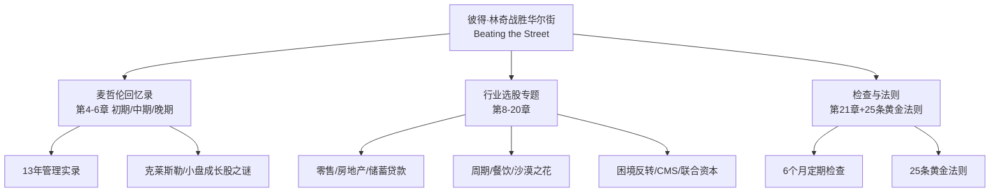
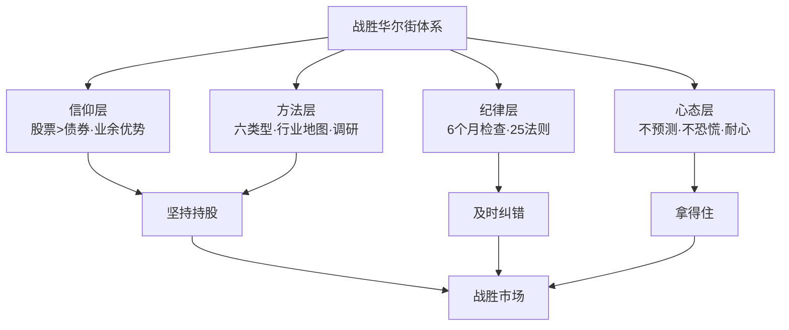

# 34《彼得·林奇战胜华尔街》深度解读（详细版）

> **副题：彼得·林奇——"业余投资者也能战胜华尔街"：麦哲伦 13 年实战回忆录与 25 条黄金法则**
>
> 作者：彼得·林奇（Peter Lynch，1944—），富达麦哲伦基金传奇经理人（1977—1990），13 年复合年化回报 29%。本书英文名 *Beating the Street*（战胜华尔街），是林奇"投资三部曲"的收官之作——**前半部是麦哲伦基金 13 年选股回忆录（初期/中期/晚期三章），后半部是行业选股专题（零售/房地产/储蓄贷款/周期/餐饮等），最后以 25 条股票投资黄金法则收尾。**
>
> **核心定位**：32 号《成功投资》教"怎么选股"（方法论），033 号《教你理财》教"为什么要投资"（历史+启蒙），34 号《战胜华尔街》教"实战怎么做"——**麦哲伦 13 年的真实操作记录+分行业选股地图+25 条铁律**。三册合起来，才是完整的林奇。
>
> **系列意义**：034 是林奇三部曲收官，也是系列第 34 本。本书独有价值：①**麦哲伦基金内部视角**（13 年管理实录，基金界最透明的自白）；②**分行业选股地图**（零售/房地产/周期/餐饮各有章法）；③**25 条黄金法则**（林奇 20 年经验的浓缩）；④**6 个月定期检查系统**（买了就忘的致命性）。

---

## 📖 全书结构与核心框架

### 全书结构总览表

| 部分 | 章节 | 核心内容 |
|------|------|---------|
| 开篇 | 引言 | 想多赚钱就买股票吧（伊博森 1926—1989 数据） |
| 基础篇 | 第1—3章 | 业余投资者优势/周末焦虑症/基金选择之道 |
| 回忆录 | 第4—6章 | 麦哲伦基金选股回忆录（初期/中期/晚期） |
| 方法篇 | 第7章 | 艺术、科学与调研 |
| 行业篇 | 第8—20章 | 零售/房地产/剪理发/沙漠之花/储蓄贷款/有限合伙/周期/CMS/联合资本/房利美/康联/餐饮 |
| 检查篇 | 第21章 | 6 个月的定期检查（IBM/西尔斯/柯达教训） |
| 法则 | 25 条黄金法则 | 林奇 20 年经验的临别赠语 |
| 结尾 | 后记 | 巴伦圆桌会议的选股延续 |

---

## 📑 目录

- [[#第1章 引言：想多赚钱就买股票吧|第1章 引言：想多赚钱就买股票吧]]
- [[#第2章 业余投资者比专业投资者业绩更好|第2章 业余投资者比专业投资者业绩更好]]
- [[#第3章 周末焦虑症：投资成败取决于毅力而非头脑|第3章 周末焦虑症：投资成败取决于毅力而非头脑]]
- [[#第4章 基金选择之道|第4章 基金选择之道]]
- [[#第5章 麦哲伦回忆录·初期：1977—1981|第5章 麦哲伦回忆录·初期：1977—1981]]
- [[#第6章 麦哲伦回忆录·中期：1982—1985|第6章 麦哲伦回忆录·中期：1982—1985]]
- [[#第7章 麦哲伦回忆录·晚期：1986—1990|第7章 麦哲伦回忆录·晚期：1986—1990]]
- [[#第8章 艺术、科学与调研|第8章 艺术、科学与调研]]
- [[#第9章 零售业选股之道：边逛街边选股|第9章 零售业选股之道：边逛街边选股]]
- [[#第10章 房地产业选股之道：从利空消息中寻宝|第10章 房地产业选股之道：从利空消息中寻宝]]
- [[#第11章 沙漠之花：低迷行业中的卓越公司|第11章 沙漠之花：低迷行业中的卓越公司]]
- [[#第12章 储蓄贷款协会选股之道|第12章 储蓄贷款协会选股之道]]
- [[#第13章 周期性公司与困境反转|第13章 周期性公司与困境反转]]
- [[#第14章 餐饮股：把你的资金投入到嘴巴所到之处|第14章 餐饮股：把你的资金投入到嘴巴所到之处]]
- [[#第15章 6 个月的定期检查：买了就忘是致命的|第15章 6 个月的定期检查：买了就忘是致命的]]
- [[#第16章 25 条股票投资黄金法则全解|第16章 25 条股票投资黄金法则全解]]
- [[#总结：战胜华尔街的核心思想|总结：战胜华尔街的核心思想]]
- [[#附录一 林奇金句集（45 条精选）|附录一 林奇金句集（45 条精选）]]
- [[#附录二 本书术语速查卡|附录二 本书术语速查卡]]
- [[#附录三 系列互链：034 在 34 本笔记中的位置|附录三 系列互链：034 在 34 本笔记中的位置]]
- [[#附录四 A 股应用：行业选股地图本土化|附录四 A 股应用：行业选股地图本土化]]
- [[#附录五 读完本书后的 10 个自问|附录五 读完本书后的 10 个自问]]
- [[#附录六 本书案例与数据速查|附录六 本书案例与数据速查]]
- [[#附录七 25 条黄金法则检查清单|附录七 25 条黄金法则检查清单]]
- [[#附录八 本书 FAQ 20 问|附录八 本书 FAQ 20 问]]
- [[#附录九 系列母题追踪（034 号更新）|附录九 系列母题追踪（034 号更新）]]
- [[#附录十 林奇三册对照：成功投资 × 教你理财 × 战胜华尔街|附录十 林奇三册对照：成功投资 × 教你理财 × 战胜华尔街]]
- [[#附录十一 30 秒版：战胜华尔街的精髓|附录十一 30 秒版：战胜华尔街的精髓]]
- [[#附录十二 林奇实战理念 60 条|附录十二 林奇实战理念 60 条]]
- [[#附录十三 麦哲伦 13 年大事记|附录十三 麦哲伦 13 年大事记]]
- [[#附录十四 系列 34 本总览（完成进度）|附录十四 系列 34 本总览（完成进度）]]
- [[#附录十五 同一市场，五种眼光（034 版）|附录十五 同一市场，五种眼光（034 版）]]
- [[#附录十六 中医视角：定期检查与"四时养生"|附录十六 中医视角：定期检查与"四时养生"]]
- [[#附录十七 中英对照：林奇实战核心概念|附录十七 中英对照：林奇实战核心概念]]
- [[#附录十八 思维训练：10 个实战练习|附录十八 思维训练：10 个实战练习]]
- [[#附录十九 沙漠之花 × 困境反转：A 股案例库|附录十九 沙漠之花 × 困境反转：A 股案例库]]
- [[#附录二十 写给业余投资者的话（知乎文风附录）|附录二十 写给业余投资者的话（知乎文风附录）]]

---

## 第1章 引言：想多赚钱就买股票吧

### 1.1 林奇为什么要写第三本书

林奇开篇就"吐槽"：上一本书《成功投资》已经证明了股票收益率远超债券，**"有些读者肯定是一边看书一边打了瞌睡"**——因为全美国 90% 的投资资金还是投在债券、定期存单和货币市场基金上。

**一个令人震惊的数据**：20 世纪 80 年代是美股历史上第二好的黄金十年（仅次于 50 年代），道琼斯指数上涨 4 倍——**但美国家庭财产投资于股票的比例却从 60 年代的 40% 下降到 90 年代的 17%。**

> "那么多家庭本可以将大部分资产投资于收益率高得多的股票却不投，个人乃至于整个国家财富未来本可以大幅增长却不能，这简直是一种灾难。"

### 1.2 最有力的证据：伊博森数据（1926—1989）

林奇引用了《伊博森 SBBI 年鉴》的核心数据——**1926—1989 年，投资 1,000 美元**：

| 投资品种 | 63 年后的价值 |
|---------|--------------|
| 长期政府债券 | 160 万美元 |
| 标准普尔 500 股票 | **2,550 万美元** |

**股票是债券的 16 倍。**

**各年代平均年收益率（%）**：

| 年代 | 大盘股 | 小盘股 | 长期政府债券 | 国库券 |
|------|--------|--------|-------------|--------|
| 20年代 | 19.2 | -4.5 | 5.1 | 3.7 |
| 30年代 | -1.9 | 1.5 | 4.9 | 0.6 |
| 40年代 | 9.2 | 24.6 | 3.2 | 0.4 |
| 50年代 | 19.3 | 16.9 | -0.1 | 1.2 |
| 60年代 | 7.8 | 15.5 | 1.4 | 3.5 |
| 70年代 | 5.9 | 11.5 | 5.5 | 6.3 |
| 80年代 | 17.6 | 15.8 | 12.6 | 9.3 |

**关键结论**：1926—1989 的 60 多年里，**只有 30 年代债券收益率超过股票（70 年代基本持平）**——一直持有股票的投资者，有 **6:1 的机会**比一直持有债券的投资者取得更高收益率。

> "即使未来两三年甚至 5 年是大熊市，股市跌得让你后悔根本不应该买股票，你仍然应该把大部分资产投资到股票上。"

### 1.3 第 2 条林奇投资法则

> **"那些偏爱债券的投资人啊，你们可知道不投资股票错过的财富有多大。"**

**林奇的最终结论**：买股票吧！"哪怕这是你阅读我这本书所得到的唯一收获，我辛辛苦苦写这本书也算值得了。"——**买什么（大盘/小盘/基金）都是次要的，关键是"一定要买股票"。**

---

## 第2章 业余投资者比专业投资者业绩更好

### 2.1 业余选股是一门"日渐衰亡的艺术"

林奇开篇的比喻很妙：

> "业余选股是一门日渐衰亡的艺术……就好像自己动手做蛋糕的人越来越少，越来越多的人花钱去店里买包装好的现成蛋糕一样。**正如人们自己做的蛋糕往往比买来的更加好吃，人们自己选股往往也会比专业投资者业绩更好。**"

| 现象 | 数据 |
|------|------|
| 基金业绩 | **75% 的基金连市场平均水平都达不到** |
| 家庭股票配置 | 从 40% 降到 17% |
| 基金推销员 | 像推销吸尘器/保险/墓地/百科全书一样 |
| 电脑选股工具 | 美林 10 种筛选指标，但 **90% 无人使用** |

### 2.2 为什么业余投资者不敢自己选股

| 原因 | 真相 |
|------|------|
| 基金经理被包装成明星 | "大部分人是浪得虚名" |
| MBA+名牌西装+电脑系统 | 75% 跑不赢市场 |
| 自己选股赔钱 | 因为不研究就买 |
| "玩玩股票"的心态 | 用私房钱轻率乱赌 |

**最扎心的观察**：社会中最成功的人（学业优异、事业春风得意），在股市上却经常一败涂地——**"在学校经常得到优秀成绩的人在股市中却很容易业绩不及格。"**

### 2.3 电脑筛选工具：业余投资者的新武器

林奇介绍了 1990 年代初的选股工具革命：

| 工具 | 提供者 | 功能 |
|------|--------|------|
| 股票筛选（screen） | 富达研究 | 按共同标准自动筛选（如 20 年股利增长） |
| 财务数据库 | 史密斯·巴尼 | 2,800 家公司的 8—10 页财务信息 |
| 价值筛选 | 价值线 | 基于估值的筛选 |
| 均衡者 | 嘉信理财 | 数据服务 |

**残酷现实**：工具供给丰富，需求却严重不足——**雷曼兄弟的散户数据库服务 90% 无人使用。**林奇感慨：工具再好，不用等于零。

### 2.4 老式经纪人的消失

| 过去的老式经纪人 | 现在的经纪人 |
|----------------|-------------|
| 熟悉行业和公司 | 依赖公司统一信息 |
| 指导客户买卖 | 推销各种产品（年金/保险/基金） |
| 被推崇为"出诊医生" | **受欢迎程度连政客和二手汽车推销商都比不上** |

---

## 第3章 周末焦虑症：投资成败取决于毅力而非头脑

### 3.1 核心论点：毅力 > 头脑

> "炒股和减肥一样，**决定最终结果的不是头脑，而是毅力。**"

| 类型 | 行为 | 业绩 |
|------|------|------|
| 定期投资者 | 不看盘、不预测、定期买入 | **更好** |
| 择时投资者 | 天天研究、有信心就买没信心就卖 | 更差 |

**实证对比**（林奇的长期观察）：那些根本不关注股市走势、只是定期买入的投资者，业绩**高于**天天研究股市、判断最佳时机的投资者。

### 3.2 巴伦圆桌会议的年度焦虑

林奇每年 1 月参加《巴伦周刊》投资圆桌会议——**8 小时、13 个 1,000 瓦聚光灯、一大群两鬓灰白的基金经理**：

| 参会大师 | 身份 |
|---------|------|
| 马里奥·加贝利 | 价值基金（GAMCO） |
| 迈克尔·普赖斯 | 价值基金 |
| 约翰·聂夫 | 先锋温莎基金（传奇） |
| 保罗·图德·琼斯 | 商品期货奇才 |
| 菲力克斯·朱洛夫 | 国际银行家（"总是忧心忡忡"） |
| 荣·巴伦 | 专找冷门股 |

**每年圆桌会议上，大师们对未来经济走势"非常忧虑"**——而林奇的观察是：**越忧虑未来经济走势和股市走势，反而投资业绩越不好。**

> "每年我都会想起这个投资教训……总是让我想起越忧虑未来经济走势和股市走势反而投资业绩越不好的投资教训。"

### 3.3 周末焦虑症的解药

| 症状 | 解药 |
|------|------|
| 担心周末报刊的悲观评论 | 不理会（"放心，天塌不下来"） |
| 被新闻标题吓到 | 看公司基本面 |
| 忧虑经济衰退 | 历史证明衰退中好公司照涨 |
| 试图预测利率/宏观 | 没人能预测 |

---

## 第4章 基金选择之道

### 4.1 为什么要买基金

林奇虽然鼓励自己选股，但也承认：**"如果你有胆量投资股票，却没有时间也没有兴趣做功课研究基本面，那么你的最佳选择是投资股票型基金。"**（25 法则第 23 条）

### 4.2 基金选择的六条原则

| # | 原则 | 说明 |
|---|------|------|
| 1 | 分散投资不同风格 | 成长型/价值型/小盘/大盘各配 |
| 2 | 6 只同风格基金≠分散 | 风格相同=伪分散 |
| 3 | 不要换来换去 | 换基金=高额资本利得税 |
| 4 | 业绩好的基金坚决长期持有 | 不要随便抛弃 |
| 5 | 考虑海外基金 | 美股过去 10 年全球仅排第八 |
| 6 | 定期定额 | 无视波动持续买入 |

### 4.3 基金选择的关键指标

| 指标 | 内容 |
|------|------|
| 历史业绩 | 长期（5—10 年）而非短期 |
| 基金经理 | 稳定（频繁换人=风险） |
| 费用率 | 越低越好 |
| 风格 | 明确且一致 |

---

## 第5章 麦哲伦回忆录·初期：1977—1981

### 5.1 回忆录的缘起

林奇整理办公桌时，从布满灰尘的书架上取下厚厚一摞麦哲伦年报，让富达电脑专家把**赚大钱的股票和赔大钱的股票列成表**——"这张表的分析结果比我想象的还要有启发意义，甚至连我自己也对一些结果感到吃惊。"

**第一个意外发现**：大家普遍认为麦哲伦的成功来自投资小盘成长股——**但事实并非如此。**

### 5.2 麦哲伦的前世今生

| 时间 | 事件 |
|------|------|
| 1963 | 内德·约翰逊创立（原名富达国际投资基金） |
| 1963—65 | 肯尼迪对海外投资征税→被迫转投国内 |
| 1965.3.31 | 更名为麦哲伦基金 |
| 1963—65 | 最大重仓股是克莱斯勒（20 年后再次成为最大重仓） |

> "这个投资案例证明，**对于有些公司你永远也不要失去信心而放弃。**"

### 5.3 基金业黄金时代与蔡至勇

1960 年代是基金业黄金时代：**"就连我的母亲，一个只有少量积蓄的寡妇，也被这一阵基金狂热所影响"**——她买了一只中国人管理的基金（富达资本基金），"因为她相信东方人的头脑非常聪明"。这位基金经理就是**蔡至勇（Gerald Tsai）**，与内德·约翰逊并称"绝代双骄"。

| 富达资本基金业绩 | 数据 |
|-----------------|------|
| 50 年代 | 增长 2 倍 |
| 60 年代前 6 年 | 再增 1 倍 |
| 对比 | 超过同期标普 500 |

### 5.4 1972—1974 大崩盘：基金业的寒冬

> "股市会突然大幅向下调整，而且调整会持续很长时间，哪怕实际上什么事情也没有发生……**在鸡尾酒会上再没有人吹嘘自己的股票表现如何如何好。**"

| 现象 | 描述 |
|------|------|
| 基金推销员队伍解散 | 回去推销吸尘器和汽车石蜡 |
| 投资者逃离股票基金 | 转投货币市场基金和债券基金 |
| 股票基金生存艰难 | "对股票还感兴趣的投资者就像濒临灭绝的动物" |
| 富达的应对 | 靠货币基金利润养活股票基金 |

**林奇 1969 年入职富达当分析师，正好赶上这场大崩盘**——这段经历塑造了他对"基金业周期"的深刻理解。

### 5.5 初期的选股教训

| 教训 | 内容 |
|------|------|
| 克莱斯勒 | 永远不要对公司失去信心 |
| 小盘成长股 | 并非麦哲伦成功的唯一来源 |
| 基金业周期 | 狂热→萧条→复苏循环 |
| 鸡尾酒会 | 无人谈股=机会（呼应 32 号理论） |

---

## 第6章 麦哲伦回忆录·中期：1982—1985

### 6.1 中期背景：牛市的开启

1982 年 8 月，道琼斯从 776 点启动大牛市。麦哲伦规模快速膨胀，林奇的选股范围不断扩大——**从 200 只到 1,400 只股票。**

### 6.2 中期选股方法：分类与巡视

| 方法 | 内容 |
|------|------|
| 六类型分类 | 缓慢/稳定/快速/周期/困境反转/隐蔽资产 |
| 股票巡视 | 每季度梳理全部持仓 |
| 季报跟踪 | 每家持仓公司的季度业绩 |
| 实地调研 | 拜访公司总部/门店 |

### 6.3 中期的经典操作

| 案例 | 操作 |
|------|------|
| 克莱斯勒回归 | 20 年后再次重仓（破产边缘→复苏） |
| 汽车股周期 | 周期底部买入 |
| 储蓄贷款协会 | 行业困境中寻宝 |

---

## 第7章 麦哲伦回忆录·晚期：1986—1990

### 7.1 晚期背景：规模与1987崩盘

| 数据 | 内容 |
|------|------|
| 基金规模 | 从 1,800 万到 100 亿+（1987） |
| 1987 崩盘 | 单日 -22%，麦哲伦一天损失 20% |
| 应对 | 不恐慌、不赎回（100 万持有人仅 3% 赎回） |
| 复盘 | 1988 年市场反弹 23% |

### 7.2 晚期的选股策略

| 策略 | 内容 |
|------|------|
| 大盘化 | 规模太大，只能买大盘股 |
| 分散化 | 1,400 只股票的极限分散 |
| 定期检查 | 6 个月一次的组合复查（第 21 章） |
| 国际投资 | 海外股票占比上升 |

### 7.3 13 年总结：什么有效、什么无效

**有效**：

| 有效的方法 | 说明 |
|-----------|------|
| 分类选股 | 六类型各有章法 |
| 季报跟踪 | 领先指标（订单/库存） |
| 实地调研 | 逛街/拜访/打电话 |
| 耐心持有 | 克莱斯勒 20 年 |
| 定期检查 | 6 个月一轮 |

**无效**：

| 无效的方法 | 说明 |
|-----------|------|
| 预测市场 | 从不预测 |
| 追热门 | 热门股=陷阱 |
| 频繁换股 | 摩擦成本+税 |
| 恐慌卖出 | 1987 教训 |

---

## 第8章 艺术、科学与调研

### 8.1 选股是艺术还是科学？

林奇的回答：**两者都是**。

| 维度 | 内容 |
|------|------|
| 科学 | 财报、估值、数据、筛选 |
| 艺术 | 判断管理层、理解行业、感知变化 |
| 调研 | 把科学与艺术连接起来的桥梁 |

### 8.2 调研的层次

| 层次 | 方法 | 信息价值 |
|------|------|---------|
| 第一层 | 读年报/季报 | 基础数据 |
| 第二层 | 给公司打电话 | 管理层态度 |
| 第三层 | 拜访总部 | 企业文化 |
| 第四层 | 逛门店/产品体验 | 一手感受 |
| 第五层 | 产业链打听 | 上下游验证 |

### 8.3 林奇的调研风格

> "我阅读过这 21 家公司最近一个季度的所有季报，并且我还给其中大部分公司打过电话。"

| 风格 | 表现 |
|------|------|
| 亲自打电话 | 总裁都能很快接通（阳光电器案例） |
| 问具体问题 | 单店销售/利润率/扩张计划 |
| 验证数据 | 不轻信研报 |
| 持续跟踪 | 6 个月复查 |

---

## 第9章 零售业选股之道：边逛街边选股

### 9.1 零售业的核心指标

| 指标 | 含义 |
|------|------|
| 单店销售额 | 同店增长=真实增长 |
| 扩张速度 | 新店数量 |
| 利润率 | 零售业薄利 |
| 库存 | 积压=危险信号 |
| 负债 | 扩张的资金来源 |

### 9.2 边逛街边选股

林奇的零售业方法：**逛街就是调研**。

| 逛街观察点 | 投资含义 |
|-----------|---------|
| 排队吗？ | 需求旺盛 |
| 货架满吗？ | 库存健康 |
| 价格有竞争力吗？ | 定价权 |
| 店员态度 | 企业文化 |
| 位置人流 | 选址质量 |

### 9.3 零售业的买入信号

| 信号 | 内容 |
|------|------|
| 同店销售连续增长 | 核心指标 |
| 新店快速扩张 | 增长引擎 |
| 行业低迷 | 竞争对手退出=份额扩大 |
| 股价远低于扩张价值 | 安全边际 |

---

## 第10章 房地产业选股之道：从利空消息中寻宝

### 10.1 背景：1990—1991 房地产大恐慌

> "从我住的马布尔黑德镇上，就能感受到大家对房地产市场的绝望气息，到处都能看见一套套房子上竖起的'此屋出售'的大牌子……**搞不好还会以为这些大牌子是马萨诸塞州新选定的州花呢！**"

**恐慌的传播机制**：高级住宅区住着报社编辑、电视评论员和基金经理——**他们自己的房子跌价了，于是报纸头版和晚间新闻全是"房地产崩盘"**。而且媒体标题往往去掉"商业"二字，让大众误以为整个房市都崩了。

### 10.2 从利空消息中寻宝的方法

**林奇的反向操作**：在媒体渲染的恐慌中，寻找"不引人注意却十分有力的数据"：

| 数据 | 真相 |
|------|------|
| 美国房地产协会数据 | **中等住宅价格 1989/1990/1991 连续上涨** |
| 购屋能力指数 | 利率下降，购房能力大增 |
| 抵押贷款呆账比例 | 住宅贷款远好于商业贷款 |

> "一个总是十分灵验的投资策略是，**等到媒体和投资大众普遍认为某个行业已经从不景气恶化到非常不景气时，大胆买入这个行业中竞争力最强的公司的股票。**"

**重要补充（林奇的自我修正）**：

> "这个选股方法并非万无一失。1984 年投资界都以为石油和天然气行业根本不可能再恶化下去了，可是后来这个行业仍然继续恶化。**除非有强有力的事实和数据表明行业景气度确实正在改善，否则故意去赌一个被行业不景气折腾得奄奄一息的公司能够起死回生就太愚蠢了。**"

### 10.3 托尔兄弟案例：5 倍股（下跌方向）

| 数据 | 内容 |
|------|------|
| 历史股价 | 12.625 美元 |
| 1991 年 10 月 | 2.375 美元（**下跌 5 倍**） |
| 原因 | 市场对房地产的悲观预期 |
| 真相 | 中等住宅价格连续上涨+利率下降 |

**林奇在巴伦圆桌会议上提出"中等住宅价格上涨"的证据时，"根本没人愿意相信"**——这恰恰是机会。

### 10.4 房地产寻宝的收获

林奇在房地产崩溃中发掘的股票：

| 公司 | 类型 |
|------|------|
| Pier 1 | 家居零售 |
| 阳光地带园艺 | 园艺零售 |
| General Host | 多元化 |
| 托尔兄弟 | 住宅建筑商 |

---

## 第11章 沙漠之花：低迷行业中的卓越公司

### 11.1 为什么喜欢低迷行业

> "像计算机或医疗科技这样成长迅速的热门行业吸引了太多的注意力，同时也吸引了太多的竞争者……**如果一个行业太热门了，竞争者拼命进入，竞争就会激烈到谁也赚不到什么钱。**"

**约吉·贝拉的妙评**（迈阿密海滨餐厅）："生意太火也太挤了，再也没人愿意去了。"

| 热门行业 | 低迷行业 |
|---------|---------|
| 竞争者涌入 | 弱者被淘汰 |
| 谁也赚不到钱 | 幸存者份额扩大 |
| 注意力多 | 无人关注=低估值 |
| 成长快但利润薄 | 成长慢但利润厚 |

### 11.2 第 16 条林奇投资法则

> **"在商场上竞争绝对不如完全垄断。"**

**低迷行业的优秀公司共同特征**：

| 特征 | 说明 |
|------|------|
| 低成本著称 | 成本优势 |
| 管理层节约 | "节约得像个吝啬鬼" |
| 避免借债 | 低负债 |
| 无等级制度 | 拒绝白领/蓝领划分 |
| 员工持股 | 分享成长 |
| 利基市场垄断 | 大公司忽略的角落 |

**反面对照**：会议室装修豪华+高管薪酬过高+等级森严+负债过高=业绩平平；**会议室简朴+薪资合理+等级合理+负债很少=业绩优异。**

### 11.3 阳光电器案例

| 数据 | 内容 |
|------|------|
| 背景 | 俄亥俄州中部唯一大型折扣家电零售商 |
| 扩张 | 1991 年新开 7 家，1992 年新开 5 家，计划 22 家 |
| 负债 | 不到 1,000 万美元 |
| 增长 | 年收益增长 25—30% |
| 估值 | 股价 18 美元，PE 15 倍 |
| 大衰退中 | 1990—91 年照样赚钱 |
| 竞争对手 | "正在为勉强经营下去而苦苦挣扎" |

**调研细节**：林奇给总裁欧伊斯特打电话，"我们先猛扯了一番俄亥俄州的高尔夫球场，然后才转入正题"——**总裁能很快接电话=没有等级森严的官僚体制。**

### 11.4 西南航空案例

| 数据 | 内容 |
|------|------|
| 行业 | 1980 年代航空业灾难（东方/泛美/布兰尼夫/大陆/中部相继破产） |
| 西南航空股价 | **从 2.40 美元涨到 24 美元（10 倍）** |
| 秘诀 | 低成本+点对点+单一机型 |

> "就在航空业这灾难性的 10 年中，西南航空公司的股价反而由 2.40 美元上涨到 24 美元。"

---

## 第12章 储蓄贷款协会选股之道

### 12.1 什么是储蓄贷款协会（S&L）

| 维度 | 内容 |
|------|------|
| 性质 | 类似银行，专做储蓄和住房贷款 |
| 特点 | 受管制、地域性强 |
| 困境 | 1980 年代末行业危机（储贷危机） |
| 机会 | 困境中的好公司被错杀 |

### 12.2 储贷股的投资要点

| 要点 | 内容 |
|------|------|
| 低成本存款 | 核心优势 |
| 贷款质量 | 坏账率 |
| 地域垄断 | 本地市场 |
| 监管变化 | 行业放松管制 |
| 资本充足 | 抗风险 |

### 12.3 困境中的寻宝

与房地产类似，储贷危机中林奇寻找"能渡过难关的公司"——**行业复苏信号确认后再买入**（呼应 25 法则第 13 条）。

---

## 第13章 周期性公司与困境反转

### 13.1 周期股的逻辑：冬天到了，春天还会远吗

| 周期阶段 | 特征 | 投资动作 |
|---------|------|---------|
| 底部 | 行业亏损/产能出清 | 关注（不急着买） |
| 复苏 | 价格回升/订单增加 | 买入 |
| 繁荣 | 利润高峰/扩产 | 持有 |
| 衰退 | 利润下滑/库存堆积 | **卖出（在繁荣时卖）** |

**周期股与成长股的本质区别**：**成长股看"增长率"，周期股看"供求关系"**——周期股的 PE 低点往往是股价高点（利润高峰），PE 高点往往是股价低点（利润谷底）。

### 13.2 林奇的周期股纪律

| 纪律 | 内容 |
|------|------|
| 不预测拐点 | 等数据确认 |
| 关注库存/价格 | 商品价格的先行信号 |
| 在繁荣时离场 | 反人性 |
| 困境反转确认 | 复苏信号（订单/价格） |

### 13.3 困境反转的经典：CMS 能源与联合资本

**CMS 能源**（第16章）：核电站困境——市场恐慌性抛售，但公司现金流足以支撑，属于"暂时性困境"。

**联合资本Ⅱ期**（第17章）："山姆大叔的旧货出售"——政府相关资产折价出售的机会。

| 困境反转的检验 | 内容 |
|---------------|------|
| 困境是暂时还是永久？ | 永久（马车鞭子/电子管）=放弃 |
| 公司能渡过难关吗？ | 现金流/资产负债表 |
| 复苏信号出现了吗？ | 订单/价格/政策 |

> "如果你打算投资一个正处于困境之中的行业，那么一定要投资那些有能力渡过难关的公司股票，而且一定要等到行业出现复苏的信号。**不过，像生产赶马车鞭子和电子管这样的行业是永远没有复苏的希望了。**"（25 法则第 13 条）

---

## 第14章 餐饮股：把你的资金投入到嘴巴所到之处

### 14.1 餐饮股的投资逻辑

> "把你的资金投入到你的嘴巴所到之处。"

| 逻辑 | 内容 |
|------|------|
| 体验即调研 | 吃一顿饭=调研一家公司 |
| 可复制性 | 连锁=增长引擎 |
| 品牌 | 排队=需求证明 |
| 同店增长 | 核心指标 |

### 14.2 餐饮股的检查清单

| 检查项 | 内容 |
|--------|------|
| 味道 | 你会不会再来？ |
| 排队 | 翻台率 |
| 扩张 | 新店计划 |
| 模式 | 直营 vs 加盟（直营更可控） |
| 菜单 | 定价权（敢涨价吗） |

### 14.3 与 32 号的成功投资呼应

**塔可钟/Stop&Shop 的延续**——"你日常生活的环境，正是你寻找 10 倍股的最佳地方"。餐饮股是"边逛街边选股"最直接的战场。

---

## 第15章 6 个月的定期检查：买了就忘是致命的

### 15.1 买了就忘的代价

> "稳健的投资组合需要我们定期进行检查和思考——大约每 6 个月就要进行一次。**即使我们持有的是蓝筹股……买了就忘的战略（buy-and-forget）也会是没有收益并且显然是危险的。**"

**三个反面教材**（图 21-1/2/3）：

| 公司 | 教训 |
|------|------|
| IBM | 曾经的最伟大公司，长期持有不复查=错过衰退 |
| 西尔斯 | 零售帝国衰落 |
| 伊士曼·柯达 | 胶卷巨人被数码颠覆 |

**买了就忘的投资者，肯定会为自己的做法感到愧疚。**

### 15.2 6 个月检查的两个基本问题

> "作为股票的挑选者，你不能对任何事情进行假设，你必须遵循市场行情。"

| 问题 | 内容 |
|------|------|
| 问题一 | 和收益相比，股票目前的价格是否还具有吸引力？ |
| 问题二 | 是什么导致公司的收益持续增长？ |

### 15.3 检查后的三个结论

| 结论 | 动作 |
|------|------|
| 市场状况日益好转 | 增加投资 |
| 市场行情日益恶劣 | 减少投资 |
| 行情没有变化 | 维持原计划，或换到更好的股票 |

### 15.4 实战示范：1992 年巴伦 21 只股票的 6 个月复查

| 数据 | 内容 |
|------|------|
| 林奇组合 | **+19.2%** |
| 标普 500 | +1.64% |
| 方法 | 读完全部季报+给大部分公司打电话 |

**美体小铺案例**（复查中的加仓）：

| 数据 | 内容 |
|------|------|
| 1 月 | PE 过高（20 倍 vs 增长 25%），等回调 |
| 7 月 | 股价下跌 12.3%（3.25→2.63 美元） |
| 判断 | 20 倍 PE 买 25% 增长=合理 |
| 背景 | 英国股市低迷+巴西核果护发素首领被捕丑闻 |
| 历史 | 1987/1990 两次大跌后公司照样发展 |
| 结论 | 基本面好+股价跌=买点 |

> "无论你怎么努力去猜测公司接下来将会面临什么样的麻烦，总会有一些事情是你所想象不到的。"

---

## 第16章 25 条股票投资黄金法则全解

### 16.1 法则总览

林奇在书末"关掉电脑之前"总结的 25 条黄金法则——"就算是我的临别赠语"：

| # | 法则 | 主题 |
|---|------|------|
| 1 | 投资有趣刺激，但不研究基本面就很危险 | 研究 |
| 2 | 业余投资者的优势在于自身独特知识 | 优势 |
| 3 | 机构主导反而让业余投资者更容易取胜 | 机构 |
| 4 | 每只股票后面都是一家公司 | 公司 |
| 5 | 短期业绩与股价无关，长期完全相关 | 长期 |
| 6 | 搞明白持有股票的理由 | 持有 |
| 7 | 大赌一把结果往往大输一把 | 风险 |
| 8 | 把股票看作孩子，不能太多（≤5 只） | 集中 |
| 9 | 找不到好股票就远离股市 | 空仓 |
| 10 | 永远不要投资不了解财务状况的公司 | 财务 |
| 11 | 避开热门行业的热门股 | 冷门 |
| 12 | 小公司等盈利了再买 | 小盘 |
| 13 | 困境行业要买能渡过难关的+等复苏信号 | 困境 |
| 14 | 集中投资少数优秀公司 | 集中 |
| 15 | 留心观察会发现卓越高成长公司 | 观察 |
| 16 | 股价大跌如暴风雪，做好准备就是机会 | 大跌 |
| 17 | 有识且有胆才能赚大钱 | 胆略 |
| 18 | 不要为危言耸听而焦虑 | 噪音 |
| 19 | 没人能预测利率/宏观/走势 | 不预测 |
| 20 | 研究 10 家找到 1 家好公司（50 家→5 家） | 广度 |
| 21 | 不研究就买=不看牌打牌 | 研究 |
| 22 | 时间站在好公司一边（期权站在对立面） | 时间 |
| 23 | 没时间研究就买基金（不同风格分散） | 基金 |
| 24 | 考虑海外基金 | 全球化 |
| 25 | 精心挑选的股票组合 >> 债券组合 | 股票 |

### 16.2 法则背后的核心思想

**法则 2+3+15 构成"业余优势论"**：

> "你的优势其实在于你自身所具有的独特知识和经验。如果充分发挥你的独特优势来投资于自己充分了解的公司和行业，那么你肯定会打败那些投资专家。"

**法则 5+22 构成"时间观"**：

> "长期而言，一家公司业绩表现肯定与其股价表现是完全相关的……耐心持有终有回报。"

**法则 8+14 构成"集中观"**：

> "业余投资者在任何时候都不要同时持有 5 只以上的股票……只要找到几只大牛股，集中投资，一辈子在投资上花费的时间和精力就远远物超所值了。"

**法则 11+13 构成"冷门观"**：

> "冷门行业和没有增长的行业中的卓越公司股票往往会成为最赚钱的大牛股。"

**法则 16+17+18 构成"危机观"**：

> "股市大跌时那些没有事先准备的投资者会吓得胆战心惊，慌忙低价割肉……对于事先早做准备的投资者来说反而是一个低价买入的绝佳机会。"

**法则 19 构成"不预测观"**：

> "根本没有任何人能够提前预测出未来利率变化、宏观经济趋势以及股票市场走势。"

---

## 总结：战胜华尔街的核心思想

### Z1. 林奇实战体系全景

### Z2. 全书的四根柱子

| 柱子 | 核心内容 | 对应章节 |
|------|---------|---------|
| 信仰 | 股票长期必胜（伊博森数据） | 引言 |
| 优势 | 业余投资者的独特知识 | 第1章 |
| 实战 | 麦哲伦 13 年+行业地图 | 第4—20章 |
| 纪律 | 6 个月检查+25 法则 | 第21章+法则 |

### Z3. 林奇留给读者的三句话

> 1. "买股票吧！哪怕这是你阅读我这本书所得到的唯一收获。"
> 2. "业余投资者尽可以忽略这群专业机构投资者，照样战胜市场。"
> 3. "耐心持有终有回报，选择成功企业的股票方能取得投资成功。"

---

## 附录一 林奇金句集（45 条精选）

> 1. "买股票吧！哪怕这是你阅读我这本书所得到的唯一收获。"——引言
> 2. "那些偏爱债券的投资人啊，你们可知道不投资股票错过的财富有多大。"——引言
> 3. "人们自己做的蛋糕往往比买来的更加好吃，人们自己选股往往也会比专业投资者业绩更好。"——第1章
> 4. "75% 的基金投资业绩甚至连市场平均水平也达不到。"——第1章
> 5. "在学校经常得到优秀成绩的人在股市中却很容易业绩不及格。"——第1章
> 6. "炒股和减肥一样，决定最终结果的不是头脑，而是毅力。"——第2章
> 7. "越忧虑未来经济走势和股市走势反而投资业绩越不好。"——第2章
> 8. "业余投资者的优势其实在于你自身所具有的独特知识和经验。"——法则2
> 9. "每只股票后面其实都是一家公司，你得弄清楚这家公司到底是如何经营的。"——法则4
> 10. "短期而言，一家公司业绩表现与其股价表现毫不相关；但是长期而言，肯定完全相关。"——法则5
> 11. "把股票看作你的孩子，但是养孩子不能太多，投资股票也不能太多。"——法则8
> 12. "如果你怎么也找不到一只值得投资的上市公司股票，那么就远离股市。"——法则9
> 13. "让投资者赔得很惨的往往是那些资产负债表很差的烂股票。"——法则10
> 14. "冷门行业和没有增长的行业中的卓越公司股票往往会成为最赚钱的大牛股。"——法则11
> 15. "一定要投资那些有能力渡过难关的公司股票，而且一定要等到行业出现复苏的信号。"——法则13
> 16. "像生产赶马车鞭子和电子管这样的行业是永远没有复苏的希望了。"——法则13
> 17. "有识且有胆才能在股票投资上赚大钱。"——法则17
> 18. "放心，天塌不下来。除非公司基本面恶化，否则坚决不要恐慌害怕而抛出手中的好公司股票。"——法则18
> 19. "根本没有任何人能够提前预测出未来利率变化、宏观经济趋势以及股票市场走势。"——法则19
> 20. "不研究公司基本面就买股票，就像不看牌就打牌一样。"——法则21
> 21. "当你持有好公司的股票时，时间就会站在你这一边。"——法则22
> 22. "投资于6只投资风格相同的股票基金并非分散投资。"——法则23
> 23. "长期而言，投资于一个由精心挑选的股票或股票投资基金构成的投资组合，业绩表现肯定要远远胜过一个由债券或债券基金构成的投资组合。"——法则25
> 24. "在商场上竞争绝对不如完全垄断。"——第11章
> 25. "生意太火也太挤了，再也没人愿意去了。"——第11章（约吉·贝拉）
> 26. "一个公司能够在一个陷入停滞的市场上不断争取到更大的市场份额，远远胜过另一个公司在一个增长迅速的市场中费尽气力才能保住日渐萎缩的市场份额。"——第11章
> 27. "会议室装修过于豪华，公司高管薪酬过高，内部等级制度过于森严……这种企业肯定业绩平平。"——第11章
> 28. "等到媒体和投资大众普遍认为某个行业已经从不景气恶化到非常不景气时，大胆买入这个行业中竞争力最强的公司的股票。"——第9章
> 29. "除非有强有力的事实和数据表明行业景气度确实正在改善，否则故意去赌一个被行业不景气折腾得奄奄一息的公司能够起死回生就太愚蠢了。"——第9章
> 30. "买了就忘的战略也会是没有收益并且显然是危险的。"——第21章
> 31. "作为股票的挑选者，你不能对任何事情进行假设，你必须遵循市场行情。"——第21章
> 32. "无论你怎么努力去猜测公司接下来将会面临什么样的麻烦，总会有一些事情是你所想象不到的。"——第21章
> 33. "对于有些公司你永远也不要失去信心而放弃。"——第4章（克莱斯勒）
> 34. "在鸡尾酒会上再没有人吹嘘自己的股票表现如何如何好。"——第4章（崩盘氛围）
> 35. "对股票还感兴趣的投资者就像濒临灭绝的动物一样。"——第4章
> 36. "股市惨跌让那些报纸杂志根本不愿提到股市。"——第4章
> 37. "投资很有趣、很刺激，但如果你不下功夫研究基本面的话，那就会很危险。"——法则1
> 38. "想着一旦赌赢就会大赚一把，于是大赌一把，结果往往会大输一把。"——法则7
> 39. "如果你研究了10家公司，你就会找到1家远远高于预期的好公司。"——法则20
> 40. "平时留心观察的业余投资者就会发现那些卓越的高成长公司，而且发现时间远远早于那些专业投资者。"——法则15
> 41. "股市大跌时那些没有事先准备的投资者会吓得胆战心惊，慌忙低价割肉，逃离股市。"——法则16
> 42. "业余投资者完全可以集中投资少数几家优秀公司的股票。"——法则14
> 43. "只要有胆量投资股票，却没有时间也没有兴趣做功课研究基本面，那么你的最佳选择是投资股票型基金。"——法则23
> 44. "你可以购买那些投资于海外股市且业绩表现良好的基金。"——法则24
> 45. "投资于一个由胡乱挑选的股票构成的投资组合，还不如把钱放在床底下更安全。"——法则25

---

## 附录二 本书术语速查卡

| 术语 | 定义 | 出处 |
|------|------|------|
| 伊博森年鉴 | 资产收益率统计权威数据 | 引言 |
| 股票筛选 | 电脑按标准自动筛选股票 | 第1章 |
| 周末焦虑症 | 周末读悲观评论引发的焦虑 | 第2章 |
| 巴伦圆桌会议 | 年度投资大师会议 | 第2章 |
| 红鲱鱼 | 招股说明书（初稿） | 第4章 |
| 沙漠之花 | 低迷行业中的卓越公司 | 第11章 |
| 同店销售 | 相同门店的销售增长 | 第9章 |
| 储蓄贷款协会 | 专做储蓄和房贷的机构 | 第12章 |
| 业主有限合伙 | 有限合伙制公司 | 第14章 |
| 周期股 | 随经济周期波动的股票 | 第15章 |
| 买了就忘 | buy-and-forget 策略 | 第21章 |
| 资本利得税 | 卖出盈利的税 | 第3章 |

---

## 附录三 系列互链：034 在 34 本笔记中的位置

### 034 与系列笔记的链接网络

| 系列笔记 | 链接点 |
|---------|--------|
| [[32《彼得·林奇的成功投资》深度解读（详细版）|32 号]] | 林奇方法论；本书是其实战篇（六类型→行业地图） |
| [[33《彼得·林奇教你理财》深度解读（详细版）|33 号]] | 林奇历史+启蒙；本书是其进阶实战篇 |
| [[28《聪明的投资者》深度解读（详细版）|28 号]] | 安全边际；本书"资产负债表检查"同源 |
| [[31《金融炼金术》深度解读（详细版）|31 号]] | 反身性；本书"恐慌是机会"=偏向极端识别 |
| [[13《巴菲特的护城河》深度解读（详细版）|13 号]] | 护城河；本书"沙漠之花"=低迷行业的护城河 |
| [[27《超级强势股》深度解读（详细版）|27 号]] | 困境反转；本书"利空消息中寻宝"完全同构 |
| [[05《巴菲特的投资心法》深度解读（详细版）|05 号]] | 巴菲特；本书 25 法则与巴菲特原则互证 |
| [[22《穷查理宝典》深度解读（详细版）|22 号]] | 芒格逆向；本书"冷门行业"=逆向思维实战 |
| [[04《原则》深度解读（详细版）|04 号]] | 达利欧系统；本书 6 个月检查=检查清单文化 |
| [[01《股票作手回忆录》读书笔记|01 号]] | 利弗莫尔；本书"不预测"与其"顺势"呼应 |

### 林奇三册完整定位

| 册 | 书名 | 定位 | 状态 |
|----|------|------|------|
| 第一册 | 彼得·林奇的成功投资 | 方法论（六分类/13 准则） | ✅ 32 号 |
| 第二册 | 彼得·林奇教你理财 | 历史+启蒙（股市 200 年） | ✅ 33 号 |
| 第三册 | **战胜华尔街** | **实战（麦哲伦回忆+行业地图+25 法则）** | **✅ 034 号** |

---

## 附录四 A 股应用：行业选股地图本土化

### 4.1 林奇行业地图 × A 股行业

| 林奇行业 | A 股对应 | 方法 |
|---------|---------|------|
| 零售业（边逛街边选股） | 超市/免税/电商 | 同店销售+扩张 |
| 房地产业（利空寻宝） | 地产链（2018—2024 困境） | 等复苏信号（销售数据） |
| 沙漠之花（低迷行业） | 殡葬/烟标/煤炭 | 利基垄断+低负债 |
| 储蓄贷款 | 城商行/农商行 | 存款成本+资产质量 |
| 周期股 | 钢铁/化工/有色 | 库存+价格信号 |
| 困境反转 | 地产/航空/影视 | 复苏确认后买入 |
| 餐饮股 | 火锅/快餐/预制菜 | 翻台率+同店增长 |

### 4.2 A 股版沙漠之花候选

| 特征 | A 股案例 | 状态 |
|------|---------|------|
| 低迷行业+份额扩大 | 部分烟草配套/殡葬 | 利基垄断 |
| 低成本+低负债 | 部分制造业隐形冠军 | 成本优势 |
| 无等级+员工持股 | 部分民企龙头 | 企业文化 |

### 4.3 A 股版"利空寻宝"案例

| 恐慌 | 数据真相 | 结果 |
|------|---------|------|
| 2013 白酒塑化剂 | 高端需求仍在 | 黄金坑 |
| 2018 去杠杆+贸易战 | 龙头现金流健康 | 2019—2021 大涨 |
| 2020 疫情 | 消费需求只是延迟 | 消费股新高 |
| 2022 集采恐慌 | 部分药企创新药管线 | 分化 |

### 4.4 6 个月检查的 A 股化

| 检查项 | A 股操作 |
|--------|---------|
| 每半年复查持仓 | 读最新季报 |
| 两个问题 | 价格还有吸引力吗？盈利为什么增长？ |
| 三个结论 | 加仓/减仓/维持 |
| 打电话 | 投资者关系热线 |

---

## 附录五 读完本书后的 10 个自问

1. 我的资产配置里，股票占比是否足够？（还是像 90% 的美国人一样偏爱债券？）
2. 我是否在用"独特知识和经验"投资？（还是听消息？）
3. 我持有几只股票？（超过 5 只=照顾不过来）
4. 我每只持仓的"持有理由"是什么？
5. 我检查过持仓公司的资产负债表吗？
6. 我有没有避开热门行业的热门股？
7. 我是否在恐慌中卖过好公司？（为什么？）
8. 我做过 6 个月定期检查吗？
9. 我是否试图预测宏观/利率/走势？（如果是，请重读法则 19）
10. 我能说出 25 条黄金法则中的几条？能做到几条？

---

## 附录六 本书案例与数据速查

### 核心数据

| 数字 | 含义 |
|------|------|
| 2,550 万 vs 160 万 | 1,000 美元投股票 vs 债券 63 年后的价值 |
| 6:1 | 股票跑赢债券的概率 |
| 75% | 跑不赢市场的基金比例 |
| 40%→17% | 美国家庭股票配置的下降 |
| 29% | 麦哲伦 13 年年化回报 |
| 1,400 只 | 麦哲伦最多持有的股票数 |
| 3% | 1987 崩盘赎回的持有人比例 |
| 19.2% vs 1.64% | 林奇 21 只股票 vs 标普（6 个月） |
| 12.3% | 美体小铺回调幅度（加仓点） |
| 2.4→24 美元 | 西南航空 10 年涨幅（10 倍） |
| 12.625→2.375 | 托尔兄弟下跌 5 倍（错杀） |
| 25—30% | 阳光电器年收益增长 |
| 15 倍 | 阳光电器 PE |
| ≤5 只 | 业余投资者持股上限 |
| 8—12 只 | 业余投资者最多能研究的股票 |

### 案例速查表

| 案例 | 类型 | 启示 |
|------|------|------|
| 伊博森数据 | 数据 | 股票长期必胜 |
| 克莱斯勒 | 长期 | 永远不要对公司失去信心 |
| 蔡至勇/富达资本 | 历史 | 基金业黄金时代 |
| 阳光电器 | 沙漠之花 | 低迷行业+低成本+低负债 |
| 西南航空 | 沙漠之花 | 行业灾难中的 10 倍股 |
| 托尔兄弟 | 利空寻宝 | 恐慌中的错杀 |
| 美体小铺 | 定期检查 | 回调加仓+基本面不变 |
| IBM/西尔斯/柯达 | 反面 | 买了就忘的代价 |
| CMS 能源 | 困境反转 | 暂时性困境 |
| 联合资本Ⅱ | 政府资产 | 山姆大叔的旧货 |

---

## 附录七 25 条黄金法则检查清单

### 研究篇（1/4/5/6/10/20/21）

- [ ] 我研究基本面了吗？
- [ ] 我知道公司怎么经营吗？
- [ ] 我理解短期与长期的相关性差别吗？
- [ ] 我说得出持有理由吗？
- [ ] 我检查过资产负债表吗？
- [ ] 我研究足够多的公司吗？（10→1，50→5）
- [ ] 我不是不看牌打牌吧？

### 选股篇（8/9/11/12/13/14/15）

- [ ] 我持股 ≤5 只吗？
- [ ] 找不到好股票时我空仓了吗？
- [ ] 我避开热门股了吗？
- [ ] 小公司我等盈利后再买吗？
- [ ] 困境行业我等复苏信号吗？
- [ ] 我集中投资了吗？
- [ ] 我留心观察身边的好公司吗？

### 心态篇（7/16/17/18/19/22）

- [ ] 我不大赌一把吧？
- [ ] 我为大跌做好准备了吗？
- [ ] 我有识且有胆吗？
- [ ] 我不被危言耸听吓到吧？
- [ ] 我不预测宏观/利率/走势吧？
- [ ] 我让时间站在自己一边吗？

### 配置篇（2/3/23/24/25）

- [ ] 我用独特优势投资吗？
- [ ] 我无视机构投资者吗？
- [ ] 没时间研究时我买基金了吗？（且不同风格）
- [ ] 我考虑海外基金了吗？
- [ ] 我的组合是"精心挑选"的吗？

---

## 附录八 本书 FAQ 20 问

**Q1：这本书和 32/33 号什么关系？**
A：三部曲收官——32 方法论、33 历史启蒙、34 实战记录。

**Q2：业余投资者真能战胜专业投资者吗？**
A：能——75% 的基金跑不赢市场；业余投资者有"独特知识"优势（法则 2/3）。

**Q3：为什么要买股票不买债券？**
A：1926—1989 年 1,000 美元：股票 2,550 万 vs 债券 160 万；6:1 概率。

**Q4：股票应该占资产多少比例？**
A：林奇主张"大部分资产"——即使熊市也要保持。

**Q5：业余投资者最多持几只股票？**
A：≤5 只；最多研究 8—12 只。

**Q6：什么是周末焦虑症？**
A：周末读悲观评论引发焦虑——解药：不理会，天塌不下来。

**Q7：什么是沙漠之花？**
A：低迷行业中的卓越公司——低成本/低负债/利基垄断。

**Q8：什么是"利空消息中寻宝"？**
A：媒体普遍认为行业"糟糕到不能再糟"时，买入最强的公司（但需数据确认）。

**Q9：周期股怎么买？**
A：等复苏信号（库存/价格），在繁荣时离场。

**Q10：6 个月检查要问什么问题？**
A：①价格还有吸引力吗？②盈利为什么增长？

**Q11：买了就忘有什么代价？**
A：IBM/西尔斯/柯达——不复查=错过衰退。

**Q12：美体小铺案例说明什么？**
A：股价跌 12%+基本面不变=加仓机会。

**Q13：25 条法则最重要的是哪条？**
A：因人而异；最常被引用的是 2（业余优势）、5（长期相关）、19（不预测）。

**Q14：林奇推荐基金吗？**
A：推荐——没时间研究就买基金，但要不同风格分散，不要换来换去。

**Q15：麦哲伦的成功来自小盘股吗？**
A：不是——这是最大误解（林奇自己的数据出乎意料）。

**Q16：1987 崩盘时林奇做了什么？**
A：什么都没做——不恐慌、不赎回（3% 赎回率）。

**Q17：怎么给公司打电话？**
A：直接打投资者关系/总裁办——阳光电器总裁都能很快接通。

**Q18：怎么判断困境能否反转？**
A：①暂时还是永久 ②能否渡过难关 ③复苏信号出现没。

**Q19：餐饮股怎么调研？**
A：吃一顿饭——排队/味道/翻台/扩张。

**Q20：读完本书最重要的收获？**
A：业余优势+行业地图+25 法则+6 个月检查=战胜华尔街的完整系统。

---

## 附录九 系列母题追踪（034 号更新）

### 9.1 "业余优势"主题的系列对照

| 笔记 | 业余优势的表述 |
|------|---------------|
| 32 林奇 | 3% 智力打败华尔街 |
| 033 林奇 | 五年级数学就够 |
| **034 林奇** | **独特知识+经验>机构（法则2）** |

### 9.2 "恐慌是机会"主题的系列对照

| 笔记 | 表述 |
|------|------|
| 28 格雷厄姆 | 市场先生低落时买入 |
| 05 巴菲特 | 别人恐惧我贪婪 |
| 31 索罗斯 | 偏向极端=转折点 |
| **034 林奇** | **暴风雪式大跌=低价买入绝佳机会（法则16）** |

### 9.3 "行业选择"主题的系列对照

| 笔记 | 行业观 |
|------|--------|
| 13 护城河 | 竞争优势四源 |
| 27 小费雪 | 困境+PSR |
| 32 林奇 | 六类型公司 |
| **034 林奇** | **沙漠之花+利空寻宝+周期** |

---

## 附录十 林奇三册对照：成功投资 × 教你理财 × 战胜华尔街

| 维度 | 32 成功投资 | 33 教你理财 | 034 战胜华尔街 |
|------|-----------|------------|---------------|
| 定位 | 方法论 | 历史+启蒙 | 实战记录 |
| 对象 | 想学选股的投资者 | 完全的新手 | 想验证方法的投资者 |
| 核心内容 | 六分类/13 准则/12 愚蠢说法 | 股市 200 年/储蓄=投资 | 麦哲伦回忆/行业地图/25 法则 |
| 案例 | 塔可钟/Stop&Shop | 耐克/强生/可口可乐 | 阳光电器/西南航空/托尔兄弟 |
| 独特贡献 | 13 条选股准则 | 储蓄第一原理 | **25 条黄金法则+6 个月检查** |
| 阅读顺序 | 第 2 步 | 第 1 步 | 第 3 步 |

---

## 附录十一 30 秒版：战胜华尔街的精髓

> **战胜华尔街（30 秒版）**：
>
> 1. **买股票**——1,000 美元 63 年：股票 2,550 万 vs 债券 160 万；
> 2. **用你的优势**——业余投资者有独特知识，75% 的基金跑不赢市场；
> 3. **持股 ≤5 只**——把股票当孩子，不能太多；
> 4. **找沙漠之花**——低迷行业+低成本+低负债+利基垄断；
> 5. **利空消息中寻宝**——媒体说"糟到不能再糟"时，用数据验证后买入最强的；
> 6. **6 个月检查一次**——价格还有吸引力吗？盈利为什么增长？
> 7. **不预测、不恐慌**——没人能预测利率/宏观/走势，天塌不下来。

---

## 附录十二 林奇实战理念 60 条

**信仰（1—10）**：

> 1. 买股票吧。
> 2. 股票长期必胜。
> 3. 债券投资人错过的财富。
> 4. 6:1 的概率。
> 5. 熊市也要持股。
> 6. 股票是唯一跑赢通胀的。
> 7. 90% 的资金投债券是灾难。
> 8. 家庭资产配置股票比例。
> 9. 伊博森数据是铁证。
> 10. 收益率高于通胀 5—6%。

**优势（11—20）**：

> 11. 业余投资者优势。
> 12. 独特知识经验。
> 13. 自己做的蛋糕更好吃。
> 14. 75% 基金跑不赢。
> 15. 机构主导反而有利。
> 16. 忽略机构投资者。
> 17. 电脑筛选工具。
> 18. 老式经纪人消失。
> 19. 玩具心态害人。
> 20. 严肃认真的业余爱好。

**选股（21—40）**：

> 21. 每只股票背后是公司。
> 22. 短期无关长期相关。
> 23. 持有理由。
> 24. 孩子不能太多。
> 25. 找不到好股票就空仓。
> 26. 检查资产负债表。
> 27. 避开热门股。
> 28. 小公司等盈利。
> 29. 困境行业等复苏。
> 30. 集中投资。
> 31. 留心观察。
> 32. 研究 10 家找到 1 家。
> 33. 不看牌不打牌。
> 34. 沙漠之花。
> 35. 完全垄断胜过竞争。
> 36. 利空消息中寻宝。
> 37. 数据验证行业改善。
> 38. 同店销售。
> 39. 餐饮股嘴巴调研。
> 40. 周期股看供求。

**心态（41—50）**：

> 41. 毅力决定成败。
> 42. 周末焦虑症。
> 43. 天塌不下来。
> 44. 不预测。
> 45. 恐慌是机会。
> 46. 有识且有胆。
> 47. 不大赌。
> 48. 时间站在好公司一边。
> 49. 定期投资者胜过择时者。
> 50. 买了就忘是危险的。

**纪律（51—60）**：

> 51. 6 个月定期检查。
> 52. 两个问题。
> 53. 三个结论。
> 54. 读季报打电话。
> 55. 美体小铺式加仓。
> 56. 基金不同风格。
> 57. 不换来换去。
> 58. 考虑海外。
> 59. 精心挑选组合。
> 60. 25 条黄金法则。

---

## 附录十三 麦哲伦 13 年大事记

| 年份 | 事件 | 意义 |
|------|------|------|
| 1963 | 富达国际投资基金创立 | 麦哲伦前身 |
| 1965.3.31 | 更名为麦哲伦基金 | 正式诞生 |
| 1969 | 林奇入职富达当分析师 | 赶上崩盘前夜 |
| 1972—74 | 大崩盘 | 基金业寒冬 |
| 1977 | 林奇接掌麦哲伦（1,800 万） | 传奇开始 |
| 1979—81 | 初期：克莱斯勒重仓 | 规模 1 亿+ |
| 1982 | 大牛市启动 | 中期开始 |
| 1983 | 储蓄贷款协会寻宝 | 行业地图成型 |
| 1985 | 规模 20 亿+ | 分类选股成熟 |
| 1987 | 规模 100 亿+；黑色星期一 | 3% 赎回率 |
| 1988—89 | 市场反弹 23% | 不动的胜利 |
| 1990 | 林奇退休（140 亿） | 传奇落幕 |
| 1992 | 巴伦 21 只股票 6 个月 +19.2% | 方法延续 |

---

## 附录十四 系列 34 本总览（完成进度）

| 编号 | 书名 | 状态 |
|------|------|------|
| 01—03 | 利弗莫尔三部曲 | ✅ |
| 04 | 达利欧《原则》 | ✅ |
| 05—14 | 巴菲特系列 | ✅ |
| 16—21 | 巴菲特延伸系列 | ✅ |
| 22—25 | 芒格四书 | ✅ |
| 26—27 | 费雪父子 | ✅ |
| 28 | 格雷厄姆 | ✅ |
| 29—30 | 段永平双册 | ✅ |
| 31 | 索罗斯《金融炼金术》 | ✅ |
| 32—34 | **林奇三部曲** | **✅ 全部完成** |
| 35 起 | 邱国鹭《投资中最简单的事》等 | 待解读 |

**系列进度：34/169 完成（01—34 全部解读；林奇三部曲收官）**

---

## 附录十五 同一市场，五种眼光（034 版）

以"2013 年白酒塑化剂危机"为例（与 31 号附录十七、033 号附录十六对照）：

| 大师 | 眼光 | 2013 年白酒的动作 |
|------|------|------------------|
| 28 格雷厄姆 | 便宜 | PE 9—10 倍进入安全边际，买 |
| 05 巴菲特 | 生意 | 茅台品牌未受损，买 |
| 31 索罗斯 | 偏向 | 恐慌极端+利空钝化，买 |
| 033 林奇 | 历史 | 消费股危机中受益（可口可乐先例），买 |
| **034 林奇** | **行业地图** | **"利空消息中寻宝"+沙漠之花（龙头份额扩大），买** |

**034 视角的独特价值**：**行业地图给出具体动作——白酒=消费股（危机受益型），龙头（茅台/五粮液）符合"低迷行业中的卓越公司"特征（低成本/低负债/利基垄断/提价权）**。

---

## 附录十六 中医视角：定期检查与"四时养生"

### 16.1 6 个月检查 = 四时养生

**《黄帝内经》："夫四时阴阳者，万物之根本也……春夏养阳，秋冬养阴。"**——养生讲究按季节调养；林奇的 6 个月定期检查，正是投资的"四时养生"。

| 中医 | 林奇 |
|------|------|
| 四时养生 | 6 个月定期检查 |
| 望闻问切 | 读季报/打电话/逛门店 |
| 既病防变 | 发现基本面恶化立即处理 |
| 未病先防 | 定期检查防"买了就忘" |

### 16.2 沙漠之花 = 正气存内

| 沙漠之花特征 | 中医对应 |
|-------------|---------|
| 低成本 | 正气充足（不依赖外援） |
| 低负债 | 脾胃强健（不欠外债） |
| 利基垄断 | 邪不可干（竞争者难入侵） |
| 员工持股 | 气血调和（上下同心） |
| 低迷行业 | 环境恶劣但正气存内 |

> **"正气存内，邪不可干"**——低迷行业如同疫病流行的环境，只有正气（成本/负债/垄断）充足的公司能活下来并壮大。

### 16.3 周末焦虑症 = 情志失调

| 中医 | 林奇 |
|------|------|
| 七情内伤（忧思伤脾） | 周末焦虑症 |
| 情志调畅 | 不理会悲观评论 |
| 恬淡虚无，真气从之 | 定期投资不看盘 |

---

## 附录十七 中英对照：林奇实战核心概念

| 中文 | English | 说明 |
|------|---------|------|
| 战胜华尔街 | Beating the Street | 本书英文名 |
| 业余投资者 | Amateur investor | 林奇拥护的对象 |
| 股票筛选 | Stock screen | 电脑筛选工具 |
| 周末焦虑症 | Weekend anxiety | 第2章主题 |
| 圆桌会议 | Roundtable | 巴伦年度会议 |
| 红鲱鱼 | Red herring | 招股说明书初稿 |
| 沙漠之花 | Desert flower | 低迷行业卓越公司 |
| 同店销售 | Same-store sales | 零售核心指标 |
| 买了就忘 | Buy-and-forget | 林奇批判的策略 |
| 定期检查 | Periodic review | 6 个月一次 |
| 黄金法则 | Golden rules | 25 条 |
| 困境反转 | Turnaround | 复苏型公司 |

---

## 附录十八 思维训练：10 个实战练习

1. **计算资产配置**：你的股票占比达标了吗？（对照伊博森数据）
2. **写持有理由**：为每只持仓写 100 字"为什么持有"
3. **检查资产负债表**：选一只持仓，检查负债率/现金/应收
4. **识别沙漠之花**：找一个低迷行业，找出成本最低的公司
5. **利空寻宝**：找一个被媒体唱衰的行业，用数据验证
6. **6 个月检查演练**：对一只持仓做完整复查（两个问题）
7. **给公司打电话**：打一次投资者关系热线（实战体验）
8. **逛一次街**：去一家上市公司门店，记录五个观察点
9. **25 法则自测**：逐条打分（能做到的几条？）
10. **读季报**：选一只股票，读完最新季报找三个信号

---

## 附录十九 沙漠之花 × 困境反转：A 股案例库

| 类型 | A 股案例 | 特征 | 启示 |
|------|---------|------|------|
| 沙漠之花 | 福寿园（殡葬） | 低迷行业+利基垄断 | 西南航空逻辑 |
| 沙漠之花 | 部分烟标/包装公司 | 低成本+稳定份额 | 阳光电器逻辑 |
| 利空寻宝 | 2018 地产链 | 恐慌错杀+龙头现金流 | 托尔兄弟逻辑 |
| 利空寻宝 | 2020 影视/航空 | 疫情恐慌 | 需复苏信号确认 |
| 周期反转 | 2020 化工/有色 | 库存出清+价格回升 | 周期股纪律 |
| 困境反转 | 部分 ST 摘帽公司 | 重组+现金流改善 | 等复苏确认 |

**A 股版 25 法则提醒**：**法则 13 的警告同样适用**——"除非有强有力的事实和数据表明行业景气度确实正在改善，否则故意去赌一个被行业不景气折腾得奄奄一息的公司能够起死回生就太愚蠢了"（如部分"壳公司"炒作）。

---

## 附录二十 写给业余投资者的话（知乎文风附录）

### 写在前面：这本书是林奇写给"你"的

如果你只读过林奇的一本书，读这本。

不是说 32 号（方法论）和 033 号（启蒙）不重要——而是这本《战胜华尔街》里，林奇把**自己 13 年管理麦哲伦基金的真实记录**摊开给你看：什么有效、什么无效、赚大钱的股票和赔大钱的股票，全列成表。**他不是在教你理论，他是在给你看他的手术记录。**

而且，这本书的每一章，几乎都是冲着"业余投资者"说的——林奇反复强调一个可能让你不敢相信的事实：**业余投资者能战胜专业投资者。**

### 第一幕：一个让华尔街尴尬的数据

先看这本书开头的炸弹：**1926—1989 年，投资 1,000 美元到标准普尔 500 股票，63 年后变成 2,550 万美元；而同样 1,000 美元投长期政府债券，只有 160 万美元。**

16 倍的差距。而且 60 多年里，只有 30 年代债券跑赢股票——**一直持有股票的投资者，有 6:1 的概率跑赢债券持有者。**

那美国人把钱放在哪了？**90% 的投资资金在债券和存款里。**美国家庭的股票配置比例，从 60 年代的 40% 一路跌到 90 年代的 17%——**道琼斯涨了 4 倍，人们反而把钱撤出了股市。**

林奇说：买股票吧，哪怕你读这本书只记住这一句。

### 第二幕：75% 的基金跑不赢市场——业余投资者的机会

接下来是全书最"反华尔街"的论点：

> "75% 的基金投资业绩甚至连市场平均水平也达不到。"

基金经理有 MBA、有名牌西装、有最先进的电脑分析系统——**但四分之三跑不赢市场。**而那些被吓唬得不敢自己选股的业余投资者，其实握着一张华尔街没有的牌：**你自身所具有的独特知识和经验。**

> "如果你充分发挥你的独特优势来投资于自己充分了解的公司和行业，那么你肯定会打败那些投资专家。"（法则 2）

**你天天用某家公司的产品、你在它的门店消费、你认识它的经销商——这些"身边信息"，是基金经理花钱也买不到的。**林奇在 32 号里管这叫"逛街调研"，在这本书里管这叫"业余优势"。

### 第三幕：沙漠之花——在没人愿意去的地方找金子

林奇说，他选行业"任何时候我都更喜欢低迷行业而不是热门行业"。

为什么？因为热门行业"生意太火也太挤了，再也没人愿意去了"——竞争者拼命涌入，谁也赚不到钱。而低迷行业呢？**经营不善的弱者一个接一个被淘汰出局，幸存者的市场份额随之扩大。**

他管这些幸存者叫"沙漠之花"：在干旱的沙漠里开出的花。

| 沙漠之花的特征 | 阳光电器（案例） |
|---------------|-----------------|
| 低成本著称 | 折扣家电零售商 |
| 管理层节约 | 总裁办公室简朴 |
| 低负债 | 负债不到 1,000 万美元 |
| 利基垄断 | 俄亥俄中部唯一大型折扣商 |
| 增长快 | 年增长 25—30%，PE 仅 15 倍 |

而 1980 年代最惨烈的航空业里，**西南航空从 2.40 美元涨到 24 美元——10 倍。**其他航空公司都在破产边缘挣扎，它却一路高歌。

**A 股版的沙漠之花在哪？**殡葬（福寿园）、烟标、部分隐形冠军——**"没人愿意去的地方"才有金子。**

### 第四幕：利空消息中寻宝——托尔兄弟的启示

1990—1991 年，美国房地产大恐慌。林奇住的镇上到处是"此屋出售"的牌子，"搞不好还会以为这些大牌子是马萨诸塞州新选定的州花"。

**注意这个细节**：恐慌是怎么传播的？因为高级住宅区住着报社编辑、电视评论员和基金经理——**他们自己的房子跌价了，于是媒体铺天盖地报道"房地产崩盘"。**

而林奇在报纸次要版面发现一条不起眼的消息：**美国中等住宅价格，1989 年在涨，1990 年在涨，1991 年还在涨。**再加上利率下降、购房能力指数大增——**"除非经济永远衰退下去，否则美国房地产市场的春天很快就会来临。"**

他看好的托尔兄弟（住宅建筑商），股价从 12.625 美元跌到 2.375 美元——**跌了 5 倍，不是因为公司变差，而是因为市场的恐慌。**他在巴伦圆桌会议上提出这个数据时，"根本没人愿意相信"。

**这就是"利空消息中寻宝"**：当媒体和大众普遍认为某个行业"糟到不能再糟"时，用数据验证后买入最强的公司。

**但林奇补了一句极其重要的自我修正**：

> "这个选股方法并非万无一失。1984 年投资界都以为石油和天然气行业根本不可能再恶化下去了，可是后来这个行业仍然继续恶化。除非有强有力的事实和数据表明行业景气度确实正在改善，否则故意去赌一个被行业不景气折腾得奄奄一息的公司能够起死回生就太愚蠢了。"

**A 股的对照**：2013 年白酒塑化剂（恐慌错杀，数据证明需求仍在=黄金坑）；2018 年地产链（部分企业真的倒下了=不要乱抄底）。**同一个"利空寻宝"逻辑，用数据过滤后，结果天差地别。**

### 第五幕：6 个月定期检查——买了就忘是致命的

书里最容易被忽视、却最实用的一章：**第 21 章，6 个月的定期检查。**

林奇用 IBM、西尔斯、柯达三个例子说明"买了就忘"的代价——**这三家公司都曾是蓝筹股，但买了就忘的投资者"肯定会为自己的做法感到愧疚"。**

定期检查不是看股价，而是回答两个问题：

1. **和收益相比，股票目前的价格是否还具有吸引力？**
2. **是什么导致公司的收益持续增长？**

然后得出三个结论之一：加仓、减仓、维持。

**林奇自己的示范**（1992 年巴伦 21 只股票复查）：他读完全部季报，给大部分公司打了电话——**组合 +19.2%，同期标普只有 +1.64%。**

**美体小铺的加仓案例**：1 月觉得 PE 20 倍偏贵（等回调），7 月股价跌了 12.3%——**基本面没变（4 个主要市场衰退中单店销售还突破），于是加仓。**哪怕这时候传出了"巴西核果护发素首领在伦敦被捕"的离奇丑闻——**"无论你怎么努力去猜测公司接下来将会面临什么样的麻烦，总会有一些事情是你所想象不到的。"**

### 尾声：25 条黄金法则，林奇的临别赠语

书最后，林奇"在关掉电脑之前"写下 25 条黄金法则。挑几条最扎心的：

> "把股票看作你的孩子，但是养孩子不能太多，投资股票也不能太多。"（法则 8）

> "如果你怎么也找不到一只值得投资的上市公司股票，那么就远离股市，把你的钱存到银行里。"（法则 9）

> "冷门行业和没有增长的行业中的卓越公司股票往往会成为最赚钱的大牛股。"（法则 11）

> "根本没有任何人能够提前预测出未来利率变化、宏观经济趋势以及股票市场走势。"（法则 19）

> "不研究公司基本面就买股票，就像不看牌就打牌一样。"（法则 21）

> "当你持有好公司的股票时，时间就会站在你这一边。"（法则 22）

**林奇三部曲读到这里，你拥有的是一个完整的体系**：32 号给你选股的方法（六分类/13 准则），033 号给你投资的信仰（储蓄=投资/股市 200 年），34 号给你实战的纪律（行业地图/6 个月检查/25 法则）。

**最后一句话，林奇在书里反复说了三遍，我们也重复第三遍**：

> **"买股票吧！哪怕这是你阅读我这本书所得到的唯一收获。"**

---

## 第17章 深度专题：麦哲伦中晚期的选股细节

### 17.1 中期的"股票巡视"制度

麦哲伦规模从 1.8 亿（1982）膨胀到 100 亿（1987），持仓从 200 只到 1,400 只。**林奇靠什么管理 1,400 只股票？**

| 管理工具 | 内容 |
|---------|------|
| 股票巡视 | 每季度把全部持仓过一遍 |
| 分类标签 | 六类型分类（每只股票贴标签） |
| 季报跟踪 | 重点持仓逐季跟踪 |
| 实地调研 | 每年拜访数百家公司 |
| 电话调研 | 直接给公司打电话 |

**1,400 只股票的真实结构**（与 32 号"三层漏斗"一致）：

| 层级 | 数量 | 仓位 |
|------|------|------|
| 核心层 | 100 只 | 50—60% 资产 |
| 观察层 | 500 只 | 20—30% |
| 试探层 | 800 只 | 10—20% |

### 17.2 晚期的"大象化"困境

| 挑战 | 林奇的应对 |
|------|-----------|
| 规模太大买不了小盘 | 转向大盘股 |
| 流动性限制 | 分散到 1,400 只 |
| 买入即影响股价 | 分批建仓 |
| 持仓过多难跟踪 | 6 个月检查制度 |

### 17.3 1987 崩盘的完整复盘

| 时间 | 事件 | 林奇的动作 |
|------|------|-----------|
| 1987.10.16（周五） | 市场开始下跌 | 照常工作 |
| 1987.10.19（周一） | 道指 -508 点（-22%） | **在爱尔兰打高尔夫** |
| 崩盘当周 | 100 万持有人恐慌 | 只有不到 3% 赎回 |
| 1987.11—1988.6 | 市场反弹 400 点（+23%） | 什么都没做 |

> "不要让烦心之事毁掉一个很好的投资组合；不要让烦心之事毁掉一次愉快的度假。"

---

## 第18章 深度专题：超级剪理发记与业主有限合伙

### 18.1 超级剪理发记（第10章）

| 维度 | 内容 |
|------|------|
| 主角 | 超级剪（Supercuts）理发连锁 |
| 逻辑 | 标准化理发+低成本 |
| 指标 | 单店收入/扩张速度 |
| 林奇关注点 | 连锁化改造传统行业 |

**理发店的启示**：传统行业+连锁化+标准化=可复制的增长——**与餐饮股（第20章）同一逻辑：把"嘴巴生意"和"头发生意"标准化。**

### 18.2 业主有限合伙（第14章）：做有收益的交易

| 维度 | 内容 |
|------|------|
| 定义 | 有限合伙制公司（MLP） |
| 特点 | 收入直接分给合伙人（避免双重征税） |
| 典型 | 能源管道/房地产信托 |
| 吸引力 | 高现金分配 |
| 风险 | 税务复杂/流动性差 |

**林奇的态度**：业主有限合伙"做有收益的交易"——适合追求现金流的投资者，但需理解税务结构。

---

## 第19章 深度专题：房利美纪事与后院宝藏

### 19.1 房利美纪事（第18章）

| 维度 | 内容 |
|------|------|
| 公司 | 房利美（Fannie Mae），美国最大住房抵押贷款机构 |
| 困境 | 1980 年代储贷危机中濒临破产 |
| 反转 | 新管理层+利率下降+住房市场复苏 |
| 林奇操作 | 困境反转逻辑+长期跟踪 |
| 启示 | 政府背景公司的困境反转 |

**房利美案例与 CMS 能源（第16章）的共通点**：**市场恐慌性定价 vs 公司真实现金流**——"核电站困境"和"抵押贷款危机"都是暂时性困境，关键是公司能否渡过。

### 19.2 后院宝藏：康联集团（第19章）

| 维度 | 内容 |
|------|------|
| 公司 | 康联集团（美国共同基金） |
| 逻辑 | "后院宝藏"=被忽视的自家资产 |
| 特点 | 母公司旗下被低估的子公司 |
| 林奇方法 | 发现集团内部的价值洼地 |

**"后院宝藏"与隐蔽资产型公司（32 号六类型之一）完全对应**：**市场只看到集团整体，忽略了内部被低估的资产。**

---

## 第20章 深度专题：后记与巴伦圆桌的延续

### 20.1 后记的内容

| 主题 | 内容 |
|------|------|
| 选股流程 | 研究价值被低估的公司（从非热点行业开始） |
| 巴伦延续 | 1993 年圆桌重选 8 只 1992 年股票 |
| 1994 计划 | 新一轮调研 |
| 动态过程 | "股票的挑选是一个动态的过程" |

### 20.2 林奇的选股流程（后记总结）

| 步骤 | 内容 |
|------|------|
| 1 | 从非热点行业开始研究 |
| 2 | 寻找价值被低估的公司 |
| 3 | 用 25 法则过滤 |
| 4 | 6 个月检查 |
| 5 | 动态调整 |

### 20.3 林奇三部曲的收官总结

| 册 | 关键词 | 一句话 |
|----|--------|--------|
| 32 | 方法论 | 怎么选 10 倍股 |
| 033 | 信仰 | 为什么要投资 |
| 034 | 实战 | 怎么在实战中坚持 |

> **"股票的挑选是一个动态的过程。"**——没有一劳永逸的买入，只有持续的研究与检查。

---

*本解读基于《彼得·林奇战胜华尔街》（Beating the Street，罗耀宗/刘建位 等译）整理。全书以"业余投资者优势"为信仰，以麦哲伦 13 年实战回忆录为主体，以行业选股地图（零售/房地产/沙漠之花/周期/餐饮）为武器，以 25 条黄金法则为纪律，构成林奇投资三部曲的完美收官。*

---

## 附录二十一 25 条黄金法则 × A 股对照表

| # | 林奇法则 | A 股对照 | A 股实操 |
|---|---------|---------|---------|
| 1 | 不研究基本面很危险 | 题材股/概念股 | 买前看财报 |
| 2 | 业余优势=独特知识 | 白酒从业者/医药从业者 | 投资自己行业 |
| 3 | 机构主导反而有利 | 公募抱团≠正确 | 独立判断 |
| 4 | 股票后面是公司 | "代码"思维害人 | 说清商业模式 |
| 5 | 短期无关长期相关 | 股价与业绩长期一致 | 看 3 年+业绩 |
| 6 | 搞清持有理由 | 说不出理由=投机 | 写买入笔记 |
| 7 | 大赌大输 | 满仓单一题材 | 控制仓位 |
| 8 | 持股 ≤5 只 | 账户几十只=照顾不过来 | 精简持仓 |
| 9 | 找不到就空仓 | 空仓不丢人 | 宁可错过 |
| 10 | 检查资产负债表 | 高负债/商誉爆雷 | 查负债率/商誉 |
| 11 | 避开热门股 | 2021 抱团/2023 AI 炒作 | 冷门中找龙头 |
| 12 | 小公司等盈利 | 亏损的"成长股" | 等盈利拐点 |
| 13 | 困境行业等复苏信号 | 地产链/光伏产能出清 | 等数据确认 |
| 14 | 集中投资 | 3—5 只重仓 | 敢重仓看懂的公司 |
| 15 | 留心观察 | 身边消费品牌 | 逛街调研 |
| 16 | 大跌是机会 | 2018/2022/2024 恐慌 | 有准备才敢买 |
| 17 | 有识且有胆 | 看懂+敢下手 | 研究后重仓 |
| 18 | 不理会危言耸听 | 周末"崩盘论" | 看基本面 |
| 19 | 没人能预测 | 预测指数的"大神" | 忽略 |
| 20 | 研究 10 家找 1 家 | 覆盖面决定胜率 | 每周研究 1 家 |
| 21 | 不看牌不打牌 | 不看财报买股 | 读季报 |
| 22 | 时间站在好公司一边 | 好公司穿越牛熊 | 长期持有 |
| 23 | 没时间就买基金 | 指数基金/优质主动基金 | 不同风格分散 |
| 24 | 考虑海外 | QDII/港股通 | 全球配置 |
| 25 | 精心挑选组合>>债券 | 精选股票组合 vs 存款 | 资产配置 |

**A 股版最常违反的 5 条**：**第 8 条（持仓过多）、第 11 条（追热门）、第 16 条（恐慌割肉）、第 19 条（听预测）、第 21 条（不看财报）**——每一条都对应 A 股散户最常见的亏损模式。

---

## 附录二十二 林奇实战 × 系列大师终极对照

### 22.1 同一问题，不同答案

| 问题 | 巴菲特（05—14） | 林奇（034） | 段永平（29—30） |
|------|----------------|------------|----------------|
| 持几只股票？ | 少数集中 | ≤5 只 | 3—5 只 |
| 什么时候卖？ | 基本面变坏/高估 | 6 个月检查发现恶化 | 买入理由消失 |
| 怎么研究？ | 读年报+护城河 | 逛街+季报+电话 | 十把尺子 |
| 大跌怎么办？ | 别人恐惧我贪婪 | 暴风雪来了别跑 | 跌了更想买 |
| 对宏观预测？ | 不预测 | 没人能预测（法则19） | 不预测看生意 |
| 核心优势？ | 生意视角 | 业余优势 | 本分 |

### 22.2 林奇 25 法则 × 巴菲特 × 芒格的精神同源

| 林奇法则 | 巴菲特对应 | 芒格对应 |
|---------|-----------|---------|
| 法则2（业余优势） | 能力圈 | 知道自己不知道什么 |
| 法则5（长期相关） | 最喜欢的持有期是永远 | 复利需要时间 |
| 法则9（找不到就空仓） | 打孔卡片等好球 | 等待好球区 |
| 法则10（检查资产负债表） | 不要亏损本金 | 安全边际 |
| 法则11（避开热门） | 别人贪婪我恐惧 | 逆向思考 |
| 法则16（大跌是机会） | 打折的牛排 | 别人恐惧时贪婪 |
| 法则22（时间站在好公司一边） | 时间是朋友 | 复利是第八大奇迹 |

### 22.3 林奇与索罗斯的"行业地图" vs "反身性"

| 维度 | 林奇（034） | 索罗斯（31） |
|------|------------|-------------|
| 看什么 | 行业景气度/公司基本面 | 市场偏向/信贷周期 |
| 工具 | 沙漠之花/利空寻宝 | 繁荣萧条模型 |
| 时机 | 数据确认后买入 | 偏向极端处下注 |
| 共同点 | 都在恐慌中买入 | 都在恐慌中买入 |

**两者互补**：林奇告诉你"买什么行业"（沙漠之花=低迷行业龙头），索罗斯告诉你"何时下重注"（偏向极端=转折点）——**组合使用=完整的机会识别系统。**

---

## 附录二十三 麦哲伦数字之美（本书数据速查Ⅱ）

| 数字 | 含义 |
|------|------|
| 1,800 万 | 1977 年接掌时的规模（美元） |
| 140 亿 | 1990 年退休时的规模（美元） |
| 29% | 13 年复合年化回报 |
| 15% | 同期标普 500 年化 |
| 200→1,400 | 持仓股票数量变化 |
| 500+ | 每年拜访公司数 |
| 3% | 1987 崩盘赎回比例 |
| 100 万 | 持有人总数 |
| 6:1 | 股票跑赢债券概率 |
| 2,550 万 vs 160 万 | 股票 vs 债券 63 年对比 |
| 19.2% vs 1.64% | 1992 年 6 个月巴伦组合 vs 标普 |
| 12.3% | 美体小铺回调幅度 |
| 2.4→24 | 西南航空 10 倍 |
| 12.625→2.375 | 托尔兄弟错杀 |

