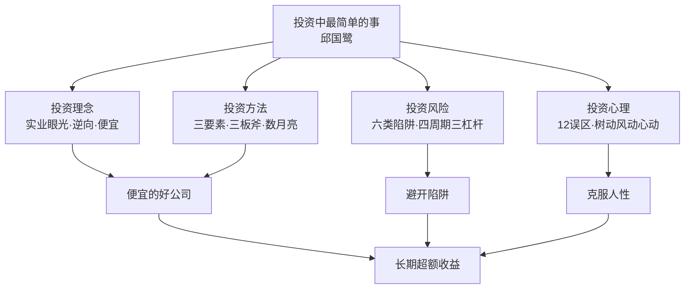
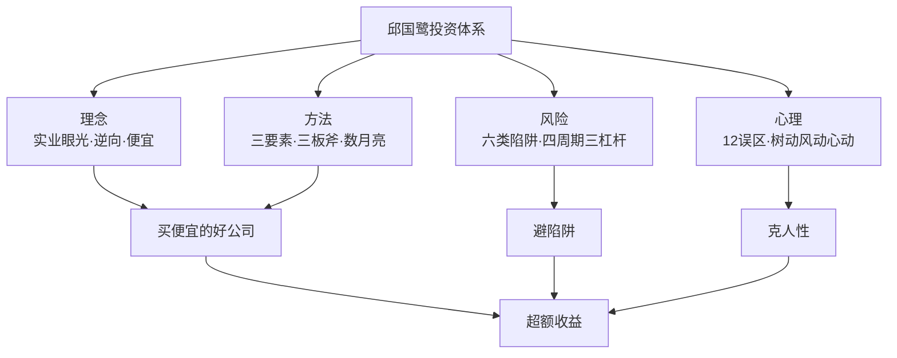

# 35《投资中最简单的事》深度解读（详细版）

> **副题：邱国鹭——"把复杂的投资，化繁为简"：估值、品质、时机三要素与"便宜的好公司"体系**
>
> 作者：邱国鹭（1973—），高毅资产董事长、首席投资官，前南方基金投资总监。22 年股市经验、15 年职业投资生涯，见证过 1992 年认购证疯狂、1999 年纳斯达克泡沫破裂、2008 年金融危机。本书是其微博随笔精华的集结——**书名《投资中最简单的事》，字面上是向霍华德·马克斯《投资最重要的事》致敬，内核则是"化繁为简"的投资哲学。**
>
> **核心定位**：投资涉及宏观（政治/经济/历史/军事）、中观（行业格局/技术进步/产业链）、微观（战略/治理/管理层/财务）——**但邱国鹭问：能否只把握那些能把握的最简单的事，把不能把握的复杂因素留给运气和概率？** 他的答案：**估值、品质、时机三要素，简化为"寻找便宜的好公司"。**
>
> **系列意义**：035 是系列第 35 本，也是**中国价值投资第二站**（继 29—30 段永平之后），与段永平"买股票就是买公司"一脉相承又自成体系——**邱国鹭提供了 A 股语境下最完整的"价值投资操作手册"**：三大原则、三板斧、六类陷阱、四种周期三种杠杆、12 个心理误区。

---

## 📖 全书结构与核心框架

### 全书结构总览表

| 部分 | 章节 | 核心内容 |
|------|------|---------|
| 开篇 | 三篇序言 | 22 年经验；P0<<V0<Vn 公式；三大原则 |
| 投资理念 | 4 节 | 实业眼光/逆向投资/便宜是硬道理/硬币的两面 |
| 投资方法 | 4 节 | 三个基本问题/数月亮/经验/扑克与投资 |
| 投资风险 | 5 节 | 价值陷阱与成长陷阱/真假风险/局限性/四种周期三种杠杆/随想录 |
| 投资心理 | 6 节 | 12 误区/后视镜/傻瓜定价/这次不同/树动风动心动/知易行难 |
| 结尾 | 访谈+后记 | 实战问答；投资哲学总结 |

---

## 📑 目录

- [[#第1章 序言：化繁为简的投资哲学|第1章 序言：化繁为简的投资哲学]]
- [[#第2章 理念一：以实业的眼光做投资|第2章 理念一：以实业的眼光做投资]]
- [[#第3章 理念二：人弃我取，逆向投资的关键|第3章 理念二：人弃我取，逆向投资的关键]]
- [[#第4章 理念三：便宜是硬道理|第4章 理念三：便宜是硬道理]]
- [[#第5章 理念四：硬币的两面——概率与赔率|第5章 理念四：硬币的两面——概率与赔率]]
- [[#第6章 方法一：投资的三个基本问题|第6章 方法一：投资的三个基本问题]]
- [[#第7章 方法二：宁数月亮，不数星星|第7章 方法二：宁数月亮，不数星星]]
- [[#第8章 方法三：经验与扑克——投资中的博弈智慧|第8章 方法三：经验与扑克——投资中的博弈智慧]]
- [[#第9章 风险一：价值陷阱与成长陷阱|第9章 风险一：价值陷阱与成长陷阱]]
- [[#第10章 风险二：真假风险与安全边际|第10章 风险二：真假风险与安全边际]]
- [[#第11章 风险三：价值投资的局限性|第11章 风险三：价值投资的局限性]]
- [[#第12章 风险四：四种周期、三种杠杆|第12章 风险四：四种周期、三种杠杆]]
- [[#第13章 心理篇：12 个投资者常见心理误区|第13章 心理篇：12 个投资者常见心理误区]]
- [[#第14章 心理篇：树动风动心动与后视镜|第14章 心理篇：树动风动心动与后视镜]]
- [[#第15章 访谈与后记：实战问答|第15章 访谈与后记：实战问答]]
- [[#总结：投资中最简单的事|总结：投资中最简单的事]]
- [[#附录一 邱国鹭金句集（45 条精选）|附录一 邱国鹭金句集（45 条精选）]]
- [[#附录二 本书术语速查卡|附录二 本书术语速查卡]]
- [[#附录三 系列互链：035 在 35 本笔记中的位置|附录三 系列互链：035 在 35 本笔记中的位置]]
- [[#附录四 A 股应用：邱国鹭体系本土实践|附录四 A 股应用：邱国鹭体系本土实践]]
- [[#附录五 读完本书后的 10 个自问|附录五 读完本书后的 10 个自问]]
- [[#附录六 本书案例与数据速查|附录六 本书案例与数据速查]]
- [[#附录七 三要素选股检查清单|附录七 三要素选股检查清单]]
- [[#附录八 本书 FAQ 20 问|附录八 本书 FAQ 20 问]]
- [[#附录九 系列母题追踪（035 号更新）|附录九 系列母题追踪（035 号更新）]]
- [[#附录十 邱国鹭 × 段永平：中国价值投资双峰对照|附录十 邱国鹭 × 段永平：中国价值投资双峰对照]]
- [[#附录十一 30 秒版：投资中最简单的事|附录十一 30 秒版：投资中最简单的事]]
- [[#附录十二 邱国鹭投资理念 60 条|附录十二 邱国鹭投资理念 60 条]]
- [[#附录十三 六类价值陷阱 × A 股案例库|附录十三 六类价值陷阱 × A 股案例库]]
- [[#附录十四 系列 35 本总览（完成进度）|附录十四 系列 35 本总览（完成进度）]]
- [[#附录十五 同一市场，五种眼光（035 版）|附录十五 同一市场，五种眼光（035 版）]]
- [[#附录十六 中医视角：化繁为简与"大道至简"|附录十六 中医视角：化繁为简与"大道至简"]]
- [[#附录十七 中英对照：邱国鹭核心概念|附录十七 中英对照：邱国鹭核心概念]]
- [[#附录十八 思维训练：10 个投资练习|附录十八 思维训练：10 个投资练习]]
- [[#附录十九 四种周期 × A 股实战时间线|附录十九 四种周期 × A 股实战时间线]]
- [[#附录二十 写给中国散户的话（知乎文风附录）|附录二十 写给中国散户的话（知乎文风附录）]]

---

## 第1章 序言：化繁为简的投资哲学

### 1.1 一个 22 年老兵的自白

邱国鹭开篇回顾自己的投资生涯：

> "我投身股市已经 22 年，进入基金行业担任职业投资人也已经 15 年了，见证过 1992 年排队买认购证时一本万利的疯狂，经历过 1999 年纳斯达克鸡犬升天的科技股狂潮以及泡沫破裂后狂跌 90% 的大崩盘，也参与了 2008 年全球金融危机时对冲基金对华尔街投行的挤兑。"

**他钻研过的投资方法**：

| 方法谱系 | 具体 |
|---------|------|
| 消息派 | 打探消息、跟庄炒作 |
| 技术派 | K 线图技术分析 |
| 量化派 | 定量投资、程序化交易 |
| 基本面 | 财务报表分析 |
| 风格 | 集中投资/组合投资 |
| 流派 | 成长投资/价值投资 |

**结论**：每个人的性格、经验、学识决定最适合他的方式，**"只要做到精、做到深、做到专，就能立于不败之地"**——但对大多数人而言，**只有价值投资才是真正可学、可用、可掌握的。**

### 1.2 价值投资与成长投资的数学表达

邱国鹭给出了全书最精妙的公式：

| 流派 | 公式 | 价值支撑 |
|------|------|---------|
| 价值投资 | P0 << V0 < Vn | 现有资产、利润和现金流 |
| 成长投资 | P0 < V0 << Vn | 未来收入和利润的高增长 |
| 共同点 | P0 << Vn | 五毛钱买未来值一元的企业 |

> "价值投资和成长投资殊途同归，都是希望现在以五毛钱的价格购买未来价值一元钱的企业……**价值投资需要分析现在，难度相对较小，大多数人通过学习都能够掌握；成长投资需要预测未来的远见，只有极少数的人能够做到。**"

### 1.3 自我认知：局限性意识

> "我更擅长总结过去的规律性的东西，而不擅长预测未来的突破和演变；我更擅长在变化中寻找不变，而不擅长在不变中寻找变化。"

**承认局限性，才能摆脱局限性的制约**——邱国鹭的方法：**寻找历史上被证明行之有效的简单法则、简单工具，然后长期坚持。**

### 1.4 三大原则（全书纲领）

**原则一：便宜是硬道理。**

> "即使是普通公司，只要足够便宜，也会有丰厚的回报。A 股市场鱼龙混杂，发现'价格合理的伟大公司'的难度远远超过寻找'价格被低估的普通公司'。"

**原则二：定价权是核心竞争力。**

> "有核心竞争力的公司有两个标准：一是做的是自己可以不断复制的事情（麦当劳/星巴克跨区域开新店）；二是做的是别人不可能复制的事情（独占资源、品牌美誉度、专利、技术、寡头垄断、牌照准入）——**最终体现为企业的定价权。**"

**原则三：胜而后求战，不要战而后求胜。**

> "百舸争流的行业，增长再快也很难找投资标的，不妨等待行业'内战'结束、赢家产生后再做投资。许多人担心在胜负已分的行业中买赢家会太迟，其实腾讯、百度、谷歌在几年前就已一家独大，但过去几年的投资回报率依然不菲。"

---

## 第2章 理念一：以实业的眼光做投资

### 2.1 股价的短期起伏与企业价值无关

> "下跌后，悲痛欲绝；上涨后，欢欣雀跃。两者均无必要。其实，经济还是那个经济，公司还是那个公司，既不会因为急跌而变得更差，也不会因为急涨而变得更好。**股价的短期起伏，反映的只是看客们的情绪波动，与企业价值无关。以买企业的心态做投资，不因急跌而失措，也不因急涨而忘形。**"

**（这与 05 号巴菲特"买股票就是买公司"、29 号段永平"本分"完全同源**——A 股语境下最直接的表达。）

### 2.2 两条基金经理箴言

邱国鹭刚入行时请教资深合伙人，得到两条建议：

| 箴言 | 含义 |
|------|------|
| 把客户的钱当作自己的钱来珍惜 | 受托责任 |
| 把二级市场的股票投资当作一级市场的实业投资来分析 | **实业眼光** |

### 2.3 好生意的判断：三个问题

**用自己的钱做实业投资，先问三个问题**：

| 问题 | 核心 |
|------|------|
| 这是不是一门好生意？ | 商业模式 |
| 这门生意的现金流状况如何？ | 现金流 |
| 这门生意的定价权在谁手里？ | 定价权 |

### 2.4 烂生意案例：手机游戏（2013）

| 数据 | 内容 |
|------|------|
| 苹果 IOS 平台 | 2012 年 3,883 家公司推出 10,400 款手游 |
| 月流水过千万的 | 屈指可数 |
| 产品生命周期 | 一般只有 3—6 个月 |
| 连续出爆款的开发商 | 凤毛麟角 |
| 平台分成 | 平台拿走 70—80% |
| Zynga | 2012—2013 年股价暴跌 80% |

> "人们只看到 7 亿手机用户这个巨大的市场，却忽视了这其实是个竞争无比激烈、'一将功成万骨枯'的行业。人们只看到成功的'一将'，选择性地忽视了'枯了的万骨'。"

### 2.5 坏现金流案例：电影行业

| 环节 | 数据 |
|------|------|
| 年拍片量 | 700 多部 |
| 能上映的 | 200 多部 |
| 票房超 5 亿的 | 屈指可数 |
| 5 亿票房到制片方 | 扣院线/发行/宣传后剩 2 亿 |
| 再扣成本 | 净利润只有几千万 |
| 现金流 | 先支出一大笔，上映后好几个月才能分到钱 |

> "无论是美国的百年老店米高梅，还是后起之秀梦工厂，只要有一些大制作成了票房毒药，就逃脱不了破产和被收购的命运……**美国的电影业发展了上百年，居然没有一家独立的电影公司。**"

**定价权的残酷真相**：

> "电影的定价权掌握在导演和演员手里，观众买票到电影院是去看吴京、徐峥和冯小刚的，不是去看电影公司的……**迪士尼能够历经百年屹立不倒，很重要的原因是米老鼠和唐老鸭不会要求涨片酬。**"

### 2.6 好生意案例：白色家电的门槛

| 阶段 | 行业状况 | 股价表现 |
|------|---------|---------|
| 2000—2005 | 增长迅速但利润不佳 | 股价疲软 |
| 2006—2010 | 增速减缓但利润大增 | **龙头股价上涨十几倍** |
| 拐点 2005 | 行业大洗牌，小厂退出 | 格局质变 |

> "拐点是 2005 年行业大洗牌，小厂退出，之后龙头企业在规模、渠道、成本、品牌等方面优势扩大，阻止了新进入者，行业格局从野蛮生长的无序竞争转变为有门槛的有序竞争。"

### 2.7 投资微论：门槛与长期牛股

| 概念 | 内容 |
|------|------|
| 成长 vs 门槛 | 成长是未来的难预测；**门槛是既成的易把握** |
| 高门槛行业 | 新进入者难存活，供给受限，竞争有序 |
| 低门槛行业 | 供给增长快，无序竞争，谁也赚不到钱 |
| 长期牛股 | **行业集中度持续提高的行业**易出长期牛股 |
| 反面 | 行业越来越分散=门槛不高=城头变幻大王旗 |

---

## 第3章 理念二：人弃我取，逆向投资的关键

### 3.1 逆向投资的经典画面

> "众人夺路而逃时，不挡路、不跟随。不挡路是因为不想被踩死，不跟随是因为乌合之众往往跑错方向。不如作壁上观，等众人作鸟兽散后，捡些他们抛弃的粮草辎重和掉落的金银细软。看这慌不择路的样子，这一次不需要等太久的。"

### 3.2 大师们的逆向表述

| 大师 | 表述 |
|------|------|
| 索罗斯 | "凡事总有盛极而衰的时候，大好之后便是大坏。" |
| 邓普顿 | "要做拍卖会上唯一的出价者。" |
| 芒格 | "倒过来想，一定要倒过来想。" |
| 卡尔·伊坎 | "买别人不买的东西，在没人买的时候买。" |
| 巴菲特 | "别人恐惧时我贪婪，别人贪婪时我恐惧。" |

> "逆向投资是最简单也最不容易学习的投资方式，因为它不是一种技能，而是一种品格——**品格是无法学习的，只能通过实践慢慢磨炼出来。**"

### 3.3 逆向投资的三点关键

**"不接下跌的飞刀"是血的教训总结的。一只下跌的股票是否值得逆向投资，看三点**：

| 关键 | 内容 | 反例 |
|------|------|------|
| ①估值是否够低 | 是否已过度反映坏消息 | 2011—12 年 A 股计算机"大众情人"估值利润双杀跌 70% |
| ②问题是否短期可解 | 是否是暂时性问题 | 零售股网购冲击/成本上涨=长期问题 |
| ③是否有反身性 | 暴跌是否导致基本面恶化 | 贝尔斯登/雷曼评级下调+追加保证金=负反馈 |

**（第三点直接引用索罗斯的反身性**——邱国鹭是中国最早系统应用反身性框架识别"能否逆向"的价值投资者之一，与 31 号笔记形成直接呼应。）

**中国银行业的特殊案例**：因为有政府隐性担保（"坚决守住不发生系统性和区域性金融风险的底线"），**不存在反身性，因此可以逆向投资。**

### 3.4 加仓测试：买之前的淡定源自买之前的分析

> "有些股票，你有持仓，但是下跌时你心里一点也不慌，甚至希望它多跌一点好让你加仓，这说明你对该股票已有足够了解……**买之后的淡定，源自买之前的分析。**"

> "买股票之前问问自己，下跌后敢加仓吗？如果不敢，最好一开始就别买，因为价格的波动是不可避免的。"

### 3.5 不是每个行业都适合逆向投资

| 行业 | 是否适合逆向 | 原因 |
|------|-------------|------|
| 有色/煤炭 | ❌ 跟趋势 | 商品周期 |
| 钢铁（夕阳） | ⚠️ 可能是价值陷阱 | 分散重资产 |
| 计算机/通信/电子 | ❌ 不适合越跌越买 | 技术变化快 |
| **食品饮料** | ✅ **适合** | 食品安全事故=买入点 |

**食品安全事故的逆向逻辑**（历史反复验证）：

| 事件 | 结果 |
|------|------|
| 疯牛病买麦当劳（十几年前） | 数年后股价上涨 5 倍（**逆向投资第一课**） |
| 瘦肉精/三聚氰胺/毒胶囊 | 对行业销量负面影响只持续两三个月 |
| 统一食品塑化剂（2011） | 6 元跌到 3.6 元→2012 年最高 10.4 元（**3 倍**） |
| 2012 白酒塑化剂 | 大幅跳水（后续成黄金坑） |

> "作为消费者，我对食品安全事故深恶痛绝，但是作为投资者，我们不应该把个人感情因素带入投资决策……**那些没有直接卷入安全事故或者牵涉程度较浅的行业龙头的市场份额，反而在事故发生后进一步扩大，因为人们购买时更加看重'大牌子'了。**"

---

## 第4章 理念三：便宜是硬道理

### 4.1 为什么便宜这么重要

> "一个东西只要足够便宜，赚钱的概率就会高得多。我一直喜欢引用沃尔玛的山姆·沃尔顿说的一句话：'**只有买得便宜才能卖得便宜。**'他用这个理念来经营零售业，获得了巨大的成功。**我认为买得便宜在投资领域要比零售领域更重要。**"

### 4.2 价值投资不是每年都有效

**这是全书最深刻的论证之一**（引用格林布拉特）：

> "第一，价值投资是有效的；第二，价值投资不是每年都有效。**第二点是第一点的保证。**正因为价值投资不是每年都有效，所以它是长期有效的。如果它每年都有效，未来就不可能继续有效……**在资本市场，如果有一种稳赚的方法，就一定会被套利掉的。正因为有波动性，才保证不会被套利。**"

| 方法 | 10 年表现 |
|------|----------|
| 正确的方法 | 6—7 年跑赢市场 |
| 错误的方法 | 3—4 年跑赢市场 |
| 每年切换方法 | 事前不知道哪种有效，长期一事无成 |

> "世界上每个成功的投资家都是长期坚持一种方法的，那些不断变换投资方法的人最终大多一事无成。"

### 4.3 "赌赢了"≠"赌对了"

> "在股市中，短期来说，正确的过程可能给你带来糟糕的结果，错误的过程可能给你带来不错的结果。**如果要让过程正确和结果正确达成一致，就必须经历很长的时间。**"

---

## 第5章 理念四：硬币的两面——概率与赔率

### 5.1 冰棒与古董

> "股票有两种，一种是冰棒，又小又甜，常出现在游客最多的地方，招人喜欢，受人追捧，但是自身价值却总在不断地溶化消亡；另一种是古董，表面上又旧又老，深埋土中，少人关注，要耗费功夫挖掘，但自身价值总在不断地增值。**投资古董股要当心别买得太早，投机冰棒股要当心别卖得太迟。**"

### 5.2 概率与赔率的权衡

| 维度 | 内容 |
|------|------|
| 概率 | 赚钱的可能性（确定性） |
| 赔率 | 赚多少/亏多少（空间） |
| 好投资 | 高概率+高赔率 |
| 陷阱 | 低概率+高赔率（彩票型）或高概率+低赔率 |

**邱国鹭的偏好**：在"数月亮"的行业里找高概率，在"人弃我取"的时点找高赔率——**两者结合=最优风险收益比。**

---

## 第6章 方法一：投资的三个基本问题

### 6.1 三个问题的框架

> "如果把我过去十几年的投资分析方法做一个简单的概括，最根本的就是要回答三个问题：**为什么认为一家公司便宜，为什么认为一家公司好，以及为什么要现在买。**"

| 问题 | 维度 | 难度 |
|------|------|------|
| 为什么便宜？ | 估值 | 最容易（最接近科学） |
| 为什么好？ | 品质 | 稍难 |
| 为什么现在买？ | 时机 | 最难 |

### 6.2 估值：最接近科学的部分

| 工具 | 内容 |
|------|------|
| PE | 市盈率 |
| PB | 市净率 |
| PS | 市销率 |
| EV/EBITDA | 企业估值倍数 |

> "一个股票便宜不便宜一目了然……这一部分是最接近科学的，而且是最容易学的。"

### 6.3 品质：波特五力 + 杜邦分析

**投资分析"三板斧"**：

| 工具 | 解决的问题 | 具体内容 |
|------|-----------|---------|
| 波特五力 | 好行业 | 对上下游议价权/与对手比较优势/对潜在进入者的门槛 |
| 杜邦分析 | 好公司 | 过去 5 年靠什么赚钱（高利润/高周转/高杠杆） |
| 估值分析 | 好价格 | 同业横比+历史纵比+市值与成长空间比 |

**杜邦三模式的检查重点**：

| 模式 | 检查 |
|------|------|
| 高利润 | 广告/研发/产品定位/差异化营销 |
| 高周转 | 运营管理/渠道管控/成本控制 |
| 高杠杆 | 风险控制/融资成本 |

> "这'三板斧'分别解决的是好行业、好公司和好价格的问题，挑出来的'三好学生'就是值得长期持有的好股票了。"

### 6.4 "下一个伟大公司"陷阱

> "我认为彼得·林奇说得对，他说当有人告诉你'A 公司是下一个 B 公司'的时候，第一要把 A 卖掉，第二要把 B 也卖掉。因为第一，A 永远不会成为 B；第二，B 已经被当作成功的代名词，说明它的优点可能已经体现在现在的股价中了。"

---

## 第7章 方法二：宁数月亮，不数星星

### 7.1 赌石 vs 买玉

> "买黑马股的人有点像赌石：买块不起眼的石头，期待能开出好玉来。2013 年的情形是太多的人争着去赌石，玉没人买，结果石头的价格被炒得跟玉的价格很接近……**这时候，我宁可买玉。**"

### 7.2 数月亮 vs 数星星

| 竞争格局 | 研究难度 | 长期利润 |
|---------|---------|---------|
| 数月亮（集中度高） | 简单（两三个龙头占大部分份额） | **战胜数星星** |
| 数星星（集中度低） | 困难（多如繁星） | 辛苦不赚钱 |

> "数月亮的行业一般门槛高，参与竞争的企业少，所以竞争有序，坐地收钱，旱涝保收；数星星的行业门槛低，谁都能进来，竞争激烈……**前者是赚钱不辛苦，后者是辛苦不赚钱。**"

### 7.3 竞争格局的五级谱系

| 格局 | 描述 | 案例 |
|------|------|------|
| 月朗星稀 | 一家独大，对手不成气候 | 细分领域近半份额的原材料企业（行业低迷仍 10%+ 净利率） |
| 一超多强 | 老大优势明显 | 工程机械/客车/汽车零配件 |
| 两分天下 | 双寡头 | 空调（龙头十几倍涨幅） |
| 三足鼎立 | 三强 | 部分细分行业 |
| 百花齐放 | 高度竞争 | 电视（同家电但格局分散，无法相提并论） |

### 7.4 寡头垄断的两种来源

| 来源 | 例子 | 投资回报 |
|------|------|---------|
| 国家给的 | 公用事业（价格管制） | 长期回报一般不高 |
| **市场给的** | 竞争洗牌后产生的寡头 | **有定价权，回报高** |

> "中国的行业大多竞争激烈，真正靠市场洗牌后产生的寡头行业并不多。"

---

## 第8章 方法三：经验与扑克——投资中的博弈智慧

### 8.1 经验就像旧衣服

**"经验就像旧衣服"**——邱国鹭的比喻：过去的经验未必适用于未来，但**人性不变，历史规律常在**。投资经验的价值在于识别"规律性"而非"具体事件"。

### 8.2 扑克与投资

| 扑克智慧 | 投资对应 |
|---------|---------|
| 算牌（概率） | 估值与概率思维 |
| 读人（博弈） | 理解市场参与者的行为 |
| 弃牌（纪律） | 找不到好机会就空仓 |
| 不 bluff 太多 | 不投机 |
| 长期玩 | 长期坚持一种方法 |

**核心：投资是概率游戏，不是运气游戏**——短期靠运气，长期靠概率与纪律。

---

## 第9章 风险一：价值陷阱与成长陷阱

### 9.1 价值陷阱的定义

> "价值投资最需要的是坚守，最害怕的是坚守了不该坚守的。金融危机时花旗从 55 元跌至 1 元的过程就深度套牢了无数盲目坚守的投资者。**所谓价值陷阱，指的是那些再便宜也不该买的股票，因为其持续恶化的基本面会使股票越跌越贵而不是越跌越便宜。**"

### 9.2 六类价值陷阱

| # | 类型 | 案例 | 识别要点 |
|---|------|------|---------|
| 1 | 被技术进步淘汰 | 柯达 90 多元→1 毛退市；诺基亚按键机；黑莓 | 技术变化快的行业谨慎 |
| 2 | 赢家通吃行业里的小公司 | 谷歌 vs 雅虎/Ask Jeeves/Lycos | "越大越强"的行业前二以外价值不大 |
| 3 | 分散的重资产夕阳行业 | 需求不增长+产能无法退出 | 便宜是假象，利润每况愈下 |
| 4 | 景气顶点的周期股 | 顶峰利润不可持续 | 用常态化盈利（Normalized Earnings）评估 |
| 5 | 会计欺诈 | 报表虚增（国外可查蛛丝马迹，国内有赤裸裸造假） | 银行 300 亿存款其实一分没有 |
| 6 | 人不行 | 捧着金饭碗讨饭 | 好资产+高利润+低估值，但组织涣散 |

**第 2 类的关键问题**：

> "我经常问研究员的一句话是'这个公司是越大越强，还是越大越难'。赢家通吃的行业都是越大越强的，如果是越大越强的行业，行业里前两名以外的公司的价值就不大了。"

**第 4 类的周期股评估工具**：

| 工具 | 含义 |
|------|------|
| 常态化盈利 | 剔除经济周期波动后的盈利 |
| 盈利能力 | 企业内在的可持续盈利水平 |

**成长性掩盖周期性**：

> "一条很长的直线，如果斜率很大，小的波动看起来就不影响大的增长趋势……**如果内在的增速降到 3～4 个点，一旦波动起来可能出现零增长甚至负增长，所以成长性经常掩盖周期性。**"

### 9.3 成长陷阱（要点）

| 成长陷阱 | 内容 |
|---------|------|
| 估值过高 | 成长不及预期=戴维斯双杀 |
| 技术路径不确定 | 押错路线 |
| 无门槛成长 | 竞争者涌入 |
| 多元化陷阱 | 盲目扩张 |
| 会计造假 | 成长股中欺诈更普遍 |

---

## 第10章 风险二：真假风险与安全边际

### 10.1 真假风险

| 风险类型 | 内容 |
|---------|------|
| 感受到的风险 | 波动（人们害怕的） |
| 真实的风险 | 永久性损失（本金亏掉） |

**关键认知**：

> "股票投资的风险是本金永久性损失的风险，而不是波动。**波动是风险的表象，永久损失才是风险的本质。**"

### 10.2 安全边际

| 要素 | 内容 |
|------|------|
| 定义 | 价格与价值的差距 |
| 来源 | 估值低+品质好 |
| 作用 | 缓冲错误与波动 |
| 与 28 号呼应 | 格雷厄姆安全边际的 A 股应用 |

**邱国鹭的安全边际公式**：**好价格 = 显著低估**（同业横比/历史纵比/市值与成长空间比三重验证）。

---

## 第11章 风险三：价值投资的局限性

### 11.1 价值投资的适用条件

| 局限 | 内容 |
|------|------|
| 需要耐心 | 价值回归时间不可控 |
| 不适合所有资产 | 有色/技术股不适合 |
| 需要判断"价值" | 价值本身会变化 |
| 逆向的品格 | 不是技能是品格 |

### 11.2 什么时候价值投资会失效

| 场景 | 说明 |
|------|------|
| 流动性危机 | 好资产也暴跌（2008） |
| 泡沫期 | 便宜货消失 |
| 技术变革期 | 价值被颠覆 |
| 政策剧变 | 行业逻辑改变 |

**邱国鹭的态度**：承认局限性，**在能力圈内坚持**——"我擅长总结过去规律，不擅长预测未来突破"，所以专注"便宜的好公司"。

---

## 第12章 风险四：四种周期、三种杠杆

### 12.1 框架总览

**行业轮动时机的把握**——邱国鹭 1999 年起做定量与策略分析，总结"四种周期、三种杠杆"：

| 四种周期 | 三种杠杆 |
|---------|---------|
| 政策周期 | 财务杠杆（对利率的弹性） |
| 市场周期（估值） | 运营杠杆（对经济的弹性） |
| 经济周期 | 估值杠杆（对剩余流动性的弹性） |
| 盈利周期 | |

### 12.2 熊末牛初的见底次序

| 领先关系 | 说明 |
|---------|------|
| 政策周期领先市场周期 | 货币财政放松→资金面推动重新估值 |
| 市场周期领先经济周期 | 美股每次衰退股市先于经济走出谷底 |
| 经济周期领先盈利周期 | 宏观领先微观（衰退很少长于 16 个月，盈利下降常持续 2—3 年） |

> "熊末牛初，判断市场走势，资金面和政策面是领先指标，基本面是滞后指标。熊市见底时，微观基本面往往很不理想，不能以此作为低仓的依据。**如果一定要等到基本面改善才加仓，往往已经晚了。**"

### 12.3 三种杠杆的轮动节奏

| 阶段 | 环境 | 领涨的杠杆类型 |
|------|------|---------------|
| 第一阶段（熊市见底） | 经济低迷+货币宽松+利率降低 | 财务杠杆高的企业先见底（高负债竞争对手出局，剩余企业份额和定价权提高） |
| 第二阶段（经济复苏） | 利率低位稳定 | 运营杠杆高的行业领涨（销售小幅反弹→利润大幅提升） |
| 第三阶段（经济繁荣） | 利润快速增长+估值扩张 | 估值杠杆高的股票领涨（有想象空间） |
| 第四阶段（熊牛替换） | 关注对改善因素的弹性 | 下降速度放慢也算改善 |

### 12.4 周期与杠杆的投资含义

> "有周期性就表明有可预测性。只有认识了四种周期的先后顺序和相互间的作用，才能在牛熊更替中作出有前瞻性和预见性的判断。"

> "有杠杆，股价的波动幅度就常常会出人意料的剧烈，投资者往往因忽视了杠杆的力量而低估了股价的波动幅度……**只有认识了杠杆的力量，才能认识到股价的波动和基本面的波动是不成正比的。**"

**实战验证（2008—2009）**：

| 底部 | 时间 |
|------|------|
| 政策底 | 2008 年 8 月 |
| 市场底 | 2008 年 11 月 |
| 经济底 | 2009 年 3 月 |
| 盈利底 | 2009 年（后续） |

> "投资周期性股票，一定要在炮火声中买进，在烟花声中卖出。"

---

## 第13章 心理篇：12 个投资者常见心理误区

### 13.1 误区清单总览

| # | 误区 | 核心 | 解法 |
|---|------|------|------|
| 1 | 家花不如野花香 | 高估成长股低估价值股 | 看数据：低估值的长期回报显著更优 |
| 2 | 过度自信 | 认为自己比平均水平强 10 倍 | 哈佛调查：个人 3000 万 vs 平均 300 万 |
| 3 | 仓位思维 | 确认偏误/屁股决定脑袋 | 先有论据再有结论 |
| 4 | 锚固偏见 | 把原股价当锚 | 看估值比看涨跌可靠 |
| 5 | 短期趋势长期化 | 过度外推 | 把不可持续当可持续 |
| 6 | 亏损厌恶 | 亏损痛苦是盈利喜悦的 2 倍 | 投资价值与买入成本无关 |
| 7 | 标题党 | 对新闻标题过度反应 | 调研"狗咬人"不上标题 |
| 8 | 榔头症 | 一种方法套所有市场 | 不同国家行业用不同方法 |
| 9 | 选择性记忆 | 记牛股忘地雷 | 写下亏损教训 |
| 10 | 差点就赢 | 赌博设计原理 | 警惕垃圾股/庄股 |
| 11 | 羊群效应 | 抱团/跟风 | 最一致时最危险 |
| 12 | 心理账户 | 本钱 vs 赚来的钱 | 与买入成本无关 |

### 13.2 深度拆解（关键误区）

**误区 1：家花不如野花香**

> "几乎每个国家（包括 A 股）低估值的价值股的长期投资回报率都显著优于高估值的成长股。原因很简单：**投资者对未来的成长往往抱有不切实际的过高期望，而对于现有的价值却视而不见。不珍惜已拥有的，而对未到手的抱有过于美好的想象，是放之四海皆准的普遍人性。**"

**误区 2：过度自信（哈佛实验）**

| 问题 | 平均答案 |
|------|---------|
| 你退休时能有多少钱？ | 3,000 万美元 |
| 在座的人退休时平均能有多少钱？ | 300 万美元 |

> "基本上每个人认为自己比平均水平强 10 倍。"

**误区 4：锚固偏见**

> "一个股票便宜与否，看估值比看近期涨跌更可靠：基本面大幅超预期时会越涨越便宜，反之会越跌越贵。"

**误区 6：亏损厌恶**

> "卖亏损股票，老外叫'止损'，咱们叫'割肉断腕'——厌恶之情溢于言表……**股票的投资价值与买入成本无关；该不该卖，也与你是否亏损无关。1 万元亏损带来的痛苦是 1 万元盈利带来的喜悦的 2 倍。**"

**误区 10：差点就赢**

> "赌场的研究者早就发现，那些经常出'差点就赢'图案的老虎机比随机设置的老虎机更易让人上瘾……**那些垃圾股、庄股以及你只想做个波段赚点快钱就跑的股票，是不是也经常让你有'差点就赢'的经历？**"

**误区 11：羊群效应**

> "不管是集体看空还是集体看多，最一致的时候往往是最危险的时候。**只有卓尔不群的人才能在高处有如临深渊的谨慎，在低谷有仰望星空的勇气。**"

---

## 第14章 心理篇：树动风动心动与后视镜

### 14.1 树动、风动、心动

> "股价波动的原因，是树在动（基本面），风在动（政策面），还是心在动（情绪面）？"

| 时间维度 | 主导力量 | 比喻 |
|---------|---------|------|
| 短期 | 人心博弈 | **心在动**（难以预测） |
| 中期 | 政策面 | **风在动**（宽松暖风涨/紧缩寒风跌） |
| 长期 | 基本面 | **树在动**（根基稳的好树终成参天大树） |

> "'心在动'常对'风在动'推波助澜，把五级风放大为十级，此时人们已不关心'树动'与否，反正玩的是击鼓传花的游戏。**其实，研究'心动'的人赚的是彼此的钱，玩的是一赢一输的零和游戏；研究'树动'的人赚的是树木成长的钱，玩的小树长成大树的正和游戏。**"

### 14.2 后视镜：用过去预测未来

| 后视镜误区 | 内容 |
|-----------|------|
| 表现 | 用最近行情外推未来 |
| 变体 | "这次不同了"（泡沫期的自我安慰） |
| 反例 | 2007 年"黄金十年"论、2015 年"国家牛市"论 |
| 解法 | 历史规律+基本面验证，而非线性外推 |

### 14.3 知易行难

> "投资最大的障碍不是'不知道'，而是'做不到'——知道便宜是硬道理，却在泡沫中追高；知道人弃我取，却在恐慌中割肉。"

---

## 第15章 访谈与后记：实战问答

### 15.1 访谈要点

| 主题 | 邱国鹭的回答 |
|------|-------------|
| 选股标准 | 便宜的好公司（三要素） |
| 行业偏好 | 数月亮行业（集中度高） |
| 买入时机 | 逆向+催化剂 |
| 卖出标准 | 贵了/基本面变坏/有更好 |
| 组合管理 | 行业配置+精选个股 |
| 对散户建议 | 学价值投资（可学可用可掌握） |

### 15.2 后记：投资哲学总结

> "投资中最简单的事，就是把复杂的问题简单化：**在好行业中挑选好公司，然后等待好价格出现时买入。**"

---

## 总结：投资中最简单的事

### Z1. 邱国鹭体系全景

### Z2. 全书的五根柱子

| 柱子 | 核心内容 | 章节 |
|------|---------|------|
| 简化 | 把复杂留个概率，只抓三要素 | 序言 |
| 理念 | 实业眼光/逆向/便宜/硬币两面 | 理念篇 |
| 方法 | 三板斧/数月亮/扑克 | 方法篇 |
| 风险 | 六类陷阱/真假风险/四周期三杠杆 | 风险篇 |
| 心理 | 12 误区/树动风动心动 | 心理篇 |

### Z3. 邱国鹭留给读者的三句话

> 1. "便宜是硬道理——即使是普通公司，只要足够便宜，也会有丰厚的回报。"
> 2. "买股票之前问问自己：下跌后敢加仓吗？如果不敢，最好一开始就别买。"
> 3. "研究'心动'的人赚的是彼此的钱；研究'树动'的人赚的是树木成长的钱。"

### Z4. 本书与系列的关系

| 维度 | 28 格雷厄姆 | 05 巴菲特 | 29 段永平 | **035 邱国鹭** |
|------|-----------|----------|----------|---------------|
| 核心 | 安全边际 | 买公司 | 本分 | 便宜的好公司 |
| 工具 | 市场先生 | 护城河 | 十把尺子 | 三板斧 |
| 特色 | 防御 | 复利 | 不做空不懂不做 | **A 股实战体系** |

---

## 附录一 邱国鹭金句集（45 条精选）

> 1. "投资本身是一件很复杂的事……但是，是否可以化繁为简、直接追问什么才是投资的本质？"——序
> 2. "把那些不能把握的复杂因素留给运气和概率。"——序
> 3. "对于大多数人而言，只有价值投资才是真正可学、可用、可掌握的。"——序
> 4. "价值投资和成长投资殊途同归，都是希望现在以五毛钱的价格购买未来价值一元钱的企业。"——序
> 5. "便宜是硬道理。即使是普通公司，只要足够便宜，也会有丰厚的回报。"——序
> 6. "定价权是核心竞争力。"——序
> 7. "胜而后求战，不要战而后求胜。"——序
> 8. "股价的短期起伏，反映的只是看客们的情绪波动，与企业价值无关。"——理念1
> 9. "以买企业的心态做投资，不因急跌而失措，也不因急涨而忘形。"——理念1
> 10. "把二级市场的股票投资当作一级市场的实业投资来分析。"——理念1
> 11. "每三四年就得重挖一次的护城河其实不能算是护城河。"——理念1
> 12. "多数人喜欢成长，但我喜欢门槛。成长是未来的，难预测；门槛是既成的，易把握。"——理念1
> 13. "一将功成万骨枯"——手游行业。——理念1
> 14. "迪士尼能够历经百年屹立不倒，很重要的原因是米老鼠和唐老鸭不会要求涨片酬。"——理念1
> 15. "众人夺路而逃时，不挡路、不跟随。"——理念2
> 16. "逆向投资不是一种技能，而是一种品格。"——理念2
> 17. "买之后的淡定，源自买之前的分析。"——理念2
> 18. "下跌后敢加仓吗？如果不敢，最好一开始就别买。"——理念2
> 19. "作为消费者，我对食品安全事故深恶痛绝，但是作为投资者，我们不应该把个人感情因素带入投资决策。"——理念2
> 20. "只有买得便宜才能卖得便宜。"——理念3（山姆·沃尔顿）
> 21. "价值投资是有效的；价值投资不是每年都有效。第二点是第一点的保证。"——理念3
> 22. "世界上每个成功的投资家都是长期坚持一种方法的。"——理念3
> 23. "在资本市场，如果有一种稳赚的方法，就一定会被套利掉的。"——理念3
> 24. "投资古董股要当心别买得太早，投机冰棒股要当心别卖得太迟。"——理念4
> 25. "为什么认为一家公司便宜，为什么认为一家公司好，以及为什么要现在买。"——方法1
> 26. "只有买得便宜，赚钱的概率才会高得多。"——方法1
> 27. "当有人告诉你'A 公司是下一个 B 公司'的时候，第一要把 A 卖掉，第二要把 B 也卖掉。"——方法1（林奇）
> 28. "宁数月亮，不数星星。"——方法2
> 29. "月朗星稀，就是一家独大。"——方法2
> 30. "前者是赚钱不辛苦，后者是辛苦不赚钱。"——方法2
> 31. "只有市场竞争、行业洗牌后产生的寡头垄断才有定价权。"——方法2
> 32. "价值陷阱，指的是那些再便宜也不该买的股票。"——风险1
> 33. "这个公司是越大越强，还是越大越难？"——风险1
> 34. "成长性经常掩盖周期性。"——风险1
> 35. "股票投资的风险是本金永久性损失的风险，而不是波动。"——风险2
> 36. "政策周期领先于市场周期，市场周期领先于经济周期，经济周期领先于盈利周期。"——风险4
> 37. "如果一定要等到基本面改善才加仓，往往已经晚了。"——风险4
> 38. "投资周期性股票，一定要在炮火声中买进，在烟花声中卖出。"——风险4
> 39. "不珍惜已拥有的，而对未到手的抱有过于美好的想象，是放之四海皆准的普遍人性。"——心理
> 40. "基本上每个人认为自己比平均水平强 10 倍。"——心理
> 41. "正确的决策流程是先有论据，再有结论。"——心理
> 42. "1 万元亏损带来的痛苦是 1 万元盈利带来的喜悦的 2 倍。"——心理
> 43. "不管是集体看空还是集体看多，最一致的时候往往是最危险的时候。"——心理
> 44. "研究'心动'的人赚的是彼此的钱；研究'树动'的人赚的是树木成长的钱。"——心理
> 45. "在好行业中挑选好公司，然后等待好价格出现时买入。"——后记

---

## 附录二 本书术语速查卡

| 术语 | 定义 | 出处 |
|------|------|------|
| 三要素 | 估值/品质/时机 | 方法篇 |
| 三板斧 | 波特五力/杜邦/估值分析 | 方法篇 |
| 数月亮 | 集中度高的行业 | 方法篇 |
| 价值陷阱 | 再便宜也不该买的股票 | 风险篇 |
| 成长陷阱 | 高估值成长股的陷阱 | 风险篇 |
| 四种周期 | 政策/市场/经济/盈利 | 风险篇 |
| 三种杠杆 | 财务/运营/估值 | 风险篇 |
| 常态化盈利 | 剔除周期波动的盈利 | 风险篇 |
| 反身性 | 股价下跌导致基本面恶化 | 理念篇 |
| 确认偏误 | 先有结论再找论据 | 心理篇 |
| 锚固偏见 | 把原股价当锚 | 心理篇 |
| 心理账户 | 把钱分成不同部分 | 心理篇 |
| 戴维斯双杀 | 估值和利润双降 | 理念篇 |
| 定价权 | 提价不丢客户的能力 | 序言 |

---

## 附录三 系列互链：035 在 35 本笔记中的位置

### 035 与系列笔记的链接网络

| 系列笔记 | 链接点 |
|---------|--------|
| [[29《段永平投资问答录》深度解读（详细版）|29 号]] | 中国价值投资双峰；段永平"本分"×邱国鹭"三要素" |
| [[30《段永平讲述投资的底层逻辑》深度解读（详细版）|30 号]] | 段永平体系×邱国鹭体系对照 |
| [[28《聪明的投资者》深度解读（详细版）|28 号]] | 安全边际×价值陷阱（都是"便宜"的辩证） |
| [[31《金融炼金术》深度解读（详细版）|31 号]] | 反身性：邱国鹭"逆向三点"第三点直接引用 |
| [[13《巴菲特的护城河》深度解读（详细版）|13 号]] | 护城河×定价权（邱国鹭"每三四年重挖的不算护城河"） |
| [[05《巴菲特的投资心法》深度解读（详细版）|05 号]] | 巴菲特"别人恐惧我贪婪"×人弃我取 |
| [[22《穷查理宝典》深度解读（详细版）|22 号]] | 芒格"倒过来想"×逆向投资 |
| [[32《彼得·林奇的成功投资》深度解读（详细版）|32 号]] | 林奇"下一个 B 公司"×邱国鹭引用 |
| [[27《超级强势股》深度解读（详细版）|27 号]] | 困境反转×逆向三点 |
| [[04《原则》深度解读（详细版）|04 号]] | 达利欧周期×四种周期 |

### 邱国鹭在系列中的定位

| 维度 | 定位 |
|------|------|
| 流派 | 中国价值投资（与段永平并列） |
| 特色 | A 股语境最完整的操作手册 |
| 承上 | 格雷厄姆安全边际/巴菲特定价权/芒格逆向 |
| 启下 | 036 起更多 A 股实战书 |

---

## 附录四 A 股应用：邱国鹭体系本土实践

### 4.1 三要素 × A 股实操

| 要素 | A 股实操 |
|------|---------|
| 估值 | PE/PB 同业横比+历史纵比 |
| 品质 | 波特五力（议价权/比较优势/门槛） |
| 时机 | 盈利超预期/高管增持/跌不动了/基本面拐点 |

### 4.2 数月亮 × A 股行业

| 竞争格局 | A 股案例 |
|---------|---------|
| 月朗星稀 | 白酒高端（茅台）、调味品（海天） |
| 一超多强 | 工程机械（三一/徐工）、客车（宇通） |
| 两分天下 | 空调（格力/美的）、啤酒 |
| 三足鼎立 | 快递、部分医药细分 |
| 百花齐放 | 服装、影视、手游 |

### 4.3 价值陷阱 × A 股案例库（详见附录十三）

| 类型 | A 股案例 |
|------|---------|
| 技术淘汰 | 部分传统制造 |
| 赢家通吃小公司 | 互联网生态里的小平台 |
| 分散重资产夕阳 | 部分钢铁/煤炭（周期底部） |
| 景气顶点周期股 | 2021 周期股顶部 |
| 会计欺诈 | 部分暴雷股 |
| 人不行 | 部分国企/民企治理问题 |

### 4.4 四种周期 × A 股时间线（详见附录十九）

| 周期底 | A 股历史 |
|--------|---------|
| 政策底 | 2008.8/2018.10/2024.9 |
| 市场底 | 2008.11/2019.1/2024.9-10 |
| 经济底 | 2009.1/2020.2/2025 |
| 盈利底 | 滞后 1—2 季度 |

---

## 附录五 读完本书后的 10 个自问

1. 我能用三句话回答"为什么便宜/为什么好/为什么现在买"吗？
2. 我买的是"数月亮"的行业吗？（还是数星星？）
3. 我持仓的公司有定价权吗？
4. 我研究过行业的竞争格局（集中度）吗？
5. 我买的是不是"价值陷阱"？（六类自查）
6. 股价下跌时，我敢加仓吗？
7. 我是否在用"锚固偏见"决策（看涨跌不看估值）？
8. 我是否把短期趋势过度外推？
9. 我理解"四种周期三种杠杆"的轮动吗？
10. 我是研究"树动"还是研究"心动"？

---

## 附录六 本书案例与数据速查

### 核心数据

| 数字 | 含义 |
|------|------|
| 22 年 | 邱国鹭股市经验 |
| 10,400 款 | 2012 年 IOS 手游数量 |
| 3—6 个月 | 手游生命周期 |
| 70—80% | 平台分成比例 |
| 80% | Zynga 股价跌幅 |
| 700→200 部 | 年拍片量→能上映 |
| 5 亿→几千万 | 票房→制片方净利 |
| 15 倍 | A 股电影公司 vs 美股中国电影公司市值差 |
| 3,883 家 | IOS 手游开发商数量 |
| 5 倍 | 麦当劳疯牛病后涨幅 |
| 3 倍 | 统一食品塑化剂后涨幅 |
| 55→1 元 | 花旗金融危机跌幅 |
| 90 元→1 毛 | 柯达股价（1997—2013） |
| 3,000 万 vs 300 万 | 哈佛过度自信调查 |
| 10 倍 | 认为自己比平均强的倍数 |
| 16 个月 | 美国经济衰退最长纪录 |
| 2—3 年 | 盈利下降常持续时长 |
| 6—7 年 vs 3—4 年 | 正确 vs 错误方法 10 年中跑赢市场的年份 |

### 案例速查表

| 案例 | 类型 | 启示 |
|------|------|------|
| 手游（2013） | 烂生意 | 一将功成万骨枯 |
| 电影行业 | 坏现金流 | 定价权在明星手里 |
| 白电 2005 洗牌 | 门槛 | 拐点后龙头十几倍 |
| 麦当劳疯牛病 | 逆向 | 食品安全=买点 |
| 统一塑化剂 | 逆向 | 3 倍回报 |
| 柯达/诺基亚/黑莓 | 价值陷阱 | 技术淘汰 |
| 谷歌 vs 雅虎 | 赢家通吃 | 小公司一文不值 |
| 花旗 55→1 | 价值陷阱 | 坚守了不该坚守的 |
| 贝尔斯登/雷曼 | 反身性 | 暴跌恶化基本面 |
| 2008—09 四底 | 周期 | 政策→市场→经济→盈利 |
| 空调 vs 电视 | 数月亮 | 格局决定股价 |
| 2012 汽车限购 | 逆向 | 汽车股逆市涨 30% |

---

## 附录七 三要素选股检查清单

### 估值（为什么便宜）

- [ ] PE 低于同业和历史均值
- [ ] PB/PS 交叉验证
- [ ] 市值与成长空间比合理
- [ ] 不是价值陷阱（六类自查）

### 品质（为什么好）

- [ ] 行业集中度（数月亮？）
- [ ] 有定价权（敢涨价？）
- [ ] 门槛（别人进不来？）
- [ ] 现金流健康
- [ ] 管理层靠谱（不捧金饭碗讨饭）

### 时机（为什么现在买）

- [ ] 盈利超预期/拐点
- [ ] 高管增持
- [ ] 跌不动了
- [ ] 新订单/催化剂
- [ ] 下跌后敢加仓？

---

## 附录八 本书 FAQ 20 问

**Q1：书名为什么叫"投资中最简单的事"？**
A：向马克斯《投资最重要的事》致敬——投资太复杂，只把握能把握的（估值品质时机），把复杂的留给概率。

**Q2：价值投资和成长投资什么关系？**
A：殊途同归（P0<<Vn），区别在价值支撑来源：现有资产 vs 未来增长。

**Q3：邱国鹭的三大原则？**
A：便宜是硬道理/定价权是核心竞争力/胜而后求战。

**Q4：什么是"三板斧"？**
A：波特五力（好行业）+杜邦分析（好公司）+估值分析（好价格）。

**Q5：什么是数月亮？**
A：选集中度高的行业（月朗星稀/一超多强/两分天下），不选百花齐放。

**Q6：逆向投资看哪三点？**
A：①估值够低 ②问题短期可解 ③无反身性。

**Q7：食品安全事故能买吗？**
A：历史上是买点——麦当劳 5 倍、统一 3 倍；龙头份额反而扩大。

**Q8：什么是价值陷阱？**
A：再便宜也不该买的股票（基本面持续恶化，越跌越贵）。六类：技术淘汰/赢家通吃小公司/分散重资产夕阳/景气顶点周期/会计欺诈/人不行。

**Q9：什么是四种周期？**
A：政策→市场→经济→盈利，依次见底。

**Q10：什么是三种杠杆？**
A：财务杠杆（利率弹性）/运营杠杆（经济弹性）/估值杠杆（流动性弹性）。

**Q11：价值投资为什么不是每年有效？**
A：正因为不是每年有效才长期有效——每年有效的方法早被套利掉。

**Q12："赌赢了"和"赌对了"什么区别？**
A：短期结果 vs 过程正确；要长期才能统一。

**Q13：12 个心理误区最致命的是？**
A：仓位思维（先结论后论据）和亏损厌恶（与成本无关的决策）。

**Q14：树动风动心动各代表什么？**
A：基本面/政策面/情绪面——短期心动、中期风动、长期树动。

**Q15：邱国鹭怎么看待银行股？**
A：有政府隐性担保，无反身性，可以逆向投资。

**Q16：什么时候价值投资失效？**
A：流动性危机/泡沫期/技术变革/政策剧变。

**Q17：怎么判断"人不行"？**
A：好资产+高利润+低估值但组织涣散/管理层吃老本。

**Q18：成长性为什么掩盖周期性？**
A：斜率大时小波动不显；增速降到 3—4 个点，波动就现出原形。

**Q19：邱国鹭对散户的建议？**
A：学价值投资（可学可用可掌握），宁数月亮不数星星，买之前问"下跌后敢加仓吗"。

**Q20：读完本书最重要的收获？**
A：投资可以化繁为简——便宜的好公司+避开陷阱+克服人性。

---

## 附录九 系列母题追踪（035 号更新）

### 9.1 "便宜"主题的系列对照

| 笔记 | 便宜观 |
|------|--------|
| 28 格雷厄姆 | 安全边际 |
| 05 巴菲特 | 合理价格买伟大公司（进阶） |
| 27 小费雪 | PSR 选便宜成长 |
| 29 段永平 | 好公司也要好价格 |
| **035 邱国鹭** | **便宜是硬道理（普通公司便宜也有丰厚回报）** |

### 9.2 "逆向"主题的系列对照

| 笔记 | 逆向观 |
|------|--------|
| 01 利弗莫尔 | 关键点顺势（不逆向） |
| 05 巴菲特 | 别人恐惧我贪婪 |
| 31 索罗斯 | 偏向极端处下注 |
| **035 邱国鹭** | **人弃我取+三点检验（估值/可解/反身性）** |

### 9.3 "周期"主题的系列对照

| 笔记 | 周期观 |
|------|--------|
| 04 达利欧 | 债务大周期 |
| 31 索罗斯 | 繁荣萧条反身性 |
| 034 林奇 | 周期股冬天春天 |
| **035 邱国鹭** | **四种周期三种杠杆（行业轮动时机）** |

---

## 附录十 邱国鹭 × 段永平：中国价值投资双峰对照

| 维度 | 段永平（29—30） | 邱国鹭（035） |
|------|----------------|---------------|
| 背景 | 企业家（步步高/OPPO/vivo） | 基金经理（高毅资产） |
| 核心 | 本分/不懂不做 | 三要素/便宜的好公司 |
| 选股 | 十把尺子（商业模式/企业文化） | 三板斧（五力/杜邦/估值） |
| 行业 | 能力圈（消费/互联网） | 数月亮（集中度） |
| 时机 | 不预测/长期 | 逆向+催化剂 |
| 风险 | 不借钱/不做空 | 六类陷阱/四周期 |
| 共同点 | 买股票就是买公司 | 以实业眼光做投资 |

---

## 附录十一 30 秒版：投资中最简单的事

> **投资中最简单的事（30 秒版）**：
>
> 1. **三要素**——估值（为什么便宜）、品质（为什么好）、时机（为什么现在买）；
> 2. **三板斧**——波特五力选好行业、杜邦分析选好公司、估值分析等好价格；
> 3. **数月亮**——选集中度高的行业，不数星星；
> 4. **避六坑**——技术淘汰/赢家通吃小公司/分散重资产夕阳/景气顶点周期/会计欺诈/人不行；
> 5. **逆向三检验**——估值够低？问题可解？无反身性？都满足才接飞刀；
> 6. **克 12 误区**——尤其仓位思维和亏损厌恶；
> 7. **买前自问**——下跌后敢加仓吗？不敢就别买。

---

## 附录十二 邱国鹭投资理念 60 条

**哲学（1—10）**：

> 1. 化繁为简。
> 2. 把复杂留给概率。
> 3. 价值投资可学可用可掌握。
> 4. 五毛买一元。
> 5. 在变化中寻找不变。
> 6. 承认局限性。
> 7. 简单法则长期坚持。
> 8. 精、深、专。
> 9. 过程正确终将结果正确。
> 10. 赌对了不等于赌赢了。

**理念（11—25）**：

> 11. 实业眼光。
> 12. 股价短期与价值无关。
> 13. 好生意/好现金流/好定价权。
> 14. 门槛优于成长。
> 15. 护城河要持久。
> 16. 人弃我取。
> 17. 逆向是品格。
> 18. 下跌敢加仓。
> 19. 食品安全=买点。
> 20. 便宜是硬道理。
> 21. 定价权是核心竞争力。
> 22. 胜而后求战。
> 23. 自己可复制/别人不可复制。
> 24. 冰棒 vs 古董。
> 25. 概率与赔率。

**方法（26—40）**：

> 26. 三个基本问题。
> 27. 估值最接近科学。
> 28. 波特五力。
> 29. 杜邦分析。
> 30. 估值分析。
> 31. 三好学生。
> 32. 下一个伟大公司陷阱。
> 33. 数月亮不数星星。
> 34. 月朗星稀。
> 35. 一超多强。
> 36. 两分天下。
> 37. 百花齐放不投。
> 38. 市场给的寡头才有定价权。
> 39. 季报预期差。
> 40. 周期性成长股性价比最高。

**风险（41—50）**：

> 41. 价值陷阱六类。
> 42. 越大越强还是越大越难。
> 43. 常态化盈利。
> 44. 成长掩盖周期。
> 45. 风险是永久损失。
> 46. 安全边际。
> 47. 价值投资有局限。
> 48. 四种周期。
> 49. 三种杠杆。
> 50. 炮火中买进烟花中卖出。

**心理（51—60）**：

> 51. 家花不如野花香。
> 52. 过度自信。
> 53. 仓位思维。
> 54. 锚固偏见。
> 55. 短期趋势长期化。
> 56. 亏损厌恶。
> 57. 标题党。
> 58. 榔头症。
> 59. 差点就赢。
> 60. 树动风动心动。

---

## 附录十三 六类价值陷阱 × A 股案例库

| # | 陷阱类型 | 特征 | A 股案例 | 识别信号 |
|---|---------|------|---------|---------|
| 1 | 技术淘汰 | 主业被新技术颠覆 | 传统胶卷/部分功能机产业链 | 需求结构性下降 |
| 2 | 赢家通吃小公司 | 龙头抢走一切 | 互联网生态小平台/部分 SaaS | 行业集中度提升中 |
| 3 | 分散重资产夕阳 | 需求不增长+产能退不出 | 部分钢铁/煤炭/航运 | 价格战+亏损常态化 |
| 4 | 景气顶点周期 | 顶峰利润不可持续 | 2021 周期股（化工/有色）顶部 | PE 低但产能扩张中 |
| 5 | 会计欺诈 | 报表失真 | 部分暴雷股（存贷双高） | 现金流与利润背离 |
| 6 | 人不行 | 治理/组织问题 | 部分治理失序公司 | 高薪低效/乱投资 |

**自查一句话**：**"这个公司是越大越强，还是越大越难？"**

---

## 附录十四 系列 35 本总览（完成进度）

| 编号 | 书名 | 状态 |
|------|------|------|
| 01—03 | 利弗莫尔三部曲 | ✅ |
| 04 | 达利欧《原则》 | ✅ |
| 05—14 | 巴菲特系列 | ✅ |
| 16—21 | 巴菲特延伸系列 | ✅ |
| 22—25 | 芒格四书 | ✅ |
| 26—27 | 费雪父子 | ✅ |
| 28 | 格雷厄姆 | ✅ |
| 29—30 | 段永平双册 | ✅ |
| 31 | 索罗斯《金融炼金术》 | ✅ |
| 32—34 | 林奇三部曲 | ✅ |
| **035** | **邱国鹭《投资中最简单的事》** | **✅ 本笔记** |
| 036 | 陈江挺《炒股的智慧》 | 待解读 |
| 037—169 | 更多 | 待解读 |

**系列进度：35/169 完成**

---

## 附录十五 同一市场，五种眼光（035 版）

以"2022 年 10 月 A 股恐慌底"为例：

| 大师 | 眼光 | 2022.10 的动作 |
|------|------|----------------|
| 28 格雷厄姆 | 便宜 | 大量股票破净，安全边际出现 |
| 05 巴菲特 | 生意 | 龙头公司打折 |
| 31 索罗斯 | 偏向 | 恐慌极端 |
| 034 林奇 | 行业 | 利空寻宝 |
| **035 邱国鹭** | **三要素+四周期** | **政策底已现（2022.4-10 多次政策表态），市场底临近，逆向买入便宜的好公司** |

**035 视角的独特价值**：**"四种周期"给出明确的底部次序判断（政策→市场→经济→盈利），"逆向三检验"防止接飞刀**——既有方向感又有安全网。

---

## 附录十六 中医视角：化繁为简与"大道至简"

### 16.1 中医的"化繁为简"

**中医辨证论治，四诊合参（望闻问切），最后归结为八纲（阴阳表里寒热虚实）**——与邱国鹭"化繁为简"完全同构：**复杂的症状系统，简化为可把握的几类关键信息。**

| 中医 | 邱国鹭 |
|------|--------|
| 八纲辨证 | 三要素（估值品质时机） |
| 四诊合参 | 三板斧（五力/杜邦/估值） |
| 治病求本 | 便宜的好公司 |
| 同病异治 | 不同行业不同方法（榔头症的解法） |

### 16.2 价值陷阱 = 辨证之误

| 中医误诊 | 投资误判 |
|---------|---------|
| 虚证当实证（人参杀人无过） | 便宜当机会（价值陷阱） |
| 实证当虚证（大黄救人无功） | 热门当安全（成长陷阱） |
| 刻舟求剑（拘泥古方） | 锚固偏见 |
| 见痰休治痰 | 看股价不看公司 |

### 16.3 树动风动心动 = 中医的标本

| 中医 | 投资 |
|------|------|
| 标（症状） | 心动（情绪波动） |
| 本（病根） | 树动（基本面） |
| 急则治标 | 中期看政策（风动） |
| 缓则治本 | 长期看基本面（树动） |

---

## 附录十七 中英对照：邱国鹭核心概念

| 中文 | English | 说明 |
|------|---------|------|
| 投资中最简单的事 | The Simplest Things in Investing | 书名 |
| 估值 | Valuation | 三要素之一 |
| 品质 | Quality | 三要素之二 |
| 时机 | Timing | 三要素之三 |
| 波特五力 | Porter's Five Forces | 行业分析 |
| 杜邦分析 | DuPont Analysis | 公司分析 |
| 数月亮 | Count the moon | 集中度高的行业 |
| 价值陷阱 | Value trap | 便宜也不该买 |
| 成长陷阱 | Growth trap | 高估值成长风险 |
| 常态化盈利 | Normalized earnings | 周期股评估 |
| 反身性 | Reflexivity | 索罗斯概念 |
| 安全边际 | Margin of safety | 格雷厄姆概念 |
| 定价权 | Pricing power | 核心竞争力 |
| 确认偏误 | Confirmation bias | 心理误区 |

---

## 附录十八 思维训练：10 个投资练习

1. **三要素练习**：选一只股票，用"为什么便宜/为什么好/为什么现在买"写 300 字
2. **波特五力**：分析一家公司的上下游议价权/比较优势/门槛
3. **杜邦拆解**：拆一家公司过去 5 年的赚钱模式（高利润/高周转/高杠杆）
4. **数月亮练习**：列出 5 个集中度最高的 A 股行业
5. **价值陷阱筛查**：用六类陷阱给持仓"体检"
6. **逆向三检验**：找一只暴跌的股票，检验三点是否满足
7. **四周期定位**：判断当前处于哪个周期阶段
8. **12 误区自测**：记录一周内自己的投资决策，找出误区
9. **加仓测试**：对每只持仓问"下跌 30% 我敢加仓吗"
10. **树动练习**：写出你持仓公司的"树"（基本面）最近三年的变化

---

## 附录十九 四种周期 × A 股实战时间线

### 19.1 历史验证（三轮周期）

| 周期 | 2008—09 | 2018—19 | 2022—24 |
|------|---------|---------|---------|
| 政策底 | 2008.8（四万亿） | 2018.10（民企座谈会） | 2022.4/2024.9 |
| 市场底 | 2008.11（1664 点） | 2019.1（2440 点） | 2024.9.24 前后 |
| 经济底 | 2009.1—3 | 2019 年中 | 2024—25 |
| 盈利底 | 2009 年 | 2020 年初 | 滞后 |
| 领涨行业 | 财务杠杆（周期/金融） | 运营杠杆（消费/科技） | 估值杠杆（成长） |

### 19.2 实操要点

| 要点 | 内容 |
|------|------|
| 领先指标 | 资金面+政策面 |
| 滞后指标 | 基本面（不能等） |
| 判断底部 | 政策底确认后逐步建仓 |
| 三个杠杆 | 阶段一财务/阶段二运营/阶段三估值 |
| 炮火中买进 | 消费者信心低迷时买可选消费 |

---

## 附录二十 写给中国散户的话（知乎文风附录）

### 写在前面：一本写给"你"的书

邱国鹭在书里讲过一个细节：他刚入行时请教资深合伙人，怎样才能成为一名优秀的基金经理。对方说，其实很简单，只有两条——**第一，把客户的钱当作自己的钱来珍惜；第二，把二级市场的股票投资当作一级市场的实业投资来分析。**

这句话看起来平淡无奇，但如果你在 A 股摸爬滚打过几年，就会明白它有多难做到。因为 A 股市场上绝大多数人做的事情，恰好与这两条相反：**把别人的钱不当钱（亏了不心疼），把股票当筹码（而不是当公司）。**

这本书的名字叫《投资中最简单的事》——"简单"两个字，是邱国鹭用 22 年换来的。

### 第一课：为什么说"便宜是硬道理"

先讲一个 A 股散户最容易犯的错：**只买贵的，不买对的。**

2013 年的行情，5 倍市盈率的股票涨不过 50 倍市盈率的股票——于是很多人说"估值不重要了，谈估值就输在起跑线上了"。

邱国鹭的回应很冷静：**这种情况很正常，每几年就会发生一次。但即使是最正确的投资方法，也不可能每年都有效。**

他引用乔尔·格林布拉特的话，说出了价值投资最深刻的反直觉逻辑：

> "第一，价值投资是有效的；第二，价值投资不是每年都有效。**第二点是第一点的保证。**正因为价值投资不是每年都有效，所以它是长期有效的。如果它每年都有效，未来就不可能继续有效。"

**在资本市场，如果有一种稳赚的方法，就一定会被套利掉的。** 波动性，恰恰是超额收益的来源——这就像中医说的"同病异治"：正因为没有包治百病的药方，辨证论治才有价值。

### 第二课：手游、电影与"烂生意"识别术

邱国鹭讲烂生意，讲得极其生动。

**手游（2013 年最火的行业）**：苹果 IOS 平台一年有 3,883 家公司推出 10,400 款游戏，但月流水过千万的屈指可数；就算你行大运做出爆款，生命周期一般只有 3—6 个月；而且平台要分走 70—80% 的收入——**"人为刀俎，我为鱼肉"。** 人们只看到 7 亿手机用户的巨大市场，却忽视了这是"一将功成万骨枯"的行业。

**电影行业**：中国每年拍 700 多部电影，只有 200 多部能上映，票房超 5 亿的屈指可数；就算赚了 5 亿票房，扣掉院线、发行、宣传、薪酬成本，制片方最后剩下的净利润可能只有几千万；而且现金流大幅为负——先砸钱拍，上映后好几个月才能分到钱。

**定价权在谁手里？** 观众是去看吴京、徐峥、冯小刚的，不是去看电影公司的——所以明星薪酬总能涨到让制片方不赚钱的地步。**迪士尼为什么百年不倒？因为米老鼠和唐老鸭不会要求涨片酬。**

**识别烂生意的三个问题**：这是不是一门好生意？现金流状况如何？定价权在谁手里？

用这三个问题去过滤 A 股的概念股，能躲掉大半的坑。

### 第三课：人弃我取——但先过三道检验

"逆向投资"是邱国鹭全书最精彩的部分，因为他既讲了"为什么"，也讲了"什么时候不行"。

**为什么逆向**：2012 年 7 月 2 日，广州宣布汽车限购，汽车股纷纷跳水甚至跌停——但之后半年，汽车股平均逆市上涨 30%。2010 年的工程机械、2011 年的银行、2012 年的地产，都印证了"人弃我取"的有效性。

**但"不接下跌的飞刀"是无数人用血换来的教训**——一只下跌的股票是否值得逆向投资，必须过三道检验：

1. **估值够低吗？** 是否已经过度反映了坏消息？（估值高的股票下跌=戴维斯双杀，持续时间长幅度大，刚开始暴跌时不宜逆向）
2. **问题是短期可解决的吗？** 零售股面临的网购冲击就不是短期能解决的；而食品安全事故，历史上都是买点——麦当劳在疯牛病恐慌中买入，数年后涨了 5 倍；统一食品塑化剂事件后从 6 元跌到 3.6 元，两年后涨到 10.4 元。
3. **有反身性吗？** 贝尔斯登和雷曼的股价下跌直接引发评级下降和追加保证金——这种负反馈的暴跌，不适合逆向；而中国银行业有政府隐性担保，不存在这种反身性，可以逆向。

**A 股散户最缺的不是胆量，是这三道检验。** 同样是"抄底"，2018 年抄底白酒是黄金坑，2021 年抄底教培是深渊——区别不在于"敢不敢"，而在于有没有过这三道检验。

### 第四课：宁数月亮，不数星星

"来，咱们来数星星。你智商低，你数月亮吧。"——这是笑话，但在投资里，**我们要宁做数月亮的人，不做数星星的人。**

数月亮=选集中度高的行业：两三个龙头占据大部分份额，研究起来简单，竞争有序，"坐地收钱，旱涝保收"。
数星星=选集中度低的行业：竞争多如繁星，研究困难，门槛低谁都能进，"辛苦不赚钱"。

**竞争格局的五级谱系**：月朗星稀（一家独大）> 一超多强 > 两分天下 > 三足鼎立 > 百花齐放。

最生动的对照是空调和电视：空调是两分天下（格力/美的），龙头股价涨十几倍；电视行业百花齐放，同为家电却无法相提并论。**同样是中国制造，格局决定命运。**

### 第五课：六类价值陷阱——坚守了不该坚守的

价值投资最需要的是坚守，最害怕的是**坚守了不该坚守的**。花旗从 55 元跌到 1 元的过程，深度套牢了无数盲目坚守的投资者。

六类价值陷阱，每一类都是 A 股散户的坟场：

| 陷阱 | 一句话识别 |
|------|-----------|
| 技术淘汰 | 柯达 90 元跌到 1 毛退市 |
| 赢家通吃的小公司 | 谷歌之外，搜索引擎全灭 |
| 分散重资产夕阳 | 便宜是假象，利润每况愈下 |
| 景气顶点周期股 | PE 最低时往往是股价最高时 |
| 会计欺诈 | 报表上 300 亿存款，其实一分没有 |
| 人不行 | 捧着金饭碗讨饭 |

**核心自查问题**："这个公司是越大越强，还是越大越难？"

### 第六课：树动、风动、心动

全书最凝练的一篇，是《树动风动心动》：

> "股价波动的原因，是树在动（基本面），风在动（政策面），还是心在动（情绪面）？短期来说，是心在动，难以预测。中期来说，是风在动——吹的是政策宽松的暖风，股价就上涨。长期来说，是树在动——那些根基稳固的好树，不管人心冷暖，风向东西，终将成长为参天大树。"

**"心在动"常对"风在动"推波助澜，把五级风放大为十级**——这时候，人们已不关心树动不动，反正玩的是击鼓传花的游戏。

> "研究'心动'的人赚的是彼此的钱，玩的是一赢一输的零和游戏；研究'树动'的人赚的是树木成长的钱，玩的是小树长成大树的正和游戏。"

**A 股 30 年，参与"心动"游戏的人千千万，最后赚钱的，都是研究"树动"的人。**

### 尾声：买之前，问自己一个问题

邱国鹭在书里留下了一个流传很广的"加仓测试"：

> "买股票之前问问自己，**下跌后敢加仓吗？如果不敢，最好一开始就别买**，因为价格的波动是不可避免的。"

这句话比任何技术指标都管用。敢加仓，说明你研究透了、有安全边际、过得了逆向三检验；不敢加仓，说明你只是赌一把——**那不如把钱存银行。**

**投资中最简单的事，其实就三件**：找便宜的好公司（三要素）、避开陷阱（六类自查）、克服人性（12 误区）。剩下的复杂，留给运气和概率。

> **"在好行业中挑选好公司，然后等待好价格出现时买入。"**

---

## 附录二十四 一个基金经理的 22 年：邱国鹭把投资讲成了最简单的事（知乎文风·详细版）

### 写在前面：为什么是"最简单"，而不是"最重要"

2013 年，霍华德·马克斯的《投资最重要的事》中文版风靡一时。几乎同时，一位中国基金经理的书出版了，书名只改了一个词——**《投资中最简单的事》。**

这不是抄袭，是致敬，也是宣战。

马克斯说投资是"最重要的事"——钟摆、第二层思维、防御性，每一件都深刻而复杂；邱国鹭却说，投资真正难的不是"知道复杂"，而是"承认简单"——**把那些把握不了的复杂因素，留给运气和概率。**

写这本书的人，见过 1992 年排队买认购证一本万利的疯狂，经历过 1999 年纳斯达克泡沫破裂后狂跌 90% 的大崩盘，参与过 2008 年金融危机时对冲基金对华尔街投行的挤兑。**22 年股海沉浮之后，他得出的结论只有三句话：便宜是硬道理；定价权是核心竞争力；胜而后求战，不要战而后求胜。**

这篇文章，就是把这 22 年拆开给你看。

### 第一幕：1992 年的认购证，和那个年代的"一夜暴富"

先回到 1992 年。

那时候的上海，一张股票认购证能让人一夜暴富。邱国鹭亲眼见过那种疯狂——排队的队伍长得看不到头，买到认购证的人像中了彩票。那是中国股市的"蛮荒时代"：打探消息、跟庄炒作，人人都在找"内幕"。

后来他进了基金业，1999 年做定量分析师和策略分析师，开始分析多个国家的经济周期和股市牛熊。再后来，他见识了纳斯达克的鸡犬升天——**那时候人们相信互联网会改变一切，所以"凡是带 .com 的都能涨"**——然后泡沫破裂，跌 90%。

再然后，2008 年，雷曼倒下，全球金融体系差点停摆。

**这一路的教训是什么？** 邱国鹭在书里说，他钻研过各种方法：打探消息、跟庄炒作、K 线技术分析、程序化交易、集中投资、组合投资、成长投资、价值投资……最后他发现：

> "对于大多数人而言，只有价值投资才是真正可学、可用、可掌握的。"

**不是价值投资最好，而是只有它，普通人学得会。** 成长投资需要预测未来的远见，那是极少数天才的事；价值投资只需要分析现在——**现在便宜吗？公司好吗？**——这是大多数通过学习能够掌握的。

### 第二幕：2013 年的灵魂拷问——"谈估值就输在起跑线上了？"

2013 年的 A 股，是成长股和白马股撕裂最严重的一年。

市场上流传着一句话：**"5 倍市盈率的涨不过 50 倍市盈率的，谈估值就输在起跑线上了。"** 那年，只要跟手游沾点边的公司就能被爆炒，连旅游公司推出个手机自助游软件都能被市场追捧。

邱国鹭的回应冷静得近乎冷酷：

> "这种情况很正常，每几年就会发生一次。但即使是最正确的投资方法，也不可能每年都有效。所谓正确的方法，是在 10 年中可以有 6～7 年帮助你跑赢市场；而错误的方法就是在 10 年中只能有 3～4 年能跑赢市场。"

**然后他抛出了全书最深刻的反直觉逻辑**（引用乔尔·格林布拉特）：

> "第一，价值投资是有效的；第二，价值投资不是每年都有效。**第二点是第一点的保证。**正因为价值投资不是每年都有效，所以它是长期有效的。如果它每年都有效，未来就不可能继续有效。"

为什么？**因为在资本市场，如果有一种稳赚的方法，就一定会被套利掉的。** 正因为有波动性，才保证不会被套利。

**这段话值得每个散户抄下来贴在屏幕上**——它同时解释了两件事：为什么你该坚持价值投资（长期有效），以及为什么你某一年跑输时会怀疑人生（它本来就不是每年有效）。

邱国鹭还补了一刀，区分"赌赢了"和"赌对了"：

> "在股市中，短期来说，正确的过程可能给你带来糟糕的结果，错误的过程可能给你带来不错的结果。如果要让过程正确和结果正确达成一致，就必须经历很长的时间。"

**散户最大的幻觉，就是以为"赚钱=正确"。** 2015 年加杠杆赚到钱的人，以为自己是股神——后来连本带利还了回去，还倒欠一屁股债。过程错了，结果只是提前预支。

### 第三幕：手游和电影——两堂"烂生意"识别课

讲"以实业的眼光做投资"时，邱国鹭举了两个行业，堪称教科书级的"烂生意"识别。

**第一堂课：2013 年最火的手游行业。**

先看数据：2012 年，仅苹果 IOS 平台就有 **3,883 家公司推出 10,400 款手机游戏**，加上安卓更是不计其数。但这么多游戏里，**月流水过千万的屈指可数**。

就算你行大运做出了一款爆款，产品的生命周期一般只有 **3～6 个月**——之后你就得推出新产品。而事实上，在数千家开发商中，**能够连续推出两款火爆游戏的，凤毛麟角**。

更致命的是议价权：手机游戏内容开发商的议价权其实很有限，**主要的钱都被平台商赚走了**——苹果只有一个平台，安卓最后成功的可能也只有两三个，再加上腾讯的微信平台，铁定又要分流走很多游戏玩家。游戏开发商"人为刀俎，我为鱼肉"，让平台把 **70%～80%** 的收入分走。

> "人们只看到 7 亿手机用户这个巨大的市场，却忽视了这其实是个竞争无比激烈、'一将功成万骨枯'的行业。人们只看到成功的'一将'，选择性地忽视了'枯了的万骨'。"

**第二堂课：现金流很差的电影行业。**

中国每年拍 700 多部电影，只有 200 多部能上映，票房能超过 5 亿的屈指可数。就算你"大获成功"赚了 5 亿票房，扣除分给院线的一半，再扣发行费宣传费，制片方到手大概只有 2 亿多；再扣除编剧、导演、制片、演员的薪酬和拍摄成本，**最后剩下的净利润可能只有几千万。**

更麻烦的是现金流：拍电影得先写剧本、请导演、搭班子、雇演员，支出一大笔费用，一年半载后影片发行宣传又是一大笔，公映后还要等好几个月才能从票房分到钱——**所以很多电影公司不管利润怎样，现金流都是大幅为负，抗风险能力特别弱。**

> "无论是美国的百年老店米高梅，还是后起之秀梦工厂，只要有一些大制作成了票房毒药，就逃脱不了破产和被收购的命运。美国的电影业发展了上百年，居然没有一家独立的电影公司。"

**为什么？因为定价权在明星手里**——观众买票是去看吴京、徐峥、冯小刚的，不是去看电影公司的，所以名导演名演员的薪酬总能涨到让制片方不赚钱的地步。就像欧洲足坛：球星天价收入，俱乐部却在亏损。

而迪士尼为什么百年不倒？**"很重要的原因是米老鼠和唐老鸭不会要求涨片酬。"**

**识别烂生意的三个问题**：这是不是一门好生意？这门生意的现金流状况如何？定价权在谁手里？

用这三个问题过滤 A 股的概念股，能躲掉大半的坑。

### 第四幕：2012 年 7 月 2 日——逆向投资的第一现场

2012 年 7 月 2 日，广州宣布汽车限购。

消息一出，汽车股纷纷跳水甚至跌停。散户夺路而逃，基金经理夺路而逃，媒体开始唱衰整个汽车行业——**"限购了，汽车卖不动了，汽车股完了。"**

结果呢？**之后半年市场是下跌的，而汽车股却平均逆市上涨了 30%。**

邱国鹭说，投资做了十几年，他深深体会到：**人弃我取、逆向投资是超额收益的重要来源。** 2010 年的工程机械、2011 年的银行、2012 年的地产，都印证了这一点。

但他紧接着补了一句泼冷水的话：

> "逆向投资是最简单也最不容易学习的投资方式，因为它不是一种技能，而是一种品格——品格是无法学习的，只能通过实践慢慢磨炼出来。"

而且——**不是所有急跌的股票都值得买入。"不接下跌的飞刀"这句话，是无数人得到了血的教训之后总结出来的。**

那么，一只下跌的股票是否值得逆向投资？**三个检验，缺一不可**：

**检验一：估值是否够低，是否已经过度反映了可能的坏消息？**

估值高的股票本身估值下调空间大，加上未来增长预期同样存在巨大下调空间，这种"戴维斯双杀"导致的下跌一般持续时间长而且幅度大——**刚开始暴跌时不宜逆向投资。** 2011—2012 年，A 股计算机行业的许多"大众情人"在估值和预期利润双双腰斩的背景下持续下跌 70%，就是例证。

**检验二：遭遇的问题是否是短期问题、是否是可解决的问题？**

零售股面临的网购冲击、租金劳动力成本上涨——**不是短期能解决的**，所以零售股持续两年的大幅调整顺理成章。反过来看食品安全事故：瘦肉精、三聚氰胺、毒胶囊，对行业销量的负面影响一般只持续两三个月。

**检验三：股价暴跌本身是否会导致公司的基本面进一步恶化——是否有索罗斯所说的反身性？**

贝尔斯登和雷曼的股价下跌，直接引发了债券评级的下降以及交易对手追加保证金的要求——**这种负反馈带来的连锁反应，不适合逆向投资。** 而中国银行业因为有政府的隐性担保，不存在这种反身性，因此可以逆向投资。

**邱国鹭是第一代把索罗斯的反身性写进"能不能抄底"决策流程的中国基金经理**——这一点和系列里 31 号《金融炼金术》的解读完全打通：索罗斯的框架不是用来预测市场的，是用来识别"哪些下跌会自我强化、哪些下跌会自然止住"的。

### 第五幕：疯牛病、塑化剂——食品安全事故为什么是买点

检验二里提到的"食品安全事故"，邱国鹭讲了一个亲身经历的故事。

**十几年前，他刚入行没多久**。公司的基金经理们——都是铁杆的价值投资者和逆向投资者——在疯牛病的恐慌中买入了麦当劳的股票。当时舆论一片哗然：疯牛病啊，谁敢吃牛肉汉堡？

**数年后，麦当劳的股价上涨了 5 倍。那是他逆向投资的第一课。**

后来他观察中国的案例，规律完全一致：

| 事件 | 股价表现 | 行业影响 |
|------|---------|---------|
| 瘦肉精事件 | 短期下跌 | 对销量负面影响只持续两三个月 |
| 三聚氰胺事件 | 龙头股先跌后涨 | 行业洗牌，龙头份额扩大 |
| 毒胶囊事件 | 恐慌后修复 | 消费者更看重"大牌子" |
| 统一食品塑化剂（2011） | **6 元跌到 3.6 元→2012 年最高 10.4 元（3 倍）** | 涉事公司修复 |
| 2012 白酒塑化剂 | 大幅跳水 | **后来的黄金坑** |

为什么？邱国鹭的逻辑很冷：

> "作为消费者，我对食品安全事故深恶痛绝，但是作为投资者，我们不应该把个人感情因素带入投资决策。从历史上看，食品安全事故往往是行业投资较好的买入点——**特别是那些没有直接卷入安全事故或者牵涉程度较浅的行业龙头企业，更有可能是建仓良机。**"

**因为事故之后，人们购买时更加看重"大牌子"了**——与小厂家相比，龙头企业更有资源和动力维护自己的品牌声誉。**事故清洗的是小厂，留下的是龙头。**

**A 股的对应**：2013 年白酒塑化剂风波，茅台五粮液腰斩之后再创新高；2022 年"雪糕刺客"舆情，伊利蒙牛照样穿越。**每一次食品安全恐慌，都是龙头份额扩张的起点。**

### 第六幕：花旗 55 元跌到 1 元——价值陷阱的六张脸

逆向投资有检验，价值投资也有天敌。

邱国鹭说：**"价值投资最需要的是坚守，最害怕的是坚守了不该坚守的。"** 金融危机时花旗从 55 元跌至 1 元的过程，深度套牢了无数盲目坚守的投资者——你以为你在做价值投资，其实你掉进了价值陷阱。

**所谓价值陷阱，指的是那些再便宜也不该买的股票，因为其持续恶化的基本面会使股票越跌越贵而不是越跌越便宜。**

六类价值陷阱，每一类都是一个时代的眼泪：

**第一类：被技术进步淘汰的。** 数码相机发明之后，主业是胶卷的柯达，股价从 1997 年高点的 90 多元一路跌到 2013 年不到 1 毛钱后退市。诺基亚的按键机做得再好，触摸屏时代来了照样出局。早期黑莓在华尔街不是人手一个，是人手两个——照样被淘汰。

**第二类：赢家通吃行业里的小公司。** 搜索行业赢家通吃：谷歌价值很高，雅虎扣掉阿里巴巴后甚至是负价值，当年一堆搜索引擎（Ask Jeeves、Lycos、Excite@Home）最后都没成长起来。邱国鹭说，他经常问研究员一句话——**"这个公司是越大越强，还是越大越难？"** 赢家通吃的行业都是越大越强的，前两名以外的公司价值不大。

**第三类：分散的、重资产的夕阳行业。** 行业需求不增长时，重资产意味着产能无法退出（退出就作废），分散意味着价格战——这类股票的便宜是假象，利润每况愈下。**但注意限定词：集中、轻资产的夕阳行业里，可能出现垄断性大企业，那是值得投资的。**

**第四类：景气顶点的周期股。** 经济扩张晚期，低市盈率的周期股也常是价值陷阱——因为此时的顶峰利润不可持续。评估周期股要用**常态化盈利**（剔除周期波动的盈利）和**盈利能力**（内在可持续盈利水平），而不是某一年的利润。**而且，成长股也有内在的周期性，只是成长快时掩盖了周期——增速从 9—10 个点降到 3—4 个点，一旦波动就是零增长甚至负增长。**

**第五类：会计欺诈的公司。** 国外造假能从报表找到蛛丝马迹（复式记账，虚增利润就少现金流）；国内有些是赤裸裸的造假——**报表显示银行存款 300 亿元，但其实一分钱都没有。**

**第六类：人不行、捧着金饭碗讨饭的公司。** 已经拥有很好的护城河，但管理者不断地吃老本。投资者经常被好资产、高利润、低估值吸引，最后踩坑，发现问题大都是人不行——**"人不行"是广义的，对大公司来讲可能是组织不行、缺乏战斗力。**

### 第七幕：2008 年 8 月到 2009 年——四种周期、三种杠杆的实战

2009 年 3 月，邱国鹭刚加入南方基金不久，在内部季度策略会上讲了一套他琢磨多年的框架——"四种周期、三种杠杆"。几年后回头看，2008—2009 年的市场完美验证了它：

| 底部 | 时间 | 含义 |
|------|------|------|
| 政策底 | 2008 年 8 月 | 货币财政政策放松 |
| 市场底 | 2008 年 11 月 | 资金面推动重新估值 |
| 经济底 | 2009 年 3 月 | 宏观指标触底 |
| 盈利底 | 2009 年（之后） | 微观基本面最差 |

**四种周期的见底次序**：政策周期领先市场周期→市场周期领先经济周期→经济周期领先盈利周期。

**为什么这个次序这么重要？** 因为——

> "熊市见底时，微观基本面往往很不理想，不能以此作为低仓的依据。**如果一定要等到基本面改善才加仓，往往已经晚了。**"

**这就是为什么 2008 年 10 月当所有企业利润都在暴跌、所有分析师都在喊"现金为王"时，真正的机会已经来了。** 等 2009 年年中盈利数据好转时，指数已经从 1664 点涨到 3000 点了。

**三种杠杆决定轮动节奏**：

| 阶段 | 环境 | 领涨品种 |
|------|------|---------|
| 熊市见底 | 经济低迷+利率下行 | 财务杠杆高的企业先见底（高负债竞争对手出局，幸存者份额和定价权提高） |
| 经济复苏 | 利率低位稳定 | 运营杠杆高的行业领涨（销售小幅反弹→利润大幅提升） |
| 经济繁荣 | 利润快速增长 | 估值杠杆高的股票领涨（有想象空间） |

**散户最容易犯的错**：在第三阶段（繁荣期）才进场，买的是估值杠杆最高的股票——正好接盘。

### 第八幕：哈佛教室里的两个问题——12 个心理误区

1999 年，邱国鹭参加哈佛行为金融学短训班。教授做了一次无记名调查，只问两个问题：

> **"你退休时能有多少钱？"**
> **"在座的人退休时平均能有多少钱？"**

当场统计的结果：第一个问题的平均答案是 **3,000 万美元**（在座多为美国基金经理），第二个问题的平均答案是 **300 万美元**。

**基本上每个人认为自己比平均水平强 10 倍。**

这就是"过度自信"——12 个心理误区的第二个。邱国鹭把这 12 个误区列全了，每一个都是散户的日常：

| # | 误区 | 一句话 |
|---|------|--------|
| 1 | 家花不如野花香 | 不珍惜已拥有的，对未到手的美好想象 |
| 2 | 过度自信 | 认为自己比平均水平强 10 倍 |
| 3 | 仓位思维 | 屁股决定脑袋（确认偏误） |
| 4 | 锚固偏见 | "涨这么多了还不抛？"——把原股价当锚 |
| 5 | 短期趋势长期化 | 把不可持续当可持续 |
| 6 | 亏损厌恶 | 1 万亏损的痛苦=1 万盈利喜悦的 2 倍 |
| 7 | 标题党 | 对新闻标题过度反应（"人咬狗"才上标题） |
| 8 | 榔头症 | 一种方法套所有市场 |
| 9 | 选择性记忆 | 记牛股忘地雷 |
| 10 | 差点就赢 | 老虎机的上瘾设计，垃圾股的套路 |
| 11 | 羊群效应 | 最一致的时候最危险 |
| 12 | 心理账户 | 把买入成本当决策依据 |

挑两个最扎心的展开。

**误区 4：锚固偏见。** 常有人说："这股票涨这么多了，还不抛？""已经跌一半了，还不买？"——这就是锚固偏见，潜意识把原有股价当成合理参照。其实**一个股票便宜与否，看估值比看近期涨跌更可靠：基本面大幅超预期时会越涨越便宜，反之会越跌越贵。** 锚固偏见还是奢侈品的常用营销手段：先设计一批 2 万美元的包让模特背着走来走去，让你觉得这品牌就值 2 万——然后你看到 1000 美元的包就不觉得贵了。**2 万美元的包卖不了几个，利润主要来自卖 1000 美元的包。**

**误区 6：亏损厌恶。** 卖亏损股票，老外叫"止损"，咱们叫"割肉断腕"——厌恶之情溢于言表。不少人股票涨回成本时就抛，亏损就扛着，还自欺欺人说不卖就不算真的亏。**但股票的投资价值与买入成本无关；该不该卖，也与你是否亏损无关。** 1 万元亏损带来的痛苦是 1 万元盈利带来的喜悦的 2 倍——所以散户天然拿不住盈利股，却死扛亏损股。

### 第九幕：树动、风动、心动

全书最凝练的一篇，只有几百字，却是整个体系的浓缩。

> "股价波动的原因，是树在动（基本面），风在动（政策面），还是心在动（情绪面）？短期来说，股价波动是人心与人心博弈的结果，是心在动，难以预测。中期来说，股价更多是由政策面决定：吹的是政策宽松的暖风，股价就上涨；刮的是政策紧缩的寒风，股价就下跌。所以说，中期是风在动。长期来说，股价是由基本面决定的。那些根基不稳的病树，难以避免在风中被连根拔起的命运；而那些有稳固根基的好树，不管人心冷暖，风向东西，终将成长为参天大树。所以说，长期是树在动。"

然后是最深刻的一段：

> "'心在动'常对'风在动'推波助澜，把五级风放大为十级，此时人们已不关心'树动'与否，反正玩的是击鼓传花的游戏。**其实，研究'心动'的人赚的是彼此的钱，玩的是一赢一输的零和游戏；研究'树动'的人赚的是树木成长的钱，玩的是小树长成大树的正和游戏。**"

**A 股 30 年，参与"心动"游戏的人千千万，最后赚钱的，都是研究"树动"的人。**

2015 年杠杆牛是"心动"的极致：配资把五级风吹成十级，人人击鼓传花，最后千股跌停。而研究"树动"的人——拿着便宜的好公司——在股灾里毫发无伤，还在 2016—2017 年赚到了修复的钱。

### 尾声：买之前，问自己一个问题

邱国鹭在书里留了一个流传很广的测试，很多人把它当作全书的题眼：

> "有些股票，你有持仓，但是下跌时你心里一点也不慌，甚至希望它多跌一点好让你加仓，这说明你对该股票已有足够了解，对其内在价值和未来前景有比市场更为精准的把握……**买之后的淡定，源自买之前的分析。**"

> "还有些股票，涨的时候让你豪情万丈，跌的时候让你肝肠寸断，这样的股票不碰也罢，因为还没研究透。**买股票之前问问自己，下跌后敢加仓吗？如果不敢，最好一开始就别买，因为价格的波动是不可避免的。**"

**这个测试比任何技术指标都管用。**

敢加仓，说明你过了三要素（估值/品质/时机）、过了逆向三检验（估值够低/问题可解/无反身性）、过了六类陷阱筛查、不是锚固偏见也不是仓位思维——**你买的是"树"，不是"心动"。**

不敢加仓，说明你只是在赌——那不如把钱存银行。

投资中最简单的事，其实就是三件：**找便宜的好公司，避开陷阱，克服人性。** 剩下的复杂，留给运气和概率。

22 年，三句话，一本书。

> **"在好行业中挑选好公司，然后等待好价格出现时买入。"**

---

## 附录二十一 投资随想录精华（本书风险篇拾遗）

### 21.1 政府扶持与市场选择

| 主题 | 邱国鹭的观点 |
|------|-------------|
| 政府扶持的产业 | "创新从来不是政府管出来的……最好的管理是不管，最好的产业政策是没有。" |
| 政府补贴的产业 | 10 倍股都是市场里竞争出来的，不是政府补贴出来的 |
| 基建的增量与存量 | 增量增速之高古今少见，但人均存量仅为美日的 1/7 |

### 21.2 选马还是选骑师

> "一个简单的原则是：对小公司来讲，骑师更重要一些；对大公司来讲，'马'本身的质量更起决定性作用……**我更倾向于选赛道——那些别人想进却进不去的赛道、那些一马平川没有绊马索的赛道、那些领跑者有先发优势的赛道。**"

### 21.3 行业趋势判断

| 主题 | 观点 |
|------|------|
| 新兴行业 | 看需求（不必纠结供给） |
| 传统行业 | 看供给（控制供给利润才增长） |
| 寡头/淘汰落后产能 | 供给受控的行业长期表现好 |
| 行业集中度 | 大企业增长快于小企业（工程机械/汽车/家电/啤酒/原料药/互联网） |

### 21.4 未得到、已失去与正拥有

> "以高估值买新兴行业而落入成长陷阱的是沉迷于'未得到'，以低估值买夕阳行业而落入价值陷阱的是沉迷于'已失去'。**投资中风险收益比最高的还是那些容易被低估的'正拥有'。**"

### 21.5 品牌与媒体碎片化

> "10 年前有一半的人都在看中央电视台节目，那时广告的效果就好，现在大家看手机、玩微博、打游戏，分散的受众决定了重塑一个品牌的难度更大，成本也更高，**所以品牌的护城河作用也就更不易被替代。**"

### 21.6 国家的比较优势

> "巴菲特在美国买消费和金融，这是美国的优势行业，但巴菲特在亚洲买的则是浦项钢铁、中石油、比亚迪这些在亚洲具有比较优势的行业和公司。"

> "一个错误的逻辑是，因为美国的医药股占其总市值的 13% 以上，因此中国未来也要如此。为什么意大利的医药股只占总市值的 1% 不到，却涌现了阿玛尼、PRADA 等奢侈品牌？……**这只是因为不同国家的比较优势不同罢了。**"

---

## 附录二十二 真假风险深度拆解

### 22.1 感受风险 vs 实际风险

| 维度 | 感受到的风险（波动） | 实际的风险（永久损失） |
|------|---------------------|----------------------|
| 本质 | 股价波动 | 本金永久性损失 |
| 来源 | 市场情绪 | 基本面恶化/估值过高 |
| 特征 | 暂时性 | 永久性 |
| 应对 | 承受/利用 | 避开 |

### 22.2 安全边际的三个来源

| 来源 | 内容 |
|------|------|
| 低估值 | 价格远低于价值 |
| 高品质 | 公司质地好（容错率高） |
| 好时点 | 逆向买点（悲观定价） |

### 22.3 风险控制的四道防线

| 防线 | 内容 |
|------|------|
| 第一道 | 只买便宜的好公司 |
| 第二道 | 避开六类价值陷阱 |
| 第三道 | 逆向三检验（估值/可解/反身性） |
| 第四道 | 分散+行业配置 |

---

## 附录二十三 价值投资局限性 × 应对之道

### 23.1 五个局限

| 局限 | 表现 | 应对 |
|------|------|------|
| 时间不可控 | 价值回归可能很慢 | 用长期资金 |
| 价值会变 | 基本面恶化（价值陷阱） | 六类自查 |
| 不适合所有资产 | 有色/技术股 | 换方法（趋势） |
| 泡沫期无货可买 | 便宜货消失 | 空仓等待 |
| 需要逆向品格 | 不是技能是品格 | 实践磨炼 |

### 23.2 邱国鹭的自我边界

| 擅长 | 不擅长 |
|------|--------|
| 总结过去规律 | 预测未来突破 |
| 在变化中寻找不变 | 在不变中寻找变化 |
| 价值投资（可学） | 成长投资（需远见） |

---

*本解读基于《投资中最简单的事》（邱国鹭 著，中国人民大学出版社）整理。全书以"化繁为简"为方法，以"便宜的好公司"为目标，以三要素（估值/品质/时机）为框架，以六类陷阱和四种周期三种杠杆为风险地图，以 12 个心理误区为镜子，构成 A 股语境下最完整的价值投资操作手册。*

