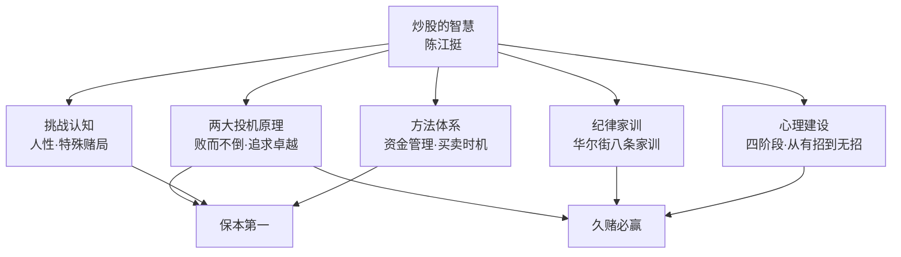
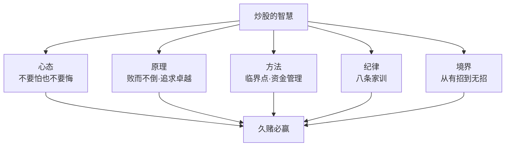

# 36《炒股的智慧》深度解读（详细版）

> **副题：陈江挺——"不要怕，也不要悔"：一位华尔街华人炒手写给散户的生存之书**
>
> 作者：陈江挺，华尔街职业炒股人。1980 年代赴美留学，做过地产经纪人、研究过金融期货，最终以炒股为生——**本书是他用十年学费（专职炒股前四年"白干还亏本"）换来的实战经验总结**，被誉为"华人炒股第一书"，常销二十余年。
>
> **核心定位**：这不是一本教你"预测涨跌"的书，而是一本**"教你活下来"**的书。全书围绕两条投机原理展开——**"败而不倒"（保本）与"追求卓越"（赚钱）**，用华尔街家训、资金管理、买卖时机、心理建设四大部分，回答散户最根本的问题：**为什么大多数人亏钱？怎样才能成为少数活下来并赚钱的人？**
>
> **系列意义**：036 是系列第 36 本，也是**A 股实战派的第二站**。如果说 035 邱国鹭讲"选什么"（便宜的好公司），036 陈江挺讲"怎么活"（止损、资金管理、心理）——**两本书合起来，才是 A 股散户的完整生存手册**。陈江挺也是系列中罕见的"纯交易派"（区别于价值派），与利弗莫尔（01—03）、林奇（32—34）形成三角对照。

---

## 📖 全书结构与核心框架

### 全书结构总览表

| 部分 | 章节 | 核心内容 |
|------|------|---------|
| 开篇 | 引子 三则故事 | 不要怕/不要悔；赌骨牌 35 注全押 12；小偷教子 |
| 第1章 | 炒股的挑战 | 炒股与人性/特殊的赌局/一般股民何以失败 |
| 第2章 | 股票分析的基本知识 | 基本面/技术分析/分析之我见/合理价位 |
| 第3章 | 成功的要素 | 基本要诀/资金管理/成功投资者共性 |
| 第4章 | 何时买股票何时卖股票 | 买入原则/卖出要领/定位方法/系统工程 |
| 第5章 | 华尔街的家训 | 八条家训/大师论炒股 |
| 第6章 | 从有招迈向无招 | 心理障碍/心理训练 |
| 第7章 | 抓住大机会 | "疯"的故事与解剖（南海泡沫等） |
| 第8章 | 和炒手们谈谈天 | 学股的四个阶段/回答几个问题 |
| 第9章 | 善战者无赫赫之功 | 曾国藩结硬寨打呆战/集小胜为大胜 |
| 附录 | 金钱的反思 | 财富与人生/福气一马车/中庸 |

---

## 📑 目录

- [[#第1章 引子：三则故事定乾坤|第1章 引子：三则故事定乾坤]]
- [[#第2章 炒股的挑战：人性与特殊赌局|第2章 炒股的挑战：人性与特殊赌局]]
- [[#第3章 一般股民何以失败|第3章 一般股民何以失败]]
- [[#第4章 股票分析的基本知识|第4章 股票分析的基本知识]]
- [[#第5章 成功的要素：败而不倒，追求卓越|第5章 成功的要素：败而不倒，追求卓越]]
- [[#第6章 资金管理：怎样在股市下注|第6章 资金管理：怎样在股市下注]]
- [[#第7章 何时买股票：止损第一，临界点致胜|第7章 何时买股票：止损第一，临界点致胜]]
- [[#第8章 何时卖股票：会买是徒弟，会卖是师傅|第8章 何时卖股票：会买是徒弟，会卖是师傅]]
- [[#第9章 华尔街的家训：八条生存铁律|第9章 华尔街的家训：八条生存铁律]]
- [[#第10章 从有招迈向无招：心理建设|第10章 从有招迈向无招：心理建设]]
- [[#第11章 抓住大机会："疯"的故事|第11章 抓住大机会："疯"的故事]]
- [[#第12章 学股的四个阶段|第12章 学股的四个阶段]]
- [[#第13章 善战者无赫赫之功|第13章 善战者无赫赫之功]]
- [[#第14章 金钱的反思|第14章 金钱的反思]]
- [[#总结：炒股的智慧|总结：炒股的智慧]]
- [[#附录一 陈江挺金句集（40 条精选）|附录一 陈江挺金句集（40 条精选）]]
- [[#附录二 本书术语速查卡|附录二 本书术语速查卡]]
- [[#附录三 系列互链：036 在 36 本笔记中的位置|附录三 系列互链：036 在 36 本笔记中的位置]]
- [[#附录四 A 股应用：散户生存手册本土版|附录四 A 股应用：散户生存手册本土版]]
- [[#附录五 读完本书后的 10 个自问|附录五 读完本书后的 10 个自问]]
- [[#附录六 本书案例与数据速查|附录六 本书案例与数据速查]]
- [[#附录七 华尔街家训执行检查清单|附录七 华尔街家训执行检查清单]]
- [[#附录八 本书 FAQ 20 问|附录八 本书 FAQ 20 问]]
- [[#附录九 系列母题追踪（036 号更新）|附录九 系列母题追踪（036 号更新）]]
- [[#附录十 交易派 vs 价值派：陈江挺 × 系列大师对照|附录十 交易派 vs 价值派：陈江挺 × 系列大师对照]]
- [[#附录十一 30 秒版：炒股的智慧|附录十一 30 秒版：炒股的智慧]]
- [[#附录十二 陈江挺炒股理念 60 条|附录十二 陈江挺炒股理念 60 条]]
- [[#附录十三 三大"疯"案 × A 股泡沫对照|附录十三 三大"疯"案 × A 股泡沫对照]]
- [[#附录十四 系列 36 本总览（完成进度）|附录十四 系列 36 本总览（完成进度）]]
- [[#附录十五 同一市场，五种眼光（036 版）|附录十五 同一市场，五种眼光（036 版）]]
- [[#附录十六 中医视角：止损如"祛邪"，保本如"存正"|附录十六 中医视角：止损如"祛邪"，保本如"存正"]]
- [[#附录十七 中英对照：陈江挺核心概念|附录十七 中英对照：陈江挺核心概念]]
- [[#附录十八 思维训练：10 个交易练习|附录十八 思维训练：10 个交易练习]]
- [[#附录十九 学股四阶段自测表|附录十九 学股四阶段自测表]]
- [[#附录二十 写给亏过钱的股民（知乎文风附录）|附录二十 写给亏过钱的股民（知乎文风附录）]]

---

## 第1章 引子：三则故事定乾坤

### 1.1 华尔街的三十年法则

> "华尔街有个说法：'你如果能在股市熬 10 年，你应能不断赚到钱；你如果熬了 20 年，你的经验将极有借鉴的价值；你如果熬了 30 年，那么你退休的时候，定然是极其富有的人。'"

**前提**：你必须成为真正的炒股专家——只有成为专家之后，才可能不断地从股市赚到钱。

### 1.2 故事一：年轻人的故事——"不要怕，也不要悔"

乡下青年闯世界，村长赠三个字**"不要怕"**；30 年后归来，村长已死，留信三个字**"不要悔"**。

> "不要怕，也不要悔"——**炒股的全部心态，就在这六个字里**：进场时不畏首畏尾，离场后不怨天尤人。

### 1.3 故事二：赌博的故事——35 个红布包

骨牌赌局，36 个数字，1 赔 35。老赌客拿了 36 个赌注从 1 押到 36——**"我不可能一个数字都押不到"**——结果掉了一注（12），庄家偷走并开 12，35 个红布包全押 12，庄家破产。

**故事的深意**：

| 层面 | 含义 |
|------|------|
| 概率层面 | 全押=必胜（理论上） |
| 心理层面 | 老赌客"只差一个数字"的侥幸 |
| 庄家层面 | 面对人为操纵的赌局，必须摸清对方心理 |
| 现实层面 | **股市不是公平赌局——有庄家、有操纵、有信息不对称** |

### 1.4 故事三：小偷的故事——本事在"逃"

小偷教儿子偷窃：把儿子锁在储存间，大喊大叫引来主人，自己溜走——儿子被迫吹熄蜡烛、推开佣人、丢石入塘声东击西，死里逃生。

> "孩子，你已学会怎么偷东西了。"

**小偷的本事不在偷，而在于危急的时候怎么逃。**

> "朋友，你开始看这本书，准备玩全世界最刺激的游戏并要成为专家时，我要给你这样的忠告：**不要怕，也不要悔；玩游戏之前，先搞清楚游戏的规则，面对人为操纵的赌局，一定要摸清对方的心理；最后提醒你，小偷的本事不在偷，而在于危急的时候怎么逃。**"

**（"怎么逃"=止损**——这是全书的题眼，与 01 号利弗莫尔"割肉求生"一脉相承。）

---

## 第2章 炒股的挑战：人性与特殊赌局

### 2.1 股票的本质：脱离母体的生命

**母猪股票的寓言**：一头母猪现价 100 元，分成 100 股，每股应值 1 元——但注册成"凤凰大集团"上市后：

| 想象空间 | 股价 |
|---------|------|
| 股民认为母猪会老会死 | 每股一毛钱 |
| 股民想象母猪半年生 10 只小猪、子子孙孙 | 每股上百元甚至上千元 |

> "毫无疑问，凤凰大集团的公司介绍上不会说集团资产只是一头母猪，它会告诉股民们集团从事的是'饲料购销、良种培育'之类有挑战性的业务。"

**沙丁鱼罐头的故事**：两位炒手交易一罐沙丁鱼罐头，价格越炒越高——终于有人打开罐头，发现沙丁鱼是臭的。对方回答：**"谁要你打开的？这罐沙丁鱼是用来交易的，不是用来吃的！"**

> "股票的迷惑性不在于股票所基于的价值，而在于它给炒股者提供的幻想。"

### 2.2 股市是"恒久的赌局"

| 赌场赌局 | 股市赌局 |
|---------|---------|
| 庄家告诉你何时下注 | **没有人告诉你何时进场** |
| 牌翻开=结束 | **没有开始，也没有结束** |
| 清楚输赢多少 | 赢会赢多少、输会输多少都不知道 |
| 不下注本金不减少 | **什么都不做，亏损也可能不断增加** |
| 自动离场 | **每个决定都要自己做，负全部责任** |

> "问问你自己喜欢做决定吗？喜欢独自为自己的决定负全部责任吗？对 99％的人来说，答案是否定的。股市这一恒久的赌局却要求你每时每刻都要做理性的决定，并且为决定的结果负全部的责任！"

**大出所料的损失**：

> "在赌台，每场游戏你最多失去你下的注……**在股市，它把你的下注拿走一些，又给回一些，有时多些，有时少些。你原先准备最多亏 100 元的，最终可能亏掉 500 元。因为股票游戏没有终止的时刻，没有人告诉你游戏结束了。**"

---

## 第3章 一般股民何以失败

### 3.1 失败的根源：人性

| 人性弱点 | 在股市的表现 |
|---------|-------------|
| 贪 | 赚小钱就跑（"不贪"） |
| 怕 | 亏钱死扛（"不怕"） |
| 侥幸 | 向下摊平 |
| 从众 | 跟风炒作 |
| 急躁 | 财不入急门 |
| 面子 | 不肯认错止损 |

**新股民的两个显著特点**：

| 特点 | 表现 |
|------|------|
| "不贪" | 有一点利润就赶快卖股获利（"500 块钱能买不少菜呢"） |
| "不怕" | 套牢了死扛（"真倒霉，被套牢了，等到反弹再说"） |

> "他们不贪，满足于赚小钱……亏钱时他们不怕，他们绝不愿亏小钱。就我的观察，**80％以上的股民都无法从这个阶段毕业。**"

### 3.2 散户与赌客的共同心理

> "赌客们站在赌台旁，一注都不肯放过，生怕下一手就是自己赢钱的机会。直到输完才会收手……**一般股民几乎把入市资金全部买了股票。不管是牛市还是熊市时，他们都是这样。**"

**（这与 035 邱国鹭"仓位思维"、28 号格雷厄姆"投机心理"完全互证**——人性是股市永恒的敌人。）

---

## 第4章 股票分析的基本知识

### 4.1 基本面分析

| 维度 | 内容 |
|------|------|
| 核心 | 研究公司本身价值 |
| 代表 | 巴菲特 |
| 优点 | 长期有效 |
| 局限 | 散户无法获得完善资料；财报只说明过去，不代表未来 |

> "股票的价格反映的是股票半年或更远的未来的公司前景。"

### 4.2 技术分析

| 维度 | 内容 |
|------|------|
| 核心 | 市场对该股票的看法尽数表现在股价及交易量变化上 |
| 代表 | 大多数炒手 |
| 关键概念 | 阻力线/支撑线/临界点/最小阻力线 |
| 心理基础 | 图形=大众投资心理的反映 |

### 4.3 分析之我见

**陈江挺的立场**：靠炒股为生，必须每月有收入——完全靠基本面分析没把握，所以**主要参考技术分析**：

> "我总是选择那些我入场时胜算最大的点，而且每次下注都只是我资本的小部分，同时把握亏钱时亏小钱，赚钱时赚大钱的原则，及时止损。**说到底，我差不多就等于在开赌场，每次入场时我的获胜概率都超过 50％，而且我只下小注，所以我久赌必赢。**"

### 4.4 什么是合理的价位

| 概念 | 内容 |
|------|------|
| 临界点 | 公众对股价重新评估的点（如水的 100℃） |
| 合理价位 | 在临界点附近入场，被宰的机会最小 |
| 买卖技巧 | **全在怎样找临界点** |

---

## 第5章 成功的要素：败而不倒，追求卓越

### 5.1 投机原理的两句话

> "投机本身是门学问……它的精华可以浓缩成两句话：**（1）败而不倒；（2）追求卓越。**这两点不是我的发明，是我们祖先几千年流传下来的做生意的智慧！"

| 原理 | 英文对应 | 含义 |
|------|---------|------|
| 败而不倒 | 资本保存 | 本钱没了就倒了；无论什么好机会，没有本钱的生意人只能是旁观者 |
| 追求卓越 | 恒久利润 | 不断盈利+挣大钱；最终成为"慈善家"是投机者的目的 |

**足球比喻**：胜球的首要是不失球或少失球——只有球在自己脚下才可能进攻得分。

### 5.2 保本：炒股的第一要义

> "炒股是用钱赚钱的行业。一旦你的本金没有了，你就失业了。无论你明天见到多么好的机会，手头没有本金，你只能干着急。"

**保本的两个办法**：

| 办法 | 内容 |
|------|------|
| 快速止损 | 亏小钱时割肉容易，亏大钱时割肉十分困难（人性） |
| 别一次下注太多 | 分层下注：先 200 股试水→400 股→买足 |

**风险承受力的简单测试**：

> "最简单的方法就是问自己睡得好吗？如果你对某只股票担忧到睡不着，表示你承担了太大的风险。**卖掉一部分股票，直到你觉得自己睡得好为止。**"

### 5.3 不断盈利：关键是"不断"

> "在股票市场偶尔赚点钱不难，只要你运气好就可以了。难的是'不断'两字。有多少次你听到朋友说：'我今年不错，股票大市跌了 20％，我只亏 10％，我战胜了股市！'真的吗？**任何专业的炒手，唯一该问的问题应该是我今年挣了多少？**"

**忍耐与等待**：

> "要想在股市不断赚钱，除了知识和经验之外，就是必须忍耐，等待赚钱的时机……股市有时是完全无序的，你根本就不知道股票下一步会怎样运动。就像你的女朋友生气时一样，你不知她在想什么？不知她要干什么？**这时最佳的方法就是别惹她。在股票市场，就是你就别碰股票。**"

---

## 第6章 资金管理：怎样在股市下注

### 6.1 入市前先自问："我亏得起吗？"

> "一个人无论做什么投资，思考的第一个问题必须是：**我亏得起吗？**"

**地产老板的故事**：陈江挺在纽约做地产经纪人时的老板，70 年代末风生水起，《纽约时报》专文介绍；80 年代末地产低潮被套牢，有小亏解套机会但"人有了一定地位，要亏钱认输是多么困难"——最后破产。

> "他们做生意没有遵循'适时止损'及'败而不倒'的原则，在生意场承担超出自己承受力的风险，运气好时流星一样升起，运气不好便如流星般消失。"

### 6.2 亏 50% 要赚 100% 才能回本

| 本金 | 亏损 | 剩余 | 需盈利才能回本 |
|------|------|------|---------------|
| 10,000 | 50% | 5,000 | **100%** |
| 10,000 | 30% | 7,000 | 43% |
| 10,000 | 20% | 8,000 | 25% |
| 10,000 | 10% | 9,000 | 11% |

> "任何有基本数学概念的人都知道 100％的道路较 50％来得漫长。"

### 6.3 下注的艺术：概率与赌注

**抛硬币实验**（陈江挺的经典教学）：

| 场景 | 规则 | 结果 |
|------|------|------|
| 公平游戏 | 正反各 1 元 | 赌久了谁也赢不了 |
| 你占便宜 | 赢 1 元/输 95 分 | 你知道赢定了（剃他光头迟早的事） |
| 概率不变+赌注变大 | 每注 500 元（本金的 1/2） | **"赢定的感觉没有了"**——本金只够赌两回，手开始冒汗 |

> "你输赢的概率没有变化，但下注的数额变了，整个游戏的性质便发生了变化……**你的经验提高了你每次进场赢钱的概率！**"

**赌场数据**：

> "美国赌场的游戏（老虎机除外）赌场盈利仅在 1％～2％之间……概率上你每次下注都输一点，久赌必输的老人言就完全应验了。所以赌场不怕你赢钱，就怕你不来。"

### 6.4 久赌必赢的秘诀

> "通过你自己的观察和研究，不断累积经验，将自己每次入场获胜的概率从 50％提高到 60％，甚至 70％；而且每次进场不要下注太大，应只是本金的小部分。这样长期下来，你就能'久赌必赢'。"

**新手下注建议**：

| 经验水平 | 下注 |
|---------|------|
| 新手 | 本金分成 **6—8 份**，每次下其中一份 |
| 有经验后 | 慢慢减少份数 |
| 胜算 60% vs 80% | 胜算越低，下注越少 |

> "你要记住**财不入急门**。"

---

## 第7章 何时买股票：止损第一，临界点致胜

### 7.1 选买点的最重要点是选择止损点

> "选买点的最重要点是**选择止损点**。即在你进场之前，你必须很清楚，若股票的运动和你的预期不合，你必须在何点止损离场……不要老是想你要赚多少钱，**首先应该清楚自己能亏得起多少。**"

**止损点设置规则**：

| 方法 | 内容 |
|------|------|
| 比例法 | 10% 止损基数 |
| 支撑线法 | 止损点定在支撑线稍下 |
| 定额法 | 定 20% 止损额 |
| **铁律** | **止损点不应超出投资额的 20%** |

### 7.2 临界点：买卖的全部技巧

| 图形 | 买点 | 止损点 |
|------|------|--------|
| 升势（A 波峰/B 波谷） | 股价超过 A 点 | 14 元（A 下 1 元）或 13 元（B）；**跌穿 B 必须走人** |
| 阻力线 | 突破 15 元 | 14.50 元或 14 元 |
| 支撑线 | 碰支撑反弹 | 支撑线之下 |

> "股票一旦穿越阻力线，正常运动是继续上升，如果又跌穿回头，表示股票运动不正常，早先的穿越是假信号，可能是大户搞鬼。"

### 7.3 买入的八个要点

> 第一，在买入之前，一定要参照一下股票的走势图，因为它是大众投资心理的反映。
> 第二，在买入之前，先定好止损点，搞清楚你最多愿亏多少钱。切记照办。
> 第三，选择临界点，记住你不可能每次正确，所以入场点的获胜概率应大过失败概率。
> 第四，最好在升势或突破阻力线，准备开始升势的时候买入。
> 第五，**绝不要在跌势时入市。**
> 第六，**不要把"股票已跌了很低了"作为买入的理由，你不知道它还会跌多少！**
> 第七，不要把"好消息"或"专家推荐"作为买的理由，特别是在这些好消息公布之前，股票已升了一大截的情况下。
> 第八，记住这些要点及点点照办。

> "学习寻找临界点的过程其实就是学股的过程……**学找临界点的技巧还比较容易，培养心态才真正困难。**"

---

## 第8章 何时卖股票：会买是徒弟，会卖是师傅

### 8.1 卖出的总原则

**最简单的方法**：

> "要决定何时卖股票，最简单的方法就是问自己：**我愿此时买进这只股票吗？如果答案是否定的，你就可以考虑卖掉这只股票。**"

**抓中间的一截**：

> "一个大走势，头和尾都是很难抓到的，炒手们应学习怎样抓中间的一截，**能抓到涨幅 70％就算是很好的成绩了**。这样做能预防股票常有的 20％～40％的回调可能给你的整体投资带来的大幅震荡。"

**"不赚不卖"心态要不得**：

> "对刚学炒股的新手来讲，常有'不赚不卖'的心态，这是极其要不得的，带有这样的心态，失败的命运差不多就注定了。"

### 8.2 卖出五要领

| # | 要领 | 内容 |
|---|------|------|
| 1 | 注意危险信号 | "这是该卖的时候了"的直觉=经验，不要忽略 |
| 2 | 保本第一 | 任何情况下，股价超出入货点，应在进价之上定止损点（10 元进升到 12 元，卖点定 11 元） |
| 3 | 亏小钱 | 止损 10% 或更小，任何情况不超过 20% |
| 4 | 遇有暴利，拿了再说 | 两星期从 20 元升到 40 元——第一天转头就卖 |
| 5 | 小心交易量猛增、股价不升 | 有人趁机出货，通常是到顶信号 |

**暴利案例**（图 4-16）：

> "股价在两星期内从 20 元升到 40 元。在这样的情况下，第一天转头（收盘低于开盘）你就可以把股票卖掉。别期待好事情会没完没了……**这种短期狂升但没有惊人好消息的股票跌起来一样快。这是大户吸引傻瓜的常用手法。**"

---

## 第9章 华尔街的家训：八条生存铁律

### 9.1 家训总览

| # | 家训 | 核心 |
|---|------|------|
| 1 | 止损，止损，止损！ | 炒股行的最高行为准则 |
| 2 | 分散风险 | 只能承担计算过的风险 |
| 3 | 避免买太多种股票 | 注意力分散=失去感觉 |
| 4 | 有疑问的时候，离场！ | 胜算只剩 50% 时别下注 |
| 5 | 忘掉你的入场价 | 专注于正确的时间做正确的事 |
| 6 | 别频繁交易 | 频繁交易损失手续费+降低质量 |
| 7 | 不要向下摊平 | 犯错的破产捷径 |
| 8 | 别让利润变成亏损 | 止损点随利润上移 |

### 9.2 家训详解

**家训 1：止损**

> "我不知该怎样强调这两个字的重要性……**这是炒股行的最高行为准则。你如果觉得自己实在没法以比进价更低的价钱卖出手中的股票，那就赶快退出这行吧！**你在这行没有任何生存的机会。最后割一次肉，痛一次，你还能剩几块钱替儿子买奶粉。"

**家训 2：分散风险**

> "做这行需要有赌性，但不能做赌徒……你有 10 次好运，第 11 次好运不见得会落在你头上。记住：你只能承担计算过的风险，不要把所有鸡蛋放在一个篮子里。**把手头的资本分成 5～10 份，在你认为至少有 1∶3 的风险报酬比率时把其中的一份入市。**"

**家训 3：避免买太多种股票**

> "问问自己能记住几个电话号码？普通人是 10 个……手头股票太多时，结果就是注意力分散，失去对单独股票的感觉。**将注意力集中在 3～5 只最有潜力的股票**，随着经验的增加，逐渐将留意的股票增加到 10～15 只。我自己的极限是 20 只股票。"

**家训 4：有疑问的时候，离场！**

> "很多时候，你根本就对股票的走势失去感觉……此时，你的最佳选择就是离场！……当你不知这只股票走势的时候，**你的胜算只剩下 50％**。专业赌徒绝不会在这时把赌注留在台面上。"

**（与 035 邱国鹭"找不到好股票就远离股市"、巴菲特"能力圈"完全一致**——承认不知道，是职业的开始。）

**家训 5：忘掉你的入场价**

> "之所以难以忘掉进价，这和人性中喜占小便宜，绝不愿吃小亏的天性有关……普通人会找一百个'理由'再赖一会儿。**朋友，'再赖一会儿'的价钱很高的。**"

**家训 6：别频繁交易**

> "当经验累积到一定地步，你就会明白股市不是每天都有盈利机会的……频繁交易常常是因为枯燥无聊。频繁交易不仅损失手续费，同时使交易的质量降低。"

**家训 7：不要向下摊平**

> "犯了错，不是老老实实地认错，重新开始，而是抱着侥幸心理，向下摊平，把平均进价降低……**这种行为是常人的想法和做法，但是破产的捷径。**英国的巴林银行就是这样倒闭的。"

**上海石化的教训**：45 美元跌到 35 美元"很低了吧"？补 2000 股；跌到 25 美元怎么办？还摊不摊？**结果一路跌到 10 美元**——"这样的好戏只要上演一出，你就全部被套牢"。

**换个说法**：**第一次入场后，纸面上没有利润的话不要加码。纸面有利润了，表示你第一次入场的判断正确，那么可以扩大战果，适当加注，否则即刻止损离场。**

**家训 8：别让利润变成亏损**

> "这条规矩的意思是这样的：你 10 元一股进了 1000 股，现在股票升到 12 元……**你应把止损点定在 11 元或 10 元之上**，让利润奔跑的同时，守住已经到手的利润。"

---

## 第10章 从有招迈向无招：心理建设

### 10.1 炒股成功的心理障碍

| 障碍 | 表现 |
|------|------|
| 怕 | 不敢进场/不敢止损 |
| 贪 | 赚了还想赚/重仓豪赌 |
| 急 | 恨不得明天成为亿万富翁 |
| 面子 | 不肯认错 |
| 侥幸 | 向下摊平/再赖一会儿 |
| 从众 | 跟风追高 |

### 10.2 心理训练

**从"有招"到"无招"**：

| 阶段 | 特征 |
|------|------|
| 有招 | 死记家训、机械止损、生搬硬套图形 |
| 无招 | 规则内化为本能，"知道"升势还在 |

> "将炒股武艺练到'无招'地步的炒手才可以考虑（升势中加码）……没有三五年的经验莫谈。新手们谨请记住：不要向下摊平！"

**心理训练的方法**：

| 方法 | 内容 |
|------|------|
| 小注练习 | 用 100 股保持"注意力药" |
| 记录反思 | 复盘每次买卖的心理 |
| 忘掉进价 | 训练自己专注于运动是否正常 |
| 接受亏损 | 止损=买保险 |
| 睡得着觉 | 风险承受力的检验 |

---

## 第11章 抓住大机会："疯"的故事

### 11.1 认识"疯"：人性的特质

> "在你的生涯中，通常会碰到不少大大小小的'疯'。从 20 世纪 90 年代初中国的股'疯'，更早之前的邮'疯'……**'疯'也是人性的特质。如果你能抓到一个这样的'疯'，你的生活就能有'量变到质变'的变化。**"

> "要真正想在炒股中赚到大钱，就必须有能力认识这种'疯'，**投入其中，在假象被公众认识之前退出游戏**。"

### 11.2 南海泡沫（1720）

| 时间 | 事件 |
|------|------|
| 1711 | 南海公司注册，获南美贸易专营权（条件是负责部分英国国债） |
| 实际业务 | 仅被允许做奴隶运送，每年一船，利润还要与西班牙分成 |
| 1719 | 建议用南海股票偿还全部英国国债 |
| 造谣 | 散布"西班牙开放贸易""秘鲁营运基地"谣言 |
| 1720.9 | **股价达 1,000 英镑，半年升 8 倍**；总值是全欧洲现金流通量的 5 倍 |
| 跟风 | 印刷工人登记"正进行有潜力生意"的公司，6 小时卖出 2,000 英镑股票后失踪 |
| 崩塌 | 9 月底从 1,000 英镑跌到 129 英镑；接受股票抵押贷款的银行接连倒闭，英格兰银行仅以身免 |

**"疯"的晚期特征**：

> "骗案层出不穷是所有'疯'到了晚期的特征之一。陷入疯狂状态的民众是行骗的最好目标，他们失去了最起码的警惕。"

### 11.3 郁金香狂与佛罗里达土地疯

**郁金香**：

> "在荷兰郁金香狂的后期，有位客人在主人家看到一个洋葱，便将其炒来吃了，后来发现这个'洋葱'原来是一种稀有郁金香的球茎，**市值两幢房子加一辆马车。**"

**佛罗里达土地疯（1923—1926）**：

| 数据 | 内容 |
|------|------|
| 800 美元买的地 | 1924 年卖 15 万美元 |
| 1896 年值 25 美元的地 | 1925 年卖 12.5 万美元 |
| 迈阿密 75,000 人口 | **其中 25,000 个地产经纪人**（每 3 位居民 1 个做地产） |
| 买地目的 | 不再是居住，**买地的唯一目的是卖给下家** |

### 11.4 "疯"的解剖：A 股的对应

| "疯"的共同特征 | A 股对应 |
|---------------|---------|
| 人人都赚钱的传说 | 2015 年"国家牛市" |
| 不买就落后于时代 | 全民炒股/卖房炒股 |
| 骗案层出不穷 | 各类"概念"公司 |
| 聪明人太早离场被嘲笑 | 2015 年 4000 点"清仓"者被嘲笑 |
| 崩溃前最后疯狂 | 6 月千股涨停→千股跌停 |

---

## 第12章 学股的四个阶段

### 12.1 四阶段总览

| 阶段 | 特征 | 时长 |
|------|------|------|
| 蛮干 | 买卖无章法，绝不肯止损 | 80% 股民无法毕业 |
| 摸索 | 知道要止损，但不知怎么止 | 约 3—4 年 |
| 体验风险 | 亏怕了，开始敬畏市场 | 漫长 |
| 久赌必赢 | 概率+资金管理+心态成熟 | 毕业 |

### 12.2 蛮干阶段：新股民的两大特点

> "这个阶段的特点是自己没有什么主意，买时不知为何买股票，卖时也不知为何卖。买卖的决定完全由他人或自己的一时冲动所左右……在这个时期是绝不肯止损的。"

**亲戚的经典话**（陈江挺的亲身经历）：

> "亏钱的股票怎么能卖？最少要等到升回有钱赚时才可以脱手。亏钱的股票快快卖掉，赚钱的股票不肯卖，要等到跌回亏钱后才卖，你怎么可能从股市赚到钱？"

### 12.3 摸索阶段：陈江挺的四年黑暗

**陈江挺的亲身历程**（全书最诚实的一段自白）：

| 尝试 | 结果 |
|------|------|
| 1 美元止损 | 股票一碰止损价就反弹，"小损终于加成大损" |
| 止损放大到 10%、20% | 买卖次数少了，但"亏时亏 3 美元，赚时只有 1.5 美元" |
| 把止损点下移 | "我怕股价一碰到 27 美元就反弹"——忍不住 |
| 基本面分析 | 不赚钱 |
| 技术分析找最低点最高点 | "不断以'止损'收场" |
| MACD/威廉指标/平均线 | 没有一样有效 |
| 期货（黄金白银外币黄豆） | "只是亏钱亏得更快" |

> "花了近四年的时间，什么也没有得到，亏了老本，换来一大堆经验……**我突然间觉得有灵光在脑海中闪耀。**"

**转折点**：期货的走势/阻力线/支撑线概念放回股票——**"股票运动其实有迹可循！"**

### 12.4 体验风险阶段与久赌必赢阶段

**体验风险**：亏怕了之后，开始明白"风险"两个字的分量——不再把炒股当游戏，而是当生意。

**久赌必赢**（毕业标准）：

| 标准 | 内容 |
|------|------|
| 胜算 | 每次入场获胜概率 >50%（靠经验提高） |
| 下注 | 每次只下本金的小部分 |
| 止损 | 亏小钱赚大钱 |
| 心理 | 不再被情绪左右 |
| 状态 | "差不多就等于在开赌场" |

---

## 第13章 善战者无赫赫之功

### 13.1 曾国藩的"结硬寨，打呆战"

> "孙子曰：'善战者无赫赫之功，故善者之战，无奇胜，无智名，无勇功！'"

| 曾国藩的战法 | 投资对应 |
|-------------|---------|
| 结硬寨（深壕高垒保护自己） | 保本/止损 |
| 打呆战（不心存侥幸不投机取巧） | 不赌/不向下摊平 |
| 集小胜为大胜 | 不断盈利（小赢累积） |
| 无赫赫之功 | 没有传奇，但最终赢了 |

> "历史学家几乎找不到曾国藩打过'大胜仗'的记录！他用'结硬寨，打呆战'的方式，集小胜为大胜，一步一步将太平天国逼上死路。"

### 13.2 为什么炒股不能追求"赫赫之功"

> "战场上杀敌一万，自损八千；故善战者不求杀敌盈野，但求不战而屈人之兵。**股市上想一把赚 100％，得准备一把亏 80％；故善炒股者不试图一把豪赌将本金翻倍，试图在不怎么亏钱的情况下让资本不断增值。**"

> "那些靠轰轰烈烈大搏杀胜出而出名者后果常常不妙：一场大搏杀取胜自然而然地寻找下一场大搏杀，直至碰到霉运而一无所有；**您可以连续 5 次 100％地赚，只要一次 100％亏就一无所有。**最好的例子就是我们熟悉的先辈，炒股的天才利物莫。他以豪赌名扬天下，但一生破产三次，死时一无所有！"

**（与 01 号利弗莫尔的悲剧形成闭环**——系列的 01 号解读了利弗莫尔的一生，036 用一句话总结了他的教训。）

**华尔街的谚语**：

> "华尔街有勇敢的交易员，华尔街有年老的交易员；**华尔街没有勇敢的老交易员。**"

### 13.3 战略目标分层

| 股民类型 | 战略目标 | 做法 |
|---------|---------|------|
| 新股民（<5 年） | 用最小代价了解股市 | 学习第一 |
| 赌一把型 | 3 万翻 10 倍再 10 倍 | 必须用余钱（"一块钱买一个梦"） |
| 日交易型 | 短线+杠杆 | 成功率很低，只适合小资金 |
| 一般家庭 | 资产保值增值 | 底线是不可不见了（资产配置理论） |

> "买彩票可能发财，但买彩票的发财方式无法重复；赌股票也有人发财，赌股票发财的方式同样无法重复；**一件不重复的事情没法学习。**"

---

## 第14章 金钱的反思

### 14.1 金钱与成功人生

> "成功的人生并不仅仅是取得财富，它是一种心态，在这个心态中你觉得安详、宁静、满足。如果能每日都保有这样的心态，它的积累就会延续成功的人生。"

### 14.2 财富的副作用

| 副作用 | 内容 |
|--------|------|
| 破坏人际关系 | 罗思齐："我没有朋友，只有客户，财富将你和你的周围筑起了一道高高的围墙。" |
| 家庭问题 | 有钱人家多败子；豪门恩怨 |
| 失去追求 | 子女失去上进的追求 |
| 迷失自我 | 麦得思点金术：女儿也成了黄金 |

> "我看到过年收入两万元的人感叹钱用不完，也见到年收入百万元的人说钱不够用！**你说钱用不完的人富有还是钱不够用的人富有？谁在生活中感觉更为宁静和安详？**"

### 14.3 母亲的教诲：福气一马车

> "记得我母亲常告诫我：'人的福气就有一马车，你小时多吃些苦，福气就留到晚年，小时把福气享受完了，老年时就没有了。'……**人如果知福惜福，没有非分之想，福气自然会伴随你。**"

### 14.4 儒家的中庸与炒股

> "儒家对安身立命的信条称为'中庸'。无论是炒股还是做人，顺自然，戒贪婪，多给自己一些时间，不要太急于成功，平衡自己的身心，别放纵自己，给自己定些规矩且不逾矩。"

> "人有很多缺点，其中最致命的就是**贪**。当贪念太强时，你的为人、做事、炒股，就全走样了。"

> "我不仅希望你炒股成功，更希望你有成功的人生。**君子爱财，取之有道。**"

---

## 总结：炒股的智慧

### Z1. 陈江挺体系全景

### Z2. 全书的五根柱子

| 柱子 | 核心内容 | 章节 |
|------|---------|------|
| 心态 | 不要怕也不要悔 | 引子 |
| 原理 | 败而不倒+追求卓越 | 第3章 |
| 方法 | 临界点买卖+资金管理 | 第4、6、7章 |
| 纪律 | 八条家训 | 第5章 |
| 境界 | 四阶段+善战者无赫赫之功 | 第8、9章 |

### Z3. 陈江挺留给读者的三句话

> 1. "不要怕，也不要悔；玩游戏之前，先搞清楚游戏的规则。"
> 2. "败而不倒——本钱没了，你就倒了；无论什么好机会，没有本钱的生意人只能是旁观者。"
> 3. "善战者无赫赫之功——集小胜为大胜，最后达成财务自由。"

### Z4. 本书与系列的关系

| 维度 | 01 利弗莫尔 | 32—34 林奇 | 035 邱国鹭 | **036 陈江挺** |
|------|-----------|-----------|-----------|---------------|
| 流派 | 交易 | 价值（生活派） | 价值（A股） | **交易（A股）** |
| 核心 | 趋势+纪律 | 选好公司 | 便宜的好公司 | **止损+资金管理** |
| 特色 | 坐功 | 逛街调研 | 三板斧 | **学股四阶段** |

---

## 附录一 陈江挺金句集（40 条精选）

> 1. "你如果能在股市熬 10 年，你应能不断赚到钱；熬 30 年，退休时定然极其富有。"——引子
> 2. "不要怕，也不要悔。"——引子
> 3. "小偷的本事不在偷，而在于危急的时候怎么逃。"——引子
> 4. "这罐沙丁鱼是用来交易的，不是用来吃的！"——第1章
> 5. "股票的迷惑性不在于股票所基于的价值，而在于它给炒股者提供的幻想。"——第1章
> 6. "股市这一恒久的赌局却要求你每时每刻都要做理性的决定，并且为决定的结果负全部的责任。"——第1章
> 7. "在股市，它把你的下注拿走一些，又给回一些……你原先准备最多亏 100 元的，最终可能亏掉 500 元。"——第1章
> 8. "80％以上的股民都无法从这个阶段毕业。"——第1章
> 9. "投机原理的精华可以浓缩成两句话：败而不倒；追求卓越。"——第3章
> 10. "本钱没了，你就倒了。"——第3章
> 11. "一旦你的本金没有了，你就失业了。"——第3章
> 12. "卖掉一部分股票，直到你觉得自己睡得好为止。"——第3章
> 13. "难的是'不断'两字。"——第3章
> 14. "任何专业的炒手，唯一该问的问题应该是我今年挣了多少？"——第3章
> 15. "就像你的女朋友生气时一样，你不知她在想什么？这时最佳的方法就是别惹她。"——第3章
> 16. "我亏得起吗？"——第3章
> 17. "人有了一定地位，要亏钱认输是多么困难。"——第3章
> 18. "你输赢的概率没有变化，但下注的数额变了，整个游戏的性质便发生了变化。"——第3章
> 19. "赌场不怕你赢钱，就怕你不来。"——第3章
> 20. "通过你自己的观察和研究，不断累积经验，将自己每次入场获胜的概率从 50％提高到 60％，甚至 70％。"——第3章
> 21. "财不入急门。"——第3章
> 22. "选买点的最重要点是选择止损点。"——第4章
> 23. "买股票的技巧，全在怎样找临界点上。"——第4章
> 24. "绝不要在跌势时入市。"——第4章
> 25. "不要把'股票已跌了很低了'作为买入的理由，你不知道它还会跌多少！"——第4章
> 26. "学找临界点的技巧还比较容易，培养心态才真正困难。"——第4章
> 27. "我愿此时买进这只股票吗？如果答案是否定的，你就可以考虑卖掉这只股票。"——第4章
> 28. "能抓到涨幅 70％就算是很好的成绩了。"——第4章
> 29. "止损，止损，止损！这是炒股行的最高行为准则。"——第5章
> 30. "你只能承担计算过的风险，不要把所有鸡蛋放在一个篮子里。"——第5章
> 31. "有疑问的时候，离场！"——第5章
> 32. "朋友，'再赖一会儿'的价钱很高的。"——第5章
> 33. "向下摊平是常人的想法和做法，但是破产的捷径。"——第5章
> 34. "纸面有利润了，表示你第一次入场的判断正确，那么可以扩大战果，适当加注，否则即刻止损离场。"——第5章
> 35. "频繁交易常常是因为枯燥无聊。"——第5章
> 36. "'疯'也是人性的特质。要真正想在炒股中赚到大钱，就必须有能力认识这种'疯'，投入其中，在假象被公众认识之前退出游戏。"——第7章
> 37. "善战者无赫赫之功——集小胜为大胜，最后达成财务自由。"——第9章
> 38. "您可以连续 5 次 100％地赚，只要一次 100％亏就一无所有。"——第9章
> 39. "华尔街有勇敢的交易员，华尔街有年老的交易员；华尔街没有勇敢的老交易员。"——第9章
> 40. "人有很多缺点，其中最致命的就是贪。当贪念太强时，你的为人、做事、炒股，就全走样了。"——附录

---

## 附录二 本书术语速查卡

| 术语 | 定义 | 出处 |
|------|------|------|
| 败而不倒 | 保本第一 | 第3章 |
| 追求卓越 | 不断盈利+挣大钱 | 第3章 |
| 临界点 | 公众重新评估股价的点 | 第4章 |
| 最小阻力线 | 股票运动的路径 | 第2章 |
| 阻力线 | 压制股价上行的价位 | 第4章 |
| 支撑线 | 托住股价下行的价位 | 第4章 |
| 止损点 | 预先设定的认亏离场价 | 第4章 |
| 向下摊平 | 亏损后加仓降低成本 | 第5章 |
| 久赌必赢 | 胜算>50%+小注+止损 | 第3章 |
| 恒久的赌局 | 股市无始无终的特性 | 第1章 |
| 有招/无招 | 机械执行/内化本能 | 第6章 |
| 结硬寨打呆战 | 曾国藩的稳健战法 | 第9章 |

---

## 附录三 系列互链：036 在 36 本笔记中的位置

### 036 与系列笔记的链接网络

| 系列笔记 | 链接点 |
|---------|--------|
| [[01《股票作手回忆录》读书笔记|01 号]] | 利弗莫尔：豪赌三次破产×"善战者无赫赫之功"直接引用 |
| [[02《股票大作手操盘术》深度解读（详细版）|02 号]] | 关键点=临界点；10% 止损=家训 1 |
| [[03《利弗莫尔的股票交易方法量价分析》深度解读（详细版）|03 号]] | 最小阻力线概念同源 |
| [[35《投资中最简单的事》深度解读（详细版）|35 号]] | A 股实战双璧：邱国鹭选什么×陈江挺怎么活 |
| [[28《聪明的投资者》深度解读（详细版）|28 号]] | 格雷厄姆防御×败而不倒 |
| [[05《巴菲特的投资心法》深度解读（详细版）|05 号]] | 巴菲特保本第一（"第一条不要亏钱"） |
| [[31《金融炼金术》深度解读（详细版）|31 号]] | 索罗斯反身性×"疯"的解剖 |
| [[32《彼得·林奇的成功投资》深度解读（详细版）|32 号]] | 林奇反对机械止损×陈江挺止损第一（两极对照） |
| [[34《彼得·林奇战胜华尔街》深度解读（详细版）|34 号]] | 林奇"恐慌是机会"×陈江挺"有疑问离场" |
| [[22《穷查理宝典》深度解读（详细版）|22 号]] | 芒格逆向×"疯"的识别 |

### 036 在系列中的定位

| 维度 | 定位 |
|------|------|
| 流派 | 交易派（A 股语境） |
| 特色 | 散户生存手册（止损/资金管理/心理） |
| 对照 | 与价值派（05/28/35）形成"活下来 vs 选得好"互补 |

---

## 附录四 A 股应用：散户生存手册本土版

### 4.1 止损的 A 股实践

| 陈江挺规则 | A 股实操 |
|-----------|---------|
| 止损点不超 20% | 买入前设定，跌 10% 无条件执行 |
| 跌穿支撑线走人 | 用技术位代替"再等等" |
| 绝不在跌势入市 | 等企稳信号（止跌+放量） |
| 不向下摊平 | 套牢不加仓（与"补仓摊成本"反着做） |

### 4.2 资金管理的 A 股实践

| 规则 | A 股实操 |
|------|---------|
| 6—8 份本金 | 单只股票不超过总资金 1/6—1/8 |
| 分层下注 | 先 1/4 试仓，对了再加 |
| 睡得着觉 | 睡不着就减仓 |
| 财不入急门 | 不借钱炒股、不配资 |

### 4.3 家训的 A 股对照

| 家训 | A 股场景 |
|------|---------|
| 避免买太多 | 账户几十只→聚焦 3—5 只 |
| 有疑问离场 | 看不懂的行情不参与 |
| 忘掉入场价 | 套牢后问"现在愿买吗" |
| 别频繁交易 | 手续费+印花税+情绪损耗 |
| 别让利润变亏损 | 盈利股设保本止损 |

### 4.4 "疯"的 A 股识别

| 信号 | 案例 |
|------|------|
| 人人都赚钱的传说 | 2007/2015 |
| 卖房炒股 | 2015 |
| 开户数暴增 | 2015.4—6 |
| 新股民进场 | 全民谈股（鸡尾酒会理论） |
| 聪明人太早离场被嘲笑 | 每次牛市顶部 |

---

## 附录五 读完本书后的 10 个自问

1. 我买股票前，先问过"我亏得起吗"吗？
2. 我每笔交易进场前都设好止损点了吗？
3. 我的止损点超过投资额的 20% 了吗？
4. 我在跌势中买过股票吗？（为什么？）
5. 我向下摊平过吗？（结果如何？）
6. 我手头股票太多、失去感觉了吗？
7. 我频繁交易吗？（手续费+情绪损耗核算过吗？）
8. 我会"忘掉入场价"吗？还是"再赖一会儿"？
9. 我在学股哪个阶段？（蛮干/摸索/体验风险/久赌必赢）
10. 我炒股是为了"赫赫之功"还是"集小胜为大胜"？

---

## 附录六 本书案例与数据速查

### 核心数据

| 数字 | 含义 |
|------|------|
| 10/20/30 年 | 熬 10 年赚钱/20 年借鉴/30 年富有 |
| 36 个数字 | 骨牌赌局（1 赔 35） |
| 35 注全押 12 | 庄家破产的故事 |
| 100 元母猪 | 股票脱离母体的寓言 |
| 50%→100% | 亏 50% 要赚 100% 回本 |
| 1%—2% | 赌场盈利概率 |
| 50%→60%—70% | 经验提高的胜算 |
| 6—8 份 | 新手本金分份 |
| 20% | 止损上限 |
| 3—5 只 | 专注股票数 |
| 20 只 | 陈江挺的极限 |
| 1∶3 | 风险报酬比率 |
| 70% | 抓到涨幅 70% 就是好成绩 |
| 1,000→129 英镑 | 南海泡沫跌幅 |
| 8 倍 | 南海股价半年涨幅 |
| 5 倍 | 南海总值/全欧现金 |
| 25,000/75,000 | 迈阿密地产经纪/人口 |
| 4 年 | 陈江挺摸索阶段 |
| 80% | 无法毕业的股民比例 |

### 案例速查表

| 案例 | 类型 | 启示 |
|------|------|------|
| 三则故事 | 寓言 | 不要怕不要悔/摸清赌局/会逃 |
| 母猪股票 | 寓言 | 股价≠价值 |
| 沙丁鱼罐头 | 寓言 | 交易的是幻想 |
| 地产老板破产 | 真实 | 不认输的代价 |
| 抛硬币下注 | 教学 | 赌注改变游戏性质 |
| 赌场数据 | 数据 | 久赌必输/不怕赢钱 |
| 上海石化摊平 | 教训 | 向下摊平的破产路径 |
| 巴林银行 | 教训 | 摊平导致倒闭 |
| 南海泡沫 | 历史 | "疯"的完整周期 |
| 郁金香/佛罗里达 | 历史 | 疯狂的人性 |
| 利弗莫尔 | 大师 | 豪赌三次破产 |
| 曾国藩 | 将军 | 结硬寨打呆战 |

---

## 附录七 华尔街家训执行检查清单

### 交易前

- [ ] 我亏得起吗？（这笔钱 3 年内不用？）
- [ ] 止损点设好了吗？（≤20%）
- [ ] 这是临界点吗？（胜算 >50%？）
- [ ] 我在升势中吗？（绝不在跌势入市）
- [ ] 仓位是本金的小部分吗？（6—8 份之一？）

### 持仓中

- [ ] 我"忘掉入场价"了吗？
- [ ] 股票运动正常吗？（一浪高过一浪？）
- [ ] 有疑问了吗？（离场！）
- [ ] 利润变亏损了吗？（保本止损）

### 交易后

- [ ] 我记下这次交易的经验教训了吗？
- [ ] 我频繁交易了吗？（为什么？）
- [ ] 我向下摊平了吗？（禁止！）
- [ ] 我睡得着觉吗？（睡不着=减仓）

---

## 附录八 本书 FAQ 20 问

**Q1：这本书适合什么人？**
A：所有在股市亏过钱、想活下来的散户——尤其"80% 无法毕业"的蛮干阶段股民。

**Q2：三则故事的寓意？**
A：不要怕不要悔（心态）；摸清赌局规则（认知）；会逃（止损）。

**Q3：什么是"败而不倒"？**
A：保本第一——本金没了就失业了。

**Q4：什么是"追求卓越"？**
A：不断盈利+挣大钱——先活下来，再赚钱。

**Q5：为什么要问"我亏得起吗"？**
A：确定风险承受力——亏损超出承受力=必然破产。

**Q6：亏 50% 要赚多少回本？**
A：100%——所以控制回撤比追求涨幅更重要。

**Q7：什么是临界点？**
A：公众重新评估股价的点（突破阻力线/跌穿支撑线），买卖的技巧全在找临界点。

**Q8：止损点怎么设？**
A：10%—20% 上限；入市当天最低点；支撑线稍下。

**Q9：能向下摊平吗？**
A：不能——这是破产的捷径（巴林银行/上海石化案例）。

**Q10：为什么要忘掉入场价？**
A：该不该卖与你的成本无关——问"我现在愿买吗"。

**Q11：频繁交易有什么坏处？**
A：手续费+情绪波动+交易质量降低。

**Q12：买多少只股票合适？**
A：3—5 只专注；极限 20 只。

**Q13：什么是"疯"？**
A：人性的集体疯狂（南海泡沫/郁金香/土地疯/A 股 2007/2015）——认识它，投入其中，在假象被识破前退出。

**Q14：学股有几个阶段？**
A：四个——蛮干/摸索/体验风险/久赌必赢。

**Q15：陈江挺摸索了多久？**
A：约四年，白干还亏本，靠期货的阻力支撑概念悟道。

**Q16："善战者无赫赫之功"什么意思？**
A：集小胜为大胜（曾国藩）——不追求一把豪赌翻倍。

**Q17：为什么华尔街没有勇敢的老交易员？**
A：勇敢=豪赌，豪赌总有一次归零（利弗莫尔三次破产）。

**Q18：炒股和赌博什么区别？**
A：赌博概率固定且对你不利；炒股可以靠经验提高胜算（50%→60—70%）+控制下注=久赌必赢。

**Q19：什么时候该离场？**
A：有疑问的时候——胜算只剩 50% 时别把赌注留在台面上。

**Q20：读完本书最重要的收获？**
A：不要怕也不要悔+败而不倒+止损止损止损+集小胜为大胜。

---

## 附录九 系列母题追踪（036 号更新）

### 9.1 "止损/保本"主题的系列对照

| 笔记 | 表述 |
|------|------|
| 01 利弗莫尔 | 割肉求生/保住本金 |
| 02 利弗莫尔 | 10% 机械止损 |
| 05 巴菲特 | 第一条：不要亏钱 |
| 28 格雷厄姆 | 防御第一 |
| **036 陈江挺** | **止损是最高行为准则** |

### 9.2 "人性弱点"主题的系列对照

| 笔记 | 表述 |
|------|------|
| 28 格雷厄姆 | 市场先生情绪化 |
| 31 索罗斯 | 参与者的认知偏差 |
| 035 邱国鹭 | 12 个心理误区 |
| **036 陈江挺** | **贪/怕/侥幸/从众+新股民"不贪不怕"悖论** |

### 9.3 "疯狂/泡沫"主题的系列对照

| 笔记 | 表述 |
|------|------|
| 31 索罗斯 | 繁荣萧条反身性模型 |
| 033 林奇 | 1929 崩盘（10% 保证金） |
| 035 邱国鹭 | 树动风动心动 |
| **036 陈江挺** | **南海泡沫/郁金香/佛罗里达+"疯"的解剖** |

---

## 附录十 交易派 vs 价值派：陈江挺 × 系列大师对照

| 维度 | 巴菲特（05） | 林奇（32） | 陈江挺（036） |
|------|-------------|-----------|---------------|
| 持股时间 | 永远 | 数月—数年 | 数周—数月 |
| 卖出理由 | 基本面变坏 | 基本面变坏/高估 | 运动不正常/临界点 |
| 止损 | 不设（买好公司） | 反对机械止损 | **止损第一** |
| 分析 | 基本面 | 基本面+生活 | 技术为主 |
| 核心武器 | 护城河 | 六分类 | 临界点+资金管理 |
| 心态 | 别人恐惧我贪婪 | 不预测 | 不要怕不要悔 |
| 共同点 | 长期主义 | 长期主义 | 纪律主义 |

**陈江挺的特殊价值**：他是系列中极少数敢说"我靠炒股为生，所以主要参考技术分析"的作者——**他的方法给"没时间研究基本面"的散户提供了另一条活路：靠纪律活下来。**

---

## 附录十一 30 秒版：炒股的智慧

> **炒股的智慧（30 秒版）**：
>
> 1. **心态**——不要怕，也不要悔；
> 2. **原理**——败而不倒（保本），追求卓越（不断盈利）；
> 3. **进场前**——我亏得起吗？止损点设了吗？（≤20%）
> 4. **买点**——临界点（突破阻力线/升势中），绝不在跌势入市；
> 5. **卖点**——"我现在愿买这只股票吗？"不愿意就卖；
> 6. **家训**——止损/分散/聚焦 3—5 只/有疑问离场/忘掉进价/别频繁交易/不向下摊平/别让利润变亏损；
> 7. **境界**——集小胜为大胜（曾国藩），不做豪赌（利弗莫尔）。

---

## 附录十二 陈江挺炒股理念 60 条

**心态（1—10）**：

> 1. 不要怕。
> 2. 不要悔。
> 3. 摸清游戏规则。
> 4. 摸清对方心理。
> 5. 学会逃。
> 6. 喜欢做决定并负责。
> 7. 接受波动。
> 8. 不贪。
> 9. 不怕（用对地方）。
> 10. 知福惜福。

**原理（11—20）**：

> 11. 败而不倒。
> 12. 追求卓越。
> 13. 保本第一。
> 14. 不断盈利。
> 15. 挣大钱。
> 16. 资本保存。
> 17. 恒久利润。
> 18. 不失球才能赢球。
> 19. 亏得起吗。
> 20. 睡得好吗。

**资金（21—30）**：

> 21. 分层下注。
> 22. 本金分 6—8 份。
> 23. 下注改变游戏性质。
> 24. 财不入急门。
> 25. 只承担计算过的风险。
> 26. 1∶3 风险报酬比。
> 27. 胜算 50%→60—70%。
> 28. 久赌必赢。
> 29. 亏 50% 要赚 100%。
> 30. 分散风险。

**买卖（31—45）**：

> 31. 止损第一。
> 32. 临界点。
> 33. 最小阻力线。
> 34. 阻力线/支撑线。
> 35. 升势买入。
> 36. 绝不在跌势入市。
> 37. 跌很低不是买入理由。
> 38. 好消息不是买入理由。
> 39. 愿此时买进吗。
> 40. 抓中间 70%。
> 41. 保本第一（卖）。
> 42. 亏小钱。
> 43. 暴利拿了再说。
> 44. 交易量猛增股价不升=出货。
> 45. 危险信号直觉。

**纪律（46—55）**：

> 46. 止损止损止损。
> 47. 避免买太多。
> 48. 有疑问离场。
> 49. 忘掉入场价。
> 50. 别频繁交易。
> 51. 不向下摊平。
> 52. 别让利润变亏损。
> 53. 纸面没利润不加码。
> 54. 只留 100 股保持注意力。
> 55. 不要超出自己极限。

**境界（56—60）**：

> 56. 从有招到无招。
> 57. 学股四阶段。
> 58. 善战者无赫赫之功。
> 59. 集小胜为大胜。
> 60. 君子爱财取之有道。

---

## 附录十三 三大"疯"案 × A 股泡沫对照

| 特征 | 南海泡沫（1720） | 佛罗里达（1925） | A 股 2015 |
|------|-----------------|-----------------|----------|
| 全民参与 | 不买南海股跟不上潮流 | 每 3 人有 1 个地产经纪 | 全民炒股/开户暴增 |
| 一夜横财传说 | 半年 8 倍 | 800→15 万 | 杠杆 1 个月翻倍 |
| 骗案层出不穷 | 印刷工人卖空气股 | 沼泽地卖地 | 各类概念/壳公司 |
| 聪明人太早被嘲笑 | 警钟者被嘲笑短视 | 质疑者被嘲笑 | 4000 点清仓被嘲笑 |
| 崩溃 | 1,000→129 英镑 | 1926 崩盘 | 千股跌停 |
| 杠杆崩塌 | 抵押贷款银行倒闭 | 地产公司倒闭 | 配资强平 |

**陈江挺的提醒**：

> "要真正想在炒股中赚到大钱，就必须有能力认识这种'疯'，投入其中，在假象被公众认识之前退出游戏。"

**（与 31 号索罗斯"在泡沫中参与但保持清醒"完全同频**——识别"疯"不是不参与，而是知道自己在参与一场迟早会醒的游戏。）

---

## 附录十四 系列 36 本总览（完成进度）

| 编号 | 书名 | 状态 |
|------|------|------|
| 01—03 | 利弗莫尔三部曲 | ✅ |
| 04 | 达利欧《原则》 | ✅ |
| 05—14 | 巴菲特系列 | ✅ |
| 16—21 | 巴菲特延伸系列 | ✅ |
| 22—25 | 芒格四书 | ✅ |
| 26—27 | 费雪父子 | ✅ |
| 28 | 格雷厄姆 | ✅ |
| 29—30 | 段永平双册 | ✅ |
| 31 | 索罗斯《金融炼金术》 | ✅ |
| 32—34 | 林奇三部曲 | ✅ |
| 035 | 邱国鹭《投资中最简单的事》 | ✅ |
| **036** | **陈江挺《炒股的智慧》** | **✅ 本笔记** |
| 037 | 冉伟《股票投资沉思录》 | 待解读 |
| 038—169 | 更多 | 待解读 |

**系列进度：36/169 完成**

---

## 附录十五 同一市场，五种眼光（036 版）

以"2022 年 4 月市场急跌"为例：

| 大师 | 眼光 | 2022.4 的动作 |
|------|------|--------------|
| 28 格雷厄姆 | 便宜 | 估值进入安全边际 |
| 05 巴菲特 | 生意 | 好公司打折 |
| 035 邱国鹭 | 三要素 | 政策底后逆向 |
| 034 林奇 | 行业 | 利空寻宝 |
| **036 陈江挺** | **交易** | **先问：我亏得起吗？止损点在哪？——不是买不买的问题，是活不活得下去的问题** |

**036 视角的独特价值**：**当别人都在讨论"该买什么"时，陈江挺问的是"你准备好了吗"**——没有资金管理方案和止损纪律，任何"机会"都是风险。

---

## 附录十六 中医视角：止损如"祛邪"，保本如"存正"

### 16.1 败而不倒 = 存正

**《黄帝内经》："正气存内，邪不可干。"**——陈江挺的"败而不倒"就是投资的"正气存内"：

| 中医 | 陈江挺 |
|------|--------|
| 正气存内 | 本金保全（败而不倒） |
| 邪不可干 | 亏损不能侵蚀根基 |
| 扶正 | 保本第一 |
| 祛邪 | 快速止损 |

### 16.2 止损 = 祛邪外出

| 中医治则 | 投资对应 |
|---------|---------|
| 邪在表，汗而发之 | 小亏即止损（亏小钱） |
| 邪入里，攻下 | 跌穿支撑线坚决离场 |
| 养痈遗患 | 死扛亏损（最忌） |
| 急则治标 | 暴利拿了再说（锁定） |

> **"养痈成患"=不止损的代价**——小亏拖成大亏，最后元气大伤。

### 16.3 四阶段 = 学医四诊

| 学股阶段 | 学医阶段 |
|---------|---------|
| 蛮干 | 初学方药（不知辨证） |
| 摸索 | 背方书（有招无魂） |
| 体验风险 | 临证（见真病人） |
| 久赌必赢 | 辨证论治（心中有法，无招胜有招） |

### 16.4 善战者无赫赫之功 = 上医治未病

> "上工治未病"——最好的医生在病未成时干预；最好的将军不打大仗（孙子）；最好的炒手不豪赌（利弗莫尔之鉴）——**三个领域，同一个道理。**

---

## 附录十七 中英对照：陈江挺核心概念

| 中文 | English | 说明 |
|------|---------|------|
| 炒股的智慧 | Wisdom of the Stock Trading | 书名 |
| 败而不倒 | Capital preservation | 保本 |
| 追求卓越 | Superior returns | 卓越收益 |
| 恒久的赌局 | The perpetual game | 股市特性 |
| 临界点 | Critical point | 买卖点 |
| 最小阻力线 | Line of least resistance | 运动路径 |
| 止损 | Stop loss | 最高准则 |
| 向下摊平 | Averaging down | 禁忌 |
| 久赌必赢 | Long-term winning | 概率+纪律 |
| 有招/无招 | Form / formless | 境界 |
| 结硬寨打呆战 | Hard camps, patient war | 曾国藩战法 |
| 赫赫之功 | Glorious victories | 大胜仗 |

---

## 附录十八 思维训练：10 个交易练习

1. **写亏得起声明**：为你的资金写下"我能承受的最大亏损"及理由
2. **设止损练习**：为持仓逐一设定止损点（≤20%）
3. **临界点标注**：在走势图上标出阻力线/支撑线/临界点
4. **卖出测试**：对每只持仓问"我现在愿买进吗"——记录答案
5. **摊平自查**：回想你向下摊平的经历，算算成本
6. **频繁交易记账**：记录一个月交易次数+手续费+税
7. **忘掉进价练习**：模拟"假设今天刚买入"重新决策
8. **四阶段自测**：用附录十九评估自己所在阶段
9. **"疯"识别**：找出当前市场最热的三个"传说"，判断真假
10. **写交易日记**：每笔交易记录：计划/执行/情绪/教训

---

## 附录十九 学股四阶段自测表

| 题目 | 蛮干 | 摸索 | 体验风险 | 久赌必赢 |
|------|------|------|---------|---------|
| 我买股票的依据是？ | 听推荐/冲动 | 试各种方法 | 谨慎试探 | 临界点+胜算 |
| 我止损吗？ | 绝不肯 | 时止时不止 | 严格执行 | 本能执行 |
| 我向下摊平吗？ | 常干 | 偶尔 | 不干了 | 绝不 |
| 我持几只股票？ | 很多 | 较多 | 减少中 | 3—5 只 |
| 我频繁交易吗？ | 天天 | 经常 | 减少 | 只做高胜算 |
| 我亏钱后的反应？ | 等反弹 | 反思方法 | 敬畏风险 | 复盘改进 |
| 我对"疯"的态度？ | 跟风 | 旁观 | 警惕 | 识别并利用 |

**计分**：多数在第一列=蛮干阶段（80% 股民在此）；第二列=摸索（熬 3—4 年）；第三列=体验风险（快毕业了）；第四列=久赌必赢（专家级）。

---

## 附录二十 写给亏过钱的股民（知乎文风附录）

### 写在前面：这本书是写给"亏过钱的人"的

先讲个可能让你心里一紧的事实：陈江挺写这本书之前，自己先亏了四年的钱。

他不是科班出身的金融精英，也不是少年成名的天才——他是 1980 年代赴美的留学生，做过地产经纪人，亲眼看着自己的老板从《纽约时报》专访的"华裔地产新星"变成破产者。然后他专职炒股，把读到的、想象到的各种方法全试了一遍：1 美元止损、10% 止损、20% 止损、基本面分析、技术分析、MACD、威廉指标、平均线……**结果是在摸索阶段白干了三年还亏了老本。**

直到有一天，他把期货里的"阻力线、支撑线"概念放回股票，突然觉得灵光一闪——**股票运动其实有迹可循。**

这本书，就是那个"灵光一闪"之后沉淀下来的东西。

### 第一课：三则故事，六个字

全书开头是三个寓言，看完你会后背发凉，因为它们讲的都是你。

**第一个故事**：乡下青年闯世界，村长送他三个字"不要怕"；30 年后回来，村长已死，留给他另外三个字"不要悔"。**炒股的全部心态，就这六个字**——进场时不畏首畏尾，离场后不怨天尤人。

**第二个故事**：老赌客押 36 个数字，结果掉了一注，庄家偷走并开出了那个数字——35 个红布包全押 12，庄家破产。**这个故事讲的是：股市不是公平赌局。**有庄家、有操纵、有信息不对称，你以为你算清了概率，其实人家在算你。

**第三个故事**：小偷教儿子偷东西，把儿子锁在储存间里大喊大叫引来主人——儿子被迫吹熄蜡烛、推开佣人、丢石入塘声东击西，死里逃生。小偷说：**"孩子，你已学会怎么偷东西了。"**

**小偷的本事不在偷，而在于危急的时候怎么逃。**

翻译成股民的语言：**你的本事不在买，而在于亏损的时候怎么止损。**

### 第二课：为什么 80% 的股民永远毕不了业

陈江挺观察新股民，总结出两个"特点"，每一个都让你哭笑不得：

**特点一："不贪"。** 10 元进的股票升到 11 元，赶快卖掉——"500 块钱能买不少菜呢"。生怕明天跌回来。

**特点二："不怕"。** 10 元进的股票跌到 9 元？"真倒霉，被套牢了，等到反弹再说。反正我也不急用，等就是了。"

**赚钱时不敢拿，亏钱时死命扛。** 这就是 80% 的股民无法毕业的原因——他们"不贪"地用在了错误的地方（赚小钱就跑），"不怕"也用错了地方（亏大钱死扛）。

正确的心态应该是反过来：**赚的时候敢让利润奔跑，亏的时候怕得要死赶紧止损。**

### 第三课：败而不倒——你亏 50% 要赚 100% 才能回本

陈江挺把投机的原理浓缩成两句话：**败而不倒，追求卓越。**

"败而不倒"听着像废话，但数学是残酷的：

| 你亏了 | 回本需要赚 |
|--------|-----------|
| 10% | 11% |
| 20% | 25% |
| 30% | 43% |
| 50% | **100%** |
| 80% | **400%** |

**亏 50% 之后，你要翻倍才能回到原点。** 这就是为什么"保本"是炒股的第一要义——一旦你的本金没有了，你就失业了，无论明天见到多么好的机会，手头没有本金，你只能干着急。

怎么保本？两个办法：**快速止损**和**别一次下注太多**。

而检验风险承受力的方法，朴素到让人发笑：**问自己睡得好吗？** 如果你对某只股票担忧到睡不着，说明你承担了太大的风险——卖掉一部分，直到你睡得着为止。

### 第四课：抛硬币游戏——为什么"下注"比"看对"更重要

陈江挺讲了一个改变我认知的实验。

你和朋友抛硬币赌钱，正面你赢 1 元，反面你输 1 元——公平游戏，赌久了谁也赢不了。

现在朋友说：正面你赢 95 分，反面你输 1 元。你当然不干——**你知道被剃光头是迟早的事。**

反过来：正面赢 1 元，反面输 95 分。你大声吼叫：好！**你知道你赢定了。**

现在朋友说：概率不变（1:0.95），但赌注提高到每注 500 元——你的本金只有 1000 元。

> "概率没有变，还是 1∶0.95，但赌注变了，从本金的 1/1000 提高到 1/2。这时你有什么感觉？**你还是知道赢的机会大过亏的机会，但你赢定的感觉没有了。你的本金只够赌两回，你的手开始冒汗。**如果这 1000 元是你下个月的饭钱，你还敢赌吗？"

**这个例子说明：你输赢的概率没有变化，但下注的数额变了，整个游戏的性质便发生了变化——你从"赢定了"变成"没有赢的把握"。**

炒股的人经常犯的错：看对了方向（概率有利），但下注太大（赌注失控），结果一次波动就出局。**你的经验提高了你每次进场赢钱的概率——但如果你下注太大，再高的概率也救不了你。**

所以陈江挺给新手的建议是：**本金分成 6—8 份，每次下其中一份。** 财不入急门。

### 第五课：华尔街的家训——八条铁律

陈江挺说，华尔街的家训写出来起码 200 页，其中大部分是"为赋新词强说愁"——他挑了实践中最重要的八条：

**1. 止损，止损，止损！**

> "这是炒股行的最高行为准则。你如果觉得自己实在没法以比进价更低的价钱卖出手中的股票，那就赶快退出这行吧！你在这行没有任何生存的机会。"

**2. 分散风险。** 把资本分成 5—10 份，在你认为至少有 1∶3 的风险报酬比率时把其中一份入市。

**3. 避免买太多种股票。** 问问自己能记住几个电话号码？普通人是 10 个。**将注意力集中在 3—5 只最有潜力的股票。** 买一大堆股票是新手的典型错误。

**4. 有疑问的时候，离场！** 当你不知这只股票走势的时候，你的胜算只剩下 50%——**专业赌徒绝不会在这时把赌注留在台面上。**

**5. 忘掉你的入场价。** 普通人会找一百个"理由"再赖一会儿。**朋友，"再赖一会儿"的价钱很高的。**

**6. 别频繁交易。** 频繁交易常常是因为枯燥无聊——不仅损失手续费，同时使交易的质量降低。

**7. 不要向下摊平。** 犯了错，不是老老实实认错，而是向下摊平把平均进价降低——**这是常人的想法和做法，但是破产的捷径。** 英国的巴林银行就是这样倒闭的。上海石化从 45 美元跌到 35 美元"很低了吧"？补！跌到 25 美元呢？结果一路跌到 10 美元。

**8. 别让利润变成亏损。** 10 元进的股票升到 12 元，把止损点定在 11 元——让利润奔跑的同时，守住已经到手的利润。

### 第六课：学股的四个阶段——你走到哪了？

陈江挺用自己的经历把学股分成四个阶段，你可以对号入座：

**第一阶段：蛮干。** 买时不知为何买，卖时不知为何卖，绝不肯止损。**80% 以上的股民都无法从这个阶段毕业。**

**第二阶段：摸索。** 你知道要止损、要让利润奔跑，但你不知道具体怎么止。陈江挺在这里熬了四年：1 美元止损→股票一碰止损价就反弹；10% 止损→亏时亏 3 美元赚时只赚 1.5 美元；把止损点下移→"我怕股价一碰到 27 美元就反弹"……**四年白干，还亏了老本。** 他试过期货，亏得更快；直到把期货的阻力支撑概念放回股票，才灵光一闪。

**第三阶段：体验风险。** 亏怕了，开始真正敬畏市场——知道风险两个字的分量。

**第四阶段：久赌必赢。** 每次入场胜算超过 50%，只下小注，亏小钱赚大钱——**"差不多就等于在开赌场"。**

**问题是：你愿意承认自己在哪个阶段吗？** 大多数人的问题是，明明在蛮干阶段，却以为自己已经到了第四阶段。

### 第七课：善战者无赫赫之功

全书最后一章，格局忽然打开——陈江挺讲起了曾国藩。

曾国藩打仗，历史学家几乎找不到他打"大胜仗"的记录。他用的是**"结硬寨，打呆战"**：深壕高垒保护自己（先不受损失），不心存侥幸不投机取巧（有多少实力打多大的战）——**集小胜为大胜，一步一步把太平天国逼上死路。**

> "股市上想一把赚 100％，得准备一把亏 80％；故善炒股者不试图一把豪赌将本金翻倍，试图在不怎么亏钱的情况下让资本不断增值。"

然后他点名了系列里我们最熟悉的人物：

> "最好的例子就是我们熟悉的先辈，炒股的天才利物莫。他以豪赌名扬天下，但一生破产三次，死时一无所有！"

**利弗莫尔能连续 5 次 100% 地赚，但只要一次 100% 亏就一无所有。** 华尔街有句谚语：**华尔街有勇敢的交易员，华尔街有年老的交易员；华尔街没有勇敢的老交易员。**

### 尾声：金钱的反思

书读到最后，陈江挺忽然不谈股票了，谈起了人生。

他说他母亲常告诫他："**人的福气就有一马车，你小时多吃些苦，福气就留到晚年，小时把福气享受完了，老年时就没有了。**"

他说他看到过年收入两万元的人感叹钱用不完，也见过年收入百万元的人说钱不够用——**你说谁更富有？谁在生活中感觉更为宁静和安详？**

他说金钱最致命的问题是"贪"：**"当贪念太强时，你的为人、做事、炒股，就全走样了。"**

**炒股到最后，炒的是人生。** 陈江挺说：我不仅希望你炒股成功，更希望你有成功的人生——**君子爱财，取之有道。**

六个字开头，六个字收尾：**不要怕，也不要悔。**

---

## 附录二十四 一个华尔街华人炒手的十年学费：陈江挺把炒股讲成了生存课（知乎文风·详细版）

### 写在前面：这本书是从"亏钱"里长出来的

先记住一个数字：**80%。**

陈江挺在书里说，80% 以上的股民永远无法从"蛮干阶段"毕业——他们买时不知为何买，卖时不知为何卖，绝不肯止损，像赌客一样把钱押在台面上，直到输光。

而这本书的作者本人，曾经也是这 80% 里的一员。不，准确地说，他曾经比 80% 更惨——因为他专职炒股，把读到的、想象到的所有方法全试了一遍，结果**白干了三年，还亏了老本**。

1980 年代，陈江挺赴美留学，在纽约做过地产经纪人。他的老板是台湾赴美的早期留学生，70 年代末投身地产界，几年间风生水起，《纽约时报》都专文介绍这位"华裔地产新星"——然后 80 年代末地产低潮，他破产了，和自己的房子、车子挥手作别，"不带走一片云彩"，今天不知人在何方。

陈江挺说，他老板夫妻都是高级知识分子，三个孩子也非常聪明懂事——**他们只是没有遵循"适时止损"和"败而不倒"的原则**，在生意场承担了超出自己承受力的风险，运气好时像流星一样升起，运气不好便如流星般消失。

因为这家公司倒了，陈江挺决定进商学院读 MBA。再后来，他专职炒股，把学费交了个够，写下了这本《炒股的智慧》。

**这本书不是教你发财的，是教你活下来的。**

### 第一幕：三则故事，六个字

书一开头，陈江挺讲了三个寓言。读完之后你会发现，这三个故事就是全书的目录。

**故事一：年轻人的故事。**

乡下青年要进城闯世界，村长送他三个字："不要怕"。30 年后他满头白发回乡，村长已死，留下一个信封，里面是另外三个字："不要悔"。

**炒股的全部心态，就这六个字。** 进场时不畏首畏尾，离场后不怨天尤人。大多数人亏钱，要么是进场时犹犹豫豫错过了，要么是离场后反复懊悔不肯认错——**"不要怕，也不要悔"，是散户的第一堂心态课。**

**故事二：赌博的故事。**

中国以前流行赌骨牌，36 个数字，1 赔 35。有位老赌客很久没赢过，这天拿了 36 个赌注进场，从 1 押到 36——"我不可能一个数字都押不到，明天我就收手。"

他去上厕所，途中掉了一个红布包好的赌注，庄家偷偷捡起来打开一看，是 12。赌客回来发现只有 35 注，找来找去找不到，"算了，只差一个数字，应不会有多大关系"。

庄家不愿失去这位赌客，决定这一次开 12。

赌台上的人全注视着 35 个小红布包。打开第一个，押 12；第二个，押 12……**35 个小红布包，全押 12。庄家就此破产。**

这个故事有三层：第一层，全押=必胜（概率上）；第二层，老赌客的"只差一个数字"是侥幸心理；第三层，**面对人为操纵的赌局，一定要摸清对方的心理**——你以为你在算概率，庄家在算你。

**故事三：小偷的故事。**

小偷的儿子想学偷窃。一天晚上，小偷带儿子潜入大房子，把儿子锁进储存间，然后大喊大叫吵醒主人，自己从墙洞溜了。

儿子吓得腿软，听到有人来查看，只好躲在门后——门一开，他冲出来吹熄蜡烛、推开佣人、拔腿就跑。被追到池塘边，他拾起石头丢进池塘，趁这家人围着池塘找"尸体"的时候，溜回了家。

他正想指责爸爸残忍，爸爸先开口了："儿子，告诉我你是怎么回来的？"

听完故事，小偷说：**"孩子，你已学会怎么偷东西了。"**

> "小偷的本事不在偷，而在于危急的时候怎么逃。"

翻译成股民的语言：**你的本事不在买，而在于亏损的时候怎么逃——怎么逃，就是止损。**

### 第二幕：一头母猪和一瓶臭沙丁鱼

陈江挺讲股票的本质，用了两个让你笑出声的寓言。

**寓言一：母猪股票。**

一头母猪现价 100 元，把它分成 100 份股票出卖，每股应是 1 元——"这个小学生都不会算错的题目在股市上就会走样"。

把它注册成"凤凰大集团"，发行 100 股，上市交易。它会以什么价钱交易？

> "答案是它既可能以每股一毛钱的价格交易，因为股民会认为母猪会老，会死！但也可能以每股上百元的价位交易，因为他们也想象到母猪每半年能生 10 只小猪，而小猪长大后又会生小猪，真是财源滚滚，永无止境！"

只要张嫂——也就是凤凰大集团的张董事长——能说服股民相信这头母猪生育能力极强、经营管理能力特高，**股价被炒到上千元也不奇怪**。当然，公司介绍上不会说集团资产只是一头母猪，它会告诉你集团从事的是"饲料购销、良种培育"之类有挑战性的业务。

**寓言二：沙丁鱼罐头。**

两位炒手交易一罐沙丁鱼罐头，每次都以更高的价钱从对方手里买进，不断交易下来，双方都赚了不少钱。有一天，其中一位决定打开罐头看看——**结果发现沙丁鱼是臭的。** 他指责对方卖假货，对方回答：

> "谁要你打开的？这罐沙丁鱼是用来交易的，不是用来吃的！"

> "股票的迷惑性不在于股票所基于的价值，而在于它给炒股者提供的幻想。"

**你在 A 股买过的每一只"概念股"，都是一罐用来交易、不是用来吃的沙丁鱼。**

### 第三幕：股市是"恒久的赌局"，而且规则比赌场更狠

陈江挺说，股市就像恒久的赌局——它没有开始，也没有结束。

赌场和股市的区别，他列了一张让你脊背发凉的对比表：

| 赌场 | 股市 |
|------|------|
| 庄家告诉你何时下注 | 没有人告诉你何时进场 |
| 牌翻开，赌局结束 | 永远在动，看不到始也看不到终 |
| 你清楚输赢多少 | 赢会赢多少、输会输多少都不知道 |
| 不下注本金不减少 | **你什么都不做，亏损也可能不断增加** |
| 游戏结束自动离场 | 每个决定都要自己做，负全部责任 |

> "问问你自己喜欢做决定吗？喜欢独自为自己的决定负全部责任吗？对 99％的人来说，答案是否定的。股市这一恒久的赌局却要求你每时每刻都要做理性的决定，并且为决定的结果负全部的责任！这就淘汰了一大部分股民，因为他们没有办法长期承受这样的心理压力。"

还有更狠的——**大出所料的损失**：

> "在赌台，每场游戏你最多失去你下的注……在股市，它把你的下注拿走一些，又给回一些，有时多些，有时少些。你说该怎么办才好？在这个过程中，你原先准备最多亏 100 元的，最终可能亏掉 500 元。因为股票游戏没有终止的时刻，没有人告诉你游戏结束了。"

**这就是为什么 90% 的散户在股市亏钱比在赌场还快**——赌场至少告诉你游戏何时结束，股市永远不说。

### 第四幕：败而不倒——先讲一个破产的故事

陈江挺把投机的原理浓缩成八个字：**败而不倒，追求卓越。**

"败而不倒"的意思是：本钱没了，你就倒了；无论什么好机会，没有本钱的生意人只能是旁观者。

他讲了一个亲身经历的故事来证明"败而不倒"有多难做到——就是开头那位地产老板。70 年代末风生水起，《纽约时报》专文介绍；80 年代末地产低潮被套牢，**其间虽有小亏解套的机会，但大家知道，人有了一定地位，要亏钱认输是多么困难。** 最后以破产告终。

> "他们做生意没有遵循'适时止损'及'败而不倒'的原则，在生意场承担超出自己承受力的风险，运气好时流星一样升起，运气不好便如流星般消失。"

**为什么"败而不倒"这么重要？因为亏损的数学是残酷的**：

| 你亏了 | 回本需要赚 |
|--------|-----------|
| 10% | 11% |
| 20% | 25% |
| 30% | 43% |
| 50% | **100%** |
| 80% | **400%** |

> "任何有基本数学概念的人都知道 100％的道路较 50％来得漫长。"

**亏 50% 之后，你要翻倍才能回到原点。** 这就是为什么"保本"是炒股的第一要义——一旦本金没有了，你就失业了。

怎么保本？两个办法：**快速止损**和**别一次下注太多**。

而检验风险承受力的方法，朴素到让你意外：**问自己睡得好吗？**

> "如果你对某只股票担忧到睡不着，表示你承担了太大的风险。卖掉一部分股票，直到你觉得自己睡得好为止。"

### 第五幕：抛硬币实验——"你赢定了"是怎么消失的

这是全书最精彩的教学段落，值得每一个散户反复读。

你和朋友抛硬币赌钱，各拿 1000 元本金。正面你赢 1 元，反面你输 1 元——公平游戏，赌久了谁也赢不了。

现在朋友说：从下一手起，正面你赢 9 角 5 分，反面你还是输 1 元。**你还干吗？你当然不干，因为你知道被剃光头是迟早的事。**

反过来：正面你赢 1 元，反面你赔 9 角 5 分。你会大声吼叫：好！**因为你知道剃他光头只是迟早的事，你赢定了。**

现在，这位朋友要提高赌注——每注 500 元，正面赢 500，反面输 475。**概率没有变，还是 1∶0.95，但赌注变了，从本金的 1/1000 提高到 1/2。**

> "这时你有什么感觉？你还是知道赢的机会大过亏的机会，但你赢定的感觉没有了。你的本金只够赌两回，你的手开始冒汗。如果这 1000 元是你下个月的饭钱，你还敢赌吗？"

**这个例子说明：你输赢的概率没有变化，但下注的数额变了，整个游戏的性质便发生了变化——你从"赢定了"变成"没有赢的把握"。**

炒股的散户经常犯的错：**看对了方向（概率有利），但下注太大（赌注失控）**，结果一次波动就出局。你的经验提高了你每次进场赢钱的概率——但如果你下注太大，再高的概率也救不了你。

所以陈江挺给新手的建议是：**本金分成 6—8 份，每次下其中一份**；有经验后慢慢减少份数。财不入急门。

### 第六幕：何时买、何时卖——先问两个问题

陈江挺讲买卖时机，最核心的其实是两个问题。

**买之前问："我亏得起吗？"**

> "选买点的最重要点是选择止损点。即在你进场之前，你必须很清楚，若股票的运动和你的预期不合，你必须在何点止损离场。换句话说，你在投资做生意，不要老是想你要赚多少钱，首先应该清楚自己能亏得起多少。"

止损点怎么设？**10% 或更小，任何情况下不要超过 20%。** 这是铁律——"否则这里讲的一切都是空的"。

买点的技巧，全在"临界点"：突破阻力线的点、升势中超过前一波峰的点。**绝不要在跌势时入市；不要把"股票已跌了很低了"作为买入的理由——你不知道它还会跌多少！**

**卖之前问："我愿此时买进这只股票吗？"**

> "要决定何时卖股票，最简单的方法就是问自己：我愿此时买进这只股票吗？如果答案是否定的，你就可以考虑卖掉这只股票。"

还有几条实战要领，每一条都是血泪：

**第一条，抓中间的一截。** "一个大走势，头和尾都是很难抓到的，炒手们应学习怎样抓中间的一截，能抓到涨幅 70％就算是很好的成绩了。"

**第二条，保本第一。** 10 元进的股票升到 12 元，应把卖点定在 10 元之上，如 11 元——**赚钱的先决条件便是不亏钱。**

**第三条，遇有暴利，拿了再说。** 股价两星期内从 20 元升到 40 元，第一天转头（收盘低于开盘）就卖掉——"别期待好事情会没完没了。这样的暴升常是股价短期到顶的信号……**这是大户吸引傻瓜的常用手法。**"

**第四条，小心交易量猛增、股价却不升。** 有人趁机在出货，通常是到顶信号。

### 第七幕：华尔街的八条家训

陈江挺说，华尔街的家训写出来起码 200 页，其中大部分是"为赋新词强说愁"——他挑了实践中最重要的八条。

**一、止损，止损，止损！**

> "我不知该怎样强调这两个字的重要性……这是炒股行的最高行为准则。你如果觉得自己实在没法以比进价更低的价钱卖出手中的股票，那就赶快退出这行吧！你在这行没有任何生存的机会。最后割一次肉，痛一次，你还能剩几块钱替儿子买奶粉。"

**二、分散风险。** 把资本分成 5—10 份，在你认为至少有 1∶3 的风险报酬比率时把其中一份入市。你有 10 次好运，第 11 次好运不见得会落在你头上——**你只能承担计算过的风险。**

**三、避免买太多种股票。** 问问自己能记住几个电话号码？普通人是 10 个。手头股票太多，结果就是注意力分散，失去对单独股票的感觉——**将注意力集中在 3—5 只最有潜力的股票。** 陈江挺自己的极限是 20 只。

**四、有疑问的时候，离场！** 很多时候你根本对股票的走势失去感觉——此时你的最佳选择就是离场。**当你不知这只股票走势的时候，你的胜算只剩下 50％。专业赌徒绝不会在这时把赌注留在台面上。**

**五、忘掉你的入场价。** 这和人性中喜占小便宜、绝不愿吃小亏的天性有关——如果价位比进价高，脱手很容易；低的话，你必须面对"吃亏"的选择，普通人会找一百个"理由"再赖一会儿。**朋友，"再赖一会儿"的价钱很高的。**

**六、别频繁交易。** 陈江挺承认自己刚开始专职炒股时，每天不买或卖上一次就觉得自己没完成当天的工作——"结果我为此付出了巨额的学费"。**频繁交易常常是因为枯燥无聊。** 不仅损失手续费，同时使交易质量降低。

**七、不要向下摊平。** 犯了错，不是老老实实认错，而是向下摊平把平均进价降低——**"这种行为是常人的想法和做法，但是破产的捷径。英国的巴林银行就是这样倒闭的。"**

上海石化的例子：45 美元跌到 35 美元，"很低了吧？是不是再补上 2000 股？"再跌到 25 美元，你准备怎么办？还往不往下摊？**结果上海石化一路跌到每股 10 美元。**

换一种说法：**第一次入场后，纸面上没有利润的话不要加码。纸面有利润了，表示你第一次入场的判断正确，那么可以扩大战果，适当加注，否则即刻止损离场。**

**八、别让利润变成亏损。** 10 元进的股票升到 12 元，把止损点定在 11 元——**让利润奔跑的同时，守住已经到手的利润。**

### 第八幕：学股的四个阶段——"我白干了三年，还亏了老本"

陈江挺把自己的学股历程分成四个阶段，诚实得让人心疼。

**第一阶段：蛮干。** 买时不知为何买，卖时不知为何卖，绝不肯止损。**80% 以上的股民都无法从这个阶段毕业。**

**第二阶段：摸索。** 你知道要止损、要让利润奔跑，但不知道具体怎么止。陈江挺的摸索期有多惨？

- 先学止损，定"跌 1 美元就卖"——结果股票常常一碰止损价就反弹，"小损终于加成大损"；
- 把止损点放大到 10%、20%——"我买卖的次数少了，但我常常是亏钱时在 27 美元卖股，赚钱时在 31.5 美元出场。亏时亏 3 美元，赚时只有 1.5 美元，算算总账，还是亏钱"；
- 股票从 30 美元跌到 28 美元时，他总是把止损点下移——"我怕股价一碰到 27 美元就反弹。这样的事情发生过很多次。我知道这样做不对，但我忍不住"；
- 试过专用基本面分析，不赚钱；试过技术分析找最低点最高点，"不断以'止损'收场"；试过平均线、威廉指标、MACD，"没有一样有效"；
- 去炒期货（黄金白银外币黄豆石油小麦），"只是亏钱亏得更快"。

> "花了近四年的时间，什么也没有得到，亏了老本，换来一大堆经验。如果离行另谋他就，这些经验一钱不值，你可以想象我是多么的不甘心。"

**转折点**：期货里"走势、阻力线、支撑线"的概念放回股票——"我突然感觉股票运动其实有迹可循！我突然间觉得有灵光在脑海中闪耀。"

**第三阶段：体验风险。** 亏怕了，开始真正敬畏市场。

**第四阶段：久赌必赢。** 每次入场胜算超过 50%（靠经验），只下小注，及时止损，亏小钱赚大钱——**"说到底，我差不多就等于在开赌场"**——当然，是站在庄家那一边的赌场。

**问题是：你愿意承认自己在哪个阶段吗？** 大多数人的问题，是明明在蛮干阶段，却以为自己已经到了第四阶段。

### 第九幕：南海泡沫——1720 年伦敦的"疯"

陈江挺说，每个人的生涯中都会碰到不少大大小小的"疯"——20 世纪 90 年代初中国的股"疯"、更早之前的邮"疯"……**"疯"也是人性的特质。如果你能抓到一个这样的"疯"，你的生活就能有"量变到质变"的变化。**

他讲了经济史上最著名的三大疯案之一：南海泡沫。

1711 年，南海公司在英国注册，获得与南美洲和南太平洋的专营贸易权——条件是负责部分英国国债。但西班牙政府根本不允许殖民地和外国人交易，南海公司仅被允许做奴隶运送，每年一船，利润还要分成。**从一开始，让股票购买者们想象"大笔黄金白银将从南美洲源源而来"的许诺，就是骗局。**

到 1719 年，南海公司建议用股票偿还全部英国国债——要使运作成功，就必须让股票不断攀升，唯一的道路就是散布"西班牙会开放贸易"的谣言。黄金白银滚滚而来的美景占据了每位持有人的想象。

**1720 年 9 月，南海股价达到 1,000 英镑，半年升了 8 倍。** 社会风气发展到不拥有南海股票就跟不上时代潮流的地步。最高潮时，南海股票总值是全欧洲现金流通量的 5 倍！

各种公司都来蹭热度：专营从西班牙进口翠鸟的、专营人类头发买卖的。一位伦敦印刷工人登记了一家"正进行有潜力生意"的公司——没有人明白它到底做什么生意——**6 小时之内卖出了 2,000 英镑的股票，然后从此下落不明。**

> "骗案层出不穷是所有'疯'到了晚期的特征之一。陷入疯狂状态的民众是行骗的最好目标，他们失去了最起码的警惕。"

一个月内，民众的感觉发生 180 度转变。**9 月底，股价从月初的 1,000 英镑跌到 129 英镑。** 许多投资者破产；接受南海股票做抵押贷款给投资人炒股的银行一间间倒闭，英格兰银行也仅以身免。

**A 股的对应**：2007 年的"黄金十年"、2015 年的"国家牛市"、2020 年的"核心资产永远涨"——每一场"疯"，都有"印刷工人卖空气股票"的现代版。

### 第十幕：善战者无赫赫之功

全书最后一章，陈江挺的格局忽然打开——他讲起了曾国藩。

曾国藩率领湘军剿灭太平天国，但历史学家几乎找不到他打"大胜仗"的记录。他用的是**"结硬寨，打呆战"**：深壕高垒保护自己（尽量先不受损失），不心存侥幸不投机取巧（有多少实力打多大的战）——**集小胜为大胜，一步一步将太平天国逼上死路。**

> "战场上杀敌一万，自损八千；故善战者不求杀敌盈野，但求不战而屈人之兵。股市上想一把赚 100％，得准备一把亏 80％；故善炒股者不试图一把豪赌将本金翻倍，试图在不怎么亏钱的情况下让资本不断增值。"

然后他点名了系列里我们最熟悉的那位天才：

> "那些靠轰轰烈烈大搏杀胜出而出名者后果常常不妙：一场大搏杀取胜自然而然地寻找下一场大搏杀，直至碰到霉运而一无所有；您可以连续 5 次 100％地赚，只要一次 100％亏就一无所有。**最好的例子就是我们熟悉的先辈，炒股的天才利物莫。他以豪赌名扬天下，但一生破产三次，死时一无所有！**"

**利弗莫尔能连续 5 次 100% 地赚，但只要一次 100% 亏，就一无所有。** 华尔街有句谚语，陈江挺把它放在了书的结尾：

> "华尔街有勇敢的交易员，华尔街有年老的交易员；华尔街没有勇敢的老交易员。"

**勇敢的，都死在了某一次豪赌里。**

### 尾声：福气只有一马车

书读到最后，陈江挺忽然不谈股票了，谈起了人生。

他说他母亲常告诫他："**人的福气就有一马车，你小时多吃些苦，福气就留到晚年，小时把福气享受完了，老年时就没有了。**"他以前不明白，年龄越大感悟越多——人如果知福惜福，没有非分之想，福气自然会伴随你；一旦对生活充满非分之想，就开始预支未来的福分。

他说他看到过年收入两万元的人感叹钱用不完，也见过年收入百万元的人说钱不够用——**"你说钱用不完的人富有还是钱不够用的人富有？谁在生活中感觉更为宁静和安详？"**

他说金钱最致命的问题是"贪"：

> "人有很多缺点，其中最致命的就是贪。当贪念太强时，你的为人、做事、炒股，就全走样了。"

最后他写下了全书的结束语：

> "我不仅希望你炒股成功，更希望你有成功的人生。君子爱财，取之有道。不择手段地求财必然破坏了你内心的安详与宁静。"

**从六个字开始，到六个字结束：不要怕，也不要悔。**

**中间隔着的，是止损、是资金管理、是八条家训、是四阶段学费——是"败而不倒"四个字。**

> **善战者无赫赫之功——集小胜为大胜，最后达成财务自由。**

---

## 附录二十一 大师论炒股：陈江挺的"大师观"

### 21.1 大师们怎么看（陈江挺辑录）

| 大师 | 观点 | 与本书呼应 |
|------|------|-----------|
| 利弗莫尔 | 关键点/坐功 | 临界点/耐心 |
| 巴菲特 | 保本第一/能力圈 | 败而不倒/有疑问离场 |
| 索罗斯 | 该承担多大风险最头痛 | 资金管理的核心难题 |
| 林奇 | 买你熟悉的 | 与交易派互补 |

### 21.2 索罗斯的风险观

> "索罗斯在他的自传中提到，他对应承担多大风险最感头痛。解决这个问题并无任何捷径，只有靠你自己在实践中摸索对风险的承受力，**不要超出这个界限。**"

**（与 31 号笔记呼应**：连索罗斯这种级别的投机者都承认"风险承受力"是最大的难题——普通散户更应把资金管理放在选股之前。）

### 21.3 大师的共性（陈江挺总结）

| 共性 | 内容 |
|------|------|
| 纪律 | 都有铁律并严格执行 |
| 保本 | 都把本金安全放在第一位 |
| 概率 | 都理解胜算与下注的关系 |
| 心理 | 都战胜了人性弱点 |
| 耐心 | 都等待最佳时机 |

---

## 附录二十二 心理障碍与心理训练深度拆解

### 22.1 五大心理障碍

| 障碍 | 表现 | 根源 | 解法 |
|------|------|------|------|
| 怕 | 不敢进场/不敢止损 | 损失厌恶 | 小注练习 |
| 贪 | 赚了还想赚 | 过度自信 | 预设目标/止盈 |
| 急 | 想一夜暴富 | 财不入急门 | 6—8 份下注 |
| 面子 | 不肯认错 | 自尊心 | 忘掉入场价 |
| 侥幸 | 再赖一会儿 | 沉没成本 | 有疑问离场 |

### 22.2 从"有招"到"无招"的三个阶段

| 阶段 | 特征 | 例子 |
|------|------|------|
| 有招（形似） | 背熟家训但做不到 | 知道要止损，手却不停 |
| 有招（神似） | 机械执行但无弹性 | 10% 止损从不破例 |
| 无招 | 规则内化为本能 | "知道"升势还在（升势加码） |

> "只有将炒股武艺练到'无招'地步的炒手才可以考虑（升势中加码）……没有三五年的经验莫谈。"

### 22.3 心理训练的日常功课

| 功课 | 内容 |
|------|------|
| 复盘 | 每笔交易记录情绪 |
| 小注 | 100 股保持"注意力药" |
| 阅读 | 大师传记+家训 |
| 冥想 | 交易前平静心态 |
| 运动 | 释放压力 |

---

## 附录二十三 "和炒手们谈谈天"精华问答

### 23.1 陈江挺回答的几个问题（要点）

| 问题 | 回答 |
|------|------|
| 专职炒股可行吗？ | 可以，但要先熬过四阶段（4 年+学费） |
| 靠什么为生？ | 每个月都要有收入→技术分析为主 |
| 散户的最大错误？ | 把炒股当游戏而不是生意 |
| 需要多少本金？ | 足够让你"睡得着"的金额 |
| 怎么学习？ | 学费+复盘+家训+大师经验 |

### 23.2 对"学股"的定位

> "毕业并不表示已成为专家，但起码它表示我已拥有足够的知识在这行生存。"

**学股如学数学**：小学从加减开始，中学包括几何代数——**你知道自己几年级，才知道下一步学什么。** 四个阶段就是"炒股的四年级"。

---

*本解读基于《炒股的智慧》（陈江挺 著，机械工业出版社）整理。全书以"不要怕不要悔"为心态底色，以"败而不倒、追求卓越"为投机原理，以资金管理与买卖时机为操作核心，以华尔街八条家训为纪律框架，以学股四阶段为成长路径，以"善战者无赫赫之功"为境界归宿——是华人语境下最诚实、最实用的炒股生存之书。*

