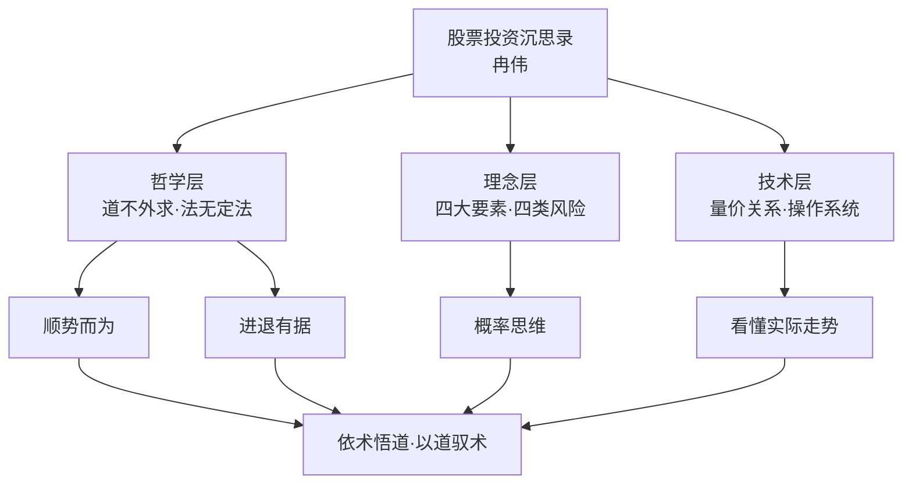
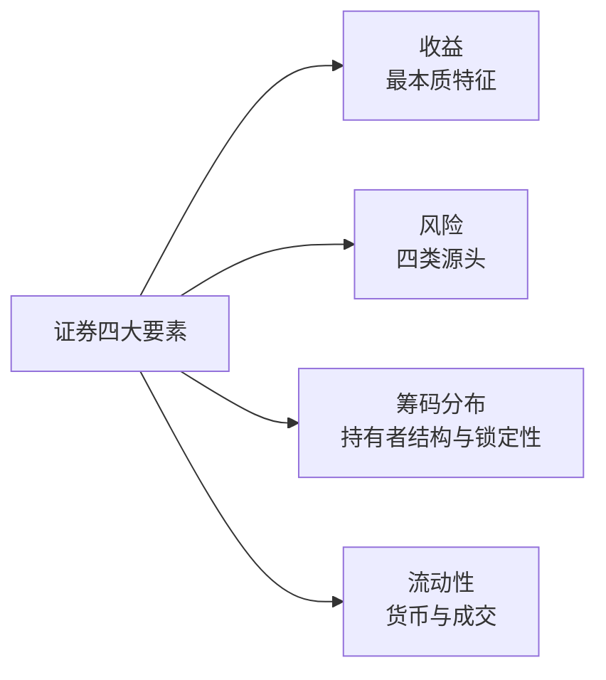
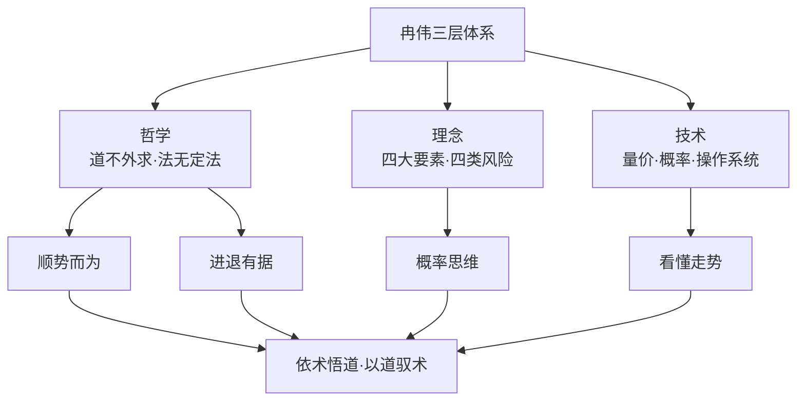
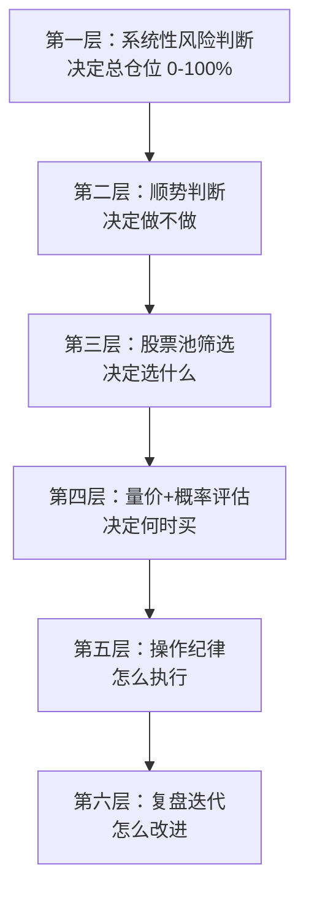
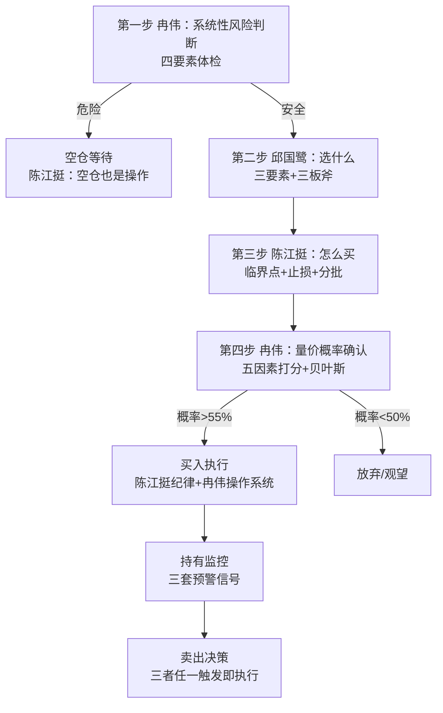

# 37《股票投资沉思录》深度解读（详细版）

> **副题：冉伟——"道不外求，无术者何以论道"：一位民间艺人的哲学·理念·技术三层体系**
>
> 作者：冉伟，自由职业投资者，自称"追求匠心的证券市场民间艺人"。2018 年 5 月 21 日再次空仓休息后，基于与挚友的聊天记录，用不到两个月写成此书——**将哲学、理念、技术三个层面融合为一个系统化整体**，是市场上少见的"站在交易者角度、以哲学思维驾驭投资"的书。
>
> **核心定位**：全书三部分递进——**哲学**（道不外求/法无定法/顺势而为/进退有据/众妙之门）→ **理念**（证券四大要素/四类风险/价值投资与技术分析/风险控制/概率）→ **技术**（量价关系/盯盘技巧/操作系统）。一句话概括：**依术而悟道，以道而驭术。**
>
> **系列意义**：037 是系列第 37 本，A 股实战派第三站。如果说 035 邱国鹭讲"选什么"（便宜的好公司）、036 陈江挺讲"怎么活"（止损与资金管理），037 冉伟讲的是**"怎么想"**——用道家的思维方式驾驭投资的全部复杂性。本书也是系列中哲学色彩最浓的一本（证券四大要素、四类风险划分、概率函数框架均为原创思想）。

---

## 📖 全书结构与核心框架



### 全书结构总览表

| 部分 | 章节 | 核心内容 |
|------|------|---------|
| 开篇 | 序/前言 | 民间艺人的匠心；三层面体系；独立思考 |
| 哲学篇 | 5 节 | 道不外求/法无定法/顺势而为/进退有据/众妙之门 |
| 理念篇 | 5 节 | 证券四大要素/价值投资和技术分析/风险控制/盈利变量权衡/概率 |
| 技术篇 | 5 节 | 宏观分析/量价关系/技术分析理念/盯盘技巧/操作系统 |
| 结尾 | 结束语 | 系统工程的总结 |

---

## 📑 目录

- [[#第1章 序：一位民间艺人的匠心|第1章 序：一位民间艺人的匠心]]
- [[#第2章 哲学一：道不外求，无术者何以论道|第2章 哲学一：道不外求，无术者何以论道]]
- [[#第3章 哲学二：法无定法，盲人摸象的智慧|第3章 哲学二：法无定法，盲人摸象的智慧]]
- [[#第4章 哲学三：顺势而为，须将大钱变成小钱|第4章 哲学三：顺势而为，须将大钱变成小钱]]
- [[#第5章 哲学四：进退有据，玩的就是权衡和分寸|第5章 哲学四：进退有据，玩的就是权衡和分寸]]
- [[#第6章 哲学五：众妙之门，同出而异名|第6章 哲学五：众妙之门，同出而异名]]
- [[#第7章 理念一：证券四大要素|第7章 理念一：证券四大要素]]
- [[#第8章 理念二：四类风险——系统性、博弈、技术与人性|第8章 理念二：四类风险——系统性、博弈、技术与人性]]
- [[#第9章 理念三：价值投资与技术分析之辨|第9章 理念三：价值投资与技术分析之辨]]
- [[#第10章 理念四：风险控制——恐惧与贪婪的资格|第10章 理念四：风险控制——恐惧与贪婪的资格]]
- [[#第11章 理念五：概率思维——不确定性中的模糊概率|第11章 理念五：概率思维——不确定性中的模糊概率]]
- [[#第12章 技术一：量价关系——价格是结局，成交量是伤亡|第12章 技术一：量价关系——价格是结局，成交量是伤亡]]
- [[#第13章 技术二：操作系统——以博弈为思想核心的系统工程|第13章 技术二：操作系统——以博弈为思想核心的系统工程]]
- [[#第14章 技术三：盯盘技巧与宏观展望|第14章 技术三：盯盘技巧与宏观展望]]
- [[#总结：依术而悟道，以道而驭术|总结：依术而悟道，以道而驭术]]
- [[#附录一 冉伟金句集（40 条精选）|附录一 冉伟金句集（40 条精选）]]
- [[#附录二 本书术语速查卡|附录二 本书术语速查卡]]
- [[#附录三 系列互链：037 在 37 本笔记中的位置|附录三 系列互链：037 在 37 本笔记中的位置]]
- [[#附录四 A 股应用：道术体系本土实践|附录四 A 股应用：道术体系本土实践]]
- [[#附录五 读完本书后的 10 个自问|附录五 读完本书后的 10 个自问]]
- [[#附录六 本书案例与数据速查|附录六 本书案例与数据速查]]
- [[#附录七 四类风险检查清单|附录七 四类风险检查清单]]
- [[#附录八 本书 FAQ 20 问|附录八 本书 FAQ 20 问]]
- [[#附录九 系列母题追踪（037 号更新）|附录九 系列母题追踪（037 号更新）]]
- [[#附录十 道术体系 × 系列大师对照|附录十 道术体系 × 系列大师对照]]
- [[#附录十一 30 秒版：股票投资沉思录|附录十一 30 秒版：股票投资沉思录]]
- [[#附录十二 冉伟投资理念 60 条|附录十二 冉伟投资理念 60 条]]
- [[#附录十三 2015 年股灾复盘：四大要素视角|附录十三 2015 年股灾复盘：四大要素视角]]
- [[#附录十四 系列 37 本总览（完成进度）|附录十四 系列 37 本总览（完成进度）]]
- [[#附录十五 同一市场，五种眼光（037 版）|附录十五 同一市场，五种眼光（037 版）]]
- [[#附录十六 中医视角：道术合一与"医者意也"|附录十六 中医视角：道术合一与"医者意也"]]
- [[#附录十七 中英对照：冉伟核心概念|附录十七 中英对照：冉伟核心概念]]
- [[#附录十八 思维训练：10 个沉思练习|附录十八 思维训练：10 个沉思练习]]
- [[#附录十九 概率评估表实操模板|附录十九 概率评估表实操模板]]
- [[#附录二十 写给独立思考者的话（知乎文风附录）|附录二十 写给独立思考者的话（知乎文风附录）]]

---

## 第1章 序：一位民间艺人的匠心

### 1.1 自我定位

> "我是一个自由职业投资者，一个追求匠心的证券市场'民间艺人'。"

**这本书的缘起**：2018 年 5 月 21 日，冉伟再次选择长达几个月的空仓休息——出于使命感，把与挚友的聊天记录整理成书，按**哲学、理念、技术**三个层面梳理，不到两个月写完。

**编辑的评价**："每周都会收到关于证券投资的书稿，几乎只看一眼就拒绝，而你的书却一下子就吸引了我。"

### 1.2 这本书的独特性

| 独特性 | 内容 |
|--------|------|
| 三层面融合 | 哲学+理念+技术系统化整体（市场上唯一） |
| 原创思想 | 证券四大要素/四类风险划分/盈利变量权衡 |
| 交易者视角 | 站在二级市场交易者的角度 |
| 独立思考 | "我几乎不看一切财经评论" |
| 极简技术 | 量价关系的归纳简化与创新阐释 |

### 1.3 阅读目标

> "阅读并深刻理解本书，投资者既可以在思维上达到哲学的高度，也可以在技术上具备一眼看穿实际走势的本事。"

---

## 第2章 哲学一：道不外求，无术者何以论道

### 2.1 哲学家与船夫

> "一位哲学家乘船出海，他与船夫聊了起来。哲学家问道：'你懂哲学吗？'船夫说：'我不懂。'哲学家用很惋惜的口吻说：'那你失去了一半的生命。'随即，哲学家又问道：'那你懂数学吗？'船夫说：'也不懂。'哲学家遗憾地说：'那你又失去了另一半的生命。'"

**巨浪打翻小船，两人落水。** 船夫问："你会游泳吗？"哲学家喊："不会啊！"船夫说：**"那你就失去了全部的生命。"**

**投资的解读**：你可以读遍投资大道，但如果你看不懂财务报表、看不懂量价关系——**就像不会游泳的哲学家，你的道在落水时毫无用处。**

### 2.2 道与术的关系

| 误区 | 真相 |
|------|------|
| 道高于术 | 道寓于术——道只是忽略一些差异性的术 |
| 心态好就行 | 心态好但技术不行，投资也会是一场灾难 |
| 大道至简人人可说 | 先问自己有没有资格说这句话 |
| 悟道代替技术 | 不会武功招式，读《易筋经》也打不过三脚猫功夫的小兵 |

> "悟道是更多地修炼以放弃我执，但并非可以代替技术。一个人在不会武功招式的情况下，就算读的都是《易筋经》这个级别的书，也战胜不了一个只会三脚猫功夫的小兵。"

> "无术而论道是夸夸其谈，恋术而忘道是刻舟求剑。"

### 2.3 穆里尼奥的启示：成功靠的是细节

| 穆里尼奥的经历 | 启示 |
|---------------|------|
| 年轻时是失败的体育老师 | 大道理不解决问题 |
| 37 岁任巴萨助教和翻译 | 从底层积累 |
| 38 岁执教葡超二流球队 | 专业技能（阵形/球员/对手/更衣室） |
| 40 岁波尔图欧冠 | **靠的是对细节的恐怖掌控** |

> "记住，是穆里尼奥注重细节的专业技能，而不是足球攻防的大道理，帮助他取得了成功。"

### 2.4 林奇的"术"

> "林奇的书充满了术……林奇不知花了多少时间才练就了十分钟就能大致把握企业财务状况的能力，这甚至比他的投资理念更加重要。**大道至简在思想高度上没错，具体执行胜在细节，大道和细节缺一不可。**"

### 2.5 道不外求的真义

> "你可以去清净处修身养性，可以去艰险处历练胆识，也可以找大师感悟哲理。但是，交易之道和交易之术，请你去专业书籍中，去实际交易中寻求。"

> "道法自然，《道德经》里的这句哲学经典可能再隔千年也无法超越……佛家说的'一花一世界，一叶一菩提'，其实也是道法自然、道不外求的意思。"

---

## 第3章 哲学二：法无定法，盲人摸象的智慧

### 3.1 承认局限：我们都是盲人

> "法无定法，我们都不过是在盲人摸象。"

**盲人摸象的智慧**：每个投资者都只能摸到大象的一部分——价值投资者摸到腿（资产），技术分析者摸到鼻子（走势），宏观派摸到肚子（周期）。**承认自己在摸象，才能不断摸到更多部位。**

### 3.2 法无定法的含义

| 层面 | 内容 |
|------|------|
| 方法 | 没有放之四海皆准的方法 |
| 时机 | 同一方法在不同市场环境要调整 |
| 资金 | 不同体量资金适用不同方法 |
| 认知 | 证券四大要素让盲人摸到更多部位 |

> "任何只看到股票的某个或几个特征的观点都是片面的和危险的。"

---

## 第4章 哲学三：顺势而为，须将大钱变成小钱

### 4.1 顺势的普遍性

> "无论什么事情，顺势才可事半功倍……在物理上，就连小小的电子从一端移动到另一端也要依靠电势差。对于个人而言，顺应自己的天赋和兴趣也是一种顺势。任何级别的资金都要顺势而为。"

**马云与阿里巴巴**：几千亿美元市值的公司仍自称"创业公司"——因为让天下没有难做的生意，就是顺应全球贸易一体化的时代趋势。**"千亿元级别的资金也只是小资金，千亿美元市值的公司也只是在创业的路上。"**

**风口论**：

> "关于顺势有一句非常形象的话：把猪放在风口上，猪也能飞上天。千万元级别的资金，隔几天就在一个小盘股票上进进出出，那是其投资者自己在炒作造势，风险很大。而将千亿元级别的资金投入有数亿人需求的市场中，则要想盈利一点儿也不困难。**所谓造势，只不过是在借更大的势，其实质仍是顺势。**"

### 4.2 顺势的级别与时机

| 要素 | 内容 |
|------|------|
| 识势 | 看懂各个级别的势（不会识势令过半的人亏损） |
| 级别 | 级别不对，资金量可能不匹配 |
| 时机 | 时机不对，也可能遭遇失败 |

### 4.3 司马懿 vs 诸葛亮：势的较量

> "诸葛亮除了用人失察导致丢街亭以外，其在每一场具体战役中似乎都胜司马懿一筹。但司马懿审时度势，选择了正确的战略——尽量避而不战，采用'拖'字诀……**顺势而为的司马懿最终战胜了逆势而为的诸葛亮，可见势多么重要。**"

**武侯祠对联**：

> "能攻心则反侧自消，从古知兵非好战；不审势即宽严皆误，后来治蜀要深思。"

**投资的翻译**：

> "在单边大势的情况下，面对一波主跌行情，我们不要去做逆势而为的诸葛亮，不要去幻想均线的支撑和若有若无的价值低估，而是要学司马懿重大势而忘小巧。"

### 4.4 空仓是弱市里赚钱最快的方法

> "倾泻而出的技术盘、止损盘、强平盘、风控盘、量化自动交易盘，甚至价值盘，都会砸到你手上，为什么不能等一等？在大盘熊市时没有强势股，弱市反弹就好像希腊神话中海妖的歌声，动听得令人沉醉却十分致命。"

| 弱市铁律 | 内容 |
|---------|------|
| 空仓 | 空仓是弱市里赚钱最快的方法 |
| 不止损 | 大止损和小止损都是错误的（弱市反弹中） |
| 不持股 | 不是挑战持股耐心的时候，而是挑战空仓耐心的时候 |
| 不甘心 | 没有赚到钱千万不要不甘心 |

> "不要在该耐心空仓的时候却选择了耐心持股，**耐心要分时机。**"

### 4.5 能力圈的反思（全书最反主流的一段）

> "守住自己的能力圈是一个比较流行的偏见。即使是股神巴菲特，也因为固守自己的能力圈而错失了互联网时代的一个又一个大牛股。他自己都在访谈中承认他十分后悔。**所以，守住能力圈也是需要反思的。为什么不信赖年轻人的创新？为什么不扩大能力圈呢？**"

**（这段与系列 29 号段永平"不懂不做"、05 号巴菲特"能力圈"形成直接对话**——冉伟代表"扩大能力圈"的一极，两相对照，是系列最精彩的思想碰撞之一。）

---

## 第5章 哲学四：进退有据，玩的就是权衡和分寸

### 5.1 权衡的本质

| 权衡对象 | 内容 |
|---------|------|
| 风险 vs 收益 | 永远在权衡 |
| 进场 vs 出场 | 进退有据 |
| 贪婪 vs 恐惧 | 分寸感 |
| 持股 vs 空仓 | 时机选择 |

> "玩的就是权衡和分寸。"

### 5.2 分寸感的技术化

| 层面 | 分寸的体现 |
|------|-----------|
| 仓位 | 大资金分多次买入（博弈风险） |
| 时机 | 不追高/回调买入 |
| 风险 | 大盘一票否决 |
| 概率 | 权重赋值随环境调整 |

---

## 第6章 哲学五：众妙之门，同出而异名

### 6.1 道与术、价值与投机的统一

> "众妙之门，同出而异名。"

**《道德经》"同出而异名"的应用**：

| 对立面 | 统一 |
|--------|------|
| 道 vs 术 | 同一个东西（术更具体，道更玄虚） |
| 价值投资 vs 技术分析 | 各取所长 |
| 投资 vs 投机 | 硬币的两面 |
| 基本面 vs 技术面 | 殊途同归 |

> "道之思想，阴阳合二为一，不要把对立面放在对立面来看，而应该把它包容进来，因为本来就没有对立面，只是我们的思维造就了对立面。"

### 6.2 哲学是深刻的，也是苍白的

> "哲学是深刻的，但同时也是简单苍白的，在解决具体问题时便会陷入无用的困境。道不能解决具体问题，术不能解决所有具体问题。"

---

## 第7章 理念一：证券四大要素

### 7.1 四大要素框架（本书最大原创）

> "证券的实质是一种收益凭证，包含**收益、风险、筹码分布、流动性**四大要素。股票的收益和风险不仅源于其所代表企业的经营盈亏，也源于筹码换手和流动过程中的价格波动和供求失衡。"



| 要素 | 内容 | 对应风险 |
|------|------|---------|
| 收益 | 分红+股价波动；不确定的收益是股票的魅力 | 估值高低 |
| 风险 | 系统性/博弈/技术/人性四类 | 获利盘多少 |
| 筹码分布 | 投资者结构与锁定性 | 筹码锁定性 |
| 流动性 | 货币政策与累计成交额 | 货币供应 |

### 7.2 四大要素的联动（2015 案例预告）

| 要素 | 2015 年 6 月状态 |
|------|-----------------|
| 收益/估值 | 全体股票中位数 PE 142 倍 |
| 风险/获利盘 | 创业板两年 10 倍股比比皆是 |
| 筹码 | 5 月盘中放量巨震，6 月 1/5—1/4 股票步入下行通道 |
| 流动性 | 沪市累计成交额达 M2 的 80%（经验极限值） |

---

## 第8章 理念二：四类风险——系统性、博弈、技术与人性

### 8.1 四类风险总览（本书第二大原创）

> "我力图站在交易者的角度，按风险源头把风险归为四类，即**源于系统和整体的系统性风险、源于对手的博弈风险、源于专业技能的技术风险和源于自己的人性风险**。"

| 风险类型 | 来源 | 规避手段 |
|---------|------|---------|
| 系统性风险 | 国际国内局势/宏观/政策 | 认知格局和水平（躲开） |
| 博弈风险 | 对手盘针对你的策略 | 灵活的思维方式 |
| 技术风险 | 专业能力不足 | 专业能力 |
| 人性风险 | 自己的贪怕 | 纪律和心性 |

**非专业人士面临所有风险**：

> "对于还没有在股票市场经历长期洗礼和历练过的人，他不知道系统性风险，也不懂技术风险，人性风险他也没有体会，博弈风险他可能听都没听说过。"

### 8.2 系统性风险：躲开而非对抗

| 特征 | 内容 |
|------|------|
| 两个特征 | 很难通过策略规避；发生频率低 |
| 冉伟的做法 | **判定大概率存在系统性风险，既不看基本面也不看技术面，选择躲开** |
| 表现 | 技术性卖盘与半价值半技术性卖盘涌出，绝大部分股票同时下跌 |

### 8.3 博弈风险：孙子兵法与现代股市

> "博弈的表现形式包括诱多、洗盘、假突破、做K线图形、对倒、讲故事、题材炒作、选择性信息披露、信息披露时间差、专家分析、媒体宣传等。**博弈的本质就是误导、迷惑、麻痹或震慑对手，使对手产生误判。《孙子兵法》就是一部经典的博弈论著作。**"

> "如果要给股票投资风险的复杂性和多变性来排名，**博弈风险绝对当之无愧排第一。**"

**索罗斯的引用**：

> "经济史是一部充满谎言的连续剧，但它铺平了通往巨额财富的道路，你要做的是投入其中，并在真相被公众认知之前退出游戏。"——**"不管你在意的是基本面还是技术面，实质上你参与的都只是博弈游戏。一切业绩和题材都只是故事，驱动故事进展的就是人性和利益。"**

### 8.4 维奥莱塔的故事：专家还是赢家

期货新手维奥莱塔挨个打电话给培训中心，所有中心都信誓旦旦"赚钱指日可待"——只有一个角落里的小广告例外。电话那头是个刚睡醒的老人：

> "你是想成为期货专家，还是想成为赢家？"
> "这两者有区别吗？"
> "当然有！**区别就在于前一个是羊，而后一个是狼。**"

| 专家（羊） | 赢家（狼） |
|-----------|-----------|
| 年薪 20 万美元的专业人士 | 挣"踢不倒的钱"（不稳定、靠冒险） |
| 混口饭吃 | 完全靠冒险和赌博得来的钱 |
| 教别人赚钱 | 自己赚钱 |

老人坦诚自己一个学生都没有、是个失败者——**"他太直白了"**，反而让维奥莱塔心神不宁。

**投资的解读**：市场上大多数"专家"是羊——教别人怎么赚钱；真正的赢家是狼——自己赚钱。**你学的是"成为专家"还是"成为赢家"？**

### 8.5 博弈风险的应对

> "由于博弈风险的存在，股市里没有哪条具体经验之谈的正确率超过60%。如果有超过60%正确率的方法，就意味着只用一招就稳定盈利了，显然这是不可能的。"

| 应对原则 | 内容 |
|---------|------|
| 换位思考 | 多站在对手的立场反复揣摩 |
| 分次买入 | 资金越大对手盘越多，博弈风险越大 |
| 独立思考 | "市场的方向取决于手握重金的人的逻辑，而不是你的逻辑" |
| 双向思维 | 在自信和怀疑之间摇摆 |
| 定期重审 | 时时提防市场里的诱导性言辞 |

**3000 点思维定式案例**：

> "2017 年股指全年几乎每次跌到 3000 点这个关键点位时都会止跌。反反复复的剧情重演使投资者形成了思维定式，误以为 3000 点牢不可破……对最有话语权的那一部分人而言，最大的利益不是股市上涨，而是下跌到更便宜的位置。**是不是感觉很不合常理却又很合乎逻辑？这就是打破常规的思维方式。**"

---

## 第9章 理念三：价值投资与技术分析之辨

### 9.1 两大流派的逻辑基础

| 流派 | 理论依据 | 三大假设/模型 |
|------|---------|--------------|
| 价值投资 | 股票是企业股权凭证，价格围绕价值波动 | 现金流贴现模型（一般/零增长/不变增长/可变增长） |
| 技术分析 | 过去和现在的市场行为 | ①价格涵盖一切 ②价格按趋势移动 ③历史会重演 |

**现金流贴现模型的核心**：内在价值取决于**各年份净现金流、必要收益率、净现金流增长率**三个因素。

**市盈率的本质**：

> "V＝D1／（k－g）……把 D1 替代为净利润，则该方法就变成我们最常用的市盈率估值法了。**市盈率倍数实际上也取决于净利润增长率，增长率越高，根据公式可以赋予更高的市盈率倍数。**"

### 9.2 历史会重演的正确理解

> "股市最大的历史重演是**人性的逻辑**，不管市场怎么改变，人性一直在重演，不管历史事件怎么不同，历史的逻辑从未改变。历史只不过是把明天要发生的事情放在昨天彩排了一遍，**在金融市场上，每隔几年、十几年，就会换一批演员重新翻拍差不多一样的剧情。**"

### 9.3 价值和价格究竟谁更难确定

**周期类公司**：

| 特征 | 内容 |
|------|------|
| 领域 | 钢铁/煤炭/有色/化工/电力/物流/金融 |
| 需求 | 基本没有价格弹性 |
| 价值确定难度 | 对经济周期要有先见之明 |
| 关键 | 规模效应+地理位置成本优势 |

**消费品公司**：

| 特征 | 内容 |
|------|------|
| 市场结构 | 垄断竞争型（几个领导品牌+无数陪跑） |
| 核心资产 | **品牌资产**（根植于消费者大脑中的正面情感） |
| 价值确定难度 | 低（"茅台、格力的品牌资产价值不需要任何专业知识和市场调研就知道"） |
| 科技含量 | 主要用于维护和稳固品牌形象 |

### 9.4 各取所长

> "作为股票交易者，不要纠结价值投资和技术分析究竟谁对谁错，而应考虑如何各取所长。"

**（与 035 邱国鹭"榔头症"、036 陈江挺"技术为主"形成完整光谱**——冉伟的主张是"道术合一、两派兼容"。）

---

## 第10章 理念四：风险控制——恐惧与贪婪的资格

### 10.1 系统性风险控制

> "控制系统性风险的办法只有减少或清空仓位，或者通过股指期货来对冲，否则就只能承受。对于大部分体量的资金而言，不与大盘对抗，不与次级及以上的趋势对抗，等于承认自己的能力有限，顺势而为，这很重要。"

**当所有人都恐惧时，你真的该贪婪吗**：

> "当别人恐惧时，你应该贪婪，这实际上是一个需要极高研判水平的超高难度动作，**你的能力配得上把这句话挂在嘴边吗？**"

**北上资金的祛魅**：

> "据说有一种所谓的聪明的资金称为北上资金，它们很善于在遍地哀号中寻找宝贝。其实，我们只需要关心资金的进出以及进出的级别……**市场本身比任何投资者都要聪明。承认甚至羡慕聪明的资金的存在，只是失败的心理阴影而已。事实证明，北上资金也未能阻止大盘跌破3000点继续寻底。**"

### 10.2 2015 年 6 月 29 日的四大要素复盘

| 要素 | 数据 | 信号 |
|------|------|------|
| 估值 | 全体股票中位数 PE **142 倍**（上证 104/深主板 169/中小板 136/创业板 191） | 估值泡沫 |
| 获利盘 | 创业板小股票 2013—2015 两年 10 倍股比比皆是 | **获利盘太多就是最大的利空** |
| 筹码 | 5 月盘中放量巨震；6 月上旬 1/5—1/4 股票步入下行通道 | 筹码松动 |
| 流动性 | 沪市累计成交额达 **M2 的 80%** | 增量资金极限 |

> "沪市累计成交额达到当年货币供应量 M2 的 80%。这个比值是我从以往几轮牛市中观察统计出的一个经验值……**一旦达到 80%，就意味着整体而言，市场后续流动性已达极限，没有足够的资金再来推动股价上涨。君不见，股神遍地飞，人人省吃俭用入股市时，就是后续资金枯竭时。**"

> "筹码松动遭遇流动性枯竭的结果就是杠杆盘不计后果地轮番强平。"

### 10.3 博弈风险控制

| 原则 | 内容 |
|------|------|
| 永远在自信和怀疑之间摇摆 | 定期重审观点 |
| 独立思考和双向思维 | 一项技术能力 |
| 不迷信思维定式 | 3000 点案例 |
| 分次买入 | 资金越大博弈风险越大 |

---

## 第11章 理念五：概率思维——不确定性中的模糊概率

### 11.1 三种关系

| 关系类型 | 例子 |
|---------|------|
| 确定性关系 | 外力与速度（F=ma） |
| 完全随机 | 布朗运动 |
| **概率性关系** | 介于两者之间（投资） |

> "概率分析的意义就在于帮助我们把事件的结果从不确定性的一端尽量推向确定性的一端。"

### 11.2 股票价格的函数本质

> "假设事件 Y＝f（u，v，w，x）＝au＋bv＋cw＋dx……股票价格的复杂性在于：第一，自变量肯定不止四个，而是无数个。第二，每个自变量的权重不是一成不变的……**影响股票价格的权重最大的变量有时候是系统性风险，有时候又是业绩，有时候是题材，有时候又是流动性或筹码分布。**"

> "这就是研究股票价格的理论那么多，却没有一种能保证稳定盈利的理论的原因。"

### 11.3 六大变量概率评估法

| 变量 | 权重（示例） |
|------|-------------|
| 大盘 | 0.3 |
| 成交量 | 0.2 |
| 均线 | 0.15 |
| 量比 | 0.15 |
| 涨幅 | 0.1 |
| 筹码轻重 | 0.1 |

**示例结论**：大盘权重 0.3、上涨概率仅 0.2 时，即使纯个股技术面概率超过 50%，综合后上涨概率只有 47%——**正确决策是场外观望或卖出。**

> "（1）大盘本身又受到宏观和技术面的影响……（2）权重不是一成不变的，系统性风险很大时要增加大盘权重。（3）**对股票上涨的概率的估算既是一门技术，也是一门艺术。**"

### 11.4 化繁为简

> "在实际操作中，重要的不是表格的形式，而是**化繁为简，化理性判断为感性直觉**……"

---

## 第12章 技术一：量价关系——价格是结局，成交量是伤亡

### 12.1 量价关系的精髓

> "量价关系描述了一定的量引起了多大的价格变化，或者一定的价格变化需要多大的成交量来支撑。简简单单两句话，却是量价关系中最核心的精髓。"

> "**任一时间点的价格都是当时多空双方斗争的均衡点……价格好比胜负结局，成交量则描述了战役的伤亡程度。**"

### 12.2 放量 vs 缩量的四层辩证

| 视角 | 放量上涨 | 缩量上涨 |
|------|---------|---------|
| 筹码锁定 | 基础更牢固（新进资金多） | 换手不充分，锁定性差 |
| 能量消耗 | 消耗多头能量太大 | 未消耗能量 |
| 后续资金 | 已用尽一部分 | 后续可进入资金多 |
| 结论 | **无法单因素判定** | 结合筹码锁定性和跟进资金对比 |

**关键结论**：

> "在低位上，放量上涨更好；在高位上，缩量上涨更好。"

> "不论是放量上涨还是缩量上涨，只要上涨后的价格仍然坚挺，都可以继续持有。**价格是比成交量更为直观的指标，它直接显示了战役的结果，成交量只是过程的写照。**"

### 12.3 缩量的意义

> "越是缩量，说明涨跌动能越强烈……单位时间内新涌出的卖单越少，说明筹码越锁定，涨停需要消耗的能量就越小。"

### 12.4 牛市熊市的量价

> "牛市中的所有图形都是上涨的图形，而熊市则相反……任何短线甚至中长线的图形和压力都是暂时的，因为它背后的驱动力量可能一直没有弱化。"

---

## 第13章 技术二：操作系统——以博弈为思想核心的系统工程

### 13.1 操作系统的定位

> "操作系统是以投资哲学为指导，以投资理念为内涵，以投资技术为基础的一个行动计划……**离开了哲学思想和投资理念的操作系统，犹如一架没有灵魂的钢琴，怎么也不可能演奏出美妙的乐章。**"

| 特点 | 内容 |
|------|------|
| 个性化 | 只适合一部分风格和体量的资金 |
| 动态性 | 同一投资者在不同市场环境要调整 |
| 机械性 | 优点和缺点都源于其机械性 |

### 13.2 操作系统的四个步骤

| 步骤 | 内容 |
|------|------|
| 第一步 | 建立股票池（换手率+市净率≤5—8 倍筛选；剔除 ST 风险/收入下滑股） |
| 第二步 | 风险收益评估表（大盘和股价一票否决） |
| 第三步 | 五大因素量化赋值（量比/挂单/实际走势/位置/大盘板块对比） |
| 第四步 | 具体操作（买入机械保守，卖出更具艺术性） |

**买入纪律**：

> "要么休息，要么做有攻击性的操作，控制好买点不追高，要做强势股也只选择回调时，绝不直接在高位收盘或高位分时去追涨……**放弃任何主观臆断和幻想。**"

**核心总结**：

> "一个操作系统应当是以博弈为思想核心，以心灵驾驭为行为规矩，以概率为量化指标的系统工程。因为是博弈，所以自然不可能是机械系统，**法无定法，道非常道。**"

> "在实际交易中，计划、随机应变、执行力互为制约，且都不可或缺，能够把三种能力融会贯通才是顶尖的交易者。"

---

## 第14章 技术三：盯盘技巧与宏观展望

### 14.1 盯盘技巧要点

| 技巧 | 内容 |
|------|------|
| 盘口语言 | 挂单/撤单的博弈含义 |
| 5254 原则 | 实际走势的量化观察 |
| 量价信号 | 放量/缩量的位置判断 |
| 板块对比 | 个股与大盘/板块的相对强弱 |

### 14.2 宏观基本面分析框架

| 变量 | 关注点 |
|------|--------|
| 经济增长 | 增速与结构 |
| 货币供应 | 流动性的闸门 |
| 利率 | 估值基准 |
| 汇率 | 国际资本流动 |

**概率化判断**：大盘一年内上涨概率 = 各因素概率的加权（示例结果 32.5%——好转概率超过 50% 的因素一个都没有）。

---

## 总结：依术而悟道，以道而驭术

### Z1. 冉伟体系全景



### Z2. 全书的五根柱子

| 柱子 | 核心内容 | 章节 |
|------|---------|------|
| 道术合一 | 道寓于术，无术不论道 | 哲学篇 |
| 顺势 | 势比能力重要（司马懿/风口） | 哲学篇 |
| 四大要素 | 收益/风险/筹码/流动性 | 理念篇 |
| 四类风险 | 系统性/博弈/技术/人性 | 理念篇 |
| 概率+系统 | 模糊概率+操作系统 | 理念+技术篇 |

### Z3. 冉伟留给读者的三句话

> 1. "道不外求，无术者何以论道——依术而悟道，以道而驭术。"
> 2. "不要在该耐心空仓的时候却选择了耐心持股，耐心要分时机。"
> 3. "股市里没有哪条具体经验之谈的正确率超过 60%——永远在自信和怀疑之间摇摆。"

---

## 附录一 冉伟金句集（40 条精选）

> 1. "道不外求，无术者何以论道。"——哲学
> 2. "依术而悟道，以道而驭术。"——哲学
> 3. "无术而论道是夸夸其谈，恋术而忘道是刻舟求剑。"——哲学
> 4. "一个人不会武功招式，就算读的都是《易筋经》，也战胜不了一个只会三脚猫功夫的小兵。"——哲学
> 5. "技术好了，心态问题可能会随之得到解决。"——哲学
> 6. "心态好但技术不行也没用，没有以术为基础，就算有好心态，投资也会是一场灾难。"——哲学
> 7. "道法自然……佛家说的'一花一世界，一叶一菩提'，其实也是道法自然、道不外求的意思。"——哲学
> 8. "法无定法，我们都不过是在盲人摸象。"——哲学
> 9. "把猪放在风口上，猪也能飞上天。"——哲学
> 10. "所谓造势，只不过是在借更大的势，其实质仍是顺势。"——哲学
> 11. "顺势而为的司马懿最终战胜了逆势而为的诸葛亮，可见势多么重要。"——哲学
> 12. "不审势即宽严皆误。"——哲学（武侯祠对联）
> 13. "弱市反弹就好像希腊神话中海妖的歌声，动听得令人沉醉却十分致命。"——哲学
> 14. "空仓是弱市里赚钱最快的方法。"——哲学
> 15. "不要在该耐心空仓的时候却选择了耐心持股，耐心要分时机。"——哲学
> 16. "守住自己的能力圈是一个比较流行的偏见。"——哲学
> 17. "玩的就是权衡和分寸。"——哲学
> 18. "不要把对立面放在对立面来看，而应该把它包容进来，因为本来就没有对立面，只是我们的思维造就了对立面。"——哲学
> 19. "哲学是深刻的，但同时也是简单苍白的，在解决具体问题时便会陷入无用的困境。"——哲学
> 20. "证券的实质是一种收益凭证，包含收益、风险、筹码分布、流动性四大要素。"——理念
> 21. "股票的魅力就在于不确定的收益。"——理念
> 22. "规避系统性风险靠的是认知格局和水平，规避博弈风险需要灵活的思维方式，规避技术风险靠的是专业能力，规避人性风险需要纪律和心性。"——理念
> 23. "博弈风险绝对当之无愧排第一。"——理念
> 24. "博弈的本质就是误导、迷惑、麻痹或震慑对手，使对手产生误判。《孙子兵法》就是一部经典的博弈论著作。"——理念
> 25. "一切业绩和题材都只是故事，驱动故事进展的就是人性和利益。"——理念
> 26. "区别就在于前一个是羊，而后一个是狼。"——理念（维奥莱塔）
> 27. "股市里没有哪条具体经验之谈的正确率超过60%。"——理念
> 28. "市场的方向取决于手握重金的人的逻辑，而不是你的逻辑。"——理念
> 29. "独立思考，双向思维，保持怀疑，保持敬畏，在自信和怀疑之间摇摆。"——理念
> 30. "市场本身比任何投资者都要聪明。"——理念
> 31. "当别人恐惧时，你应该贪婪，这实际上是一个需要极高研判水平的超高难度动作，你的能力配得上把这句话挂在嘴边吗？"——理念
> 32. "获利盘太多、太丰厚就是最大的利空，涨跌互为因果。"——理念
> 33. "君不见，股神遍地飞，人人省吃俭用入股市时，就是后续资金枯竭时。"——理念
> 34. "股市最大的历史重演是人性的逻辑……每隔几年、十几年，就会换一批演员重新翻拍差不多一样的剧情。"——理念
> 35. "对股票上涨的概率的估算既是一门技术，也是一门艺术。"——理念
> 36. "价格好比胜负结局，成交量则描述了战役的伤亡程度。"——技术
> 37. "在低位上，放量上涨更好；在高位上，缩量上涨更好。"——技术
> 38. "牛市中的所有图形都是上涨的图形，而熊市则相反。"——技术
> 39. "离开了哲学思想和投资理念的操作系统，犹如一架没有灵魂的钢琴。"——技术
> 40. "法无定法，道非常道。"——技术

---

## 附录二 本书术语速查卡

| 术语 | 定义 | 出处 |
|------|------|------|
| 道不外求 | 交易之道须从专业书籍和实际交易中寻求 | 哲学篇 |
| 法无定法 | 没有放之四海皆准的方法 | 哲学篇 |
| 顺势而为 | 借大势，不逆势 | 哲学篇 |
| 证券四大要素 | 收益/风险/筹码分布/流动性 | 理念篇 |
| 系统性风险 | 源于系统整体的风险 | 理念篇 |
| 博弈风险 | 源于对手盘的风险 | 理念篇 |
| 技术风险 | 源于专业技能不足 | 理念篇 |
| 人性风险 | 源于自己的贪怕 | 理念篇 |
| 筹码锁定性 | 投资者结构与收益对比决定的稳定性 | 理念篇 |
| 量价关系 | 量与价互动的核心精髓 | 技术篇 |
| 5254 原则 | 实际走势量化观察法 | 技术篇 |
| 操作系统 | 哲学+理念+技术的行动计划 | 技术篇 |

---

## 附录三 系列互链：037 在 37 本笔记中的位置

### 037 与系列笔记的链接网络

| 系列笔记 | 链接点 |
|---------|--------|
| [[35《投资中最简单的事》深度解读（详细版）|35 号]] | 邱国鹭三要素×冉伟四大要素（估值=收益风险/时机=流动性） |
| [[36《炒股的智慧》深度解读（详细版）|36 号]] | 陈江挺止损纪律×冉伟四类风险（技术风险/人性风险） |
| [[29《段永平投资问答录》深度解读（详细版）|29 号]] | 段永平"不懂不做"×冉伟"能力圈是流行偏见"（直接对话） |
| [[05《巴菲特的投资心法》深度解读（详细版）|05 号]] | 巴菲特能力圈×冉伟反思（正反对照） |
| [[22《穷查理宝典》深度解读（详细版）|22 号]] | 芒格多元思维×冉伟概率函数 |
| [[31《金融炼金术》深度解读（详细版）|31 号]] | 索罗斯反身性×冉伟博弈风险（"经济史是充满谎言的连续剧"） |
| [[04《原则》深度解读（详细版）|04 号]] | 达利欧系统×冉伟操作系统 |
| [[01《股票作手回忆录》读书笔记|01 号]] | 利弗莫尔趋势×冉伟顺势而为 |
| [[03《利弗莫尔的股票交易方法量价分析》深度解读（详细版）|03 号]] | 利弗莫尔量价×冉伟量价关系（价格=结局/量=伤亡） |
| [[28《聪明的投资者》深度解读（详细版）|28 号]] | 格雷厄姆安全边际×冉伟风险控制 |

### 037 在系列中的定位

| 维度 | 定位 |
|------|------|
| 流派 | A 股实战派·哲学思维站 |
| 特色 | 道家哲学驾驭投资的系统性框架 |
| 原创 | 证券四大要素/四类风险/概率函数 |

---

## 附录四 A 股应用：道术体系本土实践

### 4.1 四类风险的 A 股识别

| 风险 | A 股识别信号 |
|------|-------------|
| 系统性 | 政策转向/流动性收紧/国际局势 |
| 博弈 | 诱多/洗盘/假突破/题材炒作/利好出货 |
| 技术 | 看不懂财报/看不懂量价 |
| 人性 | 追高/割肉/满仓/死扛 |

### 4.2 顺势而为的 A 股实践

| 市场状态 | 正确动作 |
|---------|---------|
| 主跌浪 | 空仓（弱市空仓是赚钱最快的方法） |
| 熊市反弹 | 不参与（海妖的歌声） |
| 震荡市 | 高抛低吸 |
| 牛市 | 多持股少乱动 |

### 4.3 2015 经验的 A 股复现

| 指标 | 2015.6 | 2021.2 抱团顶 | 信号 |
|------|--------|---------------|------|
| 估值 | 中位数 PE 142 倍 | 茅指数 PE 70+ | 泡沫 |
| 获利盘 | 创业板两年 10 倍 | 核心资产两年 3—5 倍 | 最大利空 |
| 筹码 | 放量巨震 | 高低切换 | 松动 |
| 流动性 | 成交/M2=80% | 基金发行火爆 | 枯竭前兆 |

### 4.4 概率评估的 A 股应用

| 变量 | A 股权重建议 |
|------|-------------|
| 大盘 | 0.3（系统性风险大时提升） |
| 成交量 | 0.2 |
| 均线 | 0.15 |
| 量比 | 0.15 |
| 涨幅 | 0.1 |
| 筹码 | 0.1 |

---

## 附录五 读完本书后的 10 个自问

1. 我有资格说"大道至简"吗？（财务报表和量价关系都懂了吗？）
2. 我是"专家"（羊）还是"赢家"（狼）？
3. 我买股票前评估过四类风险吗？
4. 我意识到博弈风险了吗？（一买就跌/一卖就涨）
5. 我在系统性风险前会"躲开"吗？（还是死扛？）
6. 我顺势了吗？（还是逆势做诸葛亮？）
7. 我在弱市会空仓吗？（空仓是赚钱最快的方法）
8. 我会用概率思维评估买卖吗？
9. 我有自己的操作系统吗？（还是随心所欲？）
10. 我在自信和怀疑之间摇摆吗？（还是固执己见？）

---

## 附录六 本书案例与数据速查

### 核心数据

| 数字 | 含义 |
|------|------|
| 142 倍 | 2015.6.29 A 股全体股票中位数 PE |
| 104/169/136/191 | 上证/深主板/中小板/创业板 PE |
| 80% | 沪市成交额/M2 的极限比值 |
| 2 年 10 倍 | 创业板小股票 2013—2015 涨幅 |
| 1/5—1/4 | 6 月上旬步入下行通道的股票比例 |
| 5—8 倍 | 市净率筛选上限 |
| 5% | 攻击性品种的换手率门槛 |
| 60% | 经验之谈的正确率上限 |
| 0.3/0.2/0.15 | 大盘/成交量/均线的概率权重 |
| 47% | 大盘弱时个股综合上涨概率 |
| 32.5% | 大盘一年内看好概率（示例） |
| 10000 手 | 涨跌停所需成交量（示例） |

### 案例速查表

| 案例 | 类型 | 启示 |
|------|------|------|
| 哲学家与船夫 | 寓言 | 无术论道的危险 |
| 穆里尼奥 | 人物 | 细节技能>大道理 |
| 司马懿 vs 诸葛亮 | 历史 | 顺势 vs 逆势 |
| 武侯祠对联 | 历史 | 不审势即宽严皆误 |
| 维奥莱塔 | 小说 | 专家（羊）vs 赢家（狼） |
| 2015 股灾 | 数据 | 四大要素联动 |
| 3000 点定式 | 博弈 | 思维定式被利用 |
| 北上资金 | 祛魅 | 市场比任何投资者聪明 |
| 阿里巴巴 | 顺势 | 千亿也是小资金 |

---

## 附录七 四类风险检查清单

### 系统性风险（先问）

- [ ] 宏观/政策有重大转向吗？
- [ ] 流动性处于什么阶段？（成交/M2 比值）
- [ ] 大盘处于什么趋势？（次级以上）
- [ ] 需要空仓吗？（躲开而非对抗）

### 博弈风险（再问）

- [ ] 我买的理由会被对手利用吗？
- [ ] 这是诱多/洗盘/假突破吗？
- [ ] 我的信息滞后了吗？（利好出货？）
- [ ] 我分次买入了吗？（资金越大越要分）

### 技术风险（三问）

- [ ] 我看得懂财报吗？
- [ ] 我看得懂量价关系吗？
- [ ] 我的操作系统有效吗？

### 人性风险（自问）

- [ ] 我在追高吗？（回调买入纪律）
- [ ] 我在死扛吗？（止损纪律）
- [ ] 我在自信和怀疑之间摇摆吗？

---

## 附录八 本书 FAQ 20 问

**Q1：这本书的核心结构？**
A：哲学→理念→技术三层面，依术悟道、以道驭术。

**Q2：什么是证券四大要素？**
A：收益/风险/筹码分布/流动性——任何只看到其中几个特征的观点都是片面的。

**Q3：四类风险怎么划分？**
A：系统性（大局）/博弈（对手）/技术（专业）/人性（自己）。

**Q4：为什么说博弈风险排第一？**
A：表现形式最多（诱多/洗盘/假突破/对倒/讲故事…），本质是误导对手。

**Q5："专家"和"赢家"什么区别？**
A：专家是羊（教别人赚钱），赢家是狼（自己赚钱）。

**Q6：怎么理解"道不外求"？**
A：交易之道从专业书籍和实际交易中求，不是空谈大道。

**Q7：顺势为什么重要？**
A：势比能力重要——司马懿拖垮诸葛亮；风口上的猪也能飞。

**Q8：弱市应该怎么办？**
A：空仓——"空仓是弱市里赚钱最快的方法"，耐心要分时机。

**Q9：能力圈该不该守？**
A：冉伟认为"守住能力圈是流行偏见"——巴菲特也后悔错过互联网。

**Q10：2015 年股灾前有什么信号？**
A：PE 142 倍+获利盘丰厚+筹码松动+成交/M2 达 80%。

**Q11：放量上涨好还是缩量上涨好？**
A：不能单因素判定——低位放量好，高位缩量好；价格坚挺最重要。

**Q12：什么是"价格是结局，成交量是伤亡"？**
A：价格显示战役结果，量描述伤亡程度——价格比量更直观。

**Q13：怎么评估概率？**
A：六大变量（大盘/量/均线/量比/涨幅/筹码）加权赋值。

**Q14：什么是操作系统？**
A：哲学+理念+技术的行动计划；股票池→风险评估→量化赋值→执行。

**Q15：为什么说"法无定法"？**
A：没有放之四海皆准的方法；同一投资者不同环境也要调整。

**Q16：怎么应对博弈风险？**
A：独立思考+双向思维+分次买入+在自信和怀疑间摇摆。

**Q17：北上资金是聪明的资金吗？**
A：不必迷信——"市场本身比任何投资者都要聪明"。

**Q18："别人恐惧我贪婪"谁有资格说？**
A：极高研判水平的人——先问自己配不配。

**Q19：这本书和巴菲特/芒格什么关系？**
A：价值观兼容但反教条——能力圈反思/概率思维/道家哲学。

**Q20：读完最重要的收获？**
A：道术合一：既要有哲学高度，也要有一眼看穿走势的技术。

---

## 附录九 系列母题追踪（037 号更新）

### 9.1 "风险分类"主题的系列对照

| 笔记 | 风险框架 |
|------|---------|
| 28 格雷厄姆 | 投资 vs 投机风险 |
| 04 达利欧 | 债务周期风险 |
| 036 陈江挺 | 本金永久损失风险 |
| **037 冉伟** | **四类风险（系统性/博弈/技术/人性）** |

### 9.2 "顺势/趋势"主题的系列对照

| 笔记 | 表述 |
|------|------|
| 01 利弗莫尔 | 顺势而为/最小阻力线 |
| 03 利弗莫尔 | 趋势跟踪 |
| 036 陈江挺 | 升势买入/跌势离场 |
| **037 冉伟** | **顺势而为（司马懿）+空仓耐心** |

### 9.3 "能力圈"主题的系列对照（最有意思的一组）

| 笔记 | 立场 |
|------|------|
| 05 巴菲特 | 能力圈（坚守） |
| 29 段永平 | 不懂不做（坚守） |
| **037 冉伟** | **能力圈是流行偏见（扩大）** |
| 032 林奇 | 能力圈可扩展（业余优势+学习） |

---

## 附录十 道术体系 × 系列大师对照

| 维度 | 巴菲特（05） | 林奇（32） | 陈江挺（036） | 冉伟（037） |
|------|-------------|-----------|---------------|-----------|
| 哲学 | 商业思维 | 生活常识 | 生存哲学 | **道家哲学** |
| 理念 | 护城河 | 六分类 | 败而不倒 | **四大要素** |
| 风险 | 永久损失 | 不预测 | 止损 | **四类风险** |
| 技术 | 财报 | 调研 | 临界点 | **量价+概率** |
| 特色 | 复利 | 逛街 | 家训 | **道术合一** |

---

## 附录十一 30 秒版：股票投资沉思录

> **股票投资沉思录（30 秒版）**：
>
> 1. **道术合一**——无术不论道，依术悟道，以道驭术；
> 2. **四大要素**——收益/风险/筹码分布/流动性，看全大象；
> 3. **四类风险**——系统性（躲开）/博弈（换位）/技术（学习）/人性（纪律）；
> 4. **顺势而为**——司马懿胜诸葛亮；弱市空仓是赚钱最快的方法；
> 5. **概率思维**——六大变量加权，化繁为简；
> 6. **量价精髓**——价格是结局，成交量是伤亡；
> 7. **操作系统**——股票池→风险评估→量化赋值→执行，法无定法。

---

## 附录十二 冉伟投资理念 60 条

**哲学（1—20）**：

> 1. 道不外求。
> 2. 无术者何以论道。
> 3. 依术而悟道。
> 4. 以道而驭术。
> 5. 道寓于术。
> 6. 法无定法。
> 7. 盲人摸象。
> 8. 顺势而为。
> 9. 风口上的猪。
> 10. 造势即借势。
> 11. 司马懿胜诸葛亮。
> 12. 不审势即宽严皆误。
> 13. 空仓是弱市赚钱最快的方法。
> 14. 耐心要分时机。
> 15. 能力圈是流行偏见。
> 16. 进退有据。
> 17. 权衡和分寸。
> 18. 同出而异名。
> 19. 没有对立面。
> 20. 一花一世界。

**理念（21—40）**：

> 21. 证券四大要素。
> 22. 收益是本质。
> 23. 不确定的收益是魅力。
> 24. 系统性风险躲开。
> 25. 博弈风险第一。
> 26. 孙子兵法即博弈论。
> 27. 业绩题材都是故事。
> 28. 专家是羊赢家是狼。
> 29. 经验之谈正确率≤60%。
> 30. 市场方向由重金者逻辑决定。
> 31. 独立思考双向思维。
> 32. 自信与怀疑间摇摆。
> 33. 市场比任何投资者聪明。
> 34. 贪婪需要资格。
> 35. 获利盘太多是最大利空。
> 36. 成交/M2 达 80% 是极限。
> 37. 历史重演的是人性逻辑。
> 38. 价值与价格谁更难确定。
> 39. 品牌资产是消费股护城河。
> 40. 各取所长。

**技术（41—60）**：

> 41. 价格是结局量是伤亡。
> 42. 低位放量好高位缩量好。
> 43. 价格坚挺即可持有。
> 44. 缩量涨跌动能强。
> 45. 牛市所有图形都是涨的。
> 46. 概率是艺术。
> 47. 六大变量。
> 48. 化繁为简。
> 49. 操作系统如钢琴需灵魂。
> 50. 股票池筛选。
> 51. 大盘一票否决。
> 52. 不追高。
> 53. 回调买入。
> 54. 放弃主观臆断。
> 55. 计划/应变/执行。
> 56. 5254 原则。
> 57. 盘口语言。
> 58. 换手率与市净率。
> 59. 法无定法道非常道。
> 60. 顶尖交易者三力合一。

---

## 附录十三 2015 年股灾复盘：四大要素视角

### 13.1 时间线（冉伟视角）

| 时间 | 事件 | 四大要素信号 |
|------|------|-------------|
| 2014.7 | 牛市启动 | 流动性宽松 |
| 2015.5 | 盘中放量巨震 | 筹码开始松动 |
| 2015.6 上旬 | 1/5—1/4 股票步入下行通道 | 趋势逆转迹象 |
| 2015.6.29 | 中位数 PE 142 倍 | 估值泡沫+获利盘丰厚 |
| 2015.6 | 沪市成交/M2=80% | 流动性极限 |
| 2015.6—7 | 配资强平 | 杠杆盘轮番强平 |

### 13.2 教训

| 教训 | 内容 |
|------|------|
| 获利盘太多就是利空 | 涨跌互为因果 |
| 筹码松动先行 | 放量巨震=预警 |
| 流动性有极限 | 股神遍地飞=资金枯竭 |
| 杠杆是放大器 | 强平螺旋 |

---

## 附录十四 系列 37 本总览（完成进度）

| 编号 | 书名 | 状态 |
|------|------|------|
| 01—03 | 利弗莫尔三部曲 | ✅ |
| 04 | 达利欧《原则》 | ✅ |
| 05—14 | 巴菲特系列 | ✅ |
| 16—21 | 巴菲特延伸系列 | ✅ |
| 22—25 | 芒格四书 | ✅ |
| 26—27 | 费雪父子 | ✅ |
| 28 | 格雷厄姆 | ✅ |
| 29—30 | 段永平双册 | ✅ |
| 31 | 索罗斯《金融炼金术》 | ✅ |
| 32—34 | 林奇三部曲 | ✅ |
| 035 | 邱国鹭《投资中最简单的事》 | ✅ |
| 036 | 陈江挺《炒股的智慧》 | ✅ |
| **037** | **冉伟《股票投资沉思录》** | **✅ 本笔记** |
| 038 | 马涛《从零开始学炒股》 | 待解读 |
| 039—169 | 更多 | 待解读 |

**系列进度：37/169 完成**

---

## 附录十五 同一市场，五种眼光（037 版）

以"2015 年 6 月股灾前"为例：

| 大师 | 眼光 | 2015.6 的动作 |
|------|------|--------------|
| 28 格雷厄姆 | 便宜 | PE 142 倍=毫无安全边际 |
| 035 邱国鹭 | 三要素 | 估值泡沫+时机危险 |
| 31 索罗斯 | 偏向 | 杠杆反身性顶点 |
| 036 陈江挺 | 交易 | 止损纪律+不追高 |
| **037 冉伟** | **四大要素** | **估值 142 倍+获利盘天量+筹码松动+流动性 80% 极限→系统性风险，躲开** |

**037 视角的独特价值**：**四大要素联动分析给出"系统性风险"的量化证据**——不是感觉，是数据（PE/M2 比值/筹码/获利盘）。

---

## 附录十六 中医视角：道术合一与"医者意也"

### 16.1 道术合一 = 医道与医术

| 中医 | 冉伟 |
|------|------|
| 医道（辨证思维） | 投资之道（哲学） |
| 医术（方药针石） | 投资之术（技术） |
| 医者意也 | 概率是艺术 |
| 辨证论治 | 法无定法 |
| 上工治未病 | 系统性风险躲开 |

> **"医者意也"**——中医讲究"心中了了，指下难明"，与冉伟"对股票上涨的概率的估算既是一门技术，也是一门艺术"异曲同工。

### 16.2 四类风险 = 四诊合参

| 四诊 | 四类风险 |
|------|---------|
| 望（观神色） | 系统性风险（大局） |
| 闻（听声音） | 博弈风险（对手） |
| 问（询病情） | 技术风险（专业） |
| 切（脉象） | 人性风险（自己） |

### 16.3 顺势而为 = 因时制宜

> "夫四时阴阳者，万物之根本也……春夏养阳，秋冬养阴。"——中医顺应四时，投资顺势而为；**弱市空仓如冬季闭藏，牛市持股如夏季生长。**

---

## 附录十七 中英对照：冉伟核心概念

| 中文 | English | 说明 |
|------|---------|------|
| 股票投资沉思录 | Meditations on Stock Investment | 书名 |
| 道 | Tao / The Way | 哲学层 |
| 术 | Technique | 技术层 |
| 道不外求 | The Way is not sought externally | 第一章标题 |
| 法无定法 | No fixed method | 第二章标题 |
| 顺势而为 | Go with the trend | 第三章标题 |
| 证券四大要素 | Four elements of securities | 收益/风险/筹码/流动性 |
| 系统性风险 | Systematic risk | 四类风险之一 |
| 博弈风险 | Game risk | 四类风险之二 |
| 筹码分布 | Chip distribution | 四大要素之三 |
| 流动性 | Liquidity | 四大要素之四 |
| 量价关系 | Price-volume relationship | 技术核心 |
| 操作系统 | Trading system | 技术篇 |

---

## 附录十八 思维训练：10 个沉思练习

1. **自我检查**：我有没有资格说"大道至简"？（财报+量价水平自测）
2. **身份定位**：我是"专家"（羊）还是"赢家"（狼）？
3. **四大要素练习**：用收益/风险/筹码/流动性分析一只持仓
4. **四类风险审计**：为你的持仓列出四类风险各一条
5. **博弈换位**：假设你是庄家，你会怎么对待现在的持仓者？
6. **顺势判断**：当前大盘处于什么势？我顺势了吗？
7. **空仓测试**：弱市中我敢空仓吗？空仓时我在做什么？
8. **概率评估**：用六大变量给下一笔交易打分
9. **量价复盘**：找出最近一只放量/缩量上涨的股票，分析后续
10. **操作系统**：为自己的交易写一份两页纸的操作系统

---

## 附录十九 概率评估表实操模板

### 个股上涨概率评估表

| 变量 | 权重 | 上涨概率 | 加权 |
|------|------|---------|------|
| 大盘 | 0.30 | __% | |
| 成交量 | 0.20 | __% | |
| 均线 | 0.15 | __% | |
| 量比 | 0.15 | __% | |
| 涨幅 | 0.10 | __% | |
| 筹码轻重 | 0.10 | __% | |
| **合计** | 1.00 | | **__%** |

**决策规则**：综合概率 >55% 才考虑买入；系统性风险大时提高大盘权重（0.4—0.5）；综合概率 <50% 时观望或卖出。

### 大盘一年内上涨概率评估表

| 变量 | 好转概率 | 权重 |
|------|---------|------|
| 经济增长 | __% | |
| 货币供应 | __% | |
| 利率 | __% | |
| 汇率 | __% | |
| 技术形态 | __% | |
| **合计** | | **__%** |

---

## 附录二十 写给独立思考者的话（知乎文风附录）

### 写在前面：一个"民间艺人"的反叛

先讲一个可能让你不舒服的事实：**这本书的作者，几乎不看一切财经评论。**

2018 年 5 月 21 日，上证指数还在 3200 点附近，冉伟选择了长达几个月的空仓休息。然后在两个月里，他把自己和挚友的聊天记录整理成了一本书——《股票投资沉思录》。

他说自己是个"追求匠心的证券市场民间艺人"。这个自称很妙：**民间**——不是科班，不是机构，是靠自己活下来的自由职业投资者；**艺人**——把投资当成手艺活，追求的是匠心，不是名分。

这本书是系列 37 本里哲学味道最浓的。它不讲"怎么选股"（那是 035 邱国鹭的事），不讲"怎么止损"（那是 036 陈江挺的事）——它讲的是**"怎么想"**。

### 第一课：哲学家与船夫——你有资格谈"大道至简"吗？

很多投资书都喜欢说"大道至简"。冉伟看到这四个字，反应很直接：

> "我真的非常希望看到这句话的每个人能够低下头来问一问自己有没有资格说这句话，并给自己一个诚实的答案。如果你连基本的财务报表知识和量价关系都一知半解，一上来就谈大道至简，真的恰当吗？"

他讲了一个故事：哲学家乘船出海，问船夫懂不懂哲学、懂不懂数学，然后惋惜地说"你失去了一半的生命""又失去了另一半的生命"。忽然巨浪打翻小船，两人落水。船夫问："你会游泳吗？"哲学家喊："不会啊！"船夫说：**"那你就失去了全部的生命。"**

**投资的解读：你可以把投资大道背得滚瓜烂熟，但如果你看不懂财务报表、看不懂量价关系——就像不会游泳的哲学家，你的道在落水时毫无用处。**

道与术是什么关系？冉伟说：

> "道只是忽略一些差异性的术，是抽象出来的但并不虚无缥缈。心态好但技术不行也没用，没有以术为基础，就算有好心态，投资也会是一场灾难。**反而，技术好了，心态问题可能会随之得到解决。**"

**注意这句话的反直觉之处**：我们通常认为"心态决定成败"，冉伟说"技术好了心态自然好"——因为大部分心态问题（慌、贪、怕）都源于看不懂。**看懂了，就不慌了。**

他举了两个例子：穆里尼奥靠的不是足球大道理，而是对每个球员、每个对手、每个阵形的细节掌控——"是穆里尼奥注重细节的专业技能，而不是足球攻防的大道理，帮助他取得了成功"；林奇靠的不是"价值投资"四个字，而是"不知花了多少时间才练就了十分钟就能大致把握企业财务状况的能力"——**"这甚至比他的投资理念更加重要。"**

> "无术而论道是夸夸其谈，恋术而忘道是刻舟求剑。"

### 第二课：四大要素——盲人摸象，摸到大象的更多部位

冉伟认为，证券的本质是"收益凭证"，包含四大要素：

**收益、风险、筹码分布、流动性。**

> "任何只看到股票的某个或几个特征的观点都是片面的和危险的，我对证券四大要素的阐述正是为了在盲人摸象过程中摸到大象的更多部位。"

| 要素 | 通俗解释 | 对应风险 |
|------|---------|---------|
| 收益 | 分红+股价波动 | 估值高低 |
| 风险 | 四类源头 | 获利盘多少 |
| 筹码分布 | 谁在持有、拿得牢不牢 | 筹码锁定性 |
| 流动性 | 市场里还有多少钱 | 货币政策与成交额 |

**为什么这个框架重要？** 因为大多数投资者只盯着"收益"（业绩）和"风险"（估值），忽略了"筹码"和"流动性"——而 2015 年股灾的完整信号，恰恰藏在后两个要素里。

### 第三课：2015 年 6 月 29 日——四大要素的实战预演

冉伟用四大要素复盘了 2015 年股灾前的市场，这是我读过的对那场灾难最冷静的技术性解剖：

**要素一（收益/估值）**：2015 年 6 月 29 日，A 股全体股票中位数市盈率 **142 倍**——上证 104 倍、深主板 169 倍、中小板 136 倍、创业板 191 倍。

**要素二（风险/获利盘）**：创业板小股票 2013—2015 年两年间涨幅高达 10 倍的比比皆是。**"获利盘太多、太丰厚就是最大的利空，涨跌互为因果。"**

**要素三（筹码）**：5 月发生过几次盘中放量、巨幅震荡；6 月上旬，已经有 1/5～1/4 的股票开始步入下行通道——**筹码开始松动，趋势有逆转迹象。**

**要素四（流动性）**：从 2014 年 7 月到 2015 年 6 月，沪市累计成交额达到当年货币供应量 M2 的 **80%**——这是冉伟从以往几轮牛市统计出的经验极限值。

> "一旦达到 80%，就意味着整体而言，市场后续流动性已达极限，没有足够的资金再来推动股价上涨。君不见，股神遍地飞，人人省吃俭用入股市时，就是后续资金枯竭时。"

**筹码松动遭遇流动性枯竭，结果就是杠杆盘不计后果地轮番强平。** 然后，股灾来了。

**这套框架今天还能用吗？** 能。2021 年初的"茅指数"抱团顶部，同样的四要素信号出现过：估值 70+ 倍、获利盘天量、基金发行火爆（流动性枯竭前兆）——然后就是 2021—2022 年的核心资产崩塌。

### 第四课：四类风险——博弈风险排第一

冉伟不按传统方式划分风险（市场风险/汇率风险/经营风险），而是站在交易者的角度，按风险源头分四类：

| 风险 | 来源 | 规避靠 |
|------|------|--------|
| 系统性风险 | 大局（宏观/政策） | 认知格局（躲开） |
| **博弈风险** | 对手盘针对你 | 灵活思维 |
| 技术风险 | 专业技能不足 | 专业能力 |
| 人性风险 | 自己的贪怕 | 纪律心性 |

**他给博弈风险排了第一**：

> "博弈的表现形式包括诱多、洗盘、假突破、做K线图形、对倒、讲故事、题材炒作、选择性信息披露、信息披露时间差、专家分析、媒体宣传等。**博弈的本质就是误导、迷惑、麻痹或震慑对手，使对手产生误判。《孙子兵法》就是一部经典的博弈论著作。**"

他引用索罗斯的话，给"故事"二字做了注脚：

> "经济史是一部充满谎言的连续剧，但它铺平了通往巨额财富的道路，你要做的是投入其中，并在真相被公众认知之前退出游戏。"

> "不管你在意的是基本面还是技术面，实质上你参与的都只是博弈游戏。**一切业绩和题材都只是故事，驱动故事进展的就是人性和利益。**"

**这句话值得每个 A 股散户抄下来**——因为 A 股是全世界讲故事最多的市场：从"网络股"到"新能源"到"AI"，每一轮行情都是一个故事，故事里有人性、有利益、有庄家、有接盘侠。

**一个扎心的推论**：

> "由于博弈风险的存在，股市里没有哪条具体经验之谈的正确率超过60%。如果有超过60%正确率的方法，就意味着只用一招就稳定盈利了，显然这是不可能的。"

**你听到的每一个"必胜战法"，正确率都不到 60%。** 所以冉伟说：**永远在自信和怀疑之间摇摆，定期重审自己的观点。**

他还讲了一个小说里的故事——维奥莱塔打电话找期货培训，所有机构都信誓旦旦"赚钱指日可待"，只有角落里一个小广告的接听者开口就问：

> "你是想成为期货专家，还是想成为赢家？"
> "区别就在于前一个是羊，而后一个是狼。"

老人坦诚自己一个学生都没有、是个失败者——**"他太直白了"**，反而让维奥莱塔心神不宁。

**市场上到处都是教你成为"专家"的羊，真正赚钱的狼从不开班。**

### 第五课：顺势而为——司马懿为什么赢了诸葛亮

冉伟讲顺势，用了三个例子：马云、风口论、诸葛亮。

**马云**：阿里巴巴几千亿美元市值，仍自称"创业公司"——因为"让天下没有难做的生意"顺应了全球贸易一体化的时代趋势。**"千亿元级别的资金也只是小资金，千亿美元市值的公司也只是在创业的路上。"**

**风口论**："把猪放在风口上，猪也能飞上天。"——千万元资金在小盘股上进进出出是自己造势，风险很大；千亿资金投入数亿人的需求市场，赚钱一点也不困难。**"所谓造势，只不过是在借更大的势，其实质仍是顺势。"**

**诸葛亮**：每一场具体战役似乎都胜司马懿一筹，但司马懿审时度势，选择了"拖"字诀——避而不战、坚守不出，硬生生拖垮了劳师远征的诸葛亮。**顺势而为的司马懿，战胜了逆势而为的诸葛亮。**

**武侯祠最居中的对联**："能攻心则反侧自消，从古知兵非好战；**不审势即宽严皆误**，后来治蜀要深思。"——这是给诸葛亮逆势用兵打的一个差评。

**投资的翻译**：

> "在单边大势的情况下，面对一波主跌行情，我们不要去做逆势而为的诸葛亮，不要去幻想均线的支撑和若有若无的价值低估，而是要学司马懿重大势而忘小巧。"

以及全书最实用的一句话：

> "**空仓是弱市里赚钱最快的方法。**大止损和小止损都是错误的，甚至止盈而出都是错误的……这时不是挑战持股耐心的时候，而是挑战空仓耐心的时候。不要在该耐心空仓的时候却选择了耐心持股，**耐心要分时机。**"

**A 股的散户，大多死在"该空仓的时候持股"**——2018 年、2022 年，每一次主跌浪里死扛的人，都是逆势的诸葛亮。

### 第六课：能力圈——一个"反巴菲特"的反思

冉伟最反主流的一笔，是质疑"能力圈"：

> "守住自己的能力圈是一个比较流行的偏见。即使是股神巴菲特，也因为固守自己的能力圈而错失了互联网时代的一个又一个大牛股。他自己都在访谈中承认他十分后悔。所以，守住能力圈也是需要反思的。为什么不信赖年轻人的创新？为什么不扩大能力圈呢？"

**这是系列 37 本里最精彩的思想碰撞之一**：巴菲特说"能力圈"（05 号），段永平说"不懂不做"（29 号），冉伟说"能力圈是流行偏见"——**谁对？**

其实都对。巴菲特的"能力圈"是对**普通人**的保护（不懂不做），冉伟的"扩大能力圈"是对**进取者**的要求（保持学习）。区别在于：**你有没有在持续学习？** 段永平的不懂不做，是因为他真懂消费和互联网；冉伟的扩大能力圈，是因为他在不断学习宏观、财务、量价、盘口。**能力圈不是围墙，是花园——不浇水，它就会荒芜。**

### 尾声：道术合一，医者意也

冉伟在序里说，这本书希望读者"既可以在思维上达到哲学的高度，也可以在技术上具备一眼看穿实际走势的本事"。

这两句话，恰好是全书的两极：**哲学的高度（道）**和**一眼看穿走势的本事（术）**。

而连接两极的，是他反复强调的那句话：

> **"依术而悟道，以道而驭术。"**

**术是具体的道，道是抽象的术**——就像中医的"医者意也"：辨证论治的思维（道）和方药针石的手段（术）本是一体。不会开方子的医生，谈什么医道都是空的；只会背方子不懂辨证的医生，也治不好病。

**炒股亦然。** 不要做只会谈道的哲学家（落水就完蛋），也不要做只会背招式的三脚猫（遇到高手就完蛋）——**先练好游泳的本事，再谈人生的哲学。**

> **"道不外求，无术者何以论道——请你去专业书籍中，去实际交易中寻求。"**

---

## 附录二十四 四大要素实战应用手册（A 股案例库）

### 24.1 收益要素的实战指标

| 指标 | 含义 | A 股应用 |
|------|------|---------|
| 净利润增速 | 收益增长引擎 | 连续 3 季加速=景气 |
| ROE | 资本回报效率 | >15% 为优质 |
| 分红率 | 现金流质量 | 持续分红=真利润 |
| 股价涨幅 | 市场收益 | 与业绩背离=警惕 |

### 24.2 风险要素的实战指标

| 指标 | 含义 | 预警值（A 股经验） |
|------|------|-------------------|
| 全市场 PE 中位数 | 估值温度 | >60 倍=危险区 |
| 破净率 | 情绪冰点 | >10%=底部区 |
| 融资余额 | 杠杆温度 | 快速攀升=风险积累 |
| 新基金发行 | 资金情绪 | 爆款频出=顶部信号 |

### 24.3 筹码要素的实战指标

| 指标 | 含义 | 应用 |
|------|------|------|
| 换手率 | 筹码活跃度 | 底部放量换手=吸筹 |
| 股东户数 | 筹码集中度 | 户数减少=集中 |
| 获利盘比例 | 浮盈筹码 | >90%=兑现压力 |
| 解禁压力 | 供给冲击 | 解禁前规避 |

### 24.4 流动性要素的实战指标

| 指标 | 含义 | 经验阈值 |
|------|------|---------|
| 成交额/M2 | 增量资金极限 | **80%=枯竭** |
| 两市成交额 | 市场温度 | 1.5 万亿+=过热 |
| 央行政策 | 流动性闸门 | 降准降息=暖风 |
| 北向资金 | 国际资本 | 连续流出=谨慎 |

### 24.5 四大要素联动的完整案例：2021 年 2 月抱团顶

| 要素 | 2021.2 数据 | 信号 |
|------|------------|------|
| 收益 | 核心资产业绩仍在增长 | 但已被充分定价 |
| 风险 | 茅指数 PE 70+，创业板 100 倍 | 估值泡沫 |
| 筹码 | 基金发行爆款频出（一天售罄） | 筹码最分散时刻 |
| 流动性 | 居民资金借基金入市达到峰值 | 后续资金枯竭 |

**结论**：四大要素中三个亮红灯→系统性风险临近→按冉伟原则应"躲开"。**其后 2021—2022 年核心资产平均回撤 40—50%。**

---

## 附录二十五 博弈风险深度拆解：庄家手法全解析

### 25.1 十种博弈手法的识别

| 手法 | 原理 | 识别信号 | 应对 |
|------|------|---------|------|
| 诱多 | 制造上涨假象吸引跟风 | 放量滞涨/尾盘急拉 | 不追高 |
| 洗盘 | 恐吓浮筹出局 | 急跌缩量/长下影 | 看筹码锁定 |
| 假突破 | 突破后回落套人 | 突破无量/次日吞没 | 等确认 |
| 做 K 线图形 | 画出漂亮形态 | 图形过于标准 | 怀疑 |
| 对倒 | 自买自卖造量 | 量增价不涨 | 看真实换手 |
| 讲故事 | 题材包装 | 利好不断股价不涨 | 辨真伪 |
| 题材炒作 | 借概念拉抬 | 无业绩支撑暴涨 | 不参与末端 |
| 选择性披露 | 信息不对称 | 利好前异动 | 警惕 |
| 专家分析 | 借权威背书 | 集体唱多 | 反向思考 |
| 媒体宣传 | 舆论造势 | 铺天盖地报道 | 人声鼎沸=顶部 |

### 25.2 博弈的四个阶段（冉伟框架延伸）

| 阶段 | 庄家动作 | 散户状态 |
|------|---------|---------|
| 吸筹 | 低位震荡/利空洗盘 | 绝望割肉 |
| 拉升 | 讲故事/造势 | 犹豫观望 |
| 派发 | 利好兑现/放量滞涨 | 狂热追高 |
| 出货 | 假突破/媒体狂欢 | 死扛接盘 |

### 25.3 3000 点定式的完整拆解

| 时间 | 事件 | 心理效应 |
|------|------|---------|
| 2015 救市 | 国家队大量买入上证 50 | 形成"护盘"印象 |
| 2016—2017 | 每次跌到 3000 点止跌 | 强化"铁底"信念 |
| 2018 | 跌破 3000 点 | 信念破灭→恐慌 |

**冉伟的结论**：反复重演的剧情使投资者形成思维定式——**"对最有话语权的那一部分人而言，最大的利益不是股市上涨，而是下跌到更便宜的位置。"**

> "是不是感觉很不合常理却又很合乎逻辑？这就是打破常规的思维方式。"

### 25.4 反博弈的日常训练

| 训练 | 内容 |
|------|------|
| 换位思考 | 每天问：如果我是庄家，我会怎么做？ |
| 逆向检查 | 我买入的理由，别人会不会用来卖给我？ |
| 信息审计 | 这个"利好"有多少人已经知道了？ |
| 定式排查 | 我有哪些"想当然"？（3000 点铁底式信念） |

---

## 附录二十六 量价关系实战系统：12 种组合完整对照

### 26.1 量价八法（经典+冉伟深化）

| # | 组合 | 含义 | 操作 |
|---|------|------|------|
| 1 | 低位放量上涨 | 资金进场 | 关注/买入 |
| 2 | 低位缩量上涨 | 抛压轻 | 持有 |
| 3 | 高位放量上涨 | 能量耗尽风险 | 减仓 |
| 4 | 高位缩量上涨 | 惜售（最强） | 持有但警惕 |
| 5 | 低位放量下跌 | 恐慌出清 | 等待企稳 |
| 6 | 低位缩量下跌 | 阴跌（无底） | 不接 |
| 7 | 高位放量下跌 | 出货 | 坚决离场 |
| 8 | 高位缩量下跌 | 无人接盘 | 离场 |

### 26.2 冉伟的辩证补充（四层）

| 视角 | 放量 | 缩量 |
|------|------|------|
| 筹码 | 换手充分/新资金 | 锁定/惜售 |
| 能量 | 消耗大 | 保留 |
| 后续 | 增量有限 | 潜力大 |
| 结论 | **低位放量好/高位危险** | **高位缩量强/低位阴跌怕** |

### 26.3 价格坚挺原则

> "不论是放量上涨还是缩量上涨，只要上涨后的价格仍然坚挺，都可以继续持有。价格是比成交量更为直观的指标。"

| 观察点 | 信号 |
|--------|------|
| 放量后价格坚挺 | 后续资金充沛 |
| 缩量后价格坚挺 | 筹码未松动 |
| 放量后价格疲软 | 出货迹象 |
| 缩量后价格下跌 | 阴跌开始 |

### 26.4 实战演练：两个 A 股场景

**场景 A（2020 年新能源车龙头）**：低位放量上涨→回调缩量→再放量突破——标准"低位放量+缩量回调"健康结构，持有者赚全程。

**场景 B（2021 年末抱团股）**：高位放量滞涨→缩量阴跌→放量下跌——"高位放量+阴跌"出货结构，持有者亏损 40%+。

---

## 附录二十七 概率系统完整推演：三个实战案例

### 27.1 案例一：大盘弱时要不要买个股？

| 变量 | 权重 | 上涨概率 | 加权 |
|------|------|---------|------|
| 大盘 | 0.30 | 0.20 | 0.06 |
| 成交量 | 0.20 | 0.60 | 0.12 |
| 均线 | 0.15 | 0.60 | 0.09 |
| 量比 | 0.15 | 0.50 | 0.075 |
| 涨幅 | 0.10 | 0.50 | 0.05 |
| 筹码 | 0.10 | 0.50 | 0.05 |
| **合计** | | | **0.445（44.5%）** |

**决策**：个股技术面虽好（60%），但大盘权重拖累，综合仅 44.5% < 50%——**观望或卖出**。

### 27.2 案例二：系统性风险下的权重调整

| 变量 | 权重（调高大盘） | 上涨概率 | 加权 |
|------|----------------|---------|------|
| 大盘 | **0.50** | 0.10 | 0.05 |
| 其余五项 | 0.50 | 平均 0.60 | 0.30 |
| **合计** | | | **0.35（35%）** |

**决策**：系统性风险大时大盘权重翻倍，即使个股全好，综合仅 35%——**空仓**。

### 27.3 案例三：震荡市的波段机会

| 变量 | 权重 | 上涨概率 | 加权 |
|------|------|---------|------|
| 大盘 | 0.20 | 0.55 | 0.11 |
| 成交量 | 0.20 | 0.65 | 0.13 |
| 均线 | 0.15 | 0.60 | 0.09 |
| 量比 | 0.15 | 0.60 | 0.09 |
| 涨幅 | 0.15 | 0.55 | 0.0825 |
| 筹码 | 0.15 | 0.60 | 0.09 |
| **合计** | | | **0.6025（60%）** |

**决策**：震荡市大盘权重调低，个股综合 60%>55% 阈值——**可参与波段，小注试探**。

### 27.4 概率系统的三个原则

| 原则 | 内容 |
|------|------|
| 阈值化 | >55% 考虑买，<50% 观望 |
| 动态权重 | 系统性风险大时提高大盘权重 |
| 艺术性 | 权重赋值取决于经验与嗅觉 |

---

## 附录二十八 2015 vs 2021：两次顶部四大要素对照复盘

### 28.1 全面对照

| 要素 | 2015.6 顶部 | 2021.2 顶部 | 共同信号 |
|------|------------|-------------|---------|
| 估值 | 全市场中位 PE 142 倍 | 茅指数 PE 70+/创业板 100 倍 | 显著泡沫 |
| 获利盘 | 创业板两年 10 倍 | 核心资产两年 3—5 倍 | 获利丰厚 |
| 筹码 | 放量巨震/1/4 股下行 | 高低切换/机构分歧 | 松动 |
| 流动性 | 成交/M2=80% | 基金发行创纪录 | 增量枯竭 |
| 杠杆 | 场外配资 | 融资+基金杠杆 | 强平风险 |
| 下跌幅度 | 沪指 -49% | 核心资产 -40~50% | 系统性 |

### 28.2 两次顶部的差异

| 差异 | 2015 | 2021 |
|------|------|------|
| 主导资金 | 散户杠杆 | 机构抱团 |
| 下跌速度 | 急（千股跌停） | 缓（阴跌一年+） |
| 后续结构 | 全市场普跌 | 结构性（题材继续） |
| 恢复时间 | 约 3 年 | 约 2 年+ |

### 28.3 四大要素框架的普适性验证

| 检验 | 结果 |
|------|------|
| 2015 适用 | ✅ 全部红灯 |
| 2021 适用 | ✅ 三个半红灯 |
| 2007 适用 | ✅（PE 60+/全民炒股） |
| 2018 底适用 | ✅（破净潮/成交地量=反向信号） |

**结论**：**四大要素框架对顶部和底部都有效**——顶部看"估值+获利+流动性枯竭"，底部看"估值+破净+成交地量"。

---

## 附录二十九 操作系统完整模板（可直接使用）

### 29.1 第一步：股票池建立（周更）

| 筛选条件 | 参数 |
|---------|------|
| 换手率 | >5%（攻击性）或 >2% |
| 市净率 | ≤5—8 倍（分行业） |
| 业绩 | 剔除 ST 风险/收入连续下滑 |
| 市值 | 与资金量匹配 |
| 数量 | 20—30 只 |

### 29.2 第二步：每日风险评估

| 检查项 | 结果 | 动作 |
|--------|------|------|
| 大盘趋势（次级别以上） | 空头 | 一票否决：空仓 |
| 系统性风险信号 | 有 | 空仓等待 |
| 政策/流动性 | 收紧 | 减仓 |
| 情绪温度（PE/成交） | 过热 | 减仓 |

### 29.3 第三步：个股量化打分（五因素）

| 因素 | 0 分 | 1 分 |
|------|------|------|
| 量比 | 萎缩 | 放大 |
| 挂单 | 压单 | 托单 |
| 实际走势 | 弱势 | 强势 |
| 位置 | 高位 | 低位 |
| 大盘板块对比 | 弱于 | 强于 |
| **总分** | **0—2 分：卖出/不买** | **3—4 分：买入/持有** |

### 29.4 第四步：执行纪律

| 纪律 | 内容 |
|------|------|
| 买入 | 回调买入，不追高 |
| 仓位 | 分 2—3 次建仓 |
| 止损 | 价格/成交量/时间三标准 |
| 卖出 | 机械保守+艺术灵活 |
| 空仓 | 弱市坚决空仓 |

> "在实际交易中，计划、随机应变、执行力互为制约，且都不可或缺，能够把三种能力融会贯通才是顶尖的交易者。"


---

---


---

## 附录二十一 盈利变量的权衡（本书理念篇精华补遗）

### 21.1 影响盈利的所有变量

| 变量类别 | 具体变量 |
|---------|---------|
| 方向类 | 大盘方向/板块方向/个股方向 |
| 时机类 | 买卖点/止损点/持仓周期 |
| 仓位类 | 总仓位/单股仓位/加仓节奏 |
| 成本类 | 手续费/印花税/滑点 |
| 心理类 | 决策质量/情绪状态 |

### 21.2 权衡的核心逻辑

| 原则 | 内容 |
|------|------|
| 风险优先 | 先评估风险再谈收益 |
| 大盘一票否决 | 系统性风险面前个股分析无效 |
| 概率化 | 每个变量都转化为概率权重 |
| 动态调整 | 权重随市场环境变化 |
| 化繁为简 | 抓主要变量（权重最大的 u） |

> "如果 a 最大，那么 u 就是我们要最重点考虑的因素。"

---

## 附录二十二 盯盘技巧深度拆解

### 22.1 盘口语言的博弈含义

| 盘口现象 | 可能的博弈含义 |
|---------|---------------|
| 大单压顶 | 恐吓散户/吸筹 |
| 大单托底 | 护盘/出货掩护 |
| 频繁撤单 | 测试跟风盘 |
| 尾盘拉升 | 做收盘价（图形） |
| 放量不涨 | 出货 |
| 缩量阴跌 | 无人接盘/阴跌不止 |

### 22.2 5254 原则（实际走势观察法）

| 要素 | 内容 |
|------|------|
| 5 | 5 分钟级别的走势确认 |
| 2 | 二次确认原则 |
| 5 | 5 日均线的位置关系 |
| 4 | 四小时（全天）走势结构 |

**（注：5254 为冉伟自创的简化观察框架，核心是"用短周期确认+多维度验证"。）**

### 22.3 盯盘纪律

| 纪律 | 内容 |
|------|------|
| 不追高 | 高位收盘/高位分时绝不追涨 |
| 回调买入 | 强势股只选择回调时 |
| 放弃臆断 | 放弃任何主观臆断和幻想 |
| 有攻击性 | 要么休息，要么做有攻击性的操作 |

---

## 附录二十三 结束语：系统工程与匠心

### 23.1 本书的定位

> "本书应该是市场上唯一站在交易者的角度讲述二级市场投资者应当如何以哲学的思维、专业的理念、实战的技术去应对股市的书，更重要的是本书为读者呈现了一种思维方式。"

### 23.2 匠人精神的投资含义

| 匠人精神 | 投资对应 |
|---------|---------|
| 追求极致 | 对细节的恐怖掌控（穆里尼奥） |
| 独立思考 | 不看财经评论 |
| 长期沉淀 | 多年积累的原创思想 |
| 作品意识 | 每笔交易都是作品 |
| 道术合一 | 哲学+理念+技术统一 |

### 23.3 最终寄语

> "你若盛开，蝴蝶自来。"

> "阅读并深刻理解本书所蕴含的思维方式和实战技术，投资者可以超越投资层面去看投资……不再困惑于忽对忽错的经验之谈。"

---

*本解读基于《股票投资沉思录》（冉伟 著，中国铁道出版社）整理。全书以道家哲学为骨架（道不外求/法无定法/顺势而为/进退有据/众妙之门），以证券四大要素与四类风险为血肉，以量价关系、概率评估与操作系统为技术落地，构成"依术而悟道，以道而驭术"的完整投资思维体系。*

---

## 附录三十 六层实操落地指南：从理论到执行

### 30.1 决策链总览



### 30.2 第一层：系统性风险判断（决定仓位）——每周日 30 分钟

**核心原则：大盘一票否决。** 冉伟原话："只要我判定大概率地存在系统性风险，我就既不看基本面，也不看技术面，而是选择躲开。"

| 检查项 | 数据来源 | 危险信号（躲开） | 机会信号（加仓） |
|--------|---------|-----------------|-----------------|
| 全市场估值 | 中位数 PE | **>60 倍**（2015 是 142 倍） | <30 倍 |
| 破净率 | 全 A 破净家数 | — | **>10%**（底部区） |
| 流动性 | 两市成交额 | 爆量后萎缩 | 地量（缩到高点 1/3） |
| 杠杆温度 | 融资余额 | 快速攀升 | 持续下降 |
| 政策方向 | 货币政策 | 收紧/去杠杆 | 降准降息 |
| 情绪 | 基金发行/开户 | **爆款频出=顶部** | 无人问津=底部 |

**操作动作**：
- 危险信号 ≥2 个 → **空仓或降至 1-2 成**（"空仓是弱市里赚钱最快的方法"）
- 无危险信号 → 进入第二层
- 每月检视一次，重大事件（政策/国际局势）随时检视

### 30.3 第二层：顺势判断（决定做不做）——看大盘趋势

**核心原则：顺势而为，不做逆势诸葛亮。**

| 大盘状态 | 判断方法 | 操作 |
|---------|---------|------|
| 上升趋势 | 均线多头排列+一浪高过一浪 | **多持股，少乱动** |
| 下降趋势 | 均线空头排列+一浪低过一浪 | **空仓等待**（别幻想支撑和低估） |
| 震荡市 | 均线缠绕+箱体 | 高抛低吸（小注） |
| 熊市反弹 | 下降趋势中的反弹 | **不参与**（"海妖的歌声"） |

**操作动作**：用 20 日/60 日均线判断：60 日线向上+20 日线在 60 日线上=多头；反之空头。**空头趋势下，任何个股分析都跳过——直接空仓。**

### 30.4 第三层：股票池筛选（决定选什么）——每周一次

**核心原则：换手率+市净率双筛选，20-30 只。**

| 步骤 | 标准 | 动作 |
|------|------|------|
| 1. 换手率筛选 | 攻击性品种 >5%（最近 5 日日均 >2%） | 剔除僵尸股 |
| 2. 估值筛选 | 市净率 ≤5-8 倍（分行业） | 剔除离谱高估 |
| 3. 业绩筛选 | 剔除 ST 风险/收入连续下滑 | 剔除地雷 |
| 4. 观察记录 | 每只股票记录：行业/估值/筹码特征 | 建池 20-30 只 |

**操作动作**：每周更新一次股票池；池内股票**只做回调买入，绝不追高**——"要么休息，要么做有攻击性的操作，控制好买点不追高，要做强势股也只选择回调时，绝不直接在高位收盘或高位分时去追涨。"

### 30.5 第四层：量价+概率评估（决定何时买）——每次交易前 15 分钟

**核心原则：价格是结局，成交量是伤亡；概率评估后下手。**

**量价八法快速定位**：

| 位置 | 放量 | 缩量 |
|------|------|------|
| 低位 | ✅ 放量上涨=资金进场（买） | ⚠️ 缩量阴跌=无底（不接） |
| 高位 | ⚠️ 放量滞涨=出货（卖） | ✅ 缩量上涨=惜售（持有但警惕） |

**铁律**：低位放量上涨更好；高位缩量上涨更好；**价格坚挺即可持有，价格疲软就走人。**

**五因素打分（冉伟操作系统核心）**——每只候选股按五因素打分（0 或 1）：

| 因素 | 0 分 | 1 分 |
|------|------|------|
| 量比 | 萎缩 | 放大 |
| 挂单 | 上方压单 | 下方托单 |
| 实际走势 | 弱势 | 强势（5254 确认） |
| 位置 | 高位 | 低位 |
| 与大盘/板块对比 | 弱于 | 强于 |

**总分 ≥3 分 → 买入候选；≤2 分 → 放弃或卖出。**

**概率加权（进阶，用于决策确认）**：

| 变量 | 权重 | 你的评估 |
|------|------|---------|
| 大盘 | 0.30 | __% |
| 成交量 | 0.20 | __% |
| 均线 | 0.15 | __% |
| 量比 | 0.15 | __% |
| 涨幅 | 0.10 | __% |
| 筹码 | 0.10 | __% |

**综合 >55% → 买；<50% → 观望；系统性风险大时大盘权重提到 0.4-0.5。**

### 30.6 第五层：操作纪律（怎么执行）——铁律

| 环节 | 纪律 | 冉伟原话依据 |
|------|------|-------------|
| 建仓 | **分 2-3 次买入**，不一次满仓 | "资金越大，你的对手盘就越多，博弈风险也就越大" |
| 买入 | 回调买，不追高 | "绝不直接在高位收盘或高位分时去追涨" |
| 持有 | 价格坚挺就持有 | "只要上涨后的价格仍然坚挺，都可以继续持有" |
| 止损 | 价格/成交量/时间三标准 | "买入后给自己价格、成交量、时间三个标准，不如预期就要重新考虑" |
| 弱市 | **坚决空仓** | "空仓是弱市里赚钱最快的方法" |
| 止盈 | 高位放量滞涨/危险信号 | "获利盘太多、太丰厚就是最大的利空" |
| 臆断 | 放弃任何主观臆断 | "放弃任何主观臆断和幻想" |

### 30.7 第六层：复盘迭代（怎么改进）——每月一次

| 复盘项 | 问题 | 记录 |
|--------|------|------|
| 决策质量 | 我按流程做了吗？还是凭感觉？ | |
| 概率校准 | 我评估的概率准不准？ | |
| 博弈复盘 | 我哪次被"故事"骗了？ | |
| 情绪记录 | 我追高/割肉/死扛了吗？ | |
| 系统调整 | 权重/筛选标准需要调整吗？ | |

> "独立思考和双向思维不仅是一种思维方式和习惯，也是一项技术能力……定期重审自己的观点。"

### 30.8 完整实战示例（模拟一笔交易）

**背景**：某周日晚，上证 3200 点，60 日线走平。

**第一层（系统性）**：全 A 中位数 PE 45 倍（<60 安全）；两市成交 8,000 亿（温和）；政策稳增长；融资余额平稳 → **无危险信号，可做** ✅

**第二层（顺势）**：60 日线向上，20 日线上穿 → 震荡偏多 → **可持股，仓位 5-7 成** ✅

**第三层（选股）**：换手率 >5% + PB<6 倍 + 业绩增长 → 池内选中"某消费龙头"：回调到 60 日线附近，缩量企稳。

**第四层（评估）**：
- 量价：回调缩量（健康）✅
- 五因素打分：量比 1/挂单托 1/走势 1/位置 1（回调后）/对比 1 = **5 分** ✅
- 概率加权：大盘 0.3×0.6+量 0.2×0.7+均线 0.15×0.7+量比 0.15×0.6+涨幅 0.1×0.5+筹码 0.1×0.6 = **62%** > 55% ✅

**第五层（执行）**：先买计划仓位的 1/3（回调买点）→ 持有中价格坚挺 → 若放量滞涨减仓；若跌破回调低点止损。

**第六层（复盘）**：月末记录：这笔交易按流程执行了吗？概率估准了吗？

### 30.9 实操中最容易违反的三条（对照自查）

| 违反 | 表现 | 冉伟的话 |
|------|------|---------|
| 系统性风险硬扛 | "跌了这么多，应该到底了" | "当别人恐惧时，你应该贪婪，这实际上是一个需要极高研判水平的超高难度动作，你的能力配得上把这句话挂在嘴边吗？" |
| 逆势做反弹 | "超跌了，抢个反弹" | "弱市反弹就好像希腊神话中海妖的歌声，动听得令人沉醉却十分致命" |
| 满仓单一股票 | "这只股票我很有把握" | 资金越大博弈风险越大，分次买入 |


---

## 附录三十一 四大要素 × 中医四诊合参：跨学科的诊断体系

### 31.1 为什么中医和冉伟体系如此同构

中医诊断的精髓是**四诊合参**——望闻问切，四者互参，不可偏废；冉伟体系的核心是**四大要素**——收益、风险、筹码、流动性，四者联动，缺一不可。**两者的共同点：都拒绝"单指标下结论"，都强调"多维度交叉验证"。**

| 中医四诊 | 证券四大要素 | 对应关系 |
|---------|-------------|---------|
| 望（观神色形态） | 收益/估值 | 看"气色"——公司的盈利状态写在报表上 |
| 闻（听声音气味） | 风险/情绪 | 听"声音"——市场情绪的狂热或绝望 |
| 问（询病史症状） | 筹码分布 | 问"来路"——谁在持有、持有多久 |
| 切（脉象） | 流动性 | 切"脉搏"——资金的强弱与节奏 |

### 31.2 四诊合参的完整映射

**望诊（估值）——看公司的"气色"**：

| 中医望诊 | 投资对应 |
|---------|---------|
| 面色红润=气血足 | 盈利增长+ROE 高=基本面好 |
| 面色萎黄=气血虚 | 业绩下滑+现金流差=基本面弱 |
| 面红如妆=虚阳外越 | **利润虚高+现金流背离=造假嫌疑**（阳浮于外） |

**闻诊（风险）——听市场的"声音"**：

| 中医闻诊 | 投资对应 |
|---------|---------|
| 声高气粗=实证 | 市场狂热（PE 高企）=热证 |
| 声低气怯=虚证 | 市场低迷（破净潮）=虚证 |
| 谵语妄言=热入心包 | **全民谈股+人人荐股=市场"谵妄"** |

**问诊（筹码）——问股票的"来路"**：

| 中医问诊 | 投资对应 |
|---------|---------|
| 问饮食二便 | 问换手率（筹码活跃度） |
| 问病程长短 | 问持仓周期（长线锁筹/短线浮筹） |
| 问既往病史 | 问历史套牢盘（上方套牢区=压力） |

**切诊（流动性）——切资金的"脉搏"**：

| 中医切诊 | 投资对应 |
|---------|---------|
| 脉数=热 | 成交放大=资金活跃 |
| 脉迟=寒 | 成交地量=资金枯竭 |
| 脉洪大=实 | **成交/M2 达 80%=脉象"洪大至极"=将变** |
| 脉微细=虚 | 地量阴跌=脉微欲绝 |

### 31.3 证候与操作（四大要素的"辨证论治"）

| 证候（要素组合） | 中医类比 | 投资操作 |
|----------------|---------|---------|
| 估值低+流动性枯竭 | 寒证（真寒假热） | **底部区：可布局**（2018 年底） |
| 估值高+流动性充沛 | 热证（阳盛） | 泡沫区：持有但警惕（2021 初） |
| 估值高+流动性枯竭 | 热极生寒（阴阳离决） | **系统性风险：空仓躲开**（2015.6） |
| 估值低+流动性改善 | 阳气来复（春生） | **黄金区：重仓买入**（2019 初） |

### 31.4 "上工治未病"的实操化

**冉伟说"系统性风险要躲开"——这就是投资的"治未病"**：

| 中医 | 投资 |
|------|------|
| 未病先防 | 系统性风险前空仓（不等它发生） |
| 既病防变 | 跌破关键位止损（防止小亏变大亏） |
| 瘥后防复 | 反弹不追（防止再次套牢） |

> **"病已成而后药之，乱已成而后治之，譬犹渴而穿井，斗而铸锥，不亦晚乎！"**——《黄帝内经》——等股灾发生了再想对策，就像渴了才挖井。

### 31.5 医者意也 × 概率是艺术

| 中医 | 冉伟 |
|------|------|
| 脉理精微，其体难辨 | 概率的权重赋值依赖经验 |
| 心中了了，指下难明 | 看懂了走势却难以言传 |
| 三因制宜（因时因地因人） | 法无定法（不同环境调整权重） |
| 同病异治 | 同一图形在不同位置含义不同 |

---

## 附录三十二 冉伟博弈风险 × 索罗斯反身性：融合操作系统

### 32.1 两个框架的互补性

| 维度 | 冉伟博弈风险 | 索罗斯反身性 |
|------|-------------|-------------|
| 视角 | 对手盘行为 | 市场参与者认知 |
| 核心 | 庄家诱导散户 | 价格影响基本面 |
| 识别对象 | 诱多/洗盘/对倒 | 繁荣/萧条自我强化 |
| 应用层级 | 个股博弈 | 宏观与市场整体 |
| 共同点 | 市场充满谎言 | 市场充满错误 |

**融合的价值**：**用反身性判断"大势是否极端"，用博弈框架识别"个股是否被操纵"**——一个管战略，一个管战术。

### 32.2 反身性的博弈解读（冉伟视角）

索罗斯的经典模型（31 号笔记）：偏向→价格→基本面→再偏向的自我强化循环。**冉伟的博弈框架给这个循环补上了"谁在推动"**：

| 反身性阶段 | 推动者 | 博弈手法 |
|-----------|--------|---------|
| 繁荣初期 | 先知先觉资金 | 低位吸筹（利空洗盘） |
| 繁荣中期 | 趋势资金 | 讲故事/造势（媒体配合） |
| 繁荣晚期 | 后知后觉散户 | 全民入场（专家唱多） |
| 崩溃期 | 强平资金 | 不计成本出货 |

### 32.3 融合操作系统的五步判断

**第一步：反身性定位（判断大势阶段）**

| 信号 | 阶段 |
|------|------|
| 利空不跌/利好涨 | 繁荣初期（买） |
| 利好兑现仍涨 | 繁荣中期（持有） |
| **利好不涨/放量滞涨** | 繁荣晚期（**卖**） |
| 利空暴跌/利好也跌 | 崩溃期（空仓） |

**第二步：博弈验证（判断是否被操纵）**

| 盘面 | 判断 |
|------|------|
| 放量突破+次日确认 | 真实突破 |
| 放量突破+次日吞没 | 假突破（诱多） |
| 缩量创新高 | 惜售（健康） |
| 放量滞涨 | 出货 |

**第三步：四大要素体检（冉伟）**

估值（望）+情绪（闻）+筹码（问）+流动性（切）——四要素打分，≥3 项健康才进入下一步。

**第四步：概率加权（决策）**

| 变量 | 权重 | 说明 |
|------|------|------|
| 大势阶段（反身性） | 0.30 | 繁荣晚期直接否决 |
| 博弈确认 | 0.20 | 假突破直接否决 |
| 四大要素 | 0.25 | 综合健康度 |
| 个股技术 | 0.15 | 量价八法 |
| 仓位管理 | 0.10 | 分批计划 |

**第五步：执行与监控**

| 环节 | 动作 |
|------|------|
| 买入 | 分批+回调 |
| 持有 | 监控"利好不涨"信号（反身性转折） |
| 卖出 | 反身性转折+博弈出货信号共振=坚决离场 |

### 32.4 融合案例：2021 年 2 月抱团顶

| 步骤 | 判断 |
|------|------|
| 反身性定位 | 基金发行爆款→利好兑现仍涨→**繁荣晚期** |
| 博弈验证 | 抱团股放量滞涨+高低切换→**出货信号** |
| 四大要素 | 估值 70+倍/情绪狂热/筹码最散/流动性枯竭→**三红** |
| 概率加权 | 大势否决→**系统性风险，空仓** |
| 结果 | 其后核心资产回撤 40-50% ✅ |

> **融合体系的精髓：反身性告诉你"故事快讲完了"，博弈框架告诉你"谁在收场"，四大要素告诉你"还能撑多久"。三者共振，就是冉伟说的"躲开"的时刻。**

---

## 附录三十三 道术体系 × A 股五轮牛熊全景验证

### 33.1 五轮牛熊的四大要素检验

| 周期 | 顶部/底部 | 估值信号 | 流动性信号 | 筹码信号 | 冉伟框架判定 |
|------|----------|---------|-----------|---------|-------------|
| 2007 顶 | 6124 点 | 全 A PE 60+ | 全民开户 | 获利盘天量 | 系统性风险✅ |
| 2008 底 | 1664 点 | PE 14 倍/破净潮 | 成交地量 | 绝望割肉 | 黄金区✅ |
| 2015 顶 | 5178 点 | 中位 PE 142 倍 | 成交/M2=80% | 创业板 10 倍股遍地 | 系统性风险✅ |
| 2018 底 | 2440 点 | PE 11 倍/破净 10%+ | 地量 | 贸易战恐慌 | 黄金区✅ |
| 2021 顶 | 核心资产顶 | 茅指数 70+倍 | 基金爆款 | 抱团瓦解 | 系统性风险✅ |
| 2024 底 | 2635 点 | 破净率 15%+（历史极值） | 地量 | 无人问津 | 黄金区✅ |

### 33.2 框架的定量规律（五轮验证）

| 规律 | 阈值 | 验证次数 |
|------|------|---------|
| 顶部估值 | 全 A 中位 PE >60 倍 | 3/3 命中 |
| 顶部流动性 | 成交/M2 或基金发行见顶 | 3/3 命中 |
| 顶部情绪 | 全民谈股/爆款基金 | 3/3 命中 |
| 底部估值 | 破净率 >10% | 3/3 命中 |
| 底部流动性 | 成交缩至高点 1/3 以下 | 3/3 命中 |
| 底部情绪 | 无人谈股/基金滞销 | 3/3 命中 |

### 33.3 顺势原则的验证

| 周期 | 顺势者 | 逆势者 |
|------|--------|--------|
| 2015.6 空仓 | 躲过千股跌停 | 死扛-49% |
| 2018 空仓 | 躲过全年阴跌 | 死扛-30%+ |
| 2021.2 减仓 | 保住利润 | 抱团-40%+ |
| 2024.9 前布局 | 抄到底部 | 割在黎明前 |

> "空仓是弱市里赚钱最快的方法"——**五次验证，五次成立。**

### 33.4 散户的五轮成绩单（冉伟视角）

| 周期 | 散户典型行为 | 结果 | 冉伟的诊断 |
|------|-------------|------|-----------|
| 2007 | 全民炒股 | 套 7 年 | 不懂系统性风险 |
| 2015 | 杠杆+全民 | 爆仓 | 不懂流动性极限 |
| 2018 | 死扛 | 深套 | 逆势（不做诸葛亮） |
| 2021 | 追抱团 | 回撤 40% | 不懂博弈（追故事末端） |
| 2024 | 割肉离场 | 踏空 | 不懂底部信号 |

**结论**：**五轮牛熊，散户的错误惊人地一致——顶部贪婪（不看信号），底部恐惧（不看信号）。** 冉伟的体系就是给这五个错误装上"仪表盘"。

---

## 附录三十四 概率思维进阶：贝叶斯更新实战

### 34.1 从静态概率到动态更新

冉伟的概率表是**静态**的（一次评估）；进阶用法是**贝叶斯更新**——每来一个新信息，就更新一次概率：

```
P(上涨|新信息) = P(新信息|上涨) × P(上涨) / P(新信息)
```

**通俗版**：你原来判断上涨概率 55%（先验）→ 出现"放量突破"信号 → 更新为 65% → 出现"利好不涨"信号 → 更新为 40% → **卖出**。

### 34.2 实战：一只股票的贝叶斯更新全过程

| 事件 | 先验概率 | 新信息 | 似然判断 | 更新后概率 | 动作 |
|------|---------|--------|---------|-----------|------|
| 初始评估 | 55% | 技术面+基本面 | — | 55% | 候选 |
| 信号1 | 55% | 低位放量突破 | 强（涨时常见） | **68%** | 建仓 1/3 |
| 信号2 | 68% | 回调缩量不破位 | 较强 | **72%** | 加仓 1/3 |
| 信号3 | 72% | 大盘转弱 | 弱（普跌环境） | **55%** | 停止加仓 |
| 信号4 | 55% | 利好公布股价不涨 | 极弱（顶部信号） | **38%** | **清仓** |

**要点**：概率不是算一次就完——**每来一个信息都要更新，低于 50% 就走人。**

### 34.3 关键信号的"似然权重"表

| 信号 | 上涨时的出现率 | 下跌时的出现率 | 信息量 |
|------|--------------|--------------|--------|
| 低位放量突破 | 70% | 20% | 强 |
| 回调缩量 | 65% | 30% | 中强 |
| 利好不涨 | 10% | 60% | 极强（负向） |
| 放量滞涨 | 15% | 65% | 极强（负向） |
| 大盘转弱 | 25% | 70% | 强（负向） |
| 缩量新高 | 60% | 15% | 中强 |

### 34.4 与冉伟六层系统的整合

| 层 | 贝叶斯应用 |
|----|-----------|
| 第一层（系统性） | 每月用新数据更新"系统性风险概率" |
| 第二层（顺势） | 趋势信号改变时更新 |
| 第三层（选股） | 股票池用"业绩信号"持续更新 |
| 第四层（量价） | **每个量价信号都做一次贝叶斯更新** |
| 第五层（执行） | 概率跌破 50% 触发卖出 |
| 第六层（复盘） | 用结果校准"似然权重" |

### 34.5 贝叶斯思维的三个纪律

| 纪律 | 内容 |
|------|------|
| 先验要诚实 | 初始概率基于事实而非希望 |
| 更新要及时 | 每个信号都要处理，不拖延 |
| 阈值要坚决 | <50% 就执行，不找理由 |

> "独立思考，双向思维，保持怀疑，保持敬畏，在自信和怀疑之间摇摆，定期重审自己的观点，时时提防市场里的诱导性言辞。"

**贝叶斯更新，就是"在自信和怀疑之间摇摆"的数学化。**


---

## 附录三十五 博弈心理战攻防手册：散户如何与庄家过招

### 35.1 心理战的本质

**冉伟说**：博弈的本质是"误导、迷惑、麻痹或震慑对手，使对手产生误判"。
**陈江挺说**：炒股最难的不是技术，是人性（贪/怕/侥幸/从众）。
**邱国鹭说**：人有 12 个心理误区，每一个都是别人的盈利来源。

**三句话合一**：**庄家的每一笔利润，都来自散户的一个心理弱点被击中。** 本手册把庄家的"武器库"和散户的"弱点"逐一对照，建立完整的攻防体系。

### 35.2 庄家心理战武器库（七种武器）

| # | 武器 | 原理 | 盘面表现 | 针对的弱点 |
|---|------|------|---------|-----------|
| 1 | 恐吓（洗盘） | 制造恐慌逼散户割肉 | 急跌+长下影+利空配合 | 怕（损失厌恶） |
| 2 | 诱惑（诱多） | 制造上涨假象引追高 | 尾盘急拉+突破假象 | 贪（贪婪） |
| 3 | 麻痹 | 长期横盘磨掉耐心 | 缩量阴跌/箱体震荡 | 急（浮躁） |
| 4 | 震慑 | 大单压顶制造压力 | 上方巨量卖单 | 怕（从众） |
| 5 | 迷惑 | 对倒造量真伪难辨 | 放量不涨/缩量新高 | 惑（信息过载） |
| 6 | 讲故事 | 题材包装引人接盘 | 利好不断+媒体配合 | 信（轻信权威） |
| 7 | 共振 | 借大盘之势掩护 | 大盘涨它滞涨/大盘跌它补跌 | 盲（锚定大盘） |

### 35.3 散户七大弱点对照表（谁在利用你）

| 弱点 | 表现 | 谁在利用 | 攻防要点 |
|------|------|---------|---------|
| 怕 | 一跌就慌/割肉在底部 | 洗盘（武器1） | 看筹码：缩量急跌=洗盘 |
| 贪 | 追高/不止盈 | 诱多（武器2） | 看位置：高位放量=诱多 |
| 急 | 频繁交易/拿不住 | 麻痹（武器3） | 看趋势：趋势在就拿着 |
| 从众 | 跟风/别人买我也买 | 震慑+共振（武器4/7） | 看资金：谁在买 |
| 惑 | 信息太多判断不了 | 迷惑（武器5） | 看本质：价格+成交量 |
| 信 | 信专家/信故事 | 讲故事（武器6） | 看兑现：利好兑现了吗 |
| 盲 | 只看涨跌不看位置 | 全部 | 看位置：低位/高位 |

### 35.4 攻防总纲：识别→验证→纪律

**第一步：识别（这是什么武器？）**

| 盘面信号 | 可能武器 | 不确定时 |
|---------|---------|---------|
| 急跌缩量 | 洗盘 | 观望 |
| 急跌放量 | 出货 | 离场 |
| 突破放量 | 真突破或诱多 | 等次日确认 |
| 突破缩量 | 假突破概率大 | 不追 |
| 长期横盘 | 吸筹或无人问津 | 看基本面 |

**第二步：验证（用四大要素交叉确认）**

| 武器怀疑 | 用哪一要素验证 |
|---------|--------------|
| 洗盘 vs 出货 | 筹码（换手率+股东户数） |
| 诱多 vs 真突破 | 流动性（量能持续性） |
| 故事 vs 业绩 | 收益（财报兑现） |
| 护盘 vs 出货 | 筹码（托盘资金性质） |

**第三步：纪律（无论如何，守住底线）**

| 纪律 | 内容 |
|------|------|
| 不追高 | 高位放量滞涨坚决不买 |
| 不割在洗盘 | 缩量急跌不恐慌离场 |
| 不接飞刀 | 放量下跌不抄底 |
| 不信故事末端 | 利好兑现还涨=故事尾声 |
| 分次买入 | 任何判断都可能错 |

### 35.5 实战辨识：洗盘 vs 出货（散户最难的二选一）

| 维度 | 洗盘（还可拿） | 出货（快跑） |
|------|--------------|-------------|
| 位置 | 低位/上涨中继 | 高位/加速后 |
| 量能 | **缩量**急跌 | **放量**下跌 |
| 下影 | 长下影收回 | 无下影/尾盘跳水 |
| 消息 | 利空配合（假） | 利好配合（真兑现） |
| 均线 | 不破关键均线 | 跌破关键均线 |
| 筹码 | 换手率低（锁筹） | 换手率高（派发） |
| 反弹 | 快速收复 | 反弹无力 |

**口诀**：**低位缩量跌是洗，高位放量跌是逃；利好不涨是出，利空不跌是吸。**

### 35.6 心理战的最终防线：情绪纪律

| 情绪 | 防线 |
|------|------|
| 恐惧 | 问自己：这是洗盘还是出货？（用 35.5 表） |
| 贪婪 | 问自己：我的概率评估是多少？（<50% 不动手） |
| 焦躁 | 问自己：趋势变了吗？（没变就拿着） |
| 自负 | 问自己：我是不是被"故事"骗了？ |
| 侥幸 | 问自己：如果今天空仓，我还会买吗？ |

> "永远在自信和怀疑之间摇摆"——**心理战的胜负手，不是猜透庄家，而是管住自己。**

---

## 附录三十六 冉伟 × 陈江挺 × 邱国鹭三体系融合：A 股实战终极框架

### 36.1 三人的分工

| 维度 | 邱国鹭（035） | 陈江挺（036） | 冉伟（037） |
|------|-------------|--------------|-------------|
| 回答的问题 | **买什么** | **怎么活** | **怎么想** |
| 核心框架 | 三要素（估值/品质/时机） | 败而不倒+八条家训 | 四大要素+四类风险 |
| 武器 | 三板斧（波特五力/杜邦/估值） | 临界点+止损+资金管理 | 量价+概率+操作系统 |
| 特色 | 便宜的好公司 | 生存第一 | 道术合一 |
| 局限 | 低估了博弈 | 低估了宏观 | 低估了基本面深度 |

**一句话**：邱国鹭告诉你"什么值得买"，陈江挺告诉你"怎么不亏死"，冉伟告诉你"怎么想清楚"——**三者合一，才是完整的 A 股实战体系。**

### 36.2 融合决策树（完整操作流程）



### 36.3 融合后的四步操作

**第一步（冉伟）：系统性风险闸门**

| 检查 | 危险信号 | 动作 |
|------|---------|------|
| 估值（全 A 中位 PE） | >60 倍 | 空仓 |
| 流动性（成交/M2） | >80% 或爆款基金 | 空仓 |
| 政策/趋势 | 收紧/空头 | 空仓 |
| 情绪 | 全民谈股 | 空仓 |

**第二步（邱国鹭）：好公司的筛选**

| 检查 | 标准 |
|------|------|
| 品质 | 有定价权/护城河/行业格局好 |
| 估值 | 便宜（PE/PB 合理） |
| 时机 | 逆向点（利空不跌/估值底） |
| 陷阱排查 | 六类价值陷阱（技术淘汰/周期顶/造假…） |

**第三步（陈江挺）：买卖与资金管理**

| 检查 | 标准 |
|------|------|
| 买点 | 临界点/回调买入/升势中 |
| 止损 | 买入前设定（≤20%） |
| 仓位 | 6-8 份之一/分批 |
| 家训 | 八条家训逐条对照 |

**第四步（冉伟）：概率与量价确认**

| 检查 | 标准 |
|------|------|
| 量价 | 低位放量/价格坚挺 |
| 五因素打分 | ≥3 分 |
| 概率加权 | >55% |
| 博弈排查 | 非诱多/非出货结构 |

### 36.4 融合卖出信号（三者任一触发即走）

| 来源 | 卖出信号 |
|------|---------|
| 冉伟 | 系统性风险确认（四要素三红） |
| 冉伟 | 量价：高位放量滞涨 |
| 陈江挺 | 跌破止损点/跌破关键均线 |
| 陈江挺 | "我现在愿买吗？"=否 |
| 邱国鹭 | 基本面变坏/估值透支 |
| 邱国鹭 | 价值陷阱确认 |

### 36.5 融合案例：2024 年 9 月底的一笔操作

**背景**：2024 年 9 月末，政策组合拳出台，市场从 2635 点反弹。

**第一步（冉伟）**：破净率 15%+（历史极值）→ 估值底部区 ✅；成交地量后放量 → 流动性改善 ✅ → **安全，可做**

**第二步（邱国鹭）**：筛选低估+高股息+政策受益（券商/地产链/消费）→ 品质尚可、估值便宜 → **选中标的**

**第三步（陈江挺）**：等回调临界点买入，止损设在买入价 -8%，仓位 1/3 试探 → **执行**

**第四步（冉伟）**：放量突破+五因素打分 4 分+概率 65% → **加仓确认** ✅

**持有监控**：政策持续+成交放大 → 继续持有；若出现"利好不涨"→ 减仓。

### 36.6 三体系的共同底层（为什么能融合）

| 共同点 | 三位大师 |
|--------|---------|
| A 股实战出身 | 邱国鹭（南方基金/高毅）/陈江挺（华尔街华人）/冉伟（民间艺人） |
| 散户视角 | 都在为"普通投资者"写书 |
| 反教条 | 邱国鹭反"这次不同了"；陈江挺反"向下摊平"；冉伟反"能力圈偏见" |
| 风险第一 | 三要素之"估值"/败而不倒/四类风险 |
| 概率思维 | 时机=概率/胜算>50%/概率加权 |
| 最终指向 | 都指向"认知升级+纪律执行" |

> **融合的精髓**：冉伟的"道"（怎么想）、陈江挺的"术"（怎么活）、邱国鹭的"器"（选什么）——**道术器合一，才是完整的 A 股生存哲学。**

