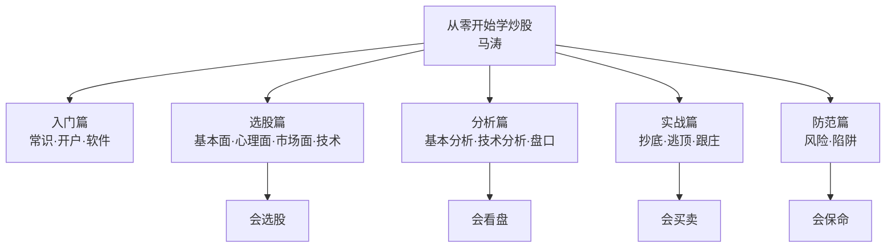
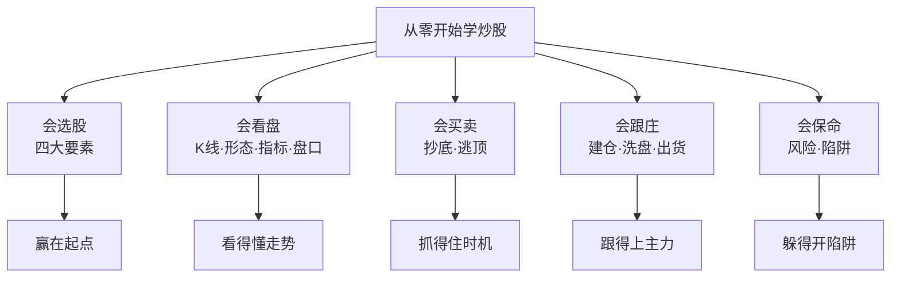

# 38《从零开始学炒股 股票入门与实战》深度解读（详细版）

> **副题：马涛——"股市第一课"：一本写给新股民的完整实操手册**
>
> 作者：马涛，证券投资实战派作者。本书是系列中**第一本真正意义上的"新手教科书"**——从"什么是股票"讲起，一路教到开户、装软件、看 K 线、抄底逃顶、跟庄防骗。
>
> **核心定位**：全书 14 章构成一条完整的学习路径——**入门常识 → 实战准备 → 选股方法 → 基本分析 → 技术分析 → 盘口分析 → 抄底逃顶 → 跟庄识庄 → 风险防范**。如果说 036 陈江挺讲"怎么活下来"（理念）、037 冉伟讲"怎么想清楚"（哲学），038 马涛讲的是**"怎么开始"**——工具、步骤、图形、技巧，全部落到位。
>
> **系列意义**：038 是系列第 38 本，A 股实战派第四站。本书的独特价值在于**补齐了系列缺失的"基础设施"层**：K 线组合大全、四底次序、政策顶识别、庄家建仓五式、骗线识别——这些是前面 37 本大师思想落地时默认读者"已经会"的基础功。读完 038，再回头看 036/037 的操作系统，会突然"通了"。

---

## 📖 全书结构与核心框架

### 全书结构总览表

| 部分 | 章节 | 核心内容 |
|------|------|---------|
| 入门篇 | 第1—4章 | 股票常识/开户流程/软件使用/选股入门 |
| 分析篇 | 第5—8章 | 基本分析（宏观/行业/公司）/技术分析（K线/趋势/形态/指标）/盘口分析 |
| 实战篇 | 第9—12章 | 识底抄底/识顶逃顶/跟庄识庄/股指期货与创业板 |
| 防范篇 | 第13—14章 | 风险防范/股市陷阱 |

---

## 📑 目录

- [[#第1章 股票入门：读懂股市的第一课|第1章 股票入门：读懂股市的第一课]]
- [[#第2章 实战准备：开户、软件与手机炒股|第2章 实战准备：开户、软件与手机炒股]]
- [[#第3章 选股实战：四大要素选股法|第3章 选股实战：四大要素选股法]]
- [[#第4章 基本分析：宏观、行业与公司|第4章 基本分析：宏观、行业与公司]]
- [[#第5章 技术分析上：K线与形态学|第5章 技术分析上：K线与形态学]]
- [[#第6章 技术分析下：趋势线、管道线与四大指标|第6章 技术分析下：趋势线、管道线与四大指标]]
- [[#第7章 盘口分析：看懂盘面的语言|第7章 盘口分析：看懂盘面的语言]]
- [[#第8章 识底抄底：会卖的不如会买的|第8章 识底抄底：会卖的不如会买的]]
- [[#第9章 识顶逃顶：高处收网，落袋为安|第9章 识顶逃顶：高处收网，落袋为安]]
- [[#第10章 跟庄识庄：大树底下好乘凉|第10章 跟庄识庄：大树底下好乘凉]]
- [[#第11章 风险防范：小心驶得万年船|第11章 风险防范：小心驶得万年船]]
- [[#总结：从零到一的完整路径|总结：从零到一的完整路径]]
- [[#附录一 马涛金句集（30 条精选）|附录一 马涛金句集（30 条精选）]]
- [[#附录二 本书术语速查卡|附录二 本书术语速查卡]]
- [[#附录三 系列互链：038 在 38 本笔记中的位置|附录三 系列互链：038 在 38 本笔记中的位置]]
- [[#附录四 A 股应用：新手实操路线图|附录四 A 股应用：新手实操路线图]]
- [[#附录五 读完本书后的 10 个自问|附录五 读完本书后的 10 个自问]]
- [[#附录六 本书案例与数据速查|附录六 本书案例与数据速查]]
- [[#附录七 K 线组合速查表（30 种）|附录七 K 线组合速查表（30 种）]]
- [[#附录八 本书 FAQ 20 问|附录八 本书 FAQ 20 问]]
- [[#附录九 系列母题追踪（038 号更新）|附录九 系列母题追踪（038 号更新）]]
- [[#附录十 新手 vs 大师：入门书与思想书对照|附录十 新手 vs 大师：入门书与思想书对照]]
- [[#附录十一 30 秒版：从零开始学炒股|附录十一 30 秒版：从零开始学炒股]]
- [[#附录十二 马涛炒股技巧 60 条|附录十二 马涛炒股技巧 60 条]]
- [[#附录十三 骗线识别手册：三种典型骗线|附录十三 骗线识别手册：三种典型骗线]]
- [[#附录十四 系列 38 本总览（完成进度）|附录十四 系列 38 本总览（完成进度）]]
- [[#附录十五 同一市场，五种眼光（038 版）|附录十五 同一市场，五种眼光（038 版）]]
- [[#附录十六 中医视角：入门如"筑基"，基础不牢地动山摇|附录十六 中医视角：入门如"筑基"，基础不牢地动山摇]]
- [[#附录十七 中英对照：马涛核心概念|附录十七 中英对照：马涛核心概念]]
- [[#附录十八 思维训练：10 个新手练习|附录十八 思维训练：10 个新手练习]]
- [[#附录十九 新手常见错误自测表|附录十九 新手常见错误自测表]]
- [[#附录二十 写给新股民的话（知乎文风附录）|附录二十 写给新股民的话（知乎文风附录）]]

---

## 第1章 股票入门：读懂股市的第一课

### 1.1 股票的基本知识

| 概念 | 内容 |
|------|------|
| 股票 | 股份公司签发的证明股东所持股份的凭证 |
| 股东权利 | 分红权/表决权/剩余财产分配权 |
| A 股 | 人民币普通股票（境内发行上市） |
| 涨跌停 | 主板 ±10%/创业板、科创板 ±20% |
| T+1 | 当日买入次日才能卖出 |

**股票市场的三大功能**：融资（企业）、投资（股民）、资源配置（市场）。

### 1.2 股市指数

| 指数 | 含义 |
|------|------|
| 上证指数 | 上海证券交易所全部上市股票 |
| 深证成指 | 深圳市场代表性股票 |
| 创业板指 | 创业板市场 |
| 沪深 300 | 两市规模大流动性好的 300 只 |
| 中证 500 | 中小盘代表 |

### 1.3 股票类型与板块

| 分类维度 | 类型 |
|---------|------|
| 行业 | 金融/消费/科技/医药/周期… |
| 市值 | 大盘/中盘/小盘 |
| 风格 | 价值/成长/蓝筹/题材 |
| 特殊 | ST（退市风险警示）/次新股/科创板 |

### 1.4 必须掌握的术语

| 术语 | 含义 |
|------|------|
| 市盈率（PE） | 股价/每股收益（估值） |
| 市净率（PB） | 股价/每股净资产 |
| 换手率 | 成交量/流通股本 |
| 成交量/额 | 成交的股数/金额 |
| 内外盘 | 主动性买盘（外）/卖盘（内） |
| 委比委差 | 委托买卖力量对比 |
| 量比 | 当日成交量/过去5日平均 |
| 除权除息 | 分红送股后价格调整 |

---

## 第2章 实战准备：开户、软件与手机炒股

### 2.1 开户流程

| 步骤 | 内容 |
|------|------|
| 1. 选择券商 | 看佣金费率/服务/软件体验 |
| 2. 准备资料 | 身份证/银行卡/手机 |
| 3. 线上开户 | 视频验证+风险测评 |
| 4. 绑定银行 | 三方存管 |
| 5. 开始交易 | 下载软件/入金 |

**退路**：不想炒股了——销户流程（清仓→转出资金→销户）。

### 2.2 软件选择

| 软件 | 特点 |
|------|------|
| 同花顺 | 功能全/资讯丰富 |
| 东方财富 | 数据强/社区活跃 |
| 通达信 | 专业/可定制 |
| 券商自带 | 与账户无缝 |

### 2.3 模拟炒股的价值

> "在正式入市之前，用模拟盘练手三个月——**把该犯的错都犯一遍，成本为零。**"

---

## 第3章 选股实战：四大要素选股法

### 3.1 选股的重要性

> "不管 A 股 B 股，能赚钱就是好股……选股不对你也很难挣钱。不管大盘下跌也好上涨也好，**选股才是最重要的。**"

**高手的习惯**：

> "他们是高手，不是高在技术面上，而是有一个好习惯，那就是以把玩的心态，**每天至少看 50 支股票的 K 线图。**"

### 3.2 要素一：基本面选股

**（1）国家经济政策选股**：

> "股市基本分析方法无论有多少种，作为我们中小投资者首先要学会根据政策来选股。"

| 政策类型 | 受益板块（案例） |
|---------|----------------|
| 新能源汽车政策（2015） | 新能源概念股全线爆发；华电能源净利预增 7—11 倍开盘涨停 |
| 基建投资 | 建材/工程机械 |
| 利率下调 | 地产/券商 |

**（2）行业发展前景选股**：

| 条件 | 内容 |
|------|------|
| 一是行业趋势 | 可预见时间内持续向上的景气度 |
| 二是行业拐点 | 看当期业绩容易错失牛股，抓拐点需敏感度 |
| 案例 | 通信行业=朝阳行业=股市"高价贵族股" |

**（3）价值投资选股**：

> "在大板块里趋势最好的行业中，进一步细分其子行业的研究，选出趋势最强的子行业，然后再根据价值投资的理念，选出子行业中基本面好、有投资价值，且最具代表性的龙头公司进行投资。"

### 3.3 要素二：心理面选股

| 心理因素 | 应用 |
|---------|------|
| 市场情绪 | 恐慌=机会/狂热=风险 |
| 从众心理 | 反着做（大多数人总是错的） |
| 羊群效应 | 人声鼎沸时离场 |
| 心理价位 | 整数关口（3000 点）的支撑压力 |

### 3.4 要素三：市场面选股

| 市场面因素 | 内容 |
|-----------|------|
| 板块轮动 | 资金在不同板块间流动 |
| 热点题材 | 政策/事件驱动的短期机会 |
| 资金流向 | 主力资金进出 |
| 市场风格 | 价值/成长切换 |

### 3.5 要素四：技术分析选股

> "选股的思路与方法五花八门，千奇百怪，但**最适合散户的选股方法应该还是 K 线图。**"

**K 线选股要点**：

| 原则 | 内容 |
|------|------|
| 形态优先 | 从日线图挑选，周线复核 |
| 建仓量能 | 决定突破高度 |
| 均线系统 | 决定突破时间 |
| 控盘意图 | 简洁不受干扰 |
| 价格波动 | 不给短线客留空间 |
| 成交量 | 千万不能散 |

---

## 第4章 基本分析：宏观、行业与公司

### 4.1 宏观经济信息分析

| 宏观指标 | 对股市的影响 |
|---------|-------------|
| GDP 增速 | 经济增长→企业盈利↑ |
| CPI/通胀 | 通胀过高→加息预期→股价↓ |
| 利率 | 利率↓→资金成本↓→估值↑ |
| 汇率 | 升值→外资流入 |
| 货币供应（M2） | 流动性→资金面 |

> "在通货膨胀时期，若物价涨幅过大，居民实际资产会缩水，引起市场不稳定。为控制通货膨胀，国家将推动利率上涨，市场中流动资金将减少，从而使股价下跌。"

### 4.2 行业信息分析

| 分析维度 | 内容 |
|---------|------|
| 行业生命周期 | 初创/成长/成熟/衰退 |
| 行业景气度 | 需求/供给/价格 |
| 行业政策 | 扶持/限制 |
| 竞争格局 | 垄断/寡头/竞争 |

### 4.3 公司信息分析

| 分析维度 | 内容 |
|---------|------|
| 财务报表 | 利润表/资产负债表/现金流量表 |
| 盈利能力 | ROE/毛利率/净利率 |
| 成长能力 | 营收/利润增速 |
| 偿债能力 | 负债率/流动比率 |
| 管理层 | 董事长/经营团队 |

---

## 第5章 技术分析上：K线与形态学

### 5.1 K 线的起源与构成

> "K 线据说起源于 18 世纪日本的米市，当时日本的米商用来表示米价的变动情况，后被引用到证券市场。"

| K 线要素 | 含义 |
|---------|------|
| 开盘价 | 第一笔成交价 |
| 收盘价 | 最后一笔成交价 |
| 最高价 | 当日最高 |
| 最低价 | 当日最低 |
| 阳线/阴线 | 收盘>开盘=阳（红）/反之为阴（绿） |

**专家提醒（新手最容易搞错）**：

> "收出阳线并不代表当日股价肯定是上涨的，这关键取决于当日开盘价的高低，如果是低开高走，涨幅为负，其收盘 K 线事实上仍为阳线。同理，收出阴线并不代表当日股价肯定是下跌的。"

### 5.2 经典 K 线组合（12 组核心）

| 组合 | 形态 | 信号 |
|------|------|------|
| 穿头破脚 | 中阳（阴）线+包线 | 变盘敏感 |
| 乌云盖顶 | 中阳线+切入阴线 | 上涨受阻，空头积聚 |
| 曙光出现 | 中阴线+切入阳线 | 下跌受阻，多头积聚 |
| 覆盖线 | 连涨后高开低走收进前阳 | 超买卖压，看跌 |
| 大雨倾盆 | 阴线实体切入阳线实体 | 见顶信号（切入越多越强） |
| 旭日东升 | 大跌后高开大阳线盖过前阴开盘 | 见底信号 |
| 分手 | 两 K 线同开盘价颜色相反 | 继续信号 |
| 约会（反击线） | 两 K 线同收盘价颜色相反 | 反转信号 |
| 十字胎 | 中阳（阴）线+孕十字星 | 整理变盘 |
| 身怀六甲（孕线） | 中阳（阴）线+孕线 | 将有大幅动作 |
| 平顶 | 连续两日遇同高点回落 | 阻力确认 |
| 平底 | 连续两日遇同低点回升 | 支撑确认 |

> "K 线分析是靠人类的主观印象而建立的，并且是基于对历史的形态组合进行表达的分析方法之一……一些常见的 K 线组合形态并没有严格的科学逻辑。"

### 5.3 转折形态与中继形态

| 类型 | 形态 | 位置 |
|------|------|------|
| 转折形态 | 头肩底（顶）/W 底/M 头/圆弧底（顶） | 底部与顶部 |
| 中继形态 | 三角形/矩形（箱体）/喇叭形 | 行情运行中 |

**头肩底详解（抄底最重要的形态）**：

| 要素 | 内容 |
|------|------|
| 左肩 | 下跌后反弹 |
| 头部 | 反弹受阻创新低后再反弹 |
| 右肩 | 回落至左肩低点附近企稳 |
| 颈线 | 两肩反弹高点的连线 |
| 突破 | 突破颈线=见底反转信号 |

**三种买入法（按风险偏好）**：

| 方法 | 适合 | 风险 |
|------|------|------|
| 回抽颈线位买入 | 稳健型 | 错过不回调的黑马 |
| 突破当天收市前买入 | 进取型 | 回抽套牢/假突破 |
| 右肩形成中提前建仓 | 大胆型 | 形态破坏风险 |

---

## 第6章 技术分析下：趋势线、管道线与四大指标

### 6.1 趋势线

> "实战投资者最重要的投资原则，就是顺势而为，即顺从股价沿最小阻力运行的趋势方向而展开操作，与股价波动趋势达到'天人合一'。"

| 趋势类型 | 特征 |
|---------|------|
| 上涨趋势 | 波峰波谷逐级抬高 |
| 下跌趋势 | 波峰波谷逐级降低 |
| 震荡趋势 | 波峰波谷基本持平 |

> "所谓'一把尺子走天下'，其实指的就是趋势线的运用。**趋势是你的朋友，永远顺着趋势展开操作，不可逆势而为。**"

### 6.2 管道线（通道线）

| 特点 | 内容 |
|------|------|
| 构成 | 趋势线的平行线（上升/下降通道） |
| 优点 | **买卖点清晰、交易次数少、成功率高** |
| 应用 | 触上轨卖/触下轨买 |

### 6.3 支撑线与压力线

| 概念 | 内容 |
|------|------|
| 支撑线 | 阻止股价继续下跌的价位 |
| 压力线 | 阻止股价继续上升的价位 |
| 相互转化 | **突破压力线后压力变支撑；跌破支撑线后支撑变压力** |
| 前提 | 被有效的足够强大的价格变动所突破 |

### 6.4 四大指标速查

**（1）均线（MA）与金叉死叉**：

| 概念 | 内容 |
|------|------|
| 金叉 | 短均线上穿长均线且两线方向均朝上=买入 |
| 死叉 | 短均线下穿长均线且两线方向均朝下=卖出 |
| 注意 | 两线方向不一致=普通交叉，非金叉死叉 |
| 多头排列 | 日线>短均线>中均线>长均线=典型牛市 |
| 空头排列 | 反之=熊市 |

**（2）KDJ 随机指标**：

| 区间 | 信号 |
|------|------|
| 20 以下 | 超卖区=买入信号 |
| 80 以上 | 超买区=卖出信号 |
| 20—80 | 徘徊区=观望 |

**（3）BOLL 布林线**：

| 轨道 | 含义 |
|------|------|
| 中轨 | n 日均线 |
| 上轨 | 中轨+2 倍标准差 |
| 下轨 | 中轨−2 倍标准差 |
| 应用 | 带宽变窄=变盘临近；触上下轨=超买卖 |

**（4）MACD 指标**：

| 信号 | 含义 |
|------|------|
| DIFF 上穿 DEA（金叉） | 买入信号 |
| DIFF 下穿 DEA（死叉） | 卖出信号 |
| DIFF/DEA 均为正 | 多头市场 |
| 均为负 | 空头市场 |

> "周 K 线 MACD 指标对中长线转折的判断的准确性较高，可以作为中长线投资者的首选参考指标。"

---

## 第7章 盘口分析：看懂盘面的语言

### 7.1 买盘与卖盘

> "实时盯盘的核心是观察买盘和卖盘，掌握买盘或者卖盘的性质，就能先发制人。股市中的主力庄家经常在此挂出巨量的买单或卖单，然后引导股价朝某一方向走，并时常利用盘口挂单技巧，引诱投资人作出错误的买卖决定。"

| 概念 | 内容 |
|------|------|
| 外盘 | 主动性买盘成交 |
| 内盘 | 主动性卖盘成交 |
| 注意 | **内外盘并不能反映真正的买卖盘力量**（成交的买卖量必然相等） |

### 7.2 涨跌停板观察

> "开盘后涨跌停板的情况会对大盘产生直接的影响……某只生物医药股涨停板，在其做多示范效应影响下，其他的与其相近的或者有可比性的股票会有走强的趋势；反之亦然。"

### 7.3 开盘看盘

| 观察点 | 含义 |
|--------|------|
| 高开/低开 | 反映多空气势 |
| 大盘低开个股高开 | 该股当日强于大盘 |
| 集合竞价（9:15—9:30） | **按供求关系校正股价，反映市场对当天走向的看法** |
| 记录集合竞价成交量 | 发现大盘变化趋势 |

### 7.4 重要时间段

| 时间段 | 特征 |
|--------|------|
| 9:15—9:30 | 集合竞价（定基调） |
| 9:30—10:00 | 早盘博弈（最活跃） |
| 10:00—11:30 | 趋势确认 |
| 13:00—14:00 | 午后延续 |
| 14:00—14:30 | 尾盘预演 |
| 14:30—15:00 | **尾盘决战（做收盘价）** |

### 7.5 特殊现象

| 现象 | 含义 |
|------|------|
| 尾盘急拉 | 做收盘价（警惕骗线） |
| 尾盘跳水 | 出货信号 |
| 放量滞涨 | 派发 |
| 缩量上涨 | 惜售 |
| 大单压顶/托底 | 主力意图试探 |

---

## 第8章 识底抄底：会卖的不如会买的

### 8.1 底部的三个级别

| 级别 | 特征 | 机会 |
|------|------|------|
| 短期底部 | 频繁出现；适合滚动操作 | 新股/ST/利空急跌/强势股洗盘 |
| 中期底部 | 跌 25%+ 且两个月以上；双底/头肩底常见 | 中线黑马主升浪起点 |
| 长期底部 | 数年一遇；横盘+地量 | 大级别行情起点 |

**四底次序（全书最有价值的一段）**：

> "从市场见底的过程来看，往往是**先突破'心理底'、再去寻找'估值底'、接着出现'政策底'，最后才会诞生'市场底'。**"

### 8.2 长期底部的四大特征

| 特征 | 内容 |
|------|------|
| 1. 前期明显下跌 | 跌幅越深时间越长，后市空间越大 |
| 2. 低位横盘较长 | 成交量极度萎缩（主力吸筹） |
| 3. 投资者深套 | 媒体一片看空、利空满天飞、**股价却跌不下去了** |
| 4. 聚集反转能量 | 指标超卖/底背离；**最后下跌的是绩优股和指标股** |

### 8.3 抄底技巧一：K 线和均线

| 均线信号 | 含义 |
|---------|------|
| 长期均线走平+短期均线金叉 | 买入信号 |
| 股价从下向上突破均线 | 买入 |
| 多头排列形成 | 中线进场机会 |

> "常言道：'底部进场，不赢也难。'道理很简单：当市场、个股处于底部时，价格更便宜，估值更低、更合理，系统性风险也很小，赚头也就更有保证。"

### 8.4 抄底技巧二：成交量

| 信号 | 含义 |
|------|------|
| 地量 | 抛压枯竭 |
| 底部放量 | 资金进场 |
| 缩量回调 | 洗盘（健康） |
| 放量突破 | 主升浪启动 |

### 8.5 抄底技巧三：前期低点的假突破

> "股票市场最常见的骗线有假突破一说，可以是向上假突破，也可以是向下假突破。"

**向下假突破（抄底机会）**：K 线跌破前期低点→短线拉回→**实际是空头陷阱**——破位后快速收回且放量，往往是主力洗盘结束的信号。

**向上假突破（逃命信号）**：突破前期阻力→放量滞涨→冲高回落→**主力出货**——"出现这种情况，投资者应判断为假突破，宜及时离场。"

---

## 第9章 识顶逃顶：高处收网，落袋为安

### 9.1 为什么必须学会逃顶

> "有些投资专家，他们买股票准备永远持有，这并没有错，运气好的话，30年可以翻20倍。但其间会有很多的起伏，有时股票会有50%的跌幅，**这对普通投资者来说是难以承受的。**因此，投资者一定要学会判断顶部走势，抓住卖股票的'临界点'。"

### 9.2 政策顶特征

> "中国股市是一个新兴的市场，政策调控将直接影响股市，在历史的走势中，可以看到许多头部是由政策调控造成的。"

| 政策信号 | 案例 |
|---------|------|
| 央行/银监会的警惕性文字 | 2007.5 印花税上调→大顶 |
| 提高印花税 | 2007 逃顶机会 |
| 大扩容 | 每次扩容伴随大跌 |
| 收紧流动性 | 加息/提准 |

### 9.3 顶部市场特征（六大信号）

| 信号 | 内容 |
|------|------|
| 1 | 大型股评报告会人满为患 |
| 2 | 散户大厅人突然变多，人人谈挣钱 |
| 3 | 证券交易所门口车极多，全是新股民 |
| 4 | 证券类报纸杂志销量变好 |
| 5 | "大妈们"都来买股票，开户资金提高 |
| 6 | 股市新手都敢给你推荐股票，还报目标位 |

> "以上现象出现时，表示市场已在顶部或是顶部区域，投资者应开始减磅离场。"

### 9.4 利好顶部特征（"见光死"）

> "在股市中，由于信息的不对称性，庄家有时利用掌握的信息在低位开始悄悄进货，并一路推高。等到消息证实时，反而是庄家逢高派发的好时机，这种情况被市场称为'见光死'。"

**东北热电案例（1998）**：7 月 14 日公布每股收益 0.538 元+"十送六""十配三"的诱人方案——业绩极优、方案极佳，结果**复牌后高开低走，庄家借机拉高出货，当日收出一根大阴线，形成明显头部。**

> "当股价已连续上涨非常大的幅度后，出利好消息反而容易形成头部。投资者想学会成功逃顶，就必须了解庄家常借利好出货的手法。"

### 9.5 顶部技术特征

> "市场上有'底部百日，顶部三天'的说法，说明逃顶的难度。**市场的高手往往也是会逃顶的高手。**"

---

## 第10章 跟庄识庄：大树底下好乘凉

### 10.1 怎样识别潜力强庄股

| 识别维度 | 内容 |
|---------|------|
| 股东户数 | **大幅减少=筹码集中=庄家入驻概率大** |
| 换手率 | 低位温和放量 |
| K 线形态 | 抗跌/独立走势 |
| 量价关系 | 缩量回调+放量拉升 |

### 10.2 主力建仓的 5 种方式

| 方式 | 特征 | 案例 |
|------|------|------|
| 打压建仓 | 人为砸盘+利空配合制造恐慌 | 航天机电（600151）：业绩预亏 50% 公告配合打压 |
| 温和上涨建仓 | 跳空高开+缩量震荡吸筹 | 华帝股份（002035）：2008.11 巨阴量上涨建仓 |
| 横盘建仓 | 长期低位横盘磨耐心 | 低吸高抛反复 |
| 拉高建仓 | 强势股高位换手 | 快速收集 |
| 反弹建仓 | 下跌中借反弹吸筹 | 边跌边买 |

**打压建仓的特征**：

> "庄家通常在股价下跌时就开始介入个股进行操作，并运用早期锁定的一部分筹码，不计成本地大幅度向下砸盘……甚至有些庄家不惜以连续跌停的方式进行操作。与此同时，上市公司的利空消息也会不断出现，造成市场投资者的一片恐慌心理，于是纷纷卖出手中股票。"

### 10.3 主力洗盘（整理）的两种方式

| 方式 | 特征 | 安全性 |
|------|------|--------|
| 短线暴跌洗盘 | 缩量急跌、不破均线（破也快速拉回） | 相对安全 |
| 缩量横盘洗盘 | 长时间滞涨磨掉获利盘耐心 | 最安全 |

> "缩量洗盘在技术形态上很容易区别……投资者在买入的安全性方面也比放量买入的安全性要高得多，**因为主力是无法在不断萎缩的成交量中完成出货操作的。**"

### 10.4 主力拉升与出货

| 阶段 | 盘面特征 |
|------|---------|
| 拉升初期 | 温和放量+突破关键位 |
| 拉升中期 | 利好频出+加速上涨 |
| 拉升末期 | 放量滞涨+换手剧增 |
| 出货 | 利好兑现/放量长阴/假突破 |

---

## 第11章 风险防范：小心驶得万年船

### 11.1 股市风险的类型

| 风险类型 | 内容 |
|---------|------|
| 系统性风险 | 宏观/政策导致的全市场下跌 |
| 非系统性风险 | 个股/行业风险（可分散） |
| 操作风险 | 追高/满仓/杠杆 |
| 道德风险 | 虚假信息/内幕交易 |

> "股市有风险，入市须谨慎。"

### 11.2 股市陷阱总览

> "陷阱与风险的不同之处在于**陷阱是运用不正当的手段人为地制造的**，目的是故意引诱投资者进入，从中谋取利益。"

### 11.3 陷阱一：虚假交易

| 手法 | 内容 |
|------|------|
| 假装买卖 | 空报价格不成交/自买自卖 |
| 通谋买卖 | 约定价格对倒炒作 |
| 虚假造势 | 连续买卖制造活跃假象 |

**厦海发案例（1994）**：

> "1994年10月某证券公司深圳发展中心营业部连续交易自买自卖操纵'厦海发'A股，使得当日收盘价比前一日上涨了157%。该营业部于次日将'厦海发'股票卖出，获利238万元。"

### 11.4 陷阱二：股评陷阱

> "由于股评专家在股民中有一定的影响力，所以庄家和上市公司会想方设法与一些所谓的专家合作，通过其股评设置骗局，引诱投资者按照其想法操作，最后达到非法赢利的目的。这类股评消息的危害是最大的，投资者对于股评消息，一定要谨慎，坚持独立思考。"

> "投资者应审慎客观地对待书籍中的观念、股评，不盲从、不迷信名家名言、不人云亦云，学会使用逆向思维，**因为大多数人总是错的，掌握真理的永远只是少数人。**"

### 11.5 陷阱三：骗线

> "大户利用股民们迷信技术分析数据、图表的心理，故意抬拉、打压股指，致使技术图表形成一定线型，引诱股民大量买进或卖出，从而达到他们大发其财的目的。这种欺骗性造成的技术图表线型称为骗线。"

| 骗线手法 | 内容 |
|---------|------|
| 假突破骗线 | 制造向上突破假象（顶部阶段），几日后冲高回落放量=跳水开始 |
| 收盘价骗线 | 尾盘拉高做漂亮 K 线吸引跟风 |
| 拉尾市骗线 | 收市前几分钟连续大单推高，连续数日=做收盘价 |

> "在股市中是技术图形跟随股价的变化而变化，不是股价随着技术图形的变化而变化。所有的技术图形只能用来参考，决策的时候还要将技术分析与基本面分析、股市大形势结合起来，**不能单纯依赖技术分析。**"

### 11.6 陷阱四：老鼠仓

> "老鼠仓（Rat Trading）是一种无良经纪人对客户不忠的'食价'做法。具体指庄家在用公有资金拉升股价之前，先用自己个人的资金在低位建仓，待用公有资金拉升到高位后个人仓位率先卖出获利。"

> "坐庄本来是为了赚钱盈利的，但券商坐庄很少有真正赚钱的，原因就在于券商把股票拉升后，大量底部埋藏的老鼠仓蜂拥出货，券商又在高位接盘。**这样的结果就是券商亏损累累，老鼠仓赚得钵满盆满。**这便是当今券商被掏空的主要形式。"

---

## 总结：从零到一的完整路径

### Z1. 马涛体系全景

### Z2. 全书的五根柱子

| 柱子 | 核心内容 | 章节 |
|------|---------|------|
| 选股 | 政策+行业+价值+技术四要素 | 第3章 |
| 看盘 | K线/趋势/形态/指标/盘口 | 第5—7章 |
| 抄底 | 四底次序+长期底部四特征 | 第8章 |
| 逃顶 | 政策顶+市场顶+利好顶+技术顶 | 第9章 |
| 保命 | 虚假交易/股评/骗线/老鼠仓 | 第11章 |

### Z3. 马涛留给读者的三句话

> 1. "不管 A 股 B 股，能赚钱就是好股——选股才是最重要的。"
> 2. "先突破'心理底'、再去寻找'估值底'、接着出现'政策底'，最后才会诞生'市场底'。"
> 3. "在股市中是技术图形跟随股价的变化而变化，不是股价随着技术图形的变化而变化。"

### Z4. 本书与系列的关系

| 维度 | 035 邱国鹭 | 036 陈江挺 | 037 冉伟 | **038 马涛** |
|------|-----------|-----------|---------|-------------|
| 定位 | 选什么 | 怎么活 | 怎么想 | **怎么开始** |
| 特色 | 三要素 | 家训 | 四要素 | **K线+实操** |
| 读者 | 有经验者 | 亏过钱者 | 思考者 | **零基础新手** |
| 互补 | 理念层 | 纪律层 | 哲学层 | **工具层** |

---

## 附录一 马涛金句集（30 条精选）

> 1. "不管 A 股 B 股，能赚钱就是好股。"——选股
> 2. "选股不对你也很难挣钱。"——选股
> 3. "最适合散户的选股方法应该还是 K 线图。"——选股
> 4. "每天至少看 50 支股票的 K 线图。"——高手习惯
> 5. "建仓量能决定突破高度，均线系统决定突破时间。"——K线
> 6. "成交量千万不能散。"——K线
> 7. "作为中小投资者首先要学会根据政策来选股。"——政策
> 8. "看当期业绩往往容易错失牛股，抓行业拐点需要对行业有较高的敏感度。"——行业
> 9. "在通货膨胀时期，物价涨幅过大，国家将推动利率上涨，市场中流动资金将减少，从而使股价下跌。"——宏观
> 10. "K 线图起源于 18 世纪日本的米市。"——K线
> 11. "收出阳线并不代表当日股价肯定是上涨的。"——K线
> 12. "一些常见的 K 线组合形态并没有严格的科学逻辑。"——K线
> 13. "实战投资者最重要的投资原则，就是顺势而为。"——趋势
> 14. "一把尺子走天下。"——趋势线
> 15. "趋势是你的朋友，永远顺着趋势展开操作，不可逆势而为。"——趋势
> 16. "支撑线和压力线是可以相互转化的。"——支撑压力
> 17. "管道线的优点表现为买卖点清晰、交易次数少、成功率高。"——管道线
> 18. "周 K 线 MACD 指标对中长线转折的判断的准确性较高。"——MACD
> 19. "实时盯盘的核心是观察买盘和卖盘，掌握买盘或者卖盘的性质，就能先发制人。"——盘口
> 20. "集合竞价往往反映出市场对当天走向的看法。"——盘口
> 21. "底部进场，不赢也难。"——抄底
> 22. "先突破'心理底'、再去寻找'估值底'、接着出现'政策底'，最后才会诞生'市场底'。"——四底
> 23. "股价却跌不下去了。"——长期底部特征
> 24. "最后下跌的板块往往是绩优股和指标股。"——见底信号
> 25. "底部百日，顶部三天。"——逃顶
> 26. "市场的高手往往也是会逃顶的高手。"——逃顶
> 27. "当股价已连续上涨非常大的幅度后，出利好消息反而容易形成头部。"——见光死
> 28. "主力是无法在不断萎缩的成交量中完成出货操作的。"——洗盘
> 29. "大多数人是错的，掌握真理的永远只是少数人。"——逆向
> 30. "在股市中是技术图形跟随股价的变化而变化，不是股价随着技术图形的变化而变化。"——技术分析

---

## 附录二 本书术语速查卡

| 术语 | 定义 | 出处 |
|------|------|------|
| K 线 | 单位时间内价格变化的图形 | 第5章 |
| 阳线/阴线 | 收盘高于/低于开盘 | 第5章 |
| 穿头破脚 | 变盘敏感 K 线组合 | 第5章 |
| 头肩底 | 底部转折形态 | 第5章 |
| 金叉/死叉 | 均线交叉信号 | 第6章 |
| 多头排列 | 短中长均线依次向上 | 第6章 |
| 管道线 | 趋势线的平行线 | 第6章 |
| 支撑/压力线 | 阻止下跌/上涨的价位 | 第6章 |
| 外盘/内盘 | 主动性买盘/卖盘 | 第7章 |
| 集合竞价 | 9:15—9:30 价格校正 | 第7章 |
| 四底次序 | 心理底→估值底→政策底→市场底 | 第8章 |
| 见光死 | 利好兑现=出货 | 第9章 |
| 打压建仓 | 砸盘吸筹 | 第10章 |
| 骗线 | 人为制造的技术图形 | 第11章 |
| 老鼠仓 | 拉升前个人低位建仓 | 第11章 |

---

## 附录三 系列互链：038 在 38 本笔记中的位置

### 038 与系列笔记的链接网络

| 系列笔记 | 链接点 |
|---------|--------|
| [[37《股票投资沉思录》深度解读（详细版）|37 号]] | 冉伟量价关系×038 K线形态（价格是结局/量是伤亡） |
| [[36《炒股的智慧》深度解读（详细版）|36 号]] | 陈江挺临界点×038 头肩底颈线/突破买点 |
| [[35《投资中最简单的事》深度解读（详细版）|35 号]] | 邱国鹭逆向投资×038 四底次序（政策底/市场底） |
| [[01《股票作手回忆录》读书笔记|01 号]] | 利弗莫尔关键点×038 颈线突破 |
| [[02《股票大作手操盘术》深度解读（详细版）|02 号]] | 利弗莫尔最小阻力线×038 趋势线 |
| [[03《利弗莫尔的股票交易方法量价分析》深度解读（详细版）|03 号]] | 量价分析×038 成交量技巧 |
| [[31《金融炼金术》深度解读（详细版）|31 号]] | 索罗斯反身性×038 政策顶/利好顶（见光死） |
| [[28《聪明的投资者》深度解读（详细版）|28 号]] | 格雷厄姆市场先生×038 顶部市场特征 |
| [[32《彼得·林奇的成功投资》深度解读（详细版）|32 号]] | 林奇基本面×038 基本面选股 |
| [[34《彼得·林奇战胜华尔街》深度解读（详细版）|34 号]] | 林奇行业选股×038 行业前景选股 |

### 038 在系列中的定位

| 维度 | 定位 |
|------|------|
| 流派 | A 股实战派·新手工具层 |
| 特色 | 全系列唯一"零基础教科书" |
| 价值 | 大师思想的"基础设施"（K线/形态/盘口） |

---

## 附录四 A 股应用：新手实操路线图

### 4.1 新手 90 天路线图

| 阶段 | 时间 | 内容 |
|------|------|------|
| 学习期 | 第1—30天 | 读完本书+模拟盘练习（不亏真钱） |
| 实习期 | 第31—60天 | 小仓位（1/10）实盘+复盘 |
| 成长期 | 第61—90天 | 建立股票池+按四要素选股+纪律执行 |

### 4.2 每日复盘清单

| 时间 | 动作 |
|------|------|
| 开盘前 | 看集合竞价+隔夜消息 |
| 盘中 | 观察盘口+主力动向 |
| 收盘后 | 复盘 K 线+记录操作 |
| 每周 | 检查股票池+更新观察列表 |

### 4.3 新手资金管理（与 036 陈江挺呼应）

| 规则 | 内容 |
|------|------|
| 仓位 | 单只不超过 1/6—1/8 |
| 止损 | 买入前设定（≤10%） |
| 杠杆 | 严禁（新手第一戒） |
| 节奏 | 分批建仓 |

---

## 附录五 读完本书后的 10 个自问

1. 我认识 K 线的四种价格和阴阳线的真正含义吗？
2. 我能说出 10 种以上的 K 线组合信号吗？
3. 我知道"四底次序"是哪四个底吗？
4. 我会用均线金叉死叉判断买卖点吗？
5. 我知道支撑线和压力线如何相互转化吗？
6. 我能识别"见光死"（利好出货）吗？
7. 我了解庄家建仓的五种方式吗？
8. 我能识别假突破骗线吗？
9. 我知道顶部区域的六大市场特征吗？
10. 我准备用模拟盘练三个月再入市吗？

---

## 附录六 本书案例与数据速查

### 核心数据

| 数字 | 含义 |
|------|------|
| 50 支 | 高手每天看的 K 线数量 |
| ±10%/20% | 主板/创业板涨跌停 |
| 7—11 倍 | 华电能源净利预增 |
| 157% | 厦海发被操纵的涨幅 |
| 238 万元 | 厦海发操纵获利 |
| 30 年 20 倍 | 永远持有的长期收益（专家论） |
| 50% | 永远持有的最大回撤 |
| 25% | 中期底部跌幅参考 |
| 2 个月 | 中期底部时长参考 |

### 案例速查表

| 案例 | 类型 | 启示 |
|------|------|------|
| 华电能源（2015） | 政策选股 | 政策→概念→涨停 |
| 东北热电（1998） | 见光死 | 利好出货 |
| 航天机电（600151） | 打压建仓 | 利空配合吸筹 |
| 华帝股份（002035） | 温和建仓 | 巨阴量上涨 |
| 凯迪电力（000939） | 暴跌洗盘 | 缩量急跌 |
| 安凯客车（000868） | 缩量横盘 | 磨掉获利盘 |
| 厦海发（1994） | 虚假交易 | 自买自卖 |
| 2007.5 印花税 | 政策顶 | 逃顶机会 |

---

## 附录七 K 线组合速查表（30 种）

### 见底信号（10 种）

| # | 组合 | 信号强度 |
|---|------|---------|
| 1 | 曙光出现 | 中 |
| 2 | 旭日东升 | 强 |
| 3 | 锤头线 | 中 |
| 4 | 平底 | 中 |
| 5 | 身怀六甲（底部） | 中 |
| 6 | 十字胎（底部） | 中 |
| 7 | 红三兵 | 强 |
| 8 | 圆弧底 | 强 |
| 9 | 头肩底 | 极强 |
| 10 | W 底（双重底） | 极强 |

### 见顶信号（10 种）

| # | 组合 | 信号强度 |
|---|------|---------|
| 1 | 乌云盖顶 | 中 |
| 2 | 大雨倾盆 | 强 |
| 3 | 覆盖线 | 中 |
| 4 | 射击之星 | 中 |
| 5 | 平顶 | 中 |
| 6 | 身怀六甲（顶部） | 中 |
| 7 | 十字胎（顶部） | 中 |
| 8 | 黑三兵 | 强 |
| 9 | M 头（双重顶） | 极强 |
| 10 | 头肩顶 | 极强 |

### 中继信号（10 种）

| # | 组合 | 信号 |
|---|------|------|
| 1 | 三角形 | 整理后突破 |
| 2 | 矩形（箱体） | 高抛低吸 |
| 3 | 喇叭形 | 波动加大 |
| 4 | 分手 | 继续信号 |
| 5 | 约会（反击线） | 反转信号 |
| 6 | 缺口 | 强趋势 |
| 7 | 十字星 | 变盘 |
| 8 | 长下影 | 支撑强 |
| 9 | 长上影 | 压力强 |
| 10 | 连续小阳/小阴 | 趋势延续 |

---

## 附录八 本书 FAQ 20 问

**Q1：这本书适合什么人？**
A：零基础新股民——全系列唯一从"什么是股票"讲起的教科书。

**Q2：新股民第一步做什么？**
A：模拟盘练三个月，把该犯的错都犯一遍（成本为零）。

**Q3：怎么选股？**
A：四要素：基本面（政策/行业/价值）+心理面+市场面+技术面（K线）。

**Q4：为什么政策选股最重要？**
A：中国股市政策市特征明显——2007 印花税/2015 新能源政策都是例证。

**Q5：K 线阳线一定代表上涨吗？**
A：不一定——低开高走涨幅为负仍是阳线。

**Q6：最强的底部形态是什么？**
A：头肩底和 W 底（转折形态）——突破颈线确认。

**Q7：什么是四底次序？**
A：心理底→估值底→政策底→市场底——市场底最后出现。

**Q8：怎么抄底？**
A：长期底部四特征（前期大跌/横盘地量/利空麻木/绩优补跌）+均线金叉确认。

**Q9：怎么逃顶？**
A：政策顶（警惕性文字/印花税）+市场顶（六特征）+利好顶（见光死）+技术顶。

**Q10：什么是见光死？**
A：利好公布=庄家出货时机（东北热电 1998 案例）。

**Q11：怎么识别强庄股？**
A：股东户数大幅减少+低位温和放量+抗跌独立走势。

**Q12：庄家怎么建仓？**
A：打压/温和上涨/横盘/拉高/反弹五种方式。

**Q13：缩量洗盘为什么安全？**
A：主力无法在萎缩的成交量中完成出货。

**Q14：什么是骗线？**
A：主力故意做出的技术图形（假突破/收盘价/拉尾市）。

**Q15：股评能信吗？**
A：不能全信——"大多数人总是错的，掌握真理的永远只是少数人"。

**Q16：什么是老鼠仓？**
A：拉升前用个人资金低位建仓，拉升后先跑——券商被掏空的主因。

**Q17：内外盘能反映真实买卖力量吗？**
A：不能——成交的买盘量和卖盘量必然相等。

**Q18：MACD 怎么看？**
A：DIFF 上穿 DEA=买，下穿=卖；周线 MACD 对中长线最准。

**Q19：这本书和大师书什么关系？**
A：工具层——先会看 K 线（038），再学理念（035/036/037）。

**Q20：读完最重要的收获？**
A：技术图形跟随股价变化——参考技术，但决策要结合基本面和大势。

---

## 附录九 系列母题追踪（038 号更新）

### 9.1 "顺势"主题的系列对照

| 笔记 | 表述 |
|------|------|
| 01 利弗莫尔 | 最小阻力线 |
| 03 利弗莫尔 | 趋势跟踪 |
| 036 陈江挺 | 升势买入 |
| 037 冉伟 | 顺势而为（司马懿） |
| **038 马涛** | **"趋势是你的朋友，永远顺着趋势展开操作"** |

### 9.2 "顶部识别"主题的系列对照

| 笔记 | 表述 |
|------|------|
| 31 索罗斯 | 反身性繁荣顶点 |
| 037 冉伟 | 四大要素（PE/成交/M2） |
| 034 林奇 | 6 个月检查 |
| **038 马涛** | **政策顶+市场顶六特征+利好顶（见光死）** |

### 9.3 "洗盘/博弈"主题的系列对照

| 笔记 | 表述 |
|------|------|
| 037 冉伟 | 博弈十手法 |
| 036 陈江挺 | 洗盘不破均线 |
| **038 马涛** | **暴跌洗盘/缩量横盘+打压建仓五式** |

---

## 附录十 新手 vs 大师：入门书与思想书对照

| 维度 | 大师书（05/22/31…） | 入门书（038） |
|------|---------------------|-------------|
| 起点 | 默认懂基础 | 从零讲起 |
| 内容 | 理念/哲学 | 工具/技巧 |
| 案例 | 大师实战 | 教学案例 |
| 篇幅 | 思想密度高 | 操作步骤细 |
| 价值 | 天花板 | 地基 |
| 正确用法 | **先读 038 打地基，再读大师书建楼** | 新手的起点 |

**为什么必须先学 038**：K 线都看不懂的人，读不懂 037 的"量价关系"；不会看均线的，学不会 036 的"临界点"。**工具层是理念层的必要条件。**

---

## 附录十一 30 秒版：从零开始学炒股

> **从零开始学炒股（30 秒版）**：
>
> 1. **入门**——股票/指数/术语/开户/软件；
> 2. **选股**——四要素：政策+行业+价值+K线；
> 3. **看盘**——K线组合+趋势线+四大指标（MA/KDJ/BOLL/MACD）+盘口；
> 4. **抄底**——四底次序：心理底→估值底→政策底→市场底；
> 5. **逃顶**——政策顶+市场顶六特征+利好顶（见光死）；
> 6. **跟庄**——建仓五式/洗盘（缩量最安全）/出货（放量滞涨）；
> 7. **保命**——防虚假交易/股评陷阱/骗线/老鼠仓。

---

## 附录十二 马涛炒股技巧 60 条

**入门（1—10）**：

> 1. 先懂股票再开户。
> 2. 选券商看佣金和服务。
> 3. 模拟盘练三个月。
> 4. 学 K 线从日线开始。
> 5. 记住涨跌停规则。
> 6. 看懂指数再谈个股。
> 7. 术语先背熟。
> 8. 手机软件+电脑软件都会用。
> 9. 每天看 50 只 K 线。
> 10. 记录每笔交易。

**选股（11—25）**：

> 11. 选股比看大盘重要。
> 12. 跟着政策选方向。
> 13. 选朝阳行业。
> 14. 抓行业拐点。
> 15. 价值投资选龙头。
> 16. 心理面：别人恐慌我冷静。
> 17. 市场面：跟板块轮动。
> 18. 技术面：K 线形态优先。
> 19. 建仓量能定高度。
> 20. 均线系统定时间。
> 21. 成交量不能散。
> 22. 高成长+高景气。
> 23. 回避夕阳行业。
> 24. 龙头公司优先。
> 25. 基本面+技术面结合。

**看盘（26—40）**：

> 26. 阳线≠上涨。
> 27. 记住 12 组 K 线组合。
> 28. 头肩底要等颈线突破。
> 29. 金叉死叉看方向。
> 30. 多头排列=牛市。
> 31. 一把尺子走天下（趋势线）。
> 32. 管道线买卖点清晰。
> 33. 支撑压力可转化。
> 34. KDJ 超买卖。
> 35. BOLL 带宽变窄=变盘。
> 36. MACD 周线最准。
> 37. 内外盘不能反映真实力量。
> 38. 集合竞价定基调。
> 39. 尾盘急拉=做收盘价。
> 40. 放量滞涨=派发。

**抄底逃顶（41—50）**：

> 41. 底部进场不赢也难。
> 42. 心理底→估值底→政策底→市场底。
> 43. 长期底部要横盘+地量。
> 44. 利空满天飞跌不下去=底。
> 45. 最后跌绩优股=见底。
> 46. 底部百日顶部三天。
> 47. 政策信号=逃顶第一信号。
> 48. 股评会人满=顶部。
> 49. 利好兑现=见光死。
> 50. 高手=会逃顶。

**跟庄防骗（51—60）**：

> 51. 股东户数减少=筹码集中。
> 52. 打压建仓有利空配合。
> 53. 缩量洗盘最安全。
> 54. 主力不能在缩量中出货。
> 55. 拉高建仓要警惕。
> 56. 假突破=跳水前奏。
> 57. 收盘价骗线看尾盘。
> 58. 股评陷阱要独立思考。
> 59. 老鼠仓防不胜防。
> 60. 技术图形跟随股价，不是股价跟随图形。

---

## 附录十三 骗线识别手册：三种典型骗线

### 13.1 假突破骗线

| 识别点 | 内容 |
|--------|------|
| 出现位置 | 相对顶部阶段 |
| 表面形态 | 整理形态向上突破+价升量增 |
| 后续走势 | 几日后冲高回落+巨大成交量=跳水开始 |
| 应对 | 判断为假突破，及时离场 |

### 13.2 收盘价骗线

| 识别点 | 内容 |
|--------|------|
| 表面形态 | 尾盘突然拉高，K 线好看 |
| 真实意图 | 庄家以小利迷惑短线客，振荡中出逃 |
| 应对 | 看尾盘拉升的量和持续性 |

### 13.3 拉尾市骗线

| 识别点 | 内容 |
|--------|------|
| 表面形态 | 全天无动作，收市前几分钟大单推高 |
| 真实意图 | 做收盘价，制造完美技术图形 |
| 应对 | 连续数日拉尾市=高度警惕 |

> **核心提醒**：技术图形只能参考，决策要结合基本面+大形势——**不能单纯依赖技术分析。**

---

## 附录十四 系列 38 本总览（完成进度）

| 编号 | 书名 | 状态 |
|------|------|------|
| 01—03 | 利弗莫尔三部曲 | ✅ |
| 04 | 达利欧《原则》 | ✅ |
| 05—14 | 巴菲特系列 | ✅ |
| 16—21 | 巴菲特延伸系列 | ✅ |
| 22—25 | 芒格四书 | ✅ |
| 26—27 | 费雪父子 | ✅ |
| 28 | 格雷厄姆 | ✅ |
| 29—30 | 段永平双册 | ✅ |
| 31 | 索罗斯《金融炼金术》 | ✅ |
| 32—34 | 林奇三部曲 | ✅ |
| 035 | 邱国鹭《投资中最简单的事》 | ✅ |
| 036 | 陈江挺《炒股的智慧》 | ✅ |
| 037 | 冉伟《股票投资沉思录》 | ✅ |
| **038** | **马涛《从零开始学炒股》** | **✅ 本笔记** |
| 039—169 | 更多 | 待解读 |

**系列进度：38/169 完成**

---

## 附录十五 同一市场，五种眼光（038 版）

以"2024 年 9 月政策底反弹"为例：

| 大师 | 眼光 | 2024.9 的动作 |
|------|------|--------------|
| 28 格雷厄姆 | 便宜 | 破净率 15% 历史极值 |
| 035 邱国鹭 | 三要素 | 政策底确认+估值低 |
| 037 冉伟 | 四要素 | 流动性改善+筹码见底 |
| 036 陈江挺 | 交易 | 等临界点突破 |
| **038 马涛** | **新手** | **政策底出现→等市场底确认→均线金叉再进场** |

**038 视角的独特价值**：**给新手一个"明确的入场信号"**——不猜底，等四底次序走完（政策底→市场底）+均线金叉确认。

---

## 附录十六 中医视角：入门如"筑基"，基础不牢地动山摇

### 16.1 筑基与打地基

| 中医筑基 | 投资入门 |
|---------|---------|
| 基本功（经络/药性/方剂） | 基础功（K线/指标/盘口） |
| 不背药性谈辨证 | 不懂K线谈理念 |
| 百日筑基 | 模拟盘三月 |
| 基础不牢地动山摇 | 地基不牢一切白搭 |

### 16.2 四底次序 = 病程发展的四阶段

| 中医病程 | 四底次序 |
|---------|---------|
| 病邪初起（心理底） | 恐慌先破心理 |
| 病邪深入（估值底） | 估值回归 |
| 正气来复（政策底） | 政策托底 |
| 阴阳平衡（市场底） | 市场自然企稳 |

### 16.3 骗线 = 假象与"假证"

| 中医 | 投资 |
|------|------|
| 真寒假热 | 假突破（表面强实际弱） |
| 假神（回光返照） | 尾盘拉高（做收盘价） |
| 舍脉从证/舍证从脉 | 图形与基本面矛盾时重基本面 |

### 16.4 见光死 = 病后食复

> 大病初愈进食过多导致复发（食复）——**利好兑现=庄家出货**，如同"虚不受补"：涨太多后利好反成出货借口。

---

## 附录十七 中英对照：马涛核心概念

| 中文 | English | 说明 |
|------|---------|------|
| 从零开始学炒股 | Learn Stock Trading from Zero | 书名 |
| K 线 | Candlestick chart | 日本米市起源 |
| 头肩底 | Head and shoulders bottom | 底部形态 |
| 金叉 | Golden cross | 均线买入信号 |
| 死叉 | Death cross | 均线卖出信号 |
| 趋势线 | Trend line | 一把尺子走天下 |
| 支撑线/压力线 | Support / Resistance | 可相互转化 |
| 布林线 | Bollinger Bands | BOLL 指标 |
| 随机指标 | Stochastic (KDJ) | 超买卖 |
| 外盘/内盘 | Outer / Inner market | 主动买卖盘 |
| 集合竞价 | Call auction | 开盘定价 |
| 见光死 | Sell on news | 利好出货 |
| 骗线 | Chart deception | 人为图形 |
| 老鼠仓 | Rat trading | 内幕抢先 |

---

## 附录十八 思维训练：10 个新手练习

1. **K 线认读**：打开软件，随机选 10 只股票，说出每根 K 线的四价和阴阳
2. **组合识别**：在历史 K 线中找出 12 组经典组合各一次
3. **趋势线练习**：在 5 只股票上画趋势线和管道线
4. **支撑压力**：标出每只股票的支撑位和压力位
5. **四底判断**：用四底次序分析当前大盘处于哪个阶段
6. **顶部特征**：对照顶部六特征，评估当前市场温度
7. **庄家识别**：用股东户数+换手率找一只疑似庄股
8. **骗线识别**：找出一次假突破案例并复盘
9. **模拟盘**：用模拟资金按四要素选股并跟踪一个月
10. **复盘日记**：记录每天的交易决策与情绪

---

## 附录十九 新手常见错误自测表

| 错误 | 表现 | 正确做法 |
|------|------|---------|
| 不学就入市 | 开户当天就满仓 | 模拟盘三个月 |
| 追高 | 涨停板打板 | 回调买入 |
| 满仓一只 | 全部资金押一只 | 分批+分散 |
| 不止损 | 套牢死扛 | 设定 10% 止损 |
| 听消息 | 朋友推荐就买 | 独立分析 |
| 频繁交易 | 一天买卖多次 | 只做高胜算 |
| 不看大盘 | 只看个股 | 先看大势 |
| 迷信指标 | 金叉就买死叉就卖 | 多因素验证 |
| 急于回本 | 亏损后加杠杆 | 停止交易休息 |
| 不学习 | 凭感觉重复错误 | 复盘+读书 |

---

## 附录二十 写给新股民的话（知乎文风附录）

### 写在前面：这是一本"欠你的教科书"

先讲一个系列里的秘密：前面 37 本书，没有一本是从"什么是 K 线"讲起的。

巴菲特默认你懂财报，林奇默认你会看报表，冉伟开口就是"量价关系"——**他们写书的时候，脑子里想的是"已经上过小学的读者"。** 而《从零开始学炒股》这本书，就是那所你从来没上过的小学。

马涛这本书的定位极其朴素：**把大师们默认你会的东西，从头教你一遍。**

### 第一课：K 线是 18 世纪日本米商发明的

K 线起源于 18 世纪日本的米市——米商们用蜡烛状的图形记录米价波动，后来被引用到证券市场。

一根 K 线包含四个价格：开盘价、收盘价、最高价、最低价。收盘高于开盘=阳线（红色），反之=阴线（绿色）。

**但新手最容易搞错的一件事**：

> "收出阳线并不代表当日股价肯定是上涨的，这关键取决于当日开盘价的高低。如果是低开高走，涨幅为负，其收盘 K 线事实上仍为阳线。"

**低开高走涨幅还是负的，K 线却是红的**——如果你连这个都搞不清，后面所有技术分析都是空中楼阁。

### 第二课：12 组 K 线组合，就是股市的"成语"

马涛书里的 K 线组合，就像中文的成语——每个都有固定的含义：

**见底信号**：曙光出现（下跌遇抵抗）、旭日东升（大幅高开盖过前阴）、平底（两日同低回升）。

**见顶信号**：乌云盖顶（上涨遇抵抗）、大雨倾盆（阴线切入阳线实体）、覆盖线（高开低走收进前阳）。

**变盘信号**：穿头破脚（震荡加大）、十字胎（整理酝酿）、身怀六甲（将有大幅动作）。

**最有意思的一组**：**"分手"和"约会"**——两根 K 线开盘价相同但颜色相反=分手（继续信号）；两根 K 线收盘价相同但颜色相反=约会（反转信号）。股市里也有爱情故事。

### 第三课：抄底——"底部进场，不赢也难"

马涛讲抄底，给了一个全书最有价值的框架——**四底次序**：

> "从市场见底的过程来看，往往是**先突破'心理底'、再去寻找'估值底'、接着出现'政策底'，最后才会诞生'市场底'。**"

**翻译成 2024 年的行情**：2024 年初跌破 3000 点——先破心理底（恐慌）；跌到 2635 点破净率 15%——估值底（历史极值）；9 月政策组合拳——政策底；然后是市场自己走出来——市场底。**四个底，一个都不能少。**

**长期底部的四个特征**，每一个都是反人性的：

| 特征 | 反人性之处 |
|------|-----------|
| 前期大幅下跌 | 你敢在暴跌后买？ |
| 低位横盘地量 | 你敢在无人问津时进？ |
| 利空满天飞却跌不下去 | 你敢在绝望中坚持？ |
| 最后跌绩优股和指标股 | 你敢在"好股也崩"时抄底？ |

**"底部进场，不赢也难"——但绝大多数人做不到，因为底部的一切特征都在考验人性。**

### 第四课：逃顶——"底部百日，顶部三天"

抄底难，逃顶更难。马涛说："市场上有'底部百日，顶部三天'的说法，说明逃顶的难度。"

**逃顶的四个维度**：

**政策顶**：2007 年 5 月，印花税上调——"刚宣布印花税提高时大规模离场，将可以逃出一个大顶"。中国股市政策市特征明显：央行的警惕性文字、提高印花税、大扩容——都是顶部信号。

**市场顶（六特征）**——每一条都让你后背发凉：

> 1. 大型股评报告会人满为患；
> 2. 散户大厅的人突然变多，周围的人都争相谈论挣了大钱；
> 3. 证券交易所门口停的车极多，散户大厅全都是新股民；
> 4. 证券类报纸、杂志销售得比以往要好；
> 5. "大妈们"都会来买股票，开户资金大幅提高后再次出现提高现象；
> 6. 可能某个股市新手都敢给你推荐股票，并说这是庄股，并表示目标位要拉到多高多高。

**当你妈都开始推荐股票的时候，就该跑了。**

**利好顶（见光死）**——1998 年东北热电案例：

东北热电公布每股收益 0.538 元的优良业绩，还有"十送六""十配三"的诱人方案——业绩极优、方案极佳的好股。结果复牌后**高开低走，庄家借机拉高出货，当日收出一根大阴线，形成明显的头部。**

> "当股价已连续上涨非常大的幅度后，出利好消息反而容易形成头部。"

**利好兑现之日，就是庄家出货之时。** A 股三十年，"见光死"从未失效。

### 第五课：跟庄——"大树底下好乘凉"

马涛教散户"跟庄"，先教你庄家怎么建仓——**五种方式**：

| 方式 | 手法 | 案例 |
|------|------|------|
| 打压建仓 | 砸盘+利空配合 | 航天机电：业绩预亏 50% 公告配合打压吸筹 |
| 温和上涨建仓 | 跳空高开缩量震荡 | 华帝股份：巨阴量上涨 |
| 横盘建仓 | 长期磨盘 | 低吸高抛 |
| 拉高建仓 | 强势换手 | 快速收集 |
| 反弹建仓 | 借反弹吸筹 | 边跌边买 |

**最经典的打压建仓**：庄家用早期锁定的一小部分筹码，不计成本向下砸盘，甚至连续跌停；与此同时，上市公司的利空消息不断出现——**投资者陷入恐慌纷纷卖出，庄家趁机在低位大量吸筹。**

航天机电（600151）就是教科书：庄家介入建仓后连续打压，刚好公司公告"上半年业绩预计同比下降 50% 以上"——利空+暴跌双重恐慌，散户交出筹码。**然后呢？庄家吸饱了，行情开始了。**

**洗盘的分辨**（新手最需要的技能）：

| 类型 | 特征 | 安全性 |
|------|------|--------|
| 短线暴跌洗盘 | 缩量急跌、不破均线 | 相对安全 |
| 缩量横盘洗盘 | 长时间滞涨 | **最安全** |

> "投资者在买入的安全性方面也比放量买入的安全性要高得多，**因为主力是无法在不断萎缩的成交量中完成出货操作的。**"

**记住这句话：缩量=主力还在；放量滞涨=主力要跑。**

### 第六课：防骗——股市里的四种"局"

马涛最后教你的，是怎么保命。他列出了股市里的四种陷阱：

**虚假交易**：1994 年厦海发事件——某证券公司营业部自买自卖操纵股价，当日收盘价比前一日**上涨 157%**，次日卖出获利 238 万元。**你看到的"大涨"，可能是别人做给你看的。**

**股评陷阱**：庄家和上市公司会"想方设法与一些所谓的专家合作，通过其股评设置骗局"——**股评不是不能听，而是永远不要全信。**

> "投资者应审慎客观地对待书籍中的观念、股评，不盲从、不迷信名家名言、不人云亦云，学会使用逆向思维，因为大多数人总是错的，掌握真理的永远只是少数人。"

**骗线**：主力故意做出的技术图形——假突破（顶部制造突破假象）、收盘价骗线（尾盘拉高做 K 线）、拉尾市（收市前几分钟连续大单推高，连做数日）。**你看到的"完美图形"，可能是别人画给你看的。**

**老鼠仓**：庄家用公有资金拉升前，先用个人资金低位建仓，拉升后个人仓位率先卖出——**"这样的结果就是券商亏损累累，老鼠仓赚得钵满盆满。"**

### 尾声：技术图形跟随股价，不是股价跟随图形

全书最后，马涛给了所有新手一句最重要的话：

> "在股市中是**技术图形跟随股价的变化而变化，不是股价随着技术图形的变化而变化**。所有的技术图形只能用来参考，决策的时候还要将技术分析与基本面分析、股市大形势结合起来，不能单纯依赖技术分析。"

**这句话，是这本书送给你的毕业礼物**：学会了 K 线、形态、指标、盘口、抄底、逃顶、跟庄、防骗——然后请你把它们都当成"参考"。

因为真正的老师，从来不是任何一本书，而是**你亏过的每一笔钱**。

**而这本书的使命，是让你在亏钱之前，先把学费交给模拟盘。**

---

## 附录二十一 主力出货盘面深度拆解

### 21.1 出货的常见手法

| 手法 | 盘面特征 | 识别要点 |
|------|---------|---------|
| 拉高出货 | 快速拉高后放量下跌 | 高位长上影 |
| 震荡出货 | 高位宽幅震荡 | 放量滞涨+换手高 |
| 阴跌出货 | 缓慢下跌中派发 | 反弹无力 |
| 利好出货 | 利好公布高开低走 | 见光死 |
| 假突破出货 | 突破后放量回落 | 突破无量/次日吞没 |

### 21.2 出货阶段的 K 线特征

| 特征 | 内容 |
|------|------|
| 长上影 | 冲高回落=抛压重 |
| 大阴线 | 高开低走=出货 |
| 放量滞涨 | 对倒派发 |
| 连续小阴 | 阴跌派发 |
| 跌破均线 | 趋势转坏 |

### 21.3 与洗盘的关键区别（实战最重要）

| 维度 | 洗盘 | 出货 |
|------|------|------|
| 位置 | 低位/上涨中继 | 高位 |
| 量能 | 缩量 | 放量 |
| 均线 | 不破关键均线 | 跌破 |
| 消息 | 利空配合 | 利好配合 |
| 时间 | 短（几天—几周） | 长（数周—数月） |
| 结果 | 突破创新高 | 反弹创新低 |

---

## 附录二十二 重要时间段盘口详解

### 22.1 全天时间段的博弈逻辑

| 时间段 | 博弈要点 | 操作提示 |
|--------|---------|---------|
| 9:15—9:20 | 集合竞价（可撤单） | 观察高开低开 |
| 9:20—9:25 | 集合竞价（不可撤单） | 真实委托显现 |
| 9:25—9:30 | 开盘前缓冲 | 定当日基调 |
| 9:30—10:00 | 早盘博弈 | 强势股抢筹/弱势股出货 |
| 10:00—10:30 | 多空试探 | 观察量能持续性 |
| 11:00—11:30 | 午前定局 | 上午趋势确认 |
| 13:00—13:30 | 午后开盘 | 延续或反转 |
| 14:00—14:30 | 尾盘预演 | 关注异动 |
| 14:30—15:00 | **尾盘决战** | 做收盘价/抢筹/出货 |

### 22.2 特殊现象解读

| 现象 | 含义 | 应对 |
|------|------|------|
| 尾盘急拉 | 做收盘价/诱多 | 警惕次日低开 |
| 尾盘跳水 | 出货/恐慌 | 次日观察 |
| 早盘急拉 | 强势确认 | 可关注 |
| 放量滞涨 | 派发 | 减仓 |
| 缩量上涨 | 惜售 | 持有 |
| 大单对倒 | 造量 | 看真实换手 |

---

## 附录二十三 股指期货与创业板补充

### 23.1 股指期货基础

| 概念 | 内容 |
|------|------|
| 定义 | 以股票指数为标的的期货合约 |
| 功能 | 对冲风险/价格发现 |
| 特点 | 杠杆交易/T+0 |
| 风险 | 高杠杆高风险 |

### 23.2 创业板特点

| 特点 | 内容 |
|------|------|
| 定位 | 服务成长型创新创业企业 |
| 涨跌幅 | ±20% |
| 风险 | 波动大/退市风险 |
| 门槛 | 2 年经验+10 万资产 |

### 23.3 新手提示

> "创业板/科创板波动大，新手应先熟悉主板，再考虑高风险板块；股指期货杠杆高，新手切勿轻易尝试。"

---

*本解读基于《从零开始学炒股 股票入门与实战》（马涛 著，清华大学出版社）整理。全书以"入门常识→实战准备→选股方法→基本分析→技术分析→盘口分析→抄底逃顶→跟庄识庄→风险防范"为完整学习路径，是系列 38 本中唯一的新手教科书——大师思想的"基础设施层"。*

