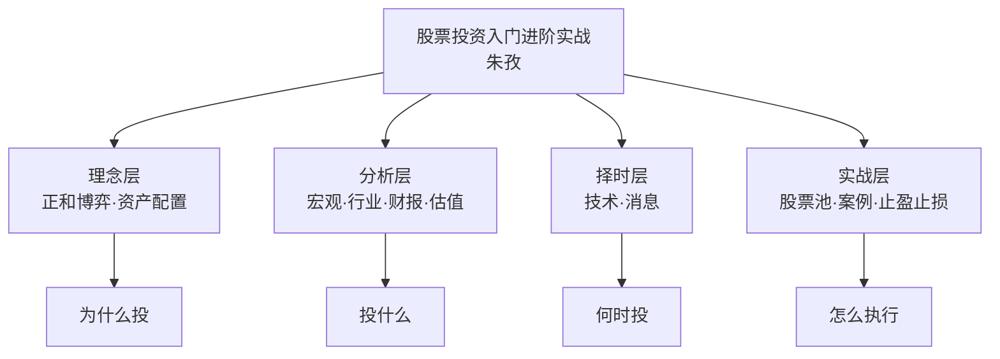
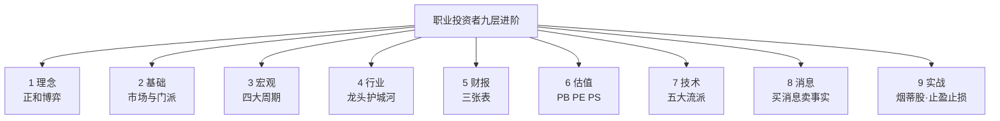

# 39《股票投资入门、进阶与实战》深度解读（详细版）

> **副题：朱孜——"从小白到职业投资者的完整路线图"：理念、基础、宏观、行业、财报、估值、技术、消息、实战九层进阶**
>
> 作者：朱孜，职业投资者。2012 年开始关注股市，2014 年 11 月拿出近三年工资入市——恰逢 2015"疯牛"前夜，随后经历股灾、2017 价值牛、2018 结构熊、2019 科技牛、2020 疫情牛，七年两轮完整牛熊，从"小白"成长为职业投资者。
>
> **核心定位**：本书是系列中**体系最完整的进阶教程**——038 教你"工具"，039 教你"体系"：从股市博弈的本质（正和 vs 负和），到宏观四大周期、行业龙头护城河、财报三表、四大估值法、技术五大流派、消息应对原则，最后落在中国国贸/美迪西/一心堂/泸州老窖等真实案例。
>
> **系列意义**：039 是系列第 39 本，A 股实战派第五站。本书把前 38 本的零散知识**串成了一条完整的职业投资者训练链**：理念（为何投）→ 基础（市场是什么）→ 宏观（大环境）→ 行业（选赛道）→ 财报（读公司）→ 估值（定价格）→ 技术（择时机）→ 消息（辨信号）→ 实战（完整闭环）。**读完 039，你就有了和职业投资者一样的分析框架。**

---

## 📖 全书结构与核心框架

### 全书结构总览表

| 部分 | 章节 | 核心内容 |
|------|------|---------|
| 理念篇 | 第1章 | 三重价值/正和 vs 负和/资产配置/新手五错 |
| 基础篇 | 第2章 | 市场概况/参与力量/门派/行话/打新 |
| 分析篇 | 第3—6章 | 宏观（GDP/PMI/CPI/周期）/行业（龙头/护城河）/财报（三表）/估值（PB/PE/PS/分位） |
| 择时篇 | 第7—8章 | 技术五大流派/MACD 背离/消息应对 |
| 实战篇 | 第9章 | 股票池/组合/四大案例/止盈止损体系 |

---

## 📑 目录

- [[#第1章 自序：股票投资的三重价值|第1章 自序：股票投资的三重价值]]
- [[#第2章 理念篇：正和博弈与资产配置|第2章 理念篇：正和博弈与资产配置]]
- [[#第3章 新手股民常犯的五个错误|第3章 新手股民常犯的五个错误]]
- [[#第4章 基础篇：市场、力量与门派|第4章 基础篇：市场、力量与门派]]
- [[#第5章 宏观经济：四大周期与股市|第5章 宏观经济：四大周期与股市]]
- [[#第6章 行业分析：赛道、龙头与护城河|第6章 行业分析：赛道、龙头与护城河]]
- [[#第7章 财报分析：三张表与康美药业教训|第7章 财报分析：三张表与康美药业教训]]
- [[#第8章 估值方法：PB、PE、PS 与分位估值|第8章 估值方法：PB、PE、PS 与分位估值]]
- [[#第9章 技术分析：五大流派与 MACD 背离|第9章 技术分析：五大流派与 MACD 背离]]
- [[#第10章 消息分析：利好利空的应对原则|第10章 消息分析：利好利空的应对原则]]
- [[#第11章 实战案例：中国国贸的烟蒂股之旅|第11章 实战案例：中国国贸的烟蒂股之旅]]
- [[#第12章 实战案例：美迪西、一心堂与止盈止损|第12章 实战案例：美迪西、一心堂与止盈止损]]
- [[#总结：职业投资者的九层进阶|总结：职业投资者的九层进阶]]
- [[#附录一 朱孜金句集（35 条精选）|附录一 朱孜金句集（35 条精选）]]
- [[#附录二 本书术语速查卡|附录二 本书术语速查卡]]
- [[#附录三 系列互链：039 在 39 本笔记中的位置|附录三 系列互链：039 在 39 本笔记中的位置]]
- [[#附录四 A 股应用：职业投资者训练计划|附录四 A 股应用：职业投资者训练计划]]
- [[#附录五 读完本书后的 10 个自问|附录五 读完本书后的 10 个自问]]
- [[#附录六 本书案例与数据速查|附录六 本书案例与数据速查]]
- [[#附录七 四大估值法速查表|附录七 四大估值法速查表]]
- [[#附录八 本书 FAQ 20 问|附录八 本书 FAQ 20 问]]
- [[#附录九 系列母题追踪（039 号更新）|附录九 系列母题追踪（039 号更新）]]
- [[#附录十 体系 vs 大师：039 与系列思想书对照|附录十 体系 vs 大师：039 与系列思想书对照]]
- [[#附录十一 30 秒版：入门进阶与实战|附录十一 30 秒版：入门进阶与实战]]
- [[#附录十二 朱孜投资理念 60 条|附录十二 朱孜投资理念 60 条]]
- [[#附录十三 经济周期 × 行业配置表|附录十三 经济周期 × 行业配置表]]
- [[#附录十四 系列 39 本总览（完成进度）|附录十四 系列 39 本总览（完成进度）]]
- [[#附录十五 同一市场，五种眼光（039 版）|附录十五 同一市场，五种眼光（039 版）]]
- [[#附录十六 中医视角：正和博弈如"正气存内"|附录十六 中医视角：正和博弈如"正气存内"]]
- [[#附录十七 中英对照：朱孜核心概念|附录十七 中英对照：朱孜核心概念]]
- [[#附录十八 思维训练：10 个进阶练习|附录十八 思维训练：10 个进阶练习]]
- [[#附录十九 止盈止损检查清单|附录十九 止盈止损检查清单]]
- [[#附录二十 写给想成为职业投资者的人（知乎文风附录）|附录二十 写给想成为职业投资者的人（知乎文风附录）]]

---

## 第1章 自序：股票投资的三重价值

### 1.1 作者的经历：七年两轮牛熊

> "2014年11月，我拿出近三年的工资入市厮杀。那是2015年'疯牛'的前夜，当时也是在周围同事和朋友的影响下，闻到了'牛'味，并由此拉开炒股之路的序幕。"

**七年经历**：2014—2015 大牛市和股灾 → 2017"价值牛" → 2018"结构熊" → 2019"科技牛" → 2020 疫情牛熊——**不长的炒股生涯竟经历了两轮完整的牛熊周期。**

### 1.2 第一重价值：生财之术

**投资鄙视链**：

> "风险投资／私募股权投资→期货→股票→偏股型基金→偏债型基金→保险→存款"——潜在风险越往后越低，可能获得的收益也逐个降低。

**为什么普通人只能选股票**：

| 投资品种 | 问题 |
|---------|------|
| 风投/私募 | 门槛高，本金全无风险 |
| 期货 | 保证金/强平，对新手不友好 |
| 股票 | **低门槛+相对安全+收益可观** |
| 基金 | 可作为股票补充 |
| 保险 | 姓"保"，保障价值>投资价值 |
| 存款 | 跑不赢通胀（北京买房需 30 年） |

**原油宝的教训（2020.4）**：

> "4月21日凌晨，我们见证了历史——WTI原油5月期货合约首次出现负值结算价-37.63美元／桶！……如果按照中行原油宝4月20日22时停止客户交易时的11.7美元报价抄底，第二天不仅保证金赔完，还要倒欠银行三倍的保证金！"

> "一个没杠杆的期货产品都能让投资者一夜间倾家荡产，更何况大多数期货本身都是带着杠杆的。"

**建行十年 vs 定期存款**：买入建行股坚定持有十年（分红再投入），收益远超存银行——"买银行股比存钱在银行划算得多得多！"

**招行案例（2004—2019）**：2004 年初花 10 万元买入上市一年半的招行（10.88 元），此后长持不动，每年分红"无脑"再买入，配股日卖出配股所需金额——**截至 2019.7.12 持有 38,712 股，市值 137 万，年化收益率 18.4%。**

**股票 vs 房产**：2010—2019 北京西城房价涨幅 vs 格力电器股价——**优秀股票长期持有毫不逊色。** 为什么人们觉得房产收益更稳定？

> "这是因为房价短期波动相对较小，投资额也相对较大，不容易做短线交易；而股价短期波动较大，投资者总想高抛低吸赚更多钱，结果往往是一通追涨杀跌后，收益反倒不如长持。"

### 1.3 第二、三重价值

| 价值 | 内容 |
|------|------|
| 生财之术 | 赚钱（第一层） |
| 事业之道 | 从"炒股"到"投资事业" |
| 人生之悟 | 认识自己/理解人性/修炼心性 |

---

## 第2章 理念篇：正和博弈与资产配置

### 2.1 股市并非零和博弈（本书最重要的理念）

**流行的偏见**：

> "股票市场是零和游戏，散户的钱都被机构、庄家和游资给赚了……总之就是想告诉你股市和赌场无异：一个人的盈利必然建立在另一个人的亏损之上。"

**真相一：短线交易是"负和"游戏**：

| 成本 | 数据 |
|------|------|
| 印花税 | 2020 年全国证券交易印花税 **1,774 亿元** |
| 券商经纪收入 | 40 家上市券商 **1,140.34 亿元** |
| 结论 | **短线交易连零和都算不上，是标准"负和"游戏** |

> "随着交易次数的增多，买卖双方都可能沦为输家，稳赚不赔的只有税收部门、交易所和券商……也是股谚'七亏二平一赚'的根本原因。"

**真相二：长线投资能实现共赢**：

| 参与者 | 获益方式 |
|--------|---------|
| 国家 | 资源配置/经济发动机/利用外资（MSCI 纳入） |
| 企业 | IPO 直接融资成本低/提高治理水平（老八股→近 4000 家） |
| 股民 | **股票代表的权益随时间增长** |

**包子铺的故事（正和博弈的证明）**：

> "小猪开的包子铺准备上市，以每股10元的价格首次公开发售10股股票，小龙购得其中1股……小龙以15元卖给小马；小马以8元卖给小牛；小牛以20元卖给小兔。"

小龙+5、小马−7、小牛+12、小兔付 20——**持股人以外的总收益 = 当前持股价与发行价价差。** 但故事还没完：

> "在发行股票的前一刻，小猪包子铺共有净资产100元。包子铺成功融资后获得了更快的发展。多年后，在小兔持有股票时，小猪包子铺净资产已经达到10000元，而1股股票是公司股份的10%，也就是价值1000元。"

> "股市零和博弈论者犯的是类似刻舟求剑的机械主义错误，他们将股票视为静态的商品，却忽视了股票背后企业的生命力，也就是股票代表的权益会随时间而变化。"

**烤肉店的故事（市值的本质）**：上市时全部资产定价=总市值；之后市值随市场定价变动——**"万亿市值蒸发"不是钱消失了，而是市场对企业定价的变化。**

### 2.2 稳健致富需树立资产配置理念

| 原则 | 内容 |
|------|------|
| 分散 | 股票+基金+存款+保险 |
| 比例 | 按年龄/风险承受力 |
| 复利 | 时间是最大的杠杆 |
| 不要满仓 | 极少满仓，绝不杠杆 |

### 2.3 股票组合投资的必要性

| 理由 | 内容 |
|------|------|
| 分散风险 | 单一股票黑天鹅 |
| 平滑波动 | 组合降低回撤 |
| 提高胜率 | 多标的覆盖 |
| 容错 | 单只判断错误可承受 |

### 2.4 多数股票或许只适合投机

> "多数股票或许只适合投机"——真正值得长期持有的好公司是少数，大部分股票只适合波段/趋势投机。

### 2.5 好股长持，静待花开

> "买入大家认为一年到头也涨不了一点的国有银行股（建行股）并坚定持有十年（分红再投入），收益曲线……买银行股比存钱在银行划算得多得多！"

---

## 第3章 新手股民常犯的五个错误

### 3.1 错误一：毫无准备，仓促上阵

> "很多人以百万级资金买入ST股博'摘星'，一问却连'ST'是什么意思都不懂。股市如战场，钱都是辛苦挣来的，不做足功课就仓促入市或盲目买入不熟悉的标的，好比不带武器就上战场。"

**正确做法**：

| 建议 | 内容 |
|------|------|
| 资金 | 工薪族不超过三年年薪 |
| 标的 | 蓝筹白马起步，熟悉后再碰成长小盘 |
| 敬畏 | 科创板/新三板多远观，美股港股期货回避 |
| 共识 | 与家人取得共识再入市 |

### 3.2 错误二：眼高手低，执迷"快速致富"

**顶级大师的年化收益**：

| 大师 | 年化 |
|------|------|
| 西蒙斯（对冲之王） | 35% |
| 巴菲特 | 20% |
| 索罗斯 | 20% |

> "作为普通投资者……建议先以'不亏钱'为第一目标……在绝对数字上，争取达成每年10%～15%的收益率，已经能战胜80%以上的股民。"

> "市面上各种短线打板和龙头战法等'快速致富秘籍'基本上都是忽悠散户之物，短线模式容错率比长线更低，犯错概率比长线更大。"

### 3.3 错误三：勇武有余，谋略不足

> "有的人喜欢抄底，刚一大跌就心急火燎满仓抄底。结果发现'底'只是一楼，一楼下面还有地下室，有时地下室可能有十八层！有的人喜欢追高，一有什么突发利好，一见拉涨就要跟风追进去打板，多数时候都沦为接盘者。"

**朱孜的资金管理观**：

> "一贯坚持'极少满仓，绝不杠杆'这种看起来不够刺激的资金管理观保护我在2015年股灾中没受太大伤害。在操作手法上，更建议的是在确定看好某个标的后分批建仓。"

### 3.4 错误四：瞻前顾后，犹豫不决

> "相信不少人都有过'一买就跌，一卖就飞'的难堪经历——刚买入的'牛股'突然转跌，隔日仓皇出逃后又容易拉涨，反而是迟迟舍不得出的股票一路阴跌，最后深套之后又不舍得止损。"

**应对方法**：

| 方法 | 内容 |
|------|------|
| 观念 | 不追求买最低卖最高（"能神奇逃顶抄底的永远只是传说"） |
| 分批 | 止盈止损都分批进行 |
| 依据 | 基本面+技术面结合（估值过高/顶背离/跌破支撑=卖） |

### 3.5 错误五：无视风险，盲从他人

> "新手股民喜欢跟风炒作，容易盲目崇拜和迷信他人。'他人'包括券商研报、大V股评和各种小道消息等。"

| 盲从对象 | 真相 |
|---------|------|
| 券商研报 | 轻易不发看空研报；"中性""增持"已隐含不看好 |
| 大V股评 | 公众号有"市值维护"文章（配合解禁出逃骗接盘） |
| 小道消息 | 大多数是主力放出的 |

---

## 第4章 基础篇：市场、力量与门派

### 4.1 中国证券市场概况

| 市场 | 定位 |
|------|------|
| 主板（沪/深） | 成熟大型企业 |
| 创业板 | 成长型创新企业 |
| 科创板 | 硬科技企业 |
| 北交所 | 中小企业 |
| 新三板 | 挂牌企业 |

### 4.2 股市博弈的主要参与力量

| 力量 | 特征 |
|------|------|
| 国家队 | 稳定市场/救市 |
| 公募基金 | 规模大/抱团 |
| 私募基金 | 灵活/策略多 |
| 游资 | 短线/打板 |
| 散户 | 数量多/资金散 |
| 上市公司 | 大股东/减持 |

### 4.3 股市江湖各大投资门派

| 门派 | 理念 | 代表 |
|------|------|------|
| 价值投资派 | 买便宜的好公司 | 巴菲特/格雷厄姆 |
| 成长投资派 | 买高成长公司 | 费雪/林奇 |
| 趋势投资派 | 顺势而为 | 利弗莫尔 |
| 量化投资派 | 数学模型 | 西蒙斯 |
| 事件驱动派 | 消息/事件 | 题材炒手 |

### 4.4 打新的注意事项

| 要点 | 内容 |
|------|------|
| 门槛 | 持有市值（沪/深分开计算） |
| 风险 | 破发（注册制后） |
| 策略 | 打新不炒新 |
| 注意 | 高价新股破发风险大 |

---

## 第5章 宏观经济：四大周期与股市

### 5.1 四大周期理论

| 周期 | 时长 | 别称 | 驱动因素 |
|------|------|------|---------|
| 基钦周期 | 约 5 年 | 存货周期 | 企业存货调整 |
| 朱格拉周期 | 约 10 年 | 设备更新周期 | 机器设备更新换代 |
| 库兹涅茨周期 | 15—20 年 | 房地产周期 | 房地产建设 |
| 康德拉季耶夫周期 | 约 50 年 | 技术革新周期 | 重大技术突破（蒸汽→电力→互联网） |

**周金涛与康波**：

> "前几年去世的中信建投前首席经济学家周金涛先生，便是运用并创新康波周期理论，对2007年次贷危机、2015年全球股市债市动荡做出了精准预判，并因此被投资界尊为'周期天王'。"

### 5.2 经济周期与股市的关系

**股市是经济的先行指标**：

> "股指本身就是经济的先行指标，市场往往会先于经济周期发生变动——经济处于底部开始复苏前，股市已经开始上涨，经济露出衰退迹象时，股市已经悄悄下跌了一段时间……我们经常说，炒股炒的不是'现在'，而是在炒对未来、对经济波动的预期。"

| 经济阶段 | 股市状态 | 操作 |
|---------|---------|------|
| 衰退期 | 股市已跌 | 保本为主，持现金 |
| 复苏期 | 股市先涨 | 进场 |
| 繁荣期 | 股市见顶 | 逐步收缩战线 |
| 萧条期 | 脱实入虚资金流入 | 警惕投机性上涨，及时锁盈 |

**第二层思维**：

> "当经济萧条时，政府为促进经济景气程度可能会扩大财政支出增加货币供给。但对于企业来说，由于产能过剩需求不足难有扩大生产的动力，在获得银行贷款后资金没有好的去向可能会'脱实入虚'……当这些钱流入股市，短期内股市的买卖和股价的上涨容易脱离企业的基本面，出现明显带投机性质的上涨。"

### 5.3 经济周期与行业的关系

| 经济阶段 | 受益行业 |
|---------|---------|
| 萧条期 | 金融（对复苏反应最早的板块，市场拐点标志） |
| 复苏初期 | 可选消费（汽车/电器/旅游） |
| 复苏前中期 | 信息技术/工业制造（消费电子启动最早） |
| 衰退期 | 公用事业/必选消费（抗跌） |

---

## 第6章 行业分析：赛道、龙头与护城河

### 6.1 行业分析的方法

| 方法 | 内容 |
|------|------|
| 行业生命周期 | 初创/成长/成熟/衰退 |
| 竞争格局 | 垄断/寡头/竞争 |
| 景气度 | 需求/供给/价格 |
| 政策 | 扶持/限制 |

### 6.2 马太效应：龙头恒强

> "2020年底，一面是'股王'茅台屡创新高，另一面却是1000多只个股创出了历史新低。这种强者恒强、赢者通吃的现象就是典型的马太效应。"

**伯克希尔的极致**：

> "伯克希尔股价在2021年5月就高到了纳斯达克系统无法承受（当时能处理的最大数字是429496.7295美元），需要升级改造系统的地步。"

### 6.3 行业龙头的四大优势

| 优势 | 内容 |
|------|------|
| 话语权/定价权 | 茅台引领白酒定价走向；海底捞重塑火锅服务标准 |
| 政策红利 | 政策制定阶段邀请龙头参与（招行/平安/兴业） |
| 整合期受益 | 行业增速趋缓后挤压式增长（龙头强，落后企业倒闭） |
| 注册制分化 | A 股将呈现美股港股式二八分化 |

### 6.4 如何挑选龙头

> "彼得·林奇在去企业调研时通常都会问，谁是企业最畏惧的竞争对手或者谁是同行中最优秀的竞争者。这其实就是林奇寻找行业龙头一种方法。"

| 行业 | 龙头（竞争力最强≠最大） |
|------|------------------------|
| 白酒 | 贵州茅台 |
| 调味品 | 海天味业 |
| 化工 | 万华化学 |
| 银行 | **招商银行**（非五大行） |
| 保险 | **中国平安**（非中国人寿） |

### 6.5 护城河四来源

| 护城河 | 内容 | 案例 |
|--------|------|------|
| 垄断 | 几乎无竞争者能进入 | 香港交易所（高估值因垄断） |
| 品牌 | 家喻户晓的品牌=高附加值 | 茅台（"最大价值就在'茅台'两个字上"） |
| 技术 | 质量控制/研发 | 品控优势 |
| 绝密配方 | 国家保密配方 | **云南白药/片仔癀（国家级绝密，永久保密）** |

**中药护城河体系（与中医主题呼应）**：

| 等级 | 数量 | 案例 |
|------|------|------|
| 国家级绝密（永久） | 2 个 | 云南白药/漳州片仔癀 |
| 国家级保密（长期） | 5 个 | 安宫牛黄丸/华佗再造丸/六神丸/麝香保心丸/龟龄集 |
| 中药保护品种 | 若干 | 一级 30/20/10 年，二级 7 年 |

---

## 第7章 财报分析：三张表与康美药业教训

### 7.1 财务报告的基本结构

| 报表 | 内容 | 通俗 |
|------|------|------|
| 资产负债表 | 资产/负债/净资产 | **家底** |
| 利润表 | 收入/成本/利润 | **成绩单** |
| 现金流量表 | 经营/投资/筹资现金流 | **供血站** |

### 7.2 不可轻视的定性分析

| 定性维度 | 内容 |
|---------|------|
| 商业模式 | 怎么赚钱/可持续吗 |
| 管理层 | 诚信/能力/股权结构 |
| 行业地位 | 龙头/跟随者 |
| 公司治理 | 关联交易/质押 |

### 7.3 康美药业造假教训（300 亿货币资金造假）

**背景**：康美药业 300 亿元货币资金造假退市案。事发前（2012—2017）的蛛丝马迹：

**（一）有钱也不还**：

> "康美药业负债端长年存在大额有息借款，同时账面长年放着大额货币资金，宁可选择活期、定期或购买理财等低息方式，也不肯偿还利息更高的负债。"

**（二）其他疑点**：财务费用持续走高 vs 账面巨额现金的矛盾。

| 疑点 | 内容 |
|------|------|
| 有钱不还 | 账面巨额现金却借高息债 |
| 财务费用 | 每年支付越来越高的财务费用 |
| 审计 | 银行询证函是审计师最重要工作之一 |

---

## 第8章 估值方法：PB、PE、PS 与分位估值

### 8.1 估值方法分类

| 类型 | 方法 |
|------|------|
| 相对估值法 | PE（市盈率）/PB（市净率）/PS（市销率）/PEG |
| 绝对估值法 | 股利折现模型（DDM）/自由现金流折现（DCF/FCFF） |
| 市场情绪法 | 指数分位估值 |

### 8.2 市净率（PB）——果园的故事

**公式**：PB = 总市值 / 净资产 = 每股股价 / 每股净资产

**小猴果园案例**：

| 交易 | 价格 | PB | 含义 |
|------|------|-----|------|
| 小猴 80 万出资+20 万借款买 100 万果园 | 100 万转让 | 1.25 倍 | 溢价（含 20 万负债） |
| 小猪以 80 万（1 倍 PB）买入 | 80 万 | 1.0 倍 | 平价 |
| 果园荒废后 60 万卖给牛大叔 | 60 万 | **0.75 倍** | **资产质量恶化→折价** |

**PB 适用场景**：重资产行业（钢铁/煤炭/银行/地产）。

**康美案例的意义**：资产质量判断——"市净率越低代表风险越小吗？"不一定，要看资产质量。

### 8.3 市盈率（PE）——本质是静态投资回报周期

**公式**：PE = 总市值 / 净利润 = 每股股价 / 每股净利润

**果园续集（PE 的本质）**：

> "果园在牛大叔的精心呵护下，每年都可以带来20万元的收入……净利润能稳定保持在每年约5万元。问：基于上一轮收购价格60万元，果园当前市盈率是多少？答：60/5=12倍。问：这笔投资的回报期是多久？答案：60/5=12年。……**没错，市盈率的本质就是静态投资回报周期。**"

**三种市盈率口径**：

| 口径 | 公式 | 缺点 |
|------|------|------|
| 静态 | 市值/上一年度净利润 | 年报滞后一年多 |
| 动态 | 市值/预测净利润 | 预测可能过度乐观 |
| **滚动（TTM）** | 市值/最近四季度净利润 | **最精确，最常用** |

**收益率换算**：

> "购买收益率4%的理财，静态投资回报周期是25年，相当于购买了市盈率25倍的股票……购买了40倍市盈率的股票，相当于投资了每年收益率2.5%的项目。"

### 8.4 市销率（PS）

| 要点 | 内容 |
|------|------|
| 公式 | PS = 总市值 / 营业收入 |
| 适用 | 尚未盈利的成长股/互联网公司 |
| 注意 | 需结合毛利率（收入≠利润） |

### 8.5 指数分位估值法

**上证指数实例（2021.4.19）**：

| 指标 | 数值 |
|------|------|
| 指数点位 | 3,477.55 |
| PE（TTM） | 15.32 倍 |
| 分位点 | **73.44%**（高于十年中 73.44% 时间） |
| 危险值 | 15.75 |
| 机会值 | **11.07**（抄底性价比高） |

**使用要点**：

| 要点 | 内容 |
|------|------|
| 分位越小风险越低 | 但只是历史，不能预测未来 |
| 结合宏观 | 地产指数 PB 分位 1.2% 但受政策影响可能更低 |
| 指数≠个股 | 指数分位高也有好个股；指数低也有差个股 |
| 指数基金参考 | 买指数基金/行业基金时是好参考 |

### 8.6 绝对估值法

| 模型 | 内容 |
|------|------|
| 股利折现（DDM） | 未来股利贴现 |
| 自由现金流折现（DCF/FCFF） | 未来自由现金流贴现 |
| 特点 | 假设多/参数敏感/理论严谨 |
| 用途 | 长线价值投资 |

---

## 第9章 技术分析：五大流派与 MACD 背离

### 9.1 技术分析五大流派

| 流派 | 核心工具 |
|------|---------|
| K 线派 | 单根K线/组合 |
| 均线派 | 移动平均线系统 |
| 切线派 | 趋势线/支撑压力/管道 |
| 形态派 | 头肩/W底/M头 |
| 指标派 | MACD/KDJ/RSI/BOLL |

### 9.2 分时技术

| 要点 | 内容 |
|------|------|
| 分时图 | 当日走势图 |
| 均线 | 分时均价线（强弱分界） |
| 量能 | 分时量价配合 |

### 9.3 K 线与均线

**（与 038 呼应，039 侧重应用）**：K 线组合判断短期转折；均线系统判断趋势（多头排列/空头排列/金叉死叉）。

### 9.4 MACD 顶底背离（本书技术篇亮点）

| 背离类型 | 信号 | 含义 |
|---------|------|------|
| 顶背离 | 股价创新高，MACD 不创新高 | **上涨动能衰竭，见顶信号** |
| 底背离 | 股价创新低，MACD 不创新低 | 下跌动能衰竭，见底信号 |
| 连续背离 | 多次背离 | 信号更强烈 |

> "连续多次顶背离"——朱孜止盈止损体系中技术面变化的重要卖出信号之一。

---

## 第10章 消息分析：利好利空的应对原则

### 10.1 消息的分类

| 分类 | 内容 |
|------|------|
| 宏观消息 | 政策/数据 |
| 行业消息 | 政策/价格/竞争 |
| 公司消息 | 业绩/并购/减持/分红 |
| 市场消息 | 资金/情绪 |

### 10.2 各类消息对个股的影响

| 消息类型 | 影响 | 要点 |
|---------|------|------|
| 业绩披露 | 超预期涨/低于预期跌 | **净利润断层**（跳空缺口） |
| 再融资 | 摊薄/利好项目 | 看募投方向 |
| 现金分红 | 稳健信号 | 高分红=现金流好 |
| 高送转 | 短期炒作 | 数字游戏居多 |
| 并购重组 | 大幅波动 | 看资产质量 |
| 股权激励 | 中长期利好 | 绑定管理层利益 |
| 增持 | 大股东看好 | 积极信号 |
| 减持 | 大股东套现 | 警惕 |

### 10.3 应对利好利空的原则

> "买消息，卖事实"是消息派皆懂的股市俚语，意思是当诱使股价上涨的某个消息真实落地时股价会见顶回落，对基于此消息投机买入的短线筹码而言，此时便是抛出良机。"

| 原则 | 内容 |
|------|------|
| 买消息卖事实 | 消息落地=短线卖点 |
| 利好不涨=顶部 | 见光死 |
| 利空不跌=底部 | 利空出尽 |
| 系统性风险优先 | 出现实质性利空先避险 |
| 一字跌停 | 有逃生机会优先出局 |

---

## 第11章 实战案例：中国国贸的烟蒂股之旅

### 11.1 案例背景

> "国贸中心作为首都著名地标之一……坐落于中央商务区（CBD）最核心地段。但其背后的上市公司中国国贸，在A股中却是不折不扣的冷门股。"

**2020 年 6 月底**：疫情受损（店铺不开业/客流减少/租金下滑），股价在地板上——**烟蒂股**。朱孜发掘并坚定持有近一年，直到 2021 年 5 月大涨、机构大V猛吹后分批减仓。

### 11.2 基本面分析

| 维度 | 内容 |
|------|------|
| 优势：标的稀缺 | 110 万㎡综合体+超核心地段，护城河深 |
| 优势：盈利稳定 | 十年毛利率/净利率/ROE 稳定上升 |
| 优势：现金流充裕 | 有息负债 20 多亿/货币资金近 20 亿/现金到期债务比 8193% |
| 优势：资产扎实 | 清算价值 200 亿+ |
| 优势：暴雷风险低 | 负债率 33.7%/商誉为零/大股东 3A 信用/质押为零 |
| 劣势：宏观影响 | 经济下行出租率租金双降 |
| 劣势：行业变革 | 城市去中心化/共享办公 |
| 劣势：成长性弱 | 无新开发计划，增长靠出租率租金 |

**策略定位**：

> "该上市公司属于业绩稳定、现金流充沛、风险较低的稳健型标的。但由于成长性不足，很难通过未来业绩的增长消化估值。所以在制订作战计划时，确定以'捡烟蒂'投资策略为主……**这种策略赚的主要是估值修复的钱，由于目标企业业绩增长空间有限，天花板非常明显，要懂得知足和落袋为安。**"

### 11.3 估值确定建仓价格

**PE 维度**：历史五年 PE 中枢 13—27 倍，下限 13 倍。2019 年 EPS 0.97 元 → **底部区域 0.97×13=12.61 元**

**PB 维度**：历史五年 PB 中枢 1.464—3.17 倍，下限 1.464 倍。2019 年 BPS 7.52 元 → **底部区域 7.52×1.464=11.01 元**

**综合建仓区**：**11—12.6 元**（相对估值）；FCFF 绝对估值交叉验证。

### 11.4 卖出逻辑

> "为什么又选择在人声鼎沸，各路资金纷至沓来的时候转身离开？"——**估值修复完成+人声鼎沸（顶部六特征）+知足落袋。**

### 11.5 案例启示

| 启示 | 内容 |
|------|------|
| 烟蒂股逻辑 | 赚估值修复的钱，不赚成长的钱 |
| 估值锚定 | 用 PE/PB 历史中枢下限定买点 |
| 交叉验证 | 相对+绝对估值结合 |
| 落袋为安 | 修复到位就走，不贪 |

---

## 第12章 实战案例：美迪西、一心堂与止盈止损

### 12.1 美迪西案例：基于业绩超预期的买入

| 要素 | 内容 |
|------|------|
| 逻辑 | 业绩超预期（净利润断层） |
| 信号 | 季报超预期→跳空高开缺口 |
| 要点 | 结合行业景气（CXO）+公司订单 |

### 12.2 一心堂案例：基于事件超预期的买入

| 要素 | 内容 |
|------|------|
| 逻辑 | 事件驱动（政策/行业事件） |
| 信号 | 事件落地+基本面配合 |
| 要点 | 区分真事件/假炒作 |

### 12.3 止盈止损的六种触发条件

**（一）基本面变化**：管理团队变故/行业地位受挑战/商业模式不适应/进入衰退期——**无论盈亏都该卖**。

**（二）估值变化**：PE/PB 超越历史合理区域过多/ PEG 过大/由盈转亏。

**（三）消息面变化**：买消息卖事实/系统性风险/实质性利空。

**（四）技术面变化**：强烈回调 K 线/ M 顶头肩顶/跌破重要均线趋势线/连续多次顶背离/底部再创新低。

**（五）目标价**：10% 或 20% 比例止盈止损——"简则简矣，难免有过于简单粗暴之嫌"。

**（六）更好机会出现**：

> "当在成长性和低估性二者间难以判断性价比高低时，应优先考虑成长性。比如25倍市盈率的消费行业（比如白酒四龙头）和8倍市盈率的传统行业（比如水泥），虽然后者的估值明显低于前者，而且基本面不错业绩也相对稳定，请毫不犹豫地选择前者。"

### 12.4 泸州老窖案例（止盈实战）

**背景**：白酒"长牛型"股票。2020.3.19 低点 64.07 元（疫情）→ 2021.2.18 高点 327.66 元，**涨幅超 500%**。

**两个关键跳空缺口**：

| 缺口 | 时间 | 原因 |
|------|------|------|
| 缺口一（消息面） | 2020.7.1 | 西南大区暂停接单+股东大会动销良好→两天涨近 18% |
| 缺口二（净利润断层） | 2020.10.28 | 三季报扣非净利同比 +48.53% 超预期→次日高开 |

**止盈启示**：缺口=市场情绪爆发点；连续跳空后风险积聚——结合估值（白酒高估值）+技术（顶背离）分批止盈。

### 12.5 家家悦案例（止损实战）

| 要素 | 内容 |
|------|------|
| 背景 | 基本面/估值/技术变化共振 |
| 信号 | 跌破关键支撑+业绩不及预期 |
| 教训 | **买入逻辑被破坏就离场，不纠结成本** |

---

## 总结：职业投资者的九层进阶

### Z1. 朱孜体系全景

### Z2. 全书的五根柱子

| 柱子 | 核心内容 | 章节 |
|------|---------|------|
| 理念 | 正和博弈/长线投资 | 第2章 |
| 分析 | 宏观+行业+财报 | 第5—7章 |
| 估值 | PE/PB/PS/分位 | 第8章 |
| 择时 | 技术+消息 | 第9—10章 |
| 实战 | 烟蒂股+止盈止损 | 第11—12章 |

### Z3. 朱孜留给读者的三句话

> 1. "股市零和博弈论者犯的是类似刻舟求剑的机械主义错误——股票代表的权益会随时间而变化。"
> 2. "先以'不亏钱'为第一目标，每年 10%—15% 已能战胜 80% 以上的股民。"
> 3. "当在成长性和低估性二者间难以判断性价比高低时，应优先考虑成长性。"

### Z4. 本书与系列的关系

| 维度 | 038 马涛 | **039 朱孜** | 035 邱国鹭 |
|------|---------|-------------|-----------|
| 定位 | 工具层 | **体系层** | 理念层 |
| 内容 | K线/开户 | **九层进阶体系** | 三要素 |
| 读者 | 零基础 | 有基础想进阶 | 有经验 |
| 特色 | 实操步骤 | **完整训练链** | 实战心法 |

---

## 附录一 朱孜金句集（35 条精选）

> 1. "股票投资的第一要义，是赚钱。"——自序
> 2. "一个没杠杆的期货产品都能让投资者一夜间倾家荡产。"——自序（原油宝）
> 3. "买银行股比存钱在银行划算得多得多！"——自序
> 4. "一通追涨杀跌后，收益反倒不如长持。"——自序
> 5. "股市零和博弈论者犯的是类似刻舟求剑的机械主义错误。"——理念
> 6. "短线交易是标准的'负和'游戏——稳赚不赔的只有税收部门、交易所和券商。"——理念
> 7. "七亏二平一赚。"——理念
> 8. "股票代表的权益会随时间而变化。"——理念
> 9. "炒股炒的不是'现在'，而是在炒对未来、对经济波动的预期。"——宏观
> 10. "股指本身就是经济的先行指标。"——宏观
> 11. "衰退期要以保本为主，多持有现金。"——宏观
> 12. "经济整体糟糕时，不必人云亦云，过于悲观。"——宏观
> 13. "金融板块的上涨，往往成为市场出现拐点的标志。"——宏观
> 14. "强者恒强、赢者通吃是典型的马太效应。"——行业
> 15. "行业龙头通常是行业内综合竞争力最强的那家企业，而不是仅仅看市值。"——行业
> 16. "垄断是最强大的护城河。"——行业
> 17. "对于茅台而言，它最大的价值就是在'茅台'这两个字上。"——行业
> 18. "市盈率的本质就是静态投资回报周期。"——估值
> 19. "购买了40倍市盈率的股票，相当于投资了每年收益率2.5%的项目。"——估值
> 20. "分位值体现的只是历史，并不能用于预测未来。"——估值
> 21. "机会值是11.07，也就是跌到这个位置时，'抄底'的性价比可能更高。"——估值
> 22. "银行询证函是审计师最为重要的工作内容之一。"——财报（康美）
> 23. "买消息，卖事实。"——消息
> 24. "利多兑现之日，就是见光死之时。"——消息（化用）
> 25. "不做足功课就仓促入市，好比不带武器就上战场。"——新手五错
> 26. "能神奇逃顶抄底的永远只是传说。"——新手五错
> 27. "底只是一楼，一楼下面还有地下室，有时地下室可能有十八层！"——新手五错
> 28. "极少满仓，绝不杠杆。"——资金管理
> 29. "每年10%～15%的收益率，已经能战胜80%以上的股民。"——目标
> 30. "不追求买在最低点和卖在最高点。"——心态
> 31. "会买的是徒弟，会卖的才是师傅。"——止盈止损
> 32. "当在成长性和低估性二者间难以判断性价比高低时，应优先考虑成长性。"——换仓
> 33. "赚的主要是估值修复的钱……要懂得知足和落袋为安。"——烟蒂股
> 34. "选择优质股长持，静待花开。"——理念
> 35. "先以'不亏钱'为第一目标。"——理念

---

## 附录二 本书术语速查卡

| 术语 | 定义 | 出处 |
|------|------|------|
| 负和博弈 | 交易成本使双方都输 | 第2章 |
| 正和博弈 | 企业成长使多方共赢 | 第2章 |
| 马太效应 | 强者恒强 | 第6章 |
| 护城河 | 垄断/品牌/技术/配方 | 第6章 |
| 基钦周期 | 约 5 年存货周期 | 第5章 |
| 朱格拉周期 | 约 10 年设备周期 | 第5章 |
| 库兹涅茨周期 | 15—20 年房地产周期 | 第5章 |
| 康波周期 | 约 50 年技术周期 | 第5章 |
| PB | 市净率=股价/每股净资产 | 第8章 |
| PE | 市盈率=股价/每股净利润 | 第8章 |
| TTM | 滚动市盈率（最近四季） | 第8章 |
| PS | 市销率=市值/营收 | 第8章 |
| 分位值 | 当前估值的历史百分位 | 第8章 |
| 顶背离 | 股价新高 MACD 不新高 | 第9章 |
| 净利润断层 | 业绩超预期跳空缺口 | 第10章 |
| 见光死 | 利好兑现=出货 | 第10章 |
| 烟蒂股 | 明显低估的冷门股 | 第11章 |

---

## 附录三 系列互链：039 在 39 本笔记中的位置

### 039 与系列笔记的链接网络

| 系列笔记 | 链接点 |
|---------|--------|
| [[38《从零开始学炒股》深度解读（详细版）|38 号]] | 工具层→体系层（K线→九层进阶） |
| [[35《投资中最简单的事》深度解读（详细版）|35 号]] | 邱国鹭三要素×039 九层体系（估值=PE/PB/品质=护城河/时机=技术消息） |
| [[28《聪明的投资者》深度解读（详细版）|28 号]] | 格雷厄姆安全边际×039 分位估值/烟蒂股 |
| [[13《巴菲特的护城河》深度解读（详细版）|13 号]] | 护城河四源×039 垄断/品牌/技术/配方 |
| [[06《巴菲特教你读财报》深度解读（详细版）|06 号]] | 三张表×039 财报分析 |
| [[12《巴菲特的估值逻辑》深度解读（详细版）|12 号]] | 估值方法×039 PE/PB/绝对估值 |
| [[27《超级强势股》深度解读（详细版）|27 号]] | 小费雪 PSR×039 PS 估值 |
| [[36《炒股的智慧》深度解读（详细版）|36 号]] | 陈江挺止损×039 止盈止损六条件 |
| [[37《股票投资沉思录》深度解读（详细版）|37 号]] | 冉伟概率×039 分位估值（概率的历史化） |
| [[32《彼得·林奇的成功投资》深度解读（详细版）|32 号]] | 林奇问"最畏惧的竞争对手"×039 挑龙头 |
| [[34《彼得·林奇战胜华尔街》深度解读（详细版）|34 号]] | 林奇 6 个月检查×039 止盈止损体系 |

### 039 在系列中的定位

| 维度 | 定位 |
|------|------|
| 流派 | A 股实战派·体系层 |
| 特色 | 全系列最完整的"职业投资者训练链" |
| 价值 | 把前 38 本零散知识串成完整框架 |

---

## 附录四 A 股应用：职业投资者训练计划

### 4.1 九层进阶时间表

| 阶段 | 时间 | 内容 |
|------|------|------|
| 理念筑基 | 第1月 | 正和博弈/资产配置/新手五错 |
| 基础扫盲 | 第2月 | 市场结构/门派/行话 |
| 宏观框架 | 第3月 | 四大周期/GDP/PMI/CPI |
| 行业研究 | 第4月 | 行业方法/龙头/护城河 |
| 财报训练 | 第5月 | 三张表+康美式排雷 |
| 估值实战 | 第6月 | PE/PB/PS/分位+个股估值练习 |
| 技术进阶 | 第7月 | 五大流派+MACD 背离 |
| 消息解读 | 第8月 | 业绩/并购/减持应对 |
| 实战闭环 | 第9月起 | 股票池+组合+止盈止损纪律 |

### 4.2 每月检视清单

| 检视项 | 内容 |
|--------|------|
| 宏观 | 经济周期阶段/政策方向 |
| 行业 | 持仓行业景气度 |
| 财报 | 季报/半年报排雷 |
| 估值 | 个股分位/指数分位 |
| 消息 | 减持/增持/业绩预告 |
| 纪律 | 止盈止损执行情况 |

---

## 附录五 读完本书后的 10 个自问

1. 我相信股市是正和博弈吗？（还是认为只是零和赌场？）
2. 我的投资目标是多少？（合理吗？10%—15% 已战胜 80% 股民）
3. 我"极少满仓，绝不杠杆"吗？
4. 我能说出四大周期及其时长吗？
5. 我知道"股市是经济的先行指标"意味着什么吗？
6. 我能识别行业的龙头吗？（竞争力最强≠最大）
7. 我理解 PE 的本质（静态回报周期）吗？
8. 我会用指数分位判断市场位置吗？
9. 我知道止盈止损的六种触发条件吗？
10. 我懂得"买消息，卖事实"吗？

---

## 附录六 本书案例与数据速查

### 核心数据

| 数字 | 含义 |
|------|------|
| 7 年 | 朱孜从新手到职业投资者 |
| 2 轮 | 完整牛熊周期 |
| -37.63 美元 | WTI 原油负值结算价（原油宝） |
| 1,774 亿元 | 2020 年印花税 |
| 1,140 亿元 | 券商经纪收入 |
| 18.4% | 招行十年年化（10 万→137 万） |
| 35%/20%/20% | 西蒙斯/巴菲特/索罗斯年化 |
| 10%—15% | 普通投资者合理目标 |
| 5/10/15-20/50 年 | 四大周期时长 |
| 1.25/1.0/0.75 倍 | 果园故事 PB 变化 |
| 12 倍 | 果园 PE（回报周期 12 年） |
| 15.32/73.44% | 上证 PE TTM/分位（2021.4） |
| 15.75/11.07 | 上证危险值/机会值 |
| 13—27 倍 | 中国国贸 PE 中枢 |
| 11.01—12.61 元 | 中国国贸建仓区 |
| 500%+ | 泸州老窖 2020.3—2021.2 涨幅 |
| 48.53% | 泸州老窖三季报扣非增速 |
| 429496.7295 美元 | 纳斯达克系统极限（伯克希尔） |

### 案例速查表

| 案例 | 类型 | 启示 |
|------|------|------|
| 原油宝 | 风险 | 无杠杆也能倾家荡产 |
| 建行/招行 | 长持 | 分红再投资+时间 |
| 格力 vs 北京房价 | 对比 | 好股不逊房产 |
| 包子铺/烤肉店 | 寓言 | 正和博弈/市值本质 |
| 康美药业 | 排雷 | 有钱不还=造假嫌疑 |
| 中国国贸 | 烟蒂股 | 估值修复的钱 |
| 泸州老窖 | 止盈 | 缺口+估值+背离 |
| 家家悦 | 止损 | 逻辑破坏就离场 |
| 美迪西 | 业绩超预期 | 净利润断层 |
| 一心堂 | 事件驱动 | 真事件/假炒作 |
| 伯克希尔 | 龙头 | 马太效应极致 |
| 云南白药/片仔癀 | 护城河 | 国家绝密配方 |

---

## 附录七 四大估值法速查表

| 方法 | 公式 | 本质 | 适用 | 注意 |
|------|------|------|------|------|
| PB | 股价/每股净资产 | 资产溢价 | 银行/地产/重资产 | 资产质量决定 |
| PE | 股价/每股净利润 | 静态回报周期 | 盈利稳定公司 | 用 TTM 最准 |
| PS | 市值/营业收入 | 收入溢价 | 未盈利成长股 | 结合毛利率 |
| 分位 | 当前值/历史百分位 | 历史性价比 | 指数/行业/个股 | 结合宏观 |

**PE 收益率换算速查**：

| PE | 对应收益率 |
|----|-----------|
| 10 倍 | 10% |
| 12.5 倍 | 8%（信托） |
| 20 倍 | 5% |
| 25 倍 | 4%（理财） |
| 40 倍 | 2.5% |
| 50 倍 | 2% |

---

## 附录八 本书 FAQ 20 问

**Q1：股市是零和博弈吗？**
A：短线是负和（税费），长线是正和（企业成长）——包子铺故事。

**Q2：普通投资者年化目标多少合理？**
A：10%—15% 已战胜 80% 股民；巴菲特才 20%。

**Q3：为什么散户总亏钱？**
A：新手五错：毫无准备/眼高手低/满仓杠杆/犹豫不决/盲从他人。

**Q4：可以满仓吗？**
A："极少满仓，绝不杠杆"——分批建仓更稳。

**Q5：什么是四大周期？**
A：基钦 5 年/朱格拉 10 年/库兹涅茨 15-20 年/康波 50 年。

**Q6：股市和经济什么关系？**
A：股市是先行指标——复苏前先涨，衰退前先跌。

**Q7：萧条期买什么？**
A：金融板块（对复苏反应最早，市场拐点标志）。

**Q8：怎么挑龙头？**
A：竞争力最强≠最大——招行/平安；林奇问法"谁是你最畏惧的竞争对手"。

**Q9：护城河有哪些？**
A：垄断（港交所）/品牌（茅台）/技术/绝密配方（云南白药片仔癀）。

**Q10：PE 的本质是什么？**
A：静态投资回报周期——12 倍 PE=12 年回本。

**Q11：PE 三种口径选哪个？**
A：滚动市盈率 TTM 最精确最常用。

**Q12：怎么看大盘贵不贵？**
A：指数分位值——危险值/机会值（上证 15.75/11.07）。

**Q13：怎么发现财务造假？**
A：康美式"有钱不还"——账面巨额现金却借高息债。

**Q14：什么是净利润断层？**
A：业绩超预期跳空高开缺口（泸州老窖 +48.53%）。

**Q15：怎么应对利好消息？**
A：买消息卖事实——消息落地=短线卖点。

**Q16：什么是烟蒂股策略？**
A：买明显低估的冷门股，赚估值修复的钱，知足落袋。

**Q17：止盈止损有哪些触发条件？**
A：六种：基本面/估值/消息/技术/目标价/更好机会。

**Q18：换仓时成长性和低估性选哪个？**
A：优先成长性——25 倍白酒 vs 8 倍水泥选白酒。

**Q19：这本书和 038 什么关系？**
A：038 教工具，039 教体系——先工具后体系。

**Q20：读完最重要的收获？**
A：股市是正和博弈，长线+组合+纪律是普通人致富正道。

---

## 附录九 系列母题追踪（039 号更新）

### 9.1 "估值"主题的系列对照

| 笔记 | 估值视角 |
|------|---------|
| 28 格雷厄姆 | 安全边际 |
| 12 巴菲特 | 估值逻辑案例 |
| 035 邱国鹭 | 便宜是硬道理 |
| 027 小费雪 | PSR |
| **039 朱孜** | **PB/PE/PS/分位四法+本质** |

### 9.2 "护城河"主题的系列对照

| 笔记 | 护城河视角 |
|------|-----------|
| 13 巴菲特 | 晨星四源 |
| 035 邱国鹭 | 定价权 |
| **039 朱孜** | **垄断/品牌/技术/配方+中药绝密配方** |

### 9.3 "周期"主题的系列对照

| 笔记 | 周期视角 |
|------|---------|
| 04 达利欧 | 债务周期 |
| 037 冉伟 | 四种周期（政策/市场/经济/盈利） |
| **039 朱孜** | **四大周期理论+行业轮动** |

---

## 附录十 体系 vs 大师：039 与系列思想书对照

| 维度 | 大师书（05/22/32…） | 039 体系书 |
|------|---------------------|-----------|
| 内容 | 思想/案例 | 完整训练链 |
| 框架 | 大师个人体系 | 九层通用框架 |
| 案例 | 大师实战 | 作者实战（中国国贸等） |
| 适合 | 有基础悟道 | 从零到职业 |
| 关系 | 楼 | 脚手架 |

**正确用法**：039 给你"职业投资者的完整地图"，大师书给你"每个房间的深度"——**先有地图（039），再钻房间（大师书）。**

---

## 附录十一 30 秒版：入门进阶与实战

> **入门进阶与实战（30 秒版）**：
>
> 1. **理念**——股市是正和博弈，短线是负和（税费吃掉利润）；
> 2. **目标**——不亏钱第一，年化 10%—15% 已战胜 80% 股民；
> 3. **宏观**——股市是先行指标；四大周期（5/10/15-20/50 年）；
> 4. **行业**——龙头恒强（马太效应）；护城河：垄断/品牌/技术/配方；
> 5. **财报**——三张表：家底/成绩单/供血站；康美式"有钱不还"=雷；
> 6. **估值**——PB 看资产/PE 看回本周期（TTM 最准）/分位看历史位置；
> 7. **技术**——五大流派；MACD 顶背离=卖出信号；
> 8. **消息**——买消息卖事实；见光死；利好不涨=顶部；
> 9. **实战**——烟蒂股赚修复钱；止盈止损六条件；极少满仓绝不杠杆。

---

## 附录十二 朱孜投资理念 60 条

**理念（1—15）**：

> 1. 炒股第一要义是赚钱。
> 2. 股市不是零和博弈。
> 3. 短线是负和游戏。
> 4. 长线是正和博弈。
> 5. 股票权益随时间增长。
> 6. 资产配置理念。
> 7. 组合投资必要。
> 8. 多数股票只适合投机。
> 9. 好股长持静待花开。
> 10. 分红再投资是复利。
> 11. 极少满仓绝不杠杆。
> 12. 分批建仓。
> 13. 不亏钱是第一目标。
> 14. 年化 10—15% 已优秀。
> 15. 复利是最大杠杆。

**新手教训（16—25）**：

> 16. 毫无准备仓促上阵=不带武器上战场。
> 17. 资金不超三年年薪。
> 18. 蓝筹起步。
> 19. 眼高手低要不得。
> 20. 快速致富秘籍都是忽悠。
> 21. 满仓抄底=地下室十八层。
> 22. 追高打板=接盘。
> 23. 不追求买最低卖最高。
> 24. 止盈止损分批做。
> 25. 不盲从研报大V。

**宏观（26—35）**：

> 26. 股市是先行指标。
> 27. 炒的是预期不是现在。
> 28. 衰退期保本持现金。
> 29. 繁荣期收缩战线。
> 30. 第二层思维。
> 31. 萧条期金融先行。
> 32. 复苏初期可选消费。
> 33. 复苏中期信息技术。
> 34. 衰退期公用事业抗跌。
> 35. 脱实入虚=投机行情。

**行业（36—45）**：

> 36. 马太效应强者恒强。
> 37. 龙头有话语权定价权。
> 38. 龙头享受政策红利。
> 39. 整合期龙头最受益。
> 40. 注册制二八分化。
> 41. 龙头=竞争力最强非最大。
> 42. 垄断是最强护城河。
> 43. 品牌是无形资产。
> 44. 绝密配方=中药茅台。
> 45. 林奇问法挑龙头。

**估值技术（46—60）**：

> 46. PB 看资产质量。
> 47. PE 本质=回本周期。
> 48. TTM 最精确。
> 49. 40 倍 PE=2.5% 收益。
> 50. 分位值看历史位置。
> 51. 机会值=抄底性价比。
> 52. 康美式有钱不还=雷。
> 53. 顶背离=动能衰竭。
> 54. 买消息卖事实。
> 55. 见光死。
> 56. 净利润断层。
> 57. 烟蒂股赚修复钱。
> 58. 止盈止损六条件。
> 59. 换仓优先成长性。
> 60. 知足落袋为安。

---

## 附录十三 经济周期 × 行业配置表

| 周期阶段 | 领先行业 | 逻辑 | 代表板块 |
|---------|---------|------|---------|
| 萧条期 | 金融 | 信贷需求先增 | 银行/券商 |
| 复苏初期 | 可选消费 | 购买力恢复 | 汽车/家电/旅游 |
| 复苏前中期 | 信息技术 | 消费电子启动 | 半导体/消费电子 |
| 复苏中后期 | 工业制造 | 设备更新 | 机械/化工 |
| 繁荣期 | 大宗商品 | 需求旺盛 | 周期股 |
| 衰退期 | 防御板块 | 抗跌 | 公用事业/必选消费 |

**投资口诀**：**萧条买金融，复苏买消费，繁荣买周期，衰退买公用。**

---

## 附录十四 系列 39 本总览（完成进度）

| 编号 | 书名 | 状态 |
|------|------|------|
| 01—03 | 利弗莫尔三部曲 | ✅ |
| 04 | 达利欧《原则》 | ✅ |
| 05—14 | 巴菲特系列 | ✅ |
| 16—21 | 巴菲特延伸系列 | ✅ |
| 22—25 | 芒格四书 | ✅ |
| 26—27 | 费雪父子 | ✅ |
| 28 | 格雷厄姆 | ✅ |
| 29—30 | 段永平双册 | ✅ |
| 31 | 索罗斯《金融炼金术》 | ✅ |
| 32—34 | 林奇三部曲 | ✅ |
| 035 | 邱国鹭《投资中最简单的事》 | ✅ |
| 036 | 陈江挺《炒股的智慧》 | ✅ |
| 037 | 冉伟《股票投资沉思录》 | ✅ |
| 038 | 马涛《从零开始学炒股》 | ✅ |
| **039** | **朱孜《股票投资入门、进阶与实战》** | **✅ 本笔记** |
| 040—169 | 更多 | 待解读 |

**系列进度：39/169 完成**

---

## 附录十五 同一市场，五种眼光（039 版）

以"2021 年 4 月（本书写作时点）"为例：

| 大师 | 眼光 | 2021.4 的动作 |
|------|------|--------------|
| 28 格雷厄姆 | 便宜 | 指数分位 73%——没那么便宜 |
| 035 邱国鹭 | 三要素 | 抱团高估区逆向 |
| 037 冉伟 | 四要素 | 估值+流动性+筹码体检 |
| 036 陈江挺 | 交易 | 等临界点 |
| **039 朱孜** | **体系** | **上证 PE 15.32 接近危险值 15.75；白酒高估值（茅台 60 倍）→止盈；寻找中国国贸式低估烟蒂股** |

**039 视角的独特价值**：**用完整的九层体系做"体检式"决策**——宏观（周期位置）+行业（龙头估值）+个股（分位/基本面）逐层过滤。

---

## 附录十六 中医视角：正和博弈如"正气存内"

### 16.1 正和博弈 = 正气存内

> "正气存内，邪不可干。"——《黄帝内经》

| 中医 | 投资 |
|------|------|
| 正气（身体抵抗力） | 企业生命力（盈利成长） |
| 邪气（外邪入侵） | 市场波动（股价涨跌） |
| 正气存内则邪不可干 | **企业持续盈利则股价终将反映价值** |
| 扶正 | 好股长持 |
| 祛邪 | 止盈止损 |

**朱孜的包子铺故事，就是投资的"正气论"**：企业价值（正气）在增长，短期价格波动（邪气）终将被正气战胜。

### 16.2 负和博弈 = 耗伤正气

| 中医 | 短线交易 |
|------|---------|
| 频繁消耗 | 频繁交易（税费损耗） |
| 久病耗气 | 长期负和=本金损耗 |
| 虚不受补 | 亏钱后急于回本=更亏 |

### 16.3 四大周期 = 四时更替

| 中医四时 | 经济周期 |
|---------|---------|
| 春生 | 复苏期（布局） |
| 夏长 | 繁荣期（持有） |
| 秋收 | 衰退期（收缩） |
| 冬藏 | 萧条期（现金为王） |

> "夫四时阴阳者，万物之根本也……春夏养阳，秋冬养阴。"——投资亦当顺应经济四时。

### 16.4 康美排雷 = 望闻问切

| 中医诊断 | 财报排雷 |
|---------|---------|
| 望 | 看资产负债结构 |
| 闻 | 听市场传闻 |
| 问 | 问现金流去向（有钱不还=疑） |
| 切 | 切财务指标（财务费用异常） |

---

## 附录十七 中英对照：朱孜核心概念

| 中文 | English | 说明 |
|------|---------|------|
| 正和博弈 | Positive-sum game | 长线共赢 |
| 负和博弈 | Negative-sum game | 短线损耗 |
| 马太效应 | Matthew effect | 强者恒强 |
| 护城河 | Moat | 竞争优势 |
| 基钦周期 | Kitchin cycle | 约 5 年 |
| 朱格拉周期 | Juglar cycle | 约 10 年 |
| 康波周期 | Kondratiev wave | 约 50 年 |
| 市净率 | P/B ratio | 股价/每股净资产 |
| 市盈率 | P/E ratio | 股价/每股净利润 |
| 市销率 | P/S ratio | 市值/营收 |
| 滚动市盈率 | PE (TTM) | 最近四季 |
| 分位值 | Percentile | 历史位置 |
| 净利润断层 | Earnings gap | 超预期跳空 |
| 烟蒂股 | Cigar butt stock | 低估冷门股 |
| 见光死 | Sell on news | 利好出货 |

---

## 附录十八 思维训练：10 个进阶练习

1. **正和思维**：用包子铺模型分析你持仓的一只股票（企业价值在增长吗？）
2. **目标设定**：写下你的年化目标，与 10%—15% 对照并解释差距
3. **周期定位**：判断当前处于四大周期的哪个阶段
4. **龙头识别**：在你熟悉的 5 个行业里各找出龙头（竞争力最强≠最大）
5. **护城河分析**：分析你持仓股票的护城河属于哪一类
6. **PE 换算**：把持仓股票的 PE 换算成收益率，与其他投资比较
7. **分位查询**：查当前上证指数/沪深300 的 PE 分位值
8. **排雷练习**：读三份年报，找出"有钱不还"式疑点
9. **止盈止损计划**：为每只持仓写出六条件触发计划
10. **烟蒂股搜索**：用低 PB+稳定现金流找一只中国国贸式标的

---

## 附录十九 止盈止损检查清单

### 基本面触发

- [ ] 管理团队重大变故？
- [ ] 行业地位受挑战？
- [ ] 商业模式不适应？
- [ ] 进入衰退期？

### 估值触发

- [ ] PE/PB 超历史合理区域？
- [ ] PEG 过大？
- [ ] 由盈转亏？

### 消息触发

- [ ] 利好落地（买消息卖事实）？
- [ ] 系统性风险？
- [ ] 实质性利空？

### 技术触发

- [ ] 强烈回调 K 线？
- [ ] M 顶/头肩顶？
- [ ] 跌破重要均线/趋势线？
- [ ] 连续多次顶背离？
- [ ] 底部再创新低？

### 目标与机会

- [ ] 目标价到达？（比例法）
- [ ] 更好机会出现？（优先成长性）

---

## 附录二十 写给想成为职业投资者的人（知乎文风附录）

### 写在前面：一个"韭菜"的七年

2014 年 11 月，朱孜拿出近三年的工资冲进了股市。那时是 2015"疯牛"的前夜——周围同事朋友都在谈论股票，"牛"味扑面而来。

此后的七年，他经历了：2014—2015 大牛市和随后的股灾、2017 的"价值牛"、2018 的"结构熊"、2019 的"科技牛"、2020 的疫情牛熊——**不长的炒股生涯，竟经历了两轮完整的牛熊周期。**

然后他写出了这本书，从"小白"成长为职业投资者的完整路线图。

这本书最打动我的地方，是它的"体系感"——它不是教你一个技巧，而是把你当作一个未来的职业投资者，从头训练你。

### 第一课：股市是正和博弈，不是赌场

很多人对股市有个刻板印象：这是零和游戏，散户的钱都被机构庄家赚走了。

朱孜说：**错。而且错得很彻底。**

他先承认了一半：**短线交易是"负和"游戏。** 为什么是负和？2020 年全国证券交易印花税 1,774 亿元，40 家上市券商仅经纪业务收入就达 1,140 亿元——**你每交易一次，印花税、佣金、手续费就从池子里抽走一笔。交易越频繁，池子越小，稳赚不赔的只有税收部门、交易所和券商。** 这也是"七亏二平一赚"的根本原因。

但他马上转过来：**长线投资是正和博弈。** 他讲了一个包子铺的故事：

小猪的包子铺以每股 10 元发行 10 股，小龙买 1 股。后来股票流转：小龙 15 元卖给小马（+5），小马 8 元卖给小牛（−7），小牛 20 元卖给小兔（+12）——市场参与者合计赚 10 元，等于当前持股价与发行价之差。**表面上看是零和的。**

但故事还没完：**包子铺融资后发展更快了。多年后，包子铺净资产从 100 元变成 10,000 元——小兔手里的 1 股，价值 1,000 元。**

> "股市零和博弈论者犯的是类似刻舟求剑的机械主义错误，他们将股票视为静态的商品，却忽视了股票背后企业的生命力，也就是股票代表的权益会随时间而变化。"

**股票不是筹码，是企业的所有权凭证。** 企业赚钱，所有股东一起赚——这就是正和。

### 第二课：先定一个合理的目标

朱孜说他经常问来咨询的投资者一个问题：你期待的年化回报率是多少？

最常见的回答是：**"不用太多，每年百分之二三十吧！"**

然后他摆出一组数据：

| 大师 | 年化 |
|------|------|
| 西蒙斯（对冲之王） | 35% |
| 巴菲特 | 20% |
| 索罗斯 | 20% |

**全世界最顶尖的顶级投资大师，年化也就 20%—35%。** 你一个新手，凭什么觉得自己能做到 20%—30%？

朱孜的建议：先以"不亏钱"为第一目标；再跑赢通胀；再跑赢指数。**在绝对数字上，每年 10%—15% 已经能战胜 80% 以上的股民。**

> "市面上各种短线打板和龙头战法等'快速致富秘籍'基本上都是忽悠散户之物，短线模式容错率比长线更低，犯错概率比长线更大。"

### 第三课：新手五错，你中了几条？

**错一：毫无准备，仓促上阵。** "很多人以百万级资金买入ST股博'摘星'，一问却连'ST'是什么意思都不懂。"——建议：工薪族用不超过三年年薪的资金，蓝筹白马起步。

**错二：眼高手低，执迷"快速致富"。** 见上——目标是 10%—15%。

**错三：勇武有余，谋略不足。** "刚一大跌就心急火燎满仓抄底，结果发现'底'只是一楼，一楼下面还有地下室，有时地下室可能有十八层！"——朱孜自己的资金管理观：**"极少满仓，绝不杠杆"**，分批建仓。正是这个"看起来不够刺激"的保守观念，保护他在 2015 股灾中没受太大伤害。

**错四：瞻前顾后，犹豫不决。** "一买就跌，一卖就飞"——刚买入的牛股突然转跌，隔日仓皇出逃后又拉涨；舍不得出的股票一路阴跌，深套后又不舍得止损。应对：不追求买最低卖最高，止盈止损分批做，依据基本面+技术面。

**错五：无视风险，盲从他人。** 券商研报轻易不发看空（"中性""增持"已隐含不看好）；大V股评背后有"市值维护"交易（配合解禁出逃骗散户接盘）；小道消息大多是主力放出的。

### 第四课：宏观——股市是经济的"先行指标"

朱孜讲宏观，先给了四大周期：

| 周期 | 时长 | 驱动 |
|------|------|------|
| 基钦周期 | 约 5 年 | 存货 |
| 朱格拉周期 | 约 10 年 | 设备更新 |
| 库兹涅茨周期 | 15—20 年 | 房地产 |
| 康德拉季耶夫周期 | 约 50 年 | 技术革命 |

**周金涛就是靠康波周期精准预判 2007 次贷危机和 2015 全球动荡，被尊为"周期天王"。**

然后是最重要的一句话：

> "股指本身就是经济的先行指标，市场往往会先于经济周期发生变动——经济处于底部开始复苏前，股市已经开始上涨，经济露出衰退迹象时，股市已经悄悄下跌了一段时间。"

**炒股炒的不是"现在"，而是预期。**

所以：**衰退期保本持现金；萧条期留意金融（市场拐点标志）；复苏初期买可选消费（汽车家电旅游）；繁荣期收缩战线。**

### 第五课：行业——龙头恒强，护城河四源

朱孜讲行业，先讲马太效应："凡有的，还要加倍给他叫他多余；没有的，连他所有的也要夺过来。"

**2020 年底，一面是"股王"茅台屡创新高，另一面却是 1,000 多只个股创出历史新低。**

挑龙头有个关键认知：

> "行业龙头通常是行业内综合竞争力最强的那家企业，而不是仅仅看市值。"

**银行业的龙头是招商银行，不是五大行；保险业的龙头是中国平安，不是中国人寿。**

护城河四源，朱孜讲得极好——尤其是中药部分（对中医人特别亲切）：

| 护城河 | 案例 |
|--------|------|
| 垄断 | 香港交易所（增长不快，估值却始终高位） |
| 品牌 | 茅台（"它最大的价值就在'茅台'这两个字上"） |
| 技术 | 品控/研发 |
| **绝密配方** | **云南白药/片仔癀（国家级绝密，永久保密）**；安宫牛黄丸/六神丸/麝香保心丸等国家级保密 |

**云南白药与片仔癀为什么能争做"药中茅台"？因为国家绝密配方是它们最深的护城河。**

### 第六课：估值——PE 的本质是"回本周期"

朱孜讲估值，用的是果园的故事——小猴 80 万出资+20 万借款买 100 万果园。

**PB 的三种情形**：100 万转让=PB 1.25 倍（溢价，因为含负债）；80 万转让=1 倍（平价）；果园荒废后 60 万转让=**0.75 倍（资产质量恶化）**。

**PE 的本质更精彩**：果园每年净利润 5 万，收购价 60 万——PE=60/5=12 倍。**投资回报期也是 60/5=12 年。** "市盈率的本质就是静态投资回报周期。"

于是有了一个神换算：

> "购买收益率4%的理财，静态投资回报周期是25年，相当于购买了市盈率25倍的股票……购买了40倍市盈率的股票，相当于投资了每年收益率2.5%的项目。"

**40 倍市盈率=每年 2.5% 的收益率——你为什么不买理财？** 唯一的理由是：你相信这家公司的净利润会增长（动态 PE 更低）。**估值背后，永远是成长预期。**

### 第七课：实战——中国国贸的烟蒂股之旅

全书最精彩的实战案例：**中国国贸**——首都 CBD 核心地标，A 股不折不扣的冷门股。

2020 年 6 月底，疫情重创商业地产（店铺不开/客流减少/租金下滑），股价在地板上翻身乏术。朱孜却发掘了这只"三无"公司（无业绩题材/无资金参与），坚定持有近一年，直到 2021 年 5 月大涨、机构大V开始猛吹后才分批减仓。

**为什么买？** 基本面五优势：标的稀缺（110 万㎡超核心地段，护城河深）、盈利稳定（十年 ROE 上升）、现金流充裕（现金到期债务比 8193%）、资产扎实（清算价值 200 亿+）、暴雷风险低（负债率 33.7%/商誉为零/大股东 3A 无质押）。

**多少钱买？** PE 维度：历史五年中枢 13—27 倍，下限 13 倍 → 12.61 元；PB 维度：下限 1.464 倍 → 11.01 元。**建仓区 11—12.6 元。**

**为什么卖？** "人声鼎沸，各路资金纷至沓来的时候转身离开"——估值修复完成+顶部信号+知足落袋。

> "这种策略赚的主要是估值修复的钱，由于目标企业业绩增长空间有限，天花板非常明显，要懂得知足和落袋为安。"

### 第八课：止盈止损——"会买的是徒弟，会卖的才是师傅"

朱孜给了止盈止损的**六种触发条件**，每一条都是一个完整的卖出逻辑：

| 触发 | 内容 |
|------|------|
| 基本面变化 | 管理层变故/行业地位受挑战/进入衰退期——**无论盈亏都该卖** |
| 估值变化 | PE/PB 超历史合理区/PEG 过大/由盈转亏 |
| 消息面变化 | 买消息卖事实/系统性风险/实质性利空 |
| 技术面变化 | 顶背离/M 顶/跌破重要均线/底部再创新低 |
| 目标价 | 10%—20% 比例法（"简则简矣，难免粗暴"） |
| 更好机会 | **成长性优先**（25 倍白酒 vs 8 倍水泥选白酒） |

泸州老窖案例：2020.3 低点 64.07 元（疫情）→ 2021.2 高点 327.66 元（**+500%**）——两个跳空缺口（7 月停单消息+10 月三季报扣非 +48.53% 净利润断层）是情绪爆发点，高位结合估值+顶背离分批止盈。

### 尾声：从"韭菜"到职业投资者

朱孜这本书最动人的，不是技巧，而是那条**完整的成长路径**：

**理念（为什么投）→ 基础（市场是什么）→ 宏观（大环境）→ 行业（选赛道）→ 财报（读公司）→ 估值（定价格）→ 技术（择时机）→ 消息（辨信号）→ 实战（完整闭环）。**

九层，一层都不能少。

他用自己的七年证明：**"韭菜"不是宿命，是阶段。** 2014 年那个闻到"牛"味就冲进去的年轻人，和 2021 年写出这本书的职业投资者，是同一个人——中间隔着的，是两轮牛熊、无数学费，和这套九层体系。

> **"先以'不亏钱'为第一目标，能尽可能保证本金安全后，再考虑完成下一层跑赢通胀、跑赢指数等更高难度任务。"**

**不亏钱，是职业投资者的第一课；也是最后一课。**

---

## 附录二十一 资产配置与组合构建实操

### 21.1 资产配置的经典框架

| 资产 | 风险 | 收益 | 配置角色 |
|------|------|------|---------|
| 存款/货币基金 | 极低 | 1—2% | 安全垫 |
| 债券/债基 | 低 | 3—5% | 稳定器 |
| 股票/股基 | 高 | 长期 8—15% | 增值引擎 |
| 保险 | — | 保障 | 风险对冲 |
| 房产 | 中高 | 波动大 | 可选 |

### 21.2 按年龄的配置参考

| 年龄 | 股票比例 | 固定收益 | 现金 |
|------|---------|---------|------|
| 30 岁 | 70% | 20% | 10% |
| 40 岁 | 60% | 30% | 10% |
| 50 岁 | 50% | 40% | 10% |
| 60 岁 | 30% | 55% | 15% |

**原则**：100−年龄=股票比例（参考）；随风险承受力调整。

### 21.3 组合构建三步法

| 步骤 | 内容 |
|------|------|
| 1. 行业分散 | 3—5 个不同行业 |
| 2. 风格搭配 | 价值+成长+周期 |
| 3. 个股精选 | 每行业 1—2 只龙头 |

---

## 附录二十二 消息面应对完整手册

### 22.1 各类消息的应对速查

| 消息 | 利好时 | 利空时 |
|------|--------|--------|
| 业绩预增 | 看超预期程度（净利润断层） | 低于预期=跌 |
| 分红 | 稳健信号（真金白银） | 不分红=警惕 |
| 高送转 | 短线炒作（警惕见光死） | — |
| 增持 | 积极信号（大股东真金） | — |
| 减持 | 警惕（解禁压力） | 大宗减持=压力 |
| 回购 | 积极信号（注销最好） | — |
| 并购 | 看资产质量 | 商誉减值风险 |
| 股权激励 | 中长期利好 | 行权价过低=利益输送 |

### 22.2 "买消息卖事实"的完整逻辑

| 阶段 | 股价表现 | 操作 |
|------|---------|------|
| 消息传闻 | 悄悄上涨（有人先知） | 可跟随（小注） |
| 消息确认 | 快速拉升 | 持有 |
| 消息兑现 | 高开低走（见光死） | **卖出** |
| 兑现后 | 回落/阴跌 | 不接 |

### 22.3 净利润断层（业绩超预期缺口）操作法

| 要素 | 内容 |
|------|------|
| 定义 | 财报超预期次日跳空高开 |
| 强度 | 缺口越大越强 |
| 跟进 | 缺口不补=强势 |
| 风险 | 一次性利好（非经常性损益） |

---

## 附录二十三 后记：写给投资者的最终建议

### 23.1 朱孜的七条人生投资建议

| # | 建议 |
|---|------|
| 1 | 把投资当事业，不当赌博 |
| 2 | 先学体系，再谈操作 |
| 3 | 用闲钱投资（不超三年年薪） |
| 4 | 极少满仓，绝不杠杆 |
| 5 | 每年 10—15% 已很优秀 |
| 6 | 与家人共识，家庭和睦第一 |
| 7 | 长期主义，静待花开 |

### 23.2 投资者成长的三阶段

| 阶段 | 特征 | 标志 |
|------|------|------|
| 新手期 | 追涨杀跌/听消息 | 交学费 |
| 成长期 | 学体系/建框架 | 开始系统化 |
| 成熟期 | 纪律执行/心态平稳 | 稳定盈利 |

---

*本解读基于《股票投资入门、进阶与实战》（朱孜 著，中国经济出版社）整理。全书以"理念—基础—宏观—行业—财报—估值—技术—消息—实战"九层进阶为骨架，以正和博弈理念为灵魂，以中国国贸/泸州老窖等真实案例为血肉，是系列中体系最完整的职业投资者训练手册。*

