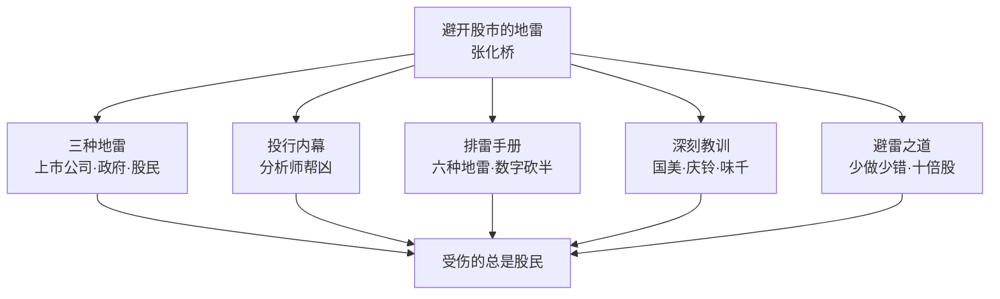
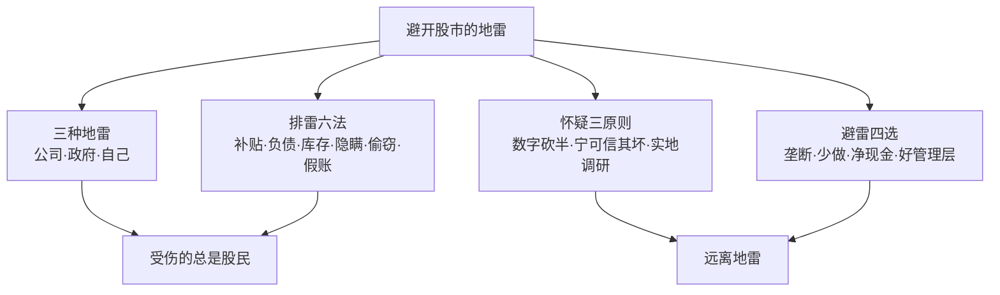

# 40《避开股市的地雷》深度解读（详细版）

> **副题：张化桥——"三种地雷，受伤的都是股民"：投行 15 年亲历的避雷手册**
>
> 作者：张化桥（1963—），湖北农村长大，中国人民大学硕士。在香港生活 18 年，其中 15 年在投资银行工作（宏观经济师 4 年、股票分析师 7 年、投行业务 4 年），曾任瑞银中国研究部主管，被称为"中国最敢讲真话的分析师""打假英雄"；后任深圳控股执行董事、广州万穗小额贷款公司董事长。著有《一个证券分析师的醒悟》等。
>
> **核心定位**：本书是系列中**最"防人之心"的一本**——前面 39 本教你"怎么赚钱"，这本教你"怎么不被人骗"。张化桥用投行 15 年的亲历（6 个造假公司的第一手故事），揭示股票市场的三种地雷：**上市公司埋的（假账/豪言/报喜不报忧）、政府埋的（怂恿纵容/吃小灶补贴）、股民自己埋的（投机/自信/侥幸）**——而受伤的，永远是股民。
>
> **系列意义**：040 是系列第 40 本，A 股实战派第六站——**风控与排雷篇**。如果说 039 朱孜教"九层进阶"，040 张化桥教"九层排雷"：投行内幕、假账识别、价值陷阱、负债危险、通胀逻辑、股权文化。本书与 037 冉伟"四类风险"形成"机构内幕视角 vs 交易者视角"的互补。

---

## 📖 全书结构与核心框架

### 全书结构总览表

| 部分 | 章节 | 核心内容 |
|------|------|---------|
| 开篇 | 自序 | 股市有三种地雷（上市公司/政府/股民） |
| 第1章 | 投资银行的大茶饭 | 投行内幕/分析师帮凶/闭眼估值/Facebook 官司 |
| 第2章 | 股民的眼泪 | 坏公司上市/股民自信/亏钱容易赚钱难/如何避雷 |
| 第3章 | 我从股票得到的深刻教训 | 国美/庆铃/味千/周期股/价值陷阱/房地产 |
| 第4章 | 十倍股，往何处寻？ | 利润不再增长/少做少错/林奇托梦/银行股 |
| 第5章 | 价值的陷阱，通胀的牺牲品 | 价值陷阱诱惑/巴菲特通胀论/逃离陷阱 |
| 第6章 | 提防官商同诈，重建股市文化 | 钱进董事长口袋/庞氏骗局/假账/七大标准 |
| 第7章 | 未来的大牛股与大牛市 | 股民撤退/十倍大牛股/A 股未来十年 |
| 附录 | 识别股市的地雷（祝振驹） | 剩股三低/基金四高/抽水模式 |

---

## 📑 目录

- [[#第1章 自序：股市有三种地雷|第1章 自序：股市有三种地雷]]
- [[#第2章 投资银行的大茶饭：内幕与帮凶|第2章 投资银行的大茶饭：内幕与帮凶]]
- [[#第3章 分析师帮凶：六个造假公司的第一手故事|第3章 分析师帮凶：六个造假公司的第一手故事]]
- [[#第4章 股民的眼泪：自设地雷与无处可逃|第4章 股民的眼泪：自设地雷与无处可逃]]
- [[#第5章 如何避开股市的地雷：排雷六法与数字砍半|第5章 如何避开股市的地雷：排雷六法与数字砍半]]
- [[#第6章 深刻教训一：公司壮大不等于股民赚钱|第6章 深刻教训一：公司壮大不等于股民赚钱]]
- [[#第7章 深刻教训二：价值陷阱与无护城河的行业|第7章 深刻教训二：价值陷阱与无护城河的行业]]
- [[#第8章 十倍股，往何处寻：少做少错与林奇托梦|第8章 十倍股，往何处寻：少做少错与林奇托梦]]
- [[#第9章 价值的陷阱与通胀的牺牲品|第9章 价值的陷阱与通胀的牺牲品]]
- [[#第10章 提防官商同诈，重建股市文化|第10章 提防官商同诈，重建股市文化]]
- [[#第11章 未来的大牛股与大牛市|第11章 未来的大牛股与大牛市]]
- [[#第12章 附录：识别股市的地雷（祝振驹）|第12章 附录：识别股市的地雷（祝振驹）]]
- [[#总结：避雷的终极心法|总结：避雷的终极心法]]
- [[#附录一 张化桥金句集（40 条精选）|附录一 张化桥金句集（40 条精选）]]
- [[#附录二 本书术语速查卡|附录二 本书术语速查卡]]
- [[#附录三 系列互链：040 在 40 本笔记中的位置|附录三 系列互链：040 在 40 本笔记中的位置]]
- [[#附录四 A 股应用：排雷实战手册|附录四 A 股应用：排雷实战手册]]
- [[#附录五 读完本书后的 10 个自问|附录五 读完本书后的 10 个自问]]
- [[#附录六 本书案例与数据速查|附录六 本书案例与数据速查]]
- [[#附录七 上市公司造假信号速查表|附录七 上市公司造假信号速查表]]
- [[#附录八 本书 FAQ 20 问|附录八 本书 FAQ 20 问]]
- [[#附录九 系列母题追踪（040 号更新）|附录九 系列母题追踪（040 号更新）]]
- [[#附录十 避雷派 vs 大师派：防骗与选股对照|附录十 避雷派 vs 大师派：防骗与选股对照]]
- [[#附录十一 30 秒版：避开股市的地雷|附录十一 30 秒版：避开股市的地雷]]
- [[#附录十二 张化桥避雷理念 60 条|附录十二 张化桥避雷理念 60 条]]
- [[#附录十三 造假公司特征对照表|附录十三 造假公司特征对照表]]
- [[#附录十四 系列 40 本总览（完成进度）|附录十四 系列 40 本总览（完成进度）]]
- [[#附录十五 同一市场，五种眼光（040 版）|附录十五 同一市场，五种眼光（040 版）]]
- [[#附录十六 中医视角：排雷如"排毒"，防骗如"扶正"|附录十六 中医视角：排雷如"排毒"，防骗如"扶正"]]
- [[#附录十七 中英对照：张化桥核心概念|附录十七 中英对照：张化桥核心概念]]
- [[#附录十八 思维训练：10 个排雷练习|附录十八 思维训练：10 个排雷练习]]
- [[#附录十九 持仓体检清单|附录十九 持仓体检清单]]
- [[#附录二十 写给被套过的人（知乎文风附录）|附录二十 写给被套过的人（知乎文风附录）]]

---

## 第1章 自序：股市有三种地雷

### 1.1 为什么离开投行

> "我在香港住了18年，其中15年在投资银行工作。我两次离开投资银行，都是因为我觉得我没有用处，我帮不了客户的忙……在全球，投资银行这个行业的产能过剩很严重，竞争过于激烈，同质化的重复劳动很多。"

**2011 年 6 月**，离开瑞银，到广州万穗小额贷款公司工作——**"把每个月的收入砍掉95％以上可不是一件容易接受的事情。"** 一年小贷生涯的感受：

> "赚钱太难了，说服政府部门太难了，管理企业太难了。"

### 1.2 三种地雷（全书总纲）

> "依我18年的股市经验，我认为股票市场有三种地雷。这三种地雷分别由上市公司（大股东和高管）、政府和股民们埋下。当然，受伤的都是股民。"

| 地雷 | 埋雷者 | 组成 | 特征 |
|------|--------|------|------|
| 第一种 | 上市公司 | 假账+豪言壮语+报喜不报忧 | **可持续 20—30 年不为人知**；多数时候股民受伤却不知为何受伤 |
| 第二种 | 政府 | 怂恿纵容+吃小灶补贴 | **中国特产**；补贴一次性→不可持续→欺诈性质 |
| 第三种 | 股民自己 | 投机+过度自信+侥幸+不做调研 | 不留安全边际是最大错误 |

**第一种地雷的隐蔽性**：

> "我们常见的丑闻曝光只是地雷爆炸的极少数情况……在绝大多数情况下，股民受了重伤却永远不知道受了伤，更不知道为什么受伤。因为这种地雷没有明显的爆炸，爆炸的形式不是通过丑闻曝光的形式，而是表现为企业的利润奇怪地下滑（或者增长率比预期的低），行业莫名其妙地走下坡路，或者企业突然撇账或者重组。"

**第二种地雷是中国特产**：

> "政府埋下的地雷一般由两个元素组成：怂恿、纵容和帮助上市公司（和拟上市公司）夸大销售额、利润和历史上的缴税额；或者给这些公司吃小灶，在土地、税收、环保和资金方面给予优惠……由于这些补贴本身都是一次性的，不可能持续，更不能持续增长，而股民买的是企业未来几十年的收益，因此，这种政府干预都具有欺诈性质，如同地雷。"

**假账的严重性**：

> "假账的严重性中国可能全球第一。我经常讲，中国的贪污腐败和地沟油有多么严重，上市公司的假账就有多么严重，因为它们都是龙的传人所为，是同一个文化背景的产物。"

**（这句话与书名呼应——"地雷"与"地沟油"，都是中国特色的毒。）**

---

## 第2章 投资银行的大茶饭：内幕与帮凶

### 2.1 投行的生意本质

| 业务 | 内容 |
|------|------|
| 承销 | 帮助企业上市（IPO） |
| 发债 | 帮助企业融资 |
| 并购 | 撮合交易 |
| 研究 | 分析师报告 |

**投行的利益冲突**：承销商帮企业上市赚钱，分析师写"买入"报告助销——**屁股决定脑袋。**

### 2.2 为何离开投行这么难

> 投行收入高、光环亮，但产能过剩、竞争激烈、同质化严重——张化桥两次离开都是因为"帮不了客户的忙"。

### 2.3 闭着眼睛给股票估值

| 估值乱象 | 内容 |
|---------|------|
| 公式随意 | 不同分析师用不同假设 |
| 目标价 | 常常不切实际 |
| 报告滞后 | 股价早反映 |
| 利益绑定 | 承销关系影响评级 |

### 2.4 新股上市，投行搅局

| 问题 | 内容 |
|------|------|
| 定价偏高 | 投行帮企业多募资 |
| 故事包装 | 招股书美化 |
| 热捧效应 | IPO 午餐会 300 人挤爆 |
| 上市即变脸 | 业绩很快走样 |

### 2.5 Facebook 的官司：股民的教训

**（1.10 节）**：Facebook IPO 后被诉信息披露问题——**新股信息不对称的经典案例，股民用真金白银买教训。**

---

## 第3章 分析师帮凶：六个造假公司的第一手故事

### 3.1 故事一：制药公司送股票

> "2001年，它的业务零零碎碎，市值大约只有7亿港元……董事长说，正好上周是我的生日，他想送股票给我做礼物。我吓了一大跳！我马上说，你的话算没有讲，我也算没有听见。当然，由于你说出这话，你的股票我永远不会研究！"

**结局**：公司早倒闭了，"不知道伤害了多少股民"。

### 3.2 故事二：玻璃厂拒绝拜访

2004 年上市，三家投行抬轿子，IPO 午餐会 300 人挤爆门口。**此后一年，张化桥几十次联系拜访被拒**——因为他是"打假英雄"，有问题的公司都怕他。**两年后公司清盘。**

### 3.3 故事三：铝制品公司撒谎

> "我根据这些资料做出了2004年利润预测，写成了报告。我的推荐意见当然是'买入'。过了一个多月，公司公布业绩，业绩大跌！我跌破眼镜！为什么？他们的毛利率完全没有什么稳定性！管理层一直在撒谎。"

**可能真相**：做铝期货亏钱，用产品毛利率大幅下降掩盖。**三年后公司债务缠身进入破产程序。**

### 3.4 故事四：食品配送公司的"假食堂"（最精彩的一课）

2004 年被几家投行隆重推出，2006 年市值近 300 亿港币。**张化桥的三个疑点**：

| 疑点 | 调查 | 结果 |
|------|------|------|
| 50 万人食堂 | 上午 9 点看不到厨师 | 11 点再去"还是冷冷清清" |
| 客户真实性 | 打电话给鸿海 | **"我们不用这家公司的送餐服务"** |
| 大米仓库 | 400 吨/天的需求 vs 一小堆米 | CFO"睁着眼睛说瞎话" |

> "我在农村长大，种过田，卖过稻子，大概知道400吨是什么概念。CFO完全是睁着眼睛说瞎话。"

**（这是全书最精彩的一段——用常识+实地调研拆穿 300 亿市值公司的谎言。）**

### 3.5 故事五：福建药厂"没有工厂"

五道口校友联手管理层欺诈，路演后"莫名其妙地悲凉感"——**几个月后听说公司连工厂都没有**；股票暴跌 90% 以上，"妖火熄灭"，董事长和师弟都消失了。

### 3.6 故事六：中药公司

2010 年带同事拜访市值 260 亿的上市中药和饮料公司——**后续揭露的问题再次验证：报表再漂亮，也要实地验证。**

### 3.7 六故事总结：造假公司的共同特征

| 特征 | 内容 |
|------|------|
| 过度热情 | 送股票/拉关系 |
| 拒绝调研 | 怕见打假的人 |
| 故事完美 | 毛利率稳定/订单充足 |
| 常识违背 | 50 万人食堂/400 吨大米 |
| 突然变脸 | 业绩大跌/暴跌 90% |

---

## 第4章 股民的眼泪：自设地雷与无处可逃

### 4.1 坏公司上市，赚了股民的钱

| 手法 | 内容 |
|------|------|
| 包装上市 | 故事+投行抬轿 |
| 高价发行 | 大股东套现 |
| 上市变脸 | 业绩下滑 |
| 摊薄股份 | 频繁配股 |

### 4.2 股民没来由的自信

> "股民沒来由的自信"——不做调研却坚信自己判断正确；亏钱后归因于运气，赚钱后归功于能力。

### 4.3 亏钱容易赚钱难

| 规律 | 内容 |
|------|------|
| 亏钱容易 | 一次黑天鹅=多年积累 |
| 赚钱难 | 每年 10% 已很优秀 |
| 不对称 | 亏 50% 要赚 100% 回本 |

### 4.4 股民总是坐立不安

| 表现 | 原因 |
|------|------|
| 频繁交易 | 焦虑 |
| 追涨杀跌 | 情绪 |
| 拿不住 | 无信心 |
| 听消息 | 无主见 |

### 4.5 作为股民，我究竟想赚谁的钱？

> "作为股民，我究竟想赚誰的钱？"——想赚企业的钱（正和），而不是赚其他股民的钱（零和）。

### 4.6 惹不起，躲得起

> "惹不起，躲得起"（You do not have to do anything!）——张磊和陈一舟的概念：某个股票在 5 元以下必买，60 元以上必卖，5—60 元之间啥也不做。

**（与 037 冉伟"空仓是弱市赚钱最快的方法"同频——不行动也是行动。）**

---

## 第5章 如何避开股市的地雷：排雷六法与数字砍半

### 5.1 常见地雷的六种形式

| # | 地雷 | 内容 |
|---|------|------|
| 1 | 大股东暗中补贴 | 推高销售/利润/净利润→推高股价→获益（倍数效应） |
| 2 | 结账日降负债 | 6.30/12.31 通过银行和关联公司巧妙安排降低负债率，过日反向操作 |
| 3 | 结账日推库存 | 把产品推到销售渠道里，降低库存数字 |
| 4 | 隐瞒负面消息 | 隐瞒"或有风险" |
| 5 | 偷窃企业资产 | 通过资本支出（基建/维修/扩建）把钱偷走 |
| 6 | 直截了当假账 | 最粗暴的形式 |

### 5.2 数字砍一半法（张化桥的笨办法）

> "长期以来，我太相信公司报出来的数字，现在我的笨办法是先把官方数字砍一半，再分析。如果企业说，去年的利润比前年增加30％，我把它当成是差不多没增长。也许去年还不如前年。"

**（"砍一半"=对 A 股/港股民企数字的普遍怀疑——不是每个公司都造假，但每个公司都值得怀疑。）**

### 5.3 为什么报表看不出问题

> "有朋友问我，如何从企业的报表中发现问题。我回答，那是不可能的。报表都是专业人士做的，怎么会有问题呢？为了发现问题，你必须到企业去，跟上下游谈，跟竞争者谈，跟监管部门谈，用点常识和坚持怀疑的态度（宁可信其坏，不可信其好）。"

### 5.4 假账如何被消化

> "绝大多数假账永远不会曝光……它们中有些企业是通过对未来业绩的人为降低来消化的（比如撇账、减值、重组、重列、出售、并购）。有些年份，生意本来很好（利润增长了40％），但是，企业报告出很一般的业绩（利润增长只是10％而已），让股民惊诧。"

### 5.5 负债太多的危险

| 危险 | 内容 |
|------|------|
| 高息负债 | 利率超 10%—15% 时传统理论失效 |
| 自由受限 | 借债条款限制经营自由 |
| 融资费用 | 闲置资金+汇入麻烦 |
| 续借压力 | 还款前半年就要筹新钱 |
| 价值摧毁 | **"很容易把千亿市值的公司变成百亿市值的公司"** |

**宝业地产（2355.HK）的对照**：

> "我这几年一直持有一家净现金的地产公司（手持现金多于银行负债）：宝业……自从2003年上市以来，它的股价上升了210％，加上分红，股东的回报率大约高达3倍。现在的息率还有5.5％左右，市盈率3.5倍。"

> "如果一家公司突然决定用目前的股价退市，我依然很乐意做小股东，那才是真正的、没有焦虑的投资。"

**（"愿意以现价退市还乐意当股东"——张化桥版的"睡得着觉"检验。）**

### 5.6 垄断行业的增持

| 股票 | 逻辑 |
|------|------|
| 新奥能源/华润燃气 | **"垄断行业如果有30％甚至50％的年增长时，你只好乖乖地投降：天底下哪里去找这样的好生意？！"** |
| 中油燃气 | 垄断+高增长+好管理层 |
| 民生银行 | 2011 年高增长 59%+低估值——"高增长难以持续，这样的低估值也同样难以持续" |
| 茂业百货 | 重资产牺牲短期利润但长期超值——"穿透计算"评估 |

---

## 第6章 深刻教训一：公司壮大不等于股民赚钱

### 6.1 国美电器：中国企业的通病

> "我认为，国美电器（0493.HK）是一家成功的公司，但是它的兴衰史反映的是大多数中国企业的共同问题：快速扩张，大量消耗资本，快速摊薄股份，现金流不如利润，负债率上升，很少分红。"

| 指标 | 数据 |
|------|------|
| 大股东持股 | 100% → 33%（被摊薄） |
| 分红 | 除 2007 年 17 分外，其他年份很少，2009 年完全没有 |
| 股价 | 4 港元以上高峰 → 2012.7 的 0.80 港元 |
| 账面 | 现金 103 亿+应付 171 亿（对供应商的控制力） |
| 市值 | 110 亿港元（看起来便宜） |

**教训**：

> "1．零售和餐饮行业没有'护城河'。它们只能在行业快速成长时看起来不错。客户叛逃的成本太低，没有黏性。2．国美电器所犯的错误，和目前面临的困难在中国企业中很具有代表性。从避险的角度来看，股民在任何时候都应该多看'自由现金流'，而不光是运营现金流。国美每年不断赚钱，不断获得运营现金流，但是不断要投入更多的钱（资本支出很大）。公司越做越大，但是股民们所获不多。"

### 6.2 少做少错：15 家公司的回报率排行榜

**核心发现：越忙碌的公司，股价表现越差。**

| 公司 | 做了什么 | 10 年回报 |
|------|---------|----------|
| 粤海投资 | **几乎什么也没做**（守东江水送香港） | **最高** |
| 恒隆集团 | 地产项目不多，靠收租 | 第二名 |
| 领汇房产基金 | "真正意义上的无所作为"（收租+全部分红） | 远高于大多数勤奋公司 |
| 深圳高速 | 大兴土木+收购兼并 | 高速公司里最差 |
| 路劲基建 | 18 条高速+忍不住进入地产 | 回报率下降 |
| 中信泰富 | 有护城河（海底隧道/国泰航空）却不安分 | **最差** |

> "一家企业如果有一个可持续的生意，这个生意有一点'护城河'……那么，这家企业就很幸运，它什么都不用做。少做少错，多做多错。没增长没关系。它的长期回报率依然可以相当好！"

> "一个10年前购入的商铺，就是这个道理。你什么也不需要做，它有'护城河'，它的租金每年上涨一点……光是租金已经很好了。这个道理跟股票一样。"

**（与 029 段永平"本分"、05 巴菲特"不折腾"形成系列共鸣——**"不做"是 A 股投资者最稀缺的能力。）**

---

## 第7章 深刻教训二：价值陷阱与无护城河的行业

### 7.1 庆铃汽车：净现金的价值陷阱

> "他的理论是：'庆铃有净现金，股票太便宜了。而且，中国人的内需正在升级。'他反复推介这只股票，可是不断出错，直到基金客户屡屡抱怨。"

**教训**：

> "1．有些国有企业的高管并不希望把公司的生意做好。或者，他们不知道怎样做好。或者，他们的手脚被捆得太紧，能力施展不开。2．净现金不能说明任何问题。便宜货很可能是个价值陷阱。"

**（与 035 邱国鹭"价值陷阱六类"直接呼应——便宜不是买入理由。）**

### 7.2 餐饮业没有护城河

**味千（中国）**：2007 年 IPO 热捧，"买了，永远持有，给孙子交学费的股票"——张化桥不凑热闹的三个原因：

> "第一，我知道我如果抽那么热捧的IPO，一定分不到几百股，没意思。第二，我想起了巴菲特的话，餐饮和商场没有护城河。从一家店子走到另外一家店子，太容易了。第三，我在香港中环上班18年，记得交易广场的餐馆每两年就换一次牌子。"

**结果**：5 年过山车，股民亏 15%；另一只基金看好的股票从高峰跌 60%+。

**乡村基（美国上市）**：众星捧月上市，不到两年股价跌去 73%。

> "真正的原因是，巴菲特说的那句话：餐饮企业和商店没有护城河。就这么简单……这个行业的公司要么是昙花一现，要么根本就没戏！当然，你永远可以说，瞧瞧麦当劳和肯德基！投资是关于概率，为什么要追逐小概率事件呢？"

### 7.3 其他教训

| 教训 | 内容 |
|------|------|
| 公司壮大≠股民赚钱 | 自由现金流才是真 |
| 激励机制决胜 | 管理层激励决定行为 |
| 尽量往坏处想 | 宁可信其坏 |
| 好行业也有坏公司 | 行业好≠公司好 |
| 周期股难捕捉 | 景气顶点买入=深套 |
| 赚钱是小概率事件 | 每年 10% 已优秀 |
| 小心竞争太多行业 | 无护城河 |
| 中国房地产公司基本不行 | 高负债+信托成本 15%+ |

---

## 第8章 十倍股，往何处寻：少做少错与林奇托梦

### 8.1 如果利润不再增长……

> "如果一家公司的利润长期下滑或者横行，那么是否意味着股票市场的终结？也许是，也许不是。但是，已有的股票依然有它们的价值。"

**增长的数学**：

> "如果它的利润在过去5年内没有增长（只是上下波动而已），那么为了保证10年的复合增长率在10％左右，它在未来5年就必须有每年20％以上的复合增长率才行。这谈何容易！"

**有护城河的企业何必瞎忙**：商铺理论——不需要增长，护城河+租金已足够。

### 8.2 寻找美丽动人的中国股票

| 标准 | 内容 |
|------|------|
| 有护城河 | 垄断/品牌 |
| 少做少错 | 不乱扩张 |
| 自由现金流 | 真金白银 |
| 合理负债 | 净现金更好 |
| 分红意愿 | 真回报股东 |

### 8.3 林奇托梦（全书最有趣的段落）

> "有一次，我从山东出差回来，在飞机上做了一个梦。梦见了投资专家彼得·林奇。在梦中，我刚创办了一个投资基金，找他募集资金。他问我：'中国这20年出现过很多涨10倍以上的股票。你买过几个？'我的额头上开始冒汗，因为我一个也没有买。"

**林奇的教诲**：

> "你花一个小时研究普通公司，就少了一个小时挖掘和研究十倍股。当然，关键的问题还不是时间，而是注意力和态度。正如你们中国人所说，种瓜得瓜，种豆得豆。"

> "如果你用严酷的高标准对待选股，即使你得不到10倍，也可能得到4倍、5倍的回报……如果你的出发点就是10％、15％的回报率，那你就会不经意地降低标准，实际回报5％或者7％，甚至亏钱。"

> "如果你做足了功课，你坚信你选的都是十倍股，你的股票大跌的概率就很小，而且，即使跌了很多，你也知道怎么办。怎么办？加仓！这就是区别。"

**建议改名**："十倍资本公司"（The Ten Baggar Capital）。

### 8.4 我的投资布局

| 配置 | 逻辑 |
|------|------|
| 垄断公用事业 | 燃气/供水（现金流稳定） |
| 净现金地产 | 宝业式（估值安全） |
| 低估值银行 | 民生式（高增长+低估值） |
| 简单生意 | 少做少错 |

---

## 第9章 价值的陷阱与通胀的牺牲品

### 9.1 价值陷阱的诱惑

| 诱惑 | 陷阱 |
|------|------|
| 净现金 | 管理层不想做好 |
| 低市盈率 | 利润即将下滑 |
| 高股息 | 不可持续 |
| 破净 | 资产质量差 |

### 9.2 提防永不长大的上市公司

| 特征 | 内容 |
|------|------|
| 利润停滞 | 多年不增长 |
| 无新故事 | 业务陈旧 |
| 估值陷阱 | 看似便宜实则贵 |

### 9.3 巴菲特说：通胀伤害股市（股票=永续债券）

**1968—1982 年 15 年大熊市的元凶是通胀**：道琼斯名义跌一半，考虑通胀损失高达 80%+。1977 年巴菲特在《财富》发表"How Inflation Swindles the Equity Investor"。

**核心逻辑**：

| 要点 | 内容 |
|------|------|
| 股票就是永续的债券 | "票息"=股本收益率（约 12%） |
| 股本收益率稳定 | 二战后 30 多年平均 10%—13% |
| 通胀不改善回报 | 股民整体回报率超级稳定 |
| 市账率换算 | **市账率 1 倍=回报 12%；2 倍=6%；3 倍=4%** |
| 增加股本收益率的五个办法 | ①资金周转 ②便宜负债 ③增加负债 ④降税 ⑤增利润率——**②③④整体无可能，①⑤空间不大** |

> "当市账率为1倍的时候，股民获得的回报率就是股本的回报率（比如12％）。当市账率涨到2倍甚至3倍时，股民的回报率就分别降到了6％或者4％。简单的算术，大家不愿意去弄懂。"

> "利润率高的公司并不需要太多的负债，而利润率差的公司永远缺钱。"

**（这个"市账率=回报率倒数"框架，与 039 朱孜"PE=回本周期"异曲同工——估值数学是相通的。）**

### 9.4 股神的遗憾

> "股神的遗憾"——巴菲特也错过了很多十倍股（如微软/亚马逊），因为"太贵"。**错过不可耻，踩雷才致命。**

### 9.5 想法子逃离价值的陷阱

| 方法 | 内容 |
|------|------|
| 关注自由现金流 | 而非纸面利润 |
| 检查管理层 | 意愿+能力+诚信 |
| 用常识验证 | 实地调研+上下游 |
| 宁可信其坏 | 怀疑优先 |
| 数字砍一半 | 防御性假设 |

---

## 第10章 提防官商同诈，重建股市文化

### 10.1 股民的钱流进董事长的口袋

**消费品公司案例**：

| 数据 | 内容 |
|------|------|
| 资本支出 | 3 年 8 亿元人民币 |
| 合理成本 | **最多 3 亿元**（土地 7,000 万+厂房设备 2 亿） |
| 差额 | **5 亿元流进董事长口袋** |
| 表面指标 | 5 年销售复合增长 25%/利润复合增长 27%/ROE 20%+/PE 仅 5—7 倍 |

> "中国有个词语叫'跑冒滴漏'（跑蒸汽、冒黑烟、滴柴油、漏自来水）……在这两家公司里，我看到的不是'跑冒滴漏'，而是董事长用大卡车把股民的钱往自己家里搬运。'跑冒滴漏'太小意思了。"

**（最可怕的是：这公司的各项指标好得让人难以相信——**漂亮报表+资本支出黑洞**，是"金玉其外"的标准模板。）**

### 10.2 上市公司的庞氏骗局

> "另外有一家知名的公司在香港上市已经十几年。从IPO到现在，它在股市配股融资的总额高达220亿元，除了支付股民的红利6亿元以外，其他全部用在了'资本支出'，买地和建造各种设施……年复一年，它的利润一直保持高速增长。某一年，'黑天鹅'出现，公司就把前些年的虚高利润（假账）全部冲掉。然后，公司又从一个较低的利润水平高速成长若干年。然后……如此重复。"

**（"融资→资本支出→冲销→再融资"循环=上市公司的庞氏骗局。）**

### 10.3 企业假账多如地沟油

> "中国的贪污腐败和地沟油有多么严重，上市公司的假账就有多么严重，因为它们都是龙的传人所为，是同一个文化背景的产物。"

### 10.4 中国式畸形股权文化

| 问题 | 内容 |
|------|------|
| 大股东侵占 | 挪用/关联交易 |
| 小股东弱势 | 无话语权 |
| 分红吝啬 | 铁公鸡 |
| 股权激励 | 利益输送 |

### 10.5 分红无限好，只是别强迫

> "从长期来看，分红的能力、意愿和现实可行性是股票估值的基础，但是我坚决反对政府强制企业分红。这是企业的权力，不是政府的权力。"

### 10.6 股市好坏的七大标准（张化桥的制度药方）

| # | 标准 |
|---|------|
| 1 | 任何企业随时可以上市，不受额度限制 |
| 2 | 只要如实披露，政府没有道理阻碍上市 |
| 3 | 坚决反对强制退市制度（尊重成年人之间的选择） |
| 4 | 反对政府强制分红 |
| 5 | 虚假披露/操纵股市受到最严厉打击 |
| 6 | 交易所如农贸市场——每个省都可以有，让市场自生自灭 |
| 7 | 股价高低不是交易所好坏标准，**公正/方便/低成本才是** |

> "股民作为一个集体，如果想赚钱，必须靠股票背后的公司。所以，股民和监管机构不应该在股票价格上（或者指数上）做文章，而应该在企业层面做文章。"

---

## 第11章 未来的大牛股与大牛市

### 11.1 全球股民为何撤退

| 原因 | 内容 |
|------|------|
| 又贪婪又害怕 | 人性 |
| 受够了 | 长期白干 |
| 新股稀释 | 供给无限 |

### 11.2 噪音中觅经济方向

> 少看噪音（短期消息），多看本质（长期趋势）——"少做少错的道理"同样适用于宏观判断。

### 11.3 企业少做少错的道理

> "企业少做少错的道理"——与 6.2 节 15 家公司回报率排行榜呼应：**不折腾的企业回报最好。**

### 11.4 寻找十倍大牛股

| 特征 | 内容 |
|------|------|
| 垄断+高增长 | 燃气/公用事业式 |
| 简单生意 | 看得懂 |
| 净现金 | 无负债压力 |
| 好管理层 | 诚信+本分 |
| 低估值 | 留有安全边际 |

### 11.5 A 股的未来十年

| 展望 | 内容 |
|------|------|
| 注册制 | 供给增加→估值分化 |
| 退市常态化 | 二八分化 |
| 价值回归 | 好公司受捧 |
| 投资者成熟 | 从投机到投资 |

---

## 第12章 附录：识别股市的地雷（祝振驹）

### 12.1 剩股：三低特色

| 低 | 内容 |
|----|------|
| 市值低 | 通常低于 1 亿美元 |
| 成交低 | 接近零或日均不到数十万港元 |
| 人气低 | 少人拜访/少人建议 |

> "香港的上市公司达1496家……有证券分析师追踪的约540多家。换句话说超过六成多的上市公司都是不被机构投资者为意的剩股！"

### 12.2 剩股被冷落的三大原因

| 原因 | 内容 |
|------|------|
| 管理被动 | 缺乏公关/投资者关系 |
| 业绩不稳 | 行业周期起伏/派息欠奉 |
| 金玉其外 | 管治问题/财务水分 |

### 12.3 基金选股的四高要求

> "10个上市公司老板9个都认为自己的股票价值被市场低估，但大部分都是孤芳自赏，不明白市场的四高要求（高流通量，高持续性，高增长和高派息）。"

### 12.4 好股，坏股，烂股，便股

> "假若公司决意造假账，任何有经验的审计和分析师也没可能在短期内察觉出来。笔者一直认为要确认一家上市公司的真实性与业绩基础，一定需要观察管理层一段较长时间，最好是经历起码1～2个行业和股市低潮。"

**（时间是最好的验金石——经历牛熊的管理层才可信。）**

### 12.5 公司上市为抽水（庞氏循环实证）

**日本股神推荐的"中国消费概念股"案例**：

| 指标 | 数据 |
|------|------|
| 上市 10 年派息 | 5 年派息（平均派息率 14.9%） |
| 二级市场集资 | **10 年 8 次共 17.8 亿港币**+IPO 5,000 万 |
| 资本开支 | 10 年约 24.1 亿港元 |
| 每股盈利 | 2011 年比 10 年前**倒退 17%** |
| 股本收益率 | 32.7% → **4.4%** |
| 市值 | 11 亿港币，**比集资总额还少** |

> "基本上这是一家不停摧毁股东价值的公司……公司根本是透过不停的集资再投资，然后把股东的钱消耗掉和转移到管理层自己的口袋。"

### 12.6 长线投资押注稳健管理层

> "长线投资股票最重要的是押注在有质素及稳健的管理上。"

---

## 总结：避雷的终极心法

### Z1. 张化桥体系全景

### Z2. 全书的五根柱子

| 柱子 | 核心内容 | 章节 |
|------|---------|------|
| 三种地雷 | 公司/政府/股民 | 自序 |
| 投行内幕 | 分析师帮凶/利益冲突 | 第2—3章 |
| 排雷六法 | 补贴/负债/库存/隐瞒/偷窃/假账 | 第5章 |
| 深刻教训 | 国美/庆铃/味千/价值陷阱 | 第6—7章 |
| 避雷之道 | 少做少错/垄断/十倍股标准 | 第8—9章 |

### Z3. 张化桥留给读者的三句话

> 1. "先把官方数字砍一半，再分析。"
> 2. "少做少错，多做多错——有护城河的企业何必瞎忙。"
> 3. "如果一家公司突然决定用目前的股价退市，我依然很乐意做小股东，那才是真正的、没有焦虑的投资。"

### Z4. 本书与系列的关系

| 维度 | 035 邱国鹭 | 037 冉伟 | **040 张化桥** |
|------|-----------|---------|---------------|
| 视角 | 选好公司 | 交易者哲学 | **机构内幕+防骗** |
| 核心 | 三要素 | 四要素 | **三种地雷** |
| 特色 | 逆向 | 道术 | **打假** |
| 互补 | 教赚钱 | 教思考 | **教保命** |

---

## 附录一 张化桥金句集（40 条精选）

> 1. "股票市场有三种地雷……当然，受伤的都是股民。"——自序
> 2. "假账的严重性中国可能全球第一。"——自序
> 3. "中国的贪污腐败和地沟油有多么严重，上市公司的假账就有多么严重。"——自序
> 4. "这种政府干预都具有欺诈性质，如同地雷。"——自序
> 5. "不留'安全边际'就是最大的错误。"——自序
> 6. "报表都是专业人士做的，怎么会有问题呢？"——排雷
> 7. "先把官方数字砍一半，再分析。"——排雷
> 8. "宁可信其坏，不可信其好。"——排雷
> 9. "大多数假账永远不会曝光。"——排雷
> 10. "把千亿市值的公司变成百亿市值的公司。"——高负债
> 11. "如果一家公司突然决定用目前的股价退市，我依然很乐意做小股东。"——宝业
> 12. "垄断行业如果有30％甚至50％的年增长时，你只好乖乖地投降。"——燃气
> 13. "高增长难以持续，这样的低估值也同样难以持续。"——民生银行
> 14. "零售和餐饮行业没有'护城河'。"——国美
> 15. "客户叛逃的成本太低，没有黏性。"——零售
> 16. "公司越做越大，但是股民们所获不多。"——国美
> 17. "少做少错，多做多错。"——15 家公司
> 18. "越是忙碌，它的股价表现越差。"——回报率排行
> 19. "粤海投资……太懒。公司守着东江水，把水送往香港。这就是最好的生意。"——粤海
> 20. "净现金不能说明任何问题。便宜货很可能是个价值陷阱。"——庆铃
> 21. "有些国有企业的高管并不希望把公司的生意做好。"——庆铃
> 22. "餐饮和商场没有护城河。从一家店子走到另外一家店子，太容易了。"——巴菲特引
> 23. "投资是关于概率，为什么要追逐小概率事件呢？"——味千
> 24. "种瓜得瓜，种豆得豆。"——林奇托梦
> 25. "你花一个小时研究普通公司，就少了一个小时挖掘和研究十倍股。"——林奇托梦
> 26. "如果你做足了功课……即使跌了很多，你也知道怎么办。怎么办？加仓！"——林奇托梦
> 27. "你的出发点就是10％、15％的回报率，那你就会不经意地降低标准。"——林奇托梦
> 28. "惹不起，躲得起（You do not have to do anything!）。"——张磊/陈一舟
> 29. "股票就是永续的债券。"——巴菲特通胀论
> 30. "当市账率涨到2倍甚至3倍时，股民的回报率就分别降到了6％或者4％。"——巴菲特通胀论
> 31. "利润率高的公司并不需要太多的负债，而利润率差的公司永远缺钱。"——巴菲特通胀论
> 32. "董事长用大卡车把股民的钱往自己家里搬运。'跑冒滴漏'太小意思了。"——资本支出
> 33. "股民作为一个集体，如果想赚钱，必须靠股票背后的公司。"——七大标准
> 34. "应该在企业层面做文章，而不是在股价上做文章。"——七大标准
> 35. "股价、期货价、蔬菜价格和大豆价格的高低都不是衡量交易所好坏的标准。"——七大标准
> 36. "确认一家上市公司的真实性，最好经历起码1～2个行业和股市低潮。"——祝振驹
> 37. "基金组合一般只持有20～60只。"——四高要求
> 38. "公司根本是透过不停的集资再投资，然后把股东的钱消耗掉。"——庞氏循环
> 39. "长线投资股票最重要的是押注在有质素及稳健的管理上。"——祝振驹
> 40. "赚钱太难了，说服政府部门太难了，管理企业太难了。"——小贷一年

---

## 附录二 本书术语速查卡

| 术语 | 定义 | 出处 |
|------|------|------|
| 三种地雷 | 上市公司/政府/股民埋的雷 | 自序 |
| 打假英雄 | 张化桥的外号 | 第2章 |
| 跑冒滴漏 | 设备老化浪费资源 | 第10章 |
| 数字砍半 | 官方数字先砍一半再分析 | 第5章 |
| 价值陷阱 | 便宜但永不涨的股票 | 第7章 |
| 永续债券 | 巴菲特：股票的本质 | 第9章 |
| 股本收益率 | 公司整体 ROE（约 12%） | 第9章 |
| 市账率 | 市值/账面净资产 | 第9章 |
| 剩股 | 无人问津的三低股票 | 附录 |
| 四高要求 | 高流通量/持续性/增长/派息 | 附录 |
| 抽水 | 上市后不断集资 | 附录 |
| 庞氏循环 | 融资→资本支出→冲销→再融资 | 第10章 |
| 惹不起躲得起 | 不行动也是行动 | 第4章 |
| 十倍资本公司 | 林奇托梦建议的基金名 | 第8章 |

---

## 附录三 系列互链：040 在 40 本笔记中的位置

### 040 与系列笔记的链接网络

| 系列笔记 | 链接点 |
|---------|--------|
| [[35《投资中最简单的事》深度解读（详细版）|35 号 | 邱国鹭六类价值陷阱×040 庆铃/便宜货陷阱 |
| [[37《股票投资沉思录》深度解读（详细版）|37 号 | 冉伟博弈风险×040 造假地雷（对手盘的另一种形式） |
| [[39《股票投资入门、进阶与实战》深度解读（详细版）|39 号]] | 朱孜康美排雷×040 六种地雷 |
| [[06《巴菲特教你读财报》深度解读（详细版）|06 号]] | 财报阅读×040 报表怀疑论 |
| [[28《聪明的投资者》深度解读（详细版）|28 号]] | 格雷厄姆安全边际×040"不留安全边际是最大错误" |
| [[29《段永平投资问答录》深度解读（详细版）|29 号]] | 段永平本分×040 少做少错 |
| [[05《巴菲特的投资心法》深度解读（详细版）|05 号]] | 巴菲特通胀论×040 永续债券 |
| [[32《彼得·林奇的成功投资》深度解读（详细版）|32 号]] | 林奇十倍股×040 林奇托梦 |
| [[36《炒股的智慧》深度解读（详细版）|36 号]] | 陈江挺保本×040 避雷第一 |
| [[13《巴菲特的护城河》深度解读（详细版）|13 号]] | 护城河×040 餐饮无护城河/垄断护城河 |

### 040 在系列中的定位

| 维度 | 定位 |
|------|------|
| 流派 | A 股实战派·排雷防骗站 |
| 特色 | 投行 15 年内幕+打假第一手 |
| 价值 | 系列唯一的"防人之书" |

---

## 附录四 A 股应用：排雷实战手册

### 4.1 排雷五步法

| 步骤 | 内容 |
|------|------|
| 1. 数字砍半 | 对民企/高增长数字先打五折 |
| 2. 资本支出审计 | 建厂要花多少钱？合理吗？（8 亿 vs 3 亿） |
| 3. 实地验证 | 食堂/仓库/工厂真的存在吗？ |
| 4. 上下游核实 | 客户真的用它的产品吗？（鸿海验证法） |
| 5. 管理层观察 | 经历牛熊了吗？诚信吗？ |

### 4.2 A 股地雷清单

| 地雷类型 | A 股表现 |
|---------|---------|
| 补贴造假 | 政府补贴撑利润 |
| 结账日操作 | 年底突击"降负债/清库存" |
| 资本支出黑洞 | 疯狂扩产+高资本开支 |
| 关联交易 | 利益输送 |
| 商誉减值 | 并购爆雷 |
| 质押爆仓 | 大股东高质押 |
| 业绩变脸 | 上市即变脸 |

### 4.3 避雷四选（买什么）

| 选择 | 逻辑 |
|------|------|
| 垄断行业 | 燃气/水电/高速 |
| 净现金公司 | 宝业式 |
| 少做少错 | 不折腾 |
| 好管理层 | 诚信+本分 |

---

## 附录五 读完本书后的 10 个自问

1. 我的持仓里有没有"数字砍一半"后仍不便宜的股票？
2. 我调研过持仓公司吗？（还是只看报表？）
3. 我知道公司的资本支出合理吗？
4. 我买的股票有护城河吗？（还是"从一家店走到另一家店"的生意？）
5. 我买过"便宜货"吗？（庆铃式价值陷阱？）
6. 我追过 IPO 热捧吗？（味千式教训？）
7. 我的持仓公司负债高吗？（高息债=危险）
8. 我理解"股票=永续债券"吗？（市账率=回报率倒数？）
9. 我会"惹不起躲得起"吗？（还是天天手痒？）
10. 我留安全边际了吗？

---

## 附录六 本书案例与数据速查

### 核心数据

| 数字 | 含义 |
|------|------|
| 18 年 | 张化桥香港生活（15 年投行） |
| 95% | 离开投行后的收入降幅 |
| 20—30 年 | 地雷可以隐藏的时长 |
| 7 亿港元 | 制药公司市值（送股故事） |
| 300 亿港元 | 食品配送公司市值（假食堂） |
| 400 吨 | 松江食堂每天所需大米 |
| 90% | 福建药厂股价跌幅 |
| 260 亿 | 中药公司市值 |
| 220 亿 | 某公司 IPO 以来配股融资总额 |
| 6 亿 | 同期支付的红利 |
| 8 亿 vs 3 亿 | 资本支出 vs 合理成本 |
| 25%/27% | 造假公司销售/利润复合增长 |
| 100%→33% | 国美大股东持股摊薄 |
| 4→0.80 港元 | 国美股价跌幅 |
| 210%/3 倍 | 宝业上市以来回报 |
| 73% | 乡村基股价跌幅 |
| 15% | 味千股民亏损 |
| 12% | 美国公司平均股本收益率 |
| 2 倍=6%/3 倍=4% | 市账率与回报率 |
| 15 年 | 1968—1982 美股大熊市 |
| 32.7%→4.4% | 抽水公司 ROE 恶化 |
| 17.8 亿 | 抽水公司 10 年集资 |

### 案例速查表

| 案例 | 类型 | 启示 |
|------|------|------|
| 制药公司送股 | 拉拢 | 送股票的分析师不能碰 |
| 玻璃厂拒访 | 心虚 | 拒绝调研=有问题 |
| 铝制品公司 | 撒谎 | 毛利率突变=警惕 |
| 食品配送假食堂 | 造假 | 常识+实地验证 |
| 福建药厂 | 无工厂 | 路演的悲凉感 |
| 国美电器 | 摊薄 | 自由现金流>利润 |
| 庆铃汽车 | 陷阱 | 净现金≠便宜 |
| 味千/乡村基 | 无护城河 | 餐饮没戏 |
| 粤海/恒隆/领汇 | 少做 | 不折腾回报最高 |
| 路劲/中信泰富 | 折腾 | 多元化毁价值 |
| 宝业地产 | 净现金 | 愿意退市还持有 |
| 华润燃气 | 垄断 | 垄断+增长=投降 |
| 民生银行 | 低估值 | 低估值难持续 |
| 资本支出黑洞 | 偷钱 | 8 亿 vs 3 亿 |
| 抽水公司 | 庞氏 | 集资>分红=毁灭 |

---

## 附录七 上市公司造假信号速查表

### 财务信号

| 信号 | 说明 |
|------|------|
| 有钱不还 | 账面巨额现金却借高息债（康美式） |
| 资本支出异常 | 远超行业合理水平 |
| 毛利率突变 | 与行业背离 |
| 存货/应收异常 | 结账日突击 |
| 现金流与利润背离 | 利润高现金流差 |
| 频繁融资 | 集资>分红 |
| 商誉高企 | 并购埋雷 |

### 行为信号

| 信号 | 说明 |
|------|------|
| 拒绝调研 | 怕见打假者 |
| 过度热情 | 送礼物/拉关系 |
| 故事太完美 | 毛利率稳定/订单充足 |
| 常识违背 | 50 万人食堂 |
| 高管减持 | 先知先觉 |
| 审计师更换 | 换所=预警 |
| 突然变脸 | 业绩大跌/撇账 |

### 治理信号

| 信号 | 说明 |
|------|------|
| 大股东高质押 | 资金链紧张 |
| 关联交易频繁 | 利益输送 |
| 分红吝啬 | 铁公鸡 |
| 频繁并购 | 讲故事 |
| 股权激励过高 | 利益输送 |

---

## 附录八 本书 FAQ 20 问

**Q1：股市有哪三种地雷？**
A：上市公司埋的（假账）/政府埋的（补贴）/股民自己埋的（投机）。

**Q2：为什么说假账是中国特产？**
A："贪污腐败和地沟油有多严重，假账就有多严重"——同一个文化背景。

**Q3：报表能发现问题吗？**
A：基本不能——"报表都是专业人士做的"。要实地+上下游+常识。

**Q4：数字砍一半是什么意思？**
A：对官方数字先打五折再分析——30% 增长当没增长。

**Q5：六大排雷法是什么？**
A：补贴/结账日降负债/推库存/隐瞒风险/偷资产/假账。

**Q6：为什么净现金也可能是陷阱？**
A：庆铃汽车——管理层不想做好，便宜货=价值陷阱。

**Q7：餐饮业为什么没护城河？**
A：巴菲特的话——"从一家店走到另一家店太容易"；交易广场餐馆两年换一次牌。

**Q8：公司壮大股民一定赚钱吗？**
A：不一定——国美：扩张/摊薄/无分红，"公司越做越大，股民所获不多"。

**Q9：什么叫"少做少错"？**
A：15 家公司回报排行——粤海守着东江水回报最高，中信泰富折腾回报最差。

**Q10：高负债有什么危险？**
A：千亿市值变百亿；高息债 10%—15% 摧毁内涵价值。

**Q11：什么是"股票=永续债券"？**
A：巴菲特通胀论——股票"票息"=12% 股本收益率，通胀不改善它。

**Q12：市账率怎么换算回报率？**
A：1 倍=12%，2 倍=6%，3 倍=4%。

**Q13：林奇托梦说了什么？**
A：用十倍股标准选股——高标准即使得不到 10 倍也有 4-5 倍。

**Q14：什么是"惹不起躲得起"？**
A：张磊/陈一舟——5 元以下必买，60 元以上必卖，中间啥也不做。

**Q15：股民的钱怎么流进董事长口袋？**
A：资本支出黑洞——8 亿建厂实际只要 3 亿，差额进私人腰包。

**Q16：什么是上市公司的庞氏循环？**
A：融资→资本支出→冲销→再融资——某公司集资 220 亿只分 6 亿。

**Q17：股市好坏的七大标准？**
A：自由上市/如实披露即可/反对强制退市/反对强制分红/严打欺诈/交易所市场化/成本公正。

**Q18：什么是剩股？**
A：三低股票（市值低/成交低/人气低）——六成多港股无人问津。

**Q19：基金选股的四高要求？**
A：高流通量/高持续性/高增长/高派息。

**Q20：避雷的终极心法？**
A：怀疑（数字砍半）+调研（实地）+选择（垄断/少做/净现金/好管理层）+安全边际。

---

## 附录九 系列母题追踪（040 号更新）

### 9.1 "价值陷阱"主题的系列对照

| 笔记 | 视角 |
|------|------|
| 035 邱国鹭 | 六类价值陷阱 |
| **040 张化桥** | **净现金陷阱（庆铃）/便宜货陷阱** |
| 039 朱孜 | 低估值+资产质量 |

### 9.2 "护城河"主题的系列对照

| 笔记 | 视角 |
|------|------|
| 13 巴菲特 | 晨星四源 |
| **040 张化桥** | **餐饮零售无护城河/垄断有护城河** |

### 9.3 "通胀"主题的系列对照

| 笔记 | 视角 |
|------|------|
| 05 巴菲特 | 通胀与投资 |
| **040 张化桥** | **永续债券论（市账率换算）** |
| 039 朱孜 | 通胀→利率→股价 |

### 9.4 "安全边际"主题的系列对照

| 笔记 | 视角 |
|------|------|
| 28 格雷厄姆 | 安全边际定义 |
| **040 张化桥** | **"不留安全边际就是最大的错误"** |

---

## 附录十 避雷派 vs 大师派：防骗与选股对照

| 维度 | 大师派（05/32…） | 避雷派（040） |
|------|-----------------|--------------|
| 前提 | 相信公司 | **怀疑公司** |
| 方法 | 分析价值 | **验证真假** |
| 关注 | 利润/护城河 | **现金流/管理层** |
| 案例 | 成功案例 | **造假案例** |
| 互补 | 找到好公司 | **避开坏公司** |

**正确用法**：先学 040 排雷（避开 90% 的坑），再用大师方法选股（找到 10% 的好公司）。

---

## 附录十一 30 秒版：避开股市的地雷

> **避开股市的地雷（30 秒版）**：
>
> 1. **三种地雷**——上市公司（假账）/政府（补贴）/股民自己（投机）；
> 2. **排雷六法**——补贴/结账日降负债/推库存/隐瞒/偷资产/假账；
> 3. **怀疑三原则**——数字砍一半/宁可信其坏/实地调研；
> 4. **避雷四选**——垄断/少做少错/净现金/好管理层；
> 5. **价值陷阱**——净现金≠便宜（庆铃）；餐饮零售无护城河（味千/乡村基）；
> 6. **通胀逻辑**——股票=永续债券；市账率 2 倍=回报 6%；
> 7. **终极检验**——"愿意以现价退市还乐意当股东"。

---

## 附录十二 张化桥避雷理念 60 条

**地雷观（1—15）**：

> 1. 股市有三种地雷。
> 2. 受伤的总是股民。
> 3. 假账中国全球第一。
> 4. 地雷可隐藏 20—30 年。
> 5. 大多数假账永不曝光。
> 6. 政府补贴=欺诈性质。
> 7. 投机是自己埋雷。
> 8. 不留安全边际是最大错误。
> 9. 股民受重伤却不知为何。
> 10. 地雷爆炸=利润下滑/撇账。
> 11. 假账用未来业绩消化。
> 12. 好年份报坏业绩=可疑。
> 13. 民企国企都有假账。
> 14. 要怀疑一切数字。
> 15. 贪污与假账同源。

**投行观（16—25）**：

> 16. 投行产能过剩。
> 17. 分析师可能成帮凶。
> 18. 送股票的分析师不能碰。
> 19. 拒绝调研=有问题。
> 20. 管理层可能撒谎。
> 21. 常识是最好的武器。
> 22. 50 万人食堂=谎言。
> 23. 实地调研不可替代。
> 24. 报表是专业人士做的。
> 25. 打假需要勇气。

**教训观（26—40）**：

> 26. 零售餐饮无护城河。
> 27. 客户叛逃成本低。
> 28. 公司壮大≠股民赚钱。
> 29. 看自由现金流。
> 30. 扩张消耗资本。
> 31. 摊薄伤害股东。
> 32. 少做少错多做多错。
> 33. 粤海东江水是最好的生意。
> 34. 净现金≠便宜。
> 35. 便宜货=价值陷阱。
> 36. 国企高管未必想做业务。
> 37. 餐饮公司昙花一现。
> 38. 投资是概率游戏。
> 39. 不追小概率事件。
> 40. IPO 热捧要躲开。

**避雷观（41—60）**：

> 41. 数字砍一半再分析。
> 42. 宁可信其坏。
> 43. 高息负债=危险。
> 44. 千亿变百亿。
> 45. 宝业式净现金=安心。
> 46. 垄断+增长=投降。
> 47. 低估值难持续。
> 48. 股票=永续债券。
> 49. 市账率=回报率倒数。
> 50. 利润率高的公司不需负债。
> 51. 资本支出黑洞=偷钱。
> 52. 配股集资=抽水。
> 53. 庞氏循环=融资冲销再融资。
> 54. 分红是估值基础。
> 55. 反对强制分红。
> 56. 企业层面做文章。
> 57. 惹不起躲得起。
> 58. 十倍股标准选股。
> 59. 种瓜得瓜种豆得豆。
> 60. 长线押注稳健管理层。

---

## 附录十三 造假公司特征对照表

| 特征 | 正常公司 | 造假公司 |
|------|---------|---------|
| 资本支出 | 与产能匹配 | **远超合理水平** |
| 毛利率 | 稳定合理 | 突变/故事完美 |
| 调研 | 欢迎参观 | **拒绝拜访** |
| 现金流 | 与利润匹配 | 背离 |
| 融资 | 需要时融资 | **频繁集资>分红** |
| 管理层 | 低调务实 | 过度热情 |
| 业绩 | 波动正常 | **突然变脸** |
| 常识 | 经得起验证 | 违背常识 |

---

## 附录十四 系列 40 本总览（完成进度）

| 编号 | 书名 | 状态 |
|------|------|------|
| 01—03 | 利弗莫尔三部曲 | ✅ |
| 04 | 达利欧《原则》 | ✅ |
| 05—14 | 巴菲特系列 | ✅ |
| 16—21 | 巴菲特延伸系列 | ✅ |
| 22—25 | 芒格四书 | ✅ |
| 26—27 | 费雪父子 | ✅ |
| 28 | 格雷厄姆 | ✅ |
| 29—30 | 段永平双册 | ✅ |
| 31 | 索罗斯《金融炼金术》 | ✅ |
| 32—34 | 林奇三部曲 | ✅ |
| 035 | 邱国鹭《投资中最简单的事》 | ✅ |
| 036 | 陈江挺《炒股的智慧》 | ✅ |
| 037 | 冉伟《股票投资沉思录》 | ✅ |
| 038 | 马涛《从零开始学炒股》 | ✅ |
| 039 | 朱孜《股票投资入门、进阶与实战》 | ✅ |
| **040** | **张化桥《避开股市的地雷》** | **✅ 本笔记** |
| 041—169 | 更多 | 待解读 |

**系列进度：40/169 完成**

---

## 附录十五 同一市场，五种眼光（040 版）

以"一只 5 倍 PE 的净现金民企股"为例：

| 大师 | 眼光 | 判断 |
|------|------|------|
| 28 格雷厄姆 | 便宜 | 5 倍 PE+净现金=安全边际 |
| 035 邱国鹭 | 三要素 | 便宜但品质存疑 |
| 036 陈江挺 | 交易 | 没趋势不做 |
| 039 朱孜 | 估值 | 低估值要看资产质量 |
| **040 张化桥** | **排雷** | **数字砍一半+实地调研+管理层考察——便宜可能是陷阱（庆铃式）** |

**040 视角的独特价值**：**先排雷再谈估值**——5 倍 PE 可能是黄金，也可能是"董事长用大卡车搬运股民的钱"的障眼法。

---

## 附录十六 中医视角：排雷如"排毒"，防骗如"扶正"

### 16.1 三种地雷 = 三因致病

| 中医病因 | 三种地雷 |
|---------|---------|
| 外邪（风寒暑湿） | 上市公司地雷（外部欺诈） |
| 内伤（七情六欲） | 股民自埋地雷（贪怕侥幸） |
| 医源/药源（误治） | 政府地雷（制度性伤害） |

### 16.2 排雷 = 排毒

| 中医排毒 | 投资排雷 |
|---------|---------|
| 清热解毒 | 识别假账（排雷六法） |
| 活血化瘀 | 清理价值陷阱 |
| 扶正祛邪 | 好公司+避开坏公司 |
| 未病先防 | 事前调研（宁可信其坏） |

### 16.3 数字砍半 = 四诊合参的"舍脉从证"

> 中医遇假脉象（如真寒假热）要"舍脉从证"——**投资遇漂亮报表（假脉）要"舍表从实"**：砍一半+实地验证+常识判断。

### 16.4 少做少错 = 无为而治

| 中医 | 投资 |
|------|------|
| 大医不治已病治未病 | 高手不折腾（粤海式） |
| 用药如用兵，不得已而用之 | 出手少而准 |
| 静养 | 空仓/持有 |
| 过用伤正 | 过度交易伤本金 |

### 16.5 地沟油类比

> 假账如地沟油——**表面光鲜（香），实则有毒（伤本金）。** 中医讲"食饮有节"，投资讲"数字有疑"——入口之前，先验真假。

---

## 附录十七 中英对照：张化桥核心概念

| 中文 | English | 说明 |
|------|---------|------|
| 避开股市的地雷 | Avoid the Landmines in the Stock Market | 书名 |
| 打假英雄 | Fraud-buster | 张化桥外号 |
| 三种地雷 | Three types of landmines | 公司/政府/股民 |
| 数字砍半 | Cut the numbers in half | 防御性怀疑 |
| 价值陷阱 | Value trap | 便宜但有害 |
| 永续债券 | Perpetual bond | 巴菲特通胀论 |
| 股本收益率 | Return on equity | 股票"票息" |
| 市账率 | Price-to-book | 回报率倒数 |
| 剩股 | Leftover stocks | 三低股票 |
| 抽水 | Water pumping | 频繁集资 |
| 庞氏循环 | Ponzi cycle | 融资→冲销→再融资 |
| 惹不起躲得起 | You do not have to do anything | 不行动 |
| 十倍资本公司 | The Ten Bagger Capital | 林奇托梦 |
| 跑冒滴漏 | Leakage and waste | 浪费（vs 偷窃） |

---

## 附录十八 思维训练：10 个排雷练习

1. **数字砍半练习**：把你持仓公司的利润增长砍一半，重新估值——还便宜吗？
2. **资本支出审计**：查持仓公司近年资本支出，估算合理成本（参考行业）
3. **实地验证**：去一家公司门店/工厂/仓库，用常识检验（味千式）
4. **上下游核实**：打电话给公司声称的大客户，验证真实性（鸿海验证法）
5. **管理层考察**：看高管履历/经历牛熊/减持记录
6. **造假信号扫描**：用附录七的 15 个信号给持仓打分
7. **负债体检**：计算持仓公司有息负债/利率/净现金
8. **市账率换算**：把持仓换算成"回报率"（PB 2 倍=6%）与理财对比
9. **庞氏检测**：统计公司 10 年集资总额 vs 分红总额
10. **退市测试**：问自己"如果它退市，我还愿意持有吗？"

---

## 附录十九 持仓体检清单

### 财务体检

- [ ] 数字砍一半后还便宜吗？
- [ ] 自由现金流为正吗？
- [ ] 资本支出合理吗？
- [ ] 负债率高吗？（高息债=危险）
- [ ] 分红意愿如何？

### 真实性体检

- [ ] 我实地调研过吗？
- [ ] 上下游核实过吗？
- [ ] 有无造假信号？（附录七）
- [ ] 毛利率/现金流与行业匹配吗？

### 管理层体检

- [ ] 经历牛熊了吗？
- [ ] 诚信记录如何？
- [ ] 有减持/质押风险吗？
- [ ] 融资是抽水还是真发展？

### 终极测试

- [ ] 愿意以现价退市还持有吗？
- [ ] 留足安全边际了吗？

---

## 附录二十 写给被套过的人（知乎文风附录）

### 写在前面：这本书的作者，是"打假英雄"

先讲一个让你后背发凉的事实：**你亏钱的很多原因，不是因为选错股票，而是因为踩了地雷。**

张化桥是谁？他在香港生活 18 年，其中 15 年在投资银行——宏观经济师 4 年、股票分析师 7 年、投行业务 4 年。他见过投行怎么帮企业上市，见过分析师怎么"闭着眼睛给股票估值"，见过上市公司怎么把股民的钱搬进自己口袋。因为跟两家坏公司（格林柯尔和欧亚农业）打假到底，香港媒体叫他**"打假英雄"**——从此，有问题的公司都怕他去拜访。

这本《避开股市的地雷》，是他 18 年经验里最值钱的部分：**不是怎么赚钱，而是怎么不被人骗。**

### 第一课：股市有三种地雷，受伤的都是你

张化桥说，股票市场有三种地雷，分别由三种人埋下：

**第一种：上市公司埋的。** 由假账、豪言壮语和报喜不报忧混合而成。

> "有些地雷可以持续20年甚至30年不为人知。我们常见的丑闻曝光只是地雷爆炸的极少数情况……在绝大多数情况下，股民受了重伤却永远不知道受了伤，更不知道为什么受伤。"

**地雷不爆炸，不代表没踩中**——它可能表现为利润奇怪地下滑、行业莫名其妙走下坡路、企业突然撇账重组。**你受伤了，还以为自己判断错了。**

**第二种：政府埋的。** 怂恿、纵容上市公司夸大销售额利润，给企业吃小灶（土地/税收/环保/资金优惠）。

> "由于这些补贴本身都是一次性的，不可能持续，更不能持续增长，而股民买的是企业未来几十年的收益，因此，这种政府干预都具有欺诈性质，如同地雷。"

**第三种：你自己埋的。** 投机行为、过度自信、侥幸心理、不做调研。

> "股民当然还有另外的问题，其中，不留'安全边际'就是最大的错误。"

**第一种和第三种全球都有，第二种是中国特产。** 而假账的严重性——张化桥说得更狠：

> "中国的贪污腐败和地沟油有多么严重，上市公司的假账就有多么严重，因为它们都是龙的传人所为，是同一个文化背景的产物。"

### 第二课：一个分析师的自白——我差点成为帮凶

张化桥讲了六个第一手故事，每一个都像侦探小说。我挑两个最精彩的：

**故事一：50 万人的假食堂。**

一家为"上百万工人提供盒饭"的食品配送公司，市值接近 300 亿港币。客户包括 TCL、海尔、鸿海的工厂。张化桥去参观——**上午 9 点看不到厨师，11 点再去还是冷冷清清。** 他打电话给鸿海："我们不用这家公司的送餐服务。"质问 CFO，答："以前送过，现在忙不过来了。"再问鸿海——"以前也没用过。"CFO 改口："抱歉，我记错了。"

最绝的是大米仓库：公司说松江工厂每天需要 400 吨大米，而仓库里只有"一小堆"。

> "我在农村长大，种过田，卖过稻子，大概知道400吨是什么概念。CFO完全是睁着眼睛说瞎话。"

**300 亿市值的公司，靠一个从农村长大的分析师用常识拆穿。**

**故事二：董事长送股票。**

一家市值 7 亿的民营制药公司，董事长托人约张化桥吃饭。饭毕，董事长说："正好上周是我的生日，他想送股票给我做礼物。"

> "我吓了一大跳！我马上说，你的话算没有讲，我也算没有听见。当然，由于你说出这话，你的股票我永远不会研究！"

**结局：公司倒闭了，不知道伤害了多少股民。**

**故事三：铝制品公司的"稳定毛利率"。**

管理层说他们的生意模式是"购买铝材加工，毛利率固定，顺价销售"。张化桥据此写了"买入"报告——**一个多月后业绩大跌。** 他感觉受骗，在分析师大会上大骂管理层，写信谴责，停止研究。三年后，公司进入破产程序。**真实原因可能是：他们做铝期货亏了很多钱，用毛利率下降来掩盖。**

### 第三课：排雷六法——报表是专业人士做的，问题在报表之外

张化桥总结了六种常见地雷：

| # | 地雷 |
|---|------|
| 1 | 大股东暗中"补贴"上市公司，推高利润股价后获益 |
| 2 | 结账日（6.30/12.31）通过银行和关联公司巧妙安排，降低负债率数字 |
| 3 | 结账日把产品推到销售渠道，降低库存数字 |
| 4 | 隐瞒负面消息和"或有风险" |
| 5 | 通过资本支出（基建/维修/扩建）偷窃企业资产 |
| 6 | 直截了当做假账 |

有人问他：怎么从报表里发现问题？

> "我回答，那是不可能的。报表都是专业人士做的，怎么会有问题呢？为了发现问题，你必须到企业去，跟上下游谈，跟竞争者谈，跟监管部门谈，用点常识和坚持怀疑的态度（宁可信其坏，不可信其好）。"

**他的笨办法，也是最实用的办法**：

> "长期以来，我太相信公司报出来的数字，现在我的笨办法是先把官方数字砍一半，再分析。如果企业说，去年的利润比前年增加30％，我把它当成是差不多没增长。"

**数字砍一半——这是你排雷的第一把刀。**

### 第四课：公司壮大，不等于你赚钱

国美电器，一家"成功的公司"——各项指标都很好，复合增长率很高。但是：

- 大股东持股从 100% 被摊薄到 33%；
- 除了 2007 年分过 17 分外，其他年份分红很少，2009 年完全没有；
- 股价从 4 港元以上的高峰跌到 2012 年的 0.80 港元。

> "国美每年不断赚钱，不断获得运营现金流，但是不断要投入更多的钱（资本支出很大）。公司越做越大，但是股民们所获不多。"

**教训**：股民任何时候都应该多看**自由现金流**，而不光是运营现金流。**利润是纸面的，现金流才是真的。**

更有意思的是张化桥做的一个统计——15 家港股上市公司过去 10 年的回报率排行：

| 公司 | 做了什么 | 回报 |
|------|---------|------|
| 粤海投资 | **几乎什么也没做**（守着东江水送香港） | **最高** |
| 恒隆集团 | 地产项目不多，靠收租 | 第二名 |
| 领汇房产基金 | 收租+把几乎全部现金流分掉 | 远超勤奋公司 |
| 深圳高速 | 大兴土木+收购兼并 | 高速公司里最差 |
| 中信泰富 | 有海底隧道/国泰航空等护城河，却不安分 | **最差** |

> "一家企业如果有一个可持续的生意，这个生意有一点'护城河'……那么，这家企业就很幸运，它什么都不用做。少做少错，多做多错。"

**粤海投资守着一江水，回报最高；中信泰富握着海底隧道，回报最差。** A 股散户天天折腾换股，就像中信泰富折腾多元化——**少动，反而是最难的修行。**

### 第五课：价值陷阱与"没有护城河的生意"

庆铃汽车：净现金+低估值+"中国人内需升级"——分析师反复推荐，股价反复下跌，直到被炒鱿鱼。

> "净现金不能说明任何问题。便宜货很可能是个价值陷阱。"

**（记住：便宜不是买入理由——035 邱国鹭的六类价值陷阱，张化桥用庆铃验证了其中一类。）**

味千拉面和乡村基：一个香港上市一个美国上市，都是"众星捧月"的餐饮连锁。张化桥为什么不买味千？

> "我想起了巴菲特的话，餐饮和商场没有护城河。从一家店子走到另外一家店子，太容易了。第三，我在香港中环上班18年，记得交易广场的餐馆每两年就换一次牌子。"

**味千 5 年过山车，股民亏 15%；乡村基不到两年跌去 73%。**

> "这个行业的公司要么是昙花一现，要么根本就没戏！当然，你永远可以说，瞧瞧麦当劳和肯德基！投资是关于概率，为什么要追逐小概率事件呢？"

### 第六课：林奇托梦——为什么你买不到十倍股

全书最有趣的段落：张化桥在飞机上做梦，梦见彼得·林奇。

> "他问我：'中国这20年出现过很多涨10倍以上的股票。你买过几个？'我的额头上开始冒汗，因为我一个也没有买。"

林奇在梦中教训他：

> "你花一个小时研究普通公司，就少了一个小时挖掘和研究十倍股。当然，关键的问题还不是时间，而是注意力和态度。正如你们中国人所说，种瓜得瓜，种豆得豆。"

> "如果你用严酷的高标准对待选股，即使你得不到10倍，也可能得到4倍、5倍的回报。当然，你选的有些股票还是可能最终亏钱。但那是最终结果，而不是你的出发点。如果你的出发点就是10％、15％的回报率，那你就会不经意地降低标准，实际回报5％或者7％，甚至亏钱。"

还有那句最狠的：

> "如果你做足了功课，你坚信你选的都是十倍股，你的股票大跌的概率就很小，而且，即使跌了很多，你也知道怎么办。怎么办？加仓！这就是区别。"

**林奇建议他把基金改名为"十倍资本公司"（The Ten Bagger Capital）。**

### 第七课：巴菲特说——股票是"永续的债券"

1968—1982 年，美国股市 15 年大熊市，元凶是通胀——道琼斯名义跌一半，考虑通胀损失高达 80%+。1977 年巴菲特写了"How Inflation Swindles the Equity Investor"。

张化桥把它归纳成一句话：**股票就是永续的债券。**

| 关键 | 内容 |
|------|------|
| 股票的"票息" | 全部公司的平均股本收益率：10%—13%（约 12%） |
| 通胀不改善 | 股民整体回报率超级稳定，不因通胀而改善 |
| 市账率换算 | 1 倍=12% 回报；2 倍=6%；3 倍=4% |
| 增加回报的五个办法 | 周转/便宜负债/加杠杆/降税/增利润率——整体上②③④没可能 |

> "当市账率为1倍的时候，股民获得的回报率就是股本的回报率（比如12％）。当市账率涨到2倍甚至3倍时，股民的回报率就分别降到了6％或者4％。简单的算术，大家不愿意去弄懂。"

**下次看到一只市账率 5 倍的"好股票"，请记得：你的实际回报率只有 12%÷5=2.4%——比理财还低。你买的是"故事"，不是"回报"。**

### 第八课：股民的钱，怎么流进董事长的口袋

张化桥研究过一家"看起来很迷人"的消费品公司：

- 销售额 5 年复合增长 25%；
- 股东利润复合增长 27%，ROE 超过 20%；
- 市盈率只有 5—7 倍；
- 分红 2%；
- 市账率不到 70%；
- 投资者关系也不错。

**一切指标都好得让人难以相信。** 唯一的问题：**三年资本支出 8 亿元人民币——而两个工厂，最多只需要 3 亿。**

> "土地成本要么是政府低价卖给企业的，要么是免费送的……简单的工厂厂房和简单的生产设备，再花2亿元。仅此而已。"

**剩下的 5 亿去哪了？** "董事长用大卡车把股民的钱往自己家里搬运。'跑冒滴漏'太小意思了。"

还有一家知名公司，上市十几年配股融资总额高达 **220 亿元**，除了支付股民红利 6 亿元以外，全部用在了"资本支出"上——然后，某一年"黑天鹅"出现，把前些年的虚高利润全部冲掉，再从一个较低的利润水平重新"高速成长"。**如此重复。**

> "公司根本是透过不停的集资再投资，然后把股东的钱消耗掉和转移到管理层自己的口袋（透过昂贵的收购、扩产或开支），一旦集资游戏中止，业绩和现金流能否维持将会是一个疑问。"

**这就是上市公司的"庞氏循环"：融资→资本支出→冲销→再融资。** 你买的是"成长"，它卖的是"故事"。

### 尾声：避雷的终极检验

张化桥讲了那么多骗局和陷阱，最后给了你一个最简单的检验标准——宝业地产：

> "如果一家公司突然决定用目前的股价退市，我依然很乐意做小股东，那才是真正的、没有焦虑的投资。"

**问自己一个问题：如果你买的股票明天停牌退市，按现价给你钱，你愿意吗？**

如果答案是"愿意"——你买的是真资产、真现金流、真护城河。
如果答案是"不愿意，我还要等它涨"——你持有的可能只是"故事"，而讲故事的董事长，正在用大卡车往家里搬钱。

> **"先把官方数字砍一半，再分析。宁可信其坏，不可信其好。"**

**避开地雷，是投资的第一课；也是最后一课。**

---

## 附录二十一 政府地雷深度拆解

### 21.1 政府干预的几种形式

| 形式 | 内容 | 危害 |
|------|------|------|
| 怂恿夸大 | 帮助上市公司夸大销售额/利润/缴税额 | 数字失真 |
| 吃小灶 | 土地/税收/环保/资金优惠 | 利润虚增 |
| 低价注资 | 用低价向上市国企注资 | 摊薄股东 |
| 高价剥离 | 用高价把不良资产剥离 | 变相输送 |
| 补贴收入 | 一次性补贴计入利润 | 不可持续 |

### 21.2 为什么补贴是地雷

> "由于这些补贴本身都是一次性的，不可能持续，更不能持续增长，而股民买的是企业未来几十年的收益，因此，这种政府干预都具有欺诈性质，如同地雷。"

**排雷要点**：

| 检查 | 方法 |
|------|------|
| 利润构成 | 扣非净利润 vs 补贴后净利润 |
| 补贴依赖 | 政府补贴占利润比例 |
| 可持续性 | 补贴是一次性还是常态化 |
| 土地增值 | 低价拿地是否真实反映在报表 |

### 21.3 A 股案例思路

**新能源补贴时代**：补贴退坡后，依赖补贴的公司业绩现原形——"退补即雷"。

---

## 附录二十二 股民心理地雷深度拆解

### 22.1 股民自埋地雷的七种心态

| 心态 | 表现 | 排雷方法 |
|------|------|---------|
| 过度自信 | 不调研就重仓 | 承认能力有限 |
| 侥幸 | 赌一把/搏摘帽 | 概率思维 |
| 投机 | 追涨杀跌 | 长线理念 |
| 焦虑 | 坐立不安频繁交易 | 设定规则 |
| 从众 | 跟风热门 | 独立思考 |
| 贪婪 | 想赚快钱 | 合理目标 |
| 恐惧 | 底部割肉 | 安全边际 |

### 22.2 安全边际（张化桥最强调的）

> "不留'安全边际'就是最大的错误。"

| 安全边际的要素 | 内容 |
|---------------|------|
| 价格 | 估值足够低 |
| 数字 | 保守假设（砍一半） |
| 负债 | 净现金优先 |
| 管理层 | 诚信+本分 |
| 常识 | 经得起验证 |

### 22.3 "坐立不安"的治疗

> 股民总是坐立不安——根源是没信心。治疗：做足功课（十倍股标准），信心来自研究深度。

---

## 附录二十三 未来展望补充：A 股十年

### 23.1 张化桥对 A 股未来的判断

| 趋势 | 内容 |
|------|------|
| 注册制 | 供给增加→估值中枢下移 |
| 退市常态化 | 垃圾股出清 |
| 机构化 | 散户占比下降 |
| 国际化 | MSCI/富时纳入 |
| 分化加剧 | 好公司贵/差公司仙 |

### 23.2 寻找未来十倍股的三个方向

| 方向 | 逻辑 | 特征 |
|------|------|------|
| 垄断公用事业 | 现金流稳定 | 燃气/水电/高速 |
| 消费龙头 | 品牌护城河 | 茅台式 |
| 新经济龙头 | 赢家通吃 | 互联网/科技 |

### 23.3 张化桥的最终建议

> "股民和监管机构不应该在股票价格上（或者指数上）做文章，而应该在企业层面做文章。"

**翻译**：别猜指数涨跌，盯住企业质量——**选对公司，地雷就远离你。**

---

*本解读基于《避开股市的地雷》（张化桥 著，中国人民大学出版社）整理。全书以"三种地雷"为纲，以投行 15 年亲历的造假案例为证，以"数字砍半、实地调研、宁可信其坏"为排雷心法，以"垄断、少做、净现金、好管理层"为避雷选择——是系列中唯一的内幕视角防骗手册。*

