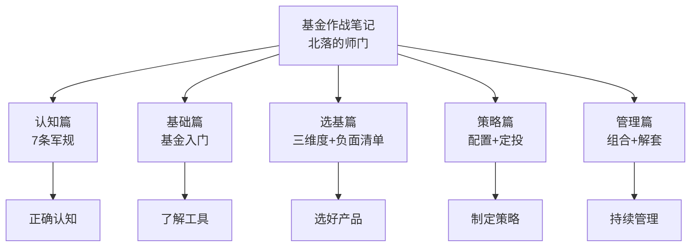
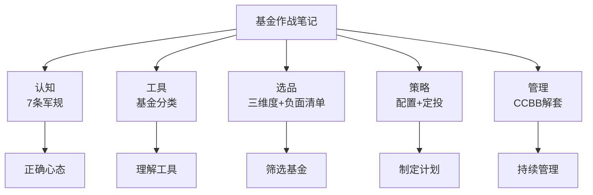

# 41《基金作战笔记》深度解读（详细版）

> **副题：北落的师门——"从投基新手到配置高手的进阶之路"：7 条军规+选基三维度+解套四步法**
>
> 作者：北落的师门（韭圈儿创始人），基金行业从业十几年。本书是系列中**第一本基金主题书**——从"基金到底是什么"讲起，到 7 条军规、选基负-面清单、资产配置圣杯、定投法则、解套四步法，再到至暗时刻的投资者陪伴。
>
> **核心定位**：全书 6 章构成基金投资完整闭环：**认知（7 条军规）→ 基础（基金分类）→ 选基（三维度+负面清单）→ 策略（配置+定投）→ 管理（组合+解套）→ 实践（至暗时刻问答）**。如果说 038—040 是股票入门/进阶/排雷，041 是**基金世界的"从零到配置高手"**。
>
> **系列意义**：041 是系列第 41 本，补齐了基金投资这块拼图——前面 40 本讲股票（怎么选、怎么买、怎么避雷），这本讲**怎么用基金这个工具实现资产配置**。对于不想直接买股票的普通投资者，这本书可能是系列里最实用的一本。

---

## 📖 全书结构与核心框架

### 6 章结构总览

| 篇章 | 核心内容 |
|------|---------|
| 第1章 认知篇 | 7 条军规（莫求暴富/永不满仓/均衡为王/定期复盘/稳定心态/定期投入/做好主业） |
| 第2章 基础篇 | 基金是什么/分类/交易细节 |
| 第3章 选基篇 | 三维度筛选（公司/产品/人）+负面清单+基金经理成长路径 |
| 第4章 策略篇 | 资产配置战略战术+定投+止盈止损 |
| 第5章 管理篇 | 组合管理 7 件事+解套四步法（CCBB） |
| 第6章 实践篇 | 至暗时刻/被套/资产配置问答 |

---

## 📑 目录

- [[#第1章 7 条军规：基金投资的底层认知|第1章 7 条军规：基金投资的底层认知]]
- [[#第2章 军规详解：从巴菲特到无限现金流|第2章 军规详解：从巴菲特到无限现金流]]
- [[#第3章 基金基础：从零认识基金|第3章 基金基础：从零认识基金]]
- [[#第4章 选基篇：三维度+负面清单|第4章 选基篇：三维度+负面清单]]
- [[#第5章 基金经理：如何找到靠谱的人|第5章 基金经理：如何找到靠谱的人]]
- [[#第6章 策略篇：资产配置与定投|第6章 策略篇：资产配置与定投]]
- [[#第7章 管理篇：组合管理与解套四步法|第7章 管理篇：组合管理与解套四步法]]
- [[#第8章 实践篇：至暗时刻的陪伴|第8章 实践篇：至暗时刻的陪伴]]
- [[#总结：基金投资的完整闭环|总结：基金投资的完整闭环]]
- [[#附录一 北落金句集（30 条精选）|附录一 北落金句集（30 条精选）]]
- [[#附录二 本书术语速查卡|附录二 本书术语速查卡]]
- [[#附录三 系列互链：041 在 41 本笔记中的位置|附录三 系列互链：041 在 41 本笔记中的位置]]
- [[#附录四 7 条军规执行检查清单|附录四 7 条军规执行检查清单]]
- [[#附录五 读完本书后的 10 个自问|附录五 读完本书后的 10 个自问]]
- [[#附录六 本书案例与数据速查|附录六 本书案例与数据速查]]
- [[#附录七 选基负面清单速查|附录七 选基负面清单速查]]
- [[#附录八 本书 FAQ 20 问|附录八 本书 FAQ 20 问]]
- [[#附录九 系列母题追踪（041 号更新）|附录九 系列母题追踪（041 号更新）]]
- [[#附录十 基金投资 vs 股票投资对照|附录十 基金投资 vs 股票投资对照]]
- [[#附录十一 30 秒版：基金作战笔记|附录十一 30 秒版：基金作战笔记]]
- [[#附录十二 北落基金理念 60 条|附录十二 北落基金理念 60 条]]
- [[#附录十三 不同股债配比参考表|附录十三 不同股债配比参考表]]
- [[#附录十四 系列 41 本总览（完成进度）|附录十四 系列 41 本总览（完成进度）]]
- [[#附录十五 五种眼光（041 版）|附录十五 五种眼光（041 版）]]
- [[#附录十六 中英对照：基金核心概念|附录十六 中英对照：基金核心概念]]
- [[#附录十七 思维训练：10 个基金练习|附录十七 思维训练：10 个基金练习]]
- [[#附录十八 解套四步法实操模板|附录十八 解套四步法实操模板]]
- [[#附录十九 写给基民的话（知乎文风附录）|附录十九 写给基民的话（知乎文风附录）]]

---

## 第1章 7 条军规：基金投资的底层认知

### 1.1 创业与初心

> "如果说创业是股票投资，打工是债券投资，那么在创业公司打工就是可转债投资，而我选择在证券基金领域创业，则属于满仓加杠杆了。"

**初心**：

> "内心对目前金融产品销售模式的抗拒，以及对改变这种局面的期望。"

> "投资是逆人性的……市场狂热的时候劝客户减仓，市场遇冷的时候劝客户加仓。大多数时候，让客户浑身不自在，才是真正对他好。"

> "如果投资者并没有从我的服务中赚钱，我凭什么赚钱？"

### 1.2 7 条军规总览（全书纲领）

| # | 军规 | 核心 |
|---|------|------|
| 1 | 莫求暴富 | 设定长期目标，巴菲特晚期年化 10% 就很棒 |
| 2 | 永不满仓 | 找到资产配置中枢（股三债七的神奇案例） |
| 3 | 均衡为王 | 构建基金经理 1/2 水平的组合 |
| 4 | 定期复盘 | 优胜劣汰再平衡 |
| 5 | 稳定心态 | 克服贪婪与恐惧 |
| 6 | 定期投入，必要时加倍 | 可持续资金支持 |
| 7 | 做好主业 | 保持现金流，比较优势 |

---

## 第2章 军规详解：从巴菲特到无限现金流

### 2.1 军规一：莫求暴富——巴菲特的三个人生阶段

| 阶段 | 年份 | 年化收益率 | 历史背景 |
|------|------|-----------|---------|
| 出道期 | 1957—1975 | **22%** | 战后复苏+宽松货币 |
| 巅峰期 | 1976—1998 | **42.4%** | 沃尔克大战通胀+黑色星期一+海湾战争 |
| 晚年期 | 1999 至今 | **9.8%** | 互联网泡沫+次贷危机+ARK 碾压+股价屡创新高 |

**1973—1974 的"欲望"比喻**：

> "1973年市场疯狂赶顶的时候，巴菲特说：'我现在就像一个欲望过剩的人，到了荒岛上。'……到了1974年股市崩盘，他说：'我现在就像一个欲望过剩的人，到了后宫里。'"

**北落的建议**：

> "长期而言，我们大多数人能拿到巴菲特晚年期10%左右的年化收益率，就已经非常棒了。想要赚到20%的年化收益率，要'天时、地利、人和'都具备才可以……那些教你'涨停板战法'，透露内幕消息，动不动收益翻倍的所谓的老师，也很可能是骗子。"

### 2.2 军规二：永不满仓——资产配置是唯一免费的午餐

**达利欧"投资的圣杯"**：

> "拥有15~20个良好的、互不相关的回报流。"

**股三债七的神奇案例（全书最震撼的数据）**：

| 指标 | 股三债七组合 | 沪深300 |
|------|-------------|---------|
| 统计时间 | 2004—2022（19 年） | 同期 |
| 年化收益率 | **8.27%** | <8.27% |
| 最大回撤 | **-22.09%** | 超过 -70%（2008） |

> "这样一条指数曲线看起来是那么'可爱'，不慌不忙地一点一点向上爬，穿越了一轮又一轮牛熊……权益部分主要用来获取收益，债券部分主要用来熨平波动，两者互相搭配，十几年竟然创造了奇迹。"

**再平衡的魔力**：

> "在牛市权益资产飞速上涨时，为把仓位降下来，基金经理必须卖掉一部分股票获利了结；在熊市权益资产节节败退时，基金经理又会慢慢低吸加仓股票……就这么熊去牛来，基金经理反复再平衡也贡献了一部分超额收益。"

### 2.3 军规三：均衡为王——两个不知道和两个知道

| | 不知道 | 知道 |
|--|--------|------|
| 1 | **未来哪位基金经理胜出或哪个行业上涨** | **基金经理整体水平优秀**（偏股基金指数年化 10—15%） |
| 2 | **市场精确的低点高点** | **逆人性投资才是长红之道** |

**关于不知道1**：

> "1年期收益率排名前十的基金经理在第二年的业绩大多数不好，而即便是3年期收益率排名前十的基金经理在第二年的业绩也呈现随机分布。我个人十几年的基金投资经验也是如此，我从来没有提前买到过第二年排名前十的基金。"

**关于知道1——团队优于个人**：

> "偏股基金指数在2015年就超越了2007年的历史高点，在2020年又超越了2015年上证5178点的高点。基金经理这个群体，对市场风向和景气度的敏感度是最高的。"

**关于知道2——逆人性**：

> "如果能有一个足够均衡的基金组合，跌的时候也会跟着跌但不会跌到全部亏损，涨的时候大概率跟着涨，牛市来了能创新高，那就可以解决问题了。这样的基金组合，使我们在想去逆人性投资的时候，多了一个有力的抓手。"

**1/2 水平为什么是合理目标**：

> "我们选取了全市场所有在2016年之前成立的偏股混合基金和股票基金……连续7年战胜偏股混合基金指数的基金占比"——极少数能做到。

**择时的数学**：

> "假如你在高点精准卖出，下一次你必须在低点精准买入才行，你必须连续做对两次，假如正确一次的概率是50%，连续对两次的概率就只有25%（50%×50%）。"

### 2.4 军规四、五：定期复盘+稳定心态

| 军规 | 核心 | 要点 |
|------|------|------|
| 四 | 定期复盘，优胜劣汰再平衡 | 同 2.2 再平衡的魔力 |
| 五 | 稳定心态 | 克服贪婪与恐惧——逆人性 |

### 2.5 军规六：定期投入，必要时加倍

**流量资金 vs 存量资金**：

| 概念 | 定义 | 阶段 |
|------|------|------|
| 流量资金 | 未来流入（工资/房租） | 年轻时定投为主 |
| 存量资金 | 已积累的资产 | 老年时配置为主 |

> "我们在工作初期，资产较少，主要是流量资金，这时候要坚持不懈地去储蓄，去定投基金组合……到了奋斗期的后期，这时候我们的存量资金已经很多，这时候更重要的是以配置为主，定投为辅。"

**人生草帽图**：教育期（靠父母）→ 奋斗期（自己养活自己+积累）→ 养老期（不动用子女）。

### 2.6 军规七：做好主业，保持现金流

> "如果要说投资有什么秘诀，我觉得就是：**均衡为王+无限现金流。**"

**比较优势原理**：

> "基金经理大概率比普通投资者专业，在这方面我们没有绝对优势。即便我们运气爆棚，偶尔能打败基金经理，但是我们真正拥有比较优势的，还是我们的主业。在投资上花费太多心力的话，可能会耽误我们在主业上精进，导致机会成本过大。"

> "专业胜过业余，团队优于个人。"

---

## 第3章 基金基础：从零认识基金

### 3.1 基金到底是什么

| 概念 | 内容 |
|------|------|
| 定义 | 集合投资工具=把钱交给专业机构管理 |
| 赚什么钱 | ①资产增值（股价/债息）②基金经理超额能力（α） |
| 适合谁 | 不想自己选股、没时间研究、想分散风险的普通投资者 |

### 3.2 基金的分类

| 大类 | 投资方向 | 风险收益 | 适合 |
|------|---------|---------|------|
| 货币基金 | 短期债券/存款 | 极低/1—2% | 现金管理 |
| 债券基金 | 债券 | 低/3—5% | 稳健 |
| 混合基金 | 股+债 | 中 | 均衡 |
| 股票基金 | 股票（80%+） | 高/长期 10%+ | 增值 |
| 指数基金 | 跟踪指数 | 市场平均 | 被动投资 |
| QDII | 海外资产 | 高 | 全球配置 |
| FOF | 基金中基金 | 中 | 二次分散 |

### 3.3 实操交易细节

| 细节 | 内容 |
|------|------|
| 申购/赎回 | T+1~T+7 到账 |
| 前端/后端收费 | 买入时扣 vs 卖出时扣 |
| A/C 类 | A 类收申购费适合长持；C 类收销售服务费适合短线 |
| 分红方式 | 现金分红 vs 红利再投资 |
| 定投 | 约定时间/金额自动买入 |

---

## 第4章 选基篇：三维度+负面清单

### 4.1 选基的三个维度：公司、产品、人

| 维度 | 关键问题 |
|------|---------|
| **基金公司** | 股东稳定吗？投研团队强吗？机制合理吗？ |
| **基金产品** | 类型/历史业绩/风险指标/持有人结构 |
| **基金经理** | 经历/风格/规模/言行是否一致 |

**基金公司为何重要**：

> "完全依靠基金经理单打独斗的时代过去了，且一去不复返了。中小公司好不容易培养出优秀基金经理，大公司出两三倍薪水就会把人挖走；有的中小公司进不去主流代销渠道，会采取非常激进的投资策略，最后出问题大多是一群不明真相的新手基民买单。"

**产品视角：FOF 青睐排行榜**：

> "观察这只基金的持有人结构。比如持有这只基金的FOF（尤其是其他基金公司的FOF）越多越好，而机构持有人的比例在30%—70%是最佳的。"

### 4.2 选基负面清单（11 条——全书最实用工具）

| # | 负面条件 | 原因 |
|---|---------|------|
| 1 | 公司治理有问题、股东有风险 | 根基不稳 |
| 2 | 团队单打独斗 | 靠运气概率大 |
| 3 | 规模<5,000 万 | 担心清盘 |
| 4 | 管理规模>100-200 亿（主动权益） | 策略受限 |
| 5 | 机构占比>90%（债基为主） | 机构定制可能 |
| 6 | 踩过大雷 | 风控存疑 |
| 7 | 风格不稳定 | 无法预期 |
| 8 | 梭哈一个板块 | 赌性太重 |
| 9 | 言行不一致 | 诚信问题 |
| 10 | 跳槽频繁 | 不把投资者利益放心上 |
| 11 | 基金经理自己不买 | 利益不一致 |

### 4.3 爆雷案例：网红中短债一天跌 12%

> "2022年11月的债市波动中，由于它持有的品种信用风险较高，产品遭遇赎回挤兑，基金净值一天暴跌12%……尽管基金公司发布公告称持仓并未踩雷违约，但基金净值恢复几无可能。"

**教训**：**只看短期收益率追买=踩雷——短期冠军往往是激进策略的产物。**

---

## 第5章 基金经理：如何找到靠谱的人

### 5.1 基金经理的典型成长路径

| 步骤 | 内容 |
|------|------|
| 第一步 | 名校学霸（985/211 研究生）→ 理工科优于金融优于文科 |
| 第二步 | 三条路径：直接进基金公司当研究员/进券商做卖方研究员/进实业积累再转行 |
| 第三步 | 研究员→管理自营或专户→正式管理公募产品 |
| 第四步 | 功成名就后，可继续或"奔私"创业 |

### 5.2 四大权威奖项

| 奖项 | 主办方 | 含金量 |
|------|--------|--------|
| 金牛奖（2004） | 中国证券报 | "基金业奥斯卡" |
| 金基金奖（2004） | 上海证券报 | 权威媒体 |
| 明星基金奖（2006） | 证券时报 | 近取消 1 年期短奖 |
| 晨星奖（2009 中国） | 晨星公司 | **每年只评 5 只，含金量最高** |

**大满贯/大四喜选手全市场不多**——但：

> "奖项更多是对基金经理过去的总结和表彰，并不意味着其未来表现就一定可以延续。"

---

## 第6章 策略篇：资产配置与定投

### 6.1 基民想赚钱，什么最重要

> "买基金想赚钱，是选对基金重要，还是做对策略更重要？从调研的结果来看，60%以上的投资者认为，策略比选基更重要。"

### 6.2 资产配置的战略与战术

| 层面 | 内容 |
|------|------|
| 战略配置 | 确定股债比例（长期） |
| 战术配置 | 短期偏离中枢（再平衡） |
| 动态调整 | 用新资金调整比例 |

### 6.3 基金定投的五大特点

| # | 特点 | 说明 |
|---|------|------|
| 1 | 强制储蓄，积少成多 | **"定额投资，低位布局……投得越早，扣款越多"** |
| 2 | 怕跌，爱熊市 | "真正赚钱的光景很短，大部分时间在低位——这些时光就是我们定投积累份额的最佳时机" |
| 3 | 平滑成本，降低风险 | 成本变成平滑曲线，"和我们什么时间开始定投已经关系不大" |
| 4 | 省心省力，无须择时 | 一次签约，剩下交给时间 |
| 5 | 门槛极低 | 10 元起投，随时赎回 |

**竹笋比喻**：

> "地下三年，一朝破土，一朝长一尺，一天长一丈。"

### 6.4 定投 vs 一次性投资

| 维度 | 定投 | 一次性投资 |
|------|------|-----------|
| 资金属性 | 结余的小钱/未来收入 | 已有的大钱 |
| 目标 | 养老/教育/储蓄（长期） | 获取高收益 |
| 买点 | 不重要 | **极其重要** |
| 适合 | 入门/低风险投资者 | 专业/高风险偏好 |

**两个法则**：

> 1. 只要期末基金净值>定投平均成本，定投就一定赚钱。
> 2. 只要一次性投资成本>定投平均成本，定投就一定优于一次性投资。

### 6.5 三类场景的定投

| 场景 | 定投优势 |
|------|---------|
| 熊市想抄底怕被埋 | 继续跌=积累更多份额，反弹就回本 |
| 牛市想追高怕被套 | 投入金额少，慢慢摊薄，心里不慌 |
| 震荡市想参与怕被套 | 市场点位不变，通过震荡周期也能赚钱 |

---

## 第7章 管理篇：组合管理与解套四步法

### 7.1 投资之前 2 个准备：定目标、做配置

| 准备 | 内容 |
|------|------|
| 定目标 | 收益/回撤/持有期三要素 |
| 做配置 | 确定股债比例+选基金+设定再平衡规则 |

### 7.2 投资之后 3 个跟踪：管收益、盯策略、诊持仓

| 跟踪 | 内容 |
|------|------|
| 管收益 | 对比基准/同类 |
| 盯策略 | 定投/再平衡是否执行 |
| 诊持仓 | 仓位/风格/基金表现偏差 |

### 7.3 投资前后都要做的 2 个功课：做调研、读季报

| 功课 | 内容 |
|------|------|
| 做调研 | 基金经理访谈/路演 |
| 读季报 | 十大重仓/运作分析/市场展望 |

### 7.4 解套四步法（CCBB）——全书最具操作性的部分

| 步骤 | 名称 | 内容 |
|------|------|------|
| **C** | 归集账户（Collect） | **把各平台所有基金/理财归到一张表**——"避免一叶障目" |
| **C** | 诊断问题（Check） | 仓位过高还是基金表现太差/风格过于集中？ |
| **B** | 均衡调仓（Balance） | 调整行业风格比例→均衡；每风格选优质基金 |
| **B** | 赚钱补仓（Buy） | 熊市中持续买入积累份额 |

**第4步的核心心法**：

> "我从业十几年的经验是，**在熊市中要努力工作赚钱，然后把自己变成一个无情的加仓机器。**"

> "之前我们亏钱时不敢买，是因为不知道原来的基金持仓出现了什么问题，担心基金会持续下跌，甚至全部亏损，但是现在这些担心没有了，在熊市中持续买入积累到足够多的份额，变成了我们新的目标。"

### 7.5 导致亏损的坏习惯

| 坏习惯 | 表现 | 北落的话 |
|--------|------|---------|
| 追涨杀跌 | 疯狂时仓位重+低迷时仓位轻=倒三角 | "标的要均衡，投资要逆势" |
| 频繁交易 | 贪婪与恐惧驱动 | — |
| "基金赚钱基民不赚钱" | 基金经理业绩好 vs 投资者实际利润低 | "投资者收益是由仓位决定的" |

---

## 第8章 实践篇：至暗时刻的陪伴

### 8.1 2019 年入场 vs 2021 年入场

> "你2019年入市的……是2018年那个惨烈的熊市之后，在大火燃烧的森林余烬中入市的，这才是关键！**真正决定赚不赚钱的，不是你选的基金经理多厉害，或者你选的行业ETF正在风口，而是你进场的时点。**"

### 8.2 赚钱了要消费

> "赚钱了不一定全部卖掉，但一定要拿出来一部分消费，提升自己和家人的生活品质。我的第一个单反相机，给女朋友买的第一个香奈儿基本款，结婚时买车，后来换房子，股市都做了不小的贡献。**我喜欢把股市赚到的虚拟财富，换成一个个实物摆在那里的感觉，每次看到或用到都会勾起美好的回忆。**"

### 8.3 股市会不会关闭

> "二战期间德国股市在斯大林格勒战役失败后大势已去，直到1944年8月才休市，1948年重新启动。日本股市1945年战败后才休市，当年秋天就恢复了。没过多久，德国股市和日本股市都在战后重建中创出新高。**A股基本不可能关闭。**"

### 8.4 面对降薪+被套的至暗时刻

**三个问题自检**：

| 问题 | 内容 |
|------|------|
| 行业有前途吗 | 地产行业长期看难有大周期 |
| 10 年后什么样子 | 看公司里同职位前辈的状态 |
| 性格适合国企吗 | 企业文化你擅长吗 |

**"回老家但不躺平"的思路**：基金公司渠道经理可属地办公→在省会拿北上广深工资；财经自媒体→三四线深居简出，收入与一线同行一样。

### 8.5 创业三年，人间值得

> "巧合的是，我创业的头三年，正是新冠肺炎疫情最让人忧心的三年。难吗？真难！但也有投资者对我说，是我们每天晚上的直播，伴她度过了人生中最难受的一段日子。人间值得。**我们无法抗拒贝塔，但我们可以成为用户的阿尔法。**"

---

## 总结：基金投资的完整闭环

### Z1. 北落体系全景

### Z2. 全书的五根柱子

| 柱子 | 核心 | 章节 |
|------|------|------|
| 7 条军规 | 莫求暴富/均衡为王/无限现金流 | 第1—2章 |
| 选基清单 | 11 条负面清单+三维度 | 第3—4章 |
| 资产配置 | 股三债七 19 年年化 8.27% | 第6章 |
| 解套四步 | CCBB（归集/诊断/均衡/补仓） | 第7章 |
| 至暗时刻 | 入场时点决定收益+"无情的加仓机器" | 第8章 |

### Z3. 北落留给读者的三句话

> 1. "均衡为王+无限现金流——这就是投资的全部秘诀。"
> 2. "在熊市中要努力工作赚钱，然后把自己变成一个无情的加仓机器。"
> 3. "我们无法抗拒贝塔，但我们可以成为用户的阿尔法。"

---

## 附录一 北落金句集（30 条精选）

> 1. "投资是逆人性的……让客户浑身不自在，才是真正对他好。"——前言
> 2. "如果投资者并没有从我的服务中赚钱，我凭什么赚钱？"——前言
> 3. "我们无法抗拒贝塔，但我们可以成为用户的阿尔法。"——前言
> 4. "10%左右的年化收益率，就已经非常棒了。"——军规1
> 5. "我现在就像一个欲望过剩的人，到了后宫里。"——巴菲特 1974
> 6. "资产配置是唯一免费的午餐。"——军规2
> 7. "拥有15~20个良好的、互不相关的回报流。"——达利欧
> 8. "股三债七……19年年化8.27%，最大回撤-22%。"——军规2
> 9. "均衡为王，构建基金经理1/2水平的组合。"——军规3
> 10. "我从来没有提前买到过第二年排名前十的基金。"——军规3
> 11. "连续对两次的概率只有25%（50%×50%）。"——军规3
> 12. "标的要均衡，投资要逆势。"——军规3
> 13. "把你的成本线变成一个平滑的曲线。"——军规6
> 14. "在熊市中要努力工作赚钱，然后把自己变成一个无情的加仓机器。"——解套
> 15. "流量资金持续投入→变成存量资金→配置产生更多流量资金。"——军规6
> 16. "均衡为王+无限现金流，这就是投资的全部秘诀。"——军规7
> 17. "专业胜过业余，团队优于个人。"——军规7
> 18. "完全依靠基金经理单打独斗的时代过去了。"——选基
> 19. "观察FOF青睐排行榜……被其他基金经理认可。"——选基
> 20. "奖项是对过去的表彰，不意味未来延续。"——基金经理
> 21. "60%以上投资者认为，策略比选基更重要。"——策略
> 22. "地下三年，一朝破土，一朝长一尺，一天长一丈。"——定投
> 23. "定期定额投资，帮助普通投资者储蓄，避免择时困扰。"——定投
> 24. "真正决定赚不赚钱的……是你进场的时点。"——至暗时刻
> 25. "我喜欢把股市赚到的虚拟财富，换成一个个实物摆在那里。"——至暗时刻
> 26. "二战德国股市……1948年重新启动，日本股市当年秋天恢复。"——至暗时刻
> 27. "千万不要在用大钱的地方耍小聪明。"——解套
> 28. "投资者收益不仅由基金业绩决定，更重要的是由仓位决定。"——解套
> 29. "我一直在做中国公募基金的长期价值发现。"——前言
> 30. "当你拿起这本书决定出发，你已经迈出了最难的一步。"——前言

---

## 附录二 本书术语速查卡

| 术语 | 定义 | 出处 |
|------|------|------|
| 流量资金 | 未来流入的资金（工资/房租） | 军规6 |
| 存量资金 | 已积累的资产 | 军规6 |
| 比较优势 | 做一件事机会成本越小优势越大 | 军规7 |
| 资产配置中枢 | 长期股债目标比例 | 军规2 |
| 再平衡 | 偏离中枢时调回目标比例 | 军规2 |
| 1/2 水平 | 达到基金经理平均表现 | 军规3 |
| 负面清单 | 11 条不买条件 | 选基篇 |
| 金牛奖 | 中国基金业"奥斯卡" | 基金经理 |
| 晨星奖 | 每年只评 5 只 | 基金经理 |
| CCBB | 解套四步：归集/诊断/均衡/补仓 | 管理篇 |
| 定投 | 固定时间/金额投资 | 策略篇 |
| FOF | 基金中基金 | 基础篇 |
| QDII | 合格境内机构投资者（海外投资） | 基础篇 |
| α（阿尔法） | 超额收益 | 前言 |

---

## 附录三 系列互链：041 在 41 本笔记中的位置

| 系列笔记 | 链接点 |
|---------|--------|
| [[39《股票投资入门、进阶与实战》深度解读（详细版）|39 号]] | 朱孜资产配置×041 股债配比 |
| [[40《避开股市的地雷》深度解读（详细版）|40 号]] | 张化桥排雷×041 选基负面清单 |
| [[04《原则》深度解读（详细版）|04 号]] | 达利欧"投资的圣杯"×041 资产配置 |
| [[05《巴菲特的投资心法》深度解读（详细版）|05 号]] | 巴菲特三阶段×041 军规1 |
| [[35《投资中最简单的事》深度解读（详细版）|35 号]] | 邱国鹭逆向×041 逆人性投资 |
| 038 | 股票入门 vs 基金入门 |

---

## 附录四 7 条军规执行检查清单

- [ ] 1. 我的年化目标合理吗？（10% 就很棒）
- [ ] 2. 我有资产配置中枢吗？（股债比例）
- [ ] 3. 我的组合均衡吗？（不押单一风格/行业）
- [ ] 4. 我定期复盘再平衡吗？
- [ ] 5. 我能在恐慌时不割肉、狂热时不追高吗？
- [ ] 6. 我有持续现金流定期投入吗？
- [ ] 7. 我的主业稳固吗？（不辞职炒股）

---

## 附录五 读完本书后的 10 个自问

1. 我期待的年化收益率合理吗？（巴菲特晚年也才 10%）
2. 我持仓的股债比例是多少？是"永不满仓"吗？
3. 我的基金组合均衡吗？还是重仓梭哈了某个赛道？
4. 我选基金用了负面清单吗？（11 条）
5. 我有自己的定投计划吗？
6. 我被套了会按 CCBB 四步操作吗？
7. 我理解"基金赚钱基民不赚钱"的原因吗？（仓位倒三角）
8. 我进场的时点是高位还是低位？
9. 我的主业现金流健康吗？还是想辞职专职投资？
10. 我会在赚钱后取出一部分改善生活吗？

---

## 附录六 本书案例与数据速查

| 数字 | 含义 |
|------|------|
| 22%/42.4%/9.8% | 巴菲特三期年化 |
| 19 年 | 股三债七统计区间（2004—2022） |
| 8.27% | 股三债七年化（>同期沪深300） |
| -22.09% vs -70%+ | 股三债七回撤 vs 沪深300 |
| 15—20 个 | 达利欧圣杯回报流数量 |
| 11 条 | 选基负面清单 |
| 60% | 认为策略比选基更重要的基民 |
| 25% | 择时连续对两次的概率 |
| 12% | 网红中短债一天跌幅 |
| 5,000 万 | 清盘警戒线 |
| 100—200 亿 | 主动权益基金经理规模上限 |
| 30—70% | 机构持有人最佳占比 |
| 1944—1948 | 德国股市关闭重开 |
| 10 元 | 定投最低起投金额 |

---

## 附录七 选基负面清单速查

### 公司层面

- [ ] 治理问题/股东风险？
- [ ] 团队单打独斗？

### 产品层面

- [ ] 规模<5,000 万？
- [ ] 机构占比>90%（债基）？
- [ ] 管理规模>100-200 亿（主动权益）？

### 基金经理层面

- [ ] 踩过大雷？
- [ ] 风格不稳定？
- [ ] 梭哈一个板块？
- [ ] 言行不一致？
- [ ] 跳槽频繁？
- [ ] 自己一分不买？

---

## 附录八 本书 FAQ 20 问

**Q1：普通人年化目标多少合理？**
A：10% 就很棒——巴菲特晚期也不过 9.8%。

**Q2：为什么股三债七如此神奇？**
A：19 年年化 8.27%/回撤-22%——权益赚收益，债券熨波动，再平衡贡献超额。

**Q3：为什么不选"明星基金经理"？**
A：一年冠军第二年大概率不好；三年冠军第二年随机分布。

**Q4：什么是"两个不知道两个知道"？**
A：不知道谁胜出/不知道精确高低点；知道整体优秀/知道逆人性。

**Q5：1/2 水平是什么意思？**
A：达到基金经理平均表现——连续多年战胜指数已是少数。

**Q6：选基最重要的三个维度？**
A：公司（治理/团队）+产品（类型/业绩/持有人）+人（风格/规模/诚信）。

**Q7：11 条负面清单中最重要的是？**
A：言行不一致=一票否决；公司治理有问题=再好的产品也不看。

**Q8：定投有什么优势？**
A：强制储蓄/低位布局/平滑成本/省心省力/门槛极低。

**Q9：定投什么时候赚钱？**
A：期末净值>平均成本——熊市积累份额，牛市兑现收益。

**Q10：什么是解套四步法（CCBB）？**
A：归集账户→诊断问题→均衡调仓→赚钱补仓。

**Q11：为什么必须归集账户？**
A：避免一叶障目——A 平台显示"全仓股基风险高"，实际总资产是股一债九。

**Q12："无情的加仓机器"什么意思？**
A：解套第四步——诊断调仓后，在熊市中持续买入积累份额。

**Q13：流量资金和存量资金什么关系？**
A：年轻时流量资金定投→积累成存量资金→配置产生更多流量资金（正向循环）。

**Q14：为什么做好主业比投资更重要？**
A：比较优势——你真正有优势的是主业，不是投资。无限现金流来自主业。

**Q15：基金经理怎么成长的？**
A：名校学霸→研究员→管专户→管公募→可能"奔私"。

**Q16：金牛奖和晨星奖哪个含金量更高？**
A：晨星奖（每年只评 5 只，含金量最高）；金牛奖是"奥斯卡"；大满贯选手全市场不多。

**Q17：怎么熬过至暗时刻？**
A：二战德国股市关而复开创新高；入场时点决定收益；均衡组合在低位持续买入。

**Q18：赚钱了应该怎么做？**
A：取出一部分消费改善生活——"虚拟财富换成实物，勾起美好回忆"。

**Q19：基金赚了基民没赚，为什么？**
A：仓位倒三角——高位仓位重，低位仓位轻。收益由仓位决定。

**Q20：这本书的终极建议？**
A：7 条军规（莫求暴富/均衡/定投/主业）+选基负面清单+熊市无情的加仓机器。

---

## 附录九 系列母题追踪（041 号更新）

### 9.1 "资产配置"主题系列对照

| 笔记 | 视角 |
|------|------|
| 04 达利欧 | 15-20 个不相关回报流（圣杯） |
| 039 朱孜 | 按年龄的股债配置 |
| **041 北落** | **股三债七 19 年实证+不同配比收益回撤表** |

### 9.2 "安全边际/不亏钱"主题系列对照

| 笔记 | 视角 |
|------|------|
| 28 格雷厄姆 | 安全边际（估值） |
| 036 陈江挺 | 败而不倒（保本） |
| 040 张化桥 | 数字砍半（排雷） |
| **041 北落** | **7 条军规（资产配置+定投+无限现金流）** |

---

## 附录十 基金投资 vs 股票投资对照

| 维度 | 基金投资（041） | 股票投资（035—040） |
|------|---------------|-------------------|
| 选品 | 基金三维度+负面清单 | 三要素/四大要素/烟蒂股 |
| 分散 | 基金内部已分散 | 需要自己组合 |
| 专业度 | 委托基金经理 | 自己做分析 |
| 时间 | 定投省心 | 需要持续研究 |
| 适合 | **普通工薪族** | 有研究能力的投资者 |
| 风险 | 市场风险+管理风险 | 市场+个股+信息风险 |

**互补**：**不能/不想选股的→选基金；有能力选股的→直接买股票。**

---

## 附录十一 30 秒版：基金作战笔记

> **基金作战笔记（30 秒版）**：
>
> 1. **7 条军规**——10% 目标/永不满仓/均衡/复盘/稳定心态/定投/主业；
> 2. **选基**——公司（治理/团队）+产品（类型/持有人）+人（风格/诚信）；11 条负面清单保命；
> 3. **配置**——股三债七 19 年年化 8.27%；
> 4. **定投**——竹笋：地下三年，一朝破土，一天长一丈；
> 5. **解套**——CCBB：归集→诊断→均衡→补仓；熊市做无情的加仓机器；
> 6. **终极**——均衡为王+无限现金流。

---

## 附录十二 北落基金理念 60 条

**认知与军规（1—20）**：

> 1. 10% 年化已经很棒。
> 2. 20% 需要天时地利人和。
> 3. 40% 以上概率太低。
> 4. 资产配置是唯一免费午餐。
> 5. 15—20 个不相关回报流。
> 6. 股三债七 19 年年化 8.27%。
> 7. 再平衡在波动大市场威力更大。
> 8. 均衡为王。
> 9. 构建 1/2 水平组合。
> 10. 不知道谁未来领先。
> 11. 不知道精确高低点。
> 12. 知道基金经理整体优秀。
> 13. 知道逆人性才长红。
> 14. 连续做对两次只有 25%。
> 15. 定期复盘再平衡。
> 16. 克服贪婪与恐惧。
> 17. 流量资金定投。
> 18. 存量资金配置。
> 19. 均衡+无限现金流=全部秘诀。
> 20. 做好主业，比较优势。

**选基与经理（21—40）**：

> 21. 公司治理有问题=不碰。
> 22. 单打独斗团队=不碰。
> 23. 规模<5 千万=不碰。
> 24. 管理规模超 100—200 亿=谨慎。
> 25. 机构>90%=不碰。
> 26. 踩过大雷=谨慎。
> 27. 风格不稳=不碰。
> 28. 梭哈板块=谨慎。
> 29. 言行不一=拉黑。
> 30. 跳槽频繁=谨慎。
> 31. 自己不买=谨慎。
> 32. FOF 青睐越多越好。
> 33. 机构 30—70% 最佳。
> 34. 金牛=奥斯卡。
> 35. 晨星=含金量最高。
> 36. 大满贯选手不多。
> 37. 奖项=过去≠未来。
> 38. 名校→研究员→基金经理。
> 39. 理工>金融>文科。
> 40. 私募=创业维艰。

**策略与管理（41—60）**：

> 41. 策略比选基更重要（60%）。
> 42. 战略配置定比例。
> 43. 战术配置动态调。
> 44. 定投=强制储蓄。
> 45. 定投=爱熊市。
> 46. 定投=平滑成本。
> 47. 定投=省心省力。
> 48. 定投=10 元起。
> 49. 期末净值>定投成本=赚钱。
> 50. 地下三年一朝破土。
> 51. CCBB 解套四步。
> 52. 归集账户第一。
> 53. 诊断问题第二。
> 54. 均衡调仓第三。
> 55. 赚钱补仓第四。
> 56. 熊市做无情加仓机器。
> 57. 追涨杀跌=倒三角仓位。
> 58. 入场时点决定收益。
> 59. 赚了要消费改善生活。
> 60. 我们无法抗拒贝塔，但可以成为用户的阿尔法。

---

## 附录十三 不同股债配比参考表

| 股债比例 | 适合人群 | 预期年化 | 预期最大回撤 |
|---------|---------|---------|-------------|
| 10/90 | 极度保守/退休 | 4—5% | -5% 以内 |
| 20/80 | 保守/临近退休 | 5—6% | -10% |
| **30/70** | **稳健/本书推荐** | **6—8%** | **-15~22%** |
| 50/50 | 平衡/中年 | 7—10% | -25~30% |
| 70/30 | 进取/青年 | 8—12% | -35~40% |
| 90/10 | 激进/年轻 | 10%+ | -50% 以上 |

---

## 附录十四 系列 41 本总览（完成进度）

| 编号 | 书名 | 状态 |
|------|------|------|
| 01—03 | 利弗莫尔三部曲 | ✅ |
| 04 | 达利欧《原则》 | ✅ |
| 05—14 | 巴菲特系列 | ✅ |
| 16—21 | 巴菲特延伸系列 | ✅ |
| 22—25 | 芒格四书 | ✅ |
| 26—27 | 费雪父子 | ✅ |
| 28 | 格雷厄姆 | ✅ |
| 29—30 | 段永平双册 | ✅ |
| 31 | 索罗斯《金融炼金术》 | ✅ |
| 32—34 | 林奇三部曲 | ✅ |
| 035 | 邱国鹭《投资中最简单的事》 | ✅ |
| 036 | 陈江挺《炒股的智慧》 | ✅ |
| 037 | 冉伟《股票投资沉思录》 | ✅ |
| 038 | 马涛《从零开始学炒股》 | ✅ |
| 039 | 朱孜《股票投资入门、进阶与实战》 | ✅ |
| 040 | 张化桥《避开股市的地雷》 | ✅ |
| **041** | **北落的师门《基金作战笔记》** | **✅ 本笔记** |
| 042—169 | 更多 | 待解读 |

**系列进度：41/169 完成**

---

## 附录十五 五种眼光（041 版）

以"2024 年初市场底部"为例：

| 大师 | 眼光 | 动作 |
|------|------|------|
| 05 巴菲特 | 便宜 | 遍地后宫 |
| 035 邱国鹭 | 逆向 | 价值投资不是每年有效 |
| **041 北落** | **基金** | **解套 CCBB：归集→诊断→均衡→做无情的加仓机器** |

**041 的独特价值**：用基金工具实现大师理念——不需要选股，只需选基+配置+定投+纪律。

---

## 附录十六 中英对照：基金核心概念

| 中文 | English |
|------|---------|
| 基金作战笔记 | Fund Battle Notes |
| 7 条军规 | 7 Military Rules |
| 资产配置 | Asset Allocation |
| 再平衡 | Rebalancing |
| 定投 | Dollar-Cost Averaging (DCA) |
| 流量资金 | Flow Capital |
| 存量资金 | Stock Capital |
| 阿尔法 | Alpha |
| 贝塔 | Beta |
| FOF | Fund of Funds |
| 比较优势 | Comparative Advantage |
| 金牛奖 | Golden Bull Award |
| 晨星奖 | Morningstar Award |
| 解套四步法 | CCBB Method |

---

## 附录十七 思维训练：10 个基金练习

1. 计算自己当前的股债配置比例
2. 用 7 条军规逐条审计自己的投资行为
3. 用 11 条负面清单扫描持仓基金
4. 查看持仓基金的 FOF 青睐排行榜
5. 制定一份定投计划（金额/频率/标的）
6. 按 CCBB 四步给被套的基金做一次完整诊断
7. 写下自己的长期收益率目标并与巴菲特三阶段对比
8. 评估自己的流量资金与存量资金结构
9. 计算"如果我只做股三债七，过去 5 年收益如何"
10. 模拟一笔"至暗时刻"的操作：如果明天暴跌 20%，你的计划是什么？

---

## 附录十八 解套四步法实操模板

### 第一步：归集账户（一张表）

| 平台 | 产品 | 金额 | 类型 | 年化 | 最大回撤 |
|------|------|------|------|------|---------|
| 支付宝 | A 基金 | 50,000 | 混合 | 8% | -20% |
| ... | ... | ... | ... | ... | ... |
| **总计** | — | **XX万** | **当前股债比** | **总年化** | **总回撤** |

### 第二步：诊断问题

- 股债比例离目标中枢偏离多少？
- 哪些基金表现远低于同类平均？
- 风格是否过度集中？

### 第三步：均衡调仓

- 调整至目标股债比例
- 每个风格/行业选最优一只
- 短期不用的钱用时间换空间（分批调仓）

### 第四步：赚钱补仓

- 每月定投金额确认
- 设定加仓触发点（如跌破年线/PE 分位低于 20%）
- 执行：坚持到成本线成为平滑曲线

---

## 附录十九 写给基民的话（知乎文风附录）

### 写在前面：一个在基金行业干了十几年的人

先讲一件事：北落的师门在基金行业干了十几年，看到的最普遍的问题是什么？

**"基金赚钱，基民不赚钱。"**

基金长期的复权回报都很好，但是基金年报里基民的利润却长期不佳。为什么？因为基民总是在**市场疯狂的时候追涨导致仓位重，在市场低迷的时候不敢加仓导致仓位轻**——形成一个倒三角形的仓位结构。

> "投资者收益不仅是由基金业绩决定的，更重要的是由投资者仓位决定的。"

所以他写了一本书。开头就说：

> "如果说创业是股票投资，打工是债券投资，那么在创业公司打工就是可转债投资，而我选择在证券基金领域创业，则属于满仓加杠杆了。"

**一个把自己满仓加杠杆投进基金行业的人，写的基金书，值得你读。**

### 第一课：你期待的收益率，连巴菲特最难的时候也只有 10%

每个人都想赚钱，但绝大多数人的期待完全不切实际。

北落把巴菲特的业绩分成三个阶段：

**出道期（1957—1975）**：年化 22%——战后复苏+宽松货币。
**巅峰期（1976—1998）**：年化 42.4%——沃尔克大战通胀+黑色星期一+海湾战争，反而越战越勇。
**晚年期（1999 至今）**：年化 9.8%——互联网泡沫没参与，次贷危机抄底被套，甚至被 ARK 碾压，被质疑"股神老了"。

但就是这 9.8% 的年化，伯克希尔股价仍在慢慢上涨中屡创新高，巴菲特的个人财富在这一阶段呈现出"指数级"增长。

**你一个普通人，凭什么觉得自己能比巴菲特晚年还好？**

> "长期而言，我们大多数人能拿到巴菲特晚年期10%左右的年化收益率，就已经非常棒了。那些教你'涨停板战法'，透露内幕消息，动不动收益翻倍的所谓的老师，也很可能是骗子。"

### 第二课：股三债七——只有 8.27%，但比满仓股票还好

全书最震撼的一组数据：从 2004 到 2022 年的 19 年间，一个"30% 股票+70% 债券"的组合（偏债混合基金指数）取得了 **年化 8.27%** 的收益——**比 100% 权益资产的沪深 300 还要好。**

更关键的是回撤：股三债七最大回撤只有 **-22.09%**，而沪深 300 在 2008 年最大回撤超过 **-70%**。

| 指标 | 股三债七 | 沪深300 |
|------|---------|--------|
| 年化 | 8.27% | <8.27% |
| 最大回撤 | -22.09% | -70%+ |

> "这样一条指数曲线看起来是那么'可爱'，不慌不忙地一点一点向上爬，穿越了一轮又一轮牛熊……权益部分主要用来获取收益，债券部分主要用来熨平波动，两者互相搭配，十几年竟然创造了奇迹。"

**为什么这么神奇？** 一个是基金经理获取阿尔法收益的能力（偏股基金经理长期跑赢市场），另一个是资产配置的魔力：牛市权益飞速上涨→基金经理卖出股票获利了结降仓位；熊市权益节节败退→基金经理低吸加仓保持产品风格稳定。**就这么熊去牛来，反复再平衡贡献了超额收益。**

> "再平衡的效果，在波动更大的市场中威力更大，所以在A股市场更适合做资产配置。"

### 第三课：选基金——11 条"不买"清单

北落在基金行业十几年，见过的坑比套路多。他给了一个负面清单，每条都是用真金白银换来的：

| 不碰的条件 | 原因 |
|-----------|------|
| 公司治理有问题 | 根基不稳 |
| 团队单打独斗 | 靠运气概率大 |
| 规模<5,000 万 | 担心清盘 |
| 管理规模超 100—200 亿 | 策略受限 |
| 机构占比>90% | 机构定制 |
| 踩过大雷 | 风控存疑 |
| 风格不稳定 | 无法预期 |
| 梭哈一个板块 | 赌性重 |
| 言行不一致 | 诚信问题——**一票否决** |
| 跳槽频繁 | 不把投资者放心上 |
| 自己一分不买 | 利益不一致 |

其中第 9 条最狠——**言行不一致，直接拉黑。** 基金经理说一套做一套，季报说看好 A 行业，重仓却是 B——这种人管理的钱，你敢信？

还有第三个维度的巧招：

> "观察这只基金的持有人结构。比如持有这只基金的FOF（尤其是其他基金公司的FOF）越多越好，而机构持有人的比例在30%—70%是最佳的。"

**被同行认可的基金，才是真正的好基金。**

### 第四课：解套四步法——被套了怎么办

北落给了最实用的解套流程，四个字母：**CCBB**。

**第一步 C：归集账户。** 把支付宝上的基金、银行里的理财、券商的股票全部汇总到一张表。否则支付宝的持仓分析说"你全仓股基风险太高"——实际上你 90% 的钱在银行理财里，股一债九，白白吓自己。

**第二步 C：诊断问题。** 是仓位太高达不到目标？还是某只基金表现太差？风格是否过度集中？

**第三步 B：均衡调仓。** 调整行业风格比例到均衡，每个方向选最优的一只。

**第四步 B：赚钱补仓。** 诊断和调仓完成后，信心最大的时候，在熊市中持续买入积累份额。

> "我从业十几年的经验是，**在熊市中要努力工作赚钱，然后把自己变成一个无情的加仓机器。**"

> "之前我们亏钱时不敢买，是因为不知道原来的基金持仓出现了什么问题，担心基金会持续下跌，甚至全部亏损，但是现在这些担心没有了，在熊市中持续买入积累到足够多的份额，变成了我们新的目标。"

### 第五课：定投——竹笋的哲学

北落用一根竹笋讲定投：

> "地下三年，一朝破土，一朝长一尺，一天长一丈。"

定投的魅力在于**不怕跌，甚至喜欢熊市。** 定投赚钱需要两个条件：期末净值>平均成本。**熊市越久，积累的份额越多——成本越低，未来赚得越多。**

巴菲特 1993 年就说过：一个什么都不懂的业余投资者，通过定期购买一只指数基金，就能战胜职业投资者。

**60% 以上的投资者认为，策略比选基更重要。** 你不需要找到最好的基金，你只需要**用对的策略执行对的计划。**

### 第六课：至暗时刻——二战德国股市的教训

2024 年 1 月 23 日，大盘直逼 2700 点。有人问北落：股市会不会关闭？还能回暖吗？

他回信说：

> "在巴顿·比格斯的《二战股市风云录》里，德国股市在斯大林格勒战役失败后大势已去，直到1944年8月才休市，1948年重新启动。日本股市1945年战败后才休市，当年秋天就恢复了。没过多久，德国股市和日本股市都在战后重建中创出新高。**A股基本不可能关闭。**"

**二战的战胜国和战败国，股市都在战后创了新高——你担心 2700 点永远不会涨回来，是不是太悲观了？**

### 尾声：均衡为王+无限现金流

北落把全书浓缩成六个字：**均衡为王+无限现金流。**

均衡为王——股债搭配、风格分散、再平衡。
无限现金流——做好主业、定投不断、熊市加仓。

> "我们无法抗拒贝塔，但我们可以成为用户的阿尔法。"

这本书是他创业四年的心血——他说创业头三年正是疫情最让人忧心的三年，难吗？真难。但也有投资者对他说：是我们每天晚上的直播，陪伴她度过了人生中最难受的一段日子。人间值得。

> "当你拿起这本书决定出发，你已经迈出了最难的一步。"

