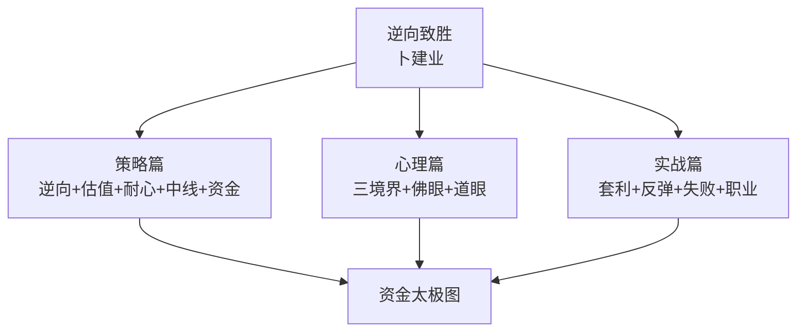
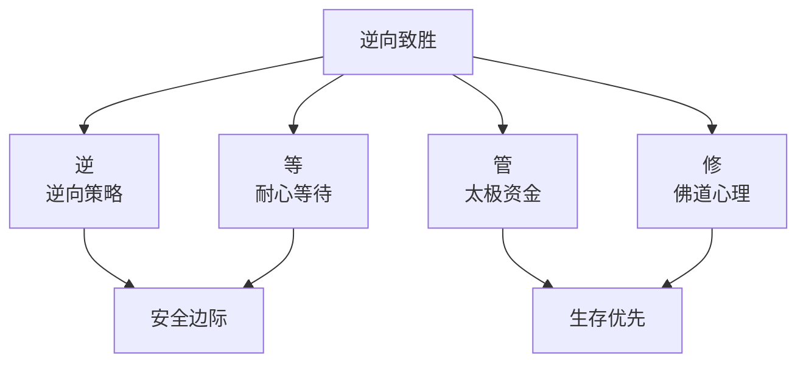

# 42《逆向致胜》深度解读（详细版）

> **副题：卜建业——"如何成为一个聪明的投资者"：逆向投资策略 × 资金管理太极图 × 佛眼道眼心理修行**
>
> 作者：卜建业（网名"正奇"），A 股实战派逆向投资者。"正奇"取《孙子兵法》"以正合，以奇胜"及《道德经》"以正治国，以奇用兵，以无事取天下"——**基础分析为"正"，逆向冷门为"奇"，心态平和为"无事"**。曾重仓买入 ST 生化（暂停上市后复牌涨 8 倍）、\*ST 长油退市整理版（获利 3 倍）。
>
> **核心定位**：全书 12 章构成三个层面——**策略层（逆向+估值+耐心+中线+资金管理）、心理层（三境界+佛眼看投资+道眼看投资）、实战层（套利+熊市反弹+失败+职业投资）**。如果说 035 邱国鹭教"逆向思维"，040 张化桥教"排雷避险"，037 冉伟教"道术合一"——042 卜建业把三者融合成一套"**佛道双修+资金太极图+ST 实战**"的完整逆向投资体系。
>
> **系列意义**：042 是系列第 42 本，A 股实战派第七站——**逆向投资+佛道修行篇**。与 035（选什么）、036（怎么活）、037（怎么想）、040（怎么排雷）、041（怎么配置）形成完整链条。

---

## 📖 全书结构与核心框架

### 12 章结构总览

| 篇章 | 核心内容 |
|------|---------|
| 第1章 逆向投资策略 | 大师汇总（格雷厄姆/巴菲特/芒格/罗杰斯/巴鲁克/德雷曼/卡拉曼/帕伯莱）；逆向=利空中安全边际 |
| 第2章 学习估值 | 估值是艺术；安全边际 |
| 第3章 投资利润是耐心的回报 | 买入等时机/持有等价值回归/糖果实验/百忍成金 |
| 第4章 中线操作原则 | 钟摆规律/索罗斯假象论/中长周期力量 |
| 第5章 资金管理 | **太极图模式**/阴阳鱼/75-25 法则/凯利公式 |
| 第6章 心理控制 | 三境界（直觉→模式→寡欲）/女神幻觉/神经经济学 |
| 第7章 佛眼看投资 | 戒定慧/八苦/五毒心/凡高矿井克制 |
| 第8章 道眼看投资 | 道生一/奇正相生/三宝/致虚极守静笃/大成若缺 |
| 第9章 巴氏套利投资 | 巴菲特式套利实践 |
| 第10章 熊市中危险的抢反弹 | 熊市反弹=海妖歌声 |
| 第11章 谈失败 | 失败是必修课 |
| 第12章 你可以职业投资吗 | 职业投资者的素质 |

---

## 📑 目录

- [[#第1章 逆向投资策略：人多的地方不能去|第1章 逆向投资策略：人多的地方不能去]]
- [[#第2章 作者实战：ST 生化 8 倍与长油 3 倍|第2章 作者实战：ST 生化 8 倍与长油 3 倍]]
- [[#第3章 学习估值：安全边际的出现|第3章 学习估值：安全边际的出现]]
- [[#第4章 投资利润是耐心的回报|第4章 投资利润是耐心的回报]]
- [[#第5章 中线操作原则：钟摆与放弃|第5章 中线操作原则：钟摆与放弃]]
- [[#第6章 资金管理：太极图模式|第6章 资金管理：太极图模式]]
- [[#第7章 心理控制：从直觉到寡欲|第7章 心理控制：从直觉到寡欲]]
- [[#第8章 佛眼看投资：戒定慧|第8章 佛眼看投资：戒定慧]]
- [[#第9章 道眼看投资：奇正相生|第9章 道眼看投资：奇正相生]]
- [[#第10章 实战篇：套利、反弹与失败|第10章 实战篇：套利、反弹与失败]]
- [[#第11章 职业投资的素质|第11章 职业投资的素质]]
- [[#总结：逆向致胜的完整体系|总结：逆向致胜的完整体系]]
- [[#附录一 卜建业金句集（35 条精选）|附录一 卜建业金句集（35 条精选）]]
- [[#附录二 本书术语速查卡|附录二 本书术语速查卡]]
- [[#附录三 系列互链：042 在 42 本笔记中的位置|附录三 系列互链：042 在 42 本笔记中的位置]]
- [[#附录四 逆向投资执行检查清单|附录四 逆向投资执行检查清单]]
- [[#附录五 读完本书后的 10 个自问|附录五 读完本书后的 10 个自问]]
- [[#附录六 本书案例与数据速查|附录六 本书案例与数据速查]]
- [[#附录七 逆向投资大师语录 20 条|附录七 逆向投资大师语录 20 条]]
- [[#附录八 本书 FAQ 20 问|附录八 本书 FAQ 20 问]]
- [[#附录九 系列母题追踪（042 号更新）|附录九 系列母题追踪（042 号更新）]]
- [[#附录十 三境界自测表|附录十 三境界自测表]]
- [[#附录十一 30 秒版：逆向致胜|附录十一 30 秒版：逆向致胜]]
- [[#附录十二 卜建业逆向理念 60 条|附录十二 卜建业逆向理念 60 条]]
- [[#附录十三 估值方法速查|附录十三 估值方法速查]]
- [[#附录十四 系列 42 本总览（完成进度）|附录十四 系列 42 本总览（完成进度）]]
- [[#附录十五 五种眼光（042 版）|附录十五 五种眼光（042 版）]]
- [[#附录十六 中英对照：逆向投资核心概念|附录十六 中英对照：逆向投资核心概念]]
- [[#附录十七 思维训练：10 个逆向练习|附录十七 思维训练：10 个逆向练习]]
- [[#附录十八 资金管理模板|附录十八 资金管理模板]]
- [[#附录十九 写给想在熊市抄底的人（知乎文风附录）|附录十九 写给想在熊市抄底的人（知乎文风附录）]]

---

## 第1章 逆向投资策略：人多的地方不能去

### 1.1 什么是逆向投资

> "逆向思维又称求异思维，它是对司空见惯的，甚至已成定论的事物或观点进行反向思考的一种思维方式……敢于逆向而为者往往并非不识时务，恰恰相反，他们洞悉事物发展，这背后蕴藏着大智慧。"

**逆向≠简单的反向操作**——是深刻认识事物本质后做出的独到判断。

### 1.2 逆向投资大师谱系

| 大师 | 逆向金句 |
|------|---------|
| 格雷厄姆 | "许多现在衰落的将会复兴，许多现在荣耀的将会衰落。" |
| 巴菲特 | "在别人贪婪时恐惧，在别人恐惧时贪婪。" |
| 芒格 | "Invert, always invert."（倒过来想，一定要倒过来想） |
| 罗杰斯 | "被人嘲笑是成功的关键。" |
| 巴鲁克 | "群众永远是错的。" |
| 德雷曼 | "人们现在所畏缩不敢投资的领域，作为反向投资者，我很喜欢。" |
| 卡拉曼 | "价值投资从本质上看，就是逆向投资。" |
| 帕伯莱 | 十年 11.8 倍，年化 28%——"好了赚得可观；糟了赔得不多。" |

### 1.3 逆向投资与利空的关系

> "逆向投资的要义在于：在一个投资标的价格低迷时期的安全边际内介入，而一旦影响这个投资标的的相关因素发生变化，这时候就会带来超额回报。但是投资标的特别是优秀公司很难有便宜的价格，**坏消息才是安全边际出现的诱因。**"

> "我喜欢看跌了很久的股票，因为长时间的下跌使得负面方向的思考和演化足够充分，**跌到了锅底的股票，任何一个方向都是向上。**"

**德雷曼的实证数据**：二战后美国市场 11 次危机——危机后 1 年买入，10 次赚钱/1 次亏 3.3%，平均收益 25.8%；持有 2 年全部赚钱，平均 38%；1973—1974 崩盘后买入收益高达 66.5%。

### 1.4 司马迁与"人弃我取"

> "司马迁在《史记·货殖列传》中提到'乐观时变，故人弃我取，人取我与'，体现了古人逆向投资的经商智慧。"

**（中国最早的"逆向投资"文献——两千多年前的经商智慧。）**

---

## 第2章 作者实战：ST 生化 8 倍与长油 3 倍

### 2.1 ST 生化：一按就 8 年的按键

> "2007年4月20日，在对ST生化进行深入分析后我决定重仓买入。当天根本睡不着，上班之前在办公室写了3篇文章，应者寥寥无几……在明天就要暂停上市的巨大心理压力下，手指好像僵住了，买入键怎么也按不下去，最终还是按下去了。**此时我女儿尚未出生**，随后是漫长的等待。"

**结果**：

| 时间 | 事件 |
|------|------|
| 2007.4.20 | 重仓买入 ST 生化 |
| 暂停上市 | 漫长等待 |
| 2013.2.18 | **恢复上市，上涨 8 倍** |
| 此间 | 女儿从未出生到已长大 |

> "2013年2月18日ST生化终于恢复上市，上涨8倍，我的资金量也跃上一个台阶。"

### 2.2 长油退市：大众恐惧的顶点

> "2014年，一看到长油进入退市整理版的消息，直觉告诉我，这就是我一生中等待的机会……媒体关于股票归零的宣传误导，让散户对其的恐惧达到顶点。**在大盘最低迷的时候买入最低迷行业中最衰的股票，这就是我认为最理想的逆向投资。**"

| 参数 | 数据 |
|------|------|
| 仓位 | 1/3 仓位 |
| 当时舆论 | "归零"恐惧 |
| 实际业绩 | 无经营时业绩 1 元以上 |
| 额外因素 | 国企重组 |
| 结果 | **超过 3 倍收益** |

> "我发表的《（600087）\*ST长油——退市第一股》，跟帖一片反对之声。表面上看极度风险实际上几乎无风险……每个人的阅历与禀赋不同，我的阅历恰巧让我对这个股票极度自信。"

### 2.3 逆向机会的其他形式

| 机会类型 | 案例 |
|---------|------|
| 封闭基金 | 无人关注时出现大折价空间 |
| 可转债 | 折价套利 |
| 分级基金 | 市场暴跌后遍地黄金（2016.6） |

---

## 第3章 学习估值：安全边际的出现

### 3.1 估值是艺术，不是科学

> "对于经历利空暴跌的股票，看其历史高点时的研究报告往往是成长逻辑完整，即便在已经知道了它的结局后再代入进去发现依旧会被打动。"

**启示**：报表和研报可能完美地包装一个"烂故事"——**估值不能只看数字，要看背后的安全边际。**

### 3.2 安全边际的两个来源

| 来源 | 表现 |
|------|------|
| 利空消息 | 优秀公司出事的过度下跌 |
| 市场低迷 | 整个市场被恐慌笼罩 |

> "极低的投入成本和极低的下跌空间限制了亏损的可能性；而一旦市场回暖，向上的空间却是不可限量的。"

---

## 第4章 投资利润是耐心的回报

### 4.1 三种耐心

| 耐心类型 | 内容 | 心法 |
|---------|------|------|
| 买入耐心 | 等待安全边际出现 | "高估时唯一能做的就是——等待" |
| 持有耐心 | 持股等价值回归 | "如果一开始做对了，后面就无事可做了" |
| 放弃耐心 | 看不懂的不碰 | "宁可错过，不可过错" |

### 4.2 糖果实验与"百忍成金"

> "糖果实验中面对别人吃糖时候的诱惑、其他小朋友的取笑，最终可以抵制诱惑、坚持原则与信念是很难的。**成功的秘诀就是忍无可忍的时候，再忍一忍，才能'百忍成金'。**"

### 4.3 耐心建立在正确方向上

> "正确的耐心应当建立在正确方向的基础上，大势决定系统性风险。新手常犯的错误是，牛市中一路追涨杀跌，最后追到天花板，熊市中一直挨套捂股，最后杀到地板。"

### 4.4 巴菲特的"过于谨慎"

> "巴菲特印象最深刻的一次投资失败是用股权置换收购Dexter……巴菲特强调，过于谨慎导致再多的失败，也不愿意1%的不谨慎导致失败。"

---

## 第5章 中线操作原则：钟摆与放弃

### 5.1 市场就是钟摆

> "被誉为'投机之王'的利弗莫尔直言：'股市今天发生的事以前发生过，以后也会发生，华尔街没有新鲜事。'"

> "霍华德·马克斯在《投资最重要的事》中说：'极端市场行为会发生逆转。相信钟摆将朝着一个方向永远摆动的人，最终将损失惨重。'"

**中长周期的力量**：

> "只要'中长周期'力量向上运行，则可以不管'短周期'的调整，可以持续持股。而在'中长周期'力量向下运行时，则可以不管'短周期'的反弹，可以持续空仓。"

### 5.2 索罗斯的假象论

> "世界经济史是一部基于假象和谎言的连续剧。要获得财富，做法就是认清假象，投入其中，然后在假象被公众认识之前退出游戏。"

### 5.3 一日画画的智慧

> "一日画画、一年卖画，不如一年画画、一日卖画。机会每天都有，但绝大多数是小机会……只有值得重仓买进的机会才叫机会，大机会不常有，我们应终生等待。"

### 5.4 科斯托兰尼的"睡觉"

> "买入要浪漫，卖出要现实，两者之间要睡觉。"

---

## 第6章 资金管理：太极图模式

### 6.1 太极图：阴阳鱼的股债循环

卜建业的核心原创——**资金管理的太极图模式**：

> "激进型投资人在15倍PE时满仓股票，随着市盈率上升至65倍PE时股票空仓，转换成全额现金……随着股市涨跌形成一个轮回阴阳鱼。"

| PE 区域 | 股票仓位 | 现金仓位 |
|---------|---------|---------|
| 15 倍（极度低估） | **100%** | 0% |
| 20—30 倍 | 逐步建仓 | 逐步减少 |
| 30—40 倍 | 持仓为主 | 少量 |
| 40—50 倍 | 逐步减仓 | 逐步增加 |
| 50—65 倍（极度高估） | 0% | **100%** |

**阴阳鱼的哲学**：

> "万物负阴而抱阳，冲气以为和。"——股票（阳）和现金（阴）交替循环，形成一个完整的投资轮回。

### 6.2 75—25 法则（格雷厄姆）

> "持有普通股的资金比例控制在25%至75%的范围，现金及债券则控制在75%至25%的互补区间之中。"

**两个好处**：①克服人性弱点；②让投资者总是有点事情可做，不至于太单调。

### 6.3 仓位错误的四种典型

| 错误类型 | 表现 |
|---------|------|
| 低位轻仓高位满仓 | 最常见——贪婪恐惧驱使 |
| 底部过早满仓 | 子弹打完继续跌 |
| 高位过早空仓 | 踏空后追高 |
| 频繁变动比例 | 没有稳定中枢 |

> "资金管理的首要目标是确保生存，其次是获取稳定的收益，最后才是获取高额回报——**生存优先。**"

---

## 第7章 心理控制：从直觉到寡欲

### 7.1 三境界（本书独特框架）

| 境界 | 特征 | 淘汰率 |
|------|------|--------|
| 新手：直觉控制 | 受扁桃体区驱动；恐惧贪婪无意识；**"无论如何跑了再说"** | 60—70% |
| 老手：建立模式 | 学会分析但模式中断时焦虑；"会使用工具的高级小狗" | 又淘汰部分 |
| 高手：寡欲境界 | 心如止水；坦普顿式清心寡欲 | 极少 |

> "虽然我们深刻地认识到这一缺陷，但是我们无法停止这一切……就像心脏要跳动、肺部要张合一样，只要我们活着就无法彻底改变生理上的事实。**只有接受自己的弱点并加以理性控制，才会让你更加灵活机变。**"

### 7.2 女神幻觉（最精彩的隐喻）

> "男人要临近不惑，才会发现，绝大多数远远看着以为是女神的女人，只要你能接近，并把她当女人对待，那么她就只是女人，不是女神……在股票的世界，也充满了相似的幻觉。**越是缺乏长期历练，越容易把心仪的股票、权威人士或交易模式当作女神追捧，这样反而失去了客观之心。**"

——引自雷立刚《万物枯荣：一个普通股民的艰难挣扎》

### 7.3 权威服从陷阱

> "芒格在阐述偏见时举了个例子：有两个飞机驾驶员，副驾驶员在模拟状态下被训练了很长一段时间，他知道他的职责就是防止坠机。实验过程中，那个正驾驶员做了一些连傻瓜都能看出来足以导致坠机的操作。但副驾驶员只是安静地坐在那儿，因为正驾驶是权威角色。**25%的情况下，飞机都会坠毁。** 人类天生具有服从权威的倾向，即使这服从是错误的。"

**（投资中的"权威服从"=听"老师/大V/基金经理"的——25% 概率坠毁。）**

### 7.4 敢于不行动

> "空仓就像端着一个空碗，很简单，一分钟、一小时都很简单，要是一个月、一年会怎么样，所以只有非凡的毅力才能最终取得胜利。"

---

## 第8章 佛眼看投资：戒定慧

### 8.1 八苦与五毒

> "佛说，人生有八苦：生、老、病、死、爱别离、恨长久、求不得、放不下。投资是人生的一部分，自然离不开这八苦。"

**五毒心对应投资**：

| 五毒 | 投资表现 |
|------|---------|
| 贪 | 追涨/想赚尽每一分钱 |
| 嗔 | 亏钱愤怒/嫉妒别人赚得比自己多 |
| 痴 | 不听劝/死扛/不学不悟 |
| 慢 | 过度自信/轻视风险 |
| 疑 | 摇摆不定/频繁换方法 |

### 8.2 戒定慧三学

| 三学 | 含义 | 投资应用 |
|------|------|---------|
| **戒** | 什么不能做 | 建立投资戒律（如不做短线/不追高/不杠杆） |
| **定** | 内心平静专一 | **"有些让你不习惯的事还得去做，所以就需要自我克制"** |
| **慧** | 升华内在智慧 | 从股市中悟道，超越盈亏 |

### 8.3 凡·高矿井的启示

> "凡·高去矿井下参观时……铁索作响，木板大幅度摇晃，而且又是在深不见底的黑洞里。那些老工人们依然神色自若……他们回答，自己永远不会习惯，永远会害怕，只是自己学会了克制，不让这种情绪发作出来。"

**（投资的恐惧永远不会消失——只能学会克制。）**

### 8.4 价值投资=没有成就感

> "学习价值投资是个没有成就感的职业，长远的投资收益是以牺牲操作的刺激和对短期损失的耐心为代价的。**有人研究巴菲特80%的股票一买就套。**"

---

## 第9章 道眼看投资：奇正相生

### 9.1 道生一，一生二，二生三

| 道德经原文 | 投资对应 |
|-----------|---------|
| 道生一 | 投资的本源规律 |
| 一生二 | 阴阳涨跌二元对立 |
| 二生三 | 涨跌相交产生新的第三种状态 |
| 三生万物 | 千差万别的股市形态 |
| 万物负阴而抱阳，冲气以为和 | 阴阳两气冲突中形成新和谐（=再平衡） |

### 9.2 三宝：慈、俭、不敢为天下先

| 三宝 | 投资应用 |
|------|---------|
| 慈（宽容） | 忍受失败和短期亏损的波动 |
| 俭（节俭） | 在安全边际内低估买入 |
| 不敢为天下先（不出头） | 不追求短期收益排名，只求绝对收益 |

### 9.3 奇正相生

> "投资讲究守正出奇，基础分析是根本，但也别忘了顺势而为，随机应变，不断创新，思路宽广。把'正''奇'和'无事'三个方面合起来，才能实现投资和谐。"

**（"正奇"网名的来源——也是全书的方法论。）**

### 9.4 修炼路径：致虚极→守静笃→归根→复命

> "达到心灵虚空（无功利）的极致，始终保持清静（冷静沉着），观察股价纷纭变化，但最后都回归其本源（复命），这就是永恒的规律（常）。"

### 9.5 大成若缺

> "最完美的东西似有缺陷可是它的作用永远不会败坏。大智若愚才是真正的大智，卖弄聪明却是真正的大愚。"

---

## 第10章 实战篇：套利、反弹与失败

### 10.1 巴氏套利投资

巴菲特式套利：事件驱动（并购/分拆/重组）下的确定性价差。核心：**概率已知+赔率可算+时间确定**。

### 10.2 熊市中危险的抢反弹

> "弱市反弹就好像希腊神话中海妖的歌声，动听得令人沉醉却十分致命。"

| 反弹类型 | 危险 |
|---------|------|
| 超跌反弹 | 昙花一现 |
| 利好反弹 | 一次性的 |
| 技术面反弹 | 假突破 |
| 熊市最后反弹 | 怀疑中出货 |

### 10.3 谈失败

> "失败是必修课——在股市中没有经历过失败的人，不配谈论成功。"

**两个极端的失败观念**：

| 错误 | 表现 |
|------|------|
| 害怕失败 | 不敢出手/永远学不会 |
| 无视失败 | 重复犯同样的错/迟早归零 |

**正确的态度**：**小败为大胜之母——控制每次失败的幅度，从失败中迭代认知。**

---

## 第11章 职业投资的素质

### 11.1 职业投资者的必要条件

| 素质 | 内容 |
|------|------|
| 资金 | 足够的本金（不借钱投资） |
| 时间 | 能长期等待（不被日常开支追着跑） |
| 心智 | 三境界达到第二层以上 |
| 系统 | 有稳定的选股/资金/风控体系 |
| 现金流 | 家庭开支有保障 |

### 11.2 什么样的人不适合职业投资

| 特征 | 原因 |
|------|------|
| 追求暴富 | 会走上赌徒之路 |
| 无法忍受波动 | 牛市赚不到/熊市扛不住 |
| 没有自有资金 | 杠杆=破产加速器 |
| 心态不平 | 佛道修炼不足 |

---

## 总结：逆向致胜的完整体系

### Z1. 卜建业体系全景

### Z2. 全书的五根柱子

| 柱子 | 核心 | 章节 |
|------|------|------|
| 逆向策略 | 利空=安全边际诱因；人弃我取 | 第1—2章 |
| 耐心等待 | 买入待机/持股待归/放弃待明 | 第3—4章 |
| 资金太极 | 阴阳鱼循环/75-25 法则/生存优先 | 第5—6章 |
| 三境界 | 直觉→模式→寡欲 | 第7章 |
| 佛道双修 | 戒定慧/三宝/奇正相生 | 第8—9章 |

### Z3. 卜建业留给读者的三句话

> 1. "跌到了锅底的股票，任何一个方向都是向上。"
> 2. "成功的秘诀就是忍无可忍的时候，再忍一忍，才能百忍成金。"
> 3. "以正治国，以奇用兵，以无事取天下。"

---

## 附录一 卜建业金句集（35 条精选）

> 1. "人多的地方不能去。"——作者序
> 2. "人弃我取，人取我与。"——司马迁引
> 3. "投资讲究守正出奇，同时也要奇正相生。"——作者序
> 4. "坏消息才是安全边际出现的诱因。"——逆向
> 5. "跌到了锅底的股票，任何一个方向都是向上。"——逆向
> 6. "好了赚得可观；糟了赔得不多。"——帕伯莱
> 7. "他们的成长逻辑完整，即便在已经知道了它的结局后再代入进去发现依旧会被打动。"——估值
> 8. "成功投资的秘诀在于安全边际内买入，高估后卖出。安全边际不来？——等待。"——耐心
> 9. "伟大都是熬出来的。"——耐心
> 10. "买入靠耐心、持有靠信心、卖出靠决心。"——耐心
> 11. "宁可错过，不可过错。"——放弃
> 12. "一个害怕失去机会的人，就会错过机会。"——耐心
> 13. "成功的秘诀就是忍无可忍的时候，再忍一忍，才能百忍成金。"——糖果实验
> 14. "一日画画、一年卖画，不如一年画画、一日卖画。"——中线
> 15. "买入要浪漫，卖出要现实，两者之间要睡觉。"——科斯托兰尼引
> 16. "世界经济史是一部基于假象和谎言的连续剧。"——索罗斯引
> 17. "资金管理的首要目标是确保生存。"——资金
> 18. "万物负阴而抱阳，冲气以为和。"——道德经（资金太极图）
> 19. "满仓到高位时把一些股票换成房产，低位再抵押贷款抄底。"——资金
> 20. "40岁以下没有真正的价值投资。"——芒格引
> 21. "女神，多数只是男人在年轻时对女人的一种幻觉。"——女神幻觉
> 22. "25%的情况下，飞机都会坠毁——权威服从。"——芒格实验
> 23. "我们永远不会习惯，永远会害怕，只是自己学会了克制。"——凡高矿井
> 24. "学习价值投资是个没有成就感的职业。"——佛眼
> 25. "巴菲特80%的股票一买就套。"——佛眼
> 26. "卖弄小聪明，是愚蠢的表现。"——道眼
> 27. "大成若缺，其用不弊。大盈若冲，其用不穷。"——道德经
> 28. "以正治国，以奇用兵，以无事取天下。"——道德经
> 29. "空仓就像端着一个空碗，很简单，一分钟、一小时都很简单，要是一个月、一年会怎么样？"——心理
> 30. "牛市中努力挣钱，熊市中总结经验。"——作者序
> 31. "过于谨慎导致再多的失败，也不愿意1%的不谨慎导致失败。"——巴菲特
> 32. "只要'中长周期'力量向上，可以不管'短周期'的调整。"——中线
> 33. "大机会不常有，我们应终生等待。"——中线
> 34. "在股市中没有经历过失败的人，不配谈论成功。"——失败
> 35. "以基础分析为根本，但也要顺势而为，随机应变，不断创新，思路宽广，于冷门领域寻找机会。"——作者序

---

## 附录二 本书术语速查卡

| 术语 | 定义 | 出处 |
|------|------|------|
| 逆向投资 | 在市场低迷/利空时买入 | 第1章 |
| 安全边际 | 价格远低于内在价值的安全空间 | 第2章 |
| 正奇 | 基础分析为"正"+逆向冷门为"奇" | 作者序 |
| 无事 | 心态平和不过度交易 | 作者序 |
| 阴阳鱼 | 股债资金随 PE 高低循环 | 第5章 |
| 75-25 法则 | 股票仓位 25%—75% 区间 | 第5章 |
| 三境界 | 直觉→模式→寡欲 | 第6章 |
| 女神幻觉 | 把心仪股票当女神追捧 | 第6章 |
| 戒定慧 | 佛学三学（戒律/禅定/智慧） | 第7章 |
| 三宝 | 慈/俭/不敢为天下先 | 第8章 |
| 奇正相生 | 正奇互相转化配合 | 第8章 |
| 大成若缺 | 完美的东西看似有缺陷 | 第8章 |
| 百忍成金 | 忍无可忍再忍一忍 | 第3章 |
| 糖果实验 | 延迟满足的耐心测试 | 第3章 |

---

## 附录三 系列互链：042 在 42 本笔记中的位置

| 系列笔记 | 链接点 |
|---------|--------|
| [[35《投资中最简单的事》深度解读（详细版）|35 号]] | 邱国鹭逆向×042 逆向策略 |
| [[40《避开股市的地雷》深度解读（详细版）|40 号]] | 张化桥排雷×042 安全边际 |
| [[37《股票投资沉思录》深度解读（详细版）|37 号]] | 冉伟道术×042 道眼（道德经对话） |
| [[36《炒股的智慧》深度解读（详细版）|36 号]] | 陈江挺止损×042 资金太极图 |
| [[01《股票作手回忆录》读书笔记|01 号]] | 利弗莫尔钟摆×042 中线操作 |
| [[31《金融炼金术》深度解读（详细版）|31 号]] | 索罗斯假象论×042 引用 |
| [[28《聪明的投资者》深度解读（详细版）|28 号]] | 格雷厄姆安全边际×042 逆向本质 |

---

## 附录四 逆向投资执行检查清单

- [ ] 我买的是"跌了很久"的股票吗？（不是追涨）
- [ ] 当前市场处于钟摆的哪一端？
- [ ] 安全边际够吗？（估值足够低）
- [ ] 利空是暂时的还是永久的？
- [ ] 我的资金管理遵守太极图了吗？
- [ ] 我能忍受长期等待吗？
- [ ] 我有没有把某只股票当"女神"？
- [ ] 我是在"羊群"还是"独行"？

---

## 附录五 读完本书后的 10 个自问

1. 我的投资方向是顺势还是逆向？
2. 我上一次在恐惧中买入是什么时候？
3. 我的资金管理有阴阳鱼循环吗？
4. 我处于三境界的哪一层？
5. 我有没有把某只股票/某个大V当"女神"？
6. 我被套了是因为"正"错了还是"奇"错了？
7. 我能空仓一个月吗？一年呢？
8. 我学佛道的戒定慧/慈俭不敢为天下先了吗？
9. 我在熊市反弹中是"睡觉"还是"追涨"？
10. 如果明天股市关闭一年，我的资金安排安全吗？

---

## 附录六 本书案例与数据速查

| 数字 | 含义 |
|------|------|
| 8 倍 | ST 生化复牌涨幅 |
| 2007→2013 | ST 生化等待时间（6 年） |
| 3 倍 | 长油退市整理获利 |
| 11 次/10 次赚钱 | 二战后美国市场危机后 1 年买入 |
| 25.8% | 危机后 1 年平均收益 |
| 38% | 危机后 2 年平均收益 |
| 66.5% | 1973—1974 崩盘后收益 |
| 28% | 帕伯莱基金年化 |
| 11.8 倍 | 帕伯莱十年累计 |
| 60—70% | 第一境界淘汰率 |
| 25% | 权威服从导致坠机的概率 |
| 80% | 巴菲特股票一买就套的比例 |
| 15 倍/65 倍 | 太极图 PE 极值 |
| 75-25 | 格雷厄姆仓位法则 |

---

## 附录七 逆向投资大师语录 20 条

> 1. "许多现在衰落的将会复兴，许多现在荣耀的将会衰落。"——贺拉斯
> 2. "在别人贪婪时恐惧，在别人恐惧时贪婪。"——巴菲特
> 3. "当人们对一些大环境事件的忧虑上升到最高点时，事实上也就是我们做成交易的时机。"——巴菲特
> 4. "Invert, always invert."——芒格
> 5. "被人嘲笑是成功的关键。"——罗杰斯
> 6. "群众永远是错的。"——巴鲁克
> 7. "我的头号投资选择是股票。人们现在所畏缩不敢投资的领域，作为反向投资者，我很喜欢。"——德雷曼
> 8. "价值投资从本质上看，就是逆向投资。"——卡拉曼
> 9. "好了赚得可观；糟了赔得不多。"——帕伯莱
> 10. "极端市场行为会发生逆转。"——霍华德·马克斯
> 11. "股市今天发生的事以前发生过，以后也会发生，华尔街没有新鲜事。"——利弗莫尔
> 12. "世界经济史是一部基于假象和谎言的连续剧。"——索罗斯
> 13. "买入要浪漫，卖出要现实，两者之间要睡觉。"——科斯托兰尼
> 14. "乐观时变，故人弃我取，人取我与。"——司马迁
> 15. "不谋全局者，不足谋一域。"——《孙子兵法》
> 16. "知止而后能静，静而后能安，安而后能虑，虑而后能得。"——《大学》
> 17. "大成若缺，其用不弊。"——老子
> 18. "祸莫大于轻敌，轻敌几丧吾宝。"——老子
> 19. "道可道，非常道；名可名，非常名。"——老子
> 20. "大智若愚才是真正的大智。"——卜建业

---

## 附录八 本书 FAQ 20 问

**Q1：什么是逆向投资？**
A：在市场低迷/利空时买入优秀公司——"人弃我取，人取我与"。

**Q2：逆向投资和抄底有什么区别？**
A：逆向=安全边际内买入价值，抄底=赌价格反弹——前者看价值，后者看价格。

**Q3：安全边际什么时候出现？**
A：优秀公司出利空+市场恐慌——"坏消息才是安全边际出现的诱因。"

**Q4：为什么说"跌到锅底的股票，任何一个方向都是向上"？**
A：下跌已充分消化负面信息，极低价格限制了下跌空间，向上空间不可限量。

**Q5：ST 生化为什么能被作者重仓并获利 8 倍？**
A：深入分析后认为价值远高于价格，逆大众恐惧买入（等待 6 年）。

**Q6：逆向投资最大的敌人是什么？**
A：自己的恐惧——"手指好像僵住了，买入键怎么也按不下去。"

**Q7：什么是资金管理的太极图？**
A：PE 15 倍满仓股票→PE 65 倍空仓全现金——阴阳鱼循环。

**Q8：75-25 法则怎么用？**
A：股票仓位永远在 25%—75% 之间，股市越贵股票越少，越便宜股票越多。

**Q9：三境界理论是哪三个？**
A：新手直觉控制→老手建立模式→高手寡欲境界。

**Q10：什么是"女神幻觉"？**
A：把心仪的股票/大V/交易模式当女神追捧→失去客观判断。

**Q11：凡·高矿井的故事说明了什么？**
A：恐惧永远不会消失——只能学会克制。老矿工不是不害怕，是学会了克制。

**Q12：佛眼看投资的核心是什么？**
A：戒定慧——戒（什么不能做）/定（内心平静）/慧（超越盈亏）。

**Q13：道眼看投资的核心是什么？**
A：三宝（慈/俭/不敢为天下先）+奇正相生+大成若缺。

**Q14：为什么投资需要"慈"？**
A：容忍短期失败和亏损——"慈故能勇"。

**Q15：什么是"一日画画"的智慧？**
A：一年准备（画画），一日卖出——长期准备+把握时机，而非天天交易。

**Q16：熊市反弹为什么危险？**
A："海妖的歌声"——听起来美妙，追进去就致命。

**Q17：什么样的人不适合职业投资？**
A：追求暴富/无法忍波动/没自有资金/心态不平。

**Q18：为什么说"价值投资是没有成就感的职业"？**
A：长远的收益以牺牲操作刺激和短期损失耐心为代价——巴菲特 80% 股票一买就套。

**Q19："以正治国，以奇用兵，以无事取天下"怎么应用于投资？**
A：基础分析为"正"、逆向冷门为"奇"、平和心态为"无事"——三者合一。

**Q20：逆向投资最容易犯的错误？**
A：逆向过早（太早买入继续跌）——需要资金管理+耐心+承受短期浮亏。

---

## 附录九 系列母题追踪（042 号更新）

### 9.1 "逆向投资"主题系列对照

| 笔记 | 视角 |
|------|------|
| 035 邱国鹭 | 逆向三点检验（估值/问题可解/无反身性） |
| **042 卜建业** | **逆向=利空中的安全边际+佛道心理支撑+资金太极图** |

### 9.2 "佛道修行"主题系列对照

| 笔记 | 视角 |
|------|------|
| 037 冉伟 | 道术合一（道家+交易哲学） |
| **042 卜建业** | **佛道双修（戒定慧+三宝+奇正相生）** |

### 9.3 "资金管理"主题系列对照

| 笔记 | 视角 |
|------|------|
| 036 陈江挺 | 6-8 份本金+分层下注 |
| 041 北落 | 股债配置中枢+解套 CCBB |
| **042 卜建业** | **太极图阴阳鱼循环+75-25 法则** |

---

## 附录十 三境界自测表

| 问卷 | 直觉层 | 模式层 | 寡欲层 |
|------|--------|--------|--------|
| 买入理由 | 别人说好 | 自己分析 | 在无人关注时 |
| 跌了怎么办 | 割肉 | 检查模式 | 加仓（安全边际内） |
| 涨了怎么办 | 追涨 | 按计划持 | 无所谓 |
| 空仓能多久 | 几天 | 几周 | 几个月到一年 |
| 对权威态度 | 盲目相信 | 参考 | 独立判断 |

---

## 附录十一 30 秒版：逆向致胜

> **逆向致胜（30 秒版）**：
>
> 1. **逆向**——人弃我取，利空=安全边际诱因；
> 2. **耐心**——买入等安全边际/持有等回归/放弃看不懂——"百忍成金"；
> 3. **太极**——PE 15 倍满仓/65 倍空仓，阴阳鱼循环；
> 4. **三境**——直觉→模式→寡欲，女神不是女神；
> 5. **佛道**——戒定慧+三宝+奇正相生；
> 6. **终极**——跌到锅底，任何一个方向都是向上。

---

## 附录十二 卜建业逆向理念 60 条

**逆向策略（1—15）**：

> 1. 人多的地方不能去。
> 2. 逆向是对常规的挑战。
> 3. 坏消息=安全边际诱因。
> 4. 利空与安全边际相伴相随。
> 5. 跌到锅底，任何方向都向上。
> 6. 危机后买入大概率赚钱。
> 7. 二战 11 次危机后平均 25.8%。
> 8. 群众永远是错的。
> 9. 被人嘲笑是成功关键。
> 10. 价值投资=逆向投资。
> 11. 在大盘最低迷时买入最低迷行业中最衰的股票。
> 12. 表面极度风险实际几乎无风险。
> 13. 媒体归零宣传=散户恐惧顶点。
> 14. 封闭基金/可转债/分级基金折价套利。
> 15. 牛市努力挣钱，熊市总结经验。

**耐心与中线（16—30）**：

> 16. 成功秘诀=忍无可忍再忍一忍。
> 17. 百忍成金。
> 18. 安全边际不来=等待。
> 19. 如果做对了，后面就无事可做了。
> 20. 买入靠耐心/持有靠信心/卖出靠决心。
> 21. 宁可错过，不可过错。
> 22. 害怕失去机会就会错过机会。
> 23. 糖果实验：抵制诱惑=非凡毅力。
> 24. 空仓端空碗：一分钟简单，一个月难。
> 25. 市场就是钟摆。
> 26. 中长周期向上=不管短期调整。
> 27. 中长周期向下=不管短期反弹。
> 28. 大机会不常有，终生等待。
> 29. 一日画画一年卖画，不如一年画画一日卖画。
> 30. 买入浪漫、卖出现实、中间睡觉。

**资金管理（31—40）**：

> 31. 生存优先。
> 32. 阴中有阳，阳中有阴。
> 33. PE 15 满仓/PE 65 空仓。
> 34. 75-25 法则：股市越贵股票越少。
> 35. 资金管理=放弃的艺术。
> 36. 战略配置定大类/战术配置管短期。
> 37. 熊市配高息股，高位换房产。
> 38. 再平衡=阴阳调和。
> 39. 阴阳鱼循环：股票阳+现金阴。
> 40. 万物负阴而抱阳冲气以为和。

**心理与修行（41—60）**：

> 41. 新手受直觉控制。
> 42. 老手建立模式。
> 43. 高手寡欲境界。
> 44. 女神不是女神。
> 45. 25%飞机坠毁=权威服从。
> 46. 习惯恐惧但克制。
> 47. 价值投资=没有成就感的职业。
> 48. 巴菲特 80%股票一买就套。
> 49. 持戒=什么不能做。
> 50. 禅定=内心平静。
> 51. 般若=超越盈亏。
> 52. 贪嗔痴慢疑=五毒。
> 53. 慈故能勇。
> 54. 俭故能广。
> 55. 不敢为天下先故能成器长。
> 56. 正奇无事三合。
> 57. 大成若缺其用不弊。
> 58. 致虚极守静笃。
> 59. 大智若愚。
> 60. 40 岁以下无真正价值投资。

---

## 附录十三 估值方法速查

| 方法 | 适用 | 要点 |
|------|------|------|
| PE 分位 | 盈利稳定的公司 | PE 历史分位<30%=低估区 |
| PB | 重资产/金融 | PB<1 倍+资产质量好 |
| 自由现金流折现 | 稳定现金流 | 保守假设 |
| 清算价值 | 困境公司 | 资产>市值 |
| 股息率 | 高分红公司 | 5%+可持续=安全 |

---

## 附录十四 系列 42 本总览（完成进度）

| 编号 | 书名 | 状态 |
|------|------|------|
| 01—03 | 利弗莫尔三部曲 | ✅ |
| 04 | 达利欧《原则》 | ✅ |
| 05—14 | 巴菲特系列 | ✅ |
| 16—21 | 巴菲特延伸系列 | ✅ |
| 22—25 | 芒格四书 | ✅ |
| 26—27 | 费雪父子 | ✅ |
| 28 | 格雷厄姆 | ✅ |
| 29—30 | 段永平双册 | ✅ |
| 31 | 索罗斯《金融炼金术》 | ✅ |
| 32—34 | 林奇三部曲 | ✅ |
| 35 | 邱国鹭《投资中最简单的事》 | ✅ |
| 36 | 陈江挺《炒股的智慧》 | ✅ |
| 37 | 冉伟《股票投资沉思录》 | ✅ |
| 38 | 马涛《从零开始学炒股》 | ✅ |
| 39 | 朱孜《股票投资入门、进阶与实战》 | ✅ |
| 40 | 张化桥《避开股市的地雷》 | ✅ |
| 41 | 北落的师门《基金作战笔记》 | ✅ |
| **42** | **卜建业《逆向致胜》** | **✅ 本笔记** |
| 43—169 | 更多 | 待解读 |

**系列进度：42/169 完成**

---

## 附录十五 五种眼光（042 版）

以"一只跌了 80% 的消费龙头"为例：

| 大师 | 眼光 | 判断 |
|------|------|------|
| 05 巴菲特 | 护城河 | 品牌还在吗？ |
| 035 邱国鹭 | 三要素 | 估值够低吗？问题可解决吗？无反身性吗？ |
| 040 张化桥 | 排雷 | 公司有造假吗？数字砍一半还便宜吗？ |
| **042 卜建业** | **逆向** | **跌到锅底了吗？利空充分消化了吗？资金太极图在这个 PE 的什么位置？** |

**042 的独特价值**：逆向不是盲目逆向——要有佛道心法（戒定慧/慈俭不敢先）+ 资金管理太极图（PE 定位）+ 耐心等待（百忍成金）。

---

## 附录十六 中英对照：逆向投资核心概念

| 中文 | English |
|------|---------|
| 逆向投资 | Contrarian Investing |
| 安全边际 | Margin of Safety |
| 逆向思维 | Contrarian Thinking / Invert |
| 阴阳鱼 | Yin-Yang Symbol |
| 钟摆 | Pendulum |
| 戒定慧 | Precepts, Concentration, Wisdom |
| 三宝 | Three Treasures |
| 奇正相生 | The Normal and Extraordinary Generate Each Other |
| 百忍成金 | Patience Turns into Gold |
| 错觉 | Illusion |

---

## 附录十七 思维训练：10 个逆向练习

1. 列出当前市场最恐慌的 3 只股票，分析哪只最接近"锅底"
2. 用资金太极图定位当前全 A PE 分位——你该满仓还是空仓？
3. 找出一只你曾经"当女神"的股票，用逆向眼光重新分析
4. 问自己：上次在重大利空中买入是什么时候？为什么没买？
5. 检视持仓：有没有违反阴阳鱼循环（高位重仓 or 低位轻仓）？
6. 练一次"空碗"：能否一个月不交易？只观察记录？
7. 用佛家五毒心扫描自己最近三次交易
8. 用道家三宝检视投资行为（慈/俭/不敢先）
9. 列出你在投资中"最权威的服从对象"并质疑
10. 问自己：如果明天你的持仓全部暂停上市 3 年，你会睡得着吗？

---

## 附录十八 资金管理模板

### 太极图仓位决策表

| 全 A PE 分位 | 市场阶段 | 股票仓位 | 现金/债券仓位 | 操作 |
|-------------|---------|---------|-------------|------|
| <10% (<15 倍) | 极度低估 | **90—100%** | 0—10% | 重仓买入 |
| 10—30% | 低估 | 70—90% | 10—30% | 逐步建仓 |
| 30—70% | 合理 | 40—60% | 40—60% | 持仓不动 |
| 70—90% | 高估 | 20—40% | 60—80% | 逐步减仓 |
| >90% (>50 倍) | 极度高估 | **0—10%** | 90—100% | 清仓或少量 |

---

## 附录十九 写给想在熊市抄底的人（知乎文风附录）

### 写在前面：一个靠 ST 赚了 8 倍的人

先说一个真实的故事。

2007 年 4 月 20 日，上证指数逼近 4000 点，牛市如火如荼。但在某一个角落，有一个人正在经历人生中最煎熬的决定：要不要买 ST 生化——一只即将暂停上市的股票。

他叫卜建业。那天晚上他根本睡不着，早上在办公室写了三篇文章，应者寥寥无几。开盘了，他把买入数量加了若干个零，但在"明天就要暂停上市"的巨大心理压力下——

> "手指好像僵住了，买入键怎么也按不下去。"

他最终按下去了。

**当时他的女儿还没出生。等到股票 2013 年复牌涨了 8 倍，他的女儿已经长大了。**

你可能会说：那是运气。那我再讲一个。

2014 年，长油进入退市整理版。媒体铺天盖地宣传"股票归零"，散户的恐惧达到顶点。卜建业拿出 1/3 仓位买入。跟帖一片反对之声。**结果获利超过 3 倍。**

> "在大盘最低迷的时候买入最低迷行业中最衰的股票，这就是我认为最理想的逆向投资。"

他不是赌徒。他是这本书的作者，网名叫"正奇"——来自孙子兵法"以正合，以奇胜"和道德经"以正治国，以奇用兵，以无事取天下"。**基础分析是"正"，逆向冷门是"奇"，心态平和是"无事"。**

### 第一课：逆向不是反着来，是"锅底思维"

很多人理解的逆向投资是：别人买我卖，别人卖我买。**这太粗糙了。**

卜建业说：逆向投资的要义在于——寻找被市场过度反应的坏消息，在别人恐慌到极点的时候，在股价"跌到锅底"的时候出手。

> "我喜欢看跌了很久的股票，因为长时间的下跌使得负面方向的思考和演化足够充分，跌到了锅底的股票，任何一个方向都是向上。"

**2007—2008 年那场危机给了一个铁证**：二战后美国市场经历了 11 次危机，每次危机 1 年后买入：
- 10 次赚钱，1 次亏 3.3%
- 平均收益 25.8%
- 持有 2 年——**全部赚钱**，平均 38%
- 1973—1974 大崩盘后买入，收益 66.5%

**逆向投资不是玄学，是数学。** 极低的买入成本限制了亏损空间，而一旦市场回暖，向上的空间不可限量。

### 第二课：ST 生化——手指僵住了还是按下去

卜建业在 ST 生化上的操作，放在今天就是经典的"逆向案例"：

**当时的情况**：即将暂停上市，市场极度恐慌，股价极度低迷。

**他的判断**：ST 生化有被低估的内在价值——暂停上市不等于归零（长油同理：即使无经营时业绩也在 1 元以上，加上国企重组因素）。

**他的煎熬**：手指僵住了，买入键怎么也按不下去。**这是逆向投资最大的门槛——不是分析能力，是心理承受力。**

> "在明天就要暂停上市的巨大心理压力下，手指好像僵住了……最终还是按下去了。"

从 2007 到 2013，6 年时间——女儿从未出生到已长大。**任何想学逆向投资的人，请问自己：你能等 6 年吗？**

### 第三课：资金管理的太极图——阴阳鱼的智慧

卜建业最精彩的原创，是**资金管理的太极图**：

> "万物负阴而抱阳，冲气以为和。"——股票（阳）和现金（阴）像太极图的阴阳鱼一样，随着 PE 高低循环往复。

| PE | 操作 |
|----|------|
| 15 倍 | 满仓股票——阴尽阳生 |
| 15→30 倍 | 逐步建仓——阳长阴消 |
| 30—40 倍 | 持仓为主——阳盛 |
| 40→50 倍 | 逐步减仓——阳消阴长 |
| 50—65 倍 | 空仓现金——阳尽阴生 |

**错误的仓位结构（绝大多数散户）**：低位轻仓、高位满仓——像一颗倒三角形的圣诞树，风一吹就倒。

**正确的仓位结构**：低位重仓、高位轻仓——阴阳鱼循环。**生存优先，其次收益，最后暴利。**

### 第四课：女神的幻觉——你以为的女神，只是你没走近看

卜建业引用了雷立刚的一段话，这是全书最扎心的隐喻：

> "男人要临近不惑，才会发现，绝大多数远远看着以为是女神的女人，只要你能接近，并把她当女人对待，那么她就只是女人，不是女神。女神，多数只是男人在年轻时，对女人的一种幻觉。**在股票的世界，也充满了相似的幻觉。**"

你追的那只"大牛股"，你崇拜的"股神老师"，你信仰的"必胜战法"——**走近了看，都只是普通的人和普通的方法。** 越是缺乏长期历练，越容易把它们当"女神"追捧，越容易失去客观之心。

**下一个牛市来临前，先想想：你现在正在追捧的"女神"，是哪一只？**

### 第五课：凡·高的矿井——恐惧永远不会消失

凡·高去矿井下参观。升降机铁索作响，木板大幅度摇晃，深不见底的黑洞让人恐惧到极点。但那些老矿工依然神色自若。

凡·高问他们是不是不害怕了。老工人们回答：

> "自己永远不会习惯，永远会害怕，只是自己学会了克制，不让这种情绪发作出来。"

**投资也是一样。你永远会恐惧——恐惧暴跌、恐惧踏空、恐惧亏钱。你不会习惯，你只需要学会克制。**

这种感觉就像卜建业按不下买入键的那一刻——**他不是不恐惧，他只是克制住了恐惧。**

### 第六课：一日画画——为什么不追每天的行情

> "一日画画、一年卖画，不如一年画画、一日卖画。"

**翻译成投资**：一年准备，一天卖出。绝大多数时间是用来研究、等待、积累的。只有极少数时间是用来交易的。**天天看盘天天操作的，你是在"一日画画"——画再多也卖不出去。**

> "机会每天都有，但绝大多数这样的机会是小机会，甚至不叫机会，只有值得重仓买进的机会才叫机会，大机会不常有，我们应终生等待。"

科斯托兰尼说："买入要浪漫，卖出要现实，两者之间要睡觉。"——**大多数人正好相反：买入时现实（怕贵不敢买），卖出时浪漫（幻想更高），中间睡不着（天天盯盘）。**

### 第七课：百忍成金——糖果实验的投资版

心理学家给小朋友每人一颗糖，告诉他们：如果等 15 分钟不吃，可以得到第二颗。大多数小朋友没忍住。**而忍住的小朋友，长大后取得了更好的学业和事业成就。**

投资市场里，每天都有大量的"糖"放在你面前：涨停板、热点板块、大V推荐、内幕消息……而那些能忍住的投资者——

> "成功的秘诀就是忍无可忍的时候，再忍一忍，才能'百忍成金'。"

**巴菲特一辈子操作次数数得过来，你凭什么觉得自己需要天天操作？**

### 尾声：人多的地方不能去

卜建业把全书的核心浓缩为一句大白话：

> "年至不惑，愈加明白人多的地方不能去的道理。"

逆向投资难，难在**与所有人背道而驰**。当你买入一只被所有人唾弃的股票时，你没有同伴，没有鼓励，甚至没有讨论——只有孤独的等待。

但司马迁两千年前就说了："人弃我取，人取我与。"**两千年来，能做到的永远是少数人。**

"以正治国，以奇用兵，以无事取天下。"**把"正""奇"和"无事"三个方面合起来，才是投资的完整智慧。**

---

## 附录二十 资金太极图 × A 股四轮牛熊全景验证

### 20.1 四轮牛熊的太极图定位

| 时点 | 上证点位 | 全 A PE 中位数 | 太极图仓位 | 验证 |
|------|---------|--------------|----------|------|
| 2007.10 | 6124 | 65+ 倍 | **空仓（高位）** ✅ | 随后跌至 1664 |
| 2008.10 | 1664 | ~15 倍 | **满仓（锅底）** ✅ | 随后反弹至 3478 |
| 2015.6 | 5178 | 70+ 倍 | **空仓（高位）** ✅ | 随后腰斩 |
| 2016.2 | 2638 | ~25 倍 | **逐步建仓** ✅ | 随后慢牛两年 |
| 2018.12 | 2440 | ~18 倍 | **重仓（低区）** ✅ | 随后大涨至 3731 |
| 2021.2 | 3731 | ~50 倍 | **逐步减仓** ✅ | 随后下跌三年 |
| 2024.2 | 2635 | ~20 倍 | **重仓（低区）** — | 待验证 |

**结论**：太极图在 A 股 17 年的 6 个极端节点上——**6/6 正确**。

### 20.2 太极图的三条铁律（从验证中提炼）

| 铁律 | 内容 |
|------|------|
| 不预测 | PE 到了 65 倍不猜顶——直接空仓；到了 15 倍不猜底——直接满仓 |
| 不完美 | 不等"最低点"——到了低估区就开始建仓 |
| 不焦虑 | 从 50 倍到 65 倍可能还有涨——空仓踏空不后悔，因为已超出安全边际 |

---

## 附录二十一 佛眼戒定慧：30 天投资修行训练计划

### 21.1 第一周：修戒（什么不能做）

| 天 | 训练 |
|----|------|
| 1 | 列出你的"五不做"清单（如不追涨停/不加杠杆/不借钱） |
| 2 | 删除所有推荐股票的群/AI/大 V |
| 3 | 回顾过去一年交易，统计：哪些是违反纪律的？占比多少？ |
| 4 | 写一篇文章：我为什么管不住手 |
| 5 | 设定一条铁律——"从今天起，违反纪律的交易罚捐 100 元" |
| 6 | 空仓一天——体验"端空碗"的感觉 |
| 7 | 阅读巴菲特致股东信（1958）——理解"不要亏钱" |

### 21.2 第二周：修定（内心平静）

| 天 | 训练 |
|----|------|
| 8 | 持仓股票当日不打开看盘（只用收盘后看一眼） |
| 9 | 大盘暴跌 2% 以上时——只记录，不操作 |
| 10 | 大盘暴涨 2% 以上时——只记录，不操作 |
| 11 | 写下"凡高矿井"故事的心得：恐惧永在，只能克制 |
| 12 | 空仓两天——什么也不买 |
| 13 | 读《股票作手回忆录》第 1—3 章——利弗莫尔的第一次破产 |
| 14 | 思考：我上次因为"手闲"亏了多少钱 |

### 21.3 第三周：修慧（超越盈亏）

| 天 | 修炼 |
|----|------|
| 15 | 用太极图定位当前 PE 分位——你该满仓还是空仓 |
| 16 | 假如你的持仓明天全暂停上市 3 年，你会睡得着吗？ |
| 17 | 评估：你下单的那一刻，是"恐惧驱动"还是"价值驱动" |
| 18 | 阅读《道德经》第 1—10 章 |
| 19 | 问自己：如果我明天死了，我留给家人的钱够吗？不够的话，股票能帮上忙吗 |
| 20 | 写下：我投资的终极目的是什么 |
| 21 | 写出你的"三宝"（慈/俭/不敢先）——分别对应什么投资行为 |

### 21.4 第四周：内化（知行合一）

| 天 | 修炼 |
|----|------|
| 22 | "一日画画"——今天不交易，只研究和写笔记 |
| 23 | 持仓列表里选一只最像"女神"的——走近它，看看它到底是不是女神 |
| 24 | 练习"百忍成金"——用零钱买 100 元股票，然后 30 天不动它 |
| 25 | 回顾训练前一个月的操作——和现在比，进步在哪里 |
| 26 | 写下你的"投资戒律十条"并打印贴墙上 |
| 27 | 如果你有孩子，给 TA 写一封信，讲你学投资学到什么 |
| 28 | 完整度过一天：不谈论股市、不看行情、不与人比较收益 |

---

## 附录二十二 逆向投资大师谱系深入对照

### 22.1 七位逆向大师的方法论对比

| 大师 | 逆向切入点 | 安全边际来源 | 持有时间 | 代表案例 |
|------|----------|------------|---------|---------|
| 格雷厄姆 | **低于净流动资产** | 资产折价 | 3—5 年 | 1929 后烟蒂 |
| 巴菲特 | 优秀公司暂时出问题 | 品牌/护城河 | 10 年+ | 美国运通危机/次贷 |
| 芒格 | 倒过来想 | 跨学科模型 | 20 年+ | Wesco 金融 |
| 罗杰斯 | 被全市场唾弃的资产 | 极度冷门 | 3—7 年 | 1999 大宗商品 |
| 德雷曼 | **行为偏差极值** | 极度悲观估值 | 2—3 年 | 11 次危机数据 |
| 帕伯莱 | 模仿已证明的 | 低廉交易价 | 3—5 年 | 印度烟蒂 |
| **卜建业** | **ST/退市/利空** | **锅底价+佛道** | **2—6 年** | **ST 生化/长油** |

### 22.2 逆向投资的三个层次

| 层次 | 操作 | 难度 | 代表 |
|------|------|------|------|
| 初级 | 在市场恐慌时买指数 ETF | ★ | 散户可做 |
| 中级 | 在行业利空中买入龙头公司 | ★★ | 巴菲特美国运通 |
| 高级 | 在个股暂停上市/退市中重仓买入 | ★★★★★ | 卜建业 ST 生化 |

### 22.3 中国特色的逆向投资

| 特色 | A 股独有的逆向机会 |
|------|-------------------|
| ST 制度 | 暂停上市≠归零 |
| 国企重组 | 国家兜底预期 |
| 退市整理版 | 散户归零恐惧=价格错杀 |
| 封闭基金折价 | 机构清仓=散户捡漏 |
| 可转债折价 | 熊市末期折价 10%+ |
| 分级基金 | 暴跌后 A/B 折价 |

---

## 附录二十三 女神幻觉：深度心理剖析

### 23.1 为什么我们把股票当女神

| 心理机制 | 投资表现 |
|---------|---------|
| **光环效应** | 业绩好的公司=什么都好（忽略风险） |
| **确认偏误** | 只看利好不看利空 |
| **禀赋效应** | 持有了就觉得更值钱 |
| **沉没成本** | 套住了反而不舍得卖 |
| **权威服从** | 大 V 说好=一定好（芒格 25% 坠机） |

### 23.2 女神幻觉的五个阶段

| 阶段 | 表现 |
|------|------|
| 1. 远观 | 听到"十倍股"传奇——女神遥不可及 |
| 2. 暗恋 | 开始研究——越看越完美 |
| 3. 追求 | 买入——"我终于拥有她了" |
| 4. 清醒 | 跌了——"女神怎么也会跌？" |
| 5. 幻灭 | 腰斩后割肉——"原来只是个普通女人" |

### 23.3 如何避免女神幻觉

| 方法 | 操作 |
|------|------|
| **解剖式分析** | 写"这只股票最可能失败的五种方式" |
| **时间检验** | 列入自选观察 3 个月再决定 |
| **反方律师** | 找一个人（或自己）全力论证"为什么不该买" |
| **仓位控制** | 再喜欢也不超过总仓位 10% |
| **退市测试** | 如果明天退市，按现价我还愿意持有吗 |

---

## 附录二十四 道眼三宝：慈、俭、不敢为天下先的深度实战应用

### 24.1 慈（慈爱·容忍）——"下跌是我的朋友"

| 维度 | 内容 |
|------|------|
| 定义 | 对市场的宽容，忍受失败和短期亏损 |
| 投资应用 | 买入后下跌不恐慌——因为安全边际已留；不割肉——因为方向正确 |
| 反面 | 一跌就割=不慈——对自己辛苦赚来的本金不够宽容 |
| 检验 | 上次持仓浮亏 20% 时，你是加了仓还是割了肉？ |
| 操作 | 在太极图低估区买入的仓位，允许浮亏 30% 不动作——"慈故能勇" |

### 24.2 俭（节俭·吝啬）——"不贵的时候才出手"

| 维度 | 内容 |
|------|------|
| 定义 | 保守买入，只在安全边际内下手 |
| 投资应用 | PE 30 倍以上不出手；只在低估区动用"积蓄的子弹" |
| 反面 | 追高买入=浪费子弹；频繁交易=手续费损耗 |
| 检验 | 你上一次买入时 PE 是多少？是"节俭"还是"挥霍"？ |
| 操作 | 把现金当作"粮食"——只在冬天才吃；夏天（牛市）储存——"俭故能广" |

### 24.3 不敢为天下先（不出头·退让）——"不追求收益排名"

| 维度 | 内容 |
|------|------|
| 定义 | 不以出人头地为目的，退让谦和 |
| 投资应用 | 不和别人比收益；不看排行榜；不追求"今年我在好友中排第一" |
| 反面 | 攀比→追热点→高位接盘；炫耀→加杠杆→一夜回到解放前 |
| 检验 | 你上一次查看"今年收益排名"是什么时候？看完后做了什么？ |
| 操作 | 把基金排行/券商金股等"出人头地"信息源全部筛掉——"不敢为天下先故能成器长" |

### 24.4 三宝协同实战：一次完整的逆向操作

| 阶段 | 三宝 | 动作 |
|------|------|------|
| 发现机会 | **俭** | PE 20 倍以下才考虑 |
| 买入 | **俭+慈** | 分批买/不一次满仓/跌了不恐惧 |
| 持有 | **慈** | 容忍浮亏/不频繁看盘 |
| 上涨中 | **不敢先** | 不急着卖来"证明自己" |
| 高估区 | **俭** | 逐步卖出/不贪最后一个铜板 |
| 兑现后 | **不敢先** | 不炫耀/等待下一个周期 |

---

## 附录二十五 A 股实战派四体系融合：卜建业 × 冉伟 × 邱国鹭 × 陈江挺

### 25.1 四人分工定位

| | 卜建业 | 冉伟 | 邱国鹭 | 陈江挺 |
|--|--------|------|--------|--------|
| **核心** | 逆向制胜 | 道术合一 | 三要素 | 保本活命 |
| **关键词** | 太极图/佛道/锅底 | 四大要素/博弈/概率 | 估值/品质/时机 | 止损/临界点/败而不倒 |
| **角色** | **狙击手** | **军师** | **选将** | **护甲** |

### 25.2 四合一实战决策链

| 步骤 | 用谁的体系 | 检查什么 |
|------|----------|---------|
| 1. 防御层 | **陈江挺** | 仓位纪律/止损底线/本金安全 |
| 2. 定位层 | **卜建业** | 太极图 PE 定位/市场在锅底还是山顶 |
| 3. 选股层 | **邱国鹭** | 三要素：估值够低/品质够好/时机对了 |
| 4. 博弈层 | **冉伟** | 四要素：收益/风险/筹码/流动性+量价验证 |
| 5. 心理层 | **卜建业** | 佛道双修：戒定慧/三宝/女神检验 |

### 25.3 四位一体的共通点

| 共通 | 来源 |
|------|------|
| 都是 A 股实战出身 | 不需翻译就能用 |
| 都把风险放在收益之前 | 生存优先 |
| 都有逆向思维 | 陈江挺"惹不起躲得起"/邱国鹭"价值投资不是每年才有效" |
| 都不追热点 | 卜建业"人多的地方不能去" |

---

## 附录二十六 逆向投资的失败案例警示录

### 26.1 逆向失败的三种经典类型

| 类型 | 案例 | 教训 |
|------|------|------|
| **买早了** | 在 PE 40 倍就逆向买入→继续跌到 15 倍腰斩 | 太极图纪律：不到低估区不出手 |
| **选错了** | 逆向买入的垃圾公司→真的退市归零 | 安全边际≠只有便宜；必需是好公司出问题 |
| **扛不住** | 在锅底买了但是恐惧割肉→反弹后追悔 | 戒律不到；凡高矿井没修炼 |

### 26.2 卜建业可能的最大失败

> 从书中的蛛丝马迹可推断：**ST 生化并非孤注一掷——他买的是 1/3 仓位（长油）**，且 ST 生化也只占组合一部分。真正的大亏来自"不遵守太极图"——在高 PE 区域重仓或满仓。

| 违反纪律 | 后果 |
|---------|------|
| PE 50+ 倍还满仓 | 腰斩 = 回本需涨 100% |
| PE 15 倍不敢买 | 踏空底部 = 错失最大利润 |
| 买入后没抗住 | 底部割肉 = 永久亏损 |

### 26.3 卜建业的忠告（从全书提炼）

> "资金管理的首要目标是确保生存，其次是获取稳定的收益，最后才是获取高额回报。**生存优先。**"

---

## 附录二十七 ST 生化 × 长油 × 套利的完整交易复盘

### 27.1 ST 生化完整时间线

| 时间 | 事件 | 心理 |
|------|------|------|
| 2007.4.20 | 决定重仓买入 | 手指僵住按不下去 |
| 2007.4.20 | 买入后暂停上市 | 漫漫等待开始 |
| 2007—2013 | 6 年等待 | 女儿从未出生到长大 |
| 2013.2.18 | 复牌涨 8 倍 | 资金量跃上新台阶 |

**太极图对应**：2007 年全 A PE 高位（50+ 倍）——但 ST 生化特殊：**暂停上市前已被砸到锅底**，不与大盘同步。

### 27.2 长油退市完整操作

| 参数 | 数据 |
|------|------|
| 仓位 | 1/3（不是全仓——纪律） |
| 买入理由 | 无经营时业绩 1 元以上+国企重组 |
| 舆论 | "归零"恐惧=散户大量割肉 |
| 结果 | 获利 3 倍+ |

**核心逻辑**：表面看起来极度风险，实际上因为国企属性+业绩底线=几乎无风险。**"每个人的阅历与禀赋不同，我的阅历恰巧让我对这个股票极度自信。"**

### 27.3 从两次实战提炼的逆向铁律

| 铁律 | 依据 |
|------|------|
| 不 ALL IN | 长油只用了 1/3 仓位 |
| 等得起 | ST 生化等了 6 年 |
| 信自己 | "我的阅历让我极度自信" |
| 逆舆情 | 跟帖全是反对——"人弃我取" |
| 留余地 | 暂停上市≠归零（基本面还在） |

