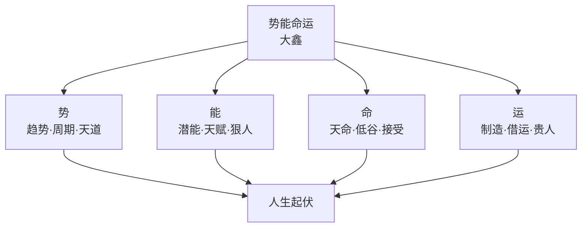
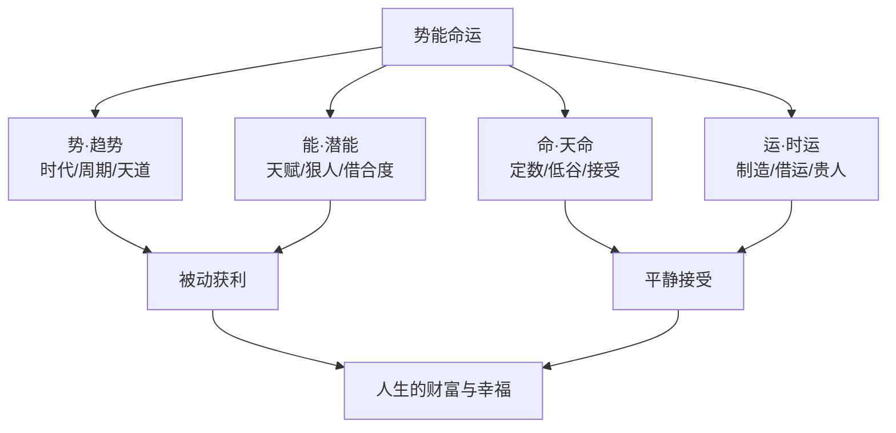

# 43《势能命运》深度解读（详细版）

> **副题：大鑫——"决定人生起伏与投资失败的根本规律"：势、能、命、运四字天机**
>
> 作者：大鑫（网名），从负债累累的穷小子到管理数十亿资金的操盘手，从重度抑郁到热爱生活与自由。近二十年金融交易生涯的感悟凝结成四个字——**势、能、命、运**——"我们的人生起伏与成就，无论大小，都是由这四个奇妙的东西所掌控和决定的。"
>
> **核心定位**：全书 5 章构成一张"命运地图"——**走出自我（认知局限）→ 顺势而为（趋势周期）→ 激发潜能（天赋能力）→ 接受天命（命不可违）→ 制造时运（运可改造）**。如果说 037 冉伟是"道术合一"的交易哲学，042 卜建业是"佛道双修"的逆向修行——043 大鑫是"民间智慧+天道平衡+命运玄机"的成功学式投资人生哲学。
>
> **系列意义**：043 是系列第 43 本，**人生哲学+投资命运篇**——补上了"势能命运"这个维度。前面的书教你"怎么投资"，这本书教你"怎么看透人生"——没有正确的人生观，投资只会放大你的贪婪和恐惧。

---

## 📖 全书结构与核心框架

### 5 章结构总览

| 篇章 | 核心内容 |
|------|---------|
| 第一章 | 走出自我局限性（智慧≠知识/穷人是富人的财富/增业不辞职） |
| 第二章 | 势在必行（被动赚钱/天道平衡/时空杠杆/金融=周期之王） |
| 第三章 | 潜能无限（天赋上限/狠人借合度/放弃也是能力） |
| 第四章 | 尽人事听天命（命=穷极办法后的无可奈何/借命改命/低谷是良药） |
| 第五章 | 时来运转（运可制造/借运的底层逻辑） |

---

## 📑 目录

- [[#第1章 前言：势能命运四字天机|第1章 前言：势能命运四字天机]]
- [[#第2章 走出自我：没有智慧的勤劳是徒劳|第2章 走出自我：没有智慧的勤劳是徒劳]]
- [[#第3章 势在必行：钱到底是怎么赚的|第3章 势在必行：钱到底是怎么赚的]]
- [[#第4章 天道平衡与时空杠杆|第4章 天道平衡与时空杠杆]]
- [[#第5章 潜能无限：天赋与狠人|第5章 潜能无限：天赋与狠人]]
- [[#第6章 尽人事听天命：命到底是什么|第6章 尽人事听天命：命到底是什么]]
- [[#第7章 时来运转：运可以制造|第7章 时来运转：运可以制造]]
- [[#总结：势能命运体系全景|总结：势能命运体系全景]]
- [[#附录一 大鑫金句集（30 条精选）|附录一 大鑫金句集（30 条精选）]]
- [[#附录二 本书术语速查卡|附录二 本书术语速查卡]]
- [[#附录三 系列互链：043 在 43 本笔记中的位置|附录三 系列互链：043 在 43 本笔记中的位置]]
- [[#附录四 势能命运自测表|附录四 势能命运自测表]]
- [[#附录五 读完本书后的 10 个自问|附录五 读完本书后的 10 个自问]]
- [[#附录六 本书案例与数据速查|附录六 本书案例与数据速查]]
- [[#附录七 本书 FAQ 15 问|附录七 本书 FAQ 15 问]]
- [[#附录八 系列母题追踪（043 号更新）|附录八 系列母题追踪（043 号更新）]]
- [[#附录九 势能命运体系 × A 股实战对照|附录九 势能命运体系 × A 股实战对照]]
- [[#附录十 30 秒版：势能命运|附录十 30 秒版：势能命运]]
- [[#附录十一 大鑫哲学理念 50 条|附录十一 大鑫哲学理念 50 条]]
- [[#附录十二 系列 43 本总览（完成进度）|附录十二 系列 43 本总览（完成进度）]]
- [[#附录十三 五种眼光（043 版）|附录十三 五种眼光（043 版）]]
- [[#附录十四 中英对照|附录十四 中英对照]]
- [[#附录十五 思维训练：10 个命运练习|附录十五 思维训练：10 个命运练习]]
- [[#附录十六 写给迷茫中的人（知乎文风附录）|附录十六 写给迷茫中的人（知乎文风附录）]]

---

## 第1章 前言：势能命运四字天机

### 1.1 大鑫的故事

> "我从小原生家庭就和别人不同……我的母亲从小智力受损，以至于经常情绪失控每天闹自杀，父亲也因为意外身故。从很小的时候我就开始经历周遭迂腐、贫穷、愚昧、自私、冷血的人性，虽然刚到40岁，但是我已经觉得我活了几个世纪那么长。"

**从负债累累到数十亿资金操盘手**；**从重度抑郁到热爱生活与自由**——这就是大鑫的"势能命运"实证。

> "最后我终于明白，人生的起伏与成就，无论是大是小，都是由势、能、命、运这四个奇妙的东西所掌控和决定的。"

### 1.2 四字拆解

| 字 | 含义 | 你能掌控吗 |
|----|------|----------|
| **势** | 时代趋势/周期/天道 | 不能创造，**只能顺应** |
| **能** | 天赋潜能/能力/认知 | 可开发，但有上限 |
| **命** | 天命/格局/定数 | **不可违**，只能接受 |
| **运** | 运气/时机/贵人 | **可制造、可借运** |

> "一秒钟内洞悉事物本质的人，与花费半生也看不清事物本质的人，他们的命运是截然不同的。"

---

## 第2章 走出自我：没有智慧的勤劳是徒劳

### 2.1 知识≠智慧

> "我们懂得了很多知识，但不代表具有智慧……事实上，大部分人在生命的最后阶段才展现出最高的智慧，然而为时已晚。"

| 知识 | 智慧 |
|------|------|
| 记住信息 | **洞察本质** |
| 懂得很多 | **做出最佳选择** |
| 可以学 | **需要悟** |

> "智慧即快速洞察天、地、人、事物运行的本质，并做出最佳选择。简而言之，认知周期变化，很多人称之为'道'。"

> "做对事与做很多事是两码事。做很多事，就很容易做错很多事……少做事，但求做对，这样结果才会越来越好。"

### 2.2 守住财富比创造财富更难

> "长大后有足够的知识和技能，创造财富是极其困难的，即使有了这些，也未必能创造足够的财富。即使创造了财富也很难守住，因为没有驾驭和传承财富的能力。"

**50/60/70 后的教训**：

> "他们中的许多人并没有受过良好的教育，由于缺乏文化底蕴……即使口袋里有数百亿资产，他们仍觉得自己是个穷人。"

> "真正有智慧的人，不仅能够创造财富，还能传承财富。老天要让一个人灭亡，必先让他疯狂。"

### 2.3 穷人是富人的最大财富

> "穷人要摆脱阶层固化，可能比以往任何时代都要困难。网络和电子终端带来的各种便利，让越来越多的人产生幻觉……他们将整日被游戏、娱乐和色情等信息包围着……日复一日地重复上班工作、消费。"

> "《经济学人》说：'越来越多的穷人被驱赶到线上，成为富人的流量工具。'富人打造虚拟世界给穷人，而穷人，则是富人的最大财富。"

### 2.4 增业，不辞职创业

> "我觉得增业才是当前最理智的选择。在把你当前的业务做到极致的基础上，再扩展一些其他业务……未来很长一段时间当中，很多人会同时拥有多个主业。"

---

## 第3章 势在必行：钱到底是怎么赚的

### 3.1 大部分人的财富是被动累积的

**丈母娘逼买房的"被动赚钱"**：

> "你出生在1980年，2002年结婚，丈母娘要你买一套房子……你用了你能用到的资源，终于买了一套房子把婚结了。10多年后，房子涨了10倍。这个钱是你的能力主动赚来的吗？不是——是你丈母娘的逼迫下被动去买了房子，然后刚好赶上了房地产爆发式上升的周期行情。"

**北京→成都十套房案例**：

> "一个很年长的朋友，2000年在三环内100多万买了一套，2016年初卖了，用这笔钱马上在成都买了10套房子，结果2017年又涨了一倍。"

> "这并非源于他个人的能力，而是他在合适的时间做出了被动的选择，赶上了'势'。"

### 3.2 "超能力幻觉"与"货币幻觉"

| 幻觉 | 表现 |
|------|------|
| 超能力幻觉 | 赚了钱以为自己很牛——"房地产富豪以为自己什么都懂" |
| 货币幻觉 | 以为房子随时能卖=现金——"房子不是货币，不是想套现就可以套现的" |

**电器代理商的故事**：

> "如果他只要把每月经营电器赚的钱去买这家电器的股票，那他一定是轻松地坐上当地首富……可是他非要把经营赚的钱在股票市场炒来炒去，不但没有赚钱，反而还亏了钱。而他代理的那家电器公司的股票，升值了上千倍。"

**（和 012 号巴菲特"为什么要买自家股票"形成呼应——大鑫用民间案例讲了同样的道理。）**

### 3.3 被选中的精英与被淘汰的精英

> "以前某公司在行业内很牛……选中了的都是精英中的精英。后来这家公司关门了，被选中的精英就失业了，而当初没有被选中的，有的可能就去了阿里巴巴，后来阿里上市了，身价可能是几千万，可能是几个亿！谁才是真正的精英？"

**结论**：不是能力决定财富，是**你所在的行业是否处于爆发式上升周期**。

---

## 第4章 天道平衡与时空杠杆

### 4.1 天道的本质是平衡

| 天道的体现 | 例子 |
|-----------|------|
| 生物链 | 食肉动物制约食草动物→生态平衡 |
| 老鹰与兔子 | 兔子少→老鹰转捕其他→保护兔群 |
| 病毒变异 | 不会杀死所有感染者→保留宿主 |
| 粮食周期 | 风调雨顺→供给过剩→减产→涨价 |
| 母爱 | 基因里的天道→不繁衍则种群消失 |

> "天空之下，浩渺无垠的宇宙中，隐藏着无尽能量……万物相生相克，达成平衡。当一个物种超出其生态承载力时，自然界会通过各种方式如天灾、饥荒、瘟疫和战争来减少其数量。"

### 4.2 金融=时空杠杆

> "金融就是财富通过时间和空间的转换。比如你现在的企业市值是一个亿，按现在的增长速度复利计算10年后市值是5个亿，但是现在上市后市值就有了5个亿——你现在可以拥有你10年以后的财富。"

**实体行业 vs 金融投资**：

| | 实体 | 金融 |
|--|------|------|
| 周期 | 一个行业 50 年 1 次上升 | 日线级别 50 年 10+ 轮 |
| 速度 | 极慢 | 极快 |
| 本质 | "50 年做一次" | **"50 年做 500 年的事"** |

> "金融是所有行业之首！因为做的是N个循环周期，有时间和空间的杠杆。金融就是周期之王。"

### 4.3 风险的核心变量是人

> "如果总资金100万，在不同时间周期、不同交易方式、不同人、不同标的物——这笔钱的最大风险有没有差别？我认为没有差别，因为都有可能要亏损完。用一个星期亏损完或是用一生去亏损完，本质上是一样的。因为这个事情是人在做……投资交易中最大的问题，是自己。"

---

## 第5章 潜能无限：天赋与狠人

### 5.1 天赋决定上限，努力决定下限

> "一个人后期再努力的学习、实践，也不能提高自己智商的上限，只能提高知识的上限。天赋在娘胎里已经形成。努力是必须的，因为努力可以保证下限；而天赋，决定了上限。"

**证据**：

| 例子 | 说明 |
|------|------|
| 钢琴 | 比某钢琴王子练琴更努力的人多了去了——但不是王子 |
| 拳击 | 全世界多少练拳的人——能超越泰森的有几人 |
| 读书 | 会读书的孩子不很认真也会；不会的再努力也不会 |

> "世界第一流的教练，同时训练一群人，这一群人一样的努力，但是只有一个人是冠军。"

> "'教父'里说：一秒钟内看透本质的人，和花半辈子也看不清一件事本质的人，命运是截然不同的。"

### 5.2 天赋不会遗传

> "博士夫妻生的孩子也可能很笨，流浪夫妻生的孩子也可能聪明绝顶。贝多芬的母亲是帮佣、厨师、患有梅毒。"

> "没有什么可以恒久远，更何况是天赋这种无法遗传、又会变异的天生潜能。这就是天道平衡。"

### 5.3 做一个狠人：善用"借、合、度"

| 三法 | 含义 |
|------|------|
| **借** | 借用周期/借钱/借力——"风火雷电，草木山石皆可为兵" |
| **合** | 合智慧/合能力/合人脉/合资源——"善于合作" |
| **度** | 掌握分寸不越界——"做大不如做强，做强不如做久" |

> "只有对自己狠一点，才能做到忍别人不能忍，舍别人不能舍，做别人不能做。只有这样才能超越自我，超越身边人，从某种程度上战胜人性的弱点。"

> "人生就是一个献祭的过程，你要想取得什么，你就要先舍掉什么去交换。"

**什么是格局**：

> "你站在桥上看风景，别人站在楼上看你。"

---

## 第6章 尽人事听天命：命到底是什么

### 6.1 命=穷极一切办法后的无可奈何

> "在天命给我们划定的范围里，我们一定要尽力地去表现和行动……再好的行动和表现，你也很少超过天命给出的局限，因为这是定数。"

> "穷极一切办法后的无可奈何，这才是命。这时候认命，一点也不窝囊……而很多人的痛苦，往往都来源于不认命。"

### 6.2 借命改命

| 方式 | 操作 |
|------|------|
| 相生 | 找弥补自己命格的人一起工作/生活/结婚 |
| 贵人 | 跟命格非常好的人合作/被护佑 |
| 拜师 | "师父收徒要收礼——不收礼等于把饭分给徒弟吃" |

> "命运贵人不可弃也——命运并非完全取决于个人的努力，贵人的相助也是我们走向成功的关键。"

### 6.3 人生低谷，是救命良药

> "人生低谷期，是一个人在生活中经历的一段困难、挫折或失落的时期……然而，正是这些低谷期，才是我们人生中最宝贵的经历，是救命的良药。"

| 低谷的价值 | 案例 |
|-----------|------|
| 谦卑接受信息 | 勾践卧薪尝胆 |
| 反思自我 | 乔布斯被赶出苹果→反思→回归创造辉煌 |
| 放下包袱重新规划 | 爱迪生、林肯从失败中重起 |
| 理智看问题找到突破 | 牛顿被苹果砸中→万有引力 |

> "一切有为法，如梦幻泡影，如露亦如电，应作如是观。世间的富贵名利，就像水泡一样变幻无常，无法掌握。"

---

## 第7章 时来运转：运可以制造

### 7.1 运是可以人为制造的

大鑫认为"运"不是完全的随机——可以通过以下方式制造：

| 制运方法 | 操作 |
|---------|------|
| 借运 | 与好运的人为伍 |
| 积累 | 长期在一个方向深耕→量变到质变 |
| 信息差 | 获取别人看不到的信息 |
| 连接 | 建立有质量的人际网络 |
| 准备 | 时刻准备→机会来了能抓住 |

### 7.2 借运的底层逻辑

> "借运"不是玄学——本质上是通过**改变自己的信息环境、人际圈、行动方向**来提升遇到好运的概率。

**（与 035 邱国鹭"安全边际内长期持有等待价值回归"、042 卜建业"太极图等待极值"同核：做好自己可控的部分，等不可控的部分自然发生。）**

---

## 总结：势能命运体系全景

### Z1. 大鑫体系全景

### Z2. 全书的五根柱子

| 柱子 | 核心 | 章节 |
|------|------|------|
| 走出自我 | 知识≠智慧/穷人是富人财富/增业 | 第1章 |
| 顺势而为 | 被动赚钱/超能力幻觉/时空杠杆 | 第2—3章 |
| 天赋狠人 | 天赋上限/借合度/对自己狠 | 第4章 |
| 接受天命 | 命=无可奈何/借命改命/低谷是良药 | 第5章 |
| 制造时运 | 借运/积累/准备 | 第6章 |

### Z3. 大鑫留给读者的三句话

> 1. "没有智慧的勤劳只是徒劳——做对事比做很多事重要。"
> 2. "穷极一切办法后的无可奈何，才是命——这时候认命，一点也不窝囊。"
> 3. "人生低谷，是救命的良药——不要灰心，这正是你成长和进步的机会。"

---

## 附录一 大鑫金句集（30 条精选）

> 1. "一秒钟内洞悉事物本质的人，与花费半生也看不清事物本质的人，他们的命运是截然不同的。"——前言
> 2. "人生的起伏与成就，都是由势、能、命、运这四个奇妙的东西所掌控。"——前言
> 3. "没有智慧的勤劳只是徒劳。"——第一章
> 4. "做对事与做很多事是两码事。"——第一章
> 5. "即便有了丰富的知识和经验，也不一定能产生智慧。"——第一章
> 6. "穷人，是富人最大的财富。"——第一章
> 7. "富人为穷人打造的完美牢笼——虚拟世界。"——第一章
> 8. "增业才是当前最理智的选择。"——第一章
> 9. "大部分人的财富都是被动累积的，而非主动追求而来。"——第二章
> 10. "超能力幻觉——赚了钱就以为自己很牛。"——第二章
> 11. "房子不是货币，不是想套现就可以套现的。"——第二章
> 12. "谁才是真正的精英？——去了阿里的那个。"——第二章
> 13. "天空之下，浩渺无垠的宇宙中，隐藏着无尽能量。"——天道
> 14. "万物相生相克，达成平衡。"——天道
> 15. "金融是财富通过时间和空间的转换——周期之王。"——时空杠杆
> 16. "50 年内做了 500 年才能做完的事情。"——时空杠杆
> 17. "投资交易中最大的问题，是自己。"——风险
> 18. "天赋面前，很多努力都是徒劳。"——潜能
> 19. "努力保证下限，天赋决定上限。"——潜能
> 20. "贝多芬的母亲是帮佣、厨师、梅毒患者——天赋不会遗传。"——潜能
> 21. "做一个狠人——忍别人不能忍，舍别人不能舍，做别人不能做。"——狠人
> 22. "人生就是一个献祭的过程——你要想取得什么，就先舍掉什么去交换。"——狠人
> 23. "穷极一切办法后的无可奈何，才是命。这时候认命，一点也不窝囊。"——命
> 24. "很多人的痛苦，往往都来源于不认命。"——命
> 25. "天命在框定了我们的局限之后，还给我们开了一扇门——创造。"——命
> 26. "人生低谷，是救命的良药。"——低谷
> 27. "一切有为法，如梦幻泡影，如露亦如电，应作如是观。"——低谷
> 28. "你站在桥上看风景，别人站在楼上看你。这就是格局。"——格局
> 29. "做大不如做强，做强不如做久。"——借合度
> 30. "鲜衣怒马仗剑天涯，愿我们归来仍是少年。"——前言

---

## 附录二 本书术语速查卡

| 术语 | 定义 | 出处 |
|------|------|------|
| 势 | 时代趋势/周期/天道 | 第2章 |
| 能 | 天赋潜能/能力/认知 | 第3章 |
| 命 | 天命/格局/定数 | 第4章 |
| 运 | 运气/时机/贵人 | 第5章 |
| 超能力幻觉 | 赚了钱就以为自己无所不能 | 第2章 |
| 货币幻觉 | 以为资产随时可变现 | 第2章 |
| 增业 | 在主业极致基础上扩展 | 第1章 |
| 时空杠杆 | 金融=时间+空间的转换 | 第2章 |
| 借合度 | 借用/合作/分寸 | 第3章 |
| 狠人 | 对自己狠→忍/舍/做 | 第3章 |
| 借运 | 改变信息环境提升遇好运概率 | 第5章 |
| 天道平衡 | 万物相生相克 | 第2章 |

---

## 附录三 系列互链：043 在 43 本笔记中的位置

| 系列笔记 | 链接点 |
|---------|--------|
| [[37《股票投资沉思录》深度解读（详细版）|37 号]] | 冉伟道术×043 天道平衡 |
| [[42《逆向致胜》深度解读（详细版）|42 号]] | 卜建业佛道×043 天命低谷 |
| [[35《投资中最简单的事》深度解读（详细版）|35 号]] | 邱国鹭逆向×043 被动赚钱 |
| [[04《原则》深度解读（详细版）|04 号]] | 达利欧周期×043 天道周期 |

---

## 附录四 势能命运自测表

| 维度 | 自测问题 |
|------|---------|
| 势 | 你所在的行业处于上升周期还是下降周期？ |
| 能 | 你的天赋是什么？你做哪件事比别人轻松且做得好？ |
| 命 | 你接受了哪些"穷极办法也不可改变"的事情？ |
| 运 | 你的人际圈里有多少"命格比自己好"的人？ |

---

## 附录五 读完本书后的 10 个自问

1. 我所处的行业"势"是上升还是下降？
2. 我有没有"超能力幻觉"——把运气当能力？
3. 我的财富是"被动累积"的还是"主动创造"的？
4. 我有没有把时间浪费在"穷人的牢笼"（刷视频/打游戏）里？
5. 我找到自己的天赋了吗？我在扬长还是补短？
6. 我够"狠"吗——能不能忍别人不能忍？
7. 我接受了哪些"命"——那些穷极办法也改变不了的事？
8. 我善于"借运"吗——我的圈子是好运的还是厄运的？
9. 我经历过低谷吗——它教了我什么？
10. "做大不如做强，做强不如做久"——我的投资/事业符合吗？

---

## 附录六 本书案例与数据速查

| 案例 | 含义 |
|------|------|
| 丈母娘逼买房 | 被动赚钱=赶上房地产上升周期 |
| 北京→成都十套房 | 2016 卖→买 10 套→2017 翻倍 |
| 电器代理商 | 经营赚的钱没买自家股票→错过上千倍 |
| 阿里上市 | 没选中的人去了阿里→身价几千万→谁是真正的精英 |
| 贝多芬 | 母亲是帮佣/厨师/梅毒患者→天赋不遗传 |
| 勾践卧薪尝胆 | 低谷中谦卑=学到治国之道 |
| 乔布斯被赶出苹果 | 低谷=反思→回归创造辉煌 |
| 牛顿苹果 | 低谷→苹果砸中→万有引力 |

---

## 附录七 本书 FAQ 15 问

**Q1：势能命运是什么意思？**
A：势=时代趋势/能=天赋潜能/命=天命定数/运=可制造的机遇。

**Q2：为什么说"没有智慧的勤劳是徒劳"？**
A：做很多事≠做对事——智慧是洞察本质并做最佳选择，光勤奋不够。

**Q3：钱到底是怎么赚的？**
A：大部分是被动赶上了"势"——丈母娘逼买房赶上房地产周期。

**Q4：什么是超能力幻觉？**
A：赚了钱以为自己很牛，其实只是赶上了周期。

**Q5：金融为什么是周期之王？**
A：时空杠杆——50 年可以做 500 年的事（日线级别多次轮回）。

**Q6：天赋能遗传吗？**
A：不能——贝多芬的父母与天赋无关；天道平衡使天赋随机分布。

**Q7：什么是狠人？**
A：对自己狠——忍别人不能忍，舍别人不能舍，做别人不能做。

**Q8：借合度怎么用？**
A：借用一切力量+善于合作+掌握分寸不做过度的事。

**Q9：命到底是什么？**
A：穷极一切办法后的无可奈何——这时候认命不窝囊。

**Q10：命可以改变吗？**
A：可略微借命改命（贵人/相生的人），但总体在定数内。

**Q11：运可以制造吗？**
A：可以——借运（改变信息环境/人际圈）提升遇好运概率。

**Q12：人生低谷有什么用？**
A：救命良药——让你谦卑/反思/放下包袱/找到突破。

**Q13："一切有为法如梦幻泡影"什么意思？**
A：富贵名利变幻无常——不执着，清静欣赏。

**Q14："做大不如做强，做强不如做久"怎么理解？**
A：追求可持续性比规模更重要。

**Q15：这本书最大的价值？**
A：把"投资失败"的根本原因从技术层面拉到"人生观"层面——先做好人，再做好投资。

---

## 附录八 系列母题追踪（043 号更新）

### 8.1 "命运/周期"主题系列对照

| 笔记 | 视角 |
|------|------|
| 04 达利欧 | 经济周期+原则 |
| 037 冉伟 | 道术+天道 |
| 042 卜建业 | 佛道双修+命运沉浮 |
| **043 大鑫** | **势能命运四字体系+民间智慧** |

---

## 附录九 势能命运体系 × A 股实战对照

| 大鑫概念 | A 股应用 |
|---------|---------|
| 势（趋势） | 选择处于上升周期的行业/板块 |
| 能（天赋） | 承认自己不是天才——用指数基金代替选股 |
| 命（定数） | 接受市场不可预测——不做短线猜涨跌 |
| 运（可制） | 做足研究→好机会出现时能抓住（借运=仓位准备） |
| 超能力幻觉 | 牛市赚了以为自己是股神→熊市打回原形 |
| 低谷 | 熊市=投资人的低谷——恰是最好的学习期和布局期 |

---

## 附录十 30 秒版：势能命运

> **势能命运（30 秒版）**：
>
> 1. **势**——趋势不可违，只能顺应（选择上升周期的行业）；
> 2. **能**——天赋有上限，努力保下限（做自己擅长的事）；
> 3. **命**——穷极办法后的无可奈何=接受（不赌运气）；
> 4. **运**——可制造、可借运（改变信息环境+人际圈）；
> 5. **终极**——顺势而为+开发潜能+接受天命+制造时运=完整人生。

---

## 附录十一 大鑫哲学理念 50 条

**智慧与认知（1—15）**：

> 1. 没有智慧的勤劳只是徒劳。
> 2. 做对事比做很多事重要。
> 3. 知识≠智慧。
> 4. 智慧=洞察本质并做最佳选择。
> 5. 大部分人临终前才展现最高智慧。
> 6. 守住财富比创造财富更难。
> 7. 老天让谁灭亡，必先让谁疯狂。
> 8. 穷人是富人的最大财富。
> 9. 虚拟世界是富人为穷人打造的牢笼。
> 10. 增业>辞职创业。
> 11. 全民多业时代正在来临。
> 12. 财富是被动累积的。
> 13. 赶上了"势"，不是你牛。
> 14. 超能力幻觉=牛市的副作用。
> 15. 房子不是货币。

**天道与金融（16—30）**：

> 16. 天道=平衡。
> 17. 当物种超出承载力→天灾/瘟疫/战争减少数量。
> 18. 母爱是基因里的天道。
> 19. 病毒不会杀死所有宿主。
> 20. 金融=时间+空间的杠杆。
> 21. 50 年做 500 年的事=周期之王。
> 22. 风险一样，收益不一样。
> 23. 投资交易最大问题是自己。
> 24. 各种参数可标准化，人无法标准化。
> 25. 不是多大的收益背后就有多大的风险。
> 26. 人以讹传讹，把矛盾的当成真理。
> 27. 粮食才是第一能源。
> 28. 厄尔尼诺/拉尼娜=天规。
> 29. 大棚种植=利用天规反规律。
> 30. 利用天规，可以在合适时间进货出货。

**天赋与狠人（31—40）**：

> 31. 天赋面前，很多努力是徒劳。
> 32. 努力保下限，天赋决定上限。
> 33. 天赋不会遗传。
> 34. 贝多芬的母亲是帮佣。
> 35. 做一个狠人=对自己狠。
> 36. 忍别人不能忍/舍别人不能舍/做别人不能做。
> 37. 人生是献祭=先舍后得。
> 38. 借=借用周期/借钱/借力。
> 39. 合=合智慧/合能力/合人脉/合资源。
> 40. 度=做大不如做强，做强不如做久。

**命运与低谷（41—50）**：

> 41. 穷极一切办法后的无可奈何，才是命。
> 42. 认命不窝囊。
> 43. 痛苦来源于不认命。
> 44. 借命改命=找相生的人/贵人。
> 45. 天命在框定后还给一扇门=创造。
> 46. 低谷是救命良药。
> 47. 谦卑才能接受外界信息。
> 48. 运可人为制造。
> 49. 借运=改变信息环境。
> 50. 一切有为法如梦幻泡影。

---

## 附录十二 系列 43 本总览（完成进度）

| 编号 | 书名 | 状态 |
|------|------|------|
| 01—03 | 利弗莫尔三部曲 | ✅ |
| 04 | 达利欧《原则》 | ✅ |
| 05—14 | 巴菲特系列 | ✅ |
| 16—21 | 巴菲特延伸系列 | ✅ |
| 22—25 | 芒格四书 | ✅ |
| 26—27 | 费雪父子 | ✅ |
| 28 | 格雷厄姆 | ✅ |
| 29—30 | 段永平双册 | ✅ |
| 31 | 索罗斯《金融炼金术》 | ✅ |
| 32—34 | 林奇三部曲 | ✅ |
| 35 | 邱国鹭《投资中最简单的事》 | ✅ |
| 36 | 陈江挺《炒股的智慧》 | ✅ |
| 37 | 冉伟《股票投资沉思录》 | ✅ |
| 38 | 马涛《从零开始学炒股》 | ✅ |
| 39 | 朱孜《股票投资入门、进阶与实战》 | ✅ |
| 40 | 张化桥《避开股市的地雷》 | ✅ |
| 41 | 北落的师门《基金作战笔记》 | ✅ |
| 42 | 卜建业《逆向致胜》 | ✅ |
| **43** | **大鑫《势能命运》** | **✅ 本笔记** |
| 44—169 | 更多 | 待解读 |

**系列进度：43/169 完成**

---

## 附录十三 五种眼光（043 版）

以"一个人因牛市赚了大钱后来亏回去了"为例：

| 视角 | 诊断 |
|------|------|
| 035 邱国鹭 | 没看懂估值——涨的时候以为是自己水平高 |
| 036 陈江挺 | 没止损——败而不倒没做到 |
| 037 冉伟 | 没管概率——把运气当能力 |
| **043 大鑫** | **"超能力幻觉"——把"势"的红利当成了自己的"能"，违背了"命"的定数** |

---

## 附录十四 中英对照

| 中文 | English |
|------|---------|
| 势能命运 | Trend, Ability, Destiny, Fortune |
| 天道 | The Way of Heaven / Natural Law |
| 超能力幻觉 | Super-ability Illusion |
| 时空杠杆 | Time-Space Leverage |
| 借合度 | Borrow, Cooperate, Moderate |
| 狠人 | Ruthless (to self) Person |
| 借运 | Fortune Borrowing |
| 增业 | Business Expansion (not quitting) |

---

## 附录十五 思维训练：10 个命运练习

1. 画出你所在行业的"势"——上升还是下降？以 10 年为尺度
2. 列出你 3 个"天赋"——做起来比别人轻松又做得好
3. 问自己：我有哪些"超能力幻觉"时刻？
4. 写下你人生中最大的一次"被动赚钱"经历
5. 找出你圈子中"命格最好"的 3 个人——怎么靠近他们
6. 回忆一次"穷极办法也无法改变"的事——你接受了吗
7. 回忆一次人生低谷——它教了你什么
8. 设计你的"借运"策略（改变信息环境 3 条）
9. 做一个"狠人"练习：今天起戒掉一个浪费时间的行为
10. "做强不如做久"——你的投资系统能持续 20 年吗

---

## 附录十六 写给迷茫中的人（知乎文风附录）

### 写在前面：一个从负债到数十亿的人

大鑫是谁？

他从小的原生家庭和别人不同——母亲智力受损天天闹自杀，父亲意外身故。他说：

> "从很小的时候我就开始经历周遭迂腐、贫穷、愚昧、自私、冷血的人性，虽然刚到40岁，但是我已经觉得我活了几个世纪那么长。"

成年后从外出打工，到进入金融交易行业。近二十年职业生涯，从负债累累的穷小子到管理数十亿资金的操盘手，从重度抑郁到如今热爱生活与自由。

**他活过来了，然后写了这本书。**

### 第一课：大部分人的财富是"被动的"

大鑫讲了一个最朴素的故事。

> "你出生在1980年，2002年结婚。丈母娘要你买房子才把女儿嫁给你。你东拼西凑买了。10多年后房子涨了10倍。请问——这个钱是你的能力主动赚来的吗？"

**不是。是丈母娘逼你买的，你刚好赶上了中国房地产爆发式上升的周期。**

他还有个朋友，2000 年在北京三环内 100 多万买了一套大户型的房子。2016 年初卖了，用这笔钱马上在成都买了 10 套房子，2017 年又涨了一倍。

> "这并非源于他个人的能力，而是他在合适的时间做出了被动的选择，赶上了'势'。"

**这一课教给所有在牛市里赚了钱的人：别太得意。你赚的不是能力的钱，是"势"的钱。**

### 第二课：超能力幻觉——牛市的副作用

> "很多人在房地产盛宴里赚了钱，就以为自己很牛。看看身边的人，谁也没有自己混得好。我太牛逼了。于是有了自己是神的念想——我把这个称之为'超能力幻觉'。"

这种幻觉的代价在股市最明显：一轮牛市赚了大钱→以为自己掌握了投资的真谛→下一轮熊市把利润亏回去，甚至倒亏本金。

**所有赚过大钱又亏回去的人，都经历过"超能力幻觉"。**

### 第三课：时空杠杆——金融为什么是周期之王

大鑫对金融的理解很独特：

> "金融就是财富通过时间和空间的转换。一个实体行业50年才有一个上升周期，可是在金融市场进行投资交易，日线级别50年内就可以有超过10次轮动周期行情出现——也就是50年内做了500年才能做完的事情。这就是时间和空间的杠杆。金融是所有行业之首！"

**翻译**：你开工厂，一辈子赶上一次上升周期就谢天谢地了。你做投资，50 年能经历几十次涨跌轮回——每一次轮回都是获利机会，前提是你活得下来。

### 第四课：天赋面前，很多努力是徒劳的

大鑫很残酷：

> "一个人后期再努力的学习和实践，也不能提高自己智商的上限……天赋在娘胎里已经形成。努力是必须的，因为努力可以保证下限；而天赋，决定了上限。"

世界第一流的教练同时训练一群人，这群人一样地努力——**但只有一个人是冠军。**

贝多芬的母亲是帮佣、厨师、梅毒患者。博士夫妻生的孩子也可能很笨。**天赋不遗传，天赋是老天随机分配的——这就是天道平衡。**

**这一课教给你：承认自己的天赋边界，在擅长的事情上努力，比在所有事情上努力更有效率。**

### 第五课：做一个狠人

> "很多人想改变人生。怎么做？对自己狠一点。忍别人不能忍，舍别人不能舍，做别人不能做。人生就是一个献祭的过程——你要想取得什么，先舍掉什么去交换。"

大鑫提了三个字：**借、合、度**。

借——借用周期、借钱、借力。风火雷电，草木山石皆可为兵。善于借用一切力量。
合——合智慧、合能力、合人脉、合资源。善于合作。
度——掌握分寸，不越界。做大不如做强，做强不如做久。

> "你站在桥上看风景，别人站在楼上看你。这就是格局。"

### 第六课：低谷是救命的良药

大鑫说，人生低谷不是惩罚，是**救命良药**。

乔布斯被赶出自己创办的苹果公司→经历了深刻的自我反思→回归→创造辉煌。勾践沦为夫差奴仆→在吴国受尽凌辱→卧薪尝胆→灭掉吴国。牛顿苹果砸中——低谷中的理智思考产生了万有引力。

> "人生低谷像一剂苦口良药——虽然难以下咽，却能治愈我们身上的弊病。"

> "一切有为法，如梦幻泡影，如露亦如电，应作如是观。"

**这一课教给正在熊市中痛苦的人：熊市就是投资人的"低谷"——恰是最好的反思期和布局期。**

### 尾声：穷极一切办法后的无可奈何，才是命

大鑫最后讲了一个让人平静的道理：

> "穷极一切办法后的无可奈何，才是命。这时候认命，一点也不窝囊。而很多人的痛苦，往往都来源于不认命。"

**不是认输——是认清边界后的释然。**

势（趋势）你只能顺应，不能创造。
能（天赋）你只能开发，不能超越。
命（定数）你只能接受，不能违抗。
运（机遇）你可以制造，可以借。

**聪明的人顺应"势"，开发"能"，接受"命"，制造"运"。这就是完整的投资人生。**

> "鲜衣怒马仗剑天涯，不管人生路上的经历如何，愿我们归来仍是少年。"

