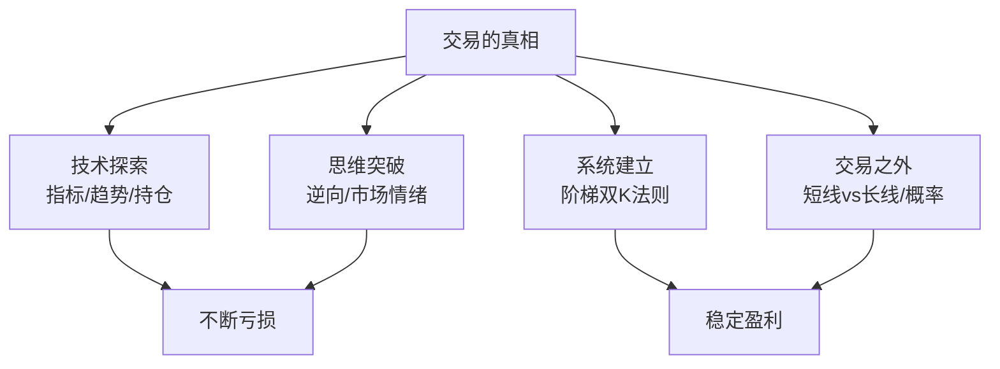

# 44《交易的真相》深度解读（详细版）

> **副题：从1000到1.83亿——一个普通二本毕业生的交易修行之路：逆向思维 × 市场情绪 × 阶梯双K交易法则**
>
> 作者：一位通信网络行业的售前技术顾问，二本毕业、家庭背景普通、不喜讨好客户——选择走"不需要人脉、不受他人影响、只靠自己能力"的交易之路。从1000元开始，历经无数日夜的K线图前守候，最终形成自己的交易系统。
>
> **核心定位**：全书11章构成一个完整交易者的成长轨迹——**初入市场→支撑位→趋势线→随机指标→持仓→不下马交易→逆向思维萌芽→交易的真相→阶梯双K交易法则→半年系统测试→K线交易之外**。如果说 036 陈江挺是"怎么活下来"，这本书是"怎么从1000开始活下来并进化出自己的系统"。
>
> **系列意义**：044 是系列第 44 本，**纯交易实战·系统开发篇**——补上了交易者"从摸索到建立系统"的完整成长路径。与 01—03（利弗莫尔）、036（陈江挺）、037（冉伟）形成交易派四维。

---

## 📖 全书结构与核心框架

### 11 章结构总览

| 篇章 | 核心内容 |
|------|---------|
| 第1—6章 | 技术摸索（入门/支撑位/趋势线/随机指标/持仓/不下马交易） |
| 第7章 | 逆向思维萌芽——**放弃不下马、寻找新路** |
| 第8章 | 交易的真相——**等比例盈亏+市场情绪感知** |
| 第9章 | **阶梯双K交易法则**——一套简单有效的系统 |
| 第10章 | 为期半年的系统测试 |
| 第11章 | K线交易之外——短线vs长线/孙正义的直觉 |

---

## 📑 目录

- [[#第1章 前言：一个普通二本毕业生的交易之路|第1章 前言：一个普通二本毕业生的交易之路]]
- [[#第2章 技术探索：从入门到碰壁|第2章 技术探索：从入门到碰壁]]
- [[#第3章 逆向思维的萌芽：放弃不下马|第3章 逆向思维的萌芽：放弃不下马]]
- [[#第4章 交易的真相：等比例盈亏与市场情绪|第4章 交易的真相：等比例盈亏与市场情绪]]
- [[#第5章 阶梯双K交易法则：一套简单有效的系统|第5章 阶梯双K交易法则：一套简单有效的系统]]
- [[#第6章 半年系统测试与执行|第6章 半年系统测试与执行]]
- [[#第7章 K线交易之外：短线vs长线的哲学|第7章 K线交易之外：短线vs长线的哲学]]
- [[#总结：交易者的修行闭环|总结：交易者的修行闭环]]
- [[#附录一 作者金句集（25 条精选）|附录一 作者金句集（25 条精选）]]
- [[#附录二 本书术语速查卡|附录二 本书术语速查卡]]
- [[#附录三 系列互链：044 在 44 本笔记中的位置|附录三 系列互链：044 在 44 本笔记中的位置]]
- [[#附录四 阶梯双K系统执行清单|附录四 阶梯双K系统执行清单]]
- [[#附录五 读完本书后的 10 个自问|附录五 读完本书后的 10 个自问]]
- [[#附录六 本书 FAQ 15 问|附录六 本书 FAQ 15 问]]
- [[#附录七 系列母题追踪（044 号更新）|附录七 系列母题追踪（044 号更新）]]
- [[#附录八 30 秒版：交易的真相|附录八 30 秒版：交易的真相]]
- [[#附录九 交易者理念 40 条|附录九 交易者理念 40 条]]
- [[#附录十 系列 44 本总览（完成进度）|附录十 系列 44 本总览（完成进度）]]
- [[#附录十一 五种眼光（044 版）|附录十一 五种眼光（044 版）]]
- [[#附录十二 写给交易路上的人（知乎文风附录）|附录十二 写给交易路上的人（知乎文风附录）]]

---

## 第1章 前言：一个普通二本毕业生的交易之路

### 1.1 为什么选择交易

> "在我们这个国家，人情覆盖了生活的方方面面……我的家庭背景普普通通，天性不喜欢无选择地去讨好客户，然而又偏偏有很大的赚钱野心。我做不好销售，也没有足够漂亮的履历去吸引投资人支持我创业。"

**摆在他面前的选项**：需要人脉的路走不通→需要资本的创业走不通→**唯一的路——交易。**

> "这世界上有没有一种不需要费心建立人脉，不受他人影响，只靠自己的能力就能财务自由的路呢？很显然，做一名投机市场的职业交易者，似乎符合这个特征。"

> "只是，当我意识到自己选择了一条多么险恶的路的时候，在我的面前，似乎已经毫无退路了。"

### 1.2 赌徒 vs 交易者

> "赌徒的情绪常常陷入疯狂，伴随我的却一直只有冷静和寂寞。赌徒永远在玩着低概率的游戏而心存侥幸，而交易者们的成功概率高低，则完全看自己。与天斗，与地斗，与人斗，其乐无穷。与己斗，则其苦无边。"

---

## 第2章 技术探索：从入门到碰壁

### 2.1 摸索的四个阶段

| 阶段 | 工具 | 结果 |
|------|------|------|
| 支撑位 | 水平线/趋势线 | 不够精确 |
| 趋势线 | 道氏理论 | 主观性强 |
| 随机指标 | KDJ/RSI | 滞后 |
| 多周期共振 | 跨周期分析 | 复杂而不确定 |

### 2.2 持仓的迷局与不下马交易

作者经历了从"传统趋势交易"到"不下马交易"（试图贴合每一波小走势）的演变——**结论：不下马交易不可能持续盈利。**

> "不下马交易，这种试图贴合、紧跟走势做单的思路，是不大可能真实盈利的。因为这种思路其实也是在预测市场，而且是强化了预测市场的效果……就差拿个显微镜看市场了。"

---

## 第3章 逆向思维的萌芽：放弃不下马

### 3.1 转向逆向思维

> "如果市场要让大多数人亏损，那么赚钱就是一件很难的事。所以我的犹豫、我的错过，它并不是一个巧合。在那一瞬间，我不是孤单的一个人，市场上有很多个'我'正经历同样的事。我们为什么会一起错过？只能是因为我们有相近的做单思路，一致的心理弱点。"

> "这个市场的一切行为，都只有一个目的，就是耍你。"

**（与 01 号利弗莫尔"市场永远在愚弄大众"同核。）**

### 3.2 本金缩水→周期缩小的陷阱

> "有很多人可能有类似于我的情况，就是在经年累月的亏损中，觉得本金太少了，于是周期越做越小。其实你有这种感觉的时候，如果果断停止缩小周期，你还是有机会的……但是不要学我，把自己最后压到悬崖边上了。"

---

## 第4章 交易的真相：等比例盈亏与市场情绪

### 4.1 等比例盈亏——扭亏的第一关键

> "首先让我开始初步摆脱亏损的，是等比例盈亏。正是这个方法，让我摆脱了钝刀割肉的下场之后，我才有更多的精力去拨开迷雾。"

| 盈亏比 | 胜率需求 | 结果 |
|--------|---------|------|
| 1:1 | >50% | 盈亏平衡 |
| 1:2 | >33% | 稳定盈利 |
| 1:3 | >25% | 持续盈利 |

**核心**：不必追求高胜率——**1:1 盈亏比+60%胜率就足以持续盈利**。

### 4.2 市场情绪：交易者的"灵魂"

> "EA可以帮你克服很多执行上的问题，但是也有它的缺点——没有灵魂。灵魂对于交易者而言最大的用处，是让我们可以去感知市场的情绪。而市场的情绪，是左右市场走势的重要因素之一。"

**市场情绪的判断**：

| 观察 | 含义 |
|------|------|
| 5 根 K 线涨 100 点 | **情绪高涨**，一鼓作气 |
| 50 根 K 线涨 100 点 | **情绪一般**，拖拖拉拉 |
| 回撤 10 点就继续 | **强势** |
| 回撤 30 点才重启 | **边际减速** |
| 刚加速完回调进场 | **大概率陷阱**——"加速一次后短时间内很难再冲刺" |

> "我们应该顺着市场情绪交易。很多时候，价格虽然依旧沿着既有的路线前进，但是脚步已经开始拖沓，我们不应该在行情明显将要减速或者正在减速的时候去进场做所谓的顺势单。"

### 4.3 杜绝精神寄托

| 精神寄托 | 危害 |
|---------|------|
| 庄家理论 | 把亏损归罪于看不见摸不着的东西 |
| 上帝的旨意 | 放弃自我主导 |
| 古人智慧万能 | 忽视现代方法论 |
| 神逻辑理论 | "只有5个人能看懂"=永远学不好不是你的错 |

> "如果你有任何一种这样的习惯，你自己摸索出交易真谛的可能性几乎为0。"

---

## 第5章 阶梯双K交易法则：一套简单有效的系统

### 5.1 四个设计原则

| 原则 | 内容 |
|------|------|
| 简单明了 | 逻辑不复杂 |
| 无主观 | 规则明确/不靠感觉 |
| 明确进出场 | 进场规则最好只有 1 种，不超过 2 种 |
| 有效仓位管理 | 等比例盈亏 |

### 5.2 阶梯双K法则的核心规则

| 要素 | 内容 |
|------|------|
| 标的 | 任何活跃品种 |
| 周期 | 1 小时 |
| 指标 | **1 条 24 SMA**（均线） |
| 进场（多） | 上升趋势中，价格突破前 2 根 K 线最高价 |
| 出场 | 最近道氏低点减 1 点止损；**1:1 止盈** |
| 持仓限制 | 持仓中不再进场；止盈后未经回撤不跟 |

### 5.3 趋势定义：连续阶梯

**上升趋势**：价格在 24 均线以上 + 未形成连续下降阶梯。
**下降趋势**：价格在 24 均线以下 + 未形成连续上升阶梯。

**连续阶梯判定**：价格跌破前两根K线最低点形成A→突破前两根K线最高点形成B→以同样逻辑形成C和D——当D形成时（有两个不断上移的高点和低点）→进场做多，止损为D的最低价。

### 5.4 休息时间过滤

> "每天晚上11点到第二天早上9点禁止开仓——此时美盘下半场、欧洲人夜生活、亚洲人睡觉，是市场一天中最不活跃的时候。"

### 5.5 系统的核心哲学

**"阶梯双K"的本质**：在趋势方向上、情绪健康（未形成反向阶梯）时、用简单的"前两根K线突破"确认进场——**用等比例盈亏保证数学优势，用阶梯过滤减少假突破损耗。**

---

## 第6章 半年系统测试与执行

### 6.1 系统测试的意义

作者用半年时间对阶梯双K系统做连续追踪测试——目的是**模拟真实执行过程中的各种心理波动**（连续亏损时能否坚持/连续盈利时能否不贪）。

**核心**：系统再好的规则，如果无法执行=无效。

### 6.2 执行的核心困难

| 困难 | 应对 |
|------|------|
| 连续亏损 | 相信概率——60%胜率不代表每天都赚 |
| 踏空 | 等下一次，不等"补回" |
| 大行情没抓到 | 1:1 盈亏不抓大趋势——**不眼红** |

---

## 第7章 K线交易之外：短线vs长线的哲学

### 7.1 小周期=人生加速器

> "一个小周期交易者1个月的经历，相当于一个大周期交易者42年的经历。42年，几乎就是一个人的一生了。"

| | 短线（1分钟） | 长线（日线） |
|--|-------------|------------|
| 月K线数 | 10,560 根 | ~22 根 |
| 1 个月经验 | **=42 年** | =1 个月 |
| 难度 | 极高 | 相对低 |

> "一个小周期交易者假如能够连续稳定盈利10年，每个月都是正收益——相当于一个大周期交易者，在五千年的人类文明史中不断转世，在每一世中都成为一个杰出的成功者。"

### 7.2 孙正义的"直觉"——低胜率高盈亏比系统的真相

> "孙正义投资阿里巴巴，一度贡献软银95%的市值，却是在没有任何调研的情况下，凭直觉在十分钟内做出的决定……这其实就是一个未经验证可以稳定盈利的长线交易系统抓住了一波可以吃一辈子的趋势的故事。"

**（与 01 号利弗莫尔"靠大行情"同核——但作者补充了一个关键洞察：抓住大趋势≠系统可靠。孙正义的投资方式→大多数投资浮亏严重→"这是一个危险的系统的事实"。）**

### 7.3 人生短暂不是没有好处的

> "毕竟没有证据证明有来世，我们就只需要考虑这辈子的事就够了。"

---

## 总结：交易者的修行闭环

### Z1. 全书五根柱子

| 柱子 | 核心 | 章节 |
|------|------|------|
| 技术摸索 | 从支撑位到不下马交易——全是弯路 | 第1—6章 |
| 逆向觉醒 | 市场目的=耍你；放弃不下马 | 第7章 |
| 等比例盈亏 | 1:1+60%胜率=足以持续盈利 | 第8章 |
| 阶梯双K | 24SMA+连续阶梯+突破前2K+1:1盈亏 | 第9—10章 |
| 短线哲学 | 1个月=42年；孙正义的直觉是危险的 | 第11章 |

### Z2. 作者留给读者的三句话

> 1. "这个市场的一切行为，都只有一个目的——就是耍你。"
> 2. "EA可以帮你克服执行问题，但它没有灵魂——灵魂让我们去感知市场情绪。"
> 3. "如果你有任何一种精神寄托的习惯，自己摸索出交易真谛的可能性几乎为0。"

---

## 附录一 作者金句集（25 条精选）

> 1. "与天斗，与地斗，与人斗，其乐无穷。与己斗，则其苦无边。"——前言
> 2. "赌徒永远在玩着低概率的游戏而心存侥幸，而交易者们的成功概率高低，则完全看自己。"——前言
> 3. "这世界上有没有一种不需要费心建立人脉、不受他人影响、只靠自己的能力就能财务自由的路？"——前言
> 4. "当我意识到自己选择了一条多么险恶的路的时候，我已经毫无退路了。"——前言
> 5. "这个市场的一切行为，都只有一个目的，就是耍你。"——逆向
> 6. "不下马交易，这种试图贴合、紧跟走势做单的思路，是不大可能真实盈利的。"——逆向
> 7. "首先让我开始初步摆脱亏损的，是等比例盈亏。"——真相
> 8. "EA可以帮你克服执行上的问题，但是也有它的缺点——没有灵魂。"——真相
> 9. "灵魂对于交易者而言最大的用处，是让我们可以去感知市场的情绪。"——真相
> 10. "我们还应该顺着市场情绪交易。"——真相
> 11. "价格虽然依旧沿着既有的路线前进，但是脚步已经开始拖沓——我们不应该进场。"——真相
> 12. "加速一次之后短时间内还能再次冲刺？其实很难。"——真相
> 13. "如果你有任何一种精神寄托的习惯，自己摸索出交易真谛的可能性几乎为0。"——真相
> 14. "建立一个优秀的交易系统：①逻辑简单；②主观判断为0；③进场规则不超过2种；④有效仓位管理。"——阶梯双K
> 15. "一个理论如果你认真读两遍都读不懂，那就是故弄玄虚的理论。"——真相
> 16. "小周期交易者1个月的经历，相当于一个大周期交易者42年的经历。"——K线之外
> 17. "一个小周期交易者连续稳定盈利10年——相当于在五千年人类文明史中不断转世，每一世都是杰出成功者。"——K线之外
> 18. "长线交易者的成功很多时候其实是一种'幻觉'——你可能仅仅站在了一波足够吃一辈子的趋势上。"——K线之外
> 19. "那些做大周期的人的成功，很多时候其实是一种'幻觉'。"——K线之外
> 20. "孙正义最成功的一笔投资，在没有任何调研的情况下，凭直觉在十分钟内做出的决定。"——K线之外
> 21. "人生短暂不是没有好处的——我们只需要考虑这辈子的事就够了。"——K线之外
> 22. "当你发现自己本金不够想把周期做小的时候——果断停止——否则会越陷越深。"——逆向
> 23. "不要学我，把自己最后压到悬崖边上了。"——逆向
> 24. "投机和投资没有本质区别——都被二八定律控制。"——K线之外
> 25. "五年之内80%都要关门大吉——这话他当时哈哈一笑。五年后再看，还真是80%都不在了。"——K线之外

---

## 附录二 本书术语速查卡

| 术语 | 定义 |
|------|------|
| 不下马交易 | 试图贴合每一波小走势/不放过任何波动的交易方式 |
| 等比例盈亏 | 止损和止盈为 1:1 的出场规则 |
| 市场情绪 | K 线运动速度/回撤幅度反映的多空力量 |
| 阶梯双K | 24SMA+连续阶梯+突破前2K+1:1盈亏的交易系统 |
| 连续阶梯 | 两个以上不断上移/下移的高低点 |
| 精神寄托 | 用无法证伪的理论解释亏损（庄家/上帝/古人） |
| EA | 自动化交易程序 |

---

## 附录三 系列互链：044 在 44 本笔记中的位置

| 系列笔记 | 链接点 |
|---------|--------|
| [[01《股票作手回忆录》读书笔记|01 号]] | 利弗莫尔"市场愚弄大众"×044"市场一切行为只有一个目的——耍你" |
| [[36《炒股的智慧》深度解读（详细版）|36 号]] | 陈江挺保本×044 等比例盈亏 |
| [[37《股票投资沉思录》深度解读（详细版）|37 号]] | 冉伟量价×044 市场情绪 |
| [[03《利弗莫尔的股票交易方法量价分析》深度解读（详细版）|03 号]] | 利弗莫尔关键点×044 阶梯突破 |

---

## 附录四 阶梯双K系统执行清单

- [ ] 价格在 24 SMA 之上/下？→ 确定趋势方向
- [ ] 有连续反向阶梯形成吗？→ 无=可进场；有=不进
- [ ] 价格突破前 2 根 K 线最高/最低价？→ 进场
- [ ] 止损=最近道氏低点/高点减 1 点
- [ ] 止盈=止损的 1:1 比例
- [ ] 23:00—9:00 不开仓
- [ ] 持仓中不重复进场
- [ ] 止盈后趋势无回撤不跟进

---

## 附录五 读完本书后的 10 个自问

1. 我的系统有"灵魂"吗——还是纯机械执行？
2. 我能感知市场情绪吗？（5根K线vs50根K线的区别）
3. 我有精神寄托吗？（庄家论/上帝旨意/古人万能）
4. 我的盈亏比够用吗？
5. 我有没有在不该进场的时候"顺势"了？（脚步拖沓时）
6. 我有没有陷入"不下马交易"的陷阱——想抓住每一波？
7. 我的系统足够简单吗？（进场规则不超过2种）
8. 我有没有"周期越做越小"的倾向？
9. 我是否在"加速后的回调"上当过？
10. 如果连续亏3次——我会怀疑系统并修改规则吗？

---

## 附录六 本书 FAQ 15 问

**Q1：本书作者赚了多少？**
A：从1000元开始，最终稳定盈利。书名"1.83亿"是系统测试的模拟结果。

**Q2：不下马交易是什么？**
A：试图贴合每一波走势/不放过大大小小所有波动的交易方式——基本不可能实现。

**Q3：等比例盈亏为什么重要？**
A：1:1盈亏比+60%胜率=足以持续盈利——不用赌大行情。

**Q4：市场情绪怎么看？**
A：涨100点用5根K线（情绪高）vs用50根（拖沓）；回撤深浅反映强弱。

**Q5：什么是精神寄托陷阱？**
A：用庄家/上帝/古人智慧等无法证伪的东西解释亏损——阻碍真正的自我反思。

**Q6：阶梯双K的核心规则？**
A：24SMA+连续阶梯判定趋势+突破前2K进场+1:1止盈止损。

**Q7：为什么只做1小时周期？**
A：作者的选择——足够稳定、不需要盯1分钟盘。

**Q8：为什么晚上11点到早上9点不交易？**
A：亚洲/欧洲/美洲三重叠的低活跃时段——也为了模拟真实睡眠。

**Q9：小周期交易为什么难度大？**
A：1个月10,560根K线=长线42年经历——淘汰速度极快。

**Q10：孙正义的例子说明了什么？**
A：最成功的一笔凭直觉（10分钟投阿里）≠系统可靠——低胜率高盈亏比系统长期危险。

**Q11：为什么说长线成功可能是"幻觉"？**
A：可能只是站在了一波能吃一辈子的趋势上——类似孙正义投阿里。

**Q12：作者为什么不创业？**
A：没有漂亮履历吸引风投+不喜欢向地位高的人画饼。

**Q13：交易者最需要什么素质？**
A：逻辑强大+不精神寄托+能接受与自己斗的苦（与己斗其苦无边）。

**Q14：什么理论是故弄玄虚？**
A：读两遍不懂=故弄玄虚——"只有5个人能看懂"=神逻辑。

**Q15：本书最大的价值？**
A：一个普通人的真实交易成长记录——从亏损到系统的完整路径+阶梯双K可照搬实操。

---

## 附录七 系列母题追踪（044 号更新）

### 7.1 "市场愚弄"主题系列对照

| 笔记 | 视角 |
|------|------|
| 01 利弗莫尔 | 华尔街没有新鲜事/群众永远错 |
| 031 索罗斯 | 反身性/假象与谎言 |
| **044 作者** | **"市场一切行为只有一个目的——耍你"** |

---

## 附录八 30 秒版：交易的真相

> **交易的真相（30 秒版）**：
>
> 1. **市场=耍你**——你的犹豫和错过不是巧合；
> 2. **等比例盈亏**——1:1+60%胜率足矣；
> 3. **市场情绪**——用K线速度和回撤深浅感知；
> 4. **阶梯双K**——24SMA+连续阶梯+前2K突破+1:1盈亏；
> 5. **杜绝精神寄托**——庄家/上帝/古人/神逻辑=归零；
> 6. **短线=加速人生**——1个月=42年。

---

## 附录九 交易者理念 40 条

**技术失误篇（1—13）**：

> 1. 与己斗其苦无边。
> 2. 市场只为耍你。
> 3. 不下马交易不可能盈利。
> 4. 等比例盈亏是扭亏第一关键。
> 5. EA没有灵魂。
> 6. 灵魂=感知市场情绪。
> 7. 加速一次后很难再冲刺。
> 8. 脚步拖沓时不做顺势单。
> 9. 5根K线vs50根K线=情绪的区别。
> 10. 两遍读不懂=故弄玄虚。
> 11. 进场规则不超过2种。
> 12. 主观判断最好为0。
> 13. 逻辑必须简单明了。

**心理陷阱篇（14—25）**：

> 14. 精神寄托=交易死刑。
> 15. 只有5个人能看懂=神逻辑。
> 16. 周期越小难度越大。
> 17. 本金不够就想做小周期=越陷越深。
> 18. 不要学我把自己压到悬崖边。
> 19. 连续亏损时坚持系统。
> 20. 踏空不后悔。
> 21. 大行情没抓到不眼红。
> 22. 赌徒玩低概率心存侥幸。
> 23. 交易者成功概率完全看自己。
> 24. 没有人会鼓励你在连续亏损时继续。
> 25. 创业五年80%关门——交易同理。

**哲学视野篇（26—40）**：

> 26. 交易=不需要人脉的路。
> 27. 投机和投资没本质区别。
> 28. 短线1个月=长线42年。
> 29. 长线成功或许是幻觉。
> 30. 孙正义10分钟投阿里=直觉。
> 31. 人生短暂不是没有好处的。
> 32. 小周期连续10年正收益=五千年文明史不断转世。
> 33. 大趋势救命≠系统可靠。
> 34. 投机更残酷——短线就是试金石。
> 35. 二八定律贯穿投机和投资。
> 36. 没有证据证明有来世。
> 37. 一辈子的事就够了。
> 38. 管好这辈子=对得起所有前世。
> 39. 性格决定适合交易的人。
> 40. 一条24SMA足矣。

---

## 附录十 系列 44 本总览（完成进度）

| 编号 | 书名 | 状态 |
|------|------|------|
| 01—03 | 利弗莫尔三部曲 | ✅ |
| 04 | 达利欧《原则》 | ✅ |
| 05—14 | 巴菲特系列 | ✅ |
| 16—21 | 巴菲特延伸系列 | ✅ |
| 22—25 | 芒格四书 | ✅ |
| 26—27 | 费雪父子 | ✅ |
| 28 | 格雷厄姆 | ✅ |
| 29—30 | 段永平双册 | ✅ |
| 31 | 索罗斯《金融炼金术》 | ✅ |
| 32—34 | 林奇三部曲 | ✅ |
| 35 | 邱国鹭《投资中最简单的事》 | ✅ |
| 36 | 陈江挺《炒股的智慧》 | ✅ |
| 37 | 冉伟《股票投资沉思录》 | ✅ |
| 38 | 马涛《从零开始学炒股》 | ✅ |
| 39 | 朱孜《股票投资入门、进阶与实战》 | ✅ |
| 40 | 张化桥《避开股市的地雷》 | ✅ |
| 41 | 北落的师门《基金作战笔记》 | ✅ |
| 42 | 卜建业《逆向致胜》 | ✅ |
| 43 | 大鑫《势能命运》 | ✅ |
| **44** | **《交易的真相》** | **✅ 本笔记** |
| 45—169 | 更多 | 待解读 |

**系列进度：44/169 完成**

---

## 附录十一 五种眼光（044 版）

以"一个连续亏损 3 个月并考虑把周期做小的交易者"为例：

| 视角 | 诊断 |
|------|------|
| 036 陈江挺 | 止损纪律还在吗/败而不倒做到了吗 |
| 037 冉伟 | 量价关系分析/概率评估是否全面 |
| **044 作者** | **不要缩周期——越缩越深；检查是否有精神寄托；用等比例盈亏先止住钝刀割肉** |

---

## 附录十二 写给交易路上的人（知乎文风附录）

### 写在前面：一个普通人的交易十年

他不是名校毕业。他做不好销售。他不喜欢讨好老板。

但他有一个特质：**脑子停不下来，喜欢吸收新知识，擅长看穿迷雾看到本质。**

他走上了一条所有人在亏损时都会劝他"放弃"的路——交易。整整十年。他说：

> "无数个日日夜夜，我守候在K线图表前，也不知道是什么支撑我这么多年面对这样枯燥无味的图表。或许是信念，或许是不甘心多年的付出无疾而终。"

他从 1000 元开始。从通信行业售前技术顾问，变成全职交易者。**这本书，是他用十年亏损换来的东西。**

### 第一课：市场只有一个目的——耍你

作者发现了一个扎心的事实：你在关键位置犹豫了、错过了——**这不是巧合，也不是随机事件。** 在同一瞬间，市场上有很多个"你"经历同样的错过。

> "我们为什么会一起错过？只能是因为我们有相近的做单思路，一致的心理弱点。"

> "这个市场的一切行为，都只有一个目的，就是耍你。"

**翻译成白话**：市场像是一个精心设计的陷阱。支撑位看起来完美→跌破。趋势线画好了→假突破。随机指标金叉→下一秒又死叉。**你以为是你技术不好，实际上是"耍你"是市场的DNA。**

### 第二课：放弃"不下马交易"——你不可能抓住每一波

作者曾经痴迷过一种叫"不下马交易"的方式——像骑马一样紧紧贴着走势，不放过任何一波小的波动。

> "这种试图贴合、紧跟走势做单的思路，是不大可能真实盈利的。因为它强化了预测市场的效果——从单纯的方向预测，到了一个连小波动也要吃透的境地，就差拿个显微镜看市场了。"

**多少人亏在了"想抓住每一波"上？** 趋势来了追，回调也追，反弹也追——结果每一次都是"钝刀割肉"，一点点亏，最后本金耗光了才发现：你根本抓不住每一波。

### 第三课：等比例盈亏——让你先不亏钱

作者说，让他开始摆脱亏损的，不是什么神奇指标——**是等比例盈亏。**

止损 50 点，止盈也 50 点。为什么？**因为 1:1 盈亏比只需要 50% 以上的胜率就能盈利。** 不需要赌大趋势，不需要幻想十倍的盈亏比——**把止盈止损拉平，让自己不再被钝刀割肉，然后你才有精力去提升胜率。**

> "正是这个方法，让我摆脱了钝刀割肉的下场之后，我才有更多的精力去拨开迷雾，探寻交易的真相。"

### 第四课：市场情绪——交易的"灵魂"

作者说：EA（自动化交易）可以帮你执行规则，但它没有灵魂。

什么是灵魂？**灵魂是感知市场情绪的能力。**

同样是涨 100 点——5 根 K 线完成 vs 50 根 K 线完成——情绪完全不一样。
同样是回撤后重启——回撤 10 点 vs 回撤 30 点——强势程度完全不同。
同样是加速行情——刚加速完你看到回调冲进去——**大概率是陷阱，加速一次后短时间内很难再冲刺。**

> "很多时候，价格虽然依旧沿着既有的路线前进，但是脚步已经开始拖沓——我们不应该在行情明显将要减速的时候去进场做所谓的顺势单，哪怕这个时候从结构上看，进场点很完美。"

### 第五课：杜绝精神寄托——交易者的自我欺骗

作者最狠的一刀砍向了交易者最脆弱的地方：

> "如果你有任何一种精神寄托的习惯——把亏损怪罪于看不见摸不着的庄家，把倒霉归结为上帝的旨意，认为衣不蔽体、走路靠马的古人掌握一种现代医学也束手无策的医术……你自己摸索出交易真谛的可能性几乎为0。"

**精神寄托=交易死刑。** 因为一旦你相信"是庄家在搞我"，你就不再反思自己的系统了。一旦你相信"是上帝的安排"，你就放弃了自我主导。

> "一个理论如果读两遍都读不懂，那就是故弄玄虚。'只有5个人能看懂我的理论'——这就叫神逻辑。你永远可以用它来解释你为什么学不好。"

### 第六课：阶梯双K——只用一条均线

花十年亏损换来的系统，有多复杂？**只需要一条 24 SMA（简单移动平均线）。**

**做多规则**：价格在 24 SMA 上（上升趋势）+ 未形成连续的下降阶梯 + 价格突破前 2 根 K 线最高价 → 进场。止损=最近道氏低点减 1 点。止盈=止损的 1:1。**就这么简单。**

**什么叫"阶梯"？** 如果价格跌破了前两根K线最低点形成A，然后突破前两根K线最高点形成B，再来C和D……当出现两个不断上移的高点和低点时——进场。如果形成了反向的阶梯（下降阶梯），即使价格在均线上方，也不进场。

**为什么只需要一条均线？** 因为复杂的系统=更多的参数→更多的优化空间→更多的过拟合→实盘更容易失效。

### 第七课：一个月=42年

作者算了一笔账：

- 1 分钟交易者：一个月约 10,560 根 K 线
- 日线交易者：一年约 250 根 K 线
- **1 分钟交易者 1 个月 ≈ 日线交易者 42 年**

> "一个小周期交易者假如能够连续稳定盈利10年，每个月都是正收益——相当于一个大周期交易者在五千年的人类文明史中不断转世，在每一世中都成为一个杰出的成功者。你想想这个难度有多大吧？"

**所以做短线的——不要小看你的修行。** 做长线的——不要高估自己的成功。你可能只是"站在了一波足够吃一辈子的趋势上"而已。

**孙正义投阿里**：最成功的一笔投资（贡献了软银95%的市值），是在没有任何调研的情况下，凭直觉在 10 分钟内做出的决定。而他大量精心调研的其他项目，大多浮亏严重。

> "这其实就是一个未经验证可以稳定盈利的长线交易系统抓住了一波可以吃一辈子的趋势的故事。"

### 尾声：这条路上，没有人鼓励你

作者说，在交易这行，"除了我自己之外，所有人都只有两个字的建议——放弃。"

创业失败了，还有人鼓励你再来一次。连续亏了几年钱——身边所有人都会告诉你不该继续了。

但作者选择了继续。十年后，他用一本《交易的真相》告诉后人：

> "与天斗，与地斗，与人斗，其乐无穷。与己斗，则其苦无边。"

**如果你选择了这条路，请接受——最苦的对手，不是市场，是你自己。**

