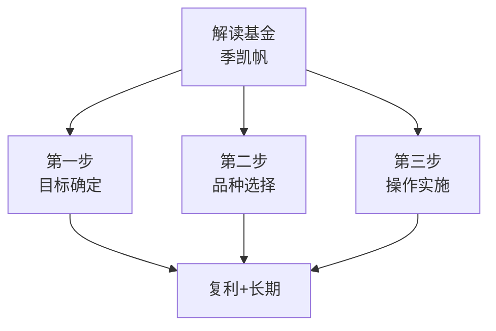

# 45《解读基金》深度解读（详细版）

> **副题：季凯帆——"我的投资观与实践"：一个普通人的基金三步曲（目标→品种→操作）**
>
> 作者：季凯帆（管理科学博士），非金融从业者，以个人投资者身份写下中国基金投资的启蒙经典。2000年在美国购买人生第一只基金，2004年回国后将美国成熟基金理念引入国内，本书首版于2007年——**影响了一代中国基民**。
>
> **核心定位**：三步曲——**①确定投资目标（复利+长期）→ ②选择基金品种（晨星评级/风格箱/夏普比率）→ ③实施操作方法（渠道/定投/再平衡）**。如果说 041 北落《基金作战笔记》是"实战手册"，045 季凯帆是"启蒙教科书"——从第一原理讲起。
>
> **系列意义**：045 是系列第 45 本，**基金启蒙经典篇**——与 041 形成"经典 vs 现代"的基金投资双璧。

---

## 📖 全书结构与核心框架

### 三步曲总览

| 步骤 | 核心 | 章节 |
|------|------|------|
| 投资准备 | 复利/通胀/风险认知 | 第1章 |
| 第一步：目标 | 长期=无风险（美国77年数据） | 第2章 |
| 第二步：品种 | 晨星评级/风格箱/核心卫星 | 第3章 |
| 第三步：操作 | 渠道/定投/再平衡/止损 | 第4章 |
| 实践 | 美国+中国双市场经历 | 第5—6章 |

---

## 📑 目录

- [[#第1章 投资准备：30岁开始每月300元=60岁97万|第1章 投资准备：30岁开始每月300元=60岁97万]]
- [[#第2章 第一步：投资目标的确定|第2章 第一步：投资目标的确定]]
- [[#第3章 第二步：基金品种的选择|第3章 第二步：基金品种的选择]]
- [[#第4章 第三步：操作方法的实施|第4章 第三步：操作方法的实施]]
- [[#第5章 我的投资实践：美国+中国双市场|第5章 我的投资实践：美国+中国双市场]]
- [[#第6章 博客日志节选与采访|第6章 博客日志节选与采访]]
- [[#总结：三步曲的完整闭环|总结：三步曲的完整闭环]]
- [[#附录一 季凯帆金句集（25 条精选）|附录一 季凯帆金句集（25 条精选）]]
- [[#附录二 本书术语速查卡|附录二 本书术语速查卡]]
- [[#附录三 系列互链：045 在 45 本笔记中的位置|附录三 系列互链：045 在 45 本笔记中的位置]]
- [[#附录四 三步曲执行检查清单|附录四 三步曲执行检查清单]]
- [[#附录五 读完本书后的 10 个自问|附录五 读完本书后的 10 个自问]]
- [[#附录六 本书 FAQ 15 问|附录六 本书 FAQ 15 问]]
- [[#附录七 系列母题追踪（045 号更新）|附录七 系列母题追踪（045 号更新）]]
- [[#附录八 30 秒版：解读基金|附录八 30 秒版：解读基金]]
- [[#附录九 基金投资理念 40 条|附录九 基金投资理念 40 条]]
- [[#附录十 系列 45 本总览（完成进度）|附录十 系列 45 本总览（完成进度）]]
- [[#附录十一 五种眼光（045 版）|附录十一 五种眼光（045 版）]]
- [[#附录十二 写给刚开始投资的你（知乎文风附录）|附录十二 写给刚开始投资的你（知乎文风附录）]]

---

## 第1章 投资准备：30岁开始每月300元=60岁97万

### 1.1 复利——爱因斯坦说的"世界第八大奇迹"

季凯帆用最朴素的数学破了"普通人不可能在退休时成为百万富翁"的妄念：

| 方法 | 操作 | 结果 |
|------|------|------|
| 最笨 | 每月存 2,777 元×30 年 | 100 万 |
| 最夸张 | 1 元→每年翻倍→20 年 | 100 万（不可能） |
| **现实一** | 30 岁一次投 3.5 万，**年化 12%** | 60 岁=100 万 |
| **现实二** | 30 岁起**每月 300 元**，年化 12% | 60 岁=**97 万** |

> "我保证，我没有算错。但当我曾经把这个事实告诉我一个同事的时候，旁边的另外一个同事对我说：'你就吹吧。'几乎很少有人想过这个数学题，甚至面对这个事实也很少有人能真正相信它，因为它太不可思议了。"

### 1.2 曼哈顿岛的 24 美元

> "1626年，荷兰总督用价值24美元的玻璃、石头从印第安人手中买了整个曼哈顿岛。如果将24美元用于投资，以8%的年利率计算，到2006年就会变成120多万亿美元——不但可以买回曼哈顿，还可以买下整个纽约州。"

### 1.3 通货膨胀——吃人的老虎

> "就算很低的2%通胀——30岁把100万放抽屉里，60岁只能当54万花，46%被老虎吃了。躲开老虎的唯一办法是投资。"

### 1.4 富爸爸 vs 穷爸爸

> "'富爸爸'在投资，让钱生钱；'穷爸爸'盯着那点工资，一辈子追求的就是找到好工作、得到好薪水。结果就是，一个是富爸爸，一个是穷爸爸。"

---

## 第2章 第一步：投资目标的确定

### 2.1 短期有风险，长期无风险（全书最核心的数据）

> "短期投资有风险，而且风险很大；长期投资则无风险，或者说风险很小。"

季凯帆引用了**美国 1925—2002 年 77 年股票交易历史**：

| 投资年限 | 亏损概率 | 最大亏损 | 最大盈利 |
|---------|---------|---------|---------|
| **1 年** | **30%** | -43.34% | +53.99% |
| 5 年 | 10% | -12%（年化） | +24%（年化） |
| 10 年 | **3%** | -0.9%（年化） | +20%（年化） |
| **20 年** | **0%** | 最低 +3.1%（年化） | 最高 +17.7%（年化） |

> "即便你运气非常糟糕，在一个非常高的点位进行了一次性投资，你20年后也不会亏，只是赚得少而已。"

**77 年总回报**：1 美元 → 1,775 美元（年化 12.2%），同期通胀 10 倍。**77 年中有 23 年（30%）是亏钱的——但总回报仍是 1,775 倍。**

### 2.2 债券 vs 股票（77 年对照）

| | 股票（大公司） | 债券 | 货币 |
|--|-------------|------|------|
| 77 年回报 | **1→1,775 美元** | 1→60 美元 | 1→4.5 美元 |
| 年化 | 12.2% | 6.2% | 2% |
| 5 年亏损概率 | 10% | <5% | 0% |

### 2.3 2007 年的忠告（看完想笑但发人深省）

> "2007年有朋友对我说，2008年要装修房子，钱闲置着，让我推荐一个高收益基金。我只能告诉他，他选错了投资对象。1年的投资，不亏本的风险只有50%。"

**（2008 年发生了什么，我们都知道了。）**

---

## 第3章 第二步：基金品种的选择

### 3.1 晨星——"不认识晨星就不要投基金"

季凯帆对晨星公司推崇备至。三大核心功能：

| 功能 | 内容 |
|------|------|
| **晨星评级** | 风险调整后收益排序：前 10%=五星→四星 22.5%→三星 35%→两星 22.5%→一星 10% |
| **基金龙虎榜** | 业绩/风险/组合/费用全维度速查 |
| **晨星投资风格箱** | 3×3 矩阵（大盘/中盘/小盘 × 价值/平衡/成长） |

> "投资基金却不知道晨星评级的人实在是非常不应该的。"

### 3.2 选择基金的关键指标

| 指标 | 意义 |
|------|------|
| **晨星评级** | 综合业绩+风险的权威评价（五星最好） |
| **夏普比率** | 单位风险的超额回报——越高越好 |
| **α 系数** | 基金经理的超额收益能力 |
| **β 系数** | 与市场的相关性 |
| **R²** | 与基准的相关度 |
| **标准差** | 净值波动幅度——越小越稳定 |

### 3.3 核心卫星策略

| 部分 | 比例 | 内容 |
|------|------|------|
| **核心** | 60—80% | 大盘平衡型基金/指数基金——"不动如山" |
| **卫星** | 20—40% | 行业基金/小盘基金/国际基金——"灵活机动" |

---

## 第4章 第三步：操作方法的实施

### 4.1 两大购买渠道对比

| | 银行代销 | 网上直销 |
|--|---------|---------|
| 优点 | 网点多/方便 | **申购费打 4—6 折**/基金转换方便 |
| 缺点 | **没有费率优惠**/品种有限/易被"忽悠" | 需网上操作/银行卡限制 |
| 经验 | 先"逛"银行摸清情况，不带钱去 | 开兴业卡/用广发/易方达等直销 |

> "先开了基金账户，再开通了网上银行，最后购买了一些货币基金。当然货币基金绝对不是我投资的目标，但经过这一系列的过程，购买基金的通道已经完全畅通……这样无论是在家里还是在单位，我都可以轻松地控制我的投资了，既不用跑到银行柜台去排队，也避免了被推销人员影响。"

### 4.2 网络安全

季凯帆是计算机领域 20 多年老兵——反复强调正版杀毒软件+实时更新病毒库。

> "如果只是普通用户，病毒的影响恐怕只是让计算机性能降低。但对于要通过网络进行金融交易的人，计算机的安全就太重要了，再怎么强调都不过分。"

### 4.3 长期持有

> "一旦购买到满意的基金，最合适的持有方式是长期持有。"

### 4.4 再平衡

| 情境 | 操作 |
|------|------|
| 股市大涨→股票基金比例超出目标 | **卖掉部分股基买入债基** |
| 股市大跌→股票基金比例低于目标 | **卖掉部分债基加仓股基** |

> 再平衡=**被动地做逆向投资**——不需要预测市场，机械执行即可。

---

## 第5章 我的投资实践：美国+中国双市场

### 5.1 美国市场的摸爬滚打

| 时间 | 事件 |
|------|------|
| 2000 | 被朋友"忽悠"参加家庭理财产品推介会 |
| 第一只基金 | PUTNAM 免税政府债券基金——**年收益 4%（基本无风险）** |
| 2 年后 | "几乎没有承担风险，但也没有得到好处" → 开始自己研究 |
| 学习 | 啃完晨星美国"投资教室"4 部教材 / 172 篇文章 / 800 道习题 |
| 最终组合 | 核心：3 只美股（中盘平衡+大盘成长+大盘价值）+25%国际基金+12%新兴市场+健康行业 |

**有趣插曲**：

> "持有石油基金时特别有意思。世界油价和我的基金净值有密切关系，结果我就得去关心中东政治局势、中国形势、美国飓风、冬季会不会暖冬……当世界顶级公司的股东也不好过啊！"

> "我现在可好，白天可以看中国大盘，晚上9:30以后看纽约大盘，早上起来再看看美国基金涨跌，然后上班。我成了世界公民。"

### 5.2 国内市场的苦辣酸甜

2004 年回国后开始投 A 股基金——经历了 2005 年低迷、"半夜鸡叫"（2007 年 5 月 30 日提高印花税）、2008 年暴跌。

---

## 第6章 博客日志节选与采访

### 6.1 节选要点

> 季凯帆在博客上持续分享投资心得。核心观点始终如一：**长期持有/核心卫星/再平衡/不预测市场。**

### 6.2 采访

> 一位管理科学博士，非金融从业者，靠自学+实践成为基金投资的民间专家——"投资不是专业者的专利，常识+坚持就够了。"

---

## 总结：三步曲的完整闭环

### Z1. 三步曲总表

| 步骤 | 核心 | 一句话 |
|------|------|--------|
| 第一步 | 目标 | 用长期消除风险——20 年不亏/77 年 1,775 倍 |
| 第二步 | 品种 | 用晨星选好基金——评级/风格箱/核心卫星 |
| 第三步 | 操作 | 网上直销省钱+定投+再平衡——长期持有不动 |

### Z2. 季凯帆留给读者的三句话

> 1. "短期有风险，长期无风险——这是整个基金投资的基石。"
> 2. "投资基金却不知道晨星评级，实在是非常不应该。"
> 3. "富爸爸在投资，让钱生钱；穷爸爸就盯着那点工资。"

---

## 附录一 季凯帆金句集（25 条精选）

> 1. "30 岁每月 300 元，年化 12%，60 岁=97 万——我保证，我没有算错。"——第1章
> 2. "复利，被爱因斯坦称为'人类最有力的发现'，也被称为世界第八大奇迹。"——第1章
> 3. "把钱放到抽屉里面实在是一个非常愚蠢的办法——钱在贬值。"——第1章
> 4. "富爸爸在投资，让钱生钱；穷爸爸盯着工资。"——第1章
> 5. "短期有风险，长期无风险。"——第2章
> 6. "20 年投资，没有任何亏损——即便你运气非常糟糕。"——第2章
> 7. "投资 1 年，亏本概率 30%；10 年，降到 3%；20 年，0%。"——第2章
> 8. "1 美元→77 年→1,775 美元，年化 12.2%。"——第2章
> 9. "77 年中有 23 年是亏钱的——但最终赚了 1,775 倍。"——第2章
> 10. "牛市里面看到的都是神话，熊市里面看到的都是笑话。"——博客
> 11. "投资基金却不知道晨星，实在是非常不应该。"——第3章
> 12. "晨星投资风格箱——将基金分为大盘/中盘/小盘 × 价值/平衡/成长。"——第3章
> 13. "核心卫星策略——核心不动如山，卫星灵活机动。"——第3章
> 14. "不管多有名的基金经理，我关心的都是他管理的基金的业绩和风险。"——第3章
> 15. "去银行买基金前——不带钱，只'逛'，先摸清情况。"——第4章
> 16. "通过网上直销，申购费可以打 4—6 折。"——第4章
> 17. "我的第一只基金年收益只有 4%——几乎没有风险，但也没有任何好处。"——第5章
> 18. "啃完晨星 4 部教材 / 172 篇文章 / 800 道习题——成了我的投资宝典。"——第5章
> 19. "当世界顶级公司的股东也不好过——要关心中东局势、飓风、暖冬。"——第5章
> 20. "我白天看中国大盘，晚上看纽约大盘——我成了世界公民。"——第5章
> 21. "再平衡=被动的逆向投资——股市大涨卖出股基，大跌加仓。"——第4章
> 22. "计算机安全对金融交易太重要了，再怎么强调都不过分。"——第4章
> 23. "投资不是专业者的专利——常识+坚持就够了。"——采访
> 24. "不要被火爆的股票市场和基金市场迷惑。"——第2章
> 25. "风险和收益是共生关系——没有高收益低风险的事情。"——第2章

---

## 附录二 本书术语速查卡

| 术语 | 定义 |
|------|------|
| 复利 | 利滚利——"世界第八大奇迹" |
| 通胀老虎 | 2% 通胀 30 年让 100 万贬为 54 万 |
| 晨星评级 | 风险调整后收益排序：前10%=五星 |
| 投资风格箱 | 3×3 矩阵（大小盘 × 价值成长） |
| 夏普比率 | 单位风险的超额回报 |
| α/β 系数 | α=超额收益能力；β=市场相关性 |
| 核心卫星 | 核心 60-80% 大盘基金+卫星 20-40% 行业基金 |
| 再平衡 | 偏离目标比例时机械调回 |

---

## 附录三 系列互链：045 在 45 本笔记中的位置

| 系列笔记 | 链接点 |
|---------|--------|
| [[41《基金作战笔记》深度解读（详细版）|41 号]] | 北落基金实战×045 基金启蒙——经典 vs 现代 |
| [[33《彼得·林奇教你理财》深度解读（详细版）|33 号]] | 林奇理财启蒙×045"普通人也能发财" |
| [[35《投资中最简单的事》深度解读（详细版）|35 号]] | 邱国鹭长期×045"长期无风险" |

---

## 附录四 三步曲执行检查清单

- [ ] 我有明确的投资目标吗？（多少年后/多少钱/什么年化）
- [ ] 我理解"短期有风险/长期无风险"吗？
- [ ] 我查过持仓基金的晨星评级吗？（至少三星以上）
- [ ] 我的组合有核心和卫星吗？（核心≥60%）
- [ ] 我用网上直销买基金吗？（省申购费）
- [ ] 我有定投计划吗？
- [ ] 我每年做一次再平衡吗？
- [ ] 我的计算机安全过关吗？

---

## 附录五 读完本书后的 10 个自问

1. 如果我从今天开始每月投 300 元，30 年后会变成多少钱？
2. 我的投资周期是多长？够 10 年吗？够 20 年吗？
3. 我买的基金晨星评级是几星？
4. 我知道自己基金的风格箱位置吗？
5. 我的组合有核心和卫星吗？核心够 60% 吗？
6. 我买基金走的是银行代销还是网上直销？费率差多少？
7. 我上一次做再平衡是什么时候？
8. 我有没有因为"短期亏了"割肉过？当时投资几年了？
9. 我在牛市时有没有被"火爆市场迷惑"加仓？
10. 我想当富爸爸还是穷爸爸？

---

## 附录六 本书 FAQ 15 问

**Q1：基金投资真的能"长期无风险"吗？**
A：美国 77 年数据——20 年投资期 0% 亏损概率。中国尚无足够长数据但方向相同。

**Q2：30 岁开始每月 300 元=60 岁 97 万是怎么算的？**
A：年化 12%，30 年复利。每月定投 300 元=累计投入 10.8 万→复利变 97 万。

**Q3：晨星评级为什么重要？**
A：风险调整后收益的综合排序——比单纯看收益率科学；五星=同类前 10%。

**Q4：什么是投资风格箱？**
A：3×3 矩阵（大盘/中盘/小盘 × 价值/平衡/成长）——帮你了解基金投的是什么。

**Q5：夏普比率怎么看？**
A：单位风险带来的超额回报——越高越好（同样收益下风险越小）。

**Q6：核心卫星策略怎么配？**
A：核心 60—80%（大盘指数/平衡基金）+ 卫星 20—40%（行业/小盘/国际基金）。

**Q7：银行代销 vs 网上直销选哪个？**
A：网上直销——申购费 4—6 折+基金转换方便。银行方便但贵+被忽悠风险。

**Q8：季凯帆自己买哪些基金？**
A：核心 3 只美股基金+25% 国际基金+12% 新兴市场+健康行业（美国组合）；国内买广发/上投等。

**Q9：什么时候该卖基金？**
A：①需要用钱时 ②基金基本面变差 ③再平衡卖出 ④**不因短期涨跌卖出**。

**Q10：定投有什么好处？**
A：平滑成本+克服追涨杀跌心理+利用熊市积累份额。

**Q11：再平衡怎么做？**
A：每年一次——偏离目标比例 5% 以上时调整。

**Q12："2008 年要装修钱闲置着让我推荐基金"——为什么不对？**
A：1 年期投资亏本概率 30%——短期资金不该进股票基金。

**Q13："77 年有 23 年亏钱"意味着什么？**
A：即使 30% 的年份亏钱，长期依然是 1,775 倍——不因短期亏损放弃。

**Q14：季凯帆是专业基金经理吗？**
A：不是——管理科学博士，非金融从业者，完全自学+实践。证明普通人也能做好投资。

**Q15：本系列两本基金书（041+045）有什么区别？**
A：045 是"为什么长期持有基金"（启蒙理念），041 是"怎么选怎么配怎么解套"（实战工具）。

---

## 附录七 系列母题追踪（045 号更新）

### 7.1 "复利"主题系列对照

| 笔记 | 视角 |
|------|------|
| 033 林奇 | 1,000 美元 63 年→2,550 万 |
| **045 季凯帆** | **300 元/月×30 年×12%=97 万** |
| 041 北落 | 股三债七 19 年年化 8.27% |

---

## 附录八 30 秒版：解读基金

> **解读基金（30 秒版）**：
>
> 1. **复利**——30 岁每月 300 元，年化 12%，60 岁=97 万；
> 2. **长期**——1 年亏 30%/5 年 10%/10 年 3%/20 年 0%；
> 3. **晨星**——选基金先看评级+风格箱+夏普比率；
> 4. **核心卫星**——核心 60%+不动如山，卫星 40%灵活；
> 5. **网上直销**——申购费打 4-6 折；
> 6. **再平衡**——每年一次，机械执行=被动逆向。

---

## 附录九 基金投资理念 40 条

**复利与目标（1—10）**：

> 1. 复利=世界第八大奇迹。
> 2. 30 岁每月 300 元×12%=60 岁 97 万。
> 3. 24 美元+8%+380 年=120 万亿。
> 4. 通胀=吃人的老虎。
> 5. 富爸爸投资，穷爸爸领工资。
> 6. 不投资的后果=钱在贬值。
> 7. 投资不一定要有大钱。
> 8. 投资从 300 元开始。
> 9. 12% 年化可期。
> 10. 别看不起小钱。

**长期无风险（11—20）**：

> 11. 短期有风险，长期无风险。
> 12. 1 年亏 30%/5 年 10%/10 年 3%/20 年 0%。
> 13. 77 年=1,775 倍。
> 14. 77 年中有 23 年亏钱。
> 15. 运气最差 20 年也不亏。
> 16. 股票 12.2% vs 债券 6.2% vs 货币 2%。
> 17. 1 年期钱不进股票基金。
> 18. 牛市看神话，熊市看笑话。
> 19. 风险和收益共生。
> 20. 没有高收益低风险。

**选择与操作（21—40）**：

> 21. 投基金不识晨星=不应该。
> 22. 评级前 10%=五星。
> 23. 风格箱=3×3 矩阵。
> 24. 夏普比率越高越好。
> 25. 核心卫星=60/40。
> 26. 网上直销打 4-6 折。
> 27. 买基金前先"逛"不带钱。
> 28. 基金通道先打通再投。
> 29. 再平衡=被动逆向投资。
> 30. 定投=平摊成本。
> 31. 长期持有不动如山。
> 32. 计算机安全=底线。
> 33. 正版杀毒+实时更新。
> 34. 投资不是专业者专利。
> 35. 常识+坚持=够了。
> 36. 石油基金=世界公民。
> 37. 中美两国基金都投。
> 38. 不预测市场。
> 39. 不因短期涨跌买卖。
> 40. 想当富爸爸就不要只盯着工资。

---

## 附录十 系列 45 本总览（完成进度）

| 编号 | 书名 | 状态 |
|------|------|------|
| 01—03 | 利弗莫尔三部曲 | ✅ |
| 04 | 达利欧《原则》 | ✅ |
| 05—14 | 巴菲特系列 | ✅ |
| 16—21 | 巴菲特延伸系列 | ✅ |
| 22—25 | 芒格四书 | ✅ |
| 26—27 | 费雪父子 | ✅ |
| 28 | 格雷厄姆 | ✅ |
| 29—30 | 段永平双册 | ✅ |
| 31 | 索罗斯《金融炼金术》 | ✅ |
| 32—34 | 林奇三部曲 | ✅ |
| 35 | 邱国鹭《投资中最简单的事》 | ✅ |
| 36 | 陈江挺《炒股的智慧》 | ✅ |
| 37 | 冉伟《股票投资沉思录》 | ✅ |
| 38 | 马涛《从零开始学炒股》 | ✅ |
| 39 | 朱孜《股票投资入门、进阶与实战》 | ✅ |
| 40 | 张化桥《避开股市的地雷》 | ✅ |
| 41 | 北落的师门《基金作战笔记》 | ✅ |
| 42 | 卜建业《逆向致胜》 | ✅ |
| 43 | 大鑫《势能命运》 | ✅ |
| 44 | 《交易的真相》 | ✅ |
| **45** | **季凯帆《解读基金》** | **✅ 本笔记** |
| 46—169 | 更多 | 待解读 |

**系列进度：45/169 完成**

---

## 附录十一 五种眼光（045 版）

以"一个刚工作的年轻人要不要买基金"为例：

| 视角 | 建议 |
|------|------|
| 033 林奇 | "你年轻=最大的资产是未来收入流——尽早开始" |
| 041 北落 | "定投+7 条军规——每月收入的 10% 进基金" |
| **045 季凯帆** | **"每月 300 元，年化 12%，30 年后 97 万——现在就开始"** |

---

## 附录十二 写给刚开始投资的你（知乎文风附录）

### 写在前面：一个管理科学博士的投资之路

2000 年，季凯帆在美国被朋友"忽悠"参加了一个家庭理财产品推介会——有点像直销，一层一层发展会员。他对加入销售网络没兴趣，但对"共同基金"产生了好奇。

他的第一只基金是美国 PUTNAM 公司的一只免税政府债券基金——**年收益稳定在 4%。** 不亏钱、月月分红、不上税——听着很不错？

> "就这样保持了两年。突然觉得这好像不是好事——我几乎没有承担风险，但也没有得到什么好处。"

于是他开始自学。啃完晨星美国"投资教室"的 4 部教材、172 篇文章、800 道习题——全部打印装订。他把自己训练成了一个基金投资专家。

**他从来不是金融从业者。他只是一个管理科学博士，一个普通人，靠自学+实践走上了"让钱生钱"的路。**

### 第一课：30 岁开始每月 300 元=60 岁 97 万（这不是编的）

季凯帆在书里算了一笔账。假设年化 12%，从 30 岁到 60 岁：

| 方案 | 操作 | 结果 |
|------|------|------|
| 最笨 | 每月存 2,777 元 | 60 岁=100 万 |
| **现实** | **每月投 300 元** | **60 岁=97 万** |

> "我保证，我没有算错。但当我曾经把这个事实告诉我一个同事的时候，旁边的另外一个同事对我说：'你就吹吧。'几乎很少有人想过这个数学题。"

**每月 300 元——也就是每天 10 元钱。** 一杯奶茶、一包烟的钱。**你花掉的每一杯奶茶，30 年后值 3,000 元。**

### 第二课：短期有风险，长期没风险——77 年证明

季凯帆引用了美国 1925—2002 年 77 年的股票数据，得出一个每个人都需要刻在脑子里的结论：

| 投资年限 | 亏本概率 |
|---------|---------|
| 1 年 | 30% |
| 5 年 | 10% |
| 10 年 | 3% |
| **20 年** | **0%** |

> "即便你运气非常糟糕，在一个非常高的点位进行了一次性投资，你 20 年后也不会亏，只是赚得少而已。"

77 年总回报：**1 美元→1,775 美元，年化 12.2%。** 但这 77 年中有 23 年（30%）是亏钱的——**亏钱不可怕，可怕的是你因为怕亏钱而不敢开始。**

> "2007 年有朋友对我说，2008 年要装修房子，钱闲置着，让我推荐一个高收益基金。我只能告诉他：你选错了投资对象。1 年的投资，不亏本的风险只有 50%。"

**（当年听了这句话没有买基金的朋友，2008 年应该给季凯帆送一面锦旗。）**

### 第三课：不认识晨星，就别投基金

季凯帆说：在中国投基金却不认识晨星，就像买手机不认识"苹果"。

晨星评级——风险调整后收益的综合排序。五星=同类前 10%，一星=后 10%。不是只看收益率高低，而是看"承担了这么多风险，赚了多少钱"。

晨星投资风格箱——3×3 矩阵：大盘/中盘/小盘 × 价值/平衡/成长。你的基金投的是大盘蓝筹还是小盘成长？一看风格箱就明白。

**你买的每一只基金，都应该在晨星网站上查一遍：评级是多少？风格箱在哪一格？夏普比率高不高？**

### 第四课：核心卫星——不动如山+灵活机动

季凯帆用军事比喻讲组合配置：

**核心（60—80%）**=大部队/主力军——大盘指数基金/大盘平衡型基金。**长期持有，不操作，不动如山。**

**卫星（20—40%）**=侦察兵/机动部队——行业基金/小盘基金/国际基金。可以灵活调整，搏超额收益。

**大多数股民亏钱的原因就是"全军出击"——所有资金追一个题材，一次失败全军覆没。核心卫星策略让你永远有主力部队留在战场上。**

### 第五课：去银行买基金前——记得不带钱

季凯帆分享了一个非常实用的经验：

第一次买基金，他用了一整天去"逛"银行——看宣传广告、向不同销售人员咨询。**但他身上没有带钱。**

> "为了不稀里糊涂地就把钱投入进去，我身上并没有带钱。结果证明，我当时做了一件非常正确的事情。你几乎随时都可以在各种基金论坛上遇到无数购买了莫名其妙的基金的朋友，他们几乎都是被银行的销售人员'忽悠'了。"

**第二天他才带了钱，开基金账户、开通网上银行、购买货币基金——**不是为了收益，是为了把通道打通**。这样以后无论在家还是在单位，都能轻松控制投资，不用排队，也不被推销人员影响。**

**你有多少基金是"被银行柜台推荐买的"？**

### 第六课：再平衡——每年一次的被动逆向

季凯帆反复强调再平衡的重要性：

- **股市大涨→股票基金超出目标比例→卖出部分股基买入债基**（高位减仓，但不预测）
- **股市大跌→股票基金低于目标比例→卖出部分债基加仓股基**（低位加仓，但不预测）

> "再平衡就是被动的逆向投资——不需要预测市场，只需要机械执行。"

**（这与 035 邱国鹭"逆向三点检验"、042 卜建业"太极图阴阳鱼循环"是同一个道理——只是季凯帆用最朴素的语言讲了出来。）**

### 尾声：投资不是专业者的专利

季凯帆从来不是金融科班出身。管理科学博士、计算机领域二十年老兵、靠着自学和实践成为基金投资专家。

2000 年他买了第一只基金，年收益只有 4%。他觉得不对——没承担风险就没得到好处。于是他开始学、开始试、开始赚。

**到你 60 岁的时候，你不会后悔年轻时候多花了钱。但你会后悔没有从 30 岁开始每月投 300 元。**

> "投资不是专业者的专利。常识+坚持就够了。"

**从今天开始，每月 300 元。30 年后，你会想起这本书。**

