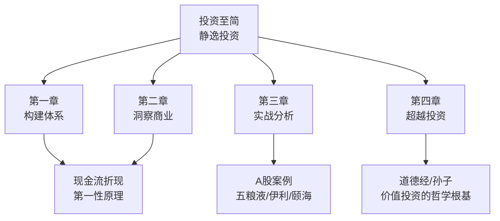
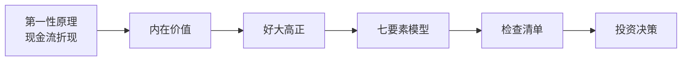

# 46《投资至简》深度解读（详细版）

> **副题：静逸投资——"从原点出发构建价值投资体系"：现金流折现 + 商业模式七要素 + 孙子兵法与道德经的异曲同工**
>
> 作者：静逸投资（两位校友创办的私募）。本书是十多年投资思考与实践的阶段性总结——以"投资就是放弃一种资产，获得另一种资产更多的未来现金流的折现值"为第一性原理，演绎推导出完整的价值投资体系。
>
> **核心定位**：全书 4 章构成价值投资的完整闭环——**构建体系（第一性原理→现金流折现→股市规律）→ 洞察商业（好大高正 + 七要素模型）→ 实战分析（牧原/呷哺/伊利/五粮液/颐海/长生生物）→ 超越投资（道德经+孙子兵法+普世智慧）**。如果说 028 格雷厄姆是"安全边际原点"、035 邱国鹭是"A 股三要素"——046 静逸是"从第一性原理出发的系统化演绎"，是系列中逻辑最严密的价值投资体系。
>
> **系列意义**：046 是系列第 46 本，**价值投资系统集大成篇**——补齐了"从原点推导到完整体系"的缺失环节。

---

## 📖 全书结构与核心框架

### 4 章结构总览

| 篇章 | 核心内容 |
|------|---------|
| 第一章 | 第一性原理（现金流折现）/股市规律/价值投资体系 |
| 第二章 | 优秀企业四标准（好大高正）/商业模式七要素/成长空间/护城河/企业文化 |
| 第三章 | 检查清单/牧原股份/呷哺呷哺/**伊利三聚氰胺**/2014 五粮液四重悲观/错过颐海 10 倍/长生生物排雷 |
| 第四章 | 人性/归纳演绎/错误/道德经/孙子兵法/普世智慧 |

---

## 📑 目录

- [[#第1章 投资的第一性原理：现金流折现|第1章 投资的第一性原理：现金流折现]]
- [[#第2章 从第一性原理推导出的投资体系|第2章 从第一性原理推导出的投资体系]]
- [[#第3章 优秀企业的四个标准：好、大、高、正|第3章 优秀企业的四个标准：好、大、高、正]]
- [[#第4章 商业模式七要素分析模型|第4章 商业模式七要素分析模型]]
- [[#第5章 护城河与成长空间|第5章 护城河与成长空间]]
- [[#第6章 实战案例：A 股五盘菜|第6章 实战案例：A 股五盘菜]]
- [[#第7章 超越投资：《道德经》中的投资智慧|第7章 超越投资：《道德经》中的投资智慧]]
- [[#第8章 《孙子兵法》与价值投资的异曲同工|第8章 《孙子兵法》与价值投资的异曲同工]]
- [[#总结：从原点出发的完整体系|总结：从原点出发的完整体系]]
- [[#附录一 静逸金句集（30 条精选）|附录一 静逸金句集（30 条精选）]]
- [[#附录二 本书术语速查卡|附录二 本书术语速查卡]]
- [[#附录三 系列互链：046 在 46 本笔记中的位置|附录三 系列互链：046 在 46 本笔记中的位置]]
- [[#附录四 七要素分析模板|附录四 七要素分析模板]]
- [[#附录五 读完本书后的 10 个自问|附录五 读完本书后的 10 个自问]]
- [[#附录六 本书 FAQ 15 问|附录六 本书 FAQ 15 问]]
- [[#附录七 系列母题追踪（046 号更新）|附录七 系列母题追踪（046 号更新）]]
- [[#附录八 30 秒版：投资至简|附录八 30 秒版：投资至简]]
- [[#附录九 价值投资系统理念 50 条|附录九 价值投资系统理念 50 条]]
- [[#附录十 系列 46 本总览（完成进度）|附录十 系列 46 本总览（完成进度）]]
- [[#附录十一 五种眼光（046 版）|附录十一 五种眼光（046 版）]]
- [[#附录十二 写给想系统学价值投资的人（知乎文风附录）|附录十二 写给想系统学价值投资的人（知乎文风附录）]]

---

## 第1章 投资的第一性原理：现金流折现

### 1.1 一句话定义投资的本质

> "投资就是放弃一种资产，获得另一种资产更多的未来现金流的折现值。"

**（这是全书的第一句话，也是全书的原点——作者称之为投资的"第一性原理"。）**

| 要素 | 含义 |
|------|------|
| 放弃一种资产 | 你付出现在的现金/购买力 |
| 获得另一种资产 | 你换回股票/债券/房产 |
| 未来现金流 | 资产在你持有期间产生的净现金 |
| 折现 | 未来的钱≠现在的钱（货币时间价值） |

### 1.2 为什么货币有时间价值

> "我们不会愿意用当前手上的100元，交换明年同样的100元。"

| 原因 | 说明 |
|------|------|
| 寿命有限 | 人不能无限等待 |
| 通货膨胀 | 购买力自然贬值 |
| 不耐性 | 当下消费>未来消费的效用 |
| 不确定性 | 未来能不能拿到有风险 |

### 1.3 现金流折现是评估一切资产的统一标准

> "所有资产类别——现金、存款、债券、股票、未上市企业、保险、比特币、黄金、白银、农场、房地产、商铺、字画、古董——都可以用其未来现金流折现来评估其价值。"

| 资产 | 现金流折现方式 |
|------|--------------|
| 苹果树 | 从种到枯死期间所有苹果的价值折现 |
| 出租房产 | 未来每年租金-维护成本+最后卖房价折现 |
| 齐白石画 | 只有一次现金流——下次卖出价折现 |
| 债券 | 每年息票+最终本金 |
| **股票** | **企业未来所有自由现金流折现** |

> "企业是特殊的债券，债券是特殊的企业。只不过债券的息票提前定好了，而企业的未来息票和到期日没有提前确定。"

---

## 第2章 从第一性原理推导出的投资体系

### 2.1 现金流折现公式的几个因子

| 因子 | 含义 | 来源 |
|------|------|------|
| 确定性 | 未来现金流的可靠性 | 商业模式+护城河 |
| 自由度 | 现金流归股东可分配的比例 | 资本支出需求 |
| 盈利性 | 单位投入的回报率 | 竞争优势 |
| 成长性 | 现金流增长的速度 | 市场空间 |
| 长寿性 | 企业能持续多久 | 护城河+企业文化 |
| 管理层 | 谁来掌控这些因子 | 企业文化 |
| 折现率 | 无风险利率+风险溢价 | 宏观 |

### 2.2 买入、持有与卖出的原则

| 环节 | 原则 | 推导 |
|------|------|------|
| 买入 | **市场价格<内在价值（有安全边际）** | 从现金流折现公式直接得出 |
| 持有 | **企业内在价值未变坏→股价波动忽略** | 股价短期由市场先生决定 |
| 卖出 | ①企业变坏 ②极度高估 ③发现更好的 ④现金流需要 | 不是"涨多了"就卖 |

> "买入成本与持有决策无关——只有内在价值的变化才应驱动决策。"

### 2.3 风险观

> "真正的风险不是股价波动，而是永久性资本损失——企业内在价值的毁灭。"

---

## 第3章 优秀企业的四个标准：好、大、高、正

### 3.1 四标准的商业逻辑

| 标准 | 含义 | 回答的问题 |
|------|------|----------|
| **好** | 好的商业模式 | 生意能不能做成？ |
| **大** | 大的成长空间 | 生意能做多大？ |
| **高** | 高的竞争壁垒 | 生意会不会被别人抢去？ |
| **正** | 正的企业文化 | 谁来怎么做这个生意？ |

> "失败的创业和商业都是在这四点中至少有一点出了问题。"

### 3.2 好的商业模式

> "完美的商业模式，能够以适当的成本生产某种产品和服务，很好地满足目标客户高强度的、高频次的、高稳定性的需求，并形成稳定的盈利和现金流。**商业模式的选择在很大程度上决定了一家企业的基因和命运。**"

**火锅 vs 炒菜**：

> "假如海底捞的张勇最初做的不是火锅，而是做四川炒菜，海底捞依然能扩张如此迅速吗？大概是不能的。因为火锅是所有中餐中，唯一一个可以高度标准化适合快速大规模复制，又能满足顾客高度分散的个性化需求的品类。"

### 3.3 大的发展空间

| 三个从 1 到 N | 含义 |
|-------------|------|
| 单一个体复购 | "宁一人吃千遍，不愿千人吃一遍" |
| 客户扩张 | 从第一个客户到更多客户 |
| 产品扩张 | 从满足一个需求到多个需求（范围经济+协同效应） |

### 3.4 高的竞争壁垒

> "市场经济动力学决定了竞争是不可避免的。竞争有利于消费者，也有利于社会进步。但是竞争却是侵蚀企业利润的主要原因。"

**护城河就是"让竞争对手要么不知道如何做，要么知道但是做不到，或者已经来不及做"。**

### 3.5 正的企业文化

> "企业文化是一个组织由其共有的价值观、仪式、符号、处事方式和信念等内化认同表现出其特有的行为模式。"

**包括**：使命/愿景/价值观 + 企业家能力和道德 + 治理结构 + 组织结构。

---

## 第4章 商业模式七要素分析模型

> "商业模式是指，企业以什么样的方式，提供什么样的产品和服务，来满足什么样的客户的什么样的需求，如何实现盈利，这项生意有什么样的经济特征和自由现金流状况。"

### 4.1 七要素全景

| # | 要素 | 核心问题 |
|---|------|---------|
| 1 | **目标客户** | 卖给谁？ |
| 2 | **价值主张** | 满足什么需求？ |
| 3 | **产品/服务** | 卖的是什么？ |
| 4 | **价值链** | 怎么组织生产？ |
| 5 | **盈利模式** | 怎么赚钱？ |
| 6 | **生意特性** | 经济特征是什么？ |
| 7 | **自由现金流** | 最终落袋多少钱？ |

### 4.2 目标客户

> "任正非说：'为客户服务是企业生存的唯一理由。'企业战略定位的第一步就是选择目标客户。"

**理想情况**：产品和服务被所有人类需要（如氧气面罩如果氧气稀缺的话）。

### 4.3 价值主张

| 类型 | 说明 |
|------|------|
| 低成本 | 比别人更便宜 |
| 差异化 | 别人做不到的体验 |
| 聚焦 | 专注某一细分 |

### 4.4—4.7 价值链→自由现金流

价值链=企业如何组织资源把产品从原材料变成交付给客户。

盈利模式=收入模型+成本结构+利润来源。

生意特性=轻资产/重资产+高周转/低周转+周期/非周期。

**自由现金流=最终变量——前面六个要素的优秀程度最终都体现在这一项。**

---

## 第5章 护城河与成长空间

### 5.1 护城河的几种来源

| 类型 | 例子 | 特征 |
|------|------|------|
| 品牌 | 茅台/可口可乐 | 消费者溢价支付 |
| 转换成本 | 银行/软件 | 客户换不起 |
| 网络效应 | 腾讯/淘宝 | 用户越多价值越大 |
| 成本优势 | 规模/工艺/位置 | 别人做更贵 |
| 特许经营权 | 专利/牌照 | 法定垄断 |

### 5.2 成长空间判断

| 维度 | 判断方法 |
|------|---------|
| 渗透率 | 当前市场渗透率>50%？ |
| 天花板 | TAM（总可寻址市场）多大？ |
| 复制性 | 能否把成功经验复制到新区域/新产品？ |
| 提价能力 | 能否长期提价而不失客户？ |

---

## 第6章 实战案例：A 股五盘菜

### 6.1 伊利股份——三聚氰胺后的困境反转

2008 年三聚氰胺危机后，伊利股份股价暴跌。静逸投资当时的分析：三聚氰胺是整个行业的危机——**行业龙头不会死，行业会变得更规范，龙头份额反而提升。** 买入后获得数倍收益。

> **与 040 张化桥"优秀公司出利空才是最好的买入时机"完全同频。**

### 6.2 五粮液——四重悲观叠加下的大机会

2014 年五粮液面临**四重悲观叠加**：

| 悲观 | 内容 |
|------|------|
| 1 | "八项规定"限制三公消费→高端白酒需求暴跌 |
| 2 | 塑化剂风波→整个行业遭质疑 |
| 3 | 茅台零售价从 2000+→跌破 1000→行业价格体系崩溃 |
| 4 | 五粮液经销商银基集团三年亏 19 亿港元→渠道崩盘 |

**四个"利空"叠加在一个中国最古老的消费品品牌上——价格腰斩，PE 只有几倍。** 静逸投资在 2014 年 1—2 月买入，至今（写书时）未卖一股。

> "茅台一夜之间需求下跌40%——但这个需求下跌的是'政务消费'，不是'老百姓喝酒的需求'。"

### 6.3 错过颐海国际——从 3.3 港元到 10 倍

颐海国际（海底捞火锅底料子公司）2016 年上市发行价 3.30 港元。**不到三年涨超 10 倍。**

静逸投资上市前就写了分析文章——定性分析完全正确（商业模式好/品牌强/渠道优/对海底捞依赖实为安全），但最终**没有买入**。

| 没买的原因 | 反思 |
|-----------|------|
| 对海底捞依赖太大（"账面风险"） | 实质没有风险——是子公司、有排他协议 |
| "贵了" | 10 倍后回头看一点都不贵 |

> "在能力圈之内的公司被错过，是比较可惜的事情。错过机会总是投资中难以避免的错误，对其复盘一番，相信很有意义。"

**（这是全书最诚实的一段——"我们分析对了但没买"。与 040 张化桥"林奇托梦—你买过几个十倍股"异曲同工。）**

### 6.4 长生生物——如何避免踩雷

| 排雷方法 | 内容 |
|---------|------|
| 企业文化 | 管理层价值观有问题→一票否决 |
| 行业特性 | 疫苗是高监管行业→出事概率大 |
| 财务报表 | 现金流与利润长期背离 |

### 6.5 呷哺呷哺

完整的火锅连锁分析——从招股书/年报/门店体验/大众点评/供应商访谈全维度调研。**餐饮企业的护城河确实弱（与 040 张化桥"餐饮无护城河"呼应），但呷哺呷哺在特定时期有标准化+平价+高翻台率的阶段性优势。**

---

## 第7章 超越投资：《道德经》中的投资智慧

| 道德经原文 | 投资解读 |
|-----------|---------|
| **上士闻道，勤而行之** | 价值投资=少数人走的路——"被嘲笑才是对的" |
| **大道甚夷，而人好径** | 投资大道很平坦——研究好公司+耐心等好价+长期持有——但人总爱走捷径（跟风/消息/追涨杀跌） |
| **飘风不终朝，骤雨不终日** | 股灾不会持久，疯牛也不会持久 |
| **以正治国，以奇用兵** | 投资基本原则="正"；超额收益=看到别人看不到的"奇" |
| **明道若昧，进道若退** | 价值投资的保守——看似倒退，实为前进 |
| **大成若缺，大巧若拙** | 完美系统看似有缺陷——"不追求最高收益反而长期最高" |
| **祸莫大于不知足** | 动辄要年化 30%/100%→必然投机+杠杆→迟早破产 |
| **不出户，知天下** | 高手不需要天天调研——把握商业和投资的核心逻辑就够了 |
| **祸兮福之所倚** | 利空=机会 |

---

## 第8章 《孙子兵法》与价值投资的异曲同工

### 8.1 四个字概括两套思想

| | 孙子兵法 | 价值投资 |
|--|---------|---------|
| 核心 | **"先胜后战"** | **"不要亏损"** |
| 思维 | 逆向——以失败为假设前提 | 逆向——以亏损为假设前提 |
| 行动前 | 充分分析/准备/推演 | 透彻分析+安全边际+能力圈 |
| 结果 | 平淡无奇中取得常人难及的成功 | 看似平庸中实现复利奇迹 |

### 8.2 战略层面对照

| 孙子兵法 | 价值投资 |
|---------|---------|
| "兵者，国之大事，死生之地，存亡之道，不可不察也" | 投资是资产安全的大事——**充分认识盲目投资的危险** |
| "非利不动，非得不用，非危不战" | 没有安全边际不出手——"合于利而动，不合利而止" |
| **重战、慎战、备战→安国全军** | **重视投资、慎重投资、充分准备→保障资产安全** |

### 8.3 知胜的五条对照

| 孙子"知胜有五" | 价值投资对应 |
|---------------|------------|
| 知可以战与不可以战 | **能力圈——知道哪些不能投** |
| 识众寡之用 | **仓位管理——集中/分散** |
| 上下同欲 | **企业文化——管理层与小股东利益一致** |
| 以虞待不虞 | **安全边际——留足余量** |
| 将能而君不御 | **投后不干预——让优秀管理层自己干** |

### 8.4 战术层面："多方以误"

> "能而示之不能，用而示之不用，近而示之远，远而示之近。利而诱之，乱而取之，实而备之，强而避之……"

**市场先生每天的报价就是"多方以误"——它通过短期价格波动引诱你犯错。** 价值投资者要做的是：**不被"误"，等到"公司护城河+市场安全边际+个人能力圈+股权持有期限"四个维度都占优时出手。**

> "对价值投资来说，如果选择了正确的投资标的，在正确的时点，用了正确的资金，但是使用了不正确的投资理由——即使最终得到了好的投资结果，也是一笔不正确的投资。"

---

## 总结：从原点出发的完整体系

### Z1. 体系推导链

### Z2. 五根柱子

| 柱子 | 核心 |
|------|------|
| 原点 | 投资=放弃A获得B更多未来现金流折现 |
| 商业 | 好（模式）大（空间）高（壁垒）正（文化） |
| 分析 | 七要素模型（客户→现金流） |
| 实战 | 伊利/五粮液/颐海/呷哺/长生 |
| 哲学 | 道德经+孙子兵法=价值投资的东方根基 |

### Z3. 静逸留给读者的三句话

> 1. "投资不只是关乎财富，它是普世智慧的一个分支。"
> 2. "价值投资是一条少有人走的路——极其简单，又极其复杂。"
> 3. "'先胜后战'和'不要亏损'——跨越 2500 年的异曲同工。"

---

## 附录一 静逸金句集（30 条精选）

> 1. "投资就是放弃一种资产，获得另一种资产更多的未来现金流的折现值。"——第一性原理
> 2. "现金流折现是评估一切资产价值的统一标准。"——第1章
> 3. "企业是特殊的债券，债券是特殊的企业。"——第1章
> 4. "买企业，买的是企业的未来自由现金流。"——第1章
> 5. "所有资产类别——现金、存款、债券、股票、未上市企业、比特币、黄金、农场、房产、字画——都可用现金流折现评估。"——第1章
> 6. "商业模式的选择在很大程度上决定了一家企业的基因和命运。"——第2章
> 7. "火锅是中餐中唯一可以高度标准化快速大规模复制又能满足个性化需求的品类。"——第2章
> 8. "竞争是侵蚀企业利润的主要原因。"——第2章
> 9. "好的商业模式、大的成长空间、高的竞争壁垒、正的企业文化。"——好大高正
> 10. "宁一人吃千遍，不愿千人吃一遍。"——成长空间
> 11. "企业存在的唯一目的是创造客户。"——德鲁克引
> 12. "检查清单思维——投资是避免错误而不是追求聪明。"——第3章
> 13. "2014 年五粮液面临四重悲观叠加——我们买入后至今未卖一股。"——实战
> 14. "茅台一夜之间需求下跌 40%——但跌的是政务消费，不是老百姓喝白酒的需求。"——实战
> 15. "在能力圈之内的公司被错过，是比较可惜的事情。"——错过颐海
> 16. "我们分析对了但没买——三年 10 倍。"——错过颐海
> 17. "上士闻道，勤而行之；中士闻道，若存若亡；下士闻道，大笑之。不笑不足以为道。"——道德经
> 18. "大道甚夷，而人好径——投资大道很平坦，但人总爱走捷径。"——道德经
> 19. "飘风不终朝，骤雨不终日——股灾不会持久，疯牛也不会持久。"——道德经
> 20. "以正治国，以奇用兵，以无事取天下。"——道德经
> 21. "祸莫大于不知足——动辄要年化 30% 必然投机加杠杆。"——道德经
> 22. "不出户，知天下——投资高手不需要天天调研，把握商业核心逻辑就够了。"——道德经
> 23. "先胜后战——孙子兵法的核心。"——孙子兵法
> 24. "不要亏损——价值投资的核心。"——孙子兵法
> 25. "跨越 2500 年的异曲同工。"——孙子兵法
> 26. "价值投资本质上是做'低风险高收益'投资。"——孙子兵法
> 27. "买入成本与持有决策无关——只有内在价值的变化才应驱动决策。"——体系
> 28. "真正的风险不是股价波动，而是永久性资本损失。"——体系
> 29. "价值投资是一条少有人走的路——极其简单，又极其复杂。"——前言
> 30. "投资不只是关乎财富，它是普世智慧的一个分支。"——前言

---

## 附录二 本书术语速查卡

| 术语 | 定义 |
|------|------|
| 第一性原理 | 投资=放弃A获得B更多未来现金流折现 |
| 现金流折现 | 未来所有净现金流按合适折现率折成现值 |
| 内在价值 | 企业未来自由现金流折现的总和 |
| 好大高正 | 好模式/大空间/高壁垒/正文化 |
| 七要素模型 | 客户/价值/产品/价值链/盈利/特性/现金流 |
| 护城河 | 竞争对手无法或来不及复制的优势 |
| 先胜后战 | 研判充分确定能赢才行动 |
| 检查清单 | 投资决策前的标准化自检工具 |
| 安全边际 | 价格<内在价值的差额 |

---

## 附录三 系列互链：046 在 46 本笔记中的位置

| 系列笔记 | 链接点 |
|---------|--------|
| [[28《聪明的投资者》深度解读（详细版）|28 号]] | 格雷厄姆安全边际×046 安全边际 |
| [[35《投资中最简单的事》深度解读（详细版）|35 号]] | 邱国鹭三要素×046 好大高正 |
| [[13《巴菲特的护城河》深度解读（详细版）|13 号]] | 护城河×046 竞争壁垒 |
| [[37《股票投资沉思录》深度解读（详细版）|37 号]] | 冉伟道术×046 道德经 |
| [[42《逆向致胜》深度解读（详细版）|42 号]] | 卜建业佛道×046 孙子兵法+道德经 |
| [[40《避开股市的地雷》深度解读（详细版）|40 号]] | 张化桥排雷×046 长生生物 |

---

## 附录四 七要素分析模板

| 要素 | 分析 |
|------|------|
| 目标客户 | 谁买？有多少人？购买力？ |
| 价值主张 | 解决了什么痛点？比竞品好在哪？ |
| 产品/服务 | 核心产品是什么？衍生产品？ |
| 价值链 | 从原材料到交付的关键环节？谁在做？ |
| 盈利模式 | 靠什么赚钱？利润率多少？ |
| 生意特性 | 轻/重资产？高/低周转？周期/非周期？ |
| 自由现金流 | 经营现金流-资本支出=最终落袋多少钱？ |

---

## 附录五 读完本书后的 10 个自问

1. 我能用一句话说出"投资的第一性原理"吗？
2. 我持仓的好公司满足"好大高正"四个标准吗？
3. 我对每只持仓做了七要素分析吗？
4. 我有自己的投资检查清单吗？
5. 我在哪只股票上"分析对了但没买"？
6. 我持仓里有没有像五粮液 2014 年那样的"四重悲观叠加"机会？
7. 我的投资体系是从原点推导的，还是东拼西凑的？
8. 我认同"先胜后战"——只在确定性极高时出手吗？
9. "大道甚夷，而人好径"——我有没有走捷径的习惯？
10. 我的投资决策中有没有"使用了不正确的理由却得到了好结果"的情况？

---

## 附录六 本书 FAQ 15 问

**Q1：什么是投资的第一性原理？**
A：投资=放弃一种资产，获得另一种资产更多的未来现金流的折现值。

**Q2：现金流折现适用于所有资产吗？**
A：是的——从苹果树到债券到股票到比特币到黄金。

**Q3：股票和债券的本质区别？**
A：没有本质区别——企业是特殊债券（未来现金流不确定），债券是特殊企业（现金流固定）。

**Q4：优秀企业的四个标准？**
A：好（商业模式）/大（成长空间）/高（竞争壁垒）/正（企业文化）。

**Q5：商业模式七要素？**
A：客户→价值主张→产品→价值链→盈利模式→生意特性→自由现金流。

**Q6：护城河的主要类型？**
A：品牌/转换成本/网络效应/成本优势/特许经营权。

**Q7："五粮液 2014 年"是什么机会？**
A：四重悲观叠加——八项规定+塑化剂+茅台价格崩溃+经销商崩盘→PE 几倍。

**Q8：为什么错过了颐海国际 10 倍？**
A：分析对了但认为"对海底捞依赖太大"+"太贵"——回头看两者都不成立。

**Q9：《道德经》和投资有什么关系？**
A：大道甚夷而人好径——投资大道平坦（好公司+好价+长期持有），但人偏走捷径。

**Q10：《孙子兵法》和投资有什么关系？**
A：核心都是"先胜后战"/"不要亏损"——极度保守，只在确定性极高时出手。

**Q11：什么是"检查清单思维"？**
A：投资决策不是靠灵感——每次决策前按标准清单逐项核对。

**Q12：怎么避免踩雷长生生物？**
A：看企业文化（管理层价值观）+行业特性（疫苗高监管）+财务（现金流与利润背离）。

**Q13："价值投资是普世智慧的一个分支"怎么理解？**
A：投资不只是赚钱——它涉及商业理解、人性洞察、自我认知、对世界的好奇心。

**Q14：这本书和 035 邱国鹭最大的区别？**
A：035 是"A 股三要素"——实用；046 是"从原点演绎"——系统化。

**Q15：价值投资的终极目标是什么？**
A：不是最高收益，而是**"静投资，逸生活"**——用最少的精力获得最可持续的回报。

---

## 附录七 系列母题追踪（046 号更新）

### 7.1 "商业分析"主题系列对照

| 笔记 | 框架 |
|------|------|
| 035 邱国鹭 | 三要素（估值/品质/时机） |
| 039 朱孜 | 九层进阶（宏观→行业→财报→估值） |
| **046 静逸** | **好大高正+七要素模型（最系统的商业分析框架）** |

### 7.2 "国学与投资"主题系列对照

| 笔记 | 视角 |
|------|------|
| 037 冉伟 | 道家（道术合一） |
| 042 卜建业 | 佛道双修（戒定慧/三宝） |
| 043 大鑫 | 势能命运（天道平衡） |
| **046 静逸** | **道德经+孙子兵法——2500 年跨度的价值投资对话** |

---

## 附录八 30 秒版：投资至简

> **投资至简（30 秒版）**：
>
> 1. **原点**——投资=现金流折现；
> 2. **企业**——好（模式）大（空间）高（壁垒）正（文化）；
> 3. **分析**——七要素模型（客户→现金流）；
> 4. **实战**——五粮液四重悲观/伊利三聚氰胺/颐海错过；
> 5. **哲学**——大道甚夷而人好径 / 先胜后战 / 不要亏损；
> 6. **终极**——静投资，逸生活。

---

## 附录九 价值投资系统理念 50 条

**原点篇（1—10）**：
> 1. 投资=放弃A获得B更多未来现金流折现。
> 2. 现金流折现=所有资产的统一价值标准。
> 3. 企业=特殊债券，债券=特殊企业。
> 4. 买企业=买未来的自由现金流。
> 5. 货币有时间价值：寿命/通胀/不耐/不确定。
> 6. 内在价值≠账面价值≠市场价格。
> 7. 只有内在价值才是你真正得到的。
> 8. 未来越确定，折现率越低。
> 9. 成长性+确定性+长寿性=好生意。
> 10. 管理层决定这些因子的走向。

**商业篇（11—25）**：
> 11. 好大高正=优秀企业四标准。
> 12. 商业模式决定基因和命运。
> 13. 火锅>炒菜=标准化胜出。
> 14. 竞争侵蚀利润。
> 15. 护城河=别人做不了/来不及做。
> 16. 三个从1到N=复购/扩张/产品延展。
> 17. 七要素：客户→价值→产品→价值链→盈利→特性→现金流。
> 18. 为客户服务=企业唯一理由。
> 19. 品牌/转换成本/网络效应/成本优势=护城河。
> 20. 企业文化=价值观+企业家道德+治理+组织。
> 21. 轻资产>重资产（同等条件下）。
> 22. 高周转=高效率。
> 23. 非周期>周期（可预测性）。
> 24. 自由现金流是终点。
> 25. ROE 的杜邦拆解=看清楚钱从哪来。

**实战篇（26—35）**：
> 26. 检查清单思维=投资靠体系不靠灵感。
> 27. 五粮液 2014=四重悲观叠加。
> 28. 伊利三聚氰胺=行业龙头不会死。
> 29. 颐海国际=分析对+没买=白分析。
> 30. 错过=投资中难以避免的错误。
> 31. 长生生物=企业文化一票否决。
> 32. 买入成本与持有决策无关。
> 33. 风险=永久性资本损失≠股价波动。
> 34. 卖出：①变坏②高估③更好④需钱。
> 35. 不因"涨多了"就卖。

**哲学篇（36—50）**：
> 36. 大道甚夷，而人好径。
> 37. 上士闻道勤而行之。
> 38. 飘风不终朝骤雨不终日。
> 39. 祸莫大于不知足。
> 40. 不出户知天下。
> 41. 以正治国以奇用兵。
> 42. 大成若缺大巧若拙。
> 43. 明道若昧进道若退。
> 44. 先胜后战。
> 45. 不要亏损。
> 46. 重战慎战备战=安国全军。
> 47. 知可以战与不可以战=能力圈。
> 48. 多方以误=市场先生的引诱。
> 49. 低风险高收益=价值投资的本质。
> 50. 静投资，逸生活=终极目标。

---

## 附录十 系列 46 本总览（完成进度）

| 编号 | 书名 | 状态 |
|------|------|------|
| 01—03 | 利弗莫尔三部曲 | ✅ |
| 04 | 达利欧《原则》 | ✅ |
| 05—14 | 巴菲特系列 | ✅ |
| 16—21 | 巴菲特延伸系列 | ✅ |
| 22—25 | 芒格四书 | ✅ |
| 26—27 | 费雪父子 | ✅ |
| 28 | 格雷厄姆 | ✅ |
| 29—30 | 段永平双册 | ✅ |
| 31 | 索罗斯《金融炼金术》 | ✅ |
| 32—34 | 林奇三部曲 | ✅ |
| 35 | 邱国鹭《投资中最简单的事》 | ✅ |
| 36 | 陈江挺《炒股的智慧》 | ✅ |
| 37 | 冉伟《股票投资沉思录》 | ✅ |
| 38 | 马涛《从零开始学炒股》 | ✅ |
| 39 | 朱孜《股票投资入门、进阶与实战》 | ✅ |
| 40 | 张化桥《避开股市的地雷》 | ✅ |
| 41 | 北落的师门《基金作战笔记》 | ✅ |
| 42 | 卜建业《逆向致胜》 | ✅ |
| 43 | 大鑫《势能命运》 | ✅ |
| 44 | 《交易的真相》 | ✅ |
| 45 | 季凯帆《解读基金》 | ✅ |
| **46** | **静逸《投资至简》** | **✅ 本笔记** |
| 47—169 | 更多 | 待解读 |

**系列进度：46/169 完成**

---

## 附录十一 五种眼光（046 版）

以"一只 PE 只有 5 倍的白酒龙头"为例：

| 视角 | 诊断 |
|------|------|
| 035 邱国鹭 | 三要素：估值够低/品质还在/时机（利空中） |
| 040 张化桥 | 排雷：数字砍一半/管理层诚信/非造假 |
| 028 格雷厄姆 | 安全边际：市价<内在价值多少？ |
| **046 静逸** | **好大高正：模式（品牌白酒=好）/空间（消费升级=大）/壁垒（千年品牌=高）/文化（管理层靠谱=正）+ 七要素完整分析 + 检查清单** |

---

## 附录十二 写给想系统学价值投资的人（知乎文风附录）

### 写在前面：从"一句话"出发

你有没有想过，投资能不能用一句话说清楚？

静逸投资做到了。

> "投资就是放弃一种资产，获得另一种资产更多的未来现金流的折现值。"

**这就是投资的"第一性原理"。** 其他所有关于投资的理论——资产配置/标的选择/估值方法/买入条件/持有原因/卖出时机/风险观——全部可以从这句话推导出来。

本书的两位作者，偶然在网上读到彼此的文章而结识，发现是同一所大学的校友，因为对投资的认知高度契合，创办了"静逸投资"——**希望成为植根于中国大地的"纯粹的价值投资践行者"。**

这本书是他们十多年投资思考与实践的集合。不是为了出版而写——而是**为了"传播价值投资"的使命而写。**

### 第一课：一棵苹果树值多少钱

作者用一棵苹果树讲明白了"现金流折现"：

> "如果买一棵苹果树，它的价值取决于从现在一直到苹果树枯死期间，一共摘下的所有苹果的价值，加上最后卖掉枯萎苹果树的清算价值，减去这期间所有的成本，将这些在不同时间的净现金流用合适的折现率折现。"

**换成股票**：一家公司值多少钱 = 它从现在到永远，每一年能赚多少自由现金流，所有这些钱按合理折现率折到现在。

- 现金流越确定 → 折现率越低 → 价值越高（茅台 vs 初创公司）
- 现金流增长越快 → 未来现金流越大 → 价值越高（成长股）
- 企业活得越久 → 折现的年份越多 → 价值越高（长寿企业）

> "企业是特殊的债券，债券是特殊的企业。只不过债券的息票提前定好了，而企业的未来息票和到期日没有提前确定。"

**你买股票就是在买一张"息票不确定的永续债券"，你未来的回报=这张"永续债券"产生的所有"息票"折现。**

### 第二课：四个字选出好公司——好、大、高、正

静逸投资把筛选优秀企业简化为四个字：

| 标准 | 问什么 | 失败案例 |
|------|--------|---------|
| **好** | 商业模式好吗？生意能做起来吗？ | 很多创业在"从 0 到 1"这一步就失败了 |
| **大** | 成长空间大吗？能做到多大规模？ | 客户群体太小/频次太低→做不大 |
| **高** | 竞争壁垒高吗？别人能抢走吗？ | 没有护城河→利润迟早被竞争侵蚀 |
| **正** | 企业文化正吗？管理层靠谱吗？ | 管理层不行→好生意也能被毁掉 |

> "海底捞的张勇如果最初做的不是火锅，而是四川炒菜——大概率不能扩张如此迅速。火锅是所有中餐中，唯一可以高度标准化快速大规模复制，又能满足顾客高度个性化需求的品类。"

**商业模式的基因，决定了企业的命运。**

竞争壁垒的意义—"让竞争对手要么不知道如何做，要么知道但是做不到，或者已经来不及做。"

### 第三课：七要素分析——从"谁买"到"落袋多少钱"

如果说"好大高正"是定性判断，**七要素模型**就是从第一性原理推导出的完整分析框架：

1. **目标客户**——卖给谁？有多少人？购买力如何？
2. **价值主张**——解决了什么痛点？为什么选你？
3. **产品/服务**——卖的是什么？能衍生吗？
4. **价值链**——从原材料到交付的关键环节？成本分布？
5. **盈利模式**——靠什么赚钱？利润率多高？
6. **生意特性**——轻资产还是重资产？周期还是非周期？
7. **自由现金流**——经营现金流 - 资本支出 = **最终落袋多少钱？**

**（前六个要素的好坏，最终全部体现在第七个——自由现金流上。）**

### 第四课：五粮液 2014 年——四重悲观叠加的教科书

2014 年初，五粮液面临什么？

| 暴击 | 内容 |
|------|------|
| ①八项规定 | 三公消费被砍——高端白酒需求骤降（茅台一夜跌 40%） |
| ②塑化剂 | 酒鬼酒超标 260%/茅台被质疑——整个行业信任崩塌 |
| ③价格崩溃 | 五粮液终端价从 1,100 跌到 600/茅台从 2,000+跌破 1,000 |
| ④渠道崩盘 | 最大经销商银基集团三年亏 19 亿港元 |

**四重悲观叠加在一起**——市场对五粮液给出了什么样的价格？**PE 只有个位数。**

> 静逸投资在 2014 年 1—2 月买入，至今（写书时）未卖一股。**这笔投资的逻辑不是"白酒会反弹"——而是"一个千年品牌不会因为政务消费减少就消亡，而且当价格跌到市场出清后，老百姓的消费会填补政务消费的空缺。"**

### 第五课：错过颐海国际——分析对了没买的代价

颐海国际（海底捞火锅底料子公司），2016 年上市发行价 3.30 港元。**不到三年涨超 10 倍。**

静逸投资在上市之前就写了完整的分析文章——商业模式好/品牌强/渠道优/财务亮眼。**但最终没有买入。**

为什么？两个理由：①对海底捞依赖太大（"账面风险"）；② "太贵了"。

**这两个理由，回头看一个都不成立：**

- 对海底捞的依赖——颐海是海底捞唯一的火锅底料指定供应商，有排他性协议。**母公司不会换掉子公司——这不是风险，这是护城河。**
- "太贵"——3.3 港元→10 倍后回头看，**一点都不贵，只是当时的"贵"吓住了理性的头脑。**

> "在能力圈之内的公司被错过，是比较可惜的事情。错过机会总是投资中难以避免的错误，对其复盘一番，相信很有意义。"

**（与 040 张化桥"林奇托梦——你买过几个十倍股"完全同频——**分析能力强≠交易勇气，这是两码事。）**

### 第六课：《孙子兵法》和《道德经》怎么帮我们做投资

静逸投资花了两章写中国传统文化里的投资智慧。最触动我的两个点：

**《道德经》："大道甚夷，而人好径。"**

投资的大道平坦——研究好公司、耐心等好价格、长期持有。**但人就是喜欢走捷径——跟风/听消息/追涨停/炒概念。"捷径是迷路的最快办法。"**

**《孙子兵法》："先胜后战。"**

真正懂打仗的将军，不是赢了之后再庆祝——而是在打仗之前已经算出了必胜的把握。**价值投资者也是——在买入之前，已经充分分析，确信"能赢"才出手。** 剩下的就是"呆坐不动"，让时间自己完成。

> "对价值投资来说，如果选择了正确的投资标的，在正确的时点，用了正确的资金，但是使用了不正确的投资理由——即使最终得到了好的投资结果，也是一笔不正确的投资。"

**（赚钱了≠做对了——这个道理 90% 的投资者一辈子都不会理解。）**

### 尾声：静投资，逸生活

两位作者创办"静逸投资"的初心，不仅是做好投资——更是追求一种生活状态：**静投资，逸生活。**

> "价值投资，是一种对社会趋势的观察，对商业模式的理解，对优秀企业家的欣赏，对复杂人性的洞察，对自我的再认知，对世界的好奇心，对知识的终身求索，对喧嚣的远离，对孤独的享受，以及对偶遇同行者的欣喜。"

> "投资不只是关乎财富，它是普世智慧的一个分支。"

