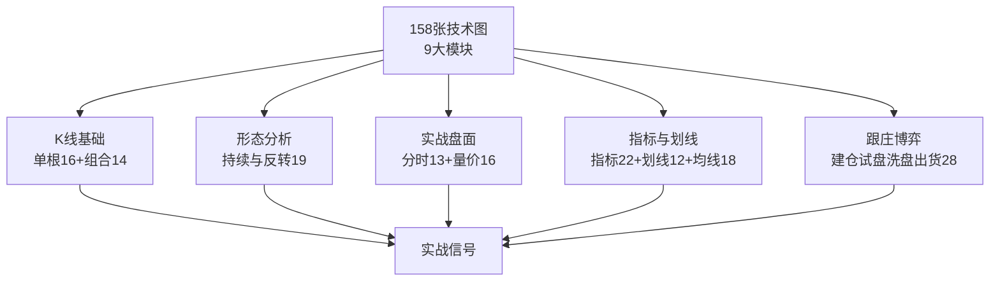
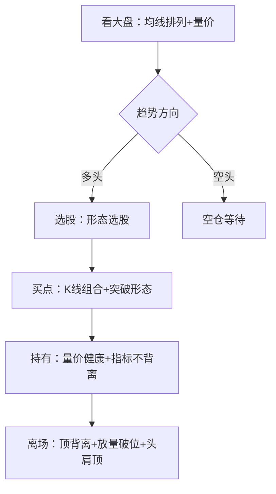

# 49《零基础看懂158张股市关键技术分析图》深度解读（详细版）

> **副题：老牛——"158 张图看懂 A 股全部关键技术"：单根 K 线 → 组合形态 → 反转形态 → 分时 → 指标 → 划线 → 均线 → 量价 → 跟庄，全链路实战详解**
>
> 作者：老牛，实战派投资作者。本书是 A 股技术分析的"图典"——9 章 158 张图，每张图对应一个经典技术形态或指标信号。与 038《从零开始学炒股》、048《看盘方法与技巧》合称"老牛炒股三书"：038 讲基础、048 讲盯盘、049 讲形态图典。
>
> **核心定位**：技术分析全图谱——从"单根K线"到"跟庄出货"共 158 个信号，本解读逐一展开：**形态长什么样 → 信号意味着什么 → 什么位置最可靠 → 买卖怎么操作 → A 股实战案例**。
>
> **系列意义**：049 是系列第 49 本，**技术分析形态图典篇**。与 [[37《股票投资沉思录》深度解读（详细版）|37 号冉伟量价八法]]、[[38《从零开始学炒股》深度解读（详细版）|38 号马涛K线组合]]、[[48《看盘方法与技巧一本通》深度解读（详细版）|48 号老牛看盘]] 互为技术分析的完整知识网。

---

## 📖 全书结构与核心框架

### 9 大模块速查总表

| 模块 | 图数 | 内容 | 应用层次 |
|------|------|------|---------|
| 第一章 单根K线 | 16 | 阴/阳/星/字/影线 | 入门第一课 |
| 第二章 K线组合 | 14 | 早晨之星/穿头破脚/红三兵等 | 短线交易 |
| 第三章 持续与反转形态 | 19 | 三角/旗形/头肩/M/W/圆弧/岛形 | 波段操作 |
| 第四章 分时分析 | 13 | 跳空/涨停/对倒/压盘托盘 | 日内交易 |
| 第五章 技术指标 | 22 | MACD/KDJ/RSI/BOLL等 | 趋势确认 |
| 第六章 划线分析 | 12 | 趋势线/通道/支撑压力/黄金分割 | 位置判断 |
| 第七章 均线分析 | 18 | 5-250日/排列/交叉 | 趋势系统 |
| 第八章 量价分析 | 16 | 放量缩量/地量天量/对敲 | 真假验证 |
| 第九章 跟庄分析 | 28 | 建仓9/试盘7/洗盘5/出货7 | 博弈实战 |

---

## 📑 目录

- [[#第1章 单根 K 线：16 种基础信号的完整解读|第1章 单根 K 线：16 种基础信号的完整解读]]
- [[#第2章 K 线组合：14 组经典形态的实战拆解|第2章 K 线组合：14 组经典形态的实战拆解]]
- [[#第3章 持续与反转形态：19 个波段信号的研判|第3章 持续与反转形态：19 个波段信号的研判]]
- [[#第4章 分时分析：13 个日内盘面动作的识别|第4章 分时分析：13 个日内盘面动作的识别]]
- [[#第5章 技术指标：22 个指标的信号与陷阱|第5章 技术指标：22 个指标的信号与陷阱]]
- [[#第6章 划线分析：12 种画线工具与用法|第6章 划线分析：12 种画线工具与用法]]
- [[#第7章 均线分析：18 种均线组合与排列|第7章 均线分析：18 种均线组合与排列]]
- [[#第8章 量价分析：16 种量价关系的真假辨|第8章 量价分析：16 种量价关系的真假辨]]
- [[#第9章 跟庄分析：28 个庄家动作的全链路拆解|第9章 跟庄分析：28 个庄家动作的全链路拆解]]
- [[#总结：158 张图的实战使用手册|总结：158 张图的实战使用手册]]
- [[#附录一 核心信号速查卡（A 股实战版）|附录一 核心信号速查卡（A 股实战版）]]
- [[#附录二 常见错误与陷阱清单|附录二 常见错误与陷阱清单]]
- [[#附录三 系列互链：049 在技术分析谱系中的位置|附录三 系列互链：049 在技术分析谱系中的位置]]
- [[#附录四 30 秒版：158 张技术图|附录四 30 秒版：158 张技术图]]

---

## 第1章 单根 K 线：16 种基础信号的完整解读

### 1.1 K 线是什么：一根 K 线讲一个故事

一根 K 线由四个价格构成：**开盘价、收盘价、最高价、最低价**。实体=开收盘之间的部分，影线=超出实体的部分。

| K 线要素 | 含义 | 谁在说话 |
|---------|------|---------|
| 实体（阳线） | 收盘>开盘，买方占优 | 多头 |
| 实体（阴线） | 收盘<开盘，卖方占优 | 空头 |
| 上影线 | 冲高回落的部分 | 上方抛压 |
| 下影线 | 探底回升的部分 | 下方承接 |
| 实体长度 | 多空力量对比的强度 | 方向力度 |

> 记住一句话：**实体是结论，影线是过程。** 收盘价才是多空当日博弈的最终裁决。

### 1.2 16 种单根 K 线逐一拆解

#### ① 大阳线（光头光脚阳线）

**图形**：开盘价≈最低价，收盘价≈最高价，实体很长，几乎无影线。

| 特征 | 信号 |
|------|------|
| 实体 ≥ 前一日实体 2 倍以上 | 多头全面碾压 |
| 出现位置：底部 | 反转上涨的第一信号 |
| 出现位置：上涨途中 | 趋势延续，最强中继 |
| 出现位置：暴涨后高位 | **警惕**——可能是最后一冲（见 1.2.4 天量天价） |

**实战案例**：2014 年 11 月底—12 月初，中国建筑（601668）连续出现大阳线，从 3 元区间快速拉到 6 元以上——**大阳线+政策降息+一带一路题材**=经典底部反转行情。

> 操作铁律：**大阳线出现在底部/中继，是买点；出现在高位滞涨时，是离场信号。**

#### ② 中阳线/小阳线

| 类型 | 特征 | 信号 |
|------|------|------|
| 中阳线 | 实体中等，上下影线短 | 多头温和占优，方向初定 |
| 小阳线 | 实体很小 | 多空胶着，方向不明——**观望为主** |

> 连续小阳线（如"红三兵"雏形）+ 温和放量 = 主力悄悄吸筹的常见形态。

#### ③ 大阴线（光头光脚阴线）

**图形**：开盘价≈最高价，收盘价≈最低价，实体很长。

| 位置 | 信号 |
|------|------|
| 高位 | 空头碾压，**趋势反转的第一信号** |
| 下跌途中 | 趋势延续 |
| 底部放量长阴 | 恐慌性杀跌（最后一跌）或利空出尽 |

**实战案例**：2015 年 6 月股灾期间，几乎所有个股连续出现大阴线（千股跌停）。**高位连续大阴线+放量=系统性风险确认，第一根大阴线就该离场**——这与 [[37《股票投资沉思录》深度解读（详细版）|37 号冉伟"系统性风险躲开"]] 完全同频。

#### ④ 上影阳线/上影阴线

| 类型 | 图形 | 信号 |
|------|------|------|
| 上影阳线 | 阳线+长上影 | 冲高遇阻——上方有抛压 |
| 上影阴线 | 阴线+长上影 | 反弹失败+空方反扑——**更弱** |

> 上影线的长度≥实体 1.5 倍时，叫"射击之星"（见第2章），是重要的见顶信号。

#### ⑤ 下影阳线/下影阴线

| 类型 | 图形 | 信号 |
|------|------|------|
| 下影阳线 | 阳线+长下影 | 探底回升——下方有承接 |
| 下影阴线 | 阴线+长下影 | 下跌遇支撑——可能止跌 |

**实战案例**：2020 年 3 月，贵州茅台（600519）在疫情恐慌中多次出现长下影线（下探 960 元附近收回），之后开启从 1,000 元到 2,600 元的主升浪——**长下影+基本面不变=洗盘结束**。

#### ⑥ 一字线

**图形**：开盘=收盘=最高=最低，全天一个价格。

| 类型 | 信号 |
|------|------|
| 一字涨停 | 重大利好，买盘封死——**想买买不到** |
| 一字跌停 | 重大利空，卖盘封死——**想卖卖不出** |

> 一字板打开后往往剧烈震荡——**一字涨停开板不追，一字跌停开板不接**（除非利空出尽逻辑成立）。

#### ⑦ 十字星

**图形**：开盘≈收盘，上下影线都较长，实体几乎为一条线。

| 位置 | 信号 |
|------|------|
| 高位十字星 | **变盘预警——见顶风险** |
| 低位十字星 | 变盘预警——见底可能 |
| 连续十字星 | 多空僵持，等方向选择 |

**实战案例**：2018 年 1 月，上证指数 3500 点附近连续出现十字星（1月29日见顶 3587 点后开启全年熊市）——**高位十字星+缩量=动能衰竭**。

> 十字星本身不决定方向，它说的是：**"势均力敌，方向未定，减仓观察。"**

#### ⑧ T字线/倒T字线

| 类型 | 图形 | 信号 |
|------|------|------|
| T字线 | 开盘=收盘=最高，只有下影线 | 探底回升，下方买盘强——**看涨** |
| 倒T字线 | 开盘=收盘=最低，只有上影线 | 冲高回落，上方卖压重——**看跌** |

#### ⑨—⑯ 其余变体小结

| K线 | 关键信号 |
|-----|---------|
| 光脚阳线（有上影无下影） | 冲高遇阻，多头略占优 |
| 光脚阴线（有上影无下影） | 高开低走，空头占优 |
| 光头阴线（有下影无上影） | 低开回升，有承接但弱 |

---

## 第2章 K 线组合：14 组经典形态的实战拆解

### 2.1 组合 K 线的核心逻辑

单根 K 线只讲一天的故事；**组合 K 线讲一段故事**。组合形态的价值在于：把多空力量对比的"演变过程"显性化。

### 2.2 最重要的 6 组反转组合（先记这 6 个）

#### ① 早晨之星（底部反转——最可靠之一）

**图形**：三根K线——大阴线 → 十字星/小实体 → 大阳线。

| 要素 | 含义 |
|------|------|
| 第一根大阴 | 空头强势 |
| 第二根十字星 | 空头衰竭——多空平衡 |
| 第三根大阳 | 多头反攻，收复失地 |

**实战案例**：2019 年 1 月初，上证指数在 2440 点附近形成经典早晨之星（1月3日大阴→1月4日十字星→1月4日盘中大阳收复）——**之后开启 2019 年全年结构性牛市**。

> 信号强度：**早晨之星出现在下跌末端的可靠性极高**，配合缩量后放量更佳。

#### ② 黄昏之星（顶部反转——早晨之星的镜像）

**图形**：大阳线 → 十字星 → 大阴线。

**实战案例**：2021 年 2 月 18 日，贵州茅台在 2,627 元见顶，前后出现黄昏之星组合——**之后从 2,600 元跌到 1,500 元以下**。这就是"抱团瓦解"的第一信号。

#### ③ 穿头破脚（吞没形态）

**图形**：第二根 K 线实体完全吞没第一根 K 线实体。

| 位置 | 信号 |
|------|------|
| 底部（阳包阴） | 看涨吞没——强烈买点 |
| 顶部（阴包阳） | 看跌吞没——强烈卖点 |

> 吞没形态的力量取决于：**第二根实体越长、成交量越大，反转越可信。**

#### ④ 红三兵（底部启动）

**图形**：连续三根依次抬高的阳线。

| 变体 | 信号 |
|------|------|
| 标准红三兵 | 底部/中继看涨 |
| 红三兵+放量 | 主力进场——**强烈看涨** |
| 三根越来越短的阳线 | 动能衰减——警惕 |

#### ⑤ 黑三兵（顶部出货）

**图形**：连续三根依次走低的阴线——顶部/高位强烈看跌。

#### ⑥ 双针探底（底部确认）

**图形**：两根带长下影线的K线，最低点几乎相同。

> 两个"针"探到同一个价位都被买盘托起=**该价位是主力成本区**——底部确认信号。**第二根针不破第一根针的低点，即可试仓。**

**实战案例**：2022 年 10 月，上证指数在 2885 点附近两次探底（10月12日、10月31日）形成双针——**之后开启 2022 年底—2023 年初的反弹行情**。

### 2.3 其余 8 组组合速查

| 组合 | 图形 | 信号 | 位置 |
|------|------|------|------|
| 上升三部曲 | 大阳→小阴×3→大阳 | 涨中继（多方炮加强版） | 上升趋势 |
| 下跌三部曲 | 大阴→小阳×3→大阴 | 跌中继 | 下降趋势 |
| 两阳夹一阴 | 阳-阴-阳（多方炮） | 看涨——主力震仓 | 底部/中继 |
| 两阴夹一阳 | 阴-阳-阴（空方炮） | 看跌 | 顶部/下跌 |
| 上涨两颗星 | 大阳→两颗星 | 涨势延续 | 上升趋势 |
| 下跌三颗星 | 大阴→三颗星 | 跌势延续 | 下降趋势 |
| 双飞乌鸦 | 两根并列阴线 | 见顶信号 | 高位 |
| 身怀六甲（孕线） | 大K线+被包裹小K线 | 变盘——趋势衰竭 | 顶/底 |

> 组合形态口诀：**"底部看涨组合+放量=买；顶部看跌组合+放量=卖；缩量组合=方向不明，观望。"**

---

## 第3章 持续与反转形态：19 个波段信号的研判

### 3.1 持续形态（整理中继——趋势未完）

#### ① 上升三角形（看涨中继——最经典）

**图形**：水平上边线（压力位）+ 逐步抬高的下边线（支撑位）。

| 要素 | 信号 |
|------|------|
| 上边水平 | 每次冲高到同一价位遇阻 |
| 下边抬高 | 每次回落低点越来越高=买盘渐强 |
| **放量突破上边** | **买点——目标位=三角形高度** |

**实战案例**：2020 年 5—7 月，宁德时代（300750）在 140—165 元区间形成上升三角形，7 月放量突破后一路涨到 2021 年 12 月的 690 元——**突破后涨幅远超三角形高度**。

> 上升三角形突破的可靠条件：**突破时放量 + 突破后回踩不破上边线**。

#### ② 下降三角形（看跌中继）

**图形**：水平下边线 + 逐步走低的上边线——跌破下边线=卖点。

#### ③ 对称三角形（等待方向）

**图形**：上下边线收敛于一点——多空平衡，**突破方向待定**。

> 对称三角形操作：**不猜方向，等突破**。向上突破放量买，向下突破放量卖——两边都不押，突破再动手。

#### ④ 矩形整理（箱体）

**图形**：上下两条水平线夹住价格横盘。

| 操作 | 信号 |
|------|------|
| 箱体内 | 高抛低吸（上沿卖/下沿买） |
| 放量突破上沿 | 买点——目标=箱体高度 |
| 跌破下沿 | 卖点 |

#### ⑤ 上升旗形/下降旗形（最可靠的持续形态）

| 类型 | 图形 | 信号 |
|------|------|------|
| 上升旗形 | 快速拉升后小回调（旗面倾斜向下） | **洗盘后继续涨**——突破旗面上沿买 |
| 下降旗形 | 快速下跌后小反弹（旗面倾斜向上） | 反弹后继续跌——跌破旗面下沿卖 |

> 旗形是最可靠的持续形态——**旗面越窄越标准，突破越可信**。上升旗形常出现在主升浪中途。

#### ⑥ 上升楔形/下降楔形（反转型持续）

| 类型 | 信号 |
|------|------|
| 上升楔形 | 高点和低点都抬高但幅度收窄——**末端大概率向下突破（看跌）** |
| 下降楔形 | 低点和高点都走低但幅度收窄——**末端大概率向上突破（看涨）** |

### 3.2 反转形态（趋势转折——波段最重要的信号）

#### ⑦ 头肩顶（最可靠的顶部反转）

**图形**：左肩 → 更高的头 → 右肩 → 跌破颈线。

| 要素 | 信号 |
|------|------|
| 左肩 | 第一次冲高回落 |
| 头部 | 更高点（放量） |
| 右肩 | 缩量反抽无力 |
| **跌破颈线** | **卖出确认——目标位=头部到颈线的距离** |

**实战案例**：2021 年 2 月—7 月，中国平安（601318）在 90 元附近形成头肩顶（左肩 94→头部 94.6→右肩 87→跌破颈线 78），之后一路跌到 2022 年 10 月的 35 元——**跌破颈线不逃，损失惨重**。

> 头肩顶是"教科书级"顶部——**右肩成交量明显小于左肩和头部**是核心特征。

#### ⑧ 头肩底（最可靠的底部反转）

**图形**：左肩 → 更低的头 → 右肩 → 突破颈线。

**实战案例**：2018 年 10 月—2019 年 2 月，上证指数在 2440—2700 区间形成头肩底（左肩 2449→头 2440→右肩 2500 附近→放量突破颈线 2700），之后开启 2019—2021 年的结构性牛市。

> 头肩底买入三法：**①突破颈线买入；②回踩颈线不破加仓；③放量突破+回踩确认=重仓点**。

#### ⑨ M头（双顶）/W底（双底）

| 形态 | 图形 | 信号 |
|------|------|------|
| M头 | 两次冲高同一价位回落 | 跌破颈线=顶部确认 |
| W底 | 两次探底同一价位回升 | 突破颈线=底部确认 |

**实战案例**：2023 年 4—7 月，上证指数在 3,400 附近两次冲顶失败（5月9日 3418、6月16日 3405）形成 M 头，跌破颈线 3,250 后一路阴跌到 10 月——**M头跌破颈线必须走**。

> W底比头肩底弱一些，但胜在形态简单——**跌破颈线位要坚决，突破颈线位要果断**。

#### ⑩ 三重顶/三重底

| 形态 | 信号 |
|------|------|
| 三重顶 | 三次冲顶失败=**强烈看跌**（比双顶更可靠） |
| 三重底 | 三次探底不破=**强烈看涨** |

#### ⑪ 圆弧顶/圆弧底（慢牛慢熊形态）

| 形态 | 特征 | 信号 |
|------|------|------|
| 圆弧底 | 长期横盘缓跌后缓涨，呈U形 | 缓慢筑底——**一旦放量突破，涨幅巨大** |
| 圆弧顶 | 长期缓涨后缓跌，呈倒U形 | 缓慢筑顶——温水煮青蛙 |

**实战案例**：2014 年—2015 年，上证指数 2,000 点附近用近两年时间构筑圆弧底，随后爆发 2015 年"杠杆牛"——**圆弧底的蓄力时间越长，爆发力越强**。

#### ⑫ 岛形反转（最极端的反转）

**图形**：向上跳空缺口 + 高位横盘 + 向下跳空缺口——K线像"孤岛"。

| 类型 | 信号 |
|------|------|
| 顶部岛形 | 上跳空→下跳空——**暴跌前兆** |
| 底部岛形 | 下跳空→上跳空——暴涨前兆 |

> 岛形反转罕见但极准——**岛形出现=趋势彻底改变，不要抱有幻想**。

---

## 第4章 分时分析：13 个日内盘面动作的识别

### 4.1 开盘的分时信号（9:30 前 30 分钟）

#### ① 跳空高开

| 情况 | 信号 |
|------|------|
| 高开<2%+量能温和 | 强势——可持有 |
| 高开>3%+放量 | 强攻——但防冲高回落 |
| 高开>5%+巨量 | 高风险——大概率是诱多或出货 |

**实战案例**：2020 年 7 月 6 日，券商股集体跳空高开（中信证券高开 5%+），当日放量涨停——**高开+板块共振+政策利好=牛市启动信号**。

#### ② 巨量高开

> 巨量高开要看位置：**低位巨量高开=主力进场；高位巨量高开=主力出货**（"高开出货"是庄家最常见手法）。

#### ③ 跳空低开

| 情况 | 信号 |
|------|------|
| 低开<2% | 正常回调 |
| 低开>3%+放量 | 利空或主力洗盘——看能否快速收回 |
| 低开>5% | 重大利空或恐慌——暂避 |

#### ④ 过度低开（超跌低开）

> 过度低开（-3%以上但迅速拉回）=**主力诱空**——"低开高走"是强势股的特征之一。

### 4.2 盘中的分时信号（9:30—14:30）

#### ⑤ 早盘封涨停

> 开盘 30 分钟内封涨停=**最强信号**——当日封死概率 80%+，次日大概率高开。**（与 [[48《看盘方法与技巧一本通》深度解读（详细版）|48 号"10:10 前涨停最可靠"]] 完全一致。）**

#### ⑥ 盘中快速拉抬

| 拉抬特征 | 信号 |
|---------|------|
| 快速拉升+量能持续 | 主力进攻 |
| 快速拉升+量能萎缩 | 拉高出货——冲高回落概率大 |
| 拉升后横盘不跌 | 强势——可持有 |

#### ⑦ 尾盘拉高收盘（14:30—15:00）

| 位置 | 信号 |
|------|------|
| 低位+首日尾盘急拉 | **吸筹——可跟过夜** |
| 高位+连续多日尾盘拉 | **出货前兆——不参与过夜** |
| 尾盘拉高+次日低开 | 确认诱多——卖出 |

**实战案例**：2015 年 5—6 月，大量高位股尾盘急拉（最后一小时拉 3-5%），次日低开出货——**这是牛市顶部最典型的"尾盘钓鱼"手法**。

#### ⑧ 尾盘压低收盘

| 位置 | 信号 |
|------|------|
| 高位尾盘跳水 | 真跌——次日大概率低开 |
| 低位尾盘跳水+缩量 | 洗盘——次日可能高开 |

#### ⑨ 尾盘放量涨停

> 尾盘才封涨停=**封板不坚决**——主力资金不足或借涨停出货，次日谨慎。

### 4.3 盘口挂单信号（买卖五档）

#### ⑩ 大单压盘

**图形**：卖一/卖二/卖三挂巨量卖单。

| 信号 | 含义 |
|------|------|
| 压单不动+股价不跌 | 主力压盘吸筹——**压着不让涨，慢慢吃货** |
| 压单被反复吃掉 | 主力边压边买——洗盘 |

> "大单压盘不一定是要跌——可能是主力想买得更便宜。"

#### ⑪ 大单托盘

| 信号 | 含义 |
|------|------|
| 托单不动+股价不涨 | 主力护盘——不让跌 |
| 托单被反复打掉 | 出货前兆——假托真卖 |

#### ⑫ 向上对倒/⑬ 向下对倒

| 类型 | 手法 | 目的 |
|------|------|------|
| 向上对倒 | 自买自卖拉高 | 引诱跟风盘——制造上涨假象 |
| 向下对倒 | 自卖自买砸低 | 制造恐慌——吓出散户筹码 |

> 识别对倒的关键：**分时放巨量但股价涨幅/跌幅有限 + 盘口频繁大单撤挂**。

---

## 第5章 技术指标：22 个指标的信号与陷阱

### 5.1 指标的本质：价格与成交量的"加工品"

> 所有技术指标都是**价格和成交量的数学加工**——指标不会告诉你新信息，它只是把已有信息"可视化"。因此：**指标永远滞后于价格，指标只做确认，不做预测。**

### 5.2 核心指标逐一拆解

#### ① MACD（最常用的趋势指标）

**组成**：DIF（快线）、DEA（慢线）、MACD柱（动能）。

| 信号 | 操作 |
|------|------|
| 金叉（DIF上穿DEA） | 买入信号（**零轴上方金叉更强**） |
| 死叉（DIF下穿DEA） | 卖出信号 |
| 顶背离（股价新高+MACD走低） | **见顶信号——卖出** |
| 底背离（股价新低+MACD走高） | **见底信号——买入** |

**实战案例**：2015 年 6 月，上证指数创 5,178 点新高，但 MACD 明显顶背离（6月12日新高，MACD峰值远低于 5 月）——**顶背离+政策查配资=暴跌前最后离场机会**。

> MACD 背离是"最值钱"的信号——**价格创新高/低但指标不创新高/低，说明动能衰竭**。但注意：背离可以"背离再背离"（强趋势中连续多次背离），所以**背离要结合位置使用**。

#### ② KDJ（短线摆动指标）

| 信号 | 操作 |
|------|------|
| 低位金叉（K上穿D，位置<20） | 买入 |
| 高位死叉（位置>80） | 卖出 |
| 顶背离/底背离 | 同MACD |
| **钝化**（80以上横盘） | **强趋势信号——不能当超买卖！** |

> KDJ 钝化陷阱：**牛市里 KDJ 长期在 80 以上钝化，此时"超买"信号完全失效**——如果按"超买就卖"操作，会踏空整个主升浪。反之熊市里 KDJ 长期 <20 钝化，按"超卖就买"会不断接飞刀。

#### ③ RSI（相对强弱指标）

| 信号 | 操作 |
|------|------|
| >80 超买 | 高位警惕 |
| <20 超卖 | 低位关注 |
| 背离 | 同MACD |
| **高位钝化**（>80 横盘） | **强趋势——不是卖点** |

> RSI 与 KDJ 同理：**钝化是趋势信号，不是超买超卖信号**。单边市里 RSI 失真。

#### ④ BOLL 布林带（波动率指标）

**组成**：中轨（20日均线）+ 上轨（中轨+2σ）+ 下轨（中轨-2σ）。

| 信号 | 操作 |
|------|------|
| 价格沿上轨运行 | 强趋势——持有 |
| 价格沿下轨运行 | 弱趋势——空仓 |
| 价格回中轨获支撑 | 强势——加仓 |
| **喇叭口张开**（上轨上翘+下轨下压） | **变盘信号——方向即将选择** |
| 收口（上下轨靠拢） | 盘整——等方向 |

#### ⑤ 其他指标速查

| 指标 | 核心用法 | 陷阱 |
|------|---------|------|
| W%R（威廉指标） | >80 超卖/<20 超买 | 同 KDJ 钝化 |
| ROC（变动率） | 穿越 0 轴=趋势信号 | 单边市失真 |
| BIAS（乖离率） | 偏离均线过大=回归 | 牛市可长期超买 |
| CCI（顺势指标） | >100 强势/<−100 弱势 | 与 RSI 互为印证 |
| DMI（动向指标） | +DI>−DI 多头 | 震荡市频繁假信号 |
| ADL（腾落指标） | 与指数背离=警示 | 需配合指数使用 |

> 指标使用三原则：**①主看 MACD 趋势+KDJ 短线+BOLL 位置；②指标互相印证（至少 2 个同向）；③指标只做确认，位置（高低）比信号更重要。**

---

## 第6章 划线分析：12 种画线工具与用法

### 6.1 趋势线（技术分析的第一工具）

**画法**：连接两个以上依次抬高的低点=上升趋势线；连接两个以上依次走低的高点=下降趋势线。

| 信号 | 操作 |
|------|------|
| 价格在上升趋势线上方 | 趋势健康——持有 |
| **跌破上升趋势线** | **趋势转弱——减仓/离场** |
| 突破下降趋势线 | 趋势转强——关注 |
| 趋势线角度 | 越陡越脆弱；越平缓越可靠 |

**实战案例**：2019—2021 年，贵州茅台沿 60 周均线+上升趋势线一路从 700 元涨到 2,600 元——**2021 年 3 月第一次跌破上升趋势线后反弹乏力，随后 2 月见顶**。跌破趋势线=趋势结束的第一信号。

### 6.2 通道线（趋势线+平行线）

**画法**：上升趋势线 + 平行上移的管道上轨。

| 信号 | 操作 |
|------|------|
| 触及上轨 | 高抛（短线） |
| 回踩下轨 | 低吸 |
| **跌破下轨** | **趋势破坏——离场** |

### 6.3 支撑线与压力线（位置的灵魂）

| 概念 | 含义 |
|------|------|
| 支撑线 | 多次回踩不破的价位——买盘聚集区 |
| 压力线 | 多次冲高不过的价位——卖盘聚集区 |
| **支撑压力互换** | 跌破的支撑=新压力；突破的压力=新支撑 |

> 支撑压力互换是**最重要的位置概念**：**突破后回踩前压力位不破=确认突破（买点）；跌破后反抽前支撑位受阻=确认跌破（卖点）。**

### 6.4 黄金分割线（回撤测量）

| 关键位 | 用法 |
|--------|------|
| 0.382 | 强势回调支撑 |
| 0.5 | 中位——多空分界 |
| 0.618 | **黄金支撑位——回调极限** |

> 用法：从最低点到最高点画黄金分割，回调到 0.5—0.618 区间企稳+缩量=**买点**。

---

## 第7章 均线分析：18 种均线组合与排列

### 7.1 均线是"成本线"

> 均线本质：**N 日买入者的平均成本**。价格在均线上方=多数人赚钱（上涨惯性）；价格在均线下方=多数人套牢（下跌惯性）。

### 7.2 各周期均线的角色

| 均线 | 周期 | 角色 | 用法 |
|------|------|------|------|
| 5日线 | 一周 | 攻击线 | 强势股沿 5 日线爬升，跌破=短线走弱 |
| 10日线 | 两周 | 短线生命线 | 短线趋势分界 |
| 20日线 | 一月 | **月线/中期生命线** | 波段操作最重要均线 |
| 60日线 | 一季度 | 中期趋势线 | 60 日线上=中期多头 |
| 120日线 | 半年 | 半年线 | 牛熊分界之一 |
| 250日线 | 一年 | **年线=牛熊分界线** | 年线上=牛市/年线下=熊市 |

### 7.3 排列与交叉

#### 多头排列（最强的趋势状态）

**图形**：5日>10日>20日>60日从上到下依次排列，均线全部向上。

> 多头排列=**趋势最强阶段——持股不动是最好的操作**。不要因为"涨太多"卖出多头排列的股票。

#### 空头排列（最弱的趋势状态）

**图形**：均线从上到下依次为 60>20>10>5，全部向下。

> 空头排列=**趋势最弱——空仓是最好的操作**。不要"抄底"空头排列的股票（飞刀）。

#### 黄金交叉/死亡交叉

| 交叉 | 图形 | 信号 |
|------|------|------|
| 金叉 | 短均线上穿长均线 | 买入（**低位金叉更可靠**） |
| 死叉 | 短均线下穿长均线 | 卖出（**高位死叉更可怕**） |

> 均线交叉注意：**震荡市里金叉死叉频繁假信号**——配合 MACD 和成交量过滤。**金叉+放量=真；金叉+缩量=假。**

---

## 第8章 量价分析：16 种量价关系的真假辨

### 8.1 量价的核心原则

> 价格可以骗人，**成交量很难骗人**（对倒除外）。成交量是"真金白银"的投票——"价格是结局，成交量是伤亡"（[[37《股票投资沉思录》深度解读（详细版）|37 号冉伟原话]]）。

### 8.2 16 种量价关系逐一拆解

#### ① 价涨量增（健康上涨）

| 位置 | 信号 |
|------|------|
| 底部 | 主力进场——**买点** |
| 上涨途中 | 趋势健康——持有 |
| 高位 | 放量滞涨=出货（见⑨） |

#### ② 价跌量缩（正常回调）

> 上涨途中缩量回调=**洗盘——最健康的调整，回调到支撑位是买点**。

#### ③ 价涨量缩（背离——警惕）

| 位置 | 信号 |
|------|------|
| 低位 | 主力控盘（锁仓）——可持有 |
| 高位 | **上涨乏力——警惕见顶** |

#### ④ 价跌量增（危险信号）

| 位置 | 信号 |
|------|------|
| 高位 | **主力出货——卖出** |
| 下跌途中 | 恐慌盘涌出——继续跌 |
| 底部（放量长阴） | 最后一跌（利空出尽）——关注反转 |

**实战案例**：2015 年 6 月 15 日起，上证指数连续"价跌量增"（6月16日—19日放量下跌）——**放量下跌=资金夺路而逃，第一根放量大阴就该走**。

#### ⑤ 价平量增（滞涨/滞跌）

| 位置 | 信号 |
|------|------|
| 高位横盘放量 | **主力出货（派发）——卖出** |
| 低位横盘放量 | 主力吸筹——关注 |

#### ⑥ 价平量缩（观望）

> 多空都不动——等方向。

#### ⑦ 地量地价（底部信号）

> 缩量到极致=**卖盘枯竭**——"地量之后见地价"。但注意：**地量只是见底的必要条件，不是充分条件**——地量后可能还有"地量地价"（阴跌）。

#### ⑧ 天量天价（顶部信号）

> 放量到极致=**买盘耗尽**——"天量之后见天价"。天量当天或次日往往就是顶。

#### ⑨ 对敲放量（假量——识别陷阱）

**手法**：主力自买自卖制造巨量。

| 识别特征 | 说明 |
|---------|------|
| 放巨量但股价不大动 | 对倒吸筹/出货 |
| 盘口频繁大单撤挂 | 虚假委托 |
| 放量滞涨 | 对倒出货 |

> 识别对敲：**成交量大但股价区间窄+盘口挂单反复撤改=假量**。

#### ⑩ 逆势放量（强势信号）

> 大盘跌它放量涨=**主力逆市吸筹/拉升——强庄股特征**（"大跌小回"）。

#### ⑪ 缩量封涨停（最强）

> 涨停缩量=**筹码锁定极好，没人卖——次日大概率继续涨停**（一字板形态）。

#### ⑫ 回调缩量（健康）

> 上涨趋势中回调缩量=洗盘；回调放量=出货。**缩量回调到支撑位=黄金买点。**

#### ⑬ 放量破位（最危险）

**图形**：跌破支撑/均线 + 放量。

> **放量破位=趋势确认反转——立刻离场**，不要幻想"假摔"。破位+缩量可以等，破位+放量必须走。

#### ⑭ 低位放量（关注信号）

> 长期下跌后低位放量（换手率>5%）=**主力进场信号**——"低位放量上涨更好，高位放量滞涨最危险"（[[37《股票投资沉思录》深度解读（详细版）|37 号冉伟]]）。

### 8.3 量价四象限速查（最重要的总结）

| | 放量 | 缩量 |
|--|------|------|
| **上涨** | 健康（买/持有） | 高位警惕见顶；低位主力控盘 |
| **下跌** | 高位=出货（卖）；底部=最后一跌 | 正常回调（洗盘） |

> 口诀：**"低位放量上涨更好，高位缩量上涨更好；价格坚挺即可持有，价格疲软就走人。"**

---

## 第9章 跟庄分析：28 个庄家动作的全链路拆解

### 9.1 庄家运作的完整流程

**一只股票被庄家相中后的完整生命周期：建仓（9种方式）→ 试盘（7种方式）→ 洗盘（5种方式）→ 拉升 → 出货（7种方式）。** 散户要做的：**在建仓末期跟进，在洗盘时拿住，在拉升时持有，在出货前离场。**

### 9.2 建仓（9 种方式）

| 方式 | 手法 | 识别特征 |
|------|------|---------|
| 拉高建仓 | 快速拉升抢筹 | 底部突然放量大阳 |
| 反弹建仓 | 趁超跌反弹吃货 | 下跌末端放量 |
| 横盘建仓 | 长期窄幅横盘 | 缩量横盘+底部抬高 |
| 下跌建仓 | 边跌边买 | 阴跌中底部放量 |
| 推土机式 | 缓慢稳步推高 | 小阳线连排 |
| 潜伏建仓 | 长期底部潜伏 | 地量后温和放量 |
| 急风暴雨式 | 短时间内大量买入 | 连续大阳线 |
| 连拉涨停式 | 涨停板抢筹 | 连续涨停+打开再封 |
| 跌停式建仓 | 跌停板吃货 | 跌停反复打开 |

> 识别建仓的**铁律**：**"低点不断抬高"**（[[48《看盘方法与技巧一本通》深度解读（详细版）|48 号]]）——底部 3 个以上依次抬高的低点=主力成本线。

### 9.3 试盘（7 种方式）——庄家"踩点"

| 方式 | 手法 | 目的 |
|------|------|------|
| 下探试盘 | 快速砸低看抛压 | 测试下方承接力 |
| 冲高试盘 | 快速拉高看跟风 | 测试上方抛压 |
| 涨停试盘 | 拉涨停看封单 | 测试抛压和跟风 |
| 强势中试盘 | 大盘强时打压 | 测试筹码锁定度 |
| 平衡市试盘 | 横盘中突然异动 | 测试市场关注度 |
| 盘口打压试盘 | 挂大卖单吓唬 | 测试散户信心 |
| 跌停试盘 | 砸跌停看恐慌盘 | 测试恐慌抛压 |

> 试盘的特征：**快速异动后快速恢复——"试盘是庄家在问路，不是要走路"**。识别试盘：异动幅度大但时间短+量能不大+位置在底部。

### 9.4 洗盘（5 种方式）——把不坚定的人吓走

| 方式 | 手法 | 识别 |
|------|------|------|
| 剧烈震荡洗盘 | 大起大落 | 放量宽幅震荡 |
| 窄幅震荡洗盘 | 小范围反复 | 缩量窄幅 |
| 横盘式洗盘 | 长时间横盘 | **缩量横盘（最标准的洗盘）** |
| 缩量破位洗盘 | 假跌破支撑 | 破位但缩量 |
| 大幅跳水式洗盘 | 恐慌性砸盘 | 快速下跌后快速收回 |

> 洗盘 vs 出货的终极区分（[[38《从零开始学炒股》深度解读（详细版）|38 号]]口诀）：**"低位缩量跌是洗，高位放量跌是逃；利好不涨是出，利空不跌是吸。"**

| 维度 | 洗盘 | 出货 |
|------|------|------|
| 位置 | 低位/中位 | 高位 |
| 量能 | 缩量 | **放量** |
| 均线 | 不破关键均线 | 跌破关键均线 |
| 跌幅 | 快速但收回 | 缓慢阴跌 |
| 消息 | 利空配合 | 利好配合 |

### 9.5 出货（7 种方式）——最后的盛宴

| 方式 | 手法 | 识别 |
|------|------|------|
| 拉高出货 | 拉高后慢慢卖 | 冲高回落+放量 |
| 快速拉升出货 | 连续拉升中派发 | 加速赶顶 |
| 稳步推进式出货 | 边拉边出 | 高位滞涨 |
| 放量滞涨出货 | 放量不涨 | **最典型——价平量增** |
| 直接跳水出货 | 快速砸盘出逃 | 大阴线+放量 |
| 横盘出货 | 高位横盘慢慢卖 | 高位缩量横盘（温水煮青蛙） |
| 震荡出货 | 宽幅震荡中派发 | 高位大起大落 |

> 出货的**终极特征**：**"利好频出+股价不涨"**=主力借利好出货；**"高位放量滞涨"**=出货进行时。

**实战案例**：2021 年 2 月，贵州茅台在 2,600 元附近"高位放量滞涨"（2月10日—18日放量滞涨+利好频出）——**之后一个月跌 30%**。这就是"放量滞涨出货"的教科书案例。

---

## 总结：158 张图的实战使用手册

### Z1. 完整决策流程（把 158 张图串起来）

### Z2. 三层过滤体系

| 层次 | 工具 | 作用 |
|------|------|------|
| 第一层 趋势 | 均线排列/趋势线/年线 | 决定做不做（方向） |
| 第二层 位置 | 支撑压力/黄金分割/BOLL | 决定在哪做（价格） |
| 第三层 信号 | K线组合/形态/指标/量价 | 决定何时做（时机） |

> **技术分析的最高境界不是"预测"，而是"应对"**：形态突破就买、破位就卖、背离就警惕、量价背离就减仓——**永远让市场告诉你答案，而不是你告诉市场答案。**

### Z3. 158 张图的最重要 10 个信号

| 排名 | 信号 | 优先级 |
|------|------|--------|
| 1 | 放量破位 | ★★★★★ 立即走 |
| 2 | 头肩顶跌破颈线 | ★★★★★ 立即走 |
| 3 | MACD 顶背离+高位 | ★★★★ 减仓 |
| 4 | 高位放量滞涨 | ★★★★ 减仓 |
| 5 | 天量天价 | ★★★★ 警惕 |
| 6 | 低位放量+红三兵 | ★★★★★ 买点 |
| 7 | 早晨之星/双针探底 | ★★★★ 买点 |
| 8 | 缩量回调到支撑 | ★★★★ 买点 |
| 9 | 低位金叉+放量 | ★★★ 关注 |
| 10 | 突破后回踩确认 | ★★★ 加仓 |

---

## 附录一 核心信号速查卡（A 股实战版）

| 信号 | 含义 | 操作 |
|------|------|------|
| 高位十字星 | 变盘 | 减仓 |
| 早晨之星 | 底部反转 | 买入 |
| 黄昏之星 | 顶部反转 | 卖出 |
| 红三兵 | 底部启动 | 买入 |
| 头肩底突破 | 底部确认 | 重仓 |
| 头肩顶跌破 | 顶部确认 | 清仓 |
| 上升三角形突破 | 中继上涨 | 买入 |
| 放量破位 | 趋势破坏 | 离场 |
| MACD 底背离 | 动能反转 | 买入 |
| MACD 顶背离 | 动能衰竭 | 卖出 |
| 低位金叉+放量 | 趋势转多 | 买入 |
| 缩量回调 | 洗盘 | 加仓 |
| 放量滞涨 | 出货 | 卖出 |
| 地量 | 卖盘枯竭 | 关注 |
| 天量 | 买盘耗尽 | 警惕 |
| 多头排列 | 趋势最强 | 持股 |

## 附录二 常见错误与陷阱清单

| 错误 | 后果 | 纠正 |
|------|------|------|
| 高位"抄底"空头排列 | 接飞刀 | 只在多头/突破后买 |
| 缩量金叉当买入 | 假信号 | 金叉必须放量确认 |
| 背离出现就满仓抄底 | 背离可再背离 | 背离+位置+量价三重确认 |
| 十字星当趋势反转 | 变盘≠反转 | 等第二根K线确认方向 |
| 涨停就追 | 高位接盘 | 只在低位/中继追涨停 |
| 只看K线不看量 | 被形态骗 | 形态+量价结合 |
| 死记形态不辨位置 | 位置错了全错 | 位置（高低）优先于形态 |
| 破位不卖等反弹 | 深套 | 放量破位立即走 |

## 附录三 系列互链：049 在技术分析谱系中的位置

| 系列笔记 | 链接点 |
|---------|--------|
| [[38《从零开始学炒股》深度解读（详细版）|38 号]] | K线组合 30 种速查——049 是 38 号的"图典升级版" |
| [[48《看盘方法与技巧一本通》深度解读（详细版）|48 号]] | 量价八法+涨停操作——049 与 48 号互为补充 |
| [[37《股票投资沉思录》深度解读（详细版）|37 号]] | 冉伟量价八法+五因素打分——049 提供形态工具箱 |
| [[44《交易的真相》深度解读（详细版）|44 号]] | 阶梯双K法则——049 的形态可嵌入 44 号系统 |

## 附录四 30 秒版：158 张技术图

> **158 张技术图（30 秒版）**：
>
> 1. **单根K线**——实体是结论，影线是过程；高位十字星变盘；
> 2. **组合**——早晨之星买/黄昏之星卖/双针探底确认；
> 3. **形态**——头肩顶底最可靠，放量突破/破位最关键；
> 4. **分时**——早盘涨停最强，尾盘急拉看位置；
> 5. **指标**——MACD 看趋势+背离，KDJ/RSI 防钝化陷阱；
> 6. **均线**——年线=牛熊分界，多头排列持股，空头排列空仓；
> 7. **量价**——放量破位必须走，缩量回调是买点，天量天价地量地价；
> 8. **跟庄**——低点抬高=建仓，缩量横盘=洗盘，高位放量滞涨=出货；
> 9. **总纲**——趋势定方向，位置定价格，信号定时机。

---

## 附录五 头肩顶深度案例拆解：中国平安 2021——教科书级顶部

### 5.1 案例背景

中国平安（601318），2020 年 12 月—2021 年 7 月，股价在 90 元附近反复筑顶，最终形成完整的头肩顶形态，之后一路跌到 2022 年 10 月的 35 元附近——**最大跌幅超过 60%**。

### 5.2 形态逐段拆解（2021 年时间线）

| 阶段 | 时间 | 价格行为 | 量能 | 形态要素 |
|------|------|---------|------|---------|
| 左肩 | 2020.12—2021.1 | 冲高 94.6 元回落 | 放量 | 第一次冲顶 |
| 回调 | 2021.1—2021.2 | 回落至 78 元 | 缩量 | 颈线位置 |
| **头部** | 2021.2—2021.3 | 二次冲高 94.7 元 | **放量创新高** | 比左肩高 |
| 回落 | 2021.3—2021.5 | 跌回 78 元附近 | 温和放量 | 第二次触颈线 |
| 右肩 | 2021.5—2021.6 | 反抽 87 元 | **明显缩量** | 高点比头部低 |
| **跌破颈线** | 2021.7 | 跌破 78 元 | **放量** | 形态完成 |

### 5.3 关键识别点（散户为什么没跑）

| 识别点 | 正确解读 | 散户常见误读 |
|--------|---------|-------------|
| 头部放量 | 主力借高位放量出货 | "放量突破，还能涨" |
| 右肩缩量 | 买盘衰竭——没人接了 | "回调到位，抄底" |
| 跌破颈线放量 | **确认出货——必须走** | "跌这么多了，该反弹了" |

> **教训**：中国平安是"白马股"，散户的信仰是"好公司不怕跌"——但**再好的公司，技术形态走坏时也要先离场**。"好公司"可以在 35 元重新买入，但"拿着不动"要承受 60% 的浮亏。这与 [[28《聪明的投资者》深度解读（详细版）|28 号格雷厄姆"市场先生"]] 的警示完全一致：**市场先生的报价只可利用，不可被其牵着走。**

### 5.4 量度目标（头肩顶的最小目标位）

> 最小目标 = 颈线 −（头部 − 颈线）= 78 −（94.7 − 78）= **61.3 元**

**实际走势**：2021 年 7 月跌破颈线后，第一波跌到 62 元附近（正好到达量度目标）——**形态的量度目标位是重要的止跌参考，但不是抄底理由**。之后反弹无力，继续阴跌至 35 元。

### 5.5 本案例的完整操作纪律

| 时点 | 操作 | 依据 |
|------|------|------|
| 右肩缩量反抽 | 减仓 50% | 头肩顶雏形 |
| 跌破颈线（78元） | **清仓** | 形态确认+放量 |
| 反弹回抽颈线 | 不接 | 支撑压力互换（颈线变压力） |
| 跌到量度目标 61 元 | 观望 | 不猜底 |

---

## 附录六 MACD 背离深度案例：三次实战——2015 顶、2018 底、2021 抱团瓦解

### 6.1 背离的本质（再讲透一点）

> MACD 背离的数学本质：**价格创新高，但动能在衰减**。MACD 柱/DIF 是"动能计"——股价创新高靠的是最后一口气，而这口气在指标上已经显形。

### 6.2 案例一：2015 年 6 月上证指数——顶背离逃命

| 时间 | 指数 | MACD 状态 |
|------|------|----------|
| 2015.5.28 | 4,900 点 | DIF 峰值（高点 A） |
| 2015.6.12 | **5,178 点（新高）** | DIF 明显低于 A——**顶背离** |
| 6.15 起 | 千股跌停 | 背离兑现——两个月跌 45% |

> **如果 2015 年 6 月 12 日看到顶背离就走，可以躲过股灾 1.0 的千股跌停。** 顶背离+政策查配资=双重确认。

### 6.3 案例二：2018 年 10 月—2019 年 1 月——底背离抄底

| 时间 | 指数 | MACD 状态 |
|------|------|----------|
| 2018.10.19 | 2,449 点 | DIF 低点 A |
| 2019.1.4 | **2,440 点（新低）** | DIF 高于 A——**底背离** |
| 之后 | 2019 全年牛市 | 背离兑现 |

> 底背离+2440 政策底+2449/2440 双针=**三重底部确认**——2019 年 1 月是过去十年 A 股最好的买点之一。

### 6.4 案例三：2021 年 2 月抱团瓦解——日线+周线双背离

| 时间 | 标的 | 信号 |
|------|------|------|
| 2020.12—2021.2 | 白酒/新能源抱团股 | 日线持续顶背离（股价新高+动能衰减） |
| 2021.2.18 | 茅台 2,627 元 | **日线+周线双顶背离共振** |
| 之后 | 抱团瓦解 | 茅台跌 40%+，多数抱团股腰斩 |

> **周线背离比日线背离更可靠**——大周期背离一旦确认，调整以"月"为单位。抱团瓦解的本质：**估值太高+动能衰竭+资金夺路而逃**。

### 6.5 背离实战的四个"必须"

| 原则 | 说明 |
|------|------|
| 必须结合位置 | 高位顶背离=卖；低位底背离=买；**中位背离意义弱** |
| 必须看大周期 | 周线背离 > 日线背离 > 60 分钟背离 |
| 必须容忍"再背离" | 强趋势中背离可连续多次——**背离+破位双确认才动手** |
| 必须配合量价 | 顶背离+放量滞涨=最强卖点；底背离+缩量地量=最强买点 |

---

## 附录七 量价深度案例：三只股票的量价完整复盘

### 7.1 案例一：健康量价——2020 年宁德时代主升浪

| 阶段 | 时间 | 量价特征 | 信号 |
|------|------|---------|------|
| 底部启动 | 2020.5—6 | 低位放量+红三兵 | 主力进场 |
| 突破平台 | 2020.7 | 放量突破 140—165 箱体 | 买入 |
| 主升浪 | 2020.7—2021.12 | **涨放量/回调缩量**（教科书级健康量价） | 持有 |
| 见顶 | 2021.12 | 高位放量滞涨+天量 | 离场 |

> 宁德时代主升浪的**量价密码**：每次回调都缩量（洗盘），每次上涨都放量（进攻）——**"涨放量、跌缩量"=最健康的趋势，拿住不卖**。

### 7.2 案例二：出货量价——2021 年某白酒股高位派发

| 阶段 | 量价特征 | 识别 |
|------|---------|------|
| 顶部区域 | 高位横盘+频繁放量（价平量增） | 主力派发 |
| 消息配合 | 利好频出（提价/业绩超预期）+股价不涨 | **利好不涨是出** |
| 破位 | 放量跌破 20 日线 | 趋势确认转弱 |

> **派发期最典型的量价组合：价平量增（放量滞涨）**——股价横着，成交量却放大，说明有人在大量卖出。此时"利好不涨"是最后的离场信号。

### 7.3 案例三：洗盘量价——2022 年 4 月某新能源龙头

| 阶段 | 量价特征 | 识别 |
|------|---------|------|
| 洗盘期 | 快速下跌+**缩量** | 缩量下跌=无人抛售=洗盘 |
| 底部 | 地量（换手率<1%） | 卖盘枯竭 |
| 启动 | 温和放量+阳线收复均线 | 洗盘结束 |

> **洗盘与出货的量价之辨：洗盘缩量（没人卖），出货放量（抢着卖）**。缩量急跌到支撑位企稳=洗盘结束，是买点。

### 7.4 量价复盘总结表

| 案例 | 结局 | 核心教训 |
|------|------|---------|
| 宁德时代（健康） | 涨 5 倍 | 涨放量跌缩量=持有 |
| 白酒股（派发） | 跌 50% | 价平量增=离场 |
| 新能源龙头（洗盘） | 反弹 40% | 缩量急跌=洗盘=买点 |

---

## 附录八 跟庄全流程实战模拟：一只"庄股"的完整生命周期

### 8.1 背景设定

某小盘科技股，流通市值 30 亿，散户占比高，题材好（AI 概念）。主力计划：用 9 个月完成"建仓→试盘→洗盘→拉升→出货"全流程，目标翻倍后出货。

### 8.2 第一阶段：建仓（第 1—3 个月）

| 手法 | 盘面表现 | 散户视角 |
|------|---------|---------|
| 横盘建仓+下跌建仓 | 股价在 8—10 元横盘，偶尔破位吓人 | "阴跌不止，割肉" |
| 对倒压低 | 放量下跌但底部抬高 | "放量下跌，要崩" |
| 特征 | **低点不断抬高（8.2→8.5→8.8→9.0）** | — |

> 识别：**底部 3 个以上依次抬高的低点=主力成本区**。此阶段散户的正确操作：观察，不参与（不确定主力是否完成建仓）。

### 8.3 第二阶段：试盘（第 4 个月）

| 手法 | 盘面表现 | 主力目的 |
|------|---------|---------|
| 冲高试盘 | 突然拉 5% 又回落 | 测试上方抛压 |
| 下探试盘 | 突然砸 3% 又拉回 | 测试下方承接 |
| 跌停试盘 | 尾盘砸跌停，次日低开高走 | 测试恐慌盘 |

> 识别：**异动幅度大但时间短+位置在底部=试盘**。"试盘是问路，不是走路"——别被吓跑。

### 8.4 第三阶段：洗盘（第 5 个月）

| 手法 | 盘面表现 | 目的 |
|------|---------|------|
| 缩量横盘 | 10—11 元窄幅横盘 1 个月 | 磨掉没耐心的人 |
| 缩量破位 | 假跌破 10 元（缩量）又收回 | 吓出最后一批浮筹 |

> 识别：**缩量+不破关键均线=洗盘**。散户正确操作：**拿着不动**——"洗得越凶，涨得越猛"（[[48《看盘方法与技巧一本通》深度解读（详细版）|48 号]]）。

### 8.5 第四阶段：拉升（第 6—8 个月）

| 阶段 | 盘面表现 | 量价 |
|------|---------|------|
| 初升 | 放量突破 11 元平台 | 低位放量上涨（健康） |
| 主升 | 沿 5 日线爬升，回调缩量 | 涨放量跌缩量 |
| 加速 | 连续大阳+跳空 | 天量天价预警 |

> 主升浪特征：**多头排列+沿 5 日线+回调缩量**。散户正确操作：**拿住不卖，跌破 5 日线再减**。

### 8.6 第五阶段：出货（第 9 个月）

| 手法 | 盘面表现 | 识别 |
|------|---------|------|
| 拉高出货 | 拉涨停后放量打开 | 涨停打开+巨量 |
| 放量滞涨 | 高位横盘放量 | **价平量增=派发** |
| 利好出货 | 公司发布 AI 大单利好+股价不涨 | **利好不涨是出** |
| 震荡出货 | 高位大起大落 | 宽幅震荡+放量 |

> 出货识别金标准：**"高位放量滞涨+利好不涨"=主力在借利好出逃**。散户正确操作：**出现第一个信号（放量滞涨）就走**，不要等第二个。

### 8.7 全流程时间轴总结

| 阶段 | 时间 | 股价区间 | 散户应做什么 |
|------|------|---------|-------------|
| 建仓 | 1—3 月 | 8—10 元 | 观察（低点抬高=关注） |
| 试盘 | 第 4 月 | 9—10.5 元 | 不追不跑 |
| 洗盘 | 第 5 月 | 10—11 元 | **拿住（缩量=洗盘）** |
| 拉升 | 6—8 月 | 11—20 元 | 持有+沿5日线 |
| 出货 | 第 9 月 | 20—18 元 | **放量滞涨就走** |

> **跟庄的终极心法**：不跟庄，跟信号——**低点抬高（建仓）→ 缩量洗盘（拿住）→ 放量拉升（持有）→ 放量滞涨（走人）**。庄家想骗你，但量价很难骗你。

---

---

## 附录九 三要素综合研判：形态 × 位置 × 量价的完整决策框架

### 9.1 为什么单一信号经常失败

| 单一信号 | 失败场景 | 原因 |
|---------|---------|------|
| 金叉就买 | 震荡市金叉假信号 | 没有量能确认 |
| 突破就追 | 假突破（诱多） | 位置不对（高位） |
| 底背离就抄 | 背离后再背离 | 没有量价配合 |
| 破位就跑 | 假摔（洗盘） | 缩量破位≠放量破位 |

> **技术分析最大的敌人不是"不会看"，而是"只看一个信号就下结论"。** 三个维度互相验证，成功率才能从"抛硬币"变成"大概率"。

### 9.2 三要素决策矩阵

| 要素 | 看什么 | 强信号 | 弱信号 |
|------|--------|--------|--------|
| **形态** | K线组合/形态结构 | 头肩底/早晨之星/放量突破 | 单根K线/模糊形态 |
| **位置** | 高低位/均线/支撑压力 | 低位+支撑位 | 高位+压力位 |
| **量价** | 量能配合/背离 | 放量突破/缩量回调 | 缩量突破/放量滞涨 |

### 9.3 三要素买入决策表（6 种组合）

| 形态 | 位置 | 量价 | 决策 |
|------|------|------|------|
| 突破 ✓ | 低位 ✓ | 放量 ✓ | **重仓买入**（三要素共振） |
| 突破 ✓ | 低位 ✓ | 缩量 | 轻仓试探（等回踩确认） |
| 突破 ✓ | 高位 ✗ | 放量 | 不追（可能是诱多） |
| 早晨之星 ✓ | 底部 ✓ | 缩量 | 关注（等放量确认） |
| 金叉 ✓ | 中位 | 放量 ✓ | 可买入（波段） |
| 金叉 ✓ | 中位 | 缩量 | 观望（假信号概率大） |

### 9.4 实战演练：用三要素判断"该不该买"

**场景**：某消费股从 30 元跌到 18 元（跌 40%），最近出现：①小阳线连续 3 根（红三兵雏形）；②股价站上 20 日线；③成交量温和放大。

| 要素 | 评估 | 结论 |
|------|------|------|
| 形态 | 红三兵+站上均线 | ✓ 转强信号 |
| 位置 | 从高位腰斩+底部区域 | ✓ 低位 |
| 量价 | 温和放量（非天量） | ✓ 健康 |
| **综合** | **三要素共振** | **可分批买入**（先 1/3 仓） |

**对比场景**：同样的红三兵出现在：①股价已从 10 元涨到 28 元（+180%）；②高位放量滞涨；③利好频出。

| 要素 | 评估 | 结论 |
|------|------|------|
| 形态 | 红三兵（但可能是最后一冲） | ✗ 高位 |
| 位置 | 高位+获利盘巨大 | ✗ |
| 量价 | 放量滞涨（出货特征） | ✗ |
| **综合** | **三要素全否** | **不追，等回调或离场** |

> **同样的形态，不同的位置和量价，结论完全相反**——这就是"位置优先于形态"的真义。

---

## 附录十 A 股历轮牛熊的技术信号全景复盘

### 10.1 五轮牛熊的技术信号对照

| 周期 | 见顶技术信号 | 见底技术信号 |
|------|-------------|-------------|
| 2007（6124→1664） | 高位天量+黄昏之星+M头 | 1664 地量+双针 |
| 2015（5178→2638） | **顶背离+高位放量滞涨** | 2638 双底+缩量 |
| 2018（3587→2440） | 破位+空头排列 | **2440 底背离+早晨之星** |
| 2021（抱团瓦解） | 日周双背离+利好不涨 | 2022.10 双针+地量 |
| 2024（政策底） | — | 2月 2635 恐慌+9月 2689 政策底+放量反转 |

### 10.2 顶部信号的"提前量"（什么时候该跑）

| 信号 | 出现时点 | 提前量 |
|------|---------|--------|
| 天量（成交额创纪录） | 牛市最狂热时 | 提前 1—2 周 |
| 顶背离 | 新高但动能衰减 | 提前数周 |
| 高位放量滞涨 | 顶部区域 | 顶部附近 |
| 破位+空头排列 | 第一波下跌后 | 已经跌了一段 |

> **顶部逃命三信号（出现任一先减仓）：①天量 ②顶背离 ③高位放量滞涨。**

### 10.3 底部信号的"确认链"（什么时候该买）

| 阶段 | 信号 | 操作 |
|------|------|------|
| 恐慌期 | 放量大阴+连续跌停 | 观察（不接飞刀） |
| 筑底期 | 地量+双针/早晨之星 | 关注（轻仓试） |
| **确认期** | **底背离+放量长阳+站上20日线** | **买入** |
| 右侧期 | 突破颈线+回踩确认 | 加仓 |

> **底部买入永远等"右侧确认"**：底背离出现只是"可能见底"，放量长阳站上均线才是"确认见底"。左侧抄底是高手的事，右侧确认是普通人能做的事。

### 10.4 2024 年 9 月案例：政策底+技术底共振

| 时间 | 事件 | 技术信号 |
|------|------|---------|
| 2024.9.24 前 | 市场阴跌，成交低迷 | 地量（日成交<5,000亿） |
| 2024.9.24 | 央行政策组合拳 | 政策底 |
| 2024.9.25—30 | 放量暴涨 | **放量长阳+站上所有均线** |
| 之后 | 史诗级反弹 | 右侧确认完成 |

> 2024.9 案例的启示：**政策底（9.24）≠技术底——技术确认（放量长阳站上均线）才是进场信号**。9.24 当天不敢买很正常，9.26 放量确认后买也不迟（吃到主升浪的大部分）。

---

## 附录十一 技术分析十大实战错误诊断（含案例）

### 11.1 错误诊断总表

| # | 错误 | 典型表现 | 正确做法 |
|---|------|---------|---------|
| 1 | 不看大盘只看个股 | 大盘空头排列还满仓 | **先看大盘（趋势），再看个股** |
| 2 | 抄底空头排列 | "跌了这么多该反弹了" | 等均线走平/突破再买 |
| 3 | 满仓追涨停 | 一字板开板就冲进去 | 涨停开板不追（见附录四） |
| 4 | 死扛破位 | "基本面好，不怕" | 技术破位先离场，跌透再买回 |
| 5 | 频繁交易 | 每天买卖，手续费吃光利润 | 按信号操作，控制交易频率 |
| 6 | 只看指标不看价格 | KDJ 超卖就买（钝化陷阱） | 指标+位置+量价三确认 |
| 7 | 形态半途而废 | 头肩底画到一半就跑 | 形态完成（突破/跌破）才操作 |
| 8 | 用技术分析做长期 | 拿技术信号做价值投资 | **技术定时机，基本面定标的** |
| 9 | 情绪化止损 | 跌 5% 恐慌割肉，涨回来又追 | 止损设纪律（破位/破线才止损） |
| 10 | 不设止损 | "反正会涨回来" | 买入即设止损（破位/破线） |

### 11.2 案例：散户典型的"三步错"（某投资者 2021 年实录）

| 步骤 | 操作 | 错误 |
|------|------|------|
| ①高位追入 | 2021.1 追高买入抱团股 | 不看位置（高位） |
| ②死扛 | 2 月跌 20% 不卖（"好公司"信仰） | 破位不止损 |
| ③割肉在底 | 4 月反弹前割肉（-35% 出局） | 割在地板 |

> 三步错的核心：**①追高（位置错）→ ②死扛（纪律错）→ ③割肉在底部（心态错）**。技术分析解决①②，纪律解决③。

---

## 附录十二 技术分析与价值投资的融合：择时 × 选股

### 12.1 两种体系的互补

| 维度 | 技术分析 | 价值投资 |
|------|---------|---------|
| 回答的问题 | **何时买/何时卖** | **买什么/值多少** |
| 时间框架 | 短期（日/周） | 长期（年） |
| 工具 | 形态/指标/量价 | 估值/基本面/护城河 |
| 弱点 | 无基本面支撑 | 择时能力弱 |

> **融合的正确姿势：用价值投资选股（买什么），用技术分析择时（何时买/卖）。** 两个体系不是竞争，是分工。

### 12.2 融合操作系统（价值选股 × 技术择时）

| 步骤 | 价值维度 | 技术维度 |
|------|---------|---------|
| ①标的池 | 好公司（好大高正/护城河） | 剔除破位下跌的 |
| ②估值筛选 | PE/PB 处于历史低位 | 等底部形态（双针/早晨之星） |
| ③买点 | 安全边际足够 | **放量突破/底背离确认** |
| ④持有 | 基本面未变就持有 | **跌破关键均线减仓** |
| ⑤卖出 | 估值回归/基本面变坏 | **顶背离/放量滞涨离场** |

### 12.3 实战案例：用融合系统复盘 2018—2021 贵州茅台

| 时间 | 价值判断 | 技术信号 | 融合决策 |
|------|---------|---------|---------|
| 2018.10 | 估值合理（PE 25倍） | 底背离+双针 | **买入**（价值确认+技术确认） |
| 2019—2020 | 基本面持续向好 | 多头排列+沿5日线 | 持有 |
| 2021.1 | 估值偏贵（PE 70倍） | 高位放量滞涨 | 减仓 |
| 2021.2 | 估值透支 | 日周双背离 | **清仓**（价值+技术共振） |

> 茅台案例的启示：**单纯技术分析会在 2020 年就卖掉（涨太多），单纯价值投资会在 2021 年还死扛（好公司）**——融合系统在 2021.1 减仓、2021.2 清仓，完美躲过 40% 回撤。

### 12.4 融合系统的三条铁律

| 铁律 | 说明 |
|------|------|
| 价值定生死 | **基本面变坏（价值维度）→ 无条件离场**，技术信号都不看了 |
| 技术定时机 | 基本面好的股票也要等**技术买点**（不追高） |
| 信号冲突时 | 价值和技术冲突 → **减仓观望**（两个体系同时出错概率低） |

> **融合的本质**：价值投资告诉你"这只股票值 100 元"，技术分析告诉你"现在是 80 元但趋势向下，等企稳再买"。**方向（价值）+节奏（技术）= 完整投资系统。**

---

---

## 附录十三 不同市场环境下的技术信号可靠性：牛市/熊市/震荡市的生存法则

### 13.1 为什么"同一个信号"在不同市场里成功率天差地别

> 散户最常问的一个问题："为什么上次金叉就涨了，这次金叉却亏了？"——答案不是金叉不灵了，是**市场环境变了**。牛市里放个屁都是利好，熊市里神技也失灵。

### 13.2 三种市场环境下的信号可靠性对照表

| 信号 | 牛市 | 震荡市 | 熊市 |
|------|------|--------|------|
| 金叉 | ★★★★ 可靠 | ★★★ 中等 | ★★ 假信号多 |
| 底背离 | ★★★ 弱（难出现） | ★★★★ 可靠 | ★★★★★ **最可靠** |
| 顶背离 | ★★★★★ **最可靠** | ★★★★ | ★★★ 弱（已跌很多） |
| 突破形态 | ★★★★ 可靠 | ★★ 假突破多 | ★ 大概率假 |
| 放量长阳 | ★★★★ 启动信号 | ★★★ 需回踩确认 | ★★ 反弹非反转 |
| 缩量回调 | ★★★★★ 买点 | ★★★ 中等 | ★★ 继续跌的概率大 |
| 地量 | ★★★ 洗盘吸筹 | ★★★★ 方向选择前 | ★★★★★ **极限底信号** |

### 13.3 牛市中技术分析的"三大歪理"（其实是真相）

| "歪理" | 真相 |
|--------|------|
| "金叉就买，死叉就卖" | 牛市里真的有效——趋势太强，金叉后大概率继续涨 |
| "持股不动比频繁操作赚得多" | 牛市里去掉所有技术分析，**持股不动才是最优策略** |
| "偏离均线越远越买" | 牛市不适用——**超买后还可以更超买**（KDJ/RSI 钝化不卖） |

> **牛市最高心法**：牛市里你会用很多技术分析给自己壮胆——其实不需要。牛市里唯一需要的是**勇气和仓位**。技术分析在牛市的唯一作用是帮你在可能的顶部区域**逐步减仓**。

### 13.4 熊市中技术分析的"三个陷阱"

| 陷阱 | 表现 | 对策 |
|------|------|------|
| 假金叉 | 金叉后立即死叉——反复出现 | 等金叉+放量+站上均线三确认 |
| 假突破 | 突破前高后快速回落 | 等回踩确认（不破前高）才是真突破 |
| 反弹当反转 | 第一根长阳就满仓追 | 等底部形态完成（头肩底/W底）再进 |

> **熊市最高心法**：熊市里技术信号频繁失效——不是信号的问题，是**趋势太弱**。熊市里技术分析的唯一作用是：**让你知道现在"不能做"**。"空仓是弱市里赚钱最快的方法"（[[37《股票投资沉思录》深度解读（详细版）|37 号冉伟]]）。

### 13.5 震荡市的技术分析"黄金期"

> **震荡市是技术分析最有效的市场**：没有大趋势干扰，支撑压力清晰，波段操作有章可循。

| 策略 | 操作 |
|------|------|
| 支撑买/压力卖 | 箱体下沿买，箱体上沿卖（不要等突破） |
| 指标用摆动型 | RSI/KDJ 比 MACD 更有效（震荡市 MACD 金叉死叉频繁假信号） |
| 量价验证 | 触碰支撑缩量=可买；触碰压力放量=突破概率增大 |

### 13.6 市场环境判断三板斧（决定用什么技术策略）

| 判断指标 | 牛市 | 震荡 | 熊市 |
|---------|------|------|------|
| 大盘均线 | 多头排列 | 均线缠绕 | 空头排列 |
| 年线 | 指数在年线上方 | 在年线附近 | 在年线下方 |
| 成交量趋势 | 持续放量 | 量能不稳定 | 持续缩量 |
| **技术策略** | **MACD+趋势线（持多）** | **KDJ+箱体（波段）** | **观望为主（等底）** |

---

## 附录十四 分时做 T 实战技巧：日内 T+0 的完整操作手册

### 14.1 做 T 的本质

> 做 T = 持有底仓不变，利用日内波动**降低持仓成本**。不是"赚差价"，是"降成本"——心态完全不一样。

| 做 T 类型 | 操作 | 适用环境 |
|---------|------|---------|
| **正 T** | 先买后卖（低吸高抛） | 上升趋势/震荡 |
| **反 T** | 先卖后买（高抛低吸） | 下降趋势/震荡 |

### 14.2 分时做 T 的五个关键看盘点

| 关键点 | 看什么 | 做 T 参考 |
|--------|--------|----------|
| ①开盘（9:30） | 高开/低开/平开 | 高开>2%+缩量→可先卖（反T） |
| ②早盘拉升（9:30—10:00） | 拉升速度+量能 | 快速拉升+放量→等冲高卖；慢速拉升+缩量→可先买 |
| ③盘中回调（10:00—11:30） | 回调幅度+量能 | 缩量回调到均线→可买（正T） |
| ④尾盘（14:30—15:00） | 急拉/跳水 | 尾盘急拉→卖（有T就平）；尾盘跳水+缩量→可买 |
| ⑤分时均线 | 黄线（均价线） | 股价在黄线上方+回落不破=强势→可买正T |

### 14.3 正 T 操作流程（先买后卖——上升趋势专用）

| 步骤 | 看什么 | 操作 |
|------|--------|------|
| ①早盘观察 | 是否高开>2% | 若是，等回落 |
| ②买点 | 缩量回调到分时均线+企稳 | 买入 1/3 仓位 |
| ③止盈 | 反弹 1-3% | 卖出底仓等量（平T） |
| ④止损 | 买入后继续跌破开盘价 | 卖掉刚买的（认错） |

> 正 T 铁律：**①当天买的当天必须卖（不隔夜）；②买点一定在回调时（不追高）；③一次 T 的利润目标 = 1-3%（不贪）。**

### 14.4 反 T 操作流程（先卖后买——下降趋势/避险专用）

| 步骤 | 看什么 | 操作 |
|------|--------|------|
| ①早盘判断 | 低开或开盘冲高 | 若低开缩量，不反T；若高开放量，准备反T |
| ②卖点 | 冲高 2-3%+量能不足（上影线） | 卖出 1/3 仓位 |
| ③买回 | 回落 2-3%+缩量企稳 | 买回等量（平T） |
| ④止损 | 卖出后继续涨 2%+ | 立刻买回（反向认错） |

### 14.5 做 T 的五条戒律

| 戒律 | 说明 |
|------|------|
| 不做逆势 T | 上升趋势只做正T，下降趋势只做反T |
| 不隔夜 | 当天买当天卖、当天卖当天买——**不改变底仓仓位** |
| 不重仓做 T | 单次做 T 仓位 ≤ 底仓的 1/3 |
| 不止损硬扛 | 方向判断错立即反向平仓——**不把做 T 变成加仓** |
| 不频繁做 T | 每天做 T 不如每周做 1-2 次——手续费+判断疲劳 |

### 14.6 实战案例：个股正 T 演练

**背景**：持有某股 10,000 股，成本 15 元。某日该股平开。

| 时间 | 盘面 | 操作 |
|------|------|------|
| 9:30 | 平开 15.00，快速拉升到 15.15 | 不追（等回调） |
| 9:50 | 回调到 14.95（缩量+分时均线支撑） | **买入 3,000 股（正T）** |
| 10:30 | 反弹到 15.20（放量滞涨） | **卖出 3,000 股（平T）** |
| 当日利润 | 3,000 股 × 0.25 元 = 750 元（扣除手续费） |

> 这笔 T 操作后，10,000 股底仓不变，持仓成本从 15.00 变为约 14.925 元（750 元利润÷10000 股≈0.075 元/股）。**做 T 的目标不是一次赚大钱，是几百次"微降成本"的复利。**

---

## 附录十五 涨停板深度统计与操作策略

### 15.1 涨停板的"三个概率"（基于 A 股历史数据统计）

| 概率 | 数据 | 含义 |
|------|------|------|
| 次日高开概率 | ~70% | 涨停股次日大概率高开 |
| 次日继续涨停概率 | ~15—20% | 连续涨停仅十之二三 |
| 尾盘涨停次日低开概率 | ~40% | 尾盘封板的不确定性大 |

### 15.2 涨停时间与可靠性对照

| 封板时间 | 可靠性 | 次日操作 |
|---------|--------|---------|
| **9:30—10:00（早盘封板）** | ★★★★★ 最强 | 可持有过夜，次日冲高减仓 |
| 10:00—11:30（上午封板） | ★★★★ 强 | 持有，次日看量能 |
| 13:00—14:30（下午封板） | ★★★ 中等 | 缩量封可持有，放量封警惕 |
| **14:30—15:00（尾盘封板）** | ★★ 弱 | 次日大概率低开——尾盘封板不追 |

### 15.3 涨停板的五种典型形态与操作

| 形态 | 特征 | 次日策略 |
|------|------|---------|
| 一字板 | 封死全天，买不到 | **打开后不追**（高位开板=出货） |
| T字板（中位） | 涨停开盘→打开→秒封 | 次日冲高减仓 |
| 实体板（早盘） | 低开→拉升至涨停→封死 | 最优涨停——可持有 |
| 反复打开板 | 封板→打开→再封→再打开 | **出货信号——次日离场** |
| 尾盘偷袭板 | 14:40 后从 +3% 拉到涨停 | 大概率诱多——次日冲高走 |

### 15.4 追涨停的"四不追"原则

| 不追类型 | 原因 |
|---------|------|
| 大盘下跌时不追 | 系统性风险下涨停概率低 |
| 高位涨停不追 | 天量天价+涨停=见顶信号 |
| 尾盘涨停不追 | 封单不稳，次日低开风险大 |
| 一字板开板不追 | 高位开板=主力出货，"开板即逃" |

### 15.5 涨停板"三板斧"实战框架

| 步骤 | 操作 |
|------|------|
| ①选 | 选 9:30—10:30 涨停的个股（早盘封板） |
| ②看 | 看是否突破关键压力位（前高/年线/颈线） |
| ③确认 | **封单量 > 流通市值 1%**（封单越大越可靠） |

> 涨停板的本质：**不是"可以涨停的股票都好"，而是"涨停是市场用真金白银给这只股票投的信任票"。** 你只需要等开票结果，选最早上台、票数最高的即可。

---

## 附录十六 技术分析陷阱大全：多头陷阱、空头陷阱与假突破的识别与应对

### 16.1 陷阱的分类总表

| 陷阱类型 | 表现形式 | 目的 |
|---------|---------|------|
| **多头陷阱** | 假突破+放量诱多 | 引诱跟风盘→主力出货 |
| **空头陷阱** | 假跌破+放量砸盘 | 吓出散户筹码→主力吸筹 |
| **形态陷阱** | 头肩底未完成就"突破" | 诱多 |
| **指标陷阱** | KDJ/RSI 钝化（超买超卖失灵） | 单边市误导 |
| **成交量陷阱** | 对倒放量（假量） | 制造交易活跃假象 |

### 16.2 多头陷阱（假突破）的识别与应对

**典型场景**：股价突破前高+放量，散户追入→次日低开闷杀。

| 识别信号 | 说明 |
|---------|------|
| 突破时量能不足（<前次突破量 50%） | 假突破 |
| 突破后 K 线留有长上影 | 诱多 |
| 突破后 3 天内跌回突破位 | 确认失败——**止损** |
| 高位突破+利好同时出现 | 主力借利好出货 |

> **防多头陷阱的核心**：不追第一根突破阳线——**等突破后回踩确认（3 天不跌回突破位）**才是真突破。宁可错过第一波，不追假突破。

### 16.3 空头陷阱（假跌破）的识别与应对

**典型场景**：股价跌破关键支撑+恐慌放量，散户割肉→次日高开拉升。

| 识别信号 | 说明 |
|---------|------|
| **跌破时缩量**（不是放量） | 空头陷阱——主力刻意砸盘 |
| 跌破后快速收回 | 洗盘结束 |
| 跌破低位（底部区域） | 不是高位跌破——洗盘概率大 |
| 大幅下跌后出现 | 恐慌盘的最后一跌 |

**实战案例**：2022 年 4 月，某新能源龙头股快速跌破前低，放量下杀，散户大面积割肉——次日低开高走收大阳，此后反弹 40%。**缩量跌破+快速收回=教科书级空头陷阱。**

### 16.4 五个陷阱的自检清单

**每次发现"买点"时，问自己：**

| 检查项 | 通过标准 |
|--------|---------|
| 突破有量吗？ | 放量突破 > 前 5 日均量 1.5 倍 |
| 突破后回踩了吗？ | 至少等 3 天确认不跌回 |
| 位置对吗？ | 底部/中继突破 > 高位突破 |
| 有大盘配合吗？ | 大盘同方向（至少不逆向） |
| 有消息配合吗？ | 不追"出利好+股价已涨"的股票 |

**每次发现"卖点"时，问自己：**

| 检查项 | 通过标准 |
|--------|---------|
| 跌破有量吗？ | **放量跌破=真（卖）；缩量跌破=洗（暂持）** |
| 位置对吗？ | 高位跌破 > 低位跌破（必须走） |
| 是大盘带的吗？ | 大盘系统性风险 → 走；个股独立跌破 → 看基本面 |

---
