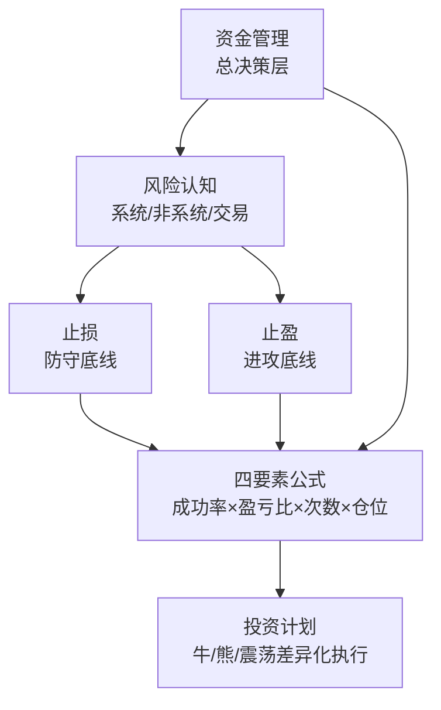

# 50《股市投资资金管理与止损止盈技巧》深度解读（详细版）

> **副题：雷冰——"从止损到止盈，从仓位到资金管理"：散户的资金生存手册**
>
> 作者：雷冰，实战派投资作者，著有《K线综合实战分析》《波段操作实战精解》等。本书是系列中**第一本专门讲"资金管理+止损止盈"的书**，从"为什么受伤的总是散户"出发，给出完整的资金生存框架——止损不是割肉，止盈不是卖飞，仓位不是赌注，资金管理不是限制。
>
> **核心定位**：散户的"资金说明书"——**止损六法、止盈四种、资金管理数学、四要素公式、牛市熊市差异化策略**，一整套从开仓到平仓的风险控制体系。
>
> **系列意义**：050 是系列第 50 本，**资金管理与风险控制专篇**——与 [[36《炒股的智慧》深度解读（详细版）|36 号陈江挺"止损家训"]]、[[37《股票投资沉思录》深度解读（详细版）|37 号冉伟"风险四类"]]、[[40《避开股市的地雷》深度解读（详细版）|40 号张化桥"排雷"]] 共同构成完整的散户生存工具箱。

---

## 📖 全书结构与核心框架

| 章节 | 核心内容 | 层次 |
|------|---------|------|
| 第1章 | 股票投资概述（性质/特性/投资风格） | 认知基础 |
| 第2章 | 风险来源与分类（系统/非系统/交易风险） | 风险认知 |
| 第3章 | **止损**（六种方法+具体操作） | 防守 |
| 第4章 | **止盈**（四种方法+目标设定） | 进攻 |
| 第5章 | **资金管理**（仓位/金字塔/动态调整） | 统领 |
| 第6章 | 成功投资策略（四要素公式+牛熊差异） | 整合 |

---

## 📑 目录

- [[#第1章 止损：散户的第一生存技能|第1章 止损：散户的第一生存技能]]
- [[#第2章 止盈：让利润奔跑，但别让利润跑掉|第2章 止盈：让利润奔跑，但别让利润跑掉]]
- [[#第3章 资金管理：指挥员的全局思维|第3章 资金管理：指挥员的全局思维]]
- [[#第4章 四要素公式：成功的数学逻辑|第4章 四要素公式：成功的数学逻辑]]
- [[#第5章 牛市、熊市、震荡市：差异化资金策略|第5章 牛市、熊市、震荡市：差异化资金策略]]
- [[#第6章 投资计划的完整模板|第6章 投资计划的完整模板]]
- [[#总结：从"为什么会受伤"到"怎么不再受伤"|总结：从"为什么会受伤"到"怎么不再受伤"]]
- [[#附录一 雷冰金句集（20 条精选）|附录一 雷冰金句集（20 条精选）]]
- [[#附录二 止损止盈速查卡|附录二 止损止盈速查卡]]
- [[#附录三 30 秒版：资金管理与止损止盈|附录三 30 秒版：资金管理与止损止盈]]
- [[#附录四 与系列大师的资金管理对照|附录四 与系列大师的资金管理对照]]
- [[#附录五 不同资金规模的仓位配置建议|附录五 不同资金规模的仓位配置建议]]
- [[#附录六 止盈的心理学：为什么"见好就收"这么难|附录六 止盈的心理学]]
- [[#附录七 风险全景图：散户受伤的根源|附录七 风险全景图]]
- [[#附录八 成功策略的数学：四要素深度拆解|附录八 成功策略的数学]]
- [[#附录九 与系列书籍的资金管理对照|附录九 与系列书籍的资金管理对照]]
- [[#附录十 雷冰金句补充（书摘原文）|附录十 雷冰金句补充]]
- [[#附录十一 30 秒版：全书速览|附录十一 30 秒版]]
- [[#附录十二 知乎文风附录：写给那个"总是受伤"的散户|附录十二 知乎文风附录]]

---

## 第1章 止损：散户的第一生存技能

### 1.1 "止损不是割肉，是剪断绑在身上的绳子"

> 雷冰用了一个很形象的比喻："止损就是给自己系上安全带，不是为了用上，而是以防万一。我们更希望永远不会用上。"

| 对止损的两种态度 | 雷冰的立场 |
|----------------|-----------|
| "止损必要论" | ✅ 止损是风险控制的核心手段 |
| "止损无用论"（止损等于把廉价筹码给人） | ❌ 这种思维的根本错误在于：**你不知道是廉价筹码还是有毒筹码** |

> "止损并不是将廉价的筹码转让给别人，而是将风险转移给别人。如果明知是廉价筹码，投资者一般是不可能卖出的。止损的关键是尽量分清所持筹码的风险程度是否可控。"

### 1.2 止损的数学逻辑（为什么必须止损）

**假设你做了 10 次交易**，每次投入相等仓位的资金：

| 成功率 | 每次盈利率 | 每次亏损率 | 总盈亏 |
|--------|----------|----------|--------|
| 70% | 10% | 5% | 7×10% − 3×5% = **55%** |
| 50% | 10% | 5% | 5×10% − 5×5% = **25%** |
| 30% | 10% | 5% | 3×10% − 7×5% = **−5%** |

> 结论：**在不控制亏损幅度的情况下，成功率低于 50% 就是亏损的**。止损的作用是确保"亏损的 5% 不会变成 20% 甚至 50%"。只要亏损有上限，盈利就靠"放养"（不止盈地让利润奔跑）来覆盖。

**止损的核心不等式**：止损幅度 × 失败次数 < 止盈幅度 × 成功次数。

> 与 [[36《炒股的智慧》深度解读（详细版）|36 号陈江挺"止损 ≤20%"]] 和 [[37《股票投资沉思录》深度解读（详细版）|37 号冉伟"三标准止损"]] 形成完整体系——雷冰从数学证明了止损的必要性，陈江挺从纪律强调了止损的执行力，冉伟从标准给出了止损的具体条件。

### 1.3 止损的六种方法（逐一拆解）

#### ① 定额止损（最简单但也最难执行）

| 方法 | 设定方式 |
|------|---------|
| 固定比例 | 亏损达到买入价 −5%（如 100 元买入，跌破 95 元就卖） |
| 固定金额 | 单笔亏损不超过总资金 2%（如 100 万本金，单笔最多亏 2 万） |

> 定额止损最简单——**只有一个规矩，没有任何借口**。但缺点是不考虑市场波动：在波动大时容易被震出，在波动小时止损不及时。

#### ② 技术止损（最常用的专业方法）

| 技术止损类型 | 止损位置 |
|------------|---------|
| 均线止损 | 跌破关键均线（5日/20日/60日）→ 卖出 |
| 趋势线止损 | 跌破上升趋势线 → 卖出 |
| 形态止损 | 跌破颈线/支撑位 → 卖出 |
| 缺口止损 | 向上跳空缺口被回补 → 卖出 |
| K线止损 | 出现大阴线、黄昏之星等见顶信号 → 卖出 |

**实战规则**：技术止损要设置"缓冲带"——跌破均线 2-3%，或跌破支撑位后**3 天不收回**再止损，过滤假跌破（空头陷阱）。

#### ③ 目标止损（也是最常见的失败止损——"手动止损"）

> 目标止损 = 设了一个"心理价位"，但**到了价位却不执行**——"等反弹一点再卖""明天再看看"。"一而鼓，再而衰，三而竭"之后，亏损不断扩大。

**克服方法**：把目标止损转化为**条件单**——买入时就设好自动止损单，"把止损的决定权交给系统，而不是交给情绪"。

#### ④ 事件止损（用来应对突发利空）

| 触发事件 | 操作 |
|---------|------|
| 公司重大利空（违规/造假/退市风险） | **立即卖出**（不管亏多少） |
| 行业黑天鹅 | 先卖出、后观察 |
| 大盘系统性风险（政策/战争/疫情） | 降仓或清仓 |

> "一旦出现不可预见的重大利空，投资者不要有任何的犹豫，应该立即斩仓出局。保全实力，东山再起。"

#### ⑤ 保护性止损（兼顾盈利的止损）

> "保护性止损" = 止损上移：股价上涨后，止损线跟随上移——从初始的 −5%，变为止盈点（成本上方 +2% 或更高）。**"让每一次盈利都不会变成亏损"**。

#### ⑥ 时间止损（交易机会成本的控制）

| 情境 | 操作 |
|------|------|
| 买入后 3-5 天不动 | 清仓——"久盘不涨，必有隐忧" |
| 周线不涨 | 市场节奏已变——不留恋 |
| 月线横盘 | 考虑换股（资金效率丧失） |

> "股市投资资金是有时间价值的。买入股票 3-5 个交易日不见动静，就应该考虑换股。这也是时间止损的要点：**不在期待中浪费时间。**"

### 1.4 止损的心理障碍（散户为什么砍不下去）

| 心理障碍 | 错误思维 | 正确思维 |
|---------|---------|---------|
| 侥幸心理 | "反正会涨回来的" | "在它涨回来之前，你可能已经破产了" |
| 沉没成本 | "亏了 10% 了，现在卖太亏了" | "你不想亏这 10%，但市场想让你亏 50%" |
| 锚定效应 | "我的成本是 20 元" | **"市场不关心你的成本"** |
| 过度自信 | "我看好这家公司，不会错" | **"止损是一种谦虚——承认市场永远比你对"** |

### 1.5 技术止损五法详解（本书核心操作篇）

雷冰在第三章给出五种具体的技术止损方法，每一种都配有完整实战案例——**止损不是"感觉该卖了"，而是"跌破某条线就卖"**。

#### ① K线形态止损（最快、最直观）

| 触发信号 | 操作 |
|---------|------|
| 顶部三山/头肩顶形态成立 | 形态颈线位卖出 |
| 大阴线跌破整理平台 | 次日开盘卖出 |
| 跳空低开低走 | 立即卖出（空头强势确认） |
| 跌破上升三角形下轨 | 止损出局 |

> 要点：**K线形态止损的关键是"形态确认"而非"形态猜测"**——在形态尚未成立时卖出是割肉，在形态确认后卖出是止损。

#### ② 均线+布林线止损（中线波段首选，金种子酒案例）

| 均线/轨道 | 适用周期 | 止损触发 |
|---------|---------|---------|
| MA5/MA10 | 短线 | 跌破 MA5 且 3 日不收回 |
| MA20/MA30（布林中轨） | 中短线 | 有效跌破且 3 日不回 |
| MA60 | 中线 | 跌破 MA60 且均线拐头向下 |

> 实战案例：**金种子酒（600199）**——股价突破布林线上轨加速上行进入冲刺段（A 区），短线投机买入；股价滞涨跌破上轨线即止损（23.60—24 元）。中线持有者以跌破中轨线为准；当**布林线三轨同时向下**，说明中期上涨行情结束，中线投资者止损。案例最重要的教训：**布林线最好与其他工具配合**——C、D 点之间 K线与成交量已发出警示时，布林线还没反应；启明星+支撑线+上翘下轨三重止跌信号出现时，中线止损就是"卖在地板价"。

> **布林线形态口诀**：收口形喇叭=整理蓄势；紧口形喇叭=变盘前夜；开口形喇叭=趋势展开。**三轨同向**是最重要的趋势确认信号。

#### ③ 支撑线（切线）止损——趋势线与空间线

| 类型 | 定义 | 止损触发 |
|------|------|---------|
| 趋势支撑线 | 上升趋势中不断抬高的低点连线 | 股价有效跌破趋势线 |
| 空间支撑线 | 历史/阶段高低点形成的水平线 | 有效跌破空间支撑线 |

> 实战案例：**国海证券（000750）** 60 分钟 K 线——上涨趋势线被跌破（D 点）即趋势反转信号，提示止盈止损；**滨江集团（002244）** 上升三角形——股价重新跌回 A 点支撑位并跌破支撑线 1-2，中长期上涨趋势结束，失去持股理由，需及时止损。F 点看涨十字线给了一点希望，但 G 点低点低于 F 点+跳空大阴线彻底打破预期——**"低点不断下移+大阴线"就是最坚决的卖出信号**。

> **支撑压力互换原理**：高点压力线一旦被突破就变成支撑线；支撑线被击破后变成压力线——止损位设置要利用这个互换规律。

#### ④ MACD 止损（中线趋势之王，罗普斯金案例）

| MACD 信号 | 含义 | 操作 |
|----------|------|------|
| DIF 下穿 DEA（死叉） | 短期上涨结束 | 短线止损 |
| 高位 MACD 柱萎缩 | 做多能量衰减 | 中长线止盈/止损 |
| 顶背离（股价新高 MACD 不新高） | 内部能量不足 | 随时见顶，止损 |
| DIF 下穿 0 轴线 | 多头转空头 | 中长线止损 |

> 实战案例：**罗普斯金（002333）**——行情结束有三个决定性信号：①MACD 死叉（B 点）；②K 线顶部三山反转形态；③MA10 下穿 MA30 均线死叉。**三个信号共振=无条件离场**。

> **三种最危险的死叉**：远离 0 轴线上方的死叉、下降趋势中的死叉、下降趋势中 0 轴线附近的死叉。

#### ⑤ 止损的五项原则（综合）

| 原则 | 内容 |
|------|------|
| 周期匹配 | 中长线不用短线止损标准（主趋势与次级趋势方向可相反） |
| 合理可行 | 标准不合理→三种结果：难执行/亏损过大/止损点变成买点 |
| 理由消失即止损 | 买入动因消失（技术破位/基本面变坏）就走 |
| 下跌趋势中更有效 | 下跌趋势本身就是既成事实的风险 |
| 区别对待 | 投机/投资、周期长短、仓位轻重、承受力不同→止损标准不同 |

---

## 第2章 止盈：让利润奔跑，但别让利润跑掉

### 2.1 止盈的本质：克服贪婪

> "止盈的核心是克服内心的'贪婪'——你在 10 元买了，涨到 15 元，心想还能涨到 20 元。跌回 13 元，心想回到 15 就卖。跌回 10 元，心想至少不亏钱就卖。最后跌到 8 元——你又重新学了一遍止损。"

### 2.2 止盈的四种方法

#### ① 目标止盈（预设止盈位）

| 方法 | 操作 |
|------|------|
| 固定盈利率 | 盈利 15% 就卖 |
| 固定收益金额 | 达到目标收益绝对值就卖 |
| 估值止盈 | PE/PB 达到历史高位卖出 |

> 优点：**提前承诺，不纠结**；缺点：**强趋势中容易"卖飞"**（比如赚 15% 卖了，股价又涨了 80%）。

#### ② 跟踪止盈（让利润跟着趋势跑——最推荐的方法）

| 跟踪方式 | 操作 |
|---------|------|
| 均线跟踪 | 沿 5 日/10 日线持有，跌破就走 |
| 趋势线跟踪 | 跌破上升趋势线就走 |
| 移动止损 | 止损线跟随上涨上移（如"盈利每增加 5%，止损上移 5%"） |
| 波峰波谷法 | 不再创新高后就卖——"顺势持股，不创新高就是离场最好的时机" |

> **跟踪止盈的核心**：不预设涨幅目标，让市场告诉你什么时候该出——"**能涨多少是市场定的，你要定的是什么时候不再涨了。**"

**实战案例**：某股买入价 10 元，采用"每涨 5% 止损上移 5%"的跟踪止盈法。

| 股价涨至 | 止损位（上移后） | 最终触发 |
|---------|----------------|---------|
| 10 元（买入） | 9.5 元（−5%） | — |
| 12 元（+20%） | 11.4 元（保护性: 买入不动） | — |
| 15 元（+50%） | 14.25 元 | — |
| 18 元（+80%） | 17.1 元 | — |
| 回落至 17 元 | **触发止损，17 元卖出** | **锁定 +70% 利润** |

> 跟踪止盈的**数学优势**：初始止损 5%，但随着股价上涨，止损线已经上移到盈利区间——**"风险在缩小，利润在放大"。**

#### ③ 分批止盈（降低卖飞焦虑）

| 方法 | 操作 |
|------|------|
| 五五止盈 | 盈利 10% 卖 50%，剩余用跟踪止盈 |
| 金字塔止盈 | 盈利 10% 卖 30%、盈利 20% 再卖 20%、剩余跟踪 |
| 资金回收止盈 | 先卖到收回本金，持有利润仓 |

> 分批止盈的好处：**"赚了 10% 已经落袋一半——卖飞的懊恼被利润兑现的满足感对冲了。"**

#### ④ 信号止盈（基本面+技术面）

| 信号 | 操作 |
|------|------|
| 基本面变坏 | 无条件卖出 |
| 出现顶背离/黄昏之星/大阴线 | 清仓 |
| 高位放量滞涨 | 减仓或清仓 |
| 政策风险/大盘破位 | 降仓 |

> 信号止盈与止损的逻辑完全一致——**"凡是该止损的信号，盈利的仓位也该止盈。"**

### 2.3 止损与止盈的深度对比

| 维度 | 止损 | 止盈 |
|------|------|------|
| 克服的心理 | 侥幸（"它会回来"） | 贪婪（"还能更高"） |
| 执行难度 | 更大（承认错误） | 稍小（但有卖飞焦虑） |
| 幅度控制 | 小（−3%~−10%） | 大（+10%~不设限） |
| 核心公式 | **小亏大盈——亏有限，盈无限** | 同上 |
| 不执行的后果 | 亏更多（账户萎缩） | 利润回吐（白干） |

> 口诀：**"止损要快（不等），止盈要稳（不急）。止损一刀切（不拖），止盈分段切（不悔）。"**

### 2.4 书中的止盈体系：静态止盈与动态止盈

#### ① 静态止盈（时空止盈）

| 类型 | 操作 | 适用 |
|------|------|------|
| 获利百分比止盈 | 收益达 15%—20% 即卖 | 震荡市/波段操作 |
| 时间止盈 | 持仓达时间窗口（如 3 个月）即评估 | 资金有时间限制时 |
| 摊薄成本止盈 | 盈利后卖出部分收回成本，剩余零成本持有 | 中线强势股 |

> 实战案例：**水晶光电（002273）摊薄成本止盈**——光学光电子龙头，新产品蓝玻璃滤光片放量，2012 年 3 月突破买入；股价上涨后卖出部分仓位收回本金，剩余持仓成本归零，之后股价涨跌都不再影响心态——**"零成本持仓"是心态最好的仓位**。

> 百分比止盈的关键：**止盈百分比 > 止损百分比**（如止盈 15%、止损 5%），且随市场调整——牛市中调高止盈百分比，下降趋势中同时调低止盈与止损百分比。

#### ② 动态止盈（趋势止盈）

| 方法 | 操作 | 优势 |
|------|------|------|
| 均线止盈 | 沿 5/10 日线持有，跌破离场 | 让利润奔跑 |
| 趋势线止盈 | 跌破上升趋势线离场 | 大波段完整吃到 |
| 波浪止盈 | 第 5 浪末段/量价背离离场 | 波段顶底把握 |

> 书中观点：**"止盈的要求是'对'，不是'准'。"** 没有人能精确掌握市场节奏，止盈追求的是"在合理的位置离场"，而不是"卖在最高点"。

#### ③ 止盈与止损的六大对比（书中原文要点）

| 维度 | 止损 | 止盈 |
|------|------|------|
| 心理基础 | 克服**侥幸** | 克服**贪婪** |
| 控制幅度 | 小（坚决果断） | 大（给利润空间） |
| 运作程序 | 简单（触发即 100% 执行） | 复杂（建仓/加仓/减仓/平仓） |
| 共同目的 | 防止资本减少 | 防止资本减少 |
| 衡量核心 | 持有风险 > 持有收益 | 持有风险 > 持有收益 |
| 同一卖出 | 亏损者的止损 | 盈利者的止盈 |

> 书中的精妙案例：中线投资者 10 元买入，股价涨到 12 元后短线投资者买入，随后跌到 11.5 元两人都卖出——**前者是止盈，后者是止损**。同一笔交易，不同成本视角下性质完全不同。

---

## 第3章 资金管理：指挥员的全局思维

### 3.1 什么是资金管理

> 雷冰用了一个军事比喻——"股市是战场，你是指挥员，资金就是供你调遣的士兵。**发了战争财的不是最好的枪手，是最会调配兵力的指挥官。**"

| 战斗员思维 | 指挥员思维 |
|----------|----------|
| 这只股票好，满仓！ | 这个机会有多好？配多少仓位合适？ |
| 亏了怎么办？ | 最多允许亏多少？还剩多少子弹？ |
| 昨天赚了 20%，今天敢重仓 | **每笔都是新的——不因盈利放大仓位** |

### 3.2 资金管理的核心：仓位

#### ① 固定仓位法（最简单也最适合新手）

| 方法 | 操作 |
|------|------|
| 固定金额 | 每只股票投入相同金额（如 100 万分 5 只=每只 20 万） |
| 固定比例 | 每只股票占总仓位 ≤20% |
| 固定只数 | 同时持有不超过 5 只股票 |

> 固定仓位法**最大优点是防止"满仓一只"的致命风险**："即使踩雷，最多损失总资金的 20%（单只上限）× 50%（单只最大亏损）= 10%。"

#### ② 金字塔仓位法（顺势加码）

| 操作 | 仓位 |
|------|------|
| 试探建仓 | 10-20% 仓位 |
| 确认上涨+加仓 | 再加 20-30% |
| 趋势延续+加仓 | 总仓位不超过 60-80% |

> "**底部区域小仓位，越涨越加——不是越涨越贪，是趋势越走越强，概率越来越利于你。**"（这与[[42《逆向致胜》深度解读（详细版）|42 号卜建业"PE15满仓/PE65空仓"]] 形成互补——卜建业从估值角度定仓位，雷冰从趋势角度定仓位。）

#### ③ 动态仓位法（根据市场环境调整）

| 市场 | 总仓位 | 理由 |
|------|--------|------|
| 牛市 | 60-80% | 概率有利 |
| 震荡 | 30-50% | 不确定性高 |
| 熊市 | 0-20% | 概率不利 |
| 恐慌 | 空仓或轻仓 | 系统性风险 |

### 3.3 资金管理的三元悖论（不可能三角）

| 三角 | 取舍 |
|------|------|
| 高仓位 | 收益潜力大 \
| 低风险 | 亏损有限 \
| 高频交易 | 资金效率高 |

> **只能三选二**：高仓位+低风险=放弃高频（长线价值投资）；高仓位+高频=风险失控（赌徒）；低风险+高频=利润有限（但可复利——**定投就是这个策略的极致**）。

### 3.4 建仓加码的六种模式（本书核心操作篇）

#### ① 金字塔加码（越涨越加，越加越少）

| 买入次数 | 仓位比例 | 逻辑 |
|---------|---------|------|
| 第1次（底部试探） | 30% | 确认底部区域 |
| 第2次（突破确认） | 30% | 趋势初步确认 |
| 第3次（回踩确认） | 20% | 趋势进一步确认 |
| 第4次（加速段） | 20% | 最后一次加码 |

> **核心思想：底部区域多买，高位少买——平均成本始终低于市价**。与"越涨越买越多"的倒金字塔（危险模式）相反。

#### ② 均形加码（等额分批）

| 批次 | 买入条件 |
|------|---------|
| 第1次 | 底部区域（头肩底/双底确认） |
| 第2次 | 回调到趋势线附近 |
| 第3次 | 再次回调到趋势线附近 |
| 第4次 | 整理区下沿 |

> 适合波动规律的个股：**利用回调分批吸筹，每次金额相等**。前提：基本面支持+股价处于大级别底部或上涨中继整理阶段。

#### ③ 向下加码（补仓，慎用！）

| 适用条件 | 内容 |
|---------|------|
| 趋势未破坏 | 回调未改变运行方向+出现止跌反转信号 |
| 跌幅要求 | 中长线 >15%，中短线 10%—15% |
| 止损纪律 | 补仓后继续下跌→立刻止损（补仓区多在重要支撑位） |
| 禁止情形 | **重仓禁止向下加码**（市场无情，加码=加大风险） |

> 实战案例：**天康生物（002100）**——上升三角形突破后假突破杀跌，出现启明星+KDJ 金叉+重回 MA60 三重信号后补仓摊薄成本。**向下加码是"弥补错误"的操作，成功的前提是错误确实只是"暂时的"**。

#### ④ 三三制资金管理模式（高级模式）

| 资金份 | 用途 | 操作原则 |
|--------|------|---------|
| 第一大份（底仓） | 长期持仓 | 分 3 次建仓，固定不变，直到完成投资目标 |
| 第二大份（波段） | 次级波段操作 | 回调低位买入/波段高位卖出，见好就收，最活跃 |
| 第三大份（应急） | 救火/捕捉突发机会 | 快进快出，绝不恋战 |

> 实战案例：**恒宝股份（002104）** 60 万资金三三制——20 万底仓分 3 次金字塔建仓（8.62 元 11600 股→8.88 元 6500 股→9.35 元 4500 股，均价 8.847 元）；20 万波段资金 4 次波段操作获利 15,794 元；20 万应急资金做 T+0（8.80 元买 7500 股、9.12 元卖，获利 2,170 元）。**最终底仓 18,100 股成本降至 7.734 元**——用波段+短线利润反哺底仓成本。

#### ⑤ 凯利公式（仓位数学之王）

> f = (bp - q) / b = [bp - (1-p)] / b
>
> f=投入比例；b=赔率（预期收益率÷预期损失率）；p=获胜概率；q=失败概率

| 场景 | 计算 | 结果 |
|------|------|------|
| 赌局：胜率 40%，赔率 2:1 | (2×0.4-0.6)/2 | **10%** |
| 股票：涨 10% 概率 60%，跌 8% 概率 40% | (1.25×0.6-0.4)/1.25 | **28%** |

> **股市使用注意事项**：①只在上涨概率大于下跌概率时用；②f 是上限不是目标——实际操作建议用 **f/2（半凯利）** 降低波动；③凯利公式解决的是"投多少"，不是"买什么"。

---

## 第4章 四要素公式：成功的数学逻辑

### 4.1 四个要素的定义

| 要素 | 含义 | 举例 |
|------|------|------|
| **成功率** | 盈利次数 ÷ 总交易次数 | 10 次交易，7 次盈利 = 70% |
| **交易次数** | 每年/每月的交易笔数 | 短线 100 次/年 vs 长线 3 次/年 |
| **盈亏比** | 平均盈利幅度 ÷ 平均亏损幅度 | 盈 10% ÷ 亏 5% = 2:1 |
| **仓位** | 每次投入资金比例 | 20% 仓位 vs 80% 仓位 |

### 4.2 成功的数学公式

> 总盈利 = 成功次数 × 盈利幅度 × 仓位 − 失败次数 × 亏损幅度 × 仓位

等价于：**总盈利 = 交易总次数 × 仓位 ×（成功率 × 平均盈利率 − 失败率 × 平均亏损率）**

### 4.3 关键数学对照表（本书核心数据）

**基础设定**：每次投 2 万，年交易 10 次，目标盈利 5,000 元。

| 成功率 | 每次盈利率 | 每次亏损率 | 年盈亏 |
|--------|----------|----------|--------|
| 70% | 5.72% | 5% | **+5,001 元** ✅ |
| 50% | 10% | 5% | +5,000 元 ✅ |
| **30%** | **20%** | **5%** | **+5,000 元 ✅** |
| 70% | 10% | 15% | +5,000 元 ✅ |
| 50% | 10% | 5% | +5,000 元 ✅ |
| 25% | 10% | 0%（不能亏） | +5,000 元 |

> 关键洞察：**成功率低到 30%，但只要盈亏比拉到 4:1（盈 20% vs 亏 5%），依然能赚**。说明"对的时候大赚、错的时候小亏"才是盈利的核心——**盈亏比比成功率更重要**。

### 4.4 四个要素在牛熊市的变化

| 要素 | 牛市 | 熊市 |
|------|------|------|
| 成功率 | 高（>60%） | 低（<40%） |
| 适宜盈亏比 | 盈 10-20%，亏 5% | 盈 5-8%，亏 3% 或不参与 |
| 交易次数 | 可增加 | **应大幅减少** |
| 仓位 | 高（60-80%） | 低（0-20%）或空仓 |

> "熊市里成功率和盈亏比双双降低——唯一的策略是：**降低仓位、减少次数、等待成功率回归。**"（与[[37《股票投资沉思录》深度解读（详细版）|37 号冉伟"熊市里空仓是赚钱最快的方法"]] 完全同频。）

---

## 第5章 牛市、熊市、震荡市：差异化资金策略

### 5.1 三种市场的资金策略对照

| 维度 | 牛市 | 震荡市 | 熊市 |
|------|------|--------|------|
| 总仓位 | 60-80% | 30-50% | 0-20% |
| 单只上限 | ≤20% | ≤15% | ≤10% |
| 持仓只数 | 3-5 只 | 2-3 只 | 0-2 只 |
| 止损幅度 | 宽（−8%~−10%） | 中（−5%） | 紧（−3% 或不参与） |
| 止盈策略 | **跟踪止盈（让利润奔跑）** | 目标止盈（涨 10% 就走） | 反弹止盈（有赚就跑） |
| 加仓方式 | 金字塔加仓 | 等回踩加仓 | **不加仓** |
| 交易频率 | 低（持有为主） | 中（波段操作） | **极低或空仓** |

### 5.2 牛市的资金策略：让利润放大

| 策略 | 操作 |
|------|------|
| **放宽止损** | 熊市你用 −3% 止损，牛市改成 −10%——**给趋势足够的空间** |
| **跟踪止盈** | 不用目标止盈（"涨 15% 就卖"），改用均线跟踪（5日/10日线） |
| **顺势加仓** | 确认趋势后金字塔加仓——"牛市里唯一后悔的是仓位不够" (但注意：不追高加仓) |

**（这个理念与 049 附录十三"牛市三大歪理"完全呼应。）**

### 5.3 熊市的资金策略：活着就是胜利

| 策略 | 操作 |
|------|------|
| **空仓等待** | 最好的策略——"不亏就是赚" |
| **紧止损** | 轻仓参与反弹时，−3% 立即出 |
| **反弹止盈** | "熊市里不幻想 20%——5% 就走，慢慢积累" |
| **不补仓** | 熊市跌了不补——"补仓是在赌反弹，不是在做投资" |

> **（与 036 陈江挺"败而不倒"/037 冉伟"空仓是弱市里赚钱最快的方法" 完全同频。）**

### 5.4 震荡市的资金策略：波段生存术

| 策略 | 操作 |
|------|------|
| 半仓操作 | 涨有仓位，跌有子弹 |
| 箱体法则 | 支撑位买/压力位卖（不追突破） |
| 快止损 | 震荡市假信号多，止损 −5% 要坚决 |
| 滚动仓位 | 底仓不动+小仓位做波段 |

---

## 第6章 投资计划的完整模板

### 6.1 投资计划 = 四要素的事前量化

| 计划要素 | 具体内容 |
|---------|---------|
| 市场判断 | 现在是牛市/熊市/震荡？依据是什么？ |
| 仓位设定 | 总仓位 __%；每只股票 __%；持仓 __ 只 |
| 成功率预估 | 基于历史交易记录，我的成功率约 __% |
| 买入条件 | 满足什么条件才买入？（估值/形态/量价） |
| **止损设定** | 单笔最大亏损 __%（或 __ 元/股） |
| **止盈设定** | 跟踪止盈（__ 日线）/ 目标止盈 __% |
| 加仓条件 | 什么情况下加仓？加多少？ |
| 减仓条件 | 什么情况下减仓/清仓？ |
| 退出条件 | 三个准则：（1）（2）（3）任何一个满足 → 全撤 |

### 6.2 每天的三问（操作前自检）

| 时段 | 自问 |
|------|------|
| 开盘前 | 今天有交易计划吗？昨天有需要处理的仓位吗？ |
| 交易前 | 这笔交易符合我的止损/止盈/仓位设定吗？ |
| 收盘后 | 今天执行纪律了吗？有违反计划的操作吗？ |

---

## 总结：从"为什么会受伤"到"怎么不再受伤"

> 雷冰开篇问："为什么受伤的总是散户？"——答案是："因为散户既没有止损的纪律、也没有止盈的计划、更没有资金管理的能力。"

| 层级 | 内容 | 一句话 |
|------|------|--------|
| 第一层 止损 | 亏损有限制——最大的敌人是侥幸 | "不设止损就是在裸奔" |
| 第二层 止盈 | 盈利有策略——最大的敌人是贪婪 | "让利润奔跑，但别让利润跑掉" |
| 第三层 资金管理 | 仓位有纪律——最大的敌人是冲动 | "战斗员考虑怎么打，指挥官考虑打不打" |
| 第四层 四要素 | 数学有逻辑——最大的敌人是随机 | "盈亏比 × 成功率 × 次数 × 仓位 = 命运" |

---

## 附录七 风险全景图：散户受伤的根源

### 7.1 风险的三大来源

| 来源 | 内容 | 可控性 | 对策 |
|------|------|--------|------|
| 系统性风险 | 政策/利率/物价/市场/不可抗力 | **不可控** | 回避（降仓/空仓/对冲） |
| 非系统性风险 | 经营风险/财务风险 | 部分可控 | 分析研究+分散 |
| 交易风险 | 追涨杀跌/情绪化/无纪律 | **完全可控** | 计划+纪律+资金管理 |

> 雷冰的核心观点：**"受伤的散户只关注目的（获利），忽略了出发点（控制风险）。就像一场战争，目的是获胜，但首先要保证粮草安全。"**

### 7.2 系统性风险五类详解

| 风险类型 | 传导机制 | A股实例 |
|---------|---------|--------|
| 政策风险 | 财税政策→经营利润→股价 | 新兴市场尤为突出 |
| 利率风险 | 利率→资金流向→供需 | 降息→存款搬家→股市涨 |
| 物价风险 | 通胀→调控预期→成本上升 | 温和通胀利好，恶性通胀利空 |
| 市场风险 | 价格波动直接损失 | 最普通最常见 |
| 不可抗力 | 地震/战争/罢工 | 无法预测 |

### 7.3 非系统性风险两类详解

| 风险类型 | 表现 | 案例 |
|---------|------|------|
| 经营风险 | 经营失败/倒闭/退市 | 购买垃圾股/低价股的风险 |
| 财务风险 | 无力偿债/再筹资困难 | 高杠杆公司 |

> **风险量化决策**：用"预期收益 × 概率"评估每笔交易——亏损概率高且亏损幅度大的交易直接放弃。

---

## 附录八 成功策略的数学：四要素深度拆解

### 8.1 成功率与止盈止损的关系（书中原表）

| 成功率 | 止盈比率 | 止损比率 | 最终盈利 |
|--------|---------|---------|---------|
| 70% | 5.72% | 5.00% | 5,001 元 |
| 50% | 10.00% | 5.00% | 5,000 元 |
| 30% | 20.00% | 5.00% | 5,000 元 |
| 70% | 10.00% | 15.00% | 5,000 元 |
| 25% | 10.00% | 0%（不许亏） | 5,000 元 |

> **核心结论**：成功率 70% 时止盈标准只需略高于止损（5.72% vs 5%）；成功率只有 30% 时每次必须赚 20% 以上。**成功率低于 33% 理论上无法盈利**——必须扩大盈亏比或停止交易。

### 8.2 交易次数与资金量的平衡

| 方案 | 每次资金 | 交易次数 | 年目标 | 代价 |
|------|---------|---------|--------|------|
| A | 2 万 | 10 次 | 5,000 元 | 需要 10 次机会 |
| B | 1 万 | 20 次 | 5,000 元 | 频繁交易降低成功率 |

> **结论**：交易次数可以弥补资金量不足，但**频繁交易会降低成功率**——市场不会给投资者那么多机会。

### 8.3 牛熊市的四要素差异（书中原表逻辑）

| 要素 | 牛市 | 熊市 |
|------|------|------|
| 止盈幅度 | 加大（让利润奔跑） | 缩小（有赚就跑） |
| 止损幅度 | 可放宽（趋势保护） | 缩小且坚决执行 |
| 成功率 | 高 | 低（抬高交易门槛） |
| 核心策略 | **重点把握止盈** | **重点把握成功率与止损** |

> 书中结论：**"在牛市里，只要不是买在大趋势的头部，只要耐得住寂寞，都有盈利的机会；在熊市中，唯一可能获利的方法就是等待机会、抬高交易门槛、提高成功率。"**

---

## 附录九 与系列书籍的资金管理对照

| 系列书籍 | 核心观点 | 050 对应 |
|---------|---------|---------|
| [[36《炒股的智慧》深度解读（详细版）|36 陈江挺]] | 止损 ≤20%/败而不倒 | 定额止损+保护性止损 |
| [[37《股票投资沉思录》深度解读（详细版）|37 冉伟]] | 四类风险/空仓是赚钱最快的方法 | 熊市策略+仓位管理 |
| [[28《聪明的投资者》深度解读（详细版）|28 格雷厄姆]] | 安全边际 | 资金管理的数学逻辑 |
| [[42《逆向致胜》深度解读（详细版）|42 卜建业]] | PE15 满仓/PE65 空仓/太极图 | 动态仓位法 |
| [[44《交易的真相》深度解读（详细版）|44 交易的真相]] | 等比例盈亏/1:1 盈亏比 | 四要素公式的盈亏比 |
| [[35《投资中最简单的事》深度解读（详细版）|35 邱国鹭]] | 逆向三点检验 | 止损的逆向心理 |

---

## 附录十 雷冰金句补充（书摘原文）

> 1. "股市投资资金就像经营实体，需要精心照料、有效运作才可以创造利润。"
> 2. "追求永远卖在最高点，是不可能实现的空中楼阁。"
> 3. "止盈是克服贪婪，止损是克服侥幸。"
> 4. "止盈的要求是'对'，不是'准'。"
> 5. "熊市没有看到明确的底部出现时，把所有的上涨都看成反弹，止盈的核心是'见好就收'，止损则是'见风就跑'。"
> 6. "一旦牛市确立，应该把任何一次回调都看成是介入的大好时机。"
> 7. "资金管理的目的是控制风险，提高资金效率。"
> 8. "股票投资是高风险投资，对于了解甚少的投资者，其行为如同赌博。"
> 9. "新股民投入资金不要超过可控资金的 20%，并且越少越好。"
> 10. "创业板高管辞职减持——作为普通投资者，无法改变这些不确定性因素，只能靠资金管理生存。"

---

## 附录十一 30 秒版：全书速览

> 1. **止损**——五种技术方法（K线/均线布林/支撑线/MACD）+五项原则；铁律：理由消失即走；
> 2. **止盈**——静态（百分比/时间/摊薄成本）+动态（均线/趋势线）；铁律：止盈>止损幅度；
> 3. **资金管理**——新股民 ≤20%、老股民 ≤50%；金字塔加码/三三制/凯利公式；
> 4. **四要素**——成功率×盈亏比×次数×仓位=总利润；成功率 <33% 无法盈利；
> 5. **牛熊差异**——牛市重止盈（让利润奔跑），熊市重止损（活着就是胜利）。

---

## 附录十二 知乎文风附录：写给那个"总是受伤"的散户

> 你有没有想过一个问题：为什么股市里受伤的总是散户？
>
> 不是因为你笨，也不是因为你消息不灵通。是因为你手里拿着的不是股票，而是一把**没有保险栓的枪**——你只知道扣扳机（买入），不知道什么时候该放下（卖出）。
>
> 我见过太多这样的故事了。
>
> 老张 2015 年 6 月满仓入市。他跟我说："当时 5000 点，所有人都说能上 8000 点，我哪敢不买？"后来的故事不用我说，两个月后他账户里的数字少了一半。他守了三年，等到 2018 年，把剩下的钱全部割掉，发誓再也不碰股票。
>
> 老张的问题从来不是"买错了"。**任何人都会买错。** 老张的问题是——他从来没有想过"如果错了怎么办"。
>
> 雷冰这本书讲的就是这个：**把"如果错了怎么办"这件事，在买入之前就想好。**
>
> 止损是什么？止损不是认输，是**给错误定价**。你在 10 块钱买入，设 5% 止损，意思是"我愿意为这个判断付 5 毛钱的学费"。学费付完了，你就离场，而不是把学费越付越多，直到倾家荡产。
>
> 止盈是什么？止盈不是贪心，是**给正确定价**。你在 10 块钱买入，涨到 15 块，跟踪止盈让你在 14.25 块离场——你锁住了 42% 的利润，剩下的 8% 留给别人赚。这世上没有人能赚到最后一个铜板，**"卖飞"是幸福的烦恼，"坐电梯"才是真正的痛苦**。
>
> 资金管理是什么？资金管理不是胆小，是**给未来留余地**。你把全部身家押在一只股票上，和把资金分成十份、每份只押 10%，面对同样的下跌，前者是破产，后者只是"有一次机会没把握住"。
>
> 雷冰书里那个恒宝股份的案例我印象很深：60 万资金分成三份——20 万底仓死拿，20 万做波段，20 万做 T+0。结果呢？波段赚了 1.5 万，T+0 赚了 2 千，底仓成本从 8.8 元降到了 7.7 元。**同样是这笔钱，会用的人让它自己赚钱，不会用的人让它站在山顶上吹冷风。**
>
> 最后送你一句话，是这本书的灵魂：
>
> **"牛市里，你唯一后悔的是仓位不够；熊市里，你唯一后悔的是没有空仓。"**
>
> 但比这更重要的是——无论牛熊，**先活下来，才有资格谈赚钱。**

---

## 附录一 雷冰金句集（20 条精选）

> 1. "止损不是割肉，是剪断绑在身上的绳子。"
> 2. "止损是将风险转移给别人——如果你不知道手里的筹码是廉价还是有毒，止损就是安全绳。"
> 3. "市场不关心你的成本——止损最怕的就是锚定效应。"
> 4. "每次止损，都是一次谦虚——承认市场永远比你对。"
> 5. "能涨多少是市场定的，你要定的是什么时候不再涨了。"（跟踪止盈）
> 6. "止盈的核心是克服贪婪，止损的核心是克服侥幸。"
> 7. "资金管理不是限制你是保护你——发了战争财的不是最好的枪手，是最会调配兵力的指挥官。"
> 8. "止损要快（不等），止盈要稳（不急）。"
> 9. "不要把一笔交易变成一笔投资，也不要把一笔亏损变成一笔灾难。"
> 10. "在熊市里，最好的仓位是零仓位。"
> 11. "成功率低到 30%，但只要盈亏比拉到 4:1，依然能赚。"
> 12. "不是仓位越重赚得越多——是高仓位+低成功率=必定破产。"
> 13. "单次亏损不超过总资金 2%——这是职业交易员的铁律。"
> 14. "目标的止损，到了价位却不执行——这种'手动止损'是最常见的失败止损。"
> 15. "补仓是在赌反弹，不是在做投资。"
> 16. "底部区域小仓位试探，越涨越加——不是越涨越贪，是趋势越来越利于你。"
> 17. "投资计划的核心是：买什么、为什么买、什么时候卖、卖多少。"
> 18. "不是每一次盈利都是对的——但每一次止损都是对的（如果不执行就全错了）。"
> 19. "牛市的唯一后悔是仓位不够，熊市的唯一后悔是没有空仓。"
> 20. "把止损的决定权交给系统，而不是交给情绪。"

---

## 附录二 止损止盈速查卡

| 信号 | 止损操作 | 止盈操作 |
|------|---------|---------|
| 跌 −5%（定额） | 立即卖 | — |
| 跌破 20 日均线 | 3 天不收回→卖 | — |
| 跌破上升趋势线 | 卖 | — |
| 高位放量滞涨 | — | 减仓 50% |
| 顶背离 | — | 清仓 |
| 利好不涨 | — | 清仓 |
| 盈利 +15%（目标） | — | 卖 |
| 跌破 5 日均线（跟踪） | — | 减仓或清仓 |
| 基本面变坏 | 立即卖 | 立即卖 |
| 大盘系统性风险 | 降仓或清仓 | 降仓或清仓 |

---

## 附录三 30 秒版：资金管理与止损止盈

> 1. **止损**——单笔亏 ≤5%/单笔亏 ≤ 总资金 2%/技术破位就走/基本面变坏立即卖；
> 2. **止盈**——跟踪止盈（沿 5 日线）/分批止盈/信号止盈/不预设固定涨幅；
> 3. **资金管理**——牛市 60-80%/震荡 30-50%/熊市 0-20%/单只 ≤20%；
> 4. **四要素**——盈亏比 × 成功率 × 交易次数 × 仓位 = 总利润；
> 5. **总纲**——牛市让利润奔跑/熊市空仓等机会/震荡半仓做波段。

---

## 附录四 与系列大师的资金管理对照

| 大师 | 理念 | 050 雷冰对应 |
|------|------|------------|
| 036 陈江挺 | 止损 ≤20%/败而不倒 | 定额止损+保护性止损 |
| 037 冉伟 | 四类风险/空仓是赚钱最快的方法 | 熊市策略+仓位管理 |
| 028 格雷厄姆 | 安全边际 | 资金管理的数学逻辑 |
| 042 卜建业 | PE15满仓/PE65空仓 | 动态仓位法 |
| 035 邱国鹭 | 逆向三点检验 | 止损的逆向心理 |

---

## 附录五 不同资金规模的仓位配置建议

### 5.1 小资金（<50 万）——求稳不求快

| 配置项 | 建议 |
|--------|------|
| 总仓位 | 牛市 70-80%，震荡 40-50%，熊市 0-10% |
| 持仓只数 | **不超过 3 只**（集中精力跟踪） |
| 单只上限 | **≤40%**（小资金需要集中） |
| 止损 | 定额 −5% + 技术破位双重止损 |
| 止盈 | 跟踪止盈（沿 10 日线）——让利润奔跑 |
| 核心原则 | **集中+跟踪，用纪律弥补资金劣势** |

### 5.2 中资金（50 万—300 万）——稳健增值

| 配置项 | 建议 |
|--------|------|
| 总仓位 | 牛市 60-70%，震荡 30-50%，熊市 0-20% |
| 持仓只数 | 3-5 只 |
| 单只上限 | 20-25% |
| 止损 | 技术止损为主（均线/趋势线），配合定额 −8% |
| 止盈 | 跟踪止盈（10日线或趋势线）+ 分批止盈 |
| 核心原则 | **均衡+纪律，控制回撤比追求利润更重要** |

### 5.3 大资金（>300 万）——安全第一

| 配置项 | 建议 |
|--------|------|
| 总仓位 | 牛市 50-60%，震荡 20-40%，熊市 0-10% |
| 持仓只数 | 5-10 只（分散风险） |
| 单只上限 | **≤15%** |
| 止损 | 基本面上损为主 + 技术止损为辅（极端破位） |
| 止盈 | 估值止盈（PE 到极限卖）+ 跟踪止盈 |
| 核心原则 | **安全+分散——大资金的首要目标是"不亏"，其次才是"赚钱"** |

---

## 附录六 止盈的心理学：为什么"见好就收"这么难

### 6.1 三种卖飞心态

| 心态 | 表现 | 矫正方法 |
|------|------|---------|
| "再涨 5% 就卖" | 到了目标又上调——永不满足 | **提前锁定卖出条件，到了就执行** |
| "现在卖了，万一明天继续涨呢" | 永远在等"最高点" | 改用分批止盈——卖一半，另一半留着跑 |
| "这股票是十年十倍股" | 把短线做成了长线信仰 | "可以信仰一只股票，但不能信仰它的价格" |

### 6.2 "卖飞"比"套牢"更好（数学证明）

| 情境 | 结果 | 心态 |
|------|------|------|
| 赚 15% 卖了（卖飞），涨到 60% | 赚了 15%，但惋惜"少赚 45%" | 不开心 |
| 赚 15% 没卖，跌回 −10% | 亏 10% | 更不开心 |
| 赚 15% 卖一半，另一半涨到 60% | 综合赚 37.5% | 开心 |

> **"卖飞"的数学解**：分批止盈。**卖一半锁利润，留一半跑未来——两全其美，心理安慰+数学合理。**

### 6.3 止盈执行的三条铁律

| 铁律 | 解释 |
|------|------|
| 事前设定 | 买入前就定好止盈方法（目标/跟踪/分批）——**不在持有过程中临时改** |
| 写下来 | 写在投资计划里，或设条件单——**执行交给系统，决定留在事前** |
| 接受不完美 | "卖不到最高点是常态，卖到最高点是运气。"——**永远接受"少赚"，拒绝"大亏"** |
