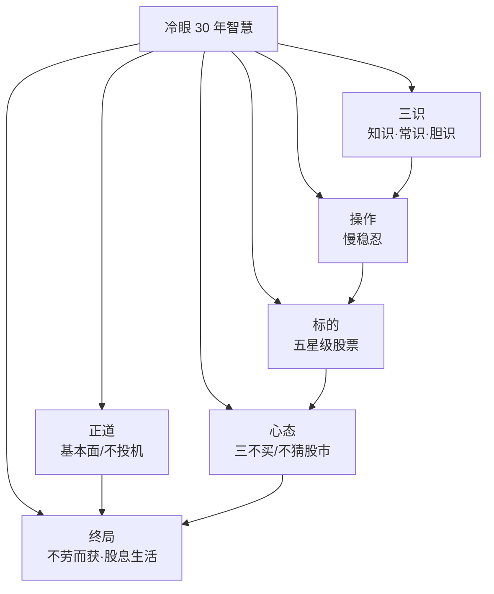

# 51《三十年股票投资心得》深度解读（详细版）

> **副题：冷眼——"正道、三识、五星级"：一个马来西亚华人 30 年的股票投资智慧**
>
> 作者：冷眼（本名冯时能），马来西亚华人投资名家，前《南洋商报》总编辑，30 年股票投资实战者。本书是 66 篇随笔的精选集，用"黄鳝、新娘、游手好闲的爸爸"这些生活化的比喻，讲透了价值投资的所有道理——**"买股票就是买公司的股份，公司比股市重要，长期投资赚钱。"**
>
> **核心定位**：**马来西亚华人的"林奇式"随笔**——没有公式、不讲 K 线、不谈预测，只讲**正道、三识、五星级、慢稳忍**。全书 66 篇，贯穿一句话："买好公司的股票，长期持有，让公司替你赚钱。"
>
> **系列意义**：051 是系列第 51 本，**海外华人价值投资篇**——与 [[32《彼得·林奇的成功投资》深度解读（详细版）|32 号林奇]]（生活化选股）、[[28《聪明的投资者》深度解读（详细版）|28 号格雷厄姆]]（安全边际）、[[05《巴菲特的投资心法》深度解读（详细版）|05 号巴菲特]]（好股长持）形成东西方价值投资的完整对话。

---

## 📖 全书核心框架（冷眼的投资哲学体系）



---

## 📑 目录

- [[#第1章 正道：股票投资的本质是与企业共成长|第1章 正道：股票投资的本质是与企业共成长]]
- [[#第2章 猜股市如抓黄鳝：不可为、不必为|第2章 猜股市如抓黄鳝：不可为、不必为]]
- [[#第3章 新娘比媒婆：公司比股市重要|第3章 新娘比媒婆：公司比股市重要]]
- [[#第4章 三识：知识、常识与胆识|第4章 三识：知识、常识与胆识]]
- [[#第5章 慢稳忍：快不如慢，狠不如稳，准不如忍|第5章 慢稳忍：快不如慢，狠不如稳，准不如忍]]
- [[#第6章 五星级股票：锁定最顶级的公司|第6章 五星级股票：锁定最顶级的公司]]
- [[#第7章 不劳而获赚钱法：让公司替你赚钱|第7章 不劳而获赚钱法：让公司替你赚钱]]
- [[#第8章 长期投资长几许：大众银行 40 年 1450 倍|第8章 长期投资长几许：大众银行 40 年 1450 倍]]
- [[#第9章 三不买与何时卖：冷眼的交易纪律|第9章 三不买与何时卖：冷眼的交易纪律]]
- [[#总结：冷眼留给散户的六句话|总结：冷眼留给散户的六句话]]
- [[#附录一 冷眼金句集（35 条精选）|附录一 冷眼金句集（35 条精选）]]
- [[#附录二 冷眼的比喻大全（生活化投资语文）|附录二 冷眼的比喻大全（生活化投资语文）]]
- [[#附录三 30 秒版：冷眼三十年|附录三 30 秒版：冷眼三十年]]
- [[#附录四 与系列大师的对照|附录四 与系列大师的对照]]
- [[#附录五 五星级股票速查表（买入前对照）|附录五 五星级股票速查表]]
- [[#附录六 卖出决策树（冷眼三标准落地）|附录六 卖出决策树]]
- [[#附录七 冷眼比喻大全（扩充版）|附录七 冷眼比喻大全]]
- [[#附录八 知乎文风附录：那个"游手好闲的爸爸"|附录八 知乎文风附录]]

---

## 第1章 正道：股票投资的本质是与企业共成长

### 1.1 开场白：赚钱的正道

> "钱不是万能，没有钱万万不能。赚钱，有如做人，做人要跑正道，循正道而行，人生的路，越来越宽。赚钱之道亦然，依正道而行，越来越顺遂，所谓'君子爱财，取之有道'，这个'道'就是正道。"

冷眼在全书开头不先讲股票——先讲**赚钱的态度**。

| 左道（投机） | 正道（投资） |
|------------|------------|
| 从价格出发——管它是好股还是坏股，只要会起，就是好股 | 从商业出发——买股票就是买公司的股份 |
| 零和游戏——你赚的=别人亏的 | 正和游戏——公司创造价值，股东分享成长 |
| 盯股价、猜心理、追消息 | 看公司、读财报、等成长 |
| "股市是个赌场" | "股市是个金矿——但只对态度正确的人" |

> "股票投资，一开始就抱着错误的态度，你几乎可以肯定，永远无法达到财务自主的境界。不但如此，你可能会倾家荡产。**股市对态度正确的人是金矿，对态度错误的人是坟墓。**"

### 1.2 为什么投机必然失败

冷眼直指核心：**价值不能无中生有。**

> "没有实际价值的支撑，股价不可能长期上涨。只有基本面强稳的公司——稳定的盈利、稳健的财务、卓越的管理——股价才有可能站稳高价，才有可能长期稳步上升，使投资者的财富，与日俱增。"

| 投机 | 结果 |
|------|------|
| "对敲"赚钱 | 患上"软骨症"——永远站不起来 |
| "击败股市" | 成为孙悟空——跳不出如来佛的手掌 |
| "无中生有" | 昙花一现——晚上开花，太阳还没升起就枯萎了 |

> "财富的创造，必须建立在价值的创造上。作为经济的一部份，作为商业的一环，股票价值不能无中生有。"

---

## 第2章 猜股市如抓黄鳝：不可为、不必为

### 2.1 "股市还会涨吗？"——"不知道"

> "这是我被问最多的问题。我的回答一律是'不知道'。我知道询问者会失望。但我确实不知道明天、下个月或明年股市会怎样，我也不认为有谁有这样的本领。"

冷眼回顾自己的投资历程：年轻时花了很多时间学图表、抓时机、探消息——**"但是都没有用。在股市中赚了又亏，亏了又赚，一结算，财富不增反减。"**

### 2.2 黄鳝的哲学

冷眼用一个朋友的抓黄鳝经验讲透股市：

> "黄鳝吃软不吃硬，所以只能'托'，不能用力'抓'。要把黄鳝从水桶中抓起来，最有效的方法，是以手掌，轻轻地把黄鳝由水中托起，不能用力捏，否则它感到不舒服，就会挣扎，你无论多么用力，都会从你手中溜走。**抓黄鳝，紧不如松，快不如慢，刚不如柔，巧不如拙。**"

| 抓黄鳝 | 做股票 |
|--------|--------|
| 用力抓——它挣扎溜走 | 盯太紧——它偏偏跟你作对 |
| 轻轻托起——反而不跑 | 远离股市、聚焦公司——反而更易"驯服" |
| 紧不如松 | **不盯盘比盯盘效果好** |
| 快不如慢 | **慢买比快买少犯错** |

> "最好的方法，是远离股市，不太在意它的波动，把焦点集中在公司的业绩表现上。就好像轻轻托起，反而更能将黄鳝'制服'一样。"

### 2.3 两件事让冷眼彻底放弃预测

> "第一、股市根本是不可预测的。第二、股票投资赚钱根本不需要靠预测股市。"

**（这两个结论与 032 林奇"我不预测股市，我买公司"、028 格雷厄姆"市场先生的报价只可利用"完全同频。）**

---

## 第3章 新娘比媒婆：公司比股市重要

### 3.1 史上最简单的投资寓言

> "我问他：如果你拜托媒婆，替你物色一名姑娘做老婆，对你来说，到底是新娘重要，还是媒婆重要？"
>
> "他说：媒婆只是介绍人，老婆是终身伴侣，当然是新娘重要。"
>
> "我说：对，新娘好比是上市公司，媒婆好比是股市——上市公司比股市重要，不是挺明显的吗？你不重视新娘，却去重视媒婆，是不是捨本逐末？"

| 媒婆（股市） | 新娘（公司） |
|------------|------------|
| 介绍买卖双方 | 你真正"娶"的对象 |
| 提供交易便利 | 决定你一生的幸福 |
| 收完佣金就走了 | 需要你长期了解和陪伴 |
| **"亏了钱怪媒婆=娶了泼妇怪媒婆"** | **"选错了是你自己的责任"** |

### 3.2 "一见钟情"的陷阱

> "要了解你的女朋友是不是理想的终身伴侣，必须对她有深入了解。深入了解来自长期的观察和相处，最好是青梅竹马。同样的，要了解一只股票，你必须阅读它所有可以找到的资料——招股说明书、历年年报、分析报告，甚至到公司去参观访问。"

> "仅看了一篇报道，或是一些一知半解的人的推荐，就对一只股票'一见钟情'——最易犯错误，乃投资的大忌。"

**（与 032 林奇"不买你不了解的公司"、05 巴菲特"能力圈"完全同频。）**

---

## 第4章 三识：知识、常识与胆识

### 4.1 三识的金字塔

| 层级 | 内容 | 作用 |
|------|------|------|
| **知识** | 对投资对象的深入认识 | 基础——知道是什么 |
| **常识** | 常理——"理应如此" | 过滤——判断对不对 |
| **胆识** | 敢于在认知基础上行动 | 执行——真的去做 |

### 4.2 知识：银行股的判断标准

冷眼用银行股举例说明"知识"的重要性：

| 关键要素 | 判断 |
|---------|------|
| 赚率 | 银行赚率约 1.5%——坏账增加 2% 就亏大本 |
| 制度 | 分行遍布各地——必须靠制度，不能靠"亲力亲为" |
| **人** | "归根究底，银行的成败，'人'才是关键所在" |
| 贷款松紧 | 如果不符合条件也能取得贷款→**别买** |
| 口碑 | "选银行股要听口碑" |

> "霸菱银行和法国一家大银行，就因为一名负责处理货币业务的交易员处理不当，而使百年基业毁于一旦。若负责人有心要欺骗银行，则管理即使再严格、制度即使再完善，他总有办法找出漏洞挪用公款。"

### 4.3 常识：过滤掉不合理的数据

> "如果一家处于竞争激烈行业的公司突然大赚，就要特别小心——提防账目'灌水'，或者盈利是一次过性质。在评论该公司股票时，就不要以该年的盈利为标准，更不要以为本益比低就一定值得买进。"

**常识就是问："这合理吗？"** ——在激烈竞争行业突然暴利不合理、在大家都亏钱的年份它独赚不合理、在大家都不扩张时它借钱扩张不合理。

### 4.4 胆识：知道还不够，要敢做

> "对一只股票有了足够的认识，而且在检视后有关公司过去 5 年的业绩表现都很平稳，符合其他衡量投资的准则——就可以买进作为投资。"

冷眼的实操流程：**"先买进 1 千股，使该股出现在我的组合中，然后一面观察、一面继续做功课，证实判断正确后，分批买进。"**

**胆识必须以知识和常识为基础。** "如果对有关股票没有认识，就大胆大量买进，那不是胆识，而是莽撞。"

---

## 第5章 慢稳忍：快不如慢，狠不如稳，准不如忍

### 5.1 慢：从容比匆忙赚钱多

> "仓卒行事，考虑欠周全，往往只见其好，不见其坏，以不客观的态度，加上不完整的资料，如此作出的判断，错误百出，不足为奇。"

| "快"的陷阱 | "慢"的优势 |
|----------|----------|
| 怕错过机会，高价抢进 | **低价区会徘徊很久，不愁买不到** |
| 头脑发热做决定 | 头脑清醒，看得更清楚 |
| 忙中有错 | **慢中少错** |

> "在这一轮牛市出现之前，大马股市曾在 800、900 点徘徊了两三年，本益比低至四五倍的股票，俯拾即是——只是大家都不愿意买，只等到综合指数涨至 1200 多点才入场。这是一个**低价不买、高价抢购**的典型例子。"

### 5.2 稳：先塞住出水洞，再开水喉

> "洗碗盆要注满水，首先要塞住出水洞，然后才开水喉。如果不塞住出口洞，则水喉即使开到最大，始终无法注满水盆。**要赚钱，首先要学不亏钱。稳扎稳打，步步为营是防亏的先决条件。**"

冷眼引用巴菲特的第一原则："不亏钱"——第二原则是"不要忘记第一原则"。

> 注水盆比喻太精彩了：**损失是出水洞，盈利是水喉——不堵住亏损，再怎么赚钱也注不满财富的盆。**

### 5.3 忍：心上插着一把刀

> "'忍'者，心上插着一把刀。若无非凡之定力，难以承受。"

| 三忍 | 含义 |
|------|------|
| 买前忍 | **等低价——能忍人之所不能忍，才能在低价区买进** |
| 买后忍 | **不动——能忍人之所不能忍，才能长期持有获大利** |
| 卖前忍 | **不急着卖——能忍人之所不能忍，才能在高价区脱手** |

> "若不能忍，稍有盈利就迫不及待地抛出，所得有限。如何能'富'？公司要时间去发展，业务要时间去推行，油棕要时间来成长，计划要时间来完成——故'耐心'乃成功之母。"

> "不能忍，好比果子未熟就采摘，青涩难咽。**甜美的果实，惟有忍者才能尝到。**"

---

## 第6章 五星级股票：锁定最顶级的公司

### 6.1 什么是五星级股票

> "只买五星级公司的股票——盈利年年增加、财务稳健、管理卓越。"冷眼用这个简单标准筛选出值得"托付终身"的公司。

| 五星级股票特征 | 判断标准 |
|-------------|---------|
| 盈利 | 每年都增加——不是忽高忽低 |
| 财务 | 负债合理、现金流好 |
| 管理 | 诚信、能干、不"掏空"公司 |
| 行业 | 有长期需求、不容易被替代 |

### 6.2 五星股为什么"有涨没跌"

冷眼给出了一个散户很少想到的视角：

> "市场中有数以百亿计的资金——公积金、信托基金、保险、外国投资基金——雇用数以百计的专业人士，天天在寻找投资机会。业绩表现杰出的公司的股票，成为他们投资对象，当他们买进后就不轻易脱售的时候，市面上游离票越来越少，股价不可能不起。"

| 垃圾股 | 五星股 |
|---------|--------|
| 被"炒"上去的——无实际价值 | 机构大资金持续吸筹 |
| 散户博反弹——快进快出 | **买进后不卖——游离票越来越少** |
| 回跌后一蹶不振 | 几乎"有涨没跌" |

### 6.3 冷眼的马来西亚五星级股票举例

| 公司 | 行业 | 为什么是五星 |
|------|------|------------|
| 大众银行 | 银行 | **40 年 1 千令吉变 145 万令吉**（见第8章） |
| 云顶 | 博彩/旅游 | 30 年前 1 万令吉→现在数百万令吉 |
| IOI 集团 | 种植 | 棕榈油巨头，年年成长 |
| 星狮集团（F&N） | 消费 | 5 年回报 214%——"沉闷中赚钱" |

---

## 第7章 不劳而获赚钱法：让公司替你赚钱

### 7.1 冷眼的"不劳而获"哲学

> "假如你在 30 年前，以 1 万令吉在吉隆坡孟沙区买进一间单层排屋，现在价值 40 万令吉。你付出了多少'劳'力来赚这 39 万令吉？没有，你根本没有付出'劳'力。这就叫'不劳而获'赚钱法。"

冷眼把"不劳而获"从贬义词变成褒义词——**"不劳而获"就是让资产替你赚钱，而不是你替资产干活。**

| 替资产干活 | 让资产替你赚钱 |
|----------|-------------|
| 频繁买卖（你在干活） | 长期持有（公司在干活） |
| 盯盘、焦虑、决策疲劳 | 一年看一两次年报就够了 |
| 利润来自你的买卖操作 | 利润来自公司的盈利增长 |
| "勤劳"但赚不到钱 | **"懒惰"但让钱生钱** |

### 7.2 通货膨胀是投资的好朋友

> "一提到通货膨胀，大家都谈虎色变。通胀猛于虎也！但是，通胀却是投资的好朋友。在通胀之下，你'不劳而获'，轻轻松松赚个盘满钵满。受苦的是下层阶级。"

冷眼的逻辑：**通胀侵蚀现金购买力→但通胀推动资产价格上涨→持有好资产的人"被通胀推着致富"。** 这与 [[45《解读基金》深度解读（详细版）|45 号季凯帆"通胀是吃人的老虎——躲开老虎唯一办法是投资"]] 完全呼应。

### 7.3 "防老"规划——以不影响现在的生活为前提

> "每一个人在年轻时都应有'防老'意识。防老规划必须**以不影响青、中年时期的生活素质为原则**。以牺牲青中年时期的生活素质换取晚年生活的保障——不值得。"

| 冷眼的防老五步 | 操作 |
|-------------|------|
| ① 坚持储蓄 | 每月薪金 20%——先储蓄，再花钱 |
| ② 够数就投 | 银行只留 3 个月生活费——超过就投资 |
| ③ 只投成长 | 只投资于有成长潜能的项目 |
| ④ 长期持有 | 买了就不卖（除非基本面变坏） |
| ⑤ 不存银行 | 长期把大笔钱存银行——"笨！"（退休银行家的原话） |

---

## 第8章 长期投资长几许：大众银行 40 年 1450 倍

### 8.1 大众银行——冷眼的"诺亚方舟"

冷眼用马来西亚大众银行（Public Bank）作为长期投资的终极案例：

| 时间 | 事件 |
|------|------|
| 1967.4.6 | 大众银行上市，股价最低 0.84 令吉 |
| 假设 | 以 1 令吉买入 1,000 股（投资额 1,000 令吉） |
| 40 年后 | 经过 12 次红股 + 5 次附加股 → 持有 129,722 股 |
| 当时股价 | 11.20 令吉/股 |
| **总价值** | **145 万令吉（增值 1,450 倍！）** |
| 年股息 | 9.7 万令吉（每月约 8,000 令吉） |

> "1,000 令吉投资 → 40 年后每月被动收入 8,000 令吉，不劳而获，退休生活无忧。"

### 8.2 长期投资的两个反问

> 冷眼经常被问："只要长期投资，就一定能赚钱吗？"——"不一定。只有购买盈利年年增加的公司，长期持有才能赚钱。如果公司连年亏蚀，持票越久亏越多，最后变成废纸。"
>
> "长期投资到底是多长？"——"取决于公司的盈利表现。盈利年年增加→越长越好；盈利年年减少→越长越糟。**以长期投资的态度买进，以短期操作的方式管理投资组合，才是明智之举。**"

| 关键 | 冷眼的答案 |
|------|----------|
| 长期一定能赚钱吗？ | 取决于**公司盈利**——好公司越长越赚，烂公司越长越亏 |
| 长期到底是多长？ | **没有固定年限**——只要公司盈利持续增长，就可以无限期持有 |
| 什么该卖？ | 公司变坏了才卖，不是因为"涨多了" |

### 8.3 为什么要长期投资：赚钱需要时间（书中的商业时间表）

冷眼不空谈"长期投资"四个字，而是用**实体经济的时间表**说明：任何生意赚钱都需要时间，股票是生意的股份，凭什么要求它快？

| 生意类型 | 从投入到赚钱的时间 | 过程 |
|---------|------------------|------|
| 房地产 | 约 5 年 | 买地→转换用途→分割屋地→申请地契→融资→绘图→招标→施工→卖屋→交屋→保修 |
| 油棕种植 | **6—7 年** | 买地→清芭→育苗→开路→种植→照顾 3 年→第 5 年收支平衡→**第 6 年才开始赚钱** |
| 工业制造 | 3—4 年 | 市场调查→建厂→装机→试车→克服"出牙"难题→推销→放账→收账 |
| 银行业 | 长期 | 吸存款→放贷→监督→收回利息 |

> "你参加油棕种植计划，愿意等上 5 年让油棕成熟；参股上市种植公司，却不愿意等上 3、5 年——为什么？"

> **灵魂反问**："你参股私人公司，是作长期投资；为什么参股上市公司，却进行短期投资？你给私人公司时间去扩展业务，为什么不给你拥有股份的上市公司足够的时间去做生意？"

**（这与 045 季凯帆"短期有风险、长期无风险"的 77 年数据、032 林奇"股市是企业的奴隶"完全同频——好公司需要时间兑现价值。）**

---

## 第9章 三不买与何时卖：冷眼的交易纪律

### 9.1 三不买——冷眼的"买入过滤器"

| 原则 | 内容 | 检验方式 |
|------|------|---------|
| **一不买** | 不买不让我放心的公司的股票 | "假如我出国旅行半个月，没有这只股票的信息——我会担心吗？如果会，就不买。" |
| **二不买** | 不买需要时刻盯住的股票 | 买进后需要整天花时间监视的→不买（"我不希望终日生活在惶恐不安中"） |
| **三不买** | 不买跌了不敢加码的股票 | "假如股价大跌，你敢买进更多吗？如果不敢，表示你对这只股票认识不够、信心不足——不买。" |

> "坚守三不买原则，使我生活轻松，旅途愉快。"——**投资是为了更好的生活，而不是生活为了投资。**

### 9.2 何时卖股——冷眼也直面这个问题

冷眼认为卖出只有两种情况：

| 卖出条件 | 说明 |
|---------|------|
| ①公司基本面变坏了 | 盈利不再增长、管理层出问题、行业恶化 |
| ②发现更好的投资机会 | 换到更有成长潜力的公司 |
| ③需要资金 | 生活所需（退休、大病、教育等） |
| **绝对不卖** | **因为"涨多了"或"跌了"而卖** |

**冷眼在《何时卖股？》一篇给出了完整的卖出三标准**（比上面的概括更具体）：

| 标准 | 内容 | 关键细节 |
|------|------|---------|
| **标准一：公司亏损** | 公司亏蚀严重、难扭转时**立刻卖** | 即使亏损一半也要"壮士断臂"——"眼巴巴看着财富如冰块般溶掉，最后化为乌有" |
| **标准二：极度高估** | 股价**极度**高估时才卖（不是一般高估） | 值 5 令吉的股票涨到 6 令吉**不卖**（优秀企业应享溢价）；涨到 10 令吉**必须卖**（"回酬与投资额不相衬，已不值得投资"） |
| **标准三：更佳选择** | 同样资金能买到更好、更便宜的股票时**换股** | 让资金"为你赚取更高的回酬" |

**标准二的精妙之处**——为什么不是"高估"就卖？

> "建立一个好企业难度极高。优秀企业拥有领导地位、顾客群、品牌、人才、制度——这些无形资产应反映在股价上，故股价比每股净资产高是合理的。**这就是银行愿以等于净资产价值二倍半的价格收购别的银行的原因。**"

**标准三的实战案例（商联帝沙 → 贸易风种植）**：

| 对比项 | 商联帝沙（Unico） | 贸易风种植（TWS Plant） |
|--------|------------------|------------------------|
| 股价 | RM1.12 | RM3.50 |
| 每英亩买价 | **3.5 万令吉**（油棕园估值天花板） | **1.4 万令吉** |
| 扩展空间 | 已无地可种 | **10 万英亩待种植空地**（5 年内 20 万→30 万英亩） |
| 隐含资产 | 无 | 7 间棕油厂+空地未计入 |

> 结论：**脱售商联帝沙，转买贸易风种植，长期持有，应可赚得更多。**——卖出不是"看跌"，而是"看到更好的机会"。

### 9.3 "烂"比"跌"更可怕——冷眼的卖出哲学核心

> "凡是买股票的，无不谈'跌'色变。但对我这种长期投资者来说，有比'跌'更可怕、而且可怕十倍的，那就是'烂'。"

| 概念 | 定义 | 长期影响 |
|------|------|---------|
| **跌** | 股票价格下跌 | 好公司股价跌了会涨回来——**反亏为赚** |
| **烂** | 公司亏蚀扩大、走向破产 | 股价一跌再跌——**血本无归** |

**两个十年对比实验（书中原文）**：

| 案例 | 买入 | 十年后 | 结论 |
|------|------|--------|------|
| 大众银行 | 1996 年**最高价** 4.64 令吉 | 5 次红股+1 次附加股→19,500 股，9.60 令吉/股=**1.8 万令吉（4 倍）**，含股息赚 **500%+** | 高价买好股=反败为胜 |
| 开屏（KaiPeng） | 10 令吉（第二板炒作） | 连年亏蚀→**只剩 2 分钱** | 高价买坏股=死无葬身之地 |

> **冷眼的铁律："散户宁可高价买好股，切勿低价买坏股。低价买好股使你盘满钵满，高价买坏股使你死无葬身之地。"**

> 补充：1998 年金融风暴时大众银行跌至 0.81 令吉——"如果你以此价买进，你将赚十倍以上。"**好公司的暴跌是礼物，坏公司的暴跌是陷阱。**

---

## 总结：冷眼留给散户的六句话

| # | 冷眼的核心智慧 | 关键词 |
|---|-------------|--------|
| 1 | 买股票就是买公司的股份——投资正道 | 正道 |
| 2 | 猜股市如抓黄鳝——不要预测，不是靠预测赚钱 | 不猜 |
| 3 | 新娘比媒婆重要——公司比股市重要 100 倍 | 选股 |
| 4 | 快不如慢、狠不如稳、准不如忍 | 慢稳忍 |
| 5 | 锁定五星级股票，长期持有 | 五星 |
| 6 | 让公司替你赚钱——"不劳而获"的最高境界 | 不劳而获 |

---

## 附录一 冷眼金句集（35 条精选）

> 1. "股市对态度正确的人是金矿，对态度错误的人是坟墓。"——正道
> 2. "买股票就是买公司的股份。买股份就是参股做生意。所以，公司比股市重要。"——正道
> 3. "价值不能无中生有。没有实际价值的支撑，股价不可能长期上涨。"——正道
> 4. "抓黄鳝，紧不如松，快不如慢，刚不如柔，巧不如拙。"——猜股市
> 5. "股市根本是不可预测的。股票投资赚钱根本不需要靠预测股市。"——猜股市
> 6. "新娘好比上市公司，媒婆好比股市——上市公司比股市重要，不是挺明显的吗？"——新娘
> 7. "娶了泼妇怪媒婆，是怪错人。亏了钱怪股市，也是怪错人。"——新娘
> 8. "一见钟情最易犯错误——了解越深入，越全面，越有把握。"——新娘
> 9. "投资要成功，要有三识：知识、常识和胆识。"——三识
> 10. "银行赚率约 1.5%——坏账增加 2% 就会亏大本。"——知识
> 11. "快不如慢，狠不如稳，准不如忍。"——慢稳忍
> 12. "忙中有错，慢中少错。"——慢
> 13. "洗碗盆要注满水，先塞住出水洞，再开水喉。"——稳
> 14. "忍——心上插着一把刀。若无非凡之定力，难以承受。"——忍
> 15. "甜美的果实，惟有忍者才能尝到。"——忍
> 16. "锁定五星级股票——盈利年年增加、财务稳健、管理卓越。"——五星
> 17. "大众银行 40 年——1,000 令吉变 145 万令吉。"——长期投资
> 18. "通货膨胀是投资的好朋友。"——不劳而获
> 19. "银行只留三个月生活费——超过必须拿去投资。长期把大笔钱存银行，笨！"——不劳而获
> 20. "你的人生，由你自己负责。别人没有替你赚钱的义务。"——不劳而获
> 21. "以长期投资的态度买进，以短期操作的方式管理投资组合。"——长期投资
> 22. "赚钱真的不容易啊——种油棕从买地到赚钱要六七年。"——长期投资
> 23. "股市投资对于懂得的人来说是提款机，对于不懂得的人来说是烧钱机。"
> 24. "不买我不放心的公司的股票。不买时刻需要盯住的股票。不买跌了不敢加码的股票。"——三不买
> 25. "买进后，受到熊市影响，股价一跌再跌，是很平常的事。"
> 26. "如果公司盈利年年增加，有什么理由要卖？"——何时卖
> 27. "卖掉一只年年下金蛋的鹅——不是明智之举。"——何时卖
> 28. "长期投资可赚可亏。长期投机必亏无疑。"——长期投资
> 29. "新加坡政府投资机构 25 年年均回报 9.5%——获取暴利确实不易。"——李光耀
> 30. "作为脚踏实地的投资者，如果能取得比经济成长更高的回酬，已算是很特出的表现。"——李光耀
> 31. "我是在没有忧虑的情况下赚钱——赚到了钱，赔掉了健康，有什么意义？"——慢稳忍
> 32. "心得犹如井水——你无论打了多少桶水，井水都不会减少。"——分享
> 33. "只要投资观念正确，长期累积好股，每一个人都有可能像'游手好闲的爸爸'那样，靠股息生活。"——游手好闲
> 34. "股神巴菲特以取得 15% 的复利回酬为目标——已是很高的标准。"——李光耀
> 35. "财富的创造需要时间，不可能一蹴即成。"

---

## 附录二 冷眼的比喻大全（生活化投资语文）

| 比喻 | 本体 | 投资含义 |
|------|------|---------|
| 黄鳝 | 股市 | 不能用力抓——只能轻轻托/远离股市反而更赚钱 |
| 新娘/媒婆 | 公司/股市 | 公司比股市重要 100 倍 |
| 一见钟情 | 听消息买股票 | 最易犯错误——需要长期了解 |
| 洗碗盆/水喉 | 亏损/盈利 | 先堵住亏损（出水洞），再追求盈利（开水喉） |
| 未熟果子 | 过早卖出 | 青涩难咽——惟有忍者能尝到甜美果实 |
| 下金蛋的鹅 | 好公司 | 不要卖掉年年盈利的好公司 |
| 井水 | 投资心得 | 越分享越多——不会减少 |
| 游手好闲的爸爸 | 股息投资者 | 靠祖父买下的锡矿股吃一辈子——"不劳而获"的极致 |
| 青梅竹马 | 长期跟踪一家公司 | 从小看到大——最了解、最有把握 |

---

## 附录三 30 秒版：冷眼三十年

> **冷眼三十年（30 秒版）**：
>
> 1. **正道**——买股票=买公司，不投机；
> 2. **不猜**——股市=黄鳝，抓不住，也别抓；
> 3. **选股**——新娘（公司）比媒婆（股市）重要；
> 4. **三识**——知识+常识+胆识=完整的投资能力；
> 5. **操作**——快不如慢、狠不如稳、准不如忍；
> 6. **标的**——锁定五星级股票（盈利年年增）；
> 7. **终局**——不劳而获、靠股息养老。

---

## 附录四 与系列大师的对照

| 冷眼的智慧 | 与哪位大师同频 |
|----------|-------------|
| 不猜股市/买公司 | 032 林奇"我不预测，我买公司" |
| 正道=基本面 | 028 格雷厄姆"股票是企业的一部分" |
| 三识/护城河 | 05 巴菲特"能力圈" |
| 慢稳忍/耐心 | 045 季凯帆"77 年 1→1,775 倍" |
| 先堵住亏损 | 028 格雷厄姆"安全边际" |
| 不亏钱 | 036 陈江挺"败而不倒" |
| 洗碗盆比喻 | 050 雷冰"资金管理=先控制风险" |
| 通胀是朋友 | 045 季凯帆"通胀是吃人的老虎"（冷眼反转：老虎是朋友） |
| 长期投资但不死扛 | 035 邱国鹭"逆向三点检验" |

---

## 附录五 五星级股票速查表（买入前对照）

| 星 | 特征 | 自检问题 |
|----|------|---------|
| ★★★★☆ 管理 | 卓越管理（郭鹤年：平常生意做到首富） | 管理层有瑕疵吗？老板诚信吗？ |
| ★★★★☆ 成长 | 业务不断成长（逆水行舟不进则退） | 营收/利润在增长吗？行业空间大吗？ |
| ★★★★☆ 稳定 | 盈利稳定（今年赚明年亏的不要） | 过去 5 年每年都赚钱吗？ |
| ★★★★☆ 财务 | 财务稳健（经得起滔天巨浪） | 负债率高吗？现金流健康吗？ |
| ★★★★★ 市场 | 产品永远有需求、以世界为市场 | 产品过时风险小吗？市场够大吗？ |

> **用法**：五颗星全亮才买。少一颗星→再想想；少两颗星→不买。**"非五星级股票不买，可将错误减至最低程度。"**

---

## 附录六 卖出决策树（冷眼三标准落地）

```text
发现持仓问题？
├── 公司亏损？ ── 是 → 壮士断臂，立刻卖
│                 └ 否 ↓
├── 极度高估？ ── 是 → 值 5 元涨到 10 元→卖
│                 └ 否（只是有点贵）→ 继续持有
├── 有更佳选择？─ 是 → 换股（同样资金更好公司）
│                 └ 否 ↓
└── 只是"涨多了"/"跌了"？ → 绝对不卖！
```

---

## 附录七 冷眼比喻大全（扩充版）

| 比喻 | 本体 | 投资含义 |
|------|------|---------|
| 黄鳝 | 股市 | 紧不如松，快不如慢，刚不如柔，巧不如拙 |
| 新娘/媒婆 | 公司/股市 | 公司比股市重要 100 倍 |
| 一见钟情 | 听消息买股票 | 最易犯错误——需要长期了解 |
| 洗碗盆/水喉 | 亏损/盈利 | 先堵住亏损（出水洞），再追求盈利 |
| 未熟果子 | 过早卖出 | 青涩难咽——惟有忍者能尝到甜美果实 |
| 下金蛋的鹅 | 好公司 | 不要卖掉年年盈利的好公司 |
| 井水 | 投资心得 | 越分享越多——不会减少 |
| 游手好闲的爸爸 | 股息投资者 | 靠祖父买下的锡矿股吃一辈子 |
| 青梅竹马 | 长期跟踪一家公司 | 从小看到大——最了解、最有把握 |
| 兵败如山倒 | 股市下跌 | 谁不魂飞魄散？但"烂"可怕十倍 |
| 冰块溶掉 | 亏损扩大 | 眼巴巴看着财富化为乌有 |
| 根深巨树 | 五星级股票 | 即使干旱不枯死，春天来时繁花似锦 |
| 逆水行舟 | 企业成长 | 不进则退，没有成长迟早被淘汰 |
| 水过鸭子背 | 听过就忘的道理 | 不下决心实行=白听 |

---

## 附录八 知乎文风附录：那个"游手好闲的爸爸"

> 冷眼讲过一个小故事，我记了很多年。
>
> 故事里有个爸爸，一辈子没做过什么正经工作，整天游手好闲。可是他的孩子衣食无忧，日子过得比谁都滋润。
>
> 秘密在哪？——他爸爸（也就是孩子的祖父）当年买了一点锡矿公司的股票，买了就忘了。几十年过去，锡矿公司变成了大公司，年年分红。**那个"游手好闲的爸爸"，其实一直在靠祖父留下的股票生活。**
>
> 冷眼讲这个故事，不是鼓励你游手好闲。他是想告诉你：**投资这件事，做得越少，可能赚得越多。**
>
> 你见过几个天天盯盘、快进快出的人，最后靠股票财务自由的？反正冷眼三十年没见过。他见过的富豪——郭鹤年、郑鸿标、李深静——没有一个靠"炒"起家，全都是**买了好公司的股票，然后一动不动**。
>
> 这里面有一个扎心的道理：**你在股市里赚不到钱，不是因为你不够勤奋，恰恰是因为你太勤奋了。** 你勤奋地追消息、勤奋地盯盘、勤奋地割肉、勤奋地追高——每一次"勤奋"都在替你亏钱。
>
> 冷眼说："在别的行业，你越勤劳，收获就越多。股票投资则刚好相反，你越勤劳，做得越多，不断在股市中抢进杀出，收获往往越少。"
>
> 那买什么？冷眼说：买五星级股票。
>
> 五颗星：管理卓越、业务成长、盈利稳定、财务稳健、产品永远有人要。听起来像选老婆的标准是不是？冷眼本来就是在教你选"新娘"——**公司是新娘，股市只是媒婆。你天天盯着媒婆看，却不了解自己娶的人，不亏你亏谁？**
>
> 买了好股票之后呢？等。
>
> 冷眼用种油棕打比方：买地、清芭、育苗、种植，照顾三年，第五年才收支平衡，第六年才开始赚钱。**你种油棕的时候，会天天把树苗拔出来看看根长好没有吗？** 那你在股市里天天看盘，又是在干什么？
>
> 最后送你冷眼的三句话，值得抄在笔记本上：
>
> **"快不如慢，狠不如稳，准不如忍。"**
>
> **"宁可高价买好股，切勿低价买坏股。"**
>
> **"烂比跌更可怕——可怕十倍。"**
>
> 记住这三句话，然后，去做那个"游手好闲的爸爸"。
