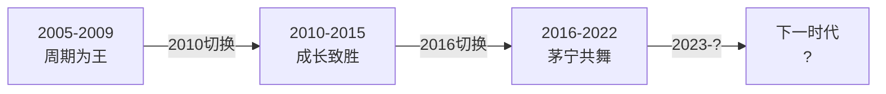

# 53《周期、估值与人性》深度解读（详细版）

> **副题：凌鹏——"A 股 17 年编年史"：周期为王 → 成长致胜 → 茅宁共舞，三种风格、三代王者、一个轮回**
>
> 作者：凌鹏，前申万宏源策略首席分析师、现荒原资产创始合伙人。2006 年入行，在申万研究所坐了 5 年"冷板凳"，建构了 A 股策略研究的系统框架，以"春季躁动、四月决断"等概念闻名业界。本书是 17 年从业心得的结晶——以**2005 年为分水岭**，逐年记录 A 股每一年的行情、风格、事件、教训，最终提炼出"三个不变、两次转变"的普适规律。
>
> **核心定位**：A 股的"《全球通史》"——**2005 年前 15 年 = 蛮荒时代，2005 年后 17 年 = 日新月异、几年一个变迁**。全书分三阶段：**2005—2009 周期为王 → 2010—2015 成长致胜 → 2016—2022 茅宁共舞**。每一类资产都经历"上升五阶段、下跌三阶段"的生命周期——被冷落→酝酿→共识→调整→再加速→泡沫→回落→双杀→新王取代。
>
> **系列意义**：053 是系列第 53 本，**A 股风格周期史篇**——与 [[35《投资中最简单的事》深度解读（详细版）|35 号邱国鹭"四种周期三种杠杆"]] 和 [[31《金融炼金术》深度解读（详细版）|31 号索罗斯"繁荣/萧条模型"]] 形成"周期+反身性+A 股实证"的完整对话。

---

## 📖 全书架构：三阶段 17 年的"城头变幻大王旗"

| 阶段 | 年份 | 主角 | 核心逻辑 | 王者陨落 |
|------|------|------|---------|---------|
| **周期为王** | 2005—2009 | 周期品（煤钢有色） | 得宏观者得天下 | 2010 年风格切换 |
| **成长致胜** | 2010—2015 | 小盘股/创业板/移动互联 | 轻资产、互联网思维 | 2015 股灾+熔断 |
| **茅宁共舞** | 2016—2022 | 核心资产（茅）/新能源（宁） | 供给侧改革+消费升级+碳中和 | 2021—2022 陨落 |

---

## 📑 目录（精选核心章节）

- [[#第1章 2005 年：A 股的分水岭|第1章 2005 年：A 股的分水岭]]
- [[#第2章 2005—2009：周期为王|第2章 2005—2009：周期为王]]
- [[#第3章 2010—2015：成长致胜|第3章 2010—2015：成长致胜]]
- [[#第4章 2016—2022：茅宁共舞|第4章 2016—2022：茅宁共舞]]
- [[#第5章 三个"不变"与两次"转变"（全书最高浓缩）|第5章 三个"不变"与两次"转变"（核心总结）]]
- [[#总结：上升五阶段 + 下跌三阶段——每类资产的生死周期|总结：上升五阶段 + 下跌三阶段——每类资产的生死周期]]
- [[#附录一 凌鹏金句集（20 条）|附录一 凌鹏金句集]]
- [[#附录二 A 股 17 年大事年表|附录二 A 股 17 年大事年表]]
- [[#附录三 30 秒版：周期估值与人性|附录三 30 秒版]]
- [[#附录四 与系列大师对照|附录四 与系列大师对照]]
- [[#附录五 凌鹏的"方法论进化史"：从技术分析到策略框架|附录五 凌鹏的方法论进化史]]
- [[#附录六 "城头变幻大王旗"——三次资产更替的完整对照|附录六 三次资产更替对照]]
- [[#附录七：053 号笔记的实战应用——如何判断"现在我们处于什么阶段"|附录七 实战应用：判断所处阶段]]
- [[#附录八 复盘 2024—2025：下一个时代在哪里？|附录八 复盘 2024—2025]]
- [[#附录九 知乎文风附录：A 股十七年，我们到底在炒什么|附录九 知乎文风附录]]

---

## 第1章 2005 年：A 股的分水岭

### 1.1 为什么是 2005

> "斯塔夫里阿诺斯的名著《全球通史》以公元 1500 年为界限。在我看来，A 股也有这个'公元 1500 年'，那就是 2005 年。之前 15 年 A 股相对静止、规则不全、比较蛮荒；此后 15 年，日新月异，每几年一个变迁，十几年浓缩了发达市场几十年的经历。"

| 2005 年为何是分水岭 | 内容 |
|-------------------|------|
| QFII 进入 | 外资用国际通用方法研究 A 股——投研范式革新 |
| 新财富评选 | 卖方研究规范化、分析师身价体系化 |
| 公募爆发 | 机构投资者雨后春笋——买卖方商业模式闭环 |
| 投资名著引进 | 巴菲特、索罗斯等开始被中国人了解 |
| 第一次大牛市 | 2005—2007 年"蓝筹牛"让 A 股成为显学 |

### 1.2 2005 年前的三段"穿越时空"的行情

| 行情 | 年份 | 核心 |
|------|------|------|
| **1996 年家电行情** | 四川长虹 10 倍 | A 股第一次基于产业逻辑的投资（类似新能源） |
| **1999 年"5·19"** | 政策驱动 | 非基本面因素发动的大行情 |
| **2003 年"五朵金花"** | 煤电油运 | 宏观投资的雏形——2005—2007 周期牛的预演 |

> "四川长虹踏准了产业热点，类似今天的宁德时代。即便如此，后续一蹶不振，股价跌了 85%——原因是彩电的技术路径发生变化，从显像管转向数码。这就是科技投资的问题：一将功成万骨枯。"

---

## 第2章 2005—2009：周期为王

### 2.1 2005 年：熊市出清 → 牛市诞生

> "2005 年 6 月 6 日，上证综指跌到 998 点。此后经过半年盘整，牛市缓缓拉开序幕。"

### 2.2 2007 年：蓝筹泡沫——凌鹏的在场记忆

2007 年上证综指涨 96.7%，10 月 16 日创出 6124 点——**此后 16 年未被突破**。

| 2007 年关键事件 | 内容 |
|---------------|------|
| 年初垃圾股行情 | 前期没涨的垃圾股被暴炒——亏损股/绩优股比值从 0.4→0.6 |
| 有效突破 2245 点 | 上一轮牛市高点，5 年后突破——但 PE 从 65 倍降到 28 倍 |
| **"2·27"大跌 8.87%** | 几乎跌停——"牛市多巨阴、熊市多长阳" |
| **"5·30"上调印花税** | 从 1‰→3‰——凌鹏半夜被拖起来写点评 |
| **蓝筹泡沫 7—10 月** | "斜率变陡"——最后疯狂 |

> "2·27 大跌后，研究所开了一次内部会议讨论市场走势。与会者大多悲观，认为牛市已结束。只有一个申万资管的人说：'牛市多巨阴、熊市多长阳，牛市的巨阴是为了把人吓跑，后面会小碎步修复；熊市的长阳是为了把人留住，后面会不断阴跌。'我已经想不起这人的相貌，但对这句话记忆深刻——这或许就是行家的市场经验。"

**（注：这句"牛市多巨阴、熊市多长阳"堪称 A 股操盘第一金句——与 049 号技术分析中的"假跌破洗盘"同理：低位暴跌是吓人，高位长阳是诱多。）**

### 2.3 2009 年：肌肉记忆——周期派的最后一次大胜

> "2009 年延续了周期的打法。当经济刺激政策（4 万亿）出台后，'煤飞色舞'再度爆发。但这是周期派最后一次大胜——此后 2010 年风格切换，周期品渐渐被边缘化。"

### 2.4 2008 年：次贷崩盘——三段杀跌的完整复盘

> "2008 年股市几乎一路下跌，中间仅有两次上涨，算上年初 10 个交易日和 11 月以后的反弹，全年上涨的时间不到 10%。"

**下跌三段论**：

| 阶段 | 时间 | 跌幅 | 关键事件 |
|------|------|------|---------|
| 第一轮杀跌 | 1月14日—4月22日 | **上证综指大跌 42%** | 花旗/美林巨亏；中国平安 1600 亿定增被否（当时平安总市值才 7000 亿）；CPI/PPI 飙升，"双防"定调 |
| 第二轮杀跌 | 6—9月 | 持续阴跌 | 次贷影响开始体现；汶川地震后市场横盘；雷曼破产（9 月），"既然雷曼可以破产，什么可以屹立不倒？" |
| 第三轮绝杀 | 10月 | 加速赶底 | 出口断崖、订单消失；10 月见底 1664 点 |

**四个关键细节**：

> ① **印花税井喷**：4 月 22 日破 3000 点，盘后下调印花税，市场井喷、证券股连续涨停——2007 年"5·30"的记忆让投资者对印花税格外敏感。

> ② **机构的悲剧对称**："上海某机构在 6000 点减仓、这个位置加仓；北方某机构前阶段死扛、此时减仓。跌到 1664 点，结果是一样的——**因为 100 元跌到 10 元是跌 90%，而 50 元持有到 10 元也跌了 80%。**"

> ③ **美联储也误判**：复盘次贷的最佳资料是伯南克《行动的勇气》、保尔森《峭壁边缘》、盖特纳《压力测试》——2008 年 6 月连美联储都认为危机已过去、暂停降息观望（伯南克自认是败笔）。**"2008 年 5 月 A 股已经腰斩，而大洋彼岸的始作俑者美股还没真正下跌"——A 股的下跌不能全归咎于次贷。**

> ④ **领跌与抗跌**：第一轮杀跌中农产品/化肥/部分医药（通胀主题）逆势上涨——**熊市里不是没有机会，而是只有"对的主题"有机会。**

---

## 第3章 2010—2015：成长致胜

### 3.1 2012 年：正式切换——"春季躁动、四月决断"的诞生

2012 年是戏剧性的一年——年初躁动、半年阴跌、12 月单月收复失地。凌鹏在这年创造了经典概念：

> "1 月 6 日我们率先翻多，很多人问为什么看多——我说'没什么大的逻辑，年初都要炒一把。'于是我写了一篇文章《春季躁动，四月决断——解密A股投资节奏》，成为经典，'春季躁动'一词也流传了下来。"

| 2012 年关键节点 | 内容 |
|---------------|------|
| 1—2 月第一波 | 强周期"煤飞色舞"——**此后两年半周期股最后的荣光** |
| 4 月第二波 | "金改"驱动金融地产——改革预期持续 |
| 5—11 月主跌 | **长达半年的阴跌——熊市尾部出清，主板数度跌破 2000 点** |
| 12 月爆拉 | 单月收复全年失地——1949→2269 |

> "5—11 月整整持续了半年的下跌，有种令人窒息的感觉。但这半年的下跌属于熊市尾部出清阶段——**弹簧被压缩到极致，为牛市铺垫**。"

### 3.2 2013 年：成长完胜——主板跌 6.75%、创业板涨 82.73%

> "2013 年是极致分化的一年——主板下跌、创业板大涨。在此之前 A 股整体性更强、同涨同跌，但 2013 年分化巨大。"

| 创业板指数时间线 | 事件 |
|----------------|------|
| 2009.10 | 首批 28 家公司上市 |
| 2010.6 | 指数形成 |
| 2010.12 | 1200 点，PE 75 倍 |
| 2012.12.4 | **585 点，PE 29 倍——指数腰斩、估值萎缩 61%** |
| 2013.2.18 | 春节后第一个交易日，创业板涨 1.49%/主板跌 0.45%——分道扬镳 |

> "到了 2012 年 12 月 4 日，创业板指数跌到 585 点，静态市盈率 29 倍，相较于两年前高点——指数腰斩、估值萎缩 61%，**具备了爆发的基础。**"

**（这是凌鹏全书最核心的规律——"上升五阶段"的第一、二阶段：被冷落→酝酿。创业板 2010—2012 年被遗忘两年，估值从 75 倍杀到 29 倍，才迎来 2013 年的爆发。）**

| 2013 年爆发的推动力 | 内容 |
|------------------|------|
| 《泰囧》 | 国产电影首部票房超 10 亿 |
| 手游 | 智能手机普及→流水爆发 |
| 传媒股 | 光线传媒、华谊兄弟、中青宝暴涨 |

> "我当时初到买方，尚未管理产品，所以比较空闲。于是我开启了为期两个月的调研，与深圳、杭州的游戏创业团队做了深入交流。最终我断定：影视和手游行业确实爆发了，但对个体的公司很难给高估值——因为'有了上顿，不知下顿'。"

### 3.3 2015 年：市场巨震——成长派的"泡沫→破灭"

> "2015 年上半年的创业板冲顶和下半年的股灾，是成长致胜阶段的终章。这之后，市场风格再次切换——2016 年'熔断'后，核心资产崛起，茅宁时代开启。"

---

## 第4章 2016—2022：茅宁共舞

### 3.4 2014 年：蓝筹逆袭——"英雄联盟"与打新底仓

**四阶段行情**：

| 阶段 | 时间 | 特征 |
|------|------|------|
| 躁动 | 年初—2月24日 | 创业板又涨 20%；新锐基金经理被称"英雄联盟"，春节前一个月组合涨 42% |
| 调整 | 2月25日—5月21日 | 创业板冲高回落大跌 4.37%（网宿科技跌停）；5月16日跌至 1210 点，年初涨幅尽数耗尽 |
| 乱战 | 5月22日—11月20日 | 行情扩散到更虚处：并购重组蔚然成风（为 2018 年商誉爆雷埋下伏笔）；暴风影音 **29 个连板** |
| 蓝筹逆袭 | 11月21日起 | 证券、建筑股爆发；沪港通（4月10日）激活外资，为 2016 年熔断后白马崛起埋下伏笔 |

**三个洞见**：

> ① **打新的意外之喜**：新股发行"刻意压低发行价"→打新之风盛行→需要底仓→蓝筹白马"沦为僵尸股"却成为最佳底仓。两年后创业板泡沫破灭、打新收益率下降，这批"底仓"白马股反而创造了巨大收益——**"失之东隅、收之桑榆"**。

> ② **牛市调整的判定标准**："调整的时间和空间两者皆不可少——主要指数不太可能腰斩，调整时间也很难超过三个月。"创业板牛市 5 次调整中最大一次：**最大跌幅 22.9%、持续 58 个交易日**。而 2015 年 6—8 月调整幅度远超此标准→熊市开始；2021—2022 茅宁调整同样超限→茅宁熊市到来。

> ③ **白马股最便宜的时刻**："回顾 A 股历史，白马股最便宜不是在大盘 998 点或者 1664 点的时候，而是 2014 年 7 月——五六倍 P/E 的万科、一千亿元市值的茅台。"**指数不是底部，个股估值才是底部。**

---

## 第4章 2016—2022：茅宁共舞

### 4.1 2016 年：熔断破局——凌鹏的"完美开局与选错品种"（诚实自白）

> "在 2015 年的复盘中，我曾经提到，我在'熔断'前三天神奇地将仓位砍掉 90%。1 月 6 日夜间，我看到外围市场大跌就预料翌日 A 股会再次'熔断'——我选择了一批经历'熔断'依然保持强势的股票，准备在两次'熔断'间买入。1 月 7 日开盘就'熔断'，我暗自窃喜，在跌停板上买了一批股票。"

| 凌鹏的操作 | 结果 |
|----------|------|
| 熔断前砍掉 90% | ✅ 完美躲过熔断 |
| 选强势股在跌停板买入 | ❌ **这批"强势股"在熔断后补跌得非常厉害** |
| 教训 | **"强势股策略要看环境——牛市中途的利空可以筛选强势股，但新旧交替时根本不行。"** |

> "经历这次操作，我明白一个道理：所谓'强势股策略'要看具体的环境。如果是牛市中继，利用利空消息和市场颓势可以筛选出一批未来的强势股，但如果碰到新老更替，这种策略根本不行。"

**（与 040 张化桥"少做少错"、037 冉伟"顺大逆小"完全同频——新老交替时的强势股是"旧时代的王者回光返照"，不是"新时代的先锋先行"。）**

| 2016 年另一件大事 | 影响 |
|-----------------|------|
| **供给侧结构性改革** | 大多数投资者初期忽视甚至轻视——**事后看非常有效，影响深远** |
| 商品价格 | 2016 年后进入大牛市——三大期货交易所 4 月 21 日出政策抑制过热 |
| 周期股资产负债表 | 有效修正——为后续行情铺路 |

### 4.2 2019 年："茅氏"封神

> "2019 年，核心资产加速上升，斜率更陡——茅台、五粮液、恒瑞、爱尔等'茅指数'成分股封神。本质是 2017 年趋势的延续+2018 年补跌调整后的再加速。这正是'上升五阶段'的第五阶段——再加速、泡沫化。"

### 4.3 2020 年：宁王独立——疫情年的两次 V 形反转

| 时间 | 事件 |
|------|------|
| 1.6 | 央行降准，市场延续上涨 |
| 春节前 | 疫情传闻→最后一个交易日大跌 |
| 2.3 | 节后开盘暴跌 7.72%——**第一次 V 形反转** |
| 3月 | 海外疫情→美股四次熔断——A 股跟着跌 |
| 3.23 | **美联储无限量化宽松**（"直升机撒钱"）→ 第二次 V 形反转 |
| 7月 | 银行板块集体涨停——"类似 2015 年 4—6 月的冲顶走势" |
| 年底 | **宁王更加强势——茅指数峰值在 2021.2.10，宁组合峰值在 2021 年底** |

> "华尔街那句名言还是对的——'永远不要和美联储对着干'。"

### 4.4 2021—2022：茅宁陨落——为什么宁比茅多扛了半年

> "茅和宁的**估值高点都出现在 2021 年春节**。宁组合的股价之所以能延续到年底，纯粹是因为其强大的盈利能力。以新能源汽车为例：**2021 年渗透率提升至 25%，当年增速 170%。** 在这么强力的数据的支撑下，即便估值回落，股价也能继续前行。这是宁组合比茅指数晚陨落半年的根本原因。"

| 阶段 | 时间 | 表现 |
|------|------|------|
| 阶段一 | 2021.1—3.24 | 春节前冲顶→节后 A 形大跌，茅宁全部回吐年初涨幅 |
| 阶段二 | 2021.3.25—12 | **"罢黜百家、独尊宁王"**——茅指数又陷熊市，宁组合不断攀升 |
| 阶段三 | 2021.12—2022.4.25 | 泥沙俱下——茅宁都大跌 |
| 阶段四 | 2022.4.26—10.31 | 宁组合修复近半但无法新高——储能等边缘领域涨幅>老龙头→**典型熊市反弹特征** |

> "2022 年 10 月单月，茅台跌了 27.9%、招商银行跌了……这波杀跌让很多信仰茅台的投资者彻底崩溃。"

---

## 第5章 三个"不变"与两次"转变"（全书最高浓缩）

### 5.1 A 股 17 年不变的三个东西

| 不变 | 内容 |
|------|------|
| **周期永远存在** | "每隔五六年 A 股就有一个新玩法——前选'赵飞燕'，后重'杨玉环'——选美的标准都会变化。所以 A 股很少有长胜将军，上一个时代的王者在下一个时代就会陨落。" |
| **估值永远回归** | "均值回归是这个行业里颠扑不破的真理——高估值会回落，低估值会反弹。" |
| **人性永远重复** | "市场在犹豫中前行，在疯狂中破灭——每一轮都是同样的剧本。" |

**凌鹏用三个深层论证支撑"三个不变"**：

> **① 万物皆周期**——"总有人将股票分为成长股和周期股，似乎两者对立。其实**一切成长皆为周期**，只不过由于商业模式不同，周期长度不同。"猪周期 3—5 年；白酒 2000 年至今两轮周期；银行 30 年才 1.5 个周期。**主导周期的两大因素：需求释放的斜率和产能供给**——渗透率快速提升时催生泡沫、鸡犬升天；渗透率放缓时杀估值、行业竞争加剧；供给滞后于需求→产能集中释放→价格战→去产能→集中度提升。"花无百日红，这个世界没有永恒的赛道，只有永恒的周期思维。"

> **② 估值终有效**——凌鹏反驳"A 股只有趋势没有估值"："A 股的趋势确实很极致，但这种极致的趋势只是让钟摆离中点更远，并未阻止回归的发生。"**大流感案例的深度复盘**：1918—1919 年大流感肆虐时美股确实上涨（+10.51%、+30.45%），但放在 1916—1921 年大背景下看：先跌 4.19%、21.71%，再涨两年，1920 年又跌 32.9%——"美股上涨根本不是不惧病毒，而是另外两个原因：**美国股市处于历史低位且经济繁荣**——估值还是起了决定性作用。"

> **③ 人性永远重复**——2005—2022 年三轮资产更替，每次都是"冷落→酝酿→共识→疯狂→破灭"的同一剧本——"城头变幻大王旗"，变的只是主角，不变的是人性。

### 5.2 两次"转变"——凌鹏自己的成长

| 转变 | 内容 |
|------|------|
| 第一次 | 从技术分析/市场博弈 → 宏观策略（申万 5 年冷板凳建构的框架） |
| 第二次 | 从卖方策略 → 买方实战（荒原资产——"知"到"行"的跨越） |

> "巴菲特说：'5 分钟能懂就懂，5 分钟不懂这辈子都不会明白。'而我却是花了 20 年，在不惑之年才真正明白'价值投资'的精髓。"

**但书里真正记载的"两次转变"，远比职业转型深刻——是认知坐标系的转变**：

### 第一次转变（2019 年 6 月）：德州扑克顿悟——从"聚焦未来"到"着重过往"

> "投资取决于未来，过往的所有因素都已经被股价反映了……可不管我们如何努力，最终还是要承认**未来不可测**。所有建立在未来参数预测基础上的模型及体系，更像是一场自欺欺人的游戏。"

**德州扑克的启示**：打牌时永远只根据自己手牌的胜率下注，没人会去猜下面发什么牌。起手对儿 A 原则上可以接任何注码；拿到杂色 2 和 7，不可能期待翻出 2、2、7 来下重注。**一两把牌或许有偏差，但拉长时间基于概率的决策大多会胜出。高手也会因被击败而沮丧，但绝不会因此改变行为模式。**

| 旧思维（猜未来） | 新思维（算胜率） |
|-----------------|-----------------|
| 研究=预测涨跌 | 研究=统计过往案例、得出概率分布 |
| 好的投资=未来致胜 | **好的投资=现在就占优**（未来出现当然更好） |
| 对未来的猜测 | 对过往的熟悉→迅速找到历史场景→得出概率分布→让注码站在大数定律基础上 |

> **2018 年年底的实践**："我们完全不知道贸易摩擦走向何方，但基于对世界主流指数的研究，我觉得创业板指数在三年半时间跌幅超过 70% 的情况下，是'对儿 A'，应该下重注。"

> 附带的体系启示："要求一个人预判未来，对这个人的要求非常高；但要求统计过往，一个严谨的实习生就可以了。"**好的体系像地图**——把世界按规则缩小成一张小地图一览全貌；像湘军"招呆兵、打呆战"——每个人做简单规定的动作，组合起来就是无敌军团。

### 第二次转变（2020 年 8 月）：夸父追日——从"追逐变化"到"追寻不变"

> "这就像夸父追日，虽然你每天都在辛苦奔跑，但你每向前跑一步，太阳也向后退一步。投资中应该有一种'不变'的东西，追求'不变'，以'不变'应'万变'才是投资的根本。"

> "2020 年我重新翻看巴菲特近 60 年的《给股东的信》，发现他 60 年都没有变过，很多话语重复出现——巴菲特一直在做同一件事情，只有当投资中这些'不变'出现时，他才会出手。"

> 贝佐斯："我们总是在变化，但一直在找寻不变的东西。"——**就像盲眼的浮士德最终说出"停一停吧，你真美丽"的那一刻，才是我们追求的投资真谛。**

---

## 总结：上升五阶段 + 下跌三阶段——每类资产的生死周期

凌鹏全书最核心的规律——**每一类资产都有其生命周期，像王朝一样兴衰存亡**。

### 上升五阶段

| 阶段 | 特征 | 对应 A 股实例 |
|------|------|-------------|
| ①被冷落 | 无人问津 | 周期股 2004 / 创业板 2010—2012（从 1200→585） |
| ②酝酿 | 少量资金试水 | 创业板 2012 底 PE 从 75→29 倍 |
| ③共识 | 越来越多的人相信 | 2013 年创业板涨 82% |
| ④调整 | 半途质疑 | 2014 年创业板横盘 |
| ⑤再加速 | 全民疯狂 | 2015 年冲顶，泡沫极致 |

### 下跌三阶段

| 阶段 | 特征 | 对应 A 股实例 |
|------|------|-------------|
| ①估值回落 | "太贵了"——不知不觉 | 2007.10→5000 点（估值太高自然回落） |
| ②基本面恶化 | "戴维斯双杀" | 2008 年次贷危机 / 2015 股灾+熔断 |
| ③新王崛起 | 资金从此类资产撤出 | 2013 创业板崛起→上证综指边缘化 / 2017 核心资产崛起→成长股没落 |

> "这三个阶段看似清楚，实则——第一个阶段的估值回落很隐蔽（因为估值本身就充满争议），第二个阶段的基本面恶化事前也很难明辨（2007 年底谁也不知道会有次贷危机）。**等你彻底明白过来，已经是第三个阶段——钱已经亏完了。**"

### 全周期对照表（三类资产的三阶段）

| 资产类别 | 兴起 | 顶峰 | 下跌一（估值） | 下跌二（双杀） | 下跌三（新王替） |
|---------|------|------|-------------|-------------|---------------|
| 周期股 | 2003—2005 | 2007.10 | 2007.10→5000 | 2008 次贷 | 2013 创业板崛起 |
| 创业板 | 2009—2012 | 2015.6 | 2015 股灾 | 2016 熔断+洗澡 | 2017 核心资产崛起 |
| 茅宁 | 2016—2019 | 2021.2 | 2021.2→3 | 2022.1—4 | 正在发生…… |

> **"城头变幻大王旗"——下一个王者是谁？**

---

## 附录一 凌鹏金句集（20 条）

> 1. "巴菲特说'5分钟能懂就懂'，而我花了20年才真正明白。"
> 2. "A股的'公元1500年'——2005年。之前15年蛮荒，之后15年日新月异。"
> 3. "牛市多巨阴、熊市多长阳。牛市的巨阴是吓人，熊市的长阳是诱多。"
> 4. "没什么大的逻辑，年初都要炒一把——'春季躁动，四月决断'。"
> 5. "每隔五六年A股就有一个新玩法，前选赵飞燕，后重杨玉环——选美标准都会变。"
> 6. "A股很少有长胜将军，上一个时代的王者在下一个时代就会陨落。"
> 7. "一将功成万骨枯——科技股成则改变世界，败则就此消失。"
> 8. "市场在犹豫中前行，在疯狂中破灭。"
> 9. "弹簧被压缩到极致，为牛市铺垫。"
> 10. "同样的点位，估值早已大幅下降——2001年2245点PE65倍，2006年2245点仅28倍。"
> 11. "创业板从1200→585，指数腰斩、估值萎缩61%——具备了爆发的基础。"
> 12. "'强势股策略'要看环境——牛市中继可筛，新旧交替不行。"
> 13. "影视和手游行业确实爆发了，但对个体的公司很难给高估值——'有了上顿，不知下顿'。"
> 14. "永远不要和美联储对着干。"
> 15. "茅宁的估值高点都出现在2021年春节——宁之所以多扛半年，纯粹因为盈利增速170%。"
> 16. "储能的上涨幅度远大于老龙头——典型熊市反弹特征。"
> 17. "等你彻底明白过来，已经是下跌第三阶段了——钱已经亏完了。"
> 18. "供给侧结构性改革刚提出时，大多数投资者忽视，甚至轻视它——事后看非常有效。"
> 19. "均值回归是这个行业颠扑不破的真理。"
> 20. "过去 20 年这三类资产前仆后继——透过现象，直面本质，有着共同的路径。"

---

## 附录二 A 股 17 年大事年表

| 年份 | 上证收盘 | 年度涨跌 | 核心事件 |
|------|---------|---------|---------|
| 2005 | 1161 | −8.3% | 998 点大底 / 牛市元年 |
| 2006 | 2675 | +130% | 全面牛开始 |
| 2007 | 5261 | +96.7% | 5·30 / 6124 点 / 蓝筹泡沫 |
| 2008 | 1820 | −65.4% | 次贷危机 / 千股跌停 |
| 2009 | 3277 | +80% | 4 万亿 / 煤飞色舞 / 周期最后大胜 |
| 2010 | 2808 | −14.3% | 风格切换元年 / 消费初露锋芒 |
| 2011 | 2199 | −21.7% | 三波杀跌 |
| 2012 | 2269 | +3.2% | 春季躁动 / 半年阴跌 / 12 月爆拉 |
| 2013 | 2116 | −6.8% | 主板跌 / 创业板涨 82% — 极致分化 |
| 2014 | 3234 | +52.9% | 蓝筹逆袭 / 降息牛 |
| 2015 | 3539 | +9.4% | 冲 5178 / 股灾 / 千股停牌 |
| 2016 | 3103 | −12.3% | 熔断 / 供给侧改革 / 核心资产酝酿 |
| 2017 | 3307 | +6.6% | 核心资产趋势形成（"漂亮 50"） |
| 2018 | 2494 | −24.6% | 贸易战 / 补跌 |
| 2019 | 3050 | +22.3% | 核心资产加速（"茅氏封神"） |
| 2020 | 3473 | +13.9% | 疫情 V 形 / 宁王独立 |
| 2021 | 3639 | +4.8% | 茅宁陨落（茅先跌、宁多扛半年） |
| 2022 | 3089 | −15.1% | 第四大熊市 / 10 月茅台单月跌 27.9% |

---

## 附录三 30 秒版：周期估值与人性

> 1. **三阶段**——2005-2009 周期为王 → 2010-2015 成长致胜 → 2016-2022 茅宁共舞
> 2. **上升五阶段**——被冷落→酝酿→共识→调整→再加速（泡沫）
> 3. **下跌三阶段**——估值回落→戴维斯双杀→新王崛起
> 4. **三不变**——周期永远存在/估值永远回归/人性永远重复
> 5. **牛市多巨阴、熊市多长阳**

---

## 附录四 与系列大师对照

| 凌鹏 | 同频大师 |
|------|---------|
| 上升五阶段+下跌三阶段 | 31 号索罗斯"繁荣/萧条模型" |
| 周期永远存在 | 35 号邱国鹭"四种周期三种杠杆" |
| A 股风格周期 17 年 | 053 号自身——系列 A 股编年史 |
| 四川长虹 10 倍→跌 85% | 26 号费雪"成长股的周期" |
| 2020 年两次 V 形反转 | 32 号林奇"恐慌时买入" |
| 强势股策略在新旧交替时失效 | 040 号张化桥"少做少错" |
| 永远不要和美联储对着干 | 31 号索罗斯"信贷周期" |
| 牛市多巨阴 | 049 号空头陷阱+洗盘识别 |

---

## 附录五 凌鹏的"方法论进化史"：从技术分析到策略框架

### 1997—2006：技术分析时代
- 大学专业"投资学"，读的是台湾技术分析书籍
- 炒股就这么几招/如何跟庄/短线是金
- 2006 年入行时"一问三不知"——宏观懂、微观不懂

### 2006—2011：申万 5 年冷板凳——建构策略框架
> "我在申万的前 5 年过着'半封闭'的生活，澎湃的大牛市、财富、职位升迁似乎都和我无关。我还是以读博士的心态坐冷板凳，思考和建构一些'无用'的东西。"

| 凌鹏创造的经典概念 | 内容 |
|-----------------|------|
| 春季躁动、四月决断 | 2012 年 1 月 6 日提出的 A 股投资节奏 |
| 行业比较框架 | 申万的行业配置体系 |
| 策略研究的"经济学基础" | 从宏观出发→行业中观→微观选股 |

### 2012—2015：买方实战——知行合一
> "2012 年我初到买方，尚未管理产品，开启了为期两个月的调研——与深圳、杭州的游戏创业团队深入交流。"

### 2016—2022：荒原资产——从策略到价值
> "花了 20 年才真正明白价值投资的精髓。"

---

## 附录六 "城头变幻大王旗"——三次资产更替的完整对照

| 维度 | 2005—2009 周期为王 | 2010—2015 成长致胜 | 2016—2022 茅宁共舞 |
|------|------------------|------------------|------------------|
| 代表指数 | 上证综指 | 创业板指 | 茅指数/宁组合 |
| 核心逻辑 | 宏观驱动/投资时钟 | 轻资产/互联网思维 | 消费升级+碳中和 |
| 龙头股 | 中石油/中国神华/宝钢 | 乐视/暴风/东方财富 | 茅台/宁德时代/恒瑞 |
| 顶峰估值 | 上证 PE 45 倍 | 创业板 PE 135 倍 | 茅指数 PE 70 倍/宁 PE 200 倍 |
| 陨落原因 | 次贷危机→戴维斯双杀 | 股灾+熔断+新王崛起 | 估值过高+盈利增速回落 |
| 陨落后跌幅 | 指数跌 72% | 指数跌 70% | 茅台跌 40%/宁跌 50%+ |

---

## 附录七：053 号笔记的实战应用——如何判断"现在我们处于什么阶段"

凌鹏的框架可以用来定位任何一类资产当前的生命周期位置：

| 问题 | 你的回答 | 对应阶段 |
|------|---------|---------|
| 这类资产被广泛追捧了吗？ | 是→危险；否→可能还在早期 | 判断是否进入⑤ |
| 这类资产的估值合理吗？ | 偏高→警惕下跌①；合理/偏低→安全 | 判断是否进入① |
| 有新王者出现吗？ | 有资金正在流向其他资产→警惕③ | 判断是否进入③ |

> **"不要试图像抓住每一条滑溜的黄鳝——只需要在每种资产的最底部区域上车，在疯狂区域下车。"**（这句话融合了 051 冷眼"黄鳝"和 053 凌鹏"五上三下"的智慧。）

---

## 附录八 复盘 2024—2025：下一个时代在哪里？

凌鹏在 2022 年底写本书时尚未能看到未来。但根据"三阶段"规律，每 5-6 年一个风格转换——2022 年茅宁陨落完成，**2023—2028 年的新王者可能在哪里？**

| 候选方向 | 逻辑 |
|---------|------|
| 红利/高股息 | 低利率时代+老龄化——确定性溢价 |
| AI/科技 | 类似 1996 年家电+2013 年移动互联——产业周期的重演 |
| 出海/全球化 | 国内卷不动→卷全球——类似 1970s 日本 |
| 创新药/生物科技 | 中国药企从仿制→创新——类似 2010s 的互联网 |

> **（这一段是 AI 补充的分析，非凌鹏原书内容。仅供参考——历史上"预测新王者"是最难的事，就如 2012 年没有人能预测创业板涨 6 倍，2016 年没有人能预测茅台翻 10 倍。）**

---

## 附录九 知乎文风附录：A 股十七年，我们到底在炒什么

> 如果有人问你：A 股过去十七年到底在炒什么？
>
> 你可能会说出一串名字：有色、煤炭、创业板、互联网金融、白酒、新能源……
>
> 凌鹏的答案是：**城头变幻大王旗。** 2005—2009 年，主角是周期股，"煤飞色舞"；2010—2015 年，主角换成成长股，创业板从 585 点涨到 4037 点；2016—2022 年，主角是"茅宁"——茅台封神，宁德独立。
>
> 每一轮，市场都坚信"这次不一样"。每一轮，结果都一样：**冷落→酝酿→共识→疯狂→破灭**。
>
> 我特别喜欢凌鹏讲的两个小故事。
>
> **第一个，是 2008 年的印花税井喷。** 上证指数破 3000 点那天，财政部下调印花税，市场立刻井喷，证券股连续涨停。上海某机构在 6000 点减仓、这个位置加仓；北方某机构前阶段死扛、此时开始减仓。跌到 1664 点，结果是一样的——**100 元跌到 10 元是跌 90%，50 元持有到 10 元也跌了 80%。** 你看，机构之间互相嘲笑对方是傻瓜，其实都是同一只笼子里的猴子。
>
> **第二个，是 2014 年的白马股。** 那一年所有人都在炒创业板，白马股"沦为僵尸股"，五六倍 PE 的万科、一千亿市值的茅台没人要。结果呢？2014 年 7 月——不是 998 点，也不是 1664 点——**是 A 股历史上白马股最便宜的时候**。两年后，打新的量化基金买的"底仓"白马股暴涨，正应了那句"失之东隅，收之桑榆"。
>
> 凌鹏讲这两个故事，是想告诉你三件事：
>
> **第一，一切皆周期。** 猪有猪周期，白酒有两轮周期，银行三十年才走了一个半周期。没有永恒的赛道，只有永恒的周期思维。当某个行业无限风光的时候，谁又能预料它有门可罗雀的一天？
>
> **第二，估值终有效。** 很多人说 A 股只有趋势没有估值。凌鹏用 1918 年的大流感反驳：那年美股确实在涨，但真正的原因是股市处于历史低位、经济繁荣——**估值还是起了决定性作用。** 钟摆可以荡得很远，但从来不会不回来。
>
> **第三，未来不可测，过往可统计。** 凌鹏在德州扑克桌上顿悟：打牌的人从不猜下一张牌，只看自己手牌的胜率。起手对儿 A 就下重注，拿到 2 和 7 就弃牌。**好的投资不是未来致胜，而是现在就占优。** 2018 年年底，创业板三年半跌了 70%——在凌鹏眼里，那是"对儿 A"，应该下重注。
>
> 最后，是凌鹏 2020 年的第二次转变。他重读巴菲特 60 年的股东信，发现巴菲特 60 年都没变过，一直在等那些"不变"的东西出现才出手。
>
> 贝佐斯说过一句话，我抄在了笔记本上：
>
> **"我们总是在变化，但一直在找寻不变的东西。"**
>
> 周期的规律不变，估值的引力不变，人性的贪婪恐惧不变。找到它们，然后——像盲眼的浮士德那样，对市场说一句：
>
> **"停一停吧，你真美丽。"**
>
> 那一刻，你才算真正开始投资。