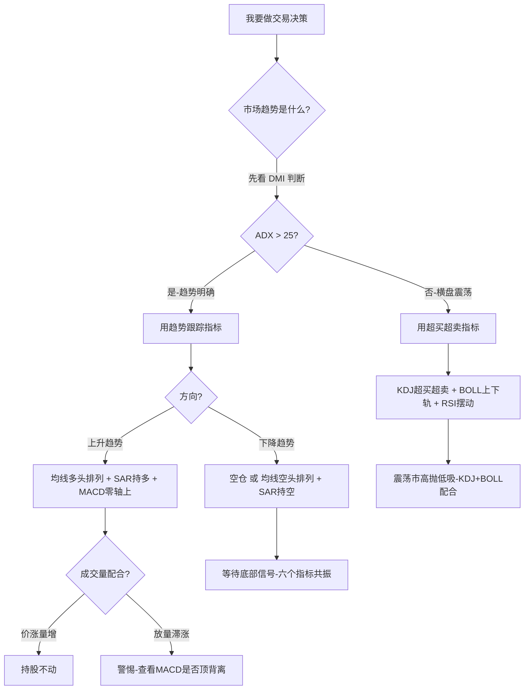

# 58《股市经典技术图谱大全集》深度解读（详细版）

> **副题：乔振华——"21 种技术指标买卖点全景"：从蜡烛图到 MACD，从 SAR 到 OBV，每个指标都有清晰的买入信号与卖出信号——并告诉你哪些指标在中国市场最有效**
>
> 作者：乔振华，本书是技术分析指标体系的"全景图谱"——不是抽象讲概念，而是每个指标都给出**具体的买点解析、卖点解析、实盘解读**，21 个章节覆盖了市面上几乎所有主流技术指标。
>
> **核心定位**：与 [[49《零基础看懂158张股市关键技术分析图》深度解读（详细版）|49 号老牛]]（158 张图广覆盖）互补——49 号覆盖面宽（K线/形态/分时/均线/量价/跟庄），58 号深度专精（**21 种指标的买点卖点逐一拆解+实盘案例**）。两书合用=技术分析完整工具包。

---

## 📖 全书架构：21 种技术指标全景

| 章 | 指标 | 核心逻辑 | 最适合场景 |
|----|------|---------|----------|
| 1 | 蜡烛图（K线） | 阴阳转换→趋势变化 | 所有市场 |
| 2 | 趋势线 | 顺势而为→趋势不轻易改变 | 趋势行情 |
| 3 | 均线（MA） | 平滑趋势→成本支撑/压力 | 中线趋势 |
| 4 | MACD | 均线差离→金叉死叉背离 | 波段行情 |
| 5 | KDJ | 随机摆动→超买超卖 | 震荡行情 |
| 6 | 百分比回撤（斐波那契） | 黄金分割→回调目标位 | 所有行情 |
| 7 | BOLL（布林带） | 标准差通道→开口/收窄/回归 | 震荡+趋势 |
| 8 | RSI | 买卖力量强弱→超买超卖 | 震荡行情 |
| 9 | ROC | 速率变化→趋势加速/减速 | 趋势确认 |
| 10 | DMI | 买卖均衡→趋势强度 | 趋势鉴别 |
| 11 | SAR | 抛物线止损止盈→红圈持/绿圈走 | 单边趋势 |
| 12 | ARBR | 人气/意愿→多空情绪 | 辅助确认 |
| 13 | VR | 成交量变异→地量天量 | 量价配合 |
| 14 | PSY | 心理预期→极端情绪反转 | 顶部/底部 |
| 15 | 成交量 | 量在价先→验证趋势 | 所有行情 |
| 16 | DMA | 长短均线差→金叉死叉 | 趋势跟踪 |
| 17 | ASI | 真实价格→短线突破先行 | 短线 |
| 18 | W&R | 倒置超买超卖→80卖/20买 | 震荡行情 |
| 19 | OBV | 能量潮→量先于价 | 趋势+背离 |
| 20 | BBI | 多条均线的均值→单线定多空 | 趋势 |
| 21 | PBX | 瀑布线→波段利器 | 中线波段 |

---

## 📑 目录

- [[#第1章 最核心的六个指标（深度拆解）|第1章 六个核心指标深度拆解]]
- [[#第2章 超买超卖类指标速查|第2章 超买超卖类指标]]
- [[#第3章 量能/情绪类指标速查|第3章 量能/情绪类指标]]
- [[#第4章 自选指标组合推荐|第4章 自选组合推荐]]
- [[#第5章 指标陷阱│钝化│假信号|第5章 陷阱与局限性]]
- [[#附录|附录]]

---

## 第1章 最核心的六个指标（深度拆解）

> 乔振华在全书结尾坦诚建议："笔者建议投资者使用的指标有：蜡烛图、均线、MACD、KD、RSI、布林带、成交量等。这些都是常见且常用的指标，稳定性很高，其他指标大部分也是从这些指标拓展而来的。"

---

### 1.1 蜡烛图（K线）——一切技术分析的起点

**乔振华的定位**："蜡烛图是以人的心理变化为基础而产生的一种技术分析方法，16 世纪—18 世纪在日本使用，由本间宗久发扬光大。数百年沿用至今，本身就说明了它实际效用的无可替代性。"

| 乔振华书中列举的核心买卖信号 | 方向 |
|---------------------------|------|
| 大阳线（光头光脚放量） | 买点 |
| 锤子线（下影线长+底部出现） | 买点 |
| 启明星（三根K线：阴→小实体→阳） | 买点 |
| 看涨吞没（阳线包住前一根阴线） | 买点 |
| 红三兵（三根连续阳线+量增） | 买点 |
| 大阴线（光头光脚放量） | 卖点 |
| 上吊线（下影线长+顶部出现） | 卖点 |
| 黄昏星（三根K线：阳→小实体→阴） | 卖点 |
| 看跌吞没（阴线包住前一根阳线） | 卖点 |
| 三只乌鸦（三根连续阴线+量缩） | 卖点 |

**关键心法**：蜡烛图必须结合**位置**和**成交量**使用。底部出现的锤子线和大阳线才有意义——顶部出现的同样形态可能是诱多。

---

### 1.2 均线（MA）——最简单也最有效的趋势工具

**乔振华的定位**："均线指标与蜡烛图是每个投资者必须掌握的两项基本技术分析指标。具有简单、准确率高、反应直接等特点，更可以弥补蜡烛图分析的不足。"

| 均线形态 | 含义 | 操作 |
|---------|------|------|
| **金叉**（短线上穿长线） | 短期成本高于长期→趋势转多 | 买入 |
| **死叉**（短线下穿长线） | 短期成本低于长期→趋势转空 | 卖出 |
| **多头排列**（短在上/长在下发散） | 上升趋势确立 | 持股 |
| **空头排列**（短在下/长在上发散） | 下跌趋势确立 | 空仓 |
| **均线粘合** | 变盘前兆 | 等待方向选择 |
| **价格回踩均线** | 支撑确认 | 加仓点 |

**均线=成本线的本质**：均线是多空双方的平均持仓成本。股价在均线上方→多方占优；在下方→空方占优。均线的支撑/压力来源于"成本心理"。

---

### 1.3 MACD——最经典的波段指标

**乔振华的定位**："MACD 由正负差 DIF 和异同平均数 DEA 组成，DIF 是核心，DEA 是辅助。该指标可以去除移动平均线的假信号，保留移动平均线的优点。"

| MACD 信号 | 操作 | 可靠性 |
|----------|------|--------|
| **零轴上方金叉** | DIF 在零轴上方上穿 DEA→强势回调结束 | ★★★★★ |
| **零轴下方死叉** | DIF 在零轴下方下穿 DEA→弱势反弹结束 | ★★★★★ |
| **底背离** | 股价新低+MACD 未新低→空方衰竭 | ★★★★ |
| **顶背离** | 股价新高+MACD 未新高→多方衰竭 | ★★★★ |
| 零轴附近金叉/死叉 | 信号弱——变盘方向不明 | ★★★ |

**MACD 的精髓不在金叉死叉，在背离**。顶背离后不一定立刻跌，但意味着上涨动能衰竭——就像油箱快空了。

---

### 1.4 KDJ——震荡市的王者

**乔振华的定位**："当市场向上运动时，收市价格倾向于接近价格区间的高点；向下运动时，收市价格倾向于价格区间的低点。随机指标对超买超卖给予预警，提供相互背离信号。"

| KDJ 信号 | 操作 | 注意 |
|---------|------|------|
| **K 线上穿 D 线+J<0** | 超卖后金叉→买 | 最经典的买点 |
| **K 线下穿 D 线+J>100** | 超买后死叉→卖 | 最经典的卖点 |
| **底背离**（股价新低+KDJ 未新低） | 空方衰竭 | 比金叉更可靠 |
| **顶背离**（股价新高+KDJ 未新高） | 多方衰竭 | 比死叉更可靠 |

**KDJ 的致命弱点：钝化**。在强势单边行情中，KDJ 可以一直在超买区（>80）待数周，金叉死叉频繁出错。**KDJ 只能用于震荡行情——用 DMI 判断趋势强度，趋势强时不看 KDJ。**

---

### 1.5 BOLL（布林带）——价格运行区间的标尺

**乔振华的定位**："布林通道由约翰·布林应用统计学原理设计。日常交易中，布林通道可以人为划定价格波动区间。当股价窄幅震荡时，BOLL 通道逐渐缩窄——变盘前兆。"

| BOLL 信号 | 操作 |
|----------|------|
| **下轨企稳+反弹** | 超跌买入 |
| **上轨受阻+回落** | 超涨卖出 |
| **开口向上**（带宽扩大+价格沿上轨运行） | 强势上涨开始→持股 |
| **开口向下**（带宽扩大+价格沿下轨运行） | 弱势下跌开始→离场 |
| **收窄→开口** | 变盘信号——方向由价格突破决定 |
| **中轨支撑**（回调不破中轨） | 趋势健康→加仓 |

**BOLL 的独有优势**：其他指标只告诉你"强/弱""买/卖"，但 BOLL 告诉你"价格运行的合理区间在哪"。股价碰到上轨=暂时太贵了，碰到下轨=暂时太便宜了。

---

### 1.6 成交量（VOL）——乔振华心目中最重要的指标

**乔振华的定位**："成交量是股价上涨的原动力。在股票市场中，成交量应作为首要的技术分析手段——尤其在上涨趋势的形成与重要的价格形态的突破中具有重要意义。"

| 成交量信号 | 操作 | 书中案例 |
|----------|------|---------|
| **低位价涨量增** | 买点——"市场背后潜在买盘启动" | 乔治白 2013.10 |
| **震荡后突然放量突破** | 买点——"股价将脱离整理区域" | 云天化 2014.07 |
| **高位放量+价格不涨**（滞涨） | 卖点——"买盘枯竭" | — |
| **量价顶背离**（价新高+量萎缩） | 卖点——"上涨没有成交量支撑" | 大龙地产 2007 |
| **下跌时缩量** | 正常——"卖盘衰竭中" | — |
| **高位放量长阴** | 顶部确认——"决定性意义" | — |

**"量在价先"是乔振华反复强调的第一原则**：看涨信号如果没有成交量配合→假信号；下跌信号如果缩量→卖压在减轻。

---

## 第2章 超买超卖类指标速查

| 指标 | 核心信号 | 独有用法 |
|------|---------|---------|
| **RSI** | >70=超买 / <30=超卖 / 三线发散=趋势强 | 不直接给买卖点——"配合主图其他指标使用" |
| **W&R** | **与常规相反**：>80=超卖(买) / <20=超买(卖) | 可与 RSI 配合：RSI 上穿50+W&R上穿50=确认上涨 |
| **PSY** | <25=过度悲观→反弹 / >75=过度乐观→回落 | 唯一纯粹的情绪指标——不依赖量价 |
| **ROC** | 上穿0轴线=强势 / 下穿0轴线=弱势 | 无上下边界→**需要针对个股找历史上的超买超卖线** |
| **BIAS** | 负乖离极致→超跌反弹 / 正乖离极致→超买回落 | 本质=测量股价离均线"有多远"——太远了就回拉 |

---

## 第3章 量能/情绪/趋势类指标速查

| 指标 | 核心信号 | 乔振华特别提醒 |
|------|---------|--------------|
| **OBV** | OBV 创高+股价未创高=看涨 / OBV 创低+股价未创低=看跌 | "先见量，后见价"——OBV 先行 |
| **VR** | <40-70=可买 / 70-150=常态 / 150-450=短期买 / >450=过高 | 量价必须同步，不同步→趋势将变 |
| **ARBR** | AR<70=人气低迷→买 / AR>150=人气过热→卖 / BR 须与 AR 配合 | AR 可单独使用，BR 必须配合 AR |
| **DMI** | +DI上穿-DI=多 / -DI上穿+DI=空 / ADX>25且上升=趋势增强 | **趋势强弱检测器**——先看DMI判断趋势强度，再选策略 |
| **SAR** | 红圈在K线下=持多 / 绿圈翻到K线上=止损/做空 | **只在单边趋势有效**——震荡市上下折腾 |
| **DMA** | DDD上穿AMA=金叉(买) / 下穿=死叉(卖) | 本质=10日均线-50日均线的差值 |
| **ASI** | ASI 先行突破=股价将突破 | 短线——连续两天价格关系→不具趋势性 |
| **BBI** | 股价>BBI=多 / 股价<BBI=空 | 多条均线平均化→单线判断极简单 |
| **PBX** | 6条线汇合→变盘 / 发散→趋势 / A1上穿A4=买 | "信号极少，但成功率极高"——中线波段专用 |
| **斐波那契回撤** | 38.2%/50%/61.8%=重要回调位 | "最神奇有效的技术指标之一"——乔振华力荐 |
| **趋势线** | 顺势而为——既成趋势不轻易改变 | "道氏理论为一切趋势分析的鼻祖" |

---

## 第4章 自选指标组合推荐（乔振华思路 + 实战验证）

| 投资风格 | 推荐指标组合 | 用法 |
|---------|-----------|------|
| **中线趋势** | 均线+MACD+成交量 | 均线定方向→MACD 定波段→成交验证 |
| **短线波段** | KDJ+BOLL+ASI | KDJ 定超买超卖→BOLL 定区间→ASI 领先突破 |
| **纯趋势跟随** | SAR+BBI+OBV | SAR 定止损→BBI 定多空→OBV 验证量能 |
| **底部抄底** | PSY+VR+成交量 | PSY<25→VR<40→地量出现→三重确认 |
| **顶部逃顶** | RSI+MACD+成交量 | RSI>70→MACD 顶背离→放量滞涨→三重确认 |

---

## 第5章 指标陷阱 │ 钝化 │ 假信号——乔振华的坦诚忠告

> "有些经典的指标，并不适合中国现有的市场。我们只选取其有效的，而放弃无效的。由于中国是具有特色的市场经济，有时市场甚至脱离了其自身的基本面在运行。有些指标在国际市场的实际应用中，与经典使用方法出现很大偏差。"

| 陷阱 | 表现 | 解决 |
|------|------|------|
| **KDJ 钝化** | 强势单边时 KDJ 在 80 以上数周→金叉死叉全假 | DMI 判断趋势强度——ADX>25 时停止看 KDJ |
| **MACD 滞后** | 金叉死叉出现在大阳/大阴之后→晚了 | 看背离不看金叉；看零轴上方/下方金叉 |
| **BOLL 假突破** | 突破上轨但立即回落 | 等第二天确认——"收盘价在 BOLL 外再确认" |
| **SAR 震荡市失效** | 频繁红绿翻转→反复止损 | 加均线过滤——均线多头排列时才用 SAR |
| **斐波那契过度信赖** | 精确到 61.8%→但市场不管你这个 | 看作"关注区"而非精确点位 |
| **单指标做决策** | 金叉就买→亏 | 乔振华：**至少两个指标共振**再做决定 |

---

## 附录一：六个核心指标买卖点速查卡

| 指标 | 买点（3个最可靠） | 卖点（3个最可靠） |
|------|----------------|----------------|
| K线 | 启明星/看涨吞没/锤子线+放量 | 黄昏星/看跌吞没/上吊线+放量 |
| 均线 | 金叉/多头排列/回踩均线支撑 | 死叉/空头排列/反抽均线压力 |
| MACD | 零轴上金叉/底背离/DIF上穿DEA | 零轴下死叉/顶背离/DIF下穿DEA |
| KDJ | K上穿D+J<0/底背离 | K下穿D+J>100/顶背离 |
| BOLL | 下轨企稳/中轨支撑/开口向上 | 上轨受阻/中轨压制/开口向下 |
| 成交量 | 低位放量长阳/地量+止跌 | 高位放量长阴/放量滞涨/量价顶背离 |

---

## 附录二：乔振华金句精选

> 1. "蜡烛图数百年沿用至今，本身就说明了它实际效用的无可替代性。"
> 2. "均线指标与蜡烛图是每个投资者必须掌握的两项基本技术分析指标。"
> 3. "成交量是股价上涨的原动力——应作为首要的技术分析手段。"
> 4. "价格形态的突破中，放量长阳线是具有决定性意义的。"
> 5. "趋势线理论反映了自然界的内在规律——顺势而为，逆市而为=逆天者亡。"
> 6. "SAR 既是最简单的指标——红圈在下面持有、绿圈在上面离场。"
> 7. "有些经典的指标并不适合中国现有的市场——我们只选其有效的，放弃无效的。"
> 8. "瀑布线信号极少，但一旦给出信号，成功率极高。"
> 9. "先见量，后见价——OBV 先行于价格。"
> 10. "DMI 是判断趋势强弱的——先看 DMI 再决定用什么策略。"

---

## 附录三：30 秒版——58 号核心

> 1. **六个核心**：K线/均线/MACD/KDJ/BOLL/成交量
> 2. **成交量第一**：量在价先——没有量配合的信号都是假信号
> 3. **信号要共振**：至少两个指标同时发信号→才操作
> 4. **趋势强不用 KDJ**：先用 DMI 判断趋势强度→ADX>25 停用摆动指标
> 5. **中国市场不同**：有些国际通用的指标在中国失效——实证才可信

---

## 附录四 六指标联动实战：一只股票的完整一生（底部→主升→顶部）

### 案例场景：某消费龙头股的完整周期（2018.10—2021.2）

| 阶段 | K线 | 均线 | MACD | KDJ | BOLL | 成交量 | 综合判断 |
|------|-----|------|------|-----|------|--------|---------|
| **① 底部** (2018.10) | 启明星+锤子线 | 5日金叉10日 | 底背离（价新低MACD未新低） | K上穿D+J<0 | 下轨企稳 | 地量→温和放量 | **左侧买点** |
| **② 确认** (2019.1) | 放量长阳 | 20日金叉60日 | 零轴下方金叉 | — | 突破中轨 | 放量明显 | **右侧买点** |
| **③ 主升** (2019.3-6) | 多连阳 | 多头排列 | 零轴上方运行 | 钝化(>80)→停止看KDJ | 开口向上+沿上轨 | 涨放量跌缩量 | **持股不动** |
| **④ 调整** (2019.7-10) | 横盘 | 均线粘合 | DIF回零轴 | <20超卖 | 收窄 | 缩量 | **等待方向** |
| **⑤ 再升** (2020.3-7) | 放量突破前高 | 20日再金叉60日 | 零轴上方再金叉 | — | 开口向上 | 突破放量 | **加仓点** |
| **⑥ 顶部** (2021.1-2) | 高位长上影+黄昏星 | 5日死叉10日 | **顶背离**（价新高MACD未新高） | J>100→死叉 | 上轨受阻 | **放量滞涨** | **减仓** |
| **⑦ 确认** (2021.2-3) | 大阴线 | 20日死叉60日 | 零轴上方死叉 | — | 跌破中轨 | 放量下跌 | **清仓** |

### 核心启示

> **一个信号不足信，六个信号都指向同一个方向——才值得动手。** 2018.10 底部：K线+均线+MACD+KDJ+BOLL+成交量全部发出买入信号→六个指标共振→高确定性。

| 共振数量 | 操作 |
|---------|------|
| 1—2 个 | 观察，不操作 |
| 3—4 个 | 小仓位试水 |
| 5—6 个 | 正常仓位买入/卖出 |

---

## 附录五 斐波那契（百分比回撤）深度实战——乔振华最推荐的指标

### 5.1 为什么乔振华如此推崇

> "本章所讲述的是最为神奇、有效的技术指标——斐波那契数列，也称黄金分割线。这个也是笔者经常应用的指标之一，非常好使，推荐投资者使用。"

### 5.2 核心概念

| 斐波那契比率 | 来源 | 含义 |
|------------|------|------|
| **61.8%** | 相邻前数÷后数→0.618 | 最重要的回撤位——"黄金分割" |
| **38.2%** | 间隔两个数字之比→0.382 | 次要回撤位 |
| **50%** | 非斐波那契但对交易极其重要 | "半分位"——市场共识 |
| 23.6% | 间隔更远→0.236 | 强势市场的浅回调 |
| 161.8% | 后数÷前数→1.618 | 延伸目标位（趋势延续后可能到达的位置） |

### 5.3 实战用法

> "回撤=主要趋势的调整走势。在上升趋势中，回调到 38.2%/50%/61.8% 区域企稳后→是加仓点。"

**三步法**：

| 步骤 | 操作 |
|------|------|
| ① 确定一波完整的趋势 | 从最低点到最高点画线 |
| ② 标注回调位 | 38.2%/50%/61.8% 三条水平线 |
| ③ 等待信号确认 | 在回调位附近出现启明星/锤子线/缩量止跌→买入 |

### 5.4 A 股案例

| 案例 | 走势 | 斐波那契验证 |
|------|------|------------|
| 上证 2019.1 2440→3288→2733 | 涨 848 点后回调 | 2733=(3288-2440)×0.618=2760→**回调 61.8%精准** |
| 茅台 2020.3 960→2021.2 2627→2021.8 1525 | 涨 1667 后回调 | 1525≈2627-1667×0.618=1596→**误差 4%内** |

**不是精确的点位，而是"重要的关注区域"**——在 61.8% 附近出现其他买入信号（蜡烛图反转+地量+KDJ 超卖）→高胜率买点。

---

## 附录六 MACD 多周期背离实战——日线→周线验证法

### 6.1 为什么 MACD 背离是最有价值的信号

> 乔振华："MACD 由长短两根双移动平均线计算其差离值发展而来。该指标可以去除移动平均线的假信号，保留移动平均线的优点。"

背离=价格与动能脱节——就像一辆正在爬坡但油门已经松开的车。

### 6.2 日线背离 vs 周线背离——谁的威力更大

| 周期 | 信号出现频次 | 威力 | 典型后果 |
|------|-----------|------|---------|
| 日线背离 | 较频繁 | 中等 | 2-4 周的反转 |
| **周线背离** | 罕见 | **巨大** | **月级别的趋势反转** |
| 日+周双背离 | 极罕见 | **决定性的顶部/底部** | 趋势彻底改变 |

### 6.3 "日线背离→周线确认"操作法

| 步骤 | 操作 |
|------|------|
| ① 日线出现顶背离 | 减仓 30%——信号已出现，但还可能是假信号 |
| ② 周线 DEA 开始走平或拐头 | 再减 30%——大趋势在变化 |
| ③ 周线出现顶背离 | 清仓——"周线背离是结束战斗的信号" |

### 6.4 A 股近年关键背离事件

| 事件 | 日期 | 背离类型 |
|------|------|---------|
| 2015.6 上证 5178 | 日线+周线双顶背离 | 未来 1 年跌 49% |
| 2018.1 上证 3587 | 日线+周线双顶背离 | 未来 10 个月跌 32% |
| 2018.12 上证 2440 | 日线+周线双底背离 | 未来 4 个月涨 35% |
| 2021.2 茅台 2627 | 日线+周线双顶背离 | 未来 18 个月跌 40% |

---

## 附录七 成交量——乔振华视为"首要分析手段"的原因

### 7.1 乔振华为什么把成交量排第一

> "在股票市场中，成交量应作为首要的技术分析手段，有利于判断趋势反转，尤其是在上涨趋势的形成与重要的价格形态的突破中具有重要意义。"

### 7.2 成交量的中国特殊用法

乔振华提到："中国属于具有特色的市场经济，有时市场甚至脱离了其自身的基本面在运行。"成交量在 A 股有四重特殊意义：

| 成交量的作用 | 在 A 股的特殊含义 |
|-----------|----------------|
| 验证趋势 | "上涨必须有量=A 股铁律——无量上涨多半是骗线" |
| 识别主力 | "对敲对倒制造假量——需要配合位置判断：低位放量=真买，高位放量=可能是出货" |
| 判断市场情绪 | "天量天价、地量地价在 A 股极其有效——比国际市场的成功率更高" |
| 散户行为标记 | "顶部放量=散户在追，底部放量=散户在割——成交量告诉你对手盘在做什么" |

### 7.3 "地量地价"在 A 股的回测

| 事件 | 上证点位 | 成交量（vs 前高） | 之后走势 |
|------|---------|-----------------|---------|
| 2014.5 | 1991 | 缩至前高 30% | 一年涨到 5178 |
| 2016.1 | 2638 | 缩至前高 35% | 两年涨到 3587 |
| 2018.12 | 2440 | 缩至前高 25% | 四个月涨 35% |
| 2020.3 | 2646 | 恐慌放量后的急缩 | 一年涨到 3731 |

> **"地量是底部的最后确认信号——不是地量出现时买，而是地量之后出现放量上涨时才买。"**

---

## 附录八 指标使用决策树（从混乱到条理）

---

## 附录九 乔振华推荐的终极简化系统

> "笔者建议投资者使用的指标有：蜡烛图、均线、MACD、KD、RSI、布林带、成交量等。这些都是常见且常用的指标，稳定性很高，其他指标大部分也是从这些指标拓展而来的。"

| 精简版系统 | 仅用 3 个指标 |
|----------|------------|
| **趋势判断** | 均线（多头/空头/粘合） |
| **买卖时机** | KDJ（超买超卖+背离） |
| **最终确认** | 成交量（放量/缩量/地量/天量） |

只装这三个指标在电脑上，剩下的 18 个全部关掉——乔振华没说这句话，但这是他在第 21 章"其他指标"中明确暗示的结论。
