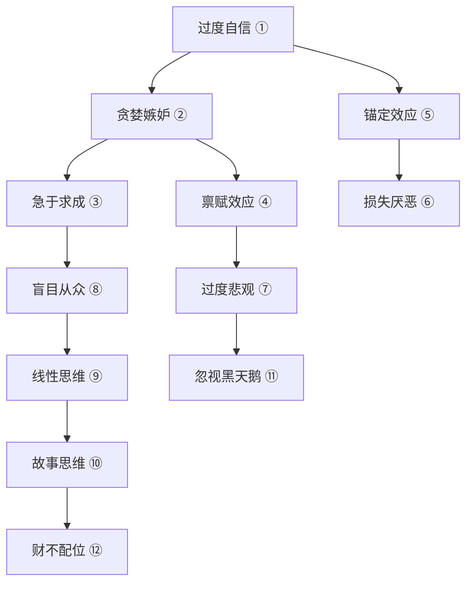

# 59《财富是认知的变现》深度解读（详细版）

> **副题：舒泰峰——"12 个认知陷阱 × 12 篇老子对话巴菲特"：为什么你的财富边界，就是你认知的边界**
>
> 作者：舒泰峰，重阳投资合伙人，前资深媒体人。本书是他在重阳投资重新构建投资认知的结晶——**12 个认知陷阱（行为金融学） × 12 个破解之道（价值投资智慧） × 12 篇老子与巴菲特的跨时空对话（中国传统智慧）**，三根柱子撑起一套完整的"认知投资学"。
>
> **核心定位**：与其说这是一本投资书，不如说是一本"投资心理学"——股市真正的战场不在 K 线图，而在你自己的大脑里。"**财富是认知的变现，破财是认知的沦陷。**"与 [[57《散户的最后一课》深度解读（详细版）|57 号林皓墨]]（散户的生存困境）和 [[42《逆向致胜》深度解读（详细版）|42 号卜建业]]（佛道双修投资）形成"心法三重"——57 认清楚位置、42 修心性、59 修补认知漏洞。

---

## 📖 全书核心框架：12 个认知陷阱 → 12 个破解之道

| # | 认知陷阱 | 行为金融学机制 | 破解之道 | 老子智慧 | 巴菲特智慧 |
|---|---------|-------------|---------|---------|----------|
| 1 | **过度自信** | 高估自己的判断力 | 自知者明 | "知人者智，自知者明" | 能力圈——"只做完全明白的事" |
| 2 | **贪婪与嫉妒** | 看到别人赚钱就急 | 理性自律 | "胜人者有力，自胜者强" | "投资必须是理性的" |
| 3 | **急于求成** | 渴望立竿见影 | 长期主义 | "大器晚成，大音希声" | 持股期限=永远 |
| 4 | **禀赋效应** | 自己拥有的东西潜意识放大价值 | 安全边际 | "保此道者，不欲盈" | 建桥承重3万磅只让通1万磅的车 |
| 5 | **锚定效应** | 被一个价格锚住之后无法调整 | 变亦不变 | "万物并作，吾以观复" | 股市=称重机，长期必然回归价值 |
| 6 | **损失厌恶** | 亏损的痛苦×2于盈利的快乐 | 未来思维 | "不失其所者久" | 买入=假设明天交易所关5年 |
| 7 | **过度悲观** | 恐惧常常大于危险本身 | 逆向思维 | "俗人昭昭，我独昏昏" | 别人恐惧时贪婪 |
| 8 | **盲目从众** | 随大流的安全感 | 独立精神 | "少则得，多则惑" | 20个洞的卡片——一生只做20次投资 |
| 9 | **线性思维** | 用过去的趋势推演未来 | 周期思维 | "反者道之动" | 霍华德·马克斯钟摆理论 |
| 10 | **故事思维** | 被好故事迷惑而忽视概率 | 概率思维 | "致虚极，守静笃" | "找一英尺高的栏杆跨过去" |
| 11 | **忽视黑天鹅** | 以为均值回归是对称的 | 谨慎小心 | "为之于未有，治之于未乱" | 先胜后战/赢了再打 |
| 12 | **财不配位** | 有钱了人变坏→钱跑了 | 财富善念 | "上善若水" | 爱财而不贪财/正直善良 |

---

## 📑 目录

- [[#第1章 十二个认知陷阱一个战壕——舒泰峰的核心发现|第1章 核心发现]]
- [[#第2章 老子对话巴菲特：12 篇跨时空对话精华|第2章 老子对话巴菲特精华]]
- [[#第3章 认知整改清单|第3章 认知整改清单]]
- [[#总结|总结]]
- [[#附录|附录]]

---

## 第1章 十二个认知陷阱一个战壕——舒泰峰的核心发现

> "投资是一场反人性的游戏。"——裘国根（重阳投资创始人）

### 1.1 为什么有知识的人炒股依然亏钱

| 舒泰峰的观点 | 解释 |
|------------|------|
| 知识≠投资知识 | "博学的杂家还是精通某个领域的专家，都无法确保投资成功" |
| 投资有自己的认知体系 | 如果没有掌握这套体系——"有知识的小白"同样会沦为"韭菜" |
| 认知差距=财富差距 | "一个人永远赚不到超出他认知范围的钱" |

### 1.2 十二个陷阱的分类与内在逻辑

十二个认知陷阱不是孤立的——它们组成一个大系统：

**三个核心层**：

| 层级 | 陷阱 | 关系 |
|------|------|------|
| ①→② 自我认知层 | 过度自信→贪婪嫉妒 | 对自己太有信心，看到别人赚钱就受不了 |
| ③→⑧ 决策执行层 | 急于求成→禀赋效应→锚定→厌恶损失→悲观→从众 | 一个错误引向下一个 |
| ⑨→⑫ 思维框架层 | 线性思维→故事思维→忽视黑天鹅→财不配位 | 思维模式的根本缺陷 |

### 1.3 三个最致命的陷阱（深度拆解）

**① 过度自信——"机关算尽太聪明"**

| 机制 | 投资表现 |
|------|---------|
| 80%的司机认为自己的驾驶技术高于平均水平 | 80%的投资者认为自己的选股能力高于平均水平 |
| 成功时归因于自己能力 | "我好厉害，选对了" |
| 失败时归因于外部因素 | "这个市场太差了，不怪我" |
| 控制幻觉——比实际拥有的控制力高出很多 | 频繁交易——"我能抓住每一个波动" |

> 巴菲特破解法："对大多数投资者来说，重要的不是他们知道什么，而是他们能在多大程度上认识到自己不懂什么。风险恰恰来源于你不知道你在做什么。"

**⑥ 损失厌恶——"煮熟的鸭子飞走了"**

| 机制 | 投资表现 |
|------|---------|
| 亏损100元的痛苦≈盈利200元的快乐 | 亏了死扛——"等回本再卖" |
| "售盈持亏"——早卖盈利股、死抱亏损股 | 与 057 林皓墨"鸵鸟心态"完全同频 |
| 抛售时过度悲观→卖在底部 | "跌这么多了还会涨回来吗？不会了……卖了算了" |

> 舒泰峰的破解法：用"未来思维"替代"过去思维"——不要想"我从 10 元买入现在跌到 8 元亏了多少钱"，要想"这只股票从现在 8 元到未来能值多少钱"。

**⑨ 线性思维——"幸福且只幸福了 1000 天的火鸡"**

> 最有名的比喻来自罗素：一只火鸡被农场主每天喂食，1000 天过去了，它用线性思维得出"明天还会被喂食"的结论。第 1001 天是感恩节——农场主拿着刀走进来。

| 线性思维的表现 | 投资后果 |
|------------|---------|
| "这只股票涨了 3 年，还会继续涨" | 2021 年高位追买茅台 |
| "我的这个策略连续盈利 10 次，肯定没问题" | 忽略黑天鹅→一次亏完所有利润 |
| "房价永远不会跌" | 2022—2024 年地产股重灾区 |

> 老子破解法："反者道之动"——事物必然向相反方向运动。涨多了必跌，跌多了必涨。周期是宇宙的根本规律。

---

## 第2章 老子对话巴菲特：12 篇跨时空对话精华

### 2.1 这本书最独特的创意

> 舒泰峰为每一个认知陷阱都配了一篇"老子 × 巴菲特 × 芒格"的跨时空对话。三个人坐在一起谈投资——老子用道德经解释投资哲学，巴菲特和芒格用案例验证。

### 2.2 12 篇对话的一句话精华

| ROUND | 主题 | 核心金句 |
|-------|------|---------|
| 1 | 自知者明 | 巴菲特："如果你是池塘里的鸭子，水面上升了，你以为是自己在上升，其实只是水的功劳。" |
| 2 | 胜人者有力自胜者强 | 老子："克制贪婪与恐惧——靠理性与自律。"巴菲特："任何情况都不会驱使我做出能力圈以外的投资决策。" |
| 3 | 大器晚成 | 巴菲特："拥有一只股票就要和它结婚，不是一夜情。"芒格："我们靠等待赚钱。" |
| 4 | 不欲盈（安全边际） | 老子："正因为没有极致，所以永远充满生机。"巴菲特："不追求抄底——留有余地。" |
| 5 | 万物并作吾以观复 | 老子："变是围绕不变展开的。"巴菲特：2020 没卖航空公司——"老狗也学新技能" |
| 6 | 不失其所者久 | 巴菲特："短期是投票机，长期是称重机。"芒格："找标错赔率的赌局=投资的本质。" |
| 7 | 俗人昭昭我独昏昏 | 老子："与众人反着走。"巴菲特：2008 年 10 月在《纽约时报》写文章说"我在买美国" |
| 8 | 少则得多则惑 | 巴菲特："一生做 20 次投资决策——洞越少的人越富有。"芒格："多元化是对无知的保护。" |
| 9 | 反者道之动 | 老子："有无相生，难易相成——矛盾的对立物相互依存、相互转化。" |
| 10 | 致虚极守静笃 | 巴菲特："我到处找的是我能跨过的一英尺高的栏杆。"芒格："我们靠等待赚钱。" |
| 11 | 为之于未有治之于未乱 | 孙子："胜兵先胜而后求战！"李广 vs 程不识——英雄 vs 不败将军，程不识赢了。 |
| 12 | 上善若水 | 巴菲特："每天早晨我都跳着踢踏舞去上班。"老子："爱财而不贪财，热爱而不沉迷。" |

---

## 第3章 认知整改清单——12 个自我检测问题

舒泰峰的框架可以用来做**投资前的自我审查**：

| # | 自问问题 | 如果答案为"是"→你在犯哪个陷阱 |
|---|---------|--------------------------|
| 1 | "我觉得这次一定是对的" | → 过度自信 |
| 2 | "朋友说他上周赚了 30%，我是不是太保守了？" | → 贪婪嫉妒 |
| 3 | "买了这么久还不涨，我换一只吧" | → 急于求成 |
| 4 | "我的持仓当然比市场上别的股票好" | → 禀赋效应 |
| 5 | "它以前到过 50 元，现在 20 元肯定便宜" | → 锚定效应 |
| 6 | "亏了这么多我要是卖了就真的亏了" | → 损失厌恶 |
| 7 | "这个市场完蛋了，股市就是骗局" | → 过度悲观 |
| 8 | "大家都在买，肯定是对的" | → 盲目从众 |
| 9 | "这个趋势已经持续 3 年了，肯定会继续" | → 线性思维 |
| 10 | "这家公司的故事太感人了，未来一定很伟大" | → 故事思维 |
| 11 | "不会有事的，最坏也就那样" | → 忽视黑天鹅 |
| 12 | "我赚钱了，以后就靠投资为生吧" | → 财不配位 |

---

## 总结：舒泰峰的"认知投资学"完整公式

> **"财富 = 认知 × 时间 × 纪律"**

| 变量 | 内容 |
|------|------|
| 认知 | 修补 12 个认知漏洞→不再被自己的大脑欺骗 |
| 时间 | "大器晚成"——长期主义，放弃立竿见影的幻想 |
| 纪律 | "先胜后战"——先确保不亏，再图赚钱；用老子智慧克制情绪 |

> **"破财是认知的沦陷——你亏的每一分钱，都是你认知漏洞的代价。"**

---

## 附录一 舒泰峰金句精选

> 1. "财富是认知的变现，破财是认知的沦陷。"
> 2. "投资是一场反人性的游戏。"
> 3. "知识是知识，投资知识是投资知识，两者不能直接划等号。"
> 4. "有知识的小白——同样不免沦为韭菜。"
> 5. "如果你是池塘里的鸭子，水面上升了，你以为是自己在上升——其实只是水的功劳。"——巴菲特
> 6. "最重要的是别愚弄你自己——记住，你是最容易被自己愚弄的人。"——芒格
> 7. "拥有一只股票就要和它结婚，不是一夜情。"——巴菲特
> 8. "大器晚成，大音希声。"
> 9. "保此道者，不欲盈——正因为没有极致，所以永远充满生机。"
> 10. "万物并作，吾以观复——变是围绕不变展开的。"
> 11. "反者道之动——事物必然向相反方向运动。"
> 12. "少则得，多则惑——一生只做 20 次投资的人最富有。"
> 13. "胜兵先胜而后求战——先确保不亏，再图赚钱。"
> 14. "我到处找的是我能跨过的一英尺高的栏杆。"——巴菲特
> 15. "多元化只不过是对无知的一种保护。"——巴菲特
> 16. "上善若水——爱财而不贪财，热爱而不沉迷。"

---

## 附录二 舒泰峰与系列大师对照

| 舒泰峰的发现 | 同频大师 |
|------------|---------|
| 过度自信 | 057 林皓墨"散户一判断市场就发笑" |
| 损失厌恶/禀赋效应 | 057 林皓墨"鸵鸟心态""处置效应" |
| 急于求成 | 051 冷眼"慢稳忍" |
| 安全边际（不欲盈） | 028 格雷厄姆/052 林奇"便宜是王道" |
| 逆向思维 | 042 卜建业"逆向致胜" |
| 周期思维（反者道之动） | 053 凌鹏"五上三下" |
| 先胜后战 | 050 雷冰"止损止盈纪律" |
| 上善若水 | 042 卜建业"道眼三宝"/孟岩"成为一个更好的人" |

---

## 附录三 30 秒版

> 1. **12 个陷阱**——过度自信→贪婪嫉妒→急于求成→一连串认知错误
> 2. **破解法**——自知之明/长期主义/安全边际/逆向思维/周期思维/概率思维
> 3. **老子×巴菲特**——中国智慧与价值投资神奇同频：
>    - "反者道之动"=周期回归
>    - "不欲盈"=安全边际
>    - "大器晚成"=长期主义
>    - "先胜后战"=先不亏再赚钱
> 4. **认知=财富边界**——你赚不到超出你认知范围的钱

---

## 附录四 认知陷阱自测表

| 检测 | 问题 | 是→你中招了 |
|------|------|-----------|
| 过度自信 | 你上次预测股市走势对了之后，是否觉得自己的判断力很强？ | 陷阱① |
| 贪婪嫉妒 | 看到别人赚得比你多，你是否想追？ | 陷阱② |
| 急于求成 | 买入后一周不涨，你是否想换股？ | 陷阱③ |
| 禀赋效应 | 你是否觉得自己持有的股票就是比别人的好？ | 陷阱④ |
| 锚定效应 | 你是否因为"从50跌到20"就觉得便宜了？ | 陷阱⑤ |
| 损失厌恶 | 你是否因为亏损了就不愿意卖出？ | 陷阱⑥ |
| 过度悲观 | 市场大跌时，你是否觉得"股市完蛋了"？ | 陷阱⑦ |
| 盲目从众 | 你是否因为大家都在买就跟着买了？ | 陷阱⑧ |
| 线性思维 | 你是否认为"过去涨了三年，肯定还会涨"？ | 陷阱⑨ |
| 故事思维 | 你是否因为一个公司的故事好听就买了？ | 陷阱⑩ |
